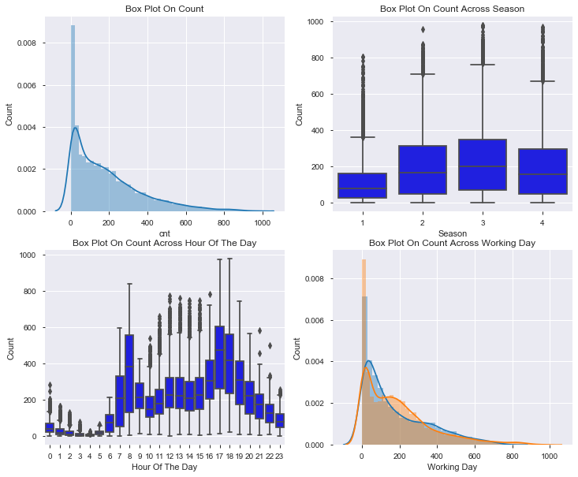
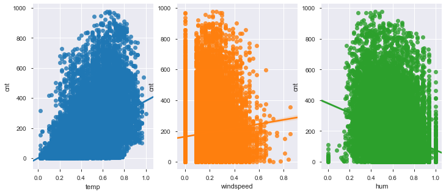
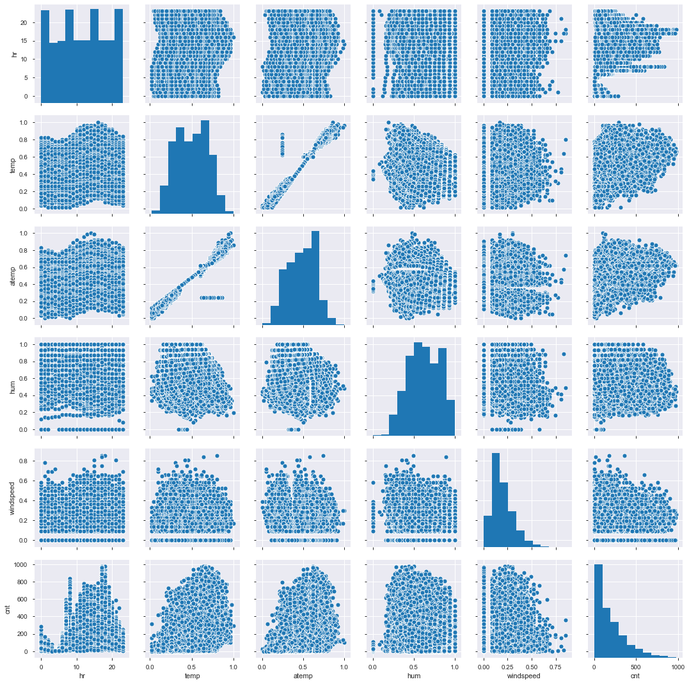
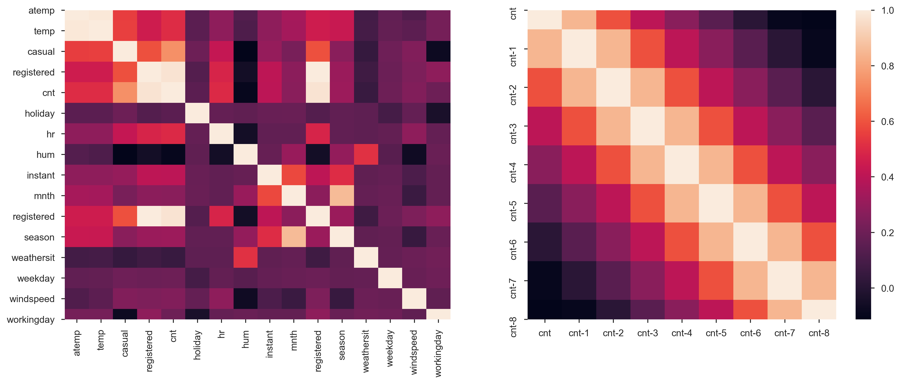
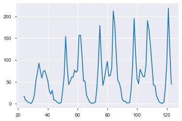
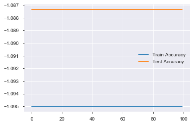
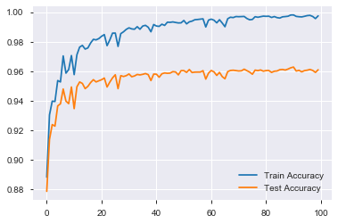
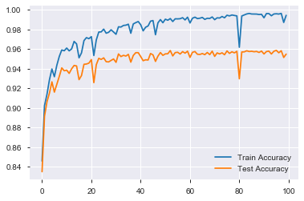

# Comparison of Different Algorithms in Predicting Bike Sharing Hourly Count
##### ML2 Lab 1


```python
%matplotlib inline
import pandas as pd
import pandas_profiling
import tensorflow as tf
from tensorflow import keras
from tensorflow.keras import layers
# tf.enable_eager_execution()
from sklearn.metrics import r2_score
import matplotlib.pyplot as plt
import seaborn as sns
```


```python
df=pd.read_csv('hour.csv')
```

## EDA


```python
df.head()
```


<div>
<table border="1" class="dataframe">
  <thead>
    <tr style="text-align: right;">
      <th></th>
      <th>instant</th>
      <th>dteday</th>
      <th>season</th>
      <th>yr</th>
      <th>mnth</th>
      <th>hr</th>
      <th>holiday</th>
      <th>weekday</th>
      <th>workingday</th>
      <th>weathersit</th>
      <th>temp</th>
      <th>atemp</th>
      <th>hum</th>
      <th>windspeed</th>
      <th>casual</th>
      <th>registered</th>
      <th>cnt</th>
    </tr>
  </thead>
  <tbody>
    <tr>
      <th>0</th>
      <td>1</td>
      <td>2011-01-01</td>
      <td>1</td>
      <td>0</td>
      <td>1</td>
      <td>0</td>
      <td>0</td>
      <td>6</td>
      <td>0</td>
      <td>1</td>
      <td>0.24</td>
      <td>0.2879</td>
      <td>0.81</td>
      <td>0.0</td>
      <td>3</td>
      <td>13</td>
      <td>16</td>
    </tr>
    <tr>
      <th>1</th>
      <td>2</td>
      <td>2011-01-01</td>
      <td>1</td>
      <td>0</td>
      <td>1</td>
      <td>1</td>
      <td>0</td>
      <td>6</td>
      <td>0</td>
      <td>1</td>
      <td>0.22</td>
      <td>0.2727</td>
      <td>0.80</td>
      <td>0.0</td>
      <td>8</td>
      <td>32</td>
      <td>40</td>
    </tr>
    <tr>
      <th>2</th>
      <td>3</td>
      <td>2011-01-01</td>
      <td>1</td>
      <td>0</td>
      <td>1</td>
      <td>2</td>
      <td>0</td>
      <td>6</td>
      <td>0</td>
      <td>1</td>
      <td>0.22</td>
      <td>0.2727</td>
      <td>0.80</td>
      <td>0.0</td>
      <td>5</td>
      <td>27</td>
      <td>32</td>
    </tr>
    <tr>
      <th>3</th>
      <td>4</td>
      <td>2011-01-01</td>
      <td>1</td>
      <td>0</td>
      <td>1</td>
      <td>3</td>
      <td>0</td>
      <td>6</td>
      <td>0</td>
      <td>1</td>
      <td>0.24</td>
      <td>0.2879</td>
      <td>0.75</td>
      <td>0.0</td>
      <td>3</td>
      <td>10</td>
      <td>13</td>
    </tr>
    <tr>
      <th>4</th>
      <td>5</td>
      <td>2011-01-01</td>
      <td>1</td>
      <td>0</td>
      <td>1</td>
      <td>4</td>
      <td>0</td>
      <td>6</td>
      <td>0</td>
      <td>1</td>
      <td>0.24</td>
      <td>0.2879</td>
      <td>0.75</td>
      <td>0.0</td>
      <td>0</td>
      <td>1</td>
      <td>1</td>
    </tr>
  </tbody>
</table>
</div>


```python
df.shape
```


    (17379, 17)


```python
df.describe()
```


<div>
<table border="1" class="dataframe">
  <thead>
    <tr style="text-align: right;">
      <th></th>
      <th>instant</th>
      <th>season</th>
      <th>yr</th>
      <th>mnth</th>
      <th>hr</th>
      <th>holiday</th>
      <th>weekday</th>
      <th>workingday</th>
      <th>weathersit</th>
      <th>temp</th>
      <th>atemp</th>
      <th>hum</th>
      <th>windspeed</th>
      <th>casual</th>
      <th>registered</th>
      <th>cnt</th>
    </tr>
  </thead>
  <tbody>
    <tr>
      <th>count</th>
      <td>17379.0000</td>
      <td>17379.000000</td>
      <td>17379.000000</td>
      <td>17379.000000</td>
      <td>17379.000000</td>
      <td>17379.000000</td>
      <td>17379.000000</td>
      <td>17379.000000</td>
      <td>17379.000000</td>
      <td>17379.000000</td>
      <td>17379.000000</td>
      <td>17379.000000</td>
      <td>17379.000000</td>
      <td>17379.000000</td>
      <td>17379.000000</td>
      <td>17379.000000</td>
    </tr>
    <tr>
      <th>mean</th>
      <td>8690.0000</td>
      <td>2.501640</td>
      <td>0.502561</td>
      <td>6.537775</td>
      <td>11.546752</td>
      <td>0.028770</td>
      <td>3.003683</td>
      <td>0.682721</td>
      <td>1.425283</td>
      <td>0.496987</td>
      <td>0.475775</td>
      <td>0.627229</td>
      <td>0.190098</td>
      <td>35.676218</td>
      <td>153.786869</td>
      <td>189.463088</td>
    </tr>
    <tr>
      <th>std</th>
      <td>5017.0295</td>
      <td>1.106918</td>
      <td>0.500008</td>
      <td>3.438776</td>
      <td>6.914405</td>
      <td>0.167165</td>
      <td>2.005771</td>
      <td>0.465431</td>
      <td>0.639357</td>
      <td>0.192556</td>
      <td>0.171850</td>
      <td>0.192930</td>
      <td>0.122340</td>
      <td>49.305030</td>
      <td>151.357286</td>
      <td>181.387599</td>
    </tr>
    <tr>
      <th>min</th>
      <td>1.0000</td>
      <td>1.000000</td>
      <td>0.000000</td>
      <td>1.000000</td>
      <td>0.000000</td>
      <td>0.000000</td>
      <td>0.000000</td>
      <td>0.000000</td>
      <td>1.000000</td>
      <td>0.020000</td>
      <td>0.000000</td>
      <td>0.000000</td>
      <td>0.000000</td>
      <td>0.000000</td>
      <td>0.000000</td>
      <td>1.000000</td>
    </tr>
    <tr>
      <th>25%</th>
      <td>4345.5000</td>
      <td>2.000000</td>
      <td>0.000000</td>
      <td>4.000000</td>
      <td>6.000000</td>
      <td>0.000000</td>
      <td>1.000000</td>
      <td>0.000000</td>
      <td>1.000000</td>
      <td>0.340000</td>
      <td>0.333300</td>
      <td>0.480000</td>
      <td>0.104500</td>
      <td>4.000000</td>
      <td>34.000000</td>
      <td>40.000000</td>
    </tr>
    <tr>
      <th>50%</th>
      <td>8690.0000</td>
      <td>3.000000</td>
      <td>1.000000</td>
      <td>7.000000</td>
      <td>12.000000</td>
      <td>0.000000</td>
      <td>3.000000</td>
      <td>1.000000</td>
      <td>1.000000</td>
      <td>0.500000</td>
      <td>0.484800</td>
      <td>0.630000</td>
      <td>0.194000</td>
      <td>17.000000</td>
      <td>115.000000</td>
      <td>142.000000</td>
    </tr>
    <tr>
      <th>75%</th>
      <td>13034.5000</td>
      <td>3.000000</td>
      <td>1.000000</td>
      <td>10.000000</td>
      <td>18.000000</td>
      <td>0.000000</td>
      <td>5.000000</td>
      <td>1.000000</td>
      <td>2.000000</td>
      <td>0.660000</td>
      <td>0.621200</td>
      <td>0.780000</td>
      <td>0.253700</td>
      <td>48.000000</td>
      <td>220.000000</td>
      <td>281.000000</td>
    </tr>
    <tr>
      <th>max</th>
      <td>17379.0000</td>
      <td>4.000000</td>
      <td>1.000000</td>
      <td>12.000000</td>
      <td>23.000000</td>
      <td>1.000000</td>
      <td>6.000000</td>
      <td>1.000000</td>
      <td>4.000000</td>
      <td>1.000000</td>
      <td>1.000000</td>
      <td>1.000000</td>
      <td>0.850700</td>
      <td>367.000000</td>
      <td>886.000000</td>
      <td>977.000000</td>
    </tr>
  </tbody>
</table>
</div>


```python
df.profile_report(style={'full_width':True})
```


                <iframe
                    width="100%"
                    height="800px"
                    srcdoc="&lt;!doctype html&gt;
&lt;html lang=&quot;en&quot;&gt;
&lt;head&gt;
    &lt;meta charset=&quot;utf-8&quot;&gt;
    &lt;meta name=&quot;viewport&quot; content=&quot;width=device-width, initial-scale=1, shrink-to-fit=no&quot;&gt;
    &lt;meta name=&quot;description&quot; content=&quot;Profile report generated with the `pandas-profiling` Python package&quot;&gt;
    &lt;meta name=&quot;author&quot; content=&quot;Jos Polfliet, Simon Brugman and the open source community.&quot;&gt;
    &lt;meta name=&quot;generator&quot; content=&quot;Pandas Profiling 2.3.0&quot; /&gt;
    &lt;meta name=&quot;url&quot; content=&quot;https://github.com/pandas-profiling/pandas-profiling&quot;&gt;

    &lt;title&gt;Pandas Profiling Report&lt;/title&gt;

&lt;style&gt;
/*!
 * Bootstrap v3.3.7 (http://getbootstrap.com)
 * Copyright 2011-2016 Twitter, Inc.
 * Licensed under MIT (https://github.com/twbs/bootstrap/blob/master/LICENSE)
 *//*! normalize.css v3.0.3 | MIT License | github.com/necolas/normalize.css */html{font-family:sans-serif;-webkit-text-size-adjust:100%;-ms-text-size-adjust:100%}body{margin:0}article,aside,details,figcaption,figure,footer,header,hgroup,main,menu,nav,section,summary{display:block}audio,canvas,progress,video{display:inline-block;vertical-align:baseline}audio:not([controls]){display:none;height:0}[hidden],template{display:none}a{background-color:transparent}a:active,a:hover{outline:0}abbr[title]{border-bottom:1px dotted}b,strong{font-weight:700}dfn{font-style:italic}h1{margin:.67em 0;font-size:2em}mark{color:#000;background:#ff0}small{font-size:80%}sub,sup{position:relative;font-size:75%;line-height:0;vertical-align:baseline}sup{top:-.5em}sub{bottom:-.25em}img{border:0}svg:not(:root){overflow:hidden}figure{margin:1em 40px}hr{height:0;-webkit-box-sizing:content-box;-moz-box-sizing:content-box;box-sizing:content-box}pre{overflow:auto}code,kbd,pre,samp{font-family:monospace,monospace;font-size:1em}button,input,optgroup,select,textarea{margin:0;font:inherit;color:inherit}button{overflow:visible}button,select{text-transform:none}button,html input[type=button],input[type=reset],input[type=submit]{-webkit-appearance:button;cursor:pointer}button[disabled],html input[disabled]{cursor:default}button::-moz-focus-inner,input::-moz-focus-inner{padding:0;border:0}input{line-height:normal}input[type=checkbox],input[type=radio]{-webkit-box-sizing:border-box;-moz-box-sizing:border-box;box-sizing:border-box;padding:0}input[type=number]::-webkit-inner-spin-button,input[type=number]::-webkit-outer-spin-button{height:auto}input[type=search]{-webkit-box-sizing:content-box;-moz-box-sizing:content-box;box-sizing:content-box;-webkit-appearance:textfield}input[type=search]::-webkit-search-cancel-button,input[type=search]::-webkit-search-decoration{-webkit-appearance:none}fieldset{padding:.35em .625em .75em;margin:0 2px;border:1px solid silver}legend{padding:0;border:0}textarea{overflow:auto}optgroup{font-weight:700}table{border-spacing:0;border-collapse:collapse}td,th{padding:0}/*! Source: https://github.com/h5bp/html5-boilerplate/blob/master/src/css/main.css */@media print{*,:after,:before{color:#000!important;text-shadow:none!important;background:0 0!important;-webkit-box-shadow:none!important;box-shadow:none!important}a,a:visited{text-decoration:underline}a[href]:after{content:&quot; (&quot; attr(href) &quot;)&quot;}abbr[title]:after{content:&quot; (&quot; attr(title) &quot;)&quot;}a[href^=&quot;javascript:&quot;]:after,a[href^=&quot;#&quot;]:after{content:&quot;&quot;}blockquote,pre{border:1px solid #999;page-break-inside:avoid}thead{display:table-header-group}img,tr{page-break-inside:avoid}img{max-width:100%!important}h2,h3,p{orphans:3;widows:3}h2,h3{page-break-after:avoid}.navbar{display:none}.btn&gt;.caret,.dropup&gt;.btn&gt;.caret{border-top-color:#000!important}.label{border:1px solid #000}.table{border-collapse:collapse!important}.table td,.table th{background-color:#fff!important}.table-bordered td,.table-bordered th{border:1px solid #ddd!important}}@font-face{font-family:&#x27;Glyphicons Halflings&#x27;;src:url(../fonts/glyphicons-halflings-regular.eot);src:url(../fonts/glyphicons-halflings-regular.eot?#iefix) format(&#x27;embedded-opentype&#x27;),url(../fonts/glyphicons-halflings-regular.woff2) format(&#x27;woff2&#x27;),url(../fonts/glyphicons-halflings-regular.woff) format(&#x27;woff&#x27;),url(../fonts/glyphicons-halflings-regular.ttf) format(&#x27;truetype&#x27;),url(../fonts/glyphicons-halflings-regular.svg#glyphicons_halflingsregular) format(&#x27;svg&#x27;)}.glyphicon{position:relative;top:1px;display:inline-block;font-family:&#x27;Glyphicons Halflings&#x27;;font-style:normal;font-weight:400;line-height:1;-webkit-font-smoothing:antialiased;-moz-osx-font-smoothing:grayscale}.glyphicon-asterisk:before{content:&quot;\002a&quot;}.glyphicon-plus:before{content:&quot;\002b&quot;}.glyphicon-eur:before,.glyphicon-euro:before{content:&quot;\20ac&quot;}.glyphicon-minus:before{content:&quot;\2212&quot;}.glyphicon-cloud:before{content:&quot;\2601&quot;}.glyphicon-envelope:before{content:&quot;\2709&quot;}.glyphicon-pencil:before{content:&quot;\270f&quot;}.glyphicon-glass:before{content:&quot;\e001&quot;}.glyphicon-music:before{content:&quot;\e002&quot;}.glyphicon-search:before{content:&quot;\e003&quot;}.glyphicon-heart:before{content:&quot;\e005&quot;}.glyphicon-star:before{content:&quot;\e006&quot;}.glyphicon-star-empty:before{content:&quot;\e007&quot;}.glyphicon-user:before{content:&quot;\e008&quot;}.glyphicon-film:before{content:&quot;\e009&quot;}.glyphicon-th-large:before{content:&quot;\e010&quot;}.glyphicon-th:before{content:&quot;\e011&quot;}.glyphicon-th-list:before{content:&quot;\e012&quot;}.glyphicon-ok:before{content:&quot;\e013&quot;}.glyphicon-remove:before{content:&quot;\e014&quot;}.glyphicon-zoom-in:before{content:&quot;\e015&quot;}.glyphicon-zoom-out:before{content:&quot;\e016&quot;}.glyphicon-off:before{content:&quot;\e017&quot;}.glyphicon-signal:before{content:&quot;\e018&quot;}.glyphicon-cog:before{content:&quot;\e019&quot;}.glyphicon-trash:before{content:&quot;\e020&quot;}.glyphicon-home:before{content:&quot;\e021&quot;}.glyphicon-file:before{content:&quot;\e022&quot;}.glyphicon-time:before{content:&quot;\e023&quot;}.glyphicon-road:before{content:&quot;\e024&quot;}.glyphicon-download-alt:before{content:&quot;\e025&quot;}.glyphicon-download:before{content:&quot;\e026&quot;}.glyphicon-upload:before{content:&quot;\e027&quot;}.glyphicon-inbox:before{content:&quot;\e028&quot;}.glyphicon-play-circle:before{content:&quot;\e029&quot;}.glyphicon-repeat:before{content:&quot;\e030&quot;}.glyphicon-refresh:before{content:&quot;\e031&quot;}.glyphicon-list-alt:before{content:&quot;\e032&quot;}.glyphicon-lock:before{content:&quot;\e033&quot;}.glyphicon-flag:before{content:&quot;\e034&quot;}.glyphicon-headphones:before{content:&quot;\e035&quot;}.glyphicon-volume-off:before{content:&quot;\e036&quot;}.glyphicon-volume-down:before{content:&quot;\e037&quot;}.glyphicon-volume-up:before{content:&quot;\e038&quot;}.glyphicon-qrcode:before{content:&quot;\e039&quot;}.glyphicon-barcode:before{content:&quot;\e040&quot;}.glyphicon-tag:before{content:&quot;\e041&quot;}.glyphicon-tags:before{content:&quot;\e042&quot;}.glyphicon-book:before{content:&quot;\e043&quot;}.glyphicon-bookmark:before{content:&quot;\e044&quot;}.glyphicon-print:before{content:&quot;\e045&quot;}.glyphicon-camera:before{content:&quot;\e046&quot;}.glyphicon-font:before{content:&quot;\e047&quot;}.glyphicon-bold:before{content:&quot;\e048&quot;}.glyphicon-italic:before{content:&quot;\e049&quot;}.glyphicon-text-height:before{content:&quot;\e050&quot;}.glyphicon-text-width:before{content:&quot;\e051&quot;}.glyphicon-align-left:before{content:&quot;\e052&quot;}.glyphicon-align-center:before{content:&quot;\e053&quot;}.glyphicon-align-right:before{content:&quot;\e054&quot;}.glyphicon-align-justify:before{content:&quot;\e055&quot;}.glyphicon-list:before{content:&quot;\e056&quot;}.glyphicon-indent-left:before{content:&quot;\e057&quot;}.glyphicon-indent-right:before{content:&quot;\e058&quot;}.glyphicon-facetime-video:before{content:&quot;\e059&quot;}.glyphicon-picture:before{content:&quot;\e060&quot;}.glyphicon-map-marker:before{content:&quot;\e062&quot;}.glyphicon-adjust:before{content:&quot;\e063&quot;}.glyphicon-tint:before{content:&quot;\e064&quot;}.glyphicon-edit:before{content:&quot;\e065&quot;}.glyphicon-share:before{content:&quot;\e066&quot;}.glyphicon-check:before{content:&quot;\e067&quot;}.glyphicon-move:before{content:&quot;\e068&quot;}.glyphicon-step-backward:before{content:&quot;\e069&quot;}.glyphicon-fast-backward:before{content:&quot;\e070&quot;}.glyphicon-backward:before{content:&quot;\e071&quot;}.glyphicon-play:before{content:&quot;\e072&quot;}.glyphicon-pause:before{content:&quot;\e073&quot;}.glyphicon-stop:before{content:&quot;\e074&quot;}.glyphicon-forward:before{content:&quot;\e075&quot;}.glyphicon-fast-forward:before{content:&quot;\e076&quot;}.glyphicon-step-forward:before{content:&quot;\e077&quot;}.glyphicon-eject:before{content:&quot;\e078&quot;}.glyphicon-chevron-left:before{content:&quot;\e079&quot;}.glyphicon-chevron-right:before{content:&quot;\e080&quot;}.glyphicon-plus-sign:before{content:&quot;\e081&quot;}.glyphicon-minus-sign:before{content:&quot;\e082&quot;}.glyphicon-remove-sign:before{content:&quot;\e083&quot;}.glyphicon-ok-sign:before{content:&quot;\e084&quot;}.glyphicon-question-sign:before{content:&quot;\e085&quot;}.glyphicon-info-sign:before{content:&quot;\e086&quot;}.glyphicon-screenshot:before{content:&quot;\e087&quot;}.glyphicon-remove-circle:before{content:&quot;\e088&quot;}.glyphicon-ok-circle:before{content:&quot;\e089&quot;}.glyphicon-ban-circle:before{content:&quot;\e090&quot;}.glyphicon-arrow-left:before{content:&quot;\e091&quot;}.glyphicon-arrow-right:before{content:&quot;\e092&quot;}.glyphicon-arrow-up:before{content:&quot;\e093&quot;}.glyphicon-arrow-down:before{content:&quot;\e094&quot;}.glyphicon-share-alt:before{content:&quot;\e095&quot;}.glyphicon-resize-full:before{content:&quot;\e096&quot;}.glyphicon-resize-small:before{content:&quot;\e097&quot;}.glyphicon-exclamation-sign:before{content:&quot;\e101&quot;}.glyphicon-gift:before{content:&quot;\e102&quot;}.glyphicon-leaf:before{content:&quot;\e103&quot;}.glyphicon-fire:before{content:&quot;\e104&quot;}.glyphicon-eye-open:before{content:&quot;\e105&quot;}.glyphicon-eye-close:before{content:&quot;\e106&quot;}.glyphicon-warning-sign:before{content:&quot;\e107&quot;}.glyphicon-plane:before{content:&quot;\e108&quot;}.glyphicon-calendar:before{content:&quot;\e109&quot;}.glyphicon-random:before{content:&quot;\e110&quot;}.glyphicon-comment:before{content:&quot;\e111&quot;}.glyphicon-magnet:before{content:&quot;\e112&quot;}.glyphicon-chevron-up:before{content:&quot;\e113&quot;}.glyphicon-chevron-down:before{content:&quot;\e114&quot;}.glyphicon-retweet:before{content:&quot;\e115&quot;}.glyphicon-shopping-cart:before{content:&quot;\e116&quot;}.glyphicon-folder-close:before{content:&quot;\e117&quot;}.glyphicon-folder-open:before{content:&quot;\e118&quot;}.glyphicon-resize-vertical:before{content:&quot;\e119&quot;}.glyphicon-resize-horizontal:before{content:&quot;\e120&quot;}.glyphicon-hdd:before{content:&quot;\e121&quot;}.glyphicon-bullhorn:before{content:&quot;\e122&quot;}.glyphicon-bell:before{content:&quot;\e123&quot;}.glyphicon-certificate:before{content:&quot;\e124&quot;}.glyphicon-thumbs-up:before{content:&quot;\e125&quot;}.glyphicon-thumbs-down:before{content:&quot;\e126&quot;}.glyphicon-hand-right:before{content:&quot;\e127&quot;}.glyphicon-hand-left:before{content:&quot;\e128&quot;}.glyphicon-hand-up:before{content:&quot;\e129&quot;}.glyphicon-hand-down:before{content:&quot;\e130&quot;}.glyphicon-circle-arrow-right:before{content:&quot;\e131&quot;}.glyphicon-circle-arrow-left:before{content:&quot;\e132&quot;}.glyphicon-circle-arrow-up:before{content:&quot;\e133&quot;}.glyphicon-circle-arrow-down:before{content:&quot;\e134&quot;}.glyphicon-globe:before{content:&quot;\e135&quot;}.glyphicon-wrench:before{content:&quot;\e136&quot;}.glyphicon-tasks:before{content:&quot;\e137&quot;}.glyphicon-filter:before{content:&quot;\e138&quot;}.glyphicon-briefcase:before{content:&quot;\e139&quot;}.glyphicon-fullscreen:before{content:&quot;\e140&quot;}.glyphicon-dashboard:before{content:&quot;\e141&quot;}.glyphicon-paperclip:before{content:&quot;\e142&quot;}.glyphicon-heart-empty:before{content:&quot;\e143&quot;}.glyphicon-link:before{content:&quot;\e144&quot;}.glyphicon-phone:before{content:&quot;\e145&quot;}.glyphicon-pushpin:before{content:&quot;\e146&quot;}.glyphicon-usd:before{content:&quot;\e148&quot;}.glyphicon-gbp:before{content:&quot;\e149&quot;}.glyphicon-sort:before{content:&quot;\e150&quot;}.glyphicon-sort-by-alphabet:before{content:&quot;\e151&quot;}.glyphicon-sort-by-alphabet-alt:before{content:&quot;\e152&quot;}.glyphicon-sort-by-order:before{content:&quot;\e153&quot;}.glyphicon-sort-by-order-alt:before{content:&quot;\e154&quot;}.glyphicon-sort-by-attributes:before{content:&quot;\e155&quot;}.glyphicon-sort-by-attributes-alt:before{content:&quot;\e156&quot;}.glyphicon-unchecked:before{content:&quot;\e157&quot;}.glyphicon-expand:before{content:&quot;\e158&quot;}.glyphicon-collapse-down:before{content:&quot;\e159&quot;}.glyphicon-collapse-up:before{content:&quot;\e160&quot;}.glyphicon-log-in:before{content:&quot;\e161&quot;}.glyphicon-flash:before{content:&quot;\e162&quot;}.glyphicon-log-out:before{content:&quot;\e163&quot;}.glyphicon-new-window:before{content:&quot;\e164&quot;}.glyphicon-record:before{content:&quot;\e165&quot;}.glyphicon-save:before{content:&quot;\e166&quot;}.glyphicon-open:before{content:&quot;\e167&quot;}.glyphicon-saved:before{content:&quot;\e168&quot;}.glyphicon-import:before{content:&quot;\e169&quot;}.glyphicon-export:before{content:&quot;\e170&quot;}.glyphicon-send:before{content:&quot;\e171&quot;}.glyphicon-floppy-disk:before{content:&quot;\e172&quot;}.glyphicon-floppy-saved:before{content:&quot;\e173&quot;}.glyphicon-floppy-remove:before{content:&quot;\e174&quot;}.glyphicon-floppy-save:before{content:&quot;\e175&quot;}.glyphicon-floppy-open:before{content:&quot;\e176&quot;}.glyphicon-credit-card:before{content:&quot;\e177&quot;}.glyphicon-transfer:before{content:&quot;\e178&quot;}.glyphicon-cutlery:before{content:&quot;\e179&quot;}.glyphicon-header:before{content:&quot;\e180&quot;}.glyphicon-compressed:before{content:&quot;\e181&quot;}.glyphicon-earphone:before{content:&quot;\e182&quot;}.glyphicon-phone-alt:before{content:&quot;\e183&quot;}.glyphicon-tower:before{content:&quot;\e184&quot;}.glyphicon-stats:before{content:&quot;\e185&quot;}.glyphicon-sd-video:before{content:&quot;\e186&quot;}.glyphicon-hd-video:before{content:&quot;\e187&quot;}.glyphicon-subtitles:before{content:&quot;\e188&quot;}.glyphicon-sound-stereo:before{content:&quot;\e189&quot;}.glyphicon-sound-dolby:before{content:&quot;\e190&quot;}.glyphicon-sound-5-1:before{content:&quot;\e191&quot;}.glyphicon-sound-6-1:before{content:&quot;\e192&quot;}.glyphicon-sound-7-1:before{content:&quot;\e193&quot;}.glyphicon-copyright-mark:before{content:&quot;\e194&quot;}.glyphicon-registration-mark:before{content:&quot;\e195&quot;}.glyphicon-cloud-download:before{content:&quot;\e197&quot;}.glyphicon-cloud-upload:before{content:&quot;\e198&quot;}.glyphicon-tree-conifer:before{content:&quot;\e199&quot;}.glyphicon-tree-deciduous:before{content:&quot;\e200&quot;}.glyphicon-cd:before{content:&quot;\e201&quot;}.glyphicon-save-file:before{content:&quot;\e202&quot;}.glyphicon-open-file:before{content:&quot;\e203&quot;}.glyphicon-level-up:before{content:&quot;\e204&quot;}.glyphicon-copy:before{content:&quot;\e205&quot;}.glyphicon-paste:before{content:&quot;\e206&quot;}.glyphicon-alert:before{content:&quot;\e209&quot;}.glyphicon-equalizer:before{content:&quot;\e210&quot;}.glyphicon-king:before{content:&quot;\e211&quot;}.glyphicon-queen:before{content:&quot;\e212&quot;}.glyphicon-pawn:before{content:&quot;\e213&quot;}.glyphicon-bishop:before{content:&quot;\e214&quot;}.glyphicon-knight:before{content:&quot;\e215&quot;}.glyphicon-baby-formula:before{content:&quot;\e216&quot;}.glyphicon-tent:before{content:&quot;\26fa&quot;}.glyphicon-blackboard:before{content:&quot;\e218&quot;}.glyphicon-bed:before{content:&quot;\e219&quot;}.glyphicon-apple:before{content:&quot;\f8ff&quot;}.glyphicon-erase:before{content:&quot;\e221&quot;}.glyphicon-hourglass:before{content:&quot;\231b&quot;}.glyphicon-lamp:before{content:&quot;\e223&quot;}.glyphicon-duplicate:before{content:&quot;\e224&quot;}.glyphicon-piggy-bank:before{content:&quot;\e225&quot;}.glyphicon-scissors:before{content:&quot;\e226&quot;}.glyphicon-bitcoin:before{content:&quot;\e227&quot;}.glyphicon-btc:before{content:&quot;\e227&quot;}.glyphicon-xbt:before{content:&quot;\e227&quot;}.glyphicon-yen:before{content:&quot;\00a5&quot;}.glyphicon-jpy:before{content:&quot;\00a5&quot;}.glyphicon-ruble:before{content:&quot;\20bd&quot;}.glyphicon-rub:before{content:&quot;\20bd&quot;}.glyphicon-scale:before{content:&quot;\e230&quot;}.glyphicon-ice-lolly:before{content:&quot;\e231&quot;}.glyphicon-ice-lolly-tasted:before{content:&quot;\e232&quot;}.glyphicon-education:before{content:&quot;\e233&quot;}.glyphicon-option-horizontal:before{content:&quot;\e234&quot;}.glyphicon-option-vertical:before{content:&quot;\e235&quot;}.glyphicon-menu-hamburger:before{content:&quot;\e236&quot;}.glyphicon-modal-window:before{content:&quot;\e237&quot;}.glyphicon-oil:before{content:&quot;\e238&quot;}.glyphicon-grain:before{content:&quot;\e239&quot;}.glyphicon-sunglasses:before{content:&quot;\e240&quot;}.glyphicon-text-size:before{content:&quot;\e241&quot;}.glyphicon-text-color:before{content:&quot;\e242&quot;}.glyphicon-text-background:before{content:&quot;\e243&quot;}.glyphicon-object-align-top:before{content:&quot;\e244&quot;}.glyphicon-object-align-bottom:before{content:&quot;\e245&quot;}.glyphicon-object-align-horizontal:before{content:&quot;\e246&quot;}.glyphicon-object-align-left:before{content:&quot;\e247&quot;}.glyphicon-object-align-vertical:before{content:&quot;\e248&quot;}.glyphicon-object-align-right:before{content:&quot;\e249&quot;}.glyphicon-triangle-right:before{content:&quot;\e250&quot;}.glyphicon-triangle-left:before{content:&quot;\e251&quot;}.glyphicon-triangle-bottom:before{content:&quot;\e252&quot;}.glyphicon-triangle-top:before{content:&quot;\e253&quot;}.glyphicon-console:before{content:&quot;\e254&quot;}.glyphicon-superscript:before{content:&quot;\e255&quot;}.glyphicon-subscript:before{content:&quot;\e256&quot;}.glyphicon-menu-left:before{content:&quot;\e257&quot;}.glyphicon-menu-right:before{content:&quot;\e258&quot;}.glyphicon-menu-down:before{content:&quot;\e259&quot;}.glyphicon-menu-up:before{content:&quot;\e260&quot;}*{-webkit-box-sizing:border-box;-moz-box-sizing:border-box;box-sizing:border-box}:after,:before{-webkit-box-sizing:border-box;-moz-box-sizing:border-box;box-sizing:border-box}html{font-size:10px;-webkit-tap-highlight-color:rgba(0,0,0,0)}body{font-family:&quot;Helvetica Neue&quot;,Helvetica,Arial,sans-serif;font-size:14px;line-height:1.42857143;color:#333;background-color:#fff}button,input,select,textarea{font-family:inherit;font-size:inherit;line-height:inherit}a{color:#337ab7;text-decoration:none}a:focus,a:hover{color:#23527c;text-decoration:underline}a:focus{outline:5px auto -webkit-focus-ring-color;outline-offset:-2px}figure{margin:0}img{vertical-align:middle}.carousel-inner&gt;.item&gt;a&gt;img,.carousel-inner&gt;.item&gt;img,.img-responsive,.thumbnail a&gt;img,.thumbnail&gt;img{display:block;max-width:100%;height:auto}.img-rounded{border-radius:6px}.img-thumbnail{display:inline-block;max-width:100%;height:auto;padding:4px;line-height:1.42857143;background-color:#fff;border:1px solid #ddd;border-radius:4px;-webkit-transition:all .2s ease-in-out;-o-transition:all .2s ease-in-out;transition:all .2s ease-in-out}.img-circle{border-radius:50%}hr{margin-top:20px;margin-bottom:20px;border:0;border-top:1px solid #eee}.sr-only{position:absolute;width:1px;height:1px;padding:0;margin:-1px;overflow:hidden;clip:rect(0,0,0,0);border:0}.sr-only-focusable:active,.sr-only-focusable:focus{position:static;width:auto;height:auto;margin:0;overflow:visible;clip:auto}[role=button]{cursor:pointer}.h1,.h2,.h3,.h4,.h5,.h6,h1,h2,h3,h4,h5,h6{font-family:inherit;font-weight:500;line-height:1.1;color:inherit}.h1 .small,.h1 small,.h2 .small,.h2 small,.h3 .small,.h3 small,.h4 .small,.h4 small,.h5 .small,.h5 small,.h6 .small,.h6 small,h1 .small,h1 small,h2 .small,h2 small,h3 .small,h3 small,h4 .small,h4 small,h5 .small,h5 small,h6 .small,h6 small{font-weight:400;line-height:1;color:#777}.h1,.h2,.h3,h1,h2,h3{margin-top:20px;margin-bottom:10px}.h1 .small,.h1 small,.h2 .small,.h2 small,.h3 .small,.h3 small,h1 .small,h1 small,h2 .small,h2 small,h3 .small,h3 small{font-size:65%}.h4,.h5,.h6,h4,h5,h6{margin-top:10px;margin-bottom:10px}.h4 .small,.h4 small,.h5 .small,.h5 small,.h6 .small,.h6 small,h4 .small,h4 small,h5 .small,h5 small,h6 .small,h6 small{font-size:75%}.h1,h1{font-size:36px}.h2,h2{font-size:30px}.h3,h3{font-size:24px}.h4,h4{font-size:18px}.h5,h5{font-size:14px}.h6,h6{font-size:12px}p{margin:0 0 10px}.lead{margin-bottom:20px;font-size:16px;font-weight:300;line-height:1.4}@media (min-width:768px){.lead{font-size:21px}}.small,small{font-size:85%}.mark,mark{padding:.2em;background-color:#fcf8e3}.text-left{text-align:left}.text-right{text-align:right}.text-center{text-align:center}.text-justify{text-align:justify}.text-nowrap{white-space:nowrap}.text-lowercase{text-transform:lowercase}.text-uppercase{text-transform:uppercase}.text-capitalize{text-transform:capitalize}.text-muted{color:#777}.text-primary{color:#337ab7}a.text-primary:focus,a.text-primary:hover{color:#286090}.text-success{color:#3c763d}a.text-success:focus,a.text-success:hover{color:#2b542c}.text-info{color:#31708f}a.text-info:focus,a.text-info:hover{color:#245269}.text-warning{color:#8a6d3b}a.text-warning:focus,a.text-warning:hover{color:#66512c}.text-danger{color:#a94442}a.text-danger:focus,a.text-danger:hover{color:#843534}.bg-primary{color:#fff;background-color:#337ab7}a.bg-primary:focus,a.bg-primary:hover{background-color:#286090}.bg-success{background-color:#dff0d8}a.bg-success:focus,a.bg-success:hover{background-color:#c1e2b3}.bg-info{background-color:#d9edf7}a.bg-info:focus,a.bg-info:hover{background-color:#afd9ee}.bg-warning{background-color:#fcf8e3}a.bg-warning:focus,a.bg-warning:hover{background-color:#f7ecb5}.bg-danger{background-color:#f2dede}a.bg-danger:focus,a.bg-danger:hover{background-color:#e4b9b9}.page-header{padding-bottom:9px;margin:40px 0 20px;border-bottom:1px solid #eee}ol,ul{margin-top:0;margin-bottom:10px}ol ol,ol ul,ul ol,ul ul{margin-bottom:0}.list-unstyled{padding-left:0;list-style:none}.list-inline{padding-left:0;margin-left:-5px;list-style:none}.list-inline&gt;li{display:inline-block;padding-right:5px;padding-left:5px}dl{margin-top:0;margin-bottom:20px}dd,dt{line-height:1.42857143}dt{font-weight:700}dd{margin-left:0}@media (min-width:768px){.dl-horizontal dt{float:left;width:160px;overflow:hidden;clear:left;text-align:right;text-overflow:ellipsis;white-space:nowrap}.dl-horizontal dd{margin-left:180px}}abbr[data-original-title],abbr[title]{cursor:help;border-bottom:1px dotted #777}.initialism{font-size:90%;text-transform:uppercase}blockquote{padding:10px 20px;margin:0 0 20px;font-size:17.5px;border-left:5px solid #eee}blockquote ol:last-child,blockquote p:last-child,blockquote ul:last-child{margin-bottom:0}blockquote .small,blockquote footer,blockquote small{display:block;font-size:80%;line-height:1.42857143;color:#777}blockquote .small:before,blockquote footer:before,blockquote small:before{content:&#x27;\2014 \00A0&#x27;}.blockquote-reverse,blockquote.pull-right{padding-right:15px;padding-left:0;text-align:right;border-right:5px solid #eee;border-left:0}.blockquote-reverse .small:before,.blockquote-reverse footer:before,.blockquote-reverse small:before,blockquote.pull-right .small:before,blockquote.pull-right footer:before,blockquote.pull-right small:before{content:&#x27;&#x27;}.blockquote-reverse .small:after,.blockquote-reverse footer:after,.blockquote-reverse small:after,blockquote.pull-right .small:after,blockquote.pull-right footer:after,blockquote.pull-right small:after{content:&#x27;\00A0 \2014&#x27;}address{margin-bottom:20px;font-style:normal;line-height:1.42857143}code,kbd,pre,samp{font-family:Menlo,Monaco,Consolas,&quot;Courier New&quot;,monospace}code{padding:2px 4px;font-size:90%;color:#c7254e;background-color:#f9f2f4;border-radius:4px}kbd{padding:2px 4px;font-size:90%;color:#fff;background-color:#333;border-radius:3px;-webkit-box-shadow:inset 0 -1px 0 rgba(0,0,0,.25);box-shadow:inset 0 -1px 0 rgba(0,0,0,.25)}kbd kbd{padding:0;font-size:100%;font-weight:700;-webkit-box-shadow:none;box-shadow:none}pre{display:block;padding:9.5px;margin:0 0 10px;font-size:13px;line-height:1.42857143;color:#333;word-break:break-all;word-wrap:break-word;background-color:#f5f5f5;border:1px solid #ccc;border-radius:4px}pre code{padding:0;font-size:inherit;color:inherit;white-space:pre-wrap;background-color:transparent;border-radius:0}.pre-scrollable{max-height:340px;overflow-y:scroll}.container{padding-right:15px;padding-left:15px;margin-right:auto;margin-left:auto}@media (min-width:768px){.container{width:750px}}@media (min-width:992px){.container{width:970px}}@media (min-width:1200px){.container{width:1170px}}.container-fluid{padding-right:15px;padding-left:15px;margin-right:auto;margin-left:auto}.row{margin-right:-15px;margin-left:-15px}.col-lg-1,.col-lg-10,.col-lg-11,.col-lg-12,.col-lg-2,.col-lg-3,.col-lg-4,.col-lg-5,.col-lg-6,.col-lg-7,.col-lg-8,.col-lg-9,.col-md-1,.col-md-10,.col-md-11,.col-md-12,.col-md-2,.col-md-3,.col-md-4,.col-md-5,.col-md-6,.col-md-7,.col-md-8,.col-md-9,.col-sm-1,.col-sm-10,.col-sm-11,.col-sm-12,.col-sm-2,.col-sm-3,.col-sm-4,.col-sm-5,.col-sm-6,.col-sm-7,.col-sm-8,.col-sm-9,.col-xs-1,.col-xs-10,.col-xs-11,.col-xs-12,.col-xs-2,.col-xs-3,.col-xs-4,.col-xs-5,.col-xs-6,.col-xs-7,.col-xs-8,.col-xs-9{position:relative;min-height:1px;padding-right:15px;padding-left:15px}.col-xs-1,.col-xs-10,.col-xs-11,.col-xs-12,.col-xs-2,.col-xs-3,.col-xs-4,.col-xs-5,.col-xs-6,.col-xs-7,.col-xs-8,.col-xs-9{float:left}.col-xs-12{width:100%}.col-xs-11{width:91.66666667%}.col-xs-10{width:83.33333333%}.col-xs-9{width:75%}.col-xs-8{width:66.66666667%}.col-xs-7{width:58.33333333%}.col-xs-6{width:50%}.col-xs-5{width:41.66666667%}.col-xs-4{width:33.33333333%}.col-xs-3{width:25%}.col-xs-2{width:16.66666667%}.col-xs-1{width:8.33333333%}.col-xs-pull-12{right:100%}.col-xs-pull-11{right:91.66666667%}.col-xs-pull-10{right:83.33333333%}.col-xs-pull-9{right:75%}.col-xs-pull-8{right:66.66666667%}.col-xs-pull-7{right:58.33333333%}.col-xs-pull-6{right:50%}.col-xs-pull-5{right:41.66666667%}.col-xs-pull-4{right:33.33333333%}.col-xs-pull-3{right:25%}.col-xs-pull-2{right:16.66666667%}.col-xs-pull-1{right:8.33333333%}.col-xs-pull-0{right:auto}.col-xs-push-12{left:100%}.col-xs-push-11{left:91.66666667%}.col-xs-push-10{left:83.33333333%}.col-xs-push-9{left:75%}.col-xs-push-8{left:66.66666667%}.col-xs-push-7{left:58.33333333%}.col-xs-push-6{left:50%}.col-xs-push-5{left:41.66666667%}.col-xs-push-4{left:33.33333333%}.col-xs-push-3{left:25%}.col-xs-push-2{left:16.66666667%}.col-xs-push-1{left:8.33333333%}.col-xs-push-0{left:auto}.col-xs-offset-12{margin-left:100%}.col-xs-offset-11{margin-left:91.66666667%}.col-xs-offset-10{margin-left:83.33333333%}.col-xs-offset-9{margin-left:75%}.col-xs-offset-8{margin-left:66.66666667%}.col-xs-offset-7{margin-left:58.33333333%}.col-xs-offset-6{margin-left:50%}.col-xs-offset-5{margin-left:41.66666667%}.col-xs-offset-4{margin-left:33.33333333%}.col-xs-offset-3{margin-left:25%}.col-xs-offset-2{margin-left:16.66666667%}.col-xs-offset-1{margin-left:8.33333333%}.col-xs-offset-0{margin-left:0}@media (min-width:768px){.col-sm-1,.col-sm-10,.col-sm-11,.col-sm-12,.col-sm-2,.col-sm-3,.col-sm-4,.col-sm-5,.col-sm-6,.col-sm-7,.col-sm-8,.col-sm-9{float:left}.col-sm-12{width:100%}.col-sm-11{width:91.66666667%}.col-sm-10{width:83.33333333%}.col-sm-9{width:75%}.col-sm-8{width:66.66666667%}.col-sm-7{width:58.33333333%}.col-sm-6{width:50%}.col-sm-5{width:41.66666667%}.col-sm-4{width:33.33333333%}.col-sm-3{width:25%}.col-sm-2{width:16.66666667%}.col-sm-1{width:8.33333333%}.col-sm-pull-12{right:100%}.col-sm-pull-11{right:91.66666667%}.col-sm-pull-10{right:83.33333333%}.col-sm-pull-9{right:75%}.col-sm-pull-8{right:66.66666667%}.col-sm-pull-7{right:58.33333333%}.col-sm-pull-6{right:50%}.col-sm-pull-5{right:41.66666667%}.col-sm-pull-4{right:33.33333333%}.col-sm-pull-3{right:25%}.col-sm-pull-2{right:16.66666667%}.col-sm-pull-1{right:8.33333333%}.col-sm-pull-0{right:auto}.col-sm-push-12{left:100%}.col-sm-push-11{left:91.66666667%}.col-sm-push-10{left:83.33333333%}.col-sm-push-9{left:75%}.col-sm-push-8{left:66.66666667%}.col-sm-push-7{left:58.33333333%}.col-sm-push-6{left:50%}.col-sm-push-5{left:41.66666667%}.col-sm-push-4{left:33.33333333%}.col-sm-push-3{left:25%}.col-sm-push-2{left:16.66666667%}.col-sm-push-1{left:8.33333333%}.col-sm-push-0{left:auto}.col-sm-offset-12{margin-left:100%}.col-sm-offset-11{margin-left:91.66666667%}.col-sm-offset-10{margin-left:83.33333333%}.col-sm-offset-9{margin-left:75%}.col-sm-offset-8{margin-left:66.66666667%}.col-sm-offset-7{margin-left:58.33333333%}.col-sm-offset-6{margin-left:50%}.col-sm-offset-5{margin-left:41.66666667%}.col-sm-offset-4{margin-left:33.33333333%}.col-sm-offset-3{margin-left:25%}.col-sm-offset-2{margin-left:16.66666667%}.col-sm-offset-1{margin-left:8.33333333%}.col-sm-offset-0{margin-left:0}}@media (min-width:992px){.col-md-1,.col-md-10,.col-md-11,.col-md-12,.col-md-2,.col-md-3,.col-md-4,.col-md-5,.col-md-6,.col-md-7,.col-md-8,.col-md-9{float:left}.col-md-12{width:100%}.col-md-11{width:91.66666667%}.col-md-10{width:83.33333333%}.col-md-9{width:75%}.col-md-8{width:66.66666667%}.col-md-7{width:58.33333333%}.col-md-6{width:50%}.col-md-5{width:41.66666667%}.col-md-4{width:33.33333333%}.col-md-3{width:25%}.col-md-2{width:16.66666667%}.col-md-1{width:8.33333333%}.col-md-pull-12{right:100%}.col-md-pull-11{right:91.66666667%}.col-md-pull-10{right:83.33333333%}.col-md-pull-9{right:75%}.col-md-pull-8{right:66.66666667%}.col-md-pull-7{right:58.33333333%}.col-md-pull-6{right:50%}.col-md-pull-5{right:41.66666667%}.col-md-pull-4{right:33.33333333%}.col-md-pull-3{right:25%}.col-md-pull-2{right:16.66666667%}.col-md-pull-1{right:8.33333333%}.col-md-pull-0{right:auto}.col-md-push-12{left:100%}.col-md-push-11{left:91.66666667%}.col-md-push-10{left:83.33333333%}.col-md-push-9{left:75%}.col-md-push-8{left:66.66666667%}.col-md-push-7{left:58.33333333%}.col-md-push-6{left:50%}.col-md-push-5{left:41.66666667%}.col-md-push-4{left:33.33333333%}.col-md-push-3{left:25%}.col-md-push-2{left:16.66666667%}.col-md-push-1{left:8.33333333%}.col-md-push-0{left:auto}.col-md-offset-12{margin-left:100%}.col-md-offset-11{margin-left:91.66666667%}.col-md-offset-10{margin-left:83.33333333%}.col-md-offset-9{margin-left:75%}.col-md-offset-8{margin-left:66.66666667%}.col-md-offset-7{margin-left:58.33333333%}.col-md-offset-6{margin-left:50%}.col-md-offset-5{margin-left:41.66666667%}.col-md-offset-4{margin-left:33.33333333%}.col-md-offset-3{margin-left:25%}.col-md-offset-2{margin-left:16.66666667%}.col-md-offset-1{margin-left:8.33333333%}.col-md-offset-0{margin-left:0}}@media (min-width:1200px){.col-lg-1,.col-lg-10,.col-lg-11,.col-lg-12,.col-lg-2,.col-lg-3,.col-lg-4,.col-lg-5,.col-lg-6,.col-lg-7,.col-lg-8,.col-lg-9{float:left}.col-lg-12{width:100%}.col-lg-11{width:91.66666667%}.col-lg-10{width:83.33333333%}.col-lg-9{width:75%}.col-lg-8{width:66.66666667%}.col-lg-7{width:58.33333333%}.col-lg-6{width:50%}.col-lg-5{width:41.66666667%}.col-lg-4{width:33.33333333%}.col-lg-3{width:25%}.col-lg-2{width:16.66666667%}.col-lg-1{width:8.33333333%}.col-lg-pull-12{right:100%}.col-lg-pull-11{right:91.66666667%}.col-lg-pull-10{right:83.33333333%}.col-lg-pull-9{right:75%}.col-lg-pull-8{right:66.66666667%}.col-lg-pull-7{right:58.33333333%}.col-lg-pull-6{right:50%}.col-lg-pull-5{right:41.66666667%}.col-lg-pull-4{right:33.33333333%}.col-lg-pull-3{right:25%}.col-lg-pull-2{right:16.66666667%}.col-lg-pull-1{right:8.33333333%}.col-lg-pull-0{right:auto}.col-lg-push-12{left:100%}.col-lg-push-11{left:91.66666667%}.col-lg-push-10{left:83.33333333%}.col-lg-push-9{left:75%}.col-lg-push-8{left:66.66666667%}.col-lg-push-7{left:58.33333333%}.col-lg-push-6{left:50%}.col-lg-push-5{left:41.66666667%}.col-lg-push-4{left:33.33333333%}.col-lg-push-3{left:25%}.col-lg-push-2{left:16.66666667%}.col-lg-push-1{left:8.33333333%}.col-lg-push-0{left:auto}.col-lg-offset-12{margin-left:100%}.col-lg-offset-11{margin-left:91.66666667%}.col-lg-offset-10{margin-left:83.33333333%}.col-lg-offset-9{margin-left:75%}.col-lg-offset-8{margin-left:66.66666667%}.col-lg-offset-7{margin-left:58.33333333%}.col-lg-offset-6{margin-left:50%}.col-lg-offset-5{margin-left:41.66666667%}.col-lg-offset-4{margin-left:33.33333333%}.col-lg-offset-3{margin-left:25%}.col-lg-offset-2{margin-left:16.66666667%}.col-lg-offset-1{margin-left:8.33333333%}.col-lg-offset-0{margin-left:0}}table{background-color:transparent}caption{padding-top:8px;padding-bottom:8px;color:#777;text-align:left}th{text-align:left}.table{width:100%;max-width:100%;margin-bottom:20px}.table&gt;tbody&gt;tr&gt;td,.table&gt;tbody&gt;tr&gt;th,.table&gt;tfoot&gt;tr&gt;td,.table&gt;tfoot&gt;tr&gt;th,.table&gt;thead&gt;tr&gt;td,.table&gt;thead&gt;tr&gt;th{padding:8px;line-height:1.42857143;vertical-align:top;border-top:1px solid #ddd}.table&gt;thead&gt;tr&gt;th{vertical-align:bottom;border-bottom:2px solid #ddd}.table&gt;caption+thead&gt;tr:first-child&gt;td,.table&gt;caption+thead&gt;tr:first-child&gt;th,.table&gt;colgroup+thead&gt;tr:first-child&gt;td,.table&gt;colgroup+thead&gt;tr:first-child&gt;th,.table&gt;thead:first-child&gt;tr:first-child&gt;td,.table&gt;thead:first-child&gt;tr:first-child&gt;th{border-top:0}.table&gt;tbody+tbody{border-top:2px solid #ddd}.table .table{background-color:#fff}.table-condensed&gt;tbody&gt;tr&gt;td,.table-condensed&gt;tbody&gt;tr&gt;th,.table-condensed&gt;tfoot&gt;tr&gt;td,.table-condensed&gt;tfoot&gt;tr&gt;th,.table-condensed&gt;thead&gt;tr&gt;td,.table-condensed&gt;thead&gt;tr&gt;th{padding:5px}.table-bordered{border:1px solid #ddd}.table-bordered&gt;tbody&gt;tr&gt;td,.table-bordered&gt;tbody&gt;tr&gt;th,.table-bordered&gt;tfoot&gt;tr&gt;td,.table-bordered&gt;tfoot&gt;tr&gt;th,.table-bordered&gt;thead&gt;tr&gt;td,.table-bordered&gt;thead&gt;tr&gt;th{border:1px solid #ddd}.table-bordered&gt;thead&gt;tr&gt;td,.table-bordered&gt;thead&gt;tr&gt;th{border-bottom-width:2px}.table-striped&gt;tbody&gt;tr:nth-of-type(odd){background-color:#f9f9f9}.table-hover&gt;tbody&gt;tr:hover{background-color:#f5f5f5}table col[class*=col-]{position:static;display:table-column;float:none}table td[class*=col-],table th[class*=col-]{position:static;display:table-cell;float:none}.table&gt;tbody&gt;tr.active&gt;td,.table&gt;tbody&gt;tr.active&gt;th,.table&gt;tbody&gt;tr&gt;td.active,.table&gt;tbody&gt;tr&gt;th.active,.table&gt;tfoot&gt;tr.active&gt;td,.table&gt;tfoot&gt;tr.active&gt;th,.table&gt;tfoot&gt;tr&gt;td.active,.table&gt;tfoot&gt;tr&gt;th.active,.table&gt;thead&gt;tr.active&gt;td,.table&gt;thead&gt;tr.active&gt;th,.table&gt;thead&gt;tr&gt;td.active,.table&gt;thead&gt;tr&gt;th.active{background-color:#f5f5f5}.table-hover&gt;tbody&gt;tr.active:hover&gt;td,.table-hover&gt;tbody&gt;tr.active:hover&gt;th,.table-hover&gt;tbody&gt;tr:hover&gt;.active,.table-hover&gt;tbody&gt;tr&gt;td.active:hover,.table-hover&gt;tbody&gt;tr&gt;th.active:hover{background-color:#e8e8e8}.table&gt;tbody&gt;tr.success&gt;td,.table&gt;tbody&gt;tr.success&gt;th,.table&gt;tbody&gt;tr&gt;td.success,.table&gt;tbody&gt;tr&gt;th.success,.table&gt;tfoot&gt;tr.success&gt;td,.table&gt;tfoot&gt;tr.success&gt;th,.table&gt;tfoot&gt;tr&gt;td.success,.table&gt;tfoot&gt;tr&gt;th.success,.table&gt;thead&gt;tr.success&gt;td,.table&gt;thead&gt;tr.success&gt;th,.table&gt;thead&gt;tr&gt;td.success,.table&gt;thead&gt;tr&gt;th.success{background-color:#dff0d8}.table-hover&gt;tbody&gt;tr.success:hover&gt;td,.table-hover&gt;tbody&gt;tr.success:hover&gt;th,.table-hover&gt;tbody&gt;tr:hover&gt;.success,.table-hover&gt;tbody&gt;tr&gt;td.success:hover,.table-hover&gt;tbody&gt;tr&gt;th.success:hover{background-color:#d0e9c6}.table&gt;tbody&gt;tr.info&gt;td,.table&gt;tbody&gt;tr.info&gt;th,.table&gt;tbody&gt;tr&gt;td.info,.table&gt;tbody&gt;tr&gt;th.info,.table&gt;tfoot&gt;tr.info&gt;td,.table&gt;tfoot&gt;tr.info&gt;th,.table&gt;tfoot&gt;tr&gt;td.info,.table&gt;tfoot&gt;tr&gt;th.info,.table&gt;thead&gt;tr.info&gt;td,.table&gt;thead&gt;tr.info&gt;th,.table&gt;thead&gt;tr&gt;td.info,.table&gt;thead&gt;tr&gt;th.info{background-color:#d9edf7}.table-hover&gt;tbody&gt;tr.info:hover&gt;td,.table-hover&gt;tbody&gt;tr.info:hover&gt;th,.table-hover&gt;tbody&gt;tr:hover&gt;.info,.table-hover&gt;tbody&gt;tr&gt;td.info:hover,.table-hover&gt;tbody&gt;tr&gt;th.info:hover{background-color:#c4e3f3}.table&gt;tbody&gt;tr.warning&gt;td,.table&gt;tbody&gt;tr.warning&gt;th,.table&gt;tbody&gt;tr&gt;td.warning,.table&gt;tbody&gt;tr&gt;th.warning,.table&gt;tfoot&gt;tr.warning&gt;td,.table&gt;tfoot&gt;tr.warning&gt;th,.table&gt;tfoot&gt;tr&gt;td.warning,.table&gt;tfoot&gt;tr&gt;th.warning,.table&gt;thead&gt;tr.warning&gt;td,.table&gt;thead&gt;tr.warning&gt;th,.table&gt;thead&gt;tr&gt;td.warning,.table&gt;thead&gt;tr&gt;th.warning{background-color:#fcf8e3}.table-hover&gt;tbody&gt;tr.warning:hover&gt;td,.table-hover&gt;tbody&gt;tr.warning:hover&gt;th,.table-hover&gt;tbody&gt;tr:hover&gt;.warning,.table-hover&gt;tbody&gt;tr&gt;td.warning:hover,.table-hover&gt;tbody&gt;tr&gt;th.warning:hover{background-color:#faf2cc}.table&gt;tbody&gt;tr.danger&gt;td,.table&gt;tbody&gt;tr.danger&gt;th,.table&gt;tbody&gt;tr&gt;td.danger,.table&gt;tbody&gt;tr&gt;th.danger,.table&gt;tfoot&gt;tr.danger&gt;td,.table&gt;tfoot&gt;tr.danger&gt;th,.table&gt;tfoot&gt;tr&gt;td.danger,.table&gt;tfoot&gt;tr&gt;th.danger,.table&gt;thead&gt;tr.danger&gt;td,.table&gt;thead&gt;tr.danger&gt;th,.table&gt;thead&gt;tr&gt;td.danger,.table&gt;thead&gt;tr&gt;th.danger{background-color:#f2dede}.table-hover&gt;tbody&gt;tr.danger:hover&gt;td,.table-hover&gt;tbody&gt;tr.danger:hover&gt;th,.table-hover&gt;tbody&gt;tr:hover&gt;.danger,.table-hover&gt;tbody&gt;tr&gt;td.danger:hover,.table-hover&gt;tbody&gt;tr&gt;th.danger:hover{background-color:#ebcccc}.table-responsive{min-height:.01%;overflow-x:auto}@media screen and (max-width:767px){.table-responsive{width:100%;margin-bottom:15px;overflow-y:hidden;-ms-overflow-style:-ms-autohiding-scrollbar;border:1px solid #ddd}.table-responsive&gt;.table{margin-bottom:0}.table-responsive&gt;.table&gt;tbody&gt;tr&gt;td,.table-responsive&gt;.table&gt;tbody&gt;tr&gt;th,.table-responsive&gt;.table&gt;tfoot&gt;tr&gt;td,.table-responsive&gt;.table&gt;tfoot&gt;tr&gt;th,.table-responsive&gt;.table&gt;thead&gt;tr&gt;td,.table-responsive&gt;.table&gt;thead&gt;tr&gt;th{white-space:nowrap}.table-responsive&gt;.table-bordered{border:0}.table-responsive&gt;.table-bordered&gt;tbody&gt;tr&gt;td:first-child,.table-responsive&gt;.table-bordered&gt;tbody&gt;tr&gt;th:first-child,.table-responsive&gt;.table-bordered&gt;tfoot&gt;tr&gt;td:first-child,.table-responsive&gt;.table-bordered&gt;tfoot&gt;tr&gt;th:first-child,.table-responsive&gt;.table-bordered&gt;thead&gt;tr&gt;td:first-child,.table-responsive&gt;.table-bordered&gt;thead&gt;tr&gt;th:first-child{border-left:0}.table-responsive&gt;.table-bordered&gt;tbody&gt;tr&gt;td:last-child,.table-responsive&gt;.table-bordered&gt;tbody&gt;tr&gt;th:last-child,.table-responsive&gt;.table-bordered&gt;tfoot&gt;tr&gt;td:last-child,.table-responsive&gt;.table-bordered&gt;tfoot&gt;tr&gt;th:last-child,.table-responsive&gt;.table-bordered&gt;thead&gt;tr&gt;td:last-child,.table-responsive&gt;.table-bordered&gt;thead&gt;tr&gt;th:last-child{border-right:0}.table-responsive&gt;.table-bordered&gt;tbody&gt;tr:last-child&gt;td,.table-responsive&gt;.table-bordered&gt;tbody&gt;tr:last-child&gt;th,.table-responsive&gt;.table-bordered&gt;tfoot&gt;tr:last-child&gt;td,.table-responsive&gt;.table-bordered&gt;tfoot&gt;tr:last-child&gt;th{border-bottom:0}}fieldset{min-width:0;padding:0;margin:0;border:0}legend{display:block;width:100%;padding:0;margin-bottom:20px;font-size:21px;line-height:inherit;color:#333;border:0;border-bottom:1px solid #e5e5e5}label{display:inline-block;max-width:100%;margin-bottom:5px;font-weight:700}input[type=search]{-webkit-box-sizing:border-box;-moz-box-sizing:border-box;box-sizing:border-box}input[type=checkbox],input[type=radio]{margin:4px 0 0;margin-top:1px\9;line-height:normal}input[type=file]{display:block}input[type=range]{display:block;width:100%}select[multiple],select[size]{height:auto}input[type=file]:focus,input[type=checkbox]:focus,input[type=radio]:focus{outline:5px auto -webkit-focus-ring-color;outline-offset:-2px}output{display:block;padding-top:7px;font-size:14px;line-height:1.42857143;color:#555}.form-control{display:block;width:100%;height:34px;padding:6px 12px;font-size:14px;line-height:1.42857143;color:#555;background-color:#fff;background-image:none;border:1px solid #ccc;border-radius:4px;-webkit-box-shadow:inset 0 1px 1px rgba(0,0,0,.075);box-shadow:inset 0 1px 1px rgba(0,0,0,.075);-webkit-transition:border-color ease-in-out .15s,-webkit-box-shadow ease-in-out .15s;-o-transition:border-color ease-in-out .15s,box-shadow ease-in-out .15s;transition:border-color ease-in-out .15s,box-shadow ease-in-out .15s}.form-control:focus{border-color:#66afe9;outline:0;-webkit-box-shadow:inset 0 1px 1px rgba(0,0,0,.075),0 0 8px rgba(102,175,233,.6);box-shadow:inset 0 1px 1px rgba(0,0,0,.075),0 0 8px rgba(102,175,233,.6)}.form-control::-moz-placeholder{color:#999;opacity:1}.form-control:-ms-input-placeholder{color:#999}.form-control::-webkit-input-placeholder{color:#999}.form-control::-ms-expand{background-color:transparent;border:0}.form-control[disabled],.form-control[readonly],fieldset[disabled] .form-control{background-color:#eee;opacity:1}.form-control[disabled],fieldset[disabled] .form-control{cursor:not-allowed}textarea.form-control{height:auto}input[type=search]{-webkit-appearance:none}@media screen and (-webkit-min-device-pixel-ratio:0){input[type=date].form-control,input[type=time].form-control,input[type=datetime-local].form-control,input[type=month].form-control{line-height:34px}.input-group-sm input[type=date],.input-group-sm input[type=time],.input-group-sm input[type=datetime-local],.input-group-sm input[type=month],input[type=date].input-sm,input[type=time].input-sm,input[type=datetime-local].input-sm,input[type=month].input-sm{line-height:30px}.input-group-lg input[type=date],.input-group-lg input[type=time],.input-group-lg input[type=datetime-local],.input-group-lg input[type=month],input[type=date].input-lg,input[type=time].input-lg,input[type=datetime-local].input-lg,input[type=month].input-lg{line-height:46px}}.form-group{margin-bottom:15px}.checkbox,.radio{position:relative;display:block;margin-top:10px;margin-bottom:10px}.checkbox label,.radio label{min-height:20px;padding-left:20px;margin-bottom:0;font-weight:400;cursor:pointer}.checkbox input[type=checkbox],.checkbox-inline input[type=checkbox],.radio input[type=radio],.radio-inline input[type=radio]{position:absolute;margin-top:4px\9;margin-left:-20px}.checkbox+.checkbox,.radio+.radio{margin-top:-5px}.checkbox-inline,.radio-inline{position:relative;display:inline-block;padding-left:20px;margin-bottom:0;font-weight:400;vertical-align:middle;cursor:pointer}.checkbox-inline+.checkbox-inline,.radio-inline+.radio-inline{margin-top:0;margin-left:10px}fieldset[disabled] input[type=checkbox],fieldset[disabled] input[type=radio],input[type=checkbox].disabled,input[type=checkbox][disabled],input[type=radio].disabled,input[type=radio][disabled]{cursor:not-allowed}.checkbox-inline.disabled,.radio-inline.disabled,fieldset[disabled] .checkbox-inline,fieldset[disabled] .radio-inline{cursor:not-allowed}.checkbox.disabled label,.radio.disabled label,fieldset[disabled] .checkbox label,fieldset[disabled] .radio label{cursor:not-allowed}.form-control-static{min-height:34px;padding-top:7px;padding-bottom:7px;margin-bottom:0}.form-control-static.input-lg,.form-control-static.input-sm{padding-right:0;padding-left:0}.input-sm{height:30px;padding:5px 10px;font-size:12px;line-height:1.5;border-radius:3px}select.input-sm{height:30px;line-height:30px}select[multiple].input-sm,textarea.input-sm{height:auto}.form-group-sm .form-control{height:30px;padding:5px 10px;font-size:12px;line-height:1.5;border-radius:3px}.form-group-sm select.form-control{height:30px;line-height:30px}.form-group-sm select[multiple].form-control,.form-group-sm textarea.form-control{height:auto}.form-group-sm .form-control-static{height:30px;min-height:32px;padding:6px 10px;font-size:12px;line-height:1.5}.input-lg{height:46px;padding:10px 16px;font-size:18px;line-height:1.3333333;border-radius:6px}select.input-lg{height:46px;line-height:46px}select[multiple].input-lg,textarea.input-lg{height:auto}.form-group-lg .form-control{height:46px;padding:10px 16px;font-size:18px;line-height:1.3333333;border-radius:6px}.form-group-lg select.form-control{height:46px;line-height:46px}.form-group-lg select[multiple].form-control,.form-group-lg textarea.form-control{height:auto}.form-group-lg .form-control-static{height:46px;min-height:38px;padding:11px 16px;font-size:18px;line-height:1.3333333}.has-feedback{position:relative}.has-feedback .form-control{padding-right:42.5px}.form-control-feedback{position:absolute;top:0;right:0;z-index:2;display:block;width:34px;height:34px;line-height:34px;text-align:center;pointer-events:none}.form-group-lg .form-control+.form-control-feedback,.input-group-lg+.form-control-feedback,.input-lg+.form-control-feedback{width:46px;height:46px;line-height:46px}.form-group-sm .form-control+.form-control-feedback,.input-group-sm+.form-control-feedback,.input-sm+.form-control-feedback{width:30px;height:30px;line-height:30px}.has-success .checkbox,.has-success .checkbox-inline,.has-success .control-label,.has-success .help-block,.has-success .radio,.has-success .radio-inline,.has-success.checkbox label,.has-success.checkbox-inline label,.has-success.radio label,.has-success.radio-inline label{color:#3c763d}.has-success .form-control{border-color:#3c763d;-webkit-box-shadow:inset 0 1px 1px rgba(0,0,0,.075);box-shadow:inset 0 1px 1px rgba(0,0,0,.075)}.has-success .form-control:focus{border-color:#2b542c;-webkit-box-shadow:inset 0 1px 1px rgba(0,0,0,.075),0 0 6px #67b168;box-shadow:inset 0 1px 1px rgba(0,0,0,.075),0 0 6px #67b168}.has-success .input-group-addon{color:#3c763d;background-color:#dff0d8;border-color:#3c763d}.has-success .form-control-feedback{color:#3c763d}.has-warning .checkbox,.has-warning .checkbox-inline,.has-warning .control-label,.has-warning .help-block,.has-warning .radio,.has-warning .radio-inline,.has-warning.checkbox label,.has-warning.checkbox-inline label,.has-warning.radio label,.has-warning.radio-inline label{color:#8a6d3b}.has-warning .form-control{border-color:#8a6d3b;-webkit-box-shadow:inset 0 1px 1px rgba(0,0,0,.075);box-shadow:inset 0 1px 1px rgba(0,0,0,.075)}.has-warning .form-control:focus{border-color:#66512c;-webkit-box-shadow:inset 0 1px 1px rgba(0,0,0,.075),0 0 6px #c0a16b;box-shadow:inset 0 1px 1px rgba(0,0,0,.075),0 0 6px #c0a16b}.has-warning .input-group-addon{color:#8a6d3b;background-color:#fcf8e3;border-color:#8a6d3b}.has-warning .form-control-feedback{color:#8a6d3b}.has-error .checkbox,.has-error .checkbox-inline,.has-error .control-label,.has-error .help-block,.has-error .radio,.has-error .radio-inline,.has-error.checkbox label,.has-error.checkbox-inline label,.has-error.radio label,.has-error.radio-inline label{color:#a94442}.has-error .form-control{border-color:#a94442;-webkit-box-shadow:inset 0 1px 1px rgba(0,0,0,.075);box-shadow:inset 0 1px 1px rgba(0,0,0,.075)}.has-error .form-control:focus{border-color:#843534;-webkit-box-shadow:inset 0 1px 1px rgba(0,0,0,.075),0 0 6px #ce8483;box-shadow:inset 0 1px 1px rgba(0,0,0,.075),0 0 6px #ce8483}.has-error .input-group-addon{color:#a94442;background-color:#f2dede;border-color:#a94442}.has-error .form-control-feedback{color:#a94442}.has-feedback label~.form-control-feedback{top:25px}.has-feedback label.sr-only~.form-control-feedback{top:0}.help-block{display:block;margin-top:5px;margin-bottom:10px;color:#737373}@media (min-width:768px){.form-inline .form-group{display:inline-block;margin-bottom:0;vertical-align:middle}.form-inline .form-control{display:inline-block;width:auto;vertical-align:middle}.form-inline .form-control-static{display:inline-block}.form-inline .input-group{display:inline-table;vertical-align:middle}.form-inline .input-group .form-control,.form-inline .input-group .input-group-addon,.form-inline .input-group .input-group-btn{width:auto}.form-inline .input-group&gt;.form-control{width:100%}.form-inline .control-label{margin-bottom:0;vertical-align:middle}.form-inline .checkbox,.form-inline .radio{display:inline-block;margin-top:0;margin-bottom:0;vertical-align:middle}.form-inline .checkbox label,.form-inline .radio label{padding-left:0}.form-inline .checkbox input[type=checkbox],.form-inline .radio input[type=radio]{position:relative;margin-left:0}.form-inline .has-feedback .form-control-feedback{top:0}}.form-horizontal .checkbox,.form-horizontal .checkbox-inline,.form-horizontal .radio,.form-horizontal .radio-inline{padding-top:7px;margin-top:0;margin-bottom:0}.form-horizontal .checkbox,.form-horizontal .radio{min-height:27px}.form-horizontal .form-group{margin-right:-15px;margin-left:-15px}@media (min-width:768px){.form-horizontal .control-label{padding-top:7px;margin-bottom:0;text-align:right}}.form-horizontal .has-feedback .form-control-feedback{right:15px}@media (min-width:768px){.form-horizontal .form-group-lg .control-label{padding-top:11px;font-size:18px}}@media (min-width:768px){.form-horizontal .form-group-sm .control-label{padding-top:6px;font-size:12px}}.btn{display:inline-block;padding:6px 12px;margin-bottom:0;font-size:14px;font-weight:400;line-height:1.42857143;text-align:center;white-space:nowrap;vertical-align:middle;-ms-touch-action:manipulation;touch-action:manipulation;cursor:pointer;-webkit-user-select:none;-moz-user-select:none;-ms-user-select:none;user-select:none;background-image:none;border:1px solid transparent;border-radius:4px}.btn.active.focus,.btn.active:focus,.btn.focus,.btn:active.focus,.btn:active:focus,.btn:focus{outline:5px auto -webkit-focus-ring-color;outline-offset:-2px}.btn.focus,.btn:focus,.btn:hover{color:#333;text-decoration:none}.btn.active,.btn:active{background-image:none;outline:0;-webkit-box-shadow:inset 0 3px 5px rgba(0,0,0,.125);box-shadow:inset 0 3px 5px rgba(0,0,0,.125)}.btn.disabled,.btn[disabled],fieldset[disabled] .btn{cursor:not-allowed;filter:alpha(opacity=65);-webkit-box-shadow:none;box-shadow:none;opacity:.65}a.btn.disabled,fieldset[disabled] a.btn{pointer-events:none}.btn-default{color:#333;background-color:#fff;border-color:#ccc}.btn-default.focus,.btn-default:focus{color:#333;background-color:#e6e6e6;border-color:#8c8c8c}.btn-default:hover{color:#333;background-color:#e6e6e6;border-color:#adadad}.btn-default.active,.btn-default:active,.open&gt;.dropdown-toggle.btn-default{color:#333;background-color:#e6e6e6;border-color:#adadad}.btn-default.active.focus,.btn-default.active:focus,.btn-default.active:hover,.btn-default:active.focus,.btn-default:active:focus,.btn-default:active:hover,.open&gt;.dropdown-toggle.btn-default.focus,.open&gt;.dropdown-toggle.btn-default:focus,.open&gt;.dropdown-toggle.btn-default:hover{color:#333;background-color:#d4d4d4;border-color:#8c8c8c}.btn-default.active,.btn-default:active,.open&gt;.dropdown-toggle.btn-default{background-image:none}.btn-default.disabled.focus,.btn-default.disabled:focus,.btn-default.disabled:hover,.btn-default[disabled].focus,.btn-default[disabled]:focus,.btn-default[disabled]:hover,fieldset[disabled] .btn-default.focus,fieldset[disabled] .btn-default:focus,fieldset[disabled] .btn-default:hover{background-color:#fff;border-color:#ccc}.btn-default .badge{color:#fff;background-color:#333}.btn-primary{color:#fff;background-color:#337ab7;border-color:#2e6da4}.btn-primary.focus,.btn-primary:focus{color:#fff;background-color:#286090;border-color:#122b40}.btn-primary:hover{color:#fff;background-color:#286090;border-color:#204d74}.btn-primary.active,.btn-primary:active,.open&gt;.dropdown-toggle.btn-primary{color:#fff;background-color:#286090;border-color:#204d74}.btn-primary.active.focus,.btn-primary.active:focus,.btn-primary.active:hover,.btn-primary:active.focus,.btn-primary:active:focus,.btn-primary:active:hover,.open&gt;.dropdown-toggle.btn-primary.focus,.open&gt;.dropdown-toggle.btn-primary:focus,.open&gt;.dropdown-toggle.btn-primary:hover{color:#fff;background-color:#204d74;border-color:#122b40}.btn-primary.active,.btn-primary:active,.open&gt;.dropdown-toggle.btn-primary{background-image:none}.btn-primary.disabled.focus,.btn-primary.disabled:focus,.btn-primary.disabled:hover,.btn-primary[disabled].focus,.btn-primary[disabled]:focus,.btn-primary[disabled]:hover,fieldset[disabled] .btn-primary.focus,fieldset[disabled] .btn-primary:focus,fieldset[disabled] .btn-primary:hover{background-color:#337ab7;border-color:#2e6da4}.btn-primary .badge{color:#337ab7;background-color:#fff}.btn-success{color:#fff;background-color:#5cb85c;border-color:#4cae4c}.btn-success.focus,.btn-success:focus{color:#fff;background-color:#449d44;border-color:#255625}.btn-success:hover{color:#fff;background-color:#449d44;border-color:#398439}.btn-success.active,.btn-success:active,.open&gt;.dropdown-toggle.btn-success{color:#fff;background-color:#449d44;border-color:#398439}.btn-success.active.focus,.btn-success.active:focus,.btn-success.active:hover,.btn-success:active.focus,.btn-success:active:focus,.btn-success:active:hover,.open&gt;.dropdown-toggle.btn-success.focus,.open&gt;.dropdown-toggle.btn-success:focus,.open&gt;.dropdown-toggle.btn-success:hover{color:#fff;background-color:#398439;border-color:#255625}.btn-success.active,.btn-success:active,.open&gt;.dropdown-toggle.btn-success{background-image:none}.btn-success.disabled.focus,.btn-success.disabled:focus,.btn-success.disabled:hover,.btn-success[disabled].focus,.btn-success[disabled]:focus,.btn-success[disabled]:hover,fieldset[disabled] .btn-success.focus,fieldset[disabled] .btn-success:focus,fieldset[disabled] .btn-success:hover{background-color:#5cb85c;border-color:#4cae4c}.btn-success .badge{color:#5cb85c;background-color:#fff}.btn-info{color:#fff;background-color:#5bc0de;border-color:#46b8da}.btn-info.focus,.btn-info:focus{color:#fff;background-color:#31b0d5;border-color:#1b6d85}.btn-info:hover{color:#fff;background-color:#31b0d5;border-color:#269abc}.btn-info.active,.btn-info:active,.open&gt;.dropdown-toggle.btn-info{color:#fff;background-color:#31b0d5;border-color:#269abc}.btn-info.active.focus,.btn-info.active:focus,.btn-info.active:hover,.btn-info:active.focus,.btn-info:active:focus,.btn-info:active:hover,.open&gt;.dropdown-toggle.btn-info.focus,.open&gt;.dropdown-toggle.btn-info:focus,.open&gt;.dropdown-toggle.btn-info:hover{color:#fff;background-color:#269abc;border-color:#1b6d85}.btn-info.active,.btn-info:active,.open&gt;.dropdown-toggle.btn-info{background-image:none}.btn-info.disabled.focus,.btn-info.disabled:focus,.btn-info.disabled:hover,.btn-info[disabled].focus,.btn-info[disabled]:focus,.btn-info[disabled]:hover,fieldset[disabled] .btn-info.focus,fieldset[disabled] .btn-info:focus,fieldset[disabled] .btn-info:hover{background-color:#5bc0de;border-color:#46b8da}.btn-info .badge{color:#5bc0de;background-color:#fff}.btn-warning{color:#fff;background-color:#f0ad4e;border-color:#eea236}.btn-warning.focus,.btn-warning:focus{color:#fff;background-color:#ec971f;border-color:#985f0d}.btn-warning:hover{color:#fff;background-color:#ec971f;border-color:#d58512}.btn-warning.active,.btn-warning:active,.open&gt;.dropdown-toggle.btn-warning{color:#fff;background-color:#ec971f;border-color:#d58512}.btn-warning.active.focus,.btn-warning.active:focus,.btn-warning.active:hover,.btn-warning:active.focus,.btn-warning:active:focus,.btn-warning:active:hover,.open&gt;.dropdown-toggle.btn-warning.focus,.open&gt;.dropdown-toggle.btn-warning:focus,.open&gt;.dropdown-toggle.btn-warning:hover{color:#fff;background-color:#d58512;border-color:#985f0d}.btn-warning.active,.btn-warning:active,.open&gt;.dropdown-toggle.btn-warning{background-image:none}.btn-warning.disabled.focus,.btn-warning.disabled:focus,.btn-warning.disabled:hover,.btn-warning[disabled].focus,.btn-warning[disabled]:focus,.btn-warning[disabled]:hover,fieldset[disabled] .btn-warning.focus,fieldset[disabled] .btn-warning:focus,fieldset[disabled] .btn-warning:hover{background-color:#f0ad4e;border-color:#eea236}.btn-warning .badge{color:#f0ad4e;background-color:#fff}.btn-danger{color:#fff;background-color:#d9534f;border-color:#d43f3a}.btn-danger.focus,.btn-danger:focus{color:#fff;background-color:#c9302c;border-color:#761c19}.btn-danger:hover{color:#fff;background-color:#c9302c;border-color:#ac2925}.btn-danger.active,.btn-danger:active,.open&gt;.dropdown-toggle.btn-danger{color:#fff;background-color:#c9302c;border-color:#ac2925}.btn-danger.active.focus,.btn-danger.active:focus,.btn-danger.active:hover,.btn-danger:active.focus,.btn-danger:active:focus,.btn-danger:active:hover,.open&gt;.dropdown-toggle.btn-danger.focus,.open&gt;.dropdown-toggle.btn-danger:focus,.open&gt;.dropdown-toggle.btn-danger:hover{color:#fff;background-color:#ac2925;border-color:#761c19}.btn-danger.active,.btn-danger:active,.open&gt;.dropdown-toggle.btn-danger{background-image:none}.btn-danger.disabled.focus,.btn-danger.disabled:focus,.btn-danger.disabled:hover,.btn-danger[disabled].focus,.btn-danger[disabled]:focus,.btn-danger[disabled]:hover,fieldset[disabled] .btn-danger.focus,fieldset[disabled] .btn-danger:focus,fieldset[disabled] .btn-danger:hover{background-color:#d9534f;border-color:#d43f3a}.btn-danger .badge{color:#d9534f;background-color:#fff}.btn-link{font-weight:400;color:#337ab7;border-radius:0}.btn-link,.btn-link.active,.btn-link:active,.btn-link[disabled],fieldset[disabled] .btn-link{background-color:transparent;-webkit-box-shadow:none;box-shadow:none}.btn-link,.btn-link:active,.btn-link:focus,.btn-link:hover{border-color:transparent}.btn-link:focus,.btn-link:hover{color:#23527c;text-decoration:underline;background-color:transparent}.btn-link[disabled]:focus,.btn-link[disabled]:hover,fieldset[disabled] .btn-link:focus,fieldset[disabled] .btn-link:hover{color:#777;text-decoration:none}.btn-group-lg&gt;.btn,.btn-lg{padding:10px 16px;font-size:18px;line-height:1.3333333;border-radius:6px}.btn-group-sm&gt;.btn,.btn-sm{padding:5px 10px;font-size:12px;line-height:1.5;border-radius:3px}.btn-group-xs&gt;.btn,.btn-xs{padding:1px 5px;font-size:12px;line-height:1.5;border-radius:3px}.btn-block{display:block;width:100%}.btn-block+.btn-block{margin-top:5px}input[type=button].btn-block,input[type=reset].btn-block,input[type=submit].btn-block{width:100%}.fade{opacity:0;-webkit-transition:opacity .15s linear;-o-transition:opacity .15s linear;transition:opacity .15s linear}.fade.in{opacity:1}.collapse{display:none}.collapse.in{display:block}tr.collapse.in{display:table-row}tbody.collapse.in{display:table-row-group}.collapsing{position:relative;height:0;overflow:hidden;-webkit-transition-timing-function:ease;-o-transition-timing-function:ease;transition-timing-function:ease;-webkit-transition-duration:.35s;-o-transition-duration:.35s;transition-duration:.35s;-webkit-transition-property:height,visibility;-o-transition-property:height,visibility;transition-property:height,visibility}.caret{display:inline-block;width:0;height:0;margin-left:2px;vertical-align:middle;border-top:4px dashed;border-top:4px solid\9;border-right:4px solid transparent;border-left:4px solid transparent}.dropdown,.dropup{position:relative}.dropdown-toggle:focus{outline:0}.dropdown-menu{position:absolute;top:100%;left:0;z-index:1000;display:none;float:left;min-width:160px;padding:5px 0;margin:2px 0 0;font-size:14px;text-align:left;list-style:none;background-color:#fff;-webkit-background-clip:padding-box;background-clip:padding-box;border:1px solid #ccc;border:1px solid rgba(0,0,0,.15);border-radius:4px;-webkit-box-shadow:0 6px 12px rgba(0,0,0,.175);box-shadow:0 6px 12px rgba(0,0,0,.175)}.dropdown-menu.pull-right{right:0;left:auto}.dropdown-menu .divider{height:1px;margin:9px 0;overflow:hidden;background-color:#e5e5e5}.dropdown-menu&gt;li&gt;a{display:block;padding:3px 20px;clear:both;font-weight:400;line-height:1.42857143;color:#333;white-space:nowrap}.dropdown-menu&gt;li&gt;a:focus,.dropdown-menu&gt;li&gt;a:hover{color:#262626;text-decoration:none;background-color:#f5f5f5}.dropdown-menu&gt;.active&gt;a,.dropdown-menu&gt;.active&gt;a:focus,.dropdown-menu&gt;.active&gt;a:hover{color:#fff;text-decoration:none;background-color:#337ab7;outline:0}.dropdown-menu&gt;.disabled&gt;a,.dropdown-menu&gt;.disabled&gt;a:focus,.dropdown-menu&gt;.disabled&gt;a:hover{color:#777}.dropdown-menu&gt;.disabled&gt;a:focus,.dropdown-menu&gt;.disabled&gt;a:hover{text-decoration:none;cursor:not-allowed;background-color:transparent;background-image:none;filter:progid:DXImageTransform.Microsoft.gradient(enabled=false)}.open&gt;.dropdown-menu{display:block}.open&gt;a{outline:0}.dropdown-menu-right{right:0;left:auto}.dropdown-menu-left{right:auto;left:0}.dropdown-header{display:block;padding:3px 20px;font-size:12px;line-height:1.42857143;color:#777;white-space:nowrap}.dropdown-backdrop{position:fixed;top:0;right:0;bottom:0;left:0;z-index:990}.pull-right&gt;.dropdown-menu{right:0;left:auto}.dropup .caret,.navbar-fixed-bottom .dropdown .caret{content:&quot;&quot;;border-top:0;border-bottom:4px dashed;border-bottom:4px solid\9}.dropup .dropdown-menu,.navbar-fixed-bottom .dropdown .dropdown-menu{top:auto;bottom:100%;margin-bottom:2px}@media (min-width:768px){.navbar-right .dropdown-menu{right:0;left:auto}.navbar-right .dropdown-menu-left{right:auto;left:0}}.btn-group,.btn-group-vertical{position:relative;display:inline-block;vertical-align:middle}.btn-group-vertical&gt;.btn,.btn-group&gt;.btn{position:relative;float:left}.btn-group-vertical&gt;.btn.active,.btn-group-vertical&gt;.btn:active,.btn-group-vertical&gt;.btn:focus,.btn-group-vertical&gt;.btn:hover,.btn-group&gt;.btn.active,.btn-group&gt;.btn:active,.btn-group&gt;.btn:focus,.btn-group&gt;.btn:hover{z-index:2}.btn-group .btn+.btn,.btn-group .btn+.btn-group,.btn-group .btn-group+.btn,.btn-group .btn-group+.btn-group{margin-left:-1px}.btn-toolbar{margin-left:-5px}.btn-toolbar .btn,.btn-toolbar .btn-group,.btn-toolbar .input-group{float:left}.btn-toolbar&gt;.btn,.btn-toolbar&gt;.btn-group,.btn-toolbar&gt;.input-group{margin-left:5px}.btn-group&gt;.btn:not(:first-child):not(:last-child):not(.dropdown-toggle){border-radius:0}.btn-group&gt;.btn:first-child{margin-left:0}.btn-group&gt;.btn:first-child:not(:last-child):not(.dropdown-toggle){border-top-right-radius:0;border-bottom-right-radius:0}.btn-group&gt;.btn:last-child:not(:first-child),.btn-group&gt;.dropdown-toggle:not(:first-child){border-top-left-radius:0;border-bottom-left-radius:0}.btn-group&gt;.btn-group{float:left}.btn-group&gt;.btn-group:not(:first-child):not(:last-child)&gt;.btn{border-radius:0}.btn-group&gt;.btn-group:first-child:not(:last-child)&gt;.btn:last-child,.btn-group&gt;.btn-group:first-child:not(:last-child)&gt;.dropdown-toggle{border-top-right-radius:0;border-bottom-right-radius:0}.btn-group&gt;.btn-group:last-child:not(:first-child)&gt;.btn:first-child{border-top-left-radius:0;border-bottom-left-radius:0}.btn-group .dropdown-toggle:active,.btn-group.open .dropdown-toggle{outline:0}.btn-group&gt;.btn+.dropdown-toggle{padding-right:8px;padding-left:8px}.btn-group&gt;.btn-lg+.dropdown-toggle{padding-right:12px;padding-left:12px}.btn-group.open .dropdown-toggle{-webkit-box-shadow:inset 0 3px 5px rgba(0,0,0,.125);box-shadow:inset 0 3px 5px rgba(0,0,0,.125)}.btn-group.open .dropdown-toggle.btn-link{-webkit-box-shadow:none;box-shadow:none}.btn .caret{margin-left:0}.btn-lg .caret{border-width:5px 5px 0;border-bottom-width:0}.dropup .btn-lg .caret{border-width:0 5px 5px}.btn-group-vertical&gt;.btn,.btn-group-vertical&gt;.btn-group,.btn-group-vertical&gt;.btn-group&gt;.btn{display:block;float:none;width:100%;max-width:100%}.btn-group-vertical&gt;.btn-group&gt;.btn{float:none}.btn-group-vertical&gt;.btn+.btn,.btn-group-vertical&gt;.btn+.btn-group,.btn-group-vertical&gt;.btn-group+.btn,.btn-group-vertical&gt;.btn-group+.btn-group{margin-top:-1px;margin-left:0}.btn-group-vertical&gt;.btn:not(:first-child):not(:last-child){border-radius:0}.btn-group-vertical&gt;.btn:first-child:not(:last-child){border-top-left-radius:4px;border-top-right-radius:4px;border-bottom-right-radius:0;border-bottom-left-radius:0}.btn-group-vertical&gt;.btn:last-child:not(:first-child){border-top-left-radius:0;border-top-right-radius:0;border-bottom-right-radius:4px;border-bottom-left-radius:4px}.btn-group-vertical&gt;.btn-group:not(:first-child):not(:last-child)&gt;.btn{border-radius:0}.btn-group-vertical&gt;.btn-group:first-child:not(:last-child)&gt;.btn:last-child,.btn-group-vertical&gt;.btn-group:first-child:not(:last-child)&gt;.dropdown-toggle{border-bottom-right-radius:0;border-bottom-left-radius:0}.btn-group-vertical&gt;.btn-group:last-child:not(:first-child)&gt;.btn:first-child{border-top-left-radius:0;border-top-right-radius:0}.btn-group-justified{display:table;width:100%;table-layout:fixed;border-collapse:separate}.btn-group-justified&gt;.btn,.btn-group-justified&gt;.btn-group{display:table-cell;float:none;width:1%}.btn-group-justified&gt;.btn-group .btn{width:100%}.btn-group-justified&gt;.btn-group .dropdown-menu{left:auto}[data-toggle=buttons]&gt;.btn input[type=checkbox],[data-toggle=buttons]&gt;.btn input[type=radio],[data-toggle=buttons]&gt;.btn-group&gt;.btn input[type=checkbox],[data-toggle=buttons]&gt;.btn-group&gt;.btn input[type=radio]{position:absolute;clip:rect(0,0,0,0);pointer-events:none}.input-group{position:relative;display:table;border-collapse:separate}.input-group[class*=col-]{float:none;padding-right:0;padding-left:0}.input-group .form-control{position:relative;z-index:2;float:left;width:100%;margin-bottom:0}.input-group .form-control:focus{z-index:3}.input-group-lg&gt;.form-control,.input-group-lg&gt;.input-group-addon,.input-group-lg&gt;.input-group-btn&gt;.btn{height:46px;padding:10px 16px;font-size:18px;line-height:1.3333333;border-radius:6px}select.input-group-lg&gt;.form-control,select.input-group-lg&gt;.input-group-addon,select.input-group-lg&gt;.input-group-btn&gt;.btn{height:46px;line-height:46px}select[multiple].input-group-lg&gt;.form-control,select[multiple].input-group-lg&gt;.input-group-addon,select[multiple].input-group-lg&gt;.input-group-btn&gt;.btn,textarea.input-group-lg&gt;.form-control,textarea.input-group-lg&gt;.input-group-addon,textarea.input-group-lg&gt;.input-group-btn&gt;.btn{height:auto}.input-group-sm&gt;.form-control,.input-group-sm&gt;.input-group-addon,.input-group-sm&gt;.input-group-btn&gt;.btn{height:30px;padding:5px 10px;font-size:12px;line-height:1.5;border-radius:3px}select.input-group-sm&gt;.form-control,select.input-group-sm&gt;.input-group-addon,select.input-group-sm&gt;.input-group-btn&gt;.btn{height:30px;line-height:30px}select[multiple].input-group-sm&gt;.form-control,select[multiple].input-group-sm&gt;.input-group-addon,select[multiple].input-group-sm&gt;.input-group-btn&gt;.btn,textarea.input-group-sm&gt;.form-control,textarea.input-group-sm&gt;.input-group-addon,textarea.input-group-sm&gt;.input-group-btn&gt;.btn{height:auto}.input-group .form-control,.input-group-addon,.input-group-btn{display:table-cell}.input-group .form-control:not(:first-child):not(:last-child),.input-group-addon:not(:first-child):not(:last-child),.input-group-btn:not(:first-child):not(:last-child){border-radius:0}.input-group-addon,.input-group-btn{width:1%;white-space:nowrap;vertical-align:middle}.input-group-addon{padding:6px 12px;font-size:14px;font-weight:400;line-height:1;color:#555;text-align:center;background-color:#eee;border:1px solid #ccc;border-radius:4px}.input-group-addon.input-sm{padding:5px 10px;font-size:12px;border-radius:3px}.input-group-addon.input-lg{padding:10px 16px;font-size:18px;border-radius:6px}.input-group-addon input[type=checkbox],.input-group-addon input[type=radio]{margin-top:0}.input-group .form-control:first-child,.input-group-addon:first-child,.input-group-btn:first-child&gt;.btn,.input-group-btn:first-child&gt;.btn-group&gt;.btn,.input-group-btn:first-child&gt;.dropdown-toggle,.input-group-btn:last-child&gt;.btn-group:not(:last-child)&gt;.btn,.input-group-btn:last-child&gt;.btn:not(:last-child):not(.dropdown-toggle){border-top-right-radius:0;border-bottom-right-radius:0}.input-group-addon:first-child{border-right:0}.input-group .form-control:last-child,.input-group-addon:last-child,.input-group-btn:first-child&gt;.btn-group:not(:first-child)&gt;.btn,.input-group-btn:first-child&gt;.btn:not(:first-child),.input-group-btn:last-child&gt;.btn,.input-group-btn:last-child&gt;.btn-group&gt;.btn,.input-group-btn:last-child&gt;.dropdown-toggle{border-top-left-radius:0;border-bottom-left-radius:0}.input-group-addon:last-child{border-left:0}.input-group-btn{position:relative;font-size:0;white-space:nowrap}.input-group-btn&gt;.btn{position:relative}.input-group-btn&gt;.btn+.btn{margin-left:-1px}.input-group-btn&gt;.btn:active,.input-group-btn&gt;.btn:focus,.input-group-btn&gt;.btn:hover{z-index:2}.input-group-btn:first-child&gt;.btn,.input-group-btn:first-child&gt;.btn-group{margin-right:-1px}.input-group-btn:last-child&gt;.btn,.input-group-btn:last-child&gt;.btn-group{z-index:2;margin-left:-1px}.nav{padding-left:0;margin-bottom:0;list-style:none}.nav&gt;li{position:relative;display:block}.nav&gt;li&gt;a{position:relative;display:block;padding:10px 15px}.nav&gt;li&gt;a:focus,.nav&gt;li&gt;a:hover{text-decoration:none;background-color:#eee}.nav&gt;li.disabled&gt;a{color:#777}.nav&gt;li.disabled&gt;a:focus,.nav&gt;li.disabled&gt;a:hover{color:#777;text-decoration:none;cursor:not-allowed;background-color:transparent}.nav .open&gt;a,.nav .open&gt;a:focus,.nav .open&gt;a:hover{background-color:#eee;border-color:#337ab7}.nav .nav-divider{height:1px;margin:9px 0;overflow:hidden;background-color:#e5e5e5}.nav&gt;li&gt;a&gt;img{max-width:none}.nav-tabs{border-bottom:1px solid #ddd}.nav-tabs&gt;li{float:left;margin-bottom:-1px}.nav-tabs&gt;li&gt;a{margin-right:2px;line-height:1.42857143;border:1px solid transparent;border-radius:4px 4px 0 0}.nav-tabs&gt;li&gt;a:hover{border-color:#eee #eee #ddd}.nav-tabs&gt;li.active&gt;a,.nav-tabs&gt;li.active&gt;a:focus,.nav-tabs&gt;li.active&gt;a:hover{color:#555;cursor:default;background-color:#fff;border:1px solid #ddd;border-bottom-color:transparent}.nav-tabs.nav-justified{width:100%;border-bottom:0}.nav-tabs.nav-justified&gt;li{float:none}.nav-tabs.nav-justified&gt;li&gt;a{margin-bottom:5px;text-align:center}.nav-tabs.nav-justified&gt;.dropdown .dropdown-menu{top:auto;left:auto}@media (min-width:768px){.nav-tabs.nav-justified&gt;li{display:table-cell;width:1%}.nav-tabs.nav-justified&gt;li&gt;a{margin-bottom:0}}.nav-tabs.nav-justified&gt;li&gt;a{margin-right:0;border-radius:4px}.nav-tabs.nav-justified&gt;.active&gt;a,.nav-tabs.nav-justified&gt;.active&gt;a:focus,.nav-tabs.nav-justified&gt;.active&gt;a:hover{border:1px solid #ddd}@media (min-width:768px){.nav-tabs.nav-justified&gt;li&gt;a{border-bottom:1px solid #ddd;border-radius:4px 4px 0 0}.nav-tabs.nav-justified&gt;.active&gt;a,.nav-tabs.nav-justified&gt;.active&gt;a:focus,.nav-tabs.nav-justified&gt;.active&gt;a:hover{border-bottom-color:#fff}}.nav-pills&gt;li{float:left}.nav-pills&gt;li&gt;a{border-radius:4px}.nav-pills&gt;li+li{margin-left:2px}.nav-pills&gt;li.active&gt;a,.nav-pills&gt;li.active&gt;a:focus,.nav-pills&gt;li.active&gt;a:hover{color:#fff;background-color:#337ab7}.nav-stacked&gt;li{float:none}.nav-stacked&gt;li+li{margin-top:2px;margin-left:0}.nav-justified{width:100%}.nav-justified&gt;li{float:none}.nav-justified&gt;li&gt;a{margin-bottom:5px;text-align:center}.nav-justified&gt;.dropdown .dropdown-menu{top:auto;left:auto}@media (min-width:768px){.nav-justified&gt;li{display:table-cell;width:1%}.nav-justified&gt;li&gt;a{margin-bottom:0}}.nav-tabs-justified{border-bottom:0}.nav-tabs-justified&gt;li&gt;a{margin-right:0;border-radius:4px}.nav-tabs-justified&gt;.active&gt;a,.nav-tabs-justified&gt;.active&gt;a:focus,.nav-tabs-justified&gt;.active&gt;a:hover{border:1px solid #ddd}@media (min-width:768px){.nav-tabs-justified&gt;li&gt;a{border-bottom:1px solid #ddd;border-radius:4px 4px 0 0}.nav-tabs-justified&gt;.active&gt;a,.nav-tabs-justified&gt;.active&gt;a:focus,.nav-tabs-justified&gt;.active&gt;a:hover{border-bottom-color:#fff}}.tab-content&gt;.tab-pane{display:none}.tab-content&gt;.active{display:block}.nav-tabs .dropdown-menu{margin-top:-1px;border-top-left-radius:0;border-top-right-radius:0}.navbar{position:relative;min-height:50px;margin-bottom:20px;border:1px solid transparent}@media (min-width:768px){.navbar{border-radius:4px}}@media (min-width:768px){.navbar-header{float:left}}.navbar-collapse{padding-right:15px;padding-left:15px;overflow-x:visible;-webkit-overflow-scrolling:touch;border-top:1px solid transparent;-webkit-box-shadow:inset 0 1px 0 rgba(255,255,255,.1);box-shadow:inset 0 1px 0 rgba(255,255,255,.1)}.navbar-collapse.in{overflow-y:auto}@media (min-width:768px){.navbar-collapse{width:auto;border-top:0;-webkit-box-shadow:none;box-shadow:none}.navbar-collapse.collapse{display:block!important;height:auto!important;padding-bottom:0;overflow:visible!important}.navbar-collapse.in{overflow-y:visible}.navbar-fixed-bottom .navbar-collapse,.navbar-fixed-top .navbar-collapse,.navbar-static-top .navbar-collapse{padding-right:0;padding-left:0}}.navbar-fixed-bottom .navbar-collapse,.navbar-fixed-top .navbar-collapse{max-height:340px}@media (max-device-width:480px) and (orientation:landscape){.navbar-fixed-bottom .navbar-collapse,.navbar-fixed-top .navbar-collapse{max-height:200px}}.container-fluid&gt;.navbar-collapse,.container-fluid&gt;.navbar-header,.container&gt;.navbar-collapse,.container&gt;.navbar-header{margin-right:-15px;margin-left:-15px}@media (min-width:768px){.container-fluid&gt;.navbar-collapse,.container-fluid&gt;.navbar-header,.container&gt;.navbar-collapse,.container&gt;.navbar-header{margin-right:0;margin-left:0}}.navbar-static-top{z-index:1000;border-width:0 0 1px}@media (min-width:768px){.navbar-static-top{border-radius:0}}.navbar-fixed-bottom,.navbar-fixed-top{position:fixed;right:0;left:0;z-index:1030}@media (min-width:768px){.navbar-fixed-bottom,.navbar-fixed-top{border-radius:0}}.navbar-fixed-top{top:0;border-width:0 0 1px}.navbar-fixed-bottom{bottom:0;margin-bottom:0;border-width:1px 0 0}.navbar-brand{float:left;height:50px;padding:15px 15px;font-size:18px;line-height:20px}.navbar-brand:focus,.navbar-brand:hover{text-decoration:none}.navbar-brand&gt;img{display:block}@media (min-width:768px){.navbar&gt;.container .navbar-brand,.navbar&gt;.container-fluid .navbar-brand{margin-left:-15px}}.navbar-toggle{position:relative;float:right;padding:9px 10px;margin-top:8px;margin-right:15px;margin-bottom:8px;background-color:transparent;background-image:none;border:1px solid transparent;border-radius:4px}.navbar-toggle:focus{outline:0}.navbar-toggle .icon-bar{display:block;width:22px;height:2px;border-radius:1px}.navbar-toggle .icon-bar+.icon-bar{margin-top:4px}@media (min-width:768px){.navbar-toggle{display:none}}.navbar-nav{margin:7.5px -15px}.navbar-nav&gt;li&gt;a{padding-top:10px;padding-bottom:10px;line-height:20px}@media (max-width:767px){.navbar-nav .open .dropdown-menu{position:static;float:none;width:auto;margin-top:0;background-color:transparent;border:0;-webkit-box-shadow:none;box-shadow:none}.navbar-nav .open .dropdown-menu .dropdown-header,.navbar-nav .open .dropdown-menu&gt;li&gt;a{padding:5px 15px 5px 25px}.navbar-nav .open .dropdown-menu&gt;li&gt;a{line-height:20px}.navbar-nav .open .dropdown-menu&gt;li&gt;a:focus,.navbar-nav .open .dropdown-menu&gt;li&gt;a:hover{background-image:none}}@media (min-width:768px){.navbar-nav{float:left;margin:0}.navbar-nav&gt;li{float:left}.navbar-nav&gt;li&gt;a{padding-top:15px;padding-bottom:15px}}.navbar-form{padding:10px 15px;margin-top:8px;margin-right:-15px;margin-bottom:8px;margin-left:-15px;border-top:1px solid transparent;border-bottom:1px solid transparent;-webkit-box-shadow:inset 0 1px 0 rgba(255,255,255,.1),0 1px 0 rgba(255,255,255,.1);box-shadow:inset 0 1px 0 rgba(255,255,255,.1),0 1px 0 rgba(255,255,255,.1)}@media (min-width:768px){.navbar-form .form-group{display:inline-block;margin-bottom:0;vertical-align:middle}.navbar-form .form-control{display:inline-block;width:auto;vertical-align:middle}.navbar-form .form-control-static{display:inline-block}.navbar-form .input-group{display:inline-table;vertical-align:middle}.navbar-form .input-group .form-control,.navbar-form .input-group .input-group-addon,.navbar-form .input-group .input-group-btn{width:auto}.navbar-form .input-group&gt;.form-control{width:100%}.navbar-form .control-label{margin-bottom:0;vertical-align:middle}.navbar-form .checkbox,.navbar-form .radio{display:inline-block;margin-top:0;margin-bottom:0;vertical-align:middle}.navbar-form .checkbox label,.navbar-form .radio label{padding-left:0}.navbar-form .checkbox input[type=checkbox],.navbar-form .radio input[type=radio]{position:relative;margin-left:0}.navbar-form .has-feedback .form-control-feedback{top:0}}@media (max-width:767px){.navbar-form .form-group{margin-bottom:5px}.navbar-form .form-group:last-child{margin-bottom:0}}@media (min-width:768px){.navbar-form{width:auto;padding-top:0;padding-bottom:0;margin-right:0;margin-left:0;border:0;-webkit-box-shadow:none;box-shadow:none}}.navbar-nav&gt;li&gt;.dropdown-menu{margin-top:0;border-top-left-radius:0;border-top-right-radius:0}.navbar-fixed-bottom .navbar-nav&gt;li&gt;.dropdown-menu{margin-bottom:0;border-top-left-radius:4px;border-top-right-radius:4px;border-bottom-right-radius:0;border-bottom-left-radius:0}.navbar-btn{margin-top:8px;margin-bottom:8px}.navbar-btn.btn-sm{margin-top:10px;margin-bottom:10px}.navbar-btn.btn-xs{margin-top:14px;margin-bottom:14px}.navbar-text{margin-top:15px;margin-bottom:15px}@media (min-width:768px){.navbar-text{float:left;margin-right:15px;margin-left:15px}}@media (min-width:768px){.navbar-left{float:left!important}.navbar-right{float:right!important;margin-right:-15px}.navbar-right~.navbar-right{margin-right:0}}.navbar-default{background-color:#f8f8f8;border-color:#e7e7e7}.navbar-default .navbar-brand{color:#777}.navbar-default .navbar-brand:focus,.navbar-default .navbar-brand:hover{color:#5e5e5e;background-color:transparent}.navbar-default .navbar-text{color:#777}.navbar-default .navbar-nav&gt;li&gt;a{color:#777}.navbar-default .navbar-nav&gt;li&gt;a:focus,.navbar-default .navbar-nav&gt;li&gt;a:hover{color:#333;background-color:transparent}.navbar-default .navbar-nav&gt;.active&gt;a,.navbar-default .navbar-nav&gt;.active&gt;a:focus,.navbar-default .navbar-nav&gt;.active&gt;a:hover{color:#555;background-color:#e7e7e7}.navbar-default .navbar-nav&gt;.disabled&gt;a,.navbar-default .navbar-nav&gt;.disabled&gt;a:focus,.navbar-default .navbar-nav&gt;.disabled&gt;a:hover{color:#ccc;background-color:transparent}.navbar-default .navbar-toggle{border-color:#ddd}.navbar-default .navbar-toggle:focus,.navbar-default .navbar-toggle:hover{background-color:#ddd}.navbar-default .navbar-toggle .icon-bar{background-color:#888}.navbar-default .navbar-collapse,.navbar-default .navbar-form{border-color:#e7e7e7}.navbar-default .navbar-nav&gt;.open&gt;a,.navbar-default .navbar-nav&gt;.open&gt;a:focus,.navbar-default .navbar-nav&gt;.open&gt;a:hover{color:#555;background-color:#e7e7e7}@media (max-width:767px){.navbar-default .navbar-nav .open .dropdown-menu&gt;li&gt;a{color:#777}.navbar-default .navbar-nav .open .dropdown-menu&gt;li&gt;a:focus,.navbar-default .navbar-nav .open .dropdown-menu&gt;li&gt;a:hover{color:#333;background-color:transparent}.navbar-default .navbar-nav .open .dropdown-menu&gt;.active&gt;a,.navbar-default .navbar-nav .open .dropdown-menu&gt;.active&gt;a:focus,.navbar-default .navbar-nav .open .dropdown-menu&gt;.active&gt;a:hover{color:#555;background-color:#e7e7e7}.navbar-default .navbar-nav .open .dropdown-menu&gt;.disabled&gt;a,.navbar-default .navbar-nav .open .dropdown-menu&gt;.disabled&gt;a:focus,.navbar-default .navbar-nav .open .dropdown-menu&gt;.disabled&gt;a:hover{color:#ccc;background-color:transparent}}.navbar-default .navbar-link{color:#777}.navbar-default .navbar-link:hover{color:#333}.navbar-default .btn-link{color:#777}.navbar-default .btn-link:focus,.navbar-default .btn-link:hover{color:#333}.navbar-default .btn-link[disabled]:focus,.navbar-default .btn-link[disabled]:hover,fieldset[disabled] .navbar-default .btn-link:focus,fieldset[disabled] .navbar-default .btn-link:hover{color:#ccc}.navbar-inverse{background-color:#222;border-color:#080808}.navbar-inverse .navbar-brand{color:#9d9d9d}.navbar-inverse .navbar-brand:focus,.navbar-inverse .navbar-brand:hover{color:#fff;background-color:transparent}.navbar-inverse .navbar-text{color:#9d9d9d}.navbar-inverse .navbar-nav&gt;li&gt;a{color:#9d9d9d}.navbar-inverse .navbar-nav&gt;li&gt;a:focus,.navbar-inverse .navbar-nav&gt;li&gt;a:hover{color:#fff;background-color:transparent}.navbar-inverse .navbar-nav&gt;.active&gt;a,.navbar-inverse .navbar-nav&gt;.active&gt;a:focus,.navbar-inverse .navbar-nav&gt;.active&gt;a:hover{color:#fff;background-color:#080808}.navbar-inverse .navbar-nav&gt;.disabled&gt;a,.navbar-inverse .navbar-nav&gt;.disabled&gt;a:focus,.navbar-inverse .navbar-nav&gt;.disabled&gt;a:hover{color:#444;background-color:transparent}.navbar-inverse .navbar-toggle{border-color:#333}.navbar-inverse .navbar-toggle:focus,.navbar-inverse .navbar-toggle:hover{background-color:#333}.navbar-inverse .navbar-toggle .icon-bar{background-color:#fff}.navbar-inverse .navbar-collapse,.navbar-inverse .navbar-form{border-color:#101010}.navbar-inverse .navbar-nav&gt;.open&gt;a,.navbar-inverse .navbar-nav&gt;.open&gt;a:focus,.navbar-inverse .navbar-nav&gt;.open&gt;a:hover{color:#fff;background-color:#080808}@media (max-width:767px){.navbar-inverse .navbar-nav .open .dropdown-menu&gt;.dropdown-header{border-color:#080808}.navbar-inverse .navbar-nav .open .dropdown-menu .divider{background-color:#080808}.navbar-inverse .navbar-nav .open .dropdown-menu&gt;li&gt;a{color:#9d9d9d}.navbar-inverse .navbar-nav .open .dropdown-menu&gt;li&gt;a:focus,.navbar-inverse .navbar-nav .open .dropdown-menu&gt;li&gt;a:hover{color:#fff;background-color:transparent}.navbar-inverse .navbar-nav .open .dropdown-menu&gt;.active&gt;a,.navbar-inverse .navbar-nav .open .dropdown-menu&gt;.active&gt;a:focus,.navbar-inverse .navbar-nav .open .dropdown-menu&gt;.active&gt;a:hover{color:#fff;background-color:#080808}.navbar-inverse .navbar-nav .open .dropdown-menu&gt;.disabled&gt;a,.navbar-inverse .navbar-nav .open .dropdown-menu&gt;.disabled&gt;a:focus,.navbar-inverse .navbar-nav .open .dropdown-menu&gt;.disabled&gt;a:hover{color:#444;background-color:transparent}}.navbar-inverse .navbar-link{color:#9d9d9d}.navbar-inverse .navbar-link:hover{color:#fff}.navbar-inverse .btn-link{color:#9d9d9d}.navbar-inverse .btn-link:focus,.navbar-inverse .btn-link:hover{color:#fff}.navbar-inverse .btn-link[disabled]:focus,.navbar-inverse .btn-link[disabled]:hover,fieldset[disabled] .navbar-inverse .btn-link:focus,fieldset[disabled] .navbar-inverse .btn-link:hover{color:#444}.breadcrumb{padding:8px 15px;margin-bottom:20px;list-style:none;background-color:#f5f5f5;border-radius:4px}.breadcrumb&gt;li{display:inline-block}.breadcrumb&gt;li+li:before{padding:0 5px;color:#ccc;content:&quot;/\00a0&quot;}.breadcrumb&gt;.active{color:#777}.pagination{display:inline-block;padding-left:0;margin:20px 0;border-radius:4px}.pagination&gt;li{display:inline}.pagination&gt;li&gt;a,.pagination&gt;li&gt;span{position:relative;float:left;padding:6px 12px;margin-left:-1px;line-height:1.42857143;color:#337ab7;text-decoration:none;background-color:#fff;border:1px solid #ddd}.pagination&gt;li:first-child&gt;a,.pagination&gt;li:first-child&gt;span{margin-left:0;border-top-left-radius:4px;border-bottom-left-radius:4px}.pagination&gt;li:last-child&gt;a,.pagination&gt;li:last-child&gt;span{border-top-right-radius:4px;border-bottom-right-radius:4px}.pagination&gt;li&gt;a:focus,.pagination&gt;li&gt;a:hover,.pagination&gt;li&gt;span:focus,.pagination&gt;li&gt;span:hover{z-index:2;color:#23527c;background-color:#eee;border-color:#ddd}.pagination&gt;.active&gt;a,.pagination&gt;.active&gt;a:focus,.pagination&gt;.active&gt;a:hover,.pagination&gt;.active&gt;span,.pagination&gt;.active&gt;span:focus,.pagination&gt;.active&gt;span:hover{z-index:3;color:#fff;cursor:default;background-color:#337ab7;border-color:#337ab7}.pagination&gt;.disabled&gt;a,.pagination&gt;.disabled&gt;a:focus,.pagination&gt;.disabled&gt;a:hover,.pagination&gt;.disabled&gt;span,.pagination&gt;.disabled&gt;span:focus,.pagination&gt;.disabled&gt;span:hover{color:#777;cursor:not-allowed;background-color:#fff;border-color:#ddd}.pagination-lg&gt;li&gt;a,.pagination-lg&gt;li&gt;span{padding:10px 16px;font-size:18px;line-height:1.3333333}.pagination-lg&gt;li:first-child&gt;a,.pagination-lg&gt;li:first-child&gt;span{border-top-left-radius:6px;border-bottom-left-radius:6px}.pagination-lg&gt;li:last-child&gt;a,.pagination-lg&gt;li:last-child&gt;span{border-top-right-radius:6px;border-bottom-right-radius:6px}.pagination-sm&gt;li&gt;a,.pagination-sm&gt;li&gt;span{padding:5px 10px;font-size:12px;line-height:1.5}.pagination-sm&gt;li:first-child&gt;a,.pagination-sm&gt;li:first-child&gt;span{border-top-left-radius:3px;border-bottom-left-radius:3px}.pagination-sm&gt;li:last-child&gt;a,.pagination-sm&gt;li:last-child&gt;span{border-top-right-radius:3px;border-bottom-right-radius:3px}.pager{padding-left:0;margin:20px 0;text-align:center;list-style:none}.pager li{display:inline}.pager li&gt;a,.pager li&gt;span{display:inline-block;padding:5px 14px;background-color:#fff;border:1px solid #ddd;border-radius:15px}.pager li&gt;a:focus,.pager li&gt;a:hover{text-decoration:none;background-color:#eee}.pager .next&gt;a,.pager .next&gt;span{float:right}.pager .previous&gt;a,.pager .previous&gt;span{float:left}.pager .disabled&gt;a,.pager .disabled&gt;a:focus,.pager .disabled&gt;a:hover,.pager .disabled&gt;span{color:#777;cursor:not-allowed;background-color:#fff}.label{display:inline;padding:.2em .6em .3em;font-size:75%;font-weight:700;line-height:1;color:#fff;text-align:center;white-space:nowrap;vertical-align:baseline;border-radius:.25em}a.label:focus,a.label:hover{color:#fff;text-decoration:none;cursor:pointer}.label:empty{display:none}.btn .label{position:relative;top:-1px}.label-default{background-color:#777}.label-default[href]:focus,.label-default[href]:hover{background-color:#5e5e5e}.label-primary{background-color:#337ab7}.label-primary[href]:focus,.label-primary[href]:hover{background-color:#286090}.label-success{background-color:#5cb85c}.label-success[href]:focus,.label-success[href]:hover{background-color:#449d44}.label-info{background-color:#5bc0de}.label-info[href]:focus,.label-info[href]:hover{background-color:#31b0d5}.label-warning{background-color:#f0ad4e}.label-warning[href]:focus,.label-warning[href]:hover{background-color:#ec971f}.label-danger{background-color:#d9534f}.label-danger[href]:focus,.label-danger[href]:hover{background-color:#c9302c}.badge{display:inline-block;min-width:10px;padding:3px 7px;font-size:12px;font-weight:700;line-height:1;color:#fff;text-align:center;white-space:nowrap;vertical-align:middle;background-color:#777;border-radius:10px}.badge:empty{display:none}.btn .badge{position:relative;top:-1px}.btn-group-xs&gt;.btn .badge,.btn-xs .badge{top:0;padding:1px 5px}a.badge:focus,a.badge:hover{color:#fff;text-decoration:none;cursor:pointer}.list-group-item.active&gt;.badge,.nav-pills&gt;.active&gt;a&gt;.badge{color:#337ab7;background-color:#fff}.list-group-item&gt;.badge{float:right}.list-group-item&gt;.badge+.badge{margin-right:5px}.nav-pills&gt;li&gt;a&gt;.badge{margin-left:3px}.jumbotron{padding-top:30px;padding-bottom:30px;margin-bottom:30px;color:inherit;background-color:#eee}.jumbotron .h1,.jumbotron h1{color:inherit}.jumbotron p{margin-bottom:15px;font-size:21px;font-weight:200}.jumbotron&gt;hr{border-top-color:#d5d5d5}.container .jumbotron,.container-fluid .jumbotron{padding-right:15px;padding-left:15px;border-radius:6px}.jumbotron .container{max-width:100%}@media screen and (min-width:768px){.jumbotron{padding-top:48px;padding-bottom:48px}.container .jumbotron,.container-fluid .jumbotron{padding-right:60px;padding-left:60px}.jumbotron .h1,.jumbotron h1{font-size:63px}}.thumbnail{display:block;padding:4px;margin-bottom:20px;line-height:1.42857143;background-color:#fff;border:1px solid #ddd;border-radius:4px;-webkit-transition:border .2s ease-in-out;-o-transition:border .2s ease-in-out;transition:border .2s ease-in-out}.thumbnail a&gt;img,.thumbnail&gt;img{margin-right:auto;margin-left:auto}a.thumbnail.active,a.thumbnail:focus,a.thumbnail:hover{border-color:#337ab7}.thumbnail .caption{padding:9px;color:#333}.alert{padding:15px;margin-bottom:20px;border:1px solid transparent;border-radius:4px}.alert h4{margin-top:0;color:inherit}.alert .alert-link{font-weight:700}.alert&gt;p,.alert&gt;ul{margin-bottom:0}.alert&gt;p+p{margin-top:5px}.alert-dismissable,.alert-dismissible{padding-right:35px}.alert-dismissable .close,.alert-dismissible .close{position:relative;top:-2px;right:-21px;color:inherit}.alert-success{color:#3c763d;background-color:#dff0d8;border-color:#d6e9c6}.alert-success hr{border-top-color:#c9e2b3}.alert-success .alert-link{color:#2b542c}.alert-info{color:#31708f;background-color:#d9edf7;border-color:#bce8f1}.alert-info hr{border-top-color:#a6e1ec}.alert-info .alert-link{color:#245269}.alert-warning{color:#8a6d3b;background-color:#fcf8e3;border-color:#faebcc}.alert-warning hr{border-top-color:#f7e1b5}.alert-warning .alert-link{color:#66512c}.alert-danger{color:#a94442;background-color:#f2dede;border-color:#ebccd1}.alert-danger hr{border-top-color:#e4b9c0}.alert-danger .alert-link{color:#843534}@-webkit-keyframes progress-bar-stripes{from{background-position:40px 0}to{background-position:0 0}}@-o-keyframes progress-bar-stripes{from{background-position:40px 0}to{background-position:0 0}}@keyframes progress-bar-stripes{from{background-position:40px 0}to{background-position:0 0}}.progress{height:20px;margin-bottom:20px;overflow:hidden;background-color:#f5f5f5;border-radius:4px;-webkit-box-shadow:inset 0 1px 2px rgba(0,0,0,.1);box-shadow:inset 0 1px 2px rgba(0,0,0,.1)}.progress-bar{float:left;width:0;height:100%;font-size:12px;line-height:20px;color:#fff;text-align:center;background-color:#337ab7;-webkit-box-shadow:inset 0 -1px 0 rgba(0,0,0,.15);box-shadow:inset 0 -1px 0 rgba(0,0,0,.15);-webkit-transition:width .6s ease;-o-transition:width .6s ease;transition:width .6s ease}.progress-bar-striped,.progress-striped .progress-bar{background-image:-webkit-linear-gradient(45deg,rgba(255,255,255,.15) 25%,transparent 25%,transparent 50%,rgba(255,255,255,.15) 50%,rgba(255,255,255,.15) 75%,transparent 75%,transparent);background-image:-o-linear-gradient(45deg,rgba(255,255,255,.15) 25%,transparent 25%,transparent 50%,rgba(255,255,255,.15) 50%,rgba(255,255,255,.15) 75%,transparent 75%,transparent);background-image:linear-gradient(45deg,rgba(255,255,255,.15) 25%,transparent 25%,transparent 50%,rgba(255,255,255,.15) 50%,rgba(255,255,255,.15) 75%,transparent 75%,transparent);-webkit-background-size:40px 40px;background-size:40px 40px}.progress-bar.active,.progress.active .progress-bar{-webkit-animation:progress-bar-stripes 2s linear infinite;-o-animation:progress-bar-stripes 2s linear infinite;animation:progress-bar-stripes 2s linear infinite}.progress-bar-success{background-color:#5cb85c}.progress-striped .progress-bar-success{background-image:-webkit-linear-gradient(45deg,rgba(255,255,255,.15) 25%,transparent 25%,transparent 50%,rgba(255,255,255,.15) 50%,rgba(255,255,255,.15) 75%,transparent 75%,transparent);background-image:-o-linear-gradient(45deg,rgba(255,255,255,.15) 25%,transparent 25%,transparent 50%,rgba(255,255,255,.15) 50%,rgba(255,255,255,.15) 75%,transparent 75%,transparent);background-image:linear-gradient(45deg,rgba(255,255,255,.15) 25%,transparent 25%,transparent 50%,rgba(255,255,255,.15) 50%,rgba(255,255,255,.15) 75%,transparent 75%,transparent)}.progress-bar-info{background-color:#5bc0de}.progress-striped .progress-bar-info{background-image:-webkit-linear-gradient(45deg,rgba(255,255,255,.15) 25%,transparent 25%,transparent 50%,rgba(255,255,255,.15) 50%,rgba(255,255,255,.15) 75%,transparent 75%,transparent);background-image:-o-linear-gradient(45deg,rgba(255,255,255,.15) 25%,transparent 25%,transparent 50%,rgba(255,255,255,.15) 50%,rgba(255,255,255,.15) 75%,transparent 75%,transparent);background-image:linear-gradient(45deg,rgba(255,255,255,.15) 25%,transparent 25%,transparent 50%,rgba(255,255,255,.15) 50%,rgba(255,255,255,.15) 75%,transparent 75%,transparent)}.progress-bar-warning{background-color:#f0ad4e}.progress-striped .progress-bar-warning{background-image:-webkit-linear-gradient(45deg,rgba(255,255,255,.15) 25%,transparent 25%,transparent 50%,rgba(255,255,255,.15) 50%,rgba(255,255,255,.15) 75%,transparent 75%,transparent);background-image:-o-linear-gradient(45deg,rgba(255,255,255,.15) 25%,transparent 25%,transparent 50%,rgba(255,255,255,.15) 50%,rgba(255,255,255,.15) 75%,transparent 75%,transparent);background-image:linear-gradient(45deg,rgba(255,255,255,.15) 25%,transparent 25%,transparent 50%,rgba(255,255,255,.15) 50%,rgba(255,255,255,.15) 75%,transparent 75%,transparent)}.progress-bar-danger{background-color:#d9534f}.progress-striped .progress-bar-danger{background-image:-webkit-linear-gradient(45deg,rgba(255,255,255,.15) 25%,transparent 25%,transparent 50%,rgba(255,255,255,.15) 50%,rgba(255,255,255,.15) 75%,transparent 75%,transparent);background-image:-o-linear-gradient(45deg,rgba(255,255,255,.15) 25%,transparent 25%,transparent 50%,rgba(255,255,255,.15) 50%,rgba(255,255,255,.15) 75%,transparent 75%,transparent);background-image:linear-gradient(45deg,rgba(255,255,255,.15) 25%,transparent 25%,transparent 50%,rgba(255,255,255,.15) 50%,rgba(255,255,255,.15) 75%,transparent 75%,transparent)}.media{margin-top:15px}.media:first-child{margin-top:0}.media,.media-body{overflow:hidden;zoom:1}.media-body{width:10000px}.media-object{display:block}.media-object.img-thumbnail{max-width:none}.media-right,.media&gt;.pull-right{padding-left:10px}.media-left,.media&gt;.pull-left{padding-right:10px}.media-body,.media-left,.media-right{display:table-cell;vertical-align:top}.media-middle{vertical-align:middle}.media-bottom{vertical-align:bottom}.media-heading{margin-top:0;margin-bottom:5px}.media-list{padding-left:0;list-style:none}.list-group{padding-left:0;margin-bottom:20px}.list-group-item{position:relative;display:block;padding:10px 15px;margin-bottom:-1px;background-color:#fff;border:1px solid #ddd}.list-group-item:first-child{border-top-left-radius:4px;border-top-right-radius:4px}.list-group-item:last-child{margin-bottom:0;border-bottom-right-radius:4px;border-bottom-left-radius:4px}a.list-group-item,button.list-group-item{color:#555}a.list-group-item .list-group-item-heading,button.list-group-item .list-group-item-heading{color:#333}a.list-group-item:focus,a.list-group-item:hover,button.list-group-item:focus,button.list-group-item:hover{color:#555;text-decoration:none;background-color:#f5f5f5}button.list-group-item{width:100%;text-align:left}.list-group-item.disabled,.list-group-item.disabled:focus,.list-group-item.disabled:hover{color:#777;cursor:not-allowed;background-color:#eee}.list-group-item.disabled .list-group-item-heading,.list-group-item.disabled:focus .list-group-item-heading,.list-group-item.disabled:hover .list-group-item-heading{color:inherit}.list-group-item.disabled .list-group-item-text,.list-group-item.disabled:focus .list-group-item-text,.list-group-item.disabled:hover .list-group-item-text{color:#777}.list-group-item.active,.list-group-item.active:focus,.list-group-item.active:hover{z-index:2;color:#fff;background-color:#337ab7;border-color:#337ab7}.list-group-item.active .list-group-item-heading,.list-group-item.active .list-group-item-heading&gt;.small,.list-group-item.active .list-group-item-heading&gt;small,.list-group-item.active:focus .list-group-item-heading,.list-group-item.active:focus .list-group-item-heading&gt;.small,.list-group-item.active:focus .list-group-item-heading&gt;small,.list-group-item.active:hover .list-group-item-heading,.list-group-item.active:hover .list-group-item-heading&gt;.small,.list-group-item.active:hover .list-group-item-heading&gt;small{color:inherit}.list-group-item.active .list-group-item-text,.list-group-item.active:focus .list-group-item-text,.list-group-item.active:hover .list-group-item-text{color:#c7ddef}.list-group-item-success{color:#3c763d;background-color:#dff0d8}a.list-group-item-success,button.list-group-item-success{color:#3c763d}a.list-group-item-success .list-group-item-heading,button.list-group-item-success .list-group-item-heading{color:inherit}a.list-group-item-success:focus,a.list-group-item-success:hover,button.list-group-item-success:focus,button.list-group-item-success:hover{color:#3c763d;background-color:#d0e9c6}a.list-group-item-success.active,a.list-group-item-success.active:focus,a.list-group-item-success.active:hover,button.list-group-item-success.active,button.list-group-item-success.active:focus,button.list-group-item-success.active:hover{color:#fff;background-color:#3c763d;border-color:#3c763d}.list-group-item-info{color:#31708f;background-color:#d9edf7}a.list-group-item-info,button.list-group-item-info{color:#31708f}a.list-group-item-info .list-group-item-heading,button.list-group-item-info .list-group-item-heading{color:inherit}a.list-group-item-info:focus,a.list-group-item-info:hover,button.list-group-item-info:focus,button.list-group-item-info:hover{color:#31708f;background-color:#c4e3f3}a.list-group-item-info.active,a.list-group-item-info.active:focus,a.list-group-item-info.active:hover,button.list-group-item-info.active,button.list-group-item-info.active:focus,button.list-group-item-info.active:hover{color:#fff;background-color:#31708f;border-color:#31708f}.list-group-item-warning{color:#8a6d3b;background-color:#fcf8e3}a.list-group-item-warning,button.list-group-item-warning{color:#8a6d3b}a.list-group-item-warning .list-group-item-heading,button.list-group-item-warning .list-group-item-heading{color:inherit}a.list-group-item-warning:focus,a.list-group-item-warning:hover,button.list-group-item-warning:focus,button.list-group-item-warning:hover{color:#8a6d3b;background-color:#faf2cc}a.list-group-item-warning.active,a.list-group-item-warning.active:focus,a.list-group-item-warning.active:hover,button.list-group-item-warning.active,button.list-group-item-warning.active:focus,button.list-group-item-warning.active:hover{color:#fff;background-color:#8a6d3b;border-color:#8a6d3b}.list-group-item-danger{color:#a94442;background-color:#f2dede}a.list-group-item-danger,button.list-group-item-danger{color:#a94442}a.list-group-item-danger .list-group-item-heading,button.list-group-item-danger .list-group-item-heading{color:inherit}a.list-group-item-danger:focus,a.list-group-item-danger:hover,button.list-group-item-danger:focus,button.list-group-item-danger:hover{color:#a94442;background-color:#ebcccc}a.list-group-item-danger.active,a.list-group-item-danger.active:focus,a.list-group-item-danger.active:hover,button.list-group-item-danger.active,button.list-group-item-danger.active:focus,button.list-group-item-danger.active:hover{color:#fff;background-color:#a94442;border-color:#a94442}.list-group-item-heading{margin-top:0;margin-bottom:5px}.list-group-item-text{margin-bottom:0;line-height:1.3}.panel{margin-bottom:20px;background-color:#fff;border:1px solid transparent;border-radius:4px;-webkit-box-shadow:0 1px 1px rgba(0,0,0,.05);box-shadow:0 1px 1px rgba(0,0,0,.05)}.panel-body{padding:15px}.panel-heading{padding:10px 15px;border-bottom:1px solid transparent;border-top-left-radius:3px;border-top-right-radius:3px}.panel-heading&gt;.dropdown .dropdown-toggle{color:inherit}.panel-title{margin-top:0;margin-bottom:0;font-size:16px;color:inherit}.panel-title&gt;.small,.panel-title&gt;.small&gt;a,.panel-title&gt;a,.panel-title&gt;small,.panel-title&gt;small&gt;a{color:inherit}.panel-footer{padding:10px 15px;background-color:#f5f5f5;border-top:1px solid #ddd;border-bottom-right-radius:3px;border-bottom-left-radius:3px}.panel&gt;.list-group,.panel&gt;.panel-collapse&gt;.list-group{margin-bottom:0}.panel&gt;.list-group .list-group-item,.panel&gt;.panel-collapse&gt;.list-group .list-group-item{border-width:1px 0;border-radius:0}.panel&gt;.list-group:first-child .list-group-item:first-child,.panel&gt;.panel-collapse&gt;.list-group:first-child .list-group-item:first-child{border-top:0;border-top-left-radius:3px;border-top-right-radius:3px}.panel&gt;.list-group:last-child .list-group-item:last-child,.panel&gt;.panel-collapse&gt;.list-group:last-child .list-group-item:last-child{border-bottom:0;border-bottom-right-radius:3px;border-bottom-left-radius:3px}.panel&gt;.panel-heading+.panel-collapse&gt;.list-group .list-group-item:first-child{border-top-left-radius:0;border-top-right-radius:0}.panel-heading+.list-group .list-group-item:first-child{border-top-width:0}.list-group+.panel-footer{border-top-width:0}.panel&gt;.panel-collapse&gt;.table,.panel&gt;.table,.panel&gt;.table-responsive&gt;.table{margin-bottom:0}.panel&gt;.panel-collapse&gt;.table caption,.panel&gt;.table caption,.panel&gt;.table-responsive&gt;.table caption{padding-right:15px;padding-left:15px}.panel&gt;.table-responsive:first-child&gt;.table:first-child,.panel&gt;.table:first-child{border-top-left-radius:3px;border-top-right-radius:3px}.panel&gt;.table-responsive:first-child&gt;.table:first-child&gt;tbody:first-child&gt;tr:first-child,.panel&gt;.table-responsive:first-child&gt;.table:first-child&gt;thead:first-child&gt;tr:first-child,.panel&gt;.table:first-child&gt;tbody:first-child&gt;tr:first-child,.panel&gt;.table:first-child&gt;thead:first-child&gt;tr:first-child{border-top-left-radius:3px;border-top-right-radius:3px}.panel&gt;.table-responsive:first-child&gt;.table:first-child&gt;tbody:first-child&gt;tr:first-child td:first-child,.panel&gt;.table-responsive:first-child&gt;.table:first-child&gt;tbody:first-child&gt;tr:first-child th:first-child,.panel&gt;.table-responsive:first-child&gt;.table:first-child&gt;thead:first-child&gt;tr:first-child td:first-child,.panel&gt;.table-responsive:first-child&gt;.table:first-child&gt;thead:first-child&gt;tr:first-child th:first-child,.panel&gt;.table:first-child&gt;tbody:first-child&gt;tr:first-child td:first-child,.panel&gt;.table:first-child&gt;tbody:first-child&gt;tr:first-child th:first-child,.panel&gt;.table:first-child&gt;thead:first-child&gt;tr:first-child td:first-child,.panel&gt;.table:first-child&gt;thead:first-child&gt;tr:first-child th:first-child{border-top-left-radius:3px}.panel&gt;.table-responsive:first-child&gt;.table:first-child&gt;tbody:first-child&gt;tr:first-child td:last-child,.panel&gt;.table-responsive:first-child&gt;.table:first-child&gt;tbody:first-child&gt;tr:first-child th:last-child,.panel&gt;.table-responsive:first-child&gt;.table:first-child&gt;thead:first-child&gt;tr:first-child td:last-child,.panel&gt;.table-responsive:first-child&gt;.table:first-child&gt;thead:first-child&gt;tr:first-child th:last-child,.panel&gt;.table:first-child&gt;tbody:first-child&gt;tr:first-child td:last-child,.panel&gt;.table:first-child&gt;tbody:first-child&gt;tr:first-child th:last-child,.panel&gt;.table:first-child&gt;thead:first-child&gt;tr:first-child td:last-child,.panel&gt;.table:first-child&gt;thead:first-child&gt;tr:first-child th:last-child{border-top-right-radius:3px}.panel&gt;.table-responsive:last-child&gt;.table:last-child,.panel&gt;.table:last-child{border-bottom-right-radius:3px;border-bottom-left-radius:3px}.panel&gt;.table-responsive:last-child&gt;.table:last-child&gt;tbody:last-child&gt;tr:last-child,.panel&gt;.table-responsive:last-child&gt;.table:last-child&gt;tfoot:last-child&gt;tr:last-child,.panel&gt;.table:last-child&gt;tbody:last-child&gt;tr:last-child,.panel&gt;.table:last-child&gt;tfoot:last-child&gt;tr:last-child{border-bottom-right-radius:3px;border-bottom-left-radius:3px}.panel&gt;.table-responsive:last-child&gt;.table:last-child&gt;tbody:last-child&gt;tr:last-child td:first-child,.panel&gt;.table-responsive:last-child&gt;.table:last-child&gt;tbody:last-child&gt;tr:last-child th:first-child,.panel&gt;.table-responsive:last-child&gt;.table:last-child&gt;tfoot:last-child&gt;tr:last-child td:first-child,.panel&gt;.table-responsive:last-child&gt;.table:last-child&gt;tfoot:last-child&gt;tr:last-child th:first-child,.panel&gt;.table:last-child&gt;tbody:last-child&gt;tr:last-child td:first-child,.panel&gt;.table:last-child&gt;tbody:last-child&gt;tr:last-child th:first-child,.panel&gt;.table:last-child&gt;tfoot:last-child&gt;tr:last-child td:first-child,.panel&gt;.table:last-child&gt;tfoot:last-child&gt;tr:last-child th:first-child{border-bottom-left-radius:3px}.panel&gt;.table-responsive:last-child&gt;.table:last-child&gt;tbody:last-child&gt;tr:last-child td:last-child,.panel&gt;.table-responsive:last-child&gt;.table:last-child&gt;tbody:last-child&gt;tr:last-child th:last-child,.panel&gt;.table-responsive:last-child&gt;.table:last-child&gt;tfoot:last-child&gt;tr:last-child td:last-child,.panel&gt;.table-responsive:last-child&gt;.table:last-child&gt;tfoot:last-child&gt;tr:last-child th:last-child,.panel&gt;.table:last-child&gt;tbody:last-child&gt;tr:last-child td:last-child,.panel&gt;.table:last-child&gt;tbody:last-child&gt;tr:last-child th:last-child,.panel&gt;.table:last-child&gt;tfoot:last-child&gt;tr:last-child td:last-child,.panel&gt;.table:last-child&gt;tfoot:last-child&gt;tr:last-child th:last-child{border-bottom-right-radius:3px}.panel&gt;.panel-body+.table,.panel&gt;.panel-body+.table-responsive,.panel&gt;.table+.panel-body,.panel&gt;.table-responsive+.panel-body{border-top:1px solid #ddd}.panel&gt;.table&gt;tbody:first-child&gt;tr:first-child td,.panel&gt;.table&gt;tbody:first-child&gt;tr:first-child th{border-top:0}.panel&gt;.table-bordered,.panel&gt;.table-responsive&gt;.table-bordered{border:0}.panel&gt;.table-bordered&gt;tbody&gt;tr&gt;td:first-child,.panel&gt;.table-bordered&gt;tbody&gt;tr&gt;th:first-child,.panel&gt;.table-bordered&gt;tfoot&gt;tr&gt;td:first-child,.panel&gt;.table-bordered&gt;tfoot&gt;tr&gt;th:first-child,.panel&gt;.table-bordered&gt;thead&gt;tr&gt;td:first-child,.panel&gt;.table-bordered&gt;thead&gt;tr&gt;th:first-child,.panel&gt;.table-responsive&gt;.table-bordered&gt;tbody&gt;tr&gt;td:first-child,.panel&gt;.table-responsive&gt;.table-bordered&gt;tbody&gt;tr&gt;th:first-child,.panel&gt;.table-responsive&gt;.table-bordered&gt;tfoot&gt;tr&gt;td:first-child,.panel&gt;.table-responsive&gt;.table-bordered&gt;tfoot&gt;tr&gt;th:first-child,.panel&gt;.table-responsive&gt;.table-bordered&gt;thead&gt;tr&gt;td:first-child,.panel&gt;.table-responsive&gt;.table-bordered&gt;thead&gt;tr&gt;th:first-child{border-left:0}.panel&gt;.table-bordered&gt;tbody&gt;tr&gt;td:last-child,.panel&gt;.table-bordered&gt;tbody&gt;tr&gt;th:last-child,.panel&gt;.table-bordered&gt;tfoot&gt;tr&gt;td:last-child,.panel&gt;.table-bordered&gt;tfoot&gt;tr&gt;th:last-child,.panel&gt;.table-bordered&gt;thead&gt;tr&gt;td:last-child,.panel&gt;.table-bordered&gt;thead&gt;tr&gt;th:last-child,.panel&gt;.table-responsive&gt;.table-bordered&gt;tbody&gt;tr&gt;td:last-child,.panel&gt;.table-responsive&gt;.table-bordered&gt;tbody&gt;tr&gt;th:last-child,.panel&gt;.table-responsive&gt;.table-bordered&gt;tfoot&gt;tr&gt;td:last-child,.panel&gt;.table-responsive&gt;.table-bordered&gt;tfoot&gt;tr&gt;th:last-child,.panel&gt;.table-responsive&gt;.table-bordered&gt;thead&gt;tr&gt;td:last-child,.panel&gt;.table-responsive&gt;.table-bordered&gt;thead&gt;tr&gt;th:last-child{border-right:0}.panel&gt;.table-bordered&gt;tbody&gt;tr:first-child&gt;td,.panel&gt;.table-bordered&gt;tbody&gt;tr:first-child&gt;th,.panel&gt;.table-bordered&gt;thead&gt;tr:first-child&gt;td,.panel&gt;.table-bordered&gt;thead&gt;tr:first-child&gt;th,.panel&gt;.table-responsive&gt;.table-bordered&gt;tbody&gt;tr:first-child&gt;td,.panel&gt;.table-responsive&gt;.table-bordered&gt;tbody&gt;tr:first-child&gt;th,.panel&gt;.table-responsive&gt;.table-bordered&gt;thead&gt;tr:first-child&gt;td,.panel&gt;.table-responsive&gt;.table-bordered&gt;thead&gt;tr:first-child&gt;th{border-bottom:0}.panel&gt;.table-bordered&gt;tbody&gt;tr:last-child&gt;td,.panel&gt;.table-bordered&gt;tbody&gt;tr:last-child&gt;th,.panel&gt;.table-bordered&gt;tfoot&gt;tr:last-child&gt;td,.panel&gt;.table-bordered&gt;tfoot&gt;tr:last-child&gt;th,.panel&gt;.table-responsive&gt;.table-bordered&gt;tbody&gt;tr:last-child&gt;td,.panel&gt;.table-responsive&gt;.table-bordered&gt;tbody&gt;tr:last-child&gt;th,.panel&gt;.table-responsive&gt;.table-bordered&gt;tfoot&gt;tr:last-child&gt;td,.panel&gt;.table-responsive&gt;.table-bordered&gt;tfoot&gt;tr:last-child&gt;th{border-bottom:0}.panel&gt;.table-responsive{margin-bottom:0;border:0}.panel-group{margin-bottom:20px}.panel-group .panel{margin-bottom:0;border-radius:4px}.panel-group .panel+.panel{margin-top:5px}.panel-group .panel-heading{border-bottom:0}.panel-group .panel-heading+.panel-collapse&gt;.list-group,.panel-group .panel-heading+.panel-collapse&gt;.panel-body{border-top:1px solid #ddd}.panel-group .panel-footer{border-top:0}.panel-group .panel-footer+.panel-collapse .panel-body{border-bottom:1px solid #ddd}.panel-default{border-color:#ddd}.panel-default&gt;.panel-heading{color:#333;background-color:#f5f5f5;border-color:#ddd}.panel-default&gt;.panel-heading+.panel-collapse&gt;.panel-body{border-top-color:#ddd}.panel-default&gt;.panel-heading .badge{color:#f5f5f5;background-color:#333}.panel-default&gt;.panel-footer+.panel-collapse&gt;.panel-body{border-bottom-color:#ddd}.panel-primary{border-color:#337ab7}.panel-primary&gt;.panel-heading{color:#fff;background-color:#337ab7;border-color:#337ab7}.panel-primary&gt;.panel-heading+.panel-collapse&gt;.panel-body{border-top-color:#337ab7}.panel-primary&gt;.panel-heading .badge{color:#337ab7;background-color:#fff}.panel-primary&gt;.panel-footer+.panel-collapse&gt;.panel-body{border-bottom-color:#337ab7}.panel-success{border-color:#d6e9c6}.panel-success&gt;.panel-heading{color:#3c763d;background-color:#dff0d8;border-color:#d6e9c6}.panel-success&gt;.panel-heading+.panel-collapse&gt;.panel-body{border-top-color:#d6e9c6}.panel-success&gt;.panel-heading .badge{color:#dff0d8;background-color:#3c763d}.panel-success&gt;.panel-footer+.panel-collapse&gt;.panel-body{border-bottom-color:#d6e9c6}.panel-info{border-color:#bce8f1}.panel-info&gt;.panel-heading{color:#31708f;background-color:#d9edf7;border-color:#bce8f1}.panel-info&gt;.panel-heading+.panel-collapse&gt;.panel-body{border-top-color:#bce8f1}.panel-info&gt;.panel-heading .badge{color:#d9edf7;background-color:#31708f}.panel-info&gt;.panel-footer+.panel-collapse&gt;.panel-body{border-bottom-color:#bce8f1}.panel-warning{border-color:#faebcc}.panel-warning&gt;.panel-heading{color:#8a6d3b;background-color:#fcf8e3;border-color:#faebcc}.panel-warning&gt;.panel-heading+.panel-collapse&gt;.panel-body{border-top-color:#faebcc}.panel-warning&gt;.panel-heading .badge{color:#fcf8e3;background-color:#8a6d3b}.panel-warning&gt;.panel-footer+.panel-collapse&gt;.panel-body{border-bottom-color:#faebcc}.panel-danger{border-color:#ebccd1}.panel-danger&gt;.panel-heading{color:#a94442;background-color:#f2dede;border-color:#ebccd1}.panel-danger&gt;.panel-heading+.panel-collapse&gt;.panel-body{border-top-color:#ebccd1}.panel-danger&gt;.panel-heading .badge{color:#f2dede;background-color:#a94442}.panel-danger&gt;.panel-footer+.panel-collapse&gt;.panel-body{border-bottom-color:#ebccd1}.embed-responsive{position:relative;display:block;height:0;padding:0;overflow:hidden}.embed-responsive .embed-responsive-item,.embed-responsive embed,.embed-responsive iframe,.embed-responsive object,.embed-responsive video{position:absolute;top:0;bottom:0;left:0;width:100%;height:100%;border:0}.embed-responsive-16by9{padding-bottom:56.25%}.embed-responsive-4by3{padding-bottom:75%}.well{min-height:20px;padding:19px;margin-bottom:20px;background-color:#f5f5f5;border:1px solid #e3e3e3;border-radius:4px;-webkit-box-shadow:inset 0 1px 1px rgba(0,0,0,.05);box-shadow:inset 0 1px 1px rgba(0,0,0,.05)}.well blockquote{border-color:#ddd;border-color:rgba(0,0,0,.15)}.well-lg{padding:24px;border-radius:6px}.well-sm{padding:9px;border-radius:3px}.close{float:right;font-size:21px;font-weight:700;line-height:1;color:#000;text-shadow:0 1px 0 #fff;filter:alpha(opacity=20);opacity:.2}.close:focus,.close:hover{color:#000;text-decoration:none;cursor:pointer;filter:alpha(opacity=50);opacity:.5}button.close{-webkit-appearance:none;padding:0;cursor:pointer;background:0 0;border:0}.modal-open{overflow:hidden}.modal{position:fixed;top:0;right:0;bottom:0;left:0;z-index:1050;display:none;overflow:hidden;-webkit-overflow-scrolling:touch;outline:0}.modal.fade .modal-dialog{-webkit-transition:-webkit-transform .3s ease-out;-o-transition:-o-transform .3s ease-out;transition:transform .3s ease-out;-webkit-transform:translate(0,-25%);-ms-transform:translate(0,-25%);-o-transform:translate(0,-25%);transform:translate(0,-25%)}.modal.in .modal-dialog{-webkit-transform:translate(0,0);-ms-transform:translate(0,0);-o-transform:translate(0,0);transform:translate(0,0)}.modal-open .modal{overflow-x:hidden;overflow-y:auto}.modal-dialog{position:relative;width:auto;margin:10px}.modal-content{position:relative;background-color:#fff;-webkit-background-clip:padding-box;background-clip:padding-box;border:1px solid #999;border:1px solid rgba(0,0,0,.2);border-radius:6px;outline:0;-webkit-box-shadow:0 3px 9px rgba(0,0,0,.5);box-shadow:0 3px 9px rgba(0,0,0,.5)}.modal-backdrop{position:fixed;top:0;right:0;bottom:0;left:0;z-index:1040;background-color:#000}.modal-backdrop.fade{filter:alpha(opacity=0);opacity:0}.modal-backdrop.in{filter:alpha(opacity=50);opacity:.5}.modal-header{padding:15px;border-bottom:1px solid #e5e5e5}.modal-header .close{margin-top:-2px}.modal-title{margin:0;line-height:1.42857143}.modal-body{position:relative;padding:15px}.modal-footer{padding:15px;text-align:right;border-top:1px solid #e5e5e5}.modal-footer .btn+.btn{margin-bottom:0;margin-left:5px}.modal-footer .btn-group .btn+.btn{margin-left:-1px}.modal-footer .btn-block+.btn-block{margin-left:0}.modal-scrollbar-measure{position:absolute;top:-9999px;width:50px;height:50px;overflow:scroll}@media (min-width:768px){.modal-dialog{width:600px;margin:30px auto}.modal-content{-webkit-box-shadow:0 5px 15px rgba(0,0,0,.5);box-shadow:0 5px 15px rgba(0,0,0,.5)}.modal-sm{width:300px}}@media (min-width:992px){.modal-lg{width:900px}}.tooltip{position:absolute;z-index:1070;display:block;font-family:&quot;Helvetica Neue&quot;,Helvetica,Arial,sans-serif;font-size:12px;font-style:normal;font-weight:400;line-height:1.42857143;text-align:left;text-align:start;text-decoration:none;text-shadow:none;text-transform:none;letter-spacing:normal;word-break:normal;word-spacing:normal;word-wrap:normal;white-space:normal;filter:alpha(opacity=0);opacity:0;line-break:auto}.tooltip.in{filter:alpha(opacity=90);opacity:.9}.tooltip.top{padding:5px 0;margin-top:-3px}.tooltip.right{padding:0 5px;margin-left:3px}.tooltip.bottom{padding:5px 0;margin-top:3px}.tooltip.left{padding:0 5px;margin-left:-3px}.tooltip-inner{max-width:200px;padding:3px 8px;color:#fff;text-align:center;background-color:#000;border-radius:4px}.tooltip-arrow{position:absolute;width:0;height:0;border-color:transparent;border-style:solid}.tooltip.top .tooltip-arrow{bottom:0;left:50%;margin-left:-5px;border-width:5px 5px 0;border-top-color:#000}.tooltip.top-left .tooltip-arrow{right:5px;bottom:0;margin-bottom:-5px;border-width:5px 5px 0;border-top-color:#000}.tooltip.top-right .tooltip-arrow{bottom:0;left:5px;margin-bottom:-5px;border-width:5px 5px 0;border-top-color:#000}.tooltip.right .tooltip-arrow{top:50%;left:0;margin-top:-5px;border-width:5px 5px 5px 0;border-right-color:#000}.tooltip.left .tooltip-arrow{top:50%;right:0;margin-top:-5px;border-width:5px 0 5px 5px;border-left-color:#000}.tooltip.bottom .tooltip-arrow{top:0;left:50%;margin-left:-5px;border-width:0 5px 5px;border-bottom-color:#000}.tooltip.bottom-left .tooltip-arrow{top:0;right:5px;margin-top:-5px;border-width:0 5px 5px;border-bottom-color:#000}.tooltip.bottom-right .tooltip-arrow{top:0;left:5px;margin-top:-5px;border-width:0 5px 5px;border-bottom-color:#000}.popover{position:absolute;top:0;left:0;z-index:1060;display:none;max-width:276px;padding:1px;font-family:&quot;Helvetica Neue&quot;,Helvetica,Arial,sans-serif;font-size:14px;font-style:normal;font-weight:400;line-height:1.42857143;text-align:left;text-align:start;text-decoration:none;text-shadow:none;text-transform:none;letter-spacing:normal;word-break:normal;word-spacing:normal;word-wrap:normal;white-space:normal;background-color:#fff;-webkit-background-clip:padding-box;background-clip:padding-box;border:1px solid #ccc;border:1px solid rgba(0,0,0,.2);border-radius:6px;-webkit-box-shadow:0 5px 10px rgba(0,0,0,.2);box-shadow:0 5px 10px rgba(0,0,0,.2);line-break:auto}.popover.top{margin-top:-10px}.popover.right{margin-left:10px}.popover.bottom{margin-top:10px}.popover.left{margin-left:-10px}.popover-title{padding:8px 14px;margin:0;font-size:14px;background-color:#f7f7f7;border-bottom:1px solid #ebebeb;border-radius:5px 5px 0 0}.popover-content{padding:9px 14px}.popover&gt;.arrow,.popover&gt;.arrow:after{position:absolute;display:block;width:0;height:0;border-color:transparent;border-style:solid}.popover&gt;.arrow{border-width:11px}.popover&gt;.arrow:after{content:&quot;&quot;;border-width:10px}.popover.top&gt;.arrow{bottom:-11px;left:50%;margin-left:-11px;border-top-color:#999;border-top-color:rgba(0,0,0,.25);border-bottom-width:0}.popover.top&gt;.arrow:after{bottom:1px;margin-left:-10px;content:&quot; &quot;;border-top-color:#fff;border-bottom-width:0}.popover.right&gt;.arrow{top:50%;left:-11px;margin-top:-11px;border-right-color:#999;border-right-color:rgba(0,0,0,.25);border-left-width:0}.popover.right&gt;.arrow:after{bottom:-10px;left:1px;content:&quot; &quot;;border-right-color:#fff;border-left-width:0}.popover.bottom&gt;.arrow{top:-11px;left:50%;margin-left:-11px;border-top-width:0;border-bottom-color:#999;border-bottom-color:rgba(0,0,0,.25)}.popover.bottom&gt;.arrow:after{top:1px;margin-left:-10px;content:&quot; &quot;;border-top-width:0;border-bottom-color:#fff}.popover.left&gt;.arrow{top:50%;right:-11px;margin-top:-11px;border-right-width:0;border-left-color:#999;border-left-color:rgba(0,0,0,.25)}.popover.left&gt;.arrow:after{right:1px;bottom:-10px;content:&quot; &quot;;border-right-width:0;border-left-color:#fff}.carousel{position:relative}.carousel-inner{position:relative;width:100%;overflow:hidden}.carousel-inner&gt;.item{position:relative;display:none;-webkit-transition:.6s ease-in-out left;-o-transition:.6s ease-in-out left;transition:.6s ease-in-out left}.carousel-inner&gt;.item&gt;a&gt;img,.carousel-inner&gt;.item&gt;img{line-height:1}@media all and (transform-3d),(-webkit-transform-3d){.carousel-inner&gt;.item{-webkit-transition:-webkit-transform .6s ease-in-out;-o-transition:-o-transform .6s ease-in-out;transition:transform .6s ease-in-out;-webkit-backface-visibility:hidden;backface-visibility:hidden;-webkit-perspective:1000px;perspective:1000px}.carousel-inner&gt;.item.active.right,.carousel-inner&gt;.item.next{left:0;-webkit-transform:translate3d(100%,0,0);transform:translate3d(100%,0,0)}.carousel-inner&gt;.item.active.left,.carousel-inner&gt;.item.prev{left:0;-webkit-transform:translate3d(-100%,0,0);transform:translate3d(-100%,0,0)}.carousel-inner&gt;.item.active,.carousel-inner&gt;.item.next.left,.carousel-inner&gt;.item.prev.right{left:0;-webkit-transform:translate3d(0,0,0);transform:translate3d(0,0,0)}}.carousel-inner&gt;.active,.carousel-inner&gt;.next,.carousel-inner&gt;.prev{display:block}.carousel-inner&gt;.active{left:0}.carousel-inner&gt;.next,.carousel-inner&gt;.prev{position:absolute;top:0;width:100%}.carousel-inner&gt;.next{left:100%}.carousel-inner&gt;.prev{left:-100%}.carousel-inner&gt;.next.left,.carousel-inner&gt;.prev.right{left:0}.carousel-inner&gt;.active.left{left:-100%}.carousel-inner&gt;.active.right{left:100%}.carousel-control{position:absolute;top:0;bottom:0;left:0;width:15%;font-size:20px;color:#fff;text-align:center;text-shadow:0 1px 2px rgba(0,0,0,.6);background-color:rgba(0,0,0,0);filter:alpha(opacity=50);opacity:.5}.carousel-control.left{background-image:-webkit-linear-gradient(left,rgba(0,0,0,.5) 0,rgba(0,0,0,.0001) 100%);background-image:-o-linear-gradient(left,rgba(0,0,0,.5) 0,rgba(0,0,0,.0001) 100%);background-image:-webkit-gradient(linear,left top,right top,from(rgba(0,0,0,.5)),to(rgba(0,0,0,.0001)));background-image:linear-gradient(to right,rgba(0,0,0,.5) 0,rgba(0,0,0,.0001) 100%);filter:progid:DXImageTransform.Microsoft.gradient(startColorstr=&#x27;#80000000&#x27;, endColorstr=&#x27;#00000000&#x27;, GradientType=1);background-repeat:repeat-x}.carousel-control.right{right:0;left:auto;background-image:-webkit-linear-gradient(left,rgba(0,0,0,.0001) 0,rgba(0,0,0,.5) 100%);background-image:-o-linear-gradient(left,rgba(0,0,0,.0001) 0,rgba(0,0,0,.5) 100%);background-image:-webkit-gradient(linear,left top,right top,from(rgba(0,0,0,.0001)),to(rgba(0,0,0,.5)));background-image:linear-gradient(to right,rgba(0,0,0,.0001) 0,rgba(0,0,0,.5) 100%);filter:progid:DXImageTransform.Microsoft.gradient(startColorstr=&#x27;#00000000&#x27;, endColorstr=&#x27;#80000000&#x27;, GradientType=1);background-repeat:repeat-x}.carousel-control:focus,.carousel-control:hover{color:#fff;text-decoration:none;filter:alpha(opacity=90);outline:0;opacity:.9}.carousel-control .glyphicon-chevron-left,.carousel-control .glyphicon-chevron-right,.carousel-control .icon-next,.carousel-control .icon-prev{position:absolute;top:50%;z-index:5;display:inline-block;margin-top:-10px}.carousel-control .glyphicon-chevron-left,.carousel-control .icon-prev{left:50%;margin-left:-10px}.carousel-control .glyphicon-chevron-right,.carousel-control .icon-next{right:50%;margin-right:-10px}.carousel-control .icon-next,.carousel-control .icon-prev{width:20px;height:20px;font-family:serif;line-height:1}.carousel-control .icon-prev:before{content:&#x27;\2039&#x27;}.carousel-control .icon-next:before{content:&#x27;\203a&#x27;}.carousel-indicators{position:absolute;bottom:10px;left:50%;z-index:15;width:60%;padding-left:0;margin-left:-30%;text-align:center;list-style:none}.carousel-indicators li{display:inline-block;width:10px;height:10px;margin:1px;text-indent:-999px;cursor:pointer;background-color:#000\9;background-color:rgba(0,0,0,0);border:1px solid #fff;border-radius:10px}.carousel-indicators .active{width:12px;height:12px;margin:0;background-color:#fff}.carousel-caption{position:absolute;right:15%;bottom:20px;left:15%;z-index:10;padding-top:20px;padding-bottom:20px;color:#fff;text-align:center;text-shadow:0 1px 2px rgba(0,0,0,.6)}.carousel-caption .btn{text-shadow:none}@media screen and (min-width:768px){.carousel-control .glyphicon-chevron-left,.carousel-control .glyphicon-chevron-right,.carousel-control .icon-next,.carousel-control .icon-prev{width:30px;height:30px;margin-top:-10px;font-size:30px}.carousel-control .glyphicon-chevron-left,.carousel-control .icon-prev{margin-left:-10px}.carousel-control .glyphicon-chevron-right,.carousel-control .icon-next{margin-right:-10px}.carousel-caption{right:20%;left:20%;padding-bottom:30px}.carousel-indicators{bottom:20px}}.btn-group-vertical&gt;.btn-group:after,.btn-group-vertical&gt;.btn-group:before,.btn-toolbar:after,.btn-toolbar:before,.clearfix:after,.clearfix:before,.container-fluid:after,.container-fluid:before,.container:after,.container:before,.dl-horizontal dd:after,.dl-horizontal dd:before,.form-horizontal .form-group:after,.form-horizontal .form-group:before,.modal-footer:after,.modal-footer:before,.modal-header:after,.modal-header:before,.nav:after,.nav:before,.navbar-collapse:after,.navbar-collapse:before,.navbar-header:after,.navbar-header:before,.navbar:after,.navbar:before,.pager:after,.pager:before,.panel-body:after,.panel-body:before,.row:after,.row:before{display:table;content:&quot; &quot;}.btn-group-vertical&gt;.btn-group:after,.btn-toolbar:after,.clearfix:after,.container-fluid:after,.container:after,.dl-horizontal dd:after,.form-horizontal .form-group:after,.modal-footer:after,.modal-header:after,.nav:after,.navbar-collapse:after,.navbar-header:after,.navbar:after,.pager:after,.panel-body:after,.row:after{clear:both}.center-block{display:block;margin-right:auto;margin-left:auto}.pull-right{float:right!important}.pull-left{float:left!important}.hide{display:none!important}.show{display:block!important}.invisible{visibility:hidden}.text-hide{font:0/0 a;color:transparent;text-shadow:none;background-color:transparent;border:0}.hidden{display:none!important}.affix{position:fixed}@-ms-viewport{width:device-width}.visible-lg,.visible-md,.visible-sm,.visible-xs{display:none!important}.visible-lg-block,.visible-lg-inline,.visible-lg-inline-block,.visible-md-block,.visible-md-inline,.visible-md-inline-block,.visible-sm-block,.visible-sm-inline,.visible-sm-inline-block,.visible-xs-block,.visible-xs-inline,.visible-xs-inline-block{display:none!important}@media (max-width:767px){.visible-xs{display:block!important}table.visible-xs{display:table!important}tr.visible-xs{display:table-row!important}td.visible-xs,th.visible-xs{display:table-cell!important}}@media (max-width:767px){.visible-xs-block{display:block!important}}@media (max-width:767px){.visible-xs-inline{display:inline!important}}@media (max-width:767px){.visible-xs-inline-block{display:inline-block!important}}@media (min-width:768px) and (max-width:991px){.visible-sm{display:block!important}table.visible-sm{display:table!important}tr.visible-sm{display:table-row!important}td.visible-sm,th.visible-sm{display:table-cell!important}}@media (min-width:768px) and (max-width:991px){.visible-sm-block{display:block!important}}@media (min-width:768px) and (max-width:991px){.visible-sm-inline{display:inline!important}}@media (min-width:768px) and (max-width:991px){.visible-sm-inline-block{display:inline-block!important}}@media (min-width:992px) and (max-width:1199px){.visible-md{display:block!important}table.visible-md{display:table!important}tr.visible-md{display:table-row!important}td.visible-md,th.visible-md{display:table-cell!important}}@media (min-width:992px) and (max-width:1199px){.visible-md-block{display:block!important}}@media (min-width:992px) and (max-width:1199px){.visible-md-inline{display:inline!important}}@media (min-width:992px) and (max-width:1199px){.visible-md-inline-block{display:inline-block!important}}@media (min-width:1200px){.visible-lg{display:block!important}table.visible-lg{display:table!important}tr.visible-lg{display:table-row!important}td.visible-lg,th.visible-lg{display:table-cell!important}}@media (min-width:1200px){.visible-lg-block{display:block!important}}@media (min-width:1200px){.visible-lg-inline{display:inline!important}}@media (min-width:1200px){.visible-lg-inline-block{display:inline-block!important}}@media (max-width:767px){.hidden-xs{display:none!important}}@media (min-width:768px) and (max-width:991px){.hidden-sm{display:none!important}}@media (min-width:992px) and (max-width:1199px){.hidden-md{display:none!important}}@media (min-width:1200px){.hidden-lg{display:none!important}}.visible-print{display:none!important}@media print{.visible-print{display:block!important}table.visible-print{display:table!important}tr.visible-print{display:table-row!important}td.visible-print,th.visible-print{display:table-cell!important}}.visible-print-block{display:none!important}@media print{.visible-print-block{display:block!important}}.visible-print-inline{display:none!important}@media print{.visible-print-inline{display:inline!important}}.visible-print-inline-block{display:none!important}@media print{.visible-print-inline-block{display:inline-block!important}}@media print{.hidden-print{display:none!important}}
/*# sourceMappingURL=bootstrap.min.css.map *//*!
 * Bootstrap v3.3.7 (http://getbootstrap.com)
 * Copyright 2011-2016 Twitter, Inc.
 * Licensed under MIT (https://github.com/twbs/bootstrap/blob/master/LICENSE)
 */.btn-danger,.btn-default,.btn-info,.btn-primary,.btn-success,.btn-warning{text-shadow:0 -1px 0 rgba(0,0,0,.2);-webkit-box-shadow:inset 0 1px 0 rgba(255,255,255,.15),0 1px 1px rgba(0,0,0,.075);box-shadow:inset 0 1px 0 rgba(255,255,255,.15),0 1px 1px rgba(0,0,0,.075)}.btn-danger.active,.btn-danger:active,.btn-default.active,.btn-default:active,.btn-info.active,.btn-info:active,.btn-primary.active,.btn-primary:active,.btn-success.active,.btn-success:active,.btn-warning.active,.btn-warning:active{-webkit-box-shadow:inset 0 3px 5px rgba(0,0,0,.125);box-shadow:inset 0 3px 5px rgba(0,0,0,.125)}.btn-danger.disabled,.btn-danger[disabled],.btn-default.disabled,.btn-default[disabled],.btn-info.disabled,.btn-info[disabled],.btn-primary.disabled,.btn-primary[disabled],.btn-success.disabled,.btn-success[disabled],.btn-warning.disabled,.btn-warning[disabled],fieldset[disabled] .btn-danger,fieldset[disabled] .btn-default,fieldset[disabled] .btn-info,fieldset[disabled] .btn-primary,fieldset[disabled] .btn-success,fieldset[disabled] .btn-warning{-webkit-box-shadow:none;box-shadow:none}.btn-danger .badge,.btn-default .badge,.btn-info .badge,.btn-primary .badge,.btn-success .badge,.btn-warning .badge{text-shadow:none}.btn.active,.btn:active{background-image:none}.btn-default{text-shadow:0 1px 0 #fff;background-image:-webkit-linear-gradient(top,#fff 0,#e0e0e0 100%);background-image:-o-linear-gradient(top,#fff 0,#e0e0e0 100%);background-image:-webkit-gradient(linear,left top,left bottom,from(#fff),to(#e0e0e0));background-image:linear-gradient(to bottom,#fff 0,#e0e0e0 100%);filter:progid:DXImageTransform.Microsoft.gradient(startColorstr=&#x27;#ffffffff&#x27;, endColorstr=&#x27;#ffe0e0e0&#x27;, GradientType=0);filter:progid:DXImageTransform.Microsoft.gradient(enabled=false);background-repeat:repeat-x;border-color:#dbdbdb;border-color:#ccc}.btn-default:focus,.btn-default:hover{background-color:#e0e0e0;background-position:0 -15px}.btn-default.active,.btn-default:active{background-color:#e0e0e0;border-color:#dbdbdb}.btn-default.disabled,.btn-default.disabled.active,.btn-default.disabled.focus,.btn-default.disabled:active,.btn-default.disabled:focus,.btn-default.disabled:hover,.btn-default[disabled],.btn-default[disabled].active,.btn-default[disabled].focus,.btn-default[disabled]:active,.btn-default[disabled]:focus,.btn-default[disabled]:hover,fieldset[disabled] .btn-default,fieldset[disabled] .btn-default.active,fieldset[disabled] .btn-default.focus,fieldset[disabled] .btn-default:active,fieldset[disabled] .btn-default:focus,fieldset[disabled] .btn-default:hover{background-color:#e0e0e0;background-image:none}.btn-primary{background-image:-webkit-linear-gradient(top,#337ab7 0,#265a88 100%);background-image:-o-linear-gradient(top,#337ab7 0,#265a88 100%);background-image:-webkit-gradient(linear,left top,left bottom,from(#337ab7),to(#265a88));background-image:linear-gradient(to bottom,#337ab7 0,#265a88 100%);filter:progid:DXImageTransform.Microsoft.gradient(startColorstr=&#x27;#ff337ab7&#x27;, endColorstr=&#x27;#ff265a88&#x27;, GradientType=0);filter:progid:DXImageTransform.Microsoft.gradient(enabled=false);background-repeat:repeat-x;border-color:#245580}.btn-primary:focus,.btn-primary:hover{background-color:#265a88;background-position:0 -15px}.btn-primary.active,.btn-primary:active{background-color:#265a88;border-color:#245580}.btn-primary.disabled,.btn-primary.disabled.active,.btn-primary.disabled.focus,.btn-primary.disabled:active,.btn-primary.disabled:focus,.btn-primary.disabled:hover,.btn-primary[disabled],.btn-primary[disabled].active,.btn-primary[disabled].focus,.btn-primary[disabled]:active,.btn-primary[disabled]:focus,.btn-primary[disabled]:hover,fieldset[disabled] .btn-primary,fieldset[disabled] .btn-primary.active,fieldset[disabled] .btn-primary.focus,fieldset[disabled] .btn-primary:active,fieldset[disabled] .btn-primary:focus,fieldset[disabled] .btn-primary:hover{background-color:#265a88;background-image:none}.btn-success{background-image:-webkit-linear-gradient(top,#5cb85c 0,#419641 100%);background-image:-o-linear-gradient(top,#5cb85c 0,#419641 100%);background-image:-webkit-gradient(linear,left top,left bottom,from(#5cb85c),to(#419641));background-image:linear-gradient(to bottom,#5cb85c 0,#419641 100%);filter:progid:DXImageTransform.Microsoft.gradient(startColorstr=&#x27;#ff5cb85c&#x27;, endColorstr=&#x27;#ff419641&#x27;, GradientType=0);filter:progid:DXImageTransform.Microsoft.gradient(enabled=false);background-repeat:repeat-x;border-color:#3e8f3e}.btn-success:focus,.btn-success:hover{background-color:#419641;background-position:0 -15px}.btn-success.active,.btn-success:active{background-color:#419641;border-color:#3e8f3e}.btn-success.disabled,.btn-success.disabled.active,.btn-success.disabled.focus,.btn-success.disabled:active,.btn-success.disabled:focus,.btn-success.disabled:hover,.btn-success[disabled],.btn-success[disabled].active,.btn-success[disabled].focus,.btn-success[disabled]:active,.btn-success[disabled]:focus,.btn-success[disabled]:hover,fieldset[disabled] .btn-success,fieldset[disabled] .btn-success.active,fieldset[disabled] .btn-success.focus,fieldset[disabled] .btn-success:active,fieldset[disabled] .btn-success:focus,fieldset[disabled] .btn-success:hover{background-color:#419641;background-image:none}.btn-info{background-image:-webkit-linear-gradient(top,#5bc0de 0,#2aabd2 100%);background-image:-o-linear-gradient(top,#5bc0de 0,#2aabd2 100%);background-image:-webkit-gradient(linear,left top,left bottom,from(#5bc0de),to(#2aabd2));background-image:linear-gradient(to bottom,#5bc0de 0,#2aabd2 100%);filter:progid:DXImageTransform.Microsoft.gradient(startColorstr=&#x27;#ff5bc0de&#x27;, endColorstr=&#x27;#ff2aabd2&#x27;, GradientType=0);filter:progid:DXImageTransform.Microsoft.gradient(enabled=false);background-repeat:repeat-x;border-color:#28a4c9}.btn-info:focus,.btn-info:hover{background-color:#2aabd2;background-position:0 -15px}.btn-info.active,.btn-info:active{background-color:#2aabd2;border-color:#28a4c9}.btn-info.disabled,.btn-info.disabled.active,.btn-info.disabled.focus,.btn-info.disabled:active,.btn-info.disabled:focus,.btn-info.disabled:hover,.btn-info[disabled],.btn-info[disabled].active,.btn-info[disabled].focus,.btn-info[disabled]:active,.btn-info[disabled]:focus,.btn-info[disabled]:hover,fieldset[disabled] .btn-info,fieldset[disabled] .btn-info.active,fieldset[disabled] .btn-info.focus,fieldset[disabled] .btn-info:active,fieldset[disabled] .btn-info:focus,fieldset[disabled] .btn-info:hover{background-color:#2aabd2;background-image:none}.btn-warning{background-image:-webkit-linear-gradient(top,#f0ad4e 0,#eb9316 100%);background-image:-o-linear-gradient(top,#f0ad4e 0,#eb9316 100%);background-image:-webkit-gradient(linear,left top,left bottom,from(#f0ad4e),to(#eb9316));background-image:linear-gradient(to bottom,#f0ad4e 0,#eb9316 100%);filter:progid:DXImageTransform.Microsoft.gradient(startColorstr=&#x27;#fff0ad4e&#x27;, endColorstr=&#x27;#ffeb9316&#x27;, GradientType=0);filter:progid:DXImageTransform.Microsoft.gradient(enabled=false);background-repeat:repeat-x;border-color:#e38d13}.btn-warning:focus,.btn-warning:hover{background-color:#eb9316;background-position:0 -15px}.btn-warning.active,.btn-warning:active{background-color:#eb9316;border-color:#e38d13}.btn-warning.disabled,.btn-warning.disabled.active,.btn-warning.disabled.focus,.btn-warning.disabled:active,.btn-warning.disabled:focus,.btn-warning.disabled:hover,.btn-warning[disabled],.btn-warning[disabled].active,.btn-warning[disabled].focus,.btn-warning[disabled]:active,.btn-warning[disabled]:focus,.btn-warning[disabled]:hover,fieldset[disabled] .btn-warning,fieldset[disabled] .btn-warning.active,fieldset[disabled] .btn-warning.focus,fieldset[disabled] .btn-warning:active,fieldset[disabled] .btn-warning:focus,fieldset[disabled] .btn-warning:hover{background-color:#eb9316;background-image:none}.btn-danger{background-image:-webkit-linear-gradient(top,#d9534f 0,#c12e2a 100%);background-image:-o-linear-gradient(top,#d9534f 0,#c12e2a 100%);background-image:-webkit-gradient(linear,left top,left bottom,from(#d9534f),to(#c12e2a));background-image:linear-gradient(to bottom,#d9534f 0,#c12e2a 100%);filter:progid:DXImageTransform.Microsoft.gradient(startColorstr=&#x27;#ffd9534f&#x27;, endColorstr=&#x27;#ffc12e2a&#x27;, GradientType=0);filter:progid:DXImageTransform.Microsoft.gradient(enabled=false);background-repeat:repeat-x;border-color:#b92c28}.btn-danger:focus,.btn-danger:hover{background-color:#c12e2a;background-position:0 -15px}.btn-danger.active,.btn-danger:active{background-color:#c12e2a;border-color:#b92c28}.btn-danger.disabled,.btn-danger.disabled.active,.btn-danger.disabled.focus,.btn-danger.disabled:active,.btn-danger.disabled:focus,.btn-danger.disabled:hover,.btn-danger[disabled],.btn-danger[disabled].active,.btn-danger[disabled].focus,.btn-danger[disabled]:active,.btn-danger[disabled]:focus,.btn-danger[disabled]:hover,fieldset[disabled] .btn-danger,fieldset[disabled] .btn-danger.active,fieldset[disabled] .btn-danger.focus,fieldset[disabled] .btn-danger:active,fieldset[disabled] .btn-danger:focus,fieldset[disabled] .btn-danger:hover{background-color:#c12e2a;background-image:none}.img-thumbnail,.thumbnail{-webkit-box-shadow:0 1px 2px rgba(0,0,0,.075);box-shadow:0 1px 2px rgba(0,0,0,.075)}.dropdown-menu&gt;li&gt;a:focus,.dropdown-menu&gt;li&gt;a:hover{background-color:#e8e8e8;background-image:-webkit-linear-gradient(top,#f5f5f5 0,#e8e8e8 100%);background-image:-o-linear-gradient(top,#f5f5f5 0,#e8e8e8 100%);background-image:-webkit-gradient(linear,left top,left bottom,from(#f5f5f5),to(#e8e8e8));background-image:linear-gradient(to bottom,#f5f5f5 0,#e8e8e8 100%);filter:progid:DXImageTransform.Microsoft.gradient(startColorstr=&#x27;#fff5f5f5&#x27;, endColorstr=&#x27;#ffe8e8e8&#x27;, GradientType=0);background-repeat:repeat-x}.dropdown-menu&gt;.active&gt;a,.dropdown-menu&gt;.active&gt;a:focus,.dropdown-menu&gt;.active&gt;a:hover{background-color:#2e6da4;background-image:-webkit-linear-gradient(top,#337ab7 0,#2e6da4 100%);background-image:-o-linear-gradient(top,#337ab7 0,#2e6da4 100%);background-image:-webkit-gradient(linear,left top,left bottom,from(#337ab7),to(#2e6da4));background-image:linear-gradient(to bottom,#337ab7 0,#2e6da4 100%);filter:progid:DXImageTransform.Microsoft.gradient(startColorstr=&#x27;#ff337ab7&#x27;, endColorstr=&#x27;#ff2e6da4&#x27;, GradientType=0);background-repeat:repeat-x}.navbar-default{background-image:-webkit-linear-gradient(top,#fff 0,#f8f8f8 100%);background-image:-o-linear-gradient(top,#fff 0,#f8f8f8 100%);background-image:-webkit-gradient(linear,left top,left bottom,from(#fff),to(#f8f8f8));background-image:linear-gradient(to bottom,#fff 0,#f8f8f8 100%);filter:progid:DXImageTransform.Microsoft.gradient(startColorstr=&#x27;#ffffffff&#x27;, endColorstr=&#x27;#fff8f8f8&#x27;, GradientType=0);filter:progid:DXImageTransform.Microsoft.gradient(enabled=false);background-repeat:repeat-x;border-radius:4px;-webkit-box-shadow:inset 0 1px 0 rgba(255,255,255,.15),0 1px 5px rgba(0,0,0,.075);box-shadow:inset 0 1px 0 rgba(255,255,255,.15),0 1px 5px rgba(0,0,0,.075)}.navbar-default .navbar-nav&gt;.active&gt;a,.navbar-default .navbar-nav&gt;.open&gt;a{background-image:-webkit-linear-gradient(top,#dbdbdb 0,#e2e2e2 100%);background-image:-o-linear-gradient(top,#dbdbdb 0,#e2e2e2 100%);background-image:-webkit-gradient(linear,left top,left bottom,from(#dbdbdb),to(#e2e2e2));background-image:linear-gradient(to bottom,#dbdbdb 0,#e2e2e2 100%);filter:progid:DXImageTransform.Microsoft.gradient(startColorstr=&#x27;#ffdbdbdb&#x27;, endColorstr=&#x27;#ffe2e2e2&#x27;, GradientType=0);background-repeat:repeat-x;-webkit-box-shadow:inset 0 3px 9px rgba(0,0,0,.075);box-shadow:inset 0 3px 9px rgba(0,0,0,.075)}.navbar-brand,.navbar-nav&gt;li&gt;a{text-shadow:0 1px 0 rgba(255,255,255,.25)}.navbar-inverse{background-image:-webkit-linear-gradient(top,#3c3c3c 0,#222 100%);background-image:-o-linear-gradient(top,#3c3c3c 0,#222 100%);background-image:-webkit-gradient(linear,left top,left bottom,from(#3c3c3c),to(#222));background-image:linear-gradient(to bottom,#3c3c3c 0,#222 100%);filter:progid:DXImageTransform.Microsoft.gradient(startColorstr=&#x27;#ff3c3c3c&#x27;, endColorstr=&#x27;#ff222222&#x27;, GradientType=0);filter:progid:DXImageTransform.Microsoft.gradient(enabled=false);background-repeat:repeat-x;border-radius:4px}.navbar-inverse .navbar-nav&gt;.active&gt;a,.navbar-inverse .navbar-nav&gt;.open&gt;a{background-image:-webkit-linear-gradient(top,#080808 0,#0f0f0f 100%);background-image:-o-linear-gradient(top,#080808 0,#0f0f0f 100%);background-image:-webkit-gradient(linear,left top,left bottom,from(#080808),to(#0f0f0f));background-image:linear-gradient(to bottom,#080808 0,#0f0f0f 100%);filter:progid:DXImageTransform.Microsoft.gradient(startColorstr=&#x27;#ff080808&#x27;, endColorstr=&#x27;#ff0f0f0f&#x27;, GradientType=0);background-repeat:repeat-x;-webkit-box-shadow:inset 0 3px 9px rgba(0,0,0,.25);box-shadow:inset 0 3px 9px rgba(0,0,0,.25)}.navbar-inverse .navbar-brand,.navbar-inverse .navbar-nav&gt;li&gt;a{text-shadow:0 -1px 0 rgba(0,0,0,.25)}.navbar-fixed-bottom,.navbar-fixed-top,.navbar-static-top{border-radius:0}@media (max-width:767px){.navbar .navbar-nav .open .dropdown-menu&gt;.active&gt;a,.navbar .navbar-nav .open .dropdown-menu&gt;.active&gt;a:focus,.navbar .navbar-nav .open .dropdown-menu&gt;.active&gt;a:hover{color:#fff;background-image:-webkit-linear-gradient(top,#337ab7 0,#2e6da4 100%);background-image:-o-linear-gradient(top,#337ab7 0,#2e6da4 100%);background-image:-webkit-gradient(linear,left top,left bottom,from(#337ab7),to(#2e6da4));background-image:linear-gradient(to bottom,#337ab7 0,#2e6da4 100%);filter:progid:DXImageTransform.Microsoft.gradient(startColorstr=&#x27;#ff337ab7&#x27;, endColorstr=&#x27;#ff2e6da4&#x27;, GradientType=0);background-repeat:repeat-x}}.alert{text-shadow:0 1px 0 rgba(255,255,255,.2);-webkit-box-shadow:inset 0 1px 0 rgba(255,255,255,.25),0 1px 2px rgba(0,0,0,.05);box-shadow:inset 0 1px 0 rgba(255,255,255,.25),0 1px 2px rgba(0,0,0,.05)}.alert-success{background-image:-webkit-linear-gradient(top,#dff0d8 0,#c8e5bc 100%);background-image:-o-linear-gradient(top,#dff0d8 0,#c8e5bc 100%);background-image:-webkit-gradient(linear,left top,left bottom,from(#dff0d8),to(#c8e5bc));background-image:linear-gradient(to bottom,#dff0d8 0,#c8e5bc 100%);filter:progid:DXImageTransform.Microsoft.gradient(startColorstr=&#x27;#ffdff0d8&#x27;, endColorstr=&#x27;#ffc8e5bc&#x27;, GradientType=0);background-repeat:repeat-x;border-color:#b2dba1}.alert-info{background-image:-webkit-linear-gradient(top,#d9edf7 0,#b9def0 100%);background-image:-o-linear-gradient(top,#d9edf7 0,#b9def0 100%);background-image:-webkit-gradient(linear,left top,left bottom,from(#d9edf7),to(#b9def0));background-image:linear-gradient(to bottom,#d9edf7 0,#b9def0 100%);filter:progid:DXImageTransform.Microsoft.gradient(startColorstr=&#x27;#ffd9edf7&#x27;, endColorstr=&#x27;#ffb9def0&#x27;, GradientType=0);background-repeat:repeat-x;border-color:#9acfea}.alert-warning{background-image:-webkit-linear-gradient(top,#fcf8e3 0,#f8efc0 100%);background-image:-o-linear-gradient(top,#fcf8e3 0,#f8efc0 100%);background-image:-webkit-gradient(linear,left top,left bottom,from(#fcf8e3),to(#f8efc0));background-image:linear-gradient(to bottom,#fcf8e3 0,#f8efc0 100%);filter:progid:DXImageTransform.Microsoft.gradient(startColorstr=&#x27;#fffcf8e3&#x27;, endColorstr=&#x27;#fff8efc0&#x27;, GradientType=0);background-repeat:repeat-x;border-color:#f5e79e}.alert-danger{background-image:-webkit-linear-gradient(top,#f2dede 0,#e7c3c3 100%);background-image:-o-linear-gradient(top,#f2dede 0,#e7c3c3 100%);background-image:-webkit-gradient(linear,left top,left bottom,from(#f2dede),to(#e7c3c3));background-image:linear-gradient(to bottom,#f2dede 0,#e7c3c3 100%);filter:progid:DXImageTransform.Microsoft.gradient(startColorstr=&#x27;#fff2dede&#x27;, endColorstr=&#x27;#ffe7c3c3&#x27;, GradientType=0);background-repeat:repeat-x;border-color:#dca7a7}.progress{background-image:-webkit-linear-gradient(top,#ebebeb 0,#f5f5f5 100%);background-image:-o-linear-gradient(top,#ebebeb 0,#f5f5f5 100%);background-image:-webkit-gradient(linear,left top,left bottom,from(#ebebeb),to(#f5f5f5));background-image:linear-gradient(to bottom,#ebebeb 0,#f5f5f5 100%);filter:progid:DXImageTransform.Microsoft.gradient(startColorstr=&#x27;#ffebebeb&#x27;, endColorstr=&#x27;#fff5f5f5&#x27;, GradientType=0);background-repeat:repeat-x}.progress-bar{background-image:-webkit-linear-gradient(top,#337ab7 0,#286090 100%);background-image:-o-linear-gradient(top,#337ab7 0,#286090 100%);background-image:-webkit-gradient(linear,left top,left bottom,from(#337ab7),to(#286090));background-image:linear-gradient(to bottom,#337ab7 0,#286090 100%);filter:progid:DXImageTransform.Microsoft.gradient(startColorstr=&#x27;#ff337ab7&#x27;, endColorstr=&#x27;#ff286090&#x27;, GradientType=0);background-repeat:repeat-x}.progress-bar-success{background-image:-webkit-linear-gradient(top,#5cb85c 0,#449d44 100%);background-image:-o-linear-gradient(top,#5cb85c 0,#449d44 100%);background-image:-webkit-gradient(linear,left top,left bottom,from(#5cb85c),to(#449d44));background-image:linear-gradient(to bottom,#5cb85c 0,#449d44 100%);filter:progid:DXImageTransform.Microsoft.gradient(startColorstr=&#x27;#ff5cb85c&#x27;, endColorstr=&#x27;#ff449d44&#x27;, GradientType=0);background-repeat:repeat-x}.progress-bar-info{background-image:-webkit-linear-gradient(top,#5bc0de 0,#31b0d5 100%);background-image:-o-linear-gradient(top,#5bc0de 0,#31b0d5 100%);background-image:-webkit-gradient(linear,left top,left bottom,from(#5bc0de),to(#31b0d5));background-image:linear-gradient(to bottom,#5bc0de 0,#31b0d5 100%);filter:progid:DXImageTransform.Microsoft.gradient(startColorstr=&#x27;#ff5bc0de&#x27;, endColorstr=&#x27;#ff31b0d5&#x27;, GradientType=0);background-repeat:repeat-x}.progress-bar-warning{background-image:-webkit-linear-gradient(top,#f0ad4e 0,#ec971f 100%);background-image:-o-linear-gradient(top,#f0ad4e 0,#ec971f 100%);background-image:-webkit-gradient(linear,left top,left bottom,from(#f0ad4e),to(#ec971f));background-image:linear-gradient(to bottom,#f0ad4e 0,#ec971f 100%);filter:progid:DXImageTransform.Microsoft.gradient(startColorstr=&#x27;#fff0ad4e&#x27;, endColorstr=&#x27;#ffec971f&#x27;, GradientType=0);background-repeat:repeat-x}.progress-bar-danger{background-image:-webkit-linear-gradient(top,#d9534f 0,#c9302c 100%);background-image:-o-linear-gradient(top,#d9534f 0,#c9302c 100%);background-image:-webkit-gradient(linear,left top,left bottom,from(#d9534f),to(#c9302c));background-image:linear-gradient(to bottom,#d9534f 0,#c9302c 100%);filter:progid:DXImageTransform.Microsoft.gradient(startColorstr=&#x27;#ffd9534f&#x27;, endColorstr=&#x27;#ffc9302c&#x27;, GradientType=0);background-repeat:repeat-x}.progress-bar-striped{background-image:-webkit-linear-gradient(45deg,rgba(255,255,255,.15) 25%,transparent 25%,transparent 50%,rgba(255,255,255,.15) 50%,rgba(255,255,255,.15) 75%,transparent 75%,transparent);background-image:-o-linear-gradient(45deg,rgba(255,255,255,.15) 25%,transparent 25%,transparent 50%,rgba(255,255,255,.15) 50%,rgba(255,255,255,.15) 75%,transparent 75%,transparent);background-image:linear-gradient(45deg,rgba(255,255,255,.15) 25%,transparent 25%,transparent 50%,rgba(255,255,255,.15) 50%,rgba(255,255,255,.15) 75%,transparent 75%,transparent)}.list-group{border-radius:4px;-webkit-box-shadow:0 1px 2px rgba(0,0,0,.075);box-shadow:0 1px 2px rgba(0,0,0,.075)}.list-group-item.active,.list-group-item.active:focus,.list-group-item.active:hover{text-shadow:0 -1px 0 #286090;background-image:-webkit-linear-gradient(top,#337ab7 0,#2b669a 100%);background-image:-o-linear-gradient(top,#337ab7 0,#2b669a 100%);background-image:-webkit-gradient(linear,left top,left bottom,from(#337ab7),to(#2b669a));background-image:linear-gradient(to bottom,#337ab7 0,#2b669a 100%);filter:progid:DXImageTransform.Microsoft.gradient(startColorstr=&#x27;#ff337ab7&#x27;, endColorstr=&#x27;#ff2b669a&#x27;, GradientType=0);background-repeat:repeat-x;border-color:#2b669a}.list-group-item.active .badge,.list-group-item.active:focus .badge,.list-group-item.active:hover .badge{text-shadow:none}.panel{-webkit-box-shadow:0 1px 2px rgba(0,0,0,.05);box-shadow:0 1px 2px rgba(0,0,0,.05)}.panel-default&gt;.panel-heading{background-image:-webkit-linear-gradient(top,#f5f5f5 0,#e8e8e8 100%);background-image:-o-linear-gradient(top,#f5f5f5 0,#e8e8e8 100%);background-image:-webkit-gradient(linear,left top,left bottom,from(#f5f5f5),to(#e8e8e8));background-image:linear-gradient(to bottom,#f5f5f5 0,#e8e8e8 100%);filter:progid:DXImageTransform.Microsoft.gradient(startColorstr=&#x27;#fff5f5f5&#x27;, endColorstr=&#x27;#ffe8e8e8&#x27;, GradientType=0);background-repeat:repeat-x}.panel-primary&gt;.panel-heading{background-image:-webkit-linear-gradient(top,#337ab7 0,#2e6da4 100%);background-image:-o-linear-gradient(top,#337ab7 0,#2e6da4 100%);background-image:-webkit-gradient(linear,left top,left bottom,from(#337ab7),to(#2e6da4));background-image:linear-gradient(to bottom,#337ab7 0,#2e6da4 100%);filter:progid:DXImageTransform.Microsoft.gradient(startColorstr=&#x27;#ff337ab7&#x27;, endColorstr=&#x27;#ff2e6da4&#x27;, GradientType=0);background-repeat:repeat-x}.panel-success&gt;.panel-heading{background-image:-webkit-linear-gradient(top,#dff0d8 0,#d0e9c6 100%);background-image:-o-linear-gradient(top,#dff0d8 0,#d0e9c6 100%);background-image:-webkit-gradient(linear,left top,left bottom,from(#dff0d8),to(#d0e9c6));background-image:linear-gradient(to bottom,#dff0d8 0,#d0e9c6 100%);filter:progid:DXImageTransform.Microsoft.gradient(startColorstr=&#x27;#ffdff0d8&#x27;, endColorstr=&#x27;#ffd0e9c6&#x27;, GradientType=0);background-repeat:repeat-x}.panel-info&gt;.panel-heading{background-image:-webkit-linear-gradient(top,#d9edf7 0,#c4e3f3 100%);background-image:-o-linear-gradient(top,#d9edf7 0,#c4e3f3 100%);background-image:-webkit-gradient(linear,left top,left bottom,from(#d9edf7),to(#c4e3f3));background-image:linear-gradient(to bottom,#d9edf7 0,#c4e3f3 100%);filter:progid:DXImageTransform.Microsoft.gradient(startColorstr=&#x27;#ffd9edf7&#x27;, endColorstr=&#x27;#ffc4e3f3&#x27;, GradientType=0);background-repeat:repeat-x}.panel-warning&gt;.panel-heading{background-image:-webkit-linear-gradient(top,#fcf8e3 0,#faf2cc 100%);background-image:-o-linear-gradient(top,#fcf8e3 0,#faf2cc 100%);background-image:-webkit-gradient(linear,left top,left bottom,from(#fcf8e3),to(#faf2cc));background-image:linear-gradient(to bottom,#fcf8e3 0,#faf2cc 100%);filter:progid:DXImageTransform.Microsoft.gradient(startColorstr=&#x27;#fffcf8e3&#x27;, endColorstr=&#x27;#fffaf2cc&#x27;, GradientType=0);background-repeat:repeat-x}.panel-danger&gt;.panel-heading{background-image:-webkit-linear-gradient(top,#f2dede 0,#ebcccc 100%);background-image:-o-linear-gradient(top,#f2dede 0,#ebcccc 100%);background-image:-webkit-gradient(linear,left top,left bottom,from(#f2dede),to(#ebcccc));background-image:linear-gradient(to bottom,#f2dede 0,#ebcccc 100%);filter:progid:DXImageTransform.Microsoft.gradient(startColorstr=&#x27;#fff2dede&#x27;, endColorstr=&#x27;#ffebcccc&#x27;, GradientType=0);background-repeat:repeat-x}.well{background-image:-webkit-linear-gradient(top,#e8e8e8 0,#f5f5f5 100%);background-image:-o-linear-gradient(top,#e8e8e8 0,#f5f5f5 100%);background-image:-webkit-gradient(linear,left top,left bottom,from(#e8e8e8),to(#f5f5f5));background-image:linear-gradient(to bottom,#e8e8e8 0,#f5f5f5 100%);filter:progid:DXImageTransform.Microsoft.gradient(startColorstr=&#x27;#ffe8e8e8&#x27;, endColorstr=&#x27;#fff5f5f5&#x27;, GradientType=0);background-repeat:repeat-x;border-color:#dcdcdc;-webkit-box-shadow:inset 0 1px 3px rgba(0,0,0,.05),0 1px 0 rgba(255,255,255,.1);box-shadow:inset 0 1px 3px rgba(0,0,0,.05),0 1px 0 rgba(255,255,255,.1)}
/*# sourceMappingURL=bootstrap-theme.min.css.map */&lt;/style&gt;
&lt;style&gt;
body {
  padding-top: 80px;
}
.content .container-fluid{
    margin-left: 20px !important;
    margin-right: 20px !important;
    margin-bottom: 20px;
}

.page-header{
    border:0 !important;
}

.row.variable {
    border: 1px solid #e1e1e8;
    border-top: hidden;
    padding: 2em 1em;
}

.row.header {
    border-bottom: 1px solid #e1e1e8;
    /*background-color: #f5f5f5;*/
    padding-left: 2em;
}


.dl-horizontal dt {
    text-align: left;
    padding-right: 1em;
    white-space: normal;
}

.dl-horizontal dd {
    margin-left: 0;
}


.col-md-12 {
    padding-left: 2em;
}

.indent {
    margin-left: 1em;
}

.center-img {
    margin-left: auto !important;
    margin-right: auto !important;
    display: block;
}

/* Table example_values */
table.example_values {
    border: 0;
}

.example_values th {
    border: 0;
    padding: 0;
    color: #555;
    font-weight: 600;
}

.example_values tr, .example_values td {
    border: 0;
    padding: 0;
    color: #555;
}

/* STATS */
table.stats {
    border: 0;
}

.stats th {
    border: 0;
    padding: 0 2em 0 0;
    color: #555;
    font-weight: 600;
}

.stats tr {
    border: 0;
}

.stats td {
    color: #555;
    padding: 1px;
    border: 0;
}


/* Sample table */
table.sample {
    border: 0;
    margin-bottom: 2em;
    margin-left: 1em;
}

.sample tr {
    border: 0;
}

.sample td, .sample th {
    padding: 0.5em;
    white-space: nowrap;
    border: none;

}

.sample thead {
    border-top: 0;
    border-bottom: 2px solid #ddd;
}

.sample td {
    width: 100%;
}


/* There is no good solution available to make the divs equal height and then center ... */
.histogram {
    margin-top: 3em;
}

/* Freq table */
table.freq {
    margin-bottom: 2em;
    border: 0;
}

table.freq th, table.freq tr, table.freq td {
    border: 0;
    padding: 0;
}

.freq thead {
    font-weight: 600;
    white-space: nowrap;
    overflow: hidden;
    text-overflow: ellipsis;

}

td.fillremaining {
    width: auto;
    max-width: none;

    white-space: nowrap;
    overflow: hidden;
    text-overflow: ellipsis;
}

td.number, th.number {
    text-align: right;
}

/* Freq mini */
.freq.mini td {
    width: 50%;
    padding: 1px;
    font-size: 12px;

}

table.freq.mini {
    width: 100%;
}

.freq.mini th {
    overflow: hidden;
    text-overflow: ellipsis;
    white-space: nowrap;
    max-width: 5em;
    font-weight: 400;
    text-align: right;
    padding-right: 0.5em;
}

/* Message classes */
.missing {
    color: #a94442;
}

.alert, .alert &gt; th, .alert &gt; td {
    color: #a94442;
}

.ignore {
    opacity: 0.4;
}

/* Bars in tables */
.freq.table{
    table-layout: fixed;
}

.freq td.number{
    width: 100px;
}
.freq td.bartd, .frequency-percentage{
    width:200px;
}

.freq .bar {
    float: left;
    width: 0;
    height: 100%;
    line-height: 20px;
    color: #fff;
    text-align: center;
    background-color: #337ab7;
    border-radius: 3px;
    margin-right: 4px;
}

.other .bar {
    background-color: #999;
}

.missing .bar {
    background-color: #a94442;
}

.tooltip-inner {
    width: 100%;
    white-space: nowrap;
    text-align: left;
}

.extrapadding {
    padding: 2em;
}

.variable .h4 {
    text-overflow: ellipsis;
    display:inline-block;
    width: calc(90%); /* The trick is here! */
    overflow:hidden;
}

.variable.ignore .h4{
    text-decoration: line-through;
}

.table-responsive{
    overflow:scroll;
    width: 100%;
    overflow-y: hidden;
}
.img-responsive{
    max-width: 99%;
}
.footer-text{
    padding:20px;
}

table.list-warnings td{
    padding-right:10px;
}

a.anchor-pos {
    display: block;
    position: relative;
    top: -70px;
    visibility: hidden;
}

a.anchor-pos-variable{
    /*top: -70px;*/
}

#sample-container{
    overflow: auto;
    width: 100%;
    overflow-y: hidden;
}

#overview-content td, #overview-content th{
    border-top: 0;
    line-height: 1;
}&lt;/style&gt;&lt;/head&gt;

&lt;body&gt;
&lt;a class=&quot;anchor-pos&quot; id=&quot;top&quot;&gt;&lt;/a&gt;
&lt;nav class=&quot;navbar navbar-default navbar-fixed-top&quot;&gt;
    &lt;div class=&quot;container-fluid&quot;&gt;
        &lt;div class=&quot;navbar-header&quot;&gt;
            &lt;button type=&quot;button&quot; class=&quot;navbar-toggle collapsed&quot; data-toggle=&quot;collapse&quot; data-target=&quot;#navbar&quot;
                    aria-expanded=&quot;false&quot; aria-controls=&quot;navbar&quot;&gt;
                &lt;span class=&quot;sr-only&quot;&gt;Toggle navigation&lt;/span&gt;
                &lt;span class=&quot;icon-bar&quot;&gt;&lt;/span&gt;
                &lt;span class=&quot;icon-bar&quot;&gt;&lt;/span&gt;
                &lt;span class=&quot;icon-bar&quot;&gt;&lt;/span&gt;
            &lt;/button&gt;

            &lt;a class=&quot;navbar-brand anchor&quot; href=&quot;#top&quot;&gt;Pandas Profiling Report&lt;/a&gt;
        &lt;/div&gt;
        &lt;div id=&quot;navbar&quot; class=&quot;navbar-collapse collapse&quot;&gt;
            &lt;ul class=&quot;nav navbar-nav navbar-right&quot;&gt;
                &lt;li&gt;&lt;a class=&quot;anchor&quot; href=&quot;#overview&quot;&gt;Overview&lt;/a&gt;&lt;/li&gt;
                &lt;li&gt;&lt;a class=&quot;anchor&quot; href=&quot;#variables&quot;&gt;Variables&lt;/a&gt;&lt;/li&gt;
                &lt;li&gt;&lt;a class=&quot;anchor&quot; href=&quot;#correlations&quot;&gt;Correlations&lt;/a&gt;&lt;/li&gt;
                &lt;li&gt;&lt;a class=&quot;anchor&quot; href=&quot;#missing&quot;&gt;Missing values&lt;/a&gt;&lt;/li&gt;
                &lt;li&gt;&lt;a class=&quot;anchor&quot; href=&quot;#sample&quot;&gt;Sample&lt;/a&gt;&lt;/li&gt;
            &lt;/ul&gt;
        &lt;/div&gt;
    &lt;/div&gt;
&lt;/nav&gt;    &lt;div class=&quot;content&quot;&gt;
    &lt;div class=&quot;container-fluid&quot;&gt;
    &lt;div class=&quot;row header&quot;&gt;
        &lt;a class=&quot;anchor-pos&quot; id=&quot;overview&quot;&gt;&lt;/a&gt;
        &lt;h1 class=&quot;page-header&quot;&gt;Overview&lt;/h1&gt;
    &lt;/div&gt;
    &lt;div id=&quot;overview-content&quot; class=&quot;row variable&quot;&gt;
    &lt;div class=&quot;col-sm-5&quot;&gt;
        &lt;p class=&quot;h2&quot;&gt;Dataset info&lt;/p&gt;
        &lt;table class=&quot;table table-condensed stats&quot;&gt;
            &lt;tbody&gt;
            &lt;tr&gt;
                &lt;th&gt;Number of variables&lt;/th&gt;
                &lt;td&gt;17 &lt;/td&gt;
            &lt;/tr&gt;
            &lt;tr&gt;
                &lt;th&gt;Number of observations&lt;/th&gt;
                &lt;td&gt;17379 &lt;/td&gt;
            &lt;/tr&gt;
            &lt;tr&gt;
                &lt;th&gt;Missing cells&lt;/th&gt;
                &lt;td&gt;0  (0.0%)&lt;/td&gt;
            &lt;/tr&gt;
             &lt;tr&gt;
                &lt;th&gt;Duplicate rows&lt;/th&gt;
                &lt;td&gt;0 (0.0%)&lt;/td&gt;
            &lt;/tr&gt;
            &lt;tr&gt;
                &lt;th&gt;Total size in memory&lt;/th&gt;
                &lt;td&gt;2.3 MiB &lt;/td&gt;
            &lt;/tr&gt;
            &lt;tr&gt;
                &lt;th&gt;Average record size in memory&lt;/th&gt;
                &lt;td&gt;136.0 B &lt;/td&gt;
            &lt;/tr&gt;
            &lt;/tbody&gt;
        &lt;/table&gt;
    &lt;/div&gt;
    &lt;div class=&quot;col-sm-6 col-sm-offset-1&quot;&gt;
        &lt;p class=&quot;h2&quot;&gt;Variables types&lt;/p&gt;
        &lt;table class=&quot;table table-condensed stats&quot;&gt;
            &lt;tbody&gt;
            &lt;tr&gt;
                &lt;th&gt;Numeric&lt;/th&gt;
                &lt;td&gt;9&lt;/td&gt;
            &lt;/tr&gt;
            &lt;tr&gt;
                &lt;th&gt;Categorical&lt;/th&gt;
                &lt;td&gt;3&lt;/td&gt;
            &lt;/tr&gt;
            &lt;tr&gt;
                &lt;th&gt;Boolean&lt;/th&gt;
                &lt;td&gt;3&lt;/td&gt;
            &lt;/tr&gt;
            &lt;tr&gt;
                &lt;th&gt;Date&lt;/th&gt;
                &lt;td&gt;0&lt;/td&gt;
            &lt;/tr&gt;
            &lt;tr&gt;
                &lt;th&gt;URL&lt;/th&gt;
                &lt;td&gt;0&lt;/td&gt;
            &lt;/tr&gt;
            &lt;tr&gt;
                &lt;th&gt;Text (Unique)&lt;/th&gt;
                &lt;td&gt;0&lt;/td&gt;
            &lt;/tr&gt;
            &lt;tr&gt;
                &lt;th&gt;Rejected&lt;/th&gt;
                &lt;td&gt;2&lt;/td&gt;
            &lt;/tr&gt;
            &lt;tr&gt;
                &lt;th&gt;Unsupported&lt;/th&gt;
                &lt;td&gt;0&lt;/td&gt;
            &lt;/tr&gt;
            &lt;/tbody&gt;
        &lt;/table&gt;
    &lt;/div&gt;

&lt;div class=&quot;col-sm-12&quot; style=&quot;padding-left: 1em;&quot;&gt;
    &lt;p class=&quot;h4&quot;&gt;Warnings&lt;/p&gt;
    &lt;table class=&quot;table table-condensed list-warnings&quot;&gt;
            &lt;tr&gt;
                &lt;td&gt;
                    &lt;a class=&quot;anchor&quot; href=&quot;#pp_var_casual&quot;&gt;&lt;code&gt;casual&lt;/code&gt;&lt;/a&gt; has 1581 (9.1%) zeros
                &lt;/td&gt;
                &lt;td&gt;
                    &lt;span class=&quot;label label-info&quot;&gt;Zeros&lt;/span&gt;
                &lt;/td&gt;
            &lt;/tr&gt;
            &lt;tr&gt;
                &lt;td&gt;
                    &lt;a class=&quot;anchor&quot; href=&quot;#pp_var_dteday&quot;&gt;&lt;code&gt;dteday&lt;/code&gt;&lt;/a&gt; only contains datetime values, but is categorical. Consider applying &lt;code&gt;pd.to_datetime()&lt;/code&gt;
                &lt;/td&gt;
                &lt;td&gt;
                    &lt;span class=&quot;label label-info&quot;&gt;Type&lt;/span&gt;
                &lt;/td&gt;
            &lt;/tr&gt;
            &lt;tr&gt;
                &lt;td&gt;
                    &lt;a class=&quot;anchor&quot; href=&quot;#pp_var_dteday&quot;&gt;&lt;code&gt;dteday&lt;/code&gt;&lt;/a&gt; has a high cardinality: 731 distinct values
                &lt;/td&gt;
                &lt;td&gt;
                    &lt;span class=&quot;label label-warning&quot;&gt;Warning&lt;/span&gt;
                &lt;/td&gt;
            &lt;/tr&gt;
            &lt;tr&gt;
                &lt;td&gt;
                    &lt;a class=&quot;anchor&quot; href=&quot;#pp_var_hr&quot;&gt;&lt;code&gt;hr&lt;/code&gt;&lt;/a&gt; has 726 (4.2%) zeros
                &lt;/td&gt;
                &lt;td&gt;
                    &lt;span class=&quot;label label-info&quot;&gt;Zeros&lt;/span&gt;
                &lt;/td&gt;
            &lt;/tr&gt;
            &lt;tr&gt;
                &lt;td&gt;
                    &lt;a class=&quot;anchor&quot; href=&quot;#pp_var_registered&quot;&gt;&lt;code&gt;registered&lt;/code&gt;&lt;/a&gt; is highly correlated with &lt;a href=&quot;#pp_var_cnt&quot;&gt;&lt;code&gt;cnt&lt;/code&gt;&lt;/a&gt; (ρ = 0.9721507309)
                &lt;/td&gt;
                &lt;td&gt;
                    &lt;span class=&quot;label label-primary&quot;&gt;Rejected&lt;/span&gt;
                &lt;/td&gt;
            &lt;/tr&gt;
            &lt;tr&gt;
                &lt;td&gt;
                    &lt;a class=&quot;anchor&quot; href=&quot;#pp_var_temp&quot;&gt;&lt;code&gt;temp&lt;/code&gt;&lt;/a&gt; is highly correlated with &lt;a href=&quot;#pp_var_atemp&quot;&gt;&lt;code&gt;atemp&lt;/code&gt;&lt;/a&gt; (ρ = 0.987672139)
                &lt;/td&gt;
                &lt;td&gt;
                    &lt;span class=&quot;label label-primary&quot;&gt;Rejected&lt;/span&gt;
                &lt;/td&gt;
            &lt;/tr&gt;
            &lt;tr&gt;
                &lt;td&gt;
                    &lt;a class=&quot;anchor&quot; href=&quot;#pp_var_weekday&quot;&gt;&lt;code&gt;weekday&lt;/code&gt;&lt;/a&gt; has 2502 (14.4%) zeros
                &lt;/td&gt;
                &lt;td&gt;
                    &lt;span class=&quot;label label-info&quot;&gt;Zeros&lt;/span&gt;
                &lt;/td&gt;
            &lt;/tr&gt;
            &lt;tr&gt;
                &lt;td&gt;
                    &lt;a class=&quot;anchor&quot; href=&quot;#pp_var_windspeed&quot;&gt;&lt;code&gt;windspeed&lt;/code&gt;&lt;/a&gt; has 2180 (12.5%) zeros
                &lt;/td&gt;
                &lt;td&gt;
                    &lt;span class=&quot;label label-info&quot;&gt;Zeros&lt;/span&gt;
                &lt;/td&gt;
            &lt;/tr&gt;
    &lt;/table&gt;
&lt;/div&gt;
&lt;/div&gt;
    &lt;div class=&quot;row header&quot;&gt;
        &lt;a class=&quot;anchor-pos&quot; id=&quot;variables&quot;&gt;&lt;/a&gt;
        &lt;h1 class=&quot;page-header&quot;&gt;Variables&lt;/h1&gt;
    &lt;/div&gt;
    &lt;a class=&quot;anchor-pos anchor-pos-variable&quot; id=&quot;pp_var_atemp&quot;&gt;&lt;/a&gt;
&lt;div class=&quot;row variable&quot;&gt;
    &lt;div class=&quot;col-sm-3&quot;&gt;
        &lt;p class=&quot;h4&quot; title=&quot;atemp&quot;&gt;atemp&lt;br/&gt;
            &lt;small&gt;Numeric&lt;/small&gt;
        &lt;/p&gt;
    &lt;/div&gt;&lt;div class=&quot;col-sm-6&quot;&gt;
    &lt;div class=&quot;row&quot;&gt;
        &lt;div class=&quot;col-sm-6&quot;&gt;
            &lt;table class=&quot;stats&quot;&gt;
                &lt;tr&gt;
                    &lt;th&gt;Distinct count&lt;/th&gt;
                    &lt;td&gt;65&lt;/td&gt;
                &lt;/tr&gt;
                &lt;tr&gt;
                    &lt;th&gt;Unique (%)&lt;/th&gt;
                    &lt;td&gt;0.4%&lt;/td&gt;
                &lt;/tr&gt;
                &lt;tr class=&quot;&quot;&gt;
                    &lt;th&gt;Missing (%)&lt;/th&gt;
                    &lt;td&gt;0.0%&lt;/td&gt;
                &lt;/tr&gt;
                &lt;tr class=&quot;&quot;&gt;
                    &lt;th&gt;Missing (n)&lt;/th&gt;
                    &lt;td&gt;0&lt;/td&gt;
                &lt;/tr&gt;
                &lt;tr class=&quot;&quot;&gt;
                    &lt;th&gt;Infinite (%)&lt;/th&gt;
                    &lt;td&gt;0.0%&lt;/td&gt;
                &lt;/tr&gt;
                &lt;tr class=&quot;&quot;&gt;
                    &lt;th&gt;Infinite (n)&lt;/th&gt;
                    &lt;td&gt;0&lt;/td&gt;
                &lt;/tr&gt;
            &lt;/table&gt;

        &lt;/div&gt;
        &lt;div class=&quot;col-sm-6&quot;&gt;
            &lt;table class=&quot;stats&quot;&gt;
                &lt;tr&gt;
                    &lt;th&gt;Mean&lt;/th&gt;
                    &lt;td&gt;0.4757751021&lt;/td&gt;
                &lt;/tr&gt;
                &lt;tr&gt;
                    &lt;th&gt;Minimum&lt;/th&gt;
                    &lt;td&gt;0&lt;/td&gt;
                &lt;/tr&gt;
                &lt;tr&gt;
                    &lt;th&gt;Maximum&lt;/th&gt;
                    &lt;td&gt;1&lt;/td&gt;
                &lt;/tr&gt;
                &lt;tr class=&quot;&quot;&gt;
                    &lt;th&gt;Zeros (%)&lt;/th&gt;
                    &lt;td&gt;&lt; 0.1%&lt;/td&gt;
                &lt;/tr&gt;
            &lt;/table&gt;
        &lt;/div&gt;
    &lt;/div&gt;
&lt;/div&gt;
&lt;div class=&quot;col-sm-3 collapse in&quot; id=&quot;minihistogram654327616711229130&quot;&gt;
    &lt;img src=&quot;data:image/svg+xml;base64,PD94bWwgdmVyc2lvbj0iMS4wIiBlbmNvZGluZz0idXRmLTgiIHN0YW5kYWxvbmU9Im5vIj8%2BDQo8IURPQ1RZUEUgc3ZnIFBVQkxJQyAiLS8vVzNDLy9EVEQgU1ZHIDEuMS8vRU4iDQogICJodHRwOi8vd3d3LnczLm9yZy9HcmFwaGljcy9TVkcvMS4xL0RURC9zdmcxMS5kdGQiPg0KPCEtLSBDcmVhdGVkIHdpdGggbWF0cGxvdGxpYiAoaHR0cHM6Ly9tYXRwbG90bGliLm9yZy8pIC0tPg0KPHN2ZyBoZWlnaHQ9IjEwOHB0IiB2ZXJzaW9uPSIxLjEiIHZpZXdCb3g9IjAgMCAxNDQgMTA4IiB3aWR0aD0iMTQ0cHQiIHhtbG5zPSJodHRwOi8vd3d3LnczLm9yZy8yMDAwL3N2ZyIgeG1sbnM6eGxpbms9Imh0dHA6Ly93d3cudzMub3JnLzE5OTkveGxpbmsiPg0KIDxkZWZzPg0KICA8c3R5bGUgdHlwZT0idGV4dC9jc3MiPg0KKntzdHJva2UtbGluZWNhcDpidXR0O3N0cm9rZS1saW5lam9pbjpyb3VuZDt9DQogIDwvc3R5bGU%2BDQogPC9kZWZzPg0KIDxnIGlkPSJmaWd1cmVfMSI%2BDQogIDxnIGlkPSJwYXRjaF8xIj4NCiAgIDxwYXRoIGQ9Ik0gMCAxMDggDQpMIDE0NCAxMDggDQpMIDE0NCAwIA0KTCAwIDAgDQp6DQoiIHN0eWxlPSJmaWxsOiNmZmZmZmY7Ii8%2BDQogIDwvZz4NCiAgPGcgaWQ9ImF4ZXNfMSI%2BDQogICA8ZyBpZD0icGF0Y2hfMiI%2BDQogICAgPHBhdGggZD0iTSAxNC4zIDc0LjUwMjQwOCANCkwgMTMyLjE3MzkzMSA3NC41MDI0MDggDQpMIDEzMi4xNzM5MzEgMTAuOCANCkwgMTQuMyAxMC44IA0Keg0KIiBzdHlsZT0iZmlsbDojZmZmZmZmOyIvPg0KICAgPC9nPg0KICAgPGcgaWQ9Im1hdHBsb3RsaWIuYXhpc18xIj4NCiAgICA8ZyBpZD0ieHRpY2tfMSI%2BDQogICAgIDxnIGlkPSJsaW5lMmRfMSI%2BDQogICAgICA8cGF0aCBjbGlwLXBhdGg9InVybCgjcGZmZWFiYTQ5MjcpIiBkPSJNIDE5LjY1NzkwNiA3NC41MDI0MDggDQpMIDE5LjY1NzkwNiAxMC44IA0KIiBzdHlsZT0iZmlsbDpub25lO3N0cm9rZTojZmZmZmZmO3N0cm9rZS1saW5lY2FwOnJvdW5kOyIvPg0KICAgICA8L2c%2BDQogICAgIDxnIGlkPSJsaW5lMmRfMiI%2BDQogICAgICA8ZGVmcz4NCiAgICAgICA8cGF0aCBkPSJNIDAgMCANCkwgMCAzLjUgDQoiIGlkPSJtYmRhM2Q5Nzc5YyIgc3R5bGU9InN0cm9rZTojMjYyNjI2OyIvPg0KICAgICAgPC9kZWZzPg0KICAgICAgPGc%2BDQogICAgICAgPHVzZSBzdHlsZT0iZmlsbDojMjYyNjI2O3N0cm9rZTojMjYyNjI2OyIgeD0iMTkuNjU3OTA2IiB4bGluazpocmVmPSIjbWJkYTNkOTc3OWMiIHk9Ijc0LjUwMjQwOCIvPg0KICAgICAgPC9nPg0KICAgICA8L2c%2BDQogICAgIDxnIGlkPSJ0ZXh0XzEiPg0KICAgICAgPCEtLSAwLjAgLS0%2BDQogICAgICA8ZGVmcz4NCiAgICAgICA8cGF0aCBkPSJNIDQuMTU2MjUgMzUuMjk2ODc1IA0KUSA0LjE1NjI1IDQ4IDYuNzY1NjI1IDU1LjczNDM3NSANClEgOS4zNzUgNjMuNDg0Mzc1IDE0LjUxNTYyNSA2Ny42NzE4NzUgDQpRIDE5LjY3MTg3NSA3MS44NzUgMjcuNDg0Mzc1IDcxLjg3NSANClEgMzMuMjUgNzEuODc1IDM3LjU5Mzc1IDY5LjU0Njg3NSANClEgNDEuOTM3NSA2Ny4yMzQzNzUgNDQuNzY1NjI1IDYyLjg1OTM3NSANClEgNDcuNjA5Mzc1IDU4LjUgNDkuMjE4NzUgNTIuMjE4NzUgDQpRIDUwLjgyODEyNSA0NS45NTMxMjUgNTAuODI4MTI1IDM1LjI5Njg3NSANClEgNTAuODI4MTI1IDIyLjcwMzEyNSA0OC4yMzQzNzUgMTQuOTY4NzUgDQpRIDQ1LjY1NjI1IDcuMjM0Mzc1IDQwLjUgMyANClEgMzUuMzU5Mzc1IC0xLjIxODc1IDI3LjQ4NDM3NSAtMS4yMTg3NSANClEgMTcuMTQwNjI1IC0xLjIxODc1IDExLjIzNDM3NSA2LjIwMzEyNSANClEgNC4xNTYyNSAxNS4xNDA2MjUgNC4xNTYyNSAzNS4yOTY4NzUgDQp6DQpNIDEzLjE4NzUgMzUuMjk2ODc1IA0KUSAxMy4xODc1IDE3LjY3MTg3NSAxNy4zMTI1IDExLjgyODEyNSANClEgMjEuNDM3NSA2IDI3LjQ4NDM3NSA2IA0KUSAzMy41NDY4NzUgNiAzNy42NzE4NzUgMTEuODU5Mzc1IA0KUSA0MS43OTY4NzUgMTcuNzE4NzUgNDEuNzk2ODc1IDM1LjI5Njg3NSANClEgNDEuNzk2ODc1IDUyLjk4NDM3NSAzNy42NzE4NzUgNTguNzgxMjUgDQpRIDMzLjU0Njg3NSA2NC41OTM3NSAyNy4zOTA2MjUgNjQuNTkzNzUgDQpRIDIxLjM0Mzc1IDY0LjU5Mzc1IDE3LjcxODc1IDU5LjQ2ODc1IA0KUSAxMy4xODc1IDUyLjkzNzUgMTMuMTg3NSAzNS4yOTY4NzUgDQp6DQoiIGlkPSJBcmlhbE1ULTQ4Ii8%2BDQogICAgICAgPHBhdGggZD0iTSA5LjA3ODEyNSAwIA0KTCA5LjA3ODEyNSAxMC4wMTU2MjUgDQpMIDE5LjA5Mzc1IDEwLjAxNTYyNSANCkwgMTkuMDkzNzUgMCANCnoNCiIgaWQ9IkFyaWFsTVQtNDYiLz4NCiAgICAgIDwvZGVmcz4NCiAgICAgIDxnIHN0eWxlPSJmaWxsOiMyNjI2MjY7IiB0cmFuc2Zvcm09InRyYW5zbGF0ZSgxNy4xODg3NzcgOTYuOTE0NTA2KXJvdGF0ZSgtNDUpc2NhbGUoMC4wOCAtMC4wOCkiPg0KICAgICAgIDx1c2UgeGxpbms6aHJlZj0iI0FyaWFsTVQtNDgiLz4NCiAgICAgICA8dXNlIHg9IjU1LjYxNTIzNCIgeGxpbms6aHJlZj0iI0FyaWFsTVQtNDYiLz4NCiAgICAgICA8dXNlIHg9IjgzLjM5ODQzOCIgeGxpbms6aHJlZj0iI0FyaWFsTVQtNDgiLz4NCiAgICAgIDwvZz4NCiAgICAgPC9nPg0KICAgIDwvZz4NCiAgICA8ZyBpZD0ieHRpY2tfMiI%2BDQogICAgIDxnIGlkPSJsaW5lMmRfMyI%2BDQogICAgICA8cGF0aCBjbGlwLXBhdGg9InVybCgjcGZmZWFiYTQ5MjcpIiBkPSJNIDczLjIzNjk2NiA3NC41MDI0MDggDQpMIDczLjIzNjk2NiAxMC44IA0KIiBzdHlsZT0iZmlsbDpub25lO3N0cm9rZTojZmZmZmZmO3N0cm9rZS1saW5lY2FwOnJvdW5kOyIvPg0KICAgICA8L2c%2BDQogICAgIDxnIGlkPSJsaW5lMmRfNCI%2BDQogICAgICA8Zz4NCiAgICAgICA8dXNlIHN0eWxlPSJmaWxsOiMyNjI2MjY7c3Ryb2tlOiMyNjI2MjY7IiB4PSI3My4yMzY5NjYiIHhsaW5rOmhyZWY9IiNtYmRhM2Q5Nzc5YyIgeT0iNzQuNTAyNDA4Ii8%2BDQogICAgICA8L2c%2BDQogICAgIDwvZz4NCiAgICAgPGcgaWQ9InRleHRfMiI%2BDQogICAgICA8IS0tIDAuNSAtLT4NCiAgICAgIDxkZWZzPg0KICAgICAgIDxwYXRoIGQ9Ik0gNC4xNTYyNSAxOC43NSANCkwgMTMuMzc1IDE5LjUzMTI1IA0KUSAxNC40MDYyNSAxMi43OTY4NzUgMTguMTQwNjI1IDkuMzkwNjI1IA0KUSAyMS44NzUgNiAyNy4xNTYyNSA2IA0KUSAzMy41IDYgMzcuODkwNjI1IDEwLjc4MTI1IA0KUSA0Mi4yODEyNSAxNS41NzgxMjUgNDIuMjgxMjUgMjMuNDg0Mzc1IA0KUSA0Mi4yODEyNSAzMSAzOC4wNjI1IDM1LjM0Mzc1IA0KUSAzMy44NDM3NSAzOS43MDMxMjUgMjcgMzkuNzAzMTI1IA0KUSAyMi43NSAzOS43MDMxMjUgMTkuMzI4MTI1IDM3Ljc2NTYyNSANClEgMTUuOTIxODc1IDM1Ljg0Mzc1IDEzLjk2ODc1IDMyLjc2NTYyNSANCkwgNS43MTg3NSAzMy44NDM3NSANCkwgMTIuNjQwNjI1IDcwLjYwOTM3NSANCkwgNDguMjUgNzAuNjA5Mzc1IA0KTCA0OC4yNSA2Mi4yMDMxMjUgDQpMIDE5LjY3MTg3NSA2Mi4yMDMxMjUgDQpMIDE1LjgyODEyNSA0Mi45Njg3NSANClEgMjIuMjY1NjI1IDQ3LjQ2ODc1IDI5LjM0Mzc1IDQ3LjQ2ODc1IA0KUSAzOC43MTg3NSA0Ny40Njg3NSA0NS4xNTYyNSA0MC45Njg3NSANClEgNTEuNjA5Mzc1IDM0LjQ2ODc1IDUxLjYwOTM3NSAyNC4yNjU2MjUgDQpRIDUxLjYwOTM3NSAxNC41NDY4NzUgNDUuOTUzMTI1IDcuNDY4NzUgDQpRIDM5LjA2MjUgLTEuMjE4NzUgMjcuMTU2MjUgLTEuMjE4NzUgDQpRIDE3LjM5MDYyNSAtMS4yMTg3NSAxMS4yMDMxMjUgNC4yNSANClEgNS4wMzEyNSA5LjcxODc1IDQuMTU2MjUgMTguNzUgDQp6DQoiIGlkPSJBcmlhbE1ULTUzIi8%2BDQogICAgICA8L2RlZnM%2BDQogICAgICA8ZyBzdHlsZT0iZmlsbDojMjYyNjI2OyIgdHJhbnNmb3JtPSJ0cmFuc2xhdGUoNzAuNzY3ODM3IDk2LjkxNDUwNilyb3RhdGUoLTQ1KXNjYWxlKDAuMDggLTAuMDgpIj4NCiAgICAgICA8dXNlIHhsaW5rOmhyZWY9IiNBcmlhbE1ULTQ4Ii8%2BDQogICAgICAgPHVzZSB4PSI1NS42MTUyMzQiIHhsaW5rOmhyZWY9IiNBcmlhbE1ULTQ2Ii8%2BDQogICAgICAgPHVzZSB4PSI4My4zOTg0MzgiIHhsaW5rOmhyZWY9IiNBcmlhbE1ULTUzIi8%2BDQogICAgICA8L2c%2BDQogICAgIDwvZz4NCiAgICA8L2c%2BDQogICAgPGcgaWQ9Inh0aWNrXzMiPg0KICAgICA8ZyBpZD0ibGluZTJkXzUiPg0KICAgICAgPHBhdGggY2xpcC1wYXRoPSJ1cmwoI3BmZmVhYmE0OTI3KSIgZD0iTSAxMjYuODE2MDI1IDc0LjUwMjQwOCANCkwgMTI2LjgxNjAyNSAxMC44IA0KIiBzdHlsZT0iZmlsbDpub25lO3N0cm9rZTojZmZmZmZmO3N0cm9rZS1saW5lY2FwOnJvdW5kOyIvPg0KICAgICA8L2c%2BDQogICAgIDxnIGlkPSJsaW5lMmRfNiI%2BDQogICAgICA8Zz4NCiAgICAgICA8dXNlIHN0eWxlPSJmaWxsOiMyNjI2MjY7c3Ryb2tlOiMyNjI2MjY7IiB4PSIxMjYuODE2MDI1IiB4bGluazpocmVmPSIjbWJkYTNkOTc3OWMiIHk9Ijc0LjUwMjQwOCIvPg0KICAgICAgPC9nPg0KICAgICA8L2c%2BDQogICAgIDxnIGlkPSJ0ZXh0XzMiPg0KICAgICAgPCEtLSAxLjAgLS0%2BDQogICAgICA8ZGVmcz4NCiAgICAgICA8cGF0aCBkPSJNIDM3LjI1IDAgDQpMIDI4LjQ2ODc1IDAgDQpMIDI4LjQ2ODc1IDU2IA0KUSAyNS4yOTY4NzUgNTIuOTg0Mzc1IDIwLjE0MDYyNSA0OS45NTMxMjUgDQpRIDE0Ljk4NDM3NSA0Ni45MjE4NzUgMTAuODkwNjI1IDQ1LjQwNjI1IA0KTCAxMC44OTA2MjUgNTMuOTA2MjUgDQpRIDE4LjI2NTYyNSA1Ny4zNzUgMjMuNzgxMjUgNjIuMjk2ODc1IA0KUSAyOS4yOTY4NzUgNjcuMjM0Mzc1IDMxLjU5Mzc1IDcxLjg3NSANCkwgMzcuMjUgNzEuODc1IA0Keg0KIiBpZD0iQXJpYWxNVC00OSIvPg0KICAgICAgPC9kZWZzPg0KICAgICAgPGcgc3R5bGU9ImZpbGw6IzI2MjYyNjsiIHRyYW5zZm9ybT0idHJhbnNsYXRlKDEyNC4zNDY4OTcgOTYuOTE0NTA2KXJvdGF0ZSgtNDUpc2NhbGUoMC4wOCAtMC4wOCkiPg0KICAgICAgIDx1c2UgeGxpbms6aHJlZj0iI0FyaWFsTVQtNDkiLz4NCiAgICAgICA8dXNlIHg9IjU1LjYxNTIzNCIgeGxpbms6aHJlZj0iI0FyaWFsTVQtNDYiLz4NCiAgICAgICA8dXNlIHg9IjgzLjM5ODQzOCIgeGxpbms6aHJlZj0iI0FyaWFsTVQtNDgiLz4NCiAgICAgIDwvZz4NCiAgICAgPC9nPg0KICAgIDwvZz4NCiAgIDwvZz4NCiAgIDxnIGlkPSJwYXRjaF8zIj4NCiAgICA8cGF0aCBjbGlwLXBhdGg9InVybCgjcGZmZWFiYTQ5MjcpIiBkPSJNIDE5LjY1NzkwNiA3NC41MDI0MDggDQpMIDIxLjgwMTA2OCA3NC41MDI0MDggDQpMIDIxLjgwMTA2OCA3NC4yNDk2MjEgDQpMIDE5LjY1NzkwNiA3NC4yNDk2MjEgDQp6DQoiIHN0eWxlPSJmaWxsOiMzMzdhYjc7Ii8%2BDQogICA8L2c%2BDQogICA8ZyBpZD0icGF0Y2hfNCI%2BDQogICAgPHBhdGggY2xpcC1wYXRoPSJ1cmwoI3BmZmVhYmE0OTI3KSIgZD0iTSAyMS44MDEwNjggNzQuNTAyNDA4IA0KTCAyMy45NDQyMzEgNzQuNTAyNDA4IA0KTCAyMy45NDQyMzEgNzQuMTY1MzU4IA0KTCAyMS44MDEwNjggNzQuMTY1MzU4IA0Keg0KIiBzdHlsZT0iZmlsbDojMzM3YWI3OyIvPg0KICAgPC9nPg0KICAgPGcgaWQ9InBhdGNoXzUiPg0KICAgIDxwYXRoIGNsaXAtcGF0aD0idXJsKCNwZmZlYWJhNDkyNykiIGQ9Ik0gMjMuOTQ0MjMxIDc0LjUwMjQwOCANCkwgMjYuMDg3MzkzIDc0LjUwMjQwOCANCkwgMjYuMDg3MzkzIDc0LjEyMzIyNyANCkwgMjMuOTQ0MjMxIDc0LjEyMzIyNyANCnoNCiIgc3R5bGU9ImZpbGw6IzMzN2FiNzsiLz4NCiAgIDwvZz4NCiAgIDxnIGlkPSJwYXRjaF82Ij4NCiAgICA8cGF0aCBjbGlwLXBhdGg9InVybCgjcGZmZWFiYTQ5MjcpIiBkPSJNIDI2LjA4NzM5MyA3NC41MDI0MDggDQpMIDI4LjIzMDU1NiA3NC41MDI0MDggDQpMIDI4LjIzMDU1NiA3Mi43MzI4OTcgDQpMIDI2LjA4NzM5MyA3Mi43MzI4OTcgDQp6DQoiIHN0eWxlPSJmaWxsOiMzMzdhYjc7Ii8%2BDQogICA8L2c%2BDQogICA8ZyBpZD0icGF0Y2hfNyI%2BDQogICAgPHBhdGggY2xpcC1wYXRoPSJ1cmwoI3BmZmVhYmE0OTI3KSIgZD0iTSAyOC4yMzA1NTYgNzQuNTAyNDA4IA0KTCAzMC4zNzM3MTggNzQuNTAyNDA4IA0KTCAzMC4zNzM3MTggNzMuOTU0NzAyIA0KTCAyOC4yMzA1NTYgNzMuOTU0NzAyIA0Keg0KIiBzdHlsZT0iZmlsbDojMzM3YWI3OyIvPg0KICAgPC9nPg0KICAgPGcgaWQ9InBhdGNoXzgiPg0KICAgIDxwYXRoIGNsaXAtcGF0aD0idXJsKCNwZmZlYWJhNDkyNykiIGQ9Ik0gMzAuMzczNzE4IDc0LjUwMjQwOCANCkwgMzIuNTE2ODggNzQuNTAyNDA4IA0KTCAzMi41MTY4OCA3My4wMjc4MTUgDQpMIDMwLjM3MzcxOCA3My4wMjc4MTUgDQp6DQoiIHN0eWxlPSJmaWxsOiMzMzdhYjc7Ii8%2BDQogICA8L2c%2BDQogICA8ZyBpZD0icGF0Y2hfOSI%2BDQogICAgPHBhdGggY2xpcC1wYXRoPSJ1cmwoI3BmZmVhYmE0OTI3KSIgZD0iTSAzMi41MTY4OCA3NC41MDI0MDggDQpMIDM0LjY2MDA0MyA3NC41MDI0MDggDQpMIDM0LjY2MDA0MyA2Ny4wODczMTMgDQpMIDMyLjUxNjg4IDY3LjA4NzMxMyANCnoNCiIgc3R5bGU9ImZpbGw6IzMzN2FiNzsiLz4NCiAgIDwvZz4NCiAgIDxnIGlkPSJwYXRjaF8xMCI%2BDQogICAgPHBhdGggY2xpcC1wYXRoPSJ1cmwoI3BmZmVhYmE0OTI3KSIgZD0iTSAzNC42NjAwNDMgNzQuNTAyNDA4IA0KTCAzNi44MDMyMDUgNzQuNTAyNDA4IA0KTCAzNi44MDMyMDUgNjkuNTczMDU1IA0KTCAzNC42NjAwNDMgNjkuNTczMDU1IA0Keg0KIiBzdHlsZT0iZmlsbDojMzM3YWI3OyIvPg0KICAgPC9nPg0KICAgPGcgaWQ9InBhdGNoXzExIj4NCiAgICA8cGF0aCBjbGlwLXBhdGg9InVybCgjcGZmZWFiYTQ5MjcpIiBkPSJNIDM2LjgwMzIwNSA3NC41MDI0MDggDQpMIDM4Ljk0NjM2NyA3NC41MDI0MDggDQpMIDM4Ljk0NjM2NyA3MC43NTI3MjkgDQpMIDM2LjgwMzIwNSA3MC43NTI3MjkgDQp6DQoiIHN0eWxlPSJmaWxsOiMzMzdhYjc7Ii8%2BDQogICA8L2c%2BDQogICA8ZyBpZD0icGF0Y2hfMTIiPg0KICAgIDxwYXRoIGNsaXAtcGF0aD0idXJsKCNwZmZlYWJhNDkyNykiIGQ9Ik0gMzguOTQ2MzY3IDc0LjUwMjQwOCANCkwgNDEuMDg5NTMgNzQuNTAyNDA4IA0KTCA0MS4wODk1MyA1OC45NTU5ODcgDQpMIDM4Ljk0NjM2NyA1OC45NTU5ODcgDQp6DQoiIHN0eWxlPSJmaWxsOiMzMzdhYjc7Ii8%2BDQogICA8L2c%2BDQogICA8ZyBpZD0icGF0Y2hfMTMiPg0KICAgIDxwYXRoIGNsaXAtcGF0aD0idXJsKCNwZmZlYWJhNDkyNykiIGQ9Ik0gNDEuMDg5NTMgNzQuNTAyNDA4IA0KTCA0My4yMzI2OTIgNzQuNTAyNDA4IA0KTCA0My4yMzI2OTIgNjAuNzY3NjMgDQpMIDQxLjA4OTUzIDYwLjc2NzYzIA0Keg0KIiBzdHlsZT0iZmlsbDojMzM3YWI3OyIvPg0KICAgPC9nPg0KICAgPGcgaWQ9InBhdGNoXzE0Ij4NCiAgICA8cGF0aCBjbGlwLXBhdGg9InVybCgjcGZmZWFiYTQ5MjcpIiBkPSJNIDQzLjIzMjY5MiA3NC41MDI0MDggDQpMIDQ1LjM3NTg1NSA3NC41MDI0MDggDQpMIDQ1LjM3NTg1NSA1NC43NDI4NjUgDQpMIDQzLjIzMjY5MiA1NC43NDI4NjUgDQp6DQoiIHN0eWxlPSJmaWxsOiMzMzdhYjc7Ii8%2BDQogICA8L2c%2BDQogICA8ZyBpZD0icGF0Y2hfMTUiPg0KICAgIDxwYXRoIGNsaXAtcGF0aD0idXJsKCNwZmZlYWJhNDkyNykiIGQ9Ik0gNDUuMzc1ODU1IDc0LjUwMjQwOCANCkwgNDcuNTE5MDE3IDc0LjUwMjQwOCANCkwgNDcuNTE5MDE3IDQ0LjM3ODU4NCANCkwgNDUuMzc1ODU1IDQ0LjM3ODU4NCANCnoNCiIgc3R5bGU9ImZpbGw6IzMzN2FiNzsiLz4NCiAgIDwvZz4NCiAgIDxnIGlkPSJwYXRjaF8xNiI%2BDQogICAgPHBhdGggY2xpcC1wYXRoPSJ1cmwoI3BmZmVhYmE0OTI3KSIgZD0iTSA0Ny41MTkwMTcgNzQuNTAyNDA4IA0KTCA0OS42NjIxNzkgNzQuNTAyNDA4IA0KTCA0OS42NjIxNzkgNTcuODE4NDQ0IA0KTCA0Ny41MTkwMTcgNTcuODE4NDQ0IA0Keg0KIiBzdHlsZT0iZmlsbDojMzM3YWI3OyIvPg0KICAgPC9nPg0KICAgPGcgaWQ9InBhdGNoXzE3Ij4NCiAgICA8cGF0aCBjbGlwLXBhdGg9InVybCgjcGZmZWFiYTQ5MjcpIiBkPSJNIDQ5LjY2MjE3OSA3NC41MDI0MDggDQpMIDUxLjgwNTM0MiA3NC41MDI0MDggDQpMIDUxLjgwNTM0MiA1Ni4xMzMxOTUgDQpMIDQ5LjY2MjE3OSA1Ni4xMzMxOTUgDQp6DQoiIHN0eWxlPSJmaWxsOiMzMzdhYjc7Ii8%2BDQogICA8L2c%2BDQogICA8ZyBpZD0icGF0Y2hfMTgiPg0KICAgIDxwYXRoIGNsaXAtcGF0aD0idXJsKCNwZmZlYWJhNDkyNykiIGQ9Ik0gNTEuODA1MzQyIDc0LjUwMjQwOCANCkwgNTMuOTQ4NTA0IDc0LjUwMjQwOCANCkwgNTMuOTQ4NTA0IDM0LjIyNDk2IA0KTCA1MS44MDUzNDIgMzQuMjI0OTYgDQp6DQoiIHN0eWxlPSJmaWxsOiMzMzdhYjc7Ii8%2BDQogICA8L2c%2BDQogICA8ZyBpZD0icGF0Y2hfMTkiPg0KICAgIDxwYXRoIGNsaXAtcGF0aD0idXJsKCNwZmZlYWJhNDkyNykiIGQ9Ik0gNTMuOTQ4NTA0IDc0LjUwMjQwOCANCkwgNTYuMDkxNjY3IDc0LjUwMjQwOCANCkwgNTYuMDkxNjY3IDQ5LjIyMzY3NSANCkwgNTMuOTQ4NTA0IDQ5LjIyMzY3NSANCnoNCiIgc3R5bGU9ImZpbGw6IzMzN2FiNzsiLz4NCiAgIDwvZz4NCiAgIDxnIGlkPSJwYXRjaF8yMCI%2BDQogICAgPHBhdGggY2xpcC1wYXRoPSJ1cmwoI3BmZmVhYmE0OTI3KSIgZD0iTSA1Ni4wOTE2NjcgNzQuNTAyNDA4IA0KTCA1OC4yMzQ4MjkgNzQuNTAyNDA4IA0KTCA1OC4yMzQ4MjkgNTUuNzk2MTQ1IA0KTCA1Ni4wOTE2NjcgNTUuNzk2MTQ1IA0Keg0KIiBzdHlsZT0iZmlsbDojMzM3YWI3OyIvPg0KICAgPC9nPg0KICAgPGcgaWQ9InBhdGNoXzIxIj4NCiAgICA8cGF0aCBjbGlwLXBhdGg9InVybCgjcGZmZWFiYTQ5MjcpIiBkPSJNIDU4LjIzNDgyOSA3NC41MDI0MDggDQpMIDYwLjM3Nzk5MSA3NC41MDI0MDggDQpMIDYwLjM3Nzk5MSA2My41OTA0MjEgDQpMIDU4LjIzNDgyOSA2My41OTA0MjEgDQp6DQoiIHN0eWxlPSJmaWxsOiMzMzdhYjc7Ii8%2BDQogICA8L2c%2BDQogICA8ZyBpZD0icGF0Y2hfMjIiPg0KICAgIDxwYXRoIGNsaXAtcGF0aD0idXJsKCNwZmZlYWJhNDkyNykiIGQ9Ik0gNjAuMzc3OTkxIDc0LjUwMjQwOCANCkwgNjIuNTIxMTU0IDc0LjUwMjQwOCANCkwgNjIuNTIxMTU0IDU4LjgyOTU5MyANCkwgNjAuMzc3OTkxIDU4LjgyOTU5MyANCnoNCiIgc3R5bGU9ImZpbGw6IzMzN2FiNzsiLz4NCiAgIDwvZz4NCiAgIDxnIGlkPSJwYXRjaF8yMyI%2BDQogICAgPHBhdGggY2xpcC1wYXRoPSJ1cmwoI3BmZmVhYmE0OTI3KSIgZD0iTSA2Mi41MjExNTQgNzQuNTAyNDA4IA0KTCA2NC42NjQzMTYgNzQuNTAyNDA4IA0KTCA2NC42NjQzMTYgNDguNjMzODM4IA0KTCA2Mi41MjExNTQgNDguNjMzODM4IA0Keg0KIiBzdHlsZT0iZmlsbDojMzM3YWI3OyIvPg0KICAgPC9nPg0KICAgPGcgaWQ9InBhdGNoXzI0Ij4NCiAgICA8cGF0aCBjbGlwLXBhdGg9InVybCgjcGZmZWFiYTQ5MjcpIiBkPSJNIDY0LjY2NDMxNiA3NC41MDI0MDggDQpMIDY2LjgwNzQ3OCA3NC41MDI0MDggDQpMIDY2LjgwNzQ3OCAzMC4wNTM5NjkgDQpMIDY0LjY2NDMxNiAzMC4wNTM5NjkgDQp6DQoiIHN0eWxlPSJmaWxsOiMzMzdhYjc7Ii8%2BDQogICA8L2c%2BDQogICA8ZyBpZD0icGF0Y2hfMjUiPg0KICAgIDxwYXRoIGNsaXAtcGF0aD0idXJsKCNwZmZlYWJhNDkyNykiIGQ9Ik0gNjYuODA3NDc4IDc0LjUwMjQwOCANCkwgNjguOTUwNjQxIDc0LjUwMjQwOCANCkwgNjguOTUwNjQxIDUwLjk1MTA1NSANCkwgNjYuODA3NDc4IDUwLjk1MTA1NSANCnoNCiIgc3R5bGU9ImZpbGw6IzMzN2FiNzsiLz4NCiAgIDwvZz4NCiAgIDxnIGlkPSJwYXRjaF8yNiI%2BDQogICAgPHBhdGggY2xpcC1wYXRoPSJ1cmwoI3BmZmVhYmE0OTI3KSIgZD0iTSA2OC45NTA2NDEgNzQuNTAyNDA4IA0KTCA3MS4wOTM4MDMgNzQuNTAyNDA4IA0KTCA3MS4wOTM4MDMgNjIuMzY4NjE2IA0KTCA2OC45NTA2NDEgNjIuMzY4NjE2IA0Keg0KIiBzdHlsZT0iZmlsbDojMzM3YWI3OyIvPg0KICAgPC9nPg0KICAgPGcgaWQ9InBhdGNoXzI3Ij4NCiAgICA8cGF0aCBjbGlwLXBhdGg9InVybCgjcGZmZWFiYTQ5MjcpIiBkPSJNIDcxLjA5MzgwMyA3NC41MDI0MDggDQpMIDczLjIzNjk2NiA3NC41MDI0MDggDQpMIDczLjIzNjk2NiA1Mi4xMzA3MjkgDQpMIDcxLjA5MzgwMyA1Mi4xMzA3MjkgDQp6DQoiIHN0eWxlPSJmaWxsOiMzMzdhYjc7Ii8%2BDQogICA8L2c%2BDQogICA8ZyBpZD0icGF0Y2hfMjgiPg0KICAgIDxwYXRoIGNsaXAtcGF0aD0idXJsKCNwZmZlYWJhNDkyNykiIGQ9Ik0gNzMuMjM2OTY2IDc0LjUwMjQwOCANCkwgNzUuMzgwMTI4IDc0LjUwMjQwOCANCkwgNzUuMzgwMTI4IDI0LjIzOTg2IA0KTCA3My4yMzY5NjYgMjQuMjM5ODYgDQp6DQoiIHN0eWxlPSJmaWxsOiMzMzdhYjc7Ii8%2BDQogICA8L2c%2BDQogICA8ZyBpZD0icGF0Y2hfMjkiPg0KICAgIDxwYXRoIGNsaXAtcGF0aD0idXJsKCNwZmZlYWJhNDkyNykiIGQ9Ik0gNzUuMzgwMTI4IDc0LjUwMjQwOCANCkwgNzcuNTIzMjkgNzQuNTAyNDA4IA0KTCA3Ny41MjMyOSA1MC4xMDg0MyANCkwgNzUuMzgwMTI4IDUwLjEwODQzIA0Keg0KIiBzdHlsZT0iZmlsbDojMzM3YWI3OyIvPg0KICAgPC9nPg0KICAgPGcgaWQ9InBhdGNoXzMwIj4NCiAgICA8cGF0aCBjbGlwLXBhdGg9InVybCgjcGZmZWFiYTQ5MjcpIiBkPSJNIDc3LjUyMzI5IDc0LjUwMjQwOCANCkwgNzkuNjY2NDUzIDc0LjUwMjQwOCANCkwgNzkuNjY2NDUzIDUzLjc3Mzg0NyANCkwgNzcuNTIzMjkgNTMuNzczODQ3IA0Keg0KIiBzdHlsZT0iZmlsbDojMzM3YWI3OyIvPg0KICAgPC9nPg0KICAgPGcgaWQ9InBhdGNoXzMxIj4NCiAgICA8cGF0aCBjbGlwLXBhdGg9InVybCgjcGZmZWFiYTQ5MjcpIiBkPSJNIDc5LjY2NjQ1MyA3NC41MDI0MDggDQpMIDgxLjgwOTYxNSA3NC41MDI0MDggDQpMIDgxLjgwOTYxNSA1MS43NTE1NDggDQpMIDc5LjY2NjQ1MyA1MS43NTE1NDggDQp6DQoiIHN0eWxlPSJmaWxsOiMzMzdhYjc7Ii8%2BDQogICA8L2c%2BDQogICA8ZyBpZD0icGF0Y2hfMzIiPg0KICAgIDxwYXRoIGNsaXAtcGF0aD0idXJsKCNwZmZlYWJhNDkyNykiIGQ9Ik0gODEuODA5NjE1IDc0LjUwMjQwOCANCkwgODMuOTUyNzc4IDc0LjUwMjQwOCANCkwgODMuOTUyNzc4IDU3LjE0NDM0NCANCkwgODEuODA5NjE1IDU3LjE0NDM0NCANCnoNCiIgc3R5bGU9ImZpbGw6IzMzN2FiNzsiLz4NCiAgIDwvZz4NCiAgIDxnIGlkPSJwYXRjaF8zMyI%2BDQogICAgPHBhdGggY2xpcC1wYXRoPSJ1cmwoI3BmZmVhYmE0OTI3KSIgZD0iTSA4My45NTI3NzggNzQuNTAyNDA4IA0KTCA4Ni4wOTU5NCA3NC41MDI0MDggDQpMIDg2LjA5NTk0IDQ5LjcyOTI0OSANCkwgODMuOTUyNzc4IDQ5LjcyOTI0OSANCnoNCiIgc3R5bGU9ImZpbGw6IzMzN2FiNzsiLz4NCiAgIDwvZz4NCiAgIDxnIGlkPSJwYXRjaF8zNCI%2BDQogICAgPHBhdGggY2xpcC1wYXRoPSJ1cmwoI3BmZmVhYmE0OTI3KSIgZD0iTSA4Ni4wOTU5NCA3NC41MDI0MDggDQpMIDg4LjIzOTEwMiA3NC41MDI0MDggDQpMIDg4LjIzOTEwMiAxMy44MzM0NDggDQpMIDg2LjA5NTk0IDEzLjgzMzQ0OCANCnoNCiIgc3R5bGU9ImZpbGw6IzMzN2FiNzsiLz4NCiAgIDwvZz4NCiAgIDxnIGlkPSJwYXRjaF8zNSI%2BDQogICAgPHBhdGggY2xpcC1wYXRoPSJ1cmwoI3BmZmVhYmE0OTI3KSIgZD0iTSA4OC4yMzkxMDIgNzQuNTAyNDA4IA0KTCA5MC4zODIyNjUgNzQuNTAyNDA4IA0KTCA5MC4zODIyNjUgNTMuNTYzMTkxIA0KTCA4OC4yMzkxMDIgNTMuNTYzMTkxIA0Keg0KIiBzdHlsZT0iZmlsbDojMzM3YWI3OyIvPg0KICAgPC9nPg0KICAgPGcgaWQ9InBhdGNoXzM2Ij4NCiAgICA8cGF0aCBjbGlwLXBhdGg9InVybCgjcGZmZWFiYTQ5MjcpIiBkPSJNIDkwLjM4MjI2NSA3NC41MDI0MDggDQpMIDkyLjUyNTQyNyA3NC41MDI0MDggDQpMIDkyLjUyNTQyNyA0OS41MTg1OTMgDQpMIDkwLjM4MjI2NSA0OS41MTg1OTMgDQp6DQoiIHN0eWxlPSJmaWxsOiMzMzdhYjc7Ii8%2BDQogICA8L2c%2BDQogICA8ZyBpZD0icGF0Y2hfMzciPg0KICAgIDxwYXRoIGNsaXAtcGF0aD0idXJsKCNwZmZlYWJhNDkyNykiIGQ9Ik0gOTIuNTI1NDI3IDc0LjUwMjQwOCANCkwgOTQuNjY4NTkgNzQuNTAyNDA4IA0KTCA5NC42Njg1OSAzOS43ODYyODEgDQpMIDkyLjUyNTQyNyAzOS43ODYyODEgDQp6DQoiIHN0eWxlPSJmaWxsOiMzMzdhYjc7Ii8%2BDQogICA8L2c%2BDQogICA8ZyBpZD0icGF0Y2hfMzgiPg0KICAgIDxwYXRoIGNsaXAtcGF0aD0idXJsKCNwZmZlYWJhNDkyNykiIGQ9Ik0gOTQuNjY4NTkgNzQuNTAyNDA4IA0KTCA5Ni44MTE3NTIgNzQuNTAyNDA4IA0KTCA5Ni44MTE3NTIgNjMuNjMyNTUzIA0KTCA5NC42Njg1OSA2My42MzI1NTMgDQp6DQoiIHN0eWxlPSJmaWxsOiMzMzdhYjc7Ii8%2BDQogICA8L2c%2BDQogICA8ZyBpZD0icGF0Y2hfMzkiPg0KICAgIDxwYXRoIGNsaXAtcGF0aD0idXJsKCNwZmZlYWJhNDkyNykiIGQ9Ik0gOTYuODExNzUyIDc0LjUwMjQwOCANCkwgOTguOTU0OTE0IDc0LjUwMjQwOCANCkwgOTguOTU0OTE0IDY2LjYyMzg2OSANCkwgOTYuODExNzUyIDY2LjYyMzg2OSANCnoNCiIgc3R5bGU9ImZpbGw6IzMzN2FiNzsiLz4NCiAgIDwvZz4NCiAgIDxnIGlkPSJwYXRjaF80MCI%2BDQogICAgPHBhdGggY2xpcC1wYXRoPSJ1cmwoI3BmZmVhYmE0OTI3KSIgZD0iTSA5OC45NTQ5MTQgNzQuNTAyNDA4IA0KTCAxMDEuMDk4MDc3IDc0LjUwMjQwOCANCkwgMTAxLjA5ODA3NyA2MC4zMDQxODYgDQpMIDk4Ljk1NDkxNCA2MC4zMDQxODYgDQp6DQoiIHN0eWxlPSJmaWxsOiMzMzdhYjc7Ii8%2BDQogICA8L2c%2BDQogICA8ZyBpZD0icGF0Y2hfNDEiPg0KICAgIDxwYXRoIGNsaXAtcGF0aD0idXJsKCNwZmZlYWJhNDkyNykiIGQ9Ik0gMTAxLjA5ODA3NyA3NC41MDI0MDggDQpMIDEwMy4yNDEyMzkgNzQuNTAyNDA4IA0KTCAxMDMuMjQxMjM5IDY4Ljg1NjgyNCANCkwgMTAxLjA5ODA3NyA2OC44NTY4MjQgDQp6DQoiIHN0eWxlPSJmaWxsOiMzMzdhYjc7Ii8%2BDQogICA8L2c%2BDQogICA8ZyBpZD0icGF0Y2hfNDIiPg0KICAgIDxwYXRoIGNsaXAtcGF0aD0idXJsKCNwZmZlYWJhNDkyNykiIGQ9Ik0gMTAzLjI0MTIzOSA3NC41MDI0MDggDQpMIDEwNS4zODQ0MDEgNzQuNTAyNDA4IA0KTCAxMDUuMzg0NDAxIDY5LjEwOTYxMiANCkwgMTAzLjI0MTIzOSA2OS4xMDk2MTIgDQp6DQoiIHN0eWxlPSJmaWxsOiMzMzdhYjc7Ii8%2BDQogICA8L2c%2BDQogICA8ZyBpZD0icGF0Y2hfNDMiPg0KICAgIDxwYXRoIGNsaXAtcGF0aD0idXJsKCNwZmZlYWJhNDkyNykiIGQ9Ik0gMTA1LjM4NDQwMSA3NC41MDI0MDggDQpMIDEwNy41Mjc1NjQgNzQuNTAyNDA4IA0KTCAxMDcuNTI3NTY0IDY4LjA5ODQ2MiANCkwgMTA1LjM4NDQwMSA2OC4wOTg0NjIgDQp6DQoiIHN0eWxlPSJmaWxsOiMzMzdhYjc7Ii8%2BDQogICA8L2c%2BDQogICA8ZyBpZD0icGF0Y2hfNDQiPg0KICAgIDxwYXRoIGNsaXAtcGF0aD0idXJsKCNwZmZlYWJhNDkyNykiIGQ9Ik0gMTA3LjUyNzU2NCA3NC41MDI0MDggDQpMIDEwOS42NzA3MjYgNzQuNTAyNDA4IA0KTCAxMDkuNjcwNzI2IDcyLjc3NTAyOCANCkwgMTA3LjUyNzU2NCA3Mi43NzUwMjggDQp6DQoiIHN0eWxlPSJmaWxsOiMzMzdhYjc7Ii8%2BDQogICA8L2c%2BDQogICA8ZyBpZD0icGF0Y2hfNDUiPg0KICAgIDxwYXRoIGNsaXAtcGF0aD0idXJsKCNwZmZlYWJhNDkyNykiIGQ9Ik0gMTA5LjY3MDcyNiA3NC41MDI0MDggDQpMIDExMS44MTM4ODkgNzQuNTAyNDA4IA0KTCAxMTEuODEzODg5IDczLjE1NDIwOSANCkwgMTA5LjY3MDcyNiA3My4xNTQyMDkgDQp6DQoiIHN0eWxlPSJmaWxsOiMzMzdhYjc7Ii8%2BDQogICA8L2c%2BDQogICA8ZyBpZD0icGF0Y2hfNDYiPg0KICAgIDxwYXRoIGNsaXAtcGF0aD0idXJsKCNwZmZlYWJhNDkyNykiIGQ9Ik0gMTExLjgxMzg4OSA3NC41MDI0MDggDQpMIDExMy45NTcwNTEgNzQuNTAyNDA4IA0KTCAxMTMuOTU3MDUxIDcyLjg1OTI5IA0KTCAxMTEuODEzODg5IDcyLjg1OTI5IA0Keg0KIiBzdHlsZT0iZmlsbDojMzM3YWI3OyIvPg0KICAgPC9nPg0KICAgPGcgaWQ9InBhdGNoXzQ3Ij4NCiAgICA8cGF0aCBjbGlwLXBhdGg9InVybCgjcGZmZWFiYTQ5MjcpIiBkPSJNIDExMy45NTcwNTEgNzQuNTAyNDA4IA0KTCAxMTYuMTAwMjEzIDc0LjUwMjQwOCANCkwgMTE2LjEwMDIxMyA3My44NzA0NCANCkwgMTEzLjk1NzA1MSA3My44NzA0NCANCnoNCiIgc3R5bGU9ImZpbGw6IzMzN2FiNzsiLz4NCiAgIDwvZz4NCiAgIDxnIGlkPSJwYXRjaF80OCI%2BDQogICAgPHBhdGggY2xpcC1wYXRoPSJ1cmwoI3BmZmVhYmE0OTI3KSIgZD0iTSAxMTYuMTAwMjEzIDc0LjUwMjQwOCANCkwgMTE4LjI0MzM3NiA3NC41MDI0MDggDQpMIDExOC4yNDMzNzYgNzQuMjkxNzUyIA0KTCAxMTYuMTAwMjEzIDc0LjI5MTc1MiANCnoNCiIgc3R5bGU9ImZpbGw6IzMzN2FiNzsiLz4NCiAgIDwvZz4NCiAgIDxnIGlkPSJwYXRjaF80OSI%2BDQogICAgPHBhdGggY2xpcC1wYXRoPSJ1cmwoI3BmZmVhYmE0OTI3KSIgZD0iTSAxMTguMjQzMzc2IDc0LjUwMjQwOCANCkwgMTIwLjM4NjUzOCA3NC41MDI0MDggDQpMIDEyMC4zODY1MzggNzQuMjkxNzUyIA0KTCAxMTguMjQzMzc2IDc0LjI5MTc1MiANCnoNCiIgc3R5bGU9ImZpbGw6IzMzN2FiNzsiLz4NCiAgIDwvZz4NCiAgIDxnIGlkPSJwYXRjaF81MCI%2BDQogICAgPHBhdGggY2xpcC1wYXRoPSJ1cmwoI3BmZmVhYmE0OTI3KSIgZD0iTSAxMjAuMzg2NTM4IDc0LjUwMjQwOCANCkwgMTIyLjUyOTcwMSA3NC41MDI0MDggDQpMIDEyMi41Mjk3MDEgNzQuNDYwMjc3IA0KTCAxMjAuMzg2NTM4IDc0LjQ2MDI3NyANCnoNCiIgc3R5bGU9ImZpbGw6IzMzN2FiNzsiLz4NCiAgIDwvZz4NCiAgIDxnIGlkPSJwYXRjaF81MSI%2BDQogICAgPHBhdGggY2xpcC1wYXRoPSJ1cmwoI3BmZmVhYmE0OTI3KSIgZD0iTSAxMjIuNTI5NzAxIDc0LjUwMjQwOCANCkwgMTI0LjY3Mjg2MyA3NC41MDI0MDggDQpMIDEyNC42NzI4NjMgNzQuNTAyNDA4IA0KTCAxMjIuNTI5NzAxIDc0LjUwMjQwOCANCnoNCiIgc3R5bGU9ImZpbGw6IzMzN2FiNzsiLz4NCiAgIDwvZz4NCiAgIDxnIGlkPSJwYXRjaF81MiI%2BDQogICAgPHBhdGggY2xpcC1wYXRoPSJ1cmwoI3BmZmVhYmE0OTI3KSIgZD0iTSAxMjQuNjcyODYzIDc0LjUwMjQwOCANCkwgMTI2LjgxNjAyNSA3NC41MDI0MDggDQpMIDEyNi44MTYwMjUgNzQuMzc2MDE0IA0KTCAxMjQuNjcyODYzIDc0LjM3NjAxNCANCnoNCiIgc3R5bGU9ImZpbGw6IzMzN2FiNzsiLz4NCiAgIDwvZz4NCiAgIDxnIGlkPSJwYXRjaF81MyI%2BDQogICAgPHBhdGggZD0iTSAxNC4zIDc0LjUwMjQwOCANCkwgMTQuMyAxMC44IA0KIiBzdHlsZT0iZmlsbDpub25lOyIvPg0KICAgPC9nPg0KICAgPGcgaWQ9InBhdGNoXzU0Ij4NCiAgICA8cGF0aCBkPSJNIDEzMi4xNzM5MzEgNzQuNTAyNDA4IA0KTCAxMzIuMTczOTMxIDEwLjggDQoiIHN0eWxlPSJmaWxsOm5vbmU7Ii8%2BDQogICA8L2c%2BDQogICA8ZyBpZD0icGF0Y2hfNTUiPg0KICAgIDxwYXRoIGQ9Ik0gMTQuMyA3NC41MDI0MDggDQpMIDEzMi4xNzM5MzEgNzQuNTAyNDA4IA0KIiBzdHlsZT0iZmlsbDpub25lOyIvPg0KICAgPC9nPg0KICAgPGcgaWQ9InBhdGNoXzU2Ij4NCiAgICA8cGF0aCBkPSJNIDE0LjMgMTAuOCANCkwgMTMyLjE3MzkzMSAxMC44IA0KIiBzdHlsZT0iZmlsbDpub25lOyIvPg0KICAgPC9nPg0KICA8L2c%2BDQogPC9nPg0KIDxkZWZzPg0KICA8Y2xpcFBhdGggaWQ9InBmZmVhYmE0OTI3Ij4NCiAgIDxyZWN0IGhlaWdodD0iNjMuNzAyNDA4IiB3aWR0aD0iMTE3Ljg3MzkzMSIgeD0iMTQuMyIgeT0iMTAuOCIvPg0KICA8L2NsaXBQYXRoPg0KIDwvZGVmcz4NCjwvc3ZnPg0K&quot; alt=&quot;Mini histogram&quot;&gt;
&lt;/div&gt;
&lt;div class=&quot;col-sm-12 text-right&quot;&gt;
    &lt;a role=&quot;button&quot; data-toggle=&quot;collapse&quot;
       data-target=&quot;#descriptives654327616711229130,#minihistogram654327616711229130&quot;
       aria-expanded=&quot;false&quot; aria-controls=&quot;collapseExample&quot;&gt;
        Toggle details
    &lt;/a&gt;
&lt;/div&gt;
    &lt;div class=&quot;row collapse col-sm-12&quot; id=&quot;descriptives654327616711229130&quot;&gt;
        &lt;ul class=&quot;nav nav-tabs&quot; role=&quot;tablist&quot;&gt;
                &lt;li role=&quot;presentation&quot; class=&quot;active&quot;&gt;
                    &lt;a href=&quot;#654327616711229130-statistics&quot;
                       aria-controls=&quot;654327616711229130-statistics&quot;
                       role=&quot;tab&quot;
                       data-toggle=&quot;tab&quot;&gt;Statistics&lt;/a&gt;
                &lt;/li&gt;
                &lt;li role=&quot;presentation&quot;&gt;
                    &lt;a href=&quot;#654327616711229130-histogram&quot;
                       aria-controls=&quot;654327616711229130-histogram&quot;
                       role=&quot;tab&quot;
                       data-toggle=&quot;tab&quot;&gt;Histogram&lt;/a&gt;
                &lt;/li&gt;
                &lt;li role=&quot;presentation&quot;&gt;
                    &lt;a href=&quot;#654327616711229130-frequency_table&quot;
                       aria-controls=&quot;654327616711229130-frequency_table&quot;
                       role=&quot;tab&quot;
                       data-toggle=&quot;tab&quot;&gt;Common values&lt;/a&gt;
                &lt;/li&gt;
                &lt;li role=&quot;presentation&quot;&gt;
                    &lt;a href=&quot;#654327616711229130-extreme_values&quot;
                       aria-controls=&quot;654327616711229130-extreme_values&quot;
                       role=&quot;tab&quot;
                       data-toggle=&quot;tab&quot;&gt;Extreme values&lt;/a&gt;
                &lt;/li&gt;
        &lt;/ul&gt;

        &lt;div class=&quot;tab-content&quot;&gt;
            &lt;div role=&quot;tabpanel&quot; class=&quot;tab-pane col-sm-12 active&quot; id=&quot;654327616711229130-statistics&quot;&gt;
                    &lt;div class=&quot;col-sm-4 col-sm-offset-1&quot;&gt;
    &lt;p class=&quot;h4&quot;&gt;Quantile statistics&lt;/p&gt;
    &lt;table class=&quot;stats indent&quot;&gt;
        &lt;tr&gt;
            &lt;th&gt;Minimum&lt;/th&gt;
            &lt;td&gt;0&lt;/td&gt;
        &lt;/tr&gt;
        &lt;tr&gt;
            &lt;th&gt;5-th percentile&lt;/th&gt;
            &lt;td&gt;0.2121&lt;/td&gt;
        &lt;/tr&gt;
        &lt;tr&gt;
            &lt;th&gt;Q1&lt;/th&gt;
            &lt;td&gt;0.3333&lt;/td&gt;
        &lt;/tr&gt;
        &lt;tr&gt;
            &lt;th&gt;Median&lt;/th&gt;
            &lt;td&gt;0.4848&lt;/td&gt;
        &lt;/tr&gt;
        &lt;tr&gt;
            &lt;th&gt;Q3&lt;/th&gt;
            &lt;td&gt;0.6212&lt;/td&gt;
        &lt;/tr&gt;
        &lt;tr&gt;
            &lt;th&gt;95-th percentile&lt;/th&gt;
            &lt;td&gt;0.7424&lt;/td&gt;
        &lt;/tr&gt;
        &lt;tr&gt;
            &lt;th&gt;Maximum&lt;/th&gt;
            &lt;td&gt;1&lt;/td&gt;
        &lt;/tr&gt;
        &lt;tr&gt;
            &lt;th&gt;Range&lt;/th&gt;
            &lt;td&gt;1&lt;/td&gt;
        &lt;/tr&gt;
        &lt;tr&gt;
            &lt;th&gt;Interquartile range&lt;/th&gt;
            &lt;td&gt;0.2879&lt;/td&gt;
        &lt;/tr&gt;
    &lt;/table&gt;
    &lt;/div&gt;
    &lt;div class=&quot;col-sm-4 col-sm-offset-2&quot;&gt;
    &lt;p class=&quot;h4&quot;&gt;Descriptive statistics&lt;/p&gt;
    &lt;table class=&quot;stats indent&quot;&gt;
        &lt;tr&gt;
            &lt;th&gt;Standard deviation&lt;/th&gt;
            &lt;td&gt;0.1718502156&lt;/td&gt;
        &lt;/tr&gt;
        &lt;tr&gt;
            &lt;th&gt;Coef of variation&lt;/th&gt;
            &lt;td&gt;0.3612005228&lt;/td&gt;
        &lt;/tr&gt;
        &lt;tr&gt;
            &lt;th&gt;Kurtosis&lt;/th&gt;
            &lt;td&gt;-0.8454118948&lt;/td&gt;
        &lt;/tr&gt;
        &lt;tr&gt;
            &lt;th&gt;Mean&lt;/th&gt;
            &lt;td&gt;0.4757751021&lt;/td&gt;
        &lt;/tr&gt;
        &lt;tr&gt;
            &lt;th&gt;MAD&lt;/th&gt;
            &lt;td&gt;0.1453236352&lt;/td&gt;
        &lt;/tr&gt;
        &lt;tr class=&quot;&quot;&gt;
            &lt;th&gt;Skewness&lt;/th&gt;
            &lt;td&gt;-0.09042885856&lt;/td&gt;
        &lt;/tr&gt;
        &lt;tr&gt;
            &lt;th&gt;Sum&lt;/th&gt;
            &lt;td&gt;8268.4955&lt;/td&gt;
        &lt;/tr&gt;
        &lt;tr&gt;
            &lt;th&gt;Variance&lt;/th&gt;
            &lt;td&gt;0.02953249661&lt;/td&gt;
        &lt;/tr&gt;
        &lt;tr&gt;
            &lt;th&gt;Memory size&lt;/th&gt;
            &lt;td&gt;135.9 KiB&lt;/td&gt;
        &lt;/tr&gt;
    &lt;/table&gt;
&lt;/div&gt;
            &lt;/div&gt;
            &lt;div role=&quot;tabpanel&quot; class=&quot;tab-pane col-sm-12&quot; id=&quot;654327616711229130-histogram&quot;&gt;
                    &lt;img src=&quot;data:image/svg+xml;base64,PD94bWwgdmVyc2lvbj0iMS4wIiBlbmNvZGluZz0idXRmLTgiIHN0YW5kYWxvbmU9Im5vIj8%2BDQo8IURPQ1RZUEUgc3ZnIFBVQkxJQyAiLS8vVzNDLy9EVEQgU1ZHIDEuMS8vRU4iDQogICJodHRwOi8vd3d3LnczLm9yZy9HcmFwaGljcy9TVkcvMS4xL0RURC9zdmcxMS5kdGQiPg0KPCEtLSBDcmVhdGVkIHdpdGggbWF0cGxvdGxpYiAoaHR0cHM6Ly9tYXRwbG90bGliLm9yZy8pIC0tPg0KPHN2ZyBoZWlnaHQ9IjI4OHB0IiB2ZXJzaW9uPSIxLjEiIHZpZXdCb3g9IjAgMCA0MzIgMjg4IiB3aWR0aD0iNDMycHQiIHhtbG5zPSJodHRwOi8vd3d3LnczLm9yZy8yMDAwL3N2ZyIgeG1sbnM6eGxpbms9Imh0dHA6Ly93d3cudzMub3JnLzE5OTkveGxpbmsiPg0KIDxkZWZzPg0KICA8c3R5bGUgdHlwZT0idGV4dC9jc3MiPg0KKntzdHJva2UtbGluZWNhcDpidXR0O3N0cm9rZS1saW5lam9pbjpyb3VuZDt9DQogIDwvc3R5bGU%2BDQogPC9kZWZzPg0KIDxnIGlkPSJmaWd1cmVfMSI%2BDQogIDxnIGlkPSJwYXRjaF8xIj4NCiAgIDxwYXRoIGQ9Ik0gMCAyODggDQpMIDQzMiAyODggDQpMIDQzMiAwIA0KTCAwIDAgDQp6DQoiIHN0eWxlPSJmaWxsOiNmZmZmZmY7Ii8%2BDQogIDwvZz4NCiAgPGcgaWQ9ImF4ZXNfMSI%2BDQogICA8ZyBpZD0icGF0Y2hfMiI%2BDQogICAgPHBhdGggZD0iTSA1Ny41NSAyNTAuNTI0OTMyIA0KTCA0MjEuMiAyNTAuNTI0OTMyIA0KTCA0MjEuMiAxMC44IA0KTCA1Ny41NSAxMC44IA0Keg0KIiBzdHlsZT0iZmlsbDojZWFlYWYyOyIvPg0KICAgPC9nPg0KICAgPGcgaWQ9Im1hdHBsb3RsaWIuYXhpc18xIj4NCiAgICA8ZyBpZD0ieHRpY2tfMSI%2BDQogICAgIDxnIGlkPSJsaW5lMmRfMSI%2BDQogICAgICA8cGF0aCBjbGlwLXBhdGg9InVybCgjcDIzNGNlZjEzMzYpIiBkPSJNIDc0LjA3OTU0NSAyNTAuNTI0OTMyIA0KTCA3NC4wNzk1NDUgMTAuOCANCiIgc3R5bGU9ImZpbGw6bm9uZTtzdHJva2U6I2ZmZmZmZjtzdHJva2UtbGluZWNhcDpyb3VuZDsiLz4NCiAgICAgPC9nPg0KICAgICA8ZyBpZD0ibGluZTJkXzIiPg0KICAgICAgPGRlZnM%2BDQogICAgICAgPHBhdGggZD0iTSAwIDAgDQpMIDAgMy41IA0KIiBpZD0ibTliZGI2ZWJmMDIiIHN0eWxlPSJzdHJva2U6IzI2MjYyNjsiLz4NCiAgICAgIDwvZGVmcz4NCiAgICAgIDxnPg0KICAgICAgIDx1c2Ugc3R5bGU9ImZpbGw6IzI2MjYyNjtzdHJva2U6IzI2MjYyNjsiIHg9Ijc0LjA3OTU0NSIgeGxpbms6aHJlZj0iI205YmRiNmViZjAyIiB5PSIyNTAuNTI0OTMyIi8%2BDQogICAgICA8L2c%2BDQogICAgIDwvZz4NCiAgICAgPGcgaWQ9InRleHRfMSI%2BDQogICAgICA8IS0tIDAuMCAtLT4NCiAgICAgIDxkZWZzPg0KICAgICAgIDxwYXRoIGQ9Ik0gNC4xNTYyNSAzNS4yOTY4NzUgDQpRIDQuMTU2MjUgNDggNi43NjU2MjUgNTUuNzM0Mzc1IA0KUSA5LjM3NSA2My40ODQzNzUgMTQuNTE1NjI1IDY3LjY3MTg3NSANClEgMTkuNjcxODc1IDcxLjg3NSAyNy40ODQzNzUgNzEuODc1IA0KUSAzMy4yNSA3MS44NzUgMzcuNTkzNzUgNjkuNTQ2ODc1IA0KUSA0MS45Mzc1IDY3LjIzNDM3NSA0NC43NjU2MjUgNjIuODU5Mzc1IA0KUSA0Ny42MDkzNzUgNTguNSA0OS4yMTg3NSA1Mi4yMTg3NSANClEgNTAuODI4MTI1IDQ1Ljk1MzEyNSA1MC44MjgxMjUgMzUuMjk2ODc1IA0KUSA1MC44MjgxMjUgMjIuNzAzMTI1IDQ4LjIzNDM3NSAxNC45Njg3NSANClEgNDUuNjU2MjUgNy4yMzQzNzUgNDAuNSAzIA0KUSAzNS4zNTkzNzUgLTEuMjE4NzUgMjcuNDg0Mzc1IC0xLjIxODc1IA0KUSAxNy4xNDA2MjUgLTEuMjE4NzUgMTEuMjM0Mzc1IDYuMjAzMTI1IA0KUSA0LjE1NjI1IDE1LjE0MDYyNSA0LjE1NjI1IDM1LjI5Njg3NSANCnoNCk0gMTMuMTg3NSAzNS4yOTY4NzUgDQpRIDEzLjE4NzUgMTcuNjcxODc1IDE3LjMxMjUgMTEuODI4MTI1IA0KUSAyMS40Mzc1IDYgMjcuNDg0Mzc1IDYgDQpRIDMzLjU0Njg3NSA2IDM3LjY3MTg3NSAxMS44NTkzNzUgDQpRIDQxLjc5Njg3NSAxNy43MTg3NSA0MS43OTY4NzUgMzUuMjk2ODc1IA0KUSA0MS43OTY4NzUgNTIuOTg0Mzc1IDM3LjY3MTg3NSA1OC43ODEyNSANClEgMzMuNTQ2ODc1IDY0LjU5Mzc1IDI3LjM5MDYyNSA2NC41OTM3NSANClEgMjEuMzQzNzUgNjQuNTkzNzUgMTcuNzE4NzUgNTkuNDY4NzUgDQpRIDEzLjE4NzUgNTIuOTM3NSAxMy4xODc1IDM1LjI5Njg3NSANCnoNCiIgaWQ9IkFyaWFsTVQtNDgiLz4NCiAgICAgICA8cGF0aCBkPSJNIDkuMDc4MTI1IDAgDQpMIDkuMDc4MTI1IDEwLjAxNTYyNSANCkwgMTkuMDkzNzUgMTAuMDE1NjI1IA0KTCAxOS4wOTM3NSAwIA0Keg0KIiBpZD0iQXJpYWxNVC00NiIvPg0KICAgICAgPC9kZWZzPg0KICAgICAgPGcgc3R5bGU9ImZpbGw6IzI2MjYyNjsiIHRyYW5zZm9ybT0idHJhbnNsYXRlKDcwLjk5MzEzNSAyNzUuOTE1MDU0KXJvdGF0ZSgtNDUpc2NhbGUoMC4xIC0wLjEpIj4NCiAgICAgICA8dXNlIHhsaW5rOmhyZWY9IiNBcmlhbE1ULTQ4Ii8%2BDQogICAgICAgPHVzZSB4PSI1NS42MTUyMzQiIHhsaW5rOmhyZWY9IiNBcmlhbE1ULTQ2Ii8%2BDQogICAgICAgPHVzZSB4PSI4My4zOTg0MzgiIHhsaW5rOmhyZWY9IiNBcmlhbE1ULTQ4Ii8%2BDQogICAgICA8L2c%2BDQogICAgIDwvZz4NCiAgICA8L2c%2BDQogICAgPGcgaWQ9Inh0aWNrXzIiPg0KICAgICA8ZyBpZD0ibGluZTJkXzMiPg0KICAgICAgPHBhdGggY2xpcC1wYXRoPSJ1cmwoI3AyMzRjZWYxMzM2KSIgZD0iTSAxNDAuMTk3NzI3IDI1MC41MjQ5MzIgDQpMIDE0MC4xOTc3MjcgMTAuOCANCiIgc3R5bGU9ImZpbGw6bm9uZTtzdHJva2U6I2ZmZmZmZjtzdHJva2UtbGluZWNhcDpyb3VuZDsiLz4NCiAgICAgPC9nPg0KICAgICA8ZyBpZD0ibGluZTJkXzQiPg0KICAgICAgPGc%2BDQogICAgICAgPHVzZSBzdHlsZT0iZmlsbDojMjYyNjI2O3N0cm9rZTojMjYyNjI2OyIgeD0iMTQwLjE5NzcyNyIgeGxpbms6aHJlZj0iI205YmRiNmViZjAyIiB5PSIyNTAuNTI0OTMyIi8%2BDQogICAgICA8L2c%2BDQogICAgIDwvZz4NCiAgICAgPGcgaWQ9InRleHRfMiI%2BDQogICAgICA8IS0tIDAuMiAtLT4NCiAgICAgIDxkZWZzPg0KICAgICAgIDxwYXRoIGQ9Ik0gNTAuMzQzNzUgOC40NTMxMjUgDQpMIDUwLjM0Mzc1IDAgDQpMIDMuMDMxMjUgMCANClEgMi45Mzc1IDMuMTcxODc1IDQuMDQ2ODc1IDYuMTA5Mzc1IA0KUSA1Ljg1OTM3NSAxMC45Mzc1IDkuODI4MTI1IDE1LjYyNSANClEgMTMuODEyNSAyMC4zMTI1IDIxLjM0Mzc1IDI2LjQ2ODc1IA0KUSAzMy4wMTU2MjUgMzYuMDMxMjUgMzcuMTA5Mzc1IDQxLjYyNSANClEgNDEuMjE4NzUgNDcuMjE4NzUgNDEuMjE4NzUgNTIuMjAzMTI1IA0KUSA0MS4yMTg3NSA1Ny40MjE4NzUgMzcuNDY4NzUgNjEgDQpRIDMzLjczNDM3NSA2NC41OTM3NSAyNy43MzQzNzUgNjQuNTkzNzUgDQpRIDIxLjM5MDYyNSA2NC41OTM3NSAxNy41NzgxMjUgNjAuNzgxMjUgDQpRIDEzLjc2NTYyNSA1Ni45ODQzNzUgMTMuNzE4NzUgNTAuMjUgDQpMIDQuNjg3NSA1MS4xNzE4NzUgDQpRIDUuNjA5Mzc1IDYxLjI4MTI1IDExLjY1NjI1IDY2LjU3ODEyNSANClEgMTcuNzE4NzUgNzEuODc1IDI3LjkzNzUgNzEuODc1IA0KUSAzOC4yMzQzNzUgNzEuODc1IDQ0LjIzNDM3NSA2Ni4xNTYyNSANClEgNTAuMjUgNjAuNDUzMTI1IDUwLjI1IDUyIA0KUSA1MC4yNSA0Ny43MDMxMjUgNDguNDg0Mzc1IDQzLjU0Njg3NSANClEgNDYuNzM0Mzc1IDM5LjQwNjI1IDQyLjY1NjI1IDM0LjgxMjUgDQpRIDM4LjU3ODEyNSAzMC4yMTg3NSAyOS4xMDkzNzUgMjIuMjE4NzUgDQpRIDIxLjE4NzUgMTUuNTc4MTI1IDE4LjkzNzUgMTMuMjAzMTI1IA0KUSAxNi43MDMxMjUgMTAuODQzNzUgMTUuMjM0Mzc1IDguNDUzMTI1IA0Keg0KIiBpZD0iQXJpYWxNVC01MCIvPg0KICAgICAgPC9kZWZzPg0KICAgICAgPGcgc3R5bGU9ImZpbGw6IzI2MjYyNjsiIHRyYW5zZm9ybT0idHJhbnNsYXRlKDEzNy4xMTEzMTcgMjc1LjkxNTA1NClyb3RhdGUoLTQ1KXNjYWxlKDAuMSAtMC4xKSI%2BDQogICAgICAgPHVzZSB4bGluazpocmVmPSIjQXJpYWxNVC00OCIvPg0KICAgICAgIDx1c2UgeD0iNTUuNjE1MjM0IiB4bGluazpocmVmPSIjQXJpYWxNVC00NiIvPg0KICAgICAgIDx1c2UgeD0iODMuMzk4NDM4IiB4bGluazpocmVmPSIjQXJpYWxNVC01MCIvPg0KICAgICAgPC9nPg0KICAgICA8L2c%2BDQogICAgPC9nPg0KICAgIDxnIGlkPSJ4dGlja18zIj4NCiAgICAgPGcgaWQ9ImxpbmUyZF81Ij4NCiAgICAgIDxwYXRoIGNsaXAtcGF0aD0idXJsKCNwMjM0Y2VmMTMzNikiIGQ9Ik0gMjA2LjMxNTkwOSAyNTAuNTI0OTMyIA0KTCAyMDYuMzE1OTA5IDEwLjggDQoiIHN0eWxlPSJmaWxsOm5vbmU7c3Ryb2tlOiNmZmZmZmY7c3Ryb2tlLWxpbmVjYXA6cm91bmQ7Ii8%2BDQogICAgIDwvZz4NCiAgICAgPGcgaWQ9ImxpbmUyZF82Ij4NCiAgICAgIDxnPg0KICAgICAgIDx1c2Ugc3R5bGU9ImZpbGw6IzI2MjYyNjtzdHJva2U6IzI2MjYyNjsiIHg9IjIwNi4zMTU5MDkiIHhsaW5rOmhyZWY9IiNtOWJkYjZlYmYwMiIgeT0iMjUwLjUyNDkzMiIvPg0KICAgICAgPC9nPg0KICAgICA8L2c%2BDQogICAgIDxnIGlkPSJ0ZXh0XzMiPg0KICAgICAgPCEtLSAwLjQgLS0%2BDQogICAgICA8ZGVmcz4NCiAgICAgICA8cGF0aCBkPSJNIDMyLjMyODEyNSAwIA0KTCAzMi4zMjgxMjUgMTcuMTQwNjI1IA0KTCAxLjI2NTYyNSAxNy4xNDA2MjUgDQpMIDEuMjY1NjI1IDI1LjIwMzEyNSANCkwgMzMuOTM3NSA3MS41NzgxMjUgDQpMIDQxLjEwOTM3NSA3MS41NzgxMjUgDQpMIDQxLjEwOTM3NSAyNS4yMDMxMjUgDQpMIDUwLjc4MTI1IDI1LjIwMzEyNSANCkwgNTAuNzgxMjUgMTcuMTQwNjI1IA0KTCA0MS4xMDkzNzUgMTcuMTQwNjI1IA0KTCA0MS4xMDkzNzUgMCANCnoNCk0gMzIuMzI4MTI1IDI1LjIwMzEyNSANCkwgMzIuMzI4MTI1IDU3LjQ2ODc1IA0KTCA5LjkwNjI1IDI1LjIwMzEyNSANCnoNCiIgaWQ9IkFyaWFsTVQtNTIiLz4NCiAgICAgIDwvZGVmcz4NCiAgICAgIDxnIHN0eWxlPSJmaWxsOiMyNjI2MjY7IiB0cmFuc2Zvcm09InRyYW5zbGF0ZSgyMDMuMjI5NDk4IDI3NS45MTUwNTQpcm90YXRlKC00NSlzY2FsZSgwLjEgLTAuMSkiPg0KICAgICAgIDx1c2UgeGxpbms6aHJlZj0iI0FyaWFsTVQtNDgiLz4NCiAgICAgICA8dXNlIHg9IjU1LjYxNTIzNCIgeGxpbms6aHJlZj0iI0FyaWFsTVQtNDYiLz4NCiAgICAgICA8dXNlIHg9IjgzLjM5ODQzOCIgeGxpbms6aHJlZj0iI0FyaWFsTVQtNTIiLz4NCiAgICAgIDwvZz4NCiAgICAgPC9nPg0KICAgIDwvZz4NCiAgICA8ZyBpZD0ieHRpY2tfNCI%2BDQogICAgIDxnIGlkPSJsaW5lMmRfNyI%2BDQogICAgICA8cGF0aCBjbGlwLXBhdGg9InVybCgjcDIzNGNlZjEzMzYpIiBkPSJNIDI3Mi40MzQwOTEgMjUwLjUyNDkzMiANCkwgMjcyLjQzNDA5MSAxMC44IA0KIiBzdHlsZT0iZmlsbDpub25lO3N0cm9rZTojZmZmZmZmO3N0cm9rZS1saW5lY2FwOnJvdW5kOyIvPg0KICAgICA8L2c%2BDQogICAgIDxnIGlkPSJsaW5lMmRfOCI%2BDQogICAgICA8Zz4NCiAgICAgICA8dXNlIHN0eWxlPSJmaWxsOiMyNjI2MjY7c3Ryb2tlOiMyNjI2MjY7IiB4PSIyNzIuNDM0MDkxIiB4bGluazpocmVmPSIjbTliZGI2ZWJmMDIiIHk9IjI1MC41MjQ5MzIiLz4NCiAgICAgIDwvZz4NCiAgICAgPC9nPg0KICAgICA8ZyBpZD0idGV4dF80Ij4NCiAgICAgIDwhLS0gMC42IC0tPg0KICAgICAgPGRlZnM%2BDQogICAgICAgPHBhdGggZD0iTSA0OS43NSA1NC4wNDY4NzUgDQpMIDQxLjAxNTYyNSA1My4zNzUgDQpRIDM5Ljg0Mzc1IDU4LjU0Njg3NSAzNy43MDMxMjUgNjAuODkwNjI1IA0KUSAzNC4xMjUgNjQuNjU2MjUgMjguOTA2MjUgNjQuNjU2MjUgDQpRIDI0LjcwMzEyNSA2NC42NTYyNSAyMS41MzEyNSA2Mi4zMTI1IA0KUSAxNy4zOTA2MjUgNTkuMjgxMjUgMTQuOTg0Mzc1IDUzLjQ2ODc1IA0KUSAxMi41OTM3NSA0Ny42NTYyNSAxMi41IDM2LjkyMTg3NSANClEgMTUuNjcxODc1IDQxLjc1IDIwLjI2NTYyNSA0NC4wOTM3NSANClEgMjQuODU5Mzc1IDQ2LjQzNzUgMjkuODkwNjI1IDQ2LjQzNzUgDQpRIDM4LjY3MTg3NSA0Ni40Mzc1IDQ0Ljg0Mzc1IDM5Ljk2ODc1IA0KUSA1MS4wMzEyNSAzMy41IDUxLjAzMTI1IDIzLjI1IA0KUSA1MS4wMzEyNSAxNi41IDQ4LjEyNSAxMC43MTg3NSANClEgNDUuMjE4NzUgNC45Mzc1IDQwLjE0MDYyNSAxLjg1OTM3NSANClEgMzUuMDYyNSAtMS4yMTg3NSAyOC42MDkzNzUgLTEuMjE4NzUgDQpRIDE3LjYyNSAtMS4yMTg3NSAxMC42ODc1IDYuODU5Mzc1IA0KUSAzLjc2NTYyNSAxNC45Mzc1IDMuNzY1NjI1IDMzLjUgDQpRIDMuNzY1NjI1IDU0LjI1IDExLjQyMTg3NSA2My42NzE4NzUgDQpRIDE4LjEwOTM3NSA3MS44NzUgMjkuNDM3NSA3MS44NzUgDQpRIDM3Ljg5MDYyNSA3MS44NzUgNDMuMjgxMjUgNjcuMTQwNjI1IA0KUSA0OC42ODc1IDYyLjQwNjI1IDQ5Ljc1IDU0LjA0Njg3NSANCnoNCk0gMTMuODc1IDIzLjE4NzUgDQpRIDEzLjg3NSAxOC42NTYyNSAxNS43OTY4NzUgMTQuNSANClEgMTcuNzE4NzUgMTAuMzU5Mzc1IDIxLjE4NzUgOC4xNzE4NzUgDQpRIDI0LjY1NjI1IDYgMjguNDY4NzUgNiANClEgMzQuMDMxMjUgNiAzOC4wMzEyNSAxMC40ODQzNzUgDQpRIDQyLjA0Njg3NSAxNC45ODQzNzUgNDIuMDQ2ODc1IDIyLjcwMzEyNSANClEgNDIuMDQ2ODc1IDMwLjEyNSAzOC4wNzgxMjUgMzQuMzkwNjI1IA0KUSAzNC4xMjUgMzguNjcxODc1IDI4LjEyNSAzOC42NzE4NzUgDQpRIDIyLjE3MTg3NSAzOC42NzE4NzUgMTguMDE1NjI1IDM0LjM5MDYyNSANClEgMTMuODc1IDMwLjEyNSAxMy44NzUgMjMuMTg3NSANCnoNCiIgaWQ9IkFyaWFsTVQtNTQiLz4NCiAgICAgIDwvZGVmcz4NCiAgICAgIDxnIHN0eWxlPSJmaWxsOiMyNjI2MjY7IiB0cmFuc2Zvcm09InRyYW5zbGF0ZSgyNjkuMzQ3NjggMjc1LjkxNTA1NClyb3RhdGUoLTQ1KXNjYWxlKDAuMSAtMC4xKSI%2BDQogICAgICAgPHVzZSB4bGluazpocmVmPSIjQXJpYWxNVC00OCIvPg0KICAgICAgIDx1c2UgeD0iNTUuNjE1MjM0IiB4bGluazpocmVmPSIjQXJpYWxNVC00NiIvPg0KICAgICAgIDx1c2UgeD0iODMuMzk4NDM4IiB4bGluazpocmVmPSIjQXJpYWxNVC01NCIvPg0KICAgICAgPC9nPg0KICAgICA8L2c%2BDQogICAgPC9nPg0KICAgIDxnIGlkPSJ4dGlja181Ij4NCiAgICAgPGcgaWQ9ImxpbmUyZF85Ij4NCiAgICAgIDxwYXRoIGNsaXAtcGF0aD0idXJsKCNwMjM0Y2VmMTMzNikiIGQ9Ik0gMzM4LjU1MjI3MyAyNTAuNTI0OTMyIA0KTCAzMzguNTUyMjczIDEwLjggDQoiIHN0eWxlPSJmaWxsOm5vbmU7c3Ryb2tlOiNmZmZmZmY7c3Ryb2tlLWxpbmVjYXA6cm91bmQ7Ii8%2BDQogICAgIDwvZz4NCiAgICAgPGcgaWQ9ImxpbmUyZF8xMCI%2BDQogICAgICA8Zz4NCiAgICAgICA8dXNlIHN0eWxlPSJmaWxsOiMyNjI2MjY7c3Ryb2tlOiMyNjI2MjY7IiB4PSIzMzguNTUyMjczIiB4bGluazpocmVmPSIjbTliZGI2ZWJmMDIiIHk9IjI1MC41MjQ5MzIiLz4NCiAgICAgIDwvZz4NCiAgICAgPC9nPg0KICAgICA8ZyBpZD0idGV4dF81Ij4NCiAgICAgIDwhLS0gMC44IC0tPg0KICAgICAgPGRlZnM%2BDQogICAgICAgPHBhdGggZD0iTSAxNy42NzE4NzUgMzguODEyNSANClEgMTIuMjAzMTI1IDQwLjgyODEyNSA5LjU2MjUgNDQuNTMxMjUgDQpRIDYuOTM3NSA0OC4yNSA2LjkzNzUgNTMuNDIxODc1IA0KUSA2LjkzNzUgNjEuMjM0Mzc1IDEyLjU0Njg3NSA2Ni41NDY4NzUgDQpRIDE4LjE3MTg3NSA3MS44NzUgMjcuNDg0Mzc1IDcxLjg3NSANClEgMzYuODU5Mzc1IDcxLjg3NSA0Mi41NzgxMjUgNjYuNDIxODc1IA0KUSA0OC4yOTY4NzUgNjAuOTg0Mzc1IDQ4LjI5Njg3NSA1My4xNzE4NzUgDQpRIDQ4LjI5Njg3NSA0OC4xODc1IDQ1LjY3MTg3NSA0NC41IA0KUSA0My4wNjI1IDQwLjgyODEyNSAzNy43NSAzOC44MTI1IA0KUSA0NC4zNDM3NSAzNi42NzE4NzUgNDcuNzgxMjUgMzEuODc1IA0KUSA1MS4yMTg3NSAyNy4wOTM3NSA1MS4yMTg3NSAyMC40NTMxMjUgDQpRIDUxLjIxODc1IDExLjI4MTI1IDQ0LjcxODc1IDUuMDMxMjUgDQpRIDM4LjIzNDM3NSAtMS4yMTg3NSAyNy42NDA2MjUgLTEuMjE4NzUgDQpRIDE3LjA0Njg3NSAtMS4yMTg3NSAxMC41NDY4NzUgNS4wNDY4NzUgDQpRIDQuMDQ2ODc1IDExLjMyODEyNSA0LjA0Njg3NSAyMC43MDMxMjUgDQpRIDQuMDQ2ODc1IDI3LjY4NzUgNy41OTM3NSAzMi4zOTA2MjUgDQpRIDExLjE0MDYyNSAzNy4xMDkzNzUgMTcuNjcxODc1IDM4LjgxMjUgDQp6DQpNIDE1LjkyMTg3NSA1My43MTg3NSANClEgMTUuOTIxODc1IDQ4LjY0MDYyNSAxOS4xODc1IDQ1LjQwNjI1IA0KUSAyMi40Njg3NSA0Mi4xODc1IDI3LjY4NzUgNDIuMTg3NSANClEgMzIuNzY1NjI1IDQyLjE4NzUgMzYuMDE1NjI1IDQ1LjM3NSANClEgMzkuMjY1NjI1IDQ4LjU3ODEyNSAzOS4yNjU2MjUgNTMuMjE4NzUgDQpRIDM5LjI2NTYyNSA1OC4wNjI1IDM1LjkwNjI1IDYxLjM1OTM3NSANClEgMzIuNTYyNSA2NC42NTYyNSAyNy41OTM3NSA2NC42NTYyNSANClEgMjIuNTYyNSA2NC42NTYyNSAxOS4yMzQzNzUgNjEuNDIxODc1IA0KUSAxNS45MjE4NzUgNTguMjAzMTI1IDE1LjkyMTg3NSA1My43MTg3NSANCnoNCk0gMTMuMDkzNzUgMjAuNjU2MjUgDQpRIDEzLjA5Mzc1IDE2Ljg5MDYyNSAxNC44NzUgMTMuMzc1IA0KUSAxNi42NTYyNSA5Ljg1OTM3NSAyMC4xNzE4NzUgNy45MjE4NzUgDQpRIDIzLjY4NzUgNiAyNy43MzQzNzUgNiANClEgMzQuMDMxMjUgNiAzOC4xMjUgMTAuMDQ2ODc1IA0KUSA0Mi4yMzQzNzUgMTQuMTA5Mzc1IDQyLjIzNDM3NSAyMC4zNTkzNzUgDQpRIDQyLjIzNDM3NSAyNi43MDMxMjUgMzguMDE1NjI1IDMwLjg1OTM3NSANClEgMzMuNzk2ODc1IDM1LjAxNTYyNSAyNy40Mzc1IDM1LjAxNTYyNSANClEgMjEuMjM0Mzc1IDM1LjAxNTYyNSAxNy4xNTYyNSAzMC45MDYyNSANClEgMTMuMDkzNzUgMjYuODEyNSAxMy4wOTM3NSAyMC42NTYyNSANCnoNCiIgaWQ9IkFyaWFsTVQtNTYiLz4NCiAgICAgIDwvZGVmcz4NCiAgICAgIDxnIHN0eWxlPSJmaWxsOiMyNjI2MjY7IiB0cmFuc2Zvcm09InRyYW5zbGF0ZSgzMzUuNDY1ODYyIDI3NS45MTUwNTQpcm90YXRlKC00NSlzY2FsZSgwLjEgLTAuMSkiPg0KICAgICAgIDx1c2UgeGxpbms6aHJlZj0iI0FyaWFsTVQtNDgiLz4NCiAgICAgICA8dXNlIHg9IjU1LjYxNTIzNCIgeGxpbms6aHJlZj0iI0FyaWFsTVQtNDYiLz4NCiAgICAgICA8dXNlIHg9IjgzLjM5ODQzOCIgeGxpbms6aHJlZj0iI0FyaWFsTVQtNTYiLz4NCiAgICAgIDwvZz4NCiAgICAgPC9nPg0KICAgIDwvZz4NCiAgICA8ZyBpZD0ieHRpY2tfNiI%2BDQogICAgIDxnIGlkPSJsaW5lMmRfMTEiPg0KICAgICAgPHBhdGggY2xpcC1wYXRoPSJ1cmwoI3AyMzRjZWYxMzM2KSIgZD0iTSA0MDQuNjcwNDU1IDI1MC41MjQ5MzIgDQpMIDQwNC42NzA0NTUgMTAuOCANCiIgc3R5bGU9ImZpbGw6bm9uZTtzdHJva2U6I2ZmZmZmZjtzdHJva2UtbGluZWNhcDpyb3VuZDsiLz4NCiAgICAgPC9nPg0KICAgICA8ZyBpZD0ibGluZTJkXzEyIj4NCiAgICAgIDxnPg0KICAgICAgIDx1c2Ugc3R5bGU9ImZpbGw6IzI2MjYyNjtzdHJva2U6IzI2MjYyNjsiIHg9IjQwNC42NzA0NTUiIHhsaW5rOmhyZWY9IiNtOWJkYjZlYmYwMiIgeT0iMjUwLjUyNDkzMiIvPg0KICAgICAgPC9nPg0KICAgICA8L2c%2BDQogICAgIDxnIGlkPSJ0ZXh0XzYiPg0KICAgICAgPCEtLSAxLjAgLS0%2BDQogICAgICA8ZGVmcz4NCiAgICAgICA8cGF0aCBkPSJNIDM3LjI1IDAgDQpMIDI4LjQ2ODc1IDAgDQpMIDI4LjQ2ODc1IDU2IA0KUSAyNS4yOTY4NzUgNTIuOTg0Mzc1IDIwLjE0MDYyNSA0OS45NTMxMjUgDQpRIDE0Ljk4NDM3NSA0Ni45MjE4NzUgMTAuODkwNjI1IDQ1LjQwNjI1IA0KTCAxMC44OTA2MjUgNTMuOTA2MjUgDQpRIDE4LjI2NTYyNSA1Ny4zNzUgMjMuNzgxMjUgNjIuMjk2ODc1IA0KUSAyOS4yOTY4NzUgNjcuMjM0Mzc1IDMxLjU5Mzc1IDcxLjg3NSANCkwgMzcuMjUgNzEuODc1IA0Keg0KIiBpZD0iQXJpYWxNVC00OSIvPg0KICAgICAgPC9kZWZzPg0KICAgICAgPGcgc3R5bGU9ImZpbGw6IzI2MjYyNjsiIHRyYW5zZm9ybT0idHJhbnNsYXRlKDQwMS41ODQwNDQgMjc1LjkxNTA1NClyb3RhdGUoLTQ1KXNjYWxlKDAuMSAtMC4xKSI%2BDQogICAgICAgPHVzZSB4bGluazpocmVmPSIjQXJpYWxNVC00OSIvPg0KICAgICAgIDx1c2UgeD0iNTUuNjE1MjM0IiB4bGluazpocmVmPSIjQXJpYWxNVC00NiIvPg0KICAgICAgIDx1c2UgeD0iODMuMzk4NDM4IiB4bGluazpocmVmPSIjQXJpYWxNVC00OCIvPg0KICAgICAgPC9nPg0KICAgICA8L2c%2BDQogICAgPC9nPg0KICAgPC9nPg0KICAgPGcgaWQ9Im1hdHBsb3RsaWIuYXhpc18yIj4NCiAgICA8ZyBpZD0ieXRpY2tfMSI%2BDQogICAgIDxnIGlkPSJsaW5lMmRfMTMiPg0KICAgICAgPHBhdGggY2xpcC1wYXRoPSJ1cmwoI3AyMzRjZWYxMzM2KSIgZD0iTSA1Ny41NSAyNTAuNTI0OTMyIA0KTCA0MjEuMiAyNTAuNTI0OTMyIA0KIiBzdHlsZT0iZmlsbDpub25lO3N0cm9rZTojZmZmZmZmO3N0cm9rZS1saW5lY2FwOnJvdW5kOyIvPg0KICAgICA8L2c%2BDQogICAgIDxnIGlkPSJsaW5lMmRfMTQiPg0KICAgICAgPGRlZnM%2BDQogICAgICAgPHBhdGggZD0iTSAwIDAgDQpMIC0zLjUgMCANCiIgaWQ9Im0yZTUyZDcxMjMwIiBzdHlsZT0ic3Ryb2tlOiMyNjI2MjY7Ii8%2BDQogICAgICA8L2RlZnM%2BDQogICAgICA8Zz4NCiAgICAgICA8dXNlIHN0eWxlPSJmaWxsOiMyNjI2MjY7c3Ryb2tlOiMyNjI2MjY7IiB4PSI1Ny41NSIgeGxpbms6aHJlZj0iI20yZTUyZDcxMjMwIiB5PSIyNTAuNTI0OTMyIi8%2BDQogICAgICA8L2c%2BDQogICAgIDwvZz4NCiAgICAgPGcgaWQ9InRleHRfNyI%2BDQogICAgICA8IS0tIDAgLS0%2BDQogICAgICA8ZyBzdHlsZT0iZmlsbDojMjYyNjI2OyIgdHJhbnNmb3JtPSJ0cmFuc2xhdGUoNDEuNDg5MDYzIDI1NC4xMDM4Mzkpc2NhbGUoMC4xIC0wLjEpIj4NCiAgICAgICA8dXNlIHhsaW5rOmhyZWY9IiNBcmlhbE1ULTQ4Ii8%2BDQogICAgICA8L2c%2BDQogICAgIDwvZz4NCiAgICA8L2c%2BDQogICAgPGcgaWQ9Inl0aWNrXzIiPg0KICAgICA8ZyBpZD0ibGluZTJkXzE1Ij4NCiAgICAgIDxwYXRoIGNsaXAtcGF0aD0idXJsKCNwMjM0Y2VmMTMzNikiIGQ9Ik0gNTcuNTUgMjE4LjgxNTI4NSANCkwgNDIxLjIgMjE4LjgxNTI4NSANCiIgc3R5bGU9ImZpbGw6bm9uZTtzdHJva2U6I2ZmZmZmZjtzdHJva2UtbGluZWNhcDpyb3VuZDsiLz4NCiAgICAgPC9nPg0KICAgICA8ZyBpZD0ibGluZTJkXzE2Ij4NCiAgICAgIDxnPg0KICAgICAgIDx1c2Ugc3R5bGU9ImZpbGw6IzI2MjYyNjtzdHJva2U6IzI2MjYyNjsiIHg9IjU3LjU1IiB4bGluazpocmVmPSIjbTJlNTJkNzEyMzAiIHk9IjIxOC44MTUyODUiLz4NCiAgICAgIDwvZz4NCiAgICAgPC9nPg0KICAgICA8ZyBpZD0idGV4dF84Ij4NCiAgICAgIDwhLS0gMjAwIC0tPg0KICAgICAgPGcgc3R5bGU9ImZpbGw6IzI2MjYyNjsiIHRyYW5zZm9ybT0idHJhbnNsYXRlKDMwLjM2NzE4OCAyMjIuMzk0MTkxKXNjYWxlKDAuMSAtMC4xKSI%2BDQogICAgICAgPHVzZSB4bGluazpocmVmPSIjQXJpYWxNVC01MCIvPg0KICAgICAgIDx1c2UgeD0iNTUuNjE1MjM0IiB4bGluazpocmVmPSIjQXJpYWxNVC00OCIvPg0KICAgICAgIDx1c2UgeD0iMTExLjIzMDQ2OSIgeGxpbms6aHJlZj0iI0FyaWFsTVQtNDgiLz4NCiAgICAgIDwvZz4NCiAgICAgPC9nPg0KICAgIDwvZz4NCiAgICA8ZyBpZD0ieXRpY2tfMyI%2BDQogICAgIDxnIGlkPSJsaW5lMmRfMTciPg0KICAgICAgPHBhdGggY2xpcC1wYXRoPSJ1cmwoI3AyMzRjZWYxMzM2KSIgZD0iTSA1Ny41NSAxODcuMTA1NjM4IA0KTCA0MjEuMiAxODcuMTA1NjM4IA0KIiBzdHlsZT0iZmlsbDpub25lO3N0cm9rZTojZmZmZmZmO3N0cm9rZS1saW5lY2FwOnJvdW5kOyIvPg0KICAgICA8L2c%2BDQogICAgIDxnIGlkPSJsaW5lMmRfMTgiPg0KICAgICAgPGc%2BDQogICAgICAgPHVzZSBzdHlsZT0iZmlsbDojMjYyNjI2O3N0cm9rZTojMjYyNjI2OyIgeD0iNTcuNTUiIHhsaW5rOmhyZWY9IiNtMmU1MmQ3MTIzMCIgeT0iMTg3LjEwNTYzOCIvPg0KICAgICAgPC9nPg0KICAgICA8L2c%2BDQogICAgIDxnIGlkPSJ0ZXh0XzkiPg0KICAgICAgPCEtLSA0MDAgLS0%2BDQogICAgICA8ZyBzdHlsZT0iZmlsbDojMjYyNjI2OyIgdHJhbnNmb3JtPSJ0cmFuc2xhdGUoMzAuMzY3MTg4IDE5MC42ODQ1NDQpc2NhbGUoMC4xIC0wLjEpIj4NCiAgICAgICA8dXNlIHhsaW5rOmhyZWY9IiNBcmlhbE1ULTUyIi8%2BDQogICAgICAgPHVzZSB4PSI1NS42MTUyMzQiIHhsaW5rOmhyZWY9IiNBcmlhbE1ULTQ4Ii8%2BDQogICAgICAgPHVzZSB4PSIxMTEuMjMwNDY5IiB4bGluazpocmVmPSIjQXJpYWxNVC00OCIvPg0KICAgICAgPC9nPg0KICAgICA8L2c%2BDQogICAgPC9nPg0KICAgIDxnIGlkPSJ5dGlja180Ij4NCiAgICAgPGcgaWQ9ImxpbmUyZF8xOSI%2BDQogICAgICA8cGF0aCBjbGlwLXBhdGg9InVybCgjcDIzNGNlZjEzMzYpIiBkPSJNIDU3LjU1IDE1NS4zOTU5OTEgDQpMIDQyMS4yIDE1NS4zOTU5OTEgDQoiIHN0eWxlPSJmaWxsOm5vbmU7c3Ryb2tlOiNmZmZmZmY7c3Ryb2tlLWxpbmVjYXA6cm91bmQ7Ii8%2BDQogICAgIDwvZz4NCiAgICAgPGcgaWQ9ImxpbmUyZF8yMCI%2BDQogICAgICA8Zz4NCiAgICAgICA8dXNlIHN0eWxlPSJmaWxsOiMyNjI2MjY7c3Ryb2tlOiMyNjI2MjY7IiB4PSI1Ny41NSIgeGxpbms6aHJlZj0iI20yZTUyZDcxMjMwIiB5PSIxNTUuMzk1OTkxIi8%2BDQogICAgICA8L2c%2BDQogICAgIDwvZz4NCiAgICAgPGcgaWQ9InRleHRfMTAiPg0KICAgICAgPCEtLSA2MDAgLS0%2BDQogICAgICA8ZyBzdHlsZT0iZmlsbDojMjYyNjI2OyIgdHJhbnNmb3JtPSJ0cmFuc2xhdGUoMzAuMzY3MTg4IDE1OC45NzQ4OTcpc2NhbGUoMC4xIC0wLjEpIj4NCiAgICAgICA8dXNlIHhsaW5rOmhyZWY9IiNBcmlhbE1ULTU0Ii8%2BDQogICAgICAgPHVzZSB4PSI1NS42MTUyMzQiIHhsaW5rOmhyZWY9IiNBcmlhbE1ULTQ4Ii8%2BDQogICAgICAgPHVzZSB4PSIxMTEuMjMwNDY5IiB4bGluazpocmVmPSIjQXJpYWxNVC00OCIvPg0KICAgICAgPC9nPg0KICAgICA8L2c%2BDQogICAgPC9nPg0KICAgIDxnIGlkPSJ5dGlja181Ij4NCiAgICAgPGcgaWQ9ImxpbmUyZF8yMSI%2BDQogICAgICA8cGF0aCBjbGlwLXBhdGg9InVybCgjcDIzNGNlZjEzMzYpIiBkPSJNIDU3LjU1IDEyMy42ODYzNDQgDQpMIDQyMS4yIDEyMy42ODYzNDQgDQoiIHN0eWxlPSJmaWxsOm5vbmU7c3Ryb2tlOiNmZmZmZmY7c3Ryb2tlLWxpbmVjYXA6cm91bmQ7Ii8%2BDQogICAgIDwvZz4NCiAgICAgPGcgaWQ9ImxpbmUyZF8yMiI%2BDQogICAgICA8Zz4NCiAgICAgICA8dXNlIHN0eWxlPSJmaWxsOiMyNjI2MjY7c3Ryb2tlOiMyNjI2MjY7IiB4PSI1Ny41NSIgeGxpbms6aHJlZj0iI20yZTUyZDcxMjMwIiB5PSIxMjMuNjg2MzQ0Ii8%2BDQogICAgICA8L2c%2BDQogICAgIDwvZz4NCiAgICAgPGcgaWQ9InRleHRfMTEiPg0KICAgICAgPCEtLSA4MDAgLS0%2BDQogICAgICA8ZyBzdHlsZT0iZmlsbDojMjYyNjI2OyIgdHJhbnNmb3JtPSJ0cmFuc2xhdGUoMzAuMzY3MTg4IDEyNy4yNjUyNSlzY2FsZSgwLjEgLTAuMSkiPg0KICAgICAgIDx1c2UgeGxpbms6aHJlZj0iI0FyaWFsTVQtNTYiLz4NCiAgICAgICA8dXNlIHg9IjU1LjYxNTIzNCIgeGxpbms6aHJlZj0iI0FyaWFsTVQtNDgiLz4NCiAgICAgICA8dXNlIHg9IjExMS4yMzA0NjkiIHhsaW5rOmhyZWY9IiNBcmlhbE1ULTQ4Ii8%2BDQogICAgICA8L2c%2BDQogICAgIDwvZz4NCiAgICA8L2c%2BDQogICAgPGcgaWQ9Inl0aWNrXzYiPg0KICAgICA8ZyBpZD0ibGluZTJkXzIzIj4NCiAgICAgIDxwYXRoIGNsaXAtcGF0aD0idXJsKCNwMjM0Y2VmMTMzNikiIGQ9Ik0gNTcuNTUgOTEuOTc2Njk3IA0KTCA0MjEuMiA5MS45NzY2OTcgDQoiIHN0eWxlPSJmaWxsOm5vbmU7c3Ryb2tlOiNmZmZmZmY7c3Ryb2tlLWxpbmVjYXA6cm91bmQ7Ii8%2BDQogICAgIDwvZz4NCiAgICAgPGcgaWQ9ImxpbmUyZF8yNCI%2BDQogICAgICA8Zz4NCiAgICAgICA8dXNlIHN0eWxlPSJmaWxsOiMyNjI2MjY7c3Ryb2tlOiMyNjI2MjY7IiB4PSI1Ny41NSIgeGxpbms6aHJlZj0iI20yZTUyZDcxMjMwIiB5PSI5MS45NzY2OTciLz4NCiAgICAgIDwvZz4NCiAgICAgPC9nPg0KICAgICA8ZyBpZD0idGV4dF8xMiI%2BDQogICAgICA8IS0tIDEwMDAgLS0%2BDQogICAgICA8ZyBzdHlsZT0iZmlsbDojMjYyNjI2OyIgdHJhbnNmb3JtPSJ0cmFuc2xhdGUoMjQuODA2MjUgOTUuNTU1NjAzKXNjYWxlKDAuMSAtMC4xKSI%2BDQogICAgICAgPHVzZSB4bGluazpocmVmPSIjQXJpYWxNVC00OSIvPg0KICAgICAgIDx1c2UgeD0iNTUuNjE1MjM0IiB4bGluazpocmVmPSIjQXJpYWxNVC00OCIvPg0KICAgICAgIDx1c2UgeD0iMTExLjIzMDQ2OSIgeGxpbms6aHJlZj0iI0FyaWFsTVQtNDgiLz4NCiAgICAgICA8dXNlIHg9IjE2Ni44NDU3MDMiIHhsaW5rOmhyZWY9IiNBcmlhbE1ULTQ4Ii8%2BDQogICAgICA8L2c%2BDQogICAgIDwvZz4NCiAgICA8L2c%2BDQogICAgPGcgaWQ9Inl0aWNrXzciPg0KICAgICA8ZyBpZD0ibGluZTJkXzI1Ij4NCiAgICAgIDxwYXRoIGNsaXAtcGF0aD0idXJsKCNwMjM0Y2VmMTMzNikiIGQ9Ik0gNTcuNTUgNjAuMjY3MDUgDQpMIDQyMS4yIDYwLjI2NzA1IA0KIiBzdHlsZT0iZmlsbDpub25lO3N0cm9rZTojZmZmZmZmO3N0cm9rZS1saW5lY2FwOnJvdW5kOyIvPg0KICAgICA8L2c%2BDQogICAgIDxnIGlkPSJsaW5lMmRfMjYiPg0KICAgICAgPGc%2BDQogICAgICAgPHVzZSBzdHlsZT0iZmlsbDojMjYyNjI2O3N0cm9rZTojMjYyNjI2OyIgeD0iNTcuNTUiIHhsaW5rOmhyZWY9IiNtMmU1MmQ3MTIzMCIgeT0iNjAuMjY3MDUiLz4NCiAgICAgIDwvZz4NCiAgICAgPC9nPg0KICAgICA8ZyBpZD0idGV4dF8xMyI%2BDQogICAgICA8IS0tIDEyMDAgLS0%2BDQogICAgICA8ZyBzdHlsZT0iZmlsbDojMjYyNjI2OyIgdHJhbnNmb3JtPSJ0cmFuc2xhdGUoMjQuODA2MjUgNjMuODQ1OTU2KXNjYWxlKDAuMSAtMC4xKSI%2BDQogICAgICAgPHVzZSB4bGluazpocmVmPSIjQXJpYWxNVC00OSIvPg0KICAgICAgIDx1c2UgeD0iNTUuNjE1MjM0IiB4bGluazpocmVmPSIjQXJpYWxNVC01MCIvPg0KICAgICAgIDx1c2UgeD0iMTExLjIzMDQ2OSIgeGxpbms6aHJlZj0iI0FyaWFsTVQtNDgiLz4NCiAgICAgICA8dXNlIHg9IjE2Ni44NDU3MDMiIHhsaW5rOmhyZWY9IiNBcmlhbE1ULTQ4Ii8%2BDQogICAgICA8L2c%2BDQogICAgIDwvZz4NCiAgICA8L2c%2BDQogICAgPGcgaWQ9Inl0aWNrXzgiPg0KICAgICA8ZyBpZD0ibGluZTJkXzI3Ij4NCiAgICAgIDxwYXRoIGNsaXAtcGF0aD0idXJsKCNwMjM0Y2VmMTMzNikiIGQ9Ik0gNTcuNTUgMjguNTU3NDAyIA0KTCA0MjEuMiAyOC41NTc0MDIgDQoiIHN0eWxlPSJmaWxsOm5vbmU7c3Ryb2tlOiNmZmZmZmY7c3Ryb2tlLWxpbmVjYXA6cm91bmQ7Ii8%2BDQogICAgIDwvZz4NCiAgICAgPGcgaWQ9ImxpbmUyZF8yOCI%2BDQogICAgICA8Zz4NCiAgICAgICA8dXNlIHN0eWxlPSJmaWxsOiMyNjI2MjY7c3Ryb2tlOiMyNjI2MjY7IiB4PSI1Ny41NSIgeGxpbms6aHJlZj0iI20yZTUyZDcxMjMwIiB5PSIyOC41NTc0MDIiLz4NCiAgICAgIDwvZz4NCiAgICAgPC9nPg0KICAgICA8ZyBpZD0idGV4dF8xNCI%2BDQogICAgICA8IS0tIDE0MDAgLS0%2BDQogICAgICA8ZyBzdHlsZT0iZmlsbDojMjYyNjI2OyIgdHJhbnNmb3JtPSJ0cmFuc2xhdGUoMjQuODA2MjUgMzIuMTM2MzA5KXNjYWxlKDAuMSAtMC4xKSI%2BDQogICAgICAgPHVzZSB4bGluazpocmVmPSIjQXJpYWxNVC00OSIvPg0KICAgICAgIDx1c2UgeD0iNTUuNjE1MjM0IiB4bGluazpocmVmPSIjQXJpYWxNVC01MiIvPg0KICAgICAgIDx1c2UgeD0iMTExLjIzMDQ2OSIgeGxpbms6aHJlZj0iI0FyaWFsTVQtNDgiLz4NCiAgICAgICA8dXNlIHg9IjE2Ni44NDU3MDMiIHhsaW5rOmhyZWY9IiNBcmlhbE1ULTQ4Ii8%2BDQogICAgICA8L2c%2BDQogICAgIDwvZz4NCiAgICA8L2c%2BDQogICAgPGcgaWQ9InRleHRfMTUiPg0KICAgICA8IS0tIEZyZXF1ZW5jeSAtLT4NCiAgICAgPGRlZnM%2BDQogICAgICA8cGF0aCBkPSJNIDguMjAzMTI1IDAgDQpMIDguMjAzMTI1IDcxLjU3ODEyNSANCkwgNTYuNSA3MS41NzgxMjUgDQpMIDU2LjUgNjMuMTQwNjI1IA0KTCAxNy42NzE4NzUgNjMuMTQwNjI1IA0KTCAxNy42NzE4NzUgNDAuOTY4NzUgDQpMIDUxLjI2NTYyNSA0MC45Njg3NSANCkwgNTEuMjY1NjI1IDMyLjUxNTYyNSANCkwgMTcuNjcxODc1IDMyLjUxNTYyNSANCkwgMTcuNjcxODc1IDAgDQp6DQoiIGlkPSJBcmlhbE1ULTcwIi8%2BDQogICAgICA8cGF0aCBkPSJNIDYuNSAwIA0KTCA2LjUgNTEuODU5Mzc1IA0KTCAxNC40MDYyNSA1MS44NTkzNzUgDQpMIDE0LjQwNjI1IDQ0IA0KUSAxNy40Mzc1IDQ5LjUxNTYyNSAyMCA1MS4yNjU2MjUgDQpRIDIyLjU2MjUgNTMuMDMxMjUgMjUuNjQwNjI1IDUzLjAzMTI1IA0KUSAzMC4wNzgxMjUgNTMuMDMxMjUgMzQuNjcxODc1IDUwLjIwMzEyNSANCkwgMzEuNjQwNjI1IDQyLjA0Njg3NSANClEgMjguNDIxODc1IDQzLjk1MzEyNSAyNS4yMDMxMjUgNDMuOTUzMTI1IA0KUSAyMi4zMTI1IDQzLjk1MzEyNSAyMC4wMTU2MjUgNDIuMjE4NzUgDQpRIDE3LjcxODc1IDQwLjQ4NDM3NSAxNi43NSAzNy40MDYyNSANClEgMTUuMjgxMjUgMzIuNzE4NzUgMTUuMjgxMjUgMjcuMTU2MjUgDQpMIDE1LjI4MTI1IDAgDQp6DQoiIGlkPSJBcmlhbE1ULTExNCIvPg0KICAgICAgPHBhdGggZD0iTSA0Mi4wOTM3NSAxNi43MDMxMjUgDQpMIDUxLjE3MTg3NSAxNS41NzgxMjUgDQpRIDQ5LjAzMTI1IDcuNjI1IDQzLjIxODc1IDMuMjE4NzUgDQpRIDM3LjQwNjI1IC0xLjE3MTg3NSAyOC4zNzUgLTEuMTcxODc1IA0KUSAxNyAtMS4xNzE4NzUgMTAuMzI4MTI1IDUuODI4MTI1IA0KUSAzLjY1NjI1IDEyLjg0Mzc1IDMuNjU2MjUgMjUuNDg0Mzc1IA0KUSAzLjY1NjI1IDM4LjU3ODEyNSAxMC4zOTA2MjUgNDUuNzk2ODc1IA0KUSAxNy4xNDA2MjUgNTMuMDMxMjUgMjcuODc1IDUzLjAzMTI1IA0KUSAzOC4yODEyNSA1My4wMzEyNSA0NC44NzUgNDUuOTUzMTI1IA0KUSA1MS40Njg3NSAzOC44NzUgNTEuNDY4NzUgMjYuMDMxMjUgDQpRIDUxLjQ2ODc1IDI1LjI1IDUxLjQyMTg3NSAyMy42ODc1IA0KTCAxMi43NSAyMy42ODc1IA0KUSAxMy4yMzQzNzUgMTUuMTQwNjI1IDE3LjU3ODEyNSAxMC41OTM3NSANClEgMjEuOTIxODc1IDYuMDYyNSAyOC40MjE4NzUgNi4wNjI1IA0KUSAzMy4yNSA2LjA2MjUgMzYuNjcxODc1IDguNTkzNzUgDQpRIDQwLjA5Mzc1IDExLjE0MDYyNSA0Mi4wOTM3NSAxNi43MDMxMjUgDQp6DQpNIDEzLjIzNDM3NSAzMC45MDYyNSANCkwgNDIuMTg3NSAzMC45MDYyNSANClEgNDEuNjA5Mzc1IDM3LjQ1MzEyNSAzOC44NzUgNDAuNzE4NzUgDQpRIDM0LjY3MTg3NSA0NS43OTY4NzUgMjcuOTg0Mzc1IDQ1Ljc5Njg3NSANClEgMjEuOTIxODc1IDQ1Ljc5Njg3NSAxNy43OTY4NzUgNDEuNzUgDQpRIDEzLjY3MTg3NSAzNy43MDMxMjUgMTMuMjM0Mzc1IDMwLjkwNjI1IA0Keg0KIiBpZD0iQXJpYWxNVC0xMDEiLz4NCiAgICAgIDxwYXRoIGQ9Ik0gMzkuNjU2MjUgLTE5Ljg3NSANCkwgMzkuNjU2MjUgNS41MTU2MjUgDQpRIDM3LjU5Mzc1IDIuNjQwNjI1IDMzLjkwNjI1IDAuNzM0Mzc1IA0KUSAzMC4yMTg3NSAtMS4xNzE4NzUgMjYuMDc4MTI1IC0xLjE3MTg3NSANClEgMTYuODQzNzUgLTEuMTcxODc1IDEwLjE3MTg3NSA2LjIwMzEyNSANClEgMy41MTU2MjUgMTMuNTc4MTI1IDMuNTE1NjI1IDI2LjQyMTg3NSANClEgMy41MTU2MjUgMzQuMjM0Mzc1IDYuMjE4NzUgNDAuNDIxODc1IA0KUSA4LjkzNzUgNDYuNjI1IDE0LjA3ODEyNSA0OS44MjgxMjUgDQpRIDE5LjIzNDM3NSA1My4wMzEyNSAyNS4zOTA2MjUgNTMuMDMxMjUgDQpRIDM1LjAxNTYyNSA1My4wMzEyNSA0MC41MzEyNSA0NC45MjE4NzUgDQpMIDQwLjUzMTI1IDUxLjg1OTM3NSANCkwgNDguNDM3NSA1MS44NTkzNzUgDQpMIDQ4LjQzNzUgLTE5Ljg3NSANCnoNCk0gMTIuNTQ2ODc1IDI2LjA3ODEyNSANClEgMTIuNTQ2ODc1IDE2LjA2MjUgMTYuNzUgMTEuMDYyNSANClEgMjAuOTUzMTI1IDYuMDYyNSAyNi44MTI1IDYuMDYyNSANClEgMzIuNDIxODc1IDYuMDYyNSAzNi40Njg3NSAxMC44MTI1IA0KUSA0MC41MzEyNSAxNS41NzgxMjUgNDAuNTMxMjUgMjUuMjk2ODc1IA0KUSA0MC41MzEyNSAzNS42NDA2MjUgMzYuMjUgNDAuODU5Mzc1IA0KUSAzMS45ODQzNzUgNDYuMDkzNzUgMjYuMjE4NzUgNDYuMDkzNzUgDQpRIDIwLjUxNTYyNSA0Ni4wOTM3NSAxNi41MzEyNSA0MS4yMzQzNzUgDQpRIDEyLjU0Njg3NSAzNi4zNzUgMTIuNTQ2ODc1IDI2LjA3ODEyNSANCnoNCiIgaWQ9IkFyaWFsTVQtMTEzIi8%2BDQogICAgICA8cGF0aCBkPSJNIDQwLjU3ODEyNSAwIA0KTCA0MC41NzgxMjUgNy42MjUgDQpRIDM0LjUxNTYyNSAtMS4xNzE4NzUgMjQuMTI1IC0xLjE3MTg3NSANClEgMTkuNTMxMjUgLTEuMTcxODc1IDE1LjU0Njg3NSAwLjU3ODEyNSANClEgMTEuNTc4MTI1IDIuMzQzNzUgOS42NDA2MjUgNSANClEgNy43MTg3NSA3LjY3MTg3NSA2LjkzNzUgMTEuNTMxMjUgDQpRIDYuMzkwNjI1IDE0LjEwOTM3NSA2LjM5MDYyNSAxOS43MzQzNzUgDQpMIDYuMzkwNjI1IDUxLjg1OTM3NSANCkwgMTUuMTg3NSA1MS44NTkzNzUgDQpMIDE1LjE4NzUgMjMuMDkzNzUgDQpRIDE1LjE4NzUgMTYuMjE4NzUgMTUuNzE4NzUgMTMuODEyNSANClEgMTYuNTQ2ODc1IDEwLjM1OTM3NSAxOS4yMzQzNzUgOC4zNzUgDQpRIDIxLjkyMTg3NSA2LjM5MDYyNSAyNS44NzUgNi4zOTA2MjUgDQpRIDI5LjgyODEyNSA2LjM5MDYyNSAzMy4yOTY4NzUgOC40MjE4NzUgDQpRIDM2Ljc2NTYyNSAxMC40NTMxMjUgMzguMjAzMTI1IDEzLjkzNzUgDQpRIDM5LjY1NjI1IDE3LjQzNzUgMzkuNjU2MjUgMjQuMDc4MTI1IA0KTCAzOS42NTYyNSA1MS44NTkzNzUgDQpMIDQ4LjQzNzUgNTEuODU5Mzc1IA0KTCA0OC40Mzc1IDAgDQp6DQoiIGlkPSJBcmlhbE1ULTExNyIvPg0KICAgICAgPHBhdGggZD0iTSA2LjU5Mzc1IDAgDQpMIDYuNTkzNzUgNTEuODU5Mzc1IA0KTCAxNC41IDUxLjg1OTM3NSANCkwgMTQuNSA0NC40ODQzNzUgDQpRIDIwLjIxODc1IDUzLjAzMTI1IDMxIDUzLjAzMTI1IA0KUSAzNS42ODc1IDUzLjAzMTI1IDM5LjYyNSA1MS4zNDM3NSANClEgNDMuNTYyNSA0OS42NTYyNSA0NS41MTU2MjUgNDYuOTIxODc1IA0KUSA0Ny40Njg3NSA0NC4xODc1IDQ4LjI1IDQwLjQzNzUgDQpRIDQ4LjczNDM3NSAzNy45ODQzNzUgNDguNzM0Mzc1IDMxLjg5MDYyNSANCkwgNDguNzM0Mzc1IDAgDQpMIDM5LjkzNzUgMCANCkwgMzkuOTM3NSAzMS41NDY4NzUgDQpRIDM5LjkzNzUgMzYuOTIxODc1IDM4LjkwNjI1IDM5LjU3ODEyNSANClEgMzcuODkwNjI1IDQyLjIzNDM3NSAzNS4yODEyNSA0My44MTI1IA0KUSAzMi42NzE4NzUgNDUuNDA2MjUgMjkuMTU2MjUgNDUuNDA2MjUgDQpRIDIzLjUzMTI1IDQ1LjQwNjI1IDE5LjQ1MzEyNSA0MS44NDM3NSANClEgMTUuMzc1IDM4LjI4MTI1IDE1LjM3NSAyOC4zMjgxMjUgDQpMIDE1LjM3NSAwIA0Keg0KIiBpZD0iQXJpYWxNVC0xMTAiLz4NCiAgICAgIDxwYXRoIGQ9Ik0gNDAuNDM3NSAxOSANCkwgNDkuMDc4MTI1IDE3Ljg3NSANClEgNDcuNjU2MjUgOC45Mzc1IDQxLjgxMjUgMy44NzUgDQpRIDM1Ljk4NDM3NSAtMS4xNzE4NzUgMjcuNDg0Mzc1IC0xLjE3MTg3NSANClEgMTYuODQzNzUgLTEuMTcxODc1IDEwLjM3NSA1Ljc4MTI1IA0KUSAzLjkwNjI1IDEyLjc1IDMuOTA2MjUgMjUuNzM0Mzc1IA0KUSAzLjkwNjI1IDM0LjEyNSA2LjY4NzUgNDAuNDIxODc1IA0KUSA5LjQ2ODc1IDQ2LjczNDM3NSAxNS4xNTYyNSA0OS44NzUgDQpRIDIwLjg0Mzc1IDUzLjAzMTI1IDI3LjU0Njg3NSA1My4wMzEyNSANClEgMzUuOTg0Mzc1IDUzLjAzMTI1IDQxLjM1OTM3NSA0OC43NSANClEgNDYuNzM0Mzc1IDQ0LjQ4NDM3NSA0OC4yNSAzNi42MjUgDQpMIDM5LjcwMzEyNSAzNS4yOTY4NzUgDQpRIDM4LjQ4NDM3NSA0MC41MzEyNSAzNS4zNzUgNDMuMTU2MjUgDQpRIDMyLjI4MTI1IDQ1Ljc5Njg3NSAyNy44NzUgNDUuNzk2ODc1IA0KUSAyMS4yMzQzNzUgNDUuNzk2ODc1IDE3LjA3ODEyNSA0MS4wMzEyNSANClEgMTIuOTM3NSAzNi4yODEyNSAxMi45Mzc1IDI1Ljk4NDM3NSANClEgMTIuOTM3NSAxNS41MzEyNSAxNi45Mzc1IDEwLjc5Njg3NSANClEgMjAuOTUzMTI1IDYuMDYyNSAyNy4zOTA2MjUgNi4wNjI1IA0KUSAzMi41NjI1IDYuMDYyNSAzNi4wMzEyNSA5LjIzNDM3NSANClEgMzkuNSAxMi40MDYyNSA0MC40Mzc1IDE5IA0Keg0KIiBpZD0iQXJpYWxNVC05OSIvPg0KICAgICAgPHBhdGggZD0iTSA2LjIwMzEyNSAtMTkuOTY4NzUgDQpMIDUuMjE4NzUgLTExLjcxODc1IA0KUSA4LjEwOTM3NSAtMTIuNSAxMC4yNSAtMTIuNSANClEgMTMuMTg3NSAtMTIuNSAxNC45Mzc1IC0xMS41MTU2MjUgDQpRIDE2LjcwMzEyNSAtMTAuNTQ2ODc1IDE3LjgyODEyNSAtOC43OTY4NzUgDQpRIDE4LjY1NjI1IC03LjQ2ODc1IDIwLjUxNTYyNSAtMi4yNSANClEgMjAuNzUgLTEuNTE1NjI1IDIxLjI5Njg3NSAtMC4wOTM3NSANCkwgMS42MDkzNzUgNTEuODU5Mzc1IA0KTCAxMS4wNzgxMjUgNTEuODU5Mzc1IA0KTCAyMS44NzUgMjEuODI4MTI1IA0KUSAyMy45Njg3NSAxNi4xMDkzNzUgMjUuNjQwNjI1IDkuODEyNSANClEgMjcuMTU2MjUgMTUuODc1IDI5LjI1IDIxLjYyNSANCkwgNDAuMzI4MTI1IDUxLjg1OTM3NSANCkwgNDkuMTI1IDUxLjg1OTM3NSANCkwgMjkuMzkwNjI1IC0wLjg3NSANClEgMjYuMjE4NzUgLTkuNDIxODc1IDI0LjQ2ODc1IC0xMi42NDA2MjUgDQpRIDIyLjEyNSAtMTcgMTkuMDkzNzUgLTE5LjAxNTYyNSANClEgMTYuMDYyNSAtMjEuMDQ2ODc1IDExLjg1OTM3NSAtMjEuMDQ2ODc1IA0KUSA5LjMyODEyNSAtMjEuMDQ2ODc1IDYuMjAzMTI1IC0xOS45Njg3NSANCnoNCiIgaWQ9IkFyaWFsTVQtMTIxIi8%2BDQogICAgIDwvZGVmcz4NCiAgICAgPGcgc3R5bGU9ImZpbGw6IzI2MjYyNjsiIHRyYW5zZm9ybT0idHJhbnNsYXRlKDE4LjQ5MTA5NCAxNTYuNjQ1NjY5KXJvdGF0ZSgtOTApc2NhbGUoMC4xMSAtMC4xMSkiPg0KICAgICAgPHVzZSB4bGluazpocmVmPSIjQXJpYWxNVC03MCIvPg0KICAgICAgPHVzZSB4PSI2MS4wODM5ODQiIHhsaW5rOmhyZWY9IiNBcmlhbE1ULTExNCIvPg0KICAgICAgPHVzZSB4PSI5NC4zODQ3NjYiIHhsaW5rOmhyZWY9IiNBcmlhbE1ULTEwMSIvPg0KICAgICAgPHVzZSB4PSIxNTAiIHhsaW5rOmhyZWY9IiNBcmlhbE1ULTExMyIvPg0KICAgICAgPHVzZSB4PSIyMDUuNjE1MjM0IiB4bGluazpocmVmPSIjQXJpYWxNVC0xMTciLz4NCiAgICAgIDx1c2UgeD0iMjYxLjIzMDQ2OSIgeGxpbms6aHJlZj0iI0FyaWFsTVQtMTAxIi8%2BDQogICAgICA8dXNlIHg9IjMxNi44NDU3MDMiIHhsaW5rOmhyZWY9IiNBcmlhbE1ULTExMCIvPg0KICAgICAgPHVzZSB4PSIzNzIuNDYwOTM4IiB4bGluazpocmVmPSIjQXJpYWxNVC05OSIvPg0KICAgICAgPHVzZSB4PSI0MjIuNDYwOTM4IiB4bGluazpocmVmPSIjQXJpYWxNVC0xMjEiLz4NCiAgICAgPC9nPg0KICAgIDwvZz4NCiAgIDwvZz4NCiAgIDxnIGlkPSJwYXRjaF8zIj4NCiAgICA8cGF0aCBjbGlwLXBhdGg9InVybCgjcDIzNGNlZjEzMzYpIiBkPSJNIDc0LjA3OTU0NSAyNTAuNTI0OTMyIA0KTCA4MC42OTEzNjQgMjUwLjUyNDkzMiANCkwgODAuNjkxMzY0IDI0OS41NzM2NDMgDQpMIDc0LjA3OTU0NSAyNDkuNTczNjQzIA0Keg0KIiBzdHlsZT0iZmlsbDojMzM3YWI3OyIvPg0KICAgPC9nPg0KICAgPGcgaWQ9InBhdGNoXzQiPg0KICAgIDxwYXRoIGNsaXAtcGF0aD0idXJsKCNwMjM0Y2VmMTMzNikiIGQ9Ik0gODAuNjkxMzY0IDI1MC41MjQ5MzIgDQpMIDg3LjMwMzE4MiAyNTAuNTI0OTMyIA0KTCA4Ny4zMDMxODIgMjQ5LjI1NjU0NiANCkwgODAuNjkxMzY0IDI0OS4yNTY1NDYgDQp6DQoiIHN0eWxlPSJmaWxsOiMzMzdhYjc7Ii8%2BDQogICA8L2c%2BDQogICA8ZyBpZD0icGF0Y2hfNSI%2BDQogICAgPHBhdGggY2xpcC1wYXRoPSJ1cmwoI3AyMzRjZWYxMzM2KSIgZD0iTSA4Ny4zMDMxODIgMjUwLjUyNDkzMiANCkwgOTMuOTE1IDI1MC41MjQ5MzIgDQpMIDkzLjkxNSAyNDkuMDk3OTk4IA0KTCA4Ny4zMDMxODIgMjQ5LjA5Nzk5OCANCnoNCiIgc3R5bGU9ImZpbGw6IzMzN2FiNzsiLz4NCiAgIDwvZz4NCiAgIDxnIGlkPSJwYXRjaF82Ij4NCiAgICA8cGF0aCBjbGlwLXBhdGg9InVybCgjcDIzNGNlZjEzMzYpIiBkPSJNIDkzLjkxNSAyNTAuNTI0OTMyIA0KTCAxMDAuNTI2ODE4IDI1MC41MjQ5MzIgDQpMIDEwMC41MjY4MTggMjQzLjg2NTkwNiANCkwgOTMuOTE1IDI0My44NjU5MDYgDQp6DQoiIHN0eWxlPSJmaWxsOiMzMzdhYjc7Ii8%2BDQogICA8L2c%2BDQogICA8ZyBpZD0icGF0Y2hfNyI%2BDQogICAgPHBhdGggY2xpcC1wYXRoPSJ1cmwoI3AyMzRjZWYxMzM2KSIgZD0iTSAxMDAuNTI2ODE4IDI1MC41MjQ5MzIgDQpMIDEwNy4xMzg2MzYgMjUwLjUyNDkzMiANCkwgMTA3LjEzODYzNiAyNDguNDYzODA1IA0KTCAxMDAuNTI2ODE4IDI0OC40NjM4MDUgDQp6DQoiIHN0eWxlPSJmaWxsOiMzMzdhYjc7Ii8%2BDQogICA8L2c%2BDQogICA8ZyBpZD0icGF0Y2hfOCI%2BDQogICAgPHBhdGggY2xpcC1wYXRoPSJ1cmwoI3AyMzRjZWYxMzM2KSIgZD0iTSAxMDcuMTM4NjM2IDI1MC41MjQ5MzIgDQpMIDExMy43NTA0NTUgMjUwLjUyNDkzMiANCkwgMTEzLjc1MDQ1NSAyNDQuOTc1NzQ0IA0KTCAxMDcuMTM4NjM2IDI0NC45NzU3NDQgDQp6DQoiIHN0eWxlPSJmaWxsOiMzMzdhYjc7Ii8%2BDQogICA8L2c%2BDQogICA8ZyBpZD0icGF0Y2hfOSI%2BDQogICAgPHBhdGggY2xpcC1wYXRoPSJ1cmwoI3AyMzRjZWYxMzM2KSIgZD0iTSAxMTMuNzUwNDU1IDI1MC41MjQ5MzIgDQpMIDEyMC4zNjIyNzMgMjUwLjUyNDkzMiANCkwgMTIwLjM2MjI3MyAyMjIuNjIwNDQzIA0KTCAxMTMuNzUwNDU1IDIyMi42MjA0NDMgDQp6DQoiIHN0eWxlPSJmaWxsOiMzMzdhYjc7Ii8%2BDQogICA8L2c%2BDQogICA8ZyBpZD0icGF0Y2hfMTAiPg0KICAgIDxwYXRoIGNsaXAtcGF0aD0idXJsKCNwMjM0Y2VmMTMzNikiIGQ9Ik0gMTIwLjM2MjI3MyAyNTAuNTI0OTMyIA0KTCAxMjYuOTc0MDkxIDI1MC41MjQ5MzIgDQpMIDEyNi45NzQwOTEgMjMxLjk3NDc4OSANCkwgMTIwLjM2MjI3MyAyMzEuOTc0Nzg5IA0Keg0KIiBzdHlsZT0iZmlsbDojMzM3YWI3OyIvPg0KICAgPC9nPg0KICAgPGcgaWQ9InBhdGNoXzExIj4NCiAgICA8cGF0aCBjbGlwLXBhdGg9InVybCgjcDIzNGNlZjEzMzYpIiBkPSJNIDEyNi45NzQwOTEgMjUwLjUyNDkzMiANCkwgMTMzLjU4NTkwOSAyNTAuNTI0OTMyIA0KTCAxMzMuNTg1OTA5IDIzNi40MTQxMzkgDQpMIDEyNi45NzQwOTEgMjM2LjQxNDEzOSANCnoNCiIgc3R5bGU9ImZpbGw6IzMzN2FiNzsiLz4NCiAgIDwvZz4NCiAgIDxnIGlkPSJwYXRjaF8xMiI%2BDQogICAgPHBhdGggY2xpcC1wYXRoPSJ1cmwoI3AyMzRjZWYxMzM2KSIgZD0iTSAxMzMuNTg1OTA5IDI1MC41MjQ5MzIgDQpMIDE0MC4xOTc3MjcgMjUwLjUyNDkzMiANCkwgMTQwLjE5NzcyNyAxOTIuMDIwNjMzIA0KTCAxMzMuNTg1OTA5IDE5Mi4wMjA2MzMgDQp6DQoiIHN0eWxlPSJmaWxsOiMzMzdhYjc7Ii8%2BDQogICA8L2c%2BDQogICA8ZyBpZD0icGF0Y2hfMTMiPg0KICAgIDxwYXRoIGNsaXAtcGF0aD0idXJsKCNwMjM0Y2VmMTMzNikiIGQ9Ik0gMTQwLjE5NzcyNyAyNTAuNTI0OTMyIA0KTCAxNDYuODA5NTQ1IDI1MC41MjQ5MzIgDQpMIDE0Ni44MDk1NDUgMTk4LjgzODIwOCANCkwgMTQwLjE5NzcyNyAxOTguODM4MjA4IA0Keg0KIiBzdHlsZT0iZmlsbDojMzM3YWI3OyIvPg0KICAgPC9nPg0KICAgPGcgaWQ9InBhdGNoXzE0Ij4NCiAgICA8cGF0aCBjbGlwLXBhdGg9InVybCgjcDIzNGNlZjEzMzYpIiBkPSJNIDE0Ni44MDk1NDUgMjUwLjUyNDkzMiANCkwgMTUzLjQyMTM2NCAyNTAuNTI0OTMyIA0KTCAxNTMuNDIxMzY0IDE3Ni4xNjU4MSANCkwgMTQ2LjgwOTU0NSAxNzYuMTY1ODEgDQp6DQoiIHN0eWxlPSJmaWxsOiMzMzdhYjc7Ii8%2BDQogICA8L2c%2BDQogICA8ZyBpZD0icGF0Y2hfMTUiPg0KICAgIDxwYXRoIGNsaXAtcGF0aD0idXJsKCNwMjM0Y2VmMTMzNikiIGQ9Ik0gMTUzLjQyMTM2NCAyNTAuNTI0OTMyIA0KTCAxNjAuMDMzMTgyIDI1MC41MjQ5MzIgDQpMIDE2MC4wMzMxODIgMTM3LjE2Mjk0NCANCkwgMTUzLjQyMTM2NCAxMzcuMTYyOTQ0IA0Keg0KIiBzdHlsZT0iZmlsbDojMzM3YWI3OyIvPg0KICAgPC9nPg0KICAgPGcgaWQ9InBhdGNoXzE2Ij4NCiAgICA8cGF0aCBjbGlwLXBhdGg9InVybCgjcDIzNGNlZjEzMzYpIiBkPSJNIDE2MC4wMzMxODIgMjUwLjUyNDkzMiANCkwgMTY2LjY0NSAyNTAuNTI0OTMyIA0KTCAxNjYuNjQ1IDE4Ny43Mzk4MzEgDQpMIDE2MC4wMzMxODIgMTg3LjczOTgzMSANCnoNCiIgc3R5bGU9ImZpbGw6IzMzN2FiNzsiLz4NCiAgIDwvZz4NCiAgIDxnIGlkPSJwYXRjaF8xNyI%2BDQogICAgPHBhdGggY2xpcC1wYXRoPSJ1cmwoI3AyMzRjZWYxMzM2KSIgZD0iTSAxNjYuNjQ1IDI1MC41MjQ5MzIgDQpMIDE3My4yNTY4MTggMjUwLjUyNDkzMiANCkwgMTczLjI1NjgxOCAxODEuMzk3OTAyIA0KTCAxNjYuNjQ1IDE4MS4zOTc5MDIgDQp6DQoiIHN0eWxlPSJmaWxsOiMzMzdhYjc7Ii8%2BDQogICA8L2c%2BDQogICA8ZyBpZD0icGF0Y2hfMTgiPg0KICAgIDxwYXRoIGNsaXAtcGF0aD0idXJsKCNwMjM0Y2VmMTMzNikiIGQ9Ik0gMTczLjI1NjgxOCAyNTAuNTI0OTMyIA0KTCAxNzkuODY4NjM2IDI1MC41MjQ5MzIgDQpMIDE3OS44Njg2MzYgOTguOTUyODE5IA0KTCAxNzMuMjU2ODE4IDk4Ljk1MjgxOSANCnoNCiIgc3R5bGU9ImZpbGw6IzMzN2FiNzsiLz4NCiAgIDwvZz4NCiAgIDxnIGlkPSJwYXRjaF8xOSI%2BDQogICAgPHBhdGggY2xpcC1wYXRoPSJ1cmwoI3AyMzRjZWYxMzM2KSIgZD0iTSAxNzkuODY4NjM2IDI1MC41MjQ5MzIgDQpMIDE4Ni40ODA0NTUgMjUwLjUyNDkzMiANCkwgMTg2LjQ4MDQ1NSAxNTUuMzk1OTkxIA0KTCAxNzkuODY4NjM2IDE1NS4zOTU5OTEgDQp6DQoiIHN0eWxlPSJmaWxsOiMzMzdhYjc7Ii8%2BDQogICA8L2c%2BDQogICA8ZyBpZD0icGF0Y2hfMjAiPg0KICAgIDxwYXRoIGNsaXAtcGF0aD0idXJsKCNwMjM0Y2VmMTMzNikiIGQ9Ik0gMTg2LjQ4MDQ1NSAyNTAuNTI0OTMyIA0KTCAxOTMuMDkyMjczIDI1MC41MjQ5MzIgDQpMIDE5My4wOTIyNzMgMTgwLjEyOTUxNiANCkwgMTg2LjQ4MDQ1NSAxODAuMTI5NTE2IA0Keg0KIiBzdHlsZT0iZmlsbDojMzM3YWI3OyIvPg0KICAgPC9nPg0KICAgPGcgaWQ9InBhdGNoXzIxIj4NCiAgICA8cGF0aCBjbGlwLXBhdGg9InVybCgjcDIzNGNlZjEzMzYpIiBkPSJNIDE5My4wOTIyNzMgMjUwLjUyNDkzMiANCkwgMTk5LjcwNDA5MSAyNTAuNTI0OTMyIA0KTCAxOTkuNzA0MDkxIDIwOS40NjA5MzkgDQpMIDE5My4wOTIyNzMgMjA5LjQ2MDkzOSANCnoNCiIgc3R5bGU9ImZpbGw6IzMzN2FiNzsiLz4NCiAgIDwvZz4NCiAgIDxnIGlkPSJwYXRjaF8yMiI%2BDQogICAgPHBhdGggY2xpcC1wYXRoPSJ1cmwoI3AyMzRjZWYxMzM2KSIgZD0iTSAxOTkuNzA0MDkxIDI1MC41MjQ5MzIgDQpMIDIwNi4zMTU5MDkgMjUwLjUyNDkzMiANCkwgMjA2LjMxNTkwOSAxOTEuNTQ0OTg5IA0KTCAxOTkuNzA0MDkxIDE5MS41NDQ5ODkgDQp6DQoiIHN0eWxlPSJmaWxsOiMzMzdhYjc7Ii8%2BDQogICA8L2c%2BDQogICA8ZyBpZD0icGF0Y2hfMjMiPg0KICAgIDxwYXRoIGNsaXAtcGF0aD0idXJsKCNwMjM0Y2VmMTMzNikiIGQ9Ik0gMjA2LjMxNTkwOSAyNTAuNTI0OTMyIA0KTCAyMTIuOTI3NzI3IDI1MC41MjQ5MzIgDQpMIDIxMi45Mjc3MjcgMTUzLjE3NjMxNiANCkwgMjA2LjMxNTkwOSAxNTMuMTc2MzE2IA0Keg0KIiBzdHlsZT0iZmlsbDojMzM3YWI3OyIvPg0KICAgPC9nPg0KICAgPGcgaWQ9InBhdGNoXzI0Ij4NCiAgICA8cGF0aCBjbGlwLXBhdGg9InVybCgjcDIzNGNlZjEzMzYpIiBkPSJNIDIxMi45Mjc3MjcgMjUwLjUyNDkzMiANCkwgMjE5LjUzOTU0NSAyNTAuNTI0OTMyIA0KTCAyMTkuNTM5NTQ1IDgzLjI1NjU0NCANCkwgMjEyLjkyNzcyNyA4My4yNTY1NDQgDQp6DQoiIHN0eWxlPSJmaWxsOiMzMzdhYjc7Ii8%2BDQogICA8L2c%2BDQogICA8ZyBpZD0icGF0Y2hfMjUiPg0KICAgIDxwYXRoIGNsaXAtcGF0aD0idXJsKCNwMjM0Y2VmMTMzNikiIGQ9Ik0gMjE5LjUzOTU0NSAyNTAuNTI0OTMyIA0KTCAyMjYuMTUxMzY0IDI1MC41MjQ5MzIgDQpMIDIyNi4xNTEzNjQgMTYxLjg5NjQ2OSANCkwgMjE5LjUzOTU0NSAxNjEuODk2NDY5IA0Keg0KIiBzdHlsZT0iZmlsbDojMzM3YWI3OyIvPg0KICAgPC9nPg0KICAgPGcgaWQ9InBhdGNoXzI2Ij4NCiAgICA8cGF0aCBjbGlwLXBhdGg9InVybCgjcDIzNGNlZjEzMzYpIiBkPSJNIDIyNi4xNTEzNjQgMjUwLjUyNDkzMiANCkwgMjMyLjc2MzE4MiAyNTAuNTI0OTMyIA0KTCAyMzIuNzYzMTgyIDIwNC44NjMwNCANCkwgMjI2LjE1MTM2NCAyMDQuODYzMDQgDQp6DQoiIHN0eWxlPSJmaWxsOiMzMzdhYjc7Ii8%2BDQogICA8L2c%2BDQogICA8ZyBpZD0icGF0Y2hfMjciPg0KICAgIDxwYXRoIGNsaXAtcGF0aD0idXJsKCNwMjM0Y2VmMTMzNikiIGQ9Ik0gMjMyLjc2MzE4MiAyNTAuNTI0OTMyIA0KTCAyMzkuMzc1IDI1MC41MjQ5MzIgDQpMIDIzOS4zNzUgMTY2LjMzNTgxOSANCkwgMjMyLjc2MzE4MiAxNjYuMzM1ODE5IA0Keg0KIiBzdHlsZT0iZmlsbDojMzM3YWI3OyIvPg0KICAgPC9nPg0KICAgPGcgaWQ9InBhdGNoXzI4Ij4NCiAgICA8cGF0aCBjbGlwLXBhdGg9InVybCgjcDIzNGNlZjEzMzYpIiBkPSJNIDIzOS4zNzUgMjUwLjUyNDkzMiANCkwgMjQ1Ljk4NjgxOCAyNTAuNTI0OTMyIA0KTCAyNDUuOTg2ODE4IDYxLjM3Njg4NyANCkwgMjM5LjM3NSA2MS4zNzY4ODcgDQp6DQoiIHN0eWxlPSJmaWxsOiMzMzdhYjc7Ii8%2BDQogICA8L2c%2BDQogICA8ZyBpZD0icGF0Y2hfMjkiPg0KICAgIDxwYXRoIGNsaXAtcGF0aD0idXJsKCNwMjM0Y2VmMTMzNikiIGQ9Ik0gMjQ1Ljk4NjgxOCAyNTAuNTI0OTMyIA0KTCAyNTIuNTk4NjM2IDI1MC41MjQ5MzIgDQpMIDI1Mi41OTg2MzYgMTU4LjcyNTUwNCANCkwgMjQ1Ljk4NjgxOCAxNTguNzI1NTA0IA0Keg0KIiBzdHlsZT0iZmlsbDojMzM3YWI3OyIvPg0KICAgPC9nPg0KICAgPGcgaWQ9InBhdGNoXzMwIj4NCiAgICA8cGF0aCBjbGlwLXBhdGg9InVybCgjcDIzNGNlZjEzMzYpIiBkPSJNIDI1Mi41OTg2MzYgMjUwLjUyNDkzMiANCkwgMjU5LjIxMDQ1NSAyNTAuNTI0OTMyIA0KTCAyNTkuMjEwNDU1IDE3Mi41MTkyIA0KTCAyNTIuNTk4NjM2IDE3Mi41MTkyIA0Keg0KIiBzdHlsZT0iZmlsbDojMzM3YWI3OyIvPg0KICAgPC9nPg0KICAgPGcgaWQ9InBhdGNoXzMxIj4NCiAgICA8cGF0aCBjbGlwLXBhdGg9InVybCgjcDIzNGNlZjEzMzYpIiBkPSJNIDI1OS4yMTA0NTUgMjUwLjUyNDkzMiANCkwgMjY1LjgyMjI3MyAyNTAuNTI0OTMyIA0KTCAyNjUuODIyMjczIDE2NC45MDg4ODUgDQpMIDI1OS4yMTA0NTUgMTY0LjkwODg4NSANCnoNCiIgc3R5bGU9ImZpbGw6IzMzN2FiNzsiLz4NCiAgIDwvZz4NCiAgIDxnIGlkPSJwYXRjaF8zMiI%2BDQogICAgPHBhdGggY2xpcC1wYXRoPSJ1cmwoI3AyMzRjZWYxMzM2KSIgZD0iTSAyNjUuODIyMjczIDI1MC41MjQ5MzIgDQpMIDI3Mi40MzQwOTEgMjUwLjUyNDkzMiANCkwgMjcyLjQzNDA5MSAxODUuMjAzMDU5IA0KTCAyNjUuODIyMjczIDE4NS4yMDMwNTkgDQp6DQoiIHN0eWxlPSJmaWxsOiMzMzdhYjc7Ii8%2BDQogICA8L2c%2BDQogICA8ZyBpZD0icGF0Y2hfMzMiPg0KICAgIDxwYXRoIGNsaXAtcGF0aD0idXJsKCNwMjM0Y2VmMTMzNikiIGQ9Ik0gMjcyLjQzNDA5MSAyNTAuNTI0OTMyIA0KTCAyNzkuMDQ1OTA5IDI1MC41MjQ5MzIgDQpMIDI3OS4wNDU5MDkgMTU3LjI5ODU3IA0KTCAyNzIuNDM0MDkxIDE1Ny4yOTg1NyANCnoNCiIgc3R5bGU9ImZpbGw6IzMzN2FiNzsiLz4NCiAgIDwvZz4NCiAgIDxnIGlkPSJwYXRjaF8zNCI%2BDQogICAgPHBhdGggY2xpcC1wYXRoPSJ1cmwoI3AyMzRjZWYxMzM2KSIgZD0iTSAyNzkuMDQ1OTA5IDI1MC41MjQ5MzIgDQpMIDI4NS42NTc3MjcgMjUwLjUyNDkzMiANCkwgMjg1LjY1NzcyNyAyMi4yMTU0NzMgDQpMIDI3OS4wNDU5MDkgMjIuMjE1NDczIA0Keg0KIiBzdHlsZT0iZmlsbDojMzM3YWI3OyIvPg0KICAgPC9nPg0KICAgPGcgaWQ9InBhdGNoXzM1Ij4NCiAgICA8cGF0aCBjbGlwLXBhdGg9InVybCgjcDIzNGNlZjEzMzYpIiBkPSJNIDI4NS42NTc3MjcgMjUwLjUyNDkzMiANCkwgMjkyLjI2OTU0NSAyNTAuNTI0OTMyIA0KTCAyOTIuMjY5NTQ1IDE3MS43MjY0NTkgDQpMIDI4NS42NTc3MjcgMTcxLjcyNjQ1OSANCnoNCiIgc3R5bGU9ImZpbGw6IzMzN2FiNzsiLz4NCiAgIDwvZz4NCiAgIDxnIGlkPSJwYXRjaF8zNiI%2BDQogICAgPHBhdGggY2xpcC1wYXRoPSJ1cmwoI3AyMzRjZWYxMzM2KSIgZD0iTSAyOTIuMjY5NTQ1IDI1MC41MjQ5MzIgDQpMIDI5OC44ODEzNjQgMjUwLjUyNDkzMiANCkwgMjk4Ljg4MTM2NCAxNTYuNTA1ODI5IA0KTCAyOTIuMjY5NTQ1IDE1Ni41MDU4MjkgDQp6DQoiIHN0eWxlPSJmaWxsOiMzMzdhYjc7Ii8%2BDQogICA8L2c%2BDQogICA8ZyBpZD0icGF0Y2hfMzciPg0KICAgIDxwYXRoIGNsaXAtcGF0aD0idXJsKCNwMjM0Y2VmMTMzNikiIGQ9Ik0gMjk4Ljg4MTM2NCAyNTAuNTI0OTMyIA0KTCAzMDUuNDkzMTgyIDI1MC41MjQ5MzIgDQpMIDMwNS40OTMxODIgMTE5Ljg4MTE4NiANCkwgMjk4Ljg4MTM2NCAxMTkuODgxMTg2IA0Keg0KIiBzdHlsZT0iZmlsbDojMzM3YWI3OyIvPg0KICAgPC9nPg0KICAgPGcgaWQ9InBhdGNoXzM4Ij4NCiAgICA8cGF0aCBjbGlwLXBhdGg9InVybCgjcDIzNGNlZjEzMzYpIiBkPSJNIDMwNS40OTMxODIgMjUwLjUyNDkzMiANCkwgMzEyLjEwNSAyNTAuNTI0OTMyIA0KTCAzMTIuMTA1IDIwOS42MTk0ODggDQpMIDMwNS40OTMxODIgMjA5LjYxOTQ4OCANCnoNCiIgc3R5bGU9ImZpbGw6IzMzN2FiNzsiLz4NCiAgIDwvZz4NCiAgIDxnIGlkPSJwYXRjaF8zOSI%2BDQogICAgPHBhdGggY2xpcC1wYXRoPSJ1cmwoI3AyMzRjZWYxMzM2KSIgZD0iTSAzMTIuMTA1IDI1MC41MjQ5MzIgDQpMIDMxOC43MTY4MTggMjUwLjUyNDkzMiANCkwgMzE4LjcxNjgxOCAyMjAuODc2NDEyIA0KTCAzMTIuMTA1IDIyMC44NzY0MTIgDQp6DQoiIHN0eWxlPSJmaWxsOiMzMzdhYjc7Ii8%2BDQogICA8L2c%2BDQogICA8ZyBpZD0icGF0Y2hfNDAiPg0KICAgIDxwYXRoIGNsaXAtcGF0aD0idXJsKCNwMjM0Y2VmMTMzNikiIGQ9Ik0gMzE4LjcxNjgxOCAyNTAuNTI0OTMyIA0KTCAzMjUuMzI4NjM2IDI1MC41MjQ5MzIgDQpMIDMyNS4zMjg2MzYgMTk3LjA5NDE3NyANCkwgMzE4LjcxNjgxOCAxOTcuMDk0MTc3IA0Keg0KIiBzdHlsZT0iZmlsbDojMzM3YWI3OyIvPg0KICAgPC9nPg0KICAgPGcgaWQ9InBhdGNoXzQxIj4NCiAgICA8cGF0aCBjbGlwLXBhdGg9InVybCgjcDIzNGNlZjEzMzYpIiBkPSJNIDMyNS4zMjg2MzYgMjUwLjUyNDkzMiANCkwgMzMxLjk0MDQ1NSAyNTAuNTI0OTMyIA0KTCAzMzEuOTQwNDU1IDIyOS4yNzk0NjkgDQpMIDMyNS4zMjg2MzYgMjI5LjI3OTQ2OSANCnoNCiIgc3R5bGU9ImZpbGw6IzMzN2FiNzsiLz4NCiAgIDwvZz4NCiAgIDxnIGlkPSJwYXRjaF80MiI%2BDQogICAgPHBhdGggY2xpcC1wYXRoPSJ1cmwoI3AyMzRjZWYxMzM2KSIgZD0iTSAzMzEuOTQwNDU1IDI1MC41MjQ5MzIgDQpMIDMzOC41NTIyNzMgMjUwLjUyNDkzMiANCkwgMzM4LjU1MjI3MyAyMzAuMjMwNzU4IA0KTCAzMzEuOTQwNDU1IDIzMC4yMzA3NTggDQp6DQoiIHN0eWxlPSJmaWxsOiMzMzdhYjc7Ii8%2BDQogICA8L2c%2BDQogICA8ZyBpZD0icGF0Y2hfNDMiPg0KICAgIDxwYXRoIGNsaXAtcGF0aD0idXJsKCNwMjM0Y2VmMTMzNikiIGQ9Ik0gMzM4LjU1MjI3MyAyNTAuNTI0OTMyIA0KTCAzNDUuMTY0MDkxIDI1MC41MjQ5MzIgDQpMIDM0NS4xNjQwOTEgMjI2LjQyNTYwMSANCkwgMzM4LjU1MjI3MyAyMjYuNDI1NjAxIA0Keg0KIiBzdHlsZT0iZmlsbDojMzM3YWI3OyIvPg0KICAgPC9nPg0KICAgPGcgaWQ9InBhdGNoXzQ0Ij4NCiAgICA8cGF0aCBjbGlwLXBhdGg9InVybCgjcDIzNGNlZjEzMzYpIiBkPSJNIDM0NS4xNjQwOTEgMjUwLjUyNDkzMiANCkwgMzUxLjc3NTkwOSAyNTAuNTI0OTMyIA0KTCAzNTEuNzc1OTA5IDI0NC4wMjQ0NTUgDQpMIDM0NS4xNjQwOTEgMjQ0LjAyNDQ1NSANCnoNCiIgc3R5bGU9ImZpbGw6IzMzN2FiNzsiLz4NCiAgIDwvZz4NCiAgIDxnIGlkPSJwYXRjaF80NSI%2BDQogICAgPHBhdGggY2xpcC1wYXRoPSJ1cmwoI3AyMzRjZWYxMzM2KSIgZD0iTSAzNTEuNzc1OTA5IDI1MC41MjQ5MzIgDQpMIDM1OC4zODc3MjcgMjUwLjUyNDkzMiANCkwgMzU4LjM4NzcyNyAyNDUuNDUxMzg5IA0KTCAzNTEuNzc1OTA5IDI0NS40NTEzODkgDQp6DQoiIHN0eWxlPSJmaWxsOiMzMzdhYjc7Ii8%2BDQogICA8L2c%2BDQogICA8ZyBpZD0icGF0Y2hfNDYiPg0KICAgIDxwYXRoIGNsaXAtcGF0aD0idXJsKCNwMjM0Y2VmMTMzNikiIGQ9Ik0gMzU4LjM4NzcyNyAyNTAuNTI0OTMyIA0KTCAzNjQuOTk5NTQ1IDI1MC41MjQ5MzIgDQpMIDM2NC45OTk1NDUgMjQ0LjM0MTU1MSANCkwgMzU4LjM4NzcyNyAyNDQuMzQxNTUxIA0Keg0KIiBzdHlsZT0iZmlsbDojMzM3YWI3OyIvPg0KICAgPC9nPg0KICAgPGcgaWQ9InBhdGNoXzQ3Ij4NCiAgICA8cGF0aCBjbGlwLXBhdGg9InVybCgjcDIzNGNlZjEzMzYpIiBkPSJNIDM2NC45OTk1NDUgMjUwLjUyNDkzMiANCkwgMzcxLjYxMTM2NCAyNTAuNTI0OTMyIA0KTCAzNzEuNjExMzY0IDI0OC4xNDY3MDkgDQpMIDM2NC45OTk1NDUgMjQ4LjE0NjcwOSANCnoNCiIgc3R5bGU9ImZpbGw6IzMzN2FiNzsiLz4NCiAgIDwvZz4NCiAgIDxnIGlkPSJwYXRjaF80OCI%2BDQogICAgPHBhdGggY2xpcC1wYXRoPSJ1cmwoI3AyMzRjZWYxMzM2KSIgZD0iTSAzNzEuNjExMzY0IDI1MC41MjQ5MzIgDQpMIDM3OC4yMjMxODIgMjUwLjUyNDkzMiANCkwgMzc4LjIyMzE4MiAyNDkuNzMyMTkxIA0KTCAzNzEuNjExMzY0IDI0OS43MzIxOTEgDQp6DQoiIHN0eWxlPSJmaWxsOiMzMzdhYjc7Ii8%2BDQogICA8L2c%2BDQogICA8ZyBpZD0icGF0Y2hfNDkiPg0KICAgIDxwYXRoIGNsaXAtcGF0aD0idXJsKCNwMjM0Y2VmMTMzNikiIGQ9Ik0gMzc4LjIyMzE4MiAyNTAuNTI0OTMyIA0KTCAzODQuODM1IDI1MC41MjQ5MzIgDQpMIDM4NC44MzUgMjQ5LjczMjE5MSANCkwgMzc4LjIyMzE4MiAyNDkuNzMyMTkxIA0Keg0KIiBzdHlsZT0iZmlsbDojMzM3YWI3OyIvPg0KICAgPC9nPg0KICAgPGcgaWQ9InBhdGNoXzUwIj4NCiAgICA8cGF0aCBjbGlwLXBhdGg9InVybCgjcDIzNGNlZjEzMzYpIiBkPSJNIDM4NC44MzUgMjUwLjUyNDkzMiANCkwgMzkxLjQ0NjgxOCAyNTAuNTI0OTMyIA0KTCAzOTEuNDQ2ODE4IDI1MC4zNjYzODQgDQpMIDM4NC44MzUgMjUwLjM2NjM4NCANCnoNCiIgc3R5bGU9ImZpbGw6IzMzN2FiNzsiLz4NCiAgIDwvZz4NCiAgIDxnIGlkPSJwYXRjaF81MSI%2BDQogICAgPHBhdGggY2xpcC1wYXRoPSJ1cmwoI3AyMzRjZWYxMzM2KSIgZD0iTSAzOTEuNDQ2ODE4IDI1MC41MjQ5MzIgDQpMIDM5OC4wNTg2MzYgMjUwLjUyNDkzMiANCkwgMzk4LjA1ODYzNiAyNTAuNTI0OTMyIA0KTCAzOTEuNDQ2ODE4IDI1MC41MjQ5MzIgDQp6DQoiIHN0eWxlPSJmaWxsOiMzMzdhYjc7Ii8%2BDQogICA8L2c%2BDQogICA8ZyBpZD0icGF0Y2hfNTIiPg0KICAgIDxwYXRoIGNsaXAtcGF0aD0idXJsKCNwMjM0Y2VmMTMzNikiIGQ9Ik0gMzk4LjA1ODYzNiAyNTAuNTI0OTMyIA0KTCA0MDQuNjcwNDU1IDI1MC41MjQ5MzIgDQpMIDQwNC42NzA0NTUgMjUwLjA0OTI4OCANCkwgMzk4LjA1ODYzNiAyNTAuMDQ5Mjg4IA0Keg0KIiBzdHlsZT0iZmlsbDojMzM3YWI3OyIvPg0KICAgPC9nPg0KICAgPGcgaWQ9InBhdGNoXzUzIj4NCiAgICA8cGF0aCBkPSJNIDU3LjU1IDI1MC41MjQ5MzIgDQpMIDU3LjU1IDEwLjggDQoiIHN0eWxlPSJmaWxsOm5vbmU7Ii8%2BDQogICA8L2c%2BDQogICA8ZyBpZD0icGF0Y2hfNTQiPg0KICAgIDxwYXRoIGQ9Ik0gNDIxLjIgMjUwLjUyNDkzMiANCkwgNDIxLjIgMTAuOCANCiIgc3R5bGU9ImZpbGw6bm9uZTsiLz4NCiAgIDwvZz4NCiAgIDxnIGlkPSJwYXRjaF81NSI%2BDQogICAgPHBhdGggZD0iTSA1Ny41NSAyNTAuNTI0OTMyIA0KTCA0MjEuMiAyNTAuNTI0OTMyIA0KIiBzdHlsZT0iZmlsbDpub25lOyIvPg0KICAgPC9nPg0KICAgPGcgaWQ9InBhdGNoXzU2Ij4NCiAgICA8cGF0aCBkPSJNIDU3LjU1IDEwLjggDQpMIDQyMS4yIDEwLjggDQoiIHN0eWxlPSJmaWxsOm5vbmU7Ii8%2BDQogICA8L2c%2BDQogIDwvZz4NCiA8L2c%2BDQogPGRlZnM%2BDQogIDxjbGlwUGF0aCBpZD0icDIzNGNlZjEzMzYiPg0KICAgPHJlY3QgaGVpZ2h0PSIyMzkuNzI0OTMyIiB3aWR0aD0iMzYzLjY1IiB4PSI1Ny41NSIgeT0iMTAuOCIvPg0KICA8L2NsaXBQYXRoPg0KIDwvZGVmcz4NCjwvc3ZnPg0K&quot; class=&quot;center-img img-responsive&quot; alt=&quot;Histogram&quot; /&gt;
&lt;div class=&quot;caption text-center text-muted&quot;&gt;&lt;strong&gt;Histogram with fixed size bins&lt;/strong&gt; (bins=50)&lt;/div&gt;

    &lt;img src=&quot;data:image/svg+xml;base64,PD94bWwgdmVyc2lvbj0iMS4wIiBlbmNvZGluZz0idXRmLTgiIHN0YW5kYWxvbmU9Im5vIj8%2BDQo8IURPQ1RZUEUgc3ZnIFBVQkxJQyAiLS8vVzNDLy9EVEQgU1ZHIDEuMS8vRU4iDQogICJodHRwOi8vd3d3LnczLm9yZy9HcmFwaGljcy9TVkcvMS4xL0RURC9zdmcxMS5kdGQiPg0KPCEtLSBDcmVhdGVkIHdpdGggbWF0cGxvdGxpYiAoaHR0cHM6Ly9tYXRwbG90bGliLm9yZy8pIC0tPg0KPHN2ZyBoZWlnaHQ9IjI4OHB0IiB2ZXJzaW9uPSIxLjEiIHZpZXdCb3g9IjAgMCA0MzIgMjg4IiB3aWR0aD0iNDMycHQiIHhtbG5zPSJodHRwOi8vd3d3LnczLm9yZy8yMDAwL3N2ZyIgeG1sbnM6eGxpbms9Imh0dHA6Ly93d3cudzMub3JnLzE5OTkveGxpbmsiPg0KIDxkZWZzPg0KICA8c3R5bGUgdHlwZT0idGV4dC9jc3MiPg0KKntzdHJva2UtbGluZWNhcDpidXR0O3N0cm9rZS1saW5lam9pbjpyb3VuZDt9DQogIDwvc3R5bGU%2BDQogPC9kZWZzPg0KIDxnIGlkPSJmaWd1cmVfMSI%2BDQogIDxnIGlkPSJwYXRjaF8xIj4NCiAgIDxwYXRoIGQ9Ik0gMCAyODggDQpMIDQzMiAyODggDQpMIDQzMiAwIA0KTCAwIDAgDQp6DQoiIHN0eWxlPSJmaWxsOiNmZmZmZmY7Ii8%2BDQogIDwvZz4NCiAgPGcgaWQ9ImF4ZXNfMSI%2BDQogICA8ZyBpZD0icGF0Y2hfMiI%2BDQogICAgPHBhdGggZD0iTSA1Ny40MjUgMjUwLjUyNDkzMiANCkwgNDIxLjIgMjUwLjUyNDkzMiANCkwgNDIxLjIgMTAuOCANCkwgNTcuNDI1IDEwLjggDQp6DQoiIHN0eWxlPSJmaWxsOiNlYWVhZjI7Ii8%2BDQogICA8L2c%2BDQogICA8ZyBpZD0ibWF0cGxvdGxpYi5heGlzXzEiPg0KICAgIDxnIGlkPSJ4dGlja18xIj4NCiAgICAgPGcgaWQ9ImxpbmUyZF8xIj4NCiAgICAgIDxwYXRoIGNsaXAtcGF0aD0idXJsKCNwODYwMTFlYzY4ZSkiIGQ9Ik0gNzMuOTYwMjI3IDI1MC41MjQ5MzIgDQpMIDczLjk2MDIyNyAxMC44IA0KIiBzdHlsZT0iZmlsbDpub25lO3N0cm9rZTojZmZmZmZmO3N0cm9rZS1saW5lY2FwOnJvdW5kOyIvPg0KICAgICA8L2c%2BDQogICAgIDxnIGlkPSJsaW5lMmRfMiI%2BDQogICAgICA8ZGVmcz4NCiAgICAgICA8cGF0aCBkPSJNIDAgMCANCkwgMCAzLjUgDQoiIGlkPSJtMzk3MzI4MzQyYSIgc3R5bGU9InN0cm9rZTojMjYyNjI2OyIvPg0KICAgICAgPC9kZWZzPg0KICAgICAgPGc%2BDQogICAgICAgPHVzZSBzdHlsZT0iZmlsbDojMjYyNjI2O3N0cm9rZTojMjYyNjI2OyIgeD0iNzMuOTYwMjI3IiB4bGluazpocmVmPSIjbTM5NzMyODM0MmEiIHk9IjI1MC41MjQ5MzIiLz4NCiAgICAgIDwvZz4NCiAgICAgPC9nPg0KICAgICA8ZyBpZD0idGV4dF8xIj4NCiAgICAgIDwhLS0gMC4wIC0tPg0KICAgICAgPGRlZnM%2BDQogICAgICAgPHBhdGggZD0iTSA0LjE1NjI1IDM1LjI5Njg3NSANClEgNC4xNTYyNSA0OCA2Ljc2NTYyNSA1NS43MzQzNzUgDQpRIDkuMzc1IDYzLjQ4NDM3NSAxNC41MTU2MjUgNjcuNjcxODc1IA0KUSAxOS42NzE4NzUgNzEuODc1IDI3LjQ4NDM3NSA3MS44NzUgDQpRIDMzLjI1IDcxLjg3NSAzNy41OTM3NSA2OS41NDY4NzUgDQpRIDQxLjkzNzUgNjcuMjM0Mzc1IDQ0Ljc2NTYyNSA2Mi44NTkzNzUgDQpRIDQ3LjYwOTM3NSA1OC41IDQ5LjIxODc1IDUyLjIxODc1IA0KUSA1MC44MjgxMjUgNDUuOTUzMTI1IDUwLjgyODEyNSAzNS4yOTY4NzUgDQpRIDUwLjgyODEyNSAyMi43MDMxMjUgNDguMjM0Mzc1IDE0Ljk2ODc1IA0KUSA0NS42NTYyNSA3LjIzNDM3NSA0MC41IDMgDQpRIDM1LjM1OTM3NSAtMS4yMTg3NSAyNy40ODQzNzUgLTEuMjE4NzUgDQpRIDE3LjE0MDYyNSAtMS4yMTg3NSAxMS4yMzQzNzUgNi4yMDMxMjUgDQpRIDQuMTU2MjUgMTUuMTQwNjI1IDQuMTU2MjUgMzUuMjk2ODc1IA0Keg0KTSAxMy4xODc1IDM1LjI5Njg3NSANClEgMTMuMTg3NSAxNy42NzE4NzUgMTcuMzEyNSAxMS44MjgxMjUgDQpRIDIxLjQzNzUgNiAyNy40ODQzNzUgNiANClEgMzMuNTQ2ODc1IDYgMzcuNjcxODc1IDExLjg1OTM3NSANClEgNDEuNzk2ODc1IDE3LjcxODc1IDQxLjc5Njg3NSAzNS4yOTY4NzUgDQpRIDQxLjc5Njg3NSA1Mi45ODQzNzUgMzcuNjcxODc1IDU4Ljc4MTI1IA0KUSAzMy41NDY4NzUgNjQuNTkzNzUgMjcuMzkwNjI1IDY0LjU5Mzc1IA0KUSAyMS4zNDM3NSA2NC41OTM3NSAxNy43MTg3NSA1OS40Njg3NSANClEgMTMuMTg3NSA1Mi45Mzc1IDEzLjE4NzUgMzUuMjk2ODc1IA0Keg0KIiBpZD0iQXJpYWxNVC00OCIvPg0KICAgICAgIDxwYXRoIGQ9Ik0gOS4wNzgxMjUgMCANCkwgOS4wNzgxMjUgMTAuMDE1NjI1IA0KTCAxOS4wOTM3NSAxMC4wMTU2MjUgDQpMIDE5LjA5Mzc1IDAgDQp6DQoiIGlkPSJBcmlhbE1ULTQ2Ii8%2BDQogICAgICA8L2RlZnM%2BDQogICAgICA8ZyBzdHlsZT0iZmlsbDojMjYyNjI2OyIgdHJhbnNmb3JtPSJ0cmFuc2xhdGUoNzAuODczODE3IDI3NS45MTUwNTQpcm90YXRlKC00NSlzY2FsZSgwLjEgLTAuMSkiPg0KICAgICAgIDx1c2UgeGxpbms6aHJlZj0iI0FyaWFsTVQtNDgiLz4NCiAgICAgICA8dXNlIHg9IjU1LjYxNTIzNCIgeGxpbms6aHJlZj0iI0FyaWFsTVQtNDYiLz4NCiAgICAgICA8dXNlIHg9IjgzLjM5ODQzOCIgeGxpbms6aHJlZj0iI0FyaWFsTVQtNDgiLz4NCiAgICAgIDwvZz4NCiAgICAgPC9nPg0KICAgIDwvZz4NCiAgICA8ZyBpZD0ieHRpY2tfMiI%2BDQogICAgIDxnIGlkPSJsaW5lMmRfMyI%2BDQogICAgICA8cGF0aCBjbGlwLXBhdGg9InVybCgjcDg2MDExZWM2OGUpIiBkPSJNIDE0MC4xMDExMzYgMjUwLjUyNDkzMiANCkwgMTQwLjEwMTEzNiAxMC44IA0KIiBzdHlsZT0iZmlsbDpub25lO3N0cm9rZTojZmZmZmZmO3N0cm9rZS1saW5lY2FwOnJvdW5kOyIvPg0KICAgICA8L2c%2BDQogICAgIDxnIGlkPSJsaW5lMmRfNCI%2BDQogICAgICA8Zz4NCiAgICAgICA8dXNlIHN0eWxlPSJmaWxsOiMyNjI2MjY7c3Ryb2tlOiMyNjI2MjY7IiB4PSIxNDAuMTAxMTM2IiB4bGluazpocmVmPSIjbTM5NzMyODM0MmEiIHk9IjI1MC41MjQ5MzIiLz4NCiAgICAgIDwvZz4NCiAgICAgPC9nPg0KICAgICA8ZyBpZD0idGV4dF8yIj4NCiAgICAgIDwhLS0gMC4yIC0tPg0KICAgICAgPGRlZnM%2BDQogICAgICAgPHBhdGggZD0iTSA1MC4zNDM3NSA4LjQ1MzEyNSANCkwgNTAuMzQzNzUgMCANCkwgMy4wMzEyNSAwIA0KUSAyLjkzNzUgMy4xNzE4NzUgNC4wNDY4NzUgNi4xMDkzNzUgDQpRIDUuODU5Mzc1IDEwLjkzNzUgOS44MjgxMjUgMTUuNjI1IA0KUSAxMy44MTI1IDIwLjMxMjUgMjEuMzQzNzUgMjYuNDY4NzUgDQpRIDMzLjAxNTYyNSAzNi4wMzEyNSAzNy4xMDkzNzUgNDEuNjI1IA0KUSA0MS4yMTg3NSA0Ny4yMTg3NSA0MS4yMTg3NSA1Mi4yMDMxMjUgDQpRIDQxLjIxODc1IDU3LjQyMTg3NSAzNy40Njg3NSA2MSANClEgMzMuNzM0Mzc1IDY0LjU5Mzc1IDI3LjczNDM3NSA2NC41OTM3NSANClEgMjEuMzkwNjI1IDY0LjU5Mzc1IDE3LjU3ODEyNSA2MC43ODEyNSANClEgMTMuNzY1NjI1IDU2Ljk4NDM3NSAxMy43MTg3NSA1MC4yNSANCkwgNC42ODc1IDUxLjE3MTg3NSANClEgNS42MDkzNzUgNjEuMjgxMjUgMTEuNjU2MjUgNjYuNTc4MTI1IA0KUSAxNy43MTg3NSA3MS44NzUgMjcuOTM3NSA3MS44NzUgDQpRIDM4LjIzNDM3NSA3MS44NzUgNDQuMjM0Mzc1IDY2LjE1NjI1IA0KUSA1MC4yNSA2MC40NTMxMjUgNTAuMjUgNTIgDQpRIDUwLjI1IDQ3LjcwMzEyNSA0OC40ODQzNzUgNDMuNTQ2ODc1IA0KUSA0Ni43MzQzNzUgMzkuNDA2MjUgNDIuNjU2MjUgMzQuODEyNSANClEgMzguNTc4MTI1IDMwLjIxODc1IDI5LjEwOTM3NSAyMi4yMTg3NSANClEgMjEuMTg3NSAxNS41NzgxMjUgMTguOTM3NSAxMy4yMDMxMjUgDQpRIDE2LjcwMzEyNSAxMC44NDM3NSAxNS4yMzQzNzUgOC40NTMxMjUgDQp6DQoiIGlkPSJBcmlhbE1ULTUwIi8%2BDQogICAgICA8L2RlZnM%2BDQogICAgICA8ZyBzdHlsZT0iZmlsbDojMjYyNjI2OyIgdHJhbnNmb3JtPSJ0cmFuc2xhdGUoMTM3LjAxNDcyNiAyNzUuOTE1MDU0KXJvdGF0ZSgtNDUpc2NhbGUoMC4xIC0wLjEpIj4NCiAgICAgICA8dXNlIHhsaW5rOmhyZWY9IiNBcmlhbE1ULTQ4Ii8%2BDQogICAgICAgPHVzZSB4PSI1NS42MTUyMzQiIHhsaW5rOmhyZWY9IiNBcmlhbE1ULTQ2Ii8%2BDQogICAgICAgPHVzZSB4PSI4My4zOTg0MzgiIHhsaW5rOmhyZWY9IiNBcmlhbE1ULTUwIi8%2BDQogICAgICA8L2c%2BDQogICAgIDwvZz4NCiAgICA8L2c%2BDQogICAgPGcgaWQ9Inh0aWNrXzMiPg0KICAgICA8ZyBpZD0ibGluZTJkXzUiPg0KICAgICAgPHBhdGggY2xpcC1wYXRoPSJ1cmwoI3A4NjAxMWVjNjhlKSIgZD0iTSAyMDYuMjQyMDQ1IDI1MC41MjQ5MzIgDQpMIDIwNi4yNDIwNDUgMTAuOCANCiIgc3R5bGU9ImZpbGw6bm9uZTtzdHJva2U6I2ZmZmZmZjtzdHJva2UtbGluZWNhcDpyb3VuZDsiLz4NCiAgICAgPC9nPg0KICAgICA8ZyBpZD0ibGluZTJkXzYiPg0KICAgICAgPGc%2BDQogICAgICAgPHVzZSBzdHlsZT0iZmlsbDojMjYyNjI2O3N0cm9rZTojMjYyNjI2OyIgeD0iMjA2LjI0MjA0NSIgeGxpbms6aHJlZj0iI20zOTczMjgzNDJhIiB5PSIyNTAuNTI0OTMyIi8%2BDQogICAgICA8L2c%2BDQogICAgIDwvZz4NCiAgICAgPGcgaWQ9InRleHRfMyI%2BDQogICAgICA8IS0tIDAuNCAtLT4NCiAgICAgIDxkZWZzPg0KICAgICAgIDxwYXRoIGQ9Ik0gMzIuMzI4MTI1IDAgDQpMIDMyLjMyODEyNSAxNy4xNDA2MjUgDQpMIDEuMjY1NjI1IDE3LjE0MDYyNSANCkwgMS4yNjU2MjUgMjUuMjAzMTI1IA0KTCAzMy45Mzc1IDcxLjU3ODEyNSANCkwgNDEuMTA5Mzc1IDcxLjU3ODEyNSANCkwgNDEuMTA5Mzc1IDI1LjIwMzEyNSANCkwgNTAuNzgxMjUgMjUuMjAzMTI1IA0KTCA1MC43ODEyNSAxNy4xNDA2MjUgDQpMIDQxLjEwOTM3NSAxNy4xNDA2MjUgDQpMIDQxLjEwOTM3NSAwIA0Keg0KTSAzMi4zMjgxMjUgMjUuMjAzMTI1IA0KTCAzMi4zMjgxMjUgNTcuNDY4NzUgDQpMIDkuOTA2MjUgMjUuMjAzMTI1IA0Keg0KIiBpZD0iQXJpYWxNVC01MiIvPg0KICAgICAgPC9kZWZzPg0KICAgICAgPGcgc3R5bGU9ImZpbGw6IzI2MjYyNjsiIHRyYW5zZm9ybT0idHJhbnNsYXRlKDIwMy4xNTU2MzUgMjc1LjkxNTA1NClyb3RhdGUoLTQ1KXNjYWxlKDAuMSAtMC4xKSI%2BDQogICAgICAgPHVzZSB4bGluazpocmVmPSIjQXJpYWxNVC00OCIvPg0KICAgICAgIDx1c2UgeD0iNTUuNjE1MjM0IiB4bGluazpocmVmPSIjQXJpYWxNVC00NiIvPg0KICAgICAgIDx1c2UgeD0iODMuMzk4NDM4IiB4bGluazpocmVmPSIjQXJpYWxNVC01MiIvPg0KICAgICAgPC9nPg0KICAgICA8L2c%2BDQogICAgPC9nPg0KICAgIDxnIGlkPSJ4dGlja180Ij4NCiAgICAgPGcgaWQ9ImxpbmUyZF83Ij4NCiAgICAgIDxwYXRoIGNsaXAtcGF0aD0idXJsKCNwODYwMTFlYzY4ZSkiIGQ9Ik0gMjcyLjM4Mjk1NSAyNTAuNTI0OTMyIA0KTCAyNzIuMzgyOTU1IDEwLjggDQoiIHN0eWxlPSJmaWxsOm5vbmU7c3Ryb2tlOiNmZmZmZmY7c3Ryb2tlLWxpbmVjYXA6cm91bmQ7Ii8%2BDQogICAgIDwvZz4NCiAgICAgPGcgaWQ9ImxpbmUyZF84Ij4NCiAgICAgIDxnPg0KICAgICAgIDx1c2Ugc3R5bGU9ImZpbGw6IzI2MjYyNjtzdHJva2U6IzI2MjYyNjsiIHg9IjI3Mi4zODI5NTUiIHhsaW5rOmhyZWY9IiNtMzk3MzI4MzQyYSIgeT0iMjUwLjUyNDkzMiIvPg0KICAgICAgPC9nPg0KICAgICA8L2c%2BDQogICAgIDxnIGlkPSJ0ZXh0XzQiPg0KICAgICAgPCEtLSAwLjYgLS0%2BDQogICAgICA8ZGVmcz4NCiAgICAgICA8cGF0aCBkPSJNIDQ5Ljc1IDU0LjA0Njg3NSANCkwgNDEuMDE1NjI1IDUzLjM3NSANClEgMzkuODQzNzUgNTguNTQ2ODc1IDM3LjcwMzEyNSA2MC44OTA2MjUgDQpRIDM0LjEyNSA2NC42NTYyNSAyOC45MDYyNSA2NC42NTYyNSANClEgMjQuNzAzMTI1IDY0LjY1NjI1IDIxLjUzMTI1IDYyLjMxMjUgDQpRIDE3LjM5MDYyNSA1OS4yODEyNSAxNC45ODQzNzUgNTMuNDY4NzUgDQpRIDEyLjU5Mzc1IDQ3LjY1NjI1IDEyLjUgMzYuOTIxODc1IA0KUSAxNS42NzE4NzUgNDEuNzUgMjAuMjY1NjI1IDQ0LjA5Mzc1IA0KUSAyNC44NTkzNzUgNDYuNDM3NSAyOS44OTA2MjUgNDYuNDM3NSANClEgMzguNjcxODc1IDQ2LjQzNzUgNDQuODQzNzUgMzkuOTY4NzUgDQpRIDUxLjAzMTI1IDMzLjUgNTEuMDMxMjUgMjMuMjUgDQpRIDUxLjAzMTI1IDE2LjUgNDguMTI1IDEwLjcxODc1IA0KUSA0NS4yMTg3NSA0LjkzNzUgNDAuMTQwNjI1IDEuODU5Mzc1IA0KUSAzNS4wNjI1IC0xLjIxODc1IDI4LjYwOTM3NSAtMS4yMTg3NSANClEgMTcuNjI1IC0xLjIxODc1IDEwLjY4NzUgNi44NTkzNzUgDQpRIDMuNzY1NjI1IDE0LjkzNzUgMy43NjU2MjUgMzMuNSANClEgMy43NjU2MjUgNTQuMjUgMTEuNDIxODc1IDYzLjY3MTg3NSANClEgMTguMTA5Mzc1IDcxLjg3NSAyOS40Mzc1IDcxLjg3NSANClEgMzcuODkwNjI1IDcxLjg3NSA0My4yODEyNSA2Ny4xNDA2MjUgDQpRIDQ4LjY4NzUgNjIuNDA2MjUgNDkuNzUgNTQuMDQ2ODc1IA0Keg0KTSAxMy44NzUgMjMuMTg3NSANClEgMTMuODc1IDE4LjY1NjI1IDE1Ljc5Njg3NSAxNC41IA0KUSAxNy43MTg3NSAxMC4zNTkzNzUgMjEuMTg3NSA4LjE3MTg3NSANClEgMjQuNjU2MjUgNiAyOC40Njg3NSA2IA0KUSAzNC4wMzEyNSA2IDM4LjAzMTI1IDEwLjQ4NDM3NSANClEgNDIuMDQ2ODc1IDE0Ljk4NDM3NSA0Mi4wNDY4NzUgMjIuNzAzMTI1IA0KUSA0Mi4wNDY4NzUgMzAuMTI1IDM4LjA3ODEyNSAzNC4zOTA2MjUgDQpRIDM0LjEyNSAzOC42NzE4NzUgMjguMTI1IDM4LjY3MTg3NSANClEgMjIuMTcxODc1IDM4LjY3MTg3NSAxOC4wMTU2MjUgMzQuMzkwNjI1IA0KUSAxMy44NzUgMzAuMTI1IDEzLjg3NSAyMy4xODc1IA0Keg0KIiBpZD0iQXJpYWxNVC01NCIvPg0KICAgICAgPC9kZWZzPg0KICAgICAgPGcgc3R5bGU9ImZpbGw6IzI2MjYyNjsiIHRyYW5zZm9ybT0idHJhbnNsYXRlKDI2OS4yOTY1NDQgMjc1LjkxNTA1NClyb3RhdGUoLTQ1KXNjYWxlKDAuMSAtMC4xKSI%2BDQogICAgICAgPHVzZSB4bGluazpocmVmPSIjQXJpYWxNVC00OCIvPg0KICAgICAgIDx1c2UgeD0iNTUuNjE1MjM0IiB4bGluazpocmVmPSIjQXJpYWxNVC00NiIvPg0KICAgICAgIDx1c2UgeD0iODMuMzk4NDM4IiB4bGluazpocmVmPSIjQXJpYWxNVC01NCIvPg0KICAgICAgPC9nPg0KICAgICA8L2c%2BDQogICAgPC9nPg0KICAgIDxnIGlkPSJ4dGlja181Ij4NCiAgICAgPGcgaWQ9ImxpbmUyZF85Ij4NCiAgICAgIDxwYXRoIGNsaXAtcGF0aD0idXJsKCNwODYwMTFlYzY4ZSkiIGQ9Ik0gMzM4LjUyMzg2NCAyNTAuNTI0OTMyIA0KTCAzMzguNTIzODY0IDEwLjggDQoiIHN0eWxlPSJmaWxsOm5vbmU7c3Ryb2tlOiNmZmZmZmY7c3Ryb2tlLWxpbmVjYXA6cm91bmQ7Ii8%2BDQogICAgIDwvZz4NCiAgICAgPGcgaWQ9ImxpbmUyZF8xMCI%2BDQogICAgICA8Zz4NCiAgICAgICA8dXNlIHN0eWxlPSJmaWxsOiMyNjI2MjY7c3Ryb2tlOiMyNjI2MjY7IiB4PSIzMzguNTIzODY0IiB4bGluazpocmVmPSIjbTM5NzMyODM0MmEiIHk9IjI1MC41MjQ5MzIiLz4NCiAgICAgIDwvZz4NCiAgICAgPC9nPg0KICAgICA8ZyBpZD0idGV4dF81Ij4NCiAgICAgIDwhLS0gMC44IC0tPg0KICAgICAgPGRlZnM%2BDQogICAgICAgPHBhdGggZD0iTSAxNy42NzE4NzUgMzguODEyNSANClEgMTIuMjAzMTI1IDQwLjgyODEyNSA5LjU2MjUgNDQuNTMxMjUgDQpRIDYuOTM3NSA0OC4yNSA2LjkzNzUgNTMuNDIxODc1IA0KUSA2LjkzNzUgNjEuMjM0Mzc1IDEyLjU0Njg3NSA2Ni41NDY4NzUgDQpRIDE4LjE3MTg3NSA3MS44NzUgMjcuNDg0Mzc1IDcxLjg3NSANClEgMzYuODU5Mzc1IDcxLjg3NSA0Mi41NzgxMjUgNjYuNDIxODc1IA0KUSA0OC4yOTY4NzUgNjAuOTg0Mzc1IDQ4LjI5Njg3NSA1My4xNzE4NzUgDQpRIDQ4LjI5Njg3NSA0OC4xODc1IDQ1LjY3MTg3NSA0NC41IA0KUSA0My4wNjI1IDQwLjgyODEyNSAzNy43NSAzOC44MTI1IA0KUSA0NC4zNDM3NSAzNi42NzE4NzUgNDcuNzgxMjUgMzEuODc1IA0KUSA1MS4yMTg3NSAyNy4wOTM3NSA1MS4yMTg3NSAyMC40NTMxMjUgDQpRIDUxLjIxODc1IDExLjI4MTI1IDQ0LjcxODc1IDUuMDMxMjUgDQpRIDM4LjIzNDM3NSAtMS4yMTg3NSAyNy42NDA2MjUgLTEuMjE4NzUgDQpRIDE3LjA0Njg3NSAtMS4yMTg3NSAxMC41NDY4NzUgNS4wNDY4NzUgDQpRIDQuMDQ2ODc1IDExLjMyODEyNSA0LjA0Njg3NSAyMC43MDMxMjUgDQpRIDQuMDQ2ODc1IDI3LjY4NzUgNy41OTM3NSAzMi4zOTA2MjUgDQpRIDExLjE0MDYyNSAzNy4xMDkzNzUgMTcuNjcxODc1IDM4LjgxMjUgDQp6DQpNIDE1LjkyMTg3NSA1My43MTg3NSANClEgMTUuOTIxODc1IDQ4LjY0MDYyNSAxOS4xODc1IDQ1LjQwNjI1IA0KUSAyMi40Njg3NSA0Mi4xODc1IDI3LjY4NzUgNDIuMTg3NSANClEgMzIuNzY1NjI1IDQyLjE4NzUgMzYuMDE1NjI1IDQ1LjM3NSANClEgMzkuMjY1NjI1IDQ4LjU3ODEyNSAzOS4yNjU2MjUgNTMuMjE4NzUgDQpRIDM5LjI2NTYyNSA1OC4wNjI1IDM1LjkwNjI1IDYxLjM1OTM3NSANClEgMzIuNTYyNSA2NC42NTYyNSAyNy41OTM3NSA2NC42NTYyNSANClEgMjIuNTYyNSA2NC42NTYyNSAxOS4yMzQzNzUgNjEuNDIxODc1IA0KUSAxNS45MjE4NzUgNTguMjAzMTI1IDE1LjkyMTg3NSA1My43MTg3NSANCnoNCk0gMTMuMDkzNzUgMjAuNjU2MjUgDQpRIDEzLjA5Mzc1IDE2Ljg5MDYyNSAxNC44NzUgMTMuMzc1IA0KUSAxNi42NTYyNSA5Ljg1OTM3NSAyMC4xNzE4NzUgNy45MjE4NzUgDQpRIDIzLjY4NzUgNiAyNy43MzQzNzUgNiANClEgMzQuMDMxMjUgNiAzOC4xMjUgMTAuMDQ2ODc1IA0KUSA0Mi4yMzQzNzUgMTQuMTA5Mzc1IDQyLjIzNDM3NSAyMC4zNTkzNzUgDQpRIDQyLjIzNDM3NSAyNi43MDMxMjUgMzguMDE1NjI1IDMwLjg1OTM3NSANClEgMzMuNzk2ODc1IDM1LjAxNTYyNSAyNy40Mzc1IDM1LjAxNTYyNSANClEgMjEuMjM0Mzc1IDM1LjAxNTYyNSAxNy4xNTYyNSAzMC45MDYyNSANClEgMTMuMDkzNzUgMjYuODEyNSAxMy4wOTM3NSAyMC42NTYyNSANCnoNCiIgaWQ9IkFyaWFsTVQtNTYiLz4NCiAgICAgIDwvZGVmcz4NCiAgICAgIDxnIHN0eWxlPSJmaWxsOiMyNjI2MjY7IiB0cmFuc2Zvcm09InRyYW5zbGF0ZSgzMzUuNDM3NDUzIDI3NS45MTUwNTQpcm90YXRlKC00NSlzY2FsZSgwLjEgLTAuMSkiPg0KICAgICAgIDx1c2UgeGxpbms6aHJlZj0iI0FyaWFsTVQtNDgiLz4NCiAgICAgICA8dXNlIHg9IjU1LjYxNTIzNCIgeGxpbms6aHJlZj0iI0FyaWFsTVQtNDYiLz4NCiAgICAgICA8dXNlIHg9IjgzLjM5ODQzOCIgeGxpbms6aHJlZj0iI0FyaWFsTVQtNTYiLz4NCiAgICAgIDwvZz4NCiAgICAgPC9nPg0KICAgIDwvZz4NCiAgICA8ZyBpZD0ieHRpY2tfNiI%2BDQogICAgIDxnIGlkPSJsaW5lMmRfMTEiPg0KICAgICAgPHBhdGggY2xpcC1wYXRoPSJ1cmwoI3A4NjAxMWVjNjhlKSIgZD0iTSA0MDQuNjY0NzczIDI1MC41MjQ5MzIgDQpMIDQwNC42NjQ3NzMgMTAuOCANCiIgc3R5bGU9ImZpbGw6bm9uZTtzdHJva2U6I2ZmZmZmZjtzdHJva2UtbGluZWNhcDpyb3VuZDsiLz4NCiAgICAgPC9nPg0KICAgICA8ZyBpZD0ibGluZTJkXzEyIj4NCiAgICAgIDxnPg0KICAgICAgIDx1c2Ugc3R5bGU9ImZpbGw6IzI2MjYyNjtzdHJva2U6IzI2MjYyNjsiIHg9IjQwNC42NjQ3NzMiIHhsaW5rOmhyZWY9IiNtMzk3MzI4MzQyYSIgeT0iMjUwLjUyNDkzMiIvPg0KICAgICAgPC9nPg0KICAgICA8L2c%2BDQogICAgIDxnIGlkPSJ0ZXh0XzYiPg0KICAgICAgPCEtLSAxLjAgLS0%2BDQogICAgICA8ZGVmcz4NCiAgICAgICA8cGF0aCBkPSJNIDM3LjI1IDAgDQpMIDI4LjQ2ODc1IDAgDQpMIDI4LjQ2ODc1IDU2IA0KUSAyNS4yOTY4NzUgNTIuOTg0Mzc1IDIwLjE0MDYyNSA0OS45NTMxMjUgDQpRIDE0Ljk4NDM3NSA0Ni45MjE4NzUgMTAuODkwNjI1IDQ1LjQwNjI1IA0KTCAxMC44OTA2MjUgNTMuOTA2MjUgDQpRIDE4LjI2NTYyNSA1Ny4zNzUgMjMuNzgxMjUgNjIuMjk2ODc1IA0KUSAyOS4yOTY4NzUgNjcuMjM0Mzc1IDMxLjU5Mzc1IDcxLjg3NSANCkwgMzcuMjUgNzEuODc1IA0Keg0KIiBpZD0iQXJpYWxNVC00OSIvPg0KICAgICAgPC9kZWZzPg0KICAgICAgPGcgc3R5bGU9ImZpbGw6IzI2MjYyNjsiIHRyYW5zZm9ybT0idHJhbnNsYXRlKDQwMS41NzgzNjIgMjc1LjkxNTA1NClyb3RhdGUoLTQ1KXNjYWxlKDAuMSAtMC4xKSI%2BDQogICAgICAgPHVzZSB4bGluazpocmVmPSIjQXJpYWxNVC00OSIvPg0KICAgICAgIDx1c2UgeD0iNTUuNjE1MjM0IiB4bGluazpocmVmPSIjQXJpYWxNVC00NiIvPg0KICAgICAgIDx1c2UgeD0iODMuMzk4NDM4IiB4bGluazpocmVmPSIjQXJpYWxNVC00OCIvPg0KICAgICAgPC9nPg0KICAgICA8L2c%2BDQogICAgPC9nPg0KICAgPC9nPg0KICAgPGcgaWQ9Im1hdHBsb3RsaWIuYXhpc18yIj4NCiAgICA8ZyBpZD0ieXRpY2tfMSI%2BDQogICAgIDxnIGlkPSJsaW5lMmRfMTMiPg0KICAgICAgPHBhdGggY2xpcC1wYXRoPSJ1cmwoI3A4NjAxMWVjNjhlKSIgZD0iTSA1Ny40MjUgMjUwLjUyNDkzMiANCkwgNDIxLjIgMjUwLjUyNDkzMiANCiIgc3R5bGU9ImZpbGw6bm9uZTtzdHJva2U6I2ZmZmZmZjtzdHJva2UtbGluZWNhcDpyb3VuZDsiLz4NCiAgICAgPC9nPg0KICAgICA8ZyBpZD0ibGluZTJkXzE0Ij4NCiAgICAgIDxkZWZzPg0KICAgICAgIDxwYXRoIGQ9Ik0gMCAwIA0KTCAtMy41IDAgDQoiIGlkPSJtN2RkZDZmZGJhZSIgc3R5bGU9InN0cm9rZTojMjYyNjI2OyIvPg0KICAgICAgPC9kZWZzPg0KICAgICAgPGc%2BDQogICAgICAgPHVzZSBzdHlsZT0iZmlsbDojMjYyNjI2O3N0cm9rZTojMjYyNjI2OyIgeD0iNTcuNDI1IiB4bGluazpocmVmPSIjbTdkZGQ2ZmRiYWUiIHk9IjI1MC41MjQ5MzIiLz4NCiAgICAgIDwvZz4NCiAgICAgPC9nPg0KICAgICA8ZyBpZD0idGV4dF83Ij4NCiAgICAgIDwhLS0gMCAtLT4NCiAgICAgIDxnIHN0eWxlPSJmaWxsOiMyNjI2MjY7IiB0cmFuc2Zvcm09InRyYW5zbGF0ZSg0MS4zNjQwNjMgMjU0LjEwMzgzOSlzY2FsZSgwLjEgLTAuMSkiPg0KICAgICAgIDx1c2UgeGxpbms6aHJlZj0iI0FyaWFsTVQtNDgiLz4NCiAgICAgIDwvZz4NCiAgICAgPC9nPg0KICAgIDwvZz4NCiAgICA8ZyBpZD0ieXRpY2tfMiI%2BDQogICAgIDxnIGlkPSJsaW5lMmRfMTUiPg0KICAgICAgPHBhdGggY2xpcC1wYXRoPSJ1cmwoI3A4NjAxMWVjNjhlKSIgZD0iTSA1Ny40MjUgMjAwLjk1NzA5NSANCkwgNDIxLjIgMjAwLjk1NzA5NSANCiIgc3R5bGU9ImZpbGw6bm9uZTtzdHJva2U6I2ZmZmZmZjtzdHJva2UtbGluZWNhcDpyb3VuZDsiLz4NCiAgICAgPC9nPg0KICAgICA8ZyBpZD0ibGluZTJkXzE2Ij4NCiAgICAgIDxnPg0KICAgICAgIDx1c2Ugc3R5bGU9ImZpbGw6IzI2MjYyNjtzdHJva2U6IzI2MjYyNjsiIHg9IjU3LjQyNSIgeGxpbms6aHJlZj0iI203ZGRkNmZkYmFlIiB5PSIyMDAuOTU3MDk1Ii8%2BDQogICAgICA8L2c%2BDQogICAgIDwvZz4NCiAgICAgPGcgaWQ9InRleHRfOCI%2BDQogICAgICA8IS0tIDUwMCAtLT4NCiAgICAgIDxkZWZzPg0KICAgICAgIDxwYXRoIGQ9Ik0gNC4xNTYyNSAxOC43NSANCkwgMTMuMzc1IDE5LjUzMTI1IA0KUSAxNC40MDYyNSAxMi43OTY4NzUgMTguMTQwNjI1IDkuMzkwNjI1IA0KUSAyMS44NzUgNiAyNy4xNTYyNSA2IA0KUSAzMy41IDYgMzcuODkwNjI1IDEwLjc4MTI1IA0KUSA0Mi4yODEyNSAxNS41NzgxMjUgNDIuMjgxMjUgMjMuNDg0Mzc1IA0KUSA0Mi4yODEyNSAzMSAzOC4wNjI1IDM1LjM0Mzc1IA0KUSAzMy44NDM3NSAzOS43MDMxMjUgMjcgMzkuNzAzMTI1IA0KUSAyMi43NSAzOS43MDMxMjUgMTkuMzI4MTI1IDM3Ljc2NTYyNSANClEgMTUuOTIxODc1IDM1Ljg0Mzc1IDEzLjk2ODc1IDMyLjc2NTYyNSANCkwgNS43MTg3NSAzMy44NDM3NSANCkwgMTIuNjQwNjI1IDcwLjYwOTM3NSANCkwgNDguMjUgNzAuNjA5Mzc1IA0KTCA0OC4yNSA2Mi4yMDMxMjUgDQpMIDE5LjY3MTg3NSA2Mi4yMDMxMjUgDQpMIDE1LjgyODEyNSA0Mi45Njg3NSANClEgMjIuMjY1NjI1IDQ3LjQ2ODc1IDI5LjM0Mzc1IDQ3LjQ2ODc1IA0KUSAzOC43MTg3NSA0Ny40Njg3NSA0NS4xNTYyNSA0MC45Njg3NSANClEgNTEuNjA5Mzc1IDM0LjQ2ODc1IDUxLjYwOTM3NSAyNC4yNjU2MjUgDQpRIDUxLjYwOTM3NSAxNC41NDY4NzUgNDUuOTUzMTI1IDcuNDY4NzUgDQpRIDM5LjA2MjUgLTEuMjE4NzUgMjcuMTU2MjUgLTEuMjE4NzUgDQpRIDE3LjM5MDYyNSAtMS4yMTg3NSAxMS4yMDMxMjUgNC4yNSANClEgNS4wMzEyNSA5LjcxODc1IDQuMTU2MjUgMTguNzUgDQp6DQoiIGlkPSJBcmlhbE1ULTUzIi8%2BDQogICAgICA8L2RlZnM%2BDQogICAgICA8ZyBzdHlsZT0iZmlsbDojMjYyNjI2OyIgdHJhbnNmb3JtPSJ0cmFuc2xhdGUoMzAuMjQyMTg4IDIwNC41MzYwMDEpc2NhbGUoMC4xIC0wLjEpIj4NCiAgICAgICA8dXNlIHhsaW5rOmhyZWY9IiNBcmlhbE1ULTUzIi8%2BDQogICAgICAgPHVzZSB4PSI1NS42MTUyMzQiIHhsaW5rOmhyZWY9IiNBcmlhbE1ULTQ4Ii8%2BDQogICAgICAgPHVzZSB4PSIxMTEuMjMwNDY5IiB4bGluazpocmVmPSIjQXJpYWxNVC00OCIvPg0KICAgICAgPC9nPg0KICAgICA8L2c%2BDQogICAgPC9nPg0KICAgIDxnIGlkPSJ5dGlja18zIj4NCiAgICAgPGcgaWQ9ImxpbmUyZF8xNyI%2BDQogICAgICA8cGF0aCBjbGlwLXBhdGg9InVybCgjcDg2MDExZWM2OGUpIiBkPSJNIDU3LjQyNSAxNTEuMzg5MjU3IA0KTCA0MjEuMiAxNTEuMzg5MjU3IA0KIiBzdHlsZT0iZmlsbDpub25lO3N0cm9rZTojZmZmZmZmO3N0cm9rZS1saW5lY2FwOnJvdW5kOyIvPg0KICAgICA8L2c%2BDQogICAgIDxnIGlkPSJsaW5lMmRfMTgiPg0KICAgICAgPGc%2BDQogICAgICAgPHVzZSBzdHlsZT0iZmlsbDojMjYyNjI2O3N0cm9rZTojMjYyNjI2OyIgeD0iNTcuNDI1IiB4bGluazpocmVmPSIjbTdkZGQ2ZmRiYWUiIHk9IjE1MS4zODkyNTciLz4NCiAgICAgIDwvZz4NCiAgICAgPC9nPg0KICAgICA8ZyBpZD0idGV4dF85Ij4NCiAgICAgIDwhLS0gMTAwMCAtLT4NCiAgICAgIDxnIHN0eWxlPSJmaWxsOiMyNjI2MjY7IiB0cmFuc2Zvcm09InRyYW5zbGF0ZSgyNC42ODEyNSAxNTQuOTY4MTY0KXNjYWxlKDAuMSAtMC4xKSI%2BDQogICAgICAgPHVzZSB4bGluazpocmVmPSIjQXJpYWxNVC00OSIvPg0KICAgICAgIDx1c2UgeD0iNTUuNjE1MjM0IiB4bGluazpocmVmPSIjQXJpYWxNVC00OCIvPg0KICAgICAgIDx1c2UgeD0iMTExLjIzMDQ2OSIgeGxpbms6aHJlZj0iI0FyaWFsTVQtNDgiLz4NCiAgICAgICA8dXNlIHg9IjE2Ni44NDU3MDMiIHhsaW5rOmhyZWY9IiNBcmlhbE1ULTQ4Ii8%2BDQogICAgICA8L2c%2BDQogICAgIDwvZz4NCiAgICA8L2c%2BDQogICAgPGcgaWQ9Inl0aWNrXzQiPg0KICAgICA8ZyBpZD0ibGluZTJkXzE5Ij4NCiAgICAgIDxwYXRoIGNsaXAtcGF0aD0idXJsKCNwODYwMTFlYzY4ZSkiIGQ9Ik0gNTcuNDI1IDEwMS44MjE0MiANCkwgNDIxLjIgMTAxLjgyMTQyIA0KIiBzdHlsZT0iZmlsbDpub25lO3N0cm9rZTojZmZmZmZmO3N0cm9rZS1saW5lY2FwOnJvdW5kOyIvPg0KICAgICA8L2c%2BDQogICAgIDxnIGlkPSJsaW5lMmRfMjAiPg0KICAgICAgPGc%2BDQogICAgICAgPHVzZSBzdHlsZT0iZmlsbDojMjYyNjI2O3N0cm9rZTojMjYyNjI2OyIgeD0iNTcuNDI1IiB4bGluazpocmVmPSIjbTdkZGQ2ZmRiYWUiIHk9IjEwMS44MjE0MiIvPg0KICAgICAgPC9nPg0KICAgICA8L2c%2BDQogICAgIDxnIGlkPSJ0ZXh0XzEwIj4NCiAgICAgIDwhLS0gMTUwMCAtLT4NCiAgICAgIDxnIHN0eWxlPSJmaWxsOiMyNjI2MjY7IiB0cmFuc2Zvcm09InRyYW5zbGF0ZSgyNC42ODEyNSAxMDUuNDAwMzI2KXNjYWxlKDAuMSAtMC4xKSI%2BDQogICAgICAgPHVzZSB4bGluazpocmVmPSIjQXJpYWxNVC00OSIvPg0KICAgICAgIDx1c2UgeD0iNTUuNjE1MjM0IiB4bGluazpocmVmPSIjQXJpYWxNVC01MyIvPg0KICAgICAgIDx1c2UgeD0iMTExLjIzMDQ2OSIgeGxpbms6aHJlZj0iI0FyaWFsTVQtNDgiLz4NCiAgICAgICA8dXNlIHg9IjE2Ni44NDU3MDMiIHhsaW5rOmhyZWY9IiNBcmlhbE1ULTQ4Ii8%2BDQogICAgICA8L2c%2BDQogICAgIDwvZz4NCiAgICA8L2c%2BDQogICAgPGcgaWQ9Inl0aWNrXzUiPg0KICAgICA8ZyBpZD0ibGluZTJkXzIxIj4NCiAgICAgIDxwYXRoIGNsaXAtcGF0aD0idXJsKCNwODYwMTFlYzY4ZSkiIGQ9Ik0gNTcuNDI1IDUyLjI1MzU4MiANCkwgNDIxLjIgNTIuMjUzNTgyIA0KIiBzdHlsZT0iZmlsbDpub25lO3N0cm9rZTojZmZmZmZmO3N0cm9rZS1saW5lY2FwOnJvdW5kOyIvPg0KICAgICA8L2c%2BDQogICAgIDxnIGlkPSJsaW5lMmRfMjIiPg0KICAgICAgPGc%2BDQogICAgICAgPHVzZSBzdHlsZT0iZmlsbDojMjYyNjI2O3N0cm9rZTojMjYyNjI2OyIgeD0iNTcuNDI1IiB4bGluazpocmVmPSIjbTdkZGQ2ZmRiYWUiIHk9IjUyLjI1MzU4MiIvPg0KICAgICAgPC9nPg0KICAgICA8L2c%2BDQogICAgIDxnIGlkPSJ0ZXh0XzExIj4NCiAgICAgIDwhLS0gMjAwMCAtLT4NCiAgICAgIDxnIHN0eWxlPSJmaWxsOiMyNjI2MjY7IiB0cmFuc2Zvcm09InRyYW5zbGF0ZSgyNC42ODEyNSA1NS44MzI0ODkpc2NhbGUoMC4xIC0wLjEpIj4NCiAgICAgICA8dXNlIHhsaW5rOmhyZWY9IiNBcmlhbE1ULTUwIi8%2BDQogICAgICAgPHVzZSB4PSI1NS42MTUyMzQiIHhsaW5rOmhyZWY9IiNBcmlhbE1ULTQ4Ii8%2BDQogICAgICAgPHVzZSB4PSIxMTEuMjMwNDY5IiB4bGluazpocmVmPSIjQXJpYWxNVC00OCIvPg0KICAgICAgIDx1c2UgeD0iMTY2Ljg0NTcwMyIgeGxpbms6aHJlZj0iI0FyaWFsTVQtNDgiLz4NCiAgICAgIDwvZz4NCiAgICAgPC9nPg0KICAgIDwvZz4NCiAgICA8ZyBpZD0idGV4dF8xMiI%2BDQogICAgIDwhLS0gRnJlcXVlbmN5IC0tPg0KICAgICA8ZGVmcz4NCiAgICAgIDxwYXRoIGQ9Ik0gOC4yMDMxMjUgMCANCkwgOC4yMDMxMjUgNzEuNTc4MTI1IA0KTCA1Ni41IDcxLjU3ODEyNSANCkwgNTYuNSA2My4xNDA2MjUgDQpMIDE3LjY3MTg3NSA2My4xNDA2MjUgDQpMIDE3LjY3MTg3NSA0MC45Njg3NSANCkwgNTEuMjY1NjI1IDQwLjk2ODc1IA0KTCA1MS4yNjU2MjUgMzIuNTE1NjI1IA0KTCAxNy42NzE4NzUgMzIuNTE1NjI1IA0KTCAxNy42NzE4NzUgMCANCnoNCiIgaWQ9IkFyaWFsTVQtNzAiLz4NCiAgICAgIDxwYXRoIGQ9Ik0gNi41IDAgDQpMIDYuNSA1MS44NTkzNzUgDQpMIDE0LjQwNjI1IDUxLjg1OTM3NSANCkwgMTQuNDA2MjUgNDQgDQpRIDE3LjQzNzUgNDkuNTE1NjI1IDIwIDUxLjI2NTYyNSANClEgMjIuNTYyNSA1My4wMzEyNSAyNS42NDA2MjUgNTMuMDMxMjUgDQpRIDMwLjA3ODEyNSA1My4wMzEyNSAzNC42NzE4NzUgNTAuMjAzMTI1IA0KTCAzMS42NDA2MjUgNDIuMDQ2ODc1IA0KUSAyOC40MjE4NzUgNDMuOTUzMTI1IDI1LjIwMzEyNSA0My45NTMxMjUgDQpRIDIyLjMxMjUgNDMuOTUzMTI1IDIwLjAxNTYyNSA0Mi4yMTg3NSANClEgMTcuNzE4NzUgNDAuNDg0Mzc1IDE2Ljc1IDM3LjQwNjI1IA0KUSAxNS4yODEyNSAzMi43MTg3NSAxNS4yODEyNSAyNy4xNTYyNSANCkwgMTUuMjgxMjUgMCANCnoNCiIgaWQ9IkFyaWFsTVQtMTE0Ii8%2BDQogICAgICA8cGF0aCBkPSJNIDQyLjA5Mzc1IDE2LjcwMzEyNSANCkwgNTEuMTcxODc1IDE1LjU3ODEyNSANClEgNDkuMDMxMjUgNy42MjUgNDMuMjE4NzUgMy4yMTg3NSANClEgMzcuNDA2MjUgLTEuMTcxODc1IDI4LjM3NSAtMS4xNzE4NzUgDQpRIDE3IC0xLjE3MTg3NSAxMC4zMjgxMjUgNS44MjgxMjUgDQpRIDMuNjU2MjUgMTIuODQzNzUgMy42NTYyNSAyNS40ODQzNzUgDQpRIDMuNjU2MjUgMzguNTc4MTI1IDEwLjM5MDYyNSA0NS43OTY4NzUgDQpRIDE3LjE0MDYyNSA1My4wMzEyNSAyNy44NzUgNTMuMDMxMjUgDQpRIDM4LjI4MTI1IDUzLjAzMTI1IDQ0Ljg3NSA0NS45NTMxMjUgDQpRIDUxLjQ2ODc1IDM4Ljg3NSA1MS40Njg3NSAyNi4wMzEyNSANClEgNTEuNDY4NzUgMjUuMjUgNTEuNDIxODc1IDIzLjY4NzUgDQpMIDEyLjc1IDIzLjY4NzUgDQpRIDEzLjIzNDM3NSAxNS4xNDA2MjUgMTcuNTc4MTI1IDEwLjU5Mzc1IA0KUSAyMS45MjE4NzUgNi4wNjI1IDI4LjQyMTg3NSA2LjA2MjUgDQpRIDMzLjI1IDYuMDYyNSAzNi42NzE4NzUgOC41OTM3NSANClEgNDAuMDkzNzUgMTEuMTQwNjI1IDQyLjA5Mzc1IDE2LjcwMzEyNSANCnoNCk0gMTMuMjM0Mzc1IDMwLjkwNjI1IA0KTCA0Mi4xODc1IDMwLjkwNjI1IA0KUSA0MS42MDkzNzUgMzcuNDUzMTI1IDM4Ljg3NSA0MC43MTg3NSANClEgMzQuNjcxODc1IDQ1Ljc5Njg3NSAyNy45ODQzNzUgNDUuNzk2ODc1IA0KUSAyMS45MjE4NzUgNDUuNzk2ODc1IDE3Ljc5Njg3NSA0MS43NSANClEgMTMuNjcxODc1IDM3LjcwMzEyNSAxMy4yMzQzNzUgMzAuOTA2MjUgDQp6DQoiIGlkPSJBcmlhbE1ULTEwMSIvPg0KICAgICAgPHBhdGggZD0iTSAzOS42NTYyNSAtMTkuODc1IA0KTCAzOS42NTYyNSA1LjUxNTYyNSANClEgMzcuNTkzNzUgMi42NDA2MjUgMzMuOTA2MjUgMC43MzQzNzUgDQpRIDMwLjIxODc1IC0xLjE3MTg3NSAyNi4wNzgxMjUgLTEuMTcxODc1IA0KUSAxNi44NDM3NSAtMS4xNzE4NzUgMTAuMTcxODc1IDYuMjAzMTI1IA0KUSAzLjUxNTYyNSAxMy41NzgxMjUgMy41MTU2MjUgMjYuNDIxODc1IA0KUSAzLjUxNTYyNSAzNC4yMzQzNzUgNi4yMTg3NSA0MC40MjE4NzUgDQpRIDguOTM3NSA0Ni42MjUgMTQuMDc4MTI1IDQ5LjgyODEyNSANClEgMTkuMjM0Mzc1IDUzLjAzMTI1IDI1LjM5MDYyNSA1My4wMzEyNSANClEgMzUuMDE1NjI1IDUzLjAzMTI1IDQwLjUzMTI1IDQ0LjkyMTg3NSANCkwgNDAuNTMxMjUgNTEuODU5Mzc1IA0KTCA0OC40Mzc1IDUxLjg1OTM3NSANCkwgNDguNDM3NSAtMTkuODc1IA0Keg0KTSAxMi41NDY4NzUgMjYuMDc4MTI1IA0KUSAxMi41NDY4NzUgMTYuMDYyNSAxNi43NSAxMS4wNjI1IA0KUSAyMC45NTMxMjUgNi4wNjI1IDI2LjgxMjUgNi4wNjI1IA0KUSAzMi40MjE4NzUgNi4wNjI1IDM2LjQ2ODc1IDEwLjgxMjUgDQpRIDQwLjUzMTI1IDE1LjU3ODEyNSA0MC41MzEyNSAyNS4yOTY4NzUgDQpRIDQwLjUzMTI1IDM1LjY0MDYyNSAzNi4yNSA0MC44NTkzNzUgDQpRIDMxLjk4NDM3NSA0Ni4wOTM3NSAyNi4yMTg3NSA0Ni4wOTM3NSANClEgMjAuNTE1NjI1IDQ2LjA5Mzc1IDE2LjUzMTI1IDQxLjIzNDM3NSANClEgMTIuNTQ2ODc1IDM2LjM3NSAxMi41NDY4NzUgMjYuMDc4MTI1IA0Keg0KIiBpZD0iQXJpYWxNVC0xMTMiLz4NCiAgICAgIDxwYXRoIGQ9Ik0gNDAuNTc4MTI1IDAgDQpMIDQwLjU3ODEyNSA3LjYyNSANClEgMzQuNTE1NjI1IC0xLjE3MTg3NSAyNC4xMjUgLTEuMTcxODc1IA0KUSAxOS41MzEyNSAtMS4xNzE4NzUgMTUuNTQ2ODc1IDAuNTc4MTI1IA0KUSAxMS41NzgxMjUgMi4zNDM3NSA5LjY0MDYyNSA1IA0KUSA3LjcxODc1IDcuNjcxODc1IDYuOTM3NSAxMS41MzEyNSANClEgNi4zOTA2MjUgMTQuMTA5Mzc1IDYuMzkwNjI1IDE5LjczNDM3NSANCkwgNi4zOTA2MjUgNTEuODU5Mzc1IA0KTCAxNS4xODc1IDUxLjg1OTM3NSANCkwgMTUuMTg3NSAyMy4wOTM3NSANClEgMTUuMTg3NSAxNi4yMTg3NSAxNS43MTg3NSAxMy44MTI1IA0KUSAxNi41NDY4NzUgMTAuMzU5Mzc1IDE5LjIzNDM3NSA4LjM3NSANClEgMjEuOTIxODc1IDYuMzkwNjI1IDI1Ljg3NSA2LjM5MDYyNSANClEgMjkuODI4MTI1IDYuMzkwNjI1IDMzLjI5Njg3NSA4LjQyMTg3NSANClEgMzYuNzY1NjI1IDEwLjQ1MzEyNSAzOC4yMDMxMjUgMTMuOTM3NSANClEgMzkuNjU2MjUgMTcuNDM3NSAzOS42NTYyNSAyNC4wNzgxMjUgDQpMIDM5LjY1NjI1IDUxLjg1OTM3NSANCkwgNDguNDM3NSA1MS44NTkzNzUgDQpMIDQ4LjQzNzUgMCANCnoNCiIgaWQ9IkFyaWFsTVQtMTE3Ii8%2BDQogICAgICA8cGF0aCBkPSJNIDYuNTkzNzUgMCANCkwgNi41OTM3NSA1MS44NTkzNzUgDQpMIDE0LjUgNTEuODU5Mzc1IA0KTCAxNC41IDQ0LjQ4NDM3NSANClEgMjAuMjE4NzUgNTMuMDMxMjUgMzEgNTMuMDMxMjUgDQpRIDM1LjY4NzUgNTMuMDMxMjUgMzkuNjI1IDUxLjM0Mzc1IA0KUSA0My41NjI1IDQ5LjY1NjI1IDQ1LjUxNTYyNSA0Ni45MjE4NzUgDQpRIDQ3LjQ2ODc1IDQ0LjE4NzUgNDguMjUgNDAuNDM3NSANClEgNDguNzM0Mzc1IDM3Ljk4NDM3NSA0OC43MzQzNzUgMzEuODkwNjI1IA0KTCA0OC43MzQzNzUgMCANCkwgMzkuOTM3NSAwIA0KTCAzOS45Mzc1IDMxLjU0Njg3NSANClEgMzkuOTM3NSAzNi45MjE4NzUgMzguOTA2MjUgMzkuNTc4MTI1IA0KUSAzNy44OTA2MjUgNDIuMjM0Mzc1IDM1LjI4MTI1IDQzLjgxMjUgDQpRIDMyLjY3MTg3NSA0NS40MDYyNSAyOS4xNTYyNSA0NS40MDYyNSANClEgMjMuNTMxMjUgNDUuNDA2MjUgMTkuNDUzMTI1IDQxLjg0Mzc1IA0KUSAxNS4zNzUgMzguMjgxMjUgMTUuMzc1IDI4LjMyODEyNSANCkwgMTUuMzc1IDAgDQp6DQoiIGlkPSJBcmlhbE1ULTExMCIvPg0KICAgICAgPHBhdGggZD0iTSA0MC40Mzc1IDE5IA0KTCA0OS4wNzgxMjUgMTcuODc1IA0KUSA0Ny42NTYyNSA4LjkzNzUgNDEuODEyNSAzLjg3NSANClEgMzUuOTg0Mzc1IC0xLjE3MTg3NSAyNy40ODQzNzUgLTEuMTcxODc1IA0KUSAxNi44NDM3NSAtMS4xNzE4NzUgMTAuMzc1IDUuNzgxMjUgDQpRIDMuOTA2MjUgMTIuNzUgMy45MDYyNSAyNS43MzQzNzUgDQpRIDMuOTA2MjUgMzQuMTI1IDYuNjg3NSA0MC40MjE4NzUgDQpRIDkuNDY4NzUgNDYuNzM0Mzc1IDE1LjE1NjI1IDQ5Ljg3NSANClEgMjAuODQzNzUgNTMuMDMxMjUgMjcuNTQ2ODc1IDUzLjAzMTI1IA0KUSAzNS45ODQzNzUgNTMuMDMxMjUgNDEuMzU5Mzc1IDQ4Ljc1IA0KUSA0Ni43MzQzNzUgNDQuNDg0Mzc1IDQ4LjI1IDM2LjYyNSANCkwgMzkuNzAzMTI1IDM1LjI5Njg3NSANClEgMzguNDg0Mzc1IDQwLjUzMTI1IDM1LjM3NSA0My4xNTYyNSANClEgMzIuMjgxMjUgNDUuNzk2ODc1IDI3Ljg3NSA0NS43OTY4NzUgDQpRIDIxLjIzNDM3NSA0NS43OTY4NzUgMTcuMDc4MTI1IDQxLjAzMTI1IA0KUSAxMi45Mzc1IDM2LjI4MTI1IDEyLjkzNzUgMjUuOTg0Mzc1IA0KUSAxMi45Mzc1IDE1LjUzMTI1IDE2LjkzNzUgMTAuNzk2ODc1IA0KUSAyMC45NTMxMjUgNi4wNjI1IDI3LjM5MDYyNSA2LjA2MjUgDQpRIDMyLjU2MjUgNi4wNjI1IDM2LjAzMTI1IDkuMjM0Mzc1IA0KUSAzOS41IDEyLjQwNjI1IDQwLjQzNzUgMTkgDQp6DQoiIGlkPSJBcmlhbE1ULTk5Ii8%2BDQogICAgICA8cGF0aCBkPSJNIDYuMjAzMTI1IC0xOS45Njg3NSANCkwgNS4yMTg3NSAtMTEuNzE4NzUgDQpRIDguMTA5Mzc1IC0xMi41IDEwLjI1IC0xMi41IA0KUSAxMy4xODc1IC0xMi41IDE0LjkzNzUgLTExLjUxNTYyNSANClEgMTYuNzAzMTI1IC0xMC41NDY4NzUgMTcuODI4MTI1IC04Ljc5Njg3NSANClEgMTguNjU2MjUgLTcuNDY4NzUgMjAuNTE1NjI1IC0yLjI1IA0KUSAyMC43NSAtMS41MTU2MjUgMjEuMjk2ODc1IC0wLjA5Mzc1IA0KTCAxLjYwOTM3NSA1MS44NTkzNzUgDQpMIDExLjA3ODEyNSA1MS44NTkzNzUgDQpMIDIxLjg3NSAyMS44MjgxMjUgDQpRIDIzLjk2ODc1IDE2LjEwOTM3NSAyNS42NDA2MjUgOS44MTI1IA0KUSAyNy4xNTYyNSAxNS44NzUgMjkuMjUgMjEuNjI1IA0KTCA0MC4zMjgxMjUgNTEuODU5Mzc1IA0KTCA0OS4xMjUgNTEuODU5Mzc1IA0KTCAyOS4zOTA2MjUgLTAuODc1IA0KUSAyNi4yMTg3NSAtOS40MjE4NzUgMjQuNDY4NzUgLTEyLjY0MDYyNSANClEgMjIuMTI1IC0xNyAxOS4wOTM3NSAtMTkuMDE1NjI1IA0KUSAxNi4wNjI1IC0yMS4wNDY4NzUgMTEuODU5Mzc1IC0yMS4wNDY4NzUgDQpRIDkuMzI4MTI1IC0yMS4wNDY4NzUgNi4yMDMxMjUgLTE5Ljk2ODc1IA0Keg0KIiBpZD0iQXJpYWxNVC0xMjEiLz4NCiAgICAgPC9kZWZzPg0KICAgICA8ZyBzdHlsZT0iZmlsbDojMjYyNjI2OyIgdHJhbnNmb3JtPSJ0cmFuc2xhdGUoMTguMzY2MDk0IDE1Ni42NDU2Njkpcm90YXRlKC05MClzY2FsZSgwLjExIC0wLjExKSI%2BDQogICAgICA8dXNlIHhsaW5rOmhyZWY9IiNBcmlhbE1ULTcwIi8%2BDQogICAgICA8dXNlIHg9IjYxLjA4Mzk4NCIgeGxpbms6aHJlZj0iI0FyaWFsTVQtMTE0Ii8%2BDQogICAgICA8dXNlIHg9Ijk0LjM4NDc2NiIgeGxpbms6aHJlZj0iI0FyaWFsTVQtMTAxIi8%2BDQogICAgICA8dXNlIHg9IjE1MCIgeGxpbms6aHJlZj0iI0FyaWFsTVQtMTEzIi8%2BDQogICAgICA8dXNlIHg9IjIwNS42MTUyMzQiIHhsaW5rOmhyZWY9IiNBcmlhbE1ULTExNyIvPg0KICAgICAgPHVzZSB4PSIyNjEuMjMwNDY5IiB4bGluazpocmVmPSIjQXJpYWxNVC0xMDEiLz4NCiAgICAgIDx1c2UgeD0iMzE2Ljg0NTcwMyIgeGxpbms6aHJlZj0iI0FyaWFsTVQtMTEwIi8%2BDQogICAgICA8dXNlIHg9IjM3Mi40NjA5MzgiIHhsaW5rOmhyZWY9IiNBcmlhbE1ULTk5Ii8%2BDQogICAgICA8dXNlIHg9IjQyMi40NjA5MzgiIHhsaW5rOmhyZWY9IiNBcmlhbE1ULTEyMSIvPg0KICAgICA8L2c%2BDQogICAgPC9nPg0KICAgPC9nPg0KICAgPGcgaWQ9InBhdGNoXzMiPg0KICAgIDxwYXRoIGNsaXAtcGF0aD0idXJsKCNwODYwMTFlYzY4ZSkiIGQ9Ik0gNzMuOTYwMjI3IDI1MC41MjQ5MzIgDQpMIDk2LjUxNDI3NyAyNTAuNTI0OTMyIA0KTCA5Ni41MTQyNzcgMjQ2Ljg1NjkxMiANCkwgNzMuOTYwMjI3IDI0Ni44NTY5MTIgDQp6DQoiIHN0eWxlPSJmaWxsOiMzMzdhYjc7Ii8%2BDQogICA8L2c%2BDQogICA8ZyBpZD0icGF0Y2hfNCI%2BDQogICAgPHBhdGggY2xpcC1wYXRoPSJ1cmwoI3A4NjAxMWVjNjhlKSIgZD0iTSA5Ni41MTQyNzcgMjUwLjUyNDkzMiANCkwgMTExLjU0NDc5OSAyNTAuNTI0OTMyIA0KTCAxMTEuNTQ0Nzk5IDI0Mi45OTA2MjEgDQpMIDk2LjUxNDI3NyAyNDIuOTkwNjIxIA0Keg0KIiBzdHlsZT0iZmlsbDojMzM3YWI3OyIvPg0KICAgPC9nPg0KICAgPGcgaWQ9InBhdGNoXzUiPg0KICAgIDxwYXRoIGNsaXAtcGF0aD0idXJsKCNwODYwMTFlYzY4ZSkiIGQ9Ik0gMTExLjU0NDc5OSAyNTAuNTI0OTMyIA0KTCAxMzEuNTg1NDk0IDI1MC41MjQ5MzIgDQpMIDEzMS41ODU0OTQgMjEyLjY1NTEwNSANCkwgMTExLjU0NDc5OSAyMTIuNjU1MTA1IA0Keg0KIiBzdHlsZT0iZmlsbDojMzM3YWI3OyIvPg0KICAgPC9nPg0KICAgPGcgaWQ9InBhdGNoXzYiPg0KICAgIDxwYXRoIGNsaXAtcGF0aD0idXJsKCNwODYwMTFlYzY4ZSkiIGQ9Ik0gMTMxLjU4NTQ5NCAyNTAuNTI0OTMyIA0KTCAxNDEuNjA1ODQyIDI1MC41MjQ5MzIgDQpMIDE0MS42MDU4NDIgMjEzLjk0Mzg2OCANCkwgMTMxLjU4NTQ5NCAyMTMuOTQzODY4IA0Keg0KIiBzdHlsZT0iZmlsbDojMzM3YWI3OyIvPg0KICAgPC9nPg0KICAgPGcgaWQ9InBhdGNoXzciPg0KICAgIDxwYXRoIGNsaXAtcGF0aD0idXJsKCNwODYwMTFlYzY4ZSkiIGQ9Ik0gMTQxLjYwNTg0MiAyNTAuNTI0OTMyIA0KTCAxNDYuNjE2MDE2IDI1MC41MjQ5MzIgDQpMIDE0Ni42MTYwMTYgMjE4LjIwNjcwMiANCkwgMTQxLjYwNTg0MiAyMTguMjA2NzAyIA0Keg0KIiBzdHlsZT0iZmlsbDojMzM3YWI3OyIvPg0KICAgPC9nPg0KICAgPGcgaWQ9InBhdGNoXzgiPg0KICAgIDxwYXRoIGNsaXAtcGF0aD0idXJsKCNwODYwMTFlYzY4ZSkiIGQ9Ik0gMTQ2LjYxNjAxNiAyNTAuNTI0OTMyIA0KTCAxNTEuNjI2MTkgMjUwLjUyNDkzMiANCkwgMTUxLjYyNjE5IDIwNC4wMzAzMDEgDQpMIDE0Ni42MTYwMTYgMjA0LjAzMDMwMSANCnoNCiIgc3R5bGU9ImZpbGw6IzMzN2FiNzsiLz4NCiAgIDwvZz4NCiAgIDxnIGlkPSJwYXRjaF85Ij4NCiAgICA8cGF0aCBjbGlwLXBhdGg9InVybCgjcDg2MDExZWM2OGUpIiBkPSJNIDE1MS42MjYxOSAyNTAuNTI0OTMyIA0KTCAxNTYuNjM2MzY0IDI1MC41MjQ5MzIgDQpMIDE1Ni42MzYzNjQgMjIxLjQ3ODE4IA0KTCAxNTEuNjI2MTkgMjIxLjQ3ODE4IA0Keg0KIiBzdHlsZT0iZmlsbDojMzM3YWI3OyIvPg0KICAgPC9nPg0KICAgPGcgaWQ9InBhdGNoXzEwIj4NCiAgICA8cGF0aCBjbGlwLXBhdGg9InVybCgjcDg2MDExZWM2OGUpIiBkPSJNIDE1Ni42MzYzNjQgMjUwLjUyNDkzMiANCkwgMTcxLjY2Njg4NSAyNTAuNTI0OTMyIA0KTCAxNzEuNjY2ODg1IDEyNi4yMDg3OTYgDQpMIDE1Ni42MzYzNjQgMTI2LjIwODc5NiANCnoNCiIgc3R5bGU9ImZpbGw6IzMzN2FiNzsiLz4NCiAgIDwvZz4NCiAgIDxnIGlkPSJwYXRjaF8xMSI%2BDQogICAgPHBhdGggY2xpcC1wYXRoPSJ1cmwoI3A4NjAxMWVjNjhlKSIgZD0iTSAxNzEuNjY2ODg1IDI1MC41MjQ5MzIgDQpMIDE3Ni42NzcwNTkgMjUwLjUyNDkzMiANCkwgMTc2LjY3NzA1OSAxOTYuMDk5NDQ3IA0KTCAxNzEuNjY2ODg1IDE5Ni4wOTk0NDcgDQp6DQoiIHN0eWxlPSJmaWxsOiMzMzdhYjc7Ii8%2BDQogICA8L2c%2BDQogICA8ZyBpZD0icGF0Y2hfMTIiPg0KICAgIDxwYXRoIGNsaXAtcGF0aD0idXJsKCNwODYwMTFlYzY4ZSkiIGQ9Ik0gMTc2LjY3NzA1OSAyNTAuNTI0OTMyIA0KTCAxODEuNjg3MjMzIDI1MC41MjQ5MzIgDQpMIDE4MS42ODcyMzMgMjEwLjE3NjcxMyANCkwgMTc2LjY3NzA1OSAyMTAuMTc2NzEzIA0Keg0KIiBzdHlsZT0iZmlsbDojMzM3YWI3OyIvPg0KICAgPC9nPg0KICAgPGcgaWQ9InBhdGNoXzEzIj4NCiAgICA8cGF0aCBjbGlwLXBhdGg9InVybCgjcDg2MDExZWM2OGUpIiBkPSJNIDE4MS42ODcyMzMgMjUwLjUyNDkzMiANCkwgMTg2LjY5NzQwNyAyNTAuNTI0OTMyIA0KTCAxODYuNjk3NDA3IDE5MS4wNDM1MjcgDQpMIDE4MS42ODcyMzMgMTkxLjA0MzUyNyANCnoNCiIgc3R5bGU9ImZpbGw6IzMzN2FiNzsiLz4NCiAgIDwvZz4NCiAgIDxnIGlkPSJwYXRjaF8xNCI%2BDQogICAgPHBhdGggY2xpcC1wYXRoPSJ1cmwoI3A4NjAxMWVjNjhlKSIgZD0iTSAxODYuNjk3NDA3IDI1MC41MjQ5MzIgDQpMIDE5MS43MDc1ODEgMjUwLjUyNDkzMiANCkwgMTkxLjcwNzU4MSAyMDYuNTA4NjkzIA0KTCAxODYuNjk3NDA3IDIwNi41MDg2OTMgDQp6DQoiIHN0eWxlPSJmaWxsOiMzMzdhYjc7Ii8%2BDQogICA8L2c%2BDQogICA8ZyBpZD0icGF0Y2hfMTUiPg0KICAgIDxwYXRoIGNsaXAtcGF0aD0idXJsKCNwODYwMTFlYzY4ZSkiIGQ9Ik0gMTkxLjcwNzU4MSAyNTAuNTI0OTMyIA0KTCAxOTYuNzE3NzU1IDI1MC41MjQ5MzIgDQpMIDE5Ni43MTc3NTUgMjMyLjg3ODc4MiANCkwgMTkxLjcwNzU4MSAyMzIuODc4NzgyIA0Keg0KIiBzdHlsZT0iZmlsbDojMzM3YWI3OyIvPg0KICAgPC9nPg0KICAgPGcgaWQ9InBhdGNoXzE2Ij4NCiAgICA8cGF0aCBjbGlwLXBhdGg9InVybCgjcDg2MDExZWM2OGUpIiBkPSJNIDE5Ni43MTc3NTUgMjUwLjUyNDkzMiANCkwgMjAxLjcyNzkyOCAyNTAuNTI0OTMyIA0KTCAyMDEuNzI3OTI4IDI0Mi40OTQ5NDMgDQpMIDE5Ni43MTc3NTUgMjQyLjQ5NDk0MyANCnoNCiIgc3R5bGU9ImZpbGw6IzMzN2FiNzsiLz4NCiAgIDwvZz4NCiAgIDxnIGlkPSJwYXRjaF8xNyI%2BDQogICAgPHBhdGggY2xpcC1wYXRoPSJ1cmwoI3A4NjAxMWVjNjhlKSIgZD0iTSAyMDEuNzI3OTI4IDI1MC41MjQ5MzIgDQpMIDIwNi43MzgxMDIgMjUwLjUyNDkzMiANCkwgMjA2LjczODEwMiAyMTMuNjQ2NDYxIA0KTCAyMDEuNzI3OTI4IDIxMy42NDY0NjEgDQp6DQoiIHN0eWxlPSJmaWxsOiMzMzdhYjc7Ii8%2BDQogICA8L2c%2BDQogICA8ZyBpZD0icGF0Y2hfMTgiPg0KICAgIDxwYXRoIGNsaXAtcGF0aD0idXJsKCNwODYwMTFlYzY4ZSkiIGQ9Ik0gMjA2LjczODEwMiAyNTAuNTI0OTMyIA0KTCAyMjYuNzc4Nzk4IDI1MC41MjQ5MzIgDQpMIDIyNi43Nzg3OTggMjkuNjUwNjQ5IA0KTCAyMDYuNzM4MTAyIDI5LjY1MDY0OSANCnoNCiIgc3R5bGU9ImZpbGw6IzMzN2FiNzsiLz4NCiAgIDwvZz4NCiAgIDxnIGlkPSJwYXRjaF8xOSI%2BDQogICAgPHBhdGggY2xpcC1wYXRoPSJ1cmwoI3A4NjAxMWVjNjhlKSIgZD0iTSAyMjYuNzc4Nzk4IDI1MC41MjQ5MzIgDQpMIDIzMS43ODg5NzIgMjUwLjUyNDkzMiANCkwgMjMxLjc4ODk3MiAyMjEuOTczODU4IA0KTCAyMjYuNzc4Nzk4IDIyMS45NzM4NTggDQp6DQoiIHN0eWxlPSJmaWxsOiMzMzdhYjc7Ii8%2BDQogICA8L2c%2BDQogICA8ZyBpZD0icGF0Y2hfMjAiPg0KICAgIDxwYXRoIGNsaXAtcGF0aD0idXJsKCNwODYwMTFlYzY4ZSkiIGQ9Ik0gMjMxLjc4ODk3MiAyNTAuNTI0OTMyIA0KTCAyNTEuODQ2MjAyIDI1MC41MjQ5MzIgDQpMIDI1MS44NDYyMDIgMjIuMjE1NDczIA0KTCAyMzEuNzg4OTcyIDIyLjIxNTQ3MyANCnoNCiIgc3R5bGU9ImZpbGw6IzMzN2FiNzsiLz4NCiAgIDwvZz4NCiAgIDxnIGlkPSJwYXRjaF8yMSI%2BDQogICAgPHBhdGggY2xpcC1wYXRoPSJ1cmwoI3A4NjAxMWVjNjhlKSIgZD0iTSAyNTEuODQ2MjAyIDI1MC41MjQ5MzIgDQpMIDI1Ni44NTYzNzYgMjUwLjUyNDkzMiANCkwgMjU2Ljg1NjM3NiAyMDEuNzUwMTggDQpMIDI1MS44NDYyMDIgMjAxLjc1MDE4IA0Keg0KIiBzdHlsZT0iZmlsbDojMzM3YWI3OyIvPg0KICAgPC9nPg0KICAgPGcgaWQ9InBhdGNoXzIyIj4NCiAgICA8cGF0aCBjbGlwLXBhdGg9InVybCgjcDg2MDExZWM2OGUpIiBkPSJNIDI1Ni44NTYzNzYgMjUwLjUyNDkzMiANCkwgMjYxLjg2NjU1IDI1MC41MjQ5MzIgDQpMIDI2MS44NjY1NSAyMzIuNDgyMjQgDQpMIDI1Ni44NTYzNzYgMjMyLjQ4MjI0IA0Keg0KIiBzdHlsZT0iZmlsbDojMzM3YWI3OyIvPg0KICAgPC9nPg0KICAgPGcgaWQ9InBhdGNoXzIzIj4NCiAgICA8cGF0aCBjbGlwLXBhdGg9InVybCgjcDg2MDExZWM2OGUpIiBkPSJNIDI2MS44NjY1NSAyNTAuNTI0OTMyIA0KTCAyNzEuODg2ODk4IDI1MC41MjQ5MzIgDQpMIDI3MS44ODY4OTggMTc0LjE5MDQ2MyANCkwgMjYxLjg2NjU1IDE3NC4xOTA0NjMgDQp6DQoiIHN0eWxlPSJmaWxsOiMzMzdhYjc7Ii8%2BDQogICA8L2c%2BDQogICA8ZyBpZD0icGF0Y2hfMjQiPg0KICAgIDxwYXRoIGNsaXAtcGF0aD0idXJsKCNwODYwMTFlYzY4ZSkiIGQ9Ik0gMjcxLjg4Njg5OCAyNTAuNTI0OTMyIA0KTCAyNzYuODk3MDcyIDI1MC41MjQ5MzIgDQpMIDI3Ni44OTcwNzIgMTkyLjIzMzE1NiANCkwgMjcxLjg4Njg5OCAxOTIuMjMzMTU2IA0Keg0KIiBzdHlsZT0iZmlsbDojMzM3YWI3OyIvPg0KICAgPC9nPg0KICAgPGcgaWQ9InBhdGNoXzI1Ij4NCiAgICA8cGF0aCBjbGlwLXBhdGg9InVybCgjcDg2MDExZWM2OGUpIiBkPSJNIDI3Ni44OTcwNzIgMjUwLjUyNDkzMiANCkwgMjgxLjkwNzI0NSAyNTAuNTI0OTMyIA0KTCAyODEuOTA3MjQ1IDE1Mi41Nzg4ODYgDQpMIDI3Ni44OTcwNzIgMTUyLjU3ODg4NiANCnoNCiIgc3R5bGU9ImZpbGw6IzMzN2FiNzsiLz4NCiAgIDwvZz4NCiAgIDxnIGlkPSJwYXRjaF8yNiI%2BDQogICAgPHBhdGggY2xpcC1wYXRoPSJ1cmwoI3A4NjAxMWVjNjhlKSIgZD0iTSAyODEuOTA3MjQ1IDI1MC41MjQ5MzIgDQpMIDI5MS45Mjc1OTMgMjUwLjUyNDkzMiANCkwgMjkxLjkyNzU5MyAxNTYuNDQ1MTc3IA0KTCAyODEuOTA3MjQ1IDE1Ni40NDUxNzcgDQp6DQoiIHN0eWxlPSJmaWxsOiMzMzdhYjc7Ii8%2BDQogICA8L2c%2BDQogICA8ZyBpZD0icGF0Y2hfMjciPg0KICAgIDxwYXRoIGNsaXAtcGF0aD0idXJsKCNwODYwMTFlYzY4ZSkiIGQ9Ik0gMjkxLjkyNzU5MyAyNTAuNTI0OTMyIA0KTCAyOTYuOTM3NzY3IDI1MC41MjQ5MzIgDQpMIDI5Ni45Mzc3NjcgMTkxLjczNzQ3NyANCkwgMjkxLjkyNzU5MyAxOTEuNzM3NDc3IA0Keg0KIiBzdHlsZT0iZmlsbDojMzM3YWI3OyIvPg0KICAgPC9nPg0KICAgPGcgaWQ9InBhdGNoXzI4Ij4NCiAgICA8cGF0aCBjbGlwLXBhdGg9InVybCgjcDg2MDExZWM2OGUpIiBkPSJNIDI5Ni45Mzc3NjcgMjUwLjUyNDkzMiANCkwgMzA2Ljk1ODExNSAyNTAuNTI0OTMyIA0KTCAzMDYuOTU4MTE1IDE2OC44MzcxMzYgDQpMIDI5Ni45Mzc3NjcgMTY4LjgzNzEzNiANCnoNCiIgc3R5bGU9ImZpbGw6IzMzN2FiNzsiLz4NCiAgIDwvZz4NCiAgIDxnIGlkPSJwYXRjaF8yOSI%2BDQogICAgPHBhdGggY2xpcC1wYXRoPSJ1cmwoI3A4NjAxMWVjNjhlKSIgZD0iTSAzMDYuOTU4MTE1IDI1MC41MjQ5MzIgDQpMIDMxMS45NjgyODkgMjUwLjUyNDkzMiANCkwgMzExLjk2ODI4OSAyMjQuOTQ3OTI4IA0KTCAzMDYuOTU4MTE1IDIyNC45NDc5MjggDQp6DQoiIHN0eWxlPSJmaWxsOiMzMzdhYjc7Ii8%2BDQogICA8L2c%2BDQogICA8ZyBpZD0icGF0Y2hfMzAiPg0KICAgIDxwYXRoIGNsaXAtcGF0aD0idXJsKCNwODYwMTFlYzY4ZSkiIGQ9Ik0gMzExLjk2ODI4OSAyNTAuNTI0OTMyIA0KTCAzMjEuOTg4NjM2IDI1MC41MjQ5MzIgDQpMIDMyMS45ODg2MzYgMjEyLjY1NTEwNSANCkwgMzExLjk2ODI4OSAyMTIuNjU1MTA1IA0Keg0KIiBzdHlsZT0iZmlsbDojMzM3YWI3OyIvPg0KICAgPC9nPg0KICAgPGcgaWQ9InBhdGNoXzMxIj4NCiAgICA8cGF0aCBjbGlwLXBhdGg9InVybCgjcDg2MDExZWM2OGUpIiBkPSJNIDMyMS45ODg2MzYgMjUwLjUyNDkzMiANCkwgMzM3LjAxOTE1OCAyNTAuNTI0OTMyIA0KTCAzMzcuMDE5MTU4IDIxMC40NzQxMiANCkwgMzIxLjk4ODYzNiAyMTAuNDc0MTIgDQp6DQoiIHN0eWxlPSJmaWxsOiMzMzdhYjc7Ii8%2BDQogICA8L2c%2BDQogICA8ZyBpZD0icGF0Y2hfMzIiPg0KICAgIDxwYXRoIGNsaXAtcGF0aD0idXJsKCNwODYwMTFlYzY4ZSkiIGQ9Ik0gMzM3LjAxOTE1OCAyNTAuNTI0OTMyIA0KTCAzNDcuMDM5NTA2IDI1MC41MjQ5MzIgDQpMIDM0Ny4wMzk1MDYgMjM1LjQ1NjMxIA0KTCAzMzcuMDE5MTU4IDIzNS40NTYzMSANCnoNCiIgc3R5bGU9ImZpbGw6IzMzN2FiNzsiLz4NCiAgIDwvZz4NCiAgIDxnIGlkPSJwYXRjaF8zMyI%2BDQogICAgPHBhdGggY2xpcC1wYXRoPSJ1cmwoI3A4NjAxMWVjNjhlKSIgZD0iTSAzNDcuMDM5NTA2IDI1MC41MjQ5MzIgDQpMIDM1Ny4wNTk4NTMgMjUwLjUyNDkzMiANCkwgMzU3LjA1OTg1MyAyNDMuMjg4MDI4IA0KTCAzNDcuMDM5NTA2IDI0My4yODgwMjggDQp6DQoiIHN0eWxlPSJmaWxsOiMzMzdhYjc7Ii8%2BDQogICA8L2c%2BDQogICA8ZyBpZD0icGF0Y2hfMzQiPg0KICAgIDxwYXRoIGNsaXAtcGF0aD0idXJsKCNwODYwMTFlYzY4ZSkiIGQ9Ik0gMzU3LjA1OTg1MyAyNTAuNTI0OTMyIA0KTCAzNzIuMDkwMzc1IDI1MC41MjQ5MzIgDQpMIDM3Mi4wOTAzNzUgMjQ1LjE3MTYwNiANCkwgMzU3LjA1OTg1MyAyNDUuMTcxNjA2IA0Keg0KIiBzdHlsZT0iZmlsbDojMzM3YWI3OyIvPg0KICAgPC9nPg0KICAgPGcgaWQ9InBhdGNoXzM1Ij4NCiAgICA8cGF0aCBjbGlwLXBhdGg9InVybCgjcDg2MDExZWM2OGUpIiBkPSJNIDM3Mi4wOTAzNzUgMjUwLjUyNDkzMiANCkwgNDA0LjY2NDc3MyAyNTAuNTI0OTMyIA0KTCA0MDQuNjY0NzczIDI0OS4xMzcwMzMgDQpMIDM3Mi4wOTAzNzUgMjQ5LjEzNzAzMyANCnoNCiIgc3R5bGU9ImZpbGw6IzMzN2FiNzsiLz4NCiAgIDwvZz4NCiAgIDxnIGlkPSJwYXRjaF8zNiI%2BDQogICAgPHBhdGggZD0iTSA1Ny40MjUgMjUwLjUyNDkzMiANCkwgNTcuNDI1IDEwLjggDQoiIHN0eWxlPSJmaWxsOm5vbmU7Ii8%2BDQogICA8L2c%2BDQogICA8ZyBpZD0icGF0Y2hfMzciPg0KICAgIDxwYXRoIGQ9Ik0gNDIxLjIgMjUwLjUyNDkzMiANCkwgNDIxLjIgMTAuOCANCiIgc3R5bGU9ImZpbGw6bm9uZTsiLz4NCiAgIDwvZz4NCiAgIDxnIGlkPSJwYXRjaF8zOCI%2BDQogICAgPHBhdGggZD0iTSA1Ny40MjUgMjUwLjUyNDkzMiANCkwgNDIxLjIgMjUwLjUyNDkzMiANCiIgc3R5bGU9ImZpbGw6bm9uZTsiLz4NCiAgIDwvZz4NCiAgIDxnIGlkPSJwYXRjaF8zOSI%2BDQogICAgPHBhdGggZD0iTSA1Ny40MjUgMTAuOCANCkwgNDIxLjIgMTAuOCANCiIgc3R5bGU9ImZpbGw6bm9uZTsiLz4NCiAgIDwvZz4NCiAgPC9nPg0KIDwvZz4NCiA8ZGVmcz4NCiAgPGNsaXBQYXRoIGlkPSJwODYwMTFlYzY4ZSI%2BDQogICA8cmVjdCBoZWlnaHQ9IjIzOS43MjQ5MzIiIHdpZHRoPSIzNjMuNzc1IiB4PSI1Ny40MjUiIHk9IjEwLjgiLz4NCiAgPC9jbGlwUGF0aD4NCiA8L2RlZnM%2BDQo8L3N2Zz4NCg%3D%3D&quot; class=&quot;center-img img-responsive&quot; alt=&quot;Histogram&quot; /&gt;
    &lt;div class=&quot;caption text-center text-muted&quot;&gt;&lt;strong&gt;Histogram with variable size bins&lt;/strong&gt; (bins=[0.      0.0682  0.11365 0.17425 0.20455 ... 0.79545 0.82575 0.85605
 0.9015  1.     ], &lt;a href=&quot;https://ui.adsabs.harvard.edu/abs/2013ApJ...764..167S/abstract&quot; target=&quot;_blank&quot;&gt;&quot;bayesian blocks&quot;&lt;/a&gt; binning strategy used)&lt;/div&gt;

            &lt;/div&gt;
            &lt;div role=&quot;tabpanel&quot; class=&quot;tab-pane col-sm-12&quot; id=&quot;654327616711229130-frequency_table&quot;&gt;
                    &lt;table class=&quot;freq table table-hover table-striped&quot;&gt;
    &lt;thead&gt;
        &lt;tr&gt;
            &lt;td class=&quot;fillremaining&quot;&gt;Value&lt;/td&gt;
            &lt;td class=&quot;number&quot;&gt;Count&lt;/td&gt;
            &lt;td class=&quot;number&quot;&gt;Frequency (%)&lt;/td&gt;
            &lt;td class=&quot;frequency-percentage&quot;&gt;&amp;nbsp;&lt;/td&gt;
        &lt;/tr&gt;
    &lt;/thead&gt;
    &lt;tbody&gt;
        &lt;tr class=&quot;&quot;&gt;
            &lt;td class=&quot;fillremaining&quot; title=&quot;0.6212&quot;&gt;
                0.6212
            &lt;/td&gt;
            &lt;td class=&quot;number&quot;&gt;
                988
            &lt;/td&gt;
            &lt;td class=&quot;number&quot;&gt;
                5.7%
            &lt;/td&gt;
            &lt;td class=&quot;bartd&quot;&gt;
                &lt;div class=&quot;bar&quot; style=&quot;width:8.9%&quot;&gt;&amp;nbsp;&lt;/div&gt;
            &lt;/td&gt;
        &lt;/tr&gt;
        &lt;tr class=&quot;&quot;&gt;
            &lt;td class=&quot;fillremaining&quot; title=&quot;0.5152&quot;&gt;
                0.5152
            &lt;/td&gt;
            &lt;td class=&quot;number&quot;&gt;
                618
            &lt;/td&gt;
            &lt;td class=&quot;number&quot;&gt;
                3.6%
            &lt;/td&gt;
            &lt;td class=&quot;bartd&quot;&gt;
                &lt;div class=&quot;bar&quot; style=&quot;width:5.6%&quot;&gt;&amp;nbsp;&lt;/div&gt;
            &lt;/td&gt;
        &lt;/tr&gt;
        &lt;tr class=&quot;&quot;&gt;
            &lt;td class=&quot;fillremaining&quot; title=&quot;0.4091&quot;&gt;
                0.4091
            &lt;/td&gt;
            &lt;td class=&quot;number&quot;&gt;
                614
            &lt;/td&gt;
            &lt;td class=&quot;number&quot;&gt;
                3.5%
            &lt;/td&gt;
            &lt;td class=&quot;bartd&quot;&gt;
                &lt;div class=&quot;bar&quot; style=&quot;width:5.5%&quot;&gt;&amp;nbsp;&lt;/div&gt;
            &lt;/td&gt;
        &lt;/tr&gt;
        &lt;tr class=&quot;&quot;&gt;
            &lt;td class=&quot;fillremaining&quot; title=&quot;0.3333&quot;&gt;
                0.3333
            &lt;/td&gt;
            &lt;td class=&quot;number&quot;&gt;
                600
            &lt;/td&gt;
            &lt;td class=&quot;number&quot;&gt;
                3.5%
            &lt;/td&gt;
            &lt;td class=&quot;bartd&quot;&gt;
                &lt;div class=&quot;bar&quot; style=&quot;width:5.4%&quot;&gt;&amp;nbsp;&lt;/div&gt;
            &lt;/td&gt;
        &lt;/tr&gt;
        &lt;tr class=&quot;&quot;&gt;
            &lt;td class=&quot;fillremaining&quot; title=&quot;0.6667&quot;&gt;
                0.6667
            &lt;/td&gt;
            &lt;td class=&quot;number&quot;&gt;
                593
            &lt;/td&gt;
            &lt;td class=&quot;number&quot;&gt;
                3.4%
            &lt;/td&gt;
            &lt;td class=&quot;bartd&quot;&gt;
                &lt;div class=&quot;bar&quot; style=&quot;width:5.3%&quot;&gt;&amp;nbsp;&lt;/div&gt;
            &lt;/td&gt;
        &lt;/tr&gt;
        &lt;tr class=&quot;&quot;&gt;
            &lt;td class=&quot;fillremaining&quot; title=&quot;0.6061&quot;&gt;
                0.6061
            &lt;/td&gt;
            &lt;td class=&quot;number&quot;&gt;
                588
            &lt;/td&gt;
            &lt;td class=&quot;number&quot;&gt;
                3.4%
            &lt;/td&gt;
            &lt;td class=&quot;bartd&quot;&gt;
                &lt;div class=&quot;bar&quot; style=&quot;width:5.3%&quot;&gt;&amp;nbsp;&lt;/div&gt;
            &lt;/td&gt;
        &lt;/tr&gt;
        &lt;tr class=&quot;&quot;&gt;
            &lt;td class=&quot;fillremaining&quot; title=&quot;0.5303&quot;&gt;
                0.5303
            &lt;/td&gt;
            &lt;td class=&quot;number&quot;&gt;
                579
            &lt;/td&gt;
            &lt;td class=&quot;number&quot;&gt;
                3.3%
            &lt;/td&gt;
            &lt;td class=&quot;bartd&quot;&gt;
                &lt;div class=&quot;bar&quot; style=&quot;width:5.2%&quot;&gt;&amp;nbsp;&lt;/div&gt;
            &lt;/td&gt;
        &lt;/tr&gt;
        &lt;tr class=&quot;&quot;&gt;
            &lt;td class=&quot;fillremaining&quot; title=&quot;0.5&quot;&gt;
                0.5
            &lt;/td&gt;
            &lt;td class=&quot;number&quot;&gt;
                575
            &lt;/td&gt;
            &lt;td class=&quot;number&quot;&gt;
                3.3%
            &lt;/td&gt;
            &lt;td class=&quot;bartd&quot;&gt;
                &lt;div class=&quot;bar&quot; style=&quot;width:5.2%&quot;&gt;&amp;nbsp;&lt;/div&gt;
            &lt;/td&gt;
        &lt;/tr&gt;
        &lt;tr class=&quot;&quot;&gt;
            &lt;td class=&quot;fillremaining&quot; title=&quot;0.4545&quot;&gt;
                0.4545
            &lt;/td&gt;
            &lt;td class=&quot;number&quot;&gt;
                559
            &lt;/td&gt;
            &lt;td class=&quot;number&quot;&gt;
                3.2%
            &lt;/td&gt;
            &lt;td class=&quot;bartd&quot;&gt;
                &lt;div class=&quot;bar&quot; style=&quot;width:5.0%&quot;&gt;&amp;nbsp;&lt;/div&gt;
            &lt;/td&gt;
        &lt;/tr&gt;
        &lt;tr class=&quot;&quot;&gt;
            &lt;td class=&quot;fillremaining&quot; title=&quot;0.303&quot;&gt;
                0.303
            &lt;/td&gt;
            &lt;td class=&quot;number&quot;&gt;
                549
            &lt;/td&gt;
            &lt;td class=&quot;number&quot;&gt;
                3.2%
            &lt;/td&gt;
            &lt;td class=&quot;bartd&quot;&gt;
                &lt;div class=&quot;bar&quot; style=&quot;width:4.9%&quot;&gt;&amp;nbsp;&lt;/div&gt;
            &lt;/td&gt;
        &lt;/tr&gt;
        &lt;tr class=&quot;other&quot;&gt;
            &lt;td class=&quot;fillremaining&quot; title=&quot;Other values (55)&quot;&gt;
                Other values (55)
            &lt;/td&gt;
            &lt;td class=&quot;number&quot;&gt;
                11116
            &lt;/td&gt;
            &lt;td class=&quot;number&quot;&gt;
                64.0%
            &lt;/td&gt;
            &lt;td class=&quot;bartd&quot;&gt;
                &lt;div class=&quot;bar&quot; style=&quot;width:100.0%&quot;&gt;&amp;nbsp;&lt;/div&gt;
            &lt;/td&gt;
        &lt;/tr&gt;
    &lt;/tbody&gt;
&lt;/table&gt;
            &lt;/div&gt;
            &lt;div role=&quot;tabpanel&quot; class=&quot;tab-pane col-sm-12&quot; id=&quot;654327616711229130-extreme_values&quot;&gt;
                    &lt;p class=&quot;h4&quot;&gt;Minimum 5 values&lt;/p&gt;
&lt;table class=&quot;freq table table-hover table-striped&quot;&gt;
    &lt;thead&gt;
        &lt;tr&gt;
            &lt;td class=&quot;fillremaining&quot;&gt;Value&lt;/td&gt;
            &lt;td class=&quot;number&quot;&gt;Count&lt;/td&gt;
            &lt;td class=&quot;number&quot;&gt;Frequency (%)&lt;/td&gt;
            &lt;td class=&quot;frequency-percentage&quot;&gt;&amp;nbsp;&lt;/td&gt;
        &lt;/tr&gt;
    &lt;/thead&gt;
    &lt;tbody&gt;
        &lt;tr class=&quot;&quot;&gt;
            &lt;td class=&quot;fillremaining&quot; title=&quot;0&quot;&gt;
                0
            &lt;/td&gt;
            &lt;td class=&quot;number&quot;&gt;
                2
            &lt;/td&gt;
            &lt;td class=&quot;number&quot;&gt;
                &lt; 0.1%
            &lt;/td&gt;
            &lt;td class=&quot;bartd&quot;&gt;
                &lt;div class=&quot;bar&quot; style=&quot;width:14.3%&quot;&gt;&amp;nbsp;&lt;/div&gt;
            &lt;/td&gt;
        &lt;/tr&gt;
        &lt;tr class=&quot;&quot;&gt;
            &lt;td class=&quot;fillremaining&quot; title=&quot;0.0152&quot;&gt;
                0.0152
            &lt;/td&gt;
            &lt;td class=&quot;number&quot;&gt;
                4
            &lt;/td&gt;
            &lt;td class=&quot;number&quot;&gt;
                &lt; 0.1%
            &lt;/td&gt;
            &lt;td class=&quot;bartd&quot;&gt;
                &lt;div class=&quot;bar&quot; style=&quot;width:28.6%&quot;&gt;&amp;nbsp;&lt;/div&gt;
            &lt;/td&gt;
        &lt;/tr&gt;
        &lt;tr class=&quot;&quot;&gt;
            &lt;td class=&quot;fillremaining&quot; title=&quot;0.0303&quot;&gt;
                0.0303
            &lt;/td&gt;
            &lt;td class=&quot;number&quot;&gt;
                8
            &lt;/td&gt;
            &lt;td class=&quot;number&quot;&gt;
                &lt; 0.1%
            &lt;/td&gt;
            &lt;td class=&quot;bartd&quot;&gt;
                &lt;div class=&quot;bar&quot; style=&quot;width:57.1%&quot;&gt;&amp;nbsp;&lt;/div&gt;
            &lt;/td&gt;
        &lt;/tr&gt;
        &lt;tr class=&quot;&quot;&gt;
            &lt;td class=&quot;fillremaining&quot; title=&quot;0.0455&quot;&gt;
                0.0455
            &lt;/td&gt;
            &lt;td class=&quot;number&quot;&gt;
                9
            &lt;/td&gt;
            &lt;td class=&quot;number&quot;&gt;
                0.1%
            &lt;/td&gt;
            &lt;td class=&quot;bartd&quot;&gt;
                &lt;div class=&quot;bar&quot; style=&quot;width:64.3%&quot;&gt;&amp;nbsp;&lt;/div&gt;
            &lt;/td&gt;
        &lt;/tr&gt;
        &lt;tr class=&quot;&quot;&gt;
            &lt;td class=&quot;fillremaining&quot; title=&quot;0.0606&quot;&gt;
                0.0606
            &lt;/td&gt;
            &lt;td class=&quot;number&quot;&gt;
                14
            &lt;/td&gt;
            &lt;td class=&quot;number&quot;&gt;
                0.1%
            &lt;/td&gt;
            &lt;td class=&quot;bartd&quot;&gt;
                &lt;div class=&quot;bar&quot; style=&quot;width:100.0%&quot;&gt;&amp;nbsp;&lt;/div&gt;
            &lt;/td&gt;
        &lt;/tr&gt;
    &lt;/tbody&gt;
&lt;/table&gt;

&lt;p class=&quot;h4&quot;&gt;Maximum 5 values&lt;/p&gt;
&lt;table class=&quot;freq table table-hover table-striped&quot;&gt;
    &lt;thead&gt;
        &lt;tr&gt;
            &lt;td class=&quot;fillremaining&quot;&gt;Value&lt;/td&gt;
            &lt;td class=&quot;number&quot;&gt;Count&lt;/td&gt;
            &lt;td class=&quot;number&quot;&gt;Frequency (%)&lt;/td&gt;
            &lt;td class=&quot;frequency-percentage&quot;&gt;&amp;nbsp;&lt;/td&gt;
        &lt;/tr&gt;
    &lt;/thead&gt;
    &lt;tbody&gt;
        &lt;tr class=&quot;&quot;&gt;
            &lt;td class=&quot;fillremaining&quot; title=&quot;1&quot;&gt;
                1
            &lt;/td&gt;
            &lt;td class=&quot;number&quot;&gt;
                1
            &lt;/td&gt;
            &lt;td class=&quot;number&quot;&gt;
                &lt; 0.1%
            &lt;/td&gt;
            &lt;td class=&quot;bartd&quot;&gt;
                &lt;div class=&quot;bar&quot; style=&quot;width:20.0%&quot;&gt;&amp;nbsp;&lt;/div&gt;
            &lt;/td&gt;
        &lt;/tr&gt;
        &lt;tr class=&quot;&quot;&gt;
            &lt;td class=&quot;fillremaining&quot; title=&quot;0.9848&quot;&gt;
                0.9848
            &lt;/td&gt;
            &lt;td class=&quot;number&quot;&gt;
                2
            &lt;/td&gt;
            &lt;td class=&quot;number&quot;&gt;
                &lt; 0.1%
            &lt;/td&gt;
            &lt;td class=&quot;bartd&quot;&gt;
                &lt;div class=&quot;bar&quot; style=&quot;width:40.0%&quot;&gt;&amp;nbsp;&lt;/div&gt;
            &lt;/td&gt;
        &lt;/tr&gt;
        &lt;tr class=&quot;&quot;&gt;
            &lt;td class=&quot;fillremaining&quot; title=&quot;0.9545&quot;&gt;
                0.9545
            &lt;/td&gt;
            &lt;td class=&quot;number&quot;&gt;
                1
            &lt;/td&gt;
            &lt;td class=&quot;number&quot;&gt;
                &lt; 0.1%
            &lt;/td&gt;
            &lt;td class=&quot;bartd&quot;&gt;
                &lt;div class=&quot;bar&quot; style=&quot;width:20.0%&quot;&gt;&amp;nbsp;&lt;/div&gt;
            &lt;/td&gt;
        &lt;/tr&gt;
        &lt;tr class=&quot;&quot;&gt;
            &lt;td class=&quot;fillremaining&quot; title=&quot;0.9242&quot;&gt;
                0.9242
            &lt;/td&gt;
            &lt;td class=&quot;number&quot;&gt;
                5
            &lt;/td&gt;
            &lt;td class=&quot;number&quot;&gt;
                &lt; 0.1%
            &lt;/td&gt;
            &lt;td class=&quot;bartd&quot;&gt;
                &lt;div class=&quot;bar&quot; style=&quot;width:100.0%&quot;&gt;&amp;nbsp;&lt;/div&gt;
            &lt;/td&gt;
        &lt;/tr&gt;
        &lt;tr class=&quot;&quot;&gt;
            &lt;td class=&quot;fillremaining&quot; title=&quot;0.9091&quot;&gt;
                0.9091
            &lt;/td&gt;
            &lt;td class=&quot;number&quot;&gt;
                5
            &lt;/td&gt;
            &lt;td class=&quot;number&quot;&gt;
                &lt; 0.1%
            &lt;/td&gt;
            &lt;td class=&quot;bartd&quot;&gt;
                &lt;div class=&quot;bar&quot; style=&quot;width:100.0%&quot;&gt;&amp;nbsp;&lt;/div&gt;
            &lt;/td&gt;
        &lt;/tr&gt;
    &lt;/tbody&gt;
&lt;/table&gt;
            &lt;/div&gt;
        &lt;/div&gt;
    &lt;/div&gt;

&lt;/div&gt;&lt;a class=&quot;anchor-pos anchor-pos-variable&quot; id=&quot;pp_var_casual&quot;&gt;&lt;/a&gt;
&lt;div class=&quot;row variable&quot;&gt;
    &lt;div class=&quot;col-sm-3&quot;&gt;
        &lt;p class=&quot;h4&quot; title=&quot;casual&quot;&gt;casual&lt;br/&gt;
            &lt;small&gt;Numeric&lt;/small&gt;
        &lt;/p&gt;
    &lt;/div&gt;&lt;div class=&quot;col-sm-6&quot;&gt;
    &lt;div class=&quot;row&quot;&gt;
        &lt;div class=&quot;col-sm-6&quot;&gt;
            &lt;table class=&quot;stats&quot;&gt;
                &lt;tr&gt;
                    &lt;th&gt;Distinct count&lt;/th&gt;
                    &lt;td&gt;322&lt;/td&gt;
                &lt;/tr&gt;
                &lt;tr&gt;
                    &lt;th&gt;Unique (%)&lt;/th&gt;
                    &lt;td&gt;1.9%&lt;/td&gt;
                &lt;/tr&gt;
                &lt;tr class=&quot;&quot;&gt;
                    &lt;th&gt;Missing (%)&lt;/th&gt;
                    &lt;td&gt;0.0%&lt;/td&gt;
                &lt;/tr&gt;
                &lt;tr class=&quot;&quot;&gt;
                    &lt;th&gt;Missing (n)&lt;/th&gt;
                    &lt;td&gt;0&lt;/td&gt;
                &lt;/tr&gt;
                &lt;tr class=&quot;&quot;&gt;
                    &lt;th&gt;Infinite (%)&lt;/th&gt;
                    &lt;td&gt;0.0%&lt;/td&gt;
                &lt;/tr&gt;
                &lt;tr class=&quot;&quot;&gt;
                    &lt;th&gt;Infinite (n)&lt;/th&gt;
                    &lt;td&gt;0&lt;/td&gt;
                &lt;/tr&gt;
            &lt;/table&gt;

        &lt;/div&gt;
        &lt;div class=&quot;col-sm-6&quot;&gt;
            &lt;table class=&quot;stats&quot;&gt;
                &lt;tr&gt;
                    &lt;th&gt;Mean&lt;/th&gt;
                    &lt;td&gt;35.67621842&lt;/td&gt;
                &lt;/tr&gt;
                &lt;tr&gt;
                    &lt;th&gt;Minimum&lt;/th&gt;
                    &lt;td&gt;0&lt;/td&gt;
                &lt;/tr&gt;
                &lt;tr&gt;
                    &lt;th&gt;Maximum&lt;/th&gt;
                    &lt;td&gt;367&lt;/td&gt;
                &lt;/tr&gt;
                &lt;tr class=&quot;alert&quot;&gt;
                    &lt;th&gt;Zeros (%)&lt;/th&gt;
                    &lt;td&gt;9.1%&lt;/td&gt;
                &lt;/tr&gt;
            &lt;/table&gt;
        &lt;/div&gt;
    &lt;/div&gt;
&lt;/div&gt;
&lt;div class=&quot;col-sm-3 collapse in&quot; id=&quot;minihistogram5218416075049334726&quot;&gt;
    &lt;img src=&quot;data:image/svg+xml;base64,PD94bWwgdmVyc2lvbj0iMS4wIiBlbmNvZGluZz0idXRmLTgiIHN0YW5kYWxvbmU9Im5vIj8%2BDQo8IURPQ1RZUEUgc3ZnIFBVQkxJQyAiLS8vVzNDLy9EVEQgU1ZHIDEuMS8vRU4iDQogICJodHRwOi8vd3d3LnczLm9yZy9HcmFwaGljcy9TVkcvMS4xL0RURC9zdmcxMS5kdGQiPg0KPCEtLSBDcmVhdGVkIHdpdGggbWF0cGxvdGxpYiAoaHR0cHM6Ly9tYXRwbG90bGliLm9yZy8pIC0tPg0KPHN2ZyBoZWlnaHQ9IjEwOHB0IiB2ZXJzaW9uPSIxLjEiIHZpZXdCb3g9IjAgMCAxNDQgMTA4IiB3aWR0aD0iMTQ0cHQiIHhtbG5zPSJodHRwOi8vd3d3LnczLm9yZy8yMDAwL3N2ZyIgeG1sbnM6eGxpbms9Imh0dHA6Ly93d3cudzMub3JnLzE5OTkveGxpbmsiPg0KIDxkZWZzPg0KICA8c3R5bGUgdHlwZT0idGV4dC9jc3MiPg0KKntzdHJva2UtbGluZWNhcDpidXR0O3N0cm9rZS1saW5lam9pbjpyb3VuZDt9DQogIDwvc3R5bGU%2BDQogPC9kZWZzPg0KIDxnIGlkPSJmaWd1cmVfMSI%2BDQogIDxnIGlkPSJwYXRjaF8xIj4NCiAgIDxwYXRoIGQ9Ik0gMCAxMDggDQpMIDE0NCAxMDggDQpMIDE0NCAwIA0KTCAwIDAgDQp6DQoiIHN0eWxlPSJmaWxsOiNmZmZmZmY7Ii8%2BDQogIDwvZz4NCiAgPGcgaWQ9ImF4ZXNfMSI%2BDQogICA8ZyBpZD0icGF0Y2hfMiI%2BDQogICAgPHBhdGggZD0iTSAxNC4zIDcyLjk5OTgwNiANCkwgMTMzLjIgNzIuOTk5ODA2IA0KTCAxMzMuMiAxMC44IA0KTCAxNC4zIDEwLjggDQp6DQoiIHN0eWxlPSJmaWxsOiNmZmZmZmY7Ii8%2BDQogICA8L2c%2BDQogICA8ZyBpZD0ibWF0cGxvdGxpYi5heGlzXzEiPg0KICAgIDxnIGlkPSJ4dGlja18xIj4NCiAgICAgPGcgaWQ9ImxpbmUyZF8xIj4NCiAgICAgIDxwYXRoIGNsaXAtcGF0aD0idXJsKCNwMDgzZjNiNGJiNykiIGQ9Ik0gMTkuNzA0NTQ1IDcyLjk5OTgwNiANCkwgMTkuNzA0NTQ1IDEwLjggDQoiIHN0eWxlPSJmaWxsOm5vbmU7c3Ryb2tlOiNmZmZmZmY7c3Ryb2tlLWxpbmVjYXA6cm91bmQ7Ii8%2BDQogICAgIDwvZz4NCiAgICAgPGcgaWQ9ImxpbmUyZF8yIj4NCiAgICAgIDxkZWZzPg0KICAgICAgIDxwYXRoIGQ9Ik0gMCAwIA0KTCAwIDMuNSANCiIgaWQ9Im0xNTYxM2YxMDg5IiBzdHlsZT0ic3Ryb2tlOiMyNjI2MjY7Ii8%2BDQogICAgICA8L2RlZnM%2BDQogICAgICA8Zz4NCiAgICAgICA8dXNlIHN0eWxlPSJmaWxsOiMyNjI2MjY7c3Ryb2tlOiMyNjI2MjY7IiB4PSIxOS43MDQ1NDUiIHhsaW5rOmhyZWY9IiNtMTU2MTNmMTA4OSIgeT0iNzIuOTk5ODA2Ii8%2BDQogICAgICA8L2c%2BDQogICAgIDwvZz4NCiAgICAgPGcgaWQ9InRleHRfMSI%2BDQogICAgICA8IS0tIDAgLS0%2BDQogICAgICA8ZGVmcz4NCiAgICAgICA8cGF0aCBkPSJNIDQuMTU2MjUgMzUuMjk2ODc1IA0KUSA0LjE1NjI1IDQ4IDYuNzY1NjI1IDU1LjczNDM3NSANClEgOS4zNzUgNjMuNDg0Mzc1IDE0LjUxNTYyNSA2Ny42NzE4NzUgDQpRIDE5LjY3MTg3NSA3MS44NzUgMjcuNDg0Mzc1IDcxLjg3NSANClEgMzMuMjUgNzEuODc1IDM3LjU5Mzc1IDY5LjU0Njg3NSANClEgNDEuOTM3NSA2Ny4yMzQzNzUgNDQuNzY1NjI1IDYyLjg1OTM3NSANClEgNDcuNjA5Mzc1IDU4LjUgNDkuMjE4NzUgNTIuMjE4NzUgDQpRIDUwLjgyODEyNSA0NS45NTMxMjUgNTAuODI4MTI1IDM1LjI5Njg3NSANClEgNTAuODI4MTI1IDIyLjcwMzEyNSA0OC4yMzQzNzUgMTQuOTY4NzUgDQpRIDQ1LjY1NjI1IDcuMjM0Mzc1IDQwLjUgMyANClEgMzUuMzU5Mzc1IC0xLjIxODc1IDI3LjQ4NDM3NSAtMS4yMTg3NSANClEgMTcuMTQwNjI1IC0xLjIxODc1IDExLjIzNDM3NSA2LjIwMzEyNSANClEgNC4xNTYyNSAxNS4xNDA2MjUgNC4xNTYyNSAzNS4yOTY4NzUgDQp6DQpNIDEzLjE4NzUgMzUuMjk2ODc1IA0KUSAxMy4xODc1IDE3LjY3MTg3NSAxNy4zMTI1IDExLjgyODEyNSANClEgMjEuNDM3NSA2IDI3LjQ4NDM3NSA2IA0KUSAzMy41NDY4NzUgNiAzNy42NzE4NzUgMTEuODU5Mzc1IA0KUSA0MS43OTY4NzUgMTcuNzE4NzUgNDEuNzk2ODc1IDM1LjI5Njg3NSANClEgNDEuNzk2ODc1IDUyLjk4NDM3NSAzNy42NzE4NzUgNTguNzgxMjUgDQpRIDMzLjU0Njg3NSA2NC41OTM3NSAyNy4zOTA2MjUgNjQuNTkzNzUgDQpRIDIxLjM0Mzc1IDY0LjU5Mzc1IDE3LjcxODc1IDU5LjQ2ODc1IA0KUSAxMy4xODc1IDUyLjkzNzUgMTMuMTg3NSAzNS4yOTY4NzUgDQp6DQoiIGlkPSJBcmlhbE1ULTQ4Ii8%2BDQogICAgICA8L2RlZnM%2BDQogICAgICA8ZyBzdHlsZT0iZmlsbDojMjYyNjI2OyIgdHJhbnNmb3JtPSJ0cmFuc2xhdGUoMTkuNTk0MDYgOTAuNjk0NjE4KXJvdGF0ZSgtNDUpc2NhbGUoMC4wOCAtMC4wOCkiPg0KICAgICAgIDx1c2UgeGxpbms6aHJlZj0iI0FyaWFsTVQtNDgiLz4NCiAgICAgIDwvZz4NCiAgICAgPC9nPg0KICAgIDwvZz4NCiAgICA8ZyBpZD0ieHRpY2tfMiI%2BDQogICAgIDxnIGlkPSJsaW5lMmRfMyI%2BDQogICAgICA8cGF0aCBjbGlwLXBhdGg9InVybCgjcDA4M2YzYjRiYjcpIiBkPSJNIDc4LjYwOTY3MyA3Mi45OTk4MDYgDQpMIDc4LjYwOTY3MyAxMC44IA0KIiBzdHlsZT0iZmlsbDpub25lO3N0cm9rZTojZmZmZmZmO3N0cm9rZS1saW5lY2FwOnJvdW5kOyIvPg0KICAgICA8L2c%2BDQogICAgIDxnIGlkPSJsaW5lMmRfNCI%2BDQogICAgICA8Zz4NCiAgICAgICA8dXNlIHN0eWxlPSJmaWxsOiMyNjI2MjY7c3Ryb2tlOiMyNjI2MjY7IiB4PSI3OC42MDk2NzMiIHhsaW5rOmhyZWY9IiNtMTU2MTNmMTA4OSIgeT0iNzIuOTk5ODA2Ii8%2BDQogICAgICA8L2c%2BDQogICAgIDwvZz4NCiAgICAgPGcgaWQ9InRleHRfMiI%2BDQogICAgICA8IS0tIDIwMCAtLT4NCiAgICAgIDxkZWZzPg0KICAgICAgIDxwYXRoIGQ9Ik0gNTAuMzQzNzUgOC40NTMxMjUgDQpMIDUwLjM0Mzc1IDAgDQpMIDMuMDMxMjUgMCANClEgMi45Mzc1IDMuMTcxODc1IDQuMDQ2ODc1IDYuMTA5Mzc1IA0KUSA1Ljg1OTM3NSAxMC45Mzc1IDkuODI4MTI1IDE1LjYyNSANClEgMTMuODEyNSAyMC4zMTI1IDIxLjM0Mzc1IDI2LjQ2ODc1IA0KUSAzMy4wMTU2MjUgMzYuMDMxMjUgMzcuMTA5Mzc1IDQxLjYyNSANClEgNDEuMjE4NzUgNDcuMjE4NzUgNDEuMjE4NzUgNTIuMjAzMTI1IA0KUSA0MS4yMTg3NSA1Ny40MjE4NzUgMzcuNDY4NzUgNjEgDQpRIDMzLjczNDM3NSA2NC41OTM3NSAyNy43MzQzNzUgNjQuNTkzNzUgDQpRIDIxLjM5MDYyNSA2NC41OTM3NSAxNy41NzgxMjUgNjAuNzgxMjUgDQpRIDEzLjc2NTYyNSA1Ni45ODQzNzUgMTMuNzE4NzUgNTAuMjUgDQpMIDQuNjg3NSA1MS4xNzE4NzUgDQpRIDUuNjA5Mzc1IDYxLjI4MTI1IDExLjY1NjI1IDY2LjU3ODEyNSANClEgMTcuNzE4NzUgNzEuODc1IDI3LjkzNzUgNzEuODc1IA0KUSAzOC4yMzQzNzUgNzEuODc1IDQ0LjIzNDM3NSA2Ni4xNTYyNSANClEgNTAuMjUgNjAuNDUzMTI1IDUwLjI1IDUyIA0KUSA1MC4yNSA0Ny43MDMxMjUgNDguNDg0Mzc1IDQzLjU0Njg3NSANClEgNDYuNzM0Mzc1IDM5LjQwNjI1IDQyLjY1NjI1IDM0LjgxMjUgDQpRIDM4LjU3ODEyNSAzMC4yMTg3NSAyOS4xMDkzNzUgMjIuMjE4NzUgDQpRIDIxLjE4NzUgMTUuNTc4MTI1IDE4LjkzNzUgMTMuMjAzMTI1IA0KUSAxNi43MDMxMjUgMTAuODQzNzUgMTUuMjM0Mzc1IDguNDUzMTI1IA0Keg0KIiBpZD0iQXJpYWxNVC01MCIvPg0KICAgICAgPC9kZWZzPg0KICAgICAgPGcgc3R5bGU9ImZpbGw6IzI2MjYyNjsiIHRyYW5zZm9ybT0idHJhbnNsYXRlKDc1LjM1MzQ0NiA5Ni45ODYxKXJvdGF0ZSgtNDUpc2NhbGUoMC4wOCAtMC4wOCkiPg0KICAgICAgIDx1c2UgeGxpbms6aHJlZj0iI0FyaWFsTVQtNTAiLz4NCiAgICAgICA8dXNlIHg9IjU1LjYxNTIzNCIgeGxpbms6aHJlZj0iI0FyaWFsTVQtNDgiLz4NCiAgICAgICA8dXNlIHg9IjExMS4yMzA0NjkiIHhsaW5rOmhyZWY9IiNBcmlhbE1ULTQ4Ii8%2BDQogICAgICA8L2c%2BDQogICAgIDwvZz4NCiAgICA8L2c%2BDQogICA8L2c%2BDQogICA8ZyBpZD0icGF0Y2hfMyI%2BDQogICAgPHBhdGggY2xpcC1wYXRoPSJ1cmwoI3AwODNmM2I0YmI3KSIgZD0iTSAxOS43MDQ1NDUgNzIuOTk5ODA2IA0KTCAyMS44NjYzNjQgNzIuOTk5ODA2IA0KTCAyMS44NjYzNjQgMTMuNzYxODk2IA0KTCAxOS43MDQ1NDUgMTMuNzYxODk2IA0Keg0KIiBzdHlsZT0iZmlsbDojMzM3YWI3OyIvPg0KICAgPC9nPg0KICAgPGcgaWQ9InBhdGNoXzQiPg0KICAgIDxwYXRoIGNsaXAtcGF0aD0idXJsKCNwMDgzZjNiNGJiNykiIGQ9Ik0gMjEuODY2MzY0IDcyLjk5OTgwNiANCkwgMjQuMDI4MTgyIDcyLjk5OTgwNiANCkwgMjQuMDI4MTgyIDUyLjA4NDg1OSANCkwgMjEuODY2MzY0IDUyLjA4NDg1OSANCnoNCiIgc3R5bGU9ImZpbGw6IzMzN2FiNzsiLz4NCiAgIDwvZz4NCiAgIDxnIGlkPSJwYXRjaF81Ij4NCiAgICA8cGF0aCBjbGlwLXBhdGg9InVybCgjcDA4M2YzYjRiYjcpIiBkPSJNIDI0LjAyODE4MiA3Mi45OTk4MDYgDQpMIDI2LjE5IDcyLjk5OTgwNiANCkwgMjYuMTkgNTcuNDcxODk1IA0KTCAyNC4wMjgxODIgNTcuNDcxODk1IA0Keg0KIiBzdHlsZT0iZmlsbDojMzM3YWI3OyIvPg0KICAgPC9nPg0KICAgPGcgaWQ9InBhdGNoXzYiPg0KICAgIDxwYXRoIGNsaXAtcGF0aD0idXJsKCNwMDgzZjNiNGJiNykiIGQ9Ik0gMjYuMTkgNzIuOTk5ODA2IA0KTCAyOC4zNTE4MTggNzIuOTk5ODA2IA0KTCAyOC4zNTE4MTggNjIuMjU0OTU5IA0KTCAyNi4xOSA2Mi4yNTQ5NTkgDQp6DQoiIHN0eWxlPSJmaWxsOiMzMzdhYjc7Ii8%2BDQogICA8L2c%2BDQogICA8ZyBpZD0icGF0Y2hfNyI%2BDQogICAgPHBhdGggY2xpcC1wYXRoPSJ1cmwoI3AwODNmM2I0YmI3KSIgZD0iTSAyOC4zNTE4MTggNzIuOTk5ODA2IA0KTCAzMC41MTM2MzYgNzIuOTk5ODA2IA0KTCAzMC41MTM2MzYgNjMuOTMwNDkzIA0KTCAyOC4zNTE4MTggNjMuOTMwNDkzIA0Keg0KIiBzdHlsZT0iZmlsbDojMzM3YWI3OyIvPg0KICAgPC9nPg0KICAgPGcgaWQ9InBhdGNoXzgiPg0KICAgIDxwYXRoIGNsaXAtcGF0aD0idXJsKCNwMDgzZjNiNGJiNykiIGQ9Ik0gMzAuNTEzNjM2IDcyLjk5OTgwNiANCkwgMzIuNjc1NDU1IDcyLjk5OTgwNiANCkwgMzIuNjc1NDU1IDY0LjgzNjQ1IA0KTCAzMC41MTM2MzYgNjQuODM2NDUgDQp6DQoiIHN0eWxlPSJmaWxsOiMzMzdhYjc7Ii8%2BDQogICA8L2c%2BDQogICA8ZyBpZD0icGF0Y2hfOSI%2BDQogICAgPHBhdGggY2xpcC1wYXRoPSJ1cmwoI3AwODNmM2I0YmI3KSIgZD0iTSAzMi42NzU0NTUgNzIuOTk5ODA2IA0KTCAzNC44MzcyNzMgNzIuOTk5ODA2IA0KTCAzNC44MzcyNzMgNjYuOTIxMTI2IA0KTCAzMi42NzU0NTUgNjYuOTIxMTI2IA0Keg0KIiBzdHlsZT0iZmlsbDojMzM3YWI3OyIvPg0KICAgPC9nPg0KICAgPGcgaWQ9InBhdGNoXzEwIj4NCiAgICA8cGF0aCBjbGlwLXBhdGg9InVybCgjcDA4M2YzYjRiYjcpIiBkPSJNIDM0LjgzNzI3MyA3Mi45OTk4MDYgDQpMIDM2Ljk5OTA5MSA3Mi45OTk4MDYgDQpMIDM2Ljk5OTA5MSA2Ny41NTQzMjEgDQpMIDM0LjgzNzI3MyA2Ny41NTQzMjEgDQp6DQoiIHN0eWxlPSJmaWxsOiMzMzdhYjc7Ii8%2BDQogICA8L2c%2BDQogICA8ZyBpZD0icGF0Y2hfMTEiPg0KICAgIDxwYXRoIGNsaXAtcGF0aD0idXJsKCNwMDgzZjNiNGJiNykiIGQ9Ik0gMzYuOTk5MDkxIDcyLjk5OTgwNiANCkwgMzkuMTYwOTA5IDcyLjk5OTgwNiANCkwgMzkuMTYwOTA5IDY3LjY4MDk2MSANCkwgMzYuOTk5MDkxIDY3LjY4MDk2MSANCnoNCiIgc3R5bGU9ImZpbGw6IzMzN2FiNzsiLz4NCiAgIDwvZz4NCiAgIDxnIGlkPSJwYXRjaF8xMiI%2BDQogICAgPHBhdGggY2xpcC1wYXRoPSJ1cmwoI3AwODNmM2I0YmI3KSIgZD0iTSAzOS4xNjA5MDkgNzIuOTk5ODA2IA0KTCA0MS4zMjI3MjcgNzIuOTk5ODA2IA0KTCA0MS4zMjI3MjcgNjguOTI3ODY5IA0KTCAzOS4xNjA5MDkgNjguOTI3ODY5IA0Keg0KIiBzdHlsZT0iZmlsbDojMzM3YWI3OyIvPg0KICAgPC9nPg0KICAgPGcgaWQ9InBhdGNoXzEzIj4NCiAgICA8cGF0aCBjbGlwLXBhdGg9InVybCgjcDA4M2YzYjRiYjcpIiBkPSJNIDQxLjMyMjcyNyA3Mi45OTk4MDYgDQpMIDQzLjQ4NDU0NSA3Mi45OTk4MDYgDQpMIDQzLjQ4NDU0NSA2OS4zNjYyMzYgDQpMIDQxLjMyMjcyNyA2OS4zNjYyMzYgDQp6DQoiIHN0eWxlPSJmaWxsOiMzMzdhYjc7Ii8%2BDQogICA8L2c%2BDQogICA8ZyBpZD0icGF0Y2hfMTQiPg0KICAgIDxwYXRoIGNsaXAtcGF0aD0idXJsKCNwMDgzZjNiNGJiNykiIGQ9Ik0gNDMuNDg0NTQ1IDcyLjk5OTgwNiANCkwgNDUuNjQ2MzY0IDcyLjk5OTgwNiANCkwgNDUuNjQ2MzY0IDY5Ljk5OTQzMiANCkwgNDMuNDg0NTQ1IDY5Ljk5OTQzMiANCnoNCiIgc3R5bGU9ImZpbGw6IzMzN2FiNzsiLz4NCiAgIDwvZz4NCiAgIDxnIGlkPSJwYXRjaF8xNSI%2BDQogICAgPHBhdGggY2xpcC1wYXRoPSJ1cmwoI3AwODNmM2I0YmI3KSIgZD0iTSA0NS42NDYzNjQgNzIuOTk5ODA2IA0KTCA0Ny44MDgxODIgNzIuOTk5ODA2IA0KTCA0Ny44MDgxODIgNzAuOTM0NjEzIA0KTCA0NS42NDYzNjQgNzAuOTM0NjEzIA0Keg0KIiBzdHlsZT0iZmlsbDojMzM3YWI3OyIvPg0KICAgPC9nPg0KICAgPGcgaWQ9InBhdGNoXzE2Ij4NCiAgICA8cGF0aCBjbGlwLXBhdGg9InVybCgjcDA4M2YzYjRiYjcpIiBkPSJNIDQ3LjgwODE4MiA3Mi45OTk4MDYgDQpMIDQ5Ljk3IDcyLjk5OTgwNiANCkwgNDkuOTcgNzEuMTM5MTg0IA0KTCA0Ny44MDgxODIgNzEuMTM5MTg0IA0Keg0KIiBzdHlsZT0iZmlsbDojMzM3YWI3OyIvPg0KICAgPC9nPg0KICAgPGcgaWQ9InBhdGNoXzE3Ij4NCiAgICA8cGF0aCBjbGlwLXBhdGg9InVybCgjcDA4M2YzYjRiYjcpIiBkPSJNIDQ5Ljk3IDcyLjk5OTgwNiANCkwgNTIuMTMxODE4IDcyLjk5OTgwNiANCkwgNTIuMTMxODE4IDcxLjI2NTgyNCANCkwgNDkuOTcgNzEuMjY1ODI0IA0Keg0KIiBzdHlsZT0iZmlsbDojMzM3YWI3OyIvPg0KICAgPC9nPg0KICAgPGcgaWQ9InBhdGNoXzE4Ij4NCiAgICA8cGF0aCBjbGlwLXBhdGg9InVybCgjcDA4M2YzYjRiYjcpIiBkPSJNIDUyLjEzMTgxOCA3Mi45OTk4MDYgDQpMIDU0LjI5MzYzNiA3Mi45OTk4MDYgDQpMIDU0LjI5MzYzNiA3MS43MjM2NzMgDQpMIDUyLjEzMTgxOCA3MS43MjM2NzMgDQp6DQoiIHN0eWxlPSJmaWxsOiMzMzdhYjc7Ii8%2BDQogICA8L2c%2BDQogICA8ZyBpZD0icGF0Y2hfMTkiPg0KICAgIDxwYXRoIGNsaXAtcGF0aD0idXJsKCNwMDgzZjNiNGJiNykiIGQ9Ik0gNTQuMjkzNjM2IDcyLjk5OTgwNiANCkwgNTYuNDU1NDU1IDcyLjk5OTgwNiANCkwgNTYuNDU1NDU1IDcxLjkxODUwMiANCkwgNTQuMjkzNjM2IDcxLjkxODUwMiANCnoNCiIgc3R5bGU9ImZpbGw6IzMzN2FiNzsiLz4NCiAgIDwvZz4NCiAgIDxnIGlkPSJwYXRjaF8yMCI%2BDQogICAgPHBhdGggY2xpcC1wYXRoPSJ1cmwoI3AwODNmM2I0YmI3KSIgZD0iTSA1Ni40NTU0NTUgNzIuOTk5ODA2IA0KTCA1OC42MTcyNzMgNzIuOTk5ODA2IA0KTCA1OC42MTcyNzMgNzEuOTI4MjQ0IA0KTCA1Ni40NTU0NTUgNzEuOTI4MjQ0IA0Keg0KIiBzdHlsZT0iZmlsbDojMzM3YWI3OyIvPg0KICAgPC9nPg0KICAgPGcgaWQ9InBhdGNoXzIxIj4NCiAgICA8cGF0aCBjbGlwLXBhdGg9InVybCgjcDA4M2YzYjRiYjcpIiBkPSJNIDU4LjYxNzI3MyA3Mi45OTk4MDYgDQpMIDYwLjc3OTA5MSA3Mi45OTk4MDYgDQpMIDYwLjc3OTA5MSA3Mi4zNDcxMjcgDQpMIDU4LjYxNzI3MyA3Mi4zNDcxMjcgDQp6DQoiIHN0eWxlPSJmaWxsOiMzMzdhYjc7Ii8%2BDQogICA8L2c%2BDQogICA8ZyBpZD0icGF0Y2hfMjIiPg0KICAgIDxwYXRoIGNsaXAtcGF0aD0idXJsKCNwMDgzZjNiNGJiNykiIGQ9Ik0gNjAuNzc5MDkxIDcyLjk5OTgwNiANCkwgNjIuOTQwOTA5IDcyLjk5OTgwNiANCkwgNjIuOTQwOTA5IDcyLjI0OTcxMyANCkwgNjAuNzc5MDkxIDcyLjI0OTcxMyANCnoNCiIgc3R5bGU9ImZpbGw6IzMzN2FiNzsiLz4NCiAgIDwvZz4NCiAgIDxnIGlkPSJwYXRjaF8yMyI%2BDQogICAgPHBhdGggY2xpcC1wYXRoPSJ1cmwoI3AwODNmM2I0YmI3KSIgZD0iTSA2Mi45NDA5MDkgNzIuOTk5ODA2IA0KTCA2NS4xMDI3MjcgNzIuOTk5ODA2IA0KTCA2NS4xMDI3MjcgNzIuMjU5NDU0IA0KTCA2Mi45NDA5MDkgNzIuMjU5NDU0IA0Keg0KIiBzdHlsZT0iZmlsbDojMzM3YWI3OyIvPg0KICAgPC9nPg0KICAgPGcgaWQ9InBhdGNoXzI0Ij4NCiAgICA8cGF0aCBjbGlwLXBhdGg9InVybCgjcDA4M2YzYjRiYjcpIiBkPSJNIDY1LjEwMjcyNyA3Mi45OTk4MDYgDQpMIDY3LjI2NDU0NSA3Mi45OTk4MDYgDQpMIDY3LjI2NDU0NSA3Mi40OTMyNDkgDQpMIDY1LjEwMjcyNyA3Mi40OTMyNDkgDQp6DQoiIHN0eWxlPSJmaWxsOiMzMzdhYjc7Ii8%2BDQogICA8L2c%2BDQogICA8ZyBpZD0icGF0Y2hfMjUiPg0KICAgIDxwYXRoIGNsaXAtcGF0aD0idXJsKCNwMDgzZjNiNGJiNykiIGQ9Ik0gNjcuMjY0NTQ1IDcyLjk5OTgwNiANCkwgNjkuNDI2MzY0IDcyLjk5OTgwNiANCkwgNjkuNDI2MzY0IDcyLjQwNTU3NiANCkwgNjcuMjY0NTQ1IDcyLjQwNTU3NiANCnoNCiIgc3R5bGU9ImZpbGw6IzMzN2FiNzsiLz4NCiAgIDwvZz4NCiAgIDxnIGlkPSJwYXRjaF8yNiI%2BDQogICAgPHBhdGggY2xpcC1wYXRoPSJ1cmwoI3AwODNmM2I0YmI3KSIgZD0iTSA2OS40MjYzNjQgNzIuOTk5ODA2IA0KTCA3MS41ODgxODIgNzIuOTk5ODA2IA0KTCA3MS41ODgxODIgNzIuNDA1NTc2IA0KTCA2OS40MjYzNjQgNzIuNDA1NTc2IA0Keg0KIiBzdHlsZT0iZmlsbDojMzM3YWI3OyIvPg0KICAgPC9nPg0KICAgPGcgaWQ9InBhdGNoXzI3Ij4NCiAgICA8cGF0aCBjbGlwLXBhdGg9InVybCgjcDA4M2YzYjRiYjcpIiBkPSJNIDcxLjU4ODE4MiA3Mi45OTk4MDYgDQpMIDczLjc1IDcyLjk5OTgwNiANCkwgNzMuNzUgNzIuMzg2MDkzIA0KTCA3MS41ODgxODIgNzIuMzg2MDkzIA0Keg0KIiBzdHlsZT0iZmlsbDojMzM3YWI3OyIvPg0KICAgPC9nPg0KICAgPGcgaWQ9InBhdGNoXzI4Ij4NCiAgICA8cGF0aCBjbGlwLXBhdGg9InVybCgjcDA4M2YzYjRiYjcpIiBkPSJNIDczLjc1IDcyLjk5OTgwNiANCkwgNzUuOTExODE4IDcyLjk5OTgwNiANCkwgNzUuOTExODE4IDcyLjU0MTk1NyANCkwgNzMuNzUgNzIuNTQxOTU3IA0Keg0KIiBzdHlsZT0iZmlsbDojMzM3YWI3OyIvPg0KICAgPC9nPg0KICAgPGcgaWQ9InBhdGNoXzI5Ij4NCiAgICA8cGF0aCBjbGlwLXBhdGg9InVybCgjcDA4M2YzYjRiYjcpIiBkPSJNIDc1LjkxMTgxOCA3Mi45OTk4MDYgDQpMIDc4LjA3MzYzNiA3Mi45OTk4MDYgDQpMIDc4LjA3MzYzNiA3Mi40NDQ1NDIgDQpMIDc1LjkxMTgxOCA3Mi40NDQ1NDIgDQp6DQoiIHN0eWxlPSJmaWxsOiMzMzdhYjc7Ii8%2BDQogICA8L2c%2BDQogICA8ZyBpZD0icGF0Y2hfMzAiPg0KICAgIDxwYXRoIGNsaXAtcGF0aD0idXJsKCNwMDgzZjNiNGJiNykiIGQ9Ik0gNzguMDczNjM2IDcyLjk5OTgwNiANCkwgODAuMjM1NDU1IDcyLjk5OTgwNiANCkwgODAuMjM1NDU1IDcyLjY3ODMzNyANCkwgNzguMDczNjM2IDcyLjY3ODMzNyANCnoNCiIgc3R5bGU9ImZpbGw6IzMzN2FiNzsiLz4NCiAgIDwvZz4NCiAgIDxnIGlkPSJwYXRjaF8zMSI%2BDQogICAgPHBhdGggY2xpcC1wYXRoPSJ1cmwoI3AwODNmM2I0YmI3KSIgZD0iTSA4MC4yMzU0NTUgNzIuOTk5ODA2IA0KTCA4Mi4zOTcyNzMgNzIuOTk5ODA2IA0KTCA4Mi4zOTcyNzMgNzIuNzk1MjM1IA0KTCA4MC4yMzU0NTUgNzIuNzk1MjM1IA0Keg0KIiBzdHlsZT0iZmlsbDojMzM3YWI3OyIvPg0KICAgPC9nPg0KICAgPGcgaWQ9InBhdGNoXzMyIj4NCiAgICA8cGF0aCBjbGlwLXBhdGg9InVybCgjcDA4M2YzYjRiYjcpIiBkPSJNIDgyLjM5NzI3MyA3Mi45OTk4MDYgDQpMIDg0LjU1OTA5MSA3Mi45OTk4MDYgDQpMIDg0LjU1OTA5MSA3Mi42NDkxMTMgDQpMIDgyLjM5NzI3MyA3Mi42NDkxMTMgDQp6DQoiIHN0eWxlPSJmaWxsOiMzMzdhYjc7Ii8%2BDQogICA8L2c%2BDQogICA8ZyBpZD0icGF0Y2hfMzMiPg0KICAgIDxwYXRoIGNsaXAtcGF0aD0idXJsKCNwMDgzZjNiNGJiNykiIGQ9Ik0gODQuNTU5MDkxIDcyLjk5OTgwNiANCkwgODYuNzIwOTA5IDcyLjk5OTgwNiANCkwgODYuNzIwOTA5IDcyLjYzOTM3MiANCkwgODQuNTU5MDkxIDcyLjYzOTM3MiANCnoNCiIgc3R5bGU9ImZpbGw6IzMzN2FiNzsiLz4NCiAgIDwvZz4NCiAgIDxnIGlkPSJwYXRjaF8zNCI%2BDQogICAgPHBhdGggY2xpcC1wYXRoPSJ1cmwoI3AwODNmM2I0YmI3KSIgZD0iTSA4Ni43MjA5MDkgNzIuOTk5ODA2IA0KTCA4OC44ODI3MjcgNzIuOTk5ODA2IA0KTCA4OC44ODI3MjcgNzIuNzQ2NTI4IA0KTCA4Ni43MjA5MDkgNzIuNzQ2NTI4IA0Keg0KIiBzdHlsZT0iZmlsbDojMzM3YWI3OyIvPg0KICAgPC9nPg0KICAgPGcgaWQ9InBhdGNoXzM1Ij4NCiAgICA8cGF0aCBjbGlwLXBhdGg9InVybCgjcDA4M2YzYjRiYjcpIiBkPSJNIDg4Ljg4MjcyNyA3Mi45OTk4MDYgDQpMIDkxLjA0NDU0NSA3Mi45OTk4MDYgDQpMIDkxLjA0NDU0NSA3Mi41ODA5MjMgDQpMIDg4Ljg4MjcyNyA3Mi41ODA5MjMgDQp6DQoiIHN0eWxlPSJmaWxsOiMzMzdhYjc7Ii8%2BDQogICA8L2c%2BDQogICA8ZyBpZD0icGF0Y2hfMzYiPg0KICAgIDxwYXRoIGNsaXAtcGF0aD0idXJsKCNwMDgzZjNiNGJiNykiIGQ9Ik0gOTEuMDQ0NTQ1IDcyLjk5OTgwNiANCkwgOTMuMjA2MzY0IDcyLjk5OTgwNiANCkwgOTMuMjA2MzY0IDcyLjgxNDcxOCANCkwgOTEuMDQ0NTQ1IDcyLjgxNDcxOCANCnoNCiIgc3R5bGU9ImZpbGw6IzMzN2FiNzsiLz4NCiAgIDwvZz4NCiAgIDxnIGlkPSJwYXRjaF8zNyI%2BDQogICAgPHBhdGggY2xpcC1wYXRoPSJ1cmwoI3AwODNmM2I0YmI3KSIgZD0iTSA5My4yMDYzNjQgNzIuOTk5ODA2IA0KTCA5NS4zNjgxODIgNzIuOTk5ODA2IA0KTCA5NS4zNjgxODIgNzIuNzU2MjY5IA0KTCA5My4yMDYzNjQgNzIuNzU2MjY5IA0Keg0KIiBzdHlsZT0iZmlsbDojMzM3YWI3OyIvPg0KICAgPC9nPg0KICAgPGcgaWQ9InBhdGNoXzM4Ij4NCiAgICA8cGF0aCBjbGlwLXBhdGg9InVybCgjcDA4M2YzYjRiYjcpIiBkPSJNIDk1LjM2ODE4MiA3Mi45OTk4MDYgDQpMIDk3LjUzIDcyLjk5OTgwNiANCkwgOTcuNTMgNzIuNzU2MjY5IA0KTCA5NS4zNjgxODIgNzIuNzU2MjY5IA0Keg0KIiBzdHlsZT0iZmlsbDojMzM3YWI3OyIvPg0KICAgPC9nPg0KICAgPGcgaWQ9InBhdGNoXzM5Ij4NCiAgICA8cGF0aCBjbGlwLXBhdGg9InVybCgjcDA4M2YzYjRiYjcpIiBkPSJNIDk3LjUzIDcyLjk5OTgwNiANCkwgOTkuNjkxODE4IDcyLjk5OTgwNiANCkwgOTkuNjkxODE4IDcyLjc5NTIzNSANCkwgOTcuNTMgNzIuNzk1MjM1IA0Keg0KIiBzdHlsZT0iZmlsbDojMzM3YWI3OyIvPg0KICAgPC9nPg0KICAgPGcgaWQ9InBhdGNoXzQwIj4NCiAgICA8cGF0aCBjbGlwLXBhdGg9InVybCgjcDA4M2YzYjRiYjcpIiBkPSJNIDk5LjY5MTgxOCA3Mi45OTk4MDYgDQpMIDEwMS44NTM2MzYgNzIuOTk5ODA2IA0KTCAxMDEuODUzNjM2IDcyLjg2MzQyNSANCkwgOTkuNjkxODE4IDcyLjg2MzQyNSANCnoNCiIgc3R5bGU9ImZpbGw6IzMzN2FiNzsiLz4NCiAgIDwvZz4NCiAgIDxnIGlkPSJwYXRjaF80MSI%2BDQogICAgPHBhdGggY2xpcC1wYXRoPSJ1cmwoI3AwODNmM2I0YmI3KSIgZD0iTSAxMDEuODUzNjM2IDcyLjk5OTgwNiANCkwgMTA0LjAxNTQ1NSA3Mi45OTk4MDYgDQpMIDEwNC4wMTU0NTUgNzIuODgyOTA4IA0KTCAxMDEuODUzNjM2IDcyLjg4MjkwOCANCnoNCiIgc3R5bGU9ImZpbGw6IzMzN2FiNzsiLz4NCiAgIDwvZz4NCiAgIDxnIGlkPSJwYXRjaF80MiI%2BDQogICAgPHBhdGggY2xpcC1wYXRoPSJ1cmwoI3AwODNmM2I0YmI3KSIgZD0iTSAxMDQuMDE1NDU1IDcyLjk5OTgwNiANCkwgMTA2LjE3NzI3MyA3Mi45OTk4MDYgDQpMIDEwNi4xNzcyNzMgNzIuOTAyMzkxIA0KTCAxMDQuMDE1NDU1IDcyLjkwMjM5MSANCnoNCiIgc3R5bGU9ImZpbGw6IzMzN2FiNzsiLz4NCiAgIDwvZz4NCiAgIDxnIGlkPSJwYXRjaF80MyI%2BDQogICAgPHBhdGggY2xpcC1wYXRoPSJ1cmwoI3AwODNmM2I0YmI3KSIgZD0iTSAxMDYuMTc3MjczIDcyLjk5OTgwNiANCkwgMTA4LjMzOTA5MSA3Mi45OTk4MDYgDQpMIDEwOC4zMzkwOTEgNzIuOTMxNjE2IA0KTCAxMDYuMTc3MjczIDcyLjkzMTYxNiANCnoNCiIgc3R5bGU9ImZpbGw6IzMzN2FiNzsiLz4NCiAgIDwvZz4NCiAgIDxnIGlkPSJwYXRjaF80NCI%2BDQogICAgPHBhdGggY2xpcC1wYXRoPSJ1cmwoI3AwODNmM2I0YmI3KSIgZD0iTSAxMDguMzM5MDkxIDcyLjk5OTgwNiANCkwgMTEwLjUwMDkwOSA3Mi45OTk4MDYgDQpMIDExMC41MDA5MDkgNzIuOTMxNjE2IA0KTCAxMDguMzM5MDkxIDcyLjkzMTYxNiANCnoNCiIgc3R5bGU9ImZpbGw6IzMzN2FiNzsiLz4NCiAgIDwvZz4NCiAgIDxnIGlkPSJwYXRjaF80NSI%2BDQogICAgPHBhdGggY2xpcC1wYXRoPSJ1cmwoI3AwODNmM2I0YmI3KSIgZD0iTSAxMTAuNTAwOTA5IDcyLjk5OTgwNiANCkwgMTEyLjY2MjcyNyA3Mi45OTk4MDYgDQpMIDExMi42NjI3MjcgNzIuOTUxMDk5IA0KTCAxMTAuNTAwOTA5IDcyLjk1MTA5OSANCnoNCiIgc3R5bGU9ImZpbGw6IzMzN2FiNzsiLz4NCiAgIDwvZz4NCiAgIDxnIGlkPSJwYXRjaF80NiI%2BDQogICAgPHBhdGggY2xpcC1wYXRoPSJ1cmwoI3AwODNmM2I0YmI3KSIgZD0iTSAxMTIuNjYyNzI3IDcyLjk5OTgwNiANCkwgMTE0LjgyNDU0NSA3Mi45OTk4MDYgDQpMIDExNC44MjQ1NDUgNzIuOTYwODQgDQpMIDExMi42NjI3MjcgNzIuOTYwODQgDQp6DQoiIHN0eWxlPSJmaWxsOiMzMzdhYjc7Ii8%2BDQogICA8L2c%2BDQogICA8ZyBpZD0icGF0Y2hfNDciPg0KICAgIDxwYXRoIGNsaXAtcGF0aD0idXJsKCNwMDgzZjNiNGJiNykiIGQ9Ik0gMTE0LjgyNDU0NSA3Mi45OTk4MDYgDQpMIDExNi45ODYzNjQgNzIuOTk5ODA2IA0KTCAxMTYuOTg2MzY0IDcyLjk1MTA5OSANCkwgMTE0LjgyNDU0NSA3Mi45NTEwOTkgDQp6DQoiIHN0eWxlPSJmaWxsOiMzMzdhYjc7Ii8%2BDQogICA8L2c%2BDQogICA8ZyBpZD0icGF0Y2hfNDgiPg0KICAgIDxwYXRoIGNsaXAtcGF0aD0idXJsKCNwMDgzZjNiNGJiNykiIGQ9Ik0gMTE2Ljk4NjM2NCA3Mi45OTk4MDYgDQpMIDExOS4xNDgxODIgNzIuOTk5ODA2IA0KTCAxMTkuMTQ4MTgyIDcyLjk3MDU4MiANCkwgMTE2Ljk4NjM2NCA3Mi45NzA1ODIgDQp6DQoiIHN0eWxlPSJmaWxsOiMzMzdhYjc7Ii8%2BDQogICA8L2c%2BDQogICA8ZyBpZD0icGF0Y2hfNDkiPg0KICAgIDxwYXRoIGNsaXAtcGF0aD0idXJsKCNwMDgzZjNiNGJiNykiIGQ9Ik0gMTE5LjE0ODE4MiA3Mi45OTk4MDYgDQpMIDEyMS4zMSA3Mi45OTk4MDYgDQpMIDEyMS4zMSA3Mi45OTk4MDYgDQpMIDExOS4xNDgxODIgNzIuOTk5ODA2IA0Keg0KIiBzdHlsZT0iZmlsbDojMzM3YWI3OyIvPg0KICAgPC9nPg0KICAgPGcgaWQ9InBhdGNoXzUwIj4NCiAgICA8cGF0aCBjbGlwLXBhdGg9InVybCgjcDA4M2YzYjRiYjcpIiBkPSJNIDEyMS4zMSA3Mi45OTk4MDYgDQpMIDEyMy40NzE4MTggNzIuOTk5ODA2IA0KTCAxMjMuNDcxODE4IDcyLjk3MDU4MiANCkwgMTIxLjMxIDcyLjk3MDU4MiANCnoNCiIgc3R5bGU9ImZpbGw6IzMzN2FiNzsiLz4NCiAgIDwvZz4NCiAgIDxnIGlkPSJwYXRjaF81MSI%2BDQogICAgPHBhdGggY2xpcC1wYXRoPSJ1cmwoI3AwODNmM2I0YmI3KSIgZD0iTSAxMjMuNDcxODE4IDcyLjk5OTgwNiANCkwgMTI1LjYzMzYzNiA3Mi45OTk4MDYgDQpMIDEyNS42MzM2MzYgNzIuOTYwODQgDQpMIDEyMy40NzE4MTggNzIuOTYwODQgDQp6DQoiIHN0eWxlPSJmaWxsOiMzMzdhYjc7Ii8%2BDQogICA8L2c%2BDQogICA8ZyBpZD0icGF0Y2hfNTIiPg0KICAgIDxwYXRoIGNsaXAtcGF0aD0idXJsKCNwMDgzZjNiNGJiNykiIGQ9Ik0gMTI1LjYzMzYzNiA3Mi45OTk4MDYgDQpMIDEyNy43OTU0NTUgNzIuOTk5ODA2IA0KTCAxMjcuNzk1NDU1IDcyLjk3MDU4MiANCkwgMTI1LjYzMzYzNiA3Mi45NzA1ODIgDQp6DQoiIHN0eWxlPSJmaWxsOiMzMzdhYjc7Ii8%2BDQogICA8L2c%2BDQogICA8ZyBpZD0icGF0Y2hfNTMiPg0KICAgIDxwYXRoIGQ9Ik0gMTQuMyA3Mi45OTk4MDYgDQpMIDE0LjMgMTAuOCANCiIgc3R5bGU9ImZpbGw6bm9uZTsiLz4NCiAgIDwvZz4NCiAgIDxnIGlkPSJwYXRjaF81NCI%2BDQogICAgPHBhdGggZD0iTSAxMzMuMiA3Mi45OTk4MDYgDQpMIDEzMy4yIDEwLjggDQoiIHN0eWxlPSJmaWxsOm5vbmU7Ii8%2BDQogICA8L2c%2BDQogICA8ZyBpZD0icGF0Y2hfNTUiPg0KICAgIDxwYXRoIGQ9Ik0gMTQuMyA3Mi45OTk4MDYgDQpMIDEzMy4yIDcyLjk5OTgwNiANCiIgc3R5bGU9ImZpbGw6bm9uZTsiLz4NCiAgIDwvZz4NCiAgIDxnIGlkPSJwYXRjaF81NiI%2BDQogICAgPHBhdGggZD0iTSAxNC4zIDEwLjggDQpMIDEzMy4yIDEwLjggDQoiIHN0eWxlPSJmaWxsOm5vbmU7Ii8%2BDQogICA8L2c%2BDQogIDwvZz4NCiA8L2c%2BDQogPGRlZnM%2BDQogIDxjbGlwUGF0aCBpZD0icDA4M2YzYjRiYjciPg0KICAgPHJlY3QgaGVpZ2h0PSI2Mi4xOTk4MDYiIHdpZHRoPSIxMTguOSIgeD0iMTQuMyIgeT0iMTAuOCIvPg0KICA8L2NsaXBQYXRoPg0KIDwvZGVmcz4NCjwvc3ZnPg0K&quot; alt=&quot;Mini histogram&quot;&gt;
&lt;/div&gt;
&lt;div class=&quot;col-sm-12 text-right&quot;&gt;
    &lt;a role=&quot;button&quot; data-toggle=&quot;collapse&quot;
       data-target=&quot;#descriptives5218416075049334726,#minihistogram5218416075049334726&quot;
       aria-expanded=&quot;false&quot; aria-controls=&quot;collapseExample&quot;&gt;
        Toggle details
    &lt;/a&gt;
&lt;/div&gt;
    &lt;div class=&quot;row collapse col-sm-12&quot; id=&quot;descriptives5218416075049334726&quot;&gt;
        &lt;ul class=&quot;nav nav-tabs&quot; role=&quot;tablist&quot;&gt;
                &lt;li role=&quot;presentation&quot; class=&quot;active&quot;&gt;
                    &lt;a href=&quot;#5218416075049334726-statistics&quot;
                       aria-controls=&quot;5218416075049334726-statistics&quot;
                       role=&quot;tab&quot;
                       data-toggle=&quot;tab&quot;&gt;Statistics&lt;/a&gt;
                &lt;/li&gt;
                &lt;li role=&quot;presentation&quot;&gt;
                    &lt;a href=&quot;#5218416075049334726-histogram&quot;
                       aria-controls=&quot;5218416075049334726-histogram&quot;
                       role=&quot;tab&quot;
                       data-toggle=&quot;tab&quot;&gt;Histogram&lt;/a&gt;
                &lt;/li&gt;
                &lt;li role=&quot;presentation&quot;&gt;
                    &lt;a href=&quot;#5218416075049334726-frequency_table&quot;
                       aria-controls=&quot;5218416075049334726-frequency_table&quot;
                       role=&quot;tab&quot;
                       data-toggle=&quot;tab&quot;&gt;Common values&lt;/a&gt;
                &lt;/li&gt;
                &lt;li role=&quot;presentation&quot;&gt;
                    &lt;a href=&quot;#5218416075049334726-extreme_values&quot;
                       aria-controls=&quot;5218416075049334726-extreme_values&quot;
                       role=&quot;tab&quot;
                       data-toggle=&quot;tab&quot;&gt;Extreme values&lt;/a&gt;
                &lt;/li&gt;
        &lt;/ul&gt;

        &lt;div class=&quot;tab-content&quot;&gt;
            &lt;div role=&quot;tabpanel&quot; class=&quot;tab-pane col-sm-12 active&quot; id=&quot;5218416075049334726-statistics&quot;&gt;
                    &lt;div class=&quot;col-sm-4 col-sm-offset-1&quot;&gt;
    &lt;p class=&quot;h4&quot;&gt;Quantile statistics&lt;/p&gt;
    &lt;table class=&quot;stats indent&quot;&gt;
        &lt;tr&gt;
            &lt;th&gt;Minimum&lt;/th&gt;
            &lt;td&gt;0&lt;/td&gt;
        &lt;/tr&gt;
        &lt;tr&gt;
            &lt;th&gt;5-th percentile&lt;/th&gt;
            &lt;td&gt;0&lt;/td&gt;
        &lt;/tr&gt;
        &lt;tr&gt;
            &lt;th&gt;Q1&lt;/th&gt;
            &lt;td&gt;4&lt;/td&gt;
        &lt;/tr&gt;
        &lt;tr&gt;
            &lt;th&gt;Median&lt;/th&gt;
            &lt;td&gt;17&lt;/td&gt;
        &lt;/tr&gt;
        &lt;tr&gt;
            &lt;th&gt;Q3&lt;/th&gt;
            &lt;td&gt;48&lt;/td&gt;
        &lt;/tr&gt;
        &lt;tr&gt;
            &lt;th&gt;95-th percentile&lt;/th&gt;
            &lt;td&gt;138.1&lt;/td&gt;
        &lt;/tr&gt;
        &lt;tr&gt;
            &lt;th&gt;Maximum&lt;/th&gt;
            &lt;td&gt;367&lt;/td&gt;
        &lt;/tr&gt;
        &lt;tr&gt;
            &lt;th&gt;Range&lt;/th&gt;
            &lt;td&gt;367&lt;/td&gt;
        &lt;/tr&gt;
        &lt;tr&gt;
            &lt;th&gt;Interquartile range&lt;/th&gt;
            &lt;td&gt;44&lt;/td&gt;
        &lt;/tr&gt;
    &lt;/table&gt;
    &lt;/div&gt;
    &lt;div class=&quot;col-sm-4 col-sm-offset-2&quot;&gt;
    &lt;p class=&quot;h4&quot;&gt;Descriptive statistics&lt;/p&gt;
    &lt;table class=&quot;stats indent&quot;&gt;
        &lt;tr&gt;
            &lt;th&gt;Standard deviation&lt;/th&gt;
            &lt;td&gt;49.30503039&lt;/td&gt;
        &lt;/tr&gt;
        &lt;tr&gt;
            &lt;th&gt;Coef of variation&lt;/th&gt;
            &lt;td&gt;1.382013918&lt;/td&gt;
        &lt;/tr&gt;
        &lt;tr&gt;
            &lt;th&gt;Kurtosis&lt;/th&gt;
            &lt;td&gt;7.571001747&lt;/td&gt;
        &lt;/tr&gt;
        &lt;tr&gt;
            &lt;th&gt;Mean&lt;/th&gt;
            &lt;td&gt;35.67621842&lt;/td&gt;
        &lt;/tr&gt;
        &lt;tr&gt;
            &lt;th&gt;MAD&lt;/th&gt;
            &lt;td&gt;34.13996034&lt;/td&gt;
        &lt;/tr&gt;
        &lt;tr class=&quot;&quot;&gt;
            &lt;th&gt;Skewness&lt;/th&gt;
            &lt;td&gt;2.499236891&lt;/td&gt;
        &lt;/tr&gt;
        &lt;tr&gt;
            &lt;th&gt;Sum&lt;/th&gt;
            &lt;td&gt;620017&lt;/td&gt;
        &lt;/tr&gt;
        &lt;tr&gt;
            &lt;th&gt;Variance&lt;/th&gt;
            &lt;td&gt;2430.986021&lt;/td&gt;
        &lt;/tr&gt;
        &lt;tr&gt;
            &lt;th&gt;Memory size&lt;/th&gt;
            &lt;td&gt;135.9 KiB&lt;/td&gt;
        &lt;/tr&gt;
    &lt;/table&gt;
&lt;/div&gt;
            &lt;/div&gt;
            &lt;div role=&quot;tabpanel&quot; class=&quot;tab-pane col-sm-12&quot; id=&quot;5218416075049334726-histogram&quot;&gt;
                    &lt;img src=&quot;data:image/svg+xml;base64,PD94bWwgdmVyc2lvbj0iMS4wIiBlbmNvZGluZz0idXRmLTgiIHN0YW5kYWxvbmU9Im5vIj8%2BDQo8IURPQ1RZUEUgc3ZnIFBVQkxJQyAiLS8vVzNDLy9EVEQgU1ZHIDEuMS8vRU4iDQogICJodHRwOi8vd3d3LnczLm9yZy9HcmFwaGljcy9TVkcvMS4xL0RURC9zdmcxMS5kdGQiPg0KPCEtLSBDcmVhdGVkIHdpdGggbWF0cGxvdGxpYiAoaHR0cHM6Ly9tYXRwbG90bGliLm9yZy8pIC0tPg0KPHN2ZyBoZWlnaHQ9IjI4OHB0IiB2ZXJzaW9uPSIxLjEiIHZpZXdCb3g9IjAgMCA0MzIgMjg4IiB3aWR0aD0iNDMycHQiIHhtbG5zPSJodHRwOi8vd3d3LnczLm9yZy8yMDAwL3N2ZyIgeG1sbnM6eGxpbms9Imh0dHA6Ly93d3cudzMub3JnLzE5OTkveGxpbmsiPg0KIDxkZWZzPg0KICA8c3R5bGUgdHlwZT0idGV4dC9jc3MiPg0KKntzdHJva2UtbGluZWNhcDpidXR0O3N0cm9rZS1saW5lam9pbjpyb3VuZDt9DQogIDwvc3R5bGU%2BDQogPC9kZWZzPg0KIDxnIGlkPSJmaWd1cmVfMSI%2BDQogIDxnIGlkPSJwYXRjaF8xIj4NCiAgIDxwYXRoIGQ9Ik0gMCAyODggDQpMIDQzMiAyODggDQpMIDQzMiAwIA0KTCAwIDAgDQp6DQoiIHN0eWxlPSJmaWxsOiNmZmZmZmY7Ii8%2BDQogIDwvZz4NCiAgPGcgaWQ9ImF4ZXNfMSI%2BDQogICA8ZyBpZD0icGF0Y2hfMiI%2BDQogICAgPHBhdGggZD0iTSA1Ny40MjUgMjQ4LjU4MDM4OSANCkwgNDIxLjIgMjQ4LjU4MDM4OSANCkwgNDIxLjIgMTAuOCANCkwgNTcuNDI1IDEwLjggDQp6DQoiIHN0eWxlPSJmaWxsOiNlYWVhZjI7Ii8%2BDQogICA8L2c%2BDQogICA8ZyBpZD0ibWF0cGxvdGxpYi5heGlzXzEiPg0KICAgIDxnIGlkPSJ4dGlja18xIj4NCiAgICAgPGcgaWQ9ImxpbmUyZF8xIj4NCiAgICAgIDxwYXRoIGNsaXAtcGF0aD0idXJsKCNwZGFkMTFiYjIwYikiIGQ9Ik0gNzMuOTYwMjI3IDI0OC41ODAzODkgDQpMIDczLjk2MDIyNyAxMC44IA0KIiBzdHlsZT0iZmlsbDpub25lO3N0cm9rZTojZmZmZmZmO3N0cm9rZS1saW5lY2FwOnJvdW5kOyIvPg0KICAgICA8L2c%2BDQogICAgIDxnIGlkPSJsaW5lMmRfMiI%2BDQogICAgICA8ZGVmcz4NCiAgICAgICA8cGF0aCBkPSJNIDAgMCANCkwgMCAzLjUgDQoiIGlkPSJtZjNlZGE0MzFhOCIgc3R5bGU9InN0cm9rZTojMjYyNjI2OyIvPg0KICAgICAgPC9kZWZzPg0KICAgICAgPGc%2BDQogICAgICAgPHVzZSBzdHlsZT0iZmlsbDojMjYyNjI2O3N0cm9rZTojMjYyNjI2OyIgeD0iNzMuOTYwMjI3IiB4bGluazpocmVmPSIjbWYzZWRhNDMxYTgiIHk9IjI0OC41ODAzODkiLz4NCiAgICAgIDwvZz4NCiAgICAgPC9nPg0KICAgICA8ZyBpZD0idGV4dF8xIj4NCiAgICAgIDwhLS0gMCAtLT4NCiAgICAgIDxkZWZzPg0KICAgICAgIDxwYXRoIGQ9Ik0gNC4xNTYyNSAzNS4yOTY4NzUgDQpRIDQuMTU2MjUgNDggNi43NjU2MjUgNTUuNzM0Mzc1IA0KUSA5LjM3NSA2My40ODQzNzUgMTQuNTE1NjI1IDY3LjY3MTg3NSANClEgMTkuNjcxODc1IDcxLjg3NSAyNy40ODQzNzUgNzEuODc1IA0KUSAzMy4yNSA3MS44NzUgMzcuNTkzNzUgNjkuNTQ2ODc1IA0KUSA0MS45Mzc1IDY3LjIzNDM3NSA0NC43NjU2MjUgNjIuODU5Mzc1IA0KUSA0Ny42MDkzNzUgNTguNSA0OS4yMTg3NSA1Mi4yMTg3NSANClEgNTAuODI4MTI1IDQ1Ljk1MzEyNSA1MC44MjgxMjUgMzUuMjk2ODc1IA0KUSA1MC44MjgxMjUgMjIuNzAzMTI1IDQ4LjIzNDM3NSAxNC45Njg3NSANClEgNDUuNjU2MjUgNy4yMzQzNzUgNDAuNSAzIA0KUSAzNS4zNTkzNzUgLTEuMjE4NzUgMjcuNDg0Mzc1IC0xLjIxODc1IA0KUSAxNy4xNDA2MjUgLTEuMjE4NzUgMTEuMjM0Mzc1IDYuMjAzMTI1IA0KUSA0LjE1NjI1IDE1LjE0MDYyNSA0LjE1NjI1IDM1LjI5Njg3NSANCnoNCk0gMTMuMTg3NSAzNS4yOTY4NzUgDQpRIDEzLjE4NzUgMTcuNjcxODc1IDE3LjMxMjUgMTEuODI4MTI1IA0KUSAyMS40Mzc1IDYgMjcuNDg0Mzc1IDYgDQpRIDMzLjU0Njg3NSA2IDM3LjY3MTg3NSAxMS44NTkzNzUgDQpRIDQxLjc5Njg3NSAxNy43MTg3NSA0MS43OTY4NzUgMzUuMjk2ODc1IA0KUSA0MS43OTY4NzUgNTIuOTg0Mzc1IDM3LjY3MTg3NSA1OC43ODEyNSANClEgMzMuNTQ2ODc1IDY0LjU5Mzc1IDI3LjM5MDYyNSA2NC41OTM3NSANClEgMjEuMzQzNzUgNjQuNTkzNzUgMTcuNzE4NzUgNTkuNDY4NzUgDQpRIDEzLjE4NzUgNTIuOTM3NSAxMy4xODc1IDM1LjI5Njg3NSANCnoNCiIgaWQ9IkFyaWFsTVQtNDgiLz4NCiAgICAgIDwvZGVmcz4NCiAgICAgIDxnIHN0eWxlPSJmaWxsOiMyNjI2MjY7IiB0cmFuc2Zvcm09InRyYW5zbGF0ZSg3My44MjIxMiAyNjguMDczOTAzKXJvdGF0ZSgtNDUpc2NhbGUoMC4xIC0wLjEpIj4NCiAgICAgICA8dXNlIHhsaW5rOmhyZWY9IiNBcmlhbE1ULTQ4Ii8%2BDQogICAgICA8L2c%2BDQogICAgIDwvZz4NCiAgICA8L2c%2BDQogICAgPGcgaWQ9Inh0aWNrXzIiPg0KICAgICA8ZyBpZD0ibGluZTJkXzMiPg0KICAgICAgPHBhdGggY2xpcC1wYXRoPSJ1cmwoI3BkYWQxMWJiMjBiKSIgZD0iTSAxMTkuMDE1MzQyIDI0OC41ODAzODkgDQpMIDExOS4wMTUzNDIgMTAuOCANCiIgc3R5bGU9ImZpbGw6bm9uZTtzdHJva2U6I2ZmZmZmZjtzdHJva2UtbGluZWNhcDpyb3VuZDsiLz4NCiAgICAgPC9nPg0KICAgICA8ZyBpZD0ibGluZTJkXzQiPg0KICAgICAgPGc%2BDQogICAgICAgPHVzZSBzdHlsZT0iZmlsbDojMjYyNjI2O3N0cm9rZTojMjYyNjI2OyIgeD0iMTE5LjAxNTM0MiIgeGxpbms6aHJlZj0iI21mM2VkYTQzMWE4IiB5PSIyNDguNTgwMzg5Ii8%2BDQogICAgICA8L2c%2BDQogICAgIDwvZz4NCiAgICAgPGcgaWQ9InRleHRfMiI%2BDQogICAgICA8IS0tIDUwIC0tPg0KICAgICAgPGRlZnM%2BDQogICAgICAgPHBhdGggZD0iTSA0LjE1NjI1IDE4Ljc1IA0KTCAxMy4zNzUgMTkuNTMxMjUgDQpRIDE0LjQwNjI1IDEyLjc5Njg3NSAxOC4xNDA2MjUgOS4zOTA2MjUgDQpRIDIxLjg3NSA2IDI3LjE1NjI1IDYgDQpRIDMzLjUgNiAzNy44OTA2MjUgMTAuNzgxMjUgDQpRIDQyLjI4MTI1IDE1LjU3ODEyNSA0Mi4yODEyNSAyMy40ODQzNzUgDQpRIDQyLjI4MTI1IDMxIDM4LjA2MjUgMzUuMzQzNzUgDQpRIDMzLjg0Mzc1IDM5LjcwMzEyNSAyNyAzOS43MDMxMjUgDQpRIDIyLjc1IDM5LjcwMzEyNSAxOS4zMjgxMjUgMzcuNzY1NjI1IA0KUSAxNS45MjE4NzUgMzUuODQzNzUgMTMuOTY4NzUgMzIuNzY1NjI1IA0KTCA1LjcxODc1IDMzLjg0Mzc1IA0KTCAxMi42NDA2MjUgNzAuNjA5Mzc1IA0KTCA0OC4yNSA3MC42MDkzNzUgDQpMIDQ4LjI1IDYyLjIwMzEyNSANCkwgMTkuNjcxODc1IDYyLjIwMzEyNSANCkwgMTUuODI4MTI1IDQyLjk2ODc1IA0KUSAyMi4yNjU2MjUgNDcuNDY4NzUgMjkuMzQzNzUgNDcuNDY4NzUgDQpRIDM4LjcxODc1IDQ3LjQ2ODc1IDQ1LjE1NjI1IDQwLjk2ODc1IA0KUSA1MS42MDkzNzUgMzQuNDY4NzUgNTEuNjA5Mzc1IDI0LjI2NTYyNSANClEgNTEuNjA5Mzc1IDE0LjU0Njg3NSA0NS45NTMxMjUgNy40Njg3NSANClEgMzkuMDYyNSAtMS4yMTg3NSAyNy4xNTYyNSAtMS4yMTg3NSANClEgMTcuMzkwNjI1IC0xLjIxODc1IDExLjIwMzEyNSA0LjI1IA0KUSA1LjAzMTI1IDkuNzE4NzUgNC4xNTYyNSAxOC43NSANCnoNCiIgaWQ9IkFyaWFsTVQtNTMiLz4NCiAgICAgIDwvZGVmcz4NCiAgICAgIDxnIHN0eWxlPSJmaWxsOiMyNjI2MjY7IiB0cmFuc2Zvcm09InRyYW5zbGF0ZSgxMTYuOTExMTQ3IDI3Mi4wMDYwOClyb3RhdGUoLTQ1KXNjYWxlKDAuMSAtMC4xKSI%2BDQogICAgICAgPHVzZSB4bGluazpocmVmPSIjQXJpYWxNVC01MyIvPg0KICAgICAgIDx1c2UgeD0iNTUuNjE1MjM0IiB4bGluazpocmVmPSIjQXJpYWxNVC00OCIvPg0KICAgICAgPC9nPg0KICAgICA8L2c%2BDQogICAgPC9nPg0KICAgIDxnIGlkPSJ4dGlja18zIj4NCiAgICAgPGcgaWQ9ImxpbmUyZF81Ij4NCiAgICAgIDxwYXRoIGNsaXAtcGF0aD0idXJsKCNwZGFkMTFiYjIwYikiIGQ9Ik0gMTY0LjA3MDQ1OCAyNDguNTgwMzg5IA0KTCAxNjQuMDcwNDU4IDEwLjggDQoiIHN0eWxlPSJmaWxsOm5vbmU7c3Ryb2tlOiNmZmZmZmY7c3Ryb2tlLWxpbmVjYXA6cm91bmQ7Ii8%2BDQogICAgIDwvZz4NCiAgICAgPGcgaWQ9ImxpbmUyZF82Ij4NCiAgICAgIDxnPg0KICAgICAgIDx1c2Ugc3R5bGU9ImZpbGw6IzI2MjYyNjtzdHJva2U6IzI2MjYyNjsiIHg9IjE2NC4wNzA0NTgiIHhsaW5rOmhyZWY9IiNtZjNlZGE0MzFhOCIgeT0iMjQ4LjU4MDM4OSIvPg0KICAgICAgPC9nPg0KICAgICA8L2c%2BDQogICAgIDxnIGlkPSJ0ZXh0XzMiPg0KICAgICAgPCEtLSAxMDAgLS0%2BDQogICAgICA8ZGVmcz4NCiAgICAgICA8cGF0aCBkPSJNIDM3LjI1IDAgDQpMIDI4LjQ2ODc1IDAgDQpMIDI4LjQ2ODc1IDU2IA0KUSAyNS4yOTY4NzUgNTIuOTg0Mzc1IDIwLjE0MDYyNSA0OS45NTMxMjUgDQpRIDE0Ljk4NDM3NSA0Ni45MjE4NzUgMTAuODkwNjI1IDQ1LjQwNjI1IA0KTCAxMC44OTA2MjUgNTMuOTA2MjUgDQpRIDE4LjI2NTYyNSA1Ny4zNzUgMjMuNzgxMjUgNjIuMjk2ODc1IA0KUSAyOS4yOTY4NzUgNjcuMjM0Mzc1IDMxLjU5Mzc1IDcxLjg3NSANCkwgMzcuMjUgNzEuODc1IA0Keg0KIiBpZD0iQXJpYWxNVC00OSIvPg0KICAgICAgPC9kZWZzPg0KICAgICAgPGcgc3R5bGU9ImZpbGw6IzI2MjYyNjsiIHRyYW5zZm9ybT0idHJhbnNsYXRlKDE2MC4wMDAxNzQgMjc1LjkzODI1Nilyb3RhdGUoLTQ1KXNjYWxlKDAuMSAtMC4xKSI%2BDQogICAgICAgPHVzZSB4bGluazpocmVmPSIjQXJpYWxNVC00OSIvPg0KICAgICAgIDx1c2UgeD0iNTUuNjE1MjM0IiB4bGluazpocmVmPSIjQXJpYWxNVC00OCIvPg0KICAgICAgIDx1c2UgeD0iMTExLjIzMDQ2OSIgeGxpbms6aHJlZj0iI0FyaWFsTVQtNDgiLz4NCiAgICAgIDwvZz4NCiAgICAgPC9nPg0KICAgIDwvZz4NCiAgICA8ZyBpZD0ieHRpY2tfNCI%2BDQogICAgIDxnIGlkPSJsaW5lMmRfNyI%2BDQogICAgICA8cGF0aCBjbGlwLXBhdGg9InVybCgjcGRhZDExYmIyMGIpIiBkPSJNIDIwOS4xMjU1NzMgMjQ4LjU4MDM4OSANCkwgMjA5LjEyNTU3MyAxMC44IA0KIiBzdHlsZT0iZmlsbDpub25lO3N0cm9rZTojZmZmZmZmO3N0cm9rZS1saW5lY2FwOnJvdW5kOyIvPg0KICAgICA8L2c%2BDQogICAgIDxnIGlkPSJsaW5lMmRfOCI%2BDQogICAgICA8Zz4NCiAgICAgICA8dXNlIHN0eWxlPSJmaWxsOiMyNjI2MjY7c3Ryb2tlOiMyNjI2MjY7IiB4PSIyMDkuMTI1NTczIiB4bGluazpocmVmPSIjbWYzZWRhNDMxYTgiIHk9IjI0OC41ODAzODkiLz4NCiAgICAgIDwvZz4NCiAgICAgPC9nPg0KICAgICA8ZyBpZD0idGV4dF80Ij4NCiAgICAgIDwhLS0gMTUwIC0tPg0KICAgICAgPGcgc3R5bGU9ImZpbGw6IzI2MjYyNjsiIHRyYW5zZm9ybT0idHJhbnNsYXRlKDIwNS4wNTUyODkgMjc1LjkzODI1Nilyb3RhdGUoLTQ1KXNjYWxlKDAuMSAtMC4xKSI%2BDQogICAgICAgPHVzZSB4bGluazpocmVmPSIjQXJpYWxNVC00OSIvPg0KICAgICAgIDx1c2UgeD0iNTUuNjE1MjM0IiB4bGluazpocmVmPSIjQXJpYWxNVC01MyIvPg0KICAgICAgIDx1c2UgeD0iMTExLjIzMDQ2OSIgeGxpbms6aHJlZj0iI0FyaWFsTVQtNDgiLz4NCiAgICAgIDwvZz4NCiAgICAgPC9nPg0KICAgIDwvZz4NCiAgICA8ZyBpZD0ieHRpY2tfNSI%2BDQogICAgIDxnIGlkPSJsaW5lMmRfOSI%2BDQogICAgICA8cGF0aCBjbGlwLXBhdGg9InVybCgjcGRhZDExYmIyMGIpIiBkPSJNIDI1NC4xODA2ODggMjQ4LjU4MDM4OSANCkwgMjU0LjE4MDY4OCAxMC44IA0KIiBzdHlsZT0iZmlsbDpub25lO3N0cm9rZTojZmZmZmZmO3N0cm9rZS1saW5lY2FwOnJvdW5kOyIvPg0KICAgICA8L2c%2BDQogICAgIDxnIGlkPSJsaW5lMmRfMTAiPg0KICAgICAgPGc%2BDQogICAgICAgPHVzZSBzdHlsZT0iZmlsbDojMjYyNjI2O3N0cm9rZTojMjYyNjI2OyIgeD0iMjU0LjE4MDY4OCIgeGxpbms6aHJlZj0iI21mM2VkYTQzMWE4IiB5PSIyNDguNTgwMzg5Ii8%2BDQogICAgICA8L2c%2BDQogICAgIDwvZz4NCiAgICAgPGcgaWQ9InRleHRfNSI%2BDQogICAgICA8IS0tIDIwMCAtLT4NCiAgICAgIDxkZWZzPg0KICAgICAgIDxwYXRoIGQ9Ik0gNTAuMzQzNzUgOC40NTMxMjUgDQpMIDUwLjM0Mzc1IDAgDQpMIDMuMDMxMjUgMCANClEgMi45Mzc1IDMuMTcxODc1IDQuMDQ2ODc1IDYuMTA5Mzc1IA0KUSA1Ljg1OTM3NSAxMC45Mzc1IDkuODI4MTI1IDE1LjYyNSANClEgMTMuODEyNSAyMC4zMTI1IDIxLjM0Mzc1IDI2LjQ2ODc1IA0KUSAzMy4wMTU2MjUgMzYuMDMxMjUgMzcuMTA5Mzc1IDQxLjYyNSANClEgNDEuMjE4NzUgNDcuMjE4NzUgNDEuMjE4NzUgNTIuMjAzMTI1IA0KUSA0MS4yMTg3NSA1Ny40MjE4NzUgMzcuNDY4NzUgNjEgDQpRIDMzLjczNDM3NSA2NC41OTM3NSAyNy43MzQzNzUgNjQuNTkzNzUgDQpRIDIxLjM5MDYyNSA2NC41OTM3NSAxNy41NzgxMjUgNjAuNzgxMjUgDQpRIDEzLjc2NTYyNSA1Ni45ODQzNzUgMTMuNzE4NzUgNTAuMjUgDQpMIDQuNjg3NSA1MS4xNzE4NzUgDQpRIDUuNjA5Mzc1IDYxLjI4MTI1IDExLjY1NjI1IDY2LjU3ODEyNSANClEgMTcuNzE4NzUgNzEuODc1IDI3LjkzNzUgNzEuODc1IA0KUSAzOC4yMzQzNzUgNzEuODc1IDQ0LjIzNDM3NSA2Ni4xNTYyNSANClEgNTAuMjUgNjAuNDUzMTI1IDUwLjI1IDUyIA0KUSA1MC4yNSA0Ny43MDMxMjUgNDguNDg0Mzc1IDQzLjU0Njg3NSANClEgNDYuNzM0Mzc1IDM5LjQwNjI1IDQyLjY1NjI1IDM0LjgxMjUgDQpRIDM4LjU3ODEyNSAzMC4yMTg3NSAyOS4xMDkzNzUgMjIuMjE4NzUgDQpRIDIxLjE4NzUgMTUuNTc4MTI1IDE4LjkzNzUgMTMuMjAzMTI1IA0KUSAxNi43MDMxMjUgMTAuODQzNzUgMTUuMjM0Mzc1IDguNDUzMTI1IA0Keg0KIiBpZD0iQXJpYWxNVC01MCIvPg0KICAgICAgPC9kZWZzPg0KICAgICAgPGcgc3R5bGU9ImZpbGw6IzI2MjYyNjsiIHRyYW5zZm9ybT0idHJhbnNsYXRlKDI1MC4xMTA0MDUgMjc1LjkzODI1Nilyb3RhdGUoLTQ1KXNjYWxlKDAuMSAtMC4xKSI%2BDQogICAgICAgPHVzZSB4bGluazpocmVmPSIjQXJpYWxNVC01MCIvPg0KICAgICAgIDx1c2UgeD0iNTUuNjE1MjM0IiB4bGluazpocmVmPSIjQXJpYWxNVC00OCIvPg0KICAgICAgIDx1c2UgeD0iMTExLjIzMDQ2OSIgeGxpbms6aHJlZj0iI0FyaWFsTVQtNDgiLz4NCiAgICAgIDwvZz4NCiAgICAgPC9nPg0KICAgIDwvZz4NCiAgICA8ZyBpZD0ieHRpY2tfNiI%2BDQogICAgIDxnIGlkPSJsaW5lMmRfMTEiPg0KICAgICAgPHBhdGggY2xpcC1wYXRoPSJ1cmwoI3BkYWQxMWJiMjBiKSIgZD0iTSAyOTkuMjM1ODAzIDI0OC41ODAzODkgDQpMIDI5OS4yMzU4MDMgMTAuOCANCiIgc3R5bGU9ImZpbGw6bm9uZTtzdHJva2U6I2ZmZmZmZjtzdHJva2UtbGluZWNhcDpyb3VuZDsiLz4NCiAgICAgPC9nPg0KICAgICA8ZyBpZD0ibGluZTJkXzEyIj4NCiAgICAgIDxnPg0KICAgICAgIDx1c2Ugc3R5bGU9ImZpbGw6IzI2MjYyNjtzdHJva2U6IzI2MjYyNjsiIHg9IjI5OS4yMzU4MDMiIHhsaW5rOmhyZWY9IiNtZjNlZGE0MzFhOCIgeT0iMjQ4LjU4MDM4OSIvPg0KICAgICAgPC9nPg0KICAgICA8L2c%2BDQogICAgIDxnIGlkPSJ0ZXh0XzYiPg0KICAgICAgPCEtLSAyNTAgLS0%2BDQogICAgICA8ZyBzdHlsZT0iZmlsbDojMjYyNjI2OyIgdHJhbnNmb3JtPSJ0cmFuc2xhdGUoMjk1LjE2NTUyIDI3NS45MzgyNTYpcm90YXRlKC00NSlzY2FsZSgwLjEgLTAuMSkiPg0KICAgICAgIDx1c2UgeGxpbms6aHJlZj0iI0FyaWFsTVQtNTAiLz4NCiAgICAgICA8dXNlIHg9IjU1LjYxNTIzNCIgeGxpbms6aHJlZj0iI0FyaWFsTVQtNTMiLz4NCiAgICAgICA8dXNlIHg9IjExMS4yMzA0NjkiIHhsaW5rOmhyZWY9IiNBcmlhbE1ULTQ4Ii8%2BDQogICAgICA8L2c%2BDQogICAgIDwvZz4NCiAgICA8L2c%2BDQogICAgPGcgaWQ9Inh0aWNrXzciPg0KICAgICA8ZyBpZD0ibGluZTJkXzEzIj4NCiAgICAgIDxwYXRoIGNsaXAtcGF0aD0idXJsKCNwZGFkMTFiYjIwYikiIGQ9Ik0gMzQ0LjI5MDkxOCAyNDguNTgwMzg5IA0KTCAzNDQuMjkwOTE4IDEwLjggDQoiIHN0eWxlPSJmaWxsOm5vbmU7c3Ryb2tlOiNmZmZmZmY7c3Ryb2tlLWxpbmVjYXA6cm91bmQ7Ii8%2BDQogICAgIDwvZz4NCiAgICAgPGcgaWQ9ImxpbmUyZF8xNCI%2BDQogICAgICA8Zz4NCiAgICAgICA8dXNlIHN0eWxlPSJmaWxsOiMyNjI2MjY7c3Ryb2tlOiMyNjI2MjY7IiB4PSIzNDQuMjkwOTE4IiB4bGluazpocmVmPSIjbWYzZWRhNDMxYTgiIHk9IjI0OC41ODAzODkiLz4NCiAgICAgIDwvZz4NCiAgICAgPC9nPg0KICAgICA8ZyBpZD0idGV4dF83Ij4NCiAgICAgIDwhLS0gMzAwIC0tPg0KICAgICAgPGRlZnM%2BDQogICAgICAgPHBhdGggZD0iTSA0LjIwMzEyNSAxOC44OTA2MjUgDQpMIDEyLjk4NDM3NSAyMC4wNjI1IA0KUSAxNC41IDEyLjU5Mzc1IDE4LjE0MDYyNSA5LjI5Njg3NSANClEgMjEuNzgxMjUgNiAyNyA2IA0KUSAzMy4yMDMxMjUgNiAzNy40Njg3NSAxMC4yOTY4NzUgDQpRIDQxLjc1IDE0LjU5Mzc1IDQxLjc1IDIwLjk1MzEyNSANClEgNDEuNzUgMjcgMzcuNzk2ODc1IDMwLjkyMTg3NSANClEgMzMuODQzNzUgMzQuODU5Mzc1IDI3LjczNDM3NSAzNC44NTkzNzUgDQpRIDI1LjI1IDM0Ljg1OTM3NSAyMS41MzEyNSAzMy44OTA2MjUgDQpMIDIyLjUxNTYyNSA0MS42MDkzNzUgDQpRIDIzLjM5MDYyNSA0MS41IDIzLjkyMTg3NSA0MS41IA0KUSAyOS41NDY4NzUgNDEuNSAzNC4wMzEyNSA0NC40MjE4NzUgDQpRIDM4LjUzMTI1IDQ3LjM1OTM3NSAzOC41MzEyNSA1My40Njg3NSANClEgMzguNTMxMjUgNTguMjk2ODc1IDM1LjI1IDYxLjQ2ODc1IA0KUSAzMS45ODQzNzUgNjQuNjU2MjUgMjYuODEyNSA2NC42NTYyNSANClEgMjEuNjg3NSA2NC42NTYyNSAxOC4yNjU2MjUgNjEuNDIxODc1IA0KUSAxNC44NDM3NSA1OC4yMDMxMjUgMTMuODc1IDUxLjc2NTYyNSANCkwgNS4wNzgxMjUgNTMuMzI4MTI1IA0KUSA2LjY4NzUgNjIuMTU2MjUgMTIuMzkwNjI1IDY3LjAxNTYyNSANClEgMTguMTA5Mzc1IDcxLjg3NSAyNi42MDkzNzUgNzEuODc1IA0KUSAzMi40Njg3NSA3MS44NzUgMzcuMzkwNjI1IDY5LjM1OTM3NSANClEgNDIuMzI4MTI1IDY2Ljg0Mzc1IDQ0LjkzNzUgNjIuNSANClEgNDcuNTYyNSA1OC4xNTYyNSA0Ny41NjI1IDUzLjI2NTYyNSANClEgNDcuNTYyNSA0OC42NDA2MjUgNDUuMDYyNSA0NC44MjgxMjUgDQpRIDQyLjU3ODEyNSA0MS4wMTU2MjUgMzcuNzAzMTI1IDM4Ljc2NTYyNSANClEgNDQuMDQ2ODc1IDM3LjMxMjUgNDcuNTYyNSAzMi42ODc1IA0KUSA1MS4wNzgxMjUgMjguMDc4MTI1IDUxLjA3ODEyNSAyMS4xNDA2MjUgDQpRIDUxLjA3ODEyNSAxMS43NjU2MjUgNDQuMjM0Mzc1IDUuMjUgDQpRIDM3LjQwNjI1IC0xLjI2NTYyNSAyNi45NTMxMjUgLTEuMjY1NjI1IA0KUSAxNy41MzEyNSAtMS4yNjU2MjUgMTEuMjk2ODc1IDQuMzQzNzUgDQpRIDUuMDc4MTI1IDkuOTY4NzUgNC4yMDMxMjUgMTguODkwNjI1IA0Keg0KIiBpZD0iQXJpYWxNVC01MSIvPg0KICAgICAgPC9kZWZzPg0KICAgICAgPGcgc3R5bGU9ImZpbGw6IzI2MjYyNjsiIHRyYW5zZm9ybT0idHJhbnNsYXRlKDM0MC4yMjA2MzUgMjc1LjkzODI1Nilyb3RhdGUoLTQ1KXNjYWxlKDAuMSAtMC4xKSI%2BDQogICAgICAgPHVzZSB4bGluazpocmVmPSIjQXJpYWxNVC01MSIvPg0KICAgICAgIDx1c2UgeD0iNTUuNjE1MjM0IiB4bGluazpocmVmPSIjQXJpYWxNVC00OCIvPg0KICAgICAgIDx1c2UgeD0iMTExLjIzMDQ2OSIgeGxpbms6aHJlZj0iI0FyaWFsTVQtNDgiLz4NCiAgICAgIDwvZz4NCiAgICAgPC9nPg0KICAgIDwvZz4NCiAgICA8ZyBpZD0ieHRpY2tfOCI%2BDQogICAgIDxnIGlkPSJsaW5lMmRfMTUiPg0KICAgICAgPHBhdGggY2xpcC1wYXRoPSJ1cmwoI3BkYWQxMWJiMjBiKSIgZD0iTSAzODkuMzQ2MDM0IDI0OC41ODAzODkgDQpMIDM4OS4zNDYwMzQgMTAuOCANCiIgc3R5bGU9ImZpbGw6bm9uZTtzdHJva2U6I2ZmZmZmZjtzdHJva2UtbGluZWNhcDpyb3VuZDsiLz4NCiAgICAgPC9nPg0KICAgICA8ZyBpZD0ibGluZTJkXzE2Ij4NCiAgICAgIDxnPg0KICAgICAgIDx1c2Ugc3R5bGU9ImZpbGw6IzI2MjYyNjtzdHJva2U6IzI2MjYyNjsiIHg9IjM4OS4zNDYwMzQiIHhsaW5rOmhyZWY9IiNtZjNlZGE0MzFhOCIgeT0iMjQ4LjU4MDM4OSIvPg0KICAgICAgPC9nPg0KICAgICA8L2c%2BDQogICAgIDxnIGlkPSJ0ZXh0XzgiPg0KICAgICAgPCEtLSAzNTAgLS0%2BDQogICAgICA8ZyBzdHlsZT0iZmlsbDojMjYyNjI2OyIgdHJhbnNmb3JtPSJ0cmFuc2xhdGUoMzg1LjI3NTc1IDI3NS45MzgyNTYpcm90YXRlKC00NSlzY2FsZSgwLjEgLTAuMSkiPg0KICAgICAgIDx1c2UgeGxpbms6aHJlZj0iI0FyaWFsTVQtNTEiLz4NCiAgICAgICA8dXNlIHg9IjU1LjYxNTIzNCIgeGxpbms6aHJlZj0iI0FyaWFsTVQtNTMiLz4NCiAgICAgICA8dXNlIHg9IjExMS4yMzA0NjkiIHhsaW5rOmhyZWY9IiNBcmlhbE1ULTQ4Ii8%2BDQogICAgICA8L2c%2BDQogICAgIDwvZz4NCiAgICA8L2c%2BDQogICA8L2c%2BDQogICA8ZyBpZD0ibWF0cGxvdGxpYi5heGlzXzIiPg0KICAgIDxnIGlkPSJ5dGlja18xIj4NCiAgICAgPGcgaWQ9ImxpbmUyZF8xNyI%2BDQogICAgICA8cGF0aCBjbGlwLXBhdGg9InVybCgjcGRhZDExYmIyMGIpIiBkPSJNIDU3LjQyNSAyNDguNTgwMzg5IA0KTCA0MjEuMiAyNDguNTgwMzg5IA0KIiBzdHlsZT0iZmlsbDpub25lO3N0cm9rZTojZmZmZmZmO3N0cm9rZS1saW5lY2FwOnJvdW5kOyIvPg0KICAgICA8L2c%2BDQogICAgIDxnIGlkPSJsaW5lMmRfMTgiPg0KICAgICAgPGRlZnM%2BDQogICAgICAgPHBhdGggZD0iTSAwIDAgDQpMIC0zLjUgMCANCiIgaWQ9Im1hYWY1MDhjYWZiIiBzdHlsZT0ic3Ryb2tlOiMyNjI2MjY7Ii8%2BDQogICAgICA8L2RlZnM%2BDQogICAgICA8Zz4NCiAgICAgICA8dXNlIHN0eWxlPSJmaWxsOiMyNjI2MjY7c3Ryb2tlOiMyNjI2MjY7IiB4PSI1Ny40MjUiIHhsaW5rOmhyZWY9IiNtYWFmNTA4Y2FmYiIgeT0iMjQ4LjU4MDM4OSIvPg0KICAgICAgPC9nPg0KICAgICA8L2c%2BDQogICAgIDxnIGlkPSJ0ZXh0XzkiPg0KICAgICAgPCEtLSAwIC0tPg0KICAgICAgPGcgc3R5bGU9ImZpbGw6IzI2MjYyNjsiIHRyYW5zZm9ybT0idHJhbnNsYXRlKDQxLjM2NDA2MyAyNTIuMTU5Mjk1KXNjYWxlKDAuMSAtMC4xKSI%2BDQogICAgICAgPHVzZSB4bGluazpocmVmPSIjQXJpYWxNVC00OCIvPg0KICAgICAgPC9nPg0KICAgICA8L2c%2BDQogICAgPC9nPg0KICAgIDxnIGlkPSJ5dGlja18yIj4NCiAgICAgPGcgaWQ9ImxpbmUyZF8xOSI%2BDQogICAgICA8cGF0aCBjbGlwLXBhdGg9InVybCgjcGRhZDExYmIyMGIpIiBkPSJNIDU3LjQyNSAyMTEuMzQwMjEyIA0KTCA0MjEuMiAyMTEuMzQwMjEyIA0KIiBzdHlsZT0iZmlsbDpub25lO3N0cm9rZTojZmZmZmZmO3N0cm9rZS1saW5lY2FwOnJvdW5kOyIvPg0KICAgICA8L2c%2BDQogICAgIDxnIGlkPSJsaW5lMmRfMjAiPg0KICAgICAgPGc%2BDQogICAgICAgPHVzZSBzdHlsZT0iZmlsbDojMjYyNjI2O3N0cm9rZTojMjYyNjI2OyIgeD0iNTcuNDI1IiB4bGluazpocmVmPSIjbWFhZjUwOGNhZmIiIHk9IjIxMS4zNDAyMTIiLz4NCiAgICAgIDwvZz4NCiAgICAgPC9nPg0KICAgICA8ZyBpZD0idGV4dF8xMCI%2BDQogICAgICA8IS0tIDEwMDAgLS0%2BDQogICAgICA8ZyBzdHlsZT0iZmlsbDojMjYyNjI2OyIgdHJhbnNmb3JtPSJ0cmFuc2xhdGUoMjQuNjgxMjUgMjE0LjkxOTExOSlzY2FsZSgwLjEgLTAuMSkiPg0KICAgICAgIDx1c2UgeGxpbms6aHJlZj0iI0FyaWFsTVQtNDkiLz4NCiAgICAgICA8dXNlIHg9IjU1LjYxNTIzNCIgeGxpbms6aHJlZj0iI0FyaWFsTVQtNDgiLz4NCiAgICAgICA8dXNlIHg9IjExMS4yMzA0NjkiIHhsaW5rOmhyZWY9IiNBcmlhbE1ULTQ4Ii8%2BDQogICAgICAgPHVzZSB4PSIxNjYuODQ1NzAzIiB4bGluazpocmVmPSIjQXJpYWxNVC00OCIvPg0KICAgICAgPC9nPg0KICAgICA8L2c%2BDQogICAgPC9nPg0KICAgIDxnIGlkPSJ5dGlja18zIj4NCiAgICAgPGcgaWQ9ImxpbmUyZF8yMSI%2BDQogICAgICA8cGF0aCBjbGlwLXBhdGg9InVybCgjcGRhZDExYmIyMGIpIiBkPSJNIDU3LjQyNSAxNzQuMTAwMDM2IA0KTCA0MjEuMiAxNzQuMTAwMDM2IA0KIiBzdHlsZT0iZmlsbDpub25lO3N0cm9rZTojZmZmZmZmO3N0cm9rZS1saW5lY2FwOnJvdW5kOyIvPg0KICAgICA8L2c%2BDQogICAgIDxnIGlkPSJsaW5lMmRfMjIiPg0KICAgICAgPGc%2BDQogICAgICAgPHVzZSBzdHlsZT0iZmlsbDojMjYyNjI2O3N0cm9rZTojMjYyNjI2OyIgeD0iNTcuNDI1IiB4bGluazpocmVmPSIjbWFhZjUwOGNhZmIiIHk9IjE3NC4xMDAwMzYiLz4NCiAgICAgIDwvZz4NCiAgICAgPC9nPg0KICAgICA8ZyBpZD0idGV4dF8xMSI%2BDQogICAgICA8IS0tIDIwMDAgLS0%2BDQogICAgICA8ZyBzdHlsZT0iZmlsbDojMjYyNjI2OyIgdHJhbnNmb3JtPSJ0cmFuc2xhdGUoMjQuNjgxMjUgMTc3LjY3ODk0MilzY2FsZSgwLjEgLTAuMSkiPg0KICAgICAgIDx1c2UgeGxpbms6aHJlZj0iI0FyaWFsTVQtNTAiLz4NCiAgICAgICA8dXNlIHg9IjU1LjYxNTIzNCIgeGxpbms6aHJlZj0iI0FyaWFsTVQtNDgiLz4NCiAgICAgICA8dXNlIHg9IjExMS4yMzA0NjkiIHhsaW5rOmhyZWY9IiNBcmlhbE1ULTQ4Ii8%2BDQogICAgICAgPHVzZSB4PSIxNjYuODQ1NzAzIiB4bGluazpocmVmPSIjQXJpYWxNVC00OCIvPg0KICAgICAgPC9nPg0KICAgICA8L2c%2BDQogICAgPC9nPg0KICAgIDxnIGlkPSJ5dGlja180Ij4NCiAgICAgPGcgaWQ9ImxpbmUyZF8yMyI%2BDQogICAgICA8cGF0aCBjbGlwLXBhdGg9InVybCgjcGRhZDExYmIyMGIpIiBkPSJNIDU3LjQyNSAxMzYuODU5ODU5IA0KTCA0MjEuMiAxMzYuODU5ODU5IA0KIiBzdHlsZT0iZmlsbDpub25lO3N0cm9rZTojZmZmZmZmO3N0cm9rZS1saW5lY2FwOnJvdW5kOyIvPg0KICAgICA8L2c%2BDQogICAgIDxnIGlkPSJsaW5lMmRfMjQiPg0KICAgICAgPGc%2BDQogICAgICAgPHVzZSBzdHlsZT0iZmlsbDojMjYyNjI2O3N0cm9rZTojMjYyNjI2OyIgeD0iNTcuNDI1IiB4bGluazpocmVmPSIjbWFhZjUwOGNhZmIiIHk9IjEzNi44NTk4NTkiLz4NCiAgICAgIDwvZz4NCiAgICAgPC9nPg0KICAgICA8ZyBpZD0idGV4dF8xMiI%2BDQogICAgICA8IS0tIDMwMDAgLS0%2BDQogICAgICA8ZyBzdHlsZT0iZmlsbDojMjYyNjI2OyIgdHJhbnNmb3JtPSJ0cmFuc2xhdGUoMjQuNjgxMjUgMTQwLjQzODc2NilzY2FsZSgwLjEgLTAuMSkiPg0KICAgICAgIDx1c2UgeGxpbms6aHJlZj0iI0FyaWFsTVQtNTEiLz4NCiAgICAgICA8dXNlIHg9IjU1LjYxNTIzNCIgeGxpbms6aHJlZj0iI0FyaWFsTVQtNDgiLz4NCiAgICAgICA8dXNlIHg9IjExMS4yMzA0NjkiIHhsaW5rOmhyZWY9IiNBcmlhbE1ULTQ4Ii8%2BDQogICAgICAgPHVzZSB4PSIxNjYuODQ1NzAzIiB4bGluazpocmVmPSIjQXJpYWxNVC00OCIvPg0KICAgICAgPC9nPg0KICAgICA8L2c%2BDQogICAgPC9nPg0KICAgIDxnIGlkPSJ5dGlja181Ij4NCiAgICAgPGcgaWQ9ImxpbmUyZF8yNSI%2BDQogICAgICA8cGF0aCBjbGlwLXBhdGg9InVybCgjcGRhZDExYmIyMGIpIiBkPSJNIDU3LjQyNSA5OS42MTk2ODMgDQpMIDQyMS4yIDk5LjYxOTY4MyANCiIgc3R5bGU9ImZpbGw6bm9uZTtzdHJva2U6I2ZmZmZmZjtzdHJva2UtbGluZWNhcDpyb3VuZDsiLz4NCiAgICAgPC9nPg0KICAgICA8ZyBpZD0ibGluZTJkXzI2Ij4NCiAgICAgIDxnPg0KICAgICAgIDx1c2Ugc3R5bGU9ImZpbGw6IzI2MjYyNjtzdHJva2U6IzI2MjYyNjsiIHg9IjU3LjQyNSIgeGxpbms6aHJlZj0iI21hYWY1MDhjYWZiIiB5PSI5OS42MTk2ODMiLz4NCiAgICAgIDwvZz4NCiAgICAgPC9nPg0KICAgICA8ZyBpZD0idGV4dF8xMyI%2BDQogICAgICA8IS0tIDQwMDAgLS0%2BDQogICAgICA8ZGVmcz4NCiAgICAgICA8cGF0aCBkPSJNIDMyLjMyODEyNSAwIA0KTCAzMi4zMjgxMjUgMTcuMTQwNjI1IA0KTCAxLjI2NTYyNSAxNy4xNDA2MjUgDQpMIDEuMjY1NjI1IDI1LjIwMzEyNSANCkwgMzMuOTM3NSA3MS41NzgxMjUgDQpMIDQxLjEwOTM3NSA3MS41NzgxMjUgDQpMIDQxLjEwOTM3NSAyNS4yMDMxMjUgDQpMIDUwLjc4MTI1IDI1LjIwMzEyNSANCkwgNTAuNzgxMjUgMTcuMTQwNjI1IA0KTCA0MS4xMDkzNzUgMTcuMTQwNjI1IA0KTCA0MS4xMDkzNzUgMCANCnoNCk0gMzIuMzI4MTI1IDI1LjIwMzEyNSANCkwgMzIuMzI4MTI1IDU3LjQ2ODc1IA0KTCA5LjkwNjI1IDI1LjIwMzEyNSANCnoNCiIgaWQ9IkFyaWFsTVQtNTIiLz4NCiAgICAgIDwvZGVmcz4NCiAgICAgIDxnIHN0eWxlPSJmaWxsOiMyNjI2MjY7IiB0cmFuc2Zvcm09InRyYW5zbGF0ZSgyNC42ODEyNSAxMDMuMTk4NTg5KXNjYWxlKDAuMSAtMC4xKSI%2BDQogICAgICAgPHVzZSB4bGluazpocmVmPSIjQXJpYWxNVC01MiIvPg0KICAgICAgIDx1c2UgeD0iNTUuNjE1MjM0IiB4bGluazpocmVmPSIjQXJpYWxNVC00OCIvPg0KICAgICAgIDx1c2UgeD0iMTExLjIzMDQ2OSIgeGxpbms6aHJlZj0iI0FyaWFsTVQtNDgiLz4NCiAgICAgICA8dXNlIHg9IjE2Ni44NDU3MDMiIHhsaW5rOmhyZWY9IiNBcmlhbE1ULTQ4Ii8%2BDQogICAgICA8L2c%2BDQogICAgIDwvZz4NCiAgICA8L2c%2BDQogICAgPGcgaWQ9Inl0aWNrXzYiPg0KICAgICA8ZyBpZD0ibGluZTJkXzI3Ij4NCiAgICAgIDxwYXRoIGNsaXAtcGF0aD0idXJsKCNwZGFkMTFiYjIwYikiIGQ9Ik0gNTcuNDI1IDYyLjM3OTUwNiANCkwgNDIxLjIgNjIuMzc5NTA2IA0KIiBzdHlsZT0iZmlsbDpub25lO3N0cm9rZTojZmZmZmZmO3N0cm9rZS1saW5lY2FwOnJvdW5kOyIvPg0KICAgICA8L2c%2BDQogICAgIDxnIGlkPSJsaW5lMmRfMjgiPg0KICAgICAgPGc%2BDQogICAgICAgPHVzZSBzdHlsZT0iZmlsbDojMjYyNjI2O3N0cm9rZTojMjYyNjI2OyIgeD0iNTcuNDI1IiB4bGluazpocmVmPSIjbWFhZjUwOGNhZmIiIHk9IjYyLjM3OTUwNiIvPg0KICAgICAgPC9nPg0KICAgICA8L2c%2BDQogICAgIDxnIGlkPSJ0ZXh0XzE0Ij4NCiAgICAgIDwhLS0gNTAwMCAtLT4NCiAgICAgIDxnIHN0eWxlPSJmaWxsOiMyNjI2MjY7IiB0cmFuc2Zvcm09InRyYW5zbGF0ZSgyNC42ODEyNSA2NS45NTg0MTMpc2NhbGUoMC4xIC0wLjEpIj4NCiAgICAgICA8dXNlIHhsaW5rOmhyZWY9IiNBcmlhbE1ULTUzIi8%2BDQogICAgICAgPHVzZSB4PSI1NS42MTUyMzQiIHhsaW5rOmhyZWY9IiNBcmlhbE1ULTQ4Ii8%2BDQogICAgICAgPHVzZSB4PSIxMTEuMjMwNDY5IiB4bGluazpocmVmPSIjQXJpYWxNVC00OCIvPg0KICAgICAgIDx1c2UgeD0iMTY2Ljg0NTcwMyIgeGxpbms6aHJlZj0iI0FyaWFsTVQtNDgiLz4NCiAgICAgIDwvZz4NCiAgICAgPC9nPg0KICAgIDwvZz4NCiAgICA8ZyBpZD0ieXRpY2tfNyI%2BDQogICAgIDxnIGlkPSJsaW5lMmRfMjkiPg0KICAgICAgPHBhdGggY2xpcC1wYXRoPSJ1cmwoI3BkYWQxMWJiMjBiKSIgZD0iTSA1Ny40MjUgMjUuMTM5MzMgDQpMIDQyMS4yIDI1LjEzOTMzIA0KIiBzdHlsZT0iZmlsbDpub25lO3N0cm9rZTojZmZmZmZmO3N0cm9rZS1saW5lY2FwOnJvdW5kOyIvPg0KICAgICA8L2c%2BDQogICAgIDxnIGlkPSJsaW5lMmRfMzAiPg0KICAgICAgPGc%2BDQogICAgICAgPHVzZSBzdHlsZT0iZmlsbDojMjYyNjI2O3N0cm9rZTojMjYyNjI2OyIgeD0iNTcuNDI1IiB4bGluazpocmVmPSIjbWFhZjUwOGNhZmIiIHk9IjI1LjEzOTMzIi8%2BDQogICAgICA8L2c%2BDQogICAgIDwvZz4NCiAgICAgPGcgaWQ9InRleHRfMTUiPg0KICAgICAgPCEtLSA2MDAwIC0tPg0KICAgICAgPGRlZnM%2BDQogICAgICAgPHBhdGggZD0iTSA0OS43NSA1NC4wNDY4NzUgDQpMIDQxLjAxNTYyNSA1My4zNzUgDQpRIDM5Ljg0Mzc1IDU4LjU0Njg3NSAzNy43MDMxMjUgNjAuODkwNjI1IA0KUSAzNC4xMjUgNjQuNjU2MjUgMjguOTA2MjUgNjQuNjU2MjUgDQpRIDI0LjcwMzEyNSA2NC42NTYyNSAyMS41MzEyNSA2Mi4zMTI1IA0KUSAxNy4zOTA2MjUgNTkuMjgxMjUgMTQuOTg0Mzc1IDUzLjQ2ODc1IA0KUSAxMi41OTM3NSA0Ny42NTYyNSAxMi41IDM2LjkyMTg3NSANClEgMTUuNjcxODc1IDQxLjc1IDIwLjI2NTYyNSA0NC4wOTM3NSANClEgMjQuODU5Mzc1IDQ2LjQzNzUgMjkuODkwNjI1IDQ2LjQzNzUgDQpRIDM4LjY3MTg3NSA0Ni40Mzc1IDQ0Ljg0Mzc1IDM5Ljk2ODc1IA0KUSA1MS4wMzEyNSAzMy41IDUxLjAzMTI1IDIzLjI1IA0KUSA1MS4wMzEyNSAxNi41IDQ4LjEyNSAxMC43MTg3NSANClEgNDUuMjE4NzUgNC45Mzc1IDQwLjE0MDYyNSAxLjg1OTM3NSANClEgMzUuMDYyNSAtMS4yMTg3NSAyOC42MDkzNzUgLTEuMjE4NzUgDQpRIDE3LjYyNSAtMS4yMTg3NSAxMC42ODc1IDYuODU5Mzc1IA0KUSAzLjc2NTYyNSAxNC45Mzc1IDMuNzY1NjI1IDMzLjUgDQpRIDMuNzY1NjI1IDU0LjI1IDExLjQyMTg3NSA2My42NzE4NzUgDQpRIDE4LjEwOTM3NSA3MS44NzUgMjkuNDM3NSA3MS44NzUgDQpRIDM3Ljg5MDYyNSA3MS44NzUgNDMuMjgxMjUgNjcuMTQwNjI1IA0KUSA0OC42ODc1IDYyLjQwNjI1IDQ5Ljc1IDU0LjA0Njg3NSANCnoNCk0gMTMuODc1IDIzLjE4NzUgDQpRIDEzLjg3NSAxOC42NTYyNSAxNS43OTY4NzUgMTQuNSANClEgMTcuNzE4NzUgMTAuMzU5Mzc1IDIxLjE4NzUgOC4xNzE4NzUgDQpRIDI0LjY1NjI1IDYgMjguNDY4NzUgNiANClEgMzQuMDMxMjUgNiAzOC4wMzEyNSAxMC40ODQzNzUgDQpRIDQyLjA0Njg3NSAxNC45ODQzNzUgNDIuMDQ2ODc1IDIyLjcwMzEyNSANClEgNDIuMDQ2ODc1IDMwLjEyNSAzOC4wNzgxMjUgMzQuMzkwNjI1IA0KUSAzNC4xMjUgMzguNjcxODc1IDI4LjEyNSAzOC42NzE4NzUgDQpRIDIyLjE3MTg3NSAzOC42NzE4NzUgMTguMDE1NjI1IDM0LjM5MDYyNSANClEgMTMuODc1IDMwLjEyNSAxMy44NzUgMjMuMTg3NSANCnoNCiIgaWQ9IkFyaWFsTVQtNTQiLz4NCiAgICAgIDwvZGVmcz4NCiAgICAgIDxnIHN0eWxlPSJmaWxsOiMyNjI2MjY7IiB0cmFuc2Zvcm09InRyYW5zbGF0ZSgyNC42ODEyNSAyOC43MTgyMzYpc2NhbGUoMC4xIC0wLjEpIj4NCiAgICAgICA8dXNlIHhsaW5rOmhyZWY9IiNBcmlhbE1ULTU0Ii8%2BDQogICAgICAgPHVzZSB4PSI1NS42MTUyMzQiIHhsaW5rOmhyZWY9IiNBcmlhbE1ULTQ4Ii8%2BDQogICAgICAgPHVzZSB4PSIxMTEuMjMwNDY5IiB4bGluazpocmVmPSIjQXJpYWxNVC00OCIvPg0KICAgICAgIDx1c2UgeD0iMTY2Ljg0NTcwMyIgeGxpbms6aHJlZj0iI0FyaWFsTVQtNDgiLz4NCiAgICAgIDwvZz4NCiAgICAgPC9nPg0KICAgIDwvZz4NCiAgICA8ZyBpZD0idGV4dF8xNiI%2BDQogICAgIDwhLS0gRnJlcXVlbmN5IC0tPg0KICAgICA8ZGVmcz4NCiAgICAgIDxwYXRoIGQ9Ik0gOC4yMDMxMjUgMCANCkwgOC4yMDMxMjUgNzEuNTc4MTI1IA0KTCA1Ni41IDcxLjU3ODEyNSANCkwgNTYuNSA2My4xNDA2MjUgDQpMIDE3LjY3MTg3NSA2My4xNDA2MjUgDQpMIDE3LjY3MTg3NSA0MC45Njg3NSANCkwgNTEuMjY1NjI1IDQwLjk2ODc1IA0KTCA1MS4yNjU2MjUgMzIuNTE1NjI1IA0KTCAxNy42NzE4NzUgMzIuNTE1NjI1IA0KTCAxNy42NzE4NzUgMCANCnoNCiIgaWQ9IkFyaWFsTVQtNzAiLz4NCiAgICAgIDxwYXRoIGQ9Ik0gNi41IDAgDQpMIDYuNSA1MS44NTkzNzUgDQpMIDE0LjQwNjI1IDUxLjg1OTM3NSANCkwgMTQuNDA2MjUgNDQgDQpRIDE3LjQzNzUgNDkuNTE1NjI1IDIwIDUxLjI2NTYyNSANClEgMjIuNTYyNSA1My4wMzEyNSAyNS42NDA2MjUgNTMuMDMxMjUgDQpRIDMwLjA3ODEyNSA1My4wMzEyNSAzNC42NzE4NzUgNTAuMjAzMTI1IA0KTCAzMS42NDA2MjUgNDIuMDQ2ODc1IA0KUSAyOC40MjE4NzUgNDMuOTUzMTI1IDI1LjIwMzEyNSA0My45NTMxMjUgDQpRIDIyLjMxMjUgNDMuOTUzMTI1IDIwLjAxNTYyNSA0Mi4yMTg3NSANClEgMTcuNzE4NzUgNDAuNDg0Mzc1IDE2Ljc1IDM3LjQwNjI1IA0KUSAxNS4yODEyNSAzMi43MTg3NSAxNS4yODEyNSAyNy4xNTYyNSANCkwgMTUuMjgxMjUgMCANCnoNCiIgaWQ9IkFyaWFsTVQtMTE0Ii8%2BDQogICAgICA8cGF0aCBkPSJNIDQyLjA5Mzc1IDE2LjcwMzEyNSANCkwgNTEuMTcxODc1IDE1LjU3ODEyNSANClEgNDkuMDMxMjUgNy42MjUgNDMuMjE4NzUgMy4yMTg3NSANClEgMzcuNDA2MjUgLTEuMTcxODc1IDI4LjM3NSAtMS4xNzE4NzUgDQpRIDE3IC0xLjE3MTg3NSAxMC4zMjgxMjUgNS44MjgxMjUgDQpRIDMuNjU2MjUgMTIuODQzNzUgMy42NTYyNSAyNS40ODQzNzUgDQpRIDMuNjU2MjUgMzguNTc4MTI1IDEwLjM5MDYyNSA0NS43OTY4NzUgDQpRIDE3LjE0MDYyNSA1My4wMzEyNSAyNy44NzUgNTMuMDMxMjUgDQpRIDM4LjI4MTI1IDUzLjAzMTI1IDQ0Ljg3NSA0NS45NTMxMjUgDQpRIDUxLjQ2ODc1IDM4Ljg3NSA1MS40Njg3NSAyNi4wMzEyNSANClEgNTEuNDY4NzUgMjUuMjUgNTEuNDIxODc1IDIzLjY4NzUgDQpMIDEyLjc1IDIzLjY4NzUgDQpRIDEzLjIzNDM3NSAxNS4xNDA2MjUgMTcuNTc4MTI1IDEwLjU5Mzc1IA0KUSAyMS45MjE4NzUgNi4wNjI1IDI4LjQyMTg3NSA2LjA2MjUgDQpRIDMzLjI1IDYuMDYyNSAzNi42NzE4NzUgOC41OTM3NSANClEgNDAuMDkzNzUgMTEuMTQwNjI1IDQyLjA5Mzc1IDE2LjcwMzEyNSANCnoNCk0gMTMuMjM0Mzc1IDMwLjkwNjI1IA0KTCA0Mi4xODc1IDMwLjkwNjI1IA0KUSA0MS42MDkzNzUgMzcuNDUzMTI1IDM4Ljg3NSA0MC43MTg3NSANClEgMzQuNjcxODc1IDQ1Ljc5Njg3NSAyNy45ODQzNzUgNDUuNzk2ODc1IA0KUSAyMS45MjE4NzUgNDUuNzk2ODc1IDE3Ljc5Njg3NSA0MS43NSANClEgMTMuNjcxODc1IDM3LjcwMzEyNSAxMy4yMzQzNzUgMzAuOTA2MjUgDQp6DQoiIGlkPSJBcmlhbE1ULTEwMSIvPg0KICAgICAgPHBhdGggZD0iTSAzOS42NTYyNSAtMTkuODc1IA0KTCAzOS42NTYyNSA1LjUxNTYyNSANClEgMzcuNTkzNzUgMi42NDA2MjUgMzMuOTA2MjUgMC43MzQzNzUgDQpRIDMwLjIxODc1IC0xLjE3MTg3NSAyNi4wNzgxMjUgLTEuMTcxODc1IA0KUSAxNi44NDM3NSAtMS4xNzE4NzUgMTAuMTcxODc1IDYuMjAzMTI1IA0KUSAzLjUxNTYyNSAxMy41NzgxMjUgMy41MTU2MjUgMjYuNDIxODc1IA0KUSAzLjUxNTYyNSAzNC4yMzQzNzUgNi4yMTg3NSA0MC40MjE4NzUgDQpRIDguOTM3NSA0Ni42MjUgMTQuMDc4MTI1IDQ5LjgyODEyNSANClEgMTkuMjM0Mzc1IDUzLjAzMTI1IDI1LjM5MDYyNSA1My4wMzEyNSANClEgMzUuMDE1NjI1IDUzLjAzMTI1IDQwLjUzMTI1IDQ0LjkyMTg3NSANCkwgNDAuNTMxMjUgNTEuODU5Mzc1IA0KTCA0OC40Mzc1IDUxLjg1OTM3NSANCkwgNDguNDM3NSAtMTkuODc1IA0Keg0KTSAxMi41NDY4NzUgMjYuMDc4MTI1IA0KUSAxMi41NDY4NzUgMTYuMDYyNSAxNi43NSAxMS4wNjI1IA0KUSAyMC45NTMxMjUgNi4wNjI1IDI2LjgxMjUgNi4wNjI1IA0KUSAzMi40MjE4NzUgNi4wNjI1IDM2LjQ2ODc1IDEwLjgxMjUgDQpRIDQwLjUzMTI1IDE1LjU3ODEyNSA0MC41MzEyNSAyNS4yOTY4NzUgDQpRIDQwLjUzMTI1IDM1LjY0MDYyNSAzNi4yNSA0MC44NTkzNzUgDQpRIDMxLjk4NDM3NSA0Ni4wOTM3NSAyNi4yMTg3NSA0Ni4wOTM3NSANClEgMjAuNTE1NjI1IDQ2LjA5Mzc1IDE2LjUzMTI1IDQxLjIzNDM3NSANClEgMTIuNTQ2ODc1IDM2LjM3NSAxMi41NDY4NzUgMjYuMDc4MTI1IA0Keg0KIiBpZD0iQXJpYWxNVC0xMTMiLz4NCiAgICAgIDxwYXRoIGQ9Ik0gNDAuNTc4MTI1IDAgDQpMIDQwLjU3ODEyNSA3LjYyNSANClEgMzQuNTE1NjI1IC0xLjE3MTg3NSAyNC4xMjUgLTEuMTcxODc1IA0KUSAxOS41MzEyNSAtMS4xNzE4NzUgMTUuNTQ2ODc1IDAuNTc4MTI1IA0KUSAxMS41NzgxMjUgMi4zNDM3NSA5LjY0MDYyNSA1IA0KUSA3LjcxODc1IDcuNjcxODc1IDYuOTM3NSAxMS41MzEyNSANClEgNi4zOTA2MjUgMTQuMTA5Mzc1IDYuMzkwNjI1IDE5LjczNDM3NSANCkwgNi4zOTA2MjUgNTEuODU5Mzc1IA0KTCAxNS4xODc1IDUxLjg1OTM3NSANCkwgMTUuMTg3NSAyMy4wOTM3NSANClEgMTUuMTg3NSAxNi4yMTg3NSAxNS43MTg3NSAxMy44MTI1IA0KUSAxNi41NDY4NzUgMTAuMzU5Mzc1IDE5LjIzNDM3NSA4LjM3NSANClEgMjEuOTIxODc1IDYuMzkwNjI1IDI1Ljg3NSA2LjM5MDYyNSANClEgMjkuODI4MTI1IDYuMzkwNjI1IDMzLjI5Njg3NSA4LjQyMTg3NSANClEgMzYuNzY1NjI1IDEwLjQ1MzEyNSAzOC4yMDMxMjUgMTMuOTM3NSANClEgMzkuNjU2MjUgMTcuNDM3NSAzOS42NTYyNSAyNC4wNzgxMjUgDQpMIDM5LjY1NjI1IDUxLjg1OTM3NSANCkwgNDguNDM3NSA1MS44NTkzNzUgDQpMIDQ4LjQzNzUgMCANCnoNCiIgaWQ9IkFyaWFsTVQtMTE3Ii8%2BDQogICAgICA8cGF0aCBkPSJNIDYuNTkzNzUgMCANCkwgNi41OTM3NSA1MS44NTkzNzUgDQpMIDE0LjUgNTEuODU5Mzc1IA0KTCAxNC41IDQ0LjQ4NDM3NSANClEgMjAuMjE4NzUgNTMuMDMxMjUgMzEgNTMuMDMxMjUgDQpRIDM1LjY4NzUgNTMuMDMxMjUgMzkuNjI1IDUxLjM0Mzc1IA0KUSA0My41NjI1IDQ5LjY1NjI1IDQ1LjUxNTYyNSA0Ni45MjE4NzUgDQpRIDQ3LjQ2ODc1IDQ0LjE4NzUgNDguMjUgNDAuNDM3NSANClEgNDguNzM0Mzc1IDM3Ljk4NDM3NSA0OC43MzQzNzUgMzEuODkwNjI1IA0KTCA0OC43MzQzNzUgMCANCkwgMzkuOTM3NSAwIA0KTCAzOS45Mzc1IDMxLjU0Njg3NSANClEgMzkuOTM3NSAzNi45MjE4NzUgMzguOTA2MjUgMzkuNTc4MTI1IA0KUSAzNy44OTA2MjUgNDIuMjM0Mzc1IDM1LjI4MTI1IDQzLjgxMjUgDQpRIDMyLjY3MTg3NSA0NS40MDYyNSAyOS4xNTYyNSA0NS40MDYyNSANClEgMjMuNTMxMjUgNDUuNDA2MjUgMTkuNDUzMTI1IDQxLjg0Mzc1IA0KUSAxNS4zNzUgMzguMjgxMjUgMTUuMzc1IDI4LjMyODEyNSANCkwgMTUuMzc1IDAgDQp6DQoiIGlkPSJBcmlhbE1ULTExMCIvPg0KICAgICAgPHBhdGggZD0iTSA0MC40Mzc1IDE5IA0KTCA0OS4wNzgxMjUgMTcuODc1IA0KUSA0Ny42NTYyNSA4LjkzNzUgNDEuODEyNSAzLjg3NSANClEgMzUuOTg0Mzc1IC0xLjE3MTg3NSAyNy40ODQzNzUgLTEuMTcxODc1IA0KUSAxNi44NDM3NSAtMS4xNzE4NzUgMTAuMzc1IDUuNzgxMjUgDQpRIDMuOTA2MjUgMTIuNzUgMy45MDYyNSAyNS43MzQzNzUgDQpRIDMuOTA2MjUgMzQuMTI1IDYuNjg3NSA0MC40MjE4NzUgDQpRIDkuNDY4NzUgNDYuNzM0Mzc1IDE1LjE1NjI1IDQ5Ljg3NSANClEgMjAuODQzNzUgNTMuMDMxMjUgMjcuNTQ2ODc1IDUzLjAzMTI1IA0KUSAzNS45ODQzNzUgNTMuMDMxMjUgNDEuMzU5Mzc1IDQ4Ljc1IA0KUSA0Ni43MzQzNzUgNDQuNDg0Mzc1IDQ4LjI1IDM2LjYyNSANCkwgMzkuNzAzMTI1IDM1LjI5Njg3NSANClEgMzguNDg0Mzc1IDQwLjUzMTI1IDM1LjM3NSA0My4xNTYyNSANClEgMzIuMjgxMjUgNDUuNzk2ODc1IDI3Ljg3NSA0NS43OTY4NzUgDQpRIDIxLjIzNDM3NSA0NS43OTY4NzUgMTcuMDc4MTI1IDQxLjAzMTI1IA0KUSAxMi45Mzc1IDM2LjI4MTI1IDEyLjkzNzUgMjUuOTg0Mzc1IA0KUSAxMi45Mzc1IDE1LjUzMTI1IDE2LjkzNzUgMTAuNzk2ODc1IA0KUSAyMC45NTMxMjUgNi4wNjI1IDI3LjM5MDYyNSA2LjA2MjUgDQpRIDMyLjU2MjUgNi4wNjI1IDM2LjAzMTI1IDkuMjM0Mzc1IA0KUSAzOS41IDEyLjQwNjI1IDQwLjQzNzUgMTkgDQp6DQoiIGlkPSJBcmlhbE1ULTk5Ii8%2BDQogICAgICA8cGF0aCBkPSJNIDYuMjAzMTI1IC0xOS45Njg3NSANCkwgNS4yMTg3NSAtMTEuNzE4NzUgDQpRIDguMTA5Mzc1IC0xMi41IDEwLjI1IC0xMi41IA0KUSAxMy4xODc1IC0xMi41IDE0LjkzNzUgLTExLjUxNTYyNSANClEgMTYuNzAzMTI1IC0xMC41NDY4NzUgMTcuODI4MTI1IC04Ljc5Njg3NSANClEgMTguNjU2MjUgLTcuNDY4NzUgMjAuNTE1NjI1IC0yLjI1IA0KUSAyMC43NSAtMS41MTU2MjUgMjEuMjk2ODc1IC0wLjA5Mzc1IA0KTCAxLjYwOTM3NSA1MS44NTkzNzUgDQpMIDExLjA3ODEyNSA1MS44NTkzNzUgDQpMIDIxLjg3NSAyMS44MjgxMjUgDQpRIDIzLjk2ODc1IDE2LjEwOTM3NSAyNS42NDA2MjUgOS44MTI1IA0KUSAyNy4xNTYyNSAxNS44NzUgMjkuMjUgMjEuNjI1IA0KTCA0MC4zMjgxMjUgNTEuODU5Mzc1IA0KTCA0OS4xMjUgNTEuODU5Mzc1IA0KTCAyOS4zOTA2MjUgLTAuODc1IA0KUSAyNi4yMTg3NSAtOS40MjE4NzUgMjQuNDY4NzUgLTEyLjY0MDYyNSANClEgMjIuMTI1IC0xNyAxOS4wOTM3NSAtMTkuMDE1NjI1IA0KUSAxNi4wNjI1IC0yMS4wNDY4NzUgMTEuODU5Mzc1IC0yMS4wNDY4NzUgDQpRIDkuMzI4MTI1IC0yMS4wNDY4NzUgNi4yMDMxMjUgLTE5Ljk2ODc1IA0Keg0KIiBpZD0iQXJpYWxNVC0xMjEiLz4NCiAgICAgPC9kZWZzPg0KICAgICA8ZyBzdHlsZT0iZmlsbDojMjYyNjI2OyIgdHJhbnNmb3JtPSJ0cmFuc2xhdGUoMTguMzY2MDk0IDE1NS42NzMzOTcpcm90YXRlKC05MClzY2FsZSgwLjExIC0wLjExKSI%2BDQogICAgICA8dXNlIHhsaW5rOmhyZWY9IiNBcmlhbE1ULTcwIi8%2BDQogICAgICA8dXNlIHg9IjYxLjA4Mzk4NCIgeGxpbms6aHJlZj0iI0FyaWFsTVQtMTE0Ii8%2BDQogICAgICA8dXNlIHg9Ijk0LjM4NDc2NiIgeGxpbms6aHJlZj0iI0FyaWFsTVQtMTAxIi8%2BDQogICAgICA8dXNlIHg9IjE1MCIgeGxpbms6aHJlZj0iI0FyaWFsTVQtMTEzIi8%2BDQogICAgICA8dXNlIHg9IjIwNS42MTUyMzQiIHhsaW5rOmhyZWY9IiNBcmlhbE1ULTExNyIvPg0KICAgICAgPHVzZSB4PSIyNjEuMjMwNDY5IiB4bGluazpocmVmPSIjQXJpYWxNVC0xMDEiLz4NCiAgICAgIDx1c2UgeD0iMzE2Ljg0NTcwMyIgeGxpbms6aHJlZj0iI0FyaWFsTVQtMTEwIi8%2BDQogICAgICA8dXNlIHg9IjM3Mi40NjA5MzgiIHhsaW5rOmhyZWY9IiNBcmlhbE1ULTk5Ii8%2BDQogICAgICA8dXNlIHg9IjQyMi40NjA5MzgiIHhsaW5rOmhyZWY9IiNBcmlhbE1ULTEyMSIvPg0KICAgICA8L2c%2BDQogICAgPC9nPg0KICAgPC9nPg0KICAgPGcgaWQ9InBhdGNoXzMiPg0KICAgIDxwYXRoIGNsaXAtcGF0aD0idXJsKCNwZGFkMTFiYjIwYikiIGQ9Ik0gNzMuOTYwMjI3IDI0OC41ODAzODkgDQpMIDgwLjU3NDMxOCAyNDguNTgwMzg5IA0KTCA4MC41NzQzMTggMjIuMTIyODc2IA0KTCA3My45NjAyMjcgMjIuMTIyODc2IA0Keg0KIiBzdHlsZT0iZmlsbDojMzM3YWI3OyIvPg0KICAgPC9nPg0KICAgPGcgaWQ9InBhdGNoXzQiPg0KICAgIDxwYXRoIGNsaXAtcGF0aD0idXJsKCNwZGFkMTFiYjIwYikiIGQ9Ik0gODAuNTc0MzE4IDI0OC41ODAzODkgDQpMIDg3LjE4ODQwOSAyNDguNTgwMzg5IA0KTCA4Ny4xODg0MDkgMTY4LjYyNTczIA0KTCA4MC41NzQzMTggMTY4LjYyNTczIA0Keg0KIiBzdHlsZT0iZmlsbDojMzM3YWI3OyIvPg0KICAgPC9nPg0KICAgPGcgaWQ9InBhdGNoXzUiPg0KICAgIDxwYXRoIGNsaXAtcGF0aD0idXJsKCNwZGFkMTFiYjIwYikiIGQ9Ik0gODcuMTg4NDA5IDI0OC41ODAzODkgDQpMIDkzLjgwMjUgMjQ4LjU4MDM4OSANCkwgOTMuODAyNSAxODkuMjE5NTQ3IA0KTCA4Ny4xODg0MDkgMTg5LjIxOTU0NyANCnoNCiIgc3R5bGU9ImZpbGw6IzMzN2FiNzsiLz4NCiAgIDwvZz4NCiAgIDxnIGlkPSJwYXRjaF82Ij4NCiAgICA8cGF0aCBjbGlwLXBhdGg9InVybCgjcGRhZDExYmIyMGIpIiBkPSJNIDkzLjgwMjUgMjQ4LjU4MDM4OSANCkwgMTAwLjQxNjU5MSAyNDguNTgwMzg5IA0KTCAxMDAuNDE2NTkxIDIwNy41MDQ0NzQgDQpMIDkzLjgwMjUgMjA3LjUwNDQ3NCANCnoNCiIgc3R5bGU9ImZpbGw6IzMzN2FiNzsiLz4NCiAgIDwvZz4NCiAgIDxnIGlkPSJwYXRjaF83Ij4NCiAgICA8cGF0aCBjbGlwLXBhdGg9InVybCgjcGRhZDExYmIyMGIpIiBkPSJNIDEwMC40MTY1OTEgMjQ4LjU4MDM4OSANCkwgMTA3LjAzMDY4MiAyNDguNTgwMzg5IA0KTCAxMDcuMDMwNjgyIDIxMy45MDk3ODQgDQpMIDEwMC40MTY1OTEgMjEzLjkwOTc4NCANCnoNCiIgc3R5bGU9ImZpbGw6IzMzN2FiNzsiLz4NCiAgIDwvZz4NCiAgIDxnIGlkPSJwYXRjaF84Ij4NCiAgICA8cGF0aCBjbGlwLXBhdGg9InVybCgjcGRhZDExYmIyMGIpIiBkPSJNIDEwNy4wMzA2ODIgMjQ4LjU4MDM4OSANCkwgMTEzLjY0NDc3MyAyNDguNTgwMzg5IA0KTCAxMTMuNjQ0NzczIDIxNy4zNzMxMjEgDQpMIDEwNy4wMzA2ODIgMjE3LjM3MzEyMSANCnoNCiIgc3R5bGU9ImZpbGw6IzMzN2FiNzsiLz4NCiAgIDwvZz4NCiAgIDxnIGlkPSJwYXRjaF85Ij4NCiAgICA8cGF0aCBjbGlwLXBhdGg9InVybCgjcGRhZDExYmIyMGIpIiBkPSJNIDExMy42NDQ3NzMgMjQ4LjU4MDM4OSANCkwgMTIwLjI1ODg2NCAyNDguNTgwMzg5IA0KTCAxMjAuMjU4ODY0IDIyNS4zNDI1MTkgDQpMIDExMy42NDQ3NzMgMjI1LjM0MjUxOSANCnoNCiIgc3R5bGU9ImZpbGw6IzMzN2FiNzsiLz4NCiAgIDwvZz4NCiAgIDxnIGlkPSJwYXRjaF8xMCI%2BDQogICAgPHBhdGggY2xpcC1wYXRoPSJ1cmwoI3BkYWQxMWJiMjBiKSIgZD0iTSAxMjAuMjU4ODY0IDI0OC41ODAzODkgDQpMIDEyNi44NzI5NTUgMjQ4LjU4MDM4OSANCkwgMTI2Ljg3Mjk1NSAyMjcuNzYzMTMgDQpMIDEyMC4yNTg4NjQgMjI3Ljc2MzEzIA0Keg0KIiBzdHlsZT0iZmlsbDojMzM3YWI3OyIvPg0KICAgPC9nPg0KICAgPGcgaWQ9InBhdGNoXzExIj4NCiAgICA8cGF0aCBjbGlwLXBhdGg9InVybCgjcGRhZDExYmIyMGIpIiBkPSJNIDEyNi44NzI5NTUgMjQ4LjU4MDM4OSANCkwgMTMzLjQ4NzA0NSAyNDguNTgwMzg5IA0KTCAxMzMuNDg3MDQ1IDIyOC4yNDcyNTIgDQpMIDEyNi44NzI5NTUgMjI4LjI0NzI1MiANCnoNCiIgc3R5bGU9ImZpbGw6IzMzN2FiNzsiLz4NCiAgIDwvZz4NCiAgIDxnIGlkPSJwYXRjaF8xMiI%2BDQogICAgPHBhdGggY2xpcC1wYXRoPSJ1cmwoI3BkYWQxMWJiMjBiKSIgZD0iTSAxMzMuNDg3MDQ1IDI0OC41ODAzODkgDQpMIDE0MC4xMDExMzYgMjQ4LjU4MDM4OSANCkwgMTQwLjEwMTEzNiAyMzMuMDEzOTk1IA0KTCAxMzMuNDg3MDQ1IDIzMy4wMTM5OTUgDQp6DQoiIHN0eWxlPSJmaWxsOiMzMzdhYjc7Ii8%2BDQogICA8L2c%2BDQogICA8ZyBpZD0icGF0Y2hfMTMiPg0KICAgIDxwYXRoIGNsaXAtcGF0aD0idXJsKCNwZGFkMTFiYjIwYikiIGQ9Ik0gMTQwLjEwMTEzNiAyNDguNTgwMzg5IA0KTCAxNDYuNzE1MjI3IDI0OC41ODAzODkgDQpMIDE0Ni43MTUyMjcgMjM0LjY4OTgwMyANCkwgMTQwLjEwMTEzNiAyMzQuNjg5ODAzIA0Keg0KIiBzdHlsZT0iZmlsbDojMzM3YWI3OyIvPg0KICAgPC9nPg0KICAgPGcgaWQ9InBhdGNoXzE0Ij4NCiAgICA8cGF0aCBjbGlwLXBhdGg9InVybCgjcGRhZDExYmIyMGIpIiBkPSJNIDE0Ni43MTUyMjcgMjQ4LjU4MDM4OSANCkwgMTUzLjMyOTMxOCAyNDguNTgwMzg5IA0KTCAxNTMuMzI5MzE4IDIzNy4xMTA0MTQgDQpMIDE0Ni43MTUyMjcgMjM3LjExMDQxNCANCnoNCiIgc3R5bGU9ImZpbGw6IzMzN2FiNzsiLz4NCiAgIDwvZz4NCiAgIDxnIGlkPSJwYXRjaF8xNSI%2BDQogICAgPHBhdGggY2xpcC1wYXRoPSJ1cmwoI3BkYWQxMWJiMjBiKSIgZD0iTSAxNTMuMzI5MzE4IDI0OC41ODAzODkgDQpMIDE1OS45NDM0MDkgMjQ4LjU4MDM4OSANCkwgMTU5Ljk0MzQwOSAyNDAuNjg1NDcxIA0KTCAxNTMuMzI5MzE4IDI0MC42ODU0NzEgDQp6DQoiIHN0eWxlPSJmaWxsOiMzMzdhYjc7Ii8%2BDQogICA8L2c%2BDQogICA8ZyBpZD0icGF0Y2hfMTYiPg0KICAgIDxwYXRoIGNsaXAtcGF0aD0idXJsKCNwZGFkMTFiYjIwYikiIGQ9Ik0gMTU5Ljk0MzQwOSAyNDguNTgwMzg5IA0KTCAxNjYuNTU3NSAyNDguNTgwMzg5IA0KTCAxNjYuNTU3NSAyNDEuNDY3NTE1IA0KTCAxNTkuOTQzNDA5IDI0MS40Njc1MTUgDQp6DQoiIHN0eWxlPSJmaWxsOiMzMzdhYjc7Ii8%2BDQogICA8L2c%2BDQogICA8ZyBpZD0icGF0Y2hfMTciPg0KICAgIDxwYXRoIGNsaXAtcGF0aD0idXJsKCNwZGFkMTFiYjIwYikiIGQ9Ik0gMTY2LjU1NzUgMjQ4LjU4MDM4OSANCkwgMTczLjE3MTU5MSAyNDguNTgwMzg5IA0KTCAxNzMuMTcxNTkxIDI0MS45NTE2MzcgDQpMIDE2Ni41NTc1IDI0MS45NTE2MzcgDQp6DQoiIHN0eWxlPSJmaWxsOiMzMzdhYjc7Ii8%2BDQogICA8L2c%2BDQogICA8ZyBpZD0icGF0Y2hfMTgiPg0KICAgIDxwYXRoIGNsaXAtcGF0aD0idXJsKCNwZGFkMTFiYjIwYikiIGQ9Ik0gMTczLjE3MTU5MSAyNDguNTgwMzg5IA0KTCAxNzkuNzg1NjgyIDI0OC41ODAzODkgDQpMIDE3OS43ODU2ODIgMjQzLjcwMTkyNiANCkwgMTczLjE3MTU5MSAyNDMuNzAxOTI2IA0Keg0KIiBzdHlsZT0iZmlsbDojMzM3YWI3OyIvPg0KICAgPC9nPg0KICAgPGcgaWQ9InBhdGNoXzE5Ij4NCiAgICA8cGF0aCBjbGlwLXBhdGg9InVybCgjcGRhZDExYmIyMGIpIiBkPSJNIDE3OS43ODU2ODIgMjQ4LjU4MDM4OSANCkwgMTg2LjM5OTc3MyAyNDguNTgwMzg5IA0KTCAxODYuMzk5NzczIDI0NC40NDY3MjkgDQpMIDE3OS43ODU2ODIgMjQ0LjQ0NjcyOSANCnoNCiIgc3R5bGU9ImZpbGw6IzMzN2FiNzsiLz4NCiAgIDwvZz4NCiAgIDxnIGlkPSJwYXRjaF8yMCI%2BDQogICAgPHBhdGggY2xpcC1wYXRoPSJ1cmwoI3BkYWQxMWJiMjBiKSIgZD0iTSAxODYuMzk5NzczIDI0OC41ODAzODkgDQpMIDE5My4wMTM4NjQgMjQ4LjU4MDM4OSANCkwgMTkzLjAxMzg2NCAyNDQuNDgzOTY5IA0KTCAxODYuMzk5NzczIDI0NC40ODM5NjkgDQp6DQoiIHN0eWxlPSJmaWxsOiMzMzdhYjc7Ii8%2BDQogICA8L2c%2BDQogICA8ZyBpZD0icGF0Y2hfMjEiPg0KICAgIDxwYXRoIGNsaXAtcGF0aD0idXJsKCNwZGFkMTFiYjIwYikiIGQ9Ik0gMTkzLjAxMzg2NCAyNDguNTgwMzg5IA0KTCAxOTkuNjI3OTU1IDI0OC41ODAzODkgDQpMIDE5OS42Mjc5NTUgMjQ2LjA4NTI5NyANCkwgMTkzLjAxMzg2NCAyNDYuMDg1Mjk3IA0Keg0KIiBzdHlsZT0iZmlsbDojMzM3YWI3OyIvPg0KICAgPC9nPg0KICAgPGcgaWQ9InBhdGNoXzIyIj4NCiAgICA8cGF0aCBjbGlwLXBhdGg9InVybCgjcGRhZDExYmIyMGIpIiBkPSJNIDE5OS42Mjc5NTUgMjQ4LjU4MDM4OSANCkwgMjA2LjI0MjA0NSAyNDguNTgwMzg5IA0KTCAyMDYuMjQyMDQ1IDI0NS43MTI4OTUgDQpMIDE5OS42Mjc5NTUgMjQ1LjcxMjg5NSANCnoNCiIgc3R5bGU9ImZpbGw6IzMzN2FiNzsiLz4NCiAgIDwvZz4NCiAgIDxnIGlkPSJwYXRjaF8yMyI%2BDQogICAgPHBhdGggY2xpcC1wYXRoPSJ1cmwoI3BkYWQxMWJiMjBiKSIgZD0iTSAyMDYuMjQyMDQ1IDI0OC41ODAzODkgDQpMIDIxMi44NTYxMzYgMjQ4LjU4MDM4OSANCkwgMjEyLjg1NjEzNiAyNDUuNzUwMTM1IA0KTCAyMDYuMjQyMDQ1IDI0NS43NTAxMzUgDQp6DQoiIHN0eWxlPSJmaWxsOiMzMzdhYjc7Ii8%2BDQogICA8L2c%2BDQogICA8ZyBpZD0icGF0Y2hfMjQiPg0KICAgIDxwYXRoIGNsaXAtcGF0aD0idXJsKCNwZGFkMTFiYjIwYikiIGQ9Ik0gMjEyLjg1NjEzNiAyNDguNTgwMzg5IA0KTCAyMTkuNDcwMjI3IDI0OC41ODAzODkgDQpMIDIxOS40NzAyMjcgMjQ2LjY0MzkgDQpMIDIxMi44NTYxMzYgMjQ2LjY0MzkgDQp6DQoiIHN0eWxlPSJmaWxsOiMzMzdhYjc7Ii8%2BDQogICA8L2c%2BDQogICA8ZyBpZD0icGF0Y2hfMjUiPg0KICAgIDxwYXRoIGNsaXAtcGF0aD0idXJsKCNwZGFkMTFiYjIwYikiIGQ9Ik0gMjE5LjQ3MDIyNyAyNDguNTgwMzg5IA0KTCAyMjYuMDg0MzE4IDI0OC41ODAzODkgDQpMIDIyNi4wODQzMTggMjQ2LjMwODczOCANCkwgMjE5LjQ3MDIyNyAyNDYuMzA4NzM4IA0Keg0KIiBzdHlsZT0iZmlsbDojMzM3YWI3OyIvPg0KICAgPC9nPg0KICAgPGcgaWQ9InBhdGNoXzI2Ij4NCiAgICA8cGF0aCBjbGlwLXBhdGg9InVybCgjcGRhZDExYmIyMGIpIiBkPSJNIDIyNi4wODQzMTggMjQ4LjU4MDM4OSANCkwgMjMyLjY5ODQwOSAyNDguNTgwMzg5IA0KTCAyMzIuNjk4NDA5IDI0Ni4zMDg3MzggDQpMIDIyNi4wODQzMTggMjQ2LjMwODczOCANCnoNCiIgc3R5bGU9ImZpbGw6IzMzN2FiNzsiLz4NCiAgIDwvZz4NCiAgIDxnIGlkPSJwYXRjaF8yNyI%2BDQogICAgPHBhdGggY2xpcC1wYXRoPSJ1cmwoI3BkYWQxMWJiMjBiKSIgZD0iTSAyMzIuNjk4NDA5IDI0OC41ODAzODkgDQpMIDIzOS4zMTI1IDI0OC41ODAzODkgDQpMIDIzOS4zMTI1IDI0Ni4yMzQyNTggDQpMIDIzMi42OTg0MDkgMjQ2LjIzNDI1OCANCnoNCiIgc3R5bGU9ImZpbGw6IzMzN2FiNzsiLz4NCiAgIDwvZz4NCiAgIDxnIGlkPSJwYXRjaF8yOCI%2BDQogICAgPHBhdGggY2xpcC1wYXRoPSJ1cmwoI3BkYWQxMWJiMjBiKSIgZD0iTSAyMzkuMzEyNSAyNDguNTgwMzg5IA0KTCAyNDUuOTI2NTkxIDI0OC41ODAzODkgDQpMIDI0NS45MjY1OTEgMjQ2LjgzMDEgDQpMIDIzOS4zMTI1IDI0Ni44MzAxIA0Keg0KIiBzdHlsZT0iZmlsbDojMzM3YWI3OyIvPg0KICAgPC9nPg0KICAgPGcgaWQ9InBhdGNoXzI5Ij4NCiAgICA8cGF0aCBjbGlwLXBhdGg9InVybCgjcGRhZDExYmIyMGIpIiBkPSJNIDI0NS45MjY1OTEgMjQ4LjU4MDM4OSANCkwgMjUyLjU0MDY4MiAyNDguNTgwMzg5IA0KTCAyNTIuNTQwNjgyIDI0Ni40NTc2OTkgDQpMIDI0NS45MjY1OTEgMjQ2LjQ1NzY5OSANCnoNCiIgc3R5bGU9ImZpbGw6IzMzN2FiNzsiLz4NCiAgIDwvZz4NCiAgIDxnIGlkPSJwYXRjaF8zMCI%2BDQogICAgPHBhdGggY2xpcC1wYXRoPSJ1cmwoI3BkYWQxMWJiMjBiKSIgZD0iTSAyNTIuNTQwNjgyIDI0OC41ODAzODkgDQpMIDI1OS4xNTQ3NzMgMjQ4LjU4MDM4OSANCkwgMjU5LjE1NDc3MyAyNDcuMzUxNDYzIA0KTCAyNTIuNTQwNjgyIDI0Ny4zNTE0NjMgDQp6DQoiIHN0eWxlPSJmaWxsOiMzMzdhYjc7Ii8%2BDQogICA8L2c%2BDQogICA8ZyBpZD0icGF0Y2hfMzEiPg0KICAgIDxwYXRoIGNsaXAtcGF0aD0idXJsKCNwZGFkMTFiYjIwYikiIGQ9Ik0gMjU5LjE1NDc3MyAyNDguNTgwMzg5IA0KTCAyNjUuNzY4ODY0IDI0OC41ODAzODkgDQpMIDI2NS43Njg4NjQgMjQ3Ljc5ODM0NSANCkwgMjU5LjE1NDc3MyAyNDcuNzk4MzQ1IA0Keg0KIiBzdHlsZT0iZmlsbDojMzM3YWI3OyIvPg0KICAgPC9nPg0KICAgPGcgaWQ9InBhdGNoXzMyIj4NCiAgICA8cGF0aCBjbGlwLXBhdGg9InVybCgjcGRhZDExYmIyMGIpIiBkPSJNIDI2NS43Njg4NjQgMjQ4LjU4MDM4OSANCkwgMjcyLjM4Mjk1NSAyNDguNTgwMzg5IA0KTCAyNzIuMzgyOTU1IDI0Ny4yMzk3NDIgDQpMIDI2NS43Njg4NjQgMjQ3LjIzOTc0MiANCnoNCiIgc3R5bGU9ImZpbGw6IzMzN2FiNzsiLz4NCiAgIDwvZz4NCiAgIDxnIGlkPSJwYXRjaF8zMyI%2BDQogICAgPHBhdGggY2xpcC1wYXRoPSJ1cmwoI3BkYWQxMWJiMjBiKSIgZD0iTSAyNzIuMzgyOTU1IDI0OC41ODAzODkgDQpMIDI3OC45OTcwNDUgMjQ4LjU4MDM4OSANCkwgMjc4Ljk5NzA0NSAyNDcuMjAyNTAyIA0KTCAyNzIuMzgyOTU1IDI0Ny4yMDI1MDIgDQp6DQoiIHN0eWxlPSJmaWxsOiMzMzdhYjc7Ii8%2BDQogICA8L2c%2BDQogICA8ZyBpZD0icGF0Y2hfMzQiPg0KICAgIDxwYXRoIGNsaXAtcGF0aD0idXJsKCNwZGFkMTFiYjIwYikiIGQ9Ik0gMjc4Ljk5NzA0NSAyNDguNTgwMzg5IA0KTCAyODUuNjExMTM2IDI0OC41ODAzODkgDQpMIDI4NS42MTExMzYgMjQ3LjYxMjE0NCANCkwgMjc4Ljk5NzA0NSAyNDcuNjEyMTQ0IA0Keg0KIiBzdHlsZT0iZmlsbDojMzM3YWI3OyIvPg0KICAgPC9nPg0KICAgPGcgaWQ9InBhdGNoXzM1Ij4NCiAgICA8cGF0aCBjbGlwLXBhdGg9InVybCgjcGRhZDExYmIyMGIpIiBkPSJNIDI4NS42MTExMzYgMjQ4LjU4MDM4OSANCkwgMjkyLjIyNTIyNyAyNDguNTgwMzg5IA0KTCAyOTIuMjI1MjI3IDI0Ni45NzkwNjEgDQpMIDI4NS42MTExMzYgMjQ2Ljk3OTA2MSANCnoNCiIgc3R5bGU9ImZpbGw6IzMzN2FiNzsiLz4NCiAgIDwvZz4NCiAgIDxnIGlkPSJwYXRjaF8zNiI%2BDQogICAgPHBhdGggY2xpcC1wYXRoPSJ1cmwoI3BkYWQxMWJiMjBiKSIgZD0iTSAyOTIuMjI1MjI3IDI0OC41ODAzODkgDQpMIDI5OC44MzkzMTggMjQ4LjU4MDM4OSANCkwgMjk4LjgzOTMxOCAyNDcuODcyODI1IA0KTCAyOTIuMjI1MjI3IDI0Ny44NzI4MjUgDQp6DQoiIHN0eWxlPSJmaWxsOiMzMzdhYjc7Ii8%2BDQogICA8L2c%2BDQogICA8ZyBpZD0icGF0Y2hfMzciPg0KICAgIDxwYXRoIGNsaXAtcGF0aD0idXJsKCNwZGFkMTFiYjIwYikiIGQ9Ik0gMjk4LjgzOTMxOCAyNDguNTgwMzg5IA0KTCAzMDUuNDUzNDA5IDI0OC41ODAzODkgDQpMIDMwNS40NTM0MDkgMjQ3LjY0OTM4NCANCkwgMjk4LjgzOTMxOCAyNDcuNjQ5Mzg0IA0Keg0KIiBzdHlsZT0iZmlsbDojMzM3YWI3OyIvPg0KICAgPC9nPg0KICAgPGcgaWQ9InBhdGNoXzM4Ij4NCiAgICA8cGF0aCBjbGlwLXBhdGg9InVybCgjcGRhZDExYmIyMGIpIiBkPSJNIDMwNS40NTM0MDkgMjQ4LjU4MDM4OSANCkwgMzEyLjA2NzUgMjQ4LjU4MDM4OSANCkwgMzEyLjA2NzUgMjQ3LjY0OTM4NCANCkwgMzA1LjQ1MzQwOSAyNDcuNjQ5Mzg0IA0Keg0KIiBzdHlsZT0iZmlsbDojMzM3YWI3OyIvPg0KICAgPC9nPg0KICAgPGcgaWQ9InBhdGNoXzM5Ij4NCiAgICA8cGF0aCBjbGlwLXBhdGg9InVybCgjcGRhZDExYmIyMGIpIiBkPSJNIDMxMi4wNjc1IDI0OC41ODAzODkgDQpMIDMxOC42ODE1OTEgMjQ4LjU4MDM4OSANCkwgMzE4LjY4MTU5MSAyNDcuNzk4MzQ1IA0KTCAzMTIuMDY3NSAyNDcuNzk4MzQ1IA0Keg0KIiBzdHlsZT0iZmlsbDojMzM3YWI3OyIvPg0KICAgPC9nPg0KICAgPGcgaWQ9InBhdGNoXzQwIj4NCiAgICA8cGF0aCBjbGlwLXBhdGg9InVybCgjcGRhZDExYmIyMGIpIiBkPSJNIDMxOC42ODE1OTEgMjQ4LjU4MDM4OSANCkwgMzI1LjI5NTY4MiAyNDguNTgwMzg5IA0KTCAzMjUuMjk1NjgyIDI0OC4wNTkwMjYgDQpMIDMxOC42ODE1OTEgMjQ4LjA1OTAyNiANCnoNCiIgc3R5bGU9ImZpbGw6IzMzN2FiNzsiLz4NCiAgIDwvZz4NCiAgIDxnIGlkPSJwYXRjaF80MSI%2BDQogICAgPHBhdGggY2xpcC1wYXRoPSJ1cmwoI3BkYWQxMWJiMjBiKSIgZD0iTSAzMjUuMjk1NjgyIDI0OC41ODAzODkgDQpMIDMzMS45MDk3NzMgMjQ4LjU4MDM4OSANCkwgMzMxLjkwOTc3MyAyNDguMTMzNTA3IA0KTCAzMjUuMjk1NjgyIDI0OC4xMzM1MDcgDQp6DQoiIHN0eWxlPSJmaWxsOiMzMzdhYjc7Ii8%2BDQogICA8L2c%2BDQogICA8ZyBpZD0icGF0Y2hfNDIiPg0KICAgIDxwYXRoIGNsaXAtcGF0aD0idXJsKCNwZGFkMTFiYjIwYikiIGQ9Ik0gMzMxLjkwOTc3MyAyNDguNTgwMzg5IA0KTCAzMzguNTIzODY0IDI0OC41ODAzODkgDQpMIDMzOC41MjM4NjQgMjQ4LjIwNzk4NyANCkwgMzMxLjkwOTc3MyAyNDguMjA3OTg3IA0Keg0KIiBzdHlsZT0iZmlsbDojMzM3YWI3OyIvPg0KICAgPC9nPg0KICAgPGcgaWQ9InBhdGNoXzQzIj4NCiAgICA8cGF0aCBjbGlwLXBhdGg9InVybCgjcGRhZDExYmIyMGIpIiBkPSJNIDMzOC41MjM4NjQgMjQ4LjU4MDM4OSANCkwgMzQ1LjEzNzk1NSAyNDguNTgwMzg5IA0KTCAzNDUuMTM3OTU1IDI0OC4zMTk3MDcgDQpMIDMzOC41MjM4NjQgMjQ4LjMxOTcwNyANCnoNCiIgc3R5bGU9ImZpbGw6IzMzN2FiNzsiLz4NCiAgIDwvZz4NCiAgIDxnIGlkPSJwYXRjaF80NCI%2BDQogICAgPHBhdGggY2xpcC1wYXRoPSJ1cmwoI3BkYWQxMWJiMjBiKSIgZD0iTSAzNDUuMTM3OTU1IDI0OC41ODAzODkgDQpMIDM1MS43NTIwNDUgMjQ4LjU4MDM4OSANCkwgMzUxLjc1MjA0NSAyNDguMzE5NzA3IA0KTCAzNDUuMTM3OTU1IDI0OC4zMTk3MDcgDQp6DQoiIHN0eWxlPSJmaWxsOiMzMzdhYjc7Ii8%2BDQogICA8L2c%2BDQogICA8ZyBpZD0icGF0Y2hfNDUiPg0KICAgIDxwYXRoIGNsaXAtcGF0aD0idXJsKCNwZGFkMTFiYjIwYikiIGQ9Ik0gMzUxLjc1MjA0NSAyNDguNTgwMzg5IA0KTCAzNTguMzY2MTM2IDI0OC41ODAzODkgDQpMIDM1OC4zNjYxMzYgMjQ4LjM5NDE4OCANCkwgMzUxLjc1MjA0NSAyNDguMzk0MTg4IA0Keg0KIiBzdHlsZT0iZmlsbDojMzM3YWI3OyIvPg0KICAgPC9nPg0KICAgPGcgaWQ9InBhdGNoXzQ2Ij4NCiAgICA8cGF0aCBjbGlwLXBhdGg9InVybCgjcGRhZDExYmIyMGIpIiBkPSJNIDM1OC4zNjYxMzYgMjQ4LjU4MDM4OSANCkwgMzY0Ljk4MDIyNyAyNDguNTgwMzg5IA0KTCAzNjQuOTgwMjI3IDI0OC40MzE0MjggDQpMIDM1OC4zNjYxMzYgMjQ4LjQzMTQyOCANCnoNCiIgc3R5bGU9ImZpbGw6IzMzN2FiNzsiLz4NCiAgIDwvZz4NCiAgIDxnIGlkPSJwYXRjaF80NyI%2BDQogICAgPHBhdGggY2xpcC1wYXRoPSJ1cmwoI3BkYWQxMWJiMjBiKSIgZD0iTSAzNjQuOTgwMjI3IDI0OC41ODAzODkgDQpMIDM3MS41OTQzMTggMjQ4LjU4MDM4OSANCkwgMzcxLjU5NDMxOCAyNDguMzk0MTg4IA0KTCAzNjQuOTgwMjI3IDI0OC4zOTQxODggDQp6DQoiIHN0eWxlPSJmaWxsOiMzMzdhYjc7Ii8%2BDQogICA8L2c%2BDQogICA8ZyBpZD0icGF0Y2hfNDgiPg0KICAgIDxwYXRoIGNsaXAtcGF0aD0idXJsKCNwZGFkMTFiYjIwYikiIGQ9Ik0gMzcxLjU5NDMxOCAyNDguNTgwMzg5IA0KTCAzNzguMjA4NDA5IDI0OC41ODAzODkgDQpMIDM3OC4yMDg0MDkgMjQ4LjQ2ODY2OCANCkwgMzcxLjU5NDMxOCAyNDguNDY4NjY4IA0Keg0KIiBzdHlsZT0iZmlsbDojMzM3YWI3OyIvPg0KICAgPC9nPg0KICAgPGcgaWQ9InBhdGNoXzQ5Ij4NCiAgICA8cGF0aCBjbGlwLXBhdGg9InVybCgjcGRhZDExYmIyMGIpIiBkPSJNIDM3OC4yMDg0MDkgMjQ4LjU4MDM4OSANCkwgMzg0LjgyMjUgMjQ4LjU4MDM4OSANCkwgMzg0LjgyMjUgMjQ4LjU4MDM4OSANCkwgMzc4LjIwODQwOSAyNDguNTgwMzg5IA0Keg0KIiBzdHlsZT0iZmlsbDojMzM3YWI3OyIvPg0KICAgPC9nPg0KICAgPGcgaWQ9InBhdGNoXzUwIj4NCiAgICA8cGF0aCBjbGlwLXBhdGg9InVybCgjcGRhZDExYmIyMGIpIiBkPSJNIDM4NC44MjI1IDI0OC41ODAzODkgDQpMIDM5MS40MzY1OTEgMjQ4LjU4MDM4OSANCkwgMzkxLjQzNjU5MSAyNDguNDY4NjY4IA0KTCAzODQuODIyNSAyNDguNDY4NjY4IA0Keg0KIiBzdHlsZT0iZmlsbDojMzM3YWI3OyIvPg0KICAgPC9nPg0KICAgPGcgaWQ9InBhdGNoXzUxIj4NCiAgICA8cGF0aCBjbGlwLXBhdGg9InVybCgjcGRhZDExYmIyMGIpIiBkPSJNIDM5MS40MzY1OTEgMjQ4LjU4MDM4OSANCkwgMzk4LjA1MDY4MiAyNDguNTgwMzg5IA0KTCAzOTguMDUwNjgyIDI0OC40MzE0MjggDQpMIDM5MS40MzY1OTEgMjQ4LjQzMTQyOCANCnoNCiIgc3R5bGU9ImZpbGw6IzMzN2FiNzsiLz4NCiAgIDwvZz4NCiAgIDxnIGlkPSJwYXRjaF81MiI%2BDQogICAgPHBhdGggY2xpcC1wYXRoPSJ1cmwoI3BkYWQxMWJiMjBiKSIgZD0iTSAzOTguMDUwNjgyIDI0OC41ODAzODkgDQpMIDQwNC42NjQ3NzMgMjQ4LjU4MDM4OSANCkwgNDA0LjY2NDc3MyAyNDguNDY4NjY4IA0KTCAzOTguMDUwNjgyIDI0OC40Njg2NjggDQp6DQoiIHN0eWxlPSJmaWxsOiMzMzdhYjc7Ii8%2BDQogICA8L2c%2BDQogICA8ZyBpZD0icGF0Y2hfNTMiPg0KICAgIDxwYXRoIGQ9Ik0gNTcuNDI1IDI0OC41ODAzODkgDQpMIDU3LjQyNSAxMC44IA0KIiBzdHlsZT0iZmlsbDpub25lOyIvPg0KICAgPC9nPg0KICAgPGcgaWQ9InBhdGNoXzU0Ij4NCiAgICA8cGF0aCBkPSJNIDQyMS4yIDI0OC41ODAzODkgDQpMIDQyMS4yIDEwLjggDQoiIHN0eWxlPSJmaWxsOm5vbmU7Ii8%2BDQogICA8L2c%2BDQogICA8ZyBpZD0icGF0Y2hfNTUiPg0KICAgIDxwYXRoIGQ9Ik0gNTcuNDI1IDI0OC41ODAzODkgDQpMIDQyMS4yIDI0OC41ODAzODkgDQoiIHN0eWxlPSJmaWxsOm5vbmU7Ii8%2BDQogICA8L2c%2BDQogICA8ZyBpZD0icGF0Y2hfNTYiPg0KICAgIDxwYXRoIGQ9Ik0gNTcuNDI1IDEwLjggDQpMIDQyMS4yIDEwLjggDQoiIHN0eWxlPSJmaWxsOm5vbmU7Ii8%2BDQogICA8L2c%2BDQogIDwvZz4NCiA8L2c%2BDQogPGRlZnM%2BDQogIDxjbGlwUGF0aCBpZD0icGRhZDExYmIyMGIiPg0KICAgPHJlY3QgaGVpZ2h0PSIyMzcuNzgwMzg5IiB3aWR0aD0iMzYzLjc3NSIgeD0iNTcuNDI1IiB5PSIxMC44Ii8%2BDQogIDwvY2xpcFBhdGg%2BDQogPC9kZWZzPg0KPC9zdmc%2BDQo%3D&quot; class=&quot;center-img img-responsive&quot; alt=&quot;Histogram&quot; /&gt;
&lt;div class=&quot;caption text-center text-muted&quot;&gt;&lt;strong&gt;Histogram with fixed size bins&lt;/strong&gt; (bins=50)&lt;/div&gt;

    &lt;img src=&quot;data:image/svg+xml;base64,PD94bWwgdmVyc2lvbj0iMS4wIiBlbmNvZGluZz0idXRmLTgiIHN0YW5kYWxvbmU9Im5vIj8%2BDQo8IURPQ1RZUEUgc3ZnIFBVQkxJQyAiLS8vVzNDLy9EVEQgU1ZHIDEuMS8vRU4iDQogICJodHRwOi8vd3d3LnczLm9yZy9HcmFwaGljcy9TVkcvMS4xL0RURC9zdmcxMS5kdGQiPg0KPCEtLSBDcmVhdGVkIHdpdGggbWF0cGxvdGxpYiAoaHR0cHM6Ly9tYXRwbG90bGliLm9yZy8pIC0tPg0KPHN2ZyBoZWlnaHQ9IjI4OHB0IiB2ZXJzaW9uPSIxLjEiIHZpZXdCb3g9IjAgMCA0MzIgMjg4IiB3aWR0aD0iNDMycHQiIHhtbG5zPSJodHRwOi8vd3d3LnczLm9yZy8yMDAwL3N2ZyIgeG1sbnM6eGxpbms9Imh0dHA6Ly93d3cudzMub3JnLzE5OTkveGxpbmsiPg0KIDxkZWZzPg0KICA8c3R5bGUgdHlwZT0idGV4dC9jc3MiPg0KKntzdHJva2UtbGluZWNhcDpidXR0O3N0cm9rZS1saW5lam9pbjpyb3VuZDt9DQogIDwvc3R5bGU%2BDQogPC9kZWZzPg0KIDxnIGlkPSJmaWd1cmVfMSI%2BDQogIDxnIGlkPSJwYXRjaF8xIj4NCiAgIDxwYXRoIGQ9Ik0gMCAyODggDQpMIDQzMiAyODggDQpMIDQzMiAwIA0KTCAwIDAgDQp6DQoiIHN0eWxlPSJmaWxsOiNmZmZmZmY7Ii8%2BDQogIDwvZz4NCiAgPGcgaWQ9ImF4ZXNfMSI%2BDQogICA8ZyBpZD0icGF0Y2hfMiI%2BDQogICAgPHBhdGggZD0iTSA1Ny41NSAyNDguNTgwMzg5IA0KTCA0MjEuMiAyNDguNTgwMzg5IA0KTCA0MjEuMiAxMC44IA0KTCA1Ny41NSAxMC44IA0Keg0KIiBzdHlsZT0iZmlsbDojZWFlYWYyOyIvPg0KICAgPC9nPg0KICAgPGcgaWQ9Im1hdHBsb3RsaWIuYXhpc18xIj4NCiAgICA8ZyBpZD0ieHRpY2tfMSI%2BDQogICAgIDxnIGlkPSJsaW5lMmRfMSI%2BDQogICAgICA8cGF0aCBjbGlwLXBhdGg9InVybCgjcDNhZjNjYzk3Y2YpIiBkPSJNIDc0LjA3OTU0NSAyNDguNTgwMzg5IA0KTCA3NC4wNzk1NDUgMTAuOCANCiIgc3R5bGU9ImZpbGw6bm9uZTtzdHJva2U6I2ZmZmZmZjtzdHJva2UtbGluZWNhcDpyb3VuZDsiLz4NCiAgICAgPC9nPg0KICAgICA8ZyBpZD0ibGluZTJkXzIiPg0KICAgICAgPGRlZnM%2BDQogICAgICAgPHBhdGggZD0iTSAwIDAgDQpMIDAgMy41IA0KIiBpZD0ibTY2ZWUwNjE4NjYiIHN0eWxlPSJzdHJva2U6IzI2MjYyNjsiLz4NCiAgICAgIDwvZGVmcz4NCiAgICAgIDxnPg0KICAgICAgIDx1c2Ugc3R5bGU9ImZpbGw6IzI2MjYyNjtzdHJva2U6IzI2MjYyNjsiIHg9Ijc0LjA3OTU0NSIgeGxpbms6aHJlZj0iI202NmVlMDYxODY2IiB5PSIyNDguNTgwMzg5Ii8%2BDQogICAgICA8L2c%2BDQogICAgIDwvZz4NCiAgICAgPGcgaWQ9InRleHRfMSI%2BDQogICAgICA8IS0tIDAgLS0%2BDQogICAgICA8ZGVmcz4NCiAgICAgICA8cGF0aCBkPSJNIDQuMTU2MjUgMzUuMjk2ODc1IA0KUSA0LjE1NjI1IDQ4IDYuNzY1NjI1IDU1LjczNDM3NSANClEgOS4zNzUgNjMuNDg0Mzc1IDE0LjUxNTYyNSA2Ny42NzE4NzUgDQpRIDE5LjY3MTg3NSA3MS44NzUgMjcuNDg0Mzc1IDcxLjg3NSANClEgMzMuMjUgNzEuODc1IDM3LjU5Mzc1IDY5LjU0Njg3NSANClEgNDEuOTM3NSA2Ny4yMzQzNzUgNDQuNzY1NjI1IDYyLjg1OTM3NSANClEgNDcuNjA5Mzc1IDU4LjUgNDkuMjE4NzUgNTIuMjE4NzUgDQpRIDUwLjgyODEyNSA0NS45NTMxMjUgNTAuODI4MTI1IDM1LjI5Njg3NSANClEgNTAuODI4MTI1IDIyLjcwMzEyNSA0OC4yMzQzNzUgMTQuOTY4NzUgDQpRIDQ1LjY1NjI1IDcuMjM0Mzc1IDQwLjUgMyANClEgMzUuMzU5Mzc1IC0xLjIxODc1IDI3LjQ4NDM3NSAtMS4yMTg3NSANClEgMTcuMTQwNjI1IC0xLjIxODc1IDExLjIzNDM3NSA2LjIwMzEyNSANClEgNC4xNTYyNSAxNS4xNDA2MjUgNC4xNTYyNSAzNS4yOTY4NzUgDQp6DQpNIDEzLjE4NzUgMzUuMjk2ODc1IA0KUSAxMy4xODc1IDE3LjY3MTg3NSAxNy4zMTI1IDExLjgyODEyNSANClEgMjEuNDM3NSA2IDI3LjQ4NDM3NSA2IA0KUSAzMy41NDY4NzUgNiAzNy42NzE4NzUgMTEuODU5Mzc1IA0KUSA0MS43OTY4NzUgMTcuNzE4NzUgNDEuNzk2ODc1IDM1LjI5Njg3NSANClEgNDEuNzk2ODc1IDUyLjk4NDM3NSAzNy42NzE4NzUgNTguNzgxMjUgDQpRIDMzLjU0Njg3NSA2NC41OTM3NSAyNy4zOTA2MjUgNjQuNTkzNzUgDQpRIDIxLjM0Mzc1IDY0LjU5Mzc1IDE3LjcxODc1IDU5LjQ2ODc1IA0KUSAxMy4xODc1IDUyLjkzNzUgMTMuMTg3NSAzNS4yOTY4NzUgDQp6DQoiIGlkPSJBcmlhbE1ULTQ4Ii8%2BDQogICAgICA8L2RlZnM%2BDQogICAgICA8ZyBzdHlsZT0iZmlsbDojMjYyNjI2OyIgdHJhbnNmb3JtPSJ0cmFuc2xhdGUoNzMuOTQxNDM5IDI2OC4wNzM5MDMpcm90YXRlKC00NSlzY2FsZSgwLjEgLTAuMSkiPg0KICAgICAgIDx1c2UgeGxpbms6aHJlZj0iI0FyaWFsTVQtNDgiLz4NCiAgICAgIDwvZz4NCiAgICAgPC9nPg0KICAgIDwvZz4NCiAgICA8ZyBpZD0ieHRpY2tfMiI%2BDQogICAgIDxnIGlkPSJsaW5lMmRfMyI%2BDQogICAgICA8cGF0aCBjbGlwLXBhdGg9InVybCgjcDNhZjNjYzk3Y2YpIiBkPSJNIDExOS4xMTkxNzkgMjQ4LjU4MDM4OSANCkwgMTE5LjExOTE3OSAxMC44IA0KIiBzdHlsZT0iZmlsbDpub25lO3N0cm9rZTojZmZmZmZmO3N0cm9rZS1saW5lY2FwOnJvdW5kOyIvPg0KICAgICA8L2c%2BDQogICAgIDxnIGlkPSJsaW5lMmRfNCI%2BDQogICAgICA8Zz4NCiAgICAgICA8dXNlIHN0eWxlPSJmaWxsOiMyNjI2MjY7c3Ryb2tlOiMyNjI2MjY7IiB4PSIxMTkuMTE5MTc5IiB4bGluazpocmVmPSIjbTY2ZWUwNjE4NjYiIHk9IjI0OC41ODAzODkiLz4NCiAgICAgIDwvZz4NCiAgICAgPC9nPg0KICAgICA8ZyBpZD0idGV4dF8yIj4NCiAgICAgIDwhLS0gNTAgLS0%2BDQogICAgICA8ZGVmcz4NCiAgICAgICA8cGF0aCBkPSJNIDQuMTU2MjUgMTguNzUgDQpMIDEzLjM3NSAxOS41MzEyNSANClEgMTQuNDA2MjUgMTIuNzk2ODc1IDE4LjE0MDYyNSA5LjM5MDYyNSANClEgMjEuODc1IDYgMjcuMTU2MjUgNiANClEgMzMuNSA2IDM3Ljg5MDYyNSAxMC43ODEyNSANClEgNDIuMjgxMjUgMTUuNTc4MTI1IDQyLjI4MTI1IDIzLjQ4NDM3NSANClEgNDIuMjgxMjUgMzEgMzguMDYyNSAzNS4zNDM3NSANClEgMzMuODQzNzUgMzkuNzAzMTI1IDI3IDM5LjcwMzEyNSANClEgMjIuNzUgMzkuNzAzMTI1IDE5LjMyODEyNSAzNy43NjU2MjUgDQpRIDE1LjkyMTg3NSAzNS44NDM3NSAxMy45Njg3NSAzMi43NjU2MjUgDQpMIDUuNzE4NzUgMzMuODQzNzUgDQpMIDEyLjY0MDYyNSA3MC42MDkzNzUgDQpMIDQ4LjI1IDcwLjYwOTM3NSANCkwgNDguMjUgNjIuMjAzMTI1IA0KTCAxOS42NzE4NzUgNjIuMjAzMTI1IA0KTCAxNS44MjgxMjUgNDIuOTY4NzUgDQpRIDIyLjI2NTYyNSA0Ny40Njg3NSAyOS4zNDM3NSA0Ny40Njg3NSANClEgMzguNzE4NzUgNDcuNDY4NzUgNDUuMTU2MjUgNDAuOTY4NzUgDQpRIDUxLjYwOTM3NSAzNC40Njg3NSA1MS42MDkzNzUgMjQuMjY1NjI1IA0KUSA1MS42MDkzNzUgMTQuNTQ2ODc1IDQ1Ljk1MzEyNSA3LjQ2ODc1IA0KUSAzOS4wNjI1IC0xLjIxODc1IDI3LjE1NjI1IC0xLjIxODc1IA0KUSAxNy4zOTA2MjUgLTEuMjE4NzUgMTEuMjAzMTI1IDQuMjUgDQpRIDUuMDMxMjUgOS43MTg3NSA0LjE1NjI1IDE4Ljc1IA0Keg0KIiBpZD0iQXJpYWxNVC01MyIvPg0KICAgICAgPC9kZWZzPg0KICAgICAgPGcgc3R5bGU9ImZpbGw6IzI2MjYyNjsiIHRyYW5zZm9ybT0idHJhbnNsYXRlKDExNy4wMTQ5ODQgMjcyLjAwNjA4KXJvdGF0ZSgtNDUpc2NhbGUoMC4xIC0wLjEpIj4NCiAgICAgICA8dXNlIHhsaW5rOmhyZWY9IiNBcmlhbE1ULTUzIi8%2BDQogICAgICAgPHVzZSB4PSI1NS42MTUyMzQiIHhsaW5rOmhyZWY9IiNBcmlhbE1ULTQ4Ii8%2BDQogICAgICA8L2c%2BDQogICAgIDwvZz4NCiAgICA8L2c%2BDQogICAgPGcgaWQ9Inh0aWNrXzMiPg0KICAgICA8ZyBpZD0ibGluZTJkXzUiPg0KICAgICAgPHBhdGggY2xpcC1wYXRoPSJ1cmwoI3AzYWYzY2M5N2NmKSIgZD0iTSAxNjQuMTU4ODEyIDI0OC41ODAzODkgDQpMIDE2NC4xNTg4MTIgMTAuOCANCiIgc3R5bGU9ImZpbGw6bm9uZTtzdHJva2U6I2ZmZmZmZjtzdHJva2UtbGluZWNhcDpyb3VuZDsiLz4NCiAgICAgPC9nPg0KICAgICA8ZyBpZD0ibGluZTJkXzYiPg0KICAgICAgPGc%2BDQogICAgICAgPHVzZSBzdHlsZT0iZmlsbDojMjYyNjI2O3N0cm9rZTojMjYyNjI2OyIgeD0iMTY0LjE1ODgxMiIgeGxpbms6aHJlZj0iI202NmVlMDYxODY2IiB5PSIyNDguNTgwMzg5Ii8%2BDQogICAgICA8L2c%2BDQogICAgIDwvZz4NCiAgICAgPGcgaWQ9InRleHRfMyI%2BDQogICAgICA8IS0tIDEwMCAtLT4NCiAgICAgIDxkZWZzPg0KICAgICAgIDxwYXRoIGQ9Ik0gMzcuMjUgMCANCkwgMjguNDY4NzUgMCANCkwgMjguNDY4NzUgNTYgDQpRIDI1LjI5Njg3NSA1Mi45ODQzNzUgMjAuMTQwNjI1IDQ5Ljk1MzEyNSANClEgMTQuOTg0Mzc1IDQ2LjkyMTg3NSAxMC44OTA2MjUgNDUuNDA2MjUgDQpMIDEwLjg5MDYyNSA1My45MDYyNSANClEgMTguMjY1NjI1IDU3LjM3NSAyMy43ODEyNSA2Mi4yOTY4NzUgDQpRIDI5LjI5Njg3NSA2Ny4yMzQzNzUgMzEuNTkzNzUgNzEuODc1IA0KTCAzNy4yNSA3MS44NzUgDQp6DQoiIGlkPSJBcmlhbE1ULTQ5Ii8%2BDQogICAgICA8L2RlZnM%2BDQogICAgICA8ZyBzdHlsZT0iZmlsbDojMjYyNjI2OyIgdHJhbnNmb3JtPSJ0cmFuc2xhdGUoMTYwLjA4ODUyOSAyNzUuOTM4MjU2KXJvdGF0ZSgtNDUpc2NhbGUoMC4xIC0wLjEpIj4NCiAgICAgICA8dXNlIHhsaW5rOmhyZWY9IiNBcmlhbE1ULTQ5Ii8%2BDQogICAgICAgPHVzZSB4PSI1NS42MTUyMzQiIHhsaW5rOmhyZWY9IiNBcmlhbE1ULTQ4Ii8%2BDQogICAgICAgPHVzZSB4PSIxMTEuMjMwNDY5IiB4bGluazpocmVmPSIjQXJpYWxNVC00OCIvPg0KICAgICAgPC9nPg0KICAgICA8L2c%2BDQogICAgPC9nPg0KICAgIDxnIGlkPSJ4dGlja180Ij4NCiAgICAgPGcgaWQ9ImxpbmUyZF83Ij4NCiAgICAgIDxwYXRoIGNsaXAtcGF0aD0idXJsKCNwM2FmM2NjOTdjZikiIGQ9Ik0gMjA5LjE5ODQ0NiAyNDguNTgwMzg5IA0KTCAyMDkuMTk4NDQ2IDEwLjggDQoiIHN0eWxlPSJmaWxsOm5vbmU7c3Ryb2tlOiNmZmZmZmY7c3Ryb2tlLWxpbmVjYXA6cm91bmQ7Ii8%2BDQogICAgIDwvZz4NCiAgICAgPGcgaWQ9ImxpbmUyZF84Ij4NCiAgICAgIDxnPg0KICAgICAgIDx1c2Ugc3R5bGU9ImZpbGw6IzI2MjYyNjtzdHJva2U6IzI2MjYyNjsiIHg9IjIwOS4xOTg0NDYiIHhsaW5rOmhyZWY9IiNtNjZlZTA2MTg2NiIgeT0iMjQ4LjU4MDM4OSIvPg0KICAgICAgPC9nPg0KICAgICA8L2c%2BDQogICAgIDxnIGlkPSJ0ZXh0XzQiPg0KICAgICAgPCEtLSAxNTAgLS0%2BDQogICAgICA8ZyBzdHlsZT0iZmlsbDojMjYyNjI2OyIgdHJhbnNmb3JtPSJ0cmFuc2xhdGUoMjA1LjEyODE2MiAyNzUuOTM4MjU2KXJvdGF0ZSgtNDUpc2NhbGUoMC4xIC0wLjEpIj4NCiAgICAgICA8dXNlIHhsaW5rOmhyZWY9IiNBcmlhbE1ULTQ5Ii8%2BDQogICAgICAgPHVzZSB4PSI1NS42MTUyMzQiIHhsaW5rOmhyZWY9IiNBcmlhbE1ULTUzIi8%2BDQogICAgICAgPHVzZSB4PSIxMTEuMjMwNDY5IiB4bGluazpocmVmPSIjQXJpYWxNVC00OCIvPg0KICAgICAgPC9nPg0KICAgICA8L2c%2BDQogICAgPC9nPg0KICAgIDxnIGlkPSJ4dGlja181Ij4NCiAgICAgPGcgaWQ9ImxpbmUyZF85Ij4NCiAgICAgIDxwYXRoIGNsaXAtcGF0aD0idXJsKCNwM2FmM2NjOTdjZikiIGQ9Ik0gMjU0LjIzODA3OSAyNDguNTgwMzg5IA0KTCAyNTQuMjM4MDc5IDEwLjggDQoiIHN0eWxlPSJmaWxsOm5vbmU7c3Ryb2tlOiNmZmZmZmY7c3Ryb2tlLWxpbmVjYXA6cm91bmQ7Ii8%2BDQogICAgIDwvZz4NCiAgICAgPGcgaWQ9ImxpbmUyZF8xMCI%2BDQogICAgICA8Zz4NCiAgICAgICA8dXNlIHN0eWxlPSJmaWxsOiMyNjI2MjY7c3Ryb2tlOiMyNjI2MjY7IiB4PSIyNTQuMjM4MDc5IiB4bGluazpocmVmPSIjbTY2ZWUwNjE4NjYiIHk9IjI0OC41ODAzODkiLz4NCiAgICAgIDwvZz4NCiAgICAgPC9nPg0KICAgICA8ZyBpZD0idGV4dF81Ij4NCiAgICAgIDwhLS0gMjAwIC0tPg0KICAgICAgPGRlZnM%2BDQogICAgICAgPHBhdGggZD0iTSA1MC4zNDM3NSA4LjQ1MzEyNSANCkwgNTAuMzQzNzUgMCANCkwgMy4wMzEyNSAwIA0KUSAyLjkzNzUgMy4xNzE4NzUgNC4wNDY4NzUgNi4xMDkzNzUgDQpRIDUuODU5Mzc1IDEwLjkzNzUgOS44MjgxMjUgMTUuNjI1IA0KUSAxMy44MTI1IDIwLjMxMjUgMjEuMzQzNzUgMjYuNDY4NzUgDQpRIDMzLjAxNTYyNSAzNi4wMzEyNSAzNy4xMDkzNzUgNDEuNjI1IA0KUSA0MS4yMTg3NSA0Ny4yMTg3NSA0MS4yMTg3NSA1Mi4yMDMxMjUgDQpRIDQxLjIxODc1IDU3LjQyMTg3NSAzNy40Njg3NSA2MSANClEgMzMuNzM0Mzc1IDY0LjU5Mzc1IDI3LjczNDM3NSA2NC41OTM3NSANClEgMjEuMzkwNjI1IDY0LjU5Mzc1IDE3LjU3ODEyNSA2MC43ODEyNSANClEgMTMuNzY1NjI1IDU2Ljk4NDM3NSAxMy43MTg3NSA1MC4yNSANCkwgNC42ODc1IDUxLjE3MTg3NSANClEgNS42MDkzNzUgNjEuMjgxMjUgMTEuNjU2MjUgNjYuNTc4MTI1IA0KUSAxNy43MTg3NSA3MS44NzUgMjcuOTM3NSA3MS44NzUgDQpRIDM4LjIzNDM3NSA3MS44NzUgNDQuMjM0Mzc1IDY2LjE1NjI1IA0KUSA1MC4yNSA2MC40NTMxMjUgNTAuMjUgNTIgDQpRIDUwLjI1IDQ3LjcwMzEyNSA0OC40ODQzNzUgNDMuNTQ2ODc1IA0KUSA0Ni43MzQzNzUgMzkuNDA2MjUgNDIuNjU2MjUgMzQuODEyNSANClEgMzguNTc4MTI1IDMwLjIxODc1IDI5LjEwOTM3NSAyMi4yMTg3NSANClEgMjEuMTg3NSAxNS41NzgxMjUgMTguOTM3NSAxMy4yMDMxMjUgDQpRIDE2LjcwMzEyNSAxMC44NDM3NSAxNS4yMzQzNzUgOC40NTMxMjUgDQp6DQoiIGlkPSJBcmlhbE1ULTUwIi8%2BDQogICAgICA8L2RlZnM%2BDQogICAgICA8ZyBzdHlsZT0iZmlsbDojMjYyNjI2OyIgdHJhbnNmb3JtPSJ0cmFuc2xhdGUoMjUwLjE2Nzc5NiAyNzUuOTM4MjU2KXJvdGF0ZSgtNDUpc2NhbGUoMC4xIC0wLjEpIj4NCiAgICAgICA8dXNlIHhsaW5rOmhyZWY9IiNBcmlhbE1ULTUwIi8%2BDQogICAgICAgPHVzZSB4PSI1NS42MTUyMzQiIHhsaW5rOmhyZWY9IiNBcmlhbE1ULTQ4Ii8%2BDQogICAgICAgPHVzZSB4PSIxMTEuMjMwNDY5IiB4bGluazpocmVmPSIjQXJpYWxNVC00OCIvPg0KICAgICAgPC9nPg0KICAgICA8L2c%2BDQogICAgPC9nPg0KICAgIDxnIGlkPSJ4dGlja182Ij4NCiAgICAgPGcgaWQ9ImxpbmUyZF8xMSI%2BDQogICAgICA8cGF0aCBjbGlwLXBhdGg9InVybCgjcDNhZjNjYzk3Y2YpIiBkPSJNIDI5OS4yNzc3MTIgMjQ4LjU4MDM4OSANCkwgMjk5LjI3NzcxMiAxMC44IA0KIiBzdHlsZT0iZmlsbDpub25lO3N0cm9rZTojZmZmZmZmO3N0cm9rZS1saW5lY2FwOnJvdW5kOyIvPg0KICAgICA8L2c%2BDQogICAgIDxnIGlkPSJsaW5lMmRfMTIiPg0KICAgICAgPGc%2BDQogICAgICAgPHVzZSBzdHlsZT0iZmlsbDojMjYyNjI2O3N0cm9rZTojMjYyNjI2OyIgeD0iMjk5LjI3NzcxMiIgeGxpbms6aHJlZj0iI202NmVlMDYxODY2IiB5PSIyNDguNTgwMzg5Ii8%2BDQogICAgICA8L2c%2BDQogICAgIDwvZz4NCiAgICAgPGcgaWQ9InRleHRfNiI%2BDQogICAgICA8IS0tIDI1MCAtLT4NCiAgICAgIDxnIHN0eWxlPSJmaWxsOiMyNjI2MjY7IiB0cmFuc2Zvcm09InRyYW5zbGF0ZSgyOTUuMjA3NDI5IDI3NS45MzgyNTYpcm90YXRlKC00NSlzY2FsZSgwLjEgLTAuMSkiPg0KICAgICAgIDx1c2UgeGxpbms6aHJlZj0iI0FyaWFsTVQtNTAiLz4NCiAgICAgICA8dXNlIHg9IjU1LjYxNTIzNCIgeGxpbms6aHJlZj0iI0FyaWFsTVQtNTMiLz4NCiAgICAgICA8dXNlIHg9IjExMS4yMzA0NjkiIHhsaW5rOmhyZWY9IiNBcmlhbE1ULTQ4Ii8%2BDQogICAgICA8L2c%2BDQogICAgIDwvZz4NCiAgICA8L2c%2BDQogICAgPGcgaWQ9Inh0aWNrXzciPg0KICAgICA8ZyBpZD0ibGluZTJkXzEzIj4NCiAgICAgIDxwYXRoIGNsaXAtcGF0aD0idXJsKCNwM2FmM2NjOTdjZikiIGQ9Ik0gMzQ0LjMxNzM0NiAyNDguNTgwMzg5IA0KTCAzNDQuMzE3MzQ2IDEwLjggDQoiIHN0eWxlPSJmaWxsOm5vbmU7c3Ryb2tlOiNmZmZmZmY7c3Ryb2tlLWxpbmVjYXA6cm91bmQ7Ii8%2BDQogICAgIDwvZz4NCiAgICAgPGcgaWQ9ImxpbmUyZF8xNCI%2BDQogICAgICA8Zz4NCiAgICAgICA8dXNlIHN0eWxlPSJmaWxsOiMyNjI2MjY7c3Ryb2tlOiMyNjI2MjY7IiB4PSIzNDQuMzE3MzQ2IiB4bGluazpocmVmPSIjbTY2ZWUwNjE4NjYiIHk9IjI0OC41ODAzODkiLz4NCiAgICAgIDwvZz4NCiAgICAgPC9nPg0KICAgICA8ZyBpZD0idGV4dF83Ij4NCiAgICAgIDwhLS0gMzAwIC0tPg0KICAgICAgPGRlZnM%2BDQogICAgICAgPHBhdGggZD0iTSA0LjIwMzEyNSAxOC44OTA2MjUgDQpMIDEyLjk4NDM3NSAyMC4wNjI1IA0KUSAxNC41IDEyLjU5Mzc1IDE4LjE0MDYyNSA5LjI5Njg3NSANClEgMjEuNzgxMjUgNiAyNyA2IA0KUSAzMy4yMDMxMjUgNiAzNy40Njg3NSAxMC4yOTY4NzUgDQpRIDQxLjc1IDE0LjU5Mzc1IDQxLjc1IDIwLjk1MzEyNSANClEgNDEuNzUgMjcgMzcuNzk2ODc1IDMwLjkyMTg3NSANClEgMzMuODQzNzUgMzQuODU5Mzc1IDI3LjczNDM3NSAzNC44NTkzNzUgDQpRIDI1LjI1IDM0Ljg1OTM3NSAyMS41MzEyNSAzMy44OTA2MjUgDQpMIDIyLjUxNTYyNSA0MS42MDkzNzUgDQpRIDIzLjM5MDYyNSA0MS41IDIzLjkyMTg3NSA0MS41IA0KUSAyOS41NDY4NzUgNDEuNSAzNC4wMzEyNSA0NC40MjE4NzUgDQpRIDM4LjUzMTI1IDQ3LjM1OTM3NSAzOC41MzEyNSA1My40Njg3NSANClEgMzguNTMxMjUgNTguMjk2ODc1IDM1LjI1IDYxLjQ2ODc1IA0KUSAzMS45ODQzNzUgNjQuNjU2MjUgMjYuODEyNSA2NC42NTYyNSANClEgMjEuNjg3NSA2NC42NTYyNSAxOC4yNjU2MjUgNjEuNDIxODc1IA0KUSAxNC44NDM3NSA1OC4yMDMxMjUgMTMuODc1IDUxLjc2NTYyNSANCkwgNS4wNzgxMjUgNTMuMzI4MTI1IA0KUSA2LjY4NzUgNjIuMTU2MjUgMTIuMzkwNjI1IDY3LjAxNTYyNSANClEgMTguMTA5Mzc1IDcxLjg3NSAyNi42MDkzNzUgNzEuODc1IA0KUSAzMi40Njg3NSA3MS44NzUgMzcuMzkwNjI1IDY5LjM1OTM3NSANClEgNDIuMzI4MTI1IDY2Ljg0Mzc1IDQ0LjkzNzUgNjIuNSANClEgNDcuNTYyNSA1OC4xNTYyNSA0Ny41NjI1IDUzLjI2NTYyNSANClEgNDcuNTYyNSA0OC42NDA2MjUgNDUuMDYyNSA0NC44MjgxMjUgDQpRIDQyLjU3ODEyNSA0MS4wMTU2MjUgMzcuNzAzMTI1IDM4Ljc2NTYyNSANClEgNDQuMDQ2ODc1IDM3LjMxMjUgNDcuNTYyNSAzMi42ODc1IA0KUSA1MS4wNzgxMjUgMjguMDc4MTI1IDUxLjA3ODEyNSAyMS4xNDA2MjUgDQpRIDUxLjA3ODEyNSAxMS43NjU2MjUgNDQuMjM0Mzc1IDUuMjUgDQpRIDM3LjQwNjI1IC0xLjI2NTYyNSAyNi45NTMxMjUgLTEuMjY1NjI1IA0KUSAxNy41MzEyNSAtMS4yNjU2MjUgMTEuMjk2ODc1IDQuMzQzNzUgDQpRIDUuMDc4MTI1IDkuOTY4NzUgNC4yMDMxMjUgMTguODkwNjI1IA0Keg0KIiBpZD0iQXJpYWxNVC01MSIvPg0KICAgICAgPC9kZWZzPg0KICAgICAgPGcgc3R5bGU9ImZpbGw6IzI2MjYyNjsiIHRyYW5zZm9ybT0idHJhbnNsYXRlKDM0MC4yNDcwNjIgMjc1LjkzODI1Nilyb3RhdGUoLTQ1KXNjYWxlKDAuMSAtMC4xKSI%2BDQogICAgICAgPHVzZSB4bGluazpocmVmPSIjQXJpYWxNVC01MSIvPg0KICAgICAgIDx1c2UgeD0iNTUuNjE1MjM0IiB4bGluazpocmVmPSIjQXJpYWxNVC00OCIvPg0KICAgICAgIDx1c2UgeD0iMTExLjIzMDQ2OSIgeGxpbms6aHJlZj0iI0FyaWFsTVQtNDgiLz4NCiAgICAgIDwvZz4NCiAgICAgPC9nPg0KICAgIDwvZz4NCiAgICA8ZyBpZD0ieHRpY2tfOCI%2BDQogICAgIDxnIGlkPSJsaW5lMmRfMTUiPg0KICAgICAgPHBhdGggY2xpcC1wYXRoPSJ1cmwoI3AzYWYzY2M5N2NmKSIgZD0iTSAzODkuMzU2OTc5IDI0OC41ODAzODkgDQpMIDM4OS4zNTY5NzkgMTAuOCANCiIgc3R5bGU9ImZpbGw6bm9uZTtzdHJva2U6I2ZmZmZmZjtzdHJva2UtbGluZWNhcDpyb3VuZDsiLz4NCiAgICAgPC9nPg0KICAgICA8ZyBpZD0ibGluZTJkXzE2Ij4NCiAgICAgIDxnPg0KICAgICAgIDx1c2Ugc3R5bGU9ImZpbGw6IzI2MjYyNjtzdHJva2U6IzI2MjYyNjsiIHg9IjM4OS4zNTY5NzkiIHhsaW5rOmhyZWY9IiNtNjZlZTA2MTg2NiIgeT0iMjQ4LjU4MDM4OSIvPg0KICAgICAgPC9nPg0KICAgICA8L2c%2BDQogICAgIDxnIGlkPSJ0ZXh0XzgiPg0KICAgICAgPCEtLSAzNTAgLS0%2BDQogICAgICA8ZyBzdHlsZT0iZmlsbDojMjYyNjI2OyIgdHJhbnNmb3JtPSJ0cmFuc2xhdGUoMzg1LjI4NjY5NiAyNzUuOTM4MjU2KXJvdGF0ZSgtNDUpc2NhbGUoMC4xIC0wLjEpIj4NCiAgICAgICA8dXNlIHhsaW5rOmhyZWY9IiNBcmlhbE1ULTUxIi8%2BDQogICAgICAgPHVzZSB4PSI1NS42MTUyMzQiIHhsaW5rOmhyZWY9IiNBcmlhbE1ULTUzIi8%2BDQogICAgICAgPHVzZSB4PSIxMTEuMjMwNDY5IiB4bGluazpocmVmPSIjQXJpYWxNVC00OCIvPg0KICAgICAgPC9nPg0KICAgICA8L2c%2BDQogICAgPC9nPg0KICAgPC9nPg0KICAgPGcgaWQ9Im1hdHBsb3RsaWIuYXhpc18yIj4NCiAgICA8ZyBpZD0ieXRpY2tfMSI%2BDQogICAgIDxnIGlkPSJsaW5lMmRfMTciPg0KICAgICAgPHBhdGggY2xpcC1wYXRoPSJ1cmwoI3AzYWYzY2M5N2NmKSIgZD0iTSA1Ny41NSAyNDguNTgwMzg5IA0KTCA0MjEuMiAyNDguNTgwMzg5IA0KIiBzdHlsZT0iZmlsbDpub25lO3N0cm9rZTojZmZmZmZmO3N0cm9rZS1saW5lY2FwOnJvdW5kOyIvPg0KICAgICA8L2c%2BDQogICAgIDxnIGlkPSJsaW5lMmRfMTgiPg0KICAgICAgPGRlZnM%2BDQogICAgICAgPHBhdGggZD0iTSAwIDAgDQpMIC0zLjUgMCANCiIgaWQ9Im0xZmUyNzgzYjMwIiBzdHlsZT0ic3Ryb2tlOiMyNjI2MjY7Ii8%2BDQogICAgICA8L2RlZnM%2BDQogICAgICA8Zz4NCiAgICAgICA8dXNlIHN0eWxlPSJmaWxsOiMyNjI2MjY7c3Ryb2tlOiMyNjI2MjY7IiB4PSI1Ny41NSIgeGxpbms6aHJlZj0iI20xZmUyNzgzYjMwIiB5PSIyNDguNTgwMzg5Ii8%2BDQogICAgICA8L2c%2BDQogICAgIDwvZz4NCiAgICAgPGcgaWQ9InRleHRfOSI%2BDQogICAgICA8IS0tIDAgLS0%2BDQogICAgICA8ZyBzdHlsZT0iZmlsbDojMjYyNjI2OyIgdHJhbnNmb3JtPSJ0cmFuc2xhdGUoNDEuNDg5MDYzIDI1Mi4xNTkyOTUpc2NhbGUoMC4xIC0wLjEpIj4NCiAgICAgICA8dXNlIHhsaW5rOmhyZWY9IiNBcmlhbE1ULTQ4Ii8%2BDQogICAgICA8L2c%2BDQogICAgIDwvZz4NCiAgICA8L2c%2BDQogICAgPGcgaWQ9Inl0aWNrXzIiPg0KICAgICA8ZyBpZD0ibGluZTJkXzE5Ij4NCiAgICAgIDxwYXRoIGNsaXAtcGF0aD0idXJsKCNwM2FmM2NjOTdjZikiIGQ9Ik0gNTcuNTUgMjIwLjQxNDAzMSANCkwgNDIxLjIgMjIwLjQxNDAzMSANCiIgc3R5bGU9ImZpbGw6bm9uZTtzdHJva2U6I2ZmZmZmZjtzdHJva2UtbGluZWNhcDpyb3VuZDsiLz4NCiAgICAgPC9nPg0KICAgICA8ZyBpZD0ibGluZTJkXzIwIj4NCiAgICAgIDxnPg0KICAgICAgIDx1c2Ugc3R5bGU9ImZpbGw6IzI2MjYyNjtzdHJva2U6IzI2MjYyNjsiIHg9IjU3LjU1IiB4bGluazpocmVmPSIjbTFmZTI3ODNiMzAiIHk9IjIyMC40MTQwMzEiLz4NCiAgICAgIDwvZz4NCiAgICAgPC9nPg0KICAgICA8ZyBpZD0idGV4dF8xMCI%2BDQogICAgICA8IS0tIDI1MCAtLT4NCiAgICAgIDxnIHN0eWxlPSJmaWxsOiMyNjI2MjY7IiB0cmFuc2Zvcm09InRyYW5zbGF0ZSgzMC4zNjcxODggMjIzLjk5MjkzOClzY2FsZSgwLjEgLTAuMSkiPg0KICAgICAgIDx1c2UgeGxpbms6aHJlZj0iI0FyaWFsTVQtNTAiLz4NCiAgICAgICA8dXNlIHg9IjU1LjYxNTIzNCIgeGxpbms6aHJlZj0iI0FyaWFsTVQtNTMiLz4NCiAgICAgICA8dXNlIHg9IjExMS4yMzA0NjkiIHhsaW5rOmhyZWY9IiNBcmlhbE1ULTQ4Ii8%2BDQogICAgICA8L2c%2BDQogICAgIDwvZz4NCiAgICA8L2c%2BDQogICAgPGcgaWQ9Inl0aWNrXzMiPg0KICAgICA8ZyBpZD0ibGluZTJkXzIxIj4NCiAgICAgIDxwYXRoIGNsaXAtcGF0aD0idXJsKCNwM2FmM2NjOTdjZikiIGQ9Ik0gNTcuNTUgMTkyLjI0NzY3NCANCkwgNDIxLjIgMTkyLjI0NzY3NCANCiIgc3R5bGU9ImZpbGw6bm9uZTtzdHJva2U6I2ZmZmZmZjtzdHJva2UtbGluZWNhcDpyb3VuZDsiLz4NCiAgICAgPC9nPg0KICAgICA8ZyBpZD0ibGluZTJkXzIyIj4NCiAgICAgIDxnPg0KICAgICAgIDx1c2Ugc3R5bGU9ImZpbGw6IzI2MjYyNjtzdHJva2U6IzI2MjYyNjsiIHg9IjU3LjU1IiB4bGluazpocmVmPSIjbTFmZTI3ODNiMzAiIHk9IjE5Mi4yNDc2NzQiLz4NCiAgICAgIDwvZz4NCiAgICAgPC9nPg0KICAgICA8ZyBpZD0idGV4dF8xMSI%2BDQogICAgICA8IS0tIDUwMCAtLT4NCiAgICAgIDxnIHN0eWxlPSJmaWxsOiMyNjI2MjY7IiB0cmFuc2Zvcm09InRyYW5zbGF0ZSgzMC4zNjcxODggMTk1LjgyNjU4KXNjYWxlKDAuMSAtMC4xKSI%2BDQogICAgICAgPHVzZSB4bGluazpocmVmPSIjQXJpYWxNVC01MyIvPg0KICAgICAgIDx1c2UgeD0iNTUuNjE1MjM0IiB4bGluazpocmVmPSIjQXJpYWxNVC00OCIvPg0KICAgICAgIDx1c2UgeD0iMTExLjIzMDQ2OSIgeGxpbms6aHJlZj0iI0FyaWFsTVQtNDgiLz4NCiAgICAgIDwvZz4NCiAgICAgPC9nPg0KICAgIDwvZz4NCiAgICA8ZyBpZD0ieXRpY2tfNCI%2BDQogICAgIDxnIGlkPSJsaW5lMmRfMjMiPg0KICAgICAgPHBhdGggY2xpcC1wYXRoPSJ1cmwoI3AzYWYzY2M5N2NmKSIgZD0iTSA1Ny41NSAxNjQuMDgxMzE3IA0KTCA0MjEuMiAxNjQuMDgxMzE3IA0KIiBzdHlsZT0iZmlsbDpub25lO3N0cm9rZTojZmZmZmZmO3N0cm9rZS1saW5lY2FwOnJvdW5kOyIvPg0KICAgICA8L2c%2BDQogICAgIDxnIGlkPSJsaW5lMmRfMjQiPg0KICAgICAgPGc%2BDQogICAgICAgPHVzZSBzdHlsZT0iZmlsbDojMjYyNjI2O3N0cm9rZTojMjYyNjI2OyIgeD0iNTcuNTUiIHhsaW5rOmhyZWY9IiNtMWZlMjc4M2IzMCIgeT0iMTY0LjA4MTMxNyIvPg0KICAgICAgPC9nPg0KICAgICA8L2c%2BDQogICAgIDxnIGlkPSJ0ZXh0XzEyIj4NCiAgICAgIDwhLS0gNzUwIC0tPg0KICAgICAgPGRlZnM%2BDQogICAgICAgPHBhdGggZD0iTSA0LjczNDM3NSA2Mi4yMDMxMjUgDQpMIDQuNzM0Mzc1IDcwLjY1NjI1IA0KTCA1MS4wNzgxMjUgNzAuNjU2MjUgDQpMIDUxLjA3ODEyNSA2My44MTI1IA0KUSA0NC4yMzQzNzUgNTYuNTQ2ODc1IDM3LjUxNTYyNSA0NC40ODQzNzUgDQpRIDMwLjgxMjUgMzIuNDIxODc1IDI3LjE1NjI1IDE5LjY3MTg3NSANClEgMjQuNTE1NjI1IDEwLjY4NzUgMjMuNzgxMjUgMCANCkwgMTQuNzUgMCANClEgMTQuODkwNjI1IDguNDUzMTI1IDE4LjA2MjUgMjAuNDA2MjUgDQpRIDIxLjIzNDM3NSAzMi4zNzUgMjcuMTcxODc1IDQzLjQ4NDM3NSANClEgMzMuMTA5Mzc1IDU0LjU5Mzc1IDM5Ljc5Njg3NSA2Mi4yMDMxMjUgDQp6DQoiIGlkPSJBcmlhbE1ULTU1Ii8%2BDQogICAgICA8L2RlZnM%2BDQogICAgICA8ZyBzdHlsZT0iZmlsbDojMjYyNjI2OyIgdHJhbnNmb3JtPSJ0cmFuc2xhdGUoMzAuMzY3MTg4IDE2Ny42NjAyMjMpc2NhbGUoMC4xIC0wLjEpIj4NCiAgICAgICA8dXNlIHhsaW5rOmhyZWY9IiNBcmlhbE1ULTU1Ii8%2BDQogICAgICAgPHVzZSB4PSI1NS42MTUyMzQiIHhsaW5rOmhyZWY9IiNBcmlhbE1ULTUzIi8%2BDQogICAgICAgPHVzZSB4PSIxMTEuMjMwNDY5IiB4bGluazpocmVmPSIjQXJpYWxNVC00OCIvPg0KICAgICAgPC9nPg0KICAgICA8L2c%2BDQogICAgPC9nPg0KICAgIDxnIGlkPSJ5dGlja181Ij4NCiAgICAgPGcgaWQ9ImxpbmUyZF8yNSI%2BDQogICAgICA8cGF0aCBjbGlwLXBhdGg9InVybCgjcDNhZjNjYzk3Y2YpIiBkPSJNIDU3LjU1IDEzNS45MTQ5NTkgDQpMIDQyMS4yIDEzNS45MTQ5NTkgDQoiIHN0eWxlPSJmaWxsOm5vbmU7c3Ryb2tlOiNmZmZmZmY7c3Ryb2tlLWxpbmVjYXA6cm91bmQ7Ii8%2BDQogICAgIDwvZz4NCiAgICAgPGcgaWQ9ImxpbmUyZF8yNiI%2BDQogICAgICA8Zz4NCiAgICAgICA8dXNlIHN0eWxlPSJmaWxsOiMyNjI2MjY7c3Ryb2tlOiMyNjI2MjY7IiB4PSI1Ny41NSIgeGxpbms6aHJlZj0iI20xZmUyNzgzYjMwIiB5PSIxMzUuOTE0OTU5Ii8%2BDQogICAgICA8L2c%2BDQogICAgIDwvZz4NCiAgICAgPGcgaWQ9InRleHRfMTMiPg0KICAgICAgPCEtLSAxMDAwIC0tPg0KICAgICAgPGcgc3R5bGU9ImZpbGw6IzI2MjYyNjsiIHRyYW5zZm9ybT0idHJhbnNsYXRlKDI0LjgwNjI1IDEzOS40OTM4NjYpc2NhbGUoMC4xIC0wLjEpIj4NCiAgICAgICA8dXNlIHhsaW5rOmhyZWY9IiNBcmlhbE1ULTQ5Ii8%2BDQogICAgICAgPHVzZSB4PSI1NS42MTUyMzQiIHhsaW5rOmhyZWY9IiNBcmlhbE1ULTQ4Ii8%2BDQogICAgICAgPHVzZSB4PSIxMTEuMjMwNDY5IiB4bGluazpocmVmPSIjQXJpYWxNVC00OCIvPg0KICAgICAgIDx1c2UgeD0iMTY2Ljg0NTcwMyIgeGxpbms6aHJlZj0iI0FyaWFsTVQtNDgiLz4NCiAgICAgIDwvZz4NCiAgICAgPC9nPg0KICAgIDwvZz4NCiAgICA8ZyBpZD0ieXRpY2tfNiI%2BDQogICAgIDxnIGlkPSJsaW5lMmRfMjciPg0KICAgICAgPHBhdGggY2xpcC1wYXRoPSJ1cmwoI3AzYWYzY2M5N2NmKSIgZD0iTSA1Ny41NSAxMDcuNzQ4NjAyIA0KTCA0MjEuMiAxMDcuNzQ4NjAyIA0KIiBzdHlsZT0iZmlsbDpub25lO3N0cm9rZTojZmZmZmZmO3N0cm9rZS1saW5lY2FwOnJvdW5kOyIvPg0KICAgICA8L2c%2BDQogICAgIDxnIGlkPSJsaW5lMmRfMjgiPg0KICAgICAgPGc%2BDQogICAgICAgPHVzZSBzdHlsZT0iZmlsbDojMjYyNjI2O3N0cm9rZTojMjYyNjI2OyIgeD0iNTcuNTUiIHhsaW5rOmhyZWY9IiNtMWZlMjc4M2IzMCIgeT0iMTA3Ljc0ODYwMiIvPg0KICAgICAgPC9nPg0KICAgICA8L2c%2BDQogICAgIDxnIGlkPSJ0ZXh0XzE0Ij4NCiAgICAgIDwhLS0gMTI1MCAtLT4NCiAgICAgIDxnIHN0eWxlPSJmaWxsOiMyNjI2MjY7IiB0cmFuc2Zvcm09InRyYW5zbGF0ZSgyNC44MDYyNSAxMTEuMzI3NTA4KXNjYWxlKDAuMSAtMC4xKSI%2BDQogICAgICAgPHVzZSB4bGluazpocmVmPSIjQXJpYWxNVC00OSIvPg0KICAgICAgIDx1c2UgeD0iNTUuNjE1MjM0IiB4bGluazpocmVmPSIjQXJpYWxNVC01MCIvPg0KICAgICAgIDx1c2UgeD0iMTExLjIzMDQ2OSIgeGxpbms6aHJlZj0iI0FyaWFsTVQtNTMiLz4NCiAgICAgICA8dXNlIHg9IjE2Ni44NDU3MDMiIHhsaW5rOmhyZWY9IiNBcmlhbE1ULTQ4Ii8%2BDQogICAgICA8L2c%2BDQogICAgIDwvZz4NCiAgICA8L2c%2BDQogICAgPGcgaWQ9Inl0aWNrXzciPg0KICAgICA8ZyBpZD0ibGluZTJkXzI5Ij4NCiAgICAgIDxwYXRoIGNsaXAtcGF0aD0idXJsKCNwM2FmM2NjOTdjZikiIGQ9Ik0gNTcuNTUgNzkuNTgyMjQ1IA0KTCA0MjEuMiA3OS41ODIyNDUgDQoiIHN0eWxlPSJmaWxsOm5vbmU7c3Ryb2tlOiNmZmZmZmY7c3Ryb2tlLWxpbmVjYXA6cm91bmQ7Ii8%2BDQogICAgIDwvZz4NCiAgICAgPGcgaWQ9ImxpbmUyZF8zMCI%2BDQogICAgICA8Zz4NCiAgICAgICA8dXNlIHN0eWxlPSJmaWxsOiMyNjI2MjY7c3Ryb2tlOiMyNjI2MjY7IiB4PSI1Ny41NSIgeGxpbms6aHJlZj0iI20xZmUyNzgzYjMwIiB5PSI3OS41ODIyNDUiLz4NCiAgICAgIDwvZz4NCiAgICAgPC9nPg0KICAgICA8ZyBpZD0idGV4dF8xNSI%2BDQogICAgICA8IS0tIDE1MDAgLS0%2BDQogICAgICA8ZyBzdHlsZT0iZmlsbDojMjYyNjI2OyIgdHJhbnNmb3JtPSJ0cmFuc2xhdGUoMjQuODA2MjUgODMuMTYxMTUxKXNjYWxlKDAuMSAtMC4xKSI%2BDQogICAgICAgPHVzZSB4bGluazpocmVmPSIjQXJpYWxNVC00OSIvPg0KICAgICAgIDx1c2UgeD0iNTUuNjE1MjM0IiB4bGluazpocmVmPSIjQXJpYWxNVC01MyIvPg0KICAgICAgIDx1c2UgeD0iMTExLjIzMDQ2OSIgeGxpbms6aHJlZj0iI0FyaWFsTVQtNDgiLz4NCiAgICAgICA8dXNlIHg9IjE2Ni44NDU3MDMiIHhsaW5rOmhyZWY9IiNBcmlhbE1ULTQ4Ii8%2BDQogICAgICA8L2c%2BDQogICAgIDwvZz4NCiAgICA8L2c%2BDQogICAgPGcgaWQ9Inl0aWNrXzgiPg0KICAgICA8ZyBpZD0ibGluZTJkXzMxIj4NCiAgICAgIDxwYXRoIGNsaXAtcGF0aD0idXJsKCNwM2FmM2NjOTdjZikiIGQ9Ik0gNTcuNTUgNTEuNDE1ODg3IA0KTCA0MjEuMiA1MS40MTU4ODcgDQoiIHN0eWxlPSJmaWxsOm5vbmU7c3Ryb2tlOiNmZmZmZmY7c3Ryb2tlLWxpbmVjYXA6cm91bmQ7Ii8%2BDQogICAgIDwvZz4NCiAgICAgPGcgaWQ9ImxpbmUyZF8zMiI%2BDQogICAgICA8Zz4NCiAgICAgICA8dXNlIHN0eWxlPSJmaWxsOiMyNjI2MjY7c3Ryb2tlOiMyNjI2MjY7IiB4PSI1Ny41NSIgeGxpbms6aHJlZj0iI20xZmUyNzgzYjMwIiB5PSI1MS40MTU4ODciLz4NCiAgICAgIDwvZz4NCiAgICAgPC9nPg0KICAgICA8ZyBpZD0idGV4dF8xNiI%2BDQogICAgICA8IS0tIDE3NTAgLS0%2BDQogICAgICA8ZyBzdHlsZT0iZmlsbDojMjYyNjI2OyIgdHJhbnNmb3JtPSJ0cmFuc2xhdGUoMjQuODA2MjUgNTQuOTk0Nzk0KXNjYWxlKDAuMSAtMC4xKSI%2BDQogICAgICAgPHVzZSB4bGluazpocmVmPSIjQXJpYWxNVC00OSIvPg0KICAgICAgIDx1c2UgeD0iNTUuNjE1MjM0IiB4bGluazpocmVmPSIjQXJpYWxNVC01NSIvPg0KICAgICAgIDx1c2UgeD0iMTExLjIzMDQ2OSIgeGxpbms6aHJlZj0iI0FyaWFsTVQtNTMiLz4NCiAgICAgICA8dXNlIHg9IjE2Ni44NDU3MDMiIHhsaW5rOmhyZWY9IiNBcmlhbE1ULTQ4Ii8%2BDQogICAgICA8L2c%2BDQogICAgIDwvZz4NCiAgICA8L2c%2BDQogICAgPGcgaWQ9Inl0aWNrXzkiPg0KICAgICA8ZyBpZD0ibGluZTJkXzMzIj4NCiAgICAgIDxwYXRoIGNsaXAtcGF0aD0idXJsKCNwM2FmM2NjOTdjZikiIGQ9Ik0gNTcuNTUgMjMuMjQ5NTMgDQpMIDQyMS4yIDIzLjI0OTUzIA0KIiBzdHlsZT0iZmlsbDpub25lO3N0cm9rZTojZmZmZmZmO3N0cm9rZS1saW5lY2FwOnJvdW5kOyIvPg0KICAgICA8L2c%2BDQogICAgIDxnIGlkPSJsaW5lMmRfMzQiPg0KICAgICAgPGc%2BDQogICAgICAgPHVzZSBzdHlsZT0iZmlsbDojMjYyNjI2O3N0cm9rZTojMjYyNjI2OyIgeD0iNTcuNTUiIHhsaW5rOmhyZWY9IiNtMWZlMjc4M2IzMCIgeT0iMjMuMjQ5NTMiLz4NCiAgICAgIDwvZz4NCiAgICAgPC9nPg0KICAgICA8ZyBpZD0idGV4dF8xNyI%2BDQogICAgICA8IS0tIDIwMDAgLS0%2BDQogICAgICA8ZyBzdHlsZT0iZmlsbDojMjYyNjI2OyIgdHJhbnNmb3JtPSJ0cmFuc2xhdGUoMjQuODA2MjUgMjYuODI4NDM2KXNjYWxlKDAuMSAtMC4xKSI%2BDQogICAgICAgPHVzZSB4bGluazpocmVmPSIjQXJpYWxNVC01MCIvPg0KICAgICAgIDx1c2UgeD0iNTUuNjE1MjM0IiB4bGluazpocmVmPSIjQXJpYWxNVC00OCIvPg0KICAgICAgIDx1c2UgeD0iMTExLjIzMDQ2OSIgeGxpbms6aHJlZj0iI0FyaWFsTVQtNDgiLz4NCiAgICAgICA8dXNlIHg9IjE2Ni44NDU3MDMiIHhsaW5rOmhyZWY9IiNBcmlhbE1ULTQ4Ii8%2BDQogICAgICA8L2c%2BDQogICAgIDwvZz4NCiAgICA8L2c%2BDQogICAgPGcgaWQ9InRleHRfMTgiPg0KICAgICA8IS0tIEZyZXF1ZW5jeSAtLT4NCiAgICAgPGRlZnM%2BDQogICAgICA8cGF0aCBkPSJNIDguMjAzMTI1IDAgDQpMIDguMjAzMTI1IDcxLjU3ODEyNSANCkwgNTYuNSA3MS41NzgxMjUgDQpMIDU2LjUgNjMuMTQwNjI1IA0KTCAxNy42NzE4NzUgNjMuMTQwNjI1IA0KTCAxNy42NzE4NzUgNDAuOTY4NzUgDQpMIDUxLjI2NTYyNSA0MC45Njg3NSANCkwgNTEuMjY1NjI1IDMyLjUxNTYyNSANCkwgMTcuNjcxODc1IDMyLjUxNTYyNSANCkwgMTcuNjcxODc1IDAgDQp6DQoiIGlkPSJBcmlhbE1ULTcwIi8%2BDQogICAgICA8cGF0aCBkPSJNIDYuNSAwIA0KTCA2LjUgNTEuODU5Mzc1IA0KTCAxNC40MDYyNSA1MS44NTkzNzUgDQpMIDE0LjQwNjI1IDQ0IA0KUSAxNy40Mzc1IDQ5LjUxNTYyNSAyMCA1MS4yNjU2MjUgDQpRIDIyLjU2MjUgNTMuMDMxMjUgMjUuNjQwNjI1IDUzLjAzMTI1IA0KUSAzMC4wNzgxMjUgNTMuMDMxMjUgMzQuNjcxODc1IDUwLjIwMzEyNSANCkwgMzEuNjQwNjI1IDQyLjA0Njg3NSANClEgMjguNDIxODc1IDQzLjk1MzEyNSAyNS4yMDMxMjUgNDMuOTUzMTI1IA0KUSAyMi4zMTI1IDQzLjk1MzEyNSAyMC4wMTU2MjUgNDIuMjE4NzUgDQpRIDE3LjcxODc1IDQwLjQ4NDM3NSAxNi43NSAzNy40MDYyNSANClEgMTUuMjgxMjUgMzIuNzE4NzUgMTUuMjgxMjUgMjcuMTU2MjUgDQpMIDE1LjI4MTI1IDAgDQp6DQoiIGlkPSJBcmlhbE1ULTExNCIvPg0KICAgICAgPHBhdGggZD0iTSA0Mi4wOTM3NSAxNi43MDMxMjUgDQpMIDUxLjE3MTg3NSAxNS41NzgxMjUgDQpRIDQ5LjAzMTI1IDcuNjI1IDQzLjIxODc1IDMuMjE4NzUgDQpRIDM3LjQwNjI1IC0xLjE3MTg3NSAyOC4zNzUgLTEuMTcxODc1IA0KUSAxNyAtMS4xNzE4NzUgMTAuMzI4MTI1IDUuODI4MTI1IA0KUSAzLjY1NjI1IDEyLjg0Mzc1IDMuNjU2MjUgMjUuNDg0Mzc1IA0KUSAzLjY1NjI1IDM4LjU3ODEyNSAxMC4zOTA2MjUgNDUuNzk2ODc1IA0KUSAxNy4xNDA2MjUgNTMuMDMxMjUgMjcuODc1IDUzLjAzMTI1IA0KUSAzOC4yODEyNSA1My4wMzEyNSA0NC44NzUgNDUuOTUzMTI1IA0KUSA1MS40Njg3NSAzOC44NzUgNTEuNDY4NzUgMjYuMDMxMjUgDQpRIDUxLjQ2ODc1IDI1LjI1IDUxLjQyMTg3NSAyMy42ODc1IA0KTCAxMi43NSAyMy42ODc1IA0KUSAxMy4yMzQzNzUgMTUuMTQwNjI1IDE3LjU3ODEyNSAxMC41OTM3NSANClEgMjEuOTIxODc1IDYuMDYyNSAyOC40MjE4NzUgNi4wNjI1IA0KUSAzMy4yNSA2LjA2MjUgMzYuNjcxODc1IDguNTkzNzUgDQpRIDQwLjA5Mzc1IDExLjE0MDYyNSA0Mi4wOTM3NSAxNi43MDMxMjUgDQp6DQpNIDEzLjIzNDM3NSAzMC45MDYyNSANCkwgNDIuMTg3NSAzMC45MDYyNSANClEgNDEuNjA5Mzc1IDM3LjQ1MzEyNSAzOC44NzUgNDAuNzE4NzUgDQpRIDM0LjY3MTg3NSA0NS43OTY4NzUgMjcuOTg0Mzc1IDQ1Ljc5Njg3NSANClEgMjEuOTIxODc1IDQ1Ljc5Njg3NSAxNy43OTY4NzUgNDEuNzUgDQpRIDEzLjY3MTg3NSAzNy43MDMxMjUgMTMuMjM0Mzc1IDMwLjkwNjI1IA0Keg0KIiBpZD0iQXJpYWxNVC0xMDEiLz4NCiAgICAgIDxwYXRoIGQ9Ik0gMzkuNjU2MjUgLTE5Ljg3NSANCkwgMzkuNjU2MjUgNS41MTU2MjUgDQpRIDM3LjU5Mzc1IDIuNjQwNjI1IDMzLjkwNjI1IDAuNzM0Mzc1IA0KUSAzMC4yMTg3NSAtMS4xNzE4NzUgMjYuMDc4MTI1IC0xLjE3MTg3NSANClEgMTYuODQzNzUgLTEuMTcxODc1IDEwLjE3MTg3NSA2LjIwMzEyNSANClEgMy41MTU2MjUgMTMuNTc4MTI1IDMuNTE1NjI1IDI2LjQyMTg3NSANClEgMy41MTU2MjUgMzQuMjM0Mzc1IDYuMjE4NzUgNDAuNDIxODc1IA0KUSA4LjkzNzUgNDYuNjI1IDE0LjA3ODEyNSA0OS44MjgxMjUgDQpRIDE5LjIzNDM3NSA1My4wMzEyNSAyNS4zOTA2MjUgNTMuMDMxMjUgDQpRIDM1LjAxNTYyNSA1My4wMzEyNSA0MC41MzEyNSA0NC45MjE4NzUgDQpMIDQwLjUzMTI1IDUxLjg1OTM3NSANCkwgNDguNDM3NSA1MS44NTkzNzUgDQpMIDQ4LjQzNzUgLTE5Ljg3NSANCnoNCk0gMTIuNTQ2ODc1IDI2LjA3ODEyNSANClEgMTIuNTQ2ODc1IDE2LjA2MjUgMTYuNzUgMTEuMDYyNSANClEgMjAuOTUzMTI1IDYuMDYyNSAyNi44MTI1IDYuMDYyNSANClEgMzIuNDIxODc1IDYuMDYyNSAzNi40Njg3NSAxMC44MTI1IA0KUSA0MC41MzEyNSAxNS41NzgxMjUgNDAuNTMxMjUgMjUuMjk2ODc1IA0KUSA0MC41MzEyNSAzNS42NDA2MjUgMzYuMjUgNDAuODU5Mzc1IA0KUSAzMS45ODQzNzUgNDYuMDkzNzUgMjYuMjE4NzUgNDYuMDkzNzUgDQpRIDIwLjUxNTYyNSA0Ni4wOTM3NSAxNi41MzEyNSA0MS4yMzQzNzUgDQpRIDEyLjU0Njg3NSAzNi4zNzUgMTIuNTQ2ODc1IDI2LjA3ODEyNSANCnoNCiIgaWQ9IkFyaWFsTVQtMTEzIi8%2BDQogICAgICA8cGF0aCBkPSJNIDQwLjU3ODEyNSAwIA0KTCA0MC41NzgxMjUgNy42MjUgDQpRIDM0LjUxNTYyNSAtMS4xNzE4NzUgMjQuMTI1IC0xLjE3MTg3NSANClEgMTkuNTMxMjUgLTEuMTcxODc1IDE1LjU0Njg3NSAwLjU3ODEyNSANClEgMTEuNTc4MTI1IDIuMzQzNzUgOS42NDA2MjUgNSANClEgNy43MTg3NSA3LjY3MTg3NSA2LjkzNzUgMTEuNTMxMjUgDQpRIDYuMzkwNjI1IDE0LjEwOTM3NSA2LjM5MDYyNSAxOS43MzQzNzUgDQpMIDYuMzkwNjI1IDUxLjg1OTM3NSANCkwgMTUuMTg3NSA1MS44NTkzNzUgDQpMIDE1LjE4NzUgMjMuMDkzNzUgDQpRIDE1LjE4NzUgMTYuMjE4NzUgMTUuNzE4NzUgMTMuODEyNSANClEgMTYuNTQ2ODc1IDEwLjM1OTM3NSAxOS4yMzQzNzUgOC4zNzUgDQpRIDIxLjkyMTg3NSA2LjM5MDYyNSAyNS44NzUgNi4zOTA2MjUgDQpRIDI5LjgyODEyNSA2LjM5MDYyNSAzMy4yOTY4NzUgOC40MjE4NzUgDQpRIDM2Ljc2NTYyNSAxMC40NTMxMjUgMzguMjAzMTI1IDEzLjkzNzUgDQpRIDM5LjY1NjI1IDE3LjQzNzUgMzkuNjU2MjUgMjQuMDc4MTI1IA0KTCAzOS42NTYyNSA1MS44NTkzNzUgDQpMIDQ4LjQzNzUgNTEuODU5Mzc1IA0KTCA0OC40Mzc1IDAgDQp6DQoiIGlkPSJBcmlhbE1ULTExNyIvPg0KICAgICAgPHBhdGggZD0iTSA2LjU5Mzc1IDAgDQpMIDYuNTkzNzUgNTEuODU5Mzc1IA0KTCAxNC41IDUxLjg1OTM3NSANCkwgMTQuNSA0NC40ODQzNzUgDQpRIDIwLjIxODc1IDUzLjAzMTI1IDMxIDUzLjAzMTI1IA0KUSAzNS42ODc1IDUzLjAzMTI1IDM5LjYyNSA1MS4zNDM3NSANClEgNDMuNTYyNSA0OS42NTYyNSA0NS41MTU2MjUgNDYuOTIxODc1IA0KUSA0Ny40Njg3NSA0NC4xODc1IDQ4LjI1IDQwLjQzNzUgDQpRIDQ4LjczNDM3NSAzNy45ODQzNzUgNDguNzM0Mzc1IDMxLjg5MDYyNSANCkwgNDguNzM0Mzc1IDAgDQpMIDM5LjkzNzUgMCANCkwgMzkuOTM3NSAzMS41NDY4NzUgDQpRIDM5LjkzNzUgMzYuOTIxODc1IDM4LjkwNjI1IDM5LjU3ODEyNSANClEgMzcuODkwNjI1IDQyLjIzNDM3NSAzNS4yODEyNSA0My44MTI1IA0KUSAzMi42NzE4NzUgNDUuNDA2MjUgMjkuMTU2MjUgNDUuNDA2MjUgDQpRIDIzLjUzMTI1IDQ1LjQwNjI1IDE5LjQ1MzEyNSA0MS44NDM3NSANClEgMTUuMzc1IDM4LjI4MTI1IDE1LjM3NSAyOC4zMjgxMjUgDQpMIDE1LjM3NSAwIA0Keg0KIiBpZD0iQXJpYWxNVC0xMTAiLz4NCiAgICAgIDxwYXRoIGQ9Ik0gNDAuNDM3NSAxOSANCkwgNDkuMDc4MTI1IDE3Ljg3NSANClEgNDcuNjU2MjUgOC45Mzc1IDQxLjgxMjUgMy44NzUgDQpRIDM1Ljk4NDM3NSAtMS4xNzE4NzUgMjcuNDg0Mzc1IC0xLjE3MTg3NSANClEgMTYuODQzNzUgLTEuMTcxODc1IDEwLjM3NSA1Ljc4MTI1IA0KUSAzLjkwNjI1IDEyLjc1IDMuOTA2MjUgMjUuNzM0Mzc1IA0KUSAzLjkwNjI1IDM0LjEyNSA2LjY4NzUgNDAuNDIxODc1IA0KUSA5LjQ2ODc1IDQ2LjczNDM3NSAxNS4xNTYyNSA0OS44NzUgDQpRIDIwLjg0Mzc1IDUzLjAzMTI1IDI3LjU0Njg3NSA1My4wMzEyNSANClEgMzUuOTg0Mzc1IDUzLjAzMTI1IDQxLjM1OTM3NSA0OC43NSANClEgNDYuNzM0Mzc1IDQ0LjQ4NDM3NSA0OC4yNSAzNi42MjUgDQpMIDM5LjcwMzEyNSAzNS4yOTY4NzUgDQpRIDM4LjQ4NDM3NSA0MC41MzEyNSAzNS4zNzUgNDMuMTU2MjUgDQpRIDMyLjI4MTI1IDQ1Ljc5Njg3NSAyNy44NzUgNDUuNzk2ODc1IA0KUSAyMS4yMzQzNzUgNDUuNzk2ODc1IDE3LjA3ODEyNSA0MS4wMzEyNSANClEgMTIuOTM3NSAzNi4yODEyNSAxMi45Mzc1IDI1Ljk4NDM3NSANClEgMTIuOTM3NSAxNS41MzEyNSAxNi45Mzc1IDEwLjc5Njg3NSANClEgMjAuOTUzMTI1IDYuMDYyNSAyNy4zOTA2MjUgNi4wNjI1IA0KUSAzMi41NjI1IDYuMDYyNSAzNi4wMzEyNSA5LjIzNDM3NSANClEgMzkuNSAxMi40MDYyNSA0MC40Mzc1IDE5IA0Keg0KIiBpZD0iQXJpYWxNVC05OSIvPg0KICAgICAgPHBhdGggZD0iTSA2LjIwMzEyNSAtMTkuOTY4NzUgDQpMIDUuMjE4NzUgLTExLjcxODc1IA0KUSA4LjEwOTM3NSAtMTIuNSAxMC4yNSAtMTIuNSANClEgMTMuMTg3NSAtMTIuNSAxNC45Mzc1IC0xMS41MTU2MjUgDQpRIDE2LjcwMzEyNSAtMTAuNTQ2ODc1IDE3LjgyODEyNSAtOC43OTY4NzUgDQpRIDE4LjY1NjI1IC03LjQ2ODc1IDIwLjUxNTYyNSAtMi4yNSANClEgMjAuNzUgLTEuNTE1NjI1IDIxLjI5Njg3NSAtMC4wOTM3NSANCkwgMS42MDkzNzUgNTEuODU5Mzc1IA0KTCAxMS4wNzgxMjUgNTEuODU5Mzc1IA0KTCAyMS44NzUgMjEuODI4MTI1IA0KUSAyMy45Njg3NSAxNi4xMDkzNzUgMjUuNjQwNjI1IDkuODEyNSANClEgMjcuMTU2MjUgMTUuODc1IDI5LjI1IDIxLjYyNSANCkwgNDAuMzI4MTI1IDUxLjg1OTM3NSANCkwgNDkuMTI1IDUxLjg1OTM3NSANCkwgMjkuMzkwNjI1IC0wLjg3NSANClEgMjYuMjE4NzUgLTkuNDIxODc1IDI0LjQ2ODc1IC0xMi42NDA2MjUgDQpRIDIyLjEyNSAtMTcgMTkuMDkzNzUgLTE5LjAxNTYyNSANClEgMTYuMDYyNSAtMjEuMDQ2ODc1IDExLjg1OTM3NSAtMjEuMDQ2ODc1IA0KUSA5LjMyODEyNSAtMjEuMDQ2ODc1IDYuMjAzMTI1IC0xOS45Njg3NSANCnoNCiIgaWQ9IkFyaWFsTVQtMTIxIi8%2BDQogICAgIDwvZGVmcz4NCiAgICAgPGcgc3R5bGU9ImZpbGw6IzI2MjYyNjsiIHRyYW5zZm9ybT0idHJhbnNsYXRlKDE4LjQ5MTA5NCAxNTUuNjczMzk3KXJvdGF0ZSgtOTApc2NhbGUoMC4xMSAtMC4xMSkiPg0KICAgICAgPHVzZSB4bGluazpocmVmPSIjQXJpYWxNVC03MCIvPg0KICAgICAgPHVzZSB4PSI2MS4wODM5ODQiIHhsaW5rOmhyZWY9IiNBcmlhbE1ULTExNCIvPg0KICAgICAgPHVzZSB4PSI5NC4zODQ3NjYiIHhsaW5rOmhyZWY9IiNBcmlhbE1ULTEwMSIvPg0KICAgICAgPHVzZSB4PSIxNTAiIHhsaW5rOmhyZWY9IiNBcmlhbE1ULTExMyIvPg0KICAgICAgPHVzZSB4PSIyMDUuNjE1MjM0IiB4bGluazpocmVmPSIjQXJpYWxNVC0xMTciLz4NCiAgICAgIDx1c2UgeD0iMjYxLjIzMDQ2OSIgeGxpbms6aHJlZj0iI0FyaWFsTVQtMTAxIi8%2BDQogICAgICA8dXNlIHg9IjMxNi44NDU3MDMiIHhsaW5rOmhyZWY9IiNBcmlhbE1ULTExMCIvPg0KICAgICAgPHVzZSB4PSIzNzIuNDYwOTM4IiB4bGluazpocmVmPSIjQXJpYWxNVC05OSIvPg0KICAgICAgPHVzZSB4PSI0MjIuNDYwOTM4IiB4bGluazpocmVmPSIjQXJpYWxNVC0xMjEiLz4NCiAgICAgPC9nPg0KICAgIDwvZz4NCiAgIDwvZz4NCiAgIDxnIGlkPSJwYXRjaF8zIj4NCiAgICA8cGF0aCBjbGlwLXBhdGg9InVybCgjcDNhZjNjYzk3Y2YpIiBkPSJNIDc0LjA3OTU0NSAyNDguNTgwMzg5IA0KTCA3NC41Mjk5NDIgMjQ4LjU4MDM4OSANCkwgNzQuNTI5OTQyIDcwLjQ1NjM0NSANCkwgNzQuMDc5NTQ1IDcwLjQ1NjM0NSANCnoNCiIgc3R5bGU9ImZpbGw6IzMzN2FiNzsiLz4NCiAgIDwvZz4NCiAgIDxnIGlkPSJwYXRjaF80Ij4NCiAgICA8cGF0aCBjbGlwLXBhdGg9InVybCgjcDNhZjNjYzk3Y2YpIiBkPSJNIDc0LjUyOTk0MiAyNDguNTgwMzg5IA0KTCA3NS40MzA3MzQgMjQ4LjU4MDM4OSANCkwgNzUuNDMwNzM0IDEyNi42NzYzOTQgDQpMIDc0LjUyOTk0MiAxMjYuNjc2Mzk0IA0Keg0KIiBzdHlsZT0iZmlsbDojMzM3YWI3OyIvPg0KICAgPC9nPg0KICAgPGcgaWQ9InBhdGNoXzUiPg0KICAgIDxwYXRoIGNsaXAtcGF0aD0idXJsKCNwM2FmM2NjOTdjZikiIGQ9Ik0gNzUuNDMwNzM0IDI0OC41ODAzODkgDQpMIDc3LjIzMjMyIDI0OC41ODAzODkgDQpMIDc3LjIzMjMyIDgwLjE0NTU3MiANCkwgNzUuNDMwNzM0IDgwLjE0NTU3MiANCnoNCiIgc3R5bGU9ImZpbGw6IzMzN2FiNzsiLz4NCiAgIDwvZz4NCiAgIDxnIGlkPSJwYXRjaF82Ij4NCiAgICA8cGF0aCBjbGlwLXBhdGg9InVybCgjcDNhZjNjYzk3Y2YpIiBkPSJNIDc3LjIzMjMyIDI0OC41ODAzODkgDQpMIDc5LjAzMzkwNSAyNDguNTgwMzg5IA0KTCA3OS4wMzM5MDUgMTI4LjAyODM3OSANCkwgNzcuMjMyMzIgMTI4LjAyODM3OSANCnoNCiIgc3R5bGU9ImZpbGw6IzMzN2FiNzsiLz4NCiAgIDwvZz4NCiAgIDxnIGlkPSJwYXRjaF83Ij4NCiAgICA8cGF0aCBjbGlwLXBhdGg9InVybCgjcDNhZjNjYzk3Y2YpIiBkPSJNIDc5LjAzMzkwNSAyNDguNTgwMzg5IA0KTCA4MS43MzYyODMgMjQ4LjU4MDM4OSANCkwgODEuNzM2MjgzIDExMC4wMDE5MTEgDQpMIDc5LjAzMzkwNSAxMTAuMDAxOTExIA0Keg0KIiBzdHlsZT0iZmlsbDojMzM3YWI3OyIvPg0KICAgPC9nPg0KICAgPGcgaWQ9InBhdGNoXzgiPg0KICAgIDxwYXRoIGNsaXAtcGF0aD0idXJsKCNwM2FmM2NjOTdjZikiIGQ9Ik0gODEuNzM2MjgzIDI0OC41ODAzODkgDQpMIDg1LjMzOTQ1NCAyNDguNTgwMzg5IA0KTCA4NS4zMzk0NTQgMTA0LjQ4MTMwNSANCkwgODEuNzM2MjgzIDEwNC40ODEzMDUgDQp6DQoiIHN0eWxlPSJmaWxsOiMzMzdhYjc7Ii8%2BDQogICA8L2c%2BDQogICA8ZyBpZD0icGF0Y2hfOSI%2BDQogICAgPHBhdGggY2xpcC1wYXRoPSJ1cmwoI3AzYWYzY2M5N2NmKSIgZD0iTSA4NS4zMzk0NTQgMjQ4LjU4MDM4OSANCkwgOTIuNTQ1Nzk1IDI0OC41ODAzODkgDQpMIDkyLjU0NTc5NSA1MC4yODkyMzMgDQpMIDg1LjMzOTQ1NCA1MC4yODkyMzMgDQp6DQoiIHN0eWxlPSJmaWxsOiMzMzdhYjc7Ii8%2BDQogICA8L2c%2BDQogICA8ZyBpZD0icGF0Y2hfMTAiPg0KICAgIDxwYXRoIGNsaXAtcGF0aD0idXJsKCNwM2FmM2NjOTdjZikiIGQ9Ik0gOTIuNTQ1Nzk1IDI0OC41ODAzODkgDQpMIDEwNC4yNTYxIDI0OC41ODAzODkgDQpMIDEwNC4yNTYxIDIyLjEyMjg3NiANCkwgOTIuNTQ1Nzk1IDIyLjEyMjg3NiANCnoNCiIgc3R5bGU9ImZpbGw6IzMzN2FiNzsiLz4NCiAgIDwvZz4NCiAgIDxnIGlkPSJwYXRjaF8xMSI%2BDQogICAgPHBhdGggY2xpcC1wYXRoPSJ1cmwoI3AzYWYzY2M5N2NmKSIgZD0iTSAxMDQuMjU2MSAyNDguNTgwMzg5IA0KTCAxMTIuMzYzMjM0IDI0OC41ODAzODkgDQpMIDExMi4zNjMyMzQgMTM0LjIyNDk3OCANCkwgMTA0LjI1NjEgMTM0LjIyNDk3OCANCnoNCiIgc3R5bGU9ImZpbGw6IzMzN2FiNzsiLz4NCiAgIDwvZz4NCiAgIDxnIGlkPSJwYXRjaF8xMiI%2BDQogICAgPHBhdGggY2xpcC1wYXRoPSJ1cmwoI3AzYWYzY2M5N2NmKSIgZD0iTSAxMTIuMzYzMjM0IDI0OC41ODAzODkgDQpMIDEyNC45NzQzMzEgMjQ4LjU4MDM4OSANCkwgMTI0Ljk3NDMzMSAxMTEuODA0NTU3IA0KTCAxMTIuMzYzMjM0IDExMS44MDQ1NTcgDQp6DQoiIHN0eWxlPSJmaWxsOiMzMzdhYjc7Ii8%2BDQogICA8L2c%2BDQogICA8ZyBpZD0icGF0Y2hfMTMiPg0KICAgIDxwYXRoIGNsaXAtcGF0aD0idXJsKCNwM2FmM2NjOTdjZikiIGQ9Ik0gMTI0Ljk3NDMzMSAyNDguNTgwMzg5IA0KTCAxMzYuNjg0NjM2IDI0OC41ODAzODkgDQpMIDEzNi42ODQ2MzYgMTQ4Ljc1ODgxOCANCkwgMTI0Ljk3NDMzMSAxNDguNzU4ODE4IA0Keg0KIiBzdHlsZT0iZmlsbDojMzM3YWI3OyIvPg0KICAgPC9nPg0KICAgPGcgaWQ9InBhdGNoXzE0Ij4NCiAgICA8cGF0aCBjbGlwLXBhdGg9InVybCgjcDNhZjNjYzk3Y2YpIiBkPSJNIDEzNi42ODQ2MzYgMjQ4LjU4MDM4OSANCkwgMTQ2LjU5MzM1NSAyNDguNTgwMzg5IA0KTCAxNDYuNTkzMzU1IDE4MS44ODI0NTUgDQpMIDEzNi42ODQ2MzYgMTgxLjg4MjQ1NSANCnoNCiIgc3R5bGU9ImZpbGw6IzMzN2FiNzsiLz4NCiAgIDwvZz4NCiAgIDxnIGlkPSJwYXRjaF8xNSI%2BDQogICAgPHBhdGggY2xpcC1wYXRoPSJ1cmwoI3AzYWYzY2M5N2NmKSIgZD0iTSAxNDYuNTkzMzU1IDI0OC41ODAzODkgDQpMIDE1Ni41MDIwNzUgMjQ4LjU4MDM4OSANCkwgMTU2LjUwMjA3NSAyMDEuNTk4OTA1IA0KTCAxNDYuNTkzMzU1IDIwMS41OTg5MDUgDQp6DQoiIHN0eWxlPSJmaWxsOiMzMzdhYjc7Ii8%2BDQogICA8L2c%2BDQogICA8ZyBpZD0icGF0Y2hfMTYiPg0KICAgIDxwYXRoIGNsaXAtcGF0aD0idXJsKCNwM2FmM2NjOTdjZikiIGQ9Ik0gMTU2LjUwMjA3NSAyNDguNTgwMzg5IA0KTCAxNzYuMzE5NTEzIDI0OC41ODAzODkgDQpMIDE3Ni4zMTk1MTMgMTg3Ljg1MzcyMiANCkwgMTU2LjUwMjA3NSAxODcuODUzNzIyIA0Keg0KIiBzdHlsZT0iZmlsbDojMzM3YWI3OyIvPg0KICAgPC9nPg0KICAgPGcgaWQ9InBhdGNoXzE3Ij4NCiAgICA8cGF0aCBjbGlwLXBhdGg9InVybCgjcDNhZjNjYzk3Y2YpIiBkPSJNIDE3Ni4zMTk1MTMgMjQ4LjU4MDM4OSANCkwgMTk0LjMzNTM2NyAyNDguNTgwMzg5IA0KTCAxOTQuMzM1MzY3IDIxNS4wMDYwOTEgDQpMIDE3Ni4zMTk1MTMgMjE1LjAwNjA5MSANCnoNCiIgc3R5bGU9ImZpbGw6IzMzN2FiNzsiLz4NCiAgIDwvZz4NCiAgIDxnIGlkPSJwYXRjaF8xOCI%2BDQogICAgPHBhdGggY2xpcC1wYXRoPSJ1cmwoI3AzYWYzY2M5N2NmKSIgZD0iTSAxOTQuMzM1MzY3IDI0OC41ODAzODkgDQpMIDI0Mi45NzgxNzEgMjQ4LjU4MDM4OSANCkwgMjQyLjk3ODE3MSAxOTQuNjEzNjQ4IA0KTCAxOTQuMzM1MzY3IDE5NC42MTM2NDggDQp6DQoiIHN0eWxlPSJmaWxsOiMzMzdhYjc7Ii8%2BDQogICA8L2c%2BDQogICA8ZyBpZD0icGF0Y2hfMTkiPg0KICAgIDxwYXRoIGNsaXAtcGF0aD0idXJsKCNwM2FmM2NjOTdjZikiIGQ9Ik0gMjQyLjk3ODE3MSAyNDguNTgwMzg5IA0KTCAyOTAuNzIwMTgyIDI0OC41ODAzODkgDQpMIDI5MC43MjAxODIgMjE5LjE3NDcxMiANCkwgMjQyLjk3ODE3MSAyMTkuMTc0NzEyIA0Keg0KIiBzdHlsZT0iZmlsbDojMzM3YWI3OyIvPg0KICAgPC9nPg0KICAgPGcgaWQ9InBhdGNoXzIwIj4NCiAgICA8cGF0aCBjbGlwLXBhdGg9InVybCgjcDNhZjNjYzk3Y2YpIiBkPSJNIDI5MC43MjAxODIgMjQ4LjU4MDM4OSANCkwgMzIyLjI0NzkyNSAyNDguNTgwMzg5IA0KTCAzMjIuMjQ3OTI1IDIzNi43NTA1MTkgDQpMIDI5MC43MjAxODIgMjM2Ljc1MDUxOSANCnoNCiIgc3R5bGU9ImZpbGw6IzMzN2FiNzsiLz4NCiAgIDwvZz4NCiAgIDxnIGlkPSJwYXRjaF8yMSI%2BDQogICAgPHBhdGggY2xpcC1wYXRoPSJ1cmwoI3AzYWYzY2M5N2NmKSIgZD0iTSAzMjIuMjQ3OTI1IDI0OC41ODAzODkgDQpMIDM1NC42NzY0NjEgMjQ4LjU4MDM4OSANCkwgMzU0LjY3NjQ2MSAyNDMuNzM1Nzc1IA0KTCAzMjIuMjQ3OTI1IDI0My43MzU3NzUgDQp6DQoiIHN0eWxlPSJmaWxsOiMzMzdhYjc7Ii8%2BDQogICA8L2c%2BDQogICA8ZyBpZD0icGF0Y2hfMjIiPg0KICAgIDxwYXRoIGNsaXAtcGF0aD0idXJsKCNwM2FmM2NjOTdjZikiIGQ9Ik0gMzU0LjY3NjQ2MSAyNDguNTgwMzg5IA0KTCA0MDQuNjcwNDU1IDI0OC41ODAzODkgDQpMIDQwNC42NzA0NTUgMjQ1Ljk4OTA4NCANCkwgMzU0LjY3NjQ2MSAyNDUuOTg5MDg0IA0Keg0KIiBzdHlsZT0iZmlsbDojMzM3YWI3OyIvPg0KICAgPC9nPg0KICAgPGcgaWQ9InBhdGNoXzIzIj4NCiAgICA8cGF0aCBkPSJNIDU3LjU1IDI0OC41ODAzODkgDQpMIDU3LjU1IDEwLjggDQoiIHN0eWxlPSJmaWxsOm5vbmU7Ii8%2BDQogICA8L2c%2BDQogICA8ZyBpZD0icGF0Y2hfMjQiPg0KICAgIDxwYXRoIGQ9Ik0gNDIxLjIgMjQ4LjU4MDM4OSANCkwgNDIxLjIgMTAuOCANCiIgc3R5bGU9ImZpbGw6bm9uZTsiLz4NCiAgIDwvZz4NCiAgIDxnIGlkPSJwYXRjaF8yNSI%2BDQogICAgPHBhdGggZD0iTSA1Ny41NSAyNDguNTgwMzg5IA0KTCA0MjEuMiAyNDguNTgwMzg5IA0KIiBzdHlsZT0iZmlsbDpub25lOyIvPg0KICAgPC9nPg0KICAgPGcgaWQ9InBhdGNoXzI2Ij4NCiAgICA8cGF0aCBkPSJNIDU3LjU1IDEwLjggDQpMIDQyMS4yIDEwLjggDQoiIHN0eWxlPSJmaWxsOm5vbmU7Ii8%2BDQogICA8L2c%2BDQogIDwvZz4NCiA8L2c%2BDQogPGRlZnM%2BDQogIDxjbGlwUGF0aCBpZD0icDNhZjNjYzk3Y2YiPg0KICAgPHJlY3QgaGVpZ2h0PSIyMzcuNzgwMzg5IiB3aWR0aD0iMzYzLjY1IiB4PSI1Ny41NSIgeT0iMTAuOCIvPg0KICA8L2NsaXBQYXRoPg0KIDwvZGVmcz4NCjwvc3ZnPg0K&quot; class=&quot;center-img img-responsive&quot; alt=&quot;Histogram&quot; /&gt;
    &lt;div class=&quot;caption text-center text-muted&quot;&gt;&lt;strong&gt;Histogram with variable size bins&lt;/strong&gt; (bins=[  0.    0.5   1.5   3.5   5.5 ... 187.5 240.5 275.5 311.5 367. ], &lt;a href=&quot;https://ui.adsabs.harvard.edu/abs/2013ApJ...764..167S/abstract&quot; target=&quot;_blank&quot;&gt;&quot;bayesian blocks&quot;&lt;/a&gt; binning strategy used)&lt;/div&gt;

            &lt;/div&gt;
            &lt;div role=&quot;tabpanel&quot; class=&quot;tab-pane col-sm-12&quot; id=&quot;5218416075049334726-frequency_table&quot;&gt;
                    &lt;table class=&quot;freq table table-hover table-striped&quot;&gt;
    &lt;thead&gt;
        &lt;tr&gt;
            &lt;td class=&quot;fillremaining&quot;&gt;Value&lt;/td&gt;
            &lt;td class=&quot;number&quot;&gt;Count&lt;/td&gt;
            &lt;td class=&quot;number&quot;&gt;Frequency (%)&lt;/td&gt;
            &lt;td class=&quot;frequency-percentage&quot;&gt;&amp;nbsp;&lt;/td&gt;
        &lt;/tr&gt;
    &lt;/thead&gt;
    &lt;tbody&gt;
        &lt;tr class=&quot;&quot;&gt;
            &lt;td class=&quot;fillremaining&quot; title=&quot;0&quot;&gt;
                0
            &lt;/td&gt;
            &lt;td class=&quot;number&quot;&gt;
                1581
            &lt;/td&gt;
            &lt;td class=&quot;number&quot;&gt;
                9.1%
            &lt;/td&gt;
            &lt;td class=&quot;bartd&quot;&gt;
                &lt;div class=&quot;bar&quot; style=&quot;width:15.0%&quot;&gt;&amp;nbsp;&lt;/div&gt;
            &lt;/td&gt;
        &lt;/tr&gt;
        &lt;tr class=&quot;&quot;&gt;
            &lt;td class=&quot;fillremaining&quot; title=&quot;1&quot;&gt;
                1
            &lt;/td&gt;
            &lt;td class=&quot;number&quot;&gt;
                1082
            &lt;/td&gt;
            &lt;td class=&quot;number&quot;&gt;
                6.2%
            &lt;/td&gt;
            &lt;td class=&quot;bartd&quot;&gt;
                &lt;div class=&quot;bar&quot; style=&quot;width:10.2%&quot;&gt;&amp;nbsp;&lt;/div&gt;
            &lt;/td&gt;
        &lt;/tr&gt;
        &lt;tr class=&quot;&quot;&gt;
            &lt;td class=&quot;fillremaining&quot; title=&quot;2&quot;&gt;
                2
            &lt;/td&gt;
            &lt;td class=&quot;number&quot;&gt;
                798
            &lt;/td&gt;
            &lt;td class=&quot;number&quot;&gt;
                4.6%
            &lt;/td&gt;
            &lt;td class=&quot;bartd&quot;&gt;
                &lt;div class=&quot;bar&quot; style=&quot;width:7.5%&quot;&gt;&amp;nbsp;&lt;/div&gt;
            &lt;/td&gt;
        &lt;/tr&gt;
        &lt;tr class=&quot;&quot;&gt;
            &lt;td class=&quot;fillremaining&quot; title=&quot;3&quot;&gt;
                3
            &lt;/td&gt;
            &lt;td class=&quot;number&quot;&gt;
                697
            &lt;/td&gt;
            &lt;td class=&quot;number&quot;&gt;
                4.0%
            &lt;/td&gt;
            &lt;td class=&quot;bartd&quot;&gt;
                &lt;div class=&quot;bar&quot; style=&quot;width:6.6%&quot;&gt;&amp;nbsp;&lt;/div&gt;
            &lt;/td&gt;
        &lt;/tr&gt;
        &lt;tr class=&quot;&quot;&gt;
            &lt;td class=&quot;fillremaining&quot; title=&quot;4&quot;&gt;
                4
            &lt;/td&gt;
            &lt;td class=&quot;number&quot;&gt;
                561
            &lt;/td&gt;
            &lt;td class=&quot;number&quot;&gt;
                3.2%
            &lt;/td&gt;
            &lt;td class=&quot;bartd&quot;&gt;
                &lt;div class=&quot;bar&quot; style=&quot;width:5.3%&quot;&gt;&amp;nbsp;&lt;/div&gt;
            &lt;/td&gt;
        &lt;/tr&gt;
        &lt;tr class=&quot;&quot;&gt;
            &lt;td class=&quot;fillremaining&quot; title=&quot;5&quot;&gt;
                5
            &lt;/td&gt;
            &lt;td class=&quot;number&quot;&gt;
                509
            &lt;/td&gt;
            &lt;td class=&quot;number&quot;&gt;
                2.9%
            &lt;/td&gt;
            &lt;td class=&quot;bartd&quot;&gt;
                &lt;div class=&quot;bar&quot; style=&quot;width:4.8%&quot;&gt;&amp;nbsp;&lt;/div&gt;
            &lt;/td&gt;
        &lt;/tr&gt;
        &lt;tr class=&quot;&quot;&gt;
            &lt;td class=&quot;fillremaining&quot; title=&quot;6&quot;&gt;
                6
            &lt;/td&gt;
            &lt;td class=&quot;number&quot;&gt;
                448
            &lt;/td&gt;
            &lt;td class=&quot;number&quot;&gt;
                2.6%
            &lt;/td&gt;
            &lt;td class=&quot;bartd&quot;&gt;
                &lt;div class=&quot;bar&quot; style=&quot;width:4.2%&quot;&gt;&amp;nbsp;&lt;/div&gt;
            &lt;/td&gt;
        &lt;/tr&gt;
        &lt;tr class=&quot;&quot;&gt;
            &lt;td class=&quot;fillremaining&quot; title=&quot;7&quot;&gt;
                7
            &lt;/td&gt;
            &lt;td class=&quot;number&quot;&gt;
                405
            &lt;/td&gt;
            &lt;td class=&quot;number&quot;&gt;
                2.3%
            &lt;/td&gt;
            &lt;td class=&quot;bartd&quot;&gt;
                &lt;div class=&quot;bar&quot; style=&quot;width:3.8%&quot;&gt;&amp;nbsp;&lt;/div&gt;
            &lt;/td&gt;
        &lt;/tr&gt;
        &lt;tr class=&quot;&quot;&gt;
            &lt;td class=&quot;fillremaining&quot; title=&quot;8&quot;&gt;
                8
            &lt;/td&gt;
            &lt;td class=&quot;number&quot;&gt;
                377
            &lt;/td&gt;
            &lt;td class=&quot;number&quot;&gt;
                2.2%
            &lt;/td&gt;
            &lt;td class=&quot;bartd&quot;&gt;
                &lt;div class=&quot;bar&quot; style=&quot;width:3.6%&quot;&gt;&amp;nbsp;&lt;/div&gt;
            &lt;/td&gt;
        &lt;/tr&gt;
        &lt;tr class=&quot;&quot;&gt;
            &lt;td class=&quot;fillremaining&quot; title=&quot;9&quot;&gt;
                9
            &lt;/td&gt;
            &lt;td class=&quot;number&quot;&gt;
                348
            &lt;/td&gt;
            &lt;td class=&quot;number&quot;&gt;
                2.0%
            &lt;/td&gt;
            &lt;td class=&quot;bartd&quot;&gt;
                &lt;div class=&quot;bar&quot; style=&quot;width:3.3%&quot;&gt;&amp;nbsp;&lt;/div&gt;
            &lt;/td&gt;
        &lt;/tr&gt;
        &lt;tr class=&quot;other&quot;&gt;
            &lt;td class=&quot;fillremaining&quot; title=&quot;Other values (312)&quot;&gt;
                Other values (312)
            &lt;/td&gt;
            &lt;td class=&quot;number&quot;&gt;
                10573
            &lt;/td&gt;
            &lt;td class=&quot;number&quot;&gt;
                60.8%
            &lt;/td&gt;
            &lt;td class=&quot;bartd&quot;&gt;
                &lt;div class=&quot;bar&quot; style=&quot;width:100.0%&quot;&gt;&amp;nbsp;&lt;/div&gt;
            &lt;/td&gt;
        &lt;/tr&gt;
    &lt;/tbody&gt;
&lt;/table&gt;
            &lt;/div&gt;
            &lt;div role=&quot;tabpanel&quot; class=&quot;tab-pane col-sm-12&quot; id=&quot;5218416075049334726-extreme_values&quot;&gt;
                    &lt;p class=&quot;h4&quot;&gt;Minimum 5 values&lt;/p&gt;
&lt;table class=&quot;freq table table-hover table-striped&quot;&gt;
    &lt;thead&gt;
        &lt;tr&gt;
            &lt;td class=&quot;fillremaining&quot;&gt;Value&lt;/td&gt;
            &lt;td class=&quot;number&quot;&gt;Count&lt;/td&gt;
            &lt;td class=&quot;number&quot;&gt;Frequency (%)&lt;/td&gt;
            &lt;td class=&quot;frequency-percentage&quot;&gt;&amp;nbsp;&lt;/td&gt;
        &lt;/tr&gt;
    &lt;/thead&gt;
    &lt;tbody&gt;
        &lt;tr class=&quot;&quot;&gt;
            &lt;td class=&quot;fillremaining&quot; title=&quot;0&quot;&gt;
                0
            &lt;/td&gt;
            &lt;td class=&quot;number&quot;&gt;
                1581
            &lt;/td&gt;
            &lt;td class=&quot;number&quot;&gt;
                9.1%
            &lt;/td&gt;
            &lt;td class=&quot;bartd&quot;&gt;
                &lt;div class=&quot;bar&quot; style=&quot;width:100.0%&quot;&gt;&amp;nbsp;&lt;/div&gt;
            &lt;/td&gt;
        &lt;/tr&gt;
        &lt;tr class=&quot;&quot;&gt;
            &lt;td class=&quot;fillremaining&quot; title=&quot;1&quot;&gt;
                1
            &lt;/td&gt;
            &lt;td class=&quot;number&quot;&gt;
                1082
            &lt;/td&gt;
            &lt;td class=&quot;number&quot;&gt;
                6.2%
            &lt;/td&gt;
            &lt;td class=&quot;bartd&quot;&gt;
                &lt;div class=&quot;bar&quot; style=&quot;width:68.4%&quot;&gt;&amp;nbsp;&lt;/div&gt;
            &lt;/td&gt;
        &lt;/tr&gt;
        &lt;tr class=&quot;&quot;&gt;
            &lt;td class=&quot;fillremaining&quot; title=&quot;2&quot;&gt;
                2
            &lt;/td&gt;
            &lt;td class=&quot;number&quot;&gt;
                798
            &lt;/td&gt;
            &lt;td class=&quot;number&quot;&gt;
                4.6%
            &lt;/td&gt;
            &lt;td class=&quot;bartd&quot;&gt;
                &lt;div class=&quot;bar&quot; style=&quot;width:50.5%&quot;&gt;&amp;nbsp;&lt;/div&gt;
            &lt;/td&gt;
        &lt;/tr&gt;
        &lt;tr class=&quot;&quot;&gt;
            &lt;td class=&quot;fillremaining&quot; title=&quot;3&quot;&gt;
                3
            &lt;/td&gt;
            &lt;td class=&quot;number&quot;&gt;
                697
            &lt;/td&gt;
            &lt;td class=&quot;number&quot;&gt;
                4.0%
            &lt;/td&gt;
            &lt;td class=&quot;bartd&quot;&gt;
                &lt;div class=&quot;bar&quot; style=&quot;width:44.1%&quot;&gt;&amp;nbsp;&lt;/div&gt;
            &lt;/td&gt;
        &lt;/tr&gt;
        &lt;tr class=&quot;&quot;&gt;
            &lt;td class=&quot;fillremaining&quot; title=&quot;4&quot;&gt;
                4
            &lt;/td&gt;
            &lt;td class=&quot;number&quot;&gt;
                561
            &lt;/td&gt;
            &lt;td class=&quot;number&quot;&gt;
                3.2%
            &lt;/td&gt;
            &lt;td class=&quot;bartd&quot;&gt;
                &lt;div class=&quot;bar&quot; style=&quot;width:35.5%&quot;&gt;&amp;nbsp;&lt;/div&gt;
            &lt;/td&gt;
        &lt;/tr&gt;
    &lt;/tbody&gt;
&lt;/table&gt;

&lt;p class=&quot;h4&quot;&gt;Maximum 5 values&lt;/p&gt;
&lt;table class=&quot;freq table table-hover table-striped&quot;&gt;
    &lt;thead&gt;
        &lt;tr&gt;
            &lt;td class=&quot;fillremaining&quot;&gt;Value&lt;/td&gt;
            &lt;td class=&quot;number&quot;&gt;Count&lt;/td&gt;
            &lt;td class=&quot;number&quot;&gt;Frequency (%)&lt;/td&gt;
            &lt;td class=&quot;frequency-percentage&quot;&gt;&amp;nbsp;&lt;/td&gt;
        &lt;/tr&gt;
    &lt;/thead&gt;
    &lt;tbody&gt;
        &lt;tr class=&quot;&quot;&gt;
            &lt;td class=&quot;fillremaining&quot; title=&quot;367&quot;&gt;
                367
            &lt;/td&gt;
            &lt;td class=&quot;number&quot;&gt;
                1
            &lt;/td&gt;
            &lt;td class=&quot;number&quot;&gt;
                &lt; 0.1%
            &lt;/td&gt;
            &lt;td class=&quot;bartd&quot;&gt;
                &lt;div class=&quot;bar&quot; style=&quot;width:100.0%&quot;&gt;&amp;nbsp;&lt;/div&gt;
            &lt;/td&gt;
        &lt;/tr&gt;
        &lt;tr class=&quot;&quot;&gt;
            &lt;td class=&quot;fillremaining&quot; title=&quot;362&quot;&gt;
                362
            &lt;/td&gt;
            &lt;td class=&quot;number&quot;&gt;
                1
            &lt;/td&gt;
            &lt;td class=&quot;number&quot;&gt;
                &lt; 0.1%
            &lt;/td&gt;
            &lt;td class=&quot;bartd&quot;&gt;
                &lt;div class=&quot;bar&quot; style=&quot;width:100.0%&quot;&gt;&amp;nbsp;&lt;/div&gt;
            &lt;/td&gt;
        &lt;/tr&gt;
        &lt;tr class=&quot;&quot;&gt;
            &lt;td class=&quot;fillremaining&quot; title=&quot;361&quot;&gt;
                361
            &lt;/td&gt;
            &lt;td class=&quot;number&quot;&gt;
                1
            &lt;/td&gt;
            &lt;td class=&quot;number&quot;&gt;
                &lt; 0.1%
            &lt;/td&gt;
            &lt;td class=&quot;bartd&quot;&gt;
                &lt;div class=&quot;bar&quot; style=&quot;width:100.0%&quot;&gt;&amp;nbsp;&lt;/div&gt;
            &lt;/td&gt;
        &lt;/tr&gt;
        &lt;tr class=&quot;&quot;&gt;
            &lt;td class=&quot;fillremaining&quot; title=&quot;357&quot;&gt;
                357
            &lt;/td&gt;
            &lt;td class=&quot;number&quot;&gt;
                1
            &lt;/td&gt;
            &lt;td class=&quot;number&quot;&gt;
                &lt; 0.1%
            &lt;/td&gt;
            &lt;td class=&quot;bartd&quot;&gt;
                &lt;div class=&quot;bar&quot; style=&quot;width:100.0%&quot;&gt;&amp;nbsp;&lt;/div&gt;
            &lt;/td&gt;
        &lt;/tr&gt;
        &lt;tr class=&quot;&quot;&gt;
            &lt;td class=&quot;fillremaining&quot; title=&quot;356&quot;&gt;
                356
            &lt;/td&gt;
            &lt;td class=&quot;number&quot;&gt;
                1
            &lt;/td&gt;
            &lt;td class=&quot;number&quot;&gt;
                &lt; 0.1%
            &lt;/td&gt;
            &lt;td class=&quot;bartd&quot;&gt;
                &lt;div class=&quot;bar&quot; style=&quot;width:100.0%&quot;&gt;&amp;nbsp;&lt;/div&gt;
            &lt;/td&gt;
        &lt;/tr&gt;
    &lt;/tbody&gt;
&lt;/table&gt;
            &lt;/div&gt;
        &lt;/div&gt;
    &lt;/div&gt;

&lt;/div&gt;&lt;a class=&quot;anchor-pos anchor-pos-variable&quot; id=&quot;pp_var_cnt&quot;&gt;&lt;/a&gt;
&lt;div class=&quot;row variable&quot;&gt;
    &lt;div class=&quot;col-sm-3&quot;&gt;
        &lt;p class=&quot;h4&quot; title=&quot;cnt&quot;&gt;cnt&lt;br/&gt;
            &lt;small&gt;Numeric&lt;/small&gt;
        &lt;/p&gt;
    &lt;/div&gt;&lt;div class=&quot;col-sm-6&quot;&gt;
    &lt;div class=&quot;row&quot;&gt;
        &lt;div class=&quot;col-sm-6&quot;&gt;
            &lt;table class=&quot;stats&quot;&gt;
                &lt;tr&gt;
                    &lt;th&gt;Distinct count&lt;/th&gt;
                    &lt;td&gt;869&lt;/td&gt;
                &lt;/tr&gt;
                &lt;tr&gt;
                    &lt;th&gt;Unique (%)&lt;/th&gt;
                    &lt;td&gt;5.0%&lt;/td&gt;
                &lt;/tr&gt;
                &lt;tr class=&quot;&quot;&gt;
                    &lt;th&gt;Missing (%)&lt;/th&gt;
                    &lt;td&gt;0.0%&lt;/td&gt;
                &lt;/tr&gt;
                &lt;tr class=&quot;&quot;&gt;
                    &lt;th&gt;Missing (n)&lt;/th&gt;
                    &lt;td&gt;0&lt;/td&gt;
                &lt;/tr&gt;
                &lt;tr class=&quot;&quot;&gt;
                    &lt;th&gt;Infinite (%)&lt;/th&gt;
                    &lt;td&gt;0.0%&lt;/td&gt;
                &lt;/tr&gt;
                &lt;tr class=&quot;&quot;&gt;
                    &lt;th&gt;Infinite (n)&lt;/th&gt;
                    &lt;td&gt;0&lt;/td&gt;
                &lt;/tr&gt;
            &lt;/table&gt;

        &lt;/div&gt;
        &lt;div class=&quot;col-sm-6&quot;&gt;
            &lt;table class=&quot;stats&quot;&gt;
                &lt;tr&gt;
                    &lt;th&gt;Mean&lt;/th&gt;
                    &lt;td&gt;189.4630876&lt;/td&gt;
                &lt;/tr&gt;
                &lt;tr&gt;
                    &lt;th&gt;Minimum&lt;/th&gt;
                    &lt;td&gt;1&lt;/td&gt;
                &lt;/tr&gt;
                &lt;tr&gt;
                    &lt;th&gt;Maximum&lt;/th&gt;
                    &lt;td&gt;977&lt;/td&gt;
                &lt;/tr&gt;
                &lt;tr class=&quot;&quot;&gt;
                    &lt;th&gt;Zeros (%)&lt;/th&gt;
                    &lt;td&gt;0.0%&lt;/td&gt;
                &lt;/tr&gt;
            &lt;/table&gt;
        &lt;/div&gt;
    &lt;/div&gt;
&lt;/div&gt;
&lt;div class=&quot;col-sm-3 collapse in&quot; id=&quot;minihistogram7177126048752179209&quot;&gt;
    &lt;img src=&quot;data:image/svg+xml;base64,PD94bWwgdmVyc2lvbj0iMS4wIiBlbmNvZGluZz0idXRmLTgiIHN0YW5kYWxvbmU9Im5vIj8%2BDQo8IURPQ1RZUEUgc3ZnIFBVQkxJQyAiLS8vVzNDLy9EVEQgU1ZHIDEuMS8vRU4iDQogICJodHRwOi8vd3d3LnczLm9yZy9HcmFwaGljcy9TVkcvMS4xL0RURC9zdmcxMS5kdGQiPg0KPCEtLSBDcmVhdGVkIHdpdGggbWF0cGxvdGxpYiAoaHR0cHM6Ly9tYXRwbG90bGliLm9yZy8pIC0tPg0KPHN2ZyBoZWlnaHQ9IjEwOHB0IiB2ZXJzaW9uPSIxLjEiIHZpZXdCb3g9IjAgMCAxNDQgMTA4IiB3aWR0aD0iMTQ0cHQiIHhtbG5zPSJodHRwOi8vd3d3LnczLm9yZy8yMDAwL3N2ZyIgeG1sbnM6eGxpbms9Imh0dHA6Ly93d3cudzMub3JnLzE5OTkveGxpbmsiPg0KIDxkZWZzPg0KICA8c3R5bGUgdHlwZT0idGV4dC9jc3MiPg0KKntzdHJva2UtbGluZWNhcDpidXR0O3N0cm9rZS1saW5lam9pbjpyb3VuZDt9DQogIDwvc3R5bGU%2BDQogPC9kZWZzPg0KIDxnIGlkPSJmaWd1cmVfMSI%2BDQogIDxnIGlkPSJwYXRjaF8xIj4NCiAgIDxwYXRoIGQ9Ik0gMCAxMDggDQpMIDE0NCAxMDggDQpMIDE0NCAwIA0KTCAwIDAgDQp6DQoiIHN0eWxlPSJmaWxsOiNmZmZmZmY7Ii8%2BDQogIDwvZz4NCiAgPGcgaWQ9ImF4ZXNfMSI%2BDQogICA8ZyBpZD0icGF0Y2hfMiI%2BDQogICAgPHBhdGggZD0iTSAxNC4zIDY5LjcyOTQzNyANCkwgMTI3LjM5NjYxMSA2OS43Mjk0MzcgDQpMIDEyNy4zOTY2MTEgMTAuOCANCkwgMTQuMyAxMC44IA0Keg0KIiBzdHlsZT0iZmlsbDojZmZmZmZmOyIvPg0KICAgPC9nPg0KICAgPGcgaWQ9Im1hdHBsb3RsaWIuYXhpc18xIj4NCiAgICA8ZyBpZD0ieHRpY2tfMSI%2BDQogICAgIDxnIGlkPSJsaW5lMmRfMSI%2BDQogICAgICA8cGF0aCBjbGlwLXBhdGg9InVybCgjcDQyN2ExMzc2MzApIiBkPSJNIDE5LjMzNTQxMiA2OS43Mjk0MzcgDQpMIDE5LjMzNTQxMiAxMC44IA0KIiBzdHlsZT0iZmlsbDpub25lO3N0cm9rZTojZmZmZmZmO3N0cm9rZS1saW5lY2FwOnJvdW5kOyIvPg0KICAgICA8L2c%2BDQogICAgIDxnIGlkPSJsaW5lMmRfMiI%2BDQogICAgICA8ZGVmcz4NCiAgICAgICA8cGF0aCBkPSJNIDAgMCANCkwgMCAzLjUgDQoiIGlkPSJtY2QxNzNhZTZhZSIgc3R5bGU9InN0cm9rZTojMjYyNjI2OyIvPg0KICAgICAgPC9kZWZzPg0KICAgICAgPGc%2BDQogICAgICAgPHVzZSBzdHlsZT0iZmlsbDojMjYyNjI2O3N0cm9rZTojMjYyNjI2OyIgeD0iMTkuMzM1NDEyIiB4bGluazpocmVmPSIjbWNkMTczYWU2YWUiIHk9IjY5LjcyOTQzNyIvPg0KICAgICAgPC9nPg0KICAgICA8L2c%2BDQogICAgIDxnIGlkPSJ0ZXh0XzEiPg0KICAgICAgPCEtLSAwIC0tPg0KICAgICAgPGRlZnM%2BDQogICAgICAgPHBhdGggZD0iTSA0LjE1NjI1IDM1LjI5Njg3NSANClEgNC4xNTYyNSA0OCA2Ljc2NTYyNSA1NS43MzQzNzUgDQpRIDkuMzc1IDYzLjQ4NDM3NSAxNC41MTU2MjUgNjcuNjcxODc1IA0KUSAxOS42NzE4NzUgNzEuODc1IDI3LjQ4NDM3NSA3MS44NzUgDQpRIDMzLjI1IDcxLjg3NSAzNy41OTM3NSA2OS41NDY4NzUgDQpRIDQxLjkzNzUgNjcuMjM0Mzc1IDQ0Ljc2NTYyNSA2Mi44NTkzNzUgDQpRIDQ3LjYwOTM3NSA1OC41IDQ5LjIxODc1IDUyLjIxODc1IA0KUSA1MC44MjgxMjUgNDUuOTUzMTI1IDUwLjgyODEyNSAzNS4yOTY4NzUgDQpRIDUwLjgyODEyNSAyMi43MDMxMjUgNDguMjM0Mzc1IDE0Ljk2ODc1IA0KUSA0NS42NTYyNSA3LjIzNDM3NSA0MC41IDMgDQpRIDM1LjM1OTM3NSAtMS4yMTg3NSAyNy40ODQzNzUgLTEuMjE4NzUgDQpRIDE3LjE0MDYyNSAtMS4yMTg3NSAxMS4yMzQzNzUgNi4yMDMxMjUgDQpRIDQuMTU2MjUgMTUuMTQwNjI1IDQuMTU2MjUgMzUuMjk2ODc1IA0Keg0KTSAxMy4xODc1IDM1LjI5Njg3NSANClEgMTMuMTg3NSAxNy42NzE4NzUgMTcuMzEyNSAxMS44MjgxMjUgDQpRIDIxLjQzNzUgNiAyNy40ODQzNzUgNiANClEgMzMuNTQ2ODc1IDYgMzcuNjcxODc1IDExLjg1OTM3NSANClEgNDEuNzk2ODc1IDE3LjcxODc1IDQxLjc5Njg3NSAzNS4yOTY4NzUgDQpRIDQxLjc5Njg3NSA1Mi45ODQzNzUgMzcuNjcxODc1IDU4Ljc4MTI1IA0KUSAzMy41NDY4NzUgNjQuNTkzNzUgMjcuMzkwNjI1IDY0LjU5Mzc1IA0KUSAyMS4zNDM3NSA2NC41OTM3NSAxNy43MTg3NSA1OS40Njg3NSANClEgMTMuMTg3NSA1Mi45Mzc1IDEzLjE4NzUgMzUuMjk2ODc1IA0Keg0KIiBpZD0iQXJpYWxNVC00OCIvPg0KICAgICAgPC9kZWZzPg0KICAgICAgPGcgc3R5bGU9ImZpbGw6IzI2MjYyNjsiIHRyYW5zZm9ybT0idHJhbnNsYXRlKDE5LjIyNDkyNiA4Ny40MjQyNDkpcm90YXRlKC00NSlzY2FsZSgwLjA4IC0wLjA4KSI%2BDQogICAgICAgPHVzZSB4bGluazpocmVmPSIjQXJpYWxNVC00OCIvPg0KICAgICAgPC9nPg0KICAgICA8L2c%2BDQogICAgPC9nPg0KICAgIDxnIGlkPSJ4dGlja18yIj4NCiAgICAgPGcgaWQ9ImxpbmUyZF8zIj4NCiAgICAgIDxwYXRoIGNsaXAtcGF0aD0idXJsKCNwNDI3YTEzNzYzMCkiIGQ9Ik0gNzIuMDA3MDgyIDY5LjcyOTQzNyANCkwgNzIuMDA3MDgyIDEwLjggDQoiIHN0eWxlPSJmaWxsOm5vbmU7c3Ryb2tlOiNmZmZmZmY7c3Ryb2tlLWxpbmVjYXA6cm91bmQ7Ii8%2BDQogICAgIDwvZz4NCiAgICAgPGcgaWQ9ImxpbmUyZF80Ij4NCiAgICAgIDxnPg0KICAgICAgIDx1c2Ugc3R5bGU9ImZpbGw6IzI2MjYyNjtzdHJva2U6IzI2MjYyNjsiIHg9IjcyLjAwNzA4MiIgeGxpbms6aHJlZj0iI21jZDE3M2FlNmFlIiB5PSI2OS43Mjk0MzciLz4NCiAgICAgIDwvZz4NCiAgICAgPC9nPg0KICAgICA8ZyBpZD0idGV4dF8yIj4NCiAgICAgIDwhLS0gNTAwIC0tPg0KICAgICAgPGRlZnM%2BDQogICAgICAgPHBhdGggZD0iTSA0LjE1NjI1IDE4Ljc1IA0KTCAxMy4zNzUgMTkuNTMxMjUgDQpRIDE0LjQwNjI1IDEyLjc5Njg3NSAxOC4xNDA2MjUgOS4zOTA2MjUgDQpRIDIxLjg3NSA2IDI3LjE1NjI1IDYgDQpRIDMzLjUgNiAzNy44OTA2MjUgMTAuNzgxMjUgDQpRIDQyLjI4MTI1IDE1LjU3ODEyNSA0Mi4yODEyNSAyMy40ODQzNzUgDQpRIDQyLjI4MTI1IDMxIDM4LjA2MjUgMzUuMzQzNzUgDQpRIDMzLjg0Mzc1IDM5LjcwMzEyNSAyNyAzOS43MDMxMjUgDQpRIDIyLjc1IDM5LjcwMzEyNSAxOS4zMjgxMjUgMzcuNzY1NjI1IA0KUSAxNS45MjE4NzUgMzUuODQzNzUgMTMuOTY4NzUgMzIuNzY1NjI1IA0KTCA1LjcxODc1IDMzLjg0Mzc1IA0KTCAxMi42NDA2MjUgNzAuNjA5Mzc1IA0KTCA0OC4yNSA3MC42MDkzNzUgDQpMIDQ4LjI1IDYyLjIwMzEyNSANCkwgMTkuNjcxODc1IDYyLjIwMzEyNSANCkwgMTUuODI4MTI1IDQyLjk2ODc1IA0KUSAyMi4yNjU2MjUgNDcuNDY4NzUgMjkuMzQzNzUgNDcuNDY4NzUgDQpRIDM4LjcxODc1IDQ3LjQ2ODc1IDQ1LjE1NjI1IDQwLjk2ODc1IA0KUSA1MS42MDkzNzUgMzQuNDY4NzUgNTEuNjA5Mzc1IDI0LjI2NTYyNSANClEgNTEuNjA5Mzc1IDE0LjU0Njg3NSA0NS45NTMxMjUgNy40Njg3NSANClEgMzkuMDYyNSAtMS4yMTg3NSAyNy4xNTYyNSAtMS4yMTg3NSANClEgMTcuMzkwNjI1IC0xLjIxODc1IDExLjIwMzEyNSA0LjI1IA0KUSA1LjAzMTI1IDkuNzE4NzUgNC4xNTYyNSAxOC43NSANCnoNCiIgaWQ9IkFyaWFsTVQtNTMiLz4NCiAgICAgIDwvZGVmcz4NCiAgICAgIDxnIHN0eWxlPSJmaWxsOiMyNjI2MjY7IiB0cmFuc2Zvcm09InRyYW5zbGF0ZSg2OC43NTA4NTYgOTMuNzE1NzMxKXJvdGF0ZSgtNDUpc2NhbGUoMC4wOCAtMC4wOCkiPg0KICAgICAgIDx1c2UgeGxpbms6aHJlZj0iI0FyaWFsTVQtNTMiLz4NCiAgICAgICA8dXNlIHg9IjU1LjYxNTIzNCIgeGxpbms6aHJlZj0iI0FyaWFsTVQtNDgiLz4NCiAgICAgICA8dXNlIHg9IjExMS4yMzA0NjkiIHhsaW5rOmhyZWY9IiNBcmlhbE1ULTQ4Ii8%2BDQogICAgICA8L2c%2BDQogICAgIDwvZz4NCiAgICA8L2c%2BDQogICAgPGcgaWQ9Inh0aWNrXzMiPg0KICAgICA8ZyBpZD0ibGluZTJkXzUiPg0KICAgICAgPHBhdGggY2xpcC1wYXRoPSJ1cmwoI3A0MjdhMTM3NjMwKSIgZD0iTSAxMjQuNjc4NzUzIDY5LjcyOTQzNyANCkwgMTI0LjY3ODc1MyAxMC44IA0KIiBzdHlsZT0iZmlsbDpub25lO3N0cm9rZTojZmZmZmZmO3N0cm9rZS1saW5lY2FwOnJvdW5kOyIvPg0KICAgICA8L2c%2BDQogICAgIDxnIGlkPSJsaW5lMmRfNiI%2BDQogICAgICA8Zz4NCiAgICAgICA8dXNlIHN0eWxlPSJmaWxsOiMyNjI2MjY7c3Ryb2tlOiMyNjI2MjY7IiB4PSIxMjQuNjc4NzUzIiB4bGluazpocmVmPSIjbWNkMTczYWU2YWUiIHk9IjY5LjcyOTQzNyIvPg0KICAgICAgPC9nPg0KICAgICA8L2c%2BDQogICAgIDxnIGlkPSJ0ZXh0XzMiPg0KICAgICAgPCEtLSAxMDAwIC0tPg0KICAgICAgPGRlZnM%2BDQogICAgICAgPHBhdGggZD0iTSAzNy4yNSAwIA0KTCAyOC40Njg3NSAwIA0KTCAyOC40Njg3NSA1NiANClEgMjUuMjk2ODc1IDUyLjk4NDM3NSAyMC4xNDA2MjUgNDkuOTUzMTI1IA0KUSAxNC45ODQzNzUgNDYuOTIxODc1IDEwLjg5MDYyNSA0NS40MDYyNSANCkwgMTAuODkwNjI1IDUzLjkwNjI1IA0KUSAxOC4yNjU2MjUgNTcuMzc1IDIzLjc4MTI1IDYyLjI5Njg3NSANClEgMjkuMjk2ODc1IDY3LjIzNDM3NSAzMS41OTM3NSA3MS44NzUgDQpMIDM3LjI1IDcxLjg3NSANCnoNCiIgaWQ9IkFyaWFsTVQtNDkiLz4NCiAgICAgIDwvZGVmcz4NCiAgICAgIDxnIHN0eWxlPSJmaWxsOiMyNjI2MjY7IiB0cmFuc2Zvcm09InRyYW5zbGF0ZSgxMTkuODQ5NjU2IDk2Ljg2MTQ3Mylyb3RhdGUoLTQ1KXNjYWxlKDAuMDggLTAuMDgpIj4NCiAgICAgICA8dXNlIHhsaW5rOmhyZWY9IiNBcmlhbE1ULTQ5Ii8%2BDQogICAgICAgPHVzZSB4PSI1NS42MTUyMzQiIHhsaW5rOmhyZWY9IiNBcmlhbE1ULTQ4Ii8%2BDQogICAgICAgPHVzZSB4PSIxMTEuMjMwNDY5IiB4bGluazpocmVmPSIjQXJpYWxNVC00OCIvPg0KICAgICAgIDx1c2UgeD0iMTY2Ljg0NTcwMyIgeGxpbms6aHJlZj0iI0FyaWFsTVQtNDgiLz4NCiAgICAgIDwvZz4NCiAgICAgPC9nPg0KICAgIDwvZz4NCiAgIDwvZz4NCiAgIDxnIGlkPSJwYXRjaF8zIj4NCiAgICA8cGF0aCBjbGlwLXBhdGg9InVybCgjcDQyN2ExMzc2MzApIiBkPSJNIDE5LjQ0MDc1NSA2OS43Mjk0MzcgDQpMIDIxLjQ5NzA1NyA2OS43Mjk0MzcgDQpMIDIxLjQ5NzA1NyAxMy42MDYxNjQgDQpMIDE5LjQ0MDc1NSAxMy42MDYxNjQgDQp6DQoiIHN0eWxlPSJmaWxsOiMzMzdhYjc7Ii8%2BDQogICA8L2c%2BDQogICA8ZyBpZD0icGF0Y2hfNCI%2BDQogICAgPHBhdGggY2xpcC1wYXRoPSJ1cmwoI3A0MjdhMTM3NjMwKSIgZD0iTSAyMS40OTcwNTcgNjkuNzI5NDM3IA0KTCAyMy41NTMzNTkgNjkuNzI5NDM3IA0KTCAyMy41NTMzNTkgNDMuODA0NzU5IA0KTCAyMS40OTcwNTcgNDMuODA0NzU5IA0Keg0KIiBzdHlsZT0iZmlsbDojMzM3YWI3OyIvPg0KICAgPC9nPg0KICAgPGcgaWQ9InBhdGNoXzUiPg0KICAgIDxwYXRoIGNsaXAtcGF0aD0idXJsKCNwNDI3YTEzNzYzMCkiIGQ9Ik0gMjMuNTUzMzU5IDY5LjcyOTQzNyANCkwgMjUuNjA5NjYxIDY5LjcyOTQzNyANCkwgMjUuNjA5NjYxIDUyLjYxNTAyNiANCkwgMjMuNTUzMzU5IDUyLjYxNTAyNiANCnoNCiIgc3R5bGU9ImZpbGw6IzMzN2FiNzsiLz4NCiAgIDwvZz4NCiAgIDxnIGlkPSJwYXRjaF82Ij4NCiAgICA8cGF0aCBjbGlwLXBhdGg9InVybCgjcDQyN2ExMzc2MzApIiBkPSJNIDI1LjYwOTY2MSA2OS43Mjk0MzcgDQpMIDI3LjY2NTk2MyA2OS43Mjk0MzcgDQpMIDI3LjY2NTk2MyA1My4wMjc0MjEgDQpMIDI1LjYwOTY2MSA1My4wMjc0MjEgDQp6DQoiIHN0eWxlPSJmaWxsOiMzMzdhYjc7Ii8%2BDQogICA8L2c%2BDQogICA8ZyBpZD0icGF0Y2hfNyI%2BDQogICAgPHBhdGggY2xpcC1wYXRoPSJ1cmwoI3A0MjdhMTM3NjMwKSIgZD0iTSAyNy42NjU5NjMgNjkuNzI5NDM3IA0KTCAyOS43MjIyNjUgNjkuNzI5NDM3IA0KTCAyOS43MjIyNjUgNTQuOTAxOTQ2IA0KTCAyNy42NjU5NjMgNTQuOTAxOTQ2IA0Keg0KIiBzdHlsZT0iZmlsbDojMzM3YWI3OyIvPg0KICAgPC9nPg0KICAgPGcgaWQ9InBhdGNoXzgiPg0KICAgIDxwYXRoIGNsaXAtcGF0aD0idXJsKCNwNDI3YTEzNzYzMCkiIGQ9Ik0gMjkuNzIyMjY1IDY5LjcyOTQzNyANCkwgMzEuNzc4NTY3IDY5LjcyOTQzNyANCkwgMzEuNzc4NTY3IDU0LjYyMDc2NyANCkwgMjkuNzIyMjY1IDU0LjYyMDc2NyANCnoNCiIgc3R5bGU9ImZpbGw6IzMzN2FiNzsiLz4NCiAgIDwvZz4NCiAgIDxnIGlkPSJwYXRjaF85Ij4NCiAgICA8cGF0aCBjbGlwLXBhdGg9InVybCgjcDQyN2ExMzc2MzApIiBkPSJNIDMxLjc3ODU2NyA2OS43Mjk0MzcgDQpMIDMzLjgzNDg2OSA2OS43Mjk0MzcgDQpMIDMzLjgzNDg2OSA1NS44OTU0NDQgDQpMIDMxLjc3ODU2NyA1NS44OTU0NDQgDQp6DQoiIHN0eWxlPSJmaWxsOiMzMzdhYjc7Ii8%2BDQogICA8L2c%2BDQogICA8ZyBpZD0icGF0Y2hfMTAiPg0KICAgIDxwYXRoIGNsaXAtcGF0aD0idXJsKCNwNDI3YTEzNzYzMCkiIGQ9Ik0gMzMuODM0ODY5IDY5LjcyOTQzNyANCkwgMzUuODkxMTcxIDY5LjcyOTQzNyANCkwgMzUuODkxMTcxIDU1LjI3Njg1MSANCkwgMzMuODM0ODY5IDU1LjI3Njg1MSANCnoNCiIgc3R5bGU9ImZpbGw6IzMzN2FiNzsiLz4NCiAgIDwvZz4NCiAgIDxnIGlkPSJwYXRjaF8xMSI%2BDQogICAgPHBhdGggY2xpcC1wYXRoPSJ1cmwoI3A0MjdhMTM3NjMwKSIgZD0iTSAzNS44OTExNzEgNjkuNzI5NDM3IA0KTCAzNy45NDc0NzMgNjkuNzI5NDM3IA0KTCAzNy45NDc0NzMgNTYuOTYzOTIzIA0KTCAzNS44OTExNzEgNTYuOTYzOTIzIA0Keg0KIiBzdHlsZT0iZmlsbDojMzM3YWI3OyIvPg0KICAgPC9nPg0KICAgPGcgaWQ9InBhdGNoXzEyIj4NCiAgICA8cGF0aCBjbGlwLXBhdGg9InVybCgjcDQyN2ExMzc2MzApIiBkPSJNIDM3Ljk0NzQ3MyA2OS43Mjk0MzcgDQpMIDQwLjAwMzc3NSA2OS43Mjk0MzcgDQpMIDQwLjAwMzc3NSA1Ni40MzkwNTYgDQpMIDM3Ljk0NzQ3MyA1Ni40MzkwNTYgDQp6DQoiIHN0eWxlPSJmaWxsOiMzMzdhYjc7Ii8%2BDQogICA8L2c%2BDQogICA8ZyBpZD0icGF0Y2hfMTMiPg0KICAgIDxwYXRoIGNsaXAtcGF0aD0idXJsKCNwNDI3YTEzNzYzMCkiIGQ9Ik0gNDAuMDAzNzc1IDY5LjcyOTQzNyANCkwgNDIuMDYwMDc3IDY5LjcyOTQzNyANCkwgNDIuMDYwMDc3IDU4LjQ0NDc5OCANCkwgNDAuMDAzNzc1IDU4LjQ0NDc5OCANCnoNCiIgc3R5bGU9ImZpbGw6IzMzN2FiNzsiLz4NCiAgIDwvZz4NCiAgIDxnIGlkPSJwYXRjaF8xNCI%2BDQogICAgPHBhdGggY2xpcC1wYXRoPSJ1cmwoI3A0MjdhMTM3NjMwKSIgZD0iTSA0Mi4wNjAwNzcgNjkuNzI5NDM3IA0KTCA0NC4xMTYzNzkgNjkuNzI5NDM3IA0KTCA0NC4xMTYzNzkgNTcuNTgyNTE2IA0KTCA0Mi4wNjAwNzcgNTcuNTgyNTE2IA0Keg0KIiBzdHlsZT0iZmlsbDojMzM3YWI3OyIvPg0KICAgPC9nPg0KICAgPGcgaWQ9InBhdGNoXzE1Ij4NCiAgICA8cGF0aCBjbGlwLXBhdGg9InVybCgjcDQyN2ExMzc2MzApIiBkPSJNIDQ0LjExNjM3OSA2OS43Mjk0MzcgDQpMIDQ2LjE3MjY4MSA2OS43Mjk0MzcgDQpMIDQ2LjE3MjY4MSA2MC42OTQyMjggDQpMIDQ0LjExNjM3OSA2MC42OTQyMjggDQp6DQoiIHN0eWxlPSJmaWxsOiMzMzdhYjc7Ii8%2BDQogICA8L2c%2BDQogICA8ZyBpZD0icGF0Y2hfMTYiPg0KICAgIDxwYXRoIGNsaXAtcGF0aD0idXJsKCNwNDI3YTEzNzYzMCkiIGQ9Ik0gNDYuMTcyNjgxIDY5LjcyOTQzNyANCkwgNDguMjI4OTgzIDY5LjcyOTQzNyANCkwgNDguMjI4OTgzIDYwLjczMTcxOCANCkwgNDYuMTcyNjgxIDYwLjczMTcxOCANCnoNCiIgc3R5bGU9ImZpbGw6IzMzN2FiNzsiLz4NCiAgIDwvZz4NCiAgIDxnIGlkPSJwYXRjaF8xNyI%2BDQogICAgPHBhdGggY2xpcC1wYXRoPSJ1cmwoI3A0MjdhMTM3NjMwKSIgZD0iTSA0OC4yMjg5ODMgNjkuNzI5NDM3IA0KTCA1MC4yODUyODUgNjkuNzI5NDM3IA0KTCA1MC4yODUyODUgNjEuMzUwMzExIA0KTCA0OC4yMjg5ODMgNjEuMzUwMzExIA0Keg0KIiBzdHlsZT0iZmlsbDojMzM3YWI3OyIvPg0KICAgPC9nPg0KICAgPGcgaWQ9InBhdGNoXzE4Ij4NCiAgICA8cGF0aCBjbGlwLXBhdGg9InVybCgjcDQyN2ExMzc2MzApIiBkPSJNIDUwLjI4NTI4NSA2OS43Mjk0MzcgDQpMIDUyLjM0MTU4NyA2OS43Mjk0MzcgDQpMIDUyLjM0MTU4NyA2MS43NjI3MDcgDQpMIDUwLjI4NTI4NSA2MS43NjI3MDcgDQp6DQoiIHN0eWxlPSJmaWxsOiMzMzdhYjc7Ii8%2BDQogICA8L2c%2BDQogICA8ZyBpZD0icGF0Y2hfMTkiPg0KICAgIDxwYXRoIGNsaXAtcGF0aD0idXJsKCNwNDI3YTEzNzYzMCkiIGQ9Ik0gNTIuMzQxNTg3IDY5LjcyOTQzNyANCkwgNTQuMzk3ODg5IDY5LjcyOTQzNyANCkwgNTQuMzk3ODg5IDYzLjA3NDg3NCANCkwgNTIuMzQxNTg3IDYzLjA3NDg3NCANCnoNCiIgc3R5bGU9ImZpbGw6IzMzN2FiNzsiLz4NCiAgIDwvZz4NCiAgIDxnIGlkPSJwYXRjaF8yMCI%2BDQogICAgPHBhdGggY2xpcC1wYXRoPSJ1cmwoI3A0MjdhMTM3NjMwKSIgZD0iTSA1NC4zOTc4ODkgNjkuNzI5NDM3IA0KTCA1Ni40NTQxOTEgNjkuNzI5NDM3IA0KTCA1Ni40NTQxOTEgNjQuMTk5NTg5IA0KTCA1NC4zOTc4ODkgNjQuMTk5NTg5IA0Keg0KIiBzdHlsZT0iZmlsbDojMzM3YWI3OyIvPg0KICAgPC9nPg0KICAgPGcgaWQ9InBhdGNoXzIxIj4NCiAgICA8cGF0aCBjbGlwLXBhdGg9InVybCgjcDQyN2ExMzc2MzApIiBkPSJNIDU2LjQ1NDE5MSA2OS43Mjk0MzcgDQpMIDU4LjUxMDQ5NCA2OS43Mjk0MzcgDQpMIDU4LjUxMDQ5NCA2NC4zNjgyOTYgDQpMIDU2LjQ1NDE5MSA2NC4zNjgyOTYgDQp6DQoiIHN0eWxlPSJmaWxsOiMzMzdhYjc7Ii8%2BDQogICA8L2c%2BDQogICA8ZyBpZD0icGF0Y2hfMjIiPg0KICAgIDxwYXRoIGNsaXAtcGF0aD0idXJsKCNwNDI3YTEzNzYzMCkiIGQ9Ik0gNTguNTEwNDk0IDY5LjcyOTQzNyANCkwgNjAuNTY2Nzk2IDY5LjcyOTQzNyANCkwgNjAuNTY2Nzk2IDY0LjEyNDYwOCANCkwgNTguNTEwNDk0IDY0LjEyNDYwOCANCnoNCiIgc3R5bGU9ImZpbGw6IzMzN2FiNzsiLz4NCiAgIDwvZz4NCiAgIDxnIGlkPSJwYXRjaF8yMyI%2BDQogICAgPHBhdGggY2xpcC1wYXRoPSJ1cmwoI3A0MjdhMTM3NjMwKSIgZD0iTSA2MC41NjY3OTYgNjkuNzI5NDM3IA0KTCA2Mi42MjMwOTggNjkuNzI5NDM3IA0KTCA2Mi42MjMwOTggNjUuMjQ5MzIzIA0KTCA2MC41NjY3OTYgNjUuMjQ5MzIzIA0Keg0KIiBzdHlsZT0iZmlsbDojMzM3YWI3OyIvPg0KICAgPC9nPg0KICAgPGcgaWQ9InBhdGNoXzI0Ij4NCiAgICA8cGF0aCBjbGlwLXBhdGg9InVybCgjcDQyN2ExMzc2MzApIiBkPSJNIDYyLjYyMzA5OCA2OS43Mjk0MzcgDQpMIDY0LjY3OTQgNjkuNzI5NDM3IA0KTCA2NC42Nzk0IDY1LjY4MDQ2NCANCkwgNjIuNjIzMDk4IDY1LjY4MDQ2NCANCnoNCiIgc3R5bGU9ImZpbGw6IzMzN2FiNzsiLz4NCiAgIDwvZz4NCiAgIDxnIGlkPSJwYXRjaF8yNSI%2BDQogICAgPHBhdGggY2xpcC1wYXRoPSJ1cmwoI3A0MjdhMTM3NjMwKSIgZD0iTSA2NC42Nzk0IDY5LjcyOTQzNyANCkwgNjYuNzM1NzAyIDY5LjcyOTQzNyANCkwgNjYuNzM1NzAyIDY2LjQzMDI3NCANCkwgNjQuNjc5NCA2Ni40MzAyNzQgDQp6DQoiIHN0eWxlPSJmaWxsOiMzMzdhYjc7Ii8%2BDQogICA8L2c%2BDQogICA8ZyBpZD0icGF0Y2hfMjYiPg0KICAgIDxwYXRoIGNsaXAtcGF0aD0idXJsKCNwNDI3YTEzNzYzMCkiIGQ9Ik0gNjYuNzM1NzAyIDY5LjcyOTQzNyANCkwgNjguNzkyMDA0IDY5LjcyOTQzNyANCkwgNjguNzkyMDA0IDY1Ljk5OTEzMyANCkwgNjYuNzM1NzAyIDY1Ljk5OTEzMyANCnoNCiIgc3R5bGU9ImZpbGw6IzMzN2FiNzsiLz4NCiAgIDwvZz4NCiAgIDxnIGlkPSJwYXRjaF8yNyI%2BDQogICAgPHBhdGggY2xpcC1wYXRoPSJ1cmwoI3A0MjdhMTM3NjMwKSIgZD0iTSA2OC43OTIwMDQgNjkuNzI5NDM3IA0KTCA3MC44NDgzMDYgNjkuNzI5NDM3IA0KTCA3MC44NDgzMDYgNjYuNzg2NDMzIA0KTCA2OC43OTIwMDQgNjYuNzg2NDMzIA0Keg0KIiBzdHlsZT0iZmlsbDojMzM3YWI3OyIvPg0KICAgPC9nPg0KICAgPGcgaWQ9InBhdGNoXzI4Ij4NCiAgICA8cGF0aCBjbGlwLXBhdGg9InVybCgjcDQyN2ExMzc2MzApIiBkPSJNIDcwLjg0ODMwNiA2OS43Mjk0MzcgDQpMIDcyLjkwNDYwOCA2OS43Mjk0MzcgDQpMIDcyLjkwNDYwOCA2Ni4zOTI3ODMgDQpMIDcwLjg0ODMwNiA2Ni4zOTI3ODMgDQp6DQoiIHN0eWxlPSJmaWxsOiMzMzdhYjc7Ii8%2BDQogICA8L2c%2BDQogICA8ZyBpZD0icGF0Y2hfMjkiPg0KICAgIDxwYXRoIGNsaXAtcGF0aD0idXJsKCNwNDI3YTEzNzYzMCkiIGQ9Ik0gNzIuOTA0NjA4IDY5LjcyOTQzNyANCkwgNzQuOTYwOTEgNjkuNzI5NDM3IA0KTCA3NC45NjA5MSA2Ny4wNjc2MTIgDQpMIDcyLjkwNDYwOCA2Ny4wNjc2MTIgDQp6DQoiIHN0eWxlPSJmaWxsOiMzMzdhYjc7Ii8%2BDQogICA8L2c%2BDQogICA8ZyBpZD0icGF0Y2hfMzAiPg0KICAgIDxwYXRoIGNsaXAtcGF0aD0idXJsKCNwNDI3YTEzNzYzMCkiIGQ9Ik0gNzQuOTYwOTEgNjkuNzI5NDM3IA0KTCA3Ny4wMTcyMTIgNjkuNzI5NDM3IA0KTCA3Ny4wMTcyMTIgNjcuNTczNzM0IA0KTCA3NC45NjA5MSA2Ny41NzM3MzQgDQp6DQoiIHN0eWxlPSJmaWxsOiMzMzdhYjc7Ii8%2BDQogICA8L2c%2BDQogICA8ZyBpZD0icGF0Y2hfMzEiPg0KICAgIDxwYXRoIGNsaXAtcGF0aD0idXJsKCNwNDI3YTEzNzYzMCkiIGQ9Ik0gNzcuMDE3MjEyIDY5LjcyOTQzNyANCkwgNzkuMDczNTE0IDY5LjcyOTQzNyANCkwgNzkuMDczNTE0IDY3LjQ2MTI2MiANCkwgNzcuMDE3MjEyIDY3LjQ2MTI2MiANCnoNCiIgc3R5bGU9ImZpbGw6IzMzN2FiNzsiLz4NCiAgIDwvZz4NCiAgIDxnIGlkPSJwYXRjaF8zMiI%2BDQogICAgPHBhdGggY2xpcC1wYXRoPSJ1cmwoI3A0MjdhMTM3NjMwKSIgZD0iTSA3OS4wNzM1MTQgNjkuNzI5NDM3IA0KTCA4MS4xMjk4MTYgNjkuNzI5NDM3IA0KTCA4MS4xMjk4MTYgNjcuNzIzNjk2IA0KTCA3OS4wNzM1MTQgNjcuNzIzNjk2IA0Keg0KIiBzdHlsZT0iZmlsbDojMzM3YWI3OyIvPg0KICAgPC9nPg0KICAgPGcgaWQ9InBhdGNoXzMzIj4NCiAgICA8cGF0aCBjbGlwLXBhdGg9InVybCgjcDQyN2ExMzc2MzApIiBkPSJNIDgxLjEyOTgxNiA2OS43Mjk0MzcgDQpMIDgzLjE4NjExOCA2OS43Mjk0MzcgDQpMIDgzLjE4NjExOCA2OC4wNDIzNjUgDQpMIDgxLjEyOTgxNiA2OC4wNDIzNjUgDQp6DQoiIHN0eWxlPSJmaWxsOiMzMzdhYjc7Ii8%2BDQogICA8L2c%2BDQogICA8ZyBpZD0icGF0Y2hfMzQiPg0KICAgIDxwYXRoIGNsaXAtcGF0aD0idXJsKCNwNDI3YTEzNzYzMCkiIGQ9Ik0gODMuMTg2MTE4IDY5LjcyOTQzNyANCkwgODUuMjQyNDIgNjkuNzI5NDM3IA0KTCA4NS4yNDI0MiA2OC4zMDQ3OTggDQpMIDgzLjE4NjExOCA2OC4zMDQ3OTggDQp6DQoiIHN0eWxlPSJmaWxsOiMzMzdhYjc7Ii8%2BDQogICA8L2c%2BDQogICA8ZyBpZD0icGF0Y2hfMzUiPg0KICAgIDxwYXRoIGNsaXAtcGF0aD0idXJsKCNwNDI3YTEzNzYzMCkiIGQ9Ik0gODUuMjQyNDIgNjkuNzI5NDM3IA0KTCA4Ny4yOTg3MjIgNjkuNzI5NDM3IA0KTCA4Ny4yOTg3MjIgNjguMzIzNTQ0IA0KTCA4NS4yNDI0MiA2OC4zMjM1NDQgDQp6DQoiIHN0eWxlPSJmaWxsOiMzMzdhYjc7Ii8%2BDQogICA8L2c%2BDQogICA8ZyBpZD0icGF0Y2hfMzYiPg0KICAgIDxwYXRoIGNsaXAtcGF0aD0idXJsKCNwNDI3YTEzNzYzMCkiIGQ9Ik0gODcuMjk4NzIyIDY5LjcyOTQzNyANCkwgODkuMzU1MDI0IDY5LjcyOTQzNyANCkwgODkuMzU1MDI0IDY4LjYwNDcyMiANCkwgODcuMjk4NzIyIDY4LjYwNDcyMiANCnoNCiIgc3R5bGU9ImZpbGw6IzMzN2FiNzsiLz4NCiAgIDwvZz4NCiAgIDxnIGlkPSJwYXRjaF8zNyI%2BDQogICAgPHBhdGggY2xpcC1wYXRoPSJ1cmwoI3A0MjdhMTM3NjMwKSIgZD0iTSA4OS4zNTUwMjQgNjkuNzI5NDM3IA0KTCA5MS40MTEzMjYgNjkuNzI5NDM3IA0KTCA5MS40MTEzMjYgNjguNDU0NzYgDQpMIDg5LjM1NTAyNCA2OC40NTQ3NiANCnoNCiIgc3R5bGU9ImZpbGw6IzMzN2FiNzsiLz4NCiAgIDwvZz4NCiAgIDxnIGlkPSJwYXRjaF8zOCI%2BDQogICAgPHBhdGggY2xpcC1wYXRoPSJ1cmwoI3A0MjdhMTM3NjMwKSIgZD0iTSA5MS40MTEzMjYgNjkuNzI5NDM3IA0KTCA5My40Njc2MjggNjkuNzI5NDM3IA0KTCA5My40Njc2MjggNjguNzczNDMgDQpMIDkxLjQxMTMyNiA2OC43NzM0MyANCnoNCiIgc3R5bGU9ImZpbGw6IzMzN2FiNzsiLz4NCiAgIDwvZz4NCiAgIDxnIGlkPSJwYXRjaF8zOSI%2BDQogICAgPHBhdGggY2xpcC1wYXRoPSJ1cmwoI3A0MjdhMTM3NjMwKSIgZD0iTSA5My40Njc2MjggNjkuNzI5NDM3IA0KTCA5NS41MjM5MyA2OS43Mjk0MzcgDQpMIDk1LjUyMzkzIDY4Ljg2NzE1NiANCkwgOTMuNDY3NjI4IDY4Ljg2NzE1NiANCnoNCiIgc3R5bGU9ImZpbGw6IzMzN2FiNzsiLz4NCiAgIDwvZz4NCiAgIDxnIGlkPSJwYXRjaF80MCI%2BDQogICAgPHBhdGggY2xpcC1wYXRoPSJ1cmwoI3A0MjdhMTM3NjMwKSIgZD0iTSA5NS41MjM5MyA2OS43Mjk0MzcgDQpMIDk3LjU4MDIzMiA2OS43Mjk0MzcgDQpMIDk3LjU4MDIzMiA2OS4wNTQ2MDggDQpMIDk1LjUyMzkzIDY5LjA1NDYwOCANCnoNCiIgc3R5bGU9ImZpbGw6IzMzN2FiNzsiLz4NCiAgIDwvZz4NCiAgIDxnIGlkPSJwYXRjaF80MSI%2BDQogICAgPHBhdGggY2xpcC1wYXRoPSJ1cmwoI3A0MjdhMTM3NjMwKSIgZD0iTSA5Ny41ODAyMzIgNjkuNzI5NDM3IA0KTCA5OS42MzY1MzQgNjkuNzI5NDM3IA0KTCA5OS42MzY1MzQgNjkuMDczMzU0IA0KTCA5Ny41ODAyMzIgNjkuMDczMzU0IA0Keg0KIiBzdHlsZT0iZmlsbDojMzM3YWI3OyIvPg0KICAgPC9nPg0KICAgPGcgaWQ9InBhdGNoXzQyIj4NCiAgICA8cGF0aCBjbGlwLXBhdGg9InVybCgjcDQyN2ExMzc2MzApIiBkPSJNIDk5LjYzNjUzNCA2OS43Mjk0MzcgDQpMIDEwMS42OTI4MzYgNjkuNzI5NDM3IA0KTCAxMDEuNjkyODM2IDY5LjM1NDUzMiANCkwgOTkuNjM2NTM0IDY5LjM1NDUzMiANCnoNCiIgc3R5bGU9ImZpbGw6IzMzN2FiNzsiLz4NCiAgIDwvZz4NCiAgIDxnIGlkPSJwYXRjaF80MyI%2BDQogICAgPHBhdGggY2xpcC1wYXRoPSJ1cmwoI3A0MjdhMTM3NjMwKSIgZD0iTSAxMDEuNjkyODM2IDY5LjcyOTQzNyANCkwgMTAzLjc0OTEzOCA2OS43Mjk0MzcgDQpMIDEwMy43NDkxMzggNjkuMTEwODQ0IA0KTCAxMDEuNjkyODM2IDY5LjExMDg0NCANCnoNCiIgc3R5bGU9ImZpbGw6IzMzN2FiNzsiLz4NCiAgIDwvZz4NCiAgIDxnIGlkPSJwYXRjaF80NCI%2BDQogICAgPHBhdGggY2xpcC1wYXRoPSJ1cmwoI3A0MjdhMTM3NjMwKSIgZD0iTSAxMDMuNzQ5MTM4IDY5LjcyOTQzNyANCkwgMTA1LjgwNTQ0IDY5LjcyOTQzNyANCkwgMTA1LjgwNTQ0IDY5LjA5MjA5OSANCkwgMTAzLjc0OTEzOCA2OS4wOTIwOTkgDQp6DQoiIHN0eWxlPSJmaWxsOiMzMzdhYjc7Ii8%2BDQogICA8L2c%2BDQogICA8ZyBpZD0icGF0Y2hfNDUiPg0KICAgIDxwYXRoIGNsaXAtcGF0aD0idXJsKCNwNDI3YTEzNzYzMCkiIGQ9Ik0gMTA1LjgwNTQ0IDY5LjcyOTQzNyANCkwgMTA3Ljg2MTc0MiA2OS43Mjk0MzcgDQpMIDEwNy44NjE3NDIgNjkuMTY3MDggDQpMIDEwNS44MDU0NCA2OS4xNjcwOCANCnoNCiIgc3R5bGU9ImZpbGw6IzMzN2FiNzsiLz4NCiAgIDwvZz4NCiAgIDxnIGlkPSJwYXRjaF80NiI%2BDQogICAgPHBhdGggY2xpcC1wYXRoPSJ1cmwoI3A0MjdhMTM3NjMwKSIgZD0iTSAxMDcuODYxNzQyIDY5LjcyOTQzNyANCkwgMTA5LjkxODA0NCA2OS43Mjk0MzcgDQpMIDEwOS45MTgwNDQgNjkuMjYwODA2IA0KTCAxMDcuODYxNzQyIDY5LjI2MDgwNiANCnoNCiIgc3R5bGU9ImZpbGw6IzMzN2FiNzsiLz4NCiAgIDwvZz4NCiAgIDxnIGlkPSJwYXRjaF80NyI%2BDQogICAgPHBhdGggY2xpcC1wYXRoPSJ1cmwoI3A0MjdhMTM3NjMwKSIgZD0iTSAxMDkuOTE4MDQ0IDY5LjcyOTQzNyANCkwgMTExLjk3NDM0NiA2OS43Mjk0MzcgDQpMIDExMS45NzQzNDYgNjkuNDEwNzY4IA0KTCAxMDkuOTE4MDQ0IDY5LjQxMDc2OCANCnoNCiIgc3R5bGU9ImZpbGw6IzMzN2FiNzsiLz4NCiAgIDwvZz4NCiAgIDxnIGlkPSJwYXRjaF80OCI%2BDQogICAgPHBhdGggY2xpcC1wYXRoPSJ1cmwoI3A0MjdhMTM3NjMwKSIgZD0iTSAxMTEuOTc0MzQ2IDY5LjcyOTQzNyANCkwgMTE0LjAzMDY0OCA2OS43Mjk0MzcgDQpMIDExNC4wMzA2NDggNjkuNDQ4MjU5IA0KTCAxMTEuOTc0MzQ2IDY5LjQ0ODI1OSANCnoNCiIgc3R5bGU9ImZpbGw6IzMzN2FiNzsiLz4NCiAgIDwvZz4NCiAgIDxnIGlkPSJwYXRjaF80OSI%2BDQogICAgPHBhdGggY2xpcC1wYXRoPSJ1cmwoI3A0MjdhMTM3NjMwKSIgZD0iTSAxMTQuMDMwNjQ4IDY5LjcyOTQzNyANCkwgMTE2LjA4Njk1IDY5LjcyOTQzNyANCkwgMTE2LjA4Njk1IDY5LjU3OTQ3NSANCkwgMTE0LjAzMDY0OCA2OS41Nzk0NzUgDQp6DQoiIHN0eWxlPSJmaWxsOiMzMzdhYjc7Ii8%2BDQogICA8L2c%2BDQogICA8ZyBpZD0icGF0Y2hfNTAiPg0KICAgIDxwYXRoIGNsaXAtcGF0aD0idXJsKCNwNDI3YTEzNzYzMCkiIGQ9Ik0gMTE2LjA4Njk1IDY5LjcyOTQzNyANCkwgMTE4LjE0MzI1MiA2OS43Mjk0MzcgDQpMIDExOC4xNDMyNTIgNjkuNjkxOTQ3IA0KTCAxMTYuMDg2OTUgNjkuNjkxOTQ3IA0Keg0KIiBzdHlsZT0iZmlsbDojMzM3YWI3OyIvPg0KICAgPC9nPg0KICAgPGcgaWQ9InBhdGNoXzUxIj4NCiAgICA8cGF0aCBjbGlwLXBhdGg9InVybCgjcDQyN2ExMzc2MzApIiBkPSJNIDExOC4xNDMyNTIgNjkuNzI5NDM3IA0KTCAxMjAuMTk5NTU0IDY5LjcyOTQzNyANCkwgMTIwLjE5OTU1NCA2OS42MTY5NjYgDQpMIDExOC4xNDMyNTIgNjkuNjE2OTY2IA0Keg0KIiBzdHlsZT0iZmlsbDojMzM3YWI3OyIvPg0KICAgPC9nPg0KICAgPGcgaWQ9InBhdGNoXzUyIj4NCiAgICA8cGF0aCBjbGlwLXBhdGg9InVybCgjcDQyN2ExMzc2MzApIiBkPSJNIDEyMC4xOTk1NTQgNjkuNzI5NDM3IA0KTCAxMjIuMjU1ODU2IDY5LjcyOTQzNyANCkwgMTIyLjI1NTg1NiA2OS42MTY5NjYgDQpMIDEyMC4xOTk1NTQgNjkuNjE2OTY2IA0Keg0KIiBzdHlsZT0iZmlsbDojMzM3YWI3OyIvPg0KICAgPC9nPg0KICAgPGcgaWQ9InBhdGNoXzUzIj4NCiAgICA8cGF0aCBkPSJNIDE0LjMgNjkuNzI5NDM3IA0KTCAxNC4zIDEwLjggDQoiIHN0eWxlPSJmaWxsOm5vbmU7Ii8%2BDQogICA8L2c%2BDQogICA8ZyBpZD0icGF0Y2hfNTQiPg0KICAgIDxwYXRoIGQ9Ik0gMTI3LjM5NjYxMSA2OS43Mjk0MzcgDQpMIDEyNy4zOTY2MTEgMTAuOCANCiIgc3R5bGU9ImZpbGw6bm9uZTsiLz4NCiAgIDwvZz4NCiAgIDxnIGlkPSJwYXRjaF81NSI%2BDQogICAgPHBhdGggZD0iTSAxNC4zIDY5LjcyOTQzNyANCkwgMTI3LjM5NjYxMSA2OS43Mjk0MzcgDQoiIHN0eWxlPSJmaWxsOm5vbmU7Ii8%2BDQogICA8L2c%2BDQogICA8ZyBpZD0icGF0Y2hfNTYiPg0KICAgIDxwYXRoIGQ9Ik0gMTQuMyAxMC44IA0KTCAxMjcuMzk2NjExIDEwLjggDQoiIHN0eWxlPSJmaWxsOm5vbmU7Ii8%2BDQogICA8L2c%2BDQogIDwvZz4NCiA8L2c%2BDQogPGRlZnM%2BDQogIDxjbGlwUGF0aCBpZD0icDQyN2ExMzc2MzAiPg0KICAgPHJlY3QgaGVpZ2h0PSI1OC45Mjk0MzciIHdpZHRoPSIxMTMuMDk2NjExIiB4PSIxNC4zIiB5PSIxMC44Ii8%2BDQogIDwvY2xpcFBhdGg%2BDQogPC9kZWZzPg0KPC9zdmc%2BDQo%3D&quot; alt=&quot;Mini histogram&quot;&gt;
&lt;/div&gt;
&lt;div class=&quot;col-sm-12 text-right&quot;&gt;
    &lt;a role=&quot;button&quot; data-toggle=&quot;collapse&quot;
       data-target=&quot;#descriptives7177126048752179209,#minihistogram7177126048752179209&quot;
       aria-expanded=&quot;false&quot; aria-controls=&quot;collapseExample&quot;&gt;
        Toggle details
    &lt;/a&gt;
&lt;/div&gt;
    &lt;div class=&quot;row collapse col-sm-12&quot; id=&quot;descriptives7177126048752179209&quot;&gt;
        &lt;ul class=&quot;nav nav-tabs&quot; role=&quot;tablist&quot;&gt;
                &lt;li role=&quot;presentation&quot; class=&quot;active&quot;&gt;
                    &lt;a href=&quot;#7177126048752179209-statistics&quot;
                       aria-controls=&quot;7177126048752179209-statistics&quot;
                       role=&quot;tab&quot;
                       data-toggle=&quot;tab&quot;&gt;Statistics&lt;/a&gt;
                &lt;/li&gt;
                &lt;li role=&quot;presentation&quot;&gt;
                    &lt;a href=&quot;#7177126048752179209-histogram&quot;
                       aria-controls=&quot;7177126048752179209-histogram&quot;
                       role=&quot;tab&quot;
                       data-toggle=&quot;tab&quot;&gt;Histogram&lt;/a&gt;
                &lt;/li&gt;
                &lt;li role=&quot;presentation&quot;&gt;
                    &lt;a href=&quot;#7177126048752179209-frequency_table&quot;
                       aria-controls=&quot;7177126048752179209-frequency_table&quot;
                       role=&quot;tab&quot;
                       data-toggle=&quot;tab&quot;&gt;Common values&lt;/a&gt;
                &lt;/li&gt;
                &lt;li role=&quot;presentation&quot;&gt;
                    &lt;a href=&quot;#7177126048752179209-extreme_values&quot;
                       aria-controls=&quot;7177126048752179209-extreme_values&quot;
                       role=&quot;tab&quot;
                       data-toggle=&quot;tab&quot;&gt;Extreme values&lt;/a&gt;
                &lt;/li&gt;
        &lt;/ul&gt;

        &lt;div class=&quot;tab-content&quot;&gt;
            &lt;div role=&quot;tabpanel&quot; class=&quot;tab-pane col-sm-12 active&quot; id=&quot;7177126048752179209-statistics&quot;&gt;
                    &lt;div class=&quot;col-sm-4 col-sm-offset-1&quot;&gt;
    &lt;p class=&quot;h4&quot;&gt;Quantile statistics&lt;/p&gt;
    &lt;table class=&quot;stats indent&quot;&gt;
        &lt;tr&gt;
            &lt;th&gt;Minimum&lt;/th&gt;
            &lt;td&gt;1&lt;/td&gt;
        &lt;/tr&gt;
        &lt;tr&gt;
            &lt;th&gt;5-th percentile&lt;/th&gt;
            &lt;td&gt;5&lt;/td&gt;
        &lt;/tr&gt;
        &lt;tr&gt;
            &lt;th&gt;Q1&lt;/th&gt;
            &lt;td&gt;40&lt;/td&gt;
        &lt;/tr&gt;
        &lt;tr&gt;
            &lt;th&gt;Median&lt;/th&gt;
            &lt;td&gt;142&lt;/td&gt;
        &lt;/tr&gt;
        &lt;tr&gt;
            &lt;th&gt;Q3&lt;/th&gt;
            &lt;td&gt;281&lt;/td&gt;
        &lt;/tr&gt;
        &lt;tr&gt;
            &lt;th&gt;95-th percentile&lt;/th&gt;
            &lt;td&gt;563.1&lt;/td&gt;
        &lt;/tr&gt;
        &lt;tr&gt;
            &lt;th&gt;Maximum&lt;/th&gt;
            &lt;td&gt;977&lt;/td&gt;
        &lt;/tr&gt;
        &lt;tr&gt;
            &lt;th&gt;Range&lt;/th&gt;
            &lt;td&gt;976&lt;/td&gt;
        &lt;/tr&gt;
        &lt;tr&gt;
            &lt;th&gt;Interquartile range&lt;/th&gt;
            &lt;td&gt;241&lt;/td&gt;
        &lt;/tr&gt;
    &lt;/table&gt;
    &lt;/div&gt;
    &lt;div class=&quot;col-sm-4 col-sm-offset-2&quot;&gt;
    &lt;p class=&quot;h4&quot;&gt;Descriptive statistics&lt;/p&gt;
    &lt;table class=&quot;stats indent&quot;&gt;
        &lt;tr&gt;
            &lt;th&gt;Standard deviation&lt;/th&gt;
            &lt;td&gt;181.3875991&lt;/td&gt;
        &lt;/tr&gt;
        &lt;tr&gt;
            &lt;th&gt;Coef of variation&lt;/th&gt;
            &lt;td&gt;0.9573769823&lt;/td&gt;
        &lt;/tr&gt;
        &lt;tr&gt;
            &lt;th&gt;Kurtosis&lt;/th&gt;
            &lt;td&gt;1.417203281&lt;/td&gt;
        &lt;/tr&gt;
        &lt;tr&gt;
            &lt;th&gt;Mean&lt;/th&gt;
            &lt;td&gt;189.4630876&lt;/td&gt;
        &lt;/tr&gt;
        &lt;tr&gt;
            &lt;th&gt;MAD&lt;/th&gt;
            &lt;td&gt;142.3998489&lt;/td&gt;
        &lt;/tr&gt;
        &lt;tr class=&quot;&quot;&gt;
            &lt;th&gt;Skewness&lt;/th&gt;
            &lt;td&gt;1.277411604&lt;/td&gt;
        &lt;/tr&gt;
        &lt;tr&gt;
            &lt;th&gt;Sum&lt;/th&gt;
            &lt;td&gt;3292679&lt;/td&gt;
        &lt;/tr&gt;
        &lt;tr&gt;
            &lt;th&gt;Variance&lt;/th&gt;
            &lt;td&gt;32901.4611&lt;/td&gt;
        &lt;/tr&gt;
        &lt;tr&gt;
            &lt;th&gt;Memory size&lt;/th&gt;
            &lt;td&gt;135.9 KiB&lt;/td&gt;
        &lt;/tr&gt;
    &lt;/table&gt;
&lt;/div&gt;
            &lt;/div&gt;
            &lt;div role=&quot;tabpanel&quot; class=&quot;tab-pane col-sm-12&quot; id=&quot;7177126048752179209-histogram&quot;&gt;
                    &lt;img src=&quot;data:image/svg+xml;base64,PD94bWwgdmVyc2lvbj0iMS4wIiBlbmNvZGluZz0idXRmLTgiIHN0YW5kYWxvbmU9Im5vIj8%2BDQo8IURPQ1RZUEUgc3ZnIFBVQkxJQyAiLS8vVzNDLy9EVEQgU1ZHIDEuMS8vRU4iDQogICJodHRwOi8vd3d3LnczLm9yZy9HcmFwaGljcy9TVkcvMS4xL0RURC9zdmcxMS5kdGQiPg0KPCEtLSBDcmVhdGVkIHdpdGggbWF0cGxvdGxpYiAoaHR0cHM6Ly9tYXRwbG90bGliLm9yZy8pIC0tPg0KPHN2ZyBoZWlnaHQ9IjI4OHB0IiB2ZXJzaW9uPSIxLjEiIHZpZXdCb3g9IjAgMCA0MzIgMjg4IiB3aWR0aD0iNDMycHQiIHhtbG5zPSJodHRwOi8vd3d3LnczLm9yZy8yMDAwL3N2ZyIgeG1sbnM6eGxpbms9Imh0dHA6Ly93d3cudzMub3JnLzE5OTkveGxpbmsiPg0KIDxkZWZzPg0KICA8c3R5bGUgdHlwZT0idGV4dC9jc3MiPg0KKntzdHJva2UtbGluZWNhcDpidXR0O3N0cm9rZS1saW5lam9pbjpyb3VuZDt9DQogIDwvc3R5bGU%2BDQogPC9kZWZzPg0KIDxnIGlkPSJmaWd1cmVfMSI%2BDQogIDxnIGlkPSJwYXRjaF8xIj4NCiAgIDxwYXRoIGQ9Ik0gMCAyODggDQpMIDQzMiAyODggDQpMIDQzMiAwIA0KTCAwIDAgDQp6DQoiIHN0eWxlPSJmaWxsOiNmZmZmZmY7Ii8%2BDQogIDwvZz4NCiAgPGcgaWQ9ImF4ZXNfMSI%2BDQogICA8ZyBpZD0icGF0Y2hfMiI%2BDQogICAgPHBhdGggZD0iTSA1Ny40MjUgMjQ0LjY5MTMwMSANCkwgNDE4LjI0MTMyOSAyNDQuNjkxMzAxIA0KTCA0MTguMjQxMzI5IDEwLjggDQpMIDU3LjQyNSAxMC44IA0Keg0KIiBzdHlsZT0iZmlsbDojZWFlYWYyOyIvPg0KICAgPC9nPg0KICAgPGcgaWQ9Im1hdHBsb3RsaWIuYXhpc18xIj4NCiAgICA8ZyBpZD0ieHRpY2tfMSI%2BDQogICAgIDxnIGlkPSJsaW5lMmRfMSI%2BDQogICAgICA8cGF0aCBjbGlwLXBhdGg9InVybCgjcGI3YzAzYTBiZTMpIiBkPSJNIDczLjQ4OTY2MSAyNDQuNjkxMzAxIA0KTCA3My40ODk2NjEgMTAuOCANCiIgc3R5bGU9ImZpbGw6bm9uZTtzdHJva2U6I2ZmZmZmZjtzdHJva2UtbGluZWNhcDpyb3VuZDsiLz4NCiAgICAgPC9nPg0KICAgICA8ZyBpZD0ibGluZTJkXzIiPg0KICAgICAgPGRlZnM%2BDQogICAgICAgPHBhdGggZD0iTSAwIDAgDQpMIDAgMy41IA0KIiBpZD0ibWE2ZDhhNmM3NGEiIHN0eWxlPSJzdHJva2U6IzI2MjYyNjsiLz4NCiAgICAgIDwvZGVmcz4NCiAgICAgIDxnPg0KICAgICAgIDx1c2Ugc3R5bGU9ImZpbGw6IzI2MjYyNjtzdHJva2U6IzI2MjYyNjsiIHg9IjczLjQ4OTY2MSIgeGxpbms6aHJlZj0iI21hNmQ4YTZjNzRhIiB5PSIyNDQuNjkxMzAxIi8%2BDQogICAgICA8L2c%2BDQogICAgIDwvZz4NCiAgICAgPGcgaWQ9InRleHRfMSI%2BDQogICAgICA8IS0tIDAgLS0%2BDQogICAgICA8ZGVmcz4NCiAgICAgICA8cGF0aCBkPSJNIDQuMTU2MjUgMzUuMjk2ODc1IA0KUSA0LjE1NjI1IDQ4IDYuNzY1NjI1IDU1LjczNDM3NSANClEgOS4zNzUgNjMuNDg0Mzc1IDE0LjUxNTYyNSA2Ny42NzE4NzUgDQpRIDE5LjY3MTg3NSA3MS44NzUgMjcuNDg0Mzc1IDcxLjg3NSANClEgMzMuMjUgNzEuODc1IDM3LjU5Mzc1IDY5LjU0Njg3NSANClEgNDEuOTM3NSA2Ny4yMzQzNzUgNDQuNzY1NjI1IDYyLjg1OTM3NSANClEgNDcuNjA5Mzc1IDU4LjUgNDkuMjE4NzUgNTIuMjE4NzUgDQpRIDUwLjgyODEyNSA0NS45NTMxMjUgNTAuODI4MTI1IDM1LjI5Njg3NSANClEgNTAuODI4MTI1IDIyLjcwMzEyNSA0OC4yMzQzNzUgMTQuOTY4NzUgDQpRIDQ1LjY1NjI1IDcuMjM0Mzc1IDQwLjUgMyANClEgMzUuMzU5Mzc1IC0xLjIxODc1IDI3LjQ4NDM3NSAtMS4yMTg3NSANClEgMTcuMTQwNjI1IC0xLjIxODc1IDExLjIzNDM3NSA2LjIwMzEyNSANClEgNC4xNTYyNSAxNS4xNDA2MjUgNC4xNTYyNSAzNS4yOTY4NzUgDQp6DQpNIDEzLjE4NzUgMzUuMjk2ODc1IA0KUSAxMy4xODc1IDE3LjY3MTg3NSAxNy4zMTI1IDExLjgyODEyNSANClEgMjEuNDM3NSA2IDI3LjQ4NDM3NSA2IA0KUSAzMy41NDY4NzUgNiAzNy42NzE4NzUgMTEuODU5Mzc1IA0KUSA0MS43OTY4NzUgMTcuNzE4NzUgNDEuNzk2ODc1IDM1LjI5Njg3NSANClEgNDEuNzk2ODc1IDUyLjk4NDM3NSAzNy42NzE4NzUgNTguNzgxMjUgDQpRIDMzLjU0Njg3NSA2NC41OTM3NSAyNy4zOTA2MjUgNjQuNTkzNzUgDQpRIDIxLjM0Mzc1IDY0LjU5Mzc1IDE3LjcxODc1IDU5LjQ2ODc1IA0KUSAxMy4xODc1IDUyLjkzNzUgMTMuMTg3NSAzNS4yOTY4NzUgDQp6DQoiIGlkPSJBcmlhbE1ULTQ4Ii8%2BDQogICAgICA8L2RlZnM%2BDQogICAgICA8ZyBzdHlsZT0iZmlsbDojMjYyNjI2OyIgdHJhbnNmb3JtPSJ0cmFuc2xhdGUoNzMuMzUxNTU1IDI2NC4xODQ4MTYpcm90YXRlKC00NSlzY2FsZSgwLjEgLTAuMSkiPg0KICAgICAgIDx1c2UgeGxpbms6aHJlZj0iI0FyaWFsTVQtNDgiLz4NCiAgICAgIDwvZz4NCiAgICAgPC9nPg0KICAgIDwvZz4NCiAgICA8ZyBpZD0ieHRpY2tfMiI%2BDQogICAgIDxnIGlkPSJsaW5lMmRfMyI%2BDQogICAgICA8cGF0aCBjbGlwLXBhdGg9InVybCgjcGI3YzAzYTBiZTMpIiBkPSJNIDE0MC43MDU4MTggMjQ0LjY5MTMwMSANCkwgMTQwLjcwNTgxOCAxMC44IA0KIiBzdHlsZT0iZmlsbDpub25lO3N0cm9rZTojZmZmZmZmO3N0cm9rZS1saW5lY2FwOnJvdW5kOyIvPg0KICAgICA8L2c%2BDQogICAgIDxnIGlkPSJsaW5lMmRfNCI%2BDQogICAgICA8Zz4NCiAgICAgICA8dXNlIHN0eWxlPSJmaWxsOiMyNjI2MjY7c3Ryb2tlOiMyNjI2MjY7IiB4PSIxNDAuNzA1ODE4IiB4bGluazpocmVmPSIjbWE2ZDhhNmM3NGEiIHk9IjI0NC42OTEzMDEiLz4NCiAgICAgIDwvZz4NCiAgICAgPC9nPg0KICAgICA8ZyBpZD0idGV4dF8yIj4NCiAgICAgIDwhLS0gMjAwIC0tPg0KICAgICAgPGRlZnM%2BDQogICAgICAgPHBhdGggZD0iTSA1MC4zNDM3NSA4LjQ1MzEyNSANCkwgNTAuMzQzNzUgMCANCkwgMy4wMzEyNSAwIA0KUSAyLjkzNzUgMy4xNzE4NzUgNC4wNDY4NzUgNi4xMDkzNzUgDQpRIDUuODU5Mzc1IDEwLjkzNzUgOS44MjgxMjUgMTUuNjI1IA0KUSAxMy44MTI1IDIwLjMxMjUgMjEuMzQzNzUgMjYuNDY4NzUgDQpRIDMzLjAxNTYyNSAzNi4wMzEyNSAzNy4xMDkzNzUgNDEuNjI1IA0KUSA0MS4yMTg3NSA0Ny4yMTg3NSA0MS4yMTg3NSA1Mi4yMDMxMjUgDQpRIDQxLjIxODc1IDU3LjQyMTg3NSAzNy40Njg3NSA2MSANClEgMzMuNzM0Mzc1IDY0LjU5Mzc1IDI3LjczNDM3NSA2NC41OTM3NSANClEgMjEuMzkwNjI1IDY0LjU5Mzc1IDE3LjU3ODEyNSA2MC43ODEyNSANClEgMTMuNzY1NjI1IDU2Ljk4NDM3NSAxMy43MTg3NSA1MC4yNSANCkwgNC42ODc1IDUxLjE3MTg3NSANClEgNS42MDkzNzUgNjEuMjgxMjUgMTEuNjU2MjUgNjYuNTc4MTI1IA0KUSAxNy43MTg3NSA3MS44NzUgMjcuOTM3NSA3MS44NzUgDQpRIDM4LjIzNDM3NSA3MS44NzUgNDQuMjM0Mzc1IDY2LjE1NjI1IA0KUSA1MC4yNSA2MC40NTMxMjUgNTAuMjUgNTIgDQpRIDUwLjI1IDQ3LjcwMzEyNSA0OC40ODQzNzUgNDMuNTQ2ODc1IA0KUSA0Ni43MzQzNzUgMzkuNDA2MjUgNDIuNjU2MjUgMzQuODEyNSANClEgMzguNTc4MTI1IDMwLjIxODc1IDI5LjEwOTM3NSAyMi4yMTg3NSANClEgMjEuMTg3NSAxNS41NzgxMjUgMTguOTM3NSAxMy4yMDMxMjUgDQpRIDE2LjcwMzEyNSAxMC44NDM3NSAxNS4yMzQzNzUgOC40NTMxMjUgDQp6DQoiIGlkPSJBcmlhbE1ULTUwIi8%2BDQogICAgICA8L2RlZnM%2BDQogICAgICA8ZyBzdHlsZT0iZmlsbDojMjYyNjI2OyIgdHJhbnNmb3JtPSJ0cmFuc2xhdGUoMTM2LjYzNTUzNSAyNzIuMDQ5MTY5KXJvdGF0ZSgtNDUpc2NhbGUoMC4xIC0wLjEpIj4NCiAgICAgICA8dXNlIHhsaW5rOmhyZWY9IiNBcmlhbE1ULTUwIi8%2BDQogICAgICAgPHVzZSB4PSI1NS42MTUyMzQiIHhsaW5rOmhyZWY9IiNBcmlhbE1ULTQ4Ii8%2BDQogICAgICAgPHVzZSB4PSIxMTEuMjMwNDY5IiB4bGluazpocmVmPSIjQXJpYWxNVC00OCIvPg0KICAgICAgPC9nPg0KICAgICA8L2c%2BDQogICAgPC9nPg0KICAgIDxnIGlkPSJ4dGlja18zIj4NCiAgICAgPGcgaWQ9ImxpbmUyZF81Ij4NCiAgICAgIDxwYXRoIGNsaXAtcGF0aD0idXJsKCNwYjdjMDNhMGJlMykiIGQ9Ik0gMjA3LjkyMTk3NSAyNDQuNjkxMzAxIA0KTCAyMDcuOTIxOTc1IDEwLjggDQoiIHN0eWxlPSJmaWxsOm5vbmU7c3Ryb2tlOiNmZmZmZmY7c3Ryb2tlLWxpbmVjYXA6cm91bmQ7Ii8%2BDQogICAgIDwvZz4NCiAgICAgPGcgaWQ9ImxpbmUyZF82Ij4NCiAgICAgIDxnPg0KICAgICAgIDx1c2Ugc3R5bGU9ImZpbGw6IzI2MjYyNjtzdHJva2U6IzI2MjYyNjsiIHg9IjIwNy45MjE5NzUiIHhsaW5rOmhyZWY9IiNtYTZkOGE2Yzc0YSIgeT0iMjQ0LjY5MTMwMSIvPg0KICAgICAgPC9nPg0KICAgICA8L2c%2BDQogICAgIDxnIGlkPSJ0ZXh0XzMiPg0KICAgICAgPCEtLSA0MDAgLS0%2BDQogICAgICA8ZGVmcz4NCiAgICAgICA8cGF0aCBkPSJNIDMyLjMyODEyNSAwIA0KTCAzMi4zMjgxMjUgMTcuMTQwNjI1IA0KTCAxLjI2NTYyNSAxNy4xNDA2MjUgDQpMIDEuMjY1NjI1IDI1LjIwMzEyNSANCkwgMzMuOTM3NSA3MS41NzgxMjUgDQpMIDQxLjEwOTM3NSA3MS41NzgxMjUgDQpMIDQxLjEwOTM3NSAyNS4yMDMxMjUgDQpMIDUwLjc4MTI1IDI1LjIwMzEyNSANCkwgNTAuNzgxMjUgMTcuMTQwNjI1IA0KTCA0MS4xMDkzNzUgMTcuMTQwNjI1IA0KTCA0MS4xMDkzNzUgMCANCnoNCk0gMzIuMzI4MTI1IDI1LjIwMzEyNSANCkwgMzIuMzI4MTI1IDU3LjQ2ODc1IA0KTCA5LjkwNjI1IDI1LjIwMzEyNSANCnoNCiIgaWQ9IkFyaWFsTVQtNTIiLz4NCiAgICAgIDwvZGVmcz4NCiAgICAgIDxnIHN0eWxlPSJmaWxsOiMyNjI2MjY7IiB0cmFuc2Zvcm09InRyYW5zbGF0ZSgyMDMuODUxNjkxIDI3Mi4wNDkxNjkpcm90YXRlKC00NSlzY2FsZSgwLjEgLTAuMSkiPg0KICAgICAgIDx1c2UgeGxpbms6aHJlZj0iI0FyaWFsTVQtNTIiLz4NCiAgICAgICA8dXNlIHg9IjU1LjYxNTIzNCIgeGxpbms6aHJlZj0iI0FyaWFsTVQtNDgiLz4NCiAgICAgICA8dXNlIHg9IjExMS4yMzA0NjkiIHhsaW5rOmhyZWY9IiNBcmlhbE1ULTQ4Ii8%2BDQogICAgICA8L2c%2BDQogICAgIDwvZz4NCiAgICA8L2c%2BDQogICAgPGcgaWQ9Inh0aWNrXzQiPg0KICAgICA8ZyBpZD0ibGluZTJkXzciPg0KICAgICAgPHBhdGggY2xpcC1wYXRoPSJ1cmwoI3BiN2MwM2EwYmUzKSIgZD0iTSAyNzUuMTM4MTMxIDI0NC42OTEzMDEgDQpMIDI3NS4xMzgxMzEgMTAuOCANCiIgc3R5bGU9ImZpbGw6bm9uZTtzdHJva2U6I2ZmZmZmZjtzdHJva2UtbGluZWNhcDpyb3VuZDsiLz4NCiAgICAgPC9nPg0KICAgICA8ZyBpZD0ibGluZTJkXzgiPg0KICAgICAgPGc%2BDQogICAgICAgPHVzZSBzdHlsZT0iZmlsbDojMjYyNjI2O3N0cm9rZTojMjYyNjI2OyIgeD0iMjc1LjEzODEzMSIgeGxpbms6aHJlZj0iI21hNmQ4YTZjNzRhIiB5PSIyNDQuNjkxMzAxIi8%2BDQogICAgICA8L2c%2BDQogICAgIDwvZz4NCiAgICAgPGcgaWQ9InRleHRfNCI%2BDQogICAgICA8IS0tIDYwMCAtLT4NCiAgICAgIDxkZWZzPg0KICAgICAgIDxwYXRoIGQ9Ik0gNDkuNzUgNTQuMDQ2ODc1IA0KTCA0MS4wMTU2MjUgNTMuMzc1IA0KUSAzOS44NDM3NSA1OC41NDY4NzUgMzcuNzAzMTI1IDYwLjg5MDYyNSANClEgMzQuMTI1IDY0LjY1NjI1IDI4LjkwNjI1IDY0LjY1NjI1IA0KUSAyNC43MDMxMjUgNjQuNjU2MjUgMjEuNTMxMjUgNjIuMzEyNSANClEgMTcuMzkwNjI1IDU5LjI4MTI1IDE0Ljk4NDM3NSA1My40Njg3NSANClEgMTIuNTkzNzUgNDcuNjU2MjUgMTIuNSAzNi45MjE4NzUgDQpRIDE1LjY3MTg3NSA0MS43NSAyMC4yNjU2MjUgNDQuMDkzNzUgDQpRIDI0Ljg1OTM3NSA0Ni40Mzc1IDI5Ljg5MDYyNSA0Ni40Mzc1IA0KUSAzOC42NzE4NzUgNDYuNDM3NSA0NC44NDM3NSAzOS45Njg3NSANClEgNTEuMDMxMjUgMzMuNSA1MS4wMzEyNSAyMy4yNSANClEgNTEuMDMxMjUgMTYuNSA0OC4xMjUgMTAuNzE4NzUgDQpRIDQ1LjIxODc1IDQuOTM3NSA0MC4xNDA2MjUgMS44NTkzNzUgDQpRIDM1LjA2MjUgLTEuMjE4NzUgMjguNjA5Mzc1IC0xLjIxODc1IA0KUSAxNy42MjUgLTEuMjE4NzUgMTAuNjg3NSA2Ljg1OTM3NSANClEgMy43NjU2MjUgMTQuOTM3NSAzLjc2NTYyNSAzMy41IA0KUSAzLjc2NTYyNSA1NC4yNSAxMS40MjE4NzUgNjMuNjcxODc1IA0KUSAxOC4xMDkzNzUgNzEuODc1IDI5LjQzNzUgNzEuODc1IA0KUSAzNy44OTA2MjUgNzEuODc1IDQzLjI4MTI1IDY3LjE0MDYyNSANClEgNDguNjg3NSA2Mi40MDYyNSA0OS43NSA1NC4wNDY4NzUgDQp6DQpNIDEzLjg3NSAyMy4xODc1IA0KUSAxMy44NzUgMTguNjU2MjUgMTUuNzk2ODc1IDE0LjUgDQpRIDE3LjcxODc1IDEwLjM1OTM3NSAyMS4xODc1IDguMTcxODc1IA0KUSAyNC42NTYyNSA2IDI4LjQ2ODc1IDYgDQpRIDM0LjAzMTI1IDYgMzguMDMxMjUgMTAuNDg0Mzc1IA0KUSA0Mi4wNDY4NzUgMTQuOTg0Mzc1IDQyLjA0Njg3NSAyMi43MDMxMjUgDQpRIDQyLjA0Njg3NSAzMC4xMjUgMzguMDc4MTI1IDM0LjM5MDYyNSANClEgMzQuMTI1IDM4LjY3MTg3NSAyOC4xMjUgMzguNjcxODc1IA0KUSAyMi4xNzE4NzUgMzguNjcxODc1IDE4LjAxNTYyNSAzNC4zOTA2MjUgDQpRIDEzLjg3NSAzMC4xMjUgMTMuODc1IDIzLjE4NzUgDQp6DQoiIGlkPSJBcmlhbE1ULTU0Ii8%2BDQogICAgICA8L2RlZnM%2BDQogICAgICA8ZyBzdHlsZT0iZmlsbDojMjYyNjI2OyIgdHJhbnNmb3JtPSJ0cmFuc2xhdGUoMjcxLjA2Nzg0OCAyNzIuMDQ5MTY5KXJvdGF0ZSgtNDUpc2NhbGUoMC4xIC0wLjEpIj4NCiAgICAgICA8dXNlIHhsaW5rOmhyZWY9IiNBcmlhbE1ULTU0Ii8%2BDQogICAgICAgPHVzZSB4PSI1NS42MTUyMzQiIHhsaW5rOmhyZWY9IiNBcmlhbE1ULTQ4Ii8%2BDQogICAgICAgPHVzZSB4PSIxMTEuMjMwNDY5IiB4bGluazpocmVmPSIjQXJpYWxNVC00OCIvPg0KICAgICAgPC9nPg0KICAgICA8L2c%2BDQogICAgPC9nPg0KICAgIDxnIGlkPSJ4dGlja181Ij4NCiAgICAgPGcgaWQ9ImxpbmUyZF85Ij4NCiAgICAgIDxwYXRoIGNsaXAtcGF0aD0idXJsKCNwYjdjMDNhMGJlMykiIGQ9Ik0gMzQyLjM1NDI4OCAyNDQuNjkxMzAxIA0KTCAzNDIuMzU0Mjg4IDEwLjggDQoiIHN0eWxlPSJmaWxsOm5vbmU7c3Ryb2tlOiNmZmZmZmY7c3Ryb2tlLWxpbmVjYXA6cm91bmQ7Ii8%2BDQogICAgIDwvZz4NCiAgICAgPGcgaWQ9ImxpbmUyZF8xMCI%2BDQogICAgICA8Zz4NCiAgICAgICA8dXNlIHN0eWxlPSJmaWxsOiMyNjI2MjY7c3Ryb2tlOiMyNjI2MjY7IiB4PSIzNDIuMzU0Mjg4IiB4bGluazpocmVmPSIjbWE2ZDhhNmM3NGEiIHk9IjI0NC42OTEzMDEiLz4NCiAgICAgIDwvZz4NCiAgICAgPC9nPg0KICAgICA8ZyBpZD0idGV4dF81Ij4NCiAgICAgIDwhLS0gODAwIC0tPg0KICAgICAgPGRlZnM%2BDQogICAgICAgPHBhdGggZD0iTSAxNy42NzE4NzUgMzguODEyNSANClEgMTIuMjAzMTI1IDQwLjgyODEyNSA5LjU2MjUgNDQuNTMxMjUgDQpRIDYuOTM3NSA0OC4yNSA2LjkzNzUgNTMuNDIxODc1IA0KUSA2LjkzNzUgNjEuMjM0Mzc1IDEyLjU0Njg3NSA2Ni41NDY4NzUgDQpRIDE4LjE3MTg3NSA3MS44NzUgMjcuNDg0Mzc1IDcxLjg3NSANClEgMzYuODU5Mzc1IDcxLjg3NSA0Mi41NzgxMjUgNjYuNDIxODc1IA0KUSA0OC4yOTY4NzUgNjAuOTg0Mzc1IDQ4LjI5Njg3NSA1My4xNzE4NzUgDQpRIDQ4LjI5Njg3NSA0OC4xODc1IDQ1LjY3MTg3NSA0NC41IA0KUSA0My4wNjI1IDQwLjgyODEyNSAzNy43NSAzOC44MTI1IA0KUSA0NC4zNDM3NSAzNi42NzE4NzUgNDcuNzgxMjUgMzEuODc1IA0KUSA1MS4yMTg3NSAyNy4wOTM3NSA1MS4yMTg3NSAyMC40NTMxMjUgDQpRIDUxLjIxODc1IDExLjI4MTI1IDQ0LjcxODc1IDUuMDMxMjUgDQpRIDM4LjIzNDM3NSAtMS4yMTg3NSAyNy42NDA2MjUgLTEuMjE4NzUgDQpRIDE3LjA0Njg3NSAtMS4yMTg3NSAxMC41NDY4NzUgNS4wNDY4NzUgDQpRIDQuMDQ2ODc1IDExLjMyODEyNSA0LjA0Njg3NSAyMC43MDMxMjUgDQpRIDQuMDQ2ODc1IDI3LjY4NzUgNy41OTM3NSAzMi4zOTA2MjUgDQpRIDExLjE0MDYyNSAzNy4xMDkzNzUgMTcuNjcxODc1IDM4LjgxMjUgDQp6DQpNIDE1LjkyMTg3NSA1My43MTg3NSANClEgMTUuOTIxODc1IDQ4LjY0MDYyNSAxOS4xODc1IDQ1LjQwNjI1IA0KUSAyMi40Njg3NSA0Mi4xODc1IDI3LjY4NzUgNDIuMTg3NSANClEgMzIuNzY1NjI1IDQyLjE4NzUgMzYuMDE1NjI1IDQ1LjM3NSANClEgMzkuMjY1NjI1IDQ4LjU3ODEyNSAzOS4yNjU2MjUgNTMuMjE4NzUgDQpRIDM5LjI2NTYyNSA1OC4wNjI1IDM1LjkwNjI1IDYxLjM1OTM3NSANClEgMzIuNTYyNSA2NC42NTYyNSAyNy41OTM3NSA2NC42NTYyNSANClEgMjIuNTYyNSA2NC42NTYyNSAxOS4yMzQzNzUgNjEuNDIxODc1IA0KUSAxNS45MjE4NzUgNTguMjAzMTI1IDE1LjkyMTg3NSA1My43MTg3NSANCnoNCk0gMTMuMDkzNzUgMjAuNjU2MjUgDQpRIDEzLjA5Mzc1IDE2Ljg5MDYyNSAxNC44NzUgMTMuMzc1IA0KUSAxNi42NTYyNSA5Ljg1OTM3NSAyMC4xNzE4NzUgNy45MjE4NzUgDQpRIDIzLjY4NzUgNiAyNy43MzQzNzUgNiANClEgMzQuMDMxMjUgNiAzOC4xMjUgMTAuMDQ2ODc1IA0KUSA0Mi4yMzQzNzUgMTQuMTA5Mzc1IDQyLjIzNDM3NSAyMC4zNTkzNzUgDQpRIDQyLjIzNDM3NSAyNi43MDMxMjUgMzguMDE1NjI1IDMwLjg1OTM3NSANClEgMzMuNzk2ODc1IDM1LjAxNTYyNSAyNy40Mzc1IDM1LjAxNTYyNSANClEgMjEuMjM0Mzc1IDM1LjAxNTYyNSAxNy4xNTYyNSAzMC45MDYyNSANClEgMTMuMDkzNzUgMjYuODEyNSAxMy4wOTM3NSAyMC42NTYyNSANCnoNCiIgaWQ9IkFyaWFsTVQtNTYiLz4NCiAgICAgIDwvZGVmcz4NCiAgICAgIDxnIHN0eWxlPSJmaWxsOiMyNjI2MjY7IiB0cmFuc2Zvcm09InRyYW5zbGF0ZSgzMzguMjg0MDA1IDI3Mi4wNDkxNjkpcm90YXRlKC00NSlzY2FsZSgwLjEgLTAuMSkiPg0KICAgICAgIDx1c2UgeGxpbms6aHJlZj0iI0FyaWFsTVQtNTYiLz4NCiAgICAgICA8dXNlIHg9IjU1LjYxNTIzNCIgeGxpbms6aHJlZj0iI0FyaWFsTVQtNDgiLz4NCiAgICAgICA8dXNlIHg9IjExMS4yMzA0NjkiIHhsaW5rOmhyZWY9IiNBcmlhbE1ULTQ4Ii8%2BDQogICAgICA8L2c%2BDQogICAgIDwvZz4NCiAgICA8L2c%2BDQogICAgPGcgaWQ9Inh0aWNrXzYiPg0KICAgICA8ZyBpZD0ibGluZTJkXzExIj4NCiAgICAgIDxwYXRoIGNsaXAtcGF0aD0idXJsKCNwYjdjMDNhMGJlMykiIGQ9Ik0gNDA5LjU3MDQ0NSAyNDQuNjkxMzAxIA0KTCA0MDkuNTcwNDQ1IDEwLjggDQoiIHN0eWxlPSJmaWxsOm5vbmU7c3Ryb2tlOiNmZmZmZmY7c3Ryb2tlLWxpbmVjYXA6cm91bmQ7Ii8%2BDQogICAgIDwvZz4NCiAgICAgPGcgaWQ9ImxpbmUyZF8xMiI%2BDQogICAgICA8Zz4NCiAgICAgICA8dXNlIHN0eWxlPSJmaWxsOiMyNjI2MjY7c3Ryb2tlOiMyNjI2MjY7IiB4PSI0MDkuNTcwNDQ1IiB4bGluazpocmVmPSIjbWE2ZDhhNmM3NGEiIHk9IjI0NC42OTEzMDEiLz4NCiAgICAgIDwvZz4NCiAgICAgPC9nPg0KICAgICA8ZyBpZD0idGV4dF82Ij4NCiAgICAgIDwhLS0gMTAwMCAtLT4NCiAgICAgIDxkZWZzPg0KICAgICAgIDxwYXRoIGQ9Ik0gMzcuMjUgMCANCkwgMjguNDY4NzUgMCANCkwgMjguNDY4NzUgNTYgDQpRIDI1LjI5Njg3NSA1Mi45ODQzNzUgMjAuMTQwNjI1IDQ5Ljk1MzEyNSANClEgMTQuOTg0Mzc1IDQ2LjkyMTg3NSAxMC44OTA2MjUgNDUuNDA2MjUgDQpMIDEwLjg5MDYyNSA1My45MDYyNSANClEgMTguMjY1NjI1IDU3LjM3NSAyMy43ODEyNSA2Mi4yOTY4NzUgDQpRIDI5LjI5Njg3NSA2Ny4yMzQzNzUgMzEuNTkzNzUgNzEuODc1IA0KTCAzNy4yNSA3MS44NzUgDQp6DQoiIGlkPSJBcmlhbE1ULTQ5Ii8%2BDQogICAgICA8L2RlZnM%2BDQogICAgICA8ZyBzdHlsZT0iZmlsbDojMjYyNjI2OyIgdHJhbnNmb3JtPSJ0cmFuc2xhdGUoNDAzLjUzNDA3MyAyNzUuOTgxMzQ2KXJvdGF0ZSgtNDUpc2NhbGUoMC4xIC0wLjEpIj4NCiAgICAgICA8dXNlIHhsaW5rOmhyZWY9IiNBcmlhbE1ULTQ5Ii8%2BDQogICAgICAgPHVzZSB4PSI1NS42MTUyMzQiIHhsaW5rOmhyZWY9IiNBcmlhbE1ULTQ4Ii8%2BDQogICAgICAgPHVzZSB4PSIxMTEuMjMwNDY5IiB4bGluazpocmVmPSIjQXJpYWxNVC00OCIvPg0KICAgICAgIDx1c2UgeD0iMTY2Ljg0NTcwMyIgeGxpbms6aHJlZj0iI0FyaWFsTVQtNDgiLz4NCiAgICAgIDwvZz4NCiAgICAgPC9nPg0KICAgIDwvZz4NCiAgIDwvZz4NCiAgIDxnIGlkPSJtYXRwbG90bGliLmF4aXNfMiI%2BDQogICAgPGcgaWQ9Inl0aWNrXzEiPg0KICAgICA8ZyBpZD0ibGluZTJkXzEzIj4NCiAgICAgIDxwYXRoIGNsaXAtcGF0aD0idXJsKCNwYjdjMDNhMGJlMykiIGQ9Ik0gNTcuNDI1IDI0NC42OTEzMDEgDQpMIDQxOC4yNDEzMjkgMjQ0LjY5MTMwMSANCiIgc3R5bGU9ImZpbGw6bm9uZTtzdHJva2U6I2ZmZmZmZjtzdHJva2UtbGluZWNhcDpyb3VuZDsiLz4NCiAgICAgPC9nPg0KICAgICA8ZyBpZD0ibGluZTJkXzE0Ij4NCiAgICAgIDxkZWZzPg0KICAgICAgIDxwYXRoIGQ9Ik0gMCAwIA0KTCAtMy41IDAgDQoiIGlkPSJtZWU2ODhlZjU0NCIgc3R5bGU9InN0cm9rZTojMjYyNjI2OyIvPg0KICAgICAgPC9kZWZzPg0KICAgICAgPGc%2BDQogICAgICAgPHVzZSBzdHlsZT0iZmlsbDojMjYyNjI2O3N0cm9rZTojMjYyNjI2OyIgeD0iNTcuNDI1IiB4bGluazpocmVmPSIjbWVlNjg4ZWY1NDQiIHk9IjI0NC42OTEzMDEiLz4NCiAgICAgIDwvZz4NCiAgICAgPC9nPg0KICAgICA8ZyBpZD0idGV4dF83Ij4NCiAgICAgIDwhLS0gMCAtLT4NCiAgICAgIDxnIHN0eWxlPSJmaWxsOiMyNjI2MjY7IiB0cmFuc2Zvcm09InRyYW5zbGF0ZSg0MS4zNjQwNjMgMjQ4LjI3MDIwOClzY2FsZSgwLjEgLTAuMSkiPg0KICAgICAgIDx1c2UgeGxpbms6aHJlZj0iI0FyaWFsTVQtNDgiLz4NCiAgICAgIDwvZz4NCiAgICAgPC9nPg0KICAgIDwvZz4NCiAgICA8ZyBpZD0ieXRpY2tfMiI%2BDQogICAgIDxnIGlkPSJsaW5lMmRfMTUiPg0KICAgICAgPHBhdGggY2xpcC1wYXRoPSJ1cmwoI3BiN2MwM2EwYmUzKSIgZD0iTSA1Ny40MjUgMjA3LjQ5MTI5OCANCkwgNDE4LjI0MTMyOSAyMDcuNDkxMjk4IA0KIiBzdHlsZT0iZmlsbDpub25lO3N0cm9rZTojZmZmZmZmO3N0cm9rZS1saW5lY2FwOnJvdW5kOyIvPg0KICAgICA8L2c%2BDQogICAgIDxnIGlkPSJsaW5lMmRfMTYiPg0KICAgICAgPGc%2BDQogICAgICAgPHVzZSBzdHlsZT0iZmlsbDojMjYyNjI2O3N0cm9rZTojMjYyNjI2OyIgeD0iNTcuNDI1IiB4bGluazpocmVmPSIjbWVlNjg4ZWY1NDQiIHk9IjIwNy40OTEyOTgiLz4NCiAgICAgIDwvZz4NCiAgICAgPC9nPg0KICAgICA8ZyBpZD0idGV4dF84Ij4NCiAgICAgIDwhLS0gNTAwIC0tPg0KICAgICAgPGRlZnM%2BDQogICAgICAgPHBhdGggZD0iTSA0LjE1NjI1IDE4Ljc1IA0KTCAxMy4zNzUgMTkuNTMxMjUgDQpRIDE0LjQwNjI1IDEyLjc5Njg3NSAxOC4xNDA2MjUgOS4zOTA2MjUgDQpRIDIxLjg3NSA2IDI3LjE1NjI1IDYgDQpRIDMzLjUgNiAzNy44OTA2MjUgMTAuNzgxMjUgDQpRIDQyLjI4MTI1IDE1LjU3ODEyNSA0Mi4yODEyNSAyMy40ODQzNzUgDQpRIDQyLjI4MTI1IDMxIDM4LjA2MjUgMzUuMzQzNzUgDQpRIDMzLjg0Mzc1IDM5LjcwMzEyNSAyNyAzOS43MDMxMjUgDQpRIDIyLjc1IDM5LjcwMzEyNSAxOS4zMjgxMjUgMzcuNzY1NjI1IA0KUSAxNS45MjE4NzUgMzUuODQzNzUgMTMuOTY4NzUgMzIuNzY1NjI1IA0KTCA1LjcxODc1IDMzLjg0Mzc1IA0KTCAxMi42NDA2MjUgNzAuNjA5Mzc1IA0KTCA0OC4yNSA3MC42MDkzNzUgDQpMIDQ4LjI1IDYyLjIwMzEyNSANCkwgMTkuNjcxODc1IDYyLjIwMzEyNSANCkwgMTUuODI4MTI1IDQyLjk2ODc1IA0KUSAyMi4yNjU2MjUgNDcuNDY4NzUgMjkuMzQzNzUgNDcuNDY4NzUgDQpRIDM4LjcxODc1IDQ3LjQ2ODc1IDQ1LjE1NjI1IDQwLjk2ODc1IA0KUSA1MS42MDkzNzUgMzQuNDY4NzUgNTEuNjA5Mzc1IDI0LjI2NTYyNSANClEgNTEuNjA5Mzc1IDE0LjU0Njg3NSA0NS45NTMxMjUgNy40Njg3NSANClEgMzkuMDYyNSAtMS4yMTg3NSAyNy4xNTYyNSAtMS4yMTg3NSANClEgMTcuMzkwNjI1IC0xLjIxODc1IDExLjIwMzEyNSA0LjI1IA0KUSA1LjAzMTI1IDkuNzE4NzUgNC4xNTYyNSAxOC43NSANCnoNCiIgaWQ9IkFyaWFsTVQtNTMiLz4NCiAgICAgIDwvZGVmcz4NCiAgICAgIDxnIHN0eWxlPSJmaWxsOiMyNjI2MjY7IiB0cmFuc2Zvcm09InRyYW5zbGF0ZSgzMC4yNDIxODggMjExLjA3MDIwNClzY2FsZSgwLjEgLTAuMSkiPg0KICAgICAgIDx1c2UgeGxpbms6aHJlZj0iI0FyaWFsTVQtNTMiLz4NCiAgICAgICA8dXNlIHg9IjU1LjYxNTIzNCIgeGxpbms6aHJlZj0iI0FyaWFsTVQtNDgiLz4NCiAgICAgICA8dXNlIHg9IjExMS4yMzA0NjkiIHhsaW5rOmhyZWY9IiNBcmlhbE1ULTQ4Ii8%2BDQogICAgICA8L2c%2BDQogICAgIDwvZz4NCiAgICA8L2c%2BDQogICAgPGcgaWQ9Inl0aWNrXzMiPg0KICAgICA8ZyBpZD0ibGluZTJkXzE3Ij4NCiAgICAgIDxwYXRoIGNsaXAtcGF0aD0idXJsKCNwYjdjMDNhMGJlMykiIGQ9Ik0gNTcuNDI1IDE3MC4yOTEyOTUgDQpMIDQxOC4yNDEzMjkgMTcwLjI5MTI5NSANCiIgc3R5bGU9ImZpbGw6bm9uZTtzdHJva2U6I2ZmZmZmZjtzdHJva2UtbGluZWNhcDpyb3VuZDsiLz4NCiAgICAgPC9nPg0KICAgICA8ZyBpZD0ibGluZTJkXzE4Ij4NCiAgICAgIDxnPg0KICAgICAgIDx1c2Ugc3R5bGU9ImZpbGw6IzI2MjYyNjtzdHJva2U6IzI2MjYyNjsiIHg9IjU3LjQyNSIgeGxpbms6aHJlZj0iI21lZTY4OGVmNTQ0IiB5PSIxNzAuMjkxMjk1Ii8%2BDQogICAgICA8L2c%2BDQogICAgIDwvZz4NCiAgICAgPGcgaWQ9InRleHRfOSI%2BDQogICAgICA8IS0tIDEwMDAgLS0%2BDQogICAgICA8ZyBzdHlsZT0iZmlsbDojMjYyNjI2OyIgdHJhbnNmb3JtPSJ0cmFuc2xhdGUoMjQuNjgxMjUgMTczLjg3MDIwMSlzY2FsZSgwLjEgLTAuMSkiPg0KICAgICAgIDx1c2UgeGxpbms6aHJlZj0iI0FyaWFsTVQtNDkiLz4NCiAgICAgICA8dXNlIHg9IjU1LjYxNTIzNCIgeGxpbms6aHJlZj0iI0FyaWFsTVQtNDgiLz4NCiAgICAgICA8dXNlIHg9IjExMS4yMzA0NjkiIHhsaW5rOmhyZWY9IiNBcmlhbE1ULTQ4Ii8%2BDQogICAgICAgPHVzZSB4PSIxNjYuODQ1NzAzIiB4bGluazpocmVmPSIjQXJpYWxNVC00OCIvPg0KICAgICAgPC9nPg0KICAgICA8L2c%2BDQogICAgPC9nPg0KICAgIDxnIGlkPSJ5dGlja180Ij4NCiAgICAgPGcgaWQ9ImxpbmUyZF8xOSI%2BDQogICAgICA8cGF0aCBjbGlwLXBhdGg9InVybCgjcGI3YzAzYTBiZTMpIiBkPSJNIDU3LjQyNSAxMzMuMDkxMjkxIA0KTCA0MTguMjQxMzI5IDEzMy4wOTEyOTEgDQoiIHN0eWxlPSJmaWxsOm5vbmU7c3Ryb2tlOiNmZmZmZmY7c3Ryb2tlLWxpbmVjYXA6cm91bmQ7Ii8%2BDQogICAgIDwvZz4NCiAgICAgPGcgaWQ9ImxpbmUyZF8yMCI%2BDQogICAgICA8Zz4NCiAgICAgICA8dXNlIHN0eWxlPSJmaWxsOiMyNjI2MjY7c3Ryb2tlOiMyNjI2MjY7IiB4PSI1Ny40MjUiIHhsaW5rOmhyZWY9IiNtZWU2ODhlZjU0NCIgeT0iMTMzLjA5MTI5MSIvPg0KICAgICAgPC9nPg0KICAgICA8L2c%2BDQogICAgIDxnIGlkPSJ0ZXh0XzEwIj4NCiAgICAgIDwhLS0gMTUwMCAtLT4NCiAgICAgIDxnIHN0eWxlPSJmaWxsOiMyNjI2MjY7IiB0cmFuc2Zvcm09InRyYW5zbGF0ZSgyNC42ODEyNSAxMzYuNjcwMTk3KXNjYWxlKDAuMSAtMC4xKSI%2BDQogICAgICAgPHVzZSB4bGluazpocmVmPSIjQXJpYWxNVC00OSIvPg0KICAgICAgIDx1c2UgeD0iNTUuNjE1MjM0IiB4bGluazpocmVmPSIjQXJpYWxNVC01MyIvPg0KICAgICAgIDx1c2UgeD0iMTExLjIzMDQ2OSIgeGxpbms6aHJlZj0iI0FyaWFsTVQtNDgiLz4NCiAgICAgICA8dXNlIHg9IjE2Ni44NDU3MDMiIHhsaW5rOmhyZWY9IiNBcmlhbE1ULTQ4Ii8%2BDQogICAgICA8L2c%2BDQogICAgIDwvZz4NCiAgICA8L2c%2BDQogICAgPGcgaWQ9Inl0aWNrXzUiPg0KICAgICA8ZyBpZD0ibGluZTJkXzIxIj4NCiAgICAgIDxwYXRoIGNsaXAtcGF0aD0idXJsKCNwYjdjMDNhMGJlMykiIGQ9Ik0gNTcuNDI1IDk1Ljg5MTI4OCANCkwgNDE4LjI0MTMyOSA5NS44OTEyODggDQoiIHN0eWxlPSJmaWxsOm5vbmU7c3Ryb2tlOiNmZmZmZmY7c3Ryb2tlLWxpbmVjYXA6cm91bmQ7Ii8%2BDQogICAgIDwvZz4NCiAgICAgPGcgaWQ9ImxpbmUyZF8yMiI%2BDQogICAgICA8Zz4NCiAgICAgICA8dXNlIHN0eWxlPSJmaWxsOiMyNjI2MjY7c3Ryb2tlOiMyNjI2MjY7IiB4PSI1Ny40MjUiIHhsaW5rOmhyZWY9IiNtZWU2ODhlZjU0NCIgeT0iOTUuODkxMjg4Ii8%2BDQogICAgICA8L2c%2BDQogICAgIDwvZz4NCiAgICAgPGcgaWQ9InRleHRfMTEiPg0KICAgICAgPCEtLSAyMDAwIC0tPg0KICAgICAgPGcgc3R5bGU9ImZpbGw6IzI2MjYyNjsiIHRyYW5zZm9ybT0idHJhbnNsYXRlKDI0LjY4MTI1IDk5LjQ3MDE5NClzY2FsZSgwLjEgLTAuMSkiPg0KICAgICAgIDx1c2UgeGxpbms6aHJlZj0iI0FyaWFsTVQtNTAiLz4NCiAgICAgICA8dXNlIHg9IjU1LjYxNTIzNCIgeGxpbms6aHJlZj0iI0FyaWFsTVQtNDgiLz4NCiAgICAgICA8dXNlIHg9IjExMS4yMzA0NjkiIHhsaW5rOmhyZWY9IiNBcmlhbE1ULTQ4Ii8%2BDQogICAgICAgPHVzZSB4PSIxNjYuODQ1NzAzIiB4bGluazpocmVmPSIjQXJpYWxNVC00OCIvPg0KICAgICAgPC9nPg0KICAgICA8L2c%2BDQogICAgPC9nPg0KICAgIDxnIGlkPSJ5dGlja182Ij4NCiAgICAgPGcgaWQ9ImxpbmUyZF8yMyI%2BDQogICAgICA8cGF0aCBjbGlwLXBhdGg9InVybCgjcGI3YzAzYTBiZTMpIiBkPSJNIDU3LjQyNSA1OC42OTEyODQgDQpMIDQxOC4yNDEzMjkgNTguNjkxMjg0IA0KIiBzdHlsZT0iZmlsbDpub25lO3N0cm9rZTojZmZmZmZmO3N0cm9rZS1saW5lY2FwOnJvdW5kOyIvPg0KICAgICA8L2c%2BDQogICAgIDxnIGlkPSJsaW5lMmRfMjQiPg0KICAgICAgPGc%2BDQogICAgICAgPHVzZSBzdHlsZT0iZmlsbDojMjYyNjI2O3N0cm9rZTojMjYyNjI2OyIgeD0iNTcuNDI1IiB4bGluazpocmVmPSIjbWVlNjg4ZWY1NDQiIHk9IjU4LjY5MTI4NCIvPg0KICAgICAgPC9nPg0KICAgICA8L2c%2BDQogICAgIDxnIGlkPSJ0ZXh0XzEyIj4NCiAgICAgIDwhLS0gMjUwMCAtLT4NCiAgICAgIDxnIHN0eWxlPSJmaWxsOiMyNjI2MjY7IiB0cmFuc2Zvcm09InRyYW5zbGF0ZSgyNC42ODEyNSA2Mi4yNzAxOTEpc2NhbGUoMC4xIC0wLjEpIj4NCiAgICAgICA8dXNlIHhsaW5rOmhyZWY9IiNBcmlhbE1ULTUwIi8%2BDQogICAgICAgPHVzZSB4PSI1NS42MTUyMzQiIHhsaW5rOmhyZWY9IiNBcmlhbE1ULTUzIi8%2BDQogICAgICAgPHVzZSB4PSIxMTEuMjMwNDY5IiB4bGluazpocmVmPSIjQXJpYWxNVC00OCIvPg0KICAgICAgIDx1c2UgeD0iMTY2Ljg0NTcwMyIgeGxpbms6aHJlZj0iI0FyaWFsTVQtNDgiLz4NCiAgICAgIDwvZz4NCiAgICAgPC9nPg0KICAgIDwvZz4NCiAgICA8ZyBpZD0ieXRpY2tfNyI%2BDQogICAgIDxnIGlkPSJsaW5lMmRfMjUiPg0KICAgICAgPHBhdGggY2xpcC1wYXRoPSJ1cmwoI3BiN2MwM2EwYmUzKSIgZD0iTSA1Ny40MjUgMjEuNDkxMjgxIA0KTCA0MTguMjQxMzI5IDIxLjQ5MTI4MSANCiIgc3R5bGU9ImZpbGw6bm9uZTtzdHJva2U6I2ZmZmZmZjtzdHJva2UtbGluZWNhcDpyb3VuZDsiLz4NCiAgICAgPC9nPg0KICAgICA8ZyBpZD0ibGluZTJkXzI2Ij4NCiAgICAgIDxnPg0KICAgICAgIDx1c2Ugc3R5bGU9ImZpbGw6IzI2MjYyNjtzdHJva2U6IzI2MjYyNjsiIHg9IjU3LjQyNSIgeGxpbms6aHJlZj0iI21lZTY4OGVmNTQ0IiB5PSIyMS40OTEyODEiLz4NCiAgICAgIDwvZz4NCiAgICAgPC9nPg0KICAgICA8ZyBpZD0idGV4dF8xMyI%2BDQogICAgICA8IS0tIDMwMDAgLS0%2BDQogICAgICA8ZGVmcz4NCiAgICAgICA8cGF0aCBkPSJNIDQuMjAzMTI1IDE4Ljg5MDYyNSANCkwgMTIuOTg0Mzc1IDIwLjA2MjUgDQpRIDE0LjUgMTIuNTkzNzUgMTguMTQwNjI1IDkuMjk2ODc1IA0KUSAyMS43ODEyNSA2IDI3IDYgDQpRIDMzLjIwMzEyNSA2IDM3LjQ2ODc1IDEwLjI5Njg3NSANClEgNDEuNzUgMTQuNTkzNzUgNDEuNzUgMjAuOTUzMTI1IA0KUSA0MS43NSAyNyAzNy43OTY4NzUgMzAuOTIxODc1IA0KUSAzMy44NDM3NSAzNC44NTkzNzUgMjcuNzM0Mzc1IDM0Ljg1OTM3NSANClEgMjUuMjUgMzQuODU5Mzc1IDIxLjUzMTI1IDMzLjg5MDYyNSANCkwgMjIuNTE1NjI1IDQxLjYwOTM3NSANClEgMjMuMzkwNjI1IDQxLjUgMjMuOTIxODc1IDQxLjUgDQpRIDI5LjU0Njg3NSA0MS41IDM0LjAzMTI1IDQ0LjQyMTg3NSANClEgMzguNTMxMjUgNDcuMzU5Mzc1IDM4LjUzMTI1IDUzLjQ2ODc1IA0KUSAzOC41MzEyNSA1OC4yOTY4NzUgMzUuMjUgNjEuNDY4NzUgDQpRIDMxLjk4NDM3NSA2NC42NTYyNSAyNi44MTI1IDY0LjY1NjI1IA0KUSAyMS42ODc1IDY0LjY1NjI1IDE4LjI2NTYyNSA2MS40MjE4NzUgDQpRIDE0Ljg0Mzc1IDU4LjIwMzEyNSAxMy44NzUgNTEuNzY1NjI1IA0KTCA1LjA3ODEyNSA1My4zMjgxMjUgDQpRIDYuNjg3NSA2Mi4xNTYyNSAxMi4zOTA2MjUgNjcuMDE1NjI1IA0KUSAxOC4xMDkzNzUgNzEuODc1IDI2LjYwOTM3NSA3MS44NzUgDQpRIDMyLjQ2ODc1IDcxLjg3NSAzNy4zOTA2MjUgNjkuMzU5Mzc1IA0KUSA0Mi4zMjgxMjUgNjYuODQzNzUgNDQuOTM3NSA2Mi41IA0KUSA0Ny41NjI1IDU4LjE1NjI1IDQ3LjU2MjUgNTMuMjY1NjI1IA0KUSA0Ny41NjI1IDQ4LjY0MDYyNSA0NS4wNjI1IDQ0LjgyODEyNSANClEgNDIuNTc4MTI1IDQxLjAxNTYyNSAzNy43MDMxMjUgMzguNzY1NjI1IA0KUSA0NC4wNDY4NzUgMzcuMzEyNSA0Ny41NjI1IDMyLjY4NzUgDQpRIDUxLjA3ODEyNSAyOC4wNzgxMjUgNTEuMDc4MTI1IDIxLjE0MDYyNSANClEgNTEuMDc4MTI1IDExLjc2NTYyNSA0NC4yMzQzNzUgNS4yNSANClEgMzcuNDA2MjUgLTEuMjY1NjI1IDI2Ljk1MzEyNSAtMS4yNjU2MjUgDQpRIDE3LjUzMTI1IC0xLjI2NTYyNSAxMS4yOTY4NzUgNC4zNDM3NSANClEgNS4wNzgxMjUgOS45Njg3NSA0LjIwMzEyNSAxOC44OTA2MjUgDQp6DQoiIGlkPSJBcmlhbE1ULTUxIi8%2BDQogICAgICA8L2RlZnM%2BDQogICAgICA8ZyBzdHlsZT0iZmlsbDojMjYyNjI2OyIgdHJhbnNmb3JtPSJ0cmFuc2xhdGUoMjQuNjgxMjUgMjUuMDcwMTg3KXNjYWxlKDAuMSAtMC4xKSI%2BDQogICAgICAgPHVzZSB4bGluazpocmVmPSIjQXJpYWxNVC01MSIvPg0KICAgICAgIDx1c2UgeD0iNTUuNjE1MjM0IiB4bGluazpocmVmPSIjQXJpYWxNVC00OCIvPg0KICAgICAgIDx1c2UgeD0iMTExLjIzMDQ2OSIgeGxpbms6aHJlZj0iI0FyaWFsTVQtNDgiLz4NCiAgICAgICA8dXNlIHg9IjE2Ni44NDU3MDMiIHhsaW5rOmhyZWY9IiNBcmlhbE1ULTQ4Ii8%2BDQogICAgICA8L2c%2BDQogICAgIDwvZz4NCiAgICA8L2c%2BDQogICAgPGcgaWQ9InRleHRfMTQiPg0KICAgICA8IS0tIEZyZXF1ZW5jeSAtLT4NCiAgICAgPGRlZnM%2BDQogICAgICA8cGF0aCBkPSJNIDguMjAzMTI1IDAgDQpMIDguMjAzMTI1IDcxLjU3ODEyNSANCkwgNTYuNSA3MS41NzgxMjUgDQpMIDU2LjUgNjMuMTQwNjI1IA0KTCAxNy42NzE4NzUgNjMuMTQwNjI1IA0KTCAxNy42NzE4NzUgNDAuOTY4NzUgDQpMIDUxLjI2NTYyNSA0MC45Njg3NSANCkwgNTEuMjY1NjI1IDMyLjUxNTYyNSANCkwgMTcuNjcxODc1IDMyLjUxNTYyNSANCkwgMTcuNjcxODc1IDAgDQp6DQoiIGlkPSJBcmlhbE1ULTcwIi8%2BDQogICAgICA8cGF0aCBkPSJNIDYuNSAwIA0KTCA2LjUgNTEuODU5Mzc1IA0KTCAxNC40MDYyNSA1MS44NTkzNzUgDQpMIDE0LjQwNjI1IDQ0IA0KUSAxNy40Mzc1IDQ5LjUxNTYyNSAyMCA1MS4yNjU2MjUgDQpRIDIyLjU2MjUgNTMuMDMxMjUgMjUuNjQwNjI1IDUzLjAzMTI1IA0KUSAzMC4wNzgxMjUgNTMuMDMxMjUgMzQuNjcxODc1IDUwLjIwMzEyNSANCkwgMzEuNjQwNjI1IDQyLjA0Njg3NSANClEgMjguNDIxODc1IDQzLjk1MzEyNSAyNS4yMDMxMjUgNDMuOTUzMTI1IA0KUSAyMi4zMTI1IDQzLjk1MzEyNSAyMC4wMTU2MjUgNDIuMjE4NzUgDQpRIDE3LjcxODc1IDQwLjQ4NDM3NSAxNi43NSAzNy40MDYyNSANClEgMTUuMjgxMjUgMzIuNzE4NzUgMTUuMjgxMjUgMjcuMTU2MjUgDQpMIDE1LjI4MTI1IDAgDQp6DQoiIGlkPSJBcmlhbE1ULTExNCIvPg0KICAgICAgPHBhdGggZD0iTSA0Mi4wOTM3NSAxNi43MDMxMjUgDQpMIDUxLjE3MTg3NSAxNS41NzgxMjUgDQpRIDQ5LjAzMTI1IDcuNjI1IDQzLjIxODc1IDMuMjE4NzUgDQpRIDM3LjQwNjI1IC0xLjE3MTg3NSAyOC4zNzUgLTEuMTcxODc1IA0KUSAxNyAtMS4xNzE4NzUgMTAuMzI4MTI1IDUuODI4MTI1IA0KUSAzLjY1NjI1IDEyLjg0Mzc1IDMuNjU2MjUgMjUuNDg0Mzc1IA0KUSAzLjY1NjI1IDM4LjU3ODEyNSAxMC4zOTA2MjUgNDUuNzk2ODc1IA0KUSAxNy4xNDA2MjUgNTMuMDMxMjUgMjcuODc1IDUzLjAzMTI1IA0KUSAzOC4yODEyNSA1My4wMzEyNSA0NC44NzUgNDUuOTUzMTI1IA0KUSA1MS40Njg3NSAzOC44NzUgNTEuNDY4NzUgMjYuMDMxMjUgDQpRIDUxLjQ2ODc1IDI1LjI1IDUxLjQyMTg3NSAyMy42ODc1IA0KTCAxMi43NSAyMy42ODc1IA0KUSAxMy4yMzQzNzUgMTUuMTQwNjI1IDE3LjU3ODEyNSAxMC41OTM3NSANClEgMjEuOTIxODc1IDYuMDYyNSAyOC40MjE4NzUgNi4wNjI1IA0KUSAzMy4yNSA2LjA2MjUgMzYuNjcxODc1IDguNTkzNzUgDQpRIDQwLjA5Mzc1IDExLjE0MDYyNSA0Mi4wOTM3NSAxNi43MDMxMjUgDQp6DQpNIDEzLjIzNDM3NSAzMC45MDYyNSANCkwgNDIuMTg3NSAzMC45MDYyNSANClEgNDEuNjA5Mzc1IDM3LjQ1MzEyNSAzOC44NzUgNDAuNzE4NzUgDQpRIDM0LjY3MTg3NSA0NS43OTY4NzUgMjcuOTg0Mzc1IDQ1Ljc5Njg3NSANClEgMjEuOTIxODc1IDQ1Ljc5Njg3NSAxNy43OTY4NzUgNDEuNzUgDQpRIDEzLjY3MTg3NSAzNy43MDMxMjUgMTMuMjM0Mzc1IDMwLjkwNjI1IA0Keg0KIiBpZD0iQXJpYWxNVC0xMDEiLz4NCiAgICAgIDxwYXRoIGQ9Ik0gMzkuNjU2MjUgLTE5Ljg3NSANCkwgMzkuNjU2MjUgNS41MTU2MjUgDQpRIDM3LjU5Mzc1IDIuNjQwNjI1IDMzLjkwNjI1IDAuNzM0Mzc1IA0KUSAzMC4yMTg3NSAtMS4xNzE4NzUgMjYuMDc4MTI1IC0xLjE3MTg3NSANClEgMTYuODQzNzUgLTEuMTcxODc1IDEwLjE3MTg3NSA2LjIwMzEyNSANClEgMy41MTU2MjUgMTMuNTc4MTI1IDMuNTE1NjI1IDI2LjQyMTg3NSANClEgMy41MTU2MjUgMzQuMjM0Mzc1IDYuMjE4NzUgNDAuNDIxODc1IA0KUSA4LjkzNzUgNDYuNjI1IDE0LjA3ODEyNSA0OS44MjgxMjUgDQpRIDE5LjIzNDM3NSA1My4wMzEyNSAyNS4zOTA2MjUgNTMuMDMxMjUgDQpRIDM1LjAxNTYyNSA1My4wMzEyNSA0MC41MzEyNSA0NC45MjE4NzUgDQpMIDQwLjUzMTI1IDUxLjg1OTM3NSANCkwgNDguNDM3NSA1MS44NTkzNzUgDQpMIDQ4LjQzNzUgLTE5Ljg3NSANCnoNCk0gMTIuNTQ2ODc1IDI2LjA3ODEyNSANClEgMTIuNTQ2ODc1IDE2LjA2MjUgMTYuNzUgMTEuMDYyNSANClEgMjAuOTUzMTI1IDYuMDYyNSAyNi44MTI1IDYuMDYyNSANClEgMzIuNDIxODc1IDYuMDYyNSAzNi40Njg3NSAxMC44MTI1IA0KUSA0MC41MzEyNSAxNS41NzgxMjUgNDAuNTMxMjUgMjUuMjk2ODc1IA0KUSA0MC41MzEyNSAzNS42NDA2MjUgMzYuMjUgNDAuODU5Mzc1IA0KUSAzMS45ODQzNzUgNDYuMDkzNzUgMjYuMjE4NzUgNDYuMDkzNzUgDQpRIDIwLjUxNTYyNSA0Ni4wOTM3NSAxNi41MzEyNSA0MS4yMzQzNzUgDQpRIDEyLjU0Njg3NSAzNi4zNzUgMTIuNTQ2ODc1IDI2LjA3ODEyNSANCnoNCiIgaWQ9IkFyaWFsTVQtMTEzIi8%2BDQogICAgICA8cGF0aCBkPSJNIDQwLjU3ODEyNSAwIA0KTCA0MC41NzgxMjUgNy42MjUgDQpRIDM0LjUxNTYyNSAtMS4xNzE4NzUgMjQuMTI1IC0xLjE3MTg3NSANClEgMTkuNTMxMjUgLTEuMTcxODc1IDE1LjU0Njg3NSAwLjU3ODEyNSANClEgMTEuNTc4MTI1IDIuMzQzNzUgOS42NDA2MjUgNSANClEgNy43MTg3NSA3LjY3MTg3NSA2LjkzNzUgMTEuNTMxMjUgDQpRIDYuMzkwNjI1IDE0LjEwOTM3NSA2LjM5MDYyNSAxOS43MzQzNzUgDQpMIDYuMzkwNjI1IDUxLjg1OTM3NSANCkwgMTUuMTg3NSA1MS44NTkzNzUgDQpMIDE1LjE4NzUgMjMuMDkzNzUgDQpRIDE1LjE4NzUgMTYuMjE4NzUgMTUuNzE4NzUgMTMuODEyNSANClEgMTYuNTQ2ODc1IDEwLjM1OTM3NSAxOS4yMzQzNzUgOC4zNzUgDQpRIDIxLjkyMTg3NSA2LjM5MDYyNSAyNS44NzUgNi4zOTA2MjUgDQpRIDI5LjgyODEyNSA2LjM5MDYyNSAzMy4yOTY4NzUgOC40MjE4NzUgDQpRIDM2Ljc2NTYyNSAxMC40NTMxMjUgMzguMjAzMTI1IDEzLjkzNzUgDQpRIDM5LjY1NjI1IDE3LjQzNzUgMzkuNjU2MjUgMjQuMDc4MTI1IA0KTCAzOS42NTYyNSA1MS44NTkzNzUgDQpMIDQ4LjQzNzUgNTEuODU5Mzc1IA0KTCA0OC40Mzc1IDAgDQp6DQoiIGlkPSJBcmlhbE1ULTExNyIvPg0KICAgICAgPHBhdGggZD0iTSA2LjU5Mzc1IDAgDQpMIDYuNTkzNzUgNTEuODU5Mzc1IA0KTCAxNC41IDUxLjg1OTM3NSANCkwgMTQuNSA0NC40ODQzNzUgDQpRIDIwLjIxODc1IDUzLjAzMTI1IDMxIDUzLjAzMTI1IA0KUSAzNS42ODc1IDUzLjAzMTI1IDM5LjYyNSA1MS4zNDM3NSANClEgNDMuNTYyNSA0OS42NTYyNSA0NS41MTU2MjUgNDYuOTIxODc1IA0KUSA0Ny40Njg3NSA0NC4xODc1IDQ4LjI1IDQwLjQzNzUgDQpRIDQ4LjczNDM3NSAzNy45ODQzNzUgNDguNzM0Mzc1IDMxLjg5MDYyNSANCkwgNDguNzM0Mzc1IDAgDQpMIDM5LjkzNzUgMCANCkwgMzkuOTM3NSAzMS41NDY4NzUgDQpRIDM5LjkzNzUgMzYuOTIxODc1IDM4LjkwNjI1IDM5LjU3ODEyNSANClEgMzcuODkwNjI1IDQyLjIzNDM3NSAzNS4yODEyNSA0My44MTI1IA0KUSAzMi42NzE4NzUgNDUuNDA2MjUgMjkuMTU2MjUgNDUuNDA2MjUgDQpRIDIzLjUzMTI1IDQ1LjQwNjI1IDE5LjQ1MzEyNSA0MS44NDM3NSANClEgMTUuMzc1IDM4LjI4MTI1IDE1LjM3NSAyOC4zMjgxMjUgDQpMIDE1LjM3NSAwIA0Keg0KIiBpZD0iQXJpYWxNVC0xMTAiLz4NCiAgICAgIDxwYXRoIGQ9Ik0gNDAuNDM3NSAxOSANCkwgNDkuMDc4MTI1IDE3Ljg3NSANClEgNDcuNjU2MjUgOC45Mzc1IDQxLjgxMjUgMy44NzUgDQpRIDM1Ljk4NDM3NSAtMS4xNzE4NzUgMjcuNDg0Mzc1IC0xLjE3MTg3NSANClEgMTYuODQzNzUgLTEuMTcxODc1IDEwLjM3NSA1Ljc4MTI1IA0KUSAzLjkwNjI1IDEyLjc1IDMuOTA2MjUgMjUuNzM0Mzc1IA0KUSAzLjkwNjI1IDM0LjEyNSA2LjY4NzUgNDAuNDIxODc1IA0KUSA5LjQ2ODc1IDQ2LjczNDM3NSAxNS4xNTYyNSA0OS44NzUgDQpRIDIwLjg0Mzc1IDUzLjAzMTI1IDI3LjU0Njg3NSA1My4wMzEyNSANClEgMzUuOTg0Mzc1IDUzLjAzMTI1IDQxLjM1OTM3NSA0OC43NSANClEgNDYuNzM0Mzc1IDQ0LjQ4NDM3NSA0OC4yNSAzNi42MjUgDQpMIDM5LjcwMzEyNSAzNS4yOTY4NzUgDQpRIDM4LjQ4NDM3NSA0MC41MzEyNSAzNS4zNzUgNDMuMTU2MjUgDQpRIDMyLjI4MTI1IDQ1Ljc5Njg3NSAyNy44NzUgNDUuNzk2ODc1IA0KUSAyMS4yMzQzNzUgNDUuNzk2ODc1IDE3LjA3ODEyNSA0MS4wMzEyNSANClEgMTIuOTM3NSAzNi4yODEyNSAxMi45Mzc1IDI1Ljk4NDM3NSANClEgMTIuOTM3NSAxNS41MzEyNSAxNi45Mzc1IDEwLjc5Njg3NSANClEgMjAuOTUzMTI1IDYuMDYyNSAyNy4zOTA2MjUgNi4wNjI1IA0KUSAzMi41NjI1IDYuMDYyNSAzNi4wMzEyNSA5LjIzNDM3NSANClEgMzkuNSAxMi40MDYyNSA0MC40Mzc1IDE5IA0Keg0KIiBpZD0iQXJpYWxNVC05OSIvPg0KICAgICAgPHBhdGggZD0iTSA2LjIwMzEyNSAtMTkuOTY4NzUgDQpMIDUuMjE4NzUgLTExLjcxODc1IA0KUSA4LjEwOTM3NSAtMTIuNSAxMC4yNSAtMTIuNSANClEgMTMuMTg3NSAtMTIuNSAxNC45Mzc1IC0xMS41MTU2MjUgDQpRIDE2LjcwMzEyNSAtMTAuNTQ2ODc1IDE3LjgyODEyNSAtOC43OTY4NzUgDQpRIDE4LjY1NjI1IC03LjQ2ODc1IDIwLjUxNTYyNSAtMi4yNSANClEgMjAuNzUgLTEuNTE1NjI1IDIxLjI5Njg3NSAtMC4wOTM3NSANCkwgMS42MDkzNzUgNTEuODU5Mzc1IA0KTCAxMS4wNzgxMjUgNTEuODU5Mzc1IA0KTCAyMS44NzUgMjEuODI4MTI1IA0KUSAyMy45Njg3NSAxNi4xMDkzNzUgMjUuNjQwNjI1IDkuODEyNSANClEgMjcuMTU2MjUgMTUuODc1IDI5LjI1IDIxLjYyNSANCkwgNDAuMzI4MTI1IDUxLjg1OTM3NSANCkwgNDkuMTI1IDUxLjg1OTM3NSANCkwgMjkuMzkwNjI1IC0wLjg3NSANClEgMjYuMjE4NzUgLTkuNDIxODc1IDI0LjQ2ODc1IC0xMi42NDA2MjUgDQpRIDIyLjEyNSAtMTcgMTkuMDkzNzUgLTE5LjAxNTYyNSANClEgMTYuMDYyNSAtMjEuMDQ2ODc1IDExLjg1OTM3NSAtMjEuMDQ2ODc1IA0KUSA5LjMyODEyNSAtMjEuMDQ2ODc1IDYuMjAzMTI1IC0xOS45Njg3NSANCnoNCiIgaWQ9IkFyaWFsTVQtMTIxIi8%2BDQogICAgIDwvZGVmcz4NCiAgICAgPGcgc3R5bGU9ImZpbGw6IzI2MjYyNjsiIHRyYW5zZm9ybT0idHJhbnNsYXRlKDE4LjM2NjA5NCAxNTMuNzI4ODU0KXJvdGF0ZSgtOTApc2NhbGUoMC4xMSAtMC4xMSkiPg0KICAgICAgPHVzZSB4bGluazpocmVmPSIjQXJpYWxNVC03MCIvPg0KICAgICAgPHVzZSB4PSI2MS4wODM5ODQiIHhsaW5rOmhyZWY9IiNBcmlhbE1ULTExNCIvPg0KICAgICAgPHVzZSB4PSI5NC4zODQ3NjYiIHhsaW5rOmhyZWY9IiNBcmlhbE1ULTEwMSIvPg0KICAgICAgPHVzZSB4PSIxNTAiIHhsaW5rOmhyZWY9IiNBcmlhbE1ULTExMyIvPg0KICAgICAgPHVzZSB4PSIyMDUuNjE1MjM0IiB4bGluazpocmVmPSIjQXJpYWxNVC0xMTciLz4NCiAgICAgIDx1c2UgeD0iMjYxLjIzMDQ2OSIgeGxpbms6aHJlZj0iI0FyaWFsTVQtMTAxIi8%2BDQogICAgICA8dXNlIHg9IjMxNi44NDU3MDMiIHhsaW5rOmhyZWY9IiNBcmlhbE1ULTExMCIvPg0KICAgICAgPHVzZSB4PSIzNzIuNDYwOTM4IiB4bGluazpocmVmPSIjQXJpYWxNVC05OSIvPg0KICAgICAgPHVzZSB4PSI0MjIuNDYwOTM4IiB4bGluazpocmVmPSIjQXJpYWxNVC0xMjEiLz4NCiAgICAgPC9nPg0KICAgIDwvZz4NCiAgIDwvZz4NCiAgIDxnIGlkPSJwYXRjaF8zIj4NCiAgICA8cGF0aCBjbGlwLXBhdGg9InVybCgjcGI3YzAzYTBiZTMpIiBkPSJNIDczLjgyNTc0MiAyNDQuNjkxMzAxIA0KTCA4MC4zODYwMzkgMjQ0LjY5MTMwMSANCkwgODAuMzg2MDM5IDIxLjkzNzY4MSANCkwgNzMuODI1NzQyIDIxLjkzNzY4MSANCnoNCiIgc3R5bGU9ImZpbGw6IzMzN2FiNzsiLz4NCiAgIDwvZz4NCiAgIDxnIGlkPSJwYXRjaF80Ij4NCiAgICA8cGF0aCBjbGlwLXBhdGg9InVybCgjcGI3YzAzYTBiZTMpIiBkPSJNIDgwLjM4NjAzOSAyNDQuNjkxMzAxIA0KTCA4Ni45NDYzMzYgMjQ0LjY5MTMwMSANCkwgODYuOTQ2MzM2IDE0MS43OTYwOTIgDQpMIDgwLjM4NjAzOSAxNDEuNzk2MDkyIA0Keg0KIiBzdHlsZT0iZmlsbDojMzM3YWI3OyIvPg0KICAgPC9nPg0KICAgPGcgaWQ9InBhdGNoXzUiPg0KICAgIDxwYXRoIGNsaXAtcGF0aD0idXJsKCNwYjdjMDNhMGJlMykiIGQ9Ik0gODYuOTQ2MzM2IDI0NC42OTEzMDEgDQpMIDkzLjUwNjYzMyAyNDQuNjkxMzAxIA0KTCA5My41MDY2MzMgMTc2Ljc2NDA5NSANCkwgODYuOTQ2MzM2IDE3Ni43NjQwOTUgDQp6DQoiIHN0eWxlPSJmaWxsOiMzMzdhYjc7Ii8%2BDQogICA8L2c%2BDQogICA8ZyBpZD0icGF0Y2hfNiI%2BDQogICAgPHBhdGggY2xpcC1wYXRoPSJ1cmwoI3BiN2MwM2EwYmUzKSIgZD0iTSA5My41MDY2MzMgMjQ0LjY5MTMwMSANCkwgMTAwLjA2NjkzIDI0NC42OTEzMDEgDQpMIDEwMC4wNjY5MyAxNzguNDAwODk1IA0KTCA5My41MDY2MzMgMTc4LjQwMDg5NSANCnoNCiIgc3R5bGU9ImZpbGw6IzMzN2FiNzsiLz4NCiAgIDwvZz4NCiAgIDxnIGlkPSJwYXRjaF83Ij4NCiAgICA8cGF0aCBjbGlwLXBhdGg9InVybCgjcGI3YzAzYTBiZTMpIiBkPSJNIDEwMC4wNjY5MyAyNDQuNjkxMzAxIA0KTCAxMDYuNjI3MjI3IDI0NC42OTEzMDEgDQpMIDEwNi42MjcyMjcgMTg1Ljg0MDg5NiANCkwgMTAwLjA2NjkzIDE4NS44NDA4OTYgDQp6DQoiIHN0eWxlPSJmaWxsOiMzMzdhYjc7Ii8%2BDQogICA8L2c%2BDQogICA8ZyBpZD0icGF0Y2hfOCI%2BDQogICAgPHBhdGggY2xpcC1wYXRoPSJ1cmwoI3BiN2MwM2EwYmUzKSIgZD0iTSAxMDYuNjI3MjI3IDI0NC42OTEzMDEgDQpMIDExMy4xODc1MjQgMjQ0LjY5MTMwMSANCkwgMTEzLjE4NzUyNCAxODQuNzI0ODk2IA0KTCAxMDYuNjI3MjI3IDE4NC43MjQ4OTYgDQp6DQoiIHN0eWxlPSJmaWxsOiMzMzdhYjc7Ii8%2BDQogICA8L2c%2BDQogICA8ZyBpZD0icGF0Y2hfOSI%2BDQogICAgPHBhdGggY2xpcC1wYXRoPSJ1cmwoI3BiN2MwM2EwYmUzKSIgZD0iTSAxMTMuMTg3NTI0IDI0NC42OTEzMDEgDQpMIDExOS43NDc4MiAyNDQuNjkxMzAxIA0KTCAxMTkuNzQ3ODIgMTg5Ljc4NDA5NiANCkwgMTEzLjE4NzUyNCAxODkuNzg0MDk2IA0Keg0KIiBzdHlsZT0iZmlsbDojMzM3YWI3OyIvPg0KICAgPC9nPg0KICAgPGcgaWQ9InBhdGNoXzEwIj4NCiAgICA8cGF0aCBjbGlwLXBhdGg9InVybCgjcGI3YzAzYTBiZTMpIiBkPSJNIDExOS43NDc4MiAyNDQuNjkxMzAxIA0KTCAxMjYuMzA4MTE3IDI0NC42OTEzMDEgDQpMIDEyNi4zMDgxMTcgMTg3LjMyODg5NiANCkwgMTE5Ljc0NzgyIDE4Ny4zMjg4OTYgDQp6DQoiIHN0eWxlPSJmaWxsOiMzMzdhYjc7Ii8%2BDQogICA8L2c%2BDQogICA8ZyBpZD0icGF0Y2hfMTEiPg0KICAgIDxwYXRoIGNsaXAtcGF0aD0idXJsKCNwYjdjMDNhMGJlMykiIGQ9Ik0gMTI2LjMwODExNyAyNDQuNjkxMzAxIA0KTCAxMzIuODY4NDE0IDI0NC42OTEzMDEgDQpMIDEzMi44Njg0MTQgMTk0LjAyNDg5NyANCkwgMTI2LjMwODExNyAxOTQuMDI0ODk3IA0Keg0KIiBzdHlsZT0iZmlsbDojMzM3YWI3OyIvPg0KICAgPC9nPg0KICAgPGcgaWQ9InBhdGNoXzEyIj4NCiAgICA8cGF0aCBjbGlwLXBhdGg9InVybCgjcGI3YzAzYTBiZTMpIiBkPSJNIDEzMi44Njg0MTQgMjQ0LjY5MTMwMSANCkwgMTM5LjQyODcxMSAyNDQuNjkxMzAxIA0KTCAxMzkuNDI4NzExIDE5MS45NDE2OTcgDQpMIDEzMi44Njg0MTQgMTkxLjk0MTY5NyANCnoNCiIgc3R5bGU9ImZpbGw6IzMzN2FiNzsiLz4NCiAgIDwvZz4NCiAgIDxnIGlkPSJwYXRjaF8xMyI%2BDQogICAgPHBhdGggY2xpcC1wYXRoPSJ1cmwoI3BiN2MwM2EwYmUzKSIgZD0iTSAxMzkuNDI4NzExIDI0NC42OTEzMDEgDQpMIDE0NS45ODkwMDggMjQ0LjY5MTMwMSANCkwgMTQ1Ljk4OTAwOCAxOTkuOTAyNDk3IA0KTCAxMzkuNDI4NzExIDE5OS45MDI0OTcgDQp6DQoiIHN0eWxlPSJmaWxsOiMzMzdhYjc7Ii8%2BDQogICA8L2c%2BDQogICA8ZyBpZD0icGF0Y2hfMTQiPg0KICAgIDxwYXRoIGNsaXAtcGF0aD0idXJsKCNwYjdjMDNhMGJlMykiIGQ9Ik0gMTQ1Ljk4OTAwOCAyNDQuNjkxMzAxIA0KTCAxNTIuNTQ5MzA1IDI0NC42OTEzMDEgDQpMIDE1Mi41NDkzMDUgMTk2LjQ4MDA5NyANCkwgMTQ1Ljk4OTAwOCAxOTYuNDgwMDk3IA0Keg0KIiBzdHlsZT0iZmlsbDojMzM3YWI3OyIvPg0KICAgPC9nPg0KICAgPGcgaWQ9InBhdGNoXzE1Ij4NCiAgICA8cGF0aCBjbGlwLXBhdGg9InVybCgjcGI3YzAzYTBiZTMpIiBkPSJNIDE1Mi41NDkzMDUgMjQ0LjY5MTMwMSANCkwgMTU5LjEwOTYwMiAyNDQuNjkxMzAxIA0KTCAxNTkuMTA5NjAyIDIwOC44MzA0OTggDQpMIDE1Mi41NDkzMDUgMjA4LjgzMDQ5OCANCnoNCiIgc3R5bGU9ImZpbGw6IzMzN2FiNzsiLz4NCiAgIDwvZz4NCiAgIDxnIGlkPSJwYXRjaF8xNiI%2BDQogICAgPHBhdGggY2xpcC1wYXRoPSJ1cmwoI3BiN2MwM2EwYmUzKSIgZD0iTSAxNTkuMTA5NjAyIDI0NC42OTEzMDEgDQpMIDE2NS42Njk4OTkgMjQ0LjY5MTMwMSANCkwgMTY1LjY2OTg5OSAyMDguOTc5Mjk4IA0KTCAxNTkuMTA5NjAyIDIwOC45NzkyOTggDQp6DQoiIHN0eWxlPSJmaWxsOiMzMzdhYjc7Ii8%2BDQogICA8L2c%2BDQogICA8ZyBpZD0icGF0Y2hfMTciPg0KICAgIDxwYXRoIGNsaXAtcGF0aD0idXJsKCNwYjdjMDNhMGJlMykiIGQ9Ik0gMTY1LjY2OTg5OSAyNDQuNjkxMzAxIA0KTCAxNzIuMjMwMTk2IDI0NC42OTEzMDEgDQpMIDE3Mi4yMzAxOTYgMjExLjQzNDQ5OCANCkwgMTY1LjY2OTg5OSAyMTEuNDM0NDk4IA0Keg0KIiBzdHlsZT0iZmlsbDojMzM3YWI3OyIvPg0KICAgPC9nPg0KICAgPGcgaWQ9InBhdGNoXzE4Ij4NCiAgICA8cGF0aCBjbGlwLXBhdGg9InVybCgjcGI3YzAzYTBiZTMpIiBkPSJNIDE3Mi4yMzAxOTYgMjQ0LjY5MTMwMSANCkwgMTc4Ljc5MDQ5MiAyNDQuNjkxMzAxIA0KTCAxNzguNzkwNDkyIDIxMy4wNzEyOTkgDQpMIDE3Mi4yMzAxOTYgMjEzLjA3MTI5OSANCnoNCiIgc3R5bGU9ImZpbGw6IzMzN2FiNzsiLz4NCiAgIDwvZz4NCiAgIDxnIGlkPSJwYXRjaF8xOSI%2BDQogICAgPHBhdGggY2xpcC1wYXRoPSJ1cmwoI3BiN2MwM2EwYmUzKSIgZD0iTSAxNzguNzkwNDkyIDI0NC42OTEzMDEgDQpMIDE4NS4zNTA3ODkgMjQ0LjY5MTMwMSANCkwgMTg1LjM1MDc4OSAyMTguMjc5Mjk5IA0KTCAxNzguNzkwNDkyIDIxOC4yNzkyOTkgDQp6DQoiIHN0eWxlPSJmaWxsOiMzMzdhYjc7Ii8%2BDQogICA8L2c%2BDQogICA8ZyBpZD0icGF0Y2hfMjAiPg0KICAgIDxwYXRoIGNsaXAtcGF0aD0idXJsKCNwYjdjMDNhMGJlMykiIGQ9Ik0gMTg1LjM1MDc4OSAyNDQuNjkxMzAxIA0KTCAxOTEuOTExMDg2IDI0NC42OTEzMDEgDQpMIDE5MS45MTEwODYgMjIyLjc0MzI5OSANCkwgMTg1LjM1MDc4OSAyMjIuNzQzMjk5IA0Keg0KIiBzdHlsZT0iZmlsbDojMzM3YWI3OyIvPg0KICAgPC9nPg0KICAgPGcgaWQ9InBhdGNoXzIxIj4NCiAgICA8cGF0aCBjbGlwLXBhdGg9InVybCgjcGI3YzAzYTBiZTMpIiBkPSJNIDE5MS45MTEwODYgMjQ0LjY5MTMwMSANCkwgMTk4LjQ3MTM4MyAyNDQuNjkxMzAxIA0KTCAxOTguNDcxMzgzIDIyMy40MTI4OTkgDQpMIDE5MS45MTEwODYgMjIzLjQxMjg5OSANCnoNCiIgc3R5bGU9ImZpbGw6IzMzN2FiNzsiLz4NCiAgIDwvZz4NCiAgIDxnIGlkPSJwYXRjaF8yMiI%2BDQogICAgPHBhdGggY2xpcC1wYXRoPSJ1cmwoI3BiN2MwM2EwYmUzKSIgZD0iTSAxOTguNDcxMzgzIDI0NC42OTEzMDEgDQpMIDIwNS4wMzE2OCAyNDQuNjkxMzAxIA0KTCAyMDUuMDMxNjggMjIyLjQ0NTY5OSANCkwgMTk4LjQ3MTM4MyAyMjIuNDQ1Njk5IA0Keg0KIiBzdHlsZT0iZmlsbDojMzM3YWI3OyIvPg0KICAgPC9nPg0KICAgPGcgaWQ9InBhdGNoXzIzIj4NCiAgICA8cGF0aCBjbGlwLXBhdGg9InVybCgjcGI3YzAzYTBiZTMpIiBkPSJNIDIwNS4wMzE2OCAyNDQuNjkxMzAxIA0KTCAyMTEuNTkxOTc3IDI0NC42OTEzMDEgDQpMIDIxMS41OTE5NzcgMjI2LjkwOTcgDQpMIDIwNS4wMzE2OCAyMjYuOTA5NyANCnoNCiIgc3R5bGU9ImZpbGw6IzMzN2FiNzsiLz4NCiAgIDwvZz4NCiAgIDxnIGlkPSJwYXRjaF8yNCI%2BDQogICAgPHBhdGggY2xpcC1wYXRoPSJ1cmwoI3BiN2MwM2EwYmUzKSIgZD0iTSAyMTEuNTkxOTc3IDI0NC42OTEzMDEgDQpMIDIxOC4xNTIyNzQgMjQ0LjY5MTMwMSANCkwgMjE4LjE1MjI3NCAyMjguNjIwOSANCkwgMjExLjU5MTk3NyAyMjguNjIwOSANCnoNCiIgc3R5bGU9ImZpbGw6IzMzN2FiNzsiLz4NCiAgIDwvZz4NCiAgIDxnIGlkPSJwYXRjaF8yNSI%2BDQogICAgPHBhdGggY2xpcC1wYXRoPSJ1cmwoI3BiN2MwM2EwYmUzKSIgZD0iTSAyMTguMTUyMjc0IDI0NC42OTEzMDEgDQpMIDIyNC43MTI1NzEgMjQ0LjY5MTMwMSANCkwgMjI0LjcxMjU3MSAyMzEuNTk2OSANCkwgMjE4LjE1MjI3NCAyMzEuNTk2OSANCnoNCiIgc3R5bGU9ImZpbGw6IzMzN2FiNzsiLz4NCiAgIDwvZz4NCiAgIDxnIGlkPSJwYXRjaF8yNiI%2BDQogICAgPHBhdGggY2xpcC1wYXRoPSJ1cmwoI3BiN2MwM2EwYmUzKSIgZD0iTSAyMjQuNzEyNTcxIDI0NC42OTEzMDEgDQpMIDIzMS4yNzI4NjggMjQ0LjY5MTMwMSANCkwgMjMxLjI3Mjg2OCAyMjkuODg1NyANCkwgMjI0LjcxMjU3MSAyMjkuODg1NyANCnoNCiIgc3R5bGU9ImZpbGw6IzMzN2FiNzsiLz4NCiAgIDwvZz4NCiAgIDxnIGlkPSJwYXRjaF8yNyI%2BDQogICAgPHBhdGggY2xpcC1wYXRoPSJ1cmwoI3BiN2MwM2EwYmUzKSIgZD0iTSAyMzEuMjcyODY4IDI0NC42OTEzMDEgDQpMIDIzNy44MzMxNjQgMjQ0LjY5MTMwMSANCkwgMjM3LjgzMzE2NCAyMzMuMDEwNSANCkwgMjMxLjI3Mjg2OCAyMzMuMDEwNSANCnoNCiIgc3R5bGU9ImZpbGw6IzMzN2FiNzsiLz4NCiAgIDwvZz4NCiAgIDxnIGlkPSJwYXRjaF8yOCI%2BDQogICAgPHBhdGggY2xpcC1wYXRoPSJ1cmwoI3BiN2MwM2EwYmUzKSIgZD0iTSAyMzcuODMzMTY0IDI0NC42OTEzMDEgDQpMIDI0NC4zOTM0NjEgMjQ0LjY5MTMwMSANCkwgMjQ0LjM5MzQ2MSAyMzEuNDQ4MSANCkwgMjM3LjgzMzE2NCAyMzEuNDQ4MSANCnoNCiIgc3R5bGU9ImZpbGw6IzMzN2FiNzsiLz4NCiAgIDwvZz4NCiAgIDxnIGlkPSJwYXRjaF8yOSI%2BDQogICAgPHBhdGggY2xpcC1wYXRoPSJ1cmwoI3BiN2MwM2EwYmUzKSIgZD0iTSAyNDQuMzkzNDYxIDI0NC42OTEzMDEgDQpMIDI1MC45NTM3NTggMjQ0LjY5MTMwMSANCkwgMjUwLjk1Mzc1OCAyMzQuMTI2NSANCkwgMjQ0LjM5MzQ2MSAyMzQuMTI2NSANCnoNCiIgc3R5bGU9ImZpbGw6IzMzN2FiNzsiLz4NCiAgIDwvZz4NCiAgIDxnIGlkPSJwYXRjaF8zMCI%2BDQogICAgPHBhdGggY2xpcC1wYXRoPSJ1cmwoI3BiN2MwM2EwYmUzKSIgZD0iTSAyNTAuOTUzNzU4IDI0NC42OTEzMDEgDQpMIDI1Ny41MTQwNTUgMjQ0LjY5MTMwMSANCkwgMjU3LjUxNDA1NSAyMzYuMTM1MzAxIA0KTCAyNTAuOTUzNzU4IDIzNi4xMzUzMDEgDQp6DQoiIHN0eWxlPSJmaWxsOiMzMzdhYjc7Ii8%2BDQogICA8L2c%2BDQogICA8ZyBpZD0icGF0Y2hfMzEiPg0KICAgIDxwYXRoIGNsaXAtcGF0aD0idXJsKCNwYjdjMDNhMGJlMykiIGQ9Ik0gMjU3LjUxNDA1NSAyNDQuNjkxMzAxIA0KTCAyNjQuMDc0MzUyIDI0NC42OTEzMDEgDQpMIDI2NC4wNzQzNTIgMjM1LjY4ODkwMSANCkwgMjU3LjUxNDA1NSAyMzUuNjg4OTAxIA0Keg0KIiBzdHlsZT0iZmlsbDojMzM3YWI3OyIvPg0KICAgPC9nPg0KICAgPGcgaWQ9InBhdGNoXzMyIj4NCiAgICA8cGF0aCBjbGlwLXBhdGg9InVybCgjcGI3YzAzYTBiZTMpIiBkPSJNIDI2NC4wNzQzNTIgMjQ0LjY5MTMwMSANCkwgMjcwLjYzNDY0OSAyNDQuNjkxMzAxIA0KTCAyNzAuNjM0NjQ5IDIzNi43MzA1MDEgDQpMIDI2NC4wNzQzNTIgMjM2LjczMDUwMSANCnoNCiIgc3R5bGU9ImZpbGw6IzMzN2FiNzsiLz4NCiAgIDwvZz4NCiAgIDxnIGlkPSJwYXRjaF8zMyI%2BDQogICAgPHBhdGggY2xpcC1wYXRoPSJ1cmwoI3BiN2MwM2EwYmUzKSIgZD0iTSAyNzAuNjM0NjQ5IDI0NC42OTEzMDEgDQpMIDI3Ny4xOTQ5NDYgMjQ0LjY5MTMwMSANCkwgMjc3LjE5NDk0NiAyMzcuOTk1MzAxIA0KTCAyNzAuNjM0NjQ5IDIzNy45OTUzMDEgDQp6DQoiIHN0eWxlPSJmaWxsOiMzMzdhYjc7Ii8%2BDQogICA8L2c%2BDQogICA8ZyBpZD0icGF0Y2hfMzQiPg0KICAgIDxwYXRoIGNsaXAtcGF0aD0idXJsKCNwYjdjMDNhMGJlMykiIGQ9Ik0gMjc3LjE5NDk0NiAyNDQuNjkxMzAxIA0KTCAyODMuNzU1MjQzIDI0NC42OTEzMDEgDQpMIDI4My43NTUyNDMgMjM5LjAzNjkwMSANCkwgMjc3LjE5NDk0NiAyMzkuMDM2OTAxIA0Keg0KIiBzdHlsZT0iZmlsbDojMzM3YWI3OyIvPg0KICAgPC9nPg0KICAgPGcgaWQ9InBhdGNoXzM1Ij4NCiAgICA8cGF0aCBjbGlwLXBhdGg9InVybCgjcGI3YzAzYTBiZTMpIiBkPSJNIDI4My43NTUyNDMgMjQ0LjY5MTMwMSANCkwgMjkwLjMxNTU0IDI0NC42OTEzMDEgDQpMIDI5MC4zMTU1NCAyMzkuMTExMzAxIA0KTCAyODMuNzU1MjQzIDIzOS4xMTEzMDEgDQp6DQoiIHN0eWxlPSJmaWxsOiMzMzdhYjc7Ii8%2BDQogICA8L2c%2BDQogICA8ZyBpZD0icGF0Y2hfMzYiPg0KICAgIDxwYXRoIGNsaXAtcGF0aD0idXJsKCNwYjdjMDNhMGJlMykiIGQ9Ik0gMjkwLjMxNTU0IDI0NC42OTEzMDEgDQpMIDI5Ni44NzU4MzYgMjQ0LjY5MTMwMSANCkwgMjk2Ljg3NTgzNiAyNDAuMjI3MzAxIA0KTCAyOTAuMzE1NTQgMjQwLjIyNzMwMSANCnoNCiIgc3R5bGU9ImZpbGw6IzMzN2FiNzsiLz4NCiAgIDwvZz4NCiAgIDxnIGlkPSJwYXRjaF8zNyI%2BDQogICAgPHBhdGggY2xpcC1wYXRoPSJ1cmwoI3BiN2MwM2EwYmUzKSIgZD0iTSAyOTYuODc1ODM2IDI0NC42OTEzMDEgDQpMIDMwMy40MzYxMzMgMjQ0LjY5MTMwMSANCkwgMzAzLjQzNjEzMyAyMzkuNjMyMTAxIA0KTCAyOTYuODc1ODM2IDIzOS42MzIxMDEgDQp6DQoiIHN0eWxlPSJmaWxsOiMzMzdhYjc7Ii8%2BDQogICA8L2c%2BDQogICA8ZyBpZD0icGF0Y2hfMzgiPg0KICAgIDxwYXRoIGNsaXAtcGF0aD0idXJsKCNwYjdjMDNhMGJlMykiIGQ9Ik0gMzAzLjQzNjEzMyAyNDQuNjkxMzAxIA0KTCAzMDkuOTk2NDMgMjQ0LjY5MTMwMSANCkwgMzA5Ljk5NjQzIDI0MC44OTY5MDEgDQpMIDMwMy40MzYxMzMgMjQwLjg5NjkwMSANCnoNCiIgc3R5bGU9ImZpbGw6IzMzN2FiNzsiLz4NCiAgIDwvZz4NCiAgIDxnIGlkPSJwYXRjaF8zOSI%2BDQogICAgPHBhdGggY2xpcC1wYXRoPSJ1cmwoI3BiN2MwM2EwYmUzKSIgZD0iTSAzMDkuOTk2NDMgMjQ0LjY5MTMwMSANCkwgMzE2LjU1NjcyNyAyNDQuNjkxMzAxIA0KTCAzMTYuNTU2NzI3IDI0MS4yNjg5MDEgDQpMIDMwOS45OTY0MyAyNDEuMjY4OTAxIA0Keg0KIiBzdHlsZT0iZmlsbDojMzM3YWI3OyIvPg0KICAgPC9nPg0KICAgPGcgaWQ9InBhdGNoXzQwIj4NCiAgICA8cGF0aCBjbGlwLXBhdGg9InVybCgjcGI3YzAzYTBiZTMpIiBkPSJNIDMxNi41NTY3MjcgMjQ0LjY5MTMwMSANCkwgMzIzLjExNzAyNCAyNDQuNjkxMzAxIA0KTCAzMjMuMTE3MDI0IDI0Mi4wMTI5MDEgDQpMIDMxNi41NTY3MjcgMjQyLjAxMjkwMSANCnoNCiIgc3R5bGU9ImZpbGw6IzMzN2FiNzsiLz4NCiAgIDwvZz4NCiAgIDxnIGlkPSJwYXRjaF80MSI%2BDQogICAgPHBhdGggY2xpcC1wYXRoPSJ1cmwoI3BiN2MwM2EwYmUzKSIgZD0iTSAzMjMuMTE3MDI0IDI0NC42OTEzMDEgDQpMIDMyOS42NzczMjEgMjQ0LjY5MTMwMSANCkwgMzI5LjY3NzMyMSAyNDIuMDg3MzAxIA0KTCAzMjMuMTE3MDI0IDI0Mi4wODczMDEgDQp6DQoiIHN0eWxlPSJmaWxsOiMzMzdhYjc7Ii8%2BDQogICA8L2c%2BDQogICA8ZyBpZD0icGF0Y2hfNDIiPg0KICAgIDxwYXRoIGNsaXAtcGF0aD0idXJsKCNwYjdjMDNhMGJlMykiIGQ9Ik0gMzI5LjY3NzMyMSAyNDQuNjkxMzAxIA0KTCAzMzYuMjM3NjE4IDI0NC42OTEzMDEgDQpMIDMzNi4yMzc2MTggMjQzLjIwMzMwMSANCkwgMzI5LjY3NzMyMSAyNDMuMjAzMzAxIA0Keg0KIiBzdHlsZT0iZmlsbDojMzM3YWI3OyIvPg0KICAgPC9nPg0KICAgPGcgaWQ9InBhdGNoXzQzIj4NCiAgICA8cGF0aCBjbGlwLXBhdGg9InVybCgjcGI3YzAzYTBiZTMpIiBkPSJNIDMzNi4yMzc2MTggMjQ0LjY5MTMwMSANCkwgMzQyLjc5NzkxNSAyNDQuNjkxMzAxIA0KTCAzNDIuNzk3OTE1IDI0Mi4yMzYxMDEgDQpMIDMzNi4yMzc2MTggMjQyLjIzNjEwMSANCnoNCiIgc3R5bGU9ImZpbGw6IzMzN2FiNzsiLz4NCiAgIDwvZz4NCiAgIDxnIGlkPSJwYXRjaF80NCI%2BDQogICAgPHBhdGggY2xpcC1wYXRoPSJ1cmwoI3BiN2MwM2EwYmUzKSIgZD0iTSAzNDIuNzk3OTE1IDI0NC42OTEzMDEgDQpMIDM0OS4zNTgyMTEgMjQ0LjY5MTMwMSANCkwgMzQ5LjM1ODIxMSAyNDIuMTYxNzAxIA0KTCAzNDIuNzk3OTE1IDI0Mi4xNjE3MDEgDQp6DQoiIHN0eWxlPSJmaWxsOiMzMzdhYjc7Ii8%2BDQogICA8L2c%2BDQogICA8ZyBpZD0icGF0Y2hfNDUiPg0KICAgIDxwYXRoIGNsaXAtcGF0aD0idXJsKCNwYjdjMDNhMGJlMykiIGQ9Ik0gMzQ5LjM1ODIxMSAyNDQuNjkxMzAxIA0KTCAzNTUuOTE4NTA4IDI0NC42OTEzMDEgDQpMIDM1NS45MTg1MDggMjQyLjQ1OTMwMSANCkwgMzQ5LjM1ODIxMSAyNDIuNDU5MzAxIA0Keg0KIiBzdHlsZT0iZmlsbDojMzM3YWI3OyIvPg0KICAgPC9nPg0KICAgPGcgaWQ9InBhdGNoXzQ2Ij4NCiAgICA8cGF0aCBjbGlwLXBhdGg9InVybCgjcGI3YzAzYTBiZTMpIiBkPSJNIDM1NS45MTg1MDggMjQ0LjY5MTMwMSANCkwgMzYyLjQ3ODgwNSAyNDQuNjkxMzAxIA0KTCAzNjIuNDc4ODA1IDI0Mi44MzEzMDEgDQpMIDM1NS45MTg1MDggMjQyLjgzMTMwMSANCnoNCiIgc3R5bGU9ImZpbGw6IzMzN2FiNzsiLz4NCiAgIDwvZz4NCiAgIDxnIGlkPSJwYXRjaF80NyI%2BDQogICAgPHBhdGggY2xpcC1wYXRoPSJ1cmwoI3BiN2MwM2EwYmUzKSIgZD0iTSAzNjIuNDc4ODA1IDI0NC42OTEzMDEgDQpMIDM2OS4wMzkxMDIgMjQ0LjY5MTMwMSANCkwgMzY5LjAzOTEwMiAyNDMuNDI2NTAxIA0KTCAzNjIuNDc4ODA1IDI0My40MjY1MDEgDQp6DQoiIHN0eWxlPSJmaWxsOiMzMzdhYjc7Ii8%2BDQogICA8L2c%2BDQogICA8ZyBpZD0icGF0Y2hfNDgiPg0KICAgIDxwYXRoIGNsaXAtcGF0aD0idXJsKCNwYjdjMDNhMGJlMykiIGQ9Ik0gMzY5LjAzOTEwMiAyNDQuNjkxMzAxIA0KTCAzNzUuNTk5Mzk5IDI0NC42OTEzMDEgDQpMIDM3NS41OTkzOTkgMjQzLjU3NTMwMSANCkwgMzY5LjAzOTEwMiAyNDMuNTc1MzAxIA0Keg0KIiBzdHlsZT0iZmlsbDojMzM3YWI3OyIvPg0KICAgPC9nPg0KICAgPGcgaWQ9InBhdGNoXzQ5Ij4NCiAgICA8cGF0aCBjbGlwLXBhdGg9InVybCgjcGI3YzAzYTBiZTMpIiBkPSJNIDM3NS41OTkzOTkgMjQ0LjY5MTMwMSANCkwgMzgyLjE1OTY5NiAyNDQuNjkxMzAxIA0KTCAzODIuMTU5Njk2IDI0NC4wOTYxMDEgDQpMIDM3NS41OTkzOTkgMjQ0LjA5NjEwMSANCnoNCiIgc3R5bGU9ImZpbGw6IzMzN2FiNzsiLz4NCiAgIDwvZz4NCiAgIDxnIGlkPSJwYXRjaF81MCI%2BDQogICAgPHBhdGggY2xpcC1wYXRoPSJ1cmwoI3BiN2MwM2EwYmUzKSIgZD0iTSAzODIuMTU5Njk2IDI0NC42OTEzMDEgDQpMIDM4OC43MTk5OTMgMjQ0LjY5MTMwMSANCkwgMzg4LjcxOTk5MyAyNDQuNTQyNTAxIA0KTCAzODIuMTU5Njk2IDI0NC41NDI1MDEgDQp6DQoiIHN0eWxlPSJmaWxsOiMzMzdhYjc7Ii8%2BDQogICA8L2c%2BDQogICA8ZyBpZD0icGF0Y2hfNTEiPg0KICAgIDxwYXRoIGNsaXAtcGF0aD0idXJsKCNwYjdjMDNhMGJlMykiIGQ9Ik0gMzg4LjcxOTk5MyAyNDQuNjkxMzAxIA0KTCAzOTUuMjgwMjkgMjQ0LjY5MTMwMSANCkwgMzk1LjI4MDI5IDI0NC4yNDQ5MDEgDQpMIDM4OC43MTk5OTMgMjQ0LjI0NDkwMSANCnoNCiIgc3R5bGU9ImZpbGw6IzMzN2FiNzsiLz4NCiAgIDwvZz4NCiAgIDxnIGlkPSJwYXRjaF81MiI%2BDQogICAgPHBhdGggY2xpcC1wYXRoPSJ1cmwoI3BiN2MwM2EwYmUzKSIgZD0iTSAzOTUuMjgwMjkgMjQ0LjY5MTMwMSANCkwgNDAxLjg0MDU4NyAyNDQuNjkxMzAxIA0KTCA0MDEuODQwNTg3IDI0NC4yNDQ5MDEgDQpMIDM5NS4yODAyOSAyNDQuMjQ0OTAxIA0Keg0KIiBzdHlsZT0iZmlsbDojMzM3YWI3OyIvPg0KICAgPC9nPg0KICAgPGcgaWQ9InBhdGNoXzUzIj4NCiAgICA8cGF0aCBkPSJNIDU3LjQyNSAyNDQuNjkxMzAxIA0KTCA1Ny40MjUgMTAuOCANCiIgc3R5bGU9ImZpbGw6bm9uZTsiLz4NCiAgIDwvZz4NCiAgIDxnIGlkPSJwYXRjaF81NCI%2BDQogICAgPHBhdGggZD0iTSA0MTguMjQxMzI5IDI0NC42OTEzMDEgDQpMIDQxOC4yNDEzMjkgMTAuOCANCiIgc3R5bGU9ImZpbGw6bm9uZTsiLz4NCiAgIDwvZz4NCiAgIDxnIGlkPSJwYXRjaF81NSI%2BDQogICAgPHBhdGggZD0iTSA1Ny40MjUgMjQ0LjY5MTMwMSANCkwgNDE4LjI0MTMyOSAyNDQuNjkxMzAxIA0KIiBzdHlsZT0iZmlsbDpub25lOyIvPg0KICAgPC9nPg0KICAgPGcgaWQ9InBhdGNoXzU2Ij4NCiAgICA8cGF0aCBkPSJNIDU3LjQyNSAxMC44IA0KTCA0MTguMjQxMzI5IDEwLjggDQoiIHN0eWxlPSJmaWxsOm5vbmU7Ii8%2BDQogICA8L2c%2BDQogIDwvZz4NCiA8L2c%2BDQogPGRlZnM%2BDQogIDxjbGlwUGF0aCBpZD0icGI3YzAzYTBiZTMiPg0KICAgPHJlY3QgaGVpZ2h0PSIyMzMuODkxMzAxIiB3aWR0aD0iMzYwLjgxNjMyOSIgeD0iNTcuNDI1IiB5PSIxMC44Ii8%2BDQogIDwvY2xpcFBhdGg%2BDQogPC9kZWZzPg0KPC9zdmc%2BDQo%3D&quot; class=&quot;center-img img-responsive&quot; alt=&quot;Histogram&quot; /&gt;
&lt;div class=&quot;caption text-center text-muted&quot;&gt;&lt;strong&gt;Histogram with fixed size bins&lt;/strong&gt; (bins=50)&lt;/div&gt;

    &lt;img src=&quot;data:image/svg+xml;base64,PD94bWwgdmVyc2lvbj0iMS4wIiBlbmNvZGluZz0idXRmLTgiIHN0YW5kYWxvbmU9Im5vIj8%2BDQo8IURPQ1RZUEUgc3ZnIFBVQkxJQyAiLS8vVzNDLy9EVEQgU1ZHIDEuMS8vRU4iDQogICJodHRwOi8vd3d3LnczLm9yZy9HcmFwaGljcy9TVkcvMS4xL0RURC9zdmcxMS5kdGQiPg0KPCEtLSBDcmVhdGVkIHdpdGggbWF0cGxvdGxpYiAoaHR0cHM6Ly9tYXRwbG90bGliLm9yZy8pIC0tPg0KPHN2ZyBoZWlnaHQ9IjI4OHB0IiB2ZXJzaW9uPSIxLjEiIHZpZXdCb3g9IjAgMCA0MzIgMjg4IiB3aWR0aD0iNDMycHQiIHhtbG5zPSJodHRwOi8vd3d3LnczLm9yZy8yMDAwL3N2ZyIgeG1sbnM6eGxpbms9Imh0dHA6Ly93d3cudzMub3JnLzE5OTkveGxpbmsiPg0KIDxkZWZzPg0KICA8c3R5bGUgdHlwZT0idGV4dC9jc3MiPg0KKntzdHJva2UtbGluZWNhcDpidXR0O3N0cm9rZS1saW5lam9pbjpyb3VuZDt9DQogIDwvc3R5bGU%2BDQogPC9kZWZzPg0KIDxnIGlkPSJmaWd1cmVfMSI%2BDQogIDxnIGlkPSJwYXRjaF8xIj4NCiAgIDxwYXRoIGQ9Ik0gMCAyODggDQpMIDQzMiAyODggDQpMIDQzMiAwIA0KTCAwIDAgDQp6DQoiIHN0eWxlPSJmaWxsOiNmZmZmZmY7Ii8%2BDQogIDwvZz4NCiAgPGcgaWQ9ImF4ZXNfMSI%2BDQogICA8ZyBpZD0icGF0Y2hfMiI%2BDQogICAgPHBhdGggZD0iTSA1Ny40MjUgMjQ0LjY5MTMwMSANCkwgNDE4LjI0MTMyOSAyNDQuNjkxMzAxIA0KTCA0MTguMjQxMzI5IDEwLjggDQpMIDU3LjQyNSAxMC44IA0Keg0KIiBzdHlsZT0iZmlsbDojZWFlYWYyOyIvPg0KICAgPC9nPg0KICAgPGcgaWQ9Im1hdHBsb3RsaWIuYXhpc18xIj4NCiAgICA8ZyBpZD0ieHRpY2tfMSI%2BDQogICAgIDxnIGlkPSJsaW5lMmRfMSI%2BDQogICAgICA8cGF0aCBjbGlwLXBhdGg9InVybCgjcGZjYjdmMTBhOTcpIiBkPSJNIDczLjQ4OTY2MSAyNDQuNjkxMzAxIA0KTCA3My40ODk2NjEgMTAuOCANCiIgc3R5bGU9ImZpbGw6bm9uZTtzdHJva2U6I2ZmZmZmZjtzdHJva2UtbGluZWNhcDpyb3VuZDsiLz4NCiAgICAgPC9nPg0KICAgICA8ZyBpZD0ibGluZTJkXzIiPg0KICAgICAgPGRlZnM%2BDQogICAgICAgPHBhdGggZD0iTSAwIDAgDQpMIDAgMy41IA0KIiBpZD0ibTRjM2YzNWFmMWIiIHN0eWxlPSJzdHJva2U6IzI2MjYyNjsiLz4NCiAgICAgIDwvZGVmcz4NCiAgICAgIDxnPg0KICAgICAgIDx1c2Ugc3R5bGU9ImZpbGw6IzI2MjYyNjtzdHJva2U6IzI2MjYyNjsiIHg9IjczLjQ4OTY2MSIgeGxpbms6aHJlZj0iI200YzNmMzVhZjFiIiB5PSIyNDQuNjkxMzAxIi8%2BDQogICAgICA8L2c%2BDQogICAgIDwvZz4NCiAgICAgPGcgaWQ9InRleHRfMSI%2BDQogICAgICA8IS0tIDAgLS0%2BDQogICAgICA8ZGVmcz4NCiAgICAgICA8cGF0aCBkPSJNIDQuMTU2MjUgMzUuMjk2ODc1IA0KUSA0LjE1NjI1IDQ4IDYuNzY1NjI1IDU1LjczNDM3NSANClEgOS4zNzUgNjMuNDg0Mzc1IDE0LjUxNTYyNSA2Ny42NzE4NzUgDQpRIDE5LjY3MTg3NSA3MS44NzUgMjcuNDg0Mzc1IDcxLjg3NSANClEgMzMuMjUgNzEuODc1IDM3LjU5Mzc1IDY5LjU0Njg3NSANClEgNDEuOTM3NSA2Ny4yMzQzNzUgNDQuNzY1NjI1IDYyLjg1OTM3NSANClEgNDcuNjA5Mzc1IDU4LjUgNDkuMjE4NzUgNTIuMjE4NzUgDQpRIDUwLjgyODEyNSA0NS45NTMxMjUgNTAuODI4MTI1IDM1LjI5Njg3NSANClEgNTAuODI4MTI1IDIyLjcwMzEyNSA0OC4yMzQzNzUgMTQuOTY4NzUgDQpRIDQ1LjY1NjI1IDcuMjM0Mzc1IDQwLjUgMyANClEgMzUuMzU5Mzc1IC0xLjIxODc1IDI3LjQ4NDM3NSAtMS4yMTg3NSANClEgMTcuMTQwNjI1IC0xLjIxODc1IDExLjIzNDM3NSA2LjIwMzEyNSANClEgNC4xNTYyNSAxNS4xNDA2MjUgNC4xNTYyNSAzNS4yOTY4NzUgDQp6DQpNIDEzLjE4NzUgMzUuMjk2ODc1IA0KUSAxMy4xODc1IDE3LjY3MTg3NSAxNy4zMTI1IDExLjgyODEyNSANClEgMjEuNDM3NSA2IDI3LjQ4NDM3NSA2IA0KUSAzMy41NDY4NzUgNiAzNy42NzE4NzUgMTEuODU5Mzc1IA0KUSA0MS43OTY4NzUgMTcuNzE4NzUgNDEuNzk2ODc1IDM1LjI5Njg3NSANClEgNDEuNzk2ODc1IDUyLjk4NDM3NSAzNy42NzE4NzUgNTguNzgxMjUgDQpRIDMzLjU0Njg3NSA2NC41OTM3NSAyNy4zOTA2MjUgNjQuNTkzNzUgDQpRIDIxLjM0Mzc1IDY0LjU5Mzc1IDE3LjcxODc1IDU5LjQ2ODc1IA0KUSAxMy4xODc1IDUyLjkzNzUgMTMuMTg3NSAzNS4yOTY4NzUgDQp6DQoiIGlkPSJBcmlhbE1ULTQ4Ii8%2BDQogICAgICA8L2RlZnM%2BDQogICAgICA8ZyBzdHlsZT0iZmlsbDojMjYyNjI2OyIgdHJhbnNmb3JtPSJ0cmFuc2xhdGUoNzMuMzUxNTU1IDI2NC4xODQ4MTYpcm90YXRlKC00NSlzY2FsZSgwLjEgLTAuMSkiPg0KICAgICAgIDx1c2UgeGxpbms6aHJlZj0iI0FyaWFsTVQtNDgiLz4NCiAgICAgIDwvZz4NCiAgICAgPC9nPg0KICAgIDwvZz4NCiAgICA8ZyBpZD0ieHRpY2tfMiI%2BDQogICAgIDxnIGlkPSJsaW5lMmRfMyI%2BDQogICAgICA8cGF0aCBjbGlwLXBhdGg9InVybCgjcGZjYjdmMTBhOTcpIiBkPSJNIDE0MC43MDU4MTggMjQ0LjY5MTMwMSANCkwgMTQwLjcwNTgxOCAxMC44IA0KIiBzdHlsZT0iZmlsbDpub25lO3N0cm9rZTojZmZmZmZmO3N0cm9rZS1saW5lY2FwOnJvdW5kOyIvPg0KICAgICA8L2c%2BDQogICAgIDxnIGlkPSJsaW5lMmRfNCI%2BDQogICAgICA8Zz4NCiAgICAgICA8dXNlIHN0eWxlPSJmaWxsOiMyNjI2MjY7c3Ryb2tlOiMyNjI2MjY7IiB4PSIxNDAuNzA1ODE4IiB4bGluazpocmVmPSIjbTRjM2YzNWFmMWIiIHk9IjI0NC42OTEzMDEiLz4NCiAgICAgIDwvZz4NCiAgICAgPC9nPg0KICAgICA8ZyBpZD0idGV4dF8yIj4NCiAgICAgIDwhLS0gMjAwIC0tPg0KICAgICAgPGRlZnM%2BDQogICAgICAgPHBhdGggZD0iTSA1MC4zNDM3NSA4LjQ1MzEyNSANCkwgNTAuMzQzNzUgMCANCkwgMy4wMzEyNSAwIA0KUSAyLjkzNzUgMy4xNzE4NzUgNC4wNDY4NzUgNi4xMDkzNzUgDQpRIDUuODU5Mzc1IDEwLjkzNzUgOS44MjgxMjUgMTUuNjI1IA0KUSAxMy44MTI1IDIwLjMxMjUgMjEuMzQzNzUgMjYuNDY4NzUgDQpRIDMzLjAxNTYyNSAzNi4wMzEyNSAzNy4xMDkzNzUgNDEuNjI1IA0KUSA0MS4yMTg3NSA0Ny4yMTg3NSA0MS4yMTg3NSA1Mi4yMDMxMjUgDQpRIDQxLjIxODc1IDU3LjQyMTg3NSAzNy40Njg3NSA2MSANClEgMzMuNzM0Mzc1IDY0LjU5Mzc1IDI3LjczNDM3NSA2NC41OTM3NSANClEgMjEuMzkwNjI1IDY0LjU5Mzc1IDE3LjU3ODEyNSA2MC43ODEyNSANClEgMTMuNzY1NjI1IDU2Ljk4NDM3NSAxMy43MTg3NSA1MC4yNSANCkwgNC42ODc1IDUxLjE3MTg3NSANClEgNS42MDkzNzUgNjEuMjgxMjUgMTEuNjU2MjUgNjYuNTc4MTI1IA0KUSAxNy43MTg3NSA3MS44NzUgMjcuOTM3NSA3MS44NzUgDQpRIDM4LjIzNDM3NSA3MS44NzUgNDQuMjM0Mzc1IDY2LjE1NjI1IA0KUSA1MC4yNSA2MC40NTMxMjUgNTAuMjUgNTIgDQpRIDUwLjI1IDQ3LjcwMzEyNSA0OC40ODQzNzUgNDMuNTQ2ODc1IA0KUSA0Ni43MzQzNzUgMzkuNDA2MjUgNDIuNjU2MjUgMzQuODEyNSANClEgMzguNTc4MTI1IDMwLjIxODc1IDI5LjEwOTM3NSAyMi4yMTg3NSANClEgMjEuMTg3NSAxNS41NzgxMjUgMTguOTM3NSAxMy4yMDMxMjUgDQpRIDE2LjcwMzEyNSAxMC44NDM3NSAxNS4yMzQzNzUgOC40NTMxMjUgDQp6DQoiIGlkPSJBcmlhbE1ULTUwIi8%2BDQogICAgICA8L2RlZnM%2BDQogICAgICA8ZyBzdHlsZT0iZmlsbDojMjYyNjI2OyIgdHJhbnNmb3JtPSJ0cmFuc2xhdGUoMTM2LjYzNTUzNSAyNzIuMDQ5MTY5KXJvdGF0ZSgtNDUpc2NhbGUoMC4xIC0wLjEpIj4NCiAgICAgICA8dXNlIHhsaW5rOmhyZWY9IiNBcmlhbE1ULTUwIi8%2BDQogICAgICAgPHVzZSB4PSI1NS42MTUyMzQiIHhsaW5rOmhyZWY9IiNBcmlhbE1ULTQ4Ii8%2BDQogICAgICAgPHVzZSB4PSIxMTEuMjMwNDY5IiB4bGluazpocmVmPSIjQXJpYWxNVC00OCIvPg0KICAgICAgPC9nPg0KICAgICA8L2c%2BDQogICAgPC9nPg0KICAgIDxnIGlkPSJ4dGlja18zIj4NCiAgICAgPGcgaWQ9ImxpbmUyZF81Ij4NCiAgICAgIDxwYXRoIGNsaXAtcGF0aD0idXJsKCNwZmNiN2YxMGE5NykiIGQ9Ik0gMjA3LjkyMTk3NSAyNDQuNjkxMzAxIA0KTCAyMDcuOTIxOTc1IDEwLjggDQoiIHN0eWxlPSJmaWxsOm5vbmU7c3Ryb2tlOiNmZmZmZmY7c3Ryb2tlLWxpbmVjYXA6cm91bmQ7Ii8%2BDQogICAgIDwvZz4NCiAgICAgPGcgaWQ9ImxpbmUyZF82Ij4NCiAgICAgIDxnPg0KICAgICAgIDx1c2Ugc3R5bGU9ImZpbGw6IzI2MjYyNjtzdHJva2U6IzI2MjYyNjsiIHg9IjIwNy45MjE5NzUiIHhsaW5rOmhyZWY9IiNtNGMzZjM1YWYxYiIgeT0iMjQ0LjY5MTMwMSIvPg0KICAgICAgPC9nPg0KICAgICA8L2c%2BDQogICAgIDxnIGlkPSJ0ZXh0XzMiPg0KICAgICAgPCEtLSA0MDAgLS0%2BDQogICAgICA8ZGVmcz4NCiAgICAgICA8cGF0aCBkPSJNIDMyLjMyODEyNSAwIA0KTCAzMi4zMjgxMjUgMTcuMTQwNjI1IA0KTCAxLjI2NTYyNSAxNy4xNDA2MjUgDQpMIDEuMjY1NjI1IDI1LjIwMzEyNSANCkwgMzMuOTM3NSA3MS41NzgxMjUgDQpMIDQxLjEwOTM3NSA3MS41NzgxMjUgDQpMIDQxLjEwOTM3NSAyNS4yMDMxMjUgDQpMIDUwLjc4MTI1IDI1LjIwMzEyNSANCkwgNTAuNzgxMjUgMTcuMTQwNjI1IA0KTCA0MS4xMDkzNzUgMTcuMTQwNjI1IA0KTCA0MS4xMDkzNzUgMCANCnoNCk0gMzIuMzI4MTI1IDI1LjIwMzEyNSANCkwgMzIuMzI4MTI1IDU3LjQ2ODc1IA0KTCA5LjkwNjI1IDI1LjIwMzEyNSANCnoNCiIgaWQ9IkFyaWFsTVQtNTIiLz4NCiAgICAgIDwvZGVmcz4NCiAgICAgIDxnIHN0eWxlPSJmaWxsOiMyNjI2MjY7IiB0cmFuc2Zvcm09InRyYW5zbGF0ZSgyMDMuODUxNjkxIDI3Mi4wNDkxNjkpcm90YXRlKC00NSlzY2FsZSgwLjEgLTAuMSkiPg0KICAgICAgIDx1c2UgeGxpbms6aHJlZj0iI0FyaWFsTVQtNTIiLz4NCiAgICAgICA8dXNlIHg9IjU1LjYxNTIzNCIgeGxpbms6aHJlZj0iI0FyaWFsTVQtNDgiLz4NCiAgICAgICA8dXNlIHg9IjExMS4yMzA0NjkiIHhsaW5rOmhyZWY9IiNBcmlhbE1ULTQ4Ii8%2BDQogICAgICA8L2c%2BDQogICAgIDwvZz4NCiAgICA8L2c%2BDQogICAgPGcgaWQ9Inh0aWNrXzQiPg0KICAgICA8ZyBpZD0ibGluZTJkXzciPg0KICAgICAgPHBhdGggY2xpcC1wYXRoPSJ1cmwoI3BmY2I3ZjEwYTk3KSIgZD0iTSAyNzUuMTM4MTMxIDI0NC42OTEzMDEgDQpMIDI3NS4xMzgxMzEgMTAuOCANCiIgc3R5bGU9ImZpbGw6bm9uZTtzdHJva2U6I2ZmZmZmZjtzdHJva2UtbGluZWNhcDpyb3VuZDsiLz4NCiAgICAgPC9nPg0KICAgICA8ZyBpZD0ibGluZTJkXzgiPg0KICAgICAgPGc%2BDQogICAgICAgPHVzZSBzdHlsZT0iZmlsbDojMjYyNjI2O3N0cm9rZTojMjYyNjI2OyIgeD0iMjc1LjEzODEzMSIgeGxpbms6aHJlZj0iI200YzNmMzVhZjFiIiB5PSIyNDQuNjkxMzAxIi8%2BDQogICAgICA8L2c%2BDQogICAgIDwvZz4NCiAgICAgPGcgaWQ9InRleHRfNCI%2BDQogICAgICA8IS0tIDYwMCAtLT4NCiAgICAgIDxkZWZzPg0KICAgICAgIDxwYXRoIGQ9Ik0gNDkuNzUgNTQuMDQ2ODc1IA0KTCA0MS4wMTU2MjUgNTMuMzc1IA0KUSAzOS44NDM3NSA1OC41NDY4NzUgMzcuNzAzMTI1IDYwLjg5MDYyNSANClEgMzQuMTI1IDY0LjY1NjI1IDI4LjkwNjI1IDY0LjY1NjI1IA0KUSAyNC43MDMxMjUgNjQuNjU2MjUgMjEuNTMxMjUgNjIuMzEyNSANClEgMTcuMzkwNjI1IDU5LjI4MTI1IDE0Ljk4NDM3NSA1My40Njg3NSANClEgMTIuNTkzNzUgNDcuNjU2MjUgMTIuNSAzNi45MjE4NzUgDQpRIDE1LjY3MTg3NSA0MS43NSAyMC4yNjU2MjUgNDQuMDkzNzUgDQpRIDI0Ljg1OTM3NSA0Ni40Mzc1IDI5Ljg5MDYyNSA0Ni40Mzc1IA0KUSAzOC42NzE4NzUgNDYuNDM3NSA0NC44NDM3NSAzOS45Njg3NSANClEgNTEuMDMxMjUgMzMuNSA1MS4wMzEyNSAyMy4yNSANClEgNTEuMDMxMjUgMTYuNSA0OC4xMjUgMTAuNzE4NzUgDQpRIDQ1LjIxODc1IDQuOTM3NSA0MC4xNDA2MjUgMS44NTkzNzUgDQpRIDM1LjA2MjUgLTEuMjE4NzUgMjguNjA5Mzc1IC0xLjIxODc1IA0KUSAxNy42MjUgLTEuMjE4NzUgMTAuNjg3NSA2Ljg1OTM3NSANClEgMy43NjU2MjUgMTQuOTM3NSAzLjc2NTYyNSAzMy41IA0KUSAzLjc2NTYyNSA1NC4yNSAxMS40MjE4NzUgNjMuNjcxODc1IA0KUSAxOC4xMDkzNzUgNzEuODc1IDI5LjQzNzUgNzEuODc1IA0KUSAzNy44OTA2MjUgNzEuODc1IDQzLjI4MTI1IDY3LjE0MDYyNSANClEgNDguNjg3NSA2Mi40MDYyNSA0OS43NSA1NC4wNDY4NzUgDQp6DQpNIDEzLjg3NSAyMy4xODc1IA0KUSAxMy44NzUgMTguNjU2MjUgMTUuNzk2ODc1IDE0LjUgDQpRIDE3LjcxODc1IDEwLjM1OTM3NSAyMS4xODc1IDguMTcxODc1IA0KUSAyNC42NTYyNSA2IDI4LjQ2ODc1IDYgDQpRIDM0LjAzMTI1IDYgMzguMDMxMjUgMTAuNDg0Mzc1IA0KUSA0Mi4wNDY4NzUgMTQuOTg0Mzc1IDQyLjA0Njg3NSAyMi43MDMxMjUgDQpRIDQyLjA0Njg3NSAzMC4xMjUgMzguMDc4MTI1IDM0LjM5MDYyNSANClEgMzQuMTI1IDM4LjY3MTg3NSAyOC4xMjUgMzguNjcxODc1IA0KUSAyMi4xNzE4NzUgMzguNjcxODc1IDE4LjAxNTYyNSAzNC4zOTA2MjUgDQpRIDEzLjg3NSAzMC4xMjUgMTMuODc1IDIzLjE4NzUgDQp6DQoiIGlkPSJBcmlhbE1ULTU0Ii8%2BDQogICAgICA8L2RlZnM%2BDQogICAgICA8ZyBzdHlsZT0iZmlsbDojMjYyNjI2OyIgdHJhbnNmb3JtPSJ0cmFuc2xhdGUoMjcxLjA2Nzg0OCAyNzIuMDQ5MTY5KXJvdGF0ZSgtNDUpc2NhbGUoMC4xIC0wLjEpIj4NCiAgICAgICA8dXNlIHhsaW5rOmhyZWY9IiNBcmlhbE1ULTU0Ii8%2BDQogICAgICAgPHVzZSB4PSI1NS42MTUyMzQiIHhsaW5rOmhyZWY9IiNBcmlhbE1ULTQ4Ii8%2BDQogICAgICAgPHVzZSB4PSIxMTEuMjMwNDY5IiB4bGluazpocmVmPSIjQXJpYWxNVC00OCIvPg0KICAgICAgPC9nPg0KICAgICA8L2c%2BDQogICAgPC9nPg0KICAgIDxnIGlkPSJ4dGlja181Ij4NCiAgICAgPGcgaWQ9ImxpbmUyZF85Ij4NCiAgICAgIDxwYXRoIGNsaXAtcGF0aD0idXJsKCNwZmNiN2YxMGE5NykiIGQ9Ik0gMzQyLjM1NDI4OCAyNDQuNjkxMzAxIA0KTCAzNDIuMzU0Mjg4IDEwLjggDQoiIHN0eWxlPSJmaWxsOm5vbmU7c3Ryb2tlOiNmZmZmZmY7c3Ryb2tlLWxpbmVjYXA6cm91bmQ7Ii8%2BDQogICAgIDwvZz4NCiAgICAgPGcgaWQ9ImxpbmUyZF8xMCI%2BDQogICAgICA8Zz4NCiAgICAgICA8dXNlIHN0eWxlPSJmaWxsOiMyNjI2MjY7c3Ryb2tlOiMyNjI2MjY7IiB4PSIzNDIuMzU0Mjg4IiB4bGluazpocmVmPSIjbTRjM2YzNWFmMWIiIHk9IjI0NC42OTEzMDEiLz4NCiAgICAgIDwvZz4NCiAgICAgPC9nPg0KICAgICA8ZyBpZD0idGV4dF81Ij4NCiAgICAgIDwhLS0gODAwIC0tPg0KICAgICAgPGRlZnM%2BDQogICAgICAgPHBhdGggZD0iTSAxNy42NzE4NzUgMzguODEyNSANClEgMTIuMjAzMTI1IDQwLjgyODEyNSA5LjU2MjUgNDQuNTMxMjUgDQpRIDYuOTM3NSA0OC4yNSA2LjkzNzUgNTMuNDIxODc1IA0KUSA2LjkzNzUgNjEuMjM0Mzc1IDEyLjU0Njg3NSA2Ni41NDY4NzUgDQpRIDE4LjE3MTg3NSA3MS44NzUgMjcuNDg0Mzc1IDcxLjg3NSANClEgMzYuODU5Mzc1IDcxLjg3NSA0Mi41NzgxMjUgNjYuNDIxODc1IA0KUSA0OC4yOTY4NzUgNjAuOTg0Mzc1IDQ4LjI5Njg3NSA1My4xNzE4NzUgDQpRIDQ4LjI5Njg3NSA0OC4xODc1IDQ1LjY3MTg3NSA0NC41IA0KUSA0My4wNjI1IDQwLjgyODEyNSAzNy43NSAzOC44MTI1IA0KUSA0NC4zNDM3NSAzNi42NzE4NzUgNDcuNzgxMjUgMzEuODc1IA0KUSA1MS4yMTg3NSAyNy4wOTM3NSA1MS4yMTg3NSAyMC40NTMxMjUgDQpRIDUxLjIxODc1IDExLjI4MTI1IDQ0LjcxODc1IDUuMDMxMjUgDQpRIDM4LjIzNDM3NSAtMS4yMTg3NSAyNy42NDA2MjUgLTEuMjE4NzUgDQpRIDE3LjA0Njg3NSAtMS4yMTg3NSAxMC41NDY4NzUgNS4wNDY4NzUgDQpRIDQuMDQ2ODc1IDExLjMyODEyNSA0LjA0Njg3NSAyMC43MDMxMjUgDQpRIDQuMDQ2ODc1IDI3LjY4NzUgNy41OTM3NSAzMi4zOTA2MjUgDQpRIDExLjE0MDYyNSAzNy4xMDkzNzUgMTcuNjcxODc1IDM4LjgxMjUgDQp6DQpNIDE1LjkyMTg3NSA1My43MTg3NSANClEgMTUuOTIxODc1IDQ4LjY0MDYyNSAxOS4xODc1IDQ1LjQwNjI1IA0KUSAyMi40Njg3NSA0Mi4xODc1IDI3LjY4NzUgNDIuMTg3NSANClEgMzIuNzY1NjI1IDQyLjE4NzUgMzYuMDE1NjI1IDQ1LjM3NSANClEgMzkuMjY1NjI1IDQ4LjU3ODEyNSAzOS4yNjU2MjUgNTMuMjE4NzUgDQpRIDM5LjI2NTYyNSA1OC4wNjI1IDM1LjkwNjI1IDYxLjM1OTM3NSANClEgMzIuNTYyNSA2NC42NTYyNSAyNy41OTM3NSA2NC42NTYyNSANClEgMjIuNTYyNSA2NC42NTYyNSAxOS4yMzQzNzUgNjEuNDIxODc1IA0KUSAxNS45MjE4NzUgNTguMjAzMTI1IDE1LjkyMTg3NSA1My43MTg3NSANCnoNCk0gMTMuMDkzNzUgMjAuNjU2MjUgDQpRIDEzLjA5Mzc1IDE2Ljg5MDYyNSAxNC44NzUgMTMuMzc1IA0KUSAxNi42NTYyNSA5Ljg1OTM3NSAyMC4xNzE4NzUgNy45MjE4NzUgDQpRIDIzLjY4NzUgNiAyNy43MzQzNzUgNiANClEgMzQuMDMxMjUgNiAzOC4xMjUgMTAuMDQ2ODc1IA0KUSA0Mi4yMzQzNzUgMTQuMTA5Mzc1IDQyLjIzNDM3NSAyMC4zNTkzNzUgDQpRIDQyLjIzNDM3NSAyNi43MDMxMjUgMzguMDE1NjI1IDMwLjg1OTM3NSANClEgMzMuNzk2ODc1IDM1LjAxNTYyNSAyNy40Mzc1IDM1LjAxNTYyNSANClEgMjEuMjM0Mzc1IDM1LjAxNTYyNSAxNy4xNTYyNSAzMC45MDYyNSANClEgMTMuMDkzNzUgMjYuODEyNSAxMy4wOTM3NSAyMC42NTYyNSANCnoNCiIgaWQ9IkFyaWFsTVQtNTYiLz4NCiAgICAgIDwvZGVmcz4NCiAgICAgIDxnIHN0eWxlPSJmaWxsOiMyNjI2MjY7IiB0cmFuc2Zvcm09InRyYW5zbGF0ZSgzMzguMjg0MDA1IDI3Mi4wNDkxNjkpcm90YXRlKC00NSlzY2FsZSgwLjEgLTAuMSkiPg0KICAgICAgIDx1c2UgeGxpbms6aHJlZj0iI0FyaWFsTVQtNTYiLz4NCiAgICAgICA8dXNlIHg9IjU1LjYxNTIzNCIgeGxpbms6aHJlZj0iI0FyaWFsTVQtNDgiLz4NCiAgICAgICA8dXNlIHg9IjExMS4yMzA0NjkiIHhsaW5rOmhyZWY9IiNBcmlhbE1ULTQ4Ii8%2BDQogICAgICA8L2c%2BDQogICAgIDwvZz4NCiAgICA8L2c%2BDQogICAgPGcgaWQ9Inh0aWNrXzYiPg0KICAgICA8ZyBpZD0ibGluZTJkXzExIj4NCiAgICAgIDxwYXRoIGNsaXAtcGF0aD0idXJsKCNwZmNiN2YxMGE5NykiIGQ9Ik0gNDA5LjU3MDQ0NSAyNDQuNjkxMzAxIA0KTCA0MDkuNTcwNDQ1IDEwLjggDQoiIHN0eWxlPSJmaWxsOm5vbmU7c3Ryb2tlOiNmZmZmZmY7c3Ryb2tlLWxpbmVjYXA6cm91bmQ7Ii8%2BDQogICAgIDwvZz4NCiAgICAgPGcgaWQ9ImxpbmUyZF8xMiI%2BDQogICAgICA8Zz4NCiAgICAgICA8dXNlIHN0eWxlPSJmaWxsOiMyNjI2MjY7c3Ryb2tlOiMyNjI2MjY7IiB4PSI0MDkuNTcwNDQ1IiB4bGluazpocmVmPSIjbTRjM2YzNWFmMWIiIHk9IjI0NC42OTEzMDEiLz4NCiAgICAgIDwvZz4NCiAgICAgPC9nPg0KICAgICA8ZyBpZD0idGV4dF82Ij4NCiAgICAgIDwhLS0gMTAwMCAtLT4NCiAgICAgIDxkZWZzPg0KICAgICAgIDxwYXRoIGQ9Ik0gMzcuMjUgMCANCkwgMjguNDY4NzUgMCANCkwgMjguNDY4NzUgNTYgDQpRIDI1LjI5Njg3NSA1Mi45ODQzNzUgMjAuMTQwNjI1IDQ5Ljk1MzEyNSANClEgMTQuOTg0Mzc1IDQ2LjkyMTg3NSAxMC44OTA2MjUgNDUuNDA2MjUgDQpMIDEwLjg5MDYyNSA1My45MDYyNSANClEgMTguMjY1NjI1IDU3LjM3NSAyMy43ODEyNSA2Mi4yOTY4NzUgDQpRIDI5LjI5Njg3NSA2Ny4yMzQzNzUgMzEuNTkzNzUgNzEuODc1IA0KTCAzNy4yNSA3MS44NzUgDQp6DQoiIGlkPSJBcmlhbE1ULTQ5Ii8%2BDQogICAgICA8L2RlZnM%2BDQogICAgICA8ZyBzdHlsZT0iZmlsbDojMjYyNjI2OyIgdHJhbnNmb3JtPSJ0cmFuc2xhdGUoNDAzLjUzNDA3MyAyNzUuOTgxMzQ2KXJvdGF0ZSgtNDUpc2NhbGUoMC4xIC0wLjEpIj4NCiAgICAgICA8dXNlIHhsaW5rOmhyZWY9IiNBcmlhbE1ULTQ5Ii8%2BDQogICAgICAgPHVzZSB4PSI1NS42MTUyMzQiIHhsaW5rOmhyZWY9IiNBcmlhbE1ULTQ4Ii8%2BDQogICAgICAgPHVzZSB4PSIxMTEuMjMwNDY5IiB4bGluazpocmVmPSIjQXJpYWxNVC00OCIvPg0KICAgICAgIDx1c2UgeD0iMTY2Ljg0NTcwMyIgeGxpbms6aHJlZj0iI0FyaWFsTVQtNDgiLz4NCiAgICAgIDwvZz4NCiAgICAgPC9nPg0KICAgIDwvZz4NCiAgIDwvZz4NCiAgIDxnIGlkPSJtYXRwbG90bGliLmF4aXNfMiI%2BDQogICAgPGcgaWQ9Inl0aWNrXzEiPg0KICAgICA8ZyBpZD0ibGluZTJkXzEzIj4NCiAgICAgIDxwYXRoIGNsaXAtcGF0aD0idXJsKCNwZmNiN2YxMGE5NykiIGQ9Ik0gNTcuNDI1IDI0NC42OTEzMDEgDQpMIDQxOC4yNDEzMjkgMjQ0LjY5MTMwMSANCiIgc3R5bGU9ImZpbGw6bm9uZTtzdHJva2U6I2ZmZmZmZjtzdHJva2UtbGluZWNhcDpyb3VuZDsiLz4NCiAgICAgPC9nPg0KICAgICA8ZyBpZD0ibGluZTJkXzE0Ij4NCiAgICAgIDxkZWZzPg0KICAgICAgIDxwYXRoIGQ9Ik0gMCAwIA0KTCAtMy41IDAgDQoiIGlkPSJtZjI4OTI4MzMzOCIgc3R5bGU9InN0cm9rZTojMjYyNjI2OyIvPg0KICAgICAgPC9kZWZzPg0KICAgICAgPGc%2BDQogICAgICAgPHVzZSBzdHlsZT0iZmlsbDojMjYyNjI2O3N0cm9rZTojMjYyNjI2OyIgeD0iNTcuNDI1IiB4bGluazpocmVmPSIjbWYyODkyODMzMzgiIHk9IjI0NC42OTEzMDEiLz4NCiAgICAgIDwvZz4NCiAgICAgPC9nPg0KICAgICA8ZyBpZD0idGV4dF83Ij4NCiAgICAgIDwhLS0gMCAtLT4NCiAgICAgIDxnIHN0eWxlPSJmaWxsOiMyNjI2MjY7IiB0cmFuc2Zvcm09InRyYW5zbGF0ZSg0MS4zNjQwNjMgMjQ4LjI3MDIwOClzY2FsZSgwLjEgLTAuMSkiPg0KICAgICAgIDx1c2UgeGxpbms6aHJlZj0iI0FyaWFsTVQtNDgiLz4NCiAgICAgIDwvZz4NCiAgICAgPC9nPg0KICAgIDwvZz4NCiAgICA8ZyBpZD0ieXRpY2tfMiI%2BDQogICAgIDxnIGlkPSJsaW5lMmRfMTUiPg0KICAgICAgPHBhdGggY2xpcC1wYXRoPSJ1cmwoI3BmY2I3ZjEwYTk3KSIgZD0iTSA1Ny40MjUgMjAwLjE3NjE4OSANCkwgNDE4LjI0MTMyOSAyMDAuMTc2MTg5IA0KIiBzdHlsZT0iZmlsbDpub25lO3N0cm9rZTojZmZmZmZmO3N0cm9rZS1saW5lY2FwOnJvdW5kOyIvPg0KICAgICA8L2c%2BDQogICAgIDxnIGlkPSJsaW5lMmRfMTYiPg0KICAgICAgPGc%2BDQogICAgICAgPHVzZSBzdHlsZT0iZmlsbDojMjYyNjI2O3N0cm9rZTojMjYyNjI2OyIgeD0iNTcuNDI1IiB4bGluazpocmVmPSIjbWYyODkyODMzMzgiIHk9IjIwMC4xNzYxODkiLz4NCiAgICAgIDwvZz4NCiAgICAgPC9nPg0KICAgICA8ZyBpZD0idGV4dF84Ij4NCiAgICAgIDwhLS0gNTAwIC0tPg0KICAgICAgPGRlZnM%2BDQogICAgICAgPHBhdGggZD0iTSA0LjE1NjI1IDE4Ljc1IA0KTCAxMy4zNzUgMTkuNTMxMjUgDQpRIDE0LjQwNjI1IDEyLjc5Njg3NSAxOC4xNDA2MjUgOS4zOTA2MjUgDQpRIDIxLjg3NSA2IDI3LjE1NjI1IDYgDQpRIDMzLjUgNiAzNy44OTA2MjUgMTAuNzgxMjUgDQpRIDQyLjI4MTI1IDE1LjU3ODEyNSA0Mi4yODEyNSAyMy40ODQzNzUgDQpRIDQyLjI4MTI1IDMxIDM4LjA2MjUgMzUuMzQzNzUgDQpRIDMzLjg0Mzc1IDM5LjcwMzEyNSAyNyAzOS43MDMxMjUgDQpRIDIyLjc1IDM5LjcwMzEyNSAxOS4zMjgxMjUgMzcuNzY1NjI1IA0KUSAxNS45MjE4NzUgMzUuODQzNzUgMTMuOTY4NzUgMzIuNzY1NjI1IA0KTCA1LjcxODc1IDMzLjg0Mzc1IA0KTCAxMi42NDA2MjUgNzAuNjA5Mzc1IA0KTCA0OC4yNSA3MC42MDkzNzUgDQpMIDQ4LjI1IDYyLjIwMzEyNSANCkwgMTkuNjcxODc1IDYyLjIwMzEyNSANCkwgMTUuODI4MTI1IDQyLjk2ODc1IA0KUSAyMi4yNjU2MjUgNDcuNDY4NzUgMjkuMzQzNzUgNDcuNDY4NzUgDQpRIDM4LjcxODc1IDQ3LjQ2ODc1IDQ1LjE1NjI1IDQwLjk2ODc1IA0KUSA1MS42MDkzNzUgMzQuNDY4NzUgNTEuNjA5Mzc1IDI0LjI2NTYyNSANClEgNTEuNjA5Mzc1IDE0LjU0Njg3NSA0NS45NTMxMjUgNy40Njg3NSANClEgMzkuMDYyNSAtMS4yMTg3NSAyNy4xNTYyNSAtMS4yMTg3NSANClEgMTcuMzkwNjI1IC0xLjIxODc1IDExLjIwMzEyNSA0LjI1IA0KUSA1LjAzMTI1IDkuNzE4NzUgNC4xNTYyNSAxOC43NSANCnoNCiIgaWQ9IkFyaWFsTVQtNTMiLz4NCiAgICAgIDwvZGVmcz4NCiAgICAgIDxnIHN0eWxlPSJmaWxsOiMyNjI2MjY7IiB0cmFuc2Zvcm09InRyYW5zbGF0ZSgzMC4yNDIxODggMjAzLjc1NTA5NilzY2FsZSgwLjEgLTAuMSkiPg0KICAgICAgIDx1c2UgeGxpbms6aHJlZj0iI0FyaWFsTVQtNTMiLz4NCiAgICAgICA8dXNlIHg9IjU1LjYxNTIzNCIgeGxpbms6aHJlZj0iI0FyaWFsTVQtNDgiLz4NCiAgICAgICA8dXNlIHg9IjExMS4yMzA0NjkiIHhsaW5rOmhyZWY9IiNBcmlhbE1ULTQ4Ii8%2BDQogICAgICA8L2c%2BDQogICAgIDwvZz4NCiAgICA8L2c%2BDQogICAgPGcgaWQ9Inl0aWNrXzMiPg0KICAgICA8ZyBpZD0ibGluZTJkXzE3Ij4NCiAgICAgIDxwYXRoIGNsaXAtcGF0aD0idXJsKCNwZmNiN2YxMGE5NykiIGQ9Ik0gNTcuNDI1IDE1NS42NjEwNzcgDQpMIDQxOC4yNDEzMjkgMTU1LjY2MTA3NyANCiIgc3R5bGU9ImZpbGw6bm9uZTtzdHJva2U6I2ZmZmZmZjtzdHJva2UtbGluZWNhcDpyb3VuZDsiLz4NCiAgICAgPC9nPg0KICAgICA8ZyBpZD0ibGluZTJkXzE4Ij4NCiAgICAgIDxnPg0KICAgICAgIDx1c2Ugc3R5bGU9ImZpbGw6IzI2MjYyNjtzdHJva2U6IzI2MjYyNjsiIHg9IjU3LjQyNSIgeGxpbms6aHJlZj0iI21mMjg5MjgzMzM4IiB5PSIxNTUuNjYxMDc3Ii8%2BDQogICAgICA8L2c%2BDQogICAgIDwvZz4NCiAgICAgPGcgaWQ9InRleHRfOSI%2BDQogICAgICA8IS0tIDEwMDAgLS0%2BDQogICAgICA8ZyBzdHlsZT0iZmlsbDojMjYyNjI2OyIgdHJhbnNmb3JtPSJ0cmFuc2xhdGUoMjQuNjgxMjUgMTU5LjIzOTk4NClzY2FsZSgwLjEgLTAuMSkiPg0KICAgICAgIDx1c2UgeGxpbms6aHJlZj0iI0FyaWFsTVQtNDkiLz4NCiAgICAgICA8dXNlIHg9IjU1LjYxNTIzNCIgeGxpbms6aHJlZj0iI0FyaWFsTVQtNDgiLz4NCiAgICAgICA8dXNlIHg9IjExMS4yMzA0NjkiIHhsaW5rOmhyZWY9IiNBcmlhbE1ULTQ4Ii8%2BDQogICAgICAgPHVzZSB4PSIxNjYuODQ1NzAzIiB4bGluazpocmVmPSIjQXJpYWxNVC00OCIvPg0KICAgICAgPC9nPg0KICAgICA8L2c%2BDQogICAgPC9nPg0KICAgIDxnIGlkPSJ5dGlja180Ij4NCiAgICAgPGcgaWQ9ImxpbmUyZF8xOSI%2BDQogICAgICA8cGF0aCBjbGlwLXBhdGg9InVybCgjcGZjYjdmMTBhOTcpIiBkPSJNIDU3LjQyNSAxMTEuMTQ1OTY1IA0KTCA0MTguMjQxMzI5IDExMS4xNDU5NjUgDQoiIHN0eWxlPSJmaWxsOm5vbmU7c3Ryb2tlOiNmZmZmZmY7c3Ryb2tlLWxpbmVjYXA6cm91bmQ7Ii8%2BDQogICAgIDwvZz4NCiAgICAgPGcgaWQ9ImxpbmUyZF8yMCI%2BDQogICAgICA8Zz4NCiAgICAgICA8dXNlIHN0eWxlPSJmaWxsOiMyNjI2MjY7c3Ryb2tlOiMyNjI2MjY7IiB4PSI1Ny40MjUiIHhsaW5rOmhyZWY9IiNtZjI4OTI4MzMzOCIgeT0iMTExLjE0NTk2NSIvPg0KICAgICAgPC9nPg0KICAgICA8L2c%2BDQogICAgIDxnIGlkPSJ0ZXh0XzEwIj4NCiAgICAgIDwhLS0gMTUwMCAtLT4NCiAgICAgIDxnIHN0eWxlPSJmaWxsOiMyNjI2MjY7IiB0cmFuc2Zvcm09InRyYW5zbGF0ZSgyNC42ODEyNSAxMTQuNzI0ODcyKXNjYWxlKDAuMSAtMC4xKSI%2BDQogICAgICAgPHVzZSB4bGluazpocmVmPSIjQXJpYWxNVC00OSIvPg0KICAgICAgIDx1c2UgeD0iNTUuNjE1MjM0IiB4bGluazpocmVmPSIjQXJpYWxNVC01MyIvPg0KICAgICAgIDx1c2UgeD0iMTExLjIzMDQ2OSIgeGxpbms6aHJlZj0iI0FyaWFsTVQtNDgiLz4NCiAgICAgICA8dXNlIHg9IjE2Ni44NDU3MDMiIHhsaW5rOmhyZWY9IiNBcmlhbE1ULTQ4Ii8%2BDQogICAgICA8L2c%2BDQogICAgIDwvZz4NCiAgICA8L2c%2BDQogICAgPGcgaWQ9Inl0aWNrXzUiPg0KICAgICA8ZyBpZD0ibGluZTJkXzIxIj4NCiAgICAgIDxwYXRoIGNsaXAtcGF0aD0idXJsKCNwZmNiN2YxMGE5NykiIGQ9Ik0gNTcuNDI1IDY2LjYzMDg1MyANCkwgNDE4LjI0MTMyOSA2Ni42MzA4NTMgDQoiIHN0eWxlPSJmaWxsOm5vbmU7c3Ryb2tlOiNmZmZmZmY7c3Ryb2tlLWxpbmVjYXA6cm91bmQ7Ii8%2BDQogICAgIDwvZz4NCiAgICAgPGcgaWQ9ImxpbmUyZF8yMiI%2BDQogICAgICA8Zz4NCiAgICAgICA8dXNlIHN0eWxlPSJmaWxsOiMyNjI2MjY7c3Ryb2tlOiMyNjI2MjY7IiB4PSI1Ny40MjUiIHhsaW5rOmhyZWY9IiNtZjI4OTI4MzMzOCIgeT0iNjYuNjMwODUzIi8%2BDQogICAgICA8L2c%2BDQogICAgIDwvZz4NCiAgICAgPGcgaWQ9InRleHRfMTEiPg0KICAgICAgPCEtLSAyMDAwIC0tPg0KICAgICAgPGcgc3R5bGU9ImZpbGw6IzI2MjYyNjsiIHRyYW5zZm9ybT0idHJhbnNsYXRlKDI0LjY4MTI1IDcwLjIwOTc2KXNjYWxlKDAuMSAtMC4xKSI%2BDQogICAgICAgPHVzZSB4bGluazpocmVmPSIjQXJpYWxNVC01MCIvPg0KICAgICAgIDx1c2UgeD0iNTUuNjE1MjM0IiB4bGluazpocmVmPSIjQXJpYWxNVC00OCIvPg0KICAgICAgIDx1c2UgeD0iMTExLjIzMDQ2OSIgeGxpbms6aHJlZj0iI0FyaWFsTVQtNDgiLz4NCiAgICAgICA8dXNlIHg9IjE2Ni44NDU3MDMiIHhsaW5rOmhyZWY9IiNBcmlhbE1ULTQ4Ii8%2BDQogICAgICA8L2c%2BDQogICAgIDwvZz4NCiAgICA8L2c%2BDQogICAgPGcgaWQ9Inl0aWNrXzYiPg0KICAgICA8ZyBpZD0ibGluZTJkXzIzIj4NCiAgICAgIDxwYXRoIGNsaXAtcGF0aD0idXJsKCNwZmNiN2YxMGE5NykiIGQ9Ik0gNTcuNDI1IDIyLjExNTc0MSANCkwgNDE4LjI0MTMyOSAyMi4xMTU3NDEgDQoiIHN0eWxlPSJmaWxsOm5vbmU7c3Ryb2tlOiNmZmZmZmY7c3Ryb2tlLWxpbmVjYXA6cm91bmQ7Ii8%2BDQogICAgIDwvZz4NCiAgICAgPGcgaWQ9ImxpbmUyZF8yNCI%2BDQogICAgICA8Zz4NCiAgICAgICA8dXNlIHN0eWxlPSJmaWxsOiMyNjI2MjY7c3Ryb2tlOiMyNjI2MjY7IiB4PSI1Ny40MjUiIHhsaW5rOmhyZWY9IiNtZjI4OTI4MzMzOCIgeT0iMjIuMTE1NzQxIi8%2BDQogICAgICA8L2c%2BDQogICAgIDwvZz4NCiAgICAgPGcgaWQ9InRleHRfMTIiPg0KICAgICAgPCEtLSAyNTAwIC0tPg0KICAgICAgPGcgc3R5bGU9ImZpbGw6IzI2MjYyNjsiIHRyYW5zZm9ybT0idHJhbnNsYXRlKDI0LjY4MTI1IDI1LjY5NDY0OClzY2FsZSgwLjEgLTAuMSkiPg0KICAgICAgIDx1c2UgeGxpbms6aHJlZj0iI0FyaWFsTVQtNTAiLz4NCiAgICAgICA8dXNlIHg9IjU1LjYxNTIzNCIgeGxpbms6aHJlZj0iI0FyaWFsTVQtNTMiLz4NCiAgICAgICA8dXNlIHg9IjExMS4yMzA0NjkiIHhsaW5rOmhyZWY9IiNBcmlhbE1ULTQ4Ii8%2BDQogICAgICAgPHVzZSB4PSIxNjYuODQ1NzAzIiB4bGluazpocmVmPSIjQXJpYWxNVC00OCIvPg0KICAgICAgPC9nPg0KICAgICA8L2c%2BDQogICAgPC9nPg0KICAgIDxnIGlkPSJ0ZXh0XzEzIj4NCiAgICAgPCEtLSBGcmVxdWVuY3kgLS0%2BDQogICAgIDxkZWZzPg0KICAgICAgPHBhdGggZD0iTSA4LjIwMzEyNSAwIA0KTCA4LjIwMzEyNSA3MS41NzgxMjUgDQpMIDU2LjUgNzEuNTc4MTI1IA0KTCA1Ni41IDYzLjE0MDYyNSANCkwgMTcuNjcxODc1IDYzLjE0MDYyNSANCkwgMTcuNjcxODc1IDQwLjk2ODc1IA0KTCA1MS4yNjU2MjUgNDAuOTY4NzUgDQpMIDUxLjI2NTYyNSAzMi41MTU2MjUgDQpMIDE3LjY3MTg3NSAzMi41MTU2MjUgDQpMIDE3LjY3MTg3NSAwIA0Keg0KIiBpZD0iQXJpYWxNVC03MCIvPg0KICAgICAgPHBhdGggZD0iTSA2LjUgMCANCkwgNi41IDUxLjg1OTM3NSANCkwgMTQuNDA2MjUgNTEuODU5Mzc1IA0KTCAxNC40MDYyNSA0NCANClEgMTcuNDM3NSA0OS41MTU2MjUgMjAgNTEuMjY1NjI1IA0KUSAyMi41NjI1IDUzLjAzMTI1IDI1LjY0MDYyNSA1My4wMzEyNSANClEgMzAuMDc4MTI1IDUzLjAzMTI1IDM0LjY3MTg3NSA1MC4yMDMxMjUgDQpMIDMxLjY0MDYyNSA0Mi4wNDY4NzUgDQpRIDI4LjQyMTg3NSA0My45NTMxMjUgMjUuMjAzMTI1IDQzLjk1MzEyNSANClEgMjIuMzEyNSA0My45NTMxMjUgMjAuMDE1NjI1IDQyLjIxODc1IA0KUSAxNy43MTg3NSA0MC40ODQzNzUgMTYuNzUgMzcuNDA2MjUgDQpRIDE1LjI4MTI1IDMyLjcxODc1IDE1LjI4MTI1IDI3LjE1NjI1IA0KTCAxNS4yODEyNSAwIA0Keg0KIiBpZD0iQXJpYWxNVC0xMTQiLz4NCiAgICAgIDxwYXRoIGQ9Ik0gNDIuMDkzNzUgMTYuNzAzMTI1IA0KTCA1MS4xNzE4NzUgMTUuNTc4MTI1IA0KUSA0OS4wMzEyNSA3LjYyNSA0My4yMTg3NSAzLjIxODc1IA0KUSAzNy40MDYyNSAtMS4xNzE4NzUgMjguMzc1IC0xLjE3MTg3NSANClEgMTcgLTEuMTcxODc1IDEwLjMyODEyNSA1LjgyODEyNSANClEgMy42NTYyNSAxMi44NDM3NSAzLjY1NjI1IDI1LjQ4NDM3NSANClEgMy42NTYyNSAzOC41NzgxMjUgMTAuMzkwNjI1IDQ1Ljc5Njg3NSANClEgMTcuMTQwNjI1IDUzLjAzMTI1IDI3Ljg3NSA1My4wMzEyNSANClEgMzguMjgxMjUgNTMuMDMxMjUgNDQuODc1IDQ1Ljk1MzEyNSANClEgNTEuNDY4NzUgMzguODc1IDUxLjQ2ODc1IDI2LjAzMTI1IA0KUSA1MS40Njg3NSAyNS4yNSA1MS40MjE4NzUgMjMuNjg3NSANCkwgMTIuNzUgMjMuNjg3NSANClEgMTMuMjM0Mzc1IDE1LjE0MDYyNSAxNy41NzgxMjUgMTAuNTkzNzUgDQpRIDIxLjkyMTg3NSA2LjA2MjUgMjguNDIxODc1IDYuMDYyNSANClEgMzMuMjUgNi4wNjI1IDM2LjY3MTg3NSA4LjU5Mzc1IA0KUSA0MC4wOTM3NSAxMS4xNDA2MjUgNDIuMDkzNzUgMTYuNzAzMTI1IA0Keg0KTSAxMy4yMzQzNzUgMzAuOTA2MjUgDQpMIDQyLjE4NzUgMzAuOTA2MjUgDQpRIDQxLjYwOTM3NSAzNy40NTMxMjUgMzguODc1IDQwLjcxODc1IA0KUSAzNC42NzE4NzUgNDUuNzk2ODc1IDI3Ljk4NDM3NSA0NS43OTY4NzUgDQpRIDIxLjkyMTg3NSA0NS43OTY4NzUgMTcuNzk2ODc1IDQxLjc1IA0KUSAxMy42NzE4NzUgMzcuNzAzMTI1IDEzLjIzNDM3NSAzMC45MDYyNSANCnoNCiIgaWQ9IkFyaWFsTVQtMTAxIi8%2BDQogICAgICA8cGF0aCBkPSJNIDM5LjY1NjI1IC0xOS44NzUgDQpMIDM5LjY1NjI1IDUuNTE1NjI1IA0KUSAzNy41OTM3NSAyLjY0MDYyNSAzMy45MDYyNSAwLjczNDM3NSANClEgMzAuMjE4NzUgLTEuMTcxODc1IDI2LjA3ODEyNSAtMS4xNzE4NzUgDQpRIDE2Ljg0Mzc1IC0xLjE3MTg3NSAxMC4xNzE4NzUgNi4yMDMxMjUgDQpRIDMuNTE1NjI1IDEzLjU3ODEyNSAzLjUxNTYyNSAyNi40MjE4NzUgDQpRIDMuNTE1NjI1IDM0LjIzNDM3NSA2LjIxODc1IDQwLjQyMTg3NSANClEgOC45Mzc1IDQ2LjYyNSAxNC4wNzgxMjUgNDkuODI4MTI1IA0KUSAxOS4yMzQzNzUgNTMuMDMxMjUgMjUuMzkwNjI1IDUzLjAzMTI1IA0KUSAzNS4wMTU2MjUgNTMuMDMxMjUgNDAuNTMxMjUgNDQuOTIxODc1IA0KTCA0MC41MzEyNSA1MS44NTkzNzUgDQpMIDQ4LjQzNzUgNTEuODU5Mzc1IA0KTCA0OC40Mzc1IC0xOS44NzUgDQp6DQpNIDEyLjU0Njg3NSAyNi4wNzgxMjUgDQpRIDEyLjU0Njg3NSAxNi4wNjI1IDE2Ljc1IDExLjA2MjUgDQpRIDIwLjk1MzEyNSA2LjA2MjUgMjYuODEyNSA2LjA2MjUgDQpRIDMyLjQyMTg3NSA2LjA2MjUgMzYuNDY4NzUgMTAuODEyNSANClEgNDAuNTMxMjUgMTUuNTc4MTI1IDQwLjUzMTI1IDI1LjI5Njg3NSANClEgNDAuNTMxMjUgMzUuNjQwNjI1IDM2LjI1IDQwLjg1OTM3NSANClEgMzEuOTg0Mzc1IDQ2LjA5Mzc1IDI2LjIxODc1IDQ2LjA5Mzc1IA0KUSAyMC41MTU2MjUgNDYuMDkzNzUgMTYuNTMxMjUgNDEuMjM0Mzc1IA0KUSAxMi41NDY4NzUgMzYuMzc1IDEyLjU0Njg3NSAyNi4wNzgxMjUgDQp6DQoiIGlkPSJBcmlhbE1ULTExMyIvPg0KICAgICAgPHBhdGggZD0iTSA0MC41NzgxMjUgMCANCkwgNDAuNTc4MTI1IDcuNjI1IA0KUSAzNC41MTU2MjUgLTEuMTcxODc1IDI0LjEyNSAtMS4xNzE4NzUgDQpRIDE5LjUzMTI1IC0xLjE3MTg3NSAxNS41NDY4NzUgMC41NzgxMjUgDQpRIDExLjU3ODEyNSAyLjM0Mzc1IDkuNjQwNjI1IDUgDQpRIDcuNzE4NzUgNy42NzE4NzUgNi45Mzc1IDExLjUzMTI1IA0KUSA2LjM5MDYyNSAxNC4xMDkzNzUgNi4zOTA2MjUgMTkuNzM0Mzc1IA0KTCA2LjM5MDYyNSA1MS44NTkzNzUgDQpMIDE1LjE4NzUgNTEuODU5Mzc1IA0KTCAxNS4xODc1IDIzLjA5Mzc1IA0KUSAxNS4xODc1IDE2LjIxODc1IDE1LjcxODc1IDEzLjgxMjUgDQpRIDE2LjU0Njg3NSAxMC4zNTkzNzUgMTkuMjM0Mzc1IDguMzc1IA0KUSAyMS45MjE4NzUgNi4zOTA2MjUgMjUuODc1IDYuMzkwNjI1IA0KUSAyOS44MjgxMjUgNi4zOTA2MjUgMzMuMjk2ODc1IDguNDIxODc1IA0KUSAzNi43NjU2MjUgMTAuNDUzMTI1IDM4LjIwMzEyNSAxMy45Mzc1IA0KUSAzOS42NTYyNSAxNy40Mzc1IDM5LjY1NjI1IDI0LjA3ODEyNSANCkwgMzkuNjU2MjUgNTEuODU5Mzc1IA0KTCA0OC40Mzc1IDUxLjg1OTM3NSANCkwgNDguNDM3NSAwIA0Keg0KIiBpZD0iQXJpYWxNVC0xMTciLz4NCiAgICAgIDxwYXRoIGQ9Ik0gNi41OTM3NSAwIA0KTCA2LjU5Mzc1IDUxLjg1OTM3NSANCkwgMTQuNSA1MS44NTkzNzUgDQpMIDE0LjUgNDQuNDg0Mzc1IA0KUSAyMC4yMTg3NSA1My4wMzEyNSAzMSA1My4wMzEyNSANClEgMzUuNjg3NSA1My4wMzEyNSAzOS42MjUgNTEuMzQzNzUgDQpRIDQzLjU2MjUgNDkuNjU2MjUgNDUuNTE1NjI1IDQ2LjkyMTg3NSANClEgNDcuNDY4NzUgNDQuMTg3NSA0OC4yNSA0MC40Mzc1IA0KUSA0OC43MzQzNzUgMzcuOTg0Mzc1IDQ4LjczNDM3NSAzMS44OTA2MjUgDQpMIDQ4LjczNDM3NSAwIA0KTCAzOS45Mzc1IDAgDQpMIDM5LjkzNzUgMzEuNTQ2ODc1IA0KUSAzOS45Mzc1IDM2LjkyMTg3NSAzOC45MDYyNSAzOS41NzgxMjUgDQpRIDM3Ljg5MDYyNSA0Mi4yMzQzNzUgMzUuMjgxMjUgNDMuODEyNSANClEgMzIuNjcxODc1IDQ1LjQwNjI1IDI5LjE1NjI1IDQ1LjQwNjI1IA0KUSAyMy41MzEyNSA0NS40MDYyNSAxOS40NTMxMjUgNDEuODQzNzUgDQpRIDE1LjM3NSAzOC4yODEyNSAxNS4zNzUgMjguMzI4MTI1IA0KTCAxNS4zNzUgMCANCnoNCiIgaWQ9IkFyaWFsTVQtMTEwIi8%2BDQogICAgICA8cGF0aCBkPSJNIDQwLjQzNzUgMTkgDQpMIDQ5LjA3ODEyNSAxNy44NzUgDQpRIDQ3LjY1NjI1IDguOTM3NSA0MS44MTI1IDMuODc1IA0KUSAzNS45ODQzNzUgLTEuMTcxODc1IDI3LjQ4NDM3NSAtMS4xNzE4NzUgDQpRIDE2Ljg0Mzc1IC0xLjE3MTg3NSAxMC4zNzUgNS43ODEyNSANClEgMy45MDYyNSAxMi43NSAzLjkwNjI1IDI1LjczNDM3NSANClEgMy45MDYyNSAzNC4xMjUgNi42ODc1IDQwLjQyMTg3NSANClEgOS40Njg3NSA0Ni43MzQzNzUgMTUuMTU2MjUgNDkuODc1IA0KUSAyMC44NDM3NSA1My4wMzEyNSAyNy41NDY4NzUgNTMuMDMxMjUgDQpRIDM1Ljk4NDM3NSA1My4wMzEyNSA0MS4zNTkzNzUgNDguNzUgDQpRIDQ2LjczNDM3NSA0NC40ODQzNzUgNDguMjUgMzYuNjI1IA0KTCAzOS43MDMxMjUgMzUuMjk2ODc1IA0KUSAzOC40ODQzNzUgNDAuNTMxMjUgMzUuMzc1IDQzLjE1NjI1IA0KUSAzMi4yODEyNSA0NS43OTY4NzUgMjcuODc1IDQ1Ljc5Njg3NSANClEgMjEuMjM0Mzc1IDQ1Ljc5Njg3NSAxNy4wNzgxMjUgNDEuMDMxMjUgDQpRIDEyLjkzNzUgMzYuMjgxMjUgMTIuOTM3NSAyNS45ODQzNzUgDQpRIDEyLjkzNzUgMTUuNTMxMjUgMTYuOTM3NSAxMC43OTY4NzUgDQpRIDIwLjk1MzEyNSA2LjA2MjUgMjcuMzkwNjI1IDYuMDYyNSANClEgMzIuNTYyNSA2LjA2MjUgMzYuMDMxMjUgOS4yMzQzNzUgDQpRIDM5LjUgMTIuNDA2MjUgNDAuNDM3NSAxOSANCnoNCiIgaWQ9IkFyaWFsTVQtOTkiLz4NCiAgICAgIDxwYXRoIGQ9Ik0gNi4yMDMxMjUgLTE5Ljk2ODc1IA0KTCA1LjIxODc1IC0xMS43MTg3NSANClEgOC4xMDkzNzUgLTEyLjUgMTAuMjUgLTEyLjUgDQpRIDEzLjE4NzUgLTEyLjUgMTQuOTM3NSAtMTEuNTE1NjI1IA0KUSAxNi43MDMxMjUgLTEwLjU0Njg3NSAxNy44MjgxMjUgLTguNzk2ODc1IA0KUSAxOC42NTYyNSAtNy40Njg3NSAyMC41MTU2MjUgLTIuMjUgDQpRIDIwLjc1IC0xLjUxNTYyNSAyMS4yOTY4NzUgLTAuMDkzNzUgDQpMIDEuNjA5Mzc1IDUxLjg1OTM3NSANCkwgMTEuMDc4MTI1IDUxLjg1OTM3NSANCkwgMjEuODc1IDIxLjgyODEyNSANClEgMjMuOTY4NzUgMTYuMTA5Mzc1IDI1LjY0MDYyNSA5LjgxMjUgDQpRIDI3LjE1NjI1IDE1Ljg3NSAyOS4yNSAyMS42MjUgDQpMIDQwLjMyODEyNSA1MS44NTkzNzUgDQpMIDQ5LjEyNSA1MS44NTkzNzUgDQpMIDI5LjM5MDYyNSAtMC44NzUgDQpRIDI2LjIxODc1IC05LjQyMTg3NSAyNC40Njg3NSAtMTIuNjQwNjI1IA0KUSAyMi4xMjUgLTE3IDE5LjA5Mzc1IC0xOS4wMTU2MjUgDQpRIDE2LjA2MjUgLTIxLjA0Njg3NSAxMS44NTkzNzUgLTIxLjA0Njg3NSANClEgOS4zMjgxMjUgLTIxLjA0Njg3NSA2LjIwMzEyNSAtMTkuOTY4NzUgDQp6DQoiIGlkPSJBcmlhbE1ULTEyMSIvPg0KICAgICA8L2RlZnM%2BDQogICAgIDxnIHN0eWxlPSJmaWxsOiMyNjI2MjY7IiB0cmFuc2Zvcm09InRyYW5zbGF0ZSgxOC4zNjYwOTQgMTUzLjcyODg1NClyb3RhdGUoLTkwKXNjYWxlKDAuMTEgLTAuMTEpIj4NCiAgICAgIDx1c2UgeGxpbms6aHJlZj0iI0FyaWFsTVQtNzAiLz4NCiAgICAgIDx1c2UgeD0iNjEuMDgzOTg0IiB4bGluazpocmVmPSIjQXJpYWxNVC0xMTQiLz4NCiAgICAgIDx1c2UgeD0iOTQuMzg0NzY2IiB4bGluazpocmVmPSIjQXJpYWxNVC0xMDEiLz4NCiAgICAgIDx1c2UgeD0iMTUwIiB4bGluazpocmVmPSIjQXJpYWxNVC0xMTMiLz4NCiAgICAgIDx1c2UgeD0iMjA1LjYxNTIzNCIgeGxpbms6aHJlZj0iI0FyaWFsTVQtMTE3Ii8%2BDQogICAgICA8dXNlIHg9IjI2MS4yMzA0NjkiIHhsaW5rOmhyZWY9IiNBcmlhbE1ULTEwMSIvPg0KICAgICAgPHVzZSB4PSIzMTYuODQ1NzAzIiB4bGluazpocmVmPSIjQXJpYWxNVC0xMTAiLz4NCiAgICAgIDx1c2UgeD0iMzcyLjQ2MDkzOCIgeGxpbms6aHJlZj0iI0FyaWFsTVQtOTkiLz4NCiAgICAgIDx1c2UgeD0iNDIyLjQ2MDkzOCIgeGxpbms6aHJlZj0iI0FyaWFsTVQtMTIxIi8%2BDQogICAgIDwvZz4NCiAgICA8L2c%2BDQogICA8L2c%2BDQogICA8ZyBpZD0icGF0Y2hfMyI%2BDQogICAgPHBhdGggY2xpcC1wYXRoPSJ1cmwoI3BmY2I3ZjEwYTk3KSIgZD0iTSA3My44MjU3NDIgMjQ0LjY5MTMwMSANCkwgNzMuOTkzNzgzIDI0NC42OTEzMDEgDQpMIDczLjk5Mzc4MyAyMzAuNjI0NTI2IA0KTCA3My44MjU3NDIgMjMwLjYyNDUyNiANCnoNCiIgc3R5bGU9ImZpbGw6IzMzN2FiNzsiLz4NCiAgIDwvZz4NCiAgIDxnIGlkPSJwYXRjaF80Ij4NCiAgICA8cGF0aCBjbGlwLXBhdGg9InVybCgjcGZjYjdmMTBhOTcpIiBkPSJNIDczLjk5Mzc4MyAyNDQuNjkxMzAxIA0KTCA3Ni4wMTAyNjcgMjQ0LjY5MTMwMSANCkwgNzYuMDEwMjY3IDEyMy44NzcyODcgDQpMIDczLjk5Mzc4MyAxMjMuODc3Mjg3IA0Keg0KIiBzdHlsZT0iZmlsbDojMzM3YWI3OyIvPg0KICAgPC9nPg0KICAgPGcgaWQ9InBhdGNoXzUiPg0KICAgIDxwYXRoIGNsaXAtcGF0aD0idXJsKCNwZmNiN2YxMGE5NykiIGQ9Ik0gNzYuMDEwMjY3IDI0NC42OTEzMDEgDQpMIDc3LjM1NDU5IDI0NC42OTEzMDEgDQpMIDc3LjM1NDU5IDE5MC4yMDQ4MDQgDQpMIDc2LjAxMDI2NyAxOTAuMjA0ODA0IA0Keg0KIiBzdHlsZT0iZmlsbDojMzM3YWI3OyIvPg0KICAgPC9nPg0KICAgPGcgaWQ9InBhdGNoXzYiPg0KICAgIDxwYXRoIGNsaXAtcGF0aD0idXJsKCNwZmNiN2YxMGE5NykiIGQ9Ik0gNzcuMzU0NTkgMjQ0LjY5MTMwMSANCkwgNzkuMzcxMDc1IDI0NC42OTEzMDEgDQpMIDc5LjM3MTA3NSAxODguNzgwMzIxIA0KTCA3Ny4zNTQ1OSAxODguNzgwMzIxIA0Keg0KIiBzdHlsZT0iZmlsbDojMzM3YWI3OyIvPg0KICAgPC9nPg0KICAgPGcgaWQ9InBhdGNoXzciPg0KICAgIDxwYXRoIGNsaXAtcGF0aD0idXJsKCNwZmNiN2YxMGE5NykiIGQ9Ik0gNzkuMzcxMDc1IDI0NC42OTEzMDEgDQpMIDg1Ljc1NjYxIDI0NC42OTEzMDEgDQpMIDg1Ljc1NjYxIDExOS45NTk5NTggDQpMIDc5LjM3MTA3NSAxMTkuOTU5OTU4IA0Keg0KIiBzdHlsZT0iZmlsbDojMzM3YWI3OyIvPg0KICAgPC9nPg0KICAgPGcgaWQ9InBhdGNoXzgiPg0KICAgIDxwYXRoIGNsaXAtcGF0aD0idXJsKCNwZmNiN2YxMGE5NykiIGQ9Ik0gODUuNzU2NjEgMjQ0LjY5MTMwMSANCkwgOTUuMTY2ODcyIDI0NC42OTEzMDEgDQpMIDk1LjE2Njg3MiAxMjIuMTg1NzEzIA0KTCA4NS43NTY2MSAxMjIuMTg1NzEzIA0Keg0KIiBzdHlsZT0iZmlsbDojMzM3YWI3OyIvPg0KICAgPC9nPg0KICAgPGcgaWQ9InBhdGNoXzkiPg0KICAgIDxwYXRoIGNsaXAtcGF0aD0idXJsKCNwZmNiN2YxMGE5NykiIGQ9Ik0gOTUuMTY2ODcyIDI0NC42OTEzMDEgDQpMIDExNS4zMzE3MTkgMjQ0LjY5MTMwMSANCkwgMTE1LjMzMTcxOSAyMS45Mzc2ODEgDQpMIDk1LjE2Njg3MiAyMS45Mzc2ODEgDQp6DQoiIHN0eWxlPSJmaWxsOiMzMzdhYjc7Ii8%2BDQogICA8L2c%2BDQogICA8ZyBpZD0icGF0Y2hfMTAiPg0KICAgIDxwYXRoIGNsaXAtcGF0aD0idXJsKCNwZmNiN2YxMGE5NykiIGQ9Ik0gMTE1LjMzMTcxOSAyNDQuNjkxMzAxIA0KTCAxMzcuNTEzMDUxIDI0NC42OTEzMDEgDQpMIDEzNy41MTMwNTEgMjYuMDMzMDcxIA0KTCAxMTUuMzMxNzE5IDI2LjAzMzA3MSANCnoNCiIgc3R5bGU9ImZpbGw6IzMzN2FiNzsiLz4NCiAgIDwvZz4NCiAgIDxnIGlkPSJwYXRjaF8xMSI%2BDQogICAgPHBhdGggY2xpcC1wYXRoPSJ1cmwoI3BmY2I3ZjEwYTk3KSIgZD0iTSAxMzcuNTEzMDUxIDI0NC42OTEzMDEgDQpMIDE1My45ODEwMDkgMjQ0LjY5MTMwMSANCkwgMTUzLjk4MTAwOSAxMDUuOTgyMjEyIA0KTCAxMzcuNTEzMDUxIDEwNS45ODIyMTIgDQp6DQoiIHN0eWxlPSJmaWxsOiMzMzdhYjc7Ii8%2BDQogICA8L2c%2BDQogICA8ZyBpZD0icGF0Y2hfMTIiPg0KICAgIDxwYXRoIGNsaXAtcGF0aD0idXJsKCNwZmNiN2YxMGE5NykiIGQ9Ik0gMTUzLjk4MTAwOSAyNDQuNjkxMzAxIA0KTCAxNzYuNDk4NDIxIDI0NC42OTEzMDEgDQpMIDE3Ni40OTg0MjEgMTA0LjczNTc4OSANCkwgMTUzLjk4MTAwOSAxMDQuNzM1Nzg5IA0Keg0KIiBzdHlsZT0iZmlsbDojMzM3YWI3OyIvPg0KICAgPC9nPg0KICAgPGcgaWQ9InBhdGNoXzEzIj4NCiAgICA8cGF0aCBjbGlwLXBhdGg9InVybCgjcGZjYjdmMTBhOTcpIiBkPSJNIDE3Ni40OTg0MjEgMjQ0LjY5MTMwMSANCkwgMTg3LjI1MzAwNyAyNDQuNjkxMzAxIA0KTCAxODcuMjUzMDA3IDE5MS43MTgzMTggDQpMIDE3Ni40OTg0MjEgMTkxLjcxODMxOCANCnoNCiIgc3R5bGU9ImZpbGw6IzMzN2FiNzsiLz4NCiAgIDwvZz4NCiAgIDxnIGlkPSJwYXRjaF8xNCI%2BDQogICAgPHBhdGggY2xpcC1wYXRoPSJ1cmwoI3BmY2I3ZjEwYTk3KSIgZD0iTSAxODcuMjUzMDA3IDI0NC42OTEzMDEgDQpMIDIxNS4xNDc3MTIgMjQ0LjY5MTMwMSANCkwgMjE1LjE0NzcxMiAxNDEuOTUwNDIzIA0KTCAxODcuMjUzMDA3IDE0MS45NTA0MjMgDQp6DQoiIHN0eWxlPSJmaWxsOiMzMzdhYjc7Ii8%2BDQogICA8L2c%2BDQogICA8ZyBpZD0icGF0Y2hfMTUiPg0KICAgIDxwYXRoIGNsaXAtcGF0aD0idXJsKCNwZmNiN2YxMGE5NykiIGQ9Ik0gMjE1LjE0NzcxMiAyNDQuNjkxMzAxIA0KTCAyNDMuMzc4NDk3IDI0NC42OTEzMDEgDQpMIDI0My4zNzg0OTcgMTc1Ljk1OTk2OSANCkwgMjE1LjE0NzcxMiAxNzUuOTU5OTY5IA0Keg0KIiBzdHlsZT0iZmlsbDojMzM3YWI3OyIvPg0KICAgPC9nPg0KICAgPGcgaWQ9InBhdGNoXzE2Ij4NCiAgICA8cGF0aCBjbGlwLXBhdGg9InVybCgjcGZjYjdmMTBhOTcpIiBkPSJNIDI0My4zNzg0OTcgMjQ0LjY5MTMwMSANCkwgMjczLjk2MTg0OSAyNDQuNjkxMzAxIA0KTCAyNzMuOTYxODQ5IDE5NC42NTYzMTYgDQpMIDI0My4zNzg0OTcgMTk0LjY1NjMxNiANCnoNCiIgc3R5bGU9ImZpbGw6IzMzN2FiNzsiLz4NCiAgIDwvZz4NCiAgIDxnIGlkPSJwYXRjaF8xNyI%2BDQogICAgPHBhdGggY2xpcC1wYXRoPSJ1cmwoI3BmY2I3ZjEwYTk3KSIgZD0iTSAyNzMuOTYxODQ5IDI0NC42OTEzMDEgDQpMIDMwNi41NjE2ODUgMjQ0LjY5MTMwMSANCkwgMzA2LjU2MTY4NSAyMTQuMDY0OTA0IA0KTCAyNzMuOTYxODQ5IDIxNC4wNjQ5MDQgDQp6DQoiIHN0eWxlPSJmaWxsOiMzMzdhYjc7Ii8%2BDQogICA8L2c%2BDQogICA8ZyBpZD0icGF0Y2hfMTgiPg0KICAgIDxwYXRoIGNsaXAtcGF0aD0idXJsKCNwZmNiN2YxMGE5NykiIGQ9Ik0gMzA2LjU2MTY4NSAyNDQuNjkxMzAxIA0KTCAzMjUuNzE4Mjg5IDI0NC42OTEzMDEgDQpMIDMyNS43MTgyODkgMjMzLjgyOTYxNCANCkwgMzA2LjU2MTY4NSAyMzMuODI5NjE0IA0Keg0KIiBzdHlsZT0iZmlsbDojMzM3YWI3OyIvPg0KICAgPC9nPg0KICAgPGcgaWQ9InBhdGNoXzE5Ij4NCiAgICA8cGF0aCBjbGlwLXBhdGg9InVybCgjcGZjYjdmMTBhOTcpIiBkPSJNIDMyNS43MTgyODkgMjQ0LjY5MTMwMSANCkwgMzc2LjEzMDQwNyAyNDQuNjkxMzAxIA0KTCAzNzYuMTMwNDA3IDIyNy41OTc0OTggDQpMIDMyNS43MTgyODkgMjI3LjU5NzQ5OCANCnoNCiIgc3R5bGU9ImZpbGw6IzMzN2FiNzsiLz4NCiAgIDwvZz4NCiAgIDxnIGlkPSJwYXRjaF8yMCI%2BDQogICAgPHBhdGggY2xpcC1wYXRoPSJ1cmwoI3BmY2I3ZjEwYTk3KSIgZD0iTSAzNzYuMTMwNDA3IDI0NC42OTEzMDEgDQpMIDQwMS44NDA1ODcgMjQ0LjY5MTMwMSANCkwgNDAxLjg0MDU4NyAyNDMuMDg4NzU3IA0KTCAzNzYuMTMwNDA3IDI0My4wODg3NTcgDQp6DQoiIHN0eWxlPSJmaWxsOiMzMzdhYjc7Ii8%2BDQogICA8L2c%2BDQogICA8ZyBpZD0icGF0Y2hfMjEiPg0KICAgIDxwYXRoIGQ9Ik0gNTcuNDI1IDI0NC42OTEzMDEgDQpMIDU3LjQyNSAxMC44IA0KIiBzdHlsZT0iZmlsbDpub25lOyIvPg0KICAgPC9nPg0KICAgPGcgaWQ9InBhdGNoXzIyIj4NCiAgICA8cGF0aCBkPSJNIDQxOC4yNDEzMjkgMjQ0LjY5MTMwMSANCkwgNDE4LjI0MTMyOSAxMC44IA0KIiBzdHlsZT0iZmlsbDpub25lOyIvPg0KICAgPC9nPg0KICAgPGcgaWQ9InBhdGNoXzIzIj4NCiAgICA8cGF0aCBkPSJNIDU3LjQyNSAyNDQuNjkxMzAxIA0KTCA0MTguMjQxMzI5IDI0NC42OTEzMDEgDQoiIHN0eWxlPSJmaWxsOm5vbmU7Ii8%2BDQogICA8L2c%2BDQogICA8ZyBpZD0icGF0Y2hfMjQiPg0KICAgIDxwYXRoIGQ9Ik0gNTcuNDI1IDEwLjggDQpMIDQxOC4yNDEzMjkgMTAuOCANCiIgc3R5bGU9ImZpbGw6bm9uZTsiLz4NCiAgIDwvZz4NCiAgPC9nPg0KIDwvZz4NCiA8ZGVmcz4NCiAgPGNsaXBQYXRoIGlkPSJwZmNiN2YxMGE5NyI%2BDQogICA8cmVjdCBoZWlnaHQ9IjIzMy44OTEzMDEiIHdpZHRoPSIzNjAuODE2MzI5IiB4PSI1Ny40MjUiIHk9IjEwLjgiLz4NCiAgPC9jbGlwUGF0aD4NCiA8L2RlZnM%2BDQo8L3N2Zz4NCg%3D%3D&quot; class=&quot;center-img img-responsive&quot; alt=&quot;Histogram&quot; /&gt;
    &lt;div class=&quot;caption text-center text-muted&quot;&gt;&lt;strong&gt;Histogram with variable size bins&lt;/strong&gt; (bins=[  1.    1.5   7.5  11.5  17.5 ... 596.5 693.5 750.5 900.5 977. ], &lt;a href=&quot;https://ui.adsabs.harvard.edu/abs/2013ApJ...764..167S/abstract&quot; target=&quot;_blank&quot;&gt;&quot;bayesian blocks&quot;&lt;/a&gt; binning strategy used)&lt;/div&gt;

            &lt;/div&gt;
            &lt;div role=&quot;tabpanel&quot; class=&quot;tab-pane col-sm-12&quot; id=&quot;7177126048752179209-frequency_table&quot;&gt;
                    &lt;table class=&quot;freq table table-hover table-striped&quot;&gt;
    &lt;thead&gt;
        &lt;tr&gt;
            &lt;td class=&quot;fillremaining&quot;&gt;Value&lt;/td&gt;
            &lt;td class=&quot;number&quot;&gt;Count&lt;/td&gt;
            &lt;td class=&quot;number&quot;&gt;Frequency (%)&lt;/td&gt;
            &lt;td class=&quot;frequency-percentage&quot;&gt;&amp;nbsp;&lt;/td&gt;
        &lt;/tr&gt;
    &lt;/thead&gt;
    &lt;tbody&gt;
        &lt;tr class=&quot;&quot;&gt;
            &lt;td class=&quot;fillremaining&quot; title=&quot;5&quot;&gt;
                5
            &lt;/td&gt;
            &lt;td class=&quot;number&quot;&gt;
                260
            &lt;/td&gt;
            &lt;td class=&quot;number&quot;&gt;
                1.5%
            &lt;/td&gt;
            &lt;td class=&quot;bartd&quot;&gt;
                &lt;div class=&quot;bar&quot; style=&quot;width:1.7%&quot;&gt;&amp;nbsp;&lt;/div&gt;
            &lt;/td&gt;
        &lt;/tr&gt;
        &lt;tr class=&quot;&quot;&gt;
            &lt;td class=&quot;fillremaining&quot; title=&quot;6&quot;&gt;
                6
            &lt;/td&gt;
            &lt;td class=&quot;number&quot;&gt;
                236
            &lt;/td&gt;
            &lt;td class=&quot;number&quot;&gt;
                1.4%
            &lt;/td&gt;
            &lt;td class=&quot;bartd&quot;&gt;
                &lt;div class=&quot;bar&quot; style=&quot;width:1.5%&quot;&gt;&amp;nbsp;&lt;/div&gt;
            &lt;/td&gt;
        &lt;/tr&gt;
        &lt;tr class=&quot;&quot;&gt;
            &lt;td class=&quot;fillremaining&quot; title=&quot;4&quot;&gt;
                4
            &lt;/td&gt;
            &lt;td class=&quot;number&quot;&gt;
                231
            &lt;/td&gt;
            &lt;td class=&quot;number&quot;&gt;
                1.3%
            &lt;/td&gt;
            &lt;td class=&quot;bartd&quot;&gt;
                &lt;div class=&quot;bar&quot; style=&quot;width:1.5%&quot;&gt;&amp;nbsp;&lt;/div&gt;
            &lt;/td&gt;
        &lt;/tr&gt;
        &lt;tr class=&quot;&quot;&gt;
            &lt;td class=&quot;fillremaining&quot; title=&quot;3&quot;&gt;
                3
            &lt;/td&gt;
            &lt;td class=&quot;number&quot;&gt;
                224
            &lt;/td&gt;
            &lt;td class=&quot;number&quot;&gt;
                1.3%
            &lt;/td&gt;
            &lt;td class=&quot;bartd&quot;&gt;
                &lt;div class=&quot;bar&quot; style=&quot;width:1.5%&quot;&gt;&amp;nbsp;&lt;/div&gt;
            &lt;/td&gt;
        &lt;/tr&gt;
        &lt;tr class=&quot;&quot;&gt;
            &lt;td class=&quot;fillremaining&quot; title=&quot;2&quot;&gt;
                2
            &lt;/td&gt;
            &lt;td class=&quot;number&quot;&gt;
                208
            &lt;/td&gt;
            &lt;td class=&quot;number&quot;&gt;
                1.2%
            &lt;/td&gt;
            &lt;td class=&quot;bartd&quot;&gt;
                &lt;div class=&quot;bar&quot; style=&quot;width:1.4%&quot;&gt;&amp;nbsp;&lt;/div&gt;
            &lt;/td&gt;
        &lt;/tr&gt;
        &lt;tr class=&quot;&quot;&gt;
            &lt;td class=&quot;fillremaining&quot; title=&quot;7&quot;&gt;
                7
            &lt;/td&gt;
            &lt;td class=&quot;number&quot;&gt;
                198
            &lt;/td&gt;
            &lt;td class=&quot;number&quot;&gt;
                1.1%
            &lt;/td&gt;
            &lt;td class=&quot;bartd&quot;&gt;
                &lt;div class=&quot;bar&quot; style=&quot;width:1.3%&quot;&gt;&amp;nbsp;&lt;/div&gt;
            &lt;/td&gt;
        &lt;/tr&gt;
        &lt;tr class=&quot;&quot;&gt;
            &lt;td class=&quot;fillremaining&quot; title=&quot;8&quot;&gt;
                8
            &lt;/td&gt;
            &lt;td class=&quot;number&quot;&gt;
                182
            &lt;/td&gt;
            &lt;td class=&quot;number&quot;&gt;
                1.0%
            &lt;/td&gt;
            &lt;td class=&quot;bartd&quot;&gt;
                &lt;div class=&quot;bar&quot; style=&quot;width:1.2%&quot;&gt;&amp;nbsp;&lt;/div&gt;
            &lt;/td&gt;
        &lt;/tr&gt;
        &lt;tr class=&quot;&quot;&gt;
            &lt;td class=&quot;fillremaining&quot; title=&quot;1&quot;&gt;
                1
            &lt;/td&gt;
            &lt;td class=&quot;number&quot;&gt;
                158
            &lt;/td&gt;
            &lt;td class=&quot;number&quot;&gt;
                0.9%
            &lt;/td&gt;
            &lt;td class=&quot;bartd&quot;&gt;
                &lt;div class=&quot;bar&quot; style=&quot;width:1.0%&quot;&gt;&amp;nbsp;&lt;/div&gt;
            &lt;/td&gt;
        &lt;/tr&gt;
        &lt;tr class=&quot;&quot;&gt;
            &lt;td class=&quot;fillremaining&quot; title=&quot;10&quot;&gt;
                10
            &lt;/td&gt;
            &lt;td class=&quot;number&quot;&gt;
                155
            &lt;/td&gt;
            &lt;td class=&quot;number&quot;&gt;
                0.9%
            &lt;/td&gt;
            &lt;td class=&quot;bartd&quot;&gt;
                &lt;div class=&quot;bar&quot; style=&quot;width:1.0%&quot;&gt;&amp;nbsp;&lt;/div&gt;
            &lt;/td&gt;
        &lt;/tr&gt;
        &lt;tr class=&quot;&quot;&gt;
            &lt;td class=&quot;fillremaining&quot; title=&quot;11&quot;&gt;
                11
            &lt;/td&gt;
            &lt;td class=&quot;number&quot;&gt;
                147
            &lt;/td&gt;
            &lt;td class=&quot;number&quot;&gt;
                0.8%
            &lt;/td&gt;
            &lt;td class=&quot;bartd&quot;&gt;
                &lt;div class=&quot;bar&quot; style=&quot;width:1.0%&quot;&gt;&amp;nbsp;&lt;/div&gt;
            &lt;/td&gt;
        &lt;/tr&gt;
        &lt;tr class=&quot;other&quot;&gt;
            &lt;td class=&quot;fillremaining&quot; title=&quot;Other values (859)&quot;&gt;
                Other values (859)
            &lt;/td&gt;
            &lt;td class=&quot;number&quot;&gt;
                15380
            &lt;/td&gt;
            &lt;td class=&quot;number&quot;&gt;
                88.5%
            &lt;/td&gt;
            &lt;td class=&quot;bartd&quot;&gt;
                &lt;div class=&quot;bar&quot; style=&quot;width:100.0%&quot;&gt;&amp;nbsp;&lt;/div&gt;
            &lt;/td&gt;
        &lt;/tr&gt;
    &lt;/tbody&gt;
&lt;/table&gt;
            &lt;/div&gt;
            &lt;div role=&quot;tabpanel&quot; class=&quot;tab-pane col-sm-12&quot; id=&quot;7177126048752179209-extreme_values&quot;&gt;
                    &lt;p class=&quot;h4&quot;&gt;Minimum 5 values&lt;/p&gt;
&lt;table class=&quot;freq table table-hover table-striped&quot;&gt;
    &lt;thead&gt;
        &lt;tr&gt;
            &lt;td class=&quot;fillremaining&quot;&gt;Value&lt;/td&gt;
            &lt;td class=&quot;number&quot;&gt;Count&lt;/td&gt;
            &lt;td class=&quot;number&quot;&gt;Frequency (%)&lt;/td&gt;
            &lt;td class=&quot;frequency-percentage&quot;&gt;&amp;nbsp;&lt;/td&gt;
        &lt;/tr&gt;
    &lt;/thead&gt;
    &lt;tbody&gt;
        &lt;tr class=&quot;&quot;&gt;
            &lt;td class=&quot;fillremaining&quot; title=&quot;1&quot;&gt;
                1
            &lt;/td&gt;
            &lt;td class=&quot;number&quot;&gt;
                158
            &lt;/td&gt;
            &lt;td class=&quot;number&quot;&gt;
                0.9%
            &lt;/td&gt;
            &lt;td class=&quot;bartd&quot;&gt;
                &lt;div class=&quot;bar&quot; style=&quot;width:60.8%&quot;&gt;&amp;nbsp;&lt;/div&gt;
            &lt;/td&gt;
        &lt;/tr&gt;
        &lt;tr class=&quot;&quot;&gt;
            &lt;td class=&quot;fillremaining&quot; title=&quot;2&quot;&gt;
                2
            &lt;/td&gt;
            &lt;td class=&quot;number&quot;&gt;
                208
            &lt;/td&gt;
            &lt;td class=&quot;number&quot;&gt;
                1.2%
            &lt;/td&gt;
            &lt;td class=&quot;bartd&quot;&gt;
                &lt;div class=&quot;bar&quot; style=&quot;width:80.0%&quot;&gt;&amp;nbsp;&lt;/div&gt;
            &lt;/td&gt;
        &lt;/tr&gt;
        &lt;tr class=&quot;&quot;&gt;
            &lt;td class=&quot;fillremaining&quot; title=&quot;3&quot;&gt;
                3
            &lt;/td&gt;
            &lt;td class=&quot;number&quot;&gt;
                224
            &lt;/td&gt;
            &lt;td class=&quot;number&quot;&gt;
                1.3%
            &lt;/td&gt;
            &lt;td class=&quot;bartd&quot;&gt;
                &lt;div class=&quot;bar&quot; style=&quot;width:86.2%&quot;&gt;&amp;nbsp;&lt;/div&gt;
            &lt;/td&gt;
        &lt;/tr&gt;
        &lt;tr class=&quot;&quot;&gt;
            &lt;td class=&quot;fillremaining&quot; title=&quot;4&quot;&gt;
                4
            &lt;/td&gt;
            &lt;td class=&quot;number&quot;&gt;
                231
            &lt;/td&gt;
            &lt;td class=&quot;number&quot;&gt;
                1.3%
            &lt;/td&gt;
            &lt;td class=&quot;bartd&quot;&gt;
                &lt;div class=&quot;bar&quot; style=&quot;width:88.8%&quot;&gt;&amp;nbsp;&lt;/div&gt;
            &lt;/td&gt;
        &lt;/tr&gt;
        &lt;tr class=&quot;&quot;&gt;
            &lt;td class=&quot;fillremaining&quot; title=&quot;5&quot;&gt;
                5
            &lt;/td&gt;
            &lt;td class=&quot;number&quot;&gt;
                260
            &lt;/td&gt;
            &lt;td class=&quot;number&quot;&gt;
                1.5%
            &lt;/td&gt;
            &lt;td class=&quot;bartd&quot;&gt;
                &lt;div class=&quot;bar&quot; style=&quot;width:100.0%&quot;&gt;&amp;nbsp;&lt;/div&gt;
            &lt;/td&gt;
        &lt;/tr&gt;
    &lt;/tbody&gt;
&lt;/table&gt;

&lt;p class=&quot;h4&quot;&gt;Maximum 5 values&lt;/p&gt;
&lt;table class=&quot;freq table table-hover table-striped&quot;&gt;
    &lt;thead&gt;
        &lt;tr&gt;
            &lt;td class=&quot;fillremaining&quot;&gt;Value&lt;/td&gt;
            &lt;td class=&quot;number&quot;&gt;Count&lt;/td&gt;
            &lt;td class=&quot;number&quot;&gt;Frequency (%)&lt;/td&gt;
            &lt;td class=&quot;frequency-percentage&quot;&gt;&amp;nbsp;&lt;/td&gt;
        &lt;/tr&gt;
    &lt;/thead&gt;
    &lt;tbody&gt;
        &lt;tr class=&quot;&quot;&gt;
            &lt;td class=&quot;fillremaining&quot; title=&quot;977&quot;&gt;
                977
            &lt;/td&gt;
            &lt;td class=&quot;number&quot;&gt;
                1
            &lt;/td&gt;
            &lt;td class=&quot;number&quot;&gt;
                &lt; 0.1%
            &lt;/td&gt;
            &lt;td class=&quot;bartd&quot;&gt;
                &lt;div class=&quot;bar&quot; style=&quot;width:100.0%&quot;&gt;&amp;nbsp;&lt;/div&gt;
            &lt;/td&gt;
        &lt;/tr&gt;
        &lt;tr class=&quot;&quot;&gt;
            &lt;td class=&quot;fillremaining&quot; title=&quot;976&quot;&gt;
                976
            &lt;/td&gt;
            &lt;td class=&quot;number&quot;&gt;
                1
            &lt;/td&gt;
            &lt;td class=&quot;number&quot;&gt;
                &lt; 0.1%
            &lt;/td&gt;
            &lt;td class=&quot;bartd&quot;&gt;
                &lt;div class=&quot;bar&quot; style=&quot;width:100.0%&quot;&gt;&amp;nbsp;&lt;/div&gt;
            &lt;/td&gt;
        &lt;/tr&gt;
        &lt;tr class=&quot;&quot;&gt;
            &lt;td class=&quot;fillremaining&quot; title=&quot;970&quot;&gt;
                970
            &lt;/td&gt;
            &lt;td class=&quot;number&quot;&gt;
                1
            &lt;/td&gt;
            &lt;td class=&quot;number&quot;&gt;
                &lt; 0.1%
            &lt;/td&gt;
            &lt;td class=&quot;bartd&quot;&gt;
                &lt;div class=&quot;bar&quot; style=&quot;width:100.0%&quot;&gt;&amp;nbsp;&lt;/div&gt;
            &lt;/td&gt;
        &lt;/tr&gt;
        &lt;tr class=&quot;&quot;&gt;
            &lt;td class=&quot;fillremaining&quot; title=&quot;968&quot;&gt;
                968
            &lt;/td&gt;
            &lt;td class=&quot;number&quot;&gt;
                1
            &lt;/td&gt;
            &lt;td class=&quot;number&quot;&gt;
                &lt; 0.1%
            &lt;/td&gt;
            &lt;td class=&quot;bartd&quot;&gt;
                &lt;div class=&quot;bar&quot; style=&quot;width:100.0%&quot;&gt;&amp;nbsp;&lt;/div&gt;
            &lt;/td&gt;
        &lt;/tr&gt;
        &lt;tr class=&quot;&quot;&gt;
            &lt;td class=&quot;fillremaining&quot; title=&quot;967&quot;&gt;
                967
            &lt;/td&gt;
            &lt;td class=&quot;number&quot;&gt;
                1
            &lt;/td&gt;
            &lt;td class=&quot;number&quot;&gt;
                &lt; 0.1%
            &lt;/td&gt;
            &lt;td class=&quot;bartd&quot;&gt;
                &lt;div class=&quot;bar&quot; style=&quot;width:100.0%&quot;&gt;&amp;nbsp;&lt;/div&gt;
            &lt;/td&gt;
        &lt;/tr&gt;
    &lt;/tbody&gt;
&lt;/table&gt;
            &lt;/div&gt;
        &lt;/div&gt;
    &lt;/div&gt;

&lt;/div&gt;&lt;a class=&quot;anchor-pos anchor-pos-variable&quot; id=&quot;pp_var_dteday&quot;&gt;&lt;/a&gt;
&lt;div class=&quot;row variable&quot;&gt;
    &lt;div class=&quot;col-sm-3&quot;&gt;
        &lt;p class=&quot;h4&quot; title=&quot;dteday&quot;&gt;dteday&lt;br/&gt;
            &lt;small&gt;Categorical&lt;/small&gt;
        &lt;/p&gt;
    &lt;/div&gt;&lt;div class=&quot;col-sm-3&quot;&gt;
    &lt;table class=&quot;stats&quot;&gt;
        &lt;tr class=&quot;alert&quot;&gt;
            &lt;th&gt;Distinct count&lt;/th&gt;
            &lt;td&gt;731&lt;/td&gt;
        &lt;/tr&gt;
        &lt;tr&gt;
            &lt;th&gt;Unique (%)&lt;/th&gt;
            &lt;td&gt;4.2%&lt;/td&gt;
        &lt;/tr&gt;
        &lt;tr class=&quot;&quot;&gt;
            &lt;th&gt;Missing (%)&lt;/th&gt;
            &lt;td&gt;0.0%&lt;/td&gt;
        &lt;/tr&gt;
        &lt;tr class=&quot;&quot;&gt;
            &lt;th&gt;Missing (n)&lt;/th&gt;
            &lt;td&gt;0&lt;/td&gt;
        &lt;/tr&gt;
    &lt;/table&gt;
&lt;/div&gt;
&lt;div class=&quot;col-sm-6 collapse in&quot; id=&quot;minifreqtable6070792037864230515&quot;&gt;
    &lt;table class=&quot;mini freq&quot;&gt;
            &lt;tr class=&quot;&quot;&gt;
                &lt;th&gt;2011-05-16&lt;/th&gt;
                &lt;td&gt;
                    &lt;div class=&quot;bar&quot;
                         style=&quot;width:0.1%&quot;
                         data-toggle=&quot;tooltip&quot;
                         data-placement=&quot;right&quot;
                         data-html=&quot;true&quot;
                         data-delay=500
                         title=&quot;Percentage: 0.1%&quot;&gt;
                            &amp;nbsp;
                    &lt;/div&gt;
                        24
                &lt;/td&gt;
            &lt;/tr&gt;
            &lt;tr class=&quot;&quot;&gt;
                &lt;th&gt;2011-08-07&lt;/th&gt;
                &lt;td&gt;
                    &lt;div class=&quot;bar&quot;
                         style=&quot;width:0.1%&quot;
                         data-toggle=&quot;tooltip&quot;
                         data-placement=&quot;right&quot;
                         data-html=&quot;true&quot;
                         data-delay=500
                         title=&quot;Percentage: 0.1%&quot;&gt;
                            &amp;nbsp;
                    &lt;/div&gt;
                        24
                &lt;/td&gt;
            &lt;/tr&gt;
            &lt;tr class=&quot;&quot;&gt;
                &lt;th&gt;2012-02-22&lt;/th&gt;
                &lt;td&gt;
                    &lt;div class=&quot;bar&quot;
                         style=&quot;width:0.1%&quot;
                         data-toggle=&quot;tooltip&quot;
                         data-placement=&quot;right&quot;
                         data-html=&quot;true&quot;
                         data-delay=500
                         title=&quot;Percentage: 0.1%&quot;&gt;
                            &amp;nbsp;
                    &lt;/div&gt;
                        24
                &lt;/td&gt;
            &lt;/tr&gt;
            &lt;tr class=&quot;other&quot;&gt;
                &lt;th&gt;Other values (728)&lt;/th&gt;
                &lt;td&gt;
                    &lt;div class=&quot;bar&quot;
                         style=&quot;width:100.0%&quot;
                         data-toggle=&quot;tooltip&quot;
                         data-placement=&quot;right&quot;
                         data-html=&quot;true&quot;
                         data-delay=500
                         title=&quot;Percentage: 99.6%&quot;&gt;
                            17307
                    &lt;/div&gt;
                &lt;/td&gt;
            &lt;/tr&gt;
    &lt;/table&gt;
&lt;/div&gt;
&lt;div class=&quot;col-sm-12 text-right&quot;&gt;
    &lt;a role=&quot;button&quot; data-toggle=&quot;collapse&quot;
       data-target=&quot;#descriptives6070792037864230515, #minifreqtable6070792037864230515&quot;
       aria-expanded=&quot;true&quot; aria-controls=&quot;collapseExample&quot;&gt;
        Toggle details
    &lt;/a&gt;
&lt;/div&gt;
    &lt;div class=&quot;row collapse col-sm-12&quot; id=&quot;descriptives6070792037864230515&quot;&gt;
        &lt;ul class=&quot;nav nav-tabs&quot; role=&quot;tablist&quot;&gt;
                &lt;li role=&quot;presentation&quot; class=&quot;active&quot;&gt;
                    &lt;a href=&quot;#6070792037864230515-frequency_table&quot;
                       aria-controls=&quot;6070792037864230515-frequency_table&quot;
                       role=&quot;tab&quot;
                       data-toggle=&quot;tab&quot;&gt;Common values&lt;/a&gt;
                &lt;/li&gt;
                &lt;li role=&quot;presentation&quot;&gt;
                    &lt;a href=&quot;#6070792037864230515-composition&quot;
                       aria-controls=&quot;6070792037864230515-composition&quot;
                       role=&quot;tab&quot;
                       data-toggle=&quot;tab&quot;&gt;Composition&lt;/a&gt;
                &lt;/li&gt;
        &lt;/ul&gt;

        &lt;div class=&quot;tab-content&quot;&gt;
            &lt;div role=&quot;tabpanel&quot; class=&quot;tab-pane col-sm-12 active&quot; id=&quot;6070792037864230515-frequency_table&quot;&gt;
                    &lt;table class=&quot;freq table table-hover table-striped&quot;&gt;
    &lt;thead&gt;
        &lt;tr&gt;
            &lt;td class=&quot;fillremaining&quot;&gt;Value&lt;/td&gt;
            &lt;td class=&quot;number&quot;&gt;Count&lt;/td&gt;
            &lt;td class=&quot;number&quot;&gt;Frequency (%)&lt;/td&gt;
            &lt;td class=&quot;frequency-percentage&quot;&gt;&amp;nbsp;&lt;/td&gt;
        &lt;/tr&gt;
    &lt;/thead&gt;
    &lt;tbody&gt;
        &lt;tr class=&quot;&quot;&gt;
            &lt;td class=&quot;fillremaining&quot; title=&quot;2011-05-16&quot;&gt;
                2011-05-16
            &lt;/td&gt;
            &lt;td class=&quot;number&quot;&gt;
                24
            &lt;/td&gt;
            &lt;td class=&quot;number&quot;&gt;
                0.1%
            &lt;/td&gt;
            &lt;td class=&quot;bartd&quot;&gt;
                &lt;div class=&quot;bar&quot; style=&quot;width:0.1%&quot;&gt;&amp;nbsp;&lt;/div&gt;
            &lt;/td&gt;
        &lt;/tr&gt;
        &lt;tr class=&quot;&quot;&gt;
            &lt;td class=&quot;fillremaining&quot; title=&quot;2011-08-07&quot;&gt;
                2011-08-07
            &lt;/td&gt;
            &lt;td class=&quot;number&quot;&gt;
                24
            &lt;/td&gt;
            &lt;td class=&quot;number&quot;&gt;
                0.1%
            &lt;/td&gt;
            &lt;td class=&quot;bartd&quot;&gt;
                &lt;div class=&quot;bar&quot; style=&quot;width:0.1%&quot;&gt;&amp;nbsp;&lt;/div&gt;
            &lt;/td&gt;
        &lt;/tr&gt;
        &lt;tr class=&quot;&quot;&gt;
            &lt;td class=&quot;fillremaining&quot; title=&quot;2012-02-22&quot;&gt;
                2012-02-22
            &lt;/td&gt;
            &lt;td class=&quot;number&quot;&gt;
                24
            &lt;/td&gt;
            &lt;td class=&quot;number&quot;&gt;
                0.1%
            &lt;/td&gt;
            &lt;td class=&quot;bartd&quot;&gt;
                &lt;div class=&quot;bar&quot; style=&quot;width:0.1%&quot;&gt;&amp;nbsp;&lt;/div&gt;
            &lt;/td&gt;
        &lt;/tr&gt;
        &lt;tr class=&quot;&quot;&gt;
            &lt;td class=&quot;fillremaining&quot; title=&quot;2012-12-06&quot;&gt;
                2012-12-06
            &lt;/td&gt;
            &lt;td class=&quot;number&quot;&gt;
                24
            &lt;/td&gt;
            &lt;td class=&quot;number&quot;&gt;
                0.1%
            &lt;/td&gt;
            &lt;td class=&quot;bartd&quot;&gt;
                &lt;div class=&quot;bar&quot; style=&quot;width:0.1%&quot;&gt;&amp;nbsp;&lt;/div&gt;
            &lt;/td&gt;
        &lt;/tr&gt;
        &lt;tr class=&quot;&quot;&gt;
            &lt;td class=&quot;fillremaining&quot; title=&quot;2011-06-04&quot;&gt;
                2011-06-04
            &lt;/td&gt;
            &lt;td class=&quot;number&quot;&gt;
                24
            &lt;/td&gt;
            &lt;td class=&quot;number&quot;&gt;
                0.1%
            &lt;/td&gt;
            &lt;td class=&quot;bartd&quot;&gt;
                &lt;div class=&quot;bar&quot; style=&quot;width:0.1%&quot;&gt;&amp;nbsp;&lt;/div&gt;
            &lt;/td&gt;
        &lt;/tr&gt;
        &lt;tr class=&quot;&quot;&gt;
            &lt;td class=&quot;fillremaining&quot; title=&quot;2012-05-29&quot;&gt;
                2012-05-29
            &lt;/td&gt;
            &lt;td class=&quot;number&quot;&gt;
                24
            &lt;/td&gt;
            &lt;td class=&quot;number&quot;&gt;
                0.1%
            &lt;/td&gt;
            &lt;td class=&quot;bartd&quot;&gt;
                &lt;div class=&quot;bar&quot; style=&quot;width:0.1%&quot;&gt;&amp;nbsp;&lt;/div&gt;
            &lt;/td&gt;
        &lt;/tr&gt;
        &lt;tr class=&quot;&quot;&gt;
            &lt;td class=&quot;fillremaining&quot; title=&quot;2011-07-30&quot;&gt;
                2011-07-30
            &lt;/td&gt;
            &lt;td class=&quot;number&quot;&gt;
                24
            &lt;/td&gt;
            &lt;td class=&quot;number&quot;&gt;
                0.1%
            &lt;/td&gt;
            &lt;td class=&quot;bartd&quot;&gt;
                &lt;div class=&quot;bar&quot; style=&quot;width:0.1%&quot;&gt;&amp;nbsp;&lt;/div&gt;
            &lt;/td&gt;
        &lt;/tr&gt;
        &lt;tr class=&quot;&quot;&gt;
            &lt;td class=&quot;fillremaining&quot; title=&quot;2012-10-26&quot;&gt;
                2012-10-26
            &lt;/td&gt;
            &lt;td class=&quot;number&quot;&gt;
                24
            &lt;/td&gt;
            &lt;td class=&quot;number&quot;&gt;
                0.1%
            &lt;/td&gt;
            &lt;td class=&quot;bartd&quot;&gt;
                &lt;div class=&quot;bar&quot; style=&quot;width:0.1%&quot;&gt;&amp;nbsp;&lt;/div&gt;
            &lt;/td&gt;
        &lt;/tr&gt;
        &lt;tr class=&quot;&quot;&gt;
            &lt;td class=&quot;fillremaining&quot; title=&quot;2012-04-06&quot;&gt;
                2012-04-06
            &lt;/td&gt;
            &lt;td class=&quot;number&quot;&gt;
                24
            &lt;/td&gt;
            &lt;td class=&quot;number&quot;&gt;
                0.1%
            &lt;/td&gt;
            &lt;td class=&quot;bartd&quot;&gt;
                &lt;div class=&quot;bar&quot; style=&quot;width:0.1%&quot;&gt;&amp;nbsp;&lt;/div&gt;
            &lt;/td&gt;
        &lt;/tr&gt;
        &lt;tr class=&quot;&quot;&gt;
            &lt;td class=&quot;fillremaining&quot; title=&quot;2012-12-31&quot;&gt;
                2012-12-31
            &lt;/td&gt;
            &lt;td class=&quot;number&quot;&gt;
                24
            &lt;/td&gt;
            &lt;td class=&quot;number&quot;&gt;
                0.1%
            &lt;/td&gt;
            &lt;td class=&quot;bartd&quot;&gt;
                &lt;div class=&quot;bar&quot; style=&quot;width:0.1%&quot;&gt;&amp;nbsp;&lt;/div&gt;
            &lt;/td&gt;
        &lt;/tr&gt;
        &lt;tr class=&quot;other&quot;&gt;
            &lt;td class=&quot;fillremaining&quot; title=&quot;Other values (721)&quot;&gt;
                Other values (721)
            &lt;/td&gt;
            &lt;td class=&quot;number&quot;&gt;
                17139
            &lt;/td&gt;
            &lt;td class=&quot;number&quot;&gt;
                98.6%
            &lt;/td&gt;
            &lt;td class=&quot;bartd&quot;&gt;
                &lt;div class=&quot;bar&quot; style=&quot;width:100.0%&quot;&gt;&amp;nbsp;&lt;/div&gt;
            &lt;/td&gt;
        &lt;/tr&gt;
    &lt;/tbody&gt;
&lt;/table&gt;
            &lt;/div&gt;
            &lt;div role=&quot;tabpanel&quot; class=&quot;tab-pane col-sm-12&quot; id=&quot;6070792037864230515-composition&quot;&gt;
                    &lt;div class=&quot;extrapadding&quot;&gt;
    &lt;table class=&quot;stats indent&quot;&gt;
        &lt;tr class=&quot;&quot;&gt;
            &lt;th&gt;Max length&lt;/th&gt;
            &lt;td&gt;10&lt;/td&gt;
        &lt;/tr&gt;
        &lt;tr class=&quot;&quot;&gt;
            &lt;th&gt;Mean length&lt;/th&gt;
            &lt;td&gt;10&lt;/td&gt;
        &lt;/tr&gt;
        &lt;tr class=&quot;&quot;&gt;
            &lt;th&gt;Min length&lt;/th&gt;
            &lt;td&gt;10&lt;/td&gt;
        &lt;/tr&gt;
            &lt;tr&gt;
                &lt;th&gt;Contains chars&lt;/th&gt;
                &lt;td&gt;False&lt;/td&gt;
            &lt;/tr&gt;
            &lt;tr&gt;
                &lt;th&gt;Contains digits&lt;/th&gt;
                &lt;td&gt;True&lt;/td&gt;
            &lt;/tr&gt;
            &lt;tr&gt;
                &lt;th&gt;Contains spaces&lt;/th&gt;
                &lt;td&gt;False&lt;/td&gt;
            &lt;/tr&gt;
            &lt;tr&gt;
                &lt;th&gt;Contains non-words&lt;/th&gt;
                &lt;td&gt;True&lt;/td&gt;
            &lt;/tr&gt;
    &lt;/table&gt;
&lt;/div&gt;
            &lt;/div&gt;
        &lt;/div&gt;
    &lt;/div&gt;

&lt;/div&gt;&lt;a class=&quot;anchor-pos anchor-pos-variable&quot; id=&quot;pp_var_holiday&quot;&gt;&lt;/a&gt;
&lt;div class=&quot;row variable&quot;&gt;
    &lt;div class=&quot;col-sm-3&quot;&gt;
        &lt;p class=&quot;h4&quot; title=&quot;holiday&quot;&gt;holiday&lt;br/&gt;
            &lt;small&gt;Boolean&lt;/small&gt;
        &lt;/p&gt;
    &lt;/div&gt;&lt;div class=&quot;col-sm-6&quot;&gt;
    &lt;div class=&quot;row&quot;&gt;
        &lt;div class=&quot;col-sm-6&quot;&gt;
            &lt;table class=&quot;stats &quot;&gt;
                &lt;tr class=&quot;&quot;&gt;
                    &lt;th&gt;Distinct count&lt;/th&gt;
                    &lt;td&gt;2&lt;/td&gt;
                &lt;/tr&gt;
                &lt;tr&gt;
                    &lt;th&gt;Unique (%)&lt;/th&gt;
                    &lt;td&gt;&lt; 0.1%&lt;/td&gt;
                &lt;/tr&gt;
                &lt;tr class=&quot;&quot;&gt;
                    &lt;th&gt;Missing (%)&lt;/th&gt;
                    &lt;td&gt;0.0%&lt;/td&gt;
                &lt;/tr&gt;
                &lt;tr class=&quot;&quot;&gt;
                    &lt;th&gt;Missing (n)&lt;/th&gt;
                    &lt;td&gt;0&lt;/td&gt;
                &lt;/tr&gt;
            &lt;/table&gt;
        &lt;/div&gt;
    &lt;/div&gt;
&lt;/div&gt;
&lt;div class=&quot;col-sm-3 collapse in&quot; id=&quot;minifreqtable4461276957066901385&quot;&gt;
    &lt;table class=&quot;mini freq&quot;&gt;
            &lt;tr class=&quot;&quot;&gt;
                &lt;th&gt;0&lt;/th&gt;
                &lt;td&gt;
                    &lt;div class=&quot;bar&quot;
                         style=&quot;width:100.0%&quot;
                         data-toggle=&quot;tooltip&quot;
                         data-placement=&quot;right&quot;
                         data-html=&quot;true&quot;
                         data-delay=500
                         title=&quot;Percentage: 97.1%&quot;&gt;
                            16879
                    &lt;/div&gt;
                &lt;/td&gt;
            &lt;/tr&gt;
            &lt;tr class=&quot;&quot;&gt;
                &lt;th&gt;1&lt;/th&gt;
                &lt;td&gt;
                    &lt;div class=&quot;bar&quot;
                         style=&quot;width:3.0%&quot;
                         data-toggle=&quot;tooltip&quot;
                         data-placement=&quot;right&quot;
                         data-html=&quot;true&quot;
                         data-delay=500
                         title=&quot;Percentage: 2.9%&quot;&gt;
                            &amp;nbsp;
                    &lt;/div&gt;
                        500
                &lt;/td&gt;
            &lt;/tr&gt;
    &lt;/table&gt;
&lt;/div&gt;
&lt;div class=&quot;col-sm-12 text-right&quot;&gt;
    &lt;a role=&quot;button&quot; data-toggle=&quot;collapse&quot; data-target=&quot;#freqtable4461276957066901385, #minifreqtable4461276957066901385&quot;
        aria-expanded=&quot;true&quot; aria-controls=&quot;collapseExample&quot;&gt;
        Toggle details
    &lt;/a&gt;
&lt;/div&gt;
&lt;div class=&quot;col-sm-12 extrapadding collapse&quot; id=&quot;freqtable4461276957066901385&quot;&gt;
    &lt;table class=&quot;freq table table-hover table-striped&quot;&gt;
    &lt;thead&gt;
        &lt;tr&gt;
            &lt;td class=&quot;fillremaining&quot;&gt;Value&lt;/td&gt;
            &lt;td class=&quot;number&quot;&gt;Count&lt;/td&gt;
            &lt;td class=&quot;number&quot;&gt;Frequency (%)&lt;/td&gt;
            &lt;td class=&quot;frequency-percentage&quot;&gt;&amp;nbsp;&lt;/td&gt;
        &lt;/tr&gt;
    &lt;/thead&gt;
    &lt;tbody&gt;
        &lt;tr class=&quot;&quot;&gt;
            &lt;td class=&quot;fillremaining&quot; title=&quot;0&quot;&gt;
                0
            &lt;/td&gt;
            &lt;td class=&quot;number&quot;&gt;
                16879
            &lt;/td&gt;
            &lt;td class=&quot;number&quot;&gt;
                97.1%
            &lt;/td&gt;
            &lt;td class=&quot;bartd&quot;&gt;
                &lt;div class=&quot;bar&quot; style=&quot;width:100.0%&quot;&gt;&amp;nbsp;&lt;/div&gt;
            &lt;/td&gt;
        &lt;/tr&gt;
        &lt;tr class=&quot;&quot;&gt;
            &lt;td class=&quot;fillremaining&quot; title=&quot;1&quot;&gt;
                1
            &lt;/td&gt;
            &lt;td class=&quot;number&quot;&gt;
                500
            &lt;/td&gt;
            &lt;td class=&quot;number&quot;&gt;
                2.9%
            &lt;/td&gt;
            &lt;td class=&quot;bartd&quot;&gt;
                &lt;div class=&quot;bar&quot; style=&quot;width:3.0%&quot;&gt;&amp;nbsp;&lt;/div&gt;
            &lt;/td&gt;
        &lt;/tr&gt;
    &lt;/tbody&gt;
&lt;/table&gt;
&lt;/div&gt;
&lt;/div&gt;&lt;a class=&quot;anchor-pos anchor-pos-variable&quot; id=&quot;pp_var_hr&quot;&gt;&lt;/a&gt;
&lt;div class=&quot;row variable&quot;&gt;
    &lt;div class=&quot;col-sm-3&quot;&gt;
        &lt;p class=&quot;h4&quot; title=&quot;hr&quot;&gt;hr&lt;br/&gt;
            &lt;small&gt;Numeric&lt;/small&gt;
        &lt;/p&gt;
    &lt;/div&gt;&lt;div class=&quot;col-sm-6&quot;&gt;
    &lt;div class=&quot;row&quot;&gt;
        &lt;div class=&quot;col-sm-6&quot;&gt;
            &lt;table class=&quot;stats&quot;&gt;
                &lt;tr&gt;
                    &lt;th&gt;Distinct count&lt;/th&gt;
                    &lt;td&gt;24&lt;/td&gt;
                &lt;/tr&gt;
                &lt;tr&gt;
                    &lt;th&gt;Unique (%)&lt;/th&gt;
                    &lt;td&gt;0.1%&lt;/td&gt;
                &lt;/tr&gt;
                &lt;tr class=&quot;&quot;&gt;
                    &lt;th&gt;Missing (%)&lt;/th&gt;
                    &lt;td&gt;0.0%&lt;/td&gt;
                &lt;/tr&gt;
                &lt;tr class=&quot;&quot;&gt;
                    &lt;th&gt;Missing (n)&lt;/th&gt;
                    &lt;td&gt;0&lt;/td&gt;
                &lt;/tr&gt;
                &lt;tr class=&quot;&quot;&gt;
                    &lt;th&gt;Infinite (%)&lt;/th&gt;
                    &lt;td&gt;0.0%&lt;/td&gt;
                &lt;/tr&gt;
                &lt;tr class=&quot;&quot;&gt;
                    &lt;th&gt;Infinite (n)&lt;/th&gt;
                    &lt;td&gt;0&lt;/td&gt;
                &lt;/tr&gt;
            &lt;/table&gt;

        &lt;/div&gt;
        &lt;div class=&quot;col-sm-6&quot;&gt;
            &lt;table class=&quot;stats&quot;&gt;
                &lt;tr&gt;
                    &lt;th&gt;Mean&lt;/th&gt;
                    &lt;td&gt;11.54675183&lt;/td&gt;
                &lt;/tr&gt;
                &lt;tr&gt;
                    &lt;th&gt;Minimum&lt;/th&gt;
                    &lt;td&gt;0&lt;/td&gt;
                &lt;/tr&gt;
                &lt;tr&gt;
                    &lt;th&gt;Maximum&lt;/th&gt;
                    &lt;td&gt;23&lt;/td&gt;
                &lt;/tr&gt;
                &lt;tr class=&quot;alert&quot;&gt;
                    &lt;th&gt;Zeros (%)&lt;/th&gt;
                    &lt;td&gt;4.2%&lt;/td&gt;
                &lt;/tr&gt;
            &lt;/table&gt;
        &lt;/div&gt;
    &lt;/div&gt;
&lt;/div&gt;
&lt;div class=&quot;col-sm-3 collapse in&quot; id=&quot;minihistogram-4645661687066203894&quot;&gt;
    &lt;img src=&quot;data:image/svg+xml;base64,PD94bWwgdmVyc2lvbj0iMS4wIiBlbmNvZGluZz0idXRmLTgiIHN0YW5kYWxvbmU9Im5vIj8%2BDQo8IURPQ1RZUEUgc3ZnIFBVQkxJQyAiLS8vVzNDLy9EVEQgU1ZHIDEuMS8vRU4iDQogICJodHRwOi8vd3d3LnczLm9yZy9HcmFwaGljcy9TVkcvMS4xL0RURC9zdmcxMS5kdGQiPg0KPCEtLSBDcmVhdGVkIHdpdGggbWF0cGxvdGxpYiAoaHR0cHM6Ly9tYXRwbG90bGliLm9yZy8pIC0tPg0KPHN2ZyBoZWlnaHQ9IjEwOHB0IiB2ZXJzaW9uPSIxLjEiIHZpZXdCb3g9IjAgMCAxNDQgMTA4IiB3aWR0aD0iMTQ0cHQiIHhtbG5zPSJodHRwOi8vd3d3LnczLm9yZy8yMDAwL3N2ZyIgeG1sbnM6eGxpbms9Imh0dHA6Ly93d3cudzMub3JnLzE5OTkveGxpbmsiPg0KIDxkZWZzPg0KICA8c3R5bGUgdHlwZT0idGV4dC9jc3MiPg0KKntzdHJva2UtbGluZWNhcDpidXR0O3N0cm9rZS1saW5lam9pbjpyb3VuZDt9DQogIDwvc3R5bGU%2BDQogPC9kZWZzPg0KIDxnIGlkPSJmaWd1cmVfMSI%2BDQogIDxnIGlkPSJwYXRjaF8xIj4NCiAgIDxwYXRoIGQ9Ik0gMCAxMDggDQpMIDE0NCAxMDggDQpMIDE0NCAwIA0KTCAwIDAgDQp6DQoiIHN0eWxlPSJmaWxsOiNmZmZmZmY7Ii8%2BDQogIDwvZz4NCiAgPGcgaWQ9ImF4ZXNfMSI%2BDQogICA8ZyBpZD0icGF0Y2hfMiI%2BDQogICAgPHBhdGggZD0iTSAxNC4zIDc2LjA5MzM5OCANCkwgMTMzLjIgNzYuMDkzMzk4IA0KTCAxMzMuMiAxMC44IA0KTCAxNC4zIDEwLjggDQp6DQoiIHN0eWxlPSJmaWxsOiNmZmZmZmY7Ii8%2BDQogICA8L2c%2BDQogICA8ZyBpZD0ibWF0cGxvdGxpYi5heGlzXzEiPg0KICAgIDxnIGlkPSJ4dGlja18xIj4NCiAgICAgPGcgaWQ9ImxpbmUyZF8xIj4NCiAgICAgIDxwYXRoIGNsaXAtcGF0aD0idXJsKCNwNmE0ZTg1MGE1YikiIGQ9Ik0gMTkuNzA0NTQ1IDc2LjA5MzM5OCANCkwgMTkuNzA0NTQ1IDEwLjggDQoiIHN0eWxlPSJmaWxsOm5vbmU7c3Ryb2tlOiNmZmZmZmY7c3Ryb2tlLWxpbmVjYXA6cm91bmQ7Ii8%2BDQogICAgIDwvZz4NCiAgICAgPGcgaWQ9ImxpbmUyZF8yIj4NCiAgICAgIDxkZWZzPg0KICAgICAgIDxwYXRoIGQ9Ik0gMCAwIA0KTCAwIDMuNSANCiIgaWQ9Im1mODMzNWFmNTU5IiBzdHlsZT0ic3Ryb2tlOiMyNjI2MjY7Ii8%2BDQogICAgICA8L2RlZnM%2BDQogICAgICA8Zz4NCiAgICAgICA8dXNlIHN0eWxlPSJmaWxsOiMyNjI2MjY7c3Ryb2tlOiMyNjI2MjY7IiB4PSIxOS43MDQ1NDUiIHhsaW5rOmhyZWY9IiNtZjgzMzVhZjU1OSIgeT0iNzYuMDkzMzk4Ii8%2BDQogICAgICA8L2c%2BDQogICAgIDwvZz4NCiAgICAgPGcgaWQ9InRleHRfMSI%2BDQogICAgICA8IS0tIDAgLS0%2BDQogICAgICA8ZGVmcz4NCiAgICAgICA8cGF0aCBkPSJNIDQuMTU2MjUgMzUuMjk2ODc1IA0KUSA0LjE1NjI1IDQ4IDYuNzY1NjI1IDU1LjczNDM3NSANClEgOS4zNzUgNjMuNDg0Mzc1IDE0LjUxNTYyNSA2Ny42NzE4NzUgDQpRIDE5LjY3MTg3NSA3MS44NzUgMjcuNDg0Mzc1IDcxLjg3NSANClEgMzMuMjUgNzEuODc1IDM3LjU5Mzc1IDY5LjU0Njg3NSANClEgNDEuOTM3NSA2Ny4yMzQzNzUgNDQuNzY1NjI1IDYyLjg1OTM3NSANClEgNDcuNjA5Mzc1IDU4LjUgNDkuMjE4NzUgNTIuMjE4NzUgDQpRIDUwLjgyODEyNSA0NS45NTMxMjUgNTAuODI4MTI1IDM1LjI5Njg3NSANClEgNTAuODI4MTI1IDIyLjcwMzEyNSA0OC4yMzQzNzUgMTQuOTY4NzUgDQpRIDQ1LjY1NjI1IDcuMjM0Mzc1IDQwLjUgMyANClEgMzUuMzU5Mzc1IC0xLjIxODc1IDI3LjQ4NDM3NSAtMS4yMTg3NSANClEgMTcuMTQwNjI1IC0xLjIxODc1IDExLjIzNDM3NSA2LjIwMzEyNSANClEgNC4xNTYyNSAxNS4xNDA2MjUgNC4xNTYyNSAzNS4yOTY4NzUgDQp6DQpNIDEzLjE4NzUgMzUuMjk2ODc1IA0KUSAxMy4xODc1IDE3LjY3MTg3NSAxNy4zMTI1IDExLjgyODEyNSANClEgMjEuNDM3NSA2IDI3LjQ4NDM3NSA2IA0KUSAzMy41NDY4NzUgNiAzNy42NzE4NzUgMTEuODU5Mzc1IA0KUSA0MS43OTY4NzUgMTcuNzE4NzUgNDEuNzk2ODc1IDM1LjI5Njg3NSANClEgNDEuNzk2ODc1IDUyLjk4NDM3NSAzNy42NzE4NzUgNTguNzgxMjUgDQpRIDMzLjU0Njg3NSA2NC41OTM3NSAyNy4zOTA2MjUgNjQuNTkzNzUgDQpRIDIxLjM0Mzc1IDY0LjU5Mzc1IDE3LjcxODc1IDU5LjQ2ODc1IA0KUSAxMy4xODc1IDUyLjkzNzUgMTMuMTg3NSAzNS4yOTY4NzUgDQp6DQoiIGlkPSJBcmlhbE1ULTQ4Ii8%2BDQogICAgICA8L2RlZnM%2BDQogICAgICA8ZyBzdHlsZT0iZmlsbDojMjYyNjI2OyIgdHJhbnNmb3JtPSJ0cmFuc2xhdGUoMTkuNTk0MDYgOTMuNzg4MjEpcm90YXRlKC00NSlzY2FsZSgwLjA4IC0wLjA4KSI%2BDQogICAgICAgPHVzZSB4bGluazpocmVmPSIjQXJpYWxNVC00OCIvPg0KICAgICAgPC9nPg0KICAgICA8L2c%2BDQogICAgPC9nPg0KICAgIDxnIGlkPSJ4dGlja18yIj4NCiAgICAgPGcgaWQ9ImxpbmUyZF8zIj4NCiAgICAgIDxwYXRoIGNsaXAtcGF0aD0idXJsKCNwNmE0ZTg1MGE1YikiIGQ9Ik0gNjYuNzAwNTkzIDc2LjA5MzM5OCANCkwgNjYuNzAwNTkzIDEwLjggDQoiIHN0eWxlPSJmaWxsOm5vbmU7c3Ryb2tlOiNmZmZmZmY7c3Ryb2tlLWxpbmVjYXA6cm91bmQ7Ii8%2BDQogICAgIDwvZz4NCiAgICAgPGcgaWQ9ImxpbmUyZF80Ij4NCiAgICAgIDxnPg0KICAgICAgIDx1c2Ugc3R5bGU9ImZpbGw6IzI2MjYyNjtzdHJva2U6IzI2MjYyNjsiIHg9IjY2LjcwMDU5MyIgeGxpbms6aHJlZj0iI21mODMzNWFmNTU5IiB5PSI3Ni4wOTMzOTgiLz4NCiAgICAgIDwvZz4NCiAgICAgPC9nPg0KICAgICA8ZyBpZD0idGV4dF8yIj4NCiAgICAgIDwhLS0gMTAgLS0%2BDQogICAgICA8ZGVmcz4NCiAgICAgICA8cGF0aCBkPSJNIDM3LjI1IDAgDQpMIDI4LjQ2ODc1IDAgDQpMIDI4LjQ2ODc1IDU2IA0KUSAyNS4yOTY4NzUgNTIuOTg0Mzc1IDIwLjE0MDYyNSA0OS45NTMxMjUgDQpRIDE0Ljk4NDM3NSA0Ni45MjE4NzUgMTAuODkwNjI1IDQ1LjQwNjI1IA0KTCAxMC44OTA2MjUgNTMuOTA2MjUgDQpRIDE4LjI2NTYyNSA1Ny4zNzUgMjMuNzgxMjUgNjIuMjk2ODc1IA0KUSAyOS4yOTY4NzUgNjcuMjM0Mzc1IDMxLjU5Mzc1IDcxLjg3NSANCkwgMzcuMjUgNzEuODc1IA0Keg0KIiBpZD0iQXJpYWxNVC00OSIvPg0KICAgICAgPC9kZWZzPg0KICAgICAgPGcgc3R5bGU9ImZpbGw6IzI2MjYyNjsiIHRyYW5zZm9ybT0idHJhbnNsYXRlKDY1LjAxNzIzNyA5Ni45MzM5NTEpcm90YXRlKC00NSlzY2FsZSgwLjA4IC0wLjA4KSI%2BDQogICAgICAgPHVzZSB4bGluazpocmVmPSIjQXJpYWxNVC00OSIvPg0KICAgICAgIDx1c2UgeD0iNTUuNjE1MjM0IiB4bGluazpocmVmPSIjQXJpYWxNVC00OCIvPg0KICAgICAgPC9nPg0KICAgICA8L2c%2BDQogICAgPC9nPg0KICAgIDxnIGlkPSJ4dGlja18zIj4NCiAgICAgPGcgaWQ9ImxpbmUyZF81Ij4NCiAgICAgIDxwYXRoIGNsaXAtcGF0aD0idXJsKCNwNmE0ZTg1MGE1YikiIGQ9Ik0gMTEzLjY5NjY0IDc2LjA5MzM5OCANCkwgMTEzLjY5NjY0IDEwLjggDQoiIHN0eWxlPSJmaWxsOm5vbmU7c3Ryb2tlOiNmZmZmZmY7c3Ryb2tlLWxpbmVjYXA6cm91bmQ7Ii8%2BDQogICAgIDwvZz4NCiAgICAgPGcgaWQ9ImxpbmUyZF82Ij4NCiAgICAgIDxnPg0KICAgICAgIDx1c2Ugc3R5bGU9ImZpbGw6IzI2MjYyNjtzdHJva2U6IzI2MjYyNjsiIHg9IjExMy42OTY2NCIgeGxpbms6aHJlZj0iI21mODMzNWFmNTU5IiB5PSI3Ni4wOTMzOTgiLz4NCiAgICAgIDwvZz4NCiAgICAgPC9nPg0KICAgICA8ZyBpZD0idGV4dF8zIj4NCiAgICAgIDwhLS0gMjAgLS0%2BDQogICAgICA8ZGVmcz4NCiAgICAgICA8cGF0aCBkPSJNIDUwLjM0Mzc1IDguNDUzMTI1IA0KTCA1MC4zNDM3NSAwIA0KTCAzLjAzMTI1IDAgDQpRIDIuOTM3NSAzLjE3MTg3NSA0LjA0Njg3NSA2LjEwOTM3NSANClEgNS44NTkzNzUgMTAuOTM3NSA5LjgyODEyNSAxNS42MjUgDQpRIDEzLjgxMjUgMjAuMzEyNSAyMS4zNDM3NSAyNi40Njg3NSANClEgMzMuMDE1NjI1IDM2LjAzMTI1IDM3LjEwOTM3NSA0MS42MjUgDQpRIDQxLjIxODc1IDQ3LjIxODc1IDQxLjIxODc1IDUyLjIwMzEyNSANClEgNDEuMjE4NzUgNTcuNDIxODc1IDM3LjQ2ODc1IDYxIA0KUSAzMy43MzQzNzUgNjQuNTkzNzUgMjcuNzM0Mzc1IDY0LjU5Mzc1IA0KUSAyMS4zOTA2MjUgNjQuNTkzNzUgMTcuNTc4MTI1IDYwLjc4MTI1IA0KUSAxMy43NjU2MjUgNTYuOTg0Mzc1IDEzLjcxODc1IDUwLjI1IA0KTCA0LjY4NzUgNTEuMTcxODc1IA0KUSA1LjYwOTM3NSA2MS4yODEyNSAxMS42NTYyNSA2Ni41NzgxMjUgDQpRIDE3LjcxODc1IDcxLjg3NSAyNy45Mzc1IDcxLjg3NSANClEgMzguMjM0Mzc1IDcxLjg3NSA0NC4yMzQzNzUgNjYuMTU2MjUgDQpRIDUwLjI1IDYwLjQ1MzEyNSA1MC4yNSA1MiANClEgNTAuMjUgNDcuNzAzMTI1IDQ4LjQ4NDM3NSA0My41NDY4NzUgDQpRIDQ2LjczNDM3NSAzOS40MDYyNSA0Mi42NTYyNSAzNC44MTI1IA0KUSAzOC41NzgxMjUgMzAuMjE4NzUgMjkuMTA5Mzc1IDIyLjIxODc1IA0KUSAyMS4xODc1IDE1LjU3ODEyNSAxOC45Mzc1IDEzLjIwMzEyNSANClEgMTYuNzAzMTI1IDEwLjg0Mzc1IDE1LjIzNDM3NSA4LjQ1MzEyNSANCnoNCiIgaWQ9IkFyaWFsTVQtNTAiLz4NCiAgICAgIDwvZGVmcz4NCiAgICAgIDxnIHN0eWxlPSJmaWxsOiMyNjI2MjY7IiB0cmFuc2Zvcm09InRyYW5zbGF0ZSgxMTIuMDEzMjg0IDk2LjkzMzk1MSlyb3RhdGUoLTQ1KXNjYWxlKDAuMDggLTAuMDgpIj4NCiAgICAgICA8dXNlIHhsaW5rOmhyZWY9IiNBcmlhbE1ULTUwIi8%2BDQogICAgICAgPHVzZSB4PSI1NS42MTUyMzQiIHhsaW5rOmhyZWY9IiNBcmlhbE1ULTQ4Ii8%2BDQogICAgICA8L2c%2BDQogICAgIDwvZz4NCiAgICA8L2c%2BDQogICA8L2c%2BDQogICA8ZyBpZD0icGF0Y2hfMyI%2BDQogICAgPHBhdGggY2xpcC1wYXRoPSJ1cmwoI3A2YTRlODUwYTViKSIgZD0iTSAxOS43MDQ1NDUgNzYuMDkzMzk4IA0KTCAyNC4yMDgzMzMgNzYuMDkzMzk4IA0KTCAyNC4yMDgzMzMgMTQuMjQ5OTQ1IA0KTCAxOS43MDQ1NDUgMTQuMjQ5OTQ1IA0Keg0KIiBzdHlsZT0iZmlsbDojMzM3YWI3OyIvPg0KICAgPC9nPg0KICAgPGcgaWQ9InBhdGNoXzQiPg0KICAgIDxwYXRoIGNsaXAtcGF0aD0idXJsKCNwNmE0ZTg1MGE1YikiIGQ9Ik0gMjQuMjA4MzMzIDc2LjA5MzM5OCANCkwgMjguNzEyMTIxIDc2LjA5MzM5OCANCkwgMjguNzEyMTIxIDE0LjQyMDMxMiANCkwgMjQuMjA4MzMzIDE0LjQyMDMxMiANCnoNCiIgc3R5bGU9ImZpbGw6IzMzN2FiNzsiLz4NCiAgIDwvZz4NCiAgIDxnIGlkPSJwYXRjaF81Ij4NCiAgICA8cGF0aCBjbGlwLXBhdGg9InVybCgjcDZhNGU4NTBhNWIpIiBkPSJNIDI4LjcxMjEyMSA3Ni4wOTMzOTggDQpMIDMzLjIxNTkwOSA3Ni4wOTMzOTggDQpMIDMzLjIxNTkwOSAxNS4xODY5NjcgDQpMIDI4LjcxMjEyMSAxNS4xODY5NjcgDQp6DQoiIHN0eWxlPSJmaWxsOiMzMzdhYjc7Ii8%2BDQogICA8L2c%2BDQogICA8ZyBpZD0icGF0Y2hfNiI%2BDQogICAgPHBhdGggY2xpcC1wYXRoPSJ1cmwoI3A2YTRlODUwYTViKSIgZD0iTSAzMy4yMTU5MDkgNzYuMDkzMzk4IA0KTCAzNy43MTk2OTcgNzYuMDkzMzk4IA0KTCAzNy43MTk2OTcgMTYuNzIwMjc2IA0KTCAzMy4yMTU5MDkgMTYuNzIwMjc2IA0Keg0KIiBzdHlsZT0iZmlsbDojMzM3YWI3OyIvPg0KICAgPC9nPg0KICAgPGcgaWQ9InBhdGNoXzciPg0KICAgIDxwYXRoIGNsaXAtcGF0aD0idXJsKCNwNmE0ZTg1MGE1YikiIGQ9Ik0gMzcuNzE5Njk3IDc2LjA5MzM5OCANCkwgNDIuMjIzNDg1IDc2LjA5MzM5OCANCkwgNDIuMjIzNDg1IDE2LjcyMDI3NiANCkwgMzcuNzE5Njk3IDE2LjcyMDI3NiANCnoNCiIgc3R5bGU9ImZpbGw6IzMzN2FiNzsiLz4NCiAgIDwvZz4NCiAgIDxnIGlkPSJwYXRjaF84Ij4NCiAgICA8cGF0aCBjbGlwLXBhdGg9InVybCgjcDZhNGU4NTBhNWIpIiBkPSJNIDQyLjIyMzQ4NSA3Ni4wOTMzOTggDQpMIDQ2LjcyNzI3MyA3Ni4wOTMzOTggDQpMIDQ2LjcyNzI3MyAxNS4wMTY1OTkgDQpMIDQyLjIyMzQ4NSAxNS4wMTY1OTkgDQp6DQoiIHN0eWxlPSJmaWxsOiMzMzdhYjc7Ii8%2BDQogICA8L2c%2BDQogICA8ZyBpZD0icGF0Y2hfOSI%2BDQogICAgPHBhdGggY2xpcC1wYXRoPSJ1cmwoI3A2YTRlODUwYTViKSIgZD0iTSA0Ni43MjcyNzMgNzYuMDkzMzk4IA0KTCA1MS4yMzEwNjEgNzYuMDkzMzk4IA0KTCA1MS4yMzEwNjEgMTQuMzM1MTI5IA0KTCA0Ni43MjcyNzMgMTQuMzM1MTI5IA0Keg0KIiBzdHlsZT0iZmlsbDojMzM3YWI3OyIvPg0KICAgPC9nPg0KICAgPGcgaWQ9InBhdGNoXzEwIj4NCiAgICA8cGF0aCBjbGlwLXBhdGg9InVybCgjcDZhNGU4NTBhNWIpIiBkPSJNIDUxLjIzMTA2MSA3Ni4wOTMzOTggDQpMIDU1LjczNDg0OCA3Ni4wOTMzOTggDQpMIDU1LjczNDg0OCAxNC4xNjQ3NjEgDQpMIDUxLjIzMTA2MSAxNC4xNjQ3NjEgDQp6DQoiIHN0eWxlPSJmaWxsOiMzMzdhYjc7Ii8%2BDQogICA8L2c%2BDQogICA8ZyBpZD0icGF0Y2hfMTEiPg0KICAgIDxwYXRoIGNsaXAtcGF0aD0idXJsKCNwNmE0ZTg1MGE1YikiIGQ9Ik0gNTUuNzM0ODQ4IDc2LjA5MzM5OCANCkwgNjAuMjM4NjM2IDc2LjA5MzM5OCANCkwgNjAuMjM4NjM2IDE0LjE2NDc2MSANCkwgNTUuNzM0ODQ4IDE0LjE2NDc2MSANCnoNCiIgc3R5bGU9ImZpbGw6IzMzN2FiNzsiLz4NCiAgIDwvZz4NCiAgIDxnIGlkPSJwYXRjaF8xMiI%2BDQogICAgPHBhdGggY2xpcC1wYXRoPSJ1cmwoI3A2YTRlODUwYTViKSIgZD0iTSA2MC4yMzg2MzYgNzYuMDkzMzk4IA0KTCA2NC43NDI0MjQgNzYuMDkzMzk4IA0KTCA2NC43NDI0MjQgMTQuMTY0NzYxIA0KTCA2MC4yMzg2MzYgMTQuMTY0NzYxIA0Keg0KIiBzdHlsZT0iZmlsbDojMzM3YWI3OyIvPg0KICAgPC9nPg0KICAgPGcgaWQ9InBhdGNoXzEzIj4NCiAgICA8cGF0aCBjbGlwLXBhdGg9InVybCgjcDZhNGU4NTBhNWIpIiBkPSJNIDY0Ljc0MjQyNCA3Ni4wOTMzOTggDQpMIDY5LjI0NjIxMiA3Ni4wOTMzOTggDQpMIDY5LjI0NjIxMiAxNC4xNjQ3NjEgDQpMIDY0Ljc0MjQyNCAxNC4xNjQ3NjEgDQp6DQoiIHN0eWxlPSJmaWxsOiMzMzdhYjc7Ii8%2BDQogICA8L2c%2BDQogICA8ZyBpZD0icGF0Y2hfMTQiPg0KICAgIDxwYXRoIGNsaXAtcGF0aD0idXJsKCNwNmE0ZTg1MGE1YikiIGQ9Ik0gNjkuMjQ2MjEyIDc2LjA5MzM5OCANCkwgNzMuNzUgNzYuMDkzMzk4IA0KTCA3My43NSAxNC4xNjQ3NjEgDQpMIDY5LjI0NjIxMiAxNC4xNjQ3NjEgDQp6DQoiIHN0eWxlPSJmaWxsOiMzMzdhYjc7Ii8%2BDQogICA8L2c%2BDQogICA8ZyBpZD0icGF0Y2hfMTUiPg0KICAgIDxwYXRoIGNsaXAtcGF0aD0idXJsKCNwNmE0ZTg1MGE1YikiIGQ9Ik0gNzMuNzUgNzYuMDkzMzk4IA0KTCA3OC4yNTM3ODggNzYuMDkzMzk4IA0KTCA3OC4yNTM3ODggMTQuMDc5NTc3IA0KTCA3My43NSAxNC4wNzk1NzcgDQp6DQoiIHN0eWxlPSJmaWxsOiMzMzdhYjc7Ii8%2BDQogICA8L2c%2BDQogICA8ZyBpZD0icGF0Y2hfMTYiPg0KICAgIDxwYXRoIGNsaXAtcGF0aD0idXJsKCNwNmE0ZTg1MGE1YikiIGQ9Ik0gNzguMjUzNzg4IDc2LjA5MzM5OCANCkwgODIuNzU3NTc2IDc2LjA5MzM5OCANCkwgODIuNzU3NTc2IDEzLjk5NDM5MyANCkwgNzguMjUzNzg4IDEzLjk5NDM5MyANCnoNCiIgc3R5bGU9ImZpbGw6IzMzN2FiNzsiLz4NCiAgIDwvZz4NCiAgIDxnIGlkPSJwYXRjaF8xNyI%2BDQogICAgPHBhdGggY2xpcC1wYXRoPSJ1cmwoI3A2YTRlODUwYTViKSIgZD0iTSA4Mi43NTc1NzYgNzYuMDkzMzk4IA0KTCA4Ny4yNjEzNjQgNzYuMDkzMzk4IA0KTCA4Ny4yNjEzNjQgMTMuOTk0MzkzIA0KTCA4Mi43NTc1NzYgMTMuOTk0MzkzIA0Keg0KIiBzdHlsZT0iZmlsbDojMzM3YWI3OyIvPg0KICAgPC9nPg0KICAgPGcgaWQ9InBhdGNoXzE4Ij4NCiAgICA8cGF0aCBjbGlwLXBhdGg9InVybCgjcDZhNGU4NTBhNWIpIiBkPSJNIDg3LjI2MTM2NCA3Ni4wOTMzOTggDQpMIDkxLjc2NTE1MiA3Ni4wOTMzOTggDQpMIDkxLjc2NTE1MiAxMy45OTQzOTMgDQpMIDg3LjI2MTM2NCAxMy45OTQzOTMgDQp6DQoiIHN0eWxlPSJmaWxsOiMzMzdhYjc7Ii8%2BDQogICA8L2c%2BDQogICA8ZyBpZD0icGF0Y2hfMTkiPg0KICAgIDxwYXRoIGNsaXAtcGF0aD0idXJsKCNwNmE0ZTg1MGE1YikiIGQ9Ik0gOTEuNzY1MTUyIDc2LjA5MzM5OCANCkwgOTYuMjY4OTM5IDc2LjA5MzM5OCANCkwgOTYuMjY4OTM5IDEzLjkwOTIwOSANCkwgOTEuNzY1MTUyIDEzLjkwOTIwOSANCnoNCiIgc3R5bGU9ImZpbGw6IzMzN2FiNzsiLz4NCiAgIDwvZz4NCiAgIDxnIGlkPSJwYXRjaF8yMCI%2BDQogICAgPHBhdGggY2xpcC1wYXRoPSJ1cmwoI3A2YTRlODUwYTViKSIgZD0iTSA5Ni4yNjg5MzkgNzYuMDkzMzk4IA0KTCAxMDAuNzcyNzI3IDc2LjA5MzM5OCANCkwgMTAwLjc3MjcyNyAxMy45MDkyMDkgDQpMIDk2LjI2ODkzOSAxMy45MDkyMDkgDQp6DQoiIHN0eWxlPSJmaWxsOiMzMzdhYjc7Ii8%2BDQogICA8L2c%2BDQogICA8ZyBpZD0icGF0Y2hfMjEiPg0KICAgIDxwYXRoIGNsaXAtcGF0aD0idXJsKCNwNmE0ZTg1MGE1YikiIGQ9Ik0gMTAwLjc3MjcyNyA3Ni4wOTMzOTggDQpMIDEwNS4yNzY1MTUgNzYuMDkzMzk4IA0KTCAxMDUuMjc2NTE1IDE0LjA3OTU3NyANCkwgMTAwLjc3MjcyNyAxNC4wNzk1NzcgDQp6DQoiIHN0eWxlPSJmaWxsOiMzMzdhYjc7Ii8%2BDQogICA8L2c%2BDQogICA8ZyBpZD0icGF0Y2hfMjIiPg0KICAgIDxwYXRoIGNsaXAtcGF0aD0idXJsKCNwNmE0ZTg1MGE1YikiIGQ9Ik0gMTA1LjI3NjUxNSA3Ni4wOTMzOTggDQpMIDEwOS43ODAzMDMgNzYuMDkzMzk4IA0KTCAxMDkuNzgwMzAzIDE0LjA3OTU3NyANCkwgMTA1LjI3NjUxNSAxNC4wNzk1NzcgDQp6DQoiIHN0eWxlPSJmaWxsOiMzMzdhYjc7Ii8%2BDQogICA8L2c%2BDQogICA8ZyBpZD0icGF0Y2hfMjMiPg0KICAgIDxwYXRoIGNsaXAtcGF0aD0idXJsKCNwNmE0ZTg1MGE1YikiIGQ9Ik0gMTA5Ljc4MDMwMyA3Ni4wOTMzOTggDQpMIDExNC4yODQwOTEgNzYuMDkzMzk4IA0KTCAxMTQuMjg0MDkxIDE0LjA3OTU3NyANCkwgMTA5Ljc4MDMwMyAxNC4wNzk1NzcgDQp6DQoiIHN0eWxlPSJmaWxsOiMzMzdhYjc7Ii8%2BDQogICA8L2c%2BDQogICA8ZyBpZD0icGF0Y2hfMjQiPg0KICAgIDxwYXRoIGNsaXAtcGF0aD0idXJsKCNwNmE0ZTg1MGE1YikiIGQ9Ik0gMTE0LjI4NDA5MSA3Ni4wOTMzOTggDQpMIDExOC43ODc4NzkgNzYuMDkzMzk4IA0KTCAxMTguNzg3ODc5IDE0LjA3OTU3NyANCkwgMTE0LjI4NDA5MSAxNC4wNzk1NzcgDQp6DQoiIHN0eWxlPSJmaWxsOiMzMzdhYjc7Ii8%2BDQogICA8L2c%2BDQogICA8ZyBpZD0icGF0Y2hfMjUiPg0KICAgIDxwYXRoIGNsaXAtcGF0aD0idXJsKCNwNmE0ZTg1MGE1YikiIGQ9Ik0gMTE4Ljc4Nzg3OSA3Ni4wOTMzOTggDQpMIDEyMy4yOTE2NjcgNzYuMDkzMzk4IA0KTCAxMjMuMjkxNjY3IDE0LjA3OTU3NyANCkwgMTE4Ljc4Nzg3OSAxNC4wNzk1NzcgDQp6DQoiIHN0eWxlPSJmaWxsOiMzMzdhYjc7Ii8%2BDQogICA8L2c%2BDQogICA8ZyBpZD0icGF0Y2hfMjYiPg0KICAgIDxwYXRoIGNsaXAtcGF0aD0idXJsKCNwNmE0ZTg1MGE1YikiIGQ9Ik0gMTIzLjI5MTY2NyA3Ni4wOTMzOTggDQpMIDEyNy43OTU0NTUgNzYuMDkzMzk4IA0KTCAxMjcuNzk1NDU1IDE0LjA3OTU3NyANCkwgMTIzLjI5MTY2NyAxNC4wNzk1NzcgDQp6DQoiIHN0eWxlPSJmaWxsOiMzMzdhYjc7Ii8%2BDQogICA8L2c%2BDQogICA8ZyBpZD0icGF0Y2hfMjciPg0KICAgIDxwYXRoIGQ9Ik0gMTQuMyA3Ni4wOTMzOTggDQpMIDE0LjMgMTAuOCANCiIgc3R5bGU9ImZpbGw6bm9uZTsiLz4NCiAgIDwvZz4NCiAgIDxnIGlkPSJwYXRjaF8yOCI%2BDQogICAgPHBhdGggZD0iTSAxMzMuMiA3Ni4wOTMzOTggDQpMIDEzMy4yIDEwLjggDQoiIHN0eWxlPSJmaWxsOm5vbmU7Ii8%2BDQogICA8L2c%2BDQogICA8ZyBpZD0icGF0Y2hfMjkiPg0KICAgIDxwYXRoIGQ9Ik0gMTQuMyA3Ni4wOTMzOTggDQpMIDEzMy4yIDc2LjA5MzM5OCANCiIgc3R5bGU9ImZpbGw6bm9uZTsiLz4NCiAgIDwvZz4NCiAgIDxnIGlkPSJwYXRjaF8zMCI%2BDQogICAgPHBhdGggZD0iTSAxNC4zIDEwLjggDQpMIDEzMy4yIDEwLjggDQoiIHN0eWxlPSJmaWxsOm5vbmU7Ii8%2BDQogICA8L2c%2BDQogIDwvZz4NCiA8L2c%2BDQogPGRlZnM%2BDQogIDxjbGlwUGF0aCBpZD0icDZhNGU4NTBhNWIiPg0KICAgPHJlY3QgaGVpZ2h0PSI2NS4yOTMzOTgiIHdpZHRoPSIxMTguOSIgeD0iMTQuMyIgeT0iMTAuOCIvPg0KICA8L2NsaXBQYXRoPg0KIDwvZGVmcz4NCjwvc3ZnPg0K&quot; alt=&quot;Mini histogram&quot;&gt;
&lt;/div&gt;
&lt;div class=&quot;col-sm-12 text-right&quot;&gt;
    &lt;a role=&quot;button&quot; data-toggle=&quot;collapse&quot;
       data-target=&quot;#descriptives-4645661687066203894,#minihistogram-4645661687066203894&quot;
       aria-expanded=&quot;false&quot; aria-controls=&quot;collapseExample&quot;&gt;
        Toggle details
    &lt;/a&gt;
&lt;/div&gt;
    &lt;div class=&quot;row collapse col-sm-12&quot; id=&quot;descriptives-4645661687066203894&quot;&gt;
        &lt;ul class=&quot;nav nav-tabs&quot; role=&quot;tablist&quot;&gt;
                &lt;li role=&quot;presentation&quot; class=&quot;active&quot;&gt;
                    &lt;a href=&quot;#-4645661687066203894-statistics&quot;
                       aria-controls=&quot;-4645661687066203894-statistics&quot;
                       role=&quot;tab&quot;
                       data-toggle=&quot;tab&quot;&gt;Statistics&lt;/a&gt;
                &lt;/li&gt;
                &lt;li role=&quot;presentation&quot;&gt;
                    &lt;a href=&quot;#-4645661687066203894-histogram&quot;
                       aria-controls=&quot;-4645661687066203894-histogram&quot;
                       role=&quot;tab&quot;
                       data-toggle=&quot;tab&quot;&gt;Histogram&lt;/a&gt;
                &lt;/li&gt;
                &lt;li role=&quot;presentation&quot;&gt;
                    &lt;a href=&quot;#-4645661687066203894-frequency_table&quot;
                       aria-controls=&quot;-4645661687066203894-frequency_table&quot;
                       role=&quot;tab&quot;
                       data-toggle=&quot;tab&quot;&gt;Common values&lt;/a&gt;
                &lt;/li&gt;
                &lt;li role=&quot;presentation&quot;&gt;
                    &lt;a href=&quot;#-4645661687066203894-extreme_values&quot;
                       aria-controls=&quot;-4645661687066203894-extreme_values&quot;
                       role=&quot;tab&quot;
                       data-toggle=&quot;tab&quot;&gt;Extreme values&lt;/a&gt;
                &lt;/li&gt;
        &lt;/ul&gt;

        &lt;div class=&quot;tab-content&quot;&gt;
            &lt;div role=&quot;tabpanel&quot; class=&quot;tab-pane col-sm-12 active&quot; id=&quot;-4645661687066203894-statistics&quot;&gt;
                    &lt;div class=&quot;col-sm-4 col-sm-offset-1&quot;&gt;
    &lt;p class=&quot;h4&quot;&gt;Quantile statistics&lt;/p&gt;
    &lt;table class=&quot;stats indent&quot;&gt;
        &lt;tr&gt;
            &lt;th&gt;Minimum&lt;/th&gt;
            &lt;td&gt;0&lt;/td&gt;
        &lt;/tr&gt;
        &lt;tr&gt;
            &lt;th&gt;5-th percentile&lt;/th&gt;
            &lt;td&gt;1&lt;/td&gt;
        &lt;/tr&gt;
        &lt;tr&gt;
            &lt;th&gt;Q1&lt;/th&gt;
            &lt;td&gt;6&lt;/td&gt;
        &lt;/tr&gt;
        &lt;tr&gt;
            &lt;th&gt;Median&lt;/th&gt;
            &lt;td&gt;12&lt;/td&gt;
        &lt;/tr&gt;
        &lt;tr&gt;
            &lt;th&gt;Q3&lt;/th&gt;
            &lt;td&gt;18&lt;/td&gt;
        &lt;/tr&gt;
        &lt;tr&gt;
            &lt;th&gt;95-th percentile&lt;/th&gt;
            &lt;td&gt;22&lt;/td&gt;
        &lt;/tr&gt;
        &lt;tr&gt;
            &lt;th&gt;Maximum&lt;/th&gt;
            &lt;td&gt;23&lt;/td&gt;
        &lt;/tr&gt;
        &lt;tr&gt;
            &lt;th&gt;Range&lt;/th&gt;
            &lt;td&gt;23&lt;/td&gt;
        &lt;/tr&gt;
        &lt;tr&gt;
            &lt;th&gt;Interquartile range&lt;/th&gt;
            &lt;td&gt;12&lt;/td&gt;
        &lt;/tr&gt;
    &lt;/table&gt;
    &lt;/div&gt;
    &lt;div class=&quot;col-sm-4 col-sm-offset-2&quot;&gt;
    &lt;p class=&quot;h4&quot;&gt;Descriptive statistics&lt;/p&gt;
    &lt;table class=&quot;stats indent&quot;&gt;
        &lt;tr&gt;
            &lt;th&gt;Standard deviation&lt;/th&gt;
            &lt;td&gt;6.914405095&lt;/td&gt;
        &lt;/tr&gt;
        &lt;tr&gt;
            &lt;th&gt;Coef of variation&lt;/th&gt;
            &lt;td&gt;0.5988181957&lt;/td&gt;
        &lt;/tr&gt;
        &lt;tr&gt;
            &lt;th&gt;Kurtosis&lt;/th&gt;
            &lt;td&gt;-1.198020588&lt;/td&gt;
        &lt;/tr&gt;
        &lt;tr&gt;
            &lt;th&gt;Mean&lt;/th&gt;
            &lt;td&gt;11.54675183&lt;/td&gt;
        &lt;/tr&gt;
        &lt;tr&gt;
            &lt;th&gt;MAD&lt;/th&gt;
            &lt;td&gt;5.988232784&lt;/td&gt;
        &lt;/tr&gt;
        &lt;tr class=&quot;&quot;&gt;
            &lt;th&gt;Skewness&lt;/th&gt;
            &lt;td&gt;-0.01067990952&lt;/td&gt;
        &lt;/tr&gt;
        &lt;tr&gt;
            &lt;th&gt;Sum&lt;/th&gt;
            &lt;td&gt;200671&lt;/td&gt;
        &lt;/tr&gt;
        &lt;tr&gt;
            &lt;th&gt;Variance&lt;/th&gt;
            &lt;td&gt;47.80899782&lt;/td&gt;
        &lt;/tr&gt;
        &lt;tr&gt;
            &lt;th&gt;Memory size&lt;/th&gt;
            &lt;td&gt;135.9 KiB&lt;/td&gt;
        &lt;/tr&gt;
    &lt;/table&gt;
&lt;/div&gt;
            &lt;/div&gt;
            &lt;div role=&quot;tabpanel&quot; class=&quot;tab-pane col-sm-12&quot; id=&quot;-4645661687066203894-histogram&quot;&gt;
                    &lt;img src=&quot;data:image/svg+xml;base64,PD94bWwgdmVyc2lvbj0iMS4wIiBlbmNvZGluZz0idXRmLTgiIHN0YW5kYWxvbmU9Im5vIj8%2BDQo8IURPQ1RZUEUgc3ZnIFBVQkxJQyAiLS8vVzNDLy9EVEQgU1ZHIDEuMS8vRU4iDQogICJodHRwOi8vd3d3LnczLm9yZy9HcmFwaGljcy9TVkcvMS4xL0RURC9zdmcxMS5kdGQiPg0KPCEtLSBDcmVhdGVkIHdpdGggbWF0cGxvdGxpYiAoaHR0cHM6Ly9tYXRwbG90bGliLm9yZy8pIC0tPg0KPHN2ZyBoZWlnaHQ9IjI4OHB0IiB2ZXJzaW9uPSIxLjEiIHZpZXdCb3g9IjAgMCA0MzIgMjg4IiB3aWR0aD0iNDMycHQiIHhtbG5zPSJodHRwOi8vd3d3LnczLm9yZy8yMDAwL3N2ZyIgeG1sbnM6eGxpbms9Imh0dHA6Ly93d3cudzMub3JnLzE5OTkveGxpbmsiPg0KIDxkZWZzPg0KICA8c3R5bGUgdHlwZT0idGV4dC9jc3MiPg0KKntzdHJva2UtbGluZWNhcDpidXR0O3N0cm9rZS1saW5lam9pbjpyb3VuZDt9DQogIDwvc3R5bGU%2BDQogPC9kZWZzPg0KIDxnIGlkPSJmaWd1cmVfMSI%2BDQogIDxnIGlkPSJwYXRjaF8xIj4NCiAgIDxwYXRoIGQ9Ik0gMCAyODggDQpMIDQzMiAyODggDQpMIDQzMiAwIA0KTCAwIDAgDQp6DQoiIHN0eWxlPSJmaWxsOiNmZmZmZmY7Ii8%2BDQogIDwvZz4NCiAgPGcgaWQ9ImF4ZXNfMSI%2BDQogICA8ZyBpZD0icGF0Y2hfMiI%2BDQogICAgPHBhdGggZD0iTSA1MS45MjUgMjUyLjQ2OTQ3NiANCkwgNDIxLjIgMjUyLjQ2OTQ3NiANCkwgNDIxLjIgMTAuOCANCkwgNTEuOTI1IDEwLjggDQp6DQoiIHN0eWxlPSJmaWxsOiNlYWVhZjI7Ii8%2BDQogICA8L2c%2BDQogICA8ZyBpZD0ibWF0cGxvdGxpYi5heGlzXzEiPg0KICAgIDxnIGlkPSJ4dGlja18xIj4NCiAgICAgPGcgaWQ9ImxpbmUyZF8xIj4NCiAgICAgIDxwYXRoIGNsaXAtcGF0aD0idXJsKCNwYjJiMThlN2Y1MCkiIGQ9Ik0gNjguNzEwMjI3IDI1Mi40Njk0NzYgDQpMIDY4LjcxMDIyNyAxMC44IA0KIiBzdHlsZT0iZmlsbDpub25lO3N0cm9rZTojZmZmZmZmO3N0cm9rZS1saW5lY2FwOnJvdW5kOyIvPg0KICAgICA8L2c%2BDQogICAgIDxnIGlkPSJsaW5lMmRfMiI%2BDQogICAgICA8ZGVmcz4NCiAgICAgICA8cGF0aCBkPSJNIDAgMCANCkwgMCAzLjUgDQoiIGlkPSJtNjRhYzEwZDNlZCIgc3R5bGU9InN0cm9rZTojMjYyNjI2OyIvPg0KICAgICAgPC9kZWZzPg0KICAgICAgPGc%2BDQogICAgICAgPHVzZSBzdHlsZT0iZmlsbDojMjYyNjI2O3N0cm9rZTojMjYyNjI2OyIgeD0iNjguNzEwMjI3IiB4bGluazpocmVmPSIjbTY0YWMxMGQzZWQiIHk9IjI1Mi40Njk0NzYiLz4NCiAgICAgIDwvZz4NCiAgICAgPC9nPg0KICAgICA8ZyBpZD0idGV4dF8xIj4NCiAgICAgIDwhLS0gMCAtLT4NCiAgICAgIDxkZWZzPg0KICAgICAgIDxwYXRoIGQ9Ik0gNC4xNTYyNSAzNS4yOTY4NzUgDQpRIDQuMTU2MjUgNDggNi43NjU2MjUgNTUuNzM0Mzc1IA0KUSA5LjM3NSA2My40ODQzNzUgMTQuNTE1NjI1IDY3LjY3MTg3NSANClEgMTkuNjcxODc1IDcxLjg3NSAyNy40ODQzNzUgNzEuODc1IA0KUSAzMy4yNSA3MS44NzUgMzcuNTkzNzUgNjkuNTQ2ODc1IA0KUSA0MS45Mzc1IDY3LjIzNDM3NSA0NC43NjU2MjUgNjIuODU5Mzc1IA0KUSA0Ny42MDkzNzUgNTguNSA0OS4yMTg3NSA1Mi4yMTg3NSANClEgNTAuODI4MTI1IDQ1Ljk1MzEyNSA1MC44MjgxMjUgMzUuMjk2ODc1IA0KUSA1MC44MjgxMjUgMjIuNzAzMTI1IDQ4LjIzNDM3NSAxNC45Njg3NSANClEgNDUuNjU2MjUgNy4yMzQzNzUgNDAuNSAzIA0KUSAzNS4zNTkzNzUgLTEuMjE4NzUgMjcuNDg0Mzc1IC0xLjIxODc1IA0KUSAxNy4xNDA2MjUgLTEuMjE4NzUgMTEuMjM0Mzc1IDYuMjAzMTI1IA0KUSA0LjE1NjI1IDE1LjE0MDYyNSA0LjE1NjI1IDM1LjI5Njg3NSANCnoNCk0gMTMuMTg3NSAzNS4yOTY4NzUgDQpRIDEzLjE4NzUgMTcuNjcxODc1IDE3LjMxMjUgMTEuODI4MTI1IA0KUSAyMS40Mzc1IDYgMjcuNDg0Mzc1IDYgDQpRIDMzLjU0Njg3NSA2IDM3LjY3MTg3NSAxMS44NTkzNzUgDQpRIDQxLjc5Njg3NSAxNy43MTg3NSA0MS43OTY4NzUgMzUuMjk2ODc1IA0KUSA0MS43OTY4NzUgNTIuOTg0Mzc1IDM3LjY3MTg3NSA1OC43ODEyNSANClEgMzMuNTQ2ODc1IDY0LjU5Mzc1IDI3LjM5MDYyNSA2NC41OTM3NSANClEgMjEuMzQzNzUgNjQuNTkzNzUgMTcuNzE4NzUgNTkuNDY4NzUgDQpRIDEzLjE4NzUgNTIuOTM3NSAxMy4xODc1IDM1LjI5Njg3NSANCnoNCiIgaWQ9IkFyaWFsTVQtNDgiLz4NCiAgICAgIDwvZGVmcz4NCiAgICAgIDxnIHN0eWxlPSJmaWxsOiMyNjI2MjY7IiB0cmFuc2Zvcm09InRyYW5zbGF0ZSg2OC41NzIxMiAyNzEuOTYyOTkpcm90YXRlKC00NSlzY2FsZSgwLjEgLTAuMSkiPg0KICAgICAgIDx1c2UgeGxpbms6aHJlZj0iI0FyaWFsTVQtNDgiLz4NCiAgICAgIDwvZz4NCiAgICAgPC9nPg0KICAgIDwvZz4NCiAgICA8ZyBpZD0ieHRpY2tfMiI%2BDQogICAgIDxnIGlkPSJsaW5lMmRfMyI%2BDQogICAgICA8cGF0aCBjbGlwLXBhdGg9InVybCgjcGIyYjE4ZTdmNTApIiBkPSJNIDE0MS42ODk0NzYgMjUyLjQ2OTQ3NiANCkwgMTQxLjY4OTQ3NiAxMC44IA0KIiBzdHlsZT0iZmlsbDpub25lO3N0cm9rZTojZmZmZmZmO3N0cm9rZS1saW5lY2FwOnJvdW5kOyIvPg0KICAgICA8L2c%2BDQogICAgIDxnIGlkPSJsaW5lMmRfNCI%2BDQogICAgICA8Zz4NCiAgICAgICA8dXNlIHN0eWxlPSJmaWxsOiMyNjI2MjY7c3Ryb2tlOiMyNjI2MjY7IiB4PSIxNDEuNjg5NDc2IiB4bGluazpocmVmPSIjbTY0YWMxMGQzZWQiIHk9IjI1Mi40Njk0NzYiLz4NCiAgICAgIDwvZz4NCiAgICAgPC9nPg0KICAgICA8ZyBpZD0idGV4dF8yIj4NCiAgICAgIDwhLS0gNSAtLT4NCiAgICAgIDxkZWZzPg0KICAgICAgIDxwYXRoIGQ9Ik0gNC4xNTYyNSAxOC43NSANCkwgMTMuMzc1IDE5LjUzMTI1IA0KUSAxNC40MDYyNSAxMi43OTY4NzUgMTguMTQwNjI1IDkuMzkwNjI1IA0KUSAyMS44NzUgNiAyNy4xNTYyNSA2IA0KUSAzMy41IDYgMzcuODkwNjI1IDEwLjc4MTI1IA0KUSA0Mi4yODEyNSAxNS41NzgxMjUgNDIuMjgxMjUgMjMuNDg0Mzc1IA0KUSA0Mi4yODEyNSAzMSAzOC4wNjI1IDM1LjM0Mzc1IA0KUSAzMy44NDM3NSAzOS43MDMxMjUgMjcgMzkuNzAzMTI1IA0KUSAyMi43NSAzOS43MDMxMjUgMTkuMzI4MTI1IDM3Ljc2NTYyNSANClEgMTUuOTIxODc1IDM1Ljg0Mzc1IDEzLjk2ODc1IDMyLjc2NTYyNSANCkwgNS43MTg3NSAzMy44NDM3NSANCkwgMTIuNjQwNjI1IDcwLjYwOTM3NSANCkwgNDguMjUgNzAuNjA5Mzc1IA0KTCA0OC4yNSA2Mi4yMDMxMjUgDQpMIDE5LjY3MTg3NSA2Mi4yMDMxMjUgDQpMIDE1LjgyODEyNSA0Mi45Njg3NSANClEgMjIuMjY1NjI1IDQ3LjQ2ODc1IDI5LjM0Mzc1IDQ3LjQ2ODc1IA0KUSAzOC43MTg3NSA0Ny40Njg3NSA0NS4xNTYyNSA0MC45Njg3NSANClEgNTEuNjA5Mzc1IDM0LjQ2ODc1IDUxLjYwOTM3NSAyNC4yNjU2MjUgDQpRIDUxLjYwOTM3NSAxNC41NDY4NzUgNDUuOTUzMTI1IDcuNDY4NzUgDQpRIDM5LjA2MjUgLTEuMjE4NzUgMjcuMTU2MjUgLTEuMjE4NzUgDQpRIDE3LjM5MDYyNSAtMS4yMTg3NSAxMS4yMDMxMjUgNC4yNSANClEgNS4wMzEyNSA5LjcxODc1IDQuMTU2MjUgMTguNzUgDQp6DQoiIGlkPSJBcmlhbE1ULTUzIi8%2BDQogICAgICA8L2RlZnM%2BDQogICAgICA8ZyBzdHlsZT0iZmlsbDojMjYyNjI2OyIgdHJhbnNmb3JtPSJ0cmFuc2xhdGUoMTQxLjU1MTM2OSAyNzEuOTYyOTkpcm90YXRlKC00NSlzY2FsZSgwLjEgLTAuMSkiPg0KICAgICAgIDx1c2UgeGxpbms6aHJlZj0iI0FyaWFsTVQtNTMiLz4NCiAgICAgIDwvZz4NCiAgICAgPC9nPg0KICAgIDwvZz4NCiAgICA8ZyBpZD0ieHRpY2tfMyI%2BDQogICAgIDxnIGlkPSJsaW5lMmRfNSI%2BDQogICAgICA8cGF0aCBjbGlwLXBhdGg9InVybCgjcGIyYjE4ZTdmNTApIiBkPSJNIDIxNC42Njg3MjUgMjUyLjQ2OTQ3NiANCkwgMjE0LjY2ODcyNSAxMC44IA0KIiBzdHlsZT0iZmlsbDpub25lO3N0cm9rZTojZmZmZmZmO3N0cm9rZS1saW5lY2FwOnJvdW5kOyIvPg0KICAgICA8L2c%2BDQogICAgIDxnIGlkPSJsaW5lMmRfNiI%2BDQogICAgICA8Zz4NCiAgICAgICA8dXNlIHN0eWxlPSJmaWxsOiMyNjI2MjY7c3Ryb2tlOiMyNjI2MjY7IiB4PSIyMTQuNjY4NzI1IiB4bGluazpocmVmPSIjbTY0YWMxMGQzZWQiIHk9IjI1Mi40Njk0NzYiLz4NCiAgICAgIDwvZz4NCiAgICAgPC9nPg0KICAgICA8ZyBpZD0idGV4dF8zIj4NCiAgICAgIDwhLS0gMTAgLS0%2BDQogICAgICA8ZGVmcz4NCiAgICAgICA8cGF0aCBkPSJNIDM3LjI1IDAgDQpMIDI4LjQ2ODc1IDAgDQpMIDI4LjQ2ODc1IDU2IA0KUSAyNS4yOTY4NzUgNTIuOTg0Mzc1IDIwLjE0MDYyNSA0OS45NTMxMjUgDQpRIDE0Ljk4NDM3NSA0Ni45MjE4NzUgMTAuODkwNjI1IDQ1LjQwNjI1IA0KTCAxMC44OTA2MjUgNTMuOTA2MjUgDQpRIDE4LjI2NTYyNSA1Ny4zNzUgMjMuNzgxMjUgNjIuMjk2ODc1IA0KUSAyOS4yOTY4NzUgNjcuMjM0Mzc1IDMxLjU5Mzc1IDcxLjg3NSANCkwgMzcuMjUgNzEuODc1IA0Keg0KIiBpZD0iQXJpYWxNVC00OSIvPg0KICAgICAgPC9kZWZzPg0KICAgICAgPGcgc3R5bGU9ImZpbGw6IzI2MjYyNjsiIHRyYW5zZm9ybT0idHJhbnNsYXRlKDIxMi41NjQ1MyAyNzUuODk1MTY3KXJvdGF0ZSgtNDUpc2NhbGUoMC4xIC0wLjEpIj4NCiAgICAgICA8dXNlIHhsaW5rOmhyZWY9IiNBcmlhbE1ULTQ5Ii8%2BDQogICAgICAgPHVzZSB4PSI1NS42MTUyMzQiIHhsaW5rOmhyZWY9IiNBcmlhbE1ULTQ4Ii8%2BDQogICAgICA8L2c%2BDQogICAgIDwvZz4NCiAgICA8L2c%2BDQogICAgPGcgaWQ9Inh0aWNrXzQiPg0KICAgICA8ZyBpZD0ibGluZTJkXzciPg0KICAgICAgPHBhdGggY2xpcC1wYXRoPSJ1cmwoI3BiMmIxOGU3ZjUwKSIgZD0iTSAyODcuNjQ3OTc0IDI1Mi40Njk0NzYgDQpMIDI4Ny42NDc5NzQgMTAuOCANCiIgc3R5bGU9ImZpbGw6bm9uZTtzdHJva2U6I2ZmZmZmZjtzdHJva2UtbGluZWNhcDpyb3VuZDsiLz4NCiAgICAgPC9nPg0KICAgICA8ZyBpZD0ibGluZTJkXzgiPg0KICAgICAgPGc%2BDQogICAgICAgPHVzZSBzdHlsZT0iZmlsbDojMjYyNjI2O3N0cm9rZTojMjYyNjI2OyIgeD0iMjg3LjY0Nzk3NCIgeGxpbms6aHJlZj0iI202NGFjMTBkM2VkIiB5PSIyNTIuNDY5NDc2Ii8%2BDQogICAgICA8L2c%2BDQogICAgIDwvZz4NCiAgICAgPGcgaWQ9InRleHRfNCI%2BDQogICAgICA8IS0tIDE1IC0tPg0KICAgICAgPGcgc3R5bGU9ImZpbGw6IzI2MjYyNjsiIHRyYW5zZm9ybT0idHJhbnNsYXRlKDI4NS41NDM3NzkgMjc1Ljg5NTE2Nylyb3RhdGUoLTQ1KXNjYWxlKDAuMSAtMC4xKSI%2BDQogICAgICAgPHVzZSB4bGluazpocmVmPSIjQXJpYWxNVC00OSIvPg0KICAgICAgIDx1c2UgeD0iNTUuNjE1MjM0IiB4bGluazpocmVmPSIjQXJpYWxNVC01MyIvPg0KICAgICAgPC9nPg0KICAgICA8L2c%2BDQogICAgPC9nPg0KICAgIDxnIGlkPSJ4dGlja181Ij4NCiAgICAgPGcgaWQ9ImxpbmUyZF85Ij4NCiAgICAgIDxwYXRoIGNsaXAtcGF0aD0idXJsKCNwYjJiMThlN2Y1MCkiIGQ9Ik0gMzYwLjYyNzIyMyAyNTIuNDY5NDc2IA0KTCAzNjAuNjI3MjIzIDEwLjggDQoiIHN0eWxlPSJmaWxsOm5vbmU7c3Ryb2tlOiNmZmZmZmY7c3Ryb2tlLWxpbmVjYXA6cm91bmQ7Ii8%2BDQogICAgIDwvZz4NCiAgICAgPGcgaWQ9ImxpbmUyZF8xMCI%2BDQogICAgICA8Zz4NCiAgICAgICA8dXNlIHN0eWxlPSJmaWxsOiMyNjI2MjY7c3Ryb2tlOiMyNjI2MjY7IiB4PSIzNjAuNjI3MjIzIiB4bGluazpocmVmPSIjbTY0YWMxMGQzZWQiIHk9IjI1Mi40Njk0NzYiLz4NCiAgICAgIDwvZz4NCiAgICAgPC9nPg0KICAgICA8ZyBpZD0idGV4dF81Ij4NCiAgICAgIDwhLS0gMjAgLS0%2BDQogICAgICA8ZGVmcz4NCiAgICAgICA8cGF0aCBkPSJNIDUwLjM0Mzc1IDguNDUzMTI1IA0KTCA1MC4zNDM3NSAwIA0KTCAzLjAzMTI1IDAgDQpRIDIuOTM3NSAzLjE3MTg3NSA0LjA0Njg3NSA2LjEwOTM3NSANClEgNS44NTkzNzUgMTAuOTM3NSA5LjgyODEyNSAxNS42MjUgDQpRIDEzLjgxMjUgMjAuMzEyNSAyMS4zNDM3NSAyNi40Njg3NSANClEgMzMuMDE1NjI1IDM2LjAzMTI1IDM3LjEwOTM3NSA0MS42MjUgDQpRIDQxLjIxODc1IDQ3LjIxODc1IDQxLjIxODc1IDUyLjIwMzEyNSANClEgNDEuMjE4NzUgNTcuNDIxODc1IDM3LjQ2ODc1IDYxIA0KUSAzMy43MzQzNzUgNjQuNTkzNzUgMjcuNzM0Mzc1IDY0LjU5Mzc1IA0KUSAyMS4zOTA2MjUgNjQuNTkzNzUgMTcuNTc4MTI1IDYwLjc4MTI1IA0KUSAxMy43NjU2MjUgNTYuOTg0Mzc1IDEzLjcxODc1IDUwLjI1IA0KTCA0LjY4NzUgNTEuMTcxODc1IA0KUSA1LjYwOTM3NSA2MS4yODEyNSAxMS42NTYyNSA2Ni41NzgxMjUgDQpRIDE3LjcxODc1IDcxLjg3NSAyNy45Mzc1IDcxLjg3NSANClEgMzguMjM0Mzc1IDcxLjg3NSA0NC4yMzQzNzUgNjYuMTU2MjUgDQpRIDUwLjI1IDYwLjQ1MzEyNSA1MC4yNSA1MiANClEgNTAuMjUgNDcuNzAzMTI1IDQ4LjQ4NDM3NSA0My41NDY4NzUgDQpRIDQ2LjczNDM3NSAzOS40MDYyNSA0Mi42NTYyNSAzNC44MTI1IA0KUSAzOC41NzgxMjUgMzAuMjE4NzUgMjkuMTA5Mzc1IDIyLjIxODc1IA0KUSAyMS4xODc1IDE1LjU3ODEyNSAxOC45Mzc1IDEzLjIwMzEyNSANClEgMTYuNzAzMTI1IDEwLjg0Mzc1IDE1LjIzNDM3NSA4LjQ1MzEyNSANCnoNCiIgaWQ9IkFyaWFsTVQtNTAiLz4NCiAgICAgIDwvZGVmcz4NCiAgICAgIDxnIHN0eWxlPSJmaWxsOiMyNjI2MjY7IiB0cmFuc2Zvcm09InRyYW5zbGF0ZSgzNTguNTIzMDI4IDI3NS44OTUxNjcpcm90YXRlKC00NSlzY2FsZSgwLjEgLTAuMSkiPg0KICAgICAgIDx1c2UgeGxpbms6aHJlZj0iI0FyaWFsTVQtNTAiLz4NCiAgICAgICA8dXNlIHg9IjU1LjYxNTIzNCIgeGxpbms6aHJlZj0iI0FyaWFsTVQtNDgiLz4NCiAgICAgIDwvZz4NCiAgICAgPC9nPg0KICAgIDwvZz4NCiAgIDwvZz4NCiAgIDxnIGlkPSJtYXRwbG90bGliLmF4aXNfMiI%2BDQogICAgPGcgaWQ9Inl0aWNrXzEiPg0KICAgICA8ZyBpZD0ibGluZTJkXzExIj4NCiAgICAgIDxwYXRoIGNsaXAtcGF0aD0idXJsKCNwYjJiMThlN2Y1MCkiIGQ9Ik0gNTEuOTI1IDI1Mi40Njk0NzYgDQpMIDQyMS4yIDI1Mi40Njk0NzYgDQoiIHN0eWxlPSJmaWxsOm5vbmU7c3Ryb2tlOiNmZmZmZmY7c3Ryb2tlLWxpbmVjYXA6cm91bmQ7Ii8%2BDQogICAgIDwvZz4NCiAgICAgPGcgaWQ9ImxpbmUyZF8xMiI%2BDQogICAgICA8ZGVmcz4NCiAgICAgICA8cGF0aCBkPSJNIDAgMCANCkwgLTMuNSAwIA0KIiBpZD0ibWRkYjFhYTcxNDIiIHN0eWxlPSJzdHJva2U6IzI2MjYyNjsiLz4NCiAgICAgIDwvZGVmcz4NCiAgICAgIDxnPg0KICAgICAgIDx1c2Ugc3R5bGU9ImZpbGw6IzI2MjYyNjtzdHJva2U6IzI2MjYyNjsiIHg9IjUxLjkyNSIgeGxpbms6aHJlZj0iI21kZGIxYWE3MTQyIiB5PSIyNTIuNDY5NDc2Ii8%2BDQogICAgICA8L2c%2BDQogICAgIDwvZz4NCiAgICAgPGcgaWQ9InRleHRfNiI%2BDQogICAgICA8IS0tIDAgLS0%2BDQogICAgICA8ZyBzdHlsZT0iZmlsbDojMjYyNjI2OyIgdHJhbnNmb3JtPSJ0cmFuc2xhdGUoMzUuODY0MDYzIDI1Ni4wNDgzODIpc2NhbGUoMC4xIC0wLjEpIj4NCiAgICAgICA8dXNlIHhsaW5rOmhyZWY9IiNBcmlhbE1ULTQ4Ii8%2BDQogICAgICA8L2c%2BDQogICAgIDwvZz4NCiAgICA8L2c%2BDQogICAgPGcgaWQ9Inl0aWNrXzIiPg0KICAgICA8ZyBpZD0ibGluZTJkXzEzIj4NCiAgICAgIDxwYXRoIGNsaXAtcGF0aD0idXJsKCNwYjJiMThlN2Y1MCkiIGQ9Ik0gNTEuOTI1IDIyMC45NDA1MTYgDQpMIDQyMS4yIDIyMC45NDA1MTYgDQoiIHN0eWxlPSJmaWxsOm5vbmU7c3Ryb2tlOiNmZmZmZmY7c3Ryb2tlLWxpbmVjYXA6cm91bmQ7Ii8%2BDQogICAgIDwvZz4NCiAgICAgPGcgaWQ9ImxpbmUyZF8xNCI%2BDQogICAgICA8Zz4NCiAgICAgICA8dXNlIHN0eWxlPSJmaWxsOiMyNjI2MjY7c3Ryb2tlOiMyNjI2MjY7IiB4PSI1MS45MjUiIHhsaW5rOmhyZWY9IiNtZGRiMWFhNzE0MiIgeT0iMjIwLjk0MDUxNiIvPg0KICAgICAgPC9nPg0KICAgICA8L2c%2BDQogICAgIDxnIGlkPSJ0ZXh0XzciPg0KICAgICAgPCEtLSAxMDAgLS0%2BDQogICAgICA8ZyBzdHlsZT0iZmlsbDojMjYyNjI2OyIgdHJhbnNmb3JtPSJ0cmFuc2xhdGUoMjQuNzQyMTg4IDIyNC41MTk0MjMpc2NhbGUoMC4xIC0wLjEpIj4NCiAgICAgICA8dXNlIHhsaW5rOmhyZWY9IiNBcmlhbE1ULTQ5Ii8%2BDQogICAgICAgPHVzZSB4PSI1NS42MTUyMzQiIHhsaW5rOmhyZWY9IiNBcmlhbE1ULTQ4Ii8%2BDQogICAgICAgPHVzZSB4PSIxMTEuMjMwNDY5IiB4bGluazpocmVmPSIjQXJpYWxNVC00OCIvPg0KICAgICAgPC9nPg0KICAgICA8L2c%2BDQogICAgPC9nPg0KICAgIDxnIGlkPSJ5dGlja18zIj4NCiAgICAgPGcgaWQ9ImxpbmUyZF8xNSI%2BDQogICAgICA8cGF0aCBjbGlwLXBhdGg9InVybCgjcGIyYjE4ZTdmNTApIiBkPSJNIDUxLjkyNSAxODkuNDExNTU3IA0KTCA0MjEuMiAxODkuNDExNTU3IA0KIiBzdHlsZT0iZmlsbDpub25lO3N0cm9rZTojZmZmZmZmO3N0cm9rZS1saW5lY2FwOnJvdW5kOyIvPg0KICAgICA8L2c%2BDQogICAgIDxnIGlkPSJsaW5lMmRfMTYiPg0KICAgICAgPGc%2BDQogICAgICAgPHVzZSBzdHlsZT0iZmlsbDojMjYyNjI2O3N0cm9rZTojMjYyNjI2OyIgeD0iNTEuOTI1IiB4bGluazpocmVmPSIjbWRkYjFhYTcxNDIiIHk9IjE4OS40MTE1NTciLz4NCiAgICAgIDwvZz4NCiAgICAgPC9nPg0KICAgICA8ZyBpZD0idGV4dF84Ij4NCiAgICAgIDwhLS0gMjAwIC0tPg0KICAgICAgPGcgc3R5bGU9ImZpbGw6IzI2MjYyNjsiIHRyYW5zZm9ybT0idHJhbnNsYXRlKDI0Ljc0MjE4OCAxOTIuOTkwNDYzKXNjYWxlKDAuMSAtMC4xKSI%2BDQogICAgICAgPHVzZSB4bGluazpocmVmPSIjQXJpYWxNVC01MCIvPg0KICAgICAgIDx1c2UgeD0iNTUuNjE1MjM0IiB4bGluazpocmVmPSIjQXJpYWxNVC00OCIvPg0KICAgICAgIDx1c2UgeD0iMTExLjIzMDQ2OSIgeGxpbms6aHJlZj0iI0FyaWFsTVQtNDgiLz4NCiAgICAgIDwvZz4NCiAgICAgPC9nPg0KICAgIDwvZz4NCiAgICA8ZyBpZD0ieXRpY2tfNCI%2BDQogICAgIDxnIGlkPSJsaW5lMmRfMTciPg0KICAgICAgPHBhdGggY2xpcC1wYXRoPSJ1cmwoI3BiMmIxOGU3ZjUwKSIgZD0iTSA1MS45MjUgMTU3Ljg4MjU5NyANCkwgNDIxLjIgMTU3Ljg4MjU5NyANCiIgc3R5bGU9ImZpbGw6bm9uZTtzdHJva2U6I2ZmZmZmZjtzdHJva2UtbGluZWNhcDpyb3VuZDsiLz4NCiAgICAgPC9nPg0KICAgICA8ZyBpZD0ibGluZTJkXzE4Ij4NCiAgICAgIDxnPg0KICAgICAgIDx1c2Ugc3R5bGU9ImZpbGw6IzI2MjYyNjtzdHJva2U6IzI2MjYyNjsiIHg9IjUxLjkyNSIgeGxpbms6aHJlZj0iI21kZGIxYWE3MTQyIiB5PSIxNTcuODgyNTk3Ii8%2BDQogICAgICA8L2c%2BDQogICAgIDwvZz4NCiAgICAgPGcgaWQ9InRleHRfOSI%2BDQogICAgICA8IS0tIDMwMCAtLT4NCiAgICAgIDxkZWZzPg0KICAgICAgIDxwYXRoIGQ9Ik0gNC4yMDMxMjUgMTguODkwNjI1IA0KTCAxMi45ODQzNzUgMjAuMDYyNSANClEgMTQuNSAxMi41OTM3NSAxOC4xNDA2MjUgOS4yOTY4NzUgDQpRIDIxLjc4MTI1IDYgMjcgNiANClEgMzMuMjAzMTI1IDYgMzcuNDY4NzUgMTAuMjk2ODc1IA0KUSA0MS43NSAxNC41OTM3NSA0MS43NSAyMC45NTMxMjUgDQpRIDQxLjc1IDI3IDM3Ljc5Njg3NSAzMC45MjE4NzUgDQpRIDMzLjg0Mzc1IDM0Ljg1OTM3NSAyNy43MzQzNzUgMzQuODU5Mzc1IA0KUSAyNS4yNSAzNC44NTkzNzUgMjEuNTMxMjUgMzMuODkwNjI1IA0KTCAyMi41MTU2MjUgNDEuNjA5Mzc1IA0KUSAyMy4zOTA2MjUgNDEuNSAyMy45MjE4NzUgNDEuNSANClEgMjkuNTQ2ODc1IDQxLjUgMzQuMDMxMjUgNDQuNDIxODc1IA0KUSAzOC41MzEyNSA0Ny4zNTkzNzUgMzguNTMxMjUgNTMuNDY4NzUgDQpRIDM4LjUzMTI1IDU4LjI5Njg3NSAzNS4yNSA2MS40Njg3NSANClEgMzEuOTg0Mzc1IDY0LjY1NjI1IDI2LjgxMjUgNjQuNjU2MjUgDQpRIDIxLjY4NzUgNjQuNjU2MjUgMTguMjY1NjI1IDYxLjQyMTg3NSANClEgMTQuODQzNzUgNTguMjAzMTI1IDEzLjg3NSA1MS43NjU2MjUgDQpMIDUuMDc4MTI1IDUzLjMyODEyNSANClEgNi42ODc1IDYyLjE1NjI1IDEyLjM5MDYyNSA2Ny4wMTU2MjUgDQpRIDE4LjEwOTM3NSA3MS44NzUgMjYuNjA5Mzc1IDcxLjg3NSANClEgMzIuNDY4NzUgNzEuODc1IDM3LjM5MDYyNSA2OS4zNTkzNzUgDQpRIDQyLjMyODEyNSA2Ni44NDM3NSA0NC45Mzc1IDYyLjUgDQpRIDQ3LjU2MjUgNTguMTU2MjUgNDcuNTYyNSA1My4yNjU2MjUgDQpRIDQ3LjU2MjUgNDguNjQwNjI1IDQ1LjA2MjUgNDQuODI4MTI1IA0KUSA0Mi41NzgxMjUgNDEuMDE1NjI1IDM3LjcwMzEyNSAzOC43NjU2MjUgDQpRIDQ0LjA0Njg3NSAzNy4zMTI1IDQ3LjU2MjUgMzIuNjg3NSANClEgNTEuMDc4MTI1IDI4LjA3ODEyNSA1MS4wNzgxMjUgMjEuMTQwNjI1IA0KUSA1MS4wNzgxMjUgMTEuNzY1NjI1IDQ0LjIzNDM3NSA1LjI1IA0KUSAzNy40MDYyNSAtMS4yNjU2MjUgMjYuOTUzMTI1IC0xLjI2NTYyNSANClEgMTcuNTMxMjUgLTEuMjY1NjI1IDExLjI5Njg3NSA0LjM0Mzc1IA0KUSA1LjA3ODEyNSA5Ljk2ODc1IDQuMjAzMTI1IDE4Ljg5MDYyNSANCnoNCiIgaWQ9IkFyaWFsTVQtNTEiLz4NCiAgICAgIDwvZGVmcz4NCiAgICAgIDxnIHN0eWxlPSJmaWxsOiMyNjI2MjY7IiB0cmFuc2Zvcm09InRyYW5zbGF0ZSgyNC43NDIxODggMTYxLjQ2MTUwMylzY2FsZSgwLjEgLTAuMSkiPg0KICAgICAgIDx1c2UgeGxpbms6aHJlZj0iI0FyaWFsTVQtNTEiLz4NCiAgICAgICA8dXNlIHg9IjU1LjYxNTIzNCIgeGxpbms6aHJlZj0iI0FyaWFsTVQtNDgiLz4NCiAgICAgICA8dXNlIHg9IjExMS4yMzA0NjkiIHhsaW5rOmhyZWY9IiNBcmlhbE1ULTQ4Ii8%2BDQogICAgICA8L2c%2BDQogICAgIDwvZz4NCiAgICA8L2c%2BDQogICAgPGcgaWQ9Inl0aWNrXzUiPg0KICAgICA8ZyBpZD0ibGluZTJkXzE5Ij4NCiAgICAgIDxwYXRoIGNsaXAtcGF0aD0idXJsKCNwYjJiMThlN2Y1MCkiIGQ9Ik0gNTEuOTI1IDEyNi4zNTM2MzcgDQpMIDQyMS4yIDEyNi4zNTM2MzcgDQoiIHN0eWxlPSJmaWxsOm5vbmU7c3Ryb2tlOiNmZmZmZmY7c3Ryb2tlLWxpbmVjYXA6cm91bmQ7Ii8%2BDQogICAgIDwvZz4NCiAgICAgPGcgaWQ9ImxpbmUyZF8yMCI%2BDQogICAgICA8Zz4NCiAgICAgICA8dXNlIHN0eWxlPSJmaWxsOiMyNjI2MjY7c3Ryb2tlOiMyNjI2MjY7IiB4PSI1MS45MjUiIHhsaW5rOmhyZWY9IiNtZGRiMWFhNzE0MiIgeT0iMTI2LjM1MzYzNyIvPg0KICAgICAgPC9nPg0KICAgICA8L2c%2BDQogICAgIDxnIGlkPSJ0ZXh0XzEwIj4NCiAgICAgIDwhLS0gNDAwIC0tPg0KICAgICAgPGRlZnM%2BDQogICAgICAgPHBhdGggZD0iTSAzMi4zMjgxMjUgMCANCkwgMzIuMzI4MTI1IDE3LjE0MDYyNSANCkwgMS4yNjU2MjUgMTcuMTQwNjI1IA0KTCAxLjI2NTYyNSAyNS4yMDMxMjUgDQpMIDMzLjkzNzUgNzEuNTc4MTI1IA0KTCA0MS4xMDkzNzUgNzEuNTc4MTI1IA0KTCA0MS4xMDkzNzUgMjUuMjAzMTI1IA0KTCA1MC43ODEyNSAyNS4yMDMxMjUgDQpMIDUwLjc4MTI1IDE3LjE0MDYyNSANCkwgNDEuMTA5Mzc1IDE3LjE0MDYyNSANCkwgNDEuMTA5Mzc1IDAgDQp6DQpNIDMyLjMyODEyNSAyNS4yMDMxMjUgDQpMIDMyLjMyODEyNSA1Ny40Njg3NSANCkwgOS45MDYyNSAyNS4yMDMxMjUgDQp6DQoiIGlkPSJBcmlhbE1ULTUyIi8%2BDQogICAgICA8L2RlZnM%2BDQogICAgICA8ZyBzdHlsZT0iZmlsbDojMjYyNjI2OyIgdHJhbnNmb3JtPSJ0cmFuc2xhdGUoMjQuNzQyMTg4IDEyOS45MzI1NDQpc2NhbGUoMC4xIC0wLjEpIj4NCiAgICAgICA8dXNlIHhsaW5rOmhyZWY9IiNBcmlhbE1ULTUyIi8%2BDQogICAgICAgPHVzZSB4PSI1NS42MTUyMzQiIHhsaW5rOmhyZWY9IiNBcmlhbE1ULTQ4Ii8%2BDQogICAgICAgPHVzZSB4PSIxMTEuMjMwNDY5IiB4bGluazpocmVmPSIjQXJpYWxNVC00OCIvPg0KICAgICAgPC9nPg0KICAgICA8L2c%2BDQogICAgPC9nPg0KICAgIDxnIGlkPSJ5dGlja182Ij4NCiAgICAgPGcgaWQ9ImxpbmUyZF8yMSI%2BDQogICAgICA8cGF0aCBjbGlwLXBhdGg9InVybCgjcGIyYjE4ZTdmNTApIiBkPSJNIDUxLjkyNSA5NC44MjQ2NzggDQpMIDQyMS4yIDk0LjgyNDY3OCANCiIgc3R5bGU9ImZpbGw6bm9uZTtzdHJva2U6I2ZmZmZmZjtzdHJva2UtbGluZWNhcDpyb3VuZDsiLz4NCiAgICAgPC9nPg0KICAgICA8ZyBpZD0ibGluZTJkXzIyIj4NCiAgICAgIDxnPg0KICAgICAgIDx1c2Ugc3R5bGU9ImZpbGw6IzI2MjYyNjtzdHJva2U6IzI2MjYyNjsiIHg9IjUxLjkyNSIgeGxpbms6aHJlZj0iI21kZGIxYWE3MTQyIiB5PSI5NC44MjQ2NzgiLz4NCiAgICAgIDwvZz4NCiAgICAgPC9nPg0KICAgICA8ZyBpZD0idGV4dF8xMSI%2BDQogICAgICA8IS0tIDUwMCAtLT4NCiAgICAgIDxnIHN0eWxlPSJmaWxsOiMyNjI2MjY7IiB0cmFuc2Zvcm09InRyYW5zbGF0ZSgyNC43NDIxODggOTguNDAzNTg0KXNjYWxlKDAuMSAtMC4xKSI%2BDQogICAgICAgPHVzZSB4bGluazpocmVmPSIjQXJpYWxNVC01MyIvPg0KICAgICAgIDx1c2UgeD0iNTUuNjE1MjM0IiB4bGluazpocmVmPSIjQXJpYWxNVC00OCIvPg0KICAgICAgIDx1c2UgeD0iMTExLjIzMDQ2OSIgeGxpbms6aHJlZj0iI0FyaWFsTVQtNDgiLz4NCiAgICAgIDwvZz4NCiAgICAgPC9nPg0KICAgIDwvZz4NCiAgICA8ZyBpZD0ieXRpY2tfNyI%2BDQogICAgIDxnIGlkPSJsaW5lMmRfMjMiPg0KICAgICAgPHBhdGggY2xpcC1wYXRoPSJ1cmwoI3BiMmIxOGU3ZjUwKSIgZD0iTSA1MS45MjUgNjMuMjk1NzE4IA0KTCA0MjEuMiA2My4yOTU3MTggDQoiIHN0eWxlPSJmaWxsOm5vbmU7c3Ryb2tlOiNmZmZmZmY7c3Ryb2tlLWxpbmVjYXA6cm91bmQ7Ii8%2BDQogICAgIDwvZz4NCiAgICAgPGcgaWQ9ImxpbmUyZF8yNCI%2BDQogICAgICA8Zz4NCiAgICAgICA8dXNlIHN0eWxlPSJmaWxsOiMyNjI2MjY7c3Ryb2tlOiMyNjI2MjY7IiB4PSI1MS45MjUiIHhsaW5rOmhyZWY9IiNtZGRiMWFhNzE0MiIgeT0iNjMuMjk1NzE4Ii8%2BDQogICAgICA8L2c%2BDQogICAgIDwvZz4NCiAgICAgPGcgaWQ9InRleHRfMTIiPg0KICAgICAgPCEtLSA2MDAgLS0%2BDQogICAgICA8ZGVmcz4NCiAgICAgICA8cGF0aCBkPSJNIDQ5Ljc1IDU0LjA0Njg3NSANCkwgNDEuMDE1NjI1IDUzLjM3NSANClEgMzkuODQzNzUgNTguNTQ2ODc1IDM3LjcwMzEyNSA2MC44OTA2MjUgDQpRIDM0LjEyNSA2NC42NTYyNSAyOC45MDYyNSA2NC42NTYyNSANClEgMjQuNzAzMTI1IDY0LjY1NjI1IDIxLjUzMTI1IDYyLjMxMjUgDQpRIDE3LjM5MDYyNSA1OS4yODEyNSAxNC45ODQzNzUgNTMuNDY4NzUgDQpRIDEyLjU5Mzc1IDQ3LjY1NjI1IDEyLjUgMzYuOTIxODc1IA0KUSAxNS42NzE4NzUgNDEuNzUgMjAuMjY1NjI1IDQ0LjA5Mzc1IA0KUSAyNC44NTkzNzUgNDYuNDM3NSAyOS44OTA2MjUgNDYuNDM3NSANClEgMzguNjcxODc1IDQ2LjQzNzUgNDQuODQzNzUgMzkuOTY4NzUgDQpRIDUxLjAzMTI1IDMzLjUgNTEuMDMxMjUgMjMuMjUgDQpRIDUxLjAzMTI1IDE2LjUgNDguMTI1IDEwLjcxODc1IA0KUSA0NS4yMTg3NSA0LjkzNzUgNDAuMTQwNjI1IDEuODU5Mzc1IA0KUSAzNS4wNjI1IC0xLjIxODc1IDI4LjYwOTM3NSAtMS4yMTg3NSANClEgMTcuNjI1IC0xLjIxODc1IDEwLjY4NzUgNi44NTkzNzUgDQpRIDMuNzY1NjI1IDE0LjkzNzUgMy43NjU2MjUgMzMuNSANClEgMy43NjU2MjUgNTQuMjUgMTEuNDIxODc1IDYzLjY3MTg3NSANClEgMTguMTA5Mzc1IDcxLjg3NSAyOS40Mzc1IDcxLjg3NSANClEgMzcuODkwNjI1IDcxLjg3NSA0My4yODEyNSA2Ny4xNDA2MjUgDQpRIDQ4LjY4NzUgNjIuNDA2MjUgNDkuNzUgNTQuMDQ2ODc1IA0Keg0KTSAxMy44NzUgMjMuMTg3NSANClEgMTMuODc1IDE4LjY1NjI1IDE1Ljc5Njg3NSAxNC41IA0KUSAxNy43MTg3NSAxMC4zNTkzNzUgMjEuMTg3NSA4LjE3MTg3NSANClEgMjQuNjU2MjUgNiAyOC40Njg3NSA2IA0KUSAzNC4wMzEyNSA2IDM4LjAzMTI1IDEwLjQ4NDM3NSANClEgNDIuMDQ2ODc1IDE0Ljk4NDM3NSA0Mi4wNDY4NzUgMjIuNzAzMTI1IA0KUSA0Mi4wNDY4NzUgMzAuMTI1IDM4LjA3ODEyNSAzNC4zOTA2MjUgDQpRIDM0LjEyNSAzOC42NzE4NzUgMjguMTI1IDM4LjY3MTg3NSANClEgMjIuMTcxODc1IDM4LjY3MTg3NSAxOC4wMTU2MjUgMzQuMzkwNjI1IA0KUSAxMy44NzUgMzAuMTI1IDEzLjg3NSAyMy4xODc1IA0Keg0KIiBpZD0iQXJpYWxNVC01NCIvPg0KICAgICAgPC9kZWZzPg0KICAgICAgPGcgc3R5bGU9ImZpbGw6IzI2MjYyNjsiIHRyYW5zZm9ybT0idHJhbnNsYXRlKDI0Ljc0MjE4OCA2Ni44NzQ2MjQpc2NhbGUoMC4xIC0wLjEpIj4NCiAgICAgICA8dXNlIHhsaW5rOmhyZWY9IiNBcmlhbE1ULTU0Ii8%2BDQogICAgICAgPHVzZSB4PSI1NS42MTUyMzQiIHhsaW5rOmhyZWY9IiNBcmlhbE1ULTQ4Ii8%2BDQogICAgICAgPHVzZSB4PSIxMTEuMjMwNDY5IiB4bGluazpocmVmPSIjQXJpYWxNVC00OCIvPg0KICAgICAgPC9nPg0KICAgICA8L2c%2BDQogICAgPC9nPg0KICAgIDxnIGlkPSJ5dGlja184Ij4NCiAgICAgPGcgaWQ9ImxpbmUyZF8yNSI%2BDQogICAgICA8cGF0aCBjbGlwLXBhdGg9InVybCgjcGIyYjE4ZTdmNTApIiBkPSJNIDUxLjkyNSAzMS43NjY3NTggDQpMIDQyMS4yIDMxLjc2Njc1OCANCiIgc3R5bGU9ImZpbGw6bm9uZTtzdHJva2U6I2ZmZmZmZjtzdHJva2UtbGluZWNhcDpyb3VuZDsiLz4NCiAgICAgPC9nPg0KICAgICA8ZyBpZD0ibGluZTJkXzI2Ij4NCiAgICAgIDxnPg0KICAgICAgIDx1c2Ugc3R5bGU9ImZpbGw6IzI2MjYyNjtzdHJva2U6IzI2MjYyNjsiIHg9IjUxLjkyNSIgeGxpbms6aHJlZj0iI21kZGIxYWE3MTQyIiB5PSIzMS43NjY3NTgiLz4NCiAgICAgIDwvZz4NCiAgICAgPC9nPg0KICAgICA8ZyBpZD0idGV4dF8xMyI%2BDQogICAgICA8IS0tIDcwMCAtLT4NCiAgICAgIDxkZWZzPg0KICAgICAgIDxwYXRoIGQ9Ik0gNC43MzQzNzUgNjIuMjAzMTI1IA0KTCA0LjczNDM3NSA3MC42NTYyNSANCkwgNTEuMDc4MTI1IDcwLjY1NjI1IA0KTCA1MS4wNzgxMjUgNjMuODEyNSANClEgNDQuMjM0Mzc1IDU2LjU0Njg3NSAzNy41MTU2MjUgNDQuNDg0Mzc1IA0KUSAzMC44MTI1IDMyLjQyMTg3NSAyNy4xNTYyNSAxOS42NzE4NzUgDQpRIDI0LjUxNTYyNSAxMC42ODc1IDIzLjc4MTI1IDAgDQpMIDE0Ljc1IDAgDQpRIDE0Ljg5MDYyNSA4LjQ1MzEyNSAxOC4wNjI1IDIwLjQwNjI1IA0KUSAyMS4yMzQzNzUgMzIuMzc1IDI3LjE3MTg3NSA0My40ODQzNzUgDQpRIDMzLjEwOTM3NSA1NC41OTM3NSAzOS43OTY4NzUgNjIuMjAzMTI1IA0Keg0KIiBpZD0iQXJpYWxNVC01NSIvPg0KICAgICAgPC9kZWZzPg0KICAgICAgPGcgc3R5bGU9ImZpbGw6IzI2MjYyNjsiIHRyYW5zZm9ybT0idHJhbnNsYXRlKDI0Ljc0MjE4OCAzNS4zNDU2NjQpc2NhbGUoMC4xIC0wLjEpIj4NCiAgICAgICA8dXNlIHhsaW5rOmhyZWY9IiNBcmlhbE1ULTU1Ii8%2BDQogICAgICAgPHVzZSB4PSI1NS42MTUyMzQiIHhsaW5rOmhyZWY9IiNBcmlhbE1ULTQ4Ii8%2BDQogICAgICAgPHVzZSB4PSIxMTEuMjMwNDY5IiB4bGluazpocmVmPSIjQXJpYWxNVC00OCIvPg0KICAgICAgPC9nPg0KICAgICA8L2c%2BDQogICAgPC9nPg0KICAgIDxnIGlkPSJ0ZXh0XzE0Ij4NCiAgICAgPCEtLSBGcmVxdWVuY3kgLS0%2BDQogICAgIDxkZWZzPg0KICAgICAgPHBhdGggZD0iTSA4LjIwMzEyNSAwIA0KTCA4LjIwMzEyNSA3MS41NzgxMjUgDQpMIDU2LjUgNzEuNTc4MTI1IA0KTCA1Ni41IDYzLjE0MDYyNSANCkwgMTcuNjcxODc1IDYzLjE0MDYyNSANCkwgMTcuNjcxODc1IDQwLjk2ODc1IA0KTCA1MS4yNjU2MjUgNDAuOTY4NzUgDQpMIDUxLjI2NTYyNSAzMi41MTU2MjUgDQpMIDE3LjY3MTg3NSAzMi41MTU2MjUgDQpMIDE3LjY3MTg3NSAwIA0Keg0KIiBpZD0iQXJpYWxNVC03MCIvPg0KICAgICAgPHBhdGggZD0iTSA2LjUgMCANCkwgNi41IDUxLjg1OTM3NSANCkwgMTQuNDA2MjUgNTEuODU5Mzc1IA0KTCAxNC40MDYyNSA0NCANClEgMTcuNDM3NSA0OS41MTU2MjUgMjAgNTEuMjY1NjI1IA0KUSAyMi41NjI1IDUzLjAzMTI1IDI1LjY0MDYyNSA1My4wMzEyNSANClEgMzAuMDc4MTI1IDUzLjAzMTI1IDM0LjY3MTg3NSA1MC4yMDMxMjUgDQpMIDMxLjY0MDYyNSA0Mi4wNDY4NzUgDQpRIDI4LjQyMTg3NSA0My45NTMxMjUgMjUuMjAzMTI1IDQzLjk1MzEyNSANClEgMjIuMzEyNSA0My45NTMxMjUgMjAuMDE1NjI1IDQyLjIxODc1IA0KUSAxNy43MTg3NSA0MC40ODQzNzUgMTYuNzUgMzcuNDA2MjUgDQpRIDE1LjI4MTI1IDMyLjcxODc1IDE1LjI4MTI1IDI3LjE1NjI1IA0KTCAxNS4yODEyNSAwIA0Keg0KIiBpZD0iQXJpYWxNVC0xMTQiLz4NCiAgICAgIDxwYXRoIGQ9Ik0gNDIuMDkzNzUgMTYuNzAzMTI1IA0KTCA1MS4xNzE4NzUgMTUuNTc4MTI1IA0KUSA0OS4wMzEyNSA3LjYyNSA0My4yMTg3NSAzLjIxODc1IA0KUSAzNy40MDYyNSAtMS4xNzE4NzUgMjguMzc1IC0xLjE3MTg3NSANClEgMTcgLTEuMTcxODc1IDEwLjMyODEyNSA1LjgyODEyNSANClEgMy42NTYyNSAxMi44NDM3NSAzLjY1NjI1IDI1LjQ4NDM3NSANClEgMy42NTYyNSAzOC41NzgxMjUgMTAuMzkwNjI1IDQ1Ljc5Njg3NSANClEgMTcuMTQwNjI1IDUzLjAzMTI1IDI3Ljg3NSA1My4wMzEyNSANClEgMzguMjgxMjUgNTMuMDMxMjUgNDQuODc1IDQ1Ljk1MzEyNSANClEgNTEuNDY4NzUgMzguODc1IDUxLjQ2ODc1IDI2LjAzMTI1IA0KUSA1MS40Njg3NSAyNS4yNSA1MS40MjE4NzUgMjMuNjg3NSANCkwgMTIuNzUgMjMuNjg3NSANClEgMTMuMjM0Mzc1IDE1LjE0MDYyNSAxNy41NzgxMjUgMTAuNTkzNzUgDQpRIDIxLjkyMTg3NSA2LjA2MjUgMjguNDIxODc1IDYuMDYyNSANClEgMzMuMjUgNi4wNjI1IDM2LjY3MTg3NSA4LjU5Mzc1IA0KUSA0MC4wOTM3NSAxMS4xNDA2MjUgNDIuMDkzNzUgMTYuNzAzMTI1IA0Keg0KTSAxMy4yMzQzNzUgMzAuOTA2MjUgDQpMIDQyLjE4NzUgMzAuOTA2MjUgDQpRIDQxLjYwOTM3NSAzNy40NTMxMjUgMzguODc1IDQwLjcxODc1IA0KUSAzNC42NzE4NzUgNDUuNzk2ODc1IDI3Ljk4NDM3NSA0NS43OTY4NzUgDQpRIDIxLjkyMTg3NSA0NS43OTY4NzUgMTcuNzk2ODc1IDQxLjc1IA0KUSAxMy42NzE4NzUgMzcuNzAzMTI1IDEzLjIzNDM3NSAzMC45MDYyNSANCnoNCiIgaWQ9IkFyaWFsTVQtMTAxIi8%2BDQogICAgICA8cGF0aCBkPSJNIDM5LjY1NjI1IC0xOS44NzUgDQpMIDM5LjY1NjI1IDUuNTE1NjI1IA0KUSAzNy41OTM3NSAyLjY0MDYyNSAzMy45MDYyNSAwLjczNDM3NSANClEgMzAuMjE4NzUgLTEuMTcxODc1IDI2LjA3ODEyNSAtMS4xNzE4NzUgDQpRIDE2Ljg0Mzc1IC0xLjE3MTg3NSAxMC4xNzE4NzUgNi4yMDMxMjUgDQpRIDMuNTE1NjI1IDEzLjU3ODEyNSAzLjUxNTYyNSAyNi40MjE4NzUgDQpRIDMuNTE1NjI1IDM0LjIzNDM3NSA2LjIxODc1IDQwLjQyMTg3NSANClEgOC45Mzc1IDQ2LjYyNSAxNC4wNzgxMjUgNDkuODI4MTI1IA0KUSAxOS4yMzQzNzUgNTMuMDMxMjUgMjUuMzkwNjI1IDUzLjAzMTI1IA0KUSAzNS4wMTU2MjUgNTMuMDMxMjUgNDAuNTMxMjUgNDQuOTIxODc1IA0KTCA0MC41MzEyNSA1MS44NTkzNzUgDQpMIDQ4LjQzNzUgNTEuODU5Mzc1IA0KTCA0OC40Mzc1IC0xOS44NzUgDQp6DQpNIDEyLjU0Njg3NSAyNi4wNzgxMjUgDQpRIDEyLjU0Njg3NSAxNi4wNjI1IDE2Ljc1IDExLjA2MjUgDQpRIDIwLjk1MzEyNSA2LjA2MjUgMjYuODEyNSA2LjA2MjUgDQpRIDMyLjQyMTg3NSA2LjA2MjUgMzYuNDY4NzUgMTAuODEyNSANClEgNDAuNTMxMjUgMTUuNTc4MTI1IDQwLjUzMTI1IDI1LjI5Njg3NSANClEgNDAuNTMxMjUgMzUuNjQwNjI1IDM2LjI1IDQwLjg1OTM3NSANClEgMzEuOTg0Mzc1IDQ2LjA5Mzc1IDI2LjIxODc1IDQ2LjA5Mzc1IA0KUSAyMC41MTU2MjUgNDYuMDkzNzUgMTYuNTMxMjUgNDEuMjM0Mzc1IA0KUSAxMi41NDY4NzUgMzYuMzc1IDEyLjU0Njg3NSAyNi4wNzgxMjUgDQp6DQoiIGlkPSJBcmlhbE1ULTExMyIvPg0KICAgICAgPHBhdGggZD0iTSA0MC41NzgxMjUgMCANCkwgNDAuNTc4MTI1IDcuNjI1IA0KUSAzNC41MTU2MjUgLTEuMTcxODc1IDI0LjEyNSAtMS4xNzE4NzUgDQpRIDE5LjUzMTI1IC0xLjE3MTg3NSAxNS41NDY4NzUgMC41NzgxMjUgDQpRIDExLjU3ODEyNSAyLjM0Mzc1IDkuNjQwNjI1IDUgDQpRIDcuNzE4NzUgNy42NzE4NzUgNi45Mzc1IDExLjUzMTI1IA0KUSA2LjM5MDYyNSAxNC4xMDkzNzUgNi4zOTA2MjUgMTkuNzM0Mzc1IA0KTCA2LjM5MDYyNSA1MS44NTkzNzUgDQpMIDE1LjE4NzUgNTEuODU5Mzc1IA0KTCAxNS4xODc1IDIzLjA5Mzc1IA0KUSAxNS4xODc1IDE2LjIxODc1IDE1LjcxODc1IDEzLjgxMjUgDQpRIDE2LjU0Njg3NSAxMC4zNTkzNzUgMTkuMjM0Mzc1IDguMzc1IA0KUSAyMS45MjE4NzUgNi4zOTA2MjUgMjUuODc1IDYuMzkwNjI1IA0KUSAyOS44MjgxMjUgNi4zOTA2MjUgMzMuMjk2ODc1IDguNDIxODc1IA0KUSAzNi43NjU2MjUgMTAuNDUzMTI1IDM4LjIwMzEyNSAxMy45Mzc1IA0KUSAzOS42NTYyNSAxNy40Mzc1IDM5LjY1NjI1IDI0LjA3ODEyNSANCkwgMzkuNjU2MjUgNTEuODU5Mzc1IA0KTCA0OC40Mzc1IDUxLjg1OTM3NSANCkwgNDguNDM3NSAwIA0Keg0KIiBpZD0iQXJpYWxNVC0xMTciLz4NCiAgICAgIDxwYXRoIGQ9Ik0gNi41OTM3NSAwIA0KTCA2LjU5Mzc1IDUxLjg1OTM3NSANCkwgMTQuNSA1MS44NTkzNzUgDQpMIDE0LjUgNDQuNDg0Mzc1IA0KUSAyMC4yMTg3NSA1My4wMzEyNSAzMSA1My4wMzEyNSANClEgMzUuNjg3NSA1My4wMzEyNSAzOS42MjUgNTEuMzQzNzUgDQpRIDQzLjU2MjUgNDkuNjU2MjUgNDUuNTE1NjI1IDQ2LjkyMTg3NSANClEgNDcuNDY4NzUgNDQuMTg3NSA0OC4yNSA0MC40Mzc1IA0KUSA0OC43MzQzNzUgMzcuOTg0Mzc1IDQ4LjczNDM3NSAzMS44OTA2MjUgDQpMIDQ4LjczNDM3NSAwIA0KTCAzOS45Mzc1IDAgDQpMIDM5LjkzNzUgMzEuNTQ2ODc1IA0KUSAzOS45Mzc1IDM2LjkyMTg3NSAzOC45MDYyNSAzOS41NzgxMjUgDQpRIDM3Ljg5MDYyNSA0Mi4yMzQzNzUgMzUuMjgxMjUgNDMuODEyNSANClEgMzIuNjcxODc1IDQ1LjQwNjI1IDI5LjE1NjI1IDQ1LjQwNjI1IA0KUSAyMy41MzEyNSA0NS40MDYyNSAxOS40NTMxMjUgNDEuODQzNzUgDQpRIDE1LjM3NSAzOC4yODEyNSAxNS4zNzUgMjguMzI4MTI1IA0KTCAxNS4zNzUgMCANCnoNCiIgaWQ9IkFyaWFsTVQtMTEwIi8%2BDQogICAgICA8cGF0aCBkPSJNIDQwLjQzNzUgMTkgDQpMIDQ5LjA3ODEyNSAxNy44NzUgDQpRIDQ3LjY1NjI1IDguOTM3NSA0MS44MTI1IDMuODc1IA0KUSAzNS45ODQzNzUgLTEuMTcxODc1IDI3LjQ4NDM3NSAtMS4xNzE4NzUgDQpRIDE2Ljg0Mzc1IC0xLjE3MTg3NSAxMC4zNzUgNS43ODEyNSANClEgMy45MDYyNSAxMi43NSAzLjkwNjI1IDI1LjczNDM3NSANClEgMy45MDYyNSAzNC4xMjUgNi42ODc1IDQwLjQyMTg3NSANClEgOS40Njg3NSA0Ni43MzQzNzUgMTUuMTU2MjUgNDkuODc1IA0KUSAyMC44NDM3NSA1My4wMzEyNSAyNy41NDY4NzUgNTMuMDMxMjUgDQpRIDM1Ljk4NDM3NSA1My4wMzEyNSA0MS4zNTkzNzUgNDguNzUgDQpRIDQ2LjczNDM3NSA0NC40ODQzNzUgNDguMjUgMzYuNjI1IA0KTCAzOS43MDMxMjUgMzUuMjk2ODc1IA0KUSAzOC40ODQzNzUgNDAuNTMxMjUgMzUuMzc1IDQzLjE1NjI1IA0KUSAzMi4yODEyNSA0NS43OTY4NzUgMjcuODc1IDQ1Ljc5Njg3NSANClEgMjEuMjM0Mzc1IDQ1Ljc5Njg3NSAxNy4wNzgxMjUgNDEuMDMxMjUgDQpRIDEyLjkzNzUgMzYuMjgxMjUgMTIuOTM3NSAyNS45ODQzNzUgDQpRIDEyLjkzNzUgMTUuNTMxMjUgMTYuOTM3NSAxMC43OTY4NzUgDQpRIDIwLjk1MzEyNSA2LjA2MjUgMjcuMzkwNjI1IDYuMDYyNSANClEgMzIuNTYyNSA2LjA2MjUgMzYuMDMxMjUgOS4yMzQzNzUgDQpRIDM5LjUgMTIuNDA2MjUgNDAuNDM3NSAxOSANCnoNCiIgaWQ9IkFyaWFsTVQtOTkiLz4NCiAgICAgIDxwYXRoIGQ9Ik0gNi4yMDMxMjUgLTE5Ljk2ODc1IA0KTCA1LjIxODc1IC0xMS43MTg3NSANClEgOC4xMDkzNzUgLTEyLjUgMTAuMjUgLTEyLjUgDQpRIDEzLjE4NzUgLTEyLjUgMTQuOTM3NSAtMTEuNTE1NjI1IA0KUSAxNi43MDMxMjUgLTEwLjU0Njg3NSAxNy44MjgxMjUgLTguNzk2ODc1IA0KUSAxOC42NTYyNSAtNy40Njg3NSAyMC41MTU2MjUgLTIuMjUgDQpRIDIwLjc1IC0xLjUxNTYyNSAyMS4yOTY4NzUgLTAuMDkzNzUgDQpMIDEuNjA5Mzc1IDUxLjg1OTM3NSANCkwgMTEuMDc4MTI1IDUxLjg1OTM3NSANCkwgMjEuODc1IDIxLjgyODEyNSANClEgMjMuOTY4NzUgMTYuMTA5Mzc1IDI1LjY0MDYyNSA5LjgxMjUgDQpRIDI3LjE1NjI1IDE1Ljg3NSAyOS4yNSAyMS42MjUgDQpMIDQwLjMyODEyNSA1MS44NTkzNzUgDQpMIDQ5LjEyNSA1MS44NTkzNzUgDQpMIDI5LjM5MDYyNSAtMC44NzUgDQpRIDI2LjIxODc1IC05LjQyMTg3NSAyNC40Njg3NSAtMTIuNjQwNjI1IA0KUSAyMi4xMjUgLTE3IDE5LjA5Mzc1IC0xOS4wMTU2MjUgDQpRIDE2LjA2MjUgLTIxLjA0Njg3NSAxMS44NTkzNzUgLTIxLjA0Njg3NSANClEgOS4zMjgxMjUgLTIxLjA0Njg3NSA2LjIwMzEyNSAtMTkuOTY4NzUgDQp6DQoiIGlkPSJBcmlhbE1ULTEyMSIvPg0KICAgICA8L2RlZnM%2BDQogICAgIDxnIHN0eWxlPSJmaWxsOiMyNjI2MjY7IiB0cmFuc2Zvcm09InRyYW5zbGF0ZSgxOC40MjcwMzEgMTU3LjYxNzk0MSlyb3RhdGUoLTkwKXNjYWxlKDAuMTEgLTAuMTEpIj4NCiAgICAgIDx1c2UgeGxpbms6aHJlZj0iI0FyaWFsTVQtNzAiLz4NCiAgICAgIDx1c2UgeD0iNjEuMDgzOTg0IiB4bGluazpocmVmPSIjQXJpYWxNVC0xMTQiLz4NCiAgICAgIDx1c2UgeD0iOTQuMzg0NzY2IiB4bGluazpocmVmPSIjQXJpYWxNVC0xMDEiLz4NCiAgICAgIDx1c2UgeD0iMTUwIiB4bGluazpocmVmPSIjQXJpYWxNVC0xMTMiLz4NCiAgICAgIDx1c2UgeD0iMjA1LjYxNTIzNCIgeGxpbms6aHJlZj0iI0FyaWFsTVQtMTE3Ii8%2BDQogICAgICA8dXNlIHg9IjI2MS4yMzA0NjkiIHhsaW5rOmhyZWY9IiNBcmlhbE1ULTEwMSIvPg0KICAgICAgPHVzZSB4PSIzMTYuODQ1NzAzIiB4bGluazpocmVmPSIjQXJpYWxNVC0xMTAiLz4NCiAgICAgIDx1c2UgeD0iMzcyLjQ2MDkzOCIgeGxpbms6aHJlZj0iI0FyaWFsTVQtOTkiLz4NCiAgICAgIDx1c2UgeD0iNDIyLjQ2MDkzOCIgeGxpbms6aHJlZj0iI0FyaWFsTVQtMTIxIi8%2BDQogICAgIDwvZz4NCiAgICA8L2c%2BDQogICA8L2c%2BDQogICA8ZyBpZD0icGF0Y2hfMyI%2BDQogICAgPHBhdGggY2xpcC1wYXRoPSJ1cmwoI3BiMmIxOGU3ZjUwKSIgZD0iTSA2OC43MTAyMjcgMjUyLjQ2OTQ3NiANCkwgODIuNjk3OTE3IDI1Mi40Njk0NzYgDQpMIDgyLjY5NzkxNyAyMy41NjkyMjkgDQpMIDY4LjcxMDIyNyAyMy41NjkyMjkgDQp6DQoiIHN0eWxlPSJmaWxsOiMzMzdhYjc7Ii8%2BDQogICA8L2c%2BDQogICA8ZyBpZD0icGF0Y2hfNCI%2BDQogICAgPHBhdGggY2xpcC1wYXRoPSJ1cmwoI3BiMmIxOGU3ZjUwKSIgZD0iTSA4Mi42OTc5MTcgMjUyLjQ2OTQ3NiANCkwgOTYuNjg1NjA2IDI1Mi40Njk0NzYgDQpMIDk2LjY4NTYwNiAyNC4xOTk4MDggDQpMIDgyLjY5NzkxNyAyNC4xOTk4MDggDQp6DQoiIHN0eWxlPSJmaWxsOiMzMzdhYjc7Ii8%2BDQogICA8L2c%2BDQogICA8ZyBpZD0icGF0Y2hfNSI%2BDQogICAgPHBhdGggY2xpcC1wYXRoPSJ1cmwoI3BiMmIxOGU3ZjUwKSIgZD0iTSA5Ni42ODU2MDYgMjUyLjQ2OTQ3NiANCkwgMTEwLjY3MzI5NSAyNTIuNDY5NDc2IA0KTCAxMTAuNjczMjk1IDI3LjAzNzQxNCANCkwgOTYuNjg1NjA2IDI3LjAzNzQxNCANCnoNCiIgc3R5bGU9ImZpbGw6IzMzN2FiNzsiLz4NCiAgIDwvZz4NCiAgIDxnIGlkPSJwYXRjaF82Ij4NCiAgICA8cGF0aCBjbGlwLXBhdGg9InVybCgjcGIyYjE4ZTdmNTApIiBkPSJNIDExMC42NzMyOTUgMjUyLjQ2OTQ3NiANCkwgMTI0LjY2MDk4NSAyNTIuNDY5NDc2IA0KTCAxMjQuNjYwOTg1IDMyLjcxMjYyNyANCkwgMTEwLjY3MzI5NSAzMi43MTI2MjcgDQp6DQoiIHN0eWxlPSJmaWxsOiMzMzdhYjc7Ii8%2BDQogICA8L2c%2BDQogICA8ZyBpZD0icGF0Y2hfNyI%2BDQogICAgPHBhdGggY2xpcC1wYXRoPSJ1cmwoI3BiMmIxOGU3ZjUwKSIgZD0iTSAxMjQuNjYwOTg1IDI1Mi40Njk0NzYgDQpMIDEzOC42NDg2NzQgMjUyLjQ2OTQ3NiANCkwgMTM4LjY0ODY3NCAzMi43MTI2MjcgDQpMIDEyNC42NjA5ODUgMzIuNzEyNjI3IA0Keg0KIiBzdHlsZT0iZmlsbDojMzM3YWI3OyIvPg0KICAgPC9nPg0KICAgPGcgaWQ9InBhdGNoXzgiPg0KICAgIDxwYXRoIGNsaXAtcGF0aD0idXJsKCNwYjJiMThlN2Y1MCkiIGQ9Ik0gMTM4LjY0ODY3NCAyNTIuNDY5NDc2IA0KTCAxNTIuNjM2MzY0IDI1Mi40Njk0NzYgDQpMIDE1Mi42MzYzNjQgMjYuNDA2ODM1IA0KTCAxMzguNjQ4Njc0IDI2LjQwNjgzNSANCnoNCiIgc3R5bGU9ImZpbGw6IzMzN2FiNzsiLz4NCiAgIDwvZz4NCiAgIDxnIGlkPSJwYXRjaF85Ij4NCiAgICA8cGF0aCBjbGlwLXBhdGg9InVybCgjcGIyYjE4ZTdmNTApIiBkPSJNIDE1Mi42MzYzNjQgMjUyLjQ2OTQ3NiANCkwgMTY2LjYyNDA1MyAyNTIuNDY5NDc2IA0KTCAxNjYuNjI0MDUzIDIzLjg4NDUxOCANCkwgMTUyLjYzNjM2NCAyMy44ODQ1MTggDQp6DQoiIHN0eWxlPSJmaWxsOiMzMzdhYjc7Ii8%2BDQogICA8L2c%2BDQogICA8ZyBpZD0icGF0Y2hfMTAiPg0KICAgIDxwYXRoIGNsaXAtcGF0aD0idXJsKCNwYjJiMThlN2Y1MCkiIGQ9Ik0gMTY2LjYyNDA1MyAyNTIuNDY5NDc2IA0KTCAxODAuNjExNzQyIDI1Mi40Njk0NzYgDQpMIDE4MC42MTE3NDIgMjMuMjUzOTM5IA0KTCAxNjYuNjI0MDUzIDIzLjI1MzkzOSANCnoNCiIgc3R5bGU9ImZpbGw6IzMzN2FiNzsiLz4NCiAgIDwvZz4NCiAgIDxnIGlkPSJwYXRjaF8xMSI%2BDQogICAgPHBhdGggY2xpcC1wYXRoPSJ1cmwoI3BiMmIxOGU3ZjUwKSIgZD0iTSAxODAuNjExNzQyIDI1Mi40Njk0NzYgDQpMIDE5NC41OTk0MzIgMjUyLjQ2OTQ3NiANCkwgMTk0LjU5OTQzMiAyMy4yNTM5MzkgDQpMIDE4MC42MTE3NDIgMjMuMjUzOTM5IA0Keg0KIiBzdHlsZT0iZmlsbDojMzM3YWI3OyIvPg0KICAgPC9nPg0KICAgPGcgaWQ9InBhdGNoXzEyIj4NCiAgICA8cGF0aCBjbGlwLXBhdGg9InVybCgjcGIyYjE4ZTdmNTApIiBkPSJNIDE5NC41OTk0MzIgMjUyLjQ2OTQ3NiANCkwgMjA4LjU4NzEyMSAyNTIuNDY5NDc2IA0KTCAyMDguNTg3MTIxIDIzLjI1MzkzOSANCkwgMTk0LjU5OTQzMiAyMy4yNTM5MzkgDQp6DQoiIHN0eWxlPSJmaWxsOiMzMzdhYjc7Ii8%2BDQogICA8L2c%2BDQogICA8ZyBpZD0icGF0Y2hfMTMiPg0KICAgIDxwYXRoIGNsaXAtcGF0aD0idXJsKCNwYjJiMThlN2Y1MCkiIGQ9Ik0gMjA4LjU4NzEyMSAyNTIuNDY5NDc2IA0KTCAyMjIuNTc0ODExIDI1Mi40Njk0NzYgDQpMIDIyMi41NzQ4MTEgMjMuMjUzOTM5IA0KTCAyMDguNTg3MTIxIDIzLjI1MzkzOSANCnoNCiIgc3R5bGU9ImZpbGw6IzMzN2FiNzsiLz4NCiAgIDwvZz4NCiAgIDxnIGlkPSJwYXRjaF8xNCI%2BDQogICAgPHBhdGggY2xpcC1wYXRoPSJ1cmwoI3BiMmIxOGU3ZjUwKSIgZD0iTSAyMjIuNTc0ODExIDI1Mi40Njk0NzYgDQpMIDIzNi41NjI1IDI1Mi40Njk0NzYgDQpMIDIzNi41NjI1IDIzLjI1MzkzOSANCkwgMjIyLjU3NDgxMSAyMy4yNTM5MzkgDQp6DQoiIHN0eWxlPSJmaWxsOiMzMzdhYjc7Ii8%2BDQogICA8L2c%2BDQogICA8ZyBpZD0icGF0Y2hfMTUiPg0KICAgIDxwYXRoIGNsaXAtcGF0aD0idXJsKCNwYjJiMThlN2Y1MCkiIGQ9Ik0gMjM2LjU2MjUgMjUyLjQ2OTQ3NiANCkwgMjUwLjU1MDE4OSAyNTIuNDY5NDc2IA0KTCAyNTAuNTUwMTg5IDIyLjkzODY0OSANCkwgMjM2LjU2MjUgMjIuOTM4NjQ5IA0Keg0KIiBzdHlsZT0iZmlsbDojMzM3YWI3OyIvPg0KICAgPC9nPg0KICAgPGcgaWQ9InBhdGNoXzE2Ij4NCiAgICA8cGF0aCBjbGlwLXBhdGg9InVybCgjcGIyYjE4ZTdmNTApIiBkPSJNIDI1MC41NTAxODkgMjUyLjQ2OTQ3NiANCkwgMjY0LjUzNzg3OSAyNTIuNDY5NDc2IA0KTCAyNjQuNTM3ODc5IDIyLjYyMzM2IA0KTCAyNTAuNTUwMTg5IDIyLjYyMzM2IA0Keg0KIiBzdHlsZT0iZmlsbDojMzM3YWI3OyIvPg0KICAgPC9nPg0KICAgPGcgaWQ9InBhdGNoXzE3Ij4NCiAgICA8cGF0aCBjbGlwLXBhdGg9InVybCgjcGIyYjE4ZTdmNTApIiBkPSJNIDI2NC41Mzc4NzkgMjUyLjQ2OTQ3NiANCkwgMjc4LjUyNTU2OCAyNTIuNDY5NDc2IA0KTCAyNzguNTI1NTY4IDIyLjYyMzM2IA0KTCAyNjQuNTM3ODc5IDIyLjYyMzM2IA0Keg0KIiBzdHlsZT0iZmlsbDojMzM3YWI3OyIvPg0KICAgPC9nPg0KICAgPGcgaWQ9InBhdGNoXzE4Ij4NCiAgICA8cGF0aCBjbGlwLXBhdGg9InVybCgjcGIyYjE4ZTdmNTApIiBkPSJNIDI3OC41MjU1NjggMjUyLjQ2OTQ3NiANCkwgMjkyLjUxMzI1OCAyNTIuNDY5NDc2IA0KTCAyOTIuNTEzMjU4IDIyLjYyMzM2IA0KTCAyNzguNTI1NTY4IDIyLjYyMzM2IA0Keg0KIiBzdHlsZT0iZmlsbDojMzM3YWI3OyIvPg0KICAgPC9nPg0KICAgPGcgaWQ9InBhdGNoXzE5Ij4NCiAgICA8cGF0aCBjbGlwLXBhdGg9InVybCgjcGIyYjE4ZTdmNTApIiBkPSJNIDI5Mi41MTMyNTggMjUyLjQ2OTQ3NiANCkwgMzA2LjUwMDk0NyAyNTIuNDY5NDc2IA0KTCAzMDYuNTAwOTQ3IDIyLjMwODA3IA0KTCAyOTIuNTEzMjU4IDIyLjMwODA3IA0Keg0KIiBzdHlsZT0iZmlsbDojMzM3YWI3OyIvPg0KICAgPC9nPg0KICAgPGcgaWQ9InBhdGNoXzIwIj4NCiAgICA8cGF0aCBjbGlwLXBhdGg9InVybCgjcGIyYjE4ZTdmNTApIiBkPSJNIDMwNi41MDA5NDcgMjUyLjQ2OTQ3NiANCkwgMzIwLjQ4ODYzNiAyNTIuNDY5NDc2IA0KTCAzMjAuNDg4NjM2IDIyLjMwODA3IA0KTCAzMDYuNTAwOTQ3IDIyLjMwODA3IA0Keg0KIiBzdHlsZT0iZmlsbDojMzM3YWI3OyIvPg0KICAgPC9nPg0KICAgPGcgaWQ9InBhdGNoXzIxIj4NCiAgICA8cGF0aCBjbGlwLXBhdGg9InVybCgjcGIyYjE4ZTdmNTApIiBkPSJNIDMyMC40ODg2MzYgMjUyLjQ2OTQ3NiANCkwgMzM0LjQ3NjMyNiAyNTIuNDY5NDc2IA0KTCAzMzQuNDc2MzI2IDIyLjkzODY0OSANCkwgMzIwLjQ4ODYzNiAyMi45Mzg2NDkgDQp6DQoiIHN0eWxlPSJmaWxsOiMzMzdhYjc7Ii8%2BDQogICA8L2c%2BDQogICA8ZyBpZD0icGF0Y2hfMjIiPg0KICAgIDxwYXRoIGNsaXAtcGF0aD0idXJsKCNwYjJiMThlN2Y1MCkiIGQ9Ik0gMzM0LjQ3NjMyNiAyNTIuNDY5NDc2IA0KTCAzNDguNDY0MDE1IDI1Mi40Njk0NzYgDQpMIDM0OC40NjQwMTUgMjIuOTM4NjQ5IA0KTCAzMzQuNDc2MzI2IDIyLjkzODY0OSANCnoNCiIgc3R5bGU9ImZpbGw6IzMzN2FiNzsiLz4NCiAgIDwvZz4NCiAgIDxnIGlkPSJwYXRjaF8yMyI%2BDQogICAgPHBhdGggY2xpcC1wYXRoPSJ1cmwoI3BiMmIxOGU3ZjUwKSIgZD0iTSAzNDguNDY0MDE1IDI1Mi40Njk0NzYgDQpMIDM2Mi40NTE3MDUgMjUyLjQ2OTQ3NiANCkwgMzYyLjQ1MTcwNSAyMi45Mzg2NDkgDQpMIDM0OC40NjQwMTUgMjIuOTM4NjQ5IA0Keg0KIiBzdHlsZT0iZmlsbDojMzM3YWI3OyIvPg0KICAgPC9nPg0KICAgPGcgaWQ9InBhdGNoXzI0Ij4NCiAgICA8cGF0aCBjbGlwLXBhdGg9InVybCgjcGIyYjE4ZTdmNTApIiBkPSJNIDM2Mi40NTE3MDUgMjUyLjQ2OTQ3NiANCkwgMzc2LjQzOTM5NCAyNTIuNDY5NDc2IA0KTCAzNzYuNDM5Mzk0IDIyLjkzODY0OSANCkwgMzYyLjQ1MTcwNSAyMi45Mzg2NDkgDQp6DQoiIHN0eWxlPSJmaWxsOiMzMzdhYjc7Ii8%2BDQogICA8L2c%2BDQogICA8ZyBpZD0icGF0Y2hfMjUiPg0KICAgIDxwYXRoIGNsaXAtcGF0aD0idXJsKCNwYjJiMThlN2Y1MCkiIGQ9Ik0gMzc2LjQzOTM5NCAyNTIuNDY5NDc2IA0KTCAzOTAuNDI3MDgzIDI1Mi40Njk0NzYgDQpMIDM5MC40MjcwODMgMjIuOTM4NjQ5IA0KTCAzNzYuNDM5Mzk0IDIyLjkzODY0OSANCnoNCiIgc3R5bGU9ImZpbGw6IzMzN2FiNzsiLz4NCiAgIDwvZz4NCiAgIDxnIGlkPSJwYXRjaF8yNiI%2BDQogICAgPHBhdGggY2xpcC1wYXRoPSJ1cmwoI3BiMmIxOGU3ZjUwKSIgZD0iTSAzOTAuNDI3MDgzIDI1Mi40Njk0NzYgDQpMIDQwNC40MTQ3NzMgMjUyLjQ2OTQ3NiANCkwgNDA0LjQxNDc3MyAyMi45Mzg2NDkgDQpMIDM5MC40MjcwODMgMjIuOTM4NjQ5IA0Keg0KIiBzdHlsZT0iZmlsbDojMzM3YWI3OyIvPg0KICAgPC9nPg0KICAgPGcgaWQ9InBhdGNoXzI3Ij4NCiAgICA8cGF0aCBkPSJNIDUxLjkyNSAyNTIuNDY5NDc2IA0KTCA1MS45MjUgMTAuOCANCiIgc3R5bGU9ImZpbGw6bm9uZTsiLz4NCiAgIDwvZz4NCiAgIDxnIGlkPSJwYXRjaF8yOCI%2BDQogICAgPHBhdGggZD0iTSA0MjEuMiAyNTIuNDY5NDc2IA0KTCA0MjEuMiAxMC44IA0KIiBzdHlsZT0iZmlsbDpub25lOyIvPg0KICAgPC9nPg0KICAgPGcgaWQ9InBhdGNoXzI5Ij4NCiAgICA8cGF0aCBkPSJNIDUxLjkyNSAyNTIuNDY5NDc2IA0KTCA0MjEuMiAyNTIuNDY5NDc2IA0KIiBzdHlsZT0iZmlsbDpub25lOyIvPg0KICAgPC9nPg0KICAgPGcgaWQ9InBhdGNoXzMwIj4NCiAgICA8cGF0aCBkPSJNIDUxLjkyNSAxMC44IA0KTCA0MjEuMiAxMC44IA0KIiBzdHlsZT0iZmlsbDpub25lOyIvPg0KICAgPC9nPg0KICA8L2c%2BDQogPC9nPg0KIDxkZWZzPg0KICA8Y2xpcFBhdGggaWQ9InBiMmIxOGU3ZjUwIj4NCiAgIDxyZWN0IGhlaWdodD0iMjQxLjY2OTQ3NiIgd2lkdGg9IjM2OS4yNzUiIHg9IjUxLjkyNSIgeT0iMTAuOCIvPg0KICA8L2NsaXBQYXRoPg0KIDwvZGVmcz4NCjwvc3ZnPg0K&quot; class=&quot;center-img img-responsive&quot; alt=&quot;Histogram&quot; /&gt;
&lt;div class=&quot;caption text-center text-muted&quot;&gt;&lt;strong&gt;Histogram with fixed size bins&lt;/strong&gt; (bins=24)&lt;/div&gt;

    &lt;img src=&quot;data:image/svg+xml;base64,PD94bWwgdmVyc2lvbj0iMS4wIiBlbmNvZGluZz0idXRmLTgiIHN0YW5kYWxvbmU9Im5vIj8%2BDQo8IURPQ1RZUEUgc3ZnIFBVQkxJQyAiLS8vVzNDLy9EVEQgU1ZHIDEuMS8vRU4iDQogICJodHRwOi8vd3d3LnczLm9yZy9HcmFwaGljcy9TVkcvMS4xL0RURC9zdmcxMS5kdGQiPg0KPCEtLSBDcmVhdGVkIHdpdGggbWF0cGxvdGxpYiAoaHR0cHM6Ly9tYXRwbG90bGliLm9yZy8pIC0tPg0KPHN2ZyBoZWlnaHQ9IjI4OHB0IiB2ZXJzaW9uPSIxLjEiIHZpZXdCb3g9IjAgMCA0MzIgMjg4IiB3aWR0aD0iNDMycHQiIHhtbG5zPSJodHRwOi8vd3d3LnczLm9yZy8yMDAwL3N2ZyIgeG1sbnM6eGxpbms9Imh0dHA6Ly93d3cudzMub3JnLzE5OTkveGxpbmsiPg0KIDxkZWZzPg0KICA8c3R5bGUgdHlwZT0idGV4dC9jc3MiPg0KKntzdHJva2UtbGluZWNhcDpidXR0O3N0cm9rZS1saW5lam9pbjpyb3VuZDt9DQogIDwvc3R5bGU%2BDQogPC9kZWZzPg0KIDxnIGlkPSJmaWd1cmVfMSI%2BDQogIDxnIGlkPSJwYXRjaF8xIj4NCiAgIDxwYXRoIGQ9Ik0gMCAyODggDQpMIDQzMiAyODggDQpMIDQzMiAwIA0KTCAwIDAgDQp6DQoiIHN0eWxlPSJmaWxsOiNmZmZmZmY7Ii8%2BDQogIDwvZz4NCiAgPGcgaWQ9ImF4ZXNfMSI%2BDQogICA8ZyBpZD0icGF0Y2hfMiI%2BDQogICAgPHBhdGggZD0iTSA2My4wNSAyNTIuNDY5NDc2IA0KTCA0MjEuMiAyNTIuNDY5NDc2IA0KTCA0MjEuMiAxMC44IA0KTCA2My4wNSAxMC44IA0Keg0KIiBzdHlsZT0iZmlsbDojZWFlYWYyOyIvPg0KICAgPC9nPg0KICAgPGcgaWQ9Im1hdHBsb3RsaWIuYXhpc18xIj4NCiAgICA8ZyBpZD0ieHRpY2tfMSI%2BDQogICAgIDxnIGlkPSJsaW5lMmRfMSI%2BDQogICAgICA8cGF0aCBjbGlwLXBhdGg9InVybCgjcGQzMTE2YTRlMWMpIiBkPSJNIDc5LjMyOTU0NSAyNTIuNDY5NDc2IA0KTCA3OS4zMjk1NDUgMTAuOCANCiIgc3R5bGU9ImZpbGw6bm9uZTtzdHJva2U6I2ZmZmZmZjtzdHJva2UtbGluZWNhcDpyb3VuZDsiLz4NCiAgICAgPC9nPg0KICAgICA8ZyBpZD0ibGluZTJkXzIiPg0KICAgICAgPGRlZnM%2BDQogICAgICAgPHBhdGggZD0iTSAwIDAgDQpMIDAgMy41IA0KIiBpZD0ibWFlMTE2OTViZjgiIHN0eWxlPSJzdHJva2U6IzI2MjYyNjsiLz4NCiAgICAgIDwvZGVmcz4NCiAgICAgIDxnPg0KICAgICAgIDx1c2Ugc3R5bGU9ImZpbGw6IzI2MjYyNjtzdHJva2U6IzI2MjYyNjsiIHg9Ijc5LjMyOTU0NSIgeGxpbms6aHJlZj0iI21hZTExNjk1YmY4IiB5PSIyNTIuNDY5NDc2Ii8%2BDQogICAgICA8L2c%2BDQogICAgIDwvZz4NCiAgICAgPGcgaWQ9InRleHRfMSI%2BDQogICAgICA8IS0tIDAgLS0%2BDQogICAgICA8ZGVmcz4NCiAgICAgICA8cGF0aCBkPSJNIDQuMTU2MjUgMzUuMjk2ODc1IA0KUSA0LjE1NjI1IDQ4IDYuNzY1NjI1IDU1LjczNDM3NSANClEgOS4zNzUgNjMuNDg0Mzc1IDE0LjUxNTYyNSA2Ny42NzE4NzUgDQpRIDE5LjY3MTg3NSA3MS44NzUgMjcuNDg0Mzc1IDcxLjg3NSANClEgMzMuMjUgNzEuODc1IDM3LjU5Mzc1IDY5LjU0Njg3NSANClEgNDEuOTM3NSA2Ny4yMzQzNzUgNDQuNzY1NjI1IDYyLjg1OTM3NSANClEgNDcuNjA5Mzc1IDU4LjUgNDkuMjE4NzUgNTIuMjE4NzUgDQpRIDUwLjgyODEyNSA0NS45NTMxMjUgNTAuODI4MTI1IDM1LjI5Njg3NSANClEgNTAuODI4MTI1IDIyLjcwMzEyNSA0OC4yMzQzNzUgMTQuOTY4NzUgDQpRIDQ1LjY1NjI1IDcuMjM0Mzc1IDQwLjUgMyANClEgMzUuMzU5Mzc1IC0xLjIxODc1IDI3LjQ4NDM3NSAtMS4yMTg3NSANClEgMTcuMTQwNjI1IC0xLjIxODc1IDExLjIzNDM3NSA2LjIwMzEyNSANClEgNC4xNTYyNSAxNS4xNDA2MjUgNC4xNTYyNSAzNS4yOTY4NzUgDQp6DQpNIDEzLjE4NzUgMzUuMjk2ODc1IA0KUSAxMy4xODc1IDE3LjY3MTg3NSAxNy4zMTI1IDExLjgyODEyNSANClEgMjEuNDM3NSA2IDI3LjQ4NDM3NSA2IA0KUSAzMy41NDY4NzUgNiAzNy42NzE4NzUgMTEuODU5Mzc1IA0KUSA0MS43OTY4NzUgMTcuNzE4NzUgNDEuNzk2ODc1IDM1LjI5Njg3NSANClEgNDEuNzk2ODc1IDUyLjk4NDM3NSAzNy42NzE4NzUgNTguNzgxMjUgDQpRIDMzLjU0Njg3NSA2NC41OTM3NSAyNy4zOTA2MjUgNjQuNTkzNzUgDQpRIDIxLjM0Mzc1IDY0LjU5Mzc1IDE3LjcxODc1IDU5LjQ2ODc1IA0KUSAxMy4xODc1IDUyLjkzNzUgMTMuMTg3NSAzNS4yOTY4NzUgDQp6DQoiIGlkPSJBcmlhbE1ULTQ4Ii8%2BDQogICAgICA8L2RlZnM%2BDQogICAgICA8ZyBzdHlsZT0iZmlsbDojMjYyNjI2OyIgdHJhbnNmb3JtPSJ0cmFuc2xhdGUoNzkuMTkxNDM5IDI3MS45NjI5OSlyb3RhdGUoLTQ1KXNjYWxlKDAuMSAtMC4xKSI%2BDQogICAgICAgPHVzZSB4bGluazpocmVmPSIjQXJpYWxNVC00OCIvPg0KICAgICAgPC9nPg0KICAgICA8L2c%2BDQogICAgPC9nPg0KICAgIDxnIGlkPSJ4dGlja18yIj4NCiAgICAgPGcgaWQ9ImxpbmUyZF8zIj4NCiAgICAgIDxwYXRoIGNsaXAtcGF0aD0idXJsKCNwZDMxMTZhNGUxYykiIGQ9Ik0gMTUwLjExMDE3OCAyNTIuNDY5NDc2IA0KTCAxNTAuMTEwMTc4IDEwLjggDQoiIHN0eWxlPSJmaWxsOm5vbmU7c3Ryb2tlOiNmZmZmZmY7c3Ryb2tlLWxpbmVjYXA6cm91bmQ7Ii8%2BDQogICAgIDwvZz4NCiAgICAgPGcgaWQ9ImxpbmUyZF80Ij4NCiAgICAgIDxnPg0KICAgICAgIDx1c2Ugc3R5bGU9ImZpbGw6IzI2MjYyNjtzdHJva2U6IzI2MjYyNjsiIHg9IjE1MC4xMTAxNzgiIHhsaW5rOmhyZWY9IiNtYWUxMTY5NWJmOCIgeT0iMjUyLjQ2OTQ3NiIvPg0KICAgICAgPC9nPg0KICAgICA8L2c%2BDQogICAgIDxnIGlkPSJ0ZXh0XzIiPg0KICAgICAgPCEtLSA1IC0tPg0KICAgICAgPGRlZnM%2BDQogICAgICAgPHBhdGggZD0iTSA0LjE1NjI1IDE4Ljc1IA0KTCAxMy4zNzUgMTkuNTMxMjUgDQpRIDE0LjQwNjI1IDEyLjc5Njg3NSAxOC4xNDA2MjUgOS4zOTA2MjUgDQpRIDIxLjg3NSA2IDI3LjE1NjI1IDYgDQpRIDMzLjUgNiAzNy44OTA2MjUgMTAuNzgxMjUgDQpRIDQyLjI4MTI1IDE1LjU3ODEyNSA0Mi4yODEyNSAyMy40ODQzNzUgDQpRIDQyLjI4MTI1IDMxIDM4LjA2MjUgMzUuMzQzNzUgDQpRIDMzLjg0Mzc1IDM5LjcwMzEyNSAyNyAzOS43MDMxMjUgDQpRIDIyLjc1IDM5LjcwMzEyNSAxOS4zMjgxMjUgMzcuNzY1NjI1IA0KUSAxNS45MjE4NzUgMzUuODQzNzUgMTMuOTY4NzUgMzIuNzY1NjI1IA0KTCA1LjcxODc1IDMzLjg0Mzc1IA0KTCAxMi42NDA2MjUgNzAuNjA5Mzc1IA0KTCA0OC4yNSA3MC42MDkzNzUgDQpMIDQ4LjI1IDYyLjIwMzEyNSANCkwgMTkuNjcxODc1IDYyLjIwMzEyNSANCkwgMTUuODI4MTI1IDQyLjk2ODc1IA0KUSAyMi4yNjU2MjUgNDcuNDY4NzUgMjkuMzQzNzUgNDcuNDY4NzUgDQpRIDM4LjcxODc1IDQ3LjQ2ODc1IDQ1LjE1NjI1IDQwLjk2ODc1IA0KUSA1MS42MDkzNzUgMzQuNDY4NzUgNTEuNjA5Mzc1IDI0LjI2NTYyNSANClEgNTEuNjA5Mzc1IDE0LjU0Njg3NSA0NS45NTMxMjUgNy40Njg3NSANClEgMzkuMDYyNSAtMS4yMTg3NSAyNy4xNTYyNSAtMS4yMTg3NSANClEgMTcuMzkwNjI1IC0xLjIxODc1IDExLjIwMzEyNSA0LjI1IA0KUSA1LjAzMTI1IDkuNzE4NzUgNC4xNTYyNSAxOC43NSANCnoNCiIgaWQ9IkFyaWFsTVQtNTMiLz4NCiAgICAgIDwvZGVmcz4NCiAgICAgIDxnIHN0eWxlPSJmaWxsOiMyNjI2MjY7IiB0cmFuc2Zvcm09InRyYW5zbGF0ZSgxNDkuOTcyMDcxIDI3MS45NjI5OSlyb3RhdGUoLTQ1KXNjYWxlKDAuMSAtMC4xKSI%2BDQogICAgICAgPHVzZSB4bGluazpocmVmPSIjQXJpYWxNVC01MyIvPg0KICAgICAgPC9nPg0KICAgICA8L2c%2BDQogICAgPC9nPg0KICAgIDxnIGlkPSJ4dGlja18zIj4NCiAgICAgPGcgaWQ9ImxpbmUyZF81Ij4NCiAgICAgIDxwYXRoIGNsaXAtcGF0aD0idXJsKCNwZDMxMTZhNGUxYykiIGQ9Ik0gMjIwLjg5MDgxIDI1Mi40Njk0NzYgDQpMIDIyMC44OTA4MSAxMC44IA0KIiBzdHlsZT0iZmlsbDpub25lO3N0cm9rZTojZmZmZmZmO3N0cm9rZS1saW5lY2FwOnJvdW5kOyIvPg0KICAgICA8L2c%2BDQogICAgIDxnIGlkPSJsaW5lMmRfNiI%2BDQogICAgICA8Zz4NCiAgICAgICA8dXNlIHN0eWxlPSJmaWxsOiMyNjI2MjY7c3Ryb2tlOiMyNjI2MjY7IiB4PSIyMjAuODkwODEiIHhsaW5rOmhyZWY9IiNtYWUxMTY5NWJmOCIgeT0iMjUyLjQ2OTQ3NiIvPg0KICAgICAgPC9nPg0KICAgICA8L2c%2BDQogICAgIDxnIGlkPSJ0ZXh0XzMiPg0KICAgICAgPCEtLSAxMCAtLT4NCiAgICAgIDxkZWZzPg0KICAgICAgIDxwYXRoIGQ9Ik0gMzcuMjUgMCANCkwgMjguNDY4NzUgMCANCkwgMjguNDY4NzUgNTYgDQpRIDI1LjI5Njg3NSA1Mi45ODQzNzUgMjAuMTQwNjI1IDQ5Ljk1MzEyNSANClEgMTQuOTg0Mzc1IDQ2LjkyMTg3NSAxMC44OTA2MjUgNDUuNDA2MjUgDQpMIDEwLjg5MDYyNSA1My45MDYyNSANClEgMTguMjY1NjI1IDU3LjM3NSAyMy43ODEyNSA2Mi4yOTY4NzUgDQpRIDI5LjI5Njg3NSA2Ny4yMzQzNzUgMzEuNTkzNzUgNzEuODc1IA0KTCAzNy4yNSA3MS44NzUgDQp6DQoiIGlkPSJBcmlhbE1ULTQ5Ii8%2BDQogICAgICA8L2RlZnM%2BDQogICAgICA8ZyBzdHlsZT0iZmlsbDojMjYyNjI2OyIgdHJhbnNmb3JtPSJ0cmFuc2xhdGUoMjE4Ljc4NjYxNSAyNzUuODk1MTY3KXJvdGF0ZSgtNDUpc2NhbGUoMC4xIC0wLjEpIj4NCiAgICAgICA8dXNlIHhsaW5rOmhyZWY9IiNBcmlhbE1ULTQ5Ii8%2BDQogICAgICAgPHVzZSB4PSI1NS42MTUyMzQiIHhsaW5rOmhyZWY9IiNBcmlhbE1ULTQ4Ii8%2BDQogICAgICA8L2c%2BDQogICAgIDwvZz4NCiAgICA8L2c%2BDQogICAgPGcgaWQ9Inh0aWNrXzQiPg0KICAgICA8ZyBpZD0ibGluZTJkXzciPg0KICAgICAgPHBhdGggY2xpcC1wYXRoPSJ1cmwoI3BkMzExNmE0ZTFjKSIgZD0iTSAyOTEuNjcxNDQzIDI1Mi40Njk0NzYgDQpMIDI5MS42NzE0NDMgMTAuOCANCiIgc3R5bGU9ImZpbGw6bm9uZTtzdHJva2U6I2ZmZmZmZjtzdHJva2UtbGluZWNhcDpyb3VuZDsiLz4NCiAgICAgPC9nPg0KICAgICA8ZyBpZD0ibGluZTJkXzgiPg0KICAgICAgPGc%2BDQogICAgICAgPHVzZSBzdHlsZT0iZmlsbDojMjYyNjI2O3N0cm9rZTojMjYyNjI2OyIgeD0iMjkxLjY3MTQ0MyIgeGxpbms6aHJlZj0iI21hZTExNjk1YmY4IiB5PSIyNTIuNDY5NDc2Ii8%2BDQogICAgICA8L2c%2BDQogICAgIDwvZz4NCiAgICAgPGcgaWQ9InRleHRfNCI%2BDQogICAgICA8IS0tIDE1IC0tPg0KICAgICAgPGcgc3R5bGU9ImZpbGw6IzI2MjYyNjsiIHRyYW5zZm9ybT0idHJhbnNsYXRlKDI4OS41NjcyNDggMjc1Ljg5NTE2Nylyb3RhdGUoLTQ1KXNjYWxlKDAuMSAtMC4xKSI%2BDQogICAgICAgPHVzZSB4bGluazpocmVmPSIjQXJpYWxNVC00OSIvPg0KICAgICAgIDx1c2UgeD0iNTUuNjE1MjM0IiB4bGluazpocmVmPSIjQXJpYWxNVC01MyIvPg0KICAgICAgPC9nPg0KICAgICA8L2c%2BDQogICAgPC9nPg0KICAgIDxnIGlkPSJ4dGlja181Ij4NCiAgICAgPGcgaWQ9ImxpbmUyZF85Ij4NCiAgICAgIDxwYXRoIGNsaXAtcGF0aD0idXJsKCNwZDMxMTZhNGUxYykiIGQ9Ik0gMzYyLjQ1MjA3NSAyNTIuNDY5NDc2IA0KTCAzNjIuNDUyMDc1IDEwLjggDQoiIHN0eWxlPSJmaWxsOm5vbmU7c3Ryb2tlOiNmZmZmZmY7c3Ryb2tlLWxpbmVjYXA6cm91bmQ7Ii8%2BDQogICAgIDwvZz4NCiAgICAgPGcgaWQ9ImxpbmUyZF8xMCI%2BDQogICAgICA8Zz4NCiAgICAgICA8dXNlIHN0eWxlPSJmaWxsOiMyNjI2MjY7c3Ryb2tlOiMyNjI2MjY7IiB4PSIzNjIuNDUyMDc1IiB4bGluazpocmVmPSIjbWFlMTE2OTViZjgiIHk9IjI1Mi40Njk0NzYiLz4NCiAgICAgIDwvZz4NCiAgICAgPC9nPg0KICAgICA8ZyBpZD0idGV4dF81Ij4NCiAgICAgIDwhLS0gMjAgLS0%2BDQogICAgICA8ZGVmcz4NCiAgICAgICA8cGF0aCBkPSJNIDUwLjM0Mzc1IDguNDUzMTI1IA0KTCA1MC4zNDM3NSAwIA0KTCAzLjAzMTI1IDAgDQpRIDIuOTM3NSAzLjE3MTg3NSA0LjA0Njg3NSA2LjEwOTM3NSANClEgNS44NTkzNzUgMTAuOTM3NSA5LjgyODEyNSAxNS42MjUgDQpRIDEzLjgxMjUgMjAuMzEyNSAyMS4zNDM3NSAyNi40Njg3NSANClEgMzMuMDE1NjI1IDM2LjAzMTI1IDM3LjEwOTM3NSA0MS42MjUgDQpRIDQxLjIxODc1IDQ3LjIxODc1IDQxLjIxODc1IDUyLjIwMzEyNSANClEgNDEuMjE4NzUgNTcuNDIxODc1IDM3LjQ2ODc1IDYxIA0KUSAzMy43MzQzNzUgNjQuNTkzNzUgMjcuNzM0Mzc1IDY0LjU5Mzc1IA0KUSAyMS4zOTA2MjUgNjQuNTkzNzUgMTcuNTc4MTI1IDYwLjc4MTI1IA0KUSAxMy43NjU2MjUgNTYuOTg0Mzc1IDEzLjcxODc1IDUwLjI1IA0KTCA0LjY4NzUgNTEuMTcxODc1IA0KUSA1LjYwOTM3NSA2MS4yODEyNSAxMS42NTYyNSA2Ni41NzgxMjUgDQpRIDE3LjcxODc1IDcxLjg3NSAyNy45Mzc1IDcxLjg3NSANClEgMzguMjM0Mzc1IDcxLjg3NSA0NC4yMzQzNzUgNjYuMTU2MjUgDQpRIDUwLjI1IDYwLjQ1MzEyNSA1MC4yNSA1MiANClEgNTAuMjUgNDcuNzAzMTI1IDQ4LjQ4NDM3NSA0My41NDY4NzUgDQpRIDQ2LjczNDM3NSAzOS40MDYyNSA0Mi42NTYyNSAzNC44MTI1IA0KUSAzOC41NzgxMjUgMzAuMjE4NzUgMjkuMTA5Mzc1IDIyLjIxODc1IA0KUSAyMS4xODc1IDE1LjU3ODEyNSAxOC45Mzc1IDEzLjIwMzEyNSANClEgMTYuNzAzMTI1IDEwLjg0Mzc1IDE1LjIzNDM3NSA4LjQ1MzEyNSANCnoNCiIgaWQ9IkFyaWFsTVQtNTAiLz4NCiAgICAgIDwvZGVmcz4NCiAgICAgIDxnIHN0eWxlPSJmaWxsOiMyNjI2MjY7IiB0cmFuc2Zvcm09InRyYW5zbGF0ZSgzNjAuMzQ3ODggMjc1Ljg5NTE2Nylyb3RhdGUoLTQ1KXNjYWxlKDAuMSAtMC4xKSI%2BDQogICAgICAgPHVzZSB4bGluazpocmVmPSIjQXJpYWxNVC01MCIvPg0KICAgICAgIDx1c2UgeD0iNTUuNjE1MjM0IiB4bGluazpocmVmPSIjQXJpYWxNVC00OCIvPg0KICAgICAgPC9nPg0KICAgICA8L2c%2BDQogICAgPC9nPg0KICAgPC9nPg0KICAgPGcgaWQ9Im1hdHBsb3RsaWIuYXhpc18yIj4NCiAgICA8ZyBpZD0ieXRpY2tfMSI%2BDQogICAgIDxnIGlkPSJsaW5lMmRfMTEiPg0KICAgICAgPHBhdGggY2xpcC1wYXRoPSJ1cmwoI3BkMzExNmE0ZTFjKSIgZD0iTSA2My4wNSAyNTIuNDY5NDc2IA0KTCA0MjEuMiAyNTIuNDY5NDc2IA0KIiBzdHlsZT0iZmlsbDpub25lO3N0cm9rZTojZmZmZmZmO3N0cm9rZS1saW5lY2FwOnJvdW5kOyIvPg0KICAgICA8L2c%2BDQogICAgIDxnIGlkPSJsaW5lMmRfMTIiPg0KICAgICAgPGRlZnM%2BDQogICAgICAgPHBhdGggZD0iTSAwIDAgDQpMIC0zLjUgMCANCiIgaWQ9Im1lZWIxMWRkZTljIiBzdHlsZT0ic3Ryb2tlOiMyNjI2MjY7Ii8%2BDQogICAgICA8L2RlZnM%2BDQogICAgICA8Zz4NCiAgICAgICA8dXNlIHN0eWxlPSJmaWxsOiMyNjI2MjY7c3Ryb2tlOiMyNjI2MjY7IiB4PSI2My4wNSIgeGxpbms6aHJlZj0iI21lZWIxMWRkZTljIiB5PSIyNTIuNDY5NDc2Ii8%2BDQogICAgICA8L2c%2BDQogICAgIDwvZz4NCiAgICAgPGcgaWQ9InRleHRfNiI%2BDQogICAgICA8IS0tIDAgLS0%2BDQogICAgICA8ZyBzdHlsZT0iZmlsbDojMjYyNjI2OyIgdHJhbnNmb3JtPSJ0cmFuc2xhdGUoNDYuOTg5MDYzIDI1Ni4wNDgzODIpc2NhbGUoMC4xIC0wLjEpIj4NCiAgICAgICA8dXNlIHhsaW5rOmhyZWY9IiNBcmlhbE1ULTQ4Ii8%2BDQogICAgICA8L2c%2BDQogICAgIDwvZz4NCiAgICA8L2c%2BDQogICAgPGcgaWQ9Inl0aWNrXzIiPg0KICAgICA8ZyBpZD0ibGluZTJkXzEzIj4NCiAgICAgIDxwYXRoIGNsaXAtcGF0aD0idXJsKCNwZDMxMTZhNGUxYykiIGQ9Ik0gNjMuMDUgMjIzLjU2MzgwNSANCkwgNDIxLjIgMjIzLjU2MzgwNSANCiIgc3R5bGU9ImZpbGw6bm9uZTtzdHJva2U6I2ZmZmZmZjtzdHJva2UtbGluZWNhcDpyb3VuZDsiLz4NCiAgICAgPC9nPg0KICAgICA8ZyBpZD0ibGluZTJkXzE0Ij4NCiAgICAgIDxnPg0KICAgICAgIDx1c2Ugc3R5bGU9ImZpbGw6IzI2MjYyNjtzdHJva2U6IzI2MjYyNjsiIHg9IjYzLjA1IiB4bGluazpocmVmPSIjbWVlYjExZGRlOWMiIHk9IjIyMy41NjM4MDUiLz4NCiAgICAgIDwvZz4NCiAgICAgPC9nPg0KICAgICA8ZyBpZD0idGV4dF83Ij4NCiAgICAgIDwhLS0gMjAwMCAtLT4NCiAgICAgIDxnIHN0eWxlPSJmaWxsOiMyNjI2MjY7IiB0cmFuc2Zvcm09InRyYW5zbGF0ZSgzMC4zMDYyNSAyMjcuMTQyNzExKXNjYWxlKDAuMSAtMC4xKSI%2BDQogICAgICAgPHVzZSB4bGluazpocmVmPSIjQXJpYWxNVC01MCIvPg0KICAgICAgIDx1c2UgeD0iNTUuNjE1MjM0IiB4bGluazpocmVmPSIjQXJpYWxNVC00OCIvPg0KICAgICAgIDx1c2UgeD0iMTExLjIzMDQ2OSIgeGxpbms6aHJlZj0iI0FyaWFsTVQtNDgiLz4NCiAgICAgICA8dXNlIHg9IjE2Ni44NDU3MDMiIHhsaW5rOmhyZWY9IiNBcmlhbE1ULTQ4Ii8%2BDQogICAgICA8L2c%2BDQogICAgIDwvZz4NCiAgICA8L2c%2BDQogICAgPGcgaWQ9Inl0aWNrXzMiPg0KICAgICA8ZyBpZD0ibGluZTJkXzE1Ij4NCiAgICAgIDxwYXRoIGNsaXAtcGF0aD0idXJsKCNwZDMxMTZhNGUxYykiIGQ9Ik0gNjMuMDUgMTk0LjY1ODEzNCANCkwgNDIxLjIgMTk0LjY1ODEzNCANCiIgc3R5bGU9ImZpbGw6bm9uZTtzdHJva2U6I2ZmZmZmZjtzdHJva2UtbGluZWNhcDpyb3VuZDsiLz4NCiAgICAgPC9nPg0KICAgICA8ZyBpZD0ibGluZTJkXzE2Ij4NCiAgICAgIDxnPg0KICAgICAgIDx1c2Ugc3R5bGU9ImZpbGw6IzI2MjYyNjtzdHJva2U6IzI2MjYyNjsiIHg9IjYzLjA1IiB4bGluazpocmVmPSIjbWVlYjExZGRlOWMiIHk9IjE5NC42NTgxMzQiLz4NCiAgICAgIDwvZz4NCiAgICAgPC9nPg0KICAgICA8ZyBpZD0idGV4dF84Ij4NCiAgICAgIDwhLS0gNDAwMCAtLT4NCiAgICAgIDxkZWZzPg0KICAgICAgIDxwYXRoIGQ9Ik0gMzIuMzI4MTI1IDAgDQpMIDMyLjMyODEyNSAxNy4xNDA2MjUgDQpMIDEuMjY1NjI1IDE3LjE0MDYyNSANCkwgMS4yNjU2MjUgMjUuMjAzMTI1IA0KTCAzMy45Mzc1IDcxLjU3ODEyNSANCkwgNDEuMTA5Mzc1IDcxLjU3ODEyNSANCkwgNDEuMTA5Mzc1IDI1LjIwMzEyNSANCkwgNTAuNzgxMjUgMjUuMjAzMTI1IA0KTCA1MC43ODEyNSAxNy4xNDA2MjUgDQpMIDQxLjEwOTM3NSAxNy4xNDA2MjUgDQpMIDQxLjEwOTM3NSAwIA0Keg0KTSAzMi4zMjgxMjUgMjUuMjAzMTI1IA0KTCAzMi4zMjgxMjUgNTcuNDY4NzUgDQpMIDkuOTA2MjUgMjUuMjAzMTI1IA0Keg0KIiBpZD0iQXJpYWxNVC01MiIvPg0KICAgICAgPC9kZWZzPg0KICAgICAgPGcgc3R5bGU9ImZpbGw6IzI2MjYyNjsiIHRyYW5zZm9ybT0idHJhbnNsYXRlKDMwLjMwNjI1IDE5OC4yMzcwNClzY2FsZSgwLjEgLTAuMSkiPg0KICAgICAgIDx1c2UgeGxpbms6aHJlZj0iI0FyaWFsTVQtNTIiLz4NCiAgICAgICA8dXNlIHg9IjU1LjYxNTIzNCIgeGxpbms6aHJlZj0iI0FyaWFsTVQtNDgiLz4NCiAgICAgICA8dXNlIHg9IjExMS4yMzA0NjkiIHhsaW5rOmhyZWY9IiNBcmlhbE1ULTQ4Ii8%2BDQogICAgICAgPHVzZSB4PSIxNjYuODQ1NzAzIiB4bGluazpocmVmPSIjQXJpYWxNVC00OCIvPg0KICAgICAgPC9nPg0KICAgICA8L2c%2BDQogICAgPC9nPg0KICAgIDxnIGlkPSJ5dGlja180Ij4NCiAgICAgPGcgaWQ9ImxpbmUyZF8xNyI%2BDQogICAgICA8cGF0aCBjbGlwLXBhdGg9InVybCgjcGQzMTE2YTRlMWMpIiBkPSJNIDYzLjA1IDE2NS43NTI0NjMgDQpMIDQyMS4yIDE2NS43NTI0NjMgDQoiIHN0eWxlPSJmaWxsOm5vbmU7c3Ryb2tlOiNmZmZmZmY7c3Ryb2tlLWxpbmVjYXA6cm91bmQ7Ii8%2BDQogICAgIDwvZz4NCiAgICAgPGcgaWQ9ImxpbmUyZF8xOCI%2BDQogICAgICA8Zz4NCiAgICAgICA8dXNlIHN0eWxlPSJmaWxsOiMyNjI2MjY7c3Ryb2tlOiMyNjI2MjY7IiB4PSI2My4wNSIgeGxpbms6aHJlZj0iI21lZWIxMWRkZTljIiB5PSIxNjUuNzUyNDYzIi8%2BDQogICAgICA8L2c%2BDQogICAgIDwvZz4NCiAgICAgPGcgaWQ9InRleHRfOSI%2BDQogICAgICA8IS0tIDYwMDAgLS0%2BDQogICAgICA8ZGVmcz4NCiAgICAgICA8cGF0aCBkPSJNIDQ5Ljc1IDU0LjA0Njg3NSANCkwgNDEuMDE1NjI1IDUzLjM3NSANClEgMzkuODQzNzUgNTguNTQ2ODc1IDM3LjcwMzEyNSA2MC44OTA2MjUgDQpRIDM0LjEyNSA2NC42NTYyNSAyOC45MDYyNSA2NC42NTYyNSANClEgMjQuNzAzMTI1IDY0LjY1NjI1IDIxLjUzMTI1IDYyLjMxMjUgDQpRIDE3LjM5MDYyNSA1OS4yODEyNSAxNC45ODQzNzUgNTMuNDY4NzUgDQpRIDEyLjU5Mzc1IDQ3LjY1NjI1IDEyLjUgMzYuOTIxODc1IA0KUSAxNS42NzE4NzUgNDEuNzUgMjAuMjY1NjI1IDQ0LjA5Mzc1IA0KUSAyNC44NTkzNzUgNDYuNDM3NSAyOS44OTA2MjUgNDYuNDM3NSANClEgMzguNjcxODc1IDQ2LjQzNzUgNDQuODQzNzUgMzkuOTY4NzUgDQpRIDUxLjAzMTI1IDMzLjUgNTEuMDMxMjUgMjMuMjUgDQpRIDUxLjAzMTI1IDE2LjUgNDguMTI1IDEwLjcxODc1IA0KUSA0NS4yMTg3NSA0LjkzNzUgNDAuMTQwNjI1IDEuODU5Mzc1IA0KUSAzNS4wNjI1IC0xLjIxODc1IDI4LjYwOTM3NSAtMS4yMTg3NSANClEgMTcuNjI1IC0xLjIxODc1IDEwLjY4NzUgNi44NTkzNzUgDQpRIDMuNzY1NjI1IDE0LjkzNzUgMy43NjU2MjUgMzMuNSANClEgMy43NjU2MjUgNTQuMjUgMTEuNDIxODc1IDYzLjY3MTg3NSANClEgMTguMTA5Mzc1IDcxLjg3NSAyOS40Mzc1IDcxLjg3NSANClEgMzcuODkwNjI1IDcxLjg3NSA0My4yODEyNSA2Ny4xNDA2MjUgDQpRIDQ4LjY4NzUgNjIuNDA2MjUgNDkuNzUgNTQuMDQ2ODc1IA0Keg0KTSAxMy44NzUgMjMuMTg3NSANClEgMTMuODc1IDE4LjY1NjI1IDE1Ljc5Njg3NSAxNC41IA0KUSAxNy43MTg3NSAxMC4zNTkzNzUgMjEuMTg3NSA4LjE3MTg3NSANClEgMjQuNjU2MjUgNiAyOC40Njg3NSA2IA0KUSAzNC4wMzEyNSA2IDM4LjAzMTI1IDEwLjQ4NDM3NSANClEgNDIuMDQ2ODc1IDE0Ljk4NDM3NSA0Mi4wNDY4NzUgMjIuNzAzMTI1IA0KUSA0Mi4wNDY4NzUgMzAuMTI1IDM4LjA3ODEyNSAzNC4zOTA2MjUgDQpRIDM0LjEyNSAzOC42NzE4NzUgMjguMTI1IDM4LjY3MTg3NSANClEgMjIuMTcxODc1IDM4LjY3MTg3NSAxOC4wMTU2MjUgMzQuMzkwNjI1IA0KUSAxMy44NzUgMzAuMTI1IDEzLjg3NSAyMy4xODc1IA0Keg0KIiBpZD0iQXJpYWxNVC01NCIvPg0KICAgICAgPC9kZWZzPg0KICAgICAgPGcgc3R5bGU9ImZpbGw6IzI2MjYyNjsiIHRyYW5zZm9ybT0idHJhbnNsYXRlKDMwLjMwNjI1IDE2OS4zMzEzNjkpc2NhbGUoMC4xIC0wLjEpIj4NCiAgICAgICA8dXNlIHhsaW5rOmhyZWY9IiNBcmlhbE1ULTU0Ii8%2BDQogICAgICAgPHVzZSB4PSI1NS42MTUyMzQiIHhsaW5rOmhyZWY9IiNBcmlhbE1ULTQ4Ii8%2BDQogICAgICAgPHVzZSB4PSIxMTEuMjMwNDY5IiB4bGluazpocmVmPSIjQXJpYWxNVC00OCIvPg0KICAgICAgIDx1c2UgeD0iMTY2Ljg0NTcwMyIgeGxpbms6aHJlZj0iI0FyaWFsTVQtNDgiLz4NCiAgICAgIDwvZz4NCiAgICAgPC9nPg0KICAgIDwvZz4NCiAgICA8ZyBpZD0ieXRpY2tfNSI%2BDQogICAgIDxnIGlkPSJsaW5lMmRfMTkiPg0KICAgICAgPHBhdGggY2xpcC1wYXRoPSJ1cmwoI3BkMzExNmE0ZTFjKSIgZD0iTSA2My4wNSAxMzYuODQ2NzkyIA0KTCA0MjEuMiAxMzYuODQ2NzkyIA0KIiBzdHlsZT0iZmlsbDpub25lO3N0cm9rZTojZmZmZmZmO3N0cm9rZS1saW5lY2FwOnJvdW5kOyIvPg0KICAgICA8L2c%2BDQogICAgIDxnIGlkPSJsaW5lMmRfMjAiPg0KICAgICAgPGc%2BDQogICAgICAgPHVzZSBzdHlsZT0iZmlsbDojMjYyNjI2O3N0cm9rZTojMjYyNjI2OyIgeD0iNjMuMDUiIHhsaW5rOmhyZWY9IiNtZWViMTFkZGU5YyIgeT0iMTM2Ljg0Njc5MiIvPg0KICAgICAgPC9nPg0KICAgICA8L2c%2BDQogICAgIDxnIGlkPSJ0ZXh0XzEwIj4NCiAgICAgIDwhLS0gODAwMCAtLT4NCiAgICAgIDxkZWZzPg0KICAgICAgIDxwYXRoIGQ9Ik0gMTcuNjcxODc1IDM4LjgxMjUgDQpRIDEyLjIwMzEyNSA0MC44MjgxMjUgOS41NjI1IDQ0LjUzMTI1IA0KUSA2LjkzNzUgNDguMjUgNi45Mzc1IDUzLjQyMTg3NSANClEgNi45Mzc1IDYxLjIzNDM3NSAxMi41NDY4NzUgNjYuNTQ2ODc1IA0KUSAxOC4xNzE4NzUgNzEuODc1IDI3LjQ4NDM3NSA3MS44NzUgDQpRIDM2Ljg1OTM3NSA3MS44NzUgNDIuNTc4MTI1IDY2LjQyMTg3NSANClEgNDguMjk2ODc1IDYwLjk4NDM3NSA0OC4yOTY4NzUgNTMuMTcxODc1IA0KUSA0OC4yOTY4NzUgNDguMTg3NSA0NS42NzE4NzUgNDQuNSANClEgNDMuMDYyNSA0MC44MjgxMjUgMzcuNzUgMzguODEyNSANClEgNDQuMzQzNzUgMzYuNjcxODc1IDQ3Ljc4MTI1IDMxLjg3NSANClEgNTEuMjE4NzUgMjcuMDkzNzUgNTEuMjE4NzUgMjAuNDUzMTI1IA0KUSA1MS4yMTg3NSAxMS4yODEyNSA0NC43MTg3NSA1LjAzMTI1IA0KUSAzOC4yMzQzNzUgLTEuMjE4NzUgMjcuNjQwNjI1IC0xLjIxODc1IA0KUSAxNy4wNDY4NzUgLTEuMjE4NzUgMTAuNTQ2ODc1IDUuMDQ2ODc1IA0KUSA0LjA0Njg3NSAxMS4zMjgxMjUgNC4wNDY4NzUgMjAuNzAzMTI1IA0KUSA0LjA0Njg3NSAyNy42ODc1IDcuNTkzNzUgMzIuMzkwNjI1IA0KUSAxMS4xNDA2MjUgMzcuMTA5Mzc1IDE3LjY3MTg3NSAzOC44MTI1IA0Keg0KTSAxNS45MjE4NzUgNTMuNzE4NzUgDQpRIDE1LjkyMTg3NSA0OC42NDA2MjUgMTkuMTg3NSA0NS40MDYyNSANClEgMjIuNDY4NzUgNDIuMTg3NSAyNy42ODc1IDQyLjE4NzUgDQpRIDMyLjc2NTYyNSA0Mi4xODc1IDM2LjAxNTYyNSA0NS4zNzUgDQpRIDM5LjI2NTYyNSA0OC41NzgxMjUgMzkuMjY1NjI1IDUzLjIxODc1IA0KUSAzOS4yNjU2MjUgNTguMDYyNSAzNS45MDYyNSA2MS4zNTkzNzUgDQpRIDMyLjU2MjUgNjQuNjU2MjUgMjcuNTkzNzUgNjQuNjU2MjUgDQpRIDIyLjU2MjUgNjQuNjU2MjUgMTkuMjM0Mzc1IDYxLjQyMTg3NSANClEgMTUuOTIxODc1IDU4LjIwMzEyNSAxNS45MjE4NzUgNTMuNzE4NzUgDQp6DQpNIDEzLjA5Mzc1IDIwLjY1NjI1IA0KUSAxMy4wOTM3NSAxNi44OTA2MjUgMTQuODc1IDEzLjM3NSANClEgMTYuNjU2MjUgOS44NTkzNzUgMjAuMTcxODc1IDcuOTIxODc1IA0KUSAyMy42ODc1IDYgMjcuNzM0Mzc1IDYgDQpRIDM0LjAzMTI1IDYgMzguMTI1IDEwLjA0Njg3NSANClEgNDIuMjM0Mzc1IDE0LjEwOTM3NSA0Mi4yMzQzNzUgMjAuMzU5Mzc1IA0KUSA0Mi4yMzQzNzUgMjYuNzAzMTI1IDM4LjAxNTYyNSAzMC44NTkzNzUgDQpRIDMzLjc5Njg3NSAzNS4wMTU2MjUgMjcuNDM3NSAzNS4wMTU2MjUgDQpRIDIxLjIzNDM3NSAzNS4wMTU2MjUgMTcuMTU2MjUgMzAuOTA2MjUgDQpRIDEzLjA5Mzc1IDI2LjgxMjUgMTMuMDkzNzUgMjAuNjU2MjUgDQp6DQoiIGlkPSJBcmlhbE1ULTU2Ii8%2BDQogICAgICA8L2RlZnM%2BDQogICAgICA8ZyBzdHlsZT0iZmlsbDojMjYyNjI2OyIgdHJhbnNmb3JtPSJ0cmFuc2xhdGUoMzAuMzA2MjUgMTQwLjQyNTY5OClzY2FsZSgwLjEgLTAuMSkiPg0KICAgICAgIDx1c2UgeGxpbms6aHJlZj0iI0FyaWFsTVQtNTYiLz4NCiAgICAgICA8dXNlIHg9IjU1LjYxNTIzNCIgeGxpbms6aHJlZj0iI0FyaWFsTVQtNDgiLz4NCiAgICAgICA8dXNlIHg9IjExMS4yMzA0NjkiIHhsaW5rOmhyZWY9IiNBcmlhbE1ULTQ4Ii8%2BDQogICAgICAgPHVzZSB4PSIxNjYuODQ1NzAzIiB4bGluazpocmVmPSIjQXJpYWxNVC00OCIvPg0KICAgICAgPC9nPg0KICAgICA8L2c%2BDQogICAgPC9nPg0KICAgIDxnIGlkPSJ5dGlja182Ij4NCiAgICAgPGcgaWQ9ImxpbmUyZF8yMSI%2BDQogICAgICA8cGF0aCBjbGlwLXBhdGg9InVybCgjcGQzMTE2YTRlMWMpIiBkPSJNIDYzLjA1IDEwNy45NDExMjEgDQpMIDQyMS4yIDEwNy45NDExMjEgDQoiIHN0eWxlPSJmaWxsOm5vbmU7c3Ryb2tlOiNmZmZmZmY7c3Ryb2tlLWxpbmVjYXA6cm91bmQ7Ii8%2BDQogICAgIDwvZz4NCiAgICAgPGcgaWQ9ImxpbmUyZF8yMiI%2BDQogICAgICA8Zz4NCiAgICAgICA8dXNlIHN0eWxlPSJmaWxsOiMyNjI2MjY7c3Ryb2tlOiMyNjI2MjY7IiB4PSI2My4wNSIgeGxpbms6aHJlZj0iI21lZWIxMWRkZTljIiB5PSIxMDcuOTQxMTIxIi8%2BDQogICAgICA8L2c%2BDQogICAgIDwvZz4NCiAgICAgPGcgaWQ9InRleHRfMTEiPg0KICAgICAgPCEtLSAxMDAwMCAtLT4NCiAgICAgIDxnIHN0eWxlPSJmaWxsOiMyNjI2MjY7IiB0cmFuc2Zvcm09InRyYW5zbGF0ZSgyNC43NDUzMTMgMTExLjUyMDAyNylzY2FsZSgwLjEgLTAuMSkiPg0KICAgICAgIDx1c2UgeGxpbms6aHJlZj0iI0FyaWFsTVQtNDkiLz4NCiAgICAgICA8dXNlIHg9IjU1LjYxNTIzNCIgeGxpbms6aHJlZj0iI0FyaWFsTVQtNDgiLz4NCiAgICAgICA8dXNlIHg9IjExMS4yMzA0NjkiIHhsaW5rOmhyZWY9IiNBcmlhbE1ULTQ4Ii8%2BDQogICAgICAgPHVzZSB4PSIxNjYuODQ1NzAzIiB4bGluazpocmVmPSIjQXJpYWxNVC00OCIvPg0KICAgICAgIDx1c2UgeD0iMjIyLjQ2MDkzOCIgeGxpbms6aHJlZj0iI0FyaWFsTVQtNDgiLz4NCiAgICAgIDwvZz4NCiAgICAgPC9nPg0KICAgIDwvZz4NCiAgICA8ZyBpZD0ieXRpY2tfNyI%2BDQogICAgIDxnIGlkPSJsaW5lMmRfMjMiPg0KICAgICAgPHBhdGggY2xpcC1wYXRoPSJ1cmwoI3BkMzExNmE0ZTFjKSIgZD0iTSA2My4wNSA3OS4wMzU0NSANCkwgNDIxLjIgNzkuMDM1NDUgDQoiIHN0eWxlPSJmaWxsOm5vbmU7c3Ryb2tlOiNmZmZmZmY7c3Ryb2tlLWxpbmVjYXA6cm91bmQ7Ii8%2BDQogICAgIDwvZz4NCiAgICAgPGcgaWQ9ImxpbmUyZF8yNCI%2BDQogICAgICA8Zz4NCiAgICAgICA8dXNlIHN0eWxlPSJmaWxsOiMyNjI2MjY7c3Ryb2tlOiMyNjI2MjY7IiB4PSI2My4wNSIgeGxpbms6aHJlZj0iI21lZWIxMWRkZTljIiB5PSI3OS4wMzU0NSIvPg0KICAgICAgPC9nPg0KICAgICA8L2c%2BDQogICAgIDxnIGlkPSJ0ZXh0XzEyIj4NCiAgICAgIDwhLS0gMTIwMDAgLS0%2BDQogICAgICA8ZyBzdHlsZT0iZmlsbDojMjYyNjI2OyIgdHJhbnNmb3JtPSJ0cmFuc2xhdGUoMjQuNzQ1MzEzIDgyLjYxNDM1NilzY2FsZSgwLjEgLTAuMSkiPg0KICAgICAgIDx1c2UgeGxpbms6aHJlZj0iI0FyaWFsTVQtNDkiLz4NCiAgICAgICA8dXNlIHg9IjU1LjYxNTIzNCIgeGxpbms6aHJlZj0iI0FyaWFsTVQtNTAiLz4NCiAgICAgICA8dXNlIHg9IjExMS4yMzA0NjkiIHhsaW5rOmhyZWY9IiNBcmlhbE1ULTQ4Ii8%2BDQogICAgICAgPHVzZSB4PSIxNjYuODQ1NzAzIiB4bGluazpocmVmPSIjQXJpYWxNVC00OCIvPg0KICAgICAgIDx1c2UgeD0iMjIyLjQ2MDkzOCIgeGxpbms6aHJlZj0iI0FyaWFsTVQtNDgiLz4NCiAgICAgIDwvZz4NCiAgICAgPC9nPg0KICAgIDwvZz4NCiAgICA8ZyBpZD0ieXRpY2tfOCI%2BDQogICAgIDxnIGlkPSJsaW5lMmRfMjUiPg0KICAgICAgPHBhdGggY2xpcC1wYXRoPSJ1cmwoI3BkMzExNmE0ZTFjKSIgZD0iTSA2My4wNSA1MC4xMjk3NzkgDQpMIDQyMS4yIDUwLjEyOTc3OSANCiIgc3R5bGU9ImZpbGw6bm9uZTtzdHJva2U6I2ZmZmZmZjtzdHJva2UtbGluZWNhcDpyb3VuZDsiLz4NCiAgICAgPC9nPg0KICAgICA8ZyBpZD0ibGluZTJkXzI2Ij4NCiAgICAgIDxnPg0KICAgICAgIDx1c2Ugc3R5bGU9ImZpbGw6IzI2MjYyNjtzdHJva2U6IzI2MjYyNjsiIHg9IjYzLjA1IiB4bGluazpocmVmPSIjbWVlYjExZGRlOWMiIHk9IjUwLjEyOTc3OSIvPg0KICAgICAgPC9nPg0KICAgICA8L2c%2BDQogICAgIDxnIGlkPSJ0ZXh0XzEzIj4NCiAgICAgIDwhLS0gMTQwMDAgLS0%2BDQogICAgICA8ZyBzdHlsZT0iZmlsbDojMjYyNjI2OyIgdHJhbnNmb3JtPSJ0cmFuc2xhdGUoMjQuNzQ1MzEzIDUzLjcwODY4NSlzY2FsZSgwLjEgLTAuMSkiPg0KICAgICAgIDx1c2UgeGxpbms6aHJlZj0iI0FyaWFsTVQtNDkiLz4NCiAgICAgICA8dXNlIHg9IjU1LjYxNTIzNCIgeGxpbms6aHJlZj0iI0FyaWFsTVQtNTIiLz4NCiAgICAgICA8dXNlIHg9IjExMS4yMzA0NjkiIHhsaW5rOmhyZWY9IiNBcmlhbE1ULTQ4Ii8%2BDQogICAgICAgPHVzZSB4PSIxNjYuODQ1NzAzIiB4bGluazpocmVmPSIjQXJpYWxNVC00OCIvPg0KICAgICAgIDx1c2UgeD0iMjIyLjQ2MDkzOCIgeGxpbms6aHJlZj0iI0FyaWFsTVQtNDgiLz4NCiAgICAgIDwvZz4NCiAgICAgPC9nPg0KICAgIDwvZz4NCiAgICA8ZyBpZD0ieXRpY2tfOSI%2BDQogICAgIDxnIGlkPSJsaW5lMmRfMjciPg0KICAgICAgPHBhdGggY2xpcC1wYXRoPSJ1cmwoI3BkMzExNmE0ZTFjKSIgZD0iTSA2My4wNSAyMS4yMjQxMDggDQpMIDQyMS4yIDIxLjIyNDEwOCANCiIgc3R5bGU9ImZpbGw6bm9uZTtzdHJva2U6I2ZmZmZmZjtzdHJva2UtbGluZWNhcDpyb3VuZDsiLz4NCiAgICAgPC9nPg0KICAgICA8ZyBpZD0ibGluZTJkXzI4Ij4NCiAgICAgIDxnPg0KICAgICAgIDx1c2Ugc3R5bGU9ImZpbGw6IzI2MjYyNjtzdHJva2U6IzI2MjYyNjsiIHg9IjYzLjA1IiB4bGluazpocmVmPSIjbWVlYjExZGRlOWMiIHk9IjIxLjIyNDEwOCIvPg0KICAgICAgPC9nPg0KICAgICA8L2c%2BDQogICAgIDxnIGlkPSJ0ZXh0XzE0Ij4NCiAgICAgIDwhLS0gMTYwMDAgLS0%2BDQogICAgICA8ZyBzdHlsZT0iZmlsbDojMjYyNjI2OyIgdHJhbnNmb3JtPSJ0cmFuc2xhdGUoMjQuNzQ1MzEzIDI0LjgwMzAxNClzY2FsZSgwLjEgLTAuMSkiPg0KICAgICAgIDx1c2UgeGxpbms6aHJlZj0iI0FyaWFsTVQtNDkiLz4NCiAgICAgICA8dXNlIHg9IjU1LjYxNTIzNCIgeGxpbms6aHJlZj0iI0FyaWFsTVQtNTQiLz4NCiAgICAgICA8dXNlIHg9IjExMS4yMzA0NjkiIHhsaW5rOmhyZWY9IiNBcmlhbE1ULTQ4Ii8%2BDQogICAgICAgPHVzZSB4PSIxNjYuODQ1NzAzIiB4bGluazpocmVmPSIjQXJpYWxNVC00OCIvPg0KICAgICAgIDx1c2UgeD0iMjIyLjQ2MDkzOCIgeGxpbms6aHJlZj0iI0FyaWFsTVQtNDgiLz4NCiAgICAgIDwvZz4NCiAgICAgPC9nPg0KICAgIDwvZz4NCiAgICA8ZyBpZD0idGV4dF8xNSI%2BDQogICAgIDwhLS0gRnJlcXVlbmN5IC0tPg0KICAgICA8ZGVmcz4NCiAgICAgIDxwYXRoIGQ9Ik0gOC4yMDMxMjUgMCANCkwgOC4yMDMxMjUgNzEuNTc4MTI1IA0KTCA1Ni41IDcxLjU3ODEyNSANCkwgNTYuNSA2My4xNDA2MjUgDQpMIDE3LjY3MTg3NSA2My4xNDA2MjUgDQpMIDE3LjY3MTg3NSA0MC45Njg3NSANCkwgNTEuMjY1NjI1IDQwLjk2ODc1IA0KTCA1MS4yNjU2MjUgMzIuNTE1NjI1IA0KTCAxNy42NzE4NzUgMzIuNTE1NjI1IA0KTCAxNy42NzE4NzUgMCANCnoNCiIgaWQ9IkFyaWFsTVQtNzAiLz4NCiAgICAgIDxwYXRoIGQ9Ik0gNi41IDAgDQpMIDYuNSA1MS44NTkzNzUgDQpMIDE0LjQwNjI1IDUxLjg1OTM3NSANCkwgMTQuNDA2MjUgNDQgDQpRIDE3LjQzNzUgNDkuNTE1NjI1IDIwIDUxLjI2NTYyNSANClEgMjIuNTYyNSA1My4wMzEyNSAyNS42NDA2MjUgNTMuMDMxMjUgDQpRIDMwLjA3ODEyNSA1My4wMzEyNSAzNC42NzE4NzUgNTAuMjAzMTI1IA0KTCAzMS42NDA2MjUgNDIuMDQ2ODc1IA0KUSAyOC40MjE4NzUgNDMuOTUzMTI1IDI1LjIwMzEyNSA0My45NTMxMjUgDQpRIDIyLjMxMjUgNDMuOTUzMTI1IDIwLjAxNTYyNSA0Mi4yMTg3NSANClEgMTcuNzE4NzUgNDAuNDg0Mzc1IDE2Ljc1IDM3LjQwNjI1IA0KUSAxNS4yODEyNSAzMi43MTg3NSAxNS4yODEyNSAyNy4xNTYyNSANCkwgMTUuMjgxMjUgMCANCnoNCiIgaWQ9IkFyaWFsTVQtMTE0Ii8%2BDQogICAgICA8cGF0aCBkPSJNIDQyLjA5Mzc1IDE2LjcwMzEyNSANCkwgNTEuMTcxODc1IDE1LjU3ODEyNSANClEgNDkuMDMxMjUgNy42MjUgNDMuMjE4NzUgMy4yMTg3NSANClEgMzcuNDA2MjUgLTEuMTcxODc1IDI4LjM3NSAtMS4xNzE4NzUgDQpRIDE3IC0xLjE3MTg3NSAxMC4zMjgxMjUgNS44MjgxMjUgDQpRIDMuNjU2MjUgMTIuODQzNzUgMy42NTYyNSAyNS40ODQzNzUgDQpRIDMuNjU2MjUgMzguNTc4MTI1IDEwLjM5MDYyNSA0NS43OTY4NzUgDQpRIDE3LjE0MDYyNSA1My4wMzEyNSAyNy44NzUgNTMuMDMxMjUgDQpRIDM4LjI4MTI1IDUzLjAzMTI1IDQ0Ljg3NSA0NS45NTMxMjUgDQpRIDUxLjQ2ODc1IDM4Ljg3NSA1MS40Njg3NSAyNi4wMzEyNSANClEgNTEuNDY4NzUgMjUuMjUgNTEuNDIxODc1IDIzLjY4NzUgDQpMIDEyLjc1IDIzLjY4NzUgDQpRIDEzLjIzNDM3NSAxNS4xNDA2MjUgMTcuNTc4MTI1IDEwLjU5Mzc1IA0KUSAyMS45MjE4NzUgNi4wNjI1IDI4LjQyMTg3NSA2LjA2MjUgDQpRIDMzLjI1IDYuMDYyNSAzNi42NzE4NzUgOC41OTM3NSANClEgNDAuMDkzNzUgMTEuMTQwNjI1IDQyLjA5Mzc1IDE2LjcwMzEyNSANCnoNCk0gMTMuMjM0Mzc1IDMwLjkwNjI1IA0KTCA0Mi4xODc1IDMwLjkwNjI1IA0KUSA0MS42MDkzNzUgMzcuNDUzMTI1IDM4Ljg3NSA0MC43MTg3NSANClEgMzQuNjcxODc1IDQ1Ljc5Njg3NSAyNy45ODQzNzUgNDUuNzk2ODc1IA0KUSAyMS45MjE4NzUgNDUuNzk2ODc1IDE3Ljc5Njg3NSA0MS43NSANClEgMTMuNjcxODc1IDM3LjcwMzEyNSAxMy4yMzQzNzUgMzAuOTA2MjUgDQp6DQoiIGlkPSJBcmlhbE1ULTEwMSIvPg0KICAgICAgPHBhdGggZD0iTSAzOS42NTYyNSAtMTkuODc1IA0KTCAzOS42NTYyNSA1LjUxNTYyNSANClEgMzcuNTkzNzUgMi42NDA2MjUgMzMuOTA2MjUgMC43MzQzNzUgDQpRIDMwLjIxODc1IC0xLjE3MTg3NSAyNi4wNzgxMjUgLTEuMTcxODc1IA0KUSAxNi44NDM3NSAtMS4xNzE4NzUgMTAuMTcxODc1IDYuMjAzMTI1IA0KUSAzLjUxNTYyNSAxMy41NzgxMjUgMy41MTU2MjUgMjYuNDIxODc1IA0KUSAzLjUxNTYyNSAzNC4yMzQzNzUgNi4yMTg3NSA0MC40MjE4NzUgDQpRIDguOTM3NSA0Ni42MjUgMTQuMDc4MTI1IDQ5LjgyODEyNSANClEgMTkuMjM0Mzc1IDUzLjAzMTI1IDI1LjM5MDYyNSA1My4wMzEyNSANClEgMzUuMDE1NjI1IDUzLjAzMTI1IDQwLjUzMTI1IDQ0LjkyMTg3NSANCkwgNDAuNTMxMjUgNTEuODU5Mzc1IA0KTCA0OC40Mzc1IDUxLjg1OTM3NSANCkwgNDguNDM3NSAtMTkuODc1IA0Keg0KTSAxMi41NDY4NzUgMjYuMDc4MTI1IA0KUSAxMi41NDY4NzUgMTYuMDYyNSAxNi43NSAxMS4wNjI1IA0KUSAyMC45NTMxMjUgNi4wNjI1IDI2LjgxMjUgNi4wNjI1IA0KUSAzMi40MjE4NzUgNi4wNjI1IDM2LjQ2ODc1IDEwLjgxMjUgDQpRIDQwLjUzMTI1IDE1LjU3ODEyNSA0MC41MzEyNSAyNS4yOTY4NzUgDQpRIDQwLjUzMTI1IDM1LjY0MDYyNSAzNi4yNSA0MC44NTkzNzUgDQpRIDMxLjk4NDM3NSA0Ni4wOTM3NSAyNi4yMTg3NSA0Ni4wOTM3NSANClEgMjAuNTE1NjI1IDQ2LjA5Mzc1IDE2LjUzMTI1IDQxLjIzNDM3NSANClEgMTIuNTQ2ODc1IDM2LjM3NSAxMi41NDY4NzUgMjYuMDc4MTI1IA0Keg0KIiBpZD0iQXJpYWxNVC0xMTMiLz4NCiAgICAgIDxwYXRoIGQ9Ik0gNDAuNTc4MTI1IDAgDQpMIDQwLjU3ODEyNSA3LjYyNSANClEgMzQuNTE1NjI1IC0xLjE3MTg3NSAyNC4xMjUgLTEuMTcxODc1IA0KUSAxOS41MzEyNSAtMS4xNzE4NzUgMTUuNTQ2ODc1IDAuNTc4MTI1IA0KUSAxMS41NzgxMjUgMi4zNDM3NSA5LjY0MDYyNSA1IA0KUSA3LjcxODc1IDcuNjcxODc1IDYuOTM3NSAxMS41MzEyNSANClEgNi4zOTA2MjUgMTQuMTA5Mzc1IDYuMzkwNjI1IDE5LjczNDM3NSANCkwgNi4zOTA2MjUgNTEuODU5Mzc1IA0KTCAxNS4xODc1IDUxLjg1OTM3NSANCkwgMTUuMTg3NSAyMy4wOTM3NSANClEgMTUuMTg3NSAxNi4yMTg3NSAxNS43MTg3NSAxMy44MTI1IA0KUSAxNi41NDY4NzUgMTAuMzU5Mzc1IDE5LjIzNDM3NSA4LjM3NSANClEgMjEuOTIxODc1IDYuMzkwNjI1IDI1Ljg3NSA2LjM5MDYyNSANClEgMjkuODI4MTI1IDYuMzkwNjI1IDMzLjI5Njg3NSA4LjQyMTg3NSANClEgMzYuNzY1NjI1IDEwLjQ1MzEyNSAzOC4yMDMxMjUgMTMuOTM3NSANClEgMzkuNjU2MjUgMTcuNDM3NSAzOS42NTYyNSAyNC4wNzgxMjUgDQpMIDM5LjY1NjI1IDUxLjg1OTM3NSANCkwgNDguNDM3NSA1MS44NTkzNzUgDQpMIDQ4LjQzNzUgMCANCnoNCiIgaWQ9IkFyaWFsTVQtMTE3Ii8%2BDQogICAgICA8cGF0aCBkPSJNIDYuNTkzNzUgMCANCkwgNi41OTM3NSA1MS44NTkzNzUgDQpMIDE0LjUgNTEuODU5Mzc1IA0KTCAxNC41IDQ0LjQ4NDM3NSANClEgMjAuMjE4NzUgNTMuMDMxMjUgMzEgNTMuMDMxMjUgDQpRIDM1LjY4NzUgNTMuMDMxMjUgMzkuNjI1IDUxLjM0Mzc1IA0KUSA0My41NjI1IDQ5LjY1NjI1IDQ1LjUxNTYyNSA0Ni45MjE4NzUgDQpRIDQ3LjQ2ODc1IDQ0LjE4NzUgNDguMjUgNDAuNDM3NSANClEgNDguNzM0Mzc1IDM3Ljk4NDM3NSA0OC43MzQzNzUgMzEuODkwNjI1IA0KTCA0OC43MzQzNzUgMCANCkwgMzkuOTM3NSAwIA0KTCAzOS45Mzc1IDMxLjU0Njg3NSANClEgMzkuOTM3NSAzNi45MjE4NzUgMzguOTA2MjUgMzkuNTc4MTI1IA0KUSAzNy44OTA2MjUgNDIuMjM0Mzc1IDM1LjI4MTI1IDQzLjgxMjUgDQpRIDMyLjY3MTg3NSA0NS40MDYyNSAyOS4xNTYyNSA0NS40MDYyNSANClEgMjMuNTMxMjUgNDUuNDA2MjUgMTkuNDUzMTI1IDQxLjg0Mzc1IA0KUSAxNS4zNzUgMzguMjgxMjUgMTUuMzc1IDI4LjMyODEyNSANCkwgMTUuMzc1IDAgDQp6DQoiIGlkPSJBcmlhbE1ULTExMCIvPg0KICAgICAgPHBhdGggZD0iTSA0MC40Mzc1IDE5IA0KTCA0OS4wNzgxMjUgMTcuODc1IA0KUSA0Ny42NTYyNSA4LjkzNzUgNDEuODEyNSAzLjg3NSANClEgMzUuOTg0Mzc1IC0xLjE3MTg3NSAyNy40ODQzNzUgLTEuMTcxODc1IA0KUSAxNi44NDM3NSAtMS4xNzE4NzUgMTAuMzc1IDUuNzgxMjUgDQpRIDMuOTA2MjUgMTIuNzUgMy45MDYyNSAyNS43MzQzNzUgDQpRIDMuOTA2MjUgMzQuMTI1IDYuNjg3NSA0MC40MjE4NzUgDQpRIDkuNDY4NzUgNDYuNzM0Mzc1IDE1LjE1NjI1IDQ5Ljg3NSANClEgMjAuODQzNzUgNTMuMDMxMjUgMjcuNTQ2ODc1IDUzLjAzMTI1IA0KUSAzNS45ODQzNzUgNTMuMDMxMjUgNDEuMzU5Mzc1IDQ4Ljc1IA0KUSA0Ni43MzQzNzUgNDQuNDg0Mzc1IDQ4LjI1IDM2LjYyNSANCkwgMzkuNzAzMTI1IDM1LjI5Njg3NSANClEgMzguNDg0Mzc1IDQwLjUzMTI1IDM1LjM3NSA0My4xNTYyNSANClEgMzIuMjgxMjUgNDUuNzk2ODc1IDI3Ljg3NSA0NS43OTY4NzUgDQpRIDIxLjIzNDM3NSA0NS43OTY4NzUgMTcuMDc4MTI1IDQxLjAzMTI1IA0KUSAxMi45Mzc1IDM2LjI4MTI1IDEyLjkzNzUgMjUuOTg0Mzc1IA0KUSAxMi45Mzc1IDE1LjUzMTI1IDE2LjkzNzUgMTAuNzk2ODc1IA0KUSAyMC45NTMxMjUgNi4wNjI1IDI3LjM5MDYyNSA2LjA2MjUgDQpRIDMyLjU2MjUgNi4wNjI1IDM2LjAzMTI1IDkuMjM0Mzc1IA0KUSAzOS41IDEyLjQwNjI1IDQwLjQzNzUgMTkgDQp6DQoiIGlkPSJBcmlhbE1ULTk5Ii8%2BDQogICAgICA8cGF0aCBkPSJNIDYuMjAzMTI1IC0xOS45Njg3NSANCkwgNS4yMTg3NSAtMTEuNzE4NzUgDQpRIDguMTA5Mzc1IC0xMi41IDEwLjI1IC0xMi41IA0KUSAxMy4xODc1IC0xMi41IDE0LjkzNzUgLTExLjUxNTYyNSANClEgMTYuNzAzMTI1IC0xMC41NDY4NzUgMTcuODI4MTI1IC04Ljc5Njg3NSANClEgMTguNjU2MjUgLTcuNDY4NzUgMjAuNTE1NjI1IC0yLjI1IA0KUSAyMC43NSAtMS41MTU2MjUgMjEuMjk2ODc1IC0wLjA5Mzc1IA0KTCAxLjYwOTM3NSA1MS44NTkzNzUgDQpMIDExLjA3ODEyNSA1MS44NTkzNzUgDQpMIDIxLjg3NSAyMS44MjgxMjUgDQpRIDIzLjk2ODc1IDE2LjEwOTM3NSAyNS42NDA2MjUgOS44MTI1IA0KUSAyNy4xNTYyNSAxNS44NzUgMjkuMjUgMjEuNjI1IA0KTCA0MC4zMjgxMjUgNTEuODU5Mzc1IA0KTCA0OS4xMjUgNTEuODU5Mzc1IA0KTCAyOS4zOTA2MjUgLTAuODc1IA0KUSAyNi4yMTg3NSAtOS40MjE4NzUgMjQuNDY4NzUgLTEyLjY0MDYyNSANClEgMjIuMTI1IC0xNyAxOS4wOTM3NSAtMTkuMDE1NjI1IA0KUSAxNi4wNjI1IC0yMS4wNDY4NzUgMTEuODU5Mzc1IC0yMS4wNDY4NzUgDQpRIDkuMzI4MTI1IC0yMS4wNDY4NzUgNi4yMDMxMjUgLTE5Ljk2ODc1IA0Keg0KIiBpZD0iQXJpYWxNVC0xMjEiLz4NCiAgICAgPC9kZWZzPg0KICAgICA8ZyBzdHlsZT0iZmlsbDojMjYyNjI2OyIgdHJhbnNmb3JtPSJ0cmFuc2xhdGUoMTguNDMwMTU2IDE1Ny42MTc5NDEpcm90YXRlKC05MClzY2FsZSgwLjExIC0wLjExKSI%2BDQogICAgICA8dXNlIHhsaW5rOmhyZWY9IiNBcmlhbE1ULTcwIi8%2BDQogICAgICA8dXNlIHg9IjYxLjA4Mzk4NCIgeGxpbms6aHJlZj0iI0FyaWFsTVQtMTE0Ii8%2BDQogICAgICA8dXNlIHg9Ijk0LjM4NDc2NiIgeGxpbms6aHJlZj0iI0FyaWFsTVQtMTAxIi8%2BDQogICAgICA8dXNlIHg9IjE1MCIgeGxpbms6aHJlZj0iI0FyaWFsTVQtMTEzIi8%2BDQogICAgICA8dXNlIHg9IjIwNS42MTUyMzQiIHhsaW5rOmhyZWY9IiNBcmlhbE1ULTExNyIvPg0KICAgICAgPHVzZSB4PSIyNjEuMjMwNDY5IiB4bGluazpocmVmPSIjQXJpYWxNVC0xMDEiLz4NCiAgICAgIDx1c2UgeD0iMzE2Ljg0NTcwMyIgeGxpbms6aHJlZj0iI0FyaWFsTVQtMTEwIi8%2BDQogICAgICA8dXNlIHg9IjM3Mi40NjA5MzgiIHhsaW5rOmhyZWY9IiNBcmlhbE1ULTk5Ii8%2BDQogICAgICA8dXNlIHg9IjQyMi40NjA5MzgiIHhsaW5rOmhyZWY9IiNBcmlhbE1ULTEyMSIvPg0KICAgICA8L2c%2BDQogICAgPC9nPg0KICAgPC9nPg0KICAgPGcgaWQ9InBhdGNoXzMiPg0KICAgIDxwYXRoIGNsaXAtcGF0aD0idXJsKCNwZDMxMTZhNGUxYykiIGQ9Ik0gNzkuMzI5NTQ1IDI1Mi40Njk0NzYgDQpMIDg2LjQwNzYwOSAyNTIuNDY5NDc2IA0KTCA4Ni40MDc2MDkgMjQxLjk3NjcxNyANCkwgNzkuMzI5NTQ1IDI0MS45NzY3MTcgDQp6DQoiIHN0eWxlPSJmaWxsOiMzMzdhYjc7Ii8%2BDQogICA8L2c%2BDQogICA8ZyBpZD0icGF0Y2hfNCI%2BDQogICAgPHBhdGggY2xpcC1wYXRoPSJ1cmwoI3BkMzExNmE0ZTFjKSIgZD0iTSA4Ni40MDc2MDkgMjUyLjQ2OTQ3NiANCkwgMzk3Ljg0MjM5MSAyNTIuNDY5NDc2IA0KTCAzOTcuODQyMzkxIDIyLjMwODA3IA0KTCA4Ni40MDc2MDkgMjIuMzA4MDcgDQp6DQoiIHN0eWxlPSJmaWxsOiMzMzdhYjc7Ii8%2BDQogICA8L2c%2BDQogICA8ZyBpZD0icGF0Y2hfNSI%2BDQogICAgPHBhdGggY2xpcC1wYXRoPSJ1cmwoI3BkMzExNmE0ZTFjKSIgZD0iTSAzOTcuODQyMzkxIDI1Mi40Njk0NzYgDQpMIDQwNC45MjA0NTUgMjUyLjQ2OTQ3NiANCkwgNDA0LjkyMDQ1NSAyNDEuOTQ3ODEyIA0KTCAzOTcuODQyMzkxIDI0MS45NDc4MTIgDQp6DQoiIHN0eWxlPSJmaWxsOiMzMzdhYjc7Ii8%2BDQogICA8L2c%2BDQogICA8ZyBpZD0icGF0Y2hfNiI%2BDQogICAgPHBhdGggZD0iTSA2My4wNSAyNTIuNDY5NDc2IA0KTCA2My4wNSAxMC44IA0KIiBzdHlsZT0iZmlsbDpub25lOyIvPg0KICAgPC9nPg0KICAgPGcgaWQ9InBhdGNoXzciPg0KICAgIDxwYXRoIGQ9Ik0gNDIxLjIgMjUyLjQ2OTQ3NiANCkwgNDIxLjIgMTAuOCANCiIgc3R5bGU9ImZpbGw6bm9uZTsiLz4NCiAgIDwvZz4NCiAgIDxnIGlkPSJwYXRjaF84Ij4NCiAgICA8cGF0aCBkPSJNIDYzLjA1IDI1Mi40Njk0NzYgDQpMIDQyMS4yIDI1Mi40Njk0NzYgDQoiIHN0eWxlPSJmaWxsOm5vbmU7Ii8%2BDQogICA8L2c%2BDQogICA8ZyBpZD0icGF0Y2hfOSI%2BDQogICAgPHBhdGggZD0iTSA2My4wNSAxMC44IA0KTCA0MjEuMiAxMC44IA0KIiBzdHlsZT0iZmlsbDpub25lOyIvPg0KICAgPC9nPg0KICA8L2c%2BDQogPC9nPg0KIDxkZWZzPg0KICA8Y2xpcFBhdGggaWQ9InBkMzExNmE0ZTFjIj4NCiAgIDxyZWN0IGhlaWdodD0iMjQxLjY2OTQ3NiIgd2lkdGg9IjM1OC4xNSIgeD0iNjMuMDUiIHk9IjEwLjgiLz4NCiAgPC9jbGlwUGF0aD4NCiA8L2RlZnM%2BDQo8L3N2Zz4NCg%3D%3D&quot; class=&quot;center-img img-responsive&quot; alt=&quot;Histogram&quot; /&gt;
    &lt;div class=&quot;caption text-center text-muted&quot;&gt;&lt;strong&gt;Histogram with variable size bins&lt;/strong&gt; (bins=[ 0.   0.5 22.5 23. ], &lt;a href=&quot;https://ui.adsabs.harvard.edu/abs/2013ApJ...764..167S/abstract&quot; target=&quot;_blank&quot;&gt;&quot;bayesian blocks&quot;&lt;/a&gt; binning strategy used)&lt;/div&gt;

            &lt;/div&gt;
            &lt;div role=&quot;tabpanel&quot; class=&quot;tab-pane col-sm-12&quot; id=&quot;-4645661687066203894-frequency_table&quot;&gt;
                    &lt;table class=&quot;freq table table-hover table-striped&quot;&gt;
    &lt;thead&gt;
        &lt;tr&gt;
            &lt;td class=&quot;fillremaining&quot;&gt;Value&lt;/td&gt;
            &lt;td class=&quot;number&quot;&gt;Count&lt;/td&gt;
            &lt;td class=&quot;number&quot;&gt;Frequency (%)&lt;/td&gt;
            &lt;td class=&quot;frequency-percentage&quot;&gt;&amp;nbsp;&lt;/td&gt;
        &lt;/tr&gt;
    &lt;/thead&gt;
    &lt;tbody&gt;
        &lt;tr class=&quot;&quot;&gt;
            &lt;td class=&quot;fillremaining&quot; title=&quot;16&quot;&gt;
                16
            &lt;/td&gt;
            &lt;td class=&quot;number&quot;&gt;
                730
            &lt;/td&gt;
            &lt;td class=&quot;number&quot;&gt;
                4.2%
            &lt;/td&gt;
            &lt;td class=&quot;bartd&quot;&gt;
                &lt;div class=&quot;bar&quot; style=&quot;width:7.2%&quot;&gt;&amp;nbsp;&lt;/div&gt;
            &lt;/td&gt;
        &lt;/tr&gt;
        &lt;tr class=&quot;&quot;&gt;
            &lt;td class=&quot;fillremaining&quot; title=&quot;17&quot;&gt;
                17
            &lt;/td&gt;
            &lt;td class=&quot;number&quot;&gt;
                730
            &lt;/td&gt;
            &lt;td class=&quot;number&quot;&gt;
                4.2%
            &lt;/td&gt;
            &lt;td class=&quot;bartd&quot;&gt;
                &lt;div class=&quot;bar&quot; style=&quot;width:7.2%&quot;&gt;&amp;nbsp;&lt;/div&gt;
            &lt;/td&gt;
        &lt;/tr&gt;
        &lt;tr class=&quot;&quot;&gt;
            &lt;td class=&quot;fillremaining&quot; title=&quot;15&quot;&gt;
                15
            &lt;/td&gt;
            &lt;td class=&quot;number&quot;&gt;
                729
            &lt;/td&gt;
            &lt;td class=&quot;number&quot;&gt;
                4.2%
            &lt;/td&gt;
            &lt;td class=&quot;bartd&quot;&gt;
                &lt;div class=&quot;bar&quot; style=&quot;width:7.2%&quot;&gt;&amp;nbsp;&lt;/div&gt;
            &lt;/td&gt;
        &lt;/tr&gt;
        &lt;tr class=&quot;&quot;&gt;
            &lt;td class=&quot;fillremaining&quot; title=&quot;13&quot;&gt;
                13
            &lt;/td&gt;
            &lt;td class=&quot;number&quot;&gt;
                729
            &lt;/td&gt;
            &lt;td class=&quot;number&quot;&gt;
                4.2%
            &lt;/td&gt;
            &lt;td class=&quot;bartd&quot;&gt;
                &lt;div class=&quot;bar&quot; style=&quot;width:7.2%&quot;&gt;&amp;nbsp;&lt;/div&gt;
            &lt;/td&gt;
        &lt;/tr&gt;
        &lt;tr class=&quot;&quot;&gt;
            &lt;td class=&quot;fillremaining&quot; title=&quot;14&quot;&gt;
                14
            &lt;/td&gt;
            &lt;td class=&quot;number&quot;&gt;
                729
            &lt;/td&gt;
            &lt;td class=&quot;number&quot;&gt;
                4.2%
            &lt;/td&gt;
            &lt;td class=&quot;bartd&quot;&gt;
                &lt;div class=&quot;bar&quot; style=&quot;width:7.2%&quot;&gt;&amp;nbsp;&lt;/div&gt;
            &lt;/td&gt;
        &lt;/tr&gt;
        &lt;tr class=&quot;&quot;&gt;
            &lt;td class=&quot;fillremaining&quot; title=&quot;22&quot;&gt;
                22
            &lt;/td&gt;
            &lt;td class=&quot;number&quot;&gt;
                728
            &lt;/td&gt;
            &lt;td class=&quot;number&quot;&gt;
                4.2%
            &lt;/td&gt;
            &lt;td class=&quot;bartd&quot;&gt;
                &lt;div class=&quot;bar&quot; style=&quot;width:7.2%&quot;&gt;&amp;nbsp;&lt;/div&gt;
            &lt;/td&gt;
        &lt;/tr&gt;
        &lt;tr class=&quot;&quot;&gt;
            &lt;td class=&quot;fillremaining&quot; title=&quot;18&quot;&gt;
                18
            &lt;/td&gt;
            &lt;td class=&quot;number&quot;&gt;
                728
            &lt;/td&gt;
            &lt;td class=&quot;number&quot;&gt;
                4.2%
            &lt;/td&gt;
            &lt;td class=&quot;bartd&quot;&gt;
                &lt;div class=&quot;bar&quot; style=&quot;width:7.2%&quot;&gt;&amp;nbsp;&lt;/div&gt;
            &lt;/td&gt;
        &lt;/tr&gt;
        &lt;tr class=&quot;&quot;&gt;
            &lt;td class=&quot;fillremaining&quot; title=&quot;19&quot;&gt;
                19
            &lt;/td&gt;
            &lt;td class=&quot;number&quot;&gt;
                728
            &lt;/td&gt;
            &lt;td class=&quot;number&quot;&gt;
                4.2%
            &lt;/td&gt;
            &lt;td class=&quot;bartd&quot;&gt;
                &lt;div class=&quot;bar&quot; style=&quot;width:7.2%&quot;&gt;&amp;nbsp;&lt;/div&gt;
            &lt;/td&gt;
        &lt;/tr&gt;
        &lt;tr class=&quot;&quot;&gt;
            &lt;td class=&quot;fillremaining&quot; title=&quot;20&quot;&gt;
                20
            &lt;/td&gt;
            &lt;td class=&quot;number&quot;&gt;
                728
            &lt;/td&gt;
            &lt;td class=&quot;number&quot;&gt;
                4.2%
            &lt;/td&gt;
            &lt;td class=&quot;bartd&quot;&gt;
                &lt;div class=&quot;bar&quot; style=&quot;width:7.2%&quot;&gt;&amp;nbsp;&lt;/div&gt;
            &lt;/td&gt;
        &lt;/tr&gt;
        &lt;tr class=&quot;&quot;&gt;
            &lt;td class=&quot;fillremaining&quot; title=&quot;21&quot;&gt;
                21
            &lt;/td&gt;
            &lt;td class=&quot;number&quot;&gt;
                728
            &lt;/td&gt;
            &lt;td class=&quot;number&quot;&gt;
                4.2%
            &lt;/td&gt;
            &lt;td class=&quot;bartd&quot;&gt;
                &lt;div class=&quot;bar&quot; style=&quot;width:7.2%&quot;&gt;&amp;nbsp;&lt;/div&gt;
            &lt;/td&gt;
        &lt;/tr&gt;
        &lt;tr class=&quot;other&quot;&gt;
            &lt;td class=&quot;fillremaining&quot; title=&quot;Other values (14)&quot;&gt;
                Other values (14)
            &lt;/td&gt;
            &lt;td class=&quot;number&quot;&gt;
                10092
            &lt;/td&gt;
            &lt;td class=&quot;number&quot;&gt;
                58.1%
            &lt;/td&gt;
            &lt;td class=&quot;bartd&quot;&gt;
                &lt;div class=&quot;bar&quot; style=&quot;width:100.0%&quot;&gt;&amp;nbsp;&lt;/div&gt;
            &lt;/td&gt;
        &lt;/tr&gt;
    &lt;/tbody&gt;
&lt;/table&gt;
            &lt;/div&gt;
            &lt;div role=&quot;tabpanel&quot; class=&quot;tab-pane col-sm-12&quot; id=&quot;-4645661687066203894-extreme_values&quot;&gt;
                    &lt;p class=&quot;h4&quot;&gt;Minimum 5 values&lt;/p&gt;
&lt;table class=&quot;freq table table-hover table-striped&quot;&gt;
    &lt;thead&gt;
        &lt;tr&gt;
            &lt;td class=&quot;fillremaining&quot;&gt;Value&lt;/td&gt;
            &lt;td class=&quot;number&quot;&gt;Count&lt;/td&gt;
            &lt;td class=&quot;number&quot;&gt;Frequency (%)&lt;/td&gt;
            &lt;td class=&quot;frequency-percentage&quot;&gt;&amp;nbsp;&lt;/td&gt;
        &lt;/tr&gt;
    &lt;/thead&gt;
    &lt;tbody&gt;
        &lt;tr class=&quot;&quot;&gt;
            &lt;td class=&quot;fillremaining&quot; title=&quot;0&quot;&gt;
                0
            &lt;/td&gt;
            &lt;td class=&quot;number&quot;&gt;
                726
            &lt;/td&gt;
            &lt;td class=&quot;number&quot;&gt;
                4.2%
            &lt;/td&gt;
            &lt;td class=&quot;bartd&quot;&gt;
                &lt;div class=&quot;bar&quot; style=&quot;width:100.0%&quot;&gt;&amp;nbsp;&lt;/div&gt;
            &lt;/td&gt;
        &lt;/tr&gt;
        &lt;tr class=&quot;&quot;&gt;
            &lt;td class=&quot;fillremaining&quot; title=&quot;1&quot;&gt;
                1
            &lt;/td&gt;
            &lt;td class=&quot;number&quot;&gt;
                724
            &lt;/td&gt;
            &lt;td class=&quot;number&quot;&gt;
                4.2%
            &lt;/td&gt;
            &lt;td class=&quot;bartd&quot;&gt;
                &lt;div class=&quot;bar&quot; style=&quot;width:99.7%&quot;&gt;&amp;nbsp;&lt;/div&gt;
            &lt;/td&gt;
        &lt;/tr&gt;
        &lt;tr class=&quot;&quot;&gt;
            &lt;td class=&quot;fillremaining&quot; title=&quot;2&quot;&gt;
                2
            &lt;/td&gt;
            &lt;td class=&quot;number&quot;&gt;
                715
            &lt;/td&gt;
            &lt;td class=&quot;number&quot;&gt;
                4.1%
            &lt;/td&gt;
            &lt;td class=&quot;bartd&quot;&gt;
                &lt;div class=&quot;bar&quot; style=&quot;width:98.5%&quot;&gt;&amp;nbsp;&lt;/div&gt;
            &lt;/td&gt;
        &lt;/tr&gt;
        &lt;tr class=&quot;&quot;&gt;
            &lt;td class=&quot;fillremaining&quot; title=&quot;3&quot;&gt;
                3
            &lt;/td&gt;
            &lt;td class=&quot;number&quot;&gt;
                697
            &lt;/td&gt;
            &lt;td class=&quot;number&quot;&gt;
                4.0%
            &lt;/td&gt;
            &lt;td class=&quot;bartd&quot;&gt;
                &lt;div class=&quot;bar&quot; style=&quot;width:96.0%&quot;&gt;&amp;nbsp;&lt;/div&gt;
            &lt;/td&gt;
        &lt;/tr&gt;
        &lt;tr class=&quot;&quot;&gt;
            &lt;td class=&quot;fillremaining&quot; title=&quot;4&quot;&gt;
                4
            &lt;/td&gt;
            &lt;td class=&quot;number&quot;&gt;
                697
            &lt;/td&gt;
            &lt;td class=&quot;number&quot;&gt;
                4.0%
            &lt;/td&gt;
            &lt;td class=&quot;bartd&quot;&gt;
                &lt;div class=&quot;bar&quot; style=&quot;width:96.0%&quot;&gt;&amp;nbsp;&lt;/div&gt;
            &lt;/td&gt;
        &lt;/tr&gt;
    &lt;/tbody&gt;
&lt;/table&gt;

&lt;p class=&quot;h4&quot;&gt;Maximum 5 values&lt;/p&gt;
&lt;table class=&quot;freq table table-hover table-striped&quot;&gt;
    &lt;thead&gt;
        &lt;tr&gt;
            &lt;td class=&quot;fillremaining&quot;&gt;Value&lt;/td&gt;
            &lt;td class=&quot;number&quot;&gt;Count&lt;/td&gt;
            &lt;td class=&quot;number&quot;&gt;Frequency (%)&lt;/td&gt;
            &lt;td class=&quot;frequency-percentage&quot;&gt;&amp;nbsp;&lt;/td&gt;
        &lt;/tr&gt;
    &lt;/thead&gt;
    &lt;tbody&gt;
        &lt;tr class=&quot;&quot;&gt;
            &lt;td class=&quot;fillremaining&quot; title=&quot;23&quot;&gt;
                23
            &lt;/td&gt;
            &lt;td class=&quot;number&quot;&gt;
                728
            &lt;/td&gt;
            &lt;td class=&quot;number&quot;&gt;
                4.2%
            &lt;/td&gt;
            &lt;td class=&quot;bartd&quot;&gt;
                &lt;div class=&quot;bar&quot; style=&quot;width:100.0%&quot;&gt;&amp;nbsp;&lt;/div&gt;
            &lt;/td&gt;
        &lt;/tr&gt;
        &lt;tr class=&quot;&quot;&gt;
            &lt;td class=&quot;fillremaining&quot; title=&quot;22&quot;&gt;
                22
            &lt;/td&gt;
            &lt;td class=&quot;number&quot;&gt;
                728
            &lt;/td&gt;
            &lt;td class=&quot;number&quot;&gt;
                4.2%
            &lt;/td&gt;
            &lt;td class=&quot;bartd&quot;&gt;
                &lt;div class=&quot;bar&quot; style=&quot;width:100.0%&quot;&gt;&amp;nbsp;&lt;/div&gt;
            &lt;/td&gt;
        &lt;/tr&gt;
        &lt;tr class=&quot;&quot;&gt;
            &lt;td class=&quot;fillremaining&quot; title=&quot;21&quot;&gt;
                21
            &lt;/td&gt;
            &lt;td class=&quot;number&quot;&gt;
                728
            &lt;/td&gt;
            &lt;td class=&quot;number&quot;&gt;
                4.2%
            &lt;/td&gt;
            &lt;td class=&quot;bartd&quot;&gt;
                &lt;div class=&quot;bar&quot; style=&quot;width:100.0%&quot;&gt;&amp;nbsp;&lt;/div&gt;
            &lt;/td&gt;
        &lt;/tr&gt;
        &lt;tr class=&quot;&quot;&gt;
            &lt;td class=&quot;fillremaining&quot; title=&quot;20&quot;&gt;
                20
            &lt;/td&gt;
            &lt;td class=&quot;number&quot;&gt;
                728
            &lt;/td&gt;
            &lt;td class=&quot;number&quot;&gt;
                4.2%
            &lt;/td&gt;
            &lt;td class=&quot;bartd&quot;&gt;
                &lt;div class=&quot;bar&quot; style=&quot;width:100.0%&quot;&gt;&amp;nbsp;&lt;/div&gt;
            &lt;/td&gt;
        &lt;/tr&gt;
        &lt;tr class=&quot;&quot;&gt;
            &lt;td class=&quot;fillremaining&quot; title=&quot;19&quot;&gt;
                19
            &lt;/td&gt;
            &lt;td class=&quot;number&quot;&gt;
                728
            &lt;/td&gt;
            &lt;td class=&quot;number&quot;&gt;
                4.2%
            &lt;/td&gt;
            &lt;td class=&quot;bartd&quot;&gt;
                &lt;div class=&quot;bar&quot; style=&quot;width:100.0%&quot;&gt;&amp;nbsp;&lt;/div&gt;
            &lt;/td&gt;
        &lt;/tr&gt;
    &lt;/tbody&gt;
&lt;/table&gt;
            &lt;/div&gt;
        &lt;/div&gt;
    &lt;/div&gt;

&lt;/div&gt;&lt;a class=&quot;anchor-pos anchor-pos-variable&quot; id=&quot;pp_var_hum&quot;&gt;&lt;/a&gt;
&lt;div class=&quot;row variable&quot;&gt;
    &lt;div class=&quot;col-sm-3&quot;&gt;
        &lt;p class=&quot;h4&quot; title=&quot;hum&quot;&gt;hum&lt;br/&gt;
            &lt;small&gt;Numeric&lt;/small&gt;
        &lt;/p&gt;
    &lt;/div&gt;&lt;div class=&quot;col-sm-6&quot;&gt;
    &lt;div class=&quot;row&quot;&gt;
        &lt;div class=&quot;col-sm-6&quot;&gt;
            &lt;table class=&quot;stats&quot;&gt;
                &lt;tr&gt;
                    &lt;th&gt;Distinct count&lt;/th&gt;
                    &lt;td&gt;89&lt;/td&gt;
                &lt;/tr&gt;
                &lt;tr&gt;
                    &lt;th&gt;Unique (%)&lt;/th&gt;
                    &lt;td&gt;0.5%&lt;/td&gt;
                &lt;/tr&gt;
                &lt;tr class=&quot;&quot;&gt;
                    &lt;th&gt;Missing (%)&lt;/th&gt;
                    &lt;td&gt;0.0%&lt;/td&gt;
                &lt;/tr&gt;
                &lt;tr class=&quot;&quot;&gt;
                    &lt;th&gt;Missing (n)&lt;/th&gt;
                    &lt;td&gt;0&lt;/td&gt;
                &lt;/tr&gt;
                &lt;tr class=&quot;&quot;&gt;
                    &lt;th&gt;Infinite (%)&lt;/th&gt;
                    &lt;td&gt;0.0%&lt;/td&gt;
                &lt;/tr&gt;
                &lt;tr class=&quot;&quot;&gt;
                    &lt;th&gt;Infinite (n)&lt;/th&gt;
                    &lt;td&gt;0&lt;/td&gt;
                &lt;/tr&gt;
            &lt;/table&gt;

        &lt;/div&gt;
        &lt;div class=&quot;col-sm-6&quot;&gt;
            &lt;table class=&quot;stats&quot;&gt;
                &lt;tr&gt;
                    &lt;th&gt;Mean&lt;/th&gt;
                    &lt;td&gt;0.6272288394&lt;/td&gt;
                &lt;/tr&gt;
                &lt;tr&gt;
                    &lt;th&gt;Minimum&lt;/th&gt;
                    &lt;td&gt;0&lt;/td&gt;
                &lt;/tr&gt;
                &lt;tr&gt;
                    &lt;th&gt;Maximum&lt;/th&gt;
                    &lt;td&gt;1&lt;/td&gt;
                &lt;/tr&gt;
                &lt;tr class=&quot;&quot;&gt;
                    &lt;th&gt;Zeros (%)&lt;/th&gt;
                    &lt;td&gt;0.1%&lt;/td&gt;
                &lt;/tr&gt;
            &lt;/table&gt;
        &lt;/div&gt;
    &lt;/div&gt;
&lt;/div&gt;
&lt;div class=&quot;col-sm-3 collapse in&quot; id=&quot;minihistogram1767821267265737897&quot;&gt;
    &lt;img src=&quot;data:image/svg+xml;base64,PD94bWwgdmVyc2lvbj0iMS4wIiBlbmNvZGluZz0idXRmLTgiIHN0YW5kYWxvbmU9Im5vIj8%2BDQo8IURPQ1RZUEUgc3ZnIFBVQkxJQyAiLS8vVzNDLy9EVEQgU1ZHIDEuMS8vRU4iDQogICJodHRwOi8vd3d3LnczLm9yZy9HcmFwaGljcy9TVkcvMS4xL0RURC9zdmcxMS5kdGQiPg0KPCEtLSBDcmVhdGVkIHdpdGggbWF0cGxvdGxpYiAoaHR0cHM6Ly9tYXRwbG90bGliLm9yZy8pIC0tPg0KPHN2ZyBoZWlnaHQ9IjEwOHB0IiB2ZXJzaW9uPSIxLjEiIHZpZXdCb3g9IjAgMCAxNDQgMTA4IiB3aWR0aD0iMTQ0cHQiIHhtbG5zPSJodHRwOi8vd3d3LnczLm9yZy8yMDAwL3N2ZyIgeG1sbnM6eGxpbms9Imh0dHA6Ly93d3cudzMub3JnLzE5OTkveGxpbmsiPg0KIDxkZWZzPg0KICA8c3R5bGUgdHlwZT0idGV4dC9jc3MiPg0KKntzdHJva2UtbGluZWNhcDpidXR0O3N0cm9rZS1saW5lam9pbjpyb3VuZDt9DQogIDwvc3R5bGU%2BDQogPC9kZWZzPg0KIDxnIGlkPSJmaWd1cmVfMSI%2BDQogIDxnIGlkPSJwYXRjaF8xIj4NCiAgIDxwYXRoIGQ9Ik0gMCAxMDggDQpMIDE0NCAxMDggDQpMIDE0NCAwIA0KTCAwIDAgDQp6DQoiIHN0eWxlPSJmaWxsOiNmZmZmZmY7Ii8%2BDQogIDwvZz4NCiAgPGcgaWQ9ImF4ZXNfMSI%2BDQogICA8ZyBpZD0icGF0Y2hfMiI%2BDQogICAgPHBhdGggZD0iTSAxNC4zIDc0LjUwMjQwOCANCkwgMTMyLjE3MzkzMSA3NC41MDI0MDggDQpMIDEzMi4xNzM5MzEgMTAuOCANCkwgMTQuMyAxMC44IA0Keg0KIiBzdHlsZT0iZmlsbDojZmZmZmZmOyIvPg0KICAgPC9nPg0KICAgPGcgaWQ9Im1hdHBsb3RsaWIuYXhpc18xIj4NCiAgICA8ZyBpZD0ieHRpY2tfMSI%2BDQogICAgIDxnIGlkPSJsaW5lMmRfMSI%2BDQogICAgICA8cGF0aCBjbGlwLXBhdGg9InVybCgjcGJhNDhlMGMxODMpIiBkPSJNIDE5LjY1NzkwNiA3NC41MDI0MDggDQpMIDE5LjY1NzkwNiAxMC44IA0KIiBzdHlsZT0iZmlsbDpub25lO3N0cm9rZTojZmZmZmZmO3N0cm9rZS1saW5lY2FwOnJvdW5kOyIvPg0KICAgICA8L2c%2BDQogICAgIDxnIGlkPSJsaW5lMmRfMiI%2BDQogICAgICA8ZGVmcz4NCiAgICAgICA8cGF0aCBkPSJNIDAgMCANCkwgMCAzLjUgDQoiIGlkPSJtYjNhYWY5MDcyNiIgc3R5bGU9InN0cm9rZTojMjYyNjI2OyIvPg0KICAgICAgPC9kZWZzPg0KICAgICAgPGc%2BDQogICAgICAgPHVzZSBzdHlsZT0iZmlsbDojMjYyNjI2O3N0cm9rZTojMjYyNjI2OyIgeD0iMTkuNjU3OTA2IiB4bGluazpocmVmPSIjbWIzYWFmOTA3MjYiIHk9Ijc0LjUwMjQwOCIvPg0KICAgICAgPC9nPg0KICAgICA8L2c%2BDQogICAgIDxnIGlkPSJ0ZXh0XzEiPg0KICAgICAgPCEtLSAwLjAgLS0%2BDQogICAgICA8ZGVmcz4NCiAgICAgICA8cGF0aCBkPSJNIDQuMTU2MjUgMzUuMjk2ODc1IA0KUSA0LjE1NjI1IDQ4IDYuNzY1NjI1IDU1LjczNDM3NSANClEgOS4zNzUgNjMuNDg0Mzc1IDE0LjUxNTYyNSA2Ny42NzE4NzUgDQpRIDE5LjY3MTg3NSA3MS44NzUgMjcuNDg0Mzc1IDcxLjg3NSANClEgMzMuMjUgNzEuODc1IDM3LjU5Mzc1IDY5LjU0Njg3NSANClEgNDEuOTM3NSA2Ny4yMzQzNzUgNDQuNzY1NjI1IDYyLjg1OTM3NSANClEgNDcuNjA5Mzc1IDU4LjUgNDkuMjE4NzUgNTIuMjE4NzUgDQpRIDUwLjgyODEyNSA0NS45NTMxMjUgNTAuODI4MTI1IDM1LjI5Njg3NSANClEgNTAuODI4MTI1IDIyLjcwMzEyNSA0OC4yMzQzNzUgMTQuOTY4NzUgDQpRIDQ1LjY1NjI1IDcuMjM0Mzc1IDQwLjUgMyANClEgMzUuMzU5Mzc1IC0xLjIxODc1IDI3LjQ4NDM3NSAtMS4yMTg3NSANClEgMTcuMTQwNjI1IC0xLjIxODc1IDExLjIzNDM3NSA2LjIwMzEyNSANClEgNC4xNTYyNSAxNS4xNDA2MjUgNC4xNTYyNSAzNS4yOTY4NzUgDQp6DQpNIDEzLjE4NzUgMzUuMjk2ODc1IA0KUSAxMy4xODc1IDE3LjY3MTg3NSAxNy4zMTI1IDExLjgyODEyNSANClEgMjEuNDM3NSA2IDI3LjQ4NDM3NSA2IA0KUSAzMy41NDY4NzUgNiAzNy42NzE4NzUgMTEuODU5Mzc1IA0KUSA0MS43OTY4NzUgMTcuNzE4NzUgNDEuNzk2ODc1IDM1LjI5Njg3NSANClEgNDEuNzk2ODc1IDUyLjk4NDM3NSAzNy42NzE4NzUgNTguNzgxMjUgDQpRIDMzLjU0Njg3NSA2NC41OTM3NSAyNy4zOTA2MjUgNjQuNTkzNzUgDQpRIDIxLjM0Mzc1IDY0LjU5Mzc1IDE3LjcxODc1IDU5LjQ2ODc1IA0KUSAxMy4xODc1IDUyLjkzNzUgMTMuMTg3NSAzNS4yOTY4NzUgDQp6DQoiIGlkPSJBcmlhbE1ULTQ4Ii8%2BDQogICAgICAgPHBhdGggZD0iTSA5LjA3ODEyNSAwIA0KTCA5LjA3ODEyNSAxMC4wMTU2MjUgDQpMIDE5LjA5Mzc1IDEwLjAxNTYyNSANCkwgMTkuMDkzNzUgMCANCnoNCiIgaWQ9IkFyaWFsTVQtNDYiLz4NCiAgICAgIDwvZGVmcz4NCiAgICAgIDxnIHN0eWxlPSJmaWxsOiMyNjI2MjY7IiB0cmFuc2Zvcm09InRyYW5zbGF0ZSgxNy4xODg3NzcgOTYuOTE0NTA2KXJvdGF0ZSgtNDUpc2NhbGUoMC4wOCAtMC4wOCkiPg0KICAgICAgIDx1c2UgeGxpbms6aHJlZj0iI0FyaWFsTVQtNDgiLz4NCiAgICAgICA8dXNlIHg9IjU1LjYxNTIzNCIgeGxpbms6aHJlZj0iI0FyaWFsTVQtNDYiLz4NCiAgICAgICA8dXNlIHg9IjgzLjM5ODQzOCIgeGxpbms6aHJlZj0iI0FyaWFsTVQtNDgiLz4NCiAgICAgIDwvZz4NCiAgICAgPC9nPg0KICAgIDwvZz4NCiAgICA8ZyBpZD0ieHRpY2tfMiI%2BDQogICAgIDxnIGlkPSJsaW5lMmRfMyI%2BDQogICAgICA8cGF0aCBjbGlwLXBhdGg9InVybCgjcGJhNDhlMGMxODMpIiBkPSJNIDczLjIzNjk2NiA3NC41MDI0MDggDQpMIDczLjIzNjk2NiAxMC44IA0KIiBzdHlsZT0iZmlsbDpub25lO3N0cm9rZTojZmZmZmZmO3N0cm9rZS1saW5lY2FwOnJvdW5kOyIvPg0KICAgICA8L2c%2BDQogICAgIDxnIGlkPSJsaW5lMmRfNCI%2BDQogICAgICA8Zz4NCiAgICAgICA8dXNlIHN0eWxlPSJmaWxsOiMyNjI2MjY7c3Ryb2tlOiMyNjI2MjY7IiB4PSI3My4yMzY5NjYiIHhsaW5rOmhyZWY9IiNtYjNhYWY5MDcyNiIgeT0iNzQuNTAyNDA4Ii8%2BDQogICAgICA8L2c%2BDQogICAgIDwvZz4NCiAgICAgPGcgaWQ9InRleHRfMiI%2BDQogICAgICA8IS0tIDAuNSAtLT4NCiAgICAgIDxkZWZzPg0KICAgICAgIDxwYXRoIGQ9Ik0gNC4xNTYyNSAxOC43NSANCkwgMTMuMzc1IDE5LjUzMTI1IA0KUSAxNC40MDYyNSAxMi43OTY4NzUgMTguMTQwNjI1IDkuMzkwNjI1IA0KUSAyMS44NzUgNiAyNy4xNTYyNSA2IA0KUSAzMy41IDYgMzcuODkwNjI1IDEwLjc4MTI1IA0KUSA0Mi4yODEyNSAxNS41NzgxMjUgNDIuMjgxMjUgMjMuNDg0Mzc1IA0KUSA0Mi4yODEyNSAzMSAzOC4wNjI1IDM1LjM0Mzc1IA0KUSAzMy44NDM3NSAzOS43MDMxMjUgMjcgMzkuNzAzMTI1IA0KUSAyMi43NSAzOS43MDMxMjUgMTkuMzI4MTI1IDM3Ljc2NTYyNSANClEgMTUuOTIxODc1IDM1Ljg0Mzc1IDEzLjk2ODc1IDMyLjc2NTYyNSANCkwgNS43MTg3NSAzMy44NDM3NSANCkwgMTIuNjQwNjI1IDcwLjYwOTM3NSANCkwgNDguMjUgNzAuNjA5Mzc1IA0KTCA0OC4yNSA2Mi4yMDMxMjUgDQpMIDE5LjY3MTg3NSA2Mi4yMDMxMjUgDQpMIDE1LjgyODEyNSA0Mi45Njg3NSANClEgMjIuMjY1NjI1IDQ3LjQ2ODc1IDI5LjM0Mzc1IDQ3LjQ2ODc1IA0KUSAzOC43MTg3NSA0Ny40Njg3NSA0NS4xNTYyNSA0MC45Njg3NSANClEgNTEuNjA5Mzc1IDM0LjQ2ODc1IDUxLjYwOTM3NSAyNC4yNjU2MjUgDQpRIDUxLjYwOTM3NSAxNC41NDY4NzUgNDUuOTUzMTI1IDcuNDY4NzUgDQpRIDM5LjA2MjUgLTEuMjE4NzUgMjcuMTU2MjUgLTEuMjE4NzUgDQpRIDE3LjM5MDYyNSAtMS4yMTg3NSAxMS4yMDMxMjUgNC4yNSANClEgNS4wMzEyNSA5LjcxODc1IDQuMTU2MjUgMTguNzUgDQp6DQoiIGlkPSJBcmlhbE1ULTUzIi8%2BDQogICAgICA8L2RlZnM%2BDQogICAgICA8ZyBzdHlsZT0iZmlsbDojMjYyNjI2OyIgdHJhbnNmb3JtPSJ0cmFuc2xhdGUoNzAuNzY3ODM3IDk2LjkxNDUwNilyb3RhdGUoLTQ1KXNjYWxlKDAuMDggLTAuMDgpIj4NCiAgICAgICA8dXNlIHhsaW5rOmhyZWY9IiNBcmlhbE1ULTQ4Ii8%2BDQogICAgICAgPHVzZSB4PSI1NS42MTUyMzQiIHhsaW5rOmhyZWY9IiNBcmlhbE1ULTQ2Ii8%2BDQogICAgICAgPHVzZSB4PSI4My4zOTg0MzgiIHhsaW5rOmhyZWY9IiNBcmlhbE1ULTUzIi8%2BDQogICAgICA8L2c%2BDQogICAgIDwvZz4NCiAgICA8L2c%2BDQogICAgPGcgaWQ9Inh0aWNrXzMiPg0KICAgICA8ZyBpZD0ibGluZTJkXzUiPg0KICAgICAgPHBhdGggY2xpcC1wYXRoPSJ1cmwoI3BiYTQ4ZTBjMTgzKSIgZD0iTSAxMjYuODE2MDI1IDc0LjUwMjQwOCANCkwgMTI2LjgxNjAyNSAxMC44IA0KIiBzdHlsZT0iZmlsbDpub25lO3N0cm9rZTojZmZmZmZmO3N0cm9rZS1saW5lY2FwOnJvdW5kOyIvPg0KICAgICA8L2c%2BDQogICAgIDxnIGlkPSJsaW5lMmRfNiI%2BDQogICAgICA8Zz4NCiAgICAgICA8dXNlIHN0eWxlPSJmaWxsOiMyNjI2MjY7c3Ryb2tlOiMyNjI2MjY7IiB4PSIxMjYuODE2MDI1IiB4bGluazpocmVmPSIjbWIzYWFmOTA3MjYiIHk9Ijc0LjUwMjQwOCIvPg0KICAgICAgPC9nPg0KICAgICA8L2c%2BDQogICAgIDxnIGlkPSJ0ZXh0XzMiPg0KICAgICAgPCEtLSAxLjAgLS0%2BDQogICAgICA8ZGVmcz4NCiAgICAgICA8cGF0aCBkPSJNIDM3LjI1IDAgDQpMIDI4LjQ2ODc1IDAgDQpMIDI4LjQ2ODc1IDU2IA0KUSAyNS4yOTY4NzUgNTIuOTg0Mzc1IDIwLjE0MDYyNSA0OS45NTMxMjUgDQpRIDE0Ljk4NDM3NSA0Ni45MjE4NzUgMTAuODkwNjI1IDQ1LjQwNjI1IA0KTCAxMC44OTA2MjUgNTMuOTA2MjUgDQpRIDE4LjI2NTYyNSA1Ny4zNzUgMjMuNzgxMjUgNjIuMjk2ODc1IA0KUSAyOS4yOTY4NzUgNjcuMjM0Mzc1IDMxLjU5Mzc1IDcxLjg3NSANCkwgMzcuMjUgNzEuODc1IA0Keg0KIiBpZD0iQXJpYWxNVC00OSIvPg0KICAgICAgPC9kZWZzPg0KICAgICAgPGcgc3R5bGU9ImZpbGw6IzI2MjYyNjsiIHRyYW5zZm9ybT0idHJhbnNsYXRlKDEyNC4zNDY4OTcgOTYuOTE0NTA2KXJvdGF0ZSgtNDUpc2NhbGUoMC4wOCAtMC4wOCkiPg0KICAgICAgIDx1c2UgeGxpbms6aHJlZj0iI0FyaWFsTVQtNDkiLz4NCiAgICAgICA8dXNlIHg9IjU1LjYxNTIzNCIgeGxpbms6aHJlZj0iI0FyaWFsTVQtNDYiLz4NCiAgICAgICA8dXNlIHg9IjgzLjM5ODQzOCIgeGxpbms6aHJlZj0iI0FyaWFsTVQtNDgiLz4NCiAgICAgIDwvZz4NCiAgICAgPC9nPg0KICAgIDwvZz4NCiAgIDwvZz4NCiAgIDxnIGlkPSJwYXRjaF8zIj4NCiAgICA8cGF0aCBjbGlwLXBhdGg9InVybCgjcGJhNDhlMGMxODMpIiBkPSJNIDE5LjY1NzkwNiA3NC41MDI0MDggDQpMIDIxLjgwMTA2OCA3NC41MDI0MDggDQpMIDIxLjgwMTA2OCA3My4xMTM1MjQgDQpMIDE5LjY1NzkwNiA3My4xMTM1MjQgDQp6DQoiIHN0eWxlPSJmaWxsOiMzMzdhYjc7Ii8%2BDQogICA8L2c%2BDQogICA8ZyBpZD0icGF0Y2hfNCI%2BDQogICAgPHBhdGggY2xpcC1wYXRoPSJ1cmwoI3BiYTQ4ZTBjMTgzKSIgZD0iTSAyMS44MDEwNjggNzQuNTAyNDA4IA0KTCAyMy45NDQyMzEgNzQuNTAyNDA4IA0KTCAyMy45NDQyMzEgNzQuNTAyNDA4IA0KTCAyMS44MDEwNjggNzQuNTAyNDA4IA0Keg0KIiBzdHlsZT0iZmlsbDojMzM3YWI3OyIvPg0KICAgPC9nPg0KICAgPGcgaWQ9InBhdGNoXzUiPg0KICAgIDxwYXRoIGNsaXAtcGF0aD0idXJsKCNwYmE0OGUwYzE4MykiIGQ9Ik0gMjMuOTQ0MjMxIDc0LjUwMjQwOCANCkwgMjYuMDg3MzkzIDc0LjUwMjQwOCANCkwgMjYuMDg3MzkzIDc0LjUwMjQwOCANCkwgMjMuOTQ0MjMxIDc0LjUwMjQwOCANCnoNCiIgc3R5bGU9ImZpbGw6IzMzN2FiNzsiLz4NCiAgIDwvZz4NCiAgIDxnIGlkPSJwYXRjaF82Ij4NCiAgICA8cGF0aCBjbGlwLXBhdGg9InVybCgjcGJhNDhlMGMxODMpIiBkPSJNIDI2LjA4NzM5MyA3NC41MDI0MDggDQpMIDI4LjIzMDU1NiA3NC41MDI0MDggDQpMIDI4LjIzMDU1NiA3NC41MDI0MDggDQpMIDI2LjA4NzM5MyA3NC41MDI0MDggDQp6DQoiIHN0eWxlPSJmaWxsOiMzMzdhYjc7Ii8%2BDQogICA8L2c%2BDQogICA8ZyBpZD0icGF0Y2hfNyI%2BDQogICAgPHBhdGggY2xpcC1wYXRoPSJ1cmwoI3BiYTQ4ZTBjMTgzKSIgZD0iTSAyOC4yMzA1NTYgNzQuNTAyNDA4IA0KTCAzMC4zNzM3MTggNzQuNTAyNDA4IA0KTCAzMC4zNzM3MTggNzQuNDM5Mjc3IA0KTCAyOC4yMzA1NTYgNzQuNDM5Mjc3IA0Keg0KIiBzdHlsZT0iZmlsbDojMzM3YWI3OyIvPg0KICAgPC9nPg0KICAgPGcgaWQ9InBhdGNoXzgiPg0KICAgIDxwYXRoIGNsaXAtcGF0aD0idXJsKCNwYmE0OGUwYzE4MykiIGQ9Ik0gMzAuMzczNzE4IDc0LjUwMjQwOCANCkwgMzIuNTE2ODggNzQuNTAyNDA4IA0KTCAzMi41MTY4OCA3NC40MzkyNzcgDQpMIDMwLjM3MzcxOCA3NC40MzkyNzcgDQp6DQoiIHN0eWxlPSJmaWxsOiMzMzdhYjc7Ii8%2BDQogICA8L2c%2BDQogICA8ZyBpZD0icGF0Y2hfOSI%2BDQogICAgPHBhdGggY2xpcC1wYXRoPSJ1cmwoI3BiYTQ4ZTBjMTgzKSIgZD0iTSAzMi41MTY4OCA3NC41MDI0MDggDQpMIDM0LjY2MDA0MyA3NC41MDI0MDggDQpMIDM0LjY2MDA0MyA3NC4zNzYxNDYgDQpMIDMyLjUxNjg4IDc0LjM3NjE0NiANCnoNCiIgc3R5bGU9ImZpbGw6IzMzN2FiNzsiLz4NCiAgIDwvZz4NCiAgIDxnIGlkPSJwYXRjaF8xMCI%2BDQogICAgPHBhdGggY2xpcC1wYXRoPSJ1cmwoI3BiYTQ4ZTBjMTgzKSIgZD0iTSAzNC42NjAwNDMgNzQuNTAyNDA4IA0KTCAzNi44MDMyMDUgNzQuNTAyNDA4IA0KTCAzNi44MDMyMDUgNzQuMTIzNjIyIA0KTCAzNC42NjAwNDMgNzQuMTIzNjIyIA0Keg0KIiBzdHlsZT0iZmlsbDojMzM3YWI3OyIvPg0KICAgPC9nPg0KICAgPGcgaWQ9InBhdGNoXzExIj4NCiAgICA8cGF0aCBjbGlwLXBhdGg9InVybCgjcGJhNDhlMGMxODMpIiBkPSJNIDM2LjgwMzIwNSA3NC41MDI0MDggDQpMIDM4Ljk0NjM2NyA3NC41MDI0MDggDQpMIDM4Ljk0NjM2NyA3My4yMzk3ODcgDQpMIDM2LjgwMzIwNSA3My4yMzk3ODcgDQp6DQoiIHN0eWxlPSJmaWxsOiMzMzdhYjc7Ii8%2BDQogICA8L2c%2BDQogICA8ZyBpZD0icGF0Y2hfMTIiPg0KICAgIDxwYXRoIGNsaXAtcGF0aD0idXJsKCNwYmE0OGUwYzE4MykiIGQ9Ik0gMzguOTQ2MzY3IDc0LjUwMjQwOCANCkwgNDEuMDg5NTMgNzQuNTAyNDA4IA0KTCA0MS4wODk1MyA3Mi44NjEgDQpMIDM4Ljk0NjM2NyA3Mi44NjEgDQp6DQoiIHN0eWxlPSJmaWxsOiMzMzdhYjc7Ii8%2BDQogICA8L2c%2BDQogICA8ZyBpZD0icGF0Y2hfMTMiPg0KICAgIDxwYXRoIGNsaXAtcGF0aD0idXJsKCNwYmE0OGUwYzE4MykiIGQ9Ik0gNDEuMDg5NTMgNzQuNTAyNDA4IA0KTCA0My4yMzI2OTIgNzQuNTAyNDA4IA0KTCA0My4yMzI2OTIgNzEuNzg3NzcyIA0KTCA0MS4wODk1MyA3MS43ODc3NzIgDQp6DQoiIHN0eWxlPSJmaWxsOiMzMzdhYjc7Ii8%2BDQogICA8L2c%2BDQogICA8ZyBpZD0icGF0Y2hfMTQiPg0KICAgIDxwYXRoIGNsaXAtcGF0aD0idXJsKCNwYmE0OGUwYzE4MykiIGQ9Ik0gNDMuMjMyNjkyIDc0LjUwMjQwOCANCkwgNDUuMzc1ODU1IDc0LjUwMjQwOCANCkwgNDUuMzc1ODU1IDY5Ljg5Mzg0IA0KTCA0My4yMzI2OTIgNjkuODkzODQgDQp6DQoiIHN0eWxlPSJmaWxsOiMzMzdhYjc7Ii8%2BDQogICA8L2c%2BDQogICA8ZyBpZD0icGF0Y2hfMTUiPg0KICAgIDxwYXRoIGNsaXAtcGF0aD0idXJsKCNwYmE0OGUwYzE4MykiIGQ9Ik0gNDUuMzc1ODU1IDc0LjUwMjQwOCANCkwgNDcuNTE5MDE3IDc0LjUwMjQwOCANCkwgNDcuNTE5MDE3IDY3LjI0MjMzNSANCkwgNDUuMzc1ODU1IDY3LjI0MjMzNSANCnoNCiIgc3R5bGU9ImZpbGw6IzMzN2FiNzsiLz4NCiAgIDwvZz4NCiAgIDxnIGlkPSJwYXRjaF8xNiI%2BDQogICAgPHBhdGggY2xpcC1wYXRoPSJ1cmwoI3BiYTQ4ZTBjMTgzKSIgZD0iTSA0Ny41MTkwMTcgNzQuNTAyNDA4IA0KTCA0OS42NjIxNzkgNzQuNTAyNDA4IA0KTCA0OS42NjIxNzkgNjUuMDk1ODc4IA0KTCA0Ny41MTkwMTcgNjUuMDk1ODc4IA0Keg0KIiBzdHlsZT0iZmlsbDojMzM3YWI3OyIvPg0KICAgPC9nPg0KICAgPGcgaWQ9InBhdGNoXzE3Ij4NCiAgICA8cGF0aCBjbGlwLXBhdGg9InVybCgjcGJhNDhlMGMxODMpIiBkPSJNIDQ5LjY2MjE3OSA3NC41MDI0MDggDQpMIDUxLjgwNTM0MiA3NC41MDI0MDggDQpMIDUxLjgwNTM0MiA2MS42ODY4IA0KTCA0OS42NjIxNzkgNjEuNjg2OCANCnoNCiIgc3R5bGU9ImZpbGw6IzMzN2FiNzsiLz4NCiAgIDwvZz4NCiAgIDxnIGlkPSJwYXRjaF8xOCI%2BDQogICAgPHBhdGggY2xpcC1wYXRoPSJ1cmwoI3BiYTQ4ZTBjMTgzKSIgZD0iTSA1MS44MDUzNDIgNzQuNTAyNDA4IA0KTCA1My45NDg1MDQgNzQuNTAyNDA4IA0KTCA1My45NDg1MDQgNTkuOTE5MTMgDQpMIDUxLjgwNTM0MiA1OS45MTkxMyANCnoNCiIgc3R5bGU9ImZpbGw6IzMzN2FiNzsiLz4NCiAgIDwvZz4NCiAgIDxnIGlkPSJwYXRjaF8xOSI%2BDQogICAgPHBhdGggY2xpcC1wYXRoPSJ1cmwoI3BiYTQ4ZTBjMTgzKSIgZD0iTSA1My45NDg1MDQgNzQuNTAyNDA4IA0KTCA1Ni4wOTE2NjcgNzQuNTAyNDA4IA0KTCA1Ni4wOTE2NjcgNTguMDI1MTk4IA0KTCA1My45NDg1MDQgNTguMDI1MTk4IA0Keg0KIiBzdHlsZT0iZmlsbDojMzM3YWI3OyIvPg0KICAgPC9nPg0KICAgPGcgaWQ9InBhdGNoXzIwIj4NCiAgICA8cGF0aCBjbGlwLXBhdGg9InVybCgjcGJhNDhlMGMxODMpIiBkPSJNIDU2LjA5MTY2NyA3NC41MDI0MDggDQpMIDU4LjIzNDgyOSA3NC41MDI0MDggDQpMIDU4LjIzNDgyOSA1NS44MTU2MTEgDQpMIDU2LjA5MTY2NyA1NS44MTU2MTEgDQp6DQoiIHN0eWxlPSJmaWxsOiMzMzdhYjc7Ii8%2BDQogICA8L2c%2BDQogICA8ZyBpZD0icGF0Y2hfMjEiPg0KICAgIDxwYXRoIGNsaXAtcGF0aD0idXJsKCNwYmE0OGUwYzE4MykiIGQ9Ik0gNTguMjM0ODI5IDc0LjUwMjQwOCANCkwgNjAuMzc3OTkxIDc0LjUwMjQwOCANCkwgNjAuMzc3OTkxIDQ4LjU1NTUzOCANCkwgNTguMjM0ODI5IDQ4LjU1NTUzOCANCnoNCiIgc3R5bGU9ImZpbGw6IzMzN2FiNzsiLz4NCiAgIDwvZz4NCiAgIDxnIGlkPSJwYXRjaF8yMiI%2BDQogICAgPHBhdGggY2xpcC1wYXRoPSJ1cmwoI3BiYTQ4ZTBjMTgzKSIgZD0iTSA2MC4zNzc5OTEgNzQuNTAyNDA4IA0KTCA2Mi41MjExNTQgNzQuNTAyNDA4IA0KTCA2Mi41MjExNTQgNDkuNTY1NjM1IA0KTCA2MC4zNzc5OTEgNDkuNTY1NjM1IA0Keg0KIiBzdHlsZT0iZmlsbDojMzM3YWI3OyIvPg0KICAgPC9nPg0KICAgPGcgaWQ9InBhdGNoXzIzIj4NCiAgICA8cGF0aCBjbGlwLXBhdGg9InVybCgjcGJhNDhlMGMxODMpIiBkPSJNIDYyLjUyMTE1NCA3NC41MDI0MDggDQpMIDY0LjY2NDMxNiA3NC41MDI0MDggDQpMIDY0LjY2NDMxNiA0Mi4wNTMwMzcgDQpMIDYyLjUyMTE1NCA0Mi4wNTMwMzcgDQp6DQoiIHN0eWxlPSJmaWxsOiMzMzdhYjc7Ii8%2BDQogICA8L2c%2BDQogICA8ZyBpZD0icGF0Y2hfMjQiPg0KICAgIDxwYXRoIGNsaXAtcGF0aD0idXJsKCNwYmE0OGUwYzE4MykiIGQ9Ik0gNjQuNjY0MzE2IDc0LjUwMjQwOCANCkwgNjYuODA3NDc4IDc0LjUwMjQwOCANCkwgNjYuODA3NDc4IDQyLjYyMTIxNyANCkwgNjQuNjY0MzE2IDQyLjYyMTIxNyANCnoNCiIgc3R5bGU9ImZpbGw6IzMzN2FiNzsiLz4NCiAgIDwvZz4NCiAgIDxnIGlkPSJwYXRjaF8yNSI%2BDQogICAgPHBhdGggY2xpcC1wYXRoPSJ1cmwoI3BiYTQ4ZTBjMTgzKSIgZD0iTSA2Ni44MDc0NzggNzQuNTAyNDA4IA0KTCA2OC45NTA2NDEgNzQuNTAyNDA4IA0KTCA2OC45NTA2NDEgNDMuNDQxOTIxIA0KTCA2Ni44MDc0NzggNDMuNDQxOTIxIA0Keg0KIiBzdHlsZT0iZmlsbDojMzM3YWI3OyIvPg0KICAgPC9nPg0KICAgPGcgaWQ9InBhdGNoXzI2Ij4NCiAgICA8cGF0aCBjbGlwLXBhdGg9InVybCgjcGJhNDhlMGMxODMpIiBkPSJNIDY4Ljk1MDY0MSA3NC41MDI0MDggDQpMIDcxLjA5MzgwMyA3NC41MDI0MDggDQpMIDcxLjA5MzgwMyAzOC45NTk2MTUgDQpMIDY4Ljk1MDY0MSAzOC45NTk2MTUgDQp6DQoiIHN0eWxlPSJmaWxsOiMzMzdhYjc7Ii8%2BDQogICA8L2c%2BDQogICA8ZyBpZD0icGF0Y2hfMjciPg0KICAgIDxwYXRoIGNsaXAtcGF0aD0idXJsKCNwYmE0OGUwYzE4MykiIGQ9Ik0gNzEuMDkzODAzIDc0LjUwMjQwOCANCkwgNzMuMjM2OTY2IDc0LjUwMjQwOCANCkwgNzMuMjM2OTY2IDM4LjcwNzA5IA0KTCA3MS4wOTM4MDMgMzguNzA3MDkgDQp6DQoiIHN0eWxlPSJmaWxsOiMzMzdhYjc7Ii8%2BDQogICA8L2c%2BDQogICA8ZyBpZD0icGF0Y2hfMjgiPg0KICAgIDxwYXRoIGNsaXAtcGF0aD0idXJsKCNwYmE0OGUwYzE4MykiIGQ9Ik0gNzMuMjM2OTY2IDc0LjUwMjQwOCANCkwgNzUuMzgwMTI4IDc0LjUwMjQwOCANCkwgNzUuMzgwMTI4IDQxLjE2OTIwMiANCkwgNzMuMjM2OTY2IDQxLjE2OTIwMiANCnoNCiIgc3R5bGU9ImZpbGw6IzMzN2FiNzsiLz4NCiAgIDwvZz4NCiAgIDxnIGlkPSJwYXRjaF8yOSI%2BDQogICAgPHBhdGggY2xpcC1wYXRoPSJ1cmwoI3BiYTQ4ZTBjMTgzKSIgZD0iTSA3NS4zODAxMjggNzQuNTAyNDA4IA0KTCA3Ny41MjMyOSA3NC41MDI0MDggDQpMIDc3LjUyMzI5IDM3Ljk0OTUxNyANCkwgNzUuMzgwMTI4IDM3Ljk0OTUxNyANCnoNCiIgc3R5bGU9ImZpbGw6IzMzN2FiNzsiLz4NCiAgIDwvZz4NCiAgIDxnIGlkPSJwYXRjaF8zMCI%2BDQogICAgPHBhdGggY2xpcC1wYXRoPSJ1cmwoI3BiYTQ4ZTBjMTgzKSIgZD0iTSA3Ny41MjMyOSA3NC41MDI0MDggDQpMIDc5LjY2NjQ1MyA3NC41MDI0MDggDQpMIDc5LjY2NjQ1MyAzNC4xNjE2NTMgDQpMIDc3LjUyMzI5IDM0LjE2MTY1MyANCnoNCiIgc3R5bGU9ImZpbGw6IzMzN2FiNzsiLz4NCiAgIDwvZz4NCiAgIDxnIGlkPSJwYXRjaF8zMSI%2BDQogICAgPHBhdGggY2xpcC1wYXRoPSJ1cmwoI3BiYTQ4ZTBjMTgzKSIgZD0iTSA3OS42NjY0NTMgNzQuNTAyNDA4IA0KTCA4MS44MDk2MTUgNzQuNTAyNDA4IA0KTCA4MS44MDk2MTUgNDAuMzQ4NDk4IA0KTCA3OS42NjY0NTMgNDAuMzQ4NDk4IA0Keg0KIiBzdHlsZT0iZmlsbDojMzM3YWI3OyIvPg0KICAgPC9nPg0KICAgPGcgaWQ9InBhdGNoXzMyIj4NCiAgICA8cGF0aCBjbGlwLXBhdGg9InVybCgjcGJhNDhlMGMxODMpIiBkPSJNIDgxLjgwOTYxNSA3NC41MDI0MDggDQpMIDgzLjk1Mjc3OCA3NC41MDI0MDggDQpMIDgzLjk1Mjc3OCA0MS4wNDI5NCANCkwgODEuODA5NjE1IDQxLjA0Mjk0IA0Keg0KIiBzdHlsZT0iZmlsbDojMzM3YWI3OyIvPg0KICAgPC9nPg0KICAgPGcgaWQ9InBhdGNoXzMzIj4NCiAgICA8cGF0aCBjbGlwLXBhdGg9InVybCgjcGJhNDhlMGMxODMpIiBkPSJNIDgzLjk1Mjc3OCA3NC41MDI0MDggDQpMIDg2LjA5NTk0IDc0LjUwMjQwOCANCkwgODYuMDk1OTQgMzYuNDM0MzcyIA0KTCA4My45NTI3NzggMzYuNDM0MzcyIA0Keg0KIiBzdHlsZT0iZmlsbDojMzM3YWI3OyIvPg0KICAgPC9nPg0KICAgPGcgaWQ9InBhdGNoXzM0Ij4NCiAgICA8cGF0aCBjbGlwLXBhdGg9InVybCgjcGJhNDhlMGMxODMpIiBkPSJNIDg2LjA5NTk0IDc0LjUwMjQwOCANCkwgODguMjM5MTAyIDc0LjUwMjQwOCANCkwgODguMjM5MTAyIDQzLjY5NDQ0NSANCkwgODYuMDk1OTQgNDMuNjk0NDQ1IA0Keg0KIiBzdHlsZT0iZmlsbDojMzM3YWI3OyIvPg0KICAgPC9nPg0KICAgPGcgaWQ9InBhdGNoXzM1Ij4NCiAgICA8cGF0aCBjbGlwLXBhdGg9InVybCgjcGJhNDhlMGMxODMpIiBkPSJNIDg4LjIzOTEwMiA3NC41MDI0MDggDQpMIDkwLjM4MjI2NSA3NC41MDI0MDggDQpMIDkwLjM4MjI2NSAzNi4yNDQ5NzggDQpMIDg4LjIzOTEwMiAzNi4yNDQ5NzggDQp6DQoiIHN0eWxlPSJmaWxsOiMzMzdhYjc7Ii8%2BDQogICA8L2c%2BDQogICA8ZyBpZD0icGF0Y2hfMzYiPg0KICAgIDxwYXRoIGNsaXAtcGF0aD0idXJsKCNwYmE0OGUwYzE4MykiIGQ9Ik0gOTAuMzgyMjY1IDc0LjUwMjQwOCANCkwgOTIuNTI1NDI3IDc0LjUwMjQwOCANCkwgOTIuNTI1NDI3IDM5Ljg0MzQ1IA0KTCA5MC4zODIyNjUgMzkuODQzNDUgDQp6DQoiIHN0eWxlPSJmaWxsOiMzMzdhYjc7Ii8%2BDQogICA8L2c%2BDQogICA8ZyBpZD0icGF0Y2hfMzciPg0KICAgIDxwYXRoIGNsaXAtcGF0aD0idXJsKCNwYmE0OGUwYzE4MykiIGQ9Ik0gOTIuNTI1NDI3IDc0LjUwMjQwOCANCkwgOTQuNjY4NTkgNzQuNTAyNDA4IA0KTCA5NC42Njg1OSAxMy44MzM0NDggDQpMIDkyLjUyNTQyNyAxMy44MzM0NDggDQp6DQoiIHN0eWxlPSJmaWxsOiMzMzdhYjc7Ii8%2BDQogICA8L2c%2BDQogICA8ZyBpZD0icGF0Y2hfMzgiPg0KICAgIDxwYXRoIGNsaXAtcGF0aD0idXJsKCNwYmE0OGUwYzE4MykiIGQ9Ik0gOTQuNjY4NTkgNzQuNTAyNDA4IA0KTCA5Ni44MTE3NTIgNzQuNTAyNDA4IA0KTCA5Ni44MTE3NTIgNjIuMzE4MTExIA0KTCA5NC42Njg1OSA2Mi4zMTgxMTEgDQp6DQoiIHN0eWxlPSJmaWxsOiMzMzdhYjc7Ii8%2BDQogICA8L2c%2BDQogICA8ZyBpZD0icGF0Y2hfMzkiPg0KICAgIDxwYXRoIGNsaXAtcGF0aD0idXJsKCNwYmE0OGUwYzE4MykiIGQ9Ik0gOTYuODExNzUyIDc0LjUwMjQwOCANCkwgOTguOTU0OTE0IDc0LjUwMjQwOCANCkwgOTguOTU0OTE0IDQyLjQzMTgyNCANCkwgOTYuODExNzUyIDQyLjQzMTgyNCANCnoNCiIgc3R5bGU9ImZpbGw6IzMzN2FiNzsiLz4NCiAgIDwvZz4NCiAgIDxnIGlkPSJwYXRjaF80MCI%2BDQogICAgPHBhdGggY2xpcC1wYXRoPSJ1cmwoI3BiYTQ4ZTBjMTgzKSIgZD0iTSA5OC45NTQ5MTQgNzQuNTAyNDA4IA0KTCAxMDEuMDk4MDc3IDc0LjUwMjQwOCANCkwgMTAxLjA5ODA3NyAzOC45NTk2MTUgDQpMIDk4Ljk1NDkxNCAzOC45NTk2MTUgDQp6DQoiIHN0eWxlPSJmaWxsOiMzMzdhYjc7Ii8%2BDQogICA8L2c%2BDQogICA8ZyBpZD0icGF0Y2hfNDEiPg0KICAgIDxwYXRoIGNsaXAtcGF0aD0idXJsKCNwYmE0OGUwYzE4MykiIGQ9Ik0gMTAxLjA5ODA3NyA3NC41MDI0MDggDQpMIDEwMy4yNDEyMzkgNzQuNTAyNDA4IA0KTCAxMDMuMjQxMjM5IDM5LjQ2NDY2MyANCkwgMTAxLjA5ODA3NyAzOS40NjQ2NjMgDQp6DQoiIHN0eWxlPSJmaWxsOiMzMzdhYjc7Ii8%2BDQogICA8L2c%2BDQogICA8ZyBpZD0icGF0Y2hfNDIiPg0KICAgIDxwYXRoIGNsaXAtcGF0aD0idXJsKCNwYmE0OGUwYzE4MykiIGQ9Ik0gMTAzLjI0MTIzOSA3NC41MDI0MDggDQpMIDEwNS4zODQ0MDEgNzQuNTAyNDA4IA0KTCAxMDUuMzg0NDAxIDM4LjgzMzM1MiANCkwgMTAzLjI0MTIzOSAzOC44MzMzNTIgDQp6DQoiIHN0eWxlPSJmaWxsOiMzMzdhYjc7Ii8%2BDQogICA8L2c%2BDQogICA8ZyBpZD0icGF0Y2hfNDMiPg0KICAgIDxwYXRoIGNsaXAtcGF0aD0idXJsKCNwYmE0OGUwYzE4MykiIGQ9Ik0gMTA1LjM4NDQwMSA3NC41MDI0MDggDQpMIDEwNy41Mjc1NjQgNzQuNTAyNDA4IA0KTCAxMDcuNTI3NTY0IDMxLjUxMDE0OCANCkwgMTA1LjM4NDQwMSAzMS41MTAxNDggDQp6DQoiIHN0eWxlPSJmaWxsOiMzMzdhYjc7Ii8%2BDQogICA8L2c%2BDQogICA8ZyBpZD0icGF0Y2hfNDQiPg0KICAgIDxwYXRoIGNsaXAtcGF0aD0idXJsKCNwYmE0OGUwYzE4MykiIGQ9Ik0gMTA3LjUyNzU2NCA3NC41MDI0MDggDQpMIDEwOS42NzA3MjYgNzQuNTAyNDA4IA0KTCAxMDkuNjcwNzI2IDM0LjcyOTgzMyANCkwgMTA3LjUyNzU2NCAzNC43Mjk4MzMgDQp6DQoiIHN0eWxlPSJmaWxsOiMzMzdhYjc7Ii8%2BDQogICA8L2c%2BDQogICA8ZyBpZD0icGF0Y2hfNDUiPg0KICAgIDxwYXRoIGNsaXAtcGF0aD0idXJsKCNwYmE0OGUwYzE4MykiIGQ9Ik0gMTA5LjY3MDcyNiA3NC41MDI0MDggDQpMIDExMS44MTM4ODkgNzQuNTAyNDA4IA0KTCAxMTEuODEzODg5IDY2LjM1ODUgDQpMIDEwOS42NzA3MjYgNjYuMzU4NSANCnoNCiIgc3R5bGU9ImZpbGw6IzMzN2FiNzsiLz4NCiAgIDwvZz4NCiAgIDxnIGlkPSJwYXRjaF80NiI%2BDQogICAgPHBhdGggY2xpcC1wYXRoPSJ1cmwoI3BiYTQ4ZTBjMTgzKSIgZD0iTSAxMTEuODEzODg5IDc0LjUwMjQwOCANCkwgMTEzLjk1NzA1MSA3NC41MDI0MDggDQpMIDExMy45NTcwNTEgMzguODk2NDg0IA0KTCAxMTEuODEzODg5IDM4Ljg5NjQ4NCANCnoNCiIgc3R5bGU9ImZpbGw6IzMzN2FiNzsiLz4NCiAgIDwvZz4NCiAgIDxnIGlkPSJwYXRjaF80NyI%2BDQogICAgPHBhdGggY2xpcC1wYXRoPSJ1cmwoI3BiYTQ4ZTBjMTgzKSIgZD0iTSAxMTMuOTU3MDUxIDc0LjUwMjQwOCANCkwgMTE2LjEwMDIxMyA3NC41MDI0MDggDQpMIDExNi4xMDAyMTMgMTcuOTM2OTY4IA0KTCAxMTMuOTU3MDUxIDE3LjkzNjk2OCANCnoNCiIgc3R5bGU9ImZpbGw6IzMzN2FiNzsiLz4NCiAgIDwvZz4NCiAgIDxnIGlkPSJwYXRjaF80OCI%2BDQogICAgPHBhdGggY2xpcC1wYXRoPSJ1cmwoI3BiYTQ4ZTBjMTgzKSIgZD0iTSAxMTYuMTAwMjEzIDc0LjUwMjQwOCANCkwgMTE4LjI0MzM3NiA3NC41MDI0MDggDQpMIDExOC4yNDMzNzYgNzMuOTk3MzU5IA0KTCAxMTYuMTAwMjEzIDczLjk5NzM1OSANCnoNCiIgc3R5bGU9ImZpbGw6IzMzN2FiNzsiLz4NCiAgIDwvZz4NCiAgIDxnIGlkPSJwYXRjaF80OSI%2BDQogICAgPHBhdGggY2xpcC1wYXRoPSJ1cmwoI3BiYTQ4ZTBjMTgzKSIgZD0iTSAxMTguMjQzMzc2IDc0LjUwMjQwOCANCkwgMTIwLjM4NjUzOCA3NC41MDI0MDggDQpMIDEyMC4zODY1MzggMTguMTI2MzYxIA0KTCAxMTguMjQzMzc2IDE4LjEyNjM2MSANCnoNCiIgc3R5bGU9ImZpbGw6IzMzN2FiNzsiLz4NCiAgIDwvZz4NCiAgIDxnIGlkPSJwYXRjaF81MCI%2BDQogICAgPHBhdGggY2xpcC1wYXRoPSJ1cmwoI3BiYTQ4ZTBjMTgzKSIgZD0iTSAxMjAuMzg2NTM4IDc0LjUwMjQwOCANCkwgMTIyLjUyOTcwMSA3NC41MDI0MDggDQpMIDEyMi41Mjk3MDEgNzQuNTAyNDA4IA0KTCAxMjAuMzg2NTM4IDc0LjUwMjQwOCANCnoNCiIgc3R5bGU9ImZpbGw6IzMzN2FiNzsiLz4NCiAgIDwvZz4NCiAgIDxnIGlkPSJwYXRjaF81MSI%2BDQogICAgPHBhdGggY2xpcC1wYXRoPSJ1cmwoI3BiYTQ4ZTBjMTgzKSIgZD0iTSAxMjIuNTI5NzAxIDc0LjUwMjQwOCANCkwgMTI0LjY3Mjg2MyA3NC41MDI0MDggDQpMIDEyNC42NzI4NjMgNzQuMjQ5ODg0IA0KTCAxMjIuNTI5NzAxIDc0LjI0OTg4NCANCnoNCiIgc3R5bGU9ImZpbGw6IzMzN2FiNzsiLz4NCiAgIDwvZz4NCiAgIDxnIGlkPSJwYXRjaF81MiI%2BDQogICAgPHBhdGggY2xpcC1wYXRoPSJ1cmwoI3BiYTQ4ZTBjMTgzKSIgZD0iTSAxMjQuNjcyODYzIDc0LjUwMjQwOCANCkwgMTI2LjgxNjAyNSA3NC41MDI0MDggDQpMIDEyNi44MTYwMjUgNTcuNDU3MDE5IA0KTCAxMjQuNjcyODYzIDU3LjQ1NzAxOSANCnoNCiIgc3R5bGU9ImZpbGw6IzMzN2FiNzsiLz4NCiAgIDwvZz4NCiAgIDxnIGlkPSJwYXRjaF81MyI%2BDQogICAgPHBhdGggZD0iTSAxNC4zIDc0LjUwMjQwOCANCkwgMTQuMyAxMC44IA0KIiBzdHlsZT0iZmlsbDpub25lOyIvPg0KICAgPC9nPg0KICAgPGcgaWQ9InBhdGNoXzU0Ij4NCiAgICA8cGF0aCBkPSJNIDEzMi4xNzM5MzEgNzQuNTAyNDA4IA0KTCAxMzIuMTczOTMxIDEwLjggDQoiIHN0eWxlPSJmaWxsOm5vbmU7Ii8%2BDQogICA8L2c%2BDQogICA8ZyBpZD0icGF0Y2hfNTUiPg0KICAgIDxwYXRoIGQ9Ik0gMTQuMyA3NC41MDI0MDggDQpMIDEzMi4xNzM5MzEgNzQuNTAyNDA4IA0KIiBzdHlsZT0iZmlsbDpub25lOyIvPg0KICAgPC9nPg0KICAgPGcgaWQ9InBhdGNoXzU2Ij4NCiAgICA8cGF0aCBkPSJNIDE0LjMgMTAuOCANCkwgMTMyLjE3MzkzMSAxMC44IA0KIiBzdHlsZT0iZmlsbDpub25lOyIvPg0KICAgPC9nPg0KICA8L2c%2BDQogPC9nPg0KIDxkZWZzPg0KICA8Y2xpcFBhdGggaWQ9InBiYTQ4ZTBjMTgzIj4NCiAgIDxyZWN0IGhlaWdodD0iNjMuNzAyNDA4IiB3aWR0aD0iMTE3Ljg3MzkzMSIgeD0iMTQuMyIgeT0iMTAuOCIvPg0KICA8L2NsaXBQYXRoPg0KIDwvZGVmcz4NCjwvc3ZnPg0K&quot; alt=&quot;Mini histogram&quot;&gt;
&lt;/div&gt;
&lt;div class=&quot;col-sm-12 text-right&quot;&gt;
    &lt;a role=&quot;button&quot; data-toggle=&quot;collapse&quot;
       data-target=&quot;#descriptives1767821267265737897,#minihistogram1767821267265737897&quot;
       aria-expanded=&quot;false&quot; aria-controls=&quot;collapseExample&quot;&gt;
        Toggle details
    &lt;/a&gt;
&lt;/div&gt;
    &lt;div class=&quot;row collapse col-sm-12&quot; id=&quot;descriptives1767821267265737897&quot;&gt;
        &lt;ul class=&quot;nav nav-tabs&quot; role=&quot;tablist&quot;&gt;
                &lt;li role=&quot;presentation&quot; class=&quot;active&quot;&gt;
                    &lt;a href=&quot;#1767821267265737897-statistics&quot;
                       aria-controls=&quot;1767821267265737897-statistics&quot;
                       role=&quot;tab&quot;
                       data-toggle=&quot;tab&quot;&gt;Statistics&lt;/a&gt;
                &lt;/li&gt;
                &lt;li role=&quot;presentation&quot;&gt;
                    &lt;a href=&quot;#1767821267265737897-histogram&quot;
                       aria-controls=&quot;1767821267265737897-histogram&quot;
                       role=&quot;tab&quot;
                       data-toggle=&quot;tab&quot;&gt;Histogram&lt;/a&gt;
                &lt;/li&gt;
                &lt;li role=&quot;presentation&quot;&gt;
                    &lt;a href=&quot;#1767821267265737897-frequency_table&quot;
                       aria-controls=&quot;1767821267265737897-frequency_table&quot;
                       role=&quot;tab&quot;
                       data-toggle=&quot;tab&quot;&gt;Common values&lt;/a&gt;
                &lt;/li&gt;
                &lt;li role=&quot;presentation&quot;&gt;
                    &lt;a href=&quot;#1767821267265737897-extreme_values&quot;
                       aria-controls=&quot;1767821267265737897-extreme_values&quot;
                       role=&quot;tab&quot;
                       data-toggle=&quot;tab&quot;&gt;Extreme values&lt;/a&gt;
                &lt;/li&gt;
        &lt;/ul&gt;

        &lt;div class=&quot;tab-content&quot;&gt;
            &lt;div role=&quot;tabpanel&quot; class=&quot;tab-pane col-sm-12 active&quot; id=&quot;1767821267265737897-statistics&quot;&gt;
                    &lt;div class=&quot;col-sm-4 col-sm-offset-1&quot;&gt;
    &lt;p class=&quot;h4&quot;&gt;Quantile statistics&lt;/p&gt;
    &lt;table class=&quot;stats indent&quot;&gt;
        &lt;tr&gt;
            &lt;th&gt;Minimum&lt;/th&gt;
            &lt;td&gt;0&lt;/td&gt;
        &lt;/tr&gt;
        &lt;tr&gt;
            &lt;th&gt;5-th percentile&lt;/th&gt;
            &lt;td&gt;0.31&lt;/td&gt;
        &lt;/tr&gt;
        &lt;tr&gt;
            &lt;th&gt;Q1&lt;/th&gt;
            &lt;td&gt;0.48&lt;/td&gt;
        &lt;/tr&gt;
        &lt;tr&gt;
            &lt;th&gt;Median&lt;/th&gt;
            &lt;td&gt;0.63&lt;/td&gt;
        &lt;/tr&gt;
        &lt;tr&gt;
            &lt;th&gt;Q3&lt;/th&gt;
            &lt;td&gt;0.78&lt;/td&gt;
        &lt;/tr&gt;
        &lt;tr&gt;
            &lt;th&gt;95-th percentile&lt;/th&gt;
            &lt;td&gt;0.93&lt;/td&gt;
        &lt;/tr&gt;
        &lt;tr&gt;
            &lt;th&gt;Maximum&lt;/th&gt;
            &lt;td&gt;1&lt;/td&gt;
        &lt;/tr&gt;
        &lt;tr&gt;
            &lt;th&gt;Range&lt;/th&gt;
            &lt;td&gt;1&lt;/td&gt;
        &lt;/tr&gt;
        &lt;tr&gt;
            &lt;th&gt;Interquartile range&lt;/th&gt;
            &lt;td&gt;0.3&lt;/td&gt;
        &lt;/tr&gt;
    &lt;/table&gt;
    &lt;/div&gt;
    &lt;div class=&quot;col-sm-4 col-sm-offset-2&quot;&gt;
    &lt;p class=&quot;h4&quot;&gt;Descriptive statistics&lt;/p&gt;
    &lt;table class=&quot;stats indent&quot;&gt;
        &lt;tr&gt;
            &lt;th&gt;Standard deviation&lt;/th&gt;
            &lt;td&gt;0.1929298341&lt;/td&gt;
        &lt;/tr&gt;
        &lt;tr&gt;
            &lt;th&gt;Coef of variation&lt;/th&gt;
            &lt;td&gt;0.3075908216&lt;/td&gt;
        &lt;/tr&gt;
        &lt;tr&gt;
            &lt;th&gt;Kurtosis&lt;/th&gt;
            &lt;td&gt;-0.8261167359&lt;/td&gt;
        &lt;/tr&gt;
        &lt;tr&gt;
            &lt;th&gt;Mean&lt;/th&gt;
            &lt;td&gt;0.6272288394&lt;/td&gt;
        &lt;/tr&gt;
        &lt;tr&gt;
            &lt;th&gt;MAD&lt;/th&gt;
            &lt;td&gt;0.163311399&lt;/td&gt;
        &lt;/tr&gt;
        &lt;tr class=&quot;&quot;&gt;
            &lt;th&gt;Skewness&lt;/th&gt;
            &lt;td&gt;-0.1112871494&lt;/td&gt;
        &lt;/tr&gt;
        &lt;tr&gt;
            &lt;th&gt;Sum&lt;/th&gt;
            &lt;td&gt;10900.61&lt;/td&gt;
        &lt;/tr&gt;
        &lt;tr&gt;
            &lt;th&gt;Variance&lt;/th&gt;
            &lt;td&gt;0.03722192087&lt;/td&gt;
        &lt;/tr&gt;
        &lt;tr&gt;
            &lt;th&gt;Memory size&lt;/th&gt;
            &lt;td&gt;135.9 KiB&lt;/td&gt;
        &lt;/tr&gt;
    &lt;/table&gt;
&lt;/div&gt;
            &lt;/div&gt;
            &lt;div role=&quot;tabpanel&quot; class=&quot;tab-pane col-sm-12&quot; id=&quot;1767821267265737897-histogram&quot;&gt;
                    &lt;img src=&quot;data:image/svg+xml;base64,PD94bWwgdmVyc2lvbj0iMS4wIiBlbmNvZGluZz0idXRmLTgiIHN0YW5kYWxvbmU9Im5vIj8%2BDQo8IURPQ1RZUEUgc3ZnIFBVQkxJQyAiLS8vVzNDLy9EVEQgU1ZHIDEuMS8vRU4iDQogICJodHRwOi8vd3d3LnczLm9yZy9HcmFwaGljcy9TVkcvMS4xL0RURC9zdmcxMS5kdGQiPg0KPCEtLSBDcmVhdGVkIHdpdGggbWF0cGxvdGxpYiAoaHR0cHM6Ly9tYXRwbG90bGliLm9yZy8pIC0tPg0KPHN2ZyBoZWlnaHQ9IjI4OHB0IiB2ZXJzaW9uPSIxLjEiIHZpZXdCb3g9IjAgMCA0MzIgMjg4IiB3aWR0aD0iNDMycHQiIHhtbG5zPSJodHRwOi8vd3d3LnczLm9yZy8yMDAwL3N2ZyIgeG1sbnM6eGxpbms9Imh0dHA6Ly93d3cudzMub3JnLzE5OTkveGxpbmsiPg0KIDxkZWZzPg0KICA8c3R5bGUgdHlwZT0idGV4dC9jc3MiPg0KKntzdHJva2UtbGluZWNhcDpidXR0O3N0cm9rZS1saW5lam9pbjpyb3VuZDt9DQogIDwvc3R5bGU%2BDQogPC9kZWZzPg0KIDxnIGlkPSJmaWd1cmVfMSI%2BDQogIDxnIGlkPSJwYXRjaF8xIj4NCiAgIDxwYXRoIGQ9Ik0gMCAyODggDQpMIDQzMiAyODggDQpMIDQzMiAwIA0KTCAwIDAgDQp6DQoiIHN0eWxlPSJmaWxsOiNmZmZmZmY7Ii8%2BDQogIDwvZz4NCiAgPGcgaWQ9ImF4ZXNfMSI%2BDQogICA8ZyBpZD0icGF0Y2hfMiI%2BDQogICAgPHBhdGggZD0iTSA1Ny40MjUgMjUwLjUyNDkzMiANCkwgNDIxLjIgMjUwLjUyNDkzMiANCkwgNDIxLjIgMTIuMzQ5ODE3IA0KTCA1Ny40MjUgMTIuMzQ5ODE3IA0Keg0KIiBzdHlsZT0iZmlsbDojZWFlYWYyOyIvPg0KICAgPC9nPg0KICAgPGcgaWQ9Im1hdHBsb3RsaWIuYXhpc18xIj4NCiAgICA8ZyBpZD0ieHRpY2tfMSI%2BDQogICAgIDxnIGlkPSJsaW5lMmRfMSI%2BDQogICAgICA8cGF0aCBjbGlwLXBhdGg9InVybCgjcGVhZDlkZTlhNjUpIiBkPSJNIDczLjk2MDIyNyAyNTAuNTI0OTMyIA0KTCA3My45NjAyMjcgMTIuMzQ5ODE3IA0KIiBzdHlsZT0iZmlsbDpub25lO3N0cm9rZTojZmZmZmZmO3N0cm9rZS1saW5lY2FwOnJvdW5kOyIvPg0KICAgICA8L2c%2BDQogICAgIDxnIGlkPSJsaW5lMmRfMiI%2BDQogICAgICA8ZGVmcz4NCiAgICAgICA8cGF0aCBkPSJNIDAgMCANCkwgMCAzLjUgDQoiIGlkPSJtNDM0Y2U5MjlhMiIgc3R5bGU9InN0cm9rZTojMjYyNjI2OyIvPg0KICAgICAgPC9kZWZzPg0KICAgICAgPGc%2BDQogICAgICAgPHVzZSBzdHlsZT0iZmlsbDojMjYyNjI2O3N0cm9rZTojMjYyNjI2OyIgeD0iNzMuOTYwMjI3IiB4bGluazpocmVmPSIjbTQzNGNlOTI5YTIiIHk9IjI1MC41MjQ5MzIiLz4NCiAgICAgIDwvZz4NCiAgICAgPC9nPg0KICAgICA8ZyBpZD0idGV4dF8xIj4NCiAgICAgIDwhLS0gMC4wIC0tPg0KICAgICAgPGRlZnM%2BDQogICAgICAgPHBhdGggZD0iTSA0LjE1NjI1IDM1LjI5Njg3NSANClEgNC4xNTYyNSA0OCA2Ljc2NTYyNSA1NS43MzQzNzUgDQpRIDkuMzc1IDYzLjQ4NDM3NSAxNC41MTU2MjUgNjcuNjcxODc1IA0KUSAxOS42NzE4NzUgNzEuODc1IDI3LjQ4NDM3NSA3MS44NzUgDQpRIDMzLjI1IDcxLjg3NSAzNy41OTM3NSA2OS41NDY4NzUgDQpRIDQxLjkzNzUgNjcuMjM0Mzc1IDQ0Ljc2NTYyNSA2Mi44NTkzNzUgDQpRIDQ3LjYwOTM3NSA1OC41IDQ5LjIxODc1IDUyLjIxODc1IA0KUSA1MC44MjgxMjUgNDUuOTUzMTI1IDUwLjgyODEyNSAzNS4yOTY4NzUgDQpRIDUwLjgyODEyNSAyMi43MDMxMjUgNDguMjM0Mzc1IDE0Ljk2ODc1IA0KUSA0NS42NTYyNSA3LjIzNDM3NSA0MC41IDMgDQpRIDM1LjM1OTM3NSAtMS4yMTg3NSAyNy40ODQzNzUgLTEuMjE4NzUgDQpRIDE3LjE0MDYyNSAtMS4yMTg3NSAxMS4yMzQzNzUgNi4yMDMxMjUgDQpRIDQuMTU2MjUgMTUuMTQwNjI1IDQuMTU2MjUgMzUuMjk2ODc1IA0Keg0KTSAxMy4xODc1IDM1LjI5Njg3NSANClEgMTMuMTg3NSAxNy42NzE4NzUgMTcuMzEyNSAxMS44MjgxMjUgDQpRIDIxLjQzNzUgNiAyNy40ODQzNzUgNiANClEgMzMuNTQ2ODc1IDYgMzcuNjcxODc1IDExLjg1OTM3NSANClEgNDEuNzk2ODc1IDE3LjcxODc1IDQxLjc5Njg3NSAzNS4yOTY4NzUgDQpRIDQxLjc5Njg3NSA1Mi45ODQzNzUgMzcuNjcxODc1IDU4Ljc4MTI1IA0KUSAzMy41NDY4NzUgNjQuNTkzNzUgMjcuMzkwNjI1IDY0LjU5Mzc1IA0KUSAyMS4zNDM3NSA2NC41OTM3NSAxNy43MTg3NSA1OS40Njg3NSANClEgMTMuMTg3NSA1Mi45Mzc1IDEzLjE4NzUgMzUuMjk2ODc1IA0Keg0KIiBpZD0iQXJpYWxNVC00OCIvPg0KICAgICAgIDxwYXRoIGQ9Ik0gOS4wNzgxMjUgMCANCkwgOS4wNzgxMjUgMTAuMDE1NjI1IA0KTCAxOS4wOTM3NSAxMC4wMTU2MjUgDQpMIDE5LjA5Mzc1IDAgDQp6DQoiIGlkPSJBcmlhbE1ULTQ2Ii8%2BDQogICAgICA8L2RlZnM%2BDQogICAgICA8ZyBzdHlsZT0iZmlsbDojMjYyNjI2OyIgdHJhbnNmb3JtPSJ0cmFuc2xhdGUoNzAuODczODE3IDI3NS45MTUwNTQpcm90YXRlKC00NSlzY2FsZSgwLjEgLTAuMSkiPg0KICAgICAgIDx1c2UgeGxpbms6aHJlZj0iI0FyaWFsTVQtNDgiLz4NCiAgICAgICA8dXNlIHg9IjU1LjYxNTIzNCIgeGxpbms6aHJlZj0iI0FyaWFsTVQtNDYiLz4NCiAgICAgICA8dXNlIHg9IjgzLjM5ODQzOCIgeGxpbms6aHJlZj0iI0FyaWFsTVQtNDgiLz4NCiAgICAgIDwvZz4NCiAgICAgPC9nPg0KICAgIDwvZz4NCiAgICA8ZyBpZD0ieHRpY2tfMiI%2BDQogICAgIDxnIGlkPSJsaW5lMmRfMyI%2BDQogICAgICA8cGF0aCBjbGlwLXBhdGg9InVybCgjcGVhZDlkZTlhNjUpIiBkPSJNIDE0MC4xMDExMzYgMjUwLjUyNDkzMiANCkwgMTQwLjEwMTEzNiAxMi4zNDk4MTcgDQoiIHN0eWxlPSJmaWxsOm5vbmU7c3Ryb2tlOiNmZmZmZmY7c3Ryb2tlLWxpbmVjYXA6cm91bmQ7Ii8%2BDQogICAgIDwvZz4NCiAgICAgPGcgaWQ9ImxpbmUyZF80Ij4NCiAgICAgIDxnPg0KICAgICAgIDx1c2Ugc3R5bGU9ImZpbGw6IzI2MjYyNjtzdHJva2U6IzI2MjYyNjsiIHg9IjE0MC4xMDExMzYiIHhsaW5rOmhyZWY9IiNtNDM0Y2U5MjlhMiIgeT0iMjUwLjUyNDkzMiIvPg0KICAgICAgPC9nPg0KICAgICA8L2c%2BDQogICAgIDxnIGlkPSJ0ZXh0XzIiPg0KICAgICAgPCEtLSAwLjIgLS0%2BDQogICAgICA8ZGVmcz4NCiAgICAgICA8cGF0aCBkPSJNIDUwLjM0Mzc1IDguNDUzMTI1IA0KTCA1MC4zNDM3NSAwIA0KTCAzLjAzMTI1IDAgDQpRIDIuOTM3NSAzLjE3MTg3NSA0LjA0Njg3NSA2LjEwOTM3NSANClEgNS44NTkzNzUgMTAuOTM3NSA5LjgyODEyNSAxNS42MjUgDQpRIDEzLjgxMjUgMjAuMzEyNSAyMS4zNDM3NSAyNi40Njg3NSANClEgMzMuMDE1NjI1IDM2LjAzMTI1IDM3LjEwOTM3NSA0MS42MjUgDQpRIDQxLjIxODc1IDQ3LjIxODc1IDQxLjIxODc1IDUyLjIwMzEyNSANClEgNDEuMjE4NzUgNTcuNDIxODc1IDM3LjQ2ODc1IDYxIA0KUSAzMy43MzQzNzUgNjQuNTkzNzUgMjcuNzM0Mzc1IDY0LjU5Mzc1IA0KUSAyMS4zOTA2MjUgNjQuNTkzNzUgMTcuNTc4MTI1IDYwLjc4MTI1IA0KUSAxMy43NjU2MjUgNTYuOTg0Mzc1IDEzLjcxODc1IDUwLjI1IA0KTCA0LjY4NzUgNTEuMTcxODc1IA0KUSA1LjYwOTM3NSA2MS4yODEyNSAxMS42NTYyNSA2Ni41NzgxMjUgDQpRIDE3LjcxODc1IDcxLjg3NSAyNy45Mzc1IDcxLjg3NSANClEgMzguMjM0Mzc1IDcxLjg3NSA0NC4yMzQzNzUgNjYuMTU2MjUgDQpRIDUwLjI1IDYwLjQ1MzEyNSA1MC4yNSA1MiANClEgNTAuMjUgNDcuNzAzMTI1IDQ4LjQ4NDM3NSA0My41NDY4NzUgDQpRIDQ2LjczNDM3NSAzOS40MDYyNSA0Mi42NTYyNSAzNC44MTI1IA0KUSAzOC41NzgxMjUgMzAuMjE4NzUgMjkuMTA5Mzc1IDIyLjIxODc1IA0KUSAyMS4xODc1IDE1LjU3ODEyNSAxOC45Mzc1IDEzLjIwMzEyNSANClEgMTYuNzAzMTI1IDEwLjg0Mzc1IDE1LjIzNDM3NSA4LjQ1MzEyNSANCnoNCiIgaWQ9IkFyaWFsTVQtNTAiLz4NCiAgICAgIDwvZGVmcz4NCiAgICAgIDxnIHN0eWxlPSJmaWxsOiMyNjI2MjY7IiB0cmFuc2Zvcm09InRyYW5zbGF0ZSgxMzcuMDE0NzI2IDI3NS45MTUwNTQpcm90YXRlKC00NSlzY2FsZSgwLjEgLTAuMSkiPg0KICAgICAgIDx1c2UgeGxpbms6aHJlZj0iI0FyaWFsTVQtNDgiLz4NCiAgICAgICA8dXNlIHg9IjU1LjYxNTIzNCIgeGxpbms6aHJlZj0iI0FyaWFsTVQtNDYiLz4NCiAgICAgICA8dXNlIHg9IjgzLjM5ODQzOCIgeGxpbms6aHJlZj0iI0FyaWFsTVQtNTAiLz4NCiAgICAgIDwvZz4NCiAgICAgPC9nPg0KICAgIDwvZz4NCiAgICA8ZyBpZD0ieHRpY2tfMyI%2BDQogICAgIDxnIGlkPSJsaW5lMmRfNSI%2BDQogICAgICA8cGF0aCBjbGlwLXBhdGg9InVybCgjcGVhZDlkZTlhNjUpIiBkPSJNIDIwNi4yNDIwNDUgMjUwLjUyNDkzMiANCkwgMjA2LjI0MjA0NSAxMi4zNDk4MTcgDQoiIHN0eWxlPSJmaWxsOm5vbmU7c3Ryb2tlOiNmZmZmZmY7c3Ryb2tlLWxpbmVjYXA6cm91bmQ7Ii8%2BDQogICAgIDwvZz4NCiAgICAgPGcgaWQ9ImxpbmUyZF82Ij4NCiAgICAgIDxnPg0KICAgICAgIDx1c2Ugc3R5bGU9ImZpbGw6IzI2MjYyNjtzdHJva2U6IzI2MjYyNjsiIHg9IjIwNi4yNDIwNDUiIHhsaW5rOmhyZWY9IiNtNDM0Y2U5MjlhMiIgeT0iMjUwLjUyNDkzMiIvPg0KICAgICAgPC9nPg0KICAgICA8L2c%2BDQogICAgIDxnIGlkPSJ0ZXh0XzMiPg0KICAgICAgPCEtLSAwLjQgLS0%2BDQogICAgICA8ZGVmcz4NCiAgICAgICA8cGF0aCBkPSJNIDMyLjMyODEyNSAwIA0KTCAzMi4zMjgxMjUgMTcuMTQwNjI1IA0KTCAxLjI2NTYyNSAxNy4xNDA2MjUgDQpMIDEuMjY1NjI1IDI1LjIwMzEyNSANCkwgMzMuOTM3NSA3MS41NzgxMjUgDQpMIDQxLjEwOTM3NSA3MS41NzgxMjUgDQpMIDQxLjEwOTM3NSAyNS4yMDMxMjUgDQpMIDUwLjc4MTI1IDI1LjIwMzEyNSANCkwgNTAuNzgxMjUgMTcuMTQwNjI1IA0KTCA0MS4xMDkzNzUgMTcuMTQwNjI1IA0KTCA0MS4xMDkzNzUgMCANCnoNCk0gMzIuMzI4MTI1IDI1LjIwMzEyNSANCkwgMzIuMzI4MTI1IDU3LjQ2ODc1IA0KTCA5LjkwNjI1IDI1LjIwMzEyNSANCnoNCiIgaWQ9IkFyaWFsTVQtNTIiLz4NCiAgICAgIDwvZGVmcz4NCiAgICAgIDxnIHN0eWxlPSJmaWxsOiMyNjI2MjY7IiB0cmFuc2Zvcm09InRyYW5zbGF0ZSgyMDMuMTU1NjM1IDI3NS45MTUwNTQpcm90YXRlKC00NSlzY2FsZSgwLjEgLTAuMSkiPg0KICAgICAgIDx1c2UgeGxpbms6aHJlZj0iI0FyaWFsTVQtNDgiLz4NCiAgICAgICA8dXNlIHg9IjU1LjYxNTIzNCIgeGxpbms6aHJlZj0iI0FyaWFsTVQtNDYiLz4NCiAgICAgICA8dXNlIHg9IjgzLjM5ODQzOCIgeGxpbms6aHJlZj0iI0FyaWFsTVQtNTIiLz4NCiAgICAgIDwvZz4NCiAgICAgPC9nPg0KICAgIDwvZz4NCiAgICA8ZyBpZD0ieHRpY2tfNCI%2BDQogICAgIDxnIGlkPSJsaW5lMmRfNyI%2BDQogICAgICA8cGF0aCBjbGlwLXBhdGg9InVybCgjcGVhZDlkZTlhNjUpIiBkPSJNIDI3Mi4zODI5NTUgMjUwLjUyNDkzMiANCkwgMjcyLjM4Mjk1NSAxMi4zNDk4MTcgDQoiIHN0eWxlPSJmaWxsOm5vbmU7c3Ryb2tlOiNmZmZmZmY7c3Ryb2tlLWxpbmVjYXA6cm91bmQ7Ii8%2BDQogICAgIDwvZz4NCiAgICAgPGcgaWQ9ImxpbmUyZF84Ij4NCiAgICAgIDxnPg0KICAgICAgIDx1c2Ugc3R5bGU9ImZpbGw6IzI2MjYyNjtzdHJva2U6IzI2MjYyNjsiIHg9IjI3Mi4zODI5NTUiIHhsaW5rOmhyZWY9IiNtNDM0Y2U5MjlhMiIgeT0iMjUwLjUyNDkzMiIvPg0KICAgICAgPC9nPg0KICAgICA8L2c%2BDQogICAgIDxnIGlkPSJ0ZXh0XzQiPg0KICAgICAgPCEtLSAwLjYgLS0%2BDQogICAgICA8ZGVmcz4NCiAgICAgICA8cGF0aCBkPSJNIDQ5Ljc1IDU0LjA0Njg3NSANCkwgNDEuMDE1NjI1IDUzLjM3NSANClEgMzkuODQzNzUgNTguNTQ2ODc1IDM3LjcwMzEyNSA2MC44OTA2MjUgDQpRIDM0LjEyNSA2NC42NTYyNSAyOC45MDYyNSA2NC42NTYyNSANClEgMjQuNzAzMTI1IDY0LjY1NjI1IDIxLjUzMTI1IDYyLjMxMjUgDQpRIDE3LjM5MDYyNSA1OS4yODEyNSAxNC45ODQzNzUgNTMuNDY4NzUgDQpRIDEyLjU5Mzc1IDQ3LjY1NjI1IDEyLjUgMzYuOTIxODc1IA0KUSAxNS42NzE4NzUgNDEuNzUgMjAuMjY1NjI1IDQ0LjA5Mzc1IA0KUSAyNC44NTkzNzUgNDYuNDM3NSAyOS44OTA2MjUgNDYuNDM3NSANClEgMzguNjcxODc1IDQ2LjQzNzUgNDQuODQzNzUgMzkuOTY4NzUgDQpRIDUxLjAzMTI1IDMzLjUgNTEuMDMxMjUgMjMuMjUgDQpRIDUxLjAzMTI1IDE2LjUgNDguMTI1IDEwLjcxODc1IA0KUSA0NS4yMTg3NSA0LjkzNzUgNDAuMTQwNjI1IDEuODU5Mzc1IA0KUSAzNS4wNjI1IC0xLjIxODc1IDI4LjYwOTM3NSAtMS4yMTg3NSANClEgMTcuNjI1IC0xLjIxODc1IDEwLjY4NzUgNi44NTkzNzUgDQpRIDMuNzY1NjI1IDE0LjkzNzUgMy43NjU2MjUgMzMuNSANClEgMy43NjU2MjUgNTQuMjUgMTEuNDIxODc1IDYzLjY3MTg3NSANClEgMTguMTA5Mzc1IDcxLjg3NSAyOS40Mzc1IDcxLjg3NSANClEgMzcuODkwNjI1IDcxLjg3NSA0My4yODEyNSA2Ny4xNDA2MjUgDQpRIDQ4LjY4NzUgNjIuNDA2MjUgNDkuNzUgNTQuMDQ2ODc1IA0Keg0KTSAxMy44NzUgMjMuMTg3NSANClEgMTMuODc1IDE4LjY1NjI1IDE1Ljc5Njg3NSAxNC41IA0KUSAxNy43MTg3NSAxMC4zNTkzNzUgMjEuMTg3NSA4LjE3MTg3NSANClEgMjQuNjU2MjUgNiAyOC40Njg3NSA2IA0KUSAzNC4wMzEyNSA2IDM4LjAzMTI1IDEwLjQ4NDM3NSANClEgNDIuMDQ2ODc1IDE0Ljk4NDM3NSA0Mi4wNDY4NzUgMjIuNzAzMTI1IA0KUSA0Mi4wNDY4NzUgMzAuMTI1IDM4LjA3ODEyNSAzNC4zOTA2MjUgDQpRIDM0LjEyNSAzOC42NzE4NzUgMjguMTI1IDM4LjY3MTg3NSANClEgMjIuMTcxODc1IDM4LjY3MTg3NSAxOC4wMTU2MjUgMzQuMzkwNjI1IA0KUSAxMy44NzUgMzAuMTI1IDEzLjg3NSAyMy4xODc1IA0Keg0KIiBpZD0iQXJpYWxNVC01NCIvPg0KICAgICAgPC9kZWZzPg0KICAgICAgPGcgc3R5bGU9ImZpbGw6IzI2MjYyNjsiIHRyYW5zZm9ybT0idHJhbnNsYXRlKDI2OS4yOTY1NDQgMjc1LjkxNTA1NClyb3RhdGUoLTQ1KXNjYWxlKDAuMSAtMC4xKSI%2BDQogICAgICAgPHVzZSB4bGluazpocmVmPSIjQXJpYWxNVC00OCIvPg0KICAgICAgIDx1c2UgeD0iNTUuNjE1MjM0IiB4bGluazpocmVmPSIjQXJpYWxNVC00NiIvPg0KICAgICAgIDx1c2UgeD0iODMuMzk4NDM4IiB4bGluazpocmVmPSIjQXJpYWxNVC01NCIvPg0KICAgICAgPC9nPg0KICAgICA8L2c%2BDQogICAgPC9nPg0KICAgIDxnIGlkPSJ4dGlja181Ij4NCiAgICAgPGcgaWQ9ImxpbmUyZF85Ij4NCiAgICAgIDxwYXRoIGNsaXAtcGF0aD0idXJsKCNwZWFkOWRlOWE2NSkiIGQ9Ik0gMzM4LjUyMzg2NCAyNTAuNTI0OTMyIA0KTCAzMzguNTIzODY0IDEyLjM0OTgxNyANCiIgc3R5bGU9ImZpbGw6bm9uZTtzdHJva2U6I2ZmZmZmZjtzdHJva2UtbGluZWNhcDpyb3VuZDsiLz4NCiAgICAgPC9nPg0KICAgICA8ZyBpZD0ibGluZTJkXzEwIj4NCiAgICAgIDxnPg0KICAgICAgIDx1c2Ugc3R5bGU9ImZpbGw6IzI2MjYyNjtzdHJva2U6IzI2MjYyNjsiIHg9IjMzOC41MjM4NjQiIHhsaW5rOmhyZWY9IiNtNDM0Y2U5MjlhMiIgeT0iMjUwLjUyNDkzMiIvPg0KICAgICAgPC9nPg0KICAgICA8L2c%2BDQogICAgIDxnIGlkPSJ0ZXh0XzUiPg0KICAgICAgPCEtLSAwLjggLS0%2BDQogICAgICA8ZGVmcz4NCiAgICAgICA8cGF0aCBkPSJNIDE3LjY3MTg3NSAzOC44MTI1IA0KUSAxMi4yMDMxMjUgNDAuODI4MTI1IDkuNTYyNSA0NC41MzEyNSANClEgNi45Mzc1IDQ4LjI1IDYuOTM3NSA1My40MjE4NzUgDQpRIDYuOTM3NSA2MS4yMzQzNzUgMTIuNTQ2ODc1IDY2LjU0Njg3NSANClEgMTguMTcxODc1IDcxLjg3NSAyNy40ODQzNzUgNzEuODc1IA0KUSAzNi44NTkzNzUgNzEuODc1IDQyLjU3ODEyNSA2Ni40MjE4NzUgDQpRIDQ4LjI5Njg3NSA2MC45ODQzNzUgNDguMjk2ODc1IDUzLjE3MTg3NSANClEgNDguMjk2ODc1IDQ4LjE4NzUgNDUuNjcxODc1IDQ0LjUgDQpRIDQzLjA2MjUgNDAuODI4MTI1IDM3Ljc1IDM4LjgxMjUgDQpRIDQ0LjM0Mzc1IDM2LjY3MTg3NSA0Ny43ODEyNSAzMS44NzUgDQpRIDUxLjIxODc1IDI3LjA5Mzc1IDUxLjIxODc1IDIwLjQ1MzEyNSANClEgNTEuMjE4NzUgMTEuMjgxMjUgNDQuNzE4NzUgNS4wMzEyNSANClEgMzguMjM0Mzc1IC0xLjIxODc1IDI3LjY0MDYyNSAtMS4yMTg3NSANClEgMTcuMDQ2ODc1IC0xLjIxODc1IDEwLjU0Njg3NSA1LjA0Njg3NSANClEgNC4wNDY4NzUgMTEuMzI4MTI1IDQuMDQ2ODc1IDIwLjcwMzEyNSANClEgNC4wNDY4NzUgMjcuNjg3NSA3LjU5Mzc1IDMyLjM5MDYyNSANClEgMTEuMTQwNjI1IDM3LjEwOTM3NSAxNy42NzE4NzUgMzguODEyNSANCnoNCk0gMTUuOTIxODc1IDUzLjcxODc1IA0KUSAxNS45MjE4NzUgNDguNjQwNjI1IDE5LjE4NzUgNDUuNDA2MjUgDQpRIDIyLjQ2ODc1IDQyLjE4NzUgMjcuNjg3NSA0Mi4xODc1IA0KUSAzMi43NjU2MjUgNDIuMTg3NSAzNi4wMTU2MjUgNDUuMzc1IA0KUSAzOS4yNjU2MjUgNDguNTc4MTI1IDM5LjI2NTYyNSA1My4yMTg3NSANClEgMzkuMjY1NjI1IDU4LjA2MjUgMzUuOTA2MjUgNjEuMzU5Mzc1IA0KUSAzMi41NjI1IDY0LjY1NjI1IDI3LjU5Mzc1IDY0LjY1NjI1IA0KUSAyMi41NjI1IDY0LjY1NjI1IDE5LjIzNDM3NSA2MS40MjE4NzUgDQpRIDE1LjkyMTg3NSA1OC4yMDMxMjUgMTUuOTIxODc1IDUzLjcxODc1IA0Keg0KTSAxMy4wOTM3NSAyMC42NTYyNSANClEgMTMuMDkzNzUgMTYuODkwNjI1IDE0Ljg3NSAxMy4zNzUgDQpRIDE2LjY1NjI1IDkuODU5Mzc1IDIwLjE3MTg3NSA3LjkyMTg3NSANClEgMjMuNjg3NSA2IDI3LjczNDM3NSA2IA0KUSAzNC4wMzEyNSA2IDM4LjEyNSAxMC4wNDY4NzUgDQpRIDQyLjIzNDM3NSAxNC4xMDkzNzUgNDIuMjM0Mzc1IDIwLjM1OTM3NSANClEgNDIuMjM0Mzc1IDI2LjcwMzEyNSAzOC4wMTU2MjUgMzAuODU5Mzc1IA0KUSAzMy43OTY4NzUgMzUuMDE1NjI1IDI3LjQzNzUgMzUuMDE1NjI1IA0KUSAyMS4yMzQzNzUgMzUuMDE1NjI1IDE3LjE1NjI1IDMwLjkwNjI1IA0KUSAxMy4wOTM3NSAyNi44MTI1IDEzLjA5Mzc1IDIwLjY1NjI1IA0Keg0KIiBpZD0iQXJpYWxNVC01NiIvPg0KICAgICAgPC9kZWZzPg0KICAgICAgPGcgc3R5bGU9ImZpbGw6IzI2MjYyNjsiIHRyYW5zZm9ybT0idHJhbnNsYXRlKDMzNS40Mzc0NTMgMjc1LjkxNTA1NClyb3RhdGUoLTQ1KXNjYWxlKDAuMSAtMC4xKSI%2BDQogICAgICAgPHVzZSB4bGluazpocmVmPSIjQXJpYWxNVC00OCIvPg0KICAgICAgIDx1c2UgeD0iNTUuNjE1MjM0IiB4bGluazpocmVmPSIjQXJpYWxNVC00NiIvPg0KICAgICAgIDx1c2UgeD0iODMuMzk4NDM4IiB4bGluazpocmVmPSIjQXJpYWxNVC01NiIvPg0KICAgICAgPC9nPg0KICAgICA8L2c%2BDQogICAgPC9nPg0KICAgIDxnIGlkPSJ4dGlja182Ij4NCiAgICAgPGcgaWQ9ImxpbmUyZF8xMSI%2BDQogICAgICA8cGF0aCBjbGlwLXBhdGg9InVybCgjcGVhZDlkZTlhNjUpIiBkPSJNIDQwNC42NjQ3NzMgMjUwLjUyNDkzMiANCkwgNDA0LjY2NDc3MyAxMi4zNDk4MTcgDQoiIHN0eWxlPSJmaWxsOm5vbmU7c3Ryb2tlOiNmZmZmZmY7c3Ryb2tlLWxpbmVjYXA6cm91bmQ7Ii8%2BDQogICAgIDwvZz4NCiAgICAgPGcgaWQ9ImxpbmUyZF8xMiI%2BDQogICAgICA8Zz4NCiAgICAgICA8dXNlIHN0eWxlPSJmaWxsOiMyNjI2MjY7c3Ryb2tlOiMyNjI2MjY7IiB4PSI0MDQuNjY0NzczIiB4bGluazpocmVmPSIjbTQzNGNlOTI5YTIiIHk9IjI1MC41MjQ5MzIiLz4NCiAgICAgIDwvZz4NCiAgICAgPC9nPg0KICAgICA8ZyBpZD0idGV4dF82Ij4NCiAgICAgIDwhLS0gMS4wIC0tPg0KICAgICAgPGRlZnM%2BDQogICAgICAgPHBhdGggZD0iTSAzNy4yNSAwIA0KTCAyOC40Njg3NSAwIA0KTCAyOC40Njg3NSA1NiANClEgMjUuMjk2ODc1IDUyLjk4NDM3NSAyMC4xNDA2MjUgNDkuOTUzMTI1IA0KUSAxNC45ODQzNzUgNDYuOTIxODc1IDEwLjg5MDYyNSA0NS40MDYyNSANCkwgMTAuODkwNjI1IDUzLjkwNjI1IA0KUSAxOC4yNjU2MjUgNTcuMzc1IDIzLjc4MTI1IDYyLjI5Njg3NSANClEgMjkuMjk2ODc1IDY3LjIzNDM3NSAzMS41OTM3NSA3MS44NzUgDQpMIDM3LjI1IDcxLjg3NSANCnoNCiIgaWQ9IkFyaWFsTVQtNDkiLz4NCiAgICAgIDwvZGVmcz4NCiAgICAgIDxnIHN0eWxlPSJmaWxsOiMyNjI2MjY7IiB0cmFuc2Zvcm09InRyYW5zbGF0ZSg0MDEuNTc4MzYyIDI3NS45MTUwNTQpcm90YXRlKC00NSlzY2FsZSgwLjEgLTAuMSkiPg0KICAgICAgIDx1c2UgeGxpbms6aHJlZj0iI0FyaWFsTVQtNDkiLz4NCiAgICAgICA8dXNlIHg9IjU1LjYxNTIzNCIgeGxpbms6aHJlZj0iI0FyaWFsTVQtNDYiLz4NCiAgICAgICA8dXNlIHg9IjgzLjM5ODQzOCIgeGxpbms6aHJlZj0iI0FyaWFsTVQtNDgiLz4NCiAgICAgIDwvZz4NCiAgICAgPC9nPg0KICAgIDwvZz4NCiAgIDwvZz4NCiAgIDxnIGlkPSJtYXRwbG90bGliLmF4aXNfMiI%2BDQogICAgPGcgaWQ9Inl0aWNrXzEiPg0KICAgICA8ZyBpZD0ibGluZTJkXzEzIj4NCiAgICAgIDxwYXRoIGNsaXAtcGF0aD0idXJsKCNwZWFkOWRlOWE2NSkiIGQ9Ik0gNTcuNDI1IDI1MC41MjQ5MzIgDQpMIDQyMS4yIDI1MC41MjQ5MzIgDQoiIHN0eWxlPSJmaWxsOm5vbmU7c3Ryb2tlOiNmZmZmZmY7c3Ryb2tlLWxpbmVjYXA6cm91bmQ7Ii8%2BDQogICAgIDwvZz4NCiAgICAgPGcgaWQ9ImxpbmUyZF8xNCI%2BDQogICAgICA8ZGVmcz4NCiAgICAgICA8cGF0aCBkPSJNIDAgMCANCkwgLTMuNSAwIA0KIiBpZD0ibTlhZTJjNzliMjciIHN0eWxlPSJzdHJva2U6IzI2MjYyNjsiLz4NCiAgICAgIDwvZGVmcz4NCiAgICAgIDxnPg0KICAgICAgIDx1c2Ugc3R5bGU9ImZpbGw6IzI2MjYyNjtzdHJva2U6IzI2MjYyNjsiIHg9IjU3LjQyNSIgeGxpbms6aHJlZj0iI205YWUyYzc5YjI3IiB5PSIyNTAuNTI0OTMyIi8%2BDQogICAgICA8L2c%2BDQogICAgIDwvZz4NCiAgICAgPGcgaWQ9InRleHRfNyI%2BDQogICAgICA8IS0tIDAgLS0%2BDQogICAgICA8ZyBzdHlsZT0iZmlsbDojMjYyNjI2OyIgdHJhbnNmb3JtPSJ0cmFuc2xhdGUoNDEuMzY0MDYzIDI1NC4xMDM4Mzkpc2NhbGUoMC4xIC0wLjEpIj4NCiAgICAgICA8dXNlIHhsaW5rOmhyZWY9IiNBcmlhbE1ULTQ4Ii8%2BDQogICAgICA8L2c%2BDQogICAgIDwvZz4NCiAgICA8L2c%2BDQogICAgPGcgaWQ9Inl0aWNrXzIiPg0KICAgICA8ZyBpZD0ibGluZTJkXzE1Ij4NCiAgICAgIDxwYXRoIGNsaXAtcGF0aD0idXJsKCNwZWFkOWRlOWE2NSkiIGQ9Ik0gNTcuNDI1IDIwMy4zMTcxNCANCkwgNDIxLjIgMjAzLjMxNzE0IA0KIiBzdHlsZT0iZmlsbDpub25lO3N0cm9rZTojZmZmZmZmO3N0cm9rZS1saW5lY2FwOnJvdW5kOyIvPg0KICAgICA8L2c%2BDQogICAgIDxnIGlkPSJsaW5lMmRfMTYiPg0KICAgICAgPGc%2BDQogICAgICAgPHVzZSBzdHlsZT0iZmlsbDojMjYyNjI2O3N0cm9rZTojMjYyNjI2OyIgeD0iNTcuNDI1IiB4bGluazpocmVmPSIjbTlhZTJjNzliMjciIHk9IjIwMy4zMTcxNCIvPg0KICAgICAgPC9nPg0KICAgICA8L2c%2BDQogICAgIDxnIGlkPSJ0ZXh0XzgiPg0KICAgICAgPCEtLSAyMDAgLS0%2BDQogICAgICA8ZyBzdHlsZT0iZmlsbDojMjYyNjI2OyIgdHJhbnNmb3JtPSJ0cmFuc2xhdGUoMzAuMjQyMTg4IDIwNi44OTYwNDYpc2NhbGUoMC4xIC0wLjEpIj4NCiAgICAgICA8dXNlIHhsaW5rOmhyZWY9IiNBcmlhbE1ULTUwIi8%2BDQogICAgICAgPHVzZSB4PSI1NS42MTUyMzQiIHhsaW5rOmhyZWY9IiNBcmlhbE1ULTQ4Ii8%2BDQogICAgICAgPHVzZSB4PSIxMTEuMjMwNDY5IiB4bGluazpocmVmPSIjQXJpYWxNVC00OCIvPg0KICAgICAgPC9nPg0KICAgICA8L2c%2BDQogICAgPC9nPg0KICAgIDxnIGlkPSJ5dGlja18zIj4NCiAgICAgPGcgaWQ9ImxpbmUyZF8xNyI%2BDQogICAgICA8cGF0aCBjbGlwLXBhdGg9InVybCgjcGVhZDlkZTlhNjUpIiBkPSJNIDU3LjQyNSAxNTYuMTA5MzQ3IA0KTCA0MjEuMiAxNTYuMTA5MzQ3IA0KIiBzdHlsZT0iZmlsbDpub25lO3N0cm9rZTojZmZmZmZmO3N0cm9rZS1saW5lY2FwOnJvdW5kOyIvPg0KICAgICA8L2c%2BDQogICAgIDxnIGlkPSJsaW5lMmRfMTgiPg0KICAgICAgPGc%2BDQogICAgICAgPHVzZSBzdHlsZT0iZmlsbDojMjYyNjI2O3N0cm9rZTojMjYyNjI2OyIgeD0iNTcuNDI1IiB4bGluazpocmVmPSIjbTlhZTJjNzliMjciIHk9IjE1Ni4xMDkzNDciLz4NCiAgICAgIDwvZz4NCiAgICAgPC9nPg0KICAgICA8ZyBpZD0idGV4dF85Ij4NCiAgICAgIDwhLS0gNDAwIC0tPg0KICAgICAgPGcgc3R5bGU9ImZpbGw6IzI2MjYyNjsiIHRyYW5zZm9ybT0idHJhbnNsYXRlKDMwLjI0MjE4OCAxNTkuNjg4MjU0KXNjYWxlKDAuMSAtMC4xKSI%2BDQogICAgICAgPHVzZSB4bGluazpocmVmPSIjQXJpYWxNVC01MiIvPg0KICAgICAgIDx1c2UgeD0iNTUuNjE1MjM0IiB4bGluazpocmVmPSIjQXJpYWxNVC00OCIvPg0KICAgICAgIDx1c2UgeD0iMTExLjIzMDQ2OSIgeGxpbms6aHJlZj0iI0FyaWFsTVQtNDgiLz4NCiAgICAgIDwvZz4NCiAgICAgPC9nPg0KICAgIDwvZz4NCiAgICA8ZyBpZD0ieXRpY2tfNCI%2BDQogICAgIDxnIGlkPSJsaW5lMmRfMTkiPg0KICAgICAgPHBhdGggY2xpcC1wYXRoPSJ1cmwoI3BlYWQ5ZGU5YTY1KSIgZD0iTSA1Ny40MjUgMTA4LjkwMTU1NSANCkwgNDIxLjIgMTA4LjkwMTU1NSANCiIgc3R5bGU9ImZpbGw6bm9uZTtzdHJva2U6I2ZmZmZmZjtzdHJva2UtbGluZWNhcDpyb3VuZDsiLz4NCiAgICAgPC9nPg0KICAgICA8ZyBpZD0ibGluZTJkXzIwIj4NCiAgICAgIDxnPg0KICAgICAgIDx1c2Ugc3R5bGU9ImZpbGw6IzI2MjYyNjtzdHJva2U6IzI2MjYyNjsiIHg9IjU3LjQyNSIgeGxpbms6aHJlZj0iI205YWUyYzc5YjI3IiB5PSIxMDguOTAxNTU1Ii8%2BDQogICAgICA8L2c%2BDQogICAgIDwvZz4NCiAgICAgPGcgaWQ9InRleHRfMTAiPg0KICAgICAgPCEtLSA2MDAgLS0%2BDQogICAgICA8ZyBzdHlsZT0iZmlsbDojMjYyNjI2OyIgdHJhbnNmb3JtPSJ0cmFuc2xhdGUoMzAuMjQyMTg4IDExMi40ODA0NjEpc2NhbGUoMC4xIC0wLjEpIj4NCiAgICAgICA8dXNlIHhsaW5rOmhyZWY9IiNBcmlhbE1ULTU0Ii8%2BDQogICAgICAgPHVzZSB4PSI1NS42MTUyMzQiIHhsaW5rOmhyZWY9IiNBcmlhbE1ULTQ4Ii8%2BDQogICAgICAgPHVzZSB4PSIxMTEuMjMwNDY5IiB4bGluazpocmVmPSIjQXJpYWxNVC00OCIvPg0KICAgICAgPC9nPg0KICAgICA8L2c%2BDQogICAgPC9nPg0KICAgIDxnIGlkPSJ5dGlja181Ij4NCiAgICAgPGcgaWQ9ImxpbmUyZF8yMSI%2BDQogICAgICA8cGF0aCBjbGlwLXBhdGg9InVybCgjcGVhZDlkZTlhNjUpIiBkPSJNIDU3LjQyNSA2MS42OTM3NjIgDQpMIDQyMS4yIDYxLjY5Mzc2MiANCiIgc3R5bGU9ImZpbGw6bm9uZTtzdHJva2U6I2ZmZmZmZjtzdHJva2UtbGluZWNhcDpyb3VuZDsiLz4NCiAgICAgPC9nPg0KICAgICA8ZyBpZD0ibGluZTJkXzIyIj4NCiAgICAgIDxnPg0KICAgICAgIDx1c2Ugc3R5bGU9ImZpbGw6IzI2MjYyNjtzdHJva2U6IzI2MjYyNjsiIHg9IjU3LjQyNSIgeGxpbms6aHJlZj0iI205YWUyYzc5YjI3IiB5PSI2MS42OTM3NjIiLz4NCiAgICAgIDwvZz4NCiAgICAgPC9nPg0KICAgICA8ZyBpZD0idGV4dF8xMSI%2BDQogICAgICA8IS0tIDgwMCAtLT4NCiAgICAgIDxnIHN0eWxlPSJmaWxsOiMyNjI2MjY7IiB0cmFuc2Zvcm09InRyYW5zbGF0ZSgzMC4yNDIxODggNjUuMjcyNjY5KXNjYWxlKDAuMSAtMC4xKSI%2BDQogICAgICAgPHVzZSB4bGluazpocmVmPSIjQXJpYWxNVC01NiIvPg0KICAgICAgIDx1c2UgeD0iNTUuNjE1MjM0IiB4bGluazpocmVmPSIjQXJpYWxNVC00OCIvPg0KICAgICAgIDx1c2UgeD0iMTExLjIzMDQ2OSIgeGxpbms6aHJlZj0iI0FyaWFsTVQtNDgiLz4NCiAgICAgIDwvZz4NCiAgICAgPC9nPg0KICAgIDwvZz4NCiAgICA8ZyBpZD0ieXRpY2tfNiI%2BDQogICAgIDxnIGlkPSJsaW5lMmRfMjMiPg0KICAgICAgPHBhdGggY2xpcC1wYXRoPSJ1cmwoI3BlYWQ5ZGU5YTY1KSIgZD0iTSA1Ny40MjUgMTQuNDg1OTcgDQpMIDQyMS4yIDE0LjQ4NTk3IA0KIiBzdHlsZT0iZmlsbDpub25lO3N0cm9rZTojZmZmZmZmO3N0cm9rZS1saW5lY2FwOnJvdW5kOyIvPg0KICAgICA8L2c%2BDQogICAgIDxnIGlkPSJsaW5lMmRfMjQiPg0KICAgICAgPGc%2BDQogICAgICAgPHVzZSBzdHlsZT0iZmlsbDojMjYyNjI2O3N0cm9rZTojMjYyNjI2OyIgeD0iNTcuNDI1IiB4bGluazpocmVmPSIjbTlhZTJjNzliMjciIHk9IjE0LjQ4NTk3Ii8%2BDQogICAgICA8L2c%2BDQogICAgIDwvZz4NCiAgICAgPGcgaWQ9InRleHRfMTIiPg0KICAgICAgPCEtLSAxMDAwIC0tPg0KICAgICAgPGcgc3R5bGU9ImZpbGw6IzI2MjYyNjsiIHRyYW5zZm9ybT0idHJhbnNsYXRlKDI0LjY4MTI1IDE4LjA2NDg3NilzY2FsZSgwLjEgLTAuMSkiPg0KICAgICAgIDx1c2UgeGxpbms6aHJlZj0iI0FyaWFsTVQtNDkiLz4NCiAgICAgICA8dXNlIHg9IjU1LjYxNTIzNCIgeGxpbms6aHJlZj0iI0FyaWFsTVQtNDgiLz4NCiAgICAgICA8dXNlIHg9IjExMS4yMzA0NjkiIHhsaW5rOmhyZWY9IiNBcmlhbE1ULTQ4Ii8%2BDQogICAgICAgPHVzZSB4PSIxNjYuODQ1NzAzIiB4bGluazpocmVmPSIjQXJpYWxNVC00OCIvPg0KICAgICAgPC9nPg0KICAgICA8L2c%2BDQogICAgPC9nPg0KICAgIDxnIGlkPSJ0ZXh0XzEzIj4NCiAgICAgPCEtLSBGcmVxdWVuY3kgLS0%2BDQogICAgIDxkZWZzPg0KICAgICAgPHBhdGggZD0iTSA4LjIwMzEyNSAwIA0KTCA4LjIwMzEyNSA3MS41NzgxMjUgDQpMIDU2LjUgNzEuNTc4MTI1IA0KTCA1Ni41IDYzLjE0MDYyNSANCkwgMTcuNjcxODc1IDYzLjE0MDYyNSANCkwgMTcuNjcxODc1IDQwLjk2ODc1IA0KTCA1MS4yNjU2MjUgNDAuOTY4NzUgDQpMIDUxLjI2NTYyNSAzMi41MTU2MjUgDQpMIDE3LjY3MTg3NSAzMi41MTU2MjUgDQpMIDE3LjY3MTg3NSAwIA0Keg0KIiBpZD0iQXJpYWxNVC03MCIvPg0KICAgICAgPHBhdGggZD0iTSA2LjUgMCANCkwgNi41IDUxLjg1OTM3NSANCkwgMTQuNDA2MjUgNTEuODU5Mzc1IA0KTCAxNC40MDYyNSA0NCANClEgMTcuNDM3NSA0OS41MTU2MjUgMjAgNTEuMjY1NjI1IA0KUSAyMi41NjI1IDUzLjAzMTI1IDI1LjY0MDYyNSA1My4wMzEyNSANClEgMzAuMDc4MTI1IDUzLjAzMTI1IDM0LjY3MTg3NSA1MC4yMDMxMjUgDQpMIDMxLjY0MDYyNSA0Mi4wNDY4NzUgDQpRIDI4LjQyMTg3NSA0My45NTMxMjUgMjUuMjAzMTI1IDQzLjk1MzEyNSANClEgMjIuMzEyNSA0My45NTMxMjUgMjAuMDE1NjI1IDQyLjIxODc1IA0KUSAxNy43MTg3NSA0MC40ODQzNzUgMTYuNzUgMzcuNDA2MjUgDQpRIDE1LjI4MTI1IDMyLjcxODc1IDE1LjI4MTI1IDI3LjE1NjI1IA0KTCAxNS4yODEyNSAwIA0Keg0KIiBpZD0iQXJpYWxNVC0xMTQiLz4NCiAgICAgIDxwYXRoIGQ9Ik0gNDIuMDkzNzUgMTYuNzAzMTI1IA0KTCA1MS4xNzE4NzUgMTUuNTc4MTI1IA0KUSA0OS4wMzEyNSA3LjYyNSA0My4yMTg3NSAzLjIxODc1IA0KUSAzNy40MDYyNSAtMS4xNzE4NzUgMjguMzc1IC0xLjE3MTg3NSANClEgMTcgLTEuMTcxODc1IDEwLjMyODEyNSA1LjgyODEyNSANClEgMy42NTYyNSAxMi44NDM3NSAzLjY1NjI1IDI1LjQ4NDM3NSANClEgMy42NTYyNSAzOC41NzgxMjUgMTAuMzkwNjI1IDQ1Ljc5Njg3NSANClEgMTcuMTQwNjI1IDUzLjAzMTI1IDI3Ljg3NSA1My4wMzEyNSANClEgMzguMjgxMjUgNTMuMDMxMjUgNDQuODc1IDQ1Ljk1MzEyNSANClEgNTEuNDY4NzUgMzguODc1IDUxLjQ2ODc1IDI2LjAzMTI1IA0KUSA1MS40Njg3NSAyNS4yNSA1MS40MjE4NzUgMjMuNjg3NSANCkwgMTIuNzUgMjMuNjg3NSANClEgMTMuMjM0Mzc1IDE1LjE0MDYyNSAxNy41NzgxMjUgMTAuNTkzNzUgDQpRIDIxLjkyMTg3NSA2LjA2MjUgMjguNDIxODc1IDYuMDYyNSANClEgMzMuMjUgNi4wNjI1IDM2LjY3MTg3NSA4LjU5Mzc1IA0KUSA0MC4wOTM3NSAxMS4xNDA2MjUgNDIuMDkzNzUgMTYuNzAzMTI1IA0Keg0KTSAxMy4yMzQzNzUgMzAuOTA2MjUgDQpMIDQyLjE4NzUgMzAuOTA2MjUgDQpRIDQxLjYwOTM3NSAzNy40NTMxMjUgMzguODc1IDQwLjcxODc1IA0KUSAzNC42NzE4NzUgNDUuNzk2ODc1IDI3Ljk4NDM3NSA0NS43OTY4NzUgDQpRIDIxLjkyMTg3NSA0NS43OTY4NzUgMTcuNzk2ODc1IDQxLjc1IA0KUSAxMy42NzE4NzUgMzcuNzAzMTI1IDEzLjIzNDM3NSAzMC45MDYyNSANCnoNCiIgaWQ9IkFyaWFsTVQtMTAxIi8%2BDQogICAgICA8cGF0aCBkPSJNIDM5LjY1NjI1IC0xOS44NzUgDQpMIDM5LjY1NjI1IDUuNTE1NjI1IA0KUSAzNy41OTM3NSAyLjY0MDYyNSAzMy45MDYyNSAwLjczNDM3NSANClEgMzAuMjE4NzUgLTEuMTcxODc1IDI2LjA3ODEyNSAtMS4xNzE4NzUgDQpRIDE2Ljg0Mzc1IC0xLjE3MTg3NSAxMC4xNzE4NzUgNi4yMDMxMjUgDQpRIDMuNTE1NjI1IDEzLjU3ODEyNSAzLjUxNTYyNSAyNi40MjE4NzUgDQpRIDMuNTE1NjI1IDM0LjIzNDM3NSA2LjIxODc1IDQwLjQyMTg3NSANClEgOC45Mzc1IDQ2LjYyNSAxNC4wNzgxMjUgNDkuODI4MTI1IA0KUSAxOS4yMzQzNzUgNTMuMDMxMjUgMjUuMzkwNjI1IDUzLjAzMTI1IA0KUSAzNS4wMTU2MjUgNTMuMDMxMjUgNDAuNTMxMjUgNDQuOTIxODc1IA0KTCA0MC41MzEyNSA1MS44NTkzNzUgDQpMIDQ4LjQzNzUgNTEuODU5Mzc1IA0KTCA0OC40Mzc1IC0xOS44NzUgDQp6DQpNIDEyLjU0Njg3NSAyNi4wNzgxMjUgDQpRIDEyLjU0Njg3NSAxNi4wNjI1IDE2Ljc1IDExLjA2MjUgDQpRIDIwLjk1MzEyNSA2LjA2MjUgMjYuODEyNSA2LjA2MjUgDQpRIDMyLjQyMTg3NSA2LjA2MjUgMzYuNDY4NzUgMTAuODEyNSANClEgNDAuNTMxMjUgMTUuNTc4MTI1IDQwLjUzMTI1IDI1LjI5Njg3NSANClEgNDAuNTMxMjUgMzUuNjQwNjI1IDM2LjI1IDQwLjg1OTM3NSANClEgMzEuOTg0Mzc1IDQ2LjA5Mzc1IDI2LjIxODc1IDQ2LjA5Mzc1IA0KUSAyMC41MTU2MjUgNDYuMDkzNzUgMTYuNTMxMjUgNDEuMjM0Mzc1IA0KUSAxMi41NDY4NzUgMzYuMzc1IDEyLjU0Njg3NSAyNi4wNzgxMjUgDQp6DQoiIGlkPSJBcmlhbE1ULTExMyIvPg0KICAgICAgPHBhdGggZD0iTSA0MC41NzgxMjUgMCANCkwgNDAuNTc4MTI1IDcuNjI1IA0KUSAzNC41MTU2MjUgLTEuMTcxODc1IDI0LjEyNSAtMS4xNzE4NzUgDQpRIDE5LjUzMTI1IC0xLjE3MTg3NSAxNS41NDY4NzUgMC41NzgxMjUgDQpRIDExLjU3ODEyNSAyLjM0Mzc1IDkuNjQwNjI1IDUgDQpRIDcuNzE4NzUgNy42NzE4NzUgNi45Mzc1IDExLjUzMTI1IA0KUSA2LjM5MDYyNSAxNC4xMDkzNzUgNi4zOTA2MjUgMTkuNzM0Mzc1IA0KTCA2LjM5MDYyNSA1MS44NTkzNzUgDQpMIDE1LjE4NzUgNTEuODU5Mzc1IA0KTCAxNS4xODc1IDIzLjA5Mzc1IA0KUSAxNS4xODc1IDE2LjIxODc1IDE1LjcxODc1IDEzLjgxMjUgDQpRIDE2LjU0Njg3NSAxMC4zNTkzNzUgMTkuMjM0Mzc1IDguMzc1IA0KUSAyMS45MjE4NzUgNi4zOTA2MjUgMjUuODc1IDYuMzkwNjI1IA0KUSAyOS44MjgxMjUgNi4zOTA2MjUgMzMuMjk2ODc1IDguNDIxODc1IA0KUSAzNi43NjU2MjUgMTAuNDUzMTI1IDM4LjIwMzEyNSAxMy45Mzc1IA0KUSAzOS42NTYyNSAxNy40Mzc1IDM5LjY1NjI1IDI0LjA3ODEyNSANCkwgMzkuNjU2MjUgNTEuODU5Mzc1IA0KTCA0OC40Mzc1IDUxLjg1OTM3NSANCkwgNDguNDM3NSAwIA0Keg0KIiBpZD0iQXJpYWxNVC0xMTciLz4NCiAgICAgIDxwYXRoIGQ9Ik0gNi41OTM3NSAwIA0KTCA2LjU5Mzc1IDUxLjg1OTM3NSANCkwgMTQuNSA1MS44NTkzNzUgDQpMIDE0LjUgNDQuNDg0Mzc1IA0KUSAyMC4yMTg3NSA1My4wMzEyNSAzMSA1My4wMzEyNSANClEgMzUuNjg3NSA1My4wMzEyNSAzOS42MjUgNTEuMzQzNzUgDQpRIDQzLjU2MjUgNDkuNjU2MjUgNDUuNTE1NjI1IDQ2LjkyMTg3NSANClEgNDcuNDY4NzUgNDQuMTg3NSA0OC4yNSA0MC40Mzc1IA0KUSA0OC43MzQzNzUgMzcuOTg0Mzc1IDQ4LjczNDM3NSAzMS44OTA2MjUgDQpMIDQ4LjczNDM3NSAwIA0KTCAzOS45Mzc1IDAgDQpMIDM5LjkzNzUgMzEuNTQ2ODc1IA0KUSAzOS45Mzc1IDM2LjkyMTg3NSAzOC45MDYyNSAzOS41NzgxMjUgDQpRIDM3Ljg5MDYyNSA0Mi4yMzQzNzUgMzUuMjgxMjUgNDMuODEyNSANClEgMzIuNjcxODc1IDQ1LjQwNjI1IDI5LjE1NjI1IDQ1LjQwNjI1IA0KUSAyMy41MzEyNSA0NS40MDYyNSAxOS40NTMxMjUgNDEuODQzNzUgDQpRIDE1LjM3NSAzOC4yODEyNSAxNS4zNzUgMjguMzI4MTI1IA0KTCAxNS4zNzUgMCANCnoNCiIgaWQ9IkFyaWFsTVQtMTEwIi8%2BDQogICAgICA8cGF0aCBkPSJNIDQwLjQzNzUgMTkgDQpMIDQ5LjA3ODEyNSAxNy44NzUgDQpRIDQ3LjY1NjI1IDguOTM3NSA0MS44MTI1IDMuODc1IA0KUSAzNS45ODQzNzUgLTEuMTcxODc1IDI3LjQ4NDM3NSAtMS4xNzE4NzUgDQpRIDE2Ljg0Mzc1IC0xLjE3MTg3NSAxMC4zNzUgNS43ODEyNSANClEgMy45MDYyNSAxMi43NSAzLjkwNjI1IDI1LjczNDM3NSANClEgMy45MDYyNSAzNC4xMjUgNi42ODc1IDQwLjQyMTg3NSANClEgOS40Njg3NSA0Ni43MzQzNzUgMTUuMTU2MjUgNDkuODc1IA0KUSAyMC44NDM3NSA1My4wMzEyNSAyNy41NDY4NzUgNTMuMDMxMjUgDQpRIDM1Ljk4NDM3NSA1My4wMzEyNSA0MS4zNTkzNzUgNDguNzUgDQpRIDQ2LjczNDM3NSA0NC40ODQzNzUgNDguMjUgMzYuNjI1IA0KTCAzOS43MDMxMjUgMzUuMjk2ODc1IA0KUSAzOC40ODQzNzUgNDAuNTMxMjUgMzUuMzc1IDQzLjE1NjI1IA0KUSAzMi4yODEyNSA0NS43OTY4NzUgMjcuODc1IDQ1Ljc5Njg3NSANClEgMjEuMjM0Mzc1IDQ1Ljc5Njg3NSAxNy4wNzgxMjUgNDEuMDMxMjUgDQpRIDEyLjkzNzUgMzYuMjgxMjUgMTIuOTM3NSAyNS45ODQzNzUgDQpRIDEyLjkzNzUgMTUuNTMxMjUgMTYuOTM3NSAxMC43OTY4NzUgDQpRIDIwLjk1MzEyNSA2LjA2MjUgMjcuMzkwNjI1IDYuMDYyNSANClEgMzIuNTYyNSA2LjA2MjUgMzYuMDMxMjUgOS4yMzQzNzUgDQpRIDM5LjUgMTIuNDA2MjUgNDAuNDM3NSAxOSANCnoNCiIgaWQ9IkFyaWFsTVQtOTkiLz4NCiAgICAgIDxwYXRoIGQ9Ik0gNi4yMDMxMjUgLTE5Ljk2ODc1IA0KTCA1LjIxODc1IC0xMS43MTg3NSANClEgOC4xMDkzNzUgLTEyLjUgMTAuMjUgLTEyLjUgDQpRIDEzLjE4NzUgLTEyLjUgMTQuOTM3NSAtMTEuNTE1NjI1IA0KUSAxNi43MDMxMjUgLTEwLjU0Njg3NSAxNy44MjgxMjUgLTguNzk2ODc1IA0KUSAxOC42NTYyNSAtNy40Njg3NSAyMC41MTU2MjUgLTIuMjUgDQpRIDIwLjc1IC0xLjUxNTYyNSAyMS4yOTY4NzUgLTAuMDkzNzUgDQpMIDEuNjA5Mzc1IDUxLjg1OTM3NSANCkwgMTEuMDc4MTI1IDUxLjg1OTM3NSANCkwgMjEuODc1IDIxLjgyODEyNSANClEgMjMuOTY4NzUgMTYuMTA5Mzc1IDI1LjY0MDYyNSA5LjgxMjUgDQpRIDI3LjE1NjI1IDE1Ljg3NSAyOS4yNSAyMS42MjUgDQpMIDQwLjMyODEyNSA1MS44NTkzNzUgDQpMIDQ5LjEyNSA1MS44NTkzNzUgDQpMIDI5LjM5MDYyNSAtMC44NzUgDQpRIDI2LjIxODc1IC05LjQyMTg3NSAyNC40Njg3NSAtMTIuNjQwNjI1IA0KUSAyMi4xMjUgLTE3IDE5LjA5Mzc1IC0xOS4wMTU2MjUgDQpRIDE2LjA2MjUgLTIxLjA0Njg3NSAxMS44NTkzNzUgLTIxLjA0Njg3NSANClEgOS4zMjgxMjUgLTIxLjA0Njg3NSA2LjIwMzEyNSAtMTkuOTY4NzUgDQp6DQoiIGlkPSJBcmlhbE1ULTEyMSIvPg0KICAgICA8L2RlZnM%2BDQogICAgIDxnIHN0eWxlPSJmaWxsOiMyNjI2MjY7IiB0cmFuc2Zvcm09InRyYW5zbGF0ZSgxOC4zNjYwOTQgMTU3LjQyMDU3OClyb3RhdGUoLTkwKXNjYWxlKDAuMTEgLTAuMTEpIj4NCiAgICAgIDx1c2UgeGxpbms6aHJlZj0iI0FyaWFsTVQtNzAiLz4NCiAgICAgIDx1c2UgeD0iNjEuMDgzOTg0IiB4bGluazpocmVmPSIjQXJpYWxNVC0xMTQiLz4NCiAgICAgIDx1c2UgeD0iOTQuMzg0NzY2IiB4bGluazpocmVmPSIjQXJpYWxNVC0xMDEiLz4NCiAgICAgIDx1c2UgeD0iMTUwIiB4bGluazpocmVmPSIjQXJpYWxNVC0xMTMiLz4NCiAgICAgIDx1c2UgeD0iMjA1LjYxNTIzNCIgeGxpbms6aHJlZj0iI0FyaWFsTVQtMTE3Ii8%2BDQogICAgICA8dXNlIHg9IjI2MS4yMzA0NjkiIHhsaW5rOmhyZWY9IiNBcmlhbE1ULTEwMSIvPg0KICAgICAgPHVzZSB4PSIzMTYuODQ1NzAzIiB4bGluazpocmVmPSIjQXJpYWxNVC0xMTAiLz4NCiAgICAgIDx1c2UgeD0iMzcyLjQ2MDkzOCIgeGxpbms6aHJlZj0iI0FyaWFsTVQtOTkiLz4NCiAgICAgIDx1c2UgeD0iNDIyLjQ2MDkzOCIgeGxpbms6aHJlZj0iI0FyaWFsTVQtMTIxIi8%2BDQogICAgIDwvZz4NCiAgICA8L2c%2BDQogICA8L2c%2BDQogICA8ZyBpZD0icGF0Y2hfMyI%2BDQogICAgPHBhdGggY2xpcC1wYXRoPSJ1cmwoI3BlYWQ5ZGU5YTY1KSIgZD0iTSA3My45NjAyMjcgMjUwLjUyNDkzMiANCkwgODAuNTc0MzE4IDI1MC41MjQ5MzIgDQpMIDgwLjU3NDMxOCAyNDUuMzMyMDc1IA0KTCA3My45NjAyMjcgMjQ1LjMzMjA3NSANCnoNCiIgc3R5bGU9ImZpbGw6IzMzN2FiNzsiLz4NCiAgIDwvZz4NCiAgIDxnIGlkPSJwYXRjaF80Ij4NCiAgICA8cGF0aCBjbGlwLXBhdGg9InVybCgjcGVhZDlkZTlhNjUpIiBkPSJNIDgwLjU3NDMxOCAyNTAuNTI0OTMyIA0KTCA4Ny4xODg0MDkgMjUwLjUyNDkzMiANCkwgODcuMTg4NDA5IDI1MC41MjQ5MzIgDQpMIDgwLjU3NDMxOCAyNTAuNTI0OTMyIA0Keg0KIiBzdHlsZT0iZmlsbDojMzM3YWI3OyIvPg0KICAgPC9nPg0KICAgPGcgaWQ9InBhdGNoXzUiPg0KICAgIDxwYXRoIGNsaXAtcGF0aD0idXJsKCNwZWFkOWRlOWE2NSkiIGQ9Ik0gODcuMTg4NDA5IDI1MC41MjQ5MzIgDQpMIDkzLjgwMjUgMjUwLjUyNDkzMiANCkwgOTMuODAyNSAyNTAuNTI0OTMyIA0KTCA4Ny4xODg0MDkgMjUwLjUyNDkzMiANCnoNCiIgc3R5bGU9ImZpbGw6IzMzN2FiNzsiLz4NCiAgIDwvZz4NCiAgIDxnIGlkPSJwYXRjaF82Ij4NCiAgICA8cGF0aCBjbGlwLXBhdGg9InVybCgjcGVhZDlkZTlhNjUpIiBkPSJNIDkzLjgwMjUgMjUwLjUyNDkzMiANCkwgMTAwLjQxNjU5MSAyNTAuNTI0OTMyIA0KTCAxMDAuNDE2NTkxIDI1MC41MjQ5MzIgDQpMIDkzLjgwMjUgMjUwLjUyNDkzMiANCnoNCiIgc3R5bGU9ImZpbGw6IzMzN2FiNzsiLz4NCiAgIDwvZz4NCiAgIDxnIGlkPSJwYXRjaF83Ij4NCiAgICA8cGF0aCBjbGlwLXBhdGg9InVybCgjcGVhZDlkZTlhNjUpIiBkPSJNIDEwMC40MTY1OTEgMjUwLjUyNDkzMiANCkwgMTA3LjAzMDY4MiAyNTAuNTI0OTMyIA0KTCAxMDcuMDMwNjgyIDI1MC4yODg4OTMgDQpMIDEwMC40MTY1OTEgMjUwLjI4ODg5MyANCnoNCiIgc3R5bGU9ImZpbGw6IzMzN2FiNzsiLz4NCiAgIDwvZz4NCiAgIDxnIGlkPSJwYXRjaF84Ij4NCiAgICA8cGF0aCBjbGlwLXBhdGg9InVybCgjcGVhZDlkZTlhNjUpIiBkPSJNIDEwNy4wMzA2ODIgMjUwLjUyNDkzMiANCkwgMTEzLjY0NDc3MyAyNTAuNTI0OTMyIA0KTCAxMTMuNjQ0NzczIDI1MC4yODg4OTMgDQpMIDEwNy4wMzA2ODIgMjUwLjI4ODg5MyANCnoNCiIgc3R5bGU9ImZpbGw6IzMzN2FiNzsiLz4NCiAgIDwvZz4NCiAgIDxnIGlkPSJwYXRjaF85Ij4NCiAgICA8cGF0aCBjbGlwLXBhdGg9InVybCgjcGVhZDlkZTlhNjUpIiBkPSJNIDExMy42NDQ3NzMgMjUwLjUyNDkzMiANCkwgMTIwLjI1ODg2NCAyNTAuNTI0OTMyIA0KTCAxMjAuMjU4ODY0IDI1MC4wNTI4NTQgDQpMIDExMy42NDQ3NzMgMjUwLjA1Mjg1NCANCnoNCiIgc3R5bGU9ImZpbGw6IzMzN2FiNzsiLz4NCiAgIDwvZz4NCiAgIDxnIGlkPSJwYXRjaF8xMCI%2BDQogICAgPHBhdGggY2xpcC1wYXRoPSJ1cmwoI3BlYWQ5ZGU5YTY1KSIgZD0iTSAxMjAuMjU4ODY0IDI1MC41MjQ5MzIgDQpMIDEyNi44NzI5NTUgMjUwLjUyNDkzMiANCkwgMTI2Ljg3Mjk1NSAyNDkuMTA4Njk5IA0KTCAxMjAuMjU4ODY0IDI0OS4xMDg2OTkgDQp6DQoiIHN0eWxlPSJmaWxsOiMzMzdhYjc7Ii8%2BDQogICA8L2c%2BDQogICA8ZyBpZD0icGF0Y2hfMTEiPg0KICAgIDxwYXRoIGNsaXAtcGF0aD0idXJsKCNwZWFkOWRlOWE2NSkiIGQ9Ik0gMTI2Ljg3Mjk1NSAyNTAuNTI0OTMyIA0KTCAxMzMuNDg3MDQ1IDI1MC41MjQ5MzIgDQpMIDEzMy40ODcwNDUgMjQ1LjgwNDE1MyANCkwgMTI2Ljg3Mjk1NSAyNDUuODA0MTUzIA0Keg0KIiBzdHlsZT0iZmlsbDojMzM3YWI3OyIvPg0KICAgPC9nPg0KICAgPGcgaWQ9InBhdGNoXzEyIj4NCiAgICA8cGF0aCBjbGlwLXBhdGg9InVybCgjcGVhZDlkZTlhNjUpIiBkPSJNIDEzMy40ODcwNDUgMjUwLjUyNDkzMiANCkwgMTQwLjEwMTEzNiAyNTAuNTI0OTMyIA0KTCAxNDAuMTAxMTM2IDI0NC4zODc5MTkgDQpMIDEzMy40ODcwNDUgMjQ0LjM4NzkxOSANCnoNCiIgc3R5bGU9ImZpbGw6IzMzN2FiNzsiLz4NCiAgIDwvZz4NCiAgIDxnIGlkPSJwYXRjaF8xMyI%2BDQogICAgPHBhdGggY2xpcC1wYXRoPSJ1cmwoI3BlYWQ5ZGU5YTY1KSIgZD0iTSAxNDAuMTAxMTM2IDI1MC41MjQ5MzIgDQpMIDE0Ni43MTUyMjcgMjUwLjUyNDkzMiANCkwgMTQ2LjcxNTIyNyAyNDAuMzc1MjU3IA0KTCAxNDAuMTAxMTM2IDI0MC4zNzUyNTcgDQp6DQoiIHN0eWxlPSJmaWxsOiMzMzdhYjc7Ii8%2BDQogICA8L2c%2BDQogICA8ZyBpZD0icGF0Y2hfMTQiPg0KICAgIDxwYXRoIGNsaXAtcGF0aD0idXJsKCNwZWFkOWRlOWE2NSkiIGQ9Ik0gMTQ2LjcxNTIyNyAyNTAuNTI0OTMyIA0KTCAxNTMuMzI5MzE4IDI1MC41MjQ5MzIgDQpMIDE1My4zMjkzMTggMjMzLjI5NDA4OCANCkwgMTQ2LjcxNTIyNyAyMzMuMjk0MDg4IA0Keg0KIiBzdHlsZT0iZmlsbDojMzM3YWI3OyIvPg0KICAgPC9nPg0KICAgPGcgaWQ9InBhdGNoXzE1Ij4NCiAgICA8cGF0aCBjbGlwLXBhdGg9InVybCgjcGVhZDlkZTlhNjUpIiBkPSJNIDE1My4zMjkzMTggMjUwLjUyNDkzMiANCkwgMTU5Ljk0MzQwOSAyNTAuNTI0OTMyIA0KTCAxNTkuOTQzNDA5IDIyMy4zODA0NTIgDQpMIDE1My4zMjkzMTggMjIzLjM4MDQ1MiANCnoNCiIgc3R5bGU9ImZpbGw6IzMzN2FiNzsiLz4NCiAgIDwvZz4NCiAgIDxnIGlkPSJwYXRjaF8xNiI%2BDQogICAgPHBhdGggY2xpcC1wYXRoPSJ1cmwoI3BlYWQ5ZGU5YTY1KSIgZD0iTSAxNTkuOTQzNDA5IDI1MC41MjQ5MzIgDQpMIDE2Ni41NTc1IDI1MC41MjQ5MzIgDQpMIDE2Ni41NTc1IDIxNS4zNTUxMjcgDQpMIDE1OS45NDM0MDkgMjE1LjM1NTEyNyANCnoNCiIgc3R5bGU9ImZpbGw6IzMzN2FiNzsiLz4NCiAgIDwvZz4NCiAgIDxnIGlkPSJwYXRjaF8xNyI%2BDQogICAgPHBhdGggY2xpcC1wYXRoPSJ1cmwoI3BlYWQ5ZGU5YTY1KSIgZD0iTSAxNjYuNTU3NSAyNTAuNTI0OTMyIA0KTCAxNzMuMTcxNTkxIDI1MC41MjQ5MzIgDQpMIDE3My4xNzE1OTEgMjAyLjYwOTAyMyANCkwgMTY2LjU1NzUgMjAyLjYwOTAyMyANCnoNCiIgc3R5bGU9ImZpbGw6IzMzN2FiNzsiLz4NCiAgIDwvZz4NCiAgIDxnIGlkPSJwYXRjaF8xOCI%2BDQogICAgPHBhdGggY2xpcC1wYXRoPSJ1cmwoI3BlYWQ5ZGU5YTY1KSIgZD0iTSAxNzMuMTcxNTkxIDI1MC41MjQ5MzIgDQpMIDE3OS43ODU2ODIgMjUwLjUyNDkzMiANCkwgMTc5Ljc4NTY4MiAxOTUuOTk5OTMyIA0KTCAxNzMuMTcxNTkxIDE5NS45OTk5MzIgDQp6DQoiIHN0eWxlPSJmaWxsOiMzMzdhYjc7Ii8%2BDQogICA8L2c%2BDQogICA8ZyBpZD0icGF0Y2hfMTkiPg0KICAgIDxwYXRoIGNsaXAtcGF0aD0idXJsKCNwZWFkOWRlOWE2NSkiIGQ9Ik0gMTc5Ljc4NTY4MiAyNTAuNTI0OTMyIA0KTCAxODYuMzk5NzczIDI1MC41MjQ5MzIgDQpMIDE4Ni4zOTk3NzMgMTg4LjkxODc2MyANCkwgMTc5Ljc4NTY4MiAxODguOTE4NzYzIA0Keg0KIiBzdHlsZT0iZmlsbDojMzM3YWI3OyIvPg0KICAgPC9nPg0KICAgPGcgaWQ9InBhdGNoXzIwIj4NCiAgICA8cGF0aCBjbGlwLXBhdGg9InVybCgjcGVhZDlkZTlhNjUpIiBkPSJNIDE4Ni4zOTk3NzMgMjUwLjUyNDkzMiANCkwgMTkzLjAxMzg2NCAyNTAuNTI0OTMyIA0KTCAxOTMuMDEzODY0IDE4MC42NTczOTkgDQpMIDE4Ni4zOTk3NzMgMTgwLjY1NzM5OSANCnoNCiIgc3R5bGU9ImZpbGw6IzMzN2FiNzsiLz4NCiAgIDwvZz4NCiAgIDxnIGlkPSJwYXRjaF8yMSI%2BDQogICAgPHBhdGggY2xpcC1wYXRoPSJ1cmwoI3BlYWQ5ZGU5YTY1KSIgZD0iTSAxOTMuMDEzODY0IDI1MC41MjQ5MzIgDQpMIDE5OS42Mjc5NTUgMjUwLjUyNDkzMiANCkwgMTk5LjYyNzk1NSAxNTMuNTEyOTE5IA0KTCAxOTMuMDEzODY0IDE1My41MTI5MTkgDQp6DQoiIHN0eWxlPSJmaWxsOiMzMzdhYjc7Ii8%2BDQogICA8L2c%2BDQogICA8ZyBpZD0icGF0Y2hfMjIiPg0KICAgIDxwYXRoIGNsaXAtcGF0aD0idXJsKCNwZWFkOWRlOWE2NSkiIGQ9Ik0gMTk5LjYyNzk1NSAyNTAuNTI0OTMyIA0KTCAyMDYuMjQyMDQ1IDI1MC41MjQ5MzIgDQpMIDIwNi4yNDIwNDUgMTU3LjI4OTU0MiANCkwgMTk5LjYyNzk1NSAxNTcuMjg5NTQyIA0Keg0KIiBzdHlsZT0iZmlsbDojMzM3YWI3OyIvPg0KICAgPC9nPg0KICAgPGcgaWQ9InBhdGNoXzIzIj4NCiAgICA8cGF0aCBjbGlwLXBhdGg9InVybCgjcGVhZDlkZTlhNjUpIiBkPSJNIDIwNi4yNDIwNDUgMjUwLjUyNDkzMiANCkwgMjEyLjg1NjEzNiAyNTAuNTI0OTMyIA0KTCAyMTIuODU2MTM2IDEyOS4yMDA5MDYgDQpMIDIwNi4yNDIwNDUgMTI5LjIwMDkwNiANCnoNCiIgc3R5bGU9ImZpbGw6IzMzN2FiNzsiLz4NCiAgIDwvZz4NCiAgIDxnIGlkPSJwYXRjaF8yNCI%2BDQogICAgPHBhdGggY2xpcC1wYXRoPSJ1cmwoI3BlYWQ5ZGU5YTY1KSIgZD0iTSAyMTIuODU2MTM2IDI1MC41MjQ5MzIgDQpMIDIxOS40NzAyMjcgMjUwLjUyNDkzMiANCkwgMjE5LjQ3MDIyNyAxMzEuMzI1MjU2IA0KTCAyMTIuODU2MTM2IDEzMS4zMjUyNTYgDQp6DQoiIHN0eWxlPSJmaWxsOiMzMzdhYjc7Ii8%2BDQogICA8L2c%2BDQogICA8ZyBpZD0icGF0Y2hfMjUiPg0KICAgIDxwYXRoIGNsaXAtcGF0aD0idXJsKCNwZWFkOWRlOWE2NSkiIGQ9Ik0gMjE5LjQ3MDIyNyAyNTAuNTI0OTMyIA0KTCAyMjYuMDg0MzE4IDI1MC41MjQ5MzIgDQpMIDIyNi4wODQzMTggMTM0LjM5Mzc2MyANCkwgMjE5LjQ3MDIyNyAxMzQuMzkzNzYzIA0Keg0KIiBzdHlsZT0iZmlsbDojMzM3YWI3OyIvPg0KICAgPC9nPg0KICAgPGcgaWQ9InBhdGNoXzI2Ij4NCiAgICA8cGF0aCBjbGlwLXBhdGg9InVybCgjcGVhZDlkZTlhNjUpIiBkPSJNIDIyNi4wODQzMTggMjUwLjUyNDkzMiANCkwgMjMyLjY5ODQwOSAyNTAuNTI0OTMyIA0KTCAyMzIuNjk4NDA5IDExNy42MzQ5OTYgDQpMIDIyNi4wODQzMTggMTE3LjYzNDk5NiANCnoNCiIgc3R5bGU9ImZpbGw6IzMzN2FiNzsiLz4NCiAgIDwvZz4NCiAgIDxnIGlkPSJwYXRjaF8yNyI%2BDQogICAgPHBhdGggY2xpcC1wYXRoPSJ1cmwoI3BlYWQ5ZGU5YTY1KSIgZD0iTSAyMzIuNjk4NDA5IDI1MC41MjQ5MzIgDQpMIDIzOS4zMTI1IDI1MC41MjQ5MzIgDQpMIDIzOS4zMTI1IDExNi42OTA4NDEgDQpMIDIzMi42OTg0MDkgMTE2LjY5MDg0MSANCnoNCiIgc3R5bGU9ImZpbGw6IzMzN2FiNzsiLz4NCiAgIDwvZz4NCiAgIDxnIGlkPSJwYXRjaF8yOCI%2BDQogICAgPHBhdGggY2xpcC1wYXRoPSJ1cmwoI3BlYWQ5ZGU5YTY1KSIgZD0iTSAyMzkuMzEyNSAyNTAuNTI0OTMyIA0KTCAyNDUuOTI2NTkxIDI1MC41MjQ5MzIgDQpMIDI0NS45MjY1OTEgMTI1Ljg5NjM2IA0KTCAyMzkuMzEyNSAxMjUuODk2MzYgDQp6DQoiIHN0eWxlPSJmaWxsOiMzMzdhYjc7Ii8%2BDQogICA8L2c%2BDQogICA8ZyBpZD0icGF0Y2hfMjkiPg0KICAgIDxwYXRoIGNsaXAtcGF0aD0idXJsKCNwZWFkOWRlOWE2NSkiIGQ9Ik0gMjQ1LjkyNjU5MSAyNTAuNTI0OTMyIA0KTCAyNTIuNTQwNjgyIDI1MC41MjQ5MzIgDQpMIDI1Mi41NDA2ODIgMTEzLjg1ODM3MyANCkwgMjQ1LjkyNjU5MSAxMTMuODU4MzczIA0Keg0KIiBzdHlsZT0iZmlsbDojMzM3YWI3OyIvPg0KICAgPC9nPg0KICAgPGcgaWQ9InBhdGNoXzMwIj4NCiAgICA8cGF0aCBjbGlwLXBhdGg9InVybCgjcGVhZDlkZTlhNjUpIiBkPSJNIDI1Mi41NDA2ODIgMjUwLjUyNDkzMiANCkwgMjU5LjE1NDc3MyAyNTAuNTI0OTMyIA0KTCAyNTkuMTU0NzczIDk5LjY5NjAzNSANCkwgMjUyLjU0MDY4MiA5OS42OTYwMzUgDQp6DQoiIHN0eWxlPSJmaWxsOiMzMzdhYjc7Ii8%2BDQogICA8L2c%2BDQogICA8ZyBpZD0icGF0Y2hfMzEiPg0KICAgIDxwYXRoIGNsaXAtcGF0aD0idXJsKCNwZWFkOWRlOWE2NSkiIGQ9Ik0gMjU5LjE1NDc3MyAyNTAuNTI0OTMyIA0KTCAyNjUuNzY4ODY0IDI1MC41MjQ5MzIgDQpMIDI2NS43Njg4NjQgMTIyLjgyNzg1NCANCkwgMjU5LjE1NDc3MyAxMjIuODI3ODU0IA0Keg0KIiBzdHlsZT0iZmlsbDojMzM3YWI3OyIvPg0KICAgPC9nPg0KICAgPGcgaWQ9InBhdGNoXzMyIj4NCiAgICA8cGF0aCBjbGlwLXBhdGg9InVybCgjcGVhZDlkZTlhNjUpIiBkPSJNIDI2NS43Njg4NjQgMjUwLjUyNDkzMiANCkwgMjcyLjM4Mjk1NSAyNTAuNTI0OTMyIA0KTCAyNzIuMzgyOTU1IDEyNS40MjQyODIgDQpMIDI2NS43Njg4NjQgMTI1LjQyNDI4MiANCnoNCiIgc3R5bGU9ImZpbGw6IzMzN2FiNzsiLz4NCiAgIDwvZz4NCiAgIDxnIGlkPSJwYXRjaF8zMyI%2BDQogICAgPHBhdGggY2xpcC1wYXRoPSJ1cmwoI3BlYWQ5ZGU5YTY1KSIgZD0iTSAyNzIuMzgyOTU1IDI1MC41MjQ5MzIgDQpMIDI3OC45OTcwNDUgMjUwLjUyNDkzMiANCkwgMjc4Ljk5NzA0NSAxMDguMTkzNDM4IA0KTCAyNzIuMzgyOTU1IDEwOC4xOTM0MzggDQp6DQoiIHN0eWxlPSJmaWxsOiMzMzdhYjc7Ii8%2BDQogICA8L2c%2BDQogICA8ZyBpZD0icGF0Y2hfMzQiPg0KICAgIDxwYXRoIGNsaXAtcGF0aD0idXJsKCNwZWFkOWRlOWE2NSkiIGQ9Ik0gMjc4Ljk5NzA0NSAyNTAuNTI0OTMyIA0KTCAyODUuNjExMTM2IDI1MC41MjQ5MzIgDQpMIDI4NS42MTExMzYgMTM1LjMzNzkxOSANCkwgMjc4Ljk5NzA0NSAxMzUuMzM3OTE5IA0Keg0KIiBzdHlsZT0iZmlsbDojMzM3YWI3OyIvPg0KICAgPC9nPg0KICAgPGcgaWQ9InBhdGNoXzM1Ij4NCiAgICA8cGF0aCBjbGlwLXBhdGg9InVybCgjcGVhZDlkZTlhNjUpIiBkPSJNIDI4NS42MTExMzYgMjUwLjUyNDkzMiANCkwgMjkyLjIyNTIyNyAyNTAuNTI0OTMyIA0KTCAyOTIuMjI1MjI3IDEwNy40ODUzMjEgDQpMIDI4NS42MTExMzYgMTA3LjQ4NTMyMSANCnoNCiIgc3R5bGU9ImZpbGw6IzMzN2FiNzsiLz4NCiAgIDwvZz4NCiAgIDxnIGlkPSJwYXRjaF8zNiI%2BDQogICAgPHBhdGggY2xpcC1wYXRoPSJ1cmwoI3BlYWQ5ZGU5YTY1KSIgZD0iTSAyOTIuMjI1MjI3IDI1MC41MjQ5MzIgDQpMIDI5OC44MzkzMTggMjUwLjUyNDkzMiANCkwgMjk4LjgzOTMxOCAxMjAuOTM5NTQyIA0KTCAyOTIuMjI1MjI3IDEyMC45Mzk1NDIgDQp6DQoiIHN0eWxlPSJmaWxsOiMzMzdhYjc7Ii8%2BDQogICA8L2c%2BDQogICA8ZyBpZD0icGF0Y2hfMzciPg0KICAgIDxwYXRoIGNsaXAtcGF0aD0idXJsKCNwZWFkOWRlOWE2NSkiIGQ9Ik0gMjk4LjgzOTMxOCAyNTAuNTI0OTMyIA0KTCAzMDUuNDUzNDA5IDI1MC41MjQ5MzIgDQpMIDMwNS40NTM0MDkgMjMuNjkxNDg5IA0KTCAyOTguODM5MzE4IDIzLjY5MTQ4OSANCnoNCiIgc3R5bGU9ImZpbGw6IzMzN2FiNzsiLz4NCiAgIDwvZz4NCiAgIDxnIGlkPSJwYXRjaF8zOCI%2BDQogICAgPHBhdGggY2xpcC1wYXRoPSJ1cmwoI3BlYWQ5ZGU5YTY1KSIgZD0iTSAzMDUuNDUzNDA5IDI1MC41MjQ5MzIgDQpMIDMxMi4wNjc1IDI1MC41MjQ5MzIgDQpMIDMxMi4wNjc1IDIwNC45Njk0MTMgDQpMIDMwNS40NTM0MDkgMjA0Ljk2OTQxMyANCnoNCiIgc3R5bGU9ImZpbGw6IzMzN2FiNzsiLz4NCiAgIDwvZz4NCiAgIDxnIGlkPSJwYXRjaF8zOSI%2BDQogICAgPHBhdGggY2xpcC1wYXRoPSJ1cmwoI3BlYWQ5ZGU5YTY1KSIgZD0iTSAzMTIuMDY3NSAyNTAuNTI0OTMyIA0KTCAzMTguNjgxNTkxIDI1MC41MjQ5MzIgDQpMIDMxOC42ODE1OTEgMTMwLjYxNzEzOSANCkwgMzEyLjA2NzUgMTMwLjYxNzEzOSANCnoNCiIgc3R5bGU9ImZpbGw6IzMzN2FiNzsiLz4NCiAgIDwvZz4NCiAgIDxnIGlkPSJwYXRjaF80MCI%2BDQogICAgPHBhdGggY2xpcC1wYXRoPSJ1cmwoI3BlYWQ5ZGU5YTY1KSIgZD0iTSAzMTguNjgxNTkxIDI1MC41MjQ5MzIgDQpMIDMyNS4yOTU2ODIgMjUwLjUyNDkzMiANCkwgMzI1LjI5NTY4MiAxMTcuNjM0OTk2IA0KTCAzMTguNjgxNTkxIDExNy42MzQ5OTYgDQp6DQoiIHN0eWxlPSJmaWxsOiMzMzdhYjc7Ii8%2BDQogICA8L2c%2BDQogICA8ZyBpZD0icGF0Y2hfNDEiPg0KICAgIDxwYXRoIGNsaXAtcGF0aD0idXJsKCNwZWFkOWRlOWE2NSkiIGQ9Ik0gMzI1LjI5NTY4MiAyNTAuNTI0OTMyIA0KTCAzMzEuOTA5NzczIDI1MC41MjQ5MzIgDQpMIDMzMS45MDk3NzMgMTE5LjUyMzMwOCANCkwgMzI1LjI5NTY4MiAxMTkuNTIzMzA4IA0Keg0KIiBzdHlsZT0iZmlsbDojMzM3YWI3OyIvPg0KICAgPC9nPg0KICAgPGcgaWQ9InBhdGNoXzQyIj4NCiAgICA8cGF0aCBjbGlwLXBhdGg9InVybCgjcGVhZDlkZTlhNjUpIiBkPSJNIDMzMS45MDk3NzMgMjUwLjUyNDkzMiANCkwgMzM4LjUyMzg2NCAyNTAuNTI0OTMyIA0KTCAzMzguNTIzODY0IDExNy4xNjI5MTkgDQpMIDMzMS45MDk3NzMgMTE3LjE2MjkxOSANCnoNCiIgc3R5bGU9ImZpbGw6IzMzN2FiNzsiLz4NCiAgIDwvZz4NCiAgIDxnIGlkPSJwYXRjaF80MyI%2BDQogICAgPHBhdGggY2xpcC1wYXRoPSJ1cmwoI3BlYWQ5ZGU5YTY1KSIgZD0iTSAzMzguNTIzODY0IDI1MC41MjQ5MzIgDQpMIDM0NS4xMzc5NTUgMjUwLjUyNDkzMiANCkwgMzQ1LjEzNzk1NSA4OS43ODIzOTkgDQpMIDMzOC41MjM4NjQgODkuNzgyMzk5IA0Keg0KIiBzdHlsZT0iZmlsbDojMzM3YWI3OyIvPg0KICAgPC9nPg0KICAgPGcgaWQ9InBhdGNoXzQ0Ij4NCiAgICA8cGF0aCBjbGlwLXBhdGg9InVybCgjcGVhZDlkZTlhNjUpIiBkPSJNIDM0NS4xMzc5NTUgMjUwLjUyNDkzMiANCkwgMzUxLjc1MjA0NSAyNTAuNTI0OTMyIA0KTCAzNTEuNzUyMDQ1IDEwMS44MjAzODYgDQpMIDM0NS4xMzc5NTUgMTAxLjgyMDM4NiANCnoNCiIgc3R5bGU9ImZpbGw6IzMzN2FiNzsiLz4NCiAgIDwvZz4NCiAgIDxnIGlkPSJwYXRjaF80NSI%2BDQogICAgPHBhdGggY2xpcC1wYXRoPSJ1cmwoI3BlYWQ5ZGU5YTY1KSIgZD0iTSAzNTEuNzUyMDQ1IDI1MC41MjQ5MzIgDQpMIDM1OC4zNjYxMzYgMjUwLjUyNDkzMiANCkwgMzU4LjM2NjEzNiAyMjAuMDc1OTA2IA0KTCAzNTEuNzUyMDQ1IDIyMC4wNzU5MDYgDQp6DQoiIHN0eWxlPSJmaWxsOiMzMzdhYjc7Ii8%2BDQogICA8L2c%2BDQogICA8ZyBpZD0icGF0Y2hfNDYiPg0KICAgIDxwYXRoIGNsaXAtcGF0aD0idXJsKCNwZWFkOWRlOWE2NSkiIGQ9Ik0gMzU4LjM2NjEzNiAyNTAuNTI0OTMyIA0KTCAzNjQuOTgwMjI3IDI1MC41MjQ5MzIgDQpMIDM2NC45ODAyMjcgMTE3LjM5ODk1NyANCkwgMzU4LjM2NjEzNiAxMTcuMzk4OTU3IA0Keg0KIiBzdHlsZT0iZmlsbDojMzM3YWI3OyIvPg0KICAgPC9nPg0KICAgPGcgaWQ9InBhdGNoXzQ3Ij4NCiAgICA8cGF0aCBjbGlwLXBhdGg9InVybCgjcGVhZDlkZTlhNjUpIiBkPSJNIDM2NC45ODAyMjcgMjUwLjUyNDkzMiANCkwgMzcxLjU5NDMxOCAyNTAuNTI0OTMyIA0KTCAzNzEuNTk0MzE4IDM5LjAzNDAyMiANCkwgMzY0Ljk4MDIyNyAzOS4wMzQwMjIgDQp6DQoiIHN0eWxlPSJmaWxsOiMzMzdhYjc7Ii8%2BDQogICA8L2c%2BDQogICA8ZyBpZD0icGF0Y2hfNDgiPg0KICAgIDxwYXRoIGNsaXAtcGF0aD0idXJsKCNwZWFkOWRlOWE2NSkiIGQ9Ik0gMzcxLjU5NDMxOCAyNTAuNTI0OTMyIA0KTCAzNzguMjA4NDA5IDI1MC41MjQ5MzIgDQpMIDM3OC4yMDg0MDkgMjQ4LjYzNjYyMSANCkwgMzcxLjU5NDMxOCAyNDguNjM2NjIxIA0Keg0KIiBzdHlsZT0iZmlsbDojMzM3YWI3OyIvPg0KICAgPC9nPg0KICAgPGcgaWQ9InBhdGNoXzQ5Ij4NCiAgICA8cGF0aCBjbGlwLXBhdGg9InVybCgjcGVhZDlkZTlhNjUpIiBkPSJNIDM3OC4yMDg0MDkgMjUwLjUyNDkzMiANCkwgMzg0LjgyMjUgMjUwLjUyNDkzMiANCkwgMzg0LjgyMjUgMzkuNzQyMTM5IA0KTCAzNzguMjA4NDA5IDM5Ljc0MjEzOSANCnoNCiIgc3R5bGU9ImZpbGw6IzMzN2FiNzsiLz4NCiAgIDwvZz4NCiAgIDxnIGlkPSJwYXRjaF81MCI%2BDQogICAgPHBhdGggY2xpcC1wYXRoPSJ1cmwoI3BlYWQ5ZGU5YTY1KSIgZD0iTSAzODQuODIyNSAyNTAuNTI0OTMyIA0KTCAzOTEuNDM2NTkxIDI1MC41MjQ5MzIgDQpMIDM5MS40MzY1OTEgMjUwLjUyNDkzMiANCkwgMzg0LjgyMjUgMjUwLjUyNDkzMiANCnoNCiIgc3R5bGU9ImZpbGw6IzMzN2FiNzsiLz4NCiAgIDwvZz4NCiAgIDxnIGlkPSJwYXRjaF81MSI%2BDQogICAgPHBhdGggY2xpcC1wYXRoPSJ1cmwoI3BlYWQ5ZGU5YTY1KSIgZD0iTSAzOTEuNDM2NTkxIDI1MC41MjQ5MzIgDQpMIDM5OC4wNTA2ODIgMjUwLjUyNDkzMiANCkwgMzk4LjA1MDY4MiAyNDkuNTgwNzc3IA0KTCAzOTEuNDM2NTkxIDI0OS41ODA3NzcgDQp6DQoiIHN0eWxlPSJmaWxsOiMzMzdhYjc7Ii8%2BDQogICA8L2c%2BDQogICA8ZyBpZD0icGF0Y2hfNTIiPg0KICAgIDxwYXRoIGNsaXAtcGF0aD0idXJsKCNwZWFkOWRlOWE2NSkiIGQ9Ik0gMzk4LjA1MDY4MiAyNTAuNTI0OTMyIA0KTCA0MDQuNjY0NzczIDI1MC41MjQ5MzIgDQpMIDQwNC42NjQ3NzMgMTg2Ljc5NDQxMiANCkwgMzk4LjA1MDY4MiAxODYuNzk0NDEyIA0Keg0KIiBzdHlsZT0iZmlsbDojMzM3YWI3OyIvPg0KICAgPC9nPg0KICAgPGcgaWQ9InBhdGNoXzUzIj4NCiAgICA8cGF0aCBkPSJNIDU3LjQyNSAyNTAuNTI0OTMyIA0KTCA1Ny40MjUgMTIuMzQ5ODE3IA0KIiBzdHlsZT0iZmlsbDpub25lOyIvPg0KICAgPC9nPg0KICAgPGcgaWQ9InBhdGNoXzU0Ij4NCiAgICA8cGF0aCBkPSJNIDQyMS4yIDI1MC41MjQ5MzIgDQpMIDQyMS4yIDEyLjM0OTgxNyANCiIgc3R5bGU9ImZpbGw6bm9uZTsiLz4NCiAgIDwvZz4NCiAgIDxnIGlkPSJwYXRjaF81NSI%2BDQogICAgPHBhdGggZD0iTSA1Ny40MjUgMjUwLjUyNDkzMiANCkwgNDIxLjIgMjUwLjUyNDkzMiANCiIgc3R5bGU9ImZpbGw6bm9uZTsiLz4NCiAgIDwvZz4NCiAgIDxnIGlkPSJwYXRjaF81NiI%2BDQogICAgPHBhdGggZD0iTSA1Ny40MjUgMTIuMzQ5ODE3IA0KTCA0MjEuMiAxMi4zNDk4MTcgDQoiIHN0eWxlPSJmaWxsOm5vbmU7Ii8%2BDQogICA8L2c%2BDQogIDwvZz4NCiA8L2c%2BDQogPGRlZnM%2BDQogIDxjbGlwUGF0aCBpZD0icGVhZDlkZTlhNjUiPg0KICAgPHJlY3QgaGVpZ2h0PSIyMzguMTc1MTE1IiB3aWR0aD0iMzYzLjc3NSIgeD0iNTcuNDI1IiB5PSIxMi4zNDk4MTciLz4NCiAgPC9jbGlwUGF0aD4NCiA8L2RlZnM%2BDQo8L3N2Zz4NCg%3D%3D&quot; class=&quot;center-img img-responsive&quot; alt=&quot;Histogram&quot; /&gt;
&lt;div class=&quot;caption text-center text-muted&quot;&gt;&lt;strong&gt;Histogram with fixed size bins&lt;/strong&gt; (bins=50)&lt;/div&gt;

    &lt;img src=&quot;data:image/svg+xml;base64,PD94bWwgdmVyc2lvbj0iMS4wIiBlbmNvZGluZz0idXRmLTgiIHN0YW5kYWxvbmU9Im5vIj8%2BDQo8IURPQ1RZUEUgc3ZnIFBVQkxJQyAiLS8vVzNDLy9EVEQgU1ZHIDEuMS8vRU4iDQogICJodHRwOi8vd3d3LnczLm9yZy9HcmFwaGljcy9TVkcvMS4xL0RURC9zdmcxMS5kdGQiPg0KPCEtLSBDcmVhdGVkIHdpdGggbWF0cGxvdGxpYiAoaHR0cHM6Ly9tYXRwbG90bGliLm9yZy8pIC0tPg0KPHN2ZyBoZWlnaHQ9IjI4OHB0IiB2ZXJzaW9uPSIxLjEiIHZpZXdCb3g9IjAgMCA0MzIgMjg4IiB3aWR0aD0iNDMycHQiIHhtbG5zPSJodHRwOi8vd3d3LnczLm9yZy8yMDAwL3N2ZyIgeG1sbnM6eGxpbms9Imh0dHA6Ly93d3cudzMub3JnLzE5OTkveGxpbmsiPg0KIDxkZWZzPg0KICA8c3R5bGUgdHlwZT0idGV4dC9jc3MiPg0KKntzdHJva2UtbGluZWNhcDpidXR0O3N0cm9rZS1saW5lam9pbjpyb3VuZDt9DQogIDwvc3R5bGU%2BDQogPC9kZWZzPg0KIDxnIGlkPSJmaWd1cmVfMSI%2BDQogIDxnIGlkPSJwYXRjaF8xIj4NCiAgIDxwYXRoIGQ9Ik0gMCAyODggDQpMIDQzMiAyODggDQpMIDQzMiAwIA0KTCAwIDAgDQp6DQoiIHN0eWxlPSJmaWxsOiNmZmZmZmY7Ii8%2BDQogIDwvZz4NCiAgPGcgaWQ9ImF4ZXNfMSI%2BDQogICA8ZyBpZD0icGF0Y2hfMiI%2BDQogICAgPHBhdGggZD0iTSA1Ny40MjUgMjUwLjUyNDkzMiANCkwgNDIxLjIgMjUwLjUyNDkzMiANCkwgNDIxLjIgMTQuMjE1Nzc1IA0KTCA1Ny40MjUgMTQuMjE1Nzc1IA0Keg0KIiBzdHlsZT0iZmlsbDojZWFlYWYyOyIvPg0KICAgPC9nPg0KICAgPGcgaWQ9Im1hdHBsb3RsaWIuYXhpc18xIj4NCiAgICA8ZyBpZD0ieHRpY2tfMSI%2BDQogICAgIDxnIGlkPSJsaW5lMmRfMSI%2BDQogICAgICA8cGF0aCBjbGlwLXBhdGg9InVybCgjcGRjYWU5MGM4ZGUpIiBkPSJNIDczLjk2MDIyNyAyNTAuNTI0OTMyIA0KTCA3My45NjAyMjcgMTQuMjE1Nzc1IA0KIiBzdHlsZT0iZmlsbDpub25lO3N0cm9rZTojZmZmZmZmO3N0cm9rZS1saW5lY2FwOnJvdW5kOyIvPg0KICAgICA8L2c%2BDQogICAgIDxnIGlkPSJsaW5lMmRfMiI%2BDQogICAgICA8ZGVmcz4NCiAgICAgICA8cGF0aCBkPSJNIDAgMCANCkwgMCAzLjUgDQoiIGlkPSJtNDc5YzFmNzhmMSIgc3R5bGU9InN0cm9rZTojMjYyNjI2OyIvPg0KICAgICAgPC9kZWZzPg0KICAgICAgPGc%2BDQogICAgICAgPHVzZSBzdHlsZT0iZmlsbDojMjYyNjI2O3N0cm9rZTojMjYyNjI2OyIgeD0iNzMuOTYwMjI3IiB4bGluazpocmVmPSIjbTQ3OWMxZjc4ZjEiIHk9IjI1MC41MjQ5MzIiLz4NCiAgICAgIDwvZz4NCiAgICAgPC9nPg0KICAgICA8ZyBpZD0idGV4dF8xIj4NCiAgICAgIDwhLS0gMC4wIC0tPg0KICAgICAgPGRlZnM%2BDQogICAgICAgPHBhdGggZD0iTSA0LjE1NjI1IDM1LjI5Njg3NSANClEgNC4xNTYyNSA0OCA2Ljc2NTYyNSA1NS43MzQzNzUgDQpRIDkuMzc1IDYzLjQ4NDM3NSAxNC41MTU2MjUgNjcuNjcxODc1IA0KUSAxOS42NzE4NzUgNzEuODc1IDI3LjQ4NDM3NSA3MS44NzUgDQpRIDMzLjI1IDcxLjg3NSAzNy41OTM3NSA2OS41NDY4NzUgDQpRIDQxLjkzNzUgNjcuMjM0Mzc1IDQ0Ljc2NTYyNSA2Mi44NTkzNzUgDQpRIDQ3LjYwOTM3NSA1OC41IDQ5LjIxODc1IDUyLjIxODc1IA0KUSA1MC44MjgxMjUgNDUuOTUzMTI1IDUwLjgyODEyNSAzNS4yOTY4NzUgDQpRIDUwLjgyODEyNSAyMi43MDMxMjUgNDguMjM0Mzc1IDE0Ljk2ODc1IA0KUSA0NS42NTYyNSA3LjIzNDM3NSA0MC41IDMgDQpRIDM1LjM1OTM3NSAtMS4yMTg3NSAyNy40ODQzNzUgLTEuMjE4NzUgDQpRIDE3LjE0MDYyNSAtMS4yMTg3NSAxMS4yMzQzNzUgNi4yMDMxMjUgDQpRIDQuMTU2MjUgMTUuMTQwNjI1IDQuMTU2MjUgMzUuMjk2ODc1IA0Keg0KTSAxMy4xODc1IDM1LjI5Njg3NSANClEgMTMuMTg3NSAxNy42NzE4NzUgMTcuMzEyNSAxMS44MjgxMjUgDQpRIDIxLjQzNzUgNiAyNy40ODQzNzUgNiANClEgMzMuNTQ2ODc1IDYgMzcuNjcxODc1IDExLjg1OTM3NSANClEgNDEuNzk2ODc1IDE3LjcxODc1IDQxLjc5Njg3NSAzNS4yOTY4NzUgDQpRIDQxLjc5Njg3NSA1Mi45ODQzNzUgMzcuNjcxODc1IDU4Ljc4MTI1IA0KUSAzMy41NDY4NzUgNjQuNTkzNzUgMjcuMzkwNjI1IDY0LjU5Mzc1IA0KUSAyMS4zNDM3NSA2NC41OTM3NSAxNy43MTg3NSA1OS40Njg3NSANClEgMTMuMTg3NSA1Mi45Mzc1IDEzLjE4NzUgMzUuMjk2ODc1IA0Keg0KIiBpZD0iQXJpYWxNVC00OCIvPg0KICAgICAgIDxwYXRoIGQ9Ik0gOS4wNzgxMjUgMCANCkwgOS4wNzgxMjUgMTAuMDE1NjI1IA0KTCAxOS4wOTM3NSAxMC4wMTU2MjUgDQpMIDE5LjA5Mzc1IDAgDQp6DQoiIGlkPSJBcmlhbE1ULTQ2Ii8%2BDQogICAgICA8L2RlZnM%2BDQogICAgICA8ZyBzdHlsZT0iZmlsbDojMjYyNjI2OyIgdHJhbnNmb3JtPSJ0cmFuc2xhdGUoNzAuODczODE3IDI3NS45MTUwNTQpcm90YXRlKC00NSlzY2FsZSgwLjEgLTAuMSkiPg0KICAgICAgIDx1c2UgeGxpbms6aHJlZj0iI0FyaWFsTVQtNDgiLz4NCiAgICAgICA8dXNlIHg9IjU1LjYxNTIzNCIgeGxpbms6aHJlZj0iI0FyaWFsTVQtNDYiLz4NCiAgICAgICA8dXNlIHg9IjgzLjM5ODQzOCIgeGxpbms6aHJlZj0iI0FyaWFsTVQtNDgiLz4NCiAgICAgIDwvZz4NCiAgICAgPC9nPg0KICAgIDwvZz4NCiAgICA8ZyBpZD0ieHRpY2tfMiI%2BDQogICAgIDxnIGlkPSJsaW5lMmRfMyI%2BDQogICAgICA8cGF0aCBjbGlwLXBhdGg9InVybCgjcGRjYWU5MGM4ZGUpIiBkPSJNIDE0MC4xMDExMzYgMjUwLjUyNDkzMiANCkwgMTQwLjEwMTEzNiAxNC4yMTU3NzUgDQoiIHN0eWxlPSJmaWxsOm5vbmU7c3Ryb2tlOiNmZmZmZmY7c3Ryb2tlLWxpbmVjYXA6cm91bmQ7Ii8%2BDQogICAgIDwvZz4NCiAgICAgPGcgaWQ9ImxpbmUyZF80Ij4NCiAgICAgIDxnPg0KICAgICAgIDx1c2Ugc3R5bGU9ImZpbGw6IzI2MjYyNjtzdHJva2U6IzI2MjYyNjsiIHg9IjE0MC4xMDExMzYiIHhsaW5rOmhyZWY9IiNtNDc5YzFmNzhmMSIgeT0iMjUwLjUyNDkzMiIvPg0KICAgICAgPC9nPg0KICAgICA8L2c%2BDQogICAgIDxnIGlkPSJ0ZXh0XzIiPg0KICAgICAgPCEtLSAwLjIgLS0%2BDQogICAgICA8ZGVmcz4NCiAgICAgICA8cGF0aCBkPSJNIDUwLjM0Mzc1IDguNDUzMTI1IA0KTCA1MC4zNDM3NSAwIA0KTCAzLjAzMTI1IDAgDQpRIDIuOTM3NSAzLjE3MTg3NSA0LjA0Njg3NSA2LjEwOTM3NSANClEgNS44NTkzNzUgMTAuOTM3NSA5LjgyODEyNSAxNS42MjUgDQpRIDEzLjgxMjUgMjAuMzEyNSAyMS4zNDM3NSAyNi40Njg3NSANClEgMzMuMDE1NjI1IDM2LjAzMTI1IDM3LjEwOTM3NSA0MS42MjUgDQpRIDQxLjIxODc1IDQ3LjIxODc1IDQxLjIxODc1IDUyLjIwMzEyNSANClEgNDEuMjE4NzUgNTcuNDIxODc1IDM3LjQ2ODc1IDYxIA0KUSAzMy43MzQzNzUgNjQuNTkzNzUgMjcuNzM0Mzc1IDY0LjU5Mzc1IA0KUSAyMS4zOTA2MjUgNjQuNTkzNzUgMTcuNTc4MTI1IDYwLjc4MTI1IA0KUSAxMy43NjU2MjUgNTYuOTg0Mzc1IDEzLjcxODc1IDUwLjI1IA0KTCA0LjY4NzUgNTEuMTcxODc1IA0KUSA1LjYwOTM3NSA2MS4yODEyNSAxMS42NTYyNSA2Ni41NzgxMjUgDQpRIDE3LjcxODc1IDcxLjg3NSAyNy45Mzc1IDcxLjg3NSANClEgMzguMjM0Mzc1IDcxLjg3NSA0NC4yMzQzNzUgNjYuMTU2MjUgDQpRIDUwLjI1IDYwLjQ1MzEyNSA1MC4yNSA1MiANClEgNTAuMjUgNDcuNzAzMTI1IDQ4LjQ4NDM3NSA0My41NDY4NzUgDQpRIDQ2LjczNDM3NSAzOS40MDYyNSA0Mi42NTYyNSAzNC44MTI1IA0KUSAzOC41NzgxMjUgMzAuMjE4NzUgMjkuMTA5Mzc1IDIyLjIxODc1IA0KUSAyMS4xODc1IDE1LjU3ODEyNSAxOC45Mzc1IDEzLjIwMzEyNSANClEgMTYuNzAzMTI1IDEwLjg0Mzc1IDE1LjIzNDM3NSA4LjQ1MzEyNSANCnoNCiIgaWQ9IkFyaWFsTVQtNTAiLz4NCiAgICAgIDwvZGVmcz4NCiAgICAgIDxnIHN0eWxlPSJmaWxsOiMyNjI2MjY7IiB0cmFuc2Zvcm09InRyYW5zbGF0ZSgxMzcuMDE0NzI2IDI3NS45MTUwNTQpcm90YXRlKC00NSlzY2FsZSgwLjEgLTAuMSkiPg0KICAgICAgIDx1c2UgeGxpbms6aHJlZj0iI0FyaWFsTVQtNDgiLz4NCiAgICAgICA8dXNlIHg9IjU1LjYxNTIzNCIgeGxpbms6aHJlZj0iI0FyaWFsTVQtNDYiLz4NCiAgICAgICA8dXNlIHg9IjgzLjM5ODQzOCIgeGxpbms6aHJlZj0iI0FyaWFsTVQtNTAiLz4NCiAgICAgIDwvZz4NCiAgICAgPC9nPg0KICAgIDwvZz4NCiAgICA8ZyBpZD0ieHRpY2tfMyI%2BDQogICAgIDxnIGlkPSJsaW5lMmRfNSI%2BDQogICAgICA8cGF0aCBjbGlwLXBhdGg9InVybCgjcGRjYWU5MGM4ZGUpIiBkPSJNIDIwNi4yNDIwNDUgMjUwLjUyNDkzMiANCkwgMjA2LjI0MjA0NSAxNC4yMTU3NzUgDQoiIHN0eWxlPSJmaWxsOm5vbmU7c3Ryb2tlOiNmZmZmZmY7c3Ryb2tlLWxpbmVjYXA6cm91bmQ7Ii8%2BDQogICAgIDwvZz4NCiAgICAgPGcgaWQ9ImxpbmUyZF82Ij4NCiAgICAgIDxnPg0KICAgICAgIDx1c2Ugc3R5bGU9ImZpbGw6IzI2MjYyNjtzdHJva2U6IzI2MjYyNjsiIHg9IjIwNi4yNDIwNDUiIHhsaW5rOmhyZWY9IiNtNDc5YzFmNzhmMSIgeT0iMjUwLjUyNDkzMiIvPg0KICAgICAgPC9nPg0KICAgICA8L2c%2BDQogICAgIDxnIGlkPSJ0ZXh0XzMiPg0KICAgICAgPCEtLSAwLjQgLS0%2BDQogICAgICA8ZGVmcz4NCiAgICAgICA8cGF0aCBkPSJNIDMyLjMyODEyNSAwIA0KTCAzMi4zMjgxMjUgMTcuMTQwNjI1IA0KTCAxLjI2NTYyNSAxNy4xNDA2MjUgDQpMIDEuMjY1NjI1IDI1LjIwMzEyNSANCkwgMzMuOTM3NSA3MS41NzgxMjUgDQpMIDQxLjEwOTM3NSA3MS41NzgxMjUgDQpMIDQxLjEwOTM3NSAyNS4yMDMxMjUgDQpMIDUwLjc4MTI1IDI1LjIwMzEyNSANCkwgNTAuNzgxMjUgMTcuMTQwNjI1IA0KTCA0MS4xMDkzNzUgMTcuMTQwNjI1IA0KTCA0MS4xMDkzNzUgMCANCnoNCk0gMzIuMzI4MTI1IDI1LjIwMzEyNSANCkwgMzIuMzI4MTI1IDU3LjQ2ODc1IA0KTCA5LjkwNjI1IDI1LjIwMzEyNSANCnoNCiIgaWQ9IkFyaWFsTVQtNTIiLz4NCiAgICAgIDwvZGVmcz4NCiAgICAgIDxnIHN0eWxlPSJmaWxsOiMyNjI2MjY7IiB0cmFuc2Zvcm09InRyYW5zbGF0ZSgyMDMuMTU1NjM1IDI3NS45MTUwNTQpcm90YXRlKC00NSlzY2FsZSgwLjEgLTAuMSkiPg0KICAgICAgIDx1c2UgeGxpbms6aHJlZj0iI0FyaWFsTVQtNDgiLz4NCiAgICAgICA8dXNlIHg9IjU1LjYxNTIzNCIgeGxpbms6aHJlZj0iI0FyaWFsTVQtNDYiLz4NCiAgICAgICA8dXNlIHg9IjgzLjM5ODQzOCIgeGxpbms6aHJlZj0iI0FyaWFsTVQtNTIiLz4NCiAgICAgIDwvZz4NCiAgICAgPC9nPg0KICAgIDwvZz4NCiAgICA8ZyBpZD0ieHRpY2tfNCI%2BDQogICAgIDxnIGlkPSJsaW5lMmRfNyI%2BDQogICAgICA8cGF0aCBjbGlwLXBhdGg9InVybCgjcGRjYWU5MGM4ZGUpIiBkPSJNIDI3Mi4zODI5NTUgMjUwLjUyNDkzMiANCkwgMjcyLjM4Mjk1NSAxNC4yMTU3NzUgDQoiIHN0eWxlPSJmaWxsOm5vbmU7c3Ryb2tlOiNmZmZmZmY7c3Ryb2tlLWxpbmVjYXA6cm91bmQ7Ii8%2BDQogICAgIDwvZz4NCiAgICAgPGcgaWQ9ImxpbmUyZF84Ij4NCiAgICAgIDxnPg0KICAgICAgIDx1c2Ugc3R5bGU9ImZpbGw6IzI2MjYyNjtzdHJva2U6IzI2MjYyNjsiIHg9IjI3Mi4zODI5NTUiIHhsaW5rOmhyZWY9IiNtNDc5YzFmNzhmMSIgeT0iMjUwLjUyNDkzMiIvPg0KICAgICAgPC9nPg0KICAgICA8L2c%2BDQogICAgIDxnIGlkPSJ0ZXh0XzQiPg0KICAgICAgPCEtLSAwLjYgLS0%2BDQogICAgICA8ZGVmcz4NCiAgICAgICA8cGF0aCBkPSJNIDQ5Ljc1IDU0LjA0Njg3NSANCkwgNDEuMDE1NjI1IDUzLjM3NSANClEgMzkuODQzNzUgNTguNTQ2ODc1IDM3LjcwMzEyNSA2MC44OTA2MjUgDQpRIDM0LjEyNSA2NC42NTYyNSAyOC45MDYyNSA2NC42NTYyNSANClEgMjQuNzAzMTI1IDY0LjY1NjI1IDIxLjUzMTI1IDYyLjMxMjUgDQpRIDE3LjM5MDYyNSA1OS4yODEyNSAxNC45ODQzNzUgNTMuNDY4NzUgDQpRIDEyLjU5Mzc1IDQ3LjY1NjI1IDEyLjUgMzYuOTIxODc1IA0KUSAxNS42NzE4NzUgNDEuNzUgMjAuMjY1NjI1IDQ0LjA5Mzc1IA0KUSAyNC44NTkzNzUgNDYuNDM3NSAyOS44OTA2MjUgNDYuNDM3NSANClEgMzguNjcxODc1IDQ2LjQzNzUgNDQuODQzNzUgMzkuOTY4NzUgDQpRIDUxLjAzMTI1IDMzLjUgNTEuMDMxMjUgMjMuMjUgDQpRIDUxLjAzMTI1IDE2LjUgNDguMTI1IDEwLjcxODc1IA0KUSA0NS4yMTg3NSA0LjkzNzUgNDAuMTQwNjI1IDEuODU5Mzc1IA0KUSAzNS4wNjI1IC0xLjIxODc1IDI4LjYwOTM3NSAtMS4yMTg3NSANClEgMTcuNjI1IC0xLjIxODc1IDEwLjY4NzUgNi44NTkzNzUgDQpRIDMuNzY1NjI1IDE0LjkzNzUgMy43NjU2MjUgMzMuNSANClEgMy43NjU2MjUgNTQuMjUgMTEuNDIxODc1IDYzLjY3MTg3NSANClEgMTguMTA5Mzc1IDcxLjg3NSAyOS40Mzc1IDcxLjg3NSANClEgMzcuODkwNjI1IDcxLjg3NSA0My4yODEyNSA2Ny4xNDA2MjUgDQpRIDQ4LjY4NzUgNjIuNDA2MjUgNDkuNzUgNTQuMDQ2ODc1IA0Keg0KTSAxMy44NzUgMjMuMTg3NSANClEgMTMuODc1IDE4LjY1NjI1IDE1Ljc5Njg3NSAxNC41IA0KUSAxNy43MTg3NSAxMC4zNTkzNzUgMjEuMTg3NSA4LjE3MTg3NSANClEgMjQuNjU2MjUgNiAyOC40Njg3NSA2IA0KUSAzNC4wMzEyNSA2IDM4LjAzMTI1IDEwLjQ4NDM3NSANClEgNDIuMDQ2ODc1IDE0Ljk4NDM3NSA0Mi4wNDY4NzUgMjIuNzAzMTI1IA0KUSA0Mi4wNDY4NzUgMzAuMTI1IDM4LjA3ODEyNSAzNC4zOTA2MjUgDQpRIDM0LjEyNSAzOC42NzE4NzUgMjguMTI1IDM4LjY3MTg3NSANClEgMjIuMTcxODc1IDM4LjY3MTg3NSAxOC4wMTU2MjUgMzQuMzkwNjI1IA0KUSAxMy44NzUgMzAuMTI1IDEzLjg3NSAyMy4xODc1IA0Keg0KIiBpZD0iQXJpYWxNVC01NCIvPg0KICAgICAgPC9kZWZzPg0KICAgICAgPGcgc3R5bGU9ImZpbGw6IzI2MjYyNjsiIHRyYW5zZm9ybT0idHJhbnNsYXRlKDI2OS4yOTY1NDQgMjc1LjkxNTA1NClyb3RhdGUoLTQ1KXNjYWxlKDAuMSAtMC4xKSI%2BDQogICAgICAgPHVzZSB4bGluazpocmVmPSIjQXJpYWxNVC00OCIvPg0KICAgICAgIDx1c2UgeD0iNTUuNjE1MjM0IiB4bGluazpocmVmPSIjQXJpYWxNVC00NiIvPg0KICAgICAgIDx1c2UgeD0iODMuMzk4NDM4IiB4bGluazpocmVmPSIjQXJpYWxNVC01NCIvPg0KICAgICAgPC9nPg0KICAgICA8L2c%2BDQogICAgPC9nPg0KICAgIDxnIGlkPSJ4dGlja181Ij4NCiAgICAgPGcgaWQ9ImxpbmUyZF85Ij4NCiAgICAgIDxwYXRoIGNsaXAtcGF0aD0idXJsKCNwZGNhZTkwYzhkZSkiIGQ9Ik0gMzM4LjUyMzg2NCAyNTAuNTI0OTMyIA0KTCAzMzguNTIzODY0IDE0LjIxNTc3NSANCiIgc3R5bGU9ImZpbGw6bm9uZTtzdHJva2U6I2ZmZmZmZjtzdHJva2UtbGluZWNhcDpyb3VuZDsiLz4NCiAgICAgPC9nPg0KICAgICA8ZyBpZD0ibGluZTJkXzEwIj4NCiAgICAgIDxnPg0KICAgICAgIDx1c2Ugc3R5bGU9ImZpbGw6IzI2MjYyNjtzdHJva2U6IzI2MjYyNjsiIHg9IjMzOC41MjM4NjQiIHhsaW5rOmhyZWY9IiNtNDc5YzFmNzhmMSIgeT0iMjUwLjUyNDkzMiIvPg0KICAgICAgPC9nPg0KICAgICA8L2c%2BDQogICAgIDxnIGlkPSJ0ZXh0XzUiPg0KICAgICAgPCEtLSAwLjggLS0%2BDQogICAgICA8ZGVmcz4NCiAgICAgICA8cGF0aCBkPSJNIDE3LjY3MTg3NSAzOC44MTI1IA0KUSAxMi4yMDMxMjUgNDAuODI4MTI1IDkuNTYyNSA0NC41MzEyNSANClEgNi45Mzc1IDQ4LjI1IDYuOTM3NSA1My40MjE4NzUgDQpRIDYuOTM3NSA2MS4yMzQzNzUgMTIuNTQ2ODc1IDY2LjU0Njg3NSANClEgMTguMTcxODc1IDcxLjg3NSAyNy40ODQzNzUgNzEuODc1IA0KUSAzNi44NTkzNzUgNzEuODc1IDQyLjU3ODEyNSA2Ni40MjE4NzUgDQpRIDQ4LjI5Njg3NSA2MC45ODQzNzUgNDguMjk2ODc1IDUzLjE3MTg3NSANClEgNDguMjk2ODc1IDQ4LjE4NzUgNDUuNjcxODc1IDQ0LjUgDQpRIDQzLjA2MjUgNDAuODI4MTI1IDM3Ljc1IDM4LjgxMjUgDQpRIDQ0LjM0Mzc1IDM2LjY3MTg3NSA0Ny43ODEyNSAzMS44NzUgDQpRIDUxLjIxODc1IDI3LjA5Mzc1IDUxLjIxODc1IDIwLjQ1MzEyNSANClEgNTEuMjE4NzUgMTEuMjgxMjUgNDQuNzE4NzUgNS4wMzEyNSANClEgMzguMjM0Mzc1IC0xLjIxODc1IDI3LjY0MDYyNSAtMS4yMTg3NSANClEgMTcuMDQ2ODc1IC0xLjIxODc1IDEwLjU0Njg3NSA1LjA0Njg3NSANClEgNC4wNDY4NzUgMTEuMzI4MTI1IDQuMDQ2ODc1IDIwLjcwMzEyNSANClEgNC4wNDY4NzUgMjcuNjg3NSA3LjU5Mzc1IDMyLjM5MDYyNSANClEgMTEuMTQwNjI1IDM3LjEwOTM3NSAxNy42NzE4NzUgMzguODEyNSANCnoNCk0gMTUuOTIxODc1IDUzLjcxODc1IA0KUSAxNS45MjE4NzUgNDguNjQwNjI1IDE5LjE4NzUgNDUuNDA2MjUgDQpRIDIyLjQ2ODc1IDQyLjE4NzUgMjcuNjg3NSA0Mi4xODc1IA0KUSAzMi43NjU2MjUgNDIuMTg3NSAzNi4wMTU2MjUgNDUuMzc1IA0KUSAzOS4yNjU2MjUgNDguNTc4MTI1IDM5LjI2NTYyNSA1My4yMTg3NSANClEgMzkuMjY1NjI1IDU4LjA2MjUgMzUuOTA2MjUgNjEuMzU5Mzc1IA0KUSAzMi41NjI1IDY0LjY1NjI1IDI3LjU5Mzc1IDY0LjY1NjI1IA0KUSAyMi41NjI1IDY0LjY1NjI1IDE5LjIzNDM3NSA2MS40MjE4NzUgDQpRIDE1LjkyMTg3NSA1OC4yMDMxMjUgMTUuOTIxODc1IDUzLjcxODc1IA0Keg0KTSAxMy4wOTM3NSAyMC42NTYyNSANClEgMTMuMDkzNzUgMTYuODkwNjI1IDE0Ljg3NSAxMy4zNzUgDQpRIDE2LjY1NjI1IDkuODU5Mzc1IDIwLjE3MTg3NSA3LjkyMTg3NSANClEgMjMuNjg3NSA2IDI3LjczNDM3NSA2IA0KUSAzNC4wMzEyNSA2IDM4LjEyNSAxMC4wNDY4NzUgDQpRIDQyLjIzNDM3NSAxNC4xMDkzNzUgNDIuMjM0Mzc1IDIwLjM1OTM3NSANClEgNDIuMjM0Mzc1IDI2LjcwMzEyNSAzOC4wMTU2MjUgMzAuODU5Mzc1IA0KUSAzMy43OTY4NzUgMzUuMDE1NjI1IDI3LjQzNzUgMzUuMDE1NjI1IA0KUSAyMS4yMzQzNzUgMzUuMDE1NjI1IDE3LjE1NjI1IDMwLjkwNjI1IA0KUSAxMy4wOTM3NSAyNi44MTI1IDEzLjA5Mzc1IDIwLjY1NjI1IA0Keg0KIiBpZD0iQXJpYWxNVC01NiIvPg0KICAgICAgPC9kZWZzPg0KICAgICAgPGcgc3R5bGU9ImZpbGw6IzI2MjYyNjsiIHRyYW5zZm9ybT0idHJhbnNsYXRlKDMzNS40Mzc0NTMgMjc1LjkxNTA1NClyb3RhdGUoLTQ1KXNjYWxlKDAuMSAtMC4xKSI%2BDQogICAgICAgPHVzZSB4bGluazpocmVmPSIjQXJpYWxNVC00OCIvPg0KICAgICAgIDx1c2UgeD0iNTUuNjE1MjM0IiB4bGluazpocmVmPSIjQXJpYWxNVC00NiIvPg0KICAgICAgIDx1c2UgeD0iODMuMzk4NDM4IiB4bGluazpocmVmPSIjQXJpYWxNVC01NiIvPg0KICAgICAgPC9nPg0KICAgICA8L2c%2BDQogICAgPC9nPg0KICAgIDxnIGlkPSJ4dGlja182Ij4NCiAgICAgPGcgaWQ9ImxpbmUyZF8xMSI%2BDQogICAgICA8cGF0aCBjbGlwLXBhdGg9InVybCgjcGRjYWU5MGM4ZGUpIiBkPSJNIDQwNC42NjQ3NzMgMjUwLjUyNDkzMiANCkwgNDA0LjY2NDc3MyAxNC4yMTU3NzUgDQoiIHN0eWxlPSJmaWxsOm5vbmU7c3Ryb2tlOiNmZmZmZmY7c3Ryb2tlLWxpbmVjYXA6cm91bmQ7Ii8%2BDQogICAgIDwvZz4NCiAgICAgPGcgaWQ9ImxpbmUyZF8xMiI%2BDQogICAgICA8Zz4NCiAgICAgICA8dXNlIHN0eWxlPSJmaWxsOiMyNjI2MjY7c3Ryb2tlOiMyNjI2MjY7IiB4PSI0MDQuNjY0NzczIiB4bGluazpocmVmPSIjbTQ3OWMxZjc4ZjEiIHk9IjI1MC41MjQ5MzIiLz4NCiAgICAgIDwvZz4NCiAgICAgPC9nPg0KICAgICA8ZyBpZD0idGV4dF82Ij4NCiAgICAgIDwhLS0gMS4wIC0tPg0KICAgICAgPGRlZnM%2BDQogICAgICAgPHBhdGggZD0iTSAzNy4yNSAwIA0KTCAyOC40Njg3NSAwIA0KTCAyOC40Njg3NSA1NiANClEgMjUuMjk2ODc1IDUyLjk4NDM3NSAyMC4xNDA2MjUgNDkuOTUzMTI1IA0KUSAxNC45ODQzNzUgNDYuOTIxODc1IDEwLjg5MDYyNSA0NS40MDYyNSANCkwgMTAuODkwNjI1IDUzLjkwNjI1IA0KUSAxOC4yNjU2MjUgNTcuMzc1IDIzLjc4MTI1IDYyLjI5Njg3NSANClEgMjkuMjk2ODc1IDY3LjIzNDM3NSAzMS41OTM3NSA3MS44NzUgDQpMIDM3LjI1IDcxLjg3NSANCnoNCiIgaWQ9IkFyaWFsTVQtNDkiLz4NCiAgICAgIDwvZGVmcz4NCiAgICAgIDxnIHN0eWxlPSJmaWxsOiMyNjI2MjY7IiB0cmFuc2Zvcm09InRyYW5zbGF0ZSg0MDEuNTc4MzYyIDI3NS45MTUwNTQpcm90YXRlKC00NSlzY2FsZSgwLjEgLTAuMSkiPg0KICAgICAgIDx1c2UgeGxpbms6aHJlZj0iI0FyaWFsTVQtNDkiLz4NCiAgICAgICA8dXNlIHg9IjU1LjYxNTIzNCIgeGxpbms6aHJlZj0iI0FyaWFsTVQtNDYiLz4NCiAgICAgICA8dXNlIHg9IjgzLjM5ODQzOCIgeGxpbms6aHJlZj0iI0FyaWFsTVQtNDgiLz4NCiAgICAgIDwvZz4NCiAgICAgPC9nPg0KICAgIDwvZz4NCiAgIDwvZz4NCiAgIDxnIGlkPSJtYXRwbG90bGliLmF4aXNfMiI%2BDQogICAgPGcgaWQ9Inl0aWNrXzEiPg0KICAgICA8ZyBpZD0ibGluZTJkXzEzIj4NCiAgICAgIDxwYXRoIGNsaXAtcGF0aD0idXJsKCNwZGNhZTkwYzhkZSkiIGQ9Ik0gNTcuNDI1IDI1MC41MjQ5MzIgDQpMIDQyMS4yIDI1MC41MjQ5MzIgDQoiIHN0eWxlPSJmaWxsOm5vbmU7c3Ryb2tlOiNmZmZmZmY7c3Ryb2tlLWxpbmVjYXA6cm91bmQ7Ii8%2BDQogICAgIDwvZz4NCiAgICAgPGcgaWQ9ImxpbmUyZF8xNCI%2BDQogICAgICA8ZGVmcz4NCiAgICAgICA8cGF0aCBkPSJNIDAgMCANCkwgLTMuNSAwIA0KIiBpZD0ibTM4NmU1YzhiMjAiIHN0eWxlPSJzdHJva2U6IzI2MjYyNjsiLz4NCiAgICAgIDwvZGVmcz4NCiAgICAgIDxnPg0KICAgICAgIDx1c2Ugc3R5bGU9ImZpbGw6IzI2MjYyNjtzdHJva2U6IzI2MjYyNjsiIHg9IjU3LjQyNSIgeGxpbms6aHJlZj0iI20zODZlNWM4YjIwIiB5PSIyNTAuNTI0OTMyIi8%2BDQogICAgICA8L2c%2BDQogICAgIDwvZz4NCiAgICAgPGcgaWQ9InRleHRfNyI%2BDQogICAgICA8IS0tIDAgLS0%2BDQogICAgICA8ZyBzdHlsZT0iZmlsbDojMjYyNjI2OyIgdHJhbnNmb3JtPSJ0cmFuc2xhdGUoNDEuMzY0MDYzIDI1NC4xMDM4Mzkpc2NhbGUoMC4xIC0wLjEpIj4NCiAgICAgICA8dXNlIHhsaW5rOmhyZWY9IiNBcmlhbE1ULTQ4Ii8%2BDQogICAgICA8L2c%2BDQogICAgIDwvZz4NCiAgICA8L2c%2BDQogICAgPGcgaWQ9Inl0aWNrXzIiPg0KICAgICA8ZyBpZD0ibGluZTJkXzE1Ij4NCiAgICAgIDxwYXRoIGNsaXAtcGF0aD0idXJsKCNwZGNhZTkwYzhkZSkiIGQ9Ik0gNTcuNDI1IDIyMC45OTc3MjkgDQpMIDQyMS4yIDIyMC45OTc3MjkgDQoiIHN0eWxlPSJmaWxsOm5vbmU7c3Ryb2tlOiNmZmZmZmY7c3Ryb2tlLWxpbmVjYXA6cm91bmQ7Ii8%2BDQogICAgIDwvZz4NCiAgICAgPGcgaWQ9ImxpbmUyZF8xNiI%2BDQogICAgICA8Zz4NCiAgICAgICA8dXNlIHN0eWxlPSJmaWxsOiMyNjI2MjY7c3Ryb2tlOiMyNjI2MjY7IiB4PSI1Ny40MjUiIHhsaW5rOmhyZWY9IiNtMzg2ZTVjOGIyMCIgeT0iMjIwLjk5NzcyOSIvPg0KICAgICAgPC9nPg0KICAgICA8L2c%2BDQogICAgIDxnIGlkPSJ0ZXh0XzgiPg0KICAgICAgPCEtLSA1MDAgLS0%2BDQogICAgICA8ZGVmcz4NCiAgICAgICA8cGF0aCBkPSJNIDQuMTU2MjUgMTguNzUgDQpMIDEzLjM3NSAxOS41MzEyNSANClEgMTQuNDA2MjUgMTIuNzk2ODc1IDE4LjE0MDYyNSA5LjM5MDYyNSANClEgMjEuODc1IDYgMjcuMTU2MjUgNiANClEgMzMuNSA2IDM3Ljg5MDYyNSAxMC43ODEyNSANClEgNDIuMjgxMjUgMTUuNTc4MTI1IDQyLjI4MTI1IDIzLjQ4NDM3NSANClEgNDIuMjgxMjUgMzEgMzguMDYyNSAzNS4zNDM3NSANClEgMzMuODQzNzUgMzkuNzAzMTI1IDI3IDM5LjcwMzEyNSANClEgMjIuNzUgMzkuNzAzMTI1IDE5LjMyODEyNSAzNy43NjU2MjUgDQpRIDE1LjkyMTg3NSAzNS44NDM3NSAxMy45Njg3NSAzMi43NjU2MjUgDQpMIDUuNzE4NzUgMzMuODQzNzUgDQpMIDEyLjY0MDYyNSA3MC42MDkzNzUgDQpMIDQ4LjI1IDcwLjYwOTM3NSANCkwgNDguMjUgNjIuMjAzMTI1IA0KTCAxOS42NzE4NzUgNjIuMjAzMTI1IA0KTCAxNS44MjgxMjUgNDIuOTY4NzUgDQpRIDIyLjI2NTYyNSA0Ny40Njg3NSAyOS4zNDM3NSA0Ny40Njg3NSANClEgMzguNzE4NzUgNDcuNDY4NzUgNDUuMTU2MjUgNDAuOTY4NzUgDQpRIDUxLjYwOTM3NSAzNC40Njg3NSA1MS42MDkzNzUgMjQuMjY1NjI1IA0KUSA1MS42MDkzNzUgMTQuNTQ2ODc1IDQ1Ljk1MzEyNSA3LjQ2ODc1IA0KUSAzOS4wNjI1IC0xLjIxODc1IDI3LjE1NjI1IC0xLjIxODc1IA0KUSAxNy4zOTA2MjUgLTEuMjE4NzUgMTEuMjAzMTI1IDQuMjUgDQpRIDUuMDMxMjUgOS43MTg3NSA0LjE1NjI1IDE4Ljc1IA0Keg0KIiBpZD0iQXJpYWxNVC01MyIvPg0KICAgICAgPC9kZWZzPg0KICAgICAgPGcgc3R5bGU9ImZpbGw6IzI2MjYyNjsiIHRyYW5zZm9ybT0idHJhbnNsYXRlKDMwLjI0MjE4OCAyMjQuNTc2NjM2KXNjYWxlKDAuMSAtMC4xKSI%2BDQogICAgICAgPHVzZSB4bGluazpocmVmPSIjQXJpYWxNVC01MyIvPg0KICAgICAgIDx1c2UgeD0iNTUuNjE1MjM0IiB4bGluazpocmVmPSIjQXJpYWxNVC00OCIvPg0KICAgICAgIDx1c2UgeD0iMTExLjIzMDQ2OSIgeGxpbms6aHJlZj0iI0FyaWFsTVQtNDgiLz4NCiAgICAgIDwvZz4NCiAgICAgPC9nPg0KICAgIDwvZz4NCiAgICA8ZyBpZD0ieXRpY2tfMyI%2BDQogICAgIDxnIGlkPSJsaW5lMmRfMTciPg0KICAgICAgPHBhdGggY2xpcC1wYXRoPSJ1cmwoI3BkY2FlOTBjOGRlKSIgZD0iTSA1Ny40MjUgMTkxLjQ3MDUyNyANCkwgNDIxLjIgMTkxLjQ3MDUyNyANCiIgc3R5bGU9ImZpbGw6bm9uZTtzdHJva2U6I2ZmZmZmZjtzdHJva2UtbGluZWNhcDpyb3VuZDsiLz4NCiAgICAgPC9nPg0KICAgICA8ZyBpZD0ibGluZTJkXzE4Ij4NCiAgICAgIDxnPg0KICAgICAgIDx1c2Ugc3R5bGU9ImZpbGw6IzI2MjYyNjtzdHJva2U6IzI2MjYyNjsiIHg9IjU3LjQyNSIgeGxpbms6aHJlZj0iI20zODZlNWM4YjIwIiB5PSIxOTEuNDcwNTI3Ii8%2BDQogICAgICA8L2c%2BDQogICAgIDwvZz4NCiAgICAgPGcgaWQ9InRleHRfOSI%2BDQogICAgICA8IS0tIDEwMDAgLS0%2BDQogICAgICA8ZyBzdHlsZT0iZmlsbDojMjYyNjI2OyIgdHJhbnNmb3JtPSJ0cmFuc2xhdGUoMjQuNjgxMjUgMTk1LjA0OTQzMylzY2FsZSgwLjEgLTAuMSkiPg0KICAgICAgIDx1c2UgeGxpbms6aHJlZj0iI0FyaWFsTVQtNDkiLz4NCiAgICAgICA8dXNlIHg9IjU1LjYxNTIzNCIgeGxpbms6aHJlZj0iI0FyaWFsTVQtNDgiLz4NCiAgICAgICA8dXNlIHg9IjExMS4yMzA0NjkiIHhsaW5rOmhyZWY9IiNBcmlhbE1ULTQ4Ii8%2BDQogICAgICAgPHVzZSB4PSIxNjYuODQ1NzAzIiB4bGluazpocmVmPSIjQXJpYWxNVC00OCIvPg0KICAgICAgPC9nPg0KICAgICA8L2c%2BDQogICAgPC9nPg0KICAgIDxnIGlkPSJ5dGlja180Ij4NCiAgICAgPGcgaWQ9ImxpbmUyZF8xOSI%2BDQogICAgICA8cGF0aCBjbGlwLXBhdGg9InVybCgjcGRjYWU5MGM4ZGUpIiBkPSJNIDU3LjQyNSAxNjEuOTQzMzI0IA0KTCA0MjEuMiAxNjEuOTQzMzI0IA0KIiBzdHlsZT0iZmlsbDpub25lO3N0cm9rZTojZmZmZmZmO3N0cm9rZS1saW5lY2FwOnJvdW5kOyIvPg0KICAgICA8L2c%2BDQogICAgIDxnIGlkPSJsaW5lMmRfMjAiPg0KICAgICAgPGc%2BDQogICAgICAgPHVzZSBzdHlsZT0iZmlsbDojMjYyNjI2O3N0cm9rZTojMjYyNjI2OyIgeD0iNTcuNDI1IiB4bGluazpocmVmPSIjbTM4NmU1YzhiMjAiIHk9IjE2MS45NDMzMjQiLz4NCiAgICAgIDwvZz4NCiAgICAgPC9nPg0KICAgICA8ZyBpZD0idGV4dF8xMCI%2BDQogICAgICA8IS0tIDE1MDAgLS0%2BDQogICAgICA8ZyBzdHlsZT0iZmlsbDojMjYyNjI2OyIgdHJhbnNmb3JtPSJ0cmFuc2xhdGUoMjQuNjgxMjUgMTY1LjUyMjIzKXNjYWxlKDAuMSAtMC4xKSI%2BDQogICAgICAgPHVzZSB4bGluazpocmVmPSIjQXJpYWxNVC00OSIvPg0KICAgICAgIDx1c2UgeD0iNTUuNjE1MjM0IiB4bGluazpocmVmPSIjQXJpYWxNVC01MyIvPg0KICAgICAgIDx1c2UgeD0iMTExLjIzMDQ2OSIgeGxpbms6aHJlZj0iI0FyaWFsTVQtNDgiLz4NCiAgICAgICA8dXNlIHg9IjE2Ni44NDU3MDMiIHhsaW5rOmhyZWY9IiNBcmlhbE1ULTQ4Ii8%2BDQogICAgICA8L2c%2BDQogICAgIDwvZz4NCiAgICA8L2c%2BDQogICAgPGcgaWQ9Inl0aWNrXzUiPg0KICAgICA8ZyBpZD0ibGluZTJkXzIxIj4NCiAgICAgIDxwYXRoIGNsaXAtcGF0aD0idXJsKCNwZGNhZTkwYzhkZSkiIGQ9Ik0gNTcuNDI1IDEzMi40MTYxMjEgDQpMIDQyMS4yIDEzMi40MTYxMjEgDQoiIHN0eWxlPSJmaWxsOm5vbmU7c3Ryb2tlOiNmZmZmZmY7c3Ryb2tlLWxpbmVjYXA6cm91bmQ7Ii8%2BDQogICAgIDwvZz4NCiAgICAgPGcgaWQ9ImxpbmUyZF8yMiI%2BDQogICAgICA8Zz4NCiAgICAgICA8dXNlIHN0eWxlPSJmaWxsOiMyNjI2MjY7c3Ryb2tlOiMyNjI2MjY7IiB4PSI1Ny40MjUiIHhsaW5rOmhyZWY9IiNtMzg2ZTVjOGIyMCIgeT0iMTMyLjQxNjEyMSIvPg0KICAgICAgPC9nPg0KICAgICA8L2c%2BDQogICAgIDxnIGlkPSJ0ZXh0XzExIj4NCiAgICAgIDwhLS0gMjAwMCAtLT4NCiAgICAgIDxnIHN0eWxlPSJmaWxsOiMyNjI2MjY7IiB0cmFuc2Zvcm09InRyYW5zbGF0ZSgyNC42ODEyNSAxMzUuOTk1MDI3KXNjYWxlKDAuMSAtMC4xKSI%2BDQogICAgICAgPHVzZSB4bGluazpocmVmPSIjQXJpYWxNVC01MCIvPg0KICAgICAgIDx1c2UgeD0iNTUuNjE1MjM0IiB4bGluazpocmVmPSIjQXJpYWxNVC00OCIvPg0KICAgICAgIDx1c2UgeD0iMTExLjIzMDQ2OSIgeGxpbms6aHJlZj0iI0FyaWFsTVQtNDgiLz4NCiAgICAgICA8dXNlIHg9IjE2Ni44NDU3MDMiIHhsaW5rOmhyZWY9IiNBcmlhbE1ULTQ4Ii8%2BDQogICAgICA8L2c%2BDQogICAgIDwvZz4NCiAgICA8L2c%2BDQogICAgPGcgaWQ9Inl0aWNrXzYiPg0KICAgICA8ZyBpZD0ibGluZTJkXzIzIj4NCiAgICAgIDxwYXRoIGNsaXAtcGF0aD0idXJsKCNwZGNhZTkwYzhkZSkiIGQ9Ik0gNTcuNDI1IDEwMi44ODg5MTggDQpMIDQyMS4yIDEwMi44ODg5MTggDQoiIHN0eWxlPSJmaWxsOm5vbmU7c3Ryb2tlOiNmZmZmZmY7c3Ryb2tlLWxpbmVjYXA6cm91bmQ7Ii8%2BDQogICAgIDwvZz4NCiAgICAgPGcgaWQ9ImxpbmUyZF8yNCI%2BDQogICAgICA8Zz4NCiAgICAgICA8dXNlIHN0eWxlPSJmaWxsOiMyNjI2MjY7c3Ryb2tlOiMyNjI2MjY7IiB4PSI1Ny40MjUiIHhsaW5rOmhyZWY9IiNtMzg2ZTVjOGIyMCIgeT0iMTAyLjg4ODkxOCIvPg0KICAgICAgPC9nPg0KICAgICA8L2c%2BDQogICAgIDxnIGlkPSJ0ZXh0XzEyIj4NCiAgICAgIDwhLS0gMjUwMCAtLT4NCiAgICAgIDxnIHN0eWxlPSJmaWxsOiMyNjI2MjY7IiB0cmFuc2Zvcm09InRyYW5zbGF0ZSgyNC42ODEyNSAxMDYuNDY3ODI0KXNjYWxlKDAuMSAtMC4xKSI%2BDQogICAgICAgPHVzZSB4bGluazpocmVmPSIjQXJpYWxNVC01MCIvPg0KICAgICAgIDx1c2UgeD0iNTUuNjE1MjM0IiB4bGluazpocmVmPSIjQXJpYWxNVC01MyIvPg0KICAgICAgIDx1c2UgeD0iMTExLjIzMDQ2OSIgeGxpbms6aHJlZj0iI0FyaWFsTVQtNDgiLz4NCiAgICAgICA8dXNlIHg9IjE2Ni44NDU3MDMiIHhsaW5rOmhyZWY9IiNBcmlhbE1ULTQ4Ii8%2BDQogICAgICA8L2c%2BDQogICAgIDwvZz4NCiAgICA8L2c%2BDQogICAgPGcgaWQ9Inl0aWNrXzciPg0KICAgICA8ZyBpZD0ibGluZTJkXzI1Ij4NCiAgICAgIDxwYXRoIGNsaXAtcGF0aD0idXJsKCNwZGNhZTkwYzhkZSkiIGQ9Ik0gNTcuNDI1IDczLjM2MTcxNSANCkwgNDIxLjIgNzMuMzYxNzE1IA0KIiBzdHlsZT0iZmlsbDpub25lO3N0cm9rZTojZmZmZmZmO3N0cm9rZS1saW5lY2FwOnJvdW5kOyIvPg0KICAgICA8L2c%2BDQogICAgIDxnIGlkPSJsaW5lMmRfMjYiPg0KICAgICAgPGc%2BDQogICAgICAgPHVzZSBzdHlsZT0iZmlsbDojMjYyNjI2O3N0cm9rZTojMjYyNjI2OyIgeD0iNTcuNDI1IiB4bGluazpocmVmPSIjbTM4NmU1YzhiMjAiIHk9IjczLjM2MTcxNSIvPg0KICAgICAgPC9nPg0KICAgICA8L2c%2BDQogICAgIDxnIGlkPSJ0ZXh0XzEzIj4NCiAgICAgIDwhLS0gMzAwMCAtLT4NCiAgICAgIDxkZWZzPg0KICAgICAgIDxwYXRoIGQ9Ik0gNC4yMDMxMjUgMTguODkwNjI1IA0KTCAxMi45ODQzNzUgMjAuMDYyNSANClEgMTQuNSAxMi41OTM3NSAxOC4xNDA2MjUgOS4yOTY4NzUgDQpRIDIxLjc4MTI1IDYgMjcgNiANClEgMzMuMjAzMTI1IDYgMzcuNDY4NzUgMTAuMjk2ODc1IA0KUSA0MS43NSAxNC41OTM3NSA0MS43NSAyMC45NTMxMjUgDQpRIDQxLjc1IDI3IDM3Ljc5Njg3NSAzMC45MjE4NzUgDQpRIDMzLjg0Mzc1IDM0Ljg1OTM3NSAyNy43MzQzNzUgMzQuODU5Mzc1IA0KUSAyNS4yNSAzNC44NTkzNzUgMjEuNTMxMjUgMzMuODkwNjI1IA0KTCAyMi41MTU2MjUgNDEuNjA5Mzc1IA0KUSAyMy4zOTA2MjUgNDEuNSAyMy45MjE4NzUgNDEuNSANClEgMjkuNTQ2ODc1IDQxLjUgMzQuMDMxMjUgNDQuNDIxODc1IA0KUSAzOC41MzEyNSA0Ny4zNTkzNzUgMzguNTMxMjUgNTMuNDY4NzUgDQpRIDM4LjUzMTI1IDU4LjI5Njg3NSAzNS4yNSA2MS40Njg3NSANClEgMzEuOTg0Mzc1IDY0LjY1NjI1IDI2LjgxMjUgNjQuNjU2MjUgDQpRIDIxLjY4NzUgNjQuNjU2MjUgMTguMjY1NjI1IDYxLjQyMTg3NSANClEgMTQuODQzNzUgNTguMjAzMTI1IDEzLjg3NSA1MS43NjU2MjUgDQpMIDUuMDc4MTI1IDUzLjMyODEyNSANClEgNi42ODc1IDYyLjE1NjI1IDEyLjM5MDYyNSA2Ny4wMTU2MjUgDQpRIDE4LjEwOTM3NSA3MS44NzUgMjYuNjA5Mzc1IDcxLjg3NSANClEgMzIuNDY4NzUgNzEuODc1IDM3LjM5MDYyNSA2OS4zNTkzNzUgDQpRIDQyLjMyODEyNSA2Ni44NDM3NSA0NC45Mzc1IDYyLjUgDQpRIDQ3LjU2MjUgNTguMTU2MjUgNDcuNTYyNSA1My4yNjU2MjUgDQpRIDQ3LjU2MjUgNDguNjQwNjI1IDQ1LjA2MjUgNDQuODI4MTI1IA0KUSA0Mi41NzgxMjUgNDEuMDE1NjI1IDM3LjcwMzEyNSAzOC43NjU2MjUgDQpRIDQ0LjA0Njg3NSAzNy4zMTI1IDQ3LjU2MjUgMzIuNjg3NSANClEgNTEuMDc4MTI1IDI4LjA3ODEyNSA1MS4wNzgxMjUgMjEuMTQwNjI1IA0KUSA1MS4wNzgxMjUgMTEuNzY1NjI1IDQ0LjIzNDM3NSA1LjI1IA0KUSAzNy40MDYyNSAtMS4yNjU2MjUgMjYuOTUzMTI1IC0xLjI2NTYyNSANClEgMTcuNTMxMjUgLTEuMjY1NjI1IDExLjI5Njg3NSA0LjM0Mzc1IA0KUSA1LjA3ODEyNSA5Ljk2ODc1IDQuMjAzMTI1IDE4Ljg5MDYyNSANCnoNCiIgaWQ9IkFyaWFsTVQtNTEiLz4NCiAgICAgIDwvZGVmcz4NCiAgICAgIDxnIHN0eWxlPSJmaWxsOiMyNjI2MjY7IiB0cmFuc2Zvcm09InRyYW5zbGF0ZSgyNC42ODEyNSA3Ni45NDA2MjEpc2NhbGUoMC4xIC0wLjEpIj4NCiAgICAgICA8dXNlIHhsaW5rOmhyZWY9IiNBcmlhbE1ULTUxIi8%2BDQogICAgICAgPHVzZSB4PSI1NS42MTUyMzQiIHhsaW5rOmhyZWY9IiNBcmlhbE1ULTQ4Ii8%2BDQogICAgICAgPHVzZSB4PSIxMTEuMjMwNDY5IiB4bGluazpocmVmPSIjQXJpYWxNVC00OCIvPg0KICAgICAgIDx1c2UgeD0iMTY2Ljg0NTcwMyIgeGxpbms6aHJlZj0iI0FyaWFsTVQtNDgiLz4NCiAgICAgIDwvZz4NCiAgICAgPC9nPg0KICAgIDwvZz4NCiAgICA8ZyBpZD0ieXRpY2tfOCI%2BDQogICAgIDxnIGlkPSJsaW5lMmRfMjciPg0KICAgICAgPHBhdGggY2xpcC1wYXRoPSJ1cmwoI3BkY2FlOTBjOGRlKSIgZD0iTSA1Ny40MjUgNDMuODM0NTEyIA0KTCA0MjEuMiA0My44MzQ1MTIgDQoiIHN0eWxlPSJmaWxsOm5vbmU7c3Ryb2tlOiNmZmZmZmY7c3Ryb2tlLWxpbmVjYXA6cm91bmQ7Ii8%2BDQogICAgIDwvZz4NCiAgICAgPGcgaWQ9ImxpbmUyZF8yOCI%2BDQogICAgICA8Zz4NCiAgICAgICA8dXNlIHN0eWxlPSJmaWxsOiMyNjI2MjY7c3Ryb2tlOiMyNjI2MjY7IiB4PSI1Ny40MjUiIHhsaW5rOmhyZWY9IiNtMzg2ZTVjOGIyMCIgeT0iNDMuODM0NTEyIi8%2BDQogICAgICA8L2c%2BDQogICAgIDwvZz4NCiAgICAgPGcgaWQ9InRleHRfMTQiPg0KICAgICAgPCEtLSAzNTAwIC0tPg0KICAgICAgPGcgc3R5bGU9ImZpbGw6IzI2MjYyNjsiIHRyYW5zZm9ybT0idHJhbnNsYXRlKDI0LjY4MTI1IDQ3LjQxMzQxOClzY2FsZSgwLjEgLTAuMSkiPg0KICAgICAgIDx1c2UgeGxpbms6aHJlZj0iI0FyaWFsTVQtNTEiLz4NCiAgICAgICA8dXNlIHg9IjU1LjYxNTIzNCIgeGxpbms6aHJlZj0iI0FyaWFsTVQtNTMiLz4NCiAgICAgICA8dXNlIHg9IjExMS4yMzA0NjkiIHhsaW5rOmhyZWY9IiNBcmlhbE1ULTQ4Ii8%2BDQogICAgICAgPHVzZSB4PSIxNjYuODQ1NzAzIiB4bGluazpocmVmPSIjQXJpYWxNVC00OCIvPg0KICAgICAgPC9nPg0KICAgICA8L2c%2BDQogICAgPC9nPg0KICAgIDxnIGlkPSJ5dGlja185Ij4NCiAgICAgPGcgaWQ9ImxpbmUyZF8yOSI%2BDQogICAgICA8cGF0aCBjbGlwLXBhdGg9InVybCgjcGRjYWU5MGM4ZGUpIiBkPSJNIDU3LjQyNSAxNC4zMDczMDkgDQpMIDQyMS4yIDE0LjMwNzMwOSANCiIgc3R5bGU9ImZpbGw6bm9uZTtzdHJva2U6I2ZmZmZmZjtzdHJva2UtbGluZWNhcDpyb3VuZDsiLz4NCiAgICAgPC9nPg0KICAgICA8ZyBpZD0ibGluZTJkXzMwIj4NCiAgICAgIDxnPg0KICAgICAgIDx1c2Ugc3R5bGU9ImZpbGw6IzI2MjYyNjtzdHJva2U6IzI2MjYyNjsiIHg9IjU3LjQyNSIgeGxpbms6aHJlZj0iI20zODZlNWM4YjIwIiB5PSIxNC4zMDczMDkiLz4NCiAgICAgIDwvZz4NCiAgICAgPC9nPg0KICAgICA8ZyBpZD0idGV4dF8xNSI%2BDQogICAgICA8IS0tIDQwMDAgLS0%2BDQogICAgICA8ZyBzdHlsZT0iZmlsbDojMjYyNjI2OyIgdHJhbnNmb3JtPSJ0cmFuc2xhdGUoMjQuNjgxMjUgMTcuODg2MjE1KXNjYWxlKDAuMSAtMC4xKSI%2BDQogICAgICAgPHVzZSB4bGluazpocmVmPSIjQXJpYWxNVC01MiIvPg0KICAgICAgIDx1c2UgeD0iNTUuNjE1MjM0IiB4bGluazpocmVmPSIjQXJpYWxNVC00OCIvPg0KICAgICAgIDx1c2UgeD0iMTExLjIzMDQ2OSIgeGxpbms6aHJlZj0iI0FyaWFsTVQtNDgiLz4NCiAgICAgICA8dXNlIHg9IjE2Ni44NDU3MDMiIHhsaW5rOmhyZWY9IiNBcmlhbE1ULTQ4Ii8%2BDQogICAgICA8L2c%2BDQogICAgIDwvZz4NCiAgICA8L2c%2BDQogICAgPGcgaWQ9InRleHRfMTYiPg0KICAgICA8IS0tIEZyZXF1ZW5jeSAtLT4NCiAgICAgPGRlZnM%2BDQogICAgICA8cGF0aCBkPSJNIDguMjAzMTI1IDAgDQpMIDguMjAzMTI1IDcxLjU3ODEyNSANCkwgNTYuNSA3MS41NzgxMjUgDQpMIDU2LjUgNjMuMTQwNjI1IA0KTCAxNy42NzE4NzUgNjMuMTQwNjI1IA0KTCAxNy42NzE4NzUgNDAuOTY4NzUgDQpMIDUxLjI2NTYyNSA0MC45Njg3NSANCkwgNTEuMjY1NjI1IDMyLjUxNTYyNSANCkwgMTcuNjcxODc1IDMyLjUxNTYyNSANCkwgMTcuNjcxODc1IDAgDQp6DQoiIGlkPSJBcmlhbE1ULTcwIi8%2BDQogICAgICA8cGF0aCBkPSJNIDYuNSAwIA0KTCA2LjUgNTEuODU5Mzc1IA0KTCAxNC40MDYyNSA1MS44NTkzNzUgDQpMIDE0LjQwNjI1IDQ0IA0KUSAxNy40Mzc1IDQ5LjUxNTYyNSAyMCA1MS4yNjU2MjUgDQpRIDIyLjU2MjUgNTMuMDMxMjUgMjUuNjQwNjI1IDUzLjAzMTI1IA0KUSAzMC4wNzgxMjUgNTMuMDMxMjUgMzQuNjcxODc1IDUwLjIwMzEyNSANCkwgMzEuNjQwNjI1IDQyLjA0Njg3NSANClEgMjguNDIxODc1IDQzLjk1MzEyNSAyNS4yMDMxMjUgNDMuOTUzMTI1IA0KUSAyMi4zMTI1IDQzLjk1MzEyNSAyMC4wMTU2MjUgNDIuMjE4NzUgDQpRIDE3LjcxODc1IDQwLjQ4NDM3NSAxNi43NSAzNy40MDYyNSANClEgMTUuMjgxMjUgMzIuNzE4NzUgMTUuMjgxMjUgMjcuMTU2MjUgDQpMIDE1LjI4MTI1IDAgDQp6DQoiIGlkPSJBcmlhbE1ULTExNCIvPg0KICAgICAgPHBhdGggZD0iTSA0Mi4wOTM3NSAxNi43MDMxMjUgDQpMIDUxLjE3MTg3NSAxNS41NzgxMjUgDQpRIDQ5LjAzMTI1IDcuNjI1IDQzLjIxODc1IDMuMjE4NzUgDQpRIDM3LjQwNjI1IC0xLjE3MTg3NSAyOC4zNzUgLTEuMTcxODc1IA0KUSAxNyAtMS4xNzE4NzUgMTAuMzI4MTI1IDUuODI4MTI1IA0KUSAzLjY1NjI1IDEyLjg0Mzc1IDMuNjU2MjUgMjUuNDg0Mzc1IA0KUSAzLjY1NjI1IDM4LjU3ODEyNSAxMC4zOTA2MjUgNDUuNzk2ODc1IA0KUSAxNy4xNDA2MjUgNTMuMDMxMjUgMjcuODc1IDUzLjAzMTI1IA0KUSAzOC4yODEyNSA1My4wMzEyNSA0NC44NzUgNDUuOTUzMTI1IA0KUSA1MS40Njg3NSAzOC44NzUgNTEuNDY4NzUgMjYuMDMxMjUgDQpRIDUxLjQ2ODc1IDI1LjI1IDUxLjQyMTg3NSAyMy42ODc1IA0KTCAxMi43NSAyMy42ODc1IA0KUSAxMy4yMzQzNzUgMTUuMTQwNjI1IDE3LjU3ODEyNSAxMC41OTM3NSANClEgMjEuOTIxODc1IDYuMDYyNSAyOC40MjE4NzUgNi4wNjI1IA0KUSAzMy4yNSA2LjA2MjUgMzYuNjcxODc1IDguNTkzNzUgDQpRIDQwLjA5Mzc1IDExLjE0MDYyNSA0Mi4wOTM3NSAxNi43MDMxMjUgDQp6DQpNIDEzLjIzNDM3NSAzMC45MDYyNSANCkwgNDIuMTg3NSAzMC45MDYyNSANClEgNDEuNjA5Mzc1IDM3LjQ1MzEyNSAzOC44NzUgNDAuNzE4NzUgDQpRIDM0LjY3MTg3NSA0NS43OTY4NzUgMjcuOTg0Mzc1IDQ1Ljc5Njg3NSANClEgMjEuOTIxODc1IDQ1Ljc5Njg3NSAxNy43OTY4NzUgNDEuNzUgDQpRIDEzLjY3MTg3NSAzNy43MDMxMjUgMTMuMjM0Mzc1IDMwLjkwNjI1IA0Keg0KIiBpZD0iQXJpYWxNVC0xMDEiLz4NCiAgICAgIDxwYXRoIGQ9Ik0gMzkuNjU2MjUgLTE5Ljg3NSANCkwgMzkuNjU2MjUgNS41MTU2MjUgDQpRIDM3LjU5Mzc1IDIuNjQwNjI1IDMzLjkwNjI1IDAuNzM0Mzc1IA0KUSAzMC4yMTg3NSAtMS4xNzE4NzUgMjYuMDc4MTI1IC0xLjE3MTg3NSANClEgMTYuODQzNzUgLTEuMTcxODc1IDEwLjE3MTg3NSA2LjIwMzEyNSANClEgMy41MTU2MjUgMTMuNTc4MTI1IDMuNTE1NjI1IDI2LjQyMTg3NSANClEgMy41MTU2MjUgMzQuMjM0Mzc1IDYuMjE4NzUgNDAuNDIxODc1IA0KUSA4LjkzNzUgNDYuNjI1IDE0LjA3ODEyNSA0OS44MjgxMjUgDQpRIDE5LjIzNDM3NSA1My4wMzEyNSAyNS4zOTA2MjUgNTMuMDMxMjUgDQpRIDM1LjAxNTYyNSA1My4wMzEyNSA0MC41MzEyNSA0NC45MjE4NzUgDQpMIDQwLjUzMTI1IDUxLjg1OTM3NSANCkwgNDguNDM3NSA1MS44NTkzNzUgDQpMIDQ4LjQzNzUgLTE5Ljg3NSANCnoNCk0gMTIuNTQ2ODc1IDI2LjA3ODEyNSANClEgMTIuNTQ2ODc1IDE2LjA2MjUgMTYuNzUgMTEuMDYyNSANClEgMjAuOTUzMTI1IDYuMDYyNSAyNi44MTI1IDYuMDYyNSANClEgMzIuNDIxODc1IDYuMDYyNSAzNi40Njg3NSAxMC44MTI1IA0KUSA0MC41MzEyNSAxNS41NzgxMjUgNDAuNTMxMjUgMjUuMjk2ODc1IA0KUSA0MC41MzEyNSAzNS42NDA2MjUgMzYuMjUgNDAuODU5Mzc1IA0KUSAzMS45ODQzNzUgNDYuMDkzNzUgMjYuMjE4NzUgNDYuMDkzNzUgDQpRIDIwLjUxNTYyNSA0Ni4wOTM3NSAxNi41MzEyNSA0MS4yMzQzNzUgDQpRIDEyLjU0Njg3NSAzNi4zNzUgMTIuNTQ2ODc1IDI2LjA3ODEyNSANCnoNCiIgaWQ9IkFyaWFsTVQtMTEzIi8%2BDQogICAgICA8cGF0aCBkPSJNIDQwLjU3ODEyNSAwIA0KTCA0MC41NzgxMjUgNy42MjUgDQpRIDM0LjUxNTYyNSAtMS4xNzE4NzUgMjQuMTI1IC0xLjE3MTg3NSANClEgMTkuNTMxMjUgLTEuMTcxODc1IDE1LjU0Njg3NSAwLjU3ODEyNSANClEgMTEuNTc4MTI1IDIuMzQzNzUgOS42NDA2MjUgNSANClEgNy43MTg3NSA3LjY3MTg3NSA2LjkzNzUgMTEuNTMxMjUgDQpRIDYuMzkwNjI1IDE0LjEwOTM3NSA2LjM5MDYyNSAxOS43MzQzNzUgDQpMIDYuMzkwNjI1IDUxLjg1OTM3NSANCkwgMTUuMTg3NSA1MS44NTkzNzUgDQpMIDE1LjE4NzUgMjMuMDkzNzUgDQpRIDE1LjE4NzUgMTYuMjE4NzUgMTUuNzE4NzUgMTMuODEyNSANClEgMTYuNTQ2ODc1IDEwLjM1OTM3NSAxOS4yMzQzNzUgOC4zNzUgDQpRIDIxLjkyMTg3NSA2LjM5MDYyNSAyNS44NzUgNi4zOTA2MjUgDQpRIDI5LjgyODEyNSA2LjM5MDYyNSAzMy4yOTY4NzUgOC40MjE4NzUgDQpRIDM2Ljc2NTYyNSAxMC40NTMxMjUgMzguMjAzMTI1IDEzLjkzNzUgDQpRIDM5LjY1NjI1IDE3LjQzNzUgMzkuNjU2MjUgMjQuMDc4MTI1IA0KTCAzOS42NTYyNSA1MS44NTkzNzUgDQpMIDQ4LjQzNzUgNTEuODU5Mzc1IA0KTCA0OC40Mzc1IDAgDQp6DQoiIGlkPSJBcmlhbE1ULTExNyIvPg0KICAgICAgPHBhdGggZD0iTSA2LjU5Mzc1IDAgDQpMIDYuNTkzNzUgNTEuODU5Mzc1IA0KTCAxNC41IDUxLjg1OTM3NSANCkwgMTQuNSA0NC40ODQzNzUgDQpRIDIwLjIxODc1IDUzLjAzMTI1IDMxIDUzLjAzMTI1IA0KUSAzNS42ODc1IDUzLjAzMTI1IDM5LjYyNSA1MS4zNDM3NSANClEgNDMuNTYyNSA0OS42NTYyNSA0NS41MTU2MjUgNDYuOTIxODc1IA0KUSA0Ny40Njg3NSA0NC4xODc1IDQ4LjI1IDQwLjQzNzUgDQpRIDQ4LjczNDM3NSAzNy45ODQzNzUgNDguNzM0Mzc1IDMxLjg5MDYyNSANCkwgNDguNzM0Mzc1IDAgDQpMIDM5LjkzNzUgMCANCkwgMzkuOTM3NSAzMS41NDY4NzUgDQpRIDM5LjkzNzUgMzYuOTIxODc1IDM4LjkwNjI1IDM5LjU3ODEyNSANClEgMzcuODkwNjI1IDQyLjIzNDM3NSAzNS4yODEyNSA0My44MTI1IA0KUSAzMi42NzE4NzUgNDUuNDA2MjUgMjkuMTU2MjUgNDUuNDA2MjUgDQpRIDIzLjUzMTI1IDQ1LjQwNjI1IDE5LjQ1MzEyNSA0MS44NDM3NSANClEgMTUuMzc1IDM4LjI4MTI1IDE1LjM3NSAyOC4zMjgxMjUgDQpMIDE1LjM3NSAwIA0Keg0KIiBpZD0iQXJpYWxNVC0xMTAiLz4NCiAgICAgIDxwYXRoIGQ9Ik0gNDAuNDM3NSAxOSANCkwgNDkuMDc4MTI1IDE3Ljg3NSANClEgNDcuNjU2MjUgOC45Mzc1IDQxLjgxMjUgMy44NzUgDQpRIDM1Ljk4NDM3NSAtMS4xNzE4NzUgMjcuNDg0Mzc1IC0xLjE3MTg3NSANClEgMTYuODQzNzUgLTEuMTcxODc1IDEwLjM3NSA1Ljc4MTI1IA0KUSAzLjkwNjI1IDEyLjc1IDMuOTA2MjUgMjUuNzM0Mzc1IA0KUSAzLjkwNjI1IDM0LjEyNSA2LjY4NzUgNDAuNDIxODc1IA0KUSA5LjQ2ODc1IDQ2LjczNDM3NSAxNS4xNTYyNSA0OS44NzUgDQpRIDIwLjg0Mzc1IDUzLjAzMTI1IDI3LjU0Njg3NSA1My4wMzEyNSANClEgMzUuOTg0Mzc1IDUzLjAzMTI1IDQxLjM1OTM3NSA0OC43NSANClEgNDYuNzM0Mzc1IDQ0LjQ4NDM3NSA0OC4yNSAzNi42MjUgDQpMIDM5LjcwMzEyNSAzNS4yOTY4NzUgDQpRIDM4LjQ4NDM3NSA0MC41MzEyNSAzNS4zNzUgNDMuMTU2MjUgDQpRIDMyLjI4MTI1IDQ1Ljc5Njg3NSAyNy44NzUgNDUuNzk2ODc1IA0KUSAyMS4yMzQzNzUgNDUuNzk2ODc1IDE3LjA3ODEyNSA0MS4wMzEyNSANClEgMTIuOTM3NSAzNi4yODEyNSAxMi45Mzc1IDI1Ljk4NDM3NSANClEgMTIuOTM3NSAxNS41MzEyNSAxNi45Mzc1IDEwLjc5Njg3NSANClEgMjAuOTUzMTI1IDYuMDYyNSAyNy4zOTA2MjUgNi4wNjI1IA0KUSAzMi41NjI1IDYuMDYyNSAzNi4wMzEyNSA5LjIzNDM3NSANClEgMzkuNSAxMi40MDYyNSA0MC40Mzc1IDE5IA0Keg0KIiBpZD0iQXJpYWxNVC05OSIvPg0KICAgICAgPHBhdGggZD0iTSA2LjIwMzEyNSAtMTkuOTY4NzUgDQpMIDUuMjE4NzUgLTExLjcxODc1IA0KUSA4LjEwOTM3NSAtMTIuNSAxMC4yNSAtMTIuNSANClEgMTMuMTg3NSAtMTIuNSAxNC45Mzc1IC0xMS41MTU2MjUgDQpRIDE2LjcwMzEyNSAtMTAuNTQ2ODc1IDE3LjgyODEyNSAtOC43OTY4NzUgDQpRIDE4LjY1NjI1IC03LjQ2ODc1IDIwLjUxNTYyNSAtMi4yNSANClEgMjAuNzUgLTEuNTE1NjI1IDIxLjI5Njg3NSAtMC4wOTM3NSANCkwgMS42MDkzNzUgNTEuODU5Mzc1IA0KTCAxMS4wNzgxMjUgNTEuODU5Mzc1IA0KTCAyMS44NzUgMjEuODI4MTI1IA0KUSAyMy45Njg3NSAxNi4xMDkzNzUgMjUuNjQwNjI1IDkuODEyNSANClEgMjcuMTU2MjUgMTUuODc1IDI5LjI1IDIxLjYyNSANCkwgNDAuMzI4MTI1IDUxLjg1OTM3NSANCkwgNDkuMTI1IDUxLjg1OTM3NSANCkwgMjkuMzkwNjI1IC0wLjg3NSANClEgMjYuMjE4NzUgLTkuNDIxODc1IDI0LjQ2ODc1IC0xMi42NDA2MjUgDQpRIDIyLjEyNSAtMTcgMTkuMDkzNzUgLTE5LjAxNTYyNSANClEgMTYuMDYyNSAtMjEuMDQ2ODc1IDExLjg1OTM3NSAtMjEuMDQ2ODc1IA0KUSA5LjMyODEyNSAtMjEuMDQ2ODc1IDYuMjAzMTI1IC0xOS45Njg3NSANCnoNCiIgaWQ9IkFyaWFsTVQtMTIxIi8%2BDQogICAgIDwvZGVmcz4NCiAgICAgPGcgc3R5bGU9ImZpbGw6IzI2MjYyNjsiIHRyYW5zZm9ybT0idHJhbnNsYXRlKDE4LjM2NjA5NCAxNTguMzUzNTU3KXJvdGF0ZSgtOTApc2NhbGUoMC4xMSAtMC4xMSkiPg0KICAgICAgPHVzZSB4bGluazpocmVmPSIjQXJpYWxNVC03MCIvPg0KICAgICAgPHVzZSB4PSI2MS4wODM5ODQiIHhsaW5rOmhyZWY9IiNBcmlhbE1ULTExNCIvPg0KICAgICAgPHVzZSB4PSI5NC4zODQ3NjYiIHhsaW5rOmhyZWY9IiNBcmlhbE1ULTEwMSIvPg0KICAgICAgPHVzZSB4PSIxNTAiIHhsaW5rOmhyZWY9IiNBcmlhbE1ULTExMyIvPg0KICAgICAgPHVzZSB4PSIyMDUuNjE1MjM0IiB4bGluazpocmVmPSIjQXJpYWxNVC0xMTciLz4NCiAgICAgIDx1c2UgeD0iMjYxLjIzMDQ2OSIgeGxpbms6aHJlZj0iI0FyaWFsTVQtMTAxIi8%2BDQogICAgICA8dXNlIHg9IjMxNi44NDU3MDMiIHhsaW5rOmhyZWY9IiNBcmlhbE1ULTExMCIvPg0KICAgICAgPHVzZSB4PSIzNzIuNDYwOTM4IiB4bGluazpocmVmPSIjQXJpYWxNVC05OSIvPg0KICAgICAgPHVzZSB4PSI0MjIuNDYwOTM4IiB4bGluazpocmVmPSIjQXJpYWxNVC0xMjEiLz4NCiAgICAgPC9nPg0KICAgIDwvZz4NCiAgIDwvZz4NCiAgIDxnIGlkPSJwYXRjaF8zIj4NCiAgICA8cGF0aCBjbGlwLXBhdGg9InVybCgjcGRjYWU5MGM4ZGUpIiBkPSJNIDczLjk2MDIyNyAyNTAuNTI0OTMyIA0KTCA4Ny4xODg0MDkgMjUwLjUyNDkzMiANCkwgODcuMTg4NDA5IDI0OS4yMjU3MzUgDQpMIDczLjk2MDIyNyAyNDkuMjI1NzM1IA0Keg0KIiBzdHlsZT0iZmlsbDojMzM3YWI3OyIvPg0KICAgPC9nPg0KICAgPGcgaWQ9InBhdGNoXzQiPg0KICAgIDxwYXRoIGNsaXAtcGF0aD0idXJsKCNwZGNhZTkwYzhkZSkiIGQ9Ik0gODcuMTg4NDA5IDI1MC41MjQ5MzIgDQpMIDEyMS45MTIzODYgMjUwLjUyNDkzMiANCkwgMTIxLjkxMjM4NiAyNTAuMTcwNjA2IA0KTCA4Ny4xODg0MDkgMjUwLjE3MDYwNiANCnoNCiIgc3R5bGU9ImZpbGw6IzMzN2FiNzsiLz4NCiAgIDwvZz4NCiAgIDxnIGlkPSJwYXRjaF81Ij4NCiAgICA8cGF0aCBjbGlwLXBhdGg9InVybCgjcGRjYWU5MGM4ZGUpIiBkPSJNIDEyMS45MTIzODYgMjUwLjUyNDkzMiANCkwgMTM1LjE0MDU2OCAyNTAuNTI0OTMyIA0KTCAxMzUuMTQwNTY4IDI0OC41MTcwODMgDQpMIDEyMS45MTIzODYgMjQ4LjUxNzA4MyANCnoNCiIgc3R5bGU9ImZpbGw6IzMzN2FiNzsiLz4NCiAgIDwvZz4NCiAgIDxnIGlkPSJwYXRjaF82Ij4NCiAgICA8cGF0aCBjbGlwLXBhdGg9InVybCgjcGRjYWU5MGM4ZGUpIiBkPSJNIDEzNS4xNDA1NjggMjUwLjUyNDkzMiANCkwgMTQ4LjM2ODc1IDI1MC41MjQ5MzIgDQpMIDE0OC4zNjg3NSAyNDUuNDQ2MjUzIA0KTCAxMzUuMTQwNTY4IDI0NS40NDYyNTMgDQp6DQoiIHN0eWxlPSJmaWxsOiMzMzdhYjc7Ii8%2BDQogICA8L2c%2BDQogICA8ZyBpZD0icGF0Y2hfNyI%2BDQogICAgPHBhdGggY2xpcC1wYXRoPSJ1cmwoI3BkY2FlOTBjOGRlKSIgZD0iTSAxNDguMzY4NzUgMjUwLjUyNDkzMiANCkwgMTY0LjkwMzk3NyAyNTAuNTI0OTMyIA0KTCAxNjQuOTAzOTc3IDIzMi4yMTgwNjcgDQpMIDE0OC4zNjg3NSAyMzIuMjE4MDY3IA0Keg0KIiBzdHlsZT0iZmlsbDojMzM3YWI3OyIvPg0KICAgPC9nPg0KICAgPGcgaWQ9InBhdGNoXzgiPg0KICAgIDxwYXRoIGNsaXAtcGF0aD0idXJsKCNwZGNhZTkwYzhkZSkiIGQ9Ik0gMTY0LjkwMzk3NyAyNTAuNTI0OTMyIA0KTCAxODEuNDM5MjA1IDI1MC41MjQ5MzIgDQpMIDE4MS40MzkyMDUgMjE5LjA0ODkzNCANCkwgMTY0LjkwMzk3NyAyMTkuMDQ4OTM0IA0Keg0KIiBzdHlsZT0iZmlsbDojMzM3YWI3OyIvPg0KICAgPC9nPg0KICAgPGcgaWQ9InBhdGNoXzkiPg0KICAgIDxwYXRoIGNsaXAtcGF0aD0idXJsKCNwZGNhZTkwYzhkZSkiIGQ9Ik0gMTgxLjQzOTIwNSAyNTAuNTI0OTMyIA0KTCAxOTEuMzYwMzQxIDI1MC41MjQ5MzIgDQpMIDE5MS4zNjAzNDEgMjIzLjQ3ODAxNCANCkwgMTgxLjQzOTIwNSAyMjMuNDc4MDE0IA0Keg0KIiBzdHlsZT0iZmlsbDojMzM3YWI3OyIvPg0KICAgPC9nPg0KICAgPGcgaWQ9InBhdGNoXzEwIj4NCiAgICA8cGF0aCBjbGlwLXBhdGg9InVybCgjcGRjYWU5MGM4ZGUpIiBkPSJNIDE5MS4zNjAzNDEgMjUwLjUyNDkzMiANCkwgMjA3Ljg5NTU2OCAyNTAuNTI0OTMyIA0KTCAyMDcuODk1NTY4IDE4OS42OTg4OTQgDQpMIDE5MS4zNjAzNDEgMTg5LjY5ODg5NCANCnoNCiIgc3R5bGU9ImZpbGw6IzMzN2FiNzsiLz4NCiAgIDwvZz4NCiAgIDxnIGlkPSJwYXRjaF8xMSI%2BDQogICAgPHBhdGggY2xpcC1wYXRoPSJ1cmwoI3BkY2FlOTBjOGRlKSIgZD0iTSAyMDcuODk1NTY4IDI1MC41MjQ5MzIgDQpMIDI1NC4xOTQyMDUgMjUwLjUyNDkzMiANCkwgMjU0LjE5NDIwNSAyNS40Njg1OTIgDQpMIDIwNy44OTU1NjggMjUuNDY4NTkyIA0Keg0KIiBzdHlsZT0iZmlsbDojMzM3YWI3OyIvPg0KICAgPC9nPg0KICAgPGcgaWQ9InBhdGNoXzEyIj4NCiAgICA8cGF0aCBjbGlwLXBhdGg9InVybCgjcGRjYWU5MGM4ZGUpIiBkPSJNIDI1NC4xOTQyMDUgMjUwLjUyNDkzMiANCkwgMjYwLjgwODI5NSAyNTAuNTI0OTMyIA0KTCAyNjAuODA4Mjk1IDIxMS40MzA5MTYgDQpMIDI1NC4xOTQyMDUgMjExLjQzMDkxNiANCnoNCiIgc3R5bGU9ImZpbGw6IzMzN2FiNzsiLz4NCiAgIDwvZz4NCiAgIDxnIGlkPSJwYXRjaF8xMyI%2BDQogICAgPHBhdGggY2xpcC1wYXRoPSJ1cmwoI3BkY2FlOTBjOGRlKSIgZD0iTSAyNjAuODA4Mjk1IDI1MC41MjQ5MzIgDQpMIDI3NC4wMzY0NzcgMjUwLjUyNDkzMiANCkwgMjc0LjAzNjQ3NyAxODkuODE3MDAzIA0KTCAyNjAuODA4Mjk1IDE4OS44MTcwMDMgDQp6DQoiIHN0eWxlPSJmaWxsOiMzMzdhYjc7Ii8%2BDQogICA8L2c%2BDQogICA8ZyBpZD0icGF0Y2hfMTQiPg0KICAgIDxwYXRoIGNsaXAtcGF0aD0idXJsKCNwZGNhZTkwYzhkZSkiIGQ9Ik0gMjc0LjAzNjQ3NyAyNTAuNTI0OTMyIA0KTCAyODAuNjUwNTY4IDI1MC41MjQ5MzIgDQpMIDI4MC42NTA1NjggMjExLjQ4OTk3IA0KTCAyNzQuMDM2NDc3IDIxMS40ODk5NyANCnoNCiIgc3R5bGU9ImZpbGw6IzMzN2FiNzsiLz4NCiAgIDwvZz4NCiAgIDxnIGlkPSJwYXRjaF8xNSI%2BDQogICAgPHBhdGggY2xpcC1wYXRoPSJ1cmwoI3BkY2FlOTBjOGRlKSIgZD0iTSAyODAuNjUwNTY4IDI1MC41MjQ5MzIgDQpMIDI4Ny4yNjQ2NTkgMjUwLjUyNDkzMiANCkwgMjg3LjI2NDY1OSAyMjcuOTY2MTQ5IA0KTCAyODAuNjUwNTY4IDIyNy45NjYxNDkgDQp6DQoiIHN0eWxlPSJmaWxsOiMzMzdhYjc7Ii8%2BDQogICA8L2c%2BDQogICA8ZyBpZD0icGF0Y2hfMTYiPg0KICAgIDxwYXRoIGNsaXAtcGF0aD0idXJsKCNwZGNhZTkwYzhkZSkiIGQ9Ik0gMjg3LjI2NDY1OSAyNTAuNTI0OTMyIA0KTCAyOTMuODc4NzUgMjUwLjUyNDkzMiANCkwgMjkzLjg3ODc1IDIwNC43NTc3NjggDQpMIDI4Ny4yNjQ2NTkgMjA0Ljc1Nzc2OCANCnoNCiIgc3R5bGU9ImZpbGw6IzMzN2FiNzsiLz4NCiAgIDwvZz4NCiAgIDxnIGlkPSJwYXRjaF8xNyI%2BDQogICAgPHBhdGggY2xpcC1wYXRoPSJ1cmwoI3BkY2FlOTBjOGRlKSIgZD0iTSAyOTMuODc4NzUgMjUwLjUyNDkzMiANCkwgMzAwLjQ5Mjg0MSAyNTAuNTI0OTMyIA0KTCAzMDAuNDkyODQxIDIzMC44NTk4MTUgDQpMIDI5My44Nzg3NSAyMzAuODU5ODE1IA0Keg0KIiBzdHlsZT0iZmlsbDojMzM3YWI3OyIvPg0KICAgPC9nPg0KICAgPGcgaWQ9InBhdGNoXzE4Ij4NCiAgICA8cGF0aCBjbGlwLXBhdGg9InVybCgjcGRjYWU5MGM4ZGUpIiBkPSJNIDMwMC40OTI4NDEgMjUwLjUyNDkzMiANCkwgMzA3LjEwNjkzMiAyNTAuNTI0OTMyIA0KTCAzMDcuMTA2OTMyIDIwMy45MzEwMDYgDQpMIDMwMC40OTI4NDEgMjAzLjkzMTAwNiANCnoNCiIgc3R5bGU9ImZpbGw6IzMzN2FiNzsiLz4NCiAgIDwvZz4NCiAgIDxnIGlkPSJwYXRjaF8xOSI%2BDQogICAgPHBhdGggY2xpcC1wYXRoPSJ1cmwoI3BkY2FlOTBjOGRlKSIgZD0iTSAzMDcuMTA2OTMyIDI1MC41MjQ5MzIgDQpMIDMxMy43MjEwMjMgMjUwLjUyNDkzMiANCkwgMzEzLjcyMTAyMyAyMjcuODQ4MDQxIA0KTCAzMDcuMTA2OTMyIDIyNy44NDgwNDEgDQp6DQoiIHN0eWxlPSJmaWxsOiMzMzdhYjc7Ii8%2BDQogICA8L2c%2BDQogICA8ZyBpZD0icGF0Y2hfMjAiPg0KICAgIDxwYXRoIGNsaXAtcGF0aD0idXJsKCNwZGNhZTkwYzhkZSkiIGQ9Ik0gMzEzLjcyMTAyMyAyNTAuNTI0OTMyIA0KTCAzMjAuMzM1MTE0IDI1MC41MjQ5MzIgDQpMIDMyMC4zMzUxMTQgMjExLjY2NzEzMyANCkwgMzEzLjcyMTAyMyAyMTEuNjY3MTMzIA0Keg0KIiBzdHlsZT0iZmlsbDojMzM3YWI3OyIvPg0KICAgPC9nPg0KICAgPGcgaWQ9InBhdGNoXzIxIj4NCiAgICA8cGF0aCBjbGlwLXBhdGg9InVybCgjcGRjYWU5MGM4ZGUpIiBkPSJNIDMyMC4zMzUxMTQgMjUwLjUyNDkzMiANCkwgMzI2Ljk0OTIwNSAyNTAuNTI0OTMyIA0KTCAzMjYuOTQ5MjA1IDIyNC40ODE5MzkgDQpMIDMyMC4zMzUxMTQgMjI0LjQ4MTkzOSANCnoNCiIgc3R5bGU9ImZpbGw6IzMzN2FiNzsiLz4NCiAgIDwvZz4NCiAgIDxnIGlkPSJwYXRjaF8yMiI%2BDQogICAgPHBhdGggY2xpcC1wYXRoPSJ1cmwoI3BkY2FlOTBjOGRlKSIgZD0iTSAzMjYuOTQ5MjA1IDI1MC41MjQ5MzIgDQpMIDMzMy41NjMyOTUgMjUwLjUyNDkzMiANCkwgMzMzLjU2MzI5NSAyMTEuMzcxODYxIA0KTCAzMjYuOTQ5MjA1IDIxMS4zNzE4NjEgDQp6DQoiIHN0eWxlPSJmaWxsOiMzMzdhYjc7Ii8%2BDQogICA8L2c%2BDQogICA8ZyBpZD0icGF0Y2hfMjMiPg0KICAgIDxwYXRoIGNsaXAtcGF0aD0idXJsKCNwZGNhZTkwYzhkZSkiIGQ9Ik0gMzMzLjU2MzI5NSAyNTAuNTI0OTMyIA0KTCAzMzYuODcwMzQxIDI1MC41MjQ5MzIgDQpMIDMzNi44NzAzNDEgMjM2LjQ2OTk4NCANCkwgMzMzLjU2MzI5NSAyMzYuNDY5OTg0IA0Keg0KIiBzdHlsZT0iZmlsbDojMzM3YWI3OyIvPg0KICAgPC9nPg0KICAgPGcgaWQ9InBhdGNoXzI0Ij4NCiAgICA8cGF0aCBjbGlwLXBhdGg9InVybCgjcGRjYWU5MGM4ZGUpIiBkPSJNIDMzNi44NzAzNDEgMjUwLjUyNDkzMiANCkwgMzQwLjE3NzM4NiAyNTAuNTI0OTMyIA0KTCAzNDAuMTc3Mzg2IDI0NC4yMDYxMTEgDQpMIDMzNi44NzAzNDEgMjQ0LjIwNjExMSANCnoNCiIgc3R5bGU9ImZpbGw6IzMzN2FiNzsiLz4NCiAgIDwvZz4NCiAgIDxnIGlkPSJwYXRjaF8yNSI%2BDQogICAgPHBhdGggY2xpcC1wYXRoPSJ1cmwoI3BkY2FlOTBjOGRlKSIgZD0iTSAzNDAuMTc3Mzg2IDI1MC41MjQ5MzIgDQpMIDM0Ni43OTE0NzcgMjUwLjUyNDkzMiANCkwgMzQ2Ljc5MTQ3NyAyMTYuNjI3NzAzIA0KTCAzNDAuMTc3Mzg2IDIxNi42Mjc3MDMgDQp6DQoiIHN0eWxlPSJmaWxsOiMzMzdhYjc7Ii8%2BDQogICA8L2c%2BDQogICA8ZyBpZD0icGF0Y2hfMjYiPg0KICAgIDxwYXRoIGNsaXAtcGF0aD0idXJsKCNwZGNhZTkwYzhkZSkiIGQ9Ik0gMzQ2Ljc5MTQ3NyAyNTAuNTI0OTMyIA0KTCAzNTAuMDk4NTIzIDI1MC41MjQ5MzIgDQpMIDM1MC4wOTg1MjMgMjEzLjMyMDY1NyANCkwgMzQ2Ljc5MTQ3NyAyMTMuMzIwNjU3IA0Keg0KIiBzdHlsZT0iZmlsbDojMzM3YWI3OyIvPg0KICAgPC9nPg0KICAgPGcgaWQ9InBhdGNoXzI3Ij4NCiAgICA8cGF0aCBjbGlwLXBhdGg9InVybCgjcGRjYWU5MGM4ZGUpIiBkPSJNIDM1MC4wOTg1MjMgMjUwLjUyNDkzMiANCkwgMzUzLjQwNTU2OCAyNTAuNTI0OTMyIA0KTCAzNTMuNDA1NTY4IDI0My4yMDIxODYgDQpMIDM1MC4wOTg1MjMgMjQzLjIwMjE4NiANCnoNCiIgc3R5bGU9ImZpbGw6IzMzN2FiNzsiLz4NCiAgIDwvZz4NCiAgIDxnIGlkPSJwYXRjaF8yOCI%2BDQogICAgPHBhdGggY2xpcC1wYXRoPSJ1cmwoI3BkY2FlOTBjOGRlKSIgZD0iTSAzNTMuNDA1NTY4IDI1MC41MjQ5MzIgDQpMIDM1Ni43MTI2MTQgMjUwLjUyNDkzMiANCkwgMzU2LjcxMjYxNCAyNTAuMjI5NjYgDQpMIDM1My40MDU1NjggMjUwLjIyOTY2IA0Keg0KIiBzdHlsZT0iZmlsbDojMzM3YWI3OyIvPg0KICAgPC9nPg0KICAgPGcgaWQ9InBhdGNoXzI5Ij4NCiAgICA8cGF0aCBjbGlwLXBhdGg9InVybCgjcGRjYWU5MGM4ZGUpIiBkPSJNIDM1Ni43MTI2MTQgMjUwLjUyNDkzMiANCkwgMzYwLjAxOTY1OSAyNTAuNTI0OTMyIA0KTCAzNjAuMDE5NjU5IDI0Ni4wMzY3OTggDQpMIDM1Ni43MTI2MTQgMjQ2LjAzNjc5OCANCnoNCiIgc3R5bGU9ImZpbGw6IzMzN2FiNzsiLz4NCiAgIDwvZz4NCiAgIDxnIGlkPSJwYXRjaF8zMCI%2BDQogICAgPHBhdGggY2xpcC1wYXRoPSJ1cmwoI3BkY2FlOTBjOGRlKSIgZD0iTSAzNjAuMDE5NjU5IDI1MC41MjQ5MzIgDQpMIDM2My4zMjY3MDUgMjUwLjUyNDkzMiANCkwgMzYzLjMyNjcwNSAyMjEuNzA2MzgyIA0KTCAzNjAuMDE5NjU5IDIyMS43MDYzODIgDQp6DQoiIHN0eWxlPSJmaWxsOiMzMzdhYjc7Ii8%2BDQogICA8L2c%2BDQogICA8ZyBpZD0icGF0Y2hfMzEiPg0KICAgIDxwYXRoIGNsaXAtcGF0aD0idXJsKCNwZGNhZTkwYzhkZSkiIGQ9Ik0gMzYzLjMyNjcwNSAyNTAuNTI0OTMyIA0KTCAzNjYuNjMzNzUgMjUwLjUyNDkzMiANCkwgMzY2LjYzMzc1IDIxMS43MjYxODggDQpMIDM2My4zMjY3MDUgMjExLjcyNjE4OCANCnoNCiIgc3R5bGU9ImZpbGw6IzMzN2FiNzsiLz4NCiAgIDwvZz4NCiAgIDxnIGlkPSJwYXRjaF8zMiI%2BDQogICAgPHBhdGggY2xpcC1wYXRoPSJ1cmwoI3BkY2FlOTBjOGRlKSIgZD0iTSAzNjYuNjMzNzUgMjUwLjUyNDkzMiANCkwgMzY5Ljk0MDc5NSAyNTAuNTI0OTMyIA0KTCAzNjkuOTQwNzk1IDIzNi40MTA5MjkgDQpMIDM2Ni42MzM3NSAyMzYuNDEwOTI5IA0Keg0KIiBzdHlsZT0iZmlsbDojMzM3YWI3OyIvPg0KICAgPC9nPg0KICAgPGcgaWQ9InBhdGNoXzMzIj4NCiAgICA8cGF0aCBjbGlwLXBhdGg9InVybCgjcGRjYWU5MGM4ZGUpIiBkPSJNIDM2OS45NDA3OTUgMjUwLjUyNDkzMiANCkwgMzc5Ljg2MTkzMiAyNTAuNTI0OTMyIA0KTCAzNzkuODYxOTMyIDI0OS45MzQzODggDQpMIDM2OS45NDA3OTUgMjQ5LjkzNDM4OCANCnoNCiIgc3R5bGU9ImZpbGw6IzMzN2FiNzsiLz4NCiAgIDwvZz4NCiAgIDxnIGlkPSJwYXRjaF8zNCI%2BDQogICAgPHBhdGggY2xpcC1wYXRoPSJ1cmwoI3BkY2FlOTBjOGRlKSIgZD0iTSAzNzkuODYxOTMyIDI1MC41MjQ5MzIgDQpMIDM4OC4xMjk1NDUgMjUwLjUyNDkzMiANCkwgMzg4LjEyOTU0NSAxOTcuOTA3NDU3IA0KTCAzNzkuODYxOTMyIDE5Ny45MDc0NTcgDQp6DQoiIHN0eWxlPSJmaWxsOiMzMzdhYjc7Ii8%2BDQogICA8L2c%2BDQogICA8ZyBpZD0icGF0Y2hfMzUiPg0KICAgIDxwYXRoIGNsaXAtcGF0aD0idXJsKCNwZGNhZTkwYzhkZSkiIGQ9Ik0gMzg4LjEyOTU0NSAyNTAuNTI0OTMyIA0KTCAzOTkuNzA0MjA1IDI1MC41MjQ5MzIgDQpMIDM5OS43MDQyMDUgMjUwLjI4ODcxNSANCkwgMzg4LjEyOTU0NSAyNTAuMjg4NzE1IA0Keg0KIiBzdHlsZT0iZmlsbDojMzM3YWI3OyIvPg0KICAgPC9nPg0KICAgPGcgaWQ9InBhdGNoXzM2Ij4NCiAgICA8cGF0aCBjbGlwLXBhdGg9InVybCgjcGRjYWU5MGM4ZGUpIiBkPSJNIDM5OS43MDQyMDUgMjUwLjUyNDkzMiANCkwgNDA0LjY2NDc3MyAyNTAuNTI0OTMyIA0KTCA0MDQuNjY0NzczIDIzNC41ODAyNDMgDQpMIDM5OS43MDQyMDUgMjM0LjU4MDI0MyANCnoNCiIgc3R5bGU9ImZpbGw6IzMzN2FiNzsiLz4NCiAgIDwvZz4NCiAgIDxnIGlkPSJwYXRjaF8zNyI%2BDQogICAgPHBhdGggZD0iTSA1Ny40MjUgMjUwLjUyNDkzMiANCkwgNTcuNDI1IDE0LjIxNTc3NSANCiIgc3R5bGU9ImZpbGw6bm9uZTsiLz4NCiAgIDwvZz4NCiAgIDxnIGlkPSJwYXRjaF8zOCI%2BDQogICAgPHBhdGggZD0iTSA0MjEuMiAyNTAuNTI0OTMyIA0KTCA0MjEuMiAxNC4yMTU3NzUgDQoiIHN0eWxlPSJmaWxsOm5vbmU7Ii8%2BDQogICA8L2c%2BDQogICA8ZyBpZD0icGF0Y2hfMzkiPg0KICAgIDxwYXRoIGQ9Ik0gNTcuNDI1IDI1MC41MjQ5MzIgDQpMIDQyMS4yIDI1MC41MjQ5MzIgDQoiIHN0eWxlPSJmaWxsOm5vbmU7Ii8%2BDQogICA8L2c%2BDQogICA8ZyBpZD0icGF0Y2hfNDAiPg0KICAgIDxwYXRoIGQ9Ik0gNTcuNDI1IDE0LjIxNTc3NSANCkwgNDIxLjIgMTQuMjE1Nzc1IA0KIiBzdHlsZT0iZmlsbDpub25lOyIvPg0KICAgPC9nPg0KICA8L2c%2BDQogPC9nPg0KIDxkZWZzPg0KICA8Y2xpcFBhdGggaWQ9InBkY2FlOTBjOGRlIj4NCiAgIDxyZWN0IGhlaWdodD0iMjM2LjMwOTE1OCIgd2lkdGg9IjM2My43NzUiIHg9IjU3LjQyNSIgeT0iMTQuMjE1Nzc1Ii8%2BDQogIDwvY2xpcFBhdGg%2BDQogPC9kZWZzPg0KPC9zdmc%2BDQo%3D&quot; class=&quot;center-img img-responsive&quot; alt=&quot;Histogram&quot; /&gt;
    &lt;div class=&quot;caption text-center text-muted&quot;&gt;&lt;strong&gt;Histogram with variable size bins&lt;/strong&gt; (bins=[0.    0.04  0.145 0.185 0.225 ... 0.895 0.925 0.95  0.985 1.   ], &lt;a href=&quot;https://ui.adsabs.harvard.edu/abs/2013ApJ...764..167S/abstract&quot; target=&quot;_blank&quot;&gt;&quot;bayesian blocks&quot;&lt;/a&gt; binning strategy used)&lt;/div&gt;

            &lt;/div&gt;
            &lt;div role=&quot;tabpanel&quot; class=&quot;tab-pane col-sm-12&quot; id=&quot;1767821267265737897-frequency_table&quot;&gt;
                    &lt;table class=&quot;freq table table-hover table-striped&quot;&gt;
    &lt;thead&gt;
        &lt;tr&gt;
            &lt;td class=&quot;fillremaining&quot;&gt;Value&lt;/td&gt;
            &lt;td class=&quot;number&quot;&gt;Count&lt;/td&gt;
            &lt;td class=&quot;number&quot;&gt;Frequency (%)&lt;/td&gt;
            &lt;td class=&quot;frequency-percentage&quot;&gt;&amp;nbsp;&lt;/td&gt;
        &lt;/tr&gt;
    &lt;/thead&gt;
    &lt;tbody&gt;
        &lt;tr class=&quot;&quot;&gt;
            &lt;td class=&quot;fillremaining&quot; title=&quot;0.88&quot;&gt;
                0.88
            &lt;/td&gt;
            &lt;td class=&quot;number&quot;&gt;
                657
            &lt;/td&gt;
            &lt;td class=&quot;number&quot;&gt;
                3.8%
            &lt;/td&gt;
            &lt;td class=&quot;bartd&quot;&gt;
                &lt;div class=&quot;bar&quot; style=&quot;width:5.1%&quot;&gt;&amp;nbsp;&lt;/div&gt;
            &lt;/td&gt;
        &lt;/tr&gt;
        &lt;tr class=&quot;&quot;&gt;
            &lt;td class=&quot;fillremaining&quot; title=&quot;0.83&quot;&gt;
                0.83
            &lt;/td&gt;
            &lt;td class=&quot;number&quot;&gt;
                630
            &lt;/td&gt;
            &lt;td class=&quot;number&quot;&gt;
                3.6%
            &lt;/td&gt;
            &lt;td class=&quot;bartd&quot;&gt;
                &lt;div class=&quot;bar&quot; style=&quot;width:4.9%&quot;&gt;&amp;nbsp;&lt;/div&gt;
            &lt;/td&gt;
        &lt;/tr&gt;
        &lt;tr class=&quot;&quot;&gt;
            &lt;td class=&quot;fillremaining&quot; title=&quot;0.94&quot;&gt;
                0.94
            &lt;/td&gt;
            &lt;td class=&quot;number&quot;&gt;
                560
            &lt;/td&gt;
            &lt;td class=&quot;number&quot;&gt;
                3.2%
            &lt;/td&gt;
            &lt;td class=&quot;bartd&quot;&gt;
                &lt;div class=&quot;bar&quot; style=&quot;width:4.4%&quot;&gt;&amp;nbsp;&lt;/div&gt;
            &lt;/td&gt;
        &lt;/tr&gt;
        &lt;tr class=&quot;&quot;&gt;
            &lt;td class=&quot;fillremaining&quot; title=&quot;0.87&quot;&gt;
                0.87
            &lt;/td&gt;
            &lt;td class=&quot;number&quot;&gt;
                488
            &lt;/td&gt;
            &lt;td class=&quot;number&quot;&gt;
                2.8%
            &lt;/td&gt;
            &lt;td class=&quot;bartd&quot;&gt;
                &lt;div class=&quot;bar&quot; style=&quot;width:3.8%&quot;&gt;&amp;nbsp;&lt;/div&gt;
            &lt;/td&gt;
        &lt;/tr&gt;
        &lt;tr class=&quot;&quot;&gt;
            &lt;td class=&quot;fillremaining&quot; title=&quot;0.7&quot;&gt;
                0.7
            &lt;/td&gt;
            &lt;td class=&quot;number&quot;&gt;
                430
            &lt;/td&gt;
            &lt;td class=&quot;number&quot;&gt;
                2.5%
            &lt;/td&gt;
            &lt;td class=&quot;bartd&quot;&gt;
                &lt;div class=&quot;bar&quot; style=&quot;width:3.4%&quot;&gt;&amp;nbsp;&lt;/div&gt;
            &lt;/td&gt;
        &lt;/tr&gt;
        &lt;tr class=&quot;&quot;&gt;
            &lt;td class=&quot;fillremaining&quot; title=&quot;0.66&quot;&gt;
                0.66
            &lt;/td&gt;
            &lt;td class=&quot;number&quot;&gt;
                388
            &lt;/td&gt;
            &lt;td class=&quot;number&quot;&gt;
                2.2%
            &lt;/td&gt;
            &lt;td class=&quot;bartd&quot;&gt;
                &lt;div class=&quot;bar&quot; style=&quot;width:3.0%&quot;&gt;&amp;nbsp;&lt;/div&gt;
            &lt;/td&gt;
        &lt;/tr&gt;
        &lt;tr class=&quot;&quot;&gt;
            &lt;td class=&quot;fillremaining&quot; title=&quot;0.65&quot;&gt;
                0.65
            &lt;/td&gt;
            &lt;td class=&quot;number&quot;&gt;
                387
            &lt;/td&gt;
            &lt;td class=&quot;number&quot;&gt;
                2.2%
            &lt;/td&gt;
            &lt;td class=&quot;bartd&quot;&gt;
                &lt;div class=&quot;bar&quot; style=&quot;width:3.0%&quot;&gt;&amp;nbsp;&lt;/div&gt;
            &lt;/td&gt;
        &lt;/tr&gt;
        &lt;tr class=&quot;&quot;&gt;
            &lt;td class=&quot;fillremaining&quot; title=&quot;0.69&quot;&gt;
                0.69
            &lt;/td&gt;
            &lt;td class=&quot;number&quot;&gt;
                359
            &lt;/td&gt;
            &lt;td class=&quot;number&quot;&gt;
                2.1%
            &lt;/td&gt;
            &lt;td class=&quot;bartd&quot;&gt;
                &lt;div class=&quot;bar&quot; style=&quot;width:2.8%&quot;&gt;&amp;nbsp;&lt;/div&gt;
            &lt;/td&gt;
        &lt;/tr&gt;
        &lt;tr class=&quot;&quot;&gt;
            &lt;td class=&quot;fillremaining&quot; title=&quot;0.55&quot;&gt;
                0.55
            &lt;/td&gt;
            &lt;td class=&quot;number&quot;&gt;
                352
            &lt;/td&gt;
            &lt;td class=&quot;number&quot;&gt;
                2.0%
            &lt;/td&gt;
            &lt;td class=&quot;bartd&quot;&gt;
                &lt;div class=&quot;bar&quot; style=&quot;width:2.8%&quot;&gt;&amp;nbsp;&lt;/div&gt;
            &lt;/td&gt;
        &lt;/tr&gt;
        &lt;tr class=&quot;&quot;&gt;
            &lt;td class=&quot;fillremaining&quot; title=&quot;0.74&quot;&gt;
                0.74
            &lt;/td&gt;
            &lt;td class=&quot;number&quot;&gt;
                341
            &lt;/td&gt;
            &lt;td class=&quot;number&quot;&gt;
                2.0%
            &lt;/td&gt;
            &lt;td class=&quot;bartd&quot;&gt;
                &lt;div class=&quot;bar&quot; style=&quot;width:2.7%&quot;&gt;&amp;nbsp;&lt;/div&gt;
            &lt;/td&gt;
        &lt;/tr&gt;
        &lt;tr class=&quot;other&quot;&gt;
            &lt;td class=&quot;fillremaining&quot; title=&quot;Other values (79)&quot;&gt;
                Other values (79)
            &lt;/td&gt;
            &lt;td class=&quot;number&quot;&gt;
                12787
            &lt;/td&gt;
            &lt;td class=&quot;number&quot;&gt;
                73.6%
            &lt;/td&gt;
            &lt;td class=&quot;bartd&quot;&gt;
                &lt;div class=&quot;bar&quot; style=&quot;width:100.0%&quot;&gt;&amp;nbsp;&lt;/div&gt;
            &lt;/td&gt;
        &lt;/tr&gt;
    &lt;/tbody&gt;
&lt;/table&gt;
            &lt;/div&gt;
            &lt;div role=&quot;tabpanel&quot; class=&quot;tab-pane col-sm-12&quot; id=&quot;1767821267265737897-extreme_values&quot;&gt;
                    &lt;p class=&quot;h4&quot;&gt;Minimum 5 values&lt;/p&gt;
&lt;table class=&quot;freq table table-hover table-striped&quot;&gt;
    &lt;thead&gt;
        &lt;tr&gt;
            &lt;td class=&quot;fillremaining&quot;&gt;Value&lt;/td&gt;
            &lt;td class=&quot;number&quot;&gt;Count&lt;/td&gt;
            &lt;td class=&quot;number&quot;&gt;Frequency (%)&lt;/td&gt;
            &lt;td class=&quot;frequency-percentage&quot;&gt;&amp;nbsp;&lt;/td&gt;
        &lt;/tr&gt;
    &lt;/thead&gt;
    &lt;tbody&gt;
        &lt;tr class=&quot;&quot;&gt;
            &lt;td class=&quot;fillremaining&quot; title=&quot;0&quot;&gt;
                0
            &lt;/td&gt;
            &lt;td class=&quot;number&quot;&gt;
                22
            &lt;/td&gt;
            &lt;td class=&quot;number&quot;&gt;
                0.1%
            &lt;/td&gt;
            &lt;td class=&quot;bartd&quot;&gt;
                &lt;div class=&quot;bar&quot; style=&quot;width:100.0%&quot;&gt;&amp;nbsp;&lt;/div&gt;
            &lt;/td&gt;
        &lt;/tr&gt;
        &lt;tr class=&quot;&quot;&gt;
            &lt;td class=&quot;fillremaining&quot; title=&quot;0.08&quot;&gt;
                0.08
            &lt;/td&gt;
            &lt;td class=&quot;number&quot;&gt;
                1
            &lt;/td&gt;
            &lt;td class=&quot;number&quot;&gt;
                &lt; 0.1%
            &lt;/td&gt;
            &lt;td class=&quot;bartd&quot;&gt;
                &lt;div class=&quot;bar&quot; style=&quot;width:4.5%&quot;&gt;&amp;nbsp;&lt;/div&gt;
            &lt;/td&gt;
        &lt;/tr&gt;
        &lt;tr class=&quot;&quot;&gt;
            &lt;td class=&quot;fillremaining&quot; title=&quot;0.1&quot;&gt;
                0.1
            &lt;/td&gt;
            &lt;td class=&quot;number&quot;&gt;
                1
            &lt;/td&gt;
            &lt;td class=&quot;number&quot;&gt;
                &lt; 0.1%
            &lt;/td&gt;
            &lt;td class=&quot;bartd&quot;&gt;
                &lt;div class=&quot;bar&quot; style=&quot;width:4.5%&quot;&gt;&amp;nbsp;&lt;/div&gt;
            &lt;/td&gt;
        &lt;/tr&gt;
        &lt;tr class=&quot;&quot;&gt;
            &lt;td class=&quot;fillremaining&quot; title=&quot;0.12&quot;&gt;
                0.12
            &lt;/td&gt;
            &lt;td class=&quot;number&quot;&gt;
                1
            &lt;/td&gt;
            &lt;td class=&quot;number&quot;&gt;
                &lt; 0.1%
            &lt;/td&gt;
            &lt;td class=&quot;bartd&quot;&gt;
                &lt;div class=&quot;bar&quot; style=&quot;width:4.5%&quot;&gt;&amp;nbsp;&lt;/div&gt;
            &lt;/td&gt;
        &lt;/tr&gt;
        &lt;tr class=&quot;&quot;&gt;
            &lt;td class=&quot;fillremaining&quot; title=&quot;0.13&quot;&gt;
                0.13
            &lt;/td&gt;
            &lt;td class=&quot;number&quot;&gt;
                1
            &lt;/td&gt;
            &lt;td class=&quot;number&quot;&gt;
                &lt; 0.1%
            &lt;/td&gt;
            &lt;td class=&quot;bartd&quot;&gt;
                &lt;div class=&quot;bar&quot; style=&quot;width:4.5%&quot;&gt;&amp;nbsp;&lt;/div&gt;
            &lt;/td&gt;
        &lt;/tr&gt;
    &lt;/tbody&gt;
&lt;/table&gt;

&lt;p class=&quot;h4&quot;&gt;Maximum 5 values&lt;/p&gt;
&lt;table class=&quot;freq table table-hover table-striped&quot;&gt;
    &lt;thead&gt;
        &lt;tr&gt;
            &lt;td class=&quot;fillremaining&quot;&gt;Value&lt;/td&gt;
            &lt;td class=&quot;number&quot;&gt;Count&lt;/td&gt;
            &lt;td class=&quot;number&quot;&gt;Frequency (%)&lt;/td&gt;
            &lt;td class=&quot;frequency-percentage&quot;&gt;&amp;nbsp;&lt;/td&gt;
        &lt;/tr&gt;
    &lt;/thead&gt;
    &lt;tbody&gt;
        &lt;tr class=&quot;&quot;&gt;
            &lt;td class=&quot;fillremaining&quot; title=&quot;1&quot;&gt;
                1
            &lt;/td&gt;
            &lt;td class=&quot;number&quot;&gt;
                270
            &lt;/td&gt;
            &lt;td class=&quot;number&quot;&gt;
                1.6%
            &lt;/td&gt;
            &lt;td class=&quot;bartd&quot;&gt;
                &lt;div class=&quot;bar&quot; style=&quot;width:48.2%&quot;&gt;&amp;nbsp;&lt;/div&gt;
            &lt;/td&gt;
        &lt;/tr&gt;
        &lt;tr class=&quot;&quot;&gt;
            &lt;td class=&quot;fillremaining&quot; title=&quot;0.97&quot;&gt;
                0.97
            &lt;/td&gt;
            &lt;td class=&quot;number&quot;&gt;
                1
            &lt;/td&gt;
            &lt;td class=&quot;number&quot;&gt;
                &lt; 0.1%
            &lt;/td&gt;
            &lt;td class=&quot;bartd&quot;&gt;
                &lt;div class=&quot;bar&quot; style=&quot;width:0.2%&quot;&gt;&amp;nbsp;&lt;/div&gt;
            &lt;/td&gt;
        &lt;/tr&gt;
        &lt;tr class=&quot;&quot;&gt;
            &lt;td class=&quot;fillremaining&quot; title=&quot;0.96&quot;&gt;
                0.96
            &lt;/td&gt;
            &lt;td class=&quot;number&quot;&gt;
                3
            &lt;/td&gt;
            &lt;td class=&quot;number&quot;&gt;
                &lt; 0.1%
            &lt;/td&gt;
            &lt;td class=&quot;bartd&quot;&gt;
                &lt;div class=&quot;bar&quot; style=&quot;width:0.5%&quot;&gt;&amp;nbsp;&lt;/div&gt;
            &lt;/td&gt;
        &lt;/tr&gt;
        &lt;tr class=&quot;&quot;&gt;
            &lt;td class=&quot;fillremaining&quot; title=&quot;0.94&quot;&gt;
                0.94
            &lt;/td&gt;
            &lt;td class=&quot;number&quot;&gt;
                560
            &lt;/td&gt;
            &lt;td class=&quot;number&quot;&gt;
                3.2%
            &lt;/td&gt;
            &lt;td class=&quot;bartd&quot;&gt;
                &lt;div class=&quot;bar&quot; style=&quot;width:100.0%&quot;&gt;&amp;nbsp;&lt;/div&gt;
            &lt;/td&gt;
        &lt;/tr&gt;
        &lt;tr class=&quot;&quot;&gt;
            &lt;td class=&quot;fillremaining&quot; title=&quot;0.93&quot;&gt;
                0.93
            &lt;/td&gt;
            &lt;td class=&quot;number&quot;&gt;
                331
            &lt;/td&gt;
            &lt;td class=&quot;number&quot;&gt;
                1.9%
            &lt;/td&gt;
            &lt;td class=&quot;bartd&quot;&gt;
                &lt;div class=&quot;bar&quot; style=&quot;width:59.1%&quot;&gt;&amp;nbsp;&lt;/div&gt;
            &lt;/td&gt;
        &lt;/tr&gt;
    &lt;/tbody&gt;
&lt;/table&gt;
            &lt;/div&gt;
        &lt;/div&gt;
    &lt;/div&gt;

&lt;/div&gt;&lt;a class=&quot;anchor-pos anchor-pos-variable&quot; id=&quot;pp_var_instant&quot;&gt;&lt;/a&gt;
&lt;div class=&quot;row variable&quot;&gt;
    &lt;div class=&quot;col-sm-3&quot;&gt;
        &lt;p class=&quot;h4&quot; title=&quot;instant&quot;&gt;instant&lt;br/&gt;
            &lt;small&gt;Numeric&lt;/small&gt;
        &lt;/p&gt;
    &lt;/div&gt;&lt;div class=&quot;col-sm-6&quot;&gt;
    &lt;div class=&quot;row&quot;&gt;
        &lt;div class=&quot;col-sm-6&quot;&gt;
            &lt;table class=&quot;stats&quot;&gt;
                &lt;tr&gt;
                    &lt;th&gt;Distinct count&lt;/th&gt;
                    &lt;td&gt;17379&lt;/td&gt;
                &lt;/tr&gt;
                &lt;tr&gt;
                    &lt;th&gt;Unique (%)&lt;/th&gt;
                    &lt;td&gt;100.0%&lt;/td&gt;
                &lt;/tr&gt;
                &lt;tr class=&quot;&quot;&gt;
                    &lt;th&gt;Missing (%)&lt;/th&gt;
                    &lt;td&gt;0.0%&lt;/td&gt;
                &lt;/tr&gt;
                &lt;tr class=&quot;&quot;&gt;
                    &lt;th&gt;Missing (n)&lt;/th&gt;
                    &lt;td&gt;0&lt;/td&gt;
                &lt;/tr&gt;
                &lt;tr class=&quot;&quot;&gt;
                    &lt;th&gt;Infinite (%)&lt;/th&gt;
                    &lt;td&gt;0.0%&lt;/td&gt;
                &lt;/tr&gt;
                &lt;tr class=&quot;&quot;&gt;
                    &lt;th&gt;Infinite (n)&lt;/th&gt;
                    &lt;td&gt;0&lt;/td&gt;
                &lt;/tr&gt;
            &lt;/table&gt;

        &lt;/div&gt;
        &lt;div class=&quot;col-sm-6&quot;&gt;
            &lt;table class=&quot;stats&quot;&gt;
                &lt;tr&gt;
                    &lt;th&gt;Mean&lt;/th&gt;
                    &lt;td&gt;8690&lt;/td&gt;
                &lt;/tr&gt;
                &lt;tr&gt;
                    &lt;th&gt;Minimum&lt;/th&gt;
                    &lt;td&gt;1&lt;/td&gt;
                &lt;/tr&gt;
                &lt;tr&gt;
                    &lt;th&gt;Maximum&lt;/th&gt;
                    &lt;td&gt;17379&lt;/td&gt;
                &lt;/tr&gt;
                &lt;tr class=&quot;&quot;&gt;
                    &lt;th&gt;Zeros (%)&lt;/th&gt;
                    &lt;td&gt;0.0%&lt;/td&gt;
                &lt;/tr&gt;
            &lt;/table&gt;
        &lt;/div&gt;
    &lt;/div&gt;
&lt;/div&gt;
&lt;div class=&quot;col-sm-3 collapse in&quot; id=&quot;minihistogram5018439285579098712&quot;&gt;
    &lt;img src=&quot;data:image/svg+xml;base64,PD94bWwgdmVyc2lvbj0iMS4wIiBlbmNvZGluZz0idXRmLTgiIHN0YW5kYWxvbmU9Im5vIj8%2BDQo8IURPQ1RZUEUgc3ZnIFBVQkxJQyAiLS8vVzNDLy9EVEQgU1ZHIDEuMS8vRU4iDQogICJodHRwOi8vd3d3LnczLm9yZy9HcmFwaGljcy9TVkcvMS4xL0RURC9zdmcxMS5kdGQiPg0KPCEtLSBDcmVhdGVkIHdpdGggbWF0cGxvdGxpYiAoaHR0cHM6Ly9tYXRwbG90bGliLm9yZy8pIC0tPg0KPHN2ZyBoZWlnaHQ9IjEwOHB0IiB2ZXJzaW9uPSIxLjEiIHZpZXdCb3g9IjAgMCAxNDQgMTA4IiB3aWR0aD0iMTQ0cHQiIHhtbG5zPSJodHRwOi8vd3d3LnczLm9yZy8yMDAwL3N2ZyIgeG1sbnM6eGxpbms9Imh0dHA6Ly93d3cudzMub3JnLzE5OTkveGxpbmsiPg0KIDxkZWZzPg0KICA8c3R5bGUgdHlwZT0idGV4dC9jc3MiPg0KKntzdHJva2UtbGluZWNhcDpidXR0O3N0cm9rZS1saW5lam9pbjpyb3VuZDt9DQogIDwvc3R5bGU%2BDQogPC9kZWZzPg0KIDxnIGlkPSJmaWd1cmVfMSI%2BDQogIDxnIGlkPSJwYXRjaF8xIj4NCiAgIDxwYXRoIGQ9Ik0gMCAxMDggDQpMIDE0NCAxMDggDQpMIDE0NCAwIA0KTCAwIDAgDQp6DQoiIHN0eWxlPSJmaWxsOiNmZmZmZmY7Ii8%2BDQogIDwvZz4NCiAgPGcgaWQ9ImF4ZXNfMSI%2BDQogICA8ZyBpZD0icGF0Y2hfMiI%2BDQogICAgPHBhdGggZD0iTSAxNC4zIDY2LjU0NzQ1NyANCkwgMTMzLjIgNjYuNTQ3NDU3IA0KTCAxMzMuMiAxMC44IA0KTCAxNC4zIDEwLjggDQp6DQoiIHN0eWxlPSJmaWxsOiNmZmZmZmY7Ii8%2BDQogICA8L2c%2BDQogICA8ZyBpZD0ibWF0cGxvdGxpYi5heGlzXzEiPg0KICAgIDxnIGlkPSJ4dGlja18xIj4NCiAgICAgPGcgaWQ9ImxpbmUyZF8xIj4NCiAgICAgIDxwYXRoIGNsaXAtcGF0aD0idXJsKCNwNTUyMTBhODRmYSkiIGQ9Ik0gMTkuNjk4MzI1IDY2LjU0NzQ1NyANCkwgMTkuNjk4MzI1IDEwLjggDQoiIHN0eWxlPSJmaWxsOm5vbmU7c3Ryb2tlOiNmZmZmZmY7c3Ryb2tlLWxpbmVjYXA6cm91bmQ7Ii8%2BDQogICAgIDwvZz4NCiAgICAgPGcgaWQ9ImxpbmUyZF8yIj4NCiAgICAgIDxkZWZzPg0KICAgICAgIDxwYXRoIGQ9Ik0gMCAwIA0KTCAwIDMuNSANCiIgaWQ9Im1iZWY3ODA1OWM3IiBzdHlsZT0ic3Ryb2tlOiMyNjI2MjY7Ii8%2BDQogICAgICA8L2RlZnM%2BDQogICAgICA8Zz4NCiAgICAgICA8dXNlIHN0eWxlPSJmaWxsOiMyNjI2MjY7c3Ryb2tlOiMyNjI2MjY7IiB4PSIxOS42OTgzMjUiIHhsaW5rOmhyZWY9IiNtYmVmNzgwNTljNyIgeT0iNjYuNTQ3NDU3Ii8%2BDQogICAgICA8L2c%2BDQogICAgIDwvZz4NCiAgICAgPGcgaWQ9InRleHRfMSI%2BDQogICAgICA8IS0tIDAgLS0%2BDQogICAgICA8ZGVmcz4NCiAgICAgICA8cGF0aCBkPSJNIDQuMTU2MjUgMzUuMjk2ODc1IA0KUSA0LjE1NjI1IDQ4IDYuNzY1NjI1IDU1LjczNDM3NSANClEgOS4zNzUgNjMuNDg0Mzc1IDE0LjUxNTYyNSA2Ny42NzE4NzUgDQpRIDE5LjY3MTg3NSA3MS44NzUgMjcuNDg0Mzc1IDcxLjg3NSANClEgMzMuMjUgNzEuODc1IDM3LjU5Mzc1IDY5LjU0Njg3NSANClEgNDEuOTM3NSA2Ny4yMzQzNzUgNDQuNzY1NjI1IDYyLjg1OTM3NSANClEgNDcuNjA5Mzc1IDU4LjUgNDkuMjE4NzUgNTIuMjE4NzUgDQpRIDUwLjgyODEyNSA0NS45NTMxMjUgNTAuODI4MTI1IDM1LjI5Njg3NSANClEgNTAuODI4MTI1IDIyLjcwMzEyNSA0OC4yMzQzNzUgMTQuOTY4NzUgDQpRIDQ1LjY1NjI1IDcuMjM0Mzc1IDQwLjUgMyANClEgMzUuMzU5Mzc1IC0xLjIxODc1IDI3LjQ4NDM3NSAtMS4yMTg3NSANClEgMTcuMTQwNjI1IC0xLjIxODc1IDExLjIzNDM3NSA2LjIwMzEyNSANClEgNC4xNTYyNSAxNS4xNDA2MjUgNC4xNTYyNSAzNS4yOTY4NzUgDQp6DQpNIDEzLjE4NzUgMzUuMjk2ODc1IA0KUSAxMy4xODc1IDE3LjY3MTg3NSAxNy4zMTI1IDExLjgyODEyNSANClEgMjEuNDM3NSA2IDI3LjQ4NDM3NSA2IA0KUSAzMy41NDY4NzUgNiAzNy42NzE4NzUgMTEuODU5Mzc1IA0KUSA0MS43OTY4NzUgMTcuNzE4NzUgNDEuNzk2ODc1IDM1LjI5Njg3NSANClEgNDEuNzk2ODc1IDUyLjk4NDM3NSAzNy42NzE4NzUgNTguNzgxMjUgDQpRIDMzLjU0Njg3NSA2NC41OTM3NSAyNy4zOTA2MjUgNjQuNTkzNzUgDQpRIDIxLjM0Mzc1IDY0LjU5Mzc1IDE3LjcxODc1IDU5LjQ2ODc1IA0KUSAxMy4xODc1IDUyLjkzNzUgMTMuMTg3NSAzNS4yOTY4NzUgDQp6DQoiIGlkPSJBcmlhbE1ULTQ4Ii8%2BDQogICAgICA8L2RlZnM%2BDQogICAgICA8ZyBzdHlsZT0iZmlsbDojMjYyNjI2OyIgdHJhbnNmb3JtPSJ0cmFuc2xhdGUoMTkuNTg3ODQgODQuMjQyMjY4KXJvdGF0ZSgtNDUpc2NhbGUoMC4wOCAtMC4wOCkiPg0KICAgICAgIDx1c2UgeGxpbms6aHJlZj0iI0FyaWFsTVQtNDgiLz4NCiAgICAgIDwvZz4NCiAgICAgPC9nPg0KICAgIDwvZz4NCiAgICA8ZyBpZD0ieHRpY2tfMiI%2BDQogICAgIDxnIGlkPSJsaW5lMmRfMyI%2BDQogICAgICA8cGF0aCBjbGlwLXBhdGg9InVybCgjcDU1MjEwYTg0ZmEpIiBkPSJNIDgxLjg5ODE4MSA2Ni41NDc0NTcgDQpMIDgxLjg5ODE4MSAxMC44IA0KIiBzdHlsZT0iZmlsbDpub25lO3N0cm9rZTojZmZmZmZmO3N0cm9rZS1saW5lY2FwOnJvdW5kOyIvPg0KICAgICA8L2c%2BDQogICAgIDxnIGlkPSJsaW5lMmRfNCI%2BDQogICAgICA8Zz4NCiAgICAgICA8dXNlIHN0eWxlPSJmaWxsOiMyNjI2MjY7c3Ryb2tlOiMyNjI2MjY7IiB4PSI4MS44OTgxODEiIHhsaW5rOmhyZWY9IiNtYmVmNzgwNTljNyIgeT0iNjYuNTQ3NDU3Ii8%2BDQogICAgICA8L2c%2BDQogICAgIDwvZz4NCiAgICAgPGcgaWQ9InRleHRfMiI%2BDQogICAgICA8IS0tIDEwMDAwIC0tPg0KICAgICAgPGRlZnM%2BDQogICAgICAgPHBhdGggZD0iTSAzNy4yNSAwIA0KTCAyOC40Njg3NSAwIA0KTCAyOC40Njg3NSA1NiANClEgMjUuMjk2ODc1IDUyLjk4NDM3NSAyMC4xNDA2MjUgNDkuOTUzMTI1IA0KUSAxNC45ODQzNzUgNDYuOTIxODc1IDEwLjg5MDYyNSA0NS40MDYyNSANCkwgMTAuODkwNjI1IDUzLjkwNjI1IA0KUSAxOC4yNjU2MjUgNTcuMzc1IDIzLjc4MTI1IDYyLjI5Njg3NSANClEgMjkuMjk2ODc1IDY3LjIzNDM3NSAzMS41OTM3NSA3MS44NzUgDQpMIDM3LjI1IDcxLjg3NSANCnoNCiIgaWQ9IkFyaWFsTVQtNDkiLz4NCiAgICAgIDwvZGVmcz4NCiAgICAgIDxnIHN0eWxlPSJmaWxsOiMyNjI2MjY7IiB0cmFuc2Zvcm09InRyYW5zbGF0ZSg3NS40OTYyMTMgOTYuODI1MjMzKXJvdGF0ZSgtNDUpc2NhbGUoMC4wOCAtMC4wOCkiPg0KICAgICAgIDx1c2UgeGxpbms6aHJlZj0iI0FyaWFsTVQtNDkiLz4NCiAgICAgICA8dXNlIHg9IjU1LjYxNTIzNCIgeGxpbms6aHJlZj0iI0FyaWFsTVQtNDgiLz4NCiAgICAgICA8dXNlIHg9IjExMS4yMzA0NjkiIHhsaW5rOmhyZWY9IiNBcmlhbE1ULTQ4Ii8%2BDQogICAgICAgPHVzZSB4PSIxNjYuODQ1NzAzIiB4bGluazpocmVmPSIjQXJpYWxNVC00OCIvPg0KICAgICAgIDx1c2UgeD0iMjIyLjQ2MDkzOCIgeGxpbms6aHJlZj0iI0FyaWFsTVQtNDgiLz4NCiAgICAgIDwvZz4NCiAgICAgPC9nPg0KICAgIDwvZz4NCiAgIDwvZz4NCiAgIDxnIGlkPSJwYXRjaF8zIj4NCiAgICA8cGF0aCBjbGlwLXBhdGg9InVybCgjcDU1MjEwYTg0ZmEpIiBkPSJNIDE5LjcwNDU0NSA2Ni41NDc0NTcgDQpMIDIxLjg2NjM2NCA2Ni41NDc0NTcgDQpMIDIxLjg2NjM2NCAxMy40NTQ2NDEgDQpMIDE5LjcwNDU0NSAxMy40NTQ2NDEgDQp6DQoiIHN0eWxlPSJmaWxsOiMzMzdhYjc7Ii8%2BDQogICA8L2c%2BDQogICA8ZyBpZD0icGF0Y2hfNCI%2BDQogICAgPHBhdGggY2xpcC1wYXRoPSJ1cmwoI3A1NTIxMGE4NGZhKSIgZD0iTSAyMS44NjYzNjQgNjYuNTQ3NDU3IA0KTCAyNC4wMjgxODIgNjYuNTQ3NDU3IA0KTCAyNC4wMjgxODIgMTMuNDU0NjQxIA0KTCAyMS44NjYzNjQgMTMuNDU0NjQxIA0Keg0KIiBzdHlsZT0iZmlsbDojMzM3YWI3OyIvPg0KICAgPC9nPg0KICAgPGcgaWQ9InBhdGNoXzUiPg0KICAgIDxwYXRoIGNsaXAtcGF0aD0idXJsKCNwNTUyMTBhODRmYSkiIGQ9Ik0gMjQuMDI4MTgyIDY2LjU0NzQ1NyANCkwgMjYuMTkgNjYuNTQ3NDU3IA0KTCAyNi4xOSAxMy42MDcyMDYgDQpMIDI0LjAyODE4MiAxMy42MDcyMDYgDQp6DQoiIHN0eWxlPSJmaWxsOiMzMzdhYjc7Ii8%2BDQogICA8L2c%2BDQogICA8ZyBpZD0icGF0Y2hfNiI%2BDQogICAgPHBhdGggY2xpcC1wYXRoPSJ1cmwoI3A1NTIxMGE4NGZhKSIgZD0iTSAyNi4xOSA2Ni41NDc0NTcgDQpMIDI4LjM1MTgxOCA2Ni41NDc0NTcgDQpMIDI4LjM1MTgxOCAxMy40NTQ2NDEgDQpMIDI2LjE5IDEzLjQ1NDY0MSANCnoNCiIgc3R5bGU9ImZpbGw6IzMzN2FiNzsiLz4NCiAgIDwvZz4NCiAgIDxnIGlkPSJwYXRjaF83Ij4NCiAgICA8cGF0aCBjbGlwLXBhdGg9InVybCgjcDU1MjEwYTg0ZmEpIiBkPSJNIDI4LjM1MTgxOCA2Ni41NDc0NTcgDQpMIDMwLjUxMzYzNiA2Ni41NDc0NTcgDQpMIDMwLjUxMzYzNiAxMy42MDcyMDYgDQpMIDI4LjM1MTgxOCAxMy42MDcyMDYgDQp6DQoiIHN0eWxlPSJmaWxsOiMzMzdhYjc7Ii8%2BDQogICA8L2c%2BDQogICA8ZyBpZD0icGF0Y2hfOCI%2BDQogICAgPHBhdGggY2xpcC1wYXRoPSJ1cmwoI3A1NTIxMGE4NGZhKSIgZD0iTSAzMC41MTM2MzYgNjYuNTQ3NDU3IA0KTCAzMi42NzU0NTUgNjYuNTQ3NDU3IA0KTCAzMi42NzU0NTUgMTMuNDU0NjQxIA0KTCAzMC41MTM2MzYgMTMuNDU0NjQxIA0Keg0KIiBzdHlsZT0iZmlsbDojMzM3YWI3OyIvPg0KICAgPC9nPg0KICAgPGcgaWQ9InBhdGNoXzkiPg0KICAgIDxwYXRoIGNsaXAtcGF0aD0idXJsKCNwNTUyMTBhODRmYSkiIGQ9Ik0gMzIuNjc1NDU1IDY2LjU0NzQ1NyANCkwgMzQuODM3MjczIDY2LjU0NzQ1NyANCkwgMzQuODM3MjczIDEzLjYwNzIwNiANCkwgMzIuNjc1NDU1IDEzLjYwNzIwNiANCnoNCiIgc3R5bGU9ImZpbGw6IzMzN2FiNzsiLz4NCiAgIDwvZz4NCiAgIDxnIGlkPSJwYXRjaF8xMCI%2BDQogICAgPHBhdGggY2xpcC1wYXRoPSJ1cmwoI3A1NTIxMGE4NGZhKSIgZD0iTSAzNC44MzcyNzMgNjYuNTQ3NDU3IA0KTCAzNi45OTkwOTEgNjYuNTQ3NDU3IA0KTCAzNi45OTkwOTEgMTMuNDU0NjQxIA0KTCAzNC44MzcyNzMgMTMuNDU0NjQxIA0Keg0KIiBzdHlsZT0iZmlsbDojMzM3YWI3OyIvPg0KICAgPC9nPg0KICAgPGcgaWQ9InBhdGNoXzExIj4NCiAgICA8cGF0aCBjbGlwLXBhdGg9InVybCgjcDU1MjEwYTg0ZmEpIiBkPSJNIDM2Ljk5OTA5MSA2Ni41NDc0NTcgDQpMIDM5LjE2MDkwOSA2Ni41NDc0NTcgDQpMIDM5LjE2MDkwOSAxMy40NTQ2NDEgDQpMIDM2Ljk5OTA5MSAxMy40NTQ2NDEgDQp6DQoiIHN0eWxlPSJmaWxsOiMzMzdhYjc7Ii8%2BDQogICA8L2c%2BDQogICA8ZyBpZD0icGF0Y2hfMTIiPg0KICAgIDxwYXRoIGNsaXAtcGF0aD0idXJsKCNwNTUyMTBhODRmYSkiIGQ9Ik0gMzkuMTYwOTA5IDY2LjU0NzQ1NyANCkwgNDEuMzIyNzI3IDY2LjU0NzQ1NyANCkwgNDEuMzIyNzI3IDEzLjYwNzIwNiANCkwgMzkuMTYwOTA5IDEzLjYwNzIwNiANCnoNCiIgc3R5bGU9ImZpbGw6IzMzN2FiNzsiLz4NCiAgIDwvZz4NCiAgIDxnIGlkPSJwYXRjaF8xMyI%2BDQogICAgPHBhdGggY2xpcC1wYXRoPSJ1cmwoI3A1NTIxMGE4NGZhKSIgZD0iTSA0MS4zMjI3MjcgNjYuNTQ3NDU3IA0KTCA0My40ODQ1NDUgNjYuNTQ3NDU3IA0KTCA0My40ODQ1NDUgMTMuNDU0NjQxIA0KTCA0MS4zMjI3MjcgMTMuNDU0NjQxIA0Keg0KIiBzdHlsZT0iZmlsbDojMzM3YWI3OyIvPg0KICAgPC9nPg0KICAgPGcgaWQ9InBhdGNoXzE0Ij4NCiAgICA8cGF0aCBjbGlwLXBhdGg9InVybCgjcDU1MjEwYTg0ZmEpIiBkPSJNIDQzLjQ4NDU0NSA2Ni41NDc0NTcgDQpMIDQ1LjY0NjM2NCA2Ni41NDc0NTcgDQpMIDQ1LjY0NjM2NCAxMy42MDcyMDYgDQpMIDQzLjQ4NDU0NSAxMy42MDcyMDYgDQp6DQoiIHN0eWxlPSJmaWxsOiMzMzdhYjc7Ii8%2BDQogICA8L2c%2BDQogICA8ZyBpZD0icGF0Y2hfMTUiPg0KICAgIDxwYXRoIGNsaXAtcGF0aD0idXJsKCNwNTUyMTBhODRmYSkiIGQ9Ik0gNDUuNjQ2MzY0IDY2LjU0NzQ1NyANCkwgNDcuODA4MTgyIDY2LjU0NzQ1NyANCkwgNDcuODA4MTgyIDEzLjQ1NDY0MSANCkwgNDUuNjQ2MzY0IDEzLjQ1NDY0MSANCnoNCiIgc3R5bGU9ImZpbGw6IzMzN2FiNzsiLz4NCiAgIDwvZz4NCiAgIDxnIGlkPSJwYXRjaF8xNiI%2BDQogICAgPHBhdGggY2xpcC1wYXRoPSJ1cmwoI3A1NTIxMGE4NGZhKSIgZD0iTSA0Ny44MDgxODIgNjYuNTQ3NDU3IA0KTCA0OS45NyA2Ni41NDc0NTcgDQpMIDQ5Ljk3IDEzLjYwNzIwNiANCkwgNDcuODA4MTgyIDEzLjYwNzIwNiANCnoNCiIgc3R5bGU9ImZpbGw6IzMzN2FiNzsiLz4NCiAgIDwvZz4NCiAgIDxnIGlkPSJwYXRjaF8xNyI%2BDQogICAgPHBhdGggY2xpcC1wYXRoPSJ1cmwoI3A1NTIxMGE4NGZhKSIgZD0iTSA0OS45NyA2Ni41NDc0NTcgDQpMIDUyLjEzMTgxOCA2Ni41NDc0NTcgDQpMIDUyLjEzMTgxOCAxMy40NTQ2NDEgDQpMIDQ5Ljk3IDEzLjQ1NDY0MSANCnoNCiIgc3R5bGU9ImZpbGw6IzMzN2FiNzsiLz4NCiAgIDwvZz4NCiAgIDxnIGlkPSJwYXRjaF8xOCI%2BDQogICAgPHBhdGggY2xpcC1wYXRoPSJ1cmwoI3A1NTIxMGE4NGZhKSIgZD0iTSA1Mi4xMzE4MTggNjYuNTQ3NDU3IA0KTCA1NC4yOTM2MzYgNjYuNTQ3NDU3IA0KTCA1NC4yOTM2MzYgMTMuNjA3MjA2IA0KTCA1Mi4xMzE4MTggMTMuNjA3MjA2IA0Keg0KIiBzdHlsZT0iZmlsbDojMzM3YWI3OyIvPg0KICAgPC9nPg0KICAgPGcgaWQ9InBhdGNoXzE5Ij4NCiAgICA8cGF0aCBjbGlwLXBhdGg9InVybCgjcDU1MjEwYTg0ZmEpIiBkPSJNIDU0LjI5MzYzNiA2Ni41NDc0NTcgDQpMIDU2LjQ1NTQ1NSA2Ni41NDc0NTcgDQpMIDU2LjQ1NTQ1NSAxMy40NTQ2NDEgDQpMIDU0LjI5MzYzNiAxMy40NTQ2NDEgDQp6DQoiIHN0eWxlPSJmaWxsOiMzMzdhYjc7Ii8%2BDQogICA8L2c%2BDQogICA8ZyBpZD0icGF0Y2hfMjAiPg0KICAgIDxwYXRoIGNsaXAtcGF0aD0idXJsKCNwNTUyMTBhODRmYSkiIGQ9Ik0gNTYuNDU1NDU1IDY2LjU0NzQ1NyANCkwgNTguNjE3MjczIDY2LjU0NzQ1NyANCkwgNTguNjE3MjczIDEzLjQ1NDY0MSANCkwgNTYuNDU1NDU1IDEzLjQ1NDY0MSANCnoNCiIgc3R5bGU9ImZpbGw6IzMzN2FiNzsiLz4NCiAgIDwvZz4NCiAgIDxnIGlkPSJwYXRjaF8yMSI%2BDQogICAgPHBhdGggY2xpcC1wYXRoPSJ1cmwoI3A1NTIxMGE4NGZhKSIgZD0iTSA1OC42MTcyNzMgNjYuNTQ3NDU3IA0KTCA2MC43NzkwOTEgNjYuNTQ3NDU3IA0KTCA2MC43NzkwOTEgMTMuNjA3MjA2IA0KTCA1OC42MTcyNzMgMTMuNjA3MjA2IA0Keg0KIiBzdHlsZT0iZmlsbDojMzM3YWI3OyIvPg0KICAgPC9nPg0KICAgPGcgaWQ9InBhdGNoXzIyIj4NCiAgICA8cGF0aCBjbGlwLXBhdGg9InVybCgjcDU1MjEwYTg0ZmEpIiBkPSJNIDYwLjc3OTA5MSA2Ni41NDc0NTcgDQpMIDYyLjk0MDkwOSA2Ni41NDc0NTcgDQpMIDYyLjk0MDkwOSAxMy40NTQ2NDEgDQpMIDYwLjc3OTA5MSAxMy40NTQ2NDEgDQp6DQoiIHN0eWxlPSJmaWxsOiMzMzdhYjc7Ii8%2BDQogICA8L2c%2BDQogICA8ZyBpZD0icGF0Y2hfMjMiPg0KICAgIDxwYXRoIGNsaXAtcGF0aD0idXJsKCNwNTUyMTBhODRmYSkiIGQ9Ik0gNjIuOTQwOTA5IDY2LjU0NzQ1NyANCkwgNjUuMTAyNzI3IDY2LjU0NzQ1NyANCkwgNjUuMTAyNzI3IDEzLjYwNzIwNiANCkwgNjIuOTQwOTA5IDEzLjYwNzIwNiANCnoNCiIgc3R5bGU9ImZpbGw6IzMzN2FiNzsiLz4NCiAgIDwvZz4NCiAgIDxnIGlkPSJwYXRjaF8yNCI%2BDQogICAgPHBhdGggY2xpcC1wYXRoPSJ1cmwoI3A1NTIxMGE4NGZhKSIgZD0iTSA2NS4xMDI3MjcgNjYuNTQ3NDU3IA0KTCA2Ny4yNjQ1NDUgNjYuNTQ3NDU3IA0KTCA2Ny4yNjQ1NDUgMTMuNDU0NjQxIA0KTCA2NS4xMDI3MjcgMTMuNDU0NjQxIA0Keg0KIiBzdHlsZT0iZmlsbDojMzM3YWI3OyIvPg0KICAgPC9nPg0KICAgPGcgaWQ9InBhdGNoXzI1Ij4NCiAgICA8cGF0aCBjbGlwLXBhdGg9InVybCgjcDU1MjEwYTg0ZmEpIiBkPSJNIDY3LjI2NDU0NSA2Ni41NDc0NTcgDQpMIDY5LjQyNjM2NCA2Ni41NDc0NTcgDQpMIDY5LjQyNjM2NCAxMy42MDcyMDYgDQpMIDY3LjI2NDU0NSAxMy42MDcyMDYgDQp6DQoiIHN0eWxlPSJmaWxsOiMzMzdhYjc7Ii8%2BDQogICA8L2c%2BDQogICA8ZyBpZD0icGF0Y2hfMjYiPg0KICAgIDxwYXRoIGNsaXAtcGF0aD0idXJsKCNwNTUyMTBhODRmYSkiIGQ9Ik0gNjkuNDI2MzY0IDY2LjU0NzQ1NyANCkwgNzEuNTg4MTgyIDY2LjU0NzQ1NyANCkwgNzEuNTg4MTgyIDEzLjQ1NDY0MSANCkwgNjkuNDI2MzY0IDEzLjQ1NDY0MSANCnoNCiIgc3R5bGU9ImZpbGw6IzMzN2FiNzsiLz4NCiAgIDwvZz4NCiAgIDxnIGlkPSJwYXRjaF8yNyI%2BDQogICAgPHBhdGggY2xpcC1wYXRoPSJ1cmwoI3A1NTIxMGE4NGZhKSIgZD0iTSA3MS41ODgxODIgNjYuNTQ3NDU3IA0KTCA3My43NSA2Ni41NDc0NTcgDQpMIDczLjc1IDEzLjYwNzIwNiANCkwgNzEuNTg4MTgyIDEzLjYwNzIwNiANCnoNCiIgc3R5bGU9ImZpbGw6IzMzN2FiNzsiLz4NCiAgIDwvZz4NCiAgIDxnIGlkPSJwYXRjaF8yOCI%2BDQogICAgPHBhdGggY2xpcC1wYXRoPSJ1cmwoI3A1NTIxMGE4NGZhKSIgZD0iTSA3My43NSA2Ni41NDc0NTcgDQpMIDc1LjkxMTgxOCA2Ni41NDc0NTcgDQpMIDc1LjkxMTgxOCAxMy40NTQ2NDEgDQpMIDczLjc1IDEzLjQ1NDY0MSANCnoNCiIgc3R5bGU9ImZpbGw6IzMzN2FiNzsiLz4NCiAgIDwvZz4NCiAgIDxnIGlkPSJwYXRjaF8yOSI%2BDQogICAgPHBhdGggY2xpcC1wYXRoPSJ1cmwoI3A1NTIxMGE4NGZhKSIgZD0iTSA3NS45MTE4MTggNjYuNTQ3NDU3IA0KTCA3OC4wNzM2MzYgNjYuNTQ3NDU3IA0KTCA3OC4wNzM2MzYgMTMuNDU0NjQxIA0KTCA3NS45MTE4MTggMTMuNDU0NjQxIA0Keg0KIiBzdHlsZT0iZmlsbDojMzM3YWI3OyIvPg0KICAgPC9nPg0KICAgPGcgaWQ9InBhdGNoXzMwIj4NCiAgICA8cGF0aCBjbGlwLXBhdGg9InVybCgjcDU1MjEwYTg0ZmEpIiBkPSJNIDc4LjA3MzYzNiA2Ni41NDc0NTcgDQpMIDgwLjIzNTQ1NSA2Ni41NDc0NTcgDQpMIDgwLjIzNTQ1NSAxMy42MDcyMDYgDQpMIDc4LjA3MzYzNiAxMy42MDcyMDYgDQp6DQoiIHN0eWxlPSJmaWxsOiMzMzdhYjc7Ii8%2BDQogICA8L2c%2BDQogICA8ZyBpZD0icGF0Y2hfMzEiPg0KICAgIDxwYXRoIGNsaXAtcGF0aD0idXJsKCNwNTUyMTBhODRmYSkiIGQ9Ik0gODAuMjM1NDU1IDY2LjU0NzQ1NyANCkwgODIuMzk3MjczIDY2LjU0NzQ1NyANCkwgODIuMzk3MjczIDEzLjQ1NDY0MSANCkwgODAuMjM1NDU1IDEzLjQ1NDY0MSANCnoNCiIgc3R5bGU9ImZpbGw6IzMzN2FiNzsiLz4NCiAgIDwvZz4NCiAgIDxnIGlkPSJwYXRjaF8zMiI%2BDQogICAgPHBhdGggY2xpcC1wYXRoPSJ1cmwoI3A1NTIxMGE4NGZhKSIgZD0iTSA4Mi4zOTcyNzMgNjYuNTQ3NDU3IA0KTCA4NC41NTkwOTEgNjYuNTQ3NDU3IA0KTCA4NC41NTkwOTEgMTMuNjA3MjA2IA0KTCA4Mi4zOTcyNzMgMTMuNjA3MjA2IA0Keg0KIiBzdHlsZT0iZmlsbDojMzM3YWI3OyIvPg0KICAgPC9nPg0KICAgPGcgaWQ9InBhdGNoXzMzIj4NCiAgICA8cGF0aCBjbGlwLXBhdGg9InVybCgjcDU1MjEwYTg0ZmEpIiBkPSJNIDg0LjU1OTA5MSA2Ni41NDc0NTcgDQpMIDg2LjcyMDkwOSA2Ni41NDc0NTcgDQpMIDg2LjcyMDkwOSAxMy40NTQ2NDEgDQpMIDg0LjU1OTA5MSAxMy40NTQ2NDEgDQp6DQoiIHN0eWxlPSJmaWxsOiMzMzdhYjc7Ii8%2BDQogICA8L2c%2BDQogICA8ZyBpZD0icGF0Y2hfMzQiPg0KICAgIDxwYXRoIGNsaXAtcGF0aD0idXJsKCNwNTUyMTBhODRmYSkiIGQ9Ik0gODYuNzIwOTA5IDY2LjU0NzQ1NyANCkwgODguODgyNzI3IDY2LjU0NzQ1NyANCkwgODguODgyNzI3IDEzLjYwNzIwNiANCkwgODYuNzIwOTA5IDEzLjYwNzIwNiANCnoNCiIgc3R5bGU9ImZpbGw6IzMzN2FiNzsiLz4NCiAgIDwvZz4NCiAgIDxnIGlkPSJwYXRjaF8zNSI%2BDQogICAgPHBhdGggY2xpcC1wYXRoPSJ1cmwoI3A1NTIxMGE4NGZhKSIgZD0iTSA4OC44ODI3MjcgNjYuNTQ3NDU3IA0KTCA5MS4wNDQ1NDUgNjYuNTQ3NDU3IA0KTCA5MS4wNDQ1NDUgMTMuNDU0NjQxIA0KTCA4OC44ODI3MjcgMTMuNDU0NjQxIA0Keg0KIiBzdHlsZT0iZmlsbDojMzM3YWI3OyIvPg0KICAgPC9nPg0KICAgPGcgaWQ9InBhdGNoXzM2Ij4NCiAgICA8cGF0aCBjbGlwLXBhdGg9InVybCgjcDU1MjEwYTg0ZmEpIiBkPSJNIDkxLjA0NDU0NSA2Ni41NDc0NTcgDQpMIDkzLjIwNjM2NCA2Ni41NDc0NTcgDQpMIDkzLjIwNjM2NCAxMy40NTQ2NDEgDQpMIDkxLjA0NDU0NSAxMy40NTQ2NDEgDQp6DQoiIHN0eWxlPSJmaWxsOiMzMzdhYjc7Ii8%2BDQogICA8L2c%2BDQogICA8ZyBpZD0icGF0Y2hfMzciPg0KICAgIDxwYXRoIGNsaXAtcGF0aD0idXJsKCNwNTUyMTBhODRmYSkiIGQ9Ik0gOTMuMjA2MzY0IDY2LjU0NzQ1NyANCkwgOTUuMzY4MTgyIDY2LjU0NzQ1NyANCkwgOTUuMzY4MTgyIDEzLjYwNzIwNiANCkwgOTMuMjA2MzY0IDEzLjYwNzIwNiANCnoNCiIgc3R5bGU9ImZpbGw6IzMzN2FiNzsiLz4NCiAgIDwvZz4NCiAgIDxnIGlkPSJwYXRjaF8zOCI%2BDQogICAgPHBhdGggY2xpcC1wYXRoPSJ1cmwoI3A1NTIxMGE4NGZhKSIgZD0iTSA5NS4zNjgxODIgNjYuNTQ3NDU3IA0KTCA5Ny41MyA2Ni41NDc0NTcgDQpMIDk3LjUzIDEzLjQ1NDY0MSANCkwgOTUuMzY4MTgyIDEzLjQ1NDY0MSANCnoNCiIgc3R5bGU9ImZpbGw6IzMzN2FiNzsiLz4NCiAgIDwvZz4NCiAgIDxnIGlkPSJwYXRjaF8zOSI%2BDQogICAgPHBhdGggY2xpcC1wYXRoPSJ1cmwoI3A1NTIxMGE4NGZhKSIgZD0iTSA5Ny41MyA2Ni41NDc0NTcgDQpMIDk5LjY5MTgxOCA2Ni41NDc0NTcgDQpMIDk5LjY5MTgxOCAxMy42MDcyMDYgDQpMIDk3LjUzIDEzLjYwNzIwNiANCnoNCiIgc3R5bGU9ImZpbGw6IzMzN2FiNzsiLz4NCiAgIDwvZz4NCiAgIDxnIGlkPSJwYXRjaF80MCI%2BDQogICAgPHBhdGggY2xpcC1wYXRoPSJ1cmwoI3A1NTIxMGE4NGZhKSIgZD0iTSA5OS42OTE4MTggNjYuNTQ3NDU3IA0KTCAxMDEuODUzNjM2IDY2LjU0NzQ1NyANCkwgMTAxLjg1MzYzNiAxMy40NTQ2NDEgDQpMIDk5LjY5MTgxOCAxMy40NTQ2NDEgDQp6DQoiIHN0eWxlPSJmaWxsOiMzMzdhYjc7Ii8%2BDQogICA8L2c%2BDQogICA8ZyBpZD0icGF0Y2hfNDEiPg0KICAgIDxwYXRoIGNsaXAtcGF0aD0idXJsKCNwNTUyMTBhODRmYSkiIGQ9Ik0gMTAxLjg1MzYzNiA2Ni41NDc0NTcgDQpMIDEwNC4wMTU0NTUgNjYuNTQ3NDU3IA0KTCAxMDQuMDE1NDU1IDEzLjYwNzIwNiANCkwgMTAxLjg1MzYzNiAxMy42MDcyMDYgDQp6DQoiIHN0eWxlPSJmaWxsOiMzMzdhYjc7Ii8%2BDQogICA8L2c%2BDQogICA8ZyBpZD0icGF0Y2hfNDIiPg0KICAgIDxwYXRoIGNsaXAtcGF0aD0idXJsKCNwNTUyMTBhODRmYSkiIGQ9Ik0gMTA0LjAxNTQ1NSA2Ni41NDc0NTcgDQpMIDEwNi4xNzcyNzMgNjYuNTQ3NDU3IA0KTCAxMDYuMTc3MjczIDEzLjQ1NDY0MSANCkwgMTA0LjAxNTQ1NSAxMy40NTQ2NDEgDQp6DQoiIHN0eWxlPSJmaWxsOiMzMzdhYjc7Ii8%2BDQogICA8L2c%2BDQogICA8ZyBpZD0icGF0Y2hfNDMiPg0KICAgIDxwYXRoIGNsaXAtcGF0aD0idXJsKCNwNTUyMTBhODRmYSkiIGQ9Ik0gMTA2LjE3NzI3MyA2Ni41NDc0NTcgDQpMIDEwOC4zMzkwOTEgNjYuNTQ3NDU3IA0KTCAxMDguMzM5MDkxIDEzLjYwNzIwNiANCkwgMTA2LjE3NzI3MyAxMy42MDcyMDYgDQp6DQoiIHN0eWxlPSJmaWxsOiMzMzdhYjc7Ii8%2BDQogICA8L2c%2BDQogICA8ZyBpZD0icGF0Y2hfNDQiPg0KICAgIDxwYXRoIGNsaXAtcGF0aD0idXJsKCNwNTUyMTBhODRmYSkiIGQ9Ik0gMTA4LjMzOTA5MSA2Ni41NDc0NTcgDQpMIDExMC41MDA5MDkgNjYuNTQ3NDU3IA0KTCAxMTAuNTAwOTA5IDEzLjQ1NDY0MSANCkwgMTA4LjMzOTA5MSAxMy40NTQ2NDEgDQp6DQoiIHN0eWxlPSJmaWxsOiMzMzdhYjc7Ii8%2BDQogICA8L2c%2BDQogICA8ZyBpZD0icGF0Y2hfNDUiPg0KICAgIDxwYXRoIGNsaXAtcGF0aD0idXJsKCNwNTUyMTBhODRmYSkiIGQ9Ik0gMTEwLjUwMDkwOSA2Ni41NDc0NTcgDQpMIDExMi42NjI3MjcgNjYuNTQ3NDU3IA0KTCAxMTIuNjYyNzI3IDEzLjQ1NDY0MSANCkwgMTEwLjUwMDkwOSAxMy40NTQ2NDEgDQp6DQoiIHN0eWxlPSJmaWxsOiMzMzdhYjc7Ii8%2BDQogICA8L2c%2BDQogICA8ZyBpZD0icGF0Y2hfNDYiPg0KICAgIDxwYXRoIGNsaXAtcGF0aD0idXJsKCNwNTUyMTBhODRmYSkiIGQ9Ik0gMTEyLjY2MjcyNyA2Ni41NDc0NTcgDQpMIDExNC44MjQ1NDUgNjYuNTQ3NDU3IA0KTCAxMTQuODI0NTQ1IDEzLjYwNzIwNiANCkwgMTEyLjY2MjcyNyAxMy42MDcyMDYgDQp6DQoiIHN0eWxlPSJmaWxsOiMzMzdhYjc7Ii8%2BDQogICA8L2c%2BDQogICA8ZyBpZD0icGF0Y2hfNDciPg0KICAgIDxwYXRoIGNsaXAtcGF0aD0idXJsKCNwNTUyMTBhODRmYSkiIGQ9Ik0gMTE0LjgyNDU0NSA2Ni41NDc0NTcgDQpMIDExNi45ODYzNjQgNjYuNTQ3NDU3IA0KTCAxMTYuOTg2MzY0IDEzLjQ1NDY0MSANCkwgMTE0LjgyNDU0NSAxMy40NTQ2NDEgDQp6DQoiIHN0eWxlPSJmaWxsOiMzMzdhYjc7Ii8%2BDQogICA8L2c%2BDQogICA8ZyBpZD0icGF0Y2hfNDgiPg0KICAgIDxwYXRoIGNsaXAtcGF0aD0idXJsKCNwNTUyMTBhODRmYSkiIGQ9Ik0gMTE2Ljk4NjM2NCA2Ni41NDc0NTcgDQpMIDExOS4xNDgxODIgNjYuNTQ3NDU3IA0KTCAxMTkuMTQ4MTgyIDEzLjYwNzIwNiANCkwgMTE2Ljk4NjM2NCAxMy42MDcyMDYgDQp6DQoiIHN0eWxlPSJmaWxsOiMzMzdhYjc7Ii8%2BDQogICA8L2c%2BDQogICA8ZyBpZD0icGF0Y2hfNDkiPg0KICAgIDxwYXRoIGNsaXAtcGF0aD0idXJsKCNwNTUyMTBhODRmYSkiIGQ9Ik0gMTE5LjE0ODE4MiA2Ni41NDc0NTcgDQpMIDEyMS4zMSA2Ni41NDc0NTcgDQpMIDEyMS4zMSAxMy40NTQ2NDEgDQpMIDExOS4xNDgxODIgMTMuNDU0NjQxIA0Keg0KIiBzdHlsZT0iZmlsbDojMzM3YWI3OyIvPg0KICAgPC9nPg0KICAgPGcgaWQ9InBhdGNoXzUwIj4NCiAgICA8cGF0aCBjbGlwLXBhdGg9InVybCgjcDU1MjEwYTg0ZmEpIiBkPSJNIDEyMS4zMSA2Ni41NDc0NTcgDQpMIDEyMy40NzE4MTggNjYuNTQ3NDU3IA0KTCAxMjMuNDcxODE4IDEzLjYwNzIwNiANCkwgMTIxLjMxIDEzLjYwNzIwNiANCnoNCiIgc3R5bGU9ImZpbGw6IzMzN2FiNzsiLz4NCiAgIDwvZz4NCiAgIDxnIGlkPSJwYXRjaF81MSI%2BDQogICAgPHBhdGggY2xpcC1wYXRoPSJ1cmwoI3A1NTIxMGE4NGZhKSIgZD0iTSAxMjMuNDcxODE4IDY2LjU0NzQ1NyANCkwgMTI1LjYzMzYzNiA2Ni41NDc0NTcgDQpMIDEyNS42MzM2MzYgMTMuNDU0NjQxIA0KTCAxMjMuNDcxODE4IDEzLjQ1NDY0MSANCnoNCiIgc3R5bGU9ImZpbGw6IzMzN2FiNzsiLz4NCiAgIDwvZz4NCiAgIDxnIGlkPSJwYXRjaF81MiI%2BDQogICAgPHBhdGggY2xpcC1wYXRoPSJ1cmwoI3A1NTIxMGE4NGZhKSIgZD0iTSAxMjUuNjMzNjM2IDY2LjU0NzQ1NyANCkwgMTI3Ljc5NTQ1NSA2Ni41NDc0NTcgDQpMIDEyNy43OTU0NTUgMTMuNDU0NjQxIA0KTCAxMjUuNjMzNjM2IDEzLjQ1NDY0MSANCnoNCiIgc3R5bGU9ImZpbGw6IzMzN2FiNzsiLz4NCiAgIDwvZz4NCiAgIDxnIGlkPSJwYXRjaF81MyI%2BDQogICAgPHBhdGggZD0iTSAxNC4zIDY2LjU0NzQ1NyANCkwgMTQuMyAxMC44IA0KIiBzdHlsZT0iZmlsbDpub25lOyIvPg0KICAgPC9nPg0KICAgPGcgaWQ9InBhdGNoXzU0Ij4NCiAgICA8cGF0aCBkPSJNIDEzMy4yIDY2LjU0NzQ1NyANCkwgMTMzLjIgMTAuOCANCiIgc3R5bGU9ImZpbGw6bm9uZTsiLz4NCiAgIDwvZz4NCiAgIDxnIGlkPSJwYXRjaF81NSI%2BDQogICAgPHBhdGggZD0iTSAxNC4zIDY2LjU0NzQ1NyANCkwgMTMzLjIgNjYuNTQ3NDU3IA0KIiBzdHlsZT0iZmlsbDpub25lOyIvPg0KICAgPC9nPg0KICAgPGcgaWQ9InBhdGNoXzU2Ij4NCiAgICA8cGF0aCBkPSJNIDE0LjMgMTAuOCANCkwgMTMzLjIgMTAuOCANCiIgc3R5bGU9ImZpbGw6bm9uZTsiLz4NCiAgIDwvZz4NCiAgPC9nPg0KIDwvZz4NCiA8ZGVmcz4NCiAgPGNsaXBQYXRoIGlkPSJwNTUyMTBhODRmYSI%2BDQogICA8cmVjdCBoZWlnaHQ9IjU1Ljc0NzQ1NyIgd2lkdGg9IjExOC45IiB4PSIxNC4zIiB5PSIxMC44Ii8%2BDQogIDwvY2xpcFBhdGg%2BDQogPC9kZWZzPg0KPC9zdmc%2BDQo%3D&quot; alt=&quot;Mini histogram&quot;&gt;
&lt;/div&gt;
&lt;div class=&quot;col-sm-12 text-right&quot;&gt;
    &lt;a role=&quot;button&quot; data-toggle=&quot;collapse&quot;
       data-target=&quot;#descriptives5018439285579098712,#minihistogram5018439285579098712&quot;
       aria-expanded=&quot;false&quot; aria-controls=&quot;collapseExample&quot;&gt;
        Toggle details
    &lt;/a&gt;
&lt;/div&gt;
    &lt;div class=&quot;row collapse col-sm-12&quot; id=&quot;descriptives5018439285579098712&quot;&gt;
        &lt;ul class=&quot;nav nav-tabs&quot; role=&quot;tablist&quot;&gt;
                &lt;li role=&quot;presentation&quot; class=&quot;active&quot;&gt;
                    &lt;a href=&quot;#5018439285579098712-statistics&quot;
                       aria-controls=&quot;5018439285579098712-statistics&quot;
                       role=&quot;tab&quot;
                       data-toggle=&quot;tab&quot;&gt;Statistics&lt;/a&gt;
                &lt;/li&gt;
                &lt;li role=&quot;presentation&quot;&gt;
                    &lt;a href=&quot;#5018439285579098712-histogram&quot;
                       aria-controls=&quot;5018439285579098712-histogram&quot;
                       role=&quot;tab&quot;
                       data-toggle=&quot;tab&quot;&gt;Histogram&lt;/a&gt;
                &lt;/li&gt;
                &lt;li role=&quot;presentation&quot;&gt;
                    &lt;a href=&quot;#5018439285579098712-frequency_table&quot;
                       aria-controls=&quot;5018439285579098712-frequency_table&quot;
                       role=&quot;tab&quot;
                       data-toggle=&quot;tab&quot;&gt;Common values&lt;/a&gt;
                &lt;/li&gt;
                &lt;li role=&quot;presentation&quot;&gt;
                    &lt;a href=&quot;#5018439285579098712-extreme_values&quot;
                       aria-controls=&quot;5018439285579098712-extreme_values&quot;
                       role=&quot;tab&quot;
                       data-toggle=&quot;tab&quot;&gt;Extreme values&lt;/a&gt;
                &lt;/li&gt;
        &lt;/ul&gt;

        &lt;div class=&quot;tab-content&quot;&gt;
            &lt;div role=&quot;tabpanel&quot; class=&quot;tab-pane col-sm-12 active&quot; id=&quot;5018439285579098712-statistics&quot;&gt;
                    &lt;div class=&quot;col-sm-4 col-sm-offset-1&quot;&gt;
    &lt;p class=&quot;h4&quot;&gt;Quantile statistics&lt;/p&gt;
    &lt;table class=&quot;stats indent&quot;&gt;
        &lt;tr&gt;
            &lt;th&gt;Minimum&lt;/th&gt;
            &lt;td&gt;1&lt;/td&gt;
        &lt;/tr&gt;
        &lt;tr&gt;
            &lt;th&gt;5-th percentile&lt;/th&gt;
            &lt;td&gt;869.9&lt;/td&gt;
        &lt;/tr&gt;
        &lt;tr&gt;
            &lt;th&gt;Q1&lt;/th&gt;
            &lt;td&gt;4345.5&lt;/td&gt;
        &lt;/tr&gt;
        &lt;tr&gt;
            &lt;th&gt;Median&lt;/th&gt;
            &lt;td&gt;8690&lt;/td&gt;
        &lt;/tr&gt;
        &lt;tr&gt;
            &lt;th&gt;Q3&lt;/th&gt;
            &lt;td&gt;13034.5&lt;/td&gt;
        &lt;/tr&gt;
        &lt;tr&gt;
            &lt;th&gt;95-th percentile&lt;/th&gt;
            &lt;td&gt;16510.1&lt;/td&gt;
        &lt;/tr&gt;
        &lt;tr&gt;
            &lt;th&gt;Maximum&lt;/th&gt;
            &lt;td&gt;17379&lt;/td&gt;
        &lt;/tr&gt;
        &lt;tr&gt;
            &lt;th&gt;Range&lt;/th&gt;
            &lt;td&gt;17378&lt;/td&gt;
        &lt;/tr&gt;
        &lt;tr&gt;
            &lt;th&gt;Interquartile range&lt;/th&gt;
            &lt;td&gt;8689&lt;/td&gt;
        &lt;/tr&gt;
    &lt;/table&gt;
    &lt;/div&gt;
    &lt;div class=&quot;col-sm-4 col-sm-offset-2&quot;&gt;
    &lt;p class=&quot;h4&quot;&gt;Descriptive statistics&lt;/p&gt;
    &lt;table class=&quot;stats indent&quot;&gt;
        &lt;tr&gt;
            &lt;th&gt;Standard deviation&lt;/th&gt;
            &lt;td&gt;5017.0295&lt;/td&gt;
        &lt;/tr&gt;
        &lt;tr&gt;
            &lt;th&gt;Coef of variation&lt;/th&gt;
            &lt;td&gt;0.5773336593&lt;/td&gt;
        &lt;/tr&gt;
        &lt;tr&gt;
            &lt;th&gt;Kurtosis&lt;/th&gt;
            &lt;td&gt;-1.2&lt;/td&gt;
        &lt;/tr&gt;
        &lt;tr&gt;
            &lt;th&gt;Mean&lt;/th&gt;
            &lt;td&gt;8690&lt;/td&gt;
        &lt;/tr&gt;
        &lt;tr&gt;
            &lt;th&gt;MAD&lt;/th&gt;
            &lt;td&gt;4344.749986&lt;/td&gt;
        &lt;/tr&gt;
        &lt;tr class=&quot;&quot;&gt;
            &lt;th&gt;Skewness&lt;/th&gt;
            &lt;td&gt;0&lt;/td&gt;
        &lt;/tr&gt;
        &lt;tr&gt;
            &lt;th&gt;Sum&lt;/th&gt;
            &lt;td&gt;151023510&lt;/td&gt;
        &lt;/tr&gt;
        &lt;tr&gt;
            &lt;th&gt;Variance&lt;/th&gt;
            &lt;td&gt;25170585&lt;/td&gt;
        &lt;/tr&gt;
        &lt;tr&gt;
            &lt;th&gt;Memory size&lt;/th&gt;
            &lt;td&gt;135.9 KiB&lt;/td&gt;
        &lt;/tr&gt;
    &lt;/table&gt;
&lt;/div&gt;
            &lt;/div&gt;
            &lt;div role=&quot;tabpanel&quot; class=&quot;tab-pane col-sm-12&quot; id=&quot;5018439285579098712-histogram&quot;&gt;
                    &lt;img src=&quot;data:image/svg+xml;base64,PD94bWwgdmVyc2lvbj0iMS4wIiBlbmNvZGluZz0idXRmLTgiIHN0YW5kYWxvbmU9Im5vIj8%2BDQo8IURPQ1RZUEUgc3ZnIFBVQkxJQyAiLS8vVzNDLy9EVEQgU1ZHIDEuMS8vRU4iDQogICJodHRwOi8vd3d3LnczLm9yZy9HcmFwaGljcy9TVkcvMS4xL0RURC9zdmcxMS5kdGQiPg0KPCEtLSBDcmVhdGVkIHdpdGggbWF0cGxvdGxpYiAoaHR0cHM6Ly9tYXRwbG90bGliLm9yZy8pIC0tPg0KPHN2ZyBoZWlnaHQ9IjI4OHB0IiB2ZXJzaW9uPSIxLjEiIHZpZXdCb3g9IjAgMCA0MzIgMjg4IiB3aWR0aD0iNDMycHQiIHhtbG5zPSJodHRwOi8vd3d3LnczLm9yZy8yMDAwL3N2ZyIgeG1sbnM6eGxpbms9Imh0dHA6Ly93d3cudzMub3JnLzE5OTkveGxpbmsiPg0KIDxkZWZzPg0KICA8c3R5bGUgdHlwZT0idGV4dC9jc3MiPg0KKntzdHJva2UtbGluZWNhcDpidXR0O3N0cm9rZS1saW5lam9pbjpyb3VuZDt9DQogIDwvc3R5bGU%2BDQogPC9kZWZzPg0KIDxnIGlkPSJmaWd1cmVfMSI%2BDQogIDxnIGlkPSJwYXRjaF8xIj4NCiAgIDxwYXRoIGQ9Ik0gMCAyODggDQpMIDQzMiAyODggDQpMIDQzMiAwIA0KTCAwIDAgDQp6DQoiIHN0eWxlPSJmaWxsOiNmZmZmZmY7Ii8%2BDQogIDwvZz4NCiAgPGcgaWQ9ImF4ZXNfMSI%2BDQogICA8ZyBpZD0icGF0Y2hfMiI%2BDQogICAgPHBhdGggZD0iTSA1MS45MjUgMjQwLjcxMzgyNiANCkwgNDIxLjIgMjQwLjcxMzgyNiANCkwgNDIxLjIgMTAuOCANCkwgNTEuOTI1IDEwLjggDQp6DQoiIHN0eWxlPSJmaWxsOiNlYWVhZjI7Ii8%2BDQogICA8L2c%2BDQogICA8ZyBpZD0ibWF0cGxvdGxpYi5heGlzXzEiPg0KICAgIDxnIGlkPSJ4dGlja18xIj4NCiAgICAgPGcgaWQ9ImxpbmUyZF8xIj4NCiAgICAgIDxwYXRoIGNsaXAtcGF0aD0idXJsKCNwMmUyMGY5NjA4OCkiIGQ9Ik0gNjguNjkwOTA5IDI0MC43MTM4MjYgDQpMIDY4LjY5MDkwOSAxMC44IA0KIiBzdHlsZT0iZmlsbDpub25lO3N0cm9rZTojZmZmZmZmO3N0cm9rZS1saW5lY2FwOnJvdW5kOyIvPg0KICAgICA8L2c%2BDQogICAgIDxnIGlkPSJsaW5lMmRfMiI%2BDQogICAgICA8ZGVmcz4NCiAgICAgICA8cGF0aCBkPSJNIDAgMCANCkwgMCAzLjUgDQoiIGlkPSJtYWIzMDFhYjU2ZSIgc3R5bGU9InN0cm9rZTojMjYyNjI2OyIvPg0KICAgICAgPC9kZWZzPg0KICAgICAgPGc%2BDQogICAgICAgPHVzZSBzdHlsZT0iZmlsbDojMjYyNjI2O3N0cm9rZTojMjYyNjI2OyIgeD0iNjguNjkwOTA5IiB4bGluazpocmVmPSIjbWFiMzAxYWI1NmUiIHk9IjI0MC43MTM4MjYiLz4NCiAgICAgIDwvZz4NCiAgICAgPC9nPg0KICAgICA8ZyBpZD0idGV4dF8xIj4NCiAgICAgIDwhLS0gMCAtLT4NCiAgICAgIDxkZWZzPg0KICAgICAgIDxwYXRoIGQ9Ik0gNC4xNTYyNSAzNS4yOTY4NzUgDQpRIDQuMTU2MjUgNDggNi43NjU2MjUgNTUuNzM0Mzc1IA0KUSA5LjM3NSA2My40ODQzNzUgMTQuNTE1NjI1IDY3LjY3MTg3NSANClEgMTkuNjcxODc1IDcxLjg3NSAyNy40ODQzNzUgNzEuODc1IA0KUSAzMy4yNSA3MS44NzUgMzcuNTkzNzUgNjkuNTQ2ODc1IA0KUSA0MS45Mzc1IDY3LjIzNDM3NSA0NC43NjU2MjUgNjIuODU5Mzc1IA0KUSA0Ny42MDkzNzUgNTguNSA0OS4yMTg3NSA1Mi4yMTg3NSANClEgNTAuODI4MTI1IDQ1Ljk1MzEyNSA1MC44MjgxMjUgMzUuMjk2ODc1IA0KUSA1MC44MjgxMjUgMjIuNzAzMTI1IDQ4LjIzNDM3NSAxNC45Njg3NSANClEgNDUuNjU2MjUgNy4yMzQzNzUgNDAuNSAzIA0KUSAzNS4zNTkzNzUgLTEuMjE4NzUgMjcuNDg0Mzc1IC0xLjIxODc1IA0KUSAxNy4xNDA2MjUgLTEuMjE4NzUgMTEuMjM0Mzc1IDYuMjAzMTI1IA0KUSA0LjE1NjI1IDE1LjE0MDYyNSA0LjE1NjI1IDM1LjI5Njg3NSANCnoNCk0gMTMuMTg3NSAzNS4yOTY4NzUgDQpRIDEzLjE4NzUgMTcuNjcxODc1IDE3LjMxMjUgMTEuODI4MTI1IA0KUSAyMS40Mzc1IDYgMjcuNDg0Mzc1IDYgDQpRIDMzLjU0Njg3NSA2IDM3LjY3MTg3NSAxMS44NTkzNzUgDQpRIDQxLjc5Njg3NSAxNy43MTg3NSA0MS43OTY4NzUgMzUuMjk2ODc1IA0KUSA0MS43OTY4NzUgNTIuOTg0Mzc1IDM3LjY3MTg3NSA1OC43ODEyNSANClEgMzMuNTQ2ODc1IDY0LjU5Mzc1IDI3LjM5MDYyNSA2NC41OTM3NSANClEgMjEuMzQzNzUgNjQuNTkzNzUgMTcuNzE4NzUgNTkuNDY4NzUgDQpRIDEzLjE4NzUgNTIuOTM3NSAxMy4xODc1IDM1LjI5Njg3NSANCnoNCiIgaWQ9IkFyaWFsTVQtNDgiLz4NCiAgICAgIDwvZGVmcz4NCiAgICAgIDxnIHN0eWxlPSJmaWxsOiMyNjI2MjY7IiB0cmFuc2Zvcm09InRyYW5zbGF0ZSg2OC41NTI4MDMgMjYwLjIwNzM0KXJvdGF0ZSgtNDUpc2NhbGUoMC4xIC0wLjEpIj4NCiAgICAgICA8dXNlIHhsaW5rOmhyZWY9IiNBcmlhbE1ULTQ4Ii8%2BDQogICAgICA8L2c%2BDQogICAgIDwvZz4NCiAgICA8L2c%2BDQogICAgPGcgaWQ9Inh0aWNrXzIiPg0KICAgICA8ZyBpZD0ibGluZTJkXzMiPg0KICAgICAgPHBhdGggY2xpcC1wYXRoPSJ1cmwoI3AyZTIwZjk2MDg4KSIgZD0iTSAxMTYuOTg1MzgzIDI0MC43MTM4MjYgDQpMIDExNi45ODUzODMgMTAuOCANCiIgc3R5bGU9ImZpbGw6bm9uZTtzdHJva2U6I2ZmZmZmZjtzdHJva2UtbGluZWNhcDpyb3VuZDsiLz4NCiAgICAgPC9nPg0KICAgICA8ZyBpZD0ibGluZTJkXzQiPg0KICAgICAgPGc%2BDQogICAgICAgPHVzZSBzdHlsZT0iZmlsbDojMjYyNjI2O3N0cm9rZTojMjYyNjI2OyIgeD0iMTE2Ljk4NTM4MyIgeGxpbms6aHJlZj0iI21hYjMwMWFiNTZlIiB5PSIyNDAuNzEzODI2Ii8%2BDQogICAgICA8L2c%2BDQogICAgIDwvZz4NCiAgICAgPGcgaWQ9InRleHRfMiI%2BDQogICAgICA8IS0tIDI1MDAgLS0%2BDQogICAgICA8ZGVmcz4NCiAgICAgICA8cGF0aCBkPSJNIDUwLjM0Mzc1IDguNDUzMTI1IA0KTCA1MC4zNDM3NSAwIA0KTCAzLjAzMTI1IDAgDQpRIDIuOTM3NSAzLjE3MTg3NSA0LjA0Njg3NSA2LjEwOTM3NSANClEgNS44NTkzNzUgMTAuOTM3NSA5LjgyODEyNSAxNS42MjUgDQpRIDEzLjgxMjUgMjAuMzEyNSAyMS4zNDM3NSAyNi40Njg3NSANClEgMzMuMDE1NjI1IDM2LjAzMTI1IDM3LjEwOTM3NSA0MS42MjUgDQpRIDQxLjIxODc1IDQ3LjIxODc1IDQxLjIxODc1IDUyLjIwMzEyNSANClEgNDEuMjE4NzUgNTcuNDIxODc1IDM3LjQ2ODc1IDYxIA0KUSAzMy43MzQzNzUgNjQuNTkzNzUgMjcuNzM0Mzc1IDY0LjU5Mzc1IA0KUSAyMS4zOTA2MjUgNjQuNTkzNzUgMTcuNTc4MTI1IDYwLjc4MTI1IA0KUSAxMy43NjU2MjUgNTYuOTg0Mzc1IDEzLjcxODc1IDUwLjI1IA0KTCA0LjY4NzUgNTEuMTcxODc1IA0KUSA1LjYwOTM3NSA2MS4yODEyNSAxMS42NTYyNSA2Ni41NzgxMjUgDQpRIDE3LjcxODc1IDcxLjg3NSAyNy45Mzc1IDcxLjg3NSANClEgMzguMjM0Mzc1IDcxLjg3NSA0NC4yMzQzNzUgNjYuMTU2MjUgDQpRIDUwLjI1IDYwLjQ1MzEyNSA1MC4yNSA1MiANClEgNTAuMjUgNDcuNzAzMTI1IDQ4LjQ4NDM3NSA0My41NDY4NzUgDQpRIDQ2LjczNDM3NSAzOS40MDYyNSA0Mi42NTYyNSAzNC44MTI1IA0KUSAzOC41NzgxMjUgMzAuMjE4NzUgMjkuMTA5Mzc1IDIyLjIxODc1IA0KUSAyMS4xODc1IDE1LjU3ODEyNSAxOC45Mzc1IDEzLjIwMzEyNSANClEgMTYuNzAzMTI1IDEwLjg0Mzc1IDE1LjIzNDM3NSA4LjQ1MzEyNSANCnoNCiIgaWQ9IkFyaWFsTVQtNTAiLz4NCiAgICAgICA8cGF0aCBkPSJNIDQuMTU2MjUgMTguNzUgDQpMIDEzLjM3NSAxOS41MzEyNSANClEgMTQuNDA2MjUgMTIuNzk2ODc1IDE4LjE0MDYyNSA5LjM5MDYyNSANClEgMjEuODc1IDYgMjcuMTU2MjUgNiANClEgMzMuNSA2IDM3Ljg5MDYyNSAxMC43ODEyNSANClEgNDIuMjgxMjUgMTUuNTc4MTI1IDQyLjI4MTI1IDIzLjQ4NDM3NSANClEgNDIuMjgxMjUgMzEgMzguMDYyNSAzNS4zNDM3NSANClEgMzMuODQzNzUgMzkuNzAzMTI1IDI3IDM5LjcwMzEyNSANClEgMjIuNzUgMzkuNzAzMTI1IDE5LjMyODEyNSAzNy43NjU2MjUgDQpRIDE1LjkyMTg3NSAzNS44NDM3NSAxMy45Njg3NSAzMi43NjU2MjUgDQpMIDUuNzE4NzUgMzMuODQzNzUgDQpMIDEyLjY0MDYyNSA3MC42MDkzNzUgDQpMIDQ4LjI1IDcwLjYwOTM3NSANCkwgNDguMjUgNjIuMjAzMTI1IA0KTCAxOS42NzE4NzUgNjIuMjAzMTI1IA0KTCAxNS44MjgxMjUgNDIuOTY4NzUgDQpRIDIyLjI2NTYyNSA0Ny40Njg3NSAyOS4zNDM3NSA0Ny40Njg3NSANClEgMzguNzE4NzUgNDcuNDY4NzUgNDUuMTU2MjUgNDAuOTY4NzUgDQpRIDUxLjYwOTM3NSAzNC40Njg3NSA1MS42MDkzNzUgMjQuMjY1NjI1IA0KUSA1MS42MDkzNzUgMTQuNTQ2ODc1IDQ1Ljk1MzEyNSA3LjQ2ODc1IA0KUSAzOS4wNjI1IC0xLjIxODc1IDI3LjE1NjI1IC0xLjIxODc1IA0KUSAxNy4zOTA2MjUgLTEuMjE4NzUgMTEuMjAzMTI1IDQuMjUgDQpRIDUuMDMxMjUgOS43MTg3NSA0LjE1NjI1IDE4Ljc1IA0Keg0KIiBpZD0iQXJpYWxNVC01MyIvPg0KICAgICAgPC9kZWZzPg0KICAgICAgPGcgc3R5bGU9ImZpbGw6IzI2MjYyNjsiIHRyYW5zZm9ybT0idHJhbnNsYXRlKDExMC45NDkwMTEgMjcyLjAwMzg3KXJvdGF0ZSgtNDUpc2NhbGUoMC4xIC0wLjEpIj4NCiAgICAgICA8dXNlIHhsaW5rOmhyZWY9IiNBcmlhbE1ULTUwIi8%2BDQogICAgICAgPHVzZSB4PSI1NS42MTUyMzQiIHhsaW5rOmhyZWY9IiNBcmlhbE1ULTUzIi8%2BDQogICAgICAgPHVzZSB4PSIxMTEuMjMwNDY5IiB4bGluazpocmVmPSIjQXJpYWxNVC00OCIvPg0KICAgICAgIDx1c2UgeD0iMTY2Ljg0NTcwMyIgeGxpbms6aHJlZj0iI0FyaWFsTVQtNDgiLz4NCiAgICAgIDwvZz4NCiAgICAgPC9nPg0KICAgIDwvZz4NCiAgICA8ZyBpZD0ieHRpY2tfMyI%2BDQogICAgIDxnIGlkPSJsaW5lMmRfNSI%2BDQogICAgICA8cGF0aCBjbGlwLXBhdGg9InVybCgjcDJlMjBmOTYwODgpIiBkPSJNIDE2NS4yNzk4NTcgMjQwLjcxMzgyNiANCkwgMTY1LjI3OTg1NyAxMC44IA0KIiBzdHlsZT0iZmlsbDpub25lO3N0cm9rZTojZmZmZmZmO3N0cm9rZS1saW5lY2FwOnJvdW5kOyIvPg0KICAgICA8L2c%2BDQogICAgIDxnIGlkPSJsaW5lMmRfNiI%2BDQogICAgICA8Zz4NCiAgICAgICA8dXNlIHN0eWxlPSJmaWxsOiMyNjI2MjY7c3Ryb2tlOiMyNjI2MjY7IiB4PSIxNjUuMjc5ODU3IiB4bGluazpocmVmPSIjbWFiMzAxYWI1NmUiIHk9IjI0MC43MTM4MjYiLz4NCiAgICAgIDwvZz4NCiAgICAgPC9nPg0KICAgICA8ZyBpZD0idGV4dF8zIj4NCiAgICAgIDwhLS0gNTAwMCAtLT4NCiAgICAgIDxnIHN0eWxlPSJmaWxsOiMyNjI2MjY7IiB0cmFuc2Zvcm09InRyYW5zbGF0ZSgxNTkuMjQzNDg1IDI3Mi4wMDM4Nylyb3RhdGUoLTQ1KXNjYWxlKDAuMSAtMC4xKSI%2BDQogICAgICAgPHVzZSB4bGluazpocmVmPSIjQXJpYWxNVC01MyIvPg0KICAgICAgIDx1c2UgeD0iNTUuNjE1MjM0IiB4bGluazpocmVmPSIjQXJpYWxNVC00OCIvPg0KICAgICAgIDx1c2UgeD0iMTExLjIzMDQ2OSIgeGxpbms6aHJlZj0iI0FyaWFsTVQtNDgiLz4NCiAgICAgICA8dXNlIHg9IjE2Ni44NDU3MDMiIHhsaW5rOmhyZWY9IiNBcmlhbE1ULTQ4Ii8%2BDQogICAgICA8L2c%2BDQogICAgIDwvZz4NCiAgICA8L2c%2BDQogICAgPGcgaWQ9Inh0aWNrXzQiPg0KICAgICA8ZyBpZD0ibGluZTJkXzciPg0KICAgICAgPHBhdGggY2xpcC1wYXRoPSJ1cmwoI3AyZTIwZjk2MDg4KSIgZD0iTSAyMTMuNTc0MzMxIDI0MC43MTM4MjYgDQpMIDIxMy41NzQzMzEgMTAuOCANCiIgc3R5bGU9ImZpbGw6bm9uZTtzdHJva2U6I2ZmZmZmZjtzdHJva2UtbGluZWNhcDpyb3VuZDsiLz4NCiAgICAgPC9nPg0KICAgICA8ZyBpZD0ibGluZTJkXzgiPg0KICAgICAgPGc%2BDQogICAgICAgPHVzZSBzdHlsZT0iZmlsbDojMjYyNjI2O3N0cm9rZTojMjYyNjI2OyIgeD0iMjEzLjU3NDMzMSIgeGxpbms6aHJlZj0iI21hYjMwMWFiNTZlIiB5PSIyNDAuNzEzODI2Ii8%2BDQogICAgICA8L2c%2BDQogICAgIDwvZz4NCiAgICAgPGcgaWQ9InRleHRfNCI%2BDQogICAgICA8IS0tIDc1MDAgLS0%2BDQogICAgICA8ZGVmcz4NCiAgICAgICA8cGF0aCBkPSJNIDQuNzM0Mzc1IDYyLjIwMzEyNSANCkwgNC43MzQzNzUgNzAuNjU2MjUgDQpMIDUxLjA3ODEyNSA3MC42NTYyNSANCkwgNTEuMDc4MTI1IDYzLjgxMjUgDQpRIDQ0LjIzNDM3NSA1Ni41NDY4NzUgMzcuNTE1NjI1IDQ0LjQ4NDM3NSANClEgMzAuODEyNSAzMi40MjE4NzUgMjcuMTU2MjUgMTkuNjcxODc1IA0KUSAyNC41MTU2MjUgMTAuNjg3NSAyMy43ODEyNSAwIA0KTCAxNC43NSAwIA0KUSAxNC44OTA2MjUgOC40NTMxMjUgMTguMDYyNSAyMC40MDYyNSANClEgMjEuMjM0Mzc1IDMyLjM3NSAyNy4xNzE4NzUgNDMuNDg0Mzc1IA0KUSAzMy4xMDkzNzUgNTQuNTkzNzUgMzkuNzk2ODc1IDYyLjIwMzEyNSANCnoNCiIgaWQ9IkFyaWFsTVQtNTUiLz4NCiAgICAgIDwvZGVmcz4NCiAgICAgIDxnIHN0eWxlPSJmaWxsOiMyNjI2MjY7IiB0cmFuc2Zvcm09InRyYW5zbGF0ZSgyMDcuNTM3OTU5IDI3Mi4wMDM4Nylyb3RhdGUoLTQ1KXNjYWxlKDAuMSAtMC4xKSI%2BDQogICAgICAgPHVzZSB4bGluazpocmVmPSIjQXJpYWxNVC01NSIvPg0KICAgICAgIDx1c2UgeD0iNTUuNjE1MjM0IiB4bGluazpocmVmPSIjQXJpYWxNVC01MyIvPg0KICAgICAgIDx1c2UgeD0iMTExLjIzMDQ2OSIgeGxpbms6aHJlZj0iI0FyaWFsTVQtNDgiLz4NCiAgICAgICA8dXNlIHg9IjE2Ni44NDU3MDMiIHhsaW5rOmhyZWY9IiNBcmlhbE1ULTQ4Ii8%2BDQogICAgICA8L2c%2BDQogICAgIDwvZz4NCiAgICA8L2c%2BDQogICAgPGcgaWQ9Inh0aWNrXzUiPg0KICAgICA8ZyBpZD0ibGluZTJkXzkiPg0KICAgICAgPHBhdGggY2xpcC1wYXRoPSJ1cmwoI3AyZTIwZjk2MDg4KSIgZD0iTSAyNjEuODY4ODA0IDI0MC43MTM4MjYgDQpMIDI2MS44Njg4MDQgMTAuOCANCiIgc3R5bGU9ImZpbGw6bm9uZTtzdHJva2U6I2ZmZmZmZjtzdHJva2UtbGluZWNhcDpyb3VuZDsiLz4NCiAgICAgPC9nPg0KICAgICA8ZyBpZD0ibGluZTJkXzEwIj4NCiAgICAgIDxnPg0KICAgICAgIDx1c2Ugc3R5bGU9ImZpbGw6IzI2MjYyNjtzdHJva2U6IzI2MjYyNjsiIHg9IjI2MS44Njg4MDQiIHhsaW5rOmhyZWY9IiNtYWIzMDFhYjU2ZSIgeT0iMjQwLjcxMzgyNiIvPg0KICAgICAgPC9nPg0KICAgICA8L2c%2BDQogICAgIDxnIGlkPSJ0ZXh0XzUiPg0KICAgICAgPCEtLSAxMDAwMCAtLT4NCiAgICAgIDxkZWZzPg0KICAgICAgIDxwYXRoIGQ9Ik0gMzcuMjUgMCANCkwgMjguNDY4NzUgMCANCkwgMjguNDY4NzUgNTYgDQpRIDI1LjI5Njg3NSA1Mi45ODQzNzUgMjAuMTQwNjI1IDQ5Ljk1MzEyNSANClEgMTQuOTg0Mzc1IDQ2LjkyMTg3NSAxMC44OTA2MjUgNDUuNDA2MjUgDQpMIDEwLjg5MDYyNSA1My45MDYyNSANClEgMTguMjY1NjI1IDU3LjM3NSAyMy43ODEyNSA2Mi4yOTY4NzUgDQpRIDI5LjI5Njg3NSA2Ny4yMzQzNzUgMzEuNTkzNzUgNzEuODc1IA0KTCAzNy4yNSA3MS44NzUgDQp6DQoiIGlkPSJBcmlhbE1ULTQ5Ii8%2BDQogICAgICA8L2RlZnM%2BDQogICAgICA8ZyBzdHlsZT0iZmlsbDojMjYyNjI2OyIgdHJhbnNmb3JtPSJ0cmFuc2xhdGUoMjUzLjg2NjM0NCAyNzUuOTM2MDQ3KXJvdGF0ZSgtNDUpc2NhbGUoMC4xIC0wLjEpIj4NCiAgICAgICA8dXNlIHhsaW5rOmhyZWY9IiNBcmlhbE1ULTQ5Ii8%2BDQogICAgICAgPHVzZSB4PSI1NS42MTUyMzQiIHhsaW5rOmhyZWY9IiNBcmlhbE1ULTQ4Ii8%2BDQogICAgICAgPHVzZSB4PSIxMTEuMjMwNDY5IiB4bGluazpocmVmPSIjQXJpYWxNVC00OCIvPg0KICAgICAgIDx1c2UgeD0iMTY2Ljg0NTcwMyIgeGxpbms6aHJlZj0iI0FyaWFsTVQtNDgiLz4NCiAgICAgICA8dXNlIHg9IjIyMi40NjA5MzgiIHhsaW5rOmhyZWY9IiNBcmlhbE1ULTQ4Ii8%2BDQogICAgICA8L2c%2BDQogICAgIDwvZz4NCiAgICA8L2c%2BDQogICAgPGcgaWQ9Inh0aWNrXzYiPg0KICAgICA8ZyBpZD0ibGluZTJkXzExIj4NCiAgICAgIDxwYXRoIGNsaXAtcGF0aD0idXJsKCNwMmUyMGY5NjA4OCkiIGQ9Ik0gMzEwLjE2MzI3OCAyNDAuNzEzODI2IA0KTCAzMTAuMTYzMjc4IDEwLjggDQoiIHN0eWxlPSJmaWxsOm5vbmU7c3Ryb2tlOiNmZmZmZmY7c3Ryb2tlLWxpbmVjYXA6cm91bmQ7Ii8%2BDQogICAgIDwvZz4NCiAgICAgPGcgaWQ9ImxpbmUyZF8xMiI%2BDQogICAgICA8Zz4NCiAgICAgICA8dXNlIHN0eWxlPSJmaWxsOiMyNjI2MjY7c3Ryb2tlOiMyNjI2MjY7IiB4PSIzMTAuMTYzMjc4IiB4bGluazpocmVmPSIjbWFiMzAxYWI1NmUiIHk9IjI0MC43MTM4MjYiLz4NCiAgICAgIDwvZz4NCiAgICAgPC9nPg0KICAgICA8ZyBpZD0idGV4dF82Ij4NCiAgICAgIDwhLS0gMTI1MDAgLS0%2BDQogICAgICA8ZyBzdHlsZT0iZmlsbDojMjYyNjI2OyIgdHJhbnNmb3JtPSJ0cmFuc2xhdGUoMzAyLjE2MDgxOCAyNzUuOTM2MDQ3KXJvdGF0ZSgtNDUpc2NhbGUoMC4xIC0wLjEpIj4NCiAgICAgICA8dXNlIHhsaW5rOmhyZWY9IiNBcmlhbE1ULTQ5Ii8%2BDQogICAgICAgPHVzZSB4PSI1NS42MTUyMzQiIHhsaW5rOmhyZWY9IiNBcmlhbE1ULTUwIi8%2BDQogICAgICAgPHVzZSB4PSIxMTEuMjMwNDY5IiB4bGluazpocmVmPSIjQXJpYWxNVC01MyIvPg0KICAgICAgIDx1c2UgeD0iMTY2Ljg0NTcwMyIgeGxpbms6aHJlZj0iI0FyaWFsTVQtNDgiLz4NCiAgICAgICA8dXNlIHg9IjIyMi40NjA5MzgiIHhsaW5rOmhyZWY9IiNBcmlhbE1ULTQ4Ii8%2BDQogICAgICA8L2c%2BDQogICAgIDwvZz4NCiAgICA8L2c%2BDQogICAgPGcgaWQ9Inh0aWNrXzciPg0KICAgICA8ZyBpZD0ibGluZTJkXzEzIj4NCiAgICAgIDxwYXRoIGNsaXAtcGF0aD0idXJsKCNwMmUyMGY5NjA4OCkiIGQ9Ik0gMzU4LjQ1Nzc1MiAyNDAuNzEzODI2IA0KTCAzNTguNDU3NzUyIDEwLjggDQoiIHN0eWxlPSJmaWxsOm5vbmU7c3Ryb2tlOiNmZmZmZmY7c3Ryb2tlLWxpbmVjYXA6cm91bmQ7Ii8%2BDQogICAgIDwvZz4NCiAgICAgPGcgaWQ9ImxpbmUyZF8xNCI%2BDQogICAgICA8Zz4NCiAgICAgICA8dXNlIHN0eWxlPSJmaWxsOiMyNjI2MjY7c3Ryb2tlOiMyNjI2MjY7IiB4PSIzNTguNDU3NzUyIiB4bGluazpocmVmPSIjbWFiMzAxYWI1NmUiIHk9IjI0MC43MTM4MjYiLz4NCiAgICAgIDwvZz4NCiAgICAgPC9nPg0KICAgICA8ZyBpZD0idGV4dF83Ij4NCiAgICAgIDwhLS0gMTUwMDAgLS0%2BDQogICAgICA8ZyBzdHlsZT0iZmlsbDojMjYyNjI2OyIgdHJhbnNmb3JtPSJ0cmFuc2xhdGUoMzUwLjQ1NTI5MiAyNzUuOTM2MDQ3KXJvdGF0ZSgtNDUpc2NhbGUoMC4xIC0wLjEpIj4NCiAgICAgICA8dXNlIHhsaW5rOmhyZWY9IiNBcmlhbE1ULTQ5Ii8%2BDQogICAgICAgPHVzZSB4PSI1NS42MTUyMzQiIHhsaW5rOmhyZWY9IiNBcmlhbE1ULTUzIi8%2BDQogICAgICAgPHVzZSB4PSIxMTEuMjMwNDY5IiB4bGluazpocmVmPSIjQXJpYWxNVC00OCIvPg0KICAgICAgIDx1c2UgeD0iMTY2Ljg0NTcwMyIgeGxpbms6aHJlZj0iI0FyaWFsTVQtNDgiLz4NCiAgICAgICA8dXNlIHg9IjIyMi40NjA5MzgiIHhsaW5rOmhyZWY9IiNBcmlhbE1ULTQ4Ii8%2BDQogICAgICA8L2c%2BDQogICAgIDwvZz4NCiAgICA8L2c%2BDQogICAgPGcgaWQ9Inh0aWNrXzgiPg0KICAgICA8ZyBpZD0ibGluZTJkXzE1Ij4NCiAgICAgIDxwYXRoIGNsaXAtcGF0aD0idXJsKCNwMmUyMGY5NjA4OCkiIGQ9Ik0gNDA2Ljc1MjIyNSAyNDAuNzEzODI2IA0KTCA0MDYuNzUyMjI1IDEwLjggDQoiIHN0eWxlPSJmaWxsOm5vbmU7c3Ryb2tlOiNmZmZmZmY7c3Ryb2tlLWxpbmVjYXA6cm91bmQ7Ii8%2BDQogICAgIDwvZz4NCiAgICAgPGcgaWQ9ImxpbmUyZF8xNiI%2BDQogICAgICA8Zz4NCiAgICAgICA8dXNlIHN0eWxlPSJmaWxsOiMyNjI2MjY7c3Ryb2tlOiMyNjI2MjY7IiB4PSI0MDYuNzUyMjI1IiB4bGluazpocmVmPSIjbWFiMzAxYWI1NmUiIHk9IjI0MC43MTM4MjYiLz4NCiAgICAgIDwvZz4NCiAgICAgPC9nPg0KICAgICA8ZyBpZD0idGV4dF84Ij4NCiAgICAgIDwhLS0gMTc1MDAgLS0%2BDQogICAgICA8ZyBzdHlsZT0iZmlsbDojMjYyNjI2OyIgdHJhbnNmb3JtPSJ0cmFuc2xhdGUoMzk4Ljc0OTc2NSAyNzUuOTM2MDQ3KXJvdGF0ZSgtNDUpc2NhbGUoMC4xIC0wLjEpIj4NCiAgICAgICA8dXNlIHhsaW5rOmhyZWY9IiNBcmlhbE1ULTQ5Ii8%2BDQogICAgICAgPHVzZSB4PSI1NS42MTUyMzQiIHhsaW5rOmhyZWY9IiNBcmlhbE1ULTU1Ii8%2BDQogICAgICAgPHVzZSB4PSIxMTEuMjMwNDY5IiB4bGluazpocmVmPSIjQXJpYWxNVC01MyIvPg0KICAgICAgIDx1c2UgeD0iMTY2Ljg0NTcwMyIgeGxpbms6aHJlZj0iI0FyaWFsTVQtNDgiLz4NCiAgICAgICA8dXNlIHg9IjIyMi40NjA5MzgiIHhsaW5rOmhyZWY9IiNBcmlhbE1ULTQ4Ii8%2BDQogICAgICA8L2c%2BDQogICAgIDwvZz4NCiAgICA8L2c%2BDQogICA8L2c%2BDQogICA8ZyBpZD0ibWF0cGxvdGxpYi5heGlzXzIiPg0KICAgIDxnIGlkPSJ5dGlja18xIj4NCiAgICAgPGcgaWQ9ImxpbmUyZF8xNyI%2BDQogICAgICA8cGF0aCBjbGlwLXBhdGg9InVybCgjcDJlMjBmOTYwODgpIiBkPSJNIDUxLjkyNSAyNDAuNzEzODI2IA0KTCA0MjEuMiAyNDAuNzEzODI2IA0KIiBzdHlsZT0iZmlsbDpub25lO3N0cm9rZTojZmZmZmZmO3N0cm9rZS1saW5lY2FwOnJvdW5kOyIvPg0KICAgICA8L2c%2BDQogICAgIDxnIGlkPSJsaW5lMmRfMTgiPg0KICAgICAgPGRlZnM%2BDQogICAgICAgPHBhdGggZD0iTSAwIDAgDQpMIC0zLjUgMCANCiIgaWQ9Im1hMTkwODkxNTRjIiBzdHlsZT0ic3Ryb2tlOiMyNjI2MjY7Ii8%2BDQogICAgICA8L2RlZnM%2BDQogICAgICA8Zz4NCiAgICAgICA8dXNlIHN0eWxlPSJmaWxsOiMyNjI2MjY7c3Ryb2tlOiMyNjI2MjY7IiB4PSI1MS45MjUiIHhsaW5rOmhyZWY9IiNtYTE5MDg5MTU0YyIgeT0iMjQwLjcxMzgyNiIvPg0KICAgICAgPC9nPg0KICAgICA8L2c%2BDQogICAgIDxnIGlkPSJ0ZXh0XzkiPg0KICAgICAgPCEtLSAwIC0tPg0KICAgICAgPGcgc3R5bGU9ImZpbGw6IzI2MjYyNjsiIHRyYW5zZm9ybT0idHJhbnNsYXRlKDM1Ljg2NDA2MyAyNDQuMjkyNzMyKXNjYWxlKDAuMSAtMC4xKSI%2BDQogICAgICAgPHVzZSB4bGluazpocmVmPSIjQXJpYWxNVC00OCIvPg0KICAgICAgPC9nPg0KICAgICA8L2c%2BDQogICAgPC9nPg0KICAgIDxnIGlkPSJ5dGlja18yIj4NCiAgICAgPGcgaWQ9ImxpbmUyZF8xOSI%2BDQogICAgICA8cGF0aCBjbGlwLXBhdGg9InVybCgjcDJlMjBmOTYwODgpIiBkPSJNIDUxLjkyNSAyMDkuMjUzMjU4IA0KTCA0MjEuMiAyMDkuMjUzMjU4IA0KIiBzdHlsZT0iZmlsbDpub25lO3N0cm9rZTojZmZmZmZmO3N0cm9rZS1saW5lY2FwOnJvdW5kOyIvPg0KICAgICA8L2c%2BDQogICAgIDxnIGlkPSJsaW5lMmRfMjAiPg0KICAgICAgPGc%2BDQogICAgICAgPHVzZSBzdHlsZT0iZmlsbDojMjYyNjI2O3N0cm9rZTojMjYyNjI2OyIgeD0iNTEuOTI1IiB4bGluazpocmVmPSIjbWExOTA4OTE1NGMiIHk9IjIwOS4yNTMyNTgiLz4NCiAgICAgIDwvZz4NCiAgICAgPC9nPg0KICAgICA8ZyBpZD0idGV4dF8xMCI%2BDQogICAgICA8IS0tIDUwIC0tPg0KICAgICAgPGcgc3R5bGU9ImZpbGw6IzI2MjYyNjsiIHRyYW5zZm9ybT0idHJhbnNsYXRlKDMwLjMwMzEyNSAyMTIuODMyMTY1KXNjYWxlKDAuMSAtMC4xKSI%2BDQogICAgICAgPHVzZSB4bGluazpocmVmPSIjQXJpYWxNVC01MyIvPg0KICAgICAgIDx1c2UgeD0iNTUuNjE1MjM0IiB4bGluazpocmVmPSIjQXJpYWxNVC00OCIvPg0KICAgICAgPC9nPg0KICAgICA8L2c%2BDQogICAgPC9nPg0KICAgIDxnIGlkPSJ5dGlja18zIj4NCiAgICAgPGcgaWQ9ImxpbmUyZF8yMSI%2BDQogICAgICA8cGF0aCBjbGlwLXBhdGg9InVybCgjcDJlMjBmOTYwODgpIiBkPSJNIDUxLjkyNSAxNzcuNzkyNjkxIA0KTCA0MjEuMiAxNzcuNzkyNjkxIA0KIiBzdHlsZT0iZmlsbDpub25lO3N0cm9rZTojZmZmZmZmO3N0cm9rZS1saW5lY2FwOnJvdW5kOyIvPg0KICAgICA8L2c%2BDQogICAgIDxnIGlkPSJsaW5lMmRfMjIiPg0KICAgICAgPGc%2BDQogICAgICAgPHVzZSBzdHlsZT0iZmlsbDojMjYyNjI2O3N0cm9rZTojMjYyNjI2OyIgeD0iNTEuOTI1IiB4bGluazpocmVmPSIjbWExOTA4OTE1NGMiIHk9IjE3Ny43OTI2OTEiLz4NCiAgICAgIDwvZz4NCiAgICAgPC9nPg0KICAgICA8ZyBpZD0idGV4dF8xMSI%2BDQogICAgICA8IS0tIDEwMCAtLT4NCiAgICAgIDxnIHN0eWxlPSJmaWxsOiMyNjI2MjY7IiB0cmFuc2Zvcm09InRyYW5zbGF0ZSgyNC43NDIxODggMTgxLjM3MTU5NylzY2FsZSgwLjEgLTAuMSkiPg0KICAgICAgIDx1c2UgeGxpbms6aHJlZj0iI0FyaWFsTVQtNDkiLz4NCiAgICAgICA8dXNlIHg9IjU1LjYxNTIzNCIgeGxpbms6aHJlZj0iI0FyaWFsTVQtNDgiLz4NCiAgICAgICA8dXNlIHg9IjExMS4yMzA0NjkiIHhsaW5rOmhyZWY9IiNBcmlhbE1ULTQ4Ii8%2BDQogICAgICA8L2c%2BDQogICAgIDwvZz4NCiAgICA8L2c%2BDQogICAgPGcgaWQ9Inl0aWNrXzQiPg0KICAgICA8ZyBpZD0ibGluZTJkXzIzIj4NCiAgICAgIDxwYXRoIGNsaXAtcGF0aD0idXJsKCNwMmUyMGY5NjA4OCkiIGQ9Ik0gNTEuOTI1IDE0Ni4zMzIxMjQgDQpMIDQyMS4yIDE0Ni4zMzIxMjQgDQoiIHN0eWxlPSJmaWxsOm5vbmU7c3Ryb2tlOiNmZmZmZmY7c3Ryb2tlLWxpbmVjYXA6cm91bmQ7Ii8%2BDQogICAgIDwvZz4NCiAgICAgPGcgaWQ9ImxpbmUyZF8yNCI%2BDQogICAgICA8Zz4NCiAgICAgICA8dXNlIHN0eWxlPSJmaWxsOiMyNjI2MjY7c3Ryb2tlOiMyNjI2MjY7IiB4PSI1MS45MjUiIHhsaW5rOmhyZWY9IiNtYTE5MDg5MTU0YyIgeT0iMTQ2LjMzMjEyNCIvPg0KICAgICAgPC9nPg0KICAgICA8L2c%2BDQogICAgIDxnIGlkPSJ0ZXh0XzEyIj4NCiAgICAgIDwhLS0gMTUwIC0tPg0KICAgICAgPGcgc3R5bGU9ImZpbGw6IzI2MjYyNjsiIHRyYW5zZm9ybT0idHJhbnNsYXRlKDI0Ljc0MjE4OCAxNDkuOTExMDMpc2NhbGUoMC4xIC0wLjEpIj4NCiAgICAgICA8dXNlIHhsaW5rOmhyZWY9IiNBcmlhbE1ULTQ5Ii8%2BDQogICAgICAgPHVzZSB4PSI1NS42MTUyMzQiIHhsaW5rOmhyZWY9IiNBcmlhbE1ULTUzIi8%2BDQogICAgICAgPHVzZSB4PSIxMTEuMjMwNDY5IiB4bGluazpocmVmPSIjQXJpYWxNVC00OCIvPg0KICAgICAgPC9nPg0KICAgICA8L2c%2BDQogICAgPC9nPg0KICAgIDxnIGlkPSJ5dGlja181Ij4NCiAgICAgPGcgaWQ9ImxpbmUyZF8yNSI%2BDQogICAgICA8cGF0aCBjbGlwLXBhdGg9InVybCgjcDJlMjBmOTYwODgpIiBkPSJNIDUxLjkyNSAxMTQuODcxNTU3IA0KTCA0MjEuMiAxMTQuODcxNTU3IA0KIiBzdHlsZT0iZmlsbDpub25lO3N0cm9rZTojZmZmZmZmO3N0cm9rZS1saW5lY2FwOnJvdW5kOyIvPg0KICAgICA8L2c%2BDQogICAgIDxnIGlkPSJsaW5lMmRfMjYiPg0KICAgICAgPGc%2BDQogICAgICAgPHVzZSBzdHlsZT0iZmlsbDojMjYyNjI2O3N0cm9rZTojMjYyNjI2OyIgeD0iNTEuOTI1IiB4bGluazpocmVmPSIjbWExOTA4OTE1NGMiIHk9IjExNC44NzE1NTciLz4NCiAgICAgIDwvZz4NCiAgICAgPC9nPg0KICAgICA8ZyBpZD0idGV4dF8xMyI%2BDQogICAgICA8IS0tIDIwMCAtLT4NCiAgICAgIDxnIHN0eWxlPSJmaWxsOiMyNjI2MjY7IiB0cmFuc2Zvcm09InRyYW5zbGF0ZSgyNC43NDIxODggMTE4LjQ1MDQ2MylzY2FsZSgwLjEgLTAuMSkiPg0KICAgICAgIDx1c2UgeGxpbms6aHJlZj0iI0FyaWFsTVQtNTAiLz4NCiAgICAgICA8dXNlIHg9IjU1LjYxNTIzNCIgeGxpbms6aHJlZj0iI0FyaWFsTVQtNDgiLz4NCiAgICAgICA8dXNlIHg9IjExMS4yMzA0NjkiIHhsaW5rOmhyZWY9IiNBcmlhbE1ULTQ4Ii8%2BDQogICAgICA8L2c%2BDQogICAgIDwvZz4NCiAgICA8L2c%2BDQogICAgPGcgaWQ9Inl0aWNrXzYiPg0KICAgICA8ZyBpZD0ibGluZTJkXzI3Ij4NCiAgICAgIDxwYXRoIGNsaXAtcGF0aD0idXJsKCNwMmUyMGY5NjA4OCkiIGQ9Ik0gNTEuOTI1IDgzLjQxMDk4OSANCkwgNDIxLjIgODMuNDEwOTg5IA0KIiBzdHlsZT0iZmlsbDpub25lO3N0cm9rZTojZmZmZmZmO3N0cm9rZS1saW5lY2FwOnJvdW5kOyIvPg0KICAgICA8L2c%2BDQogICAgIDxnIGlkPSJsaW5lMmRfMjgiPg0KICAgICAgPGc%2BDQogICAgICAgPHVzZSBzdHlsZT0iZmlsbDojMjYyNjI2O3N0cm9rZTojMjYyNjI2OyIgeD0iNTEuOTI1IiB4bGluazpocmVmPSIjbWExOTA4OTE1NGMiIHk9IjgzLjQxMDk4OSIvPg0KICAgICAgPC9nPg0KICAgICA8L2c%2BDQogICAgIDxnIGlkPSJ0ZXh0XzE0Ij4NCiAgICAgIDwhLS0gMjUwIC0tPg0KICAgICAgPGcgc3R5bGU9ImZpbGw6IzI2MjYyNjsiIHRyYW5zZm9ybT0idHJhbnNsYXRlKDI0Ljc0MjE4OCA4Ni45ODk4OTYpc2NhbGUoMC4xIC0wLjEpIj4NCiAgICAgICA8dXNlIHhsaW5rOmhyZWY9IiNBcmlhbE1ULTUwIi8%2BDQogICAgICAgPHVzZSB4PSI1NS42MTUyMzQiIHhsaW5rOmhyZWY9IiNBcmlhbE1ULTUzIi8%2BDQogICAgICAgPHVzZSB4PSIxMTEuMjMwNDY5IiB4bGluazpocmVmPSIjQXJpYWxNVC00OCIvPg0KICAgICAgPC9nPg0KICAgICA8L2c%2BDQogICAgPC9nPg0KICAgIDxnIGlkPSJ5dGlja183Ij4NCiAgICAgPGcgaWQ9ImxpbmUyZF8yOSI%2BDQogICAgICA8cGF0aCBjbGlwLXBhdGg9InVybCgjcDJlMjBmOTYwODgpIiBkPSJNIDUxLjkyNSA1MS45NTA0MjIgDQpMIDQyMS4yIDUxLjk1MDQyMiANCiIgc3R5bGU9ImZpbGw6bm9uZTtzdHJva2U6I2ZmZmZmZjtzdHJva2UtbGluZWNhcDpyb3VuZDsiLz4NCiAgICAgPC9nPg0KICAgICA8ZyBpZD0ibGluZTJkXzMwIj4NCiAgICAgIDxnPg0KICAgICAgIDx1c2Ugc3R5bGU9ImZpbGw6IzI2MjYyNjtzdHJva2U6IzI2MjYyNjsiIHg9IjUxLjkyNSIgeGxpbms6aHJlZj0iI21hMTkwODkxNTRjIiB5PSI1MS45NTA0MjIiLz4NCiAgICAgIDwvZz4NCiAgICAgPC9nPg0KICAgICA8ZyBpZD0idGV4dF8xNSI%2BDQogICAgICA8IS0tIDMwMCAtLT4NCiAgICAgIDxkZWZzPg0KICAgICAgIDxwYXRoIGQ9Ik0gNC4yMDMxMjUgMTguODkwNjI1IA0KTCAxMi45ODQzNzUgMjAuMDYyNSANClEgMTQuNSAxMi41OTM3NSAxOC4xNDA2MjUgOS4yOTY4NzUgDQpRIDIxLjc4MTI1IDYgMjcgNiANClEgMzMuMjAzMTI1IDYgMzcuNDY4NzUgMTAuMjk2ODc1IA0KUSA0MS43NSAxNC41OTM3NSA0MS43NSAyMC45NTMxMjUgDQpRIDQxLjc1IDI3IDM3Ljc5Njg3NSAzMC45MjE4NzUgDQpRIDMzLjg0Mzc1IDM0Ljg1OTM3NSAyNy43MzQzNzUgMzQuODU5Mzc1IA0KUSAyNS4yNSAzNC44NTkzNzUgMjEuNTMxMjUgMzMuODkwNjI1IA0KTCAyMi41MTU2MjUgNDEuNjA5Mzc1IA0KUSAyMy4zOTA2MjUgNDEuNSAyMy45MjE4NzUgNDEuNSANClEgMjkuNTQ2ODc1IDQxLjUgMzQuMDMxMjUgNDQuNDIxODc1IA0KUSAzOC41MzEyNSA0Ny4zNTkzNzUgMzguNTMxMjUgNTMuNDY4NzUgDQpRIDM4LjUzMTI1IDU4LjI5Njg3NSAzNS4yNSA2MS40Njg3NSANClEgMzEuOTg0Mzc1IDY0LjY1NjI1IDI2LjgxMjUgNjQuNjU2MjUgDQpRIDIxLjY4NzUgNjQuNjU2MjUgMTguMjY1NjI1IDYxLjQyMTg3NSANClEgMTQuODQzNzUgNTguMjAzMTI1IDEzLjg3NSA1MS43NjU2MjUgDQpMIDUuMDc4MTI1IDUzLjMyODEyNSANClEgNi42ODc1IDYyLjE1NjI1IDEyLjM5MDYyNSA2Ny4wMTU2MjUgDQpRIDE4LjEwOTM3NSA3MS44NzUgMjYuNjA5Mzc1IDcxLjg3NSANClEgMzIuNDY4NzUgNzEuODc1IDM3LjM5MDYyNSA2OS4zNTkzNzUgDQpRIDQyLjMyODEyNSA2Ni44NDM3NSA0NC45Mzc1IDYyLjUgDQpRIDQ3LjU2MjUgNTguMTU2MjUgNDcuNTYyNSA1My4yNjU2MjUgDQpRIDQ3LjU2MjUgNDguNjQwNjI1IDQ1LjA2MjUgNDQuODI4MTI1IA0KUSA0Mi41NzgxMjUgNDEuMDE1NjI1IDM3LjcwMzEyNSAzOC43NjU2MjUgDQpRIDQ0LjA0Njg3NSAzNy4zMTI1IDQ3LjU2MjUgMzIuNjg3NSANClEgNTEuMDc4MTI1IDI4LjA3ODEyNSA1MS4wNzgxMjUgMjEuMTQwNjI1IA0KUSA1MS4wNzgxMjUgMTEuNzY1NjI1IDQ0LjIzNDM3NSA1LjI1IA0KUSAzNy40MDYyNSAtMS4yNjU2MjUgMjYuOTUzMTI1IC0xLjI2NTYyNSANClEgMTcuNTMxMjUgLTEuMjY1NjI1IDExLjI5Njg3NSA0LjM0Mzc1IA0KUSA1LjA3ODEyNSA5Ljk2ODc1IDQuMjAzMTI1IDE4Ljg5MDYyNSANCnoNCiIgaWQ9IkFyaWFsTVQtNTEiLz4NCiAgICAgIDwvZGVmcz4NCiAgICAgIDxnIHN0eWxlPSJmaWxsOiMyNjI2MjY7IiB0cmFuc2Zvcm09InRyYW5zbGF0ZSgyNC43NDIxODggNTUuNTI5MzI4KXNjYWxlKDAuMSAtMC4xKSI%2BDQogICAgICAgPHVzZSB4bGluazpocmVmPSIjQXJpYWxNVC01MSIvPg0KICAgICAgIDx1c2UgeD0iNTUuNjE1MjM0IiB4bGluazpocmVmPSIjQXJpYWxNVC00OCIvPg0KICAgICAgIDx1c2UgeD0iMTExLjIzMDQ2OSIgeGxpbms6aHJlZj0iI0FyaWFsTVQtNDgiLz4NCiAgICAgIDwvZz4NCiAgICAgPC9nPg0KICAgIDwvZz4NCiAgICA8ZyBpZD0ieXRpY2tfOCI%2BDQogICAgIDxnIGlkPSJsaW5lMmRfMzEiPg0KICAgICAgPHBhdGggY2xpcC1wYXRoPSJ1cmwoI3AyZTIwZjk2MDg4KSIgZD0iTSA1MS45MjUgMjAuNDg5ODU1IA0KTCA0MjEuMiAyMC40ODk4NTUgDQoiIHN0eWxlPSJmaWxsOm5vbmU7c3Ryb2tlOiNmZmZmZmY7c3Ryb2tlLWxpbmVjYXA6cm91bmQ7Ii8%2BDQogICAgIDwvZz4NCiAgICAgPGcgaWQ9ImxpbmUyZF8zMiI%2BDQogICAgICA8Zz4NCiAgICAgICA8dXNlIHN0eWxlPSJmaWxsOiMyNjI2MjY7c3Ryb2tlOiMyNjI2MjY7IiB4PSI1MS45MjUiIHhsaW5rOmhyZWY9IiNtYTE5MDg5MTU0YyIgeT0iMjAuNDg5ODU1Ii8%2BDQogICAgICA8L2c%2BDQogICAgIDwvZz4NCiAgICAgPGcgaWQ9InRleHRfMTYiPg0KICAgICAgPCEtLSAzNTAgLS0%2BDQogICAgICA8ZyBzdHlsZT0iZmlsbDojMjYyNjI2OyIgdHJhbnNmb3JtPSJ0cmFuc2xhdGUoMjQuNzQyMTg4IDI0LjA2ODc2MSlzY2FsZSgwLjEgLTAuMSkiPg0KICAgICAgIDx1c2UgeGxpbms6aHJlZj0iI0FyaWFsTVQtNTEiLz4NCiAgICAgICA8dXNlIHg9IjU1LjYxNTIzNCIgeGxpbms6aHJlZj0iI0FyaWFsTVQtNTMiLz4NCiAgICAgICA8dXNlIHg9IjExMS4yMzA0NjkiIHhsaW5rOmhyZWY9IiNBcmlhbE1ULTQ4Ii8%2BDQogICAgICA8L2c%2BDQogICAgIDwvZz4NCiAgICA8L2c%2BDQogICAgPGcgaWQ9InRleHRfMTciPg0KICAgICA8IS0tIEZyZXF1ZW5jeSAtLT4NCiAgICAgPGRlZnM%2BDQogICAgICA8cGF0aCBkPSJNIDguMjAzMTI1IDAgDQpMIDguMjAzMTI1IDcxLjU3ODEyNSANCkwgNTYuNSA3MS41NzgxMjUgDQpMIDU2LjUgNjMuMTQwNjI1IA0KTCAxNy42NzE4NzUgNjMuMTQwNjI1IA0KTCAxNy42NzE4NzUgNDAuOTY4NzUgDQpMIDUxLjI2NTYyNSA0MC45Njg3NSANCkwgNTEuMjY1NjI1IDMyLjUxNTYyNSANCkwgMTcuNjcxODc1IDMyLjUxNTYyNSANCkwgMTcuNjcxODc1IDAgDQp6DQoiIGlkPSJBcmlhbE1ULTcwIi8%2BDQogICAgICA8cGF0aCBkPSJNIDYuNSAwIA0KTCA2LjUgNTEuODU5Mzc1IA0KTCAxNC40MDYyNSA1MS44NTkzNzUgDQpMIDE0LjQwNjI1IDQ0IA0KUSAxNy40Mzc1IDQ5LjUxNTYyNSAyMCA1MS4yNjU2MjUgDQpRIDIyLjU2MjUgNTMuMDMxMjUgMjUuNjQwNjI1IDUzLjAzMTI1IA0KUSAzMC4wNzgxMjUgNTMuMDMxMjUgMzQuNjcxODc1IDUwLjIwMzEyNSANCkwgMzEuNjQwNjI1IDQyLjA0Njg3NSANClEgMjguNDIxODc1IDQzLjk1MzEyNSAyNS4yMDMxMjUgNDMuOTUzMTI1IA0KUSAyMi4zMTI1IDQzLjk1MzEyNSAyMC4wMTU2MjUgNDIuMjE4NzUgDQpRIDE3LjcxODc1IDQwLjQ4NDM3NSAxNi43NSAzNy40MDYyNSANClEgMTUuMjgxMjUgMzIuNzE4NzUgMTUuMjgxMjUgMjcuMTU2MjUgDQpMIDE1LjI4MTI1IDAgDQp6DQoiIGlkPSJBcmlhbE1ULTExNCIvPg0KICAgICAgPHBhdGggZD0iTSA0Mi4wOTM3NSAxNi43MDMxMjUgDQpMIDUxLjE3MTg3NSAxNS41NzgxMjUgDQpRIDQ5LjAzMTI1IDcuNjI1IDQzLjIxODc1IDMuMjE4NzUgDQpRIDM3LjQwNjI1IC0xLjE3MTg3NSAyOC4zNzUgLTEuMTcxODc1IA0KUSAxNyAtMS4xNzE4NzUgMTAuMzI4MTI1IDUuODI4MTI1IA0KUSAzLjY1NjI1IDEyLjg0Mzc1IDMuNjU2MjUgMjUuNDg0Mzc1IA0KUSAzLjY1NjI1IDM4LjU3ODEyNSAxMC4zOTA2MjUgNDUuNzk2ODc1IA0KUSAxNy4xNDA2MjUgNTMuMDMxMjUgMjcuODc1IDUzLjAzMTI1IA0KUSAzOC4yODEyNSA1My4wMzEyNSA0NC44NzUgNDUuOTUzMTI1IA0KUSA1MS40Njg3NSAzOC44NzUgNTEuNDY4NzUgMjYuMDMxMjUgDQpRIDUxLjQ2ODc1IDI1LjI1IDUxLjQyMTg3NSAyMy42ODc1IA0KTCAxMi43NSAyMy42ODc1IA0KUSAxMy4yMzQzNzUgMTUuMTQwNjI1IDE3LjU3ODEyNSAxMC41OTM3NSANClEgMjEuOTIxODc1IDYuMDYyNSAyOC40MjE4NzUgNi4wNjI1IA0KUSAzMy4yNSA2LjA2MjUgMzYuNjcxODc1IDguNTkzNzUgDQpRIDQwLjA5Mzc1IDExLjE0MDYyNSA0Mi4wOTM3NSAxNi43MDMxMjUgDQp6DQpNIDEzLjIzNDM3NSAzMC45MDYyNSANCkwgNDIuMTg3NSAzMC45MDYyNSANClEgNDEuNjA5Mzc1IDM3LjQ1MzEyNSAzOC44NzUgNDAuNzE4NzUgDQpRIDM0LjY3MTg3NSA0NS43OTY4NzUgMjcuOTg0Mzc1IDQ1Ljc5Njg3NSANClEgMjEuOTIxODc1IDQ1Ljc5Njg3NSAxNy43OTY4NzUgNDEuNzUgDQpRIDEzLjY3MTg3NSAzNy43MDMxMjUgMTMuMjM0Mzc1IDMwLjkwNjI1IA0Keg0KIiBpZD0iQXJpYWxNVC0xMDEiLz4NCiAgICAgIDxwYXRoIGQ9Ik0gMzkuNjU2MjUgLTE5Ljg3NSANCkwgMzkuNjU2MjUgNS41MTU2MjUgDQpRIDM3LjU5Mzc1IDIuNjQwNjI1IDMzLjkwNjI1IDAuNzM0Mzc1IA0KUSAzMC4yMTg3NSAtMS4xNzE4NzUgMjYuMDc4MTI1IC0xLjE3MTg3NSANClEgMTYuODQzNzUgLTEuMTcxODc1IDEwLjE3MTg3NSA2LjIwMzEyNSANClEgMy41MTU2MjUgMTMuNTc4MTI1IDMuNTE1NjI1IDI2LjQyMTg3NSANClEgMy41MTU2MjUgMzQuMjM0Mzc1IDYuMjE4NzUgNDAuNDIxODc1IA0KUSA4LjkzNzUgNDYuNjI1IDE0LjA3ODEyNSA0OS44MjgxMjUgDQpRIDE5LjIzNDM3NSA1My4wMzEyNSAyNS4zOTA2MjUgNTMuMDMxMjUgDQpRIDM1LjAxNTYyNSA1My4wMzEyNSA0MC41MzEyNSA0NC45MjE4NzUgDQpMIDQwLjUzMTI1IDUxLjg1OTM3NSANCkwgNDguNDM3NSA1MS44NTkzNzUgDQpMIDQ4LjQzNzUgLTE5Ljg3NSANCnoNCk0gMTIuNTQ2ODc1IDI2LjA3ODEyNSANClEgMTIuNTQ2ODc1IDE2LjA2MjUgMTYuNzUgMTEuMDYyNSANClEgMjAuOTUzMTI1IDYuMDYyNSAyNi44MTI1IDYuMDYyNSANClEgMzIuNDIxODc1IDYuMDYyNSAzNi40Njg3NSAxMC44MTI1IA0KUSA0MC41MzEyNSAxNS41NzgxMjUgNDAuNTMxMjUgMjUuMjk2ODc1IA0KUSA0MC41MzEyNSAzNS42NDA2MjUgMzYuMjUgNDAuODU5Mzc1IA0KUSAzMS45ODQzNzUgNDYuMDkzNzUgMjYuMjE4NzUgNDYuMDkzNzUgDQpRIDIwLjUxNTYyNSA0Ni4wOTM3NSAxNi41MzEyNSA0MS4yMzQzNzUgDQpRIDEyLjU0Njg3NSAzNi4zNzUgMTIuNTQ2ODc1IDI2LjA3ODEyNSANCnoNCiIgaWQ9IkFyaWFsTVQtMTEzIi8%2BDQogICAgICA8cGF0aCBkPSJNIDQwLjU3ODEyNSAwIA0KTCA0MC41NzgxMjUgNy42MjUgDQpRIDM0LjUxNTYyNSAtMS4xNzE4NzUgMjQuMTI1IC0xLjE3MTg3NSANClEgMTkuNTMxMjUgLTEuMTcxODc1IDE1LjU0Njg3NSAwLjU3ODEyNSANClEgMTEuNTc4MTI1IDIuMzQzNzUgOS42NDA2MjUgNSANClEgNy43MTg3NSA3LjY3MTg3NSA2LjkzNzUgMTEuNTMxMjUgDQpRIDYuMzkwNjI1IDE0LjEwOTM3NSA2LjM5MDYyNSAxOS43MzQzNzUgDQpMIDYuMzkwNjI1IDUxLjg1OTM3NSANCkwgMTUuMTg3NSA1MS44NTkzNzUgDQpMIDE1LjE4NzUgMjMuMDkzNzUgDQpRIDE1LjE4NzUgMTYuMjE4NzUgMTUuNzE4NzUgMTMuODEyNSANClEgMTYuNTQ2ODc1IDEwLjM1OTM3NSAxOS4yMzQzNzUgOC4zNzUgDQpRIDIxLjkyMTg3NSA2LjM5MDYyNSAyNS44NzUgNi4zOTA2MjUgDQpRIDI5LjgyODEyNSA2LjM5MDYyNSAzMy4yOTY4NzUgOC40MjE4NzUgDQpRIDM2Ljc2NTYyNSAxMC40NTMxMjUgMzguMjAzMTI1IDEzLjkzNzUgDQpRIDM5LjY1NjI1IDE3LjQzNzUgMzkuNjU2MjUgMjQuMDc4MTI1IA0KTCAzOS42NTYyNSA1MS44NTkzNzUgDQpMIDQ4LjQzNzUgNTEuODU5Mzc1IA0KTCA0OC40Mzc1IDAgDQp6DQoiIGlkPSJBcmlhbE1ULTExNyIvPg0KICAgICAgPHBhdGggZD0iTSA2LjU5Mzc1IDAgDQpMIDYuNTkzNzUgNTEuODU5Mzc1IA0KTCAxNC41IDUxLjg1OTM3NSANCkwgMTQuNSA0NC40ODQzNzUgDQpRIDIwLjIxODc1IDUzLjAzMTI1IDMxIDUzLjAzMTI1IA0KUSAzNS42ODc1IDUzLjAzMTI1IDM5LjYyNSA1MS4zNDM3NSANClEgNDMuNTYyNSA0OS42NTYyNSA0NS41MTU2MjUgNDYuOTIxODc1IA0KUSA0Ny40Njg3NSA0NC4xODc1IDQ4LjI1IDQwLjQzNzUgDQpRIDQ4LjczNDM3NSAzNy45ODQzNzUgNDguNzM0Mzc1IDMxLjg5MDYyNSANCkwgNDguNzM0Mzc1IDAgDQpMIDM5LjkzNzUgMCANCkwgMzkuOTM3NSAzMS41NDY4NzUgDQpRIDM5LjkzNzUgMzYuOTIxODc1IDM4LjkwNjI1IDM5LjU3ODEyNSANClEgMzcuODkwNjI1IDQyLjIzNDM3NSAzNS4yODEyNSA0My44MTI1IA0KUSAzMi42NzE4NzUgNDUuNDA2MjUgMjkuMTU2MjUgNDUuNDA2MjUgDQpRIDIzLjUzMTI1IDQ1LjQwNjI1IDE5LjQ1MzEyNSA0MS44NDM3NSANClEgMTUuMzc1IDM4LjI4MTI1IDE1LjM3NSAyOC4zMjgxMjUgDQpMIDE1LjM3NSAwIA0Keg0KIiBpZD0iQXJpYWxNVC0xMTAiLz4NCiAgICAgIDxwYXRoIGQ9Ik0gNDAuNDM3NSAxOSANCkwgNDkuMDc4MTI1IDE3Ljg3NSANClEgNDcuNjU2MjUgOC45Mzc1IDQxLjgxMjUgMy44NzUgDQpRIDM1Ljk4NDM3NSAtMS4xNzE4NzUgMjcuNDg0Mzc1IC0xLjE3MTg3NSANClEgMTYuODQzNzUgLTEuMTcxODc1IDEwLjM3NSA1Ljc4MTI1IA0KUSAzLjkwNjI1IDEyLjc1IDMuOTA2MjUgMjUuNzM0Mzc1IA0KUSAzLjkwNjI1IDM0LjEyNSA2LjY4NzUgNDAuNDIxODc1IA0KUSA5LjQ2ODc1IDQ2LjczNDM3NSAxNS4xNTYyNSA0OS44NzUgDQpRIDIwLjg0Mzc1IDUzLjAzMTI1IDI3LjU0Njg3NSA1My4wMzEyNSANClEgMzUuOTg0Mzc1IDUzLjAzMTI1IDQxLjM1OTM3NSA0OC43NSANClEgNDYuNzM0Mzc1IDQ0LjQ4NDM3NSA0OC4yNSAzNi42MjUgDQpMIDM5LjcwMzEyNSAzNS4yOTY4NzUgDQpRIDM4LjQ4NDM3NSA0MC41MzEyNSAzNS4zNzUgNDMuMTU2MjUgDQpRIDMyLjI4MTI1IDQ1Ljc5Njg3NSAyNy44NzUgNDUuNzk2ODc1IA0KUSAyMS4yMzQzNzUgNDUuNzk2ODc1IDE3LjA3ODEyNSA0MS4wMzEyNSANClEgMTIuOTM3NSAzNi4yODEyNSAxMi45Mzc1IDI1Ljk4NDM3NSANClEgMTIuOTM3NSAxNS41MzEyNSAxNi45Mzc1IDEwLjc5Njg3NSANClEgMjAuOTUzMTI1IDYuMDYyNSAyNy4zOTA2MjUgNi4wNjI1IA0KUSAzMi41NjI1IDYuMDYyNSAzNi4wMzEyNSA5LjIzNDM3NSANClEgMzkuNSAxMi40MDYyNSA0MC40Mzc1IDE5IA0Keg0KIiBpZD0iQXJpYWxNVC05OSIvPg0KICAgICAgPHBhdGggZD0iTSA2LjIwMzEyNSAtMTkuOTY4NzUgDQpMIDUuMjE4NzUgLTExLjcxODc1IA0KUSA4LjEwOTM3NSAtMTIuNSAxMC4yNSAtMTIuNSANClEgMTMuMTg3NSAtMTIuNSAxNC45Mzc1IC0xMS41MTU2MjUgDQpRIDE2LjcwMzEyNSAtMTAuNTQ2ODc1IDE3LjgyODEyNSAtOC43OTY4NzUgDQpRIDE4LjY1NjI1IC03LjQ2ODc1IDIwLjUxNTYyNSAtMi4yNSANClEgMjAuNzUgLTEuNTE1NjI1IDIxLjI5Njg3NSAtMC4wOTM3NSANCkwgMS42MDkzNzUgNTEuODU5Mzc1IA0KTCAxMS4wNzgxMjUgNTEuODU5Mzc1IA0KTCAyMS44NzUgMjEuODI4MTI1IA0KUSAyMy45Njg3NSAxNi4xMDkzNzUgMjUuNjQwNjI1IDkuODEyNSANClEgMjcuMTU2MjUgMTUuODc1IDI5LjI1IDIxLjYyNSANCkwgNDAuMzI4MTI1IDUxLjg1OTM3NSANCkwgNDkuMTI1IDUxLjg1OTM3NSANCkwgMjkuMzkwNjI1IC0wLjg3NSANClEgMjYuMjE4NzUgLTkuNDIxODc1IDI0LjQ2ODc1IC0xMi42NDA2MjUgDQpRIDIyLjEyNSAtMTcgMTkuMDkzNzUgLTE5LjAxNTYyNSANClEgMTYuMDYyNSAtMjEuMDQ2ODc1IDExLjg1OTM3NSAtMjEuMDQ2ODc1IA0KUSA5LjMyODEyNSAtMjEuMDQ2ODc1IDYuMjAzMTI1IC0xOS45Njg3NSANCnoNCiIgaWQ9IkFyaWFsTVQtMTIxIi8%2BDQogICAgIDwvZGVmcz4NCiAgICAgPGcgc3R5bGU9ImZpbGw6IzI2MjYyNjsiIHRyYW5zZm9ybT0idHJhbnNsYXRlKDE4LjQyNzAzMSAxNTEuNzQwMTE2KXJvdGF0ZSgtOTApc2NhbGUoMC4xMSAtMC4xMSkiPg0KICAgICAgPHVzZSB4bGluazpocmVmPSIjQXJpYWxNVC03MCIvPg0KICAgICAgPHVzZSB4PSI2MS4wODM5ODQiIHhsaW5rOmhyZWY9IiNBcmlhbE1ULTExNCIvPg0KICAgICAgPHVzZSB4PSI5NC4zODQ3NjYiIHhsaW5rOmhyZWY9IiNBcmlhbE1ULTEwMSIvPg0KICAgICAgPHVzZSB4PSIxNTAiIHhsaW5rOmhyZWY9IiNBcmlhbE1ULTExMyIvPg0KICAgICAgPHVzZSB4PSIyMDUuNjE1MjM0IiB4bGluazpocmVmPSIjQXJpYWxNVC0xMTciLz4NCiAgICAgIDx1c2UgeD0iMjYxLjIzMDQ2OSIgeGxpbms6aHJlZj0iI0FyaWFsTVQtMTAxIi8%2BDQogICAgICA8dXNlIHg9IjMxNi44NDU3MDMiIHhsaW5rOmhyZWY9IiNBcmlhbE1ULTExMCIvPg0KICAgICAgPHVzZSB4PSIzNzIuNDYwOTM4IiB4bGluazpocmVmPSIjQXJpYWxNVC05OSIvPg0KICAgICAgPHVzZSB4PSI0MjIuNDYwOTM4IiB4bGluazpocmVmPSIjQXJpYWxNVC0xMjEiLz4NCiAgICAgPC9nPg0KICAgIDwvZz4NCiAgIDwvZz4NCiAgIDxnIGlkPSJwYXRjaF8zIj4NCiAgICA8cGF0aCBjbGlwLXBhdGg9InVybCgjcDJlMjBmOTYwODgpIiBkPSJNIDY4LjcxMDIyNyAyNDAuNzEzODI2IA0KTCA3NS40MjQzMTggMjQwLjcxMzgyNiANCkwgNzUuNDI0MzE4IDIxLjc0ODI3NyANCkwgNjguNzEwMjI3IDIxLjc0ODI3NyANCnoNCiIgc3R5bGU9ImZpbGw6IzMzN2FiNzsiLz4NCiAgIDwvZz4NCiAgIDxnIGlkPSJwYXRjaF80Ij4NCiAgICA8cGF0aCBjbGlwLXBhdGg9InVybCgjcDJlMjBmOTYwODgpIiBkPSJNIDc1LjQyNDMxOCAyNDAuNzEzODI2IA0KTCA4Mi4xMzg0MDkgMjQwLjcxMzgyNiANCkwgODIuMTM4NDA5IDIxLjc0ODI3NyANCkwgNzUuNDI0MzE4IDIxLjc0ODI3NyANCnoNCiIgc3R5bGU9ImZpbGw6IzMzN2FiNzsiLz4NCiAgIDwvZz4NCiAgIDxnIGlkPSJwYXRjaF81Ij4NCiAgICA8cGF0aCBjbGlwLXBhdGg9InVybCgjcDJlMjBmOTYwODgpIiBkPSJNIDgyLjEzODQwOSAyNDAuNzEzODI2IA0KTCA4OC44NTI1IDI0MC43MTM4MjYgDQpMIDg4Ljg1MjUgMjIuMzc3NDg5IA0KTCA4Mi4xMzg0MDkgMjIuMzc3NDg5IA0Keg0KIiBzdHlsZT0iZmlsbDojMzM3YWI3OyIvPg0KICAgPC9nPg0KICAgPGcgaWQ9InBhdGNoXzYiPg0KICAgIDxwYXRoIGNsaXAtcGF0aD0idXJsKCNwMmUyMGY5NjA4OCkiIGQ9Ik0gODguODUyNSAyNDAuNzEzODI2IA0KTCA5NS41NjY1OTEgMjQwLjcxMzgyNiANCkwgOTUuNTY2NTkxIDIxLjc0ODI3NyANCkwgODguODUyNSAyMS43NDgyNzcgDQp6DQoiIHN0eWxlPSJmaWxsOiMzMzdhYjc7Ii8%2BDQogICA8L2c%2BDQogICA8ZyBpZD0icGF0Y2hfNyI%2BDQogICAgPHBhdGggY2xpcC1wYXRoPSJ1cmwoI3AyZTIwZjk2MDg4KSIgZD0iTSA5NS41NjY1OTEgMjQwLjcxMzgyNiANCkwgMTAyLjI4MDY4MiAyNDAuNzEzODI2IA0KTCAxMDIuMjgwNjgyIDIyLjM3NzQ4OSANCkwgOTUuNTY2NTkxIDIyLjM3NzQ4OSANCnoNCiIgc3R5bGU9ImZpbGw6IzMzN2FiNzsiLz4NCiAgIDwvZz4NCiAgIDxnIGlkPSJwYXRjaF84Ij4NCiAgICA8cGF0aCBjbGlwLXBhdGg9InVybCgjcDJlMjBmOTYwODgpIiBkPSJNIDEwMi4yODA2ODIgMjQwLjcxMzgyNiANCkwgMTA4Ljk5NDc3MyAyNDAuNzEzODI2IA0KTCAxMDguOTk0NzczIDIxLjc0ODI3NyANCkwgMTAyLjI4MDY4MiAyMS43NDgyNzcgDQp6DQoiIHN0eWxlPSJmaWxsOiMzMzdhYjc7Ii8%2BDQogICA8L2c%2BDQogICA8ZyBpZD0icGF0Y2hfOSI%2BDQogICAgPHBhdGggY2xpcC1wYXRoPSJ1cmwoI3AyZTIwZjk2MDg4KSIgZD0iTSAxMDguOTk0NzczIDI0MC43MTM4MjYgDQpMIDExNS43MDg4NjQgMjQwLjcxMzgyNiANCkwgMTE1LjcwODg2NCAyMi4zNzc0ODkgDQpMIDEwOC45OTQ3NzMgMjIuMzc3NDg5IA0Keg0KIiBzdHlsZT0iZmlsbDojMzM3YWI3OyIvPg0KICAgPC9nPg0KICAgPGcgaWQ9InBhdGNoXzEwIj4NCiAgICA8cGF0aCBjbGlwLXBhdGg9InVybCgjcDJlMjBmOTYwODgpIiBkPSJNIDExNS43MDg4NjQgMjQwLjcxMzgyNiANCkwgMTIyLjQyMjk1NSAyNDAuNzEzODI2IA0KTCAxMjIuNDIyOTU1IDIxLjc0ODI3NyANCkwgMTE1LjcwODg2NCAyMS43NDgyNzcgDQp6DQoiIHN0eWxlPSJmaWxsOiMzMzdhYjc7Ii8%2BDQogICA8L2c%2BDQogICA8ZyBpZD0icGF0Y2hfMTEiPg0KICAgIDxwYXRoIGNsaXAtcGF0aD0idXJsKCNwMmUyMGY5NjA4OCkiIGQ9Ik0gMTIyLjQyMjk1NSAyNDAuNzEzODI2IA0KTCAxMjkuMTM3MDQ1IDI0MC43MTM4MjYgDQpMIDEyOS4xMzcwNDUgMjEuNzQ4Mjc3IA0KTCAxMjIuNDIyOTU1IDIxLjc0ODI3NyANCnoNCiIgc3R5bGU9ImZpbGw6IzMzN2FiNzsiLz4NCiAgIDwvZz4NCiAgIDxnIGlkPSJwYXRjaF8xMiI%2BDQogICAgPHBhdGggY2xpcC1wYXRoPSJ1cmwoI3AyZTIwZjk2MDg4KSIgZD0iTSAxMjkuMTM3MDQ1IDI0MC43MTM4MjYgDQpMIDEzNS44NTExMzYgMjQwLjcxMzgyNiANCkwgMTM1Ljg1MTEzNiAyMi4zNzc0ODkgDQpMIDEyOS4xMzcwNDUgMjIuMzc3NDg5IA0Keg0KIiBzdHlsZT0iZmlsbDojMzM3YWI3OyIvPg0KICAgPC9nPg0KICAgPGcgaWQ9InBhdGNoXzEzIj4NCiAgICA8cGF0aCBjbGlwLXBhdGg9InVybCgjcDJlMjBmOTYwODgpIiBkPSJNIDEzNS44NTExMzYgMjQwLjcxMzgyNiANCkwgMTQyLjU2NTIyNyAyNDAuNzEzODI2IA0KTCAxNDIuNTY1MjI3IDIxLjc0ODI3NyANCkwgMTM1Ljg1MTEzNiAyMS43NDgyNzcgDQp6DQoiIHN0eWxlPSJmaWxsOiMzMzdhYjc7Ii8%2BDQogICA8L2c%2BDQogICA8ZyBpZD0icGF0Y2hfMTQiPg0KICAgIDxwYXRoIGNsaXAtcGF0aD0idXJsKCNwMmUyMGY5NjA4OCkiIGQ9Ik0gMTQyLjU2NTIyNyAyNDAuNzEzODI2IA0KTCAxNDkuMjc5MzE4IDI0MC43MTM4MjYgDQpMIDE0OS4yNzkzMTggMjIuMzc3NDg5IA0KTCAxNDIuNTY1MjI3IDIyLjM3NzQ4OSANCnoNCiIgc3R5bGU9ImZpbGw6IzMzN2FiNzsiLz4NCiAgIDwvZz4NCiAgIDxnIGlkPSJwYXRjaF8xNSI%2BDQogICAgPHBhdGggY2xpcC1wYXRoPSJ1cmwoI3AyZTIwZjk2MDg4KSIgZD0iTSAxNDkuMjc5MzE4IDI0MC43MTM4MjYgDQpMIDE1NS45OTM0MDkgMjQwLjcxMzgyNiANCkwgMTU1Ljk5MzQwOSAyMS43NDgyNzcgDQpMIDE0OS4yNzkzMTggMjEuNzQ4Mjc3IA0Keg0KIiBzdHlsZT0iZmlsbDojMzM3YWI3OyIvPg0KICAgPC9nPg0KICAgPGcgaWQ9InBhdGNoXzE2Ij4NCiAgICA8cGF0aCBjbGlwLXBhdGg9InVybCgjcDJlMjBmOTYwODgpIiBkPSJNIDE1NS45OTM0MDkgMjQwLjcxMzgyNiANCkwgMTYyLjcwNzUgMjQwLjcxMzgyNiANCkwgMTYyLjcwNzUgMjIuMzc3NDg5IA0KTCAxNTUuOTkzNDA5IDIyLjM3NzQ4OSANCnoNCiIgc3R5bGU9ImZpbGw6IzMzN2FiNzsiLz4NCiAgIDwvZz4NCiAgIDxnIGlkPSJwYXRjaF8xNyI%2BDQogICAgPHBhdGggY2xpcC1wYXRoPSJ1cmwoI3AyZTIwZjk2MDg4KSIgZD0iTSAxNjIuNzA3NSAyNDAuNzEzODI2IA0KTCAxNjkuNDIxNTkxIDI0MC43MTM4MjYgDQpMIDE2OS40MjE1OTEgMjEuNzQ4Mjc3IA0KTCAxNjIuNzA3NSAyMS43NDgyNzcgDQp6DQoiIHN0eWxlPSJmaWxsOiMzMzdhYjc7Ii8%2BDQogICA8L2c%2BDQogICA8ZyBpZD0icGF0Y2hfMTgiPg0KICAgIDxwYXRoIGNsaXAtcGF0aD0idXJsKCNwMmUyMGY5NjA4OCkiIGQ9Ik0gMTY5LjQyMTU5MSAyNDAuNzEzODI2IA0KTCAxNzYuMTM1NjgyIDI0MC43MTM4MjYgDQpMIDE3Ni4xMzU2ODIgMjIuMzc3NDg5IA0KTCAxNjkuNDIxNTkxIDIyLjM3NzQ4OSANCnoNCiIgc3R5bGU9ImZpbGw6IzMzN2FiNzsiLz4NCiAgIDwvZz4NCiAgIDxnIGlkPSJwYXRjaF8xOSI%2BDQogICAgPHBhdGggY2xpcC1wYXRoPSJ1cmwoI3AyZTIwZjk2MDg4KSIgZD0iTSAxNzYuMTM1NjgyIDI0MC43MTM4MjYgDQpMIDE4Mi44NDk3NzMgMjQwLjcxMzgyNiANCkwgMTgyLjg0OTc3MyAyMS43NDgyNzcgDQpMIDE3Ni4xMzU2ODIgMjEuNzQ4Mjc3IA0Keg0KIiBzdHlsZT0iZmlsbDojMzM3YWI3OyIvPg0KICAgPC9nPg0KICAgPGcgaWQ9InBhdGNoXzIwIj4NCiAgICA8cGF0aCBjbGlwLXBhdGg9InVybCgjcDJlMjBmOTYwODgpIiBkPSJNIDE4Mi44NDk3NzMgMjQwLjcxMzgyNiANCkwgMTg5LjU2Mzg2NCAyNDAuNzEzODI2IA0KTCAxODkuNTYzODY0IDIxLjc0ODI3NyANCkwgMTgyLjg0OTc3MyAyMS43NDgyNzcgDQp6DQoiIHN0eWxlPSJmaWxsOiMzMzdhYjc7Ii8%2BDQogICA8L2c%2BDQogICA8ZyBpZD0icGF0Y2hfMjEiPg0KICAgIDxwYXRoIGNsaXAtcGF0aD0idXJsKCNwMmUyMGY5NjA4OCkiIGQ9Ik0gMTg5LjU2Mzg2NCAyNDAuNzEzODI2IA0KTCAxOTYuMjc3OTU1IDI0MC43MTM4MjYgDQpMIDE5Ni4yNzc5NTUgMjIuMzc3NDg5IA0KTCAxODkuNTYzODY0IDIyLjM3NzQ4OSANCnoNCiIgc3R5bGU9ImZpbGw6IzMzN2FiNzsiLz4NCiAgIDwvZz4NCiAgIDxnIGlkPSJwYXRjaF8yMiI%2BDQogICAgPHBhdGggY2xpcC1wYXRoPSJ1cmwoI3AyZTIwZjk2MDg4KSIgZD0iTSAxOTYuMjc3OTU1IDI0MC43MTM4MjYgDQpMIDIwMi45OTIwNDUgMjQwLjcxMzgyNiANCkwgMjAyLjk5MjA0NSAyMS43NDgyNzcgDQpMIDE5Ni4yNzc5NTUgMjEuNzQ4Mjc3IA0Keg0KIiBzdHlsZT0iZmlsbDojMzM3YWI3OyIvPg0KICAgPC9nPg0KICAgPGcgaWQ9InBhdGNoXzIzIj4NCiAgICA8cGF0aCBjbGlwLXBhdGg9InVybCgjcDJlMjBmOTYwODgpIiBkPSJNIDIwMi45OTIwNDUgMjQwLjcxMzgyNiANCkwgMjA5LjcwNjEzNiAyNDAuNzEzODI2IA0KTCAyMDkuNzA2MTM2IDIyLjM3NzQ4OSANCkwgMjAyLjk5MjA0NSAyMi4zNzc0ODkgDQp6DQoiIHN0eWxlPSJmaWxsOiMzMzdhYjc7Ii8%2BDQogICA8L2c%2BDQogICA8ZyBpZD0icGF0Y2hfMjQiPg0KICAgIDxwYXRoIGNsaXAtcGF0aD0idXJsKCNwMmUyMGY5NjA4OCkiIGQ9Ik0gMjA5LjcwNjEzNiAyNDAuNzEzODI2IA0KTCAyMTYuNDIwMjI3IDI0MC43MTM4MjYgDQpMIDIxNi40MjAyMjcgMjEuNzQ4Mjc3IA0KTCAyMDkuNzA2MTM2IDIxLjc0ODI3NyANCnoNCiIgc3R5bGU9ImZpbGw6IzMzN2FiNzsiLz4NCiAgIDwvZz4NCiAgIDxnIGlkPSJwYXRjaF8yNSI%2BDQogICAgPHBhdGggY2xpcC1wYXRoPSJ1cmwoI3AyZTIwZjk2MDg4KSIgZD0iTSAyMTYuNDIwMjI3IDI0MC43MTM4MjYgDQpMIDIyMy4xMzQzMTggMjQwLjcxMzgyNiANCkwgMjIzLjEzNDMxOCAyMi4zNzc0ODkgDQpMIDIxNi40MjAyMjcgMjIuMzc3NDg5IA0Keg0KIiBzdHlsZT0iZmlsbDojMzM3YWI3OyIvPg0KICAgPC9nPg0KICAgPGcgaWQ9InBhdGNoXzI2Ij4NCiAgICA8cGF0aCBjbGlwLXBhdGg9InVybCgjcDJlMjBmOTYwODgpIiBkPSJNIDIyMy4xMzQzMTggMjQwLjcxMzgyNiANCkwgMjI5Ljg0ODQwOSAyNDAuNzEzODI2IA0KTCAyMjkuODQ4NDA5IDIxLjc0ODI3NyANCkwgMjIzLjEzNDMxOCAyMS43NDgyNzcgDQp6DQoiIHN0eWxlPSJmaWxsOiMzMzdhYjc7Ii8%2BDQogICA8L2c%2BDQogICA8ZyBpZD0icGF0Y2hfMjciPg0KICAgIDxwYXRoIGNsaXAtcGF0aD0idXJsKCNwMmUyMGY5NjA4OCkiIGQ9Ik0gMjI5Ljg0ODQwOSAyNDAuNzEzODI2IA0KTCAyMzYuNTYyNSAyNDAuNzEzODI2IA0KTCAyMzYuNTYyNSAyMi4zNzc0ODkgDQpMIDIyOS44NDg0MDkgMjIuMzc3NDg5IA0Keg0KIiBzdHlsZT0iZmlsbDojMzM3YWI3OyIvPg0KICAgPC9nPg0KICAgPGcgaWQ9InBhdGNoXzI4Ij4NCiAgICA8cGF0aCBjbGlwLXBhdGg9InVybCgjcDJlMjBmOTYwODgpIiBkPSJNIDIzNi41NjI1IDI0MC43MTM4MjYgDQpMIDI0My4yNzY1OTEgMjQwLjcxMzgyNiANCkwgMjQzLjI3NjU5MSAyMS43NDgyNzcgDQpMIDIzNi41NjI1IDIxLjc0ODI3NyANCnoNCiIgc3R5bGU9ImZpbGw6IzMzN2FiNzsiLz4NCiAgIDwvZz4NCiAgIDxnIGlkPSJwYXRjaF8yOSI%2BDQogICAgPHBhdGggY2xpcC1wYXRoPSJ1cmwoI3AyZTIwZjk2MDg4KSIgZD0iTSAyNDMuMjc2NTkxIDI0MC43MTM4MjYgDQpMIDI0OS45OTA2ODIgMjQwLjcxMzgyNiANCkwgMjQ5Ljk5MDY4MiAyMS43NDgyNzcgDQpMIDI0My4yNzY1OTEgMjEuNzQ4Mjc3IA0Keg0KIiBzdHlsZT0iZmlsbDojMzM3YWI3OyIvPg0KICAgPC9nPg0KICAgPGcgaWQ9InBhdGNoXzMwIj4NCiAgICA8cGF0aCBjbGlwLXBhdGg9InVybCgjcDJlMjBmOTYwODgpIiBkPSJNIDI0OS45OTA2ODIgMjQwLjcxMzgyNiANCkwgMjU2LjcwNDc3MyAyNDAuNzEzODI2IA0KTCAyNTYuNzA0NzczIDIyLjM3NzQ4OSANCkwgMjQ5Ljk5MDY4MiAyMi4zNzc0ODkgDQp6DQoiIHN0eWxlPSJmaWxsOiMzMzdhYjc7Ii8%2BDQogICA8L2c%2BDQogICA8ZyBpZD0icGF0Y2hfMzEiPg0KICAgIDxwYXRoIGNsaXAtcGF0aD0idXJsKCNwMmUyMGY5NjA4OCkiIGQ9Ik0gMjU2LjcwNDc3MyAyNDAuNzEzODI2IA0KTCAyNjMuNDE4ODY0IDI0MC43MTM4MjYgDQpMIDI2My40MTg4NjQgMjEuNzQ4Mjc3IA0KTCAyNTYuNzA0NzczIDIxLjc0ODI3NyANCnoNCiIgc3R5bGU9ImZpbGw6IzMzN2FiNzsiLz4NCiAgIDwvZz4NCiAgIDxnIGlkPSJwYXRjaF8zMiI%2BDQogICAgPHBhdGggY2xpcC1wYXRoPSJ1cmwoI3AyZTIwZjk2MDg4KSIgZD0iTSAyNjMuNDE4ODY0IDI0MC43MTM4MjYgDQpMIDI3MC4xMzI5NTUgMjQwLjcxMzgyNiANCkwgMjcwLjEzMjk1NSAyMi4zNzc0ODkgDQpMIDI2My40MTg4NjQgMjIuMzc3NDg5IA0Keg0KIiBzdHlsZT0iZmlsbDojMzM3YWI3OyIvPg0KICAgPC9nPg0KICAgPGcgaWQ9InBhdGNoXzMzIj4NCiAgICA8cGF0aCBjbGlwLXBhdGg9InVybCgjcDJlMjBmOTYwODgpIiBkPSJNIDI3MC4xMzI5NTUgMjQwLjcxMzgyNiANCkwgMjc2Ljg0NzA0NSAyNDAuNzEzODI2IA0KTCAyNzYuODQ3MDQ1IDIxLjc0ODI3NyANCkwgMjcwLjEzMjk1NSAyMS43NDgyNzcgDQp6DQoiIHN0eWxlPSJmaWxsOiMzMzdhYjc7Ii8%2BDQogICA8L2c%2BDQogICA8ZyBpZD0icGF0Y2hfMzQiPg0KICAgIDxwYXRoIGNsaXAtcGF0aD0idXJsKCNwMmUyMGY5NjA4OCkiIGQ9Ik0gMjc2Ljg0NzA0NSAyNDAuNzEzODI2IA0KTCAyODMuNTYxMTM2IDI0MC43MTM4MjYgDQpMIDI4My41NjExMzYgMjIuMzc3NDg5IA0KTCAyNzYuODQ3MDQ1IDIyLjM3NzQ4OSANCnoNCiIgc3R5bGU9ImZpbGw6IzMzN2FiNzsiLz4NCiAgIDwvZz4NCiAgIDxnIGlkPSJwYXRjaF8zNSI%2BDQogICAgPHBhdGggY2xpcC1wYXRoPSJ1cmwoI3AyZTIwZjk2MDg4KSIgZD0iTSAyODMuNTYxMTM2IDI0MC43MTM4MjYgDQpMIDI5MC4yNzUyMjcgMjQwLjcxMzgyNiANCkwgMjkwLjI3NTIyNyAyMS43NDgyNzcgDQpMIDI4My41NjExMzYgMjEuNzQ4Mjc3IA0Keg0KIiBzdHlsZT0iZmlsbDojMzM3YWI3OyIvPg0KICAgPC9nPg0KICAgPGcgaWQ9InBhdGNoXzM2Ij4NCiAgICA8cGF0aCBjbGlwLXBhdGg9InVybCgjcDJlMjBmOTYwODgpIiBkPSJNIDI5MC4yNzUyMjcgMjQwLjcxMzgyNiANCkwgMjk2Ljk4OTMxOCAyNDAuNzEzODI2IA0KTCAyOTYuOTg5MzE4IDIxLjc0ODI3NyANCkwgMjkwLjI3NTIyNyAyMS43NDgyNzcgDQp6DQoiIHN0eWxlPSJmaWxsOiMzMzdhYjc7Ii8%2BDQogICA8L2c%2BDQogICA8ZyBpZD0icGF0Y2hfMzciPg0KICAgIDxwYXRoIGNsaXAtcGF0aD0idXJsKCNwMmUyMGY5NjA4OCkiIGQ9Ik0gMjk2Ljk4OTMxOCAyNDAuNzEzODI2IA0KTCAzMDMuNzAzNDA5IDI0MC43MTM4MjYgDQpMIDMwMy43MDM0MDkgMjIuMzc3NDg5IA0KTCAyOTYuOTg5MzE4IDIyLjM3NzQ4OSANCnoNCiIgc3R5bGU9ImZpbGw6IzMzN2FiNzsiLz4NCiAgIDwvZz4NCiAgIDxnIGlkPSJwYXRjaF8zOCI%2BDQogICAgPHBhdGggY2xpcC1wYXRoPSJ1cmwoI3AyZTIwZjk2MDg4KSIgZD0iTSAzMDMuNzAzNDA5IDI0MC43MTM4MjYgDQpMIDMxMC40MTc1IDI0MC43MTM4MjYgDQpMIDMxMC40MTc1IDIxLjc0ODI3NyANCkwgMzAzLjcwMzQwOSAyMS43NDgyNzcgDQp6DQoiIHN0eWxlPSJmaWxsOiMzMzdhYjc7Ii8%2BDQogICA8L2c%2BDQogICA8ZyBpZD0icGF0Y2hfMzkiPg0KICAgIDxwYXRoIGNsaXAtcGF0aD0idXJsKCNwMmUyMGY5NjA4OCkiIGQ9Ik0gMzEwLjQxNzUgMjQwLjcxMzgyNiANCkwgMzE3LjEzMTU5MSAyNDAuNzEzODI2IA0KTCAzMTcuMTMxNTkxIDIyLjM3NzQ4OSANCkwgMzEwLjQxNzUgMjIuMzc3NDg5IA0Keg0KIiBzdHlsZT0iZmlsbDojMzM3YWI3OyIvPg0KICAgPC9nPg0KICAgPGcgaWQ9InBhdGNoXzQwIj4NCiAgICA8cGF0aCBjbGlwLXBhdGg9InVybCgjcDJlMjBmOTYwODgpIiBkPSJNIDMxNy4xMzE1OTEgMjQwLjcxMzgyNiANCkwgMzIzLjg0NTY4MiAyNDAuNzEzODI2IA0KTCAzMjMuODQ1NjgyIDIxLjc0ODI3NyANCkwgMzE3LjEzMTU5MSAyMS43NDgyNzcgDQp6DQoiIHN0eWxlPSJmaWxsOiMzMzdhYjc7Ii8%2BDQogICA8L2c%2BDQogICA8ZyBpZD0icGF0Y2hfNDEiPg0KICAgIDxwYXRoIGNsaXAtcGF0aD0idXJsKCNwMmUyMGY5NjA4OCkiIGQ9Ik0gMzIzLjg0NTY4MiAyNDAuNzEzODI2IA0KTCAzMzAuNTU5NzczIDI0MC43MTM4MjYgDQpMIDMzMC41NTk3NzMgMjIuMzc3NDg5IA0KTCAzMjMuODQ1NjgyIDIyLjM3NzQ4OSANCnoNCiIgc3R5bGU9ImZpbGw6IzMzN2FiNzsiLz4NCiAgIDwvZz4NCiAgIDxnIGlkPSJwYXRjaF80MiI%2BDQogICAgPHBhdGggY2xpcC1wYXRoPSJ1cmwoI3AyZTIwZjk2MDg4KSIgZD0iTSAzMzAuNTU5NzczIDI0MC43MTM4MjYgDQpMIDMzNy4yNzM4NjQgMjQwLjcxMzgyNiANCkwgMzM3LjI3Mzg2NCAyMS43NDgyNzcgDQpMIDMzMC41NTk3NzMgMjEuNzQ4Mjc3IA0Keg0KIiBzdHlsZT0iZmlsbDojMzM3YWI3OyIvPg0KICAgPC9nPg0KICAgPGcgaWQ9InBhdGNoXzQzIj4NCiAgICA8cGF0aCBjbGlwLXBhdGg9InVybCgjcDJlMjBmOTYwODgpIiBkPSJNIDMzNy4yNzM4NjQgMjQwLjcxMzgyNiANCkwgMzQzLjk4Nzk1NSAyNDAuNzEzODI2IA0KTCAzNDMuOTg3OTU1IDIyLjM3NzQ4OSANCkwgMzM3LjI3Mzg2NCAyMi4zNzc0ODkgDQp6DQoiIHN0eWxlPSJmaWxsOiMzMzdhYjc7Ii8%2BDQogICA8L2c%2BDQogICA8ZyBpZD0icGF0Y2hfNDQiPg0KICAgIDxwYXRoIGNsaXAtcGF0aD0idXJsKCNwMmUyMGY5NjA4OCkiIGQ9Ik0gMzQzLjk4Nzk1NSAyNDAuNzEzODI2IA0KTCAzNTAuNzAyMDQ1IDI0MC43MTM4MjYgDQpMIDM1MC43MDIwNDUgMjEuNzQ4Mjc3IA0KTCAzNDMuOTg3OTU1IDIxLjc0ODI3NyANCnoNCiIgc3R5bGU9ImZpbGw6IzMzN2FiNzsiLz4NCiAgIDwvZz4NCiAgIDxnIGlkPSJwYXRjaF80NSI%2BDQogICAgPHBhdGggY2xpcC1wYXRoPSJ1cmwoI3AyZTIwZjk2MDg4KSIgZD0iTSAzNTAuNzAyMDQ1IDI0MC43MTM4MjYgDQpMIDM1Ny40MTYxMzYgMjQwLjcxMzgyNiANCkwgMzU3LjQxNjEzNiAyMS43NDgyNzcgDQpMIDM1MC43MDIwNDUgMjEuNzQ4Mjc3IA0Keg0KIiBzdHlsZT0iZmlsbDojMzM3YWI3OyIvPg0KICAgPC9nPg0KICAgPGcgaWQ9InBhdGNoXzQ2Ij4NCiAgICA8cGF0aCBjbGlwLXBhdGg9InVybCgjcDJlMjBmOTYwODgpIiBkPSJNIDM1Ny40MTYxMzYgMjQwLjcxMzgyNiANCkwgMzY0LjEzMDIyNyAyNDAuNzEzODI2IA0KTCAzNjQuMTMwMjI3IDIyLjM3NzQ4OSANCkwgMzU3LjQxNjEzNiAyMi4zNzc0ODkgDQp6DQoiIHN0eWxlPSJmaWxsOiMzMzdhYjc7Ii8%2BDQogICA8L2c%2BDQogICA8ZyBpZD0icGF0Y2hfNDciPg0KICAgIDxwYXRoIGNsaXAtcGF0aD0idXJsKCNwMmUyMGY5NjA4OCkiIGQ9Ik0gMzY0LjEzMDIyNyAyNDAuNzEzODI2IA0KTCAzNzAuODQ0MzE4IDI0MC43MTM4MjYgDQpMIDM3MC44NDQzMTggMjEuNzQ4Mjc3IA0KTCAzNjQuMTMwMjI3IDIxLjc0ODI3NyANCnoNCiIgc3R5bGU9ImZpbGw6IzMzN2FiNzsiLz4NCiAgIDwvZz4NCiAgIDxnIGlkPSJwYXRjaF80OCI%2BDQogICAgPHBhdGggY2xpcC1wYXRoPSJ1cmwoI3AyZTIwZjk2MDg4KSIgZD0iTSAzNzAuODQ0MzE4IDI0MC43MTM4MjYgDQpMIDM3Ny41NTg0MDkgMjQwLjcxMzgyNiANCkwgMzc3LjU1ODQwOSAyMi4zNzc0ODkgDQpMIDM3MC44NDQzMTggMjIuMzc3NDg5IA0Keg0KIiBzdHlsZT0iZmlsbDojMzM3YWI3OyIvPg0KICAgPC9nPg0KICAgPGcgaWQ9InBhdGNoXzQ5Ij4NCiAgICA8cGF0aCBjbGlwLXBhdGg9InVybCgjcDJlMjBmOTYwODgpIiBkPSJNIDM3Ny41NTg0MDkgMjQwLjcxMzgyNiANCkwgMzg0LjI3MjUgMjQwLjcxMzgyNiANCkwgMzg0LjI3MjUgMjEuNzQ4Mjc3IA0KTCAzNzcuNTU4NDA5IDIxLjc0ODI3NyANCnoNCiIgc3R5bGU9ImZpbGw6IzMzN2FiNzsiLz4NCiAgIDwvZz4NCiAgIDxnIGlkPSJwYXRjaF81MCI%2BDQogICAgPHBhdGggY2xpcC1wYXRoPSJ1cmwoI3AyZTIwZjk2MDg4KSIgZD0iTSAzODQuMjcyNSAyNDAuNzEzODI2IA0KTCAzOTAuOTg2NTkxIDI0MC43MTM4MjYgDQpMIDM5MC45ODY1OTEgMjIuMzc3NDg5IA0KTCAzODQuMjcyNSAyMi4zNzc0ODkgDQp6DQoiIHN0eWxlPSJmaWxsOiMzMzdhYjc7Ii8%2BDQogICA8L2c%2BDQogICA8ZyBpZD0icGF0Y2hfNTEiPg0KICAgIDxwYXRoIGNsaXAtcGF0aD0idXJsKCNwMmUyMGY5NjA4OCkiIGQ9Ik0gMzkwLjk4NjU5MSAyNDAuNzEzODI2IA0KTCAzOTcuNzAwNjgyIDI0MC43MTM4MjYgDQpMIDM5Ny43MDA2ODIgMjEuNzQ4Mjc3IA0KTCAzOTAuOTg2NTkxIDIxLjc0ODI3NyANCnoNCiIgc3R5bGU9ImZpbGw6IzMzN2FiNzsiLz4NCiAgIDwvZz4NCiAgIDxnIGlkPSJwYXRjaF81MiI%2BDQogICAgPHBhdGggY2xpcC1wYXRoPSJ1cmwoI3AyZTIwZjk2MDg4KSIgZD0iTSAzOTcuNzAwNjgyIDI0MC43MTM4MjYgDQpMIDQwNC40MTQ3NzMgMjQwLjcxMzgyNiANCkwgNDA0LjQxNDc3MyAyMS43NDgyNzcgDQpMIDM5Ny43MDA2ODIgMjEuNzQ4Mjc3IA0Keg0KIiBzdHlsZT0iZmlsbDojMzM3YWI3OyIvPg0KICAgPC9nPg0KICAgPGcgaWQ9InBhdGNoXzUzIj4NCiAgICA8cGF0aCBkPSJNIDUxLjkyNSAyNDAuNzEzODI2IA0KTCA1MS45MjUgMTAuOCANCiIgc3R5bGU9ImZpbGw6bm9uZTsiLz4NCiAgIDwvZz4NCiAgIDxnIGlkPSJwYXRjaF81NCI%2BDQogICAgPHBhdGggZD0iTSA0MjEuMiAyNDAuNzEzODI2IA0KTCA0MjEuMiAxMC44IA0KIiBzdHlsZT0iZmlsbDpub25lOyIvPg0KICAgPC9nPg0KICAgPGcgaWQ9InBhdGNoXzU1Ij4NCiAgICA8cGF0aCBkPSJNIDUxLjkyNSAyNDAuNzEzODI2IA0KTCA0MjEuMiAyNDAuNzEzODI2IA0KIiBzdHlsZT0iZmlsbDpub25lOyIvPg0KICAgPC9nPg0KICAgPGcgaWQ9InBhdGNoXzU2Ij4NCiAgICA8cGF0aCBkPSJNIDUxLjkyNSAxMC44IA0KTCA0MjEuMiAxMC44IA0KIiBzdHlsZT0iZmlsbDpub25lOyIvPg0KICAgPC9nPg0KICA8L2c%2BDQogPC9nPg0KIDxkZWZzPg0KICA8Y2xpcFBhdGggaWQ9InAyZTIwZjk2MDg4Ij4NCiAgIDxyZWN0IGhlaWdodD0iMjI5LjkxMzgyNiIgd2lkdGg9IjM2OS4yNzUiIHg9IjUxLjkyNSIgeT0iMTAuOCIvPg0KICA8L2NsaXBQYXRoPg0KIDwvZGVmcz4NCjwvc3ZnPg0K&quot; class=&quot;center-img img-responsive&quot; alt=&quot;Histogram&quot; /&gt;
&lt;div class=&quot;caption text-center text-muted&quot;&gt;&lt;strong&gt;Histogram with fixed size bins&lt;/strong&gt; (bins=50)&lt;/div&gt;

    &lt;img src=&quot;data:image/svg+xml;base64,PD94bWwgdmVyc2lvbj0iMS4wIiBlbmNvZGluZz0idXRmLTgiIHN0YW5kYWxvbmU9Im5vIj8%2BDQo8IURPQ1RZUEUgc3ZnIFBVQkxJQyAiLS8vVzNDLy9EVEQgU1ZHIDEuMS8vRU4iDQogICJodHRwOi8vd3d3LnczLm9yZy9HcmFwaGljcy9TVkcvMS4xL0RURC9zdmcxMS5kdGQiPg0KPCEtLSBDcmVhdGVkIHdpdGggbWF0cGxvdGxpYiAoaHR0cHM6Ly9tYXRwbG90bGliLm9yZy8pIC0tPg0KPHN2ZyBoZWlnaHQ9IjI4OHB0IiB2ZXJzaW9uPSIxLjEiIHZpZXdCb3g9IjAgMCA0MzIgMjg4IiB3aWR0aD0iNDMycHQiIHhtbG5zPSJodHRwOi8vd3d3LnczLm9yZy8yMDAwL3N2ZyIgeG1sbnM6eGxpbms9Imh0dHA6Ly93d3cudzMub3JnLzE5OTkveGxpbmsiPg0KIDxkZWZzPg0KICA8c3R5bGUgdHlwZT0idGV4dC9jc3MiPg0KKntzdHJva2UtbGluZWNhcDpidXR0O3N0cm9rZS1saW5lam9pbjpyb3VuZDt9DQogIDwvc3R5bGU%2BDQogPC9kZWZzPg0KIDxnIGlkPSJmaWd1cmVfMSI%2BDQogIDxnIGlkPSJwYXRjaF8xIj4NCiAgIDxwYXRoIGQ9Ik0gMCAyODggDQpMIDQzMiAyODggDQpMIDQzMiAwIA0KTCAwIDAgDQp6DQoiIHN0eWxlPSJmaWxsOiNmZmZmZmY7Ii8%2BDQogIDwvZz4NCiAgPGcgaWQ9ImF4ZXNfMSI%2BDQogICA8ZyBpZD0icGF0Y2hfMiI%2BDQogICAgPHBhdGggZD0iTSA2My4wNSAyNDAuNzEzODI2IA0KTCA0MjEuMiAyNDAuNzEzODI2IA0KTCA0MjEuMiAxMC44IA0KTCA2My4wNSAxMC44IA0Keg0KIiBzdHlsZT0iZmlsbDojZWFlYWYyOyIvPg0KICAgPC9nPg0KICAgPGcgaWQ9Im1hdHBsb3RsaWIuYXhpc18xIj4NCiAgICA8ZyBpZD0ieHRpY2tfMSI%2BDQogICAgIDxnIGlkPSJsaW5lMmRfMSI%2BDQogICAgICA8cGF0aCBjbGlwLXBhdGg9InVybCgjcDViOWYzMDA1ZTkpIiBkPSJNIDc5LjMxMDgxIDI0MC43MTM4MjYgDQpMIDc5LjMxMDgxIDEwLjggDQoiIHN0eWxlPSJmaWxsOm5vbmU7c3Ryb2tlOiNmZmZmZmY7c3Ryb2tlLWxpbmVjYXA6cm91bmQ7Ii8%2BDQogICAgIDwvZz4NCiAgICAgPGcgaWQ9ImxpbmUyZF8yIj4NCiAgICAgIDxkZWZzPg0KICAgICAgIDxwYXRoIGQ9Ik0gMCAwIA0KTCAwIDMuNSANCiIgaWQ9Im1jYWZlYTlhNjBiIiBzdHlsZT0ic3Ryb2tlOiMyNjI2MjY7Ii8%2BDQogICAgICA8L2RlZnM%2BDQogICAgICA8Zz4NCiAgICAgICA8dXNlIHN0eWxlPSJmaWxsOiMyNjI2MjY7c3Ryb2tlOiMyNjI2MjY7IiB4PSI3OS4zMTA4MSIgeGxpbms6aHJlZj0iI21jYWZlYTlhNjBiIiB5PSIyNDAuNzEzODI2Ii8%2BDQogICAgICA8L2c%2BDQogICAgIDwvZz4NCiAgICAgPGcgaWQ9InRleHRfMSI%2BDQogICAgICA8IS0tIDAgLS0%2BDQogICAgICA8ZGVmcz4NCiAgICAgICA8cGF0aCBkPSJNIDQuMTU2MjUgMzUuMjk2ODc1IA0KUSA0LjE1NjI1IDQ4IDYuNzY1NjI1IDU1LjczNDM3NSANClEgOS4zNzUgNjMuNDg0Mzc1IDE0LjUxNTYyNSA2Ny42NzE4NzUgDQpRIDE5LjY3MTg3NSA3MS44NzUgMjcuNDg0Mzc1IDcxLjg3NSANClEgMzMuMjUgNzEuODc1IDM3LjU5Mzc1IDY5LjU0Njg3NSANClEgNDEuOTM3NSA2Ny4yMzQzNzUgNDQuNzY1NjI1IDYyLjg1OTM3NSANClEgNDcuNjA5Mzc1IDU4LjUgNDkuMjE4NzUgNTIuMjE4NzUgDQpRIDUwLjgyODEyNSA0NS45NTMxMjUgNTAuODI4MTI1IDM1LjI5Njg3NSANClEgNTAuODI4MTI1IDIyLjcwMzEyNSA0OC4yMzQzNzUgMTQuOTY4NzUgDQpRIDQ1LjY1NjI1IDcuMjM0Mzc1IDQwLjUgMyANClEgMzUuMzU5Mzc1IC0xLjIxODc1IDI3LjQ4NDM3NSAtMS4yMTg3NSANClEgMTcuMTQwNjI1IC0xLjIxODc1IDExLjIzNDM3NSA2LjIwMzEyNSANClEgNC4xNTYyNSAxNS4xNDA2MjUgNC4xNTYyNSAzNS4yOTY4NzUgDQp6DQpNIDEzLjE4NzUgMzUuMjk2ODc1IA0KUSAxMy4xODc1IDE3LjY3MTg3NSAxNy4zMTI1IDExLjgyODEyNSANClEgMjEuNDM3NSA2IDI3LjQ4NDM3NSA2IA0KUSAzMy41NDY4NzUgNiAzNy42NzE4NzUgMTEuODU5Mzc1IA0KUSA0MS43OTY4NzUgMTcuNzE4NzUgNDEuNzk2ODc1IDM1LjI5Njg3NSANClEgNDEuNzk2ODc1IDUyLjk4NDM3NSAzNy42NzE4NzUgNTguNzgxMjUgDQpRIDMzLjU0Njg3NSA2NC41OTM3NSAyNy4zOTA2MjUgNjQuNTkzNzUgDQpRIDIxLjM0Mzc1IDY0LjU5Mzc1IDE3LjcxODc1IDU5LjQ2ODc1IA0KUSAxMy4xODc1IDUyLjkzNzUgMTMuMTg3NSAzNS4yOTY4NzUgDQp6DQoiIGlkPSJBcmlhbE1ULTQ4Ii8%2BDQogICAgICA8L2RlZnM%2BDQogICAgICA8ZyBzdHlsZT0iZmlsbDojMjYyNjI2OyIgdHJhbnNmb3JtPSJ0cmFuc2xhdGUoNzkuMTcyNzAzIDI2MC4yMDczNClyb3RhdGUoLTQ1KXNjYWxlKDAuMSAtMC4xKSI%2BDQogICAgICAgPHVzZSB4bGluazpocmVmPSIjQXJpYWxNVC00OCIvPg0KICAgICAgPC9nPg0KICAgICA8L2c%2BDQogICAgPC9nPg0KICAgIDxnIGlkPSJ4dGlja18yIj4NCiAgICAgPGcgaWQ9ImxpbmUyZF8zIj4NCiAgICAgIDxwYXRoIGNsaXAtcGF0aD0idXJsKCNwNWI5ZjMwMDVlOSkiIGQ9Ik0gMTI2LjE1MDMzNSAyNDAuNzEzODI2IA0KTCAxMjYuMTUwMzM1IDEwLjggDQoiIHN0eWxlPSJmaWxsOm5vbmU7c3Ryb2tlOiNmZmZmZmY7c3Ryb2tlLWxpbmVjYXA6cm91bmQ7Ii8%2BDQogICAgIDwvZz4NCiAgICAgPGcgaWQ9ImxpbmUyZF80Ij4NCiAgICAgIDxnPg0KICAgICAgIDx1c2Ugc3R5bGU9ImZpbGw6IzI2MjYyNjtzdHJva2U6IzI2MjYyNjsiIHg9IjEyNi4xNTAzMzUiIHhsaW5rOmhyZWY9IiNtY2FmZWE5YTYwYiIgeT0iMjQwLjcxMzgyNiIvPg0KICAgICAgPC9nPg0KICAgICA8L2c%2BDQogICAgIDxnIGlkPSJ0ZXh0XzIiPg0KICAgICAgPCEtLSAyNTAwIC0tPg0KICAgICAgPGRlZnM%2BDQogICAgICAgPHBhdGggZD0iTSA1MC4zNDM3NSA4LjQ1MzEyNSANCkwgNTAuMzQzNzUgMCANCkwgMy4wMzEyNSAwIA0KUSAyLjkzNzUgMy4xNzE4NzUgNC4wNDY4NzUgNi4xMDkzNzUgDQpRIDUuODU5Mzc1IDEwLjkzNzUgOS44MjgxMjUgMTUuNjI1IA0KUSAxMy44MTI1IDIwLjMxMjUgMjEuMzQzNzUgMjYuNDY4NzUgDQpRIDMzLjAxNTYyNSAzNi4wMzEyNSAzNy4xMDkzNzUgNDEuNjI1IA0KUSA0MS4yMTg3NSA0Ny4yMTg3NSA0MS4yMTg3NSA1Mi4yMDMxMjUgDQpRIDQxLjIxODc1IDU3LjQyMTg3NSAzNy40Njg3NSA2MSANClEgMzMuNzM0Mzc1IDY0LjU5Mzc1IDI3LjczNDM3NSA2NC41OTM3NSANClEgMjEuMzkwNjI1IDY0LjU5Mzc1IDE3LjU3ODEyNSA2MC43ODEyNSANClEgMTMuNzY1NjI1IDU2Ljk4NDM3NSAxMy43MTg3NSA1MC4yNSANCkwgNC42ODc1IDUxLjE3MTg3NSANClEgNS42MDkzNzUgNjEuMjgxMjUgMTEuNjU2MjUgNjYuNTc4MTI1IA0KUSAxNy43MTg3NSA3MS44NzUgMjcuOTM3NSA3MS44NzUgDQpRIDM4LjIzNDM3NSA3MS44NzUgNDQuMjM0Mzc1IDY2LjE1NjI1IA0KUSA1MC4yNSA2MC40NTMxMjUgNTAuMjUgNTIgDQpRIDUwLjI1IDQ3LjcwMzEyNSA0OC40ODQzNzUgNDMuNTQ2ODc1IA0KUSA0Ni43MzQzNzUgMzkuNDA2MjUgNDIuNjU2MjUgMzQuODEyNSANClEgMzguNTc4MTI1IDMwLjIxODc1IDI5LjEwOTM3NSAyMi4yMTg3NSANClEgMjEuMTg3NSAxNS41NzgxMjUgMTguOTM3NSAxMy4yMDMxMjUgDQpRIDE2LjcwMzEyNSAxMC44NDM3NSAxNS4yMzQzNzUgOC40NTMxMjUgDQp6DQoiIGlkPSJBcmlhbE1ULTUwIi8%2BDQogICAgICAgPHBhdGggZD0iTSA0LjE1NjI1IDE4Ljc1IA0KTCAxMy4zNzUgMTkuNTMxMjUgDQpRIDE0LjQwNjI1IDEyLjc5Njg3NSAxOC4xNDA2MjUgOS4zOTA2MjUgDQpRIDIxLjg3NSA2IDI3LjE1NjI1IDYgDQpRIDMzLjUgNiAzNy44OTA2MjUgMTAuNzgxMjUgDQpRIDQyLjI4MTI1IDE1LjU3ODEyNSA0Mi4yODEyNSAyMy40ODQzNzUgDQpRIDQyLjI4MTI1IDMxIDM4LjA2MjUgMzUuMzQzNzUgDQpRIDMzLjg0Mzc1IDM5LjcwMzEyNSAyNyAzOS43MDMxMjUgDQpRIDIyLjc1IDM5LjcwMzEyNSAxOS4zMjgxMjUgMzcuNzY1NjI1IA0KUSAxNS45MjE4NzUgMzUuODQzNzUgMTMuOTY4NzUgMzIuNzY1NjI1IA0KTCA1LjcxODc1IDMzLjg0Mzc1IA0KTCAxMi42NDA2MjUgNzAuNjA5Mzc1IA0KTCA0OC4yNSA3MC42MDkzNzUgDQpMIDQ4LjI1IDYyLjIwMzEyNSANCkwgMTkuNjcxODc1IDYyLjIwMzEyNSANCkwgMTUuODI4MTI1IDQyLjk2ODc1IA0KUSAyMi4yNjU2MjUgNDcuNDY4NzUgMjkuMzQzNzUgNDcuNDY4NzUgDQpRIDM4LjcxODc1IDQ3LjQ2ODc1IDQ1LjE1NjI1IDQwLjk2ODc1IA0KUSA1MS42MDkzNzUgMzQuNDY4NzUgNTEuNjA5Mzc1IDI0LjI2NTYyNSANClEgNTEuNjA5Mzc1IDE0LjU0Njg3NSA0NS45NTMxMjUgNy40Njg3NSANClEgMzkuMDYyNSAtMS4yMTg3NSAyNy4xNTYyNSAtMS4yMTg3NSANClEgMTcuMzkwNjI1IC0xLjIxODc1IDExLjIwMzEyNSA0LjI1IA0KUSA1LjAzMTI1IDkuNzE4NzUgNC4xNTYyNSAxOC43NSANCnoNCiIgaWQ9IkFyaWFsTVQtNTMiLz4NCiAgICAgIDwvZGVmcz4NCiAgICAgIDxnIHN0eWxlPSJmaWxsOiMyNjI2MjY7IiB0cmFuc2Zvcm09InRyYW5zbGF0ZSgxMjAuMTEzOTYzIDI3Mi4wMDM4Nylyb3RhdGUoLTQ1KXNjYWxlKDAuMSAtMC4xKSI%2BDQogICAgICAgPHVzZSB4bGluazpocmVmPSIjQXJpYWxNVC01MCIvPg0KICAgICAgIDx1c2UgeD0iNTUuNjE1MjM0IiB4bGluazpocmVmPSIjQXJpYWxNVC01MyIvPg0KICAgICAgIDx1c2UgeD0iMTExLjIzMDQ2OSIgeGxpbms6aHJlZj0iI0FyaWFsTVQtNDgiLz4NCiAgICAgICA8dXNlIHg9IjE2Ni44NDU3MDMiIHhsaW5rOmhyZWY9IiNBcmlhbE1ULTQ4Ii8%2BDQogICAgICA8L2c%2BDQogICAgIDwvZz4NCiAgICA8L2c%2BDQogICAgPGcgaWQ9Inh0aWNrXzMiPg0KICAgICA8ZyBpZD0ibGluZTJkXzUiPg0KICAgICAgPHBhdGggY2xpcC1wYXRoPSJ1cmwoI3A1YjlmMzAwNWU5KSIgZD0iTSAxNzIuOTg5ODYgMjQwLjcxMzgyNiANCkwgMTcyLjk4OTg2IDEwLjggDQoiIHN0eWxlPSJmaWxsOm5vbmU7c3Ryb2tlOiNmZmZmZmY7c3Ryb2tlLWxpbmVjYXA6cm91bmQ7Ii8%2BDQogICAgIDwvZz4NCiAgICAgPGcgaWQ9ImxpbmUyZF82Ij4NCiAgICAgIDxnPg0KICAgICAgIDx1c2Ugc3R5bGU9ImZpbGw6IzI2MjYyNjtzdHJva2U6IzI2MjYyNjsiIHg9IjE3Mi45ODk4NiIgeGxpbms6aHJlZj0iI21jYWZlYTlhNjBiIiB5PSIyNDAuNzEzODI2Ii8%2BDQogICAgICA8L2c%2BDQogICAgIDwvZz4NCiAgICAgPGcgaWQ9InRleHRfMyI%2BDQogICAgICA8IS0tIDUwMDAgLS0%2BDQogICAgICA8ZyBzdHlsZT0iZmlsbDojMjYyNjI2OyIgdHJhbnNmb3JtPSJ0cmFuc2xhdGUoMTY2Ljk1MzQ4OSAyNzIuMDAzODcpcm90YXRlKC00NSlzY2FsZSgwLjEgLTAuMSkiPg0KICAgICAgIDx1c2UgeGxpbms6aHJlZj0iI0FyaWFsTVQtNTMiLz4NCiAgICAgICA8dXNlIHg9IjU1LjYxNTIzNCIgeGxpbms6aHJlZj0iI0FyaWFsTVQtNDgiLz4NCiAgICAgICA8dXNlIHg9IjExMS4yMzA0NjkiIHhsaW5rOmhyZWY9IiNBcmlhbE1ULTQ4Ii8%2BDQogICAgICAgPHVzZSB4PSIxNjYuODQ1NzAzIiB4bGluazpocmVmPSIjQXJpYWxNVC00OCIvPg0KICAgICAgPC9nPg0KICAgICA8L2c%2BDQogICAgPC9nPg0KICAgIDxnIGlkPSJ4dGlja180Ij4NCiAgICAgPGcgaWQ9ImxpbmUyZF83Ij4NCiAgICAgIDxwYXRoIGNsaXAtcGF0aD0idXJsKCNwNWI5ZjMwMDVlOSkiIGQ9Ik0gMjE5LjgyOTM4NiAyNDAuNzEzODI2IA0KTCAyMTkuODI5Mzg2IDEwLjggDQoiIHN0eWxlPSJmaWxsOm5vbmU7c3Ryb2tlOiNmZmZmZmY7c3Ryb2tlLWxpbmVjYXA6cm91bmQ7Ii8%2BDQogICAgIDwvZz4NCiAgICAgPGcgaWQ9ImxpbmUyZF84Ij4NCiAgICAgIDxnPg0KICAgICAgIDx1c2Ugc3R5bGU9ImZpbGw6IzI2MjYyNjtzdHJva2U6IzI2MjYyNjsiIHg9IjIxOS44MjkzODYiIHhsaW5rOmhyZWY9IiNtY2FmZWE5YTYwYiIgeT0iMjQwLjcxMzgyNiIvPg0KICAgICAgPC9nPg0KICAgICA8L2c%2BDQogICAgIDxnIGlkPSJ0ZXh0XzQiPg0KICAgICAgPCEtLSA3NTAwIC0tPg0KICAgICAgPGRlZnM%2BDQogICAgICAgPHBhdGggZD0iTSA0LjczNDM3NSA2Mi4yMDMxMjUgDQpMIDQuNzM0Mzc1IDcwLjY1NjI1IA0KTCA1MS4wNzgxMjUgNzAuNjU2MjUgDQpMIDUxLjA3ODEyNSA2My44MTI1IA0KUSA0NC4yMzQzNzUgNTYuNTQ2ODc1IDM3LjUxNTYyNSA0NC40ODQzNzUgDQpRIDMwLjgxMjUgMzIuNDIxODc1IDI3LjE1NjI1IDE5LjY3MTg3NSANClEgMjQuNTE1NjI1IDEwLjY4NzUgMjMuNzgxMjUgMCANCkwgMTQuNzUgMCANClEgMTQuODkwNjI1IDguNDUzMTI1IDE4LjA2MjUgMjAuNDA2MjUgDQpRIDIxLjIzNDM3NSAzMi4zNzUgMjcuMTcxODc1IDQzLjQ4NDM3NSANClEgMzMuMTA5Mzc1IDU0LjU5Mzc1IDM5Ljc5Njg3NSA2Mi4yMDMxMjUgDQp6DQoiIGlkPSJBcmlhbE1ULTU1Ii8%2BDQogICAgICA8L2RlZnM%2BDQogICAgICA8ZyBzdHlsZT0iZmlsbDojMjYyNjI2OyIgdHJhbnNmb3JtPSJ0cmFuc2xhdGUoMjEzLjc5MzAxNCAyNzIuMDAzODcpcm90YXRlKC00NSlzY2FsZSgwLjEgLTAuMSkiPg0KICAgICAgIDx1c2UgeGxpbms6aHJlZj0iI0FyaWFsTVQtNTUiLz4NCiAgICAgICA8dXNlIHg9IjU1LjYxNTIzNCIgeGxpbms6aHJlZj0iI0FyaWFsTVQtNTMiLz4NCiAgICAgICA8dXNlIHg9IjExMS4yMzA0NjkiIHhsaW5rOmhyZWY9IiNBcmlhbE1ULTQ4Ii8%2BDQogICAgICAgPHVzZSB4PSIxNjYuODQ1NzAzIiB4bGluazpocmVmPSIjQXJpYWxNVC00OCIvPg0KICAgICAgPC9nPg0KICAgICA8L2c%2BDQogICAgPC9nPg0KICAgIDxnIGlkPSJ4dGlja181Ij4NCiAgICAgPGcgaWQ9ImxpbmUyZF85Ij4NCiAgICAgIDxwYXRoIGNsaXAtcGF0aD0idXJsKCNwNWI5ZjMwMDVlOSkiIGQ9Ik0gMjY2LjY2ODkxMSAyNDAuNzEzODI2IA0KTCAyNjYuNjY4OTExIDEwLjggDQoiIHN0eWxlPSJmaWxsOm5vbmU7c3Ryb2tlOiNmZmZmZmY7c3Ryb2tlLWxpbmVjYXA6cm91bmQ7Ii8%2BDQogICAgIDwvZz4NCiAgICAgPGcgaWQ9ImxpbmUyZF8xMCI%2BDQogICAgICA8Zz4NCiAgICAgICA8dXNlIHN0eWxlPSJmaWxsOiMyNjI2MjY7c3Ryb2tlOiMyNjI2MjY7IiB4PSIyNjYuNjY4OTExIiB4bGluazpocmVmPSIjbWNhZmVhOWE2MGIiIHk9IjI0MC43MTM4MjYiLz4NCiAgICAgIDwvZz4NCiAgICAgPC9nPg0KICAgICA8ZyBpZD0idGV4dF81Ij4NCiAgICAgIDwhLS0gMTAwMDAgLS0%2BDQogICAgICA8ZGVmcz4NCiAgICAgICA8cGF0aCBkPSJNIDM3LjI1IDAgDQpMIDI4LjQ2ODc1IDAgDQpMIDI4LjQ2ODc1IDU2IA0KUSAyNS4yOTY4NzUgNTIuOTg0Mzc1IDIwLjE0MDYyNSA0OS45NTMxMjUgDQpRIDE0Ljk4NDM3NSA0Ni45MjE4NzUgMTAuODkwNjI1IDQ1LjQwNjI1IA0KTCAxMC44OTA2MjUgNTMuOTA2MjUgDQpRIDE4LjI2NTYyNSA1Ny4zNzUgMjMuNzgxMjUgNjIuMjk2ODc1IA0KUSAyOS4yOTY4NzUgNjcuMjM0Mzc1IDMxLjU5Mzc1IDcxLjg3NSANCkwgMzcuMjUgNzEuODc1IA0Keg0KIiBpZD0iQXJpYWxNVC00OSIvPg0KICAgICAgPC9kZWZzPg0KICAgICAgPGcgc3R5bGU9ImZpbGw6IzI2MjYyNjsiIHRyYW5zZm9ybT0idHJhbnNsYXRlKDI1OC42NjY0NTEgMjc1LjkzNjA0Nylyb3RhdGUoLTQ1KXNjYWxlKDAuMSAtMC4xKSI%2BDQogICAgICAgPHVzZSB4bGluazpocmVmPSIjQXJpYWxNVC00OSIvPg0KICAgICAgIDx1c2UgeD0iNTUuNjE1MjM0IiB4bGluazpocmVmPSIjQXJpYWxNVC00OCIvPg0KICAgICAgIDx1c2UgeD0iMTExLjIzMDQ2OSIgeGxpbms6aHJlZj0iI0FyaWFsTVQtNDgiLz4NCiAgICAgICA8dXNlIHg9IjE2Ni44NDU3MDMiIHhsaW5rOmhyZWY9IiNBcmlhbE1ULTQ4Ii8%2BDQogICAgICAgPHVzZSB4PSIyMjIuNDYwOTM4IiB4bGluazpocmVmPSIjQXJpYWxNVC00OCIvPg0KICAgICAgPC9nPg0KICAgICA8L2c%2BDQogICAgPC9nPg0KICAgIDxnIGlkPSJ4dGlja182Ij4NCiAgICAgPGcgaWQ9ImxpbmUyZF8xMSI%2BDQogICAgICA8cGF0aCBjbGlwLXBhdGg9InVybCgjcDViOWYzMDA1ZTkpIiBkPSJNIDMxMy41MDg0MzcgMjQwLjcxMzgyNiANCkwgMzEzLjUwODQzNyAxMC44IA0KIiBzdHlsZT0iZmlsbDpub25lO3N0cm9rZTojZmZmZmZmO3N0cm9rZS1saW5lY2FwOnJvdW5kOyIvPg0KICAgICA8L2c%2BDQogICAgIDxnIGlkPSJsaW5lMmRfMTIiPg0KICAgICAgPGc%2BDQogICAgICAgPHVzZSBzdHlsZT0iZmlsbDojMjYyNjI2O3N0cm9rZTojMjYyNjI2OyIgeD0iMzEzLjUwODQzNyIgeGxpbms6aHJlZj0iI21jYWZlYTlhNjBiIiB5PSIyNDAuNzEzODI2Ii8%2BDQogICAgICA8L2c%2BDQogICAgIDwvZz4NCiAgICAgPGcgaWQ9InRleHRfNiI%2BDQogICAgICA8IS0tIDEyNTAwIC0tPg0KICAgICAgPGcgc3R5bGU9ImZpbGw6IzI2MjYyNjsiIHRyYW5zZm9ybT0idHJhbnNsYXRlKDMwNS41MDU5NzcgMjc1LjkzNjA0Nylyb3RhdGUoLTQ1KXNjYWxlKDAuMSAtMC4xKSI%2BDQogICAgICAgPHVzZSB4bGluazpocmVmPSIjQXJpYWxNVC00OSIvPg0KICAgICAgIDx1c2UgeD0iNTUuNjE1MjM0IiB4bGluazpocmVmPSIjQXJpYWxNVC01MCIvPg0KICAgICAgIDx1c2UgeD0iMTExLjIzMDQ2OSIgeGxpbms6aHJlZj0iI0FyaWFsTVQtNTMiLz4NCiAgICAgICA8dXNlIHg9IjE2Ni44NDU3MDMiIHhsaW5rOmhyZWY9IiNBcmlhbE1ULTQ4Ii8%2BDQogICAgICAgPHVzZSB4PSIyMjIuNDYwOTM4IiB4bGluazpocmVmPSIjQXJpYWxNVC00OCIvPg0KICAgICAgPC9nPg0KICAgICA8L2c%2BDQogICAgPC9nPg0KICAgIDxnIGlkPSJ4dGlja183Ij4NCiAgICAgPGcgaWQ9ImxpbmUyZF8xMyI%2BDQogICAgICA8cGF0aCBjbGlwLXBhdGg9InVybCgjcDViOWYzMDA1ZTkpIiBkPSJNIDM2MC4zNDc5NjIgMjQwLjcxMzgyNiANCkwgMzYwLjM0Nzk2MiAxMC44IA0KIiBzdHlsZT0iZmlsbDpub25lO3N0cm9rZTojZmZmZmZmO3N0cm9rZS1saW5lY2FwOnJvdW5kOyIvPg0KICAgICA8L2c%2BDQogICAgIDxnIGlkPSJsaW5lMmRfMTQiPg0KICAgICAgPGc%2BDQogICAgICAgPHVzZSBzdHlsZT0iZmlsbDojMjYyNjI2O3N0cm9rZTojMjYyNjI2OyIgeD0iMzYwLjM0Nzk2MiIgeGxpbms6aHJlZj0iI21jYWZlYTlhNjBiIiB5PSIyNDAuNzEzODI2Ii8%2BDQogICAgICA8L2c%2BDQogICAgIDwvZz4NCiAgICAgPGcgaWQ9InRleHRfNyI%2BDQogICAgICA8IS0tIDE1MDAwIC0tPg0KICAgICAgPGcgc3R5bGU9ImZpbGw6IzI2MjYyNjsiIHRyYW5zZm9ybT0idHJhbnNsYXRlKDM1Mi4zNDU1MDIgMjc1LjkzNjA0Nylyb3RhdGUoLTQ1KXNjYWxlKDAuMSAtMC4xKSI%2BDQogICAgICAgPHVzZSB4bGluazpocmVmPSIjQXJpYWxNVC00OSIvPg0KICAgICAgIDx1c2UgeD0iNTUuNjE1MjM0IiB4bGluazpocmVmPSIjQXJpYWxNVC01MyIvPg0KICAgICAgIDx1c2UgeD0iMTExLjIzMDQ2OSIgeGxpbms6aHJlZj0iI0FyaWFsTVQtNDgiLz4NCiAgICAgICA8dXNlIHg9IjE2Ni44NDU3MDMiIHhsaW5rOmhyZWY9IiNBcmlhbE1ULTQ4Ii8%2BDQogICAgICAgPHVzZSB4PSIyMjIuNDYwOTM4IiB4bGluazpocmVmPSIjQXJpYWxNVC00OCIvPg0KICAgICAgPC9nPg0KICAgICA8L2c%2BDQogICAgPC9nPg0KICAgIDxnIGlkPSJ4dGlja184Ij4NCiAgICAgPGcgaWQ9ImxpbmUyZF8xNSI%2BDQogICAgICA8cGF0aCBjbGlwLXBhdGg9InVybCgjcDViOWYzMDA1ZTkpIiBkPSJNIDQwNy4xODc0ODggMjQwLjcxMzgyNiANCkwgNDA3LjE4NzQ4OCAxMC44IA0KIiBzdHlsZT0iZmlsbDpub25lO3N0cm9rZTojZmZmZmZmO3N0cm9rZS1saW5lY2FwOnJvdW5kOyIvPg0KICAgICA8L2c%2BDQogICAgIDxnIGlkPSJsaW5lMmRfMTYiPg0KICAgICAgPGc%2BDQogICAgICAgPHVzZSBzdHlsZT0iZmlsbDojMjYyNjI2O3N0cm9rZTojMjYyNjI2OyIgeD0iNDA3LjE4NzQ4OCIgeGxpbms6aHJlZj0iI21jYWZlYTlhNjBiIiB5PSIyNDAuNzEzODI2Ii8%2BDQogICAgICA8L2c%2BDQogICAgIDwvZz4NCiAgICAgPGcgaWQ9InRleHRfOCI%2BDQogICAgICA8IS0tIDE3NTAwIC0tPg0KICAgICAgPGcgc3R5bGU9ImZpbGw6IzI2MjYyNjsiIHRyYW5zZm9ybT0idHJhbnNsYXRlKDM5OS4xODUwMjggMjc1LjkzNjA0Nylyb3RhdGUoLTQ1KXNjYWxlKDAuMSAtMC4xKSI%2BDQogICAgICAgPHVzZSB4bGluazpocmVmPSIjQXJpYWxNVC00OSIvPg0KICAgICAgIDx1c2UgeD0iNTUuNjE1MjM0IiB4bGluazpocmVmPSIjQXJpYWxNVC01NSIvPg0KICAgICAgIDx1c2UgeD0iMTExLjIzMDQ2OSIgeGxpbms6aHJlZj0iI0FyaWFsTVQtNTMiLz4NCiAgICAgICA8dXNlIHg9IjE2Ni44NDU3MDMiIHhsaW5rOmhyZWY9IiNBcmlhbE1ULTQ4Ii8%2BDQogICAgICAgPHVzZSB4PSIyMjIuNDYwOTM4IiB4bGluazpocmVmPSIjQXJpYWxNVC00OCIvPg0KICAgICAgPC9nPg0KICAgICA8L2c%2BDQogICAgPC9nPg0KICAgPC9nPg0KICAgPGcgaWQ9Im1hdHBsb3RsaWIuYXhpc18yIj4NCiAgICA8ZyBpZD0ieXRpY2tfMSI%2BDQogICAgIDxnIGlkPSJsaW5lMmRfMTciPg0KICAgICAgPHBhdGggY2xpcC1wYXRoPSJ1cmwoI3A1YjlmMzAwNWU5KSIgZD0iTSA2My4wNSAyNDAuNzEzODI2IA0KTCA0MjEuMiAyNDAuNzEzODI2IA0KIiBzdHlsZT0iZmlsbDpub25lO3N0cm9rZTojZmZmZmZmO3N0cm9rZS1saW5lY2FwOnJvdW5kOyIvPg0KICAgICA8L2c%2BDQogICAgIDxnIGlkPSJsaW5lMmRfMTgiPg0KICAgICAgPGRlZnM%2BDQogICAgICAgPHBhdGggZD0iTSAwIDAgDQpMIC0zLjUgMCANCiIgaWQ9Im0zYTMwODdiZjQyIiBzdHlsZT0ic3Ryb2tlOiMyNjI2MjY7Ii8%2BDQogICAgICA8L2RlZnM%2BDQogICAgICA8Zz4NCiAgICAgICA8dXNlIHN0eWxlPSJmaWxsOiMyNjI2MjY7c3Ryb2tlOiMyNjI2MjY7IiB4PSI2My4wNSIgeGxpbms6aHJlZj0iI20zYTMwODdiZjQyIiB5PSIyNDAuNzEzODI2Ii8%2BDQogICAgICA8L2c%2BDQogICAgIDwvZz4NCiAgICAgPGcgaWQ9InRleHRfOSI%2BDQogICAgICA8IS0tIDAgLS0%2BDQogICAgICA8ZyBzdHlsZT0iZmlsbDojMjYyNjI2OyIgdHJhbnNmb3JtPSJ0cmFuc2xhdGUoNDYuOTg5MDYzIDI0NC4yOTI3MzIpc2NhbGUoMC4xIC0wLjEpIj4NCiAgICAgICA8dXNlIHhsaW5rOmhyZWY9IiNBcmlhbE1ULTQ4Ii8%2BDQogICAgICA8L2c%2BDQogICAgIDwvZz4NCiAgICA8L2c%2BDQogICAgPGcgaWQ9Inl0aWNrXzIiPg0KICAgICA8ZyBpZD0ibGluZTJkXzE5Ij4NCiAgICAgIDxwYXRoIGNsaXAtcGF0aD0idXJsKCNwNWI5ZjMwMDVlOSkiIGQ9Ik0gNjMuMDUgMjA5LjIxNTI0MyANCkwgNDIxLjIgMjA5LjIxNTI0MyANCiIgc3R5bGU9ImZpbGw6bm9uZTtzdHJva2U6I2ZmZmZmZjtzdHJva2UtbGluZWNhcDpyb3VuZDsiLz4NCiAgICAgPC9nPg0KICAgICA8ZyBpZD0ibGluZTJkXzIwIj4NCiAgICAgIDxnPg0KICAgICAgIDx1c2Ugc3R5bGU9ImZpbGw6IzI2MjYyNjtzdHJva2U6IzI2MjYyNjsiIHg9IjYzLjA1IiB4bGluazpocmVmPSIjbTNhMzA4N2JmNDIiIHk9IjIwOS4yMTUyNDMiLz4NCiAgICAgIDwvZz4NCiAgICAgPC9nPg0KICAgICA8ZyBpZD0idGV4dF8xMCI%2BDQogICAgICA8IS0tIDI1MDAgLS0%2BDQogICAgICA8ZyBzdHlsZT0iZmlsbDojMjYyNjI2OyIgdHJhbnNmb3JtPSJ0cmFuc2xhdGUoMzAuMzA2MjUgMjEyLjc5NDE0OSlzY2FsZSgwLjEgLTAuMSkiPg0KICAgICAgIDx1c2UgeGxpbms6aHJlZj0iI0FyaWFsTVQtNTAiLz4NCiAgICAgICA8dXNlIHg9IjU1LjYxNTIzNCIgeGxpbms6aHJlZj0iI0FyaWFsTVQtNTMiLz4NCiAgICAgICA8dXNlIHg9IjExMS4yMzA0NjkiIHhsaW5rOmhyZWY9IiNBcmlhbE1ULTQ4Ii8%2BDQogICAgICAgPHVzZSB4PSIxNjYuODQ1NzAzIiB4bGluazpocmVmPSIjQXJpYWxNVC00OCIvPg0KICAgICAgPC9nPg0KICAgICA8L2c%2BDQogICAgPC9nPg0KICAgIDxnIGlkPSJ5dGlja18zIj4NCiAgICAgPGcgaWQ9ImxpbmUyZF8yMSI%2BDQogICAgICA8cGF0aCBjbGlwLXBhdGg9InVybCgjcDViOWYzMDA1ZTkpIiBkPSJNIDYzLjA1IDE3Ny43MTY2NiANCkwgNDIxLjIgMTc3LjcxNjY2IA0KIiBzdHlsZT0iZmlsbDpub25lO3N0cm9rZTojZmZmZmZmO3N0cm9rZS1saW5lY2FwOnJvdW5kOyIvPg0KICAgICA8L2c%2BDQogICAgIDxnIGlkPSJsaW5lMmRfMjIiPg0KICAgICAgPGc%2BDQogICAgICAgPHVzZSBzdHlsZT0iZmlsbDojMjYyNjI2O3N0cm9rZTojMjYyNjI2OyIgeD0iNjMuMDUiIHhsaW5rOmhyZWY9IiNtM2EzMDg3YmY0MiIgeT0iMTc3LjcxNjY2Ii8%2BDQogICAgICA8L2c%2BDQogICAgIDwvZz4NCiAgICAgPGcgaWQ9InRleHRfMTEiPg0KICAgICAgPCEtLSA1MDAwIC0tPg0KICAgICAgPGcgc3R5bGU9ImZpbGw6IzI2MjYyNjsiIHRyYW5zZm9ybT0idHJhbnNsYXRlKDMwLjMwNjI1IDE4MS4yOTU1NjYpc2NhbGUoMC4xIC0wLjEpIj4NCiAgICAgICA8dXNlIHhsaW5rOmhyZWY9IiNBcmlhbE1ULTUzIi8%2BDQogICAgICAgPHVzZSB4PSI1NS42MTUyMzQiIHhsaW5rOmhyZWY9IiNBcmlhbE1ULTQ4Ii8%2BDQogICAgICAgPHVzZSB4PSIxMTEuMjMwNDY5IiB4bGluazpocmVmPSIjQXJpYWxNVC00OCIvPg0KICAgICAgIDx1c2UgeD0iMTY2Ljg0NTcwMyIgeGxpbms6aHJlZj0iI0FyaWFsTVQtNDgiLz4NCiAgICAgIDwvZz4NCiAgICAgPC9nPg0KICAgIDwvZz4NCiAgICA8ZyBpZD0ieXRpY2tfNCI%2BDQogICAgIDxnIGlkPSJsaW5lMmRfMjMiPg0KICAgICAgPHBhdGggY2xpcC1wYXRoPSJ1cmwoI3A1YjlmMzAwNWU5KSIgZD0iTSA2My4wNSAxNDYuMjE4MDc3IA0KTCA0MjEuMiAxNDYuMjE4MDc3IA0KIiBzdHlsZT0iZmlsbDpub25lO3N0cm9rZTojZmZmZmZmO3N0cm9rZS1saW5lY2FwOnJvdW5kOyIvPg0KICAgICA8L2c%2BDQogICAgIDxnIGlkPSJsaW5lMmRfMjQiPg0KICAgICAgPGc%2BDQogICAgICAgPHVzZSBzdHlsZT0iZmlsbDojMjYyNjI2O3N0cm9rZTojMjYyNjI2OyIgeD0iNjMuMDUiIHhsaW5rOmhyZWY9IiNtM2EzMDg3YmY0MiIgeT0iMTQ2LjIxODA3NyIvPg0KICAgICAgPC9nPg0KICAgICA8L2c%2BDQogICAgIDxnIGlkPSJ0ZXh0XzEyIj4NCiAgICAgIDwhLS0gNzUwMCAtLT4NCiAgICAgIDxnIHN0eWxlPSJmaWxsOiMyNjI2MjY7IiB0cmFuc2Zvcm09InRyYW5zbGF0ZSgzMC4zMDYyNSAxNDkuNzk2OTg0KXNjYWxlKDAuMSAtMC4xKSI%2BDQogICAgICAgPHVzZSB4bGluazpocmVmPSIjQXJpYWxNVC01NSIvPg0KICAgICAgIDx1c2UgeD0iNTUuNjE1MjM0IiB4bGluazpocmVmPSIjQXJpYWxNVC01MyIvPg0KICAgICAgIDx1c2UgeD0iMTExLjIzMDQ2OSIgeGxpbms6aHJlZj0iI0FyaWFsTVQtNDgiLz4NCiAgICAgICA8dXNlIHg9IjE2Ni44NDU3MDMiIHhsaW5rOmhyZWY9IiNBcmlhbE1ULTQ4Ii8%2BDQogICAgICA8L2c%2BDQogICAgIDwvZz4NCiAgICA8L2c%2BDQogICAgPGcgaWQ9Inl0aWNrXzUiPg0KICAgICA8ZyBpZD0ibGluZTJkXzI1Ij4NCiAgICAgIDxwYXRoIGNsaXAtcGF0aD0idXJsKCNwNWI5ZjMwMDVlOSkiIGQ9Ik0gNjMuMDUgMTE0LjcxOTQ5NCANCkwgNDIxLjIgMTE0LjcxOTQ5NCANCiIgc3R5bGU9ImZpbGw6bm9uZTtzdHJva2U6I2ZmZmZmZjtzdHJva2UtbGluZWNhcDpyb3VuZDsiLz4NCiAgICAgPC9nPg0KICAgICA8ZyBpZD0ibGluZTJkXzI2Ij4NCiAgICAgIDxnPg0KICAgICAgIDx1c2Ugc3R5bGU9ImZpbGw6IzI2MjYyNjtzdHJva2U6IzI2MjYyNjsiIHg9IjYzLjA1IiB4bGluazpocmVmPSIjbTNhMzA4N2JmNDIiIHk9IjExNC43MTk0OTQiLz4NCiAgICAgIDwvZz4NCiAgICAgPC9nPg0KICAgICA8ZyBpZD0idGV4dF8xMyI%2BDQogICAgICA8IS0tIDEwMDAwIC0tPg0KICAgICAgPGcgc3R5bGU9ImZpbGw6IzI2MjYyNjsiIHRyYW5zZm9ybT0idHJhbnNsYXRlKDI0Ljc0NTMxMyAxMTguMjk4NDAxKXNjYWxlKDAuMSAtMC4xKSI%2BDQogICAgICAgPHVzZSB4bGluazpocmVmPSIjQXJpYWxNVC00OSIvPg0KICAgICAgIDx1c2UgeD0iNTUuNjE1MjM0IiB4bGluazpocmVmPSIjQXJpYWxNVC00OCIvPg0KICAgICAgIDx1c2UgeD0iMTExLjIzMDQ2OSIgeGxpbms6aHJlZj0iI0FyaWFsTVQtNDgiLz4NCiAgICAgICA8dXNlIHg9IjE2Ni44NDU3MDMiIHhsaW5rOmhyZWY9IiNBcmlhbE1ULTQ4Ii8%2BDQogICAgICAgPHVzZSB4PSIyMjIuNDYwOTM4IiB4bGluazpocmVmPSIjQXJpYWxNVC00OCIvPg0KICAgICAgPC9nPg0KICAgICA8L2c%2BDQogICAgPC9nPg0KICAgIDxnIGlkPSJ5dGlja182Ij4NCiAgICAgPGcgaWQ9ImxpbmUyZF8yNyI%2BDQogICAgICA8cGF0aCBjbGlwLXBhdGg9InVybCgjcDViOWYzMDA1ZTkpIiBkPSJNIDYzLjA1IDgzLjIyMDkxMiANCkwgNDIxLjIgODMuMjIwOTEyIA0KIiBzdHlsZT0iZmlsbDpub25lO3N0cm9rZTojZmZmZmZmO3N0cm9rZS1saW5lY2FwOnJvdW5kOyIvPg0KICAgICA8L2c%2BDQogICAgIDxnIGlkPSJsaW5lMmRfMjgiPg0KICAgICAgPGc%2BDQogICAgICAgPHVzZSBzdHlsZT0iZmlsbDojMjYyNjI2O3N0cm9rZTojMjYyNjI2OyIgeD0iNjMuMDUiIHhsaW5rOmhyZWY9IiNtM2EzMDg3YmY0MiIgeT0iODMuMjIwOTEyIi8%2BDQogICAgICA8L2c%2BDQogICAgIDwvZz4NCiAgICAgPGcgaWQ9InRleHRfMTQiPg0KICAgICAgPCEtLSAxMjUwMCAtLT4NCiAgICAgIDxnIHN0eWxlPSJmaWxsOiMyNjI2MjY7IiB0cmFuc2Zvcm09InRyYW5zbGF0ZSgyNC43NDUzMTMgODYuNzk5ODE4KXNjYWxlKDAuMSAtMC4xKSI%2BDQogICAgICAgPHVzZSB4bGluazpocmVmPSIjQXJpYWxNVC00OSIvPg0KICAgICAgIDx1c2UgeD0iNTUuNjE1MjM0IiB4bGluazpocmVmPSIjQXJpYWxNVC01MCIvPg0KICAgICAgIDx1c2UgeD0iMTExLjIzMDQ2OSIgeGxpbms6aHJlZj0iI0FyaWFsTVQtNTMiLz4NCiAgICAgICA8dXNlIHg9IjE2Ni44NDU3MDMiIHhsaW5rOmhyZWY9IiNBcmlhbE1ULTQ4Ii8%2BDQogICAgICAgPHVzZSB4PSIyMjIuNDYwOTM4IiB4bGluazpocmVmPSIjQXJpYWxNVC00OCIvPg0KICAgICAgPC9nPg0KICAgICA8L2c%2BDQogICAgPC9nPg0KICAgIDxnIGlkPSJ5dGlja183Ij4NCiAgICAgPGcgaWQ9ImxpbmUyZF8yOSI%2BDQogICAgICA8cGF0aCBjbGlwLXBhdGg9InVybCgjcDViOWYzMDA1ZTkpIiBkPSJNIDYzLjA1IDUxLjcyMjMyOSANCkwgNDIxLjIgNTEuNzIyMzI5IA0KIiBzdHlsZT0iZmlsbDpub25lO3N0cm9rZTojZmZmZmZmO3N0cm9rZS1saW5lY2FwOnJvdW5kOyIvPg0KICAgICA8L2c%2BDQogICAgIDxnIGlkPSJsaW5lMmRfMzAiPg0KICAgICAgPGc%2BDQogICAgICAgPHVzZSBzdHlsZT0iZmlsbDojMjYyNjI2O3N0cm9rZTojMjYyNjI2OyIgeD0iNjMuMDUiIHhsaW5rOmhyZWY9IiNtM2EzMDg3YmY0MiIgeT0iNTEuNzIyMzI5Ii8%2BDQogICAgICA8L2c%2BDQogICAgIDwvZz4NCiAgICAgPGcgaWQ9InRleHRfMTUiPg0KICAgICAgPCEtLSAxNTAwMCAtLT4NCiAgICAgIDxnIHN0eWxlPSJmaWxsOiMyNjI2MjY7IiB0cmFuc2Zvcm09InRyYW5zbGF0ZSgyNC43NDUzMTMgNTUuMzAxMjM1KXNjYWxlKDAuMSAtMC4xKSI%2BDQogICAgICAgPHVzZSB4bGluazpocmVmPSIjQXJpYWxNVC00OSIvPg0KICAgICAgIDx1c2UgeD0iNTUuNjE1MjM0IiB4bGluazpocmVmPSIjQXJpYWxNVC01MyIvPg0KICAgICAgIDx1c2UgeD0iMTExLjIzMDQ2OSIgeGxpbms6aHJlZj0iI0FyaWFsTVQtNDgiLz4NCiAgICAgICA8dXNlIHg9IjE2Ni44NDU3MDMiIHhsaW5rOmhyZWY9IiNBcmlhbE1ULTQ4Ii8%2BDQogICAgICAgPHVzZSB4PSIyMjIuNDYwOTM4IiB4bGluazpocmVmPSIjQXJpYWxNVC00OCIvPg0KICAgICAgPC9nPg0KICAgICA8L2c%2BDQogICAgPC9nPg0KICAgIDxnIGlkPSJ5dGlja184Ij4NCiAgICAgPGcgaWQ9ImxpbmUyZF8zMSI%2BDQogICAgICA8cGF0aCBjbGlwLXBhdGg9InVybCgjcDViOWYzMDA1ZTkpIiBkPSJNIDYzLjA1IDIwLjIyMzc0NiANCkwgNDIxLjIgMjAuMjIzNzQ2IA0KIiBzdHlsZT0iZmlsbDpub25lO3N0cm9rZTojZmZmZmZmO3N0cm9rZS1saW5lY2FwOnJvdW5kOyIvPg0KICAgICA8L2c%2BDQogICAgIDxnIGlkPSJsaW5lMmRfMzIiPg0KICAgICAgPGc%2BDQogICAgICAgPHVzZSBzdHlsZT0iZmlsbDojMjYyNjI2O3N0cm9rZTojMjYyNjI2OyIgeD0iNjMuMDUiIHhsaW5rOmhyZWY9IiNtM2EzMDg3YmY0MiIgeT0iMjAuMjIzNzQ2Ii8%2BDQogICAgICA8L2c%2BDQogICAgIDwvZz4NCiAgICAgPGcgaWQ9InRleHRfMTYiPg0KICAgICAgPCEtLSAxNzUwMCAtLT4NCiAgICAgIDxnIHN0eWxlPSJmaWxsOiMyNjI2MjY7IiB0cmFuc2Zvcm09InRyYW5zbGF0ZSgyNC43NDUzMTMgMjMuODAyNjUyKXNjYWxlKDAuMSAtMC4xKSI%2BDQogICAgICAgPHVzZSB4bGluazpocmVmPSIjQXJpYWxNVC00OSIvPg0KICAgICAgIDx1c2UgeD0iNTUuNjE1MjM0IiB4bGluazpocmVmPSIjQXJpYWxNVC01NSIvPg0KICAgICAgIDx1c2UgeD0iMTExLjIzMDQ2OSIgeGxpbms6aHJlZj0iI0FyaWFsTVQtNTMiLz4NCiAgICAgICA8dXNlIHg9IjE2Ni44NDU3MDMiIHhsaW5rOmhyZWY9IiNBcmlhbE1ULTQ4Ii8%2BDQogICAgICAgPHVzZSB4PSIyMjIuNDYwOTM4IiB4bGluazpocmVmPSIjQXJpYWxNVC00OCIvPg0KICAgICAgPC9nPg0KICAgICA8L2c%2BDQogICAgPC9nPg0KICAgIDxnIGlkPSJ0ZXh0XzE3Ij4NCiAgICAgPCEtLSBGcmVxdWVuY3kgLS0%2BDQogICAgIDxkZWZzPg0KICAgICAgPHBhdGggZD0iTSA4LjIwMzEyNSAwIA0KTCA4LjIwMzEyNSA3MS41NzgxMjUgDQpMIDU2LjUgNzEuNTc4MTI1IA0KTCA1Ni41IDYzLjE0MDYyNSANCkwgMTcuNjcxODc1IDYzLjE0MDYyNSANCkwgMTcuNjcxODc1IDQwLjk2ODc1IA0KTCA1MS4yNjU2MjUgNDAuOTY4NzUgDQpMIDUxLjI2NTYyNSAzMi41MTU2MjUgDQpMIDE3LjY3MTg3NSAzMi41MTU2MjUgDQpMIDE3LjY3MTg3NSAwIA0Keg0KIiBpZD0iQXJpYWxNVC03MCIvPg0KICAgICAgPHBhdGggZD0iTSA2LjUgMCANCkwgNi41IDUxLjg1OTM3NSANCkwgMTQuNDA2MjUgNTEuODU5Mzc1IA0KTCAxNC40MDYyNSA0NCANClEgMTcuNDM3NSA0OS41MTU2MjUgMjAgNTEuMjY1NjI1IA0KUSAyMi41NjI1IDUzLjAzMTI1IDI1LjY0MDYyNSA1My4wMzEyNSANClEgMzAuMDc4MTI1IDUzLjAzMTI1IDM0LjY3MTg3NSA1MC4yMDMxMjUgDQpMIDMxLjY0MDYyNSA0Mi4wNDY4NzUgDQpRIDI4LjQyMTg3NSA0My45NTMxMjUgMjUuMjAzMTI1IDQzLjk1MzEyNSANClEgMjIuMzEyNSA0My45NTMxMjUgMjAuMDE1NjI1IDQyLjIxODc1IA0KUSAxNy43MTg3NSA0MC40ODQzNzUgMTYuNzUgMzcuNDA2MjUgDQpRIDE1LjI4MTI1IDMyLjcxODc1IDE1LjI4MTI1IDI3LjE1NjI1IA0KTCAxNS4yODEyNSAwIA0Keg0KIiBpZD0iQXJpYWxNVC0xMTQiLz4NCiAgICAgIDxwYXRoIGQ9Ik0gNDIuMDkzNzUgMTYuNzAzMTI1IA0KTCA1MS4xNzE4NzUgMTUuNTc4MTI1IA0KUSA0OS4wMzEyNSA3LjYyNSA0My4yMTg3NSAzLjIxODc1IA0KUSAzNy40MDYyNSAtMS4xNzE4NzUgMjguMzc1IC0xLjE3MTg3NSANClEgMTcgLTEuMTcxODc1IDEwLjMyODEyNSA1LjgyODEyNSANClEgMy42NTYyNSAxMi44NDM3NSAzLjY1NjI1IDI1LjQ4NDM3NSANClEgMy42NTYyNSAzOC41NzgxMjUgMTAuMzkwNjI1IDQ1Ljc5Njg3NSANClEgMTcuMTQwNjI1IDUzLjAzMTI1IDI3Ljg3NSA1My4wMzEyNSANClEgMzguMjgxMjUgNTMuMDMxMjUgNDQuODc1IDQ1Ljk1MzEyNSANClEgNTEuNDY4NzUgMzguODc1IDUxLjQ2ODc1IDI2LjAzMTI1IA0KUSA1MS40Njg3NSAyNS4yNSA1MS40MjE4NzUgMjMuNjg3NSANCkwgMTIuNzUgMjMuNjg3NSANClEgMTMuMjM0Mzc1IDE1LjE0MDYyNSAxNy41NzgxMjUgMTAuNTkzNzUgDQpRIDIxLjkyMTg3NSA2LjA2MjUgMjguNDIxODc1IDYuMDYyNSANClEgMzMuMjUgNi4wNjI1IDM2LjY3MTg3NSA4LjU5Mzc1IA0KUSA0MC4wOTM3NSAxMS4xNDA2MjUgNDIuMDkzNzUgMTYuNzAzMTI1IA0Keg0KTSAxMy4yMzQzNzUgMzAuOTA2MjUgDQpMIDQyLjE4NzUgMzAuOTA2MjUgDQpRIDQxLjYwOTM3NSAzNy40NTMxMjUgMzguODc1IDQwLjcxODc1IA0KUSAzNC42NzE4NzUgNDUuNzk2ODc1IDI3Ljk4NDM3NSA0NS43OTY4NzUgDQpRIDIxLjkyMTg3NSA0NS43OTY4NzUgMTcuNzk2ODc1IDQxLjc1IA0KUSAxMy42NzE4NzUgMzcuNzAzMTI1IDEzLjIzNDM3NSAzMC45MDYyNSANCnoNCiIgaWQ9IkFyaWFsTVQtMTAxIi8%2BDQogICAgICA8cGF0aCBkPSJNIDM5LjY1NjI1IC0xOS44NzUgDQpMIDM5LjY1NjI1IDUuNTE1NjI1IA0KUSAzNy41OTM3NSAyLjY0MDYyNSAzMy45MDYyNSAwLjczNDM3NSANClEgMzAuMjE4NzUgLTEuMTcxODc1IDI2LjA3ODEyNSAtMS4xNzE4NzUgDQpRIDE2Ljg0Mzc1IC0xLjE3MTg3NSAxMC4xNzE4NzUgNi4yMDMxMjUgDQpRIDMuNTE1NjI1IDEzLjU3ODEyNSAzLjUxNTYyNSAyNi40MjE4NzUgDQpRIDMuNTE1NjI1IDM0LjIzNDM3NSA2LjIxODc1IDQwLjQyMTg3NSANClEgOC45Mzc1IDQ2LjYyNSAxNC4wNzgxMjUgNDkuODI4MTI1IA0KUSAxOS4yMzQzNzUgNTMuMDMxMjUgMjUuMzkwNjI1IDUzLjAzMTI1IA0KUSAzNS4wMTU2MjUgNTMuMDMxMjUgNDAuNTMxMjUgNDQuOTIxODc1IA0KTCA0MC41MzEyNSA1MS44NTkzNzUgDQpMIDQ4LjQzNzUgNTEuODU5Mzc1IA0KTCA0OC40Mzc1IC0xOS44NzUgDQp6DQpNIDEyLjU0Njg3NSAyNi4wNzgxMjUgDQpRIDEyLjU0Njg3NSAxNi4wNjI1IDE2Ljc1IDExLjA2MjUgDQpRIDIwLjk1MzEyNSA2LjA2MjUgMjYuODEyNSA2LjA2MjUgDQpRIDMyLjQyMTg3NSA2LjA2MjUgMzYuNDY4NzUgMTAuODEyNSANClEgNDAuNTMxMjUgMTUuNTc4MTI1IDQwLjUzMTI1IDI1LjI5Njg3NSANClEgNDAuNTMxMjUgMzUuNjQwNjI1IDM2LjI1IDQwLjg1OTM3NSANClEgMzEuOTg0Mzc1IDQ2LjA5Mzc1IDI2LjIxODc1IDQ2LjA5Mzc1IA0KUSAyMC41MTU2MjUgNDYuMDkzNzUgMTYuNTMxMjUgNDEuMjM0Mzc1IA0KUSAxMi41NDY4NzUgMzYuMzc1IDEyLjU0Njg3NSAyNi4wNzgxMjUgDQp6DQoiIGlkPSJBcmlhbE1ULTExMyIvPg0KICAgICAgPHBhdGggZD0iTSA0MC41NzgxMjUgMCANCkwgNDAuNTc4MTI1IDcuNjI1IA0KUSAzNC41MTU2MjUgLTEuMTcxODc1IDI0LjEyNSAtMS4xNzE4NzUgDQpRIDE5LjUzMTI1IC0xLjE3MTg3NSAxNS41NDY4NzUgMC41NzgxMjUgDQpRIDExLjU3ODEyNSAyLjM0Mzc1IDkuNjQwNjI1IDUgDQpRIDcuNzE4NzUgNy42NzE4NzUgNi45Mzc1IDExLjUzMTI1IA0KUSA2LjM5MDYyNSAxNC4xMDkzNzUgNi4zOTA2MjUgMTkuNzM0Mzc1IA0KTCA2LjM5MDYyNSA1MS44NTkzNzUgDQpMIDE1LjE4NzUgNTEuODU5Mzc1IA0KTCAxNS4xODc1IDIzLjA5Mzc1IA0KUSAxNS4xODc1IDE2LjIxODc1IDE1LjcxODc1IDEzLjgxMjUgDQpRIDE2LjU0Njg3NSAxMC4zNTkzNzUgMTkuMjM0Mzc1IDguMzc1IA0KUSAyMS45MjE4NzUgNi4zOTA2MjUgMjUuODc1IDYuMzkwNjI1IA0KUSAyOS44MjgxMjUgNi4zOTA2MjUgMzMuMjk2ODc1IDguNDIxODc1IA0KUSAzNi43NjU2MjUgMTAuNDUzMTI1IDM4LjIwMzEyNSAxMy45Mzc1IA0KUSAzOS42NTYyNSAxNy40Mzc1IDM5LjY1NjI1IDI0LjA3ODEyNSANCkwgMzkuNjU2MjUgNTEuODU5Mzc1IA0KTCA0OC40Mzc1IDUxLjg1OTM3NSANCkwgNDguNDM3NSAwIA0Keg0KIiBpZD0iQXJpYWxNVC0xMTciLz4NCiAgICAgIDxwYXRoIGQ9Ik0gNi41OTM3NSAwIA0KTCA2LjU5Mzc1IDUxLjg1OTM3NSANCkwgMTQuNSA1MS44NTkzNzUgDQpMIDE0LjUgNDQuNDg0Mzc1IA0KUSAyMC4yMTg3NSA1My4wMzEyNSAzMSA1My4wMzEyNSANClEgMzUuNjg3NSA1My4wMzEyNSAzOS42MjUgNTEuMzQzNzUgDQpRIDQzLjU2MjUgNDkuNjU2MjUgNDUuNTE1NjI1IDQ2LjkyMTg3NSANClEgNDcuNDY4NzUgNDQuMTg3NSA0OC4yNSA0MC40Mzc1IA0KUSA0OC43MzQzNzUgMzcuOTg0Mzc1IDQ4LjczNDM3NSAzMS44OTA2MjUgDQpMIDQ4LjczNDM3NSAwIA0KTCAzOS45Mzc1IDAgDQpMIDM5LjkzNzUgMzEuNTQ2ODc1IA0KUSAzOS45Mzc1IDM2LjkyMTg3NSAzOC45MDYyNSAzOS41NzgxMjUgDQpRIDM3Ljg5MDYyNSA0Mi4yMzQzNzUgMzUuMjgxMjUgNDMuODEyNSANClEgMzIuNjcxODc1IDQ1LjQwNjI1IDI5LjE1NjI1IDQ1LjQwNjI1IA0KUSAyMy41MzEyNSA0NS40MDYyNSAxOS40NTMxMjUgNDEuODQzNzUgDQpRIDE1LjM3NSAzOC4yODEyNSAxNS4zNzUgMjguMzI4MTI1IA0KTCAxNS4zNzUgMCANCnoNCiIgaWQ9IkFyaWFsTVQtMTEwIi8%2BDQogICAgICA8cGF0aCBkPSJNIDQwLjQzNzUgMTkgDQpMIDQ5LjA3ODEyNSAxNy44NzUgDQpRIDQ3LjY1NjI1IDguOTM3NSA0MS44MTI1IDMuODc1IA0KUSAzNS45ODQzNzUgLTEuMTcxODc1IDI3LjQ4NDM3NSAtMS4xNzE4NzUgDQpRIDE2Ljg0Mzc1IC0xLjE3MTg3NSAxMC4zNzUgNS43ODEyNSANClEgMy45MDYyNSAxMi43NSAzLjkwNjI1IDI1LjczNDM3NSANClEgMy45MDYyNSAzNC4xMjUgNi42ODc1IDQwLjQyMTg3NSANClEgOS40Njg3NSA0Ni43MzQzNzUgMTUuMTU2MjUgNDkuODc1IA0KUSAyMC44NDM3NSA1My4wMzEyNSAyNy41NDY4NzUgNTMuMDMxMjUgDQpRIDM1Ljk4NDM3NSA1My4wMzEyNSA0MS4zNTkzNzUgNDguNzUgDQpRIDQ2LjczNDM3NSA0NC40ODQzNzUgNDguMjUgMzYuNjI1IA0KTCAzOS43MDMxMjUgMzUuMjk2ODc1IA0KUSAzOC40ODQzNzUgNDAuNTMxMjUgMzUuMzc1IDQzLjE1NjI1IA0KUSAzMi4yODEyNSA0NS43OTY4NzUgMjcuODc1IDQ1Ljc5Njg3NSANClEgMjEuMjM0Mzc1IDQ1Ljc5Njg3NSAxNy4wNzgxMjUgNDEuMDMxMjUgDQpRIDEyLjkzNzUgMzYuMjgxMjUgMTIuOTM3NSAyNS45ODQzNzUgDQpRIDEyLjkzNzUgMTUuNTMxMjUgMTYuOTM3NSAxMC43OTY4NzUgDQpRIDIwLjk1MzEyNSA2LjA2MjUgMjcuMzkwNjI1IDYuMDYyNSANClEgMzIuNTYyNSA2LjA2MjUgMzYuMDMxMjUgOS4yMzQzNzUgDQpRIDM5LjUgMTIuNDA2MjUgNDAuNDM3NSAxOSANCnoNCiIgaWQ9IkFyaWFsTVQtOTkiLz4NCiAgICAgIDxwYXRoIGQ9Ik0gNi4yMDMxMjUgLTE5Ljk2ODc1IA0KTCA1LjIxODc1IC0xMS43MTg3NSANClEgOC4xMDkzNzUgLTEyLjUgMTAuMjUgLTEyLjUgDQpRIDEzLjE4NzUgLTEyLjUgMTQuOTM3NSAtMTEuNTE1NjI1IA0KUSAxNi43MDMxMjUgLTEwLjU0Njg3NSAxNy44MjgxMjUgLTguNzk2ODc1IA0KUSAxOC42NTYyNSAtNy40Njg3NSAyMC41MTU2MjUgLTIuMjUgDQpRIDIwLjc1IC0xLjUxNTYyNSAyMS4yOTY4NzUgLTAuMDkzNzUgDQpMIDEuNjA5Mzc1IDUxLjg1OTM3NSANCkwgMTEuMDc4MTI1IDUxLjg1OTM3NSANCkwgMjEuODc1IDIxLjgyODEyNSANClEgMjMuOTY4NzUgMTYuMTA5Mzc1IDI1LjY0MDYyNSA5LjgxMjUgDQpRIDI3LjE1NjI1IDE1Ljg3NSAyOS4yNSAyMS42MjUgDQpMIDQwLjMyODEyNSA1MS44NTkzNzUgDQpMIDQ5LjEyNSA1MS44NTkzNzUgDQpMIDI5LjM5MDYyNSAtMC44NzUgDQpRIDI2LjIxODc1IC05LjQyMTg3NSAyNC40Njg3NSAtMTIuNjQwNjI1IA0KUSAyMi4xMjUgLTE3IDE5LjA5Mzc1IC0xOS4wMTU2MjUgDQpRIDE2LjA2MjUgLTIxLjA0Njg3NSAxMS44NTkzNzUgLTIxLjA0Njg3NSANClEgOS4zMjgxMjUgLTIxLjA0Njg3NSA2LjIwMzEyNSAtMTkuOTY4NzUgDQp6DQoiIGlkPSJBcmlhbE1ULTEyMSIvPg0KICAgICA8L2RlZnM%2BDQogICAgIDxnIHN0eWxlPSJmaWxsOiMyNjI2MjY7IiB0cmFuc2Zvcm09InRyYW5zbGF0ZSgxOC40MzAxNTYgMTUxLjc0MDExNilyb3RhdGUoLTkwKXNjYWxlKDAuMTEgLTAuMTEpIj4NCiAgICAgIDx1c2UgeGxpbms6aHJlZj0iI0FyaWFsTVQtNzAiLz4NCiAgICAgIDx1c2UgeD0iNjEuMDgzOTg0IiB4bGluazpocmVmPSIjQXJpYWxNVC0xMTQiLz4NCiAgICAgIDx1c2UgeD0iOTQuMzg0NzY2IiB4bGluazpocmVmPSIjQXJpYWxNVC0xMDEiLz4NCiAgICAgIDx1c2UgeD0iMTUwIiB4bGluazpocmVmPSIjQXJpYWxNVC0xMTMiLz4NCiAgICAgIDx1c2UgeD0iMjA1LjYxNTIzNCIgeGxpbms6aHJlZj0iI0FyaWFsTVQtMTE3Ii8%2BDQogICAgICA8dXNlIHg9IjI2MS4yMzA0NjkiIHhsaW5rOmhyZWY9IiNBcmlhbE1ULTEwMSIvPg0KICAgICAgPHVzZSB4PSIzMTYuODQ1NzAzIiB4bGluazpocmVmPSIjQXJpYWxNVC0xMTAiLz4NCiAgICAgIDx1c2UgeD0iMzcyLjQ2MDkzOCIgeGxpbms6aHJlZj0iI0FyaWFsTVQtOTkiLz4NCiAgICAgIDx1c2UgeD0iNDIyLjQ2MDkzOCIgeGxpbms6aHJlZj0iI0FyaWFsTVQtMTIxIi8%2BDQogICAgIDwvZz4NCiAgICA8L2c%2BDQogICA8L2c%2BDQogICA8ZyBpZD0icGF0Y2hfMyI%2BDQogICAgPHBhdGggY2xpcC1wYXRoPSJ1cmwoI3A1YjlmMzAwNWU5KSIgZD0iTSA3OS4zMjk1NDUgMjQwLjcxMzgyNiANCkwgNDA0LjkyMDQ1NSAyNDAuNzEzODI2IA0KTCA0MDQuOTIwNDU1IDIxLjc0ODI3NyANCkwgNzkuMzI5NTQ1IDIxLjc0ODI3NyANCnoNCiIgc3R5bGU9ImZpbGw6IzMzN2FiNzsiLz4NCiAgIDwvZz4NCiAgIDxnIGlkPSJwYXRjaF80Ij4NCiAgICA8cGF0aCBkPSJNIDYzLjA1IDI0MC43MTM4MjYgDQpMIDYzLjA1IDEwLjggDQoiIHN0eWxlPSJmaWxsOm5vbmU7Ii8%2BDQogICA8L2c%2BDQogICA8ZyBpZD0icGF0Y2hfNSI%2BDQogICAgPHBhdGggZD0iTSA0MjEuMiAyNDAuNzEzODI2IA0KTCA0MjEuMiAxMC44IA0KIiBzdHlsZT0iZmlsbDpub25lOyIvPg0KICAgPC9nPg0KICAgPGcgaWQ9InBhdGNoXzYiPg0KICAgIDxwYXRoIGQ9Ik0gNjMuMDUgMjQwLjcxMzgyNiANCkwgNDIxLjIgMjQwLjcxMzgyNiANCiIgc3R5bGU9ImZpbGw6bm9uZTsiLz4NCiAgIDwvZz4NCiAgIDxnIGlkPSJwYXRjaF83Ij4NCiAgICA8cGF0aCBkPSJNIDYzLjA1IDEwLjggDQpMIDQyMS4yIDEwLjggDQoiIHN0eWxlPSJmaWxsOm5vbmU7Ii8%2BDQogICA8L2c%2BDQogIDwvZz4NCiA8L2c%2BDQogPGRlZnM%2BDQogIDxjbGlwUGF0aCBpZD0icDViOWYzMDA1ZTkiPg0KICAgPHJlY3QgaGVpZ2h0PSIyMjkuOTEzODI2IiB3aWR0aD0iMzU4LjE1IiB4PSI2My4wNSIgeT0iMTAuOCIvPg0KICA8L2NsaXBQYXRoPg0KIDwvZGVmcz4NCjwvc3ZnPg0K&quot; class=&quot;center-img img-responsive&quot; alt=&quot;Histogram&quot; /&gt;
    &lt;div class=&quot;caption text-center text-muted&quot;&gt;&lt;strong&gt;Histogram with variable size bins&lt;/strong&gt; (bins=[1.0000e+00 1.7379e+04], &lt;a href=&quot;https://ui.adsabs.harvard.edu/abs/2013ApJ...764..167S/abstract&quot; target=&quot;_blank&quot;&gt;&quot;bayesian blocks&quot;&lt;/a&gt; binning strategy used)&lt;/div&gt;

            &lt;/div&gt;
            &lt;div role=&quot;tabpanel&quot; class=&quot;tab-pane col-sm-12&quot; id=&quot;5018439285579098712-frequency_table&quot;&gt;
                    &lt;table class=&quot;freq table table-hover table-striped&quot;&gt;
    &lt;thead&gt;
        &lt;tr&gt;
            &lt;td class=&quot;fillremaining&quot;&gt;Value&lt;/td&gt;
            &lt;td class=&quot;number&quot;&gt;Count&lt;/td&gt;
            &lt;td class=&quot;number&quot;&gt;Frequency (%)&lt;/td&gt;
            &lt;td class=&quot;frequency-percentage&quot;&gt;&amp;nbsp;&lt;/td&gt;
        &lt;/tr&gt;
    &lt;/thead&gt;
    &lt;tbody&gt;
        &lt;tr class=&quot;&quot;&gt;
            &lt;td class=&quot;fillremaining&quot; title=&quot;2047&quot;&gt;
                2047
            &lt;/td&gt;
            &lt;td class=&quot;number&quot;&gt;
                1
            &lt;/td&gt;
            &lt;td class=&quot;number&quot;&gt;
                &lt; 0.1%
            &lt;/td&gt;
            &lt;td class=&quot;bartd&quot;&gt;
                &lt;div class=&quot;bar&quot; style=&quot;width:0.0%&quot;&gt;&amp;nbsp;&lt;/div&gt;
            &lt;/td&gt;
        &lt;/tr&gt;
        &lt;tr class=&quot;&quot;&gt;
            &lt;td class=&quot;fillremaining&quot; title=&quot;4727&quot;&gt;
                4727
            &lt;/td&gt;
            &lt;td class=&quot;number&quot;&gt;
                1
            &lt;/td&gt;
            &lt;td class=&quot;number&quot;&gt;
                &lt; 0.1%
            &lt;/td&gt;
            &lt;td class=&quot;bartd&quot;&gt;
                &lt;div class=&quot;bar&quot; style=&quot;width:0.0%&quot;&gt;&amp;nbsp;&lt;/div&gt;
            &lt;/td&gt;
        &lt;/tr&gt;
        &lt;tr class=&quot;&quot;&gt;
            &lt;td class=&quot;fillremaining&quot; title=&quot;12947&quot;&gt;
                12947
            &lt;/td&gt;
            &lt;td class=&quot;number&quot;&gt;
                1
            &lt;/td&gt;
            &lt;td class=&quot;number&quot;&gt;
                &lt; 0.1%
            &lt;/td&gt;
            &lt;td class=&quot;bartd&quot;&gt;
                &lt;div class=&quot;bar&quot; style=&quot;width:0.0%&quot;&gt;&amp;nbsp;&lt;/div&gt;
            &lt;/td&gt;
        &lt;/tr&gt;
        &lt;tr class=&quot;&quot;&gt;
            &lt;td class=&quot;fillremaining&quot; title=&quot;14994&quot;&gt;
                14994
            &lt;/td&gt;
            &lt;td class=&quot;number&quot;&gt;
                1
            &lt;/td&gt;
            &lt;td class=&quot;number&quot;&gt;
                &lt; 0.1%
            &lt;/td&gt;
            &lt;td class=&quot;bartd&quot;&gt;
                &lt;div class=&quot;bar&quot; style=&quot;width:0.0%&quot;&gt;&amp;nbsp;&lt;/div&gt;
            &lt;/td&gt;
        &lt;/tr&gt;
        &lt;tr class=&quot;&quot;&gt;
            &lt;td class=&quot;fillremaining&quot; title=&quot;8849&quot;&gt;
                8849
            &lt;/td&gt;
            &lt;td class=&quot;number&quot;&gt;
                1
            &lt;/td&gt;
            &lt;td class=&quot;number&quot;&gt;
                &lt; 0.1%
            &lt;/td&gt;
            &lt;td class=&quot;bartd&quot;&gt;
                &lt;div class=&quot;bar&quot; style=&quot;width:0.0%&quot;&gt;&amp;nbsp;&lt;/div&gt;
            &lt;/td&gt;
        &lt;/tr&gt;
        &lt;tr class=&quot;&quot;&gt;
            &lt;td class=&quot;fillremaining&quot; title=&quot;10896&quot;&gt;
                10896
            &lt;/td&gt;
            &lt;td class=&quot;number&quot;&gt;
                1
            &lt;/td&gt;
            &lt;td class=&quot;number&quot;&gt;
                &lt; 0.1%
            &lt;/td&gt;
            &lt;td class=&quot;bartd&quot;&gt;
                &lt;div class=&quot;bar&quot; style=&quot;width:0.0%&quot;&gt;&amp;nbsp;&lt;/div&gt;
            &lt;/td&gt;
        &lt;/tr&gt;
        &lt;tr class=&quot;&quot;&gt;
            &lt;td class=&quot;fillremaining&quot; title=&quot;17037&quot;&gt;
                17037
            &lt;/td&gt;
            &lt;td class=&quot;number&quot;&gt;
                1
            &lt;/td&gt;
            &lt;td class=&quot;number&quot;&gt;
                &lt; 0.1%
            &lt;/td&gt;
            &lt;td class=&quot;bartd&quot;&gt;
                &lt;div class=&quot;bar&quot; style=&quot;width:0.0%&quot;&gt;&amp;nbsp;&lt;/div&gt;
            &lt;/td&gt;
        &lt;/tr&gt;
        &lt;tr class=&quot;&quot;&gt;
            &lt;td class=&quot;fillremaining&quot; title=&quot;4743&quot;&gt;
                4743
            &lt;/td&gt;
            &lt;td class=&quot;number&quot;&gt;
                1
            &lt;/td&gt;
            &lt;td class=&quot;number&quot;&gt;
                &lt; 0.1%
            &lt;/td&gt;
            &lt;td class=&quot;bartd&quot;&gt;
                &lt;div class=&quot;bar&quot; style=&quot;width:0.0%&quot;&gt;&amp;nbsp;&lt;/div&gt;
            &lt;/td&gt;
        &lt;/tr&gt;
        &lt;tr class=&quot;&quot;&gt;
            &lt;td class=&quot;fillremaining&quot; title=&quot;6790&quot;&gt;
                6790
            &lt;/td&gt;
            &lt;td class=&quot;number&quot;&gt;
                1
            &lt;/td&gt;
            &lt;td class=&quot;number&quot;&gt;
                &lt; 0.1%
            &lt;/td&gt;
            &lt;td class=&quot;bartd&quot;&gt;
                &lt;div class=&quot;bar&quot; style=&quot;width:0.0%&quot;&gt;&amp;nbsp;&lt;/div&gt;
            &lt;/td&gt;
        &lt;/tr&gt;
        &lt;tr class=&quot;&quot;&gt;
            &lt;td class=&quot;fillremaining&quot; title=&quot;645&quot;&gt;
                645
            &lt;/td&gt;
            &lt;td class=&quot;number&quot;&gt;
                1
            &lt;/td&gt;
            &lt;td class=&quot;number&quot;&gt;
                &lt; 0.1%
            &lt;/td&gt;
            &lt;td class=&quot;bartd&quot;&gt;
                &lt;div class=&quot;bar&quot; style=&quot;width:0.0%&quot;&gt;&amp;nbsp;&lt;/div&gt;
            &lt;/td&gt;
        &lt;/tr&gt;
        &lt;tr class=&quot;other&quot;&gt;
            &lt;td class=&quot;fillremaining&quot; title=&quot;Other values (17369)&quot;&gt;
                Other values (17369)
            &lt;/td&gt;
            &lt;td class=&quot;number&quot;&gt;
                17369
            &lt;/td&gt;
            &lt;td class=&quot;number&quot;&gt;
                99.9%
            &lt;/td&gt;
            &lt;td class=&quot;bartd&quot;&gt;
                &lt;div class=&quot;bar&quot; style=&quot;width:100.0%&quot;&gt;&amp;nbsp;&lt;/div&gt;
            &lt;/td&gt;
        &lt;/tr&gt;
    &lt;/tbody&gt;
&lt;/table&gt;
            &lt;/div&gt;
            &lt;div role=&quot;tabpanel&quot; class=&quot;tab-pane col-sm-12&quot; id=&quot;5018439285579098712-extreme_values&quot;&gt;
                    &lt;p class=&quot;h4&quot;&gt;Minimum 5 values&lt;/p&gt;
&lt;table class=&quot;freq table table-hover table-striped&quot;&gt;
    &lt;thead&gt;
        &lt;tr&gt;
            &lt;td class=&quot;fillremaining&quot;&gt;Value&lt;/td&gt;
            &lt;td class=&quot;number&quot;&gt;Count&lt;/td&gt;
            &lt;td class=&quot;number&quot;&gt;Frequency (%)&lt;/td&gt;
            &lt;td class=&quot;frequency-percentage&quot;&gt;&amp;nbsp;&lt;/td&gt;
        &lt;/tr&gt;
    &lt;/thead&gt;
    &lt;tbody&gt;
        &lt;tr class=&quot;&quot;&gt;
            &lt;td class=&quot;fillremaining&quot; title=&quot;1&quot;&gt;
                1
            &lt;/td&gt;
            &lt;td class=&quot;number&quot;&gt;
                1
            &lt;/td&gt;
            &lt;td class=&quot;number&quot;&gt;
                &lt; 0.1%
            &lt;/td&gt;
            &lt;td class=&quot;bartd&quot;&gt;
                &lt;div class=&quot;bar&quot; style=&quot;width:100.0%&quot;&gt;&amp;nbsp;&lt;/div&gt;
            &lt;/td&gt;
        &lt;/tr&gt;
        &lt;tr class=&quot;&quot;&gt;
            &lt;td class=&quot;fillremaining&quot; title=&quot;2&quot;&gt;
                2
            &lt;/td&gt;
            &lt;td class=&quot;number&quot;&gt;
                1
            &lt;/td&gt;
            &lt;td class=&quot;number&quot;&gt;
                &lt; 0.1%
            &lt;/td&gt;
            &lt;td class=&quot;bartd&quot;&gt;
                &lt;div class=&quot;bar&quot; style=&quot;width:100.0%&quot;&gt;&amp;nbsp;&lt;/div&gt;
            &lt;/td&gt;
        &lt;/tr&gt;
        &lt;tr class=&quot;&quot;&gt;
            &lt;td class=&quot;fillremaining&quot; title=&quot;3&quot;&gt;
                3
            &lt;/td&gt;
            &lt;td class=&quot;number&quot;&gt;
                1
            &lt;/td&gt;
            &lt;td class=&quot;number&quot;&gt;
                &lt; 0.1%
            &lt;/td&gt;
            &lt;td class=&quot;bartd&quot;&gt;
                &lt;div class=&quot;bar&quot; style=&quot;width:100.0%&quot;&gt;&amp;nbsp;&lt;/div&gt;
            &lt;/td&gt;
        &lt;/tr&gt;
        &lt;tr class=&quot;&quot;&gt;
            &lt;td class=&quot;fillremaining&quot; title=&quot;4&quot;&gt;
                4
            &lt;/td&gt;
            &lt;td class=&quot;number&quot;&gt;
                1
            &lt;/td&gt;
            &lt;td class=&quot;number&quot;&gt;
                &lt; 0.1%
            &lt;/td&gt;
            &lt;td class=&quot;bartd&quot;&gt;
                &lt;div class=&quot;bar&quot; style=&quot;width:100.0%&quot;&gt;&amp;nbsp;&lt;/div&gt;
            &lt;/td&gt;
        &lt;/tr&gt;
        &lt;tr class=&quot;&quot;&gt;
            &lt;td class=&quot;fillremaining&quot; title=&quot;5&quot;&gt;
                5
            &lt;/td&gt;
            &lt;td class=&quot;number&quot;&gt;
                1
            &lt;/td&gt;
            &lt;td class=&quot;number&quot;&gt;
                &lt; 0.1%
            &lt;/td&gt;
            &lt;td class=&quot;bartd&quot;&gt;
                &lt;div class=&quot;bar&quot; style=&quot;width:100.0%&quot;&gt;&amp;nbsp;&lt;/div&gt;
            &lt;/td&gt;
        &lt;/tr&gt;
    &lt;/tbody&gt;
&lt;/table&gt;

&lt;p class=&quot;h4&quot;&gt;Maximum 5 values&lt;/p&gt;
&lt;table class=&quot;freq table table-hover table-striped&quot;&gt;
    &lt;thead&gt;
        &lt;tr&gt;
            &lt;td class=&quot;fillremaining&quot;&gt;Value&lt;/td&gt;
            &lt;td class=&quot;number&quot;&gt;Count&lt;/td&gt;
            &lt;td class=&quot;number&quot;&gt;Frequency (%)&lt;/td&gt;
            &lt;td class=&quot;frequency-percentage&quot;&gt;&amp;nbsp;&lt;/td&gt;
        &lt;/tr&gt;
    &lt;/thead&gt;
    &lt;tbody&gt;
        &lt;tr class=&quot;&quot;&gt;
            &lt;td class=&quot;fillremaining&quot; title=&quot;17379&quot;&gt;
                17379
            &lt;/td&gt;
            &lt;td class=&quot;number&quot;&gt;
                1
            &lt;/td&gt;
            &lt;td class=&quot;number&quot;&gt;
                &lt; 0.1%
            &lt;/td&gt;
            &lt;td class=&quot;bartd&quot;&gt;
                &lt;div class=&quot;bar&quot; style=&quot;width:100.0%&quot;&gt;&amp;nbsp;&lt;/div&gt;
            &lt;/td&gt;
        &lt;/tr&gt;
        &lt;tr class=&quot;&quot;&gt;
            &lt;td class=&quot;fillremaining&quot; title=&quot;17378&quot;&gt;
                17378
            &lt;/td&gt;
            &lt;td class=&quot;number&quot;&gt;
                1
            &lt;/td&gt;
            &lt;td class=&quot;number&quot;&gt;
                &lt; 0.1%
            &lt;/td&gt;
            &lt;td class=&quot;bartd&quot;&gt;
                &lt;div class=&quot;bar&quot; style=&quot;width:100.0%&quot;&gt;&amp;nbsp;&lt;/div&gt;
            &lt;/td&gt;
        &lt;/tr&gt;
        &lt;tr class=&quot;&quot;&gt;
            &lt;td class=&quot;fillremaining&quot; title=&quot;17377&quot;&gt;
                17377
            &lt;/td&gt;
            &lt;td class=&quot;number&quot;&gt;
                1
            &lt;/td&gt;
            &lt;td class=&quot;number&quot;&gt;
                &lt; 0.1%
            &lt;/td&gt;
            &lt;td class=&quot;bartd&quot;&gt;
                &lt;div class=&quot;bar&quot; style=&quot;width:100.0%&quot;&gt;&amp;nbsp;&lt;/div&gt;
            &lt;/td&gt;
        &lt;/tr&gt;
        &lt;tr class=&quot;&quot;&gt;
            &lt;td class=&quot;fillremaining&quot; title=&quot;17376&quot;&gt;
                17376
            &lt;/td&gt;
            &lt;td class=&quot;number&quot;&gt;
                1
            &lt;/td&gt;
            &lt;td class=&quot;number&quot;&gt;
                &lt; 0.1%
            &lt;/td&gt;
            &lt;td class=&quot;bartd&quot;&gt;
                &lt;div class=&quot;bar&quot; style=&quot;width:100.0%&quot;&gt;&amp;nbsp;&lt;/div&gt;
            &lt;/td&gt;
        &lt;/tr&gt;
        &lt;tr class=&quot;&quot;&gt;
            &lt;td class=&quot;fillremaining&quot; title=&quot;17375&quot;&gt;
                17375
            &lt;/td&gt;
            &lt;td class=&quot;number&quot;&gt;
                1
            &lt;/td&gt;
            &lt;td class=&quot;number&quot;&gt;
                &lt; 0.1%
            &lt;/td&gt;
            &lt;td class=&quot;bartd&quot;&gt;
                &lt;div class=&quot;bar&quot; style=&quot;width:100.0%&quot;&gt;&amp;nbsp;&lt;/div&gt;
            &lt;/td&gt;
        &lt;/tr&gt;
    &lt;/tbody&gt;
&lt;/table&gt;
            &lt;/div&gt;
        &lt;/div&gt;
    &lt;/div&gt;

&lt;/div&gt;&lt;a class=&quot;anchor-pos anchor-pos-variable&quot; id=&quot;pp_var_mnth&quot;&gt;&lt;/a&gt;
&lt;div class=&quot;row variable&quot;&gt;
    &lt;div class=&quot;col-sm-3&quot;&gt;
        &lt;p class=&quot;h4&quot; title=&quot;mnth&quot;&gt;mnth&lt;br/&gt;
            &lt;small&gt;Numeric&lt;/small&gt;
        &lt;/p&gt;
    &lt;/div&gt;&lt;div class=&quot;col-sm-6&quot;&gt;
    &lt;div class=&quot;row&quot;&gt;
        &lt;div class=&quot;col-sm-6&quot;&gt;
            &lt;table class=&quot;stats&quot;&gt;
                &lt;tr&gt;
                    &lt;th&gt;Distinct count&lt;/th&gt;
                    &lt;td&gt;12&lt;/td&gt;
                &lt;/tr&gt;
                &lt;tr&gt;
                    &lt;th&gt;Unique (%)&lt;/th&gt;
                    &lt;td&gt;0.1%&lt;/td&gt;
                &lt;/tr&gt;
                &lt;tr class=&quot;&quot;&gt;
                    &lt;th&gt;Missing (%)&lt;/th&gt;
                    &lt;td&gt;0.0%&lt;/td&gt;
                &lt;/tr&gt;
                &lt;tr class=&quot;&quot;&gt;
                    &lt;th&gt;Missing (n)&lt;/th&gt;
                    &lt;td&gt;0&lt;/td&gt;
                &lt;/tr&gt;
                &lt;tr class=&quot;&quot;&gt;
                    &lt;th&gt;Infinite (%)&lt;/th&gt;
                    &lt;td&gt;0.0%&lt;/td&gt;
                &lt;/tr&gt;
                &lt;tr class=&quot;&quot;&gt;
                    &lt;th&gt;Infinite (n)&lt;/th&gt;
                    &lt;td&gt;0&lt;/td&gt;
                &lt;/tr&gt;
            &lt;/table&gt;

        &lt;/div&gt;
        &lt;div class=&quot;col-sm-6&quot;&gt;
            &lt;table class=&quot;stats&quot;&gt;
                &lt;tr&gt;
                    &lt;th&gt;Mean&lt;/th&gt;
                    &lt;td&gt;6.537775476&lt;/td&gt;
                &lt;/tr&gt;
                &lt;tr&gt;
                    &lt;th&gt;Minimum&lt;/th&gt;
                    &lt;td&gt;1&lt;/td&gt;
                &lt;/tr&gt;
                &lt;tr&gt;
                    &lt;th&gt;Maximum&lt;/th&gt;
                    &lt;td&gt;12&lt;/td&gt;
                &lt;/tr&gt;
                &lt;tr class=&quot;&quot;&gt;
                    &lt;th&gt;Zeros (%)&lt;/th&gt;
                    &lt;td&gt;0.0%&lt;/td&gt;
                &lt;/tr&gt;
            &lt;/table&gt;
        &lt;/div&gt;
    &lt;/div&gt;
&lt;/div&gt;
&lt;div class=&quot;col-sm-3 collapse in&quot; id=&quot;minihistogram-7325121964574251601&quot;&gt;
    &lt;img src=&quot;data:image/svg+xml;base64,PD94bWwgdmVyc2lvbj0iMS4wIiBlbmNvZGluZz0idXRmLTgiIHN0YW5kYWxvbmU9Im5vIj8%2BDQo8IURPQ1RZUEUgc3ZnIFBVQkxJQyAiLS8vVzNDLy9EVEQgU1ZHIDEuMS8vRU4iDQogICJodHRwOi8vd3d3LnczLm9yZy9HcmFwaGljcy9TVkcvMS4xL0RURC9zdmcxMS5kdGQiPg0KPCEtLSBDcmVhdGVkIHdpdGggbWF0cGxvdGxpYiAoaHR0cHM6Ly9tYXRwbG90bGliLm9yZy8pIC0tPg0KPHN2ZyBoZWlnaHQ9IjEwOHB0IiB2ZXJzaW9uPSIxLjEiIHZpZXdCb3g9IjAgMCAxNDQgMTA4IiB3aWR0aD0iMTQ0cHQiIHhtbG5zPSJodHRwOi8vd3d3LnczLm9yZy8yMDAwL3N2ZyIgeG1sbnM6eGxpbms9Imh0dHA6Ly93d3cudzMub3JnLzE5OTkveGxpbmsiPg0KIDxkZWZzPg0KICA8c3R5bGUgdHlwZT0idGV4dC9jc3MiPg0KKntzdHJva2UtbGluZWNhcDpidXR0O3N0cm9rZS1saW5lam9pbjpyb3VuZDt9DQogIDwvc3R5bGU%2BDQogPC9kZWZzPg0KIDxnIGlkPSJmaWd1cmVfMSI%2BDQogIDxnIGlkPSJwYXRjaF8xIj4NCiAgIDxwYXRoIGQ9Ik0gMCAxMDggDQpMIDE0NCAxMDggDQpMIDE0NCAwIA0KTCAwIDAgDQp6DQoiIHN0eWxlPSJmaWxsOiNmZmZmZmY7Ii8%2BDQogIDwvZz4NCiAgPGcgaWQ9ImF4ZXNfMSI%2BDQogICA8ZyBpZD0icGF0Y2hfMiI%2BDQogICAgPHBhdGggZD0iTSAxNC4zIDc2LjA5MzM5OCANCkwgMTMzLjIgNzYuMDkzMzk4IA0KTCAxMzMuMiAxMC44IA0KTCAxNC4zIDEwLjggDQp6DQoiIHN0eWxlPSJmaWxsOiNmZmZmZmY7Ii8%2BDQogICA8L2c%2BDQogICA8ZyBpZD0ibWF0cGxvdGxpYi5heGlzXzEiPg0KICAgIDxnIGlkPSJ4dGlja18xIj4NCiAgICAgPGcgaWQ9ImxpbmUyZF8xIj4NCiAgICAgIDxwYXRoIGNsaXAtcGF0aD0idXJsKCNwODVlMjZlMjBkZikiIGQ9Ik0gNTkuMDEwMzMxIDc2LjA5MzM5OCANCkwgNTkuMDEwMzMxIDEwLjggDQoiIHN0eWxlPSJmaWxsOm5vbmU7c3Ryb2tlOiNmZmZmZmY7c3Ryb2tlLWxpbmVjYXA6cm91bmQ7Ii8%2BDQogICAgIDwvZz4NCiAgICAgPGcgaWQ9ImxpbmUyZF8yIj4NCiAgICAgIDxkZWZzPg0KICAgICAgIDxwYXRoIGQ9Ik0gMCAwIA0KTCAwIDMuNSANCiIgaWQ9Im1iNmM0YjVmOTQxIiBzdHlsZT0ic3Ryb2tlOiMyNjI2MjY7Ii8%2BDQogICAgICA8L2RlZnM%2BDQogICAgICA8Zz4NCiAgICAgICA8dXNlIHN0eWxlPSJmaWxsOiMyNjI2MjY7c3Ryb2tlOiMyNjI2MjY7IiB4PSI1OS4wMTAzMzEiIHhsaW5rOmhyZWY9IiNtYjZjNGI1Zjk0MSIgeT0iNzYuMDkzMzk4Ii8%2BDQogICAgICA8L2c%2BDQogICAgIDwvZz4NCiAgICAgPGcgaWQ9InRleHRfMSI%2BDQogICAgICA8IS0tIDUgLS0%2BDQogICAgICA8ZGVmcz4NCiAgICAgICA8cGF0aCBkPSJNIDQuMTU2MjUgMTguNzUgDQpMIDEzLjM3NSAxOS41MzEyNSANClEgMTQuNDA2MjUgMTIuNzk2ODc1IDE4LjE0MDYyNSA5LjM5MDYyNSANClEgMjEuODc1IDYgMjcuMTU2MjUgNiANClEgMzMuNSA2IDM3Ljg5MDYyNSAxMC43ODEyNSANClEgNDIuMjgxMjUgMTUuNTc4MTI1IDQyLjI4MTI1IDIzLjQ4NDM3NSANClEgNDIuMjgxMjUgMzEgMzguMDYyNSAzNS4zNDM3NSANClEgMzMuODQzNzUgMzkuNzAzMTI1IDI3IDM5LjcwMzEyNSANClEgMjIuNzUgMzkuNzAzMTI1IDE5LjMyODEyNSAzNy43NjU2MjUgDQpRIDE1LjkyMTg3NSAzNS44NDM3NSAxMy45Njg3NSAzMi43NjU2MjUgDQpMIDUuNzE4NzUgMzMuODQzNzUgDQpMIDEyLjY0MDYyNSA3MC42MDkzNzUgDQpMIDQ4LjI1IDcwLjYwOTM3NSANCkwgNDguMjUgNjIuMjAzMTI1IA0KTCAxOS42NzE4NzUgNjIuMjAzMTI1IA0KTCAxNS44MjgxMjUgNDIuOTY4NzUgDQpRIDIyLjI2NTYyNSA0Ny40Njg3NSAyOS4zNDM3NSA0Ny40Njg3NSANClEgMzguNzE4NzUgNDcuNDY4NzUgNDUuMTU2MjUgNDAuOTY4NzUgDQpRIDUxLjYwOTM3NSAzNC40Njg3NSA1MS42MDkzNzUgMjQuMjY1NjI1IA0KUSA1MS42MDkzNzUgMTQuNTQ2ODc1IDQ1Ljk1MzEyNSA3LjQ2ODc1IA0KUSAzOS4wNjI1IC0xLjIxODc1IDI3LjE1NjI1IC0xLjIxODc1IA0KUSAxNy4zOTA2MjUgLTEuMjE4NzUgMTEuMjAzMTI1IDQuMjUgDQpRIDUuMDMxMjUgOS43MTg3NSA0LjE1NjI1IDE4Ljc1IA0Keg0KIiBpZD0iQXJpYWxNVC01MyIvPg0KICAgICAgPC9kZWZzPg0KICAgICAgPGcgc3R5bGU9ImZpbGw6IzI2MjYyNjsiIHRyYW5zZm9ybT0idHJhbnNsYXRlKDU4Ljg5OTg0NSA5My43ODgyMSlyb3RhdGUoLTQ1KXNjYWxlKDAuMDggLTAuMDgpIj4NCiAgICAgICA8dXNlIHhsaW5rOmhyZWY9IiNBcmlhbE1ULTUzIi8%2BDQogICAgICA8L2c%2BDQogICAgIDwvZz4NCiAgICA8L2c%2BDQogICAgPGcgaWQ9Inh0aWNrXzIiPg0KICAgICA8ZyBpZD0ibGluZTJkXzMiPg0KICAgICAgPHBhdGggY2xpcC1wYXRoPSJ1cmwoI3A4NWUyNmUyMGRmKSIgZD0iTSAxMDguMTQyNTYyIDc2LjA5MzM5OCANCkwgMTA4LjE0MjU2MiAxMC44IA0KIiBzdHlsZT0iZmlsbDpub25lO3N0cm9rZTojZmZmZmZmO3N0cm9rZS1saW5lY2FwOnJvdW5kOyIvPg0KICAgICA8L2c%2BDQogICAgIDxnIGlkPSJsaW5lMmRfNCI%2BDQogICAgICA8Zz4NCiAgICAgICA8dXNlIHN0eWxlPSJmaWxsOiMyNjI2MjY7c3Ryb2tlOiMyNjI2MjY7IiB4PSIxMDguMTQyNTYyIiB4bGluazpocmVmPSIjbWI2YzRiNWY5NDEiIHk9Ijc2LjA5MzM5OCIvPg0KICAgICAgPC9nPg0KICAgICA8L2c%2BDQogICAgIDxnIGlkPSJ0ZXh0XzIiPg0KICAgICAgPCEtLSAxMCAtLT4NCiAgICAgIDxkZWZzPg0KICAgICAgIDxwYXRoIGQ9Ik0gMzcuMjUgMCANCkwgMjguNDY4NzUgMCANCkwgMjguNDY4NzUgNTYgDQpRIDI1LjI5Njg3NSA1Mi45ODQzNzUgMjAuMTQwNjI1IDQ5Ljk1MzEyNSANClEgMTQuOTg0Mzc1IDQ2LjkyMTg3NSAxMC44OTA2MjUgNDUuNDA2MjUgDQpMIDEwLjg5MDYyNSA1My45MDYyNSANClEgMTguMjY1NjI1IDU3LjM3NSAyMy43ODEyNSA2Mi4yOTY4NzUgDQpRIDI5LjI5Njg3NSA2Ny4yMzQzNzUgMzEuNTkzNzUgNzEuODc1IA0KTCAzNy4yNSA3MS44NzUgDQp6DQoiIGlkPSJBcmlhbE1ULTQ5Ii8%2BDQogICAgICAgPHBhdGggZD0iTSA0LjE1NjI1IDM1LjI5Njg3NSANClEgNC4xNTYyNSA0OCA2Ljc2NTYyNSA1NS43MzQzNzUgDQpRIDkuMzc1IDYzLjQ4NDM3NSAxNC41MTU2MjUgNjcuNjcxODc1IA0KUSAxOS42NzE4NzUgNzEuODc1IDI3LjQ4NDM3NSA3MS44NzUgDQpRIDMzLjI1IDcxLjg3NSAzNy41OTM3NSA2OS41NDY4NzUgDQpRIDQxLjkzNzUgNjcuMjM0Mzc1IDQ0Ljc2NTYyNSA2Mi44NTkzNzUgDQpRIDQ3LjYwOTM3NSA1OC41IDQ5LjIxODc1IDUyLjIxODc1IA0KUSA1MC44MjgxMjUgNDUuOTUzMTI1IDUwLjgyODEyNSAzNS4yOTY4NzUgDQpRIDUwLjgyODEyNSAyMi43MDMxMjUgNDguMjM0Mzc1IDE0Ljk2ODc1IA0KUSA0NS42NTYyNSA3LjIzNDM3NSA0MC41IDMgDQpRIDM1LjM1OTM3NSAtMS4yMTg3NSAyNy40ODQzNzUgLTEuMjE4NzUgDQpRIDE3LjE0MDYyNSAtMS4yMTg3NSAxMS4yMzQzNzUgNi4yMDMxMjUgDQpRIDQuMTU2MjUgMTUuMTQwNjI1IDQuMTU2MjUgMzUuMjk2ODc1IA0Keg0KTSAxMy4xODc1IDM1LjI5Njg3NSANClEgMTMuMTg3NSAxNy42NzE4NzUgMTcuMzEyNSAxMS44MjgxMjUgDQpRIDIxLjQzNzUgNiAyNy40ODQzNzUgNiANClEgMzMuNTQ2ODc1IDYgMzcuNjcxODc1IDExLjg1OTM3NSANClEgNDEuNzk2ODc1IDE3LjcxODc1IDQxLjc5Njg3NSAzNS4yOTY4NzUgDQpRIDQxLjc5Njg3NSA1Mi45ODQzNzUgMzcuNjcxODc1IDU4Ljc4MTI1IA0KUSAzMy41NDY4NzUgNjQuNTkzNzUgMjcuMzkwNjI1IDY0LjU5Mzc1IA0KUSAyMS4zNDM3NSA2NC41OTM3NSAxNy43MTg3NSA1OS40Njg3NSANClEgMTMuMTg3NSA1Mi45Mzc1IDEzLjE4NzUgMzUuMjk2ODc1IA0Keg0KIiBpZD0iQXJpYWxNVC00OCIvPg0KICAgICAgPC9kZWZzPg0KICAgICAgPGcgc3R5bGU9ImZpbGw6IzI2MjYyNjsiIHRyYW5zZm9ybT0idHJhbnNsYXRlKDEwNi40NTkyMDYgOTYuOTMzOTUxKXJvdGF0ZSgtNDUpc2NhbGUoMC4wOCAtMC4wOCkiPg0KICAgICAgIDx1c2UgeGxpbms6aHJlZj0iI0FyaWFsTVQtNDkiLz4NCiAgICAgICA8dXNlIHg9IjU1LjYxNTIzNCIgeGxpbms6aHJlZj0iI0FyaWFsTVQtNDgiLz4NCiAgICAgIDwvZz4NCiAgICAgPC9nPg0KICAgIDwvZz4NCiAgIDwvZz4NCiAgIDxnIGlkPSJwYXRjaF8zIj4NCiAgICA8cGF0aCBjbGlwLXBhdGg9InVybCgjcDg1ZTI2ZTIwZGYpIiBkPSJNIDE5LjcwNDU0NSA3Ni4wOTMzOTggDQpMIDI4LjcxMjEyMSA3Ni4wOTMzOTggDQpMIDI4LjcxMjEyMSAxNi4zNzQ4NDYgDQpMIDE5LjcwNDU0NSAxNi4zNzQ4NDYgDQp6DQoiIHN0eWxlPSJmaWxsOiMzMzdhYjc7Ii8%2BDQogICA8L2c%2BDQogICA8ZyBpZD0icGF0Y2hfNCI%2BDQogICAgPHBhdGggY2xpcC1wYXRoPSJ1cmwoI3A4NWUyNmUyMGRmKSIgZD0iTSAyOC43MTIxMjEgNzYuMDkzMzk4IA0KTCAzNy43MTk2OTcgNzYuMDkzMzk4IA0KTCAzNy43MTk2OTcgMjAuMDUyNDA2IA0KTCAyOC43MTIxMjEgMjAuMDUyNDA2IA0Keg0KIiBzdHlsZT0iZmlsbDojMzM3YWI3OyIvPg0KICAgPC9nPg0KICAgPGcgaWQ9InBhdGNoXzUiPg0KICAgIDxwYXRoIGNsaXAtcGF0aD0idXJsKCNwODVlMjZlMjBkZikiIGQ9Ik0gMzcuNzE5Njk3IDc2LjA5MzM5OCANCkwgNDYuNzI3MjczIDc2LjA5MzM5OCANCkwgNDYuNzI3MjczIDE0LjUzNjA2NiANCkwgMzcuNzE5Njk3IDE0LjUzNjA2NiANCnoNCiIgc3R5bGU9ImZpbGw6IzMzN2FiNzsiLz4NCiAgIDwvZz4NCiAgIDxnIGlkPSJwYXRjaF82Ij4NCiAgICA8cGF0aCBjbGlwLXBhdGg9InVybCgjcDg1ZTI2ZTIwZGYpIiBkPSJNIDQ2LjcyNzI3MyA3Ni4wOTMzOTggDQpMIDU1LjczNDg0OCA3Ni4wOTMzOTggDQpMIDU1LjczNDg0OCAxNi4wNDA1MjIgDQpMIDQ2LjcyNzI3MyAxNi4wNDA1MjIgDQp6DQoiIHN0eWxlPSJmaWxsOiMzMzdhYjc7Ii8%2BDQogICA8L2c%2BDQogICA8ZyBpZD0icGF0Y2hfNyI%2BDQogICAgPHBhdGggY2xpcC1wYXRoPSJ1cmwoI3A4NWUyNmUyMGRmKSIgZD0iTSA1NS43MzQ4NDggNzYuMDkzMzk4IA0KTCA2NC43NDI0MjQgNzYuMDkzMzk4IA0KTCA2NC43NDI0MjQgMTMuOTA5MjA5IA0KTCA1NS43MzQ4NDggMTMuOTA5MjA5IA0Keg0KIiBzdHlsZT0iZmlsbDojMzM3YWI3OyIvPg0KICAgPC9nPg0KICAgPGcgaWQ9InBhdGNoXzgiPg0KICAgIDxwYXRoIGNsaXAtcGF0aD0idXJsKCNwODVlMjZlMjBkZikiIGQ9Ik0gNjQuNzQyNDI0IDc2LjA5MzM5OCANCkwgNzMuNzUgNzYuMDkzMzk4IA0KTCA3My43NSAxNS45MTUxNTEgDQpMIDY0Ljc0MjQyNCAxNS45MTUxNTEgDQp6DQoiIHN0eWxlPSJmaWxsOiMzMzdhYjc7Ii8%2BDQogICA8L2c%2BDQogICA8ZyBpZD0icGF0Y2hfOSI%2BDQogICAgPHBhdGggY2xpcC1wYXRoPSJ1cmwoI3A4NWUyNmUyMGRmKSIgZD0iTSA3My43NSA3Ni4wOTMzOTggDQpMIDgyLjc1NzU3NiA3Ni4wOTMzOTggDQpMIDgyLjc1NzU3NiAxMy45MDkyMDkgDQpMIDczLjc1IDEzLjkwOTIwOSANCnoNCiIgc3R5bGU9ImZpbGw6IzMzN2FiNzsiLz4NCiAgIDwvZz4NCiAgIDxnIGlkPSJwYXRjaF8xMCI%2BDQogICAgPHBhdGggY2xpcC1wYXRoPSJ1cmwoI3A4NWUyNmUyMGRmKSIgZD0iTSA4Mi43NTc1NzYgNzYuMDkzMzk4IA0KTCA5MS43NjUxNTIgNzYuMDkzMzk4IA0KTCA5MS43NjUxNTIgMTQuNDUyNDg1IA0KTCA4Mi43NTc1NzYgMTQuNDUyNDg1IA0Keg0KIiBzdHlsZT0iZmlsbDojMzM3YWI3OyIvPg0KICAgPC9nPg0KICAgPGcgaWQ9InBhdGNoXzExIj4NCiAgICA8cGF0aCBjbGlwLXBhdGg9InVybCgjcDg1ZTI2ZTIwZGYpIiBkPSJNIDkxLjc2NTE1MiA3Ni4wOTMzOTggDQpMIDEwMC43NzI3MjcgNzYuMDkzMzk4IA0KTCAxMDAuNzcyNzI3IDE2LjA0MDUyMiANCkwgOTEuNzY1MTUyIDE2LjA0MDUyMiANCnoNCiIgc3R5bGU9ImZpbGw6IzMzN2FiNzsiLz4NCiAgIDwvZz4NCiAgIDxnIGlkPSJwYXRjaF8xMiI%2BDQogICAgPHBhdGggY2xpcC1wYXRoPSJ1cmwoI3A4NWUyNmUyMGRmKSIgZD0iTSAxMDAuNzcyNzI3IDc2LjA5MzM5OCANCkwgMTA5Ljc4MDMwMyA3Ni4wOTMzOTggDQpMIDEwOS43ODAzMDMgMTUuNDU1NDU2IA0KTCAxMDAuNzcyNzI3IDE1LjQ1NTQ1NiANCnoNCiIgc3R5bGU9ImZpbGw6IzMzN2FiNzsiLz4NCiAgIDwvZz4NCiAgIDxnIGlkPSJwYXRjaF8xMyI%2BDQogICAgPHBhdGggY2xpcC1wYXRoPSJ1cmwoI3A4NWUyNmUyMGRmKSIgZD0iTSAxMDkuNzgwMzAzIDc2LjA5MzM5OCANCkwgMTE4Ljc4Nzg3OSA3Ni4wOTMzOTggDQpMIDExOC43ODc4NzkgMTYuMDQwNTIyIA0KTCAxMDkuNzgwMzAzIDE2LjA0MDUyMiANCnoNCiIgc3R5bGU9ImZpbGw6IzMzN2FiNzsiLz4NCiAgIDwvZz4NCiAgIDxnIGlkPSJwYXRjaF8xNCI%2BDQogICAgPHBhdGggY2xpcC1wYXRoPSJ1cmwoI3A4NWUyNmUyMGRmKSIgZD0iTSAxMTguNzg3ODc5IDc2LjA5MzM5OCANCkwgMTI3Ljc5NTQ1NSA3Ni4wOTMzOTggDQpMIDEyNy43OTU0NTUgMTQuMTE4MTYyIA0KTCAxMTguNzg3ODc5IDE0LjExODE2MiANCnoNCiIgc3R5bGU9ImZpbGw6IzMzN2FiNzsiLz4NCiAgIDwvZz4NCiAgIDxnIGlkPSJwYXRjaF8xNSI%2BDQogICAgPHBhdGggZD0iTSAxNC4zIDc2LjA5MzM5OCANCkwgMTQuMyAxMC44IA0KIiBzdHlsZT0iZmlsbDpub25lOyIvPg0KICAgPC9nPg0KICAgPGcgaWQ9InBhdGNoXzE2Ij4NCiAgICA8cGF0aCBkPSJNIDEzMy4yIDc2LjA5MzM5OCANCkwgMTMzLjIgMTAuOCANCiIgc3R5bGU9ImZpbGw6bm9uZTsiLz4NCiAgIDwvZz4NCiAgIDxnIGlkPSJwYXRjaF8xNyI%2BDQogICAgPHBhdGggZD0iTSAxNC4zIDc2LjA5MzM5OCANCkwgMTMzLjIgNzYuMDkzMzk4IA0KIiBzdHlsZT0iZmlsbDpub25lOyIvPg0KICAgPC9nPg0KICAgPGcgaWQ9InBhdGNoXzE4Ij4NCiAgICA8cGF0aCBkPSJNIDE0LjMgMTAuOCANCkwgMTMzLjIgMTAuOCANCiIgc3R5bGU9ImZpbGw6bm9uZTsiLz4NCiAgIDwvZz4NCiAgPC9nPg0KIDwvZz4NCiA8ZGVmcz4NCiAgPGNsaXBQYXRoIGlkPSJwODVlMjZlMjBkZiI%2BDQogICA8cmVjdCBoZWlnaHQ9IjY1LjI5MzM5OCIgd2lkdGg9IjExOC45IiB4PSIxNC4zIiB5PSIxMC44Ii8%2BDQogIDwvY2xpcFBhdGg%2BDQogPC9kZWZzPg0KPC9zdmc%2BDQo%3D&quot; alt=&quot;Mini histogram&quot;&gt;
&lt;/div&gt;
&lt;div class=&quot;col-sm-12 text-right&quot;&gt;
    &lt;a role=&quot;button&quot; data-toggle=&quot;collapse&quot;
       data-target=&quot;#descriptives-7325121964574251601,#minihistogram-7325121964574251601&quot;
       aria-expanded=&quot;false&quot; aria-controls=&quot;collapseExample&quot;&gt;
        Toggle details
    &lt;/a&gt;
&lt;/div&gt;
    &lt;div class=&quot;row collapse col-sm-12&quot; id=&quot;descriptives-7325121964574251601&quot;&gt;
        &lt;ul class=&quot;nav nav-tabs&quot; role=&quot;tablist&quot;&gt;
                &lt;li role=&quot;presentation&quot; class=&quot;active&quot;&gt;
                    &lt;a href=&quot;#-7325121964574251601-statistics&quot;
                       aria-controls=&quot;-7325121964574251601-statistics&quot;
                       role=&quot;tab&quot;
                       data-toggle=&quot;tab&quot;&gt;Statistics&lt;/a&gt;
                &lt;/li&gt;
                &lt;li role=&quot;presentation&quot;&gt;
                    &lt;a href=&quot;#-7325121964574251601-histogram&quot;
                       aria-controls=&quot;-7325121964574251601-histogram&quot;
                       role=&quot;tab&quot;
                       data-toggle=&quot;tab&quot;&gt;Histogram&lt;/a&gt;
                &lt;/li&gt;
                &lt;li role=&quot;presentation&quot;&gt;
                    &lt;a href=&quot;#-7325121964574251601-frequency_table&quot;
                       aria-controls=&quot;-7325121964574251601-frequency_table&quot;
                       role=&quot;tab&quot;
                       data-toggle=&quot;tab&quot;&gt;Common values&lt;/a&gt;
                &lt;/li&gt;
                &lt;li role=&quot;presentation&quot;&gt;
                    &lt;a href=&quot;#-7325121964574251601-extreme_values&quot;
                       aria-controls=&quot;-7325121964574251601-extreme_values&quot;
                       role=&quot;tab&quot;
                       data-toggle=&quot;tab&quot;&gt;Extreme values&lt;/a&gt;
                &lt;/li&gt;
        &lt;/ul&gt;

        &lt;div class=&quot;tab-content&quot;&gt;
            &lt;div role=&quot;tabpanel&quot; class=&quot;tab-pane col-sm-12 active&quot; id=&quot;-7325121964574251601-statistics&quot;&gt;
                    &lt;div class=&quot;col-sm-4 col-sm-offset-1&quot;&gt;
    &lt;p class=&quot;h4&quot;&gt;Quantile statistics&lt;/p&gt;
    &lt;table class=&quot;stats indent&quot;&gt;
        &lt;tr&gt;
            &lt;th&gt;Minimum&lt;/th&gt;
            &lt;td&gt;1&lt;/td&gt;
        &lt;/tr&gt;
        &lt;tr&gt;
            &lt;th&gt;5-th percentile&lt;/th&gt;
            &lt;td&gt;1&lt;/td&gt;
        &lt;/tr&gt;
        &lt;tr&gt;
            &lt;th&gt;Q1&lt;/th&gt;
            &lt;td&gt;4&lt;/td&gt;
        &lt;/tr&gt;
        &lt;tr&gt;
            &lt;th&gt;Median&lt;/th&gt;
            &lt;td&gt;7&lt;/td&gt;
        &lt;/tr&gt;
        &lt;tr&gt;
            &lt;th&gt;Q3&lt;/th&gt;
            &lt;td&gt;10&lt;/td&gt;
        &lt;/tr&gt;
        &lt;tr&gt;
            &lt;th&gt;95-th percentile&lt;/th&gt;
            &lt;td&gt;12&lt;/td&gt;
        &lt;/tr&gt;
        &lt;tr&gt;
            &lt;th&gt;Maximum&lt;/th&gt;
            &lt;td&gt;12&lt;/td&gt;
        &lt;/tr&gt;
        &lt;tr&gt;
            &lt;th&gt;Range&lt;/th&gt;
            &lt;td&gt;11&lt;/td&gt;
        &lt;/tr&gt;
        &lt;tr&gt;
            &lt;th&gt;Interquartile range&lt;/th&gt;
            &lt;td&gt;6&lt;/td&gt;
        &lt;/tr&gt;
    &lt;/table&gt;
    &lt;/div&gt;
    &lt;div class=&quot;col-sm-4 col-sm-offset-2&quot;&gt;
    &lt;p class=&quot;h4&quot;&gt;Descriptive statistics&lt;/p&gt;
    &lt;table class=&quot;stats indent&quot;&gt;
        &lt;tr&gt;
            &lt;th&gt;Standard deviation&lt;/th&gt;
            &lt;td&gt;3.438775714&lt;/td&gt;
        &lt;/tr&gt;
        &lt;tr&gt;
            &lt;th&gt;Coef of variation&lt;/th&gt;
            &lt;td&gt;0.5259855935&lt;/td&gt;
        &lt;/tr&gt;
        &lt;tr&gt;
            &lt;th&gt;Kurtosis&lt;/th&gt;
            &lt;td&gt;-1.201878197&lt;/td&gt;
        &lt;/tr&gt;
        &lt;tr&gt;
            &lt;th&gt;Mean&lt;/th&gt;
            &lt;td&gt;6.537775476&lt;/td&gt;
        &lt;/tr&gt;
        &lt;tr&gt;
            &lt;th&gt;MAD&lt;/th&gt;
            &lt;td&gt;2.982815041&lt;/td&gt;
        &lt;/tr&gt;
        &lt;tr class=&quot;&quot;&gt;
            &lt;th&gt;Skewness&lt;/th&gt;
            &lt;td&gt;-0.009253248383&lt;/td&gt;
        &lt;/tr&gt;
        &lt;tr&gt;
            &lt;th&gt;Sum&lt;/th&gt;
            &lt;td&gt;113620&lt;/td&gt;
        &lt;/tr&gt;
        &lt;tr&gt;
            &lt;th&gt;Variance&lt;/th&gt;
            &lt;td&gt;11.82517841&lt;/td&gt;
        &lt;/tr&gt;
        &lt;tr&gt;
            &lt;th&gt;Memory size&lt;/th&gt;
            &lt;td&gt;135.9 KiB&lt;/td&gt;
        &lt;/tr&gt;
    &lt;/table&gt;
&lt;/div&gt;
            &lt;/div&gt;
            &lt;div role=&quot;tabpanel&quot; class=&quot;tab-pane col-sm-12&quot; id=&quot;-7325121964574251601-histogram&quot;&gt;
                    &lt;img src=&quot;data:image/svg+xml;base64,PD94bWwgdmVyc2lvbj0iMS4wIiBlbmNvZGluZz0idXRmLTgiIHN0YW5kYWxvbmU9Im5vIj8%2BDQo8IURPQ1RZUEUgc3ZnIFBVQkxJQyAiLS8vVzNDLy9EVEQgU1ZHIDEuMS8vRU4iDQogICJodHRwOi8vd3d3LnczLm9yZy9HcmFwaGljcy9TVkcvMS4xL0RURC9zdmcxMS5kdGQiPg0KPCEtLSBDcmVhdGVkIHdpdGggbWF0cGxvdGxpYiAoaHR0cHM6Ly9tYXRwbG90bGliLm9yZy8pIC0tPg0KPHN2ZyBoZWlnaHQ9IjI4OHB0IiB2ZXJzaW9uPSIxLjEiIHZpZXdCb3g9IjAgMCA0MzIgMjg4IiB3aWR0aD0iNDMycHQiIHhtbG5zPSJodHRwOi8vd3d3LnczLm9yZy8yMDAwL3N2ZyIgeG1sbnM6eGxpbms9Imh0dHA6Ly93d3cudzMub3JnLzE5OTkveGxpbmsiPg0KIDxkZWZzPg0KICA8c3R5bGUgdHlwZT0idGV4dC9jc3MiPg0KKntzdHJva2UtbGluZWNhcDpidXR0O3N0cm9rZS1saW5lam9pbjpyb3VuZDt9DQogIDwvc3R5bGU%2BDQogPC9kZWZzPg0KIDxnIGlkPSJmaWd1cmVfMSI%2BDQogIDxnIGlkPSJwYXRjaF8xIj4NCiAgIDxwYXRoIGQ9Ik0gMCAyODggDQpMIDQzMiAyODggDQpMIDQzMiAwIA0KTCAwIDAgDQp6DQoiIHN0eWxlPSJmaWxsOiNmZmZmZmY7Ii8%2BDQogIDwvZz4NCiAgPGcgaWQ9ImF4ZXNfMSI%2BDQogICA8ZyBpZD0icGF0Y2hfMiI%2BDQogICAgPHBhdGggZD0iTSA1Ny41NSAyNTIuMzgxMDg4IA0KTCA0MjEuMiAyNTIuMzgxMDg4IA0KTCA0MjEuMiAxMC44IA0KTCA1Ny41NSAxMC44IA0Keg0KIiBzdHlsZT0iZmlsbDojZWFlYWYyOyIvPg0KICAgPC9nPg0KICAgPGcgaWQ9Im1hdHBsb3RsaWIuYXhpc18xIj4NCiAgICA8ZyBpZD0ieHRpY2tfMSI%2BDQogICAgIDxnIGlkPSJsaW5lMmRfMSI%2BDQogICAgICA8cGF0aCBjbGlwLXBhdGg9InVybCgjcDA2NWZjNjE2MzApIiBkPSJNIDEwNC4xMzMyNjQgMjUyLjM4MTA4OCANCkwgMTA0LjEzMzI2NCAxMC44IA0KIiBzdHlsZT0iZmlsbDpub25lO3N0cm9rZTojZmZmZmZmO3N0cm9rZS1saW5lY2FwOnJvdW5kOyIvPg0KICAgICA8L2c%2BDQogICAgIDxnIGlkPSJsaW5lMmRfMiI%2BDQogICAgICA8ZGVmcz4NCiAgICAgICA8cGF0aCBkPSJNIDAgMCANCkwgMCAzLjUgDQoiIGlkPSJtMWVkYWIzYmVjMCIgc3R5bGU9InN0cm9rZTojMjYyNjI2OyIvPg0KICAgICAgPC9kZWZzPg0KICAgICAgPGc%2BDQogICAgICAgPHVzZSBzdHlsZT0iZmlsbDojMjYyNjI2O3N0cm9rZTojMjYyNjI2OyIgeD0iMTA0LjEzMzI2NCIgeGxpbms6aHJlZj0iI20xZWRhYjNiZWMwIiB5PSIyNTIuMzgxMDg4Ii8%2BDQogICAgICA8L2c%2BDQogICAgIDwvZz4NCiAgICAgPGcgaWQ9InRleHRfMSI%2BDQogICAgICA8IS0tIDIgLS0%2BDQogICAgICA8ZGVmcz4NCiAgICAgICA8cGF0aCBkPSJNIDUwLjM0Mzc1IDguNDUzMTI1IA0KTCA1MC4zNDM3NSAwIA0KTCAzLjAzMTI1IDAgDQpRIDIuOTM3NSAzLjE3MTg3NSA0LjA0Njg3NSA2LjEwOTM3NSANClEgNS44NTkzNzUgMTAuOTM3NSA5LjgyODEyNSAxNS42MjUgDQpRIDEzLjgxMjUgMjAuMzEyNSAyMS4zNDM3NSAyNi40Njg3NSANClEgMzMuMDE1NjI1IDM2LjAzMTI1IDM3LjEwOTM3NSA0MS42MjUgDQpRIDQxLjIxODc1IDQ3LjIxODc1IDQxLjIxODc1IDUyLjIwMzEyNSANClEgNDEuMjE4NzUgNTcuNDIxODc1IDM3LjQ2ODc1IDYxIA0KUSAzMy43MzQzNzUgNjQuNTkzNzUgMjcuNzM0Mzc1IDY0LjU5Mzc1IA0KUSAyMS4zOTA2MjUgNjQuNTkzNzUgMTcuNTc4MTI1IDYwLjc4MTI1IA0KUSAxMy43NjU2MjUgNTYuOTg0Mzc1IDEzLjcxODc1IDUwLjI1IA0KTCA0LjY4NzUgNTEuMTcxODc1IA0KUSA1LjYwOTM3NSA2MS4yODEyNSAxMS42NTYyNSA2Ni41NzgxMjUgDQpRIDE3LjcxODc1IDcxLjg3NSAyNy45Mzc1IDcxLjg3NSANClEgMzguMjM0Mzc1IDcxLjg3NSA0NC4yMzQzNzUgNjYuMTU2MjUgDQpRIDUwLjI1IDYwLjQ1MzEyNSA1MC4yNSA1MiANClEgNTAuMjUgNDcuNzAzMTI1IDQ4LjQ4NDM3NSA0My41NDY4NzUgDQpRIDQ2LjczNDM3NSAzOS40MDYyNSA0Mi42NTYyNSAzNC44MTI1IA0KUSAzOC41NzgxMjUgMzAuMjE4NzUgMjkuMTA5Mzc1IDIyLjIxODc1IA0KUSAyMS4xODc1IDE1LjU3ODEyNSAxOC45Mzc1IDEzLjIwMzEyNSANClEgMTYuNzAzMTI1IDEwLjg0Mzc1IDE1LjIzNDM3NSA4LjQ1MzEyNSANCnoNCiIgaWQ9IkFyaWFsTVQtNTAiLz4NCiAgICAgIDwvZGVmcz4NCiAgICAgIDxnIHN0eWxlPSJmaWxsOiMyNjI2MjY7IiB0cmFuc2Zvcm09InRyYW5zbGF0ZSgxMDMuOTk1MTU4IDI3MS44NzQ2MDIpcm90YXRlKC00NSlzY2FsZSgwLjEgLTAuMSkiPg0KICAgICAgIDx1c2UgeGxpbms6aHJlZj0iI0FyaWFsTVQtNTAiLz4NCiAgICAgIDwvZz4NCiAgICAgPC9nPg0KICAgIDwvZz4NCiAgICA8ZyBpZD0ieHRpY2tfMiI%2BDQogICAgIDxnIGlkPSJsaW5lMmRfMyI%2BDQogICAgICA8cGF0aCBjbGlwLXBhdGg9InVybCgjcDA2NWZjNjE2MzApIiBkPSJNIDE2NC4yNDA3MDIgMjUyLjM4MTA4OCANCkwgMTY0LjI0MDcwMiAxMC44IA0KIiBzdHlsZT0iZmlsbDpub25lO3N0cm9rZTojZmZmZmZmO3N0cm9rZS1saW5lY2FwOnJvdW5kOyIvPg0KICAgICA8L2c%2BDQogICAgIDxnIGlkPSJsaW5lMmRfNCI%2BDQogICAgICA8Zz4NCiAgICAgICA8dXNlIHN0eWxlPSJmaWxsOiMyNjI2MjY7c3Ryb2tlOiMyNjI2MjY7IiB4PSIxNjQuMjQwNzAyIiB4bGluazpocmVmPSIjbTFlZGFiM2JlYzAiIHk9IjI1Mi4zODEwODgiLz4NCiAgICAgIDwvZz4NCiAgICAgPC9nPg0KICAgICA8ZyBpZD0idGV4dF8yIj4NCiAgICAgIDwhLS0gNCAtLT4NCiAgICAgIDxkZWZzPg0KICAgICAgIDxwYXRoIGQ9Ik0gMzIuMzI4MTI1IDAgDQpMIDMyLjMyODEyNSAxNy4xNDA2MjUgDQpMIDEuMjY1NjI1IDE3LjE0MDYyNSANCkwgMS4yNjU2MjUgMjUuMjAzMTI1IA0KTCAzMy45Mzc1IDcxLjU3ODEyNSANCkwgNDEuMTA5Mzc1IDcxLjU3ODEyNSANCkwgNDEuMTA5Mzc1IDI1LjIwMzEyNSANCkwgNTAuNzgxMjUgMjUuMjAzMTI1IA0KTCA1MC43ODEyNSAxNy4xNDA2MjUgDQpMIDQxLjEwOTM3NSAxNy4xNDA2MjUgDQpMIDQxLjEwOTM3NSAwIA0Keg0KTSAzMi4zMjgxMjUgMjUuMjAzMTI1IA0KTCAzMi4zMjgxMjUgNTcuNDY4NzUgDQpMIDkuOTA2MjUgMjUuMjAzMTI1IA0Keg0KIiBpZD0iQXJpYWxNVC01MiIvPg0KICAgICAgPC9kZWZzPg0KICAgICAgPGcgc3R5bGU9ImZpbGw6IzI2MjYyNjsiIHRyYW5zZm9ybT0idHJhbnNsYXRlKDE2NC4xMDI1OTYgMjcxLjg3NDYwMilyb3RhdGUoLTQ1KXNjYWxlKDAuMSAtMC4xKSI%2BDQogICAgICAgPHVzZSB4bGluazpocmVmPSIjQXJpYWxNVC01MiIvPg0KICAgICAgPC9nPg0KICAgICA8L2c%2BDQogICAgPC9nPg0KICAgIDxnIGlkPSJ4dGlja18zIj4NCiAgICAgPGcgaWQ9ImxpbmUyZF81Ij4NCiAgICAgIDxwYXRoIGNsaXAtcGF0aD0idXJsKCNwMDY1ZmM2MTYzMCkiIGQ9Ik0gMjI0LjM0ODE0IDI1Mi4zODEwODggDQpMIDIyNC4zNDgxNCAxMC44IA0KIiBzdHlsZT0iZmlsbDpub25lO3N0cm9rZTojZmZmZmZmO3N0cm9rZS1saW5lY2FwOnJvdW5kOyIvPg0KICAgICA8L2c%2BDQogICAgIDxnIGlkPSJsaW5lMmRfNiI%2BDQogICAgICA8Zz4NCiAgICAgICA8dXNlIHN0eWxlPSJmaWxsOiMyNjI2MjY7c3Ryb2tlOiMyNjI2MjY7IiB4PSIyMjQuMzQ4MTQiIHhsaW5rOmhyZWY9IiNtMWVkYWIzYmVjMCIgeT0iMjUyLjM4MTA4OCIvPg0KICAgICAgPC9nPg0KICAgICA8L2c%2BDQogICAgIDxnIGlkPSJ0ZXh0XzMiPg0KICAgICAgPCEtLSA2IC0tPg0KICAgICAgPGRlZnM%2BDQogICAgICAgPHBhdGggZD0iTSA0OS43NSA1NC4wNDY4NzUgDQpMIDQxLjAxNTYyNSA1My4zNzUgDQpRIDM5Ljg0Mzc1IDU4LjU0Njg3NSAzNy43MDMxMjUgNjAuODkwNjI1IA0KUSAzNC4xMjUgNjQuNjU2MjUgMjguOTA2MjUgNjQuNjU2MjUgDQpRIDI0LjcwMzEyNSA2NC42NTYyNSAyMS41MzEyNSA2Mi4zMTI1IA0KUSAxNy4zOTA2MjUgNTkuMjgxMjUgMTQuOTg0Mzc1IDUzLjQ2ODc1IA0KUSAxMi41OTM3NSA0Ny42NTYyNSAxMi41IDM2LjkyMTg3NSANClEgMTUuNjcxODc1IDQxLjc1IDIwLjI2NTYyNSA0NC4wOTM3NSANClEgMjQuODU5Mzc1IDQ2LjQzNzUgMjkuODkwNjI1IDQ2LjQzNzUgDQpRIDM4LjY3MTg3NSA0Ni40Mzc1IDQ0Ljg0Mzc1IDM5Ljk2ODc1IA0KUSA1MS4wMzEyNSAzMy41IDUxLjAzMTI1IDIzLjI1IA0KUSA1MS4wMzEyNSAxNi41IDQ4LjEyNSAxMC43MTg3NSANClEgNDUuMjE4NzUgNC45Mzc1IDQwLjE0MDYyNSAxLjg1OTM3NSANClEgMzUuMDYyNSAtMS4yMTg3NSAyOC42MDkzNzUgLTEuMjE4NzUgDQpRIDE3LjYyNSAtMS4yMTg3NSAxMC42ODc1IDYuODU5Mzc1IA0KUSAzLjc2NTYyNSAxNC45Mzc1IDMuNzY1NjI1IDMzLjUgDQpRIDMuNzY1NjI1IDU0LjI1IDExLjQyMTg3NSA2My42NzE4NzUgDQpRIDE4LjEwOTM3NSA3MS44NzUgMjkuNDM3NSA3MS44NzUgDQpRIDM3Ljg5MDYyNSA3MS44NzUgNDMuMjgxMjUgNjcuMTQwNjI1IA0KUSA0OC42ODc1IDYyLjQwNjI1IDQ5Ljc1IDU0LjA0Njg3NSANCnoNCk0gMTMuODc1IDIzLjE4NzUgDQpRIDEzLjg3NSAxOC42NTYyNSAxNS43OTY4NzUgMTQuNSANClEgMTcuNzE4NzUgMTAuMzU5Mzc1IDIxLjE4NzUgOC4xNzE4NzUgDQpRIDI0LjY1NjI1IDYgMjguNDY4NzUgNiANClEgMzQuMDMxMjUgNiAzOC4wMzEyNSAxMC40ODQzNzUgDQpRIDQyLjA0Njg3NSAxNC45ODQzNzUgNDIuMDQ2ODc1IDIyLjcwMzEyNSANClEgNDIuMDQ2ODc1IDMwLjEyNSAzOC4wNzgxMjUgMzQuMzkwNjI1IA0KUSAzNC4xMjUgMzguNjcxODc1IDI4LjEyNSAzOC42NzE4NzUgDQpRIDIyLjE3MTg3NSAzOC42NzE4NzUgMTguMDE1NjI1IDM0LjM5MDYyNSANClEgMTMuODc1IDMwLjEyNSAxMy44NzUgMjMuMTg3NSANCnoNCiIgaWQ9IkFyaWFsTVQtNTQiLz4NCiAgICAgIDwvZGVmcz4NCiAgICAgIDxnIHN0eWxlPSJmaWxsOiMyNjI2MjY7IiB0cmFuc2Zvcm09InRyYW5zbGF0ZSgyMjQuMjEwMDM0IDI3MS44NzQ2MDIpcm90YXRlKC00NSlzY2FsZSgwLjEgLTAuMSkiPg0KICAgICAgIDx1c2UgeGxpbms6aHJlZj0iI0FyaWFsTVQtNTQiLz4NCiAgICAgIDwvZz4NCiAgICAgPC9nPg0KICAgIDwvZz4NCiAgICA8ZyBpZD0ieHRpY2tfNCI%2BDQogICAgIDxnIGlkPSJsaW5lMmRfNyI%2BDQogICAgICA8cGF0aCBjbGlwLXBhdGg9InVybCgjcDA2NWZjNjE2MzApIiBkPSJNIDI4NC40NTU1NzkgMjUyLjM4MTA4OCANCkwgMjg0LjQ1NTU3OSAxMC44IA0KIiBzdHlsZT0iZmlsbDpub25lO3N0cm9rZTojZmZmZmZmO3N0cm9rZS1saW5lY2FwOnJvdW5kOyIvPg0KICAgICA8L2c%2BDQogICAgIDxnIGlkPSJsaW5lMmRfOCI%2BDQogICAgICA8Zz4NCiAgICAgICA8dXNlIHN0eWxlPSJmaWxsOiMyNjI2MjY7c3Ryb2tlOiMyNjI2MjY7IiB4PSIyODQuNDU1NTc5IiB4bGluazpocmVmPSIjbTFlZGFiM2JlYzAiIHk9IjI1Mi4zODEwODgiLz4NCiAgICAgIDwvZz4NCiAgICAgPC9nPg0KICAgICA8ZyBpZD0idGV4dF80Ij4NCiAgICAgIDwhLS0gOCAtLT4NCiAgICAgIDxkZWZzPg0KICAgICAgIDxwYXRoIGQ9Ik0gMTcuNjcxODc1IDM4LjgxMjUgDQpRIDEyLjIwMzEyNSA0MC44MjgxMjUgOS41NjI1IDQ0LjUzMTI1IA0KUSA2LjkzNzUgNDguMjUgNi45Mzc1IDUzLjQyMTg3NSANClEgNi45Mzc1IDYxLjIzNDM3NSAxMi41NDY4NzUgNjYuNTQ2ODc1IA0KUSAxOC4xNzE4NzUgNzEuODc1IDI3LjQ4NDM3NSA3MS44NzUgDQpRIDM2Ljg1OTM3NSA3MS44NzUgNDIuNTc4MTI1IDY2LjQyMTg3NSANClEgNDguMjk2ODc1IDYwLjk4NDM3NSA0OC4yOTY4NzUgNTMuMTcxODc1IA0KUSA0OC4yOTY4NzUgNDguMTg3NSA0NS42NzE4NzUgNDQuNSANClEgNDMuMDYyNSA0MC44MjgxMjUgMzcuNzUgMzguODEyNSANClEgNDQuMzQzNzUgMzYuNjcxODc1IDQ3Ljc4MTI1IDMxLjg3NSANClEgNTEuMjE4NzUgMjcuMDkzNzUgNTEuMjE4NzUgMjAuNDUzMTI1IA0KUSA1MS4yMTg3NSAxMS4yODEyNSA0NC43MTg3NSA1LjAzMTI1IA0KUSAzOC4yMzQzNzUgLTEuMjE4NzUgMjcuNjQwNjI1IC0xLjIxODc1IA0KUSAxNy4wNDY4NzUgLTEuMjE4NzUgMTAuNTQ2ODc1IDUuMDQ2ODc1IA0KUSA0LjA0Njg3NSAxMS4zMjgxMjUgNC4wNDY4NzUgMjAuNzAzMTI1IA0KUSA0LjA0Njg3NSAyNy42ODc1IDcuNTkzNzUgMzIuMzkwNjI1IA0KUSAxMS4xNDA2MjUgMzcuMTA5Mzc1IDE3LjY3MTg3NSAzOC44MTI1IA0Keg0KTSAxNS45MjE4NzUgNTMuNzE4NzUgDQpRIDE1LjkyMTg3NSA0OC42NDA2MjUgMTkuMTg3NSA0NS40MDYyNSANClEgMjIuNDY4NzUgNDIuMTg3NSAyNy42ODc1IDQyLjE4NzUgDQpRIDMyLjc2NTYyNSA0Mi4xODc1IDM2LjAxNTYyNSA0NS4zNzUgDQpRIDM5LjI2NTYyNSA0OC41NzgxMjUgMzkuMjY1NjI1IDUzLjIxODc1IA0KUSAzOS4yNjU2MjUgNTguMDYyNSAzNS45MDYyNSA2MS4zNTkzNzUgDQpRIDMyLjU2MjUgNjQuNjU2MjUgMjcuNTkzNzUgNjQuNjU2MjUgDQpRIDIyLjU2MjUgNjQuNjU2MjUgMTkuMjM0Mzc1IDYxLjQyMTg3NSANClEgMTUuOTIxODc1IDU4LjIwMzEyNSAxNS45MjE4NzUgNTMuNzE4NzUgDQp6DQpNIDEzLjA5Mzc1IDIwLjY1NjI1IA0KUSAxMy4wOTM3NSAxNi44OTA2MjUgMTQuODc1IDEzLjM3NSANClEgMTYuNjU2MjUgOS44NTkzNzUgMjAuMTcxODc1IDcuOTIxODc1IA0KUSAyMy42ODc1IDYgMjcuNzM0Mzc1IDYgDQpRIDM0LjAzMTI1IDYgMzguMTI1IDEwLjA0Njg3NSANClEgNDIuMjM0Mzc1IDE0LjEwOTM3NSA0Mi4yMzQzNzUgMjAuMzU5Mzc1IA0KUSA0Mi4yMzQzNzUgMjYuNzAzMTI1IDM4LjAxNTYyNSAzMC44NTkzNzUgDQpRIDMzLjc5Njg3NSAzNS4wMTU2MjUgMjcuNDM3NSAzNS4wMTU2MjUgDQpRIDIxLjIzNDM3NSAzNS4wMTU2MjUgMTcuMTU2MjUgMzAuOTA2MjUgDQpRIDEzLjA5Mzc1IDI2LjgxMjUgMTMuMDkzNzUgMjAuNjU2MjUgDQp6DQoiIGlkPSJBcmlhbE1ULTU2Ii8%2BDQogICAgICA8L2RlZnM%2BDQogICAgICA8ZyBzdHlsZT0iZmlsbDojMjYyNjI2OyIgdHJhbnNmb3JtPSJ0cmFuc2xhdGUoMjg0LjMxNzQ3MiAyNzEuODc0NjAyKXJvdGF0ZSgtNDUpc2NhbGUoMC4xIC0wLjEpIj4NCiAgICAgICA8dXNlIHhsaW5rOmhyZWY9IiNBcmlhbE1ULTU2Ii8%2BDQogICAgICA8L2c%2BDQogICAgIDwvZz4NCiAgICA8L2c%2BDQogICAgPGcgaWQ9Inh0aWNrXzUiPg0KICAgICA8ZyBpZD0ibGluZTJkXzkiPg0KICAgICAgPHBhdGggY2xpcC1wYXRoPSJ1cmwoI3AwNjVmYzYxNjMwKSIgZD0iTSAzNDQuNTYzMDE3IDI1Mi4zODEwODggDQpMIDM0NC41NjMwMTcgMTAuOCANCiIgc3R5bGU9ImZpbGw6bm9uZTtzdHJva2U6I2ZmZmZmZjtzdHJva2UtbGluZWNhcDpyb3VuZDsiLz4NCiAgICAgPC9nPg0KICAgICA8ZyBpZD0ibGluZTJkXzEwIj4NCiAgICAgIDxnPg0KICAgICAgIDx1c2Ugc3R5bGU9ImZpbGw6IzI2MjYyNjtzdHJva2U6IzI2MjYyNjsiIHg9IjM0NC41NjMwMTciIHhsaW5rOmhyZWY9IiNtMWVkYWIzYmVjMCIgeT0iMjUyLjM4MTA4OCIvPg0KICAgICAgPC9nPg0KICAgICA8L2c%2BDQogICAgIDxnIGlkPSJ0ZXh0XzUiPg0KICAgICAgPCEtLSAxMCAtLT4NCiAgICAgIDxkZWZzPg0KICAgICAgIDxwYXRoIGQ9Ik0gMzcuMjUgMCANCkwgMjguNDY4NzUgMCANCkwgMjguNDY4NzUgNTYgDQpRIDI1LjI5Njg3NSA1Mi45ODQzNzUgMjAuMTQwNjI1IDQ5Ljk1MzEyNSANClEgMTQuOTg0Mzc1IDQ2LjkyMTg3NSAxMC44OTA2MjUgNDUuNDA2MjUgDQpMIDEwLjg5MDYyNSA1My45MDYyNSANClEgMTguMjY1NjI1IDU3LjM3NSAyMy43ODEyNSA2Mi4yOTY4NzUgDQpRIDI5LjI5Njg3NSA2Ny4yMzQzNzUgMzEuNTkzNzUgNzEuODc1IA0KTCAzNy4yNSA3MS44NzUgDQp6DQoiIGlkPSJBcmlhbE1ULTQ5Ii8%2BDQogICAgICAgPHBhdGggZD0iTSA0LjE1NjI1IDM1LjI5Njg3NSANClEgNC4xNTYyNSA0OCA2Ljc2NTYyNSA1NS43MzQzNzUgDQpRIDkuMzc1IDYzLjQ4NDM3NSAxNC41MTU2MjUgNjcuNjcxODc1IA0KUSAxOS42NzE4NzUgNzEuODc1IDI3LjQ4NDM3NSA3MS44NzUgDQpRIDMzLjI1IDcxLjg3NSAzNy41OTM3NSA2OS41NDY4NzUgDQpRIDQxLjkzNzUgNjcuMjM0Mzc1IDQ0Ljc2NTYyNSA2Mi44NTkzNzUgDQpRIDQ3LjYwOTM3NSA1OC41IDQ5LjIxODc1IDUyLjIxODc1IA0KUSA1MC44MjgxMjUgNDUuOTUzMTI1IDUwLjgyODEyNSAzNS4yOTY4NzUgDQpRIDUwLjgyODEyNSAyMi43MDMxMjUgNDguMjM0Mzc1IDE0Ljk2ODc1IA0KUSA0NS42NTYyNSA3LjIzNDM3NSA0MC41IDMgDQpRIDM1LjM1OTM3NSAtMS4yMTg3NSAyNy40ODQzNzUgLTEuMjE4NzUgDQpRIDE3LjE0MDYyNSAtMS4yMTg3NSAxMS4yMzQzNzUgNi4yMDMxMjUgDQpRIDQuMTU2MjUgMTUuMTQwNjI1IDQuMTU2MjUgMzUuMjk2ODc1IA0Keg0KTSAxMy4xODc1IDM1LjI5Njg3NSANClEgMTMuMTg3NSAxNy42NzE4NzUgMTcuMzEyNSAxMS44MjgxMjUgDQpRIDIxLjQzNzUgNiAyNy40ODQzNzUgNiANClEgMzMuNTQ2ODc1IDYgMzcuNjcxODc1IDExLjg1OTM3NSANClEgNDEuNzk2ODc1IDE3LjcxODc1IDQxLjc5Njg3NSAzNS4yOTY4NzUgDQpRIDQxLjc5Njg3NSA1Mi45ODQzNzUgMzcuNjcxODc1IDU4Ljc4MTI1IA0KUSAzMy41NDY4NzUgNjQuNTkzNzUgMjcuMzkwNjI1IDY0LjU5Mzc1IA0KUSAyMS4zNDM3NSA2NC41OTM3NSAxNy43MTg3NSA1OS40Njg3NSANClEgMTMuMTg3NSA1Mi45Mzc1IDEzLjE4NzUgMzUuMjk2ODc1IA0Keg0KIiBpZD0iQXJpYWxNVC00OCIvPg0KICAgICAgPC9kZWZzPg0KICAgICAgPGcgc3R5bGU9ImZpbGw6IzI2MjYyNjsiIHRyYW5zZm9ybT0idHJhbnNsYXRlKDM0Mi40NTg4MjEgMjc1LjgwNjc3OSlyb3RhdGUoLTQ1KXNjYWxlKDAuMSAtMC4xKSI%2BDQogICAgICAgPHVzZSB4bGluazpocmVmPSIjQXJpYWxNVC00OSIvPg0KICAgICAgIDx1c2UgeD0iNTUuNjE1MjM0IiB4bGluazpocmVmPSIjQXJpYWxNVC00OCIvPg0KICAgICAgPC9nPg0KICAgICA8L2c%2BDQogICAgPC9nPg0KICAgIDxnIGlkPSJ4dGlja182Ij4NCiAgICAgPGcgaWQ9ImxpbmUyZF8xMSI%2BDQogICAgICA8cGF0aCBjbGlwLXBhdGg9InVybCgjcDA2NWZjNjE2MzApIiBkPSJNIDQwNC42NzA0NTUgMjUyLjM4MTA4OCANCkwgNDA0LjY3MDQ1NSAxMC44IA0KIiBzdHlsZT0iZmlsbDpub25lO3N0cm9rZTojZmZmZmZmO3N0cm9rZS1saW5lY2FwOnJvdW5kOyIvPg0KICAgICA8L2c%2BDQogICAgIDxnIGlkPSJsaW5lMmRfMTIiPg0KICAgICAgPGc%2BDQogICAgICAgPHVzZSBzdHlsZT0iZmlsbDojMjYyNjI2O3N0cm9rZTojMjYyNjI2OyIgeD0iNDA0LjY3MDQ1NSIgeGxpbms6aHJlZj0iI20xZWRhYjNiZWMwIiB5PSIyNTIuMzgxMDg4Ii8%2BDQogICAgICA8L2c%2BDQogICAgIDwvZz4NCiAgICAgPGcgaWQ9InRleHRfNiI%2BDQogICAgICA8IS0tIDEyIC0tPg0KICAgICAgPGcgc3R5bGU9ImZpbGw6IzI2MjYyNjsiIHRyYW5zZm9ybT0idHJhbnNsYXRlKDQwMi41NjYyNTkgMjc1LjgwNjc3OSlyb3RhdGUoLTQ1KXNjYWxlKDAuMSAtMC4xKSI%2BDQogICAgICAgPHVzZSB4bGluazpocmVmPSIjQXJpYWxNVC00OSIvPg0KICAgICAgIDx1c2UgeD0iNTUuNjE1MjM0IiB4bGluazpocmVmPSIjQXJpYWxNVC01MCIvPg0KICAgICAgPC9nPg0KICAgICA8L2c%2BDQogICAgPC9nPg0KICAgPC9nPg0KICAgPGcgaWQ9Im1hdHBsb3RsaWIuYXhpc18yIj4NCiAgICA8ZyBpZD0ieXRpY2tfMSI%2BDQogICAgIDxnIGlkPSJsaW5lMmRfMTMiPg0KICAgICAgPHBhdGggY2xpcC1wYXRoPSJ1cmwoI3AwNjVmYzYxNjMwKSIgZD0iTSA1Ny41NSAyNTIuMzgxMDg4IA0KTCA0MjEuMiAyNTIuMzgxMDg4IA0KIiBzdHlsZT0iZmlsbDpub25lO3N0cm9rZTojZmZmZmZmO3N0cm9rZS1saW5lY2FwOnJvdW5kOyIvPg0KICAgICA8L2c%2BDQogICAgIDxnIGlkPSJsaW5lMmRfMTQiPg0KICAgICAgPGRlZnM%2BDQogICAgICAgPHBhdGggZD0iTSAwIDAgDQpMIC0zLjUgMCANCiIgaWQ9Im00Y2I3MjI4MGJhIiBzdHlsZT0ic3Ryb2tlOiMyNjI2MjY7Ii8%2BDQogICAgICA8L2RlZnM%2BDQogICAgICA8Zz4NCiAgICAgICA8dXNlIHN0eWxlPSJmaWxsOiMyNjI2MjY7c3Ryb2tlOiMyNjI2MjY7IiB4PSI1Ny41NSIgeGxpbms6aHJlZj0iI200Y2I3MjI4MGJhIiB5PSIyNTIuMzgxMDg4Ii8%2BDQogICAgICA8L2c%2BDQogICAgIDwvZz4NCiAgICAgPGcgaWQ9InRleHRfNyI%2BDQogICAgICA8IS0tIDAgLS0%2BDQogICAgICA8ZyBzdHlsZT0iZmlsbDojMjYyNjI2OyIgdHJhbnNmb3JtPSJ0cmFuc2xhdGUoNDEuNDg5MDYzIDI1NS45NTk5OTQpc2NhbGUoMC4xIC0wLjEpIj4NCiAgICAgICA8dXNlIHhsaW5rOmhyZWY9IiNBcmlhbE1ULTQ4Ii8%2BDQogICAgICA8L2c%2BDQogICAgIDwvZz4NCiAgICA8L2c%2BDQogICAgPGcgaWQ9Inl0aWNrXzIiPg0KICAgICA8ZyBpZD0ibGluZTJkXzE1Ij4NCiAgICAgIDxwYXRoIGNsaXAtcGF0aD0idXJsKCNwMDY1ZmM2MTYzMCkiIGQ9Ik0gNTcuNTUgMjIxLjQ1NjcyOSANCkwgNDIxLjIgMjIxLjQ1NjcyOSANCiIgc3R5bGU9ImZpbGw6bm9uZTtzdHJva2U6I2ZmZmZmZjtzdHJva2UtbGluZWNhcDpyb3VuZDsiLz4NCiAgICAgPC9nPg0KICAgICA8ZyBpZD0ibGluZTJkXzE2Ij4NCiAgICAgIDxnPg0KICAgICAgIDx1c2Ugc3R5bGU9ImZpbGw6IzI2MjYyNjtzdHJva2U6IzI2MjYyNjsiIHg9IjU3LjU1IiB4bGluazpocmVmPSIjbTRjYjcyMjgwYmEiIHk9IjIyMS40NTY3MjkiLz4NCiAgICAgIDwvZz4NCiAgICAgPC9nPg0KICAgICA8ZyBpZD0idGV4dF84Ij4NCiAgICAgIDwhLS0gMjAwIC0tPg0KICAgICAgPGcgc3R5bGU9ImZpbGw6IzI2MjYyNjsiIHRyYW5zZm9ybT0idHJhbnNsYXRlKDMwLjM2NzE4OCAyMjUuMDM1NjM2KXNjYWxlKDAuMSAtMC4xKSI%2BDQogICAgICAgPHVzZSB4bGluazpocmVmPSIjQXJpYWxNVC01MCIvPg0KICAgICAgIDx1c2UgeD0iNTUuNjE1MjM0IiB4bGluazpocmVmPSIjQXJpYWxNVC00OCIvPg0KICAgICAgIDx1c2UgeD0iMTExLjIzMDQ2OSIgeGxpbms6aHJlZj0iI0FyaWFsTVQtNDgiLz4NCiAgICAgIDwvZz4NCiAgICAgPC9nPg0KICAgIDwvZz4NCiAgICA8ZyBpZD0ieXRpY2tfMyI%2BDQogICAgIDxnIGlkPSJsaW5lMmRfMTciPg0KICAgICAgPHBhdGggY2xpcC1wYXRoPSJ1cmwoI3AwNjVmYzYxNjMwKSIgZD0iTSA1Ny41NSAxOTAuNTMyMzcxIA0KTCA0MjEuMiAxOTAuNTMyMzcxIA0KIiBzdHlsZT0iZmlsbDpub25lO3N0cm9rZTojZmZmZmZmO3N0cm9rZS1saW5lY2FwOnJvdW5kOyIvPg0KICAgICA8L2c%2BDQogICAgIDxnIGlkPSJsaW5lMmRfMTgiPg0KICAgICAgPGc%2BDQogICAgICAgPHVzZSBzdHlsZT0iZmlsbDojMjYyNjI2O3N0cm9rZTojMjYyNjI2OyIgeD0iNTcuNTUiIHhsaW5rOmhyZWY9IiNtNGNiNzIyODBiYSIgeT0iMTkwLjUzMjM3MSIvPg0KICAgICAgPC9nPg0KICAgICA8L2c%2BDQogICAgIDxnIGlkPSJ0ZXh0XzkiPg0KICAgICAgPCEtLSA0MDAgLS0%2BDQogICAgICA8ZyBzdHlsZT0iZmlsbDojMjYyNjI2OyIgdHJhbnNmb3JtPSJ0cmFuc2xhdGUoMzAuMzY3MTg4IDE5NC4xMTEyNzcpc2NhbGUoMC4xIC0wLjEpIj4NCiAgICAgICA8dXNlIHhsaW5rOmhyZWY9IiNBcmlhbE1ULTUyIi8%2BDQogICAgICAgPHVzZSB4PSI1NS42MTUyMzQiIHhsaW5rOmhyZWY9IiNBcmlhbE1ULTQ4Ii8%2BDQogICAgICAgPHVzZSB4PSIxMTEuMjMwNDY5IiB4bGluazpocmVmPSIjQXJpYWxNVC00OCIvPg0KICAgICAgPC9nPg0KICAgICA8L2c%2BDQogICAgPC9nPg0KICAgIDxnIGlkPSJ5dGlja180Ij4NCiAgICAgPGcgaWQ9ImxpbmUyZF8xOSI%2BDQogICAgICA8cGF0aCBjbGlwLXBhdGg9InVybCgjcDA2NWZjNjE2MzApIiBkPSJNIDU3LjU1IDE1OS42MDgwMTMgDQpMIDQyMS4yIDE1OS42MDgwMTMgDQoiIHN0eWxlPSJmaWxsOm5vbmU7c3Ryb2tlOiNmZmZmZmY7c3Ryb2tlLWxpbmVjYXA6cm91bmQ7Ii8%2BDQogICAgIDwvZz4NCiAgICAgPGcgaWQ9ImxpbmUyZF8yMCI%2BDQogICAgICA8Zz4NCiAgICAgICA8dXNlIHN0eWxlPSJmaWxsOiMyNjI2MjY7c3Ryb2tlOiMyNjI2MjY7IiB4PSI1Ny41NSIgeGxpbms6aHJlZj0iI200Y2I3MjI4MGJhIiB5PSIxNTkuNjA4MDEzIi8%2BDQogICAgICA8L2c%2BDQogICAgIDwvZz4NCiAgICAgPGcgaWQ9InRleHRfMTAiPg0KICAgICAgPCEtLSA2MDAgLS0%2BDQogICAgICA8ZyBzdHlsZT0iZmlsbDojMjYyNjI2OyIgdHJhbnNmb3JtPSJ0cmFuc2xhdGUoMzAuMzY3MTg4IDE2My4xODY5MTkpc2NhbGUoMC4xIC0wLjEpIj4NCiAgICAgICA8dXNlIHhsaW5rOmhyZWY9IiNBcmlhbE1ULTU0Ii8%2BDQogICAgICAgPHVzZSB4PSI1NS42MTUyMzQiIHhsaW5rOmhyZWY9IiNBcmlhbE1ULTQ4Ii8%2BDQogICAgICAgPHVzZSB4PSIxMTEuMjMwNDY5IiB4bGluazpocmVmPSIjQXJpYWxNVC00OCIvPg0KICAgICAgPC9nPg0KICAgICA8L2c%2BDQogICAgPC9nPg0KICAgIDxnIGlkPSJ5dGlja181Ij4NCiAgICAgPGcgaWQ9ImxpbmUyZF8yMSI%2BDQogICAgICA8cGF0aCBjbGlwLXBhdGg9InVybCgjcDA2NWZjNjE2MzApIiBkPSJNIDU3LjU1IDEyOC42ODM2NTQgDQpMIDQyMS4yIDEyOC42ODM2NTQgDQoiIHN0eWxlPSJmaWxsOm5vbmU7c3Ryb2tlOiNmZmZmZmY7c3Ryb2tlLWxpbmVjYXA6cm91bmQ7Ii8%2BDQogICAgIDwvZz4NCiAgICAgPGcgaWQ9ImxpbmUyZF8yMiI%2BDQogICAgICA8Zz4NCiAgICAgICA8dXNlIHN0eWxlPSJmaWxsOiMyNjI2MjY7c3Ryb2tlOiMyNjI2MjY7IiB4PSI1Ny41NSIgeGxpbms6aHJlZj0iI200Y2I3MjI4MGJhIiB5PSIxMjguNjgzNjU0Ii8%2BDQogICAgICA8L2c%2BDQogICAgIDwvZz4NCiAgICAgPGcgaWQ9InRleHRfMTEiPg0KICAgICAgPCEtLSA4MDAgLS0%2BDQogICAgICA8ZyBzdHlsZT0iZmlsbDojMjYyNjI2OyIgdHJhbnNmb3JtPSJ0cmFuc2xhdGUoMzAuMzY3MTg4IDEzMi4yNjI1NilzY2FsZSgwLjEgLTAuMSkiPg0KICAgICAgIDx1c2UgeGxpbms6aHJlZj0iI0FyaWFsTVQtNTYiLz4NCiAgICAgICA8dXNlIHg9IjU1LjYxNTIzNCIgeGxpbms6aHJlZj0iI0FyaWFsTVQtNDgiLz4NCiAgICAgICA8dXNlIHg9IjExMS4yMzA0NjkiIHhsaW5rOmhyZWY9IiNBcmlhbE1ULTQ4Ii8%2BDQogICAgICA8L2c%2BDQogICAgIDwvZz4NCiAgICA8L2c%2BDQogICAgPGcgaWQ9Inl0aWNrXzYiPg0KICAgICA8ZyBpZD0ibGluZTJkXzIzIj4NCiAgICAgIDxwYXRoIGNsaXAtcGF0aD0idXJsKCNwMDY1ZmM2MTYzMCkiIGQ9Ik0gNTcuNTUgOTcuNzU5Mjk2IA0KTCA0MjEuMiA5Ny43NTkyOTYgDQoiIHN0eWxlPSJmaWxsOm5vbmU7c3Ryb2tlOiNmZmZmZmY7c3Ryb2tlLWxpbmVjYXA6cm91bmQ7Ii8%2BDQogICAgIDwvZz4NCiAgICAgPGcgaWQ9ImxpbmUyZF8yNCI%2BDQogICAgICA8Zz4NCiAgICAgICA8dXNlIHN0eWxlPSJmaWxsOiMyNjI2MjY7c3Ryb2tlOiMyNjI2MjY7IiB4PSI1Ny41NSIgeGxpbms6aHJlZj0iI200Y2I3MjI4MGJhIiB5PSI5Ny43NTkyOTYiLz4NCiAgICAgIDwvZz4NCiAgICAgPC9nPg0KICAgICA8ZyBpZD0idGV4dF8xMiI%2BDQogICAgICA8IS0tIDEwMDAgLS0%2BDQogICAgICA8ZyBzdHlsZT0iZmlsbDojMjYyNjI2OyIgdHJhbnNmb3JtPSJ0cmFuc2xhdGUoMjQuODA2MjUgMTAxLjMzODIwMilzY2FsZSgwLjEgLTAuMSkiPg0KICAgICAgIDx1c2UgeGxpbms6aHJlZj0iI0FyaWFsTVQtNDkiLz4NCiAgICAgICA8dXNlIHg9IjU1LjYxNTIzNCIgeGxpbms6aHJlZj0iI0FyaWFsTVQtNDgiLz4NCiAgICAgICA8dXNlIHg9IjExMS4yMzA0NjkiIHhsaW5rOmhyZWY9IiNBcmlhbE1ULTQ4Ii8%2BDQogICAgICAgPHVzZSB4PSIxNjYuODQ1NzAzIiB4bGluazpocmVmPSIjQXJpYWxNVC00OCIvPg0KICAgICAgPC9nPg0KICAgICA8L2c%2BDQogICAgPC9nPg0KICAgIDxnIGlkPSJ5dGlja183Ij4NCiAgICAgPGcgaWQ9ImxpbmUyZF8yNSI%2BDQogICAgICA8cGF0aCBjbGlwLXBhdGg9InVybCgjcDA2NWZjNjE2MzApIiBkPSJNIDU3LjU1IDY2LjgzNDkzNyANCkwgNDIxLjIgNjYuODM0OTM3IA0KIiBzdHlsZT0iZmlsbDpub25lO3N0cm9rZTojZmZmZmZmO3N0cm9rZS1saW5lY2FwOnJvdW5kOyIvPg0KICAgICA8L2c%2BDQogICAgIDxnIGlkPSJsaW5lMmRfMjYiPg0KICAgICAgPGc%2BDQogICAgICAgPHVzZSBzdHlsZT0iZmlsbDojMjYyNjI2O3N0cm9rZTojMjYyNjI2OyIgeD0iNTcuNTUiIHhsaW5rOmhyZWY9IiNtNGNiNzIyODBiYSIgeT0iNjYuODM0OTM3Ii8%2BDQogICAgICA8L2c%2BDQogICAgIDwvZz4NCiAgICAgPGcgaWQ9InRleHRfMTMiPg0KICAgICAgPCEtLSAxMjAwIC0tPg0KICAgICAgPGcgc3R5bGU9ImZpbGw6IzI2MjYyNjsiIHRyYW5zZm9ybT0idHJhbnNsYXRlKDI0LjgwNjI1IDcwLjQxMzg0NClzY2FsZSgwLjEgLTAuMSkiPg0KICAgICAgIDx1c2UgeGxpbms6aHJlZj0iI0FyaWFsTVQtNDkiLz4NCiAgICAgICA8dXNlIHg9IjU1LjYxNTIzNCIgeGxpbms6aHJlZj0iI0FyaWFsTVQtNTAiLz4NCiAgICAgICA8dXNlIHg9IjExMS4yMzA0NjkiIHhsaW5rOmhyZWY9IiNBcmlhbE1ULTQ4Ii8%2BDQogICAgICAgPHVzZSB4PSIxNjYuODQ1NzAzIiB4bGluazpocmVmPSIjQXJpYWxNVC00OCIvPg0KICAgICAgPC9nPg0KICAgICA8L2c%2BDQogICAgPC9nPg0KICAgIDxnIGlkPSJ5dGlja184Ij4NCiAgICAgPGcgaWQ9ImxpbmUyZF8yNyI%2BDQogICAgICA8cGF0aCBjbGlwLXBhdGg9InVybCgjcDA2NWZjNjE2MzApIiBkPSJNIDU3LjU1IDM1LjkxMDU3OSANCkwgNDIxLjIgMzUuOTEwNTc5IA0KIiBzdHlsZT0iZmlsbDpub25lO3N0cm9rZTojZmZmZmZmO3N0cm9rZS1saW5lY2FwOnJvdW5kOyIvPg0KICAgICA8L2c%2BDQogICAgIDxnIGlkPSJsaW5lMmRfMjgiPg0KICAgICAgPGc%2BDQogICAgICAgPHVzZSBzdHlsZT0iZmlsbDojMjYyNjI2O3N0cm9rZTojMjYyNjI2OyIgeD0iNTcuNTUiIHhsaW5rOmhyZWY9IiNtNGNiNzIyODBiYSIgeT0iMzUuOTEwNTc5Ii8%2BDQogICAgICA8L2c%2BDQogICAgIDwvZz4NCiAgICAgPGcgaWQ9InRleHRfMTQiPg0KICAgICAgPCEtLSAxNDAwIC0tPg0KICAgICAgPGcgc3R5bGU9ImZpbGw6IzI2MjYyNjsiIHRyYW5zZm9ybT0idHJhbnNsYXRlKDI0LjgwNjI1IDM5LjQ4OTQ4NSlzY2FsZSgwLjEgLTAuMSkiPg0KICAgICAgIDx1c2UgeGxpbms6aHJlZj0iI0FyaWFsTVQtNDkiLz4NCiAgICAgICA8dXNlIHg9IjU1LjYxNTIzNCIgeGxpbms6aHJlZj0iI0FyaWFsTVQtNTIiLz4NCiAgICAgICA8dXNlIHg9IjExMS4yMzA0NjkiIHhsaW5rOmhyZWY9IiNBcmlhbE1ULTQ4Ii8%2BDQogICAgICAgPHVzZSB4PSIxNjYuODQ1NzAzIiB4bGluazpocmVmPSIjQXJpYWxNVC00OCIvPg0KICAgICAgPC9nPg0KICAgICA8L2c%2BDQogICAgPC9nPg0KICAgIDxnIGlkPSJ0ZXh0XzE1Ij4NCiAgICAgPCEtLSBGcmVxdWVuY3kgLS0%2BDQogICAgIDxkZWZzPg0KICAgICAgPHBhdGggZD0iTSA4LjIwMzEyNSAwIA0KTCA4LjIwMzEyNSA3MS41NzgxMjUgDQpMIDU2LjUgNzEuNTc4MTI1IA0KTCA1Ni41IDYzLjE0MDYyNSANCkwgMTcuNjcxODc1IDYzLjE0MDYyNSANCkwgMTcuNjcxODc1IDQwLjk2ODc1IA0KTCA1MS4yNjU2MjUgNDAuOTY4NzUgDQpMIDUxLjI2NTYyNSAzMi41MTU2MjUgDQpMIDE3LjY3MTg3NSAzMi41MTU2MjUgDQpMIDE3LjY3MTg3NSAwIA0Keg0KIiBpZD0iQXJpYWxNVC03MCIvPg0KICAgICAgPHBhdGggZD0iTSA2LjUgMCANCkwgNi41IDUxLjg1OTM3NSANCkwgMTQuNDA2MjUgNTEuODU5Mzc1IA0KTCAxNC40MDYyNSA0NCANClEgMTcuNDM3NSA0OS41MTU2MjUgMjAgNTEuMjY1NjI1IA0KUSAyMi41NjI1IDUzLjAzMTI1IDI1LjY0MDYyNSA1My4wMzEyNSANClEgMzAuMDc4MTI1IDUzLjAzMTI1IDM0LjY3MTg3NSA1MC4yMDMxMjUgDQpMIDMxLjY0MDYyNSA0Mi4wNDY4NzUgDQpRIDI4LjQyMTg3NSA0My45NTMxMjUgMjUuMjAzMTI1IDQzLjk1MzEyNSANClEgMjIuMzEyNSA0My45NTMxMjUgMjAuMDE1NjI1IDQyLjIxODc1IA0KUSAxNy43MTg3NSA0MC40ODQzNzUgMTYuNzUgMzcuNDA2MjUgDQpRIDE1LjI4MTI1IDMyLjcxODc1IDE1LjI4MTI1IDI3LjE1NjI1IA0KTCAxNS4yODEyNSAwIA0Keg0KIiBpZD0iQXJpYWxNVC0xMTQiLz4NCiAgICAgIDxwYXRoIGQ9Ik0gNDIuMDkzNzUgMTYuNzAzMTI1IA0KTCA1MS4xNzE4NzUgMTUuNTc4MTI1IA0KUSA0OS4wMzEyNSA3LjYyNSA0My4yMTg3NSAzLjIxODc1IA0KUSAzNy40MDYyNSAtMS4xNzE4NzUgMjguMzc1IC0xLjE3MTg3NSANClEgMTcgLTEuMTcxODc1IDEwLjMyODEyNSA1LjgyODEyNSANClEgMy42NTYyNSAxMi44NDM3NSAzLjY1NjI1IDI1LjQ4NDM3NSANClEgMy42NTYyNSAzOC41NzgxMjUgMTAuMzkwNjI1IDQ1Ljc5Njg3NSANClEgMTcuMTQwNjI1IDUzLjAzMTI1IDI3Ljg3NSA1My4wMzEyNSANClEgMzguMjgxMjUgNTMuMDMxMjUgNDQuODc1IDQ1Ljk1MzEyNSANClEgNTEuNDY4NzUgMzguODc1IDUxLjQ2ODc1IDI2LjAzMTI1IA0KUSA1MS40Njg3NSAyNS4yNSA1MS40MjE4NzUgMjMuNjg3NSANCkwgMTIuNzUgMjMuNjg3NSANClEgMTMuMjM0Mzc1IDE1LjE0MDYyNSAxNy41NzgxMjUgMTAuNTkzNzUgDQpRIDIxLjkyMTg3NSA2LjA2MjUgMjguNDIxODc1IDYuMDYyNSANClEgMzMuMjUgNi4wNjI1IDM2LjY3MTg3NSA4LjU5Mzc1IA0KUSA0MC4wOTM3NSAxMS4xNDA2MjUgNDIuMDkzNzUgMTYuNzAzMTI1IA0Keg0KTSAxMy4yMzQzNzUgMzAuOTA2MjUgDQpMIDQyLjE4NzUgMzAuOTA2MjUgDQpRIDQxLjYwOTM3NSAzNy40NTMxMjUgMzguODc1IDQwLjcxODc1IA0KUSAzNC42NzE4NzUgNDUuNzk2ODc1IDI3Ljk4NDM3NSA0NS43OTY4NzUgDQpRIDIxLjkyMTg3NSA0NS43OTY4NzUgMTcuNzk2ODc1IDQxLjc1IA0KUSAxMy42NzE4NzUgMzcuNzAzMTI1IDEzLjIzNDM3NSAzMC45MDYyNSANCnoNCiIgaWQ9IkFyaWFsTVQtMTAxIi8%2BDQogICAgICA8cGF0aCBkPSJNIDM5LjY1NjI1IC0xOS44NzUgDQpMIDM5LjY1NjI1IDUuNTE1NjI1IA0KUSAzNy41OTM3NSAyLjY0MDYyNSAzMy45MDYyNSAwLjczNDM3NSANClEgMzAuMjE4NzUgLTEuMTcxODc1IDI2LjA3ODEyNSAtMS4xNzE4NzUgDQpRIDE2Ljg0Mzc1IC0xLjE3MTg3NSAxMC4xNzE4NzUgNi4yMDMxMjUgDQpRIDMuNTE1NjI1IDEzLjU3ODEyNSAzLjUxNTYyNSAyNi40MjE4NzUgDQpRIDMuNTE1NjI1IDM0LjIzNDM3NSA2LjIxODc1IDQwLjQyMTg3NSANClEgOC45Mzc1IDQ2LjYyNSAxNC4wNzgxMjUgNDkuODI4MTI1IA0KUSAxOS4yMzQzNzUgNTMuMDMxMjUgMjUuMzkwNjI1IDUzLjAzMTI1IA0KUSAzNS4wMTU2MjUgNTMuMDMxMjUgNDAuNTMxMjUgNDQuOTIxODc1IA0KTCA0MC41MzEyNSA1MS44NTkzNzUgDQpMIDQ4LjQzNzUgNTEuODU5Mzc1IA0KTCA0OC40Mzc1IC0xOS44NzUgDQp6DQpNIDEyLjU0Njg3NSAyNi4wNzgxMjUgDQpRIDEyLjU0Njg3NSAxNi4wNjI1IDE2Ljc1IDExLjA2MjUgDQpRIDIwLjk1MzEyNSA2LjA2MjUgMjYuODEyNSA2LjA2MjUgDQpRIDMyLjQyMTg3NSA2LjA2MjUgMzYuNDY4NzUgMTAuODEyNSANClEgNDAuNTMxMjUgMTUuNTc4MTI1IDQwLjUzMTI1IDI1LjI5Njg3NSANClEgNDAuNTMxMjUgMzUuNjQwNjI1IDM2LjI1IDQwLjg1OTM3NSANClEgMzEuOTg0Mzc1IDQ2LjA5Mzc1IDI2LjIxODc1IDQ2LjA5Mzc1IA0KUSAyMC41MTU2MjUgNDYuMDkzNzUgMTYuNTMxMjUgNDEuMjM0Mzc1IA0KUSAxMi41NDY4NzUgMzYuMzc1IDEyLjU0Njg3NSAyNi4wNzgxMjUgDQp6DQoiIGlkPSJBcmlhbE1ULTExMyIvPg0KICAgICAgPHBhdGggZD0iTSA0MC41NzgxMjUgMCANCkwgNDAuNTc4MTI1IDcuNjI1IA0KUSAzNC41MTU2MjUgLTEuMTcxODc1IDI0LjEyNSAtMS4xNzE4NzUgDQpRIDE5LjUzMTI1IC0xLjE3MTg3NSAxNS41NDY4NzUgMC41NzgxMjUgDQpRIDExLjU3ODEyNSAyLjM0Mzc1IDkuNjQwNjI1IDUgDQpRIDcuNzE4NzUgNy42NzE4NzUgNi45Mzc1IDExLjUzMTI1IA0KUSA2LjM5MDYyNSAxNC4xMDkzNzUgNi4zOTA2MjUgMTkuNzM0Mzc1IA0KTCA2LjM5MDYyNSA1MS44NTkzNzUgDQpMIDE1LjE4NzUgNTEuODU5Mzc1IA0KTCAxNS4xODc1IDIzLjA5Mzc1IA0KUSAxNS4xODc1IDE2LjIxODc1IDE1LjcxODc1IDEzLjgxMjUgDQpRIDE2LjU0Njg3NSAxMC4zNTkzNzUgMTkuMjM0Mzc1IDguMzc1IA0KUSAyMS45MjE4NzUgNi4zOTA2MjUgMjUuODc1IDYuMzkwNjI1IA0KUSAyOS44MjgxMjUgNi4zOTA2MjUgMzMuMjk2ODc1IDguNDIxODc1IA0KUSAzNi43NjU2MjUgMTAuNDUzMTI1IDM4LjIwMzEyNSAxMy45Mzc1IA0KUSAzOS42NTYyNSAxNy40Mzc1IDM5LjY1NjI1IDI0LjA3ODEyNSANCkwgMzkuNjU2MjUgNTEuODU5Mzc1IA0KTCA0OC40Mzc1IDUxLjg1OTM3NSANCkwgNDguNDM3NSAwIA0Keg0KIiBpZD0iQXJpYWxNVC0xMTciLz4NCiAgICAgIDxwYXRoIGQ9Ik0gNi41OTM3NSAwIA0KTCA2LjU5Mzc1IDUxLjg1OTM3NSANCkwgMTQuNSA1MS44NTkzNzUgDQpMIDE0LjUgNDQuNDg0Mzc1IA0KUSAyMC4yMTg3NSA1My4wMzEyNSAzMSA1My4wMzEyNSANClEgMzUuNjg3NSA1My4wMzEyNSAzOS42MjUgNTEuMzQzNzUgDQpRIDQzLjU2MjUgNDkuNjU2MjUgNDUuNTE1NjI1IDQ2LjkyMTg3NSANClEgNDcuNDY4NzUgNDQuMTg3NSA0OC4yNSA0MC40Mzc1IA0KUSA0OC43MzQzNzUgMzcuOTg0Mzc1IDQ4LjczNDM3NSAzMS44OTA2MjUgDQpMIDQ4LjczNDM3NSAwIA0KTCAzOS45Mzc1IDAgDQpMIDM5LjkzNzUgMzEuNTQ2ODc1IA0KUSAzOS45Mzc1IDM2LjkyMTg3NSAzOC45MDYyNSAzOS41NzgxMjUgDQpRIDM3Ljg5MDYyNSA0Mi4yMzQzNzUgMzUuMjgxMjUgNDMuODEyNSANClEgMzIuNjcxODc1IDQ1LjQwNjI1IDI5LjE1NjI1IDQ1LjQwNjI1IA0KUSAyMy41MzEyNSA0NS40MDYyNSAxOS40NTMxMjUgNDEuODQzNzUgDQpRIDE1LjM3NSAzOC4yODEyNSAxNS4zNzUgMjguMzI4MTI1IA0KTCAxNS4zNzUgMCANCnoNCiIgaWQ9IkFyaWFsTVQtMTEwIi8%2BDQogICAgICA8cGF0aCBkPSJNIDQwLjQzNzUgMTkgDQpMIDQ5LjA3ODEyNSAxNy44NzUgDQpRIDQ3LjY1NjI1IDguOTM3NSA0MS44MTI1IDMuODc1IA0KUSAzNS45ODQzNzUgLTEuMTcxODc1IDI3LjQ4NDM3NSAtMS4xNzE4NzUgDQpRIDE2Ljg0Mzc1IC0xLjE3MTg3NSAxMC4zNzUgNS43ODEyNSANClEgMy45MDYyNSAxMi43NSAzLjkwNjI1IDI1LjczNDM3NSANClEgMy45MDYyNSAzNC4xMjUgNi42ODc1IDQwLjQyMTg3NSANClEgOS40Njg3NSA0Ni43MzQzNzUgMTUuMTU2MjUgNDkuODc1IA0KUSAyMC44NDM3NSA1My4wMzEyNSAyNy41NDY4NzUgNTMuMDMxMjUgDQpRIDM1Ljk4NDM3NSA1My4wMzEyNSA0MS4zNTkzNzUgNDguNzUgDQpRIDQ2LjczNDM3NSA0NC40ODQzNzUgNDguMjUgMzYuNjI1IA0KTCAzOS43MDMxMjUgMzUuMjk2ODc1IA0KUSAzOC40ODQzNzUgNDAuNTMxMjUgMzUuMzc1IDQzLjE1NjI1IA0KUSAzMi4yODEyNSA0NS43OTY4NzUgMjcuODc1IDQ1Ljc5Njg3NSANClEgMjEuMjM0Mzc1IDQ1Ljc5Njg3NSAxNy4wNzgxMjUgNDEuMDMxMjUgDQpRIDEyLjkzNzUgMzYuMjgxMjUgMTIuOTM3NSAyNS45ODQzNzUgDQpRIDEyLjkzNzUgMTUuNTMxMjUgMTYuOTM3NSAxMC43OTY4NzUgDQpRIDIwLjk1MzEyNSA2LjA2MjUgMjcuMzkwNjI1IDYuMDYyNSANClEgMzIuNTYyNSA2LjA2MjUgMzYuMDMxMjUgOS4yMzQzNzUgDQpRIDM5LjUgMTIuNDA2MjUgNDAuNDM3NSAxOSANCnoNCiIgaWQ9IkFyaWFsTVQtOTkiLz4NCiAgICAgIDxwYXRoIGQ9Ik0gNi4yMDMxMjUgLTE5Ljk2ODc1IA0KTCA1LjIxODc1IC0xMS43MTg3NSANClEgOC4xMDkzNzUgLTEyLjUgMTAuMjUgLTEyLjUgDQpRIDEzLjE4NzUgLTEyLjUgMTQuOTM3NSAtMTEuNTE1NjI1IA0KUSAxNi43MDMxMjUgLTEwLjU0Njg3NSAxNy44MjgxMjUgLTguNzk2ODc1IA0KUSAxOC42NTYyNSAtNy40Njg3NSAyMC41MTU2MjUgLTIuMjUgDQpRIDIwLjc1IC0xLjUxNTYyNSAyMS4yOTY4NzUgLTAuMDkzNzUgDQpMIDEuNjA5Mzc1IDUxLjg1OTM3NSANCkwgMTEuMDc4MTI1IDUxLjg1OTM3NSANCkwgMjEuODc1IDIxLjgyODEyNSANClEgMjMuOTY4NzUgMTYuMTA5Mzc1IDI1LjY0MDYyNSA5LjgxMjUgDQpRIDI3LjE1NjI1IDE1Ljg3NSAyOS4yNSAyMS42MjUgDQpMIDQwLjMyODEyNSA1MS44NTkzNzUgDQpMIDQ5LjEyNSA1MS44NTkzNzUgDQpMIDI5LjM5MDYyNSAtMC44NzUgDQpRIDI2LjIxODc1IC05LjQyMTg3NSAyNC40Njg3NSAtMTIuNjQwNjI1IA0KUSAyMi4xMjUgLTE3IDE5LjA5Mzc1IC0xOS4wMTU2MjUgDQpRIDE2LjA2MjUgLTIxLjA0Njg3NSAxMS44NTkzNzUgLTIxLjA0Njg3NSANClEgOS4zMjgxMjUgLTIxLjA0Njg3NSA2LjIwMzEyNSAtMTkuOTY4NzUgDQp6DQoiIGlkPSJBcmlhbE1ULTEyMSIvPg0KICAgICA8L2RlZnM%2BDQogICAgIDxnIHN0eWxlPSJmaWxsOiMyNjI2MjY7IiB0cmFuc2Zvcm09InRyYW5zbGF0ZSgxOC40OTEwOTQgMTU3LjU3Mzc0Nylyb3RhdGUoLTkwKXNjYWxlKDAuMTEgLTAuMTEpIj4NCiAgICAgIDx1c2UgeGxpbms6aHJlZj0iI0FyaWFsTVQtNzAiLz4NCiAgICAgIDx1c2UgeD0iNjEuMDgzOTg0IiB4bGluazpocmVmPSIjQXJpYWxNVC0xMTQiLz4NCiAgICAgIDx1c2UgeD0iOTQuMzg0NzY2IiB4bGluazpocmVmPSIjQXJpYWxNVC0xMDEiLz4NCiAgICAgIDx1c2UgeD0iMTUwIiB4bGluazpocmVmPSIjQXJpYWxNVC0xMTMiLz4NCiAgICAgIDx1c2UgeD0iMjA1LjYxNTIzNCIgeGxpbms6aHJlZj0iI0FyaWFsTVQtMTE3Ii8%2BDQogICAgICA8dXNlIHg9IjI2MS4yMzA0NjkiIHhsaW5rOmhyZWY9IiNBcmlhbE1ULTEwMSIvPg0KICAgICAgPHVzZSB4PSIzMTYuODQ1NzAzIiB4bGluazpocmVmPSIjQXJpYWxNVC0xMTAiLz4NCiAgICAgIDx1c2UgeD0iMzcyLjQ2MDkzOCIgeGxpbms6aHJlZj0iI0FyaWFsTVQtOTkiLz4NCiAgICAgIDx1c2UgeD0iNDIyLjQ2MDkzOCIgeGxpbms6aHJlZj0iI0FyaWFsTVQtMTIxIi8%2BDQogICAgIDwvZz4NCiAgICA8L2c%2BDQogICA8L2c%2BDQogICA8ZyBpZD0icGF0Y2hfMyI%2BDQogICAgPHBhdGggY2xpcC1wYXRoPSJ1cmwoI3AwNjVmYzYxNjMwKSIgZD0iTSA3NC4wNzk1NDUgMjUyLjM4MTA4OCANCkwgMTAxLjYyODc4OCAyNTIuMzgxMDg4IA0KTCAxMDEuNjI4Nzg4IDMxLjQyNjU0NyANCkwgNzQuMDc5NTQ1IDMxLjQyNjU0NyANCnoNCiIgc3R5bGU9ImZpbGw6IzMzN2FiNzsiLz4NCiAgIDwvZz4NCiAgIDxnIGlkPSJwYXRjaF80Ij4NCiAgICA8cGF0aCBjbGlwLXBhdGg9InVybCgjcDA2NWZjNjE2MzApIiBkPSJNIDEwMS42Mjg3ODggMjUyLjM4MTA4OCANCkwgMTI5LjE3ODAzIDI1Mi4zODEwODggDQpMIDEyOS4xNzgwMyA0NS4wMzMyNjUgDQpMIDEwMS42Mjg3ODggNDUuMDMzMjY1IA0Keg0KIiBzdHlsZT0iZmlsbDojMzM3YWI3OyIvPg0KICAgPC9nPg0KICAgPGcgaWQ9InBhdGNoXzUiPg0KICAgIDxwYXRoIGNsaXAtcGF0aD0idXJsKCNwMDY1ZmM2MTYzMCkiIGQ9Ik0gMTI5LjE3ODAzIDI1Mi4zODEwODggDQpMIDE1Ni43MjcyNzMgMjUyLjM4MTA4OCANCkwgMTU2LjcyNzI3MyAyNC42MjMxODggDQpMIDEyOS4xNzgwMyAyNC42MjMxODggDQp6DQoiIHN0eWxlPSJmaWxsOiMzMzdhYjc7Ii8%2BDQogICA8L2c%2BDQogICA8ZyBpZD0icGF0Y2hfNiI%2BDQogICAgPHBhdGggY2xpcC1wYXRoPSJ1cmwoI3AwNjVmYzYxNjMwKSIgZD0iTSAxNTYuNzI3MjczIDI1Mi4zODEwODggDQpMIDE4NC4yNzY1MTUgMjUyLjM4MTA4OCANCkwgMTg0LjI3NjUxNSAzMC4xODk1NzMgDQpMIDE1Ni43MjcyNzMgMzAuMTg5NTczIA0Keg0KIiBzdHlsZT0iZmlsbDojMzM3YWI3OyIvPg0KICAgPC9nPg0KICAgPGcgaWQ9InBhdGNoXzciPg0KICAgIDxwYXRoIGNsaXAtcGF0aD0idXJsKCNwMDY1ZmM2MTYzMCkiIGQ9Ik0gMTg0LjI3NjUxNSAyNTIuMzgxMDg4IA0KTCAyMTEuODI1NzU4IDI1Mi4zODEwODggDQpMIDIxMS44MjU3NTggMjIuMzAzODYxIA0KTCAxODQuMjc2NTE1IDIyLjMwMzg2MSANCnoNCiIgc3R5bGU9ImZpbGw6IzMzN2FiNzsiLz4NCiAgIDwvZz4NCiAgIDxnIGlkPSJwYXRjaF84Ij4NCiAgICA8cGF0aCBjbGlwLXBhdGg9InVybCgjcDA2NWZjNjE2MzApIiBkPSJNIDIxMS44MjU3NTggMjUyLjM4MTA4OCANCkwgMjM5LjM3NSAyNTIuMzgxMDg4IA0KTCAyMzkuMzc1IDI5LjcyNTcwNyANCkwgMjExLjgyNTc1OCAyOS43MjU3MDcgDQp6DQoiIHN0eWxlPSJmaWxsOiMzMzdhYjc7Ii8%2BDQogICA8L2c%2BDQogICA8ZyBpZD0icGF0Y2hfOSI%2BDQogICAgPHBhdGggY2xpcC1wYXRoPSJ1cmwoI3AwNjVmYzYxNjMwKSIgZD0iTSAyMzkuMzc1IDI1Mi4zODEwODggDQpMIDI2Ni45MjQyNDIgMjUyLjM4MTA4OCANCkwgMjY2LjkyNDI0MiAyMi4zMDM4NjEgDQpMIDIzOS4zNzUgMjIuMzAzODYxIA0Keg0KIiBzdHlsZT0iZmlsbDojMzM3YWI3OyIvPg0KICAgPC9nPg0KICAgPGcgaWQ9InBhdGNoXzEwIj4NCiAgICA8cGF0aCBjbGlwLXBhdGg9InVybCgjcDA2NWZjNjE2MzApIiBkPSJNIDI2Ni45MjQyNDIgMjUyLjM4MTA4OCANCkwgMjk0LjQ3MzQ4NSAyNTIuMzgxMDg4IA0KTCAyOTQuNDczNDg1IDI0LjMxMzk0NSANCkwgMjY2LjkyNDI0MiAyNC4zMTM5NDUgDQp6DQoiIHN0eWxlPSJmaWxsOiMzMzdhYjc7Ii8%2BDQogICA8L2c%2BDQogICA8ZyBpZD0icGF0Y2hfMTEiPg0KICAgIDxwYXRoIGNsaXAtcGF0aD0idXJsKCNwMDY1ZmM2MTYzMCkiIGQ9Ik0gMjk0LjQ3MzQ4NSAyNTIuMzgxMDg4IA0KTCAzMjIuMDIyNzI3IDI1Mi4zODEwODggDQpMIDMyMi4wMjI3MjcgMzAuMTg5NTczIA0KTCAyOTQuNDczNDg1IDMwLjE4OTU3MyANCnoNCiIgc3R5bGU9ImZpbGw6IzMzN2FiNzsiLz4NCiAgIDwvZz4NCiAgIDxnIGlkPSJwYXRjaF8xMiI%2BDQogICAgPHBhdGggY2xpcC1wYXRoPSJ1cmwoI3AwNjVmYzYxNjMwKSIgZD0iTSAzMjIuMDIyNzI3IDI1Mi4zODEwODggDQpMIDM0OS41NzE5NyAyNTIuMzgxMDg4IA0KTCAzNDkuNTcxOTcgMjguMDI0ODY4IA0KTCAzMjIuMDIyNzI3IDI4LjAyNDg2OCANCnoNCiIgc3R5bGU9ImZpbGw6IzMzN2FiNzsiLz4NCiAgIDwvZz4NCiAgIDxnIGlkPSJwYXRjaF8xMyI%2BDQogICAgPHBhdGggY2xpcC1wYXRoPSJ1cmwoI3AwNjVmYzYxNjMwKSIgZD0iTSAzNDkuNTcxOTcgMjUyLjM4MTA4OCANCkwgMzc3LjEyMTIxMiAyNTIuMzgxMDg4IA0KTCAzNzcuMTIxMjEyIDMwLjE4OTU3MyANCkwgMzQ5LjU3MTk3IDMwLjE4OTU3MyANCnoNCiIgc3R5bGU9ImZpbGw6IzMzN2FiNzsiLz4NCiAgIDwvZz4NCiAgIDxnIGlkPSJwYXRjaF8xNCI%2BDQogICAgPHBhdGggY2xpcC1wYXRoPSJ1cmwoI3AwNjVmYzYxNjMwKSIgZD0iTSAzNzcuMTIxMjEyIDI1Mi4zODEwODggDQpMIDQwNC42NzA0NTUgMjUyLjM4MTA4OCANCkwgNDA0LjY3MDQ1NSAyMy4wNzY5NyANCkwgMzc3LjEyMTIxMiAyMy4wNzY5NyANCnoNCiIgc3R5bGU9ImZpbGw6IzMzN2FiNzsiLz4NCiAgIDwvZz4NCiAgIDxnIGlkPSJwYXRjaF8xNSI%2BDQogICAgPHBhdGggZD0iTSA1Ny41NSAyNTIuMzgxMDg4IA0KTCA1Ny41NSAxMC44IA0KIiBzdHlsZT0iZmlsbDpub25lOyIvPg0KICAgPC9nPg0KICAgPGcgaWQ9InBhdGNoXzE2Ij4NCiAgICA8cGF0aCBkPSJNIDQyMS4yIDI1Mi4zODEwODggDQpMIDQyMS4yIDEwLjggDQoiIHN0eWxlPSJmaWxsOm5vbmU7Ii8%2BDQogICA8L2c%2BDQogICA8ZyBpZD0icGF0Y2hfMTciPg0KICAgIDxwYXRoIGQ9Ik0gNTcuNTUgMjUyLjM4MTA4OCANCkwgNDIxLjIgMjUyLjM4MTA4OCANCiIgc3R5bGU9ImZpbGw6bm9uZTsiLz4NCiAgIDwvZz4NCiAgIDxnIGlkPSJwYXRjaF8xOCI%2BDQogICAgPHBhdGggZD0iTSA1Ny41NSAxMC44IA0KTCA0MjEuMiAxMC44IA0KIiBzdHlsZT0iZmlsbDpub25lOyIvPg0KICAgPC9nPg0KICA8L2c%2BDQogPC9nPg0KIDxkZWZzPg0KICA8Y2xpcFBhdGggaWQ9InAwNjVmYzYxNjMwIj4NCiAgIDxyZWN0IGhlaWdodD0iMjQxLjU4MTA4OCIgd2lkdGg9IjM2My42NSIgeD0iNTcuNTUiIHk9IjEwLjgiLz4NCiAgPC9jbGlwUGF0aD4NCiA8L2RlZnM%2BDQo8L3N2Zz4NCg%3D%3D&quot; class=&quot;center-img img-responsive&quot; alt=&quot;Histogram&quot; /&gt;
&lt;div class=&quot;caption text-center text-muted&quot;&gt;&lt;strong&gt;Histogram with fixed size bins&lt;/strong&gt; (bins=12)&lt;/div&gt;

    &lt;img src=&quot;data:image/svg+xml;base64,PD94bWwgdmVyc2lvbj0iMS4wIiBlbmNvZGluZz0idXRmLTgiIHN0YW5kYWxvbmU9Im5vIj8%2BDQo8IURPQ1RZUEUgc3ZnIFBVQkxJQyAiLS8vVzNDLy9EVEQgU1ZHIDEuMS8vRU4iDQogICJodHRwOi8vd3d3LnczLm9yZy9HcmFwaGljcy9TVkcvMS4xL0RURC9zdmcxMS5kdGQiPg0KPCEtLSBDcmVhdGVkIHdpdGggbWF0cGxvdGxpYiAoaHR0cHM6Ly9tYXRwbG90bGliLm9yZy8pIC0tPg0KPHN2ZyBoZWlnaHQ9IjI4OHB0IiB2ZXJzaW9uPSIxLjEiIHZpZXdCb3g9IjAgMCA0MzIgMjg4IiB3aWR0aD0iNDMycHQiIHhtbG5zPSJodHRwOi8vd3d3LnczLm9yZy8yMDAwL3N2ZyIgeG1sbnM6eGxpbms9Imh0dHA6Ly93d3cudzMub3JnLzE5OTkveGxpbmsiPg0KIDxkZWZzPg0KICA8c3R5bGUgdHlwZT0idGV4dC9jc3MiPg0KKntzdHJva2UtbGluZWNhcDpidXR0O3N0cm9rZS1saW5lam9pbjpyb3VuZDt9DQogIDwvc3R5bGU%2BDQogPC9kZWZzPg0KIDxnIGlkPSJmaWd1cmVfMSI%2BDQogIDxnIGlkPSJwYXRjaF8xIj4NCiAgIDxwYXRoIGQ9Ik0gMCAyODggDQpMIDQzMiAyODggDQpMIDQzMiAwIA0KTCAwIDAgDQp6DQoiIHN0eWxlPSJmaWxsOiNmZmZmZmY7Ii8%2BDQogIDwvZz4NCiAgPGcgaWQ9ImF4ZXNfMSI%2BDQogICA8ZyBpZD0icGF0Y2hfMiI%2BDQogICAgPHBhdGggZD0iTSA2My4wNSAyNTIuMzgxMDg4IA0KTCA0MjEuMiAyNTIuMzgxMDg4IA0KTCA0MjEuMiAxMC44IA0KTCA2My4wNSAxMC44IA0Keg0KIiBzdHlsZT0iZmlsbDojZWFlYWYyOyIvPg0KICAgPC9nPg0KICAgPGcgaWQ9Im1hdHBsb3RsaWIuYXhpc18xIj4NCiAgICA8ZyBpZD0ieHRpY2tfMSI%2BDQogICAgIDxnIGlkPSJsaW5lMmRfMSI%2BDQogICAgICA8cGF0aCBjbGlwLXBhdGg9InVybCgjcDUyZmE2MTYzZjYpIiBkPSJNIDEwOC45Mjg3MTkgMjUyLjM4MTA4OCANCkwgMTA4LjkyODcxOSAxMC44IA0KIiBzdHlsZT0iZmlsbDpub25lO3N0cm9rZTojZmZmZmZmO3N0cm9rZS1saW5lY2FwOnJvdW5kOyIvPg0KICAgICA8L2c%2BDQogICAgIDxnIGlkPSJsaW5lMmRfMiI%2BDQogICAgICA8ZGVmcz4NCiAgICAgICA8cGF0aCBkPSJNIDAgMCANCkwgMCAzLjUgDQoiIGlkPSJtMTEwMGViYTYxOCIgc3R5bGU9InN0cm9rZTojMjYyNjI2OyIvPg0KICAgICAgPC9kZWZzPg0KICAgICAgPGc%2BDQogICAgICAgPHVzZSBzdHlsZT0iZmlsbDojMjYyNjI2O3N0cm9rZTojMjYyNjI2OyIgeD0iMTA4LjkyODcxOSIgeGxpbms6aHJlZj0iI20xMTAwZWJhNjE4IiB5PSIyNTIuMzgxMDg4Ii8%2BDQogICAgICA8L2c%2BDQogICAgIDwvZz4NCiAgICAgPGcgaWQ9InRleHRfMSI%2BDQogICAgICA8IS0tIDIgLS0%2BDQogICAgICA8ZGVmcz4NCiAgICAgICA8cGF0aCBkPSJNIDUwLjM0Mzc1IDguNDUzMTI1IA0KTCA1MC4zNDM3NSAwIA0KTCAzLjAzMTI1IDAgDQpRIDIuOTM3NSAzLjE3MTg3NSA0LjA0Njg3NSA2LjEwOTM3NSANClEgNS44NTkzNzUgMTAuOTM3NSA5LjgyODEyNSAxNS42MjUgDQpRIDEzLjgxMjUgMjAuMzEyNSAyMS4zNDM3NSAyNi40Njg3NSANClEgMzMuMDE1NjI1IDM2LjAzMTI1IDM3LjEwOTM3NSA0MS42MjUgDQpRIDQxLjIxODc1IDQ3LjIxODc1IDQxLjIxODc1IDUyLjIwMzEyNSANClEgNDEuMjE4NzUgNTcuNDIxODc1IDM3LjQ2ODc1IDYxIA0KUSAzMy43MzQzNzUgNjQuNTkzNzUgMjcuNzM0Mzc1IDY0LjU5Mzc1IA0KUSAyMS4zOTA2MjUgNjQuNTkzNzUgMTcuNTc4MTI1IDYwLjc4MTI1IA0KUSAxMy43NjU2MjUgNTYuOTg0Mzc1IDEzLjcxODc1IDUwLjI1IA0KTCA0LjY4NzUgNTEuMTcxODc1IA0KUSA1LjYwOTM3NSA2MS4yODEyNSAxMS42NTYyNSA2Ni41NzgxMjUgDQpRIDE3LjcxODc1IDcxLjg3NSAyNy45Mzc1IDcxLjg3NSANClEgMzguMjM0Mzc1IDcxLjg3NSA0NC4yMzQzNzUgNjYuMTU2MjUgDQpRIDUwLjI1IDYwLjQ1MzEyNSA1MC4yNSA1MiANClEgNTAuMjUgNDcuNzAzMTI1IDQ4LjQ4NDM3NSA0My41NDY4NzUgDQpRIDQ2LjczNDM3NSAzOS40MDYyNSA0Mi42NTYyNSAzNC44MTI1IA0KUSAzOC41NzgxMjUgMzAuMjE4NzUgMjkuMTA5Mzc1IDIyLjIxODc1IA0KUSAyMS4xODc1IDE1LjU3ODEyNSAxOC45Mzc1IDEzLjIwMzEyNSANClEgMTYuNzAzMTI1IDEwLjg0Mzc1IDE1LjIzNDM3NSA4LjQ1MzEyNSANCnoNCiIgaWQ9IkFyaWFsTVQtNTAiLz4NCiAgICAgIDwvZGVmcz4NCiAgICAgIDxnIHN0eWxlPSJmaWxsOiMyNjI2MjY7IiB0cmFuc2Zvcm09InRyYW5zbGF0ZSgxMDguNzkwNjEyIDI3MS44NzQ2MDIpcm90YXRlKC00NSlzY2FsZSgwLjEgLTAuMSkiPg0KICAgICAgIDx1c2UgeGxpbms6aHJlZj0iI0FyaWFsTVQtNTAiLz4NCiAgICAgIDwvZz4NCiAgICAgPC9nPg0KICAgIDwvZz4NCiAgICA8ZyBpZD0ieHRpY2tfMiI%2BDQogICAgIDxnIGlkPSJsaW5lMmRfMyI%2BDQogICAgICA8cGF0aCBjbGlwLXBhdGg9InVybCgjcDUyZmE2MTYzZjYpIiBkPSJNIDE2OC4xMjcwNjYgMjUyLjM4MTA4OCANCkwgMTY4LjEyNzA2NiAxMC44IA0KIiBzdHlsZT0iZmlsbDpub25lO3N0cm9rZTojZmZmZmZmO3N0cm9rZS1saW5lY2FwOnJvdW5kOyIvPg0KICAgICA8L2c%2BDQogICAgIDxnIGlkPSJsaW5lMmRfNCI%2BDQogICAgICA8Zz4NCiAgICAgICA8dXNlIHN0eWxlPSJmaWxsOiMyNjI2MjY7c3Ryb2tlOiMyNjI2MjY7IiB4PSIxNjguMTI3MDY2IiB4bGluazpocmVmPSIjbTExMDBlYmE2MTgiIHk9IjI1Mi4zODEwODgiLz4NCiAgICAgIDwvZz4NCiAgICAgPC9nPg0KICAgICA8ZyBpZD0idGV4dF8yIj4NCiAgICAgIDwhLS0gNCAtLT4NCiAgICAgIDxkZWZzPg0KICAgICAgIDxwYXRoIGQ9Ik0gMzIuMzI4MTI1IDAgDQpMIDMyLjMyODEyNSAxNy4xNDA2MjUgDQpMIDEuMjY1NjI1IDE3LjE0MDYyNSANCkwgMS4yNjU2MjUgMjUuMjAzMTI1IA0KTCAzMy45Mzc1IDcxLjU3ODEyNSANCkwgNDEuMTA5Mzc1IDcxLjU3ODEyNSANCkwgNDEuMTA5Mzc1IDI1LjIwMzEyNSANCkwgNTAuNzgxMjUgMjUuMjAzMTI1IA0KTCA1MC43ODEyNSAxNy4xNDA2MjUgDQpMIDQxLjEwOTM3NSAxNy4xNDA2MjUgDQpMIDQxLjEwOTM3NSAwIA0Keg0KTSAzMi4zMjgxMjUgMjUuMjAzMTI1IA0KTCAzMi4zMjgxMjUgNTcuNDY4NzUgDQpMIDkuOTA2MjUgMjUuMjAzMTI1IA0Keg0KIiBpZD0iQXJpYWxNVC01MiIvPg0KICAgICAgPC9kZWZzPg0KICAgICAgPGcgc3R5bGU9ImZpbGw6IzI2MjYyNjsiIHRyYW5zZm9ybT0idHJhbnNsYXRlKDE2Ny45ODg5NTkgMjcxLjg3NDYwMilyb3RhdGUoLTQ1KXNjYWxlKDAuMSAtMC4xKSI%2BDQogICAgICAgPHVzZSB4bGluazpocmVmPSIjQXJpYWxNVC01MiIvPg0KICAgICAgPC9nPg0KICAgICA8L2c%2BDQogICAgPC9nPg0KICAgIDxnIGlkPSJ4dGlja18zIj4NCiAgICAgPGcgaWQ9ImxpbmUyZF81Ij4NCiAgICAgIDxwYXRoIGNsaXAtcGF0aD0idXJsKCNwNTJmYTYxNjNmNikiIGQ9Ik0gMjI3LjMyNTQxMyAyNTIuMzgxMDg4IA0KTCAyMjcuMzI1NDEzIDEwLjggDQoiIHN0eWxlPSJmaWxsOm5vbmU7c3Ryb2tlOiNmZmZmZmY7c3Ryb2tlLWxpbmVjYXA6cm91bmQ7Ii8%2BDQogICAgIDwvZz4NCiAgICAgPGcgaWQ9ImxpbmUyZF82Ij4NCiAgICAgIDxnPg0KICAgICAgIDx1c2Ugc3R5bGU9ImZpbGw6IzI2MjYyNjtzdHJva2U6IzI2MjYyNjsiIHg9IjIyNy4zMjU0MTMiIHhsaW5rOmhyZWY9IiNtMTEwMGViYTYxOCIgeT0iMjUyLjM4MTA4OCIvPg0KICAgICAgPC9nPg0KICAgICA8L2c%2BDQogICAgIDxnIGlkPSJ0ZXh0XzMiPg0KICAgICAgPCEtLSA2IC0tPg0KICAgICAgPGRlZnM%2BDQogICAgICAgPHBhdGggZD0iTSA0OS43NSA1NC4wNDY4NzUgDQpMIDQxLjAxNTYyNSA1My4zNzUgDQpRIDM5Ljg0Mzc1IDU4LjU0Njg3NSAzNy43MDMxMjUgNjAuODkwNjI1IA0KUSAzNC4xMjUgNjQuNjU2MjUgMjguOTA2MjUgNjQuNjU2MjUgDQpRIDI0LjcwMzEyNSA2NC42NTYyNSAyMS41MzEyNSA2Mi4zMTI1IA0KUSAxNy4zOTA2MjUgNTkuMjgxMjUgMTQuOTg0Mzc1IDUzLjQ2ODc1IA0KUSAxMi41OTM3NSA0Ny42NTYyNSAxMi41IDM2LjkyMTg3NSANClEgMTUuNjcxODc1IDQxLjc1IDIwLjI2NTYyNSA0NC4wOTM3NSANClEgMjQuODU5Mzc1IDQ2LjQzNzUgMjkuODkwNjI1IDQ2LjQzNzUgDQpRIDM4LjY3MTg3NSA0Ni40Mzc1IDQ0Ljg0Mzc1IDM5Ljk2ODc1IA0KUSA1MS4wMzEyNSAzMy41IDUxLjAzMTI1IDIzLjI1IA0KUSA1MS4wMzEyNSAxNi41IDQ4LjEyNSAxMC43MTg3NSANClEgNDUuMjE4NzUgNC45Mzc1IDQwLjE0MDYyNSAxLjg1OTM3NSANClEgMzUuMDYyNSAtMS4yMTg3NSAyOC42MDkzNzUgLTEuMjE4NzUgDQpRIDE3LjYyNSAtMS4yMTg3NSAxMC42ODc1IDYuODU5Mzc1IA0KUSAzLjc2NTYyNSAxNC45Mzc1IDMuNzY1NjI1IDMzLjUgDQpRIDMuNzY1NjI1IDU0LjI1IDExLjQyMTg3NSA2My42NzE4NzUgDQpRIDE4LjEwOTM3NSA3MS44NzUgMjkuNDM3NSA3MS44NzUgDQpRIDM3Ljg5MDYyNSA3MS44NzUgNDMuMjgxMjUgNjcuMTQwNjI1IA0KUSA0OC42ODc1IDYyLjQwNjI1IDQ5Ljc1IDU0LjA0Njg3NSANCnoNCk0gMTMuODc1IDIzLjE4NzUgDQpRIDEzLjg3NSAxOC42NTYyNSAxNS43OTY4NzUgMTQuNSANClEgMTcuNzE4NzUgMTAuMzU5Mzc1IDIxLjE4NzUgOC4xNzE4NzUgDQpRIDI0LjY1NjI1IDYgMjguNDY4NzUgNiANClEgMzQuMDMxMjUgNiAzOC4wMzEyNSAxMC40ODQzNzUgDQpRIDQyLjA0Njg3NSAxNC45ODQzNzUgNDIuMDQ2ODc1IDIyLjcwMzEyNSANClEgNDIuMDQ2ODc1IDMwLjEyNSAzOC4wNzgxMjUgMzQuMzkwNjI1IA0KUSAzNC4xMjUgMzguNjcxODc1IDI4LjEyNSAzOC42NzE4NzUgDQpRIDIyLjE3MTg3NSAzOC42NzE4NzUgMTguMDE1NjI1IDM0LjM5MDYyNSANClEgMTMuODc1IDMwLjEyNSAxMy44NzUgMjMuMTg3NSANCnoNCiIgaWQ9IkFyaWFsTVQtNTQiLz4NCiAgICAgIDwvZGVmcz4NCiAgICAgIDxnIHN0eWxlPSJmaWxsOiMyNjI2MjY7IiB0cmFuc2Zvcm09InRyYW5zbGF0ZSgyMjcuMTg3MzA2IDI3MS44NzQ2MDIpcm90YXRlKC00NSlzY2FsZSgwLjEgLTAuMSkiPg0KICAgICAgIDx1c2UgeGxpbms6aHJlZj0iI0FyaWFsTVQtNTQiLz4NCiAgICAgIDwvZz4NCiAgICAgPC9nPg0KICAgIDwvZz4NCiAgICA8ZyBpZD0ieHRpY2tfNCI%2BDQogICAgIDxnIGlkPSJsaW5lMmRfNyI%2BDQogICAgICA8cGF0aCBjbGlwLXBhdGg9InVybCgjcDUyZmE2MTYzZjYpIiBkPSJNIDI4Ni41MjM3NiAyNTIuMzgxMDg4IA0KTCAyODYuNTIzNzYgMTAuOCANCiIgc3R5bGU9ImZpbGw6bm9uZTtzdHJva2U6I2ZmZmZmZjtzdHJva2UtbGluZWNhcDpyb3VuZDsiLz4NCiAgICAgPC9nPg0KICAgICA8ZyBpZD0ibGluZTJkXzgiPg0KICAgICAgPGc%2BDQogICAgICAgPHVzZSBzdHlsZT0iZmlsbDojMjYyNjI2O3N0cm9rZTojMjYyNjI2OyIgeD0iMjg2LjUyMzc2IiB4bGluazpocmVmPSIjbTExMDBlYmE2MTgiIHk9IjI1Mi4zODEwODgiLz4NCiAgICAgIDwvZz4NCiAgICAgPC9nPg0KICAgICA8ZyBpZD0idGV4dF80Ij4NCiAgICAgIDwhLS0gOCAtLT4NCiAgICAgIDxkZWZzPg0KICAgICAgIDxwYXRoIGQ9Ik0gMTcuNjcxODc1IDM4LjgxMjUgDQpRIDEyLjIwMzEyNSA0MC44MjgxMjUgOS41NjI1IDQ0LjUzMTI1IA0KUSA2LjkzNzUgNDguMjUgNi45Mzc1IDUzLjQyMTg3NSANClEgNi45Mzc1IDYxLjIzNDM3NSAxMi41NDY4NzUgNjYuNTQ2ODc1IA0KUSAxOC4xNzE4NzUgNzEuODc1IDI3LjQ4NDM3NSA3MS44NzUgDQpRIDM2Ljg1OTM3NSA3MS44NzUgNDIuNTc4MTI1IDY2LjQyMTg3NSANClEgNDguMjk2ODc1IDYwLjk4NDM3NSA0OC4yOTY4NzUgNTMuMTcxODc1IA0KUSA0OC4yOTY4NzUgNDguMTg3NSA0NS42NzE4NzUgNDQuNSANClEgNDMuMDYyNSA0MC44MjgxMjUgMzcuNzUgMzguODEyNSANClEgNDQuMzQzNzUgMzYuNjcxODc1IDQ3Ljc4MTI1IDMxLjg3NSANClEgNTEuMjE4NzUgMjcuMDkzNzUgNTEuMjE4NzUgMjAuNDUzMTI1IA0KUSA1MS4yMTg3NSAxMS4yODEyNSA0NC43MTg3NSA1LjAzMTI1IA0KUSAzOC4yMzQzNzUgLTEuMjE4NzUgMjcuNjQwNjI1IC0xLjIxODc1IA0KUSAxNy4wNDY4NzUgLTEuMjE4NzUgMTAuNTQ2ODc1IDUuMDQ2ODc1IA0KUSA0LjA0Njg3NSAxMS4zMjgxMjUgNC4wNDY4NzUgMjAuNzAzMTI1IA0KUSA0LjA0Njg3NSAyNy42ODc1IDcuNTkzNzUgMzIuMzkwNjI1IA0KUSAxMS4xNDA2MjUgMzcuMTA5Mzc1IDE3LjY3MTg3NSAzOC44MTI1IA0Keg0KTSAxNS45MjE4NzUgNTMuNzE4NzUgDQpRIDE1LjkyMTg3NSA0OC42NDA2MjUgMTkuMTg3NSA0NS40MDYyNSANClEgMjIuNDY4NzUgNDIuMTg3NSAyNy42ODc1IDQyLjE4NzUgDQpRIDMyLjc2NTYyNSA0Mi4xODc1IDM2LjAxNTYyNSA0NS4zNzUgDQpRIDM5LjI2NTYyNSA0OC41NzgxMjUgMzkuMjY1NjI1IDUzLjIxODc1IA0KUSAzOS4yNjU2MjUgNTguMDYyNSAzNS45MDYyNSA2MS4zNTkzNzUgDQpRIDMyLjU2MjUgNjQuNjU2MjUgMjcuNTkzNzUgNjQuNjU2MjUgDQpRIDIyLjU2MjUgNjQuNjU2MjUgMTkuMjM0Mzc1IDYxLjQyMTg3NSANClEgMTUuOTIxODc1IDU4LjIwMzEyNSAxNS45MjE4NzUgNTMuNzE4NzUgDQp6DQpNIDEzLjA5Mzc1IDIwLjY1NjI1IA0KUSAxMy4wOTM3NSAxNi44OTA2MjUgMTQuODc1IDEzLjM3NSANClEgMTYuNjU2MjUgOS44NTkzNzUgMjAuMTcxODc1IDcuOTIxODc1IA0KUSAyMy42ODc1IDYgMjcuNzM0Mzc1IDYgDQpRIDM0LjAzMTI1IDYgMzguMTI1IDEwLjA0Njg3NSANClEgNDIuMjM0Mzc1IDE0LjEwOTM3NSA0Mi4yMzQzNzUgMjAuMzU5Mzc1IA0KUSA0Mi4yMzQzNzUgMjYuNzAzMTI1IDM4LjAxNTYyNSAzMC44NTkzNzUgDQpRIDMzLjc5Njg3NSAzNS4wMTU2MjUgMjcuNDM3NSAzNS4wMTU2MjUgDQpRIDIxLjIzNDM3NSAzNS4wMTU2MjUgMTcuMTU2MjUgMzAuOTA2MjUgDQpRIDEzLjA5Mzc1IDI2LjgxMjUgMTMuMDkzNzUgMjAuNjU2MjUgDQp6DQoiIGlkPSJBcmlhbE1ULTU2Ii8%2BDQogICAgICA8L2RlZnM%2BDQogICAgICA8ZyBzdHlsZT0iZmlsbDojMjYyNjI2OyIgdHJhbnNmb3JtPSJ0cmFuc2xhdGUoMjg2LjM4NTY1NCAyNzEuODc0NjAyKXJvdGF0ZSgtNDUpc2NhbGUoMC4xIC0wLjEpIj4NCiAgICAgICA8dXNlIHhsaW5rOmhyZWY9IiNBcmlhbE1ULTU2Ii8%2BDQogICAgICA8L2c%2BDQogICAgIDwvZz4NCiAgICA8L2c%2BDQogICAgPGcgaWQ9Inh0aWNrXzUiPg0KICAgICA8ZyBpZD0ibGluZTJkXzkiPg0KICAgICAgPHBhdGggY2xpcC1wYXRoPSJ1cmwoI3A1MmZhNjE2M2Y2KSIgZD0iTSAzNDUuNzIyMTA3IDI1Mi4zODEwODggDQpMIDM0NS43MjIxMDcgMTAuOCANCiIgc3R5bGU9ImZpbGw6bm9uZTtzdHJva2U6I2ZmZmZmZjtzdHJva2UtbGluZWNhcDpyb3VuZDsiLz4NCiAgICAgPC9nPg0KICAgICA8ZyBpZD0ibGluZTJkXzEwIj4NCiAgICAgIDxnPg0KICAgICAgIDx1c2Ugc3R5bGU9ImZpbGw6IzI2MjYyNjtzdHJva2U6IzI2MjYyNjsiIHg9IjM0NS43MjIxMDciIHhsaW5rOmhyZWY9IiNtMTEwMGViYTYxOCIgeT0iMjUyLjM4MTA4OCIvPg0KICAgICAgPC9nPg0KICAgICA8L2c%2BDQogICAgIDxnIGlkPSJ0ZXh0XzUiPg0KICAgICAgPCEtLSAxMCAtLT4NCiAgICAgIDxkZWZzPg0KICAgICAgIDxwYXRoIGQ9Ik0gMzcuMjUgMCANCkwgMjguNDY4NzUgMCANCkwgMjguNDY4NzUgNTYgDQpRIDI1LjI5Njg3NSA1Mi45ODQzNzUgMjAuMTQwNjI1IDQ5Ljk1MzEyNSANClEgMTQuOTg0Mzc1IDQ2LjkyMTg3NSAxMC44OTA2MjUgNDUuNDA2MjUgDQpMIDEwLjg5MDYyNSA1My45MDYyNSANClEgMTguMjY1NjI1IDU3LjM3NSAyMy43ODEyNSA2Mi4yOTY4NzUgDQpRIDI5LjI5Njg3NSA2Ny4yMzQzNzUgMzEuNTkzNzUgNzEuODc1IA0KTCAzNy4yNSA3MS44NzUgDQp6DQoiIGlkPSJBcmlhbE1ULTQ5Ii8%2BDQogICAgICAgPHBhdGggZD0iTSA0LjE1NjI1IDM1LjI5Njg3NSANClEgNC4xNTYyNSA0OCA2Ljc2NTYyNSA1NS43MzQzNzUgDQpRIDkuMzc1IDYzLjQ4NDM3NSAxNC41MTU2MjUgNjcuNjcxODc1IA0KUSAxOS42NzE4NzUgNzEuODc1IDI3LjQ4NDM3NSA3MS44NzUgDQpRIDMzLjI1IDcxLjg3NSAzNy41OTM3NSA2OS41NDY4NzUgDQpRIDQxLjkzNzUgNjcuMjM0Mzc1IDQ0Ljc2NTYyNSA2Mi44NTkzNzUgDQpRIDQ3LjYwOTM3NSA1OC41IDQ5LjIxODc1IDUyLjIxODc1IA0KUSA1MC44MjgxMjUgNDUuOTUzMTI1IDUwLjgyODEyNSAzNS4yOTY4NzUgDQpRIDUwLjgyODEyNSAyMi43MDMxMjUgNDguMjM0Mzc1IDE0Ljk2ODc1IA0KUSA0NS42NTYyNSA3LjIzNDM3NSA0MC41IDMgDQpRIDM1LjM1OTM3NSAtMS4yMTg3NSAyNy40ODQzNzUgLTEuMjE4NzUgDQpRIDE3LjE0MDYyNSAtMS4yMTg3NSAxMS4yMzQzNzUgNi4yMDMxMjUgDQpRIDQuMTU2MjUgMTUuMTQwNjI1IDQuMTU2MjUgMzUuMjk2ODc1IA0Keg0KTSAxMy4xODc1IDM1LjI5Njg3NSANClEgMTMuMTg3NSAxNy42NzE4NzUgMTcuMzEyNSAxMS44MjgxMjUgDQpRIDIxLjQzNzUgNiAyNy40ODQzNzUgNiANClEgMzMuNTQ2ODc1IDYgMzcuNjcxODc1IDExLjg1OTM3NSANClEgNDEuNzk2ODc1IDE3LjcxODc1IDQxLjc5Njg3NSAzNS4yOTY4NzUgDQpRIDQxLjc5Njg3NSA1Mi45ODQzNzUgMzcuNjcxODc1IDU4Ljc4MTI1IA0KUSAzMy41NDY4NzUgNjQuNTkzNzUgMjcuMzkwNjI1IDY0LjU5Mzc1IA0KUSAyMS4zNDM3NSA2NC41OTM3NSAxNy43MTg3NSA1OS40Njg3NSANClEgMTMuMTg3NSA1Mi45Mzc1IDEzLjE4NzUgMzUuMjk2ODc1IA0Keg0KIiBpZD0iQXJpYWxNVC00OCIvPg0KICAgICAgPC9kZWZzPg0KICAgICAgPGcgc3R5bGU9ImZpbGw6IzI2MjYyNjsiIHRyYW5zZm9ybT0idHJhbnNsYXRlKDM0My42MTc5MTIgMjc1LjgwNjc3OSlyb3RhdGUoLTQ1KXNjYWxlKDAuMSAtMC4xKSI%2BDQogICAgICAgPHVzZSB4bGluazpocmVmPSIjQXJpYWxNVC00OSIvPg0KICAgICAgIDx1c2UgeD0iNTUuNjE1MjM0IiB4bGluazpocmVmPSIjQXJpYWxNVC00OCIvPg0KICAgICAgPC9nPg0KICAgICA8L2c%2BDQogICAgPC9nPg0KICAgIDxnIGlkPSJ4dGlja182Ij4NCiAgICAgPGcgaWQ9ImxpbmUyZF8xMSI%2BDQogICAgICA8cGF0aCBjbGlwLXBhdGg9InVybCgjcDUyZmE2MTYzZjYpIiBkPSJNIDQwNC45MjA0NTUgMjUyLjM4MTA4OCANCkwgNDA0LjkyMDQ1NSAxMC44IA0KIiBzdHlsZT0iZmlsbDpub25lO3N0cm9rZTojZmZmZmZmO3N0cm9rZS1saW5lY2FwOnJvdW5kOyIvPg0KICAgICA8L2c%2BDQogICAgIDxnIGlkPSJsaW5lMmRfMTIiPg0KICAgICAgPGc%2BDQogICAgICAgPHVzZSBzdHlsZT0iZmlsbDojMjYyNjI2O3N0cm9rZTojMjYyNjI2OyIgeD0iNDA0LjkyMDQ1NSIgeGxpbms6aHJlZj0iI20xMTAwZWJhNjE4IiB5PSIyNTIuMzgxMDg4Ii8%2BDQogICAgICA8L2c%2BDQogICAgIDwvZz4NCiAgICAgPGcgaWQ9InRleHRfNiI%2BDQogICAgICA8IS0tIDEyIC0tPg0KICAgICAgPGcgc3R5bGU9ImZpbGw6IzI2MjYyNjsiIHRyYW5zZm9ybT0idHJhbnNsYXRlKDQwMi44MTYyNTkgMjc1LjgwNjc3OSlyb3RhdGUoLTQ1KXNjYWxlKDAuMSAtMC4xKSI%2BDQogICAgICAgPHVzZSB4bGluazpocmVmPSIjQXJpYWxNVC00OSIvPg0KICAgICAgIDx1c2UgeD0iNTUuNjE1MjM0IiB4bGluazpocmVmPSIjQXJpYWxNVC01MCIvPg0KICAgICAgPC9nPg0KICAgICA8L2c%2BDQogICAgPC9nPg0KICAgPC9nPg0KICAgPGcgaWQ9Im1hdHBsb3RsaWIuYXhpc18yIj4NCiAgICA8ZyBpZD0ieXRpY2tfMSI%2BDQogICAgIDxnIGlkPSJsaW5lMmRfMTMiPg0KICAgICAgPHBhdGggY2xpcC1wYXRoPSJ1cmwoI3A1MmZhNjE2M2Y2KSIgZD0iTSA2My4wNSAyNTIuMzgxMDg4IA0KTCA0MjEuMiAyNTIuMzgxMDg4IA0KIiBzdHlsZT0iZmlsbDpub25lO3N0cm9rZTojZmZmZmZmO3N0cm9rZS1saW5lY2FwOnJvdW5kOyIvPg0KICAgICA8L2c%2BDQogICAgIDxnIGlkPSJsaW5lMmRfMTQiPg0KICAgICAgPGRlZnM%2BDQogICAgICAgPHBhdGggZD0iTSAwIDAgDQpMIC0zLjUgMCANCiIgaWQ9Im02MTUwMmVmYmIxIiBzdHlsZT0ic3Ryb2tlOiMyNjI2MjY7Ii8%2BDQogICAgICA8L2RlZnM%2BDQogICAgICA8Zz4NCiAgICAgICA8dXNlIHN0eWxlPSJmaWxsOiMyNjI2MjY7c3Ryb2tlOiMyNjI2MjY7IiB4PSI2My4wNSIgeGxpbms6aHJlZj0iI202MTUwMmVmYmIxIiB5PSIyNTIuMzgxMDg4Ii8%2BDQogICAgICA8L2c%2BDQogICAgIDwvZz4NCiAgICAgPGcgaWQ9InRleHRfNyI%2BDQogICAgICA8IS0tIDAgLS0%2BDQogICAgICA8ZyBzdHlsZT0iZmlsbDojMjYyNjI2OyIgdHJhbnNmb3JtPSJ0cmFuc2xhdGUoNDYuOTg5MDYzIDI1NS45NTk5OTQpc2NhbGUoMC4xIC0wLjEpIj4NCiAgICAgICA8dXNlIHhsaW5rOmhyZWY9IiNBcmlhbE1ULTQ4Ii8%2BDQogICAgICA8L2c%2BDQogICAgIDwvZz4NCiAgICA8L2c%2BDQogICAgPGcgaWQ9Inl0aWNrXzIiPg0KICAgICA8ZyBpZD0ibGluZTJkXzE1Ij4NCiAgICAgIDxwYXRoIGNsaXAtcGF0aD0idXJsKCNwNTJmYTYxNjNmNikiIGQ9Ik0gNjMuMDUgMjE3LjMyNDM3MiANCkwgNDIxLjIgMjE3LjMyNDM3MiANCiIgc3R5bGU9ImZpbGw6bm9uZTtzdHJva2U6I2ZmZmZmZjtzdHJva2UtbGluZWNhcDpyb3VuZDsiLz4NCiAgICAgPC9nPg0KICAgICA8ZyBpZD0ibGluZTJkXzE2Ij4NCiAgICAgIDxnPg0KICAgICAgIDx1c2Ugc3R5bGU9ImZpbGw6IzI2MjYyNjtzdHJva2U6IzI2MjYyNjsiIHg9IjYzLjA1IiB4bGluazpocmVmPSIjbTYxNTAyZWZiYjEiIHk9IjIxNy4zMjQzNzIiLz4NCiAgICAgIDwvZz4NCiAgICAgPC9nPg0KICAgICA8ZyBpZD0idGV4dF84Ij4NCiAgICAgIDwhLS0gMjAwMCAtLT4NCiAgICAgIDxnIHN0eWxlPSJmaWxsOiMyNjI2MjY7IiB0cmFuc2Zvcm09InRyYW5zbGF0ZSgzMC4zMDYyNSAyMjAuOTAzMjc4KXNjYWxlKDAuMSAtMC4xKSI%2BDQogICAgICAgPHVzZSB4bGluazpocmVmPSIjQXJpYWxNVC01MCIvPg0KICAgICAgIDx1c2UgeD0iNTUuNjE1MjM0IiB4bGluazpocmVmPSIjQXJpYWxNVC00OCIvPg0KICAgICAgIDx1c2UgeD0iMTExLjIzMDQ2OSIgeGxpbms6aHJlZj0iI0FyaWFsTVQtNDgiLz4NCiAgICAgICA8dXNlIHg9IjE2Ni44NDU3MDMiIHhsaW5rOmhyZWY9IiNBcmlhbE1ULTQ4Ii8%2BDQogICAgICA8L2c%2BDQogICAgIDwvZz4NCiAgICA8L2c%2BDQogICAgPGcgaWQ9Inl0aWNrXzMiPg0KICAgICA8ZyBpZD0ibGluZTJkXzE3Ij4NCiAgICAgIDxwYXRoIGNsaXAtcGF0aD0idXJsKCNwNTJmYTYxNjNmNikiIGQ9Ik0gNjMuMDUgMTgyLjI2NzY1NiANCkwgNDIxLjIgMTgyLjI2NzY1NiANCiIgc3R5bGU9ImZpbGw6bm9uZTtzdHJva2U6I2ZmZmZmZjtzdHJva2UtbGluZWNhcDpyb3VuZDsiLz4NCiAgICAgPC9nPg0KICAgICA8ZyBpZD0ibGluZTJkXzE4Ij4NCiAgICAgIDxnPg0KICAgICAgIDx1c2Ugc3R5bGU9ImZpbGw6IzI2MjYyNjtzdHJva2U6IzI2MjYyNjsiIHg9IjYzLjA1IiB4bGluazpocmVmPSIjbTYxNTAyZWZiYjEiIHk9IjE4Mi4yNjc2NTYiLz4NCiAgICAgIDwvZz4NCiAgICAgPC9nPg0KICAgICA8ZyBpZD0idGV4dF85Ij4NCiAgICAgIDwhLS0gNDAwMCAtLT4NCiAgICAgIDxnIHN0eWxlPSJmaWxsOiMyNjI2MjY7IiB0cmFuc2Zvcm09InRyYW5zbGF0ZSgzMC4zMDYyNSAxODUuODQ2NTYyKXNjYWxlKDAuMSAtMC4xKSI%2BDQogICAgICAgPHVzZSB4bGluazpocmVmPSIjQXJpYWxNVC01MiIvPg0KICAgICAgIDx1c2UgeD0iNTUuNjE1MjM0IiB4bGluazpocmVmPSIjQXJpYWxNVC00OCIvPg0KICAgICAgIDx1c2UgeD0iMTExLjIzMDQ2OSIgeGxpbms6aHJlZj0iI0FyaWFsTVQtNDgiLz4NCiAgICAgICA8dXNlIHg9IjE2Ni44NDU3MDMiIHhsaW5rOmhyZWY9IiNBcmlhbE1ULTQ4Ii8%2BDQogICAgICA8L2c%2BDQogICAgIDwvZz4NCiAgICA8L2c%2BDQogICAgPGcgaWQ9Inl0aWNrXzQiPg0KICAgICA8ZyBpZD0ibGluZTJkXzE5Ij4NCiAgICAgIDxwYXRoIGNsaXAtcGF0aD0idXJsKCNwNTJmYTYxNjNmNikiIGQ9Ik0gNjMuMDUgMTQ3LjIxMDk0IA0KTCA0MjEuMiAxNDcuMjEwOTQgDQoiIHN0eWxlPSJmaWxsOm5vbmU7c3Ryb2tlOiNmZmZmZmY7c3Ryb2tlLWxpbmVjYXA6cm91bmQ7Ii8%2BDQogICAgIDwvZz4NCiAgICAgPGcgaWQ9ImxpbmUyZF8yMCI%2BDQogICAgICA8Zz4NCiAgICAgICA8dXNlIHN0eWxlPSJmaWxsOiMyNjI2MjY7c3Ryb2tlOiMyNjI2MjY7IiB4PSI2My4wNSIgeGxpbms6aHJlZj0iI202MTUwMmVmYmIxIiB5PSIxNDcuMjEwOTQiLz4NCiAgICAgIDwvZz4NCiAgICAgPC9nPg0KICAgICA8ZyBpZD0idGV4dF8xMCI%2BDQogICAgICA8IS0tIDYwMDAgLS0%2BDQogICAgICA8ZyBzdHlsZT0iZmlsbDojMjYyNjI2OyIgdHJhbnNmb3JtPSJ0cmFuc2xhdGUoMzAuMzA2MjUgMTUwLjc4OTg0NilzY2FsZSgwLjEgLTAuMSkiPg0KICAgICAgIDx1c2UgeGxpbms6aHJlZj0iI0FyaWFsTVQtNTQiLz4NCiAgICAgICA8dXNlIHg9IjU1LjYxNTIzNCIgeGxpbms6aHJlZj0iI0FyaWFsTVQtNDgiLz4NCiAgICAgICA8dXNlIHg9IjExMS4yMzA0NjkiIHhsaW5rOmhyZWY9IiNBcmlhbE1ULTQ4Ii8%2BDQogICAgICAgPHVzZSB4PSIxNjYuODQ1NzAzIiB4bGluazpocmVmPSIjQXJpYWxNVC00OCIvPg0KICAgICAgPC9nPg0KICAgICA8L2c%2BDQogICAgPC9nPg0KICAgIDxnIGlkPSJ5dGlja181Ij4NCiAgICAgPGcgaWQ9ImxpbmUyZF8yMSI%2BDQogICAgICA8cGF0aCBjbGlwLXBhdGg9InVybCgjcDUyZmE2MTYzZjYpIiBkPSJNIDYzLjA1IDExMi4xNTQyMjQgDQpMIDQyMS4yIDExMi4xNTQyMjQgDQoiIHN0eWxlPSJmaWxsOm5vbmU7c3Ryb2tlOiNmZmZmZmY7c3Ryb2tlLWxpbmVjYXA6cm91bmQ7Ii8%2BDQogICAgIDwvZz4NCiAgICAgPGcgaWQ9ImxpbmUyZF8yMiI%2BDQogICAgICA8Zz4NCiAgICAgICA8dXNlIHN0eWxlPSJmaWxsOiMyNjI2MjY7c3Ryb2tlOiMyNjI2MjY7IiB4PSI2My4wNSIgeGxpbms6aHJlZj0iI202MTUwMmVmYmIxIiB5PSIxMTIuMTU0MjI0Ii8%2BDQogICAgICA8L2c%2BDQogICAgIDwvZz4NCiAgICAgPGcgaWQ9InRleHRfMTEiPg0KICAgICAgPCEtLSA4MDAwIC0tPg0KICAgICAgPGcgc3R5bGU9ImZpbGw6IzI2MjYyNjsiIHRyYW5zZm9ybT0idHJhbnNsYXRlKDMwLjMwNjI1IDExNS43MzMxMylzY2FsZSgwLjEgLTAuMSkiPg0KICAgICAgIDx1c2UgeGxpbms6aHJlZj0iI0FyaWFsTVQtNTYiLz4NCiAgICAgICA8dXNlIHg9IjU1LjYxNTIzNCIgeGxpbms6aHJlZj0iI0FyaWFsTVQtNDgiLz4NCiAgICAgICA8dXNlIHg9IjExMS4yMzA0NjkiIHhsaW5rOmhyZWY9IiNBcmlhbE1ULTQ4Ii8%2BDQogICAgICAgPHVzZSB4PSIxNjYuODQ1NzAzIiB4bGluazpocmVmPSIjQXJpYWxNVC00OCIvPg0KICAgICAgPC9nPg0KICAgICA8L2c%2BDQogICAgPC9nPg0KICAgIDxnIGlkPSJ5dGlja182Ij4NCiAgICAgPGcgaWQ9ImxpbmUyZF8yMyI%2BDQogICAgICA8cGF0aCBjbGlwLXBhdGg9InVybCgjcDUyZmE2MTYzZjYpIiBkPSJNIDYzLjA1IDc3LjA5NzUwOCANCkwgNDIxLjIgNzcuMDk3NTA4IA0KIiBzdHlsZT0iZmlsbDpub25lO3N0cm9rZTojZmZmZmZmO3N0cm9rZS1saW5lY2FwOnJvdW5kOyIvPg0KICAgICA8L2c%2BDQogICAgIDxnIGlkPSJsaW5lMmRfMjQiPg0KICAgICAgPGc%2BDQogICAgICAgPHVzZSBzdHlsZT0iZmlsbDojMjYyNjI2O3N0cm9rZTojMjYyNjI2OyIgeD0iNjMuMDUiIHhsaW5rOmhyZWY9IiNtNjE1MDJlZmJiMSIgeT0iNzcuMDk3NTA4Ii8%2BDQogICAgICA8L2c%2BDQogICAgIDwvZz4NCiAgICAgPGcgaWQ9InRleHRfMTIiPg0KICAgICAgPCEtLSAxMDAwMCAtLT4NCiAgICAgIDxnIHN0eWxlPSJmaWxsOiMyNjI2MjY7IiB0cmFuc2Zvcm09InRyYW5zbGF0ZSgyNC43NDUzMTMgODAuNjc2NDE0KXNjYWxlKDAuMSAtMC4xKSI%2BDQogICAgICAgPHVzZSB4bGluazpocmVmPSIjQXJpYWxNVC00OSIvPg0KICAgICAgIDx1c2UgeD0iNTUuNjE1MjM0IiB4bGluazpocmVmPSIjQXJpYWxNVC00OCIvPg0KICAgICAgIDx1c2UgeD0iMTExLjIzMDQ2OSIgeGxpbms6aHJlZj0iI0FyaWFsTVQtNDgiLz4NCiAgICAgICA8dXNlIHg9IjE2Ni44NDU3MDMiIHhsaW5rOmhyZWY9IiNBcmlhbE1ULTQ4Ii8%2BDQogICAgICAgPHVzZSB4PSIyMjIuNDYwOTM4IiB4bGluazpocmVmPSIjQXJpYWxNVC00OCIvPg0KICAgICAgPC9nPg0KICAgICA8L2c%2BDQogICAgPC9nPg0KICAgIDxnIGlkPSJ5dGlja183Ij4NCiAgICAgPGcgaWQ9ImxpbmUyZF8yNSI%2BDQogICAgICA8cGF0aCBjbGlwLXBhdGg9InVybCgjcDUyZmE2MTYzZjYpIiBkPSJNIDYzLjA1IDQyLjA0MDc5MiANCkwgNDIxLjIgNDIuMDQwNzkyIA0KIiBzdHlsZT0iZmlsbDpub25lO3N0cm9rZTojZmZmZmZmO3N0cm9rZS1saW5lY2FwOnJvdW5kOyIvPg0KICAgICA8L2c%2BDQogICAgIDxnIGlkPSJsaW5lMmRfMjYiPg0KICAgICAgPGc%2BDQogICAgICAgPHVzZSBzdHlsZT0iZmlsbDojMjYyNjI2O3N0cm9rZTojMjYyNjI2OyIgeD0iNjMuMDUiIHhsaW5rOmhyZWY9IiNtNjE1MDJlZmJiMSIgeT0iNDIuMDQwNzkyIi8%2BDQogICAgICA8L2c%2BDQogICAgIDwvZz4NCiAgICAgPGcgaWQ9InRleHRfMTMiPg0KICAgICAgPCEtLSAxMjAwMCAtLT4NCiAgICAgIDxnIHN0eWxlPSJmaWxsOiMyNjI2MjY7IiB0cmFuc2Zvcm09InRyYW5zbGF0ZSgyNC43NDUzMTMgNDUuNjE5Njk5KXNjYWxlKDAuMSAtMC4xKSI%2BDQogICAgICAgPHVzZSB4bGluazpocmVmPSIjQXJpYWxNVC00OSIvPg0KICAgICAgIDx1c2UgeD0iNTUuNjE1MjM0IiB4bGluazpocmVmPSIjQXJpYWxNVC01MCIvPg0KICAgICAgIDx1c2UgeD0iMTExLjIzMDQ2OSIgeGxpbms6aHJlZj0iI0FyaWFsTVQtNDgiLz4NCiAgICAgICA8dXNlIHg9IjE2Ni44NDU3MDMiIHhsaW5rOmhyZWY9IiNBcmlhbE1ULTQ4Ii8%2BDQogICAgICAgPHVzZSB4PSIyMjIuNDYwOTM4IiB4bGluazpocmVmPSIjQXJpYWxNVC00OCIvPg0KICAgICAgPC9nPg0KICAgICA8L2c%2BDQogICAgPC9nPg0KICAgIDxnIGlkPSJ0ZXh0XzE0Ij4NCiAgICAgPCEtLSBGcmVxdWVuY3kgLS0%2BDQogICAgIDxkZWZzPg0KICAgICAgPHBhdGggZD0iTSA4LjIwMzEyNSAwIA0KTCA4LjIwMzEyNSA3MS41NzgxMjUgDQpMIDU2LjUgNzEuNTc4MTI1IA0KTCA1Ni41IDYzLjE0MDYyNSANCkwgMTcuNjcxODc1IDYzLjE0MDYyNSANCkwgMTcuNjcxODc1IDQwLjk2ODc1IA0KTCA1MS4yNjU2MjUgNDAuOTY4NzUgDQpMIDUxLjI2NTYyNSAzMi41MTU2MjUgDQpMIDE3LjY3MTg3NSAzMi41MTU2MjUgDQpMIDE3LjY3MTg3NSAwIA0Keg0KIiBpZD0iQXJpYWxNVC03MCIvPg0KICAgICAgPHBhdGggZD0iTSA2LjUgMCANCkwgNi41IDUxLjg1OTM3NSANCkwgMTQuNDA2MjUgNTEuODU5Mzc1IA0KTCAxNC40MDYyNSA0NCANClEgMTcuNDM3NSA0OS41MTU2MjUgMjAgNTEuMjY1NjI1IA0KUSAyMi41NjI1IDUzLjAzMTI1IDI1LjY0MDYyNSA1My4wMzEyNSANClEgMzAuMDc4MTI1IDUzLjAzMTI1IDM0LjY3MTg3NSA1MC4yMDMxMjUgDQpMIDMxLjY0MDYyNSA0Mi4wNDY4NzUgDQpRIDI4LjQyMTg3NSA0My45NTMxMjUgMjUuMjAzMTI1IDQzLjk1MzEyNSANClEgMjIuMzEyNSA0My45NTMxMjUgMjAuMDE1NjI1IDQyLjIxODc1IA0KUSAxNy43MTg3NSA0MC40ODQzNzUgMTYuNzUgMzcuNDA2MjUgDQpRIDE1LjI4MTI1IDMyLjcxODc1IDE1LjI4MTI1IDI3LjE1NjI1IA0KTCAxNS4yODEyNSAwIA0Keg0KIiBpZD0iQXJpYWxNVC0xMTQiLz4NCiAgICAgIDxwYXRoIGQ9Ik0gNDIuMDkzNzUgMTYuNzAzMTI1IA0KTCA1MS4xNzE4NzUgMTUuNTc4MTI1IA0KUSA0OS4wMzEyNSA3LjYyNSA0My4yMTg3NSAzLjIxODc1IA0KUSAzNy40MDYyNSAtMS4xNzE4NzUgMjguMzc1IC0xLjE3MTg3NSANClEgMTcgLTEuMTcxODc1IDEwLjMyODEyNSA1LjgyODEyNSANClEgMy42NTYyNSAxMi44NDM3NSAzLjY1NjI1IDI1LjQ4NDM3NSANClEgMy42NTYyNSAzOC41NzgxMjUgMTAuMzkwNjI1IDQ1Ljc5Njg3NSANClEgMTcuMTQwNjI1IDUzLjAzMTI1IDI3Ljg3NSA1My4wMzEyNSANClEgMzguMjgxMjUgNTMuMDMxMjUgNDQuODc1IDQ1Ljk1MzEyNSANClEgNTEuNDY4NzUgMzguODc1IDUxLjQ2ODc1IDI2LjAzMTI1IA0KUSA1MS40Njg3NSAyNS4yNSA1MS40MjE4NzUgMjMuNjg3NSANCkwgMTIuNzUgMjMuNjg3NSANClEgMTMuMjM0Mzc1IDE1LjE0MDYyNSAxNy41NzgxMjUgMTAuNTkzNzUgDQpRIDIxLjkyMTg3NSA2LjA2MjUgMjguNDIxODc1IDYuMDYyNSANClEgMzMuMjUgNi4wNjI1IDM2LjY3MTg3NSA4LjU5Mzc1IA0KUSA0MC4wOTM3NSAxMS4xNDA2MjUgNDIuMDkzNzUgMTYuNzAzMTI1IA0Keg0KTSAxMy4yMzQzNzUgMzAuOTA2MjUgDQpMIDQyLjE4NzUgMzAuOTA2MjUgDQpRIDQxLjYwOTM3NSAzNy40NTMxMjUgMzguODc1IDQwLjcxODc1IA0KUSAzNC42NzE4NzUgNDUuNzk2ODc1IDI3Ljk4NDM3NSA0NS43OTY4NzUgDQpRIDIxLjkyMTg3NSA0NS43OTY4NzUgMTcuNzk2ODc1IDQxLjc1IA0KUSAxMy42NzE4NzUgMzcuNzAzMTI1IDEzLjIzNDM3NSAzMC45MDYyNSANCnoNCiIgaWQ9IkFyaWFsTVQtMTAxIi8%2BDQogICAgICA8cGF0aCBkPSJNIDM5LjY1NjI1IC0xOS44NzUgDQpMIDM5LjY1NjI1IDUuNTE1NjI1IA0KUSAzNy41OTM3NSAyLjY0MDYyNSAzMy45MDYyNSAwLjczNDM3NSANClEgMzAuMjE4NzUgLTEuMTcxODc1IDI2LjA3ODEyNSAtMS4xNzE4NzUgDQpRIDE2Ljg0Mzc1IC0xLjE3MTg3NSAxMC4xNzE4NzUgNi4yMDMxMjUgDQpRIDMuNTE1NjI1IDEzLjU3ODEyNSAzLjUxNTYyNSAyNi40MjE4NzUgDQpRIDMuNTE1NjI1IDM0LjIzNDM3NSA2LjIxODc1IDQwLjQyMTg3NSANClEgOC45Mzc1IDQ2LjYyNSAxNC4wNzgxMjUgNDkuODI4MTI1IA0KUSAxOS4yMzQzNzUgNTMuMDMxMjUgMjUuMzkwNjI1IDUzLjAzMTI1IA0KUSAzNS4wMTU2MjUgNTMuMDMxMjUgNDAuNTMxMjUgNDQuOTIxODc1IA0KTCA0MC41MzEyNSA1MS44NTkzNzUgDQpMIDQ4LjQzNzUgNTEuODU5Mzc1IA0KTCA0OC40Mzc1IC0xOS44NzUgDQp6DQpNIDEyLjU0Njg3NSAyNi4wNzgxMjUgDQpRIDEyLjU0Njg3NSAxNi4wNjI1IDE2Ljc1IDExLjA2MjUgDQpRIDIwLjk1MzEyNSA2LjA2MjUgMjYuODEyNSA2LjA2MjUgDQpRIDMyLjQyMTg3NSA2LjA2MjUgMzYuNDY4NzUgMTAuODEyNSANClEgNDAuNTMxMjUgMTUuNTc4MTI1IDQwLjUzMTI1IDI1LjI5Njg3NSANClEgNDAuNTMxMjUgMzUuNjQwNjI1IDM2LjI1IDQwLjg1OTM3NSANClEgMzEuOTg0Mzc1IDQ2LjA5Mzc1IDI2LjIxODc1IDQ2LjA5Mzc1IA0KUSAyMC41MTU2MjUgNDYuMDkzNzUgMTYuNTMxMjUgNDEuMjM0Mzc1IA0KUSAxMi41NDY4NzUgMzYuMzc1IDEyLjU0Njg3NSAyNi4wNzgxMjUgDQp6DQoiIGlkPSJBcmlhbE1ULTExMyIvPg0KICAgICAgPHBhdGggZD0iTSA0MC41NzgxMjUgMCANCkwgNDAuNTc4MTI1IDcuNjI1IA0KUSAzNC41MTU2MjUgLTEuMTcxODc1IDI0LjEyNSAtMS4xNzE4NzUgDQpRIDE5LjUzMTI1IC0xLjE3MTg3NSAxNS41NDY4NzUgMC41NzgxMjUgDQpRIDExLjU3ODEyNSAyLjM0Mzc1IDkuNjQwNjI1IDUgDQpRIDcuNzE4NzUgNy42NzE4NzUgNi45Mzc1IDExLjUzMTI1IA0KUSA2LjM5MDYyNSAxNC4xMDkzNzUgNi4zOTA2MjUgMTkuNzM0Mzc1IA0KTCA2LjM5MDYyNSA1MS44NTkzNzUgDQpMIDE1LjE4NzUgNTEuODU5Mzc1IA0KTCAxNS4xODc1IDIzLjA5Mzc1IA0KUSAxNS4xODc1IDE2LjIxODc1IDE1LjcxODc1IDEzLjgxMjUgDQpRIDE2LjU0Njg3NSAxMC4zNTkzNzUgMTkuMjM0Mzc1IDguMzc1IA0KUSAyMS45MjE4NzUgNi4zOTA2MjUgMjUuODc1IDYuMzkwNjI1IA0KUSAyOS44MjgxMjUgNi4zOTA2MjUgMzMuMjk2ODc1IDguNDIxODc1IA0KUSAzNi43NjU2MjUgMTAuNDUzMTI1IDM4LjIwMzEyNSAxMy45Mzc1IA0KUSAzOS42NTYyNSAxNy40Mzc1IDM5LjY1NjI1IDI0LjA3ODEyNSANCkwgMzkuNjU2MjUgNTEuODU5Mzc1IA0KTCA0OC40Mzc1IDUxLjg1OTM3NSANCkwgNDguNDM3NSAwIA0Keg0KIiBpZD0iQXJpYWxNVC0xMTciLz4NCiAgICAgIDxwYXRoIGQ9Ik0gNi41OTM3NSAwIA0KTCA2LjU5Mzc1IDUxLjg1OTM3NSANCkwgMTQuNSA1MS44NTkzNzUgDQpMIDE0LjUgNDQuNDg0Mzc1IA0KUSAyMC4yMTg3NSA1My4wMzEyNSAzMSA1My4wMzEyNSANClEgMzUuNjg3NSA1My4wMzEyNSAzOS42MjUgNTEuMzQzNzUgDQpRIDQzLjU2MjUgNDkuNjU2MjUgNDUuNTE1NjI1IDQ2LjkyMTg3NSANClEgNDcuNDY4NzUgNDQuMTg3NSA0OC4yNSA0MC40Mzc1IA0KUSA0OC43MzQzNzUgMzcuOTg0Mzc1IDQ4LjczNDM3NSAzMS44OTA2MjUgDQpMIDQ4LjczNDM3NSAwIA0KTCAzOS45Mzc1IDAgDQpMIDM5LjkzNzUgMzEuNTQ2ODc1IA0KUSAzOS45Mzc1IDM2LjkyMTg3NSAzOC45MDYyNSAzOS41NzgxMjUgDQpRIDM3Ljg5MDYyNSA0Mi4yMzQzNzUgMzUuMjgxMjUgNDMuODEyNSANClEgMzIuNjcxODc1IDQ1LjQwNjI1IDI5LjE1NjI1IDQ1LjQwNjI1IA0KUSAyMy41MzEyNSA0NS40MDYyNSAxOS40NTMxMjUgNDEuODQzNzUgDQpRIDE1LjM3NSAzOC4yODEyNSAxNS4zNzUgMjguMzI4MTI1IA0KTCAxNS4zNzUgMCANCnoNCiIgaWQ9IkFyaWFsTVQtMTEwIi8%2BDQogICAgICA8cGF0aCBkPSJNIDQwLjQzNzUgMTkgDQpMIDQ5LjA3ODEyNSAxNy44NzUgDQpRIDQ3LjY1NjI1IDguOTM3NSA0MS44MTI1IDMuODc1IA0KUSAzNS45ODQzNzUgLTEuMTcxODc1IDI3LjQ4NDM3NSAtMS4xNzE4NzUgDQpRIDE2Ljg0Mzc1IC0xLjE3MTg3NSAxMC4zNzUgNS43ODEyNSANClEgMy45MDYyNSAxMi43NSAzLjkwNjI1IDI1LjczNDM3NSANClEgMy45MDYyNSAzNC4xMjUgNi42ODc1IDQwLjQyMTg3NSANClEgOS40Njg3NSA0Ni43MzQzNzUgMTUuMTU2MjUgNDkuODc1IA0KUSAyMC44NDM3NSA1My4wMzEyNSAyNy41NDY4NzUgNTMuMDMxMjUgDQpRIDM1Ljk4NDM3NSA1My4wMzEyNSA0MS4zNTkzNzUgNDguNzUgDQpRIDQ2LjczNDM3NSA0NC40ODQzNzUgNDguMjUgMzYuNjI1IA0KTCAzOS43MDMxMjUgMzUuMjk2ODc1IA0KUSAzOC40ODQzNzUgNDAuNTMxMjUgMzUuMzc1IDQzLjE1NjI1IA0KUSAzMi4yODEyNSA0NS43OTY4NzUgMjcuODc1IDQ1Ljc5Njg3NSANClEgMjEuMjM0Mzc1IDQ1Ljc5Njg3NSAxNy4wNzgxMjUgNDEuMDMxMjUgDQpRIDEyLjkzNzUgMzYuMjgxMjUgMTIuOTM3NSAyNS45ODQzNzUgDQpRIDEyLjkzNzUgMTUuNTMxMjUgMTYuOTM3NSAxMC43OTY4NzUgDQpRIDIwLjk1MzEyNSA2LjA2MjUgMjcuMzkwNjI1IDYuMDYyNSANClEgMzIuNTYyNSA2LjA2MjUgMzYuMDMxMjUgOS4yMzQzNzUgDQpRIDM5LjUgMTIuNDA2MjUgNDAuNDM3NSAxOSANCnoNCiIgaWQ9IkFyaWFsTVQtOTkiLz4NCiAgICAgIDxwYXRoIGQ9Ik0gNi4yMDMxMjUgLTE5Ljk2ODc1IA0KTCA1LjIxODc1IC0xMS43MTg3NSANClEgOC4xMDkzNzUgLTEyLjUgMTAuMjUgLTEyLjUgDQpRIDEzLjE4NzUgLTEyLjUgMTQuOTM3NSAtMTEuNTE1NjI1IA0KUSAxNi43MDMxMjUgLTEwLjU0Njg3NSAxNy44MjgxMjUgLTguNzk2ODc1IA0KUSAxOC42NTYyNSAtNy40Njg3NSAyMC41MTU2MjUgLTIuMjUgDQpRIDIwLjc1IC0xLjUxNTYyNSAyMS4yOTY4NzUgLTAuMDkzNzUgDQpMIDEuNjA5Mzc1IDUxLjg1OTM3NSANCkwgMTEuMDc4MTI1IDUxLjg1OTM3NSANCkwgMjEuODc1IDIxLjgyODEyNSANClEgMjMuOTY4NzUgMTYuMTA5Mzc1IDI1LjY0MDYyNSA5LjgxMjUgDQpRIDI3LjE1NjI1IDE1Ljg3NSAyOS4yNSAyMS42MjUgDQpMIDQwLjMyODEyNSA1MS44NTkzNzUgDQpMIDQ5LjEyNSA1MS44NTkzNzUgDQpMIDI5LjM5MDYyNSAtMC44NzUgDQpRIDI2LjIxODc1IC05LjQyMTg3NSAyNC40Njg3NSAtMTIuNjQwNjI1IA0KUSAyMi4xMjUgLTE3IDE5LjA5Mzc1IC0xOS4wMTU2MjUgDQpRIDE2LjA2MjUgLTIxLjA0Njg3NSAxMS44NTkzNzUgLTIxLjA0Njg3NSANClEgOS4zMjgxMjUgLTIxLjA0Njg3NSA2LjIwMzEyNSAtMTkuOTY4NzUgDQp6DQoiIGlkPSJBcmlhbE1ULTEyMSIvPg0KICAgICA8L2RlZnM%2BDQogICAgIDxnIHN0eWxlPSJmaWxsOiMyNjI2MjY7IiB0cmFuc2Zvcm09InRyYW5zbGF0ZSgxOC40MzAxNTYgMTU3LjU3Mzc0Nylyb3RhdGUoLTkwKXNjYWxlKDAuMTEgLTAuMTEpIj4NCiAgICAgIDx1c2UgeGxpbms6aHJlZj0iI0FyaWFsTVQtNzAiLz4NCiAgICAgIDx1c2UgeD0iNjEuMDgzOTg0IiB4bGluazpocmVmPSIjQXJpYWxNVC0xMTQiLz4NCiAgICAgIDx1c2UgeD0iOTQuMzg0NzY2IiB4bGluazpocmVmPSIjQXJpYWxNVC0xMDEiLz4NCiAgICAgIDx1c2UgeD0iMTUwIiB4bGluazpocmVmPSIjQXJpYWxNVC0xMTMiLz4NCiAgICAgIDx1c2UgeD0iMjA1LjYxNTIzNCIgeGxpbms6aHJlZj0iI0FyaWFsTVQtMTE3Ii8%2BDQogICAgICA8dXNlIHg9IjI2MS4yMzA0NjkiIHhsaW5rOmhyZWY9IiNBcmlhbE1ULTEwMSIvPg0KICAgICAgPHVzZSB4PSIzMTYuODQ1NzAzIiB4bGluazpocmVmPSIjQXJpYWxNVC0xMTAiLz4NCiAgICAgIDx1c2UgeD0iMzcyLjQ2MDkzOCIgeGxpbms6aHJlZj0iI0FyaWFsTVQtOTkiLz4NCiAgICAgIDx1c2UgeD0iNDIyLjQ2MDkzOCIgeGxpbms6aHJlZj0iI0FyaWFsTVQtMTIxIi8%2BDQogICAgIDwvZz4NCiAgICA8L2c%2BDQogICA8L2c%2BDQogICA8ZyBpZD0icGF0Y2hfMyI%2BDQogICAgPHBhdGggY2xpcC1wYXRoPSJ1cmwoI3A1MmZhNjE2M2Y2KSIgZD0iTSA3OS4zMjk1NDUgMjUyLjM4MTA4OCANCkwgOTQuMTI5MTMyIDI1Mi4zODEwODggDQpMIDk0LjEyOTEzMiAyMjcuMzMzMDY0IA0KTCA3OS4zMjk1NDUgMjI3LjMzMzA2NCANCnoNCiIgc3R5bGU9ImZpbGw6IzMzN2FiNzsiLz4NCiAgIDwvZz4NCiAgIDxnIGlkPSJwYXRjaF80Ij4NCiAgICA8cGF0aCBjbGlwLXBhdGg9InVybCgjcDUyZmE2MTYzZjYpIiBkPSJNIDk0LjEyOTEzMiAyNTIuMzgxMDg4IA0KTCAxMjMuNzI4MzA2IDI1Mi4zODEwODggDQpMIDEyMy43MjgzMDYgMjI4Ljg3NTU2IA0KTCA5NC4xMjkxMzIgMjI4Ljg3NTU2IA0Keg0KIiBzdHlsZT0iZmlsbDojMzM3YWI3OyIvPg0KICAgPC9nPg0KICAgPGcgaWQ9InBhdGNoXzUiPg0KICAgIDxwYXRoIGNsaXAtcGF0aD0idXJsKCNwNTJmYTYxNjNmNikiIGQ9Ik0gMTIzLjcyODMwNiAyNTIuMzgxMDg4IA0KTCAzOTAuMTIwODY4IDI1Mi4zODEwODggDQpMIDM5MC4xMjA4NjggMjIuMzAzODYxIA0KTCAxMjMuNzI4MzA2IDIyLjMwMzg2MSANCnoNCiIgc3R5bGU9ImZpbGw6IzMzN2FiNzsiLz4NCiAgIDwvZz4NCiAgIDxnIGlkPSJwYXRjaF82Ij4NCiAgICA8cGF0aCBjbGlwLXBhdGg9InVybCgjcDUyZmE2MTYzZjYpIiBkPSJNIDM5MC4xMjA4NjggMjUyLjM4MTA4OCANCkwgNDA0LjkyMDQ1NSAyNTIuMzgxMDg4IA0KTCA0MDQuOTIwNDU1IDIyNi4zODY1MzMgDQpMIDM5MC4xMjA4NjggMjI2LjM4NjUzMyANCnoNCiIgc3R5bGU9ImZpbGw6IzMzN2FiNzsiLz4NCiAgIDwvZz4NCiAgIDxnIGlkPSJwYXRjaF83Ij4NCiAgICA8cGF0aCBkPSJNIDYzLjA1IDI1Mi4zODEwODggDQpMIDYzLjA1IDEwLjggDQoiIHN0eWxlPSJmaWxsOm5vbmU7Ii8%2BDQogICA8L2c%2BDQogICA8ZyBpZD0icGF0Y2hfOCI%2BDQogICAgPHBhdGggZD0iTSA0MjEuMiAyNTIuMzgxMDg4IA0KTCA0MjEuMiAxMC44IA0KIiBzdHlsZT0iZmlsbDpub25lOyIvPg0KICAgPC9nPg0KICAgPGcgaWQ9InBhdGNoXzkiPg0KICAgIDxwYXRoIGQ9Ik0gNjMuMDUgMjUyLjM4MTA4OCANCkwgNDIxLjIgMjUyLjM4MTA4OCANCiIgc3R5bGU9ImZpbGw6bm9uZTsiLz4NCiAgIDwvZz4NCiAgIDxnIGlkPSJwYXRjaF8xMCI%2BDQogICAgPHBhdGggZD0iTSA2My4wNSAxMC44IA0KTCA0MjEuMiAxMC44IA0KIiBzdHlsZT0iZmlsbDpub25lOyIvPg0KICAgPC9nPg0KICA8L2c%2BDQogPC9nPg0KIDxkZWZzPg0KICA8Y2xpcFBhdGggaWQ9InA1MmZhNjE2M2Y2Ij4NCiAgIDxyZWN0IGhlaWdodD0iMjQxLjU4MTA4OCIgd2lkdGg9IjM1OC4xNSIgeD0iNjMuMDUiIHk9IjEwLjgiLz4NCiAgPC9jbGlwUGF0aD4NCiA8L2RlZnM%2BDQo8L3N2Zz4NCg%3D%3D&quot; class=&quot;center-img img-responsive&quot; alt=&quot;Histogram&quot; /&gt;
    &lt;div class=&quot;caption text-center text-muted&quot;&gt;&lt;strong&gt;Histogram with variable size bins&lt;/strong&gt; (bins=[ 1.   1.5  2.5 11.5 12. ], &lt;a href=&quot;https://ui.adsabs.harvard.edu/abs/2013ApJ...764..167S/abstract&quot; target=&quot;_blank&quot;&gt;&quot;bayesian blocks&quot;&lt;/a&gt; binning strategy used)&lt;/div&gt;

            &lt;/div&gt;
            &lt;div role=&quot;tabpanel&quot; class=&quot;tab-pane col-sm-12&quot; id=&quot;-7325121964574251601-frequency_table&quot;&gt;
                    &lt;table class=&quot;freq table table-hover table-striped&quot;&gt;
    &lt;thead&gt;
        &lt;tr&gt;
            &lt;td class=&quot;fillremaining&quot;&gt;Value&lt;/td&gt;
            &lt;td class=&quot;number&quot;&gt;Count&lt;/td&gt;
            &lt;td class=&quot;number&quot;&gt;Frequency (%)&lt;/td&gt;
            &lt;td class=&quot;frequency-percentage&quot;&gt;&amp;nbsp;&lt;/td&gt;
        &lt;/tr&gt;
    &lt;/thead&gt;
    &lt;tbody&gt;
        &lt;tr class=&quot;&quot;&gt;
            &lt;td class=&quot;fillremaining&quot; title=&quot;7&quot;&gt;
                7
            &lt;/td&gt;
            &lt;td class=&quot;number&quot;&gt;
                1488
            &lt;/td&gt;
            &lt;td class=&quot;number&quot;&gt;
                8.6%
            &lt;/td&gt;
            &lt;td class=&quot;bartd&quot;&gt;
                &lt;div class=&quot;bar&quot; style=&quot;width:53.7%&quot;&gt;&amp;nbsp;&lt;/div&gt;
            &lt;/td&gt;
        &lt;/tr&gt;
        &lt;tr class=&quot;&quot;&gt;
            &lt;td class=&quot;fillremaining&quot; title=&quot;5&quot;&gt;
                5
            &lt;/td&gt;
            &lt;td class=&quot;number&quot;&gt;
                1488
            &lt;/td&gt;
            &lt;td class=&quot;number&quot;&gt;
                8.6%
            &lt;/td&gt;
            &lt;td class=&quot;bartd&quot;&gt;
                &lt;div class=&quot;bar&quot; style=&quot;width:53.7%&quot;&gt;&amp;nbsp;&lt;/div&gt;
            &lt;/td&gt;
        &lt;/tr&gt;
        &lt;tr class=&quot;&quot;&gt;
            &lt;td class=&quot;fillremaining&quot; title=&quot;12&quot;&gt;
                12
            &lt;/td&gt;
            &lt;td class=&quot;number&quot;&gt;
                1483
            &lt;/td&gt;
            &lt;td class=&quot;number&quot;&gt;
                8.5%
            &lt;/td&gt;
            &lt;td class=&quot;bartd&quot;&gt;
                &lt;div class=&quot;bar&quot; style=&quot;width:53.5%&quot;&gt;&amp;nbsp;&lt;/div&gt;
            &lt;/td&gt;
        &lt;/tr&gt;
        &lt;tr class=&quot;&quot;&gt;
            &lt;td class=&quot;fillremaining&quot; title=&quot;8&quot;&gt;
                8
            &lt;/td&gt;
            &lt;td class=&quot;number&quot;&gt;
                1475
            &lt;/td&gt;
            &lt;td class=&quot;number&quot;&gt;
                8.5%
            &lt;/td&gt;
            &lt;td class=&quot;bartd&quot;&gt;
                &lt;div class=&quot;bar&quot; style=&quot;width:53.2%&quot;&gt;&amp;nbsp;&lt;/div&gt;
            &lt;/td&gt;
        &lt;/tr&gt;
        &lt;tr class=&quot;&quot;&gt;
            &lt;td class=&quot;fillremaining&quot; title=&quot;3&quot;&gt;
                3
            &lt;/td&gt;
            &lt;td class=&quot;number&quot;&gt;
                1473
            &lt;/td&gt;
            &lt;td class=&quot;number&quot;&gt;
                8.5%
            &lt;/td&gt;
            &lt;td class=&quot;bartd&quot;&gt;
                &lt;div class=&quot;bar&quot; style=&quot;width:53.2%&quot;&gt;&amp;nbsp;&lt;/div&gt;
            &lt;/td&gt;
        &lt;/tr&gt;
        &lt;tr class=&quot;&quot;&gt;
            &lt;td class=&quot;fillremaining&quot; title=&quot;10&quot;&gt;
                10
            &lt;/td&gt;
            &lt;td class=&quot;number&quot;&gt;
                1451
            &lt;/td&gt;
            &lt;td class=&quot;number&quot;&gt;
                8.3%
            &lt;/td&gt;
            &lt;td class=&quot;bartd&quot;&gt;
                &lt;div class=&quot;bar&quot; style=&quot;width:52.4%&quot;&gt;&amp;nbsp;&lt;/div&gt;
            &lt;/td&gt;
        &lt;/tr&gt;
        &lt;tr class=&quot;&quot;&gt;
            &lt;td class=&quot;fillremaining&quot; title=&quot;6&quot;&gt;
                6
            &lt;/td&gt;
            &lt;td class=&quot;number&quot;&gt;
                1440
            &lt;/td&gt;
            &lt;td class=&quot;number&quot;&gt;
                8.3%
            &lt;/td&gt;
            &lt;td class=&quot;bartd&quot;&gt;
                &lt;div class=&quot;bar&quot; style=&quot;width:52.0%&quot;&gt;&amp;nbsp;&lt;/div&gt;
            &lt;/td&gt;
        &lt;/tr&gt;
        &lt;tr class=&quot;&quot;&gt;
            &lt;td class=&quot;fillremaining&quot; title=&quot;11&quot;&gt;
                11
            &lt;/td&gt;
            &lt;td class=&quot;number&quot;&gt;
                1437
            &lt;/td&gt;
            &lt;td class=&quot;number&quot;&gt;
                8.3%
            &lt;/td&gt;
            &lt;td class=&quot;bartd&quot;&gt;
                &lt;div class=&quot;bar&quot; style=&quot;width:51.9%&quot;&gt;&amp;nbsp;&lt;/div&gt;
            &lt;/td&gt;
        &lt;/tr&gt;
        &lt;tr class=&quot;&quot;&gt;
            &lt;td class=&quot;fillremaining&quot; title=&quot;9&quot;&gt;
                9
            &lt;/td&gt;
            &lt;td class=&quot;number&quot;&gt;
                1437
            &lt;/td&gt;
            &lt;td class=&quot;number&quot;&gt;
                8.3%
            &lt;/td&gt;
            &lt;td class=&quot;bartd&quot;&gt;
                &lt;div class=&quot;bar&quot; style=&quot;width:51.9%&quot;&gt;&amp;nbsp;&lt;/div&gt;
            &lt;/td&gt;
        &lt;/tr&gt;
        &lt;tr class=&quot;&quot;&gt;
            &lt;td class=&quot;fillremaining&quot; title=&quot;4&quot;&gt;
                4
            &lt;/td&gt;
            &lt;td class=&quot;number&quot;&gt;
                1437
            &lt;/td&gt;
            &lt;td class=&quot;number&quot;&gt;
                8.3%
            &lt;/td&gt;
            &lt;td class=&quot;bartd&quot;&gt;
                &lt;div class=&quot;bar&quot; style=&quot;width:51.9%&quot;&gt;&amp;nbsp;&lt;/div&gt;
            &lt;/td&gt;
        &lt;/tr&gt;
        &lt;tr class=&quot;other&quot;&gt;
            &lt;td class=&quot;fillremaining&quot; title=&quot;Other values (2)&quot;&gt;
                Other values (2)
            &lt;/td&gt;
            &lt;td class=&quot;number&quot;&gt;
                2770
            &lt;/td&gt;
            &lt;td class=&quot;number&quot;&gt;
                15.9%
            &lt;/td&gt;
            &lt;td class=&quot;bartd&quot;&gt;
                &lt;div class=&quot;bar&quot; style=&quot;width:100.0%&quot;&gt;&amp;nbsp;&lt;/div&gt;
            &lt;/td&gt;
        &lt;/tr&gt;
    &lt;/tbody&gt;
&lt;/table&gt;
            &lt;/div&gt;
            &lt;div role=&quot;tabpanel&quot; class=&quot;tab-pane col-sm-12&quot; id=&quot;-7325121964574251601-extreme_values&quot;&gt;
                    &lt;p class=&quot;h4&quot;&gt;Minimum 5 values&lt;/p&gt;
&lt;table class=&quot;freq table table-hover table-striped&quot;&gt;
    &lt;thead&gt;
        &lt;tr&gt;
            &lt;td class=&quot;fillremaining&quot;&gt;Value&lt;/td&gt;
            &lt;td class=&quot;number&quot;&gt;Count&lt;/td&gt;
            &lt;td class=&quot;number&quot;&gt;Frequency (%)&lt;/td&gt;
            &lt;td class=&quot;frequency-percentage&quot;&gt;&amp;nbsp;&lt;/td&gt;
        &lt;/tr&gt;
    &lt;/thead&gt;
    &lt;tbody&gt;
        &lt;tr class=&quot;&quot;&gt;
            &lt;td class=&quot;fillremaining&quot; title=&quot;1&quot;&gt;
                1
            &lt;/td&gt;
            &lt;td class=&quot;number&quot;&gt;
                1429
            &lt;/td&gt;
            &lt;td class=&quot;number&quot;&gt;
                8.2%
            &lt;/td&gt;
            &lt;td class=&quot;bartd&quot;&gt;
                &lt;div class=&quot;bar&quot; style=&quot;width:96.0%&quot;&gt;&amp;nbsp;&lt;/div&gt;
            &lt;/td&gt;
        &lt;/tr&gt;
        &lt;tr class=&quot;&quot;&gt;
            &lt;td class=&quot;fillremaining&quot; title=&quot;2&quot;&gt;
                2
            &lt;/td&gt;
            &lt;td class=&quot;number&quot;&gt;
                1341
            &lt;/td&gt;
            &lt;td class=&quot;number&quot;&gt;
                7.7%
            &lt;/td&gt;
            &lt;td class=&quot;bartd&quot;&gt;
                &lt;div class=&quot;bar&quot; style=&quot;width:90.1%&quot;&gt;&amp;nbsp;&lt;/div&gt;
            &lt;/td&gt;
        &lt;/tr&gt;
        &lt;tr class=&quot;&quot;&gt;
            &lt;td class=&quot;fillremaining&quot; title=&quot;3&quot;&gt;
                3
            &lt;/td&gt;
            &lt;td class=&quot;number&quot;&gt;
                1473
            &lt;/td&gt;
            &lt;td class=&quot;number&quot;&gt;
                8.5%
            &lt;/td&gt;
            &lt;td class=&quot;bartd&quot;&gt;
                &lt;div class=&quot;bar&quot; style=&quot;width:99.0%&quot;&gt;&amp;nbsp;&lt;/div&gt;
            &lt;/td&gt;
        &lt;/tr&gt;
        &lt;tr class=&quot;&quot;&gt;
            &lt;td class=&quot;fillremaining&quot; title=&quot;4&quot;&gt;
                4
            &lt;/td&gt;
            &lt;td class=&quot;number&quot;&gt;
                1437
            &lt;/td&gt;
            &lt;td class=&quot;number&quot;&gt;
                8.3%
            &lt;/td&gt;
            &lt;td class=&quot;bartd&quot;&gt;
                &lt;div class=&quot;bar&quot; style=&quot;width:96.6%&quot;&gt;&amp;nbsp;&lt;/div&gt;
            &lt;/td&gt;
        &lt;/tr&gt;
        &lt;tr class=&quot;&quot;&gt;
            &lt;td class=&quot;fillremaining&quot; title=&quot;5&quot;&gt;
                5
            &lt;/td&gt;
            &lt;td class=&quot;number&quot;&gt;
                1488
            &lt;/td&gt;
            &lt;td class=&quot;number&quot;&gt;
                8.6%
            &lt;/td&gt;
            &lt;td class=&quot;bartd&quot;&gt;
                &lt;div class=&quot;bar&quot; style=&quot;width:100.0%&quot;&gt;&amp;nbsp;&lt;/div&gt;
            &lt;/td&gt;
        &lt;/tr&gt;
    &lt;/tbody&gt;
&lt;/table&gt;

&lt;p class=&quot;h4&quot;&gt;Maximum 5 values&lt;/p&gt;
&lt;table class=&quot;freq table table-hover table-striped&quot;&gt;
    &lt;thead&gt;
        &lt;tr&gt;
            &lt;td class=&quot;fillremaining&quot;&gt;Value&lt;/td&gt;
            &lt;td class=&quot;number&quot;&gt;Count&lt;/td&gt;
            &lt;td class=&quot;number&quot;&gt;Frequency (%)&lt;/td&gt;
            &lt;td class=&quot;frequency-percentage&quot;&gt;&amp;nbsp;&lt;/td&gt;
        &lt;/tr&gt;
    &lt;/thead&gt;
    &lt;tbody&gt;
        &lt;tr class=&quot;&quot;&gt;
            &lt;td class=&quot;fillremaining&quot; title=&quot;12&quot;&gt;
                12
            &lt;/td&gt;
            &lt;td class=&quot;number&quot;&gt;
                1483
            &lt;/td&gt;
            &lt;td class=&quot;number&quot;&gt;
                8.5%
            &lt;/td&gt;
            &lt;td class=&quot;bartd&quot;&gt;
                &lt;div class=&quot;bar&quot; style=&quot;width:100.0%&quot;&gt;&amp;nbsp;&lt;/div&gt;
            &lt;/td&gt;
        &lt;/tr&gt;
        &lt;tr class=&quot;&quot;&gt;
            &lt;td class=&quot;fillremaining&quot; title=&quot;11&quot;&gt;
                11
            &lt;/td&gt;
            &lt;td class=&quot;number&quot;&gt;
                1437
            &lt;/td&gt;
            &lt;td class=&quot;number&quot;&gt;
                8.3%
            &lt;/td&gt;
            &lt;td class=&quot;bartd&quot;&gt;
                &lt;div class=&quot;bar&quot; style=&quot;width:96.9%&quot;&gt;&amp;nbsp;&lt;/div&gt;
            &lt;/td&gt;
        &lt;/tr&gt;
        &lt;tr class=&quot;&quot;&gt;
            &lt;td class=&quot;fillremaining&quot; title=&quot;10&quot;&gt;
                10
            &lt;/td&gt;
            &lt;td class=&quot;number&quot;&gt;
                1451
            &lt;/td&gt;
            &lt;td class=&quot;number&quot;&gt;
                8.3%
            &lt;/td&gt;
            &lt;td class=&quot;bartd&quot;&gt;
                &lt;div class=&quot;bar&quot; style=&quot;width:97.8%&quot;&gt;&amp;nbsp;&lt;/div&gt;
            &lt;/td&gt;
        &lt;/tr&gt;
        &lt;tr class=&quot;&quot;&gt;
            &lt;td class=&quot;fillremaining&quot; title=&quot;9&quot;&gt;
                9
            &lt;/td&gt;
            &lt;td class=&quot;number&quot;&gt;
                1437
            &lt;/td&gt;
            &lt;td class=&quot;number&quot;&gt;
                8.3%
            &lt;/td&gt;
            &lt;td class=&quot;bartd&quot;&gt;
                &lt;div class=&quot;bar&quot; style=&quot;width:96.9%&quot;&gt;&amp;nbsp;&lt;/div&gt;
            &lt;/td&gt;
        &lt;/tr&gt;
        &lt;tr class=&quot;&quot;&gt;
            &lt;td class=&quot;fillremaining&quot; title=&quot;8&quot;&gt;
                8
            &lt;/td&gt;
            &lt;td class=&quot;number&quot;&gt;
                1475
            &lt;/td&gt;
            &lt;td class=&quot;number&quot;&gt;
                8.5%
            &lt;/td&gt;
            &lt;td class=&quot;bartd&quot;&gt;
                &lt;div class=&quot;bar&quot; style=&quot;width:99.5%&quot;&gt;&amp;nbsp;&lt;/div&gt;
            &lt;/td&gt;
        &lt;/tr&gt;
    &lt;/tbody&gt;
&lt;/table&gt;
            &lt;/div&gt;
        &lt;/div&gt;
    &lt;/div&gt;

&lt;/div&gt;&lt;a class=&quot;anchor-pos anchor-pos-variable&quot; id=&quot;pp_var_registered&quot;&gt;&lt;/a&gt;
&lt;div class=&quot;row variable ignore&quot;&gt;
    &lt;div class=&quot;col-sm-3&quot;&gt;
        &lt;p class=&quot;h4&quot; title=&quot;registered&quot;&gt;registered&lt;br/&gt;
            &lt;small&gt;Highly correlated&lt;/small&gt;
        &lt;/p&gt;
    &lt;/div&gt;&lt;div class=&quot;col-sm-3&quot;&gt;
    &lt;p&gt;&lt;em&gt;This variable is highly correlated with &lt;a href=&quot;#pp_var_cnt&quot;&gt;&lt;code&gt;cnt&lt;/code&gt;&lt;/a&gt; and should be ignored for analysis&lt;/em&gt;&lt;/p&gt;
&lt;/div&gt;
&lt;div class=&quot;col-sm-6&quot;&gt;
    &lt;table class=&quot;stats &quot;&gt;
        &lt;tr&gt;
            &lt;th&gt;Correlation&lt;/th&gt;
            &lt;td&gt;0.9721507309&lt;/td&gt;
        &lt;/tr&gt;
    &lt;/table&gt;
&lt;/div&gt;
&lt;/div&gt;&lt;a class=&quot;anchor-pos anchor-pos-variable&quot; id=&quot;pp_var_season&quot;&gt;&lt;/a&gt;
&lt;div class=&quot;row variable&quot;&gt;
    &lt;div class=&quot;col-sm-3&quot;&gt;
        &lt;p class=&quot;h4&quot; title=&quot;season&quot;&gt;season&lt;br/&gt;
            &lt;small&gt;Categorical&lt;/small&gt;
        &lt;/p&gt;
    &lt;/div&gt;&lt;div class=&quot;col-sm-3&quot;&gt;
    &lt;table class=&quot;stats&quot;&gt;
        &lt;tr class=&quot;&quot;&gt;
            &lt;th&gt;Distinct count&lt;/th&gt;
            &lt;td&gt;4&lt;/td&gt;
        &lt;/tr&gt;
        &lt;tr&gt;
            &lt;th&gt;Unique (%)&lt;/th&gt;
            &lt;td&gt;&lt; 0.1%&lt;/td&gt;
        &lt;/tr&gt;
        &lt;tr class=&quot;&quot;&gt;
            &lt;th&gt;Missing (%)&lt;/th&gt;
            &lt;td&gt;0.0%&lt;/td&gt;
        &lt;/tr&gt;
        &lt;tr class=&quot;&quot;&gt;
            &lt;th&gt;Missing (n)&lt;/th&gt;
            &lt;td&gt;0&lt;/td&gt;
        &lt;/tr&gt;
    &lt;/table&gt;
&lt;/div&gt;
&lt;div class=&quot;col-sm-6 collapse in&quot; id=&quot;minifreqtable-1629623621214141782&quot;&gt;
    &lt;table class=&quot;mini freq&quot;&gt;
            &lt;tr class=&quot;&quot;&gt;
                &lt;th&gt;3&lt;/th&gt;
                &lt;td&gt;
                    &lt;div class=&quot;bar&quot;
                         style=&quot;width:100.0%&quot;
                         data-toggle=&quot;tooltip&quot;
                         data-placement=&quot;right&quot;
                         data-html=&quot;true&quot;
                         data-delay=500
                         title=&quot;Percentage: 25.9%&quot;&gt;
                            4496
                    &lt;/div&gt;
                &lt;/td&gt;
            &lt;/tr&gt;
            &lt;tr class=&quot;&quot;&gt;
                &lt;th&gt;2&lt;/th&gt;
                &lt;td&gt;
                    &lt;div class=&quot;bar&quot;
                         style=&quot;width:98.1%&quot;
                         data-toggle=&quot;tooltip&quot;
                         data-placement=&quot;right&quot;
                         data-html=&quot;true&quot;
                         data-delay=500
                         title=&quot;Percentage: 25.4%&quot;&gt;
                            4409
                    &lt;/div&gt;
                &lt;/td&gt;
            &lt;/tr&gt;
            &lt;tr class=&quot;&quot;&gt;
                &lt;th&gt;1&lt;/th&gt;
                &lt;td&gt;
                    &lt;div class=&quot;bar&quot;
                         style=&quot;width:94.4%&quot;
                         data-toggle=&quot;tooltip&quot;
                         data-placement=&quot;right&quot;
                         data-html=&quot;true&quot;
                         data-delay=500
                         title=&quot;Percentage: 24.4%&quot;&gt;
                            4242
                    &lt;/div&gt;
                &lt;/td&gt;
            &lt;/tr&gt;
    &lt;/table&gt;
&lt;/div&gt;
&lt;div class=&quot;col-sm-12 text-right&quot;&gt;
    &lt;a role=&quot;button&quot; data-toggle=&quot;collapse&quot;
       data-target=&quot;#descriptives-1629623621214141782, #minifreqtable-1629623621214141782&quot;
       aria-expanded=&quot;true&quot; aria-controls=&quot;collapseExample&quot;&gt;
        Toggle details
    &lt;/a&gt;
&lt;/div&gt;
    &lt;div class=&quot;row collapse col-sm-12&quot; id=&quot;descriptives-1629623621214141782&quot;&gt;
        &lt;ul class=&quot;nav nav-tabs&quot; role=&quot;tablist&quot;&gt;
                &lt;li role=&quot;presentation&quot; class=&quot;active&quot;&gt;
                    &lt;a href=&quot;#-1629623621214141782-frequency_table&quot;
                       aria-controls=&quot;-1629623621214141782-frequency_table&quot;
                       role=&quot;tab&quot;
                       data-toggle=&quot;tab&quot;&gt;Common values&lt;/a&gt;
                &lt;/li&gt;
                &lt;li role=&quot;presentation&quot;&gt;
                    &lt;a href=&quot;#-1629623621214141782-composition&quot;
                       aria-controls=&quot;-1629623621214141782-composition&quot;
                       role=&quot;tab&quot;
                       data-toggle=&quot;tab&quot;&gt;Composition&lt;/a&gt;
                &lt;/li&gt;
        &lt;/ul&gt;

        &lt;div class=&quot;tab-content&quot;&gt;
            &lt;div role=&quot;tabpanel&quot; class=&quot;tab-pane col-sm-12 active&quot; id=&quot;-1629623621214141782-frequency_table&quot;&gt;
                    &lt;table class=&quot;freq table table-hover table-striped&quot;&gt;
    &lt;thead&gt;
        &lt;tr&gt;
            &lt;td class=&quot;fillremaining&quot;&gt;Value&lt;/td&gt;
            &lt;td class=&quot;number&quot;&gt;Count&lt;/td&gt;
            &lt;td class=&quot;number&quot;&gt;Frequency (%)&lt;/td&gt;
            &lt;td class=&quot;frequency-percentage&quot;&gt;&amp;nbsp;&lt;/td&gt;
        &lt;/tr&gt;
    &lt;/thead&gt;
    &lt;tbody&gt;
        &lt;tr class=&quot;&quot;&gt;
            &lt;td class=&quot;fillremaining&quot; title=&quot;3&quot;&gt;
                3
            &lt;/td&gt;
            &lt;td class=&quot;number&quot;&gt;
                4496
            &lt;/td&gt;
            &lt;td class=&quot;number&quot;&gt;
                25.9%
            &lt;/td&gt;
            &lt;td class=&quot;bartd&quot;&gt;
                &lt;div class=&quot;bar&quot; style=&quot;width:100.0%&quot;&gt;&amp;nbsp;&lt;/div&gt;
            &lt;/td&gt;
        &lt;/tr&gt;
        &lt;tr class=&quot;&quot;&gt;
            &lt;td class=&quot;fillremaining&quot; title=&quot;2&quot;&gt;
                2
            &lt;/td&gt;
            &lt;td class=&quot;number&quot;&gt;
                4409
            &lt;/td&gt;
            &lt;td class=&quot;number&quot;&gt;
                25.4%
            &lt;/td&gt;
            &lt;td class=&quot;bartd&quot;&gt;
                &lt;div class=&quot;bar&quot; style=&quot;width:98.1%&quot;&gt;&amp;nbsp;&lt;/div&gt;
            &lt;/td&gt;
        &lt;/tr&gt;
        &lt;tr class=&quot;&quot;&gt;
            &lt;td class=&quot;fillremaining&quot; title=&quot;1&quot;&gt;
                1
            &lt;/td&gt;
            &lt;td class=&quot;number&quot;&gt;
                4242
            &lt;/td&gt;
            &lt;td class=&quot;number&quot;&gt;
                24.4%
            &lt;/td&gt;
            &lt;td class=&quot;bartd&quot;&gt;
                &lt;div class=&quot;bar&quot; style=&quot;width:94.4%&quot;&gt;&amp;nbsp;&lt;/div&gt;
            &lt;/td&gt;
        &lt;/tr&gt;
        &lt;tr class=&quot;&quot;&gt;
            &lt;td class=&quot;fillremaining&quot; title=&quot;4&quot;&gt;
                4
            &lt;/td&gt;
            &lt;td class=&quot;number&quot;&gt;
                4232
            &lt;/td&gt;
            &lt;td class=&quot;number&quot;&gt;
                24.4%
            &lt;/td&gt;
            &lt;td class=&quot;bartd&quot;&gt;
                &lt;div class=&quot;bar&quot; style=&quot;width:94.1%&quot;&gt;&amp;nbsp;&lt;/div&gt;
            &lt;/td&gt;
        &lt;/tr&gt;
    &lt;/tbody&gt;
&lt;/table&gt;
            &lt;/div&gt;
            &lt;div role=&quot;tabpanel&quot; class=&quot;tab-pane col-sm-12&quot; id=&quot;-1629623621214141782-composition&quot;&gt;
                    &lt;div class=&quot;extrapadding&quot;&gt;
    &lt;table class=&quot;stats indent&quot;&gt;
        &lt;tr class=&quot;&quot;&gt;
            &lt;th&gt;Max length&lt;/th&gt;
            &lt;td&gt;1&lt;/td&gt;
        &lt;/tr&gt;
        &lt;tr class=&quot;&quot;&gt;
            &lt;th&gt;Mean length&lt;/th&gt;
            &lt;td&gt;1&lt;/td&gt;
        &lt;/tr&gt;
        &lt;tr class=&quot;&quot;&gt;
            &lt;th&gt;Min length&lt;/th&gt;
            &lt;td&gt;1&lt;/td&gt;
        &lt;/tr&gt;
            &lt;tr&gt;
                &lt;th&gt;Contains chars&lt;/th&gt;
                &lt;td&gt;False&lt;/td&gt;
            &lt;/tr&gt;
            &lt;tr&gt;
                &lt;th&gt;Contains digits&lt;/th&gt;
                &lt;td&gt;True&lt;/td&gt;
            &lt;/tr&gt;
            &lt;tr&gt;
                &lt;th&gt;Contains spaces&lt;/th&gt;
                &lt;td&gt;False&lt;/td&gt;
            &lt;/tr&gt;
            &lt;tr&gt;
                &lt;th&gt;Contains non-words&lt;/th&gt;
                &lt;td&gt;False&lt;/td&gt;
            &lt;/tr&gt;
    &lt;/table&gt;
&lt;/div&gt;
            &lt;/div&gt;
        &lt;/div&gt;
    &lt;/div&gt;

&lt;/div&gt;&lt;a class=&quot;anchor-pos anchor-pos-variable&quot; id=&quot;pp_var_temp&quot;&gt;&lt;/a&gt;
&lt;div class=&quot;row variable ignore&quot;&gt;
    &lt;div class=&quot;col-sm-3&quot;&gt;
        &lt;p class=&quot;h4&quot; title=&quot;temp&quot;&gt;temp&lt;br/&gt;
            &lt;small&gt;Highly correlated&lt;/small&gt;
        &lt;/p&gt;
    &lt;/div&gt;&lt;div class=&quot;col-sm-3&quot;&gt;
    &lt;p&gt;&lt;em&gt;This variable is highly correlated with &lt;a href=&quot;#pp_var_atemp&quot;&gt;&lt;code&gt;atemp&lt;/code&gt;&lt;/a&gt; and should be ignored for analysis&lt;/em&gt;&lt;/p&gt;
&lt;/div&gt;
&lt;div class=&quot;col-sm-6&quot;&gt;
    &lt;table class=&quot;stats &quot;&gt;
        &lt;tr&gt;
            &lt;th&gt;Correlation&lt;/th&gt;
            &lt;td&gt;0.987672139&lt;/td&gt;
        &lt;/tr&gt;
    &lt;/table&gt;
&lt;/div&gt;
&lt;/div&gt;&lt;a class=&quot;anchor-pos anchor-pos-variable&quot; id=&quot;pp_var_weathersit&quot;&gt;&lt;/a&gt;
&lt;div class=&quot;row variable&quot;&gt;
    &lt;div class=&quot;col-sm-3&quot;&gt;
        &lt;p class=&quot;h4&quot; title=&quot;weathersit&quot;&gt;weathersit&lt;br/&gt;
            &lt;small&gt;Categorical&lt;/small&gt;
        &lt;/p&gt;
    &lt;/div&gt;&lt;div class=&quot;col-sm-3&quot;&gt;
    &lt;table class=&quot;stats&quot;&gt;
        &lt;tr class=&quot;&quot;&gt;
            &lt;th&gt;Distinct count&lt;/th&gt;
            &lt;td&gt;4&lt;/td&gt;
        &lt;/tr&gt;
        &lt;tr&gt;
            &lt;th&gt;Unique (%)&lt;/th&gt;
            &lt;td&gt;&lt; 0.1%&lt;/td&gt;
        &lt;/tr&gt;
        &lt;tr class=&quot;&quot;&gt;
            &lt;th&gt;Missing (%)&lt;/th&gt;
            &lt;td&gt;0.0%&lt;/td&gt;
        &lt;/tr&gt;
        &lt;tr class=&quot;&quot;&gt;
            &lt;th&gt;Missing (n)&lt;/th&gt;
            &lt;td&gt;0&lt;/td&gt;
        &lt;/tr&gt;
    &lt;/table&gt;
&lt;/div&gt;
&lt;div class=&quot;col-sm-6 collapse in&quot; id=&quot;minifreqtable-3834745933869820306&quot;&gt;
    &lt;table class=&quot;mini freq&quot;&gt;
            &lt;tr class=&quot;&quot;&gt;
                &lt;th&gt;1&lt;/th&gt;
                &lt;td&gt;
                    &lt;div class=&quot;bar&quot;
                         style=&quot;width:100.0%&quot;
                         data-toggle=&quot;tooltip&quot;
                         data-placement=&quot;right&quot;
                         data-html=&quot;true&quot;
                         data-delay=500
                         title=&quot;Percentage: 65.7%&quot;&gt;
                            11413
                    &lt;/div&gt;
                &lt;/td&gt;
            &lt;/tr&gt;
            &lt;tr class=&quot;&quot;&gt;
                &lt;th&gt;2&lt;/th&gt;
                &lt;td&gt;
                    &lt;div class=&quot;bar&quot;
                         style=&quot;width:39.8%&quot;
                         data-toggle=&quot;tooltip&quot;
                         data-placement=&quot;right&quot;
                         data-html=&quot;true&quot;
                         data-delay=500
                         title=&quot;Percentage: 26.1%&quot;&gt;
                            4544
                    &lt;/div&gt;
                &lt;/td&gt;
            &lt;/tr&gt;
            &lt;tr class=&quot;&quot;&gt;
                &lt;th&gt;3&lt;/th&gt;
                &lt;td&gt;
                    &lt;div class=&quot;bar&quot;
                         style=&quot;width:12.4%&quot;
                         data-toggle=&quot;tooltip&quot;
                         data-placement=&quot;right&quot;
                         data-html=&quot;true&quot;
                         data-delay=500
                         title=&quot;Percentage: 8.2%&quot;&gt;
                            &amp;nbsp;
                    &lt;/div&gt;
                        1419
                &lt;/td&gt;
            &lt;/tr&gt;
    &lt;/table&gt;
&lt;/div&gt;
&lt;div class=&quot;col-sm-12 text-right&quot;&gt;
    &lt;a role=&quot;button&quot; data-toggle=&quot;collapse&quot;
       data-target=&quot;#descriptives-3834745933869820306, #minifreqtable-3834745933869820306&quot;
       aria-expanded=&quot;true&quot; aria-controls=&quot;collapseExample&quot;&gt;
        Toggle details
    &lt;/a&gt;
&lt;/div&gt;
    &lt;div class=&quot;row collapse col-sm-12&quot; id=&quot;descriptives-3834745933869820306&quot;&gt;
        &lt;ul class=&quot;nav nav-tabs&quot; role=&quot;tablist&quot;&gt;
                &lt;li role=&quot;presentation&quot; class=&quot;active&quot;&gt;
                    &lt;a href=&quot;#-3834745933869820306-frequency_table&quot;
                       aria-controls=&quot;-3834745933869820306-frequency_table&quot;
                       role=&quot;tab&quot;
                       data-toggle=&quot;tab&quot;&gt;Common values&lt;/a&gt;
                &lt;/li&gt;
                &lt;li role=&quot;presentation&quot;&gt;
                    &lt;a href=&quot;#-3834745933869820306-composition&quot;
                       aria-controls=&quot;-3834745933869820306-composition&quot;
                       role=&quot;tab&quot;
                       data-toggle=&quot;tab&quot;&gt;Composition&lt;/a&gt;
                &lt;/li&gt;
        &lt;/ul&gt;

        &lt;div class=&quot;tab-content&quot;&gt;
            &lt;div role=&quot;tabpanel&quot; class=&quot;tab-pane col-sm-12 active&quot; id=&quot;-3834745933869820306-frequency_table&quot;&gt;
                    &lt;table class=&quot;freq table table-hover table-striped&quot;&gt;
    &lt;thead&gt;
        &lt;tr&gt;
            &lt;td class=&quot;fillremaining&quot;&gt;Value&lt;/td&gt;
            &lt;td class=&quot;number&quot;&gt;Count&lt;/td&gt;
            &lt;td class=&quot;number&quot;&gt;Frequency (%)&lt;/td&gt;
            &lt;td class=&quot;frequency-percentage&quot;&gt;&amp;nbsp;&lt;/td&gt;
        &lt;/tr&gt;
    &lt;/thead&gt;
    &lt;tbody&gt;
        &lt;tr class=&quot;&quot;&gt;
            &lt;td class=&quot;fillremaining&quot; title=&quot;1&quot;&gt;
                1
            &lt;/td&gt;
            &lt;td class=&quot;number&quot;&gt;
                11413
            &lt;/td&gt;
            &lt;td class=&quot;number&quot;&gt;
                65.7%
            &lt;/td&gt;
            &lt;td class=&quot;bartd&quot;&gt;
                &lt;div class=&quot;bar&quot; style=&quot;width:100.0%&quot;&gt;&amp;nbsp;&lt;/div&gt;
            &lt;/td&gt;
        &lt;/tr&gt;
        &lt;tr class=&quot;&quot;&gt;
            &lt;td class=&quot;fillremaining&quot; title=&quot;2&quot;&gt;
                2
            &lt;/td&gt;
            &lt;td class=&quot;number&quot;&gt;
                4544
            &lt;/td&gt;
            &lt;td class=&quot;number&quot;&gt;
                26.1%
            &lt;/td&gt;
            &lt;td class=&quot;bartd&quot;&gt;
                &lt;div class=&quot;bar&quot; style=&quot;width:39.8%&quot;&gt;&amp;nbsp;&lt;/div&gt;
            &lt;/td&gt;
        &lt;/tr&gt;
        &lt;tr class=&quot;&quot;&gt;
            &lt;td class=&quot;fillremaining&quot; title=&quot;3&quot;&gt;
                3
            &lt;/td&gt;
            &lt;td class=&quot;number&quot;&gt;
                1419
            &lt;/td&gt;
            &lt;td class=&quot;number&quot;&gt;
                8.2%
            &lt;/td&gt;
            &lt;td class=&quot;bartd&quot;&gt;
                &lt;div class=&quot;bar&quot; style=&quot;width:12.4%&quot;&gt;&amp;nbsp;&lt;/div&gt;
            &lt;/td&gt;
        &lt;/tr&gt;
        &lt;tr class=&quot;&quot;&gt;
            &lt;td class=&quot;fillremaining&quot; title=&quot;4&quot;&gt;
                4
            &lt;/td&gt;
            &lt;td class=&quot;number&quot;&gt;
                3
            &lt;/td&gt;
            &lt;td class=&quot;number&quot;&gt;
                &lt; 0.1%
            &lt;/td&gt;
            &lt;td class=&quot;bartd&quot;&gt;
                &lt;div class=&quot;bar&quot; style=&quot;width:0.0%&quot;&gt;&amp;nbsp;&lt;/div&gt;
            &lt;/td&gt;
        &lt;/tr&gt;
    &lt;/tbody&gt;
&lt;/table&gt;
            &lt;/div&gt;
            &lt;div role=&quot;tabpanel&quot; class=&quot;tab-pane col-sm-12&quot; id=&quot;-3834745933869820306-composition&quot;&gt;
                    &lt;div class=&quot;extrapadding&quot;&gt;
    &lt;table class=&quot;stats indent&quot;&gt;
        &lt;tr class=&quot;&quot;&gt;
            &lt;th&gt;Max length&lt;/th&gt;
            &lt;td&gt;1&lt;/td&gt;
        &lt;/tr&gt;
        &lt;tr class=&quot;&quot;&gt;
            &lt;th&gt;Mean length&lt;/th&gt;
            &lt;td&gt;1&lt;/td&gt;
        &lt;/tr&gt;
        &lt;tr class=&quot;&quot;&gt;
            &lt;th&gt;Min length&lt;/th&gt;
            &lt;td&gt;1&lt;/td&gt;
        &lt;/tr&gt;
            &lt;tr&gt;
                &lt;th&gt;Contains chars&lt;/th&gt;
                &lt;td&gt;False&lt;/td&gt;
            &lt;/tr&gt;
            &lt;tr&gt;
                &lt;th&gt;Contains digits&lt;/th&gt;
                &lt;td&gt;True&lt;/td&gt;
            &lt;/tr&gt;
            &lt;tr&gt;
                &lt;th&gt;Contains spaces&lt;/th&gt;
                &lt;td&gt;False&lt;/td&gt;
            &lt;/tr&gt;
            &lt;tr&gt;
                &lt;th&gt;Contains non-words&lt;/th&gt;
                &lt;td&gt;False&lt;/td&gt;
            &lt;/tr&gt;
    &lt;/table&gt;
&lt;/div&gt;
            &lt;/div&gt;
        &lt;/div&gt;
    &lt;/div&gt;

&lt;/div&gt;&lt;a class=&quot;anchor-pos anchor-pos-variable&quot; id=&quot;pp_var_weekday&quot;&gt;&lt;/a&gt;
&lt;div class=&quot;row variable&quot;&gt;
    &lt;div class=&quot;col-sm-3&quot;&gt;
        &lt;p class=&quot;h4&quot; title=&quot;weekday&quot;&gt;weekday&lt;br/&gt;
            &lt;small&gt;Numeric&lt;/small&gt;
        &lt;/p&gt;
    &lt;/div&gt;&lt;div class=&quot;col-sm-6&quot;&gt;
    &lt;div class=&quot;row&quot;&gt;
        &lt;div class=&quot;col-sm-6&quot;&gt;
            &lt;table class=&quot;stats&quot;&gt;
                &lt;tr&gt;
                    &lt;th&gt;Distinct count&lt;/th&gt;
                    &lt;td&gt;7&lt;/td&gt;
                &lt;/tr&gt;
                &lt;tr&gt;
                    &lt;th&gt;Unique (%)&lt;/th&gt;
                    &lt;td&gt;&lt; 0.1%&lt;/td&gt;
                &lt;/tr&gt;
                &lt;tr class=&quot;&quot;&gt;
                    &lt;th&gt;Missing (%)&lt;/th&gt;
                    &lt;td&gt;0.0%&lt;/td&gt;
                &lt;/tr&gt;
                &lt;tr class=&quot;&quot;&gt;
                    &lt;th&gt;Missing (n)&lt;/th&gt;
                    &lt;td&gt;0&lt;/td&gt;
                &lt;/tr&gt;
                &lt;tr class=&quot;&quot;&gt;
                    &lt;th&gt;Infinite (%)&lt;/th&gt;
                    &lt;td&gt;0.0%&lt;/td&gt;
                &lt;/tr&gt;
                &lt;tr class=&quot;&quot;&gt;
                    &lt;th&gt;Infinite (n)&lt;/th&gt;
                    &lt;td&gt;0&lt;/td&gt;
                &lt;/tr&gt;
            &lt;/table&gt;

        &lt;/div&gt;
        &lt;div class=&quot;col-sm-6&quot;&gt;
            &lt;table class=&quot;stats&quot;&gt;
                &lt;tr&gt;
                    &lt;th&gt;Mean&lt;/th&gt;
                    &lt;td&gt;3.003682605&lt;/td&gt;
                &lt;/tr&gt;
                &lt;tr&gt;
                    &lt;th&gt;Minimum&lt;/th&gt;
                    &lt;td&gt;0&lt;/td&gt;
                &lt;/tr&gt;
                &lt;tr&gt;
                    &lt;th&gt;Maximum&lt;/th&gt;
                    &lt;td&gt;6&lt;/td&gt;
                &lt;/tr&gt;
                &lt;tr class=&quot;alert&quot;&gt;
                    &lt;th&gt;Zeros (%)&lt;/th&gt;
                    &lt;td&gt;14.4%&lt;/td&gt;
                &lt;/tr&gt;
            &lt;/table&gt;
        &lt;/div&gt;
    &lt;/div&gt;
&lt;/div&gt;
&lt;div class=&quot;col-sm-3 collapse in&quot; id=&quot;minihistogram-979792217821851743&quot;&gt;
    &lt;img src=&quot;data:image/svg+xml;base64,PD94bWwgdmVyc2lvbj0iMS4wIiBlbmNvZGluZz0idXRmLTgiIHN0YW5kYWxvbmU9Im5vIj8%2BDQo8IURPQ1RZUEUgc3ZnIFBVQkxJQyAiLS8vVzNDLy9EVEQgU1ZHIDEuMS8vRU4iDQogICJodHRwOi8vd3d3LnczLm9yZy9HcmFwaGljcy9TVkcvMS4xL0RURC9zdmcxMS5kdGQiPg0KPCEtLSBDcmVhdGVkIHdpdGggbWF0cGxvdGxpYiAoaHR0cHM6Ly9tYXRwbG90bGliLm9yZy8pIC0tPg0KPHN2ZyBoZWlnaHQ9IjEwOHB0IiB2ZXJzaW9uPSIxLjEiIHZpZXdCb3g9IjAgMCAxNDQgMTA4IiB3aWR0aD0iMTQ0cHQiIHhtbG5zPSJodHRwOi8vd3d3LnczLm9yZy8yMDAwL3N2ZyIgeG1sbnM6eGxpbms9Imh0dHA6Ly93d3cudzMub3JnLzE5OTkveGxpbmsiPg0KIDxkZWZzPg0KICA8c3R5bGUgdHlwZT0idGV4dC9jc3MiPg0KKntzdHJva2UtbGluZWNhcDpidXR0O3N0cm9rZS1saW5lam9pbjpyb3VuZDt9DQogIDwvc3R5bGU%2BDQogPC9kZWZzPg0KIDxnIGlkPSJmaWd1cmVfMSI%2BDQogIDxnIGlkPSJwYXRjaF8xIj4NCiAgIDxwYXRoIGQ9Ik0gMCAxMDggDQpMIDE0NCAxMDggDQpMIDE0NCAwIA0KTCAwIDAgDQp6DQoiIHN0eWxlPSJmaWxsOiNmZmZmZmY7Ii8%2BDQogIDwvZz4NCiAgPGcgaWQ9ImF4ZXNfMSI%2BDQogICA8ZyBpZD0icGF0Y2hfMiI%2BDQogICAgPHBhdGggZD0iTSAxNC4zIDc0LjUwMjQwOCANCkwgMTMzLjIgNzQuNTAyNDA4IA0KTCAxMzMuMiAxMC44IA0KTCAxNC4zIDEwLjggDQp6DQoiIHN0eWxlPSJmaWxsOiNmZmZmZmY7Ii8%2BDQogICA8L2c%2BDQogICA8ZyBpZD0ibWF0cGxvdGxpYi5heGlzXzEiPg0KICAgIDxnIGlkPSJ4dGlja18xIj4NCiAgICAgPGcgaWQ9ImxpbmUyZF8xIj4NCiAgICAgIDxwYXRoIGNsaXAtcGF0aD0idXJsKCNwMWNmMGRjZTg3MSkiIGQ9Ik0gMTkuNzA0NTQ1IDc0LjUwMjQwOCANCkwgMTkuNzA0NTQ1IDEwLjggDQoiIHN0eWxlPSJmaWxsOm5vbmU7c3Ryb2tlOiNmZmZmZmY7c3Ryb2tlLWxpbmVjYXA6cm91bmQ7Ii8%2BDQogICAgIDwvZz4NCiAgICAgPGcgaWQ9ImxpbmUyZF8yIj4NCiAgICAgIDxkZWZzPg0KICAgICAgIDxwYXRoIGQ9Ik0gMCAwIA0KTCAwIDMuNSANCiIgaWQ9Im0yZDExMDkxMGFkIiBzdHlsZT0ic3Ryb2tlOiMyNjI2MjY7Ii8%2BDQogICAgICA8L2RlZnM%2BDQogICAgICA8Zz4NCiAgICAgICA8dXNlIHN0eWxlPSJmaWxsOiMyNjI2MjY7c3Ryb2tlOiMyNjI2MjY7IiB4PSIxOS43MDQ1NDUiIHhsaW5rOmhyZWY9IiNtMmQxMTA5MTBhZCIgeT0iNzQuNTAyNDA4Ii8%2BDQogICAgICA8L2c%2BDQogICAgIDwvZz4NCiAgICAgPGcgaWQ9InRleHRfMSI%2BDQogICAgICA8IS0tIDAuMCAtLT4NCiAgICAgIDxkZWZzPg0KICAgICAgIDxwYXRoIGQ9Ik0gNC4xNTYyNSAzNS4yOTY4NzUgDQpRIDQuMTU2MjUgNDggNi43NjU2MjUgNTUuNzM0Mzc1IA0KUSA5LjM3NSA2My40ODQzNzUgMTQuNTE1NjI1IDY3LjY3MTg3NSANClEgMTkuNjcxODc1IDcxLjg3NSAyNy40ODQzNzUgNzEuODc1IA0KUSAzMy4yNSA3MS44NzUgMzcuNTkzNzUgNjkuNTQ2ODc1IA0KUSA0MS45Mzc1IDY3LjIzNDM3NSA0NC43NjU2MjUgNjIuODU5Mzc1IA0KUSA0Ny42MDkzNzUgNTguNSA0OS4yMTg3NSA1Mi4yMTg3NSANClEgNTAuODI4MTI1IDQ1Ljk1MzEyNSA1MC44MjgxMjUgMzUuMjk2ODc1IA0KUSA1MC44MjgxMjUgMjIuNzAzMTI1IDQ4LjIzNDM3NSAxNC45Njg3NSANClEgNDUuNjU2MjUgNy4yMzQzNzUgNDAuNSAzIA0KUSAzNS4zNTkzNzUgLTEuMjE4NzUgMjcuNDg0Mzc1IC0xLjIxODc1IA0KUSAxNy4xNDA2MjUgLTEuMjE4NzUgMTEuMjM0Mzc1IDYuMjAzMTI1IA0KUSA0LjE1NjI1IDE1LjE0MDYyNSA0LjE1NjI1IDM1LjI5Njg3NSANCnoNCk0gMTMuMTg3NSAzNS4yOTY4NzUgDQpRIDEzLjE4NzUgMTcuNjcxODc1IDE3LjMxMjUgMTEuODI4MTI1IA0KUSAyMS40Mzc1IDYgMjcuNDg0Mzc1IDYgDQpRIDMzLjU0Njg3NSA2IDM3LjY3MTg3NSAxMS44NTkzNzUgDQpRIDQxLjc5Njg3NSAxNy43MTg3NSA0MS43OTY4NzUgMzUuMjk2ODc1IA0KUSA0MS43OTY4NzUgNTIuOTg0Mzc1IDM3LjY3MTg3NSA1OC43ODEyNSANClEgMzMuNTQ2ODc1IDY0LjU5Mzc1IDI3LjM5MDYyNSA2NC41OTM3NSANClEgMjEuMzQzNzUgNjQuNTkzNzUgMTcuNzE4NzUgNTkuNDY4NzUgDQpRIDEzLjE4NzUgNTIuOTM3NSAxMy4xODc1IDM1LjI5Njg3NSANCnoNCiIgaWQ9IkFyaWFsTVQtNDgiLz4NCiAgICAgICA8cGF0aCBkPSJNIDkuMDc4MTI1IDAgDQpMIDkuMDc4MTI1IDEwLjAxNTYyNSANCkwgMTkuMDkzNzUgMTAuMDE1NjI1IA0KTCAxOS4wOTM3NSAwIA0Keg0KIiBpZD0iQXJpYWxNVC00NiIvPg0KICAgICAgPC9kZWZzPg0KICAgICAgPGcgc3R5bGU9ImZpbGw6IzI2MjYyNjsiIHRyYW5zZm9ybT0idHJhbnNsYXRlKDE3LjIzNTQxNyA5Ni45MTQ1MDYpcm90YXRlKC00NSlzY2FsZSgwLjA4IC0wLjA4KSI%2BDQogICAgICAgPHVzZSB4bGluazpocmVmPSIjQXJpYWxNVC00OCIvPg0KICAgICAgIDx1c2UgeD0iNTUuNjE1MjM0IiB4bGluazpocmVmPSIjQXJpYWxNVC00NiIvPg0KICAgICAgIDx1c2UgeD0iODMuMzk4NDM4IiB4bGluazpocmVmPSIjQXJpYWxNVC00OCIvPg0KICAgICAgPC9nPg0KICAgICA8L2c%2BDQogICAgPC9nPg0KICAgIDxnIGlkPSJ4dGlja18yIj4NCiAgICAgPGcgaWQ9ImxpbmUyZF8zIj4NCiAgICAgIDxwYXRoIGNsaXAtcGF0aD0idXJsKCNwMWNmMGRjZTg3MSkiIGQ9Ik0gNjQuNzQyNDI0IDc0LjUwMjQwOCANCkwgNjQuNzQyNDI0IDEwLjggDQoiIHN0eWxlPSJmaWxsOm5vbmU7c3Ryb2tlOiNmZmZmZmY7c3Ryb2tlLWxpbmVjYXA6cm91bmQ7Ii8%2BDQogICAgIDwvZz4NCiAgICAgPGcgaWQ9ImxpbmUyZF80Ij4NCiAgICAgIDxnPg0KICAgICAgIDx1c2Ugc3R5bGU9ImZpbGw6IzI2MjYyNjtzdHJva2U6IzI2MjYyNjsiIHg9IjY0Ljc0MjQyNCIgeGxpbms6aHJlZj0iI20yZDExMDkxMGFkIiB5PSI3NC41MDI0MDgiLz4NCiAgICAgIDwvZz4NCiAgICAgPC9nPg0KICAgICA8ZyBpZD0idGV4dF8yIj4NCiAgICAgIDwhLS0gMi41IC0tPg0KICAgICAgPGRlZnM%2BDQogICAgICAgPHBhdGggZD0iTSA1MC4zNDM3NSA4LjQ1MzEyNSANCkwgNTAuMzQzNzUgMCANCkwgMy4wMzEyNSAwIA0KUSAyLjkzNzUgMy4xNzE4NzUgNC4wNDY4NzUgNi4xMDkzNzUgDQpRIDUuODU5Mzc1IDEwLjkzNzUgOS44MjgxMjUgMTUuNjI1IA0KUSAxMy44MTI1IDIwLjMxMjUgMjEuMzQzNzUgMjYuNDY4NzUgDQpRIDMzLjAxNTYyNSAzNi4wMzEyNSAzNy4xMDkzNzUgNDEuNjI1IA0KUSA0MS4yMTg3NSA0Ny4yMTg3NSA0MS4yMTg3NSA1Mi4yMDMxMjUgDQpRIDQxLjIxODc1IDU3LjQyMTg3NSAzNy40Njg3NSA2MSANClEgMzMuNzM0Mzc1IDY0LjU5Mzc1IDI3LjczNDM3NSA2NC41OTM3NSANClEgMjEuMzkwNjI1IDY0LjU5Mzc1IDE3LjU3ODEyNSA2MC43ODEyNSANClEgMTMuNzY1NjI1IDU2Ljk4NDM3NSAxMy43MTg3NSA1MC4yNSANCkwgNC42ODc1IDUxLjE3MTg3NSANClEgNS42MDkzNzUgNjEuMjgxMjUgMTEuNjU2MjUgNjYuNTc4MTI1IA0KUSAxNy43MTg3NSA3MS44NzUgMjcuOTM3NSA3MS44NzUgDQpRIDM4LjIzNDM3NSA3MS44NzUgNDQuMjM0Mzc1IDY2LjE1NjI1IA0KUSA1MC4yNSA2MC40NTMxMjUgNTAuMjUgNTIgDQpRIDUwLjI1IDQ3LjcwMzEyNSA0OC40ODQzNzUgNDMuNTQ2ODc1IA0KUSA0Ni43MzQzNzUgMzkuNDA2MjUgNDIuNjU2MjUgMzQuODEyNSANClEgMzguNTc4MTI1IDMwLjIxODc1IDI5LjEwOTM3NSAyMi4yMTg3NSANClEgMjEuMTg3NSAxNS41NzgxMjUgMTguOTM3NSAxMy4yMDMxMjUgDQpRIDE2LjcwMzEyNSAxMC44NDM3NSAxNS4yMzQzNzUgOC40NTMxMjUgDQp6DQoiIGlkPSJBcmlhbE1ULTUwIi8%2BDQogICAgICAgPHBhdGggZD0iTSA0LjE1NjI1IDE4Ljc1IA0KTCAxMy4zNzUgMTkuNTMxMjUgDQpRIDE0LjQwNjI1IDEyLjc5Njg3NSAxOC4xNDA2MjUgOS4zOTA2MjUgDQpRIDIxLjg3NSA2IDI3LjE1NjI1IDYgDQpRIDMzLjUgNiAzNy44OTA2MjUgMTAuNzgxMjUgDQpRIDQyLjI4MTI1IDE1LjU3ODEyNSA0Mi4yODEyNSAyMy40ODQzNzUgDQpRIDQyLjI4MTI1IDMxIDM4LjA2MjUgMzUuMzQzNzUgDQpRIDMzLjg0Mzc1IDM5LjcwMzEyNSAyNyAzOS43MDMxMjUgDQpRIDIyLjc1IDM5LjcwMzEyNSAxOS4zMjgxMjUgMzcuNzY1NjI1IA0KUSAxNS45MjE4NzUgMzUuODQzNzUgMTMuOTY4NzUgMzIuNzY1NjI1IA0KTCA1LjcxODc1IDMzLjg0Mzc1IA0KTCAxMi42NDA2MjUgNzAuNjA5Mzc1IA0KTCA0OC4yNSA3MC42MDkzNzUgDQpMIDQ4LjI1IDYyLjIwMzEyNSANCkwgMTkuNjcxODc1IDYyLjIwMzEyNSANCkwgMTUuODI4MTI1IDQyLjk2ODc1IA0KUSAyMi4yNjU2MjUgNDcuNDY4NzUgMjkuMzQzNzUgNDcuNDY4NzUgDQpRIDM4LjcxODc1IDQ3LjQ2ODc1IDQ1LjE1NjI1IDQwLjk2ODc1IA0KUSA1MS42MDkzNzUgMzQuNDY4NzUgNTEuNjA5Mzc1IDI0LjI2NTYyNSANClEgNTEuNjA5Mzc1IDE0LjU0Njg3NSA0NS45NTMxMjUgNy40Njg3NSANClEgMzkuMDYyNSAtMS4yMTg3NSAyNy4xNTYyNSAtMS4yMTg3NSANClEgMTcuMzkwNjI1IC0xLjIxODc1IDExLjIwMzEyNSA0LjI1IA0KUSA1LjAzMTI1IDkuNzE4NzUgNC4xNTYyNSAxOC43NSANCnoNCiIgaWQ9IkFyaWFsTVQtNTMiLz4NCiAgICAgIDwvZGVmcz4NCiAgICAgIDxnIHN0eWxlPSJmaWxsOiMyNjI2MjY7IiB0cmFuc2Zvcm09InRyYW5zbGF0ZSg2Mi4yNzMyOTYgOTYuOTE0NTA2KXJvdGF0ZSgtNDUpc2NhbGUoMC4wOCAtMC4wOCkiPg0KICAgICAgIDx1c2UgeGxpbms6aHJlZj0iI0FyaWFsTVQtNTAiLz4NCiAgICAgICA8dXNlIHg9IjU1LjYxNTIzNCIgeGxpbms6aHJlZj0iI0FyaWFsTVQtNDYiLz4NCiAgICAgICA8dXNlIHg9IjgzLjM5ODQzOCIgeGxpbms6aHJlZj0iI0FyaWFsTVQtNTMiLz4NCiAgICAgIDwvZz4NCiAgICAgPC9nPg0KICAgIDwvZz4NCiAgICA8ZyBpZD0ieHRpY2tfMyI%2BDQogICAgIDxnIGlkPSJsaW5lMmRfNSI%2BDQogICAgICA8cGF0aCBjbGlwLXBhdGg9InVybCgjcDFjZjBkY2U4NzEpIiBkPSJNIDEwOS43ODAzMDMgNzQuNTAyNDA4IA0KTCAxMDkuNzgwMzAzIDEwLjggDQoiIHN0eWxlPSJmaWxsOm5vbmU7c3Ryb2tlOiNmZmZmZmY7c3Ryb2tlLWxpbmVjYXA6cm91bmQ7Ii8%2BDQogICAgIDwvZz4NCiAgICAgPGcgaWQ9ImxpbmUyZF82Ij4NCiAgICAgIDxnPg0KICAgICAgIDx1c2Ugc3R5bGU9ImZpbGw6IzI2MjYyNjtzdHJva2U6IzI2MjYyNjsiIHg9IjEwOS43ODAzMDMiIHhsaW5rOmhyZWY9IiNtMmQxMTA5MTBhZCIgeT0iNzQuNTAyNDA4Ii8%2BDQogICAgICA8L2c%2BDQogICAgIDwvZz4NCiAgICAgPGcgaWQ9InRleHRfMyI%2BDQogICAgICA8IS0tIDUuMCAtLT4NCiAgICAgIDxnIHN0eWxlPSJmaWxsOiMyNjI2MjY7IiB0cmFuc2Zvcm09InRyYW5zbGF0ZSgxMDcuMzExMTc1IDk2LjkxNDUwNilyb3RhdGUoLTQ1KXNjYWxlKDAuMDggLTAuMDgpIj4NCiAgICAgICA8dXNlIHhsaW5rOmhyZWY9IiNBcmlhbE1ULTUzIi8%2BDQogICAgICAgPHVzZSB4PSI1NS42MTUyMzQiIHhsaW5rOmhyZWY9IiNBcmlhbE1ULTQ2Ii8%2BDQogICAgICAgPHVzZSB4PSI4My4zOTg0MzgiIHhsaW5rOmhyZWY9IiNBcmlhbE1ULTQ4Ii8%2BDQogICAgICA8L2c%2BDQogICAgIDwvZz4NCiAgICA8L2c%2BDQogICA8L2c%2BDQogICA8ZyBpZD0icGF0Y2hfMyI%2BDQogICAgPHBhdGggY2xpcC1wYXRoPSJ1cmwoI3AxY2YwZGNlODcxKSIgZD0iTSAxOS43MDQ1NDUgNzQuNTAyNDA4IA0KTCAzNS4xNDYxMDQgNzQuNTAyNDA4IA0KTCAzNS4xNDYxMDQgMTQuMDc0OTY1IA0KTCAxOS43MDQ1NDUgMTQuMDc0OTY1IA0Keg0KIiBzdHlsZT0iZmlsbDojMzM3YWI3OyIvPg0KICAgPC9nPg0KICAgPGcgaWQ9InBhdGNoXzQiPg0KICAgIDxwYXRoIGNsaXAtcGF0aD0idXJsKCNwMWNmMGRjZTg3MSkiIGQ9Ik0gMzUuMTQ2MTA0IDc0LjUwMjQwOCANCkwgNTAuNTg3NjYyIDc0LjUwMjQwOCANCkwgNTAuNTg3NjYyIDE0LjYzMDQ1MyANCkwgMzUuMTQ2MTA0IDE0LjYzMDQ1MyANCnoNCiIgc3R5bGU9ImZpbGw6IzMzN2FiNzsiLz4NCiAgIDwvZz4NCiAgIDxnIGlkPSJwYXRjaF81Ij4NCiAgICA8cGF0aCBjbGlwLXBhdGg9InVybCgjcDFjZjBkY2U4NzEpIiBkPSJNIDUwLjU4NzY2MiA3NC41MDI0MDggDQpMIDY2LjAyOTIyMSA3NC41MDI0MDggDQpMIDY2LjAyOTIyMSAxNS4yNTgzOTYgDQpMIDUwLjU4NzY2MiAxNS4yNTgzOTYgDQp6DQoiIHN0eWxlPSJmaWxsOiMzMzdhYjc7Ii8%2BDQogICA8L2c%2BDQogICA8ZyBpZD0icGF0Y2hfNiI%2BDQogICAgPHBhdGggY2xpcC1wYXRoPSJ1cmwoI3AxY2YwZGNlODcxKSIgZD0iTSA2Ni4wMjkyMjEgNzQuNTAyNDA4IA0KTCA4MS40NzA3NzkgNzQuNTAyNDA4IA0KTCA4MS40NzA3NzkgMTQuNzI3MDU5IA0KTCA2Ni4wMjkyMjEgMTQuNzI3MDU5IA0Keg0KIiBzdHlsZT0iZmlsbDojMzM3YWI3OyIvPg0KICAgPC9nPg0KICAgPGcgaWQ9InBhdGNoXzciPg0KICAgIDxwYXRoIGNsaXAtcGF0aD0idXJsKCNwMWNmMGRjZTg3MSkiIGQ9Ik0gODEuNDcwNzc5IDc0LjUwMjQwOCANCkwgOTYuOTEyMzM4IDc0LjUwMjQwOCANCkwgOTYuOTEyMzM4IDE0LjgyMzY2NiANCkwgODEuNDcwNzc5IDE0LjgyMzY2NiANCnoNCiIgc3R5bGU9ImZpbGw6IzMzN2FiNzsiLz4NCiAgIDwvZz4NCiAgIDxnIGlkPSJwYXRjaF84Ij4NCiAgICA8cGF0aCBjbGlwLXBhdGg9InVybCgjcDFjZjBkY2U4NzEpIiBkPSJNIDk2LjkxMjMzOCA3NC41MDI0MDggDQpMIDExMi4zNTM4OTYgNzQuNTAyNDA4IA0KTCAxMTIuMzUzODk2IDE0LjQzNzIzOSANCkwgOTYuOTEyMzM4IDE0LjQzNzIzOSANCnoNCiIgc3R5bGU9ImZpbGw6IzMzN2FiNzsiLz4NCiAgIDwvZz4NCiAgIDxnIGlkPSJwYXRjaF85Ij4NCiAgICA8cGF0aCBjbGlwLXBhdGg9InVybCgjcDFjZjBkY2U4NzEpIiBkPSJNIDExMi4zNTM4OTYgNzQuNTAyNDA4IA0KTCAxMjcuNzk1NDU1IDc0LjUwMjQwOCANCkwgMTI3Ljc5NTQ1NSAxMy44MzM0NDggDQpMIDExMi4zNTM4OTYgMTMuODMzNDQ4IA0Keg0KIiBzdHlsZT0iZmlsbDojMzM3YWI3OyIvPg0KICAgPC9nPg0KICAgPGcgaWQ9InBhdGNoXzEwIj4NCiAgICA8cGF0aCBkPSJNIDE0LjMgNzQuNTAyNDA4IA0KTCAxNC4zIDEwLjggDQoiIHN0eWxlPSJmaWxsOm5vbmU7Ii8%2BDQogICA8L2c%2BDQogICA8ZyBpZD0icGF0Y2hfMTEiPg0KICAgIDxwYXRoIGQ9Ik0gMTMzLjIgNzQuNTAyNDA4IA0KTCAxMzMuMiAxMC44IA0KIiBzdHlsZT0iZmlsbDpub25lOyIvPg0KICAgPC9nPg0KICAgPGcgaWQ9InBhdGNoXzEyIj4NCiAgICA8cGF0aCBkPSJNIDE0LjMgNzQuNTAyNDA4IA0KTCAxMzMuMiA3NC41MDI0MDggDQoiIHN0eWxlPSJmaWxsOm5vbmU7Ii8%2BDQogICA8L2c%2BDQogICA8ZyBpZD0icGF0Y2hfMTMiPg0KICAgIDxwYXRoIGQ9Ik0gMTQuMyAxMC44IA0KTCAxMzMuMiAxMC44IA0KIiBzdHlsZT0iZmlsbDpub25lOyIvPg0KICAgPC9nPg0KICA8L2c%2BDQogPC9nPg0KIDxkZWZzPg0KICA8Y2xpcFBhdGggaWQ9InAxY2YwZGNlODcxIj4NCiAgIDxyZWN0IGhlaWdodD0iNjMuNzAyNDA4IiB3aWR0aD0iMTE4LjkiIHg9IjE0LjMiIHk9IjEwLjgiLz4NCiAgPC9jbGlwUGF0aD4NCiA8L2RlZnM%2BDQo8L3N2Zz4NCg%3D%3D&quot; alt=&quot;Mini histogram&quot;&gt;
&lt;/div&gt;
&lt;div class=&quot;col-sm-12 text-right&quot;&gt;
    &lt;a role=&quot;button&quot; data-toggle=&quot;collapse&quot;
       data-target=&quot;#descriptives-979792217821851743,#minihistogram-979792217821851743&quot;
       aria-expanded=&quot;false&quot; aria-controls=&quot;collapseExample&quot;&gt;
        Toggle details
    &lt;/a&gt;
&lt;/div&gt;
    &lt;div class=&quot;row collapse col-sm-12&quot; id=&quot;descriptives-979792217821851743&quot;&gt;
        &lt;ul class=&quot;nav nav-tabs&quot; role=&quot;tablist&quot;&gt;
                &lt;li role=&quot;presentation&quot; class=&quot;active&quot;&gt;
                    &lt;a href=&quot;#-979792217821851743-statistics&quot;
                       aria-controls=&quot;-979792217821851743-statistics&quot;
                       role=&quot;tab&quot;
                       data-toggle=&quot;tab&quot;&gt;Statistics&lt;/a&gt;
                &lt;/li&gt;
                &lt;li role=&quot;presentation&quot;&gt;
                    &lt;a href=&quot;#-979792217821851743-histogram&quot;
                       aria-controls=&quot;-979792217821851743-histogram&quot;
                       role=&quot;tab&quot;
                       data-toggle=&quot;tab&quot;&gt;Histogram&lt;/a&gt;
                &lt;/li&gt;
                &lt;li role=&quot;presentation&quot;&gt;
                    &lt;a href=&quot;#-979792217821851743-frequency_table&quot;
                       aria-controls=&quot;-979792217821851743-frequency_table&quot;
                       role=&quot;tab&quot;
                       data-toggle=&quot;tab&quot;&gt;Common values&lt;/a&gt;
                &lt;/li&gt;
                &lt;li role=&quot;presentation&quot;&gt;
                    &lt;a href=&quot;#-979792217821851743-extreme_values&quot;
                       aria-controls=&quot;-979792217821851743-extreme_values&quot;
                       role=&quot;tab&quot;
                       data-toggle=&quot;tab&quot;&gt;Extreme values&lt;/a&gt;
                &lt;/li&gt;
        &lt;/ul&gt;

        &lt;div class=&quot;tab-content&quot;&gt;
            &lt;div role=&quot;tabpanel&quot; class=&quot;tab-pane col-sm-12 active&quot; id=&quot;-979792217821851743-statistics&quot;&gt;
                    &lt;div class=&quot;col-sm-4 col-sm-offset-1&quot;&gt;
    &lt;p class=&quot;h4&quot;&gt;Quantile statistics&lt;/p&gt;
    &lt;table class=&quot;stats indent&quot;&gt;
        &lt;tr&gt;
            &lt;th&gt;Minimum&lt;/th&gt;
            &lt;td&gt;0&lt;/td&gt;
        &lt;/tr&gt;
        &lt;tr&gt;
            &lt;th&gt;5-th percentile&lt;/th&gt;
            &lt;td&gt;0&lt;/td&gt;
        &lt;/tr&gt;
        &lt;tr&gt;
            &lt;th&gt;Q1&lt;/th&gt;
            &lt;td&gt;1&lt;/td&gt;
        &lt;/tr&gt;
        &lt;tr&gt;
            &lt;th&gt;Median&lt;/th&gt;
            &lt;td&gt;3&lt;/td&gt;
        &lt;/tr&gt;
        &lt;tr&gt;
            &lt;th&gt;Q3&lt;/th&gt;
            &lt;td&gt;5&lt;/td&gt;
        &lt;/tr&gt;
        &lt;tr&gt;
            &lt;th&gt;95-th percentile&lt;/th&gt;
            &lt;td&gt;6&lt;/td&gt;
        &lt;/tr&gt;
        &lt;tr&gt;
            &lt;th&gt;Maximum&lt;/th&gt;
            &lt;td&gt;6&lt;/td&gt;
        &lt;/tr&gt;
        &lt;tr&gt;
            &lt;th&gt;Range&lt;/th&gt;
            &lt;td&gt;6&lt;/td&gt;
        &lt;/tr&gt;
        &lt;tr&gt;
            &lt;th&gt;Interquartile range&lt;/th&gt;
            &lt;td&gt;4&lt;/td&gt;
        &lt;/tr&gt;
    &lt;/table&gt;
    &lt;/div&gt;
    &lt;div class=&quot;col-sm-4 col-sm-offset-2&quot;&gt;
    &lt;p class=&quot;h4&quot;&gt;Descriptive statistics&lt;/p&gt;
    &lt;table class=&quot;stats indent&quot;&gt;
        &lt;tr&gt;
            &lt;th&gt;Standard deviation&lt;/th&gt;
            &lt;td&gt;2.005771456&lt;/td&gt;
        &lt;/tr&gt;
        &lt;tr&gt;
            &lt;th&gt;Coef of variation&lt;/th&gt;
            &lt;td&gt;0.6677707733&lt;/td&gt;
        &lt;/tr&gt;
        &lt;tr&gt;
            &lt;th&gt;Kurtosis&lt;/th&gt;
            &lt;td&gt;-1.255996891&lt;/td&gt;
        &lt;/tr&gt;
        &lt;tr&gt;
            &lt;th&gt;Mean&lt;/th&gt;
            &lt;td&gt;3.003682605&lt;/td&gt;
        &lt;/tr&gt;
        &lt;tr&gt;
            &lt;th&gt;MAD&lt;/th&gt;
            &lt;td&gt;1.720868973&lt;/td&gt;
        &lt;/tr&gt;
        &lt;tr class=&quot;&quot;&gt;
            &lt;th&gt;Skewness&lt;/th&gt;
            &lt;td&gt;-0.002998221376&lt;/td&gt;
        &lt;/tr&gt;
        &lt;tr&gt;
            &lt;th&gt;Sum&lt;/th&gt;
            &lt;td&gt;52201&lt;/td&gt;
        &lt;/tr&gt;
        &lt;tr&gt;
            &lt;th&gt;Variance&lt;/th&gt;
            &lt;td&gt;4.023119134&lt;/td&gt;
        &lt;/tr&gt;
        &lt;tr&gt;
            &lt;th&gt;Memory size&lt;/th&gt;
            &lt;td&gt;135.9 KiB&lt;/td&gt;
        &lt;/tr&gt;
    &lt;/table&gt;
&lt;/div&gt;
            &lt;/div&gt;
            &lt;div role=&quot;tabpanel&quot; class=&quot;tab-pane col-sm-12&quot; id=&quot;-979792217821851743-histogram&quot;&gt;
                    &lt;img src=&quot;data:image/svg+xml;base64,PD94bWwgdmVyc2lvbj0iMS4wIiBlbmNvZGluZz0idXRmLTgiIHN0YW5kYWxvbmU9Im5vIj8%2BDQo8IURPQ1RZUEUgc3ZnIFBVQkxJQyAiLS8vVzNDLy9EVEQgU1ZHIDEuMS8vRU4iDQogICJodHRwOi8vd3d3LnczLm9yZy9HcmFwaGljcy9TVkcvMS4xL0RURC9zdmcxMS5kdGQiPg0KPCEtLSBDcmVhdGVkIHdpdGggbWF0cGxvdGxpYiAoaHR0cHM6Ly9tYXRwbG90bGliLm9yZy8pIC0tPg0KPHN2ZyBoZWlnaHQ9IjI4OHB0IiB2ZXJzaW9uPSIxLjEiIHZpZXdCb3g9IjAgMCA0MzIgMjg4IiB3aWR0aD0iNDMycHQiIHhtbG5zPSJodHRwOi8vd3d3LnczLm9yZy8yMDAwL3N2ZyIgeG1sbnM6eGxpbms9Imh0dHA6Ly93d3cudzMub3JnLzE5OTkveGxpbmsiPg0KIDxkZWZzPg0KICA8c3R5bGUgdHlwZT0idGV4dC9jc3MiPg0KKntzdHJva2UtbGluZWNhcDpidXR0O3N0cm9rZS1saW5lam9pbjpyb3VuZDt9DQogIDwvc3R5bGU%2BDQogPC9kZWZzPg0KIDxnIGlkPSJmaWd1cmVfMSI%2BDQogIDxnIGlkPSJwYXRjaF8xIj4NCiAgIDxwYXRoIGQ9Ik0gMCAyODggDQpMIDQzMiAyODggDQpMIDQzMiAwIA0KTCAwIDAgDQp6DQoiIHN0eWxlPSJmaWxsOiNmZmZmZmY7Ii8%2BDQogIDwvZz4NCiAgPGcgaWQ9ImF4ZXNfMSI%2BDQogICA8ZyBpZD0icGF0Y2hfMiI%2BDQogICAgPHBhdGggZD0iTSA1Ny40MjUgMjU2LjM1ODU2MyANCkwgNDIxLjIgMjU2LjM1ODU2MyANCkwgNDIxLjIgMTAuOCANCkwgNTcuNDI1IDEwLjggDQp6DQoiIHN0eWxlPSJmaWxsOiNlYWVhZjI7Ii8%2BDQogICA8L2c%2BDQogICA8ZyBpZD0ibWF0cGxvdGxpYi5heGlzXzEiPg0KICAgIDxnIGlkPSJ4dGlja18xIj4NCiAgICAgPGcgaWQ9ImxpbmUyZF8xIj4NCiAgICAgIDxwYXRoIGNsaXAtcGF0aD0idXJsKCNwNzliNWVmYTZkNikiIGQ9Ik0gNzMuOTYwMjI3IDI1Ni4zNTg1NjMgDQpMIDczLjk2MDIyNyAxMC44IA0KIiBzdHlsZT0iZmlsbDpub25lO3N0cm9rZTojZmZmZmZmO3N0cm9rZS1saW5lY2FwOnJvdW5kOyIvPg0KICAgICA8L2c%2BDQogICAgIDxnIGlkPSJsaW5lMmRfMiI%2BDQogICAgICA8ZGVmcz4NCiAgICAgICA8cGF0aCBkPSJNIDAgMCANCkwgMCAzLjUgDQoiIGlkPSJtYjYxMWVjZTNlYSIgc3R5bGU9InN0cm9rZTojMjYyNjI2OyIvPg0KICAgICAgPC9kZWZzPg0KICAgICAgPGc%2BDQogICAgICAgPHVzZSBzdHlsZT0iZmlsbDojMjYyNjI2O3N0cm9rZTojMjYyNjI2OyIgeD0iNzMuOTYwMjI3IiB4bGluazpocmVmPSIjbWI2MTFlY2UzZWEiIHk9IjI1Ni4zNTg1NjMiLz4NCiAgICAgIDwvZz4NCiAgICAgPC9nPg0KICAgICA8ZyBpZD0idGV4dF8xIj4NCiAgICAgIDwhLS0gMCAtLT4NCiAgICAgIDxkZWZzPg0KICAgICAgIDxwYXRoIGQ9Ik0gNC4xNTYyNSAzNS4yOTY4NzUgDQpRIDQuMTU2MjUgNDggNi43NjU2MjUgNTUuNzM0Mzc1IA0KUSA5LjM3NSA2My40ODQzNzUgMTQuNTE1NjI1IDY3LjY3MTg3NSANClEgMTkuNjcxODc1IDcxLjg3NSAyNy40ODQzNzUgNzEuODc1IA0KUSAzMy4yNSA3MS44NzUgMzcuNTkzNzUgNjkuNTQ2ODc1IA0KUSA0MS45Mzc1IDY3LjIzNDM3NSA0NC43NjU2MjUgNjIuODU5Mzc1IA0KUSA0Ny42MDkzNzUgNTguNSA0OS4yMTg3NSA1Mi4yMTg3NSANClEgNTAuODI4MTI1IDQ1Ljk1MzEyNSA1MC44MjgxMjUgMzUuMjk2ODc1IA0KUSA1MC44MjgxMjUgMjIuNzAzMTI1IDQ4LjIzNDM3NSAxNC45Njg3NSANClEgNDUuNjU2MjUgNy4yMzQzNzUgNDAuNSAzIA0KUSAzNS4zNTkzNzUgLTEuMjE4NzUgMjcuNDg0Mzc1IC0xLjIxODc1IA0KUSAxNy4xNDA2MjUgLTEuMjE4NzUgMTEuMjM0Mzc1IDYuMjAzMTI1IA0KUSA0LjE1NjI1IDE1LjE0MDYyNSA0LjE1NjI1IDM1LjI5Njg3NSANCnoNCk0gMTMuMTg3NSAzNS4yOTY4NzUgDQpRIDEzLjE4NzUgMTcuNjcxODc1IDE3LjMxMjUgMTEuODI4MTI1IA0KUSAyMS40Mzc1IDYgMjcuNDg0Mzc1IDYgDQpRIDMzLjU0Njg3NSA2IDM3LjY3MTg3NSAxMS44NTkzNzUgDQpRIDQxLjc5Njg3NSAxNy43MTg3NSA0MS43OTY4NzUgMzUuMjk2ODc1IA0KUSA0MS43OTY4NzUgNTIuOTg0Mzc1IDM3LjY3MTg3NSA1OC43ODEyNSANClEgMzMuNTQ2ODc1IDY0LjU5Mzc1IDI3LjM5MDYyNSA2NC41OTM3NSANClEgMjEuMzQzNzUgNjQuNTkzNzUgMTcuNzE4NzUgNTkuNDY4NzUgDQpRIDEzLjE4NzUgNTIuOTM3NSAxMy4xODc1IDM1LjI5Njg3NSANCnoNCiIgaWQ9IkFyaWFsTVQtNDgiLz4NCiAgICAgIDwvZGVmcz4NCiAgICAgIDxnIHN0eWxlPSJmaWxsOiMyNjI2MjY7IiB0cmFuc2Zvcm09InRyYW5zbGF0ZSg3My44MjIxMiAyNzUuODUyMDc4KXJvdGF0ZSgtNDUpc2NhbGUoMC4xIC0wLjEpIj4NCiAgICAgICA8dXNlIHhsaW5rOmhyZWY9IiNBcmlhbE1ULTQ4Ii8%2BDQogICAgICA8L2c%2BDQogICAgIDwvZz4NCiAgICA8L2c%2BDQogICAgPGcgaWQ9Inh0aWNrXzIiPg0KICAgICA8ZyBpZD0ibGluZTJkXzMiPg0KICAgICAgPHBhdGggY2xpcC1wYXRoPSJ1cmwoI3A3OWI1ZWZhNmQ2KSIgZD0iTSAxMjkuMDc3NjUyIDI1Ni4zNTg1NjMgDQpMIDEyOS4wNzc2NTIgMTAuOCANCiIgc3R5bGU9ImZpbGw6bm9uZTtzdHJva2U6I2ZmZmZmZjtzdHJva2UtbGluZWNhcDpyb3VuZDsiLz4NCiAgICAgPC9nPg0KICAgICA8ZyBpZD0ibGluZTJkXzQiPg0KICAgICAgPGc%2BDQogICAgICAgPHVzZSBzdHlsZT0iZmlsbDojMjYyNjI2O3N0cm9rZTojMjYyNjI2OyIgeD0iMTI5LjA3NzY1MiIgeGxpbms6aHJlZj0iI21iNjExZWNlM2VhIiB5PSIyNTYuMzU4NTYzIi8%2BDQogICAgICA8L2c%2BDQogICAgIDwvZz4NCiAgICAgPGcgaWQ9InRleHRfMiI%2BDQogICAgICA8IS0tIDEgLS0%2BDQogICAgICA8ZGVmcz4NCiAgICAgICA8cGF0aCBkPSJNIDM3LjI1IDAgDQpMIDI4LjQ2ODc1IDAgDQpMIDI4LjQ2ODc1IDU2IA0KUSAyNS4yOTY4NzUgNTIuOTg0Mzc1IDIwLjE0MDYyNSA0OS45NTMxMjUgDQpRIDE0Ljk4NDM3NSA0Ni45MjE4NzUgMTAuODkwNjI1IDQ1LjQwNjI1IA0KTCAxMC44OTA2MjUgNTMuOTA2MjUgDQpRIDE4LjI2NTYyNSA1Ny4zNzUgMjMuNzgxMjUgNjIuMjk2ODc1IA0KUSAyOS4yOTY4NzUgNjcuMjM0Mzc1IDMxLjU5Mzc1IDcxLjg3NSANCkwgMzcuMjUgNzEuODc1IA0Keg0KIiBpZD0iQXJpYWxNVC00OSIvPg0KICAgICAgPC9kZWZzPg0KICAgICAgPGcgc3R5bGU9ImZpbGw6IzI2MjYyNjsiIHRyYW5zZm9ybT0idHJhbnNsYXRlKDEyOC45Mzk1NDUgMjc1Ljg1MjA3OClyb3RhdGUoLTQ1KXNjYWxlKDAuMSAtMC4xKSI%2BDQogICAgICAgPHVzZSB4bGluazpocmVmPSIjQXJpYWxNVC00OSIvPg0KICAgICAgPC9nPg0KICAgICA8L2c%2BDQogICAgPC9nPg0KICAgIDxnIGlkPSJ4dGlja18zIj4NCiAgICAgPGcgaWQ9ImxpbmUyZF81Ij4NCiAgICAgIDxwYXRoIGNsaXAtcGF0aD0idXJsKCNwNzliNWVmYTZkNikiIGQ9Ik0gMTg0LjE5NTA3NiAyNTYuMzU4NTYzIA0KTCAxODQuMTk1MDc2IDEwLjggDQoiIHN0eWxlPSJmaWxsOm5vbmU7c3Ryb2tlOiNmZmZmZmY7c3Ryb2tlLWxpbmVjYXA6cm91bmQ7Ii8%2BDQogICAgIDwvZz4NCiAgICAgPGcgaWQ9ImxpbmUyZF82Ij4NCiAgICAgIDxnPg0KICAgICAgIDx1c2Ugc3R5bGU9ImZpbGw6IzI2MjYyNjtzdHJva2U6IzI2MjYyNjsiIHg9IjE4NC4xOTUwNzYiIHhsaW5rOmhyZWY9IiNtYjYxMWVjZTNlYSIgeT0iMjU2LjM1ODU2MyIvPg0KICAgICAgPC9nPg0KICAgICA8L2c%2BDQogICAgIDxnIGlkPSJ0ZXh0XzMiPg0KICAgICAgPCEtLSAyIC0tPg0KICAgICAgPGRlZnM%2BDQogICAgICAgPHBhdGggZD0iTSA1MC4zNDM3NSA4LjQ1MzEyNSANCkwgNTAuMzQzNzUgMCANCkwgMy4wMzEyNSAwIA0KUSAyLjkzNzUgMy4xNzE4NzUgNC4wNDY4NzUgNi4xMDkzNzUgDQpRIDUuODU5Mzc1IDEwLjkzNzUgOS44MjgxMjUgMTUuNjI1IA0KUSAxMy44MTI1IDIwLjMxMjUgMjEuMzQzNzUgMjYuNDY4NzUgDQpRIDMzLjAxNTYyNSAzNi4wMzEyNSAzNy4xMDkzNzUgNDEuNjI1IA0KUSA0MS4yMTg3NSA0Ny4yMTg3NSA0MS4yMTg3NSA1Mi4yMDMxMjUgDQpRIDQxLjIxODc1IDU3LjQyMTg3NSAzNy40Njg3NSA2MSANClEgMzMuNzM0Mzc1IDY0LjU5Mzc1IDI3LjczNDM3NSA2NC41OTM3NSANClEgMjEuMzkwNjI1IDY0LjU5Mzc1IDE3LjU3ODEyNSA2MC43ODEyNSANClEgMTMuNzY1NjI1IDU2Ljk4NDM3NSAxMy43MTg3NSA1MC4yNSANCkwgNC42ODc1IDUxLjE3MTg3NSANClEgNS42MDkzNzUgNjEuMjgxMjUgMTEuNjU2MjUgNjYuNTc4MTI1IA0KUSAxNy43MTg3NSA3MS44NzUgMjcuOTM3NSA3MS44NzUgDQpRIDM4LjIzNDM3NSA3MS44NzUgNDQuMjM0Mzc1IDY2LjE1NjI1IA0KUSA1MC4yNSA2MC40NTMxMjUgNTAuMjUgNTIgDQpRIDUwLjI1IDQ3LjcwMzEyNSA0OC40ODQzNzUgNDMuNTQ2ODc1IA0KUSA0Ni43MzQzNzUgMzkuNDA2MjUgNDIuNjU2MjUgMzQuODEyNSANClEgMzguNTc4MTI1IDMwLjIxODc1IDI5LjEwOTM3NSAyMi4yMTg3NSANClEgMjEuMTg3NSAxNS41NzgxMjUgMTguOTM3NSAxMy4yMDMxMjUgDQpRIDE2LjcwMzEyNSAxMC44NDM3NSAxNS4yMzQzNzUgOC40NTMxMjUgDQp6DQoiIGlkPSJBcmlhbE1ULTUwIi8%2BDQogICAgICA8L2RlZnM%2BDQogICAgICA8ZyBzdHlsZT0iZmlsbDojMjYyNjI2OyIgdHJhbnNmb3JtPSJ0cmFuc2xhdGUoMTg0LjA1Njk2OSAyNzUuODUyMDc4KXJvdGF0ZSgtNDUpc2NhbGUoMC4xIC0wLjEpIj4NCiAgICAgICA8dXNlIHhsaW5rOmhyZWY9IiNBcmlhbE1ULTUwIi8%2BDQogICAgICA8L2c%2BDQogICAgIDwvZz4NCiAgICA8L2c%2BDQogICAgPGcgaWQ9Inh0aWNrXzQiPg0KICAgICA8ZyBpZD0ibGluZTJkXzciPg0KICAgICAgPHBhdGggY2xpcC1wYXRoPSJ1cmwoI3A3OWI1ZWZhNmQ2KSIgZD0iTSAyMzkuMzEyNSAyNTYuMzU4NTYzIA0KTCAyMzkuMzEyNSAxMC44IA0KIiBzdHlsZT0iZmlsbDpub25lO3N0cm9rZTojZmZmZmZmO3N0cm9rZS1saW5lY2FwOnJvdW5kOyIvPg0KICAgICA8L2c%2BDQogICAgIDxnIGlkPSJsaW5lMmRfOCI%2BDQogICAgICA8Zz4NCiAgICAgICA8dXNlIHN0eWxlPSJmaWxsOiMyNjI2MjY7c3Ryb2tlOiMyNjI2MjY7IiB4PSIyMzkuMzEyNSIgeGxpbms6aHJlZj0iI21iNjExZWNlM2VhIiB5PSIyNTYuMzU4NTYzIi8%2BDQogICAgICA8L2c%2BDQogICAgIDwvZz4NCiAgICAgPGcgaWQ9InRleHRfNCI%2BDQogICAgICA8IS0tIDMgLS0%2BDQogICAgICA8ZGVmcz4NCiAgICAgICA8cGF0aCBkPSJNIDQuMjAzMTI1IDE4Ljg5MDYyNSANCkwgMTIuOTg0Mzc1IDIwLjA2MjUgDQpRIDE0LjUgMTIuNTkzNzUgMTguMTQwNjI1IDkuMjk2ODc1IA0KUSAyMS43ODEyNSA2IDI3IDYgDQpRIDMzLjIwMzEyNSA2IDM3LjQ2ODc1IDEwLjI5Njg3NSANClEgNDEuNzUgMTQuNTkzNzUgNDEuNzUgMjAuOTUzMTI1IA0KUSA0MS43NSAyNyAzNy43OTY4NzUgMzAuOTIxODc1IA0KUSAzMy44NDM3NSAzNC44NTkzNzUgMjcuNzM0Mzc1IDM0Ljg1OTM3NSANClEgMjUuMjUgMzQuODU5Mzc1IDIxLjUzMTI1IDMzLjg5MDYyNSANCkwgMjIuNTE1NjI1IDQxLjYwOTM3NSANClEgMjMuMzkwNjI1IDQxLjUgMjMuOTIxODc1IDQxLjUgDQpRIDI5LjU0Njg3NSA0MS41IDM0LjAzMTI1IDQ0LjQyMTg3NSANClEgMzguNTMxMjUgNDcuMzU5Mzc1IDM4LjUzMTI1IDUzLjQ2ODc1IA0KUSAzOC41MzEyNSA1OC4yOTY4NzUgMzUuMjUgNjEuNDY4NzUgDQpRIDMxLjk4NDM3NSA2NC42NTYyNSAyNi44MTI1IDY0LjY1NjI1IA0KUSAyMS42ODc1IDY0LjY1NjI1IDE4LjI2NTYyNSA2MS40MjE4NzUgDQpRIDE0Ljg0Mzc1IDU4LjIwMzEyNSAxMy44NzUgNTEuNzY1NjI1IA0KTCA1LjA3ODEyNSA1My4zMjgxMjUgDQpRIDYuNjg3NSA2Mi4xNTYyNSAxMi4zOTA2MjUgNjcuMDE1NjI1IA0KUSAxOC4xMDkzNzUgNzEuODc1IDI2LjYwOTM3NSA3MS44NzUgDQpRIDMyLjQ2ODc1IDcxLjg3NSAzNy4zOTA2MjUgNjkuMzU5Mzc1IA0KUSA0Mi4zMjgxMjUgNjYuODQzNzUgNDQuOTM3NSA2Mi41IA0KUSA0Ny41NjI1IDU4LjE1NjI1IDQ3LjU2MjUgNTMuMjY1NjI1IA0KUSA0Ny41NjI1IDQ4LjY0MDYyNSA0NS4wNjI1IDQ0LjgyODEyNSANClEgNDIuNTc4MTI1IDQxLjAxNTYyNSAzNy43MDMxMjUgMzguNzY1NjI1IA0KUSA0NC4wNDY4NzUgMzcuMzEyNSA0Ny41NjI1IDMyLjY4NzUgDQpRIDUxLjA3ODEyNSAyOC4wNzgxMjUgNTEuMDc4MTI1IDIxLjE0MDYyNSANClEgNTEuMDc4MTI1IDExLjc2NTYyNSA0NC4yMzQzNzUgNS4yNSANClEgMzcuNDA2MjUgLTEuMjY1NjI1IDI2Ljk1MzEyNSAtMS4yNjU2MjUgDQpRIDE3LjUzMTI1IC0xLjI2NTYyNSAxMS4yOTY4NzUgNC4zNDM3NSANClEgNS4wNzgxMjUgOS45Njg3NSA0LjIwMzEyNSAxOC44OTA2MjUgDQp6DQoiIGlkPSJBcmlhbE1ULTUxIi8%2BDQogICAgICA8L2RlZnM%2BDQogICAgICA8ZyBzdHlsZT0iZmlsbDojMjYyNjI2OyIgdHJhbnNmb3JtPSJ0cmFuc2xhdGUoMjM5LjE3NDM5MyAyNzUuODUyMDc4KXJvdGF0ZSgtNDUpc2NhbGUoMC4xIC0wLjEpIj4NCiAgICAgICA8dXNlIHhsaW5rOmhyZWY9IiNBcmlhbE1ULTUxIi8%2BDQogICAgICA8L2c%2BDQogICAgIDwvZz4NCiAgICA8L2c%2BDQogICAgPGcgaWQ9Inh0aWNrXzUiPg0KICAgICA8ZyBpZD0ibGluZTJkXzkiPg0KICAgICAgPHBhdGggY2xpcC1wYXRoPSJ1cmwoI3A3OWI1ZWZhNmQ2KSIgZD0iTSAyOTQuNDI5OTI0IDI1Ni4zNTg1NjMgDQpMIDI5NC40Mjk5MjQgMTAuOCANCiIgc3R5bGU9ImZpbGw6bm9uZTtzdHJva2U6I2ZmZmZmZjtzdHJva2UtbGluZWNhcDpyb3VuZDsiLz4NCiAgICAgPC9nPg0KICAgICA8ZyBpZD0ibGluZTJkXzEwIj4NCiAgICAgIDxnPg0KICAgICAgIDx1c2Ugc3R5bGU9ImZpbGw6IzI2MjYyNjtzdHJva2U6IzI2MjYyNjsiIHg9IjI5NC40Mjk5MjQiIHhsaW5rOmhyZWY9IiNtYjYxMWVjZTNlYSIgeT0iMjU2LjM1ODU2MyIvPg0KICAgICAgPC9nPg0KICAgICA8L2c%2BDQogICAgIDxnIGlkPSJ0ZXh0XzUiPg0KICAgICAgPCEtLSA0IC0tPg0KICAgICAgPGRlZnM%2BDQogICAgICAgPHBhdGggZD0iTSAzMi4zMjgxMjUgMCANCkwgMzIuMzI4MTI1IDE3LjE0MDYyNSANCkwgMS4yNjU2MjUgMTcuMTQwNjI1IA0KTCAxLjI2NTYyNSAyNS4yMDMxMjUgDQpMIDMzLjkzNzUgNzEuNTc4MTI1IA0KTCA0MS4xMDkzNzUgNzEuNTc4MTI1IA0KTCA0MS4xMDkzNzUgMjUuMjAzMTI1IA0KTCA1MC43ODEyNSAyNS4yMDMxMjUgDQpMIDUwLjc4MTI1IDE3LjE0MDYyNSANCkwgNDEuMTA5Mzc1IDE3LjE0MDYyNSANCkwgNDEuMTA5Mzc1IDAgDQp6DQpNIDMyLjMyODEyNSAyNS4yMDMxMjUgDQpMIDMyLjMyODEyNSA1Ny40Njg3NSANCkwgOS45MDYyNSAyNS4yMDMxMjUgDQp6DQoiIGlkPSJBcmlhbE1ULTUyIi8%2BDQogICAgICA8L2RlZnM%2BDQogICAgICA8ZyBzdHlsZT0iZmlsbDojMjYyNjI2OyIgdHJhbnNmb3JtPSJ0cmFuc2xhdGUoMjk0LjI5MTgxNyAyNzUuODUyMDc4KXJvdGF0ZSgtNDUpc2NhbGUoMC4xIC0wLjEpIj4NCiAgICAgICA8dXNlIHhsaW5rOmhyZWY9IiNBcmlhbE1ULTUyIi8%2BDQogICAgICA8L2c%2BDQogICAgIDwvZz4NCiAgICA8L2c%2BDQogICAgPGcgaWQ9Inh0aWNrXzYiPg0KICAgICA8ZyBpZD0ibGluZTJkXzExIj4NCiAgICAgIDxwYXRoIGNsaXAtcGF0aD0idXJsKCNwNzliNWVmYTZkNikiIGQ9Ik0gMzQ5LjU0NzM0OCAyNTYuMzU4NTYzIA0KTCAzNDkuNTQ3MzQ4IDEwLjggDQoiIHN0eWxlPSJmaWxsOm5vbmU7c3Ryb2tlOiNmZmZmZmY7c3Ryb2tlLWxpbmVjYXA6cm91bmQ7Ii8%2BDQogICAgIDwvZz4NCiAgICAgPGcgaWQ9ImxpbmUyZF8xMiI%2BDQogICAgICA8Zz4NCiAgICAgICA8dXNlIHN0eWxlPSJmaWxsOiMyNjI2MjY7c3Ryb2tlOiMyNjI2MjY7IiB4PSIzNDkuNTQ3MzQ4IiB4bGluazpocmVmPSIjbWI2MTFlY2UzZWEiIHk9IjI1Ni4zNTg1NjMiLz4NCiAgICAgIDwvZz4NCiAgICAgPC9nPg0KICAgICA8ZyBpZD0idGV4dF82Ij4NCiAgICAgIDwhLS0gNSAtLT4NCiAgICAgIDxkZWZzPg0KICAgICAgIDxwYXRoIGQ9Ik0gNC4xNTYyNSAxOC43NSANCkwgMTMuMzc1IDE5LjUzMTI1IA0KUSAxNC40MDYyNSAxMi43OTY4NzUgMTguMTQwNjI1IDkuMzkwNjI1IA0KUSAyMS44NzUgNiAyNy4xNTYyNSA2IA0KUSAzMy41IDYgMzcuODkwNjI1IDEwLjc4MTI1IA0KUSA0Mi4yODEyNSAxNS41NzgxMjUgNDIuMjgxMjUgMjMuNDg0Mzc1IA0KUSA0Mi4yODEyNSAzMSAzOC4wNjI1IDM1LjM0Mzc1IA0KUSAzMy44NDM3NSAzOS43MDMxMjUgMjcgMzkuNzAzMTI1IA0KUSAyMi43NSAzOS43MDMxMjUgMTkuMzI4MTI1IDM3Ljc2NTYyNSANClEgMTUuOTIxODc1IDM1Ljg0Mzc1IDEzLjk2ODc1IDMyLjc2NTYyNSANCkwgNS43MTg3NSAzMy44NDM3NSANCkwgMTIuNjQwNjI1IDcwLjYwOTM3NSANCkwgNDguMjUgNzAuNjA5Mzc1IA0KTCA0OC4yNSA2Mi4yMDMxMjUgDQpMIDE5LjY3MTg3NSA2Mi4yMDMxMjUgDQpMIDE1LjgyODEyNSA0Mi45Njg3NSANClEgMjIuMjY1NjI1IDQ3LjQ2ODc1IDI5LjM0Mzc1IDQ3LjQ2ODc1IA0KUSAzOC43MTg3NSA0Ny40Njg3NSA0NS4xNTYyNSA0MC45Njg3NSANClEgNTEuNjA5Mzc1IDM0LjQ2ODc1IDUxLjYwOTM3NSAyNC4yNjU2MjUgDQpRIDUxLjYwOTM3NSAxNC41NDY4NzUgNDUuOTUzMTI1IDcuNDY4NzUgDQpRIDM5LjA2MjUgLTEuMjE4NzUgMjcuMTU2MjUgLTEuMjE4NzUgDQpRIDE3LjM5MDYyNSAtMS4yMTg3NSAxMS4yMDMxMjUgNC4yNSANClEgNS4wMzEyNSA5LjcxODc1IDQuMTU2MjUgMTguNzUgDQp6DQoiIGlkPSJBcmlhbE1ULTUzIi8%2BDQogICAgICA8L2RlZnM%2BDQogICAgICA8ZyBzdHlsZT0iZmlsbDojMjYyNjI2OyIgdHJhbnNmb3JtPSJ0cmFuc2xhdGUoMzQ5LjQwOTI0MiAyNzUuODUyMDc4KXJvdGF0ZSgtNDUpc2NhbGUoMC4xIC0wLjEpIj4NCiAgICAgICA8dXNlIHhsaW5rOmhyZWY9IiNBcmlhbE1ULTUzIi8%2BDQogICAgICA8L2c%2BDQogICAgIDwvZz4NCiAgICA8L2c%2BDQogICAgPGcgaWQ9Inh0aWNrXzciPg0KICAgICA8ZyBpZD0ibGluZTJkXzEzIj4NCiAgICAgIDxwYXRoIGNsaXAtcGF0aD0idXJsKCNwNzliNWVmYTZkNikiIGQ9Ik0gNDA0LjY2NDc3MyAyNTYuMzU4NTYzIA0KTCA0MDQuNjY0NzczIDEwLjggDQoiIHN0eWxlPSJmaWxsOm5vbmU7c3Ryb2tlOiNmZmZmZmY7c3Ryb2tlLWxpbmVjYXA6cm91bmQ7Ii8%2BDQogICAgIDwvZz4NCiAgICAgPGcgaWQ9ImxpbmUyZF8xNCI%2BDQogICAgICA8Zz4NCiAgICAgICA8dXNlIHN0eWxlPSJmaWxsOiMyNjI2MjY7c3Ryb2tlOiMyNjI2MjY7IiB4PSI0MDQuNjY0NzczIiB4bGluazpocmVmPSIjbWI2MTFlY2UzZWEiIHk9IjI1Ni4zNTg1NjMiLz4NCiAgICAgIDwvZz4NCiAgICAgPC9nPg0KICAgICA8ZyBpZD0idGV4dF83Ij4NCiAgICAgIDwhLS0gNiAtLT4NCiAgICAgIDxkZWZzPg0KICAgICAgIDxwYXRoIGQ9Ik0gNDkuNzUgNTQuMDQ2ODc1IA0KTCA0MS4wMTU2MjUgNTMuMzc1IA0KUSAzOS44NDM3NSA1OC41NDY4NzUgMzcuNzAzMTI1IDYwLjg5MDYyNSANClEgMzQuMTI1IDY0LjY1NjI1IDI4LjkwNjI1IDY0LjY1NjI1IA0KUSAyNC43MDMxMjUgNjQuNjU2MjUgMjEuNTMxMjUgNjIuMzEyNSANClEgMTcuMzkwNjI1IDU5LjI4MTI1IDE0Ljk4NDM3NSA1My40Njg3NSANClEgMTIuNTkzNzUgNDcuNjU2MjUgMTIuNSAzNi45MjE4NzUgDQpRIDE1LjY3MTg3NSA0MS43NSAyMC4yNjU2MjUgNDQuMDkzNzUgDQpRIDI0Ljg1OTM3NSA0Ni40Mzc1IDI5Ljg5MDYyNSA0Ni40Mzc1IA0KUSAzOC42NzE4NzUgNDYuNDM3NSA0NC44NDM3NSAzOS45Njg3NSANClEgNTEuMDMxMjUgMzMuNSA1MS4wMzEyNSAyMy4yNSANClEgNTEuMDMxMjUgMTYuNSA0OC4xMjUgMTAuNzE4NzUgDQpRIDQ1LjIxODc1IDQuOTM3NSA0MC4xNDA2MjUgMS44NTkzNzUgDQpRIDM1LjA2MjUgLTEuMjE4NzUgMjguNjA5Mzc1IC0xLjIxODc1IA0KUSAxNy42MjUgLTEuMjE4NzUgMTAuNjg3NSA2Ljg1OTM3NSANClEgMy43NjU2MjUgMTQuOTM3NSAzLjc2NTYyNSAzMy41IA0KUSAzLjc2NTYyNSA1NC4yNSAxMS40MjE4NzUgNjMuNjcxODc1IA0KUSAxOC4xMDkzNzUgNzEuODc1IDI5LjQzNzUgNzEuODc1IA0KUSAzNy44OTA2MjUgNzEuODc1IDQzLjI4MTI1IDY3LjE0MDYyNSANClEgNDguNjg3NSA2Mi40MDYyNSA0OS43NSA1NC4wNDY4NzUgDQp6DQpNIDEzLjg3NSAyMy4xODc1IA0KUSAxMy44NzUgMTguNjU2MjUgMTUuNzk2ODc1IDE0LjUgDQpRIDE3LjcxODc1IDEwLjM1OTM3NSAyMS4xODc1IDguMTcxODc1IA0KUSAyNC42NTYyNSA2IDI4LjQ2ODc1IDYgDQpRIDM0LjAzMTI1IDYgMzguMDMxMjUgMTAuNDg0Mzc1IA0KUSA0Mi4wNDY4NzUgMTQuOTg0Mzc1IDQyLjA0Njg3NSAyMi43MDMxMjUgDQpRIDQyLjA0Njg3NSAzMC4xMjUgMzguMDc4MTI1IDM0LjM5MDYyNSANClEgMzQuMTI1IDM4LjY3MTg3NSAyOC4xMjUgMzguNjcxODc1IA0KUSAyMi4xNzE4NzUgMzguNjcxODc1IDE4LjAxNTYyNSAzNC4zOTA2MjUgDQpRIDEzLjg3NSAzMC4xMjUgMTMuODc1IDIzLjE4NzUgDQp6DQoiIGlkPSJBcmlhbE1ULTU0Ii8%2BDQogICAgICA8L2RlZnM%2BDQogICAgICA8ZyBzdHlsZT0iZmlsbDojMjYyNjI2OyIgdHJhbnNmb3JtPSJ0cmFuc2xhdGUoNDA0LjUyNjY2NiAyNzUuODUyMDc4KXJvdGF0ZSgtNDUpc2NhbGUoMC4xIC0wLjEpIj4NCiAgICAgICA8dXNlIHhsaW5rOmhyZWY9IiNBcmlhbE1ULTU0Ii8%2BDQogICAgICA8L2c%2BDQogICAgIDwvZz4NCiAgICA8L2c%2BDQogICA8L2c%2BDQogICA8ZyBpZD0ibWF0cGxvdGxpYi5heGlzXzIiPg0KICAgIDxnIGlkPSJ5dGlja18xIj4NCiAgICAgPGcgaWQ9ImxpbmUyZF8xNSI%2BDQogICAgICA8cGF0aCBjbGlwLXBhdGg9InVybCgjcDc5YjVlZmE2ZDYpIiBkPSJNIDU3LjQyNSAyNTYuMzU4NTYzIA0KTCA0MjEuMiAyNTYuMzU4NTYzIA0KIiBzdHlsZT0iZmlsbDpub25lO3N0cm9rZTojZmZmZmZmO3N0cm9rZS1saW5lY2FwOnJvdW5kOyIvPg0KICAgICA8L2c%2BDQogICAgIDxnIGlkPSJsaW5lMmRfMTYiPg0KICAgICAgPGRlZnM%2BDQogICAgICAgPHBhdGggZD0iTSAwIDAgDQpMIC0zLjUgMCANCiIgaWQ9Im0yZjJiZjU3NjUwIiBzdHlsZT0ic3Ryb2tlOiMyNjI2MjY7Ii8%2BDQogICAgICA8L2RlZnM%2BDQogICAgICA8Zz4NCiAgICAgICA8dXNlIHN0eWxlPSJmaWxsOiMyNjI2MjY7c3Ryb2tlOiMyNjI2MjY7IiB4PSI1Ny40MjUiIHhsaW5rOmhyZWY9IiNtMmYyYmY1NzY1MCIgeT0iMjU2LjM1ODU2MyIvPg0KICAgICAgPC9nPg0KICAgICA8L2c%2BDQogICAgIDxnIGlkPSJ0ZXh0XzgiPg0KICAgICAgPCEtLSAwIC0tPg0KICAgICAgPGcgc3R5bGU9ImZpbGw6IzI2MjYyNjsiIHRyYW5zZm9ybT0idHJhbnNsYXRlKDQxLjM2NDA2MyAyNTkuOTM3NDcpc2NhbGUoMC4xIC0wLjEpIj4NCiAgICAgICA8dXNlIHhsaW5rOmhyZWY9IiNBcmlhbE1ULTQ4Ii8%2BDQogICAgICA8L2c%2BDQogICAgIDwvZz4NCiAgICA8L2c%2BDQogICAgPGcgaWQ9Inl0aWNrXzIiPg0KICAgICA8ZyBpZD0ibGluZTJkXzE3Ij4NCiAgICAgIDxwYXRoIGNsaXAtcGF0aD0idXJsKCNwNzliNWVmYTZkNikiIGQ9Ik0gNTcuNDI1IDIwOS44MDg5NDIgDQpMIDQyMS4yIDIwOS44MDg5NDIgDQoiIHN0eWxlPSJmaWxsOm5vbmU7c3Ryb2tlOiNmZmZmZmY7c3Ryb2tlLWxpbmVjYXA6cm91bmQ7Ii8%2BDQogICAgIDwvZz4NCiAgICAgPGcgaWQ9ImxpbmUyZF8xOCI%2BDQogICAgICA8Zz4NCiAgICAgICA8dXNlIHN0eWxlPSJmaWxsOiMyNjI2MjY7c3Ryb2tlOiMyNjI2MjY7IiB4PSI1Ny40MjUiIHhsaW5rOmhyZWY9IiNtMmYyYmY1NzY1MCIgeT0iMjA5LjgwODk0MiIvPg0KICAgICAgPC9nPg0KICAgICA8L2c%2BDQogICAgIDxnIGlkPSJ0ZXh0XzkiPg0KICAgICAgPCEtLSA1MDAgLS0%2BDQogICAgICA8ZyBzdHlsZT0iZmlsbDojMjYyNjI2OyIgdHJhbnNmb3JtPSJ0cmFuc2xhdGUoMzAuMjQyMTg4IDIxMy4zODc4NDgpc2NhbGUoMC4xIC0wLjEpIj4NCiAgICAgICA8dXNlIHhsaW5rOmhyZWY9IiNBcmlhbE1ULTUzIi8%2BDQogICAgICAgPHVzZSB4PSI1NS42MTUyMzQiIHhsaW5rOmhyZWY9IiNBcmlhbE1ULTQ4Ii8%2BDQogICAgICAgPHVzZSB4PSIxMTEuMjMwNDY5IiB4bGluazpocmVmPSIjQXJpYWxNVC00OCIvPg0KICAgICAgPC9nPg0KICAgICA8L2c%2BDQogICAgPC9nPg0KICAgIDxnIGlkPSJ5dGlja18zIj4NCiAgICAgPGcgaWQ9ImxpbmUyZF8xOSI%2BDQogICAgICA8cGF0aCBjbGlwLXBhdGg9InVybCgjcDc5YjVlZmE2ZDYpIiBkPSJNIDU3LjQyNSAxNjMuMjU5MzIgDQpMIDQyMS4yIDE2My4yNTkzMiANCiIgc3R5bGU9ImZpbGw6bm9uZTtzdHJva2U6I2ZmZmZmZjtzdHJva2UtbGluZWNhcDpyb3VuZDsiLz4NCiAgICAgPC9nPg0KICAgICA8ZyBpZD0ibGluZTJkXzIwIj4NCiAgICAgIDxnPg0KICAgICAgIDx1c2Ugc3R5bGU9ImZpbGw6IzI2MjYyNjtzdHJva2U6IzI2MjYyNjsiIHg9IjU3LjQyNSIgeGxpbms6aHJlZj0iI20yZjJiZjU3NjUwIiB5PSIxNjMuMjU5MzIiLz4NCiAgICAgIDwvZz4NCiAgICAgPC9nPg0KICAgICA8ZyBpZD0idGV4dF8xMCI%2BDQogICAgICA8IS0tIDEwMDAgLS0%2BDQogICAgICA8ZyBzdHlsZT0iZmlsbDojMjYyNjI2OyIgdHJhbnNmb3JtPSJ0cmFuc2xhdGUoMjQuNjgxMjUgMTY2LjgzODIyNylzY2FsZSgwLjEgLTAuMSkiPg0KICAgICAgIDx1c2UgeGxpbms6aHJlZj0iI0FyaWFsTVQtNDkiLz4NCiAgICAgICA8dXNlIHg9IjU1LjYxNTIzNCIgeGxpbms6aHJlZj0iI0FyaWFsTVQtNDgiLz4NCiAgICAgICA8dXNlIHg9IjExMS4yMzA0NjkiIHhsaW5rOmhyZWY9IiNBcmlhbE1ULTQ4Ii8%2BDQogICAgICAgPHVzZSB4PSIxNjYuODQ1NzAzIiB4bGluazpocmVmPSIjQXJpYWxNVC00OCIvPg0KICAgICAgPC9nPg0KICAgICA8L2c%2BDQogICAgPC9nPg0KICAgIDxnIGlkPSJ5dGlja180Ij4NCiAgICAgPGcgaWQ9ImxpbmUyZF8yMSI%2BDQogICAgICA8cGF0aCBjbGlwLXBhdGg9InVybCgjcDc5YjVlZmE2ZDYpIiBkPSJNIDU3LjQyNSAxMTYuNzA5Njk5IA0KTCA0MjEuMiAxMTYuNzA5Njk5IA0KIiBzdHlsZT0iZmlsbDpub25lO3N0cm9rZTojZmZmZmZmO3N0cm9rZS1saW5lY2FwOnJvdW5kOyIvPg0KICAgICA8L2c%2BDQogICAgIDxnIGlkPSJsaW5lMmRfMjIiPg0KICAgICAgPGc%2BDQogICAgICAgPHVzZSBzdHlsZT0iZmlsbDojMjYyNjI2O3N0cm9rZTojMjYyNjI2OyIgeD0iNTcuNDI1IiB4bGluazpocmVmPSIjbTJmMmJmNTc2NTAiIHk9IjExNi43MDk2OTkiLz4NCiAgICAgIDwvZz4NCiAgICAgPC9nPg0KICAgICA8ZyBpZD0idGV4dF8xMSI%2BDQogICAgICA8IS0tIDE1MDAgLS0%2BDQogICAgICA8ZyBzdHlsZT0iZmlsbDojMjYyNjI2OyIgdHJhbnNmb3JtPSJ0cmFuc2xhdGUoMjQuNjgxMjUgMTIwLjI4ODYwNSlzY2FsZSgwLjEgLTAuMSkiPg0KICAgICAgIDx1c2UgeGxpbms6aHJlZj0iI0FyaWFsTVQtNDkiLz4NCiAgICAgICA8dXNlIHg9IjU1LjYxNTIzNCIgeGxpbms6aHJlZj0iI0FyaWFsTVQtNTMiLz4NCiAgICAgICA8dXNlIHg9IjExMS4yMzA0NjkiIHhsaW5rOmhyZWY9IiNBcmlhbE1ULTQ4Ii8%2BDQogICAgICAgPHVzZSB4PSIxNjYuODQ1NzAzIiB4bGluazpocmVmPSIjQXJpYWxNVC00OCIvPg0KICAgICAgPC9nPg0KICAgICA8L2c%2BDQogICAgPC9nPg0KICAgIDxnIGlkPSJ5dGlja181Ij4NCiAgICAgPGcgaWQ9ImxpbmUyZF8yMyI%2BDQogICAgICA8cGF0aCBjbGlwLXBhdGg9InVybCgjcDc5YjVlZmE2ZDYpIiBkPSJNIDU3LjQyNSA3MC4xNjAwNzcgDQpMIDQyMS4yIDcwLjE2MDA3NyANCiIgc3R5bGU9ImZpbGw6bm9uZTtzdHJva2U6I2ZmZmZmZjtzdHJva2UtbGluZWNhcDpyb3VuZDsiLz4NCiAgICAgPC9nPg0KICAgICA8ZyBpZD0ibGluZTJkXzI0Ij4NCiAgICAgIDxnPg0KICAgICAgIDx1c2Ugc3R5bGU9ImZpbGw6IzI2MjYyNjtzdHJva2U6IzI2MjYyNjsiIHg9IjU3LjQyNSIgeGxpbms6aHJlZj0iI20yZjJiZjU3NjUwIiB5PSI3MC4xNjAwNzciLz4NCiAgICAgIDwvZz4NCiAgICAgPC9nPg0KICAgICA8ZyBpZD0idGV4dF8xMiI%2BDQogICAgICA8IS0tIDIwMDAgLS0%2BDQogICAgICA8ZyBzdHlsZT0iZmlsbDojMjYyNjI2OyIgdHJhbnNmb3JtPSJ0cmFuc2xhdGUoMjQuNjgxMjUgNzMuNzM4OTg0KXNjYWxlKDAuMSAtMC4xKSI%2BDQogICAgICAgPHVzZSB4bGluazpocmVmPSIjQXJpYWxNVC01MCIvPg0KICAgICAgIDx1c2UgeD0iNTUuNjE1MjM0IiB4bGluazpocmVmPSIjQXJpYWxNVC00OCIvPg0KICAgICAgIDx1c2UgeD0iMTExLjIzMDQ2OSIgeGxpbms6aHJlZj0iI0FyaWFsTVQtNDgiLz4NCiAgICAgICA8dXNlIHg9IjE2Ni44NDU3MDMiIHhsaW5rOmhyZWY9IiNBcmlhbE1ULTQ4Ii8%2BDQogICAgICA8L2c%2BDQogICAgIDwvZz4NCiAgICA8L2c%2BDQogICAgPGcgaWQ9Inl0aWNrXzYiPg0KICAgICA8ZyBpZD0ibGluZTJkXzI1Ij4NCiAgICAgIDxwYXRoIGNsaXAtcGF0aD0idXJsKCNwNzliNWVmYTZkNikiIGQ9Ik0gNTcuNDI1IDIzLjYxMDQ1NiANCkwgNDIxLjIgMjMuNjEwNDU2IA0KIiBzdHlsZT0iZmlsbDpub25lO3N0cm9rZTojZmZmZmZmO3N0cm9rZS1saW5lY2FwOnJvdW5kOyIvPg0KICAgICA8L2c%2BDQogICAgIDxnIGlkPSJsaW5lMmRfMjYiPg0KICAgICAgPGc%2BDQogICAgICAgPHVzZSBzdHlsZT0iZmlsbDojMjYyNjI2O3N0cm9rZTojMjYyNjI2OyIgeD0iNTcuNDI1IiB4bGluazpocmVmPSIjbTJmMmJmNTc2NTAiIHk9IjIzLjYxMDQ1NiIvPg0KICAgICAgPC9nPg0KICAgICA8L2c%2BDQogICAgIDxnIGlkPSJ0ZXh0XzEzIj4NCiAgICAgIDwhLS0gMjUwMCAtLT4NCiAgICAgIDxnIHN0eWxlPSJmaWxsOiMyNjI2MjY7IiB0cmFuc2Zvcm09InRyYW5zbGF0ZSgyNC42ODEyNSAyNy4xODkzNjIpc2NhbGUoMC4xIC0wLjEpIj4NCiAgICAgICA8dXNlIHhsaW5rOmhyZWY9IiNBcmlhbE1ULTUwIi8%2BDQogICAgICAgPHVzZSB4PSI1NS42MTUyMzQiIHhsaW5rOmhyZWY9IiNBcmlhbE1ULTUzIi8%2BDQogICAgICAgPHVzZSB4PSIxMTEuMjMwNDY5IiB4bGluazpocmVmPSIjQXJpYWxNVC00OCIvPg0KICAgICAgIDx1c2UgeD0iMTY2Ljg0NTcwMyIgeGxpbms6aHJlZj0iI0FyaWFsTVQtNDgiLz4NCiAgICAgIDwvZz4NCiAgICAgPC9nPg0KICAgIDwvZz4NCiAgICA8ZyBpZD0idGV4dF8xNCI%2BDQogICAgIDwhLS0gRnJlcXVlbmN5IC0tPg0KICAgICA8ZGVmcz4NCiAgICAgIDxwYXRoIGQ9Ik0gOC4yMDMxMjUgMCANCkwgOC4yMDMxMjUgNzEuNTc4MTI1IA0KTCA1Ni41IDcxLjU3ODEyNSANCkwgNTYuNSA2My4xNDA2MjUgDQpMIDE3LjY3MTg3NSA2My4xNDA2MjUgDQpMIDE3LjY3MTg3NSA0MC45Njg3NSANCkwgNTEuMjY1NjI1IDQwLjk2ODc1IA0KTCA1MS4yNjU2MjUgMzIuNTE1NjI1IA0KTCAxNy42NzE4NzUgMzIuNTE1NjI1IA0KTCAxNy42NzE4NzUgMCANCnoNCiIgaWQ9IkFyaWFsTVQtNzAiLz4NCiAgICAgIDxwYXRoIGQ9Ik0gNi41IDAgDQpMIDYuNSA1MS44NTkzNzUgDQpMIDE0LjQwNjI1IDUxLjg1OTM3NSANCkwgMTQuNDA2MjUgNDQgDQpRIDE3LjQzNzUgNDkuNTE1NjI1IDIwIDUxLjI2NTYyNSANClEgMjIuNTYyNSA1My4wMzEyNSAyNS42NDA2MjUgNTMuMDMxMjUgDQpRIDMwLjA3ODEyNSA1My4wMzEyNSAzNC42NzE4NzUgNTAuMjAzMTI1IA0KTCAzMS42NDA2MjUgNDIuMDQ2ODc1IA0KUSAyOC40MjE4NzUgNDMuOTUzMTI1IDI1LjIwMzEyNSA0My45NTMxMjUgDQpRIDIyLjMxMjUgNDMuOTUzMTI1IDIwLjAxNTYyNSA0Mi4yMTg3NSANClEgMTcuNzE4NzUgNDAuNDg0Mzc1IDE2Ljc1IDM3LjQwNjI1IA0KUSAxNS4yODEyNSAzMi43MTg3NSAxNS4yODEyNSAyNy4xNTYyNSANCkwgMTUuMjgxMjUgMCANCnoNCiIgaWQ9IkFyaWFsTVQtMTE0Ii8%2BDQogICAgICA8cGF0aCBkPSJNIDQyLjA5Mzc1IDE2LjcwMzEyNSANCkwgNTEuMTcxODc1IDE1LjU3ODEyNSANClEgNDkuMDMxMjUgNy42MjUgNDMuMjE4NzUgMy4yMTg3NSANClEgMzcuNDA2MjUgLTEuMTcxODc1IDI4LjM3NSAtMS4xNzE4NzUgDQpRIDE3IC0xLjE3MTg3NSAxMC4zMjgxMjUgNS44MjgxMjUgDQpRIDMuNjU2MjUgMTIuODQzNzUgMy42NTYyNSAyNS40ODQzNzUgDQpRIDMuNjU2MjUgMzguNTc4MTI1IDEwLjM5MDYyNSA0NS43OTY4NzUgDQpRIDE3LjE0MDYyNSA1My4wMzEyNSAyNy44NzUgNTMuMDMxMjUgDQpRIDM4LjI4MTI1IDUzLjAzMTI1IDQ0Ljg3NSA0NS45NTMxMjUgDQpRIDUxLjQ2ODc1IDM4Ljg3NSA1MS40Njg3NSAyNi4wMzEyNSANClEgNTEuNDY4NzUgMjUuMjUgNTEuNDIxODc1IDIzLjY4NzUgDQpMIDEyLjc1IDIzLjY4NzUgDQpRIDEzLjIzNDM3NSAxNS4xNDA2MjUgMTcuNTc4MTI1IDEwLjU5Mzc1IA0KUSAyMS45MjE4NzUgNi4wNjI1IDI4LjQyMTg3NSA2LjA2MjUgDQpRIDMzLjI1IDYuMDYyNSAzNi42NzE4NzUgOC41OTM3NSANClEgNDAuMDkzNzUgMTEuMTQwNjI1IDQyLjA5Mzc1IDE2LjcwMzEyNSANCnoNCk0gMTMuMjM0Mzc1IDMwLjkwNjI1IA0KTCA0Mi4xODc1IDMwLjkwNjI1IA0KUSA0MS42MDkzNzUgMzcuNDUzMTI1IDM4Ljg3NSA0MC43MTg3NSANClEgMzQuNjcxODc1IDQ1Ljc5Njg3NSAyNy45ODQzNzUgNDUuNzk2ODc1IA0KUSAyMS45MjE4NzUgNDUuNzk2ODc1IDE3Ljc5Njg3NSA0MS43NSANClEgMTMuNjcxODc1IDM3LjcwMzEyNSAxMy4yMzQzNzUgMzAuOTA2MjUgDQp6DQoiIGlkPSJBcmlhbE1ULTEwMSIvPg0KICAgICAgPHBhdGggZD0iTSAzOS42NTYyNSAtMTkuODc1IA0KTCAzOS42NTYyNSA1LjUxNTYyNSANClEgMzcuNTkzNzUgMi42NDA2MjUgMzMuOTA2MjUgMC43MzQzNzUgDQpRIDMwLjIxODc1IC0xLjE3MTg3NSAyNi4wNzgxMjUgLTEuMTcxODc1IA0KUSAxNi44NDM3NSAtMS4xNzE4NzUgMTAuMTcxODc1IDYuMjAzMTI1IA0KUSAzLjUxNTYyNSAxMy41NzgxMjUgMy41MTU2MjUgMjYuNDIxODc1IA0KUSAzLjUxNTYyNSAzNC4yMzQzNzUgNi4yMTg3NSA0MC40MjE4NzUgDQpRIDguOTM3NSA0Ni42MjUgMTQuMDc4MTI1IDQ5LjgyODEyNSANClEgMTkuMjM0Mzc1IDUzLjAzMTI1IDI1LjM5MDYyNSA1My4wMzEyNSANClEgMzUuMDE1NjI1IDUzLjAzMTI1IDQwLjUzMTI1IDQ0LjkyMTg3NSANCkwgNDAuNTMxMjUgNTEuODU5Mzc1IA0KTCA0OC40Mzc1IDUxLjg1OTM3NSANCkwgNDguNDM3NSAtMTkuODc1IA0Keg0KTSAxMi41NDY4NzUgMjYuMDc4MTI1IA0KUSAxMi41NDY4NzUgMTYuMDYyNSAxNi43NSAxMS4wNjI1IA0KUSAyMC45NTMxMjUgNi4wNjI1IDI2LjgxMjUgNi4wNjI1IA0KUSAzMi40MjE4NzUgNi4wNjI1IDM2LjQ2ODc1IDEwLjgxMjUgDQpRIDQwLjUzMTI1IDE1LjU3ODEyNSA0MC41MzEyNSAyNS4yOTY4NzUgDQpRIDQwLjUzMTI1IDM1LjY0MDYyNSAzNi4yNSA0MC44NTkzNzUgDQpRIDMxLjk4NDM3NSA0Ni4wOTM3NSAyNi4yMTg3NSA0Ni4wOTM3NSANClEgMjAuNTE1NjI1IDQ2LjA5Mzc1IDE2LjUzMTI1IDQxLjIzNDM3NSANClEgMTIuNTQ2ODc1IDM2LjM3NSAxMi41NDY4NzUgMjYuMDc4MTI1IA0Keg0KIiBpZD0iQXJpYWxNVC0xMTMiLz4NCiAgICAgIDxwYXRoIGQ9Ik0gNDAuNTc4MTI1IDAgDQpMIDQwLjU3ODEyNSA3LjYyNSANClEgMzQuNTE1NjI1IC0xLjE3MTg3NSAyNC4xMjUgLTEuMTcxODc1IA0KUSAxOS41MzEyNSAtMS4xNzE4NzUgMTUuNTQ2ODc1IDAuNTc4MTI1IA0KUSAxMS41NzgxMjUgMi4zNDM3NSA5LjY0MDYyNSA1IA0KUSA3LjcxODc1IDcuNjcxODc1IDYuOTM3NSAxMS41MzEyNSANClEgNi4zOTA2MjUgMTQuMTA5Mzc1IDYuMzkwNjI1IDE5LjczNDM3NSANCkwgNi4zOTA2MjUgNTEuODU5Mzc1IA0KTCAxNS4xODc1IDUxLjg1OTM3NSANCkwgMTUuMTg3NSAyMy4wOTM3NSANClEgMTUuMTg3NSAxNi4yMTg3NSAxNS43MTg3NSAxMy44MTI1IA0KUSAxNi41NDY4NzUgMTAuMzU5Mzc1IDE5LjIzNDM3NSA4LjM3NSANClEgMjEuOTIxODc1IDYuMzkwNjI1IDI1Ljg3NSA2LjM5MDYyNSANClEgMjkuODI4MTI1IDYuMzkwNjI1IDMzLjI5Njg3NSA4LjQyMTg3NSANClEgMzYuNzY1NjI1IDEwLjQ1MzEyNSAzOC4yMDMxMjUgMTMuOTM3NSANClEgMzkuNjU2MjUgMTcuNDM3NSAzOS42NTYyNSAyNC4wNzgxMjUgDQpMIDM5LjY1NjI1IDUxLjg1OTM3NSANCkwgNDguNDM3NSA1MS44NTkzNzUgDQpMIDQ4LjQzNzUgMCANCnoNCiIgaWQ9IkFyaWFsTVQtMTE3Ii8%2BDQogICAgICA8cGF0aCBkPSJNIDYuNTkzNzUgMCANCkwgNi41OTM3NSA1MS44NTkzNzUgDQpMIDE0LjUgNTEuODU5Mzc1IA0KTCAxNC41IDQ0LjQ4NDM3NSANClEgMjAuMjE4NzUgNTMuMDMxMjUgMzEgNTMuMDMxMjUgDQpRIDM1LjY4NzUgNTMuMDMxMjUgMzkuNjI1IDUxLjM0Mzc1IA0KUSA0My41NjI1IDQ5LjY1NjI1IDQ1LjUxNTYyNSA0Ni45MjE4NzUgDQpRIDQ3LjQ2ODc1IDQ0LjE4NzUgNDguMjUgNDAuNDM3NSANClEgNDguNzM0Mzc1IDM3Ljk4NDM3NSA0OC43MzQzNzUgMzEuODkwNjI1IA0KTCA0OC43MzQzNzUgMCANCkwgMzkuOTM3NSAwIA0KTCAzOS45Mzc1IDMxLjU0Njg3NSANClEgMzkuOTM3NSAzNi45MjE4NzUgMzguOTA2MjUgMzkuNTc4MTI1IA0KUSAzNy44OTA2MjUgNDIuMjM0Mzc1IDM1LjI4MTI1IDQzLjgxMjUgDQpRIDMyLjY3MTg3NSA0NS40MDYyNSAyOS4xNTYyNSA0NS40MDYyNSANClEgMjMuNTMxMjUgNDUuNDA2MjUgMTkuNDUzMTI1IDQxLjg0Mzc1IA0KUSAxNS4zNzUgMzguMjgxMjUgMTUuMzc1IDI4LjMyODEyNSANCkwgMTUuMzc1IDAgDQp6DQoiIGlkPSJBcmlhbE1ULTExMCIvPg0KICAgICAgPHBhdGggZD0iTSA0MC40Mzc1IDE5IA0KTCA0OS4wNzgxMjUgMTcuODc1IA0KUSA0Ny42NTYyNSA4LjkzNzUgNDEuODEyNSAzLjg3NSANClEgMzUuOTg0Mzc1IC0xLjE3MTg3NSAyNy40ODQzNzUgLTEuMTcxODc1IA0KUSAxNi44NDM3NSAtMS4xNzE4NzUgMTAuMzc1IDUuNzgxMjUgDQpRIDMuOTA2MjUgMTIuNzUgMy45MDYyNSAyNS43MzQzNzUgDQpRIDMuOTA2MjUgMzQuMTI1IDYuNjg3NSA0MC40MjE4NzUgDQpRIDkuNDY4NzUgNDYuNzM0Mzc1IDE1LjE1NjI1IDQ5Ljg3NSANClEgMjAuODQzNzUgNTMuMDMxMjUgMjcuNTQ2ODc1IDUzLjAzMTI1IA0KUSAzNS45ODQzNzUgNTMuMDMxMjUgNDEuMzU5Mzc1IDQ4Ljc1IA0KUSA0Ni43MzQzNzUgNDQuNDg0Mzc1IDQ4LjI1IDM2LjYyNSANCkwgMzkuNzAzMTI1IDM1LjI5Njg3NSANClEgMzguNDg0Mzc1IDQwLjUzMTI1IDM1LjM3NSA0My4xNTYyNSANClEgMzIuMjgxMjUgNDUuNzk2ODc1IDI3Ljg3NSA0NS43OTY4NzUgDQpRIDIxLjIzNDM3NSA0NS43OTY4NzUgMTcuMDc4MTI1IDQxLjAzMTI1IA0KUSAxMi45Mzc1IDM2LjI4MTI1IDEyLjkzNzUgMjUuOTg0Mzc1IA0KUSAxMi45Mzc1IDE1LjUzMTI1IDE2LjkzNzUgMTAuNzk2ODc1IA0KUSAyMC45NTMxMjUgNi4wNjI1IDI3LjM5MDYyNSA2LjA2MjUgDQpRIDMyLjU2MjUgNi4wNjI1IDM2LjAzMTI1IDkuMjM0Mzc1IA0KUSAzOS41IDEyLjQwNjI1IDQwLjQzNzUgMTkgDQp6DQoiIGlkPSJBcmlhbE1ULTk5Ii8%2BDQogICAgICA8cGF0aCBkPSJNIDYuMjAzMTI1IC0xOS45Njg3NSANCkwgNS4yMTg3NSAtMTEuNzE4NzUgDQpRIDguMTA5Mzc1IC0xMi41IDEwLjI1IC0xMi41IA0KUSAxMy4xODc1IC0xMi41IDE0LjkzNzUgLTExLjUxNTYyNSANClEgMTYuNzAzMTI1IC0xMC41NDY4NzUgMTcuODI4MTI1IC04Ljc5Njg3NSANClEgMTguNjU2MjUgLTcuNDY4NzUgMjAuNTE1NjI1IC0yLjI1IA0KUSAyMC43NSAtMS41MTU2MjUgMjEuMjk2ODc1IC0wLjA5Mzc1IA0KTCAxLjYwOTM3NSA1MS44NTkzNzUgDQpMIDExLjA3ODEyNSA1MS44NTkzNzUgDQpMIDIxLjg3NSAyMS44MjgxMjUgDQpRIDIzLjk2ODc1IDE2LjEwOTM3NSAyNS42NDA2MjUgOS44MTI1IA0KUSAyNy4xNTYyNSAxNS44NzUgMjkuMjUgMjEuNjI1IA0KTCA0MC4zMjgxMjUgNTEuODU5Mzc1IA0KTCA0OS4xMjUgNTEuODU5Mzc1IA0KTCAyOS4zOTA2MjUgLTAuODc1IA0KUSAyNi4yMTg3NSAtOS40MjE4NzUgMjQuNDY4NzUgLTEyLjY0MDYyNSANClEgMjIuMTI1IC0xNyAxOS4wOTM3NSAtMTkuMDE1NjI1IA0KUSAxNi4wNjI1IC0yMS4wNDY4NzUgMTEuODU5Mzc1IC0yMS4wNDY4NzUgDQpRIDkuMzI4MTI1IC0yMS4wNDY4NzUgNi4yMDMxMjUgLTE5Ljk2ODc1IA0Keg0KIiBpZD0iQXJpYWxNVC0xMjEiLz4NCiAgICAgPC9kZWZzPg0KICAgICA8ZyBzdHlsZT0iZmlsbDojMjYyNjI2OyIgdHJhbnNmb3JtPSJ0cmFuc2xhdGUoMTguMzY2MDk0IDE1OS41NjI0ODUpcm90YXRlKC05MClzY2FsZSgwLjExIC0wLjExKSI%2BDQogICAgICA8dXNlIHhsaW5rOmhyZWY9IiNBcmlhbE1ULTcwIi8%2BDQogICAgICA8dXNlIHg9IjYxLjA4Mzk4NCIgeGxpbms6aHJlZj0iI0FyaWFsTVQtMTE0Ii8%2BDQogICAgICA8dXNlIHg9Ijk0LjM4NDc2NiIgeGxpbms6aHJlZj0iI0FyaWFsTVQtMTAxIi8%2BDQogICAgICA8dXNlIHg9IjE1MCIgeGxpbms6aHJlZj0iI0FyaWFsTVQtMTEzIi8%2BDQogICAgICA8dXNlIHg9IjIwNS42MTUyMzQiIHhsaW5rOmhyZWY9IiNBcmlhbE1ULTExNyIvPg0KICAgICAgPHVzZSB4PSIyNjEuMjMwNDY5IiB4bGluazpocmVmPSIjQXJpYWxNVC0xMDEiLz4NCiAgICAgIDx1c2UgeD0iMzE2Ljg0NTcwMyIgeGxpbms6aHJlZj0iI0FyaWFsTVQtMTEwIi8%2BDQogICAgICA8dXNlIHg9IjM3Mi40NjA5MzgiIHhsaW5rOmhyZWY9IiNBcmlhbE1ULTk5Ii8%2BDQogICAgICA8dXNlIHg9IjQyMi40NjA5MzgiIHhsaW5rOmhyZWY9IiNBcmlhbE1ULTEyMSIvPg0KICAgICA8L2c%2BDQogICAgPC9nPg0KICAgPC9nPg0KICAgPGcgaWQ9InBhdGNoXzMiPg0KICAgIDxwYXRoIGNsaXAtcGF0aD0idXJsKCNwNzliNWVmYTZkNikiIGQ9Ik0gNzMuOTYwMjI3IDI1Ni4zNTg1NjMgDQpMIDEyMS4yMDM3MzQgMjU2LjM1ODU2MyANCkwgMTIxLjIwMzczNCAyMy40MjQyNTcgDQpMIDczLjk2MDIyNyAyMy40MjQyNTcgDQp6DQoiIHN0eWxlPSJmaWxsOiMzMzdhYjc7Ii8%2BDQogICA8L2c%2BDQogICA8ZyBpZD0icGF0Y2hfNCI%2BDQogICAgPHBhdGggY2xpcC1wYXRoPSJ1cmwoI3A3OWI1ZWZhNmQ2KSIgZD0iTSAxMjEuMjAzNzM0IDI1Ni4zNTg1NjMgDQpMIDE2OC40NDcyNCAyNTYuMzU4NTYzIA0KTCAxNjguNDQ3MjQgMjUuNTY1NTQgDQpMIDEyMS4yMDM3MzQgMjUuNTY1NTQgDQp6DQoiIHN0eWxlPSJmaWxsOiMzMzdhYjc7Ii8%2BDQogICA8L2c%2BDQogICA8ZyBpZD0icGF0Y2hfNSI%2BDQogICAgPHBhdGggY2xpcC1wYXRoPSJ1cmwoI3A3OWI1ZWZhNmQ2KSIgZD0iTSAxNjguNDQ3MjQgMjU2LjM1ODU2MyANCkwgMjE1LjY5MDc0NyAyNTYuMzU4NTYzIA0KTCAyMTUuNjkwNzQ3IDI3Ljk4NjEyIA0KTCAxNjguNDQ3MjQgMjcuOTg2MTIgDQp6DQoiIHN0eWxlPSJmaWxsOiMzMzdhYjc7Ii8%2BDQogICA8L2c%2BDQogICA8ZyBpZD0icGF0Y2hfNiI%2BDQogICAgPHBhdGggY2xpcC1wYXRoPSJ1cmwoI3A3OWI1ZWZhNmQ2KSIgZD0iTSAyMTUuNjkwNzQ3IDI1Ni4zNTg1NjMgDQpMIDI2Mi45MzQyNTMgMjU2LjM1ODU2MyANCkwgMjYyLjkzNDI1MyAyNS45Mzc5MzcgDQpMIDIxNS42OTA3NDcgMjUuOTM3OTM3IA0Keg0KIiBzdHlsZT0iZmlsbDojMzM3YWI3OyIvPg0KICAgPC9nPg0KICAgPGcgaWQ9InBhdGNoXzciPg0KICAgIDxwYXRoIGNsaXAtcGF0aD0idXJsKCNwNzliNWVmYTZkNikiIGQ9Ik0gMjYyLjkzNDI1MyAyNTYuMzU4NTYzIA0KTCAzMTAuMTc3NzYgMjU2LjM1ODU2MyANCkwgMzEwLjE3Nzc2IDI2LjMxMDMzNCANCkwgMjYyLjkzNDI1MyAyNi4zMTAzMzQgDQp6DQoiIHN0eWxlPSJmaWxsOiMzMzdhYjc7Ii8%2BDQogICA8L2c%2BDQogICA8ZyBpZD0icGF0Y2hfOCI%2BDQogICAgPHBhdGggY2xpcC1wYXRoPSJ1cmwoI3A3OWI1ZWZhNmQ2KSIgZD0iTSAzMTAuMTc3NzYgMjU2LjM1ODU2MyANCkwgMzU3LjQyMTI2NiAyNTYuMzU4NTYzIA0KTCAzNTcuNDIxMjY2IDI0LjgyMDc0NiANCkwgMzEwLjE3Nzc2IDI0LjgyMDc0NiANCnoNCiIgc3R5bGU9ImZpbGw6IzMzN2FiNzsiLz4NCiAgIDwvZz4NCiAgIDxnIGlkPSJwYXRjaF85Ij4NCiAgICA8cGF0aCBjbGlwLXBhdGg9InVybCgjcDc5YjVlZmE2ZDYpIiBkPSJNIDM1Ny40MjEyNjYgMjU2LjM1ODU2MyANCkwgNDA0LjY2NDc3MyAyNTYuMzU4NTYzIA0KTCA0MDQuNjY0NzczIDIyLjQ5MzI2NSANCkwgMzU3LjQyMTI2NiAyMi40OTMyNjUgDQp6DQoiIHN0eWxlPSJmaWxsOiMzMzdhYjc7Ii8%2BDQogICA8L2c%2BDQogICA8ZyBpZD0icGF0Y2hfMTAiPg0KICAgIDxwYXRoIGQ9Ik0gNTcuNDI1IDI1Ni4zNTg1NjMgDQpMIDU3LjQyNSAxMC44IA0KIiBzdHlsZT0iZmlsbDpub25lOyIvPg0KICAgPC9nPg0KICAgPGcgaWQ9InBhdGNoXzExIj4NCiAgICA8cGF0aCBkPSJNIDQyMS4yIDI1Ni4zNTg1NjMgDQpMIDQyMS4yIDEwLjggDQoiIHN0eWxlPSJmaWxsOm5vbmU7Ii8%2BDQogICA8L2c%2BDQogICA8ZyBpZD0icGF0Y2hfMTIiPg0KICAgIDxwYXRoIGQ9Ik0gNTcuNDI1IDI1Ni4zNTg1NjMgDQpMIDQyMS4yIDI1Ni4zNTg1NjMgDQoiIHN0eWxlPSJmaWxsOm5vbmU7Ii8%2BDQogICA8L2c%2BDQogICA8ZyBpZD0icGF0Y2hfMTMiPg0KICAgIDxwYXRoIGQ9Ik0gNTcuNDI1IDEwLjggDQpMIDQyMS4yIDEwLjggDQoiIHN0eWxlPSJmaWxsOm5vbmU7Ii8%2BDQogICA8L2c%2BDQogIDwvZz4NCiA8L2c%2BDQogPGRlZnM%2BDQogIDxjbGlwUGF0aCBpZD0icDc5YjVlZmE2ZDYiPg0KICAgPHJlY3QgaGVpZ2h0PSIyNDUuNTU4NTYzIiB3aWR0aD0iMzYzLjc3NSIgeD0iNTcuNDI1IiB5PSIxMC44Ii8%2BDQogIDwvY2xpcFBhdGg%2BDQogPC9kZWZzPg0KPC9zdmc%2BDQo%3D&quot; class=&quot;center-img img-responsive&quot; alt=&quot;Histogram&quot; /&gt;
&lt;div class=&quot;caption text-center text-muted&quot;&gt;&lt;strong&gt;Histogram with fixed size bins&lt;/strong&gt; (bins=7)&lt;/div&gt;

    &lt;img src=&quot;data:image/svg+xml;base64,PD94bWwgdmVyc2lvbj0iMS4wIiBlbmNvZGluZz0idXRmLTgiIHN0YW5kYWxvbmU9Im5vIj8%2BDQo8IURPQ1RZUEUgc3ZnIFBVQkxJQyAiLS8vVzNDLy9EVEQgU1ZHIDEuMS8vRU4iDQogICJodHRwOi8vd3d3LnczLm9yZy9HcmFwaGljcy9TVkcvMS4xL0RURC9zdmcxMS5kdGQiPg0KPCEtLSBDcmVhdGVkIHdpdGggbWF0cGxvdGxpYiAoaHR0cHM6Ly9tYXRwbG90bGliLm9yZy8pIC0tPg0KPHN2ZyBoZWlnaHQ9IjI4OHB0IiB2ZXJzaW9uPSIxLjEiIHZpZXdCb3g9IjAgMCA0MzIgMjg4IiB3aWR0aD0iNDMycHQiIHhtbG5zPSJodHRwOi8vd3d3LnczLm9yZy8yMDAwL3N2ZyIgeG1sbnM6eGxpbms9Imh0dHA6Ly93d3cudzMub3JnLzE5OTkveGxpbmsiPg0KIDxkZWZzPg0KICA8c3R5bGUgdHlwZT0idGV4dC9jc3MiPg0KKntzdHJva2UtbGluZWNhcDpidXR0O3N0cm9rZS1saW5lam9pbjpyb3VuZDt9DQogIDwvc3R5bGU%2BDQogPC9kZWZzPg0KIDxnIGlkPSJmaWd1cmVfMSI%2BDQogIDxnIGlkPSJwYXRjaF8xIj4NCiAgIDxwYXRoIGQ9Ik0gMCAyODggDQpMIDQzMiAyODggDQpMIDQzMiAwIA0KTCAwIDAgDQp6DQoiIHN0eWxlPSJmaWxsOiNmZmZmZmY7Ii8%2BDQogIDwvZz4NCiAgPGcgaWQ9ImF4ZXNfMSI%2BDQogICA8ZyBpZD0icGF0Y2hfMiI%2BDQogICAgPHBhdGggZD0iTSA2My4wNSAyNTYuMzU4NTYzIA0KTCA0MjEuMiAyNTYuMzU4NTYzIA0KTCA0MjEuMiAxMC44IA0KTCA2My4wNSAxMC44IA0Keg0KIiBzdHlsZT0iZmlsbDojZWFlYWYyOyIvPg0KICAgPC9nPg0KICAgPGcgaWQ9Im1hdHBsb3RsaWIuYXhpc18xIj4NCiAgICA8ZyBpZD0ieHRpY2tfMSI%2BDQogICAgIDxnIGlkPSJsaW5lMmRfMSI%2BDQogICAgICA8cGF0aCBjbGlwLXBhdGg9InVybCgjcDUyODhkOTI0NjgpIiBkPSJNIDc5LjMyOTU0NSAyNTYuMzU4NTYzIA0KTCA3OS4zMjk1NDUgMTAuOCANCiIgc3R5bGU9ImZpbGw6bm9uZTtzdHJva2U6I2ZmZmZmZjtzdHJva2UtbGluZWNhcDpyb3VuZDsiLz4NCiAgICAgPC9nPg0KICAgICA8ZyBpZD0ibGluZTJkXzIiPg0KICAgICAgPGRlZnM%2BDQogICAgICAgPHBhdGggZD0iTSAwIDAgDQpMIDAgMy41IA0KIiBpZD0ibTk4OWNhOTMyNTEiIHN0eWxlPSJzdHJva2U6IzI2MjYyNjsiLz4NCiAgICAgIDwvZGVmcz4NCiAgICAgIDxnPg0KICAgICAgIDx1c2Ugc3R5bGU9ImZpbGw6IzI2MjYyNjtzdHJva2U6IzI2MjYyNjsiIHg9Ijc5LjMyOTU0NSIgeGxpbms6aHJlZj0iI205ODljYTkzMjUxIiB5PSIyNTYuMzU4NTYzIi8%2BDQogICAgICA8L2c%2BDQogICAgIDwvZz4NCiAgICAgPGcgaWQ9InRleHRfMSI%2BDQogICAgICA8IS0tIDAgLS0%2BDQogICAgICA8ZGVmcz4NCiAgICAgICA8cGF0aCBkPSJNIDQuMTU2MjUgMzUuMjk2ODc1IA0KUSA0LjE1NjI1IDQ4IDYuNzY1NjI1IDU1LjczNDM3NSANClEgOS4zNzUgNjMuNDg0Mzc1IDE0LjUxNTYyNSA2Ny42NzE4NzUgDQpRIDE5LjY3MTg3NSA3MS44NzUgMjcuNDg0Mzc1IDcxLjg3NSANClEgMzMuMjUgNzEuODc1IDM3LjU5Mzc1IDY5LjU0Njg3NSANClEgNDEuOTM3NSA2Ny4yMzQzNzUgNDQuNzY1NjI1IDYyLjg1OTM3NSANClEgNDcuNjA5Mzc1IDU4LjUgNDkuMjE4NzUgNTIuMjE4NzUgDQpRIDUwLjgyODEyNSA0NS45NTMxMjUgNTAuODI4MTI1IDM1LjI5Njg3NSANClEgNTAuODI4MTI1IDIyLjcwMzEyNSA0OC4yMzQzNzUgMTQuOTY4NzUgDQpRIDQ1LjY1NjI1IDcuMjM0Mzc1IDQwLjUgMyANClEgMzUuMzU5Mzc1IC0xLjIxODc1IDI3LjQ4NDM3NSAtMS4yMTg3NSANClEgMTcuMTQwNjI1IC0xLjIxODc1IDExLjIzNDM3NSA2LjIwMzEyNSANClEgNC4xNTYyNSAxNS4xNDA2MjUgNC4xNTYyNSAzNS4yOTY4NzUgDQp6DQpNIDEzLjE4NzUgMzUuMjk2ODc1IA0KUSAxMy4xODc1IDE3LjY3MTg3NSAxNy4zMTI1IDExLjgyODEyNSANClEgMjEuNDM3NSA2IDI3LjQ4NDM3NSA2IA0KUSAzMy41NDY4NzUgNiAzNy42NzE4NzUgMTEuODU5Mzc1IA0KUSA0MS43OTY4NzUgMTcuNzE4NzUgNDEuNzk2ODc1IDM1LjI5Njg3NSANClEgNDEuNzk2ODc1IDUyLjk4NDM3NSAzNy42NzE4NzUgNTguNzgxMjUgDQpRIDMzLjU0Njg3NSA2NC41OTM3NSAyNy4zOTA2MjUgNjQuNTkzNzUgDQpRIDIxLjM0Mzc1IDY0LjU5Mzc1IDE3LjcxODc1IDU5LjQ2ODc1IA0KUSAxMy4xODc1IDUyLjkzNzUgMTMuMTg3NSAzNS4yOTY4NzUgDQp6DQoiIGlkPSJBcmlhbE1ULTQ4Ii8%2BDQogICAgICA8L2RlZnM%2BDQogICAgICA8ZyBzdHlsZT0iZmlsbDojMjYyNjI2OyIgdHJhbnNmb3JtPSJ0cmFuc2xhdGUoNzkuMTkxNDM5IDI3NS44NTIwNzgpcm90YXRlKC00NSlzY2FsZSgwLjEgLTAuMSkiPg0KICAgICAgIDx1c2UgeGxpbms6aHJlZj0iI0FyaWFsTVQtNDgiLz4NCiAgICAgIDwvZz4NCiAgICAgPC9nPg0KICAgIDwvZz4NCiAgICA8ZyBpZD0ieHRpY2tfMiI%2BDQogICAgIDxnIGlkPSJsaW5lMmRfMyI%2BDQogICAgICA8cGF0aCBjbGlwLXBhdGg9InVybCgjcDUyODhkOTI0NjgpIiBkPSJNIDEzMy41OTQ2OTcgMjU2LjM1ODU2MyANCkwgMTMzLjU5NDY5NyAxMC44IA0KIiBzdHlsZT0iZmlsbDpub25lO3N0cm9rZTojZmZmZmZmO3N0cm9rZS1saW5lY2FwOnJvdW5kOyIvPg0KICAgICA8L2c%2BDQogICAgIDxnIGlkPSJsaW5lMmRfNCI%2BDQogICAgICA8Zz4NCiAgICAgICA8dXNlIHN0eWxlPSJmaWxsOiMyNjI2MjY7c3Ryb2tlOiMyNjI2MjY7IiB4PSIxMzMuNTk0Njk3IiB4bGluazpocmVmPSIjbTk4OWNhOTMyNTEiIHk9IjI1Ni4zNTg1NjMiLz4NCiAgICAgIDwvZz4NCiAgICAgPC9nPg0KICAgICA8ZyBpZD0idGV4dF8yIj4NCiAgICAgIDwhLS0gMSAtLT4NCiAgICAgIDxkZWZzPg0KICAgICAgIDxwYXRoIGQ9Ik0gMzcuMjUgMCANCkwgMjguNDY4NzUgMCANCkwgMjguNDY4NzUgNTYgDQpRIDI1LjI5Njg3NSA1Mi45ODQzNzUgMjAuMTQwNjI1IDQ5Ljk1MzEyNSANClEgMTQuOTg0Mzc1IDQ2LjkyMTg3NSAxMC44OTA2MjUgNDUuNDA2MjUgDQpMIDEwLjg5MDYyNSA1My45MDYyNSANClEgMTguMjY1NjI1IDU3LjM3NSAyMy43ODEyNSA2Mi4yOTY4NzUgDQpRIDI5LjI5Njg3NSA2Ny4yMzQzNzUgMzEuNTkzNzUgNzEuODc1IA0KTCAzNy4yNSA3MS44NzUgDQp6DQoiIGlkPSJBcmlhbE1ULTQ5Ii8%2BDQogICAgICA8L2RlZnM%2BDQogICAgICA8ZyBzdHlsZT0iZmlsbDojMjYyNjI2OyIgdHJhbnNmb3JtPSJ0cmFuc2xhdGUoMTMzLjQ1NjU5IDI3NS44NTIwNzgpcm90YXRlKC00NSlzY2FsZSgwLjEgLTAuMSkiPg0KICAgICAgIDx1c2UgeGxpbms6aHJlZj0iI0FyaWFsTVQtNDkiLz4NCiAgICAgIDwvZz4NCiAgICAgPC9nPg0KICAgIDwvZz4NCiAgICA8ZyBpZD0ieHRpY2tfMyI%2BDQogICAgIDxnIGlkPSJsaW5lMmRfNSI%2BDQogICAgICA8cGF0aCBjbGlwLXBhdGg9InVybCgjcDUyODhkOTI0NjgpIiBkPSJNIDE4Ny44NTk4NDggMjU2LjM1ODU2MyANCkwgMTg3Ljg1OTg0OCAxMC44IA0KIiBzdHlsZT0iZmlsbDpub25lO3N0cm9rZTojZmZmZmZmO3N0cm9rZS1saW5lY2FwOnJvdW5kOyIvPg0KICAgICA8L2c%2BDQogICAgIDxnIGlkPSJsaW5lMmRfNiI%2BDQogICAgICA8Zz4NCiAgICAgICA8dXNlIHN0eWxlPSJmaWxsOiMyNjI2MjY7c3Ryb2tlOiMyNjI2MjY7IiB4PSIxODcuODU5ODQ4IiB4bGluazpocmVmPSIjbTk4OWNhOTMyNTEiIHk9IjI1Ni4zNTg1NjMiLz4NCiAgICAgIDwvZz4NCiAgICAgPC9nPg0KICAgICA8ZyBpZD0idGV4dF8zIj4NCiAgICAgIDwhLS0gMiAtLT4NCiAgICAgIDxkZWZzPg0KICAgICAgIDxwYXRoIGQ9Ik0gNTAuMzQzNzUgOC40NTMxMjUgDQpMIDUwLjM0Mzc1IDAgDQpMIDMuMDMxMjUgMCANClEgMi45Mzc1IDMuMTcxODc1IDQuMDQ2ODc1IDYuMTA5Mzc1IA0KUSA1Ljg1OTM3NSAxMC45Mzc1IDkuODI4MTI1IDE1LjYyNSANClEgMTMuODEyNSAyMC4zMTI1IDIxLjM0Mzc1IDI2LjQ2ODc1IA0KUSAzMy4wMTU2MjUgMzYuMDMxMjUgMzcuMTA5Mzc1IDQxLjYyNSANClEgNDEuMjE4NzUgNDcuMjE4NzUgNDEuMjE4NzUgNTIuMjAzMTI1IA0KUSA0MS4yMTg3NSA1Ny40MjE4NzUgMzcuNDY4NzUgNjEgDQpRIDMzLjczNDM3NSA2NC41OTM3NSAyNy43MzQzNzUgNjQuNTkzNzUgDQpRIDIxLjM5MDYyNSA2NC41OTM3NSAxNy41NzgxMjUgNjAuNzgxMjUgDQpRIDEzLjc2NTYyNSA1Ni45ODQzNzUgMTMuNzE4NzUgNTAuMjUgDQpMIDQuNjg3NSA1MS4xNzE4NzUgDQpRIDUuNjA5Mzc1IDYxLjI4MTI1IDExLjY1NjI1IDY2LjU3ODEyNSANClEgMTcuNzE4NzUgNzEuODc1IDI3LjkzNzUgNzEuODc1IA0KUSAzOC4yMzQzNzUgNzEuODc1IDQ0LjIzNDM3NSA2Ni4xNTYyNSANClEgNTAuMjUgNjAuNDUzMTI1IDUwLjI1IDUyIA0KUSA1MC4yNSA0Ny43MDMxMjUgNDguNDg0Mzc1IDQzLjU0Njg3NSANClEgNDYuNzM0Mzc1IDM5LjQwNjI1IDQyLjY1NjI1IDM0LjgxMjUgDQpRIDM4LjU3ODEyNSAzMC4yMTg3NSAyOS4xMDkzNzUgMjIuMjE4NzUgDQpRIDIxLjE4NzUgMTUuNTc4MTI1IDE4LjkzNzUgMTMuMjAzMTI1IA0KUSAxNi43MDMxMjUgMTAuODQzNzUgMTUuMjM0Mzc1IDguNDUzMTI1IA0Keg0KIiBpZD0iQXJpYWxNVC01MCIvPg0KICAgICAgPC9kZWZzPg0KICAgICAgPGcgc3R5bGU9ImZpbGw6IzI2MjYyNjsiIHRyYW5zZm9ybT0idHJhbnNsYXRlKDE4Ny43MjE3NDIgMjc1Ljg1MjA3OClyb3RhdGUoLTQ1KXNjYWxlKDAuMSAtMC4xKSI%2BDQogICAgICAgPHVzZSB4bGluazpocmVmPSIjQXJpYWxNVC01MCIvPg0KICAgICAgPC9nPg0KICAgICA8L2c%2BDQogICAgPC9nPg0KICAgIDxnIGlkPSJ4dGlja180Ij4NCiAgICAgPGcgaWQ9ImxpbmUyZF83Ij4NCiAgICAgIDxwYXRoIGNsaXAtcGF0aD0idXJsKCNwNTI4OGQ5MjQ2OCkiIGQ9Ik0gMjQyLjEyNSAyNTYuMzU4NTYzIA0KTCAyNDIuMTI1IDEwLjggDQoiIHN0eWxlPSJmaWxsOm5vbmU7c3Ryb2tlOiNmZmZmZmY7c3Ryb2tlLWxpbmVjYXA6cm91bmQ7Ii8%2BDQogICAgIDwvZz4NCiAgICAgPGcgaWQ9ImxpbmUyZF84Ij4NCiAgICAgIDxnPg0KICAgICAgIDx1c2Ugc3R5bGU9ImZpbGw6IzI2MjYyNjtzdHJva2U6IzI2MjYyNjsiIHg9IjI0Mi4xMjUiIHhsaW5rOmhyZWY9IiNtOTg5Y2E5MzI1MSIgeT0iMjU2LjM1ODU2MyIvPg0KICAgICAgPC9nPg0KICAgICA8L2c%2BDQogICAgIDxnIGlkPSJ0ZXh0XzQiPg0KICAgICAgPCEtLSAzIC0tPg0KICAgICAgPGRlZnM%2BDQogICAgICAgPHBhdGggZD0iTSA0LjIwMzEyNSAxOC44OTA2MjUgDQpMIDEyLjk4NDM3NSAyMC4wNjI1IA0KUSAxNC41IDEyLjU5Mzc1IDE4LjE0MDYyNSA5LjI5Njg3NSANClEgMjEuNzgxMjUgNiAyNyA2IA0KUSAzMy4yMDMxMjUgNiAzNy40Njg3NSAxMC4yOTY4NzUgDQpRIDQxLjc1IDE0LjU5Mzc1IDQxLjc1IDIwLjk1MzEyNSANClEgNDEuNzUgMjcgMzcuNzk2ODc1IDMwLjkyMTg3NSANClEgMzMuODQzNzUgMzQuODU5Mzc1IDI3LjczNDM3NSAzNC44NTkzNzUgDQpRIDI1LjI1IDM0Ljg1OTM3NSAyMS41MzEyNSAzMy44OTA2MjUgDQpMIDIyLjUxNTYyNSA0MS42MDkzNzUgDQpRIDIzLjM5MDYyNSA0MS41IDIzLjkyMTg3NSA0MS41IA0KUSAyOS41NDY4NzUgNDEuNSAzNC4wMzEyNSA0NC40MjE4NzUgDQpRIDM4LjUzMTI1IDQ3LjM1OTM3NSAzOC41MzEyNSA1My40Njg3NSANClEgMzguNTMxMjUgNTguMjk2ODc1IDM1LjI1IDYxLjQ2ODc1IA0KUSAzMS45ODQzNzUgNjQuNjU2MjUgMjYuODEyNSA2NC42NTYyNSANClEgMjEuNjg3NSA2NC42NTYyNSAxOC4yNjU2MjUgNjEuNDIxODc1IA0KUSAxNC44NDM3NSA1OC4yMDMxMjUgMTMuODc1IDUxLjc2NTYyNSANCkwgNS4wNzgxMjUgNTMuMzI4MTI1IA0KUSA2LjY4NzUgNjIuMTU2MjUgMTIuMzkwNjI1IDY3LjAxNTYyNSANClEgMTguMTA5Mzc1IDcxLjg3NSAyNi42MDkzNzUgNzEuODc1IA0KUSAzMi40Njg3NSA3MS44NzUgMzcuMzkwNjI1IDY5LjM1OTM3NSANClEgNDIuMzI4MTI1IDY2Ljg0Mzc1IDQ0LjkzNzUgNjIuNSANClEgNDcuNTYyNSA1OC4xNTYyNSA0Ny41NjI1IDUzLjI2NTYyNSANClEgNDcuNTYyNSA0OC42NDA2MjUgNDUuMDYyNSA0NC44MjgxMjUgDQpRIDQyLjU3ODEyNSA0MS4wMTU2MjUgMzcuNzAzMTI1IDM4Ljc2NTYyNSANClEgNDQuMDQ2ODc1IDM3LjMxMjUgNDcuNTYyNSAzMi42ODc1IA0KUSA1MS4wNzgxMjUgMjguMDc4MTI1IDUxLjA3ODEyNSAyMS4xNDA2MjUgDQpRIDUxLjA3ODEyNSAxMS43NjU2MjUgNDQuMjM0Mzc1IDUuMjUgDQpRIDM3LjQwNjI1IC0xLjI2NTYyNSAyNi45NTMxMjUgLTEuMjY1NjI1IA0KUSAxNy41MzEyNSAtMS4yNjU2MjUgMTEuMjk2ODc1IDQuMzQzNzUgDQpRIDUuMDc4MTI1IDkuOTY4NzUgNC4yMDMxMjUgMTguODkwNjI1IA0Keg0KIiBpZD0iQXJpYWxNVC01MSIvPg0KICAgICAgPC9kZWZzPg0KICAgICAgPGcgc3R5bGU9ImZpbGw6IzI2MjYyNjsiIHRyYW5zZm9ybT0idHJhbnNsYXRlKDI0MS45ODY4OTMgMjc1Ljg1MjA3OClyb3RhdGUoLTQ1KXNjYWxlKDAuMSAtMC4xKSI%2BDQogICAgICAgPHVzZSB4bGluazpocmVmPSIjQXJpYWxNVC01MSIvPg0KICAgICAgPC9nPg0KICAgICA8L2c%2BDQogICAgPC9nPg0KICAgIDxnIGlkPSJ4dGlja181Ij4NCiAgICAgPGcgaWQ9ImxpbmUyZF85Ij4NCiAgICAgIDxwYXRoIGNsaXAtcGF0aD0idXJsKCNwNTI4OGQ5MjQ2OCkiIGQ9Ik0gMjk2LjM5MDE1MiAyNTYuMzU4NTYzIA0KTCAyOTYuMzkwMTUyIDEwLjggDQoiIHN0eWxlPSJmaWxsOm5vbmU7c3Ryb2tlOiNmZmZmZmY7c3Ryb2tlLWxpbmVjYXA6cm91bmQ7Ii8%2BDQogICAgIDwvZz4NCiAgICAgPGcgaWQ9ImxpbmUyZF8xMCI%2BDQogICAgICA8Zz4NCiAgICAgICA8dXNlIHN0eWxlPSJmaWxsOiMyNjI2MjY7c3Ryb2tlOiMyNjI2MjY7IiB4PSIyOTYuMzkwMTUyIiB4bGluazpocmVmPSIjbTk4OWNhOTMyNTEiIHk9IjI1Ni4zNTg1NjMiLz4NCiAgICAgIDwvZz4NCiAgICAgPC9nPg0KICAgICA8ZyBpZD0idGV4dF81Ij4NCiAgICAgIDwhLS0gNCAtLT4NCiAgICAgIDxkZWZzPg0KICAgICAgIDxwYXRoIGQ9Ik0gMzIuMzI4MTI1IDAgDQpMIDMyLjMyODEyNSAxNy4xNDA2MjUgDQpMIDEuMjY1NjI1IDE3LjE0MDYyNSANCkwgMS4yNjU2MjUgMjUuMjAzMTI1IA0KTCAzMy45Mzc1IDcxLjU3ODEyNSANCkwgNDEuMTA5Mzc1IDcxLjU3ODEyNSANCkwgNDEuMTA5Mzc1IDI1LjIwMzEyNSANCkwgNTAuNzgxMjUgMjUuMjAzMTI1IA0KTCA1MC43ODEyNSAxNy4xNDA2MjUgDQpMIDQxLjEwOTM3NSAxNy4xNDA2MjUgDQpMIDQxLjEwOTM3NSAwIA0Keg0KTSAzMi4zMjgxMjUgMjUuMjAzMTI1IA0KTCAzMi4zMjgxMjUgNTcuNDY4NzUgDQpMIDkuOTA2MjUgMjUuMjAzMTI1IA0Keg0KIiBpZD0iQXJpYWxNVC01MiIvPg0KICAgICAgPC9kZWZzPg0KICAgICAgPGcgc3R5bGU9ImZpbGw6IzI2MjYyNjsiIHRyYW5zZm9ybT0idHJhbnNsYXRlKDI5Ni4yNTIwNDUgMjc1Ljg1MjA3OClyb3RhdGUoLTQ1KXNjYWxlKDAuMSAtMC4xKSI%2BDQogICAgICAgPHVzZSB4bGluazpocmVmPSIjQXJpYWxNVC01MiIvPg0KICAgICAgPC9nPg0KICAgICA8L2c%2BDQogICAgPC9nPg0KICAgIDxnIGlkPSJ4dGlja182Ij4NCiAgICAgPGcgaWQ9ImxpbmUyZF8xMSI%2BDQogICAgICA8cGF0aCBjbGlwLXBhdGg9InVybCgjcDUyODhkOTI0NjgpIiBkPSJNIDM1MC42NTUzMDMgMjU2LjM1ODU2MyANCkwgMzUwLjY1NTMwMyAxMC44IA0KIiBzdHlsZT0iZmlsbDpub25lO3N0cm9rZTojZmZmZmZmO3N0cm9rZS1saW5lY2FwOnJvdW5kOyIvPg0KICAgICA8L2c%2BDQogICAgIDxnIGlkPSJsaW5lMmRfMTIiPg0KICAgICAgPGc%2BDQogICAgICAgPHVzZSBzdHlsZT0iZmlsbDojMjYyNjI2O3N0cm9rZTojMjYyNjI2OyIgeD0iMzUwLjY1NTMwMyIgeGxpbms6aHJlZj0iI205ODljYTkzMjUxIiB5PSIyNTYuMzU4NTYzIi8%2BDQogICAgICA8L2c%2BDQogICAgIDwvZz4NCiAgICAgPGcgaWQ9InRleHRfNiI%2BDQogICAgICA8IS0tIDUgLS0%2BDQogICAgICA8ZGVmcz4NCiAgICAgICA8cGF0aCBkPSJNIDQuMTU2MjUgMTguNzUgDQpMIDEzLjM3NSAxOS41MzEyNSANClEgMTQuNDA2MjUgMTIuNzk2ODc1IDE4LjE0MDYyNSA5LjM5MDYyNSANClEgMjEuODc1IDYgMjcuMTU2MjUgNiANClEgMzMuNSA2IDM3Ljg5MDYyNSAxMC43ODEyNSANClEgNDIuMjgxMjUgMTUuNTc4MTI1IDQyLjI4MTI1IDIzLjQ4NDM3NSANClEgNDIuMjgxMjUgMzEgMzguMDYyNSAzNS4zNDM3NSANClEgMzMuODQzNzUgMzkuNzAzMTI1IDI3IDM5LjcwMzEyNSANClEgMjIuNzUgMzkuNzAzMTI1IDE5LjMyODEyNSAzNy43NjU2MjUgDQpRIDE1LjkyMTg3NSAzNS44NDM3NSAxMy45Njg3NSAzMi43NjU2MjUgDQpMIDUuNzE4NzUgMzMuODQzNzUgDQpMIDEyLjY0MDYyNSA3MC42MDkzNzUgDQpMIDQ4LjI1IDcwLjYwOTM3NSANCkwgNDguMjUgNjIuMjAzMTI1IA0KTCAxOS42NzE4NzUgNjIuMjAzMTI1IA0KTCAxNS44MjgxMjUgNDIuOTY4NzUgDQpRIDIyLjI2NTYyNSA0Ny40Njg3NSAyOS4zNDM3NSA0Ny40Njg3NSANClEgMzguNzE4NzUgNDcuNDY4NzUgNDUuMTU2MjUgNDAuOTY4NzUgDQpRIDUxLjYwOTM3NSAzNC40Njg3NSA1MS42MDkzNzUgMjQuMjY1NjI1IA0KUSA1MS42MDkzNzUgMTQuNTQ2ODc1IDQ1Ljk1MzEyNSA3LjQ2ODc1IA0KUSAzOS4wNjI1IC0xLjIxODc1IDI3LjE1NjI1IC0xLjIxODc1IA0KUSAxNy4zOTA2MjUgLTEuMjE4NzUgMTEuMjAzMTI1IDQuMjUgDQpRIDUuMDMxMjUgOS43MTg3NSA0LjE1NjI1IDE4Ljc1IA0Keg0KIiBpZD0iQXJpYWxNVC01MyIvPg0KICAgICAgPC9kZWZzPg0KICAgICAgPGcgc3R5bGU9ImZpbGw6IzI2MjYyNjsiIHRyYW5zZm9ybT0idHJhbnNsYXRlKDM1MC41MTcxOTYgMjc1Ljg1MjA3OClyb3RhdGUoLTQ1KXNjYWxlKDAuMSAtMC4xKSI%2BDQogICAgICAgPHVzZSB4bGluazpocmVmPSIjQXJpYWxNVC01MyIvPg0KICAgICAgPC9nPg0KICAgICA8L2c%2BDQogICAgPC9nPg0KICAgIDxnIGlkPSJ4dGlja183Ij4NCiAgICAgPGcgaWQ9ImxpbmUyZF8xMyI%2BDQogICAgICA8cGF0aCBjbGlwLXBhdGg9InVybCgjcDUyODhkOTI0NjgpIiBkPSJNIDQwNC45MjA0NTUgMjU2LjM1ODU2MyANCkwgNDA0LjkyMDQ1NSAxMC44IA0KIiBzdHlsZT0iZmlsbDpub25lO3N0cm9rZTojZmZmZmZmO3N0cm9rZS1saW5lY2FwOnJvdW5kOyIvPg0KICAgICA8L2c%2BDQogICAgIDxnIGlkPSJsaW5lMmRfMTQiPg0KICAgICAgPGc%2BDQogICAgICAgPHVzZSBzdHlsZT0iZmlsbDojMjYyNjI2O3N0cm9rZTojMjYyNjI2OyIgeD0iNDA0LjkyMDQ1NSIgeGxpbms6aHJlZj0iI205ODljYTkzMjUxIiB5PSIyNTYuMzU4NTYzIi8%2BDQogICAgICA8L2c%2BDQogICAgIDwvZz4NCiAgICAgPGcgaWQ9InRleHRfNyI%2BDQogICAgICA8IS0tIDYgLS0%2BDQogICAgICA8ZGVmcz4NCiAgICAgICA8cGF0aCBkPSJNIDQ5Ljc1IDU0LjA0Njg3NSANCkwgNDEuMDE1NjI1IDUzLjM3NSANClEgMzkuODQzNzUgNTguNTQ2ODc1IDM3LjcwMzEyNSA2MC44OTA2MjUgDQpRIDM0LjEyNSA2NC42NTYyNSAyOC45MDYyNSA2NC42NTYyNSANClEgMjQuNzAzMTI1IDY0LjY1NjI1IDIxLjUzMTI1IDYyLjMxMjUgDQpRIDE3LjM5MDYyNSA1OS4yODEyNSAxNC45ODQzNzUgNTMuNDY4NzUgDQpRIDEyLjU5Mzc1IDQ3LjY1NjI1IDEyLjUgMzYuOTIxODc1IA0KUSAxNS42NzE4NzUgNDEuNzUgMjAuMjY1NjI1IDQ0LjA5Mzc1IA0KUSAyNC44NTkzNzUgNDYuNDM3NSAyOS44OTA2MjUgNDYuNDM3NSANClEgMzguNjcxODc1IDQ2LjQzNzUgNDQuODQzNzUgMzkuOTY4NzUgDQpRIDUxLjAzMTI1IDMzLjUgNTEuMDMxMjUgMjMuMjUgDQpRIDUxLjAzMTI1IDE2LjUgNDguMTI1IDEwLjcxODc1IA0KUSA0NS4yMTg3NSA0LjkzNzUgNDAuMTQwNjI1IDEuODU5Mzc1IA0KUSAzNS4wNjI1IC0xLjIxODc1IDI4LjYwOTM3NSAtMS4yMTg3NSANClEgMTcuNjI1IC0xLjIxODc1IDEwLjY4NzUgNi44NTkzNzUgDQpRIDMuNzY1NjI1IDE0LjkzNzUgMy43NjU2MjUgMzMuNSANClEgMy43NjU2MjUgNTQuMjUgMTEuNDIxODc1IDYzLjY3MTg3NSANClEgMTguMTA5Mzc1IDcxLjg3NSAyOS40Mzc1IDcxLjg3NSANClEgMzcuODkwNjI1IDcxLjg3NSA0My4yODEyNSA2Ny4xNDA2MjUgDQpRIDQ4LjY4NzUgNjIuNDA2MjUgNDkuNzUgNTQuMDQ2ODc1IA0Keg0KTSAxMy44NzUgMjMuMTg3NSANClEgMTMuODc1IDE4LjY1NjI1IDE1Ljc5Njg3NSAxNC41IA0KUSAxNy43MTg3NSAxMC4zNTkzNzUgMjEuMTg3NSA4LjE3MTg3NSANClEgMjQuNjU2MjUgNiAyOC40Njg3NSA2IA0KUSAzNC4wMzEyNSA2IDM4LjAzMTI1IDEwLjQ4NDM3NSANClEgNDIuMDQ2ODc1IDE0Ljk4NDM3NSA0Mi4wNDY4NzUgMjIuNzAzMTI1IA0KUSA0Mi4wNDY4NzUgMzAuMTI1IDM4LjA3ODEyNSAzNC4zOTA2MjUgDQpRIDM0LjEyNSAzOC42NzE4NzUgMjguMTI1IDM4LjY3MTg3NSANClEgMjIuMTcxODc1IDM4LjY3MTg3NSAxOC4wMTU2MjUgMzQuMzkwNjI1IA0KUSAxMy44NzUgMzAuMTI1IDEzLjg3NSAyMy4xODc1IA0Keg0KIiBpZD0iQXJpYWxNVC01NCIvPg0KICAgICAgPC9kZWZzPg0KICAgICAgPGcgc3R5bGU9ImZpbGw6IzI2MjYyNjsiIHRyYW5zZm9ybT0idHJhbnNsYXRlKDQwNC43ODIzNDggMjc1Ljg1MjA3OClyb3RhdGUoLTQ1KXNjYWxlKDAuMSAtMC4xKSI%2BDQogICAgICAgPHVzZSB4bGluazpocmVmPSIjQXJpYWxNVC01NCIvPg0KICAgICAgPC9nPg0KICAgICA8L2c%2BDQogICAgPC9nPg0KICAgPC9nPg0KICAgPGcgaWQ9Im1hdHBsb3RsaWIuYXhpc18yIj4NCiAgICA8ZyBpZD0ieXRpY2tfMSI%2BDQogICAgIDxnIGlkPSJsaW5lMmRfMTUiPg0KICAgICAgPHBhdGggY2xpcC1wYXRoPSJ1cmwoI3A1Mjg4ZDkyNDY4KSIgZD0iTSA2My4wNSAyNTYuMzU4NTYzIA0KTCA0MjEuMiAyNTYuMzU4NTYzIA0KIiBzdHlsZT0iZmlsbDpub25lO3N0cm9rZTojZmZmZmZmO3N0cm9rZS1saW5lY2FwOnJvdW5kOyIvPg0KICAgICA8L2c%2BDQogICAgIDxnIGlkPSJsaW5lMmRfMTYiPg0KICAgICAgPGRlZnM%2BDQogICAgICAgPHBhdGggZD0iTSAwIDAgDQpMIC0zLjUgMCANCiIgaWQ9Im1lZWZiOTViZjNlIiBzdHlsZT0ic3Ryb2tlOiMyNjI2MjY7Ii8%2BDQogICAgICA8L2RlZnM%2BDQogICAgICA8Zz4NCiAgICAgICA8dXNlIHN0eWxlPSJmaWxsOiMyNjI2MjY7c3Ryb2tlOiMyNjI2MjY7IiB4PSI2My4wNSIgeGxpbms6aHJlZj0iI21lZWZiOTViZjNlIiB5PSIyNTYuMzU4NTYzIi8%2BDQogICAgICA8L2c%2BDQogICAgIDwvZz4NCiAgICAgPGcgaWQ9InRleHRfOCI%2BDQogICAgICA8IS0tIDAgLS0%2BDQogICAgICA8ZyBzdHlsZT0iZmlsbDojMjYyNjI2OyIgdHJhbnNmb3JtPSJ0cmFuc2xhdGUoNDYuOTg5MDYzIDI1OS45Mzc0NylzY2FsZSgwLjEgLTAuMSkiPg0KICAgICAgIDx1c2UgeGxpbms6aHJlZj0iI0FyaWFsTVQtNDgiLz4NCiAgICAgIDwvZz4NCiAgICAgPC9nPg0KICAgIDwvZz4NCiAgICA8ZyBpZD0ieXRpY2tfMiI%2BDQogICAgIDxnIGlkPSJsaW5lMmRfMTciPg0KICAgICAgPHBhdGggY2xpcC1wYXRoPSJ1cmwoI3A1Mjg4ZDkyNDY4KSIgZD0iTSA2My4wNSAyMTguNTMxNTg0IA0KTCA0MjEuMiAyMTguNTMxNTg0IA0KIiBzdHlsZT0iZmlsbDpub25lO3N0cm9rZTojZmZmZmZmO3N0cm9rZS1saW5lY2FwOnJvdW5kOyIvPg0KICAgICA8L2c%2BDQogICAgIDxnIGlkPSJsaW5lMmRfMTgiPg0KICAgICAgPGc%2BDQogICAgICAgPHVzZSBzdHlsZT0iZmlsbDojMjYyNjI2O3N0cm9rZTojMjYyNjI2OyIgeD0iNjMuMDUiIHhsaW5rOmhyZWY9IiNtZWVmYjk1YmYzZSIgeT0iMjE4LjUzMTU4NCIvPg0KICAgICAgPC9nPg0KICAgICA8L2c%2BDQogICAgIDxnIGlkPSJ0ZXh0XzkiPg0KICAgICAgPCEtLSAyMDAwIC0tPg0KICAgICAgPGcgc3R5bGU9ImZpbGw6IzI2MjYyNjsiIHRyYW5zZm9ybT0idHJhbnNsYXRlKDMwLjMwNjI1IDIyMi4xMTA0OSlzY2FsZSgwLjEgLTAuMSkiPg0KICAgICAgIDx1c2UgeGxpbms6aHJlZj0iI0FyaWFsTVQtNTAiLz4NCiAgICAgICA8dXNlIHg9IjU1LjYxNTIzNCIgeGxpbms6aHJlZj0iI0FyaWFsTVQtNDgiLz4NCiAgICAgICA8dXNlIHg9IjExMS4yMzA0NjkiIHhsaW5rOmhyZWY9IiNBcmlhbE1ULTQ4Ii8%2BDQogICAgICAgPHVzZSB4PSIxNjYuODQ1NzAzIiB4bGluazpocmVmPSIjQXJpYWxNVC00OCIvPg0KICAgICAgPC9nPg0KICAgICA8L2c%2BDQogICAgPC9nPg0KICAgIDxnIGlkPSJ5dGlja18zIj4NCiAgICAgPGcgaWQ9ImxpbmUyZF8xOSI%2BDQogICAgICA8cGF0aCBjbGlwLXBhdGg9InVybCgjcDUyODhkOTI0NjgpIiBkPSJNIDYzLjA1IDE4MC43MDQ2MDUgDQpMIDQyMS4yIDE4MC43MDQ2MDUgDQoiIHN0eWxlPSJmaWxsOm5vbmU7c3Ryb2tlOiNmZmZmZmY7c3Ryb2tlLWxpbmVjYXA6cm91bmQ7Ii8%2BDQogICAgIDwvZz4NCiAgICAgPGcgaWQ9ImxpbmUyZF8yMCI%2BDQogICAgICA8Zz4NCiAgICAgICA8dXNlIHN0eWxlPSJmaWxsOiMyNjI2MjY7c3Ryb2tlOiMyNjI2MjY7IiB4PSI2My4wNSIgeGxpbms6aHJlZj0iI21lZWZiOTViZjNlIiB5PSIxODAuNzA0NjA1Ii8%2BDQogICAgICA8L2c%2BDQogICAgIDwvZz4NCiAgICAgPGcgaWQ9InRleHRfMTAiPg0KICAgICAgPCEtLSA0MDAwIC0tPg0KICAgICAgPGcgc3R5bGU9ImZpbGw6IzI2MjYyNjsiIHRyYW5zZm9ybT0idHJhbnNsYXRlKDMwLjMwNjI1IDE4NC4yODM1MTEpc2NhbGUoMC4xIC0wLjEpIj4NCiAgICAgICA8dXNlIHhsaW5rOmhyZWY9IiNBcmlhbE1ULTUyIi8%2BDQogICAgICAgPHVzZSB4PSI1NS42MTUyMzQiIHhsaW5rOmhyZWY9IiNBcmlhbE1ULTQ4Ii8%2BDQogICAgICAgPHVzZSB4PSIxMTEuMjMwNDY5IiB4bGluazpocmVmPSIjQXJpYWxNVC00OCIvPg0KICAgICAgIDx1c2UgeD0iMTY2Ljg0NTcwMyIgeGxpbms6aHJlZj0iI0FyaWFsTVQtNDgiLz4NCiAgICAgIDwvZz4NCiAgICAgPC9nPg0KICAgIDwvZz4NCiAgICA8ZyBpZD0ieXRpY2tfNCI%2BDQogICAgIDxnIGlkPSJsaW5lMmRfMjEiPg0KICAgICAgPHBhdGggY2xpcC1wYXRoPSJ1cmwoI3A1Mjg4ZDkyNDY4KSIgZD0iTSA2My4wNSAxNDIuODc3NjI2IA0KTCA0MjEuMiAxNDIuODc3NjI2IA0KIiBzdHlsZT0iZmlsbDpub25lO3N0cm9rZTojZmZmZmZmO3N0cm9rZS1saW5lY2FwOnJvdW5kOyIvPg0KICAgICA8L2c%2BDQogICAgIDxnIGlkPSJsaW5lMmRfMjIiPg0KICAgICAgPGc%2BDQogICAgICAgPHVzZSBzdHlsZT0iZmlsbDojMjYyNjI2O3N0cm9rZTojMjYyNjI2OyIgeD0iNjMuMDUiIHhsaW5rOmhyZWY9IiNtZWVmYjk1YmYzZSIgeT0iMTQyLjg3NzYyNiIvPg0KICAgICAgPC9nPg0KICAgICA8L2c%2BDQogICAgIDxnIGlkPSJ0ZXh0XzExIj4NCiAgICAgIDwhLS0gNjAwMCAtLT4NCiAgICAgIDxnIHN0eWxlPSJmaWxsOiMyNjI2MjY7IiB0cmFuc2Zvcm09InRyYW5zbGF0ZSgzMC4zMDYyNSAxNDYuNDU2NTMyKXNjYWxlKDAuMSAtMC4xKSI%2BDQogICAgICAgPHVzZSB4bGluazpocmVmPSIjQXJpYWxNVC01NCIvPg0KICAgICAgIDx1c2UgeD0iNTUuNjE1MjM0IiB4bGluazpocmVmPSIjQXJpYWxNVC00OCIvPg0KICAgICAgIDx1c2UgeD0iMTExLjIzMDQ2OSIgeGxpbms6aHJlZj0iI0FyaWFsTVQtNDgiLz4NCiAgICAgICA8dXNlIHg9IjE2Ni44NDU3MDMiIHhsaW5rOmhyZWY9IiNBcmlhbE1ULTQ4Ii8%2BDQogICAgICA8L2c%2BDQogICAgIDwvZz4NCiAgICA8L2c%2BDQogICAgPGcgaWQ9Inl0aWNrXzUiPg0KICAgICA8ZyBpZD0ibGluZTJkXzIzIj4NCiAgICAgIDxwYXRoIGNsaXAtcGF0aD0idXJsKCNwNTI4OGQ5MjQ2OCkiIGQ9Ik0gNjMuMDUgMTA1LjA1MDY0NyANCkwgNDIxLjIgMTA1LjA1MDY0NyANCiIgc3R5bGU9ImZpbGw6bm9uZTtzdHJva2U6I2ZmZmZmZjtzdHJva2UtbGluZWNhcDpyb3VuZDsiLz4NCiAgICAgPC9nPg0KICAgICA8ZyBpZD0ibGluZTJkXzI0Ij4NCiAgICAgIDxnPg0KICAgICAgIDx1c2Ugc3R5bGU9ImZpbGw6IzI2MjYyNjtzdHJva2U6IzI2MjYyNjsiIHg9IjYzLjA1IiB4bGluazpocmVmPSIjbWVlZmI5NWJmM2UiIHk9IjEwNS4wNTA2NDciLz4NCiAgICAgIDwvZz4NCiAgICAgPC9nPg0KICAgICA8ZyBpZD0idGV4dF8xMiI%2BDQogICAgICA8IS0tIDgwMDAgLS0%2BDQogICAgICA8ZGVmcz4NCiAgICAgICA8cGF0aCBkPSJNIDE3LjY3MTg3NSAzOC44MTI1IA0KUSAxMi4yMDMxMjUgNDAuODI4MTI1IDkuNTYyNSA0NC41MzEyNSANClEgNi45Mzc1IDQ4LjI1IDYuOTM3NSA1My40MjE4NzUgDQpRIDYuOTM3NSA2MS4yMzQzNzUgMTIuNTQ2ODc1IDY2LjU0Njg3NSANClEgMTguMTcxODc1IDcxLjg3NSAyNy40ODQzNzUgNzEuODc1IA0KUSAzNi44NTkzNzUgNzEuODc1IDQyLjU3ODEyNSA2Ni40MjE4NzUgDQpRIDQ4LjI5Njg3NSA2MC45ODQzNzUgNDguMjk2ODc1IDUzLjE3MTg3NSANClEgNDguMjk2ODc1IDQ4LjE4NzUgNDUuNjcxODc1IDQ0LjUgDQpRIDQzLjA2MjUgNDAuODI4MTI1IDM3Ljc1IDM4LjgxMjUgDQpRIDQ0LjM0Mzc1IDM2LjY3MTg3NSA0Ny43ODEyNSAzMS44NzUgDQpRIDUxLjIxODc1IDI3LjA5Mzc1IDUxLjIxODc1IDIwLjQ1MzEyNSANClEgNTEuMjE4NzUgMTEuMjgxMjUgNDQuNzE4NzUgNS4wMzEyNSANClEgMzguMjM0Mzc1IC0xLjIxODc1IDI3LjY0MDYyNSAtMS4yMTg3NSANClEgMTcuMDQ2ODc1IC0xLjIxODc1IDEwLjU0Njg3NSA1LjA0Njg3NSANClEgNC4wNDY4NzUgMTEuMzI4MTI1IDQuMDQ2ODc1IDIwLjcwMzEyNSANClEgNC4wNDY4NzUgMjcuNjg3NSA3LjU5Mzc1IDMyLjM5MDYyNSANClEgMTEuMTQwNjI1IDM3LjEwOTM3NSAxNy42NzE4NzUgMzguODEyNSANCnoNCk0gMTUuOTIxODc1IDUzLjcxODc1IA0KUSAxNS45MjE4NzUgNDguNjQwNjI1IDE5LjE4NzUgNDUuNDA2MjUgDQpRIDIyLjQ2ODc1IDQyLjE4NzUgMjcuNjg3NSA0Mi4xODc1IA0KUSAzMi43NjU2MjUgNDIuMTg3NSAzNi4wMTU2MjUgNDUuMzc1IA0KUSAzOS4yNjU2MjUgNDguNTc4MTI1IDM5LjI2NTYyNSA1My4yMTg3NSANClEgMzkuMjY1NjI1IDU4LjA2MjUgMzUuOTA2MjUgNjEuMzU5Mzc1IA0KUSAzMi41NjI1IDY0LjY1NjI1IDI3LjU5Mzc1IDY0LjY1NjI1IA0KUSAyMi41NjI1IDY0LjY1NjI1IDE5LjIzNDM3NSA2MS40MjE4NzUgDQpRIDE1LjkyMTg3NSA1OC4yMDMxMjUgMTUuOTIxODc1IDUzLjcxODc1IA0Keg0KTSAxMy4wOTM3NSAyMC42NTYyNSANClEgMTMuMDkzNzUgMTYuODkwNjI1IDE0Ljg3NSAxMy4zNzUgDQpRIDE2LjY1NjI1IDkuODU5Mzc1IDIwLjE3MTg3NSA3LjkyMTg3NSANClEgMjMuNjg3NSA2IDI3LjczNDM3NSA2IA0KUSAzNC4wMzEyNSA2IDM4LjEyNSAxMC4wNDY4NzUgDQpRIDQyLjIzNDM3NSAxNC4xMDkzNzUgNDIuMjM0Mzc1IDIwLjM1OTM3NSANClEgNDIuMjM0Mzc1IDI2LjcwMzEyNSAzOC4wMTU2MjUgMzAuODU5Mzc1IA0KUSAzMy43OTY4NzUgMzUuMDE1NjI1IDI3LjQzNzUgMzUuMDE1NjI1IA0KUSAyMS4yMzQzNzUgMzUuMDE1NjI1IDE3LjE1NjI1IDMwLjkwNjI1IA0KUSAxMy4wOTM3NSAyNi44MTI1IDEzLjA5Mzc1IDIwLjY1NjI1IA0Keg0KIiBpZD0iQXJpYWxNVC01NiIvPg0KICAgICAgPC9kZWZzPg0KICAgICAgPGcgc3R5bGU9ImZpbGw6IzI2MjYyNjsiIHRyYW5zZm9ybT0idHJhbnNsYXRlKDMwLjMwNjI1IDEwOC42Mjk1NTMpc2NhbGUoMC4xIC0wLjEpIj4NCiAgICAgICA8dXNlIHhsaW5rOmhyZWY9IiNBcmlhbE1ULTU2Ii8%2BDQogICAgICAgPHVzZSB4PSI1NS42MTUyMzQiIHhsaW5rOmhyZWY9IiNBcmlhbE1ULTQ4Ii8%2BDQogICAgICAgPHVzZSB4PSIxMTEuMjMwNDY5IiB4bGluazpocmVmPSIjQXJpYWxNVC00OCIvPg0KICAgICAgIDx1c2UgeD0iMTY2Ljg0NTcwMyIgeGxpbms6aHJlZj0iI0FyaWFsTVQtNDgiLz4NCiAgICAgIDwvZz4NCiAgICAgPC9nPg0KICAgIDwvZz4NCiAgICA8ZyBpZD0ieXRpY2tfNiI%2BDQogICAgIDxnIGlkPSJsaW5lMmRfMjUiPg0KICAgICAgPHBhdGggY2xpcC1wYXRoPSJ1cmwoI3A1Mjg4ZDkyNDY4KSIgZD0iTSA2My4wNSA2Ny4yMjM2NjggDQpMIDQyMS4yIDY3LjIyMzY2OCANCiIgc3R5bGU9ImZpbGw6bm9uZTtzdHJva2U6I2ZmZmZmZjtzdHJva2UtbGluZWNhcDpyb3VuZDsiLz4NCiAgICAgPC9nPg0KICAgICA8ZyBpZD0ibGluZTJkXzI2Ij4NCiAgICAgIDxnPg0KICAgICAgIDx1c2Ugc3R5bGU9ImZpbGw6IzI2MjYyNjtzdHJva2U6IzI2MjYyNjsiIHg9IjYzLjA1IiB4bGluazpocmVmPSIjbWVlZmI5NWJmM2UiIHk9IjY3LjIyMzY2OCIvPg0KICAgICAgPC9nPg0KICAgICA8L2c%2BDQogICAgIDxnIGlkPSJ0ZXh0XzEzIj4NCiAgICAgIDwhLS0gMTAwMDAgLS0%2BDQogICAgICA8ZyBzdHlsZT0iZmlsbDojMjYyNjI2OyIgdHJhbnNmb3JtPSJ0cmFuc2xhdGUoMjQuNzQ1MzEzIDcwLjgwMjU3NClzY2FsZSgwLjEgLTAuMSkiPg0KICAgICAgIDx1c2UgeGxpbms6aHJlZj0iI0FyaWFsTVQtNDkiLz4NCiAgICAgICA8dXNlIHg9IjU1LjYxNTIzNCIgeGxpbms6aHJlZj0iI0FyaWFsTVQtNDgiLz4NCiAgICAgICA8dXNlIHg9IjExMS4yMzA0NjkiIHhsaW5rOmhyZWY9IiNBcmlhbE1ULTQ4Ii8%2BDQogICAgICAgPHVzZSB4PSIxNjYuODQ1NzAzIiB4bGluazpocmVmPSIjQXJpYWxNVC00OCIvPg0KICAgICAgIDx1c2UgeD0iMjIyLjQ2MDkzOCIgeGxpbms6aHJlZj0iI0FyaWFsTVQtNDgiLz4NCiAgICAgIDwvZz4NCiAgICAgPC9nPg0KICAgIDwvZz4NCiAgICA8ZyBpZD0ieXRpY2tfNyI%2BDQogICAgIDxnIGlkPSJsaW5lMmRfMjciPg0KICAgICAgPHBhdGggY2xpcC1wYXRoPSJ1cmwoI3A1Mjg4ZDkyNDY4KSIgZD0iTSA2My4wNSAyOS4zOTY2ODkgDQpMIDQyMS4yIDI5LjM5NjY4OSANCiIgc3R5bGU9ImZpbGw6bm9uZTtzdHJva2U6I2ZmZmZmZjtzdHJva2UtbGluZWNhcDpyb3VuZDsiLz4NCiAgICAgPC9nPg0KICAgICA8ZyBpZD0ibGluZTJkXzI4Ij4NCiAgICAgIDxnPg0KICAgICAgIDx1c2Ugc3R5bGU9ImZpbGw6IzI2MjYyNjtzdHJva2U6IzI2MjYyNjsiIHg9IjYzLjA1IiB4bGluazpocmVmPSIjbWVlZmI5NWJmM2UiIHk9IjI5LjM5NjY4OSIvPg0KICAgICAgPC9nPg0KICAgICA8L2c%2BDQogICAgIDxnIGlkPSJ0ZXh0XzE0Ij4NCiAgICAgIDwhLS0gMTIwMDAgLS0%2BDQogICAgICA8ZyBzdHlsZT0iZmlsbDojMjYyNjI2OyIgdHJhbnNmb3JtPSJ0cmFuc2xhdGUoMjQuNzQ1MzEzIDMyLjk3NTU5NSlzY2FsZSgwLjEgLTAuMSkiPg0KICAgICAgIDx1c2UgeGxpbms6aHJlZj0iI0FyaWFsTVQtNDkiLz4NCiAgICAgICA8dXNlIHg9IjU1LjYxNTIzNCIgeGxpbms6aHJlZj0iI0FyaWFsTVQtNTAiLz4NCiAgICAgICA8dXNlIHg9IjExMS4yMzA0NjkiIHhsaW5rOmhyZWY9IiNBcmlhbE1ULTQ4Ii8%2BDQogICAgICAgPHVzZSB4PSIxNjYuODQ1NzAzIiB4bGluazpocmVmPSIjQXJpYWxNVC00OCIvPg0KICAgICAgIDx1c2UgeD0iMjIyLjQ2MDkzOCIgeGxpbms6aHJlZj0iI0FyaWFsTVQtNDgiLz4NCiAgICAgIDwvZz4NCiAgICAgPC9nPg0KICAgIDwvZz4NCiAgICA8ZyBpZD0idGV4dF8xNSI%2BDQogICAgIDwhLS0gRnJlcXVlbmN5IC0tPg0KICAgICA8ZGVmcz4NCiAgICAgIDxwYXRoIGQ9Ik0gOC4yMDMxMjUgMCANCkwgOC4yMDMxMjUgNzEuNTc4MTI1IA0KTCA1Ni41IDcxLjU3ODEyNSANCkwgNTYuNSA2My4xNDA2MjUgDQpMIDE3LjY3MTg3NSA2My4xNDA2MjUgDQpMIDE3LjY3MTg3NSA0MC45Njg3NSANCkwgNTEuMjY1NjI1IDQwLjk2ODc1IA0KTCA1MS4yNjU2MjUgMzIuNTE1NjI1IA0KTCAxNy42NzE4NzUgMzIuNTE1NjI1IA0KTCAxNy42NzE4NzUgMCANCnoNCiIgaWQ9IkFyaWFsTVQtNzAiLz4NCiAgICAgIDxwYXRoIGQ9Ik0gNi41IDAgDQpMIDYuNSA1MS44NTkzNzUgDQpMIDE0LjQwNjI1IDUxLjg1OTM3NSANCkwgMTQuNDA2MjUgNDQgDQpRIDE3LjQzNzUgNDkuNTE1NjI1IDIwIDUxLjI2NTYyNSANClEgMjIuNTYyNSA1My4wMzEyNSAyNS42NDA2MjUgNTMuMDMxMjUgDQpRIDMwLjA3ODEyNSA1My4wMzEyNSAzNC42NzE4NzUgNTAuMjAzMTI1IA0KTCAzMS42NDA2MjUgNDIuMDQ2ODc1IA0KUSAyOC40MjE4NzUgNDMuOTUzMTI1IDI1LjIwMzEyNSA0My45NTMxMjUgDQpRIDIyLjMxMjUgNDMuOTUzMTI1IDIwLjAxNTYyNSA0Mi4yMTg3NSANClEgMTcuNzE4NzUgNDAuNDg0Mzc1IDE2Ljc1IDM3LjQwNjI1IA0KUSAxNS4yODEyNSAzMi43MTg3NSAxNS4yODEyNSAyNy4xNTYyNSANCkwgMTUuMjgxMjUgMCANCnoNCiIgaWQ9IkFyaWFsTVQtMTE0Ii8%2BDQogICAgICA8cGF0aCBkPSJNIDQyLjA5Mzc1IDE2LjcwMzEyNSANCkwgNTEuMTcxODc1IDE1LjU3ODEyNSANClEgNDkuMDMxMjUgNy42MjUgNDMuMjE4NzUgMy4yMTg3NSANClEgMzcuNDA2MjUgLTEuMTcxODc1IDI4LjM3NSAtMS4xNzE4NzUgDQpRIDE3IC0xLjE3MTg3NSAxMC4zMjgxMjUgNS44MjgxMjUgDQpRIDMuNjU2MjUgMTIuODQzNzUgMy42NTYyNSAyNS40ODQzNzUgDQpRIDMuNjU2MjUgMzguNTc4MTI1IDEwLjM5MDYyNSA0NS43OTY4NzUgDQpRIDE3LjE0MDYyNSA1My4wMzEyNSAyNy44NzUgNTMuMDMxMjUgDQpRIDM4LjI4MTI1IDUzLjAzMTI1IDQ0Ljg3NSA0NS45NTMxMjUgDQpRIDUxLjQ2ODc1IDM4Ljg3NSA1MS40Njg3NSAyNi4wMzEyNSANClEgNTEuNDY4NzUgMjUuMjUgNTEuNDIxODc1IDIzLjY4NzUgDQpMIDEyLjc1IDIzLjY4NzUgDQpRIDEzLjIzNDM3NSAxNS4xNDA2MjUgMTcuNTc4MTI1IDEwLjU5Mzc1IA0KUSAyMS45MjE4NzUgNi4wNjI1IDI4LjQyMTg3NSA2LjA2MjUgDQpRIDMzLjI1IDYuMDYyNSAzNi42NzE4NzUgOC41OTM3NSANClEgNDAuMDkzNzUgMTEuMTQwNjI1IDQyLjA5Mzc1IDE2LjcwMzEyNSANCnoNCk0gMTMuMjM0Mzc1IDMwLjkwNjI1IA0KTCA0Mi4xODc1IDMwLjkwNjI1IA0KUSA0MS42MDkzNzUgMzcuNDUzMTI1IDM4Ljg3NSA0MC43MTg3NSANClEgMzQuNjcxODc1IDQ1Ljc5Njg3NSAyNy45ODQzNzUgNDUuNzk2ODc1IA0KUSAyMS45MjE4NzUgNDUuNzk2ODc1IDE3Ljc5Njg3NSA0MS43NSANClEgMTMuNjcxODc1IDM3LjcwMzEyNSAxMy4yMzQzNzUgMzAuOTA2MjUgDQp6DQoiIGlkPSJBcmlhbE1ULTEwMSIvPg0KICAgICAgPHBhdGggZD0iTSAzOS42NTYyNSAtMTkuODc1IA0KTCAzOS42NTYyNSA1LjUxNTYyNSANClEgMzcuNTkzNzUgMi42NDA2MjUgMzMuOTA2MjUgMC43MzQzNzUgDQpRIDMwLjIxODc1IC0xLjE3MTg3NSAyNi4wNzgxMjUgLTEuMTcxODc1IA0KUSAxNi44NDM3NSAtMS4xNzE4NzUgMTAuMTcxODc1IDYuMjAzMTI1IA0KUSAzLjUxNTYyNSAxMy41NzgxMjUgMy41MTU2MjUgMjYuNDIxODc1IA0KUSAzLjUxNTYyNSAzNC4yMzQzNzUgNi4yMTg3NSA0MC40MjE4NzUgDQpRIDguOTM3NSA0Ni42MjUgMTQuMDc4MTI1IDQ5LjgyODEyNSANClEgMTkuMjM0Mzc1IDUzLjAzMTI1IDI1LjM5MDYyNSA1My4wMzEyNSANClEgMzUuMDE1NjI1IDUzLjAzMTI1IDQwLjUzMTI1IDQ0LjkyMTg3NSANCkwgNDAuNTMxMjUgNTEuODU5Mzc1IA0KTCA0OC40Mzc1IDUxLjg1OTM3NSANCkwgNDguNDM3NSAtMTkuODc1IA0Keg0KTSAxMi41NDY4NzUgMjYuMDc4MTI1IA0KUSAxMi41NDY4NzUgMTYuMDYyNSAxNi43NSAxMS4wNjI1IA0KUSAyMC45NTMxMjUgNi4wNjI1IDI2LjgxMjUgNi4wNjI1IA0KUSAzMi40MjE4NzUgNi4wNjI1IDM2LjQ2ODc1IDEwLjgxMjUgDQpRIDQwLjUzMTI1IDE1LjU3ODEyNSA0MC41MzEyNSAyNS4yOTY4NzUgDQpRIDQwLjUzMTI1IDM1LjY0MDYyNSAzNi4yNSA0MC44NTkzNzUgDQpRIDMxLjk4NDM3NSA0Ni4wOTM3NSAyNi4yMTg3NSA0Ni4wOTM3NSANClEgMjAuNTE1NjI1IDQ2LjA5Mzc1IDE2LjUzMTI1IDQxLjIzNDM3NSANClEgMTIuNTQ2ODc1IDM2LjM3NSAxMi41NDY4NzUgMjYuMDc4MTI1IA0Keg0KIiBpZD0iQXJpYWxNVC0xMTMiLz4NCiAgICAgIDxwYXRoIGQ9Ik0gNDAuNTc4MTI1IDAgDQpMIDQwLjU3ODEyNSA3LjYyNSANClEgMzQuNTE1NjI1IC0xLjE3MTg3NSAyNC4xMjUgLTEuMTcxODc1IA0KUSAxOS41MzEyNSAtMS4xNzE4NzUgMTUuNTQ2ODc1IDAuNTc4MTI1IA0KUSAxMS41NzgxMjUgMi4zNDM3NSA5LjY0MDYyNSA1IA0KUSA3LjcxODc1IDcuNjcxODc1IDYuOTM3NSAxMS41MzEyNSANClEgNi4zOTA2MjUgMTQuMTA5Mzc1IDYuMzkwNjI1IDE5LjczNDM3NSANCkwgNi4zOTA2MjUgNTEuODU5Mzc1IA0KTCAxNS4xODc1IDUxLjg1OTM3NSANCkwgMTUuMTg3NSAyMy4wOTM3NSANClEgMTUuMTg3NSAxNi4yMTg3NSAxNS43MTg3NSAxMy44MTI1IA0KUSAxNi41NDY4NzUgMTAuMzU5Mzc1IDE5LjIzNDM3NSA4LjM3NSANClEgMjEuOTIxODc1IDYuMzkwNjI1IDI1Ljg3NSA2LjM5MDYyNSANClEgMjkuODI4MTI1IDYuMzkwNjI1IDMzLjI5Njg3NSA4LjQyMTg3NSANClEgMzYuNzY1NjI1IDEwLjQ1MzEyNSAzOC4yMDMxMjUgMTMuOTM3NSANClEgMzkuNjU2MjUgMTcuNDM3NSAzOS42NTYyNSAyNC4wNzgxMjUgDQpMIDM5LjY1NjI1IDUxLjg1OTM3NSANCkwgNDguNDM3NSA1MS44NTkzNzUgDQpMIDQ4LjQzNzUgMCANCnoNCiIgaWQ9IkFyaWFsTVQtMTE3Ii8%2BDQogICAgICA8cGF0aCBkPSJNIDYuNTkzNzUgMCANCkwgNi41OTM3NSA1MS44NTkzNzUgDQpMIDE0LjUgNTEuODU5Mzc1IA0KTCAxNC41IDQ0LjQ4NDM3NSANClEgMjAuMjE4NzUgNTMuMDMxMjUgMzEgNTMuMDMxMjUgDQpRIDM1LjY4NzUgNTMuMDMxMjUgMzkuNjI1IDUxLjM0Mzc1IA0KUSA0My41NjI1IDQ5LjY1NjI1IDQ1LjUxNTYyNSA0Ni45MjE4NzUgDQpRIDQ3LjQ2ODc1IDQ0LjE4NzUgNDguMjUgNDAuNDM3NSANClEgNDguNzM0Mzc1IDM3Ljk4NDM3NSA0OC43MzQzNzUgMzEuODkwNjI1IA0KTCA0OC43MzQzNzUgMCANCkwgMzkuOTM3NSAwIA0KTCAzOS45Mzc1IDMxLjU0Njg3NSANClEgMzkuOTM3NSAzNi45MjE4NzUgMzguOTA2MjUgMzkuNTc4MTI1IA0KUSAzNy44OTA2MjUgNDIuMjM0Mzc1IDM1LjI4MTI1IDQzLjgxMjUgDQpRIDMyLjY3MTg3NSA0NS40MDYyNSAyOS4xNTYyNSA0NS40MDYyNSANClEgMjMuNTMxMjUgNDUuNDA2MjUgMTkuNDUzMTI1IDQxLjg0Mzc1IA0KUSAxNS4zNzUgMzguMjgxMjUgMTUuMzc1IDI4LjMyODEyNSANCkwgMTUuMzc1IDAgDQp6DQoiIGlkPSJBcmlhbE1ULTExMCIvPg0KICAgICAgPHBhdGggZD0iTSA0MC40Mzc1IDE5IA0KTCA0OS4wNzgxMjUgMTcuODc1IA0KUSA0Ny42NTYyNSA4LjkzNzUgNDEuODEyNSAzLjg3NSANClEgMzUuOTg0Mzc1IC0xLjE3MTg3NSAyNy40ODQzNzUgLTEuMTcxODc1IA0KUSAxNi44NDM3NSAtMS4xNzE4NzUgMTAuMzc1IDUuNzgxMjUgDQpRIDMuOTA2MjUgMTIuNzUgMy45MDYyNSAyNS43MzQzNzUgDQpRIDMuOTA2MjUgMzQuMTI1IDYuNjg3NSA0MC40MjE4NzUgDQpRIDkuNDY4NzUgNDYuNzM0Mzc1IDE1LjE1NjI1IDQ5Ljg3NSANClEgMjAuODQzNzUgNTMuMDMxMjUgMjcuNTQ2ODc1IDUzLjAzMTI1IA0KUSAzNS45ODQzNzUgNTMuMDMxMjUgNDEuMzU5Mzc1IDQ4Ljc1IA0KUSA0Ni43MzQzNzUgNDQuNDg0Mzc1IDQ4LjI1IDM2LjYyNSANCkwgMzkuNzAzMTI1IDM1LjI5Njg3NSANClEgMzguNDg0Mzc1IDQwLjUzMTI1IDM1LjM3NSA0My4xNTYyNSANClEgMzIuMjgxMjUgNDUuNzk2ODc1IDI3Ljg3NSA0NS43OTY4NzUgDQpRIDIxLjIzNDM3NSA0NS43OTY4NzUgMTcuMDc4MTI1IDQxLjAzMTI1IA0KUSAxMi45Mzc1IDM2LjI4MTI1IDEyLjkzNzUgMjUuOTg0Mzc1IA0KUSAxMi45Mzc1IDE1LjUzMTI1IDE2LjkzNzUgMTAuNzk2ODc1IA0KUSAyMC45NTMxMjUgNi4wNjI1IDI3LjM5MDYyNSA2LjA2MjUgDQpRIDMyLjU2MjUgNi4wNjI1IDM2LjAzMTI1IDkuMjM0Mzc1IA0KUSAzOS41IDEyLjQwNjI1IDQwLjQzNzUgMTkgDQp6DQoiIGlkPSJBcmlhbE1ULTk5Ii8%2BDQogICAgICA8cGF0aCBkPSJNIDYuMjAzMTI1IC0xOS45Njg3NSANCkwgNS4yMTg3NSAtMTEuNzE4NzUgDQpRIDguMTA5Mzc1IC0xMi41IDEwLjI1IC0xMi41IA0KUSAxMy4xODc1IC0xMi41IDE0LjkzNzUgLTExLjUxNTYyNSANClEgMTYuNzAzMTI1IC0xMC41NDY4NzUgMTcuODI4MTI1IC04Ljc5Njg3NSANClEgMTguNjU2MjUgLTcuNDY4NzUgMjAuNTE1NjI1IC0yLjI1IA0KUSAyMC43NSAtMS41MTU2MjUgMjEuMjk2ODc1IC0wLjA5Mzc1IA0KTCAxLjYwOTM3NSA1MS44NTkzNzUgDQpMIDExLjA3ODEyNSA1MS44NTkzNzUgDQpMIDIxLjg3NSAyMS44MjgxMjUgDQpRIDIzLjk2ODc1IDE2LjEwOTM3NSAyNS42NDA2MjUgOS44MTI1IA0KUSAyNy4xNTYyNSAxNS44NzUgMjkuMjUgMjEuNjI1IA0KTCA0MC4zMjgxMjUgNTEuODU5Mzc1IA0KTCA0OS4xMjUgNTEuODU5Mzc1IA0KTCAyOS4zOTA2MjUgLTAuODc1IA0KUSAyNi4yMTg3NSAtOS40MjE4NzUgMjQuNDY4NzUgLTEyLjY0MDYyNSANClEgMjIuMTI1IC0xNyAxOS4wOTM3NSAtMTkuMDE1NjI1IA0KUSAxNi4wNjI1IC0yMS4wNDY4NzUgMTEuODU5Mzc1IC0yMS4wNDY4NzUgDQpRIDkuMzI4MTI1IC0yMS4wNDY4NzUgNi4yMDMxMjUgLTE5Ljk2ODc1IA0Keg0KIiBpZD0iQXJpYWxNVC0xMjEiLz4NCiAgICAgPC9kZWZzPg0KICAgICA8ZyBzdHlsZT0iZmlsbDojMjYyNjI2OyIgdHJhbnNmb3JtPSJ0cmFuc2xhdGUoMTguNDMwMTU2IDE1OS41NjI0ODUpcm90YXRlKC05MClzY2FsZSgwLjExIC0wLjExKSI%2BDQogICAgICA8dXNlIHhsaW5rOmhyZWY9IiNBcmlhbE1ULTcwIi8%2BDQogICAgICA8dXNlIHg9IjYxLjA4Mzk4NCIgeGxpbms6aHJlZj0iI0FyaWFsTVQtMTE0Ii8%2BDQogICAgICA8dXNlIHg9Ijk0LjM4NDc2NiIgeGxpbms6aHJlZj0iI0FyaWFsTVQtMTAxIi8%2BDQogICAgICA8dXNlIHg9IjE1MCIgeGxpbms6aHJlZj0iI0FyaWFsTVQtMTEzIi8%2BDQogICAgICA8dXNlIHg9IjIwNS42MTUyMzQiIHhsaW5rOmhyZWY9IiNBcmlhbE1ULTExNyIvPg0KICAgICAgPHVzZSB4PSIyNjEuMjMwNDY5IiB4bGluazpocmVmPSIjQXJpYWxNVC0xMDEiLz4NCiAgICAgIDx1c2UgeD0iMzE2Ljg0NTcwMyIgeGxpbms6aHJlZj0iI0FyaWFsTVQtMTEwIi8%2BDQogICAgICA8dXNlIHg9IjM3Mi40NjA5MzgiIHhsaW5rOmhyZWY9IiNBcmlhbE1ULTk5Ii8%2BDQogICAgICA8dXNlIHg9IjQyMi40NjA5MzgiIHhsaW5rOmhyZWY9IiNBcmlhbE1ULTEyMSIvPg0KICAgICA8L2c%2BDQogICAgPC9nPg0KICAgPC9nPg0KICAgPGcgaWQ9InBhdGNoXzMiPg0KICAgIDxwYXRoIGNsaXAtcGF0aD0idXJsKCNwNTI4OGQ5MjQ2OCkiIGQ9Ik0gNzkuMzI5NTQ1IDI1Ni4zNTg1NjMgDQpMIDEwNi40NjIxMjEgMjU2LjM1ODU2MyANCkwgMTA2LjQ2MjEyMSAyMDkuMDM3MDEyIA0KTCA3OS4zMjk1NDUgMjA5LjAzNzAxMiANCnoNCiIgc3R5bGU9ImZpbGw6IzMzN2FiNzsiLz4NCiAgIDwvZz4NCiAgIDxnIGlkPSJwYXRjaF80Ij4NCiAgICA8cGF0aCBjbGlwLXBhdGg9InVybCgjcDUyODhkOTI0NjgpIiBkPSJNIDEwNi40NjIxMjEgMjU2LjM1ODU2MyANCkwgMzc3Ljc4Nzg3OSAyNTYuMzU4NTYzIA0KTCAzNzcuNzg3ODc5IDIyLjQ5MzI2NSANCkwgMTA2LjQ2MjEyMSAyMi40OTMyNjUgDQp6DQoiIHN0eWxlPSJmaWxsOiMzMzdhYjc7Ii8%2BDQogICA8L2c%2BDQogICA8ZyBpZD0icGF0Y2hfNSI%2BDQogICAgPHBhdGggY2xpcC1wYXRoPSJ1cmwoI3A1Mjg4ZDkyNDY4KSIgZD0iTSAzNzcuNzg3ODc5IDI1Ni4zNTg1NjMgDQpMIDQwNC45MjA0NTUgMjU2LjM1ODU2MyANCkwgNDA0LjkyMDQ1NSAyMDguODQ3ODc4IA0KTCAzNzcuNzg3ODc5IDIwOC44NDc4NzggDQp6DQoiIHN0eWxlPSJmaWxsOiMzMzdhYjc7Ii8%2BDQogICA8L2c%2BDQogICA8ZyBpZD0icGF0Y2hfNiI%2BDQogICAgPHBhdGggZD0iTSA2My4wNSAyNTYuMzU4NTYzIA0KTCA2My4wNSAxMC44IA0KIiBzdHlsZT0iZmlsbDpub25lOyIvPg0KICAgPC9nPg0KICAgPGcgaWQ9InBhdGNoXzciPg0KICAgIDxwYXRoIGQ9Ik0gNDIxLjIgMjU2LjM1ODU2MyANCkwgNDIxLjIgMTAuOCANCiIgc3R5bGU9ImZpbGw6bm9uZTsiLz4NCiAgIDwvZz4NCiAgIDxnIGlkPSJwYXRjaF84Ij4NCiAgICA8cGF0aCBkPSJNIDYzLjA1IDI1Ni4zNTg1NjMgDQpMIDQyMS4yIDI1Ni4zNTg1NjMgDQoiIHN0eWxlPSJmaWxsOm5vbmU7Ii8%2BDQogICA8L2c%2BDQogICA8ZyBpZD0icGF0Y2hfOSI%2BDQogICAgPHBhdGggZD0iTSA2My4wNSAxMC44IA0KTCA0MjEuMiAxMC44IA0KIiBzdHlsZT0iZmlsbDpub25lOyIvPg0KICAgPC9nPg0KICA8L2c%2BDQogPC9nPg0KIDxkZWZzPg0KICA8Y2xpcFBhdGggaWQ9InA1Mjg4ZDkyNDY4Ij4NCiAgIDxyZWN0IGhlaWdodD0iMjQ1LjU1ODU2MyIgd2lkdGg9IjM1OC4xNSIgeD0iNjMuMDUiIHk9IjEwLjgiLz4NCiAgPC9jbGlwUGF0aD4NCiA8L2RlZnM%2BDQo8L3N2Zz4NCg%3D%3D&quot; class=&quot;center-img img-responsive&quot; alt=&quot;Histogram&quot; /&gt;
    &lt;div class=&quot;caption text-center text-muted&quot;&gt;&lt;strong&gt;Histogram with variable size bins&lt;/strong&gt; (bins=[0.  0.5 5.5 6. ], &lt;a href=&quot;https://ui.adsabs.harvard.edu/abs/2013ApJ...764..167S/abstract&quot; target=&quot;_blank&quot;&gt;&quot;bayesian blocks&quot;&lt;/a&gt; binning strategy used)&lt;/div&gt;

            &lt;/div&gt;
            &lt;div role=&quot;tabpanel&quot; class=&quot;tab-pane col-sm-12&quot; id=&quot;-979792217821851743-frequency_table&quot;&gt;
                    &lt;table class=&quot;freq table table-hover table-striped&quot;&gt;
    &lt;thead&gt;
        &lt;tr&gt;
            &lt;td class=&quot;fillremaining&quot;&gt;Value&lt;/td&gt;
            &lt;td class=&quot;number&quot;&gt;Count&lt;/td&gt;
            &lt;td class=&quot;number&quot;&gt;Frequency (%)&lt;/td&gt;
            &lt;td class=&quot;frequency-percentage&quot;&gt;&amp;nbsp;&lt;/td&gt;
        &lt;/tr&gt;
    &lt;/thead&gt;
    &lt;tbody&gt;
        &lt;tr class=&quot;&quot;&gt;
            &lt;td class=&quot;fillremaining&quot; title=&quot;6&quot;&gt;
                6
            &lt;/td&gt;
            &lt;td class=&quot;number&quot;&gt;
                2512
            &lt;/td&gt;
            &lt;td class=&quot;number&quot;&gt;
                14.5%
            &lt;/td&gt;
            &lt;td class=&quot;bartd&quot;&gt;
                &lt;div class=&quot;bar&quot; style=&quot;width:100.0%&quot;&gt;&amp;nbsp;&lt;/div&gt;
            &lt;/td&gt;
        &lt;/tr&gt;
        &lt;tr class=&quot;&quot;&gt;
            &lt;td class=&quot;fillremaining&quot; title=&quot;0&quot;&gt;
                0
            &lt;/td&gt;
            &lt;td class=&quot;number&quot;&gt;
                2502
            &lt;/td&gt;
            &lt;td class=&quot;number&quot;&gt;
                14.4%
            &lt;/td&gt;
            &lt;td class=&quot;bartd&quot;&gt;
                &lt;div class=&quot;bar&quot; style=&quot;width:99.6%&quot;&gt;&amp;nbsp;&lt;/div&gt;
            &lt;/td&gt;
        &lt;/tr&gt;
        &lt;tr class=&quot;&quot;&gt;
            &lt;td class=&quot;fillremaining&quot; title=&quot;5&quot;&gt;
                5
            &lt;/td&gt;
            &lt;td class=&quot;number&quot;&gt;
                2487
            &lt;/td&gt;
            &lt;td class=&quot;number&quot;&gt;
                14.3%
            &lt;/td&gt;
            &lt;td class=&quot;bartd&quot;&gt;
                &lt;div class=&quot;bar&quot; style=&quot;width:99.0%&quot;&gt;&amp;nbsp;&lt;/div&gt;
            &lt;/td&gt;
        &lt;/tr&gt;
        &lt;tr class=&quot;&quot;&gt;
            &lt;td class=&quot;fillremaining&quot; title=&quot;1&quot;&gt;
                1
            &lt;/td&gt;
            &lt;td class=&quot;number&quot;&gt;
                2479
            &lt;/td&gt;
            &lt;td class=&quot;number&quot;&gt;
                14.3%
            &lt;/td&gt;
            &lt;td class=&quot;bartd&quot;&gt;
                &lt;div class=&quot;bar&quot; style=&quot;width:98.7%&quot;&gt;&amp;nbsp;&lt;/div&gt;
            &lt;/td&gt;
        &lt;/tr&gt;
        &lt;tr class=&quot;&quot;&gt;
            &lt;td class=&quot;fillremaining&quot; title=&quot;3&quot;&gt;
                3
            &lt;/td&gt;
            &lt;td class=&quot;number&quot;&gt;
                2475
            &lt;/td&gt;
            &lt;td class=&quot;number&quot;&gt;
                14.2%
            &lt;/td&gt;
            &lt;td class=&quot;bartd&quot;&gt;
                &lt;div class=&quot;bar&quot; style=&quot;width:98.5%&quot;&gt;&amp;nbsp;&lt;/div&gt;
            &lt;/td&gt;
        &lt;/tr&gt;
        &lt;tr class=&quot;&quot;&gt;
            &lt;td class=&quot;fillremaining&quot; title=&quot;4&quot;&gt;
                4
            &lt;/td&gt;
            &lt;td class=&quot;number&quot;&gt;
                2471
            &lt;/td&gt;
            &lt;td class=&quot;number&quot;&gt;
                14.2%
            &lt;/td&gt;
            &lt;td class=&quot;bartd&quot;&gt;
                &lt;div class=&quot;bar&quot; style=&quot;width:98.4%&quot;&gt;&amp;nbsp;&lt;/div&gt;
            &lt;/td&gt;
        &lt;/tr&gt;
        &lt;tr class=&quot;&quot;&gt;
            &lt;td class=&quot;fillremaining&quot; title=&quot;2&quot;&gt;
                2
            &lt;/td&gt;
            &lt;td class=&quot;number&quot;&gt;
                2453
            &lt;/td&gt;
            &lt;td class=&quot;number&quot;&gt;
                14.1%
            &lt;/td&gt;
            &lt;td class=&quot;bartd&quot;&gt;
                &lt;div class=&quot;bar&quot; style=&quot;width:97.7%&quot;&gt;&amp;nbsp;&lt;/div&gt;
            &lt;/td&gt;
        &lt;/tr&gt;
    &lt;/tbody&gt;
&lt;/table&gt;
            &lt;/div&gt;
            &lt;div role=&quot;tabpanel&quot; class=&quot;tab-pane col-sm-12&quot; id=&quot;-979792217821851743-extreme_values&quot;&gt;
                    &lt;p class=&quot;h4&quot;&gt;Minimum 5 values&lt;/p&gt;
&lt;table class=&quot;freq table table-hover table-striped&quot;&gt;
    &lt;thead&gt;
        &lt;tr&gt;
            &lt;td class=&quot;fillremaining&quot;&gt;Value&lt;/td&gt;
            &lt;td class=&quot;number&quot;&gt;Count&lt;/td&gt;
            &lt;td class=&quot;number&quot;&gt;Frequency (%)&lt;/td&gt;
            &lt;td class=&quot;frequency-percentage&quot;&gt;&amp;nbsp;&lt;/td&gt;
        &lt;/tr&gt;
    &lt;/thead&gt;
    &lt;tbody&gt;
        &lt;tr class=&quot;&quot;&gt;
            &lt;td class=&quot;fillremaining&quot; title=&quot;0&quot;&gt;
                0
            &lt;/td&gt;
            &lt;td class=&quot;number&quot;&gt;
                2502
            &lt;/td&gt;
            &lt;td class=&quot;number&quot;&gt;
                14.4%
            &lt;/td&gt;
            &lt;td class=&quot;bartd&quot;&gt;
                &lt;div class=&quot;bar&quot; style=&quot;width:100.0%&quot;&gt;&amp;nbsp;&lt;/div&gt;
            &lt;/td&gt;
        &lt;/tr&gt;
        &lt;tr class=&quot;&quot;&gt;
            &lt;td class=&quot;fillremaining&quot; title=&quot;1&quot;&gt;
                1
            &lt;/td&gt;
            &lt;td class=&quot;number&quot;&gt;
                2479
            &lt;/td&gt;
            &lt;td class=&quot;number&quot;&gt;
                14.3%
            &lt;/td&gt;
            &lt;td class=&quot;bartd&quot;&gt;
                &lt;div class=&quot;bar&quot; style=&quot;width:99.1%&quot;&gt;&amp;nbsp;&lt;/div&gt;
            &lt;/td&gt;
        &lt;/tr&gt;
        &lt;tr class=&quot;&quot;&gt;
            &lt;td class=&quot;fillremaining&quot; title=&quot;2&quot;&gt;
                2
            &lt;/td&gt;
            &lt;td class=&quot;number&quot;&gt;
                2453
            &lt;/td&gt;
            &lt;td class=&quot;number&quot;&gt;
                14.1%
            &lt;/td&gt;
            &lt;td class=&quot;bartd&quot;&gt;
                &lt;div class=&quot;bar&quot; style=&quot;width:98.0%&quot;&gt;&amp;nbsp;&lt;/div&gt;
            &lt;/td&gt;
        &lt;/tr&gt;
        &lt;tr class=&quot;&quot;&gt;
            &lt;td class=&quot;fillremaining&quot; title=&quot;3&quot;&gt;
                3
            &lt;/td&gt;
            &lt;td class=&quot;number&quot;&gt;
                2475
            &lt;/td&gt;
            &lt;td class=&quot;number&quot;&gt;
                14.2%
            &lt;/td&gt;
            &lt;td class=&quot;bartd&quot;&gt;
                &lt;div class=&quot;bar&quot; style=&quot;width:98.9%&quot;&gt;&amp;nbsp;&lt;/div&gt;
            &lt;/td&gt;
        &lt;/tr&gt;
        &lt;tr class=&quot;&quot;&gt;
            &lt;td class=&quot;fillremaining&quot; title=&quot;4&quot;&gt;
                4
            &lt;/td&gt;
            &lt;td class=&quot;number&quot;&gt;
                2471
            &lt;/td&gt;
            &lt;td class=&quot;number&quot;&gt;
                14.2%
            &lt;/td&gt;
            &lt;td class=&quot;bartd&quot;&gt;
                &lt;div class=&quot;bar&quot; style=&quot;width:98.8%&quot;&gt;&amp;nbsp;&lt;/div&gt;
            &lt;/td&gt;
        &lt;/tr&gt;
    &lt;/tbody&gt;
&lt;/table&gt;

&lt;p class=&quot;h4&quot;&gt;Maximum 5 values&lt;/p&gt;
&lt;table class=&quot;freq table table-hover table-striped&quot;&gt;
    &lt;thead&gt;
        &lt;tr&gt;
            &lt;td class=&quot;fillremaining&quot;&gt;Value&lt;/td&gt;
            &lt;td class=&quot;number&quot;&gt;Count&lt;/td&gt;
            &lt;td class=&quot;number&quot;&gt;Frequency (%)&lt;/td&gt;
            &lt;td class=&quot;frequency-percentage&quot;&gt;&amp;nbsp;&lt;/td&gt;
        &lt;/tr&gt;
    &lt;/thead&gt;
    &lt;tbody&gt;
        &lt;tr class=&quot;&quot;&gt;
            &lt;td class=&quot;fillremaining&quot; title=&quot;6&quot;&gt;
                6
            &lt;/td&gt;
            &lt;td class=&quot;number&quot;&gt;
                2512
            &lt;/td&gt;
            &lt;td class=&quot;number&quot;&gt;
                14.5%
            &lt;/td&gt;
            &lt;td class=&quot;bartd&quot;&gt;
                &lt;div class=&quot;bar&quot; style=&quot;width:100.0%&quot;&gt;&amp;nbsp;&lt;/div&gt;
            &lt;/td&gt;
        &lt;/tr&gt;
        &lt;tr class=&quot;&quot;&gt;
            &lt;td class=&quot;fillremaining&quot; title=&quot;5&quot;&gt;
                5
            &lt;/td&gt;
            &lt;td class=&quot;number&quot;&gt;
                2487
            &lt;/td&gt;
            &lt;td class=&quot;number&quot;&gt;
                14.3%
            &lt;/td&gt;
            &lt;td class=&quot;bartd&quot;&gt;
                &lt;div class=&quot;bar&quot; style=&quot;width:99.0%&quot;&gt;&amp;nbsp;&lt;/div&gt;
            &lt;/td&gt;
        &lt;/tr&gt;
        &lt;tr class=&quot;&quot;&gt;
            &lt;td class=&quot;fillremaining&quot; title=&quot;4&quot;&gt;
                4
            &lt;/td&gt;
            &lt;td class=&quot;number&quot;&gt;
                2471
            &lt;/td&gt;
            &lt;td class=&quot;number&quot;&gt;
                14.2%
            &lt;/td&gt;
            &lt;td class=&quot;bartd&quot;&gt;
                &lt;div class=&quot;bar&quot; style=&quot;width:98.4%&quot;&gt;&amp;nbsp;&lt;/div&gt;
            &lt;/td&gt;
        &lt;/tr&gt;
        &lt;tr class=&quot;&quot;&gt;
            &lt;td class=&quot;fillremaining&quot; title=&quot;3&quot;&gt;
                3
            &lt;/td&gt;
            &lt;td class=&quot;number&quot;&gt;
                2475
            &lt;/td&gt;
            &lt;td class=&quot;number&quot;&gt;
                14.2%
            &lt;/td&gt;
            &lt;td class=&quot;bartd&quot;&gt;
                &lt;div class=&quot;bar&quot; style=&quot;width:98.5%&quot;&gt;&amp;nbsp;&lt;/div&gt;
            &lt;/td&gt;
        &lt;/tr&gt;
        &lt;tr class=&quot;&quot;&gt;
            &lt;td class=&quot;fillremaining&quot; title=&quot;2&quot;&gt;
                2
            &lt;/td&gt;
            &lt;td class=&quot;number&quot;&gt;
                2453
            &lt;/td&gt;
            &lt;td class=&quot;number&quot;&gt;
                14.1%
            &lt;/td&gt;
            &lt;td class=&quot;bartd&quot;&gt;
                &lt;div class=&quot;bar&quot; style=&quot;width:97.7%&quot;&gt;&amp;nbsp;&lt;/div&gt;
            &lt;/td&gt;
        &lt;/tr&gt;
    &lt;/tbody&gt;
&lt;/table&gt;
            &lt;/div&gt;
        &lt;/div&gt;
    &lt;/div&gt;

&lt;/div&gt;&lt;a class=&quot;anchor-pos anchor-pos-variable&quot; id=&quot;pp_var_windspeed&quot;&gt;&lt;/a&gt;
&lt;div class=&quot;row variable&quot;&gt;
    &lt;div class=&quot;col-sm-3&quot;&gt;
        &lt;p class=&quot;h4&quot; title=&quot;windspeed&quot;&gt;windspeed&lt;br/&gt;
            &lt;small&gt;Numeric&lt;/small&gt;
        &lt;/p&gt;
    &lt;/div&gt;&lt;div class=&quot;col-sm-6&quot;&gt;
    &lt;div class=&quot;row&quot;&gt;
        &lt;div class=&quot;col-sm-6&quot;&gt;
            &lt;table class=&quot;stats&quot;&gt;
                &lt;tr&gt;
                    &lt;th&gt;Distinct count&lt;/th&gt;
                    &lt;td&gt;30&lt;/td&gt;
                &lt;/tr&gt;
                &lt;tr&gt;
                    &lt;th&gt;Unique (%)&lt;/th&gt;
                    &lt;td&gt;0.2%&lt;/td&gt;
                &lt;/tr&gt;
                &lt;tr class=&quot;&quot;&gt;
                    &lt;th&gt;Missing (%)&lt;/th&gt;
                    &lt;td&gt;0.0%&lt;/td&gt;
                &lt;/tr&gt;
                &lt;tr class=&quot;&quot;&gt;
                    &lt;th&gt;Missing (n)&lt;/th&gt;
                    &lt;td&gt;0&lt;/td&gt;
                &lt;/tr&gt;
                &lt;tr class=&quot;&quot;&gt;
                    &lt;th&gt;Infinite (%)&lt;/th&gt;
                    &lt;td&gt;0.0%&lt;/td&gt;
                &lt;/tr&gt;
                &lt;tr class=&quot;&quot;&gt;
                    &lt;th&gt;Infinite (n)&lt;/th&gt;
                    &lt;td&gt;0&lt;/td&gt;
                &lt;/tr&gt;
            &lt;/table&gt;

        &lt;/div&gt;
        &lt;div class=&quot;col-sm-6&quot;&gt;
            &lt;table class=&quot;stats&quot;&gt;
                &lt;tr&gt;
                    &lt;th&gt;Mean&lt;/th&gt;
                    &lt;td&gt;0.1900976063&lt;/td&gt;
                &lt;/tr&gt;
                &lt;tr&gt;
                    &lt;th&gt;Minimum&lt;/th&gt;
                    &lt;td&gt;0&lt;/td&gt;
                &lt;/tr&gt;
                &lt;tr&gt;
                    &lt;th&gt;Maximum&lt;/th&gt;
                    &lt;td&gt;0.8507&lt;/td&gt;
                &lt;/tr&gt;
                &lt;tr class=&quot;alert&quot;&gt;
                    &lt;th&gt;Zeros (%)&lt;/th&gt;
                    &lt;td&gt;12.5%&lt;/td&gt;
                &lt;/tr&gt;
            &lt;/table&gt;
        &lt;/div&gt;
    &lt;/div&gt;
&lt;/div&gt;
&lt;div class=&quot;col-sm-3 collapse in&quot; id=&quot;minihistogram-5617365018898476029&quot;&gt;
    &lt;img src=&quot;data:image/svg+xml;base64,PD94bWwgdmVyc2lvbj0iMS4wIiBlbmNvZGluZz0idXRmLTgiIHN0YW5kYWxvbmU9Im5vIj8%2BDQo8IURPQ1RZUEUgc3ZnIFBVQkxJQyAiLS8vVzNDLy9EVEQgU1ZHIDEuMS8vRU4iDQogICJodHRwOi8vd3d3LnczLm9yZy9HcmFwaGljcy9TVkcvMS4xL0RURC9zdmcxMS5kdGQiPg0KPCEtLSBDcmVhdGVkIHdpdGggbWF0cGxvdGxpYiAoaHR0cHM6Ly9tYXRwbG90bGliLm9yZy8pIC0tPg0KPHN2ZyBoZWlnaHQ9IjEwOHB0IiB2ZXJzaW9uPSIxLjEiIHZpZXdCb3g9IjAgMCAxNDQgMTA4IiB3aWR0aD0iMTQ0cHQiIHhtbG5zPSJodHRwOi8vd3d3LnczLm9yZy8yMDAwL3N2ZyIgeG1sbnM6eGxpbms9Imh0dHA6Ly93d3cudzMub3JnLzE5OTkveGxpbmsiPg0KIDxkZWZzPg0KICA8c3R5bGUgdHlwZT0idGV4dC9jc3MiPg0KKntzdHJva2UtbGluZWNhcDpidXR0O3N0cm9rZS1saW5lam9pbjpyb3VuZDt9DQogIDwvc3R5bGU%2BDQogPC9kZWZzPg0KIDxnIGlkPSJmaWd1cmVfMSI%2BDQogIDxnIGlkPSJwYXRjaF8xIj4NCiAgIDxwYXRoIGQ9Ik0gMCAxMDggDQpMIDE0NCAxMDggDQpMIDE0NCAwIA0KTCAwIDAgDQp6DQoiIHN0eWxlPSJmaWxsOiNmZmZmZmY7Ii8%2BDQogIDwvZz4NCiAgPGcgaWQ9ImF4ZXNfMSI%2BDQogICA8ZyBpZD0icGF0Y2hfMiI%2BDQogICAgPHBhdGggZD0iTSAxNC4zIDc0LjUwMjQwOCANCkwgMTMzLjIgNzQuNTAyNDA4IA0KTCAxMzMuMiAxMC44IA0KTCAxNC4zIDEwLjggDQp6DQoiIHN0eWxlPSJmaWxsOiNmZmZmZmY7Ii8%2BDQogICA8L2c%2BDQogICA8ZyBpZD0ibWF0cGxvdGxpYi5heGlzXzEiPg0KICAgIDxnIGlkPSJ4dGlja18xIj4NCiAgICAgPGcgaWQ9ImxpbmUyZF8xIj4NCiAgICAgIDxwYXRoIGNsaXAtcGF0aD0idXJsKCNwZDI1YjMyZmU3OCkiIGQ9Ik0gMTkuNzA0NTQ1IDc0LjUwMjQwOCANCkwgMTkuNzA0NTQ1IDEwLjggDQoiIHN0eWxlPSJmaWxsOm5vbmU7c3Ryb2tlOiNmZmZmZmY7c3Ryb2tlLWxpbmVjYXA6cm91bmQ7Ii8%2BDQogICAgIDwvZz4NCiAgICAgPGcgaWQ9ImxpbmUyZF8yIj4NCiAgICAgIDxkZWZzPg0KICAgICAgIDxwYXRoIGQ9Ik0gMCAwIA0KTCAwIDMuNSANCiIgaWQ9Im1lNzI2NmUwZWIyIiBzdHlsZT0ic3Ryb2tlOiMyNjI2MjY7Ii8%2BDQogICAgICA8L2RlZnM%2BDQogICAgICA8Zz4NCiAgICAgICA8dXNlIHN0eWxlPSJmaWxsOiMyNjI2MjY7c3Ryb2tlOiMyNjI2MjY7IiB4PSIxOS43MDQ1NDUiIHhsaW5rOmhyZWY9IiNtZTcyNjZlMGViMiIgeT0iNzQuNTAyNDA4Ii8%2BDQogICAgICA8L2c%2BDQogICAgIDwvZz4NCiAgICAgPGcgaWQ9InRleHRfMSI%2BDQogICAgICA8IS0tIDAuMCAtLT4NCiAgICAgIDxkZWZzPg0KICAgICAgIDxwYXRoIGQ9Ik0gNC4xNTYyNSAzNS4yOTY4NzUgDQpRIDQuMTU2MjUgNDggNi43NjU2MjUgNTUuNzM0Mzc1IA0KUSA5LjM3NSA2My40ODQzNzUgMTQuNTE1NjI1IDY3LjY3MTg3NSANClEgMTkuNjcxODc1IDcxLjg3NSAyNy40ODQzNzUgNzEuODc1IA0KUSAzMy4yNSA3MS44NzUgMzcuNTkzNzUgNjkuNTQ2ODc1IA0KUSA0MS45Mzc1IDY3LjIzNDM3NSA0NC43NjU2MjUgNjIuODU5Mzc1IA0KUSA0Ny42MDkzNzUgNTguNSA0OS4yMTg3NSA1Mi4yMTg3NSANClEgNTAuODI4MTI1IDQ1Ljk1MzEyNSA1MC44MjgxMjUgMzUuMjk2ODc1IA0KUSA1MC44MjgxMjUgMjIuNzAzMTI1IDQ4LjIzNDM3NSAxNC45Njg3NSANClEgNDUuNjU2MjUgNy4yMzQzNzUgNDAuNSAzIA0KUSAzNS4zNTkzNzUgLTEuMjE4NzUgMjcuNDg0Mzc1IC0xLjIxODc1IA0KUSAxNy4xNDA2MjUgLTEuMjE4NzUgMTEuMjM0Mzc1IDYuMjAzMTI1IA0KUSA0LjE1NjI1IDE1LjE0MDYyNSA0LjE1NjI1IDM1LjI5Njg3NSANCnoNCk0gMTMuMTg3NSAzNS4yOTY4NzUgDQpRIDEzLjE4NzUgMTcuNjcxODc1IDE3LjMxMjUgMTEuODI4MTI1IA0KUSAyMS40Mzc1IDYgMjcuNDg0Mzc1IDYgDQpRIDMzLjU0Njg3NSA2IDM3LjY3MTg3NSAxMS44NTkzNzUgDQpRIDQxLjc5Njg3NSAxNy43MTg3NSA0MS43OTY4NzUgMzUuMjk2ODc1IA0KUSA0MS43OTY4NzUgNTIuOTg0Mzc1IDM3LjY3MTg3NSA1OC43ODEyNSANClEgMzMuNTQ2ODc1IDY0LjU5Mzc1IDI3LjM5MDYyNSA2NC41OTM3NSANClEgMjEuMzQzNzUgNjQuNTkzNzUgMTcuNzE4NzUgNTkuNDY4NzUgDQpRIDEzLjE4NzUgNTIuOTM3NSAxMy4xODc1IDM1LjI5Njg3NSANCnoNCiIgaWQ9IkFyaWFsTVQtNDgiLz4NCiAgICAgICA8cGF0aCBkPSJNIDkuMDc4MTI1IDAgDQpMIDkuMDc4MTI1IDEwLjAxNTYyNSANCkwgMTkuMDkzNzUgMTAuMDE1NjI1IA0KTCAxOS4wOTM3NSAwIA0Keg0KIiBpZD0iQXJpYWxNVC00NiIvPg0KICAgICAgPC9kZWZzPg0KICAgICAgPGcgc3R5bGU9ImZpbGw6IzI2MjYyNjsiIHRyYW5zZm9ybT0idHJhbnNsYXRlKDE3LjIzNTQxNyA5Ni45MTQ1MDYpcm90YXRlKC00NSlzY2FsZSgwLjA4IC0wLjA4KSI%2BDQogICAgICAgPHVzZSB4bGluazpocmVmPSIjQXJpYWxNVC00OCIvPg0KICAgICAgIDx1c2UgeD0iNTUuNjE1MjM0IiB4bGluazpocmVmPSIjQXJpYWxNVC00NiIvPg0KICAgICAgIDx1c2UgeD0iODMuMzk4NDM4IiB4bGluazpocmVmPSIjQXJpYWxNVC00OCIvPg0KICAgICAgPC9nPg0KICAgICA8L2c%2BDQogICAgPC9nPg0KICAgIDxnIGlkPSJ4dGlja18yIj4NCiAgICAgPGcgaWQ9ImxpbmUyZF8zIj4NCiAgICAgIDxwYXRoIGNsaXAtcGF0aD0idXJsKCNwZDI1YjMyZmU3OCkiIGQ9Ik0gODMuMjM1MTE0IDc0LjUwMjQwOCANCkwgODMuMjM1MTE0IDEwLjggDQoiIHN0eWxlPSJmaWxsOm5vbmU7c3Ryb2tlOiNmZmZmZmY7c3Ryb2tlLWxpbmVjYXA6cm91bmQ7Ii8%2BDQogICAgIDwvZz4NCiAgICAgPGcgaWQ9ImxpbmUyZF80Ij4NCiAgICAgIDxnPg0KICAgICAgIDx1c2Ugc3R5bGU9ImZpbGw6IzI2MjYyNjtzdHJva2U6IzI2MjYyNjsiIHg9IjgzLjIzNTExNCIgeGxpbms6aHJlZj0iI21lNzI2NmUwZWIyIiB5PSI3NC41MDI0MDgiLz4NCiAgICAgIDwvZz4NCiAgICAgPC9nPg0KICAgICA8ZyBpZD0idGV4dF8yIj4NCiAgICAgIDwhLS0gMC41IC0tPg0KICAgICAgPGRlZnM%2BDQogICAgICAgPHBhdGggZD0iTSA0LjE1NjI1IDE4Ljc1IA0KTCAxMy4zNzUgMTkuNTMxMjUgDQpRIDE0LjQwNjI1IDEyLjc5Njg3NSAxOC4xNDA2MjUgOS4zOTA2MjUgDQpRIDIxLjg3NSA2IDI3LjE1NjI1IDYgDQpRIDMzLjUgNiAzNy44OTA2MjUgMTAuNzgxMjUgDQpRIDQyLjI4MTI1IDE1LjU3ODEyNSA0Mi4yODEyNSAyMy40ODQzNzUgDQpRIDQyLjI4MTI1IDMxIDM4LjA2MjUgMzUuMzQzNzUgDQpRIDMzLjg0Mzc1IDM5LjcwMzEyNSAyNyAzOS43MDMxMjUgDQpRIDIyLjc1IDM5LjcwMzEyNSAxOS4zMjgxMjUgMzcuNzY1NjI1IA0KUSAxNS45MjE4NzUgMzUuODQzNzUgMTMuOTY4NzUgMzIuNzY1NjI1IA0KTCA1LjcxODc1IDMzLjg0Mzc1IA0KTCAxMi42NDA2MjUgNzAuNjA5Mzc1IA0KTCA0OC4yNSA3MC42MDkzNzUgDQpMIDQ4LjI1IDYyLjIwMzEyNSANCkwgMTkuNjcxODc1IDYyLjIwMzEyNSANCkwgMTUuODI4MTI1IDQyLjk2ODc1IA0KUSAyMi4yNjU2MjUgNDcuNDY4NzUgMjkuMzQzNzUgNDcuNDY4NzUgDQpRIDM4LjcxODc1IDQ3LjQ2ODc1IDQ1LjE1NjI1IDQwLjk2ODc1IA0KUSA1MS42MDkzNzUgMzQuNDY4NzUgNTEuNjA5Mzc1IDI0LjI2NTYyNSANClEgNTEuNjA5Mzc1IDE0LjU0Njg3NSA0NS45NTMxMjUgNy40Njg3NSANClEgMzkuMDYyNSAtMS4yMTg3NSAyNy4xNTYyNSAtMS4yMTg3NSANClEgMTcuMzkwNjI1IC0xLjIxODc1IDExLjIwMzEyNSA0LjI1IA0KUSA1LjAzMTI1IDkuNzE4NzUgNC4xNTYyNSAxOC43NSANCnoNCiIgaWQ9IkFyaWFsTVQtNTMiLz4NCiAgICAgIDwvZGVmcz4NCiAgICAgIDxnIHN0eWxlPSJmaWxsOiMyNjI2MjY7IiB0cmFuc2Zvcm09InRyYW5zbGF0ZSg4MC43NjU5ODUgOTYuOTE0NTA2KXJvdGF0ZSgtNDUpc2NhbGUoMC4wOCAtMC4wOCkiPg0KICAgICAgIDx1c2UgeGxpbms6aHJlZj0iI0FyaWFsTVQtNDgiLz4NCiAgICAgICA8dXNlIHg9IjU1LjYxNTIzNCIgeGxpbms6aHJlZj0iI0FyaWFsTVQtNDYiLz4NCiAgICAgICA8dXNlIHg9IjgzLjM5ODQzOCIgeGxpbms6aHJlZj0iI0FyaWFsTVQtNTMiLz4NCiAgICAgIDwvZz4NCiAgICAgPC9nPg0KICAgIDwvZz4NCiAgIDwvZz4NCiAgIDxnIGlkPSJwYXRjaF8zIj4NCiAgICA8cGF0aCBjbGlwLXBhdGg9InVybCgjcGQyNWIzMmZlNzgpIiBkPSJNIDE5LjcwNDU0NSA3NC41MDI0MDggDQpMIDIzLjMwNzU3NiA3NC41MDI0MDggDQpMIDIzLjMwNzU3NiAzMS4wMjQ5ODEgDQpMIDE5LjcwNDU0NSAzMS4wMjQ5ODEgDQp6DQoiIHN0eWxlPSJmaWxsOiMzMzdhYjc7Ii8%2BDQogICA8L2c%2BDQogICA8ZyBpZD0icGF0Y2hfNCI%2BDQogICAgPHBhdGggY2xpcC1wYXRoPSJ1cmwoI3BkMjViMzJmZTc4KSIgZD0iTSAyMy4zMDc1NzYgNzQuNTAyNDA4IA0KTCAyNi45MTA2MDYgNzQuNTAyNDA4IA0KTCAyNi45MTA2MDYgNzQuNTAyNDA4IA0KTCAyMy4zMDc1NzYgNzQuNTAyNDA4IA0Keg0KIiBzdHlsZT0iZmlsbDojMzM3YWI3OyIvPg0KICAgPC9nPg0KICAgPGcgaWQ9InBhdGNoXzUiPg0KICAgIDxwYXRoIGNsaXAtcGF0aD0idXJsKCNwZDI1YjMyZmU3OCkiIGQ9Ik0gMjYuOTEwNjA2IDc0LjUwMjQwOCANCkwgMzAuNTEzNjM2IDc0LjUwMjQwOCANCkwgMzAuNTEzNjM2IDc0LjUwMjQwOCANCkwgMjYuOTEwNjA2IDc0LjUwMjQwOCANCnoNCiIgc3R5bGU9ImZpbGw6IzMzN2FiNzsiLz4NCiAgIDwvZz4NCiAgIDxnIGlkPSJwYXRjaF82Ij4NCiAgICA8cGF0aCBjbGlwLXBhdGg9InVybCgjcGQyNWIzMmZlNzgpIiBkPSJNIDMwLjUxMzYzNiA3NC41MDI0MDggDQpMIDM0LjExNjY2NyA3NC41MDI0MDggDQpMIDM0LjExNjY2NyAxMy44MzM0NDggDQpMIDMwLjUxMzYzNiAxMy44MzM0NDggDQp6DQoiIHN0eWxlPSJmaWxsOiMzMzdhYjc7Ii8%2BDQogICA8L2c%2BDQogICA8ZyBpZD0icGF0Y2hfNyI%2BDQogICAgPHBhdGggY2xpcC1wYXRoPSJ1cmwoI3BkMjViMzJmZTc4KSIgZD0iTSAzNC4xMTY2NjcgNzQuNTAyNDA4IA0KTCAzNy43MTk2OTcgNzQuNTAyNDA4IA0KTCAzNy43MTk2OTcgMzkuODQwMTI5IA0KTCAzNC4xMTY2NjcgMzkuODQwMTI5IA0Keg0KIiBzdHlsZT0iZmlsbDojMzM3YWI3OyIvPg0KICAgPC9nPg0KICAgPGcgaWQ9InBhdGNoXzgiPg0KICAgIDxwYXRoIGNsaXAtcGF0aD0idXJsKCNwZDI1YjMyZmU3OCkiIGQ9Ik0gMzcuNzE5Njk3IDc0LjUwMjQwOCANCkwgNDEuMzIyNzI3IDc0LjUwMjQwOCANCkwgNDEuMzIyNzI3IDQwLjY5NzcxMSANCkwgMzcuNzE5Njk3IDQwLjY5NzcxMSANCnoNCiIgc3R5bGU9ImZpbGw6IzMzN2FiNzsiLz4NCiAgIDwvZz4NCiAgIDxnIGlkPSJwYXRjaF85Ij4NCiAgICA8cGF0aCBjbGlwLXBhdGg9InVybCgjcGQyNWIzMmZlNzgpIiBkPSJNIDQxLjMyMjcyNyA3NC41MDI0MDggDQpMIDQ0LjkyNTc1OCA3NC41MDI0MDggDQpMIDQ0LjkyNTc1OCA0MS40NTU1NzUgDQpMIDQxLjMyMjcyNyA0MS40NTU1NzUgDQp6DQoiIHN0eWxlPSJmaWxsOiMzMzdhYjc7Ii8%2BDQogICA8L2c%2BDQogICA8ZyBpZD0icGF0Y2hfMTAiPg0KICAgIDxwYXRoIGNsaXAtcGF0aD0idXJsKCNwZDI1YjMyZmU3OCkiIGQ9Ik0gNDQuOTI1NzU4IDc0LjUwMjQwOCANCkwgNDguNTI4Nzg4IDc0LjUwMjQwOCANCkwgNDguNTI4Nzg4IDQ0LjMyNzQ3OCANCkwgNDQuOTI1NzU4IDQ0LjMyNzQ3OCANCnoNCiIgc3R5bGU9ImZpbGw6IzMzN2FiNzsiLz4NCiAgIDwvZz4NCiAgIDxnIGlkPSJwYXRjaF8xMSI%2BDQogICAgPHBhdGggY2xpcC1wYXRoPSJ1cmwoI3BkMjViMzJmZTc4KSIgZD0iTSA0OC41Mjg3ODggNzQuNTAyNDA4IA0KTCA1Mi4xMzE4MTggNzQuNTAyNDA4IA0KTCA1Mi4xMzE4MTggNDguNjc1MjIxIA0KTCA0OC41Mjg3ODggNDguNjc1MjIxIA0Keg0KIiBzdHlsZT0iZmlsbDojMzM3YWI3OyIvPg0KICAgPC9nPg0KICAgPGcgaWQ9InBhdGNoXzEyIj4NCiAgICA8cGF0aCBjbGlwLXBhdGg9InVybCgjcGQyNWIzMmZlNzgpIiBkPSJNIDUyLjEzMTgxOCA3NC41MDI0MDggDQpMIDU1LjczNDg0OCA3NC41MDI0MDggDQpMIDU1LjczNDg0OCA3NC41MDI0MDggDQpMIDUyLjEzMTgxOCA3NC41MDI0MDggDQp6DQoiIHN0eWxlPSJmaWxsOiMzMzdhYjc7Ii8%2BDQogICA8L2c%2BDQogICA8ZyBpZD0icGF0Y2hfMTMiPg0KICAgIDxwYXRoIGNsaXAtcGF0aD0idXJsKCNwZDI1YjMyZmU3OCkiIGQ9Ik0gNTUuNzM0ODQ4IDc0LjUwMjQwOCANCkwgNTkuMzM3ODc5IDc0LjUwMjQwOCANCkwgNTkuMzM3ODc5IDM3LjQ4Njc2NCANCkwgNTUuNzM0ODQ4IDM3LjQ4Njc2NCANCnoNCiIgc3R5bGU9ImZpbGw6IzMzN2FiNzsiLz4NCiAgIDwvZz4NCiAgIDxnIGlkPSJwYXRjaF8xNCI%2BDQogICAgPHBhdGggY2xpcC1wYXRoPSJ1cmwoI3BkMjViMzJmZTc4KSIgZD0iTSA1OS4zMzc4NzkgNzQuNTAyNDA4IA0KTCA2Mi45NDA5MDkgNzQuNTAyNDA4IA0KTCA2Mi45NDA5MDkgNjIuNDk2MjU2IA0KTCA1OS4zMzc4NzkgNjIuNDk2MjU2IA0Keg0KIiBzdHlsZT0iZmlsbDojMzM3YWI3OyIvPg0KICAgPC9nPg0KICAgPGcgaWQ9InBhdGNoXzE1Ij4NCiAgICA8cGF0aCBjbGlwLXBhdGg9InVybCgjcGQyNWIzMmZlNzgpIiBkPSJNIDYyLjk0MDkwOSA3NC41MDI0MDggDQpMIDY2LjU0MzkzOSA3NC41MDI0MDggDQpMIDY2LjU0MzkzOSA2NS4zMjgyNzIgDQpMIDYyLjk0MDkwOSA2NS4zMjgyNzIgDQp6DQoiIHN0eWxlPSJmaWxsOiMzMzdhYjc7Ii8%2BDQogICA8L2c%2BDQogICA8ZyBpZD0icGF0Y2hfMTYiPg0KICAgIDxwYXRoIGNsaXAtcGF0aD0idXJsKCNwZDI1YjMyZmU3OCkiIGQ9Ik0gNjYuNTQzOTM5IDc0LjUwMjQwOCANCkwgNzAuMTQ2OTcgNzQuNTAyNDA4IA0KTCA3MC4xNDY5NyA2Ni45MDM4MyANCkwgNjYuNTQzOTM5IDY2LjkwMzgzIA0Keg0KIiBzdHlsZT0iZmlsbDojMzM3YWI3OyIvPg0KICAgPC9nPg0KICAgPGcgaWQ9InBhdGNoXzE3Ij4NCiAgICA8cGF0aCBjbGlwLXBhdGg9InVybCgjcGQyNWIzMmZlNzgpIiBkPSJNIDcwLjE0Njk3IDc0LjUwMjQwOCANCkwgNzMuNzUgNzQuNTAyNDA4IA0KTCA3My43NSA2OC41OTkwNTEgDQpMIDcwLjE0Njk3IDY4LjU5OTA1MSANCnoNCiIgc3R5bGU9ImZpbGw6IzMzN2FiNzsiLz4NCiAgIDwvZz4NCiAgIDxnIGlkPSJwYXRjaF8xOCI%2BDQogICAgPHBhdGggY2xpcC1wYXRoPSJ1cmwoI3BkMjViMzJmZTc4KSIgZD0iTSA3My43NSA3NC41MDI0MDggDQpMIDc3LjM1MzAzIDc0LjUwMjQwOCANCkwgNzcuMzUzMDMgNzAuOTkyMzA0IA0KTCA3My43NSA3MC45OTIzMDQgDQp6DQoiIHN0eWxlPSJmaWxsOiMzMzdhYjc7Ii8%2BDQogICA8L2c%2BDQogICA8ZyBpZD0icGF0Y2hfMTkiPg0KICAgIDxwYXRoIGNsaXAtcGF0aD0idXJsKCNwZDI1YjMyZmU3OCkiIGQ9Ik0gNzcuMzUzMDMgNzQuNTAyNDA4IA0KTCA4MC45NTYwNjEgNzQuNTAyNDA4IA0KTCA4MC45NTYwNjEgNzEuNTkwNjE3IA0KTCA3Ny4zNTMwMyA3MS41OTA2MTcgDQp6DQoiIHN0eWxlPSJmaWxsOiMzMzdhYjc7Ii8%2BDQogICA8L2c%2BDQogICA8ZyBpZD0icGF0Y2hfMjAiPg0KICAgIDxwYXRoIGNsaXAtcGF0aD0idXJsKCNwZDI1YjMyZmU3OCkiIGQ9Ik0gODAuOTU2MDYxIDc0LjUwMjQwOCANCkwgODQuNTU5MDkxIDc0LjUwMjQwOCANCkwgODQuNTU5MDkxIDcyLjI2ODcwNSANCkwgODAuOTU2MDYxIDcyLjI2ODcwNSANCnoNCiIgc3R5bGU9ImZpbGw6IzMzN2FiNzsiLz4NCiAgIDwvZz4NCiAgIDxnIGlkPSJwYXRjaF8yMSI%2BDQogICAgPHBhdGggY2xpcC1wYXRoPSJ1cmwoI3BkMjViMzJmZTc4KSIgZD0iTSA4NC41NTkwOTEgNzQuNTAyNDA4IA0KTCA4OC4xNjIxMjEgNzQuNTAyNDA4IA0KTCA4OC4xNjIxMjEgNzIuODI3MTMxIA0KTCA4NC41NTkwOTEgNzIuODI3MTMxIA0Keg0KIiBzdHlsZT0iZmlsbDojMzM3YWI3OyIvPg0KICAgPC9nPg0KICAgPGcgaWQ9InBhdGNoXzIyIj4NCiAgICA8cGF0aCBjbGlwLXBhdGg9InVybCgjcGQyNWIzMmZlNzgpIiBkPSJNIDg4LjE2MjEyMSA3NC41MDI0MDggDQpMIDkxLjc2NTE1MiA3NC41MDI0MDggDQpMIDkxLjc2NTE1MiA3My43MjQ2MDEgDQpMIDg4LjE2MjEyMSA3My43MjQ2MDEgDQp6DQoiIHN0eWxlPSJmaWxsOiMzMzdhYjc7Ii8%2BDQogICA8L2c%2BDQogICA8ZyBpZD0icGF0Y2hfMjMiPg0KICAgIDxwYXRoIGNsaXAtcGF0aD0idXJsKCNwZDI1YjMyZmU3OCkiIGQ9Ik0gOTEuNzY1MTUyIDc0LjUwMjQwOCANCkwgOTUuMzY4MTgyIDc0LjUwMjQwOCANCkwgOTUuMzY4MTgyIDczLjYyNDg4MiANCkwgOTEuNzY1MTUyIDczLjYyNDg4MiANCnoNCiIgc3R5bGU9ImZpbGw6IzMzN2FiNzsiLz4NCiAgIDwvZz4NCiAgIDxnIGlkPSJwYXRjaF8yNCI%2BDQogICAgPHBhdGggY2xpcC1wYXRoPSJ1cmwoI3BkMjViMzJmZTc4KSIgZD0iTSA5NS4zNjgxODIgNzQuNTAyNDA4IA0KTCA5OC45NzEyMTIgNzQuNTAyNDA4IA0KTCA5OC45NzEyMTIgNzQuMDQzNzAxIA0KTCA5NS4zNjgxODIgNzQuMDQzNzAxIA0Keg0KIiBzdHlsZT0iZmlsbDojMzM3YWI3OyIvPg0KICAgPC9nPg0KICAgPGcgaWQ9InBhdGNoXzI1Ij4NCiAgICA8cGF0aCBjbGlwLXBhdGg9InVybCgjcGQyNWIzMmZlNzgpIiBkPSJNIDk4Ljk3MTIxMiA3NC41MDI0MDggDQpMIDEwMi41NzQyNDIgNzQuNTAyNDA4IA0KTCAxMDIuNTc0MjQyIDc0LjIyMzE5NSANCkwgOTguOTcxMjEyIDc0LjIyMzE5NSANCnoNCiIgc3R5bGU9ImZpbGw6IzMzN2FiNzsiLz4NCiAgIDwvZz4NCiAgIDxnIGlkPSJwYXRjaF8yNiI%2BDQogICAgPHBhdGggY2xpcC1wYXRoPSJ1cmwoI3BkMjViMzJmZTc4KSIgZD0iTSAxMDIuNTc0MjQyIDc0LjUwMjQwOCANCkwgMTA2LjE3NzI3MyA3NC41MDI0MDggDQpMIDEwNi4xNzcyNzMgNzQuMjgzMDI3IA0KTCAxMDIuNTc0MjQyIDc0LjI4MzAyNyANCnoNCiIgc3R5bGU9ImZpbGw6IzMzN2FiNzsiLz4NCiAgIDwvZz4NCiAgIDxnIGlkPSJwYXRjaF8yNyI%2BDQogICAgPHBhdGggY2xpcC1wYXRoPSJ1cmwoI3BkMjViMzJmZTc4KSIgZD0iTSAxMDYuMTc3MjczIDc0LjUwMjQwOCANCkwgMTA5Ljc4MDMwMyA3NC41MDI0MDggDQpMIDEwOS43ODAzMDMgNzQuNDAyNjg5IA0KTCAxMDYuMTc3MjczIDc0LjQwMjY4OSANCnoNCiIgc3R5bGU9ImZpbGw6IzMzN2FiNzsiLz4NCiAgIDwvZz4NCiAgIDxnIGlkPSJwYXRjaF8yOCI%2BDQogICAgPHBhdGggY2xpcC1wYXRoPSJ1cmwoI3BkMjViMzJmZTc4KSIgZD0iTSAxMDkuNzgwMzAzIDc0LjUwMjQwOCANCkwgMTEzLjM4MzMzMyA3NC41MDI0MDggDQpMIDExMy4zODMzMzMgNzQuNDYyNTIgDQpMIDEwOS43ODAzMDMgNzQuNDYyNTIgDQp6DQoiIHN0eWxlPSJmaWxsOiMzMzdhYjc7Ii8%2BDQogICA8L2c%2BDQogICA8ZyBpZD0icGF0Y2hfMjkiPg0KICAgIDxwYXRoIGNsaXAtcGF0aD0idXJsKCNwZDI1YjMyZmU3OCkiIGQ9Ik0gMTEzLjM4MzMzMyA3NC41MDI0MDggDQpMIDExNi45ODYzNjQgNzQuNTAyNDA4IA0KTCAxMTYuOTg2MzY0IDc0LjQ2MjUyIA0KTCAxMTMuMzgzMzMzIDc0LjQ2MjUyIA0Keg0KIiBzdHlsZT0iZmlsbDojMzM3YWI3OyIvPg0KICAgPC9nPg0KICAgPGcgaWQ9InBhdGNoXzMwIj4NCiAgICA8cGF0aCBjbGlwLXBhdGg9InVybCgjcGQyNWIzMmZlNzgpIiBkPSJNIDExNi45ODYzNjQgNzQuNTAyNDA4IA0KTCAxMjAuNTg5Mzk0IDc0LjUwMjQwOCANCkwgMTIwLjU4OTM5NCA3NC40ODI0NjQgDQpMIDExNi45ODYzNjQgNzQuNDgyNDY0IA0Keg0KIiBzdHlsZT0iZmlsbDojMzM3YWI3OyIvPg0KICAgPC9nPg0KICAgPGcgaWQ9InBhdGNoXzMxIj4NCiAgICA8cGF0aCBjbGlwLXBhdGg9InVybCgjcGQyNWIzMmZlNzgpIiBkPSJNIDEyMC41ODkzOTQgNzQuNTAyNDA4IA0KTCAxMjQuMTkyNDI0IDc0LjUwMjQwOCANCkwgMTI0LjE5MjQyNCA3NC40NjI1MiANCkwgMTIwLjU4OTM5NCA3NC40NjI1MiANCnoNCiIgc3R5bGU9ImZpbGw6IzMzN2FiNzsiLz4NCiAgIDwvZz4NCiAgIDxnIGlkPSJwYXRjaF8zMiI%2BDQogICAgPHBhdGggY2xpcC1wYXRoPSJ1cmwoI3BkMjViMzJmZTc4KSIgZD0iTSAxMjQuMTkyNDI0IDc0LjUwMjQwOCANCkwgMTI3Ljc5NTQ1NSA3NC41MDI0MDggDQpMIDEyNy43OTU0NTUgNzQuNDQyNTc3IA0KTCAxMjQuMTkyNDI0IDc0LjQ0MjU3NyANCnoNCiIgc3R5bGU9ImZpbGw6IzMzN2FiNzsiLz4NCiAgIDwvZz4NCiAgIDxnIGlkPSJwYXRjaF8zMyI%2BDQogICAgPHBhdGggZD0iTSAxNC4zIDc0LjUwMjQwOCANCkwgMTQuMyAxMC44IA0KIiBzdHlsZT0iZmlsbDpub25lOyIvPg0KICAgPC9nPg0KICAgPGcgaWQ9InBhdGNoXzM0Ij4NCiAgICA8cGF0aCBkPSJNIDEzMy4yIDc0LjUwMjQwOCANCkwgMTMzLjIgMTAuOCANCiIgc3R5bGU9ImZpbGw6bm9uZTsiLz4NCiAgIDwvZz4NCiAgIDxnIGlkPSJwYXRjaF8zNSI%2BDQogICAgPHBhdGggZD0iTSAxNC4zIDc0LjUwMjQwOCANCkwgMTMzLjIgNzQuNTAyNDA4IA0KIiBzdHlsZT0iZmlsbDpub25lOyIvPg0KICAgPC9nPg0KICAgPGcgaWQ9InBhdGNoXzM2Ij4NCiAgICA8cGF0aCBkPSJNIDE0LjMgMTAuOCANCkwgMTMzLjIgMTAuOCANCiIgc3R5bGU9ImZpbGw6bm9uZTsiLz4NCiAgIDwvZz4NCiAgPC9nPg0KIDwvZz4NCiA8ZGVmcz4NCiAgPGNsaXBQYXRoIGlkPSJwZDI1YjMyZmU3OCI%2BDQogICA8cmVjdCBoZWlnaHQ9IjYzLjcwMjQwOCIgd2lkdGg9IjExOC45IiB4PSIxNC4zIiB5PSIxMC44Ii8%2BDQogIDwvY2xpcFBhdGg%2BDQogPC9kZWZzPg0KPC9zdmc%2BDQo%3D&quot; alt=&quot;Mini histogram&quot;&gt;
&lt;/div&gt;
&lt;div class=&quot;col-sm-12 text-right&quot;&gt;
    &lt;a role=&quot;button&quot; data-toggle=&quot;collapse&quot;
       data-target=&quot;#descriptives-5617365018898476029,#minihistogram-5617365018898476029&quot;
       aria-expanded=&quot;false&quot; aria-controls=&quot;collapseExample&quot;&gt;
        Toggle details
    &lt;/a&gt;
&lt;/div&gt;
    &lt;div class=&quot;row collapse col-sm-12&quot; id=&quot;descriptives-5617365018898476029&quot;&gt;
        &lt;ul class=&quot;nav nav-tabs&quot; role=&quot;tablist&quot;&gt;
                &lt;li role=&quot;presentation&quot; class=&quot;active&quot;&gt;
                    &lt;a href=&quot;#-5617365018898476029-statistics&quot;
                       aria-controls=&quot;-5617365018898476029-statistics&quot;
                       role=&quot;tab&quot;
                       data-toggle=&quot;tab&quot;&gt;Statistics&lt;/a&gt;
                &lt;/li&gt;
                &lt;li role=&quot;presentation&quot;&gt;
                    &lt;a href=&quot;#-5617365018898476029-histogram&quot;
                       aria-controls=&quot;-5617365018898476029-histogram&quot;
                       role=&quot;tab&quot;
                       data-toggle=&quot;tab&quot;&gt;Histogram&lt;/a&gt;
                &lt;/li&gt;
                &lt;li role=&quot;presentation&quot;&gt;
                    &lt;a href=&quot;#-5617365018898476029-frequency_table&quot;
                       aria-controls=&quot;-5617365018898476029-frequency_table&quot;
                       role=&quot;tab&quot;
                       data-toggle=&quot;tab&quot;&gt;Common values&lt;/a&gt;
                &lt;/li&gt;
                &lt;li role=&quot;presentation&quot;&gt;
                    &lt;a href=&quot;#-5617365018898476029-extreme_values&quot;
                       aria-controls=&quot;-5617365018898476029-extreme_values&quot;
                       role=&quot;tab&quot;
                       data-toggle=&quot;tab&quot;&gt;Extreme values&lt;/a&gt;
                &lt;/li&gt;
        &lt;/ul&gt;

        &lt;div class=&quot;tab-content&quot;&gt;
            &lt;div role=&quot;tabpanel&quot; class=&quot;tab-pane col-sm-12 active&quot; id=&quot;-5617365018898476029-statistics&quot;&gt;
                    &lt;div class=&quot;col-sm-4 col-sm-offset-1&quot;&gt;
    &lt;p class=&quot;h4&quot;&gt;Quantile statistics&lt;/p&gt;
    &lt;table class=&quot;stats indent&quot;&gt;
        &lt;tr&gt;
            &lt;th&gt;Minimum&lt;/th&gt;
            &lt;td&gt;0&lt;/td&gt;
        &lt;/tr&gt;
        &lt;tr&gt;
            &lt;th&gt;5-th percentile&lt;/th&gt;
            &lt;td&gt;0&lt;/td&gt;
        &lt;/tr&gt;
        &lt;tr&gt;
            &lt;th&gt;Q1&lt;/th&gt;
            &lt;td&gt;0.1045&lt;/td&gt;
        &lt;/tr&gt;
        &lt;tr&gt;
            &lt;th&gt;Median&lt;/th&gt;
            &lt;td&gt;0.194&lt;/td&gt;
        &lt;/tr&gt;
        &lt;tr&gt;
            &lt;th&gt;Q3&lt;/th&gt;
            &lt;td&gt;0.2537&lt;/td&gt;
        &lt;/tr&gt;
        &lt;tr&gt;
            &lt;th&gt;95-th percentile&lt;/th&gt;
            &lt;td&gt;0.4179&lt;/td&gt;
        &lt;/tr&gt;
        &lt;tr&gt;
            &lt;th&gt;Maximum&lt;/th&gt;
            &lt;td&gt;0.8507&lt;/td&gt;
        &lt;/tr&gt;
        &lt;tr&gt;
            &lt;th&gt;Range&lt;/th&gt;
            &lt;td&gt;0.8507&lt;/td&gt;
        &lt;/tr&gt;
        &lt;tr&gt;
            &lt;th&gt;Interquartile range&lt;/th&gt;
            &lt;td&gt;0.1492&lt;/td&gt;
        &lt;/tr&gt;
    &lt;/table&gt;
    &lt;/div&gt;
    &lt;div class=&quot;col-sm-4 col-sm-offset-2&quot;&gt;
    &lt;p class=&quot;h4&quot;&gt;Descriptive statistics&lt;/p&gt;
    &lt;table class=&quot;stats indent&quot;&gt;
        &lt;tr&gt;
            &lt;th&gt;Standard deviation&lt;/th&gt;
            &lt;td&gt;0.1223402286&lt;/td&gt;
        &lt;/tr&gt;
        &lt;tr&gt;
            &lt;th&gt;Coef of variation&lt;/th&gt;
            &lt;td&gt;0.6435653291&lt;/td&gt;
        &lt;/tr&gt;
        &lt;tr&gt;
            &lt;th&gt;Kurtosis&lt;/th&gt;
            &lt;td&gt;0.5908204107&lt;/td&gt;
        &lt;/tr&gt;
        &lt;tr&gt;
            &lt;th&gt;Mean&lt;/th&gt;
            &lt;td&gt;0.1900976063&lt;/td&gt;
        &lt;/tr&gt;
        &lt;tr&gt;
            &lt;th&gt;MAD&lt;/th&gt;
            &lt;td&gt;0.09631231746&lt;/td&gt;
        &lt;/tr&gt;
        &lt;tr class=&quot;&quot;&gt;
            &lt;th&gt;Skewness&lt;/th&gt;
            &lt;td&gt;0.5749052035&lt;/td&gt;
        &lt;/tr&gt;
        &lt;tr&gt;
            &lt;th&gt;Sum&lt;/th&gt;
            &lt;td&gt;3303.7063&lt;/td&gt;
        &lt;/tr&gt;
        &lt;tr&gt;
            &lt;th&gt;Variance&lt;/th&gt;
            &lt;td&gt;0.01496713153&lt;/td&gt;
        &lt;/tr&gt;
        &lt;tr&gt;
            &lt;th&gt;Memory size&lt;/th&gt;
            &lt;td&gt;135.9 KiB&lt;/td&gt;
        &lt;/tr&gt;
    &lt;/table&gt;
&lt;/div&gt;
            &lt;/div&gt;
            &lt;div role=&quot;tabpanel&quot; class=&quot;tab-pane col-sm-12&quot; id=&quot;-5617365018898476029-histogram&quot;&gt;
                    &lt;img src=&quot;data:image/svg+xml;base64,PD94bWwgdmVyc2lvbj0iMS4wIiBlbmNvZGluZz0idXRmLTgiIHN0YW5kYWxvbmU9Im5vIj8%2BDQo8IURPQ1RZUEUgc3ZnIFBVQkxJQyAiLS8vVzNDLy9EVEQgU1ZHIDEuMS8vRU4iDQogICJodHRwOi8vd3d3LnczLm9yZy9HcmFwaGljcy9TVkcvMS4xL0RURC9zdmcxMS5kdGQiPg0KPCEtLSBDcmVhdGVkIHdpdGggbWF0cGxvdGxpYiAoaHR0cHM6Ly9tYXRwbG90bGliLm9yZy8pIC0tPg0KPHN2ZyBoZWlnaHQ9IjI4OHB0IiB2ZXJzaW9uPSIxLjEiIHZpZXdCb3g9IjAgMCA0MzIgMjg4IiB3aWR0aD0iNDMycHQiIHhtbG5zPSJodHRwOi8vd3d3LnczLm9yZy8yMDAwL3N2ZyIgeG1sbnM6eGxpbms9Imh0dHA6Ly93d3cudzMub3JnLzE5OTkveGxpbmsiPg0KIDxkZWZzPg0KICA8c3R5bGUgdHlwZT0idGV4dC9jc3MiPg0KKntzdHJva2UtbGluZWNhcDpidXR0O3N0cm9rZS1saW5lam9pbjpyb3VuZDt9DQogIDwvc3R5bGU%2BDQogPC9kZWZzPg0KIDxnIGlkPSJmaWd1cmVfMSI%2BDQogIDxnIGlkPSJwYXRjaF8xIj4NCiAgIDxwYXRoIGQ9Ik0gMCAyODggDQpMIDQzMiAyODggDQpMIDQzMiAwIA0KTCAwIDAgDQp6DQoiIHN0eWxlPSJmaWxsOiNmZmZmZmY7Ii8%2BDQogIDwvZz4NCiAgPGcgaWQ9ImF4ZXNfMSI%2BDQogICA8ZyBpZD0icGF0Y2hfMiI%2BDQogICAgPHBhdGggZD0iTSA1Ny40MjUgMjUwLjUyNDkzMiANCkwgNDIxLjIgMjUwLjUyNDkzMiANCkwgNDIxLjIgMTAuOCANCkwgNTcuNDI1IDEwLjggDQp6DQoiIHN0eWxlPSJmaWxsOiNlYWVhZjI7Ii8%2BDQogICA8L2c%2BDQogICA8ZyBpZD0ibWF0cGxvdGxpYi5heGlzXzEiPg0KICAgIDxnIGlkPSJ4dGlja18xIj4NCiAgICAgPGcgaWQ9ImxpbmUyZF8xIj4NCiAgICAgIDxwYXRoIGNsaXAtcGF0aD0idXJsKCNwNWEwMDI4Yzc2ZCkiIGQ9Ik0gNzMuOTYwMjI3IDI1MC41MjQ5MzIgDQpMIDczLjk2MDIyNyAxMC44IA0KIiBzdHlsZT0iZmlsbDpub25lO3N0cm9rZTojZmZmZmZmO3N0cm9rZS1saW5lY2FwOnJvdW5kOyIvPg0KICAgICA8L2c%2BDQogICAgIDxnIGlkPSJsaW5lMmRfMiI%2BDQogICAgICA8ZGVmcz4NCiAgICAgICA8cGF0aCBkPSJNIDAgMCANCkwgMCAzLjUgDQoiIGlkPSJtOGEwNjZiNDQwZiIgc3R5bGU9InN0cm9rZTojMjYyNjI2OyIvPg0KICAgICAgPC9kZWZzPg0KICAgICAgPGc%2BDQogICAgICAgPHVzZSBzdHlsZT0iZmlsbDojMjYyNjI2O3N0cm9rZTojMjYyNjI2OyIgeD0iNzMuOTYwMjI3IiB4bGluazpocmVmPSIjbThhMDY2YjQ0MGYiIHk9IjI1MC41MjQ5MzIiLz4NCiAgICAgIDwvZz4NCiAgICAgPC9nPg0KICAgICA8ZyBpZD0idGV4dF8xIj4NCiAgICAgIDwhLS0gMC4wIC0tPg0KICAgICAgPGRlZnM%2BDQogICAgICAgPHBhdGggZD0iTSA0LjE1NjI1IDM1LjI5Njg3NSANClEgNC4xNTYyNSA0OCA2Ljc2NTYyNSA1NS43MzQzNzUgDQpRIDkuMzc1IDYzLjQ4NDM3NSAxNC41MTU2MjUgNjcuNjcxODc1IA0KUSAxOS42NzE4NzUgNzEuODc1IDI3LjQ4NDM3NSA3MS44NzUgDQpRIDMzLjI1IDcxLjg3NSAzNy41OTM3NSA2OS41NDY4NzUgDQpRIDQxLjkzNzUgNjcuMjM0Mzc1IDQ0Ljc2NTYyNSA2Mi44NTkzNzUgDQpRIDQ3LjYwOTM3NSA1OC41IDQ5LjIxODc1IDUyLjIxODc1IA0KUSA1MC44MjgxMjUgNDUuOTUzMTI1IDUwLjgyODEyNSAzNS4yOTY4NzUgDQpRIDUwLjgyODEyNSAyMi43MDMxMjUgNDguMjM0Mzc1IDE0Ljk2ODc1IA0KUSA0NS42NTYyNSA3LjIzNDM3NSA0MC41IDMgDQpRIDM1LjM1OTM3NSAtMS4yMTg3NSAyNy40ODQzNzUgLTEuMjE4NzUgDQpRIDE3LjE0MDYyNSAtMS4yMTg3NSAxMS4yMzQzNzUgNi4yMDMxMjUgDQpRIDQuMTU2MjUgMTUuMTQwNjI1IDQuMTU2MjUgMzUuMjk2ODc1IA0Keg0KTSAxMy4xODc1IDM1LjI5Njg3NSANClEgMTMuMTg3NSAxNy42NzE4NzUgMTcuMzEyNSAxMS44MjgxMjUgDQpRIDIxLjQzNzUgNiAyNy40ODQzNzUgNiANClEgMzMuNTQ2ODc1IDYgMzcuNjcxODc1IDExLjg1OTM3NSANClEgNDEuNzk2ODc1IDE3LjcxODc1IDQxLjc5Njg3NSAzNS4yOTY4NzUgDQpRIDQxLjc5Njg3NSA1Mi45ODQzNzUgMzcuNjcxODc1IDU4Ljc4MTI1IA0KUSAzMy41NDY4NzUgNjQuNTkzNzUgMjcuMzkwNjI1IDY0LjU5Mzc1IA0KUSAyMS4zNDM3NSA2NC41OTM3NSAxNy43MTg3NSA1OS40Njg3NSANClEgMTMuMTg3NSA1Mi45Mzc1IDEzLjE4NzUgMzUuMjk2ODc1IA0Keg0KIiBpZD0iQXJpYWxNVC00OCIvPg0KICAgICAgIDxwYXRoIGQ9Ik0gOS4wNzgxMjUgMCANCkwgOS4wNzgxMjUgMTAuMDE1NjI1IA0KTCAxOS4wOTM3NSAxMC4wMTU2MjUgDQpMIDE5LjA5Mzc1IDAgDQp6DQoiIGlkPSJBcmlhbE1ULTQ2Ii8%2BDQogICAgICA8L2RlZnM%2BDQogICAgICA8ZyBzdHlsZT0iZmlsbDojMjYyNjI2OyIgdHJhbnNmb3JtPSJ0cmFuc2xhdGUoNzAuODczODE3IDI3NS45MTUwNTQpcm90YXRlKC00NSlzY2FsZSgwLjEgLTAuMSkiPg0KICAgICAgIDx1c2UgeGxpbms6aHJlZj0iI0FyaWFsTVQtNDgiLz4NCiAgICAgICA8dXNlIHg9IjU1LjYxNTIzNCIgeGxpbms6aHJlZj0iI0FyaWFsTVQtNDYiLz4NCiAgICAgICA8dXNlIHg9IjgzLjM5ODQzOCIgeGxpbms6aHJlZj0iI0FyaWFsTVQtNDgiLz4NCiAgICAgIDwvZz4NCiAgICAgPC9nPg0KICAgIDwvZz4NCiAgICA8ZyBpZD0ieHRpY2tfMiI%2BDQogICAgIDxnIGlkPSJsaW5lMmRfMyI%2BDQogICAgICA8cGF0aCBjbGlwLXBhdGg9InVybCgjcDVhMDAyOGM3NmQpIiBkPSJNIDE1MS43MDkwMzMgMjUwLjUyNDkzMiANCkwgMTUxLjcwOTAzMyAxMC44IA0KIiBzdHlsZT0iZmlsbDpub25lO3N0cm9rZTojZmZmZmZmO3N0cm9rZS1saW5lY2FwOnJvdW5kOyIvPg0KICAgICA8L2c%2BDQogICAgIDxnIGlkPSJsaW5lMmRfNCI%2BDQogICAgICA8Zz4NCiAgICAgICA8dXNlIHN0eWxlPSJmaWxsOiMyNjI2MjY7c3Ryb2tlOiMyNjI2MjY7IiB4PSIxNTEuNzA5MDMzIiB4bGluazpocmVmPSIjbThhMDY2YjQ0MGYiIHk9IjI1MC41MjQ5MzIiLz4NCiAgICAgIDwvZz4NCiAgICAgPC9nPg0KICAgICA8ZyBpZD0idGV4dF8yIj4NCiAgICAgIDwhLS0gMC4yIC0tPg0KICAgICAgPGRlZnM%2BDQogICAgICAgPHBhdGggZD0iTSA1MC4zNDM3NSA4LjQ1MzEyNSANCkwgNTAuMzQzNzUgMCANCkwgMy4wMzEyNSAwIA0KUSAyLjkzNzUgMy4xNzE4NzUgNC4wNDY4NzUgNi4xMDkzNzUgDQpRIDUuODU5Mzc1IDEwLjkzNzUgOS44MjgxMjUgMTUuNjI1IA0KUSAxMy44MTI1IDIwLjMxMjUgMjEuMzQzNzUgMjYuNDY4NzUgDQpRIDMzLjAxNTYyNSAzNi4wMzEyNSAzNy4xMDkzNzUgNDEuNjI1IA0KUSA0MS4yMTg3NSA0Ny4yMTg3NSA0MS4yMTg3NSA1Mi4yMDMxMjUgDQpRIDQxLjIxODc1IDU3LjQyMTg3NSAzNy40Njg3NSA2MSANClEgMzMuNzM0Mzc1IDY0LjU5Mzc1IDI3LjczNDM3NSA2NC41OTM3NSANClEgMjEuMzkwNjI1IDY0LjU5Mzc1IDE3LjU3ODEyNSA2MC43ODEyNSANClEgMTMuNzY1NjI1IDU2Ljk4NDM3NSAxMy43MTg3NSA1MC4yNSANCkwgNC42ODc1IDUxLjE3MTg3NSANClEgNS42MDkzNzUgNjEuMjgxMjUgMTEuNjU2MjUgNjYuNTc4MTI1IA0KUSAxNy43MTg3NSA3MS44NzUgMjcuOTM3NSA3MS44NzUgDQpRIDM4LjIzNDM3NSA3MS44NzUgNDQuMjM0Mzc1IDY2LjE1NjI1IA0KUSA1MC4yNSA2MC40NTMxMjUgNTAuMjUgNTIgDQpRIDUwLjI1IDQ3LjcwMzEyNSA0OC40ODQzNzUgNDMuNTQ2ODc1IA0KUSA0Ni43MzQzNzUgMzkuNDA2MjUgNDIuNjU2MjUgMzQuODEyNSANClEgMzguNTc4MTI1IDMwLjIxODc1IDI5LjEwOTM3NSAyMi4yMTg3NSANClEgMjEuMTg3NSAxNS41NzgxMjUgMTguOTM3NSAxMy4yMDMxMjUgDQpRIDE2LjcwMzEyNSAxMC44NDM3NSAxNS4yMzQzNzUgOC40NTMxMjUgDQp6DQoiIGlkPSJBcmlhbE1ULTUwIi8%2BDQogICAgICA8L2RlZnM%2BDQogICAgICA8ZyBzdHlsZT0iZmlsbDojMjYyNjI2OyIgdHJhbnNmb3JtPSJ0cmFuc2xhdGUoMTQ4LjYyMjYyMiAyNzUuOTE1MDU0KXJvdGF0ZSgtNDUpc2NhbGUoMC4xIC0wLjEpIj4NCiAgICAgICA8dXNlIHhsaW5rOmhyZWY9IiNBcmlhbE1ULTQ4Ii8%2BDQogICAgICAgPHVzZSB4PSI1NS42MTUyMzQiIHhsaW5rOmhyZWY9IiNBcmlhbE1ULTQ2Ii8%2BDQogICAgICAgPHVzZSB4PSI4My4zOTg0MzgiIHhsaW5rOmhyZWY9IiNBcmlhbE1ULTUwIi8%2BDQogICAgICA8L2c%2BDQogICAgIDwvZz4NCiAgICA8L2c%2BDQogICAgPGcgaWQ9Inh0aWNrXzMiPg0KICAgICA8ZyBpZD0ibGluZTJkXzUiPg0KICAgICAgPHBhdGggY2xpcC1wYXRoPSJ1cmwoI3A1YTAwMjhjNzZkKSIgZD0iTSAyMjkuNDU3ODM5IDI1MC41MjQ5MzIgDQpMIDIyOS40NTc4MzkgMTAuOCANCiIgc3R5bGU9ImZpbGw6bm9uZTtzdHJva2U6I2ZmZmZmZjtzdHJva2UtbGluZWNhcDpyb3VuZDsiLz4NCiAgICAgPC9nPg0KICAgICA8ZyBpZD0ibGluZTJkXzYiPg0KICAgICAgPGc%2BDQogICAgICAgPHVzZSBzdHlsZT0iZmlsbDojMjYyNjI2O3N0cm9rZTojMjYyNjI2OyIgeD0iMjI5LjQ1NzgzOSIgeGxpbms6aHJlZj0iI204YTA2NmI0NDBmIiB5PSIyNTAuNTI0OTMyIi8%2BDQogICAgICA8L2c%2BDQogICAgIDwvZz4NCiAgICAgPGcgaWQ9InRleHRfMyI%2BDQogICAgICA8IS0tIDAuNCAtLT4NCiAgICAgIDxkZWZzPg0KICAgICAgIDxwYXRoIGQ9Ik0gMzIuMzI4MTI1IDAgDQpMIDMyLjMyODEyNSAxNy4xNDA2MjUgDQpMIDEuMjY1NjI1IDE3LjE0MDYyNSANCkwgMS4yNjU2MjUgMjUuMjAzMTI1IA0KTCAzMy45Mzc1IDcxLjU3ODEyNSANCkwgNDEuMTA5Mzc1IDcxLjU3ODEyNSANCkwgNDEuMTA5Mzc1IDI1LjIwMzEyNSANCkwgNTAuNzgxMjUgMjUuMjAzMTI1IA0KTCA1MC43ODEyNSAxNy4xNDA2MjUgDQpMIDQxLjEwOTM3NSAxNy4xNDA2MjUgDQpMIDQxLjEwOTM3NSAwIA0Keg0KTSAzMi4zMjgxMjUgMjUuMjAzMTI1IA0KTCAzMi4zMjgxMjUgNTcuNDY4NzUgDQpMIDkuOTA2MjUgMjUuMjAzMTI1IA0Keg0KIiBpZD0iQXJpYWxNVC01MiIvPg0KICAgICAgPC9kZWZzPg0KICAgICAgPGcgc3R5bGU9ImZpbGw6IzI2MjYyNjsiIHRyYW5zZm9ybT0idHJhbnNsYXRlKDIyNi4zNzE0MjggMjc1LjkxNTA1NClyb3RhdGUoLTQ1KXNjYWxlKDAuMSAtMC4xKSI%2BDQogICAgICAgPHVzZSB4bGluazpocmVmPSIjQXJpYWxNVC00OCIvPg0KICAgICAgIDx1c2UgeD0iNTUuNjE1MjM0IiB4bGluazpocmVmPSIjQXJpYWxNVC00NiIvPg0KICAgICAgIDx1c2UgeD0iODMuMzk4NDM4IiB4bGluazpocmVmPSIjQXJpYWxNVC01MiIvPg0KICAgICAgPC9nPg0KICAgICA8L2c%2BDQogICAgPC9nPg0KICAgIDxnIGlkPSJ4dGlja180Ij4NCiAgICAgPGcgaWQ9ImxpbmUyZF83Ij4NCiAgICAgIDxwYXRoIGNsaXAtcGF0aD0idXJsKCNwNWEwMDI4Yzc2ZCkiIGQ9Ik0gMzA3LjIwNjY0NSAyNTAuNTI0OTMyIA0KTCAzMDcuMjA2NjQ1IDEwLjggDQoiIHN0eWxlPSJmaWxsOm5vbmU7c3Ryb2tlOiNmZmZmZmY7c3Ryb2tlLWxpbmVjYXA6cm91bmQ7Ii8%2BDQogICAgIDwvZz4NCiAgICAgPGcgaWQ9ImxpbmUyZF84Ij4NCiAgICAgIDxnPg0KICAgICAgIDx1c2Ugc3R5bGU9ImZpbGw6IzI2MjYyNjtzdHJva2U6IzI2MjYyNjsiIHg9IjMwNy4yMDY2NDUiIHhsaW5rOmhyZWY9IiNtOGEwNjZiNDQwZiIgeT0iMjUwLjUyNDkzMiIvPg0KICAgICAgPC9nPg0KICAgICA8L2c%2BDQogICAgIDxnIGlkPSJ0ZXh0XzQiPg0KICAgICAgPCEtLSAwLjYgLS0%2BDQogICAgICA8ZGVmcz4NCiAgICAgICA8cGF0aCBkPSJNIDQ5Ljc1IDU0LjA0Njg3NSANCkwgNDEuMDE1NjI1IDUzLjM3NSANClEgMzkuODQzNzUgNTguNTQ2ODc1IDM3LjcwMzEyNSA2MC44OTA2MjUgDQpRIDM0LjEyNSA2NC42NTYyNSAyOC45MDYyNSA2NC42NTYyNSANClEgMjQuNzAzMTI1IDY0LjY1NjI1IDIxLjUzMTI1IDYyLjMxMjUgDQpRIDE3LjM5MDYyNSA1OS4yODEyNSAxNC45ODQzNzUgNTMuNDY4NzUgDQpRIDEyLjU5Mzc1IDQ3LjY1NjI1IDEyLjUgMzYuOTIxODc1IA0KUSAxNS42NzE4NzUgNDEuNzUgMjAuMjY1NjI1IDQ0LjA5Mzc1IA0KUSAyNC44NTkzNzUgNDYuNDM3NSAyOS44OTA2MjUgNDYuNDM3NSANClEgMzguNjcxODc1IDQ2LjQzNzUgNDQuODQzNzUgMzkuOTY4NzUgDQpRIDUxLjAzMTI1IDMzLjUgNTEuMDMxMjUgMjMuMjUgDQpRIDUxLjAzMTI1IDE2LjUgNDguMTI1IDEwLjcxODc1IA0KUSA0NS4yMTg3NSA0LjkzNzUgNDAuMTQwNjI1IDEuODU5Mzc1IA0KUSAzNS4wNjI1IC0xLjIxODc1IDI4LjYwOTM3NSAtMS4yMTg3NSANClEgMTcuNjI1IC0xLjIxODc1IDEwLjY4NzUgNi44NTkzNzUgDQpRIDMuNzY1NjI1IDE0LjkzNzUgMy43NjU2MjUgMzMuNSANClEgMy43NjU2MjUgNTQuMjUgMTEuNDIxODc1IDYzLjY3MTg3NSANClEgMTguMTA5Mzc1IDcxLjg3NSAyOS40Mzc1IDcxLjg3NSANClEgMzcuODkwNjI1IDcxLjg3NSA0My4yODEyNSA2Ny4xNDA2MjUgDQpRIDQ4LjY4NzUgNjIuNDA2MjUgNDkuNzUgNTQuMDQ2ODc1IA0Keg0KTSAxMy44NzUgMjMuMTg3NSANClEgMTMuODc1IDE4LjY1NjI1IDE1Ljc5Njg3NSAxNC41IA0KUSAxNy43MTg3NSAxMC4zNTkzNzUgMjEuMTg3NSA4LjE3MTg3NSANClEgMjQuNjU2MjUgNiAyOC40Njg3NSA2IA0KUSAzNC4wMzEyNSA2IDM4LjAzMTI1IDEwLjQ4NDM3NSANClEgNDIuMDQ2ODc1IDE0Ljk4NDM3NSA0Mi4wNDY4NzUgMjIuNzAzMTI1IA0KUSA0Mi4wNDY4NzUgMzAuMTI1IDM4LjA3ODEyNSAzNC4zOTA2MjUgDQpRIDM0LjEyNSAzOC42NzE4NzUgMjguMTI1IDM4LjY3MTg3NSANClEgMjIuMTcxODc1IDM4LjY3MTg3NSAxOC4wMTU2MjUgMzQuMzkwNjI1IA0KUSAxMy44NzUgMzAuMTI1IDEzLjg3NSAyMy4xODc1IA0Keg0KIiBpZD0iQXJpYWxNVC01NCIvPg0KICAgICAgPC9kZWZzPg0KICAgICAgPGcgc3R5bGU9ImZpbGw6IzI2MjYyNjsiIHRyYW5zZm9ybT0idHJhbnNsYXRlKDMwNC4xMjAyMzQgMjc1LjkxNTA1NClyb3RhdGUoLTQ1KXNjYWxlKDAuMSAtMC4xKSI%2BDQogICAgICAgPHVzZSB4bGluazpocmVmPSIjQXJpYWxNVC00OCIvPg0KICAgICAgIDx1c2UgeD0iNTUuNjE1MjM0IiB4bGluazpocmVmPSIjQXJpYWxNVC00NiIvPg0KICAgICAgIDx1c2UgeD0iODMuMzk4NDM4IiB4bGluazpocmVmPSIjQXJpYWxNVC01NCIvPg0KICAgICAgPC9nPg0KICAgICA8L2c%2BDQogICAgPC9nPg0KICAgIDxnIGlkPSJ4dGlja181Ij4NCiAgICAgPGcgaWQ9ImxpbmUyZF85Ij4NCiAgICAgIDxwYXRoIGNsaXAtcGF0aD0idXJsKCNwNWEwMDI4Yzc2ZCkiIGQ9Ik0gMzg0Ljk1NTQ1IDI1MC41MjQ5MzIgDQpMIDM4NC45NTU0NSAxMC44IA0KIiBzdHlsZT0iZmlsbDpub25lO3N0cm9rZTojZmZmZmZmO3N0cm9rZS1saW5lY2FwOnJvdW5kOyIvPg0KICAgICA8L2c%2BDQogICAgIDxnIGlkPSJsaW5lMmRfMTAiPg0KICAgICAgPGc%2BDQogICAgICAgPHVzZSBzdHlsZT0iZmlsbDojMjYyNjI2O3N0cm9rZTojMjYyNjI2OyIgeD0iMzg0Ljk1NTQ1IiB4bGluazpocmVmPSIjbThhMDY2YjQ0MGYiIHk9IjI1MC41MjQ5MzIiLz4NCiAgICAgIDwvZz4NCiAgICAgPC9nPg0KICAgICA8ZyBpZD0idGV4dF81Ij4NCiAgICAgIDwhLS0gMC44IC0tPg0KICAgICAgPGRlZnM%2BDQogICAgICAgPHBhdGggZD0iTSAxNy42NzE4NzUgMzguODEyNSANClEgMTIuMjAzMTI1IDQwLjgyODEyNSA5LjU2MjUgNDQuNTMxMjUgDQpRIDYuOTM3NSA0OC4yNSA2LjkzNzUgNTMuNDIxODc1IA0KUSA2LjkzNzUgNjEuMjM0Mzc1IDEyLjU0Njg3NSA2Ni41NDY4NzUgDQpRIDE4LjE3MTg3NSA3MS44NzUgMjcuNDg0Mzc1IDcxLjg3NSANClEgMzYuODU5Mzc1IDcxLjg3NSA0Mi41NzgxMjUgNjYuNDIxODc1IA0KUSA0OC4yOTY4NzUgNjAuOTg0Mzc1IDQ4LjI5Njg3NSA1My4xNzE4NzUgDQpRIDQ4LjI5Njg3NSA0OC4xODc1IDQ1LjY3MTg3NSA0NC41IA0KUSA0My4wNjI1IDQwLjgyODEyNSAzNy43NSAzOC44MTI1IA0KUSA0NC4zNDM3NSAzNi42NzE4NzUgNDcuNzgxMjUgMzEuODc1IA0KUSA1MS4yMTg3NSAyNy4wOTM3NSA1MS4yMTg3NSAyMC40NTMxMjUgDQpRIDUxLjIxODc1IDExLjI4MTI1IDQ0LjcxODc1IDUuMDMxMjUgDQpRIDM4LjIzNDM3NSAtMS4yMTg3NSAyNy42NDA2MjUgLTEuMjE4NzUgDQpRIDE3LjA0Njg3NSAtMS4yMTg3NSAxMC41NDY4NzUgNS4wNDY4NzUgDQpRIDQuMDQ2ODc1IDExLjMyODEyNSA0LjA0Njg3NSAyMC43MDMxMjUgDQpRIDQuMDQ2ODc1IDI3LjY4NzUgNy41OTM3NSAzMi4zOTA2MjUgDQpRIDExLjE0MDYyNSAzNy4xMDkzNzUgMTcuNjcxODc1IDM4LjgxMjUgDQp6DQpNIDE1LjkyMTg3NSA1My43MTg3NSANClEgMTUuOTIxODc1IDQ4LjY0MDYyNSAxOS4xODc1IDQ1LjQwNjI1IA0KUSAyMi40Njg3NSA0Mi4xODc1IDI3LjY4NzUgNDIuMTg3NSANClEgMzIuNzY1NjI1IDQyLjE4NzUgMzYuMDE1NjI1IDQ1LjM3NSANClEgMzkuMjY1NjI1IDQ4LjU3ODEyNSAzOS4yNjU2MjUgNTMuMjE4NzUgDQpRIDM5LjI2NTYyNSA1OC4wNjI1IDM1LjkwNjI1IDYxLjM1OTM3NSANClEgMzIuNTYyNSA2NC42NTYyNSAyNy41OTM3NSA2NC42NTYyNSANClEgMjIuNTYyNSA2NC42NTYyNSAxOS4yMzQzNzUgNjEuNDIxODc1IA0KUSAxNS45MjE4NzUgNTguMjAzMTI1IDE1LjkyMTg3NSA1My43MTg3NSANCnoNCk0gMTMuMDkzNzUgMjAuNjU2MjUgDQpRIDEzLjA5Mzc1IDE2Ljg5MDYyNSAxNC44NzUgMTMuMzc1IA0KUSAxNi42NTYyNSA5Ljg1OTM3NSAyMC4xNzE4NzUgNy45MjE4NzUgDQpRIDIzLjY4NzUgNiAyNy43MzQzNzUgNiANClEgMzQuMDMxMjUgNiAzOC4xMjUgMTAuMDQ2ODc1IA0KUSA0Mi4yMzQzNzUgMTQuMTA5Mzc1IDQyLjIzNDM3NSAyMC4zNTkzNzUgDQpRIDQyLjIzNDM3NSAyNi43MDMxMjUgMzguMDE1NjI1IDMwLjg1OTM3NSANClEgMzMuNzk2ODc1IDM1LjAxNTYyNSAyNy40Mzc1IDM1LjAxNTYyNSANClEgMjEuMjM0Mzc1IDM1LjAxNTYyNSAxNy4xNTYyNSAzMC45MDYyNSANClEgMTMuMDkzNzUgMjYuODEyNSAxMy4wOTM3NSAyMC42NTYyNSANCnoNCiIgaWQ9IkFyaWFsTVQtNTYiLz4NCiAgICAgIDwvZGVmcz4NCiAgICAgIDxnIHN0eWxlPSJmaWxsOiMyNjI2MjY7IiB0cmFuc2Zvcm09InRyYW5zbGF0ZSgzODEuODY5MDQgMjc1LjkxNTA1NClyb3RhdGUoLTQ1KXNjYWxlKDAuMSAtMC4xKSI%2BDQogICAgICAgPHVzZSB4bGluazpocmVmPSIjQXJpYWxNVC00OCIvPg0KICAgICAgIDx1c2UgeD0iNTUuNjE1MjM0IiB4bGluazpocmVmPSIjQXJpYWxNVC00NiIvPg0KICAgICAgIDx1c2UgeD0iODMuMzk4NDM4IiB4bGluazpocmVmPSIjQXJpYWxNVC01NiIvPg0KICAgICAgPC9nPg0KICAgICA8L2c%2BDQogICAgPC9nPg0KICAgPC9nPg0KICAgPGcgaWQ9Im1hdHBsb3RsaWIuYXhpc18yIj4NCiAgICA8ZyBpZD0ieXRpY2tfMSI%2BDQogICAgIDxnIGlkPSJsaW5lMmRfMTEiPg0KICAgICAgPHBhdGggY2xpcC1wYXRoPSJ1cmwoI3A1YTAwMjhjNzZkKSIgZD0iTSA1Ny40MjUgMjUwLjUyNDkzMiANCkwgNDIxLjIgMjUwLjUyNDkzMiANCiIgc3R5bGU9ImZpbGw6bm9uZTtzdHJva2U6I2ZmZmZmZjtzdHJva2UtbGluZWNhcDpyb3VuZDsiLz4NCiAgICAgPC9nPg0KICAgICA8ZyBpZD0ibGluZTJkXzEyIj4NCiAgICAgIDxkZWZzPg0KICAgICAgIDxwYXRoIGQ9Ik0gMCAwIA0KTCAtMy41IDAgDQoiIGlkPSJtNWM0MjVjYzA0YiIgc3R5bGU9InN0cm9rZTojMjYyNjI2OyIvPg0KICAgICAgPC9kZWZzPg0KICAgICAgPGc%2BDQogICAgICAgPHVzZSBzdHlsZT0iZmlsbDojMjYyNjI2O3N0cm9rZTojMjYyNjI2OyIgeD0iNTcuNDI1IiB4bGluazpocmVmPSIjbTVjNDI1Y2MwNGIiIHk9IjI1MC41MjQ5MzIiLz4NCiAgICAgIDwvZz4NCiAgICAgPC9nPg0KICAgICA8ZyBpZD0idGV4dF82Ij4NCiAgICAgIDwhLS0gMCAtLT4NCiAgICAgIDxnIHN0eWxlPSJmaWxsOiMyNjI2MjY7IiB0cmFuc2Zvcm09InRyYW5zbGF0ZSg0MS4zNjQwNjMgMjU0LjEwMzgzOSlzY2FsZSgwLjEgLTAuMSkiPg0KICAgICAgIDx1c2UgeGxpbms6aHJlZj0iI0FyaWFsTVQtNDgiLz4NCiAgICAgIDwvZz4NCiAgICAgPC9nPg0KICAgIDwvZz4NCiAgICA8ZyBpZD0ieXRpY2tfMiI%2BDQogICAgIDxnIGlkPSJsaW5lMmRfMTMiPg0KICAgICAgPHBhdGggY2xpcC1wYXRoPSJ1cmwoI3A1YTAwMjhjNzZkKSIgZD0iTSA1Ny40MjUgMjEyLjk5ODcyMyANCkwgNDIxLjIgMjEyLjk5ODcyMyANCiIgc3R5bGU9ImZpbGw6bm9uZTtzdHJva2U6I2ZmZmZmZjtzdHJva2UtbGluZWNhcDpyb3VuZDsiLz4NCiAgICAgPC9nPg0KICAgICA8ZyBpZD0ibGluZTJkXzE0Ij4NCiAgICAgIDxnPg0KICAgICAgIDx1c2Ugc3R5bGU9ImZpbGw6IzI2MjYyNjtzdHJva2U6IzI2MjYyNjsiIHg9IjU3LjQyNSIgeGxpbms6aHJlZj0iI201YzQyNWNjMDRiIiB5PSIyMTIuOTk4NzIzIi8%2BDQogICAgICA8L2c%2BDQogICAgIDwvZz4NCiAgICAgPGcgaWQ9InRleHRfNyI%2BDQogICAgICA8IS0tIDUwMCAtLT4NCiAgICAgIDxkZWZzPg0KICAgICAgIDxwYXRoIGQ9Ik0gNC4xNTYyNSAxOC43NSANCkwgMTMuMzc1IDE5LjUzMTI1IA0KUSAxNC40MDYyNSAxMi43OTY4NzUgMTguMTQwNjI1IDkuMzkwNjI1IA0KUSAyMS44NzUgNiAyNy4xNTYyNSA2IA0KUSAzMy41IDYgMzcuODkwNjI1IDEwLjc4MTI1IA0KUSA0Mi4yODEyNSAxNS41NzgxMjUgNDIuMjgxMjUgMjMuNDg0Mzc1IA0KUSA0Mi4yODEyNSAzMSAzOC4wNjI1IDM1LjM0Mzc1IA0KUSAzMy44NDM3NSAzOS43MDMxMjUgMjcgMzkuNzAzMTI1IA0KUSAyMi43NSAzOS43MDMxMjUgMTkuMzI4MTI1IDM3Ljc2NTYyNSANClEgMTUuOTIxODc1IDM1Ljg0Mzc1IDEzLjk2ODc1IDMyLjc2NTYyNSANCkwgNS43MTg3NSAzMy44NDM3NSANCkwgMTIuNjQwNjI1IDcwLjYwOTM3NSANCkwgNDguMjUgNzAuNjA5Mzc1IA0KTCA0OC4yNSA2Mi4yMDMxMjUgDQpMIDE5LjY3MTg3NSA2Mi4yMDMxMjUgDQpMIDE1LjgyODEyNSA0Mi45Njg3NSANClEgMjIuMjY1NjI1IDQ3LjQ2ODc1IDI5LjM0Mzc1IDQ3LjQ2ODc1IA0KUSAzOC43MTg3NSA0Ny40Njg3NSA0NS4xNTYyNSA0MC45Njg3NSANClEgNTEuNjA5Mzc1IDM0LjQ2ODc1IDUxLjYwOTM3NSAyNC4yNjU2MjUgDQpRIDUxLjYwOTM3NSAxNC41NDY4NzUgNDUuOTUzMTI1IDcuNDY4NzUgDQpRIDM5LjA2MjUgLTEuMjE4NzUgMjcuMTU2MjUgLTEuMjE4NzUgDQpRIDE3LjM5MDYyNSAtMS4yMTg3NSAxMS4yMDMxMjUgNC4yNSANClEgNS4wMzEyNSA5LjcxODc1IDQuMTU2MjUgMTguNzUgDQp6DQoiIGlkPSJBcmlhbE1ULTUzIi8%2BDQogICAgICA8L2RlZnM%2BDQogICAgICA8ZyBzdHlsZT0iZmlsbDojMjYyNjI2OyIgdHJhbnNmb3JtPSJ0cmFuc2xhdGUoMzAuMjQyMTg4IDIxNi41Nzc2Mjkpc2NhbGUoMC4xIC0wLjEpIj4NCiAgICAgICA8dXNlIHhsaW5rOmhyZWY9IiNBcmlhbE1ULTUzIi8%2BDQogICAgICAgPHVzZSB4PSI1NS42MTUyMzQiIHhsaW5rOmhyZWY9IiNBcmlhbE1ULTQ4Ii8%2BDQogICAgICAgPHVzZSB4PSIxMTEuMjMwNDY5IiB4bGluazpocmVmPSIjQXJpYWxNVC00OCIvPg0KICAgICAgPC9nPg0KICAgICA8L2c%2BDQogICAgPC9nPg0KICAgIDxnIGlkPSJ5dGlja18zIj4NCiAgICAgPGcgaWQ9ImxpbmUyZF8xNSI%2BDQogICAgICA8cGF0aCBjbGlwLXBhdGg9InVybCgjcDVhMDAyOGM3NmQpIiBkPSJNIDU3LjQyNSAxNzUuNDcyNTEzIA0KTCA0MjEuMiAxNzUuNDcyNTEzIA0KIiBzdHlsZT0iZmlsbDpub25lO3N0cm9rZTojZmZmZmZmO3N0cm9rZS1saW5lY2FwOnJvdW5kOyIvPg0KICAgICA8L2c%2BDQogICAgIDxnIGlkPSJsaW5lMmRfMTYiPg0KICAgICAgPGc%2BDQogICAgICAgPHVzZSBzdHlsZT0iZmlsbDojMjYyNjI2O3N0cm9rZTojMjYyNjI2OyIgeD0iNTcuNDI1IiB4bGluazpocmVmPSIjbTVjNDI1Y2MwNGIiIHk9IjE3NS40NzI1MTMiLz4NCiAgICAgIDwvZz4NCiAgICAgPC9nPg0KICAgICA8ZyBpZD0idGV4dF84Ij4NCiAgICAgIDwhLS0gMTAwMCAtLT4NCiAgICAgIDxkZWZzPg0KICAgICAgIDxwYXRoIGQ9Ik0gMzcuMjUgMCANCkwgMjguNDY4NzUgMCANCkwgMjguNDY4NzUgNTYgDQpRIDI1LjI5Njg3NSA1Mi45ODQzNzUgMjAuMTQwNjI1IDQ5Ljk1MzEyNSANClEgMTQuOTg0Mzc1IDQ2LjkyMTg3NSAxMC44OTA2MjUgNDUuNDA2MjUgDQpMIDEwLjg5MDYyNSA1My45MDYyNSANClEgMTguMjY1NjI1IDU3LjM3NSAyMy43ODEyNSA2Mi4yOTY4NzUgDQpRIDI5LjI5Njg3NSA2Ny4yMzQzNzUgMzEuNTkzNzUgNzEuODc1IA0KTCAzNy4yNSA3MS44NzUgDQp6DQoiIGlkPSJBcmlhbE1ULTQ5Ii8%2BDQogICAgICA8L2RlZnM%2BDQogICAgICA8ZyBzdHlsZT0iZmlsbDojMjYyNjI2OyIgdHJhbnNmb3JtPSJ0cmFuc2xhdGUoMjQuNjgxMjUgMTc5LjA1MTQxOSlzY2FsZSgwLjEgLTAuMSkiPg0KICAgICAgIDx1c2UgeGxpbms6aHJlZj0iI0FyaWFsTVQtNDkiLz4NCiAgICAgICA8dXNlIHg9IjU1LjYxNTIzNCIgeGxpbms6aHJlZj0iI0FyaWFsTVQtNDgiLz4NCiAgICAgICA8dXNlIHg9IjExMS4yMzA0NjkiIHhsaW5rOmhyZWY9IiNBcmlhbE1ULTQ4Ii8%2BDQogICAgICAgPHVzZSB4PSIxNjYuODQ1NzAzIiB4bGluazpocmVmPSIjQXJpYWxNVC00OCIvPg0KICAgICAgPC9nPg0KICAgICA8L2c%2BDQogICAgPC9nPg0KICAgIDxnIGlkPSJ5dGlja180Ij4NCiAgICAgPGcgaWQ9ImxpbmUyZF8xNyI%2BDQogICAgICA8cGF0aCBjbGlwLXBhdGg9InVybCgjcDVhMDAyOGM3NmQpIiBkPSJNIDU3LjQyNSAxMzcuOTQ2MzAzIA0KTCA0MjEuMiAxMzcuOTQ2MzAzIA0KIiBzdHlsZT0iZmlsbDpub25lO3N0cm9rZTojZmZmZmZmO3N0cm9rZS1saW5lY2FwOnJvdW5kOyIvPg0KICAgICA8L2c%2BDQogICAgIDxnIGlkPSJsaW5lMmRfMTgiPg0KICAgICAgPGc%2BDQogICAgICAgPHVzZSBzdHlsZT0iZmlsbDojMjYyNjI2O3N0cm9rZTojMjYyNjI2OyIgeD0iNTcuNDI1IiB4bGluazpocmVmPSIjbTVjNDI1Y2MwNGIiIHk9IjEzNy45NDYzMDMiLz4NCiAgICAgIDwvZz4NCiAgICAgPC9nPg0KICAgICA8ZyBpZD0idGV4dF85Ij4NCiAgICAgIDwhLS0gMTUwMCAtLT4NCiAgICAgIDxnIHN0eWxlPSJmaWxsOiMyNjI2MjY7IiB0cmFuc2Zvcm09InRyYW5zbGF0ZSgyNC42ODEyNSAxNDEuNTI1MjEpc2NhbGUoMC4xIC0wLjEpIj4NCiAgICAgICA8dXNlIHhsaW5rOmhyZWY9IiNBcmlhbE1ULTQ5Ii8%2BDQogICAgICAgPHVzZSB4PSI1NS42MTUyMzQiIHhsaW5rOmhyZWY9IiNBcmlhbE1ULTUzIi8%2BDQogICAgICAgPHVzZSB4PSIxMTEuMjMwNDY5IiB4bGluazpocmVmPSIjQXJpYWxNVC00OCIvPg0KICAgICAgIDx1c2UgeD0iMTY2Ljg0NTcwMyIgeGxpbms6aHJlZj0iI0FyaWFsTVQtNDgiLz4NCiAgICAgIDwvZz4NCiAgICAgPC9nPg0KICAgIDwvZz4NCiAgICA8ZyBpZD0ieXRpY2tfNSI%2BDQogICAgIDxnIGlkPSJsaW5lMmRfMTkiPg0KICAgICAgPHBhdGggY2xpcC1wYXRoPSJ1cmwoI3A1YTAwMjhjNzZkKSIgZD0iTSA1Ny40MjUgMTAwLjQyMDA5NCANCkwgNDIxLjIgMTAwLjQyMDA5NCANCiIgc3R5bGU9ImZpbGw6bm9uZTtzdHJva2U6I2ZmZmZmZjtzdHJva2UtbGluZWNhcDpyb3VuZDsiLz4NCiAgICAgPC9nPg0KICAgICA8ZyBpZD0ibGluZTJkXzIwIj4NCiAgICAgIDxnPg0KICAgICAgIDx1c2Ugc3R5bGU9ImZpbGw6IzI2MjYyNjtzdHJva2U6IzI2MjYyNjsiIHg9IjU3LjQyNSIgeGxpbms6aHJlZj0iI201YzQyNWNjMDRiIiB5PSIxMDAuNDIwMDk0Ii8%2BDQogICAgICA8L2c%2BDQogICAgIDwvZz4NCiAgICAgPGcgaWQ9InRleHRfMTAiPg0KICAgICAgPCEtLSAyMDAwIC0tPg0KICAgICAgPGcgc3R5bGU9ImZpbGw6IzI2MjYyNjsiIHRyYW5zZm9ybT0idHJhbnNsYXRlKDI0LjY4MTI1IDEwMy45OTkpc2NhbGUoMC4xIC0wLjEpIj4NCiAgICAgICA8dXNlIHhsaW5rOmhyZWY9IiNBcmlhbE1ULTUwIi8%2BDQogICAgICAgPHVzZSB4PSI1NS42MTUyMzQiIHhsaW5rOmhyZWY9IiNBcmlhbE1ULTQ4Ii8%2BDQogICAgICAgPHVzZSB4PSIxMTEuMjMwNDY5IiB4bGluazpocmVmPSIjQXJpYWxNVC00OCIvPg0KICAgICAgIDx1c2UgeD0iMTY2Ljg0NTcwMyIgeGxpbms6aHJlZj0iI0FyaWFsTVQtNDgiLz4NCiAgICAgIDwvZz4NCiAgICAgPC9nPg0KICAgIDwvZz4NCiAgICA8ZyBpZD0ieXRpY2tfNiI%2BDQogICAgIDxnIGlkPSJsaW5lMmRfMjEiPg0KICAgICAgPHBhdGggY2xpcC1wYXRoPSJ1cmwoI3A1YTAwMjhjNzZkKSIgZD0iTSA1Ny40MjUgNjIuODkzODg0IA0KTCA0MjEuMiA2Mi44OTM4ODQgDQoiIHN0eWxlPSJmaWxsOm5vbmU7c3Ryb2tlOiNmZmZmZmY7c3Ryb2tlLWxpbmVjYXA6cm91bmQ7Ii8%2BDQogICAgIDwvZz4NCiAgICAgPGcgaWQ9ImxpbmUyZF8yMiI%2BDQogICAgICA8Zz4NCiAgICAgICA8dXNlIHN0eWxlPSJmaWxsOiMyNjI2MjY7c3Ryb2tlOiMyNjI2MjY7IiB4PSI1Ny40MjUiIHhsaW5rOmhyZWY9IiNtNWM0MjVjYzA0YiIgeT0iNjIuODkzODg0Ii8%2BDQogICAgICA8L2c%2BDQogICAgIDwvZz4NCiAgICAgPGcgaWQ9InRleHRfMTEiPg0KICAgICAgPCEtLSAyNTAwIC0tPg0KICAgICAgPGcgc3R5bGU9ImZpbGw6IzI2MjYyNjsiIHRyYW5zZm9ybT0idHJhbnNsYXRlKDI0LjY4MTI1IDY2LjQ3Mjc5KXNjYWxlKDAuMSAtMC4xKSI%2BDQogICAgICAgPHVzZSB4bGluazpocmVmPSIjQXJpYWxNVC01MCIvPg0KICAgICAgIDx1c2UgeD0iNTUuNjE1MjM0IiB4bGluazpocmVmPSIjQXJpYWxNVC01MyIvPg0KICAgICAgIDx1c2UgeD0iMTExLjIzMDQ2OSIgeGxpbms6aHJlZj0iI0FyaWFsTVQtNDgiLz4NCiAgICAgICA8dXNlIHg9IjE2Ni44NDU3MDMiIHhsaW5rOmhyZWY9IiNBcmlhbE1ULTQ4Ii8%2BDQogICAgICA8L2c%2BDQogICAgIDwvZz4NCiAgICA8L2c%2BDQogICAgPGcgaWQ9Inl0aWNrXzciPg0KICAgICA8ZyBpZD0ibGluZTJkXzIzIj4NCiAgICAgIDxwYXRoIGNsaXAtcGF0aD0idXJsKCNwNWEwMDI4Yzc2ZCkiIGQ9Ik0gNTcuNDI1IDI1LjM2NzY3NSANCkwgNDIxLjIgMjUuMzY3Njc1IA0KIiBzdHlsZT0iZmlsbDpub25lO3N0cm9rZTojZmZmZmZmO3N0cm9rZS1saW5lY2FwOnJvdW5kOyIvPg0KICAgICA8L2c%2BDQogICAgIDxnIGlkPSJsaW5lMmRfMjQiPg0KICAgICAgPGc%2BDQogICAgICAgPHVzZSBzdHlsZT0iZmlsbDojMjYyNjI2O3N0cm9rZTojMjYyNjI2OyIgeD0iNTcuNDI1IiB4bGluazpocmVmPSIjbTVjNDI1Y2MwNGIiIHk9IjI1LjM2NzY3NSIvPg0KICAgICAgPC9nPg0KICAgICA8L2c%2BDQogICAgIDxnIGlkPSJ0ZXh0XzEyIj4NCiAgICAgIDwhLS0gMzAwMCAtLT4NCiAgICAgIDxkZWZzPg0KICAgICAgIDxwYXRoIGQ9Ik0gNC4yMDMxMjUgMTguODkwNjI1IA0KTCAxMi45ODQzNzUgMjAuMDYyNSANClEgMTQuNSAxMi41OTM3NSAxOC4xNDA2MjUgOS4yOTY4NzUgDQpRIDIxLjc4MTI1IDYgMjcgNiANClEgMzMuMjAzMTI1IDYgMzcuNDY4NzUgMTAuMjk2ODc1IA0KUSA0MS43NSAxNC41OTM3NSA0MS43NSAyMC45NTMxMjUgDQpRIDQxLjc1IDI3IDM3Ljc5Njg3NSAzMC45MjE4NzUgDQpRIDMzLjg0Mzc1IDM0Ljg1OTM3NSAyNy43MzQzNzUgMzQuODU5Mzc1IA0KUSAyNS4yNSAzNC44NTkzNzUgMjEuNTMxMjUgMzMuODkwNjI1IA0KTCAyMi41MTU2MjUgNDEuNjA5Mzc1IA0KUSAyMy4zOTA2MjUgNDEuNSAyMy45MjE4NzUgNDEuNSANClEgMjkuNTQ2ODc1IDQxLjUgMzQuMDMxMjUgNDQuNDIxODc1IA0KUSAzOC41MzEyNSA0Ny4zNTkzNzUgMzguNTMxMjUgNTMuNDY4NzUgDQpRIDM4LjUzMTI1IDU4LjI5Njg3NSAzNS4yNSA2MS40Njg3NSANClEgMzEuOTg0Mzc1IDY0LjY1NjI1IDI2LjgxMjUgNjQuNjU2MjUgDQpRIDIxLjY4NzUgNjQuNjU2MjUgMTguMjY1NjI1IDYxLjQyMTg3NSANClEgMTQuODQzNzUgNTguMjAzMTI1IDEzLjg3NSA1MS43NjU2MjUgDQpMIDUuMDc4MTI1IDUzLjMyODEyNSANClEgNi42ODc1IDYyLjE1NjI1IDEyLjM5MDYyNSA2Ny4wMTU2MjUgDQpRIDE4LjEwOTM3NSA3MS44NzUgMjYuNjA5Mzc1IDcxLjg3NSANClEgMzIuNDY4NzUgNzEuODc1IDM3LjM5MDYyNSA2OS4zNTkzNzUgDQpRIDQyLjMyODEyNSA2Ni44NDM3NSA0NC45Mzc1IDYyLjUgDQpRIDQ3LjU2MjUgNTguMTU2MjUgNDcuNTYyNSA1My4yNjU2MjUgDQpRIDQ3LjU2MjUgNDguNjQwNjI1IDQ1LjA2MjUgNDQuODI4MTI1IA0KUSA0Mi41NzgxMjUgNDEuMDE1NjI1IDM3LjcwMzEyNSAzOC43NjU2MjUgDQpRIDQ0LjA0Njg3NSAzNy4zMTI1IDQ3LjU2MjUgMzIuNjg3NSANClEgNTEuMDc4MTI1IDI4LjA3ODEyNSA1MS4wNzgxMjUgMjEuMTQwNjI1IA0KUSA1MS4wNzgxMjUgMTEuNzY1NjI1IDQ0LjIzNDM3NSA1LjI1IA0KUSAzNy40MDYyNSAtMS4yNjU2MjUgMjYuOTUzMTI1IC0xLjI2NTYyNSANClEgMTcuNTMxMjUgLTEuMjY1NjI1IDExLjI5Njg3NSA0LjM0Mzc1IA0KUSA1LjA3ODEyNSA5Ljk2ODc1IDQuMjAzMTI1IDE4Ljg5MDYyNSANCnoNCiIgaWQ9IkFyaWFsTVQtNTEiLz4NCiAgICAgIDwvZGVmcz4NCiAgICAgIDxnIHN0eWxlPSJmaWxsOiMyNjI2MjY7IiB0cmFuc2Zvcm09InRyYW5zbGF0ZSgyNC42ODEyNSAyOC45NDY1ODEpc2NhbGUoMC4xIC0wLjEpIj4NCiAgICAgICA8dXNlIHhsaW5rOmhyZWY9IiNBcmlhbE1ULTUxIi8%2BDQogICAgICAgPHVzZSB4PSI1NS42MTUyMzQiIHhsaW5rOmhyZWY9IiNBcmlhbE1ULTQ4Ii8%2BDQogICAgICAgPHVzZSB4PSIxMTEuMjMwNDY5IiB4bGluazpocmVmPSIjQXJpYWxNVC00OCIvPg0KICAgICAgIDx1c2UgeD0iMTY2Ljg0NTcwMyIgeGxpbms6aHJlZj0iI0FyaWFsTVQtNDgiLz4NCiAgICAgIDwvZz4NCiAgICAgPC9nPg0KICAgIDwvZz4NCiAgICA8ZyBpZD0idGV4dF8xMyI%2BDQogICAgIDwhLS0gRnJlcXVlbmN5IC0tPg0KICAgICA8ZGVmcz4NCiAgICAgIDxwYXRoIGQ9Ik0gOC4yMDMxMjUgMCANCkwgOC4yMDMxMjUgNzEuNTc4MTI1IA0KTCA1Ni41IDcxLjU3ODEyNSANCkwgNTYuNSA2My4xNDA2MjUgDQpMIDE3LjY3MTg3NSA2My4xNDA2MjUgDQpMIDE3LjY3MTg3NSA0MC45Njg3NSANCkwgNTEuMjY1NjI1IDQwLjk2ODc1IA0KTCA1MS4yNjU2MjUgMzIuNTE1NjI1IA0KTCAxNy42NzE4NzUgMzIuNTE1NjI1IA0KTCAxNy42NzE4NzUgMCANCnoNCiIgaWQ9IkFyaWFsTVQtNzAiLz4NCiAgICAgIDxwYXRoIGQ9Ik0gNi41IDAgDQpMIDYuNSA1MS44NTkzNzUgDQpMIDE0LjQwNjI1IDUxLjg1OTM3NSANCkwgMTQuNDA2MjUgNDQgDQpRIDE3LjQzNzUgNDkuNTE1NjI1IDIwIDUxLjI2NTYyNSANClEgMjIuNTYyNSA1My4wMzEyNSAyNS42NDA2MjUgNTMuMDMxMjUgDQpRIDMwLjA3ODEyNSA1My4wMzEyNSAzNC42NzE4NzUgNTAuMjAzMTI1IA0KTCAzMS42NDA2MjUgNDIuMDQ2ODc1IA0KUSAyOC40MjE4NzUgNDMuOTUzMTI1IDI1LjIwMzEyNSA0My45NTMxMjUgDQpRIDIyLjMxMjUgNDMuOTUzMTI1IDIwLjAxNTYyNSA0Mi4yMTg3NSANClEgMTcuNzE4NzUgNDAuNDg0Mzc1IDE2Ljc1IDM3LjQwNjI1IA0KUSAxNS4yODEyNSAzMi43MTg3NSAxNS4yODEyNSAyNy4xNTYyNSANCkwgMTUuMjgxMjUgMCANCnoNCiIgaWQ9IkFyaWFsTVQtMTE0Ii8%2BDQogICAgICA8cGF0aCBkPSJNIDQyLjA5Mzc1IDE2LjcwMzEyNSANCkwgNTEuMTcxODc1IDE1LjU3ODEyNSANClEgNDkuMDMxMjUgNy42MjUgNDMuMjE4NzUgMy4yMTg3NSANClEgMzcuNDA2MjUgLTEuMTcxODc1IDI4LjM3NSAtMS4xNzE4NzUgDQpRIDE3IC0xLjE3MTg3NSAxMC4zMjgxMjUgNS44MjgxMjUgDQpRIDMuNjU2MjUgMTIuODQzNzUgMy42NTYyNSAyNS40ODQzNzUgDQpRIDMuNjU2MjUgMzguNTc4MTI1IDEwLjM5MDYyNSA0NS43OTY4NzUgDQpRIDE3LjE0MDYyNSA1My4wMzEyNSAyNy44NzUgNTMuMDMxMjUgDQpRIDM4LjI4MTI1IDUzLjAzMTI1IDQ0Ljg3NSA0NS45NTMxMjUgDQpRIDUxLjQ2ODc1IDM4Ljg3NSA1MS40Njg3NSAyNi4wMzEyNSANClEgNTEuNDY4NzUgMjUuMjUgNTEuNDIxODc1IDIzLjY4NzUgDQpMIDEyLjc1IDIzLjY4NzUgDQpRIDEzLjIzNDM3NSAxNS4xNDA2MjUgMTcuNTc4MTI1IDEwLjU5Mzc1IA0KUSAyMS45MjE4NzUgNi4wNjI1IDI4LjQyMTg3NSA2LjA2MjUgDQpRIDMzLjI1IDYuMDYyNSAzNi42NzE4NzUgOC41OTM3NSANClEgNDAuMDkzNzUgMTEuMTQwNjI1IDQyLjA5Mzc1IDE2LjcwMzEyNSANCnoNCk0gMTMuMjM0Mzc1IDMwLjkwNjI1IA0KTCA0Mi4xODc1IDMwLjkwNjI1IA0KUSA0MS42MDkzNzUgMzcuNDUzMTI1IDM4Ljg3NSA0MC43MTg3NSANClEgMzQuNjcxODc1IDQ1Ljc5Njg3NSAyNy45ODQzNzUgNDUuNzk2ODc1IA0KUSAyMS45MjE4NzUgNDUuNzk2ODc1IDE3Ljc5Njg3NSA0MS43NSANClEgMTMuNjcxODc1IDM3LjcwMzEyNSAxMy4yMzQzNzUgMzAuOTA2MjUgDQp6DQoiIGlkPSJBcmlhbE1ULTEwMSIvPg0KICAgICAgPHBhdGggZD0iTSAzOS42NTYyNSAtMTkuODc1IA0KTCAzOS42NTYyNSA1LjUxNTYyNSANClEgMzcuNTkzNzUgMi42NDA2MjUgMzMuOTA2MjUgMC43MzQzNzUgDQpRIDMwLjIxODc1IC0xLjE3MTg3NSAyNi4wNzgxMjUgLTEuMTcxODc1IA0KUSAxNi44NDM3NSAtMS4xNzE4NzUgMTAuMTcxODc1IDYuMjAzMTI1IA0KUSAzLjUxNTYyNSAxMy41NzgxMjUgMy41MTU2MjUgMjYuNDIxODc1IA0KUSAzLjUxNTYyNSAzNC4yMzQzNzUgNi4yMTg3NSA0MC40MjE4NzUgDQpRIDguOTM3NSA0Ni42MjUgMTQuMDc4MTI1IDQ5LjgyODEyNSANClEgMTkuMjM0Mzc1IDUzLjAzMTI1IDI1LjM5MDYyNSA1My4wMzEyNSANClEgMzUuMDE1NjI1IDUzLjAzMTI1IDQwLjUzMTI1IDQ0LjkyMTg3NSANCkwgNDAuNTMxMjUgNTEuODU5Mzc1IA0KTCA0OC40Mzc1IDUxLjg1OTM3NSANCkwgNDguNDM3NSAtMTkuODc1IA0Keg0KTSAxMi41NDY4NzUgMjYuMDc4MTI1IA0KUSAxMi41NDY4NzUgMTYuMDYyNSAxNi43NSAxMS4wNjI1IA0KUSAyMC45NTMxMjUgNi4wNjI1IDI2LjgxMjUgNi4wNjI1IA0KUSAzMi40MjE4NzUgNi4wNjI1IDM2LjQ2ODc1IDEwLjgxMjUgDQpRIDQwLjUzMTI1IDE1LjU3ODEyNSA0MC41MzEyNSAyNS4yOTY4NzUgDQpRIDQwLjUzMTI1IDM1LjY0MDYyNSAzNi4yNSA0MC44NTkzNzUgDQpRIDMxLjk4NDM3NSA0Ni4wOTM3NSAyNi4yMTg3NSA0Ni4wOTM3NSANClEgMjAuNTE1NjI1IDQ2LjA5Mzc1IDE2LjUzMTI1IDQxLjIzNDM3NSANClEgMTIuNTQ2ODc1IDM2LjM3NSAxMi41NDY4NzUgMjYuMDc4MTI1IA0Keg0KIiBpZD0iQXJpYWxNVC0xMTMiLz4NCiAgICAgIDxwYXRoIGQ9Ik0gNDAuNTc4MTI1IDAgDQpMIDQwLjU3ODEyNSA3LjYyNSANClEgMzQuNTE1NjI1IC0xLjE3MTg3NSAyNC4xMjUgLTEuMTcxODc1IA0KUSAxOS41MzEyNSAtMS4xNzE4NzUgMTUuNTQ2ODc1IDAuNTc4MTI1IA0KUSAxMS41NzgxMjUgMi4zNDM3NSA5LjY0MDYyNSA1IA0KUSA3LjcxODc1IDcuNjcxODc1IDYuOTM3NSAxMS41MzEyNSANClEgNi4zOTA2MjUgMTQuMTA5Mzc1IDYuMzkwNjI1IDE5LjczNDM3NSANCkwgNi4zOTA2MjUgNTEuODU5Mzc1IA0KTCAxNS4xODc1IDUxLjg1OTM3NSANCkwgMTUuMTg3NSAyMy4wOTM3NSANClEgMTUuMTg3NSAxNi4yMTg3NSAxNS43MTg3NSAxMy44MTI1IA0KUSAxNi41NDY4NzUgMTAuMzU5Mzc1IDE5LjIzNDM3NSA4LjM3NSANClEgMjEuOTIxODc1IDYuMzkwNjI1IDI1Ljg3NSA2LjM5MDYyNSANClEgMjkuODI4MTI1IDYuMzkwNjI1IDMzLjI5Njg3NSA4LjQyMTg3NSANClEgMzYuNzY1NjI1IDEwLjQ1MzEyNSAzOC4yMDMxMjUgMTMuOTM3NSANClEgMzkuNjU2MjUgMTcuNDM3NSAzOS42NTYyNSAyNC4wNzgxMjUgDQpMIDM5LjY1NjI1IDUxLjg1OTM3NSANCkwgNDguNDM3NSA1MS44NTkzNzUgDQpMIDQ4LjQzNzUgMCANCnoNCiIgaWQ9IkFyaWFsTVQtMTE3Ii8%2BDQogICAgICA8cGF0aCBkPSJNIDYuNTkzNzUgMCANCkwgNi41OTM3NSA1MS44NTkzNzUgDQpMIDE0LjUgNTEuODU5Mzc1IA0KTCAxNC41IDQ0LjQ4NDM3NSANClEgMjAuMjE4NzUgNTMuMDMxMjUgMzEgNTMuMDMxMjUgDQpRIDM1LjY4NzUgNTMuMDMxMjUgMzkuNjI1IDUxLjM0Mzc1IA0KUSA0My41NjI1IDQ5LjY1NjI1IDQ1LjUxNTYyNSA0Ni45MjE4NzUgDQpRIDQ3LjQ2ODc1IDQ0LjE4NzUgNDguMjUgNDAuNDM3NSANClEgNDguNzM0Mzc1IDM3Ljk4NDM3NSA0OC43MzQzNzUgMzEuODkwNjI1IA0KTCA0OC43MzQzNzUgMCANCkwgMzkuOTM3NSAwIA0KTCAzOS45Mzc1IDMxLjU0Njg3NSANClEgMzkuOTM3NSAzNi45MjE4NzUgMzguOTA2MjUgMzkuNTc4MTI1IA0KUSAzNy44OTA2MjUgNDIuMjM0Mzc1IDM1LjI4MTI1IDQzLjgxMjUgDQpRIDMyLjY3MTg3NSA0NS40MDYyNSAyOS4xNTYyNSA0NS40MDYyNSANClEgMjMuNTMxMjUgNDUuNDA2MjUgMTkuNDUzMTI1IDQxLjg0Mzc1IA0KUSAxNS4zNzUgMzguMjgxMjUgMTUuMzc1IDI4LjMyODEyNSANCkwgMTUuMzc1IDAgDQp6DQoiIGlkPSJBcmlhbE1ULTExMCIvPg0KICAgICAgPHBhdGggZD0iTSA0MC40Mzc1IDE5IA0KTCA0OS4wNzgxMjUgMTcuODc1IA0KUSA0Ny42NTYyNSA4LjkzNzUgNDEuODEyNSAzLjg3NSANClEgMzUuOTg0Mzc1IC0xLjE3MTg3NSAyNy40ODQzNzUgLTEuMTcxODc1IA0KUSAxNi44NDM3NSAtMS4xNzE4NzUgMTAuMzc1IDUuNzgxMjUgDQpRIDMuOTA2MjUgMTIuNzUgMy45MDYyNSAyNS43MzQzNzUgDQpRIDMuOTA2MjUgMzQuMTI1IDYuNjg3NSA0MC40MjE4NzUgDQpRIDkuNDY4NzUgNDYuNzM0Mzc1IDE1LjE1NjI1IDQ5Ljg3NSANClEgMjAuODQzNzUgNTMuMDMxMjUgMjcuNTQ2ODc1IDUzLjAzMTI1IA0KUSAzNS45ODQzNzUgNTMuMDMxMjUgNDEuMzU5Mzc1IDQ4Ljc1IA0KUSA0Ni43MzQzNzUgNDQuNDg0Mzc1IDQ4LjI1IDM2LjYyNSANCkwgMzkuNzAzMTI1IDM1LjI5Njg3NSANClEgMzguNDg0Mzc1IDQwLjUzMTI1IDM1LjM3NSA0My4xNTYyNSANClEgMzIuMjgxMjUgNDUuNzk2ODc1IDI3Ljg3NSA0NS43OTY4NzUgDQpRIDIxLjIzNDM3NSA0NS43OTY4NzUgMTcuMDc4MTI1IDQxLjAzMTI1IA0KUSAxMi45Mzc1IDM2LjI4MTI1IDEyLjkzNzUgMjUuOTg0Mzc1IA0KUSAxMi45Mzc1IDE1LjUzMTI1IDE2LjkzNzUgMTAuNzk2ODc1IA0KUSAyMC45NTMxMjUgNi4wNjI1IDI3LjM5MDYyNSA2LjA2MjUgDQpRIDMyLjU2MjUgNi4wNjI1IDM2LjAzMTI1IDkuMjM0Mzc1IA0KUSAzOS41IDEyLjQwNjI1IDQwLjQzNzUgMTkgDQp6DQoiIGlkPSJBcmlhbE1ULTk5Ii8%2BDQogICAgICA8cGF0aCBkPSJNIDYuMjAzMTI1IC0xOS45Njg3NSANCkwgNS4yMTg3NSAtMTEuNzE4NzUgDQpRIDguMTA5Mzc1IC0xMi41IDEwLjI1IC0xMi41IA0KUSAxMy4xODc1IC0xMi41IDE0LjkzNzUgLTExLjUxNTYyNSANClEgMTYuNzAzMTI1IC0xMC41NDY4NzUgMTcuODI4MTI1IC04Ljc5Njg3NSANClEgMTguNjU2MjUgLTcuNDY4NzUgMjAuNTE1NjI1IC0yLjI1IA0KUSAyMC43NSAtMS41MTU2MjUgMjEuMjk2ODc1IC0wLjA5Mzc1IA0KTCAxLjYwOTM3NSA1MS44NTkzNzUgDQpMIDExLjA3ODEyNSA1MS44NTkzNzUgDQpMIDIxLjg3NSAyMS44MjgxMjUgDQpRIDIzLjk2ODc1IDE2LjEwOTM3NSAyNS42NDA2MjUgOS44MTI1IA0KUSAyNy4xNTYyNSAxNS44NzUgMjkuMjUgMjEuNjI1IA0KTCA0MC4zMjgxMjUgNTEuODU5Mzc1IA0KTCA0OS4xMjUgNTEuODU5Mzc1IA0KTCAyOS4zOTA2MjUgLTAuODc1IA0KUSAyNi4yMTg3NSAtOS40MjE4NzUgMjQuNDY4NzUgLTEyLjY0MDYyNSANClEgMjIuMTI1IC0xNyAxOS4wOTM3NSAtMTkuMDE1NjI1IA0KUSAxNi4wNjI1IC0yMS4wNDY4NzUgMTEuODU5Mzc1IC0yMS4wNDY4NzUgDQpRIDkuMzI4MTI1IC0yMS4wNDY4NzUgNi4yMDMxMjUgLTE5Ljk2ODc1IA0Keg0KIiBpZD0iQXJpYWxNVC0xMjEiLz4NCiAgICAgPC9kZWZzPg0KICAgICA8ZyBzdHlsZT0iZmlsbDojMjYyNjI2OyIgdHJhbnNmb3JtPSJ0cmFuc2xhdGUoMTguMzY2MDk0IDE1Ni42NDU2Njkpcm90YXRlKC05MClzY2FsZSgwLjExIC0wLjExKSI%2BDQogICAgICA8dXNlIHhsaW5rOmhyZWY9IiNBcmlhbE1ULTcwIi8%2BDQogICAgICA8dXNlIHg9IjYxLjA4Mzk4NCIgeGxpbms6aHJlZj0iI0FyaWFsTVQtMTE0Ii8%2BDQogICAgICA8dXNlIHg9Ijk0LjM4NDc2NiIgeGxpbms6aHJlZj0iI0FyaWFsTVQtMTAxIi8%2BDQogICAgICA8dXNlIHg9IjE1MCIgeGxpbms6aHJlZj0iI0FyaWFsTVQtMTEzIi8%2BDQogICAgICA8dXNlIHg9IjIwNS42MTUyMzQiIHhsaW5rOmhyZWY9IiNBcmlhbE1ULTExNyIvPg0KICAgICAgPHVzZSB4PSIyNjEuMjMwNDY5IiB4bGluazpocmVmPSIjQXJpYWxNVC0xMDEiLz4NCiAgICAgIDx1c2UgeD0iMzE2Ljg0NTcwMyIgeGxpbms6aHJlZj0iI0FyaWFsTVQtMTEwIi8%2BDQogICAgICA8dXNlIHg9IjM3Mi40NjA5MzgiIHhsaW5rOmhyZWY9IiNBcmlhbE1ULTk5Ii8%2BDQogICAgICA8dXNlIHg9IjQyMi40NjA5MzgiIHhsaW5rOmhyZWY9IiNBcmlhbE1ULTEyMSIvPg0KICAgICA8L2c%2BDQogICAgPC9nPg0KICAgPC9nPg0KICAgPGcgaWQ9InBhdGNoXzMiPg0KICAgIDxwYXRoIGNsaXAtcGF0aD0idXJsKCNwNWEwMDI4Yzc2ZCkiIGQ9Ik0gNzMuOTYwMjI3IDI1MC41MjQ5MzIgDQpMIDg0Ljk4MzcxMiAyNTAuNTI0OTMyIA0KTCA4NC45ODM3MTIgODYuOTEwNjU4IA0KTCA3My45NjAyMjcgODYuOTEwNjU4IA0Keg0KIiBzdHlsZT0iZmlsbDojMzM3YWI3OyIvPg0KICAgPC9nPg0KICAgPGcgaWQ9InBhdGNoXzQiPg0KICAgIDxwYXRoIGNsaXAtcGF0aD0idXJsKCNwNWEwMDI4Yzc2ZCkiIGQ9Ik0gODQuOTgzNzEyIDI1MC41MjQ5MzIgDQpMIDk2LjAwNzE5NyAyNTAuNTI0OTMyIA0KTCA5Ni4wMDcxOTcgMjUwLjUyNDkzMiANCkwgODQuOTgzNzEyIDI1MC41MjQ5MzIgDQp6DQoiIHN0eWxlPSJmaWxsOiMzMzdhYjc7Ii8%2BDQogICA8L2c%2BDQogICA8ZyBpZD0icGF0Y2hfNSI%2BDQogICAgPHBhdGggY2xpcC1wYXRoPSJ1cmwoI3A1YTAwMjhjNzZkKSIgZD0iTSA5Ni4wMDcxOTcgMjUwLjUyNDkzMiANCkwgMTA3LjAzMDY4MiAyNTAuNTI0OTMyIA0KTCAxMDcuMDMwNjgyIDI1MC41MjQ5MzIgDQpMIDk2LjAwNzE5NyAyNTAuNTI0OTMyIA0Keg0KIiBzdHlsZT0iZmlsbDojMzM3YWI3OyIvPg0KICAgPC9nPg0KICAgPGcgaWQ9InBhdGNoXzYiPg0KICAgIDxwYXRoIGNsaXAtcGF0aD0idXJsKCNwNWEwMDI4Yzc2ZCkiIGQ9Ik0gMTA3LjAzMDY4MiAyNTAuNTI0OTMyIA0KTCAxMTguMDU0MTY3IDI1MC41MjQ5MzIgDQpMIDExOC4wNTQxNjcgMjIuMjE1NDczIA0KTCAxMDcuMDMwNjgyIDIyLjIxNTQ3MyANCnoNCiIgc3R5bGU9ImZpbGw6IzMzN2FiNzsiLz4NCiAgIDwvZz4NCiAgIDxnIGlkPSJwYXRjaF83Ij4NCiAgICA8cGF0aCBjbGlwLXBhdGg9InVybCgjcDVhMDAyOGM3NmQpIiBkPSJNIDExOC4wNTQxNjcgMjUwLjUyNDkzMiANCkwgMTI5LjA3NzY1MiAyNTAuNTI0OTMyIA0KTCAxMjkuMDc3NjUyIDEyMC4wODM4MjggDQpMIDExOC4wNTQxNjcgMTIwLjA4MzgyOCANCnoNCiIgc3R5bGU9ImZpbGw6IzMzN2FiNzsiLz4NCiAgIDwvZz4NCiAgIDxnIGlkPSJwYXRjaF84Ij4NCiAgICA8cGF0aCBjbGlwLXBhdGg9InVybCgjcDVhMDAyOGM3NmQpIiBkPSJNIDEyOS4wNzc2NTIgMjUwLjUyNDkzMiANCkwgMTQwLjEwMTEzNiAyNTAuNTI0OTMyIA0KTCAxNDAuMTAxMTM2IDEyMy4zMTEwODIgDQpMIDEyOS4wNzc2NTIgMTIzLjMxMTA4MiANCnoNCiIgc3R5bGU9ImZpbGw6IzMzN2FiNzsiLz4NCiAgIDwvZz4NCiAgIDxnIGlkPSJwYXRjaF85Ij4NCiAgICA8cGF0aCBjbGlwLXBhdGg9InVybCgjcDVhMDAyOGM3NmQpIiBkPSJNIDE0MC4xMDExMzYgMjUwLjUyNDkzMiANCkwgMTUxLjEyNDYyMSAyNTAuNTI0OTMyIA0KTCAxNTEuMTI0NjIxIDEyNi4xNjMwNzQgDQpMIDE0MC4xMDExMzYgMTI2LjE2MzA3NCANCnoNCiIgc3R5bGU9ImZpbGw6IzMzN2FiNzsiLz4NCiAgIDwvZz4NCiAgIDxnIGlkPSJwYXRjaF8xMCI%2BDQogICAgPHBhdGggY2xpcC1wYXRoPSJ1cmwoI3A1YTAwMjhjNzZkKSIgZD0iTSAxNTEuMTI0NjIxIDI1MC41MjQ5MzIgDQpMIDE2Mi4xNDgxMDYgMjUwLjUyNDkzMiANCkwgMTYyLjE0ODEwNiAxMzYuOTcwNjIyIA0KTCAxNTEuMTI0NjIxIDEzNi45NzA2MjIgDQp6DQoiIHN0eWxlPSJmaWxsOiMzMzdhYjc7Ii8%2BDQogICA8L2c%2BDQogICA8ZyBpZD0icGF0Y2hfMTEiPg0KICAgIDxwYXRoIGNsaXAtcGF0aD0idXJsKCNwNWEwMDI4Yzc2ZCkiIGQ9Ik0gMTYyLjE0ODEwNiAyNTAuNTI0OTMyIA0KTCAxNzMuMTcxNTkxIDI1MC41MjQ5MzIgDQpMIDE3My4xNzE1OTEgMTUzLjMzMjA0OSANCkwgMTYyLjE0ODEwNiAxNTMuMzMyMDQ5IA0Keg0KIiBzdHlsZT0iZmlsbDojMzM3YWI3OyIvPg0KICAgPC9nPg0KICAgPGcgaWQ9InBhdGNoXzEyIj4NCiAgICA8cGF0aCBjbGlwLXBhdGg9InVybCgjcDVhMDAyOGM3NmQpIiBkPSJNIDE3My4xNzE1OTEgMjUwLjUyNDkzMiANCkwgMTg0LjE5NTA3NiAyNTAuNTI0OTMyIA0KTCAxODQuMTk1MDc2IDI1MC41MjQ5MzIgDQpMIDE3My4xNzE1OTEgMjUwLjUyNDkzMiANCnoNCiIgc3R5bGU9ImZpbGw6IzMzN2FiNzsiLz4NCiAgIDwvZz4NCiAgIDxnIGlkPSJwYXRjaF8xMyI%2BDQogICAgPHBhdGggY2xpcC1wYXRoPSJ1cmwoI3A1YTAwMjhjNzZkKSIgZD0iTSAxODQuMTk1MDc2IDI1MC41MjQ5MzIgDQpMIDE5NS4yMTg1NjEgMjUwLjUyNDkzMiANCkwgMTk1LjIxODU2MSAxMTEuMjI3NjQyIA0KTCAxODQuMTk1MDc2IDExMS4yMjc2NDIgDQp6DQoiIHN0eWxlPSJmaWxsOiMzMzdhYjc7Ii8%2BDQogICA8L2c%2BDQogICA8ZyBpZD0icGF0Y2hfMTQiPg0KICAgIDxwYXRoIGNsaXAtcGF0aD0idXJsKCNwNWEwMDI4Yzc2ZCkiIGQ9Ik0gMTk1LjIxODU2MSAyNTAuNTI0OTMyIA0KTCAyMDYuMjQyMDQ1IDI1MC41MjQ5MzIgDQpMIDIwNi4yNDIwNDUgMjA1LjM0MzM3NiANCkwgMTk1LjIxODU2MSAyMDUuMzQzMzc2IA0Keg0KIiBzdHlsZT0iZmlsbDojMzM3YWI3OyIvPg0KICAgPC9nPg0KICAgPGcgaWQ9InBhdGNoXzE1Ij4NCiAgICA8cGF0aCBjbGlwLXBhdGg9InVybCgjcDVhMDAyOGM3NmQpIiBkPSJNIDIwNi4yNDIwNDUgMjUwLjUyNDkzMiANCkwgMjE3LjI2NTUzIDI1MC41MjQ5MzIgDQpMIDIxNy4yNjU1MyAyMTYuMDAwODIgDQpMIDIwNi4yNDIwNDUgMjE2LjAwMDgyIA0Keg0KIiBzdHlsZT0iZmlsbDojMzM3YWI3OyIvPg0KICAgPC9nPg0KICAgPGcgaWQ9InBhdGNoXzE2Ij4NCiAgICA8cGF0aCBjbGlwLXBhdGg9InVybCgjcDVhMDAyOGM3NmQpIiBkPSJNIDIxNy4yNjU1MyAyNTAuNTI0OTMyIA0KTCAyMjguMjg5MDE1IDI1MC41MjQ5MzIgDQpMIDIyOC4yODkwMTUgMjIxLjkyOTk2MSANCkwgMjE3LjI2NTUzIDIyMS45Mjk5NjEgDQp6DQoiIHN0eWxlPSJmaWxsOiMzMzdhYjc7Ii8%2BDQogICA8L2c%2BDQogICA8ZyBpZD0icGF0Y2hfMTciPg0KICAgIDxwYXRoIGNsaXAtcGF0aD0idXJsKCNwNWEwMDI4Yzc2ZCkiIGQ9Ik0gMjI4LjI4OTAxNSAyNTAuNTI0OTMyIA0KTCAyMzkuMzEyNSAyNTAuNTI0OTMyIA0KTCAyMzkuMzEyNSAyMjguMzA5NDE2IA0KTCAyMjguMjg5MDE1IDIyOC4zMDk0MTYgDQp6DQoiIHN0eWxlPSJmaWxsOiMzMzdhYjc7Ii8%2BDQogICA8L2c%2BDQogICA8ZyBpZD0icGF0Y2hfMTgiPg0KICAgIDxwYXRoIGNsaXAtcGF0aD0idXJsKCNwNWEwMDI4Yzc2ZCkiIGQ9Ik0gMjM5LjMxMjUgMjUwLjUyNDkzMiANCkwgMjUwLjMzNTk4NSAyNTAuNTI0OTMyIA0KTCAyNTAuMzM1OTg1IDIzNy4zMTU3MDcgDQpMIDIzOS4zMTI1IDIzNy4zMTU3MDcgDQp6DQoiIHN0eWxlPSJmaWxsOiMzMzdhYjc7Ii8%2BDQogICA8L2c%2BDQogICA8ZyBpZD0icGF0Y2hfMTkiPg0KICAgIDxwYXRoIGNsaXAtcGF0aD0idXJsKCNwNWEwMDI4Yzc2ZCkiIGQ9Ik0gMjUwLjMzNTk4NSAyNTAuNTI0OTMyIA0KTCAyNjEuMzU5NDcgMjUwLjUyNDkzMiANCkwgMjYxLjM1OTQ3IDIzOS41NjcyNzkgDQpMIDI1MC4zMzU5ODUgMjM5LjU2NzI3OSANCnoNCiIgc3R5bGU9ImZpbGw6IzMzN2FiNzsiLz4NCiAgIDwvZz4NCiAgIDxnIGlkPSJwYXRjaF8yMCI%2BDQogICAgPHBhdGggY2xpcC1wYXRoPSJ1cmwoI3A1YTAwMjhjNzZkKSIgZD0iTSAyNjEuMzU5NDcgMjUwLjUyNDkzMiANCkwgMjcyLjM4Mjk1NSAyNTAuNTI0OTMyIA0KTCAyNzIuMzgyOTU1IDI0Mi4xMTkwNjEgDQpMIDI2MS4zNTk0NyAyNDIuMTE5MDYxIA0Keg0KIiBzdHlsZT0iZmlsbDojMzM3YWI3OyIvPg0KICAgPC9nPg0KICAgPGcgaWQ9InBhdGNoXzIxIj4NCiAgICA8cGF0aCBjbGlwLXBhdGg9InVybCgjcDVhMDAyOGM3NmQpIiBkPSJNIDI3Mi4zODI5NTUgMjUwLjUyNDkzMiANCkwgMjgzLjQwNjQzOSAyNTAuNTI0OTMyIA0KTCAyODMuNDA2NDM5IDI0NC4yMjA1MjkgDQpMIDI3Mi4zODI5NTUgMjQ0LjIyMDUyOSANCnoNCiIgc3R5bGU9ImZpbGw6IzMzN2FiNzsiLz4NCiAgIDwvZz4NCiAgIDxnIGlkPSJwYXRjaF8yMiI%2BDQogICAgPHBhdGggY2xpcC1wYXRoPSJ1cmwoI3A1YTAwMjhjNzZkKSIgZD0iTSAyODMuNDA2NDM5IDI1MC41MjQ5MzIgDQpMIDI5NC40Mjk5MjQgMjUwLjUyNDkzMiANCkwgMjk0LjQyOTkyNCAyNDcuNTk3ODg4IA0KTCAyODMuNDA2NDM5IDI0Ny41OTc4ODggDQp6DQoiIHN0eWxlPSJmaWxsOiMzMzdhYjc7Ii8%2BDQogICA8L2c%2BDQogICA8ZyBpZD0icGF0Y2hfMjMiPg0KICAgIDxwYXRoIGNsaXAtcGF0aD0idXJsKCNwNWEwMDI4Yzc2ZCkiIGQ9Ik0gMjk0LjQyOTkyNCAyNTAuNTI0OTMyIA0KTCAzMDUuNDUzNDA5IDI1MC41MjQ5MzIgDQpMIDMwNS40NTM0MDkgMjQ3LjIyMjYyNiANCkwgMjk0LjQyOTkyNCAyNDcuMjIyNjI2IA0Keg0KIiBzdHlsZT0iZmlsbDojMzM3YWI3OyIvPg0KICAgPC9nPg0KICAgPGcgaWQ9InBhdGNoXzI0Ij4NCiAgICA8cGF0aCBjbGlwLXBhdGg9InVybCgjcDVhMDAyOGM3NmQpIiBkPSJNIDMwNS40NTM0MDkgMjUwLjUyNDkzMiANCkwgMzE2LjQ3Njg5NCAyNTAuNTI0OTMyIA0KTCAzMTYuNDc2ODk0IDI0OC43OTg3MjcgDQpMIDMwNS40NTM0MDkgMjQ4Ljc5ODcyNyANCnoNCiIgc3R5bGU9ImZpbGw6IzMzN2FiNzsiLz4NCiAgIDwvZz4NCiAgIDxnIGlkPSJwYXRjaF8yNSI%2BDQogICAgPHBhdGggY2xpcC1wYXRoPSJ1cmwoI3A1YTAwMjhjNzZkKSIgZD0iTSAzMTYuNDc2ODk0IDI1MC41MjQ5MzIgDQpMIDMyNy41MDAzNzkgMjUwLjUyNDkzMiANCkwgMzI3LjUwMDM3OSAyNDkuNDc0MTk5IA0KTCAzMTYuNDc2ODk0IDI0OS40NzQxOTkgDQp6DQoiIHN0eWxlPSJmaWxsOiMzMzdhYjc7Ii8%2BDQogICA8L2c%2BDQogICA8ZyBpZD0icGF0Y2hfMjYiPg0KICAgIDxwYXRoIGNsaXAtcGF0aD0idXJsKCNwNWEwMDI4Yzc2ZCkiIGQ9Ik0gMzI3LjUwMDM3OSAyNTAuNTI0OTMyIA0KTCAzMzguNTIzODY0IDI1MC41MjQ5MzIgDQpMIDMzOC41MjM4NjQgMjQ5LjY5OTM1NiANCkwgMzI3LjUwMDM3OSAyNDkuNjk5MzU2IA0Keg0KIiBzdHlsZT0iZmlsbDojMzM3YWI3OyIvPg0KICAgPC9nPg0KICAgPGcgaWQ9InBhdGNoXzI3Ij4NCiAgICA8cGF0aCBjbGlwLXBhdGg9InVybCgjcDVhMDAyOGM3NmQpIiBkPSJNIDMzOC41MjM4NjQgMjUwLjUyNDkzMiANCkwgMzQ5LjU0NzM0OCAyNTAuNTI0OTMyIA0KTCAzNDkuNTQ3MzQ4IDI1MC4xNDk2NyANCkwgMzM4LjUyMzg2NCAyNTAuMTQ5NjcgDQp6DQoiIHN0eWxlPSJmaWxsOiMzMzdhYjc7Ii8%2BDQogICA8L2c%2BDQogICA8ZyBpZD0icGF0Y2hfMjgiPg0KICAgIDxwYXRoIGNsaXAtcGF0aD0idXJsKCNwNWEwMDI4Yzc2ZCkiIGQ9Ik0gMzQ5LjU0NzM0OCAyNTAuNTI0OTMyIA0KTCAzNjAuNTcwODMzIDI1MC41MjQ5MzIgDQpMIDM2MC41NzA4MzMgMjUwLjM3NDgyOCANCkwgMzQ5LjU0NzM0OCAyNTAuMzc0ODI4IA0Keg0KIiBzdHlsZT0iZmlsbDojMzM3YWI3OyIvPg0KICAgPC9nPg0KICAgPGcgaWQ9InBhdGNoXzI5Ij4NCiAgICA8cGF0aCBjbGlwLXBhdGg9InVybCgjcDVhMDAyOGM3NmQpIiBkPSJNIDM2MC41NzA4MzMgMjUwLjUyNDkzMiANCkwgMzcxLjU5NDMxOCAyNTAuNTI0OTMyIA0KTCAzNzEuNTk0MzE4IDI1MC4zNzQ4MjggDQpMIDM2MC41NzA4MzMgMjUwLjM3NDgyOCANCnoNCiIgc3R5bGU9ImZpbGw6IzMzN2FiNzsiLz4NCiAgIDwvZz4NCiAgIDxnIGlkPSJwYXRjaF8zMCI%2BDQogICAgPHBhdGggY2xpcC1wYXRoPSJ1cmwoI3A1YTAwMjhjNzZkKSIgZD0iTSAzNzEuNTk0MzE4IDI1MC41MjQ5MzIgDQpMIDM4Mi42MTc4MDMgMjUwLjUyNDkzMiANCkwgMzgyLjYxNzgwMyAyNTAuNDQ5ODggDQpMIDM3MS41OTQzMTggMjUwLjQ0OTg4IA0Keg0KIiBzdHlsZT0iZmlsbDojMzM3YWI3OyIvPg0KICAgPC9nPg0KICAgPGcgaWQ9InBhdGNoXzMxIj4NCiAgICA8cGF0aCBjbGlwLXBhdGg9InVybCgjcDVhMDAyOGM3NmQpIiBkPSJNIDM4Mi42MTc4MDMgMjUwLjUyNDkzMiANCkwgMzkzLjY0MTI4OCAyNTAuNTI0OTMyIA0KTCAzOTMuNjQxMjg4IDI1MC4zNzQ4MjggDQpMIDM4Mi42MTc4MDMgMjUwLjM3NDgyOCANCnoNCiIgc3R5bGU9ImZpbGw6IzMzN2FiNzsiLz4NCiAgIDwvZz4NCiAgIDxnIGlkPSJwYXRjaF8zMiI%2BDQogICAgPHBhdGggY2xpcC1wYXRoPSJ1cmwoI3A1YTAwMjhjNzZkKSIgZD0iTSAzOTMuNjQxMjg4IDI1MC41MjQ5MzIgDQpMIDQwNC42NjQ3NzMgMjUwLjUyNDkzMiANCkwgNDA0LjY2NDc3MyAyNTAuMjk5Nzc1IA0KTCAzOTMuNjQxMjg4IDI1MC4yOTk3NzUgDQp6DQoiIHN0eWxlPSJmaWxsOiMzMzdhYjc7Ii8%2BDQogICA8L2c%2BDQogICA8ZyBpZD0icGF0Y2hfMzMiPg0KICAgIDxwYXRoIGQ9Ik0gNTcuNDI1IDI1MC41MjQ5MzIgDQpMIDU3LjQyNSAxMC44IA0KIiBzdHlsZT0iZmlsbDpub25lOyIvPg0KICAgPC9nPg0KICAgPGcgaWQ9InBhdGNoXzM0Ij4NCiAgICA8cGF0aCBkPSJNIDQyMS4yIDI1MC41MjQ5MzIgDQpMIDQyMS4yIDEwLjggDQoiIHN0eWxlPSJmaWxsOm5vbmU7Ii8%2BDQogICA8L2c%2BDQogICA8ZyBpZD0icGF0Y2hfMzUiPg0KICAgIDxwYXRoIGQ9Ik0gNTcuNDI1IDI1MC41MjQ5MzIgDQpMIDQyMS4yIDI1MC41MjQ5MzIgDQoiIHN0eWxlPSJmaWxsOm5vbmU7Ii8%2BDQogICA8L2c%2BDQogICA8ZyBpZD0icGF0Y2hfMzYiPg0KICAgIDxwYXRoIGQ9Ik0gNTcuNDI1IDEwLjggDQpMIDQyMS4yIDEwLjggDQoiIHN0eWxlPSJmaWxsOm5vbmU7Ii8%2BDQogICA8L2c%2BDQogIDwvZz4NCiA8L2c%2BDQogPGRlZnM%2BDQogIDxjbGlwUGF0aCBpZD0icDVhMDAyOGM3NmQiPg0KICAgPHJlY3QgaGVpZ2h0PSIyMzkuNzI0OTMyIiB3aWR0aD0iMzYzLjc3NSIgeD0iNTcuNDI1IiB5PSIxMC44Ii8%2BDQogIDwvY2xpcFBhdGg%2BDQogPC9kZWZzPg0KPC9zdmc%2BDQo%3D&quot; class=&quot;center-img img-responsive&quot; alt=&quot;Histogram&quot; /&gt;
&lt;div class=&quot;caption text-center text-muted&quot;&gt;&lt;strong&gt;Histogram with fixed size bins&lt;/strong&gt; (bins=30)&lt;/div&gt;

    &lt;img src=&quot;data:image/svg+xml;base64,PD94bWwgdmVyc2lvbj0iMS4wIiBlbmNvZGluZz0idXRmLTgiIHN0YW5kYWxvbmU9Im5vIj8%2BDQo8IURPQ1RZUEUgc3ZnIFBVQkxJQyAiLS8vVzNDLy9EVEQgU1ZHIDEuMS8vRU4iDQogICJodHRwOi8vd3d3LnczLm9yZy9HcmFwaGljcy9TVkcvMS4xL0RURC9zdmcxMS5kdGQiPg0KPCEtLSBDcmVhdGVkIHdpdGggbWF0cGxvdGxpYiAoaHR0cHM6Ly9tYXRwbG90bGliLm9yZy8pIC0tPg0KPHN2ZyBoZWlnaHQ9IjI4OHB0IiB2ZXJzaW9uPSIxLjEiIHZpZXdCb3g9IjAgMCA0MzIgMjg4IiB3aWR0aD0iNDMycHQiIHhtbG5zPSJodHRwOi8vd3d3LnczLm9yZy8yMDAwL3N2ZyIgeG1sbnM6eGxpbms9Imh0dHA6Ly93d3cudzMub3JnLzE5OTkveGxpbmsiPg0KIDxkZWZzPg0KICA8c3R5bGUgdHlwZT0idGV4dC9jc3MiPg0KKntzdHJva2UtbGluZWNhcDpidXR0O3N0cm9rZS1saW5lam9pbjpyb3VuZDt9DQogIDwvc3R5bGU%2BDQogPC9kZWZzPg0KIDxnIGlkPSJmaWd1cmVfMSI%2BDQogIDxnIGlkPSJwYXRjaF8xIj4NCiAgIDxwYXRoIGQ9Ik0gMCAyODggDQpMIDQzMiAyODggDQpMIDQzMiAwIA0KTCAwIDAgDQp6DQoiIHN0eWxlPSJmaWxsOiNmZmZmZmY7Ii8%2BDQogIDwvZz4NCiAgPGcgaWQ9ImF4ZXNfMSI%2BDQogICA8ZyBpZD0icGF0Y2hfMiI%2BDQogICAgPHBhdGggZD0iTSA1Ny40MjUgMjUwLjUyNDkzMiANCkwgNDIxLjIgMjUwLjUyNDkzMiANCkwgNDIxLjIgMTAuOCANCkwgNTcuNDI1IDEwLjggDQp6DQoiIHN0eWxlPSJmaWxsOiNlYWVhZjI7Ii8%2BDQogICA8L2c%2BDQogICA8ZyBpZD0ibWF0cGxvdGxpYi5heGlzXzEiPg0KICAgIDxnIGlkPSJ4dGlja18xIj4NCiAgICAgPGcgaWQ9ImxpbmUyZF8xIj4NCiAgICAgIDxwYXRoIGNsaXAtcGF0aD0idXJsKCNwNWE5MzY1ZDdmNykiIGQ9Ik0gNzMuOTYwMjI3IDI1MC41MjQ5MzIgDQpMIDczLjk2MDIyNyAxMC44IA0KIiBzdHlsZT0iZmlsbDpub25lO3N0cm9rZTojZmZmZmZmO3N0cm9rZS1saW5lY2FwOnJvdW5kOyIvPg0KICAgICA8L2c%2BDQogICAgIDxnIGlkPSJsaW5lMmRfMiI%2BDQogICAgICA8ZGVmcz4NCiAgICAgICA8cGF0aCBkPSJNIDAgMCANCkwgMCAzLjUgDQoiIGlkPSJtNTNlNzliOWFkNCIgc3R5bGU9InN0cm9rZTojMjYyNjI2OyIvPg0KICAgICAgPC9kZWZzPg0KICAgICAgPGc%2BDQogICAgICAgPHVzZSBzdHlsZT0iZmlsbDojMjYyNjI2O3N0cm9rZTojMjYyNjI2OyIgeD0iNzMuOTYwMjI3IiB4bGluazpocmVmPSIjbTUzZTc5YjlhZDQiIHk9IjI1MC41MjQ5MzIiLz4NCiAgICAgIDwvZz4NCiAgICAgPC9nPg0KICAgICA8ZyBpZD0idGV4dF8xIj4NCiAgICAgIDwhLS0gMC4wIC0tPg0KICAgICAgPGRlZnM%2BDQogICAgICAgPHBhdGggZD0iTSA0LjE1NjI1IDM1LjI5Njg3NSANClEgNC4xNTYyNSA0OCA2Ljc2NTYyNSA1NS43MzQzNzUgDQpRIDkuMzc1IDYzLjQ4NDM3NSAxNC41MTU2MjUgNjcuNjcxODc1IA0KUSAxOS42NzE4NzUgNzEuODc1IDI3LjQ4NDM3NSA3MS44NzUgDQpRIDMzLjI1IDcxLjg3NSAzNy41OTM3NSA2OS41NDY4NzUgDQpRIDQxLjkzNzUgNjcuMjM0Mzc1IDQ0Ljc2NTYyNSA2Mi44NTkzNzUgDQpRIDQ3LjYwOTM3NSA1OC41IDQ5LjIxODc1IDUyLjIxODc1IA0KUSA1MC44MjgxMjUgNDUuOTUzMTI1IDUwLjgyODEyNSAzNS4yOTY4NzUgDQpRIDUwLjgyODEyNSAyMi43MDMxMjUgNDguMjM0Mzc1IDE0Ljk2ODc1IA0KUSA0NS42NTYyNSA3LjIzNDM3NSA0MC41IDMgDQpRIDM1LjM1OTM3NSAtMS4yMTg3NSAyNy40ODQzNzUgLTEuMjE4NzUgDQpRIDE3LjE0MDYyNSAtMS4yMTg3NSAxMS4yMzQzNzUgNi4yMDMxMjUgDQpRIDQuMTU2MjUgMTUuMTQwNjI1IDQuMTU2MjUgMzUuMjk2ODc1IA0Keg0KTSAxMy4xODc1IDM1LjI5Njg3NSANClEgMTMuMTg3NSAxNy42NzE4NzUgMTcuMzEyNSAxMS44MjgxMjUgDQpRIDIxLjQzNzUgNiAyNy40ODQzNzUgNiANClEgMzMuNTQ2ODc1IDYgMzcuNjcxODc1IDExLjg1OTM3NSANClEgNDEuNzk2ODc1IDE3LjcxODc1IDQxLjc5Njg3NSAzNS4yOTY4NzUgDQpRIDQxLjc5Njg3NSA1Mi45ODQzNzUgMzcuNjcxODc1IDU4Ljc4MTI1IA0KUSAzMy41NDY4NzUgNjQuNTkzNzUgMjcuMzkwNjI1IDY0LjU5Mzc1IA0KUSAyMS4zNDM3NSA2NC41OTM3NSAxNy43MTg3NSA1OS40Njg3NSANClEgMTMuMTg3NSA1Mi45Mzc1IDEzLjE4NzUgMzUuMjk2ODc1IA0Keg0KIiBpZD0iQXJpYWxNVC00OCIvPg0KICAgICAgIDxwYXRoIGQ9Ik0gOS4wNzgxMjUgMCANCkwgOS4wNzgxMjUgMTAuMDE1NjI1IA0KTCAxOS4wOTM3NSAxMC4wMTU2MjUgDQpMIDE5LjA5Mzc1IDAgDQp6DQoiIGlkPSJBcmlhbE1ULTQ2Ii8%2BDQogICAgICA8L2RlZnM%2BDQogICAgICA8ZyBzdHlsZT0iZmlsbDojMjYyNjI2OyIgdHJhbnNmb3JtPSJ0cmFuc2xhdGUoNzAuODczODE3IDI3NS45MTUwNTQpcm90YXRlKC00NSlzY2FsZSgwLjEgLTAuMSkiPg0KICAgICAgIDx1c2UgeGxpbms6aHJlZj0iI0FyaWFsTVQtNDgiLz4NCiAgICAgICA8dXNlIHg9IjU1LjYxNTIzNCIgeGxpbms6aHJlZj0iI0FyaWFsTVQtNDYiLz4NCiAgICAgICA8dXNlIHg9IjgzLjM5ODQzOCIgeGxpbms6aHJlZj0iI0FyaWFsTVQtNDgiLz4NCiAgICAgIDwvZz4NCiAgICAgPC9nPg0KICAgIDwvZz4NCiAgICA8ZyBpZD0ieHRpY2tfMiI%2BDQogICAgIDxnIGlkPSJsaW5lMmRfMyI%2BDQogICAgICA8cGF0aCBjbGlwLXBhdGg9InVybCgjcDVhOTM2NWQ3ZjcpIiBkPSJNIDE1MS43MDkwMzMgMjUwLjUyNDkzMiANCkwgMTUxLjcwOTAzMyAxMC44IA0KIiBzdHlsZT0iZmlsbDpub25lO3N0cm9rZTojZmZmZmZmO3N0cm9rZS1saW5lY2FwOnJvdW5kOyIvPg0KICAgICA8L2c%2BDQogICAgIDxnIGlkPSJsaW5lMmRfNCI%2BDQogICAgICA8Zz4NCiAgICAgICA8dXNlIHN0eWxlPSJmaWxsOiMyNjI2MjY7c3Ryb2tlOiMyNjI2MjY7IiB4PSIxNTEuNzA5MDMzIiB4bGluazpocmVmPSIjbTUzZTc5YjlhZDQiIHk9IjI1MC41MjQ5MzIiLz4NCiAgICAgIDwvZz4NCiAgICAgPC9nPg0KICAgICA8ZyBpZD0idGV4dF8yIj4NCiAgICAgIDwhLS0gMC4yIC0tPg0KICAgICAgPGRlZnM%2BDQogICAgICAgPHBhdGggZD0iTSA1MC4zNDM3NSA4LjQ1MzEyNSANCkwgNTAuMzQzNzUgMCANCkwgMy4wMzEyNSAwIA0KUSAyLjkzNzUgMy4xNzE4NzUgNC4wNDY4NzUgNi4xMDkzNzUgDQpRIDUuODU5Mzc1IDEwLjkzNzUgOS44MjgxMjUgMTUuNjI1IA0KUSAxMy44MTI1IDIwLjMxMjUgMjEuMzQzNzUgMjYuNDY4NzUgDQpRIDMzLjAxNTYyNSAzNi4wMzEyNSAzNy4xMDkzNzUgNDEuNjI1IA0KUSA0MS4yMTg3NSA0Ny4yMTg3NSA0MS4yMTg3NSA1Mi4yMDMxMjUgDQpRIDQxLjIxODc1IDU3LjQyMTg3NSAzNy40Njg3NSA2MSANClEgMzMuNzM0Mzc1IDY0LjU5Mzc1IDI3LjczNDM3NSA2NC41OTM3NSANClEgMjEuMzkwNjI1IDY0LjU5Mzc1IDE3LjU3ODEyNSA2MC43ODEyNSANClEgMTMuNzY1NjI1IDU2Ljk4NDM3NSAxMy43MTg3NSA1MC4yNSANCkwgNC42ODc1IDUxLjE3MTg3NSANClEgNS42MDkzNzUgNjEuMjgxMjUgMTEuNjU2MjUgNjYuNTc4MTI1IA0KUSAxNy43MTg3NSA3MS44NzUgMjcuOTM3NSA3MS44NzUgDQpRIDM4LjIzNDM3NSA3MS44NzUgNDQuMjM0Mzc1IDY2LjE1NjI1IA0KUSA1MC4yNSA2MC40NTMxMjUgNTAuMjUgNTIgDQpRIDUwLjI1IDQ3LjcwMzEyNSA0OC40ODQzNzUgNDMuNTQ2ODc1IA0KUSA0Ni43MzQzNzUgMzkuNDA2MjUgNDIuNjU2MjUgMzQuODEyNSANClEgMzguNTc4MTI1IDMwLjIxODc1IDI5LjEwOTM3NSAyMi4yMTg3NSANClEgMjEuMTg3NSAxNS41NzgxMjUgMTguOTM3NSAxMy4yMDMxMjUgDQpRIDE2LjcwMzEyNSAxMC44NDM3NSAxNS4yMzQzNzUgOC40NTMxMjUgDQp6DQoiIGlkPSJBcmlhbE1ULTUwIi8%2BDQogICAgICA8L2RlZnM%2BDQogICAgICA8ZyBzdHlsZT0iZmlsbDojMjYyNjI2OyIgdHJhbnNmb3JtPSJ0cmFuc2xhdGUoMTQ4LjYyMjYyMiAyNzUuOTE1MDU0KXJvdGF0ZSgtNDUpc2NhbGUoMC4xIC0wLjEpIj4NCiAgICAgICA8dXNlIHhsaW5rOmhyZWY9IiNBcmlhbE1ULTQ4Ii8%2BDQogICAgICAgPHVzZSB4PSI1NS42MTUyMzQiIHhsaW5rOmhyZWY9IiNBcmlhbE1ULTQ2Ii8%2BDQogICAgICAgPHVzZSB4PSI4My4zOTg0MzgiIHhsaW5rOmhyZWY9IiNBcmlhbE1ULTUwIi8%2BDQogICAgICA8L2c%2BDQogICAgIDwvZz4NCiAgICA8L2c%2BDQogICAgPGcgaWQ9Inh0aWNrXzMiPg0KICAgICA8ZyBpZD0ibGluZTJkXzUiPg0KICAgICAgPHBhdGggY2xpcC1wYXRoPSJ1cmwoI3A1YTkzNjVkN2Y3KSIgZD0iTSAyMjkuNDU3ODM5IDI1MC41MjQ5MzIgDQpMIDIyOS40NTc4MzkgMTAuOCANCiIgc3R5bGU9ImZpbGw6bm9uZTtzdHJva2U6I2ZmZmZmZjtzdHJva2UtbGluZWNhcDpyb3VuZDsiLz4NCiAgICAgPC9nPg0KICAgICA8ZyBpZD0ibGluZTJkXzYiPg0KICAgICAgPGc%2BDQogICAgICAgPHVzZSBzdHlsZT0iZmlsbDojMjYyNjI2O3N0cm9rZTojMjYyNjI2OyIgeD0iMjI5LjQ1NzgzOSIgeGxpbms6aHJlZj0iI201M2U3OWI5YWQ0IiB5PSIyNTAuNTI0OTMyIi8%2BDQogICAgICA8L2c%2BDQogICAgIDwvZz4NCiAgICAgPGcgaWQ9InRleHRfMyI%2BDQogICAgICA8IS0tIDAuNCAtLT4NCiAgICAgIDxkZWZzPg0KICAgICAgIDxwYXRoIGQ9Ik0gMzIuMzI4MTI1IDAgDQpMIDMyLjMyODEyNSAxNy4xNDA2MjUgDQpMIDEuMjY1NjI1IDE3LjE0MDYyNSANCkwgMS4yNjU2MjUgMjUuMjAzMTI1IA0KTCAzMy45Mzc1IDcxLjU3ODEyNSANCkwgNDEuMTA5Mzc1IDcxLjU3ODEyNSANCkwgNDEuMTA5Mzc1IDI1LjIwMzEyNSANCkwgNTAuNzgxMjUgMjUuMjAzMTI1IA0KTCA1MC43ODEyNSAxNy4xNDA2MjUgDQpMIDQxLjEwOTM3NSAxNy4xNDA2MjUgDQpMIDQxLjEwOTM3NSAwIA0Keg0KTSAzMi4zMjgxMjUgMjUuMjAzMTI1IA0KTCAzMi4zMjgxMjUgNTcuNDY4NzUgDQpMIDkuOTA2MjUgMjUuMjAzMTI1IA0Keg0KIiBpZD0iQXJpYWxNVC01MiIvPg0KICAgICAgPC9kZWZzPg0KICAgICAgPGcgc3R5bGU9ImZpbGw6IzI2MjYyNjsiIHRyYW5zZm9ybT0idHJhbnNsYXRlKDIyNi4zNzE0MjggMjc1LjkxNTA1NClyb3RhdGUoLTQ1KXNjYWxlKDAuMSAtMC4xKSI%2BDQogICAgICAgPHVzZSB4bGluazpocmVmPSIjQXJpYWxNVC00OCIvPg0KICAgICAgIDx1c2UgeD0iNTUuNjE1MjM0IiB4bGluazpocmVmPSIjQXJpYWxNVC00NiIvPg0KICAgICAgIDx1c2UgeD0iODMuMzk4NDM4IiB4bGluazpocmVmPSIjQXJpYWxNVC01MiIvPg0KICAgICAgPC9nPg0KICAgICA8L2c%2BDQogICAgPC9nPg0KICAgIDxnIGlkPSJ4dGlja180Ij4NCiAgICAgPGcgaWQ9ImxpbmUyZF83Ij4NCiAgICAgIDxwYXRoIGNsaXAtcGF0aD0idXJsKCNwNWE5MzY1ZDdmNykiIGQ9Ik0gMzA3LjIwNjY0NSAyNTAuNTI0OTMyIA0KTCAzMDcuMjA2NjQ1IDEwLjggDQoiIHN0eWxlPSJmaWxsOm5vbmU7c3Ryb2tlOiNmZmZmZmY7c3Ryb2tlLWxpbmVjYXA6cm91bmQ7Ii8%2BDQogICAgIDwvZz4NCiAgICAgPGcgaWQ9ImxpbmUyZF84Ij4NCiAgICAgIDxnPg0KICAgICAgIDx1c2Ugc3R5bGU9ImZpbGw6IzI2MjYyNjtzdHJva2U6IzI2MjYyNjsiIHg9IjMwNy4yMDY2NDUiIHhsaW5rOmhyZWY9IiNtNTNlNzliOWFkNCIgeT0iMjUwLjUyNDkzMiIvPg0KICAgICAgPC9nPg0KICAgICA8L2c%2BDQogICAgIDxnIGlkPSJ0ZXh0XzQiPg0KICAgICAgPCEtLSAwLjYgLS0%2BDQogICAgICA8ZGVmcz4NCiAgICAgICA8cGF0aCBkPSJNIDQ5Ljc1IDU0LjA0Njg3NSANCkwgNDEuMDE1NjI1IDUzLjM3NSANClEgMzkuODQzNzUgNTguNTQ2ODc1IDM3LjcwMzEyNSA2MC44OTA2MjUgDQpRIDM0LjEyNSA2NC42NTYyNSAyOC45MDYyNSA2NC42NTYyNSANClEgMjQuNzAzMTI1IDY0LjY1NjI1IDIxLjUzMTI1IDYyLjMxMjUgDQpRIDE3LjM5MDYyNSA1OS4yODEyNSAxNC45ODQzNzUgNTMuNDY4NzUgDQpRIDEyLjU5Mzc1IDQ3LjY1NjI1IDEyLjUgMzYuOTIxODc1IA0KUSAxNS42NzE4NzUgNDEuNzUgMjAuMjY1NjI1IDQ0LjA5Mzc1IA0KUSAyNC44NTkzNzUgNDYuNDM3NSAyOS44OTA2MjUgNDYuNDM3NSANClEgMzguNjcxODc1IDQ2LjQzNzUgNDQuODQzNzUgMzkuOTY4NzUgDQpRIDUxLjAzMTI1IDMzLjUgNTEuMDMxMjUgMjMuMjUgDQpRIDUxLjAzMTI1IDE2LjUgNDguMTI1IDEwLjcxODc1IA0KUSA0NS4yMTg3NSA0LjkzNzUgNDAuMTQwNjI1IDEuODU5Mzc1IA0KUSAzNS4wNjI1IC0xLjIxODc1IDI4LjYwOTM3NSAtMS4yMTg3NSANClEgMTcuNjI1IC0xLjIxODc1IDEwLjY4NzUgNi44NTkzNzUgDQpRIDMuNzY1NjI1IDE0LjkzNzUgMy43NjU2MjUgMzMuNSANClEgMy43NjU2MjUgNTQuMjUgMTEuNDIxODc1IDYzLjY3MTg3NSANClEgMTguMTA5Mzc1IDcxLjg3NSAyOS40Mzc1IDcxLjg3NSANClEgMzcuODkwNjI1IDcxLjg3NSA0My4yODEyNSA2Ny4xNDA2MjUgDQpRIDQ4LjY4NzUgNjIuNDA2MjUgNDkuNzUgNTQuMDQ2ODc1IA0Keg0KTSAxMy44NzUgMjMuMTg3NSANClEgMTMuODc1IDE4LjY1NjI1IDE1Ljc5Njg3NSAxNC41IA0KUSAxNy43MTg3NSAxMC4zNTkzNzUgMjEuMTg3NSA4LjE3MTg3NSANClEgMjQuNjU2MjUgNiAyOC40Njg3NSA2IA0KUSAzNC4wMzEyNSA2IDM4LjAzMTI1IDEwLjQ4NDM3NSANClEgNDIuMDQ2ODc1IDE0Ljk4NDM3NSA0Mi4wNDY4NzUgMjIuNzAzMTI1IA0KUSA0Mi4wNDY4NzUgMzAuMTI1IDM4LjA3ODEyNSAzNC4zOTA2MjUgDQpRIDM0LjEyNSAzOC42NzE4NzUgMjguMTI1IDM4LjY3MTg3NSANClEgMjIuMTcxODc1IDM4LjY3MTg3NSAxOC4wMTU2MjUgMzQuMzkwNjI1IA0KUSAxMy44NzUgMzAuMTI1IDEzLjg3NSAyMy4xODc1IA0Keg0KIiBpZD0iQXJpYWxNVC01NCIvPg0KICAgICAgPC9kZWZzPg0KICAgICAgPGcgc3R5bGU9ImZpbGw6IzI2MjYyNjsiIHRyYW5zZm9ybT0idHJhbnNsYXRlKDMwNC4xMjAyMzQgMjc1LjkxNTA1NClyb3RhdGUoLTQ1KXNjYWxlKDAuMSAtMC4xKSI%2BDQogICAgICAgPHVzZSB4bGluazpocmVmPSIjQXJpYWxNVC00OCIvPg0KICAgICAgIDx1c2UgeD0iNTUuNjE1MjM0IiB4bGluazpocmVmPSIjQXJpYWxNVC00NiIvPg0KICAgICAgIDx1c2UgeD0iODMuMzk4NDM4IiB4bGluazpocmVmPSIjQXJpYWxNVC01NCIvPg0KICAgICAgPC9nPg0KICAgICA8L2c%2BDQogICAgPC9nPg0KICAgIDxnIGlkPSJ4dGlja181Ij4NCiAgICAgPGcgaWQ9ImxpbmUyZF85Ij4NCiAgICAgIDxwYXRoIGNsaXAtcGF0aD0idXJsKCNwNWE5MzY1ZDdmNykiIGQ9Ik0gMzg0Ljk1NTQ1IDI1MC41MjQ5MzIgDQpMIDM4NC45NTU0NSAxMC44IA0KIiBzdHlsZT0iZmlsbDpub25lO3N0cm9rZTojZmZmZmZmO3N0cm9rZS1saW5lY2FwOnJvdW5kOyIvPg0KICAgICA8L2c%2BDQogICAgIDxnIGlkPSJsaW5lMmRfMTAiPg0KICAgICAgPGc%2BDQogICAgICAgPHVzZSBzdHlsZT0iZmlsbDojMjYyNjI2O3N0cm9rZTojMjYyNjI2OyIgeD0iMzg0Ljk1NTQ1IiB4bGluazpocmVmPSIjbTUzZTc5YjlhZDQiIHk9IjI1MC41MjQ5MzIiLz4NCiAgICAgIDwvZz4NCiAgICAgPC9nPg0KICAgICA8ZyBpZD0idGV4dF81Ij4NCiAgICAgIDwhLS0gMC44IC0tPg0KICAgICAgPGRlZnM%2BDQogICAgICAgPHBhdGggZD0iTSAxNy42NzE4NzUgMzguODEyNSANClEgMTIuMjAzMTI1IDQwLjgyODEyNSA5LjU2MjUgNDQuNTMxMjUgDQpRIDYuOTM3NSA0OC4yNSA2LjkzNzUgNTMuNDIxODc1IA0KUSA2LjkzNzUgNjEuMjM0Mzc1IDEyLjU0Njg3NSA2Ni41NDY4NzUgDQpRIDE4LjE3MTg3NSA3MS44NzUgMjcuNDg0Mzc1IDcxLjg3NSANClEgMzYuODU5Mzc1IDcxLjg3NSA0Mi41NzgxMjUgNjYuNDIxODc1IA0KUSA0OC4yOTY4NzUgNjAuOTg0Mzc1IDQ4LjI5Njg3NSA1My4xNzE4NzUgDQpRIDQ4LjI5Njg3NSA0OC4xODc1IDQ1LjY3MTg3NSA0NC41IA0KUSA0My4wNjI1IDQwLjgyODEyNSAzNy43NSAzOC44MTI1IA0KUSA0NC4zNDM3NSAzNi42NzE4NzUgNDcuNzgxMjUgMzEuODc1IA0KUSA1MS4yMTg3NSAyNy4wOTM3NSA1MS4yMTg3NSAyMC40NTMxMjUgDQpRIDUxLjIxODc1IDExLjI4MTI1IDQ0LjcxODc1IDUuMDMxMjUgDQpRIDM4LjIzNDM3NSAtMS4yMTg3NSAyNy42NDA2MjUgLTEuMjE4NzUgDQpRIDE3LjA0Njg3NSAtMS4yMTg3NSAxMC41NDY4NzUgNS4wNDY4NzUgDQpRIDQuMDQ2ODc1IDExLjMyODEyNSA0LjA0Njg3NSAyMC43MDMxMjUgDQpRIDQuMDQ2ODc1IDI3LjY4NzUgNy41OTM3NSAzMi4zOTA2MjUgDQpRIDExLjE0MDYyNSAzNy4xMDkzNzUgMTcuNjcxODc1IDM4LjgxMjUgDQp6DQpNIDE1LjkyMTg3NSA1My43MTg3NSANClEgMTUuOTIxODc1IDQ4LjY0MDYyNSAxOS4xODc1IDQ1LjQwNjI1IA0KUSAyMi40Njg3NSA0Mi4xODc1IDI3LjY4NzUgNDIuMTg3NSANClEgMzIuNzY1NjI1IDQyLjE4NzUgMzYuMDE1NjI1IDQ1LjM3NSANClEgMzkuMjY1NjI1IDQ4LjU3ODEyNSAzOS4yNjU2MjUgNTMuMjE4NzUgDQpRIDM5LjI2NTYyNSA1OC4wNjI1IDM1LjkwNjI1IDYxLjM1OTM3NSANClEgMzIuNTYyNSA2NC42NTYyNSAyNy41OTM3NSA2NC42NTYyNSANClEgMjIuNTYyNSA2NC42NTYyNSAxOS4yMzQzNzUgNjEuNDIxODc1IA0KUSAxNS45MjE4NzUgNTguMjAzMTI1IDE1LjkyMTg3NSA1My43MTg3NSANCnoNCk0gMTMuMDkzNzUgMjAuNjU2MjUgDQpRIDEzLjA5Mzc1IDE2Ljg5MDYyNSAxNC44NzUgMTMuMzc1IA0KUSAxNi42NTYyNSA5Ljg1OTM3NSAyMC4xNzE4NzUgNy45MjE4NzUgDQpRIDIzLjY4NzUgNiAyNy43MzQzNzUgNiANClEgMzQuMDMxMjUgNiAzOC4xMjUgMTAuMDQ2ODc1IA0KUSA0Mi4yMzQzNzUgMTQuMTA5Mzc1IDQyLjIzNDM3NSAyMC4zNTkzNzUgDQpRIDQyLjIzNDM3NSAyNi43MDMxMjUgMzguMDE1NjI1IDMwLjg1OTM3NSANClEgMzMuNzk2ODc1IDM1LjAxNTYyNSAyNy40Mzc1IDM1LjAxNTYyNSANClEgMjEuMjM0Mzc1IDM1LjAxNTYyNSAxNy4xNTYyNSAzMC45MDYyNSANClEgMTMuMDkzNzUgMjYuODEyNSAxMy4wOTM3NSAyMC42NTYyNSANCnoNCiIgaWQ9IkFyaWFsTVQtNTYiLz4NCiAgICAgIDwvZGVmcz4NCiAgICAgIDxnIHN0eWxlPSJmaWxsOiMyNjI2MjY7IiB0cmFuc2Zvcm09InRyYW5zbGF0ZSgzODEuODY5MDQgMjc1LjkxNTA1NClyb3RhdGUoLTQ1KXNjYWxlKDAuMSAtMC4xKSI%2BDQogICAgICAgPHVzZSB4bGluazpocmVmPSIjQXJpYWxNVC00OCIvPg0KICAgICAgIDx1c2UgeD0iNTUuNjE1MjM0IiB4bGluazpocmVmPSIjQXJpYWxNVC00NiIvPg0KICAgICAgIDx1c2UgeD0iODMuMzk4NDM4IiB4bGluazpocmVmPSIjQXJpYWxNVC01NiIvPg0KICAgICAgPC9nPg0KICAgICA8L2c%2BDQogICAgPC9nPg0KICAgPC9nPg0KICAgPGcgaWQ9Im1hdHBsb3RsaWIuYXhpc18yIj4NCiAgICA8ZyBpZD0ieXRpY2tfMSI%2BDQogICAgIDxnIGlkPSJsaW5lMmRfMTEiPg0KICAgICAgPHBhdGggY2xpcC1wYXRoPSJ1cmwoI3A1YTkzNjVkN2Y3KSIgZD0iTSA1Ny40MjUgMjUwLjUyNDkzMiANCkwgNDIxLjIgMjUwLjUyNDkzMiANCiIgc3R5bGU9ImZpbGw6bm9uZTtzdHJva2U6I2ZmZmZmZjtzdHJva2UtbGluZWNhcDpyb3VuZDsiLz4NCiAgICAgPC9nPg0KICAgICA8ZyBpZD0ibGluZTJkXzEyIj4NCiAgICAgIDxkZWZzPg0KICAgICAgIDxwYXRoIGQ9Ik0gMCAwIA0KTCAtMy41IDAgDQoiIGlkPSJtYzA0NjcwYjE0MCIgc3R5bGU9InN0cm9rZTojMjYyNjI2OyIvPg0KICAgICAgPC9kZWZzPg0KICAgICAgPGc%2BDQogICAgICAgPHVzZSBzdHlsZT0iZmlsbDojMjYyNjI2O3N0cm9rZTojMjYyNjI2OyIgeD0iNTcuNDI1IiB4bGluazpocmVmPSIjbWMwNDY3MGIxNDAiIHk9IjI1MC41MjQ5MzIiLz4NCiAgICAgIDwvZz4NCiAgICAgPC9nPg0KICAgICA8ZyBpZD0idGV4dF82Ij4NCiAgICAgIDwhLS0gMCAtLT4NCiAgICAgIDxnIHN0eWxlPSJmaWxsOiMyNjI2MjY7IiB0cmFuc2Zvcm09InRyYW5zbGF0ZSg0MS4zNjQwNjMgMjU0LjEwMzgzOSlzY2FsZSgwLjEgLTAuMSkiPg0KICAgICAgIDx1c2UgeGxpbms6aHJlZj0iI0FyaWFsTVQtNDgiLz4NCiAgICAgIDwvZz4NCiAgICAgPC9nPg0KICAgIDwvZz4NCiAgICA8ZyBpZD0ieXRpY2tfMiI%2BDQogICAgIDxnIGlkPSJsaW5lMmRfMTMiPg0KICAgICAgPHBhdGggY2xpcC1wYXRoPSJ1cmwoI3A1YTkzNjVkN2Y3KSIgZD0iTSA1Ny40MjUgMjA1LjY3MDQyMiANCkwgNDIxLjIgMjA1LjY3MDQyMiANCiIgc3R5bGU9ImZpbGw6bm9uZTtzdHJva2U6I2ZmZmZmZjtzdHJva2UtbGluZWNhcDpyb3VuZDsiLz4NCiAgICAgPC9nPg0KICAgICA8ZyBpZD0ibGluZTJkXzE0Ij4NCiAgICAgIDxnPg0KICAgICAgIDx1c2Ugc3R5bGU9ImZpbGw6IzI2MjYyNjtzdHJva2U6IzI2MjYyNjsiIHg9IjU3LjQyNSIgeGxpbms6aHJlZj0iI21jMDQ2NzBiMTQwIiB5PSIyMDUuNjcwNDIyIi8%2BDQogICAgICA8L2c%2BDQogICAgIDwvZz4NCiAgICAgPGcgaWQ9InRleHRfNyI%2BDQogICAgICA8IS0tIDEwMDAgLS0%2BDQogICAgICA8ZGVmcz4NCiAgICAgICA8cGF0aCBkPSJNIDM3LjI1IDAgDQpMIDI4LjQ2ODc1IDAgDQpMIDI4LjQ2ODc1IDU2IA0KUSAyNS4yOTY4NzUgNTIuOTg0Mzc1IDIwLjE0MDYyNSA0OS45NTMxMjUgDQpRIDE0Ljk4NDM3NSA0Ni45MjE4NzUgMTAuODkwNjI1IDQ1LjQwNjI1IA0KTCAxMC44OTA2MjUgNTMuOTA2MjUgDQpRIDE4LjI2NTYyNSA1Ny4zNzUgMjMuNzgxMjUgNjIuMjk2ODc1IA0KUSAyOS4yOTY4NzUgNjcuMjM0Mzc1IDMxLjU5Mzc1IDcxLjg3NSANCkwgMzcuMjUgNzEuODc1IA0Keg0KIiBpZD0iQXJpYWxNVC00OSIvPg0KICAgICAgPC9kZWZzPg0KICAgICAgPGcgc3R5bGU9ImZpbGw6IzI2MjYyNjsiIHRyYW5zZm9ybT0idHJhbnNsYXRlKDI0LjY4MTI1IDIwOS4yNDkzMjgpc2NhbGUoMC4xIC0wLjEpIj4NCiAgICAgICA8dXNlIHhsaW5rOmhyZWY9IiNBcmlhbE1ULTQ5Ii8%2BDQogICAgICAgPHVzZSB4PSI1NS42MTUyMzQiIHhsaW5rOmhyZWY9IiNBcmlhbE1ULTQ4Ii8%2BDQogICAgICAgPHVzZSB4PSIxMTEuMjMwNDY5IiB4bGluazpocmVmPSIjQXJpYWxNVC00OCIvPg0KICAgICAgIDx1c2UgeD0iMTY2Ljg0NTcwMyIgeGxpbms6aHJlZj0iI0FyaWFsTVQtNDgiLz4NCiAgICAgIDwvZz4NCiAgICAgPC9nPg0KICAgIDwvZz4NCiAgICA8ZyBpZD0ieXRpY2tfMyI%2BDQogICAgIDxnIGlkPSJsaW5lMmRfMTUiPg0KICAgICAgPHBhdGggY2xpcC1wYXRoPSJ1cmwoI3A1YTkzNjVkN2Y3KSIgZD0iTSA1Ny40MjUgMTYwLjgxNTkxMSANCkwgNDIxLjIgMTYwLjgxNTkxMSANCiIgc3R5bGU9ImZpbGw6bm9uZTtzdHJva2U6I2ZmZmZmZjtzdHJva2UtbGluZWNhcDpyb3VuZDsiLz4NCiAgICAgPC9nPg0KICAgICA8ZyBpZD0ibGluZTJkXzE2Ij4NCiAgICAgIDxnPg0KICAgICAgIDx1c2Ugc3R5bGU9ImZpbGw6IzI2MjYyNjtzdHJva2U6IzI2MjYyNjsiIHg9IjU3LjQyNSIgeGxpbms6aHJlZj0iI21jMDQ2NzBiMTQwIiB5PSIxNjAuODE1OTExIi8%2BDQogICAgICA8L2c%2BDQogICAgIDwvZz4NCiAgICAgPGcgaWQ9InRleHRfOCI%2BDQogICAgICA8IS0tIDIwMDAgLS0%2BDQogICAgICA8ZyBzdHlsZT0iZmlsbDojMjYyNjI2OyIgdHJhbnNmb3JtPSJ0cmFuc2xhdGUoMjQuNjgxMjUgMTY0LjM5NDgxNylzY2FsZSgwLjEgLTAuMSkiPg0KICAgICAgIDx1c2UgeGxpbms6aHJlZj0iI0FyaWFsTVQtNTAiLz4NCiAgICAgICA8dXNlIHg9IjU1LjYxNTIzNCIgeGxpbms6aHJlZj0iI0FyaWFsTVQtNDgiLz4NCiAgICAgICA8dXNlIHg9IjExMS4yMzA0NjkiIHhsaW5rOmhyZWY9IiNBcmlhbE1ULTQ4Ii8%2BDQogICAgICAgPHVzZSB4PSIxNjYuODQ1NzAzIiB4bGluazpocmVmPSIjQXJpYWxNVC00OCIvPg0KICAgICAgPC9nPg0KICAgICA8L2c%2BDQogICAgPC9nPg0KICAgIDxnIGlkPSJ5dGlja180Ij4NCiAgICAgPGcgaWQ9ImxpbmUyZF8xNyI%2BDQogICAgICA8cGF0aCBjbGlwLXBhdGg9InVybCgjcDVhOTM2NWQ3ZjcpIiBkPSJNIDU3LjQyNSAxMTUuOTYxNCANCkwgNDIxLjIgMTE1Ljk2MTQgDQoiIHN0eWxlPSJmaWxsOm5vbmU7c3Ryb2tlOiNmZmZmZmY7c3Ryb2tlLWxpbmVjYXA6cm91bmQ7Ii8%2BDQogICAgIDwvZz4NCiAgICAgPGcgaWQ9ImxpbmUyZF8xOCI%2BDQogICAgICA8Zz4NCiAgICAgICA8dXNlIHN0eWxlPSJmaWxsOiMyNjI2MjY7c3Ryb2tlOiMyNjI2MjY7IiB4PSI1Ny40MjUiIHhsaW5rOmhyZWY9IiNtYzA0NjcwYjE0MCIgeT0iMTE1Ljk2MTQiLz4NCiAgICAgIDwvZz4NCiAgICAgPC9nPg0KICAgICA8ZyBpZD0idGV4dF85Ij4NCiAgICAgIDwhLS0gMzAwMCAtLT4NCiAgICAgIDxkZWZzPg0KICAgICAgIDxwYXRoIGQ9Ik0gNC4yMDMxMjUgMTguODkwNjI1IA0KTCAxMi45ODQzNzUgMjAuMDYyNSANClEgMTQuNSAxMi41OTM3NSAxOC4xNDA2MjUgOS4yOTY4NzUgDQpRIDIxLjc4MTI1IDYgMjcgNiANClEgMzMuMjAzMTI1IDYgMzcuNDY4NzUgMTAuMjk2ODc1IA0KUSA0MS43NSAxNC41OTM3NSA0MS43NSAyMC45NTMxMjUgDQpRIDQxLjc1IDI3IDM3Ljc5Njg3NSAzMC45MjE4NzUgDQpRIDMzLjg0Mzc1IDM0Ljg1OTM3NSAyNy43MzQzNzUgMzQuODU5Mzc1IA0KUSAyNS4yNSAzNC44NTkzNzUgMjEuNTMxMjUgMzMuODkwNjI1IA0KTCAyMi41MTU2MjUgNDEuNjA5Mzc1IA0KUSAyMy4zOTA2MjUgNDEuNSAyMy45MjE4NzUgNDEuNSANClEgMjkuNTQ2ODc1IDQxLjUgMzQuMDMxMjUgNDQuNDIxODc1IA0KUSAzOC41MzEyNSA0Ny4zNTkzNzUgMzguNTMxMjUgNTMuNDY4NzUgDQpRIDM4LjUzMTI1IDU4LjI5Njg3NSAzNS4yNSA2MS40Njg3NSANClEgMzEuOTg0Mzc1IDY0LjY1NjI1IDI2LjgxMjUgNjQuNjU2MjUgDQpRIDIxLjY4NzUgNjQuNjU2MjUgMTguMjY1NjI1IDYxLjQyMTg3NSANClEgMTQuODQzNzUgNTguMjAzMTI1IDEzLjg3NSA1MS43NjU2MjUgDQpMIDUuMDc4MTI1IDUzLjMyODEyNSANClEgNi42ODc1IDYyLjE1NjI1IDEyLjM5MDYyNSA2Ny4wMTU2MjUgDQpRIDE4LjEwOTM3NSA3MS44NzUgMjYuNjA5Mzc1IDcxLjg3NSANClEgMzIuNDY4NzUgNzEuODc1IDM3LjM5MDYyNSA2OS4zNTkzNzUgDQpRIDQyLjMyODEyNSA2Ni44NDM3NSA0NC45Mzc1IDYyLjUgDQpRIDQ3LjU2MjUgNTguMTU2MjUgNDcuNTYyNSA1My4yNjU2MjUgDQpRIDQ3LjU2MjUgNDguNjQwNjI1IDQ1LjA2MjUgNDQuODI4MTI1IA0KUSA0Mi41NzgxMjUgNDEuMDE1NjI1IDM3LjcwMzEyNSAzOC43NjU2MjUgDQpRIDQ0LjA0Njg3NSAzNy4zMTI1IDQ3LjU2MjUgMzIuNjg3NSANClEgNTEuMDc4MTI1IDI4LjA3ODEyNSA1MS4wNzgxMjUgMjEuMTQwNjI1IA0KUSA1MS4wNzgxMjUgMTEuNzY1NjI1IDQ0LjIzNDM3NSA1LjI1IA0KUSAzNy40MDYyNSAtMS4yNjU2MjUgMjYuOTUzMTI1IC0xLjI2NTYyNSANClEgMTcuNTMxMjUgLTEuMjY1NjI1IDExLjI5Njg3NSA0LjM0Mzc1IA0KUSA1LjA3ODEyNSA5Ljk2ODc1IDQuMjAzMTI1IDE4Ljg5MDYyNSANCnoNCiIgaWQ9IkFyaWFsTVQtNTEiLz4NCiAgICAgIDwvZGVmcz4NCiAgICAgIDxnIHN0eWxlPSJmaWxsOiMyNjI2MjY7IiB0cmFuc2Zvcm09InRyYW5zbGF0ZSgyNC42ODEyNSAxMTkuNTQwMzA3KXNjYWxlKDAuMSAtMC4xKSI%2BDQogICAgICAgPHVzZSB4bGluazpocmVmPSIjQXJpYWxNVC01MSIvPg0KICAgICAgIDx1c2UgeD0iNTUuNjE1MjM0IiB4bGluazpocmVmPSIjQXJpYWxNVC00OCIvPg0KICAgICAgIDx1c2UgeD0iMTExLjIzMDQ2OSIgeGxpbms6aHJlZj0iI0FyaWFsTVQtNDgiLz4NCiAgICAgICA8dXNlIHg9IjE2Ni44NDU3MDMiIHhsaW5rOmhyZWY9IiNBcmlhbE1ULTQ4Ii8%2BDQogICAgICA8L2c%2BDQogICAgIDwvZz4NCiAgICA8L2c%2BDQogICAgPGcgaWQ9Inl0aWNrXzUiPg0KICAgICA8ZyBpZD0ibGluZTJkXzE5Ij4NCiAgICAgIDxwYXRoIGNsaXAtcGF0aD0idXJsKCNwNWE5MzY1ZDdmNykiIGQ9Ik0gNTcuNDI1IDcxLjEwNjg5IA0KTCA0MjEuMiA3MS4xMDY4OSANCiIgc3R5bGU9ImZpbGw6bm9uZTtzdHJva2U6I2ZmZmZmZjtzdHJva2UtbGluZWNhcDpyb3VuZDsiLz4NCiAgICAgPC9nPg0KICAgICA8ZyBpZD0ibGluZTJkXzIwIj4NCiAgICAgIDxnPg0KICAgICAgIDx1c2Ugc3R5bGU9ImZpbGw6IzI2MjYyNjtzdHJva2U6IzI2MjYyNjsiIHg9IjU3LjQyNSIgeGxpbms6aHJlZj0iI21jMDQ2NzBiMTQwIiB5PSI3MS4xMDY4OSIvPg0KICAgICAgPC9nPg0KICAgICA8L2c%2BDQogICAgIDxnIGlkPSJ0ZXh0XzEwIj4NCiAgICAgIDwhLS0gNDAwMCAtLT4NCiAgICAgIDxnIHN0eWxlPSJmaWxsOiMyNjI2MjY7IiB0cmFuc2Zvcm09InRyYW5zbGF0ZSgyNC42ODEyNSA3NC42ODU3OTYpc2NhbGUoMC4xIC0wLjEpIj4NCiAgICAgICA8dXNlIHhsaW5rOmhyZWY9IiNBcmlhbE1ULTUyIi8%2BDQogICAgICAgPHVzZSB4PSI1NS42MTUyMzQiIHhsaW5rOmhyZWY9IiNBcmlhbE1ULTQ4Ii8%2BDQogICAgICAgPHVzZSB4PSIxMTEuMjMwNDY5IiB4bGluazpocmVmPSIjQXJpYWxNVC00OCIvPg0KICAgICAgIDx1c2UgeD0iMTY2Ljg0NTcwMyIgeGxpbms6aHJlZj0iI0FyaWFsTVQtNDgiLz4NCiAgICAgIDwvZz4NCiAgICAgPC9nPg0KICAgIDwvZz4NCiAgICA8ZyBpZD0ieXRpY2tfNiI%2BDQogICAgIDxnIGlkPSJsaW5lMmRfMjEiPg0KICAgICAgPHBhdGggY2xpcC1wYXRoPSJ1cmwoI3A1YTkzNjVkN2Y3KSIgZD0iTSA1Ny40MjUgMjYuMjUyMzc5IA0KTCA0MjEuMiAyNi4yNTIzNzkgDQoiIHN0eWxlPSJmaWxsOm5vbmU7c3Ryb2tlOiNmZmZmZmY7c3Ryb2tlLWxpbmVjYXA6cm91bmQ7Ii8%2BDQogICAgIDwvZz4NCiAgICAgPGcgaWQ9ImxpbmUyZF8yMiI%2BDQogICAgICA8Zz4NCiAgICAgICA8dXNlIHN0eWxlPSJmaWxsOiMyNjI2MjY7c3Ryb2tlOiMyNjI2MjY7IiB4PSI1Ny40MjUiIHhsaW5rOmhyZWY9IiNtYzA0NjcwYjE0MCIgeT0iMjYuMjUyMzc5Ii8%2BDQogICAgICA8L2c%2BDQogICAgIDwvZz4NCiAgICAgPGcgaWQ9InRleHRfMTEiPg0KICAgICAgPCEtLSA1MDAwIC0tPg0KICAgICAgPGRlZnM%2BDQogICAgICAgPHBhdGggZD0iTSA0LjE1NjI1IDE4Ljc1IA0KTCAxMy4zNzUgMTkuNTMxMjUgDQpRIDE0LjQwNjI1IDEyLjc5Njg3NSAxOC4xNDA2MjUgOS4zOTA2MjUgDQpRIDIxLjg3NSA2IDI3LjE1NjI1IDYgDQpRIDMzLjUgNiAzNy44OTA2MjUgMTAuNzgxMjUgDQpRIDQyLjI4MTI1IDE1LjU3ODEyNSA0Mi4yODEyNSAyMy40ODQzNzUgDQpRIDQyLjI4MTI1IDMxIDM4LjA2MjUgMzUuMzQzNzUgDQpRIDMzLjg0Mzc1IDM5LjcwMzEyNSAyNyAzOS43MDMxMjUgDQpRIDIyLjc1IDM5LjcwMzEyNSAxOS4zMjgxMjUgMzcuNzY1NjI1IA0KUSAxNS45MjE4NzUgMzUuODQzNzUgMTMuOTY4NzUgMzIuNzY1NjI1IA0KTCA1LjcxODc1IDMzLjg0Mzc1IA0KTCAxMi42NDA2MjUgNzAuNjA5Mzc1IA0KTCA0OC4yNSA3MC42MDkzNzUgDQpMIDQ4LjI1IDYyLjIwMzEyNSANCkwgMTkuNjcxODc1IDYyLjIwMzEyNSANCkwgMTUuODI4MTI1IDQyLjk2ODc1IA0KUSAyMi4yNjU2MjUgNDcuNDY4NzUgMjkuMzQzNzUgNDcuNDY4NzUgDQpRIDM4LjcxODc1IDQ3LjQ2ODc1IDQ1LjE1NjI1IDQwLjk2ODc1IA0KUSA1MS42MDkzNzUgMzQuNDY4NzUgNTEuNjA5Mzc1IDI0LjI2NTYyNSANClEgNTEuNjA5Mzc1IDE0LjU0Njg3NSA0NS45NTMxMjUgNy40Njg3NSANClEgMzkuMDYyNSAtMS4yMTg3NSAyNy4xNTYyNSAtMS4yMTg3NSANClEgMTcuMzkwNjI1IC0xLjIxODc1IDExLjIwMzEyNSA0LjI1IA0KUSA1LjAzMTI1IDkuNzE4NzUgNC4xNTYyNSAxOC43NSANCnoNCiIgaWQ9IkFyaWFsTVQtNTMiLz4NCiAgICAgIDwvZGVmcz4NCiAgICAgIDxnIHN0eWxlPSJmaWxsOiMyNjI2MjY7IiB0cmFuc2Zvcm09InRyYW5zbGF0ZSgyNC42ODEyNSAyOS44MzEyODUpc2NhbGUoMC4xIC0wLjEpIj4NCiAgICAgICA8dXNlIHhsaW5rOmhyZWY9IiNBcmlhbE1ULTUzIi8%2BDQogICAgICAgPHVzZSB4PSI1NS42MTUyMzQiIHhsaW5rOmhyZWY9IiNBcmlhbE1ULTQ4Ii8%2BDQogICAgICAgPHVzZSB4PSIxMTEuMjMwNDY5IiB4bGluazpocmVmPSIjQXJpYWxNVC00OCIvPg0KICAgICAgIDx1c2UgeD0iMTY2Ljg0NTcwMyIgeGxpbms6aHJlZj0iI0FyaWFsTVQtNDgiLz4NCiAgICAgIDwvZz4NCiAgICAgPC9nPg0KICAgIDwvZz4NCiAgICA8ZyBpZD0idGV4dF8xMiI%2BDQogICAgIDwhLS0gRnJlcXVlbmN5IC0tPg0KICAgICA8ZGVmcz4NCiAgICAgIDxwYXRoIGQ9Ik0gOC4yMDMxMjUgMCANCkwgOC4yMDMxMjUgNzEuNTc4MTI1IA0KTCA1Ni41IDcxLjU3ODEyNSANCkwgNTYuNSA2My4xNDA2MjUgDQpMIDE3LjY3MTg3NSA2My4xNDA2MjUgDQpMIDE3LjY3MTg3NSA0MC45Njg3NSANCkwgNTEuMjY1NjI1IDQwLjk2ODc1IA0KTCA1MS4yNjU2MjUgMzIuNTE1NjI1IA0KTCAxNy42NzE4NzUgMzIuNTE1NjI1IA0KTCAxNy42NzE4NzUgMCANCnoNCiIgaWQ9IkFyaWFsTVQtNzAiLz4NCiAgICAgIDxwYXRoIGQ9Ik0gNi41IDAgDQpMIDYuNSA1MS44NTkzNzUgDQpMIDE0LjQwNjI1IDUxLjg1OTM3NSANCkwgMTQuNDA2MjUgNDQgDQpRIDE3LjQzNzUgNDkuNTE1NjI1IDIwIDUxLjI2NTYyNSANClEgMjIuNTYyNSA1My4wMzEyNSAyNS42NDA2MjUgNTMuMDMxMjUgDQpRIDMwLjA3ODEyNSA1My4wMzEyNSAzNC42NzE4NzUgNTAuMjAzMTI1IA0KTCAzMS42NDA2MjUgNDIuMDQ2ODc1IA0KUSAyOC40MjE4NzUgNDMuOTUzMTI1IDI1LjIwMzEyNSA0My45NTMxMjUgDQpRIDIyLjMxMjUgNDMuOTUzMTI1IDIwLjAxNTYyNSA0Mi4yMTg3NSANClEgMTcuNzE4NzUgNDAuNDg0Mzc1IDE2Ljc1IDM3LjQwNjI1IA0KUSAxNS4yODEyNSAzMi43MTg3NSAxNS4yODEyNSAyNy4xNTYyNSANCkwgMTUuMjgxMjUgMCANCnoNCiIgaWQ9IkFyaWFsTVQtMTE0Ii8%2BDQogICAgICA8cGF0aCBkPSJNIDQyLjA5Mzc1IDE2LjcwMzEyNSANCkwgNTEuMTcxODc1IDE1LjU3ODEyNSANClEgNDkuMDMxMjUgNy42MjUgNDMuMjE4NzUgMy4yMTg3NSANClEgMzcuNDA2MjUgLTEuMTcxODc1IDI4LjM3NSAtMS4xNzE4NzUgDQpRIDE3IC0xLjE3MTg3NSAxMC4zMjgxMjUgNS44MjgxMjUgDQpRIDMuNjU2MjUgMTIuODQzNzUgMy42NTYyNSAyNS40ODQzNzUgDQpRIDMuNjU2MjUgMzguNTc4MTI1IDEwLjM5MDYyNSA0NS43OTY4NzUgDQpRIDE3LjE0MDYyNSA1My4wMzEyNSAyNy44NzUgNTMuMDMxMjUgDQpRIDM4LjI4MTI1IDUzLjAzMTI1IDQ0Ljg3NSA0NS45NTMxMjUgDQpRIDUxLjQ2ODc1IDM4Ljg3NSA1MS40Njg3NSAyNi4wMzEyNSANClEgNTEuNDY4NzUgMjUuMjUgNTEuNDIxODc1IDIzLjY4NzUgDQpMIDEyLjc1IDIzLjY4NzUgDQpRIDEzLjIzNDM3NSAxNS4xNDA2MjUgMTcuNTc4MTI1IDEwLjU5Mzc1IA0KUSAyMS45MjE4NzUgNi4wNjI1IDI4LjQyMTg3NSA2LjA2MjUgDQpRIDMzLjI1IDYuMDYyNSAzNi42NzE4NzUgOC41OTM3NSANClEgNDAuMDkzNzUgMTEuMTQwNjI1IDQyLjA5Mzc1IDE2LjcwMzEyNSANCnoNCk0gMTMuMjM0Mzc1IDMwLjkwNjI1IA0KTCA0Mi4xODc1IDMwLjkwNjI1IA0KUSA0MS42MDkzNzUgMzcuNDUzMTI1IDM4Ljg3NSA0MC43MTg3NSANClEgMzQuNjcxODc1IDQ1Ljc5Njg3NSAyNy45ODQzNzUgNDUuNzk2ODc1IA0KUSAyMS45MjE4NzUgNDUuNzk2ODc1IDE3Ljc5Njg3NSA0MS43NSANClEgMTMuNjcxODc1IDM3LjcwMzEyNSAxMy4yMzQzNzUgMzAuOTA2MjUgDQp6DQoiIGlkPSJBcmlhbE1ULTEwMSIvPg0KICAgICAgPHBhdGggZD0iTSAzOS42NTYyNSAtMTkuODc1IA0KTCAzOS42NTYyNSA1LjUxNTYyNSANClEgMzcuNTkzNzUgMi42NDA2MjUgMzMuOTA2MjUgMC43MzQzNzUgDQpRIDMwLjIxODc1IC0xLjE3MTg3NSAyNi4wNzgxMjUgLTEuMTcxODc1IA0KUSAxNi44NDM3NSAtMS4xNzE4NzUgMTAuMTcxODc1IDYuMjAzMTI1IA0KUSAzLjUxNTYyNSAxMy41NzgxMjUgMy41MTU2MjUgMjYuNDIxODc1IA0KUSAzLjUxNTYyNSAzNC4yMzQzNzUgNi4yMTg3NSA0MC40MjE4NzUgDQpRIDguOTM3NSA0Ni42MjUgMTQuMDc4MTI1IDQ5LjgyODEyNSANClEgMTkuMjM0Mzc1IDUzLjAzMTI1IDI1LjM5MDYyNSA1My4wMzEyNSANClEgMzUuMDE1NjI1IDUzLjAzMTI1IDQwLjUzMTI1IDQ0LjkyMTg3NSANCkwgNDAuNTMxMjUgNTEuODU5Mzc1IA0KTCA0OC40Mzc1IDUxLjg1OTM3NSANCkwgNDguNDM3NSAtMTkuODc1IA0Keg0KTSAxMi41NDY4NzUgMjYuMDc4MTI1IA0KUSAxMi41NDY4NzUgMTYuMDYyNSAxNi43NSAxMS4wNjI1IA0KUSAyMC45NTMxMjUgNi4wNjI1IDI2LjgxMjUgNi4wNjI1IA0KUSAzMi40MjE4NzUgNi4wNjI1IDM2LjQ2ODc1IDEwLjgxMjUgDQpRIDQwLjUzMTI1IDE1LjU3ODEyNSA0MC41MzEyNSAyNS4yOTY4NzUgDQpRIDQwLjUzMTI1IDM1LjY0MDYyNSAzNi4yNSA0MC44NTkzNzUgDQpRIDMxLjk4NDM3NSA0Ni4wOTM3NSAyNi4yMTg3NSA0Ni4wOTM3NSANClEgMjAuNTE1NjI1IDQ2LjA5Mzc1IDE2LjUzMTI1IDQxLjIzNDM3NSANClEgMTIuNTQ2ODc1IDM2LjM3NSAxMi41NDY4NzUgMjYuMDc4MTI1IA0Keg0KIiBpZD0iQXJpYWxNVC0xMTMiLz4NCiAgICAgIDxwYXRoIGQ9Ik0gNDAuNTc4MTI1IDAgDQpMIDQwLjU3ODEyNSA3LjYyNSANClEgMzQuNTE1NjI1IC0xLjE3MTg3NSAyNC4xMjUgLTEuMTcxODc1IA0KUSAxOS41MzEyNSAtMS4xNzE4NzUgMTUuNTQ2ODc1IDAuNTc4MTI1IA0KUSAxMS41NzgxMjUgMi4zNDM3NSA5LjY0MDYyNSA1IA0KUSA3LjcxODc1IDcuNjcxODc1IDYuOTM3NSAxMS41MzEyNSANClEgNi4zOTA2MjUgMTQuMTA5Mzc1IDYuMzkwNjI1IDE5LjczNDM3NSANCkwgNi4zOTA2MjUgNTEuODU5Mzc1IA0KTCAxNS4xODc1IDUxLjg1OTM3NSANCkwgMTUuMTg3NSAyMy4wOTM3NSANClEgMTUuMTg3NSAxNi4yMTg3NSAxNS43MTg3NSAxMy44MTI1IA0KUSAxNi41NDY4NzUgMTAuMzU5Mzc1IDE5LjIzNDM3NSA4LjM3NSANClEgMjEuOTIxODc1IDYuMzkwNjI1IDI1Ljg3NSA2LjM5MDYyNSANClEgMjkuODI4MTI1IDYuMzkwNjI1IDMzLjI5Njg3NSA4LjQyMTg3NSANClEgMzYuNzY1NjI1IDEwLjQ1MzEyNSAzOC4yMDMxMjUgMTMuOTM3NSANClEgMzkuNjU2MjUgMTcuNDM3NSAzOS42NTYyNSAyNC4wNzgxMjUgDQpMIDM5LjY1NjI1IDUxLjg1OTM3NSANCkwgNDguNDM3NSA1MS44NTkzNzUgDQpMIDQ4LjQzNzUgMCANCnoNCiIgaWQ9IkFyaWFsTVQtMTE3Ii8%2BDQogICAgICA8cGF0aCBkPSJNIDYuNTkzNzUgMCANCkwgNi41OTM3NSA1MS44NTkzNzUgDQpMIDE0LjUgNTEuODU5Mzc1IA0KTCAxNC41IDQ0LjQ4NDM3NSANClEgMjAuMjE4NzUgNTMuMDMxMjUgMzEgNTMuMDMxMjUgDQpRIDM1LjY4NzUgNTMuMDMxMjUgMzkuNjI1IDUxLjM0Mzc1IA0KUSA0My41NjI1IDQ5LjY1NjI1IDQ1LjUxNTYyNSA0Ni45MjE4NzUgDQpRIDQ3LjQ2ODc1IDQ0LjE4NzUgNDguMjUgNDAuNDM3NSANClEgNDguNzM0Mzc1IDM3Ljk4NDM3NSA0OC43MzQzNzUgMzEuODkwNjI1IA0KTCA0OC43MzQzNzUgMCANCkwgMzkuOTM3NSAwIA0KTCAzOS45Mzc1IDMxLjU0Njg3NSANClEgMzkuOTM3NSAzNi45MjE4NzUgMzguOTA2MjUgMzkuNTc4MTI1IA0KUSAzNy44OTA2MjUgNDIuMjM0Mzc1IDM1LjI4MTI1IDQzLjgxMjUgDQpRIDMyLjY3MTg3NSA0NS40MDYyNSAyOS4xNTYyNSA0NS40MDYyNSANClEgMjMuNTMxMjUgNDUuNDA2MjUgMTkuNDUzMTI1IDQxLjg0Mzc1IA0KUSAxNS4zNzUgMzguMjgxMjUgMTUuMzc1IDI4LjMyODEyNSANCkwgMTUuMzc1IDAgDQp6DQoiIGlkPSJBcmlhbE1ULTExMCIvPg0KICAgICAgPHBhdGggZD0iTSA0MC40Mzc1IDE5IA0KTCA0OS4wNzgxMjUgMTcuODc1IA0KUSA0Ny42NTYyNSA4LjkzNzUgNDEuODEyNSAzLjg3NSANClEgMzUuOTg0Mzc1IC0xLjE3MTg3NSAyNy40ODQzNzUgLTEuMTcxODc1IA0KUSAxNi44NDM3NSAtMS4xNzE4NzUgMTAuMzc1IDUuNzgxMjUgDQpRIDMuOTA2MjUgMTIuNzUgMy45MDYyNSAyNS43MzQzNzUgDQpRIDMuOTA2MjUgMzQuMTI1IDYuNjg3NSA0MC40MjE4NzUgDQpRIDkuNDY4NzUgNDYuNzM0Mzc1IDE1LjE1NjI1IDQ5Ljg3NSANClEgMjAuODQzNzUgNTMuMDMxMjUgMjcuNTQ2ODc1IDUzLjAzMTI1IA0KUSAzNS45ODQzNzUgNTMuMDMxMjUgNDEuMzU5Mzc1IDQ4Ljc1IA0KUSA0Ni43MzQzNzUgNDQuNDg0Mzc1IDQ4LjI1IDM2LjYyNSANCkwgMzkuNzAzMTI1IDM1LjI5Njg3NSANClEgMzguNDg0Mzc1IDQwLjUzMTI1IDM1LjM3NSA0My4xNTYyNSANClEgMzIuMjgxMjUgNDUuNzk2ODc1IDI3Ljg3NSA0NS43OTY4NzUgDQpRIDIxLjIzNDM3NSA0NS43OTY4NzUgMTcuMDc4MTI1IDQxLjAzMTI1IA0KUSAxMi45Mzc1IDM2LjI4MTI1IDEyLjkzNzUgMjUuOTg0Mzc1IA0KUSAxMi45Mzc1IDE1LjUzMTI1IDE2LjkzNzUgMTAuNzk2ODc1IA0KUSAyMC45NTMxMjUgNi4wNjI1IDI3LjM5MDYyNSA2LjA2MjUgDQpRIDMyLjU2MjUgNi4wNjI1IDM2LjAzMTI1IDkuMjM0Mzc1IA0KUSAzOS41IDEyLjQwNjI1IDQwLjQzNzUgMTkgDQp6DQoiIGlkPSJBcmlhbE1ULTk5Ii8%2BDQogICAgICA8cGF0aCBkPSJNIDYuMjAzMTI1IC0xOS45Njg3NSANCkwgNS4yMTg3NSAtMTEuNzE4NzUgDQpRIDguMTA5Mzc1IC0xMi41IDEwLjI1IC0xMi41IA0KUSAxMy4xODc1IC0xMi41IDE0LjkzNzUgLTExLjUxNTYyNSANClEgMTYuNzAzMTI1IC0xMC41NDY4NzUgMTcuODI4MTI1IC04Ljc5Njg3NSANClEgMTguNjU2MjUgLTcuNDY4NzUgMjAuNTE1NjI1IC0yLjI1IA0KUSAyMC43NSAtMS41MTU2MjUgMjEuMjk2ODc1IC0wLjA5Mzc1IA0KTCAxLjYwOTM3NSA1MS44NTkzNzUgDQpMIDExLjA3ODEyNSA1MS44NTkzNzUgDQpMIDIxLjg3NSAyMS44MjgxMjUgDQpRIDIzLjk2ODc1IDE2LjEwOTM3NSAyNS42NDA2MjUgOS44MTI1IA0KUSAyNy4xNTYyNSAxNS44NzUgMjkuMjUgMjEuNjI1IA0KTCA0MC4zMjgxMjUgNTEuODU5Mzc1IA0KTCA0OS4xMjUgNTEuODU5Mzc1IA0KTCAyOS4zOTA2MjUgLTAuODc1IA0KUSAyNi4yMTg3NSAtOS40MjE4NzUgMjQuNDY4NzUgLTEyLjY0MDYyNSANClEgMjIuMTI1IC0xNyAxOS4wOTM3NSAtMTkuMDE1NjI1IA0KUSAxNi4wNjI1IC0yMS4wNDY4NzUgMTEuODU5Mzc1IC0yMS4wNDY4NzUgDQpRIDkuMzI4MTI1IC0yMS4wNDY4NzUgNi4yMDMxMjUgLTE5Ljk2ODc1IA0Keg0KIiBpZD0iQXJpYWxNVC0xMjEiLz4NCiAgICAgPC9kZWZzPg0KICAgICA8ZyBzdHlsZT0iZmlsbDojMjYyNjI2OyIgdHJhbnNmb3JtPSJ0cmFuc2xhdGUoMTguMzY2MDk0IDE1Ni42NDU2Njkpcm90YXRlKC05MClzY2FsZSgwLjExIC0wLjExKSI%2BDQogICAgICA8dXNlIHhsaW5rOmhyZWY9IiNBcmlhbE1ULTcwIi8%2BDQogICAgICA8dXNlIHg9IjYxLjA4Mzk4NCIgeGxpbms6aHJlZj0iI0FyaWFsTVQtMTE0Ii8%2BDQogICAgICA8dXNlIHg9Ijk0LjM4NDc2NiIgeGxpbms6aHJlZj0iI0FyaWFsTVQtMTAxIi8%2BDQogICAgICA8dXNlIHg9IjE1MCIgeGxpbms6aHJlZj0iI0FyaWFsTVQtMTEzIi8%2BDQogICAgICA8dXNlIHg9IjIwNS42MTUyMzQiIHhsaW5rOmhyZWY9IiNBcmlhbE1ULTExNyIvPg0KICAgICAgPHVzZSB4PSIyNjEuMjMwNDY5IiB4bGluazpocmVmPSIjQXJpYWxNVC0xMDEiLz4NCiAgICAgIDx1c2UgeD0iMzE2Ljg0NTcwMyIgeGxpbms6aHJlZj0iI0FyaWFsTVQtMTEwIi8%2BDQogICAgICA8dXNlIHg9IjM3Mi40NjA5MzgiIHhsaW5rOmhyZWY9IiNBcmlhbE1ULTk5Ii8%2BDQogICAgICA8dXNlIHg9IjQyMi40NjA5MzgiIHhsaW5rOmhyZWY9IiNBcmlhbE1ULTEyMSIvPg0KICAgICA8L2c%2BDQogICAgPC9nPg0KICAgPC9nPg0KICAgPGcgaWQ9InBhdGNoXzMiPg0KICAgIDxwYXRoIGNsaXAtcGF0aD0idXJsKCNwNWE5MzY1ZDdmNykiIGQ9Ik0gNzMuOTYwMjI3IDI1MC41MjQ5MzIgDQpMIDkxLjM3NTk2IDI1MC41MjQ5MzIgDQpMIDkxLjM3NTk2IDE1Mi43NDIwOTkgDQpMIDczLjk2MDIyNyAxNTIuNzQyMDk5IA0Keg0KIiBzdHlsZT0iZmlsbDojMzM3YWI3OyIvPg0KICAgPC9nPg0KICAgPGcgaWQ9InBhdGNoXzQiPg0KICAgIDxwYXRoIGNsaXAtcGF0aD0idXJsKCNwNWE5MzY1ZDdmNykiIGQ9Ik0gOTEuMzc1OTYgMjUwLjUyNDkzMiANCkwgMTExLjY4NzgzNSAyNTAuNTI0OTMyIA0KTCAxMTEuNjg3ODM1IDE4Ni42MDcyNTUgDQpMIDkxLjM3NTk2IDE4Ni42MDcyNTUgDQp6DQoiIHN0eWxlPSJmaWxsOiMzMzdhYjc7Ii8%2BDQogICA8L2c%2BDQogICA8ZyBpZD0icGF0Y2hfNSI%2BDQogICAgPHBhdGggY2xpcC1wYXRoPSJ1cmwoI3A1YTkzNjVkN2Y3KSIgZD0iTSAxMTEuNjg3ODM1IDI1MC41MjQ5MzIgDQpMIDEyMC4zNzYyNjQgMjUwLjUyNDkzMiANCkwgMTIwLjM3NjI2NCAxNzcuOTk1MTg5IA0KTCAxMTEuNjg3ODM1IDE3Ny45OTUxODkgDQp6DQoiIHN0eWxlPSJmaWxsOiMzMzdhYjc7Ii8%2BDQogICA8L2c%2BDQogICA8ZyBpZD0icGF0Y2hfNiI%2BDQogICAgPHBhdGggY2xpcC1wYXRoPSJ1cmwoI3A1YTkzNjVkN2Y3KSIgZD0iTSAxMjAuMzc2MjY0IDI1MC41MjQ5MzIgDQpMIDE1NS4xODgyOTIgMjUwLjUyNDkzMiANCkwgMTU1LjE4ODI5MiAyMi4yMTU0NzMgDQpMIDEyMC4zNzYyNjQgMjIuMjE1NDczIA0Keg0KIiBzdHlsZT0iZmlsbDojMzM3YWI3OyIvPg0KICAgPC9nPg0KICAgPGcgaWQ9InBhdGNoXzciPg0KICAgIDxwYXRoIGNsaXAtcGF0aD0idXJsKCNwNWE5MzY1ZDdmNykiIGQ9Ik0gMTU1LjE4ODI5MiAyNTAuNTI0OTMyIA0KTCAxNjYuNzkyMzAxIDI1MC41MjQ5MzIgDQpMIDE2Ni43OTIzMDEgMTgyLjY2MDA1OCANCkwgMTU1LjE4ODI5MiAxODIuNjYwMDU4IA0Keg0KIiBzdHlsZT0iZmlsbDojMzM3YWI3OyIvPg0KICAgPC9nPg0KICAgPGcgaWQ9InBhdGNoXzgiPg0KICAgIDxwYXRoIGNsaXAtcGF0aD0idXJsKCNwNWE5MzY1ZDdmNykiIGQ9Ik0gMTY2Ljc5MjMwMSAyNTAuNTI0OTMyIA0KTCAxODcuMTA0MTc3IDI1MC41MjQ5MzIgDQpMIDE4Ny4xMDQxNzcgMTQ1LjQzMDgxNCANCkwgMTY2Ljc5MjMwMSAxNDUuNDMwODE0IA0Keg0KIiBzdHlsZT0iZmlsbDojMzM3YWI3OyIvPg0KICAgPC9nPg0KICAgPGcgaWQ9InBhdGNoXzkiPg0KICAgIDxwYXRoIGNsaXAtcGF0aD0idXJsKCNwNWE5MzY1ZDdmNykiIGQ9Ik0gMTg3LjEwNDE3NyAyNTAuNTI0OTMyIA0KTCAxOTUuODEyMDQzIDI1MC41MjQ5MzIgDQpMIDE5NS44MTIwNDMgMjE0LjI4MjQ4OCANCkwgMTg3LjEwNDE3NyAyMTQuMjgyNDg4IA0Keg0KIiBzdHlsZT0iZmlsbDojMzM3YWI3OyIvPg0KICAgPC9nPg0KICAgPGcgaWQ9InBhdGNoXzEwIj4NCiAgICA8cGF0aCBjbGlwLXBhdGg9InVybCgjcDVhOTM2NWQ3ZjcpIiBkPSJNIDE5NS44MTIwNDMgMjUwLjUyNDkzMiANCkwgMjA3LjQxNjA1MiAyNTAuNTI0OTMyIA0KTCAyMDcuNDE2MDUyIDIyMy41MjI1MTcgDQpMIDE5NS44MTIwNDMgMjIzLjUyMjUxNyANCnoNCiIgc3R5bGU9ImZpbGw6IzMzN2FiNzsiLz4NCiAgIDwvZz4NCiAgIDxnIGlkPSJwYXRjaF8xMSI%2BDQogICAgPHBhdGggY2xpcC1wYXRoPSJ1cmwoI3A1YTkzNjVkN2Y3KSIgZD0iTSAyMDcuNDE2MDUyIDI1MC41MjQ5MzIgDQpMIDIzMC42MjQwNzEgMjUwLjUyNDkzMiANCkwgMjMwLjYyNDA3MSAyMTIuODAyMjg5IA0KTCAyMDcuNDE2MDUyIDIxMi44MDIyODkgDQp6DQoiIHN0eWxlPSJmaWxsOiMzMzdhYjc7Ii8%2BDQogICA8L2c%2BDQogICA8ZyBpZD0icGF0Y2hfMTIiPg0KICAgIDxwYXRoIGNsaXAtcGF0aD0idXJsKCNwNWE5MzY1ZDdmNykiIGQ9Ik0gMjMwLjYyNDA3MSAyNTAuNTI0OTMyIA0KTCAyNDIuMjI4MDggMjUwLjUyNDkzMiANCkwgMjQyLjIyODA4IDIzNy4yNDc5OTcgDQpMIDIzMC42MjQwNzEgMjM3LjI0Nzk5NyANCnoNCiIgc3R5bGU9ImZpbGw6IzMzN2FiNzsiLz4NCiAgIDwvZz4NCiAgIDxnIGlkPSJwYXRjaF8xMyI%2BDQogICAgPHBhdGggY2xpcC1wYXRoPSJ1cmwoI3A1YTkzNjVkN2Y3KSIgZD0iTSAyNDIuMjI4MDggMjUwLjUyNDkzMiANCkwgMjU5LjYyNDM3NiAyNTAuNTI0OTMyIA0KTCAyNTkuNjI0Mzc2IDIzNi4wODE3OCANCkwgMjQyLjIyODA4IDIzNi4wODE3OCANCnoNCiIgc3R5bGU9ImZpbGw6IzMzN2FiNzsiLz4NCiAgIDwvZz4NCiAgIDxnIGlkPSJwYXRjaF8xNCI%2BDQogICAgPHBhdGggY2xpcC1wYXRoPSJ1cmwoI3A1YTkzNjVkN2Y3KSIgZD0iTSAyNTkuNjI0Mzc2IDI1MC41MjQ5MzIgDQpMIDI4Mi44MzIzOTQgMjUwLjUyNDkzMiANCkwgMjgyLjgzMjM5NCAyNDEuNzMzNDQ4IA0KTCAyNTkuNjI0Mzc2IDI0MS43MzM0NDggDQp6DQoiIHN0eWxlPSJmaWxsOiMzMzdhYjc7Ii8%2BDQogICA8L2c%2BDQogICA8ZyBpZD0icGF0Y2hfMTUiPg0KICAgIDxwYXRoIGNsaXAtcGF0aD0idXJsKCNwNWE5MzY1ZDdmNykiIGQ9Ik0gMjgyLjgzMjM5NCAyNTAuNTI0OTMyIA0KTCAzMDYuMDQwNDEzIDI1MC41MjQ5MzIgDQpMIDMwNi4wNDA0MTMgMjQ2LjgwMjAwOCANCkwgMjgyLjgzMjM5NCAyNDYuODAyMDA4IA0Keg0KIiBzdHlsZT0iZmlsbDojMzM3YWI3OyIvPg0KICAgPC9nPg0KICAgPGcgaWQ9InBhdGNoXzE2Ij4NCiAgICA8cGF0aCBjbGlwLXBhdGg9InVybCgjcDVhOTM2NWQ3ZjcpIiBkPSJNIDMwNi4wNDA0MTMgMjUwLjUyNDkzMiANCkwgMzM1LjA2MDE1NCAyNTAuNTI0OTMyIA0KTCAzMzUuMDYwMTU0IDI0OC4zNzE5MTYgDQpMIDMwNi4wNDA0MTMgMjQ4LjM3MTkxNiANCnoNCiIgc3R5bGU9ImZpbGw6IzMzN2FiNzsiLz4NCiAgIDwvZz4NCiAgIDxnIGlkPSJwYXRjaF8xNyI%2BDQogICAgPHBhdGggY2xpcC1wYXRoPSJ1cmwoI3A1YTkzNjVkN2Y3KSIgZD0iTSAzMzUuMDYwMTU0IDI1MC41MjQ5MzIgDQpMIDQwNC42NjQ3NzMgMjUwLjUyNDkzMiANCkwgNDA0LjY2NDc3MyAyNDkuODUyMTE1IA0KTCAzMzUuMDYwMTU0IDI0OS44NTIxMTUgDQp6DQoiIHN0eWxlPSJmaWxsOiMzMzdhYjc7Ii8%2BDQogICA8L2c%2BDQogICA8ZyBpZD0icGF0Y2hfMTgiPg0KICAgIDxwYXRoIGQ9Ik0gNTcuNDI1IDI1MC41MjQ5MzIgDQpMIDU3LjQyNSAxMC44IA0KIiBzdHlsZT0iZmlsbDpub25lOyIvPg0KICAgPC9nPg0KICAgPGcgaWQ9InBhdGNoXzE5Ij4NCiAgICA8cGF0aCBkPSJNIDQyMS4yIDI1MC41MjQ5MzIgDQpMIDQyMS4yIDEwLjggDQoiIHN0eWxlPSJmaWxsOm5vbmU7Ii8%2BDQogICA8L2c%2BDQogICA8ZyBpZD0icGF0Y2hfMjAiPg0KICAgIDxwYXRoIGQ9Ik0gNTcuNDI1IDI1MC41MjQ5MzIgDQpMIDQyMS4yIDI1MC41MjQ5MzIgDQoiIHN0eWxlPSJmaWxsOm5vbmU7Ii8%2BDQogICA8L2c%2BDQogICA8ZyBpZD0icGF0Y2hfMjEiPg0KICAgIDxwYXRoIGQ9Ik0gNTcuNDI1IDEwLjggDQpMIDQyMS4yIDEwLjggDQoiIHN0eWxlPSJmaWxsOm5vbmU7Ii8%2BDQogICA8L2c%2BDQogIDwvZz4NCiA8L2c%2BDQogPGRlZnM%2BDQogIDxjbGlwUGF0aCBpZD0icDVhOTM2NWQ3ZjciPg0KICAgPHJlY3QgaGVpZ2h0PSIyMzkuNzI0OTMyIiB3aWR0aD0iMzYzLjc3NSIgeD0iNTcuNDI1IiB5PSIxMC44Ii8%2BDQogIDwvY2xpcFBhdGg%2BDQogPC9kZWZzPg0KPC9zdmc%2BDQo%3D&quot; class=&quot;center-img img-responsive&quot; alt=&quot;Histogram&quot; /&gt;
    &lt;div class=&quot;caption text-center text-muted&quot;&gt;&lt;strong&gt;Histogram with variable size bins&lt;/strong&gt; (bins=[0.      0.0448  0.09705 0.1194  0.20895 ... 0.4776  0.5373  0.597
 0.67165 0.8507 ], &lt;a href=&quot;https://ui.adsabs.harvard.edu/abs/2013ApJ...764..167S/abstract&quot; target=&quot;_blank&quot;&gt;&quot;bayesian blocks&quot;&lt;/a&gt; binning strategy used)&lt;/div&gt;

            &lt;/div&gt;
            &lt;div role=&quot;tabpanel&quot; class=&quot;tab-pane col-sm-12&quot; id=&quot;-5617365018898476029-frequency_table&quot;&gt;
                    &lt;table class=&quot;freq table table-hover table-striped&quot;&gt;
    &lt;thead&gt;
        &lt;tr&gt;
            &lt;td class=&quot;fillremaining&quot;&gt;Value&lt;/td&gt;
            &lt;td class=&quot;number&quot;&gt;Count&lt;/td&gt;
            &lt;td class=&quot;number&quot;&gt;Frequency (%)&lt;/td&gt;
            &lt;td class=&quot;frequency-percentage&quot;&gt;&amp;nbsp;&lt;/td&gt;
        &lt;/tr&gt;
    &lt;/thead&gt;
    &lt;tbody&gt;
        &lt;tr class=&quot;&quot;&gt;
            &lt;td class=&quot;fillremaining&quot; title=&quot;0&quot;&gt;
                0
            &lt;/td&gt;
            &lt;td class=&quot;number&quot;&gt;
                2180
            &lt;/td&gt;
            &lt;td class=&quot;number&quot;&gt;
                12.5%
            &lt;/td&gt;
            &lt;td class=&quot;bartd&quot;&gt;
                &lt;div class=&quot;bar&quot; style=&quot;width:90.7%&quot;&gt;&amp;nbsp;&lt;/div&gt;
            &lt;/td&gt;
        &lt;/tr&gt;
        &lt;tr class=&quot;&quot;&gt;
            &lt;td class=&quot;fillremaining&quot; title=&quot;0.1343&quot;&gt;
                0.1343
            &lt;/td&gt;
            &lt;td class=&quot;number&quot;&gt;
                1738
            &lt;/td&gt;
            &lt;td class=&quot;number&quot;&gt;
                10.0%
            &lt;/td&gt;
            &lt;td class=&quot;bartd&quot;&gt;
                &lt;div class=&quot;bar&quot; style=&quot;width:72.3%&quot;&gt;&amp;nbsp;&lt;/div&gt;
            &lt;/td&gt;
        &lt;/tr&gt;
        &lt;tr class=&quot;&quot;&gt;
            &lt;td class=&quot;fillremaining&quot; title=&quot;0.1642&quot;&gt;
                0.1642
            &lt;/td&gt;
            &lt;td class=&quot;number&quot;&gt;
                1695
            &lt;/td&gt;
            &lt;td class=&quot;number&quot;&gt;
                9.8%
            &lt;/td&gt;
            &lt;td class=&quot;bartd&quot;&gt;
                &lt;div class=&quot;bar&quot; style=&quot;width:70.5%&quot;&gt;&amp;nbsp;&lt;/div&gt;
            &lt;/td&gt;
        &lt;/tr&gt;
        &lt;tr class=&quot;&quot;&gt;
            &lt;td class=&quot;fillremaining&quot; title=&quot;0.194&quot;&gt;
                0.194
            &lt;/td&gt;
            &lt;td class=&quot;number&quot;&gt;
                1657
            &lt;/td&gt;
            &lt;td class=&quot;number&quot;&gt;
                9.5%
            &lt;/td&gt;
            &lt;td class=&quot;bartd&quot;&gt;
                &lt;div class=&quot;bar&quot; style=&quot;width:69.0%&quot;&gt;&amp;nbsp;&lt;/div&gt;
            &lt;/td&gt;
        &lt;/tr&gt;
        &lt;tr class=&quot;&quot;&gt;
            &lt;td class=&quot;fillremaining&quot; title=&quot;0.1045&quot;&gt;
                0.1045
            &lt;/td&gt;
            &lt;td class=&quot;number&quot;&gt;
                1617
            &lt;/td&gt;
            &lt;td class=&quot;number&quot;&gt;
                9.3%
            &lt;/td&gt;
            &lt;td class=&quot;bartd&quot;&gt;
                &lt;div class=&quot;bar&quot; style=&quot;width:67.3%&quot;&gt;&amp;nbsp;&lt;/div&gt;
            &lt;/td&gt;
        &lt;/tr&gt;
        &lt;tr class=&quot;&quot;&gt;
            &lt;td class=&quot;fillremaining&quot; title=&quot;0.2239&quot;&gt;
                0.2239
            &lt;/td&gt;
            &lt;td class=&quot;number&quot;&gt;
                1513
            &lt;/td&gt;
            &lt;td class=&quot;number&quot;&gt;
                8.7%
            &lt;/td&gt;
            &lt;td class=&quot;bartd&quot;&gt;
                &lt;div class=&quot;bar&quot; style=&quot;width:63.0%&quot;&gt;&amp;nbsp;&lt;/div&gt;
            &lt;/td&gt;
        &lt;/tr&gt;
        &lt;tr class=&quot;&quot;&gt;
            &lt;td class=&quot;fillremaining&quot; title=&quot;0.0896&quot;&gt;
                0.0896
            &lt;/td&gt;
            &lt;td class=&quot;number&quot;&gt;
                1425
            &lt;/td&gt;
            &lt;td class=&quot;number&quot;&gt;
                8.2%
            &lt;/td&gt;
            &lt;td class=&quot;bartd&quot;&gt;
                &lt;div class=&quot;bar&quot; style=&quot;width:59.3%&quot;&gt;&amp;nbsp;&lt;/div&gt;
            &lt;/td&gt;
        &lt;/tr&gt;
        &lt;tr class=&quot;&quot;&gt;
            &lt;td class=&quot;fillremaining&quot; title=&quot;0.2537&quot;&gt;
                0.2537
            &lt;/td&gt;
            &lt;td class=&quot;number&quot;&gt;
                1295
            &lt;/td&gt;
            &lt;td class=&quot;number&quot;&gt;
                7.5%
            &lt;/td&gt;
            &lt;td class=&quot;bartd&quot;&gt;
                &lt;div class=&quot;bar&quot; style=&quot;width:53.9%&quot;&gt;&amp;nbsp;&lt;/div&gt;
            &lt;/td&gt;
        &lt;/tr&gt;
        &lt;tr class=&quot;&quot;&gt;
            &lt;td class=&quot;fillremaining&quot; title=&quot;0.2836&quot;&gt;
                0.2836
            &lt;/td&gt;
            &lt;td class=&quot;number&quot;&gt;
                1048
            &lt;/td&gt;
            &lt;td class=&quot;number&quot;&gt;
                6.0%
            &lt;/td&gt;
            &lt;td class=&quot;bartd&quot;&gt;
                &lt;div class=&quot;bar&quot; style=&quot;width:43.6%&quot;&gt;&amp;nbsp;&lt;/div&gt;
            &lt;/td&gt;
        &lt;/tr&gt;
        &lt;tr class=&quot;&quot;&gt;
            &lt;td class=&quot;fillremaining&quot; title=&quot;0.2985&quot;&gt;
                0.2985
            &lt;/td&gt;
            &lt;td class=&quot;number&quot;&gt;
                808
            &lt;/td&gt;
            &lt;td class=&quot;number&quot;&gt;
                4.6%
            &lt;/td&gt;
            &lt;td class=&quot;bartd&quot;&gt;
                &lt;div class=&quot;bar&quot; style=&quot;width:33.6%&quot;&gt;&amp;nbsp;&lt;/div&gt;
            &lt;/td&gt;
        &lt;/tr&gt;
        &lt;tr class=&quot;other&quot;&gt;
            &lt;td class=&quot;fillremaining&quot; title=&quot;Other values (20)&quot;&gt;
                Other values (20)
            &lt;/td&gt;
            &lt;td class=&quot;number&quot;&gt;
                2403
            &lt;/td&gt;
            &lt;td class=&quot;number&quot;&gt;
                13.8%
            &lt;/td&gt;
            &lt;td class=&quot;bartd&quot;&gt;
                &lt;div class=&quot;bar&quot; style=&quot;width:100.0%&quot;&gt;&amp;nbsp;&lt;/div&gt;
            &lt;/td&gt;
        &lt;/tr&gt;
    &lt;/tbody&gt;
&lt;/table&gt;
            &lt;/div&gt;
            &lt;div role=&quot;tabpanel&quot; class=&quot;tab-pane col-sm-12&quot; id=&quot;-5617365018898476029-extreme_values&quot;&gt;
                    &lt;p class=&quot;h4&quot;&gt;Minimum 5 values&lt;/p&gt;
&lt;table class=&quot;freq table table-hover table-striped&quot;&gt;
    &lt;thead&gt;
        &lt;tr&gt;
            &lt;td class=&quot;fillremaining&quot;&gt;Value&lt;/td&gt;
            &lt;td class=&quot;number&quot;&gt;Count&lt;/td&gt;
            &lt;td class=&quot;number&quot;&gt;Frequency (%)&lt;/td&gt;
            &lt;td class=&quot;frequency-percentage&quot;&gt;&amp;nbsp;&lt;/td&gt;
        &lt;/tr&gt;
    &lt;/thead&gt;
    &lt;tbody&gt;
        &lt;tr class=&quot;&quot;&gt;
            &lt;td class=&quot;fillremaining&quot; title=&quot;0&quot;&gt;
                0
            &lt;/td&gt;
            &lt;td class=&quot;number&quot;&gt;
                2180
            &lt;/td&gt;
            &lt;td class=&quot;number&quot;&gt;
                12.5%
            &lt;/td&gt;
            &lt;td class=&quot;bartd&quot;&gt;
                &lt;div class=&quot;bar&quot; style=&quot;width:100.0%&quot;&gt;&amp;nbsp;&lt;/div&gt;
            &lt;/td&gt;
        &lt;/tr&gt;
        &lt;tr class=&quot;&quot;&gt;
            &lt;td class=&quot;fillremaining&quot; title=&quot;0.0896&quot;&gt;
                0.0896
            &lt;/td&gt;
            &lt;td class=&quot;number&quot;&gt;
                1425
            &lt;/td&gt;
            &lt;td class=&quot;number&quot;&gt;
                8.2%
            &lt;/td&gt;
            &lt;td class=&quot;bartd&quot;&gt;
                &lt;div class=&quot;bar&quot; style=&quot;width:65.4%&quot;&gt;&amp;nbsp;&lt;/div&gt;
            &lt;/td&gt;
        &lt;/tr&gt;
        &lt;tr class=&quot;&quot;&gt;
            &lt;td class=&quot;fillremaining&quot; title=&quot;0.1045&quot;&gt;
                0.1045
            &lt;/td&gt;
            &lt;td class=&quot;number&quot;&gt;
                1617
            &lt;/td&gt;
            &lt;td class=&quot;number&quot;&gt;
                9.3%
            &lt;/td&gt;
            &lt;td class=&quot;bartd&quot;&gt;
                &lt;div class=&quot;bar&quot; style=&quot;width:74.2%&quot;&gt;&amp;nbsp;&lt;/div&gt;
            &lt;/td&gt;
        &lt;/tr&gt;
        &lt;tr class=&quot;&quot;&gt;
            &lt;td class=&quot;fillremaining&quot; title=&quot;0.1343&quot;&gt;
                0.1343
            &lt;/td&gt;
            &lt;td class=&quot;number&quot;&gt;
                1738
            &lt;/td&gt;
            &lt;td class=&quot;number&quot;&gt;
                10.0%
            &lt;/td&gt;
            &lt;td class=&quot;bartd&quot;&gt;
                &lt;div class=&quot;bar&quot; style=&quot;width:79.7%&quot;&gt;&amp;nbsp;&lt;/div&gt;
            &lt;/td&gt;
        &lt;/tr&gt;
        &lt;tr class=&quot;&quot;&gt;
            &lt;td class=&quot;fillremaining&quot; title=&quot;0.1642&quot;&gt;
                0.1642
            &lt;/td&gt;
            &lt;td class=&quot;number&quot;&gt;
                1695
            &lt;/td&gt;
            &lt;td class=&quot;number&quot;&gt;
                9.8%
            &lt;/td&gt;
            &lt;td class=&quot;bartd&quot;&gt;
                &lt;div class=&quot;bar&quot; style=&quot;width:77.8%&quot;&gt;&amp;nbsp;&lt;/div&gt;
            &lt;/td&gt;
        &lt;/tr&gt;
    &lt;/tbody&gt;
&lt;/table&gt;

&lt;p class=&quot;h4&quot;&gt;Maximum 5 values&lt;/p&gt;
&lt;table class=&quot;freq table table-hover table-striped&quot;&gt;
    &lt;thead&gt;
        &lt;tr&gt;
            &lt;td class=&quot;fillremaining&quot;&gt;Value&lt;/td&gt;
            &lt;td class=&quot;number&quot;&gt;Count&lt;/td&gt;
            &lt;td class=&quot;number&quot;&gt;Frequency (%)&lt;/td&gt;
            &lt;td class=&quot;frequency-percentage&quot;&gt;&amp;nbsp;&lt;/td&gt;
        &lt;/tr&gt;
    &lt;/thead&gt;
    &lt;tbody&gt;
        &lt;tr class=&quot;&quot;&gt;
            &lt;td class=&quot;fillremaining&quot; title=&quot;0.8507&quot;&gt;
                0.8507
            &lt;/td&gt;
            &lt;td class=&quot;number&quot;&gt;
                2
            &lt;/td&gt;
            &lt;td class=&quot;number&quot;&gt;
                &lt; 0.1%
            &lt;/td&gt;
            &lt;td class=&quot;bartd&quot;&gt;
                &lt;div class=&quot;bar&quot; style=&quot;width:100.0%&quot;&gt;&amp;nbsp;&lt;/div&gt;
            &lt;/td&gt;
        &lt;/tr&gt;
        &lt;tr class=&quot;&quot;&gt;
            &lt;td class=&quot;fillremaining&quot; title=&quot;0.8358&quot;&gt;
                0.8358
            &lt;/td&gt;
            &lt;td class=&quot;number&quot;&gt;
                1
            &lt;/td&gt;
            &lt;td class=&quot;number&quot;&gt;
                &lt; 0.1%
            &lt;/td&gt;
            &lt;td class=&quot;bartd&quot;&gt;
                &lt;div class=&quot;bar&quot; style=&quot;width:50.0%&quot;&gt;&amp;nbsp;&lt;/div&gt;
            &lt;/td&gt;
        &lt;/tr&gt;
        &lt;tr class=&quot;&quot;&gt;
            &lt;td class=&quot;fillremaining&quot; title=&quot;0.806&quot;&gt;
                0.806
            &lt;/td&gt;
            &lt;td class=&quot;number&quot;&gt;
                2
            &lt;/td&gt;
            &lt;td class=&quot;number&quot;&gt;
                &lt; 0.1%
            &lt;/td&gt;
            &lt;td class=&quot;bartd&quot;&gt;
                &lt;div class=&quot;bar&quot; style=&quot;width:100.0%&quot;&gt;&amp;nbsp;&lt;/div&gt;
            &lt;/td&gt;
        &lt;/tr&gt;
        &lt;tr class=&quot;&quot;&gt;
            &lt;td class=&quot;fillremaining&quot; title=&quot;0.7761&quot;&gt;
                0.7761
            &lt;/td&gt;
            &lt;td class=&quot;number&quot;&gt;
                1
            &lt;/td&gt;
            &lt;td class=&quot;number&quot;&gt;
                &lt; 0.1%
            &lt;/td&gt;
            &lt;td class=&quot;bartd&quot;&gt;
                &lt;div class=&quot;bar&quot; style=&quot;width:50.0%&quot;&gt;&amp;nbsp;&lt;/div&gt;
            &lt;/td&gt;
        &lt;/tr&gt;
        &lt;tr class=&quot;&quot;&gt;
            &lt;td class=&quot;fillremaining&quot; title=&quot;0.7463&quot;&gt;
                0.7463
            &lt;/td&gt;
            &lt;td class=&quot;number&quot;&gt;
                2
            &lt;/td&gt;
            &lt;td class=&quot;number&quot;&gt;
                &lt; 0.1%
            &lt;/td&gt;
            &lt;td class=&quot;bartd&quot;&gt;
                &lt;div class=&quot;bar&quot; style=&quot;width:100.0%&quot;&gt;&amp;nbsp;&lt;/div&gt;
            &lt;/td&gt;
        &lt;/tr&gt;
    &lt;/tbody&gt;
&lt;/table&gt;
            &lt;/div&gt;
        &lt;/div&gt;
    &lt;/div&gt;

&lt;/div&gt;&lt;a class=&quot;anchor-pos anchor-pos-variable&quot; id=&quot;pp_var_workingday&quot;&gt;&lt;/a&gt;
&lt;div class=&quot;row variable&quot;&gt;
    &lt;div class=&quot;col-sm-3&quot;&gt;
        &lt;p class=&quot;h4&quot; title=&quot;workingday&quot;&gt;workingday&lt;br/&gt;
            &lt;small&gt;Boolean&lt;/small&gt;
        &lt;/p&gt;
    &lt;/div&gt;&lt;div class=&quot;col-sm-6&quot;&gt;
    &lt;div class=&quot;row&quot;&gt;
        &lt;div class=&quot;col-sm-6&quot;&gt;
            &lt;table class=&quot;stats &quot;&gt;
                &lt;tr class=&quot;&quot;&gt;
                    &lt;th&gt;Distinct count&lt;/th&gt;
                    &lt;td&gt;2&lt;/td&gt;
                &lt;/tr&gt;
                &lt;tr&gt;
                    &lt;th&gt;Unique (%)&lt;/th&gt;
                    &lt;td&gt;&lt; 0.1%&lt;/td&gt;
                &lt;/tr&gt;
                &lt;tr class=&quot;&quot;&gt;
                    &lt;th&gt;Missing (%)&lt;/th&gt;
                    &lt;td&gt;0.0%&lt;/td&gt;
                &lt;/tr&gt;
                &lt;tr class=&quot;&quot;&gt;
                    &lt;th&gt;Missing (n)&lt;/th&gt;
                    &lt;td&gt;0&lt;/td&gt;
                &lt;/tr&gt;
            &lt;/table&gt;
        &lt;/div&gt;
    &lt;/div&gt;
&lt;/div&gt;
&lt;div class=&quot;col-sm-3 collapse in&quot; id=&quot;minifreqtable4934363274974189166&quot;&gt;
    &lt;table class=&quot;mini freq&quot;&gt;
            &lt;tr class=&quot;&quot;&gt;
                &lt;th&gt;1&lt;/th&gt;
                &lt;td&gt;
                    &lt;div class=&quot;bar&quot;
                         style=&quot;width:100.0%&quot;
                         data-toggle=&quot;tooltip&quot;
                         data-placement=&quot;right&quot;
                         data-html=&quot;true&quot;
                         data-delay=500
                         title=&quot;Percentage: 68.3%&quot;&gt;
                            11865
                    &lt;/div&gt;
                &lt;/td&gt;
            &lt;/tr&gt;
            &lt;tr class=&quot;&quot;&gt;
                &lt;th&gt;0&lt;/th&gt;
                &lt;td&gt;
                    &lt;div class=&quot;bar&quot;
                         style=&quot;width:46.5%&quot;
                         data-toggle=&quot;tooltip&quot;
                         data-placement=&quot;right&quot;
                         data-html=&quot;true&quot;
                         data-delay=500
                         title=&quot;Percentage: 31.7%&quot;&gt;
                            5514
                    &lt;/div&gt;
                &lt;/td&gt;
            &lt;/tr&gt;
    &lt;/table&gt;
&lt;/div&gt;
&lt;div class=&quot;col-sm-12 text-right&quot;&gt;
    &lt;a role=&quot;button&quot; data-toggle=&quot;collapse&quot; data-target=&quot;#freqtable4934363274974189166, #minifreqtable4934363274974189166&quot;
        aria-expanded=&quot;true&quot; aria-controls=&quot;collapseExample&quot;&gt;
        Toggle details
    &lt;/a&gt;
&lt;/div&gt;
&lt;div class=&quot;col-sm-12 extrapadding collapse&quot; id=&quot;freqtable4934363274974189166&quot;&gt;
    &lt;table class=&quot;freq table table-hover table-striped&quot;&gt;
    &lt;thead&gt;
        &lt;tr&gt;
            &lt;td class=&quot;fillremaining&quot;&gt;Value&lt;/td&gt;
            &lt;td class=&quot;number&quot;&gt;Count&lt;/td&gt;
            &lt;td class=&quot;number&quot;&gt;Frequency (%)&lt;/td&gt;
            &lt;td class=&quot;frequency-percentage&quot;&gt;&amp;nbsp;&lt;/td&gt;
        &lt;/tr&gt;
    &lt;/thead&gt;
    &lt;tbody&gt;
        &lt;tr class=&quot;&quot;&gt;
            &lt;td class=&quot;fillremaining&quot; title=&quot;1&quot;&gt;
                1
            &lt;/td&gt;
            &lt;td class=&quot;number&quot;&gt;
                11865
            &lt;/td&gt;
            &lt;td class=&quot;number&quot;&gt;
                68.3%
            &lt;/td&gt;
            &lt;td class=&quot;bartd&quot;&gt;
                &lt;div class=&quot;bar&quot; style=&quot;width:100.0%&quot;&gt;&amp;nbsp;&lt;/div&gt;
            &lt;/td&gt;
        &lt;/tr&gt;
        &lt;tr class=&quot;&quot;&gt;
            &lt;td class=&quot;fillremaining&quot; title=&quot;0&quot;&gt;
                0
            &lt;/td&gt;
            &lt;td class=&quot;number&quot;&gt;
                5514
            &lt;/td&gt;
            &lt;td class=&quot;number&quot;&gt;
                31.7%
            &lt;/td&gt;
            &lt;td class=&quot;bartd&quot;&gt;
                &lt;div class=&quot;bar&quot; style=&quot;width:46.5%&quot;&gt;&amp;nbsp;&lt;/div&gt;
            &lt;/td&gt;
        &lt;/tr&gt;
    &lt;/tbody&gt;
&lt;/table&gt;
&lt;/div&gt;
&lt;/div&gt;&lt;a class=&quot;anchor-pos anchor-pos-variable&quot; id=&quot;pp_var_yr&quot;&gt;&lt;/a&gt;
&lt;div class=&quot;row variable&quot;&gt;
    &lt;div class=&quot;col-sm-3&quot;&gt;
        &lt;p class=&quot;h4&quot; title=&quot;yr&quot;&gt;yr&lt;br/&gt;
            &lt;small&gt;Boolean&lt;/small&gt;
        &lt;/p&gt;
    &lt;/div&gt;&lt;div class=&quot;col-sm-6&quot;&gt;
    &lt;div class=&quot;row&quot;&gt;
        &lt;div class=&quot;col-sm-6&quot;&gt;
            &lt;table class=&quot;stats &quot;&gt;
                &lt;tr class=&quot;&quot;&gt;
                    &lt;th&gt;Distinct count&lt;/th&gt;
                    &lt;td&gt;2&lt;/td&gt;
                &lt;/tr&gt;
                &lt;tr&gt;
                    &lt;th&gt;Unique (%)&lt;/th&gt;
                    &lt;td&gt;&lt; 0.1%&lt;/td&gt;
                &lt;/tr&gt;
                &lt;tr class=&quot;&quot;&gt;
                    &lt;th&gt;Missing (%)&lt;/th&gt;
                    &lt;td&gt;0.0%&lt;/td&gt;
                &lt;/tr&gt;
                &lt;tr class=&quot;&quot;&gt;
                    &lt;th&gt;Missing (n)&lt;/th&gt;
                    &lt;td&gt;0&lt;/td&gt;
                &lt;/tr&gt;
            &lt;/table&gt;
        &lt;/div&gt;
    &lt;/div&gt;
&lt;/div&gt;
&lt;div class=&quot;col-sm-3 collapse in&quot; id=&quot;minifreqtable-9125323100629472295&quot;&gt;
    &lt;table class=&quot;mini freq&quot;&gt;
            &lt;tr class=&quot;&quot;&gt;
                &lt;th&gt;1&lt;/th&gt;
                &lt;td&gt;
                    &lt;div class=&quot;bar&quot;
                         style=&quot;width:100.0%&quot;
                         data-toggle=&quot;tooltip&quot;
                         data-placement=&quot;right&quot;
                         data-html=&quot;true&quot;
                         data-delay=500
                         title=&quot;Percentage: 50.3%&quot;&gt;
                            8734
                    &lt;/div&gt;
                &lt;/td&gt;
            &lt;/tr&gt;
            &lt;tr class=&quot;&quot;&gt;
                &lt;th&gt;0&lt;/th&gt;
                &lt;td&gt;
                    &lt;div class=&quot;bar&quot;
                         style=&quot;width:99.0%&quot;
                         data-toggle=&quot;tooltip&quot;
                         data-placement=&quot;right&quot;
                         data-html=&quot;true&quot;
                         data-delay=500
                         title=&quot;Percentage: 49.7%&quot;&gt;
                            8645
                    &lt;/div&gt;
                &lt;/td&gt;
            &lt;/tr&gt;
    &lt;/table&gt;
&lt;/div&gt;
&lt;div class=&quot;col-sm-12 text-right&quot;&gt;
    &lt;a role=&quot;button&quot; data-toggle=&quot;collapse&quot; data-target=&quot;#freqtable-9125323100629472295, #minifreqtable-9125323100629472295&quot;
        aria-expanded=&quot;true&quot; aria-controls=&quot;collapseExample&quot;&gt;
        Toggle details
    &lt;/a&gt;
&lt;/div&gt;
&lt;div class=&quot;col-sm-12 extrapadding collapse&quot; id=&quot;freqtable-9125323100629472295&quot;&gt;
    &lt;table class=&quot;freq table table-hover table-striped&quot;&gt;
    &lt;thead&gt;
        &lt;tr&gt;
            &lt;td class=&quot;fillremaining&quot;&gt;Value&lt;/td&gt;
            &lt;td class=&quot;number&quot;&gt;Count&lt;/td&gt;
            &lt;td class=&quot;number&quot;&gt;Frequency (%)&lt;/td&gt;
            &lt;td class=&quot;frequency-percentage&quot;&gt;&amp;nbsp;&lt;/td&gt;
        &lt;/tr&gt;
    &lt;/thead&gt;
    &lt;tbody&gt;
        &lt;tr class=&quot;&quot;&gt;
            &lt;td class=&quot;fillremaining&quot; title=&quot;1&quot;&gt;
                1
            &lt;/td&gt;
            &lt;td class=&quot;number&quot;&gt;
                8734
            &lt;/td&gt;
            &lt;td class=&quot;number&quot;&gt;
                50.3%
            &lt;/td&gt;
            &lt;td class=&quot;bartd&quot;&gt;
                &lt;div class=&quot;bar&quot; style=&quot;width:100.0%&quot;&gt;&amp;nbsp;&lt;/div&gt;
            &lt;/td&gt;
        &lt;/tr&gt;
        &lt;tr class=&quot;&quot;&gt;
            &lt;td class=&quot;fillremaining&quot; title=&quot;0&quot;&gt;
                0
            &lt;/td&gt;
            &lt;td class=&quot;number&quot;&gt;
                8645
            &lt;/td&gt;
            &lt;td class=&quot;number&quot;&gt;
                49.7%
            &lt;/td&gt;
            &lt;td class=&quot;bartd&quot;&gt;
                &lt;div class=&quot;bar&quot; style=&quot;width:99.0%&quot;&gt;&amp;nbsp;&lt;/div&gt;
            &lt;/td&gt;
        &lt;/tr&gt;
    &lt;/tbody&gt;
&lt;/table&gt;
&lt;/div&gt;
&lt;/div&gt;
    &lt;div class=&quot;row header&quot;&gt;
        &lt;a class=&quot;anchor-pos&quot; id=&quot;correlations&quot;&gt;&lt;/a&gt;
        &lt;h1 class=&quot;page-header&quot;&gt;Correlations&lt;/h1&gt;
    &lt;/div&gt;
        &lt;div class=&quot;row variable&quot;&gt;
        &lt;ul class=&quot;nav nav-tabs&quot; role=&quot;tablist&quot;&gt;
                &lt;li role=&quot;presentation&quot; class=&quot;active&quot;&gt;
                    &lt;a href=&quot;#correlations-pearson&quot;
                       aria-controls=&quot;correlations-pearson&quot;
                       role=&quot;tab&quot;
                       data-toggle=&quot;tab&quot;&gt;Pearson&#x27;s r&lt;/a&gt;
                &lt;/li&gt;
                &lt;li role=&quot;presentation&quot;&gt;
                    &lt;a href=&quot;#correlations-spearman&quot;
                       aria-controls=&quot;correlations-spearman&quot;
                       role=&quot;tab&quot;
                       data-toggle=&quot;tab&quot;&gt;Spearman&#x27;s &amp;rho;&lt;/a&gt;
                &lt;/li&gt;
                &lt;li role=&quot;presentation&quot;&gt;
                    &lt;a href=&quot;#correlations-kendall&quot;
                       aria-controls=&quot;correlations-kendall&quot;
                       role=&quot;tab&quot;
                       data-toggle=&quot;tab&quot;&gt;Kendall&#x27;s &amp;tau;&lt;/a&gt;
                &lt;/li&gt;
                &lt;li role=&quot;presentation&quot;&gt;
                    &lt;a href=&quot;#correlations-phi_k&quot;
                       aria-controls=&quot;correlations-phi_k&quot;
                       role=&quot;tab&quot;
                       data-toggle=&quot;tab&quot;&gt;Phik (&amp;phi;&lt;sub&gt;&lt;em&gt;k&lt;/em&gt;&lt;/sub&gt;)&lt;/a&gt;
                &lt;/li&gt;
                &lt;li role=&quot;presentation&quot;&gt;
                    &lt;a href=&quot;#correlations-cramers&quot;
                       aria-controls=&quot;correlations-cramers&quot;
                       role=&quot;tab&quot;
                       data-toggle=&quot;tab&quot;&gt;Cramér&#x27;s V (&amp;phi;&lt;sub&gt;&lt;em&gt;c&lt;/em&gt;&lt;/sub&gt;)&lt;/a&gt;
                &lt;/li&gt;
                &lt;li role=&quot;presentation&quot;&gt;
                    &lt;a href=&quot;#correlations-recoded&quot;
                       aria-controls=&quot;correlations-recoded&quot;
                       role=&quot;tab&quot;
                       data-toggle=&quot;tab&quot;&gt;Recoded&lt;/a&gt;
                &lt;/li&gt;
        &lt;/ul&gt;

        &lt;div class=&quot;tab-content&quot;&gt;
            &lt;div role=&quot;tabpanel&quot; class=&quot;tab-pane col-sm-12 active&quot; id=&quot;correlations-pearson&quot;&gt;
                    &lt;img src=&quot;data:image/svg+xml;base64,PD94bWwgdmVyc2lvbj0iMS4wIiBlbmNvZGluZz0idXRmLTgiIHN0YW5kYWxvbmU9Im5vIj8%2BDQo8IURPQ1RZUEUgc3ZnIFBVQkxJQyAiLS8vVzNDLy9EVEQgU1ZHIDEuMS8vRU4iDQogICJodHRwOi8vd3d3LnczLm9yZy9HcmFwaGljcy9TVkcvMS4xL0RURC9zdmcxMS5kdGQiPg0KPCEtLSBDcmVhdGVkIHdpdGggbWF0cGxvdGxpYiAoaHR0cHM6Ly9tYXRwbG90bGliLm9yZy8pIC0tPg0KPHN2ZyBoZWlnaHQ9IjI4OHB0IiB2ZXJzaW9uPSIxLjEiIHZpZXdCb3g9IjAgMCA0MzIgMjg4IiB3aWR0aD0iNDMycHQiIHhtbG5zPSJodHRwOi8vd3d3LnczLm9yZy8yMDAwL3N2ZyIgeG1sbnM6eGxpbms9Imh0dHA6Ly93d3cudzMub3JnLzE5OTkveGxpbmsiPg0KIDxkZWZzPg0KICA8c3R5bGUgdHlwZT0idGV4dC9jc3MiPg0KKntzdHJva2UtbGluZWNhcDpidXR0O3N0cm9rZS1saW5lam9pbjpyb3VuZDt9DQogIDwvc3R5bGU%2BDQogPC9kZWZzPg0KIDxnIGlkPSJmaWd1cmVfMSI%2BDQogIDxnIGlkPSJwYXRjaF8xIj4NCiAgIDxwYXRoIGQ9Ik0gMCAyODggDQpMIDQzMiAyODggDQpMIDQzMiAwIA0KTCAwIDAgDQp6DQoiIHN0eWxlPSJmaWxsOiNmZmZmZmY7Ii8%2BDQogIDwvZz4NCiAgPGcgaWQ9ImF4ZXNfMSI%2BDQogICA8ZyBpZD0icGF0Y2hfMiI%2BDQogICAgPHBhdGggZD0iTSAxMTIuOTQ0IDIzMC40IA0KTCAzMjEuODQgMjMwLjQgDQpMIDMyMS44NCAzNC41NiANCkwgMTEyLjk0NCAzNC41NiANCnoNCiIgc3R5bGU9ImZpbGw6I2VhZWFmMjsiLz4NCiAgIDwvZz4NCiAgIDxnIGNsaXAtcGF0aD0idXJsKCNwMjNhN2U3Yjk0ZikiPg0KICAgIDxpbWFnZSBoZWlnaHQ9IjE5NS44NCIgaWQ9ImltYWdlODg5NzM4ZWQxMSIgdHJhbnNmb3JtPSJzY2FsZSgxIC0xKXRyYW5zbGF0ZSgwIC0xOTUuODQpIiB3aWR0aD0iMjA4Ljk4IiB4PSIxMTIuOTQ0IiB4bGluazpocmVmPSJkYXRhOmltYWdlL3BuZztiYXNlNjQsDQppVkJPUncwS0dnb0FBQUFOU1VoRVVnQUFDUklBQUFpQUNBWUFBQUJPd2tuOUFBQUFCSE5DU1ZRSUNBZ0lmQWhraUFBQUlBQkpSRUZVZUp6czNERnVYRlVZaHVGMzdIRVNDd0ZWMHFTSmtrV2dOQ2hwNkZndDlFRXAyQUpDQ0ZkV0pKUUlXWkVSVGhqN3NvZ3BmaDNuZVZid0ZWZFhaK2E4TTd2dCtub0xqdkh1M2ZRQ1ZuZDVPYjJBMWIxNk5iMkF4VzN0cGlld3VBOGZwaGV3dXNmZlBaK2V3T0p1LzdpWW5zQTljUHIyemZRRUZuZjcvZXZwQ1N6dTlPYWY2UWtzN3I4SFgwMVBZSEg3L2ZRQ1ZuZDNONzJBMVoyY1RDOWdkYnNUOXgwY3o2c0lBQUFBQUFBQUFBQVFFZ0VBQUFBQUFBQUFBRUlpQUFBQUFBQUFBQUFnSVJFQUFBQUFBQUFBQUpDUUNBQUFBQUFBQUFBQVNFZ0VBQUFBQUFBQUFBQWtKQUlBQUFBQUFBQUFBQklTQVFBQUFBQUFBQUFBQ1lrQUFBQUFBQUFBQUlDRVJBQUFBQUFBQUFBQVFFSWlBQUFBQUFBQUFBQWdJUkVBQUFBQUFBQUFBSkNRQ0FBQUFBQUFBQUFBU0VnRUFBQUFBQUFBQUFBa0pBSUFBQUFBQUFBQUFCSVNBUUFBQUFBQUFBQUFDWWtBQUFBQUFBQUFBSUNFUkFBQUFBQUFBQUFBUUVJaUFBQUFBQUFBQUFBZ0lSRUFBQUFBQUFBQUFKQ1FDQUFBQUFBQUFBQUFTRWdFQUFBQUFBQUFBQUFrSkFJQUFBQUFBQUFBQUJJU0FRQUFBQUFBQUFBQUNZa0FBQUFBQUFBQUFJQ0VSQUFBQUFBQUFBQUFRRUlpQUFBQUFBQUFBQUFnSVJFQUFBQUFBQUFBQUpDUUNBQUFBQUFBQUFBQVNFZ0VBQUFBQUFBQUFBQWtKQUlBQUFBQUFBQUFBQklTQVFBQUFBQUFBQUFBQ1lrQUFBQUFBQUFBQUlDRVJBQUFBQUFBQUFBQVFFSWlBQUFBQUFBQUFBQWdJUkVBQUFBQUFBQUFBSkNRQ0FBQUFBQUFBQUFBU0VnRUFBQUFBQUFBQUFBa0pBSUFBQUFBQUFBQUFCSVNBUUFBQUFBQUFBQUFDWWtBQUFBQUFBQUFBSUNFUkFBQUFBQUFBQUFBUUVJaUFBQUFBQUFBQUFBZ0lSRUFBQUFBQUFBQUFKQ1FDQUFBQUFBQUFBQUFTRWdFQUFBQUFBQUFBQUFrSkFJQUFBQUFBQUFBQUJJU0FRQUFBQUFBQUFBQUNZa0FBQUFBQUFBQUFJQ0VSQUFBQUFBQUFBQUFRRUlpQUFBQUFBQUFBQUFnSVJFQUFBQUFBQUFBQUpDUUNBQUFBQUFBQUFBQVNFZ0VBQUFBQUFBQUFBQWtKQUlBQUFBQUFBQUFBQklTQVFBQUFBQUFBQUFBQ1lrQUFBQUFBQUFBQUlDRVJBQUFBQUFBQUFBQVFFSWlBQUFBQUFBQUFBQWdJUkVBQUFBQUFBQUFBSkNRQ0FBQUFBQUFBQUFBU0VnRUFBQUFBQUFBQUFBa0pBSUFBQUFBQUFBQUFCSVNBUUFBQUFBQUFBQUFDWWtBQUFBQUFBQUFBSUNFUkFBQUFBQUFBQUFBUUVJaUFBQUFBQUFBQUFBZ0lSRUFBQUFBQUFBQUFKQ1FDQUFBQUFBQUFBQUFTRWdFQUFBQUFBQUFBQUFrSkFJQUFBQUFBQUFBQUJJU0FRQUFBQUFBQUFBQTFXNzcrSEdiSHNIYWZ2cmw2K2tKTE83SEh6NU5UMkJ4YjM1OU9EMkJ4YjErNVRqRWtRNkg2UVVzYnR1ZlRVOEFhSGZ4NS9RRVZ2ZnMyZlFDVm5kOVBiMkExZTMzMHd0WTNZbmYzM09jMndmbjB4TlkzT2wrTnoyQnhXMTM3anM0bmhNUkFBQUFBQUFBQUFBZ0pBSUFBQUFBQUFBQUFJUkVBQUFBQUFBQUFBQkFRaUlBQUFBQUFBQUFBQ0FoRVFBQUFBQUFBQUFBa0pBSUFBQUFBQUFBQUFCSVNBUUFBQUFBQUFBQUFDUWtBZ0FBQUFBQUFBQUFFaElCQUFBQUFBQUFBQUFKaVFBQUFBQUFBQUFBZ0lSRUFBQUFBQUFBQUFCQVFpSUFBQUFBQUFBQUFDQWhFUUFBQUFBQUFBQUFrSkFJQUFBQUFBQUFBQUJJU0FRQUFBQUFBQUFBQUNRa0FnQUFBQUFBQUFBQUVoSUJBQUFBQUFBQUFBQUppUUFBQUFBQUFBQUFnSVJFQUFBQUFBQUFBQUJBUWlJQUFBQUFBQUFBQUNBaEVRQUFBQUFBQUFBQWtKQUlBQUFBQUFBQUFBQklTQVFBQUFBQUFBQUFBQ1FrQWdBQUFBQUFBQUFBRWhJQkFBQUFBQUFBQUFBSmlRQUFBQUFBQUFBQWdJUkVBQUFBQUFBQUFBQkFRaUlBQUFBQUFBQUFBQ0FoRVFBQUFBQUFBQUFBa0pBSUFBQUFBQUFBQUFCSVNBUUFBQUFBQUFBQUFDUWtBZ0FBQUFBQUFBQUFFaElCQUFBQUFBQUFBQUFKaVFBQUFBQUFBQUFBZ0lSRUFBQUFBQUFBQUFCQVFpSUFBQUFBQUFBQUFDQWhFUUFBQUFBQUFBQUFrSkFJQUFBQUFBQUFBQUJJU0FRQUFBQUFBQUFBQUNRa0FnQUFBQUFBQUFBQUVoSUJBQUFBQUFBQUFBQUppUUFBQUFBQUFBQUFnSVJFQUFBQUFBQUFBQUJBUWlJQUFBQUFBQUFBQUNBaEVRQUFBQUFBQUFBQWtKQUlBQUFBQUFBQUFBQklTQVFBQUFBQUFBQUFBQ1FrQWdBQUFBQUFBQUFBRWhJQkFBQUFBQUFBQUFBSmlRQUFBQUFBQUFBQWdJUkVBQUFBQUFBQUFBQkFRaUlBQUFBQUFBQUFBQ0FoRVFBQUFBQUFBQUFBa0pBSUFBQUFBQUFBQUFCSVNBUUFBQUFBQUFBQUFDUWtBZ0FBQUFBQUFBQUFFaElCQUFBQUFBQUFBQUFKaVFBQUFBQUFBQUFBZ0lSRUFBQUFBQUFBQUFCQVFpSUFBQUFBQUFBQUFDQWhFUUFBQUFBQUFBQUFrSkFJQUFBQUFBQUFBQUJJU0FRQUFBQUFBQUFBQUNRa0FnQUFBQUFBQUFBQUVoSUJBQUFBQUFBQUFBQUppUUFBQUFBQUFBQUFnSVJFQUFBQUFBQUFBQUJBUWlJQUFBQUFBQUFBQUNBaEVRQUFBQUFBQUFBQWtKQUlBQUFBQUFBQUFBQklTQVFBQUFBQUFBQUFBQ1FrQWdBQUFBQUFBQUFBRWhJQkFBQUFBQUFBQUFBSmlRQUFBQUFBQUFBQWdJUkVBQUFBQUFBQUFBQkFRaUlBQUFBQUFBQUFBQ0FoRVFBQUFBQUFBQUFBa0pBSUFBQUFBQUFBQUFCSVNBUUFBQUFBQUFBQUFDUWtBZ0FBQUFBQUFBQUFFaElCQUFBQUFBQUFBQUFKaVFBQUFBQUFBQUFBZ0lSRUFBQUFBQUFBQUFCQVFpSUFBQUFBQUFBQUFDQWhFUUFBQUFBQUFBQUFrSkFJQUFBQUFBQUFBQUJJU0FRQUFBQUFBQUFBQUNRa0FnQUFBQUFBQUFBQUVoSUJBQUFBQUFBQUFBQUppUUFBQUFBQUFBQUFnSVJFQUFBQUFBQUFBQUJBUWlJQUFBQUFBQUFBQUNBaEVRQUFBQUFBQUFBQWtKQUlBQUFBQUFBQUFBQklTQVFBQUFBQUFBQUFBQ1FrQWdBQUFBQUFBQUFBRWhJQkFBQUFBQUFBQUFBSmlRQUFBQUFBQUFBQWdJUkVBQUFBQUFBQUFBQkFRaUlBQUFBQUFBQUFBQ0FoRVFBQUFBQUFBQUFBa0pBSUFBQUFBQUFBQUFCSVNBUUFBQUFBQUFBQUFDUWtBZ0FBQUFBQUFBQUFFaElCQUFBQUFBQUFBQUFKaVFBQUFBQUFBQUFBZ0lSRUFBQUFBQUFBQUFCQVFpSUFBQUFBQUFBQUFDQWhFUUFBQUFBQUFBQUFrSkFJQUFBQUFBQUFBQUJJU0FRQUFBQUFBQUFBQUNRa0FnQUFBQUFBQUFBQUVoSUJBQUFBQUFBQUFBQUppUUFBQUFBQUFBQUFnSVJFQUFBQUFBQUFBQUJBUWlJQUFBQUFBQUFBQUNBaEVRQUFBQUFBQUFBQWtKQUlBQUFBQUFBQUFBQklTQVFBQUFBQUFBQUFBQ1FrQWdBQUFBQUFBQUFBRWhJQkFBQUFBQUFBQUFBSmlRQUFBQUFBQUFBQWdJUkVBQUFBQUFBQUFBQkFRaUlBQUFBQUFBQUFBQ0FoRVFBQUFBQUFBQUFBa0pBSUFBQUFBQUFBQUFCSVNBUUFBQUFBQUFBQUFDUWtBZ0FBQUFBQUFBQUFFaElCQUFBQUFBQUFBQUFKaVFBQUFBQUFBQUFBZ0lSRUFBQUFBQUFBQUFCQVFpSUFBQUFBQUFBQUFDQWhFUUFBQUFBQUFBQUFrSkFJQUFBQUFBQUFBQUJJU0FRQUFBQUFBQUFBQUNRa0FnQUFBQUFBQUFBQUVoSUJBQUFBQUFBQUFBQUppUUFBQUFBQUFBQUFnSVJFQUFBQUFBQUFBQUJBUWlJQUFBQUFBQUFBQUNBaEVRQUFBQUFBQUFBQWtKQUlBQUFBQUFBQUFBQklTQVFBQUFBQUFBQUFBQ1FrQWdBQUFBQUFBQUFBcXQzVjFiWk5qMkJ0Mzk3OE5UMEIrTkk5ZVRLOWdOVmRYRXd2WUhFLy8vWmllZ0tMZS9seWVnR3J1N3FhWHNCOThPS2I5OU1UV056dmZ6K2Vuc0RpbmorZlhzRHF6dTQrVFU5Z2Rmdjk5QUpXNXhuaVNMY0hWL2ZBUFA5SUJBQUFBQUFBQUFBQUNJa0FBQUFBQUFBQUFBQWhFUUFBQUFBQUFBQUFrSkFJQUFBQUFBQUFBQUJJU0FRQUFBQUFBQUFBQUNRa0FnQUFBQUFBQUFBQUVoSUJBQUFBQUFBQUFBQUppUUFBQUFBQUFBQUFnSVJFQUFBQUFBQUFBQUJBUWlJQUFBQUFBQUFBQUNBaEVRQUFBQUFBQUFBQWtKQUlBQUFBQUFBQUFBQklTQVFBQUFBQUFBQUFBQ1FrQWdBQUFBQUFBQUFBRWhJQkFBQUFBQUFBQUFBSmlRQUFBQUFBQUFBQWdJUkVBQUFBQUFBQUFBQkFRaUlBQUFBQUFBQUFBQ0FoRVFBQUFBQUFBQUFBa0pBSUFBQUFBQUFBQUFCSVNBUUFBQUFBQUFBQUFDUWtBZ0FBQUFBQUFBQUFFaElCQUFBQUFBQUFBQUFKaVFBQUFBQUFBQUFBZ0lSRUFBQUFBQUFBQUFCQVFpSUFBQUFBQUFBQUFDQWhFUUFBQUFBQUFBQUFrSkFJQUFBQUFBQUFBQUJJU0FRQUFBQUFBQUFBQUNRa0FnQUFBQUFBQUFBQUVoSUJBQUFBQUFBQUFBQUppUUFBQUFBQUFBQUFnSVJFQUFBQUFBQUFBQUJBUWlJQUFBQUFBQUFBQUNBaEVRQUFBQUFBQUFBQWtKQUlBQUFBQUFBQUFBQklTQVFBQUFBQUFBQUFBQ1FrQWdBQUFBQUFBQUFBRWhJQkFBQUFBQUFBQUFBSmlRQUFBQUFBQUFBQWdJUkVBQUFBQUFBQUFBQkFRaUlBQUFBQUFBQUFBQ0FoRVFBQUFBQUFBQUFBa0pBSUFBQUFBQUFBQUFCSVNBUUFBQUFBQUFBQUFDUWtBZ0FBQUFBQUFBQUFFaElCQUFBQUFBQUFBQUFKaVFBQUFBQUFBQUFBZ0lSRUFBQUFBQUFBQUFCQVFpSUFBQUFBQUFBQUFDQWhFUUFBQUFBQUFBQUFrSkFJQUFBQUFBQUFBQUJJU0FRQUFBQUFBQUFBQUNRa0FnQUFBQUFBQUFBQUVoSUJBQUFBQUFBQUFBQUppUUFBQUFBQUFBQUFnSVJFQUFBQUFBQUFBQUJBUWlJQUFBQUFBQUFBQUNBaEVRQUFBQUFBQUFBQWtKQUlBQUFBQUFBQUFBQklTQVFBQUFBQUFBQUFBQ1FrQWdBQUFBQUFBQUFBRWhJQkFBQUFBQUFBQUFBSmlRQUFBQUFBQUFBQWdJUkVBQUFBQUFBQUFBQkFRaUlBQUFBQUFBQUFBQ0FoRVFBQUFBQUFBQUFBa0pBSUFBQUFBQUFBQUFCSVNBUUFBQUFBQUFBQUFDUWtBZ0FBQUFBQUFBQUFFaElCQUFBQUFBQUFBQUFKaVFBQUFBQUFBQUFBZ0lSRUFBQUFBQUFBQUFCQVFpSUFBQUFBQUFBQUFDQWhFUUFBQUFBQUFBQUFrSkFJQUFBQUFBQUFBQUJJU0FRQUFBQUFBQUFBQUNRa0FnQUFBQUFBQUFBQUVoSUJBQUFBQUFBQUFBQUppUUFBQUFBQUFBQUFnSVJFQUFBQUFBQUFBQUJBUWlJQUFBQUFBQUFBQUNBaEVRQUFBQUFBQUFBQWtKQUlBQUFBQUFBQUFBQklTQVFBQUFBQUFBQUFBQ1FrQWdBQUFBQUFBQUFBRWhJQkFBQUFBQUFBQUFBSmlRQUFBQUFBQUFBQWdJUkVBQUFBQUFBQUFBQkFRaUlBQUFBQUFBQUFBQ0FoRVFBQUFBQUFBQUFBa0pBSUFBQUFBQUFBQUFCSVNBUUFBQUFBQUFBQUFDUWtBZ0FBQUFBQUFBQUFFaElCQUFBQUFBQUFBQUFKaVFBQUFBQUFBQUFBZ0lSRUFBQUFBQUFBQUFCQVFpSUFBQUFBQUFBQUFDQWhFUUFBQUFBQUFBQUFrSkFJQUFBQUFBQUFBQUJJU0FRQUFBQUFBQUFBQUNRa0FnQUFBQUFBQUFBQUVoSUJBQUFBQUFBQUFBQUppUUFBQUFBQUFBQUFnSVJFQUFBQUFBQUFBQUJBUWlJQUFBQUFBQUFBQUNBaEVRQUFBQUFBQUFBQWtKQUlBQUFBQUFBQUFBQklTQVFBQUFBQUFBQUFBQ1FrQWdBQUFBQUFBQUFBRWhJQkFBQUFBQUFBQUFBSmlRQUFBQUFBQUFBQWdJUkVBQUFBQUFBQUFBQkFRaUlBQUFBQUFBQUFBQ0FoRVFBQUFBQUFBQUFBa0pBSUFBQUFBQUFBQUFCSVNBUUFBQUFBQUFBQUFDUWtBZ0FBQUFBQUFBQUFFaElCQUFBQUFBQUFBQUFKaVFBQUFBQUFBQUFBZ0lSRUFBQUFBQUFBQUFCQVFpSUFBQUFBQUFBQUFDQWhFUUFBQUFBQUFBQUFrSkFJQUFBQUFBQUFBQUJJU0FRQUFBQUFBQUFBQUNRa0FnQUFBQUFBQUFBQUVoSUJBQUFBQUFBQUFBQUppUUFBQUFBQUFBQUFnSVJFQUFBQUFBQUFBQUJBUWlJQUFBQUFBQUFBQUNBaEVRQUFBQUFBQUFBQWtKQUlBQUFBQUFBQUFBQklTQVFBQUFBQUFBQUFBQ1FrQWdBQUFBQUFBQUFBRWhJQkFBQUFBQUFBQUFBSmlRQUFBQUFBQUFBQWdJUkVBQUFBQUFBQUFBQkFRaUlBQUFBQUFBQUFBQ0FoRVFBQUFBQUFBQUFBa0pBSUFBQUFBQUFBQUFCSVNBUUFBQUFBQUFBQUFDUWtBZ0FBQUFBQUFBQUFFaElCQUFBQUFBQUFBQUFKaVFBQUFBQUFBQUFBZ0dwM09HemI5QWpXZHZyNTMra0pyTzVFMDhoeEx0OC9uSjdBNHA0K25WN0E2bTV1cGhld3V2TkhQcFp4cEx1NzZRWGNCNTRqanJUdHo2WW5BRis0WGM3VkhNbDMxUnpyY0poZXdPbytmNTVld09LMlIrZlRFN2dIbklnQUFBQUFBQUFBQUFBaEVRQUFBQUFBQUFBQUlDUUNBQUFBQUFBQUFBQVNFZ0VBQUFBQUFBQUFBQW1KQUFBQUFBQUFBQUNBaEVRQUFBQUFBQUFBQUVCQ0lnQUFBQUFBQUFBQUlDRVJBQUFBQUFBQUFBQ1FrQWdBQUFBQUFBQUFBRWhJQkFBQUFBQUFBQUFBSkNRQ0FBQUFBQUFBQUFBU0VnRUFBQUFBQUFBQUFBbUpBQUFBQUFBQUFBQ0FoRVFBQUFBQUFBQUFBRUJDSWdBQUFBQUFBQUFBSUNFUkFBQUFBQUFBQUFDUWtBZ0FBQUFBQUFBQUFFaElCQUFBQUFBQUFBQUFKQ1FDQUFBQUFBQUFBQUFTRWdFQUFBQUFBQUFBQUFtSkFBQUFBQUFBQUFDQWhFUUFBQUFBQUFBQUFFQkNJZ0FBQUFBQUFBQUFJQ0VSQUFBQUFBQUFBQUNRa0FnQUFBQUFBQUFBQUVoSUJBQUFBQUFBQUFBQUpDUUNBQUFBQUFBQUFBQVNFZ0VBQUFBQUFBQUFBQW1KQUFBQUFBQUFBQUNBaEVRQUFBQUFBQUFBQUVCQ0lnQUFBQUFBQUFBQUlDRVJBQUFBQUFBQUFBQ1FrQWdBQUFBQUFBQUFBRWhJQkFBQUFBQUFBQUFBSkNRQ0FBQUFBQUFBQUFBU0VnRUFBQUFBQUFBQUFBbUpBQUFBQUFBQUFBQ0FoRVFBQUFBQUFBQUFBRUJDSWdBQUFBQUFBQUFBSUNFUkFBQUFBQUFBQUFDUWtBZ0FBQUFBQUFBQUFFaElCQUFBQUFBQUFBQUFKQ1FDQUFBQUFBQUFBQUFTRWdFQUFBQUFBQUFBQUFtSkFBQUFBQUFBQUFDQWhFUUFBQUFBQUFBQUFFQkNJZ0FBQUFBQUFBQUFJQ0VSQUFBQUFBQUFBQUNRa0FnQUFBQUFBQUFBQUVoSUJBQUFBQUFBQUFBQUpDUUNBQUFBQUFBQUFBQVNFZ0VBQUFBQUFBQUFBQW1KQUFBQUFBQUFBQUNBaEVRQUFBQUFBQUFBQUVCQ0lnQUFBQUFBQUFBQUlDRVJBQUFBQUFBQUFBQ1FrQWdBQUFBQUFBQUFBRWhJQkFBQUFBQUFBQUFBSkNRQ0FBQUFBQUFBQUFBU0VnRUFBQUFBQUFBQUFBbUpBQUFBQUFBQUFBQ0FoRVFBQUFBQUFBQUFBRUJDSWdBQUFBQUFBQUFBSUNFUkFBQUFBQUFBQUFDUWtBZ0FBQUFBQUFBQUFFaElCQUFBQUFBQUFBQUFKQ1FDQUFBQUFBQUFBQUFTRWdFQUFBQUFBQUFBQUFtSkFBQUFBQUFBQUFDQWhFUUFBQUFBQUFBQUFFQkNJZ0FBQUFBQUFBQUFJQ0VSQUFBQUFBQUFBQUNRa0FnQUFBQUFBQUFBQUVoSUJBQUFBQUFBQVAremN3Y3JXcFpoSElkLzAzd1pRZ2kyRXljUURkcTU4RWc4aEhZUmRDSXVCYmNkZ0F2QlEvQTBFaHFJQnR5VkNRYko2SFFRbjNCelQ5ZDFCUC9WeThQNy9IZ0FBRWhJQkFBQUFBQUFBQUFBSkNRQ0FBQUFBQUFBQUFBU0VnRUFBQUFBQUFBQUFBbUpBQUFBQUFBQUFBQ0FoRVFBQUFBQUFBQUFBRUJDSWdBQUFBQUFBQUFBSUNFUkFBQUFBQUFBQUFDUWtBZ0FBQUFBQUFBQUFFaElCQUFBQUFBQUFBQUFKQ1FDQUFBQUFBQUFBQUFTRWdFQUFBQUFBQUFBQUFtSkFBQUFBQUFBQUFDQWhFUUFBQUFBQUFBQUFFQkNJZ0FBQUFBQUFBQUFJQ0VSQUFBQUFBQUFBQUNRa0FnQUFBQUFBQUFBQUVoSUJBQUFBQUFBQUFBQUpDUUNBQUFBQUFBQUFBQVNFZ0VBQUFBQUFBQUFBQW1KQUFBQUFBQUFBQUNBaEVRQUFBQUFBQUFBQUVCQ0lnQUFBQUFBQUFBQUlDRVJBQUFBQUFBQUFBQ1FrQWdBQUFBQUFBQUFBRWhJQkFBQUFBQUFBQUFBSkNRQ0FBQUFBQUFBQUFBU0VnRUFBQUFBQUFBQUFBbUpBQUFBQUFBQUFBQ0FoRVFBQUFBQUFBQUFBRUJDSWdBQUFBQUFBQUFBSUNFUkFBQUFBQUFBQUFDUWtBZ0FBQUFBQUFBQUFFaElCQUFBQUFBQUFBQUFKQ1FDQUFBQUFBQUFBQUFTRWdFQUFBQUFBQUFBQUFtSkFBQUFBQUFBQUFDQWhFUUFBQUFBQUFBQUFFQkNJZ0FBQUFBQUFBQUFJQ0VSQUFBQUFBQUFBQUNRa0FnQUFBQUFBQUFBQUVoSUJBQUFBQUFBQUFBQUpDUUNBQUFBQUFBQUFBQVNFZ0VBQUFBQUFBQUFBQW1KQUFBQUFBQUFBQUNBaEVRQUFBQUFBQUFBQUVCQ0lnQUFBQUFBQUFBQUlDRVJBQUFBQUFBQUFBQ1FrQWdBQUFBQUFBQUFBRWhJQkFBQUFBQUFBQUFBSkNRQ0FBQUFBQUFBQUFBU0VnRUFBQUFBQUFBQUFBbUpBQUFBQUFBQUFBQ0FoRVFBQUFBQUFBQUFBRUJDSWdBQUFBQUFBQUFBSUNFUkFBQUFBQUFBQUFDUWtBZ0FBQUFBQUFBQUFFaElCQUFBQUFBQUFBQUFKQ1FDQUFBQUFBQUFBQUFTRWdFQUFBQUFBQUFBQUFtSkFBQUFBQUFBQUFDQWhFUUFBQUFBQUFBQUFFQkNJZ0FBQUFBQUFBQUFJQ0VSQUFBQUFBQUFBQUNRa0FnQUFBQUFBQUFBQUVoSUJBQUFBQUFBQUFBQUpDUUNBQUFBQUFBQUFBQVNFZ0VBQUFBQUFBQUFBQW1KQUFBQUFBQUFBQUNBaEVRQUFBQUFBQUFBQUVCQ0lnQUFBQUFBQUFBQW9EcThlVE05Z2UzZXY3ODVQWUhsdnBBMGNxUjc5NllYc04zbDVmUUN0cnY1eTdQcENTejM4YWVmcHlldzNLbEROWi9CN3hlbjB4Tlk3dXhzZWdIYitWZk5zYzYrZFNiaVNKOCtUUzlndXc4ZnBoZXduZThRUjNMZndlZmdWQTBBQUFBQUFBQUFBQWlKQUFBQUFBQUFBQUFBSVJFQUFBQUFBQUFBQUpDUUNBQUFBQUFBQUFBQVNFZ0VBQUFBQUFBQUFBQWtKQUlBQUFBQUFBQUFBQklTQVFBQUFBQUFBQUFBQ1lrQUFBQUFBQUFBQUlDRVJBQUFBQUFBQUFBQVFFSWlBQUFBQUFBQUFBQWdJUkVBQUFBQUFBQUFBSkNRQ0FBQUFBQUFBQUFBU0VnRUFBQUFBQUFBQUFBa0pBSUFBQUFBQUFBQUFCSVNBUUFBQUFBQUFBQUFDWWtBQUFBQUFBQUFBSUNFUkFBQUFBQUFBQUFBUUVJaUFBQUFBQUFBQUFBZ0lSRUFBQUFBQUFBQUFKQ1FDQUFBQUFBQUFBQUFTRWdFQUFBQUFBQUFBQUFrSkFJQUFBQUFBQUFBQUJJU0FRQUFBQUFBQUFBQUNZa0FBQUFBQUFBQUFJQ0VSQUFBQUFBQUFBQUFRRUlpQUFBQUFBQUFBQUFnSVJFQUFBQUFBQUFBQUpDUUNBQUFBQUFBQUFBQVNFZ0VBQUFBQUFBQUFBQWtKQUlBQUFBQUFBQUFBQklTQVFBQUFBQUFBQUFBQ1lrQUFBQUFBQUFBQUlDRVJBQUFBQUFBQUFBQVFFSWlBQUFBQUFBQUFBQWdJUkVBQUFBQUFBQUFBSkNRQ0FBQUFBQUFBQUFBU0VnRUFBQUFBQUFBQUFBa0pBSUFBQUFBQUFBQUFCSVNBUUFBQUFBQUFBQUFDWWtBQUFBQUFBQUFBSUNFUkFBQUFBQUFBQUFBUUVJaUFBQUFBQUFBQUFBZ0lSRUFBQUFBQUFBQUFKQ1FDQUFBQUFBQUFBQUFTRWdFQUFBQUFBQUFBQUFrSkFJQUFBQUFBQUFBQUJJU0FRQUFBQUFBQUFBQUNZa0FBQUFBQUFBQUFJQ0VSQUFBQUFBQUFBQUFRRUlpQUFBQUFBQUFBQUFnSVJFQUFBQUFBQUFBQUpDUUNBQUFBQUFBQUFBQVNFZ0VBQUFBQUFBQUFBQWtKQUlBQUFBQUFBQUFBQklTQVFBQUFBQUFBQUFBQ1lrQUFBQUFBQUFBQUlDRVJBQUFBQUFBQUFBQVFFSWlBQUFBQUFBQUFBQWdJUkVBQUFBQUFBQUFBSkNRQ0FBQUFBQUFBQUFBU0VnRUFBQUFBQUFBQUFBa0pBSUFBQUFBQUFBQUFCSVNBUUFBQUFBQUFBQUFDWWtBQUFBQUFBQUFBSUNFUkFBQUFBQUFBQUFBUUVJaUFBQUFBQUFBQUFBZ0lSRUFBQUFBQUFBQUFKQ1FDQUFBQUFBQUFBQUFTRWdFQUFBQUFBQUFBQUFrSkFJQUFBQUFBQUFBQUJJU0FRQUFBQUFBQUFBQUNZa0FBQUFBQUFBQUFJQ0VSQUFBQUFBQUFBQUFRRUlpQUFBQUFBQUFBQUFnSVJFQUFBQUFBQUFBQUpDUUNBQUFBQUFBQUFBQVNFZ0VBQUFBQUFBQUFBQWtKQUlBQUFBQUFBQUFBQklTQVFBQUFBQUFBQUFBQ1lrQUFBQUFBQUFBQUlDRVJBQUFBQUFBQUFBQVFFSWlBQUFBQUFBQUFBQWdJUkVBQUFBQUFBQUFBSkNRQ0FBQUFBQUFBQUFBU0VnRUFBQUFBQUFBQUFBa0pBSUFBQUFBQUFBQUFCSVNBUUFBQUFBQUFBQUFDWWtBQUFBQUFBQUFBSUNFUkFBQUFBQUFBQUFBUUVJaUFBQUFBQUFBQUFBZ0lSRUFBQUFBQUFBQUFKQ1FDQUFBQUFBQUFBQUFTRWdFQUFBQUFBQUFBQUFrSkFJQUFBQUFBQUFBQUJJU0FRQUFBQUFBQUFBQUNZa0FBQUFBQUFBQUFJQ0VSQUFBQUFBQUFBQUFRRUlpQUFBQUFBQUFBQUFnSVJFQUFBQUFBQUFBQUpDUUNBQUFBQUFBQUFBQVNFZ0VBQUFBQUFBQUFBQWtKQUlBQUFBQUFBQUFBQklTQVFBQUFBQUFBQUFBQ1lrQUFBQUFBQUFBQUlDRVJBQUFBQUFBQUFBQVFFSWlBQUFBQUFBQUFBQWdJUkVBQUFBQUFBQUFBSkNRQ0FBQUFBQUFBQUFBU0VnRUFBQUFBQUFBQUFBa0pBSUFBQUFBQUFBQUFCSVNBUUFBQUFBQUFBQUFDWWtBQUFBQUFBQUFBSUNFUkFBQUFBQUFBQUFBUUVJaUFBQUFBQUFBQUFBZ0lSRUFBQUFBQUFBQUFKQ1FDQUFBQUFBQUFBQUFTRWdFQUFBQUFBQUFBQUFrSkFJQUFBQUFBQUFBQUJJU0FRQUFBQUFBQUFBQUNZa0FBQUFBQUFBQUFJQ0VSQUFBQUFBQUFBQUFRRUlpQUFBQUFBQUFBQUFnSVJFQUFBQUFBQUFBQUpDUUNBQUFBQUFBQUFBQVNFZ0VBQUFBQUFBQUFBQWtKQUlBQUFBQUFBQUFBQklTQVFBQUFBQUFBQUFBQ1lrQUFBQUFBQUFBQUlDRVJBQUFBQUFBQUFBQVFFSWlBQUFBQUFBQUFBQWdJUkVBQUFBQUFBQUFBSkNRQ0FBQUFBQUFBQUFBU0VnRUFBQUFBQUFBQUFBa0pBSUFBQUFBQUFBQUFCSVNBUUFBQUFBQUFBQUFDWWtBQUFBQUFBQUFBSUNFUkFBQUFBQUFBQUFBUUVJaUFBQUFBQUFBQUFBZ0lSRUFBQUFBQUFBQUFKQ1FDQUFBQUFBQUFBQUFTRWdFQUFBQUFBQUFBQUFrSkFJQUFBQUFBQUFBQUJJU0FRQUFBQUFBQUFBQUNZa0FBQUFBQUFBQUFJRHE1T3JrNUdwNkJNczllVEs5Z08xdTNacGV3SEwvL3ZEajlBU1crK3JpdCtrSkxQZlhOdyttSjdEYzdUOTloempTMjdmVEM3Z096cytuRjdEZGpSdlRDOWp1OGVQcEJTeDM4WWZyRG81ejkrNzBBcmE3dkp4ZXdIWmYvdlAzOUFTMk94eW1GM0FOZUpFSUFBQUFBQUFBQUFBUUVnRUFBQUFBQUFBQUFFSWlBQUFBQUFBQUFBQWdJUkVBQUFBQUFBQUFBSkNRQ0FBQUFBQUFBQUFBU0VnRUFBQUFBQUFBQUFBa0pBSUFBQUFBQUFBQUFCSVNBUUFBQUFBQUFBQUFDWWtBQUFBQUFBQUFBSUNFUkFBQUFBQUFBQUFBUUVJaUFBQUFBQUFBQUFBZ0lSRUFBQUFBQUFBQUFKQ1FDQUFBQUFBQUFBQUFTRWdFQUFBQUFBQUFBQUFrSkFJQUFBQUFBQUFBQUJJU0FRQUFBQUFBQUFBQUNZa0FBQUFBQUFBQUFJQ0VSQUFBQUFBQUFBQUFRRUlpQUFBQUFBQUFBQUFnSVJFQUFBQUFBQUFBQUpDUUNBQUFBQUFBQUFBQVNFZ0VBQUFBQUFBQUFBQWtKQUlBQUFBQUFBQUFBQklTQVFBQUFBQUFBQUFBQ1lrQUFBQUFBQUFBQUlDRVJBQUFBQUFBQUFBQVFFSWlBQUFBQUFBQUFBQWdJUkVBQUFBQUFBQUFBSkNRQ0FBQUFBQUFBQUFBU0VnRUFBQUFBQUFBQUFBa0pBSUFBQUFBQUFBQUFCSVNBUUFBQUFBQUFBQUFDWWtBQUFBQUFBQUFBSUNFUkFBQUFBQUFBQUFBUUVJaUFBQUFBQUFBQUFBZ0lSRUFBQUFBQUFBQUFKQ1FDQUFBQUFBQUFBQUFTRWdFQUFBQUFBQUFBQUFrSkFJQUFBQUFBQUFBQUJJU0FRQUFBQUFBQUFBQUNZa0FBQUFBQUFEVnE4WmxBQUFnQUVsRVFWUUFBSUNFUkFBQUFBQUFBQUFBUUVJaUFBQUFBQUFBQUFBZ0lSRUFBQUFBQUFBQUFKQ1FDQUFBQUFBQUFBQUFTRWdFQUFBQUFBQUFBQUFrSkFJQUFBQUFBQUFBQUJJU0FRQUFBQUFBQUFBQUNZa0FBQUFBQUFBQUFJQ0VSQUFBQUFBQUFBQUFRRUlpQUFBQUFBQUFBQUFnSVJFQUFBQUFBQUFBQUpDUUNBQUFBQUFBQUFBQVNFZ0VBQUFBQUFBQUFBQWtKQUlBQUFBQUFBQUFBQklTQVFBQUFBQUFBQUFBQ1lrQUFBQUFBQUFBQUlDRVJBQUFBQUFBQUFBQVFFSWlBQUFBQUFBQUFBQWdJUkVBQUFBQUFBQUFBSkNRQ0FBQUFBQUFBQUFBU0VnRUFBQUFBQUFBQUFBa0pBSUFBQUFBQUFBQUFCSVNBUUFBQUFBQUFBQUFDWWtBQUFBQUFBQUFBSUNFUkFBQUFBQUFBQUFBUUVJaUFBQUFBQUFBQUFBZ0lSRUFBQUFBQUFBQUFKQ1FDQUFBQUFBQUFBQUFTRWdFQUFBQUFBQUFBQUFrSkFJQUFBQUFBQUFBQUJJU0FRQUFBQUFBQUFBQUNZa0FBQUFBQUFBQUFJQ0VSQUFBQUFBQUFBQUFRRUlpQUFBQUFBQUFBQUFnSVJFQUFBQUFBQUFBQUpDUUNBQUFBQUFBQUFBQVNFZ0VBQUFBQUFBQUFBQWtKQUlBQUFBQUFBQUFBQklTQVFBQUFBQUFBQUFBQ1lrQUFBQUFBQUFBQUlDRVJBQUFBQUFBQUFBQVFFSWlBQUFBQUFBQUFBQWdJUkVBQUFBQUFBQUFBSkNRQ0FBQUFBQUFBQUFBU0VnRUFBQUFBQUFBQUFBa0pBSUFBQUFBQUFBQUFCSVNBUUFBQUFBQUFBQUFDWWtBQUFBQUFBQUFBSUNFUkFBQUFBQUFBQUFBUUVJaUFBQUFBQUFBQUFBZ0lSRUFBQUFBQUFBQUFKQ1FDQUFBQUFBQUFBQUFTRWdFQUFBQUFBQUFBQUFrSkFJQUFBQUFBQUFBQUJJU0FRQUFBQUFBQUFBQUNZa0FBQUFBQUFBQUFJQ0VSQUFBQUFBQUFBQUFRRUlpQUFBQUFBQUFBQUFnSVJFQUFBQUFBQUFBQUpDUUNBQUFBQUFBQUFBQVNFZ0VBQUFBQUFBQUFBQWtKQUlBQUFBQUFBQUFBQklTQVFBQUFBQUFBQUFBQ1lrQUFBQUFBQUFBQUlDRVJBQUFBQUFBQUFBQVFFSWlBQUFBQUFBQUFBQWdJUkVBQUFBQUFBQUFBSkNRQ0FBQUFBQUFBQUFBU0VnRUFBQUFBQUFBQUFBa0pBSUFBQUFBQUFBQUFCSVNBUUFBQUFBQUFBQUFDWWtBQUFBQUFBQUFBSUNFUkFBQUFBQUFBQUFBUUVJaUFBQUFBQUFBQUFBZ0lSRUFBQUFBQUFBQUFKQ1FDQUFBQUFBQUFBQUFTRWdFQUFBQUFBQUFBQUFrSkFJQUFBQUFBQUFBQUJJU0FRQUFBQUFBQUFBQUNZa0FBQUFBQUFBQUFJQ0VSQUFBQUFBQUFBQUFRRUlpQUFBQUFBQUFBQUFnSVJFQUFBQUFBQUFBQUpDUUNBQUFBQUFBQUFBQVNFZ0VBQUFBQUFBQUFBQWtKQUlBQUFBQUFBQUFBQklTQVFBQUFBQUFBQUFBQ1lrQUFBQUFBQUFBQUlDRVJBQUFBQUFBQUFBQVFFSWlBQUFBQUFBQUFBQWdJUkVBQUFBQUFBQUFBSkNRQ0FBQUFBQUFBQUFBU0VnRUFBQUFBQUFBQUFBa0pBSUFBQUFBQUFBQUFCSVNBUUFBQUFBQUFBQUFDWWtBQUFBQUFBQUFBSUNFUkFBQUFBQUFBQUFBUUVJaUFBQUFBQUFBQUFBZ0lSRUFBQUFBQUFBQUFKQ1FDQUFBQUFBQUFBQUFTRWdFQUFBQUFBQUFBQUFrSkFJQUFBQUFBQUFBQUJJU0FRQUFBQUFBQUFBQTFhRVhMNlkzc04yalI5TUwyTzdkdStrRkxIYzRUQzlndTZ2N0Q2WW5zTnp0MTc5T1QyQzdWNittRjdEZDA2ZlRDN2dPbmorZlhzQjJEeDlPTDJDN2x5K25GN0RjblR2VEM0RC91L1B6NlFWczkvMTNYMDlQWUxtUG5VNVA0QnJ3SWhFQUFBQUFBQUFBQUNBa0FnQUFBQUFBQUFBQWhFUUFBQUFBQUFBQUFFQkNJZ0FBQUFBQUFBQUFJQ0VSQUFBQUFBQUFBQUNRa0FnQUFBQUFBQUFBQUVoSUJBQUFBQUFBQUFBQUpDUUNBQUFBQUFBQUFBQVNFZ0VBQUFBQUFBQUFBQW1KQUFBQUFBQUFBQUNBaEVRQUFBQUFBQUFBQUVCQ0lnQUFBQUFBQUFBQUlDRVJBQUFBQUFBQUFBQ1FrQWdBQUFBQUFBQUFBRWhJQkFBQUFBQUFBQUFBSkNRQ0FBQUFBQUFBQUFBU0VnRUFBQUFBQUFBQUFBbUpBQUFBQUFBQUFBQ0FoRVFBQUFBQUFBQUFBRUJDSWdBQUFBQUFBQUFBSUNFUkFBQUFBQUFBQUFDUWtBZ0FBQUFBQUFBQUFFaElCQUFBQUFBQUFBQUFKQ1FDQUFBQUFBQUFBQUFTRWdFQUFBQUFBQUFBQUFtSkFBQUFBQUFBQUFDQWhFUUFBQUFBQUFBQUFFQkNJZ0FBQUFBQUFBQUFJQ0VSQUFBQUFBQUFBQUNRa0FnQUFBQUFBQUFBQUVoSUJBQUFBQUFBQUFBQUpDUUNBQUFBQUFBQUFBQVNFZ0VBQUFBQUFBQUFBQW1KQUFBQUFBQUFBQUNBaEVRQUFBQUFBQUFBQUVCQ0lnQUFBQUFBQUFBQUlDRVJBQUFBQUFBQUFBQ1FrQWdBQUFBQUFBQUFBRWhJQkFBQUFBQUFBQUFBSkNRQ0FBQUFBQUFBQUFBU0VnRUFBQUFBQUFBQUFBbUpBQUFBQUFBQUFBQ0FoRVFBQUFBQUFBQUFBRUJDSWdBQUFBQUFBQUFBSUNFUkFBQUFBQUFBQUFDUWtBZ0FBQUFBQUFBQUFFaElCQUFBQUFBQUFBQUFKQ1FDQUFBQUFBQUFBQUFTRWdFQUFBQUFBQUFBQUFtSkFBQUFBQUFBQUFDQWhFUUFBQUFBQUFBQUFFQkNJZ0FBQUFBQUFBQUFJQ0VSQUFBQUFBQUFBQUNRa0FnQUFBQUFBQUFBQUVoSUJBQUFBQUFBQUFBQUpDUUNBQUFBQUFBQUFBQVNFZ0VBQUFBQUFBQUFBQW1KQUFBQUFBQUFBQUNBaEVRQUFBQUFBQUFBQUVCQ0lnQUFBQUFBQUFBQUlDRVJBQUFBQUFBQUFBQ1FrQWdBQUFBQUFBQUFBRWhJQkFBQUFBQUFBQUFBSkNRQ0FBQUFBQUFBQUFBU0VnRUFBQUFBQUFBQUFBbUpBQUFBQUFBQUFBQ0FoRVFBQUFBQUFBQUFBRUJDSWdBQUFBQUFBQUFBSUNFUkFBQUFBQUFBQUFDUWtBZ0FBQUFBQUFBQUFFaElCQUFBQUFBQUFBQUFKQ1FDQUFBQUFBQUFBQUFTRWdFQUFBQUFBQUFBQUFtSkFBQUFBQUFBQUFDQWhFUUFBQUFBQUFBQUFFQkNJZ0FBQUFBQUFBQUFJQ0VSQUFBQUFBQUFBQUNRa0FnQUFBQUFBQUFBL21QbmpsWHpyTU00RE45cDR1aVNTVEpvU0F2dXBZZFFrQjZGWjlLaFU0K2lJTjN0V0R5RmprV2hRNVVRT3FwSUJzSGE1dk1nSWp3ODRicU80TGU5L0hsdkhnQVNFZ0VBQUFBQUFBQUFBQW1KQUFBQUFBQUFBQUNBaEVRQUFBQUFBQUFBQUVCQ0lnQUFBQUFBQUFBQUlDRVJBQUFBQUFBQUFBQ1FrQWdBQUFBQUFBQUFBRWhJQkFBQUFBQUFBQUFBSkNRQ0FBQUFBQUFBQUFBU0VnRUFBQUFBQUFBQUFBbUpBQUFBQUFBQUFBQ0FoRVFBQUFBQUFBQUFBRUJDSWdBQUFBQUFBQUFBSUNFUkFBQUFBQUFBQUFDUWtBZ0FBQUFBQUFBQUFFaElCQUFBQUFBQUFBQUFKQ1FDQUFBQUFBQUFBQUFTRWdFQUFBQUFBQUFBQUFtSkFBQUFBQUFBQUFDQWhFUUFBQUFBQUFBQUFFQkNJZ0FBQUFBQUFBQUFJQ0VSQUFBQUFBQUFBQUNRa0FnQUFBQUFBQUFBQUVoSUJBQUFBQUFBQUFBQUpDUUNBQUFBQUFBQUFBQVNFZ0VBQUFBQUFBQUFBQW1KQUFBQUFBQUFBQUNBaEVRQUFBQUFBQUFBQUVCQ0lnQUFBQUFBQUFBQUlDRVJBQUFBQUFBQUFBQ1FrQWdBQUFBQUFBQUFBRWhJQkFBQUFBQUFBQUFBSkNRQ0FBQUFBQUFBQUFBU0VnRUFBQUFBQUFBQUFBbUpBQUFBQUFBQUFBQ0FoRVFBQUFBQUFBQUFBRUJDSWdBQUFBQUFBQUFBSUNFUkFBQUFBQUFBQUFDUWtBZ0FBQUFBQUFBQUFFaElCQUFBQUFBQUFBQUFKQ1FDQUFBQUFBQUFBQUFTRWdFQUFBQUFBQUFBQUFtSkFBQUFBQUFBQUFDQWhFUUFBQUFBQUFBQUFFQkNJZ0FBQUFBQUFBQUFJQ0VSQUFBQUFBQUFBQUNRa0FnQUFBQUFBQUFBQUVoSUJBQUFBQUFBQUFBQUpDUUNBQUFBQUFBQUFBQVNFZ0VBQUFBQUFBQUFBQW1KQUFBQUFBQUFBQUNBaEVRQUFBQUFBQUFBQUVCQ0lnQUFBQUFBQUFBQUlDRVJBQUFBQUFBQUFBQ1FrQWdBQUFBQUFBQUFBRWhJQkFBQUFBQUFBQUFBSkNRQ0FBQUFBQUFBQUFBU0VnRUFBQUFBQUFBQUFBbUpBQUFBQUFBQUFBQ0FoRVFBQUFBQUFBQUFBRUJDSWdBQUFBQUFBQUFBSUNFUkFBQUFBQUFBQUFDUWtBZ0FBQUFBQUFBQUFFaElCQUFBQUFBQUFBQUFKQ1FDQUFBQUFBQUFBQUFTRWdFQUFBQUFBQUFBQUFtSkFBQUFBQUFBQUFDQTZxUlBuNlkzc04yTEY5TUwyTzc1OCtrRkxQZjM3LzlNVDJDNUwzLzhZWG9DeS8zMDFmZlRFMWp1dTY5L201N0FkcTlmVHkvZ0xqZy9uMTdBZG0vZlRpOWd1M2Z2cGhldzNJY1Awd3ZZN3B1emY2Y25zTnkzcDM5TlQyQzd5K3ZwQlN4M2ZIVTFQWUU3d0VVaUFBQUFBQUFBQUFCQVNBUUFBQUFBQUFBQUFBaUpBQUFBQUFBQUFBQ0FoRVFBQUFBQUFBQUFBRUJDSWdBQUFBQUFBQUFBSUNFUkFBQUFBQUFBQUFDUWtBZ0FBQUFBQUFBQUFFaElCQUFBQUFBQUFBQUFKQ1FDQUFBQUFBQUFBQUFTRWdFQUFBQUFBQUFBQUFtSkFBQUFBQUFBQUFDQWhFUUFBQUFBQUFBQUFFQkNJZ0FBQUFBQUFBQUFJQ0VSQUFBQUFBQUFBQUNRa0FnQUFBQUFBQUFBQUVoSUJBQUFBQUFBQUFBQUpDUUNBQUFBQUFBQUFBQVNFZ0VBQUFBQUFBQUFBQW1KQUFBQUFBQUFBQUNBaEVRQUFBQUFBQUFBQUVCQ0lnQUFBQUFBQUFBQUlDRVJBQUFBQUFBQUFBQ1FrQWdBQUFBQUFBQUFBRWhJQkFBQUFBQUFBQUFBSkNRQ0FBQUFBQUFBQUFBU0VnRUFBQUFBQUFBQUFBbUpBQUFBQUFBQUFBQ0FoRVFBQUFBQUFBQUFBRUJDSWdBQUFBQUFBQUFBSUNFUkFBQUFBQUFBQUFDUWtBZ0FBQUFBQUFBQUFFaElCQUFBQUFBQUFBQUFKQ1FDQUFBQUFBQUFBQUFTRWdFQUFBQUFBQUFBQUFtSkFBQUFBQUFBQUFDQWhFUUFBQUFBQUFBQUFFQkNJZ0FBQUFBQUFBQUFJQ0VSQUFBQUFBQUFBQUNRa0FnQUFBQUFBQUFBQUVoSUJBQUFBQUFBQUFBQUpDUUNBQUFBQUFBQUFBQVNFZ0VBQUFBQUFBQUFBQW1KQUFBQUFBQUFBQUNBaEVRQUFBQUFBQUFBQUVCQ0lnQUFBQUFBQUFBQUlDRVJBQUFBQUFBQUFBQ1FrQWdBQUFBQUFBQUFBRWhJQkFBQUFBQUFBQUFBSkNRQ0FBQUFBQUFBQUFBU0VnRUFBQUFBQUFBQUFBbUpBQUFBQUFBQUFBQ0FoRVFBQUFBQUFBQUFBRUJDSWdBQUFBQUFBQUFBSUNFUkFBQUFBQUFBQUFDUWtBZ0FBQUFBQUFBQUFFaElCQUFBQUFBQUFBQUFKQ1FDQUFBQUFBQUFBQUFTRWdFQUFBQUFBQUFBQUFtSkFBQUFBQUFBQUFDQWhFUUFBQUFBQUFBQUFFQkNJZ0FBQUFBQUFBQUFJQ0VSQUFBQUFBQUFBQUNRa0FnQUFBQUFBQUFBQUVoSUJBQUFBQUFBQUFBQUpDUUNBQUFBQUFBQUFBQVNFZ0VBQUFBQUFBQUFBQW1KQUFBQUFBQUFBQUNBaEVRQUFBQUFBQUFBQUVCQ0lnQUFBQUFBQUFBQUlDRVJBQUFBQUFBQUFBQ1FrQWdBQUFBQUFBQUFBRWhJQkFBQUFBQUFBQUFBSkNRQ0FBQUFBQUFBQUFBU0VnRUFBQUFBQUFBQUFBbUpBQUFBQUFBQUFBQ0FoRVFBQUFBQUFBQUFBRUJDSWdBQUFBQUFBQUFBSUNFUkFBQUFBQUFBQUFDUWtBZ0FBQUFBQUFBQUFFaElCQUFBQUFBQUFBQUFKQ1FDQUFBQUFBQUFBQUFTRWdFQUFBQUFBQUFBQUFtSkFBQUFBQUFBQUFDQWhFUUFBQUFBQUFBQUFFQkNJZ0FBQUFBQUFBQUFJQ0VSQUFBQUFBQUFBQUNRa0FnQUFBQUFBQUFBQUVoSUJBQUFBQUFBQUFBQUpDUUNBQUFBQUFBQUFBQVNFZ0VBQUFBQUFBQUFBQW1KQUFBQUFBQUFBQUNBaEVRQUFBQUFBQUFBQUVCQ0lnQUFBQUFBQUFBQUlDRVJBQUFBQUFBQUFBQ1FrQWdBQUFBQUFBQUFBRWhJQkFBQUFBQUFBQUFBSkNRQ0FBQUFBQUFBQUFBU0VnRUFBQUFBQUFBQUFBbUpBQUFBQUFBQUFBQ0FoRVFBQUFBQUFBQUFBRUJDSWdBQUFBQUFBQUFBSUNFUkFBQUFBQUFBQUFDUWtBZ0FBQUFBQUFBQUFFaElCQUFBQUFBQUFBQUFKQ1FDQUFBQUFBQUFBQUFTRWdFQUFBQUFBQUFBQUFtSkFBQUFBQUFBQUFDQWhFUUFBQUFBQUFBQUFFQkNJZ0FBQUFBQUFBQUFJQ0VSQUFBQUFBQUFBQUNRa0FnQUFBQUFBQUFBQUVoSUJBQUFBQUFBQUFBQUpDUUNBQUFBQUFBQUFBQVNFZ0VBQUFBQUFBQUFBQW1KQUFBQUFBQUFBQUNBaEVRQUFBQUFBQUFBQUVCQ0lnQUFBQUFBQUFBQUlDRVJBQUFBQUFBQUFBQ1FrQWdBQUFBQUFBQUFBRWhJQkFBQUFBQUFBQUFBSkNRQ0FBQUFBQUFBQUFBU0VnRUFBQUFBQUFBQUFBbUpBQUFBQUFBQUFBQ0FoRVFBQUFBQUFBQUFBRUJDSWdBQUFBQUFBQUFBSUNFUkFBQUFBQUFBQUFDUWtBZ0FBQUFBQUFBQUFFaElCQUFBQUFBQUFBQUFKQ1FDQUFBQUFBQUFBQUFTRWdFQUFBQUFBQUFBQUFtSkFBQUFBQUFBQUFDQWhFUUFBQUFBQUFBQUFFQkNJZ0FBQUFBQUFBQUFJQ0VSQUFBQUFBQUFBQUNRa0FnQUFBQUFBQUFBQUVoSUJBQUFBQUFBQUFBQUpDUUNBQUFBQUFBQUFBQVNFZ0VBQUFBQUFBQUFBQW1KQUFBQUFBQUFBQUNBaEVRQUFBQUFBQUFBQUVCQ0lnQUFBQUFBQUFBQUlDRVJBQUFBQUFBQUFBQ1FrQWdBQUFBQUFBQUFBRWhJQkFBQUFBQUFBQUFBVkVlSE4yOE8weU5ZN3NHRDZRVnNkMzA5dllEdHpzNm1GN0RjNGVTTDZRa3NkL1RMejlNVDJPN1ZxK2tGYlBmMDZmUUM3b0xMeStrRmJQZmt5ZlFDdG52NWNub0IyejE4T0wyQTdXNXVwaGV3M0srWHg5TVRXTzdpWW5vQjIvbVU4WDl3a1FnQUFBQUFBQUFBQUJBU0FRQUFBQUFBQUFBQVFpSUFBQUFBQUFBQUFDQWhFUUFBQUFBQUFBQUFrSkFJQUFBQUFBQUFBQUJJU0FRQUFBQUFBQUFBQUNRa0FnQUFBQUFBQUFBQUVoSUJBQUFBQUFBQUFBQUppUUFBQUFBQUFBQUFnSVJFQUFBQUFBQUFBQUJBUWlJQUFBQUFBQUFBQUNBaEVRQUFBQUFBQUFBQWtKQUlBQUFBQUFBQUFBQklTQVFBQUFBQUFBQUFBQ1FrQWdBQUFBQUFBQUFBRWhJQkFBQUFBQUFBQUFBSmlRQUFBQUFBQUFBQWdJUkVBQUFBQUFBQUFBQkFRaUlBQUFBQUFBQUFBQ0FoRVFBQUFBQUFBQUFBa0pBSUFBQUFBQUFBQUFCSVNBUUFBQUFBQUFBQUFDUWtBZ0FBQUFBQUFBQUFFaElCQUFBQUFBQUFBQUFKaVFBQUFBQUFBQUFBZ0lSRUFBQUFBQUFBQUFCQVFpSUFBQUFBQUFBQUFDQWhFUUFBQUFBQUFBQUFrSkFJQUFBQUFBQUFBQUJJU0FRQUFBQUFBQUFBQUNRa0FnQUFBQUFBQUFBQUVoSUJBQUFBQUFBQUFBQUppUUFBQUFBQUFBQUFnSVJFQUFBQUFBQUFBQUJBUWlJQUFBQUFBQUFBQUNBaEVRQUFBQUFBQUFBQWtKQUlBQUFBQUFBQUFBQklTQVFBQUFBQUFBQUFBQ1FrQWdBQUFBQUFBQUFBRWhJQkFBQUFBQUFBQUFBSmlRQUFBQUFBQUFBQWdJUkVBQUFBQUFBQUFBQkFRaUlBQUFBQUFBQUFBQ0FoRVFBQUFBQUFBQUFBa0pBSUFBQUFBQUFBQUFCSVNBUUFBQUFBQUFBQUFDUWtBZ0FBQUFBQUFBQUFFaElCQUFBQUFBQUFBQUFKaVFBQUFBQUFBQUFBZ0lSRUFBQUFBQUFBQUFCQVFpSUFBQUFBQUFBQUFDQWhFUUFBQUFBQUFBQUFrSkFJQUFBQUFBQUFBQUJJU0FRQUFBQUFBQUFBQUNRa0FnQUFBQUFBQUFBQUVoSUJBQUFBQUFBQUFBQUppUUFBQUFBQUFBQUFnSVJFQUFBQUFBQUFBQUJBUWlJQUFBQUFBQUFBQUNBaEVRQUFBQUFBQUFBQWtKQUlBQUFBQUFBQUFBQklTQVFBQUFBQUFBQUFBQ1FrQWdBQUFBQUFBQUFBRWhJQkFBQUFBQUFBQUFBSmlRQUFBQUFBQUFBQWdJUkVBQUFBQUFBQUFBQkFRaUlBQUFBQUFBQUFBQ0FoRVFBQUFBQUFBQUFBa0pBSUFBQUFBQUFBQUFCSVNBUUFBQUFBQUFBQUFDUWtBZ0FBQUFBQUFBQUFFaElCQUFBQUFBQUFBQUFKaVFBQUFBQUFBQUFBZ0lSRUFBQUFBQUFBQUFCQVFpSUFBQUFBQUFBQUFDQWhFUUFBQUFBQUFBQUFrSkFJQUFBQUFBQUFBQUJJU0FRQUFBQUFBQUFBQUNRa0FnQUFBQUFBQUFBQUVoSUJBQUFBQUFBQUFBQUppUUFBQUFBQUFBQUFnSVJFQUFBQUFBQUFBQUJBUWlJQUFBQUFBQUFBQUNBaEVRQUFBQUFBQUFBQWtKQUlBQUFBQUFBQUFBQklTQVFBQUFBQUFBQUFBQ1FrQWdBQUFBQUFBQUFBRWhJQkFBQUFBQUFBQUFBSmlRQUFBQUFBQUFBQWdJUkVBQUFBQUFBQUFBQkFRaUlBQUFBQUFBQUFBQ0FoRVFBQUFBQUFBQUFBa0pBSUFBQUFBQUFBQUFCSVNBUUFBQUFBQUFBQUFDUWtBZ0FBQUFBQUFBQUFFaElCQUFBQUFBQUFBQUFKaVFBQUFBQUFBQUFBZ0lSRUFBQUFBQUFBQUFCQVFpSUFBQUFBQUFBQUFDQWhFUUFBQUFBQUFBQUFrSkFJQUFBQUFBQUFBQUJJU0FRQUFBQUFBQUFBQUNRa0FnQUFBQUFBQUFBQUVoSUJBQUFBQUFBQUFBQUppUUFBQUFBQUFBQUFnSVJFQUFBQUFBQUFBQUJBUWlJQUFBQUFBQUFBQUNBaEVRQUFBQUFBQUFBQWtKQUlBQUFBQUFBQUFBQklTQVFBQUFBQUFBQUFBQ1FrQWdBQUFBQUFBQUFBRWhJQkFBQUFBQUFBQUFBSmlRQUFBQUFBQUFBQWdJUkVBQUFBQUFBQUFBQkFRaUlBQUFBQUFBQUFBQ0FoRVFBQUFBQUFBQUFBa0pBSUFBQUFBQUFBQUFCSVNBUUFBQUFBQUFBQUFDUWtBZ0FBQUFBQUFBQUFFaElCQUFBQUFBQUFBQUFKaVFBQUFBQUFBQUFBZ0lSRUFBQUFBQUFBQUFCQVFpSUFBQUFBQUFBQUFDQWhFUUFBQUFBQUFBQUFrSkFJQUFBQUFBQUFBQUJJU0FRQUFBQUFBQUFBQUNRa0FnQUFBQUFBQUFBQUVoSUJBQUFBQUFBQUFBQUppUUFBQUFBQUFBQUFnSVJFQUFBQUFBQUFBQUJBUWlJQUFBQUFBQUFBQUNBaEVRQUFBQUFBQUFBQWtKQUlBQUFBQUFBQUFBQklTQVFBQUFBQUFBQUFBQ1FrQWdBQUFBQUFBQUFBRWhJQkFBQUFBQUFBQUFBSmlRQUFBQUFBQUFBQWdJUkVBQUFBQUFBQUFBQkFRaUlBQUFBQUFBQUFBQ0FoRVFBQUFBQUFBQUFBa0pBSUFBQUFBQUFBQUFCSVNBUUFBQUFBQUFBQUFDUWtBZ0FBQUFBQUFBQUFFaElCQUFBQUFBQUFBQURWMGVIOSs4UDBDSmI3K0hGNkFkdGRYVTB2WUx2SGo2Y1hzTnpoM3ZIMEJKWTd1dms4UFlIdFRrNm1GN0RkczJmVEM3Z0xIajJhWHNCMjN2ZmNsdmM5dC9UNS9QNzBCSlk3dnVlWEdiZnp4NTlIMHhOWTd2UjBlZ0hiSGQyL21KN0FIZUFpRVFBQUFBQUFBQUFBSUNRQ0FBQUFBQUFBQUFDRVJBQUFBQUFBQUFBQVFFSWlBQUFBQUFBQUFBQWdJUkVBQUFBQUFBQUFBSkNRQ0FBQUFBQUFBQUFBU0VnRUFBQUFBQUFBQUFBa0pBSUFBQUFBQUFBQUFCSVNBUUFBQUFBQUFBQUFDWWtBQUFBQUFBQUFBSUNFUkFBQUFBQUFBQUFBUUVJaUFBQUFBQUFBQUFBZ0lSRUFBQUFBQUFBQUFKQ1FDQUFBQUFBQUFBQUFTRWdFQUFBQUFBQUFBQUFrSkFJQUFBQUFBQUFBQUJJU0FRQUFBQUFBQUFBQUNZa0FBQUFBQUFBQUFJQ0VSQUFBQUFBQUFBQUFRRUlpQUFBQUFBQUFBQUFnSVJFQUFBQUFBQUFBQUpDUUNBQUFBQUFBQUFBQVNFZ0VBQUFBQUFBQUFBQWtKQUlBQUFBQUFBQUFBQklTQVFBQUFBQUFBQUFBQ1lrQUFBQUFBQUFBQUlDRVJBQUFBQUFBQUFBQVFFSWlBQUFBQUFBQUFBQWdJUkVBQUFBQUFBQUFBSkNRQ0FBQUFBQUFBQUFBU0VnRUFBQUFBQUFBQUFBa0pBSUFBQUFBQUFBQUFCSVNBUUFBQUFBQUFBQUFDWWtBQUFBQUFBQUFBSUNFUkFBQUFBQUFBQUFBUUVJaUFBQUFBQUFBQUFBZ0lSRUFBQUFBQUFBQUFKQ1FDQUFBQUFBQUFBQUFTRWdFQUFBQUFBQUFBQUFrSkFJQUFBQUFBQUFBQUJJU0FRQUFBQUFBQUFBQUNZa0FBQUFBQUFBQUFJQ0VSQUFBQUFBQUFBQUFRRUlpQUFBQUFBQUFBQUFnSVJFQUFBQUFBQUFBQUpDUUNBQUFBQUFBQUFBQVNFZ0VBQUFBQUFBQUFBQWtKQUlBQUFBQUFBQUFBQklTQVFBQUFBQUFBQUFBQ1lrQUFBQUFBQUFBQUlDRVJBQUFBQUFBQUFBQVFFSWlBQUFBQUFBQUFBQWdJUkVBQUFBQUFBQUFBSkNRQ0FBQUFBQUFBQUFBU0VnRUFBQUFBQUFBQUFBa0pBSUFBQUFBQUFBQUFCSVNBUUFBQUFBQUFBQUFDWWtBQUFBQUFBQUFBSUNFUkFBQUFBQUFBQUFBUUVJaUFBQUFBQUFBQUFBZ0lSRUFBQUFBQUFBQUFKQ1FDQUFBQUFBQUFBQUFTRWdFQUFBQUFBQUFBQUFrSkFJQUFBQUFBQUFBQUJJU0FRQUFBQUFBQUFBQUNZa0FBQUFBQUFBQUFJQ0VSQUFBQUFBQUFBQUFRRUlpQUFBQUFBQUFBQUFnSVJFQUFBQUFBQUFBQUpDUUNBQUFBQUFBQUFBQVNFZ0VBQUFBQUFBQUFBQWtKQUlBQUFBQUFBQUFBQklTQVFBQUFBQUFBQUFBQ1lrQUFBQUFBQUFBQUlDRVJBQUFBQUFBQUFBQVFFSWlBQUFBQUFBQUFBQWdJUkVBQUFBQUFBQUFBSkNRQ0FBQUFBQUFBQUFBU0VnRUFBQUFBQUFBQUFBa0pBSUFBQUFBQUFBQUFCSVNBUUFBQUFBQUFBQUFDWWtBQUFBQUFBRCtZK2YrVWZXb3d6QU0zMS9NSDAxblk2T0l4TUxHUldpVFkyR1JGV2hoU3BmakJoVGNRUW9EQ2JxS0JDSGFDUWtXU2l4eUpDZm5jeEdmOFBJZXJtc0ZUelcvWWVhZUFRQUFFaElCQUFBQUFBQUFBQUFKaVFBQUFBQUFBQUFBZ0lSRUFBQUFBQUFBQUFCQVFpSUFBQUFBQUFBQUFDQWhFUUFBQUFBQUFBQUFrSkFJQUFBQUFBQUFBQUJJU0FRQUFBQUFBQUFBQUNRa0FnQUFBQUFBQUFBQUVoSUJBQUFBQUFBQUFBQUppUUFBQUFBQUFBQUFnSVJFQUFBQUFBQUFBQUJBUWlJQUFBQUFBQUFBQUNBaEVRQUFBQUFBQUFBQWtKQUlBQUFBQUFBQUFBQklTQVFBQUFBQUFBQUFBQ1FrQWdBQUFBQUFBQUFBRWhJQkFBQUFBQUFBQUFBSmlRQUFBQUFBQUFBQWdJUkVBQUFBQUFBQUFBQkFRaUlBQUFBQUFBQUFBQ0FoRVFBQUFBQUFBQUFBa0pBSUFBQUFBQUFBQUFCSVNBUUFBQUFBQUFBQUFDUWtBZ0FBQUFBQUFBQUFFaElCQUFBQUFBQUFBQUFKaVFBQUFBQUFBQUFBZ0lSRUFBQUFBQUFBQUFCQVFpSUFBQUFBQUFBQUFDQWhFUUFBQUFBQUFBQUFrSkFJQUFBQUFBQUFBQUJJU0FRQUFBQUFBQUFBQUNRa0FnQUFBQUFBQUFBQUVoSUJBQUFBQUFBQUFBQUppUUFBQUFBQUFBQUFnSVJFQUFBQUFBQUFBQUJBUWlJQUFBQUFBQUFBQUNBaEVRQUFBQUFBQUFBQWtKQUlBQUFBQUFBQUFBQklTQVFBQUFBQUFBQUFBQ1FrQWdBQUFBQUFBQUFBRWhJQkFBQUFBQUFBQUFBSmlRQUFBQUFBQUFBQWdJUkVBQUFBQUFBQUFBQkFRaUlBQUFBQUFBQUFBQ0FoRVFBQUFBQUFBQUFBa0pBSUFBQUFBQUFBQUFCSVNBUUFBQUFBQUFBQUFDUWtBZ0FBQUFBQUFBQUFFaElCQUFBQUFBQUFBQUFKaVFBQUFBQUFBQUFBZ0lSRUFBQUFBQUFBQUFCQVFpSUFBQUFBQUFBQUFDQWhFUUFBQUFBQUFBQUFrSkFJQUFBQUFBQUFBQUJJU0FRQUFBQUFBQUFBQUNRa0FnQUFBQUFBQUFBQUVoSUJBQUFBQUFBQUFBQUppUUFBQUFBQUFBQUFnSVJFQUFBQUFBQUFBQUJBUWlJQUFBQUFBQUFBQUNBaEVRQUFBQUFBQUFBQWtKQUlBQUFBQUFBQUFBQ29EaTlmSG8vVEk5anR3WVBwQld4MzgrYjBBcmE3ZDI5NkFkczllalM5Z08zT3ZqaE1UMkM3aTR2cEJXejM5T24wQXE2QWgzOThPajJCNWM0KytuVjZBc3Y5OWQ0bjB4Tlk3dDBmdjV1ZXdIS3Z2dmwyZWdMTFBYNDh2WUR0dmp4N1BUMkI1Zjc4KzhiMEJLNEFmeVFDQUFBQUFBQUFBQUNFUkFBQUFBQUFBQUFBZ0pBSUFBQUFBQUFBQUFCSVNBUUFBQUFBQUFBQUFDUWtBZ0FBQUFBQUFBQUFFaElCQUFBQUFBQUFBQUFKaVFBQUFBQUFBQUFBZ0lSRUFBQUFBQUFBQUFCQVFpSUFBQUFBQUFBQUFDQWhFUUFBQUFBQUFBQUFrSkFJQUFBQUFBQUFBQUJJU0FRQUFBQUFBQUFBQUNRa0FnQUFBQUFBQUFBQUVoSUJBQUFBQUFBQUFBQUppUUFBQUFBQUFBQUFnSHl4QUJrQUFDQUFTVVJCVklSRUFBQUFBQUFBQUFCQVFpSUFBQUFBQUFBQUFDQWhFUUFBQUFBQUFBQUFrSkFJQUFBQUFBQUFBQUJJU0FRQUFBQUFBQUFBQUNRa0FnQUFBQUFBQUFBQUVoSUJBQUFBQUFBQUFBQUppUUFBQUFBQUFBQUFnSVJFQUFBQUFBQUFBQUJBUWlJQUFBQUFBQUFBQUNBaEVRQUFBQUFBQUFBQWtKQUlBQUFBQUFBQUFBQklTQVFBQUFBQUFBQUFBQ1FrQWdBQUFBQUFBQUFBRWhJQkFBQUFBQUFBQUFBSmlRQUFBQUFBQUFBQWdJUkVBQUFBQUFBQUFBQkFRaUlBQUFBQUFBQUFBQ0FoRVFBQUFBQUFBQUFBa0pBSUFBQUFBQUFBQUFCSVNBUUFBQUFBQUFBQUFDUWtBZ0FBQUFBQUFBQUFFaElCQUFBQUFBQUFBQUFKaVFBQUFBQUFBQUFBZ0lSRUFBQUFBQUFBQUFCQVFpSUFBQUFBQUFBQUFDQWhFUUFBQUFBQUFBQUFrSkFJQUFBQUFBQUFBQUJJU0FRQUFBQUFBQUFBQUNRa0FnQUFBQUFBQUFBQUVoSUJBQUFBQUFBQUFBQUppUUFBQUFBQUFBQUFnSVJFQUFBQUFBQUFBQUJBUWlJQUFBQUFBQUFBQUNBaEVRQUFBQUFBQUFBQWtKQUlBQUFBQUFBQUFBQklTQVFBQUFBQUFBQUFBQ1FrQWdBQUFBQUFBQUFBRWhJQkFBQUFBQUFBQUFBSmlRQUFBQUFBQUFBQWdJUkVBQUFBQUFBQUFBQkFRaUlBQUFBQUFBQUFBQ0FoRVFBQUFBQUFBQUFBa0pBSUFBQUFBQUFBQUFCSVNBUUFBQUFBQUFBQUFDUWtBZ0FBQUFBQUFBQUFFaElCQUFBQUFBQUFBQUFKaVFBQUFBQUFBQUFBZ0lSRUFBQUFBQUFBQUFCQVFpSUFBQUFBQUFBQUFDQWhFUUFBQUFBQUFBQUFrSkFJQUFBQUFBQUFBQUJJU0FRQUFBQUFBQUFBQUNRa0FnQUFBQUFBQUFBQUVoSUJBQUFBQUFBQUFBQUppUUFBQUFBQUFBQUFnSVJFQUFBQUFBQUFBQUJBUWlJQUFBQUFBQUFBQUNBaEVRQUFBQUFBQUFBQWtKQUlBQUFBQUFBQUFBQklTQVFBQUFBQUFBQUFBQ1FrQWdBQUFBQUFBQUFBRWhJQkFBQUFBQUFBQUFBSmlRQUFBQUFBQUFBQWdJUkVBQUFBQUFBQUFBQkFRaUlBQUFBQUFBQUFBQ0FoRVFBQUFBQUFBQUFBa0pBSUFBQUFBQUFBQUFCSVNBUUFBQUFBQUFBQUFDUWtBZ0FBQUFBQUFBQUFFaElCQUFBQUFBQUFBQUFKaVFBQUFBQUFBQUFBZ0lSRUFBQUFBQUFBQUFCQVFpSUFBQUFBQUFBQUFDQWhFUUFBQUFBQUFBQUFrSkFJQUFBQUFBQUFBQUJJU0FRQUFBQUFBQUFBQUNRa0FnQUFBQUFBQUFBQUVoSUJBQUFBQUFBQUFBQUppUUFBQUFBQUFBQUFnSVJFQUFBQUFBQUFBQUJBUWlJQUFBQUFBQUFBQUNBaEVRQUFBQUFBQUFBQWtKQUlBQUFBQUFBQUFBQklTQVFBQUFBQUFBQUFBQ1FrQWdBQUFBQUFBQUFBRWhJQkFBQUFBQUFBQUFBSmlRQUFBQUFBQUFBQWdJUkVBQUFBQUFBQUFBQkFRaUlBQUFBQUFBQUFBQ0FoRVFBQUFBQUFBQUFBa0pBSUFBQUFBQUFBQUFCSVNBUUFBQUFBQUFBQUFDUWtBZ0FBQUFBQUFBQUFFaElCQUFBQUFBQUFBQUFKaVFBQUFBQUFBQUFBZ0lSRUFBQUFBQUFBQUFCQVFpSUFBQUFBQUFBQUFDQWhFUUFBQUFBQUFBQUFrSkFJQUFBQUFBQUFBQUJJU0FRQUFBQUFBQUFBQUNRa0FnQUFBQUFBQUFBQUVoSUJBQUFBQUFBQUFBQUppUUFBQUFBQUFBQUFnSVJFQUFBQUFBQUFBQUJBUWlJQUFBQUFBQUFBQUNBaEVRQUFBQUFBQUFBQWtKQUlBQUFBQUFBQUFBQklTQVFBQUFBQUFBQUFBQ1FrQWdBQUFBQUFBQUFBRWhJQkFBQUFBQUFBQUFBSmlRQUFBQUFBQUFBQWdJUkVBQUFBQUFBQUFBQkFRaUlBQUFBQUFBQUFBQ0FoRVFBQUFBQUFBQUFBa0pBSUFBQUFBQUFBQUFCSVNBUUFBQUFBQUFBQUFDUWtBZ0FBQUFBQUFBQUFFaElCQUFBQUFBQUFBQUFKaVFBQUFBQUFBQUFBZ0lSRUFBQUFBQUFBQUFCQVFpSUFBQUFBQUFBQUFDQWhFUUFBQUFBQUFBQUFrSkFJQUFBQUFBQUFBQUJJU0FRQUFBQUFBQUFBQUNRa0FnQUFBQUFBQUFBQUVoSUJBQUFBQUFBQUFBQUppUUFBQUFBQUFBQUFnSVJFQUFBQUFBQUFBQUJBZFRnK2UzYWNIc0Z5VDU1TUwyQzc1OCtuRjdEZC9mdlRDOWp1bXJhYTB6ejh5UzAxcDdsN2Qzb0JRQjErK0g1NkFzc2R2L3A2ZWdMTEhYNy9iWG9DeTczKzhPUHBDU3gzL2ZyMEFyWnpsbkd5TzNlbUY3RGNzY1AwQks0QWI4MEFBQUFBQUFBQUFBQWhFUUFBQUFBQUFBQUFJQ1FDQUFBQUFBQUFBQUFTRWdFQUFBQUFBQUFBQUFtSkFBQUFBQUFBQUFDQWhFUUFBQUFBQUFBQUFFQkNJZ0FBQUFBQUFBQUFJQ0VSQUFBQUFBQUFBQUNRa0FnQUFBQUFBQUFBQUVoSUJBQUFBQUFBQUFBQUpDUUNBQUFBQUFBQUFBQVNFZ0VBQUFBQUFBQUFBQW1KQUFBQUFBQUFBQUNBaEVRQUFBQUFBQUFBQUVCQ0lnQUFBQUFBQUFBQUlDRVJBQUFBQUFBQUFBQ1FrQWdBQUFBQUFBQUFBRWhJQkFBQUFBQUFBQUFBSkNRQ0FBQUFBQUFBQUFBU0VnRUFBQUFBQUFBQUFBbUpBQUFBQUFBQUFBQ0FoRVFBQUFBQUFBQUFBRUJDSWdBQUFBQUFBQUFBSUNFUkFBQUFBQUFBQUFDUWtBZ0FBQUFBQUFBQUFFaElCQUFBQUFBQUFBQUFKQ1FDQUFBQUFBQUFBQUFTRWdFQUFBQUFBQUFBQUFtSkFBQUFBQUFBQUFDQWhFUUFBQUFBQUFBQUFFQkNJZ0FBQUFBQUFBQUFJQ0VSQUFBQUFBQUFBQUNRa0FnQUFBQUFBQUFBQUVoSUJBQUFBQUFBQUFBQUpDUUNBQUFBQUFBQUFBQVNFZ0VBQUFBQUFBQUFBQW1KQUFBQUFBQUFBQUNBaEVRQUFBQUFBQUFBQUVCQ0lnQUFBQUFBQUFBQUlDRVJBQUFBQUFBQUFBQ1FrQWdBQUFBQUFBQUFBRWhJQkFBQUFBQUFBQUFBSkNRQ0FBQUFBQUFBQUFBU0VnRUFBQUFBQUFBQUFBbUpBQUFBQUFBQUFBQ0FoRVFBQUFBQUFBQUFBRUJDSWdBQUFBQUFBQUFBSUNFUkFBQUFBQUFBQUFDUWtBZ0FBQUFBQUFBQUFFaElCQUFBQUFBQUFBQUFKQ1FDQUFBQUFBQUFBQUFTRWdFQUFBQUFBQUFBQUFtSkFBQUFBQUFBQUFDQWhFUUFBQUFBQUFBQUFFQkNJZ0FBQUFBQUFBQUFJQ0VSQUFBQUFBQUFBQUNRa0FnQUFBQUFBQUFBQUVoSUJBQUFBQUFBQUFBQUpDUUNBQUFBQUFBQUFBQVNFZ0VBQUFBQUFBQUFBQW1KQUFBQUFBQUFBQUNBaEVRQUFBQUFBQUFBQUVCQ0lnQUFBQUFBQUFBQUlDRVJBQUFBQUFBQUFBQ1FrQWdBQUFBQUFBQUFBRWhJQkFBQUFBQUFBQUFBSkNRQ0FBQUFBQUFBQUFBU0VnRUFBQUFBQUFBQUFBbUpBQUFBQUFBQUFBQ0FoRVFBQUFBQUFBQUFBRUJDSWdBQUFBQUFBQUFBSUNFUkFBQUFBQUFBQUFDUWtBZ0FBQUFBQUFBQUFFaElCQUFBQUFBQUFBQUFKQ1FDQUFBQUFBQUFBQUFTRWdFQUFBQUFBQUFBQUFtSkFBQUFBQUFBQUFDQWhFUUFBQUFBQUFBQUFFQkNJZ0FBQUFBQUFBQUFJQ0VSQUFBQUFBQUFBQUNRa0FnQUFBQUFBQUFBQUVoSUJBQUFBQUFBQUFBQUpDUUNBQUFBQUFBQUFBQVNFZ0VBQUFBQUFBQUFBQW1KQUFBQUFBQUFBQUNBaEVRQUFBQUFBQUFBQUVCQ0lnQUFBQUFBQUFBQUlDRVJBQUFBQUFBQUFBQ1FrQWdBQUFBQUFBQUFBRWhJQkFBQUFBQUFBQUFBSkNRQ0FBQUFBQUFBQUFBU0VnRUFBQUFBQUFBQUFBbUpBQUFBQUFBQUFBQ0FoRVFBQUFBQUFBQUFBRUJDSWdBQUFBQUFBQUFBSUNFUkFBQUFBQUFBQUFDUWtBZ0FBQUFBQUFBQUFFaElCQUFBQUFBQUFBQUFKQ1FDQUFBQUFBQUFBQUFTRWdFQUFBQUFBQUFBQUFtSkFBQUFBQUFBQUFDQWhFUUFBQUFBQUFBQUFFQkNJZ0FBQUFBQUFBQUFJQ0VSQUFBQUFBQUFBQUNRa0FnQUFBQUFBQUFBQUVoSUJBQUFBQUFBQUFBQUpDUUNBQUFBQUFBQUFBQVNFZ0VBQUFBQUFBQUFBQW1KQUFBQUFBQUFBQUNBaEVRQUFBQUFBQUFBQUVCQ0lnQUFBQUFBQUFBQUlDRVJBQUFBQUFBQUFBQ1FrQWdBQUFBQUFBQUFBRWhJQkFBQUFBQUFBQUFBSkNRQ0FBQUFBQUFBQUFBU0VnRUFBQUFBQUFBQUFBbUpBQUFBQUFBQUFBQ0FoRVFBQUFBQUFBQUFBRUJDSWdBQUFBQUFBQUFBSUNFUkFBQUFBQUFBQUFDUWtBZ0FBQUFBQUFBQUFFaElCQUFBQUFBQUFBQUFKQ1FDQUFBQUFBQUFBQUFTRWdFQUFBQUFBQUFBQUFtSkFBQUFBQUFBQUFDQWhFUUFBQUFBQUFBQUFFQkNJZ0FBQUFBQUFBQUFJQ0VSQUFBQUFBQUFBQUNRa0FnQUFBQUFBQUFBQUVoSUJBQUFBQUFBQUFBQUpDUUNBQUFBQUFBQUFBQVNFZ0VBQUFBQUFBQUFBQW1KQUFBQUFBQUFBQUNBaEVRQUFBQUFBQUFBQUVCQ0lnQUFBQUFBQUFBQUlDRVJBQUFBQUFBQUFBQ1FrQWdBQUFBQUFBQUFBRWhJQkFBQUFBQUFBQUFBSkNRQ0FBQUFBQUFBQUFBU0VnRUFBQUFBQUFBQUFBbUpBQUFBQUFBQUFBQ0FoRVFBQUFBQUFBQUFBRUJDSWdBQUFBQUFBQUFBSUNFUkFBQUFBQUFBQUFDUWtBZ0FBQUFBQUFBQUFLZ081K2ZINC9RSWRydDErV3A2QXN2OWUrMmQ2UWtzZCt2dHcvUUV0cnU4bkY3QWNtOHVYWWM0elZ1OW1aN0FkczR5L2dmL25OK1luc0J5dDI5UEwyQzdpNHZwQld4M3phZlRuT2pGaStrRmJQZkIrMTY3Y3BxZmYvR2NrZE44L3BuckVLZHpXdzBBQUFBQUFBQUFBQWlKQUFBQUFBQUFBQUFBSVJFQUFBQUFBQUFBQUpDUUNBQUFBQUFBQUFBQVNFZ0VBQUFBQUFBQUFBQWtKQUlBQUFBQUFBQUFBQklTQVFBQUFBQUFBQUFBQ1lrQUFBQUFBQUFBQUlDRVJBQUFBQUFBQUFBQVFFSWlBQUFBQUFBQUFBQWdJUkVBQUFBQUFBQUFBSkNRQ0FBQUFBQUFBQUFBU0VnRUFBQUFBQUFBQUFBa0pBSUFBQUFBQUFBQUFCSVNBUUFBQUFBQUFBQUFDWWtBQUFBQUFBQUFBSUNFUkFBQUFBQUFBQUFBUUVJaUFBQUFBQUFBQUFBZ0lSRUFBQUFBQUFBQUFKQ1FDQUFBQUFBQUFBQUFTRWdFQUFBQUFBQUFBQUFrSkFJQUFBQUFBQUFBQUJJU0FRQUFBQUFBQUFBQUNZa0FBQUFBQUFBQUFJQ0VSQUFBQUFBQUFBQUFRRUlpQUFBQUFBQUFBQUFnSVJFQUFBQUFBQUFBQUpDUUNBQUFBQUFBQUFBQVNFZ0VBQUFBQUFBQUFBQWtKQUlBQUFBQUFBQUFBQklTQVFBQUFBQUFBQUFBQ1lrQUFBQUFBQUFBQUlDRVJBQUFBQUFBQUFBQVFFSWlBQUFBQUFBQUFBQWdJUkVBQUFBQUFBQUFBSkNRQ0FBQUFBQUFBQUFBU0VnRUFBQUFBQUFBQUFBa0pBSUFBQUFBQUFBQUFCSVNBUUFBQUFBQUFBQUFDWWtBQUFBQUFBQUFBSUNFUkFBQUFBQUFBQUFBUUVJaUFBQUFBQUFBQUFBZ0lSRUFBQUFBQUFBQUFKQ1FDQUFBQUFBQUFBQUFTRWdFQUFBQUFBQUFBQUFrSkFJQUFBQUFBQUFBQUJJU0FRQUFBQUFBQUFBQUNZa0FBQUFBQUFBQUFJQ0VSQUFBQUFBQUFBQUFRRUlpQUFBQUFBQUFBQUFnSVJFQUFBQUFBQUFBQUpDUUNBQUFBQUFBQUFBQVNFZ0VBQUFBQUFBQUFBQWtKQUlBQUFBQUFBQUFBQklTQVFBQUFBQUFBQUFBQ1lrQUFBQUFBQUFBQUlDRVJBQUFBQUFBQUFBQVFFSWlBQUFBQUFBQUFBQWdJUkVBQUFBQUFBQUFBSkNRQ0FBQUFBQUFBQUFBU0VnRUFBQUFBQUFBQUFBa0pBSUFBQUFBQUFBQUFCSVNBUUFBQUFBQUFBQUFDWWtBQUFBQUFBQUFBSUNFUkFBQUFBQUFBQUFBUUVJaUFBQUFBQUFBQUFBZ0lSRUFBQUFBQUFBQUFKQ1FDQUFBQUFBQUFBQUFTRWdFQUFBQUFBQUFBQUFrSkFJQUFBQUFBQUFBQUJJU0FRQUFBQUFBQUFBQUNZa0FBQUFBQUFBQUFJQ0VSQUFBQUFBQUFBQUFRRUlpQUFBQUFBQUFBQUFnSVJFQUFBQUFBQUFBQUpDUUNBQUFBQUFBQUFBQVNFZ0VBQUFBQUFBQUFBQWtKQUlBQUFBQUFBQUFBQklTQVFBQUFBQUFBQUFBQ1lrQUFBQUFBQUFBQUlDRVJBQUFBQUFBQUFBQVFFSWlBQUFBQUFBQUFBQWdJUkVBQUFBQUFBQUFBSkNRQ0FBQUFBQUFBQUFBU0VnRUFBQUEvTmZPSGFOb2RZWmhHTDZWZ1dtU1VWSUVoVEJOaU13NjBtc3pHMGdUM0lKcmNBVkNPdnMwRXhDU0JWaTVBd21JV0tVUTBZRmtVc3hrRVgvZzVSMnVhd1ZQY2ZqTzRYRHpBUUFBQUFBa0pBSUFBQUFBQUFBQUFCSVNBUUFBQUFBQUFBQUFDWWtBQUFBQUFBQUFBSUNFUkFBQUFBQUFBQUFBUUVJaUFBQUFBQUFBQUFBZ0lSRUFBQUFBQUFBQUFKQ1FDQUFBQUFBQUFBQUFTRWdFQUFBQUFBQUFBQUFrSkFJQUFBQUFBQUFBQUJJU0FRQUFBQUFBQUFBQUNZa0FBQUFBQUFBQUFJQ0VSQUFBQUFBQUFBQUFRRUlpQUFBQUFBQUFBQUFnSVJFQUFBQUFBQUFBQUpDUUNBQUFBQUFBQUFBQVNFZ0VBQUFBQUFBQUFBQWtKQUlBQUFBQUFBQUFBQklTQVFBQUFBQUFBQUFBQ1lrQUFBQUFBQUFBQUlDRVJBQUFBQUFBQUFBQVFFSWlBQUFBQUFBQUFBQWdJUkVBQUFBQUFBQUFBSkNRQ0FBQUFBQUFBQUFBU0VnRUFBQUFBQUFBQUFBa0pBSUFBQUFBQUFBQUFCSVNBUUFBQUFBQUFBQUFDWWtBQUFBQUFBQUFBSUNFUkFBQUFBQUFBQUFBUUVJaUFBQUFBQUFBQUFBZ0lSRUFBQUFBQUFBQUFKQ1FDQUFBQUFBQUFBQUFTRWdFQUFBQUFBQUFBQUFrSkFJQUFBQUFBQUFBQUJJU0FRQUFBQUFBQUFBQUNZa0FBQUFBQUFBQUFJQ0VSQUFBQUFBQUFBQUFRRUlpQUFBQUFBQUFBQUFnSVJFQUFBQUFBQUFBQUpDUUNBQUFBQUFBQUFBQVNFZ0VBQUFBQUFBQUFBQWtKQUlBQUFBQUFBQUFBQklTQVFBQUFBQUFBQUFBQ1lrQUFBQUFBQUFBQUlDRVJBQUFBQUFBQUFBQVFFSWlBQUFBQUFBQUFBQWdJUkVBQUFBQUFBQUFBSkNRQ0FBQUFBQUFBQUFBU0VnRUFBQUFBQUFBQUFBa0pBSUFBQUFBQUFBQUFCSVNBUUFBQUFBQUFBQUFDWWtBQUFBQUFBQUFBSUNFUkFBQUFBQUFBQUFBUUVJaUFBQUFBQUFBQUFBZ0lSRUFBQUFBQUFBQUFKQ1FDQUFBQUFBQUFBQUFTRWdFQUFBQUFBQUFBQUFrSkFJQUFBQUFBQUFBQUJJU0FRQUFBQUFBQUFBQUNZa0FBQUFBQUFBQUFJRHF6czJMRnpmVEkxanUxYXZwQld4M2NURzlnT1d1L3ZFcTR6REhMMytabnNCeXYzN3o4L1FFbGp2LzZ2ZnBDV3gzZGphOWdOdmcwYVBwQld6MzVzMzBBclo3L1hwNkFjdTkvZkhwOUFTVysrSDBhbm9DMjMzNk5MMkE3ZTdmbjE3QWRyNnArUis0a1FnQUFBQUFBQUFBQUJBU0FRQUFBQUFBQUFBQVFpSUFBQUFBQUFBQUFDQWhFUUFBQUFBQUFBQUFrSkFJQUFBQUFBQUFBQUJJU0FRQUFBQUFBQUFBQUNRa0FnQUFBQUFBQUFBQUVoSUJBQUFBQUFBQUFBQUppUUFBQUFBQUFBQUFnSVJFQUFBQUFBQUFBQUJBUWlJQUFBQUFBQUFBQUNBaEVRQUFBQUFBQUFBQWtKQUlBQUFBQUFBQUFBQklTQVFBQUFBQUFBQUFBQ1FrQWdBQUFBQUFBQUFBRWhJQkFBQUFBQUFBQUFBSmlRQUFBQUFBQUFBQWdJUkVBQUFBQUFBQUFBQkFRaUlBQUFBQUFBQUFBQ0FoRVFBQUFBQUFBQUFBa0pBSUFBQUFBQUFBQUFCSVNBUUFBQUFBQUFBQUFDUWtBZ0FBQUFBQUFBQUFFaElCQUFBQUFBQUFBQUFKaVFBQUFBQUFBQUFBZ0lSRUFBQUFBQUFBQUFCQVFpSUFBQUFBQUFBQUFDQWhFUUFBQUFBQUFBQUFrSkFJQUFBQUFBQUFBQUJJU0FRQUFBQUFBQUFBQUNRa0FnQUFBQUFBQUFBQUVoSUJBQUFBQUFBQUFBQUppUUFBQUFBQUFBQUFnSVJFQUFBQUFBQUFBQUJBUWlJQUFBQUFBQUFBQUNBaEVRQUFBQUFBQUFBQWtKQUlBQUFBQUFBQUFBQklTQVFBQUFBQUFBQUFBQ1FrQWdBQUFBQUFBQUFBRWhJQkFBQUFBQUFBQUFBSmlRQUFBQUFBQUFBQWdJUkVBQUFBQUFBQUFBQkFRaUlBQUFBQUFBQUFBQ0FoRVFBQUFBQUFBQUFBa0pBSUFBQUFBQUFBQUFCSVNBUUFBQUFBQUFBQUFDUWtBZ0FBQUFBQUFBQUFFaElCQUFBQUFBQUFBQUFKaVFBQUFBQUFBQUFBZ0lSRUFBQUFBQUFBQUFCQVFpSUFBQUFBQUFBQUFDQWhFUUFBQUFBQUFBQUFrSkFJQUFBQUFBQUFBQUJJU0FRQUFBQUFBQUFBQUNRa0FnQUFBQUFBQUFBQUVoSUJBQUFBQUFBQUFBQUppUUFBQUFBQUFBQUFnSVJFQUFBQUFBQUFBQUJBUWlJQUFBQUFBQUFBQUNBaEVRQUFBQUFBQUFBQWtKQUlBQUFBQUFBQUFBQklTQVFBQUFBQUFBQUFBQ1FrQWdBQUFBQUFBQUFBRWhJQkFBQUFBQUFBQUFBSmlRQUFBQUFBQUFBQWdJUkVBQUFBQUFBQUFBQkFRaUlBQUFBQUFBQUFBQ0FoRVFBQUFBQUFBQUFBa0pBSUFBQUFBQUFBQUFCSVNBUUFBQUFBQUFBQUFDUWtBZ0FBQUFBQUFBQUFFaElCQUFBQUFBQUFBQUFKaVFBQUFBQUFBQUFBZ0lSRUFBQUFBQUFBQUFCQVFpSUFBQUFBQUFBQUFDQWhFUUFBQUFBQUFBQUFrSkFJQUFBQUFBQUFBQUJJU0FRQUFBQUFBQUFBQUNRa0FnQUFBQUFBQUFBQUVoSUJBQUFBQUFBQUFBQUppUUFBQUFBQUFBQUFnSVJFQUFBQUFBQUFBQUJBUWlJQUFBQUFBQUFBQUNBaEVRQUFBQUFBQUFBQWtKQUlBQUFBQUFBQUFBQklTQVFBQUFBQUFBQUFBQ1FrQWdBQUFBQUFBQUFBRWhJQkFBQUFBQUFBQUFBSmlRQUFBQUFBQUFBQWdJUkVBQUFBQUFBQUFBQkFRaUlBQUFBQUFBQUFBQ0FoRVFBQUFBQUFBQUFBa0pBSUFBQUFBQUFBQUFCSVNBUUFBQUFBQUFBQUFDUWtBZ0FBQUFBQUFBQUFFaElCQUFBQUFBQUFBQUFKaVFBQUFBQUFBQUFBZ0lSRUFBQUFBQUFBQUFCQVFpSUFBQUFBQUFBQUFDQWhFUUFBQUFBQUFBQUFrSkFJQUFBQUFBQUFBQUJJU0FRQUFBQUFBQUFBQUNRa0FnQUFBQUFBQUFBQUVoSUJBQUFBQUFBQUFBQUppUUFBQUFBQUFBQUFnSVJFQUFBQUFBQUFBQUJBUWlJQUFBQUFBQUFBQUNBaEVRQUFBQUFBQUFBQWtKQUlBQUFBQUFBQUFBQklTQVFBQUFBQUFBQUFBQ1FrQWdBQUFBQUFBQUFBRWhJQkFBQUFBQUFBQUFBSmlRQUFBQUFBQUFBQWdJUkVBQUFBQUFBQUFBQkFRaUlBQUFBQUFBQUFBQ0FoRVFBQUFBQUFBQUFBa0pBSUFBQUFBQUFBQUFCSVNBUUFBQUFBQUFBQUFDUWtBZ0FBQUFBQUFBQUFFaElCQUFBQUFBQUFBQUFKaVFBQUFBQUFBQUFBZ0lSRUFBQUFBQUFBQUFCQVFpSUFBQUFBQUFBQUFDQWhFUUFBQUFBQUFBQUFrSkFJQUFBQUFBQUFBQUJJU0FRQUFBQUFBQUFBQUNRa0FnQUFBQUFBQUFBQUVoSUJBQUFBQUFBQUFBQUppUUFBQUFBQUFBQUFnSVJFQUFBQUFBQUFBQUJBUWlJQUFBQUFBQUFBQUNBaEVRQUFBQUFBQUFBQWtKQUlBQUFBQUFBQUFBQklTQVFBQUFBQUFBQUFBQ1FrQWdBQUFBQUFBQUFBRWhJQkFBQUFBQUFBQUFBSmlRQUFBQUFBQUFBQWdJUkVBQUFBQUFBQUFBQkFRaUlBQUFBQUFBQUFBQ0FoRVFBQUFBQUFBQUFBa0pBSUFBQUFBQUFBQUFCSVNBUUFBQUFBQUFBQUFDUWtBZ0FBQUFBQUFBQUFFaElCQUFBQUFBQUFBQURWVVo4L1QyOWd1NHVMNlFWczkrVEo5QUtXTzc3K2Uzb0MyejE0TUwyQTVmNjluRjdBZXFlbjB3dlk3dVJrZWdHM3diTm4wd3ZZemxuRW9meXI1a0RYMTlNTFdNOURCQXo3N1kvajZRa3M5L2pzdStrSjNBSnVKQUlBQUFBQUFBQUFBSVJFQUFBQUFBQUFBQUNBa0FnQUFBQUFBQUFBQUVoSUJBQUFBQUFBQUFBQUpDUUNBQUFBQUFBQUFBQVNFZ0VBQUFBQUFBQUFBQW1KQUFBQUFBQUFBQUNBaEVRQUFBQUFBQUFBQUVCQ0lnQUFBQUFBQUFBQUlDRVJBQUFBQUFBQUFBQ1FrQWdBQUFBQUFBQUFBRWhJQkFBQUFBQUFBQUFBSkNRQ0FBQUFBQUFBQUFBU0VnRUFBQUFBQUFBQUFBbUpBQUFBQUFBQUFBQ0FoRVFBQUFBQUFBQUFBRUJDSWdBQUFBQUFBQUFBSUNFUkFBQUFBQUFBQUFDUWtBZ0FBQUFBQUFBQUFFaElCQUFBQUFBQUFBQUFKQ1FDQUFBQUFBQUFBQUFTRWdFQUFBQUFBQUFBQUFtSkFBQUFBQUFBQUFDQWhFUUFBQUFBQUFBQUFFQkNJZ0FBQUFBQUFBQUFJQ0VSQUFBQUFBQUFBQUNRa0FnQUFBQUFBQUFBQUVoSUJBQUFBQUFBQUFBQUpDUUNBQUFBQUFBQUFBQVNFZ0VBQUFBQUFBQUFBQW1KQUFBQUFBQUFBQUNBaEVRQUFBQUFBQUFBQUVCQ0lnQUFBQUFBQUFBQUlDRVJBQUFBQUFBQUFBQ1FrQWdBQUFBQUFBQUFBRWhJQkFBQUFBQUFBQUFBSkNRQ0FBQUFBQUFBQUFBU0VnRUFBQUFBQUFBQUFBbUpBQUFBQUFBQUFBQ0FoRVFBQUFBQUFBQUFBRUJDSWdBQUFBQUFBQUFBSUNFUkFBQUFBQUFBQUFDUWtBZ0FBQUFBQUFBQUFFaElCQUFBQUFBQUFBQUFKQ1FDQUFBQUFBQUFBQUFTRWdFQUFBQUFBQUFBQUFtSkFBQUFBQUFBQUFDQWhFUUFBQUFBQUFBQUFFQkNJZ0FBQUFBQUFBQUFJQ0VSQUFBQUFBQUFBQUNRa0FnQUFBQUFBQUFBQUVoSUJBQUFBQUFBQUFBQUpDUUNBQUFBQUFBQUFBQVNFZ0VBQUFBQUFBQUFBQW1KQUFBQUFBQUFBQUNBaEVRQUFBQUFBQUFBQUVCQ0lnQUFBQUFBQUFBQUlDRVJBQUFBQUFBQUFBQ1FrQWdBQUFBQUFBQUFBRWhJQkFBQUFBQUFBQUFBSkNRQ0FBQUFBQUFBQUFBU0VnRUFBQUFBQUFBQUFBbUpBQUFBQUFBQUFBQ0FoRVFBQUFBQUFBQUFBRUJDSWdBQUFBQUFBQUFBSUNFUkFBQUFBQUFBQUFDUWtBZ0FBQUFBQUFBQUFFaElCQUFBQUFBQUFBQUFKQ1FDQUFBQUFBQUFBQUFTRWdFQUFBQUFBQUFBQUFtSkFBQUFBQUFBQUFDQWhFUUFBQUFBQUFBQUFFQkNJZ0FBQUFBQUFBQUFJQ0VSQUFBQUFBQUFBQUNRa0FnQUFBQUFBQUFBQUVoSUJBQUFBQUFBQUFBQUpDUUNBQUFBQUFBQUFBQVNFZ0VBQUFBQUFBQUFBQW1KQUFBQUFBQUFBQUNBaEVRQUFBQUFBQUFBQUVCQ0lnQUFBQUFBQUFBQUlDRVJBQUFBQUFBQUFBQ1FrQWdBQUFBQUFBQUFBRWhJQkFBQUFBQUFBQUFBSkNRQ0FBQUFBQUFBQUFBU0VnRUFBQUFBQUFBQUFBbUpBQUFBQUFBQUFBQ0FoRVFBQUFBQUFBQUFBRUJDSWdBQUFBQUFBQUFBSUNFUkFBQUFBQUFBQUFDUWtBZ0FBQUFBQUFBQUFFaElCQUFBQUFBQUFBQUFKQ1FDQUFBQUFBQUFBQUFTRWdFQUFBQUFBQUFBQUFtSkFBQUFBQUFBQUFDQWhFUUFBQUFBQUFBQUFFQkNJZ0FBQUFBQUFBQUFJQ0VSQUFBQUFBQUFBQUNRa0FnQUFBQUFBQUFBQUVoSUJBQUFBQUFBQUFBQUpDUUNBQUFBQUFBQUFBQVNFZ0VBQUFBQUFBQUFBQW1KQUFBQUFBQUFBQUNBaEVRQUFBQUFBQUFBQUVCQ0lnQUFBQUFBQUFBQUlDRVJBQUFBQUFBQUFBQ1FrQWdBQUFBQUFBQUFBRWhJQkFBQUFBQUFBQUFBSkNRQ0FBQUFBQUFBQUFBU0VnRUFBQUFBQUFBQUFBbUpBQUFBQUFBQUFBQ0FoRVFBQUFBQUFBQUFBRUJDSWdBQUFBQUFBQUFBSUNFUkFBQUFBQUFBQUFDUWtBZ0FBQUFBQUFBQUFFaElCQUFBQUFBQUFBQUFKQ1FDQUFBQUFBQUFBQUFTRWdFQUFBQUFBQUFBQUFtSkFBQUFBQUFBQUFDQWhFUUFBQUFBQUFBQUFFQkNJZ0FBQUFBQUFBQUFJQ0VSQUFBQUFBQUFBQUNRa0FnQUFBQUFBQUFBQUVoSUJBQUFBQUFBQUFBQUpDUUNBQUFBQUFBQUFBQVNFZ0VBQUFBQUFBQUFBQW1KQUFBQUFBQUFBQUNBaEVRQUFBQUFBQUFBQUVCQ0lnQUFBQUFBQUFBQUlDRVJBQUFBQUFBQUFBQ1FrQWdBQUFBQUFBQUFBRWhJQkFBQUFBQUFBQUFBSkNRQ0FBQUFBQUFBQUFBU0VnRUFBQUFBQUFBQUFBbUpBQUFBQUFBQUFBQ0FoRVFBQUFBQUFBQUFBRUJDSWdBQUFBQUFBQUFBSUNFUkFBQUFBQUFBQUFDUWtBZ0FBQUFBQUFBQUFFaElCQUFBQUFBQUFBQUFKQ1FDQUFBQUFBQUFBQUFTRWdFQUFBQUFBQUFBQUFtSkFBQUFBQUFBQUFDQWhFUUFBQUFBQUFBQUFFQjE1Nlp1cGtldzNQUG4wd3ZZN3VSa2VnSExYZjMwZEhvQ3l4MS8rSE42QXN0OStmYjc2UWtzOS9WZnppRU85UEhqOUFKdWczZnZwaGV3M2RIUnBzNFpsZ0FBQXpGSlJFRlU5QUsyT3orZlhzQnlIOTVmVDA5Z3VZY1BweGV3M2VYbDlBSzJ1M2YzeS9RRXRydnJMaGtPNXlrQ0FBQUFBQUFBQUFDRVJBQUFBQUFBQUFBQWdKQUlBQUFBQUFBQUFBQklTQVFBQUFBQUFBQUFBQ1FrQWdBQUFBQUFBQUFBRWhJQkFBQUFBQUFBQUFBSmlRQUFBQUFBQUFBQWdJUkVBQUFBQUFBQUFBQkFRaUlBQUFBQUFBQUFBQ0FoRVFBQUFBQUFBQUFBa0pBSUFBQUFBQUFBQUFCSVNBUUFBQUFBQUFBQUFDUWtBZ0FBQUFBQUFBQUFFaElCQUFBQUFBQUFBQUFKaVFBQUFBQUFBQUFBZ0lSRUFBQUFBQUFBQUFCQVFpSUFBQUFBQUFBQUFDQWhFUUFBQUFBQUFBQUFrSkFJQUFBQUFBQUFBQUJJU0FRQUFBQUFBQUFBQUNRa0FnQUFBQUFBQUFBQUVoSUJBQUFBQUFBQUFBQUppUUFBQUFBQUFBQUFnSVJFQUFBQUFBQUFBQUJBUWlJQUFBQUFBQUFBQUNBaEVRQUFBQUFBQUFBQWtKQUlBQUFBQUFBQUFBQklTQVFBQUFBQUFBQUFBQ1FrQWdBQUFBQUFBQUFBRWhJQkFBQUFBQUFBQUFBSmlRQUFBQUFBQUFBQWdJUkVBQUFBQUFBQUFBQkFRaUlBQUFBQUFBQUFBQ0FoRVFBQUFBQUFBQUFBa0pBSUFBQUFBQUFBQUFCSVNBUUFBQUFBQUFBQUFDUWtBZ0FBQUFBQUFBQUFFaElCQUFBQUFBQUFBQUFKaVFBQUFBQUFBQUFBZ0lSRUFBQUFBQUFBQUFCQVFpSUFBQUFBQUFBQUFDQWhFUUFBQUFBQUFBQUFrSkFJQUFBQUFBQUFBQUJJU0FRQUFBQUFBQUFBQUNRa0FnQUFBQUFBQUFBQUVoSUJBQUFBQUFBQUFBQUppUUFBQUFBQUFBQUFnSVJFQUFBQUFBQUFBQUJBUWlJQUFBQUFBQUFBQUNBaEVRQUFBQUFBQUFBQWtKQUlBQUFBQUFBQUFBQklTQVFBQUFBQUFBQUFBQ1FrQWdBQUFBQUFBQUFBRWhJQkFBQUFBQUFBQUFBSmlRQUFBQUFBQUFBQWdJUkVBQUFBQUFBQUFBQkFRaUlBQUFBQUFBQUFBQ0FoRVFBQUFBQUFBQUFBa0pBSUFBQUFBQUFBQUFCSVNBUUFBQUFBQUFBQUFDUWtBZ0FBQUFBQUFBQUFFaElCQUFBQUFBQUFBQUFKaVFBQUFBQUFBQUFBZ0lSRUFBQUFBQUFBQUFCQVFpSUFBQUFBQUFBQUFDQWhFUUFBQUFBQUFBQUFrSkFJQUFBQUFBQUFBQUJJU0FRQUFBQUFBQUFBQUNRa0FnQUFBQUFBQUFBQUVoSUJBQUFBQUFBQUFBQUppUUFBQUFBQUFBQUFnT28vallCZXkvRThtOVFBQUFBQVNVVk9SSzVDWUlJPSIgeT0iLTM0LjU2Ii8%2BDQogICA8L2c%2BDQogICA8ZyBpZD0ibWF0cGxvdGxpYi5heGlzXzEiPg0KICAgIDxnIGlkPSJ4dGlja18xIj4NCiAgICAgPGcgaWQ9ImxpbmUyZF8xIj4NCiAgICAgIDxwYXRoIGNsaXAtcGF0aD0idXJsKCNwMjNhN2U3Yjk0ZikiIGQ9Ik0gMTE5LjQ3MiAyMzAuNCANCkwgMTE5LjQ3MiAzNC41NiANCiIgc3R5bGU9ImZpbGw6bm9uZTtzdHJva2U6I2ZmZmZmZjtzdHJva2UtbGluZWNhcDpyb3VuZDsiLz4NCiAgICAgPC9nPg0KICAgICA8ZyBpZD0ibGluZTJkXzIiPg0KICAgICAgPGRlZnM%2BDQogICAgICAgPHBhdGggZD0iTSAwIDAgDQpMIDAgMy41IA0KIiBpZD0ibThhMjc0NmE3ODEiIHN0eWxlPSJzdHJva2U6IzI2MjYyNjsiLz4NCiAgICAgIDwvZGVmcz4NCiAgICAgIDxnPg0KICAgICAgIDx1c2Ugc3R5bGU9ImZpbGw6IzI2MjYyNjtzdHJva2U6IzI2MjYyNjsiIHg9IjExOS40NzIiIHhsaW5rOmhyZWY9IiNtOGEyNzQ2YTc4MSIgeT0iMjMwLjQiLz4NCiAgICAgIDwvZz4NCiAgICAgPC9nPg0KICAgICA8ZyBpZD0idGV4dF8xIj4NCiAgICAgIDwhLS0gYXRlbXAgLS0%2BDQogICAgICA8ZGVmcz4NCiAgICAgICA8cGF0aCBkPSJNIDQwLjQzNzUgNi4zOTA2MjUgDQpRIDM1LjU0Njg3NSAyLjI1IDMxLjAzMTI1IDAuNTMxMjUgDQpRIDI2LjUxNTYyNSAtMS4xNzE4NzUgMjEuMzQzNzUgLTEuMTcxODc1IA0KUSAxMi43OTY4NzUgLTEuMTcxODc1IDguMjAzMTI1IDMgDQpRIDMuNjA5Mzc1IDcuMTcxODc1IDMuNjA5Mzc1IDEzLjY3MTg3NSANClEgMy42MDkzNzUgMTcuNDg0Mzc1IDUuMzQzNzUgMjAuNjI1IA0KUSA3LjA3ODEyNSAyMy43ODEyNSA5Ljg5MDYyNSAyNS42ODc1IA0KUSAxMi43MDMxMjUgMjcuNTkzNzUgMTYuMjE4NzUgMjguNTYyNSANClEgMTguNzk2ODc1IDI5LjI1IDI0LjAzMTI1IDI5Ljg5MDYyNSANClEgMzQuNjcxODc1IDMxLjE1NjI1IDM5LjcwMzEyNSAzMi45MDYyNSANClEgMzkuNzUgMzQuNzE4NzUgMzkuNzUgMzUuMjAzMTI1IA0KUSAzOS43NSA0MC41NzgxMjUgMzcuMjUgNDIuNzgxMjUgDQpRIDMzLjg5MDYyNSA0NS43NSAyNy4yNSA0NS43NSANClEgMjEuMDQ2ODc1IDQ1Ljc1IDE4LjA5Mzc1IDQzLjU3ODEyNSANClEgMTUuMTQwNjI1IDQxLjQwNjI1IDEzLjcxODc1IDM1Ljg5MDYyNSANCkwgNS4xMjUgMzcuMDYyNSANClEgNi4yOTY4NzUgNDIuNTc4MTI1IDguOTg0Mzc1IDQ1Ljk2ODc1IA0KUSAxMS42NzE4NzUgNDkuMzU5Mzc1IDE2Ljc1IDUxLjE4NzUgDQpRIDIxLjgyODEyNSA1My4wMzEyNSAyOC41MTU2MjUgNTMuMDMxMjUgDQpRIDM1LjE1NjI1IDUzLjAzMTI1IDM5LjI5Njg3NSA1MS40Njg3NSANClEgNDMuNDUzMTI1IDQ5LjkwNjI1IDQ1LjQwNjI1IDQ3LjUzMTI1IA0KUSA0Ny4zNTkzNzUgNDUuMTcxODc1IDQ4LjE0MDYyNSA0MS41NDY4NzUgDQpRIDQ4LjU3ODEyNSAzOS4zMTI1IDQ4LjU3ODEyNSAzMy40NTMxMjUgDQpMIDQ4LjU3ODEyNSAyMS43MzQzNzUgDQpRIDQ4LjU3ODEyNSA5LjQ2ODc1IDQ5LjE0MDYyNSA2LjIxODc1IA0KUSA0OS43MDMxMjUgMi45ODQzNzUgNTEuMzc1IDAgDQpMIDQyLjE4NzUgMCANClEgNDAuODI4MTI1IDIuNzM0Mzc1IDQwLjQzNzUgNi4zOTA2MjUgDQp6DQpNIDM5LjcwMzEyNSAyNi4wMzEyNSANClEgMzQuOTA2MjUgMjQuMDc4MTI1IDI1LjM0Mzc1IDIyLjcwMzEyNSANClEgMTkuOTIxODc1IDIxLjkyMTg3NSAxNy42NzE4NzUgMjAuOTM3NSANClEgMTUuNDM3NSAxOS45Njg3NSAxNC4yMDMxMjUgMTguMDkzNzUgDQpRIDEyLjk4NDM3NSAxNi4yMTg3NSAxMi45ODQzNzUgMTMuOTIxODc1IA0KUSAxMi45ODQzNzUgMTAuNDA2MjUgMTUuNjQwNjI1IDguMDYyNSANClEgMTguMzEyNSA1LjcxODc1IDIzLjQzNzUgNS43MTg3NSANClEgMjguNTE1NjI1IDUuNzE4NzUgMzIuNDY4NzUgNy45Mzc1IA0KUSAzNi40MjE4NzUgMTAuMTU2MjUgMzguMjgxMjUgMTQuMDE1NjI1IA0KUSAzOS43MDMxMjUgMTcgMzkuNzAzMTI1IDIyLjc5Njg3NSANCnoNCiIgaWQ9IkFyaWFsTVQtOTciLz4NCiAgICAgICA8cGF0aCBkPSJNIDI1Ljc4MTI1IDcuODU5Mzc1IA0KTCAyNy4wNDY4NzUgMC4wOTM3NSANClEgMjMuMzQzNzUgLTAuNjg3NSAyMC40MDYyNSAtMC42ODc1IA0KUSAxNS42MjUgLTAuNjg3NSAxMi45ODQzNzUgMC44MjgxMjUgDQpRIDEwLjM1OTM3NSAyLjM0Mzc1IDkuMjgxMjUgNC44MTI1IA0KUSA4LjIwMzEyNSA3LjI4MTI1IDguMjAzMTI1IDE1LjE4NzUgDQpMIDguMjAzMTI1IDQ1LjAxNTYyNSANCkwgMS43NjU2MjUgNDUuMDE1NjI1IA0KTCAxLjc2NTYyNSA1MS44NTkzNzUgDQpMIDguMjAzMTI1IDUxLjg1OTM3NSANCkwgOC4yMDMxMjUgNjQuNzAzMTI1IA0KTCAxNi45Mzc1IDY5Ljk2ODc1IA0KTCAxNi45Mzc1IDUxLjg1OTM3NSANCkwgMjUuNzgxMjUgNTEuODU5Mzc1IA0KTCAyNS43ODEyNSA0NS4wMTU2MjUgDQpMIDE2LjkzNzUgNDUuMDE1NjI1IA0KTCAxNi45Mzc1IDE0LjcwMzEyNSANClEgMTYuOTM3NSAxMC45Mzc1IDE3LjQwNjI1IDkuODU5Mzc1IA0KUSAxNy44NzUgOC43OTY4NzUgMTguOTIxODc1IDguMTU2MjUgDQpRIDE5Ljk2ODc1IDcuNTE1NjI1IDIxLjkyMTg3NSA3LjUxNTYyNSANClEgMjMuMzkwNjI1IDcuNTE1NjI1IDI1Ljc4MTI1IDcuODU5Mzc1IA0Keg0KIiBpZD0iQXJpYWxNVC0xMTYiLz4NCiAgICAgICA8cGF0aCBkPSJNIDQyLjA5Mzc1IDE2LjcwMzEyNSANCkwgNTEuMTcxODc1IDE1LjU3ODEyNSANClEgNDkuMDMxMjUgNy42MjUgNDMuMjE4NzUgMy4yMTg3NSANClEgMzcuNDA2MjUgLTEuMTcxODc1IDI4LjM3NSAtMS4xNzE4NzUgDQpRIDE3IC0xLjE3MTg3NSAxMC4zMjgxMjUgNS44MjgxMjUgDQpRIDMuNjU2MjUgMTIuODQzNzUgMy42NTYyNSAyNS40ODQzNzUgDQpRIDMuNjU2MjUgMzguNTc4MTI1IDEwLjM5MDYyNSA0NS43OTY4NzUgDQpRIDE3LjE0MDYyNSA1My4wMzEyNSAyNy44NzUgNTMuMDMxMjUgDQpRIDM4LjI4MTI1IDUzLjAzMTI1IDQ0Ljg3NSA0NS45NTMxMjUgDQpRIDUxLjQ2ODc1IDM4Ljg3NSA1MS40Njg3NSAyNi4wMzEyNSANClEgNTEuNDY4NzUgMjUuMjUgNTEuNDIxODc1IDIzLjY4NzUgDQpMIDEyLjc1IDIzLjY4NzUgDQpRIDEzLjIzNDM3NSAxNS4xNDA2MjUgMTcuNTc4MTI1IDEwLjU5Mzc1IA0KUSAyMS45MjE4NzUgNi4wNjI1IDI4LjQyMTg3NSA2LjA2MjUgDQpRIDMzLjI1IDYuMDYyNSAzNi42NzE4NzUgOC41OTM3NSANClEgNDAuMDkzNzUgMTEuMTQwNjI1IDQyLjA5Mzc1IDE2LjcwMzEyNSANCnoNCk0gMTMuMjM0Mzc1IDMwLjkwNjI1IA0KTCA0Mi4xODc1IDMwLjkwNjI1IA0KUSA0MS42MDkzNzUgMzcuNDUzMTI1IDM4Ljg3NSA0MC43MTg3NSANClEgMzQuNjcxODc1IDQ1Ljc5Njg3NSAyNy45ODQzNzUgNDUuNzk2ODc1IA0KUSAyMS45MjE4NzUgNDUuNzk2ODc1IDE3Ljc5Njg3NSA0MS43NSANClEgMTMuNjcxODc1IDM3LjcwMzEyNSAxMy4yMzQzNzUgMzAuOTA2MjUgDQp6DQoiIGlkPSJBcmlhbE1ULTEwMSIvPg0KICAgICAgIDxwYXRoIGQ9Ik0gNi41OTM3NSAwIA0KTCA2LjU5Mzc1IDUxLjg1OTM3NSANCkwgMTQuNDUzMTI1IDUxLjg1OTM3NSANCkwgMTQuNDUzMTI1IDQ0LjU3ODEyNSANClEgMTYuODkwNjI1IDQ4LjM5MDYyNSAyMC45Mzc1IDUwLjcwMzEyNSANClEgMjUgNTMuMDMxMjUgMzAuMTcxODc1IDUzLjAzMTI1IA0KUSAzNS45Mzc1IDUzLjAzMTI1IDM5LjYyNSA1MC42NDA2MjUgDQpRIDQzLjMxMjUgNDguMjUgNDQuODI4MTI1IDQzLjk1MzEyNSANClEgNTAuOTg0Mzc1IDUzLjAzMTI1IDYwLjg0Mzc1IDUzLjAzMTI1IA0KUSA2OC41NjI1IDUzLjAzMTI1IDcyLjcwMzEyNSA0OC43NSANClEgNzYuODU5Mzc1IDQ0LjQ4NDM3NSA3Ni44NTkzNzUgMzUuNTkzNzUgDQpMIDc2Ljg1OTM3NSAwIA0KTCA2OC4xMDkzNzUgMCANCkwgNjguMTA5Mzc1IDMyLjY3MTg3NSANClEgNjguMTA5Mzc1IDM3LjkzNzUgNjcuMjUgNDAuMjUgDQpRIDY2LjQwNjI1IDQyLjU3ODEyNSA2NC4xNTYyNSA0My45ODQzNzUgDQpRIDYxLjkyMTg3NSA0NS40MDYyNSA1OC44OTA2MjUgNDUuNDA2MjUgDQpRIDUzLjQyMTg3NSA0NS40MDYyNSA0OS43OTY4NzUgNDEuNzY1NjI1IA0KUSA0Ni4xODc1IDM4LjE0MDYyNSA0Ni4xODc1IDMwLjEyNSANCkwgNDYuMTg3NSAwIA0KTCAzNy40MDYyNSAwIA0KTCAzNy40MDYyNSAzMy42ODc1IA0KUSAzNy40MDYyNSAzOS41NDY4NzUgMzUuMjUgNDIuNDY4NzUgDQpRIDMzLjEwOTM3NSA0NS40MDYyNSAyOC4yMTg3NSA0NS40MDYyNSANClEgMjQuNTE1NjI1IDQ1LjQwNjI1IDIxLjM1OTM3NSA0My40NTMxMjUgDQpRIDE4LjIxODc1IDQxLjUgMTYuNzk2ODc1IDM3LjczNDM3NSANClEgMTUuMzc1IDMzLjk4NDM3NSAxNS4zNzUgMjYuOTA2MjUgDQpMIDE1LjM3NSAwIA0Keg0KIiBpZD0iQXJpYWxNVC0xMDkiLz4NCiAgICAgICA8cGF0aCBkPSJNIDYuNTkzNzUgLTE5Ljg3NSANCkwgNi41OTM3NSA1MS44NTkzNzUgDQpMIDE0LjU5Mzc1IDUxLjg1OTM3NSANCkwgMTQuNTkzNzUgNDUuMTI1IA0KUSAxNy40Mzc1IDQ5LjA3ODEyNSAyMSA1MS4wNDY4NzUgDQpRIDI0LjU2MjUgNTMuMDMxMjUgMjkuNjQwNjI1IDUzLjAzMTI1IA0KUSAzNi4yODEyNSA1My4wMzEyNSA0MS4zNTkzNzUgNDkuNjA5Mzc1IA0KUSA0Ni40Mzc1IDQ2LjE4NzUgNDkuMDE1NjI1IDM5Ljk1MzEyNSANClEgNTEuNjA5Mzc1IDMzLjczNDM3NSA1MS42MDkzNzUgMjYuMzEyNSANClEgNTEuNjA5Mzc1IDE4LjM1OTM3NSA0OC43NSAxMS45ODQzNzUgDQpRIDQ1LjkwNjI1IDUuNjA5Mzc1IDQwLjQ1MzEyNSAyLjIxODc1IA0KUSAzNS4wMTU2MjUgLTEuMTcxODc1IDI5IC0xLjE3MTg3NSANClEgMjQuNjA5Mzc1IC0xLjE3MTg3NSAyMS4xMDkzNzUgMC42ODc1IA0KUSAxNy42MjUgMi41NDY4NzUgMTUuMzc1IDUuMzc1IA0KTCAxNS4zNzUgLTE5Ljg3NSANCnoNCk0gMTQuNTQ2ODc1IDI1LjY0MDYyNSANClEgMTQuNTQ2ODc1IDE1LjYyNSAxOC41OTM3NSAxMC44NDM3NSANClEgMjIuNjU2MjUgNi4wNjI1IDI4LjQyMTg3NSA2LjA2MjUgDQpRIDM0LjI4MTI1IDYuMDYyNSAzOC40NTMxMjUgMTEuMDE1NjI1IA0KUSA0Mi42MjUgMTUuOTY4NzUgNDIuNjI1IDI2LjM3NSANClEgNDIuNjI1IDM2LjI4MTI1IDM4LjU0Njg3NSA0MS4yMDMxMjUgDQpRIDM0LjQ2ODc1IDQ2LjE0MDYyNSAyOC44MTI1IDQ2LjE0MDYyNSANClEgMjMuMTg3NSA0Ni4xNDA2MjUgMTguODU5Mzc1IDQwLjg5MDYyNSANClEgMTQuNTQ2ODc1IDM1LjY0MDYyNSAxNC41NDY4NzUgMjUuNjQwNjI1IA0Keg0KIiBpZD0iQXJpYWxNVC0xMTIiLz4NCiAgICAgIDwvZGVmcz4NCiAgICAgIDxnIHN0eWxlPSJmaWxsOiMyNjI2MjY7IiB0cmFuc2Zvcm09InRyYW5zbGF0ZSgxMjIuMDU3MTU2IDI2OC42OTA2MjUpcm90YXRlKC05MClzY2FsZSgwLjEgLTAuMSkiPg0KICAgICAgIDx1c2UgeGxpbms6aHJlZj0iI0FyaWFsTVQtOTciLz4NCiAgICAgICA8dXNlIHg9IjU1LjYxNTIzNCIgeGxpbms6aHJlZj0iI0FyaWFsTVQtMTE2Ii8%2BDQogICAgICAgPHVzZSB4PSI4My4zOTg0MzgiIHhsaW5rOmhyZWY9IiNBcmlhbE1ULTEwMSIvPg0KICAgICAgIDx1c2UgeD0iMTM5LjAxMzY3MiIgeGxpbms6aHJlZj0iI0FyaWFsTVQtMTA5Ii8%2BDQogICAgICAgPHVzZSB4PSIyMjIuMzE0NDUzIiB4bGluazpocmVmPSIjQXJpYWxNVC0xMTIiLz4NCiAgICAgIDwvZz4NCiAgICAgPC9nPg0KICAgIDwvZz4NCiAgICA8ZyBpZD0ieHRpY2tfMiI%2BDQogICAgIDxnIGlkPSJsaW5lMmRfMyI%2BDQogICAgICA8cGF0aCBjbGlwLXBhdGg9InVybCgjcDIzYTdlN2I5NGYpIiBkPSJNIDEzMi41MjggMjMwLjQgDQpMIDEzMi41MjggMzQuNTYgDQoiIHN0eWxlPSJmaWxsOm5vbmU7c3Ryb2tlOiNmZmZmZmY7c3Ryb2tlLWxpbmVjYXA6cm91bmQ7Ii8%2BDQogICAgIDwvZz4NCiAgICAgPGcgaWQ9ImxpbmUyZF80Ij4NCiAgICAgIDxnPg0KICAgICAgIDx1c2Ugc3R5bGU9ImZpbGw6IzI2MjYyNjtzdHJva2U6IzI2MjYyNjsiIHg9IjEzMi41MjgiIHhsaW5rOmhyZWY9IiNtOGEyNzQ2YTc4MSIgeT0iMjMwLjQiLz4NCiAgICAgIDwvZz4NCiAgICAgPC9nPg0KICAgICA8ZyBpZD0idGV4dF8yIj4NCiAgICAgIDwhLS0gY2FzdWFsIC0tPg0KICAgICAgPGRlZnM%2BDQogICAgICAgPHBhdGggZD0iTSA0MC40Mzc1IDE5IA0KTCA0OS4wNzgxMjUgMTcuODc1IA0KUSA0Ny42NTYyNSA4LjkzNzUgNDEuODEyNSAzLjg3NSANClEgMzUuOTg0Mzc1IC0xLjE3MTg3NSAyNy40ODQzNzUgLTEuMTcxODc1IA0KUSAxNi44NDM3NSAtMS4xNzE4NzUgMTAuMzc1IDUuNzgxMjUgDQpRIDMuOTA2MjUgMTIuNzUgMy45MDYyNSAyNS43MzQzNzUgDQpRIDMuOTA2MjUgMzQuMTI1IDYuNjg3NSA0MC40MjE4NzUgDQpRIDkuNDY4NzUgNDYuNzM0Mzc1IDE1LjE1NjI1IDQ5Ljg3NSANClEgMjAuODQzNzUgNTMuMDMxMjUgMjcuNTQ2ODc1IDUzLjAzMTI1IA0KUSAzNS45ODQzNzUgNTMuMDMxMjUgNDEuMzU5Mzc1IDQ4Ljc1IA0KUSA0Ni43MzQzNzUgNDQuNDg0Mzc1IDQ4LjI1IDM2LjYyNSANCkwgMzkuNzAzMTI1IDM1LjI5Njg3NSANClEgMzguNDg0Mzc1IDQwLjUzMTI1IDM1LjM3NSA0My4xNTYyNSANClEgMzIuMjgxMjUgNDUuNzk2ODc1IDI3Ljg3NSA0NS43OTY4NzUgDQpRIDIxLjIzNDM3NSA0NS43OTY4NzUgMTcuMDc4MTI1IDQxLjAzMTI1IA0KUSAxMi45Mzc1IDM2LjI4MTI1IDEyLjkzNzUgMjUuOTg0Mzc1IA0KUSAxMi45Mzc1IDE1LjUzMTI1IDE2LjkzNzUgMTAuNzk2ODc1IA0KUSAyMC45NTMxMjUgNi4wNjI1IDI3LjM5MDYyNSA2LjA2MjUgDQpRIDMyLjU2MjUgNi4wNjI1IDM2LjAzMTI1IDkuMjM0Mzc1IA0KUSAzOS41IDEyLjQwNjI1IDQwLjQzNzUgMTkgDQp6DQoiIGlkPSJBcmlhbE1ULTk5Ii8%2BDQogICAgICAgPHBhdGggZD0iTSAzLjA3ODEyNSAxNS40ODQzNzUgDQpMIDExLjc2NTYyNSAxNi44NDM3NSANClEgMTIuNSAxMS42MjUgMTUuODQzNzUgOC44NDM3NSANClEgMTkuMTg3NSA2LjA2MjUgMjUuMjAzMTI1IDYuMDYyNSANClEgMzEuMjUgNi4wNjI1IDM0LjE3MTg3NSA4LjUxNTYyNSANClEgMzcuMTA5Mzc1IDEwLjk4NDM3NSAzNy4xMDkzNzUgMTQuMzEyNSANClEgMzcuMTA5Mzc1IDE3LjI4MTI1IDM0LjUxNTYyNSAxOSANClEgMzIuNzE4NzUgMjAuMTcxODc1IDI1LjUzMTI1IDIxLjk2ODc1IA0KUSAxNS44NzUgMjQuNDIxODc1IDEyLjE0MDYyNSAyNi4yMDMxMjUgDQpRIDguNDA2MjUgMjcuOTg0Mzc1IDYuNDY4NzUgMzEuMTI1IA0KUSA0LjU0Njg3NSAzNC4yODEyNSA0LjU0Njg3NSAzOC4wOTM3NSANClEgNC41NDY4NzUgNDEuNTQ2ODc1IDYuMTI1IDQ0LjUgDQpRIDcuNzE4NzUgNDcuNDY4NzUgMTAuNDUzMTI1IDQ5LjQyMTg3NSANClEgMTIuNSA1MC45MjE4NzUgMTYuMDMxMjUgNTEuOTY4NzUgDQpRIDE5LjU3ODEyNSA1My4wMzEyNSAyMy42NDA2MjUgNTMuMDMxMjUgDQpRIDI5LjczNDM3NSA1My4wMzEyNSAzNC4zNDM3NSA1MS4yNjU2MjUgDQpRIDM4Ljk2ODc1IDQ5LjUxNTYyNSA0MS4xNTYyNSA0Ni41IA0KUSA0My4zNTkzNzUgNDMuNSA0NC4xODc1IDM4LjQ4NDM3NSANCkwgMzUuNTkzNzUgMzcuMzEyNSANClEgMzUuMDE1NjI1IDQxLjMxMjUgMzIuMjAzMTI1IDQzLjU0Njg3NSANClEgMjkuMzkwNjI1IDQ1Ljc5Njg3NSAyNC4yNjU2MjUgNDUuNzk2ODc1IA0KUSAxOC4yMTg3NSA0NS43OTY4NzUgMTUuNjI1IDQzLjc5Njg3NSANClEgMTMuMDMxMjUgNDEuNzk2ODc1IDEzLjAzMTI1IDM5LjEwOTM3NSANClEgMTMuMDMxMjUgMzcuNDA2MjUgMTQuMTA5Mzc1IDM2LjAzMTI1IA0KUSAxNS4xODc1IDM0LjYyNSAxNy40ODQzNzUgMzMuNjg3NSANClEgMTguNzk2ODc1IDMzLjIwMzEyNSAyNS4yNSAzMS40NTMxMjUgDQpRIDM0LjU3ODEyNSAyOC45NTMxMjUgMzguMjUgMjcuMzU5Mzc1IA0KUSA0MS45Mzc1IDI1Ljc4MTI1IDQ0LjAzMTI1IDIyLjc1IA0KUSA0Ni4xNDA2MjUgMTkuNzM0Mzc1IDQ2LjE0MDYyNSAxNS4yMzQzNzUgDQpRIDQ2LjE0MDYyNSAxMC44NDM3NSA0My41NzgxMjUgNi45NTMxMjUgDQpRIDQxLjAxNTYyNSAzLjA3ODEyNSAzNi4xNzE4NzUgMC45NTMxMjUgDQpRIDMxLjM0Mzc1IC0xLjE3MTg3NSAyNS4yNSAtMS4xNzE4NzUgDQpRIDE1LjE0MDYyNSAtMS4xNzE4NzUgOS44NDM3NSAzLjAzMTI1IA0KUSA0LjU0Njg3NSA3LjIzNDM3NSAzLjA3ODEyNSAxNS40ODQzNzUgDQp6DQoiIGlkPSJBcmlhbE1ULTExNSIvPg0KICAgICAgIDxwYXRoIGQ9Ik0gNDAuNTc4MTI1IDAgDQpMIDQwLjU3ODEyNSA3LjYyNSANClEgMzQuNTE1NjI1IC0xLjE3MTg3NSAyNC4xMjUgLTEuMTcxODc1IA0KUSAxOS41MzEyNSAtMS4xNzE4NzUgMTUuNTQ2ODc1IDAuNTc4MTI1IA0KUSAxMS41NzgxMjUgMi4zNDM3NSA5LjY0MDYyNSA1IA0KUSA3LjcxODc1IDcuNjcxODc1IDYuOTM3NSAxMS41MzEyNSANClEgNi4zOTA2MjUgMTQuMTA5Mzc1IDYuMzkwNjI1IDE5LjczNDM3NSANCkwgNi4zOTA2MjUgNTEuODU5Mzc1IA0KTCAxNS4xODc1IDUxLjg1OTM3NSANCkwgMTUuMTg3NSAyMy4wOTM3NSANClEgMTUuMTg3NSAxNi4yMTg3NSAxNS43MTg3NSAxMy44MTI1IA0KUSAxNi41NDY4NzUgMTAuMzU5Mzc1IDE5LjIzNDM3NSA4LjM3NSANClEgMjEuOTIxODc1IDYuMzkwNjI1IDI1Ljg3NSA2LjM5MDYyNSANClEgMjkuODI4MTI1IDYuMzkwNjI1IDMzLjI5Njg3NSA4LjQyMTg3NSANClEgMzYuNzY1NjI1IDEwLjQ1MzEyNSAzOC4yMDMxMjUgMTMuOTM3NSANClEgMzkuNjU2MjUgMTcuNDM3NSAzOS42NTYyNSAyNC4wNzgxMjUgDQpMIDM5LjY1NjI1IDUxLjg1OTM3NSANCkwgNDguNDM3NSA1MS44NTkzNzUgDQpMIDQ4LjQzNzUgMCANCnoNCiIgaWQ9IkFyaWFsTVQtMTE3Ii8%2BDQogICAgICAgPHBhdGggZD0iTSA2LjM5MDYyNSAwIA0KTCA2LjM5MDYyNSA3MS41NzgxMjUgDQpMIDE1LjE4NzUgNzEuNTc4MTI1IA0KTCAxNS4xODc1IDAgDQp6DQoiIGlkPSJBcmlhbE1ULTEwOCIvPg0KICAgICAgPC9kZWZzPg0KICAgICAgPGcgc3R5bGU9ImZpbGw6IzI2MjYyNjsiIHRyYW5zZm9ybT0idHJhbnNsYXRlKDEzNS4xMTMxNTYgMjY5LjgwNDY4OClyb3RhdGUoLTkwKXNjYWxlKDAuMSAtMC4xKSI%2BDQogICAgICAgPHVzZSB4bGluazpocmVmPSIjQXJpYWxNVC05OSIvPg0KICAgICAgIDx1c2UgeD0iNTAiIHhsaW5rOmhyZWY9IiNBcmlhbE1ULTk3Ii8%2BDQogICAgICAgPHVzZSB4PSIxMDUuNjE1MjM0IiB4bGluazpocmVmPSIjQXJpYWxNVC0xMTUiLz4NCiAgICAgICA8dXNlIHg9IjE1NS42MTUyMzQiIHhsaW5rOmhyZWY9IiNBcmlhbE1ULTExNyIvPg0KICAgICAgIDx1c2UgeD0iMjExLjIzMDQ2OSIgeGxpbms6aHJlZj0iI0FyaWFsTVQtOTciLz4NCiAgICAgICA8dXNlIHg9IjI2Ni44NDU3MDMiIHhsaW5rOmhyZWY9IiNBcmlhbE1ULTEwOCIvPg0KICAgICAgPC9nPg0KICAgICA8L2c%2BDQogICAgPC9nPg0KICAgIDxnIGlkPSJ4dGlja18zIj4NCiAgICAgPGcgaWQ9ImxpbmUyZF81Ij4NCiAgICAgIDxwYXRoIGNsaXAtcGF0aD0idXJsKCNwMjNhN2U3Yjk0ZikiIGQ9Ik0gMTQ1LjU4NCAyMzAuNCANCkwgMTQ1LjU4NCAzNC41NiANCiIgc3R5bGU9ImZpbGw6bm9uZTtzdHJva2U6I2ZmZmZmZjtzdHJva2UtbGluZWNhcDpyb3VuZDsiLz4NCiAgICAgPC9nPg0KICAgICA8ZyBpZD0ibGluZTJkXzYiPg0KICAgICAgPGc%2BDQogICAgICAgPHVzZSBzdHlsZT0iZmlsbDojMjYyNjI2O3N0cm9rZTojMjYyNjI2OyIgeD0iMTQ1LjU4NCIgeGxpbms6aHJlZj0iI204YTI3NDZhNzgxIiB5PSIyMzAuNCIvPg0KICAgICAgPC9nPg0KICAgICA8L2c%2BDQogICAgIDxnIGlkPSJ0ZXh0XzMiPg0KICAgICAgPCEtLSBjbnQgLS0%2BDQogICAgICA8ZGVmcz4NCiAgICAgICA8cGF0aCBkPSJNIDYuNTkzNzUgMCANCkwgNi41OTM3NSA1MS44NTkzNzUgDQpMIDE0LjUgNTEuODU5Mzc1IA0KTCAxNC41IDQ0LjQ4NDM3NSANClEgMjAuMjE4NzUgNTMuMDMxMjUgMzEgNTMuMDMxMjUgDQpRIDM1LjY4NzUgNTMuMDMxMjUgMzkuNjI1IDUxLjM0Mzc1IA0KUSA0My41NjI1IDQ5LjY1NjI1IDQ1LjUxNTYyNSA0Ni45MjE4NzUgDQpRIDQ3LjQ2ODc1IDQ0LjE4NzUgNDguMjUgNDAuNDM3NSANClEgNDguNzM0Mzc1IDM3Ljk4NDM3NSA0OC43MzQzNzUgMzEuODkwNjI1IA0KTCA0OC43MzQzNzUgMCANCkwgMzkuOTM3NSAwIA0KTCAzOS45Mzc1IDMxLjU0Njg3NSANClEgMzkuOTM3NSAzNi45MjE4NzUgMzguOTA2MjUgMzkuNTc4MTI1IA0KUSAzNy44OTA2MjUgNDIuMjM0Mzc1IDM1LjI4MTI1IDQzLjgxMjUgDQpRIDMyLjY3MTg3NSA0NS40MDYyNSAyOS4xNTYyNSA0NS40MDYyNSANClEgMjMuNTMxMjUgNDUuNDA2MjUgMTkuNDUzMTI1IDQxLjg0Mzc1IA0KUSAxNS4zNzUgMzguMjgxMjUgMTUuMzc1IDI4LjMyODEyNSANCkwgMTUuMzc1IDAgDQp6DQoiIGlkPSJBcmlhbE1ULTExMCIvPg0KICAgICAgPC9kZWZzPg0KICAgICAgPGcgc3R5bGU9ImZpbGw6IzI2MjYyNjsiIHRyYW5zZm9ybT0idHJhbnNsYXRlKDE0OC4xNjkxNTYgMjU0LjIzOTA2Milyb3RhdGUoLTkwKXNjYWxlKDAuMSAtMC4xKSI%2BDQogICAgICAgPHVzZSB4bGluazpocmVmPSIjQXJpYWxNVC05OSIvPg0KICAgICAgIDx1c2UgeD0iNTAiIHhsaW5rOmhyZWY9IiNBcmlhbE1ULTExMCIvPg0KICAgICAgIDx1c2UgeD0iMTA1LjYxNTIzNCIgeGxpbms6aHJlZj0iI0FyaWFsTVQtMTE2Ii8%2BDQogICAgICA8L2c%2BDQogICAgIDwvZz4NCiAgICA8L2c%2BDQogICAgPGcgaWQ9Inh0aWNrXzQiPg0KICAgICA8ZyBpZD0ibGluZTJkXzciPg0KICAgICAgPHBhdGggY2xpcC1wYXRoPSJ1cmwoI3AyM2E3ZTdiOTRmKSIgZD0iTSAxNTguNjQgMjMwLjQgDQpMIDE1OC42NCAzNC41NiANCiIgc3R5bGU9ImZpbGw6bm9uZTtzdHJva2U6I2ZmZmZmZjtzdHJva2UtbGluZWNhcDpyb3VuZDsiLz4NCiAgICAgPC9nPg0KICAgICA8ZyBpZD0ibGluZTJkXzgiPg0KICAgICAgPGc%2BDQogICAgICAgPHVzZSBzdHlsZT0iZmlsbDojMjYyNjI2O3N0cm9rZTojMjYyNjI2OyIgeD0iMTU4LjY0IiB4bGluazpocmVmPSIjbThhMjc0NmE3ODEiIHk9IjIzMC40Ii8%2BDQogICAgICA8L2c%2BDQogICAgIDwvZz4NCiAgICAgPGcgaWQ9InRleHRfNCI%2BDQogICAgICA8IS0tIGhvbGlkYXkgLS0%2BDQogICAgICA8ZGVmcz4NCiAgICAgICA8cGF0aCBkPSJNIDYuNTkzNzUgMCANCkwgNi41OTM3NSA3MS41NzgxMjUgDQpMIDE1LjM3NSA3MS41NzgxMjUgDQpMIDE1LjM3NSA0NS45MDYyNSANClEgMjEuNTMxMjUgNTMuMDMxMjUgMzAuOTA2MjUgNTMuMDMxMjUgDQpRIDM2LjY3MTg3NSA1My4wMzEyNSA0MC45MjE4NzUgNTAuNzUgDQpRIDQ1LjE3MTg3NSA0OC40ODQzNzUgNDcgNDQuNDg0Mzc1IA0KUSA0OC44MjgxMjUgNDAuNDg0Mzc1IDQ4LjgyODEyNSAzMi44NTkzNzUgDQpMIDQ4LjgyODEyNSAwIA0KTCA0MC4wNDY4NzUgMCANCkwgNDAuMDQ2ODc1IDMyLjg1OTM3NSANClEgNDAuMDQ2ODc1IDM5LjQ1MzEyNSAzNy4xODc1IDQyLjQ1MzEyNSANClEgMzQuMzI4MTI1IDQ1LjQ1MzEyNSAyOS4xMDkzNzUgNDUuNDUzMTI1IA0KUSAyNS4yMDMxMjUgNDUuNDUzMTI1IDIxLjc1IDQzLjQyMTg3NSANClEgMTguMzEyNSA0MS40MDYyNSAxNi44NDM3NSAzNy45Mzc1IA0KUSAxNS4zNzUgMzQuNDY4NzUgMTUuMzc1IDI4LjM3NSANCkwgMTUuMzc1IDAgDQp6DQoiIGlkPSJBcmlhbE1ULTEwNCIvPg0KICAgICAgIDxwYXRoIGQ9Ik0gMy4zMjgxMjUgMjUuOTIxODc1IA0KUSAzLjMyODEyNSA0MC4zMjgxMjUgMTEuMzI4MTI1IDQ3LjI2NTYyNSANClEgMTguMDE1NjI1IDUzLjAzMTI1IDI3LjY0MDYyNSA1My4wMzEyNSANClEgMzguMzI4MTI1IDUzLjAzMTI1IDQ1LjEwOTM3NSA0Ni4wMTU2MjUgDQpRIDUxLjkwNjI1IDM5LjAxNTYyNSA1MS45MDYyNSAyNi42NTYyNSANClEgNTEuOTA2MjUgMTYuNjU2MjUgNDguOTA2MjUgMTAuOTA2MjUgDQpRIDQ1LjkwNjI1IDUuMTcxODc1IDQwLjE1NjI1IDIgDQpRIDM0LjQyMTg3NSAtMS4xNzE4NzUgMjcuNjQwNjI1IC0xLjE3MTg3NSANClEgMTYuNzUgLTEuMTcxODc1IDEwLjAzMTI1IDUuODEyNSANClEgMy4zMjgxMjUgMTIuNzk2ODc1IDMuMzI4MTI1IDI1LjkyMTg3NSANCnoNCk0gMTIuMzU5Mzc1IDI1LjkyMTg3NSANClEgMTIuMzU5Mzc1IDE1Ljk2ODc1IDE2LjcwMzEyNSAxMS4wMTU2MjUgDQpRIDIxLjA0Njg3NSA2LjA2MjUgMjcuNjQwNjI1IDYuMDYyNSANClEgMzQuMTg3NSA2LjA2MjUgMzguNTMxMjUgMTEuMDMxMjUgDQpRIDQyLjg3NSAxNi4wMTU2MjUgNDIuODc1IDI2LjIxODc1IA0KUSA0Mi44NzUgMzUuODQzNzUgMzguNSA0MC43OTY4NzUgDQpRIDM0LjEyNSA0NS43NSAyNy42NDA2MjUgNDUuNzUgDQpRIDIxLjA0Njg3NSA0NS43NSAxNi43MDMxMjUgNDAuODEyNSANClEgMTIuMzU5Mzc1IDM1Ljg5MDYyNSAxMi4zNTkzNzUgMjUuOTIxODc1IA0Keg0KIiBpZD0iQXJpYWxNVC0xMTEiLz4NCiAgICAgICA8cGF0aCBkPSJNIDYuNjQwNjI1IDYxLjQ2ODc1IA0KTCA2LjY0MDYyNSA3MS41NzgxMjUgDQpMIDE1LjQzNzUgNzEuNTc4MTI1IA0KTCAxNS40Mzc1IDYxLjQ2ODc1IA0Keg0KTSA2LjY0MDYyNSAwIA0KTCA2LjY0MDYyNSA1MS44NTkzNzUgDQpMIDE1LjQzNzUgNTEuODU5Mzc1IA0KTCAxNS40Mzc1IDAgDQp6DQoiIGlkPSJBcmlhbE1ULTEwNSIvPg0KICAgICAgIDxwYXRoIGQ9Ik0gNDAuMjM0Mzc1IDAgDQpMIDQwLjIzNDM3NSA2LjU0Njg3NSANClEgMzUuMjk2ODc1IC0xLjE3MTg3NSAyNS43MzQzNzUgLTEuMTcxODc1IA0KUSAxOS41MzEyNSAtMS4xNzE4NzUgMTQuMzI4MTI1IDIuMjUgDQpRIDkuMTI1IDUuNjcxODc1IDYuMjY1NjI1IDExLjc5Njg3NSANClEgMy40MjE4NzUgMTcuOTIxODc1IDMuNDIxODc1IDI1Ljg3NSANClEgMy40MjE4NzUgMzMuNjQwNjI1IDYgMzkuOTY4NzUgDQpRIDguNTkzNzUgNDYuMjk2ODc1IDEzLjc2NTYyNSA0OS42NTYyNSANClEgMTguOTUzMTI1IDUzLjAzMTI1IDI1LjM0Mzc1IDUzLjAzMTI1IA0KUSAzMC4wMzEyNSA1My4wMzEyNSAzMy42ODc1IDUxLjA0Njg3NSANClEgMzcuMzU5Mzc1IDQ5LjA3ODEyNSAzOS42NTYyNSA0NS45MDYyNSANCkwgMzkuNjU2MjUgNzEuNTc4MTI1IA0KTCA0OC4zOTA2MjUgNzEuNTc4MTI1IA0KTCA0OC4zOTA2MjUgMCANCnoNCk0gMTIuNDUzMTI1IDI1Ljg3NSANClEgMTIuNDUzMTI1IDE1LjkyMTg3NSAxNi42NDA2MjUgMTAuOTg0Mzc1IA0KUSAyMC44NDM3NSA2LjA2MjUgMjYuNTYyNSA2LjA2MjUgDQpRIDMyLjMyODEyNSA2LjA2MjUgMzYuMzQzNzUgMTAuNzY1NjI1IA0KUSA0MC4zNzUgMTUuNDg0Mzc1IDQwLjM3NSAyNS4xNDA2MjUgDQpRIDQwLjM3NSAzNS43OTY4NzUgMzYuMjY1NjI1IDQwLjc2NTYyNSANClEgMzIuMTcxODc1IDQ1Ljc1IDI2LjE3MTg3NSA0NS43NSANClEgMjAuMzEyNSA0NS43NSAxNi4zNzUgNDAuOTY4NzUgDQpRIDEyLjQ1MzEyNSAzNi4xODc1IDEyLjQ1MzEyNSAyNS44NzUgDQp6DQoiIGlkPSJBcmlhbE1ULTEwMCIvPg0KICAgICAgIDxwYXRoIGQ9Ik0gNi4yMDMxMjUgLTE5Ljk2ODc1IA0KTCA1LjIxODc1IC0xMS43MTg3NSANClEgOC4xMDkzNzUgLTEyLjUgMTAuMjUgLTEyLjUgDQpRIDEzLjE4NzUgLTEyLjUgMTQuOTM3NSAtMTEuNTE1NjI1IA0KUSAxNi43MDMxMjUgLTEwLjU0Njg3NSAxNy44MjgxMjUgLTguNzk2ODc1IA0KUSAxOC42NTYyNSAtNy40Njg3NSAyMC41MTU2MjUgLTIuMjUgDQpRIDIwLjc1IC0xLjUxNTYyNSAyMS4yOTY4NzUgLTAuMDkzNzUgDQpMIDEuNjA5Mzc1IDUxLjg1OTM3NSANCkwgMTEuMDc4MTI1IDUxLjg1OTM3NSANCkwgMjEuODc1IDIxLjgyODEyNSANClEgMjMuOTY4NzUgMTYuMTA5Mzc1IDI1LjY0MDYyNSA5LjgxMjUgDQpRIDI3LjE1NjI1IDE1Ljg3NSAyOS4yNSAyMS42MjUgDQpMIDQwLjMyODEyNSA1MS44NTkzNzUgDQpMIDQ5LjEyNSA1MS44NTkzNzUgDQpMIDI5LjM5MDYyNSAtMC44NzUgDQpRIDI2LjIxODc1IC05LjQyMTg3NSAyNC40Njg3NSAtMTIuNjQwNjI1IA0KUSAyMi4xMjUgLTE3IDE5LjA5Mzc1IC0xOS4wMTU2MjUgDQpRIDE2LjA2MjUgLTIxLjA0Njg3NSAxMS44NTkzNzUgLTIxLjA0Njg3NSANClEgOS4zMjgxMjUgLTIxLjA0Njg3NSA2LjIwMzEyNSAtMTkuOTY4NzUgDQp6DQoiIGlkPSJBcmlhbE1ULTEyMSIvPg0KICAgICAgPC9kZWZzPg0KICAgICAgPGcgc3R5bGU9ImZpbGw6IzI2MjYyNjsiIHRyYW5zZm9ybT0idHJhbnNsYXRlKDE2MS4xNjY1NjMgMjcyLjU4NzUpcm90YXRlKC05MClzY2FsZSgwLjEgLTAuMSkiPg0KICAgICAgIDx1c2UgeGxpbms6aHJlZj0iI0FyaWFsTVQtMTA0Ii8%2BDQogICAgICAgPHVzZSB4PSI1NS42MTUyMzQiIHhsaW5rOmhyZWY9IiNBcmlhbE1ULTExMSIvPg0KICAgICAgIDx1c2UgeD0iMTExLjIzMDQ2OSIgeGxpbms6aHJlZj0iI0FyaWFsTVQtMTA4Ii8%2BDQogICAgICAgPHVzZSB4PSIxMzMuNDQ3MjY2IiB4bGluazpocmVmPSIjQXJpYWxNVC0xMDUiLz4NCiAgICAgICA8dXNlIHg9IjE1NS42NjQwNjIiIHhsaW5rOmhyZWY9IiNBcmlhbE1ULTEwMCIvPg0KICAgICAgIDx1c2UgeD0iMjExLjI3OTI5NyIgeGxpbms6aHJlZj0iI0FyaWFsTVQtOTciLz4NCiAgICAgICA8dXNlIHg9IjI2Ni44OTQ1MzEiIHhsaW5rOmhyZWY9IiNBcmlhbE1ULTEyMSIvPg0KICAgICAgPC9nPg0KICAgICA8L2c%2BDQogICAgPC9nPg0KICAgIDxnIGlkPSJ4dGlja181Ij4NCiAgICAgPGcgaWQ9ImxpbmUyZF85Ij4NCiAgICAgIDxwYXRoIGNsaXAtcGF0aD0idXJsKCNwMjNhN2U3Yjk0ZikiIGQ9Ik0gMTcxLjY5NiAyMzAuNCANCkwgMTcxLjY5NiAzNC41NiANCiIgc3R5bGU9ImZpbGw6bm9uZTtzdHJva2U6I2ZmZmZmZjtzdHJva2UtbGluZWNhcDpyb3VuZDsiLz4NCiAgICAgPC9nPg0KICAgICA8ZyBpZD0ibGluZTJkXzEwIj4NCiAgICAgIDxnPg0KICAgICAgIDx1c2Ugc3R5bGU9ImZpbGw6IzI2MjYyNjtzdHJva2U6IzI2MjYyNjsiIHg9IjE3MS42OTYiIHhsaW5rOmhyZWY9IiNtOGEyNzQ2YTc4MSIgeT0iMjMwLjQiLz4NCiAgICAgIDwvZz4NCiAgICAgPC9nPg0KICAgICA8ZyBpZD0idGV4dF81Ij4NCiAgICAgIDwhLS0gaHIgLS0%2BDQogICAgICA8ZGVmcz4NCiAgICAgICA8cGF0aCBkPSJNIDYuNSAwIA0KTCA2LjUgNTEuODU5Mzc1IA0KTCAxNC40MDYyNSA1MS44NTkzNzUgDQpMIDE0LjQwNjI1IDQ0IA0KUSAxNy40Mzc1IDQ5LjUxNTYyNSAyMCA1MS4yNjU2MjUgDQpRIDIyLjU2MjUgNTMuMDMxMjUgMjUuNjQwNjI1IDUzLjAzMTI1IA0KUSAzMC4wNzgxMjUgNTMuMDMxMjUgMzQuNjcxODc1IDUwLjIwMzEyNSANCkwgMzEuNjQwNjI1IDQyLjA0Njg3NSANClEgMjguNDIxODc1IDQzLjk1MzEyNSAyNS4yMDMxMjUgNDMuOTUzMTI1IA0KUSAyMi4zMTI1IDQzLjk1MzEyNSAyMC4wMTU2MjUgNDIuMjE4NzUgDQpRIDE3LjcxODc1IDQwLjQ4NDM3NSAxNi43NSAzNy40MDYyNSANClEgMTUuMjgxMjUgMzIuNzE4NzUgMTUuMjgxMjUgMjcuMTU2MjUgDQpMIDE1LjI4MTI1IDAgDQp6DQoiIGlkPSJBcmlhbE1ULTExNCIvPg0KICAgICAgPC9kZWZzPg0KICAgICAgPGcgc3R5bGU9ImZpbGw6IzI2MjYyNjsiIHRyYW5zZm9ybT0idHJhbnNsYXRlKDE3NC4yODExNTYgMjQ5Ljc5MDYyNSlyb3RhdGUoLTkwKXNjYWxlKDAuMSAtMC4xKSI%2BDQogICAgICAgPHVzZSB4bGluazpocmVmPSIjQXJpYWxNVC0xMDQiLz4NCiAgICAgICA8dXNlIHg9IjU1LjYxNTIzNCIgeGxpbms6aHJlZj0iI0FyaWFsTVQtMTE0Ii8%2BDQogICAgICA8L2c%2BDQogICAgIDwvZz4NCiAgICA8L2c%2BDQogICAgPGcgaWQ9Inh0aWNrXzYiPg0KICAgICA8ZyBpZD0ibGluZTJkXzExIj4NCiAgICAgIDxwYXRoIGNsaXAtcGF0aD0idXJsKCNwMjNhN2U3Yjk0ZikiIGQ9Ik0gMTg0Ljc1MiAyMzAuNCANCkwgMTg0Ljc1MiAzNC41NiANCiIgc3R5bGU9ImZpbGw6bm9uZTtzdHJva2U6I2ZmZmZmZjtzdHJva2UtbGluZWNhcDpyb3VuZDsiLz4NCiAgICAgPC9nPg0KICAgICA8ZyBpZD0ibGluZTJkXzEyIj4NCiAgICAgIDxnPg0KICAgICAgIDx1c2Ugc3R5bGU9ImZpbGw6IzI2MjYyNjtzdHJva2U6IzI2MjYyNjsiIHg9IjE4NC43NTIiIHhsaW5rOmhyZWY9IiNtOGEyNzQ2YTc4MSIgeT0iMjMwLjQiLz4NCiAgICAgIDwvZz4NCiAgICAgPC9nPg0KICAgICA8ZyBpZD0idGV4dF82Ij4NCiAgICAgIDwhLS0gaHVtIC0tPg0KICAgICAgPGcgc3R5bGU9ImZpbGw6IzI2MjYyNjsiIHRyYW5zZm9ybT0idHJhbnNsYXRlKDE4Ny4zMzcxNTYgMjYwLjM1MTU2Milyb3RhdGUoLTkwKXNjYWxlKDAuMSAtMC4xKSI%2BDQogICAgICAgPHVzZSB4bGluazpocmVmPSIjQXJpYWxNVC0xMDQiLz4NCiAgICAgICA8dXNlIHg9IjU1LjYxNTIzNCIgeGxpbms6aHJlZj0iI0FyaWFsTVQtMTE3Ii8%2BDQogICAgICAgPHVzZSB4PSIxMTEuMjMwNDY5IiB4bGluazpocmVmPSIjQXJpYWxNVC0xMDkiLz4NCiAgICAgIDwvZz4NCiAgICAgPC9nPg0KICAgIDwvZz4NCiAgICA8ZyBpZD0ieHRpY2tfNyI%2BDQogICAgIDxnIGlkPSJsaW5lMmRfMTMiPg0KICAgICAgPHBhdGggY2xpcC1wYXRoPSJ1cmwoI3AyM2E3ZTdiOTRmKSIgZD0iTSAxOTcuODA4IDIzMC40IA0KTCAxOTcuODA4IDM0LjU2IA0KIiBzdHlsZT0iZmlsbDpub25lO3N0cm9rZTojZmZmZmZmO3N0cm9rZS1saW5lY2FwOnJvdW5kOyIvPg0KICAgICA8L2c%2BDQogICAgIDxnIGlkPSJsaW5lMmRfMTQiPg0KICAgICAgPGc%2BDQogICAgICAgPHVzZSBzdHlsZT0iZmlsbDojMjYyNjI2O3N0cm9rZTojMjYyNjI2OyIgeD0iMTk3LjgwOCIgeGxpbms6aHJlZj0iI204YTI3NDZhNzgxIiB5PSIyMzAuNCIvPg0KICAgICAgPC9nPg0KICAgICA8L2c%2BDQogICAgIDxnIGlkPSJ0ZXh0XzciPg0KICAgICAgPCEtLSBpbnN0YW50IC0tPg0KICAgICAgPGcgc3R5bGU9ImZpbGw6IzI2MjYyNjsiIHRyYW5zZm9ybT0idHJhbnNsYXRlKDIwMC4zOTMxNTYgMjcwLjM2MDkzNylyb3RhdGUoLTkwKXNjYWxlKDAuMSAtMC4xKSI%2BDQogICAgICAgPHVzZSB4bGluazpocmVmPSIjQXJpYWxNVC0xMDUiLz4NCiAgICAgICA8dXNlIHg9IjIyLjIxNjc5NyIgeGxpbms6aHJlZj0iI0FyaWFsTVQtMTEwIi8%2BDQogICAgICAgPHVzZSB4PSI3Ny44MzIwMzEiIHhsaW5rOmhyZWY9IiNBcmlhbE1ULTExNSIvPg0KICAgICAgIDx1c2UgeD0iMTI3LjgzMjAzMSIgeGxpbms6aHJlZj0iI0FyaWFsTVQtMTE2Ii8%2BDQogICAgICAgPHVzZSB4PSIxNTUuNjE1MjM0IiB4bGluazpocmVmPSIjQXJpYWxNVC05NyIvPg0KICAgICAgIDx1c2UgeD0iMjExLjIzMDQ2OSIgeGxpbms6aHJlZj0iI0FyaWFsTVQtMTEwIi8%2BDQogICAgICAgPHVzZSB4PSIyNjYuODQ1NzAzIiB4bGluazpocmVmPSIjQXJpYWxNVC0xMTYiLz4NCiAgICAgIDwvZz4NCiAgICAgPC9nPg0KICAgIDwvZz4NCiAgICA8ZyBpZD0ieHRpY2tfOCI%2BDQogICAgIDxnIGlkPSJsaW5lMmRfMTUiPg0KICAgICAgPHBhdGggY2xpcC1wYXRoPSJ1cmwoI3AyM2E3ZTdiOTRmKSIgZD0iTSAyMTAuODY0IDIzMC40IA0KTCAyMTAuODY0IDM0LjU2IA0KIiBzdHlsZT0iZmlsbDpub25lO3N0cm9rZTojZmZmZmZmO3N0cm9rZS1saW5lY2FwOnJvdW5kOyIvPg0KICAgICA8L2c%2BDQogICAgIDxnIGlkPSJsaW5lMmRfMTYiPg0KICAgICAgPGc%2BDQogICAgICAgPHVzZSBzdHlsZT0iZmlsbDojMjYyNjI2O3N0cm9rZTojMjYyNjI2OyIgeD0iMjEwLjg2NCIgeGxpbms6aHJlZj0iI204YTI3NDZhNzgxIiB5PSIyMzAuNCIvPg0KICAgICAgPC9nPg0KICAgICA8L2c%2BDQogICAgIDxnIGlkPSJ0ZXh0XzgiPg0KICAgICAgPCEtLSBtbnRoIC0tPg0KICAgICAgPGcgc3R5bGU9ImZpbGw6IzI2MjYyNjsiIHRyYW5zZm9ybT0idHJhbnNsYXRlKDIxMy40NDkxNTYgMjYzLjEyOTY4Nylyb3RhdGUoLTkwKXNjYWxlKDAuMSAtMC4xKSI%2BDQogICAgICAgPHVzZSB4bGluazpocmVmPSIjQXJpYWxNVC0xMDkiLz4NCiAgICAgICA8dXNlIHg9IjgzLjMwMDc4MSIgeGxpbms6aHJlZj0iI0FyaWFsTVQtMTEwIi8%2BDQogICAgICAgPHVzZSB4PSIxMzguOTE2MDE2IiB4bGluazpocmVmPSIjQXJpYWxNVC0xMTYiLz4NCiAgICAgICA8dXNlIHg9IjE2Ni42OTkyMTkiIHhsaW5rOmhyZWY9IiNBcmlhbE1ULTEwNCIvPg0KICAgICAgPC9nPg0KICAgICA8L2c%2BDQogICAgPC9nPg0KICAgIDxnIGlkPSJ4dGlja185Ij4NCiAgICAgPGcgaWQ9ImxpbmUyZF8xNyI%2BDQogICAgICA8cGF0aCBjbGlwLXBhdGg9InVybCgjcDIzYTdlN2I5NGYpIiBkPSJNIDIyMy45MiAyMzAuNCANCkwgMjIzLjkyIDM0LjU2IA0KIiBzdHlsZT0iZmlsbDpub25lO3N0cm9rZTojZmZmZmZmO3N0cm9rZS1saW5lY2FwOnJvdW5kOyIvPg0KICAgICA8L2c%2BDQogICAgIDxnIGlkPSJsaW5lMmRfMTgiPg0KICAgICAgPGc%2BDQogICAgICAgPHVzZSBzdHlsZT0iZmlsbDojMjYyNjI2O3N0cm9rZTojMjYyNjI2OyIgeD0iMjIzLjkyIiB4bGluazpocmVmPSIjbThhMjc0NmE3ODEiIHk9IjIzMC40Ii8%2BDQogICAgICA8L2c%2BDQogICAgIDwvZz4NCiAgICAgPGcgaWQ9InRleHRfOSI%2BDQogICAgICA8IS0tIHJlZ2lzdGVyZWQgLS0%2BDQogICAgICA8ZGVmcz4NCiAgICAgICA8cGF0aCBkPSJNIDQuOTg0Mzc1IC00LjI5Njg3NSANCkwgMTMuNTMxMjUgLTUuNTYyNSANClEgMTQuMDYyNSAtOS41MTU2MjUgMTYuNSAtMTEuMzI4MTI1IA0KUSAxOS43ODEyNSAtMTMuNzY1NjI1IDI1LjQzNzUgLTEzLjc2NTYyNSANClEgMzEuNTQ2ODc1IC0xMy43NjU2MjUgMzQuODU5Mzc1IC0xMS4zMjgxMjUgDQpRIDM4LjE4NzUgLTguODkwNjI1IDM5LjM1OTM3NSAtNC41IA0KUSA0MC4wNDY4NzUgLTEuODEyNSAzOS45ODQzNzUgNi43ODEyNSANClEgMzQuMjM0Mzc1IDAgMjUuNjQwNjI1IDAgDQpRIDE0LjkzNzUgMCA5LjA3ODEyNSA3LjcxODc1IA0KUSAzLjIxODc1IDE1LjQzNzUgMy4yMTg3NSAyNi4yMTg3NSANClEgMy4yMTg3NSAzMy42NDA2MjUgNS45MDYyNSAzOS45MDYyNSANClEgOC41OTM3NSA0Ni4xODc1IDEzLjY4NzUgNDkuNjA5Mzc1IA0KUSAxOC43OTY4NzUgNTMuMDMxMjUgMjUuNjg3NSA1My4wMzEyNSANClEgMzQuODU5Mzc1IDUzLjAzMTI1IDQwLjgyODEyNSA0NS42MDkzNzUgDQpMIDQwLjgyODEyNSA1MS44NTkzNzUgDQpMIDQ4LjkyMTg3NSA1MS44NTkzNzUgDQpMIDQ4LjkyMTg3NSA3LjAzMTI1IA0KUSA0OC45MjE4NzUgLTUuMDc4MTI1IDQ2LjQ1MzEyNSAtMTAuMTI1IA0KUSA0NCAtMTUuMTg3NSAzOC42NDA2MjUgLTE4LjEwOTM3NSANClEgMzMuMjk2ODc1IC0yMS4wNDY4NzUgMjUuNDg0Mzc1IC0yMS4wNDY4NzUgDQpRIDE2LjIxODc1IC0yMS4wNDY4NzUgMTAuNSAtMTYuODc1IA0KUSA0Ljc4MTI1IC0xMi43MDMxMjUgNC45ODQzNzUgLTQuMjk2ODc1IA0Keg0KTSAxMi4yNSAyNi44NTkzNzUgDQpRIDEyLjI1IDE2LjY1NjI1IDE2LjI5Njg3NSAxMS45Njg3NSANClEgMjAuMzU5Mzc1IDcuMjgxMjUgMjYuNDY4NzUgNy4yODEyNSANClEgMzIuNTE1NjI1IDcuMjgxMjUgMzYuNjA5Mzc1IDExLjkzNzUgDQpRIDQwLjcxODc1IDE2LjYwOTM3NSA0MC43MTg3NSAyNi41NjI1IA0KUSA0MC43MTg3NSAzNi4wNzgxMjUgMzYuNSA0MC45MDYyNSANClEgMzIuMjgxMjUgNDUuNzUgMjYuMzEyNSA0NS43NSANClEgMjAuNDUzMTI1IDQ1Ljc1IDE2LjM0Mzc1IDQwLjk4NDM3NSANClEgMTIuMjUgMzYuMjM0Mzc1IDEyLjI1IDI2Ljg1OTM3NSANCnoNCiIgaWQ9IkFyaWFsTVQtMTAzIi8%2BDQogICAgICA8L2RlZnM%2BDQogICAgICA8ZyBzdHlsZT0iZmlsbDojMjYyNjI2OyIgdHJhbnNmb3JtPSJ0cmFuc2xhdGUoMjI2LjQ0NjU2MyAyODUuMzY0MDYyKXJvdGF0ZSgtOTApc2NhbGUoMC4xIC0wLjEpIj4NCiAgICAgICA8dXNlIHhsaW5rOmhyZWY9IiNBcmlhbE1ULTExNCIvPg0KICAgICAgIDx1c2UgeD0iMzMuMzAwNzgxIiB4bGluazpocmVmPSIjQXJpYWxNVC0xMDEiLz4NCiAgICAgICA8dXNlIHg9Ijg4LjkxNjAxNiIgeGxpbms6aHJlZj0iI0FyaWFsTVQtMTAzIi8%2BDQogICAgICAgPHVzZSB4PSIxNDQuNTMxMjUiIHhsaW5rOmhyZWY9IiNBcmlhbE1ULTEwNSIvPg0KICAgICAgIDx1c2UgeD0iMTY2Ljc0ODA0NyIgeGxpbms6aHJlZj0iI0FyaWFsTVQtMTE1Ii8%2BDQogICAgICAgPHVzZSB4PSIyMTYuNzQ4MDQ3IiB4bGluazpocmVmPSIjQXJpYWxNVC0xMTYiLz4NCiAgICAgICA8dXNlIHg9IjI0NC41MzEyNSIgeGxpbms6aHJlZj0iI0FyaWFsTVQtMTAxIi8%2BDQogICAgICAgPHVzZSB4PSIzMDAuMTQ2NDg0IiB4bGluazpocmVmPSIjQXJpYWxNVC0xMTQiLz4NCiAgICAgICA8dXNlIHg9IjMzMy40NDcyNjYiIHhsaW5rOmhyZWY9IiNBcmlhbE1ULTEwMSIvPg0KICAgICAgIDx1c2UgeD0iMzg5LjA2MjUiIHhsaW5rOmhyZWY9IiNBcmlhbE1ULTEwMCIvPg0KICAgICAgPC9nPg0KICAgICA8L2c%2BDQogICAgPC9nPg0KICAgIDxnIGlkPSJ4dGlja18xMCI%2BDQogICAgIDxnIGlkPSJsaW5lMmRfMTkiPg0KICAgICAgPHBhdGggY2xpcC1wYXRoPSJ1cmwoI3AyM2E3ZTdiOTRmKSIgZD0iTSAyMzYuOTc2IDIzMC40IA0KTCAyMzYuOTc2IDM0LjU2IA0KIiBzdHlsZT0iZmlsbDpub25lO3N0cm9rZTojZmZmZmZmO3N0cm9rZS1saW5lY2FwOnJvdW5kOyIvPg0KICAgICA8L2c%2BDQogICAgIDxnIGlkPSJsaW5lMmRfMjAiPg0KICAgICAgPGc%2BDQogICAgICAgPHVzZSBzdHlsZT0iZmlsbDojMjYyNjI2O3N0cm9rZTojMjYyNjI2OyIgeD0iMjM2Ljk3NiIgeGxpbms6aHJlZj0iI204YTI3NDZhNzgxIiB5PSIyMzAuNCIvPg0KICAgICAgPC9nPg0KICAgICA8L2c%2BDQogICAgIDxnIGlkPSJ0ZXh0XzEwIj4NCiAgICAgIDwhLS0gc2Vhc29uIC0tPg0KICAgICAgPGcgc3R5bGU9ImZpbGw6IzI2MjYyNjsiIHRyYW5zZm9ybT0idHJhbnNsYXRlKDIzOS41NjExNTYgMjczLjE0Mzc1KXJvdGF0ZSgtOTApc2NhbGUoMC4xIC0wLjEpIj4NCiAgICAgICA8dXNlIHhsaW5rOmhyZWY9IiNBcmlhbE1ULTExNSIvPg0KICAgICAgIDx1c2UgeD0iNTAiIHhsaW5rOmhyZWY9IiNBcmlhbE1ULTEwMSIvPg0KICAgICAgIDx1c2UgeD0iMTA1LjYxNTIzNCIgeGxpbms6aHJlZj0iI0FyaWFsTVQtOTciLz4NCiAgICAgICA8dXNlIHg9IjE2MS4yMzA0NjkiIHhsaW5rOmhyZWY9IiNBcmlhbE1ULTExNSIvPg0KICAgICAgIDx1c2UgeD0iMjExLjIzMDQ2OSIgeGxpbms6aHJlZj0iI0FyaWFsTVQtMTExIi8%2BDQogICAgICAgPHVzZSB4PSIyNjYuODQ1NzAzIiB4bGluazpocmVmPSIjQXJpYWxNVC0xMTAiLz4NCiAgICAgIDwvZz4NCiAgICAgPC9nPg0KICAgIDwvZz4NCiAgICA8ZyBpZD0ieHRpY2tfMTEiPg0KICAgICA8ZyBpZD0ibGluZTJkXzIxIj4NCiAgICAgIDxwYXRoIGNsaXAtcGF0aD0idXJsKCNwMjNhN2U3Yjk0ZikiIGQ9Ik0gMjUwLjAzMiAyMzAuNCANCkwgMjUwLjAzMiAzNC41NiANCiIgc3R5bGU9ImZpbGw6bm9uZTtzdHJva2U6I2ZmZmZmZjtzdHJva2UtbGluZWNhcDpyb3VuZDsiLz4NCiAgICAgPC9nPg0KICAgICA8ZyBpZD0ibGluZTJkXzIyIj4NCiAgICAgIDxnPg0KICAgICAgIDx1c2Ugc3R5bGU9ImZpbGw6IzI2MjYyNjtzdHJva2U6IzI2MjYyNjsiIHg9IjI1MC4wMzIiIHhsaW5rOmhyZWY9IiNtOGEyNzQ2YTc4MSIgeT0iMjMwLjQiLz4NCiAgICAgIDwvZz4NCiAgICAgPC9nPg0KICAgICA8ZyBpZD0idGV4dF8xMSI%2BDQogICAgICA8IS0tIHRlbXAgLS0%2BDQogICAgICA8ZyBzdHlsZT0iZmlsbDojMjYyNjI2OyIgdHJhbnNmb3JtPSJ0cmFuc2xhdGUoMjUyLjYxNzE1NiAyNjMuMTI5Njg3KXJvdGF0ZSgtOTApc2NhbGUoMC4xIC0wLjEpIj4NCiAgICAgICA8dXNlIHhsaW5rOmhyZWY9IiNBcmlhbE1ULTExNiIvPg0KICAgICAgIDx1c2UgeD0iMjcuNzgzMjAzIiB4bGluazpocmVmPSIjQXJpYWxNVC0xMDEiLz4NCiAgICAgICA8dXNlIHg9IjgzLjM5ODQzOCIgeGxpbms6aHJlZj0iI0FyaWFsTVQtMTA5Ii8%2BDQogICAgICAgPHVzZSB4PSIxNjYuNjk5MjE5IiB4bGluazpocmVmPSIjQXJpYWxNVC0xMTIiLz4NCiAgICAgIDwvZz4NCiAgICAgPC9nPg0KICAgIDwvZz4NCiAgICA8ZyBpZD0ieHRpY2tfMTIiPg0KICAgICA8ZyBpZD0ibGluZTJkXzIzIj4NCiAgICAgIDxwYXRoIGNsaXAtcGF0aD0idXJsKCNwMjNhN2U3Yjk0ZikiIGQ9Ik0gMjYzLjA4OCAyMzAuNCANCkwgMjYzLjA4OCAzNC41NiANCiIgc3R5bGU9ImZpbGw6bm9uZTtzdHJva2U6I2ZmZmZmZjtzdHJva2UtbGluZWNhcDpyb3VuZDsiLz4NCiAgICAgPC9nPg0KICAgICA8ZyBpZD0ibGluZTJkXzI0Ij4NCiAgICAgIDxnPg0KICAgICAgIDx1c2Ugc3R5bGU9ImZpbGw6IzI2MjYyNjtzdHJva2U6IzI2MjYyNjsiIHg9IjI2My4wODgiIHhsaW5rOmhyZWY9IiNtOGEyNzQ2YTc4MSIgeT0iMjMwLjQiLz4NCiAgICAgIDwvZz4NCiAgICAgPC9nPg0KICAgICA8ZyBpZD0idGV4dF8xMiI%2BDQogICAgICA8IS0tIHdlYXRoZXJzaXQgLS0%2BDQogICAgICA8ZGVmcz4NCiAgICAgICA8cGF0aCBkPSJNIDE2LjE1NjI1IDAgDQpMIDAuMjk2ODc1IDUxLjg1OTM3NSANCkwgOS4zNzUgNTEuODU5Mzc1IA0KTCAxNy42MjUgMjEuOTIxODc1IA0KTCAyMC43MDMxMjUgMTAuNzk2ODc1IA0KUSAyMC45MDYyNSAxMS42MjUgMjMuMzkwNjI1IDIxLjQ4NDM3NSANCkwgMzEuNjQwNjI1IDUxLjg1OTM3NSANCkwgNDAuNjcxODc1IDUxLjg1OTM3NSANCkwgNDguNDM3NSAyMS43ODEyNSANCkwgNTEuMDMxMjUgMTEuODU5Mzc1IA0KTCA1NCAyMS44NzUgDQpMIDYyLjg5MDYyNSA1MS44NTkzNzUgDQpMIDcxLjQzNzUgNTEuODU5Mzc1IA0KTCA1NS4yMTg3NSAwIA0KTCA0Ni4wOTM3NSAwIA0KTCAzNy44NDM3NSAzMS4wNjI1IA0KTCAzNS44NDM3NSAzOS44OTA2MjUgDQpMIDI1LjM0Mzc1IDAgDQp6DQoiIGlkPSJBcmlhbE1ULTExOSIvPg0KICAgICAgPC9kZWZzPg0KICAgICAgPGcgc3R5bGU9ImZpbGw6IzI2MjYyNjsiIHRyYW5zZm9ybT0idHJhbnNsYXRlKDI2NS42NzMxNTYgMjg2LjQ3MzQzNylyb3RhdGUoLTkwKXNjYWxlKDAuMSAtMC4xKSI%2BDQogICAgICAgPHVzZSB4bGluazpocmVmPSIjQXJpYWxNVC0xMTkiLz4NCiAgICAgICA8dXNlIHg9IjcyLjIxNjc5NyIgeGxpbms6aHJlZj0iI0FyaWFsTVQtMTAxIi8%2BDQogICAgICAgPHVzZSB4PSIxMjcuODMyMDMxIiB4bGluazpocmVmPSIjQXJpYWxNVC05NyIvPg0KICAgICAgIDx1c2UgeD0iMTgzLjQ0NzI2NiIgeGxpbms6aHJlZj0iI0FyaWFsTVQtMTE2Ii8%2BDQogICAgICAgPHVzZSB4PSIyMTEuMjMwNDY5IiB4bGluazpocmVmPSIjQXJpYWxNVC0xMDQiLz4NCiAgICAgICA8dXNlIHg9IjI2Ni44NDU3MDMiIHhsaW5rOmhyZWY9IiNBcmlhbE1ULTEwMSIvPg0KICAgICAgIDx1c2UgeD0iMzIyLjQ2MDkzOCIgeGxpbms6aHJlZj0iI0FyaWFsTVQtMTE0Ii8%2BDQogICAgICAgPHVzZSB4PSIzNTUuNzYxNzE5IiB4bGluazpocmVmPSIjQXJpYWxNVC0xMTUiLz4NCiAgICAgICA8dXNlIHg9IjQwNS43NjE3MTkiIHhsaW5rOmhyZWY9IiNBcmlhbE1ULTEwNSIvPg0KICAgICAgIDx1c2UgeD0iNDI3Ljk3ODUxNiIgeGxpbms6aHJlZj0iI0FyaWFsTVQtMTE2Ii8%2BDQogICAgICA8L2c%2BDQogICAgIDwvZz4NCiAgICA8L2c%2BDQogICAgPGcgaWQ9Inh0aWNrXzEzIj4NCiAgICAgPGcgaWQ9ImxpbmUyZF8yNSI%2BDQogICAgICA8cGF0aCBjbGlwLXBhdGg9InVybCgjcDIzYTdlN2I5NGYpIiBkPSJNIDI3Ni4xNDQgMjMwLjQgDQpMIDI3Ni4xNDQgMzQuNTYgDQoiIHN0eWxlPSJmaWxsOm5vbmU7c3Ryb2tlOiNmZmZmZmY7c3Ryb2tlLWxpbmVjYXA6cm91bmQ7Ii8%2BDQogICAgIDwvZz4NCiAgICAgPGcgaWQ9ImxpbmUyZF8yNiI%2BDQogICAgICA8Zz4NCiAgICAgICA8dXNlIHN0eWxlPSJmaWxsOiMyNjI2MjY7c3Ryb2tlOiMyNjI2MjY7IiB4PSIyNzYuMTQ0IiB4bGluazpocmVmPSIjbThhMjc0NmE3ODEiIHk9IjIzMC40Ii8%2BDQogICAgICA8L2c%2BDQogICAgIDwvZz4NCiAgICAgPGcgaWQ9InRleHRfMTMiPg0KICAgICAgPCEtLSB3ZWVrZGF5IC0tPg0KICAgICAgPGRlZnM%2BDQogICAgICAgPHBhdGggZD0iTSA2LjY0MDYyNSAwIA0KTCA2LjY0MDYyNSA3MS41NzgxMjUgDQpMIDE1LjQzNzUgNzEuNTc4MTI1IA0KTCAxNS40Mzc1IDMwLjc2NTYyNSANCkwgMzYuMjM0Mzc1IDUxLjg1OTM3NSANCkwgNDcuNjA5Mzc1IDUxLjg1OTM3NSANCkwgMjcuNzgxMjUgMzIuNjI1IA0KTCA0OS42MDkzNzUgMCANCkwgMzguNzY1NjI1IDAgDQpMIDIxLjYyNSAyNi41MTU2MjUgDQpMIDE1LjQzNzUgMjAuNTYyNSANCkwgMTUuNDM3NSAwIA0Keg0KIiBpZD0iQXJpYWxNVC0xMDciLz4NCiAgICAgIDwvZGVmcz4NCiAgICAgIDxnIHN0eWxlPSJmaWxsOiMyNjI2MjY7IiB0cmFuc2Zvcm09InRyYW5zbGF0ZSgyNzguNjcwNTYzIDI4MC4zNjU2MjUpcm90YXRlKC05MClzY2FsZSgwLjEgLTAuMSkiPg0KICAgICAgIDx1c2UgeGxpbms6aHJlZj0iI0FyaWFsTVQtMTE5Ii8%2BDQogICAgICAgPHVzZSB4PSI3Mi4yMTY3OTciIHhsaW5rOmhyZWY9IiNBcmlhbE1ULTEwMSIvPg0KICAgICAgIDx1c2UgeD0iMTI3LjgzMjAzMSIgeGxpbms6aHJlZj0iI0FyaWFsTVQtMTAxIi8%2BDQogICAgICAgPHVzZSB4PSIxODMuNDQ3MjY2IiB4bGluazpocmVmPSIjQXJpYWxNVC0xMDciLz4NCiAgICAgICA8dXNlIHg9IjIzMy40NDcyNjYiIHhsaW5rOmhyZWY9IiNBcmlhbE1ULTEwMCIvPg0KICAgICAgIDx1c2UgeD0iMjg5LjA2MjUiIHhsaW5rOmhyZWY9IiNBcmlhbE1ULTk3Ii8%2BDQogICAgICAgPHVzZSB4PSIzNDQuNjc3NzM0IiB4bGluazpocmVmPSIjQXJpYWxNVC0xMjEiLz4NCiAgICAgIDwvZz4NCiAgICAgPC9nPg0KICAgIDwvZz4NCiAgICA8ZyBpZD0ieHRpY2tfMTQiPg0KICAgICA8ZyBpZD0ibGluZTJkXzI3Ij4NCiAgICAgIDxwYXRoIGNsaXAtcGF0aD0idXJsKCNwMjNhN2U3Yjk0ZikiIGQ9Ik0gMjg5LjIgMjMwLjQgDQpMIDI4OS4yIDM0LjU2IA0KIiBzdHlsZT0iZmlsbDpub25lO3N0cm9rZTojZmZmZmZmO3N0cm9rZS1saW5lY2FwOnJvdW5kOyIvPg0KICAgICA8L2c%2BDQogICAgIDxnIGlkPSJsaW5lMmRfMjgiPg0KICAgICAgPGc%2BDQogICAgICAgPHVzZSBzdHlsZT0iZmlsbDojMjYyNjI2O3N0cm9rZTojMjYyNjI2OyIgeD0iMjg5LjIiIHhsaW5rOmhyZWY9IiNtOGEyNzQ2YTc4MSIgeT0iMjMwLjQiLz4NCiAgICAgIDwvZz4NCiAgICAgPC9nPg0KICAgICA8ZyBpZD0idGV4dF8xNCI%2BDQogICAgICA8IS0tIHdpbmRzcGVlZCAtLT4NCiAgICAgIDxnIHN0eWxlPSJmaWxsOiMyNjI2MjY7IiB0cmFuc2Zvcm09InRyYW5zbGF0ZSgyOTEuNzg1MTU2IDI4OC43MDkzNzUpcm90YXRlKC05MClzY2FsZSgwLjEgLTAuMSkiPg0KICAgICAgIDx1c2UgeGxpbms6aHJlZj0iI0FyaWFsTVQtMTE5Ii8%2BDQogICAgICAgPHVzZSB4PSI3Mi4yMTY3OTciIHhsaW5rOmhyZWY9IiNBcmlhbE1ULTEwNSIvPg0KICAgICAgIDx1c2UgeD0iOTQuNDMzNTk0IiB4bGluazpocmVmPSIjQXJpYWxNVC0xMTAiLz4NCiAgICAgICA8dXNlIHg9IjE1MC4wNDg4MjgiIHhsaW5rOmhyZWY9IiNBcmlhbE1ULTEwMCIvPg0KICAgICAgIDx1c2UgeD0iMjA1LjY2NDA2MiIgeGxpbms6aHJlZj0iI0FyaWFsTVQtMTE1Ii8%2BDQogICAgICAgPHVzZSB4PSIyNTUuNjY0MDYyIiB4bGluazpocmVmPSIjQXJpYWxNVC0xMTIiLz4NCiAgICAgICA8dXNlIHg9IjMxMS4yNzkyOTciIHhsaW5rOmhyZWY9IiNBcmlhbE1ULTEwMSIvPg0KICAgICAgIDx1c2UgeD0iMzY2Ljg5NDUzMSIgeGxpbms6aHJlZj0iI0FyaWFsTVQtMTAxIi8%2BDQogICAgICAgPHVzZSB4PSI0MjIuNTA5NzY2IiB4bGluazpocmVmPSIjQXJpYWxNVC0xMDAiLz4NCiAgICAgIDwvZz4NCiAgICAgPC9nPg0KICAgIDwvZz4NCiAgICA8ZyBpZD0ieHRpY2tfMTUiPg0KICAgICA8ZyBpZD0ibGluZTJkXzI5Ij4NCiAgICAgIDxwYXRoIGNsaXAtcGF0aD0idXJsKCNwMjNhN2U3Yjk0ZikiIGQ9Ik0gMzAyLjI1NiAyMzAuNCANCkwgMzAyLjI1NiAzNC41NiANCiIgc3R5bGU9ImZpbGw6bm9uZTtzdHJva2U6I2ZmZmZmZjtzdHJva2UtbGluZWNhcDpyb3VuZDsiLz4NCiAgICAgPC9nPg0KICAgICA8ZyBpZD0ibGluZTJkXzMwIj4NCiAgICAgIDxnPg0KICAgICAgIDx1c2Ugc3R5bGU9ImZpbGw6IzI2MjYyNjtzdHJva2U6IzI2MjYyNjsiIHg9IjMwMi4yNTYiIHhsaW5rOmhyZWY9IiNtOGEyNzQ2YTc4MSIgeT0iMjMwLjQiLz4NCiAgICAgIDwvZz4NCiAgICAgPC9nPg0KICAgICA8ZyBpZD0idGV4dF8xNSI%2BDQogICAgICA8IS0tIHdvcmtpbmdkYXkgLS0%2BDQogICAgICA8ZyBzdHlsZT0iZmlsbDojMjYyNjI2OyIgdHJhbnNmb3JtPSJ0cmFuc2xhdGUoMzA0Ljc4MjU2MyAyOTEuNDc4MTI1KXJvdGF0ZSgtOTApc2NhbGUoMC4xIC0wLjEpIj4NCiAgICAgICA8dXNlIHhsaW5rOmhyZWY9IiNBcmlhbE1ULTExOSIvPg0KICAgICAgIDx1c2UgeD0iNzIuMjE2Nzk3IiB4bGluazpocmVmPSIjQXJpYWxNVC0xMTEiLz4NCiAgICAgICA8dXNlIHg9IjEyNy44MzIwMzEiIHhsaW5rOmhyZWY9IiNBcmlhbE1ULTExNCIvPg0KICAgICAgIDx1c2UgeD0iMTYxLjEzMjgxMiIgeGxpbms6aHJlZj0iI0FyaWFsTVQtMTA3Ii8%2BDQogICAgICAgPHVzZSB4PSIyMTEuMTMyODEyIiB4bGluazpocmVmPSIjQXJpYWxNVC0xMDUiLz4NCiAgICAgICA8dXNlIHg9IjIzMy4zNDk2MDkiIHhsaW5rOmhyZWY9IiNBcmlhbE1ULTExMCIvPg0KICAgICAgIDx1c2UgeD0iMjg4Ljk2NDg0NCIgeGxpbms6aHJlZj0iI0FyaWFsTVQtMTAzIi8%2BDQogICAgICAgPHVzZSB4PSIzNDQuNTgwMDc4IiB4bGluazpocmVmPSIjQXJpYWxNVC0xMDAiLz4NCiAgICAgICA8dXNlIHg9IjQwMC4xOTUzMTIiIHhsaW5rOmhyZWY9IiNBcmlhbE1ULTk3Ii8%2BDQogICAgICAgPHVzZSB4PSI0NTUuODEwNTQ3IiB4bGluazpocmVmPSIjQXJpYWxNVC0xMjEiLz4NCiAgICAgIDwvZz4NCiAgICAgPC9nPg0KICAgIDwvZz4NCiAgICA8ZyBpZD0ieHRpY2tfMTYiPg0KICAgICA8ZyBpZD0ibGluZTJkXzMxIj4NCiAgICAgIDxwYXRoIGNsaXAtcGF0aD0idXJsKCNwMjNhN2U3Yjk0ZikiIGQ9Ik0gMzE1LjMxMiAyMzAuNCANCkwgMzE1LjMxMiAzNC41NiANCiIgc3R5bGU9ImZpbGw6bm9uZTtzdHJva2U6I2ZmZmZmZjtzdHJva2UtbGluZWNhcDpyb3VuZDsiLz4NCiAgICAgPC9nPg0KICAgICA8ZyBpZD0ibGluZTJkXzMyIj4NCiAgICAgIDxnPg0KICAgICAgIDx1c2Ugc3R5bGU9ImZpbGw6IzI2MjYyNjtzdHJva2U6IzI2MjYyNjsiIHg9IjMxNS4zMTIiIHhsaW5rOmhyZWY9IiNtOGEyNzQ2YTc4MSIgeT0iMjMwLjQiLz4NCiAgICAgIDwvZz4NCiAgICAgPC9nPg0KICAgICA8ZyBpZD0idGV4dF8xNiI%2BDQogICAgICA8IS0tIHlyIC0tPg0KICAgICAgPGcgc3R5bGU9ImZpbGw6IzI2MjYyNjsiIHRyYW5zZm9ybT0idHJhbnNsYXRlKDMxNy43Nzk5NjkgMjQ5LjIyOTY4Nylyb3RhdGUoLTkwKXNjYWxlKDAuMSAtMC4xKSI%2BDQogICAgICAgPHVzZSB4bGluazpocmVmPSIjQXJpYWxNVC0xMjEiLz4NCiAgICAgICA8dXNlIHg9IjUwIiB4bGluazpocmVmPSIjQXJpYWxNVC0xMTQiLz4NCiAgICAgIDwvZz4NCiAgICAgPC9nPg0KICAgIDwvZz4NCiAgIDwvZz4NCiAgIDxnIGlkPSJtYXRwbG90bGliLmF4aXNfMiI%2BDQogICAgPGcgaWQ9Inl0aWNrXzEiPg0KICAgICA8ZyBpZD0ibGluZTJkXzMzIj4NCiAgICAgIDxwYXRoIGNsaXAtcGF0aD0idXJsKCNwMjNhN2U3Yjk0ZikiIGQ9Ik0gMTEyLjk0NCAzNC41NiANCkwgMzIxLjg0IDM0LjU2IA0KIiBzdHlsZT0iZmlsbDpub25lO3N0cm9rZTojZmZmZmZmO3N0cm9rZS1saW5lY2FwOnJvdW5kOyIvPg0KICAgICA8L2c%2BDQogICAgIDxnIGlkPSJsaW5lMmRfMzQiPg0KICAgICAgPGRlZnM%2BDQogICAgICAgPHBhdGggZD0iTSAwIDAgDQpMIC0zLjUgMCANCiIgaWQ9Im05M2IwY2E0NzA5IiBzdHlsZT0ic3Ryb2tlOiMyNjI2MjY7Ii8%2BDQogICAgICA8L2RlZnM%2BDQogICAgICA8Zz4NCiAgICAgICA8dXNlIHN0eWxlPSJmaWxsOiMyNjI2MjY7c3Ryb2tlOiMyNjI2MjY7IiB4PSIxMTIuOTQ0IiB4bGluazpocmVmPSIjbTkzYjBjYTQ3MDkiIHk9IjM0LjU2Ii8%2BDQogICAgICA8L2c%2BDQogICAgIDwvZz4NCiAgICAgPGcgaWQ9InRleHRfMTciPg0KICAgICAgPCEtLSBhdGVtcCAtLT4NCiAgICAgIDxnIHN0eWxlPSJmaWxsOiMyNjI2MjY7IiB0cmFuc2Zvcm09InRyYW5zbGF0ZSg3NC42NTMzNzUgMzguMTM4OTA2KXNjYWxlKDAuMSAtMC4xKSI%2BDQogICAgICAgPHVzZSB4bGluazpocmVmPSIjQXJpYWxNVC05NyIvPg0KICAgICAgIDx1c2UgeD0iNTUuNjE1MjM0IiB4bGluazpocmVmPSIjQXJpYWxNVC0xMTYiLz4NCiAgICAgICA8dXNlIHg9IjgzLjM5ODQzOCIgeGxpbms6aHJlZj0iI0FyaWFsTVQtMTAxIi8%2BDQogICAgICAgPHVzZSB4PSIxMzkuMDEzNjcyIiB4bGluazpocmVmPSIjQXJpYWxNVC0xMDkiLz4NCiAgICAgICA8dXNlIHg9IjIyMi4zMTQ0NTMiIHhsaW5rOmhyZWY9IiNBcmlhbE1ULTExMiIvPg0KICAgICAgPC9nPg0KICAgICA8L2c%2BDQogICAgPC9nPg0KICAgIDxnIGlkPSJ5dGlja18yIj4NCiAgICAgPGcgaWQ9ImxpbmUyZF8zNSI%2BDQogICAgICA8cGF0aCBjbGlwLXBhdGg9InVybCgjcDIzYTdlN2I5NGYpIiBkPSJNIDExMi45NDQgNDcuNjE2IA0KTCAzMjEuODQgNDcuNjE2IA0KIiBzdHlsZT0iZmlsbDpub25lO3N0cm9rZTojZmZmZmZmO3N0cm9rZS1saW5lY2FwOnJvdW5kOyIvPg0KICAgICA8L2c%2BDQogICAgIDxnIGlkPSJsaW5lMmRfMzYiPg0KICAgICAgPGc%2BDQogICAgICAgPHVzZSBzdHlsZT0iZmlsbDojMjYyNjI2O3N0cm9rZTojMjYyNjI2OyIgeD0iMTEyLjk0NCIgeGxpbms6aHJlZj0iI205M2IwY2E0NzA5IiB5PSI0Ny42MTYiLz4NCiAgICAgIDwvZz4NCiAgICAgPC9nPg0KICAgICA8ZyBpZD0idGV4dF8xOCI%2BDQogICAgICA8IS0tIGNhc3VhbCAtLT4NCiAgICAgIDxnIHN0eWxlPSJmaWxsOiMyNjI2MjY7IiB0cmFuc2Zvcm09InRyYW5zbGF0ZSg3My41MzkzMTMgNTEuMTk0OTA2KXNjYWxlKDAuMSAtMC4xKSI%2BDQogICAgICAgPHVzZSB4bGluazpocmVmPSIjQXJpYWxNVC05OSIvPg0KICAgICAgIDx1c2UgeD0iNTAiIHhsaW5rOmhyZWY9IiNBcmlhbE1ULTk3Ii8%2BDQogICAgICAgPHVzZSB4PSIxMDUuNjE1MjM0IiB4bGluazpocmVmPSIjQXJpYWxNVC0xMTUiLz4NCiAgICAgICA8dXNlIHg9IjE1NS42MTUyMzQiIHhsaW5rOmhyZWY9IiNBcmlhbE1ULTExNyIvPg0KICAgICAgIDx1c2UgeD0iMjExLjIzMDQ2OSIgeGxpbms6aHJlZj0iI0FyaWFsTVQtOTciLz4NCiAgICAgICA8dXNlIHg9IjI2Ni44NDU3MDMiIHhsaW5rOmhyZWY9IiNBcmlhbE1ULTEwOCIvPg0KICAgICAgPC9nPg0KICAgICA8L2c%2BDQogICAgPC9nPg0KICAgIDxnIGlkPSJ5dGlja18zIj4NCiAgICAgPGcgaWQ9ImxpbmUyZF8zNyI%2BDQogICAgICA8cGF0aCBjbGlwLXBhdGg9InVybCgjcDIzYTdlN2I5NGYpIiBkPSJNIDExMi45NDQgNjAuNjcyIA0KTCAzMjEuODQgNjAuNjcyIA0KIiBzdHlsZT0iZmlsbDpub25lO3N0cm9rZTojZmZmZmZmO3N0cm9rZS1saW5lY2FwOnJvdW5kOyIvPg0KICAgICA8L2c%2BDQogICAgIDxnIGlkPSJsaW5lMmRfMzgiPg0KICAgICAgPGc%2BDQogICAgICAgPHVzZSBzdHlsZT0iZmlsbDojMjYyNjI2O3N0cm9rZTojMjYyNjI2OyIgeD0iMTEyLjk0NCIgeGxpbms6aHJlZj0iI205M2IwY2E0NzA5IiB5PSI2MC42NzIiLz4NCiAgICAgIDwvZz4NCiAgICAgPC9nPg0KICAgICA8ZyBpZD0idGV4dF8xOSI%2BDQogICAgICA8IS0tIGNudCAtLT4NCiAgICAgIDxnIHN0eWxlPSJmaWxsOiMyNjI2MjY7IiB0cmFuc2Zvcm09InRyYW5zbGF0ZSg4OS4xMDQ5MzggNjQuMjUwOTA2KXNjYWxlKDAuMSAtMC4xKSI%2BDQogICAgICAgPHVzZSB4bGluazpocmVmPSIjQXJpYWxNVC05OSIvPg0KICAgICAgIDx1c2UgeD0iNTAiIHhsaW5rOmhyZWY9IiNBcmlhbE1ULTExMCIvPg0KICAgICAgIDx1c2UgeD0iMTA1LjYxNTIzNCIgeGxpbms6aHJlZj0iI0FyaWFsTVQtMTE2Ii8%2BDQogICAgICA8L2c%2BDQogICAgIDwvZz4NCiAgICA8L2c%2BDQogICAgPGcgaWQ9Inl0aWNrXzQiPg0KICAgICA8ZyBpZD0ibGluZTJkXzM5Ij4NCiAgICAgIDxwYXRoIGNsaXAtcGF0aD0idXJsKCNwMjNhN2U3Yjk0ZikiIGQ9Ik0gMTEyLjk0NCA3My43MjggDQpMIDMyMS44NCA3My43MjggDQoiIHN0eWxlPSJmaWxsOm5vbmU7c3Ryb2tlOiNmZmZmZmY7c3Ryb2tlLWxpbmVjYXA6cm91bmQ7Ii8%2BDQogICAgIDwvZz4NCiAgICAgPGcgaWQ9ImxpbmUyZF80MCI%2BDQogICAgICA8Zz4NCiAgICAgICA8dXNlIHN0eWxlPSJmaWxsOiMyNjI2MjY7c3Ryb2tlOiMyNjI2MjY7IiB4PSIxMTIuOTQ0IiB4bGluazpocmVmPSIjbTkzYjBjYTQ3MDkiIHk9IjczLjcyOCIvPg0KICAgICAgPC9nPg0KICAgICA8L2c%2BDQogICAgIDxnIGlkPSJ0ZXh0XzIwIj4NCiAgICAgIDwhLS0gaG9saWRheSAtLT4NCiAgICAgIDxnIHN0eWxlPSJmaWxsOiMyNjI2MjY7IiB0cmFuc2Zvcm09InRyYW5zbGF0ZSg3MC43NTY1IDc3LjMwNjkwNilzY2FsZSgwLjEgLTAuMSkiPg0KICAgICAgIDx1c2UgeGxpbms6aHJlZj0iI0FyaWFsTVQtMTA0Ii8%2BDQogICAgICAgPHVzZSB4PSI1NS42MTUyMzQiIHhsaW5rOmhyZWY9IiNBcmlhbE1ULTExMSIvPg0KICAgICAgIDx1c2UgeD0iMTExLjIzMDQ2OSIgeGxpbms6aHJlZj0iI0FyaWFsTVQtMTA4Ii8%2BDQogICAgICAgPHVzZSB4PSIxMzMuNDQ3MjY2IiB4bGluazpocmVmPSIjQXJpYWxNVC0xMDUiLz4NCiAgICAgICA8dXNlIHg9IjE1NS42NjQwNjIiIHhsaW5rOmhyZWY9IiNBcmlhbE1ULTEwMCIvPg0KICAgICAgIDx1c2UgeD0iMjExLjI3OTI5NyIgeGxpbms6aHJlZj0iI0FyaWFsTVQtOTciLz4NCiAgICAgICA8dXNlIHg9IjI2Ni44OTQ1MzEiIHhsaW5rOmhyZWY9IiNBcmlhbE1ULTEyMSIvPg0KICAgICAgPC9nPg0KICAgICA8L2c%2BDQogICAgPC9nPg0KICAgIDxnIGlkPSJ5dGlja181Ij4NCiAgICAgPGcgaWQ9ImxpbmUyZF80MSI%2BDQogICAgICA8cGF0aCBjbGlwLXBhdGg9InVybCgjcDIzYTdlN2I5NGYpIiBkPSJNIDExMi45NDQgODYuNzg0IA0KTCAzMjEuODQgODYuNzg0IA0KIiBzdHlsZT0iZmlsbDpub25lO3N0cm9rZTojZmZmZmZmO3N0cm9rZS1saW5lY2FwOnJvdW5kOyIvPg0KICAgICA8L2c%2BDQogICAgIDxnIGlkPSJsaW5lMmRfNDIiPg0KICAgICAgPGc%2BDQogICAgICAgPHVzZSBzdHlsZT0iZmlsbDojMjYyNjI2O3N0cm9rZTojMjYyNjI2OyIgeD0iMTEyLjk0NCIgeGxpbms6aHJlZj0iI205M2IwY2E0NzA5IiB5PSI4Ni43ODQiLz4NCiAgICAgIDwvZz4NCiAgICAgPC9nPg0KICAgICA8ZyBpZD0idGV4dF8yMSI%2BDQogICAgICA8IS0tIGhyIC0tPg0KICAgICAgPGcgc3R5bGU9ImZpbGw6IzI2MjYyNjsiIHRyYW5zZm9ybT0idHJhbnNsYXRlKDkzLjU1MzM3NSA5MC4zNjI5MDYpc2NhbGUoMC4xIC0wLjEpIj4NCiAgICAgICA8dXNlIHhsaW5rOmhyZWY9IiNBcmlhbE1ULTEwNCIvPg0KICAgICAgIDx1c2UgeD0iNTUuNjE1MjM0IiB4bGluazpocmVmPSIjQXJpYWxNVC0xMTQiLz4NCiAgICAgIDwvZz4NCiAgICAgPC9nPg0KICAgIDwvZz4NCiAgICA8ZyBpZD0ieXRpY2tfNiI%2BDQogICAgIDxnIGlkPSJsaW5lMmRfNDMiPg0KICAgICAgPHBhdGggY2xpcC1wYXRoPSJ1cmwoI3AyM2E3ZTdiOTRmKSIgZD0iTSAxMTIuOTQ0IDk5Ljg0IA0KTCAzMjEuODQgOTkuODQgDQoiIHN0eWxlPSJmaWxsOm5vbmU7c3Ryb2tlOiNmZmZmZmY7c3Ryb2tlLWxpbmVjYXA6cm91bmQ7Ii8%2BDQogICAgIDwvZz4NCiAgICAgPGcgaWQ9ImxpbmUyZF80NCI%2BDQogICAgICA8Zz4NCiAgICAgICA8dXNlIHN0eWxlPSJmaWxsOiMyNjI2MjY7c3Ryb2tlOiMyNjI2MjY7IiB4PSIxMTIuOTQ0IiB4bGluazpocmVmPSIjbTkzYjBjYTQ3MDkiIHk9Ijk5Ljg0Ii8%2BDQogICAgICA8L2c%2BDQogICAgIDwvZz4NCiAgICAgPGcgaWQ9InRleHRfMjIiPg0KICAgICAgPCEtLSBodW0gLS0%2BDQogICAgICA8ZyBzdHlsZT0iZmlsbDojMjYyNjI2OyIgdHJhbnNmb3JtPSJ0cmFuc2xhdGUoODIuOTkyNDM4IDEwMy40MTg5MDYpc2NhbGUoMC4xIC0wLjEpIj4NCiAgICAgICA8dXNlIHhsaW5rOmhyZWY9IiNBcmlhbE1ULTEwNCIvPg0KICAgICAgIDx1c2UgeD0iNTUuNjE1MjM0IiB4bGluazpocmVmPSIjQXJpYWxNVC0xMTciLz4NCiAgICAgICA8dXNlIHg9IjExMS4yMzA0NjkiIHhsaW5rOmhyZWY9IiNBcmlhbE1ULTEwOSIvPg0KICAgICAgPC9nPg0KICAgICA8L2c%2BDQogICAgPC9nPg0KICAgIDxnIGlkPSJ5dGlja183Ij4NCiAgICAgPGcgaWQ9ImxpbmUyZF80NSI%2BDQogICAgICA8cGF0aCBjbGlwLXBhdGg9InVybCgjcDIzYTdlN2I5NGYpIiBkPSJNIDExMi45NDQgMTEyLjg5NiANCkwgMzIxLjg0IDExMi44OTYgDQoiIHN0eWxlPSJmaWxsOm5vbmU7c3Ryb2tlOiNmZmZmZmY7c3Ryb2tlLWxpbmVjYXA6cm91bmQ7Ii8%2BDQogICAgIDwvZz4NCiAgICAgPGcgaWQ9ImxpbmUyZF80NiI%2BDQogICAgICA8Zz4NCiAgICAgICA8dXNlIHN0eWxlPSJmaWxsOiMyNjI2MjY7c3Ryb2tlOiMyNjI2MjY7IiB4PSIxMTIuOTQ0IiB4bGluazpocmVmPSIjbTkzYjBjYTQ3MDkiIHk9IjExMi44OTYiLz4NCiAgICAgIDwvZz4NCiAgICAgPC9nPg0KICAgICA8ZyBpZD0idGV4dF8yMyI%2BDQogICAgICA8IS0tIGluc3RhbnQgLS0%2BDQogICAgICA8ZyBzdHlsZT0iZmlsbDojMjYyNjI2OyIgdHJhbnNmb3JtPSJ0cmFuc2xhdGUoNzIuOTgzMDYzIDExNi40NzQ5MDYpc2NhbGUoMC4xIC0wLjEpIj4NCiAgICAgICA8dXNlIHhsaW5rOmhyZWY9IiNBcmlhbE1ULTEwNSIvPg0KICAgICAgIDx1c2UgeD0iMjIuMjE2Nzk3IiB4bGluazpocmVmPSIjQXJpYWxNVC0xMTAiLz4NCiAgICAgICA8dXNlIHg9Ijc3LjgzMjAzMSIgeGxpbms6aHJlZj0iI0FyaWFsTVQtMTE1Ii8%2BDQogICAgICAgPHVzZSB4PSIxMjcuODMyMDMxIiB4bGluazpocmVmPSIjQXJpYWxNVC0xMTYiLz4NCiAgICAgICA8dXNlIHg9IjE1NS42MTUyMzQiIHhsaW5rOmhyZWY9IiNBcmlhbE1ULTk3Ii8%2BDQogICAgICAgPHVzZSB4PSIyMTEuMjMwNDY5IiB4bGluazpocmVmPSIjQXJpYWxNVC0xMTAiLz4NCiAgICAgICA8dXNlIHg9IjI2Ni44NDU3MDMiIHhsaW5rOmhyZWY9IiNBcmlhbE1ULTExNiIvPg0KICAgICAgPC9nPg0KICAgICA8L2c%2BDQogICAgPC9nPg0KICAgIDxnIGlkPSJ5dGlja184Ij4NCiAgICAgPGcgaWQ9ImxpbmUyZF80NyI%2BDQogICAgICA8cGF0aCBjbGlwLXBhdGg9InVybCgjcDIzYTdlN2I5NGYpIiBkPSJNIDExMi45NDQgMTI1Ljk1MiANCkwgMzIxLjg0IDEyNS45NTIgDQoiIHN0eWxlPSJmaWxsOm5vbmU7c3Ryb2tlOiNmZmZmZmY7c3Ryb2tlLWxpbmVjYXA6cm91bmQ7Ii8%2BDQogICAgIDwvZz4NCiAgICAgPGcgaWQ9ImxpbmUyZF80OCI%2BDQogICAgICA8Zz4NCiAgICAgICA8dXNlIHN0eWxlPSJmaWxsOiMyNjI2MjY7c3Ryb2tlOiMyNjI2MjY7IiB4PSIxMTIuOTQ0IiB4bGluazpocmVmPSIjbTkzYjBjYTQ3MDkiIHk9IjEyNS45NTIiLz4NCiAgICAgIDwvZz4NCiAgICAgPC9nPg0KICAgICA8ZyBpZD0idGV4dF8yNCI%2BDQogICAgICA8IS0tIG1udGggLS0%2BDQogICAgICA8ZyBzdHlsZT0iZmlsbDojMjYyNjI2OyIgdHJhbnNmb3JtPSJ0cmFuc2xhdGUoODAuMjE0MzEzIDEyOS41MzA5MDYpc2NhbGUoMC4xIC0wLjEpIj4NCiAgICAgICA8dXNlIHhsaW5rOmhyZWY9IiNBcmlhbE1ULTEwOSIvPg0KICAgICAgIDx1c2UgeD0iODMuMzAwNzgxIiB4bGluazpocmVmPSIjQXJpYWxNVC0xMTAiLz4NCiAgICAgICA8dXNlIHg9IjEzOC45MTYwMTYiIHhsaW5rOmhyZWY9IiNBcmlhbE1ULTExNiIvPg0KICAgICAgIDx1c2UgeD0iMTY2LjY5OTIxOSIgeGxpbms6aHJlZj0iI0FyaWFsTVQtMTA0Ii8%2BDQogICAgICA8L2c%2BDQogICAgIDwvZz4NCiAgICA8L2c%2BDQogICAgPGcgaWQ9Inl0aWNrXzkiPg0KICAgICA8ZyBpZD0ibGluZTJkXzQ5Ij4NCiAgICAgIDxwYXRoIGNsaXAtcGF0aD0idXJsKCNwMjNhN2U3Yjk0ZikiIGQ9Ik0gMTEyLjk0NCAxMzkuMDA4IA0KTCAzMjEuODQgMTM5LjAwOCANCiIgc3R5bGU9ImZpbGw6bm9uZTtzdHJva2U6I2ZmZmZmZjtzdHJva2UtbGluZWNhcDpyb3VuZDsiLz4NCiAgICAgPC9nPg0KICAgICA8ZyBpZD0ibGluZTJkXzUwIj4NCiAgICAgIDxnPg0KICAgICAgIDx1c2Ugc3R5bGU9ImZpbGw6IzI2MjYyNjtzdHJva2U6IzI2MjYyNjsiIHg9IjExMi45NDQiIHhsaW5rOmhyZWY9IiNtOTNiMGNhNDcwOSIgeT0iMTM5LjAwOCIvPg0KICAgICAgPC9nPg0KICAgICA8L2c%2BDQogICAgIDxnIGlkPSJ0ZXh0XzI1Ij4NCiAgICAgIDwhLS0gcmVnaXN0ZXJlZCAtLT4NCiAgICAgIDxnIHN0eWxlPSJmaWxsOiMyNjI2MjY7IiB0cmFuc2Zvcm09InRyYW5zbGF0ZSg1Ny45Nzk5MzggMTQyLjU4NjkwNilzY2FsZSgwLjEgLTAuMSkiPg0KICAgICAgIDx1c2UgeGxpbms6aHJlZj0iI0FyaWFsTVQtMTE0Ii8%2BDQogICAgICAgPHVzZSB4PSIzMy4zMDA3ODEiIHhsaW5rOmhyZWY9IiNBcmlhbE1ULTEwMSIvPg0KICAgICAgIDx1c2UgeD0iODguOTE2MDE2IiB4bGluazpocmVmPSIjQXJpYWxNVC0xMDMiLz4NCiAgICAgICA8dXNlIHg9IjE0NC41MzEyNSIgeGxpbms6aHJlZj0iI0FyaWFsTVQtMTA1Ii8%2BDQogICAgICAgPHVzZSB4PSIxNjYuNzQ4MDQ3IiB4bGluazpocmVmPSIjQXJpYWxNVC0xMTUiLz4NCiAgICAgICA8dXNlIHg9IjIxNi43NDgwNDciIHhsaW5rOmhyZWY9IiNBcmlhbE1ULTExNiIvPg0KICAgICAgIDx1c2UgeD0iMjQ0LjUzMTI1IiB4bGluazpocmVmPSIjQXJpYWxNVC0xMDEiLz4NCiAgICAgICA8dXNlIHg9IjMwMC4xNDY0ODQiIHhsaW5rOmhyZWY9IiNBcmlhbE1ULTExNCIvPg0KICAgICAgIDx1c2UgeD0iMzMzLjQ0NzI2NiIgeGxpbms6aHJlZj0iI0FyaWFsTVQtMTAxIi8%2BDQogICAgICAgPHVzZSB4PSIzODkuMDYyNSIgeGxpbms6aHJlZj0iI0FyaWFsTVQtMTAwIi8%2BDQogICAgICA8L2c%2BDQogICAgIDwvZz4NCiAgICA8L2c%2BDQogICAgPGcgaWQ9Inl0aWNrXzEwIj4NCiAgICAgPGcgaWQ9ImxpbmUyZF81MSI%2BDQogICAgICA8cGF0aCBjbGlwLXBhdGg9InVybCgjcDIzYTdlN2I5NGYpIiBkPSJNIDExMi45NDQgMTUyLjA2NCANCkwgMzIxLjg0IDE1Mi4wNjQgDQoiIHN0eWxlPSJmaWxsOm5vbmU7c3Ryb2tlOiNmZmZmZmY7c3Ryb2tlLWxpbmVjYXA6cm91bmQ7Ii8%2BDQogICAgIDwvZz4NCiAgICAgPGcgaWQ9ImxpbmUyZF81MiI%2BDQogICAgICA8Zz4NCiAgICAgICA8dXNlIHN0eWxlPSJmaWxsOiMyNjI2MjY7c3Ryb2tlOiMyNjI2MjY7IiB4PSIxMTIuOTQ0IiB4bGluazpocmVmPSIjbTkzYjBjYTQ3MDkiIHk9IjE1Mi4wNjQiLz4NCiAgICAgIDwvZz4NCiAgICAgPC9nPg0KICAgICA8ZyBpZD0idGV4dF8yNiI%2BDQogICAgICA8IS0tIHNlYXNvbiAtLT4NCiAgICAgIDxnIHN0eWxlPSJmaWxsOiMyNjI2MjY7IiB0cmFuc2Zvcm09InRyYW5zbGF0ZSg3MC4yMDAyNSAxNTUuNjQyOTA2KXNjYWxlKDAuMSAtMC4xKSI%2BDQogICAgICAgPHVzZSB4bGluazpocmVmPSIjQXJpYWxNVC0xMTUiLz4NCiAgICAgICA8dXNlIHg9IjUwIiB4bGluazpocmVmPSIjQXJpYWxNVC0xMDEiLz4NCiAgICAgICA8dXNlIHg9IjEwNS42MTUyMzQiIHhsaW5rOmhyZWY9IiNBcmlhbE1ULTk3Ii8%2BDQogICAgICAgPHVzZSB4PSIxNjEuMjMwNDY5IiB4bGluazpocmVmPSIjQXJpYWxNVC0xMTUiLz4NCiAgICAgICA8dXNlIHg9IjIxMS4yMzA0NjkiIHhsaW5rOmhyZWY9IiNBcmlhbE1ULTExMSIvPg0KICAgICAgIDx1c2UgeD0iMjY2Ljg0NTcwMyIgeGxpbms6aHJlZj0iI0FyaWFsTVQtMTEwIi8%2BDQogICAgICA8L2c%2BDQogICAgIDwvZz4NCiAgICA8L2c%2BDQogICAgPGcgaWQ9Inl0aWNrXzExIj4NCiAgICAgPGcgaWQ9ImxpbmUyZF81MyI%2BDQogICAgICA8cGF0aCBjbGlwLXBhdGg9InVybCgjcDIzYTdlN2I5NGYpIiBkPSJNIDExMi45NDQgMTY1LjEyIA0KTCAzMjEuODQgMTY1LjEyIA0KIiBzdHlsZT0iZmlsbDpub25lO3N0cm9rZTojZmZmZmZmO3N0cm9rZS1saW5lY2FwOnJvdW5kOyIvPg0KICAgICA8L2c%2BDQogICAgIDxnIGlkPSJsaW5lMmRfNTQiPg0KICAgICAgPGc%2BDQogICAgICAgPHVzZSBzdHlsZT0iZmlsbDojMjYyNjI2O3N0cm9rZTojMjYyNjI2OyIgeD0iMTEyLjk0NCIgeGxpbms6aHJlZj0iI205M2IwY2E0NzA5IiB5PSIxNjUuMTIiLz4NCiAgICAgIDwvZz4NCiAgICAgPC9nPg0KICAgICA8ZyBpZD0idGV4dF8yNyI%2BDQogICAgICA8IS0tIHRlbXAgLS0%2BDQogICAgICA8ZyBzdHlsZT0iZmlsbDojMjYyNjI2OyIgdHJhbnNmb3JtPSJ0cmFuc2xhdGUoODAuMjE0MzEzIDE2OC42OTg5MDYpc2NhbGUoMC4xIC0wLjEpIj4NCiAgICAgICA8dXNlIHhsaW5rOmhyZWY9IiNBcmlhbE1ULTExNiIvPg0KICAgICAgIDx1c2UgeD0iMjcuNzgzMjAzIiB4bGluazpocmVmPSIjQXJpYWxNVC0xMDEiLz4NCiAgICAgICA8dXNlIHg9IjgzLjM5ODQzOCIgeGxpbms6aHJlZj0iI0FyaWFsTVQtMTA5Ii8%2BDQogICAgICAgPHVzZSB4PSIxNjYuNjk5MjE5IiB4bGluazpocmVmPSIjQXJpYWxNVC0xMTIiLz4NCiAgICAgIDwvZz4NCiAgICAgPC9nPg0KICAgIDwvZz4NCiAgICA8ZyBpZD0ieXRpY2tfMTIiPg0KICAgICA8ZyBpZD0ibGluZTJkXzU1Ij4NCiAgICAgIDxwYXRoIGNsaXAtcGF0aD0idXJsKCNwMjNhN2U3Yjk0ZikiIGQ9Ik0gMTEyLjk0NCAxNzguMTc2IA0KTCAzMjEuODQgMTc4LjE3NiANCiIgc3R5bGU9ImZpbGw6bm9uZTtzdHJva2U6I2ZmZmZmZjtzdHJva2UtbGluZWNhcDpyb3VuZDsiLz4NCiAgICAgPC9nPg0KICAgICA8ZyBpZD0ibGluZTJkXzU2Ij4NCiAgICAgIDxnPg0KICAgICAgIDx1c2Ugc3R5bGU9ImZpbGw6IzI2MjYyNjtzdHJva2U6IzI2MjYyNjsiIHg9IjExMi45NDQiIHhsaW5rOmhyZWY9IiNtOTNiMGNhNDcwOSIgeT0iMTc4LjE3NiIvPg0KICAgICAgPC9nPg0KICAgICA8L2c%2BDQogICAgIDxnIGlkPSJ0ZXh0XzI4Ij4NCiAgICAgIDwhLS0gd2VhdGhlcnNpdCAtLT4NCiAgICAgIDxnIHN0eWxlPSJmaWxsOiMyNjI2MjY7IiB0cmFuc2Zvcm09InRyYW5zbGF0ZSg1Ni44NzA1NjMgMTgxLjc1NDkwNilzY2FsZSgwLjEgLTAuMSkiPg0KICAgICAgIDx1c2UgeGxpbms6aHJlZj0iI0FyaWFsTVQtMTE5Ii8%2BDQogICAgICAgPHVzZSB4PSI3Mi4yMTY3OTciIHhsaW5rOmhyZWY9IiNBcmlhbE1ULTEwMSIvPg0KICAgICAgIDx1c2UgeD0iMTI3LjgzMjAzMSIgeGxpbms6aHJlZj0iI0FyaWFsTVQtOTciLz4NCiAgICAgICA8dXNlIHg9IjE4My40NDcyNjYiIHhsaW5rOmhyZWY9IiNBcmlhbE1ULTExNiIvPg0KICAgICAgIDx1c2UgeD0iMjExLjIzMDQ2OSIgeGxpbms6aHJlZj0iI0FyaWFsTVQtMTA0Ii8%2BDQogICAgICAgPHVzZSB4PSIyNjYuODQ1NzAzIiB4bGluazpocmVmPSIjQXJpYWxNVC0xMDEiLz4NCiAgICAgICA8dXNlIHg9IjMyMi40NjA5MzgiIHhsaW5rOmhyZWY9IiNBcmlhbE1ULTExNCIvPg0KICAgICAgIDx1c2UgeD0iMzU1Ljc2MTcxOSIgeGxpbms6aHJlZj0iI0FyaWFsTVQtMTE1Ii8%2BDQogICAgICAgPHVzZSB4PSI0MDUuNzYxNzE5IiB4bGluazpocmVmPSIjQXJpYWxNVC0xMDUiLz4NCiAgICAgICA8dXNlIHg9IjQyNy45Nzg1MTYiIHhsaW5rOmhyZWY9IiNBcmlhbE1ULTExNiIvPg0KICAgICAgPC9nPg0KICAgICA8L2c%2BDQogICAgPC9nPg0KICAgIDxnIGlkPSJ5dGlja18xMyI%2BDQogICAgIDxnIGlkPSJsaW5lMmRfNTciPg0KICAgICAgPHBhdGggY2xpcC1wYXRoPSJ1cmwoI3AyM2E3ZTdiOTRmKSIgZD0iTSAxMTIuOTQ0IDE5MS4yMzIgDQpMIDMyMS44NCAxOTEuMjMyIA0KIiBzdHlsZT0iZmlsbDpub25lO3N0cm9rZTojZmZmZmZmO3N0cm9rZS1saW5lY2FwOnJvdW5kOyIvPg0KICAgICA8L2c%2BDQogICAgIDxnIGlkPSJsaW5lMmRfNTgiPg0KICAgICAgPGc%2BDQogICAgICAgPHVzZSBzdHlsZT0iZmlsbDojMjYyNjI2O3N0cm9rZTojMjYyNjI2OyIgeD0iMTEyLjk0NCIgeGxpbms6aHJlZj0iI205M2IwY2E0NzA5IiB5PSIxOTEuMjMyIi8%2BDQogICAgICA8L2c%2BDQogICAgIDwvZz4NCiAgICAgPGcgaWQ9InRleHRfMjkiPg0KICAgICAgPCEtLSB3ZWVrZGF5IC0tPg0KICAgICAgPGcgc3R5bGU9ImZpbGw6IzI2MjYyNjsiIHRyYW5zZm9ybT0idHJhbnNsYXRlKDYyLjk3ODM3NSAxOTQuODEwOTA2KXNjYWxlKDAuMSAtMC4xKSI%2BDQogICAgICAgPHVzZSB4bGluazpocmVmPSIjQXJpYWxNVC0xMTkiLz4NCiAgICAgICA8dXNlIHg9IjcyLjIxNjc5NyIgeGxpbms6aHJlZj0iI0FyaWFsTVQtMTAxIi8%2BDQogICAgICAgPHVzZSB4PSIxMjcuODMyMDMxIiB4bGluazpocmVmPSIjQXJpYWxNVC0xMDEiLz4NCiAgICAgICA8dXNlIHg9IjE4My40NDcyNjYiIHhsaW5rOmhyZWY9IiNBcmlhbE1ULTEwNyIvPg0KICAgICAgIDx1c2UgeD0iMjMzLjQ0NzI2NiIgeGxpbms6aHJlZj0iI0FyaWFsTVQtMTAwIi8%2BDQogICAgICAgPHVzZSB4PSIyODkuMDYyNSIgeGxpbms6aHJlZj0iI0FyaWFsTVQtOTciLz4NCiAgICAgICA8dXNlIHg9IjM0NC42Nzc3MzQiIHhsaW5rOmhyZWY9IiNBcmlhbE1ULTEyMSIvPg0KICAgICAgPC9nPg0KICAgICA8L2c%2BDQogICAgPC9nPg0KICAgIDxnIGlkPSJ5dGlja18xNCI%2BDQogICAgIDxnIGlkPSJsaW5lMmRfNTkiPg0KICAgICAgPHBhdGggY2xpcC1wYXRoPSJ1cmwoI3AyM2E3ZTdiOTRmKSIgZD0iTSAxMTIuOTQ0IDIwNC4yODggDQpMIDMyMS44NCAyMDQuMjg4IA0KIiBzdHlsZT0iZmlsbDpub25lO3N0cm9rZTojZmZmZmZmO3N0cm9rZS1saW5lY2FwOnJvdW5kOyIvPg0KICAgICA8L2c%2BDQogICAgIDxnIGlkPSJsaW5lMmRfNjAiPg0KICAgICAgPGc%2BDQogICAgICAgPHVzZSBzdHlsZT0iZmlsbDojMjYyNjI2O3N0cm9rZTojMjYyNjI2OyIgeD0iMTEyLjk0NCIgeGxpbms6aHJlZj0iI205M2IwY2E0NzA5IiB5PSIyMDQuMjg4Ii8%2BDQogICAgICA8L2c%2BDQogICAgIDwvZz4NCiAgICAgPGcgaWQ9InRleHRfMzAiPg0KICAgICAgPCEtLSB3aW5kc3BlZWQgLS0%2BDQogICAgICA8ZyBzdHlsZT0iZmlsbDojMjYyNjI2OyIgdHJhbnNmb3JtPSJ0cmFuc2xhdGUoNTQuNjM0NjI1IDIwNy44NjY5MDYpc2NhbGUoMC4xIC0wLjEpIj4NCiAgICAgICA8dXNlIHhsaW5rOmhyZWY9IiNBcmlhbE1ULTExOSIvPg0KICAgICAgIDx1c2UgeD0iNzIuMjE2Nzk3IiB4bGluazpocmVmPSIjQXJpYWxNVC0xMDUiLz4NCiAgICAgICA8dXNlIHg9Ijk0LjQzMzU5NCIgeGxpbms6aHJlZj0iI0FyaWFsTVQtMTEwIi8%2BDQogICAgICAgPHVzZSB4PSIxNTAuMDQ4ODI4IiB4bGluazpocmVmPSIjQXJpYWxNVC0xMDAiLz4NCiAgICAgICA8dXNlIHg9IjIwNS42NjQwNjIiIHhsaW5rOmhyZWY9IiNBcmlhbE1ULTExNSIvPg0KICAgICAgIDx1c2UgeD0iMjU1LjY2NDA2MiIgeGxpbms6aHJlZj0iI0FyaWFsTVQtMTEyIi8%2BDQogICAgICAgPHVzZSB4PSIzMTEuMjc5Mjk3IiB4bGluazpocmVmPSIjQXJpYWxNVC0xMDEiLz4NCiAgICAgICA8dXNlIHg9IjM2Ni44OTQ1MzEiIHhsaW5rOmhyZWY9IiNBcmlhbE1ULTEwMSIvPg0KICAgICAgIDx1c2UgeD0iNDIyLjUwOTc2NiIgeGxpbms6aHJlZj0iI0FyaWFsTVQtMTAwIi8%2BDQogICAgICA8L2c%2BDQogICAgIDwvZz4NCiAgICA8L2c%2BDQogICAgPGcgaWQ9Inl0aWNrXzE1Ij4NCiAgICAgPGcgaWQ9ImxpbmUyZF82MSI%2BDQogICAgICA8cGF0aCBjbGlwLXBhdGg9InVybCgjcDIzYTdlN2I5NGYpIiBkPSJNIDExMi45NDQgMjE3LjM0NCANCkwgMzIxLjg0IDIxNy4zNDQgDQoiIHN0eWxlPSJmaWxsOm5vbmU7c3Ryb2tlOiNmZmZmZmY7c3Ryb2tlLWxpbmVjYXA6cm91bmQ7Ii8%2BDQogICAgIDwvZz4NCiAgICAgPGcgaWQ9ImxpbmUyZF82MiI%2BDQogICAgICA8Zz4NCiAgICAgICA8dXNlIHN0eWxlPSJmaWxsOiMyNjI2MjY7c3Ryb2tlOiMyNjI2MjY7IiB4PSIxMTIuOTQ0IiB4bGluazpocmVmPSIjbTkzYjBjYTQ3MDkiIHk9IjIxNy4zNDQiLz4NCiAgICAgIDwvZz4NCiAgICAgPC9nPg0KICAgICA8ZyBpZD0idGV4dF8zMSI%2BDQogICAgICA8IS0tIHdvcmtpbmdkYXkgLS0%2BDQogICAgICA8ZyBzdHlsZT0iZmlsbDojMjYyNjI2OyIgdHJhbnNmb3JtPSJ0cmFuc2xhdGUoNTEuODY1ODc1IDIyMC45MjI5MDYpc2NhbGUoMC4xIC0wLjEpIj4NCiAgICAgICA8dXNlIHhsaW5rOmhyZWY9IiNBcmlhbE1ULTExOSIvPg0KICAgICAgIDx1c2UgeD0iNzIuMjE2Nzk3IiB4bGluazpocmVmPSIjQXJpYWxNVC0xMTEiLz4NCiAgICAgICA8dXNlIHg9IjEyNy44MzIwMzEiIHhsaW5rOmhyZWY9IiNBcmlhbE1ULTExNCIvPg0KICAgICAgIDx1c2UgeD0iMTYxLjEzMjgxMiIgeGxpbms6aHJlZj0iI0FyaWFsTVQtMTA3Ii8%2BDQogICAgICAgPHVzZSB4PSIyMTEuMTMyODEyIiB4bGluazpocmVmPSIjQXJpYWxNVC0xMDUiLz4NCiAgICAgICA8dXNlIHg9IjIzMy4zNDk2MDkiIHhsaW5rOmhyZWY9IiNBcmlhbE1ULTExMCIvPg0KICAgICAgIDx1c2UgeD0iMjg4Ljk2NDg0NCIgeGxpbms6aHJlZj0iI0FyaWFsTVQtMTAzIi8%2BDQogICAgICAgPHVzZSB4PSIzNDQuNTgwMDc4IiB4bGluazpocmVmPSIjQXJpYWxNVC0xMDAiLz4NCiAgICAgICA8dXNlIHg9IjQwMC4xOTUzMTIiIHhsaW5rOmhyZWY9IiNBcmlhbE1ULTk3Ii8%2BDQogICAgICAgPHVzZSB4PSI0NTUuODEwNTQ3IiB4bGluazpocmVmPSIjQXJpYWxNVC0xMjEiLz4NCiAgICAgIDwvZz4NCiAgICAgPC9nPg0KICAgIDwvZz4NCiAgICA8ZyBpZD0ieXRpY2tfMTYiPg0KICAgICA8ZyBpZD0ibGluZTJkXzYzIj4NCiAgICAgIDxwYXRoIGNsaXAtcGF0aD0idXJsKCNwMjNhN2U3Yjk0ZikiIGQ9Ik0gMTEyLjk0NCAyMzAuNCANCkwgMzIxLjg0IDIzMC40IA0KIiBzdHlsZT0iZmlsbDpub25lO3N0cm9rZTojZmZmZmZmO3N0cm9rZS1saW5lY2FwOnJvdW5kOyIvPg0KICAgICA8L2c%2BDQogICAgIDxnIGlkPSJsaW5lMmRfNjQiPg0KICAgICAgPGc%2BDQogICAgICAgPHVzZSBzdHlsZT0iZmlsbDojMjYyNjI2O3N0cm9rZTojMjYyNjI2OyIgeD0iMTEyLjk0NCIgeGxpbms6aHJlZj0iI205M2IwY2E0NzA5IiB5PSIyMzAuNCIvPg0KICAgICAgPC9nPg0KICAgICA8L2c%2BDQogICAgIDxnIGlkPSJ0ZXh0XzMyIj4NCiAgICAgIDwhLS0geXIgLS0%2BDQogICAgICA8ZyBzdHlsZT0iZmlsbDojMjYyNjI2OyIgdHJhbnNmb3JtPSJ0cmFuc2xhdGUoOTQuMTE0MzEzIDIzMy45MjAzMTIpc2NhbGUoMC4xIC0wLjEpIj4NCiAgICAgICA8dXNlIHhsaW5rOmhyZWY9IiNBcmlhbE1ULTEyMSIvPg0KICAgICAgIDx1c2UgeD0iNTAiIHhsaW5rOmhyZWY9IiNBcmlhbE1ULTExNCIvPg0KICAgICAgPC9nPg0KICAgICA8L2c%2BDQogICAgPC9nPg0KICAgPC9nPg0KICAgPGcgaWQ9InBhdGNoXzMiPg0KICAgIDxwYXRoIGQ9Ik0gMTEyLjk0NCAyMzAuNCANCkwgMTEyLjk0NCAzNC41NiANCiIgc3R5bGU9ImZpbGw6bm9uZTsiLz4NCiAgIDwvZz4NCiAgIDxnIGlkPSJwYXRjaF80Ij4NCiAgICA8cGF0aCBkPSJNIDMyMS44NCAyMzAuNCANCkwgMzIxLjg0IDM0LjU2IA0KIiBzdHlsZT0iZmlsbDpub25lOyIvPg0KICAgPC9nPg0KICAgPGcgaWQ9InBhdGNoXzUiPg0KICAgIDxwYXRoIGQ9Ik0gMTEyLjk0NCAyMzAuNCANCkwgMzIxLjg0IDIzMC40IA0KIiBzdHlsZT0iZmlsbDpub25lOyIvPg0KICAgPC9nPg0KICAgPGcgaWQ9InBhdGNoXzYiPg0KICAgIDxwYXRoIGQ9Ik0gMTEyLjk0NCAzNC41NiANCkwgMzIxLjg0IDM0LjU2IA0KIiBzdHlsZT0iZmlsbDpub25lOyIvPg0KICAgPC9nPg0KICA8L2c%2BDQogIDxnIGlkPSJheGVzXzIiPg0KICAgPGcgaWQ9InBhdGNoXzciPg0KICAgIDxwYXRoIGNsaXAtcGF0aD0idXJsKCNwMTg2NmI2ZTMyZSkiIGQ9Ik0gMzM4LjU4IDIzMC40IA0KTCAzMzguNTggMjI5LjYzNSANCkwgMzM4LjU4IDM1LjMyNSANCkwgMzM4LjU4IDM0LjU2IA0KTCAzNDguMzcyIDM0LjU2IA0KTCAzNDguMzcyIDM1LjMyNSANCkwgMzQ4LjM3MiAyMjkuNjM1IA0KTCAzNDguMzcyIDIzMC40IA0Keg0KIiBzdHlsZT0iZmlsbDojZWFlYWYyO3N0cm9rZTojZWFlYWYyO3N0cm9rZS1saW5lam9pbjptaXRlcjtzdHJva2Utd2lkdGg6MC4wMTsiLz4NCiAgIDwvZz4NCiAgIDxnIGlkPSJtYXRwbG90bGliLmF4aXNfMyIvPg0KICAgPGcgaWQ9Im1hdHBsb3RsaWIuYXhpc180Ij4NCiAgICA8ZyBpZD0ieXRpY2tfMTciPg0KICAgICA8ZyBpZD0ibGluZTJkXzY1Ij4NCiAgICAgIDxkZWZzPg0KICAgICAgIDxwYXRoIGQ9Ik0gMCAwIA0KTCAzLjUgMCANCiIgaWQ9Im01M2FlNzFlYjFkIiBzdHlsZT0ic3Ryb2tlOiMyNjI2MjY7Ii8%2BDQogICAgICA8L2RlZnM%2BDQogICAgICA8Zz4NCiAgICAgICA8dXNlIHN0eWxlPSJmaWxsOiMyNjI2MjY7c3Ryb2tlOiMyNjI2MjY7IiB4PSIzNDguMzcyIiB4bGluazpocmVmPSIjbTUzYWU3MWViMWQiIHk9IjIzMC40Ii8%2BDQogICAgICA8L2c%2BDQogICAgIDwvZz4NCiAgICAgPGcgaWQ9InRleHRfMzMiPg0KICAgICAgPCEtLSDiiJIxLjAwIC0tPg0KICAgICAgPGRlZnM%2BDQogICAgICAgPHBhdGggZD0iTSA1Mi44MjgxMjUgMzEuMjAzMTI1IA0KTCA1LjU2MjUgMzEuMjAzMTI1IA0KTCA1LjU2MjUgMzkuNDA2MjUgDQpMIDUyLjgyODEyNSAzOS40MDYyNSANCnoNCiIgaWQ9IkFyaWFsTVQtODcyMiIvPg0KICAgICAgIDxwYXRoIGQ9Ik0gMzcuMjUgMCANCkwgMjguNDY4NzUgMCANCkwgMjguNDY4NzUgNTYgDQpRIDI1LjI5Njg3NSA1Mi45ODQzNzUgMjAuMTQwNjI1IDQ5Ljk1MzEyNSANClEgMTQuOTg0Mzc1IDQ2LjkyMTg3NSAxMC44OTA2MjUgNDUuNDA2MjUgDQpMIDEwLjg5MDYyNSA1My45MDYyNSANClEgMTguMjY1NjI1IDU3LjM3NSAyMy43ODEyNSA2Mi4yOTY4NzUgDQpRIDI5LjI5Njg3NSA2Ny4yMzQzNzUgMzEuNTkzNzUgNzEuODc1IA0KTCAzNy4yNSA3MS44NzUgDQp6DQoiIGlkPSJBcmlhbE1ULTQ5Ii8%2BDQogICAgICAgPHBhdGggZD0iTSA5LjA3ODEyNSAwIA0KTCA5LjA3ODEyNSAxMC4wMTU2MjUgDQpMIDE5LjA5Mzc1IDEwLjAxNTYyNSANCkwgMTkuMDkzNzUgMCANCnoNCiIgaWQ9IkFyaWFsTVQtNDYiLz4NCiAgICAgICA8cGF0aCBkPSJNIDQuMTU2MjUgMzUuMjk2ODc1IA0KUSA0LjE1NjI1IDQ4IDYuNzY1NjI1IDU1LjczNDM3NSANClEgOS4zNzUgNjMuNDg0Mzc1IDE0LjUxNTYyNSA2Ny42NzE4NzUgDQpRIDE5LjY3MTg3NSA3MS44NzUgMjcuNDg0Mzc1IDcxLjg3NSANClEgMzMuMjUgNzEuODc1IDM3LjU5Mzc1IDY5LjU0Njg3NSANClEgNDEuOTM3NSA2Ny4yMzQzNzUgNDQuNzY1NjI1IDYyLjg1OTM3NSANClEgNDcuNjA5Mzc1IDU4LjUgNDkuMjE4NzUgNTIuMjE4NzUgDQpRIDUwLjgyODEyNSA0NS45NTMxMjUgNTAuODI4MTI1IDM1LjI5Njg3NSANClEgNTAuODI4MTI1IDIyLjcwMzEyNSA0OC4yMzQzNzUgMTQuOTY4NzUgDQpRIDQ1LjY1NjI1IDcuMjM0Mzc1IDQwLjUgMyANClEgMzUuMzU5Mzc1IC0xLjIxODc1IDI3LjQ4NDM3NSAtMS4yMTg3NSANClEgMTcuMTQwNjI1IC0xLjIxODc1IDExLjIzNDM3NSA2LjIwMzEyNSANClEgNC4xNTYyNSAxNS4xNDA2MjUgNC4xNTYyNSAzNS4yOTY4NzUgDQp6DQpNIDEzLjE4NzUgMzUuMjk2ODc1IA0KUSAxMy4xODc1IDE3LjY3MTg3NSAxNy4zMTI1IDExLjgyODEyNSANClEgMjEuNDM3NSA2IDI3LjQ4NDM3NSA2IA0KUSAzMy41NDY4NzUgNiAzNy42NzE4NzUgMTEuODU5Mzc1IA0KUSA0MS43OTY4NzUgMTcuNzE4NzUgNDEuNzk2ODc1IDM1LjI5Njg3NSANClEgNDEuNzk2ODc1IDUyLjk4NDM3NSAzNy42NzE4NzUgNTguNzgxMjUgDQpRIDMzLjU0Njg3NSA2NC41OTM3NSAyNy4zOTA2MjUgNjQuNTkzNzUgDQpRIDIxLjM0Mzc1IDY0LjU5Mzc1IDE3LjcxODc1IDU5LjQ2ODc1IA0KUSAxMy4xODc1IDUyLjkzNzUgMTMuMTg3NSAzNS4yOTY4NzUgDQp6DQoiIGlkPSJBcmlhbE1ULTQ4Ii8%2BDQogICAgICA8L2RlZnM%2BDQogICAgICA8ZyBzdHlsZT0iZmlsbDojMjYyNjI2OyIgdHJhbnNmb3JtPSJ0cmFuc2xhdGUoMzU4Ljg3MiAyMzMuOTc4OTA2KXNjYWxlKDAuMSAtMC4xKSI%2BDQogICAgICAgPHVzZSB4bGluazpocmVmPSIjQXJpYWxNVC04NzIyIi8%2BDQogICAgICAgPHVzZSB4PSI1OC4zOTg0MzgiIHhsaW5rOmhyZWY9IiNBcmlhbE1ULTQ5Ii8%2BDQogICAgICAgPHVzZSB4PSIxMTQuMDEzNjcyIiB4bGluazpocmVmPSIjQXJpYWxNVC00NiIvPg0KICAgICAgIDx1c2UgeD0iMTQxLjc5Njg3NSIgeGxpbms6aHJlZj0iI0FyaWFsTVQtNDgiLz4NCiAgICAgICA8dXNlIHg9IjE5Ny40MTIxMDkiIHhsaW5rOmhyZWY9IiNBcmlhbE1ULTQ4Ii8%2BDQogICAgICA8L2c%2BDQogICAgIDwvZz4NCiAgICA8L2c%2BDQogICAgPGcgaWQ9Inl0aWNrXzE4Ij4NCiAgICAgPGcgaWQ9ImxpbmUyZF82NiI%2BDQogICAgICA8Zz4NCiAgICAgICA8dXNlIHN0eWxlPSJmaWxsOiMyNjI2MjY7c3Ryb2tlOiMyNjI2MjY7IiB4PSIzNDguMzcyIiB4bGluazpocmVmPSIjbTUzYWU3MWViMWQiIHk9IjIwNS45MiIvPg0KICAgICAgPC9nPg0KICAgICA8L2c%2BDQogICAgIDxnIGlkPSJ0ZXh0XzM0Ij4NCiAgICAgIDwhLS0g4oiSMC43NSAtLT4NCiAgICAgIDxkZWZzPg0KICAgICAgIDxwYXRoIGQ9Ik0gNC43MzQzNzUgNjIuMjAzMTI1IA0KTCA0LjczNDM3NSA3MC42NTYyNSANCkwgNTEuMDc4MTI1IDcwLjY1NjI1IA0KTCA1MS4wNzgxMjUgNjMuODEyNSANClEgNDQuMjM0Mzc1IDU2LjU0Njg3NSAzNy41MTU2MjUgNDQuNDg0Mzc1IA0KUSAzMC44MTI1IDMyLjQyMTg3NSAyNy4xNTYyNSAxOS42NzE4NzUgDQpRIDI0LjUxNTYyNSAxMC42ODc1IDIzLjc4MTI1IDAgDQpMIDE0Ljc1IDAgDQpRIDE0Ljg5MDYyNSA4LjQ1MzEyNSAxOC4wNjI1IDIwLjQwNjI1IA0KUSAyMS4yMzQzNzUgMzIuMzc1IDI3LjE3MTg3NSA0My40ODQzNzUgDQpRIDMzLjEwOTM3NSA1NC41OTM3NSAzOS43OTY4NzUgNjIuMjAzMTI1IA0Keg0KIiBpZD0iQXJpYWxNVC01NSIvPg0KICAgICAgIDxwYXRoIGQ9Ik0gNC4xNTYyNSAxOC43NSANCkwgMTMuMzc1IDE5LjUzMTI1IA0KUSAxNC40MDYyNSAxMi43OTY4NzUgMTguMTQwNjI1IDkuMzkwNjI1IA0KUSAyMS44NzUgNiAyNy4xNTYyNSA2IA0KUSAzMy41IDYgMzcuODkwNjI1IDEwLjc4MTI1IA0KUSA0Mi4yODEyNSAxNS41NzgxMjUgNDIuMjgxMjUgMjMuNDg0Mzc1IA0KUSA0Mi4yODEyNSAzMSAzOC4wNjI1IDM1LjM0Mzc1IA0KUSAzMy44NDM3NSAzOS43MDMxMjUgMjcgMzkuNzAzMTI1IA0KUSAyMi43NSAzOS43MDMxMjUgMTkuMzI4MTI1IDM3Ljc2NTYyNSANClEgMTUuOTIxODc1IDM1Ljg0Mzc1IDEzLjk2ODc1IDMyLjc2NTYyNSANCkwgNS43MTg3NSAzMy44NDM3NSANCkwgMTIuNjQwNjI1IDcwLjYwOTM3NSANCkwgNDguMjUgNzAuNjA5Mzc1IA0KTCA0OC4yNSA2Mi4yMDMxMjUgDQpMIDE5LjY3MTg3NSA2Mi4yMDMxMjUgDQpMIDE1LjgyODEyNSA0Mi45Njg3NSANClEgMjIuMjY1NjI1IDQ3LjQ2ODc1IDI5LjM0Mzc1IDQ3LjQ2ODc1IA0KUSAzOC43MTg3NSA0Ny40Njg3NSA0NS4xNTYyNSA0MC45Njg3NSANClEgNTEuNjA5Mzc1IDM0LjQ2ODc1IDUxLjYwOTM3NSAyNC4yNjU2MjUgDQpRIDUxLjYwOTM3NSAxNC41NDY4NzUgNDUuOTUzMTI1IDcuNDY4NzUgDQpRIDM5LjA2MjUgLTEuMjE4NzUgMjcuMTU2MjUgLTEuMjE4NzUgDQpRIDE3LjM5MDYyNSAtMS4yMTg3NSAxMS4yMDMxMjUgNC4yNSANClEgNS4wMzEyNSA5LjcxODc1IDQuMTU2MjUgMTguNzUgDQp6DQoiIGlkPSJBcmlhbE1ULTUzIi8%2BDQogICAgICA8L2RlZnM%2BDQogICAgICA8ZyBzdHlsZT0iZmlsbDojMjYyNjI2OyIgdHJhbnNmb3JtPSJ0cmFuc2xhdGUoMzU4Ljg3MiAyMDkuNDk4OTA2KXNjYWxlKDAuMSAtMC4xKSI%2BDQogICAgICAgPHVzZSB4bGluazpocmVmPSIjQXJpYWxNVC04NzIyIi8%2BDQogICAgICAgPHVzZSB4PSI1OC4zOTg0MzgiIHhsaW5rOmhyZWY9IiNBcmlhbE1ULTQ4Ii8%2BDQogICAgICAgPHVzZSB4PSIxMTQuMDEzNjcyIiB4bGluazpocmVmPSIjQXJpYWxNVC00NiIvPg0KICAgICAgIDx1c2UgeD0iMTQxLjc5Njg3NSIgeGxpbms6aHJlZj0iI0FyaWFsTVQtNTUiLz4NCiAgICAgICA8dXNlIHg9IjE5Ny40MTIxMDkiIHhsaW5rOmhyZWY9IiNBcmlhbE1ULTUzIi8%2BDQogICAgICA8L2c%2BDQogICAgIDwvZz4NCiAgICA8L2c%2BDQogICAgPGcgaWQ9Inl0aWNrXzE5Ij4NCiAgICAgPGcgaWQ9ImxpbmUyZF82NyI%2BDQogICAgICA8Zz4NCiAgICAgICA8dXNlIHN0eWxlPSJmaWxsOiMyNjI2MjY7c3Ryb2tlOiMyNjI2MjY7IiB4PSIzNDguMzcyIiB4bGluazpocmVmPSIjbTUzYWU3MWViMWQiIHk9IjE4MS40NCIvPg0KICAgICAgPC9nPg0KICAgICA8L2c%2BDQogICAgIDxnIGlkPSJ0ZXh0XzM1Ij4NCiAgICAgIDwhLS0g4oiSMC41MCAtLT4NCiAgICAgIDxnIHN0eWxlPSJmaWxsOiMyNjI2MjY7IiB0cmFuc2Zvcm09InRyYW5zbGF0ZSgzNTguODcyIDE4NS4wMTg5MDYpc2NhbGUoMC4xIC0wLjEpIj4NCiAgICAgICA8dXNlIHhsaW5rOmhyZWY9IiNBcmlhbE1ULTg3MjIiLz4NCiAgICAgICA8dXNlIHg9IjU4LjM5ODQzOCIgeGxpbms6aHJlZj0iI0FyaWFsTVQtNDgiLz4NCiAgICAgICA8dXNlIHg9IjExNC4wMTM2NzIiIHhsaW5rOmhyZWY9IiNBcmlhbE1ULTQ2Ii8%2BDQogICAgICAgPHVzZSB4PSIxNDEuNzk2ODc1IiB4bGluazpocmVmPSIjQXJpYWxNVC01MyIvPg0KICAgICAgIDx1c2UgeD0iMTk3LjQxMjEwOSIgeGxpbms6aHJlZj0iI0FyaWFsTVQtNDgiLz4NCiAgICAgIDwvZz4NCiAgICAgPC9nPg0KICAgIDwvZz4NCiAgICA8ZyBpZD0ieXRpY2tfMjAiPg0KICAgICA8ZyBpZD0ibGluZTJkXzY4Ij4NCiAgICAgIDxnPg0KICAgICAgIDx1c2Ugc3R5bGU9ImZpbGw6IzI2MjYyNjtzdHJva2U6IzI2MjYyNjsiIHg9IjM0OC4zNzIiIHhsaW5rOmhyZWY9IiNtNTNhZTcxZWIxZCIgeT0iMTU2Ljk2Ii8%2BDQogICAgICA8L2c%2BDQogICAgIDwvZz4NCiAgICAgPGcgaWQ9InRleHRfMzYiPg0KICAgICAgPCEtLSDiiJIwLjI1IC0tPg0KICAgICAgPGRlZnM%2BDQogICAgICAgPHBhdGggZD0iTSA1MC4zNDM3NSA4LjQ1MzEyNSANCkwgNTAuMzQzNzUgMCANCkwgMy4wMzEyNSAwIA0KUSAyLjkzNzUgMy4xNzE4NzUgNC4wNDY4NzUgNi4xMDkzNzUgDQpRIDUuODU5Mzc1IDEwLjkzNzUgOS44MjgxMjUgMTUuNjI1IA0KUSAxMy44MTI1IDIwLjMxMjUgMjEuMzQzNzUgMjYuNDY4NzUgDQpRIDMzLjAxNTYyNSAzNi4wMzEyNSAzNy4xMDkzNzUgNDEuNjI1IA0KUSA0MS4yMTg3NSA0Ny4yMTg3NSA0MS4yMTg3NSA1Mi4yMDMxMjUgDQpRIDQxLjIxODc1IDU3LjQyMTg3NSAzNy40Njg3NSA2MSANClEgMzMuNzM0Mzc1IDY0LjU5Mzc1IDI3LjczNDM3NSA2NC41OTM3NSANClEgMjEuMzkwNjI1IDY0LjU5Mzc1IDE3LjU3ODEyNSA2MC43ODEyNSANClEgMTMuNzY1NjI1IDU2Ljk4NDM3NSAxMy43MTg3NSA1MC4yNSANCkwgNC42ODc1IDUxLjE3MTg3NSANClEgNS42MDkzNzUgNjEuMjgxMjUgMTEuNjU2MjUgNjYuNTc4MTI1IA0KUSAxNy43MTg3NSA3MS44NzUgMjcuOTM3NSA3MS44NzUgDQpRIDM4LjIzNDM3NSA3MS44NzUgNDQuMjM0Mzc1IDY2LjE1NjI1IA0KUSA1MC4yNSA2MC40NTMxMjUgNTAuMjUgNTIgDQpRIDUwLjI1IDQ3LjcwMzEyNSA0OC40ODQzNzUgNDMuNTQ2ODc1IA0KUSA0Ni43MzQzNzUgMzkuNDA2MjUgNDIuNjU2MjUgMzQuODEyNSANClEgMzguNTc4MTI1IDMwLjIxODc1IDI5LjEwOTM3NSAyMi4yMTg3NSANClEgMjEuMTg3NSAxNS41NzgxMjUgMTguOTM3NSAxMy4yMDMxMjUgDQpRIDE2LjcwMzEyNSAxMC44NDM3NSAxNS4yMzQzNzUgOC40NTMxMjUgDQp6DQoiIGlkPSJBcmlhbE1ULTUwIi8%2BDQogICAgICA8L2RlZnM%2BDQogICAgICA8ZyBzdHlsZT0iZmlsbDojMjYyNjI2OyIgdHJhbnNmb3JtPSJ0cmFuc2xhdGUoMzU4Ljg3MiAxNjAuNTM4OTA2KXNjYWxlKDAuMSAtMC4xKSI%2BDQogICAgICAgPHVzZSB4bGluazpocmVmPSIjQXJpYWxNVC04NzIyIi8%2BDQogICAgICAgPHVzZSB4PSI1OC4zOTg0MzgiIHhsaW5rOmhyZWY9IiNBcmlhbE1ULTQ4Ii8%2BDQogICAgICAgPHVzZSB4PSIxMTQuMDEzNjcyIiB4bGluazpocmVmPSIjQXJpYWxNVC00NiIvPg0KICAgICAgIDx1c2UgeD0iMTQxLjc5Njg3NSIgeGxpbms6aHJlZj0iI0FyaWFsTVQtNTAiLz4NCiAgICAgICA8dXNlIHg9IjE5Ny40MTIxMDkiIHhsaW5rOmhyZWY9IiNBcmlhbE1ULTUzIi8%2BDQogICAgICA8L2c%2BDQogICAgIDwvZz4NCiAgICA8L2c%2BDQogICAgPGcgaWQ9Inl0aWNrXzIxIj4NCiAgICAgPGcgaWQ9ImxpbmUyZF82OSI%2BDQogICAgICA8Zz4NCiAgICAgICA8dXNlIHN0eWxlPSJmaWxsOiMyNjI2MjY7c3Ryb2tlOiMyNjI2MjY7IiB4PSIzNDguMzcyIiB4bGluazpocmVmPSIjbTUzYWU3MWViMWQiIHk9IjEzMi40OCIvPg0KICAgICAgPC9nPg0KICAgICA8L2c%2BDQogICAgIDxnIGlkPSJ0ZXh0XzM3Ij4NCiAgICAgIDwhLS0gMC4wMCAtLT4NCiAgICAgIDxnIHN0eWxlPSJmaWxsOiMyNjI2MjY7IiB0cmFuc2Zvcm09InRyYW5zbGF0ZSgzNTguODcyIDEzNi4wNTg5MDYpc2NhbGUoMC4xIC0wLjEpIj4NCiAgICAgICA8dXNlIHhsaW5rOmhyZWY9IiNBcmlhbE1ULTQ4Ii8%2BDQogICAgICAgPHVzZSB4PSI1NS42MTUyMzQiIHhsaW5rOmhyZWY9IiNBcmlhbE1ULTQ2Ii8%2BDQogICAgICAgPHVzZSB4PSI4My4zOTg0MzgiIHhsaW5rOmhyZWY9IiNBcmlhbE1ULTQ4Ii8%2BDQogICAgICAgPHVzZSB4PSIxMzkuMDEzNjcyIiB4bGluazpocmVmPSIjQXJpYWxNVC00OCIvPg0KICAgICAgPC9nPg0KICAgICA8L2c%2BDQogICAgPC9nPg0KICAgIDxnIGlkPSJ5dGlja18yMiI%2BDQogICAgIDxnIGlkPSJsaW5lMmRfNzAiPg0KICAgICAgPGc%2BDQogICAgICAgPHVzZSBzdHlsZT0iZmlsbDojMjYyNjI2O3N0cm9rZTojMjYyNjI2OyIgeD0iMzQ4LjM3MiIgeGxpbms6aHJlZj0iI201M2FlNzFlYjFkIiB5PSIxMDgiLz4NCiAgICAgIDwvZz4NCiAgICAgPC9nPg0KICAgICA8ZyBpZD0idGV4dF8zOCI%2BDQogICAgICA8IS0tIDAuMjUgLS0%2BDQogICAgICA8ZyBzdHlsZT0iZmlsbDojMjYyNjI2OyIgdHJhbnNmb3JtPSJ0cmFuc2xhdGUoMzU4Ljg3MiAxMTEuNTc4OTA2KXNjYWxlKDAuMSAtMC4xKSI%2BDQogICAgICAgPHVzZSB4bGluazpocmVmPSIjQXJpYWxNVC00OCIvPg0KICAgICAgIDx1c2UgeD0iNTUuNjE1MjM0IiB4bGluazpocmVmPSIjQXJpYWxNVC00NiIvPg0KICAgICAgIDx1c2UgeD0iODMuMzk4NDM4IiB4bGluazpocmVmPSIjQXJpYWxNVC01MCIvPg0KICAgICAgIDx1c2UgeD0iMTM5LjAxMzY3MiIgeGxpbms6aHJlZj0iI0FyaWFsTVQtNTMiLz4NCiAgICAgIDwvZz4NCiAgICAgPC9nPg0KICAgIDwvZz4NCiAgICA8ZyBpZD0ieXRpY2tfMjMiPg0KICAgICA8ZyBpZD0ibGluZTJkXzcxIj4NCiAgICAgIDxnPg0KICAgICAgIDx1c2Ugc3R5bGU9ImZpbGw6IzI2MjYyNjtzdHJva2U6IzI2MjYyNjsiIHg9IjM0OC4zNzIiIHhsaW5rOmhyZWY9IiNtNTNhZTcxZWIxZCIgeT0iODMuNTIiLz4NCiAgICAgIDwvZz4NCiAgICAgPC9nPg0KICAgICA8ZyBpZD0idGV4dF8zOSI%2BDQogICAgICA8IS0tIDAuNTAgLS0%2BDQogICAgICA8ZyBzdHlsZT0iZmlsbDojMjYyNjI2OyIgdHJhbnNmb3JtPSJ0cmFuc2xhdGUoMzU4Ljg3MiA4Ny4wOTg5MDYpc2NhbGUoMC4xIC0wLjEpIj4NCiAgICAgICA8dXNlIHhsaW5rOmhyZWY9IiNBcmlhbE1ULTQ4Ii8%2BDQogICAgICAgPHVzZSB4PSI1NS42MTUyMzQiIHhsaW5rOmhyZWY9IiNBcmlhbE1ULTQ2Ii8%2BDQogICAgICAgPHVzZSB4PSI4My4zOTg0MzgiIHhsaW5rOmhyZWY9IiNBcmlhbE1ULTUzIi8%2BDQogICAgICAgPHVzZSB4PSIxMzkuMDEzNjcyIiB4bGluazpocmVmPSIjQXJpYWxNVC00OCIvPg0KICAgICAgPC9nPg0KICAgICA8L2c%2BDQogICAgPC9nPg0KICAgIDxnIGlkPSJ5dGlja18yNCI%2BDQogICAgIDxnIGlkPSJsaW5lMmRfNzIiPg0KICAgICAgPGc%2BDQogICAgICAgPHVzZSBzdHlsZT0iZmlsbDojMjYyNjI2O3N0cm9rZTojMjYyNjI2OyIgeD0iMzQ4LjM3MiIgeGxpbms6aHJlZj0iI201M2FlNzFlYjFkIiB5PSI1OS4wNCIvPg0KICAgICAgPC9nPg0KICAgICA8L2c%2BDQogICAgIDxnIGlkPSJ0ZXh0XzQwIj4NCiAgICAgIDwhLS0gMC43NSAtLT4NCiAgICAgIDxnIHN0eWxlPSJmaWxsOiMyNjI2MjY7IiB0cmFuc2Zvcm09InRyYW5zbGF0ZSgzNTguODcyIDYyLjYxODkwNilzY2FsZSgwLjEgLTAuMSkiPg0KICAgICAgIDx1c2UgeGxpbms6aHJlZj0iI0FyaWFsTVQtNDgiLz4NCiAgICAgICA8dXNlIHg9IjU1LjYxNTIzNCIgeGxpbms6aHJlZj0iI0FyaWFsTVQtNDYiLz4NCiAgICAgICA8dXNlIHg9IjgzLjM5ODQzOCIgeGxpbms6aHJlZj0iI0FyaWFsTVQtNTUiLz4NCiAgICAgICA8dXNlIHg9IjEzOS4wMTM2NzIiIHhsaW5rOmhyZWY9IiNBcmlhbE1ULTUzIi8%2BDQogICAgICA8L2c%2BDQogICAgIDwvZz4NCiAgICA8L2c%2BDQogICAgPGcgaWQ9Inl0aWNrXzI1Ij4NCiAgICAgPGcgaWQ9ImxpbmUyZF83MyI%2BDQogICAgICA8Zz4NCiAgICAgICA8dXNlIHN0eWxlPSJmaWxsOiMyNjI2MjY7c3Ryb2tlOiMyNjI2MjY7IiB4PSIzNDguMzcyIiB4bGluazpocmVmPSIjbTUzYWU3MWViMWQiIHk9IjM0LjU2Ii8%2BDQogICAgICA8L2c%2BDQogICAgIDwvZz4NCiAgICAgPGcgaWQ9InRleHRfNDEiPg0KICAgICAgPCEtLSAxLjAwIC0tPg0KICAgICAgPGcgc3R5bGU9ImZpbGw6IzI2MjYyNjsiIHRyYW5zZm9ybT0idHJhbnNsYXRlKDM1OC44NzIgMzguMTM4OTA2KXNjYWxlKDAuMSAtMC4xKSI%2BDQogICAgICAgPHVzZSB4bGluazpocmVmPSIjQXJpYWxNVC00OSIvPg0KICAgICAgIDx1c2UgeD0iNTUuNjE1MjM0IiB4bGluazpocmVmPSIjQXJpYWxNVC00NiIvPg0KICAgICAgIDx1c2UgeD0iODMuMzk4NDM4IiB4bGluazpocmVmPSIjQXJpYWxNVC00OCIvPg0KICAgICAgIDx1c2UgeD0iMTM5LjAxMzY3MiIgeGxpbms6aHJlZj0iI0FyaWFsTVQtNDgiLz4NCiAgICAgIDwvZz4NCiAgICAgPC9nPg0KICAgIDwvZz4NCiAgIDwvZz4NCiAgIDxpbWFnZSBoZWlnaHQ9IjE5NS44NCIgaWQ9ImltYWdlMTlhZmQ0NTU2ZiIgdHJhbnNmb3JtPSJzY2FsZSgxIC0xKXRyYW5zbGF0ZSgwIC0xOTUuODQpIiB3aWR0aD0iOS44MSIgeD0iMzM4LjU4IiB4bGluazpocmVmPSJkYXRhOmltYWdlL3BuZztiYXNlNjQsDQppVkJPUncwS0dnb0FBQUFOU1VoRVVnQUFBRzBBQUFpQUNBWUFBQUF5emFsdEFBQUFCSE5DU1ZRSUNBZ0lmQWhraUFBQUUvOUpSRUZVZUp6dDE4RUp3REFNQkVFbHVQK1M0OVRnbDFtWXFVQ3c2SEhQek41RHludjdBTTZKRmlSYWtHaEJvZ1dKRmlSYTBIcGx5NUVzU0xRZzBZSkVDeEl0U0xRZzBZSkVDekt1Z3lRTEVpMUl0Q0RSZ2tRTEVpMUl0Q0E3TFVpeUlOR0NSQXNTTFVpMElOR0NSQXNTTGNpNERwSXNTTFFnMFlKRUN4SXRTTFFnMFlMc3RDREpna1FMRWkxSXRDRFJna1FMRWkxSXRDRGpPa2l5SU5HQ1JBc1NMVWkwSU5HQ1JBdXkwNElrQ3hJdFNMUWcwWUpFQ3hJdFNMUWcwWUtNNnlESmdrUUxFaTFJdENEUmdrUUxFaTNJVGd1U0xFaTBJTkdDUkFzU0xVaTBJTkdDUkFzeXJvTWtDeEl0U0xRZzBZSkVDeEl0U0xRZ095MUlzaURSZ2tRTEVpMUl0Q0RSZ2tRTEVpM0l1QTZTTEVpMElOR0NSQXNTTFVpMElOR0M3TFFneVlKRUN4SXRTTFFnMFlKRUN4SXRTTFFnNHpwSXNpRFJna1FMRWkxSXRDRFJna1FMc3RPQ0pBc1NMVWkwSU5HQ1JBc1NMVWkwSU5HQ2pPc2d5WUpFQ3hJdFNMUWcwWUpFQ3hJdHlFNExraXhJdENEUmdrUUxFaTFJdENEUmdrUUxNcTZESkFzU0xVaTBJTkdDUkFzU0xVaTBJRHN0U0xJZzBZSkVDeEl0U0xRZzBZSkVDeEl0eUxnT2tpeEl0Q0RSZ2tRTEVpMUl0Q0RSZ3V5MElNbUNSQXNTTFVpMElOR0NSQXNTTFVpMElPTTZTTElnMFlKRUN4SXRTTFFnMFlKRUM3TFRnaVFMRWkxSXRDRFJna1FMRWkxSXRDRFJnb3pySU1tQ1JBc1NMVWkwSU5HQ1JBc1NMY2hPQzVJc1NMUWcwWUpFQ3hJdFNMUWcwWUpFQ3pLdWd5UUxFaTFJdENEUmdrUUxFaTFJdENBN0xVaXlJTkdDUkFzU0xVaTBJTkdDUkFzU0xjaTREcElzU0xRZzBZSkVDeEl0U0xRZzBZTHN0Q0RKZ2tRTEVpMUl0Q0RSZ2tRTEVpMUl0Q0RqT2tpeUlOR0NSQXNTTFVpMElOR0NSQXV5MDRJa0N4SXRTTFFnMFlKRUN4SXRTTFFnMFlLTTZ5REpna1FMRWkxSXRDRFJna1FMRWkzSVRndVNMRWkwSU5HQ1JBc1NMVWkwSU5HQ1JBc3lyb01rQ3hJdFNMUWcwWUpFQ3hJdFNMUWdPeTFJc2lEUmdrUUxFaTFJdENEUmdrUUxFaTNJdUE2U0xFaTBJTkdDUkFzU0xVaTBJTkdDN0xRZ3lZSkVDeEl0U0xRZzBZSkVDeEl0U0xRZzR6cElzaURSZ2tRTEVpMUl0Q0RSZ2tRTHN0T0NKQXNTTFVpMElOR0NSQXNTTFVpMElOR0NqT3NneVlKRUN4SXRTTFFnMFlKRUN4SXR5RTRMa2l4SXRDRFJna1FMRWkxSXRDRFJna1FMTXE2REpBc1NMVWkwSU5HQ1JBc1NMVWkwSURzdFNMSWcwWUpFQ3hJdFNMUWcwWUpFQ3hJdHlMZ09raXhJdENEUmdrUUxFaTFJdENEUmd1eTBJTW1DUkFzU0xVaTBJTkdDUkFzU0xVaTBJT002U0xJZzBZSkVDeEl0U0xRZzBZSkVDN0xUZ2lRTEVpMUl0Q0RSZ2tRTEVpMUl0Q0RSZ296cklNbUNSQXNTTFVpMElOR0NSQXNTTGNoT0M1SXNTTFFnMFlKRUN4SXRTTFFnMFlKRUN6S3VneVFMRWkxSXRDRFJna1FMRWkxSXRDQTdMVWl5SU5HQ1JBc1NMVWkwSU5HQ1JBc1NMY2k0RHBJc1NMUWcwWUpFQ3hJdFNMUWcwWUxzdENESmdrUUxFaTFJdENEUmdrUUxFaTFJdENEak9raXlJTkdDUkFzU0xVaTBJTkdDUkF1eTA0SWtDeEl0U0xRZzBZSkVDeEl0U0xRZzBZS002eURKZ2tRTEVpMUl0Q0RSZ2tRTEVpM0lUZ3VTTEVpMElOR0NSQXNTTFVpMElOR0NSQXN5cm9Na0N4SXRTTFFnMFlKRUN4SXRTTFFnT3kxSXNpRFJna1FMRWkxSXRDRFJna1FMRWkzSXVBNlNMRWkwSU5HQ1JBc1NMVWkwSU5HQzdMUWd5WUpFQ3hJdFNMUWcwWUpFQ3hJdFNMUWc0enBJc2lEUmdrUUxFaTFJdENEUmdrUUxzdE9DSkFzU0xVaTBJTkdDUkFzU0xVaTBJTkdDak9zZ3lZSkVDeEl0U0xRZzBZSkVDeEl0eUU0TGtpeEl0Q0RSZ2tRTEVpMUl0Q0RSZ2tRTE1xNkRKQXNTTFVpMElOR0NSQXNTTFVpMElEc3RTTElnMFlKRUN4SXRTTFFnMFlKRUN4SXR5TGdPa2l4SXRDRFJna1FMRWkxSXRDRFJndXkwSU1tQ1JBc1NMVWkwSU5HQ1JBc1NMVWkwSU9NNlNMSWcwWUpFQ3hJdFNMUWcwWUpFQzdMVGdpUUxFaTFJdENEUmdrUUxFaTFJdENEUmdvenJJTW1DUkFzU0xVaTBJTkdDUkFzU0xjaE9DNUlzU0xRZzBZSkVDeEl0U0xRZzBZSkVDekt1Z3lRTEVpMUl0Q0RSZ2tRTEVpMUl0Q0E3TFVpeUlOR0NSQXNTTFVpMElOR0NSQXNTTGNpNERwSXNTTFFnMFlKRUN4SXRTTFFnMFlMc3RDREpna1FMRWkxSXRDRFJna1FMRWkxSXRDRGpPa2l5SU5HQ1JBc1NMVWkwSU5HQ1JBdXkwNElrQ3hJdFNMUWcwWUpFQ3hJdFNMUWcwWUtNNnlESmdrUUxFaTFJdENEUmdrUUxFaTNJVGd1U0xFaTBJTkdDUkFzU0xVaTBJTkdDUkFzeXJvTWtDeEl0U0xRZzBZSkVDeEl0U0xRZ095MUlzaURSZ2tRTEVpMUl0Q0RSZ2tRTEVpM0l1QTZTTEVpMElOR0NSQXNTTFVpMElOR0M3TFFneVlKRUN4SXRTTFFnMFlKRUN4SXRTTFFnNHpwSXNpRFJna1FMRWkxSXRDRFJna1FMc3RPQ0pBc1NMVWkwSU5HQ1JBc1NMVWkwSU5HQ2pPc2d5WUpFQ3hJdFNMUWcwWUpFQ3hJdHlFNExraXhJdENEUmdrUUxFaTFJdENEUmdrUUxNcTZESkFzU0xVaTBJTkdDUkFzU0xVaTBJRHN0U0xJZzBZSkVDeEl0U0xRZzBZSkVDeEl0eUxnT2tpeEl0Q0RSZ2tRTEVpMUl0Q0RSZ3V5MElNbUNSQXNTTFVpMElOR0NSQXNTTFVpMElPTTZTTElnMFlKRUN4SXRTTFFnMFlKRUM3TFRnaVFMRWkxSXRDRFJna1FMRWkxSXRDRFJnb3pySU1tQ1JBc1NMVWkwSU5HQ1JBc1NMY2hPQzVJc1NMUWcwWUpFQ3hJdFNMUWcwWUpFQ3pLdWd5UUxFaTFJdENEUmdrUUxFaTFJdENBN0xVaXlJTkdDUkFzU0xVaTBJTkdDUkFzU0xjaTREcElzU0xRZzBZSkVDeEl0U0xRZzBZTHN0Q0RKZ2tRTEVpMUl0Q0RSZ2tRTEVpMUl0Q0RqT2tpeUlOR0NSQXNTTFVpMElOR0NSQXV5MDRJa0N4SXRTTFFnMFlKRUN4SXRTTFFnMFlLTTZ5REpna1FMRWkxSXRDRFJna1FMRWkzSVRndVNMRWkwSU5HQ1JBc1NMVWkwSU5HQ1JBc3lyb01rQ3hJdFNMUWcwWUpFQ3hJdFNMUWdPeTFJc2lEUmdrUUxFaTFJdENEUmdrUUxFaTNJdUE2U0xFaTBJTkdDUkFzU0xVaTBJTkdDN0xRZ3lZSkVDeEl0U0xRZzBZSkVDeEl0U0xRZzR6cElzaURSZ2tRTEVpMUl0Q0RSZ2tRTHN0T0NKQXNTTFVpMElOR0NSQXNTTFVpMElOR0NqT3NneVlKRUN4SXRTTFFnMFlKRUN4SXR5RTRMa2l4SXRDRFJna1FMRWkxSXRDRFJna1FMTXE2REpBc1NMVWkwSU5HQ1JBc1NMVWkwSURzdFNMSWcwWUpFQ3hJdFNMUWcwWUpFQ3hJdHlMZ09raXhJdENEUmdrUUxFaTFJdENEUmd1eTBJTW1DUkFzU0xVaTBJTkdDUkFzU0xVaTBJT002U0xJZzBZSkVDeEl0U0xRZzBZSkVDN0xUZ2lRTEVpMUl0Q0RSZ2tRTEVpMUl0Q0RSZ296cklNbUNSQXNTTFVpMElOR0NSQXNTTGNoT0M1SXNTTFFnMFlKRUN4SXRTTFFnMFlKRUN6S3VneVFMRWkxSXRDRFJna1FMRWkxSXRDQTdMVWl5SU5HQ1JBc1NMVWkwSU5HQ1JBc1NMY2k0RHBJc1NMUWcwWUpFQ3hJdFNMUWcwWUxzdENESmdrUUxFaTFJdENEUmdrUUxFaTFJdENEak9raXlJTkdDUkFzU0xVaTBJTkdDUkF1eTA0SWtDeEl0U0xRZzBZSkVDeEl0U0xRZzBZTFdNL3YyRFJ6eWFVR2lCWWtXSkZxUWFFR2lCWWtXdE9iN2J0L0FJWjhXSkZxUWFFR2lCWWtXSkZxUWFFR2lCUm5YUVQ0dFNMUWcwWUpFQ3hJdFNMUWcwWUxzdENDZkZpUmFrR2hCb2dXSkZpUmFrR2hCb2dVWjEwRStMVWkwSU5HQ1JBc1NMVWkwSU5HQzdMUWdueFlrV3BCb1FhSUZpUllrV3BCb1FhSUZHZGRCUGkxSXRDRFJna1FMRWkxSXRDRFJndXkwSUo4V0pGcVFhRUdpQllrV0pGcVFhRUdpQlJuWFFUNHRTTFFnMFlKRUN4SXRTTFFnMFlMc3RDQ2ZGaVJha0doQm9nV0pGaVJha0doQm9nVVoxMEUrTFVpMElOR0NSQXNTTFVpMElOR0M3TFFnbnhZa1dwQm9RYUlGaVJZa1dwQm9RYUlGR2RkQlBpMUl0Q0RSZ2tRTEVpMUl0Q0RSZ3V5MElKOFdKRnFRYUVHaUJZa1dKRnFRYUVHaUJSblhRVDR0U0xRZzBZSkVDeEl0U0xRZzBZTHN0Q0NmRmlSYWtHaEJvZ1dKRmlSYWtHaEJvZ1VaMTBFK0xVaTBJTkdDUkFzU0xVaTBJTkdDN0xRZ254WWtXcEJvUWFJRmlSWWtXcEJvUWFJRkdkZEJQaTFJdENEUmdrUUxFaTFJdENEUmd1eTBJSjhXSkZxUWFFR2lCWWtXSkZxUWFFR2lCUm5YUVQ0dFNMUWcwWUpFQ3hJdFNMUWcwWUxzdENDZkZpUmFrR2hCb2dXSkZpUmFrR2hCb2dVWjEwRStMVWkwSU5HQ1JBc1NMVWkwSU5HQzdMUWdueFlrV3BCb1FhSUZpUllrV3BCb1FhSUZHZGRCUGkxSXRDRFJna1FMRWkxSXRDRFJndXkwSUo4V0pGcVFhRUdpQllrV0pGcVFhRUdpQlJuWFFUNHRTTFFnMFlKRUN4SXRTTFFnMFlMc3RDQ2ZGaVJha0doQm9nV0pGaVJha0doQm9nVVoxMEUrTFVpMElOR0NSQXNTTFVpMElOR0M3TFFnbnhZa1dwQm9RYUlGaVJZa1dwQm9RYUlGR2RkQlBpMUl0Q0RSZ2tRTEVpMUl0Q0RSZ3V5MElKOFdKRnFRYUVHaUJZa1dKRnFRYUVHaUJSblhRVDR0U0xRZzBZSkVDeEl0U0xRZzBZTHN0Q0NmRmlSYWtHaEJvZ1dKRmlSYWtHaEJvZ1VaMTBFK0xVaTBJTkdDUkFzU0xVaTBJTkdDN0xRZ254WWtXcEJvUWFJRmlSWWtXcEJvUWFJRkdkZEJQaTFJdENEUmdrUUxFaTFJdENEUmd1eTBJSjhXSkZxUWFFR2lCWWtXSkZxUWFFR2lCUm5YUVQ0dFNMUWcwWUpFQ3hJdFNMUWcwWUxzdENDZkZpUmFrR2hCb2dXSkZpUmFrR2hCb2dVWjEwRStMVWkwSU5HQ1JBc1NMVWkwSU5HQzdMUWdueFlrV3BCb1FhSUZpUllrV3BCb1FhSUZHZGRCUGkxSXRDRFJna1FMRWkxSXRDRFJndXkwSUo4V0pGcVFhRUdpQllrV0pGcVFhRUdpQlJuWFFUNHRTTFFnMFlKRUN4SXRTTFFnMFlMc3RDQ2ZGaVJha0doQm9nV0pGaVJha0doQm9nVVoxMEUrTFVpMElOR0NSQXNTTFVpMElOR0M3TFFnbnhZa1dwQm9RYUlGaVJZa1dwQm9RYUlGR2RkQlBpMUl0Q0RSZ2tRTEVpMUl0Q0RSZ3V5MElKOFdKRnFRYUVHaUJZa1dKRnFRYUVHaUJSblhRVDR0U0xRZzBZSkVDeEl0U0xRZzBZTHN0Q0NmRmlSYWtHaEJvZ1dKRmlSYWtHaEJvZ1VaMTBFK0xVaTBJTkdDUkFzU0xVaTBJTkdDN0xRZ254WWtXcEJvUWFJRmlSWWtXcEJvUWFJRkdkZEJQaTFJdENEUmdrUUxFaTFJdENEUmd1eTBJSjhXSkZxUWFFR2lCWWtXSkZxUWFFR2lCUm5YUVQ0dFNMUWcwWUpFQ3hJdFNMUWcwWUxzdENDZkZpUmFrR2hCb2dXSkZpUmFrR2hCb2dVWjEwRStMVWkwSU5HQ1JBc1NMVWkwSU5HQzdMUWdueFlrV3BCb1FhSUZpUllrV3BCb1FhSUZHZGRCUGkxSXRDRFJna1FMRWkxSXRDRFJndXkwSUo4V0pGcVFhRUdpQllrV0pGcVFhRUdpQlJuWFFUNHRTTFFnMFlKRUN4SXRTTFFnMFlMc3RDQ2ZGaVJha0doQm9nV0pGaVJha0doQm9nVVoxMEUrTFVpMElOR0NSQXNTTFVpMElOR0M3TFFnbnhZa1dwQm9RYUlGaVJZa1dwQm9RYUlGR2RkQlBpMUl0Q0RSZ2tRTEVpMUl0Q0RSZ3V5MElKOFdKRnFRYUVHaUJZa1dKRnFRYUVHaUJSblhRVDR0U0xRZzBZSkVDeEl0U0xRZzBZTHN0Q0NmRmlSYWtHaEJvZ1dKRmlSYWtHaEJvZ1VaMTBFK0xVaTBJTkdDUkFzU0xVaTBJTkdDN0xRZ254WWtXcEJvUWFJRmlSWWtXcEJvUWFJRkdkZEJQaTFJdENEUmdrUUxFaTFJdENEUmd1eTBJSjhXSkZxUWFFR2lCWWtXSkZxUWFFR2lCUm5YUVQ0dFNMUWcwWUpFQ3hJdFNMUWcwWUxzdENDZkZpUmFrR2hCb2dXSkZpUmFrR2hCb2dVWjEwRStMVWkwSU5HQ1JBc1NMVWkwSU5HQzdMUWdueFlrV3BCb1FhSUZpUllrV3BCb1FhSUZHZGRCUGkxSXRDRFJna1FMRWkxSXRDRFJndXkwSUo4V0pGcVFhRUdpQllrV0pGcVFhRUdpQlJuWFFUNHRTTFFnMFlKRUN4SXRTTFFnMFlMc3RDQ2ZGaVJha0doQm9nV0pGaVJha0doQm9nVVoxMEUrTFVpMElOR0NSQXNTTFVpMElOR0M3TFFnbnhZa1dwQm9RYUlGaVJZa1dwQm9RYUlGR2RkQlBpMUl0Q0RSZ2tRTEVpMUl0Q0RSZ3V5MElKOFdKRnFRYUVHaUJZa1dKRnFRYUVHaUJSblhRVDR0U0xRZzBZSkVDeEl0U0xRZzBZTHN0Q0NmRmlSYWtHaEJvZ1dKRmlSYWtHaEJvZ1VaMTBFK0xVaTBJTkdDUkFzU0xVaTBJTkdDN0xRZ254WWtXcEJvUWFJRmlSWWtXcEJvUWFJRkdkZEJQaTFJdENEUmdrUUxFaTFJdENEUmd1eTBJSjhXSkZxUWFFR2lCWWtXSkZxUWFFR2lCUm5YUVQ0dFNMUWcwWUpFQ3hJdFNMUWcwWUxzdENDZkZpUmFrR2hCb2dXSkZpUmFrR2hCb2dVWjEwRStMVWkwSU5HQ1JBc1NMVWkwSU5HQzdMUWdueFlrV3BCb1FhSUZpUllrV3BCb1FhSUZHZGRCUGkxSXRDRFJna1FMRWkxSXRDRFJndXkwSUo4V0pGcVFhRUdpQllrV0pGcVFhRUdpQlJuWFFUNHRTTFFnMFlKRUN4SXRTTFFnMFlMc3RDQ2ZGaVJha0doQm9nV0pGaVJha0doQm9nVVoxMEUrTFVpMElOR0NSQXNTTFVpMElOR0M3TFFnbnhZa1dwQm9RYUlGaVJZa1dwQm9RYUlGR2RkQlBpMUl0Q0RSZ2tRTEVpMUl0Q0RSZ3V5MElKOFdKRnFRYUVHaUJZa1dKRnFRYUVHaUJSblhRVDR0U0xRZzBZSkVDeEl0U0xRZzBZTHN0Q0NmRmlSYWtHaEJvZ1dKRmlSYWtHaEJvZ1VaMTBFK0xVaTBJTkdDUkFzU0xVaTBJTkdDN0xRZ254WWtXcEJvUWFJRmlSWWtXcEJvUWFJRkdkZEJQaTFJdENEUmdrUUxFaTFJdENEUmd1eTBJSjhXSkZxUWFFR2lCWWtXSkZxUWFFR2lCUm5YUVQ0dFNMUWcwWUpFQ3hJdFNMUWcwWUxzdENDZkZpUmFrR2hCb2dXSkZpUmFrR2hCb2dVWjEwRStMVWkwSU5HQ1JBc1NMVWkwSU5HQzdMUWdueFlrV3BCb1FhSUZpUllrV3BCb1FhSUZHZGRCUGkxSXRDRFJna1FMRWkxSXRDRFJndXkwSUo4V0pGcVFhRUdpQllrV0pGcVFhRUdpQlJuWFFUNHRTTFFnMFlKRUN4SXRTTFFnMFlMc3RDQ2ZGaVJha0doQm9nV0pGaVJha0doQm9nVVoxMEUrTFVpMElOR0NSQXNTTFVpMElOR0M3TFFnbnhZa1dwQm9RYUlGaVJZa1dwQm9RYUlGR2RkQlBpMUl0Q0RSZ2tRTEVpMUl0Q0RSZ3V5MElKOFdKRnFRYUVHaUJZa1dKRnFRYUVHaUJSblhRVDR0U0xRZzBZSkVDeEl0U0xRZzBZTHN0Q0NmRmlSYWtHaEJvZ1dKRmlSYWtHaEJvZ1VaMTBFK0xVaTBJTkdDUkFzU0xVaTBJTkdDN0xRZ254WWtXcEJvUWFJRmlSWWtXcEJvUWFJRkdkZEJQaTFJdENEUmdrUUxFaTFJdENEUmdwNDlzMjhmd1JtZkZpUmFrR2hCb2dXSkZpUmFrR2hCb2dYOXpzSVVDaUNpV3BBQUFBQUFTVVZPUks1Q1lJST0iIHk9Ii0zNC41NiIvPg0KICAgPGcgaWQ9InBhdGNoXzgiPg0KICAgIDxwYXRoIGQ9Ik0gMzM4LjU4IDIzMC40IA0KTCAzMzguNTggMjI5LjYzNSANCkwgMzM4LjU4IDM1LjMyNSANCkwgMzM4LjU4IDM0LjU2IA0KTCAzNDguMzcyIDM0LjU2IA0KTCAzNDguMzcyIDM1LjMyNSANCkwgMzQ4LjM3MiAyMjkuNjM1IA0KTCAzNDguMzcyIDIzMC40IA0Keg0KIiBzdHlsZT0iZmlsbDpub25lOyIvPg0KICAgPC9nPg0KICA8L2c%2BDQogPC9nPg0KIDxkZWZzPg0KICA8Y2xpcFBhdGggaWQ9InAyM2E3ZTdiOTRmIj4NCiAgIDxyZWN0IGhlaWdodD0iMTk1Ljg0IiB3aWR0aD0iMjA4Ljg5NiIgeD0iMTEyLjk0NCIgeT0iMzQuNTYiLz4NCiAgPC9jbGlwUGF0aD4NCiAgPGNsaXBQYXRoIGlkPSJwMTg2NmI2ZTMyZSI%2BDQogICA8cmVjdCBoZWlnaHQ9IjE5NS44NCIgd2lkdGg9IjkuNzkyIiB4PSIzMzguNTgiIHk9IjM0LjU2Ii8%2BDQogIDwvY2xpcFBhdGg%2BDQogPC9kZWZzPg0KPC9zdmc%2BDQo%3D&quot; class=&quot;img-responsive center-img&quot; alt=&quot;Pearson&#x27;s r&quot;&gt;
            &lt;/div&gt;
            &lt;div role=&quot;tabpanel&quot; class=&quot;tab-pane col-sm-12&quot; id=&quot;correlations-spearman&quot;&gt;
                    &lt;img src=&quot;data:image/svg+xml;base64,PD94bWwgdmVyc2lvbj0iMS4wIiBlbmNvZGluZz0idXRmLTgiIHN0YW5kYWxvbmU9Im5vIj8%2BDQo8IURPQ1RZUEUgc3ZnIFBVQkxJQyAiLS8vVzNDLy9EVEQgU1ZHIDEuMS8vRU4iDQogICJodHRwOi8vd3d3LnczLm9yZy9HcmFwaGljcy9TVkcvMS4xL0RURC9zdmcxMS5kdGQiPg0KPCEtLSBDcmVhdGVkIHdpdGggbWF0cGxvdGxpYiAoaHR0cHM6Ly9tYXRwbG90bGliLm9yZy8pIC0tPg0KPHN2ZyBoZWlnaHQ9IjI4OHB0IiB2ZXJzaW9uPSIxLjEiIHZpZXdCb3g9IjAgMCA0MzIgMjg4IiB3aWR0aD0iNDMycHQiIHhtbG5zPSJodHRwOi8vd3d3LnczLm9yZy8yMDAwL3N2ZyIgeG1sbnM6eGxpbms9Imh0dHA6Ly93d3cudzMub3JnLzE5OTkveGxpbmsiPg0KIDxkZWZzPg0KICA8c3R5bGUgdHlwZT0idGV4dC9jc3MiPg0KKntzdHJva2UtbGluZWNhcDpidXR0O3N0cm9rZS1saW5lam9pbjpyb3VuZDt9DQogIDwvc3R5bGU%2BDQogPC9kZWZzPg0KIDxnIGlkPSJmaWd1cmVfMSI%2BDQogIDxnIGlkPSJwYXRjaF8xIj4NCiAgIDxwYXRoIGQ9Ik0gMCAyODggDQpMIDQzMiAyODggDQpMIDQzMiAwIA0KTCAwIDAgDQp6DQoiIHN0eWxlPSJmaWxsOiNmZmZmZmY7Ii8%2BDQogIDwvZz4NCiAgPGcgaWQ9ImF4ZXNfMSI%2BDQogICA8ZyBpZD0icGF0Y2hfMiI%2BDQogICAgPHBhdGggZD0iTSAxMTIuOTQ0IDIzMC40IA0KTCAzMjEuODQgMjMwLjQgDQpMIDMyMS44NCAzNC41NiANCkwgMTEyLjk0NCAzNC41NiANCnoNCiIgc3R5bGU9ImZpbGw6I2VhZWFmMjsiLz4NCiAgIDwvZz4NCiAgIDxnIGNsaXAtcGF0aD0idXJsKCNwNWMyNDQ5N2IzMSkiPg0KICAgIDxpbWFnZSBoZWlnaHQ9IjE5NS44NCIgaWQ9ImltYWdlZWE4NTNjZGE2NiIgdHJhbnNmb3JtPSJzY2FsZSgxIC0xKXRyYW5zbGF0ZSgwIC0xOTUuODQpIiB3aWR0aD0iMjA4Ljk4IiB4PSIxMTIuOTQ0IiB4bGluazpocmVmPSJkYXRhOmltYWdlL3BuZztiYXNlNjQsDQppVkJPUncwS0dnb0FBQUFOU1VoRVVnQUFDUklBQUFpQUNBWUFBQUJPd2tuOUFBQUFCSE5DU1ZRSUNBZ0lmQWhraUFBQUlBQkpSRUZVZUp6czNMK0tYVlVjaHVIM25EbkdER2dUc0VwaDFNYkdMaWpUNlQzYjJ3aUNyWVdGT0NoWUJESTJreEREZVA1NEVWdjRzWkxudVlLdjJtY3Q5cnZQN3ZMbXpTWFk0dTV1ZWdHcmUvRmllZ0dyZS81OGVnR0x1N1NibnNEaUhJZlk2cE52UHArZXdPSk92OTFPVCtBZGNQWHpUOU1UV056cDY1dnBDU3p1NnVHZjZRa3M3dlRvZW5vQ2k5dnZweGV3dXZONWVnR3I4eHhpcTkzZSt3NjI4eWdDQUFBQUFBQUFBQUNFUkFBQUFBQUFBQUFBZ0pBSUFBQUFBQUFBQUFCSVNBUUFBQUFBQUFBQUFDUWtBZ0FBQUFBQUFBQUFFaElCQUFBQUFBQUFBQUFKaVFBQUFBQUFBQUFBZ0lSRUFBQUFBQUFBQUFCQVFpSUFBQUFBQUFBQUFDQWhFUUFBQUFBQUFBQUFrSkFJQUFBQUFBQUFBQUJJU0FRQUFBQUFBQUFBQUNRa0FnQUFBQUFBQUFBQUVoSUJBQUFBQUFBQUFBQUppUUFBQUFBQUFBQUFnSVJFQUFBQUFBQUFBQUJBUWlJQUFBQUFBQUFBQUNBaEVRQUFBQUFBQUFBQWtKQUlBQUFBQUFBQUFBQklTQVFBQUFBQUFBQUFBQ1FrQWdBQUFBQUFBQUFBRWhJQkFBQUFBQUFBQUFBSmlRQUFBQUFBQUFBQWdJUkVBQUFBQUFBQUFBQkFRaUlBQUFBQUFBQUFBQ0FoRVFBQUFBQUFBQUFBa0pBSUFBQUFBQUFBQUFCSVNBUUFBQUFBQUFBQUFDUWtBZ0FBQUFBQUFBQUFFaElCQUFBQUFBQUFBQUFKaVFBQUFBQUFBQUFBZ0lSRUFBQUFBQUFBQUFCQVFpSUFBQUFBQUFBQUFDQWhFUUFBQUFBQUFBQUFrSkFJQUFBQUFBQUFBQUJJU0FRQUFBQUFBQUFBQUNRa0FnQUFBQUFBQUFBQUVoSUJBQUFBQUFBQUFBQUppUUFBQUFBQUFBQUFnSVJFQUFBQUFBQUFBQUJBUWlJQUFBQUFBQUFBQUNBaEVRQUFBQUFBQUFBQWtKQUlBQUFBQUFBQUFBQklTQVFBQUFBQUFBQUFBQ1FrQWdBQUFBQUFBQUFBRWhJQkFBQUFBQUFBQUFBSmlRQUFBQUFBQUFBQWdJUkVBQUFBQUFBQUFBQkFRaUlBQUFBQUFBQUFBQ0FoRVFBQUFBQUFBQUFBa0pBSUFBQUFBQUFBQUFCSVNBUUFBQUFBQUFBQUFDUWtBZ0FBQUFBQUFBQUFFaElCQUFBQUFBQUFBQUFKaVFBQUFBQUFBQUFBZ0lSRUFBQUFBQUFBQUFCQVFpSUFBQUFBQUFBQUFDQWhFUUFBQUFBQUFBQUFrSkFJQUFBQUFBQUFBQUJJU0FRQUFBQUFBQUFBQUNRa0FnQUFBQUFBQUFBQUVoSUJBQUFBQUFBQUFBQUppUUFBQUFBQUFBQUFnSVJFQUFBQUFBQUFBQUJBUWlJQUFBQUFBQUFBQUNBaEVRQUFBQUFBQUFBQWtKQUlBQUFBQUFBQUFBQklTQVFBQUFBQUFBQUFBQ1FrQWdBQUFBQUFBQUFBRWhJQkFBQUFBQUFBQUFBSmlRQUFBQUFBQUFBQWdJUkVBQUFBQUFBQUFBQkF0YnZjMzErbVI3QzJYLzc0ZUhvQ2kvdnF5MytuSjdDNEgzNzhZSG9DaS92dVc4Y2hOam9lcHhld3VNdkJieGt3YjNmM2Nub0NxM3Z5WkhvQnEzdjllbm9CcXpzY3BoZXd1cjN2NzlubTlPaDZlZ0tMdXpyc3BpZXd1TXZaK3c2MmN5SUNBQUFBQUFBQUFBQ0VSQUFBQUFBQUFBQUFnSkFJQUFBQUFBQUFBQUJJU0FRQUFBQUFBQUFBQUNRa0FnQUFBQUFBQUFBQUVoSUJBQUFBQUFBQUFBQUppUUFBQUFBQUFBQUFnSVJFQUFBQUFBQUFBQUJBUWlJQUFBQUFBQUFBQUNBaEVRQUFBQUFBQUFBQWtKQUlBQUFBQUFBQUFBQklTQVFBQUFBQUFBQUFBQ1FrQWdBQUFBQUFBQUFBRWhJQkFBQUFBQUFBQUFBSmlRQUFBQUFBQUFBQWdJUkVBQUFBQUFBQUFBQkFRaUlBQUFBQUFBQUFBQ0FoRVFBQUFBQUFBQUFBa0pBSUFBQUFBQUFBQUFCSVNBUUFBQUFBQUFBQUFDUWtBZ0FBQUFBQUFBQUFFaElCQUFBQUFBQUFBQUFKaVFBQUFBQUFBQUFBZ0lSRUFBQUFBQUFBQUFCQVFpSUFBQUFBQUFBQUFDQWhFUUFBQUFBQUFBQUFrSkFJQUFBQUFBQUFBQUJJU0FRQUFBQUFBQUFBQUNRa0FnQUFBQUFBQUFBQUVoSUJBQUFBQUFBQUFBQUppUUFBQUFBQUFBQUFnSVJFQUFBQUFBQUFBQUJBUWlJQUFBQUFBQUFBQUNBaEVRQUFBQUFBQUFBQWtKQUlBQUFBQUFBQUFBQklTQVFBQUFBQUFBQUFBQ1FrQWdBQUFBQUFBQUFBRWhJQkFBQUFBQUFBQUFBSmlRQUFBQUFBQUFBQWdJUkVBQUFBQUFBQUFBQkFRaUlBQUFBQUFBQUFBQ0FoRVFBQUFBQUFBQUFBa0pBSUFBQUFBQUFBQUFCSVNBUUFBQUFBQUFBQUFDUWtBZ0FBQUFBQUFBQUFFaElCQUFBQUFBQUFBQUFKaVFBQUFBQUFBQUFBZ0lSRUFBQUFBQUFBQUFCQVFpSUFBQUFBQUFBQUFDQWhFUUFBQUFBQUFBQUFrSkFJQUFBQUFBQUFBQUJJU0FRQUFBQUFBQUFBQUNRa0FnQUFBQUFBQUFBQUVoSUJBQUFBQUFBQUFBQUppUUFBQUFBQUFBQUFnSVJFQUFBQUFBQUFBQUJBUWlJQUFBQUFBQUFBQUNBaEVRQUFBQUFBQUFBQWtKQUlBQUFBQUFBQUFBQklTQVFBQUFBQUFBQUFBQ1FrQWdBQUFBQUFBQUFBRWhJQkFBQUFBQUFBQUFBSmlRQUFBQUFBQUFBQWdJUkVBQUFBQUFBQUFBQkFRaUlBQUFBQUFBQUFBQ0FoRVFBQUFBQUFBQUFBa0pBSUFBQUFBQUFBQUFCSVNBUUFBQUFBQUFBQUFDUWtBZ0FBQUFBQUFBQUFFaElCQUFBQUFBQUFBQUFKaVFBQUFBQUFBQUFBZ0lSRUFBQUFBQUFBQUFCQVFpSUFBQUFBQUFBQUFDQWhFUUFBQUFBQUFBQUFrSkFJQUFBQUFBQUFBQUJJU0FRQUFBQUFBQUFBQUNRa0FnQUFBQUFBQUFBQUVoSUJBQUFBQUFBQUFBQUppUUFBQUFBQUFBQUFnSVJFQUFBQUFBQUFBQUJBUWlJQUFBQUFBQUFBQUNBaEVRQUFBQUFBQUFBQWtKQUlBQUFBQUFBQUFBQklTQVFBQUFBQUFBQUFBQ1FrQWdBQUFBQUFBQUFBRWhJQkFBQUFBQUFBQUFBSmlRQUFBQUFBQUFBQWdJUkVBQUFBQUFBQUFBQkFRaUlBQUFBQUFBQUFBQ0FoRVFBQUFBQUFBQUFBa0pBSUFBQUFBQUFBQUFCSVNBUUFBQUFBQUFBQUFDUWtBZ0FBQUFBQUFBQUFFaElCQUFBQUFBQUFBQUFKaVFBQUFBQUFBQUFBZ0lSRUFBQUFBQUFBQUFCQVFpSUFBQUFBQUFBQUFDQWhFUUFBQUFBQUFBQUFrSkFJQUFBQUFBQUFBQUJJU0FRQUFBQUFBQUFBQUNRa0FnQUFBQUFBQUFBQUVoSUJBQUFBQUFBQUFBQUppUUFBQUFBQUFBQUFnSVJFQUFBQUFBQUFBQUJBUWlJQUFBQUFBQUFBQUNBaEVRQUFBQUFBQUFBQWtKQUlBQUFBQUFBQUFBQklTQVFBQUFBQUFBQUFBQ1FrQWdBQUFBQUFBQUFBRWhJQkFBQUFBQUFBQUFBSmlRQUFBQUFBQUFBQWdJUkVBQUFBQUFBQUFBQkFRaUlBQUFBQUFBQUFBQ0FoRVFBQUFBQUFBQUFBa0pBSUFBQUFBQUFBQUFCSVNBUUFBQUFBQUFBQUFDUWtBZ0FBQUFBQUFBQUFFaElCQUFBQUFBQUFBQUFKaVFBQUFBQUFBQUFBZ0lSRUFBQUFBQUFBQUFCQVFpSUFBQUFBQUFBQUFDQWhFUUFBQUFBQUFBQUFrSkFJQUFBQUFBQUFBQUJJU0FRQUFBQUFBQUFBQUNRa0FnQUFBQUFBQUFBQUVoSUJBQUFBQUFBQUFBQUppUUFBQUFBQUFBQUFnSVJFQUFBQUFBQUFBQUJBUWlJQUFBQUFBQUFBQUNBaEVRQUFBQUFBQUFBQWtKQUlBQUFBQUFBQUFBQklTQVFBQUFBQUFBQUFBQ1FrQWdBQUFBQUFBQUFBRWhJQkFBQUFBQUFBQUFBSmlRQUFBQUFBQUFBQWdJUkVBQUFBQUFBQUFBQkFRaUlBQUFBQUFBQUFBQ0FoRVFBQUFBQUFBQUFBa0pBSUFBQUFBQUFBQUFCSVNBUUFBQUFBQUFBQUFDUWtBZ0FBQUFBQUFBQUFFaElCQUFBQUFBQUFBQUFKaVFBQUFBQUFBQUFBZ0lSRUFBQUFBQUFBQUFCQXRYdjE2bktaSHNIYVB2cjd6K2tKck81OG5sN0E2cDQ5bTE3QTZtNXZweGV3dU85Ly9XSjZBb3U3dVpsZXdPcnU3NmNYOEM3NGJPOSt6emEvSHorZG5zRGlYTy9aNnFyVDlBVGdmWGM0VEM5Z2NhZWpWL2ZBUFA5SUJBQUFBQUFBQUFBQUNJa0FBQUFBQUFBQUFBQWhFUUFBQUFBQUFBQUFrSkFJQUFBQUFBQUFBQUJJU0FRQUFBQUFBQUFBQUNRa0FnQUFBQUFBQUFBQUVoSUJBQUFBQUFBQUFBQUppUUFBQUFBQUFBQUFnSVJFQUFBQUFBQUFBQUJBUWlJQUFBQUFBQUFBQUNBaEVRQUFBQUFBQUFBQWtKQUlBQUFBQUFBQUFBQklTQVFBQUFBQUFBQUFBQ1FrQWdBQUFBQUFBQUFBRWhJQkFBQUFBQUFBQUFBSmlRQUFBQUFBQUFBQWdJUkVBQUFBQUFBQUFBQkFRaUlBQUFBQUFBQUFBQ0FoRVFBQUFBQUFBQUFBa0pBSUFBQUFBQUFBQUFCSVNBUUFBQUFBQUFBQUFDUWtBZ0FBQUFBQUFBQUFFaElCQUFBQUFBQUFBQUFKaVFBQUFBQUFBQUFBZ0lSRUFBQUFBQUFBQUFCQVFpSUFBQUFBQUFBQUFDQWhFUUFBQUFBQUFBQUFrSkFJQUFBQUFBQUFBQUJJU0FRQUFBQUFBQUFBQUNRa0FnQUFBQUFBQUFBQUVoSUJBQUFBQUFBQUFBQUppUUFBQUFBQUFBQUFnSVJFQUFBQUFBQUFBQUJBUWlJQUFBQUFBQUFBQUNBaEVRQUFBQUFBQUFBQWtKQUlBQUFBQUFBQUFBQklTQVFBQUFBQUFBQUFBQ1FrQWdBQUFBQUFBQUFBRWhJQkFBQUFBQUFBQUFBSmlRQUFBQUFBQUFBQWdJUkVBQUFBQUFBQUFBQkFRaUlBQUFBQUFBQUFBQ0FoRVFBQUFBQUFBQUFBa0pBSUFBQUFBQUFBQUFCSVNBUUFBQUFBQUFBQUFDUWtBZ0FBQUFBQUFBQUFFaElCQUFBQUFBQUFBQUFKaVFBQUFBQUFBQUFBZ0lSRUFBQUFBQUFBQUFCQVFpSUFBQUFBQUFBQUFDQWhFUUFBQUFBQUFBQUFrSkFJQUFBQUFBQUFBQUJJU0FRQUFBQUFBQUFBQUNRa0FnQUFBQUFBQUFBQUVoSUJBQUFBQUFBQUFBQUppUUFBQUFBQUFBQUFnSVJFQUFBQUFBQUFBQUJBUWlJQUFBQUFBQUFBQUNBaEVRQUFBQUFBQUFBQWtKQUlBQUFBQUFBQUFBQklTQVFBQUFBQUFBQUFBQ1FrQWdBQUFBQUFBQUFBRWhJQkFBQUFBQUFBQUFBSmlRQUFBQUFBQUFBQWdJUkVBQUFBQUFBQUFBQkFRaUlBQUFBQUFBQUFBQ0FoRVFBQUFBQUFBQUFBa0pBSUFBQUFBQUFBQUFCSVNBUUFBQUFBQUFBQUFDUWtBZ0FBQUFBQUFBQUFFaElCQUFBQUFBQUFBQUFKaVFBQUFBQUFBQUFBZ0lSRUFBQUFBQUFBQUFCQVFpSUFBQUFBQUFBQUFDQWhFUUFBQUFBQUFBQUFrSkFJQUFBQUFBQUFBQUJJU0FRQUFBQUFBQUFBQUNRa0FnQUFBQUFBQUFBQUVoSUJBQUFBQUFBQUFBQUppUUFBQUFBQUFBQUFnSVJFQUFBQUFBQUFBQUJBUWlJQUFBQUFBQUFBQUNBaEVRQUFBQUFBQUFBQWtKQUlBQUFBQUFBQUFBQklTQVFBQUFBQUFBQUFBQ1FrQWdBQUFBQUFBQUFBRWhJQkFBQUFBQUFBQUFBSmlRQUFBQUFBQUFBQWdJUkVBQUFBQUFBQUFBQkFRaUlBQUFBQUFBQUFBQ0FoRVFBQUFBQUFBQUFBa0pBSUFBQUFBQUFBQUFCSVNBUUFBQUFBQUFBQUFDUWtBZ0FBQUFBQUFBQUFFaElCQUFBQUFBQUFBQUFKaVFBQUFBQUFBQUFBZ0lSRUFBQUFBQUFBQUFCQVFpSUFBQUFBQUFBQUFDQWhFUUFBQUFBQUFBQUFrSkFJQUFBQUFBQUFBQUJJU0FRQUFBQUFBQUFBQUNRa0FnQUFBQUFBQUFBQUVoSUJBQUFBQUFBQUFBQUppUUFBQUFBQUFBQUFnSVJFQUFBQUFBQUFBQUJBUWlJQUFBQUFBQUFBQUNBaEVRQUFBQUFBQUFBQWtKQUlBQUFBQUFBQUFBQklTQVFBQUFBQUFBQUFBQ1FrQWdBQUFBQUFBQUFBRWhJQkFBQUFBQUFBQUFBSmlRQUFBQUFBQUFBQWdJUkVBQUFBQUFBQUFBQkFRaUlBQUFBQUFBQUFBQ0FoRVFBQUFBQUFBQUFBa0pBSUFBQUFBQUFBQUFCSVNBUUFBQUFBQUFBQUFDUWtBZ0FBQUFBQUFBQUFFaElCQUFBQUFBQUFBQUFKaVFBQUFBQUFBQUFBZ0lSRUFBQUFBQUFBQUFCQVFpSUFBQUFBQUFBQUFDQWhFUUFBQUFBQUFBQUFrSkFJQUFBQUFBQUFBQUJJU0FRQUFBQUFBQUFBQUNRa0FnQUFBQUFBQUFBQUVoSUJBQUFBQUFBQUFBQUppUUFBQUFBQUFBQUFnSVJFQUFBQUFBQUFBQUJBUWlJQUFBQUFBQUFBQUNBaEVRQUFBQUFBQUFBQWtKQUlBQUFBQUFBQUFBQklTQVFBQUFBQUFBQUFBQ1FrQWdBQUFBQUFBQUFBRWhJQkFBQUFBQUFBQUFBSmlRQUFBQUFBQUFBQWdJUkVBQUFBQUFBQUFBQkFRaUlBQUFBQUFBQUFBQ0FoRVFBQUFBQUFBQUFBa0pBSUFBQUFBQUFBQUFCSVNBUUFBQUFBQUFBQUFDUWtBZ0FBQUFBQUFBQUFFaElCQUFBQUFBQUFBQUFKaVFBQUFBQUFBQUFBZ0dwM1BGNHUweU5ZMjFXbjZRbXM3bmljWHNEaS9ucjU0ZlFFRnZmMDZmUUNWdmYyN2ZRQ1ZuZjkyTFdNamM3bjZRVzhDeDRlcGhld3VNdmo2K2tKd0h0dWwzTTFHKzE5Zjg5RzNuZXdsWHNaRzdtWDhYOXdJZ0lBQUFBQUFBQUFBSVJFQUFBQUFBQUFBQUNBa0FnQUFBQUFBQUFBQUVoSUJBQUFBQUFBQUFBQUpDUUNBQUFBQUFBQUFBQVNFZ0VBQUFBQUFBQUFBQW1KQUFBQUFBQUFBQUNBaEVRQUFBQUFBQUFBQUVCQ0lnQUFBQUFBQUFBQUlDRVJBQUFBQUFBQUFBQ1FrQWdBQUFBQUFBQUFBRWhJQkFBQUFBQUFBQUFBSkNRQ0FBQUFBQUFBQUFBU0VnRUFBQUFBQUFBQUFBbUpBQUFBQUFBQUFBQ0FoRVFBQUFBQUFBQUFBRUJDSWdBQUFBQUFBQUFBSUNFUkFBQUFBQUFBQUFDUWtBZ0FBQUFBQUFBQUFFaElCQUFBQUFBQUFBQUFKQ1FDQUFBQUFBQUFBQUFTRWdFQUFBQUFBQUFBQUFtSkFBQUFBQUFBQUFDQWhFUUFBQUFBQUFBQUFFQkNJZ0FBQUFBQUFBQUFJQ0VSQUFBQUFBQUFBQUNRa0FnQUFBQUFBQUFBQUVoSUJBQUFBQUFBQUFBQUpDUUNBQUFBQUFBQUFBQVNFZ0VBQUFBQUFBQUFBQW1KQUFBQUFBQUFBQUNBaEVRQUFBQUFBQUFBQUVCQ0lnQUFBQUFBQUFBQUlDRVJBQUFBQUFBQUFBQ1FrQWdBQUFBQUFBQUFBRWhJQkFBQUFBQUFBQUFBSkNRQ0FBQUFBQUFBQUFBU0VnRUFBQUFBQUFBQUFBbUpBQUFBQUFBQUFBQ0FoRVFBQUFBQUFBQUFBRUJDSWdBQUFBQUFBQUFBSUNFUkFBQUFBQUFBQUFDUWtBZ0FBQUFBQUFBQUFFaElCQUFBQUFBQUFBQUFKQ1FDQUFBQUFBQUFBQUFTRWdFQUFBQUFBQUFBQUFtSkFBQUFBQUFBQUFDQWhFUUFBQUFBQUFBQUFFQkNJZ0FBQUFBQUFBQUFJQ0VSQUFBQUFBQUFBQUNRa0FnQUFBQUFBQUFBQUVoSUJBQUFBQUFBQUFBQUpDUUNBQUFBQUFBQUFBQVNFZ0VBQUFBQUFBQUFBQW1KQUFBQUFBQUFBQUNBaEVRQUFBQUFBQUFBQUVCQ0lnQUFBQUFBQUFBQUlDRVJBQUFBQUFBQUFBQ1FrQWdBQUFBQUFBQUFBRWhJQkFBQUFBQUFBQUFBSkNRQ0FBQUFBQUFBQUFBU0VnRUFBQUFBQUFBQUFBbUpBQUFBQUFBQUFBQ0FoRVFBQUFBQUFBQUFBRUJDSWdBQUFBQUFBQUFBSUNFUkFBQUFBQUFBQUFDUWtBZ0FBQUFBQUFBQUFFaElCQUFBQUFBQUFBQUFKQ1FDQUFBQUFBQUFBQUFTRWdFQUFBQUFBQUFBQUFtSkFBQUFBQUFBQUFDQWhFUUFBQUFBQUFBQUFFQkNJZ0FBQUFBQUFBQUFJQ0VSQUFBQUFBQUFBQURRZit6Y01ZcFdCeFNHNFhlWXdTZ0lXcVJSRXhreVlPMVNYRVZJa0N6R0ttMDZTMTJCaTdDTklZS2lUUWdLMDBUSVRCYnhCdzduOTNsVzhCV251SERmZTRWRUFBQUFBQUFBQUFCQVFpSUFBQUFBQUFBQUFDQWhFUUFBQUFBQUFBQUFrSkFJQUFBQUFBQUFBQUJJU0FRQUFBQUFBQUFBQUNRa0FnQUFBQUFBQUFBQUVoSUJBQUFBQUFBQUFBQUppUUFBQUFBQUFBQUFnSVJFQUFBQUFBQUFBQUJBUWlJQUFBQUFBQUFBQUNBaEVRQUFBQUFBQUFBQWtKQUlBQUFBQUFBQUFBQklTQVFBQUFBQUFBQUFBQ1FrQWdBQUFBQUFBQUFBRWhJQkFBQUFBQUFBQUFBSmlRQUFBQUFBQUFBQWdJUkVBQUFBQUFBQUFBQkFRaUlBQUFBQUFBQUFBQ0FoRVFBQUFBQUFBQUFBa0pBSUFBQUFBQUFBQUFCSVNBUUFBQUFBQUFBQUFDUWtBZ0FBQUFBQUFBQUFFaElCQUFBQUFBQUFBQUFKaVFBQUFBQUFBQUFBZ0lSRUFBQUFBQUFBQUFCQVFpSUFBQUFBQUFBQUFDQWhFUUFBQUFBQUFBQUFrSkFJQUFBQUFBQUFBQUJJU0FRQUFBQUFBQUFBQUNRa0FnQUFBQUFBQUFBQUVoSUJBQUFBQUFBQUFBQUppUUFBQUFBQUFBQUFnSVJFQUFBQUFBQUFBQUJBUWlJQUFBQUFBQUFBQUNBaEVRQUFBQUFBQUFBQWtKQUlBQUFBQUFBQUFBQklTQVFBQUFBQUFBQUFBQ1FrQWdBQUFBQUFBQUFBRWhJQkFBQUFBQUFBQUFBSmlRQUFBQUFBQUFBQWdJUkVBQUFBQUFBQUFBQkFRaUlBQUFBQUFBQUFBQ0FoRVFBQUFBQUFBQUFBa0pBSUFBQUFBQUFBQUFCSVNBUUFBQUFBQUFBQUFDUWtBZ0FBQUFBQUFBQUFFaElCQUFBQUFBQUFBQUFKaVFBQUFBQUFBQUFBZ0lSRUFBQUFBQUFBQUFCQVFpSUFBQUFBQUFBQUFDQWhFUUFBQUFBQUFBQUFrSkFJQUFBQUFBQUFBQUJJU0FRQUFBQUFBQUFBQUNRa0FnQUFBQUFBQUFBQUVoSUJBQUFBQUFBQUFBQUppUUFBQUFBQUFBQUFnSVJFQUFBQUFBQUFBQUJBUWlJQUFBQUFBQUFBQUNBaEVRQUFBQUFBQUFBQWtKQUlBQUFBQUFBQUFBQklTQVFBQUFBQUFBQUFBQ1FrQWdBQUFBQUFBQUFBRWhJQkFBQUFBQUFBQUFBSmlRQUFBQUFBQUFBQWdJUkVBQUFBQUFBQUFBQkFRaUlBQUFBQUFBQUFBQ0FoRVFBQUFBQUFBQUFBa0pBSUFBQUFBQUFBQUFCSVNBUUFBQUFBQUFBQUFDUWtBZ0FBQUFBQUFBQUFxck1QSDZZbnNOM2w1ZW4wQkphN2VkTU5jWmlIRDZjWHNOMlhMOU1MMk83V2I3OU9UMkM1NjU5K25wN0FjaWZUQXpnSzcvNjZOVDJCNWU3Zm4xN0FkaDgvVGk5Z3UrKys5KzAwQjdxNm1sN0FkbTZJUTdraER1U0UrRDk0cWdZQUFBQUFBQUFBQUlSRUFBQUFBQUFBQUFDQWtBZ0FBQUFBQUFBQUFFaElCQUFBQUFBQUFBQUFKQ1FDQUFBQUFBQUFBQUFTRWdFQUFBQUFBQUFBQUFtSkFBQUFBQUFBQUFDQWhFUUFBQUFBQUFBQUFFQkNJZ0FBQUFBQUFBQUFJQ0VSQUFBQUFBQUFBQUNRa0FnQUFBQUFBQUFBQUVoSUJBQUFBQUFBQUFBQUpDUUNBQUFBQUFBQUFBQVNFZ0VBQUFBQUFBQUFBQW1KQUFBQUFBQUFBQUNBaEVRQUFBQUFBQUFBQUVCQ0lnQUFBQUFBQUFBQUlDRVJBQUFBQUFBQUFBQ1FrQWdBQUFBQUFBQUFBRWhJQkFBQUFBQUFBQUFBSkNRQ0FBQUFBQUFBQUFBU0VnRUFBQUFBQUFBQUFBbUpBQUFBQUFBQUFBQ0FoRVFBQUFBQUFBQUFBRUJDSWdBQUFBQUFBQUFBSUNFUkFBQUFBQUFBQUFDUWtBZ0FBQUFBQUFBQUFFaElCQUFBQUFBQUFBQUFKQ1FDQUFBQUFBQUFBQUFTRWdFQUFBQUFBQUFBQUFtSkFBQUFBQUFBQUFDQWhFUUFBQUFBQUFBQUFFQkNJZ0FBQUFBQUFBQUFJQ0VSQUFBQUFBQUFBQUNRa0FnQUFBQUFBQUFBQUVoSUJBQUFBQUFBQUFBQUpDUUNBQUFBQUFBQUFBQVNFZ0VBQUFBQUFBQUFBQW1KQUFBQUFBQUFBQUNBaEVRQUFBQUFBQUFBQUVCQ0lnQUFBQUFBQUFBQUlDRVJBQUFBQUFBQUFBQ1FrQWdBQUFBQUFBQUFBRWhJQkFBQUFBQUFBQUFBSkNRQ0FBQUFBQUFBQUFBU0VnRUFBQUFBQUFBQUFBbUpBQUFBQUFBQUFBQ0FoRVFBQUFBQUFBQUFBRUJDSWdBQUFBQUFBQUFBSUNFUkFBQUFBQUFBQUFDUWtBZ0FBQUFBQUFBQUFFaElCQUFBQUFBQUFBQUFKQ1FDQUFBQUFBQUFBQUFTRWdFQUFBQUFBQUFBQUFtSkFBQUFBQUFBQUFDQWhFUUFBQUFBQUFBQUFFQkNJZ0FBQUFBQUFBQUFJQ0VSQUFBQUFBQUFBQUNRa0FnQUFBQUFBQUFBQUVoSUJBQUFBQUFBQUFBQUpDUUNBQUFBQUFBQUFBQVNFZ0VBQUFBQUFBQUFBQW1KQUFBQUFBQUFBQUNBaEVRQUFBQUFBQUFBQUVCQ0lnQUFBQUFBQUFBQUlDRVJBQUFBQUFBQUFBQ1FrQWdBQUFBQUFBQUFBRWhJQkFBQUFBQUFBQUFBSkNRQ0FBQUFBQUFBQUFBU0VnRUFBQUFBQUFBQUFBbUpBQUFBQUFBQUFBQ0FoRVFBQUFBQUFBQUFBRUJDSWdBQUFBQUFBQUFBSUNFUkFBQUFBQUFBQUFDUWtBZ0FBQUFBQUFBQUFFaElCQUFBQUFBQUFBQUFKQ1FDQUFBQUFBQUFBQUFTRWdFQUFBQUFBQUFBQUFtSkFBQUFBQUFBQUFDQWhFUUFBQUFBQUFBQUFFQkNJZ0FBQUFBQUFBQUFJQ0VSQUFBQUFBQUFBQUNRa0FnQUFBQUFBQUFBQUVoSUJBQUFBQUFBQUFBQUpDUUNBQUFBQUFBQUFBQVNFZ0VBQUFBQUFBQUFBQW1KQUFBQUFBQUFBQUNBaEVRQUFBQUFBQUFBQUVCQ0lnQUFBQUFBQUFBQUlDRVJBQUFBQUFBQUFBQ1FrQWdBQUFBQUFBQUFBRWhJQkFBQUFBQUFBQUFBSkNRQ0FBQUFBQUFBQUFBU0VnRUFBQUFBQUFBQUFBbUpBQUFBQUFBQUFBQ0FoRVFBQUFBQUFBQUFBRUJDSWdBQUFBQUFBQUFBSUNFUkFBQUFBQUFBQUFDUWtBZ0FBQUFBQUFBQUFFaElCQUFBQUFBQUFBQUFKQ1FDQUFBQUFBQUFBQUFTRWdFQUFBQUFBQUFBQUFtSkFBQUFBQUFBQUFDQWhFUUFBQUFBQUFBQUFFQkNJZ0FBQUFBQUFBQUFJQ0VSQUFBQUFBQUFBQUNRa0FnQUFBQUFBQUFBQUVoSUJBQUFBQUFBQUFBQUpDUUNBQUFBQUFBQUFBQVNFZ0VBQUFBQUFBQUFBQW1KQUFBQUFBQUFBQUNBaEVRQUFBQUFBQUFBQUVCQ0lnQUFBQUFBQUFBQUlDRVJBQUFBQUFBQUFBQ1FrQWdBQUFBQUFBQUFBRWhJQkFBQUFBQUFBQUFBSkNRQ0FBQUFBQUFBQUFBU0VnRUFBQUFBQUFBQUFBbUpBQUFBQUFBQUFBQ0FoRVFBQUFBQUFBQUFBRUJDSWdBQUFBQUFBQUFBSUNFUkFBQUFBQUFBQUFDUWtBZ0FBQUFBQUFBQUFFaElCQUFBQUFBQUFBQUFKQ1FDQUFBQUFBQUFBQUFTRWdFQUFBQUFBQUFBQUFtSkFBQUFBQUFBQUFDQWhFUUFBQUFBQUFBQUFFQkNJZ0FBQUFBQUFBQUFJQ0VSQUFBQUFBQUFBQUNRa0FnQUFBQUFBQUFBQUVoSUJBQUFBQUFBQUFBQUpDUUNBQUFBQUFBQUFBQVNFZ0VBQUFBQUFBQUFBQW1KQUFBQUFBQUFBQUNBaEVRQUFBQUFBQUFBQUVCQ0lnQUFBQUFBQUFBQUlDRVJBQUFBQUFBQUFBQ1FrQWdBQUFBQUFBQUFBRWhJQkFBQUFBQUFBQUFBSkNRQ0FBQUFBQUFBQUFBU0VnRUFBQUFBQUFBQUFBbUpBQUFBQUFBQUFBQ0FoRVFBQUFBQUFBQUFBRUIxY24xeWNqMDlndVdlUHAxZXdIYVBIazB2WUxsL2Z2eGxlZ0xMZmZQK2ora0pMUGY1MjR2cENTeDM1KzgvcHlldzNhZFAwd3M0QnE5ZlR5OWd1N3QzcHhldzNaTW4wd3RZN3YwN3J6czR6SU1IMHd2WTd1cHFlZ0hiblY1K25wN0FkamR1VEMvZ0NQZ2pFUUFBQUFBQUFBQUFJQ1FDQUFBQUFBQUFBQUNFUkFBQUFBQUFBQUFBUUVJaUFBQUFBQUFBQUFBZ0lSRUFBQUFBQUFBQUFKQ1FDQUFBQUFBQUFBQUFTRWdFQUFBQUFBQUFBQUFrSkFJQUFBQUFBQUFBQUJJU0FRQUFBQUFBQUFBQUNZa0FBQUFBQUFBQUFJQ0VSQUFBQUFBQUFBQUFRRUlpQUFBQUFBQUFBQUFnSVJFQUFBQUFBQUFBQUpDUUNBQUFBQUFBQUFBQVNFZ0VBQUFBQUFBQUFBQWtKQUlBQUFBQUFBQUFBQklTQVFBQUFBQUFBQUFBQ1lrQUFBQUFBQUFBQUlDRVJBQUFBQUFBQUFBQVFFSWlBQUFBQUFBQUFBQWdJUkVBQUFBQUFBQUFBSkNRQ0FBQUFBQUFBQUFBU0VnRUFBQUFBQUFBQUFBa0pBSUFBQUFBQUFBQUFCSVNBUUFBQUFBQUFBQUFDWWtBQUFBQUFBQUFBSUNFUkFBQUFBQUFBQUFBUUVJaUFBQUFBQUFBQUFBZ0lSRUFBQUFBQUFBQUFKQ1FDQUFBQUFBQUFBQUFTRWdFQUFBQUFBQUFBQUFrSkFJQUFBQUFBQUFBQUJJU0FRQUFBQUFBQUFBQUNZa0FBQUFBQUFBQUFJQ0VSQUFBQUFBQUFBQUFRRUlpQUFBQUFBQUFBQUFnSVJFQUFBQUFBQUFBQUpDUUNBQUFBQUFBQUFBQVNFZ0VBQUFBQUFBQUFBQWtKQUlBQUFBQUFBQUFBQklTQVFBQUFBQUFBQUFBQ1lrQUFBQUFBQUFBQUlEQ2RwWC9BQUFnQUVsRVFWU0VSQUFBQUFBQUFBQUFRRUlpQUFBQUFBQUFBQUFnSVJFQUFBQUFBQUFBQUpDUUNBQUFBQUFBQUFBQVNFZ0VBQUFBQUFBQUFBQWtKQUlBQUFBQUFBQUFBQklTQVFBQUFBQUFBQUFBQ1lrQUFBQUFBQUFBQUlDRVJBQUFBQUFBQUFBQVFFSWlBQUFBQUFBQUFBQWdJUkVBQUFBQUFBQUFBSkNRQ0FBQUFBQUFBQUFBU0VnRUFBQUFBQUFBQUFBa0pBSUFBQUFBQUFBQUFCSVNBUUFBQUFBQUFBQUFDWWtBQUFBQUFBQUFBSUNFUkFBQUFBQUFBQUFBUUVJaUFBQUFBQUFBQUFBZ0lSRUFBQUFBQUFBQUFKQ1FDQUFBQUFBQUFBQUFTRWdFQUFBQUFBQUFBQUFrSkFJQUFBQUFBQUFBQUJJU0FRQUFBQUFBQUFBQUNZa0FBQUFBQUFBQUFJQ0VSQUFBQUFBQUFBQUFRRUlpQUFBQUFBQUFBQUFnSVJFQUFBQUFBQUFBQUpDUUNBQUFBQUFBQUFBQVNFZ0VBQUFBQUFBQUFBQWtKQUlBQUFBQUFBQUFBQklTQVFBQUFBQUFBQUFBQ1lrQUFBQUFBQUFBQUlDRVJBQUFBQUFBQUFBQVFFSWlBQUFBQUFBQUFBQWdJUkVBQUFBQUFBQUFBSkNRQ0FBQUFBQUFBQUFBU0VnRUFBQUFBQUFBQUFBa0pBSUFBQUFBQUFBQUFCSVNBUUFBQUFBQUFBQUFDWWtBQUFBQUFBQUFBSUNFUkFBQUFBQUFBQUFBUUVJaUFBQUFBQUFBQUFBZ0lSRUFBQUFBQUFBQUFKQ1FDQUFBQUFBQUFBQUFTRWdFQUFBQUFBQUFBQUFrSkFJQUFBQUFBQUFBQUJJU0FRQUFBQUFBQUFBQUNZa0FBQUFBQUFBQUFJQ0VSQUFBQUFBQUFBQUFRRUlpQUFBQUFBQUFBQUFnSVJFQUFBQUFBQUFBQUpDUUNBQUFBQUFBQUFBQVNFZ0VBQUFBQUFBQUFBQWtKQUlBQUFBQUFBQUFBQklTQVFBQUFBQUFBQUFBQ1lrQUFBQUFBQUFBQUlDRVJBQUFBQUFBQUFBQVFFSWlBQUFBQUFBQUFBQWdJUkVBQUFBQUFBQUFBSkNRQ0FBQUFBQUFBQUFBU0VnRUFBQUFBQUFBQUFBa0pBSUFBQUFBQUFBQUFCSVNBUUFBQUFBQUFBQUFDWWtBQUFBQUFBQUFBSUNFUkFBQUFBQUFBQUFBUUVJaUFBQUFBQUFBQUFBZ0lSRUFBQUFBQUFBQUFKQ1FDQUFBQUFBQUFBQUFTRWdFQUFBQUFBQUFBQUFrSkFJQUFBQUFBQUFBQUJJU0FRQUFBQUFBQUFBQUNZa0FBQUFBQUFBQUFJQ0VSQUFBQUFBQUFBQUFRRUlpQUFBQUFBQUFBQUFnSVJFQUFBQUFBQUFBQUpDUUNBQUFBQUFBQUFBQVNFZ0VBQUFBQUFBQUFBQWtKQUlBQUFBQUFBQUFBQklTQVFBQUFBQUFBQUFBQ1lrQUFBQUFBQUFBQUlDRVJBQUFBQUFBQUFBQVFFSWlBQUFBQUFBQUFBQWdJUkVBQUFBQUFBQUFBSkNRQ0FBQUFBQUFBQUFBU0VnRUFBQUFBQUFBQUFBa0pBSUFBQUFBQUFBQUFCSVNBUUFBQUFBQUFBQUFDWWtBQUFBQUFBQUFBSUNFUkFBQUFBQUFBQUFBUUVJaUFBQUFBQUFBQUFBZ0lSRUFBQUFBQUFBQUFKQ1FDQUFBQUFBQUFBQUFTRWdFQUFBQUFBQUFBQUFrSkFJQUFBQUFBQUFBQUJJU0FRQUFBQUFBQUFBQUNZa0FBQUFBQUFBQUFJQ0VSQUFBQUFBQUFBQUFRRUlpQUFBQUFBQUFBQUFnSVJFQUFBQUFBQUFBQUpDUUNBQUFBQUFBQUFBQVNFZ0VBQUFBQUFBQUFBQWtKQUlBQUFBQUFBQUFBS3F6WHJ5WTNzQjI1K2ZUQzRDdjNOblo5QUsydS83aFlub0N5OTE1OC92MEJMWjc5V3A2QWRzOWV6YTlnR1B3L1BuMEFyWjcvSGg2QWR1OWZEbTlnT1h1M1p0ZUFIenQzcjZkWHNCMkYrZTNweWV3M0wrZFRrL2dDUGdqRVFBQUFBQUFBQUFBSUNRQ0FBQUFBQUFBQUFDRVJBQUFBQUFBQUFBQVFFSWlBQUFBQUFBQUFBQWdJUkVBQUFBQUFBQUFBSkNRQ0FBQUFBQUFBQUFBU0VnRUFBQUFBQUFBQUFBa0pBSUFBQUFBQUFBQUFCSVNBUUFBQUFBQUFBQUFDWWtBQUFBQUFBQUFBSUNFUkFBQUFBQUFBQUFBUUVJaUFBQUFBQUFBQUFBZ0lSRUFBQUFBQUFBQUFKQ1FDQUFBQUFBQUFBQUFTRWdFQUFBQUFBQUFBQUFrSkFJQUFBQUFBQUFBQUJJU0FRQUFBQUFBQUFBQUNZa0FBQUFBQUFBQUFJQ0VSQUFBQUFBQUFBQUFRRUlpQUFBQUFBQUFBQUFnSVJFQUFBQUFBQUFBQUpDUUNBQUFBQUFBQUFBQVNFZ0VBQUFBQUFBQUFBQWtKQUlBQUFBQUFBQUFBQklTQVFBQUFBQUFBQUFBQ1lrQUFBQUFBQUFBQUlDRVJBQUFBQUFBQUFBQVFFSWlBQUFBQUFBQUFBQWdJUkVBQUFBQUFBQUFBSkNRQ0FBQUFBQUFBQUFBU0VnRUFBQUFBQUFBQUFBa0pBSUFBQUFBQUFBQUFCSVNBUUFBQUFBQUFBQUFDWWtBQUFBQUFBQUFBSUNFUkFBQUFBQUFBQUFBUUVJaUFBQUFBQUFBQUFBZ0lSRUFBQUFBQUFBQUFKQ1FDQUFBQUFBQUFBQUFTRWdFQUFBQUFBQUFBQUFrSkFJQUFBQUFBQUFBQUJJU0FRQUFBQUFBQUFBQUNZa0FBQUFBQUFBQUFJQ0VSQUFBQUFBQUFBQUFRRUlpQUFBQUFBQUFBQUFnSVJFQUFBQUFBQUFBQUpDUUNBQUFBQUFBQUFBQVNFZ0VBQUFBQUFBQUFBQWtKQUlBQUFBQUFBQUFBQklTQVFBQUFBQUFBQUFBQ1lrQUFBQUFBQUFBQUlDRVJBQUFBQUFBQUFBQVFFSWlBQUFBQUFBQUFBQWdJUkVBQUFBQUFBQUFBSkNRQ0FBQUFBQUFBQUFBU0VnRUFBQUFBQUFBQUFBa0pBSUFBQUFBQUFBQUFCSVNBUUFBQUFBQUFBQUFDWWtBQUFBQUFBQUFBSUNFUkFBQUFBQUFBQUFBUUVJaUFBQUFBQUFBQUFBZ0lSRUFBQUFBQUFBQUFKQ1FDQUFBQUFBQUFBQUFTRWdFQUFBQUFBQUFBQUFrSkFJQUFBQUFBQUFBQUJJU0FRQUFBQUFBQUFBQUNZa0FBQUFBQUFBQUFJQ0VSQUFBQUFBQUFBQUFRRUlpQUFBQUFBQUFBQUFnSVJFQUFBQUFBQUFBQUpDUUNBQUFBQUFBQUFBQVNFZ0VBQUFBQUFBQUFBQWtKQUlBQUFBQUFBQUFBQklTQVFBQUFBQUFBQUFBQ1lrQUFBQUFBQUFBQUlDRVJBQUFBQUFBQUFBQVFFSWlBQUFBQUFBQUFBQWdJUkVBQUFBQUFBQUFBSkNRQ0FBQUFBQUFBQUFBU0VnRThCODdkNHlpMVJtR1lmaituVWtUVWcwcERVeEdzQkpYWUczakFySUZOeEVMVTJVaEZnRmJGMkVqZGhHUkNZUmdNUkNSTkZyTm4wVk00T1dkWE5jS251SVUzem5uUGdjQUFBQUFBQUFBU0VnRUFBQUFBQUFBQUFBa0pBSUFBQUFBQUFBQUFCSVNBUUFBQUFBQUFBQUFDWWtBQUFBQUFBQUFBSUNFUkFBQUFBQUFBQUFBUUVJaUFBQUFBQUFBQUFBZ0lSRUFBQUFBQUFBQUFKQ1FDQUFBQUFBQUFBQUFTRWdFQUFBQUFBQUFBQUFrSkFJQUFBQUFBQUFBQUJJU0FRQUFBQUFBQUFBQUNZa0FBQUFBQUFBQUFJQ0VSQUFBQUFBQUFBQUFRRUlpQUFBQUFBQUFBQUFnSVJFQUFBQUFBQUFBQUpDUUNBQUFBQUFBQUFBQVNFZ0VBQUFBQUFBQUFBQWtKQUlBQUFBQUFBQUFBQklTQVFBQUFBQUFBQUFBQ1lrQUFBQUFBQUFBQUlDRVJBQUFBQUFBQUFBQVFFSWlBQUFBQUFBQUFBQWdJUkVBQUFBQUFBQUFBSkNRQ0FBQUFBQUFBQUFBU0VnRUFBQUFBQUFBQUFBa0pBSUFBQUFBQUFBQUFCSVNBUUFBQUFBQUFBQUFDWWtBQUFBQUFBQUFBSUNFUkFBQUFBQUFBQUFBUUVJaUFBQUFBQUFBQUFBZ0lSRUFBQUFBQUFBQUFKQ1FDQUFBQUFBQUFBQUFTRWdFQUFBQUFBQUFBQUFrSkFJQUFBQUFBQUFBQUJJU0FRQUFBQUFBQUFBQUNZa0FBQUFBQUFBQUFJQ0VSQUFBQUFBQUFBQUFRRUlpQUFBQUFBQUFBQUFnSVJFQUFBQUFBQUFBQUpDUUNBQUFBQUFBQUFBQVNFZ0VBQUFBQUFBQUFBQWtKQUlBQUFBQUFBQUFBQklTQVFBQUFBQUFBQUFBQ1lrQUFBQUFBQUFBQUlDRVJBQUFBQUFBQUFBQVFFSWlBQUFBQUFBQUFBQWdJUkVBQUFBQUFBQUFBSkNRQ0FBQUFBQUFBQUFBU0VnRUFBQUFBQUFBQUFBa0pBSUFBQUFBQUFBQUFCSVNBUUFBQUFBQUFBQUFDWWtBQUFBQUFBQUFBSUNFUkFBQUFBQUFBQUFBUUVJaUFBQUFBQUFBQUFBZ0lSRUFBQUFBQUFBQUFKQ1FDQUFBQUFBQUFBQUFTRWdFQUFBQUFBQUFBQUFrSkFJQUFBQUFBQUFBQUJJU0FRQUFBQUFBQUFBQUNZa0FBQUFBQUFBQUFJQ0VSQUFBQUFBQUFBQUFRRUlpQUFBQUFBQUFBQUFnSVJFQUFBQUFBQUFBQUpDUUNBQUFBQUFBQUFBQVNFZ0VBQUFBQUFBQUFBQlVwMzMrUEwyQjdaNCtuVjdBZHE5ZlR5OWd1Uy8vWEU5UFlMbnZmdjE1ZWdMTC9mYmdsK2tKTFBmVC9iK21KN0RkcTFmVEM3Z05MaTZtRjdEZDI3ZlRDOWpPTmNRTmZmdzR2WUR0ZnZqK3kvUUVscnQzZWpVOWdlMCtmVHU5Z09WT1BueVluc0F0NEk5RUFBQUFBQUFBQUFDQWtBZ0FBQUFBQUFBQUFCQVNBUUFBQUFBQUFBQUFDWWtBQUFBQUFBQUFBSUNFUkFBQUFBQUFBQUFBUUVJaUFBQUFBQUFBQUFBZ0lSRUFBQUFBQUFBQUFKQ1FDQUFBQUFBQUFBQUFTRWdFQUFBQUFBQUFBQUFrSkFJQUFBQUFBQUFBQUJJU0FRQUFBQUFBQUFBQUNZa0FBQUFBQUFBQUFJQ0VSQUFBQUFBQUFBQUFRRUlpQUFBQUFBQUFBQUFnSVJFQUFBQUFBQUFBQUpDUUNBQUFBQUFBQUFBQVNFZ0VBQUFBQUFBQUFBQWtKQUlBQUFBQUFBQUFBQklTQVFBQUFBQUFBQUFBQ1lrQUFBQUFBQUFBQUlDRVJBQUFBQUFBQUFBQVFFSWlBQUFBQUFBQUFBQWdJUkVBQUFBQUFBQUFBSkNRQ0FBQUFBQUFBQUFBU0VnRUFBQUFBQUFBQUFBa0pBSUFBQUFBQUFBQUFCSVNBUUFBQUFBQUFBQUFDWWtBQUFBQUFBQUFBSUNFUkFBQUFBQUFBQUFBUUVJaUFBQUFBQUFBQUFBZ0lSRUFBQUFBQUFBQUFKQ1FDQUFBQUFBQUFBQUFTRWdFQUFBQUFBQUFBQUFrSkFJQUFBQUFBQUFBQUJJU0FRQUFBQUFBQUFBQUNZa0FBQUFBQUFBQUFJQ0VSQUFBQUFBQUFBQUFRRUlpQUFBQUFBQUFBQUFnSVJFQUFBQUFBQUFBQUpDUUNBQUFBQUFBQUFBQVNFZ0VBQUFBQUFBQUFBQWtKQUlBQUFBQUFBQUFBQklTQVFBQUFBQUFBQUFBQ1lrQUFBQUFBQUFBQUlDRVJBQUFBQUFBQUFBQVFFSWlBQUFBQUFBQUFBQWdJUkVBQUFBQUFBQUFBSkNRQ0FBQUFBQUFBQUFBU0VnRUFBQUFBQUFBQUFBa0pBSUFBQUFBQUFBQUFCSVNBUUFBQUFBQUFBQUFDWWtBQUFBQUFBQUFBSUNFUkFBQUFBQUFBQUFBUUVJaUFBQUFBQUFBQUFBZ0lSRUFBQUFBQUFBQUFKQ1FDQUFBQUFBQUFBQUFTRWdFQUFBQUFBQUFBQUFrSkFJQUFBQUFBQUFBQUJJU0FRQUFBQUFBQUFBQUNZa0FBQUFBQUFBQUFJQ0VSQUFBQUFBQUFBQUFRRUlpQUFBQUFBQUFBQUFnSVJFQUFBQUFBQUFBQUpDUUNBQUFBQUFBQUFBQVNFZ0VBQUFBQUFBQUFBQWtKQUlBQUFBQUFBQUFBQklTQVFBQUFBQUFBQUFBQ1lrQUFBQUFBQUFBQUlDRVJBQUFBQUFBQUFBQVFFSWlBQUFBQUFBQUFBQWdJUkVBQUFBQUFBQUFBSkNRQ0FBQUFBQUFBQUFBU0VnRUFBQUFBQUFBQUFBa0pBSUFBQUFBQUFBQUFCSVNBUUFBQUFBQUFBQUFDWWtBQUFBQUFBQUFBSUNFUkFBQUFBQUFBQUFBUUVJaUFBQUFBQUFBQUFBZ0lSRUFBQUFBQUFBQUFKQ1FDQUFBQUFBQUFBQUFTRWdFQUFBQUFBQUFBQUFrSkFJQUFBQUFBQUFBQUJJU0FRQUFBQUFBQUFBQUNZa0FBQUFBQUFBQUFJQ0VSQUFBQUFBQUFBQUFRRUlpQUFBQUFBQUFBQUFnSVJFQUFBQUFBQUFBQUpDUUNBQUFBQUFBQUFBQVNFZ0VBQUFBQUFBQUFBQWtKQUlBQUFBQUFBQUFBQklTQVFBQUFBQUFBQUFBQ1lrQUFBQUFBQUFBQUlDRVJBQUFBQUFBQUFBQVFFSWlBQUFBQUFBQUFBQWdJUkVBQUFBQUFBQUFBSkNRQ0FBQUFBQUFBQUFBU0VnRUFBQUFBQUFBQUFBa0pBSUFBQUFBQUFBQUFCSVNBUUFBQUFBQUFBQUFDWWtBQUFBQUFBQUFBSUNFUkFBQUFBQUFBQUFBUUVJaUFBQUFBQUFBQUFBZ0lSRUFBQUFBQUFBQUFKQ1FDQUFBQUFBQUFBQUFTRWdFQUFBQUFBQUFBQUFrSkFJQUFBQUFBQUFBQUJJU0FRQUFBQUFBQUFBQUNZa0FBQUFBQUFBQUFJQ0VSQUFBQUFBQUFBQUFRRUlpQUFBQUFBQUFBQUFnSVJFQUFBQUFBQUFBQUpDUUNBQUFBQUFBQUFBQVNFZ0VBQUFBQUFBQUFBQWtKQUlBQUFBQUFBQUFBQklTQVFBQUFBQUFBQUFBQ1lrQUFBQUFBQUFBQUlDRVJBQUFBQUFBQUFBQVFFSWlBQUFBQUFBQUFBQWdJUkVBQUFBQUFBQUFBSkNRQ0FBQUFBQUFBQUFBU0VnRUFBQUFBQUFBQUFBa0pBSUFBQUFBQUFBQUFCSVNBUUFBQUFBQUFBQUFDWWtBQUFBQUFBQUFBSUNFUkFBQUFBQUFBQUFBUUVJaUFBQUFBQUFBQUFBZ0lSRUFBQUFBQUFBQUFKQ1FDQUFBQUFBQUFBQUFTRWdFQUFBQUFBQUFBQUFrSkFJQUFBQUFBQUFBQUJJU0FRQUFBQUFBQUFBQUNZa0FBQUFBQUFBQUFJQ0VSQUFBQUFBQUFBQUFRRUlpQUFBQUFBQUFBQUFnSVJFQUFBQUFBQUFBQUpDUUNBQUFBQUFBQUFBQVNFZ0VBQUFBQUFBQUFBQWtKQUlBQUFBQUFBQUFBQklTQVFBQUFBQUFBQUFBQ1lrQUFBQUFBQUFBQUlDRVJBQUFBQUFBQUFBQVFFSWlBQUFBQUFBQUFBQWdJUkVBQUFBQUFBQUFBSkNRQ0FBQUFBQUFBQUFBcUE3SE4yK08weU5ZN3V4c2VnSGJYVjlQTDJDN3UzZW5GN0RjOGZTYjZRa3NkM2ozKy9RRXRudjVjbm9CMnoxN05yMkEyK0R5Y25vQjJ6MTVNcjJBN1Y2OG1GN0FkZzhmVGk4QS91ZisrUE5rZWdMTG5aOVBMMkE3cjEzNUwvZ2pFUUFBQUFBQUFBQUFJQ1FDQUFBQUFBQUFBQUNFUkFBQUFBQUFBQUFBUUVJaUFBQUFBQUFBQUFBZ0lSRUFBQUFBQUFBQUFKQ1FDQUFBQUFBQUFBQUFTRWdFQUFBQUFBQUFBQUFrSkFJQUFBQUFBQUFBQUJJU0FRQUFBQUFBQUFBQUNZa0FBQUFBQUFBQUFJQ0VSQUFBQUFBQUFBQUFRRUlpQUFBQUFBQUFBQUFnSVJFQUFBQUFBQUFBQUpDUUNBQUFBQUFBQUFBQVNFZ0VBQUFBQUFBQUFBQWtKQUlBQUFBQUFBQUFBQklTQVFBQUFBQUFBQUFBQ1lrQUFBQUFBQUFBQUlDRVJBQUFBQUFBQUFBQVFFSWlBQUFBQUFBQUFBQWdJUkVBQUFBQUFBQUFBSkNRQ0FBQUFBQUFBQUFBU0VnRUFBQUFBQUFBQUFBa0pBSUFBQUFBQUFBQUFCSVNBUUFBQUFBQUFBQUFDWWtBQUFBQUFBQUFBSUNFUkFBQUFBQUFBQUFBUUVJaUFBQUFBQUFBQUFBZ0lSRUFBQUFBQUFBQUFKQ1FDQUFBQUFBQUFBQUFTRWdFQUFBQUFBQUFBQUFrSkFJQUFBQUFBQUFBQUJJU0FRQUFBQUFBQUFBQUNZa0FBQUFBQUFBQUFJQ0VSQUFBQUFBQUFBQUFRRUlpQUFBQUFBQUFBQUFnSVJFQUFBQUFBQUFBQUpDUUNBQUFBQUFBQUFBQVNFZ0VBQUFBQUFBQUFBQWtKQUlBQUFBQUFBQUFBQklTQVFBQUFBQUFBQUFBQ1lrQUFBQUFBQUFBQUlDRVJBQUFBQUFBQUFBQVFFSWlBQUFBQUFBQUFBQWdJUkVBQUFBQUFBQUFBSkNRQ0FBQUFBQUFBQUFBU0VnRUFBQUFBQUFBQUFBa0pBSUFBQUFBQUFBQUFCSVNBUUFBQUFBQUFBQUFDWWtBQUFBQUFBQUFBSUNFUkFBQUFBQUFBQUFBUUVJaUFBQUFBQUFBQUFBZ0lSRUFBQUFBQUFBQUFKQ1FDQUFBQUFBQUFBQUFTRWdFQUFBQUFBQUFBQUFrSkFJQUFBQUFBQUFBQUJJU0FRQUFBQUFBQUFBQUNZa0FBQUFBQUFBQUFJQ0VSQUFBQUFBQUFBQUFRRUlpQUFBQUFBQUFBQUFnSVJFQUFBQUFBQUFBQUpDUUNBQUFBQUFBQUFBQVNFZ0VBQUFBQUFBQUFBQWtKQUlBQUFBQUFBQUFBQklTQVFBQUFBQUFBQUFBQ1lrQUFBQUFBQUFBQUlDRVJBQUFBQUFBQUFBQVFFSWlBQUFBQUFBQUFBQWdJUkVBQUFBQUFBQUFBSkNRQ0FBQUFBQUFBQUFBU0VnRUFBQUFBQUFBQUFBa0pBSUFBQUFBQUFBQUFCSVNBUUFBQUFBQUFBQUFDWWtBQUFBQUFBQUFBSUNFUkFBQUFBQUFBQUFBUUVJaUFBQUFBQUFBQUFBZ0lSRUFBQUFBQUFBQUFKQ1FDQUFBQUFBQUFBQUFTRWdFQUFBQUFBQUFBQUFrSkFJQUFBQUFBQUFBQUJJU0FRQUFBQUFBQUFBQUNZa0FBQUFBQUFBQUFJQ0VSQUFBQUFBQUFBQUFRRUlpQUFBQUFBQUFBQUFnSVJFQUFBQUFBQUFBQUpDUUNBQUFBQUFBQUFBQVNFZ0VBQUFBQUFBQUFBQWtKQUlBQUFBQUFBQUFBQklTQVFBQUFBQUFBQUFBQ1lrQUFBQUFBQUFBQUlDRVJBQUFBQUFBQUFBQVFFSWlBQUFBQUFBQUFBQWdJUkVBQUFBQUFBQUFBSkNRQ0FBQUFBQUFBQUFBU0VnRUFBQUFBQUFBQUFBa0pBSUFBQUFBQUFBQUFCSVNBUUFBQUFBQUFBQUFDWWtBQUFBQUFBQUFBSUNFUkFBQUFBQUFBQUFBUUVJaUFBQUFBQUFBQUFBZ0lSRUFBQUFBQUFBQUFKQ1FDQUFBQUFBQUFBQUFTRWdFQUFBQUFBQUFBQUFrSkFJQUFBQUFBQUFBQUJJU0FRQUFBQUFBQUFBQUNZa0FBQUFBQUFBQUFJQ0VSQUFBQUFBQUFBQUFRRUlpQUFBQUFBQUFBQUFnSVJFQUFBQUFBQUFBQUpDUUNBQUFBQUFBQUFBQVNFZ0VBQUFBQUFBQUFBQWtKQUlBQUFBQUFBQUFBQklTQVFBQUFBQUFBQUFBQ1lrQUFBQUFBQUFBQUlDRVJBQUFBQUFBQUFBQVFFSWlBQUFBQUFBQUFBQWdJUkVBQUFBQUFBQUFBSkNRQ0FBQUFBQUFBQUFBU0VnRUFBQUFBQUFBQUFBa0pBSUFBQUFBQUFBQUFCSVNBUUFBQUFBQUFBQUFDWWtBQUFBQUFBQUFBSUNFUkFBQUFBQUFBQUFBUUVJaUFBQUFBQUFBQUFBZ0lSRUFBQUFBQUFBQUFKQ1FDQUFBQUFBQUFBQUFTRWdFQUFBQUFBQUFBQUFrSkFJQUFBQUFBQUFBQUJJU0FRQUFBQUFBQUFBQUNZa0FBQUFBQUFBQUFJQ0VSQUFBQUFBQUFBQUFRRUlpQUFBQUFBQUFBQUFnSVJFQUFBQUFBQUFBQUpDUUNBQUFBQUFBQUFBQVNFZ0VBQUFBQUFBQUFBQWtKQUlBQUFBQUFBQUFBQklTQVFBQUFBQUFBQUFBQ1lrQUFBQUFBQUFBQUlDRVJBQUFBQUFBQUFBQVFFSWlBQUFBQUFBQUFBQWdJUkVBQUFBQUFBQUFBSkNRQ0FBQUFBQUFBQUFBU0VnRUFBQUFBQUFBQUFBa0pBSUFBQUFBQUFBQUFLckQ4Zkx5T0QyQzViNStuVjdBZGxkWDB3dlk3dEdqNlFVc2Q3eHpNajJCNVE0NVVuTkRkM3pqd1EwOWZ6NjlnTnZBdVpxYmV2OStlZ0hiUFg0OHZZRGxqdWMvVGs5Z09mZjMzTlRmbnc3VEUxanU3R3g2QWRzZDdsMU1UK0FXOExRYUFBQUFBQUFBQUFBUUVnRUFBQUFBQUFBQUFFSWlBQUFBQUFBQUFBQWdJUkVBQUFBQUFBQUFBSkNRQ0FBQUFBQUFBQUFBU0VnRUFBQUFBQUFBQUFBa0pBSUFBQUFBQUFBQUFCSVNBUUFBQUFBQUFBQUFDWWtBQUFBQUFBQUFBSUNFUkFBQUFBQUFBQUFBUUVJaUFBQUFBQUFBQUFBZ0lSRUFBQUFBQUFBQUFKQ1FDQUFBQUFBQUFBQUFTRWdFQUFBQUFBQUFBQUFrSkFJQUFBQUFBQUFBQUJJU0FRQUFBQUFBQUFBQUNZa0FBQUFBQUFBQUFJQ0VSQUFBQUFBQUFBQUFRRUlpQUFBQUFBQUFBQUFnSVJFQUFBQUFBQUFBQUpDUUNBQUFBQUFBQUFBQVNFZ0VBQUFBQUFBQUFBQWtKQUlBQUFBQUFBQUFBQklTQVFBQUFBQUFBQUFBQ1lrQUFBQUFBQUFBQUlDRVJBQUFBQUFBQUFBQVFFSWlBQUFBQUFBQUFBQWdJUkVBQUFBQUFBQUFBSkNRQ0FBQUFBQUFBQUFBU0VnRUFBQUFBQUFBQUFBa0pBSUFBQUFBQUFBQUFCSVNBUUFBQUFBQUFBQUFDWWtBQUFBQUFBQUFBSUNFUkFBQUFBQUFBQUFBUUVJaUFBQUFBQUFBQUFBZ0lSRUFBQUFBQUFBQUFKQ1FDQUFBQUFBQUFBQUFTRWdFQUFBQUFBQUFBQUFrSkFJQUFBQUFBQUFBQUJJU0FRQUFBQUFBQUFBQUNZa0FBQUFBQUFBQUFJQ0VSQUFBQUFBQUFBQUFRRUlpQUFBQUFBQUFBQUFnSVJFQUFBQUFBQUFBQUpDUUNBQUFBQUFBQUFBQVNFZ0VBQUFBQUFBQUFBQWtKQUlBQUFBQUFBQUFBQklTQVFBQUFBQUFBQUFBQ1lrQUFBQUFBQUFBQUlDRVJBQUFBQUFBQUFBQVFFSWlBQUFBQUFBQUFBQWdJUkVBQUFBQUFBQUFBSkNRQ0FBQUFBQUFBQUFBU0VnRUFBQUFBQUFBQUFBa0pBSUFBQUFBQUFBQUFCSVNBUUFBQUFBQUFBQUFDWWtBQUFBQUFBQUFBSUNFUkFBQUFBQUFBQUFBUUVJaUFBQUFBQUFBQUFBZ0lSRUFBQUFBQUFBQUFKQ1FDQUFBQUFBQUFBQUFTRWdFQUFBQUFBQUFBQUFrSkFJQUFBQUFBQUFBQUJJU0FRQUFBQUFBQUFBQUNZa0FBQUFBQUFBQUFJQ0VSQUFBQUFBQUFBQUFRRUlpQUFBQUFBQUFBQUFnSVJFQUFBQUFBQUFBQUpDUUNBQUFBQUFBQUFBQVNFZ0VBQUFBQUFBQUFBQWtKQUlBQUFBQUFBQUFBQklTQVFBQUFBQUFBQUFBQ1lrQUFBQUFBQUFBQUlDRVJBQUFBQUFBQUFBQVFFSWlBQUFBQUFBQUFBQWdJUkVBQUFBQUFBQUFBSkNRQ0FBQUFBQUFBQUFBU0VnRUFBQUFBQUFBQUFBa0pBSUFBQUFBQUFBQUFCSVNBUUFBQUFBQUFBQUFDWWtBQUFBQUFBQUFBSUNFUkFBQUFBQUFBQUFBUUVJaUFQNWw1LzVSckR6ak1BemZKNDZqVTZXejBVcXhTSnNWeEVZdDBndFdhVjJFS2NaRnVBT0h1SUlFRkxPR1ZFSTByWVdOaWhnTzZqa3U0Z2cvM3VHNlZ2QlUzNy8zNWdNQUFBQUFBQUNBaEVRQUFBQUFBQUFBQUVCQ0lnQUFBQUFBQUFBQUlDRVJBQUFBQUFBQUFBQ1FrQWdBQUFBQUFBQUFBRWhJQkFBQUFBQUFBQUFBSkNRQ0FBQUFBQUFBQUFBU0VnRUFBQUFBQUFBQUFBbUpBQUFBQUFBQUFBQ0FoRVFBQUFBQUFBQUFBRUJDSWdBQUFBQUFBQUFBSUNFUkFBQUFBQUFBQUFDUWtBZ0FBQUFBQUFBQUFFaElCQUFBQUFBQUFBQUFKQ1FDQUFBQUFBQUFBQUFTRWdFQUFBQUFBQUFBQUFtSkFBQUFBQUFBQUFDQWhFUUFBQUFBQUFBQUFFQkNJZ0FBQUFBQUFBQUFJQ0VSQUFBQUFBQUFBQUNRa0FnQUFBQUFBQUFBQUVoSUJBQUFBQUFBQUFBQUpDUUNBQUFBQUFBQUFBQVNFZ0VBQUFBQUFBQUFBQW1KQUFBQUFBQUFBQUNBaEVRQUFBQUFBQUFBQUVCQ0lnQUFBQUFBQUFBQUlDRVJBQUFBQUFBQUFBQ1FrQWdBQUFBQUFBQUFBRWhJQkFBQUFBQUFBQUFBSkNRQ0FBQUFBQUFBQUFBU0VnRUFBQUFBQUFBQUFBbUpBQUFBQUFBQUFBQ0FoRVFBQUFBQUFBQUFBRUJDSWdBQUFBQUFBQUFBSUNFUkFBQUFBQUFBQUFDUWtBZ0FBQUFBQUFBQUFFaElCQUFBQUFBQUFBQUFKQ1FDQUFBQUFBQUFBQUFTRWdFQUFBQUFBQUFBQUFtSkFBQUFBQUFBQUFDQWhFUUFBQUFBQUFBQUFFQkNJZ0FBQUFBQUFBQUFJQ0VSQUFBQUFBQUFBQUNRa0FnQUFBQUFBQUFBQUVoSUJBQUFBQUFBQUFBQUpDUUNBQUFBQUFBQUFBQVNFZ0VBQUFBQUFBQUFBQW1KQUFBQUFBQUFBQUNBaEVRQUFBQUFBQUFBQUVCQ0lnQUFBQUFBQUFBQUlDRVJBQUFBQUFBQUFBQ1FrQWdBQUFBQUFBQUFBRWhJQkFBQUFBQUFBQUFBSkNRQ0FBQUFBQUFBQUFBU0VnRUFBQUFBQUFBQUFBbUpBQUFBQUFBQUFBQ0FoRVFBQUFBQUFBQUFBRUJDSWdBQUFBQUFBQUFBSUNFUkFBQUFBQUFBQUFDUWtBZ0FBQUFBQUFBQUFFaElCQUFBQUFBQUFBQUFWSnNQSC9iNzZSR3M3ZW5UNlFXczd2aDRlZ0dydTM5L2VnR3JlL1pzZWdHcnUzTjNNejJCMWUxMjB3dFkzY3VYMHdzNEIvNzQ1NmZwQ1N6dTNzLy9UazlnY2UrdjNKeWV3T0orZlBKNGVnS0wrLyszQjlNVFdOeno1OU1MV04ydmR6NVBUMkJ4Yjk5ZG5KN0FPZUNQUkFBQUFBQUFBQUFBZ0pBSUFBQUFBQUFBQUFBUUVnRUFBQUFBQUFBQUFBbUpBQUFBQUFBQUFBQ0FoRVFBQUFBQUFBQUFBRUJDSWdBQUFBQUFBQUFBSUNFUkFBQUFBQUFBQUFDUWtBZ0FBQUFBQUFBQUFFaElCQUFBQUFBQUFBQUFKQ1FDQUFBQUFBQUFBQUFTRWdFQUFBQUFBQUFBQUFtSkFBQUFBQUFBQUFDQWhFUUFBQUFBQUFBQUFFQkNJZ0FBQUFBQUFBQUFJQ0VSQUFBQUFBQUFBQUNRa0FnQUFBQUFBQUFBQUVoSUJBQUFBQUFBQUFBQUpDUUNBT3hhL2ZRQUFDQUFTVVJCVkFBQUFBQUFBQUFTRWdFQUFBQUFBQUFBQUFtSkFBQUFBQUFBQUFDQWhFUUFBQUFBQUFBQUFFQkNJZ0FBQUFBQUFBQUFJQ0VSQUFBQUFBQUFBQUNRa0FnQUFBQUFBQUFBQUVoSUJBQUFBQUFBQUFBQUpDUUNBQUFBQUFBQUFBQVNFZ0VBQUFBQUFBQUFBQW1KQUFBQUFBQUFBQUNBaEVRQUFBQUFBQUFBQUVCQ0lnQUFBQUFBQUFBQUlDRVJBQUFBQUFBQUFBQ1FrQWdBQUFBQUFBQUFBRWhJQkFBQUFBQUFBQUFBSkNRQ0FBQUFBQUFBQUFBU0VnRUFBQUFBQUFBQUFBbUpBQUFBQUFBQUFBQ0FoRVFBQUFBQUFBQUFBRUJDSWdBQUFBQUFBQUFBSUNFUkFBQUFBQUFBQUFDUWtBZ0FBQUFBQUFBQUFFaElCQUFBQUFBQUFBQUFKQ1FDQUFBQUFBQUFBQUFTRWdFQUFBQUFBQUFBQUFtSkFBQUFBQUFBQUFDQWhFUUFBQUFBQUFBQUFFQkNJZ0FBQUFBQUFBQUFJQ0VSQUFBQUFBQUFBQUNRa0FnQUFBQUFBQUFBQUVoSUJBQUFBQUFBQUFBQUpDUUNBQUFBQUFBQUFBQVNFZ0VBQUFBQUFBQUFBQW1KQUFBQUFBQUFBQUNBaEVRQUFBQUFBQUFBQUVCQ0lnQUFBQUFBQUFBQUlDRVJBQUFBQUFBQUFBQ1FrQWdBQUFBQUFBQUFBRWhJQkFBQUFBQUFBQUFBSkNRQ0FBQUFBQUFBQUFBU0VnRUFBQUFBQUFBQUFBbUpBQUFBQUFBQUFBQ0FoRVFBQUFBQUFBQUFBRUJDSWdBQUFBQUFBQUFBSUNFUkFBQUFBQUFBQUFDUWtBZ0FBQUFBQUFBQUFFaElCQUFBQUFBQUFBQUFKQ1FDQUFBQUFBQUFBQUFTRWdFQUFBQUFBQUFBQUFtSkFBQUFBQUFBQUFDQWhFUUFBQUFBQUFBQUFFQkNJZ0FBQUFBQUFBQUFJQ0VSQUFBQUFBQUFBQUNRa0FnQUFBQUFBQUFBQUVoSUJBQUFBQUFBQUFBQUpDUUNBQUFBQUFBQUFBQVNFZ0VBQUFBQUFBQUFBQW1KQUFBQUFBQUFBQUNBaEVRQUFBQUFBQUFBQUVCQ0lnQUFBQUFBQUFBQUlDRVJBQUFBQUFBQUFBQ1FrQWdBQUFBQUFBQUFBRWhJQkFBQUFBQUFBQUFBSkNRQ0FBQUFBQUFBQUFBU0VnRUFBQUFBQUFBQUFBbUpBQUFBQUFBQUFBQ0FoRVFBQUFBQUFBQUFBRUJDSWdBQUFBQUFBQUFBSUNFUkFBQUFBQUFBQUFDUWtBZ0FBQUFBQUFBQUFFaElCQUFBQUFBQUFBQUFKQ1FDQUFBQUFBQUFBQUFTRWdFQUFBQUFBQUFBQUFtSkFBQUFBQUFBQUFDQWhFUUFBQUFBQUFBQUFFQkNJZ0FBQUFBQUFBQUFJQ0VSQUFBQUFBQUFBQUNRa0FnQUFBQUFBQUFBQUVoSUJBQUFBQUFBQUFBQUpDUUNBQUFBQUFBQUFBQVNFZ0VBQUFBQUFBQUFBQW1KQUFBQUFBQUFBQUNBaEVRQUFBQUFBQUFBQUVCQ0lnQUFBQUFBQUFBQUlDRVJBQUFBQUFBQUFBQ1FrQWdBQUFBQUFBQUFBRWhJQkFBQUFBQUFBQUFBSkNRQ0FBQUFBQUFBQUFBU0VnRUFBQUFBQUFBQUFBbUpBQUFBQUFBQUFBQ0FoRVFBQUFBQUFBQUFBRUJDSWdBQUFBQUFBQUFBSUNFUkFBQUFBQUFBQUFDUWtBZ0FBQUFBQUFBQUFFaElCQUFBQUFBQUFBQUFKQ1FDQUFBQUFBQUFBQUFTRWdFQUFBQUFBQUFBQUFtSkFBQUFBQUFBQUFDQWhFUUFBQUFBQUFBQUFFQkNJZ0FBQUFBQUFBQUFJQ0VSQUFBQUFBQUFBQUNRa0FnQUFBQUFBQUFBQUVoSUJBQUFBQUFBQUFBQUpDUUNBQUFBQUFBQUFBQVNFZ0VBQUFBQUFBQUFBQW1KQUFBQUFBQUFBQUNBaEVRQUFBQUFBQUFBQUVCQ0lnQUFBQUFBQUFBQUlDRVJBQUFBQUFBQUFBQ1FrQWdBQUFBQUFBQUFBRWhJQkFBQUFBQUFBQUFBSkNRQ0FBQUFBQUFBQUFBU0VnRUFBQUFBQUFBQUFBbUpBQUFBQUFBQUFBQ0FoRVFBQUFBQUFBQUFBRUJDSWdBQUFBQUFBQUFBSUNFUkFBQUFBQUFBQUFDUWtBZ0FBQUFBQUFBQUFFaElCQUFBQUFBQUFBQUFKQ1FDQUFBQUFBQUFBQUFTRWdFQUFBQUFBQUFBQUFtSkFBQUFBQUFBQUFDQWhFUUFBQUFBQUFBQUFFQkNJZ0FBQUFBQUFBQUFJQ0VSQUFBQUFBQUFBQUNRa0FnQUFBQUFBQUFBQUtnMisxZXY5dE1qV056WjJmUUNWcmZkVGk5Z2RhZW4wd3RZM1EvYWFnN3oxNThlcVRuTTdkdlRDd0JxOC92RDZRa3Nibi82YUhvQ2k5djg5M3A2QW92Ylhyc3hQWUhGSFI5UEwyQjE3bVVjN1ByMTZRVXNidDltZWdMbmdGTXpBQUFBQUFBQUFBQkFTQVFBQUFBQUFBQUFBQWlKQUFBQUFBQUFBQUNBaEVRQUFBQUFBQUFBQUVCQ0lnQUFBQUFBQUFBQUlDRVJBQUFBQUFBQUFBQ1FrQWdBQUFBQUFBQUFBRWhJQkFBQUFBQUFBQUFBSkNRQ0FBQUFBQUFBQUFBU0VnRUFBQUFBQUFBQUFBbUpBQUFBQUFBQUFBQ0FoRVFBQUFBQUFBQUFBRUJDSWdBQUFBQUFBQUFBSUNFUkFBQUFBQUFBQUFDUWtBZ0FBQUFBQUFBQUFFaElCQUFBQUFBQUFBQUFKQ1FDQUFBQUFBQUFBQUFTRWdFQUFBQUFBQUFBQUFtSkFBQUFBQUFBQUFDQWhFUUFBQUFBQUFBQUFFQkNJZ0FBQUFBQUFBQUFJQ0VSQUFBQUFBQUFBQUNRa0FnQUFBQUFBQUFBQUVoSUJBQUFBQUFBQUFBQUpDUUNBQUFBQUFBQUFBQVNFZ0VBQUFBQUFBQUFBQW1KQUFBQUFBQUFBQUNBaEVRQUFBQUFBQUFBQUVCQ0lnQUFBQUFBQUFBQUlDRVJBQUFBQUFBQUFBQ1FrQWdBQUFBQUFBQUFBRWhJQkFBQUFBQUFBQUFBSkNRQ0FBQUFBQUFBQUFBU0VnRUFBQUFBQUFBQUFBbUpBQUFBQUFBQUFBQ0FoRVFBQUFBQUFBQUFBRUJDSWdBQUFBQUFBQUFBSUNFUkFBQUFBQUFBQUFDUWtBZ0FBQUFBQUFBQUFFaElCQUFBQUFBQUFBQUFKQ1FDQUFBQUFBQUFBQUFTRWdFQUFBQUFBQUFBQUFtSkFBQUFBQUFBQUFDQWhFUUFBQUFBQUFBQUFFQkNJZ0FBQUFBQUFBQUFJQ0VSQUFBQUFBQUFBQUNRa0FnQUFBQUFBQUFBQUVoSUJBQUFBQUFBQUFBQUpDUUNBQUFBQUFBQUFBQVNFZ0VBQUFBQUFBQUFBQW1KQUFBQUFBQUFBQUNBaEVRQUFBQUFBQUFBQUVCQ0lnQUFBQUFBQUFBQUlDRVJBQUFBQUFBQUFBQ1FrQWdBQUFBQUFBQUFBRWhJQkFBQUFBQUFBQUFBSkNRQ0FBQUFBQUFBQUFBU0VnRUFBQUFBQUFBQUFBbUpBQUFBQUFBQUFBQ0FoRVFBQUFBQUFBQUFBRUJDSWdBQUFBQUFBQUFBSUNFUkFBQUFBQUFBQUFDUWtBZ0FBQUFBQUFBQUFFaElCQUFBQUFBQUFBQUFKQ1FDQUFBQUFBQUFBQUFTRWdFQUFBQUFBQUFBQUFtSkFBQUFBQUFBQUFDQWhFUUFBQUFBQUFBQUFFQkNJZ0FBQUFBQUFBQUFJQ0VSQUFBQUFBQUFBQUNRa0FnQUFBQUFBQUFBQUVoSUJBQUFBQUFBQUFBQUpDUUNBQUFBQUFBQUFBQVNFZ0VBQUFBQUFBQUFBQW1KQUFBQUFBQUFBQUNBaEVRQUFBQUFBQUFBQUVCQ0lnQUFBQUFBQUFBQUlDRVJBQUFBQUFBQUFBQ1FrQWdBQUFBQUFBQUFBRWhJQkFBQUFBQUFBQUFBSkNRQ0FBQUFBQUFBQUFBU0VnRUFBQUFBQUFBQUFBbUpBQUFBQUFBQUFBQ0FoRVFBQUFBQUFBQUFBRUJDSWdBQUFBQUFBQUFBSUNFUkFBQUFBQUFBQUFDUWtBZ0FBQUFBQUFBQUFFaElCQUFBQUFBQUFBQUFKQ1FDQUFBQUFBQUFBQUFTRWdFQUFBQUFBQUFBQUFtSkFBQUFBQUFBQUFDQWhFUUFBQUFBQUFBQUFFQkNJZ0FBQUFBQUFBQUFJQ0VSQUFBQUFBQUFBQUNRa0FnQUFBQUFBQUFBQUVoSUJBQUFBQUFBQUFBQUpDUUNBQUFBQUFBQUFBQVNFZ0VBQUFBQUFBQUFBQW1KQUFBQUFBQUFBQUNBaEVRQUFBQUFBQUFBQUVCQ0lnQUFBQUFBQUFBQUlDRVJBQUFBQUFBQUFBQ1FrQWdBQUFBQUFBQUFBRWhJQkFBQUFBQUFBQUFBSkNRQ0FBQUFBQUFBQUFBU0VnRUFBQUFBQUFBQUFBbUpBQUFBQUFBQUFBQ0FoRVFBQUFBQUFBQUFBRUJDSWdBQUFBQUFBQUFBSUNFUkFBQUFBQUFBQUFDUWtBZ0FBQUFBQUFBQUFFaElCQUFBQUFBQUFBQUFKQ1FDQUFBQUFBQUFBQUFTRWdFQUFBQUFBQUFBQUFtSkFBQUFBQUFBQUFDQWhFUUFBQUFBQUFBQUFFQkNJZ0FBQUFBQUFBQUFJQ0VSQUFBQUFBQUFBQUNRa0FnQUFBQUFBQUFBQUVoSUJBQUFBQUFBQUFBQUpDUUNBQUFBQUFBQUFBQVNFZ0VBQUFBQUFBQUFBQW1KQUFBQUFBQUFBQUNBaEVRQUFBQUFBQUFBQUVCQ0lnQUFBQUFBQUFBQUlDRVJBQUFBQUFBQUFBQ1FrQWdBQUFBQUFBQUFBRWhJQkFBQUFBQUFBQUFBSkNRQ0FBQUFBQUFBQUFBU0VnRUFBQUFBQUFBQUFBbUpBQUFBQUFBQUFBQ0FoRVFBQUFBQUFBQUFBRUJDSWdBQUFBQUFBQUFBSUNFUkFBQUFBQUFBQUFDUWtBZ0FBQUFBQUFBQUFFaElCQUFBQUFBQUFBQUFKQ1FDQUFBQUFBQUFBQUFTRWdFQUFBQUFBQUFBQUFtSkFBQUFBQUFBQUFDQWhFUUFBQUFBQUFBQUFFQkNJZ0FBQUFBQUFBQUFJQ0VSQUFBQUFBQUFBQUNRa0FnQUFBQUFBQUFBQUVoSUJBQUFBQUFBQUFBQUpDUUNBQUFBQUFBQUFBQ3F6YWRQKy8zMENOWjJjdlI1ZWdLTDIrNHVUazlnY1pjdWI2WW5zTHJkYm5vQmkvdTZjeDNpTUJmNk9qMkIxYm1YOFIxODNIbzM0ekFuSjlNTFdOMlhMOU1MV04zUjBmUUNWdmZtemZRQ1ZuZnRxbU5YRHZQaWI5OFpPY3l0WDF5SE9Kdy9FZ0VBQUFBQUFBQUFBRUlpQUFBQUFBQUFBQUJBU0FRQUFBQUFBQUFBQUNRa0FnQUFBQUFBQUFBQUVoSUJBQUFBQUFBQUFBQUppUUFBQUFBQUFBQUFnSVJFQUFBQUFBQUFBQUJBUWlJQUFBQUFBQUFBQUNBaEVRQUFBQUFBQUFBQWtKQUlBQUFBQUFBQUFBQklTQVFBQUFBQUFBQUFBQ1FrQWdBQUFBQUFBQUFBRWhJQkFBQUFBQUFBQUFBSmlRQUFBQUFBQUFBQWdJUkVBQUFBQUFBQUFBQkFRaUlBQUFBQUFBQUFBQ0FoRVFBQUFBQUFBQUFBa0pBSUFBQUFBQUFBQUFCSVNBUUFBQUFBQUFBQUFDUWtBZ0FBQUFBQUFBQUFFaElCQUFBQUFBQUFBQUFKaVFBQUFBQUFBQUFBZ0lSRUFBQUFBQUFBQUFCQVFpSUFBQUFBQUFBQUFDQWhFUUFBQUFBQUFBQUFrSkFJQUFBQUFBQUFBQUJJU0FRQUFBQUFBQUFBQUNRa0FnQUFBQUFBQUFBQUVoSUJBQUFBQUFBQUFBQUppUUFBQUFBQUFBQUFnSVJFQUFBQUFBQUFBQUJBUWlJQUFBQUFBQUFBQUNBaEVRQUFBQUFBQUFBQWtKQUlBQUFBQUFBQUFBQklTQVFBQUFBQUFBQUFBQ1FrQWdBQUFBQUFBQUFBRWhJQkFBQUFBQUFBQUFBSmlRQUFBQUFBQUFBQWdJUkVBQUFBQUFBQUFBQkFRaUlBQUFBQUFBQUFBQ0FoRVFBQUFBQUFBQUFBa0pBSUFBQUFBQUFBQUFCSVNBUUFBQUFBQUFBQUFDUWtBZ0FBQUFBQUFBQUFFaElCQUFBQUFBQUFBQUFKaVFBQUFBQUFBQUFBZ0lSRUFBQUFBQUFBQUFCQVFpSUFBQUFBQUFBQUFDQWhFUUFBQUFBQUFBQUFrSkFJQUFBQUFBQUFBQUJJU0FRQUFBQUFBQUFBQUNRa0FnQUFBQUFBQUFBQUVoSUJBQUFBQUFBQUFBQUppUUFBQUFBQUFBQUFnSVJFQUFBQUFBQUFBQUJBUWlJQUFBQUFBQUFBQUNBaEVRQUFBQUFBQUFBQWtKQUlBQUFBQUFBQUFBQklTQVFBQUFBQUFBQUFBQ1FrQWdBQUFBQUFBQUFBRWhJQkFBQUFBQUFBQUFBSmlRQUFBQUFBQUFBQWdJUkVBQUFBQUFBQUFBQkFRaUlBQUFBQUFBQUFBQ0FoRVFBQUFBQUFBQUFBa0pBSUFBQUFBQUFBQUFCSVNBUUFBQUFBQUFBQUFDUWtBZ0FBQUFBQUFBQUFFaElCQUFBQUFBQUFBQUFKaVFBQUFBQUFBQUFBZ0lSRUFBQUFBQUFBQUFCQVFpSUFBQUFBQUFBQUFDQWhFUUFBQUFBQUFBQUFrSkFJQUFBQUFBQUFBQUJJU0FRQUFBQUFBQUFBQUNRa0FnQUFBQUFBQUFBQUVoSUJBQUFBQUFBQUFBQUppUUFBQUFBQUFBQUFnSVJFQUFBQUFBQUFBQUJBUWlJQUFBQUFBQUFBQUNBaEVRQUFBQUFBQUFBQWtKQUlBQUFBQUFBQUFBQklTQVFBQUFBQUFBQUFBQ1FrQWdBQUFBQUFBQUFBRWhJQkFBQUFBQUFBQVBDdG5UdEl6ZW9Nd3pCOEt5bWgwSUtqSUVFQ0paQ1pZemZSaVF2b3JFTmRRa2Z0Q3NRZHVKSzZBY1ZPSkZDa0ZETHFRSENRYUtGL0Y1SEN5NXRlMXdxZXdZR1BjN2pQQndtSkFBQUFBQUFBQUFDQWhFUUFBQUFBQUFBQUFFQkNJZ0FBQUFBQUFBQUFJQ0VSQUFBQUFBQUFBQUNRa0FnQUFBQUFBQUFBQUVoSUJBQUFBQUFBQUFBQUpDUUNBQUFBQUFBQUFBQVNFZ0VBQUFBQUFBQUFBQW1KQUFBQUFBQUFBQUNBaEVRQUFBQUFBQUFBQUVCQ0lnQUFBQUFBQUFBQUlDRVJBQUFBQUFBQUFBQ1FrQWdBQUFBQUFBQUFBRWhJQkFBQUFBQUFBQUFBSkNRQ0FBQUFBQUFBQUFBU0VnRUFBQUFBQUFBQUFBbUpBQUFBQUFBQUFBQ0FoRVFBQUFBQUFBQUFBRUJDSWdBQUFBQUFBQUFBSUNFUkFBQUFBQUFBQUFDUWtBZ0FBQUFBQUFBQUFFaElCQUFBQUFBQUFBQUFKQ1FDQUFBQUFBQUFBQUFTRWdFQUFBQUFBQUFBQUFtSkFBQUFBQUFBQUFDQWhFUUFBQUFBQUFBQUFFQkNJZ0FBQUFBQUFBQUFJQ0VSQUFBQUFBQUFBQUNRa0FnQUFBQUFBQUFBQUVoSUJBQUFBQUFBQUFBQUpDUUNBQUFBQUFBQUFBQVNFZ0VBQUFBQUFBQUFBQW1KQUFBQUFBQUFBQUNBaEVRQUFBQUFBQUFBQUVCQ0lnQUFBQUFBQUFBQUlDRVJBQUFBQUFBQUFBQ1FrQWdBQUFBQUFBQUFBRWhJQkFBQUFBQUFBQUFBSkNRQ0FBQUFBQUFBQUFBU0VnRUFBQUFBQUFBQUFBbUpBQUFBQUFBQUFBQ0FoRVFBQUFBQUFBQUFBRUJDSWdBQUFBQUFBQUFBSUNFUkFBQUFBQUFBQUFDUWtBZ0FBQUFBQUFBQUFFaElCQUFBQUFBQUFBQUFKQ1FDQUFBQUFBQUFBQUFTRWdFQUFBQUFBQUFBQUFtSkFBQUFBQUFBQUFDQWhFUUFBQUFBQUFBQUFFQkNJZ0FBQUFBQUFBQUFJQ0VSQUFBQUFBQUFBQUNRa0FnQUFBQUFBQUFBQUVoSUJBQUFBQUFBQUFBQUpDUUNBQUFBQUFBQUFBQVNFZ0VBQUFBQUFBQUFBQW1KQUFBQUFBQUFBQUNBaEVRQUFBQUFBQUFBQUVCQ0lnQUFBQUFBQUFBQW9McDNlUEhpTUQyQzVWNituRjdBZHBlWDB3dFk3dk9ObzR6Yk9mN2xwK2tKTFBmcTR1ZnBDU3ozdzltdjB4UFk3dXhzZWdGM3dmbjU5QUsyZS9ObWVnSGJ2WDQ5dllEbFBuei9mSG9DeTMxMytubDZBdHRkWFUwdllMdEhqNllYc04zYnQ5TUx1QVBjU0FRQUFBQUFBQUFBQUFpSkFBQUFBQUFBQUFBQUlSRUFBQUFBQUFBQUFKQ1FDQUFBQUFBQUFBQUFTRWdFQUFBQUFBQUFBQUFrSkFJQUFBQUFBQUFBQUJJU0FRQUFBQUFBQUFBQUNZa0FBQUFBQUFBQUFJQ0VSQUFBQUFBQUFBQUFRRUlpQUFBQUFBQUFBQUFnSVJFQUFBQUFBQUFBQUpDUUNBQUFBQUFBQUFBQVNFZ0VBQUFBQUFBQUFBQWtKQUlBQUFBQUFBQUFBQklTQVFBQUFBQUFBQUFBQ1lrQUFBQUFBQUFBQUlDRVJBQUFBQUFBQUFBQVFFSWlBQUFBQUFBQUFBQWdJUkVBQUFBQUFBQUFBSkNRQ0FBQUFBQUFBQUFBU0VnRUFBQUFBQUFBQUFBa0pBSUFBQUFBQUFBQUFCSVNBUUFBQUFBQUFBQUFDWWtBQUFBQUFBQUFBSUNFUkFBQUFBQUFBQUFBUUVJaUFBQUFBQUFBQUFBZ0lSRUFBQUFBQUFBQUFKQ1FDQUFBQUFBQUFBQUFTRWdFQUFBQUFBQUFBQUFrSkFJQUFBQUFBQUFBQUJJU0FRQUFBQUFBQUFBQUNZa0FBQUFBQUFBQUFJQ0VSQUFBQUFBQUFBQUFRRUlpQUFBQUFBQUFBQUFnSVJFQUFBQUFBQUFBQUpDUUNBQUFBQUFBQUFBQVNFZ0VBQUFBQUFBQUFBQWtKQUlBQUFBQUFBQUFBQklTQVFBQUFBQUFBQUFBQ1lrQUFBQUFBQUFBQUlDRVJBQUFBQUFBQUFBQVFFSWlBQUFBQUFBQUFBQWdJUkVBQUFBQUFBQUFBSkNRQ0FBQUFBQUFBQUFBU0VnRUFBQUFBQUFBQUFBa0pBSUFBQUFBQUFBQUFCSVNBUUFBQUFBQUFBQUFDWWtBQUFBQUFBQUFBSUNFUkFBQUFBQUFBQUFBUUVJaUFBQUFBQUFBQUFBZ0lSRUFBQUFBQUFBQUFKQ1FDQUFBQUFBQUFBQUFTRWdFQUFBQUFBQUFBQUFrSkFJQUFBQUFBQUFBQUJJU0FRQUFBQUFBQUFBQUNZa0FBQUFBQUFBQUFJQ0VSQUFBQUFBQUFBQUFRRUlpQUFBQUFBQUFBQUFnSVJFQUFBQUFBQUFBQUpDUUNBQUFBQUFBQUFBQVNFZ0VBQUFBQUFBQUFBQWtKQUlBQUFBQUFBQUFBQklTQVFBQUFBQUFBQUFBQ1lrQUFBQUFBQUFBQUlDRVJBQUFBQUFBQUFBQVFFSWlBQUFBQUFBQUFBQWdJUkVBQUFBQUFBQUFBSkNRQ0FBQUFBQUFBQUFBU0VnRUFBQUFBQUFBQUFBa0pBSUFBQUFBQUFBQUFCSVNBUUFBQUFBQUFBQUFDWWtBQUFBQUFBQUFBSUNFUkFBQUFBQUFBQUFBUUVJaUFBQUFBQUFBQUFBZ0lSRUFBQUFBQUFBQUFKQ1FDQUFBQUFBQUFBQUFTRWdFQUFBQUFBQUFBQUFrSkFJQUFBQUFBQUFBQUJJU0FRQUFBQUFBQUFBQUNZa0FBQUFBQUFBQUFJQ0VSQUFBQUFBQUFBQUFRRUlpQUFBQUFBQUFBQUFnSVJFQUFBQUFBQUFBQUpDUUNBQUFBQUFBQUFBQVNFZ0VBQUFBQUFBQUFBQWtKQUlBQUFBQUFBQUFBQklTQVFBQUFBQUFBQUFBQ1lrQUFBQUFBQUFBQUlDRVJBQUFBQUFBQUFBQVFFSWlBQUFBQUFBQUFBQWdJUkVBQUFBQUFBQUFBSkNRQ0FBQUFBQUFBQUFBU0VnRUFBQUFBQUFBQUFBa0pBSUFBQUFBQUFBQUFCSVNBUUFBQUFBQUFBQUFDWWtBQUFBQUFBQUFBSUNFUkFBQUFBQUFBQUFBUUVJaUFBQUFBQUFBQUFBZ0lSRUFBQUFBQUFBQUFKQ1FDQUFBQUFBQUFBQUFTRWdFQUFBQUFBQUFBQUFrSkFJQUFBQUFBQUFBQUJJU0FRQUFBQUFBQUFBQUNZa0FBQUFBQUFBQUFJQ0VSQUFBQUFBQUFBQUFRRUlpQUFBQUFBQUFBQUFnSVJFQUFBQUFBQUFBQUpDUUNBQUFBQUFBQUFBQVNFZ0VBQUFBQUFBQUFBQWtKQUlBQUFBQUFBQUFBQklTQVFBQUFBQUFBQUFBQ1lrQUFBQUFBQUFBQUlDRVJBQUFBQUFBQUFBQVFFSWlBQUFBQUFBQUFBQWdJUkVBQUFBQUFBQUFBSkNRQ0FBQUFBQUFBQUFBU0VnRUFBQUFBQUFBQUFBa0pBSUFBQUFBQUFBQUFCSVNBUUFBQUFBQUFBQUFDWWtBQUFBQUFBQUFBSUNFUkFBQUFBQUFBQUFBUUVJaUFBQUFBQUFBQUFBZ0lSRUFBQUFBQUFBQUFKQ1FDQUFBQUFBQUFBQUFTRWdFQUFBQUFBQUFBQUFrSkFJQUFBQUFBQUFBQUJJU0FRQUFBQUFBQUFBQUNZa0FBQUFBQUFBQUFJQ0VSQUFBQUFBQUFBQUFRRUlpQUFBQUFBQUFBQUFnSVJFQUFBQUFBQUFBQUpDUUNBQUFBQUFBQUFBQVNFZ0VBQUFBQUFBQUFBQWtKQUlBQUFBQUFBQUFBQklTQVFBQUFBQUFBQUFBQ1lrQUFBQUFBQUFBQUlDRVJBQUFBQUFBQUFBQVFFSWlBQUFBQUFBQUFBQWdJUkVBQUFBQUFBQUFBSkNRQ0FBQUFBQUFBQUFBU0VnRUFBQUFBQUFBQUFBa0pBSUFBQUFBQUFBQUFCSVNBUUFBQUFBQUFBQUFDWWtBQUFBQUFBQUFBSURxcU12TDZRMXM1eG5pdGk0dXBoZXczUEg5djZjbnNOM3g4ZlFDbHZ2eVpYb0I2NTJjVEM5Z3UvditFK0kvOE9USjlBTGcvODUzUm03cDVtWjZBZXNkSFUwdllEdnZadHpTYisrL21wN0FjbzhmUHB5ZXdCM2dOQU1BQUFBQUFBQUFBSVJFQUFBQUFBQUFBQUNBa0FnQUFBQUFBQUFBQUVoSUJBQUFBQUFBQUFBQUpDUUNBQUFBQUFBQUFBQVNFZ0VBQUFBQUFBQUFBQW1KQUFBQUFBQUFBQUNBaEVRQUFBQUFBQUFBQUVCQ0lnQUFBQUFBQUFBQUlDRVJBQUFBQUFBQUFBQ1FrQWdBQUFBQUFBQUFBRWhJQkFBQUFBQUFBQUFBSkNRQ0FBQUFBQUFBQUFBU0VnRUFBQUFBQUFBQUFBbUpBQUFBQUFBQUFBQ0FoRVFBQUFBQUFBQUFBRUJDSWdBQUFBQUFBQUFBSUNFUkFBQUFBQUFBQUFDUWtBZ0FBQUFBQUFBQUFFaElCQUFBQUFBQUFBQUFKQ1FDQUFBQUFBQUFBQUFTRWdFQUFBQUFBQUFBQUFtSkFBQUFBQUFBQUFDQWhFUUFBQUFBQUFBQUFFQkNJZ0FBQUFBQUFBQUFJQ0VSQUFBQUFBQUFBQUNRa0FnQUFBQUFBQUFBQUVoSUJBQUFBQUFBQUFBQUpDUUNBQUFBQUFBQUFBQVNFZ0VBQUFBQUFBQUFBQW1KQUFBQUFBQUFBQUNBaEVRQUFBQUFBQUFBQUVCQ0lnQUFBQUFBQUFBQUlDRVJBQUFBQUFBQUFBQ1FrQWdBQUFBQUFBQUFBRWhJQkFBQUFBQUFBQUFBSkNRQ0FBQUFBQUFBQUFBU0VnRUFBQUFBQUFBQUFBbUpBQUFBQUFBQUFBQ0FoRVFBQUFBQUFBQUFBRUJDSWdBQUFBQUFBQUFBSUNFUkFBQUFBQUFBQUFDUWtBZ0FBQUFBQUFBQUFFaElCQUFBQUFBQUFBQUFKQ1FDQUFBQUFBQUFBQUFTRWdFQUFBQUFBQUFBQUFtSkFBQUFBQUFBQUFDQWhFUUFBQUFBQUFBQUFFQkNJZ0FBQUFBQUFBQUFJQ0VSQUFBQUFBQUFBQUNRa0FnQUFBQUFBQUFBQUVoSUJBQUFBQUFBQUFBQUpDUUNBQUFBQUFBQUFBQVNFZ0VBQUFBQUFBQUFBQW1KQUFBQUFBQUFBQUNBaEVRQUFBQUFBQUFBQUVCQ0lnQUFBQUFBQUFBQUlDRVJBQUFBQUFBQUFBQ1FrQWdBQUFBQUFBQUFBRWhJQkFBQUFBQUFBQUFBSkNRQ0FBQUFBQUFBQUFBU0VnRUFBQUFBQUFBQUFBbUpBQUFBQUFBQUFBQ0FoRVFBQUFBQUFBQUFBRUJDSWdBQUFBQUFBQUFBSUNFUkFBQUFBQUFBQUFDUWtBZ0FBQUFBQUFBQUFFaElCQUFBQUFBQUFBQUFKQ1FDQUFBQUFBQUFBQUFTRWdFQUFBQUFBQUFBQUFtSkFBQUFBQUFBQUFDQWhFUUFBQUFBQUFBQUFFQkNJZ0FBQUFBQUFBQUFJQ0VSQUFBQUFBQUFBQUNRa0FnQUFBQUFBQUFBQUVoSUJBQUFBQUFBQUFBQUpDUUNBQUFBQUFBQUFBQVNFZ0VBQUFBQUFBQUFBQW1KQUFBQUFBQUFBQUNBaEVRQUFBQUFBQUFBQUVCQ0lnQUFBQUFBQUFBQUlDRVJBQUFBQUFBQUFBQ1FrQWdBQUFBQUFBQUFBRWhJQkFBQUFBQUFBQUFBSkNRQ0FBQUFBQUFBQUFBU0VnRUFBQUFBQUFBQUFBbUpBQUFBQUFBQUFBQ0FoRVFBQUFBQUFBQUFBRUJDSWdBQUFBQUFBQUFBSUNFUkFBQUFBQUFBQUFDUWtBZ0FBQUFBQUFBQUFFaElCQUFBQUFBQUFBQUFKQ1FDQUFBQUFBQUFBQUFTRWdFQUFBQUFBQUFBQUFtSkFBQUFBQUFBQUFDQWhFUUFBQUFBQUFBQUFFQkNJZ0FBQUFBQUFBQUFJQ0VSQUFBQUFBQUFBQUNRa0FnQUFBQUFBQUFBQUVoSUJBQUFBQUFBQUFBQUpDUUNBQUFBQUFBQUFBQVNFZ0VBQUFBQUFBQUFBQW1KQUFBQUFBQUFBQUNBaEVRQUFBQUFBQUFBQUVCQ0lnQUFBQUFBQUFBQUlDRVJBQUFBQUFBQUFBQ1FrQWdBQUFBQUFBQUFBRWhJQkFBQUFBQUFBQUFBSkNRQ0FBQUFBQUFBQUFBU0VnRUFBQUFBQUFBQUFBbUpBQUFBQUFBQUFBQ0FoRVFBQUFBQUFBQUFBRUJDSWdBQUFBQUFBQUFBSUNFUkFBQUFBQUFBQUFDUWtBZ0FBQUFBQUFBQUFFaElCQUFBQUFBQUFBQUFKQ1FDQUFBQUFBQUFBQUFTRWdFQUFBQUFBQUFBQUFtSkFBQUFBQUFBQUFDQWhFUUFBQUFBQUFBQUFFQkNJZ0FBQUFBQUFBQUFJQ0VSQUFBQUFBQUFBQUNRa0FnQUFBQUFBQUFBQUVoSUJBQUFBQUFBQUFBQUpDUUNBQUFBQUFBQUFBQVNFZ0VBQUFBQUFBQUFBQW1KQUFBQUFBQUFBQUNBaEVRQUFBQUFBQUFBQUVCQ0lnQUFBQUFBQUFBQUlDRVJBQUFBQUFBQUFBQ1FrQWdBQUFBQUFBQUFBRWhJQkFBQUFBQUFBQUFBSkNRQ0FBQUFBQUFBQUFBU0VnRUFBQUFBQUFBQUFBbUpBQUFBQUFBQUFBQ0FoRVFBQUFBQUFBQUFBRUJDSWdBQUFBQUFBQUFBSUNFUkFBQUFBQUFBQUFDUWtBZ0FBQUFBQUFBQUFFaElCQUFBQUFBQUFBQUFKQ1FDQUFBQUFBQUFBQUFTRWdFQUFBQUFBQUFBQUFtSkFBQUFBQUFBQUFDQWhFUUFBQUFBQUFBQUFFQjE3MUNINlJFczkrelo5QUsydTdpWVhzQnkxejgrbjU3QWNsOWYvVDQ5Z2VVK25aeFBUMkM1Yi8vNk1EMkI3VDUrbkY3QVhmRHUzZlFDdG52d1lIb0IyejE5T3IyQTVmNzg0NS9wQ1N4M2VqcTlnTzJ1cjZjWHVaNVE5Z0FBQXhsSlJFRlVzTjAzaDAvVEU5anU2R2g2QVhlQUc0a0FBQUFBQUFBQUFBQWhFUUFBQUFBQUFBQUFJQ1FDQUFBQUFBQUFBQUFTRWdFQUFBQUFBQUFBQUFtSkFBQUFBQUFBQUFDQWhFUUFBQUFBQUFBQUFFQkNJZ0FBQUFBQUFBQUFJQ0VSQUFBQUFBQUFBQUNRa0FnQUFBQUFBQUFBQUVoSUJBQUFBQUFBQUFBQUpDUUNBQUFBQUFBQUFBQVNFZ0VBQUFBQUFBQUFBQW1KQUFBQUFBQUFBQUNBaEVRQUFBQUFBQUFBQUVCQ0lnQUFBQUFBQUFBQUlDRVJBQUFBQUFBQUFBQ1FrQWdBQUFBQUFBQUFBRWhJQkFBQUFBQUFBQUFBSkNRQ0FBQUFBQUFBQUFBU0VnRUFBQUFBQUFBQUFBbUpBQUFBQUFBQUFBQ0FoRVFBQUFBQUFBQUFBRUJDSWdBQUFBQUFBQUFBSUNFUkFBQUFBQUFBQUFDUWtBZ0FBQUFBQUFBQUFFaElCQUFBQUFBQUFBQUFKQ1FDQUFBQUFBQUFBQUFTRWdFQUFBQUFBQUFBQUFtSkFBQUFBQUFBQUFDQWhFUUFBQUFBQUFBQUFFQkNJZ0FBQUFBQUFBQUFJQ0VSQUFBQUFBQUFBQUNRa0FnQUFBQUFBQUFBQUVoSUJBQUFBQUFBQUFBQUpDUUNBQUFBQUFBQUFBQVNFZ0VBQUFBQUFBQUFBQW1KQUFBQUFBQUFBQUNBaEVRQUFBQUFBQUFBQUVCQ0lnQUFBQUFBQUFBQUlDRVJBQUFBQUFBQUFBQ1FrQWdBQUFBQUFBQUFBRWhJQkFBQUFBQUFBQUFBSkNRQ0FBQUFBQUFBQUFBU0VnRUFBQUFBQUFBQUFBbUpBQUFBQUFBQUFBQ0FoRVFBQUFBQUFBQUFBRUJDSWdBQUFBQUFBQUFBSUNFUkFBQUFBQUFBQUFDUWtBZ0FBQUFBQUFBQUFFaElCQUFBQUFBQUFBQUFKQ1FDQUFBQUFBQUFBQUFTRWdFQUFBQUFBQUFBQUFtSkFBQUFBQUFBQUFDQWhFUUFBQUFBQUFBQUFFQkNJZ0FBQUFBQUFBQUFJQ0VSQUFBQUFBQUFBQUNRa0FnQUFBQUFBQUFBQUVoSUJBQUFBQUFBQUFBQUpDUUNBQUFBQUFBQUFBQVNFZ0VBQUFBQUFBQUFBQW1KQUFBQUFBQUFBQUNBaEVRQUFBQUFBQUFBQUVCQ0lnQUFBQUFBQUFBQUlDRVJBQUFBQUFBQUFBQ1FrQWdBQUFBQUFBQUFBRWhJQkFBQUFBQUFBQUFBSkNRQ0FBQUFBQUFBQUFBU0VnRUFBQUFBQUFBQUFBbUpBQUFBQUFBQUFBQ0FoRVFBQUFBQUFBQUFBRUJDSWdBQUFBQUFBQUFBb1BvWGJmaFhzcFp2dkdVQUFBQUFTVVZPUks1Q1lJST0iIHk9Ii0zNC41NiIvPg0KICAgPC9nPg0KICAgPGcgaWQ9Im1hdHBsb3RsaWIuYXhpc18xIj4NCiAgICA8ZyBpZD0ieHRpY2tfMSI%2BDQogICAgIDxnIGlkPSJsaW5lMmRfMSI%2BDQogICAgICA8cGF0aCBjbGlwLXBhdGg9InVybCgjcDVjMjQ0OTdiMzEpIiBkPSJNIDExOS40NzIgMjMwLjQgDQpMIDExOS40NzIgMzQuNTYgDQoiIHN0eWxlPSJmaWxsOm5vbmU7c3Ryb2tlOiNmZmZmZmY7c3Ryb2tlLWxpbmVjYXA6cm91bmQ7Ii8%2BDQogICAgIDwvZz4NCiAgICAgPGcgaWQ9ImxpbmUyZF8yIj4NCiAgICAgIDxkZWZzPg0KICAgICAgIDxwYXRoIGQ9Ik0gMCAwIA0KTCAwIDMuNSANCiIgaWQ9Im1kZTJlM2ZjMDU1IiBzdHlsZT0ic3Ryb2tlOiMyNjI2MjY7Ii8%2BDQogICAgICA8L2RlZnM%2BDQogICAgICA8Zz4NCiAgICAgICA8dXNlIHN0eWxlPSJmaWxsOiMyNjI2MjY7c3Ryb2tlOiMyNjI2MjY7IiB4PSIxMTkuNDcyIiB4bGluazpocmVmPSIjbWRlMmUzZmMwNTUiIHk9IjIzMC40Ii8%2BDQogICAgICA8L2c%2BDQogICAgIDwvZz4NCiAgICAgPGcgaWQ9InRleHRfMSI%2BDQogICAgICA8IS0tIGF0ZW1wIC0tPg0KICAgICAgPGRlZnM%2BDQogICAgICAgPHBhdGggZD0iTSA0MC40Mzc1IDYuMzkwNjI1IA0KUSAzNS41NDY4NzUgMi4yNSAzMS4wMzEyNSAwLjUzMTI1IA0KUSAyNi41MTU2MjUgLTEuMTcxODc1IDIxLjM0Mzc1IC0xLjE3MTg3NSANClEgMTIuNzk2ODc1IC0xLjE3MTg3NSA4LjIwMzEyNSAzIA0KUSAzLjYwOTM3NSA3LjE3MTg3NSAzLjYwOTM3NSAxMy42NzE4NzUgDQpRIDMuNjA5Mzc1IDE3LjQ4NDM3NSA1LjM0Mzc1IDIwLjYyNSANClEgNy4wNzgxMjUgMjMuNzgxMjUgOS44OTA2MjUgMjUuNjg3NSANClEgMTIuNzAzMTI1IDI3LjU5Mzc1IDE2LjIxODc1IDI4LjU2MjUgDQpRIDE4Ljc5Njg3NSAyOS4yNSAyNC4wMzEyNSAyOS44OTA2MjUgDQpRIDM0LjY3MTg3NSAzMS4xNTYyNSAzOS43MDMxMjUgMzIuOTA2MjUgDQpRIDM5Ljc1IDM0LjcxODc1IDM5Ljc1IDM1LjIwMzEyNSANClEgMzkuNzUgNDAuNTc4MTI1IDM3LjI1IDQyLjc4MTI1IA0KUSAzMy44OTA2MjUgNDUuNzUgMjcuMjUgNDUuNzUgDQpRIDIxLjA0Njg3NSA0NS43NSAxOC4wOTM3NSA0My41NzgxMjUgDQpRIDE1LjE0MDYyNSA0MS40MDYyNSAxMy43MTg3NSAzNS44OTA2MjUgDQpMIDUuMTI1IDM3LjA2MjUgDQpRIDYuMjk2ODc1IDQyLjU3ODEyNSA4Ljk4NDM3NSA0NS45Njg3NSANClEgMTEuNjcxODc1IDQ5LjM1OTM3NSAxNi43NSA1MS4xODc1IA0KUSAyMS44MjgxMjUgNTMuMDMxMjUgMjguNTE1NjI1IDUzLjAzMTI1IA0KUSAzNS4xNTYyNSA1My4wMzEyNSAzOS4yOTY4NzUgNTEuNDY4NzUgDQpRIDQzLjQ1MzEyNSA0OS45MDYyNSA0NS40MDYyNSA0Ny41MzEyNSANClEgNDcuMzU5Mzc1IDQ1LjE3MTg3NSA0OC4xNDA2MjUgNDEuNTQ2ODc1IA0KUSA0OC41NzgxMjUgMzkuMzEyNSA0OC41NzgxMjUgMzMuNDUzMTI1IA0KTCA0OC41NzgxMjUgMjEuNzM0Mzc1IA0KUSA0OC41NzgxMjUgOS40Njg3NSA0OS4xNDA2MjUgNi4yMTg3NSANClEgNDkuNzAzMTI1IDIuOTg0Mzc1IDUxLjM3NSAwIA0KTCA0Mi4xODc1IDAgDQpRIDQwLjgyODEyNSAyLjczNDM3NSA0MC40Mzc1IDYuMzkwNjI1IA0Keg0KTSAzOS43MDMxMjUgMjYuMDMxMjUgDQpRIDM0LjkwNjI1IDI0LjA3ODEyNSAyNS4zNDM3NSAyMi43MDMxMjUgDQpRIDE5LjkyMTg3NSAyMS45MjE4NzUgMTcuNjcxODc1IDIwLjkzNzUgDQpRIDE1LjQzNzUgMTkuOTY4NzUgMTQuMjAzMTI1IDE4LjA5Mzc1IA0KUSAxMi45ODQzNzUgMTYuMjE4NzUgMTIuOTg0Mzc1IDEzLjkyMTg3NSANClEgMTIuOTg0Mzc1IDEwLjQwNjI1IDE1LjY0MDYyNSA4LjA2MjUgDQpRIDE4LjMxMjUgNS43MTg3NSAyMy40Mzc1IDUuNzE4NzUgDQpRIDI4LjUxNTYyNSA1LjcxODc1IDMyLjQ2ODc1IDcuOTM3NSANClEgMzYuNDIxODc1IDEwLjE1NjI1IDM4LjI4MTI1IDE0LjAxNTYyNSANClEgMzkuNzAzMTI1IDE3IDM5LjcwMzEyNSAyMi43OTY4NzUgDQp6DQoiIGlkPSJBcmlhbE1ULTk3Ii8%2BDQogICAgICAgPHBhdGggZD0iTSAyNS43ODEyNSA3Ljg1OTM3NSANCkwgMjcuMDQ2ODc1IDAuMDkzNzUgDQpRIDIzLjM0Mzc1IC0wLjY4NzUgMjAuNDA2MjUgLTAuNjg3NSANClEgMTUuNjI1IC0wLjY4NzUgMTIuOTg0Mzc1IDAuODI4MTI1IA0KUSAxMC4zNTkzNzUgMi4zNDM3NSA5LjI4MTI1IDQuODEyNSANClEgOC4yMDMxMjUgNy4yODEyNSA4LjIwMzEyNSAxNS4xODc1IA0KTCA4LjIwMzEyNSA0NS4wMTU2MjUgDQpMIDEuNzY1NjI1IDQ1LjAxNTYyNSANCkwgMS43NjU2MjUgNTEuODU5Mzc1IA0KTCA4LjIwMzEyNSA1MS44NTkzNzUgDQpMIDguMjAzMTI1IDY0LjcwMzEyNSANCkwgMTYuOTM3NSA2OS45Njg3NSANCkwgMTYuOTM3NSA1MS44NTkzNzUgDQpMIDI1Ljc4MTI1IDUxLjg1OTM3NSANCkwgMjUuNzgxMjUgNDUuMDE1NjI1IA0KTCAxNi45Mzc1IDQ1LjAxNTYyNSANCkwgMTYuOTM3NSAxNC43MDMxMjUgDQpRIDE2LjkzNzUgMTAuOTM3NSAxNy40MDYyNSA5Ljg1OTM3NSANClEgMTcuODc1IDguNzk2ODc1IDE4LjkyMTg3NSA4LjE1NjI1IA0KUSAxOS45Njg3NSA3LjUxNTYyNSAyMS45MjE4NzUgNy41MTU2MjUgDQpRIDIzLjM5MDYyNSA3LjUxNTYyNSAyNS43ODEyNSA3Ljg1OTM3NSANCnoNCiIgaWQ9IkFyaWFsTVQtMTE2Ii8%2BDQogICAgICAgPHBhdGggZD0iTSA0Mi4wOTM3NSAxNi43MDMxMjUgDQpMIDUxLjE3MTg3NSAxNS41NzgxMjUgDQpRIDQ5LjAzMTI1IDcuNjI1IDQzLjIxODc1IDMuMjE4NzUgDQpRIDM3LjQwNjI1IC0xLjE3MTg3NSAyOC4zNzUgLTEuMTcxODc1IA0KUSAxNyAtMS4xNzE4NzUgMTAuMzI4MTI1IDUuODI4MTI1IA0KUSAzLjY1NjI1IDEyLjg0Mzc1IDMuNjU2MjUgMjUuNDg0Mzc1IA0KUSAzLjY1NjI1IDM4LjU3ODEyNSAxMC4zOTA2MjUgNDUuNzk2ODc1IA0KUSAxNy4xNDA2MjUgNTMuMDMxMjUgMjcuODc1IDUzLjAzMTI1IA0KUSAzOC4yODEyNSA1My4wMzEyNSA0NC44NzUgNDUuOTUzMTI1IA0KUSA1MS40Njg3NSAzOC44NzUgNTEuNDY4NzUgMjYuMDMxMjUgDQpRIDUxLjQ2ODc1IDI1LjI1IDUxLjQyMTg3NSAyMy42ODc1IA0KTCAxMi43NSAyMy42ODc1IA0KUSAxMy4yMzQzNzUgMTUuMTQwNjI1IDE3LjU3ODEyNSAxMC41OTM3NSANClEgMjEuOTIxODc1IDYuMDYyNSAyOC40MjE4NzUgNi4wNjI1IA0KUSAzMy4yNSA2LjA2MjUgMzYuNjcxODc1IDguNTkzNzUgDQpRIDQwLjA5Mzc1IDExLjE0MDYyNSA0Mi4wOTM3NSAxNi43MDMxMjUgDQp6DQpNIDEzLjIzNDM3NSAzMC45MDYyNSANCkwgNDIuMTg3NSAzMC45MDYyNSANClEgNDEuNjA5Mzc1IDM3LjQ1MzEyNSAzOC44NzUgNDAuNzE4NzUgDQpRIDM0LjY3MTg3NSA0NS43OTY4NzUgMjcuOTg0Mzc1IDQ1Ljc5Njg3NSANClEgMjEuOTIxODc1IDQ1Ljc5Njg3NSAxNy43OTY4NzUgNDEuNzUgDQpRIDEzLjY3MTg3NSAzNy43MDMxMjUgMTMuMjM0Mzc1IDMwLjkwNjI1IA0Keg0KIiBpZD0iQXJpYWxNVC0xMDEiLz4NCiAgICAgICA8cGF0aCBkPSJNIDYuNTkzNzUgMCANCkwgNi41OTM3NSA1MS44NTkzNzUgDQpMIDE0LjQ1MzEyNSA1MS44NTkzNzUgDQpMIDE0LjQ1MzEyNSA0NC41NzgxMjUgDQpRIDE2Ljg5MDYyNSA0OC4zOTA2MjUgMjAuOTM3NSA1MC43MDMxMjUgDQpRIDI1IDUzLjAzMTI1IDMwLjE3MTg3NSA1My4wMzEyNSANClEgMzUuOTM3NSA1My4wMzEyNSAzOS42MjUgNTAuNjQwNjI1IA0KUSA0My4zMTI1IDQ4LjI1IDQ0LjgyODEyNSA0My45NTMxMjUgDQpRIDUwLjk4NDM3NSA1My4wMzEyNSA2MC44NDM3NSA1My4wMzEyNSANClEgNjguNTYyNSA1My4wMzEyNSA3Mi43MDMxMjUgNDguNzUgDQpRIDc2Ljg1OTM3NSA0NC40ODQzNzUgNzYuODU5Mzc1IDM1LjU5Mzc1IA0KTCA3Ni44NTkzNzUgMCANCkwgNjguMTA5Mzc1IDAgDQpMIDY4LjEwOTM3NSAzMi42NzE4NzUgDQpRIDY4LjEwOTM3NSAzNy45Mzc1IDY3LjI1IDQwLjI1IA0KUSA2Ni40MDYyNSA0Mi41NzgxMjUgNjQuMTU2MjUgNDMuOTg0Mzc1IA0KUSA2MS45MjE4NzUgNDUuNDA2MjUgNTguODkwNjI1IDQ1LjQwNjI1IA0KUSA1My40MjE4NzUgNDUuNDA2MjUgNDkuNzk2ODc1IDQxLjc2NTYyNSANClEgNDYuMTg3NSAzOC4xNDA2MjUgNDYuMTg3NSAzMC4xMjUgDQpMIDQ2LjE4NzUgMCANCkwgMzcuNDA2MjUgMCANCkwgMzcuNDA2MjUgMzMuNjg3NSANClEgMzcuNDA2MjUgMzkuNTQ2ODc1IDM1LjI1IDQyLjQ2ODc1IA0KUSAzMy4xMDkzNzUgNDUuNDA2MjUgMjguMjE4NzUgNDUuNDA2MjUgDQpRIDI0LjUxNTYyNSA0NS40MDYyNSAyMS4zNTkzNzUgNDMuNDUzMTI1IA0KUSAxOC4yMTg3NSA0MS41IDE2Ljc5Njg3NSAzNy43MzQzNzUgDQpRIDE1LjM3NSAzMy45ODQzNzUgMTUuMzc1IDI2LjkwNjI1IA0KTCAxNS4zNzUgMCANCnoNCiIgaWQ9IkFyaWFsTVQtMTA5Ii8%2BDQogICAgICAgPHBhdGggZD0iTSA2LjU5Mzc1IC0xOS44NzUgDQpMIDYuNTkzNzUgNTEuODU5Mzc1IA0KTCAxNC41OTM3NSA1MS44NTkzNzUgDQpMIDE0LjU5Mzc1IDQ1LjEyNSANClEgMTcuNDM3NSA0OS4wNzgxMjUgMjEgNTEuMDQ2ODc1IA0KUSAyNC41NjI1IDUzLjAzMTI1IDI5LjY0MDYyNSA1My4wMzEyNSANClEgMzYuMjgxMjUgNTMuMDMxMjUgNDEuMzU5Mzc1IDQ5LjYwOTM3NSANClEgNDYuNDM3NSA0Ni4xODc1IDQ5LjAxNTYyNSAzOS45NTMxMjUgDQpRIDUxLjYwOTM3NSAzMy43MzQzNzUgNTEuNjA5Mzc1IDI2LjMxMjUgDQpRIDUxLjYwOTM3NSAxOC4zNTkzNzUgNDguNzUgMTEuOTg0Mzc1IA0KUSA0NS45MDYyNSA1LjYwOTM3NSA0MC40NTMxMjUgMi4yMTg3NSANClEgMzUuMDE1NjI1IC0xLjE3MTg3NSAyOSAtMS4xNzE4NzUgDQpRIDI0LjYwOTM3NSAtMS4xNzE4NzUgMjEuMTA5Mzc1IDAuNjg3NSANClEgMTcuNjI1IDIuNTQ2ODc1IDE1LjM3NSA1LjM3NSANCkwgMTUuMzc1IC0xOS44NzUgDQp6DQpNIDE0LjU0Njg3NSAyNS42NDA2MjUgDQpRIDE0LjU0Njg3NSAxNS42MjUgMTguNTkzNzUgMTAuODQzNzUgDQpRIDIyLjY1NjI1IDYuMDYyNSAyOC40MjE4NzUgNi4wNjI1IA0KUSAzNC4yODEyNSA2LjA2MjUgMzguNDUzMTI1IDExLjAxNTYyNSANClEgNDIuNjI1IDE1Ljk2ODc1IDQyLjYyNSAyNi4zNzUgDQpRIDQyLjYyNSAzNi4yODEyNSAzOC41NDY4NzUgNDEuMjAzMTI1IA0KUSAzNC40Njg3NSA0Ni4xNDA2MjUgMjguODEyNSA0Ni4xNDA2MjUgDQpRIDIzLjE4NzUgNDYuMTQwNjI1IDE4Ljg1OTM3NSA0MC44OTA2MjUgDQpRIDE0LjU0Njg3NSAzNS42NDA2MjUgMTQuNTQ2ODc1IDI1LjY0MDYyNSANCnoNCiIgaWQ9IkFyaWFsTVQtMTEyIi8%2BDQogICAgICA8L2RlZnM%2BDQogICAgICA8ZyBzdHlsZT0iZmlsbDojMjYyNjI2OyIgdHJhbnNmb3JtPSJ0cmFuc2xhdGUoMTIyLjA1NzE1NiAyNjguNjkwNjI1KXJvdGF0ZSgtOTApc2NhbGUoMC4xIC0wLjEpIj4NCiAgICAgICA8dXNlIHhsaW5rOmhyZWY9IiNBcmlhbE1ULTk3Ii8%2BDQogICAgICAgPHVzZSB4PSI1NS42MTUyMzQiIHhsaW5rOmhyZWY9IiNBcmlhbE1ULTExNiIvPg0KICAgICAgIDx1c2UgeD0iODMuMzk4NDM4IiB4bGluazpocmVmPSIjQXJpYWxNVC0xMDEiLz4NCiAgICAgICA8dXNlIHg9IjEzOS4wMTM2NzIiIHhsaW5rOmhyZWY9IiNBcmlhbE1ULTEwOSIvPg0KICAgICAgIDx1c2UgeD0iMjIyLjMxNDQ1MyIgeGxpbms6aHJlZj0iI0FyaWFsTVQtMTEyIi8%2BDQogICAgICA8L2c%2BDQogICAgIDwvZz4NCiAgICA8L2c%2BDQogICAgPGcgaWQ9Inh0aWNrXzIiPg0KICAgICA8ZyBpZD0ibGluZTJkXzMiPg0KICAgICAgPHBhdGggY2xpcC1wYXRoPSJ1cmwoI3A1YzI0NDk3YjMxKSIgZD0iTSAxMzIuNTI4IDIzMC40IA0KTCAxMzIuNTI4IDM0LjU2IA0KIiBzdHlsZT0iZmlsbDpub25lO3N0cm9rZTojZmZmZmZmO3N0cm9rZS1saW5lY2FwOnJvdW5kOyIvPg0KICAgICA8L2c%2BDQogICAgIDxnIGlkPSJsaW5lMmRfNCI%2BDQogICAgICA8Zz4NCiAgICAgICA8dXNlIHN0eWxlPSJmaWxsOiMyNjI2MjY7c3Ryb2tlOiMyNjI2MjY7IiB4PSIxMzIuNTI4IiB4bGluazpocmVmPSIjbWRlMmUzZmMwNTUiIHk9IjIzMC40Ii8%2BDQogICAgICA8L2c%2BDQogICAgIDwvZz4NCiAgICAgPGcgaWQ9InRleHRfMiI%2BDQogICAgICA8IS0tIGNhc3VhbCAtLT4NCiAgICAgIDxkZWZzPg0KICAgICAgIDxwYXRoIGQ9Ik0gNDAuNDM3NSAxOSANCkwgNDkuMDc4MTI1IDE3Ljg3NSANClEgNDcuNjU2MjUgOC45Mzc1IDQxLjgxMjUgMy44NzUgDQpRIDM1Ljk4NDM3NSAtMS4xNzE4NzUgMjcuNDg0Mzc1IC0xLjE3MTg3NSANClEgMTYuODQzNzUgLTEuMTcxODc1IDEwLjM3NSA1Ljc4MTI1IA0KUSAzLjkwNjI1IDEyLjc1IDMuOTA2MjUgMjUuNzM0Mzc1IA0KUSAzLjkwNjI1IDM0LjEyNSA2LjY4NzUgNDAuNDIxODc1IA0KUSA5LjQ2ODc1IDQ2LjczNDM3NSAxNS4xNTYyNSA0OS44NzUgDQpRIDIwLjg0Mzc1IDUzLjAzMTI1IDI3LjU0Njg3NSA1My4wMzEyNSANClEgMzUuOTg0Mzc1IDUzLjAzMTI1IDQxLjM1OTM3NSA0OC43NSANClEgNDYuNzM0Mzc1IDQ0LjQ4NDM3NSA0OC4yNSAzNi42MjUgDQpMIDM5LjcwMzEyNSAzNS4yOTY4NzUgDQpRIDM4LjQ4NDM3NSA0MC41MzEyNSAzNS4zNzUgNDMuMTU2MjUgDQpRIDMyLjI4MTI1IDQ1Ljc5Njg3NSAyNy44NzUgNDUuNzk2ODc1IA0KUSAyMS4yMzQzNzUgNDUuNzk2ODc1IDE3LjA3ODEyNSA0MS4wMzEyNSANClEgMTIuOTM3NSAzNi4yODEyNSAxMi45Mzc1IDI1Ljk4NDM3NSANClEgMTIuOTM3NSAxNS41MzEyNSAxNi45Mzc1IDEwLjc5Njg3NSANClEgMjAuOTUzMTI1IDYuMDYyNSAyNy4zOTA2MjUgNi4wNjI1IA0KUSAzMi41NjI1IDYuMDYyNSAzNi4wMzEyNSA5LjIzNDM3NSANClEgMzkuNSAxMi40MDYyNSA0MC40Mzc1IDE5IA0Keg0KIiBpZD0iQXJpYWxNVC05OSIvPg0KICAgICAgIDxwYXRoIGQ9Ik0gMy4wNzgxMjUgMTUuNDg0Mzc1IA0KTCAxMS43NjU2MjUgMTYuODQzNzUgDQpRIDEyLjUgMTEuNjI1IDE1Ljg0Mzc1IDguODQzNzUgDQpRIDE5LjE4NzUgNi4wNjI1IDI1LjIwMzEyNSA2LjA2MjUgDQpRIDMxLjI1IDYuMDYyNSAzNC4xNzE4NzUgOC41MTU2MjUgDQpRIDM3LjEwOTM3NSAxMC45ODQzNzUgMzcuMTA5Mzc1IDE0LjMxMjUgDQpRIDM3LjEwOTM3NSAxNy4yODEyNSAzNC41MTU2MjUgMTkgDQpRIDMyLjcxODc1IDIwLjE3MTg3NSAyNS41MzEyNSAyMS45Njg3NSANClEgMTUuODc1IDI0LjQyMTg3NSAxMi4xNDA2MjUgMjYuMjAzMTI1IA0KUSA4LjQwNjI1IDI3Ljk4NDM3NSA2LjQ2ODc1IDMxLjEyNSANClEgNC41NDY4NzUgMzQuMjgxMjUgNC41NDY4NzUgMzguMDkzNzUgDQpRIDQuNTQ2ODc1IDQxLjU0Njg3NSA2LjEyNSA0NC41IA0KUSA3LjcxODc1IDQ3LjQ2ODc1IDEwLjQ1MzEyNSA0OS40MjE4NzUgDQpRIDEyLjUgNTAuOTIxODc1IDE2LjAzMTI1IDUxLjk2ODc1IA0KUSAxOS41NzgxMjUgNTMuMDMxMjUgMjMuNjQwNjI1IDUzLjAzMTI1IA0KUSAyOS43MzQzNzUgNTMuMDMxMjUgMzQuMzQzNzUgNTEuMjY1NjI1IA0KUSAzOC45Njg3NSA0OS41MTU2MjUgNDEuMTU2MjUgNDYuNSANClEgNDMuMzU5Mzc1IDQzLjUgNDQuMTg3NSAzOC40ODQzNzUgDQpMIDM1LjU5Mzc1IDM3LjMxMjUgDQpRIDM1LjAxNTYyNSA0MS4zMTI1IDMyLjIwMzEyNSA0My41NDY4NzUgDQpRIDI5LjM5MDYyNSA0NS43OTY4NzUgMjQuMjY1NjI1IDQ1Ljc5Njg3NSANClEgMTguMjE4NzUgNDUuNzk2ODc1IDE1LjYyNSA0My43OTY4NzUgDQpRIDEzLjAzMTI1IDQxLjc5Njg3NSAxMy4wMzEyNSAzOS4xMDkzNzUgDQpRIDEzLjAzMTI1IDM3LjQwNjI1IDE0LjEwOTM3NSAzNi4wMzEyNSANClEgMTUuMTg3NSAzNC42MjUgMTcuNDg0Mzc1IDMzLjY4NzUgDQpRIDE4Ljc5Njg3NSAzMy4yMDMxMjUgMjUuMjUgMzEuNDUzMTI1IA0KUSAzNC41NzgxMjUgMjguOTUzMTI1IDM4LjI1IDI3LjM1OTM3NSANClEgNDEuOTM3NSAyNS43ODEyNSA0NC4wMzEyNSAyMi43NSANClEgNDYuMTQwNjI1IDE5LjczNDM3NSA0Ni4xNDA2MjUgMTUuMjM0Mzc1IA0KUSA0Ni4xNDA2MjUgMTAuODQzNzUgNDMuNTc4MTI1IDYuOTUzMTI1IA0KUSA0MS4wMTU2MjUgMy4wNzgxMjUgMzYuMTcxODc1IDAuOTUzMTI1IA0KUSAzMS4zNDM3NSAtMS4xNzE4NzUgMjUuMjUgLTEuMTcxODc1IA0KUSAxNS4xNDA2MjUgLTEuMTcxODc1IDkuODQzNzUgMy4wMzEyNSANClEgNC41NDY4NzUgNy4yMzQzNzUgMy4wNzgxMjUgMTUuNDg0Mzc1IA0Keg0KIiBpZD0iQXJpYWxNVC0xMTUiLz4NCiAgICAgICA8cGF0aCBkPSJNIDQwLjU3ODEyNSAwIA0KTCA0MC41NzgxMjUgNy42MjUgDQpRIDM0LjUxNTYyNSAtMS4xNzE4NzUgMjQuMTI1IC0xLjE3MTg3NSANClEgMTkuNTMxMjUgLTEuMTcxODc1IDE1LjU0Njg3NSAwLjU3ODEyNSANClEgMTEuNTc4MTI1IDIuMzQzNzUgOS42NDA2MjUgNSANClEgNy43MTg3NSA3LjY3MTg3NSA2LjkzNzUgMTEuNTMxMjUgDQpRIDYuMzkwNjI1IDE0LjEwOTM3NSA2LjM5MDYyNSAxOS43MzQzNzUgDQpMIDYuMzkwNjI1IDUxLjg1OTM3NSANCkwgMTUuMTg3NSA1MS44NTkzNzUgDQpMIDE1LjE4NzUgMjMuMDkzNzUgDQpRIDE1LjE4NzUgMTYuMjE4NzUgMTUuNzE4NzUgMTMuODEyNSANClEgMTYuNTQ2ODc1IDEwLjM1OTM3NSAxOS4yMzQzNzUgOC4zNzUgDQpRIDIxLjkyMTg3NSA2LjM5MDYyNSAyNS44NzUgNi4zOTA2MjUgDQpRIDI5LjgyODEyNSA2LjM5MDYyNSAzMy4yOTY4NzUgOC40MjE4NzUgDQpRIDM2Ljc2NTYyNSAxMC40NTMxMjUgMzguMjAzMTI1IDEzLjkzNzUgDQpRIDM5LjY1NjI1IDE3LjQzNzUgMzkuNjU2MjUgMjQuMDc4MTI1IA0KTCAzOS42NTYyNSA1MS44NTkzNzUgDQpMIDQ4LjQzNzUgNTEuODU5Mzc1IA0KTCA0OC40Mzc1IDAgDQp6DQoiIGlkPSJBcmlhbE1ULTExNyIvPg0KICAgICAgIDxwYXRoIGQ9Ik0gNi4zOTA2MjUgMCANCkwgNi4zOTA2MjUgNzEuNTc4MTI1IA0KTCAxNS4xODc1IDcxLjU3ODEyNSANCkwgMTUuMTg3NSAwIA0Keg0KIiBpZD0iQXJpYWxNVC0xMDgiLz4NCiAgICAgIDwvZGVmcz4NCiAgICAgIDxnIHN0eWxlPSJmaWxsOiMyNjI2MjY7IiB0cmFuc2Zvcm09InRyYW5zbGF0ZSgxMzUuMTEzMTU2IDI2OS44MDQ2ODgpcm90YXRlKC05MClzY2FsZSgwLjEgLTAuMSkiPg0KICAgICAgIDx1c2UgeGxpbms6aHJlZj0iI0FyaWFsTVQtOTkiLz4NCiAgICAgICA8dXNlIHg9IjUwIiB4bGluazpocmVmPSIjQXJpYWxNVC05NyIvPg0KICAgICAgIDx1c2UgeD0iMTA1LjYxNTIzNCIgeGxpbms6aHJlZj0iI0FyaWFsTVQtMTE1Ii8%2BDQogICAgICAgPHVzZSB4PSIxNTUuNjE1MjM0IiB4bGluazpocmVmPSIjQXJpYWxNVC0xMTciLz4NCiAgICAgICA8dXNlIHg9IjIxMS4yMzA0NjkiIHhsaW5rOmhyZWY9IiNBcmlhbE1ULTk3Ii8%2BDQogICAgICAgPHVzZSB4PSIyNjYuODQ1NzAzIiB4bGluazpocmVmPSIjQXJpYWxNVC0xMDgiLz4NCiAgICAgIDwvZz4NCiAgICAgPC9nPg0KICAgIDwvZz4NCiAgICA8ZyBpZD0ieHRpY2tfMyI%2BDQogICAgIDxnIGlkPSJsaW5lMmRfNSI%2BDQogICAgICA8cGF0aCBjbGlwLXBhdGg9InVybCgjcDVjMjQ0OTdiMzEpIiBkPSJNIDE0NS41ODQgMjMwLjQgDQpMIDE0NS41ODQgMzQuNTYgDQoiIHN0eWxlPSJmaWxsOm5vbmU7c3Ryb2tlOiNmZmZmZmY7c3Ryb2tlLWxpbmVjYXA6cm91bmQ7Ii8%2BDQogICAgIDwvZz4NCiAgICAgPGcgaWQ9ImxpbmUyZF82Ij4NCiAgICAgIDxnPg0KICAgICAgIDx1c2Ugc3R5bGU9ImZpbGw6IzI2MjYyNjtzdHJva2U6IzI2MjYyNjsiIHg9IjE0NS41ODQiIHhsaW5rOmhyZWY9IiNtZGUyZTNmYzA1NSIgeT0iMjMwLjQiLz4NCiAgICAgIDwvZz4NCiAgICAgPC9nPg0KICAgICA8ZyBpZD0idGV4dF8zIj4NCiAgICAgIDwhLS0gY250IC0tPg0KICAgICAgPGRlZnM%2BDQogICAgICAgPHBhdGggZD0iTSA2LjU5Mzc1IDAgDQpMIDYuNTkzNzUgNTEuODU5Mzc1IA0KTCAxNC41IDUxLjg1OTM3NSANCkwgMTQuNSA0NC40ODQzNzUgDQpRIDIwLjIxODc1IDUzLjAzMTI1IDMxIDUzLjAzMTI1IA0KUSAzNS42ODc1IDUzLjAzMTI1IDM5LjYyNSA1MS4zNDM3NSANClEgNDMuNTYyNSA0OS42NTYyNSA0NS41MTU2MjUgNDYuOTIxODc1IA0KUSA0Ny40Njg3NSA0NC4xODc1IDQ4LjI1IDQwLjQzNzUgDQpRIDQ4LjczNDM3NSAzNy45ODQzNzUgNDguNzM0Mzc1IDMxLjg5MDYyNSANCkwgNDguNzM0Mzc1IDAgDQpMIDM5LjkzNzUgMCANCkwgMzkuOTM3NSAzMS41NDY4NzUgDQpRIDM5LjkzNzUgMzYuOTIxODc1IDM4LjkwNjI1IDM5LjU3ODEyNSANClEgMzcuODkwNjI1IDQyLjIzNDM3NSAzNS4yODEyNSA0My44MTI1IA0KUSAzMi42NzE4NzUgNDUuNDA2MjUgMjkuMTU2MjUgNDUuNDA2MjUgDQpRIDIzLjUzMTI1IDQ1LjQwNjI1IDE5LjQ1MzEyNSA0MS44NDM3NSANClEgMTUuMzc1IDM4LjI4MTI1IDE1LjM3NSAyOC4zMjgxMjUgDQpMIDE1LjM3NSAwIA0Keg0KIiBpZD0iQXJpYWxNVC0xMTAiLz4NCiAgICAgIDwvZGVmcz4NCiAgICAgIDxnIHN0eWxlPSJmaWxsOiMyNjI2MjY7IiB0cmFuc2Zvcm09InRyYW5zbGF0ZSgxNDguMTY5MTU2IDI1NC4yMzkwNjIpcm90YXRlKC05MClzY2FsZSgwLjEgLTAuMSkiPg0KICAgICAgIDx1c2UgeGxpbms6aHJlZj0iI0FyaWFsTVQtOTkiLz4NCiAgICAgICA8dXNlIHg9IjUwIiB4bGluazpocmVmPSIjQXJpYWxNVC0xMTAiLz4NCiAgICAgICA8dXNlIHg9IjEwNS42MTUyMzQiIHhsaW5rOmhyZWY9IiNBcmlhbE1ULTExNiIvPg0KICAgICAgPC9nPg0KICAgICA8L2c%2BDQogICAgPC9nPg0KICAgIDxnIGlkPSJ4dGlja180Ij4NCiAgICAgPGcgaWQ9ImxpbmUyZF83Ij4NCiAgICAgIDxwYXRoIGNsaXAtcGF0aD0idXJsKCNwNWMyNDQ5N2IzMSkiIGQ9Ik0gMTU4LjY0IDIzMC40IA0KTCAxNTguNjQgMzQuNTYgDQoiIHN0eWxlPSJmaWxsOm5vbmU7c3Ryb2tlOiNmZmZmZmY7c3Ryb2tlLWxpbmVjYXA6cm91bmQ7Ii8%2BDQogICAgIDwvZz4NCiAgICAgPGcgaWQ9ImxpbmUyZF84Ij4NCiAgICAgIDxnPg0KICAgICAgIDx1c2Ugc3R5bGU9ImZpbGw6IzI2MjYyNjtzdHJva2U6IzI2MjYyNjsiIHg9IjE1OC42NCIgeGxpbms6aHJlZj0iI21kZTJlM2ZjMDU1IiB5PSIyMzAuNCIvPg0KICAgICAgPC9nPg0KICAgICA8L2c%2BDQogICAgIDxnIGlkPSJ0ZXh0XzQiPg0KICAgICAgPCEtLSBob2xpZGF5IC0tPg0KICAgICAgPGRlZnM%2BDQogICAgICAgPHBhdGggZD0iTSA2LjU5Mzc1IDAgDQpMIDYuNTkzNzUgNzEuNTc4MTI1IA0KTCAxNS4zNzUgNzEuNTc4MTI1IA0KTCAxNS4zNzUgNDUuOTA2MjUgDQpRIDIxLjUzMTI1IDUzLjAzMTI1IDMwLjkwNjI1IDUzLjAzMTI1IA0KUSAzNi42NzE4NzUgNTMuMDMxMjUgNDAuOTIxODc1IDUwLjc1IA0KUSA0NS4xNzE4NzUgNDguNDg0Mzc1IDQ3IDQ0LjQ4NDM3NSANClEgNDguODI4MTI1IDQwLjQ4NDM3NSA0OC44MjgxMjUgMzIuODU5Mzc1IA0KTCA0OC44MjgxMjUgMCANCkwgNDAuMDQ2ODc1IDAgDQpMIDQwLjA0Njg3NSAzMi44NTkzNzUgDQpRIDQwLjA0Njg3NSAzOS40NTMxMjUgMzcuMTg3NSA0Mi40NTMxMjUgDQpRIDM0LjMyODEyNSA0NS40NTMxMjUgMjkuMTA5Mzc1IDQ1LjQ1MzEyNSANClEgMjUuMjAzMTI1IDQ1LjQ1MzEyNSAyMS43NSA0My40MjE4NzUgDQpRIDE4LjMxMjUgNDEuNDA2MjUgMTYuODQzNzUgMzcuOTM3NSANClEgMTUuMzc1IDM0LjQ2ODc1IDE1LjM3NSAyOC4zNzUgDQpMIDE1LjM3NSAwIA0Keg0KIiBpZD0iQXJpYWxNVC0xMDQiLz4NCiAgICAgICA8cGF0aCBkPSJNIDMuMzI4MTI1IDI1LjkyMTg3NSANClEgMy4zMjgxMjUgNDAuMzI4MTI1IDExLjMyODEyNSA0Ny4yNjU2MjUgDQpRIDE4LjAxNTYyNSA1My4wMzEyNSAyNy42NDA2MjUgNTMuMDMxMjUgDQpRIDM4LjMyODEyNSA1My4wMzEyNSA0NS4xMDkzNzUgNDYuMDE1NjI1IA0KUSA1MS45MDYyNSAzOS4wMTU2MjUgNTEuOTA2MjUgMjYuNjU2MjUgDQpRIDUxLjkwNjI1IDE2LjY1NjI1IDQ4LjkwNjI1IDEwLjkwNjI1IA0KUSA0NS45MDYyNSA1LjE3MTg3NSA0MC4xNTYyNSAyIA0KUSAzNC40MjE4NzUgLTEuMTcxODc1IDI3LjY0MDYyNSAtMS4xNzE4NzUgDQpRIDE2Ljc1IC0xLjE3MTg3NSAxMC4wMzEyNSA1LjgxMjUgDQpRIDMuMzI4MTI1IDEyLjc5Njg3NSAzLjMyODEyNSAyNS45MjE4NzUgDQp6DQpNIDEyLjM1OTM3NSAyNS45MjE4NzUgDQpRIDEyLjM1OTM3NSAxNS45Njg3NSAxNi43MDMxMjUgMTEuMDE1NjI1IA0KUSAyMS4wNDY4NzUgNi4wNjI1IDI3LjY0MDYyNSA2LjA2MjUgDQpRIDM0LjE4NzUgNi4wNjI1IDM4LjUzMTI1IDExLjAzMTI1IA0KUSA0Mi44NzUgMTYuMDE1NjI1IDQyLjg3NSAyNi4yMTg3NSANClEgNDIuODc1IDM1Ljg0Mzc1IDM4LjUgNDAuNzk2ODc1IA0KUSAzNC4xMjUgNDUuNzUgMjcuNjQwNjI1IDQ1Ljc1IA0KUSAyMS4wNDY4NzUgNDUuNzUgMTYuNzAzMTI1IDQwLjgxMjUgDQpRIDEyLjM1OTM3NSAzNS44OTA2MjUgMTIuMzU5Mzc1IDI1LjkyMTg3NSANCnoNCiIgaWQ9IkFyaWFsTVQtMTExIi8%2BDQogICAgICAgPHBhdGggZD0iTSA2LjY0MDYyNSA2MS40Njg3NSANCkwgNi42NDA2MjUgNzEuNTc4MTI1IA0KTCAxNS40Mzc1IDcxLjU3ODEyNSANCkwgMTUuNDM3NSA2MS40Njg3NSANCnoNCk0gNi42NDA2MjUgMCANCkwgNi42NDA2MjUgNTEuODU5Mzc1IA0KTCAxNS40Mzc1IDUxLjg1OTM3NSANCkwgMTUuNDM3NSAwIA0Keg0KIiBpZD0iQXJpYWxNVC0xMDUiLz4NCiAgICAgICA8cGF0aCBkPSJNIDQwLjIzNDM3NSAwIA0KTCA0MC4yMzQzNzUgNi41NDY4NzUgDQpRIDM1LjI5Njg3NSAtMS4xNzE4NzUgMjUuNzM0Mzc1IC0xLjE3MTg3NSANClEgMTkuNTMxMjUgLTEuMTcxODc1IDE0LjMyODEyNSAyLjI1IA0KUSA5LjEyNSA1LjY3MTg3NSA2LjI2NTYyNSAxMS43OTY4NzUgDQpRIDMuNDIxODc1IDE3LjkyMTg3NSAzLjQyMTg3NSAyNS44NzUgDQpRIDMuNDIxODc1IDMzLjY0MDYyNSA2IDM5Ljk2ODc1IA0KUSA4LjU5Mzc1IDQ2LjI5Njg3NSAxMy43NjU2MjUgNDkuNjU2MjUgDQpRIDE4Ljk1MzEyNSA1My4wMzEyNSAyNS4zNDM3NSA1My4wMzEyNSANClEgMzAuMDMxMjUgNTMuMDMxMjUgMzMuNjg3NSA1MS4wNDY4NzUgDQpRIDM3LjM1OTM3NSA0OS4wNzgxMjUgMzkuNjU2MjUgNDUuOTA2MjUgDQpMIDM5LjY1NjI1IDcxLjU3ODEyNSANCkwgNDguMzkwNjI1IDcxLjU3ODEyNSANCkwgNDguMzkwNjI1IDAgDQp6DQpNIDEyLjQ1MzEyNSAyNS44NzUgDQpRIDEyLjQ1MzEyNSAxNS45MjE4NzUgMTYuNjQwNjI1IDEwLjk4NDM3NSANClEgMjAuODQzNzUgNi4wNjI1IDI2LjU2MjUgNi4wNjI1IA0KUSAzMi4zMjgxMjUgNi4wNjI1IDM2LjM0Mzc1IDEwLjc2NTYyNSANClEgNDAuMzc1IDE1LjQ4NDM3NSA0MC4zNzUgMjUuMTQwNjI1IA0KUSA0MC4zNzUgMzUuNzk2ODc1IDM2LjI2NTYyNSA0MC43NjU2MjUgDQpRIDMyLjE3MTg3NSA0NS43NSAyNi4xNzE4NzUgNDUuNzUgDQpRIDIwLjMxMjUgNDUuNzUgMTYuMzc1IDQwLjk2ODc1IA0KUSAxMi40NTMxMjUgMzYuMTg3NSAxMi40NTMxMjUgMjUuODc1IA0Keg0KIiBpZD0iQXJpYWxNVC0xMDAiLz4NCiAgICAgICA8cGF0aCBkPSJNIDYuMjAzMTI1IC0xOS45Njg3NSANCkwgNS4yMTg3NSAtMTEuNzE4NzUgDQpRIDguMTA5Mzc1IC0xMi41IDEwLjI1IC0xMi41IA0KUSAxMy4xODc1IC0xMi41IDE0LjkzNzUgLTExLjUxNTYyNSANClEgMTYuNzAzMTI1IC0xMC41NDY4NzUgMTcuODI4MTI1IC04Ljc5Njg3NSANClEgMTguNjU2MjUgLTcuNDY4NzUgMjAuNTE1NjI1IC0yLjI1IA0KUSAyMC43NSAtMS41MTU2MjUgMjEuMjk2ODc1IC0wLjA5Mzc1IA0KTCAxLjYwOTM3NSA1MS44NTkzNzUgDQpMIDExLjA3ODEyNSA1MS44NTkzNzUgDQpMIDIxLjg3NSAyMS44MjgxMjUgDQpRIDIzLjk2ODc1IDE2LjEwOTM3NSAyNS42NDA2MjUgOS44MTI1IA0KUSAyNy4xNTYyNSAxNS44NzUgMjkuMjUgMjEuNjI1IA0KTCA0MC4zMjgxMjUgNTEuODU5Mzc1IA0KTCA0OS4xMjUgNTEuODU5Mzc1IA0KTCAyOS4zOTA2MjUgLTAuODc1IA0KUSAyNi4yMTg3NSAtOS40MjE4NzUgMjQuNDY4NzUgLTEyLjY0MDYyNSANClEgMjIuMTI1IC0xNyAxOS4wOTM3NSAtMTkuMDE1NjI1IA0KUSAxNi4wNjI1IC0yMS4wNDY4NzUgMTEuODU5Mzc1IC0yMS4wNDY4NzUgDQpRIDkuMzI4MTI1IC0yMS4wNDY4NzUgNi4yMDMxMjUgLTE5Ljk2ODc1IA0Keg0KIiBpZD0iQXJpYWxNVC0xMjEiLz4NCiAgICAgIDwvZGVmcz4NCiAgICAgIDxnIHN0eWxlPSJmaWxsOiMyNjI2MjY7IiB0cmFuc2Zvcm09InRyYW5zbGF0ZSgxNjEuMTY2NTYzIDI3Mi41ODc1KXJvdGF0ZSgtOTApc2NhbGUoMC4xIC0wLjEpIj4NCiAgICAgICA8dXNlIHhsaW5rOmhyZWY9IiNBcmlhbE1ULTEwNCIvPg0KICAgICAgIDx1c2UgeD0iNTUuNjE1MjM0IiB4bGluazpocmVmPSIjQXJpYWxNVC0xMTEiLz4NCiAgICAgICA8dXNlIHg9IjExMS4yMzA0NjkiIHhsaW5rOmhyZWY9IiNBcmlhbE1ULTEwOCIvPg0KICAgICAgIDx1c2UgeD0iMTMzLjQ0NzI2NiIgeGxpbms6aHJlZj0iI0FyaWFsTVQtMTA1Ii8%2BDQogICAgICAgPHVzZSB4PSIxNTUuNjY0MDYyIiB4bGluazpocmVmPSIjQXJpYWxNVC0xMDAiLz4NCiAgICAgICA8dXNlIHg9IjIxMS4yNzkyOTciIHhsaW5rOmhyZWY9IiNBcmlhbE1ULTk3Ii8%2BDQogICAgICAgPHVzZSB4PSIyNjYuODk0NTMxIiB4bGluazpocmVmPSIjQXJpYWxNVC0xMjEiLz4NCiAgICAgIDwvZz4NCiAgICAgPC9nPg0KICAgIDwvZz4NCiAgICA8ZyBpZD0ieHRpY2tfNSI%2BDQogICAgIDxnIGlkPSJsaW5lMmRfOSI%2BDQogICAgICA8cGF0aCBjbGlwLXBhdGg9InVybCgjcDVjMjQ0OTdiMzEpIiBkPSJNIDE3MS42OTYgMjMwLjQgDQpMIDE3MS42OTYgMzQuNTYgDQoiIHN0eWxlPSJmaWxsOm5vbmU7c3Ryb2tlOiNmZmZmZmY7c3Ryb2tlLWxpbmVjYXA6cm91bmQ7Ii8%2BDQogICAgIDwvZz4NCiAgICAgPGcgaWQ9ImxpbmUyZF8xMCI%2BDQogICAgICA8Zz4NCiAgICAgICA8dXNlIHN0eWxlPSJmaWxsOiMyNjI2MjY7c3Ryb2tlOiMyNjI2MjY7IiB4PSIxNzEuNjk2IiB4bGluazpocmVmPSIjbWRlMmUzZmMwNTUiIHk9IjIzMC40Ii8%2BDQogICAgICA8L2c%2BDQogICAgIDwvZz4NCiAgICAgPGcgaWQ9InRleHRfNSI%2BDQogICAgICA8IS0tIGhyIC0tPg0KICAgICAgPGRlZnM%2BDQogICAgICAgPHBhdGggZD0iTSA2LjUgMCANCkwgNi41IDUxLjg1OTM3NSANCkwgMTQuNDA2MjUgNTEuODU5Mzc1IA0KTCAxNC40MDYyNSA0NCANClEgMTcuNDM3NSA0OS41MTU2MjUgMjAgNTEuMjY1NjI1IA0KUSAyMi41NjI1IDUzLjAzMTI1IDI1LjY0MDYyNSA1My4wMzEyNSANClEgMzAuMDc4MTI1IDUzLjAzMTI1IDM0LjY3MTg3NSA1MC4yMDMxMjUgDQpMIDMxLjY0MDYyNSA0Mi4wNDY4NzUgDQpRIDI4LjQyMTg3NSA0My45NTMxMjUgMjUuMjAzMTI1IDQzLjk1MzEyNSANClEgMjIuMzEyNSA0My45NTMxMjUgMjAuMDE1NjI1IDQyLjIxODc1IA0KUSAxNy43MTg3NSA0MC40ODQzNzUgMTYuNzUgMzcuNDA2MjUgDQpRIDE1LjI4MTI1IDMyLjcxODc1IDE1LjI4MTI1IDI3LjE1NjI1IA0KTCAxNS4yODEyNSAwIA0Keg0KIiBpZD0iQXJpYWxNVC0xMTQiLz4NCiAgICAgIDwvZGVmcz4NCiAgICAgIDxnIHN0eWxlPSJmaWxsOiMyNjI2MjY7IiB0cmFuc2Zvcm09InRyYW5zbGF0ZSgxNzQuMjgxMTU2IDI0OS43OTA2MjUpcm90YXRlKC05MClzY2FsZSgwLjEgLTAuMSkiPg0KICAgICAgIDx1c2UgeGxpbms6aHJlZj0iI0FyaWFsTVQtMTA0Ii8%2BDQogICAgICAgPHVzZSB4PSI1NS42MTUyMzQiIHhsaW5rOmhyZWY9IiNBcmlhbE1ULTExNCIvPg0KICAgICAgPC9nPg0KICAgICA8L2c%2BDQogICAgPC9nPg0KICAgIDxnIGlkPSJ4dGlja182Ij4NCiAgICAgPGcgaWQ9ImxpbmUyZF8xMSI%2BDQogICAgICA8cGF0aCBjbGlwLXBhdGg9InVybCgjcDVjMjQ0OTdiMzEpIiBkPSJNIDE4NC43NTIgMjMwLjQgDQpMIDE4NC43NTIgMzQuNTYgDQoiIHN0eWxlPSJmaWxsOm5vbmU7c3Ryb2tlOiNmZmZmZmY7c3Ryb2tlLWxpbmVjYXA6cm91bmQ7Ii8%2BDQogICAgIDwvZz4NCiAgICAgPGcgaWQ9ImxpbmUyZF8xMiI%2BDQogICAgICA8Zz4NCiAgICAgICA8dXNlIHN0eWxlPSJmaWxsOiMyNjI2MjY7c3Ryb2tlOiMyNjI2MjY7IiB4PSIxODQuNzUyIiB4bGluazpocmVmPSIjbWRlMmUzZmMwNTUiIHk9IjIzMC40Ii8%2BDQogICAgICA8L2c%2BDQogICAgIDwvZz4NCiAgICAgPGcgaWQ9InRleHRfNiI%2BDQogICAgICA8IS0tIGh1bSAtLT4NCiAgICAgIDxnIHN0eWxlPSJmaWxsOiMyNjI2MjY7IiB0cmFuc2Zvcm09InRyYW5zbGF0ZSgxODcuMzM3MTU2IDI2MC4zNTE1NjIpcm90YXRlKC05MClzY2FsZSgwLjEgLTAuMSkiPg0KICAgICAgIDx1c2UgeGxpbms6aHJlZj0iI0FyaWFsTVQtMTA0Ii8%2BDQogICAgICAgPHVzZSB4PSI1NS42MTUyMzQiIHhsaW5rOmhyZWY9IiNBcmlhbE1ULTExNyIvPg0KICAgICAgIDx1c2UgeD0iMTExLjIzMDQ2OSIgeGxpbms6aHJlZj0iI0FyaWFsTVQtMTA5Ii8%2BDQogICAgICA8L2c%2BDQogICAgIDwvZz4NCiAgICA8L2c%2BDQogICAgPGcgaWQ9Inh0aWNrXzciPg0KICAgICA8ZyBpZD0ibGluZTJkXzEzIj4NCiAgICAgIDxwYXRoIGNsaXAtcGF0aD0idXJsKCNwNWMyNDQ5N2IzMSkiIGQ9Ik0gMTk3LjgwOCAyMzAuNCANCkwgMTk3LjgwOCAzNC41NiANCiIgc3R5bGU9ImZpbGw6bm9uZTtzdHJva2U6I2ZmZmZmZjtzdHJva2UtbGluZWNhcDpyb3VuZDsiLz4NCiAgICAgPC9nPg0KICAgICA8ZyBpZD0ibGluZTJkXzE0Ij4NCiAgICAgIDxnPg0KICAgICAgIDx1c2Ugc3R5bGU9ImZpbGw6IzI2MjYyNjtzdHJva2U6IzI2MjYyNjsiIHg9IjE5Ny44MDgiIHhsaW5rOmhyZWY9IiNtZGUyZTNmYzA1NSIgeT0iMjMwLjQiLz4NCiAgICAgIDwvZz4NCiAgICAgPC9nPg0KICAgICA8ZyBpZD0idGV4dF83Ij4NCiAgICAgIDwhLS0gaW5zdGFudCAtLT4NCiAgICAgIDxnIHN0eWxlPSJmaWxsOiMyNjI2MjY7IiB0cmFuc2Zvcm09InRyYW5zbGF0ZSgyMDAuMzkzMTU2IDI3MC4zNjA5Mzcpcm90YXRlKC05MClzY2FsZSgwLjEgLTAuMSkiPg0KICAgICAgIDx1c2UgeGxpbms6aHJlZj0iI0FyaWFsTVQtMTA1Ii8%2BDQogICAgICAgPHVzZSB4PSIyMi4yMTY3OTciIHhsaW5rOmhyZWY9IiNBcmlhbE1ULTExMCIvPg0KICAgICAgIDx1c2UgeD0iNzcuODMyMDMxIiB4bGluazpocmVmPSIjQXJpYWxNVC0xMTUiLz4NCiAgICAgICA8dXNlIHg9IjEyNy44MzIwMzEiIHhsaW5rOmhyZWY9IiNBcmlhbE1ULTExNiIvPg0KICAgICAgIDx1c2UgeD0iMTU1LjYxNTIzNCIgeGxpbms6aHJlZj0iI0FyaWFsTVQtOTciLz4NCiAgICAgICA8dXNlIHg9IjIxMS4yMzA0NjkiIHhsaW5rOmhyZWY9IiNBcmlhbE1ULTExMCIvPg0KICAgICAgIDx1c2UgeD0iMjY2Ljg0NTcwMyIgeGxpbms6aHJlZj0iI0FyaWFsTVQtMTE2Ii8%2BDQogICAgICA8L2c%2BDQogICAgIDwvZz4NCiAgICA8L2c%2BDQogICAgPGcgaWQ9Inh0aWNrXzgiPg0KICAgICA8ZyBpZD0ibGluZTJkXzE1Ij4NCiAgICAgIDxwYXRoIGNsaXAtcGF0aD0idXJsKCNwNWMyNDQ5N2IzMSkiIGQ9Ik0gMjEwLjg2NCAyMzAuNCANCkwgMjEwLjg2NCAzNC41NiANCiIgc3R5bGU9ImZpbGw6bm9uZTtzdHJva2U6I2ZmZmZmZjtzdHJva2UtbGluZWNhcDpyb3VuZDsiLz4NCiAgICAgPC9nPg0KICAgICA8ZyBpZD0ibGluZTJkXzE2Ij4NCiAgICAgIDxnPg0KICAgICAgIDx1c2Ugc3R5bGU9ImZpbGw6IzI2MjYyNjtzdHJva2U6IzI2MjYyNjsiIHg9IjIxMC44NjQiIHhsaW5rOmhyZWY9IiNtZGUyZTNmYzA1NSIgeT0iMjMwLjQiLz4NCiAgICAgIDwvZz4NCiAgICAgPC9nPg0KICAgICA8ZyBpZD0idGV4dF84Ij4NCiAgICAgIDwhLS0gbW50aCAtLT4NCiAgICAgIDxnIHN0eWxlPSJmaWxsOiMyNjI2MjY7IiB0cmFuc2Zvcm09InRyYW5zbGF0ZSgyMTMuNDQ5MTU2IDI2My4xMjk2ODcpcm90YXRlKC05MClzY2FsZSgwLjEgLTAuMSkiPg0KICAgICAgIDx1c2UgeGxpbms6aHJlZj0iI0FyaWFsTVQtMTA5Ii8%2BDQogICAgICAgPHVzZSB4PSI4My4zMDA3ODEiIHhsaW5rOmhyZWY9IiNBcmlhbE1ULTExMCIvPg0KICAgICAgIDx1c2UgeD0iMTM4LjkxNjAxNiIgeGxpbms6aHJlZj0iI0FyaWFsTVQtMTE2Ii8%2BDQogICAgICAgPHVzZSB4PSIxNjYuNjk5MjE5IiB4bGluazpocmVmPSIjQXJpYWxNVC0xMDQiLz4NCiAgICAgIDwvZz4NCiAgICAgPC9nPg0KICAgIDwvZz4NCiAgICA8ZyBpZD0ieHRpY2tfOSI%2BDQogICAgIDxnIGlkPSJsaW5lMmRfMTciPg0KICAgICAgPHBhdGggY2xpcC1wYXRoPSJ1cmwoI3A1YzI0NDk3YjMxKSIgZD0iTSAyMjMuOTIgMjMwLjQgDQpMIDIyMy45MiAzNC41NiANCiIgc3R5bGU9ImZpbGw6bm9uZTtzdHJva2U6I2ZmZmZmZjtzdHJva2UtbGluZWNhcDpyb3VuZDsiLz4NCiAgICAgPC9nPg0KICAgICA8ZyBpZD0ibGluZTJkXzE4Ij4NCiAgICAgIDxnPg0KICAgICAgIDx1c2Ugc3R5bGU9ImZpbGw6IzI2MjYyNjtzdHJva2U6IzI2MjYyNjsiIHg9IjIyMy45MiIgeGxpbms6aHJlZj0iI21kZTJlM2ZjMDU1IiB5PSIyMzAuNCIvPg0KICAgICAgPC9nPg0KICAgICA8L2c%2BDQogICAgIDxnIGlkPSJ0ZXh0XzkiPg0KICAgICAgPCEtLSByZWdpc3RlcmVkIC0tPg0KICAgICAgPGRlZnM%2BDQogICAgICAgPHBhdGggZD0iTSA0Ljk4NDM3NSAtNC4yOTY4NzUgDQpMIDEzLjUzMTI1IC01LjU2MjUgDQpRIDE0LjA2MjUgLTkuNTE1NjI1IDE2LjUgLTExLjMyODEyNSANClEgMTkuNzgxMjUgLTEzLjc2NTYyNSAyNS40Mzc1IC0xMy43NjU2MjUgDQpRIDMxLjU0Njg3NSAtMTMuNzY1NjI1IDM0Ljg1OTM3NSAtMTEuMzI4MTI1IA0KUSAzOC4xODc1IC04Ljg5MDYyNSAzOS4zNTkzNzUgLTQuNSANClEgNDAuMDQ2ODc1IC0xLjgxMjUgMzkuOTg0Mzc1IDYuNzgxMjUgDQpRIDM0LjIzNDM3NSAwIDI1LjY0MDYyNSAwIA0KUSAxNC45Mzc1IDAgOS4wNzgxMjUgNy43MTg3NSANClEgMy4yMTg3NSAxNS40Mzc1IDMuMjE4NzUgMjYuMjE4NzUgDQpRIDMuMjE4NzUgMzMuNjQwNjI1IDUuOTA2MjUgMzkuOTA2MjUgDQpRIDguNTkzNzUgNDYuMTg3NSAxMy42ODc1IDQ5LjYwOTM3NSANClEgMTguNzk2ODc1IDUzLjAzMTI1IDI1LjY4NzUgNTMuMDMxMjUgDQpRIDM0Ljg1OTM3NSA1My4wMzEyNSA0MC44MjgxMjUgNDUuNjA5Mzc1IA0KTCA0MC44MjgxMjUgNTEuODU5Mzc1IA0KTCA0OC45MjE4NzUgNTEuODU5Mzc1IA0KTCA0OC45MjE4NzUgNy4wMzEyNSANClEgNDguOTIxODc1IC01LjA3ODEyNSA0Ni40NTMxMjUgLTEwLjEyNSANClEgNDQgLTE1LjE4NzUgMzguNjQwNjI1IC0xOC4xMDkzNzUgDQpRIDMzLjI5Njg3NSAtMjEuMDQ2ODc1IDI1LjQ4NDM3NSAtMjEuMDQ2ODc1IA0KUSAxNi4yMTg3NSAtMjEuMDQ2ODc1IDEwLjUgLTE2Ljg3NSANClEgNC43ODEyNSAtMTIuNzAzMTI1IDQuOTg0Mzc1IC00LjI5Njg3NSANCnoNCk0gMTIuMjUgMjYuODU5Mzc1IA0KUSAxMi4yNSAxNi42NTYyNSAxNi4yOTY4NzUgMTEuOTY4NzUgDQpRIDIwLjM1OTM3NSA3LjI4MTI1IDI2LjQ2ODc1IDcuMjgxMjUgDQpRIDMyLjUxNTYyNSA3LjI4MTI1IDM2LjYwOTM3NSAxMS45Mzc1IA0KUSA0MC43MTg3NSAxNi42MDkzNzUgNDAuNzE4NzUgMjYuNTYyNSANClEgNDAuNzE4NzUgMzYuMDc4MTI1IDM2LjUgNDAuOTA2MjUgDQpRIDMyLjI4MTI1IDQ1Ljc1IDI2LjMxMjUgNDUuNzUgDQpRIDIwLjQ1MzEyNSA0NS43NSAxNi4zNDM3NSA0MC45ODQzNzUgDQpRIDEyLjI1IDM2LjIzNDM3NSAxMi4yNSAyNi44NTkzNzUgDQp6DQoiIGlkPSJBcmlhbE1ULTEwMyIvPg0KICAgICAgPC9kZWZzPg0KICAgICAgPGcgc3R5bGU9ImZpbGw6IzI2MjYyNjsiIHRyYW5zZm9ybT0idHJhbnNsYXRlKDIyNi40NDY1NjMgMjg1LjM2NDA2Milyb3RhdGUoLTkwKXNjYWxlKDAuMSAtMC4xKSI%2BDQogICAgICAgPHVzZSB4bGluazpocmVmPSIjQXJpYWxNVC0xMTQiLz4NCiAgICAgICA8dXNlIHg9IjMzLjMwMDc4MSIgeGxpbms6aHJlZj0iI0FyaWFsTVQtMTAxIi8%2BDQogICAgICAgPHVzZSB4PSI4OC45MTYwMTYiIHhsaW5rOmhyZWY9IiNBcmlhbE1ULTEwMyIvPg0KICAgICAgIDx1c2UgeD0iMTQ0LjUzMTI1IiB4bGluazpocmVmPSIjQXJpYWxNVC0xMDUiLz4NCiAgICAgICA8dXNlIHg9IjE2Ni43NDgwNDciIHhsaW5rOmhyZWY9IiNBcmlhbE1ULTExNSIvPg0KICAgICAgIDx1c2UgeD0iMjE2Ljc0ODA0NyIgeGxpbms6aHJlZj0iI0FyaWFsTVQtMTE2Ii8%2BDQogICAgICAgPHVzZSB4PSIyNDQuNTMxMjUiIHhsaW5rOmhyZWY9IiNBcmlhbE1ULTEwMSIvPg0KICAgICAgIDx1c2UgeD0iMzAwLjE0NjQ4NCIgeGxpbms6aHJlZj0iI0FyaWFsTVQtMTE0Ii8%2BDQogICAgICAgPHVzZSB4PSIzMzMuNDQ3MjY2IiB4bGluazpocmVmPSIjQXJpYWxNVC0xMDEiLz4NCiAgICAgICA8dXNlIHg9IjM4OS4wNjI1IiB4bGluazpocmVmPSIjQXJpYWxNVC0xMDAiLz4NCiAgICAgIDwvZz4NCiAgICAgPC9nPg0KICAgIDwvZz4NCiAgICA8ZyBpZD0ieHRpY2tfMTAiPg0KICAgICA8ZyBpZD0ibGluZTJkXzE5Ij4NCiAgICAgIDxwYXRoIGNsaXAtcGF0aD0idXJsKCNwNWMyNDQ5N2IzMSkiIGQ9Ik0gMjM2Ljk3NiAyMzAuNCANCkwgMjM2Ljk3NiAzNC41NiANCiIgc3R5bGU9ImZpbGw6bm9uZTtzdHJva2U6I2ZmZmZmZjtzdHJva2UtbGluZWNhcDpyb3VuZDsiLz4NCiAgICAgPC9nPg0KICAgICA8ZyBpZD0ibGluZTJkXzIwIj4NCiAgICAgIDxnPg0KICAgICAgIDx1c2Ugc3R5bGU9ImZpbGw6IzI2MjYyNjtzdHJva2U6IzI2MjYyNjsiIHg9IjIzNi45NzYiIHhsaW5rOmhyZWY9IiNtZGUyZTNmYzA1NSIgeT0iMjMwLjQiLz4NCiAgICAgIDwvZz4NCiAgICAgPC9nPg0KICAgICA8ZyBpZD0idGV4dF8xMCI%2BDQogICAgICA8IS0tIHNlYXNvbiAtLT4NCiAgICAgIDxnIHN0eWxlPSJmaWxsOiMyNjI2MjY7IiB0cmFuc2Zvcm09InRyYW5zbGF0ZSgyMzkuNTYxMTU2IDI3My4xNDM3NSlyb3RhdGUoLTkwKXNjYWxlKDAuMSAtMC4xKSI%2BDQogICAgICAgPHVzZSB4bGluazpocmVmPSIjQXJpYWxNVC0xMTUiLz4NCiAgICAgICA8dXNlIHg9IjUwIiB4bGluazpocmVmPSIjQXJpYWxNVC0xMDEiLz4NCiAgICAgICA8dXNlIHg9IjEwNS42MTUyMzQiIHhsaW5rOmhyZWY9IiNBcmlhbE1ULTk3Ii8%2BDQogICAgICAgPHVzZSB4PSIxNjEuMjMwNDY5IiB4bGluazpocmVmPSIjQXJpYWxNVC0xMTUiLz4NCiAgICAgICA8dXNlIHg9IjIxMS4yMzA0NjkiIHhsaW5rOmhyZWY9IiNBcmlhbE1ULTExMSIvPg0KICAgICAgIDx1c2UgeD0iMjY2Ljg0NTcwMyIgeGxpbms6aHJlZj0iI0FyaWFsTVQtMTEwIi8%2BDQogICAgICA8L2c%2BDQogICAgIDwvZz4NCiAgICA8L2c%2BDQogICAgPGcgaWQ9Inh0aWNrXzExIj4NCiAgICAgPGcgaWQ9ImxpbmUyZF8yMSI%2BDQogICAgICA8cGF0aCBjbGlwLXBhdGg9InVybCgjcDVjMjQ0OTdiMzEpIiBkPSJNIDI1MC4wMzIgMjMwLjQgDQpMIDI1MC4wMzIgMzQuNTYgDQoiIHN0eWxlPSJmaWxsOm5vbmU7c3Ryb2tlOiNmZmZmZmY7c3Ryb2tlLWxpbmVjYXA6cm91bmQ7Ii8%2BDQogICAgIDwvZz4NCiAgICAgPGcgaWQ9ImxpbmUyZF8yMiI%2BDQogICAgICA8Zz4NCiAgICAgICA8dXNlIHN0eWxlPSJmaWxsOiMyNjI2MjY7c3Ryb2tlOiMyNjI2MjY7IiB4PSIyNTAuMDMyIiB4bGluazpocmVmPSIjbWRlMmUzZmMwNTUiIHk9IjIzMC40Ii8%2BDQogICAgICA8L2c%2BDQogICAgIDwvZz4NCiAgICAgPGcgaWQ9InRleHRfMTEiPg0KICAgICAgPCEtLSB0ZW1wIC0tPg0KICAgICAgPGcgc3R5bGU9ImZpbGw6IzI2MjYyNjsiIHRyYW5zZm9ybT0idHJhbnNsYXRlKDI1Mi42MTcxNTYgMjYzLjEyOTY4Nylyb3RhdGUoLTkwKXNjYWxlKDAuMSAtMC4xKSI%2BDQogICAgICAgPHVzZSB4bGluazpocmVmPSIjQXJpYWxNVC0xMTYiLz4NCiAgICAgICA8dXNlIHg9IjI3Ljc4MzIwMyIgeGxpbms6aHJlZj0iI0FyaWFsTVQtMTAxIi8%2BDQogICAgICAgPHVzZSB4PSI4My4zOTg0MzgiIHhsaW5rOmhyZWY9IiNBcmlhbE1ULTEwOSIvPg0KICAgICAgIDx1c2UgeD0iMTY2LjY5OTIxOSIgeGxpbms6aHJlZj0iI0FyaWFsTVQtMTEyIi8%2BDQogICAgICA8L2c%2BDQogICAgIDwvZz4NCiAgICA8L2c%2BDQogICAgPGcgaWQ9Inh0aWNrXzEyIj4NCiAgICAgPGcgaWQ9ImxpbmUyZF8yMyI%2BDQogICAgICA8cGF0aCBjbGlwLXBhdGg9InVybCgjcDVjMjQ0OTdiMzEpIiBkPSJNIDI2My4wODggMjMwLjQgDQpMIDI2My4wODggMzQuNTYgDQoiIHN0eWxlPSJmaWxsOm5vbmU7c3Ryb2tlOiNmZmZmZmY7c3Ryb2tlLWxpbmVjYXA6cm91bmQ7Ii8%2BDQogICAgIDwvZz4NCiAgICAgPGcgaWQ9ImxpbmUyZF8yNCI%2BDQogICAgICA8Zz4NCiAgICAgICA8dXNlIHN0eWxlPSJmaWxsOiMyNjI2MjY7c3Ryb2tlOiMyNjI2MjY7IiB4PSIyNjMuMDg4IiB4bGluazpocmVmPSIjbWRlMmUzZmMwNTUiIHk9IjIzMC40Ii8%2BDQogICAgICA8L2c%2BDQogICAgIDwvZz4NCiAgICAgPGcgaWQ9InRleHRfMTIiPg0KICAgICAgPCEtLSB3ZWF0aGVyc2l0IC0tPg0KICAgICAgPGRlZnM%2BDQogICAgICAgPHBhdGggZD0iTSAxNi4xNTYyNSAwIA0KTCAwLjI5Njg3NSA1MS44NTkzNzUgDQpMIDkuMzc1IDUxLjg1OTM3NSANCkwgMTcuNjI1IDIxLjkyMTg3NSANCkwgMjAuNzAzMTI1IDEwLjc5Njg3NSANClEgMjAuOTA2MjUgMTEuNjI1IDIzLjM5MDYyNSAyMS40ODQzNzUgDQpMIDMxLjY0MDYyNSA1MS44NTkzNzUgDQpMIDQwLjY3MTg3NSA1MS44NTkzNzUgDQpMIDQ4LjQzNzUgMjEuNzgxMjUgDQpMIDUxLjAzMTI1IDExLjg1OTM3NSANCkwgNTQgMjEuODc1IA0KTCA2Mi44OTA2MjUgNTEuODU5Mzc1IA0KTCA3MS40Mzc1IDUxLjg1OTM3NSANCkwgNTUuMjE4NzUgMCANCkwgNDYuMDkzNzUgMCANCkwgMzcuODQzNzUgMzEuMDYyNSANCkwgMzUuODQzNzUgMzkuODkwNjI1IA0KTCAyNS4zNDM3NSAwIA0Keg0KIiBpZD0iQXJpYWxNVC0xMTkiLz4NCiAgICAgIDwvZGVmcz4NCiAgICAgIDxnIHN0eWxlPSJmaWxsOiMyNjI2MjY7IiB0cmFuc2Zvcm09InRyYW5zbGF0ZSgyNjUuNjczMTU2IDI4Ni40NzM0Mzcpcm90YXRlKC05MClzY2FsZSgwLjEgLTAuMSkiPg0KICAgICAgIDx1c2UgeGxpbms6aHJlZj0iI0FyaWFsTVQtMTE5Ii8%2BDQogICAgICAgPHVzZSB4PSI3Mi4yMTY3OTciIHhsaW5rOmhyZWY9IiNBcmlhbE1ULTEwMSIvPg0KICAgICAgIDx1c2UgeD0iMTI3LjgzMjAzMSIgeGxpbms6aHJlZj0iI0FyaWFsTVQtOTciLz4NCiAgICAgICA8dXNlIHg9IjE4My40NDcyNjYiIHhsaW5rOmhyZWY9IiNBcmlhbE1ULTExNiIvPg0KICAgICAgIDx1c2UgeD0iMjExLjIzMDQ2OSIgeGxpbms6aHJlZj0iI0FyaWFsTVQtMTA0Ii8%2BDQogICAgICAgPHVzZSB4PSIyNjYuODQ1NzAzIiB4bGluazpocmVmPSIjQXJpYWxNVC0xMDEiLz4NCiAgICAgICA8dXNlIHg9IjMyMi40NjA5MzgiIHhsaW5rOmhyZWY9IiNBcmlhbE1ULTExNCIvPg0KICAgICAgIDx1c2UgeD0iMzU1Ljc2MTcxOSIgeGxpbms6aHJlZj0iI0FyaWFsTVQtMTE1Ii8%2BDQogICAgICAgPHVzZSB4PSI0MDUuNzYxNzE5IiB4bGluazpocmVmPSIjQXJpYWxNVC0xMDUiLz4NCiAgICAgICA8dXNlIHg9IjQyNy45Nzg1MTYiIHhsaW5rOmhyZWY9IiNBcmlhbE1ULTExNiIvPg0KICAgICAgPC9nPg0KICAgICA8L2c%2BDQogICAgPC9nPg0KICAgIDxnIGlkPSJ4dGlja18xMyI%2BDQogICAgIDxnIGlkPSJsaW5lMmRfMjUiPg0KICAgICAgPHBhdGggY2xpcC1wYXRoPSJ1cmwoI3A1YzI0NDk3YjMxKSIgZD0iTSAyNzYuMTQ0IDIzMC40IA0KTCAyNzYuMTQ0IDM0LjU2IA0KIiBzdHlsZT0iZmlsbDpub25lO3N0cm9rZTojZmZmZmZmO3N0cm9rZS1saW5lY2FwOnJvdW5kOyIvPg0KICAgICA8L2c%2BDQogICAgIDxnIGlkPSJsaW5lMmRfMjYiPg0KICAgICAgPGc%2BDQogICAgICAgPHVzZSBzdHlsZT0iZmlsbDojMjYyNjI2O3N0cm9rZTojMjYyNjI2OyIgeD0iMjc2LjE0NCIgeGxpbms6aHJlZj0iI21kZTJlM2ZjMDU1IiB5PSIyMzAuNCIvPg0KICAgICAgPC9nPg0KICAgICA8L2c%2BDQogICAgIDxnIGlkPSJ0ZXh0XzEzIj4NCiAgICAgIDwhLS0gd2Vla2RheSAtLT4NCiAgICAgIDxkZWZzPg0KICAgICAgIDxwYXRoIGQ9Ik0gNi42NDA2MjUgMCANCkwgNi42NDA2MjUgNzEuNTc4MTI1IA0KTCAxNS40Mzc1IDcxLjU3ODEyNSANCkwgMTUuNDM3NSAzMC43NjU2MjUgDQpMIDM2LjIzNDM3NSA1MS44NTkzNzUgDQpMIDQ3LjYwOTM3NSA1MS44NTkzNzUgDQpMIDI3Ljc4MTI1IDMyLjYyNSANCkwgNDkuNjA5Mzc1IDAgDQpMIDM4Ljc2NTYyNSAwIA0KTCAyMS42MjUgMjYuNTE1NjI1IA0KTCAxNS40Mzc1IDIwLjU2MjUgDQpMIDE1LjQzNzUgMCANCnoNCiIgaWQ9IkFyaWFsTVQtMTA3Ii8%2BDQogICAgICA8L2RlZnM%2BDQogICAgICA8ZyBzdHlsZT0iZmlsbDojMjYyNjI2OyIgdHJhbnNmb3JtPSJ0cmFuc2xhdGUoMjc4LjY3MDU2MyAyODAuMzY1NjI1KXJvdGF0ZSgtOTApc2NhbGUoMC4xIC0wLjEpIj4NCiAgICAgICA8dXNlIHhsaW5rOmhyZWY9IiNBcmlhbE1ULTExOSIvPg0KICAgICAgIDx1c2UgeD0iNzIuMjE2Nzk3IiB4bGluazpocmVmPSIjQXJpYWxNVC0xMDEiLz4NCiAgICAgICA8dXNlIHg9IjEyNy44MzIwMzEiIHhsaW5rOmhyZWY9IiNBcmlhbE1ULTEwMSIvPg0KICAgICAgIDx1c2UgeD0iMTgzLjQ0NzI2NiIgeGxpbms6aHJlZj0iI0FyaWFsTVQtMTA3Ii8%2BDQogICAgICAgPHVzZSB4PSIyMzMuNDQ3MjY2IiB4bGluazpocmVmPSIjQXJpYWxNVC0xMDAiLz4NCiAgICAgICA8dXNlIHg9IjI4OS4wNjI1IiB4bGluazpocmVmPSIjQXJpYWxNVC05NyIvPg0KICAgICAgIDx1c2UgeD0iMzQ0LjY3NzczNCIgeGxpbms6aHJlZj0iI0FyaWFsTVQtMTIxIi8%2BDQogICAgICA8L2c%2BDQogICAgIDwvZz4NCiAgICA8L2c%2BDQogICAgPGcgaWQ9Inh0aWNrXzE0Ij4NCiAgICAgPGcgaWQ9ImxpbmUyZF8yNyI%2BDQogICAgICA8cGF0aCBjbGlwLXBhdGg9InVybCgjcDVjMjQ0OTdiMzEpIiBkPSJNIDI4OS4yIDIzMC40IA0KTCAyODkuMiAzNC41NiANCiIgc3R5bGU9ImZpbGw6bm9uZTtzdHJva2U6I2ZmZmZmZjtzdHJva2UtbGluZWNhcDpyb3VuZDsiLz4NCiAgICAgPC9nPg0KICAgICA8ZyBpZD0ibGluZTJkXzI4Ij4NCiAgICAgIDxnPg0KICAgICAgIDx1c2Ugc3R5bGU9ImZpbGw6IzI2MjYyNjtzdHJva2U6IzI2MjYyNjsiIHg9IjI4OS4yIiB4bGluazpocmVmPSIjbWRlMmUzZmMwNTUiIHk9IjIzMC40Ii8%2BDQogICAgICA8L2c%2BDQogICAgIDwvZz4NCiAgICAgPGcgaWQ9InRleHRfMTQiPg0KICAgICAgPCEtLSB3aW5kc3BlZWQgLS0%2BDQogICAgICA8ZyBzdHlsZT0iZmlsbDojMjYyNjI2OyIgdHJhbnNmb3JtPSJ0cmFuc2xhdGUoMjkxLjc4NTE1NiAyODguNzA5Mzc1KXJvdGF0ZSgtOTApc2NhbGUoMC4xIC0wLjEpIj4NCiAgICAgICA8dXNlIHhsaW5rOmhyZWY9IiNBcmlhbE1ULTExOSIvPg0KICAgICAgIDx1c2UgeD0iNzIuMjE2Nzk3IiB4bGluazpocmVmPSIjQXJpYWxNVC0xMDUiLz4NCiAgICAgICA8dXNlIHg9Ijk0LjQzMzU5NCIgeGxpbms6aHJlZj0iI0FyaWFsTVQtMTEwIi8%2BDQogICAgICAgPHVzZSB4PSIxNTAuMDQ4ODI4IiB4bGluazpocmVmPSIjQXJpYWxNVC0xMDAiLz4NCiAgICAgICA8dXNlIHg9IjIwNS42NjQwNjIiIHhsaW5rOmhyZWY9IiNBcmlhbE1ULTExNSIvPg0KICAgICAgIDx1c2UgeD0iMjU1LjY2NDA2MiIgeGxpbms6aHJlZj0iI0FyaWFsTVQtMTEyIi8%2BDQogICAgICAgPHVzZSB4PSIzMTEuMjc5Mjk3IiB4bGluazpocmVmPSIjQXJpYWxNVC0xMDEiLz4NCiAgICAgICA8dXNlIHg9IjM2Ni44OTQ1MzEiIHhsaW5rOmhyZWY9IiNBcmlhbE1ULTEwMSIvPg0KICAgICAgIDx1c2UgeD0iNDIyLjUwOTc2NiIgeGxpbms6aHJlZj0iI0FyaWFsTVQtMTAwIi8%2BDQogICAgICA8L2c%2BDQogICAgIDwvZz4NCiAgICA8L2c%2BDQogICAgPGcgaWQ9Inh0aWNrXzE1Ij4NCiAgICAgPGcgaWQ9ImxpbmUyZF8yOSI%2BDQogICAgICA8cGF0aCBjbGlwLXBhdGg9InVybCgjcDVjMjQ0OTdiMzEpIiBkPSJNIDMwMi4yNTYgMjMwLjQgDQpMIDMwMi4yNTYgMzQuNTYgDQoiIHN0eWxlPSJmaWxsOm5vbmU7c3Ryb2tlOiNmZmZmZmY7c3Ryb2tlLWxpbmVjYXA6cm91bmQ7Ii8%2BDQogICAgIDwvZz4NCiAgICAgPGcgaWQ9ImxpbmUyZF8zMCI%2BDQogICAgICA8Zz4NCiAgICAgICA8dXNlIHN0eWxlPSJmaWxsOiMyNjI2MjY7c3Ryb2tlOiMyNjI2MjY7IiB4PSIzMDIuMjU2IiB4bGluazpocmVmPSIjbWRlMmUzZmMwNTUiIHk9IjIzMC40Ii8%2BDQogICAgICA8L2c%2BDQogICAgIDwvZz4NCiAgICAgPGcgaWQ9InRleHRfMTUiPg0KICAgICAgPCEtLSB3b3JraW5nZGF5IC0tPg0KICAgICAgPGcgc3R5bGU9ImZpbGw6IzI2MjYyNjsiIHRyYW5zZm9ybT0idHJhbnNsYXRlKDMwNC43ODI1NjMgMjkxLjQ3ODEyNSlyb3RhdGUoLTkwKXNjYWxlKDAuMSAtMC4xKSI%2BDQogICAgICAgPHVzZSB4bGluazpocmVmPSIjQXJpYWxNVC0xMTkiLz4NCiAgICAgICA8dXNlIHg9IjcyLjIxNjc5NyIgeGxpbms6aHJlZj0iI0FyaWFsTVQtMTExIi8%2BDQogICAgICAgPHVzZSB4PSIxMjcuODMyMDMxIiB4bGluazpocmVmPSIjQXJpYWxNVC0xMTQiLz4NCiAgICAgICA8dXNlIHg9IjE2MS4xMzI4MTIiIHhsaW5rOmhyZWY9IiNBcmlhbE1ULTEwNyIvPg0KICAgICAgIDx1c2UgeD0iMjExLjEzMjgxMiIgeGxpbms6aHJlZj0iI0FyaWFsTVQtMTA1Ii8%2BDQogICAgICAgPHVzZSB4PSIyMzMuMzQ5NjA5IiB4bGluazpocmVmPSIjQXJpYWxNVC0xMTAiLz4NCiAgICAgICA8dXNlIHg9IjI4OC45NjQ4NDQiIHhsaW5rOmhyZWY9IiNBcmlhbE1ULTEwMyIvPg0KICAgICAgIDx1c2UgeD0iMzQ0LjU4MDA3OCIgeGxpbms6aHJlZj0iI0FyaWFsTVQtMTAwIi8%2BDQogICAgICAgPHVzZSB4PSI0MDAuMTk1MzEyIiB4bGluazpocmVmPSIjQXJpYWxNVC05NyIvPg0KICAgICAgIDx1c2UgeD0iNDU1LjgxMDU0NyIgeGxpbms6aHJlZj0iI0FyaWFsTVQtMTIxIi8%2BDQogICAgICA8L2c%2BDQogICAgIDwvZz4NCiAgICA8L2c%2BDQogICAgPGcgaWQ9Inh0aWNrXzE2Ij4NCiAgICAgPGcgaWQ9ImxpbmUyZF8zMSI%2BDQogICAgICA8cGF0aCBjbGlwLXBhdGg9InVybCgjcDVjMjQ0OTdiMzEpIiBkPSJNIDMxNS4zMTIgMjMwLjQgDQpMIDMxNS4zMTIgMzQuNTYgDQoiIHN0eWxlPSJmaWxsOm5vbmU7c3Ryb2tlOiNmZmZmZmY7c3Ryb2tlLWxpbmVjYXA6cm91bmQ7Ii8%2BDQogICAgIDwvZz4NCiAgICAgPGcgaWQ9ImxpbmUyZF8zMiI%2BDQogICAgICA8Zz4NCiAgICAgICA8dXNlIHN0eWxlPSJmaWxsOiMyNjI2MjY7c3Ryb2tlOiMyNjI2MjY7IiB4PSIzMTUuMzEyIiB4bGluazpocmVmPSIjbWRlMmUzZmMwNTUiIHk9IjIzMC40Ii8%2BDQogICAgICA8L2c%2BDQogICAgIDwvZz4NCiAgICAgPGcgaWQ9InRleHRfMTYiPg0KICAgICAgPCEtLSB5ciAtLT4NCiAgICAgIDxnIHN0eWxlPSJmaWxsOiMyNjI2MjY7IiB0cmFuc2Zvcm09InRyYW5zbGF0ZSgzMTcuNzc5OTY5IDI0OS4yMjk2ODcpcm90YXRlKC05MClzY2FsZSgwLjEgLTAuMSkiPg0KICAgICAgIDx1c2UgeGxpbms6aHJlZj0iI0FyaWFsTVQtMTIxIi8%2BDQogICAgICAgPHVzZSB4PSI1MCIgeGxpbms6aHJlZj0iI0FyaWFsTVQtMTE0Ii8%2BDQogICAgICA8L2c%2BDQogICAgIDwvZz4NCiAgICA8L2c%2BDQogICA8L2c%2BDQogICA8ZyBpZD0ibWF0cGxvdGxpYi5heGlzXzIiPg0KICAgIDxnIGlkPSJ5dGlja18xIj4NCiAgICAgPGcgaWQ9ImxpbmUyZF8zMyI%2BDQogICAgICA8cGF0aCBjbGlwLXBhdGg9InVybCgjcDVjMjQ0OTdiMzEpIiBkPSJNIDExMi45NDQgMzQuNTYgDQpMIDMyMS44NCAzNC41NiANCiIgc3R5bGU9ImZpbGw6bm9uZTtzdHJva2U6I2ZmZmZmZjtzdHJva2UtbGluZWNhcDpyb3VuZDsiLz4NCiAgICAgPC9nPg0KICAgICA8ZyBpZD0ibGluZTJkXzM0Ij4NCiAgICAgIDxkZWZzPg0KICAgICAgIDxwYXRoIGQ9Ik0gMCAwIA0KTCAtMy41IDAgDQoiIGlkPSJtZWI4NjRlOTMyMyIgc3R5bGU9InN0cm9rZTojMjYyNjI2OyIvPg0KICAgICAgPC9kZWZzPg0KICAgICAgPGc%2BDQogICAgICAgPHVzZSBzdHlsZT0iZmlsbDojMjYyNjI2O3N0cm9rZTojMjYyNjI2OyIgeD0iMTEyLjk0NCIgeGxpbms6aHJlZj0iI21lYjg2NGU5MzIzIiB5PSIzNC41NiIvPg0KICAgICAgPC9nPg0KICAgICA8L2c%2BDQogICAgIDxnIGlkPSJ0ZXh0XzE3Ij4NCiAgICAgIDwhLS0gYXRlbXAgLS0%2BDQogICAgICA8ZyBzdHlsZT0iZmlsbDojMjYyNjI2OyIgdHJhbnNmb3JtPSJ0cmFuc2xhdGUoNzQuNjUzMzc1IDM4LjEzODkwNilzY2FsZSgwLjEgLTAuMSkiPg0KICAgICAgIDx1c2UgeGxpbms6aHJlZj0iI0FyaWFsTVQtOTciLz4NCiAgICAgICA8dXNlIHg9IjU1LjYxNTIzNCIgeGxpbms6aHJlZj0iI0FyaWFsTVQtMTE2Ii8%2BDQogICAgICAgPHVzZSB4PSI4My4zOTg0MzgiIHhsaW5rOmhyZWY9IiNBcmlhbE1ULTEwMSIvPg0KICAgICAgIDx1c2UgeD0iMTM5LjAxMzY3MiIgeGxpbms6aHJlZj0iI0FyaWFsTVQtMTA5Ii8%2BDQogICAgICAgPHVzZSB4PSIyMjIuMzE0NDUzIiB4bGluazpocmVmPSIjQXJpYWxNVC0xMTIiLz4NCiAgICAgIDwvZz4NCiAgICAgPC9nPg0KICAgIDwvZz4NCiAgICA8ZyBpZD0ieXRpY2tfMiI%2BDQogICAgIDxnIGlkPSJsaW5lMmRfMzUiPg0KICAgICAgPHBhdGggY2xpcC1wYXRoPSJ1cmwoI3A1YzI0NDk3YjMxKSIgZD0iTSAxMTIuOTQ0IDQ3LjYxNiANCkwgMzIxLjg0IDQ3LjYxNiANCiIgc3R5bGU9ImZpbGw6bm9uZTtzdHJva2U6I2ZmZmZmZjtzdHJva2UtbGluZWNhcDpyb3VuZDsiLz4NCiAgICAgPC9nPg0KICAgICA8ZyBpZD0ibGluZTJkXzM2Ij4NCiAgICAgIDxnPg0KICAgICAgIDx1c2Ugc3R5bGU9ImZpbGw6IzI2MjYyNjtzdHJva2U6IzI2MjYyNjsiIHg9IjExMi45NDQiIHhsaW5rOmhyZWY9IiNtZWI4NjRlOTMyMyIgeT0iNDcuNjE2Ii8%2BDQogICAgICA8L2c%2BDQogICAgIDwvZz4NCiAgICAgPGcgaWQ9InRleHRfMTgiPg0KICAgICAgPCEtLSBjYXN1YWwgLS0%2BDQogICAgICA8ZyBzdHlsZT0iZmlsbDojMjYyNjI2OyIgdHJhbnNmb3JtPSJ0cmFuc2xhdGUoNzMuNTM5MzEzIDUxLjE5NDkwNilzY2FsZSgwLjEgLTAuMSkiPg0KICAgICAgIDx1c2UgeGxpbms6aHJlZj0iI0FyaWFsTVQtOTkiLz4NCiAgICAgICA8dXNlIHg9IjUwIiB4bGluazpocmVmPSIjQXJpYWxNVC05NyIvPg0KICAgICAgIDx1c2UgeD0iMTA1LjYxNTIzNCIgeGxpbms6aHJlZj0iI0FyaWFsTVQtMTE1Ii8%2BDQogICAgICAgPHVzZSB4PSIxNTUuNjE1MjM0IiB4bGluazpocmVmPSIjQXJpYWxNVC0xMTciLz4NCiAgICAgICA8dXNlIHg9IjIxMS4yMzA0NjkiIHhsaW5rOmhyZWY9IiNBcmlhbE1ULTk3Ii8%2BDQogICAgICAgPHVzZSB4PSIyNjYuODQ1NzAzIiB4bGluazpocmVmPSIjQXJpYWxNVC0xMDgiLz4NCiAgICAgIDwvZz4NCiAgICAgPC9nPg0KICAgIDwvZz4NCiAgICA8ZyBpZD0ieXRpY2tfMyI%2BDQogICAgIDxnIGlkPSJsaW5lMmRfMzciPg0KICAgICAgPHBhdGggY2xpcC1wYXRoPSJ1cmwoI3A1YzI0NDk3YjMxKSIgZD0iTSAxMTIuOTQ0IDYwLjY3MiANCkwgMzIxLjg0IDYwLjY3MiANCiIgc3R5bGU9ImZpbGw6bm9uZTtzdHJva2U6I2ZmZmZmZjtzdHJva2UtbGluZWNhcDpyb3VuZDsiLz4NCiAgICAgPC9nPg0KICAgICA8ZyBpZD0ibGluZTJkXzM4Ij4NCiAgICAgIDxnPg0KICAgICAgIDx1c2Ugc3R5bGU9ImZpbGw6IzI2MjYyNjtzdHJva2U6IzI2MjYyNjsiIHg9IjExMi45NDQiIHhsaW5rOmhyZWY9IiNtZWI4NjRlOTMyMyIgeT0iNjAuNjcyIi8%2BDQogICAgICA8L2c%2BDQogICAgIDwvZz4NCiAgICAgPGcgaWQ9InRleHRfMTkiPg0KICAgICAgPCEtLSBjbnQgLS0%2BDQogICAgICA8ZyBzdHlsZT0iZmlsbDojMjYyNjI2OyIgdHJhbnNmb3JtPSJ0cmFuc2xhdGUoODkuMTA0OTM4IDY0LjI1MDkwNilzY2FsZSgwLjEgLTAuMSkiPg0KICAgICAgIDx1c2UgeGxpbms6aHJlZj0iI0FyaWFsTVQtOTkiLz4NCiAgICAgICA8dXNlIHg9IjUwIiB4bGluazpocmVmPSIjQXJpYWxNVC0xMTAiLz4NCiAgICAgICA8dXNlIHg9IjEwNS42MTUyMzQiIHhsaW5rOmhyZWY9IiNBcmlhbE1ULTExNiIvPg0KICAgICAgPC9nPg0KICAgICA8L2c%2BDQogICAgPC9nPg0KICAgIDxnIGlkPSJ5dGlja180Ij4NCiAgICAgPGcgaWQ9ImxpbmUyZF8zOSI%2BDQogICAgICA8cGF0aCBjbGlwLXBhdGg9InVybCgjcDVjMjQ0OTdiMzEpIiBkPSJNIDExMi45NDQgNzMuNzI4IA0KTCAzMjEuODQgNzMuNzI4IA0KIiBzdHlsZT0iZmlsbDpub25lO3N0cm9rZTojZmZmZmZmO3N0cm9rZS1saW5lY2FwOnJvdW5kOyIvPg0KICAgICA8L2c%2BDQogICAgIDxnIGlkPSJsaW5lMmRfNDAiPg0KICAgICAgPGc%2BDQogICAgICAgPHVzZSBzdHlsZT0iZmlsbDojMjYyNjI2O3N0cm9rZTojMjYyNjI2OyIgeD0iMTEyLjk0NCIgeGxpbms6aHJlZj0iI21lYjg2NGU5MzIzIiB5PSI3My43MjgiLz4NCiAgICAgIDwvZz4NCiAgICAgPC9nPg0KICAgICA8ZyBpZD0idGV4dF8yMCI%2BDQogICAgICA8IS0tIGhvbGlkYXkgLS0%2BDQogICAgICA8ZyBzdHlsZT0iZmlsbDojMjYyNjI2OyIgdHJhbnNmb3JtPSJ0cmFuc2xhdGUoNzAuNzU2NSA3Ny4zMDY5MDYpc2NhbGUoMC4xIC0wLjEpIj4NCiAgICAgICA8dXNlIHhsaW5rOmhyZWY9IiNBcmlhbE1ULTEwNCIvPg0KICAgICAgIDx1c2UgeD0iNTUuNjE1MjM0IiB4bGluazpocmVmPSIjQXJpYWxNVC0xMTEiLz4NCiAgICAgICA8dXNlIHg9IjExMS4yMzA0NjkiIHhsaW5rOmhyZWY9IiNBcmlhbE1ULTEwOCIvPg0KICAgICAgIDx1c2UgeD0iMTMzLjQ0NzI2NiIgeGxpbms6aHJlZj0iI0FyaWFsTVQtMTA1Ii8%2BDQogICAgICAgPHVzZSB4PSIxNTUuNjY0MDYyIiB4bGluazpocmVmPSIjQXJpYWxNVC0xMDAiLz4NCiAgICAgICA8dXNlIHg9IjIxMS4yNzkyOTciIHhsaW5rOmhyZWY9IiNBcmlhbE1ULTk3Ii8%2BDQogICAgICAgPHVzZSB4PSIyNjYuODk0NTMxIiB4bGluazpocmVmPSIjQXJpYWxNVC0xMjEiLz4NCiAgICAgIDwvZz4NCiAgICAgPC9nPg0KICAgIDwvZz4NCiAgICA8ZyBpZD0ieXRpY2tfNSI%2BDQogICAgIDxnIGlkPSJsaW5lMmRfNDEiPg0KICAgICAgPHBhdGggY2xpcC1wYXRoPSJ1cmwoI3A1YzI0NDk3YjMxKSIgZD0iTSAxMTIuOTQ0IDg2Ljc4NCANCkwgMzIxLjg0IDg2Ljc4NCANCiIgc3R5bGU9ImZpbGw6bm9uZTtzdHJva2U6I2ZmZmZmZjtzdHJva2UtbGluZWNhcDpyb3VuZDsiLz4NCiAgICAgPC9nPg0KICAgICA8ZyBpZD0ibGluZTJkXzQyIj4NCiAgICAgIDxnPg0KICAgICAgIDx1c2Ugc3R5bGU9ImZpbGw6IzI2MjYyNjtzdHJva2U6IzI2MjYyNjsiIHg9IjExMi45NDQiIHhsaW5rOmhyZWY9IiNtZWI4NjRlOTMyMyIgeT0iODYuNzg0Ii8%2BDQogICAgICA8L2c%2BDQogICAgIDwvZz4NCiAgICAgPGcgaWQ9InRleHRfMjEiPg0KICAgICAgPCEtLSBociAtLT4NCiAgICAgIDxnIHN0eWxlPSJmaWxsOiMyNjI2MjY7IiB0cmFuc2Zvcm09InRyYW5zbGF0ZSg5My41NTMzNzUgOTAuMzYyOTA2KXNjYWxlKDAuMSAtMC4xKSI%2BDQogICAgICAgPHVzZSB4bGluazpocmVmPSIjQXJpYWxNVC0xMDQiLz4NCiAgICAgICA8dXNlIHg9IjU1LjYxNTIzNCIgeGxpbms6aHJlZj0iI0FyaWFsTVQtMTE0Ii8%2BDQogICAgICA8L2c%2BDQogICAgIDwvZz4NCiAgICA8L2c%2BDQogICAgPGcgaWQ9Inl0aWNrXzYiPg0KICAgICA8ZyBpZD0ibGluZTJkXzQzIj4NCiAgICAgIDxwYXRoIGNsaXAtcGF0aD0idXJsKCNwNWMyNDQ5N2IzMSkiIGQ9Ik0gMTEyLjk0NCA5OS44NCANCkwgMzIxLjg0IDk5Ljg0IA0KIiBzdHlsZT0iZmlsbDpub25lO3N0cm9rZTojZmZmZmZmO3N0cm9rZS1saW5lY2FwOnJvdW5kOyIvPg0KICAgICA8L2c%2BDQogICAgIDxnIGlkPSJsaW5lMmRfNDQiPg0KICAgICAgPGc%2BDQogICAgICAgPHVzZSBzdHlsZT0iZmlsbDojMjYyNjI2O3N0cm9rZTojMjYyNjI2OyIgeD0iMTEyLjk0NCIgeGxpbms6aHJlZj0iI21lYjg2NGU5MzIzIiB5PSI5OS44NCIvPg0KICAgICAgPC9nPg0KICAgICA8L2c%2BDQogICAgIDxnIGlkPSJ0ZXh0XzIyIj4NCiAgICAgIDwhLS0gaHVtIC0tPg0KICAgICAgPGcgc3R5bGU9ImZpbGw6IzI2MjYyNjsiIHRyYW5zZm9ybT0idHJhbnNsYXRlKDgyLjk5MjQzOCAxMDMuNDE4OTA2KXNjYWxlKDAuMSAtMC4xKSI%2BDQogICAgICAgPHVzZSB4bGluazpocmVmPSIjQXJpYWxNVC0xMDQiLz4NCiAgICAgICA8dXNlIHg9IjU1LjYxNTIzNCIgeGxpbms6aHJlZj0iI0FyaWFsTVQtMTE3Ii8%2BDQogICAgICAgPHVzZSB4PSIxMTEuMjMwNDY5IiB4bGluazpocmVmPSIjQXJpYWxNVC0xMDkiLz4NCiAgICAgIDwvZz4NCiAgICAgPC9nPg0KICAgIDwvZz4NCiAgICA8ZyBpZD0ieXRpY2tfNyI%2BDQogICAgIDxnIGlkPSJsaW5lMmRfNDUiPg0KICAgICAgPHBhdGggY2xpcC1wYXRoPSJ1cmwoI3A1YzI0NDk3YjMxKSIgZD0iTSAxMTIuOTQ0IDExMi44OTYgDQpMIDMyMS44NCAxMTIuODk2IA0KIiBzdHlsZT0iZmlsbDpub25lO3N0cm9rZTojZmZmZmZmO3N0cm9rZS1saW5lY2FwOnJvdW5kOyIvPg0KICAgICA8L2c%2BDQogICAgIDxnIGlkPSJsaW5lMmRfNDYiPg0KICAgICAgPGc%2BDQogICAgICAgPHVzZSBzdHlsZT0iZmlsbDojMjYyNjI2O3N0cm9rZTojMjYyNjI2OyIgeD0iMTEyLjk0NCIgeGxpbms6aHJlZj0iI21lYjg2NGU5MzIzIiB5PSIxMTIuODk2Ii8%2BDQogICAgICA8L2c%2BDQogICAgIDwvZz4NCiAgICAgPGcgaWQ9InRleHRfMjMiPg0KICAgICAgPCEtLSBpbnN0YW50IC0tPg0KICAgICAgPGcgc3R5bGU9ImZpbGw6IzI2MjYyNjsiIHRyYW5zZm9ybT0idHJhbnNsYXRlKDcyLjk4MzA2MyAxMTYuNDc0OTA2KXNjYWxlKDAuMSAtMC4xKSI%2BDQogICAgICAgPHVzZSB4bGluazpocmVmPSIjQXJpYWxNVC0xMDUiLz4NCiAgICAgICA8dXNlIHg9IjIyLjIxNjc5NyIgeGxpbms6aHJlZj0iI0FyaWFsTVQtMTEwIi8%2BDQogICAgICAgPHVzZSB4PSI3Ny44MzIwMzEiIHhsaW5rOmhyZWY9IiNBcmlhbE1ULTExNSIvPg0KICAgICAgIDx1c2UgeD0iMTI3LjgzMjAzMSIgeGxpbms6aHJlZj0iI0FyaWFsTVQtMTE2Ii8%2BDQogICAgICAgPHVzZSB4PSIxNTUuNjE1MjM0IiB4bGluazpocmVmPSIjQXJpYWxNVC05NyIvPg0KICAgICAgIDx1c2UgeD0iMjExLjIzMDQ2OSIgeGxpbms6aHJlZj0iI0FyaWFsTVQtMTEwIi8%2BDQogICAgICAgPHVzZSB4PSIyNjYuODQ1NzAzIiB4bGluazpocmVmPSIjQXJpYWxNVC0xMTYiLz4NCiAgICAgIDwvZz4NCiAgICAgPC9nPg0KICAgIDwvZz4NCiAgICA8ZyBpZD0ieXRpY2tfOCI%2BDQogICAgIDxnIGlkPSJsaW5lMmRfNDciPg0KICAgICAgPHBhdGggY2xpcC1wYXRoPSJ1cmwoI3A1YzI0NDk3YjMxKSIgZD0iTSAxMTIuOTQ0IDEyNS45NTIgDQpMIDMyMS44NCAxMjUuOTUyIA0KIiBzdHlsZT0iZmlsbDpub25lO3N0cm9rZTojZmZmZmZmO3N0cm9rZS1saW5lY2FwOnJvdW5kOyIvPg0KICAgICA8L2c%2BDQogICAgIDxnIGlkPSJsaW5lMmRfNDgiPg0KICAgICAgPGc%2BDQogICAgICAgPHVzZSBzdHlsZT0iZmlsbDojMjYyNjI2O3N0cm9rZTojMjYyNjI2OyIgeD0iMTEyLjk0NCIgeGxpbms6aHJlZj0iI21lYjg2NGU5MzIzIiB5PSIxMjUuOTUyIi8%2BDQogICAgICA8L2c%2BDQogICAgIDwvZz4NCiAgICAgPGcgaWQ9InRleHRfMjQiPg0KICAgICAgPCEtLSBtbnRoIC0tPg0KICAgICAgPGcgc3R5bGU9ImZpbGw6IzI2MjYyNjsiIHRyYW5zZm9ybT0idHJhbnNsYXRlKDgwLjIxNDMxMyAxMjkuNTMwOTA2KXNjYWxlKDAuMSAtMC4xKSI%2BDQogICAgICAgPHVzZSB4bGluazpocmVmPSIjQXJpYWxNVC0xMDkiLz4NCiAgICAgICA8dXNlIHg9IjgzLjMwMDc4MSIgeGxpbms6aHJlZj0iI0FyaWFsTVQtMTEwIi8%2BDQogICAgICAgPHVzZSB4PSIxMzguOTE2MDE2IiB4bGluazpocmVmPSIjQXJpYWxNVC0xMTYiLz4NCiAgICAgICA8dXNlIHg9IjE2Ni42OTkyMTkiIHhsaW5rOmhyZWY9IiNBcmlhbE1ULTEwNCIvPg0KICAgICAgPC9nPg0KICAgICA8L2c%2BDQogICAgPC9nPg0KICAgIDxnIGlkPSJ5dGlja185Ij4NCiAgICAgPGcgaWQ9ImxpbmUyZF80OSI%2BDQogICAgICA8cGF0aCBjbGlwLXBhdGg9InVybCgjcDVjMjQ0OTdiMzEpIiBkPSJNIDExMi45NDQgMTM5LjAwOCANCkwgMzIxLjg0IDEzOS4wMDggDQoiIHN0eWxlPSJmaWxsOm5vbmU7c3Ryb2tlOiNmZmZmZmY7c3Ryb2tlLWxpbmVjYXA6cm91bmQ7Ii8%2BDQogICAgIDwvZz4NCiAgICAgPGcgaWQ9ImxpbmUyZF81MCI%2BDQogICAgICA8Zz4NCiAgICAgICA8dXNlIHN0eWxlPSJmaWxsOiMyNjI2MjY7c3Ryb2tlOiMyNjI2MjY7IiB4PSIxMTIuOTQ0IiB4bGluazpocmVmPSIjbWViODY0ZTkzMjMiIHk9IjEzOS4wMDgiLz4NCiAgICAgIDwvZz4NCiAgICAgPC9nPg0KICAgICA8ZyBpZD0idGV4dF8yNSI%2BDQogICAgICA8IS0tIHJlZ2lzdGVyZWQgLS0%2BDQogICAgICA8ZyBzdHlsZT0iZmlsbDojMjYyNjI2OyIgdHJhbnNmb3JtPSJ0cmFuc2xhdGUoNTcuOTc5OTM4IDE0Mi41ODY5MDYpc2NhbGUoMC4xIC0wLjEpIj4NCiAgICAgICA8dXNlIHhsaW5rOmhyZWY9IiNBcmlhbE1ULTExNCIvPg0KICAgICAgIDx1c2UgeD0iMzMuMzAwNzgxIiB4bGluazpocmVmPSIjQXJpYWxNVC0xMDEiLz4NCiAgICAgICA8dXNlIHg9Ijg4LjkxNjAxNiIgeGxpbms6aHJlZj0iI0FyaWFsTVQtMTAzIi8%2BDQogICAgICAgPHVzZSB4PSIxNDQuNTMxMjUiIHhsaW5rOmhyZWY9IiNBcmlhbE1ULTEwNSIvPg0KICAgICAgIDx1c2UgeD0iMTY2Ljc0ODA0NyIgeGxpbms6aHJlZj0iI0FyaWFsTVQtMTE1Ii8%2BDQogICAgICAgPHVzZSB4PSIyMTYuNzQ4MDQ3IiB4bGluazpocmVmPSIjQXJpYWxNVC0xMTYiLz4NCiAgICAgICA8dXNlIHg9IjI0NC41MzEyNSIgeGxpbms6aHJlZj0iI0FyaWFsTVQtMTAxIi8%2BDQogICAgICAgPHVzZSB4PSIzMDAuMTQ2NDg0IiB4bGluazpocmVmPSIjQXJpYWxNVC0xMTQiLz4NCiAgICAgICA8dXNlIHg9IjMzMy40NDcyNjYiIHhsaW5rOmhyZWY9IiNBcmlhbE1ULTEwMSIvPg0KICAgICAgIDx1c2UgeD0iMzg5LjA2MjUiIHhsaW5rOmhyZWY9IiNBcmlhbE1ULTEwMCIvPg0KICAgICAgPC9nPg0KICAgICA8L2c%2BDQogICAgPC9nPg0KICAgIDxnIGlkPSJ5dGlja18xMCI%2BDQogICAgIDxnIGlkPSJsaW5lMmRfNTEiPg0KICAgICAgPHBhdGggY2xpcC1wYXRoPSJ1cmwoI3A1YzI0NDk3YjMxKSIgZD0iTSAxMTIuOTQ0IDE1Mi4wNjQgDQpMIDMyMS44NCAxNTIuMDY0IA0KIiBzdHlsZT0iZmlsbDpub25lO3N0cm9rZTojZmZmZmZmO3N0cm9rZS1saW5lY2FwOnJvdW5kOyIvPg0KICAgICA8L2c%2BDQogICAgIDxnIGlkPSJsaW5lMmRfNTIiPg0KICAgICAgPGc%2BDQogICAgICAgPHVzZSBzdHlsZT0iZmlsbDojMjYyNjI2O3N0cm9rZTojMjYyNjI2OyIgeD0iMTEyLjk0NCIgeGxpbms6aHJlZj0iI21lYjg2NGU5MzIzIiB5PSIxNTIuMDY0Ii8%2BDQogICAgICA8L2c%2BDQogICAgIDwvZz4NCiAgICAgPGcgaWQ9InRleHRfMjYiPg0KICAgICAgPCEtLSBzZWFzb24gLS0%2BDQogICAgICA8ZyBzdHlsZT0iZmlsbDojMjYyNjI2OyIgdHJhbnNmb3JtPSJ0cmFuc2xhdGUoNzAuMjAwMjUgMTU1LjY0MjkwNilzY2FsZSgwLjEgLTAuMSkiPg0KICAgICAgIDx1c2UgeGxpbms6aHJlZj0iI0FyaWFsTVQtMTE1Ii8%2BDQogICAgICAgPHVzZSB4PSI1MCIgeGxpbms6aHJlZj0iI0FyaWFsTVQtMTAxIi8%2BDQogICAgICAgPHVzZSB4PSIxMDUuNjE1MjM0IiB4bGluazpocmVmPSIjQXJpYWxNVC05NyIvPg0KICAgICAgIDx1c2UgeD0iMTYxLjIzMDQ2OSIgeGxpbms6aHJlZj0iI0FyaWFsTVQtMTE1Ii8%2BDQogICAgICAgPHVzZSB4PSIyMTEuMjMwNDY5IiB4bGluazpocmVmPSIjQXJpYWxNVC0xMTEiLz4NCiAgICAgICA8dXNlIHg9IjI2Ni44NDU3MDMiIHhsaW5rOmhyZWY9IiNBcmlhbE1ULTExMCIvPg0KICAgICAgPC9nPg0KICAgICA8L2c%2BDQogICAgPC9nPg0KICAgIDxnIGlkPSJ5dGlja18xMSI%2BDQogICAgIDxnIGlkPSJsaW5lMmRfNTMiPg0KICAgICAgPHBhdGggY2xpcC1wYXRoPSJ1cmwoI3A1YzI0NDk3YjMxKSIgZD0iTSAxMTIuOTQ0IDE2NS4xMiANCkwgMzIxLjg0IDE2NS4xMiANCiIgc3R5bGU9ImZpbGw6bm9uZTtzdHJva2U6I2ZmZmZmZjtzdHJva2UtbGluZWNhcDpyb3VuZDsiLz4NCiAgICAgPC9nPg0KICAgICA8ZyBpZD0ibGluZTJkXzU0Ij4NCiAgICAgIDxnPg0KICAgICAgIDx1c2Ugc3R5bGU9ImZpbGw6IzI2MjYyNjtzdHJva2U6IzI2MjYyNjsiIHg9IjExMi45NDQiIHhsaW5rOmhyZWY9IiNtZWI4NjRlOTMyMyIgeT0iMTY1LjEyIi8%2BDQogICAgICA8L2c%2BDQogICAgIDwvZz4NCiAgICAgPGcgaWQ9InRleHRfMjciPg0KICAgICAgPCEtLSB0ZW1wIC0tPg0KICAgICAgPGcgc3R5bGU9ImZpbGw6IzI2MjYyNjsiIHRyYW5zZm9ybT0idHJhbnNsYXRlKDgwLjIxNDMxMyAxNjguNjk4OTA2KXNjYWxlKDAuMSAtMC4xKSI%2BDQogICAgICAgPHVzZSB4bGluazpocmVmPSIjQXJpYWxNVC0xMTYiLz4NCiAgICAgICA8dXNlIHg9IjI3Ljc4MzIwMyIgeGxpbms6aHJlZj0iI0FyaWFsTVQtMTAxIi8%2BDQogICAgICAgPHVzZSB4PSI4My4zOTg0MzgiIHhsaW5rOmhyZWY9IiNBcmlhbE1ULTEwOSIvPg0KICAgICAgIDx1c2UgeD0iMTY2LjY5OTIxOSIgeGxpbms6aHJlZj0iI0FyaWFsTVQtMTEyIi8%2BDQogICAgICA8L2c%2BDQogICAgIDwvZz4NCiAgICA8L2c%2BDQogICAgPGcgaWQ9Inl0aWNrXzEyIj4NCiAgICAgPGcgaWQ9ImxpbmUyZF81NSI%2BDQogICAgICA8cGF0aCBjbGlwLXBhdGg9InVybCgjcDVjMjQ0OTdiMzEpIiBkPSJNIDExMi45NDQgMTc4LjE3NiANCkwgMzIxLjg0IDE3OC4xNzYgDQoiIHN0eWxlPSJmaWxsOm5vbmU7c3Ryb2tlOiNmZmZmZmY7c3Ryb2tlLWxpbmVjYXA6cm91bmQ7Ii8%2BDQogICAgIDwvZz4NCiAgICAgPGcgaWQ9ImxpbmUyZF81NiI%2BDQogICAgICA8Zz4NCiAgICAgICA8dXNlIHN0eWxlPSJmaWxsOiMyNjI2MjY7c3Ryb2tlOiMyNjI2MjY7IiB4PSIxMTIuOTQ0IiB4bGluazpocmVmPSIjbWViODY0ZTkzMjMiIHk9IjE3OC4xNzYiLz4NCiAgICAgIDwvZz4NCiAgICAgPC9nPg0KICAgICA8ZyBpZD0idGV4dF8yOCI%2BDQogICAgICA8IS0tIHdlYXRoZXJzaXQgLS0%2BDQogICAgICA8ZyBzdHlsZT0iZmlsbDojMjYyNjI2OyIgdHJhbnNmb3JtPSJ0cmFuc2xhdGUoNTYuODcwNTYzIDE4MS43NTQ5MDYpc2NhbGUoMC4xIC0wLjEpIj4NCiAgICAgICA8dXNlIHhsaW5rOmhyZWY9IiNBcmlhbE1ULTExOSIvPg0KICAgICAgIDx1c2UgeD0iNzIuMjE2Nzk3IiB4bGluazpocmVmPSIjQXJpYWxNVC0xMDEiLz4NCiAgICAgICA8dXNlIHg9IjEyNy44MzIwMzEiIHhsaW5rOmhyZWY9IiNBcmlhbE1ULTk3Ii8%2BDQogICAgICAgPHVzZSB4PSIxODMuNDQ3MjY2IiB4bGluazpocmVmPSIjQXJpYWxNVC0xMTYiLz4NCiAgICAgICA8dXNlIHg9IjIxMS4yMzA0NjkiIHhsaW5rOmhyZWY9IiNBcmlhbE1ULTEwNCIvPg0KICAgICAgIDx1c2UgeD0iMjY2Ljg0NTcwMyIgeGxpbms6aHJlZj0iI0FyaWFsTVQtMTAxIi8%2BDQogICAgICAgPHVzZSB4PSIzMjIuNDYwOTM4IiB4bGluazpocmVmPSIjQXJpYWxNVC0xMTQiLz4NCiAgICAgICA8dXNlIHg9IjM1NS43NjE3MTkiIHhsaW5rOmhyZWY9IiNBcmlhbE1ULTExNSIvPg0KICAgICAgIDx1c2UgeD0iNDA1Ljc2MTcxOSIgeGxpbms6aHJlZj0iI0FyaWFsTVQtMTA1Ii8%2BDQogICAgICAgPHVzZSB4PSI0MjcuOTc4NTE2IiB4bGluazpocmVmPSIjQXJpYWxNVC0xMTYiLz4NCiAgICAgIDwvZz4NCiAgICAgPC9nPg0KICAgIDwvZz4NCiAgICA8ZyBpZD0ieXRpY2tfMTMiPg0KICAgICA8ZyBpZD0ibGluZTJkXzU3Ij4NCiAgICAgIDxwYXRoIGNsaXAtcGF0aD0idXJsKCNwNWMyNDQ5N2IzMSkiIGQ9Ik0gMTEyLjk0NCAxOTEuMjMyIA0KTCAzMjEuODQgMTkxLjIzMiANCiIgc3R5bGU9ImZpbGw6bm9uZTtzdHJva2U6I2ZmZmZmZjtzdHJva2UtbGluZWNhcDpyb3VuZDsiLz4NCiAgICAgPC9nPg0KICAgICA8ZyBpZD0ibGluZTJkXzU4Ij4NCiAgICAgIDxnPg0KICAgICAgIDx1c2Ugc3R5bGU9ImZpbGw6IzI2MjYyNjtzdHJva2U6IzI2MjYyNjsiIHg9IjExMi45NDQiIHhsaW5rOmhyZWY9IiNtZWI4NjRlOTMyMyIgeT0iMTkxLjIzMiIvPg0KICAgICAgPC9nPg0KICAgICA8L2c%2BDQogICAgIDxnIGlkPSJ0ZXh0XzI5Ij4NCiAgICAgIDwhLS0gd2Vla2RheSAtLT4NCiAgICAgIDxnIHN0eWxlPSJmaWxsOiMyNjI2MjY7IiB0cmFuc2Zvcm09InRyYW5zbGF0ZSg2Mi45NzgzNzUgMTk0LjgxMDkwNilzY2FsZSgwLjEgLTAuMSkiPg0KICAgICAgIDx1c2UgeGxpbms6aHJlZj0iI0FyaWFsTVQtMTE5Ii8%2BDQogICAgICAgPHVzZSB4PSI3Mi4yMTY3OTciIHhsaW5rOmhyZWY9IiNBcmlhbE1ULTEwMSIvPg0KICAgICAgIDx1c2UgeD0iMTI3LjgzMjAzMSIgeGxpbms6aHJlZj0iI0FyaWFsTVQtMTAxIi8%2BDQogICAgICAgPHVzZSB4PSIxODMuNDQ3MjY2IiB4bGluazpocmVmPSIjQXJpYWxNVC0xMDciLz4NCiAgICAgICA8dXNlIHg9IjIzMy40NDcyNjYiIHhsaW5rOmhyZWY9IiNBcmlhbE1ULTEwMCIvPg0KICAgICAgIDx1c2UgeD0iMjg5LjA2MjUiIHhsaW5rOmhyZWY9IiNBcmlhbE1ULTk3Ii8%2BDQogICAgICAgPHVzZSB4PSIzNDQuNjc3NzM0IiB4bGluazpocmVmPSIjQXJpYWxNVC0xMjEiLz4NCiAgICAgIDwvZz4NCiAgICAgPC9nPg0KICAgIDwvZz4NCiAgICA8ZyBpZD0ieXRpY2tfMTQiPg0KICAgICA8ZyBpZD0ibGluZTJkXzU5Ij4NCiAgICAgIDxwYXRoIGNsaXAtcGF0aD0idXJsKCNwNWMyNDQ5N2IzMSkiIGQ9Ik0gMTEyLjk0NCAyMDQuMjg4IA0KTCAzMjEuODQgMjA0LjI4OCANCiIgc3R5bGU9ImZpbGw6bm9uZTtzdHJva2U6I2ZmZmZmZjtzdHJva2UtbGluZWNhcDpyb3VuZDsiLz4NCiAgICAgPC9nPg0KICAgICA8ZyBpZD0ibGluZTJkXzYwIj4NCiAgICAgIDxnPg0KICAgICAgIDx1c2Ugc3R5bGU9ImZpbGw6IzI2MjYyNjtzdHJva2U6IzI2MjYyNjsiIHg9IjExMi45NDQiIHhsaW5rOmhyZWY9IiNtZWI4NjRlOTMyMyIgeT0iMjA0LjI4OCIvPg0KICAgICAgPC9nPg0KICAgICA8L2c%2BDQogICAgIDxnIGlkPSJ0ZXh0XzMwIj4NCiAgICAgIDwhLS0gd2luZHNwZWVkIC0tPg0KICAgICAgPGcgc3R5bGU9ImZpbGw6IzI2MjYyNjsiIHRyYW5zZm9ybT0idHJhbnNsYXRlKDU0LjYzNDYyNSAyMDcuODY2OTA2KXNjYWxlKDAuMSAtMC4xKSI%2BDQogICAgICAgPHVzZSB4bGluazpocmVmPSIjQXJpYWxNVC0xMTkiLz4NCiAgICAgICA8dXNlIHg9IjcyLjIxNjc5NyIgeGxpbms6aHJlZj0iI0FyaWFsTVQtMTA1Ii8%2BDQogICAgICAgPHVzZSB4PSI5NC40MzM1OTQiIHhsaW5rOmhyZWY9IiNBcmlhbE1ULTExMCIvPg0KICAgICAgIDx1c2UgeD0iMTUwLjA0ODgyOCIgeGxpbms6aHJlZj0iI0FyaWFsTVQtMTAwIi8%2BDQogICAgICAgPHVzZSB4PSIyMDUuNjY0MDYyIiB4bGluazpocmVmPSIjQXJpYWxNVC0xMTUiLz4NCiAgICAgICA8dXNlIHg9IjI1NS42NjQwNjIiIHhsaW5rOmhyZWY9IiNBcmlhbE1ULTExMiIvPg0KICAgICAgIDx1c2UgeD0iMzExLjI3OTI5NyIgeGxpbms6aHJlZj0iI0FyaWFsTVQtMTAxIi8%2BDQogICAgICAgPHVzZSB4PSIzNjYuODk0NTMxIiB4bGluazpocmVmPSIjQXJpYWxNVC0xMDEiLz4NCiAgICAgICA8dXNlIHg9IjQyMi41MDk3NjYiIHhsaW5rOmhyZWY9IiNBcmlhbE1ULTEwMCIvPg0KICAgICAgPC9nPg0KICAgICA8L2c%2BDQogICAgPC9nPg0KICAgIDxnIGlkPSJ5dGlja18xNSI%2BDQogICAgIDxnIGlkPSJsaW5lMmRfNjEiPg0KICAgICAgPHBhdGggY2xpcC1wYXRoPSJ1cmwoI3A1YzI0NDk3YjMxKSIgZD0iTSAxMTIuOTQ0IDIxNy4zNDQgDQpMIDMyMS44NCAyMTcuMzQ0IA0KIiBzdHlsZT0iZmlsbDpub25lO3N0cm9rZTojZmZmZmZmO3N0cm9rZS1saW5lY2FwOnJvdW5kOyIvPg0KICAgICA8L2c%2BDQogICAgIDxnIGlkPSJsaW5lMmRfNjIiPg0KICAgICAgPGc%2BDQogICAgICAgPHVzZSBzdHlsZT0iZmlsbDojMjYyNjI2O3N0cm9rZTojMjYyNjI2OyIgeD0iMTEyLjk0NCIgeGxpbms6aHJlZj0iI21lYjg2NGU5MzIzIiB5PSIyMTcuMzQ0Ii8%2BDQogICAgICA8L2c%2BDQogICAgIDwvZz4NCiAgICAgPGcgaWQ9InRleHRfMzEiPg0KICAgICAgPCEtLSB3b3JraW5nZGF5IC0tPg0KICAgICAgPGcgc3R5bGU9ImZpbGw6IzI2MjYyNjsiIHRyYW5zZm9ybT0idHJhbnNsYXRlKDUxLjg2NTg3NSAyMjAuOTIyOTA2KXNjYWxlKDAuMSAtMC4xKSI%2BDQogICAgICAgPHVzZSB4bGluazpocmVmPSIjQXJpYWxNVC0xMTkiLz4NCiAgICAgICA8dXNlIHg9IjcyLjIxNjc5NyIgeGxpbms6aHJlZj0iI0FyaWFsTVQtMTExIi8%2BDQogICAgICAgPHVzZSB4PSIxMjcuODMyMDMxIiB4bGluazpocmVmPSIjQXJpYWxNVC0xMTQiLz4NCiAgICAgICA8dXNlIHg9IjE2MS4xMzI4MTIiIHhsaW5rOmhyZWY9IiNBcmlhbE1ULTEwNyIvPg0KICAgICAgIDx1c2UgeD0iMjExLjEzMjgxMiIgeGxpbms6aHJlZj0iI0FyaWFsTVQtMTA1Ii8%2BDQogICAgICAgPHVzZSB4PSIyMzMuMzQ5NjA5IiB4bGluazpocmVmPSIjQXJpYWxNVC0xMTAiLz4NCiAgICAgICA8dXNlIHg9IjI4OC45NjQ4NDQiIHhsaW5rOmhyZWY9IiNBcmlhbE1ULTEwMyIvPg0KICAgICAgIDx1c2UgeD0iMzQ0LjU4MDA3OCIgeGxpbms6aHJlZj0iI0FyaWFsTVQtMTAwIi8%2BDQogICAgICAgPHVzZSB4PSI0MDAuMTk1MzEyIiB4bGluazpocmVmPSIjQXJpYWxNVC05NyIvPg0KICAgICAgIDx1c2UgeD0iNDU1LjgxMDU0NyIgeGxpbms6aHJlZj0iI0FyaWFsTVQtMTIxIi8%2BDQogICAgICA8L2c%2BDQogICAgIDwvZz4NCiAgICA8L2c%2BDQogICAgPGcgaWQ9Inl0aWNrXzE2Ij4NCiAgICAgPGcgaWQ9ImxpbmUyZF82MyI%2BDQogICAgICA8cGF0aCBjbGlwLXBhdGg9InVybCgjcDVjMjQ0OTdiMzEpIiBkPSJNIDExMi45NDQgMjMwLjQgDQpMIDMyMS44NCAyMzAuNCANCiIgc3R5bGU9ImZpbGw6bm9uZTtzdHJva2U6I2ZmZmZmZjtzdHJva2UtbGluZWNhcDpyb3VuZDsiLz4NCiAgICAgPC9nPg0KICAgICA8ZyBpZD0ibGluZTJkXzY0Ij4NCiAgICAgIDxnPg0KICAgICAgIDx1c2Ugc3R5bGU9ImZpbGw6IzI2MjYyNjtzdHJva2U6IzI2MjYyNjsiIHg9IjExMi45NDQiIHhsaW5rOmhyZWY9IiNtZWI4NjRlOTMyMyIgeT0iMjMwLjQiLz4NCiAgICAgIDwvZz4NCiAgICAgPC9nPg0KICAgICA8ZyBpZD0idGV4dF8zMiI%2BDQogICAgICA8IS0tIHlyIC0tPg0KICAgICAgPGcgc3R5bGU9ImZpbGw6IzI2MjYyNjsiIHRyYW5zZm9ybT0idHJhbnNsYXRlKDk0LjExNDMxMyAyMzMuOTIwMzEyKXNjYWxlKDAuMSAtMC4xKSI%2BDQogICAgICAgPHVzZSB4bGluazpocmVmPSIjQXJpYWxNVC0xMjEiLz4NCiAgICAgICA8dXNlIHg9IjUwIiB4bGluazpocmVmPSIjQXJpYWxNVC0xMTQiLz4NCiAgICAgIDwvZz4NCiAgICAgPC9nPg0KICAgIDwvZz4NCiAgIDwvZz4NCiAgIDxnIGlkPSJwYXRjaF8zIj4NCiAgICA8cGF0aCBkPSJNIDExMi45NDQgMjMwLjQgDQpMIDExMi45NDQgMzQuNTYgDQoiIHN0eWxlPSJmaWxsOm5vbmU7Ii8%2BDQogICA8L2c%2BDQogICA8ZyBpZD0icGF0Y2hfNCI%2BDQogICAgPHBhdGggZD0iTSAzMjEuODQgMjMwLjQgDQpMIDMyMS44NCAzNC41NiANCiIgc3R5bGU9ImZpbGw6bm9uZTsiLz4NCiAgIDwvZz4NCiAgIDxnIGlkPSJwYXRjaF81Ij4NCiAgICA8cGF0aCBkPSJNIDExMi45NDQgMjMwLjQgDQpMIDMyMS44NCAyMzAuNCANCiIgc3R5bGU9ImZpbGw6bm9uZTsiLz4NCiAgIDwvZz4NCiAgIDxnIGlkPSJwYXRjaF82Ij4NCiAgICA8cGF0aCBkPSJNIDExMi45NDQgMzQuNTYgDQpMIDMyMS44NCAzNC41NiANCiIgc3R5bGU9ImZpbGw6bm9uZTsiLz4NCiAgIDwvZz4NCiAgPC9nPg0KICA8ZyBpZD0iYXhlc18yIj4NCiAgIDxnIGlkPSJwYXRjaF83Ij4NCiAgICA8cGF0aCBjbGlwLXBhdGg9InVybCgjcDI0ZTgyOGRlN2MpIiBkPSJNIDMzOC41OCAyMzAuNCANCkwgMzM4LjU4IDIyOS42MzUgDQpMIDMzOC41OCAzNS4zMjUgDQpMIDMzOC41OCAzNC41NiANCkwgMzQ4LjM3MiAzNC41NiANCkwgMzQ4LjM3MiAzNS4zMjUgDQpMIDM0OC4zNzIgMjI5LjYzNSANCkwgMzQ4LjM3MiAyMzAuNCANCnoNCiIgc3R5bGU9ImZpbGw6I2VhZWFmMjtzdHJva2U6I2VhZWFmMjtzdHJva2UtbGluZWpvaW46bWl0ZXI7c3Ryb2tlLXdpZHRoOjAuMDE7Ii8%2BDQogICA8L2c%2BDQogICA8ZyBpZD0ibWF0cGxvdGxpYi5heGlzXzMiLz4NCiAgIDxnIGlkPSJtYXRwbG90bGliLmF4aXNfNCI%2BDQogICAgPGcgaWQ9Inl0aWNrXzE3Ij4NCiAgICAgPGcgaWQ9ImxpbmUyZF82NSI%2BDQogICAgICA8ZGVmcz4NCiAgICAgICA8cGF0aCBkPSJNIDAgMCANCkwgMy41IDAgDQoiIGlkPSJtYWZiZDlhNTY1OSIgc3R5bGU9InN0cm9rZTojMjYyNjI2OyIvPg0KICAgICAgPC9kZWZzPg0KICAgICAgPGc%2BDQogICAgICAgPHVzZSBzdHlsZT0iZmlsbDojMjYyNjI2O3N0cm9rZTojMjYyNjI2OyIgeD0iMzQ4LjM3MiIgeGxpbms6aHJlZj0iI21hZmJkOWE1NjU5IiB5PSIyMzAuNCIvPg0KICAgICAgPC9nPg0KICAgICA8L2c%2BDQogICAgIDxnIGlkPSJ0ZXh0XzMzIj4NCiAgICAgIDwhLS0g4oiSMS4wMCAtLT4NCiAgICAgIDxkZWZzPg0KICAgICAgIDxwYXRoIGQ9Ik0gNTIuODI4MTI1IDMxLjIwMzEyNSANCkwgNS41NjI1IDMxLjIwMzEyNSANCkwgNS41NjI1IDM5LjQwNjI1IA0KTCA1Mi44MjgxMjUgMzkuNDA2MjUgDQp6DQoiIGlkPSJBcmlhbE1ULTg3MjIiLz4NCiAgICAgICA8cGF0aCBkPSJNIDM3LjI1IDAgDQpMIDI4LjQ2ODc1IDAgDQpMIDI4LjQ2ODc1IDU2IA0KUSAyNS4yOTY4NzUgNTIuOTg0Mzc1IDIwLjE0MDYyNSA0OS45NTMxMjUgDQpRIDE0Ljk4NDM3NSA0Ni45MjE4NzUgMTAuODkwNjI1IDQ1LjQwNjI1IA0KTCAxMC44OTA2MjUgNTMuOTA2MjUgDQpRIDE4LjI2NTYyNSA1Ny4zNzUgMjMuNzgxMjUgNjIuMjk2ODc1IA0KUSAyOS4yOTY4NzUgNjcuMjM0Mzc1IDMxLjU5Mzc1IDcxLjg3NSANCkwgMzcuMjUgNzEuODc1IA0Keg0KIiBpZD0iQXJpYWxNVC00OSIvPg0KICAgICAgIDxwYXRoIGQ9Ik0gOS4wNzgxMjUgMCANCkwgOS4wNzgxMjUgMTAuMDE1NjI1IA0KTCAxOS4wOTM3NSAxMC4wMTU2MjUgDQpMIDE5LjA5Mzc1IDAgDQp6DQoiIGlkPSJBcmlhbE1ULTQ2Ii8%2BDQogICAgICAgPHBhdGggZD0iTSA0LjE1NjI1IDM1LjI5Njg3NSANClEgNC4xNTYyNSA0OCA2Ljc2NTYyNSA1NS43MzQzNzUgDQpRIDkuMzc1IDYzLjQ4NDM3NSAxNC41MTU2MjUgNjcuNjcxODc1IA0KUSAxOS42NzE4NzUgNzEuODc1IDI3LjQ4NDM3NSA3MS44NzUgDQpRIDMzLjI1IDcxLjg3NSAzNy41OTM3NSA2OS41NDY4NzUgDQpRIDQxLjkzNzUgNjcuMjM0Mzc1IDQ0Ljc2NTYyNSA2Mi44NTkzNzUgDQpRIDQ3LjYwOTM3NSA1OC41IDQ5LjIxODc1IDUyLjIxODc1IA0KUSA1MC44MjgxMjUgNDUuOTUzMTI1IDUwLjgyODEyNSAzNS4yOTY4NzUgDQpRIDUwLjgyODEyNSAyMi43MDMxMjUgNDguMjM0Mzc1IDE0Ljk2ODc1IA0KUSA0NS42NTYyNSA3LjIzNDM3NSA0MC41IDMgDQpRIDM1LjM1OTM3NSAtMS4yMTg3NSAyNy40ODQzNzUgLTEuMjE4NzUgDQpRIDE3LjE0MDYyNSAtMS4yMTg3NSAxMS4yMzQzNzUgNi4yMDMxMjUgDQpRIDQuMTU2MjUgMTUuMTQwNjI1IDQuMTU2MjUgMzUuMjk2ODc1IA0Keg0KTSAxMy4xODc1IDM1LjI5Njg3NSANClEgMTMuMTg3NSAxNy42NzE4NzUgMTcuMzEyNSAxMS44MjgxMjUgDQpRIDIxLjQzNzUgNiAyNy40ODQzNzUgNiANClEgMzMuNTQ2ODc1IDYgMzcuNjcxODc1IDExLjg1OTM3NSANClEgNDEuNzk2ODc1IDE3LjcxODc1IDQxLjc5Njg3NSAzNS4yOTY4NzUgDQpRIDQxLjc5Njg3NSA1Mi45ODQzNzUgMzcuNjcxODc1IDU4Ljc4MTI1IA0KUSAzMy41NDY4NzUgNjQuNTkzNzUgMjcuMzkwNjI1IDY0LjU5Mzc1IA0KUSAyMS4zNDM3NSA2NC41OTM3NSAxNy43MTg3NSA1OS40Njg3NSANClEgMTMuMTg3NSA1Mi45Mzc1IDEzLjE4NzUgMzUuMjk2ODc1IA0Keg0KIiBpZD0iQXJpYWxNVC00OCIvPg0KICAgICAgPC9kZWZzPg0KICAgICAgPGcgc3R5bGU9ImZpbGw6IzI2MjYyNjsiIHRyYW5zZm9ybT0idHJhbnNsYXRlKDM1OC44NzIgMjMzLjk3ODkwNilzY2FsZSgwLjEgLTAuMSkiPg0KICAgICAgIDx1c2UgeGxpbms6aHJlZj0iI0FyaWFsTVQtODcyMiIvPg0KICAgICAgIDx1c2UgeD0iNTguMzk4NDM4IiB4bGluazpocmVmPSIjQXJpYWxNVC00OSIvPg0KICAgICAgIDx1c2UgeD0iMTE0LjAxMzY3MiIgeGxpbms6aHJlZj0iI0FyaWFsTVQtNDYiLz4NCiAgICAgICA8dXNlIHg9IjE0MS43OTY4NzUiIHhsaW5rOmhyZWY9IiNBcmlhbE1ULTQ4Ii8%2BDQogICAgICAgPHVzZSB4PSIxOTcuNDEyMTA5IiB4bGluazpocmVmPSIjQXJpYWxNVC00OCIvPg0KICAgICAgPC9nPg0KICAgICA8L2c%2BDQogICAgPC9nPg0KICAgIDxnIGlkPSJ5dGlja18xOCI%2BDQogICAgIDxnIGlkPSJsaW5lMmRfNjYiPg0KICAgICAgPGc%2BDQogICAgICAgPHVzZSBzdHlsZT0iZmlsbDojMjYyNjI2O3N0cm9rZTojMjYyNjI2OyIgeD0iMzQ4LjM3MiIgeGxpbms6aHJlZj0iI21hZmJkOWE1NjU5IiB5PSIyMDUuOTIiLz4NCiAgICAgIDwvZz4NCiAgICAgPC9nPg0KICAgICA8ZyBpZD0idGV4dF8zNCI%2BDQogICAgICA8IS0tIOKIkjAuNzUgLS0%2BDQogICAgICA8ZGVmcz4NCiAgICAgICA8cGF0aCBkPSJNIDQuNzM0Mzc1IDYyLjIwMzEyNSANCkwgNC43MzQzNzUgNzAuNjU2MjUgDQpMIDUxLjA3ODEyNSA3MC42NTYyNSANCkwgNTEuMDc4MTI1IDYzLjgxMjUgDQpRIDQ0LjIzNDM3NSA1Ni41NDY4NzUgMzcuNTE1NjI1IDQ0LjQ4NDM3NSANClEgMzAuODEyNSAzMi40MjE4NzUgMjcuMTU2MjUgMTkuNjcxODc1IA0KUSAyNC41MTU2MjUgMTAuNjg3NSAyMy43ODEyNSAwIA0KTCAxNC43NSAwIA0KUSAxNC44OTA2MjUgOC40NTMxMjUgMTguMDYyNSAyMC40MDYyNSANClEgMjEuMjM0Mzc1IDMyLjM3NSAyNy4xNzE4NzUgNDMuNDg0Mzc1IA0KUSAzMy4xMDkzNzUgNTQuNTkzNzUgMzkuNzk2ODc1IDYyLjIwMzEyNSANCnoNCiIgaWQ9IkFyaWFsTVQtNTUiLz4NCiAgICAgICA8cGF0aCBkPSJNIDQuMTU2MjUgMTguNzUgDQpMIDEzLjM3NSAxOS41MzEyNSANClEgMTQuNDA2MjUgMTIuNzk2ODc1IDE4LjE0MDYyNSA5LjM5MDYyNSANClEgMjEuODc1IDYgMjcuMTU2MjUgNiANClEgMzMuNSA2IDM3Ljg5MDYyNSAxMC43ODEyNSANClEgNDIuMjgxMjUgMTUuNTc4MTI1IDQyLjI4MTI1IDIzLjQ4NDM3NSANClEgNDIuMjgxMjUgMzEgMzguMDYyNSAzNS4zNDM3NSANClEgMzMuODQzNzUgMzkuNzAzMTI1IDI3IDM5LjcwMzEyNSANClEgMjIuNzUgMzkuNzAzMTI1IDE5LjMyODEyNSAzNy43NjU2MjUgDQpRIDE1LjkyMTg3NSAzNS44NDM3NSAxMy45Njg3NSAzMi43NjU2MjUgDQpMIDUuNzE4NzUgMzMuODQzNzUgDQpMIDEyLjY0MDYyNSA3MC42MDkzNzUgDQpMIDQ4LjI1IDcwLjYwOTM3NSANCkwgNDguMjUgNjIuMjAzMTI1IA0KTCAxOS42NzE4NzUgNjIuMjAzMTI1IA0KTCAxNS44MjgxMjUgNDIuOTY4NzUgDQpRIDIyLjI2NTYyNSA0Ny40Njg3NSAyOS4zNDM3NSA0Ny40Njg3NSANClEgMzguNzE4NzUgNDcuNDY4NzUgNDUuMTU2MjUgNDAuOTY4NzUgDQpRIDUxLjYwOTM3NSAzNC40Njg3NSA1MS42MDkzNzUgMjQuMjY1NjI1IA0KUSA1MS42MDkzNzUgMTQuNTQ2ODc1IDQ1Ljk1MzEyNSA3LjQ2ODc1IA0KUSAzOS4wNjI1IC0xLjIxODc1IDI3LjE1NjI1IC0xLjIxODc1IA0KUSAxNy4zOTA2MjUgLTEuMjE4NzUgMTEuMjAzMTI1IDQuMjUgDQpRIDUuMDMxMjUgOS43MTg3NSA0LjE1NjI1IDE4Ljc1IA0Keg0KIiBpZD0iQXJpYWxNVC01MyIvPg0KICAgICAgPC9kZWZzPg0KICAgICAgPGcgc3R5bGU9ImZpbGw6IzI2MjYyNjsiIHRyYW5zZm9ybT0idHJhbnNsYXRlKDM1OC44NzIgMjA5LjQ5ODkwNilzY2FsZSgwLjEgLTAuMSkiPg0KICAgICAgIDx1c2UgeGxpbms6aHJlZj0iI0FyaWFsTVQtODcyMiIvPg0KICAgICAgIDx1c2UgeD0iNTguMzk4NDM4IiB4bGluazpocmVmPSIjQXJpYWxNVC00OCIvPg0KICAgICAgIDx1c2UgeD0iMTE0LjAxMzY3MiIgeGxpbms6aHJlZj0iI0FyaWFsTVQtNDYiLz4NCiAgICAgICA8dXNlIHg9IjE0MS43OTY4NzUiIHhsaW5rOmhyZWY9IiNBcmlhbE1ULTU1Ii8%2BDQogICAgICAgPHVzZSB4PSIxOTcuNDEyMTA5IiB4bGluazpocmVmPSIjQXJpYWxNVC01MyIvPg0KICAgICAgPC9nPg0KICAgICA8L2c%2BDQogICAgPC9nPg0KICAgIDxnIGlkPSJ5dGlja18xOSI%2BDQogICAgIDxnIGlkPSJsaW5lMmRfNjciPg0KICAgICAgPGc%2BDQogICAgICAgPHVzZSBzdHlsZT0iZmlsbDojMjYyNjI2O3N0cm9rZTojMjYyNjI2OyIgeD0iMzQ4LjM3MiIgeGxpbms6aHJlZj0iI21hZmJkOWE1NjU5IiB5PSIxODEuNDQiLz4NCiAgICAgIDwvZz4NCiAgICAgPC9nPg0KICAgICA8ZyBpZD0idGV4dF8zNSI%2BDQogICAgICA8IS0tIOKIkjAuNTAgLS0%2BDQogICAgICA8ZyBzdHlsZT0iZmlsbDojMjYyNjI2OyIgdHJhbnNmb3JtPSJ0cmFuc2xhdGUoMzU4Ljg3MiAxODUuMDE4OTA2KXNjYWxlKDAuMSAtMC4xKSI%2BDQogICAgICAgPHVzZSB4bGluazpocmVmPSIjQXJpYWxNVC04NzIyIi8%2BDQogICAgICAgPHVzZSB4PSI1OC4zOTg0MzgiIHhsaW5rOmhyZWY9IiNBcmlhbE1ULTQ4Ii8%2BDQogICAgICAgPHVzZSB4PSIxMTQuMDEzNjcyIiB4bGluazpocmVmPSIjQXJpYWxNVC00NiIvPg0KICAgICAgIDx1c2UgeD0iMTQxLjc5Njg3NSIgeGxpbms6aHJlZj0iI0FyaWFsTVQtNTMiLz4NCiAgICAgICA8dXNlIHg9IjE5Ny40MTIxMDkiIHhsaW5rOmhyZWY9IiNBcmlhbE1ULTQ4Ii8%2BDQogICAgICA8L2c%2BDQogICAgIDwvZz4NCiAgICA8L2c%2BDQogICAgPGcgaWQ9Inl0aWNrXzIwIj4NCiAgICAgPGcgaWQ9ImxpbmUyZF82OCI%2BDQogICAgICA8Zz4NCiAgICAgICA8dXNlIHN0eWxlPSJmaWxsOiMyNjI2MjY7c3Ryb2tlOiMyNjI2MjY7IiB4PSIzNDguMzcyIiB4bGluazpocmVmPSIjbWFmYmQ5YTU2NTkiIHk9IjE1Ni45NiIvPg0KICAgICAgPC9nPg0KICAgICA8L2c%2BDQogICAgIDxnIGlkPSJ0ZXh0XzM2Ij4NCiAgICAgIDwhLS0g4oiSMC4yNSAtLT4NCiAgICAgIDxkZWZzPg0KICAgICAgIDxwYXRoIGQ9Ik0gNTAuMzQzNzUgOC40NTMxMjUgDQpMIDUwLjM0Mzc1IDAgDQpMIDMuMDMxMjUgMCANClEgMi45Mzc1IDMuMTcxODc1IDQuMDQ2ODc1IDYuMTA5Mzc1IA0KUSA1Ljg1OTM3NSAxMC45Mzc1IDkuODI4MTI1IDE1LjYyNSANClEgMTMuODEyNSAyMC4zMTI1IDIxLjM0Mzc1IDI2LjQ2ODc1IA0KUSAzMy4wMTU2MjUgMzYuMDMxMjUgMzcuMTA5Mzc1IDQxLjYyNSANClEgNDEuMjE4NzUgNDcuMjE4NzUgNDEuMjE4NzUgNTIuMjAzMTI1IA0KUSA0MS4yMTg3NSA1Ny40MjE4NzUgMzcuNDY4NzUgNjEgDQpRIDMzLjczNDM3NSA2NC41OTM3NSAyNy43MzQzNzUgNjQuNTkzNzUgDQpRIDIxLjM5MDYyNSA2NC41OTM3NSAxNy41NzgxMjUgNjAuNzgxMjUgDQpRIDEzLjc2NTYyNSA1Ni45ODQzNzUgMTMuNzE4NzUgNTAuMjUgDQpMIDQuNjg3NSA1MS4xNzE4NzUgDQpRIDUuNjA5Mzc1IDYxLjI4MTI1IDExLjY1NjI1IDY2LjU3ODEyNSANClEgMTcuNzE4NzUgNzEuODc1IDI3LjkzNzUgNzEuODc1IA0KUSAzOC4yMzQzNzUgNzEuODc1IDQ0LjIzNDM3NSA2Ni4xNTYyNSANClEgNTAuMjUgNjAuNDUzMTI1IDUwLjI1IDUyIA0KUSA1MC4yNSA0Ny43MDMxMjUgNDguNDg0Mzc1IDQzLjU0Njg3NSANClEgNDYuNzM0Mzc1IDM5LjQwNjI1IDQyLjY1NjI1IDM0LjgxMjUgDQpRIDM4LjU3ODEyNSAzMC4yMTg3NSAyOS4xMDkzNzUgMjIuMjE4NzUgDQpRIDIxLjE4NzUgMTUuNTc4MTI1IDE4LjkzNzUgMTMuMjAzMTI1IA0KUSAxNi43MDMxMjUgMTAuODQzNzUgMTUuMjM0Mzc1IDguNDUzMTI1IA0Keg0KIiBpZD0iQXJpYWxNVC01MCIvPg0KICAgICAgPC9kZWZzPg0KICAgICAgPGcgc3R5bGU9ImZpbGw6IzI2MjYyNjsiIHRyYW5zZm9ybT0idHJhbnNsYXRlKDM1OC44NzIgMTYwLjUzODkwNilzY2FsZSgwLjEgLTAuMSkiPg0KICAgICAgIDx1c2UgeGxpbms6aHJlZj0iI0FyaWFsTVQtODcyMiIvPg0KICAgICAgIDx1c2UgeD0iNTguMzk4NDM4IiB4bGluazpocmVmPSIjQXJpYWxNVC00OCIvPg0KICAgICAgIDx1c2UgeD0iMTE0LjAxMzY3MiIgeGxpbms6aHJlZj0iI0FyaWFsTVQtNDYiLz4NCiAgICAgICA8dXNlIHg9IjE0MS43OTY4NzUiIHhsaW5rOmhyZWY9IiNBcmlhbE1ULTUwIi8%2BDQogICAgICAgPHVzZSB4PSIxOTcuNDEyMTA5IiB4bGluazpocmVmPSIjQXJpYWxNVC01MyIvPg0KICAgICAgPC9nPg0KICAgICA8L2c%2BDQogICAgPC9nPg0KICAgIDxnIGlkPSJ5dGlja18yMSI%2BDQogICAgIDxnIGlkPSJsaW5lMmRfNjkiPg0KICAgICAgPGc%2BDQogICAgICAgPHVzZSBzdHlsZT0iZmlsbDojMjYyNjI2O3N0cm9rZTojMjYyNjI2OyIgeD0iMzQ4LjM3MiIgeGxpbms6aHJlZj0iI21hZmJkOWE1NjU5IiB5PSIxMzIuNDgiLz4NCiAgICAgIDwvZz4NCiAgICAgPC9nPg0KICAgICA8ZyBpZD0idGV4dF8zNyI%2BDQogICAgICA8IS0tIDAuMDAgLS0%2BDQogICAgICA8ZyBzdHlsZT0iZmlsbDojMjYyNjI2OyIgdHJhbnNmb3JtPSJ0cmFuc2xhdGUoMzU4Ljg3MiAxMzYuMDU4OTA2KXNjYWxlKDAuMSAtMC4xKSI%2BDQogICAgICAgPHVzZSB4bGluazpocmVmPSIjQXJpYWxNVC00OCIvPg0KICAgICAgIDx1c2UgeD0iNTUuNjE1MjM0IiB4bGluazpocmVmPSIjQXJpYWxNVC00NiIvPg0KICAgICAgIDx1c2UgeD0iODMuMzk4NDM4IiB4bGluazpocmVmPSIjQXJpYWxNVC00OCIvPg0KICAgICAgIDx1c2UgeD0iMTM5LjAxMzY3MiIgeGxpbms6aHJlZj0iI0FyaWFsTVQtNDgiLz4NCiAgICAgIDwvZz4NCiAgICAgPC9nPg0KICAgIDwvZz4NCiAgICA8ZyBpZD0ieXRpY2tfMjIiPg0KICAgICA8ZyBpZD0ibGluZTJkXzcwIj4NCiAgICAgIDxnPg0KICAgICAgIDx1c2Ugc3R5bGU9ImZpbGw6IzI2MjYyNjtzdHJva2U6IzI2MjYyNjsiIHg9IjM0OC4zNzIiIHhsaW5rOmhyZWY9IiNtYWZiZDlhNTY1OSIgeT0iMTA4Ii8%2BDQogICAgICA8L2c%2BDQogICAgIDwvZz4NCiAgICAgPGcgaWQ9InRleHRfMzgiPg0KICAgICAgPCEtLSAwLjI1IC0tPg0KICAgICAgPGcgc3R5bGU9ImZpbGw6IzI2MjYyNjsiIHRyYW5zZm9ybT0idHJhbnNsYXRlKDM1OC44NzIgMTExLjU3ODkwNilzY2FsZSgwLjEgLTAuMSkiPg0KICAgICAgIDx1c2UgeGxpbms6aHJlZj0iI0FyaWFsTVQtNDgiLz4NCiAgICAgICA8dXNlIHg9IjU1LjYxNTIzNCIgeGxpbms6aHJlZj0iI0FyaWFsTVQtNDYiLz4NCiAgICAgICA8dXNlIHg9IjgzLjM5ODQzOCIgeGxpbms6aHJlZj0iI0FyaWFsTVQtNTAiLz4NCiAgICAgICA8dXNlIHg9IjEzOS4wMTM2NzIiIHhsaW5rOmhyZWY9IiNBcmlhbE1ULTUzIi8%2BDQogICAgICA8L2c%2BDQogICAgIDwvZz4NCiAgICA8L2c%2BDQogICAgPGcgaWQ9Inl0aWNrXzIzIj4NCiAgICAgPGcgaWQ9ImxpbmUyZF83MSI%2BDQogICAgICA8Zz4NCiAgICAgICA8dXNlIHN0eWxlPSJmaWxsOiMyNjI2MjY7c3Ryb2tlOiMyNjI2MjY7IiB4PSIzNDguMzcyIiB4bGluazpocmVmPSIjbWFmYmQ5YTU2NTkiIHk9IjgzLjUyIi8%2BDQogICAgICA8L2c%2BDQogICAgIDwvZz4NCiAgICAgPGcgaWQ9InRleHRfMzkiPg0KICAgICAgPCEtLSAwLjUwIC0tPg0KICAgICAgPGcgc3R5bGU9ImZpbGw6IzI2MjYyNjsiIHRyYW5zZm9ybT0idHJhbnNsYXRlKDM1OC44NzIgODcuMDk4OTA2KXNjYWxlKDAuMSAtMC4xKSI%2BDQogICAgICAgPHVzZSB4bGluazpocmVmPSIjQXJpYWxNVC00OCIvPg0KICAgICAgIDx1c2UgeD0iNTUuNjE1MjM0IiB4bGluazpocmVmPSIjQXJpYWxNVC00NiIvPg0KICAgICAgIDx1c2UgeD0iODMuMzk4NDM4IiB4bGluazpocmVmPSIjQXJpYWxNVC01MyIvPg0KICAgICAgIDx1c2UgeD0iMTM5LjAxMzY3MiIgeGxpbms6aHJlZj0iI0FyaWFsTVQtNDgiLz4NCiAgICAgIDwvZz4NCiAgICAgPC9nPg0KICAgIDwvZz4NCiAgICA8ZyBpZD0ieXRpY2tfMjQiPg0KICAgICA8ZyBpZD0ibGluZTJkXzcyIj4NCiAgICAgIDxnPg0KICAgICAgIDx1c2Ugc3R5bGU9ImZpbGw6IzI2MjYyNjtzdHJva2U6IzI2MjYyNjsiIHg9IjM0OC4zNzIiIHhsaW5rOmhyZWY9IiNtYWZiZDlhNTY1OSIgeT0iNTkuMDQiLz4NCiAgICAgIDwvZz4NCiAgICAgPC9nPg0KICAgICA8ZyBpZD0idGV4dF80MCI%2BDQogICAgICA8IS0tIDAuNzUgLS0%2BDQogICAgICA8ZyBzdHlsZT0iZmlsbDojMjYyNjI2OyIgdHJhbnNmb3JtPSJ0cmFuc2xhdGUoMzU4Ljg3MiA2Mi42MTg5MDYpc2NhbGUoMC4xIC0wLjEpIj4NCiAgICAgICA8dXNlIHhsaW5rOmhyZWY9IiNBcmlhbE1ULTQ4Ii8%2BDQogICAgICAgPHVzZSB4PSI1NS42MTUyMzQiIHhsaW5rOmhyZWY9IiNBcmlhbE1ULTQ2Ii8%2BDQogICAgICAgPHVzZSB4PSI4My4zOTg0MzgiIHhsaW5rOmhyZWY9IiNBcmlhbE1ULTU1Ii8%2BDQogICAgICAgPHVzZSB4PSIxMzkuMDEzNjcyIiB4bGluazpocmVmPSIjQXJpYWxNVC01MyIvPg0KICAgICAgPC9nPg0KICAgICA8L2c%2BDQogICAgPC9nPg0KICAgIDxnIGlkPSJ5dGlja18yNSI%2BDQogICAgIDxnIGlkPSJsaW5lMmRfNzMiPg0KICAgICAgPGc%2BDQogICAgICAgPHVzZSBzdHlsZT0iZmlsbDojMjYyNjI2O3N0cm9rZTojMjYyNjI2OyIgeD0iMzQ4LjM3MiIgeGxpbms6aHJlZj0iI21hZmJkOWE1NjU5IiB5PSIzNC41NiIvPg0KICAgICAgPC9nPg0KICAgICA8L2c%2BDQogICAgIDxnIGlkPSJ0ZXh0XzQxIj4NCiAgICAgIDwhLS0gMS4wMCAtLT4NCiAgICAgIDxnIHN0eWxlPSJmaWxsOiMyNjI2MjY7IiB0cmFuc2Zvcm09InRyYW5zbGF0ZSgzNTguODcyIDM4LjEzODkwNilzY2FsZSgwLjEgLTAuMSkiPg0KICAgICAgIDx1c2UgeGxpbms6aHJlZj0iI0FyaWFsTVQtNDkiLz4NCiAgICAgICA8dXNlIHg9IjU1LjYxNTIzNCIgeGxpbms6aHJlZj0iI0FyaWFsTVQtNDYiLz4NCiAgICAgICA8dXNlIHg9IjgzLjM5ODQzOCIgeGxpbms6aHJlZj0iI0FyaWFsTVQtNDgiLz4NCiAgICAgICA8dXNlIHg9IjEzOS4wMTM2NzIiIHhsaW5rOmhyZWY9IiNBcmlhbE1ULTQ4Ii8%2BDQogICAgICA8L2c%2BDQogICAgIDwvZz4NCiAgICA8L2c%2BDQogICA8L2c%2BDQogICA8aW1hZ2UgaGVpZ2h0PSIxOTUuODQiIGlkPSJpbWFnZWU3ZTczZDQzYjEiIHRyYW5zZm9ybT0ic2NhbGUoMSAtMSl0cmFuc2xhdGUoMCAtMTk1Ljg0KSIgd2lkdGg9IjkuODEiIHg9IjMzOC41OCIgeGxpbms6aHJlZj0iZGF0YTppbWFnZS9wbmc7YmFzZTY0LA0KaVZCT1J3MEtHZ29BQUFBTlNVaEVVZ0FBQUcwQUFBaUFDQVlBQUFBeXphbHRBQUFBQkhOQ1NWUUlDQWdJZkFoa2lBQUFFLzlKUkVGVWVKenQxOEVKd0RBTUJFRWx1UCtTNDlUZ2wxbVlxVUN3NkhIUHpONUR5bnY3QU02SkZpUmFrR2hCb2dXSkZpUmEwSHBseTVFc1NMUWcwWUpFQ3hJdFNMUWcwWUpFQ3pLdWd5UUxFaTFJdENEUmdrUUxFaTFJdENBN0xVaXlJTkdDUkFzU0xVaTBJTkdDUkFzU0xjaTREcElzU0xRZzBZSkVDeEl0U0xRZzBZTHN0Q0RKZ2tRTEVpMUl0Q0RSZ2tRTEVpMUl0Q0RqT2tpeUlOR0NSQXNTTFVpMElOR0NSQXV5MDRJa0N4SXRTTFFnMFlKRUN4SXRTTFFnMFlLTTZ5REpna1FMRWkxSXRDRFJna1FMRWkzSVRndVNMRWkwSU5HQ1JBc1NMVWkwSU5HQ1JBc3lyb01rQ3hJdFNMUWcwWUpFQ3hJdFNMUWdPeTFJc2lEUmdrUUxFaTFJdENEUmdrUUxFaTNJdUE2U0xFaTBJTkdDUkFzU0xVaTBJTkdDN0xRZ3lZSkVDeEl0U0xRZzBZSkVDeEl0U0xRZzR6cElzaURSZ2tRTEVpMUl0Q0RSZ2tRTHN0T0NKQXNTTFVpMElOR0NSQXNTTFVpMElOR0NqT3NneVlKRUN4SXRTTFFnMFlKRUN4SXR5RTRMa2l4SXRDRFJna1FMRWkxSXRDRFJna1FMTXE2REpBc1NMVWkwSU5HQ1JBc1NMVWkwSURzdFNMSWcwWUpFQ3hJdFNMUWcwWUpFQ3hJdHlMZ09raXhJdENEUmdrUUxFaTFJdENEUmd1eTBJTW1DUkFzU0xVaTBJTkdDUkFzU0xVaTBJT002U0xJZzBZSkVDeEl0U0xRZzBZSkVDN0xUZ2lRTEVpMUl0Q0RSZ2tRTEVpMUl0Q0RSZ296cklNbUNSQXNTTFVpMElOR0NSQXNTTGNoT0M1SXNTTFFnMFlKRUN4SXRTTFFnMFlKRUN6S3VneVFMRWkxSXRDRFJna1FMRWkxSXRDQTdMVWl5SU5HQ1JBc1NMVWkwSU5HQ1JBc1NMY2k0RHBJc1NMUWcwWUpFQ3hJdFNMUWcwWUxzdENESmdrUUxFaTFJdENEUmdrUUxFaTFJdENEak9raXlJTkdDUkFzU0xVaTBJTkdDUkF1eTA0SWtDeEl0U0xRZzBZSkVDeEl0U0xRZzBZS002eURKZ2tRTEVpMUl0Q0RSZ2tRTEVpM0lUZ3VTTEVpMElOR0NSQXNTTFVpMElOR0NSQXN5cm9Na0N4SXRTTFFnMFlKRUN4SXRTTFFnT3kxSXNpRFJna1FMRWkxSXRDRFJna1FMRWkzSXVBNlNMRWkwSU5HQ1JBc1NMVWkwSU5HQzdMUWd5WUpFQ3hJdFNMUWcwWUpFQ3hJdFNMUWc0enBJc2lEUmdrUUxFaTFJdENEUmdrUUxzdE9DSkFzU0xVaTBJTkdDUkFzU0xVaTBJTkdDak9zZ3lZSkVDeEl0U0xRZzBZSkVDeEl0eUU0TGtpeEl0Q0RSZ2tRTEVpMUl0Q0RSZ2tRTE1xNkRKQXNTTFVpMElOR0NSQXNTTFVpMElEc3RTTElnMFlKRUN4SXRTTFFnMFlKRUN4SXR5TGdPa2l4SXRDRFJna1FMRWkxSXRDRFJndXkwSU1tQ1JBc1NMVWkwSU5HQ1JBc1NMVWkwSU9NNlNMSWcwWUpFQ3hJdFNMUWcwWUpFQzdMVGdpUUxFaTFJdENEUmdrUUxFaTFJdENEUmdvenJJTW1DUkFzU0xVaTBJTkdDUkFzU0xjaE9DNUlzU0xRZzBZSkVDeEl0U0xRZzBZSkVDekt1Z3lRTEVpMUl0Q0RSZ2tRTEVpMUl0Q0E3TFVpeUlOR0NSQXNTTFVpMElOR0NSQXNTTGNpNERwSXNTTFFnMFlKRUN4SXRTTFFnMFlMc3RDREpna1FMRWkxSXRDRFJna1FMRWkxSXRDRGpPa2l5SU5HQ1JBc1NMVWkwSU5HQ1JBdXkwNElrQ3hJdFNMUWcwWUpFQ3hJdFNMUWcwWUtNNnlESmdrUUxFaTFJdENEUmdrUUxFaTNJVGd1U0xFaTBJTkdDUkFzU0xVaTBJTkdDUkFzeXJvTWtDeEl0U0xRZzBZSkVDeEl0U0xRZ095MUlzaURSZ2tRTEVpMUl0Q0RSZ2tRTEVpM0l1QTZTTEVpMElOR0NSQXNTTFVpMElOR0M3TFFneVlKRUN4SXRTTFFnMFlKRUN4SXRTTFFnNHpwSXNpRFJna1FMRWkxSXRDRFJna1FMc3RPQ0pBc1NMVWkwSU5HQ1JBc1NMVWkwSU5HQ2pPc2d5WUpFQ3hJdFNMUWcwWUpFQ3hJdHlFNExraXhJdENEUmdrUUxFaTFJdENEUmdrUUxNcTZESkFzU0xVaTBJTkdDUkFzU0xVaTBJRHN0U0xJZzBZSkVDeEl0U0xRZzBZSkVDeEl0eUxnT2tpeEl0Q0RSZ2tRTEVpMUl0Q0RSZ3V5MElNbUNSQXNTTFVpMElOR0NSQXNTTFVpMElPTTZTTElnMFlKRUN4SXRTTFFnMFlKRUM3TFRnaVFMRWkxSXRDRFJna1FMRWkxSXRDRFJnb3pySU1tQ1JBc1NMVWkwSU5HQ1JBc1NMY2hPQzVJc1NMUWcwWUpFQ3hJdFNMUWcwWUpFQ3pLdWd5UUxFaTFJdENEUmdrUUxFaTFJdENBN0xVaXlJTkdDUkFzU0xVaTBJTkdDUkFzU0xjaTREcElzU0xRZzBZSkVDeEl0U0xRZzBZTHN0Q0RKZ2tRTEVpMUl0Q0RSZ2tRTEVpMUl0Q0RqT2tpeUlOR0NSQXNTTFVpMElOR0NSQXV5MDRJa0N4SXRTTFFnMFlKRUN4SXRTTFFnMFlLTTZ5REpna1FMRWkxSXRDRFJna1FMRWkzSVRndVNMRWkwSU5HQ1JBc1NMVWkwSU5HQ1JBc3lyb01rQ3hJdFNMUWcwWUpFQ3hJdFNMUWdPeTFJc2lEUmdrUUxFaTFJdENEUmdrUUxFaTNJdUE2U0xFaTBJTkdDUkFzU0xVaTBJTkdDN0xRZ3lZSkVDeEl0U0xRZzBZSkVDeEl0U0xRZzR6cElzaURSZ2tRTEVpMUl0Q0RSZ2tRTHN0T0NKQXNTTFVpMElOR0NSQXNTTFVpMElOR0NqT3NneVlKRUN4SXRTTFFnMFlKRUN4SXR5RTRMa2l4SXRDRFJna1FMRWkxSXRDRFJna1FMTXE2REpBc1NMVWkwSU5HQ1JBc1NMVWkwSURzdFNMSWcwWUpFQ3hJdFNMUWcwWUpFQ3hJdHlMZ09raXhJdENEUmdrUUxFaTFJdENEUmd1eTBJTW1DUkFzU0xVaTBJTkdDUkFzU0xVaTBJT002U0xJZzBZSkVDeEl0U0xRZzBZSkVDN0xUZ2lRTEVpMUl0Q0RSZ2tRTEVpMUl0Q0RSZ296cklNbUNSQXNTTFVpMElOR0NSQXNTTGNoT0M1SXNTTFFnMFlKRUN4SXRTTFFnMFlKRUN6S3VneVFMRWkxSXRDRFJna1FMRWkxSXRDQTdMVWl5SU5HQ1JBc1NMVWkwSU5HQ1JBc1NMY2k0RHBJc1NMUWcwWUpFQ3hJdFNMUWcwWUxzdENESmdrUUxFaTFJdENEUmdrUUxFaTFJdENEak9raXlJTkdDUkFzU0xVaTBJTkdDUkF1eTA0SWtDeEl0U0xRZzBZSkVDeEl0U0xRZzBZS002eURKZ2tRTEVpMUl0Q0RSZ2tRTEVpM0lUZ3VTTEVpMElOR0NSQXNTTFVpMElOR0NSQXN5cm9Na0N4SXRTTFFnMFlKRUN4SXRTTFFnT3kxSXNpRFJna1FMRWkxSXRDRFJna1FMRWkzSXVBNlNMRWkwSU5HQ1JBc1NMVWkwSU5HQzdMUWd5WUpFQ3hJdFNMUWcwWUpFQ3hJdFNMUWc0enBJc2lEUmdrUUxFaTFJdENEUmdrUUxzdE9DSkFzU0xVaTBJTkdDUkFzU0xVaTBJTkdDak9zZ3lZSkVDeEl0U0xRZzBZSkVDeEl0eUU0TGtpeEl0Q0RSZ2tRTEVpMUl0Q0RSZ2tRTE1xNkRKQXNTTFVpMElOR0NSQXNTTFVpMElEc3RTTElnMFlKRUN4SXRTTFFnMFlKRUN4SXR5TGdPa2l4SXRDRFJna1FMRWkxSXRDRFJndXkwSU1tQ1JBc1NMVWkwSU5HQ1JBc1NMVWkwSU9NNlNMSWcwWUpFQ3hJdFNMUWcwWUpFQzdMVGdpUUxFaTFJdENEUmdrUUxFaTFJdENEUmdvenJJTW1DUkFzU0xVaTBJTkdDUkFzU0xjaE9DNUlzU0xRZzBZSkVDeEl0U0xRZzBZSkVDekt1Z3lRTEVpMUl0Q0RSZ2tRTEVpMUl0Q0E3TFVpeUlOR0NSQXNTTFVpMElOR0NSQXNTTGNpNERwSXNTTFFnMFlKRUN4SXRTTFFnMFlMc3RDREpna1FMRWkxSXRDRFJna1FMRWkxSXRDRGpPa2l5SU5HQ1JBc1NMVWkwSU5HQ1JBdXkwNElrQ3hJdFNMUWcwWUpFQ3hJdFNMUWcwWUxXTS92MkRSenlhVUdpQllrV0pGcVFhRUdpQllrV3RPYjdidC9BSVo4V0pGcVFhRUdpQllrV0pGcVFhRUdpQlJuWFFUNHRTTFFnMFlKRUN4SXRTTFFnMFlMc3RDQ2ZGaVJha0doQm9nV0pGaVJha0doQm9nVVoxMEUrTFVpMElOR0NSQXNTTFVpMElOR0M3TFFnbnhZa1dwQm9RYUlGaVJZa1dwQm9RYUlGR2RkQlBpMUl0Q0RSZ2tRTEVpMUl0Q0RSZ3V5MElKOFdKRnFRYUVHaUJZa1dKRnFRYUVHaUJSblhRVDR0U0xRZzBZSkVDeEl0U0xRZzBZTHN0Q0NmRmlSYWtHaEJvZ1dKRmlSYWtHaEJvZ1VaMTBFK0xVaTBJTkdDUkFzU0xVaTBJTkdDN0xRZ254WWtXcEJvUWFJRmlSWWtXcEJvUWFJRkdkZEJQaTFJdENEUmdrUUxFaTFJdENEUmd1eTBJSjhXSkZxUWFFR2lCWWtXSkZxUWFFR2lCUm5YUVQ0dFNMUWcwWUpFQ3hJdFNMUWcwWUxzdENDZkZpUmFrR2hCb2dXSkZpUmFrR2hCb2dVWjEwRStMVWkwSU5HQ1JBc1NMVWkwSU5HQzdMUWdueFlrV3BCb1FhSUZpUllrV3BCb1FhSUZHZGRCUGkxSXRDRFJna1FMRWkxSXRDRFJndXkwSUo4V0pGcVFhRUdpQllrV0pGcVFhRUdpQlJuWFFUNHRTTFFnMFlKRUN4SXRTTFFnMFlMc3RDQ2ZGaVJha0doQm9nV0pGaVJha0doQm9nVVoxMEUrTFVpMElOR0NSQXNTTFVpMElOR0M3TFFnbnhZa1dwQm9RYUlGaVJZa1dwQm9RYUlGR2RkQlBpMUl0Q0RSZ2tRTEVpMUl0Q0RSZ3V5MElKOFdKRnFRYUVHaUJZa1dKRnFRYUVHaUJSblhRVDR0U0xRZzBZSkVDeEl0U0xRZzBZTHN0Q0NmRmlSYWtHaEJvZ1dKRmlSYWtHaEJvZ1VaMTBFK0xVaTBJTkdDUkFzU0xVaTBJTkdDN0xRZ254WWtXcEJvUWFJRmlSWWtXcEJvUWFJRkdkZEJQaTFJdENEUmdrUUxFaTFJdENEUmd1eTBJSjhXSkZxUWFFR2lCWWtXSkZxUWFFR2lCUm5YUVQ0dFNMUWcwWUpFQ3hJdFNMUWcwWUxzdENDZkZpUmFrR2hCb2dXSkZpUmFrR2hCb2dVWjEwRStMVWkwSU5HQ1JBc1NMVWkwSU5HQzdMUWdueFlrV3BCb1FhSUZpUllrV3BCb1FhSUZHZGRCUGkxSXRDRFJna1FMRWkxSXRDRFJndXkwSUo4V0pGcVFhRUdpQllrV0pGcVFhRUdpQlJuWFFUNHRTTFFnMFlKRUN4SXRTTFFnMFlMc3RDQ2ZGaVJha0doQm9nV0pGaVJha0doQm9nVVoxMEUrTFVpMElOR0NSQXNTTFVpMElOR0M3TFFnbnhZa1dwQm9RYUlGaVJZa1dwQm9RYUlGR2RkQlBpMUl0Q0RSZ2tRTEVpMUl0Q0RSZ3V5MElKOFdKRnFRYUVHaUJZa1dKRnFRYUVHaUJSblhRVDR0U0xRZzBZSkVDeEl0U0xRZzBZTHN0Q0NmRmlSYWtHaEJvZ1dKRmlSYWtHaEJvZ1VaMTBFK0xVaTBJTkdDUkFzU0xVaTBJTkdDN0xRZ254WWtXcEJvUWFJRmlSWWtXcEJvUWFJRkdkZEJQaTFJdENEUmdrUUxFaTFJdENEUmd1eTBJSjhXSkZxUWFFR2lCWWtXSkZxUWFFR2lCUm5YUVQ0dFNMUWcwWUpFQ3hJdFNMUWcwWUxzdENDZkZpUmFrR2hCb2dXSkZpUmFrR2hCb2dVWjEwRStMVWkwSU5HQ1JBc1NMVWkwSU5HQzdMUWdueFlrV3BCb1FhSUZpUllrV3BCb1FhSUZHZGRCUGkxSXRDRFJna1FMRWkxSXRDRFJndXkwSUo4V0pGcVFhRUdpQllrV0pGcVFhRUdpQlJuWFFUNHRTTFFnMFlKRUN4SXRTTFFnMFlMc3RDQ2ZGaVJha0doQm9nV0pGaVJha0doQm9nVVoxMEUrTFVpMElOR0NSQXNTTFVpMElOR0M3TFFnbnhZa1dwQm9RYUlGaVJZa1dwQm9RYUlGR2RkQlBpMUl0Q0RSZ2tRTEVpMUl0Q0RSZ3V5MElKOFdKRnFRYUVHaUJZa1dKRnFRYUVHaUJSblhRVDR0U0xRZzBZSkVDeEl0U0xRZzBZTHN0Q0NmRmlSYWtHaEJvZ1dKRmlSYWtHaEJvZ1VaMTBFK0xVaTBJTkdDUkFzU0xVaTBJTkdDN0xRZ254WWtXcEJvUWFJRmlSWWtXcEJvUWFJRkdkZEJQaTFJdENEUmdrUUxFaTFJdENEUmd1eTBJSjhXSkZxUWFFR2lCWWtXSkZxUWFFR2lCUm5YUVQ0dFNMUWcwWUpFQ3hJdFNMUWcwWUxzdENDZkZpUmFrR2hCb2dXSkZpUmFrR2hCb2dVWjEwRStMVWkwSU5HQ1JBc1NMVWkwSU5HQzdMUWdueFlrV3BCb1FhSUZpUllrV3BCb1FhSUZHZGRCUGkxSXRDRFJna1FMRWkxSXRDRFJndXkwSUo4V0pGcVFhRUdpQllrV0pGcVFhRUdpQlJuWFFUNHRTTFFnMFlKRUN4SXRTTFFnMFlMc3RDQ2ZGaVJha0doQm9nV0pGaVJha0doQm9nVVoxMEUrTFVpMElOR0NSQXNTTFVpMElOR0M3TFFnbnhZa1dwQm9RYUlGaVJZa1dwQm9RYUlGR2RkQlBpMUl0Q0RSZ2tRTEVpMUl0Q0RSZ3V5MElKOFdKRnFRYUVHaUJZa1dKRnFRYUVHaUJSblhRVDR0U0xRZzBZSkVDeEl0U0xRZzBZTHN0Q0NmRmlSYWtHaEJvZ1dKRmlSYWtHaEJvZ1VaMTBFK0xVaTBJTkdDUkFzU0xVaTBJTkdDN0xRZ254WWtXcEJvUWFJRmlSWWtXcEJvUWFJRkdkZEJQaTFJdENEUmdrUUxFaTFJdENEUmd1eTBJSjhXSkZxUWFFR2lCWWtXSkZxUWFFR2lCUm5YUVQ0dFNMUWcwWUpFQ3hJdFNMUWcwWUxzdENDZkZpUmFrR2hCb2dXSkZpUmFrR2hCb2dVWjEwRStMVWkwSU5HQ1JBc1NMVWkwSU5HQzdMUWdueFlrV3BCb1FhSUZpUllrV3BCb1FhSUZHZGRCUGkxSXRDRFJna1FMRWkxSXRDRFJndXkwSUo4V0pGcVFhRUdpQllrV0pGcVFhRUdpQlJuWFFUNHRTTFFnMFlKRUN4SXRTTFFnMFlMc3RDQ2ZGaVJha0doQm9nV0pGaVJha0doQm9nVVoxMEUrTFVpMElOR0NSQXNTTFVpMElOR0M3TFFnbnhZa1dwQm9RYUlGaVJZa1dwQm9RYUlGR2RkQlBpMUl0Q0RSZ2tRTEVpMUl0Q0RSZ3V5MElKOFdKRnFRYUVHaUJZa1dKRnFRYUVHaUJSblhRVDR0U0xRZzBZSkVDeEl0U0xRZzBZTHN0Q0NmRmlSYWtHaEJvZ1dKRmlSYWtHaEJvZ1VaMTBFK0xVaTBJTkdDUkFzU0xVaTBJTkdDN0xRZ254WWtXcEJvUWFJRmlSWWtXcEJvUWFJRkdkZEJQaTFJdENEUmdrUUxFaTFJdENEUmd1eTBJSjhXSkZxUWFFR2lCWWtXSkZxUWFFR2lCUm5YUVQ0dFNMUWcwWUpFQ3hJdFNMUWcwWUxzdENDZkZpUmFrR2hCb2dXSkZpUmFrR2hCb2dVWjEwRStMVWkwSU5HQ1JBc1NMVWkwSU5HQzdMUWdueFlrV3BCb1FhSUZpUllrV3BCb1FhSUZHZGRCUGkxSXRDRFJna1FMRWkxSXRDRFJndXkwSUo4V0pGcVFhRUdpQllrV0pGcVFhRUdpQlJuWFFUNHRTTFFnMFlKRUN4SXRTTFFnMFlMc3RDQ2ZGaVJha0doQm9nV0pGaVJha0doQm9nVVoxMEUrTFVpMElOR0NSQXNTTFVpMElOR0M3TFFnbnhZa1dwQm9RYUlGaVJZa1dwQm9RYUlGR2RkQlBpMUl0Q0RSZ2tRTEVpMUl0Q0RSZ3V5MElKOFdKRnFRYUVHaUJZa1dKRnFRYUVHaUJSblhRVDR0U0xRZzBZSkVDeEl0U0xRZzBZTHN0Q0NmRmlSYWtHaEJvZ1dKRmlSYWtHaEJvZ1VaMTBFK0xVaTBJTkdDUkFzU0xVaTBJTkdDN0xRZ254WWtXcEJvUWFJRmlSWWtXcEJvUWFJRkdkZEJQaTFJdENEUmdrUUxFaTFJdENEUmd1eTBJSjhXSkZxUWFFR2lCWWtXSkZxUWFFR2lCUm5YUVQ0dFNMUWcwWUpFQ3hJdFNMUWcwWUxzdENDZkZpUmFrR2hCb2dXSkZpUmFrR2hCb2dVWjEwRStMVWkwSU5HQ1JBc1NMVWkwSU5HQzdMUWdueFlrV3BCb1FhSUZpUllrV3BCb1FhSUZHZGRCUGkxSXRDRFJna1FMRWkxSXRDRFJncDQ5czI4ZndSbWZGaVJha0doQm9nV0pGaVJha0doQm9nWDl6c0lVQ2lDaVdwQUFBQUFBU1VWT1JLNUNZSUk9IiB5PSItMzQuNTYiLz4NCiAgIDxnIGlkPSJwYXRjaF84Ij4NCiAgICA8cGF0aCBkPSJNIDMzOC41OCAyMzAuNCANCkwgMzM4LjU4IDIyOS42MzUgDQpMIDMzOC41OCAzNS4zMjUgDQpMIDMzOC41OCAzNC41NiANCkwgMzQ4LjM3MiAzNC41NiANCkwgMzQ4LjM3MiAzNS4zMjUgDQpMIDM0OC4zNzIgMjI5LjYzNSANCkwgMzQ4LjM3MiAyMzAuNCANCnoNCiIgc3R5bGU9ImZpbGw6bm9uZTsiLz4NCiAgIDwvZz4NCiAgPC9nPg0KIDwvZz4NCiA8ZGVmcz4NCiAgPGNsaXBQYXRoIGlkPSJwNWMyNDQ5N2IzMSI%2BDQogICA8cmVjdCBoZWlnaHQ9IjE5NS44NCIgd2lkdGg9IjIwOC44OTYiIHg9IjExMi45NDQiIHk9IjM0LjU2Ii8%2BDQogIDwvY2xpcFBhdGg%2BDQogIDxjbGlwUGF0aCBpZD0icDI0ZTgyOGRlN2MiPg0KICAgPHJlY3QgaGVpZ2h0PSIxOTUuODQiIHdpZHRoPSI5Ljc5MiIgeD0iMzM4LjU4IiB5PSIzNC41NiIvPg0KICA8L2NsaXBQYXRoPg0KIDwvZGVmcz4NCjwvc3ZnPg0K&quot; class=&quot;img-responsive center-img&quot; alt=&quot;Spearman&#x27;s &amp;rho;&quot;&gt;
            &lt;/div&gt;
            &lt;div role=&quot;tabpanel&quot; class=&quot;tab-pane col-sm-12&quot; id=&quot;correlations-kendall&quot;&gt;
                    &lt;img src=&quot;data:image/svg+xml;base64,PD94bWwgdmVyc2lvbj0iMS4wIiBlbmNvZGluZz0idXRmLTgiIHN0YW5kYWxvbmU9Im5vIj8%2BDQo8IURPQ1RZUEUgc3ZnIFBVQkxJQyAiLS8vVzNDLy9EVEQgU1ZHIDEuMS8vRU4iDQogICJodHRwOi8vd3d3LnczLm9yZy9HcmFwaGljcy9TVkcvMS4xL0RURC9zdmcxMS5kdGQiPg0KPCEtLSBDcmVhdGVkIHdpdGggbWF0cGxvdGxpYiAoaHR0cHM6Ly9tYXRwbG90bGliLm9yZy8pIC0tPg0KPHN2ZyBoZWlnaHQ9IjI4OHB0IiB2ZXJzaW9uPSIxLjEiIHZpZXdCb3g9IjAgMCA0MzIgMjg4IiB3aWR0aD0iNDMycHQiIHhtbG5zPSJodHRwOi8vd3d3LnczLm9yZy8yMDAwL3N2ZyIgeG1sbnM6eGxpbms9Imh0dHA6Ly93d3cudzMub3JnLzE5OTkveGxpbmsiPg0KIDxkZWZzPg0KICA8c3R5bGUgdHlwZT0idGV4dC9jc3MiPg0KKntzdHJva2UtbGluZWNhcDpidXR0O3N0cm9rZS1saW5lam9pbjpyb3VuZDt9DQogIDwvc3R5bGU%2BDQogPC9kZWZzPg0KIDxnIGlkPSJmaWd1cmVfMSI%2BDQogIDxnIGlkPSJwYXRjaF8xIj4NCiAgIDxwYXRoIGQ9Ik0gMCAyODggDQpMIDQzMiAyODggDQpMIDQzMiAwIA0KTCAwIDAgDQp6DQoiIHN0eWxlPSJmaWxsOiNmZmZmZmY7Ii8%2BDQogIDwvZz4NCiAgPGcgaWQ9ImF4ZXNfMSI%2BDQogICA8ZyBpZD0icGF0Y2hfMiI%2BDQogICAgPHBhdGggZD0iTSAxMTIuOTQ0IDIzMC40IA0KTCAzMjEuODQgMjMwLjQgDQpMIDMyMS44NCAzNC41NiANCkwgMTEyLjk0NCAzNC41NiANCnoNCiIgc3R5bGU9ImZpbGw6I2VhZWFmMjsiLz4NCiAgIDwvZz4NCiAgIDxnIGNsaXAtcGF0aD0idXJsKCNwMjY4NWUwYWYxYykiPg0KICAgIDxpbWFnZSBoZWlnaHQ9IjE5NS44NCIgaWQ9ImltYWdlZTA1ZTJkNzAzNCIgdHJhbnNmb3JtPSJzY2FsZSgxIC0xKXRyYW5zbGF0ZSgwIC0xOTUuODQpIiB3aWR0aD0iMjA4Ljk4IiB4PSIxMTIuOTQ0IiB4bGluazpocmVmPSJkYXRhOmltYWdlL3BuZztiYXNlNjQsDQppVkJPUncwS0dnb0FBQUFOU1VoRVVnQUFDUklBQUFpQUNBWUFBQUJPd2tuOUFBQUFCSE5DU1ZRSUNBZ0lmQWhraUFBQUlBQkpSRUZVZUp6czNMK0tYR1VjeCtIUHpFNnlSU0JnNFVKSVl5TUVJbmdMMm5vTFhxWmdhMk5uSmRqWkJrbVFiTGJZWWhKMzVuZ1JJL3g4czg5ekJkL3EvT0g5bkxQYmpzY3R1TVR0N2ZRQ1Z2ZisvZlFDVnZmNjlmUUNGcmUxbTU3QTR1N3VwaGV3dWk5Ky9HRjZBb3M3L2ZUejlBUStBMWQvL0Q0OWdjV2R2dmwyZWdLTHUzcjRPRDJCeFowTzE5TVRXTngrUDcyQTFaM1Awd3RZbmVzUWw5cnRuWGR3T1pjaUFBQUFBQUFBQUFCQVNBUUFBQUFBQUFBQUFBaUpBQUFBQUFBQUFBQ0FoRVFBQUFBQUFBQUFBRUJDSWdBQUFBQUFBQUFBSUNFUkFBQUFBQUFBQUFDUWtBZ0FBQUFBQUFBQUFFaElCQUFBQUFBQUFBQUFKQ1FDQUFBQUFBQUFBQUFTRWdFQUFBQUFBQUFBQUFtSkFBQUFBQUFBQUFDQWhFUUFBQUFBQUFBQUFFQkNJZ0FBQUFBQUFBQUFJQ0VSQUFBQUFBQUFBQUNRa0FnQUFBQUFBQUFBQUVoSUJBQUFBQUFBQUFBQUpDUUNBQUFBQUFBQUFBQVNFZ0VBQUFBQUFBQUFBQW1KQUFBQUFBQUFBQUNBaEVRQUFBQUFBQUFBQUVCQ0lnQUFBQUFBQUFBQUlDRVJBQUFBQUFBQUFBQ1FrQWdBQUFBQUFBQUFBRWhJQkFBQUFBQUFBQUFBSkNRQ0FBQUFBQUFBQUFBU0VnRUFBQUFBQUFBQUFBbUpBQUFBQUFBQUFBQ0FoRVFBQUFBQUFBQUFBRUJDSWdBQUFBQUFBQUFBSUNFUkFBQUFBQUFBQUFDUWtBZ0FBQUFBQUFBQUFFaElCQUFBQUFBQUFBQUFKQ1FDQUFBQUFBQUFBQUFTRWdFQUFBQUFBQUFBQUFtSkFBQUFBQUFBQUFDQWhFUUFBQUFBQUFBQUFFQkNJZ0FBQUFBQUFBQUFJQ0VSQUFBQUFBQUFBQUNRa0FnQUFBQUFBQUFBQUVoSUJBQUFBQUFBQUFBQUpDUUNBQUFBQUFBQUFBQVNFZ0VBQUFBQUFBQUFBQW1KQUFBQUFBQUFBQUNBaEVRQUFBQUFBQUFBQUVCQ0lnQUFBQUFBQUFBQUlDRVJBQUFBQUFBQUFBQ1FrQWdBQUFBQUFBQUFBRWhJQkFBQUFBQUFBQUFBSkNRQ0FBQUFBQUFBQUFBU0VnRUFBQUFBQUFBQUFBbUpBQUFBQUFBQUFBQ0FoRVFBQUFBQUFBQUFBRUJDSWdBQUFBQUFBQUFBSUNFUkFBQUFBQUFBQUFDUWtBZ0FBQUFBQUFBQUFFaElCQUFBQUFBQUFBQUFKQ1FDQUFBQUFBQUFBQUFTRWdFQUFBQUFBQUFBQUFtSkFBQUFBQUFBQUFDQWhFUUFBQUFBQUFBQUFFQkNJZ0FBQUFBQUFBQUFJQ0VSQUFBQUFBQUFBQUNRa0FnQUFBQUFBQUFBQUVoSUJBQUFBQUFBQUFBQUpDUUNBQUFBQUFBQUFBQVNFZ0VBQUFBQUFBQUFBQW1KQUFBQUFBQUFBQUNBaEVRQUFBQUFBQUFBQUVCQ0lnQUFBQUFBQUFBQUlDRVJBQUFBQUFBQUFBQ1FrQWdBQUFBQUFBQUFBRWhJQkFBQUFBQUFBQUFBVkx2dC9uNmJIc0hhL3Z6cjJmUUVGdmYxVi85TVQyQnh2L3o2WkhvQ2kvditPNDlEWE9oOG5sN0E0cmI5MWZRRWdIWjNINlluc0xybno2Y1hzTHJqY1hvQjhOZ2REdE1MV056cGNEMDlnY1ZkSFhiVEUxamNkbmJld2VYOGtRZ0FBQUFBQUFBQUFCQVNBUUFBQUFBQUFBQUFRaUlBQUFBQUFBQUFBQ0FoRVFBQUFBQUFBQUFBa0pBSUFBQUFBQUFBQUFCSVNBUUFBQUFBQUFBQUFDUWtBZ0FBQUFBQUFBQUFFaElCQUFBQUFBQUFBQUFKaVFBQUFBQUFBQUFBZ0lSRUFBQUFBQUFBQUFCQVFpSUFBQUFBQUFBQUFDQWhFUUFBQUFBQUFBQUFrSkFJQUFBQUFBQUFBQUJJU0FRQUFBQUFBQUFBQUNRa0FnQUFBQUFBQUFBQUVoSUJBQUFBQUFBQUFBQUppUUFBQUFBQUFBQUFnSVJFQUFBQUFBQUFBQUJBUWlJQUFBQUFBQUFBQUNBaEVRQUFBQUFBQUFBQWtKQUlBQUFBQUFBQUFBQklTQVFBQUFBQUFBQUFBQ1FrQWdBQUFBQUFBQUFBRWhJQkFBQUFBQUFBQUFBSmlRQUFBQUFBQUFBQWdJUkVBQUFBQUFBQUFBQkFRaUlBQUFBQUFBQUFBQ0FoRVFBQUFBQUFBQUFBa0pBSUFBQUFBQUFBQUFCSVNBUUFBQUFBQUFBQUFDUWtBZ0FBQUFBQUFBQUFFaElCQUFBQUFBQUFBQUFKaVFBQUFBQUFBQUFBZ0lSRUFBQUFBQUFBQUFCQVFpSUFBQUFBQUFBQUFDQWhFUUFBQUFBQUFBQUFrSkFJQUFBQUFBQUFBQUJJU0FRQUFBQUFBQUFBQUNRa0FnQUFBQUFBQUFBQUVoSUJBQUFBQUFBQUFBQUppUUFBQUFBQUFBQUFnSVJFQUFBQUFBQUFBQUJBUWlJQUFBQUFBQUFBQUNBaEVRQUFBQUFBQUFBQWtKQUlBQUFBQUFBQUFBQklTQVFBQUFBQUFBQUFBQ1FrQWdBQUFBQUFBQUFBRWhJQkFBQUFBQUFBQUFBSmlRQUFBQUFBQUFBQWdJUkVBQUFBQUFBQUFBQkFRaUlBQUFBQUFBQUFBQ0FoRVFBQUFBQUFBQUFBa0pBSUFBQUFBQUFBQUFCSVNBUUFBQUFBQUFBQUFDUWtBZ0FBQUFBQUFBQUFFaElCQUFBQUFBQUFBQUFKaVFBQUFBQUFBQUFBZ0lSRUFBQUFBQUFBQUFCQVFpSUFBQUFBQUFBQUFDQWhFUUFBQUFBQUFBQUFrSkFJQUFBQUFBQUFBQUJJU0FRQUFBQUFBQUFBQUNRa0FnQUFBQUFBQUFBQUVoSUJBQUFBQUFBQUFBQUppUUFBQUFBQUFBQUFnSVJFQUFBQUFBQUFBQUJBUWlJQUFBQUFBQUFBQUNBaEVRQUFBQUFBQUFBQWtKQUlBQUFBQUFBQUFBQklTQVFBQUFBQUFBQUFBQ1FrQWdBQUFBQUFBQUFBRWhJQkFBQUFBQUFBQUFBSmlRQUFBQUFBQUFBQWdJUkVBQUFBQUFBQUFBQkFRaUlBQUFBQUFBQUFBQ0FoRVFBQUFBQUFBQUFBa0pBSUFBQUFBQUFBQUFCSVNBUUFBQUFBQUFBQUFDUWtBZ0FBQUFBQUFBQUFFaElCQUFBQUFBQUFBQUFKaVFBQUFBQUFBQUFBZ0lSRUFBQUFBQUFBQUFCQVFpSUFBQUFBQUFBQUFDQWhFUUFBQUFBQUFBQUFrSkFJQUFBQUFBQUFBQUJJU0FRQUFBQUFBQUFBQUNRa0FnQUFBQUFBQUFBQUVoSUJBQUFBQUFBQUFBQUppUUFBQUFBQUFBQUFnSVJFQUFBQUFBQUFBQUJBUWlJQUFBQUFBQUFBQUNBaEVRQUFBQUFBQUFBQWtKQUlBQUFBQUFBQUFBQklTQVFBQUFBQUFBQUFBQ1FrQWdBQUFBQUFBQUFBRWhJQkFBQUFBQUFBQUFBSmlRQUFBQUFBQUFBQWdJUkVBQUFBQUFBQUFBQkFRaUlBQUFBQUFBQUFBQ0FoRVFBQUFBQUFBQUFBa0pBSUFBQUFBQUFBQUFCSVNBUUFBQUFBQUFBQUFDUWtBZ0FBQUFBQUFBQUFFaElCQUFBQUFBQUFBQUFKaVFBQUFBQUFBQUFBZ0lSRUFBQUFBQUFBQUFCQVFpSUFBQUFBQUFBQUFDQWhFUUFBQUFBQUFBQUFrSkFJQUFBQUFBQUFBQUJJU0FRQUFBQUFBQUFBQUNRa0FnQUFBQUFBQUFBQUVoSUJBQUFBQUFBQUFBQUppUUFBQUFBQUFBQUFnSVJFQUFBQUFBQUFBQUJBUWlJQUFBQUFBQUFBQUNBaEVRQUFBQUFBQUFBQWtKQUlBQUFBQUFBQUFBQklTQVFBQUFBQUFBQUFBQ1FrQWdBQUFBQUFBQUFBRWhJQkFBQUFBQUFBQUFBSmlRQUFBQUFBQUFBQWdJUkVBQUFBQUFBQUFBQkFRaUlBQUFBQUFBQUFBQ0FoRVFBQUFBQUFBQUFBa0pBSUFBQUFBQUFBQUFCSVNBUUFBQUFBQUFBQUFDUWtBZ0FBQUFBQUFBQUFFaElCQUFBQUFBQUFBQUFKaVFBQUFBQUFBQUFBZ0lSRUFBQUFBQUFBQUFCQVFpSUFBQUFBQUFBQUFDQWhFUUFBQUFBQUFBQUFrSkFJQUFBQUFBQUFBQUJJU0FRQUFBQUFBQUFBQUNRa0FnQUFBQUFBQUFBQUVoSUJBQUFBQUFBQUFBQUppUUFBQUFBQUFBQUFnSVJFQUFBQUFBQUFBQUJBUWlJQUFBQUFBQUFBQUNBaEVRQUFBQUFBQUFBQWtKQUlBQUFBQUFBQUFBQklTQVFBQUFBQUFBQUFBQ1FrQWdBQUFBQUFBQUFBRWhJQkFBQUFBQUFBQUFEVjduamN0dWtSck8zNjd0MzBCT0N4dTdtWlhzRHEzcjZkWHNEaWZudnpZbm9DaTN2MWFub0JxN3UvbjE3QTUrREY0ZS9wQ1N6dXpjY3ZweWV3dUpjdnB4ZXd1bDJPTzRCaGUvOXc0REtuQi9jeVlKNjdHUUFBQUFBQUFBQUFJQ1FDQUFBQUFBQUFBQUNFUkFBQUFBQUFBQUFBUUVJaUFBQUFBQUFBQUFBZ0lSRUFBQUFBQUFBQUFKQ1FDQUFBQUFBQUFBQUFTRWdFQUFBQUFBQUFBQUFrSkFJQUFBQUFBQUFBQUJJU0FRQUFBQUFBQUFBQUNZa0FBQUFBQUFBQUFJQ0VSQUFBQUFBQUFBQUFRRUlpQUFBQUFBQUFBQUFnSVJFQUFBQUFBQUFBQUpDUUNBQUFBQUFBQUFBQVNFZ0VBQUFBQUFBQUFBQWtKQUlBQUFBQUFBQUFBQklTQVFBQUFBQUFBQUFBQ1lrQUFBQUFBQUFBQUlDRVJBQUFBQUFBQUFBQVFFSWlBQUFBQUFBQUFBQWdJUkVBQUFBQUFBQUFBSkNRQ0FBQUFBQUFBQUFBU0VnRUFBQUFBQUFBQUFBa0pBSUFBQUFBQUFBQUFCSVNBUUFBQUFBQUFBQUFDWWtBQUFBQUFBQUFBSUNFUkFBQUFBQUFBQUFBUUVJaUFBQUFBQUFBQUFBZ0lSRUFBQUFBQUFBQUFKQ1FDQUFBQUFBQUFBQUFTRWdFQUFBQUFBQUFBQUFrSkFJQUFBQUFBQUFBQUJJU0FRQUFBQUFBQUFBQUNZa0FBQUFBQUFBQUFJQ0VSQUFBQUFBQUFBQUFRRUlpQUFBQUFBQUFBQUFnSVJFQUFBQUFBQUFBQUpDUUNBQUFBQUFBQUFBQVNFZ0VBQUFBQUFBQUFBQWtKQUlBQUFBQUFBQUFBQklTQVFBQUFBQUFBQUFBQ1lrQUFBQUFBQUFBQUlDRVJBQUFBQUFBQUFBQVFFSWlBQUFBQUFBQUFBQWdJUkVBQUFBQUFBQUFBSkNRQ0FBQUFBQUFBQUFBU0VnRUFBQUFBQUFBQUFBa0pBSUFBQUFBQUFBQUFCSVNBUUFBQUFBQUFBQUFDWWtBQUFBQUFBQUFBSUNFUkFBQUFBQUFBQUFBUUVJaUFBQUFBQUFBQUFBZ0lSRUFBQUFBQUFBQUFKQ1FDQUFBQUFBQUFBQUFTRWdFQUFBQUFBQUFBQUFrSkFJQUFBQUFBQUFBQUJJU0FRQUFBQUFBQUFBQUNZa0FBQUFBQUFBQUFJQ0VSQUFBQUFBQUFBQUFRRUlpQUFBQUFBQUFBQUFnSVJFQUFBQUFBQUFBQUpDUUNBQUFBQUFBQUFBQVNFZ0VBQUFBQUFBQUFBQWtKQUlBQUFBQUFBQUFBQklTQVFBQUFBQUFBQUFBQ1lrQUFBQUFBQUFBQUlDRVJBQUFBQUFBQUFBQVFFSWlBQUFBQUFBQUFBQWdJUkVBQUFBQUFBQUFBSkNRQ0FBQUFBQUFBQUFBU0VnRUFBQUFBQUFBQUFBa0pBSUFBQUFBQUFBQUFCSVNBUUFBQUFBQUFBQUFDWWtBQUFBQUFBQUFBSUNFUkFBQUFBQUFBQUFBUUVJaUFBQUFBQUFBQUFBZ0lSRUFBQUFBQUFBQUFKQ1FDQUFBQUFBQUFBQUFTRWdFQUFBQUFBQUFBQUFrSkFJQUFBQUFBQUFBQUJJU0FRQUFBQUFBQUFBQUNZa0FBQUFBQUFBQUFJQ0VSQUFBQUFBQUFBQUFRRUlpQUFBQUFBQUFBQUFnSVJFQUFBQUFBQUFBQUpDUUNBQUFBQUFBQUFBQVNFZ0VBQUFBQUFBQUFBQWtKQUlBQUFBQUFBQUFBQklTQVFBQUFBQUFBQUFBQ1lrQUFBQUFBQUFBQUlDRVJBQUFBQUFBQUFBQVFFSWlBQUFBQUFBQUFBQWdJUkVBQUFBQUFBQUFBSkNRQ0FBQUFBQUFBQUFBU0VnRUFBQUFBQUFBQUFBa0pBSUFBQUFBQUFBQUFCSVNBUUFBQUFBQUFBQUFDWWtBQUFBQUFBQUFBSUNFUkFBQUFBQUFBQUFBUUVJaUFBQUFBQUFBQUFBZ0lSRUFBQUFBQUFBQUFKQ1FDQUFBQUFBQUFBQUFTRWdFQUFBQUFBQUFBQUFrSkFJQUFBQUFBQUFBQUJJU0FRQUFBQUFBQUFBQUNZa0FBQUFBQUFBQUFJQ0VSQUFBQUFBQUFBQUFRRUlpQUFBQUFBQUFBQUFnSVJFQUFBQUFBQUFBQUpDUUNBQUFBQUFBQUFBQVNFZ0VBQUFBQUFBQUFBQWtKQUlBQUFBQUFBQUFBQklTQVFBQUFBQUFBQUFBQ1lrQUFBQUFBQUFBQUlDRVJBQUFBQUFBQUFBQVFFSWlBQUFBQUFBQUFBQWdJUkVBQUFBQUFBQUFBSkNRQ0FBQUFBQUFBQUFBU0VnRUFBQUFBQUFBQUFBa0pBSUFBQUFBQUFBQUFCSVNBUUFBQUFBQUFBQUFDWWtBQUFBQUFBQUFBSUNFUkFBQUFBQUFBQUFBUUVJaUFBQUFBQUFBQUFBZ0lSRUFBQUFBQUFBQUFKQ1FDQUFBQUFBQUFBQUFTRWdFQUFBQUFBQUFBQUFrSkFJQUFBQUFBQUFBQUJJU0FRQUFBQUFBQUFBQUNZa0FBQUFBQUFBQUFJQ0VSQUFBQUFBQUFBQUFRRUlpQUFBQUFBQUFBQUFnSVJFQUFBQUFBQUFBQUpDUUNBQUFBQUFBQUFBQVNFZ0VBQUFBQUFBQUFBQWtKQUlBQUFBQUFBQUFBQklTQVFBQUFBQUFBQUFBQ1lrQUFBQUFBQUFBQUlDRVJBQUFBQUFBQUFBQVFFSWlBQUFBQUFBQUFBQWdJUkVBQUFBQUFBQUFBSkNRQ0FBQUFBQUFBQUFBU0VnRUFBQUFBQUFBQUFBa0pBSUFBQUFBQUFBQUFLcmR3OE8yVFk5Z2JWZWRwaWV3dXZONWVnR0xlM2Y3WkhvQ2k3dTVtVjdBNmo1OW1sN0E2cTZmZWkwRC9nZmMwTGpROXZSNmVnTHd5TzN5WE0yRjlyNi81MExPTzdpVTl6SXU1TDJNLzRJbklnQUFBQUFBQUFBQVFFZ0VBQUFBQUFBQUFBQUlpUUFBQUFBQUFBQUFnSVJFQUFBQUFBQUFBQUJBUWlJQUFBQUFBQUFBQUNBaEVRQUFBQUFBQUFBQWtKQUlBQUFBQUFBQUFBQklTQVFBQUFBQUFBQUFBQ1FrQWdBQUFBQUFBQUFBRWhJQkFBQUFBQUFBQUFBSmlRQUFBQUFBQUFBQWdJUkVBQUFBQUFBQUFBQkFRaUlBQUFBQUFBQUFBQ0FoRVFBQUFBQUFBQUFBa0pBSUFBQUFBQUFBQUFCSVNBUUFBQUFBQUFBQUFDUWtBZ0FBQUFBQUFBQUFFaElCQUFBQUFBQUFBQUFKaVFBQUFBQUFBQUFBZ0lSRUFBQUFBQUFBQUFCQVFpSUFBQUFBQUFBQUFDQWhFUUFBQUFBQUFBQUFrSkFJQUFBQUFBQUFBQUJJU0FRQUFBQUFBQUFBQUNRa0FnQUFBQUFBQUFBQUVoSUJBQUFBQUFBQUFBQUppUUFBQUFBQUFBQUFnSVJFQUFBQUFBQUFBQUJBUWlJQUFBQUFBQUFBQUNBaEVRQUFBQUFBQUFBQWtKQUlBQUFBQUFBQUFBQklTQVFBQUFBQUFBQUFBQ1FrQWdBQUFBQUFBQUFBRWhJQkFBQUFBQUFBQUFBSmlRQUFBQUFBQUFBQWdJUkVBQUFBQUFBQUFBQkFRaUlBQUFBQUFBQUFBQ0FoRVFBQUFBQUFBQUFBa0pBSUFBQUFBQUFBQUFCSVNBUUFBQUFBQUFBQUFDUWtBZ0FBQUFBQUFBQUFFaElCQUFBQUFBQUFBQUFKaVFBQUFBQUFBQUFBZ0lSRUFBQUFBQUFBQUFCQVFpSUFBQUFBQUFBQUFDQWhFUUFBQUFBQUFBQUFrSkFJQUFBQUFBQUFBQUJJU0FRQUFBQUFBQUFBQUNRa0FnQUFBQUFBQUFBQUVoSUJBQUFBQUFBQUFBQUppUUFBQUFBQUFBQUFnSVJFQUFBQUFBQUFBQUJBUWlJQUFBQUFBQUFBQUNBaEVRQUFBQUFBQUFBQWtKQUlBQUFBQUFBQUFBQklTQVFBQUFBQUFBQUFBQ1FrQWdBQUFBQUFBQUFBRWhJQkFBQUFBQUFBQUFBSmlRQUFBQUFBQUFBQWdJUkVBQUFBQUFBQUFBQkFRaUlBQUFBQUFBQUFBQ0FoRVFBQUFBQUFBQUFBa0pBSUFBQUFBQUFBQUFCSVNBUUFBQUFBQUFBQUFDUWtBZ0FBQUFBQUFBQUFFaElCQUFBQUFBQUFBQUFKaVFBQUFBQUFBQUFBZ0lSRUFBQUFBQUFBQUFCQVFpSUFBQUFBQUFBQUFDQWhFUUFBQUFBQUFBQUFrSkFJQUFBQUFBQUFBQUJJU0FRQUFBQUFBQUFBQUNRa0FnQUFBQUFBQUFBQUVoSUJBQUFBQUFBQUFBQUppUUQrWmVkZWNhdUt3akFNdjRYVDBCb0VLU1ZOd0RFTk5BWUp3OEl5QkF3T2ljQjBJaVNBNEpJR1VVckNwWWRCSFBGbm5UN1BDRDZ4eGQ1Wjc5b0FBQUFBQUFBQVFFSWlBQUFBQUFBQUFBQWdJUkVBQUFBQUFBQUFBSkNRQ0FBQUFBQUFBQUFBU0VnRUFBQUFBQUFBQUFBa0pBSUFBQUFBQUFBQUFCSVNBUUFBQUFBQUFBQUFDWWtBQUFBQUFBQUFBSUNFUkFBQUFBQUFBQUFBUUVJaUFBQUFBQUFBQUFBZ0lSRUFBQUFBQUFBQUFKQ1FDQUFBQUFBQUFBQUFTRWdFQUFBQUFBQUFBQUFrSkFJQUFBQUFBQUFBQUJJU0FRQUFBQUFBQUFBQUNZa0FBQUFBQUFBQUFJQ0VSQUFBQUFBQUFBQUFRRUlpQUFBQUFBQUFBQUFnSVJFQUFBQUFBQUFBQUpDUUNBQUFBQUFBQUFBQVNFZ0VBQUFBQUFBQUFBQWtKQUlBQUFBQUFBQUFBQklTQVFBQUFBQUFBQUFBQ1lrQUFBQUFBQUFBQUlDRVJBQUFBQUFBQUFBQVFFSWlBQUFBQUFBQUFBQWdJUkVBQUFBQUFBQUFBSkNRQ0FBQUFBQUFBQUFBU0VnRUFBQUFBQUFBQUFBa0pBSUFBQUFBQUFBQUFCSVNBUUFBQUFBQUFBQUFDWWtBQUFBQUFBQUFBSUNFUkFBQUFBQUFBQUFBUUVJaUFBQUFBQUFBQUFBZ0lSRUFBQUFBQUFBQUFKQ1FDQUFBQUFBQUFBQUFTRWdFQUFBQUFBQUFBQUFrSkFJQUFBQUFBQUFBQUJJU0FRQUFBQUFBQUFBQUNZa0FBQUFBQUFBQUFJQ0VSQUFBQUFBQUFBQUFRRUlpQUFBQUFBQUFBQUFnSVJFQUFBQUFBQUFBQUpDUUNBQUFBQUFBQUFBQVNFZ0VBQUFBQUFBQUFBQWtKQUlBQUFBQUFBQUFBQklTQVFBQUFBQUFBQUFBQ1lrQUFBQUFBQUFBQUlDRVJBQUFBQUFBQUFBQVFFSWlBQUFBQUFBQUFBQWdJUkVBQUFBQUFBQUFBSkNRQ0FBQUFBQUFBQUFBU0VnRUFBQUFBQUFBQUFBa0pBSUFBQUFBQUFBQUFCSVNBUUFBQUFBQUFBQUFDWWtBQUFBQUFBQUFBSUNFUkFBQUFBQUFBQUFBUUVJaUFBQUFBQUFBQUFBZ0lSRUFBQUFBQUFBQUFKQ1FDQUFBQUFBQUFBQUFTRWdFQUFBQUFBQUFBQUFrSkFJQUFBQUFBQUFBQUJJU0FRQUFBQUFBQUFBQUNZa0FBQUFBQUFBQUFJQ0VSQUFBQUFBQUFBQUFRRUlpQUFBQUFBQUFBQUFnSVJFQUFBQUFBQUFBQUpDUUNBQUFBQUFBQUFBQVNFZ0VBQUFBQUFBQUFBQWtKQUlBQUFBQUFBQUFBS3JOOSsvVEUxamQxZFh0NlFrczd1aklNOFJ1VGsrbkY3QzYzNytuRjdDNk8yL2ZURTlnY2R2bkw2WW5zTGlEdHRNVDJBTmZmdHlabnNEaVRrNm1GN0M2aTR2cEJhenUvcW03MCt6bytucDZBWERUL2YwN3ZZREZYVzk4MjdNN2I5VUFBQUFBQUFBQUFJQ1FDQUFBQUFBQUFBQUFFQklCQUFBQUFBQUFBQUFKaVFBQUFBQUFBQUFBZ0lSRUFBQUFBQUFBQUFCQVFpSUFBQUFBQUFBQUFDQWhFUUFBQUFBQUFBQUFrSkFJQUFBQUFBQUFBQUJJU0FRQUFBQUFBQUFBQUNRa0FnQUFBQUFBQUFBQUVoSUJBQUFBQUFBQUFBQUppUUFBQUFBQUFBQUFnSVJFQUFBQUFBQUFBQUJBUWlJQUFBQUFBQUFBQUNBaEVRQUFBQUFBQUFBQWtKQUlBQUFBQUFBQUFBQklTQVFBQUFBQUFBQUFBQ1FrQWdBQUFBQUFBQUFBRWhJQkFBQUFBQUFBQUFBSmlRQUFBQUFBQUFBQWdJUkVBQUFBQUFBQUFBQkFRaUlBQUFBQUFBQUFBQ0FoRVFBQUFBQUFBQUFBa0pBSUFBQUFBQUFBQUFCSVNBUUFBQUFBQUFBQUFDUWtBZ0FBQUFBQUFBQUFFaElCQUFBQUFBQUFBQUFKaVFBQUFBQUFBQUFBZ0lSRUFBQUFBQUFBQUFCQVFpSUFBQUFBQUFBQUFDQWhFUUFBQUFBQUFBQUFrSkFJQUFBQUFBQUFBQUJJU0FRQUFBQUFBQUFBQUNRa0FnQUFBQUFBQUFBQUVoSUJBQUFBQUFBQUFBQUppUUFBQUFBQUFBQUFnSVJFQUFBQUFBQUFBQUJBUWlJQUFBQUFBQUFBQUNBaEVRQUFBQUFBQUFBQWtKQUlBQUFBQUFBQUFBQklTQVFBQUFBQUFBQUFBQ1FrQWdBQUFBQUFBQUFBRWhJQkFBQUFBQUFBQUFBSmlRQUFBQUFBQUFBQWdJUkVBQUFBQUFBQUFBQkFRaUlBQUFBQUFBQUFBQ0FoRVFBQUFBQUFBQUFBa0pBSUFBQUFBQUFBQUFCSVNBUUFBQUFBQUFBQUFDUWtBZ0FBQUFBQUFBQUFFaElCQUFBQUFBQUFBQUFKaVFBQUFBQUFBQUFBZ0lSRUFBQUFBQUFBQUFCQVFpSUFBQUFBQUFBQUFDQWhFUUFBQUFBQUFBQUFrSkFJQUFBQUFBQUFBQUJJU0FRQUFBQUFBQUFBQUNRa0FnQUFBQUFBQUFBQUVoSUJBQUFBQUFBQUFBQUppUUFBQUFBQUFBQUFnSVJFQUFBQUFBQUFBQUJBUWlJQUFBQUFBQUFBQUNBaEVRQUFBQUFBQUFBQWtKQUlBQUFBQUFBQUFBQklTQVFBQUFBQUFBQUFBQ1FrQWdBQUFBQUFBQUFBRWhJQkFBQUFBQUFBQUFBSmlRQUFBQUFBQUFBQWdJUkVBQUFBQUFBQUFBQkFRaUlBQUFBQUFBQUFBQ0FoRVFBQUFBQUFBQUFBa0pBSUFBQUFBQUFBQUFCSVNBUUFBQUFBQUFBQUFDUWtBZ0FBQUFBQUFBQUFFaElCQUFBQUFBQUFBQUFKaVFBQUFBQUFBQUFBZ0lSRUFBQUFBQUFBQUFCQVFpSUFBQUFBQUFBQUFDQWhFUUFBQUFBQUFBQUFrSkFJQUFBQUFBQUFBQUJJU0FRQUFBQUFBQUFBQUNRa0FnQUFBQUFBQUFBQUVoSUJBQUFBQUFBQUFBQUppUUFBQUFBQUFBQUFnSVJFQUFBQUFBQUFBQUJBUWlJQUFBQUFBQUFBQUNBaEVRQUFBQUFBQUFBQWtKQUlBQUFBQUFBQUFBQklTQVFBQUFBQUFBQUFBQ1FrQWdBQUFBQUFBQUFBRWhJQkFBQUFBQUFBQUFBSmlRQUFBQUFBQUFBQWdJUkVBQUFBQUFBQUFBQkFRaUlBQUFBQUFBQUFBQ0FoRVFBQUFBQUFBQUFBa0pBSUFBQUFBQUFBQUFCSVNBUUFBQUFBQUFBQUFDUWtBZ0FBQUFBQUFBQUFFaElCQUFBQUFBQUFBQUFKaVFBQUFBQUFBQUFBZ0lSRUFBQUFBQUFBQUFCQVFpSUFBQUFBQUFBQUFDQWhFUUFBQUFBQUFBQUFrSkFJQUFBQUFBQUFBQUJJU0FRQUFBQUFBQUFBQUNRa0FnQUFBQUFBQUFBQUVoSUJBQUFBQUFBQUFBQUppUUFBQUFBQUFBQUFnSVJFQUFBQUFBQUFBQUJBUWlJQUFBQUFBQUFBQUNBaEVRQUFBQUFBQUFBQWtKQUlBQUFBQUFBQUFBQklTQVFBQUFBQUFBQUFBQ1FrQWdBQUFBQUFBQUFBRWhJQkFBQUFBQUFBQUFBSmlRQUFBQUFBQUFBQWdJUkVBQUFBQUFBQUFBQkFRaUlBQUFBQUFBQUFBQ0FoRVFBQUFBQUFBQUFBa0pBSUFBQUFBQUFBQUFCSVNBUUFBQUFBQUFBQUFDUWtBZ0FBQUFBQUFBQUFFaElCQUFBQUFBQUFBQUFKaVFBQUFBQUFBQUFBZ0lSRUFBQUFBQUFBQUFCQVFpSUFBQUFBQUFBQUFDQWhFUUFBQUFBQUFBQUFrSkFJQUFBQUFBQUFBQUJJU0FRQUFBQUFBQUFBQUNRa0FnQUFBQUFBQUFBQUVoSUJBQUFBQUFBQUFBQUppUUFBQUFBQUFBQUFnSVJFQUFBQUFBQUFBQUJBUWlJQUFBQUFBQUFBQUNBaEVRQUFBQUFBQUFBQWtKQUlBQUFBQUFBQUFBQklTQVFBQUFBQUFBQUFBQ1FrQWdBQUFBQUFBQUFBRWhJQkFBQUFBQUFBQUFBSmlRQUFBQUFBQUFBQWdJUkVBQUFBQUFBQUFBQkFRaUlBQUFBQUFBQUFBQ0FoRVFBQUFBQUFBQUFBa0pBSUFBQUFBQUFBQUFDb0RyYkh4OXZwRVN6dTVjdnBCYXp1MGFQcEJTenV6OU5uMHhOWTNPSEZsK2tKTE83WDNRZlRFMWpjOGVXMzZRbXM3dkp5ZWdINzRNT0g2UVdzN3ZCd2VnR3JlL0prZWdHTCsvYlZjUWU3T1RtWlhnRGNkQWRYUDZjbnNMck5abm9CZThBZmlRQUFBQUFBQUFBQUFDRVJBQUFBQUFBQUFBQWdKQUlBQUFBQUFBQUFBQklTQVFBQUFBQUFBQUFBQ1lrQUFBQUFBQUFBQUlDRVJBQUFBQUFBQUFBQVFFSWlBQUFBQUFBQUFBQWdJUkVBQUFBQUFBQUFBSkNRQ0FBQUFBQUFBQUFBU0VnRUFBQUFBQUFBQUFBa0pBSUFBQUFBQUFBQUFCSVNBUUFBQUFBQUFBQUFDWWtBQUFBQUFBQUFBSUNFUkFBQUFBQUFBQUFBUUVJaUFBQUFBQUFBQUFBZ0lSRUFBQUFBQUFBQUFKQ1FDQUFBQUFBQUFBQUFTRWdFQUFBQUFBQUFBQUFrSkFJQUFBQUFBQUFBQUJJU0FRQUFBQUFBQUFBQUNZa0FBQUFBQUFBQUFJQ0VSQUFBQUFBQUFBQUFRRUlpQUFBQUFBQUFBQUFnSVJFQUFBQUFBQUFBQUpDUUNBQUFBQUFBQUFBQVNFZ0VBQUFBQUFBQUFBQWtKQUlBQUFBQUFBQUFBQklTQVFBQUFBQUFBQUFBQ1lrQUFBQUFBQUFBQUlDRVJBQUFBQUFBQUFBQVFFSWlBQUFBQUFBQUFBQWdJUkVBQUFBQUFBQUFBSkNRQ0FBQUFBQUFBQUFBU0VnRUFBQUFBQUFBQUFBa0pBSUFBQUFBQUFBQUFCSVNBUUFBQUFBQUFBQUFDWWtBQUFBQUFBQUFBSUNFUkFBQUFBQUFBQUFBUUVJaUFBQUFBQUFBQUFBZ0lSRUFBQUFBQUFBQUFKQ1FDQUFBQUFBQUFBQUFTRWdFQUFBQUFBQUFBQUFrSkFJQUFBQUFBQUFBQUJJU0FRQUFBQUFBQUFEbGhGVUFBQUFnQUVsRVFWUUFDWWtBQUFBQUFBQUFBSUNFUkFBQUFBQUFBQUFBUUVJaUFBQUFBQUFBQUFBZ0lSRUFBQUFBQUFBQUFKQ1FDQUFBQUFBQUFBQUFTRWdFQUFBQUFBQUFBQUFrSkFJQUFBQUFBQUFBQUJJU0FRQUFBQUFBQUFBQUNZa0FBQUFBQUFBQUFJQ0VSQUFBQUFBQUFBQUFRRUlpQUFBQUFBQUFBQUFnSVJFQUFBQUFBQUFBQUpDUUNBQUFBQUFBQUFBQVNFZ0VBQUFBQUFBQUFBQWtKQUlBQUFBQUFBQUFBQklTQVFBQUFBQUFBQUFBQ1lrQUFBQUFBQUFBQUlDRVJBQUFBQUFBQUFBQVFFSWlBQUFBQUFBQUFBQWdJUkVBQUFBQUFBQUFBSkNRQ0FBQUFBQUFBQUFBU0VnRUFBQUFBQUFBQUFBa0pBSUFBQUFBQUFBQUFCSVNBUUFBQUFBQUFBQUFDWWtBQUFBQUFBQUFBSUNFUkFBQUFBQUFBQUFBUUVJaUFBQUFBQUFBQUFBZ0lSRUFBQUFBQUFBQUFKQ1FDQUFBQUFBQUFBQUFTRWdFQUFBQUFBQUFBQUFrSkFJQUFBQUFBQUFBQUJJU0FRQUFBQUFBQUFBQUNZa0FBQUFBQUFBQUFJQ0VSQUFBQUFBQUFBQUFRRUlpQUFBQUFBQUFBQUFnSVJFQUFBQUFBQUFBQUpDUUNBQUFBQUFBQUFBQVNFZ0VBQUFBQUFBQUFBQWtKQUlBQUFBQUFBQUFBQklTQVFBQUFBQUFBQUFBQ1lrQUFBQUFBQUFBQUlDRVJBQUFBQUFBQUFBQVFFSWlBQUFBQUFBQUFBQWdJUkVBQUFBQUFBQUFBSkNRQ0FBQUFBQUFBQUFBU0VnRUFBQUFBQUFBQUFBa0pBSUFBQUFBQUFBQUFCSVNBUUFBQUFBQUFBQUFDWWtBQUFBQUFBQUFBSUNFUkFBQUFBQUFBQUFBUUVJaUFBQUFBQUFBQUFBZ0lSRUFBQUFBQUFBQUFKQ1FDQUFBQUFBQUFBQUFTRWdFQUFBQUFBQUFBQUFrSkFJQUFBQUFBQUFBQUJJU0FRQUFBQUFBQUFBQUNZa0FBQUFBQUFBQUFJQ0VSQUFBQUFBQUFBQUFRRUlpQUFBQUFBQUFBQUFnSVJFQUFBQUFBQUFBQUpDUUNBQUFBQUFBQUFBQVNFZ0VBQUFBQUFBQUFBQWtKQUlBQUFBQUFBQUFBQklTQVFBQUFBQUFBQUFBQ1lrQUFBQUFBQUFBQUlDRVJBQUFBQUFBQUFBQVFFSWlBQUFBQUFBQUFBQWdJUkVBQUFBQUFBQUFBSkNRQ0FBQUFBQUFBQUFBU0VnRUFBQUFBQUFBQUFBa0pBSUFBQUFBQUFBQUFCSVNBUUFBQUFBQUFBQUFDWWtBQUFBQUFBQUFBSUNFUkFBQUFBQUFBQUFBUUVJaUFBQUFBQUFBQUFBZ0lSRUFBQUFBQUFBQUFKQ1FDQUFBQUFBQUFBQUFTRWdFQUFBQUFBQUFBQUFrSkFJQUFBQUFBQUFBQUJJU0FRQUFBQUFBQUFBQUNZa0FBQUFBQUFBQUFJQ0VSQUFBQUFBQUFBQUFRRUlpQUFBQUFBQUFBQUFnSVJFQUFBQUFBQUFBQUpDUUNBQUFBQUFBQUFBQVNFZ0VBQUFBQUFBQUFBQWtKQUlBQUFBQUFBQUFBQklTQVFBQUFBQUFBQUFBQ1lrQUFBQUFBQUFBQUlDRVJBQUFBQUFBQUFBQVFFSWlBQUFBQUFBQUFBQWdJUkVBQUFBQUFBQUFBSkNRQ0FBQUFBQUFBQUFBU0VnRUFBQUFBQUFBQUFBa0pBSUFBQUFBQUFBQUFCSVNBUUFBQUFBQUFBQUFDWWtBQUFBQUFBQUFBSUNFUkFBQUFBQUFBQUFBUUVJaUFBQUFBQUFBQUFBZ0lSRUFBQUFBQUFBQUFGQnRldmR1ZWdPck96dWJYZ0RjY0xka3NleG9lL3BnZWdLTE8vNzBjWG9DcTN2L2Zub0JxM3YxYW5vQisrRDE2K2tGck83eDQra0ZyTzc4ZkhvQmk3dDNiM29CY05OOS9qeTlnTlU5UER1YW5zRGkvblY3ZWdKN3dORXJBQUFBQUFBQUFBQWdKQUlBQUFBQUFBQUFBSVJFQUFBQUFBQUFBQUJBUWlJQUFBQUFBQUFBQUNBaEVRQUFBQUFBQUFBQWtKQUlBQUFBQUFBQUFBQklTQVFBQUFBQUFBQUFBQ1FrQWdBQUFBQUFBQUFBRWhJQkFBQUFBQUFBQUFBSmlRQUFBQUFBQUFBQWdJUkVBQUFBQUFBQUFBQkFRaUlBQUFBQUFBQUFBQ0FoRVFBQUFBQUFBQUFBa0pBSUFBQUFBQUFBQUFCSVNBUUFBQUFBQUFBQUFDUWtBZ0FBQUFBQUFBQUFFaElCQUFBQUFBQUFBQUFKaVFBQUFBQUFBQUFBZ0lSRUFBQUFBQUFBQUFCQVFpSUFBQUFBQUFBQUFDQWhFUUFBQUFBQUFBQUFrSkFJQUFBQUFBQUFBQUJJU0FRQUFBQUFBQUFBQUNRa0FnQUFBQUFBQUFBQUVoSUJBQUFBQUFBQUFBQUppUUFBQUFBQUFBQUFnSVJFQUFBQUFBQUFBQUJBUWlJQUFBQUFBQUFBQUNBaEVRQUFBQUFBQUFBQWtKQUlBQUFBQUFBQUFBQklTQVFBQUFBQUFBQUFBQ1FrQWdBQUFBQUFBQUFBRWhJQkFBQUFBQUFBQUFBSmlRQUFBQUFBQUFBQWdJUkVBQUFBQUFBQUFBQkFRaUlBQUFBQUFBQUFBQ0FoRVFBQUFBQUFBQUFBa0pBSUFBQUFBQUFBQUFCSVNBUUFBQUFBQUFBQUFDUWtBZ0FBQUFBQUFBQUFFaElCQUFBQUFBQUFBQUFKaVFBQUFBQUFBQUFBZ0lSRUFBQUFBQUFBQUFCQVFpSUFBQUFBQUFBQUFDQWhFUUFBQUFBQUFBQUFrSkFJQUFBQUFBQUFBQUJJU0FRQUFBQUFBQUFBQUNRa0FnQUFBQUFBQUFBQUVoSUJBQUFBQUFBQUFBQUppUUFBQUFBQUFBQUFnSVJFQUFBQUFBQUFBQUJBUWlJQUFBQUFBQUFBQUNBaEVRQUFBQUFBQUFBQWtKQUlBQUFBQUFBQUFBQklTQVFBQUFBQUFBQUFBQ1FrQWdBQUFBQUFBQUFBRWhJQkFBQUFBQUFBQUFBSmlRQUFBQUFBQUFBQWdJUkVBQUFBQUFBQUFBQkFRaUlBQUFBQUFBQUFBQ0FoRVFBQUFBQUFBQUFBa0pBSUFBQUFBQUFBQUFCSVNBUUFBQUFBQUFBQUFDUWtBZ0FBQUFBQUFBQUFFaElCQUFBQUFBQUFBQUFKaVFBQUFBQUFBQUFBZ0lSRUFBQUFBQUFBQUFCQVFpSUFBQUFBQUFBQUFDQWhFUUFBQUFBQUFBQUFrSkFJQUFBQUFBQUFBQUJJU0FRQUFBQUFBQUFBQUNRa0FnQUFBQUFBQUFBQUVoSUJBQUFBQUFBQUFBQUppUUFBQUFBQUFBQUFnSVJFQUFBQUFBQUFBQUJBUWlJQUFBQUFBQUFBQUNBaEVRQUFBQUFBQUFBQWtKQUlBQUFBQUFBQUFBQklTQVFBOEorZE84YlJxZ3pETUh6L09CWW1rMkNJNENRMnRMZ0dHMXNrdE95RkJiQVNDaUJVTElES21vYVdVSXdtamxpUW9JbVJndDlGRE1tYmQ3aXVGVHpsZDg2NXp3Y0FBQUFBQUFBa0pBSUFBQUFBQUFBQUFCSVNBUUFBQUFBQUFBQUFDWWtBQUFBQUFBQUFBSUNFUkFBQUFBQUFBQUFBUUVJaUFBQUFBQUFBQUFBZ0lSRUFBQUFBQUFBQUFKQ1FDQUFBQUFBQUFBQUFTRWdFQUFBQUFBQUFBQUFrSkFJQUFBQUFBQUFBQUJJU0FRQUFBQUFBQUFBQUNZa0FBQUFBQUFBQUFJQ0VSQUFBQUFBQUFBQUFRRUlpQUFBQUFBQUFBQUFnSVJFQUFBQUFBQUFBQUpDUUNBQUFBQUFBQUFBQVNFZ0VBQUFBQUFBQUFBQWtKQUlBQUFBQUFBQUFBQklTQVFBQUFBQUFBQUFBQ1lrQUFBQUFBQUFBQUlDRVJBQUFBQUFBQUFBQVFFSWlBQUFBQUFBQUFBQWdJUkVBQUFBQUFBQUFBSkNRQ0FBQUFBQUFBQUFBU0VnRUFBQUFBQUFBQUFBa0pBSUFBQUFBQUFBQUFCSVNBUUFBQUFBQUFBQUFDWWtBQUFBQUFBQUFBSUNFUkFBQUFBQUFBQUFBUUVJaUFBQUFBQUFBQUFBZ0lSRUFBQUFBQUFBQUFKQ1FDQUFBQUFBQUFBQUFTRWdFQUFBQUFBQUFBQUFrSkFJQUFBQUFBQUFBQUJJU0FRQUFBQUFBQUFBQUNZa0FBQUFBQUFBQUFJQ0VSQUFBQUFBQUFBQUFRRUlpQUFBQUFBQUFBQUFnSVJFQUFBQUFBQUFBQUpDUUNBQUFBQUFBQUFBQVNFZ0VBQUFBQUFBQUFBQWtKQUlBQUFBQUFBQUFBQklTQVFBQUFBQUFBQUFBQ1lrQUFBQUFBQUFBQUlDRVJBQUFBQUFBQUFBQVFFSWlBQUFBQUFBQUFBQWdJUkVBQUFBQUFBQUFBSkNRQ0FBQUFBQUFBQUFBU0VnRUFBQUFBQUFBQUFBa0pBSUFBQUFBQUFBQUFCSVNBUUFBQUFBQUFBQUFDWWtBQUFBQUFBQUFBSUNFUkFBQUFBQUFBQUFBUUVJaUFBQUFBQUFBQUFBZ0lSRUFBQUFBQUFBQUFKQ1FDQUFBQUFBQUFBQUFTRWdFQUFBQUFBQUFBQUFrSkFJQUFBQUFBQUFBQUJJU0FRQUFBQUFBQUFBQUNZa0FBQUFBQUFBQUFJQ0VSQUFBQUFBQUFBQUFRRUlpQUFBQUFBQUFBQUFnSVJFQUFBQUFBQUFBQUpDUUNBQUFBQUFBQUFBQVNFZ0VBQUFBQUFBQUFBQWtKQUlBQUFBQUFBQUFBS3JEOGVYTDQvUUlsbnYyYkhvQjJ6MS9QcjJBNWY0OS8ydDZBc3Q5OCtMcDlBU1crL1dIQjlNVFdPNm42NituSjdEZHJWdlRDN2dLenM2bUY3RGRtemZUQzlqdS9IeDZBY3Y5K2VQUDB4Tlk3dnR2LzV1ZXdIWWZQa3d2WUx1VGsra0ZiT2RNeldmZ1JpSUFBQUFBQUFBQUFFQklCQUFBQUFBQUFBQUFDSWtBQUFBQUFBQUFBSUNFUkFBQUFBQUFBQUFBUUVJaUFBQUFBQUFBQUFBZ0lSRUFBQUFBQUFBQUFKQ1FDQUFBQUFBQUFBQUFTRWdFQUFBQUFBQUFBQUFrSkFJQUFBQUFBQUFBQUJJU0FRQUFBQUFBQUFBQUNZa0FBQUFBQUFBQUFJQ0VSQUFBQUFBQUFBQUFRRUlpQUFBQUFBQUFBQUFnSVJFQUFBQUFBQUFBQUpDUUNBQUFBQUFBQUFBQVNFZ0VBQUFBQUFBQUFBQWtKQUlBQUFBQUFBQUFBQklTQVFBQUFBQUFBQUFBQ1lrQUFBQUFBQUFBQUlDRVJBQUFBQUFBQUFBQVFFSWlBQUFBQUFBQUFBQWdJUkVBQUFBQUFBQUFBSkNRQ0FBQUFBQUFBQUFBU0VnRUFBQUFBQUFBQUFBa0pBSUFBQUFBQUFBQUFCSVNBUUFBQUFBQUFBQUFDWWtBQUFBQUFBQUFBSUNFUkFBQUFBQUFBQUFBUUVJaUFBQUFBQUFBQUFBZ0lSRUFBQUFBQUFBQUFKQ1FDQUFBQUFBQUFBQUFTRWdFQUFBQUFBQUFBQUFrSkFJQUFBQUFBQUFBQUJJU0FRQUFBQUFBQUFBQUNZa0FBQUFBQUFBQUFJQ0VSQUFBQUFBQUFBQUFRRUlpQUFBQUFBQUFBQUFnSVJFQUFBQUFBQUFBQUpDUUNBQUFBQUFBQUFBQVNFZ0VBQUFBQUFBQUFBQWtKQUlBQUFBQUFBQUFBQklTQVFBQUFBQUFBQUFBQ1lrQUFBQUFBQUFBQUlDRVJBQUFBQUFBQUFBQVFFSWlBQUFBQUFBQUFBQWdJUkVBQUFBQUFBQUFBSkNRQ0FBQUFBQUFBQUFBU0VnRUFBQUFBQUFBQUFBa0pBSUFBQUFBQUFBQUFCSVNBUUFBQUFBQUFBQUFDWWtBQUFBQUFBQUFBSUNFUkFBQUFBQUFBQUFBUUVJaUFBQUFBQUFBQUFBZ0lSRUFBQUFBQUFBQUFKQ1FDQUFBQUFBQUFBQUFTRWdFQUFBQUFBQUFBQUFrSkFJQUFBQUFBQUFBQUJJU0FRQUFBQUFBQUFBQUNZa0FBQUFBQUFBQUFJQ0VSQUFBQUFBQUFBQUFRRUlpQUFBQUFBQUFBQUFnSVJFQUFBQUFBQUFBQUpDUUNBQUFBQUFBQUFBQVNFZ0VBQUFBQUFBQUFBQWtKQUlBQUFBQUFBQUFBQklTQVFBQUFBQUFBQUFBQ1lrQUFBQUFBQUFBQUlDRVJBQUFBQUFBQUFBQVFFSWlBQUFBQUFBQUFBQWdJUkVBQUFBQUFBQUFBSkNRQ0FBQUFBQUFBQUFBU0VnRUFBQUFBQUFBQUFBa0pBSUFBQUFBQUFBQUFCSVNBUUFBQUFBQUFBQUFDWWtBQUFBQUFBQUFBSUNFUkFBQUFBQUFBQUFBUUVJaUFBQUFBQUFBQUFBZ0lSRUFBQUFBQUFBQUFKQ1FDQUFBQUFBQUFBQUFTRWdFQUFBQUFBQUFBQUFrSkFJQUFBQUFBQUFBQUJJU0FRQUFBQUFBQUFBQUNZa0FBQUFBQUFBQUFJQ0VSQUFBQUFBQUFBQUFRRUlpQUFBQUFBQUFBQUFnSVJFQUFBQUFBQUFBQUpDUUNBQUFBQUFBQUFBQVNFZ0VBQUFBQUFBQUFBQWtKQUlBQUFBQUFBQUFBQklTQVFBQUFBQUFBQUFBQ1lrQUFBQUFBQUFBQUlDRVJBQUFBQUFBQUFBQVFFSWlBQUFBQUFBQUFBQWdJUkVBQUFBQUFBQUFBSkNRQ0FBQUFBQUFBQUFBU0VnRUFBQUFBQUFBQUFBa0pBSUFBQUFBQUFBQUFCSVNBUUFBQUFBQUFBQUFDWWtBQUFBQUFBQUFBSUNFUkFBQUFBQUFBQUFBUUVJaUFBQUFBQUFBQUFBZ0lSRUFBQUFBQUFBQUFKQ1FDQUFBQUFBQUFBQUFTRWdFQUFBQUFBQUFBQUFrSkFJQUFBQUFBQUFBQUJJU0FRQUFBQUFBQUFBQUNZa0FBQUFBQUFBQUFJQ0VSQUFBQUFBQUFBQUFRRUlpQUFBQUFBQUFBQUFnSVJFQUFBQUFBQUFBQUpDUUNBQUFBQUFBQUFBQVNFZ0VBQUFBQUFBQUFBQWtKQUlBQUFBQUFBQUFBQklTQVFBQUFBQUFBQUFBQ1lrQUFBQUFBQUFBQUlDRVJBQUFBQUFBQUFBQVFFSWlBQUFBQUFBQUFBQWdJUkVBQUFBQUFBQUFBSkNRQ0FBQUFBQUFBQUFBU0VnRUFBQUFBQUFBQUFBa0pBSUFBQUFBQUFBQUFCSVNBUUFBQUFBQUFBQUFDWWtBQUFBQUFBQUFBSUNFUkFBQUFBQUFBQUFBUUVJaUFBQUFBQUFBQUFBZ0lSRUFBQUFBQUFBQUFKQ1FDQUFBQUFBQUFBQUFTRWdFQUFBQUFBQUFBQUFrSkFJQUFBQUFBQUFBQUJJU0FRQUFBQUFBQUFBQUNZa0FBQUFBQUFBQUFJQ0VSQUFBQUFBQUFBQUFRRUlpQUFBQUFBQUFBQUFnSVJFQUFBQUFBQUFBQUpDUUNBQUFBQUFBQUFBQVNFZ0VBQUFBQUFBQUFBQWtKQUlBQUFBQUFBQUFBQklTQVFBQUFBQUFBQUFBQ1lrQUFBQUFBQUFBQUlDRVJBQUFBQUFBQUFBQVFFSWlBQUFBQUFBQUFBQWdJUkVBQUFBQUFBQUFBSkNRQ0FBQUFBQUFBQUFBU0VnRUFBQUFBQUFBQUFCVWgrUGJ0OGZwRVN4M2VqcTlnTzArZlpwZXdIWTNia3d2WUxuanlkZlRFMWp1OFB0djB4UFk3dkhqNlFWczkvRGg5QUt1Z291TDZRVnNkLy8rOUFLMmUvSmtlZ0hiM2I0OXZRRDR3djF4Y1ppZXdISm5aOU1MMk01blZ6NEhOeElCQUFBQUFBQUFBQUJDSWdBQUFBQUFBQUFBUUVnRUFBQUFBQUFBQUFBa0pBSUFBQUFBQUFBQUFCSVNBUUFBQUFBQUFBQUFDWWtBQUFBQUFBQUFBSUNFUkFBQUFBQUFBQUFBUUVJaUFBQUFBQUFBQUFBZ0lSRUFBQUFBQUFBQUFKQ1FDQUFBQUFBQUFBQUFTRWdFQUFBQUFBQUFBQUFrSkFJQUFBQUFBQUFBQUJJU0FRQUFBQUFBQUFBQUNZa0FBQUFBQUFBQUFJQ0VSQUFBQUFBQUFBQUFRRUlpQUFBQUFBQUFBQUFnSVJFQUFBQUFBQUFBQUpDUUNBQUFBQUFBQUFBQVNFZ0VBQUFBQUFBQUFBQWtKQUlBQUFBQUFBQUFBQklTQVFBQUFBQUFBQUFBQ1lrQUFBQUFBQUFBQUlDRVJBQUFBQUFBQUFBQVFFSWlBQUFBQUFBQUFBQWdJUkVBQUFBQUFBQUFBSkNRQ0FBQUFBQUFBQUFBU0VnRUFBQUFBQUFBQUFBa0pBSUFBQUFBQUFBQUFCSVNBUUFBQUFBQUFBQUFDWWtBQUFBQUFBQUFBSUNFUkFBQUFBQUFBQUFBUUVJaUFBQUFBQUFBQUFBZ0lSRUFBQUFBQUFBQUFKQ1FDQUFBQUFBQUFBQUFTRWdFQUFBQUFBQUFBQUFrSkFJQUFBQUFBQUFBQUJJU0FRQUFBQUFBQUFBQUNZa0FBQUFBQUFBQUFJQ0VSQUFBQUFBQUFBQUFRRUlpQUFBQUFBQUFBQUFnSVJFQUFBQUFBQUFBQUpDUUNBQUFBQUFBQUFBQVNFZ0VBQUFBQUFBQUFBQWtKQUlBQUFBQUFBQUFBQklTQVFBQUFBQUFBQUFBQ1lrQUFBQUFBQUFBQUlDRVJBQUFBQUFBQUFBQVFFSWlBQUFBQUFBQUFBQWdJUkVBQUFBQUFBQUFBSkNRQ0FBQUFBQUFBQUFBU0VnRUFBQUFBQUFBQUFBa0pBSUFBQUFBQUFBQUFCSVNBUUFBQUFBQUFBQUFDWWtBQUFBQUFBQUFBSUNFUkFBQUFBQUFBQUFBUUVJaUFBQUFBQUFBQUFBZ0lSRUFBQUFBQUFBQUFKQ1FDQUFBQUFBQUFBQUFTRWdFQUFBQUFBQUFBQUFrSkFJQUFBQUFBQUFBQUJJU0FRQUFBQUFBQUFBQUNZa0FBQUFBQUFBQUFJQ0VSQUFBQUFBQUFBQUFRRUlpQUFBQUFBQUFBQUFnSVJFQUFBQUFBQUFBQUpDUUNBQUFBQUFBQUFBQVNFZ0VBQUFBQUFBQUFBQWtKQUlBQUFBQUFBQUFBQklTQVFBQUFBQUFBQUFBQ1lrQUFBQUFBQUFBQUlDRVJBQUFBQUFBQUFBQVFFSWlBQUFBQUFBQUFBQWdJUkVBQUFBQUFBQUFBSkNRQ0FBQUFBQUFBQUFBU0VnRUFBQUFBQUFBQUFBa0pBSUFBQUFBQUFBQUFCSVNBUUFBQUFBQUFBQUFDWWtBQUFBQUFBQUFBSUNFUkFBQUFBQUFBQUFBUUVJaUFBQUFBQUFBQUFBZ0lSRUFBQUFBQUFBQUFKQ1FDQUFBQUFBQUFBQUFTRWdFQUFBQUFBQUFBQUFrSkFJQUFBQUFBQUFBQUJJU0FRQUFBQUFBQUFBQUNZa0FBQUFBQUFBQUFJQ0VSQUFBQUFBQUFBQUFRRUlpQUFBQUFBQUFBQUFnSVJFQUFBQUFBQUFBQUpDUUNBQUFBQUFBQUFBQVNFZ0VBQUFBQUFBQUFBQWtKQUlBQUFBQUFBQUFBQklTQVFBQUFBQUFBQUFBQ1lrQUFBQUFBQUFBQUlDRVJBQUFBQUFBQUFBQVFFSWlBQUFBQUFBQUFBQWdJUkVBQUFBQUFBQUFBSkNRQ0FBQUFBQUFBQUFBU0VnRUFBQUFBQUFBQUFBa0pBSUFBQUFBQUFBQUFCSVNBUUFBQUFBQUFBQUFDWWtBQUFBQUFBQUFBSUNFUkFBQUFBQUFBQUFBUUVJaUFBQUFBQUFBQUFBZ0lSRUFBQUFBQUFBQUFKQ1FDQUFBQUFBQUFBQUFTRWdFQUFBQUFBQUFBQUFrSkFJQUFBQUFBQUFBQUJJU0FRQUFBQUFBQUFBQUNZa0FBQUFBQUFBQUFJQ0VSQUFBQUFBQUFBQUFRRUlpQUFBQUFBQUFBQUFnSVJFQUFBQUFBQUFBQUpDUUNBQUFBQUFBQUFBQVNFZ0VBQUFBQUFBQUFBQWtKQUlBQUFBQUFBQUFBQklTQVFBQUFBQUFBQUFBQ1lrQUFBQUFBQUFBQUlDRVJBQUFBQUFBQUFBQVFFSWlBQUFBQUFBQUFBQWdJUkVBQUFBQUFBQUFBSkNRQ0FBQUFBQUFBQUFBU0VnRUFBQUFBQUFBQUFBa0pBSUFBQUFBQUFBQUFCSVNBUUFBQUFBQUFBQUFDWWtBQUFBQUFBQUFBSUNFUkFBQUFBQUFBQUFBUUVJaUFBQUFBQUFBQUFBZ0lSRUFBQUFBQUFBQUFKQ1FDQUFBQUFBQUFBQUFTRWdFQUFBQUFBQUFBQUFrSkFJQUFBQUFBQUFBQUJJU0FRQUFBQUFBQUFBQUNZa0FBQUFBQUFBQUFJQ0VSQUFBQUFBQUFBQUFRRUlpQUFBQUFBQUFBQUFnSVJFQUFBQUFBQUFBQUpDUUNBQUFBQUFBQUFBQVNFZ0VBQUFBQUFBQUFBQWtKQUlBQUFBQUFBQUFBQklTQVFBQUFBQUFBQUFBQ1lrQUFBQUFBQUFBQUlDRVJBQUFBQUFBQUFBQVFFSWlBQUFBQUFBQUFBQ2dPaHpmdlR0T2oyQzVqeCtuRjdEZCsvZlRDOWp1enAzcEJTeDN2UGJWOUFTV08rUkl6U1ZkODQ4SGwvVG8wZlFDcm9KNzk2WVhzTjJyVjlNTDJPN3UzZWtGTEhmODd1YjBCSmJ6Zk05bC9mM1BZWG9DeTUyZVRpOWd1OE12enRSY25yZlZBQUFBQUFBQUFBQ0FrQWdBQUFBQUFBQUFBQkFTQVFBQUFBQUFBQUFBQ1lrQUFBQUFBQUFBQUlDRVJBQUFBQUFBQUFBQVFFSWlBQUFBQUFBQUFBQWdJUkVBQUFBQUFBQUFBSkNRQ0FBQUFBQUFBQUFBU0VnRUFBQUFBQUFBQUFBa0pBSUFBQUFBQUFBQUFCSVNBUUFBQUFBQUFBQUFDWWtBQUFBQUFBQUFBSUNFUkFBQUFBQUFBQUFBUUVJaUFBQUFBQUFBQUFBZ0lSRUFBQUFBQUFBQUFKQ1FDQUFBQUFBQUFBQUFTRWdFQUFBQUFBQUFBQUFrSkFJQUFBQUFBQUFBQUJJU0FRQUFBQUFBQUFBQUNZa0FBQUFBQUFBQUFJQ0VSQUFBQUFBQUFBQUFRRUlpQUFBQUFBQUFBQUFnSVJFQUFBQUFBQUFBQUpDUUNBQUFBQUFBQUFBQVNFZ0VBQUFBQUFBQUFBQWtKQUlBQUFBQUFBQUFBQklTQVFBQUFBQUFBQUFBQ1lrQUFBQUFBQUFBQUlDRVJBQUFBQUFBQUFBQVFFSWlBQUFBQUFBQUFBQWdJUkVBQUFBQUFBQUFBSkNRQ0FBQUFBQUFBQUFBU0VnRUFBQUFBQUFBQUFBa0pBSUFBQUFBQUFBQUFCSVNBUUFBQUFBQUFBQUFDWWtBQUFBQUFBQUFBSUNFUkFBQUFBQUFBQUFBUUVJaUFBQUFBQUFBQUFBZ0lSRUFBQUFBQUFBQUFKQ1FDQUFBQUFBQUFBQUFTRWdFQUFBQUFBQUFBQUFrSkFJQUFBQUFBQUFBQUJJU0FRQUFBQUFBQUFBQUNZa0FBQUFBQUFBQUFJQ0VSQUFBQUFBQUFBQUFRRUlpQUFBQUFBQUFBQUFnSVJFQUFBQUFBQUFBQUpDUUNBQUFBQUFBQUFBQVNFZ0VBQUFBQUFBQUFBQWtKQUlBQUFBQUFBQUFBQklTQVFBQUFBQUFBQUFBQ1lrQUFBQUFBQUFBQUlDRVJBQUFBQUFBQUFBQVFFSWlBQUFBQUFBQUFBQWdJUkVBQUFBQUFBQUFBSkNRQ0FBQUFBQUFBQUFBU0VnRUFBQUFBQUFBQUFBa0pBSUFBQUFBQUFBQUFCSVNBUUFBQUFBQUFBQUFDWWtBQUFBQUFBQUFBSUNFUkFBQUFBQUFBQUFBUUVJaUFBQUFBQUFBQUFBZ0lSRUFBQUFBQUFBQUFKQ1FDQUFBQUFBQUFBQUFTRWdFQUFBQUFBQUFBQUFrSkFJQUFBQUFBQUFBQUJJU0FRQUFBQUFBQUFBQUNZa0FBQUFBQUFBQUFJQ0VSQUFBQUFBQUFBQUFRRUlpQUFBQUFBQUFBQUFnSVJFQUFBQUFBQUFBQUpDUUNBQUFBQUFBQUFBQVNFZ0VBQUFBQUFBQUFBQWtKQUlBQUFBQUFBQUFBQklTQVFBQUFBQUFBQUFBQ1lrQUFBQUFBQUFBQUlDRVJBQUFBQUFBQUFBQVFFSWlBQUFBQUFBQUFBQWdJUkVBQUFBQUFBQUFBSkNRQ0FBQUFBQUFBQUFBU0VnRUFBQUFBQUFBQUFBa0pBSUFBQUFBQUFBQUFCSVNBUUQ4ejg0ZHE4aFZ4bkVZZmsvV1RHSm5JVWthOFJaaXdHNEx2UUU3MTJ0VTIvUmFUSjFBN2tBU2NKV0FZSkZrWVhmR2l6akNuMjk1bml2NFZkLzVPT2VkQVFBQUFBQUFBQklTQVFBQUFBQUFBQUFBQ1lrQUFBQUFBQUFBQUlDRVJBQUFBQUFBQUFBQVFFSWlBQUFBQUFBQUFBQWdJUkVBQUFBQUFBQUFBSkNRQ0FBQUFBQUFBQUFBU0VnRUFBQUFBQUFBQUFBa0pBSUFBQUFBQUFBQUFCSVNBUUFBQUFBQUFBQUFDWWtBQUFBQUFBQUFBSUNFUkFBQUFBQUFBQUFBUUVJaUFBQUFBQUFBQUFBZ0lSRUFBQUFBQUFBQUFKQ1FDQUFBQUFBQUFBQUFTRWdFQUFBQUFBQUFBQUFrSkFJQUFBQUFBQUFBQUJJU0FRQUFBQUFBQUFBQUNZa0FBQUFBQUFBQUFJQ0VSQUFBQUFBQUFBQUFRRUlpQUFBQUFBQUFBQUFnSVJFQUFBQUFBQUFBQUpDUUNBQUFBQUFBQUFBQVNFZ0VBQUFBQUFBQUFBQWtKQUlBQUFBQUFBQUFBQklTQVFBQUFBQUFBQUFBQ1lrQUFBQUFBQUFBQUlDRVJBQUFBQUFBQUFBQVFFSWlBQUFBQUFBQUFBQWdJUkVBQUFBQUFBQUFBSkNRQ0FBQUFBQUFBQUFBU0VnRUFBQUFBQUFBQUFBa0pBSUFBQUFBQUFBQUFCSVNBUUFBQUFBQUFBQUFDWWtBQUFBQUFBQUFBSUNFUkFBQUFBQUFBQUFBUUVJaUFBQUFBQUFBQUFBZ0lSRUFBQUFBQUFBQUFKQ1FDQUFBQUFBQUFBQUFTRWdFQUFBQUFBQUFBQUFrSkFJQUFBQUFBQUFBQUJJU0FRQUFBQUFBQUFBQUNZa0FBQUFBQUFBQUFJQ0VSQUFBQUFBQUFBQUFRRUlpQUFBQUFBQUFBQUFnSVJFQUFBQUFBQUFBQUpDUUNBQUFBQUFBQUFBQVNFZ0VBQUFBQUFBQUFBQWtKQUlBQUFBQUFBQUFBQklTQVFBQUFBQUFBQUFBQ1lrQUFBQUFBQUFBQUlDRVJBQUFBQUFBQUFBQVFFSWlBQUFBQUFBQUFBQWdJUkVBQUFBQUFBQUFBSkNRQ0FBQUFBQUFBQUFBU0VnRUFBQUFBQUFBQUFBa0pBSUFBQUFBQUFBQUFCSVNBUUFBQUFBQUFBQUFDWWtBQUFBQUFBQUFBSUNFUkFBQUFBQUFBQUFBUUVJaUFBQUFBQUFBQUFBZ0lSRUFBQUFBQUFBQUFGQnRIejZjejlNaldOdnhPTDJBMVIwTzB3dFkzZVhsOUFKVzkrYk45QUpXOTgyTGJYb0NxenVkcGhld3VuZnZwaGR3RHh6LytHcDZBb3U3L1BydDlBUVc5L0ZMNXhEN2ZQN3kxK2tKTE83bWh4K25KN0E0N3huWjY5c1hkOU1UV053Ly8xNU1UK0FlOEk5RUFBQUFBQUFBQUFDQWtBZ0FBQUFBQUFBQUFCQVNBUUFBQUFBQUFBQUFDWWtBQUFBQUFBQUFBSUNFUkFBQUFBQUFBQUFBUUVJaUFBQUFBQUFBQUFBZ0lSRUFBQUFBQUFBQUFKQ1FDQUFBQUFBQUFBQUFTRWdFQUFBQUFBQUFBQUFrSkFJQUFBQUFBQUFBQUJJU0FRQUFBQUFBQUFBQUNZa0FBQUFBQUFBQUFJQ0VSQUFBQUFBQUFBQUFRRUlpQUFBQUFBQUFBQUFnSVJFQUFBQUFBQUFBQUpDUUNBQUFBQUFBQUFBQVNFZ0VBQUFBQUFBQUFBQWtKQUlBQUFBQUFBQUFBQklTQVFBQUFBQUFBQUFBQ1lrQUFBQUFBQUFBQUlDRVJBQUFBRnVYWm84QUFDQUFTVVJCVkFBQUFBQUFRRUlpQUFBQUFBQUFBQUFnSVJFQUFBQUFBQUFBQUpDUUNBQUFBQUFBQUFBQVNFZ0VBQUFBQUFBQUFBQWtKQUlBQUFBQUFBQUFBQklTQVFBQUFBQUFBQUFBQ1lrQUFBQUFBQUFBQUlDRVJBQUFBQUFBQUFBQVFFSWlBQUFBQUFBQUFBQWdJUkVBQUFBQUFBQUFBSkNRQ0FBQUFBQUFBQUFBU0VnRUFBQUFBQUFBQUFBa0pBSUFBQUFBQUFBQUFCSVNBUUFBQUFBQUFBQUFDWWtBQUFBQUFBQUFBSUNFUkFBQUFBQUFBQUFBUUVJaUFBQUFBQUFBQUFBZ0lSRUFBQUFBQUFBQUFKQ1FDQUFBQUFBQUFBQUFTRWdFQUFBQUFBQUFBQUFrSkFJQUFBQUFBQUFBQUJJU0FRQUFBQUFBQUFBQUNZa0FBQUFBQUFBQUFJQ0VSQUFBQUFBQUFBQUFRRUlpQUFBQUFBQUFBQUFnSVJFQUFBQUFBQUFBQUpDUUNBQUFBQUFBQUFBQVNFZ0VBQUFBQUFBQUFBQWtKQUlBQUFBQUFBQUFBQklTQVFBQUFBQUFBQUFBQ1lrQUFBQUFBQUFBQUlDRVJBQUFBQUFBQUFBQVFFSWlBQUFBQUFBQUFBQWdJUkVBQUFBQUFBQUFBSkNRQ0FBQUFBQUFBQUFBU0VnRUFBQUFBQUFBQUFBa0pBSUFBQUFBQUFBQUFCSVNBUUFBQUFBQUFBQUFDWWtBQUFBQUFBQUFBSUNFUkFBQUFBQUFBQUFBUUVJaUFBQUFBQUFBQUFBZ0lSRUFBQUFBQUFBQUFKQ1FDQUFBQUFBQUFBQUFTRWdFQUFBQUFBQUFBQUFrSkFJQUFBQUFBQUFBQUJJU0FRQUFBQUFBQUFBQUNZa0FBQUFBQUFBQUFJQ0VSQUFBQUFBQUFBQUFRRUlpQUFBQUFBQUFBQUFnSVJFQUFBQUFBQUFBQUpDUUNBQUFBQUFBQUFBQVNFZ0VBQUFBQUFBQUFBQWtKQUlBQUFBQUFBQUFBQklTQVFBQUFBQUFBQUFBQ1lrQUFBQUFBQUFBQUlDRVJBQUFBQUFBQUFBQVFFSWlBQUFBQUFBQUFBQWdJUkVBQUFBQUFBQUFBSkNRQ0FBQUFBQUFBQUFBU0VnRUFBQUFBQUFBQUFBa0pBSUFBQUFBQUFBQUFCSVNBUUFBQUFBQUFBQUFDWWtBQUFBQUFBQUFBSUNFUkFBQUFBQUFBQUFBUUVJaUFBQUFBQUFBQUFBZ0lSRUFBQUFBQUFBQUFKQ1FDQUFBQUFBQUFBQUFTRWdFQUFBQUFBQUFBQUFrSkFJQUFBQUFBQUFBQUJJU0FRQUFBQUFBQUFBQUNZa0FBQUFBQUFBQUFJQ0VSQUFBQUFBQUFBQUFRRUlpQUFBQUFBQUFBQUFnSVJFQUFBQUFBQUFBQUpDUUNBQUFBQUFBQUFBQVNFZ0VBQUFBQUFBQUFBQWtKQUlBQUFBQUFBQUFBQklTQVFBQUFBQUFBQUFBQ1lrQUFBQUFBQUFBQUlDRVJBQUFBQUFBQUFBQVFFSWlBQUFBQUFBQUFBQWdJUkVBQUFBQUFBQUFBSkNRQ0FBQUFBQUFBQUFBU0VnRUFBQUFBQUFBQUFBa0pBSUFBQUFBQUFBQUFCSVNBUUFBQUFBQUFBQUFDWWtBQUFBQUFBQUFBSUNFUkFBQUFBQUFBQUFBUUVJaUFBQUFBQUFBQUFBZ0lSRUFBQUFBQUFBQUFKQ1FDQUFBQUFBQUFBQUFTRWdFQUFBQUFBQUFBQUFrSkFJQUFBQUFBQUFBQUJJU0FRQUFBQUFBQUFBQUNZa0FBQUFBQUFBQUFJQ0VSQUFBQUFBQUFBQUFRRUlpQUFBQUFBQUFBQUFnSVJFQUFBQUFBQUFBQUpDUUNBQUFBQUFBQUFBQVNFZ0VBQUFBQUFBQUFBQWtKQUlBQUFBQUFBQUFBQklTQVFBQUFBQUFBQUFBQ1lrQUFBQUFBQUFBQUlDRVJBQUFBQUFBQUFBQVFFSWlBQUFBQUFBQUFBQWdJUkVBQUFBQUFBQUFBSkNRQ0FBQUFBQUFBQUFBU0VnRUFBQUFBQUFBQUFBa0pBSUFBQUFBQUFBQUFCSVNBUUFBQUFBQUFBQUFDWWtBQUFBQUFBQUFBSUNFUkFBQUFBQUFBQUFBUUVJaUFBQUFBQUFBQUFBZ0lSRUFBQUFBQUFBQUFKQ1FDQUFBQUFBQUFBQUFTRWdFQUFBQUFBQUFBQUFrSkFJQUFBQUFBQUFBQUJJU0FRQUFBQUFBQUFBQUNZa0FBQUFBQUFBQUFJQ0VSQUFBQUFBQUFBQUFRRUlpQUFBQUFBQUFBQUFnSVJFQUFBQUFBQUFBQUpDUUNBQUFBQUFBQUFBQXFMYno5ZlY1ZWdTTE94Nm5GN0M2Mjl2cEJhenU2bXA2QWF0N29LMW1uOWV2WEtuWjUvbno2UVVBdGYzeTgvUUVGbmUrK21sNkFvdmIvdjVyZWdLTHUvbmk2ZlFFRm5jNFRDOWdkZHYxbjlNVFdOMnpaOU1MV055NWJYb0M5NEN2WmdBQUFBQUFBQUFBZ0pBSUFBQUFBQUFBQUFBUUVnRUFBQUFBQUFBQUFBbUpBQUFBQUFBQUFBQ0FoRVFBQUFBQUFBQUFBRUJDSWdBQUFBQUFBQUFBSUNFUkFBQUFBQUFBQUFDUWtBZ0FBQUFBQUFBQUFFaElCQUFBQUFBQUFBQUFKQ1FDQUFBQUFBQUFBQUFTRWdFQUFBQUFBQUFBQUFtSkFBQUFBQUFBQUFDQWhFUUFBQUFBQUFBQUFFQkNJZ0FBQUFBQUFBQUFJQ0VSQUFBQUFBQUFBQUNRa0FnQUFBQUFBQUFBQUVoSUJBQUFBQUFBQUFBQUpDUUNBQUFBQUFBQUFBQVNFZ0VBQUFBQUFBQUFBQW1KQUFBQUFBQUFBQUNBaEVRQUFBQUFBQUFBQUVCQ0lnQUFBQUFBQUFBQUlDRVJBQUFBQUFBQUFBQ1FrQWdBQUFBQUFBQUFBRWhJQkFBQUFBQUFBQUFBSkNRQ0FBQUFBQUFBQUFBU0VnRUFBQUFBQUFBQUFBbUpBQUFBQUFBQUFBQ0FoRVFBQUFBQUFBQUFBRUJDSWdBQUFBQUFBQUFBSUNFUkFBQUFBQUFBQUFDUWtBZ0FBQUFBQUFBQUFFaElCQUFBQUFBQUFBQUFKQ1FDQUFBQUFBQUFBQUFTRWdFQUFBQUFBQUFBQUFtSkFBQUFBQUFBQUFDQWhFUUFBQUFBQUFBQUFFQkNJZ0FBQUFBQUFBQUFJQ0VSQUFBQUFBQUFBQUNRa0FnQUFBQUFBQUFBQUVoSUJBQUFBQUFBQUFBQUpDUUNBQUFBQUFBQUFBQVNFZ0VBQUFBQUFBQUFBQW1KQUFBQUFBQUFBQUNBaEVRQUFBQUFBQUFBQUVCQ0lnQUFBQUFBQUFBQUlDRVJBQUFBQUFBQUFBQ1FrQWdBQUFBQUFBQUFBRWhJQkFBQUFBQUFBQUFBSkNRQ0FBQUFBQUFBQUFBU0VnRUFBQUFBQUFBQUFBbUpBQUFBQUFBQUFBQ0FoRVFBQUFBQUFBQUFBRUJDSWdBQUFBQUFBQUFBSUNFUkFBQUFBQUFBQUFDUWtBZ0FBQUFBQUFBQUFFaElCQUFBQUFBQUFBQUFKQ1FDQUFBQUFBQUFBQUFTRWdFQUFBQUFBQUFBQUFtSkFBQUFBQUFBQUFDQWhFUUFBQUFBQUFBQUFFQkNJZ0FBQUFBQUFBQUFJQ0VSQUFBQUFBQUFBQUNRa0FnQUFBQUFBQUFBQUVoSUJBQUFBQUFBQUFBQUpDUUNBQUFBQUFBQUFBQVNFZ0VBQUFBQUFBQUFBQW1KQUFBQUFBQUFBQUNBaEVRQUFBQUFBQUFBQUVCQ0lnQUFBQUFBQUFBQUlDRVJBQUFBQUFBQUFBQ1FrQWdBQUFBQUFBQUFBRWhJQkFBQUFBQUFBQUFBSkNRQ0FBQUFBQUFBQUFBU0VnRUFBQUFBQUFBQUFBbUpBQUFBQUFBQUFBQ0FoRVFBQUFBQUFBQUFBRUJDSWdBQUFBQUFBQUFBSUNFUkFBQUFBQUFBQUFDUWtBZ0FBQUFBQUFBQUFFaElCQUFBQUFBQUFBQUFKQ1FDQUFBQUFBQUFBQUFTRWdFQUFBQUFBQUFBQUFtSkFBQUFBQUFBQUFDQWhFUUFBQUFBQUFBQUFFQkNJZ0FBQUFBQUFBQUFJQ0VSQUFBQUFBQUFBQUNRa0FnQUFBQUFBQUFBQUVoSUJBQUFBQUFBQUFBQUpDUUNBQUFBQUFBQUFBQVNFZ0VBQUFBQUFBQUFBQW1KQUFBQUFBQUFBQUNBaEVRQUFBQUFBQUFBQUVCQ0lnQUFBQUFBQUFBQUlDRVJBQUFBQUFBQUFBQ1FrQWdBQUFBQUFBQUFBRWhJQkFBQUFBQUFBQUFBSkNRQ0FBQUFBQUFBQUFBU0VnRUFBQUFBQUFBQUFBbUpBQUFBQUFBQUFBQ0FoRVFBQUFBQUFBQUFBRUJDSWdBQUFBQUFBQUFBSUNFUkFBQUFBQUFBQUFDUWtBZ0FBQUFBQUFBQUFFaElCQUFBQUFBQUFBQUFKQ1FDQUFBQUFBQUFBQUFTRWdFQUFBQUFBQUFBQUFtSkFBQUFBQUFBQUFDQWhFUUFBQUFBQUFBQUFFQkNJZ0FBQUFBQUFBQUFJQ0VSQUFBQUFBQUFBQUNRa0FnQUFBQUFBQUFBQUVoSUJBQUFBQUFBQUFBQUpDUUNBQUFBQUFBQUFBQVNFZ0VBQUFBQUFBQUFBQW1KQUFBQUFBQUFBQUNBaEVRQUFBQUFBQUFBQUVCQ0lnQUFBQUFBQUFBQUlDRVJBQUFBQUFBQUFBQ1FrQWdBQUFBQUFBQUFBRWhJQkFBQUFBQUFBQUFBSkNRQ0FBQUFBQUFBQUFBU0VnRUFBQUFBQUFBQUFBbUpBQUFBQUFBQUFBQ0FoRVFBQUFBQUFBQUFBRUJDSWdBQUFBQUFBQUFBSUNFUkFBQUFBQUFBQUFDUWtBZ0FBQUFBQUFBQUFFaElCQUFBQUFBQUFBQUFKQ1FDQUFBQUFBQUFBQUFTRWdFQUFBQUFBQUFBQUFtSkFBQUFBQUFBQUFDQWhFUUFBQUFBQUFBQUFFQkNJZ0FBQUFBQUFBQUFJQ0VSQUFBQUFBQUFBQUNRa0FnQUFBQUFBQUFBQUVoSUJBQUFBQUFBQUFBQUpDUUNBQUFBQUFBQUFBQVNFZ0VBQUFBQUFBQUFBQW1KQUFBQUFBQUFBQUNBaEVRQUFBQUFBQUFBQUVCQ0lnQUFBQUFBQUFBQUlDRVJBQUFBQUFBQUFBQ1FrQWdBQUFBQUFBQUFBRWhJQkFBQUFBQUFBQUFBVk51blQrZno5QWpXOXVpenUra0pMTzdtOW1KNkFvdDc5SGlibnNEcVRxZnBCU3p1N3VRY1lwK0wzS25aeWJPTS84SEgyNGZURTFqYzRUQzlnTlY1bkxIWEF6K2RacWYzNzZjWHNMcW5UM3gyWlovZmZ2ZWVrWDIrLzg0NXhINnUxUUFBQUFBQUFBQUFnSkFJQUFBQUFBQUFBQUFRRWdFQUFBQUFBQUFBQUFtSkFBQUFBQUFBQUFDQWhFUUFBQUFBQUFBQUFFQkNJZ0FBQUFBQUFBQUFJQ0VSQUFBQUFBQUFBQUNRa0FnQUFBQUFBQUFBQUVoSUJBQUFBQUFBQUFBQUpDUUNBQUFBQUFBQUFBQVNFZ0VBQUFBQUFBQUFBQW1KQUFBQUFBQUFBQUNBaEVRQUFBQUFBQUFBQUVCQ0lnQUFBQUFBQUFBQUlDRVJBQUFBQUFBQUFBQ1FrQWdBQUFBQUFBQUFBRWhJQkFBQUFBQUFBQUFBSkNRQ0FBQUFBQUFBQUFBU0VnRUFBQUFBQUFBQUFBbUpBQUFBQUFBQUFBQ0FoRVFBQUFBQUFBQUFBRUJDSWdBQUFBQUFBQUFBSUNFUkFBQUFBQUFBQUFDUWtBZ0FBQUFBQUFBQUFFaElCQUFBQUFBQUFBQUFKQ1FDQUFBQUFBQUFBQUFTRWdFQUFBQUFBQUFBQUFtSkFBQUFBQUFBQUFDQWhFUUFBQUFBQUFBQUFFQkNJZ0FBQUFBQUFBQUFJQ0VSQUFBQUFBQUFBQUNRa0FnQUFBQUFBQUFBQUVoSUJBQUFBQUFBQUFBQUpDUUNBQUFBQUFBQUFBQVNFZ0VBQUFBQUFBQUFBQW1KQUFBQUFBQUFBQUNBaEVRQUFBQUFBQUFBQUVCQ0lnQUFBQUFBQUFBQUlDRVJBQUFBQUFBQUFBQ1FrQWdBQUFBQUFBQUFBRWhJQkFBQUFBQUFBQUFBSkNRQ0FBQUFBQUFBQUFBU0VnRUFBQUFBQUFBQUFBbUpBQUFBQUFBQUFBQ0FoRVFBQUFBQUFBQUFBRUJDSWdBQUFBQUFBQUFBSUNFUkFBQUFBQUFBQUFDUWtBZ0FBQUFBQUFBQUFFaElCQUFBQUFBQUFBQUFKQ1FDQUFBQUFBQUFBQUFTRWdFQUFBQUFBQUFBQUFtSkFBQUFBQUFBQUFDQWhFUUFBQUFBQUFBQUFFQkNJZ0FBQUFBQUFBQUFJQ0VSQUFBQUFBQUFBQUNRa0FnQUFBQUFBQUFBQUVoSUJBQUFBQUFBQUFBQUpDUUNBQUFBQUFBQUFBQVNFZ0VBQUFBQUFBQUFBQW1KQUFBQUFBQUFBQUNBaEVRQUFBQUFBQUFBQUVCQ0lnQUFBQUFBQUFBQUlDRVJBQUFBQUFBQUFBQ1FrQWdBQUFBQUFBQUFBRWhJQkFBQUFBQUFBQUFBSkNRQ0FBQUFBQUFBQUFBU0VnRUFBQUFBQUFBQUFBbUpBQUFBQUFBQUFBQ0FoRVFBQUFBQUFBQUFBRUJDSWdBQUFBQUFBQUFBSUNFUkFBQUFBQUFBQUFDUWtBZ0FBQUFBQUFBQUFFaElCQUFBQUFBQUFBQUFKQ1FDQUFBQUFBQUFBQUFTRWdFQUFBQUFBQUFBQUFtSkFBQUFBQUFBQUFDQWhFUUFBQUFBQUFBQUFFQkNJZ0FBQUFBQUFBQUFJQ0VSQUFBQUFBQUFBQUNRa0FnQUFBQUFBQUFBQUVoSUJBQUFBQUFBQUFBQUpDUUNBQUFBQUFBQUFBQVNFZ0VBQUFBQUFBQUFBQW1KQUFBQUFBQUFBQUNBaEVRQUFBQUFBQUFBQUVCQ0l2aXZuVHRHMGVvTXd6QjhHLzVoU0NQb2pDUXBMRlBGTGd0SUZTdExJVHV6dHd4TUVYQUZkaTRnSUpMQ0FRdVJnS1NZSkdvbVRCWmg0T1g5dWE0VlBOMzV6dUUrSHdBQUFBQUFBQUFBQ1lrQUFBQUFBQUFBQUlDRVJBQUFBQUFBQUFBQVFFSWlBQUFBQUFBQUFBQWdJUkVBQUFBQUFBQUFBSkNRQ0FBQUFBQUFBQUFBU0VnRUFBQUFBQUFBQUFBa0pBSUFBQUFBQUFBQUFCSVNBUUFBQUFBQUFBQUFDWWtBQUFBQUFBQUFBSUNFUkFBQUFBQUFBQUFBUUVJaUFBQUFBQUFBQUFBZ0lSRUFBQUFBQUFBQUFKQ1FDQUFBQUFBQUFBQUFTRWdFQUFBQUFBQUFBQUFrSkFJQUFBQUFBQUFBQUJJU0FRQUFBQUFBQUFBQUNZa0FBQUFBQUFBQUFJQ0VSQUFBQUFBQUFBQUFRRUlpQUFBQUFBQUFBQUFnSVJFQUFBQUFBQUFBQUpDUUNBQUFBQUFBQUFBQVNFZ0VBQUFBQUFBQUFBQWtKQUlBQUFBQUFBQUFBQklTQVFBQUFBQUFBQUFBQ1lrQUFBQUFBQUFBQUlDRVJBQUFBQUFBQUFBQVFFSWlBQUFBQUFBQUFBQWdJUkVBQUFBQUFBQUFBSkNRQ0FBQUFBQUFBQUFBU0VnRUFBQUFBQUFBQUFBa0pBSUFBQUFBQUFBQUFCSVNBUUFBQUFBQUFBQUFDWWtBQUFBQUFBQUFBSUNFUkFBQUFBQUFBQUFBUUVJaUFBQUFBQUFBQUFBZ0lSRUFBQUFBQUFBQUFKQ1FDQUFBQUFBQUFBQUFTRWdFQUFBQUFBQUFBQUFrSkFJQUFBQUFBQUFBQUJJU0FRQUFBQUFBQUFBQUNZa0FBQUFBQUFBQUFJQ0VSQUFBQUFBQUFBQUFRRUlpQUFBQUFBQUFBQUFnSVJFQUFBQUFBQUFBQUpDUUNBQUFBQUFBQUFBQVNFZ0VBQUFBQUFBQUFBQWtKQUlBQUFBQUFBQUFBQklTQVFBQUFBQUFBQUFBQ1lrQUFBQUFBQUFBQUlDRVJBQUFBQUFBQUFBQVFFSWlBQUFBQUFBQUFBQWdJUkVBQUFBQUFBQUFBSkNRQ0FBQUFBQUFBQUFBU0VnRUFBQUFBQUFBQUFBa0pBSUFBQUFBQUFBQUFCSVNBUUFBQUFBQUFBQUFDWWtBQUFBQUFBQUFBSUNFUkFBQUFBQUFBQUFBUUhYcjV0bXptK2tSTFBmMDZmUUN0cnU0bUY3QWNoOC9lSlR4ZVU1LytYbDZBc3M5Ly9xbjZRa3M5OFBacjlNVDJPN2V2ZWtGSElNSEQ2WVhzTjJMRjlNTDJPN2x5K2tGTFBmMiswZlRFMWp1bS9OL3BpZXczZnYzMHd2WTd1N2Q2UVZzOStyVjlBS09nQnVKQUFBQUFBQUFBQUFBSVJFQUFBQUFBQUFBQUNBa0FnQUFBQUFBQUFBQUVoSUJBQUFBQUFBQUFBQUppUUFBQUFBQUFBQUFnSVJFQUFBQUFBQUFBQUJBUWlJQUFBQUFBQUFBQUNBaEVRQUFBQUFBQUFBQWtKQUlBQUFBQUFBQUFBQklTQVFBQUFBQUFBQUFBQ1FrQWdBQUFBQUFBQUFBRWhJQkFBQUFBQUFBQUFBSmlRQUFBQUFBQUFBQWdJUkVBQUFBQUFBQUFBQkFRaUlBQUFBQUFBQUFBQ0FoRVFBQUFBQUFBQUFBa0pBSUFBQUFBQUFBQUFCSVNBUUFBQUFBQUFBQUFDUWtBZ0FBQUFBQUFBQUFFaElCQUFBQUFBQUFBQUFKaVFBQUFBQUFBQUFBZ0lSRUFBQUFBQUFBQUFCQVFpSUFBQUFBQUFBQUFDQWhFUUFBQUFBQUFBQUFrSkFJQUFBQUFBQUFBQUJJU0FRQUFBQUFBQUFBQUNRa0FnQUFBQUFBQUFBQUVoSUJBQUFBQUFBQUFBQUppUUFBQUFBQUFBQUFnSVJFQUFBQUFBQUFBQUJBUWlJQUFBQUFBQUFBQUNBaEVRQUFBQUFBQUFBQWtKQUlBQUFBQUFBQUFBQklTQVFBQUFBQUFBQUFBQ1FrQWdBQUFBQUFBQUFBRWhJQkFBQUFBQUFBQUFBSmlRQUFBQUFBQUFBQWdJUkVBQUFBQUFBQUFBQkFRaUlBQUFBQUFBQUFBQ0FoRVFBQUFBQUFBQUFBa0pBSUFBQUFBQUFBQUFCSVNBUUFBQUFBQUFBQUFDUWtBZ0FBQUFBQUFBQUFFaElCQUFBQUFBQUFBQUFKaVFBQUFBQUFBQUFBZ0lSRUFBQUFBQUFBQUFCQVFpSUFBQUFBQUFBQUFDQWhFUUFBQUFBQUFBQUFrSkFJQUFBQUFBQUFBQUJJU0FRQUFBQUFBQUFBQUNRa0FnQUFBQUFBQUFBQUVoSUJBQUFBQUFBQUFBQUppUUFBQUFBQUFBQUFnSVJFQUFBQUFBQUFBQUJBUWlJQUFBQUFBQUFBQUNBaEVRQUFBQUFBQUFBQWtKQUlBQUFBQUFBQUFBQklTQVFBQUFBQUFBQUFBQ1FrQWdBQUFBQUFBQUFBRWhJQkFBQUFBQUFBQUFBSmlRQUFBQUFBQUFBQWdJUkVBQUFBQUFBQUFBQkFRaUlBQUFBQUFBQUFBQ0FoRVFBQUFBQUFBQUFBa0pBSUFBQUFBQUFBQUFCSVNBUUFBQUFBQUFBQUFDUWtBZ0FBQUFBQUFBQUFFaElCQUFBQUFBQUFBQUFKaVFBQUFBQUFBQUFBZ0lSRUFBQUFBQUFBQUFCQVFpSUFBQUFBQUFBQUFDQWhFUUFBQUFBQUFBQUFrSkFJQUFBQUFBQUFBQUJJU0FRQUFBQUFBQUFBQUNRa0FnQUFBQUFBQUFBQUVoSUJBQUFBQUFBQUFBQUppUUFBQUFBQUFBQUFnSVJFQUFBQUFBQUFBQUJBUWlJQUFBQUFBQUFBQUNBaEVRQUFBQUFBQUFBQWtKQUlBQUFBQUFBQUFBQklTQVFBQUFBQUFBQUFBQ1FrQWdBQUFBQUFBQUFBRWhJQkFBQUFBQUFBQUFBSmlRQUFBQUFBQUFBQWdJUkVBQUFBQUFBQUFBQkFRaUlBQUFBQUFBQUFBQ0FoRVFBQUFBQUFBQUFBa0pBSUFBQUFBQUFBQUFCSVNBUUFBQUFBQUFBQUFDUWtBZ0FBQUFBQUFBQUFFaElCQUFBQUFBQUFBQUFKaVFBQUFBQUFBQUFBZ0lSRUFBQUFBQUFBQUFCQVFpSUFBQUFBQUFBQUFDQWhFUUFBQUFBQUFBQUFrSkFJQUFBQUFBQUFBQUJJU0FRQUFBQUFBQUFBQUNRa0FnQUFBQUFBQUFBQUVoSUJBQUFBQUFBQUFBQUppUUFBQUFBQUFBQUFnSVJFQUFBQUFBQUFBQUJBUWlJQUFBQUFBQUFBQUNBaEVRQUFBQUFBQUFBQWtKQUlBQUFBQUFBQUFBQklTQVFBQUFBQUFBQUFBQ1FrQWdBQUFBQUFBQUFBRWhJQkFBQUFBQUFBQUFBSmlRQUFBQUFBQUFBQWdJUkVBQUFBQUFBQUFBQkFRaUlBQUFBQUFBQUFBQ0FoRVFBQUFBQUFBQUFBa0pBSUFBQUFBQUFBQUFCSVNBUUFBQUFBQUFBQUFDUWtBZ0FBQUFBQUFBQUFFaElCQUFBQUFBQUFBQUFKaVFBQUFBQUFBQUFBZ0lSRUFBQUFBQUFBQUFCQVFpSUFBQUFBQUFBQUFDQWhFUUFBQUFBQUFBQUFrSkFJQUFBQUFBQUFBQUJJU0FRQUFBQUFBQUFBQUNRa0FnQUFBQUFBQUFBQUVoSUJBQUFBQUFBQUFBQUppUUFBQUFBQUFBQUFnSVJFQUFBQUFBQUFBQUJBUWlJQUFBQUFBQUFBQUNBaEVRQUFBQUFBQUFBQWtKQUlBQUFBQUFBQUFBQklTQVFBQUFBQUFBQUFBQ1FrQWdBQUFBQUFBQUFBRWhJQkFBQUFBQUFBQUFBSmlRQUFBQUFBQUFBQWdJUkVBQUFBQUFBQUFBQkFRaUlBQUFBQUFBQUFBQ0FoRVFBQUFBQUFBQUFBa0pBSUFBQUFBQUFBQUFCSVNBUUFBQUFBQUFBQUFDUWtBZ0FBQUFBQUFBQUFFaElCQUFBQUFBQUFBQUFKaVFBQUFBQUFBQUFBZ0lSRUFBQUFBQUFBQUFCQVFpSUFBQUFBQUFBQUFDQWhFUUFBQUFBQUFBQUFVQjE2ODJaNkE5dGRYRXd2WUx2SGo2Y1hzTnpwNGQvcENXeDNPRXd2WUxsUG42WVhzTjZkTzlNTDJPNEwvd254UC9CdUJrenpyWnJQOU9HNzZRV3M1MXdORFB2dDhtUjZBc3Q5ZTNZMlBZRWo0RVFFQUFBQUFBQUFBQUFJaVFBQUFBQUFBQUFBQUNFUkFBQUFBQUFBQUFDUWtBZ0FBQUFBQUFBQUFFaElCQUFBQUFBQUFBQUFKQ1FDQUFBQUFBQUFBQUFTRWdFQUFBQUFBQUFBQUFtSkFBQUFBQUFBQUFDQWhFUUFBQUFBQUFBQUFFQkNJZ0FBQUFBQUFBQUFJQ0VSQUFBQUFBQUFBQUNRa0FnQUFBQUFBQUFBQUVoSUJBQUFBQUFBQUFBQUpDUUNBQUFBQUFBQUFBQVNFZ0VBQUFBQUFBQUFBQW1KQUFBQUFBQUFBQUNBaEVRQUFBQUFBQUFBQUVCQ0lnQUFBQUFBQUFBQUlDRVJBQUFBQUFBQUFBQ1FrQWdBQUFBQUFBQUFBRWhJQkFBQUFBQUFBQUFBSkNRQ0FBQUFBQUFBQUFBU0VnRUFBQUFBQUFBQUFBbUpBQUFBQUFBQUFBQ0FoRVFBQUFBQUFBQUFBRUJDSWdBQUFBQUFBQUFBSUNFUkFBQUFBQUFBQUFDUWtBZ0FBQUFBQUFBQUFFaElCQUFBQUFBQUFBQUFKQ1FDQUFBQUFBQUFBQUFTRWdFQUFBQUFBQUFBQUFtSkFBQUFBQUFBQUFDQWhFUUFBQUFBQUFBQUFFQkNJZ0FBQUFBQUFBQUFJQ0VSQUFBQUFBQUFBQUNRa0FnQUFBQUFBQUFBQUVoSUJBQUFBQUFBQUFBQUpDUUNBQUFBQUFBQUFBQVNFZ0VBQUFBQUFBQUFBQW1KQUFBQUFBQUFBQUNBaEVRQUFBQUFBQUFBQUVCQ0lnQUFBQUFBQUFBQUlDRVJBQUFBQUFBQUFBQ1FrQWdBQUFBQUFBQUFBRWhJQkFBQUFBQUFBQUFBSkNRQ0FBQUFBQUFBQUFBU0VnRUFBQUFBQUFBQUFBbUpBQUFBQUFBQUFBQ0FoRVFBQUFBQUFBQUFBRUJDSWdBQUFBQUFBQUFBSUNFUkFBQUFBQUFBQUFDUWtBZ0FBQUFBQUFBQUFFaElCQUFBQUFBQUFBQUFKQ1FDQUFBQUFBQUFBQUFTRWdFQUFBQUFBQUFBQUFtSkFBQUFBQUFBQUFDQWhFUUFBQUFBQUFBQUFFQkNJZ0FBQUFBQUFBQUFJQ0VSQUFBQUFBQUFBQUNRa0FnQUFBQUFBQUFBQUVoSUJBQUFBQUFBQUFBQUpDUUNBQUFBQUFBQUFBQVNFZ0VBQUFBQUFBQUFBQW1KQUFBQUFBQUFBQUNBaEVRQUFBQUFBQUFBQUVCQ0lnQUFBQUFBQUFBQUlDRVJBQUFBQUFBQUFBQ1FrQWdBQUFBQUFBQUFBRWhJQkFBQUFBQUFBQUFBSkNRQ0FBQUFBQUFBQUFBU0VnRUFBQUFBQUFBQUFBbUpBQUFBQUFBQUFBQ0FoRVFBQUFBQUFBQUFBRUJDSWdBQUFBQUFBQUFBSUNFUkFBQUFBQUFBQUFDUWtBZ0FBQUFBQUFBQUFFaElCQUFBQUFBQUFBQUFKQ1FDQUFBQUFBQUFBQUFTRWdFQUFBQUFBQUFBQUFtSkFBQUFBQUFBQUFDQWhFUUFBQUFBQUFBQUFFQkNJZ0FBQUFBQUFBQUFJQ0VSQUFBQUFBQUFBQUNRa0FnQUFBQUFBQUFBQUVoSUJBQUFBQUFBQUFBQUpDUUNBQUFBQUFBQUFBQVNFZ0VBQUFBQUFBQUFBQW1KQUFBQUFBQUFBQUNBaEVRQUFBQUFBQUFBQUVCQ0lnQUFBQUFBQUFBQUlDRVJBQUFBQUFBQUFBQ1FrQWdBQUFBQUFBQUFBRWhJQkFBQUFBQUFBQUFBSkNRQ0FBQUFBQUFBQUFBU0VnRUFBQUFBQUFBQUFBbUpBQUFBQUFBQUFBQ0FoRVFBQUFBQUFBQUFBRUJDSWdBQUFBQUFBQUFBSUNFUkFBQUFBQUFBQUFDUWtBZ0FBQUFBQUFBQUFFaElCQUFBQUFBQUFBQUFKQ1FDQUFBQUFBQUFBQUFTRWdFQUFBQUFBQUFBQUFtSkFBQUFBQUFBQUFDQWhFUUFBQUFBQUFBQUFFQkNJZ0FBQUFBQUFBQUFJQ0VSQUFBQUFBQUFBQUNRa0FnQUFBQUFBQUFBQUVoSUJBQUFBQUFBQUFBQUpDUUNBQUFBQUFBQUFBQVNFZ0VBQUFBQUFBQUFBQW1KQUFBQUFBQUFBQUNBaEVRQUFBQUFBQUFBQUVCQ0lnQUFBQUFBQUFBQUlDRVJBQUFBQUFBQUFBQ1FrQWdBQUFBQUFBQUFBRWhJQkFBQUFBQUFBQUFBSkNRQ0FBQUFBQUFBQUFBU0VnRUFBQUFBQUFBQUFBbUpBQUFBQUFBQUFBQ0FoRVFBQUFBQUFBQUFBRUJDSWdBQUFBQUFBQUFBSUNFUkFBQUFBQUFBQUFDUWtBZ0FBQUFBQUFBQUFFaElCQUFBQUFBQUFBQUFKQ1FDQUFBQUFBQUFBQUFTRWdFQUFBQUFBQUFBQUFtSkFBQUFBQUFBQUFDQWhFUUFBQUFBQUFBQUFFQkNJZ0FBQUFBQUFBQUFJQ0VSQUFBQUFBQUFBQUNRa0FnQUFBQUFBQUFBQUVoSUJBQUFBQUFBQUFBQUpDUUNBQUFBQUFBQUFBQVNFZ0VBQUFBQUFBQUFBQW1KQUFBQUFBQUFBQUNBaEVRQUFBQUFBQUFBQUVCQ0lnQUFBQUFBQUFBQUlDRVJBQUFBQUFBQUFBQ1FrQWdBQUFBQUFBQUFBRWhJQkFBQUFBQUFBQUFBSkNRQ0FBQUFBQUFBQUFBU0VnRUFBQUFBQUFBQUFBbUpBQUFBQUFBQUFBQ0E2dFpOM1V5UFlMa25UNllYc04zOSs5TUxXTzdqajQrbUo3RGM2Ui92cGlldzNOKzN2NXFld0hKZlh2MCtQWUh0cnE2bUYzQU1MaStuRjdEZHljbjBBclo3K0hCNkFjdTllLzNYOUFTV096K2ZYc0IyMTlmVEM5anU5UHJQNlFsc2R6aE1MK0FJdUpFSUFBQUFBQUFBQUFBUUVnRUFBQUFBQUFBQUFFSWlBQUFBQUFBQWZUMU95d0FBQXUxSlJFRlVBQUFnSVJFQUFBQUFBQUFBQUpDUUNBQUFBQUFBQUFBQVNFZ0VBQUFBQUFBQUFBQWtKQUlBQUFBQUFBQUFBQklTQVFBQUFBQUFBQUFBQ1lrQUFBQUFBQUFBQUlDRVJBQUFBQUFBQUFBQVFFSWlBQUFBQUFBQUFBQWdJUkVBQUFBQUFBQUFBSkNRQ0FBQUFBQUFBQUFBU0VnRUFBQUFBQUFBQUFBa0pBSUFBQUFBQUFBQUFCSVNBUUFBQUFBQUFBQUFDWWtBQUFBQUFBQUFBSUNFUkFBQUFBQUFBQUFBUUVJaUFBQUFBQUFBQUFBZ0lSRUFBQUFBQUFBQUFKQ1FDQUFBQUFBQUFBQUFTRWdFQUFBQUFBQUFBQUFrSkFJQUFBQUFBQUFBQUJJU0FRQUFBQUFBQUFBQUNZa0FBQUFBQUFBQUFJQ0VSQUFBQUFBQUFBQUFRRUlpQUFBQUFBQUFBQUFnSVJFQUFBQUFBQUFBQUpDUUNBQUFBQUFBQUFBQVNFZ0VBQUFBQUFBQUFBQWtKQUlBQUFBQUFBQUFBQklTQVFBQUFBQUFBQUFBQ1lrQUFBQUFBQUFBQUlDRVJBQUFBQUFBQUFBQVFFSWlBQUFBQUFBQUFBQWdJUkVBQUFBQUFBQUFBSkNRQ0FBQUFBQUFBQUFBU0VnRUFBQUFBQUFBQUFBa0pBSUFBQUFBQUFBQUFCSVNBUUFBQUFBQUFBQUFDWWtBQUFBQUFBQUFBSUNFUkFBQUFBQUFBQUFBUUVJaUFBQUFBQUFBQUFBZ0lSRUFBQUFBQUFBQUFKQ1FDQUFBQUFBQUFBQUFTRWdFQUFBQUFBQUFBQUFrSkFJQUFBQUFBQUFBQUJJU0FRQUFBQUFBQUFBQUNZa0FBQUFBQUFBQUFJQ0VSQUFBQUFBQUFBQUFRRUlpQUFBQUFBQUFBQUFnSVJFQUFBQUFBQUFBQUpDUUNBQUFBQUFBQUFBQVNFZ0VBQUFBQUFBQUFBQWtKQUlBQUFBQUFBQUFBQklTQVFBQUFBQUFBQUFBQ1lrQUFBQUFBQUFBQUlDRVJBQUFBQUFBQUFBQVFFSWlBQUFBQUFBQUFBQWdJUkVBQUFBQUFBQUFBSkNRQ0FBQUFBQUFBQUFBU0VnRUFBQUFBQUFBQUFBa0pBSUFBQUFBQUFBQUFCSVNBUUFBQUFBQUFBQUFDWWtBQUFBQUFBQUFBSUNFUkFBQUFBQUFBQUFBUUVJaUFBQUFBQUFBQUFBZ0lSRUFBQUFBQUFBQUFKQ1FDQUFBQUFBQUFBQUFTRWdFQUFBQUFBQUFBQUFrSkFJQUFBQUFBQUFBQUtyL0FKRVFUNXBkWGpGSEFBQUFBRWxGVGtTdVFtQ0MiIHk9Ii0zNC41NiIvPg0KICAgPC9nPg0KICAgPGcgaWQ9Im1hdHBsb3RsaWIuYXhpc18xIj4NCiAgICA8ZyBpZD0ieHRpY2tfMSI%2BDQogICAgIDxnIGlkPSJsaW5lMmRfMSI%2BDQogICAgICA8cGF0aCBjbGlwLXBhdGg9InVybCgjcDI2ODVlMGFmMWMpIiBkPSJNIDExOS40NzIgMjMwLjQgDQpMIDExOS40NzIgMzQuNTYgDQoiIHN0eWxlPSJmaWxsOm5vbmU7c3Ryb2tlOiNmZmZmZmY7c3Ryb2tlLWxpbmVjYXA6cm91bmQ7Ii8%2BDQogICAgIDwvZz4NCiAgICAgPGcgaWQ9ImxpbmUyZF8yIj4NCiAgICAgIDxkZWZzPg0KICAgICAgIDxwYXRoIGQ9Ik0gMCAwIA0KTCAwIDMuNSANCiIgaWQ9Im0zZmZmNWE2MTA2IiBzdHlsZT0ic3Ryb2tlOiMyNjI2MjY7Ii8%2BDQogICAgICA8L2RlZnM%2BDQogICAgICA8Zz4NCiAgICAgICA8dXNlIHN0eWxlPSJmaWxsOiMyNjI2MjY7c3Ryb2tlOiMyNjI2MjY7IiB4PSIxMTkuNDcyIiB4bGluazpocmVmPSIjbTNmZmY1YTYxMDYiIHk9IjIzMC40Ii8%2BDQogICAgICA8L2c%2BDQogICAgIDwvZz4NCiAgICAgPGcgaWQ9InRleHRfMSI%2BDQogICAgICA8IS0tIGF0ZW1wIC0tPg0KICAgICAgPGRlZnM%2BDQogICAgICAgPHBhdGggZD0iTSA0MC40Mzc1IDYuMzkwNjI1IA0KUSAzNS41NDY4NzUgMi4yNSAzMS4wMzEyNSAwLjUzMTI1IA0KUSAyNi41MTU2MjUgLTEuMTcxODc1IDIxLjM0Mzc1IC0xLjE3MTg3NSANClEgMTIuNzk2ODc1IC0xLjE3MTg3NSA4LjIwMzEyNSAzIA0KUSAzLjYwOTM3NSA3LjE3MTg3NSAzLjYwOTM3NSAxMy42NzE4NzUgDQpRIDMuNjA5Mzc1IDE3LjQ4NDM3NSA1LjM0Mzc1IDIwLjYyNSANClEgNy4wNzgxMjUgMjMuNzgxMjUgOS44OTA2MjUgMjUuNjg3NSANClEgMTIuNzAzMTI1IDI3LjU5Mzc1IDE2LjIxODc1IDI4LjU2MjUgDQpRIDE4Ljc5Njg3NSAyOS4yNSAyNC4wMzEyNSAyOS44OTA2MjUgDQpRIDM0LjY3MTg3NSAzMS4xNTYyNSAzOS43MDMxMjUgMzIuOTA2MjUgDQpRIDM5Ljc1IDM0LjcxODc1IDM5Ljc1IDM1LjIwMzEyNSANClEgMzkuNzUgNDAuNTc4MTI1IDM3LjI1IDQyLjc4MTI1IA0KUSAzMy44OTA2MjUgNDUuNzUgMjcuMjUgNDUuNzUgDQpRIDIxLjA0Njg3NSA0NS43NSAxOC4wOTM3NSA0My41NzgxMjUgDQpRIDE1LjE0MDYyNSA0MS40MDYyNSAxMy43MTg3NSAzNS44OTA2MjUgDQpMIDUuMTI1IDM3LjA2MjUgDQpRIDYuMjk2ODc1IDQyLjU3ODEyNSA4Ljk4NDM3NSA0NS45Njg3NSANClEgMTEuNjcxODc1IDQ5LjM1OTM3NSAxNi43NSA1MS4xODc1IA0KUSAyMS44MjgxMjUgNTMuMDMxMjUgMjguNTE1NjI1IDUzLjAzMTI1IA0KUSAzNS4xNTYyNSA1My4wMzEyNSAzOS4yOTY4NzUgNTEuNDY4NzUgDQpRIDQzLjQ1MzEyNSA0OS45MDYyNSA0NS40MDYyNSA0Ny41MzEyNSANClEgNDcuMzU5Mzc1IDQ1LjE3MTg3NSA0OC4xNDA2MjUgNDEuNTQ2ODc1IA0KUSA0OC41NzgxMjUgMzkuMzEyNSA0OC41NzgxMjUgMzMuNDUzMTI1IA0KTCA0OC41NzgxMjUgMjEuNzM0Mzc1IA0KUSA0OC41NzgxMjUgOS40Njg3NSA0OS4xNDA2MjUgNi4yMTg3NSANClEgNDkuNzAzMTI1IDIuOTg0Mzc1IDUxLjM3NSAwIA0KTCA0Mi4xODc1IDAgDQpRIDQwLjgyODEyNSAyLjczNDM3NSA0MC40Mzc1IDYuMzkwNjI1IA0Keg0KTSAzOS43MDMxMjUgMjYuMDMxMjUgDQpRIDM0LjkwNjI1IDI0LjA3ODEyNSAyNS4zNDM3NSAyMi43MDMxMjUgDQpRIDE5LjkyMTg3NSAyMS45MjE4NzUgMTcuNjcxODc1IDIwLjkzNzUgDQpRIDE1LjQzNzUgMTkuOTY4NzUgMTQuMjAzMTI1IDE4LjA5Mzc1IA0KUSAxMi45ODQzNzUgMTYuMjE4NzUgMTIuOTg0Mzc1IDEzLjkyMTg3NSANClEgMTIuOTg0Mzc1IDEwLjQwNjI1IDE1LjY0MDYyNSA4LjA2MjUgDQpRIDE4LjMxMjUgNS43MTg3NSAyMy40Mzc1IDUuNzE4NzUgDQpRIDI4LjUxNTYyNSA1LjcxODc1IDMyLjQ2ODc1IDcuOTM3NSANClEgMzYuNDIxODc1IDEwLjE1NjI1IDM4LjI4MTI1IDE0LjAxNTYyNSANClEgMzkuNzAzMTI1IDE3IDM5LjcwMzEyNSAyMi43OTY4NzUgDQp6DQoiIGlkPSJBcmlhbE1ULTk3Ii8%2BDQogICAgICAgPHBhdGggZD0iTSAyNS43ODEyNSA3Ljg1OTM3NSANCkwgMjcuMDQ2ODc1IDAuMDkzNzUgDQpRIDIzLjM0Mzc1IC0wLjY4NzUgMjAuNDA2MjUgLTAuNjg3NSANClEgMTUuNjI1IC0wLjY4NzUgMTIuOTg0Mzc1IDAuODI4MTI1IA0KUSAxMC4zNTkzNzUgMi4zNDM3NSA5LjI4MTI1IDQuODEyNSANClEgOC4yMDMxMjUgNy4yODEyNSA4LjIwMzEyNSAxNS4xODc1IA0KTCA4LjIwMzEyNSA0NS4wMTU2MjUgDQpMIDEuNzY1NjI1IDQ1LjAxNTYyNSANCkwgMS43NjU2MjUgNTEuODU5Mzc1IA0KTCA4LjIwMzEyNSA1MS44NTkzNzUgDQpMIDguMjAzMTI1IDY0LjcwMzEyNSANCkwgMTYuOTM3NSA2OS45Njg3NSANCkwgMTYuOTM3NSA1MS44NTkzNzUgDQpMIDI1Ljc4MTI1IDUxLjg1OTM3NSANCkwgMjUuNzgxMjUgNDUuMDE1NjI1IA0KTCAxNi45Mzc1IDQ1LjAxNTYyNSANCkwgMTYuOTM3NSAxNC43MDMxMjUgDQpRIDE2LjkzNzUgMTAuOTM3NSAxNy40MDYyNSA5Ljg1OTM3NSANClEgMTcuODc1IDguNzk2ODc1IDE4LjkyMTg3NSA4LjE1NjI1IA0KUSAxOS45Njg3NSA3LjUxNTYyNSAyMS45MjE4NzUgNy41MTU2MjUgDQpRIDIzLjM5MDYyNSA3LjUxNTYyNSAyNS43ODEyNSA3Ljg1OTM3NSANCnoNCiIgaWQ9IkFyaWFsTVQtMTE2Ii8%2BDQogICAgICAgPHBhdGggZD0iTSA0Mi4wOTM3NSAxNi43MDMxMjUgDQpMIDUxLjE3MTg3NSAxNS41NzgxMjUgDQpRIDQ5LjAzMTI1IDcuNjI1IDQzLjIxODc1IDMuMjE4NzUgDQpRIDM3LjQwNjI1IC0xLjE3MTg3NSAyOC4zNzUgLTEuMTcxODc1IA0KUSAxNyAtMS4xNzE4NzUgMTAuMzI4MTI1IDUuODI4MTI1IA0KUSAzLjY1NjI1IDEyLjg0Mzc1IDMuNjU2MjUgMjUuNDg0Mzc1IA0KUSAzLjY1NjI1IDM4LjU3ODEyNSAxMC4zOTA2MjUgNDUuNzk2ODc1IA0KUSAxNy4xNDA2MjUgNTMuMDMxMjUgMjcuODc1IDUzLjAzMTI1IA0KUSAzOC4yODEyNSA1My4wMzEyNSA0NC44NzUgNDUuOTUzMTI1IA0KUSA1MS40Njg3NSAzOC44NzUgNTEuNDY4NzUgMjYuMDMxMjUgDQpRIDUxLjQ2ODc1IDI1LjI1IDUxLjQyMTg3NSAyMy42ODc1IA0KTCAxMi43NSAyMy42ODc1IA0KUSAxMy4yMzQzNzUgMTUuMTQwNjI1IDE3LjU3ODEyNSAxMC41OTM3NSANClEgMjEuOTIxODc1IDYuMDYyNSAyOC40MjE4NzUgNi4wNjI1IA0KUSAzMy4yNSA2LjA2MjUgMzYuNjcxODc1IDguNTkzNzUgDQpRIDQwLjA5Mzc1IDExLjE0MDYyNSA0Mi4wOTM3NSAxNi43MDMxMjUgDQp6DQpNIDEzLjIzNDM3NSAzMC45MDYyNSANCkwgNDIuMTg3NSAzMC45MDYyNSANClEgNDEuNjA5Mzc1IDM3LjQ1MzEyNSAzOC44NzUgNDAuNzE4NzUgDQpRIDM0LjY3MTg3NSA0NS43OTY4NzUgMjcuOTg0Mzc1IDQ1Ljc5Njg3NSANClEgMjEuOTIxODc1IDQ1Ljc5Njg3NSAxNy43OTY4NzUgNDEuNzUgDQpRIDEzLjY3MTg3NSAzNy43MDMxMjUgMTMuMjM0Mzc1IDMwLjkwNjI1IA0Keg0KIiBpZD0iQXJpYWxNVC0xMDEiLz4NCiAgICAgICA8cGF0aCBkPSJNIDYuNTkzNzUgMCANCkwgNi41OTM3NSA1MS44NTkzNzUgDQpMIDE0LjQ1MzEyNSA1MS44NTkzNzUgDQpMIDE0LjQ1MzEyNSA0NC41NzgxMjUgDQpRIDE2Ljg5MDYyNSA0OC4zOTA2MjUgMjAuOTM3NSA1MC43MDMxMjUgDQpRIDI1IDUzLjAzMTI1IDMwLjE3MTg3NSA1My4wMzEyNSANClEgMzUuOTM3NSA1My4wMzEyNSAzOS42MjUgNTAuNjQwNjI1IA0KUSA0My4zMTI1IDQ4LjI1IDQ0LjgyODEyNSA0My45NTMxMjUgDQpRIDUwLjk4NDM3NSA1My4wMzEyNSA2MC44NDM3NSA1My4wMzEyNSANClEgNjguNTYyNSA1My4wMzEyNSA3Mi43MDMxMjUgNDguNzUgDQpRIDc2Ljg1OTM3NSA0NC40ODQzNzUgNzYuODU5Mzc1IDM1LjU5Mzc1IA0KTCA3Ni44NTkzNzUgMCANCkwgNjguMTA5Mzc1IDAgDQpMIDY4LjEwOTM3NSAzMi42NzE4NzUgDQpRIDY4LjEwOTM3NSAzNy45Mzc1IDY3LjI1IDQwLjI1IA0KUSA2Ni40MDYyNSA0Mi41NzgxMjUgNjQuMTU2MjUgNDMuOTg0Mzc1IA0KUSA2MS45MjE4NzUgNDUuNDA2MjUgNTguODkwNjI1IDQ1LjQwNjI1IA0KUSA1My40MjE4NzUgNDUuNDA2MjUgNDkuNzk2ODc1IDQxLjc2NTYyNSANClEgNDYuMTg3NSAzOC4xNDA2MjUgNDYuMTg3NSAzMC4xMjUgDQpMIDQ2LjE4NzUgMCANCkwgMzcuNDA2MjUgMCANCkwgMzcuNDA2MjUgMzMuNjg3NSANClEgMzcuNDA2MjUgMzkuNTQ2ODc1IDM1LjI1IDQyLjQ2ODc1IA0KUSAzMy4xMDkzNzUgNDUuNDA2MjUgMjguMjE4NzUgNDUuNDA2MjUgDQpRIDI0LjUxNTYyNSA0NS40MDYyNSAyMS4zNTkzNzUgNDMuNDUzMTI1IA0KUSAxOC4yMTg3NSA0MS41IDE2Ljc5Njg3NSAzNy43MzQzNzUgDQpRIDE1LjM3NSAzMy45ODQzNzUgMTUuMzc1IDI2LjkwNjI1IA0KTCAxNS4zNzUgMCANCnoNCiIgaWQ9IkFyaWFsTVQtMTA5Ii8%2BDQogICAgICAgPHBhdGggZD0iTSA2LjU5Mzc1IC0xOS44NzUgDQpMIDYuNTkzNzUgNTEuODU5Mzc1IA0KTCAxNC41OTM3NSA1MS44NTkzNzUgDQpMIDE0LjU5Mzc1IDQ1LjEyNSANClEgMTcuNDM3NSA0OS4wNzgxMjUgMjEgNTEuMDQ2ODc1IA0KUSAyNC41NjI1IDUzLjAzMTI1IDI5LjY0MDYyNSA1My4wMzEyNSANClEgMzYuMjgxMjUgNTMuMDMxMjUgNDEuMzU5Mzc1IDQ5LjYwOTM3NSANClEgNDYuNDM3NSA0Ni4xODc1IDQ5LjAxNTYyNSAzOS45NTMxMjUgDQpRIDUxLjYwOTM3NSAzMy43MzQzNzUgNTEuNjA5Mzc1IDI2LjMxMjUgDQpRIDUxLjYwOTM3NSAxOC4zNTkzNzUgNDguNzUgMTEuOTg0Mzc1IA0KUSA0NS45MDYyNSA1LjYwOTM3NSA0MC40NTMxMjUgMi4yMTg3NSANClEgMzUuMDE1NjI1IC0xLjE3MTg3NSAyOSAtMS4xNzE4NzUgDQpRIDI0LjYwOTM3NSAtMS4xNzE4NzUgMjEuMTA5Mzc1IDAuNjg3NSANClEgMTcuNjI1IDIuNTQ2ODc1IDE1LjM3NSA1LjM3NSANCkwgMTUuMzc1IC0xOS44NzUgDQp6DQpNIDE0LjU0Njg3NSAyNS42NDA2MjUgDQpRIDE0LjU0Njg3NSAxNS42MjUgMTguNTkzNzUgMTAuODQzNzUgDQpRIDIyLjY1NjI1IDYuMDYyNSAyOC40MjE4NzUgNi4wNjI1IA0KUSAzNC4yODEyNSA2LjA2MjUgMzguNDUzMTI1IDExLjAxNTYyNSANClEgNDIuNjI1IDE1Ljk2ODc1IDQyLjYyNSAyNi4zNzUgDQpRIDQyLjYyNSAzNi4yODEyNSAzOC41NDY4NzUgNDEuMjAzMTI1IA0KUSAzNC40Njg3NSA0Ni4xNDA2MjUgMjguODEyNSA0Ni4xNDA2MjUgDQpRIDIzLjE4NzUgNDYuMTQwNjI1IDE4Ljg1OTM3NSA0MC44OTA2MjUgDQpRIDE0LjU0Njg3NSAzNS42NDA2MjUgMTQuNTQ2ODc1IDI1LjY0MDYyNSANCnoNCiIgaWQ9IkFyaWFsTVQtMTEyIi8%2BDQogICAgICA8L2RlZnM%2BDQogICAgICA8ZyBzdHlsZT0iZmlsbDojMjYyNjI2OyIgdHJhbnNmb3JtPSJ0cmFuc2xhdGUoMTIyLjA1NzE1NiAyNjguNjkwNjI1KXJvdGF0ZSgtOTApc2NhbGUoMC4xIC0wLjEpIj4NCiAgICAgICA8dXNlIHhsaW5rOmhyZWY9IiNBcmlhbE1ULTk3Ii8%2BDQogICAgICAgPHVzZSB4PSI1NS42MTUyMzQiIHhsaW5rOmhyZWY9IiNBcmlhbE1ULTExNiIvPg0KICAgICAgIDx1c2UgeD0iODMuMzk4NDM4IiB4bGluazpocmVmPSIjQXJpYWxNVC0xMDEiLz4NCiAgICAgICA8dXNlIHg9IjEzOS4wMTM2NzIiIHhsaW5rOmhyZWY9IiNBcmlhbE1ULTEwOSIvPg0KICAgICAgIDx1c2UgeD0iMjIyLjMxNDQ1MyIgeGxpbms6aHJlZj0iI0FyaWFsTVQtMTEyIi8%2BDQogICAgICA8L2c%2BDQogICAgIDwvZz4NCiAgICA8L2c%2BDQogICAgPGcgaWQ9Inh0aWNrXzIiPg0KICAgICA8ZyBpZD0ibGluZTJkXzMiPg0KICAgICAgPHBhdGggY2xpcC1wYXRoPSJ1cmwoI3AyNjg1ZTBhZjFjKSIgZD0iTSAxMzIuNTI4IDIzMC40IA0KTCAxMzIuNTI4IDM0LjU2IA0KIiBzdHlsZT0iZmlsbDpub25lO3N0cm9rZTojZmZmZmZmO3N0cm9rZS1saW5lY2FwOnJvdW5kOyIvPg0KICAgICA8L2c%2BDQogICAgIDxnIGlkPSJsaW5lMmRfNCI%2BDQogICAgICA8Zz4NCiAgICAgICA8dXNlIHN0eWxlPSJmaWxsOiMyNjI2MjY7c3Ryb2tlOiMyNjI2MjY7IiB4PSIxMzIuNTI4IiB4bGluazpocmVmPSIjbTNmZmY1YTYxMDYiIHk9IjIzMC40Ii8%2BDQogICAgICA8L2c%2BDQogICAgIDwvZz4NCiAgICAgPGcgaWQ9InRleHRfMiI%2BDQogICAgICA8IS0tIGNhc3VhbCAtLT4NCiAgICAgIDxkZWZzPg0KICAgICAgIDxwYXRoIGQ9Ik0gNDAuNDM3NSAxOSANCkwgNDkuMDc4MTI1IDE3Ljg3NSANClEgNDcuNjU2MjUgOC45Mzc1IDQxLjgxMjUgMy44NzUgDQpRIDM1Ljk4NDM3NSAtMS4xNzE4NzUgMjcuNDg0Mzc1IC0xLjE3MTg3NSANClEgMTYuODQzNzUgLTEuMTcxODc1IDEwLjM3NSA1Ljc4MTI1IA0KUSAzLjkwNjI1IDEyLjc1IDMuOTA2MjUgMjUuNzM0Mzc1IA0KUSAzLjkwNjI1IDM0LjEyNSA2LjY4NzUgNDAuNDIxODc1IA0KUSA5LjQ2ODc1IDQ2LjczNDM3NSAxNS4xNTYyNSA0OS44NzUgDQpRIDIwLjg0Mzc1IDUzLjAzMTI1IDI3LjU0Njg3NSA1My4wMzEyNSANClEgMzUuOTg0Mzc1IDUzLjAzMTI1IDQxLjM1OTM3NSA0OC43NSANClEgNDYuNzM0Mzc1IDQ0LjQ4NDM3NSA0OC4yNSAzNi42MjUgDQpMIDM5LjcwMzEyNSAzNS4yOTY4NzUgDQpRIDM4LjQ4NDM3NSA0MC41MzEyNSAzNS4zNzUgNDMuMTU2MjUgDQpRIDMyLjI4MTI1IDQ1Ljc5Njg3NSAyNy44NzUgNDUuNzk2ODc1IA0KUSAyMS4yMzQzNzUgNDUuNzk2ODc1IDE3LjA3ODEyNSA0MS4wMzEyNSANClEgMTIuOTM3NSAzNi4yODEyNSAxMi45Mzc1IDI1Ljk4NDM3NSANClEgMTIuOTM3NSAxNS41MzEyNSAxNi45Mzc1IDEwLjc5Njg3NSANClEgMjAuOTUzMTI1IDYuMDYyNSAyNy4zOTA2MjUgNi4wNjI1IA0KUSAzMi41NjI1IDYuMDYyNSAzNi4wMzEyNSA5LjIzNDM3NSANClEgMzkuNSAxMi40MDYyNSA0MC40Mzc1IDE5IA0Keg0KIiBpZD0iQXJpYWxNVC05OSIvPg0KICAgICAgIDxwYXRoIGQ9Ik0gMy4wNzgxMjUgMTUuNDg0Mzc1IA0KTCAxMS43NjU2MjUgMTYuODQzNzUgDQpRIDEyLjUgMTEuNjI1IDE1Ljg0Mzc1IDguODQzNzUgDQpRIDE5LjE4NzUgNi4wNjI1IDI1LjIwMzEyNSA2LjA2MjUgDQpRIDMxLjI1IDYuMDYyNSAzNC4xNzE4NzUgOC41MTU2MjUgDQpRIDM3LjEwOTM3NSAxMC45ODQzNzUgMzcuMTA5Mzc1IDE0LjMxMjUgDQpRIDM3LjEwOTM3NSAxNy4yODEyNSAzNC41MTU2MjUgMTkgDQpRIDMyLjcxODc1IDIwLjE3MTg3NSAyNS41MzEyNSAyMS45Njg3NSANClEgMTUuODc1IDI0LjQyMTg3NSAxMi4xNDA2MjUgMjYuMjAzMTI1IA0KUSA4LjQwNjI1IDI3Ljk4NDM3NSA2LjQ2ODc1IDMxLjEyNSANClEgNC41NDY4NzUgMzQuMjgxMjUgNC41NDY4NzUgMzguMDkzNzUgDQpRIDQuNTQ2ODc1IDQxLjU0Njg3NSA2LjEyNSA0NC41IA0KUSA3LjcxODc1IDQ3LjQ2ODc1IDEwLjQ1MzEyNSA0OS40MjE4NzUgDQpRIDEyLjUgNTAuOTIxODc1IDE2LjAzMTI1IDUxLjk2ODc1IA0KUSAxOS41NzgxMjUgNTMuMDMxMjUgMjMuNjQwNjI1IDUzLjAzMTI1IA0KUSAyOS43MzQzNzUgNTMuMDMxMjUgMzQuMzQzNzUgNTEuMjY1NjI1IA0KUSAzOC45Njg3NSA0OS41MTU2MjUgNDEuMTU2MjUgNDYuNSANClEgNDMuMzU5Mzc1IDQzLjUgNDQuMTg3NSAzOC40ODQzNzUgDQpMIDM1LjU5Mzc1IDM3LjMxMjUgDQpRIDM1LjAxNTYyNSA0MS4zMTI1IDMyLjIwMzEyNSA0My41NDY4NzUgDQpRIDI5LjM5MDYyNSA0NS43OTY4NzUgMjQuMjY1NjI1IDQ1Ljc5Njg3NSANClEgMTguMjE4NzUgNDUuNzk2ODc1IDE1LjYyNSA0My43OTY4NzUgDQpRIDEzLjAzMTI1IDQxLjc5Njg3NSAxMy4wMzEyNSAzOS4xMDkzNzUgDQpRIDEzLjAzMTI1IDM3LjQwNjI1IDE0LjEwOTM3NSAzNi4wMzEyNSANClEgMTUuMTg3NSAzNC42MjUgMTcuNDg0Mzc1IDMzLjY4NzUgDQpRIDE4Ljc5Njg3NSAzMy4yMDMxMjUgMjUuMjUgMzEuNDUzMTI1IA0KUSAzNC41NzgxMjUgMjguOTUzMTI1IDM4LjI1IDI3LjM1OTM3NSANClEgNDEuOTM3NSAyNS43ODEyNSA0NC4wMzEyNSAyMi43NSANClEgNDYuMTQwNjI1IDE5LjczNDM3NSA0Ni4xNDA2MjUgMTUuMjM0Mzc1IA0KUSA0Ni4xNDA2MjUgMTAuODQzNzUgNDMuNTc4MTI1IDYuOTUzMTI1IA0KUSA0MS4wMTU2MjUgMy4wNzgxMjUgMzYuMTcxODc1IDAuOTUzMTI1IA0KUSAzMS4zNDM3NSAtMS4xNzE4NzUgMjUuMjUgLTEuMTcxODc1IA0KUSAxNS4xNDA2MjUgLTEuMTcxODc1IDkuODQzNzUgMy4wMzEyNSANClEgNC41NDY4NzUgNy4yMzQzNzUgMy4wNzgxMjUgMTUuNDg0Mzc1IA0Keg0KIiBpZD0iQXJpYWxNVC0xMTUiLz4NCiAgICAgICA8cGF0aCBkPSJNIDQwLjU3ODEyNSAwIA0KTCA0MC41NzgxMjUgNy42MjUgDQpRIDM0LjUxNTYyNSAtMS4xNzE4NzUgMjQuMTI1IC0xLjE3MTg3NSANClEgMTkuNTMxMjUgLTEuMTcxODc1IDE1LjU0Njg3NSAwLjU3ODEyNSANClEgMTEuNTc4MTI1IDIuMzQzNzUgOS42NDA2MjUgNSANClEgNy43MTg3NSA3LjY3MTg3NSA2LjkzNzUgMTEuNTMxMjUgDQpRIDYuMzkwNjI1IDE0LjEwOTM3NSA2LjM5MDYyNSAxOS43MzQzNzUgDQpMIDYuMzkwNjI1IDUxLjg1OTM3NSANCkwgMTUuMTg3NSA1MS44NTkzNzUgDQpMIDE1LjE4NzUgMjMuMDkzNzUgDQpRIDE1LjE4NzUgMTYuMjE4NzUgMTUuNzE4NzUgMTMuODEyNSANClEgMTYuNTQ2ODc1IDEwLjM1OTM3NSAxOS4yMzQzNzUgOC4zNzUgDQpRIDIxLjkyMTg3NSA2LjM5MDYyNSAyNS44NzUgNi4zOTA2MjUgDQpRIDI5LjgyODEyNSA2LjM5MDYyNSAzMy4yOTY4NzUgOC40MjE4NzUgDQpRIDM2Ljc2NTYyNSAxMC40NTMxMjUgMzguMjAzMTI1IDEzLjkzNzUgDQpRIDM5LjY1NjI1IDE3LjQzNzUgMzkuNjU2MjUgMjQuMDc4MTI1IA0KTCAzOS42NTYyNSA1MS44NTkzNzUgDQpMIDQ4LjQzNzUgNTEuODU5Mzc1IA0KTCA0OC40Mzc1IDAgDQp6DQoiIGlkPSJBcmlhbE1ULTExNyIvPg0KICAgICAgIDxwYXRoIGQ9Ik0gNi4zOTA2MjUgMCANCkwgNi4zOTA2MjUgNzEuNTc4MTI1IA0KTCAxNS4xODc1IDcxLjU3ODEyNSANCkwgMTUuMTg3NSAwIA0Keg0KIiBpZD0iQXJpYWxNVC0xMDgiLz4NCiAgICAgIDwvZGVmcz4NCiAgICAgIDxnIHN0eWxlPSJmaWxsOiMyNjI2MjY7IiB0cmFuc2Zvcm09InRyYW5zbGF0ZSgxMzUuMTEzMTU2IDI2OS44MDQ2ODgpcm90YXRlKC05MClzY2FsZSgwLjEgLTAuMSkiPg0KICAgICAgIDx1c2UgeGxpbms6aHJlZj0iI0FyaWFsTVQtOTkiLz4NCiAgICAgICA8dXNlIHg9IjUwIiB4bGluazpocmVmPSIjQXJpYWxNVC05NyIvPg0KICAgICAgIDx1c2UgeD0iMTA1LjYxNTIzNCIgeGxpbms6aHJlZj0iI0FyaWFsTVQtMTE1Ii8%2BDQogICAgICAgPHVzZSB4PSIxNTUuNjE1MjM0IiB4bGluazpocmVmPSIjQXJpYWxNVC0xMTciLz4NCiAgICAgICA8dXNlIHg9IjIxMS4yMzA0NjkiIHhsaW5rOmhyZWY9IiNBcmlhbE1ULTk3Ii8%2BDQogICAgICAgPHVzZSB4PSIyNjYuODQ1NzAzIiB4bGluazpocmVmPSIjQXJpYWxNVC0xMDgiLz4NCiAgICAgIDwvZz4NCiAgICAgPC9nPg0KICAgIDwvZz4NCiAgICA8ZyBpZD0ieHRpY2tfMyI%2BDQogICAgIDxnIGlkPSJsaW5lMmRfNSI%2BDQogICAgICA8cGF0aCBjbGlwLXBhdGg9InVybCgjcDI2ODVlMGFmMWMpIiBkPSJNIDE0NS41ODQgMjMwLjQgDQpMIDE0NS41ODQgMzQuNTYgDQoiIHN0eWxlPSJmaWxsOm5vbmU7c3Ryb2tlOiNmZmZmZmY7c3Ryb2tlLWxpbmVjYXA6cm91bmQ7Ii8%2BDQogICAgIDwvZz4NCiAgICAgPGcgaWQ9ImxpbmUyZF82Ij4NCiAgICAgIDxnPg0KICAgICAgIDx1c2Ugc3R5bGU9ImZpbGw6IzI2MjYyNjtzdHJva2U6IzI2MjYyNjsiIHg9IjE0NS41ODQiIHhsaW5rOmhyZWY9IiNtM2ZmZjVhNjEwNiIgeT0iMjMwLjQiLz4NCiAgICAgIDwvZz4NCiAgICAgPC9nPg0KICAgICA8ZyBpZD0idGV4dF8zIj4NCiAgICAgIDwhLS0gY250IC0tPg0KICAgICAgPGRlZnM%2BDQogICAgICAgPHBhdGggZD0iTSA2LjU5Mzc1IDAgDQpMIDYuNTkzNzUgNTEuODU5Mzc1IA0KTCAxNC41IDUxLjg1OTM3NSANCkwgMTQuNSA0NC40ODQzNzUgDQpRIDIwLjIxODc1IDUzLjAzMTI1IDMxIDUzLjAzMTI1IA0KUSAzNS42ODc1IDUzLjAzMTI1IDM5LjYyNSA1MS4zNDM3NSANClEgNDMuNTYyNSA0OS42NTYyNSA0NS41MTU2MjUgNDYuOTIxODc1IA0KUSA0Ny40Njg3NSA0NC4xODc1IDQ4LjI1IDQwLjQzNzUgDQpRIDQ4LjczNDM3NSAzNy45ODQzNzUgNDguNzM0Mzc1IDMxLjg5MDYyNSANCkwgNDguNzM0Mzc1IDAgDQpMIDM5LjkzNzUgMCANCkwgMzkuOTM3NSAzMS41NDY4NzUgDQpRIDM5LjkzNzUgMzYuOTIxODc1IDM4LjkwNjI1IDM5LjU3ODEyNSANClEgMzcuODkwNjI1IDQyLjIzNDM3NSAzNS4yODEyNSA0My44MTI1IA0KUSAzMi42NzE4NzUgNDUuNDA2MjUgMjkuMTU2MjUgNDUuNDA2MjUgDQpRIDIzLjUzMTI1IDQ1LjQwNjI1IDE5LjQ1MzEyNSA0MS44NDM3NSANClEgMTUuMzc1IDM4LjI4MTI1IDE1LjM3NSAyOC4zMjgxMjUgDQpMIDE1LjM3NSAwIA0Keg0KIiBpZD0iQXJpYWxNVC0xMTAiLz4NCiAgICAgIDwvZGVmcz4NCiAgICAgIDxnIHN0eWxlPSJmaWxsOiMyNjI2MjY7IiB0cmFuc2Zvcm09InRyYW5zbGF0ZSgxNDguMTY5MTU2IDI1NC4yMzkwNjIpcm90YXRlKC05MClzY2FsZSgwLjEgLTAuMSkiPg0KICAgICAgIDx1c2UgeGxpbms6aHJlZj0iI0FyaWFsTVQtOTkiLz4NCiAgICAgICA8dXNlIHg9IjUwIiB4bGluazpocmVmPSIjQXJpYWxNVC0xMTAiLz4NCiAgICAgICA8dXNlIHg9IjEwNS42MTUyMzQiIHhsaW5rOmhyZWY9IiNBcmlhbE1ULTExNiIvPg0KICAgICAgPC9nPg0KICAgICA8L2c%2BDQogICAgPC9nPg0KICAgIDxnIGlkPSJ4dGlja180Ij4NCiAgICAgPGcgaWQ9ImxpbmUyZF83Ij4NCiAgICAgIDxwYXRoIGNsaXAtcGF0aD0idXJsKCNwMjY4NWUwYWYxYykiIGQ9Ik0gMTU4LjY0IDIzMC40IA0KTCAxNTguNjQgMzQuNTYgDQoiIHN0eWxlPSJmaWxsOm5vbmU7c3Ryb2tlOiNmZmZmZmY7c3Ryb2tlLWxpbmVjYXA6cm91bmQ7Ii8%2BDQogICAgIDwvZz4NCiAgICAgPGcgaWQ9ImxpbmUyZF84Ij4NCiAgICAgIDxnPg0KICAgICAgIDx1c2Ugc3R5bGU9ImZpbGw6IzI2MjYyNjtzdHJva2U6IzI2MjYyNjsiIHg9IjE1OC42NCIgeGxpbms6aHJlZj0iI20zZmZmNWE2MTA2IiB5PSIyMzAuNCIvPg0KICAgICAgPC9nPg0KICAgICA8L2c%2BDQogICAgIDxnIGlkPSJ0ZXh0XzQiPg0KICAgICAgPCEtLSBob2xpZGF5IC0tPg0KICAgICAgPGRlZnM%2BDQogICAgICAgPHBhdGggZD0iTSA2LjU5Mzc1IDAgDQpMIDYuNTkzNzUgNzEuNTc4MTI1IA0KTCAxNS4zNzUgNzEuNTc4MTI1IA0KTCAxNS4zNzUgNDUuOTA2MjUgDQpRIDIxLjUzMTI1IDUzLjAzMTI1IDMwLjkwNjI1IDUzLjAzMTI1IA0KUSAzNi42NzE4NzUgNTMuMDMxMjUgNDAuOTIxODc1IDUwLjc1IA0KUSA0NS4xNzE4NzUgNDguNDg0Mzc1IDQ3IDQ0LjQ4NDM3NSANClEgNDguODI4MTI1IDQwLjQ4NDM3NSA0OC44MjgxMjUgMzIuODU5Mzc1IA0KTCA0OC44MjgxMjUgMCANCkwgNDAuMDQ2ODc1IDAgDQpMIDQwLjA0Njg3NSAzMi44NTkzNzUgDQpRIDQwLjA0Njg3NSAzOS40NTMxMjUgMzcuMTg3NSA0Mi40NTMxMjUgDQpRIDM0LjMyODEyNSA0NS40NTMxMjUgMjkuMTA5Mzc1IDQ1LjQ1MzEyNSANClEgMjUuMjAzMTI1IDQ1LjQ1MzEyNSAyMS43NSA0My40MjE4NzUgDQpRIDE4LjMxMjUgNDEuNDA2MjUgMTYuODQzNzUgMzcuOTM3NSANClEgMTUuMzc1IDM0LjQ2ODc1IDE1LjM3NSAyOC4zNzUgDQpMIDE1LjM3NSAwIA0Keg0KIiBpZD0iQXJpYWxNVC0xMDQiLz4NCiAgICAgICA8cGF0aCBkPSJNIDMuMzI4MTI1IDI1LjkyMTg3NSANClEgMy4zMjgxMjUgNDAuMzI4MTI1IDExLjMyODEyNSA0Ny4yNjU2MjUgDQpRIDE4LjAxNTYyNSA1My4wMzEyNSAyNy42NDA2MjUgNTMuMDMxMjUgDQpRIDM4LjMyODEyNSA1My4wMzEyNSA0NS4xMDkzNzUgNDYuMDE1NjI1IA0KUSA1MS45MDYyNSAzOS4wMTU2MjUgNTEuOTA2MjUgMjYuNjU2MjUgDQpRIDUxLjkwNjI1IDE2LjY1NjI1IDQ4LjkwNjI1IDEwLjkwNjI1IA0KUSA0NS45MDYyNSA1LjE3MTg3NSA0MC4xNTYyNSAyIA0KUSAzNC40MjE4NzUgLTEuMTcxODc1IDI3LjY0MDYyNSAtMS4xNzE4NzUgDQpRIDE2Ljc1IC0xLjE3MTg3NSAxMC4wMzEyNSA1LjgxMjUgDQpRIDMuMzI4MTI1IDEyLjc5Njg3NSAzLjMyODEyNSAyNS45MjE4NzUgDQp6DQpNIDEyLjM1OTM3NSAyNS45MjE4NzUgDQpRIDEyLjM1OTM3NSAxNS45Njg3NSAxNi43MDMxMjUgMTEuMDE1NjI1IA0KUSAyMS4wNDY4NzUgNi4wNjI1IDI3LjY0MDYyNSA2LjA2MjUgDQpRIDM0LjE4NzUgNi4wNjI1IDM4LjUzMTI1IDExLjAzMTI1IA0KUSA0Mi44NzUgMTYuMDE1NjI1IDQyLjg3NSAyNi4yMTg3NSANClEgNDIuODc1IDM1Ljg0Mzc1IDM4LjUgNDAuNzk2ODc1IA0KUSAzNC4xMjUgNDUuNzUgMjcuNjQwNjI1IDQ1Ljc1IA0KUSAyMS4wNDY4NzUgNDUuNzUgMTYuNzAzMTI1IDQwLjgxMjUgDQpRIDEyLjM1OTM3NSAzNS44OTA2MjUgMTIuMzU5Mzc1IDI1LjkyMTg3NSANCnoNCiIgaWQ9IkFyaWFsTVQtMTExIi8%2BDQogICAgICAgPHBhdGggZD0iTSA2LjY0MDYyNSA2MS40Njg3NSANCkwgNi42NDA2MjUgNzEuNTc4MTI1IA0KTCAxNS40Mzc1IDcxLjU3ODEyNSANCkwgMTUuNDM3NSA2MS40Njg3NSANCnoNCk0gNi42NDA2MjUgMCANCkwgNi42NDA2MjUgNTEuODU5Mzc1IA0KTCAxNS40Mzc1IDUxLjg1OTM3NSANCkwgMTUuNDM3NSAwIA0Keg0KIiBpZD0iQXJpYWxNVC0xMDUiLz4NCiAgICAgICA8cGF0aCBkPSJNIDQwLjIzNDM3NSAwIA0KTCA0MC4yMzQzNzUgNi41NDY4NzUgDQpRIDM1LjI5Njg3NSAtMS4xNzE4NzUgMjUuNzM0Mzc1IC0xLjE3MTg3NSANClEgMTkuNTMxMjUgLTEuMTcxODc1IDE0LjMyODEyNSAyLjI1IA0KUSA5LjEyNSA1LjY3MTg3NSA2LjI2NTYyNSAxMS43OTY4NzUgDQpRIDMuNDIxODc1IDE3LjkyMTg3NSAzLjQyMTg3NSAyNS44NzUgDQpRIDMuNDIxODc1IDMzLjY0MDYyNSA2IDM5Ljk2ODc1IA0KUSA4LjU5Mzc1IDQ2LjI5Njg3NSAxMy43NjU2MjUgNDkuNjU2MjUgDQpRIDE4Ljk1MzEyNSA1My4wMzEyNSAyNS4zNDM3NSA1My4wMzEyNSANClEgMzAuMDMxMjUgNTMuMDMxMjUgMzMuNjg3NSA1MS4wNDY4NzUgDQpRIDM3LjM1OTM3NSA0OS4wNzgxMjUgMzkuNjU2MjUgNDUuOTA2MjUgDQpMIDM5LjY1NjI1IDcxLjU3ODEyNSANCkwgNDguMzkwNjI1IDcxLjU3ODEyNSANCkwgNDguMzkwNjI1IDAgDQp6DQpNIDEyLjQ1MzEyNSAyNS44NzUgDQpRIDEyLjQ1MzEyNSAxNS45MjE4NzUgMTYuNjQwNjI1IDEwLjk4NDM3NSANClEgMjAuODQzNzUgNi4wNjI1IDI2LjU2MjUgNi4wNjI1IA0KUSAzMi4zMjgxMjUgNi4wNjI1IDM2LjM0Mzc1IDEwLjc2NTYyNSANClEgNDAuMzc1IDE1LjQ4NDM3NSA0MC4zNzUgMjUuMTQwNjI1IA0KUSA0MC4zNzUgMzUuNzk2ODc1IDM2LjI2NTYyNSA0MC43NjU2MjUgDQpRIDMyLjE3MTg3NSA0NS43NSAyNi4xNzE4NzUgNDUuNzUgDQpRIDIwLjMxMjUgNDUuNzUgMTYuMzc1IDQwLjk2ODc1IA0KUSAxMi40NTMxMjUgMzYuMTg3NSAxMi40NTMxMjUgMjUuODc1IA0Keg0KIiBpZD0iQXJpYWxNVC0xMDAiLz4NCiAgICAgICA8cGF0aCBkPSJNIDYuMjAzMTI1IC0xOS45Njg3NSANCkwgNS4yMTg3NSAtMTEuNzE4NzUgDQpRIDguMTA5Mzc1IC0xMi41IDEwLjI1IC0xMi41IA0KUSAxMy4xODc1IC0xMi41IDE0LjkzNzUgLTExLjUxNTYyNSANClEgMTYuNzAzMTI1IC0xMC41NDY4NzUgMTcuODI4MTI1IC04Ljc5Njg3NSANClEgMTguNjU2MjUgLTcuNDY4NzUgMjAuNTE1NjI1IC0yLjI1IA0KUSAyMC43NSAtMS41MTU2MjUgMjEuMjk2ODc1IC0wLjA5Mzc1IA0KTCAxLjYwOTM3NSA1MS44NTkzNzUgDQpMIDExLjA3ODEyNSA1MS44NTkzNzUgDQpMIDIxLjg3NSAyMS44MjgxMjUgDQpRIDIzLjk2ODc1IDE2LjEwOTM3NSAyNS42NDA2MjUgOS44MTI1IA0KUSAyNy4xNTYyNSAxNS44NzUgMjkuMjUgMjEuNjI1IA0KTCA0MC4zMjgxMjUgNTEuODU5Mzc1IA0KTCA0OS4xMjUgNTEuODU5Mzc1IA0KTCAyOS4zOTA2MjUgLTAuODc1IA0KUSAyNi4yMTg3NSAtOS40MjE4NzUgMjQuNDY4NzUgLTEyLjY0MDYyNSANClEgMjIuMTI1IC0xNyAxOS4wOTM3NSAtMTkuMDE1NjI1IA0KUSAxNi4wNjI1IC0yMS4wNDY4NzUgMTEuODU5Mzc1IC0yMS4wNDY4NzUgDQpRIDkuMzI4MTI1IC0yMS4wNDY4NzUgNi4yMDMxMjUgLTE5Ljk2ODc1IA0Keg0KIiBpZD0iQXJpYWxNVC0xMjEiLz4NCiAgICAgIDwvZGVmcz4NCiAgICAgIDxnIHN0eWxlPSJmaWxsOiMyNjI2MjY7IiB0cmFuc2Zvcm09InRyYW5zbGF0ZSgxNjEuMTY2NTYzIDI3Mi41ODc1KXJvdGF0ZSgtOTApc2NhbGUoMC4xIC0wLjEpIj4NCiAgICAgICA8dXNlIHhsaW5rOmhyZWY9IiNBcmlhbE1ULTEwNCIvPg0KICAgICAgIDx1c2UgeD0iNTUuNjE1MjM0IiB4bGluazpocmVmPSIjQXJpYWxNVC0xMTEiLz4NCiAgICAgICA8dXNlIHg9IjExMS4yMzA0NjkiIHhsaW5rOmhyZWY9IiNBcmlhbE1ULTEwOCIvPg0KICAgICAgIDx1c2UgeD0iMTMzLjQ0NzI2NiIgeGxpbms6aHJlZj0iI0FyaWFsTVQtMTA1Ii8%2BDQogICAgICAgPHVzZSB4PSIxNTUuNjY0MDYyIiB4bGluazpocmVmPSIjQXJpYWxNVC0xMDAiLz4NCiAgICAgICA8dXNlIHg9IjIxMS4yNzkyOTciIHhsaW5rOmhyZWY9IiNBcmlhbE1ULTk3Ii8%2BDQogICAgICAgPHVzZSB4PSIyNjYuODk0NTMxIiB4bGluazpocmVmPSIjQXJpYWxNVC0xMjEiLz4NCiAgICAgIDwvZz4NCiAgICAgPC9nPg0KICAgIDwvZz4NCiAgICA8ZyBpZD0ieHRpY2tfNSI%2BDQogICAgIDxnIGlkPSJsaW5lMmRfOSI%2BDQogICAgICA8cGF0aCBjbGlwLXBhdGg9InVybCgjcDI2ODVlMGFmMWMpIiBkPSJNIDE3MS42OTYgMjMwLjQgDQpMIDE3MS42OTYgMzQuNTYgDQoiIHN0eWxlPSJmaWxsOm5vbmU7c3Ryb2tlOiNmZmZmZmY7c3Ryb2tlLWxpbmVjYXA6cm91bmQ7Ii8%2BDQogICAgIDwvZz4NCiAgICAgPGcgaWQ9ImxpbmUyZF8xMCI%2BDQogICAgICA8Zz4NCiAgICAgICA8dXNlIHN0eWxlPSJmaWxsOiMyNjI2MjY7c3Ryb2tlOiMyNjI2MjY7IiB4PSIxNzEuNjk2IiB4bGluazpocmVmPSIjbTNmZmY1YTYxMDYiIHk9IjIzMC40Ii8%2BDQogICAgICA8L2c%2BDQogICAgIDwvZz4NCiAgICAgPGcgaWQ9InRleHRfNSI%2BDQogICAgICA8IS0tIGhyIC0tPg0KICAgICAgPGRlZnM%2BDQogICAgICAgPHBhdGggZD0iTSA2LjUgMCANCkwgNi41IDUxLjg1OTM3NSANCkwgMTQuNDA2MjUgNTEuODU5Mzc1IA0KTCAxNC40MDYyNSA0NCANClEgMTcuNDM3NSA0OS41MTU2MjUgMjAgNTEuMjY1NjI1IA0KUSAyMi41NjI1IDUzLjAzMTI1IDI1LjY0MDYyNSA1My4wMzEyNSANClEgMzAuMDc4MTI1IDUzLjAzMTI1IDM0LjY3MTg3NSA1MC4yMDMxMjUgDQpMIDMxLjY0MDYyNSA0Mi4wNDY4NzUgDQpRIDI4LjQyMTg3NSA0My45NTMxMjUgMjUuMjAzMTI1IDQzLjk1MzEyNSANClEgMjIuMzEyNSA0My45NTMxMjUgMjAuMDE1NjI1IDQyLjIxODc1IA0KUSAxNy43MTg3NSA0MC40ODQzNzUgMTYuNzUgMzcuNDA2MjUgDQpRIDE1LjI4MTI1IDMyLjcxODc1IDE1LjI4MTI1IDI3LjE1NjI1IA0KTCAxNS4yODEyNSAwIA0Keg0KIiBpZD0iQXJpYWxNVC0xMTQiLz4NCiAgICAgIDwvZGVmcz4NCiAgICAgIDxnIHN0eWxlPSJmaWxsOiMyNjI2MjY7IiB0cmFuc2Zvcm09InRyYW5zbGF0ZSgxNzQuMjgxMTU2IDI0OS43OTA2MjUpcm90YXRlKC05MClzY2FsZSgwLjEgLTAuMSkiPg0KICAgICAgIDx1c2UgeGxpbms6aHJlZj0iI0FyaWFsTVQtMTA0Ii8%2BDQogICAgICAgPHVzZSB4PSI1NS42MTUyMzQiIHhsaW5rOmhyZWY9IiNBcmlhbE1ULTExNCIvPg0KICAgICAgPC9nPg0KICAgICA8L2c%2BDQogICAgPC9nPg0KICAgIDxnIGlkPSJ4dGlja182Ij4NCiAgICAgPGcgaWQ9ImxpbmUyZF8xMSI%2BDQogICAgICA8cGF0aCBjbGlwLXBhdGg9InVybCgjcDI2ODVlMGFmMWMpIiBkPSJNIDE4NC43NTIgMjMwLjQgDQpMIDE4NC43NTIgMzQuNTYgDQoiIHN0eWxlPSJmaWxsOm5vbmU7c3Ryb2tlOiNmZmZmZmY7c3Ryb2tlLWxpbmVjYXA6cm91bmQ7Ii8%2BDQogICAgIDwvZz4NCiAgICAgPGcgaWQ9ImxpbmUyZF8xMiI%2BDQogICAgICA8Zz4NCiAgICAgICA8dXNlIHN0eWxlPSJmaWxsOiMyNjI2MjY7c3Ryb2tlOiMyNjI2MjY7IiB4PSIxODQuNzUyIiB4bGluazpocmVmPSIjbTNmZmY1YTYxMDYiIHk9IjIzMC40Ii8%2BDQogICAgICA8L2c%2BDQogICAgIDwvZz4NCiAgICAgPGcgaWQ9InRleHRfNiI%2BDQogICAgICA8IS0tIGh1bSAtLT4NCiAgICAgIDxnIHN0eWxlPSJmaWxsOiMyNjI2MjY7IiB0cmFuc2Zvcm09InRyYW5zbGF0ZSgxODcuMzM3MTU2IDI2MC4zNTE1NjIpcm90YXRlKC05MClzY2FsZSgwLjEgLTAuMSkiPg0KICAgICAgIDx1c2UgeGxpbms6aHJlZj0iI0FyaWFsTVQtMTA0Ii8%2BDQogICAgICAgPHVzZSB4PSI1NS42MTUyMzQiIHhsaW5rOmhyZWY9IiNBcmlhbE1ULTExNyIvPg0KICAgICAgIDx1c2UgeD0iMTExLjIzMDQ2OSIgeGxpbms6aHJlZj0iI0FyaWFsTVQtMTA5Ii8%2BDQogICAgICA8L2c%2BDQogICAgIDwvZz4NCiAgICA8L2c%2BDQogICAgPGcgaWQ9Inh0aWNrXzciPg0KICAgICA8ZyBpZD0ibGluZTJkXzEzIj4NCiAgICAgIDxwYXRoIGNsaXAtcGF0aD0idXJsKCNwMjY4NWUwYWYxYykiIGQ9Ik0gMTk3LjgwOCAyMzAuNCANCkwgMTk3LjgwOCAzNC41NiANCiIgc3R5bGU9ImZpbGw6bm9uZTtzdHJva2U6I2ZmZmZmZjtzdHJva2UtbGluZWNhcDpyb3VuZDsiLz4NCiAgICAgPC9nPg0KICAgICA8ZyBpZD0ibGluZTJkXzE0Ij4NCiAgICAgIDxnPg0KICAgICAgIDx1c2Ugc3R5bGU9ImZpbGw6IzI2MjYyNjtzdHJva2U6IzI2MjYyNjsiIHg9IjE5Ny44MDgiIHhsaW5rOmhyZWY9IiNtM2ZmZjVhNjEwNiIgeT0iMjMwLjQiLz4NCiAgICAgIDwvZz4NCiAgICAgPC9nPg0KICAgICA8ZyBpZD0idGV4dF83Ij4NCiAgICAgIDwhLS0gaW5zdGFudCAtLT4NCiAgICAgIDxnIHN0eWxlPSJmaWxsOiMyNjI2MjY7IiB0cmFuc2Zvcm09InRyYW5zbGF0ZSgyMDAuMzkzMTU2IDI3MC4zNjA5Mzcpcm90YXRlKC05MClzY2FsZSgwLjEgLTAuMSkiPg0KICAgICAgIDx1c2UgeGxpbms6aHJlZj0iI0FyaWFsTVQtMTA1Ii8%2BDQogICAgICAgPHVzZSB4PSIyMi4yMTY3OTciIHhsaW5rOmhyZWY9IiNBcmlhbE1ULTExMCIvPg0KICAgICAgIDx1c2UgeD0iNzcuODMyMDMxIiB4bGluazpocmVmPSIjQXJpYWxNVC0xMTUiLz4NCiAgICAgICA8dXNlIHg9IjEyNy44MzIwMzEiIHhsaW5rOmhyZWY9IiNBcmlhbE1ULTExNiIvPg0KICAgICAgIDx1c2UgeD0iMTU1LjYxNTIzNCIgeGxpbms6aHJlZj0iI0FyaWFsTVQtOTciLz4NCiAgICAgICA8dXNlIHg9IjIxMS4yMzA0NjkiIHhsaW5rOmhyZWY9IiNBcmlhbE1ULTExMCIvPg0KICAgICAgIDx1c2UgeD0iMjY2Ljg0NTcwMyIgeGxpbms6aHJlZj0iI0FyaWFsTVQtMTE2Ii8%2BDQogICAgICA8L2c%2BDQogICAgIDwvZz4NCiAgICA8L2c%2BDQogICAgPGcgaWQ9Inh0aWNrXzgiPg0KICAgICA8ZyBpZD0ibGluZTJkXzE1Ij4NCiAgICAgIDxwYXRoIGNsaXAtcGF0aD0idXJsKCNwMjY4NWUwYWYxYykiIGQ9Ik0gMjEwLjg2NCAyMzAuNCANCkwgMjEwLjg2NCAzNC41NiANCiIgc3R5bGU9ImZpbGw6bm9uZTtzdHJva2U6I2ZmZmZmZjtzdHJva2UtbGluZWNhcDpyb3VuZDsiLz4NCiAgICAgPC9nPg0KICAgICA8ZyBpZD0ibGluZTJkXzE2Ij4NCiAgICAgIDxnPg0KICAgICAgIDx1c2Ugc3R5bGU9ImZpbGw6IzI2MjYyNjtzdHJva2U6IzI2MjYyNjsiIHg9IjIxMC44NjQiIHhsaW5rOmhyZWY9IiNtM2ZmZjVhNjEwNiIgeT0iMjMwLjQiLz4NCiAgICAgIDwvZz4NCiAgICAgPC9nPg0KICAgICA8ZyBpZD0idGV4dF84Ij4NCiAgICAgIDwhLS0gbW50aCAtLT4NCiAgICAgIDxnIHN0eWxlPSJmaWxsOiMyNjI2MjY7IiB0cmFuc2Zvcm09InRyYW5zbGF0ZSgyMTMuNDQ5MTU2IDI2My4xMjk2ODcpcm90YXRlKC05MClzY2FsZSgwLjEgLTAuMSkiPg0KICAgICAgIDx1c2UgeGxpbms6aHJlZj0iI0FyaWFsTVQtMTA5Ii8%2BDQogICAgICAgPHVzZSB4PSI4My4zMDA3ODEiIHhsaW5rOmhyZWY9IiNBcmlhbE1ULTExMCIvPg0KICAgICAgIDx1c2UgeD0iMTM4LjkxNjAxNiIgeGxpbms6aHJlZj0iI0FyaWFsTVQtMTE2Ii8%2BDQogICAgICAgPHVzZSB4PSIxNjYuNjk5MjE5IiB4bGluazpocmVmPSIjQXJpYWxNVC0xMDQiLz4NCiAgICAgIDwvZz4NCiAgICAgPC9nPg0KICAgIDwvZz4NCiAgICA8ZyBpZD0ieHRpY2tfOSI%2BDQogICAgIDxnIGlkPSJsaW5lMmRfMTciPg0KICAgICAgPHBhdGggY2xpcC1wYXRoPSJ1cmwoI3AyNjg1ZTBhZjFjKSIgZD0iTSAyMjMuOTIgMjMwLjQgDQpMIDIyMy45MiAzNC41NiANCiIgc3R5bGU9ImZpbGw6bm9uZTtzdHJva2U6I2ZmZmZmZjtzdHJva2UtbGluZWNhcDpyb3VuZDsiLz4NCiAgICAgPC9nPg0KICAgICA8ZyBpZD0ibGluZTJkXzE4Ij4NCiAgICAgIDxnPg0KICAgICAgIDx1c2Ugc3R5bGU9ImZpbGw6IzI2MjYyNjtzdHJva2U6IzI2MjYyNjsiIHg9IjIyMy45MiIgeGxpbms6aHJlZj0iI20zZmZmNWE2MTA2IiB5PSIyMzAuNCIvPg0KICAgICAgPC9nPg0KICAgICA8L2c%2BDQogICAgIDxnIGlkPSJ0ZXh0XzkiPg0KICAgICAgPCEtLSByZWdpc3RlcmVkIC0tPg0KICAgICAgPGRlZnM%2BDQogICAgICAgPHBhdGggZD0iTSA0Ljk4NDM3NSAtNC4yOTY4NzUgDQpMIDEzLjUzMTI1IC01LjU2MjUgDQpRIDE0LjA2MjUgLTkuNTE1NjI1IDE2LjUgLTExLjMyODEyNSANClEgMTkuNzgxMjUgLTEzLjc2NTYyNSAyNS40Mzc1IC0xMy43NjU2MjUgDQpRIDMxLjU0Njg3NSAtMTMuNzY1NjI1IDM0Ljg1OTM3NSAtMTEuMzI4MTI1IA0KUSAzOC4xODc1IC04Ljg5MDYyNSAzOS4zNTkzNzUgLTQuNSANClEgNDAuMDQ2ODc1IC0xLjgxMjUgMzkuOTg0Mzc1IDYuNzgxMjUgDQpRIDM0LjIzNDM3NSAwIDI1LjY0MDYyNSAwIA0KUSAxNC45Mzc1IDAgOS4wNzgxMjUgNy43MTg3NSANClEgMy4yMTg3NSAxNS40Mzc1IDMuMjE4NzUgMjYuMjE4NzUgDQpRIDMuMjE4NzUgMzMuNjQwNjI1IDUuOTA2MjUgMzkuOTA2MjUgDQpRIDguNTkzNzUgNDYuMTg3NSAxMy42ODc1IDQ5LjYwOTM3NSANClEgMTguNzk2ODc1IDUzLjAzMTI1IDI1LjY4NzUgNTMuMDMxMjUgDQpRIDM0Ljg1OTM3NSA1My4wMzEyNSA0MC44MjgxMjUgNDUuNjA5Mzc1IA0KTCA0MC44MjgxMjUgNTEuODU5Mzc1IA0KTCA0OC45MjE4NzUgNTEuODU5Mzc1IA0KTCA0OC45MjE4NzUgNy4wMzEyNSANClEgNDguOTIxODc1IC01LjA3ODEyNSA0Ni40NTMxMjUgLTEwLjEyNSANClEgNDQgLTE1LjE4NzUgMzguNjQwNjI1IC0xOC4xMDkzNzUgDQpRIDMzLjI5Njg3NSAtMjEuMDQ2ODc1IDI1LjQ4NDM3NSAtMjEuMDQ2ODc1IA0KUSAxNi4yMTg3NSAtMjEuMDQ2ODc1IDEwLjUgLTE2Ljg3NSANClEgNC43ODEyNSAtMTIuNzAzMTI1IDQuOTg0Mzc1IC00LjI5Njg3NSANCnoNCk0gMTIuMjUgMjYuODU5Mzc1IA0KUSAxMi4yNSAxNi42NTYyNSAxNi4yOTY4NzUgMTEuOTY4NzUgDQpRIDIwLjM1OTM3NSA3LjI4MTI1IDI2LjQ2ODc1IDcuMjgxMjUgDQpRIDMyLjUxNTYyNSA3LjI4MTI1IDM2LjYwOTM3NSAxMS45Mzc1IA0KUSA0MC43MTg3NSAxNi42MDkzNzUgNDAuNzE4NzUgMjYuNTYyNSANClEgNDAuNzE4NzUgMzYuMDc4MTI1IDM2LjUgNDAuOTA2MjUgDQpRIDMyLjI4MTI1IDQ1Ljc1IDI2LjMxMjUgNDUuNzUgDQpRIDIwLjQ1MzEyNSA0NS43NSAxNi4zNDM3NSA0MC45ODQzNzUgDQpRIDEyLjI1IDM2LjIzNDM3NSAxMi4yNSAyNi44NTkzNzUgDQp6DQoiIGlkPSJBcmlhbE1ULTEwMyIvPg0KICAgICAgPC9kZWZzPg0KICAgICAgPGcgc3R5bGU9ImZpbGw6IzI2MjYyNjsiIHRyYW5zZm9ybT0idHJhbnNsYXRlKDIyNi40NDY1NjMgMjg1LjM2NDA2Milyb3RhdGUoLTkwKXNjYWxlKDAuMSAtMC4xKSI%2BDQogICAgICAgPHVzZSB4bGluazpocmVmPSIjQXJpYWxNVC0xMTQiLz4NCiAgICAgICA8dXNlIHg9IjMzLjMwMDc4MSIgeGxpbms6aHJlZj0iI0FyaWFsTVQtMTAxIi8%2BDQogICAgICAgPHVzZSB4PSI4OC45MTYwMTYiIHhsaW5rOmhyZWY9IiNBcmlhbE1ULTEwMyIvPg0KICAgICAgIDx1c2UgeD0iMTQ0LjUzMTI1IiB4bGluazpocmVmPSIjQXJpYWxNVC0xMDUiLz4NCiAgICAgICA8dXNlIHg9IjE2Ni43NDgwNDciIHhsaW5rOmhyZWY9IiNBcmlhbE1ULTExNSIvPg0KICAgICAgIDx1c2UgeD0iMjE2Ljc0ODA0NyIgeGxpbms6aHJlZj0iI0FyaWFsTVQtMTE2Ii8%2BDQogICAgICAgPHVzZSB4PSIyNDQuNTMxMjUiIHhsaW5rOmhyZWY9IiNBcmlhbE1ULTEwMSIvPg0KICAgICAgIDx1c2UgeD0iMzAwLjE0NjQ4NCIgeGxpbms6aHJlZj0iI0FyaWFsTVQtMTE0Ii8%2BDQogICAgICAgPHVzZSB4PSIzMzMuNDQ3MjY2IiB4bGluazpocmVmPSIjQXJpYWxNVC0xMDEiLz4NCiAgICAgICA8dXNlIHg9IjM4OS4wNjI1IiB4bGluazpocmVmPSIjQXJpYWxNVC0xMDAiLz4NCiAgICAgIDwvZz4NCiAgICAgPC9nPg0KICAgIDwvZz4NCiAgICA8ZyBpZD0ieHRpY2tfMTAiPg0KICAgICA8ZyBpZD0ibGluZTJkXzE5Ij4NCiAgICAgIDxwYXRoIGNsaXAtcGF0aD0idXJsKCNwMjY4NWUwYWYxYykiIGQ9Ik0gMjM2Ljk3NiAyMzAuNCANCkwgMjM2Ljk3NiAzNC41NiANCiIgc3R5bGU9ImZpbGw6bm9uZTtzdHJva2U6I2ZmZmZmZjtzdHJva2UtbGluZWNhcDpyb3VuZDsiLz4NCiAgICAgPC9nPg0KICAgICA8ZyBpZD0ibGluZTJkXzIwIj4NCiAgICAgIDxnPg0KICAgICAgIDx1c2Ugc3R5bGU9ImZpbGw6IzI2MjYyNjtzdHJva2U6IzI2MjYyNjsiIHg9IjIzNi45NzYiIHhsaW5rOmhyZWY9IiNtM2ZmZjVhNjEwNiIgeT0iMjMwLjQiLz4NCiAgICAgIDwvZz4NCiAgICAgPC9nPg0KICAgICA8ZyBpZD0idGV4dF8xMCI%2BDQogICAgICA8IS0tIHNlYXNvbiAtLT4NCiAgICAgIDxnIHN0eWxlPSJmaWxsOiMyNjI2MjY7IiB0cmFuc2Zvcm09InRyYW5zbGF0ZSgyMzkuNTYxMTU2IDI3My4xNDM3NSlyb3RhdGUoLTkwKXNjYWxlKDAuMSAtMC4xKSI%2BDQogICAgICAgPHVzZSB4bGluazpocmVmPSIjQXJpYWxNVC0xMTUiLz4NCiAgICAgICA8dXNlIHg9IjUwIiB4bGluazpocmVmPSIjQXJpYWxNVC0xMDEiLz4NCiAgICAgICA8dXNlIHg9IjEwNS42MTUyMzQiIHhsaW5rOmhyZWY9IiNBcmlhbE1ULTk3Ii8%2BDQogICAgICAgPHVzZSB4PSIxNjEuMjMwNDY5IiB4bGluazpocmVmPSIjQXJpYWxNVC0xMTUiLz4NCiAgICAgICA8dXNlIHg9IjIxMS4yMzA0NjkiIHhsaW5rOmhyZWY9IiNBcmlhbE1ULTExMSIvPg0KICAgICAgIDx1c2UgeD0iMjY2Ljg0NTcwMyIgeGxpbms6aHJlZj0iI0FyaWFsTVQtMTEwIi8%2BDQogICAgICA8L2c%2BDQogICAgIDwvZz4NCiAgICA8L2c%2BDQogICAgPGcgaWQ9Inh0aWNrXzExIj4NCiAgICAgPGcgaWQ9ImxpbmUyZF8yMSI%2BDQogICAgICA8cGF0aCBjbGlwLXBhdGg9InVybCgjcDI2ODVlMGFmMWMpIiBkPSJNIDI1MC4wMzIgMjMwLjQgDQpMIDI1MC4wMzIgMzQuNTYgDQoiIHN0eWxlPSJmaWxsOm5vbmU7c3Ryb2tlOiNmZmZmZmY7c3Ryb2tlLWxpbmVjYXA6cm91bmQ7Ii8%2BDQogICAgIDwvZz4NCiAgICAgPGcgaWQ9ImxpbmUyZF8yMiI%2BDQogICAgICA8Zz4NCiAgICAgICA8dXNlIHN0eWxlPSJmaWxsOiMyNjI2MjY7c3Ryb2tlOiMyNjI2MjY7IiB4PSIyNTAuMDMyIiB4bGluazpocmVmPSIjbTNmZmY1YTYxMDYiIHk9IjIzMC40Ii8%2BDQogICAgICA8L2c%2BDQogICAgIDwvZz4NCiAgICAgPGcgaWQ9InRleHRfMTEiPg0KICAgICAgPCEtLSB0ZW1wIC0tPg0KICAgICAgPGcgc3R5bGU9ImZpbGw6IzI2MjYyNjsiIHRyYW5zZm9ybT0idHJhbnNsYXRlKDI1Mi42MTcxNTYgMjYzLjEyOTY4Nylyb3RhdGUoLTkwKXNjYWxlKDAuMSAtMC4xKSI%2BDQogICAgICAgPHVzZSB4bGluazpocmVmPSIjQXJpYWxNVC0xMTYiLz4NCiAgICAgICA8dXNlIHg9IjI3Ljc4MzIwMyIgeGxpbms6aHJlZj0iI0FyaWFsTVQtMTAxIi8%2BDQogICAgICAgPHVzZSB4PSI4My4zOTg0MzgiIHhsaW5rOmhyZWY9IiNBcmlhbE1ULTEwOSIvPg0KICAgICAgIDx1c2UgeD0iMTY2LjY5OTIxOSIgeGxpbms6aHJlZj0iI0FyaWFsTVQtMTEyIi8%2BDQogICAgICA8L2c%2BDQogICAgIDwvZz4NCiAgICA8L2c%2BDQogICAgPGcgaWQ9Inh0aWNrXzEyIj4NCiAgICAgPGcgaWQ9ImxpbmUyZF8yMyI%2BDQogICAgICA8cGF0aCBjbGlwLXBhdGg9InVybCgjcDI2ODVlMGFmMWMpIiBkPSJNIDI2My4wODggMjMwLjQgDQpMIDI2My4wODggMzQuNTYgDQoiIHN0eWxlPSJmaWxsOm5vbmU7c3Ryb2tlOiNmZmZmZmY7c3Ryb2tlLWxpbmVjYXA6cm91bmQ7Ii8%2BDQogICAgIDwvZz4NCiAgICAgPGcgaWQ9ImxpbmUyZF8yNCI%2BDQogICAgICA8Zz4NCiAgICAgICA8dXNlIHN0eWxlPSJmaWxsOiMyNjI2MjY7c3Ryb2tlOiMyNjI2MjY7IiB4PSIyNjMuMDg4IiB4bGluazpocmVmPSIjbTNmZmY1YTYxMDYiIHk9IjIzMC40Ii8%2BDQogICAgICA8L2c%2BDQogICAgIDwvZz4NCiAgICAgPGcgaWQ9InRleHRfMTIiPg0KICAgICAgPCEtLSB3ZWF0aGVyc2l0IC0tPg0KICAgICAgPGRlZnM%2BDQogICAgICAgPHBhdGggZD0iTSAxNi4xNTYyNSAwIA0KTCAwLjI5Njg3NSA1MS44NTkzNzUgDQpMIDkuMzc1IDUxLjg1OTM3NSANCkwgMTcuNjI1IDIxLjkyMTg3NSANCkwgMjAuNzAzMTI1IDEwLjc5Njg3NSANClEgMjAuOTA2MjUgMTEuNjI1IDIzLjM5MDYyNSAyMS40ODQzNzUgDQpMIDMxLjY0MDYyNSA1MS44NTkzNzUgDQpMIDQwLjY3MTg3NSA1MS44NTkzNzUgDQpMIDQ4LjQzNzUgMjEuNzgxMjUgDQpMIDUxLjAzMTI1IDExLjg1OTM3NSANCkwgNTQgMjEuODc1IA0KTCA2Mi44OTA2MjUgNTEuODU5Mzc1IA0KTCA3MS40Mzc1IDUxLjg1OTM3NSANCkwgNTUuMjE4NzUgMCANCkwgNDYuMDkzNzUgMCANCkwgMzcuODQzNzUgMzEuMDYyNSANCkwgMzUuODQzNzUgMzkuODkwNjI1IA0KTCAyNS4zNDM3NSAwIA0Keg0KIiBpZD0iQXJpYWxNVC0xMTkiLz4NCiAgICAgIDwvZGVmcz4NCiAgICAgIDxnIHN0eWxlPSJmaWxsOiMyNjI2MjY7IiB0cmFuc2Zvcm09InRyYW5zbGF0ZSgyNjUuNjczMTU2IDI4Ni40NzM0Mzcpcm90YXRlKC05MClzY2FsZSgwLjEgLTAuMSkiPg0KICAgICAgIDx1c2UgeGxpbms6aHJlZj0iI0FyaWFsTVQtMTE5Ii8%2BDQogICAgICAgPHVzZSB4PSI3Mi4yMTY3OTciIHhsaW5rOmhyZWY9IiNBcmlhbE1ULTEwMSIvPg0KICAgICAgIDx1c2UgeD0iMTI3LjgzMjAzMSIgeGxpbms6aHJlZj0iI0FyaWFsTVQtOTciLz4NCiAgICAgICA8dXNlIHg9IjE4My40NDcyNjYiIHhsaW5rOmhyZWY9IiNBcmlhbE1ULTExNiIvPg0KICAgICAgIDx1c2UgeD0iMjExLjIzMDQ2OSIgeGxpbms6aHJlZj0iI0FyaWFsTVQtMTA0Ii8%2BDQogICAgICAgPHVzZSB4PSIyNjYuODQ1NzAzIiB4bGluazpocmVmPSIjQXJpYWxNVC0xMDEiLz4NCiAgICAgICA8dXNlIHg9IjMyMi40NjA5MzgiIHhsaW5rOmhyZWY9IiNBcmlhbE1ULTExNCIvPg0KICAgICAgIDx1c2UgeD0iMzU1Ljc2MTcxOSIgeGxpbms6aHJlZj0iI0FyaWFsTVQtMTE1Ii8%2BDQogICAgICAgPHVzZSB4PSI0MDUuNzYxNzE5IiB4bGluazpocmVmPSIjQXJpYWxNVC0xMDUiLz4NCiAgICAgICA8dXNlIHg9IjQyNy45Nzg1MTYiIHhsaW5rOmhyZWY9IiNBcmlhbE1ULTExNiIvPg0KICAgICAgPC9nPg0KICAgICA8L2c%2BDQogICAgPC9nPg0KICAgIDxnIGlkPSJ4dGlja18xMyI%2BDQogICAgIDxnIGlkPSJsaW5lMmRfMjUiPg0KICAgICAgPHBhdGggY2xpcC1wYXRoPSJ1cmwoI3AyNjg1ZTBhZjFjKSIgZD0iTSAyNzYuMTQ0IDIzMC40IA0KTCAyNzYuMTQ0IDM0LjU2IA0KIiBzdHlsZT0iZmlsbDpub25lO3N0cm9rZTojZmZmZmZmO3N0cm9rZS1saW5lY2FwOnJvdW5kOyIvPg0KICAgICA8L2c%2BDQogICAgIDxnIGlkPSJsaW5lMmRfMjYiPg0KICAgICAgPGc%2BDQogICAgICAgPHVzZSBzdHlsZT0iZmlsbDojMjYyNjI2O3N0cm9rZTojMjYyNjI2OyIgeD0iMjc2LjE0NCIgeGxpbms6aHJlZj0iI20zZmZmNWE2MTA2IiB5PSIyMzAuNCIvPg0KICAgICAgPC9nPg0KICAgICA8L2c%2BDQogICAgIDxnIGlkPSJ0ZXh0XzEzIj4NCiAgICAgIDwhLS0gd2Vla2RheSAtLT4NCiAgICAgIDxkZWZzPg0KICAgICAgIDxwYXRoIGQ9Ik0gNi42NDA2MjUgMCANCkwgNi42NDA2MjUgNzEuNTc4MTI1IA0KTCAxNS40Mzc1IDcxLjU3ODEyNSANCkwgMTUuNDM3NSAzMC43NjU2MjUgDQpMIDM2LjIzNDM3NSA1MS44NTkzNzUgDQpMIDQ3LjYwOTM3NSA1MS44NTkzNzUgDQpMIDI3Ljc4MTI1IDMyLjYyNSANCkwgNDkuNjA5Mzc1IDAgDQpMIDM4Ljc2NTYyNSAwIA0KTCAyMS42MjUgMjYuNTE1NjI1IA0KTCAxNS40Mzc1IDIwLjU2MjUgDQpMIDE1LjQzNzUgMCANCnoNCiIgaWQ9IkFyaWFsTVQtMTA3Ii8%2BDQogICAgICA8L2RlZnM%2BDQogICAgICA8ZyBzdHlsZT0iZmlsbDojMjYyNjI2OyIgdHJhbnNmb3JtPSJ0cmFuc2xhdGUoMjc4LjY3MDU2MyAyODAuMzY1NjI1KXJvdGF0ZSgtOTApc2NhbGUoMC4xIC0wLjEpIj4NCiAgICAgICA8dXNlIHhsaW5rOmhyZWY9IiNBcmlhbE1ULTExOSIvPg0KICAgICAgIDx1c2UgeD0iNzIuMjE2Nzk3IiB4bGluazpocmVmPSIjQXJpYWxNVC0xMDEiLz4NCiAgICAgICA8dXNlIHg9IjEyNy44MzIwMzEiIHhsaW5rOmhyZWY9IiNBcmlhbE1ULTEwMSIvPg0KICAgICAgIDx1c2UgeD0iMTgzLjQ0NzI2NiIgeGxpbms6aHJlZj0iI0FyaWFsTVQtMTA3Ii8%2BDQogICAgICAgPHVzZSB4PSIyMzMuNDQ3MjY2IiB4bGluazpocmVmPSIjQXJpYWxNVC0xMDAiLz4NCiAgICAgICA8dXNlIHg9IjI4OS4wNjI1IiB4bGluazpocmVmPSIjQXJpYWxNVC05NyIvPg0KICAgICAgIDx1c2UgeD0iMzQ0LjY3NzczNCIgeGxpbms6aHJlZj0iI0FyaWFsTVQtMTIxIi8%2BDQogICAgICA8L2c%2BDQogICAgIDwvZz4NCiAgICA8L2c%2BDQogICAgPGcgaWQ9Inh0aWNrXzE0Ij4NCiAgICAgPGcgaWQ9ImxpbmUyZF8yNyI%2BDQogICAgICA8cGF0aCBjbGlwLXBhdGg9InVybCgjcDI2ODVlMGFmMWMpIiBkPSJNIDI4OS4yIDIzMC40IA0KTCAyODkuMiAzNC41NiANCiIgc3R5bGU9ImZpbGw6bm9uZTtzdHJva2U6I2ZmZmZmZjtzdHJva2UtbGluZWNhcDpyb3VuZDsiLz4NCiAgICAgPC9nPg0KICAgICA8ZyBpZD0ibGluZTJkXzI4Ij4NCiAgICAgIDxnPg0KICAgICAgIDx1c2Ugc3R5bGU9ImZpbGw6IzI2MjYyNjtzdHJva2U6IzI2MjYyNjsiIHg9IjI4OS4yIiB4bGluazpocmVmPSIjbTNmZmY1YTYxMDYiIHk9IjIzMC40Ii8%2BDQogICAgICA8L2c%2BDQogICAgIDwvZz4NCiAgICAgPGcgaWQ9InRleHRfMTQiPg0KICAgICAgPCEtLSB3aW5kc3BlZWQgLS0%2BDQogICAgICA8ZyBzdHlsZT0iZmlsbDojMjYyNjI2OyIgdHJhbnNmb3JtPSJ0cmFuc2xhdGUoMjkxLjc4NTE1NiAyODguNzA5Mzc1KXJvdGF0ZSgtOTApc2NhbGUoMC4xIC0wLjEpIj4NCiAgICAgICA8dXNlIHhsaW5rOmhyZWY9IiNBcmlhbE1ULTExOSIvPg0KICAgICAgIDx1c2UgeD0iNzIuMjE2Nzk3IiB4bGluazpocmVmPSIjQXJpYWxNVC0xMDUiLz4NCiAgICAgICA8dXNlIHg9Ijk0LjQzMzU5NCIgeGxpbms6aHJlZj0iI0FyaWFsTVQtMTEwIi8%2BDQogICAgICAgPHVzZSB4PSIxNTAuMDQ4ODI4IiB4bGluazpocmVmPSIjQXJpYWxNVC0xMDAiLz4NCiAgICAgICA8dXNlIHg9IjIwNS42NjQwNjIiIHhsaW5rOmhyZWY9IiNBcmlhbE1ULTExNSIvPg0KICAgICAgIDx1c2UgeD0iMjU1LjY2NDA2MiIgeGxpbms6aHJlZj0iI0FyaWFsTVQtMTEyIi8%2BDQogICAgICAgPHVzZSB4PSIzMTEuMjc5Mjk3IiB4bGluazpocmVmPSIjQXJpYWxNVC0xMDEiLz4NCiAgICAgICA8dXNlIHg9IjM2Ni44OTQ1MzEiIHhsaW5rOmhyZWY9IiNBcmlhbE1ULTEwMSIvPg0KICAgICAgIDx1c2UgeD0iNDIyLjUwOTc2NiIgeGxpbms6aHJlZj0iI0FyaWFsTVQtMTAwIi8%2BDQogICAgICA8L2c%2BDQogICAgIDwvZz4NCiAgICA8L2c%2BDQogICAgPGcgaWQ9Inh0aWNrXzE1Ij4NCiAgICAgPGcgaWQ9ImxpbmUyZF8yOSI%2BDQogICAgICA8cGF0aCBjbGlwLXBhdGg9InVybCgjcDI2ODVlMGFmMWMpIiBkPSJNIDMwMi4yNTYgMjMwLjQgDQpMIDMwMi4yNTYgMzQuNTYgDQoiIHN0eWxlPSJmaWxsOm5vbmU7c3Ryb2tlOiNmZmZmZmY7c3Ryb2tlLWxpbmVjYXA6cm91bmQ7Ii8%2BDQogICAgIDwvZz4NCiAgICAgPGcgaWQ9ImxpbmUyZF8zMCI%2BDQogICAgICA8Zz4NCiAgICAgICA8dXNlIHN0eWxlPSJmaWxsOiMyNjI2MjY7c3Ryb2tlOiMyNjI2MjY7IiB4PSIzMDIuMjU2IiB4bGluazpocmVmPSIjbTNmZmY1YTYxMDYiIHk9IjIzMC40Ii8%2BDQogICAgICA8L2c%2BDQogICAgIDwvZz4NCiAgICAgPGcgaWQ9InRleHRfMTUiPg0KICAgICAgPCEtLSB3b3JraW5nZGF5IC0tPg0KICAgICAgPGcgc3R5bGU9ImZpbGw6IzI2MjYyNjsiIHRyYW5zZm9ybT0idHJhbnNsYXRlKDMwNC43ODI1NjMgMjkxLjQ3ODEyNSlyb3RhdGUoLTkwKXNjYWxlKDAuMSAtMC4xKSI%2BDQogICAgICAgPHVzZSB4bGluazpocmVmPSIjQXJpYWxNVC0xMTkiLz4NCiAgICAgICA8dXNlIHg9IjcyLjIxNjc5NyIgeGxpbms6aHJlZj0iI0FyaWFsTVQtMTExIi8%2BDQogICAgICAgPHVzZSB4PSIxMjcuODMyMDMxIiB4bGluazpocmVmPSIjQXJpYWxNVC0xMTQiLz4NCiAgICAgICA8dXNlIHg9IjE2MS4xMzI4MTIiIHhsaW5rOmhyZWY9IiNBcmlhbE1ULTEwNyIvPg0KICAgICAgIDx1c2UgeD0iMjExLjEzMjgxMiIgeGxpbms6aHJlZj0iI0FyaWFsTVQtMTA1Ii8%2BDQogICAgICAgPHVzZSB4PSIyMzMuMzQ5NjA5IiB4bGluazpocmVmPSIjQXJpYWxNVC0xMTAiLz4NCiAgICAgICA8dXNlIHg9IjI4OC45NjQ4NDQiIHhsaW5rOmhyZWY9IiNBcmlhbE1ULTEwMyIvPg0KICAgICAgIDx1c2UgeD0iMzQ0LjU4MDA3OCIgeGxpbms6aHJlZj0iI0FyaWFsTVQtMTAwIi8%2BDQogICAgICAgPHVzZSB4PSI0MDAuMTk1MzEyIiB4bGluazpocmVmPSIjQXJpYWxNVC05NyIvPg0KICAgICAgIDx1c2UgeD0iNDU1LjgxMDU0NyIgeGxpbms6aHJlZj0iI0FyaWFsTVQtMTIxIi8%2BDQogICAgICA8L2c%2BDQogICAgIDwvZz4NCiAgICA8L2c%2BDQogICAgPGcgaWQ9Inh0aWNrXzE2Ij4NCiAgICAgPGcgaWQ9ImxpbmUyZF8zMSI%2BDQogICAgICA8cGF0aCBjbGlwLXBhdGg9InVybCgjcDI2ODVlMGFmMWMpIiBkPSJNIDMxNS4zMTIgMjMwLjQgDQpMIDMxNS4zMTIgMzQuNTYgDQoiIHN0eWxlPSJmaWxsOm5vbmU7c3Ryb2tlOiNmZmZmZmY7c3Ryb2tlLWxpbmVjYXA6cm91bmQ7Ii8%2BDQogICAgIDwvZz4NCiAgICAgPGcgaWQ9ImxpbmUyZF8zMiI%2BDQogICAgICA8Zz4NCiAgICAgICA8dXNlIHN0eWxlPSJmaWxsOiMyNjI2MjY7c3Ryb2tlOiMyNjI2MjY7IiB4PSIzMTUuMzEyIiB4bGluazpocmVmPSIjbTNmZmY1YTYxMDYiIHk9IjIzMC40Ii8%2BDQogICAgICA8L2c%2BDQogICAgIDwvZz4NCiAgICAgPGcgaWQ9InRleHRfMTYiPg0KICAgICAgPCEtLSB5ciAtLT4NCiAgICAgIDxnIHN0eWxlPSJmaWxsOiMyNjI2MjY7IiB0cmFuc2Zvcm09InRyYW5zbGF0ZSgzMTcuNzc5OTY5IDI0OS4yMjk2ODcpcm90YXRlKC05MClzY2FsZSgwLjEgLTAuMSkiPg0KICAgICAgIDx1c2UgeGxpbms6aHJlZj0iI0FyaWFsTVQtMTIxIi8%2BDQogICAgICAgPHVzZSB4PSI1MCIgeGxpbms6aHJlZj0iI0FyaWFsTVQtMTE0Ii8%2BDQogICAgICA8L2c%2BDQogICAgIDwvZz4NCiAgICA8L2c%2BDQogICA8L2c%2BDQogICA8ZyBpZD0ibWF0cGxvdGxpYi5heGlzXzIiPg0KICAgIDxnIGlkPSJ5dGlja18xIj4NCiAgICAgPGcgaWQ9ImxpbmUyZF8zMyI%2BDQogICAgICA8cGF0aCBjbGlwLXBhdGg9InVybCgjcDI2ODVlMGFmMWMpIiBkPSJNIDExMi45NDQgMzQuNTYgDQpMIDMyMS44NCAzNC41NiANCiIgc3R5bGU9ImZpbGw6bm9uZTtzdHJva2U6I2ZmZmZmZjtzdHJva2UtbGluZWNhcDpyb3VuZDsiLz4NCiAgICAgPC9nPg0KICAgICA8ZyBpZD0ibGluZTJkXzM0Ij4NCiAgICAgIDxkZWZzPg0KICAgICAgIDxwYXRoIGQ9Ik0gMCAwIA0KTCAtMy41IDAgDQoiIGlkPSJtOGI3YjhmNTdkOCIgc3R5bGU9InN0cm9rZTojMjYyNjI2OyIvPg0KICAgICAgPC9kZWZzPg0KICAgICAgPGc%2BDQogICAgICAgPHVzZSBzdHlsZT0iZmlsbDojMjYyNjI2O3N0cm9rZTojMjYyNjI2OyIgeD0iMTEyLjk0NCIgeGxpbms6aHJlZj0iI204YjdiOGY1N2Q4IiB5PSIzNC41NiIvPg0KICAgICAgPC9nPg0KICAgICA8L2c%2BDQogICAgIDxnIGlkPSJ0ZXh0XzE3Ij4NCiAgICAgIDwhLS0gYXRlbXAgLS0%2BDQogICAgICA8ZyBzdHlsZT0iZmlsbDojMjYyNjI2OyIgdHJhbnNmb3JtPSJ0cmFuc2xhdGUoNzQuNjUzMzc1IDM4LjEzODkwNilzY2FsZSgwLjEgLTAuMSkiPg0KICAgICAgIDx1c2UgeGxpbms6aHJlZj0iI0FyaWFsTVQtOTciLz4NCiAgICAgICA8dXNlIHg9IjU1LjYxNTIzNCIgeGxpbms6aHJlZj0iI0FyaWFsTVQtMTE2Ii8%2BDQogICAgICAgPHVzZSB4PSI4My4zOTg0MzgiIHhsaW5rOmhyZWY9IiNBcmlhbE1ULTEwMSIvPg0KICAgICAgIDx1c2UgeD0iMTM5LjAxMzY3MiIgeGxpbms6aHJlZj0iI0FyaWFsTVQtMTA5Ii8%2BDQogICAgICAgPHVzZSB4PSIyMjIuMzE0NDUzIiB4bGluazpocmVmPSIjQXJpYWxNVC0xMTIiLz4NCiAgICAgIDwvZz4NCiAgICAgPC9nPg0KICAgIDwvZz4NCiAgICA8ZyBpZD0ieXRpY2tfMiI%2BDQogICAgIDxnIGlkPSJsaW5lMmRfMzUiPg0KICAgICAgPHBhdGggY2xpcC1wYXRoPSJ1cmwoI3AyNjg1ZTBhZjFjKSIgZD0iTSAxMTIuOTQ0IDQ3LjYxNiANCkwgMzIxLjg0IDQ3LjYxNiANCiIgc3R5bGU9ImZpbGw6bm9uZTtzdHJva2U6I2ZmZmZmZjtzdHJva2UtbGluZWNhcDpyb3VuZDsiLz4NCiAgICAgPC9nPg0KICAgICA8ZyBpZD0ibGluZTJkXzM2Ij4NCiAgICAgIDxnPg0KICAgICAgIDx1c2Ugc3R5bGU9ImZpbGw6IzI2MjYyNjtzdHJva2U6IzI2MjYyNjsiIHg9IjExMi45NDQiIHhsaW5rOmhyZWY9IiNtOGI3YjhmNTdkOCIgeT0iNDcuNjE2Ii8%2BDQogICAgICA8L2c%2BDQogICAgIDwvZz4NCiAgICAgPGcgaWQ9InRleHRfMTgiPg0KICAgICAgPCEtLSBjYXN1YWwgLS0%2BDQogICAgICA8ZyBzdHlsZT0iZmlsbDojMjYyNjI2OyIgdHJhbnNmb3JtPSJ0cmFuc2xhdGUoNzMuNTM5MzEzIDUxLjE5NDkwNilzY2FsZSgwLjEgLTAuMSkiPg0KICAgICAgIDx1c2UgeGxpbms6aHJlZj0iI0FyaWFsTVQtOTkiLz4NCiAgICAgICA8dXNlIHg9IjUwIiB4bGluazpocmVmPSIjQXJpYWxNVC05NyIvPg0KICAgICAgIDx1c2UgeD0iMTA1LjYxNTIzNCIgeGxpbms6aHJlZj0iI0FyaWFsTVQtMTE1Ii8%2BDQogICAgICAgPHVzZSB4PSIxNTUuNjE1MjM0IiB4bGluazpocmVmPSIjQXJpYWxNVC0xMTciLz4NCiAgICAgICA8dXNlIHg9IjIxMS4yMzA0NjkiIHhsaW5rOmhyZWY9IiNBcmlhbE1ULTk3Ii8%2BDQogICAgICAgPHVzZSB4PSIyNjYuODQ1NzAzIiB4bGluazpocmVmPSIjQXJpYWxNVC0xMDgiLz4NCiAgICAgIDwvZz4NCiAgICAgPC9nPg0KICAgIDwvZz4NCiAgICA8ZyBpZD0ieXRpY2tfMyI%2BDQogICAgIDxnIGlkPSJsaW5lMmRfMzciPg0KICAgICAgPHBhdGggY2xpcC1wYXRoPSJ1cmwoI3AyNjg1ZTBhZjFjKSIgZD0iTSAxMTIuOTQ0IDYwLjY3MiANCkwgMzIxLjg0IDYwLjY3MiANCiIgc3R5bGU9ImZpbGw6bm9uZTtzdHJva2U6I2ZmZmZmZjtzdHJva2UtbGluZWNhcDpyb3VuZDsiLz4NCiAgICAgPC9nPg0KICAgICA8ZyBpZD0ibGluZTJkXzM4Ij4NCiAgICAgIDxnPg0KICAgICAgIDx1c2Ugc3R5bGU9ImZpbGw6IzI2MjYyNjtzdHJva2U6IzI2MjYyNjsiIHg9IjExMi45NDQiIHhsaW5rOmhyZWY9IiNtOGI3YjhmNTdkOCIgeT0iNjAuNjcyIi8%2BDQogICAgICA8L2c%2BDQogICAgIDwvZz4NCiAgICAgPGcgaWQ9InRleHRfMTkiPg0KICAgICAgPCEtLSBjbnQgLS0%2BDQogICAgICA8ZyBzdHlsZT0iZmlsbDojMjYyNjI2OyIgdHJhbnNmb3JtPSJ0cmFuc2xhdGUoODkuMTA0OTM4IDY0LjI1MDkwNilzY2FsZSgwLjEgLTAuMSkiPg0KICAgICAgIDx1c2UgeGxpbms6aHJlZj0iI0FyaWFsTVQtOTkiLz4NCiAgICAgICA8dXNlIHg9IjUwIiB4bGluazpocmVmPSIjQXJpYWxNVC0xMTAiLz4NCiAgICAgICA8dXNlIHg9IjEwNS42MTUyMzQiIHhsaW5rOmhyZWY9IiNBcmlhbE1ULTExNiIvPg0KICAgICAgPC9nPg0KICAgICA8L2c%2BDQogICAgPC9nPg0KICAgIDxnIGlkPSJ5dGlja180Ij4NCiAgICAgPGcgaWQ9ImxpbmUyZF8zOSI%2BDQogICAgICA8cGF0aCBjbGlwLXBhdGg9InVybCgjcDI2ODVlMGFmMWMpIiBkPSJNIDExMi45NDQgNzMuNzI4IA0KTCAzMjEuODQgNzMuNzI4IA0KIiBzdHlsZT0iZmlsbDpub25lO3N0cm9rZTojZmZmZmZmO3N0cm9rZS1saW5lY2FwOnJvdW5kOyIvPg0KICAgICA8L2c%2BDQogICAgIDxnIGlkPSJsaW5lMmRfNDAiPg0KICAgICAgPGc%2BDQogICAgICAgPHVzZSBzdHlsZT0iZmlsbDojMjYyNjI2O3N0cm9rZTojMjYyNjI2OyIgeD0iMTEyLjk0NCIgeGxpbms6aHJlZj0iI204YjdiOGY1N2Q4IiB5PSI3My43MjgiLz4NCiAgICAgIDwvZz4NCiAgICAgPC9nPg0KICAgICA8ZyBpZD0idGV4dF8yMCI%2BDQogICAgICA8IS0tIGhvbGlkYXkgLS0%2BDQogICAgICA8ZyBzdHlsZT0iZmlsbDojMjYyNjI2OyIgdHJhbnNmb3JtPSJ0cmFuc2xhdGUoNzAuNzU2NSA3Ny4zMDY5MDYpc2NhbGUoMC4xIC0wLjEpIj4NCiAgICAgICA8dXNlIHhsaW5rOmhyZWY9IiNBcmlhbE1ULTEwNCIvPg0KICAgICAgIDx1c2UgeD0iNTUuNjE1MjM0IiB4bGluazpocmVmPSIjQXJpYWxNVC0xMTEiLz4NCiAgICAgICA8dXNlIHg9IjExMS4yMzA0NjkiIHhsaW5rOmhyZWY9IiNBcmlhbE1ULTEwOCIvPg0KICAgICAgIDx1c2UgeD0iMTMzLjQ0NzI2NiIgeGxpbms6aHJlZj0iI0FyaWFsTVQtMTA1Ii8%2BDQogICAgICAgPHVzZSB4PSIxNTUuNjY0MDYyIiB4bGluazpocmVmPSIjQXJpYWxNVC0xMDAiLz4NCiAgICAgICA8dXNlIHg9IjIxMS4yNzkyOTciIHhsaW5rOmhyZWY9IiNBcmlhbE1ULTk3Ii8%2BDQogICAgICAgPHVzZSB4PSIyNjYuODk0NTMxIiB4bGluazpocmVmPSIjQXJpYWxNVC0xMjEiLz4NCiAgICAgIDwvZz4NCiAgICAgPC9nPg0KICAgIDwvZz4NCiAgICA8ZyBpZD0ieXRpY2tfNSI%2BDQogICAgIDxnIGlkPSJsaW5lMmRfNDEiPg0KICAgICAgPHBhdGggY2xpcC1wYXRoPSJ1cmwoI3AyNjg1ZTBhZjFjKSIgZD0iTSAxMTIuOTQ0IDg2Ljc4NCANCkwgMzIxLjg0IDg2Ljc4NCANCiIgc3R5bGU9ImZpbGw6bm9uZTtzdHJva2U6I2ZmZmZmZjtzdHJva2UtbGluZWNhcDpyb3VuZDsiLz4NCiAgICAgPC9nPg0KICAgICA8ZyBpZD0ibGluZTJkXzQyIj4NCiAgICAgIDxnPg0KICAgICAgIDx1c2Ugc3R5bGU9ImZpbGw6IzI2MjYyNjtzdHJva2U6IzI2MjYyNjsiIHg9IjExMi45NDQiIHhsaW5rOmhyZWY9IiNtOGI3YjhmNTdkOCIgeT0iODYuNzg0Ii8%2BDQogICAgICA8L2c%2BDQogICAgIDwvZz4NCiAgICAgPGcgaWQ9InRleHRfMjEiPg0KICAgICAgPCEtLSBociAtLT4NCiAgICAgIDxnIHN0eWxlPSJmaWxsOiMyNjI2MjY7IiB0cmFuc2Zvcm09InRyYW5zbGF0ZSg5My41NTMzNzUgOTAuMzYyOTA2KXNjYWxlKDAuMSAtMC4xKSI%2BDQogICAgICAgPHVzZSB4bGluazpocmVmPSIjQXJpYWxNVC0xMDQiLz4NCiAgICAgICA8dXNlIHg9IjU1LjYxNTIzNCIgeGxpbms6aHJlZj0iI0FyaWFsTVQtMTE0Ii8%2BDQogICAgICA8L2c%2BDQogICAgIDwvZz4NCiAgICA8L2c%2BDQogICAgPGcgaWQ9Inl0aWNrXzYiPg0KICAgICA8ZyBpZD0ibGluZTJkXzQzIj4NCiAgICAgIDxwYXRoIGNsaXAtcGF0aD0idXJsKCNwMjY4NWUwYWYxYykiIGQ9Ik0gMTEyLjk0NCA5OS44NCANCkwgMzIxLjg0IDk5Ljg0IA0KIiBzdHlsZT0iZmlsbDpub25lO3N0cm9rZTojZmZmZmZmO3N0cm9rZS1saW5lY2FwOnJvdW5kOyIvPg0KICAgICA8L2c%2BDQogICAgIDxnIGlkPSJsaW5lMmRfNDQiPg0KICAgICAgPGc%2BDQogICAgICAgPHVzZSBzdHlsZT0iZmlsbDojMjYyNjI2O3N0cm9rZTojMjYyNjI2OyIgeD0iMTEyLjk0NCIgeGxpbms6aHJlZj0iI204YjdiOGY1N2Q4IiB5PSI5OS44NCIvPg0KICAgICAgPC9nPg0KICAgICA8L2c%2BDQogICAgIDxnIGlkPSJ0ZXh0XzIyIj4NCiAgICAgIDwhLS0gaHVtIC0tPg0KICAgICAgPGcgc3R5bGU9ImZpbGw6IzI2MjYyNjsiIHRyYW5zZm9ybT0idHJhbnNsYXRlKDgyLjk5MjQzOCAxMDMuNDE4OTA2KXNjYWxlKDAuMSAtMC4xKSI%2BDQogICAgICAgPHVzZSB4bGluazpocmVmPSIjQXJpYWxNVC0xMDQiLz4NCiAgICAgICA8dXNlIHg9IjU1LjYxNTIzNCIgeGxpbms6aHJlZj0iI0FyaWFsTVQtMTE3Ii8%2BDQogICAgICAgPHVzZSB4PSIxMTEuMjMwNDY5IiB4bGluazpocmVmPSIjQXJpYWxNVC0xMDkiLz4NCiAgICAgIDwvZz4NCiAgICAgPC9nPg0KICAgIDwvZz4NCiAgICA8ZyBpZD0ieXRpY2tfNyI%2BDQogICAgIDxnIGlkPSJsaW5lMmRfNDUiPg0KICAgICAgPHBhdGggY2xpcC1wYXRoPSJ1cmwoI3AyNjg1ZTBhZjFjKSIgZD0iTSAxMTIuOTQ0IDExMi44OTYgDQpMIDMyMS44NCAxMTIuODk2IA0KIiBzdHlsZT0iZmlsbDpub25lO3N0cm9rZTojZmZmZmZmO3N0cm9rZS1saW5lY2FwOnJvdW5kOyIvPg0KICAgICA8L2c%2BDQogICAgIDxnIGlkPSJsaW5lMmRfNDYiPg0KICAgICAgPGc%2BDQogICAgICAgPHVzZSBzdHlsZT0iZmlsbDojMjYyNjI2O3N0cm9rZTojMjYyNjI2OyIgeD0iMTEyLjk0NCIgeGxpbms6aHJlZj0iI204YjdiOGY1N2Q4IiB5PSIxMTIuODk2Ii8%2BDQogICAgICA8L2c%2BDQogICAgIDwvZz4NCiAgICAgPGcgaWQ9InRleHRfMjMiPg0KICAgICAgPCEtLSBpbnN0YW50IC0tPg0KICAgICAgPGcgc3R5bGU9ImZpbGw6IzI2MjYyNjsiIHRyYW5zZm9ybT0idHJhbnNsYXRlKDcyLjk4MzA2MyAxMTYuNDc0OTA2KXNjYWxlKDAuMSAtMC4xKSI%2BDQogICAgICAgPHVzZSB4bGluazpocmVmPSIjQXJpYWxNVC0xMDUiLz4NCiAgICAgICA8dXNlIHg9IjIyLjIxNjc5NyIgeGxpbms6aHJlZj0iI0FyaWFsTVQtMTEwIi8%2BDQogICAgICAgPHVzZSB4PSI3Ny44MzIwMzEiIHhsaW5rOmhyZWY9IiNBcmlhbE1ULTExNSIvPg0KICAgICAgIDx1c2UgeD0iMTI3LjgzMjAzMSIgeGxpbms6aHJlZj0iI0FyaWFsTVQtMTE2Ii8%2BDQogICAgICAgPHVzZSB4PSIxNTUuNjE1MjM0IiB4bGluazpocmVmPSIjQXJpYWxNVC05NyIvPg0KICAgICAgIDx1c2UgeD0iMjExLjIzMDQ2OSIgeGxpbms6aHJlZj0iI0FyaWFsTVQtMTEwIi8%2BDQogICAgICAgPHVzZSB4PSIyNjYuODQ1NzAzIiB4bGluazpocmVmPSIjQXJpYWxNVC0xMTYiLz4NCiAgICAgIDwvZz4NCiAgICAgPC9nPg0KICAgIDwvZz4NCiAgICA8ZyBpZD0ieXRpY2tfOCI%2BDQogICAgIDxnIGlkPSJsaW5lMmRfNDciPg0KICAgICAgPHBhdGggY2xpcC1wYXRoPSJ1cmwoI3AyNjg1ZTBhZjFjKSIgZD0iTSAxMTIuOTQ0IDEyNS45NTIgDQpMIDMyMS44NCAxMjUuOTUyIA0KIiBzdHlsZT0iZmlsbDpub25lO3N0cm9rZTojZmZmZmZmO3N0cm9rZS1saW5lY2FwOnJvdW5kOyIvPg0KICAgICA8L2c%2BDQogICAgIDxnIGlkPSJsaW5lMmRfNDgiPg0KICAgICAgPGc%2BDQogICAgICAgPHVzZSBzdHlsZT0iZmlsbDojMjYyNjI2O3N0cm9rZTojMjYyNjI2OyIgeD0iMTEyLjk0NCIgeGxpbms6aHJlZj0iI204YjdiOGY1N2Q4IiB5PSIxMjUuOTUyIi8%2BDQogICAgICA8L2c%2BDQogICAgIDwvZz4NCiAgICAgPGcgaWQ9InRleHRfMjQiPg0KICAgICAgPCEtLSBtbnRoIC0tPg0KICAgICAgPGcgc3R5bGU9ImZpbGw6IzI2MjYyNjsiIHRyYW5zZm9ybT0idHJhbnNsYXRlKDgwLjIxNDMxMyAxMjkuNTMwOTA2KXNjYWxlKDAuMSAtMC4xKSI%2BDQogICAgICAgPHVzZSB4bGluazpocmVmPSIjQXJpYWxNVC0xMDkiLz4NCiAgICAgICA8dXNlIHg9IjgzLjMwMDc4MSIgeGxpbms6aHJlZj0iI0FyaWFsTVQtMTEwIi8%2BDQogICAgICAgPHVzZSB4PSIxMzguOTE2MDE2IiB4bGluazpocmVmPSIjQXJpYWxNVC0xMTYiLz4NCiAgICAgICA8dXNlIHg9IjE2Ni42OTkyMTkiIHhsaW5rOmhyZWY9IiNBcmlhbE1ULTEwNCIvPg0KICAgICAgPC9nPg0KICAgICA8L2c%2BDQogICAgPC9nPg0KICAgIDxnIGlkPSJ5dGlja185Ij4NCiAgICAgPGcgaWQ9ImxpbmUyZF80OSI%2BDQogICAgICA8cGF0aCBjbGlwLXBhdGg9InVybCgjcDI2ODVlMGFmMWMpIiBkPSJNIDExMi45NDQgMTM5LjAwOCANCkwgMzIxLjg0IDEzOS4wMDggDQoiIHN0eWxlPSJmaWxsOm5vbmU7c3Ryb2tlOiNmZmZmZmY7c3Ryb2tlLWxpbmVjYXA6cm91bmQ7Ii8%2BDQogICAgIDwvZz4NCiAgICAgPGcgaWQ9ImxpbmUyZF81MCI%2BDQogICAgICA8Zz4NCiAgICAgICA8dXNlIHN0eWxlPSJmaWxsOiMyNjI2MjY7c3Ryb2tlOiMyNjI2MjY7IiB4PSIxMTIuOTQ0IiB4bGluazpocmVmPSIjbThiN2I4ZjU3ZDgiIHk9IjEzOS4wMDgiLz4NCiAgICAgIDwvZz4NCiAgICAgPC9nPg0KICAgICA8ZyBpZD0idGV4dF8yNSI%2BDQogICAgICA8IS0tIHJlZ2lzdGVyZWQgLS0%2BDQogICAgICA8ZyBzdHlsZT0iZmlsbDojMjYyNjI2OyIgdHJhbnNmb3JtPSJ0cmFuc2xhdGUoNTcuOTc5OTM4IDE0Mi41ODY5MDYpc2NhbGUoMC4xIC0wLjEpIj4NCiAgICAgICA8dXNlIHhsaW5rOmhyZWY9IiNBcmlhbE1ULTExNCIvPg0KICAgICAgIDx1c2UgeD0iMzMuMzAwNzgxIiB4bGluazpocmVmPSIjQXJpYWxNVC0xMDEiLz4NCiAgICAgICA8dXNlIHg9Ijg4LjkxNjAxNiIgeGxpbms6aHJlZj0iI0FyaWFsTVQtMTAzIi8%2BDQogICAgICAgPHVzZSB4PSIxNDQuNTMxMjUiIHhsaW5rOmhyZWY9IiNBcmlhbE1ULTEwNSIvPg0KICAgICAgIDx1c2UgeD0iMTY2Ljc0ODA0NyIgeGxpbms6aHJlZj0iI0FyaWFsTVQtMTE1Ii8%2BDQogICAgICAgPHVzZSB4PSIyMTYuNzQ4MDQ3IiB4bGluazpocmVmPSIjQXJpYWxNVC0xMTYiLz4NCiAgICAgICA8dXNlIHg9IjI0NC41MzEyNSIgeGxpbms6aHJlZj0iI0FyaWFsTVQtMTAxIi8%2BDQogICAgICAgPHVzZSB4PSIzMDAuMTQ2NDg0IiB4bGluazpocmVmPSIjQXJpYWxNVC0xMTQiLz4NCiAgICAgICA8dXNlIHg9IjMzMy40NDcyNjYiIHhsaW5rOmhyZWY9IiNBcmlhbE1ULTEwMSIvPg0KICAgICAgIDx1c2UgeD0iMzg5LjA2MjUiIHhsaW5rOmhyZWY9IiNBcmlhbE1ULTEwMCIvPg0KICAgICAgPC9nPg0KICAgICA8L2c%2BDQogICAgPC9nPg0KICAgIDxnIGlkPSJ5dGlja18xMCI%2BDQogICAgIDxnIGlkPSJsaW5lMmRfNTEiPg0KICAgICAgPHBhdGggY2xpcC1wYXRoPSJ1cmwoI3AyNjg1ZTBhZjFjKSIgZD0iTSAxMTIuOTQ0IDE1Mi4wNjQgDQpMIDMyMS44NCAxNTIuMDY0IA0KIiBzdHlsZT0iZmlsbDpub25lO3N0cm9rZTojZmZmZmZmO3N0cm9rZS1saW5lY2FwOnJvdW5kOyIvPg0KICAgICA8L2c%2BDQogICAgIDxnIGlkPSJsaW5lMmRfNTIiPg0KICAgICAgPGc%2BDQogICAgICAgPHVzZSBzdHlsZT0iZmlsbDojMjYyNjI2O3N0cm9rZTojMjYyNjI2OyIgeD0iMTEyLjk0NCIgeGxpbms6aHJlZj0iI204YjdiOGY1N2Q4IiB5PSIxNTIuMDY0Ii8%2BDQogICAgICA8L2c%2BDQogICAgIDwvZz4NCiAgICAgPGcgaWQ9InRleHRfMjYiPg0KICAgICAgPCEtLSBzZWFzb24gLS0%2BDQogICAgICA8ZyBzdHlsZT0iZmlsbDojMjYyNjI2OyIgdHJhbnNmb3JtPSJ0cmFuc2xhdGUoNzAuMjAwMjUgMTU1LjY0MjkwNilzY2FsZSgwLjEgLTAuMSkiPg0KICAgICAgIDx1c2UgeGxpbms6aHJlZj0iI0FyaWFsTVQtMTE1Ii8%2BDQogICAgICAgPHVzZSB4PSI1MCIgeGxpbms6aHJlZj0iI0FyaWFsTVQtMTAxIi8%2BDQogICAgICAgPHVzZSB4PSIxMDUuNjE1MjM0IiB4bGluazpocmVmPSIjQXJpYWxNVC05NyIvPg0KICAgICAgIDx1c2UgeD0iMTYxLjIzMDQ2OSIgeGxpbms6aHJlZj0iI0FyaWFsTVQtMTE1Ii8%2BDQogICAgICAgPHVzZSB4PSIyMTEuMjMwNDY5IiB4bGluazpocmVmPSIjQXJpYWxNVC0xMTEiLz4NCiAgICAgICA8dXNlIHg9IjI2Ni44NDU3MDMiIHhsaW5rOmhyZWY9IiNBcmlhbE1ULTExMCIvPg0KICAgICAgPC9nPg0KICAgICA8L2c%2BDQogICAgPC9nPg0KICAgIDxnIGlkPSJ5dGlja18xMSI%2BDQogICAgIDxnIGlkPSJsaW5lMmRfNTMiPg0KICAgICAgPHBhdGggY2xpcC1wYXRoPSJ1cmwoI3AyNjg1ZTBhZjFjKSIgZD0iTSAxMTIuOTQ0IDE2NS4xMiANCkwgMzIxLjg0IDE2NS4xMiANCiIgc3R5bGU9ImZpbGw6bm9uZTtzdHJva2U6I2ZmZmZmZjtzdHJva2UtbGluZWNhcDpyb3VuZDsiLz4NCiAgICAgPC9nPg0KICAgICA8ZyBpZD0ibGluZTJkXzU0Ij4NCiAgICAgIDxnPg0KICAgICAgIDx1c2Ugc3R5bGU9ImZpbGw6IzI2MjYyNjtzdHJva2U6IzI2MjYyNjsiIHg9IjExMi45NDQiIHhsaW5rOmhyZWY9IiNtOGI3YjhmNTdkOCIgeT0iMTY1LjEyIi8%2BDQogICAgICA8L2c%2BDQogICAgIDwvZz4NCiAgICAgPGcgaWQ9InRleHRfMjciPg0KICAgICAgPCEtLSB0ZW1wIC0tPg0KICAgICAgPGcgc3R5bGU9ImZpbGw6IzI2MjYyNjsiIHRyYW5zZm9ybT0idHJhbnNsYXRlKDgwLjIxNDMxMyAxNjguNjk4OTA2KXNjYWxlKDAuMSAtMC4xKSI%2BDQogICAgICAgPHVzZSB4bGluazpocmVmPSIjQXJpYWxNVC0xMTYiLz4NCiAgICAgICA8dXNlIHg9IjI3Ljc4MzIwMyIgeGxpbms6aHJlZj0iI0FyaWFsTVQtMTAxIi8%2BDQogICAgICAgPHVzZSB4PSI4My4zOTg0MzgiIHhsaW5rOmhyZWY9IiNBcmlhbE1ULTEwOSIvPg0KICAgICAgIDx1c2UgeD0iMTY2LjY5OTIxOSIgeGxpbms6aHJlZj0iI0FyaWFsTVQtMTEyIi8%2BDQogICAgICA8L2c%2BDQogICAgIDwvZz4NCiAgICA8L2c%2BDQogICAgPGcgaWQ9Inl0aWNrXzEyIj4NCiAgICAgPGcgaWQ9ImxpbmUyZF81NSI%2BDQogICAgICA8cGF0aCBjbGlwLXBhdGg9InVybCgjcDI2ODVlMGFmMWMpIiBkPSJNIDExMi45NDQgMTc4LjE3NiANCkwgMzIxLjg0IDE3OC4xNzYgDQoiIHN0eWxlPSJmaWxsOm5vbmU7c3Ryb2tlOiNmZmZmZmY7c3Ryb2tlLWxpbmVjYXA6cm91bmQ7Ii8%2BDQogICAgIDwvZz4NCiAgICAgPGcgaWQ9ImxpbmUyZF81NiI%2BDQogICAgICA8Zz4NCiAgICAgICA8dXNlIHN0eWxlPSJmaWxsOiMyNjI2MjY7c3Ryb2tlOiMyNjI2MjY7IiB4PSIxMTIuOTQ0IiB4bGluazpocmVmPSIjbThiN2I4ZjU3ZDgiIHk9IjE3OC4xNzYiLz4NCiAgICAgIDwvZz4NCiAgICAgPC9nPg0KICAgICA8ZyBpZD0idGV4dF8yOCI%2BDQogICAgICA8IS0tIHdlYXRoZXJzaXQgLS0%2BDQogICAgICA8ZyBzdHlsZT0iZmlsbDojMjYyNjI2OyIgdHJhbnNmb3JtPSJ0cmFuc2xhdGUoNTYuODcwNTYzIDE4MS43NTQ5MDYpc2NhbGUoMC4xIC0wLjEpIj4NCiAgICAgICA8dXNlIHhsaW5rOmhyZWY9IiNBcmlhbE1ULTExOSIvPg0KICAgICAgIDx1c2UgeD0iNzIuMjE2Nzk3IiB4bGluazpocmVmPSIjQXJpYWxNVC0xMDEiLz4NCiAgICAgICA8dXNlIHg9IjEyNy44MzIwMzEiIHhsaW5rOmhyZWY9IiNBcmlhbE1ULTk3Ii8%2BDQogICAgICAgPHVzZSB4PSIxODMuNDQ3MjY2IiB4bGluazpocmVmPSIjQXJpYWxNVC0xMTYiLz4NCiAgICAgICA8dXNlIHg9IjIxMS4yMzA0NjkiIHhsaW5rOmhyZWY9IiNBcmlhbE1ULTEwNCIvPg0KICAgICAgIDx1c2UgeD0iMjY2Ljg0NTcwMyIgeGxpbms6aHJlZj0iI0FyaWFsTVQtMTAxIi8%2BDQogICAgICAgPHVzZSB4PSIzMjIuNDYwOTM4IiB4bGluazpocmVmPSIjQXJpYWxNVC0xMTQiLz4NCiAgICAgICA8dXNlIHg9IjM1NS43NjE3MTkiIHhsaW5rOmhyZWY9IiNBcmlhbE1ULTExNSIvPg0KICAgICAgIDx1c2UgeD0iNDA1Ljc2MTcxOSIgeGxpbms6aHJlZj0iI0FyaWFsTVQtMTA1Ii8%2BDQogICAgICAgPHVzZSB4PSI0MjcuOTc4NTE2IiB4bGluazpocmVmPSIjQXJpYWxNVC0xMTYiLz4NCiAgICAgIDwvZz4NCiAgICAgPC9nPg0KICAgIDwvZz4NCiAgICA8ZyBpZD0ieXRpY2tfMTMiPg0KICAgICA8ZyBpZD0ibGluZTJkXzU3Ij4NCiAgICAgIDxwYXRoIGNsaXAtcGF0aD0idXJsKCNwMjY4NWUwYWYxYykiIGQ9Ik0gMTEyLjk0NCAxOTEuMjMyIA0KTCAzMjEuODQgMTkxLjIzMiANCiIgc3R5bGU9ImZpbGw6bm9uZTtzdHJva2U6I2ZmZmZmZjtzdHJva2UtbGluZWNhcDpyb3VuZDsiLz4NCiAgICAgPC9nPg0KICAgICA8ZyBpZD0ibGluZTJkXzU4Ij4NCiAgICAgIDxnPg0KICAgICAgIDx1c2Ugc3R5bGU9ImZpbGw6IzI2MjYyNjtzdHJva2U6IzI2MjYyNjsiIHg9IjExMi45NDQiIHhsaW5rOmhyZWY9IiNtOGI3YjhmNTdkOCIgeT0iMTkxLjIzMiIvPg0KICAgICAgPC9nPg0KICAgICA8L2c%2BDQogICAgIDxnIGlkPSJ0ZXh0XzI5Ij4NCiAgICAgIDwhLS0gd2Vla2RheSAtLT4NCiAgICAgIDxnIHN0eWxlPSJmaWxsOiMyNjI2MjY7IiB0cmFuc2Zvcm09InRyYW5zbGF0ZSg2Mi45NzgzNzUgMTk0LjgxMDkwNilzY2FsZSgwLjEgLTAuMSkiPg0KICAgICAgIDx1c2UgeGxpbms6aHJlZj0iI0FyaWFsTVQtMTE5Ii8%2BDQogICAgICAgPHVzZSB4PSI3Mi4yMTY3OTciIHhsaW5rOmhyZWY9IiNBcmlhbE1ULTEwMSIvPg0KICAgICAgIDx1c2UgeD0iMTI3LjgzMjAzMSIgeGxpbms6aHJlZj0iI0FyaWFsTVQtMTAxIi8%2BDQogICAgICAgPHVzZSB4PSIxODMuNDQ3MjY2IiB4bGluazpocmVmPSIjQXJpYWxNVC0xMDciLz4NCiAgICAgICA8dXNlIHg9IjIzMy40NDcyNjYiIHhsaW5rOmhyZWY9IiNBcmlhbE1ULTEwMCIvPg0KICAgICAgIDx1c2UgeD0iMjg5LjA2MjUiIHhsaW5rOmhyZWY9IiNBcmlhbE1ULTk3Ii8%2BDQogICAgICAgPHVzZSB4PSIzNDQuNjc3NzM0IiB4bGluazpocmVmPSIjQXJpYWxNVC0xMjEiLz4NCiAgICAgIDwvZz4NCiAgICAgPC9nPg0KICAgIDwvZz4NCiAgICA8ZyBpZD0ieXRpY2tfMTQiPg0KICAgICA8ZyBpZD0ibGluZTJkXzU5Ij4NCiAgICAgIDxwYXRoIGNsaXAtcGF0aD0idXJsKCNwMjY4NWUwYWYxYykiIGQ9Ik0gMTEyLjk0NCAyMDQuMjg4IA0KTCAzMjEuODQgMjA0LjI4OCANCiIgc3R5bGU9ImZpbGw6bm9uZTtzdHJva2U6I2ZmZmZmZjtzdHJva2UtbGluZWNhcDpyb3VuZDsiLz4NCiAgICAgPC9nPg0KICAgICA8ZyBpZD0ibGluZTJkXzYwIj4NCiAgICAgIDxnPg0KICAgICAgIDx1c2Ugc3R5bGU9ImZpbGw6IzI2MjYyNjtzdHJva2U6IzI2MjYyNjsiIHg9IjExMi45NDQiIHhsaW5rOmhyZWY9IiNtOGI3YjhmNTdkOCIgeT0iMjA0LjI4OCIvPg0KICAgICAgPC9nPg0KICAgICA8L2c%2BDQogICAgIDxnIGlkPSJ0ZXh0XzMwIj4NCiAgICAgIDwhLS0gd2luZHNwZWVkIC0tPg0KICAgICAgPGcgc3R5bGU9ImZpbGw6IzI2MjYyNjsiIHRyYW5zZm9ybT0idHJhbnNsYXRlKDU0LjYzNDYyNSAyMDcuODY2OTA2KXNjYWxlKDAuMSAtMC4xKSI%2BDQogICAgICAgPHVzZSB4bGluazpocmVmPSIjQXJpYWxNVC0xMTkiLz4NCiAgICAgICA8dXNlIHg9IjcyLjIxNjc5NyIgeGxpbms6aHJlZj0iI0FyaWFsTVQtMTA1Ii8%2BDQogICAgICAgPHVzZSB4PSI5NC40MzM1OTQiIHhsaW5rOmhyZWY9IiNBcmlhbE1ULTExMCIvPg0KICAgICAgIDx1c2UgeD0iMTUwLjA0ODgyOCIgeGxpbms6aHJlZj0iI0FyaWFsTVQtMTAwIi8%2BDQogICAgICAgPHVzZSB4PSIyMDUuNjY0MDYyIiB4bGluazpocmVmPSIjQXJpYWxNVC0xMTUiLz4NCiAgICAgICA8dXNlIHg9IjI1NS42NjQwNjIiIHhsaW5rOmhyZWY9IiNBcmlhbE1ULTExMiIvPg0KICAgICAgIDx1c2UgeD0iMzExLjI3OTI5NyIgeGxpbms6aHJlZj0iI0FyaWFsTVQtMTAxIi8%2BDQogICAgICAgPHVzZSB4PSIzNjYuODk0NTMxIiB4bGluazpocmVmPSIjQXJpYWxNVC0xMDEiLz4NCiAgICAgICA8dXNlIHg9IjQyMi41MDk3NjYiIHhsaW5rOmhyZWY9IiNBcmlhbE1ULTEwMCIvPg0KICAgICAgPC9nPg0KICAgICA8L2c%2BDQogICAgPC9nPg0KICAgIDxnIGlkPSJ5dGlja18xNSI%2BDQogICAgIDxnIGlkPSJsaW5lMmRfNjEiPg0KICAgICAgPHBhdGggY2xpcC1wYXRoPSJ1cmwoI3AyNjg1ZTBhZjFjKSIgZD0iTSAxMTIuOTQ0IDIxNy4zNDQgDQpMIDMyMS44NCAyMTcuMzQ0IA0KIiBzdHlsZT0iZmlsbDpub25lO3N0cm9rZTojZmZmZmZmO3N0cm9rZS1saW5lY2FwOnJvdW5kOyIvPg0KICAgICA8L2c%2BDQogICAgIDxnIGlkPSJsaW5lMmRfNjIiPg0KICAgICAgPGc%2BDQogICAgICAgPHVzZSBzdHlsZT0iZmlsbDojMjYyNjI2O3N0cm9rZTojMjYyNjI2OyIgeD0iMTEyLjk0NCIgeGxpbms6aHJlZj0iI204YjdiOGY1N2Q4IiB5PSIyMTcuMzQ0Ii8%2BDQogICAgICA8L2c%2BDQogICAgIDwvZz4NCiAgICAgPGcgaWQ9InRleHRfMzEiPg0KICAgICAgPCEtLSB3b3JraW5nZGF5IC0tPg0KICAgICAgPGcgc3R5bGU9ImZpbGw6IzI2MjYyNjsiIHRyYW5zZm9ybT0idHJhbnNsYXRlKDUxLjg2NTg3NSAyMjAuOTIyOTA2KXNjYWxlKDAuMSAtMC4xKSI%2BDQogICAgICAgPHVzZSB4bGluazpocmVmPSIjQXJpYWxNVC0xMTkiLz4NCiAgICAgICA8dXNlIHg9IjcyLjIxNjc5NyIgeGxpbms6aHJlZj0iI0FyaWFsTVQtMTExIi8%2BDQogICAgICAgPHVzZSB4PSIxMjcuODMyMDMxIiB4bGluazpocmVmPSIjQXJpYWxNVC0xMTQiLz4NCiAgICAgICA8dXNlIHg9IjE2MS4xMzI4MTIiIHhsaW5rOmhyZWY9IiNBcmlhbE1ULTEwNyIvPg0KICAgICAgIDx1c2UgeD0iMjExLjEzMjgxMiIgeGxpbms6aHJlZj0iI0FyaWFsTVQtMTA1Ii8%2BDQogICAgICAgPHVzZSB4PSIyMzMuMzQ5NjA5IiB4bGluazpocmVmPSIjQXJpYWxNVC0xMTAiLz4NCiAgICAgICA8dXNlIHg9IjI4OC45NjQ4NDQiIHhsaW5rOmhyZWY9IiNBcmlhbE1ULTEwMyIvPg0KICAgICAgIDx1c2UgeD0iMzQ0LjU4MDA3OCIgeGxpbms6aHJlZj0iI0FyaWFsTVQtMTAwIi8%2BDQogICAgICAgPHVzZSB4PSI0MDAuMTk1MzEyIiB4bGluazpocmVmPSIjQXJpYWxNVC05NyIvPg0KICAgICAgIDx1c2UgeD0iNDU1LjgxMDU0NyIgeGxpbms6aHJlZj0iI0FyaWFsTVQtMTIxIi8%2BDQogICAgICA8L2c%2BDQogICAgIDwvZz4NCiAgICA8L2c%2BDQogICAgPGcgaWQ9Inl0aWNrXzE2Ij4NCiAgICAgPGcgaWQ9ImxpbmUyZF82MyI%2BDQogICAgICA8cGF0aCBjbGlwLXBhdGg9InVybCgjcDI2ODVlMGFmMWMpIiBkPSJNIDExMi45NDQgMjMwLjQgDQpMIDMyMS44NCAyMzAuNCANCiIgc3R5bGU9ImZpbGw6bm9uZTtzdHJva2U6I2ZmZmZmZjtzdHJva2UtbGluZWNhcDpyb3VuZDsiLz4NCiAgICAgPC9nPg0KICAgICA8ZyBpZD0ibGluZTJkXzY0Ij4NCiAgICAgIDxnPg0KICAgICAgIDx1c2Ugc3R5bGU9ImZpbGw6IzI2MjYyNjtzdHJva2U6IzI2MjYyNjsiIHg9IjExMi45NDQiIHhsaW5rOmhyZWY9IiNtOGI3YjhmNTdkOCIgeT0iMjMwLjQiLz4NCiAgICAgIDwvZz4NCiAgICAgPC9nPg0KICAgICA8ZyBpZD0idGV4dF8zMiI%2BDQogICAgICA8IS0tIHlyIC0tPg0KICAgICAgPGcgc3R5bGU9ImZpbGw6IzI2MjYyNjsiIHRyYW5zZm9ybT0idHJhbnNsYXRlKDk0LjExNDMxMyAyMzMuOTIwMzEyKXNjYWxlKDAuMSAtMC4xKSI%2BDQogICAgICAgPHVzZSB4bGluazpocmVmPSIjQXJpYWxNVC0xMjEiLz4NCiAgICAgICA8dXNlIHg9IjUwIiB4bGluazpocmVmPSIjQXJpYWxNVC0xMTQiLz4NCiAgICAgIDwvZz4NCiAgICAgPC9nPg0KICAgIDwvZz4NCiAgIDwvZz4NCiAgIDxnIGlkPSJwYXRjaF8zIj4NCiAgICA8cGF0aCBkPSJNIDExMi45NDQgMjMwLjQgDQpMIDExMi45NDQgMzQuNTYgDQoiIHN0eWxlPSJmaWxsOm5vbmU7Ii8%2BDQogICA8L2c%2BDQogICA8ZyBpZD0icGF0Y2hfNCI%2BDQogICAgPHBhdGggZD0iTSAzMjEuODQgMjMwLjQgDQpMIDMyMS44NCAzNC41NiANCiIgc3R5bGU9ImZpbGw6bm9uZTsiLz4NCiAgIDwvZz4NCiAgIDxnIGlkPSJwYXRjaF81Ij4NCiAgICA8cGF0aCBkPSJNIDExMi45NDQgMjMwLjQgDQpMIDMyMS44NCAyMzAuNCANCiIgc3R5bGU9ImZpbGw6bm9uZTsiLz4NCiAgIDwvZz4NCiAgIDxnIGlkPSJwYXRjaF82Ij4NCiAgICA8cGF0aCBkPSJNIDExMi45NDQgMzQuNTYgDQpMIDMyMS44NCAzNC41NiANCiIgc3R5bGU9ImZpbGw6bm9uZTsiLz4NCiAgIDwvZz4NCiAgPC9nPg0KICA8ZyBpZD0iYXhlc18yIj4NCiAgIDxnIGlkPSJwYXRjaF83Ij4NCiAgICA8cGF0aCBjbGlwLXBhdGg9InVybCgjcGQxMmMzMTc3N2EpIiBkPSJNIDMzOC41OCAyMzAuNCANCkwgMzM4LjU4IDIyOS42MzUgDQpMIDMzOC41OCAzNS4zMjUgDQpMIDMzOC41OCAzNC41NiANCkwgMzQ4LjM3MiAzNC41NiANCkwgMzQ4LjM3MiAzNS4zMjUgDQpMIDM0OC4zNzIgMjI5LjYzNSANCkwgMzQ4LjM3MiAyMzAuNCANCnoNCiIgc3R5bGU9ImZpbGw6I2VhZWFmMjtzdHJva2U6I2VhZWFmMjtzdHJva2UtbGluZWpvaW46bWl0ZXI7c3Ryb2tlLXdpZHRoOjAuMDE7Ii8%2BDQogICA8L2c%2BDQogICA8ZyBpZD0ibWF0cGxvdGxpYi5heGlzXzMiLz4NCiAgIDxnIGlkPSJtYXRwbG90bGliLmF4aXNfNCI%2BDQogICAgPGcgaWQ9Inl0aWNrXzE3Ij4NCiAgICAgPGcgaWQ9ImxpbmUyZF82NSI%2BDQogICAgICA8ZGVmcz4NCiAgICAgICA8cGF0aCBkPSJNIDAgMCANCkwgMy41IDAgDQoiIGlkPSJtM2FhNmVjOTJhYSIgc3R5bGU9InN0cm9rZTojMjYyNjI2OyIvPg0KICAgICAgPC9kZWZzPg0KICAgICAgPGc%2BDQogICAgICAgPHVzZSBzdHlsZT0iZmlsbDojMjYyNjI2O3N0cm9rZTojMjYyNjI2OyIgeD0iMzQ4LjM3MiIgeGxpbms6aHJlZj0iI20zYWE2ZWM5MmFhIiB5PSIyMzAuNCIvPg0KICAgICAgPC9nPg0KICAgICA8L2c%2BDQogICAgIDxnIGlkPSJ0ZXh0XzMzIj4NCiAgICAgIDwhLS0g4oiSMS4wMCAtLT4NCiAgICAgIDxkZWZzPg0KICAgICAgIDxwYXRoIGQ9Ik0gNTIuODI4MTI1IDMxLjIwMzEyNSANCkwgNS41NjI1IDMxLjIwMzEyNSANCkwgNS41NjI1IDM5LjQwNjI1IA0KTCA1Mi44MjgxMjUgMzkuNDA2MjUgDQp6DQoiIGlkPSJBcmlhbE1ULTg3MjIiLz4NCiAgICAgICA8cGF0aCBkPSJNIDM3LjI1IDAgDQpMIDI4LjQ2ODc1IDAgDQpMIDI4LjQ2ODc1IDU2IA0KUSAyNS4yOTY4NzUgNTIuOTg0Mzc1IDIwLjE0MDYyNSA0OS45NTMxMjUgDQpRIDE0Ljk4NDM3NSA0Ni45MjE4NzUgMTAuODkwNjI1IDQ1LjQwNjI1IA0KTCAxMC44OTA2MjUgNTMuOTA2MjUgDQpRIDE4LjI2NTYyNSA1Ny4zNzUgMjMuNzgxMjUgNjIuMjk2ODc1IA0KUSAyOS4yOTY4NzUgNjcuMjM0Mzc1IDMxLjU5Mzc1IDcxLjg3NSANCkwgMzcuMjUgNzEuODc1IA0Keg0KIiBpZD0iQXJpYWxNVC00OSIvPg0KICAgICAgIDxwYXRoIGQ9Ik0gOS4wNzgxMjUgMCANCkwgOS4wNzgxMjUgMTAuMDE1NjI1IA0KTCAxOS4wOTM3NSAxMC4wMTU2MjUgDQpMIDE5LjA5Mzc1IDAgDQp6DQoiIGlkPSJBcmlhbE1ULTQ2Ii8%2BDQogICAgICAgPHBhdGggZD0iTSA0LjE1NjI1IDM1LjI5Njg3NSANClEgNC4xNTYyNSA0OCA2Ljc2NTYyNSA1NS43MzQzNzUgDQpRIDkuMzc1IDYzLjQ4NDM3NSAxNC41MTU2MjUgNjcuNjcxODc1IA0KUSAxOS42NzE4NzUgNzEuODc1IDI3LjQ4NDM3NSA3MS44NzUgDQpRIDMzLjI1IDcxLjg3NSAzNy41OTM3NSA2OS41NDY4NzUgDQpRIDQxLjkzNzUgNjcuMjM0Mzc1IDQ0Ljc2NTYyNSA2Mi44NTkzNzUgDQpRIDQ3LjYwOTM3NSA1OC41IDQ5LjIxODc1IDUyLjIxODc1IA0KUSA1MC44MjgxMjUgNDUuOTUzMTI1IDUwLjgyODEyNSAzNS4yOTY4NzUgDQpRIDUwLjgyODEyNSAyMi43MDMxMjUgNDguMjM0Mzc1IDE0Ljk2ODc1IA0KUSA0NS42NTYyNSA3LjIzNDM3NSA0MC41IDMgDQpRIDM1LjM1OTM3NSAtMS4yMTg3NSAyNy40ODQzNzUgLTEuMjE4NzUgDQpRIDE3LjE0MDYyNSAtMS4yMTg3NSAxMS4yMzQzNzUgNi4yMDMxMjUgDQpRIDQuMTU2MjUgMTUuMTQwNjI1IDQuMTU2MjUgMzUuMjk2ODc1IA0Keg0KTSAxMy4xODc1IDM1LjI5Njg3NSANClEgMTMuMTg3NSAxNy42NzE4NzUgMTcuMzEyNSAxMS44MjgxMjUgDQpRIDIxLjQzNzUgNiAyNy40ODQzNzUgNiANClEgMzMuNTQ2ODc1IDYgMzcuNjcxODc1IDExLjg1OTM3NSANClEgNDEuNzk2ODc1IDE3LjcxODc1IDQxLjc5Njg3NSAzNS4yOTY4NzUgDQpRIDQxLjc5Njg3NSA1Mi45ODQzNzUgMzcuNjcxODc1IDU4Ljc4MTI1IA0KUSAzMy41NDY4NzUgNjQuNTkzNzUgMjcuMzkwNjI1IDY0LjU5Mzc1IA0KUSAyMS4zNDM3NSA2NC41OTM3NSAxNy43MTg3NSA1OS40Njg3NSANClEgMTMuMTg3NSA1Mi45Mzc1IDEzLjE4NzUgMzUuMjk2ODc1IA0Keg0KIiBpZD0iQXJpYWxNVC00OCIvPg0KICAgICAgPC9kZWZzPg0KICAgICAgPGcgc3R5bGU9ImZpbGw6IzI2MjYyNjsiIHRyYW5zZm9ybT0idHJhbnNsYXRlKDM1OC44NzIgMjMzLjk3ODkwNilzY2FsZSgwLjEgLTAuMSkiPg0KICAgICAgIDx1c2UgeGxpbms6aHJlZj0iI0FyaWFsTVQtODcyMiIvPg0KICAgICAgIDx1c2UgeD0iNTguMzk4NDM4IiB4bGluazpocmVmPSIjQXJpYWxNVC00OSIvPg0KICAgICAgIDx1c2UgeD0iMTE0LjAxMzY3MiIgeGxpbms6aHJlZj0iI0FyaWFsTVQtNDYiLz4NCiAgICAgICA8dXNlIHg9IjE0MS43OTY4NzUiIHhsaW5rOmhyZWY9IiNBcmlhbE1ULTQ4Ii8%2BDQogICAgICAgPHVzZSB4PSIxOTcuNDEyMTA5IiB4bGluazpocmVmPSIjQXJpYWxNVC00OCIvPg0KICAgICAgPC9nPg0KICAgICA8L2c%2BDQogICAgPC9nPg0KICAgIDxnIGlkPSJ5dGlja18xOCI%2BDQogICAgIDxnIGlkPSJsaW5lMmRfNjYiPg0KICAgICAgPGc%2BDQogICAgICAgPHVzZSBzdHlsZT0iZmlsbDojMjYyNjI2O3N0cm9rZTojMjYyNjI2OyIgeD0iMzQ4LjM3MiIgeGxpbms6aHJlZj0iI20zYWE2ZWM5MmFhIiB5PSIyMDUuOTIiLz4NCiAgICAgIDwvZz4NCiAgICAgPC9nPg0KICAgICA8ZyBpZD0idGV4dF8zNCI%2BDQogICAgICA8IS0tIOKIkjAuNzUgLS0%2BDQogICAgICA8ZGVmcz4NCiAgICAgICA8cGF0aCBkPSJNIDQuNzM0Mzc1IDYyLjIwMzEyNSANCkwgNC43MzQzNzUgNzAuNjU2MjUgDQpMIDUxLjA3ODEyNSA3MC42NTYyNSANCkwgNTEuMDc4MTI1IDYzLjgxMjUgDQpRIDQ0LjIzNDM3NSA1Ni41NDY4NzUgMzcuNTE1NjI1IDQ0LjQ4NDM3NSANClEgMzAuODEyNSAzMi40MjE4NzUgMjcuMTU2MjUgMTkuNjcxODc1IA0KUSAyNC41MTU2MjUgMTAuNjg3NSAyMy43ODEyNSAwIA0KTCAxNC43NSAwIA0KUSAxNC44OTA2MjUgOC40NTMxMjUgMTguMDYyNSAyMC40MDYyNSANClEgMjEuMjM0Mzc1IDMyLjM3NSAyNy4xNzE4NzUgNDMuNDg0Mzc1IA0KUSAzMy4xMDkzNzUgNTQuNTkzNzUgMzkuNzk2ODc1IDYyLjIwMzEyNSANCnoNCiIgaWQ9IkFyaWFsTVQtNTUiLz4NCiAgICAgICA8cGF0aCBkPSJNIDQuMTU2MjUgMTguNzUgDQpMIDEzLjM3NSAxOS41MzEyNSANClEgMTQuNDA2MjUgMTIuNzk2ODc1IDE4LjE0MDYyNSA5LjM5MDYyNSANClEgMjEuODc1IDYgMjcuMTU2MjUgNiANClEgMzMuNSA2IDM3Ljg5MDYyNSAxMC43ODEyNSANClEgNDIuMjgxMjUgMTUuNTc4MTI1IDQyLjI4MTI1IDIzLjQ4NDM3NSANClEgNDIuMjgxMjUgMzEgMzguMDYyNSAzNS4zNDM3NSANClEgMzMuODQzNzUgMzkuNzAzMTI1IDI3IDM5LjcwMzEyNSANClEgMjIuNzUgMzkuNzAzMTI1IDE5LjMyODEyNSAzNy43NjU2MjUgDQpRIDE1LjkyMTg3NSAzNS44NDM3NSAxMy45Njg3NSAzMi43NjU2MjUgDQpMIDUuNzE4NzUgMzMuODQzNzUgDQpMIDEyLjY0MDYyNSA3MC42MDkzNzUgDQpMIDQ4LjI1IDcwLjYwOTM3NSANCkwgNDguMjUgNjIuMjAzMTI1IA0KTCAxOS42NzE4NzUgNjIuMjAzMTI1IA0KTCAxNS44MjgxMjUgNDIuOTY4NzUgDQpRIDIyLjI2NTYyNSA0Ny40Njg3NSAyOS4zNDM3NSA0Ny40Njg3NSANClEgMzguNzE4NzUgNDcuNDY4NzUgNDUuMTU2MjUgNDAuOTY4NzUgDQpRIDUxLjYwOTM3NSAzNC40Njg3NSA1MS42MDkzNzUgMjQuMjY1NjI1IA0KUSA1MS42MDkzNzUgMTQuNTQ2ODc1IDQ1Ljk1MzEyNSA3LjQ2ODc1IA0KUSAzOS4wNjI1IC0xLjIxODc1IDI3LjE1NjI1IC0xLjIxODc1IA0KUSAxNy4zOTA2MjUgLTEuMjE4NzUgMTEuMjAzMTI1IDQuMjUgDQpRIDUuMDMxMjUgOS43MTg3NSA0LjE1NjI1IDE4Ljc1IA0Keg0KIiBpZD0iQXJpYWxNVC01MyIvPg0KICAgICAgPC9kZWZzPg0KICAgICAgPGcgc3R5bGU9ImZpbGw6IzI2MjYyNjsiIHRyYW5zZm9ybT0idHJhbnNsYXRlKDM1OC44NzIgMjA5LjQ5ODkwNilzY2FsZSgwLjEgLTAuMSkiPg0KICAgICAgIDx1c2UgeGxpbms6aHJlZj0iI0FyaWFsTVQtODcyMiIvPg0KICAgICAgIDx1c2UgeD0iNTguMzk4NDM4IiB4bGluazpocmVmPSIjQXJpYWxNVC00OCIvPg0KICAgICAgIDx1c2UgeD0iMTE0LjAxMzY3MiIgeGxpbms6aHJlZj0iI0FyaWFsTVQtNDYiLz4NCiAgICAgICA8dXNlIHg9IjE0MS43OTY4NzUiIHhsaW5rOmhyZWY9IiNBcmlhbE1ULTU1Ii8%2BDQogICAgICAgPHVzZSB4PSIxOTcuNDEyMTA5IiB4bGluazpocmVmPSIjQXJpYWxNVC01MyIvPg0KICAgICAgPC9nPg0KICAgICA8L2c%2BDQogICAgPC9nPg0KICAgIDxnIGlkPSJ5dGlja18xOSI%2BDQogICAgIDxnIGlkPSJsaW5lMmRfNjciPg0KICAgICAgPGc%2BDQogICAgICAgPHVzZSBzdHlsZT0iZmlsbDojMjYyNjI2O3N0cm9rZTojMjYyNjI2OyIgeD0iMzQ4LjM3MiIgeGxpbms6aHJlZj0iI20zYWE2ZWM5MmFhIiB5PSIxODEuNDQiLz4NCiAgICAgIDwvZz4NCiAgICAgPC9nPg0KICAgICA8ZyBpZD0idGV4dF8zNSI%2BDQogICAgICA8IS0tIOKIkjAuNTAgLS0%2BDQogICAgICA8ZyBzdHlsZT0iZmlsbDojMjYyNjI2OyIgdHJhbnNmb3JtPSJ0cmFuc2xhdGUoMzU4Ljg3MiAxODUuMDE4OTA2KXNjYWxlKDAuMSAtMC4xKSI%2BDQogICAgICAgPHVzZSB4bGluazpocmVmPSIjQXJpYWxNVC04NzIyIi8%2BDQogICAgICAgPHVzZSB4PSI1OC4zOTg0MzgiIHhsaW5rOmhyZWY9IiNBcmlhbE1ULTQ4Ii8%2BDQogICAgICAgPHVzZSB4PSIxMTQuMDEzNjcyIiB4bGluazpocmVmPSIjQXJpYWxNVC00NiIvPg0KICAgICAgIDx1c2UgeD0iMTQxLjc5Njg3NSIgeGxpbms6aHJlZj0iI0FyaWFsTVQtNTMiLz4NCiAgICAgICA8dXNlIHg9IjE5Ny40MTIxMDkiIHhsaW5rOmhyZWY9IiNBcmlhbE1ULTQ4Ii8%2BDQogICAgICA8L2c%2BDQogICAgIDwvZz4NCiAgICA8L2c%2BDQogICAgPGcgaWQ9Inl0aWNrXzIwIj4NCiAgICAgPGcgaWQ9ImxpbmUyZF82OCI%2BDQogICAgICA8Zz4NCiAgICAgICA8dXNlIHN0eWxlPSJmaWxsOiMyNjI2MjY7c3Ryb2tlOiMyNjI2MjY7IiB4PSIzNDguMzcyIiB4bGluazpocmVmPSIjbTNhYTZlYzkyYWEiIHk9IjE1Ni45NiIvPg0KICAgICAgPC9nPg0KICAgICA8L2c%2BDQogICAgIDxnIGlkPSJ0ZXh0XzM2Ij4NCiAgICAgIDwhLS0g4oiSMC4yNSAtLT4NCiAgICAgIDxkZWZzPg0KICAgICAgIDxwYXRoIGQ9Ik0gNTAuMzQzNzUgOC40NTMxMjUgDQpMIDUwLjM0Mzc1IDAgDQpMIDMuMDMxMjUgMCANClEgMi45Mzc1IDMuMTcxODc1IDQuMDQ2ODc1IDYuMTA5Mzc1IA0KUSA1Ljg1OTM3NSAxMC45Mzc1IDkuODI4MTI1IDE1LjYyNSANClEgMTMuODEyNSAyMC4zMTI1IDIxLjM0Mzc1IDI2LjQ2ODc1IA0KUSAzMy4wMTU2MjUgMzYuMDMxMjUgMzcuMTA5Mzc1IDQxLjYyNSANClEgNDEuMjE4NzUgNDcuMjE4NzUgNDEuMjE4NzUgNTIuMjAzMTI1IA0KUSA0MS4yMTg3NSA1Ny40MjE4NzUgMzcuNDY4NzUgNjEgDQpRIDMzLjczNDM3NSA2NC41OTM3NSAyNy43MzQzNzUgNjQuNTkzNzUgDQpRIDIxLjM5MDYyNSA2NC41OTM3NSAxNy41NzgxMjUgNjAuNzgxMjUgDQpRIDEzLjc2NTYyNSA1Ni45ODQzNzUgMTMuNzE4NzUgNTAuMjUgDQpMIDQuNjg3NSA1MS4xNzE4NzUgDQpRIDUuNjA5Mzc1IDYxLjI4MTI1IDExLjY1NjI1IDY2LjU3ODEyNSANClEgMTcuNzE4NzUgNzEuODc1IDI3LjkzNzUgNzEuODc1IA0KUSAzOC4yMzQzNzUgNzEuODc1IDQ0LjIzNDM3NSA2Ni4xNTYyNSANClEgNTAuMjUgNjAuNDUzMTI1IDUwLjI1IDUyIA0KUSA1MC4yNSA0Ny43MDMxMjUgNDguNDg0Mzc1IDQzLjU0Njg3NSANClEgNDYuNzM0Mzc1IDM5LjQwNjI1IDQyLjY1NjI1IDM0LjgxMjUgDQpRIDM4LjU3ODEyNSAzMC4yMTg3NSAyOS4xMDkzNzUgMjIuMjE4NzUgDQpRIDIxLjE4NzUgMTUuNTc4MTI1IDE4LjkzNzUgMTMuMjAzMTI1IA0KUSAxNi43MDMxMjUgMTAuODQzNzUgMTUuMjM0Mzc1IDguNDUzMTI1IA0Keg0KIiBpZD0iQXJpYWxNVC01MCIvPg0KICAgICAgPC9kZWZzPg0KICAgICAgPGcgc3R5bGU9ImZpbGw6IzI2MjYyNjsiIHRyYW5zZm9ybT0idHJhbnNsYXRlKDM1OC44NzIgMTYwLjUzODkwNilzY2FsZSgwLjEgLTAuMSkiPg0KICAgICAgIDx1c2UgeGxpbms6aHJlZj0iI0FyaWFsTVQtODcyMiIvPg0KICAgICAgIDx1c2UgeD0iNTguMzk4NDM4IiB4bGluazpocmVmPSIjQXJpYWxNVC00OCIvPg0KICAgICAgIDx1c2UgeD0iMTE0LjAxMzY3MiIgeGxpbms6aHJlZj0iI0FyaWFsTVQtNDYiLz4NCiAgICAgICA8dXNlIHg9IjE0MS43OTY4NzUiIHhsaW5rOmhyZWY9IiNBcmlhbE1ULTUwIi8%2BDQogICAgICAgPHVzZSB4PSIxOTcuNDEyMTA5IiB4bGluazpocmVmPSIjQXJpYWxNVC01MyIvPg0KICAgICAgPC9nPg0KICAgICA8L2c%2BDQogICAgPC9nPg0KICAgIDxnIGlkPSJ5dGlja18yMSI%2BDQogICAgIDxnIGlkPSJsaW5lMmRfNjkiPg0KICAgICAgPGc%2BDQogICAgICAgPHVzZSBzdHlsZT0iZmlsbDojMjYyNjI2O3N0cm9rZTojMjYyNjI2OyIgeD0iMzQ4LjM3MiIgeGxpbms6aHJlZj0iI20zYWE2ZWM5MmFhIiB5PSIxMzIuNDgiLz4NCiAgICAgIDwvZz4NCiAgICAgPC9nPg0KICAgICA8ZyBpZD0idGV4dF8zNyI%2BDQogICAgICA8IS0tIDAuMDAgLS0%2BDQogICAgICA8ZyBzdHlsZT0iZmlsbDojMjYyNjI2OyIgdHJhbnNmb3JtPSJ0cmFuc2xhdGUoMzU4Ljg3MiAxMzYuMDU4OTA2KXNjYWxlKDAuMSAtMC4xKSI%2BDQogICAgICAgPHVzZSB4bGluazpocmVmPSIjQXJpYWxNVC00OCIvPg0KICAgICAgIDx1c2UgeD0iNTUuNjE1MjM0IiB4bGluazpocmVmPSIjQXJpYWxNVC00NiIvPg0KICAgICAgIDx1c2UgeD0iODMuMzk4NDM4IiB4bGluazpocmVmPSIjQXJpYWxNVC00OCIvPg0KICAgICAgIDx1c2UgeD0iMTM5LjAxMzY3MiIgeGxpbms6aHJlZj0iI0FyaWFsTVQtNDgiLz4NCiAgICAgIDwvZz4NCiAgICAgPC9nPg0KICAgIDwvZz4NCiAgICA8ZyBpZD0ieXRpY2tfMjIiPg0KICAgICA8ZyBpZD0ibGluZTJkXzcwIj4NCiAgICAgIDxnPg0KICAgICAgIDx1c2Ugc3R5bGU9ImZpbGw6IzI2MjYyNjtzdHJva2U6IzI2MjYyNjsiIHg9IjM0OC4zNzIiIHhsaW5rOmhyZWY9IiNtM2FhNmVjOTJhYSIgeT0iMTA4Ii8%2BDQogICAgICA8L2c%2BDQogICAgIDwvZz4NCiAgICAgPGcgaWQ9InRleHRfMzgiPg0KICAgICAgPCEtLSAwLjI1IC0tPg0KICAgICAgPGcgc3R5bGU9ImZpbGw6IzI2MjYyNjsiIHRyYW5zZm9ybT0idHJhbnNsYXRlKDM1OC44NzIgMTExLjU3ODkwNilzY2FsZSgwLjEgLTAuMSkiPg0KICAgICAgIDx1c2UgeGxpbms6aHJlZj0iI0FyaWFsTVQtNDgiLz4NCiAgICAgICA8dXNlIHg9IjU1LjYxNTIzNCIgeGxpbms6aHJlZj0iI0FyaWFsTVQtNDYiLz4NCiAgICAgICA8dXNlIHg9IjgzLjM5ODQzOCIgeGxpbms6aHJlZj0iI0FyaWFsTVQtNTAiLz4NCiAgICAgICA8dXNlIHg9IjEzOS4wMTM2NzIiIHhsaW5rOmhyZWY9IiNBcmlhbE1ULTUzIi8%2BDQogICAgICA8L2c%2BDQogICAgIDwvZz4NCiAgICA8L2c%2BDQogICAgPGcgaWQ9Inl0aWNrXzIzIj4NCiAgICAgPGcgaWQ9ImxpbmUyZF83MSI%2BDQogICAgICA8Zz4NCiAgICAgICA8dXNlIHN0eWxlPSJmaWxsOiMyNjI2MjY7c3Ryb2tlOiMyNjI2MjY7IiB4PSIzNDguMzcyIiB4bGluazpocmVmPSIjbTNhYTZlYzkyYWEiIHk9IjgzLjUyIi8%2BDQogICAgICA8L2c%2BDQogICAgIDwvZz4NCiAgICAgPGcgaWQ9InRleHRfMzkiPg0KICAgICAgPCEtLSAwLjUwIC0tPg0KICAgICAgPGcgc3R5bGU9ImZpbGw6IzI2MjYyNjsiIHRyYW5zZm9ybT0idHJhbnNsYXRlKDM1OC44NzIgODcuMDk4OTA2KXNjYWxlKDAuMSAtMC4xKSI%2BDQogICAgICAgPHVzZSB4bGluazpocmVmPSIjQXJpYWxNVC00OCIvPg0KICAgICAgIDx1c2UgeD0iNTUuNjE1MjM0IiB4bGluazpocmVmPSIjQXJpYWxNVC00NiIvPg0KICAgICAgIDx1c2UgeD0iODMuMzk4NDM4IiB4bGluazpocmVmPSIjQXJpYWxNVC01MyIvPg0KICAgICAgIDx1c2UgeD0iMTM5LjAxMzY3MiIgeGxpbms6aHJlZj0iI0FyaWFsTVQtNDgiLz4NCiAgICAgIDwvZz4NCiAgICAgPC9nPg0KICAgIDwvZz4NCiAgICA8ZyBpZD0ieXRpY2tfMjQiPg0KICAgICA8ZyBpZD0ibGluZTJkXzcyIj4NCiAgICAgIDxnPg0KICAgICAgIDx1c2Ugc3R5bGU9ImZpbGw6IzI2MjYyNjtzdHJva2U6IzI2MjYyNjsiIHg9IjM0OC4zNzIiIHhsaW5rOmhyZWY9IiNtM2FhNmVjOTJhYSIgeT0iNTkuMDQiLz4NCiAgICAgIDwvZz4NCiAgICAgPC9nPg0KICAgICA8ZyBpZD0idGV4dF80MCI%2BDQogICAgICA8IS0tIDAuNzUgLS0%2BDQogICAgICA8ZyBzdHlsZT0iZmlsbDojMjYyNjI2OyIgdHJhbnNmb3JtPSJ0cmFuc2xhdGUoMzU4Ljg3MiA2Mi42MTg5MDYpc2NhbGUoMC4xIC0wLjEpIj4NCiAgICAgICA8dXNlIHhsaW5rOmhyZWY9IiNBcmlhbE1ULTQ4Ii8%2BDQogICAgICAgPHVzZSB4PSI1NS42MTUyMzQiIHhsaW5rOmhyZWY9IiNBcmlhbE1ULTQ2Ii8%2BDQogICAgICAgPHVzZSB4PSI4My4zOTg0MzgiIHhsaW5rOmhyZWY9IiNBcmlhbE1ULTU1Ii8%2BDQogICAgICAgPHVzZSB4PSIxMzkuMDEzNjcyIiB4bGluazpocmVmPSIjQXJpYWxNVC01MyIvPg0KICAgICAgPC9nPg0KICAgICA8L2c%2BDQogICAgPC9nPg0KICAgIDxnIGlkPSJ5dGlja18yNSI%2BDQogICAgIDxnIGlkPSJsaW5lMmRfNzMiPg0KICAgICAgPGc%2BDQogICAgICAgPHVzZSBzdHlsZT0iZmlsbDojMjYyNjI2O3N0cm9rZTojMjYyNjI2OyIgeD0iMzQ4LjM3MiIgeGxpbms6aHJlZj0iI20zYWE2ZWM5MmFhIiB5PSIzNC41NiIvPg0KICAgICAgPC9nPg0KICAgICA8L2c%2BDQogICAgIDxnIGlkPSJ0ZXh0XzQxIj4NCiAgICAgIDwhLS0gMS4wMCAtLT4NCiAgICAgIDxnIHN0eWxlPSJmaWxsOiMyNjI2MjY7IiB0cmFuc2Zvcm09InRyYW5zbGF0ZSgzNTguODcyIDM4LjEzODkwNilzY2FsZSgwLjEgLTAuMSkiPg0KICAgICAgIDx1c2UgeGxpbms6aHJlZj0iI0FyaWFsTVQtNDkiLz4NCiAgICAgICA8dXNlIHg9IjU1LjYxNTIzNCIgeGxpbms6aHJlZj0iI0FyaWFsTVQtNDYiLz4NCiAgICAgICA8dXNlIHg9IjgzLjM5ODQzOCIgeGxpbms6aHJlZj0iI0FyaWFsTVQtNDgiLz4NCiAgICAgICA8dXNlIHg9IjEzOS4wMTM2NzIiIHhsaW5rOmhyZWY9IiNBcmlhbE1ULTQ4Ii8%2BDQogICAgICA8L2c%2BDQogICAgIDwvZz4NCiAgICA8L2c%2BDQogICA8L2c%2BDQogICA8aW1hZ2UgaGVpZ2h0PSIxOTUuODQiIGlkPSJpbWFnZWFiOGJlOGVlMTEiIHRyYW5zZm9ybT0ic2NhbGUoMSAtMSl0cmFuc2xhdGUoMCAtMTk1Ljg0KSIgd2lkdGg9IjkuODEiIHg9IjMzOC41OCIgeGxpbms6aHJlZj0iZGF0YTppbWFnZS9wbmc7YmFzZTY0LA0KaVZCT1J3MEtHZ29BQUFBTlNVaEVVZ0FBQUcwQUFBaUFDQVlBQUFBeXphbHRBQUFBQkhOQ1NWUUlDQWdJZkFoa2lBQUFFLzlKUkVGVWVKenQxOEVKd0RBTUJFRWx1UCtTNDlUZ2wxbVlxVUN3NkhIUHpONUR5bnY3QU02SkZpUmFrR2hCb2dXSkZpUmEwSHBseTVFc1NMUWcwWUpFQ3hJdFNMUWcwWUpFQ3pLdWd5UUxFaTFJdENEUmdrUUxFaTFJdENBN0xVaXlJTkdDUkFzU0xVaTBJTkdDUkFzU0xjaTREcElzU0xRZzBZSkVDeEl0U0xRZzBZTHN0Q0RKZ2tRTEVpMUl0Q0RSZ2tRTEVpMUl0Q0RqT2tpeUlOR0NSQXNTTFVpMElOR0NSQXV5MDRJa0N4SXRTTFFnMFlKRUN4SXRTTFFnMFlLTTZ5REpna1FMRWkxSXRDRFJna1FMRWkzSVRndVNMRWkwSU5HQ1JBc1NMVWkwSU5HQ1JBc3lyb01rQ3hJdFNMUWcwWUpFQ3hJdFNMUWdPeTFJc2lEUmdrUUxFaTFJdENEUmdrUUxFaTNJdUE2U0xFaTBJTkdDUkFzU0xVaTBJTkdDN0xRZ3lZSkVDeEl0U0xRZzBZSkVDeEl0U0xRZzR6cElzaURSZ2tRTEVpMUl0Q0RSZ2tRTHN0T0NKQXNTTFVpMElOR0NSQXNTTFVpMElOR0NqT3NneVlKRUN4SXRTTFFnMFlKRUN4SXR5RTRMa2l4SXRDRFJna1FMRWkxSXRDRFJna1FMTXE2REpBc1NMVWkwSU5HQ1JBc1NMVWkwSURzdFNMSWcwWUpFQ3hJdFNMUWcwWUpFQ3hJdHlMZ09raXhJdENEUmdrUUxFaTFJdENEUmd1eTBJTW1DUkFzU0xVaTBJTkdDUkFzU0xVaTBJT002U0xJZzBZSkVDeEl0U0xRZzBZSkVDN0xUZ2lRTEVpMUl0Q0RSZ2tRTEVpMUl0Q0RSZ296cklNbUNSQXNTTFVpMElOR0NSQXNTTGNoT0M1SXNTTFFnMFlKRUN4SXRTTFFnMFlKRUN6S3VneVFMRWkxSXRDRFJna1FMRWkxSXRDQTdMVWl5SU5HQ1JBc1NMVWkwSU5HQ1JBc1NMY2k0RHBJc1NMUWcwWUpFQ3hJdFNMUWcwWUxzdENESmdrUUxFaTFJdENEUmdrUUxFaTFJdENEak9raXlJTkdDUkFzU0xVaTBJTkdDUkF1eTA0SWtDeEl0U0xRZzBZSkVDeEl0U0xRZzBZS002eURKZ2tRTEVpMUl0Q0RSZ2tRTEVpM0lUZ3VTTEVpMElOR0NSQXNTTFVpMElOR0NSQXN5cm9Na0N4SXRTTFFnMFlKRUN4SXRTTFFnT3kxSXNpRFJna1FMRWkxSXRDRFJna1FMRWkzSXVBNlNMRWkwSU5HQ1JBc1NMVWkwSU5HQzdMUWd5WUpFQ3hJdFNMUWcwWUpFQ3hJdFNMUWc0enBJc2lEUmdrUUxFaTFJdENEUmdrUUxzdE9DSkFzU0xVaTBJTkdDUkFzU0xVaTBJTkdDak9zZ3lZSkVDeEl0U0xRZzBZSkVDeEl0eUU0TGtpeEl0Q0RSZ2tRTEVpMUl0Q0RSZ2tRTE1xNkRKQXNTTFVpMElOR0NSQXNTTFVpMElEc3RTTElnMFlKRUN4SXRTTFFnMFlKRUN4SXR5TGdPa2l4SXRDRFJna1FMRWkxSXRDRFJndXkwSU1tQ1JBc1NMVWkwSU5HQ1JBc1NMVWkwSU9NNlNMSWcwWUpFQ3hJdFNMUWcwWUpFQzdMVGdpUUxFaTFJdENEUmdrUUxFaTFJdENEUmdvenJJTW1DUkFzU0xVaTBJTkdDUkFzU0xjaE9DNUlzU0xRZzBZSkVDeEl0U0xRZzBZSkVDekt1Z3lRTEVpMUl0Q0RSZ2tRTEVpMUl0Q0E3TFVpeUlOR0NSQXNTTFVpMElOR0NSQXNTTGNpNERwSXNTTFFnMFlKRUN4SXRTTFFnMFlMc3RDREpna1FMRWkxSXRDRFJna1FMRWkxSXRDRGpPa2l5SU5HQ1JBc1NMVWkwSU5HQ1JBdXkwNElrQ3hJdFNMUWcwWUpFQ3hJdFNMUWcwWUtNNnlESmdrUUxFaTFJdENEUmdrUUxFaTNJVGd1U0xFaTBJTkdDUkFzU0xVaTBJTkdDUkFzeXJvTWtDeEl0U0xRZzBZSkVDeEl0U0xRZ095MUlzaURSZ2tRTEVpMUl0Q0RSZ2tRTEVpM0l1QTZTTEVpMElOR0NSQXNTTFVpMElOR0M3TFFneVlKRUN4SXRTTFFnMFlKRUN4SXRTTFFnNHpwSXNpRFJna1FMRWkxSXRDRFJna1FMc3RPQ0pBc1NMVWkwSU5HQ1JBc1NMVWkwSU5HQ2pPc2d5WUpFQ3hJdFNMUWcwWUpFQ3hJdHlFNExraXhJdENEUmdrUUxFaTFJdENEUmdrUUxNcTZESkFzU0xVaTBJTkdDUkFzU0xVaTBJRHN0U0xJZzBZSkVDeEl0U0xRZzBZSkVDeEl0eUxnT2tpeEl0Q0RSZ2tRTEVpMUl0Q0RSZ3V5MElNbUNSQXNTTFVpMElOR0NSQXNTTFVpMElPTTZTTElnMFlKRUN4SXRTTFFnMFlKRUM3TFRnaVFMRWkxSXRDRFJna1FMRWkxSXRDRFJnb3pySU1tQ1JBc1NMVWkwSU5HQ1JBc1NMY2hPQzVJc1NMUWcwWUpFQ3hJdFNMUWcwWUpFQ3pLdWd5UUxFaTFJdENEUmdrUUxFaTFJdENBN0xVaXlJTkdDUkFzU0xVaTBJTkdDUkFzU0xjaTREcElzU0xRZzBZSkVDeEl0U0xRZzBZTHN0Q0RKZ2tRTEVpMUl0Q0RSZ2tRTEVpMUl0Q0RqT2tpeUlOR0NSQXNTTFVpMElOR0NSQXV5MDRJa0N4SXRTTFFnMFlKRUN4SXRTTFFnMFlLTTZ5REpna1FMRWkxSXRDRFJna1FMRWkzSVRndVNMRWkwSU5HQ1JBc1NMVWkwSU5HQ1JBc3lyb01rQ3hJdFNMUWcwWUpFQ3hJdFNMUWdPeTFJc2lEUmdrUUxFaTFJdENEUmdrUUxFaTNJdUE2U0xFaTBJTkdDUkFzU0xVaTBJTkdDN0xRZ3lZSkVDeEl0U0xRZzBZSkVDeEl0U0xRZzR6cElzaURSZ2tRTEVpMUl0Q0RSZ2tRTHN0T0NKQXNTTFVpMElOR0NSQXNTTFVpMElOR0NqT3NneVlKRUN4SXRTTFFnMFlKRUN4SXR5RTRMa2l4SXRDRFJna1FMRWkxSXRDRFJna1FMTXE2REpBc1NMVWkwSU5HQ1JBc1NMVWkwSURzdFNMSWcwWUpFQ3hJdFNMUWcwWUpFQ3hJdHlMZ09raXhJdENEUmdrUUxFaTFJdENEUmd1eTBJTW1DUkFzU0xVaTBJTkdDUkFzU0xVaTBJT002U0xJZzBZSkVDeEl0U0xRZzBZSkVDN0xUZ2lRTEVpMUl0Q0RSZ2tRTEVpMUl0Q0RSZ296cklNbUNSQXNTTFVpMElOR0NSQXNTTGNoT0M1SXNTTFFnMFlKRUN4SXRTTFFnMFlKRUN6S3VneVFMRWkxSXRDRFJna1FMRWkxSXRDQTdMVWl5SU5HQ1JBc1NMVWkwSU5HQ1JBc1NMY2k0RHBJc1NMUWcwWUpFQ3hJdFNMUWcwWUxzdENESmdrUUxFaTFJdENEUmdrUUxFaTFJdENEak9raXlJTkdDUkFzU0xVaTBJTkdDUkF1eTA0SWtDeEl0U0xRZzBZSkVDeEl0U0xRZzBZS002eURKZ2tRTEVpMUl0Q0RSZ2tRTEVpM0lUZ3VTTEVpMElOR0NSQXNTTFVpMElOR0NSQXN5cm9Na0N4SXRTTFFnMFlKRUN4SXRTTFFnT3kxSXNpRFJna1FMRWkxSXRDRFJna1FMRWkzSXVBNlNMRWkwSU5HQ1JBc1NMVWkwSU5HQzdMUWd5WUpFQ3hJdFNMUWcwWUpFQ3hJdFNMUWc0enBJc2lEUmdrUUxFaTFJdENEUmdrUUxzdE9DSkFzU0xVaTBJTkdDUkFzU0xVaTBJTkdDak9zZ3lZSkVDeEl0U0xRZzBZSkVDeEl0eUU0TGtpeEl0Q0RSZ2tRTEVpMUl0Q0RSZ2tRTE1xNkRKQXNTTFVpMElOR0NSQXNTTFVpMElEc3RTTElnMFlKRUN4SXRTTFFnMFlKRUN4SXR5TGdPa2l4SXRDRFJna1FMRWkxSXRDRFJndXkwSU1tQ1JBc1NMVWkwSU5HQ1JBc1NMVWkwSU9NNlNMSWcwWUpFQ3hJdFNMUWcwWUpFQzdMVGdpUUxFaTFJdENEUmdrUUxFaTFJdENEUmdvenJJTW1DUkFzU0xVaTBJTkdDUkFzU0xjaE9DNUlzU0xRZzBZSkVDeEl0U0xRZzBZSkVDekt1Z3lRTEVpMUl0Q0RSZ2tRTEVpMUl0Q0E3TFVpeUlOR0NSQXNTTFVpMElOR0NSQXNTTGNpNERwSXNTTFFnMFlKRUN4SXRTTFFnMFlMc3RDREpna1FMRWkxSXRDRFJna1FMRWkxSXRDRGpPa2l5SU5HQ1JBc1NMVWkwSU5HQ1JBdXkwNElrQ3hJdFNMUWcwWUpFQ3hJdFNMUWcwWUxXTS92MkRSenlhVUdpQllrV0pGcVFhRUdpQllrV3RPYjdidC9BSVo4V0pGcVFhRUdpQllrV0pGcVFhRUdpQlJuWFFUNHRTTFFnMFlKRUN4SXRTTFFnMFlMc3RDQ2ZGaVJha0doQm9nV0pGaVJha0doQm9nVVoxMEUrTFVpMElOR0NSQXNTTFVpMElOR0M3TFFnbnhZa1dwQm9RYUlGaVJZa1dwQm9RYUlGR2RkQlBpMUl0Q0RSZ2tRTEVpMUl0Q0RSZ3V5MElKOFdKRnFRYUVHaUJZa1dKRnFRYUVHaUJSblhRVDR0U0xRZzBZSkVDeEl0U0xRZzBZTHN0Q0NmRmlSYWtHaEJvZ1dKRmlSYWtHaEJvZ1VaMTBFK0xVaTBJTkdDUkFzU0xVaTBJTkdDN0xRZ254WWtXcEJvUWFJRmlSWWtXcEJvUWFJRkdkZEJQaTFJdENEUmdrUUxFaTFJdENEUmd1eTBJSjhXSkZxUWFFR2lCWWtXSkZxUWFFR2lCUm5YUVQ0dFNMUWcwWUpFQ3hJdFNMUWcwWUxzdENDZkZpUmFrR2hCb2dXSkZpUmFrR2hCb2dVWjEwRStMVWkwSU5HQ1JBc1NMVWkwSU5HQzdMUWdueFlrV3BCb1FhSUZpUllrV3BCb1FhSUZHZGRCUGkxSXRDRFJna1FMRWkxSXRDRFJndXkwSUo4V0pGcVFhRUdpQllrV0pGcVFhRUdpQlJuWFFUNHRTTFFnMFlKRUN4SXRTTFFnMFlMc3RDQ2ZGaVJha0doQm9nV0pGaVJha0doQm9nVVoxMEUrTFVpMElOR0NSQXNTTFVpMElOR0M3TFFnbnhZa1dwQm9RYUlGaVJZa1dwQm9RYUlGR2RkQlBpMUl0Q0RSZ2tRTEVpMUl0Q0RSZ3V5MElKOFdKRnFRYUVHaUJZa1dKRnFRYUVHaUJSblhRVDR0U0xRZzBZSkVDeEl0U0xRZzBZTHN0Q0NmRmlSYWtHaEJvZ1dKRmlSYWtHaEJvZ1VaMTBFK0xVaTBJTkdDUkFzU0xVaTBJTkdDN0xRZ254WWtXcEJvUWFJRmlSWWtXcEJvUWFJRkdkZEJQaTFJdENEUmdrUUxFaTFJdENEUmd1eTBJSjhXSkZxUWFFR2lCWWtXSkZxUWFFR2lCUm5YUVQ0dFNMUWcwWUpFQ3hJdFNMUWcwWUxzdENDZkZpUmFrR2hCb2dXSkZpUmFrR2hCb2dVWjEwRStMVWkwSU5HQ1JBc1NMVWkwSU5HQzdMUWdueFlrV3BCb1FhSUZpUllrV3BCb1FhSUZHZGRCUGkxSXRDRFJna1FMRWkxSXRDRFJndXkwSUo4V0pGcVFhRUdpQllrV0pGcVFhRUdpQlJuWFFUNHRTTFFnMFlKRUN4SXRTTFFnMFlMc3RDQ2ZGaVJha0doQm9nV0pGaVJha0doQm9nVVoxMEUrTFVpMElOR0NSQXNTTFVpMElOR0M3TFFnbnhZa1dwQm9RYUlGaVJZa1dwQm9RYUlGR2RkQlBpMUl0Q0RSZ2tRTEVpMUl0Q0RSZ3V5MElKOFdKRnFRYUVHaUJZa1dKRnFRYUVHaUJSblhRVDR0U0xRZzBZSkVDeEl0U0xRZzBZTHN0Q0NmRmlSYWtHaEJvZ1dKRmlSYWtHaEJvZ1VaMTBFK0xVaTBJTkdDUkFzU0xVaTBJTkdDN0xRZ254WWtXcEJvUWFJRmlSWWtXcEJvUWFJRkdkZEJQaTFJdENEUmdrUUxFaTFJdENEUmd1eTBJSjhXSkZxUWFFR2lCWWtXSkZxUWFFR2lCUm5YUVQ0dFNMUWcwWUpFQ3hJdFNMUWcwWUxzdENDZkZpUmFrR2hCb2dXSkZpUmFrR2hCb2dVWjEwRStMVWkwSU5HQ1JBc1NMVWkwSU5HQzdMUWdueFlrV3BCb1FhSUZpUllrV3BCb1FhSUZHZGRCUGkxSXRDRFJna1FMRWkxSXRDRFJndXkwSUo4V0pGcVFhRUdpQllrV0pGcVFhRUdpQlJuWFFUNHRTTFFnMFlKRUN4SXRTTFFnMFlMc3RDQ2ZGaVJha0doQm9nV0pGaVJha0doQm9nVVoxMEUrTFVpMElOR0NSQXNTTFVpMElOR0M3TFFnbnhZa1dwQm9RYUlGaVJZa1dwQm9RYUlGR2RkQlBpMUl0Q0RSZ2tRTEVpMUl0Q0RSZ3V5MElKOFdKRnFRYUVHaUJZa1dKRnFRYUVHaUJSblhRVDR0U0xRZzBZSkVDeEl0U0xRZzBZTHN0Q0NmRmlSYWtHaEJvZ1dKRmlSYWtHaEJvZ1VaMTBFK0xVaTBJTkdDUkFzU0xVaTBJTkdDN0xRZ254WWtXcEJvUWFJRmlSWWtXcEJvUWFJRkdkZEJQaTFJdENEUmdrUUxFaTFJdENEUmd1eTBJSjhXSkZxUWFFR2lCWWtXSkZxUWFFR2lCUm5YUVQ0dFNMUWcwWUpFQ3hJdFNMUWcwWUxzdENDZkZpUmFrR2hCb2dXSkZpUmFrR2hCb2dVWjEwRStMVWkwSU5HQ1JBc1NMVWkwSU5HQzdMUWdueFlrV3BCb1FhSUZpUllrV3BCb1FhSUZHZGRCUGkxSXRDRFJna1FMRWkxSXRDRFJndXkwSUo4V0pGcVFhRUdpQllrV0pGcVFhRUdpQlJuWFFUNHRTTFFnMFlKRUN4SXRTTFFnMFlMc3RDQ2ZGaVJha0doQm9nV0pGaVJha0doQm9nVVoxMEUrTFVpMElOR0NSQXNTTFVpMElOR0M3TFFnbnhZa1dwQm9RYUlGaVJZa1dwQm9RYUlGR2RkQlBpMUl0Q0RSZ2tRTEVpMUl0Q0RSZ3V5MElKOFdKRnFRYUVHaUJZa1dKRnFRYUVHaUJSblhRVDR0U0xRZzBZSkVDeEl0U0xRZzBZTHN0Q0NmRmlSYWtHaEJvZ1dKRmlSYWtHaEJvZ1VaMTBFK0xVaTBJTkdDUkFzU0xVaTBJTkdDN0xRZ254WWtXcEJvUWFJRmlSWWtXcEJvUWFJRkdkZEJQaTFJdENEUmdrUUxFaTFJdENEUmd1eTBJSjhXSkZxUWFFR2lCWWtXSkZxUWFFR2lCUm5YUVQ0dFNMUWcwWUpFQ3hJdFNMUWcwWUxzdENDZkZpUmFrR2hCb2dXSkZpUmFrR2hCb2dVWjEwRStMVWkwSU5HQ1JBc1NMVWkwSU5HQzdMUWdueFlrV3BCb1FhSUZpUllrV3BCb1FhSUZHZGRCUGkxSXRDRFJna1FMRWkxSXRDRFJndXkwSUo4V0pGcVFhRUdpQllrV0pGcVFhRUdpQlJuWFFUNHRTTFFnMFlKRUN4SXRTTFFnMFlMc3RDQ2ZGaVJha0doQm9nV0pGaVJha0doQm9nVVoxMEUrTFVpMElOR0NSQXNTTFVpMElOR0M3TFFnbnhZa1dwQm9RYUlGaVJZa1dwQm9RYUlGR2RkQlBpMUl0Q0RSZ2tRTEVpMUl0Q0RSZ3V5MElKOFdKRnFRYUVHaUJZa1dKRnFRYUVHaUJSblhRVDR0U0xRZzBZSkVDeEl0U0xRZzBZTHN0Q0NmRmlSYWtHaEJvZ1dKRmlSYWtHaEJvZ1VaMTBFK0xVaTBJTkdDUkFzU0xVaTBJTkdDN0xRZ254WWtXcEJvUWFJRmlSWWtXcEJvUWFJRkdkZEJQaTFJdENEUmdrUUxFaTFJdENEUmd1eTBJSjhXSkZxUWFFR2lCWWtXSkZxUWFFR2lCUm5YUVQ0dFNMUWcwWUpFQ3hJdFNMUWcwWUxzdENDZkZpUmFrR2hCb2dXSkZpUmFrR2hCb2dVWjEwRStMVWkwSU5HQ1JBc1NMVWkwSU5HQzdMUWdueFlrV3BCb1FhSUZpUllrV3BCb1FhSUZHZGRCUGkxSXRDRFJna1FMRWkxSXRDRFJndXkwSUo4V0pGcVFhRUdpQllrV0pGcVFhRUdpQlJuWFFUNHRTTFFnMFlKRUN4SXRTTFFnMFlMc3RDQ2ZGaVJha0doQm9nV0pGaVJha0doQm9nVVoxMEUrTFVpMElOR0NSQXNTTFVpMElOR0M3TFFnbnhZa1dwQm9RYUlGaVJZa1dwQm9RYUlGR2RkQlBpMUl0Q0RSZ2tRTEVpMUl0Q0RSZ3V5MElKOFdKRnFRYUVHaUJZa1dKRnFRYUVHaUJSblhRVDR0U0xRZzBZSkVDeEl0U0xRZzBZTHN0Q0NmRmlSYWtHaEJvZ1dKRmlSYWtHaEJvZ1VaMTBFK0xVaTBJTkdDUkFzU0xVaTBJTkdDN0xRZ254WWtXcEJvUWFJRmlSWWtXcEJvUWFJRkdkZEJQaTFJdENEUmdrUUxFaTFJdENEUmd1eTBJSjhXSkZxUWFFR2lCWWtXSkZxUWFFR2lCUm5YUVQ0dFNMUWcwWUpFQ3hJdFNMUWcwWUxzdENDZkZpUmFrR2hCb2dXSkZpUmFrR2hCb2dVWjEwRStMVWkwSU5HQ1JBc1NMVWkwSU5HQzdMUWdueFlrV3BCb1FhSUZpUllrV3BCb1FhSUZHZGRCUGkxSXRDRFJna1FMRWkxSXRDRFJncDQ5czI4ZndSbWZGaVJha0doQm9nV0pGaVJha0doQm9nWDl6c0lVQ2lDaVdwQUFBQUFBU1VWT1JLNUNZSUk9IiB5PSItMzQuNTYiLz4NCiAgIDxnIGlkPSJwYXRjaF84Ij4NCiAgICA8cGF0aCBkPSJNIDMzOC41OCAyMzAuNCANCkwgMzM4LjU4IDIyOS42MzUgDQpMIDMzOC41OCAzNS4zMjUgDQpMIDMzOC41OCAzNC41NiANCkwgMzQ4LjM3MiAzNC41NiANCkwgMzQ4LjM3MiAzNS4zMjUgDQpMIDM0OC4zNzIgMjI5LjYzNSANCkwgMzQ4LjM3MiAyMzAuNCANCnoNCiIgc3R5bGU9ImZpbGw6bm9uZTsiLz4NCiAgIDwvZz4NCiAgPC9nPg0KIDwvZz4NCiA8ZGVmcz4NCiAgPGNsaXBQYXRoIGlkPSJwMjY4NWUwYWYxYyI%2BDQogICA8cmVjdCBoZWlnaHQ9IjE5NS44NCIgd2lkdGg9IjIwOC44OTYiIHg9IjExMi45NDQiIHk9IjM0LjU2Ii8%2BDQogIDwvY2xpcFBhdGg%2BDQogIDxjbGlwUGF0aCBpZD0icGQxMmMzMTc3N2EiPg0KICAgPHJlY3QgaGVpZ2h0PSIxOTUuODQiIHdpZHRoPSI5Ljc5MiIgeD0iMzM4LjU4IiB5PSIzNC41NiIvPg0KICA8L2NsaXBQYXRoPg0KIDwvZGVmcz4NCjwvc3ZnPg0K&quot; class=&quot;img-responsive center-img&quot; alt=&quot;Kendall&#x27;s &amp;tau;&quot;&gt;
            &lt;/div&gt;
            &lt;div role=&quot;tabpanel&quot; class=&quot;tab-pane col-sm-12&quot; id=&quot;correlations-phi_k&quot;&gt;
                    &lt;img src=&quot;data:image/svg+xml;base64,PD94bWwgdmVyc2lvbj0iMS4wIiBlbmNvZGluZz0idXRmLTgiIHN0YW5kYWxvbmU9Im5vIj8%2BDQo8IURPQ1RZUEUgc3ZnIFBVQkxJQyAiLS8vVzNDLy9EVEQgU1ZHIDEuMS8vRU4iDQogICJodHRwOi8vd3d3LnczLm9yZy9HcmFwaGljcy9TVkcvMS4xL0RURC9zdmcxMS5kdGQiPg0KPCEtLSBDcmVhdGVkIHdpdGggbWF0cGxvdGxpYiAoaHR0cHM6Ly9tYXRwbG90bGliLm9yZy8pIC0tPg0KPHN2ZyBoZWlnaHQ9IjI4OHB0IiB2ZXJzaW9uPSIxLjEiIHZpZXdCb3g9IjAgMCA0MzIgMjg4IiB3aWR0aD0iNDMycHQiIHhtbG5zPSJodHRwOi8vd3d3LnczLm9yZy8yMDAwL3N2ZyIgeG1sbnM6eGxpbms9Imh0dHA6Ly93d3cudzMub3JnLzE5OTkveGxpbmsiPg0KIDxkZWZzPg0KICA8c3R5bGUgdHlwZT0idGV4dC9jc3MiPg0KKntzdHJva2UtbGluZWNhcDpidXR0O3N0cm9rZS1saW5lam9pbjpyb3VuZDt9DQogIDwvc3R5bGU%2BDQogPC9kZWZzPg0KIDxnIGlkPSJmaWd1cmVfMSI%2BDQogIDxnIGlkPSJwYXRjaF8xIj4NCiAgIDxwYXRoIGQ9Ik0gMCAyODggDQpMIDQzMiAyODggDQpMIDQzMiAwIA0KTCAwIDAgDQp6DQoiIHN0eWxlPSJmaWxsOiNmZmZmZmY7Ii8%2BDQogIDwvZz4NCiAgPGcgaWQ9ImF4ZXNfMSI%2BDQogICA8ZyBpZD0icGF0Y2hfMiI%2BDQogICAgPHBhdGggZD0iTSAxMTIuOTQ0IDIzMC40IA0KTCAzMjEuODQgMjMwLjQgDQpMIDMyMS44NCAzNC41NiANCkwgMTEyLjk0NCAzNC41NiANCnoNCiIgc3R5bGU9ImZpbGw6I2VhZWFmMjsiLz4NCiAgIDwvZz4NCiAgIDxnIGNsaXAtcGF0aD0idXJsKCNwNWMzMTMzMDViNykiPg0KICAgIDxpbWFnZSBoZWlnaHQ9IjE5NS44NCIgaWQ9ImltYWdlZTkwOTgxYzBhYiIgdHJhbnNmb3JtPSJzY2FsZSgxIC0xKXRyYW5zbGF0ZSgwIC0xOTUuODQpIiB3aWR0aD0iMjA4Ljk4IiB4PSIxMTIuOTQ0IiB4bGluazpocmVmPSJkYXRhOmltYWdlL3BuZztiYXNlNjQsDQppVkJPUncwS0dnb0FBQUFOU1VoRVVnQUFDUklBQUFpQUNBWUFBQUJPd2tuOUFBQUFCSE5DU1ZRSUNBZ0lmQWhraUFBQUlBQkpSRUZVZUp6czNER0tsVmNjaCtIM0N5a21JbE1rRUN4Y1FCcEJMQzVFVUlqWUNpTFdMc0RDQlV6clhteE1aeU1XbzJBamxsT0xpYTJGb0kxQmhKdEYzT0xQR1o5bkJiL3krODU1T2R0dXQ5OEhCOWp0cGhld3V0dTNweGV3dXJ0M3B4Y0FQN3I3OTZjWHNMcW5mMi9URTFqY2xsOTdEdmZzMmZRQ1ZuZm56dlFDVm5mOSt2UUNWdmZ1M2ZRQ1Z2Zng0L1FDVm5kOFBMMkExWDM1TXIyQTFlMXp6c2poZnBvZUFBQUFBQUFBQUFBQXpCTVNBUUFBQUFBQUFBQUFRaUlBQUFBQUFBQUFBRUJJQkFBQUFBQUFBQUFBSkNRQ0FBQUFBQUFBQUFBU0VnRUFBQUFBQUFBQUFBbUpBQUFBQUFBQUFBQ0FoRVFBQUFBQUFBQUFBRUJDSWdBQUFBQUFBQUFBSUNFUkFBQUFBQUFBQUFDUWtBZ0FBQUFBQUFBQUFFaElCQUFBQUFBQUFBQUFKQ1FDQUFBQUFBQUFBQUFTRWdFQUFBQUFBQUFBQUFtSkFBQUFBQUFBQUFDQWhFUUFBQUFBQUFBQUFFQkNJZ0FBQUFBQUFBQUFJQ0VSQUFBQUFBQUFBQUNRa0FnQUFBQUFBQUFBQUVoSUJBQUFBQUFBQUFBQUpDUUNBQUFBQUFBQUFBQVNFZ0VBQUFBQUFBQUFBQW1KQUFBQUFBQUFBQUNBaEVRQUFBQUFBQUFBQUVCQ0lnQUFBQUFBQUFBQUlDRVJBQUFBQUFBQUFBQ1FrQWdBQUFBQUFBQUFBRWhJQkFBQUFBQUFBQUFBSkNRQ0FBQUFBQUFBQUFBU0VnRUFBQUFBQUFBQUFBbUpBQUFBQUFBQUFBQ0FoRVFBQUFBQUFBQUFBRUJDSWdBQUFBQUFBQUFBSUNFUkFBQUFBQUFBQUFDUWtBZ0FBQUFBQUFBQUFFaElCQUFBQUFBQUFBQUFKQ1FDQUFBQUFBQUFBQUFTRWdFQUFBQUFBQUFBQUFtSkFBQUFBQUFBQUFDQWhFUUFBQUFBQUFBQUFFQkNJZ0FBQUFBQUFBQUFJQ0VSQUFBQUFBQUFBQUNRa0FnQUFBQUFBQUFBQUVoSUJBQUFBQUFBQUFBQUpDUUNBQUFBQUFBQUFBQVNFZ0VBQUFBQUFBQUFBQW1KQUFBQUFBQUFBQUNBaEVRQUFBQUFBQUFBQUVCQ0lnQUFBQUFBQUFBQUlDRVJBQUFBQUFBQUFBQ1FrQWdBQUFBQUFBQUFBRWhJQkFBQUFBQUFBQUFBSkNRQ0FBQUFBQUFBQUFBU0VnRUFBQUFBQUFBQUFBbUpBQUFBQUFBQUFBQ0FoRVFBQUFBQUFBQUFBRUJDSWdBQUFBQUFBQUFBSUNFUkFBQUFBQUFBQUFDUWtBZ0FBQUFBQUFBQUFFaElCQUFBQUFBQUFBQUFKQ1FDQUFBQUFBQUFBQUFTRWdFQUFBQUFBQUFBQUFtSkFBQUFBQUFBQUFDQWhFUUFBQUFBQUFBQUFFQkNJZ0FBQUFBQUFBQUFJQ0VSQUFBQUFBQUFBQUNRa0FnQUFBQUFBQUFBQUVoSUJBQUFBQUFBQUFBQUpDUUNBQUFBQUFBQUFBQVNFZ0VBQUFBQUFBQUFBQW1KQUFBQUFBQUFBQUNBaEVRQUFBQUFBQUFBQUVEMTgvZnYweE5ZM2NuSjlBSlc5L0RoOUFKVzkvcjE5QUpXZCtQRzlBSldkM1kydllEVi9mYnJmbm9DaS92ajkra0ZuQWVucDlNTFdOMmxTOU1MV04yM2I5TUxXTjJGQzlNTFdOMytyMXZURTFqYzl0SkhOWWZadDAxUFlIRmJ6aGs1bkJlSkFBQUFBQUFBQUFBQUlSRUFBQUFBQUFBQUFDQWtBZ0FBQUFBQUFBQUFFaElCQUFBQUFBQUFBQUFKaVFBQUFBQUFBQUFBZ0lSRUFBQUFBQUFBQUFCQVFpSUFBQUFBQUFBQUFDQWhFUUFBQUFBQUFBQUFrSkFJQUFBQUFBQUFBQUJJU0FRQUFBQUFBQUFBQUNRa0FnQUFBQUFBQUFBQUVoSUJBQUFBQUFBQUFBQUppUUFBQUFBQUFBQUFnSVJFQUFBQUFBQUFBQUJBUWlJQUFBQUFBQUFBQUNBaEVRQUFBQUFBQUFBQWtKQUlBQUFBQUFBQUFBQklTQVFBQUFBQUFBQUFBQ1FrQWdBQUFBQUFBQUFBRWhJQkFBQUFBQUFBQUFBSmlRQUFBQUFBQUFBQWdJUkVBQUFBQUFBQUFBQkFRaUlBQUFBQUFBQUFBQ0FoRVFBQUFBQUFBQUFBa0pBSUFBQUFBQUFBQUFCSVNBUUFBQUFBQUFBQUFDUWtBZ0FBQUFBQUFBQUFFaElCQUFBQUFBQUFBQUFKaVFBQUFBQUFBQUFBZ0lSRUFBQUFBQUFBQUFCQVFpSUFBQUFBQUFBQUFDQWhFUUFBQUFBQUFBQUFrSkFJQUFBQUFBQUFBQUJJU0FRQUFBQUFBQUFBQUNRa0FnQUFBQUFBQUFBQUVoSUJBQUFBQUFBQUFBQUppUUFBQUFBQUFBQUFnSVJFQUFBQUFBQUFBQUJBUWlJQUFBQUFBQUFBQUNBaEVRQUFBQUFBQUFBQWtKQUlBQUFBQUFBQUFBQklTQVFBQUFBQUFBQUFBQ1FrQWdBQUFBQUFBQUFBRWhJQkFBQUFBQUFBQUFBSmlRQUFBQUFBQUFBQWdJUkVBQUFBQUFBQUFBQkFRaUlBQUFBQUFBQUFBQ0FoRVFBQUFBQUFBQUFBa0pBSUFBQUFBQUFBQUFCSVNBUUFBQUFBQUFBQUFDUWtBZ0FBQUFBQUFBQUFFaElCQUFBQUFBQUFBQUFKaVFBQUFBQUFBQUFBZ0lSRUFBQUFBQUFBQUFCQVFpSUFBQUFBQUFBQUFDQWhFUUFBQUFBQUFBQUFrSkFJQUFBQUFBQUFBQUJJU0FRQUFBQUFBQUFBQUNRa0FnQUFBQUFBQUFBQUVoSUJBQUFBQUFBQUFBQUppUUFBQUFBQUFBQUFnSVJFQUFBQUFBQUFBQUJBUWlJQUFBQUFBQUFBQUNBaEVRQUFBQUFBQUFBQWtKQUlBQUFBQUFBQUFBQklTQVFBQUFBQUFBQUFBQ1FrQWdBQUFBQUFBQUFBRWhJQkFBQUFBQUFBQUFBSmlRQUFBQUFBQUFBQWdJUkVBQUFBQUFBQUFBQkFRaUlBQUFBQUFBQUFBQ0FoRVFBQUFBQUFBQUFBa0pBSUFBQUFBQUFBQUFCSVNBUUFBQUFBQUFBQUFDUWtBZ0FBQUFBQUFBQUFFaElCQUFBQUFBQUFBQUFKaVFBQUFBQUFBQUFBZ0lSRUFBQUFBQUFBQUFCQVFpSUFBQUFBQUFBQUFDQWhFUUFBQUFBQUFBQUFrSkFJQUFBQUFBQUFBQUJJU0FRQUFBQUFBQUFBQUNRa0FnQUFBQUFBQUFBQUVoSUJBQUFBQUFBQUFBQUppUUFBQUFBQUFBQUFnSVJFQUFBQUFBQUFBQUJBUWlJQUFBQUFBQUFBQUNBaEVRQUFBQUFBQUFBQWtKQUlBQUFBQUFBQUFBQklTQVFBQUFBQUFBQUFBQ1FrQWdBQUFBQUFBQUFBRWhJQkFBQUFBQUFBQUFBSmlRQUFBQUFBQUFBQWdJUkVBQUFBQUFBQUFBQkFRaUlBQUFBQUFBQUFBQ0FoRVFBQUFBQUFBQUFBa0pBSUFBQUFBQUFBQUFCSVNBUUFBQUFBQUFBQUFDUWtBZ0FBQUFBQUFBQUFFaElCQUFBQUFBQUFBQUFKaVFBQUFBQUFBQUFBZ0lSRUFBQUFBQUFBQUFCQVFpSUFBQUFBQUFBQUFDQWhFUUFBQUFBQUFBQUFrSkFJQUFBQUFBQUFBQUJJU0FRQUFBQUFBQUFBQUNRa0FnQUFBQUFBQUFBQUVoSUJBQUFBQUFBQUFBQUppUUFBQUFBQUFBQUFnSVJFQUFBQUFBQUFBQUJBUWlJQUFBQUFBQUFBQUNBaEVRQUFBQUFBQUFBQWtKQUlBQUFBQUFBQUFBQklTQVFBQUFBQUFBQUFBQ1FrQWdBQUFBQUFBQUFBRWhJQkFBQUFBQUFBQUFBSmlRQUFBQUFBQUFBQWdJUkVBQUFBQUFBQUFBQkFRaUlBQUFBQUFBQUFBQ0FoRVFBQUFBQUFBQUFBa0pBSUFBQUFBQUFBQUFCSVNBUUFBQUFBQUFBQUFDUWtBZ0FBQUFBQUFBQUFFaElCQUFBQUFBQUFBQUFKaVFBQUFBQUFBQUFBZ0lSRUFBQUFBQUFBQUFCQVFpSUFBQUFBQUFBQUFDQWhFUUFBQUFBQUFBQUFrSkFJQUFBQUFBQUFBQUJJU0FRQUFBQUFBQUFBQUNRa0FnQUFBQUFBQUFBQUVoSUJBQUFBQUFBQUFBQUppUUFBQUFBQUFBQUFnSVJFQUFBQUFBQUFBQUJBUWlJQUFBQUFBQUFBQUNBaEVRQUFBQUFBQUFBQWtKQUlBQUFBQUFBQUFBQklTQVFBQUFBQUFBQUFBQ1FrQWdBQUFBQUFBQUFBRWhJQkFBQUFBQUFBQUFBSmlRQUFBQUFBQUFBQWdJUkVBQUFBQUFBQUFBQkFRaUlBQUFBQUFBQUFBQ0FoRVFBQUFBQUFBQUFBVUcyUEh1MzMweU5ZMjluWjlBTGdSL2ZxMWZRQ1Z2ZjQ4ZlFDVm5mbHl2UUNWdmY4K2ZRQ1ZuZng0dlFDem9NM2I2WVhzTHJMbDZjWHNMclBuNmNYc0xvUEg2WVhzTHIzNzZjWHNMcXYvMjNURTFqY2xxdDdEbk44UEwyQTg4Q0xSQUFBQUFBQUFBQUFnSkFJQUFBQUFBQUFBQUFRRWdFQUFBQUFBQUFBQUFtSkFBQUFBQUFBQUFDQWhFUUFBQUFBQUFBQUFFQkNJZ0FBQUFBQUFBQUFJQ0VSQUFBQUFBQUFBQUNRa0FnQUFBQUFBQUFBQUVoSUJBQUFBQUFBQUFBQUpDUUNBQUFBQUFBQUFBQVNFZ0VBQUFBQUFBQUFBQW1KQUFBQUFBQUFBQUNBaEVRQUFBQUFBQUFBQUVCQ0lnQUFBQUFBQUFBQUlDRVJBQUFBQUFBQUFBQ1FrQWdBQUFBQUFBQUFBRWhJQkFBQUFBQUFBQUFBSkNRQ0FBQUFBQUFBQUFBU0VnRUFBQUFBQUFBQUFBbUpBQUFBQUFBQUFBQ0FoRVFBQUFBQUFBQUFBRUJDSWdBQUFBQUFBQUFBSUNFUkFBQUFBQUFBQUFDUWtBZ0FBQUFBQUFBQUFFaElCQUFBQUFBQUFBQUFKQ1FDQUFBQUFBQUFBQUFTRWdFQUFBQUFBQUFBQUFtSkFBQUFBQUFBQUFDQWhFUUFBQUFBQUFBQUFFQkNJZ0FBQUFBQUFBQUFJQ0VSQUFBQUFBQUFBQUNRa0FnQUFBQUFBQUFBQUVoSUJBQUFBQUFBQUFBQUpDUUNBQUFBQUFBQUFBQVNFZ0VBQUFBQUFBQUFBQW1KQUFBQUFBQUFBQUNBaEVRQUFBQUFBQUFBQUVCQ0lnQUFBQUFBQUFBQUlDRVJBQUFBQUFBQUFBQ1FrQWdBQUFBQUFBQUFBRWhJQkFBQUFBQUFBQUFBSkNRQ0FBQUFBQUFBQUFBU0VnRUFBQUFBQUFBQUFBbUpBQUFBQUFBQUFBQ0FoRVFBQUFBQUFBQUFBRUJDSWdBQUFBQUFBQUFBSUNFUkFBQUFBQUFBQUFDUWtBZ0FBQUFBQUFBQUFFaElCQUFBQUFBQUFBQUFKQ1FDQUFBQUFBQUFBQUFTRWdFQUFBQUFBQUFBQUFtSkFBQUFBQUFBQUFDQWhFUUFBQUFBQUFBQUFFQkNJZ0FBQUFBQUFBQUFJQ0VSQUFBQUFBQUFBQUNRa0FnQUFBQUFBQUFBQUVoSUJBQUFBQUFBQUFBQUpDUUNBQUFBQUFBQUFBQVNFZ0VBQUFBQUFBQUFBQW1KQUFBQUFBQUFBQUNBaEVRQUFBQUFBQUFBQUVCQ0lnQUFBQUFBQUFBQUlDRVJBQUFBQUFBQUFBQ1FrQWdBQUFBQUFBQUFBRWhJQkFBQUFBQUFBQUFBSkNRQ0FBQUFBQUFBQUFBU0VnRUFBQUFBQUFBQUFBbUpBQUFBQUFBQUFBQ0FoRVFBQUFBQUFBQUFBRUJDSWdBQUFBQUFBQUFBSUNFUkFBQUFBQUFBQUFDUWtBZ0FBQUFBQUFBQUFFaElCQUFBQUFBQUFBQUFKQ1FDQUFBQUFBQUFBQUFTRWdFQUFBQUFBQUFBQUFtSkFBQUFBQUFBQUFDQWhFUUFBQUFBQUFBQUFFQkNJZ0FBQUFBQUFBQUFJQ0VSQUFBQUFBQUFBQUNRa0FnQUFBQUFBQUFBQUVoSUJBQUFBQUFBQUFBQUpDUUNBQUFBQUFBQUFBQVNFZ0VBQUFBQUFBQUFBQW1KQUFBQUFBQUFBQUNBaEVRQUFBQUFBQUFBQUVCQ0lnQUFBQUFBQUFBQUlDRVJBQUFBQUFBQUFBQ1FrQWdBQUFBQUFBQUFBRWhJQkFBQUFBQUFBQUFBSkNRQ0FBQUFBQUFBQUFBU0VnRUFBQUFBQUFBQUFBbUpBQUFBQUFBQUFBQ0FoRVFBQUFBQUFBQUFBRUJDSWdBQUFBQUFBQUFBSUNFUkFBQUFBQUFBQUFDUWtBZ0FBQUFBQUFBQUFFaElCQUFBQUFBQUFBQUFKQ1FDQUFBQUFBQUFBQUFTRWdFQUFBQUFBQUFBQUFtSkFBQUFBQUFBQUFDQWhFUUFBQUFBQUFBQUFFQkNJZ0FBQUFBQUFBQUFJQ0VSQUFBQUFBQUFBQUNRa0FnQUFBQUFBQUFBQUVoSUJBQUFBQUFBQUFBQUpDUUNBQUFBQUFBQUFBQVNFZ0VBQUFBQUFBQUFBQW1KQUFBQUFBQUFBQUNBaEVRQUFBQUFBQUFBQUVCQ0lnQUFBQUFBQUFBQUlDRVJBQUFBQUFBQUFBQ1FrQWdBQUFBQUFBQUFBRWhJQkFBQUFBQUFBQUFBSkNRQ0FBQUFBQUFBQUFBU0VnRUFBQUFBQUFBQUFBbUpBQUFBQUFBQUFBQ0FoRVFBQUFBQUFBQUFBRUJDSWdBQUFBQUFBQUFBSUNFUkFBQUFBQUFBQUFDUWtBZ0FBQUFBQUFBQUFFaElCQUFBQUFBQUFBQUFKQ1FDQUFBQUFBQUFBQUFTRWdFQUFBQUFBQUFBQUFtSkFBQUFBQUFBQUFDQWhFUUFBQUFBQUFBQUFFQkNJZ0FBQUFBQUFBQUFJQ0VSQUFBQUFBQUFBQUNRa0FnQUFBQUFBQUFBQUVoSUJBQUFBQUFBQUFBQUpDUUNBQUFBQUFBQUFBQVNFZ0VBQUFBQUFBQUFBQW1KQUFBQUFBQUFBQUNBaEVRQUFBQUFBQUFBQUVCQ0lnQUFBQUFBQUFBQUlDRVJBQUFBQUFBQUFBQ1FrQWdBQUFBQUFBQUFBRWhJQkFBQUFBQUFBQUFBSkNRQ0FBQUFBQUFBQUFBU0VnRUFBQUFBQUFBQUFBbUpBQUFBQUFBQUFBQ0FoRVFBQUFBQUFBQUFBRUJDSWdBQUFBQUFBQUFBSUNFUkFBQUFBQUFBQUFDUWtBZ0FBQUFBQUFBQUFLaTJxMWYzKytrUnJPM0JnK2tGck83Smsra0ZyTzdldmVrRnJPN2taSG9CcTl2dHBoZXd1cmR2cHhld3VxT2o2UVdjQnpkdlRpOWdkUzllVEM5Z2RkZXVUUzlnZFo4K1RTOWdkZi84dTAxUFlIRy9ITGwyNVRCZi83dzFQWUhGYlM5UHB5ZHdEbmlSQ0FBQUFBQUFBQUFBRUJJQkFBQUFBQUFBQUFCQ0lnQUFBQUFBQUFBQUlDRVJBQUFBQUFBQUFBQ1FrQWdBQUFBQUFBQUFBRWhJQkFBQUFBQUFBQUFBSkNRQ0FBQUFBQUFBQUFBU0VnRUFBQUFBQUFBQUFBbUpBQUFBQUFBQUFBQ0FoRVFBQUFBQUFBQUFBRUJDSWdBQUFBQUFBQUFBSUNFUkFBQUFBQUFBQUFDUWtBZ0FBQUFBQUFBQUFFaElCQUFBQUFBQUFBQUFKQ1FDQUFBQUFBQUFBQUFTRWdFQUFBQUFBQUFBQUFtSkFBQUFBQUFBQUFDQWhFUUFBQUFBQUFBQUFFQkNJZ0FBQUFBQUFBQUFJQ0VSQUFBQUFBQUFBQUNRa0FnQUFBQUFBQUFBQUVoSUJBQUFBQUFBQUFBQUpDUUNBQUFBQUFBQUFBQVNFZ0VBQUFBQUFBQUFBQW1KQUFBQUFBQUFBQUNBaEVRQUFBQUFBQUFBQUVCQ0lnQUFBQUFBQUFBQUlDRVJBQUFBQUFBQUFBQ1FrQWdBQUFBQUFBQUFBRWhJQkFBQUFBQUFBQUFBSkNRQ0FBQUFBQUFBQUFBU0VnRUFBQUFBQUFBQUFBbUpBQUFBQUFBQUFBQ0FoRVFBQUFBQUFBQUFBRUJDSWdBQUFBQUFBQUFBSUNFUkFBQUFBQUFBQUFDUWtBZ0FBQUFBQUFBQUFFaElCQUFBQUFBQUFBQUFKQ1FDQUFBQUFBQUFBQUFTRWdFQUFBQUFBQUFBQUFtSkFBQUFBQUFBQUFDQWhFUUFBQUFBQUFBQUFFQkNJZ0FBQUFBQUFBQUFJQ0VSQUFBQUFBQUFBQUNRa0FnQUFBQUFBQUFBQUVoSUJBQUFBQUFBQUFBQUpDUUNBQUFBQUFBQUFBQVNFZ0VBQUFBQUFBQUFBQW1KQUFBQUFBQUFBQUNBaEVRQUFBQUFBQUFBQUVCQ0lnQUFBQUFBQUFBQUlDRVJBQUFBQUFBQUFBQ1FrQWdBQUFBQUFBQUFBRWhJQkFBQUFBQUFBQUFBSkNRQ0FBQUFBQUFBQUFBU0VnRUFBQUFBQUFBQUFBbUpBQUFBQUFBQUFBQ0FoRVFBQUFBQUFBQUFBRUJDSWdBQUFBQUFBQUFBSUNFUkFBQUFBQUFBQUFDUWtBZ0FBQUFBQUFBQUFFaElCQUFBQUFBQUFBQUFKQ1FDQUFBQUFBQUFBQUFTRWdFQUFBQUFBQUFBQUFtSkFBQUFBQUFBQUFDQWhFUUFBQUFBQUFBQUFFQkNJZ0FBQUFBQUFBQUFJQ0VSQUFBQUFBQUFBQUNRa0FnQUFBQUFBQUFBQUVoSUJBQUFBQUFBQUFBQUpDUUNBQUFBQUFBQUFBQVNFZ0VBQUFBQUFBQUFBQW1KQUFBQUFBQUFBQUNBaEVRQUFBQUFBQUFBL00vT0hhTm9lWVZoR0w0blJBV3h0NGhGVXFZVVd4ZVJkRGFDbFYwc1pnZENLZ3RENmtDcU5HbVNsSUZZekFxY1BXZ1J3VkZzbkhJbWkvZ0RMKy9QZGEzZ0tUNzREcHliQXdBSmlRQUFBQUFBQUFBQWdJUkVBQUFBQUFBQUFBQkFRaUlBQUFBQUFBQUFBQ0FoRVFBQUFBQUFBQUFBa0pBSUFBQUFBQUFBQUFCSVNBUUFBQUFBQUFBQUFDUWtBZ0FBQUFBQUFBQUFFaElCQUFBQUFBQUFBQUFKaVFBQUFBQUFBQUFBZ0lSRUFBQUFBQUFBQUFCQVFpSUFBQUFBQUFBQUFDQWhFUUFBQUFBQUFBQUFrSkFJQUFBQUFBQUFBQUJJU0FRQUFBQUFBQUFBQUNRa0FnQUFBQUFBQUFBQUVoSUJBQUFBQUFBQUFBQUppUUFBQUFBQUFBQUFnSVJFQUFBQUFBQUFBQUJBUWlJQUFBQUFBQUFBQUNBaEVRQUFBQUFBQUFBQWtKQUlBQUFBQUFBQUFBQklTQVFBQUFBQUFBQUFBQ1FrQWdBQUFBQUFBQUFBRWhJQkFBQUFBQUFBQUFBSmlRQUFBQUFBQUFBQWdJUkVBQUFBQUFBQUFBQkFRaUlBQUFBQUFBQUFBQ0FoRVFBQUFBQUFBQUFBa0pBSUFBQUFBQUFBQUFCSVNBUUFBQUFBQUFBQUFDUWtBZ0FBQUFBQUFBQUFFaElCQUFBQUFBQUFBQUFKaVFBQUFBQUFBQUFBZ0lSRUFBQUFBQUFBQUFCQVFpSUFBQUFBQUFBQUFDQWhFUUFBQUFBQUFBQUFrSkFJQUFBQUFBQUFBQUJJU0FRQUFBQUFBQUFBQUNRa0FnQUFBQUFBQUFBQUVoSUJBQUFBQUFBQUFBQUppUUFBQUFBQUFBQUFnSVJFQUFBQUFBQUFBQUJBUWlJQUFBQUFBQUFBQUNBaEVRQUFBQUFBQUFBQWtKQUlBQUFBQUFBQUFBQklTQVFBQUFBQUFBQUFBQ1FrQWdBQUFBQUFBQUFBRWhJQkFBQUFBQUFBQUFBSmlRQUFBQUFBQUFBQWdJUkVBQUFBQUFBQUFBQkFRaUlBQUFBQUFBQUFBQ0FoRVFBQUFBQUFBQUFBa0pBSUFBQUFBQUFBQUFCSVNBUUFBQUFBQUFBQUFDUWtBZ0FBQUFBQUFBQUFFaElCQUFBQUFBQUFBQUFKaVFBQUFBQUFBQUFBZ0lSRUFBQUFBQUFBQUFCQVFpSUFBQUFBQUFBQUFDQWhFUUFBQUFBQUFBQUFrSkFJQUFBQUFBQUFBQUJJU0FRQUFBQUFBQUFBQUNRa0FnQUFBQUFBQUFBQUVoSUJBQUFBQUFBQUFBQUppUUFBQUFBQUFBQUFnSVJFQUFBQUFBQUFBQUJBUWlJQUFBQUFBQUFBQUNBaEVRQUFBQUFBQUFBQWtKQUlBQUFBQUFBQUFBQklTQVFBQUFBQUFBQUFBRlFuVDU1Y1gwK1BZTGVMaStrRmJQZUZwSkVEbloxTkwyQzdlL2VtRjdEZHExZlRDOWp1NmRQcEJXejMrZlAwQW83QnJWdlRDOWp1Nm1wNkFkdmR2ajI5Z08zKy9PdGtlZ0xMZmZPMUt6TU80MS9Hb1M0dnB4ZXduVytJLzRQcmV3QUFBQUFBQUFBQVFFZ0VBQUFBQUFBQUFBQUlpUUFBQUFBQUFBQUFnSVJFQUFBQUFBQUFBQUJBUWlJQUFBQUFBQUFBQUNBaEVRQUFBQUFBQUFBQWtKQUlBQUFBQUFBQUFBQklTQVFBQUFBQUFBQUFBQ1FrQWdBQUFBQUFBQUFBRWhJQkFBQUFBQUFBQUFBSmlRQUFBQUFBQUFBQWdJUkVBQUFBQUFBQUFBQkFRaUlBQUFBQUFBQUFBQ0FoRVFBQUFBQUFBQUFBa0pBSUFBQUFBQUFBQUFCSVNBUUFBQUFBQUFBQUFDUWtBZ0FBQUFBQUFBQUFFaElCQUFBQUFBQUFBQUFKaVFBQUFBQUFBQUFBZ0lSRUFBQUFBQUFBQUFCQVFpSUFBQUFBQUFBQUFDQWhFUUFBQUFBQUFBQUFrSkFJQUFBQUFBQUFBQUJJU0FRQUFBQUFBQUFBQUNRa0FnQUFBQUFBQUFBQUVoSUJBQUFBQUFBQUFBQUppUUFBQUFBQUFBQUFnSVJFQUFBQUFBQUFBQUJBUWlJQUFBQUFBQUFBQUNBaEVRQUFBQUFBQUFBQWtKQUlBQUFBQUFBQUFBQklTQVFBQUFBQUFBQUFBQ1FrQWdBQUFBQUFBQUFBRWhJQkFBQUFBQUFBQUFBSmlRQUFBQUFBQUFBQWdJUkVBQUFBQUFBQUFBQkFRaUlBQUFBQUFBQUFBQ0FoRVFBQUFBQUFBQUFBa0pBSUFBQUFBQUFBQUFCSVNBUUFBQUFBQUFBQUFDUWtBZ0FBQUFBQUFBQUFFaElCQUFBQUFBQUFBQUFKaVFBQUFBQUFBQUFBZ0lSRUFBQUFBQUFBQUFCQVFpSUFBQUFBQUFBQUFDQWhFUUFBQUFBQUFBQUFrSkFJQUFBQUFBQUFBQUJJU0FRQUFBQUFBQUFBQUNRa0FnQUFBQUFBQUFBQUVoSUJBQUFBQUFBQUFBQUppUUFBQUFBQUFBQUFnSVJFQUFBQUFBQUFBQUJBUWlJQUFBQUFBQUFBQUNBaEVRQUFBQUFBQUFBQWtKQUlBQUFBQUFBQUFBQklTQVFBQUFBQUFBQUFBQ1FrQWdBQUFBQUFBQUFBRWhJQkFBQUFBQUFBQUFBSmlRQUFBQUFBQUFBQWdJUkVBQUFBQUFBQUFBQkFRaUlBQUFBQUFBQUFBQ0FoRVFBQUFBQUFBQUFBa0pBSUFBQUFBQUFBQUFCSVNBUUFBQUFBQUFBQUFDUWtBZ0FBQUFBQUFBQUFFaElCQUFBQUFBQUFBQUFKaVFBQUFBQUFBQUFBZ0lSRUFBQUFBQUFBQUFCQVFpSUFBQUFBQUFBQUFDQWhFUUFBQUFBQUFBQUFrSkFJQUFBQUFBQUFBQUJJU0FRQUFBQUFBQUFBQUNRa0FnQUFBQUFBQUFBQUVoSUJBQUFBQUFBQUFBQUppUUFBQUFBQUFBQUFnSVJFQUFBQUFBQUFBQUJBUWlJQUFBQUFBQUFBQUNBaEVRQUFBQUFBQUFBQWtKQUlBQUFBQUFBQUFBQklTQVFBQUFBQUFBQUFBQ1FrQWdBQUFBQUFBQUFBRWhJQkFBQUFBQUFBQUFBSmlRQUFBQUFBQUFBQWdJUkVBQUFBQUFBQUFBQkFRaUlBQUFBQUFBQUFBQ0FoRVFBQUFBQUFBQUFBa0pBSUFBQUFBQUFBQUFCSVNBUUFBQUFBQUFBQUFDUWtBZ0FBQUFBQUFBQUFFaElCQUFBQUFBQUFBQUFKaVFBQUFBQUFBQUFBZ0lSRUFBQUFBQUFBQUFCQVFpSUFBQUFBQUFBQUFDQWhFUUFBQUFBQUFBQUFrSkFJQUFBQUFBQUFBQUJJU0FRQUFBQUFBQUFBQUNRa0FnQUFBQUFBQUFBQUVoSUJBQUFBQUFBQUFBQUppUUFBQUFBQUFBQUFnSVJFQUFBQUFBQUFBQUJBUWlJQUFBQUFBQUFBQUNBaEVRQUFBQUFBQUFBQWtKQUlBQUFBQUFBQUFBQklTQVFBQUFBQUFBQUFBQ1FrQWdBQUFBQUFBQUFBRWhJQkFBQUFBQUFBQUFBSmlRQUFBQUFBQUFBQWdJUkVBQUFBQUFBQUFBQkFRaUlBQUFBQUFBQUFBQ0FoRVFBQUFBQUFBQUFBa0pBSUFBQUFBQUFBQUFCSVNBUUFBQUFBQUFBQUFDUWtBZ0FBQUFBQUFBQUFFaElCQUFBQUFBQUFBQUFKaVFBQUFBQUFBQUFBZ0lSRUFBQUFBQUFBQUFCQVFpSUFBQUFBQUFBQUFDQWhFUUFBQUFBQUFBQUFrSkFJQUFBQUFBQUFBQUJJU0FRQUFBQUFBQUFBQUNRa0FnQUFBQUFBQUFBQUVoSUJBQUFBQUFBQUFBQUppUUFBQUFBQUFBQUFnSVJFQUFBQUFBQUFBQUJBUWlJQUFBQUFBQUFBQUNBaEVRQUFBQUFBQUFBQWtKQUlBQUFBQUFBQUFBQklTQVFBQUFBQUFBQUFBQ1FrQWdBQUFBQUFBQUFBRWhJQkFBQUFBQUFBQUFBSmlRQUFBQUFBQUFBQWdJUkVBQUFBQUFBQUFBQkFRaUlBQUFBQUFBQUFBQ0FoRVFBQUFBQUFBQUFBa0pBSUFBQUFBQUFBQUFCSVNBUUFBQUFBQUFBQUFDUWtBZ0FBQUFBQUFBQUFFaElCQUFBQUFBQUFBQUFKaVFBQUFBQUFBQUFBZ0lSRUFBQUFBQUFBQUFCQVFpSUFBQUFBQUFBQUFDQWhFUUFBQUFBQUFBQUFrSkFJQUFBQUFBQUFBQUJJU0FRQUFBQUFBQUFBQUZRbjEzZnVYRStQWUxtUEg2Y1hzTnkvRnplbUo3RGN3NGZUQzlqdStmUHBCV3ozNE1IMEFyYjc5cGZUNlFsczkrblQ5QUtPd1BrUHYwNVBZTG43Wno5TlQyQzdVMmNpRHZQOWQ2NDdPTXliTjlNTDJPN3UzZWtGYlBmKy9mUUN0cnQ1YzNvQng4Q0xSQUFBQUFBQUFBQUFnSkFJQUFBQUFBQUFBQUFRRWdFQUFBQUFBQUFBQUFtSkFBQUFBQUFBQUFDQWhFUUFBQUFBQUFBQUFFQkNJZ0FBQUFBQUFBQUFJQ0VSQUFBQUFBQUFBQUNRa0FnQUFBQUFBQUFBQUVoSUJBQUFBQUFBQUFBQUpDUUNBQUFBQUFBQUFBQVNFZ0VBQUFBQUFBQUFBQW1KQUFBQUFBQUFBQUNBaEVRQUFBQUFBQUFBQUVCQ0lnQUFBQUFBQUFBQUlDRVJBQUFBQUFBQUFBQ1FrQWdBQUFBQUFBQUFBRWhJQkFBQUFBQUFBQUFBSkNRQ0FBQUFBQUFBQUFBU0VnRUFBQUFBQUFBQUFBbUpBQUFBQUFBQUFBQ0FoRVFBQUFBQUFBQUFBRUJDSWdBQUFBQUFBQUFBSUNFUkFBQUFBQUFBQUFDUWtBZ0FBQUFBQUFBQUFFaElCQUFBQUFBQUFBQUFKQ1FDQUFBQUFBQUFBQUFTRWdFQUFBQUFBQUFBQUFtSkFBQUFBQUFBQUFDQWhFUUFBQUFBQUFBQUFFQkNJZ0FBQUFBQUFBQUFJQ0VSQUFBQUFBQUFBQUNRa0FnQUFBQUFBQUFBQUVoSUJBQUFBQUFBQUFBQUpDUUNBQUFBQUFBQUFBQVNFZ0VBQUFBQUFBQUFBQW1KQUFBQUFBQUFBQUNBaEVRQUFBQUFBQUFBQUVCQ0lnQUFBQUFBQUFBQUlDRVJBQUFBQUFEelRiYlNBQUFnQUVsRVFWUUFBQUNRa0FnQUFBQUFBQUFBQUVoSUJBQUFBQUFBQUFBQUpDUUNBQUFBQUFBQUFBQVNFZ0VBQUFBQUFBQUFBQW1KQUFBQUFBQUFBQUNBaEVRQUFBQUFBQUFBQUVCQ0lnQUFBQUFBQUFBQUlDRVJBQUFBQUFBQUFBQ1FrQWdBQUFBQUFBQUFBRWhJQkFBQUFBQUFBQUFBSkNRQ0FBQUFBQUFBQUFBU0VnRUFBQUFBQUFBQUFBbUpBQUFBQUFBQUFBQ0FoRVFBQUFBQUFBQUFBRUJDSWdBQUFBQUFBQUFBSUNFUkFBQUFBQUFBQUFDUWtBZ0FBQUFBQUFBQUFFaElCQUFBQUFBQUFBQUFKQ1FDQUFBQUFBQUFBQUFTRWdFQUFBQUFBQUFBQUFtSkFBQUFBQUFBQUFDQWhFUUFBQUFBQUFBQUFFQkNJZ0FBQUFBQUFBQUFJQ0VSQUFBQUFBQUFBQUNRa0FnQUFBQUFBQUFBQUVoSUJBQUFBQUFBQUFBQUpDUUNBQUFBQUFBQUFBQVNFZ0VBQUFBQUFBQUFBQW1KQUFBQUFBQUFBQUNBaEVRQUFBQUFBQUFBQUVCQ0lnQUFBQUFBQUFBQUlDRVJBQUFBQUFBQUFBQ1FrQWdBQUFBQUFBQUFBRWhJQkFBQUFBQUFBQUFBSkNRQ0FBQUFBQUFBQUFBU0VnRUFBQUFBQUFBQUFBbUpBQUFBQUFBQUFBQ0FoRVFBQUFBQUFBQUFBRUJDSWdBQUFBQUFBQUFBSUNFUkFBQUFBQUFBQUFDUWtBZ0FBQUFBQUFBQUFFaElCQUFBQUFBQUFBQUFKQ1FDQUFBQUFBQUFBQUFTRWdFQUFBQUFBQUFBQUFtSkFBQUFBQUFBQUFDQWhFUUFBQUFBQUFBQUFFQkNJZ0FBQUFBQUFBQUFJQ0VSQUFBQUFBQUFBQUNRa0FnQUFBQUFBQUFBQUVoSUJBQUFBQUFBQUFBQUpDUUNBQUFBQUFBQUFBQVNFZ0VBQUFBQUFBQUFBQW1KQUFBQUFBQUFBQUNBaEVRQUFBQUFBQUFBQUVCQ0lnQUFBQUFBQUFBQUlDRVJBQUFBQUFBQUFBQ1FrQWdBQUFBQUFBQUFBRWhJQkFBQUFBQUFBQUFBSkNRQ0FBQUFBQUFBQUFBU0VnRUFBQUFBQUFBQUFBbUpBQUFBQUFBQUFBQ0FoRVFBQUFBQUFBQUFBRUJDSWdBQUFBQUFBQUFBSUNFUkFBQUFBQUFBQUFDUWtBZ0FBQUFBQUFBQUFFaElCQUFBQUFBQUFBQUFKQ1FDQUFBQUFBQUFBQUFTRWdFQUFBQUFBQUFBQUFtSkFBQUFBQUFBQUFDQWhFUUFBQUFBQUFBQUFFQkNJZ0FBQUFBQUFBQUFJQ0VSQUFBQUFBQUFBQUNRa0FnQUFBQUFBQUFBQUVoSUJBQUFBQUFBQUFBQUpDUUNBQUFBQUFBQUFBQVNFZ0VBQUFBQUFBQUFBQW1KQUFBQUFBQUFBQUNBaEVRQUFBQUFBQUFBQUVCQ0lnQUFBQUFBQUFBQUlDRVJBQUFBQUFBQUFBQ1FrQWdBQUFBQUFBQUFBRWhJQkFBQUFBQUFBQUFBSkNRQ0FBQUFBQUFBQUFBU0VnRUFBQUFBQUFBQUFBbUpBQUFBQUFBQUFBQ0FoRVFBQUFBQUFBQUFBRUJDSWdBQUFBQUFBQUFBSUNFUkFBQUFBQUFBQUFDUWtBZ0FBQUFBQUFBQUFFaElCQUFBQUFBQUFBQUFKQ1FDQUFBQUFBQUFBQUFTRWdFQUFBQUFBQUFBQUFtSkFBQUFBQUFBQUFDQWhFUUFBQUFBQUFBQUFFQkNJZ0FBQUFBQUFBQUFJQ0VSQUFBQUFBQUFBQUNRa0FnQUFBQUFBQUFBQUVoSUJBQUFBQUFBQUFBQUpDUUNBQUFBQUFBQUFBQVNFZ0VBQUFBQUFBQUFBQW1KQUFBQUFBQUFBQUNBaEVRQUFBQUFBQUFBQUVCQ0lnQUFBQUFBQUFBQUlDRVJBQUFBQUFBQUFBQ1FrQWdBQUFBQUFBQUFBS2krN01XTDZRMHM5OXZ2TjZZbnNOemJ0OU1MMk83cWFub0IyejErUEwyQTdaNDltMTdBZGovLzgvZjBCTGI3OEdGNkFVZmdqNittRjdEZC9SOVBweWV3M2N1WDB3dFk3dEt4bWdPOWZqMjlnTzBlUFpwZXdIYm41OU1MMk83ZHUra0ZIQU12RWdFQUFBQUFBQUFBQUVJaUFBQUFBQUFBQUFCQVNBUUFBQUFBQUFBQUFDUWtBZ0FBQUFBQUFBQUFFaElCQUFBQUFBQUFBQUFKaVFBQUFBQUFBQUFBZ0lSRUFBQUFBQUFBQUFCQVFpSUFBQUFBQUFBQUFDQWhFUUFBQUFBQUFBQUFrSkFJQUFBQUFBQUFBQUJJU0FRQUFBQUFBQUFBQUNRa0FnQUFBQUFBQUFBQUVoSUJBQUFBQUFBQUFBQUppUUFBQUFBQUFBQUFnSVJFQUFBQUFBQUFBQUJBUWlJQUFBQUFBQUFBQUNBaEVRQUFBQUFBQUFBQWtKQUlBQUFBQUFBQUFBQklTQVFBQUFBQUFBQUFBQ1FrQWdBQUFBQUFBQUFBRWhJQkFBQUFBQUFBQUFBSmlRQUFBQUFBQUFBQWdJUkVBQUFBQUFBQUFBQkFRaUlBQUFBQUFBQUFBQ0FoRVFBQUFBQUFBQUFBa0pBSUFBQUFBQUFBQUFCSVNBUUFBQUFBQUFBQUFDUWtBZ0FBQUFBQUFBQUFFaElCQUFBQUFBQUFBQUFKaVFBQUFBQUFBQUFBZ0lSRUFBQUFBQUFBQUFCQVFpSUFBQUFBQUFBQUFDQWhFUUFBQUFBQUFBQUFrSkFJQUFBQUFBQUFBQUJJU0FRQUFBQUFBQUFBQUNRa0FnQUFBQUFBQUFBQUVoSUJBQUFBQUFBQUFBQUppUUFBQUFBQUFBQUFnSVJFQUFBQUFBQUFBQUJBUWlJQUFBQUFBQUFBQUNBaEVRQUFBQUFBQUFBQWtKQUlBQUFBQUFBQUFBQklTQVFBQUFBQUFBQUFBQ1FrQWdBQUFBQUFBQUFBRWhJQkFBQUFBQUFBQUFBSmlRQUFBQUFBQUFBQWdJUkVBQUFBQUFBQUFBQkFRaUlBQUFBQUFBQUFBQ0FoRVFBQUFBQUFBQUFBa0pBSUFBQUFBQUFBQUFCSVNBUUFBQUFBQUFBQUFDUWtBZ0FBQUFBQUFBQUFFaElCQUFBQUFBQUFBQUFKaVFBQUFBQUFBQUFBZ0lSRUFBQUFBQUFBQUFCQVFpSUFBQUFBQUFBQUFDQWhFUUFBQUFBQUFBQUFrSkFJQUFBQUFBQUFBQUJJU0FRQUFBQUFBQUFBQUNRa0FnQUFBQUFBQUFBQUVoSUJBQUFBQUFBQUFBQUppUUFBQUFBQUFBQUFnSVJFQUFBQUFBQUFBQUJBUWlJQUFBQUFBQUFBQUNBaEVRQUFBQUFBQUFBQWtKQUlBQUFBQUFBQUFBQklTQVFBQUFBQUFBQUFBQ1FrQWdBQUFBQUFBQUFBRWhJQkFBQUFBQUFBQUFBSmlRQUFBQUFBQUFBQWdJUkVBQUFBQUFBQUFBQkFRaUlBQUFBQUFBQUFBQ0FoRVFBQUFBQUFBQUFBa0pBSUFBQUFBQUFBQUFCSVNBUUFBQUFBQUFBQUFDUWtBZ0FBQUFBQUFBQUFFaElCQUFBQUFBQUFBQUFKaVFBQUFBQUFBQUNBLzlpNVkxWXRDQ2lPdzc4TGJRNGFEV0ZUMGlkb2NIUHhidUdrZTFQZzVJMW1zYTNKTVlkb2FmUUxKRTZDQklHYnN5QkIyd1dIaGhCeEVOOCt4QjBPNSsxNVBzRi9Qdnc0QUFtSkFBQUFBQUFBQUFDQWhFUUFBQUFBQUFBQUFFQkNJZ0FBQUFBQUFBQUFJQ0VSQUFBQUFBQUFBQUNRa0FnQUFBQUFBQUFBQUVoSUJBQUFBQUFBQUFBQUpDUUNBQUFBQUFBQUFBQVNFZ0VBQUFBQUFBQUFBQW1KQUFBQUFBQUFBQUNBaEVRQUFBQUFBQUFBQUVCQ0lnQUFBQUFBQUFBQUlDRVJBQUFBQUFBQUFBQ1FrQWdBQUFBQUFBQUFBRWhJQkFBQUFBQUFBQUFBSkNRQ0FBQUFBQUFBQUFBU0VnRUFBQUFBQUFBQUFBbUpBQUFBQUFBQUFBQ0FoRVFBQUFBQUFBQUFBRUJDSWdBQUFBQUFBQUFBSUNFUkFBQUFBQUFBQUFDUWtBZ0FBQUFBQUFBQUFFaElCQUFBQUFBQUFBQUFKQ1FDQUFBQUFBQUFBQUFTRWdFQUFBQUFBQUFBQUFtSkFBQUFBQUFBQUFDQWhFUUFBQUFBQUFBQUFFQkNJZ0FBQUFBQUFBQUFJQ0VSQUFBQUFBQUFBQUNRa0FnQUFBQUFBQUFBQUVoSUJBQUFBQUFBQUFBQUpDUUNBQUFBQUFBQUFBQVNFZ0VBQUFBQUFBQUFBQW1KQUFBQUFBQUFBQUNBaEVRQUFBQUFBQUFBQUVCQ0lnQUFBQUFBQUFBQUlDRVJBQUFBQUFBQUFBQ1FrQWdBQUFBQUFBQUFBRWhJQkFBQUFBQUFBQUFBSkNRQ0FBQUFBQUFBQUFBU0VnRUFBQUFBQUFBQUFBbUpBQUFBQUFBQUFBQ0FoRVFBQUFBQUFBQUFBRUJDSWdBQUFBQUFBQUFBSUNFUkFBQUFBQUFBQUFDUWtBZ0FBQUFBQUFBQUFFaElCQUFBQUFBQUFBQUFKQ1FDQUFBQUFBQUFBQUFTRWdFQUFBQUFBQUFBQUFtSkFBQUFBQUFBQUFDQWhFUUFBQUFBQUFBQUFFQkNJZ0FBQUFBQUFBQUFJQ0VSQUFBQUFBQUFBQUNRa0FnQUFBQUFBQUFBQUVoSUJBQUFBQUFBQUFBQUpDUUNBQUFBQUFBQUFBQVNFZ0VBQUFBQUFBQUFBQW1KQUFBQUFBQUFBQUNBaEVRQUFBQUFBQUFBQUVCQ0lnQUFBQUFBQUFBQUlDRVJBQUFBQUFBQUFBQ1FrQWdBQUFBQUFBQUFBRWhJQkFBQUFBQUFBQUFBSkNRQ0FBQUFBQUFBQUFBU0VnRUFBQUFBQUFBQUFBbUpBQUFBQUFBQUFBQ0FoRVFBQUFBQUFBQUFBRUIxOHZMbDRUQTlndDIrL3ZlUDZRbHNkL3YyOUFLVysrclRmNlluc054ZlB6eWFuc0J5djM5NU5qMkI1YTVkbTE3QWRzK2ZUeS9nR0p4OWZ6STlnZVYrZk9ETXlNWGN1VE85Z08zdTM1OWV3SFlmUDA0dllMdDM3NllYc04zMTY5TUwyTzcwZEhvQng4QkhJZ0FBQUFBQUFBQUFRRWdFQUFBQUFBQUFBQUFJaVFBQUFBQUFBQUFBZ0lSRUFBQUFBQUFBQUFCQVFpSUFBQUFBQUFBQUFDQWhFUUFBQUFBQUFBQUFrSkFJQUFBQUFBQUFBQUJJU0FRQUFBQUFBQUFBQUNRa0FnQUFBQUFBQUFBQUVoSUJBQUFBQUFBQUFBQUppUUFBQUFBQUFBQUFnSVJFQUFBQUFBQUFBQUJBUWlJQUFBQUFBQUFBQUNBaEVRQUFBQUFBQUFBQWtKQUlBQUFBQUFBQUFBQklTQVFBQUFBQUFBQUFBQ1FrQWdBQUFBQUFBQUFBRWhJQkFBQUFBQUFBQUFBSmlRQUFBQUFBQUFBQWdJUkVBQUFBQUFBQUFBQkFRaUlBQUFBQUFBQUFBQ0FoRVFBQUFBQUFBQUFBa0pBSUFBQUFBQUFBQUFCSVNBUUFBQUFBQUFBQUFDUWtBZ0FBQUFBQUFBQUFFaElCQUFBQUFBQUFBQUFKaVFBQUFBQUFBQUFBZ0lSRUFBQUFBQUFBQUFCQVFpSUFBQUFBQUFBQUFDQWhFUUFBQUFBQUFBQUFrSkFJQUFBQUFBQUFBQUJJU0FRQUFBQUFBQUFBQUNRa0FnQUFBQUFBQUFBQUVoSUJBQUFBQUFBQUFBQUppUUFBQUFBQUFBQUFnSVJFQUFBQUFBQUFBQUJBUWlJQUFBQUFBQUFBQUNBaEVRQUFBQUFBQUFBQWtKQUlBQUFBQUFBQUFBQklTQVFBQUFBQUFBQUFBQ1FrQWdBQUFBQUFBQUFBRWhJQkFBQUFBQUFBQUFBSmlRQUFBQUFBQUFBQWdJUkVBQUFBQUFBQUFBQkFRaUlBQUFBQUFBQUFBQ0FoRVFBQUFBQUFBQUFBa0pBSUFBQUFBQUFBQUFCSVNBUUFBQUFBQUFBQUFDUWtBZ0FBQUFBQUFBQUFFaElCQUFBQUFBQUFBQUFKaVFBQUFBQUFBQUFBZ0lSRUFBQUFBQUFBQUFCQVFpSUFBQUFBQUFBQUFDQWhFUUFBQUFBQUFBQUFrSkFJQUFBQUFBQUFBQUJJU0FRQUFBQUFBQUFBQUNRa0FnQUFBQUFBQUFBQUVoSUJBQUFBQUFBQUFBQUppUUFBQUFBQUFBQUFnSVJFQUFBQUFBQUFBQUJBUWlJQUFBQUFBQUFBQUNBaEVRQUFBQUFBQUFBQWtKQUlBQUFBQUFBQUFBQklTQVFBQUFBQUFBQUFBQ1FrQWdBQUFBQUFBQUFBRWhJQkFBQUFBQUFBQUFBSmlRQUFBQUFBQUFBQWdJUkVBQUFBQUFBQUFBQkFRaUlBQUFBQUFBQUFBQ0FoRVFBQUFBQUFBQUFBa0pBSUFBQUFBQUFBQUFCSVNBUUFBQUFBQUFBQUFDUWtBZ0FBQUFBQUFBQUFFaElCQUFBQUFBQUFBQUFKaVFBQUFBQUFBQUFBZ0lSRUFBQUFBQUFBQUFCQVFpSUFBQUFBQUFBQUFDQWhFUUFBQUFBQUFBQUFrSkFJQUFBQUFBQUFBQUJJU0FRQUFBQUFBQUFBQUNRa0FnQUFBQUFBQUFBQUVoSUJBQUFBQUFBQUFBQUppUUFBQUFBQUFBQUFnSVJFQUFBQUFBQUFBQUJBUWlJQUFBQUFBQUFBQUNBaEVRQUFBQUFBQUFBQWtKQUlBQUFBQUFBQUFBQklTQVFBQUFBQUFBQUFBQ1FrQWdBQUFBQUFBQUFBRWhJQkFBQUFBQUFBQUFBSmlRQUFBQUFBQUFBQWdJUkVBQUFBQUFBQUFBQkFRaUlBQUFBQUFBQUFBQ0FoRVFBQUFBQUFBQUFBa0pBSUFBQUFBQUFBQUFCSVNBUUFBQUFBQUFBQUFDUWtBZ0FBQUFBQUFBQUFFaElCQUFBQUFBQUFBQUFKaVFBQUFBQUFBQUFBZ0lSRUFBQUFBQUFBQUFCQVFpSUFBQUFBQUFBQUFDQWhFUUFBQUFBQUFBQUFrSkFJQUFBQUFBQUFBQUJJU0FRQUFBQUFBQUFBQUNRa0FnQUFBQUFBQUFBQUVoSUJBQUFBQUFBQUFBQUppUUFBQUFBQUFBQUFnSVJFQUFBQUFBQUFBQUJBUWlJQUFBQUFBQUFBQUNBaEVRQUFBQUFBQUFBQWtKQUlBQUFBQUFBQUFBQklTQVFBQUFBQUFBQUFBQ1FrQWdBQUFBQUFBQUFBRWhJQkFBQUFBQUFBQUFBSmlRQUFBQUFBQUFBQWdJUkVBQUFBQUFBQUFBQkFRaUlBQUFBQUFBQUFBQ0FoRVFBQUFBQUFBQUFBa0pBSUFBQUFBQUFBQUFCSVNBUUFBQUFBQUFBQUFDUWtBZ0FBQUFBQUFBQUFFaElCQUFBQUFBQUFBQUFKaVFBQUFBQUFBQUFBZ0lSRUFBQUFBQUFBQUFCQVFpSUFBQUFBQUFBQUFDQWhFUUFBQUFBQUFBQUFrSkFJQUFBQUFBQUFBQUJJU0FRQUFBQUFBQUFBQUNRa0FnQUFBQUFBQUFBQUVoSUJBQUFBQUFBQUFBQUppUUFBQUFBQUFBQUFnSVJFQUFBQUFBQUFBQUJBUWlJQUFBQUFBQUFBQUNBaEVRQUFBQUFBQUFBQWtKQUlBQUFBQUFBQUFBQklTQVFBQUFBQUFBQUFBQ1FrQWdBQUFBQUFBQUFBRWhJQkFBQUFBQUFBQUFBSmlRQUFBQUFBQUFBQWdJUkVBQUFBQUFBQUFBQkFRaUlBQUFBQUFBQUFBQ0FoRVFBQUFBQUFBQUFBa0pBSUFBQUFBQUFBQUFCSVNBUUFBQUFBQUFBQUFGUW5oN3QzRDlNajJPM1BiMytkbnNCeXIxOVBMMkM3eDQrbkY3RGRzMmZUQzlqdTZkUHBCV3ozelhkZlRFOWd1L1B6NlFVY2dVYy9PeEZ4TVdjL2ZUNDlnZTF1M1pwZXdIS25mLzgyUFlIbFhyeVlYc0IyOSs1TkwyQzdKMCttRjdEZHExZlRDemdHUGhJQkFBQUFBQUFBQUFCQ0lnQUFBQUFBQUFBQVFFZ0VBQUFBQUFBQUFBQWtKQUlBQUFBQUFBQUFBQklTQVFBQUFBQUFBQUFBQ1lrQUFBQUFBQUFBQUlDRVJBQUFBQUFBQUFBQVFFSWlBQUFBQUFBQUFBQWdJUkVBQUFBQUFBQUFBSkNRQ0FBQUFBQUFBQUFBU0VnRUFBQUFBQUFBQUFBa0pBSUFBQUFBQUFBQUFCSVNBUUFBQUFBQUFBQUFDWWtBQUFBQUFBQUFBSUNFUkFBQUFBQUFBQUFBUUVJaUFBQUFBQUFBQUFBZ0lSRUFBQUFBQUFBQUFKQ1FDQUFBQUFBQUFBQUFTRWdFQUFBQUFBQUFBQUFrSkFJQUFBQUFBQUFBQUJJU0FRQUFBQUFBQUFBQUNZa0FBQUFBQUFBQUFJQ0VSQUFBQUFBQUFBQUFRRUlpQUFBQUFBQUFBQUFnSVJFQUFBQUFBQUFBQUpDUUNBQUFBQUFBQUFBQVNFZ0VBQUFBQUFBQUFBQWtKQUlBQUFBQUFBQUFBQklTQVFBQUFBQUFBQUFBQ1lrQUFBQUFBQUFBQUlDRVJBQUFBQUFBQUFBQVFFSWlBQUFBQUFBQUFBQWdJUkVBQUFBQUFBQUFBSkNRQ0FBQUFBQUFBQUFBU0VnRUFBQUFBQUFBQUFBa0pBSUFBQUFBQUFBQUFCSVNBUUFBQUFBQUFBQUFDWWtBQUFBQUFBQUFBSUNFUkFBQUFBQUFBQUFBUUVJaUFBQUFBQUFBQUFBZ0lSRUFBQUFBQUFBQUFKQ1FDQUFBQUFBQUFBQUFTRWdFQUFBQUFBQUFBQUFrSkFJQUFBQUFBQUFBQUJJU0FRQUFBQUFBQUFBQUNZa0FBQUFBQUFBQUFJQ0VSQUFBQUFBQUFBQUFRRUlpQUFBQUFBQUFBQUFnSVJFQUFBQUFBQUFBQUpDUUNBQUFBQUFBQUFBQVNFZ0VBQUFBQUFBQUFBQWtKQUlBQUFBQUFBQUFBQklTQVFBQUFBQUFBQUFBQ1lrQUFBQUFBQUFBQUlDRVJBQUFBQUFBQUFBQVFFSWlBQUFBQUFBQUFBQWdJUkVBQUFBQUFBQUFBSkNRQ0FBQUFBQUFBQUFBU0VnRUFBQUFBQUFBQUFBa0pBSUFBQUFBQUFBQUFCSVNBUUFBQUFBQUFBQUFDWWtBQUFBQUFBQUFBSUNFUkFBQUFBQUFBQUFBUUVJaUFBQUFBQUFBQUFBZ0lSRUFBQUFBQUFBQUFKQ1FDQUFBQUFBQUFBQUFTRWdFQUFBQUFBQUFBQUFrSkFJQUFBQUFBQUFBQUJJU0FRQUFBQUFBQUFBQUNZa0FBQUFBQUFBQUFJQ0VSQUFBQUFBQUFBQUFRRUlpQUFBQUFBQUFBQUFnSVJFQUFBQUFBQUFBQUpDUUNBQUFBQUFBQUFBQVNFZ0VBQUFBQUFBQUFBQWtKQUlBQUFBQUFBQUFBQklTQVFBQUFBQUFBQUFBQ1lrQUFBQUFBQUFBQUlDRVJBQUFBQUFBQUFBQVFFSWlBQUFBQUFBQUFBQWdJUkVBQUFBQUFBQUFBSkNRQ0FBQUFBQUFBQUFBU0VnRUFBQUFBQUFBQUFBa0pBSUFBQUFBQUFBQUFCSVNBUUFBQUFBQUFBQUFDWWtBQUFBQUFBQUFBSUNFUkFBQUFBQUFBQUFBUUVJaUFBQUFBQUFBQUFBZ0lSRUFBQUFBQUFBQUFKQ1FDQUFBQUFBQUFBQUFTRWdFQUFBQUFBQUFBQUFrSkFJQUFBQUFBQUFBQUJJU0FRQUFBQUFBQUFBQUNZa0FBQUFBQUFBQUFJQ0VSQUFBQUFBQUFBQUFRRUlpQUFBQUFBQUFBQUFnSVJFQUFBQUFBQUFBQUpDUUNBQUFBQUFBQUFBQVNFZ0VBQUFBQUFBQUFBQWtKQUlBQUFBQUFBQUFBQklTQVFBQUFBQUFBQUFBQ1lrQUFBQUFBQUFBQUlDRVJBQUFBQUFBQUFBQVFFSWlBQUFBQUFBQUFBQWdJUkVBQUFBQUFBQUFBSkNRQ0FBQUFBQUFBQUFBU0VnRUFBQUFBQUFBQUFBa0pBSUFBQUFBQUFBQUFCSVNBUUFBQUFBQUFBQUFDWWtBQUFBQUFBQUFBSUNFUkFBQUFBQUFBQUFBUUVJaUFBQUFBQUFBQUFBZ0lSRUFBQUFBQUFBQUFKQ1FDQUFBQUFBQUFBQUFTRWdFQUFBQUFBQUFBQUFrSkFJQUFBQUFBQUFBQUJJU0FRQUFBQUFBQUFBQUNZa0FBQUFBQUFBQUFJQ0VSQUFBQUFBQUFBQUFRRUlpQUFBQUFBQUFBQUFnSVJFQUFBQUFBQUFBQUpDUUNBQUFBQUFBQUFBQVNFZ0VBQUFBQUFBQUFBQWtKQUlBQUFBQUFBQUFBQklTQVFBQUFBQUFBQUFBQ1lrQUFBQUFBQUFBQUlDRVJBQUFBQUFBQUFBQVFFSWlBQUFBQUFBQUFBQWdJUkVBQUFBQUFBQUFBSkNRQ0FBQUFBQUFBQUFBU0VnRUFBQUFBQUFBQUFBa0pBSUFBQUFBQUFBQUFCSVNBUUFBQUFBQUFBQUFDWWtBQUFBQUFBQUFBSUNFUkFBQUFBQUFBQUFBUUVJaUFBQUFBQUFBQUFBZ0lSRUFBQUFBQUFBQUFKQ1FDQUFBQUFBQUFBQUFTRWdFQUFBQUFBQUFBQUFrSkFJQUFBQUFBQUFBQUJJU0FRQUFBQUFBQUFBQUNZa0FBQUFBQUFBQUFJQ0VSQUFBQUFBQUFBQUFRRUlpQUFBQUFBQUFBQUNnK3FRclY2WTNzTnpseTlNTDJPN0dqZWtGYlBmdzRmUUM0UC91dzRmcEJheDNmajY5Z08ydVhwMWV3Qkc0ZVhONkFldjk4dG4wQXJaenErYUNMbDJhWHNCMjc5OVBMMkM3dDIrbkY3RGRtemZUQzlqdTBNbjBCSTZBajBRQUFBQUFBQUFBQUlDUUNBQUFBQUFBQUFBQUVCSUJBQUFBQUFBQUFBQUppUUFBQUFBQUFBQUFnSVJFQUFBQUFBQUFBQUJBUWlJQUFBQUFBQUFBQUNBaEVRQUFBQUFBQUFBQWtKQUlBQUFBQUFBQUFBQklTQVFBQUFBQUFBQUFBQ1FrQWdBQUFBQUFBQUFBRWhJQkFBQUFBQUFBQUFBSmlRQUFBQUFBQUFBQWdJUkVBQUFBQUFBQUFBQkFRaUlBQUFBQUFBQUFBQ0FoRVFBQUFBQUFBQUFBa0pBSUFBQUFBQUFBQUFCSVNBUUFBQUFBQUFBQUFDUWtBZ0FBQUFBQUFBQUFFaElCQUFBQUFBQUFBQUFKaVFBQUFBQUFBQUFBZ0lSRUFBQUFBQUFBQUFCQVFpSUFBQUFBQUFBQUFDQWhFUUFBQUFBQUFBQUFrSkFJQUFBQUFBQUFBQUJJU0FRQUFBQUFBQUFBQUNRa0FnQUFBQUFBQUFBQUVoSUJBQUFBQUFBQUFBQUppUUFBQUFBQUFBQUFnSVJFQUFBQUFBQUFBQUJBUWlJQUFBQUFBQUFBQUNBaEVRQUFBQUFBQUFBQWtKQUlBQUFBQUFBQUFBQklTQVFBQUFBQUFBQUFBQ1FrQWdBQUFBQUFBQUFBRWhJQkFBQUFBQUFBQUFBSmlRQUFBQUFBQUFBQWdJUkVBQUFBQUFBQUFBQkFRaUlBQUFBQUFBQUFBQ0FoRVFBQUFBQUFBQUFBa0pBSUFBQUFBQUFBQUFCSVNBUUFBQUFBQUFBQUFDUWtBZ0FBQUFBQUFBQUFFaElCQUFBQUFBQUFBQUFKaVFBQUFBQUFBQUFBZ0lSRUFBQUFBQUFBQUFCQVFpSUFBQUFBQUFBQUFDQWhFUUFBQUFBQUFBQUFrSkFJQUFBQUFBQUFBQUJJU0FRQUFBQUFBQUFBQUNRa0FnQUFBQUFBQUFBQUVoSUJBQUFBQUFBQUFBQUppUUFBQUFBQUFBQUFnSVJFQUFBQUFBQUFBQUJBUWlJQUFBQUFBQUFBQUNBaEVRQUFBQUFBQUFBQWtKQUlBQUFBQUFBQUFBQklTQVFBQUFBQUFBQUFBQ1FrQWdBQUFBQUFBQUFBRWhJQkFBQUFBQUFBQUFBSmlRQUFBQUFBQUFBQWdJUkVBQUFBQUFBQUFBQkFRaUlBQUFBQUFBQUFBQ0FoRVFBQUFBQUFBQUFBa0pBSUFBQUFBQUFBQUFCSVNBUUFBQUFBQUFBQUFDUWtBZ0FBQUFBQUFBQUFFaElCQUFBQUFBQUFBQUFKaVFBQUFBQUFBQUFBZ0lSRUFBQUFBQUFBQUFCQVFpSUFBQUFBQUFBQUFDQWhFUUFBQUFBQUFBQUFrSkFJQUFBQUFBQUFBQUJJU0FRQUFBQUFBQUFBQUNRa0FnQUFBQUFBQUFBQUVoSUJBQUFBQUFBQUFBQUppUUFBQUFBQUFBQUFnSVJFQUFBQUFBQUFBQUJBUWlJQUFBQUFBQUFBQUNBaEVRQUFBQUFBQUFBQWtKQUlBQUFBQUFBQUFBQklTQVFBQUFBQUFBQUFBQ1FrQWdBQUFBQUFBT0EvZHU0WXhjb3pETVB3ZmNJcEhiRVdLeGRnWjJtZlNseUJiU3hNS3pJYnNEYzd5YlJpNHhJRXdTa0VpVmlKVFFZcjhXUVJFM2g1aCt0YXdWUDh4ZmZCL1g4QWtKQUlBQUFBQUFBQUFBQklTQVFBQUFBQUFBQUFBQ1FrQWdBQUFBQUFBQUFBRWhJQkFBQUFBQUFBQUFBSmlRQUFBQUFBQUFBQWdJUkVBQUFBQUFBQUFBQkFRaUlBQUFBQUFBQUFBQ0FoRVFBQUFBQUFBQUFBa0pBSUFBQUFBQUFBQUFCSVNBUUFBQUFBQUFBQUFDUWtBZ0FBQUFBQUFBQUFFaElCQUFBQUFBQUFBQUFKaVFBQUFBQUFBQUFBZ0lSRUFBQUFBQUFBQUFCQVFpSUFBQUFBQUFBQUFDQWhFUUFBQUFBQUFBQUFrSkFJQUFBQUFBQUFBQUJJU0FRQUFBQUFBQUFBQUNRa0FnQUFBQUFBQUFBQUVoSUJBQUFBQUFBQUFBQUppUUFBQUFBQUFBQUFnSVJFQUFBQUFBQUFBQUJBUWlJQUFBQUFBQUFBQUNBaEVRQUFBQUFBQUFBQWtKQUlBQUFBQUFBQUFBQklTQVFBQUFBQUFBQUFBQ1FrQWdBQUFBQUFBQUFBRWhJQkFBQUFBQUFBQUFBSmlRQUFBQUFBQUFBQWdJUkVBQUFBQUFBQUFBQkFRaUlBQUFBQUFBQUFBQ0FoRVFBQUFBQUFBQUFBa0pBSUFBQUFBQUFBQUFCSVNBUUFBQUFBQUFBQUFDUWtBZ0FBQUFBQUFBQUFFaElCQUFBQUFBQUFBQUFKaVFBQUFBQUFBQUFBZ0lSRUFBQUFBQUFBQUFCQVFpSUFBQUFBQUFBQUFDQWhFUUFBQUFBQUFBQUFrSkFJQUFBQUFBQUFBQUJJU0FRQUFBQUFBQUFBQUNRa0FnQUFBQUFBQUFBQUVoSUJBQUFBQUFBQUFBQUppUUFBQUFBQUFBQUFnSVJFQUFBQUFBQUFBQUJBUWlJQUFBQUFBQUFBQUNBaEVRQUFBQUFBQUFBQWtKQUlBQUFBQUFBQUFBQklTQVFBQUFBQUFBQUFBQ1FrQWdBQUFBQUFBQUFBRWhJQkFBQUFBQUFBQUFBSmlRQUFBQUFBQUFBQWdJUkVBQUFBQUFBQUFBQkFRaUlBQUFBQUFBQUFBQ0FoRVFBQUFBQUFBQUFBa0pBSUFBQUFBQUFBQUFCSVNBUUFBQUFBQUFBQUFDUWtBZ0FBQUFBQUFBQUFFaElCQUFBQUFBQUFBQUFKaVFBQUFBQUFBQUFBZ0lSRUFBQUFBQUFBQUFCQWRiaThQSjJtUjdEYjkrL1RDOWp1Nm1wNkFkczlmVHE5Z08wK2ZweGV3SGEzemc3VEUxanU0bS9YTXE3bmVKeGV3RTN3OCtmMEFyWjc4Mlo2QWRzOWV6YTlnTzN1M0psZXdIWlBua3d2WUx2ejgra0ZiUGZpeGZRQ3RudndZSG9CTjRFWGlRQUFBQUFBQUFBQUFDRVJBQUFBQUFBQUFBQWdKQUlBQUFBQUFBQUFBQklTQVFBQUFBQUFBQUFBQ1lrQUFBQUFBQUFBQUlDRVJBQUFBQUFBQUFBQVFFSWlBQUFBQUFBQUFBQWdJUkVBQUFBQUFBQUFBSkNRQ0FBQUFBQUFBQUFBU0VnRUFBQUFBQUFBQUFBa0pBSUFBQUFBQUFBQUFCSVNBUUFBQUFBQUFBQUFDWWtBQUFBQUFBQUFBSUNFUkFBQUFBQUFBR05IRWhzQUFDQUFTVVJCVkFBQVFFSWlBQUFBQUFBQUFBQWdJUkVBQUFBQUFBQUFBSkNRQ0FBQUFBQUFBQUFBU0VnRUFBQUFBQUFBQUFBa0pBSUFBQUFBQUFBQUFCSVNBUUFBQUFBQUFBQUFDWWtBQUFBQUFBQUFBSUNFUkFBQUFBQUFBQUFBUUVJaUFBQUFBQUFBQUFBZ0lSRUFBQUFBQUFBQUFKQ1FDQUFBQUFBQUFBQUFTRWdFQUFBQUFBQUFBQUFrSkFJQUFBQUFBQUFBQUJJU0FRQUFBQUFBQUFBQUNZa0FBQUFBQUFBQUFJQ0VSQUFBQUFBQUFBQUFRRUlpQUFBQUFBQUFBQUFnSVJFQUFBQUFBQUFBQUpDUUNBQUFBQUFBQUFBQVNFZ0VBQUFBQUFBQUFBQWtKQUlBQUFBQUFBQUFBQklTQVFBQUFBQUFBQUFBQ1lrQUFBQUFBQUFBQUlDRVJBQUFBQUFBQUFBQVFFSWlBQUFBQUFBQUFBQWdJUkVBQUFBQUFBQUFBSkNRQ0FBQUFBQUFBQUFBU0VnRUFBQUFBQUFBQUFBa0pBSUFBQUFBQUFBQUFCSVNBUUFBQUFBQUFBQUFDWWtBQUFBQUFBQUFBSUNFUkFBQUFBQUFBQUFBUUVJaUFBQUFBQUFBQUFBZ0lSRUFBQUFBQUFBQUFKQ1FDQUFBQUFBQUFBQUFTRWdFQUFBQUFBQUFBQUFrSkFJQUFBQUFBQUFBQUJJU0FRQUFBQUFBQUFBQUNZa0FBQUFBQUFBQUFJQ0VSQUFBQUFBQUFBQUFRRUlpQUFBQUFBQUFBQUFnSVJFQUFBQUFBQUFBQUpDUUNBQUFBQUFBQUFBQVNFZ0VBQUFBQUFBQUFBQWtKQUlBQUFBQUFBQUFBQklTQVFBQUFBQUFBQUFBQ1lrQUFBQUFBQUFBQUlDRVJBQUFBQUFBQUFBQVFFSWlBQUFBQUFBQUFBQWdJUkVBQUFBQUFBQUFBSkNRQ0FBQUFBQUFBQUFBU0VnRUFBQUFBQUFBQUFBa0pBSUFBQUFBQUFBQUFCSVNBUUFBQUFBQUFBQUFDWWtBQUFBQUFBQUFBSUNFUkFBQUFBQUFBQUFBUUVJaUFBQUFBQUFBQUFBZ0lSRUFBQUFBQUFBQUFKQ1FDQUFBQUFBQUFBQUFTRWdFQUFBQUFBQUFBQUFrSkFJQUFBQUFBQUFBQUJJU0FRQUFBQUFBQUFBQUNZa0FBQUFBQUFBQUFJQ0VSQUFBQUFBQUFBQUFRRUlpQUFBQUFBQUFBQUFnSVJFQUFBQUFBQUFBQUpDUUNBQUFBQUFBQUFBQVNFZ0VBQUFBQUFBQUFBQWtKQUlBQUFBQUFBQUFBQklTQVFBQUFBQUFBQUFBQ1lrQUFBQUFBQUFBQUlDRVJBQUFBQUFBQUFBQVFFSWlBQUFBQUFBQUFBQWdJUkVBQUFBQUFBQUFBSkNRQ0FBQUFBQUFBQUFBU0VnRUFBQUFBQUFBQUFBa0pBSUFBQUFBQUFBQUFCSVNBUUFBQUFBQUFBQUFDWWtBQUFBQUFBQUFBSUNFUkFBQUFBQUFBQUFBUUVJaUFBQUFBQUFBQUFBZ0lSRUFBQUFBQUFBQUFKQ1FDQUFBQUFBQUFBQUFTRWdFQUFBQUFBQUFBQUFrSkFJQUFBQUFBQUFBQUJJU0FRQUFBQUFBQUFBQUNZa0FBQUFBQUFBQUFJQ0VSQUFBQUFBQUFBQUFRRUlpQUFBQUFBQUFBQUFnSVJFQUFBQUFBQUFBQUpDUUNBQUFBQUFBQUFBQVNFZ0VBQUFBQUFBQUFBQWtKQUlBQUFBQUFBQUFBQklTQVFBQUFBQUFBQUFBQ1lrQUFBQUFBQUFBQUlDRVJBQUFBQUFBQUFBQVFFSWlBQUFBQUFBQUFBQWdJUkVBQUFBQUFBQUFBSkNRQ0FBQUFBQUFBQUFBU0VnRUFBQUFBQUFBQUFBa0pBSUFBQUFBQUFBQUFCSVNBUUFBQUFBQUFBQUFDWWtBQUFBQUFBQUFBSUNFUkFBQUFBQUFBQUFBUUVJaUFBQUFBQUFBQUFBZ0lSRUFBQUFBQUFBQUFKQ1FDQUFBQUFBQUFBQUFTRWdFQUFBQUFBQUFBQUFrSkFJQUFBQUFBQUFBQUJJU0FRQUFBQUFBQUFBQUNZa0FBQUFBQUFBQUFJQ0VSQUFBQUFBQUFBQUFRRUlpQUFBQUFBQUFBQUFnSVJFQUFBQUFBQUFBQUpDUUNBQUFBQUFBQUFBQVNFZ0VBQUFBQUFBQUFBQWtKQUlBQUFBQUFBQUFBQklTQVFBQUFBQUFBQUFBQ1lrQUFBQUFBQUFBQUlDRVJBQUFBQUFBQUFBQVFFSWlBQUFBQUFBQUFBQWdJUkVBQUFBQUFBQUFBSkNRQ0FBQUFBQUFBQUFBU0VnRUFBQUFBQUFBQUFBa0pBSUFBQUFBQUFBQUFCSVNBUUFBQUFBQUFBQUFDWWtBQUFBQUFBQUFBSUNFUkFBQUFBQUFBQUFBUUVJaUFBQUFBQUFBQUFBZ0lSRUFBQUFBQUFBQUFGQWQzNzZkbnNCMmYveitlWG9DMjExY1RDOWd1YTlmbjA5UFlMbGJaNGZwQ1N4MzllOXBlZ0xMUFQ2YlhnQlFwOWQvVFU5Z3VjZXYvNXlld0hJUEgwNHZZTHRYcjZZWHNOMkhEOU1MMk83OSsra0ZiSGQ1T2IyQTdYeEQvQis4U0FRQUFBQUFBQUFBQUFpSkFBQUFBQUFBQUFBQUlSRUFBQUFBQUFBQUFKQ1FDQUFBQUFBQUFBQUFTRWdFQUFBQUFBQUFBQUFrSkFJQUFBQUFBQUFBQUJJU0FRQUFBQUFBQUFBQUNZa0FBQUFBQUFBQUFJQ0VSQUFBQUFBQUFBQUFRRUlpQUFBQUFBQUFBQUFnSVJFQUFBQUFBQUFBQUpDUUNBQUFBQUFBQUFBQVNFZ0VBQUFBQUFBQUFBQWtKQUlBQUFBQUFBQUFBQklTQVFBQUFBQUFBQUFBQ1lrQUFBQUFBQUFBQUlDRVJBQUFBQUFBQUFBQVFFSWlBQUFBQUFBQUFBQWdJUkVBQUFBQUFBQUFBSkNRQ0FBQUFBQUFBQUFBU0VnRUFBQUFBQUFBQUFBa0pBSUFBQUFBQUFBQUFCSVNBUUFBQUFBQUFBQUFDWWtBQUFBQUFBQUFBSUNFUkFBQUFBQUFBQUFBUUVJaUFBQUFBQUFBQUFBZ0lSRUFBQUFBQUFBQUFKQ1FDQUFBQUFBQUFBQUFTRWdFQUFBQUFBQUFBQUFrSkFJQUFBQUFBQUFBQUJJU0FRQUFBQUFBQUFBQUNZa0FBQUFBQUFBQUFJQ0VSQUFBQUFBQUFBQUFRRUlpQUFBQUFBQUFBQUFnSVJFQUFBQUFBQUFBQUpDUUNBQUFBQUFBQUFBQVNFZ0VBQUFBQUFBQUFBQWtKQUlBQUFBQUFBQUFBQklTQVFBQUFBQUFBQUFBQ1lrQUFBQUFBQUFBQUlDRVJBQUFBQUFBQUFBQVFFSWlBQUFBQUFBQUFBQWdJUkVBQUFBQUFBQUFBSkNRQ0FBQUFBQUFBQUFBU0VnRUFBQUFBQUFBQUFBa0pBSUFBQUFBQUFBQUFCSVNBUUFBQUFBQUFBQUFDWWtBQUFBQUFBQUFBSUNFUkFBQUFBQUFBQUFBUUVJaUFBQUFBQUFBQUFBZ0lSRUFBQUFBQUFBQUFKQ1FDQUFBQUFBQUFBQUFTRWdFQUFBQUFBQUFBQUFrSkFJQUFBQUFBQUFBQUJJU0FRQUFBQUFBQUFBQUNZa0FBQUFBQUFBQUFJQ0VSQUFBQUFBQUFBQUFRRUlpQUFBQUFBQUFBQUFnSVJFQUFBQUFBQUFBQUpDUUNBQUFBQUFBQUFBQVNFZ0VBQUFBQUFBQUFBQWtKQUlBQUFBQUFBQUFBQklTQVFBQUFBQUFBQUFBQ1lrQUFBQUFBQUFBQUlDRVJBQUFBQUFBQUFBQVFFSWlBQUFBQUFBQUFBQWdJUkVBQUFBQUFBQUFBSkNRQ0FBQUFBQUFBQUFBU0VnRUFBQUFBQUFBQUFBa0pBSUFBQUFBQUFBQUFCSVNBUUFBQUFBQUFBQUFDWWtBQUFBQUFBQUFBSUNFUkFBQUFBQUFBQUFBUUVJaUFBQUFBQUFBQUFBZ0lSRUFBQUFBQUFBQUFKQ1FDQUFBQUFBQUFBQUFTRWdFQUFBQUFBQUFBQUFrSkFJQUFBQUFBQUFBQUJJU0FRQUFBQUFBQUFBQUNZa0FBQUFBQUFBQUFJQ0VSQUFBQUFBQUFBQUFRRUlpQUFBQUFBQUFBQUFnSVJFQUFBQUFBQUFBQUpDUUNBQUFBQUFBQUFBQVNFZ0VBQUFBQUFBQUFBQWtKQUlBQUFBQUFBQUFBQklTQVFBQUFBQUFBQUFBQ1lrQUFBQUFBQUFBQUlDRVJBQUFBQUFBQUFBQVFFSWlBQUFBQUFBQUFBQWdJUkVBQUFBQUFBQUFBSkNRQ0FBQUFBQUFBQUFBU0VnRUFBQUFBQUFBQUFBa0pBSUFBQUFBQUFBQUFCSVNBUUFBQUFBQUFBQUFDWWtBQUFBQUFBQUFBSUNFUkFBQUFBQUFBQUFBUUVJaUFBQUFBQUFBQUFBZ0lSRUFBQUFBQUFBQUFKQ1FDQUFBQUFBQUFBQUFTRWdFQUFBQUFBQUFBQUFrSkFJQUFBQUFBQUFBQUJJU0FRQUFBQUFBQUFBQUNZa0FBQUFBQUFBQUFJQ0VSQUFBQUFBQUFBQUFRRUlpQUFBQUFBQUFBQUFnSVJFQUFBQUFBQUFBQUpDUUNBQUFBQUFBQUFBQVNFZ0VBQUFBQUFBQUFBQWtKQUlBQUFBQUFBQUFBQklTQVFBQUFBQUFBQUFBQ1lrQUFBQUFBQUFBQUlDRVJBQUFBQUFBQUFBQVFFSWlBQUFBQUFBQUFBQWdJUkVBQUFBQUFBQUFBSkNRQ0FBQUFBQUFBQUFBU0VnRUFBQUFBQUFBQUFBa0pBSUFBQUFBQUFBQUFCSVNBUUFBQUFBQUFBQUFDWWtBQUFBQUFBQUFBSUNFUkFBQUFBQUFBQUFBUUVJaUFBQUFBQUFBQUFBZ0lSRUFBQUFBQUFBQUFKQ1FDQUFBQUFBQUFBQUFTRWdFQUFBQUFBQUFBQUFrSkFJQUFBQUFBQUFBQUJJU0FRQUFBQUFBQUFBQUNZa0FBQUFBQUFBQUFJQ0VSQUFBQUFBQUFBQUFRRUlpQUFBQUFBQUFBQUFnSVJFQUFBQUFBQUFBQUpDUUNBQUFBQUFBQUFBQVNFZ0VBQUFBQUFBQUFBQWtKQUlBQUFBQUFBQUFBQklTQVFBQUFBQUFBQUFBQ1lrQUFBQUFBQUFBQUlDRVJBQUFBQUFBQUFBQVFFSWlBQUFBQUFBQUFBQWdJUkVBQUFBQUFBQUFBSkNRQ0FBQUFBQUFBQUFBU0VnRUFBQUFBQUFBQUFBa0pBSUFBQUFBQUFBQUFCSVNBUUFBQUFBQUFBQUFDWWtBQUFBQUFBQUFBSUNFUkFBQUFBQUFBQUFBUUhXNGYvOTBtaDdCYnNmajlBSzIrL0ZqZWdIYi9mUGxNRDJCNVE0NURuRTlkKzlPTDJDNzI3ZW5GN0Rkdlh2VEM3Z0pQbjJhWHNCMnYzNU5MMkM3My96MnlqVjkremE5Z08xZXZweGV3SGJuNTlNTDJPN2R1K2tGYlBmbzBmUUNiZ0pYTXdBQUFBQUFBQUFBUUVnRUFBQUFBQUFBQUFBSWlRQUFBQUFBQUFBQWdJUkVBQUFBQUFBQUFBQkFRaUlBQUFBQUFBQUFBQ0FoRVFBQUFBQUFBQUFBa0pBSUFBQUFBQUFBQUFCSVNBUUFBQUFBQUFBQUFDUWtBZ0FBQUFBQUFBQUFFaElCQUFBQUFBQUFBQUFKaVFBQUFBQUFBQUFBZ0lSRUFBQUFBQUFBQUFCQVFpSUFBQUFBQUFBQUFDQWhFUUFBQUFBQUFBQUFrSkFJQUFBQUFBQUFBQUJJU0FRQUFBQUFBQUFBQUNRa0FnQUFBQUFBQUFBQUVoSUJBQUFBQUFBQUFBQUppUUFBQUFBQUFBQUFnSVJFQUFBQUFBQUFBQUJBUWlJQUFBQUFBQUFBQUNBaEVRQUFBQUFBQUFBQWtKQUlBQUFBQUFBQUFBQklTQVFBQUFBQUFBQUFBQ1FrQWdBQUFBQUFBQUFBRWhJQkFBQUFBQUFBQUFBSmlRQUFBQUFBQUFBQWdJUkVBQUFBQUFBQUFBQkFRaUlBQUFBQUFBQUFBQ0FoRVFBQUFBQUFBQUFBa0pBSUFBQUFBQUFBQUFCSVNBUUFBQUFBQUFBQUFDUWtBZ0FBQUFBQUFBQUFFaElCQUFBQUFBQUFBQUFKaVFBQUFBQUFBQUFBZ0lSRUFBQUFBQUFBQUFCQVFpSUFBQUFBQUFBQUFDQWhFUUFBQUFBQUFBQUFrSkFJQUFBQUFBQUFBQUJJU0FRQUFBQUFBQUFBQUNRa0FnQUFBQUFBQUFBQUVoSUJBQUFBQUFBQUFBQUppUUFBQUFBQUFBQUFnSVJFQUFBQUFBQUFBQUJBUWlJQUFBQUFBQUFBQUNBaEVRQUFBQUFBQUFBQWtKQUlBQUFBQUFBQUFBQklTQVFBQUFBQUFBQUFBQ1FrQWdBQUFBQUFBQUFBRWhJQkFBQUFBQUFBQUFBSmlRQUFBQUFBQUFBQWdJUkVBQUFBQUFBQUFBQkFRaUlBQUFBQUFBQUFBQ0FoRVFBQUFBQUFBQUFBa0pBSUFBQUFBQUFBQUFCSVNBUUFBQUFBQUFBQUFDUWtBZ0FBQUFBQUFBQUFFaElCQUFBQUFBQUFBQUFKaVFBQUFBQUFBQUFBZ0lSRUFBQUFBQUFBQUFCQVFpSUFBQUFBQUFBQUFDQWhFUUFBQUFBQUFBQUFrSkFJQUFBQUFBQUFBQUJJU0FRQUFBQUFBQUFBQUNRa0FnQUFBQUFBQUFBQUVoSUJBQUFBQUFBQUFBQUppUUFBQUFBQUFBQUFnSVJFQUFBQUFBQUFBQUJBUWlJQUFBQUFBQUFBQUNBaEVRQUFBQUFBQUFBQWtKQUlBQUFBQUFBQUFBQklTQVFBQUFBQUFBQUFBQ1FrQWdBQUFBQUFBQUFBRWhJQkFBQUFBQUFBQUFBSmlRQUFBQUFBQUFBQWdJUkVBQUFBQUFBQUFBQkFRaUlBQUFBQUFBQUFBQ0FoRVFBQUFBQUFBQUFBa0pBSUFBQUFBQUFBQUFCSVNBUUFBQUFBQUFBQUFDUWtBZ0FBQUFBQUFBQUFFaElCQUFBQUFBQUFBQUFKaVFBQUFBQUFBQUFBZ0lSRUFBQUFBQUFBQUFCQVFpSUFBQUFBQUFBQS9tdm5qbG1Fb01NNGpuK0RpeVJ1a01QbElHMjZ3VGZoNEt4Ymt6VFlka05icE5zTkJ2b0d3aEFjUXRvRnA1WTI5MTZFY0RXSjRISlJhQytpNE9FNVBwOVg4TnYrLytITEF3QUppUUFBQUFBQUFBQUFnSVJFQUFBQUFBQUFBQUJBUWlJQUFBQUFBQUFBQUNBaEVRQUFBQUFBQUFBQWtKQUlBQUFBQUFBQUFBQklTQVFBQUFBQUFBQUFBQ1FrQWdBQUFBQUFBQUFBRWhJQkFBQUFBQUFBQUFBSmlRQUFBQUFBQUFBQWdJUkVBQUFBQUFBQUFBQkFRaUlBQUFBQUFBQUFBQ0FoRVFBQUFBQUFBQUFBa0pBSUFBQUFBQUFBQUFCSVNBUUFBQUFBQUFBQUFDUWtBZ0FBQUFBQUFBQUFFaElCQUFBQUFBQUFBQUFKaVFBQUFBQUFBQUFBZ0lSRUFBQUFBQUFBQUFCQVFpSUFBQUFBQUFBQUFDQWhFUUFBQUFBQUFBQUFrSkFJQUFBQUFBQUFBQUJJU0FRQUFBQUFBQUFBQUNRa0FnQUFBQUFBQUFBQUVoSUJBQUFBQUFBQUFBQUppUUFBQUFBQUFBQUFnSVJFQUFBQUFBQUFBQUJBUWlJQUFBQUFBQUFBQUNBaEVRQUFBQUFBQUFBQWtKQUlBQUFBQUFBQUFBQklTQVFBQUFBQUFBQUFBQ1FrQWdBQUFBQUFBQUFBRWhJQkFBQUFBQUFBQUFBSmlRQUFBQUFBQUFBQWdJUkVBQUFBQUFBQUFBQkFRaUlBQUFBQUFBQUFBQ0FoRVFBQUFBQUFBQUFBa0pBSUFBQUFBQUFBQUFCSVNBUUFBQUFBQUFBQUFDUWtBZ0FBQUFBQUFBQUFFaElCQUFBQUFBQUFBQUFKaVFBQUFBQUFBQUFBZ0lSRUFBQUFBQUFBQUFCQVFpSUFBQUFBQUFBQUFDQWhFUUFBQUFBQUFBQUFrSkFJQUFBQUFBQUFBQUJJU0FRQUFBQUFBQUFBQUNRa0FnQUFBQUFBQUFBQUVoSUJBQUFBQUFBQUFBQUppUUFBQUFBQUFBQUFnSVJFQUFBQUFBQUFBQUJBUWlJQUFBQUFBQUFBQUNBaEVRQUFBQUFBQUFBQWtKQUlBQUFBQUFBQUFBQklTQVFBQUFBQUFBQUFBQ1FrQWdBQUFBQUFBQUFBRWhJQkFBQUFBQUFBQUFBSmlRQUFBQUFBQUFBQWdJUkVBQUFBQUFBQUFBQkFRaUlBQUFBQUFBQUFBS0Q2NVB6ODQ4ZnBFZXgyL1B5SDZRbHNkM1kydllEbHJuL2hLZU8vZWZQd3gra0pMUGZielcrbko3RGNqUnZUQzlqdTlldnBCVndHMzN4M05EMkI1WjU4LzNaNkFzdmR2eis5Z08xT1Q2Y1hzTjM1K2ZRQ3RqczhuRjdBZGxldlRpOWdPMzlxL2c4dUVnRUFBQUFBQUFBQUFFSWlBQUFBQUFBQUFBQkFTQVFBQUFBQUFBQUFBQ1FrQWdBQUFBQUFBQUFBRWhJQkFBQUFBQUFBQUFBSmlRQUFBQUFBQUFBQWdJUkVBQUFBQUFBQUFBQkFRaUlBQUFBQUFBQUFBQ0FoRVFBQUFBQUFBQUFBa0pBSUFBQUFBQUFBQUFCSVNBUUFBQUFBQUFBQUFDUWtBZ0FBQUFBQUFBQUFFaElCQUFBQUFBQUFBQUFKaVFBQUFBQUFBQUFBZ0lSRUFBQUFBQUFBQUFCQVFpSUFBQUFBQUFBQUFDQWhFUUFBQUFBQUFBQUFrSkFJQUFBQUFBQUFBQUJJU0FRQUFBQUFBQUFBQUNRa0FnQUFBQUFBQUFBQUVoSUJBQUFBQUFBQUFBQUppUUFBQUFBQUFBQUFnSVJFQUFBQUFBQUFBQUJBUWlJQUFBQUFBQUFBQUNBaEVRQUFBQUFBQUFBQWtKQUlBQUFBQUFBQUFBQklTQVFBQUFBQUFBQUFBQ1FrQWdBQUFBQUFBQUFBRWhJQkFBQUFBQUFBQUFBSmlRQUFBQUFBQUFBQWdJUkVBQUFBQUFBQUFBQkFRaUlBQUFBQUFBQUFBQ0FoRVFBQUFBQUFBQUFBa0pBSUFBQUFBQUFBQUFCSVNBUUFBQUFBQUFBQUFDUWtBZ0FBQUFBQUFBQUFFaElCQUFBQUFBQUFBQUFKaVFBQUFBQUFBQUFBZ0lSRUFBQUFBQUFBQUFCQVFpSUFBQUFBQUFBQUFDQWhFUUFBQUFBQUFBQUFrSkFJQUFBQUFBQUFBQUJJU0FRQUFBQUFBQUFBQUNRa0FnQUFBQUFBQUFBQUVoSUJBQUFBQUFBQUFBQUppUUFBQUFBQUFBQUFnSVJFQUFBQUFBQUFBQUJBUWlJQUFBQUFBQUFBQUNBaEVRQUFBQUFBQUFBQWtKQUlBQUFBQUFBQUFBQklTQVFBQUFBQUFBQUFBQ1FrQWdBQUFBQUFBQUFBRWhJQkFBQUFBQUFBQUFBSmlRQUFBQUFBQUFBQWdJUkVBQUFBQUFBQUFBQkFRaUlBQUFBQUFBQUFBQ0FoRVFBQUFBQUFBQUFBa0pBSUFBQUFBQUFBQUFCSVNBUUFBQUFBQUFBQUFDUWtBZ0FBQUFBQUFBQUFFaElCQUFBQUFBQUFBQUFKaVFBQUFBQUFBQUFBZ0lSRUFBQUFBQUFBQUFCQVFpSUFBQUFBQUFBQUFDQWhFUUFBQUFBQUFBQUFrSkFJQUFBQUFBQUFBQUJJU0FRQUFBQUFBQUFBQUNRa0FnQUFBQUFBQUFBQUVoSUJBQUFBQUFBQUFBQUppUUFBQUFBQUFBQUFnSVJFQUFBQUFBQUFBQUJBUWlJQUFBQUFBQUFBQUNBaEVRQUFBQUFBQUFBQWtKQUlBQUFBQUFBQUFBQklTQVFBQUFBQUFBQUFBQ1FrQWdBQUFBQUFBQUFBRWhJQkFBQUFBQUFBQUFBSmlRQUFBQUFBQUFBQWdJUkVBQUFBQUFBQUFBQkFRaUlBQUFBQUFBQUFBQ0FoRVFBQUFBQUFBQUFBa0pBSUFBQUFBQUFBQUFCSVNBUUFBQUFBQUFBQUFDUWtBZ0FBQUFBQUFBQUFFaElCQUFBQUFBQUFBQUFKaVFBQUFBQUFBQUFBZ0lSRUFBQUFBQUFBQUFCQVFpSUFBQUFBQUFBQUFDQWhFUUFBQUFBQUFBQUFrSkFJQUFBQUFBQUFBQUJJU0FRQUFBQUFBQUFBQUNRa0FnQUFBQUFBQUFBQUVoSUJBQUFBQUFBQUFBQUppUUFBQUFBQUFBQUFnSVJFQUFBQUFBQUFBQUJBUWlJQUFBQUFBQUFBQUNBaEVRQUFBQUFBQUFBQWtKQUlBQUFBQUFBQUFBQklTQVFBQUFBQUFBQUFBQ1FrQWdBQUFBQUFBQUFBRWhJQkFBQUFBQUFBQUFBSmlRQUFBQUFBQUFBQWdJUkVBQUFBQUFBQUFBQkFRaUlBQUFBQUFBQUFBQ0FoRVFBQUFBQUFBQUFBa0pBSUFBQUFBQUFBQUFCSVNBUUFBQUFBQUFBQUFDUWtBZ0FBQUFBQUFBQUFFaElCQUFBQUFBQUFBQUFKaVFBQUFBQUFBQUFBZ0lSRUFBQUFBQUFBQUFCQVFpSUFBQUFBQUFBQUFDQWhFUUFBQUFBQUFBQUFrSkFJQUFBQUFBQUFBQUJJU0FRQUFBQUFBQUFBQUNRa0FnQUFBQUFBQUFBQUVoSUJBQUFBQUFBQUFBQUppUUFBQUFBQUFBQUFnSVJFQUFBQUFBQUFBQUJBUWlJQUFBQUFBQUFBQUNBaEVRQUFBQUFBQUFBQWtKQUlBQUFBQUFBQUFBQklTQVFBQUFBQUFBQUFBQ1FrQWdBQUFBQUFBQUFBRWhJQkFBQUFBQUFBQUFBSmlRQUFBQUFBQUFBQWdJUkVBQUFBQUFBQUFBQkFRaUlBQUFBQUFBQUFBQ0FoRVFBQUFBQUFBQUFBa0pBSUFBQUFBQUFBQUFCSVNBUUFBQUFBQUFBQUFDUWtBZ0FBQUFBQUFBQUFFaElCQUFBQUFBQUFBQUFKaVFBQUFBQUFBQUFBZ0lSRUFBQUFBQUFBQUFCQVFpSUFBQUFBQUFBQUFDQWhFUUFBQUFBQUFBQUFrSkFJQUFBQUFBQUFBQUJJU0FRQUFBQUFBQUFBQUNRa0FnQUFBQUFBQUFBQUVoSUJBQUFBQUFBQUFBQUppUUFBQUFBQUFBQUFnSVJFQUFBQUFBQUFBQUJBUWlJQUFBQUFBQUFBQUtBNk9ENzZhM29EMjUyZFRTOWd1MGVQcGhldzNPZS9UQzlndmJ0M3B4ZXczT0dmMHd2WTd1SmllZ0hiblp4TUwrQlNlUGx5ZWdITFhYOHp2WUR0anEvOVBUMkI1VDU4K0hSNkFzdmR1emU5Z08xZXZacGV3SFpQbjA0dllMdkhqNmNYY0JtNFNBUUFBQUFBQUFBQUFBaUpBQUFBQUFBQUFBQUFJUkVBQUFBQUFBQUFBSkNRQ0FBQUFBQUFBQUFBU0VnRUFBQUFBQUFBQUFBa0pBSUFBQUFBQUFBQUFCSVNBUUFBQUFBQUFBQUFDWWtBQUFBQUFBQUFBSUNFUkFBQUFBQUFBQUFBUUVJaUFBQUFBQUFBQUFBZ0lSRUFBQUFBQUFBQUFKQ1FDQUFBQUFBQUFBQUFTRWdFQUFBQUFBQUFBQUFrSkFJQUFBQUFBQUFBQUJJU0FRQUFBQUFBQUFBQUNZa0FBQUFBQUFBQUFJQ0VSQUFBQUFBQUFBQUFRRUlpQUFBQUFBQUFBQUFnSVJFQUFBQUFBQUFBQUpDUUNBQUFBQUFBQUFBQVNFZ0VBQUFBQUFBQUFBQWtKQUlBQUFBQUFBQUFBQklTQVFBQUFBQUFBQUFBQ1lrQUFBQUFBQUFBQUlDRVJBQUFBQUFBQUFBQVFFSWlBQUFBQUFBQUFBQWdJUkVBQUFBQUFBQUFBSkNRQ0FBQUFBQUFBQUFBU0VnRUFBQUFBQUFBQUFBa0pBSUFBQUFBQUFBQUFCSVNBUUFBQUFBQUFBQUFDWWtBQUFBQUFBQUFBSUNFUkFBQUFBQUFBQUFBUUVJaUFBQUFBQUFBQUFBZ0lSRUFBQUFBQUFBQUFKQ1FDQUFBQUFBQUFBQUFTRWdFQUFBQUFBQUFBQUFrSkFJQUFBQUFBQUFBQUJJU0FRQUFBQUFBQUFBQUNZa0FBQUFBQUFBQUFJQ0VSQUFBQUFBQUFBQUFRRUlpQUFBQUFBQUFBQUFnSVJFQUFBQUFBQUFBQUpDUUNBQUFBQUFBQUFBQVNFZ0VBQUFBQUFBQUFBQWtKQUlBQUFBQUFBQUFBQklTQVFBQUFBQUFBQUFBQ1lrQUFBQUFBQUFBQUlDRVJBQUFBQUFBQUFBQVFFSWlBQUFBQUFBQUFBQWdJUkVBQUFBQUFBQUFBSkNRQ0FBQUFBQUFBQUFBU0VnRUFBQUFBQUFBQUFBa0pBSUFBQUFBQUFBQUFCSVNBUUFBQUFBQUFBQUFDWWtBQUFBQUFBQUFBSUNFUkFBQUFBQUFBQUFBUUVJaUFBQUFBQUFBQUFBZ0lSRUFBQUFBQUFBQUFKQ1FDQUFBQUFBQUFBQUFTRWdFQUFBQUFBQUFBQUFrSkFJQUFBQUFBQUFBQUJJU0FRQUFBQUFBQUFBQUNZa0FBQUFBQUFBQUFJQ0VSQUFBQUFBQUFBQUFRRUlpQUFBQUFBQUFBQUFnSVJFQUFBQUFBQUFBQUpDUUNBQUFBQUFBQUFBQVNFZ0VBQUFBQUFBQUFBQWtKQUlBQUFBQUFBQUFBQklTQVFBQUFBQUFBQUFBQ1lrQUFBQUFBQUFBQUlDRVJBQUFBQUFBQUFBQVFFSWlBQUFBQUFBQUFBQWdJUkVBQUFBQUFBQUFBSkNRQ0FBQUFBQUFBQUFBU0VnRUFBQUFBQUFBQUFBa0pBSUFBQUFBQUFBQUFCSVNBUUFBQUFBQUFBQUFDWWtBQUFBQUFBQUFBSUNFUkFBQUFBQUFBQUFBUUVJaUFBQUFBQUFBQUFBZ0lSRUFBQUFBQUFBQUFKQ1FDQUFBQUFBQUFBQUFTRWdFQUFBQUFBQUFBQUFrSkFJQUFBQUFBQUFBQUJJU0FRQUFBQUFBQUFBQUNZa0FBQUFBQUFBQUFJQ0VSQUFBQUFBQUFBQUFRRUlpQUFBQUFBQUFBQUFnSVJFQUFBQUFBQUFBQUpDUUNBQUFBQUFBQUFBQVNFZ0VBQUFBQUFBQUFBQWtKQUlBQUFBQUFBQUFBQklTQVFBQUFBQUFBQUFBQ1lrQUFBQUFBQUFBQUlDRVJBQUFBQUFBQUFBQVFFSWlBQUFBQUFBQUFBQWdJUkVBQUFBQUFBQUFBSkNRQ0FBQUFBQUFBQUFBU0VnRUFBQUFBQUFBQUFBa0pBSUFBQUFBQUFBQUFCSVNBUUFBQUFBQUFBQUFDWWtBQUFBQUFBQUFBSUNFUkFBQUFBQUFBQUFBUUVJaUFBQUFBQUFBQUFBZ0lSRUFBQUFBQUFBQUFKQ1FDQUFBQUFBQUFBQUFTRWdFQUFBQUFBQUFBQUFrSkFJQUFBQUFBQUFBQUJJU0FRQUFBQUFBQUFBQUNZa0FBQUFBQUFBQUFJQ0VSQUFBQUFBQUFBQUFRRUlpQUFBQUFBQUFBQUFnSVJFQUFBQUFBQUFBQUpDUUNBQUFBQUFBQUFBQVNFZ0VBQUFBQUFBQUFBQWtKQUlBQUFBQUFBQUFBQklTQVFBQUFBQUFBQUFBQ1lrQUFBQUFBQUFBQUlDRVJBQUFBQUFBQUFBQVFFSWlBQUFBQUFBQUFBQWdJUkVBQUFBQUFBQUFBSkNRQ0FBQUFBQUFBQUFBU0VnRUFBQUFBQUFBQUFBa0pBSUFBQUFBQUFBQUFCSVNBUUFBQUFBQUFBQUFDWWtBQUFBQUFBQUFBSUNFUkFBQUFBQUFBQUFBUUVJaUFBQUFBQUFBQUFBZ0lSRUFBQUFBQUFBQUFKQ1FDQUFBQUFBQUFBQUFTRWdFQUFBQUFBQUFBQUFrSkFJQUFBQUFBQUFBQUJJU0FRQUFBQUFBQUFBQUNZa0FBQUFBQUFBQUFJQ0VSQUFBQUFBQUFBQUFRRUlpQUFBQUFBQUFBQUFnSVJFQUFBQUFBQUFBQUpDUUNBQUFBQUFBQUFBQVNFZ0VBQUFBQUFBQUFBQWtKQUlBQUFBQUFBQUFBQklTQVFBQUFBQUFBQUFBQ1lrQUFBQUFBQUFBQUlEcW9DdFhwamV3M2NYRjlBS1crK1B0WjlNVFdPNmZuNmNYc04yelg3K2Nuc0J5dDI5UGNscGFpZ0FBQTAxSlJFRlVMMkM3aytjUHB5ZXczYnQzMHd1NEJINC9mVFk5Z2VXK2Z2L1Q5QVMyTzNvd3ZZRGxybjMxZm5vQ3k3MTRNYjJBN1c3ZG1sN0FkbmZ1VEM5Z3U0T0Q2UVZjQmk0U0FRQUFBQUFBQUFBQVFpSUFBQUFBQUFBQUFFQklCQUFBQUFBQUFBQUFKQ1FDQUFBQUFBQUFBQUFTRWdFQUFBQUFBQUFBQUFtSkFBQUFBQUFBQUFDQWhFUUFBQUFBQUFBQUFFQkNJZ0FBQUFBQUFBQUFJQ0VSQUFBQUFBQUFBQUNRa0FnQUFBQUFBQUFBQUVoSUJBQUFBQUFBQUFBQUpDUUNBQUFBQUFBQUFBQVNFZ0VBQUFBQUFBQUFBQW1KQUFBQUFBQUFBQUNBaEVRQUFBQUFBQUFBQUVCQ0lnQUFBQUFBQUFBQUlDRVJBQUFBQUFBQUFBQ1FrQWdBQUFBQUFBQUFBRWhJQkFBQUFBQUFBQUFBSkNRQ0FBQUFBQUFBQUFBU0VnRUFBQUFBQUFBQUFBbUpBQUFBQUFBQUFBQ0FoRVFBQUFBQUFBQUFBRUJDSWdBQUFBQUFBQUFBSUNFUkFBQUFBQUFBQUFDUWtBZ0FBQUFBQUFBQUFFaElCQUFBQUFBQUFBQUFKQ1FDQUFBQUFBQUFBQUFTRWdFQUFBQUFBQUFBQUFtSkFBQUFBQUFBQUFDQWhFUUFBQUFBQUFBQUFFQkNJZ0FBQUFBQUFBQUFJQ0VSQUFBQUFBQUFBQUNRa0FnQUFBQUFBQUFBQUVoSUJBQUFBQUFBQUFBQUpDUUNBQUFBQUFBQUFBQVNFZ0VBQUFBQUFBQUFBQW1KQUFBQUFBQUFBQUNBaEVRQUFBQUFBQUFBQUVCQ0lnQUFBQUFBQUFBQUlDRVJBQUFBQUFBQUFBQ1FrQWdBQUFBQUFBQUFBRWhJQkFBQUFBQUFBQUFBSkNRQ0FBQUFBQUFBQUFBU0VnRUFBQUFBQUFBQUFBbUpBQUFBQUFBQUFBQ0FoRVFBQUFBQUFBQUFBRUJDSWdBQUFBQUFBQUFBSUNFUkFBQUFBQUFBQUFDUWtBZ0FBQUFBQUFBQUFFaElCQUFBQUFBQUFBQUFKQ1FDQUFBQUFBQUFBQUFTRWdFQUFBQUFBQUFBQUFtSkFBQUFBQUFBQUFDQWhFUUFBQUFBQUFBQUFFQkNJZ0FBQUFBQUFBQUFJQ0VSQUFBQUFBQUFBQUNRa0FnQUFBQUFBQUFBQUVoSUJBQUFBQUFBQUFBQUpDUUNBQUFBQUFBQUFBQVNFZ0VBQUFBQUFBQUFBQW1KQUFBQUFBQUFBQUNBaEVRQUFBQUFBQUFBQUVCQ0lnQUFBQUFBQUFBQUlDRVJBQUFBQUFBQUFBQ1FrQWdBQUFBQUFBQUFBRWhJQkFBQUFBQUFBQUFBSkNRQ0FBQUFBQUFBQUFBU0VnRUFBQUFBQUFBQUFBbUpBQUFBQUFBQUFBQ0FoRVFBQUFBQUFBQUFBRUQxTDA2a1FoaXg1UGNoQUFBQUFFbEZUa1N1UW1DQyIgeT0iLTM0LjU2Ii8%2BDQogICA8L2c%2BDQogICA8ZyBpZD0ibWF0cGxvdGxpYi5heGlzXzEiPg0KICAgIDxnIGlkPSJ4dGlja18xIj4NCiAgICAgPGcgaWQ9ImxpbmUyZF8xIj4NCiAgICAgIDxwYXRoIGNsaXAtcGF0aD0idXJsKCNwNWMzMTMzMDViNykiIGQ9Ik0gMTE5LjQ3MiAyMzAuNCANCkwgMTE5LjQ3MiAzNC41NiANCiIgc3R5bGU9ImZpbGw6bm9uZTtzdHJva2U6I2ZmZmZmZjtzdHJva2UtbGluZWNhcDpyb3VuZDsiLz4NCiAgICAgPC9nPg0KICAgICA8ZyBpZD0ibGluZTJkXzIiPg0KICAgICAgPGRlZnM%2BDQogICAgICAgPHBhdGggZD0iTSAwIDAgDQpMIDAgMy41IA0KIiBpZD0ibTI0Mzg3YzA2ZjMiIHN0eWxlPSJzdHJva2U6IzI2MjYyNjsiLz4NCiAgICAgIDwvZGVmcz4NCiAgICAgIDxnPg0KICAgICAgIDx1c2Ugc3R5bGU9ImZpbGw6IzI2MjYyNjtzdHJva2U6IzI2MjYyNjsiIHg9IjExOS40NzIiIHhsaW5rOmhyZWY9IiNtMjQzODdjMDZmMyIgeT0iMjMwLjQiLz4NCiAgICAgIDwvZz4NCiAgICAgPC9nPg0KICAgICA8ZyBpZD0idGV4dF8xIj4NCiAgICAgIDwhLS0gYXRlbXAgLS0%2BDQogICAgICA8ZGVmcz4NCiAgICAgICA8cGF0aCBkPSJNIDQwLjQzNzUgNi4zOTA2MjUgDQpRIDM1LjU0Njg3NSAyLjI1IDMxLjAzMTI1IDAuNTMxMjUgDQpRIDI2LjUxNTYyNSAtMS4xNzE4NzUgMjEuMzQzNzUgLTEuMTcxODc1IA0KUSAxMi43OTY4NzUgLTEuMTcxODc1IDguMjAzMTI1IDMgDQpRIDMuNjA5Mzc1IDcuMTcxODc1IDMuNjA5Mzc1IDEzLjY3MTg3NSANClEgMy42MDkzNzUgMTcuNDg0Mzc1IDUuMzQzNzUgMjAuNjI1IA0KUSA3LjA3ODEyNSAyMy43ODEyNSA5Ljg5MDYyNSAyNS42ODc1IA0KUSAxMi43MDMxMjUgMjcuNTkzNzUgMTYuMjE4NzUgMjguNTYyNSANClEgMTguNzk2ODc1IDI5LjI1IDI0LjAzMTI1IDI5Ljg5MDYyNSANClEgMzQuNjcxODc1IDMxLjE1NjI1IDM5LjcwMzEyNSAzMi45MDYyNSANClEgMzkuNzUgMzQuNzE4NzUgMzkuNzUgMzUuMjAzMTI1IA0KUSAzOS43NSA0MC41NzgxMjUgMzcuMjUgNDIuNzgxMjUgDQpRIDMzLjg5MDYyNSA0NS43NSAyNy4yNSA0NS43NSANClEgMjEuMDQ2ODc1IDQ1Ljc1IDE4LjA5Mzc1IDQzLjU3ODEyNSANClEgMTUuMTQwNjI1IDQxLjQwNjI1IDEzLjcxODc1IDM1Ljg5MDYyNSANCkwgNS4xMjUgMzcuMDYyNSANClEgNi4yOTY4NzUgNDIuNTc4MTI1IDguOTg0Mzc1IDQ1Ljk2ODc1IA0KUSAxMS42NzE4NzUgNDkuMzU5Mzc1IDE2Ljc1IDUxLjE4NzUgDQpRIDIxLjgyODEyNSA1My4wMzEyNSAyOC41MTU2MjUgNTMuMDMxMjUgDQpRIDM1LjE1NjI1IDUzLjAzMTI1IDM5LjI5Njg3NSA1MS40Njg3NSANClEgNDMuNDUzMTI1IDQ5LjkwNjI1IDQ1LjQwNjI1IDQ3LjUzMTI1IA0KUSA0Ny4zNTkzNzUgNDUuMTcxODc1IDQ4LjE0MDYyNSA0MS41NDY4NzUgDQpRIDQ4LjU3ODEyNSAzOS4zMTI1IDQ4LjU3ODEyNSAzMy40NTMxMjUgDQpMIDQ4LjU3ODEyNSAyMS43MzQzNzUgDQpRIDQ4LjU3ODEyNSA5LjQ2ODc1IDQ5LjE0MDYyNSA2LjIxODc1IA0KUSA0OS43MDMxMjUgMi45ODQzNzUgNTEuMzc1IDAgDQpMIDQyLjE4NzUgMCANClEgNDAuODI4MTI1IDIuNzM0Mzc1IDQwLjQzNzUgNi4zOTA2MjUgDQp6DQpNIDM5LjcwMzEyNSAyNi4wMzEyNSANClEgMzQuOTA2MjUgMjQuMDc4MTI1IDI1LjM0Mzc1IDIyLjcwMzEyNSANClEgMTkuOTIxODc1IDIxLjkyMTg3NSAxNy42NzE4NzUgMjAuOTM3NSANClEgMTUuNDM3NSAxOS45Njg3NSAxNC4yMDMxMjUgMTguMDkzNzUgDQpRIDEyLjk4NDM3NSAxNi4yMTg3NSAxMi45ODQzNzUgMTMuOTIxODc1IA0KUSAxMi45ODQzNzUgMTAuNDA2MjUgMTUuNjQwNjI1IDguMDYyNSANClEgMTguMzEyNSA1LjcxODc1IDIzLjQzNzUgNS43MTg3NSANClEgMjguNTE1NjI1IDUuNzE4NzUgMzIuNDY4NzUgNy45Mzc1IA0KUSAzNi40MjE4NzUgMTAuMTU2MjUgMzguMjgxMjUgMTQuMDE1NjI1IA0KUSAzOS43MDMxMjUgMTcgMzkuNzAzMTI1IDIyLjc5Njg3NSANCnoNCiIgaWQ9IkFyaWFsTVQtOTciLz4NCiAgICAgICA8cGF0aCBkPSJNIDI1Ljc4MTI1IDcuODU5Mzc1IA0KTCAyNy4wNDY4NzUgMC4wOTM3NSANClEgMjMuMzQzNzUgLTAuNjg3NSAyMC40MDYyNSAtMC42ODc1IA0KUSAxNS42MjUgLTAuNjg3NSAxMi45ODQzNzUgMC44MjgxMjUgDQpRIDEwLjM1OTM3NSAyLjM0Mzc1IDkuMjgxMjUgNC44MTI1IA0KUSA4LjIwMzEyNSA3LjI4MTI1IDguMjAzMTI1IDE1LjE4NzUgDQpMIDguMjAzMTI1IDQ1LjAxNTYyNSANCkwgMS43NjU2MjUgNDUuMDE1NjI1IA0KTCAxLjc2NTYyNSA1MS44NTkzNzUgDQpMIDguMjAzMTI1IDUxLjg1OTM3NSANCkwgOC4yMDMxMjUgNjQuNzAzMTI1IA0KTCAxNi45Mzc1IDY5Ljk2ODc1IA0KTCAxNi45Mzc1IDUxLjg1OTM3NSANCkwgMjUuNzgxMjUgNTEuODU5Mzc1IA0KTCAyNS43ODEyNSA0NS4wMTU2MjUgDQpMIDE2LjkzNzUgNDUuMDE1NjI1IA0KTCAxNi45Mzc1IDE0LjcwMzEyNSANClEgMTYuOTM3NSAxMC45Mzc1IDE3LjQwNjI1IDkuODU5Mzc1IA0KUSAxNy44NzUgOC43OTY4NzUgMTguOTIxODc1IDguMTU2MjUgDQpRIDE5Ljk2ODc1IDcuNTE1NjI1IDIxLjkyMTg3NSA3LjUxNTYyNSANClEgMjMuMzkwNjI1IDcuNTE1NjI1IDI1Ljc4MTI1IDcuODU5Mzc1IA0Keg0KIiBpZD0iQXJpYWxNVC0xMTYiLz4NCiAgICAgICA8cGF0aCBkPSJNIDQyLjA5Mzc1IDE2LjcwMzEyNSANCkwgNTEuMTcxODc1IDE1LjU3ODEyNSANClEgNDkuMDMxMjUgNy42MjUgNDMuMjE4NzUgMy4yMTg3NSANClEgMzcuNDA2MjUgLTEuMTcxODc1IDI4LjM3NSAtMS4xNzE4NzUgDQpRIDE3IC0xLjE3MTg3NSAxMC4zMjgxMjUgNS44MjgxMjUgDQpRIDMuNjU2MjUgMTIuODQzNzUgMy42NTYyNSAyNS40ODQzNzUgDQpRIDMuNjU2MjUgMzguNTc4MTI1IDEwLjM5MDYyNSA0NS43OTY4NzUgDQpRIDE3LjE0MDYyNSA1My4wMzEyNSAyNy44NzUgNTMuMDMxMjUgDQpRIDM4LjI4MTI1IDUzLjAzMTI1IDQ0Ljg3NSA0NS45NTMxMjUgDQpRIDUxLjQ2ODc1IDM4Ljg3NSA1MS40Njg3NSAyNi4wMzEyNSANClEgNTEuNDY4NzUgMjUuMjUgNTEuNDIxODc1IDIzLjY4NzUgDQpMIDEyLjc1IDIzLjY4NzUgDQpRIDEzLjIzNDM3NSAxNS4xNDA2MjUgMTcuNTc4MTI1IDEwLjU5Mzc1IA0KUSAyMS45MjE4NzUgNi4wNjI1IDI4LjQyMTg3NSA2LjA2MjUgDQpRIDMzLjI1IDYuMDYyNSAzNi42NzE4NzUgOC41OTM3NSANClEgNDAuMDkzNzUgMTEuMTQwNjI1IDQyLjA5Mzc1IDE2LjcwMzEyNSANCnoNCk0gMTMuMjM0Mzc1IDMwLjkwNjI1IA0KTCA0Mi4xODc1IDMwLjkwNjI1IA0KUSA0MS42MDkzNzUgMzcuNDUzMTI1IDM4Ljg3NSA0MC43MTg3NSANClEgMzQuNjcxODc1IDQ1Ljc5Njg3NSAyNy45ODQzNzUgNDUuNzk2ODc1IA0KUSAyMS45MjE4NzUgNDUuNzk2ODc1IDE3Ljc5Njg3NSA0MS43NSANClEgMTMuNjcxODc1IDM3LjcwMzEyNSAxMy4yMzQzNzUgMzAuOTA2MjUgDQp6DQoiIGlkPSJBcmlhbE1ULTEwMSIvPg0KICAgICAgIDxwYXRoIGQ9Ik0gNi41OTM3NSAwIA0KTCA2LjU5Mzc1IDUxLjg1OTM3NSANCkwgMTQuNDUzMTI1IDUxLjg1OTM3NSANCkwgMTQuNDUzMTI1IDQ0LjU3ODEyNSANClEgMTYuODkwNjI1IDQ4LjM5MDYyNSAyMC45Mzc1IDUwLjcwMzEyNSANClEgMjUgNTMuMDMxMjUgMzAuMTcxODc1IDUzLjAzMTI1IA0KUSAzNS45Mzc1IDUzLjAzMTI1IDM5LjYyNSA1MC42NDA2MjUgDQpRIDQzLjMxMjUgNDguMjUgNDQuODI4MTI1IDQzLjk1MzEyNSANClEgNTAuOTg0Mzc1IDUzLjAzMTI1IDYwLjg0Mzc1IDUzLjAzMTI1IA0KUSA2OC41NjI1IDUzLjAzMTI1IDcyLjcwMzEyNSA0OC43NSANClEgNzYuODU5Mzc1IDQ0LjQ4NDM3NSA3Ni44NTkzNzUgMzUuNTkzNzUgDQpMIDc2Ljg1OTM3NSAwIA0KTCA2OC4xMDkzNzUgMCANCkwgNjguMTA5Mzc1IDMyLjY3MTg3NSANClEgNjguMTA5Mzc1IDM3LjkzNzUgNjcuMjUgNDAuMjUgDQpRIDY2LjQwNjI1IDQyLjU3ODEyNSA2NC4xNTYyNSA0My45ODQzNzUgDQpRIDYxLjkyMTg3NSA0NS40MDYyNSA1OC44OTA2MjUgNDUuNDA2MjUgDQpRIDUzLjQyMTg3NSA0NS40MDYyNSA0OS43OTY4NzUgNDEuNzY1NjI1IA0KUSA0Ni4xODc1IDM4LjE0MDYyNSA0Ni4xODc1IDMwLjEyNSANCkwgNDYuMTg3NSAwIA0KTCAzNy40MDYyNSAwIA0KTCAzNy40MDYyNSAzMy42ODc1IA0KUSAzNy40MDYyNSAzOS41NDY4NzUgMzUuMjUgNDIuNDY4NzUgDQpRIDMzLjEwOTM3NSA0NS40MDYyNSAyOC4yMTg3NSA0NS40MDYyNSANClEgMjQuNTE1NjI1IDQ1LjQwNjI1IDIxLjM1OTM3NSA0My40NTMxMjUgDQpRIDE4LjIxODc1IDQxLjUgMTYuNzk2ODc1IDM3LjczNDM3NSANClEgMTUuMzc1IDMzLjk4NDM3NSAxNS4zNzUgMjYuOTA2MjUgDQpMIDE1LjM3NSAwIA0Keg0KIiBpZD0iQXJpYWxNVC0xMDkiLz4NCiAgICAgICA8cGF0aCBkPSJNIDYuNTkzNzUgLTE5Ljg3NSANCkwgNi41OTM3NSA1MS44NTkzNzUgDQpMIDE0LjU5Mzc1IDUxLjg1OTM3NSANCkwgMTQuNTkzNzUgNDUuMTI1IA0KUSAxNy40Mzc1IDQ5LjA3ODEyNSAyMSA1MS4wNDY4NzUgDQpRIDI0LjU2MjUgNTMuMDMxMjUgMjkuNjQwNjI1IDUzLjAzMTI1IA0KUSAzNi4yODEyNSA1My4wMzEyNSA0MS4zNTkzNzUgNDkuNjA5Mzc1IA0KUSA0Ni40Mzc1IDQ2LjE4NzUgNDkuMDE1NjI1IDM5Ljk1MzEyNSANClEgNTEuNjA5Mzc1IDMzLjczNDM3NSA1MS42MDkzNzUgMjYuMzEyNSANClEgNTEuNjA5Mzc1IDE4LjM1OTM3NSA0OC43NSAxMS45ODQzNzUgDQpRIDQ1LjkwNjI1IDUuNjA5Mzc1IDQwLjQ1MzEyNSAyLjIxODc1IA0KUSAzNS4wMTU2MjUgLTEuMTcxODc1IDI5IC0xLjE3MTg3NSANClEgMjQuNjA5Mzc1IC0xLjE3MTg3NSAyMS4xMDkzNzUgMC42ODc1IA0KUSAxNy42MjUgMi41NDY4NzUgMTUuMzc1IDUuMzc1IA0KTCAxNS4zNzUgLTE5Ljg3NSANCnoNCk0gMTQuNTQ2ODc1IDI1LjY0MDYyNSANClEgMTQuNTQ2ODc1IDE1LjYyNSAxOC41OTM3NSAxMC44NDM3NSANClEgMjIuNjU2MjUgNi4wNjI1IDI4LjQyMTg3NSA2LjA2MjUgDQpRIDM0LjI4MTI1IDYuMDYyNSAzOC40NTMxMjUgMTEuMDE1NjI1IA0KUSA0Mi42MjUgMTUuOTY4NzUgNDIuNjI1IDI2LjM3NSANClEgNDIuNjI1IDM2LjI4MTI1IDM4LjU0Njg3NSA0MS4yMDMxMjUgDQpRIDM0LjQ2ODc1IDQ2LjE0MDYyNSAyOC44MTI1IDQ2LjE0MDYyNSANClEgMjMuMTg3NSA0Ni4xNDA2MjUgMTguODU5Mzc1IDQwLjg5MDYyNSANClEgMTQuNTQ2ODc1IDM1LjY0MDYyNSAxNC41NDY4NzUgMjUuNjQwNjI1IA0Keg0KIiBpZD0iQXJpYWxNVC0xMTIiLz4NCiAgICAgIDwvZGVmcz4NCiAgICAgIDxnIHN0eWxlPSJmaWxsOiMyNjI2MjY7IiB0cmFuc2Zvcm09InRyYW5zbGF0ZSgxMjIuMDU3MTU2IDI2OC42OTA2MjUpcm90YXRlKC05MClzY2FsZSgwLjEgLTAuMSkiPg0KICAgICAgIDx1c2UgeGxpbms6aHJlZj0iI0FyaWFsTVQtOTciLz4NCiAgICAgICA8dXNlIHg9IjU1LjYxNTIzNCIgeGxpbms6aHJlZj0iI0FyaWFsTVQtMTE2Ii8%2BDQogICAgICAgPHVzZSB4PSI4My4zOTg0MzgiIHhsaW5rOmhyZWY9IiNBcmlhbE1ULTEwMSIvPg0KICAgICAgIDx1c2UgeD0iMTM5LjAxMzY3MiIgeGxpbms6aHJlZj0iI0FyaWFsTVQtMTA5Ii8%2BDQogICAgICAgPHVzZSB4PSIyMjIuMzE0NDUzIiB4bGluazpocmVmPSIjQXJpYWxNVC0xMTIiLz4NCiAgICAgIDwvZz4NCiAgICAgPC9nPg0KICAgIDwvZz4NCiAgICA8ZyBpZD0ieHRpY2tfMiI%2BDQogICAgIDxnIGlkPSJsaW5lMmRfMyI%2BDQogICAgICA8cGF0aCBjbGlwLXBhdGg9InVybCgjcDVjMzEzMzA1YjcpIiBkPSJNIDEzMi41MjggMjMwLjQgDQpMIDEzMi41MjggMzQuNTYgDQoiIHN0eWxlPSJmaWxsOm5vbmU7c3Ryb2tlOiNmZmZmZmY7c3Ryb2tlLWxpbmVjYXA6cm91bmQ7Ii8%2BDQogICAgIDwvZz4NCiAgICAgPGcgaWQ9ImxpbmUyZF80Ij4NCiAgICAgIDxnPg0KICAgICAgIDx1c2Ugc3R5bGU9ImZpbGw6IzI2MjYyNjtzdHJva2U6IzI2MjYyNjsiIHg9IjEzMi41MjgiIHhsaW5rOmhyZWY9IiNtMjQzODdjMDZmMyIgeT0iMjMwLjQiLz4NCiAgICAgIDwvZz4NCiAgICAgPC9nPg0KICAgICA8ZyBpZD0idGV4dF8yIj4NCiAgICAgIDwhLS0gY2FzdWFsIC0tPg0KICAgICAgPGRlZnM%2BDQogICAgICAgPHBhdGggZD0iTSA0MC40Mzc1IDE5IA0KTCA0OS4wNzgxMjUgMTcuODc1IA0KUSA0Ny42NTYyNSA4LjkzNzUgNDEuODEyNSAzLjg3NSANClEgMzUuOTg0Mzc1IC0xLjE3MTg3NSAyNy40ODQzNzUgLTEuMTcxODc1IA0KUSAxNi44NDM3NSAtMS4xNzE4NzUgMTAuMzc1IDUuNzgxMjUgDQpRIDMuOTA2MjUgMTIuNzUgMy45MDYyNSAyNS43MzQzNzUgDQpRIDMuOTA2MjUgMzQuMTI1IDYuNjg3NSA0MC40MjE4NzUgDQpRIDkuNDY4NzUgNDYuNzM0Mzc1IDE1LjE1NjI1IDQ5Ljg3NSANClEgMjAuODQzNzUgNTMuMDMxMjUgMjcuNTQ2ODc1IDUzLjAzMTI1IA0KUSAzNS45ODQzNzUgNTMuMDMxMjUgNDEuMzU5Mzc1IDQ4Ljc1IA0KUSA0Ni43MzQzNzUgNDQuNDg0Mzc1IDQ4LjI1IDM2LjYyNSANCkwgMzkuNzAzMTI1IDM1LjI5Njg3NSANClEgMzguNDg0Mzc1IDQwLjUzMTI1IDM1LjM3NSA0My4xNTYyNSANClEgMzIuMjgxMjUgNDUuNzk2ODc1IDI3Ljg3NSA0NS43OTY4NzUgDQpRIDIxLjIzNDM3NSA0NS43OTY4NzUgMTcuMDc4MTI1IDQxLjAzMTI1IA0KUSAxMi45Mzc1IDM2LjI4MTI1IDEyLjkzNzUgMjUuOTg0Mzc1IA0KUSAxMi45Mzc1IDE1LjUzMTI1IDE2LjkzNzUgMTAuNzk2ODc1IA0KUSAyMC45NTMxMjUgNi4wNjI1IDI3LjM5MDYyNSA2LjA2MjUgDQpRIDMyLjU2MjUgNi4wNjI1IDM2LjAzMTI1IDkuMjM0Mzc1IA0KUSAzOS41IDEyLjQwNjI1IDQwLjQzNzUgMTkgDQp6DQoiIGlkPSJBcmlhbE1ULTk5Ii8%2BDQogICAgICAgPHBhdGggZD0iTSAzLjA3ODEyNSAxNS40ODQzNzUgDQpMIDExLjc2NTYyNSAxNi44NDM3NSANClEgMTIuNSAxMS42MjUgMTUuODQzNzUgOC44NDM3NSANClEgMTkuMTg3NSA2LjA2MjUgMjUuMjAzMTI1IDYuMDYyNSANClEgMzEuMjUgNi4wNjI1IDM0LjE3MTg3NSA4LjUxNTYyNSANClEgMzcuMTA5Mzc1IDEwLjk4NDM3NSAzNy4xMDkzNzUgMTQuMzEyNSANClEgMzcuMTA5Mzc1IDE3LjI4MTI1IDM0LjUxNTYyNSAxOSANClEgMzIuNzE4NzUgMjAuMTcxODc1IDI1LjUzMTI1IDIxLjk2ODc1IA0KUSAxNS44NzUgMjQuNDIxODc1IDEyLjE0MDYyNSAyNi4yMDMxMjUgDQpRIDguNDA2MjUgMjcuOTg0Mzc1IDYuNDY4NzUgMzEuMTI1IA0KUSA0LjU0Njg3NSAzNC4yODEyNSA0LjU0Njg3NSAzOC4wOTM3NSANClEgNC41NDY4NzUgNDEuNTQ2ODc1IDYuMTI1IDQ0LjUgDQpRIDcuNzE4NzUgNDcuNDY4NzUgMTAuNDUzMTI1IDQ5LjQyMTg3NSANClEgMTIuNSA1MC45MjE4NzUgMTYuMDMxMjUgNTEuOTY4NzUgDQpRIDE5LjU3ODEyNSA1My4wMzEyNSAyMy42NDA2MjUgNTMuMDMxMjUgDQpRIDI5LjczNDM3NSA1My4wMzEyNSAzNC4zNDM3NSA1MS4yNjU2MjUgDQpRIDM4Ljk2ODc1IDQ5LjUxNTYyNSA0MS4xNTYyNSA0Ni41IA0KUSA0My4zNTkzNzUgNDMuNSA0NC4xODc1IDM4LjQ4NDM3NSANCkwgMzUuNTkzNzUgMzcuMzEyNSANClEgMzUuMDE1NjI1IDQxLjMxMjUgMzIuMjAzMTI1IDQzLjU0Njg3NSANClEgMjkuMzkwNjI1IDQ1Ljc5Njg3NSAyNC4yNjU2MjUgNDUuNzk2ODc1IA0KUSAxOC4yMTg3NSA0NS43OTY4NzUgMTUuNjI1IDQzLjc5Njg3NSANClEgMTMuMDMxMjUgNDEuNzk2ODc1IDEzLjAzMTI1IDM5LjEwOTM3NSANClEgMTMuMDMxMjUgMzcuNDA2MjUgMTQuMTA5Mzc1IDM2LjAzMTI1IA0KUSAxNS4xODc1IDM0LjYyNSAxNy40ODQzNzUgMzMuNjg3NSANClEgMTguNzk2ODc1IDMzLjIwMzEyNSAyNS4yNSAzMS40NTMxMjUgDQpRIDM0LjU3ODEyNSAyOC45NTMxMjUgMzguMjUgMjcuMzU5Mzc1IA0KUSA0MS45Mzc1IDI1Ljc4MTI1IDQ0LjAzMTI1IDIyLjc1IA0KUSA0Ni4xNDA2MjUgMTkuNzM0Mzc1IDQ2LjE0MDYyNSAxNS4yMzQzNzUgDQpRIDQ2LjE0MDYyNSAxMC44NDM3NSA0My41NzgxMjUgNi45NTMxMjUgDQpRIDQxLjAxNTYyNSAzLjA3ODEyNSAzNi4xNzE4NzUgMC45NTMxMjUgDQpRIDMxLjM0Mzc1IC0xLjE3MTg3NSAyNS4yNSAtMS4xNzE4NzUgDQpRIDE1LjE0MDYyNSAtMS4xNzE4NzUgOS44NDM3NSAzLjAzMTI1IA0KUSA0LjU0Njg3NSA3LjIzNDM3NSAzLjA3ODEyNSAxNS40ODQzNzUgDQp6DQoiIGlkPSJBcmlhbE1ULTExNSIvPg0KICAgICAgIDxwYXRoIGQ9Ik0gNDAuNTc4MTI1IDAgDQpMIDQwLjU3ODEyNSA3LjYyNSANClEgMzQuNTE1NjI1IC0xLjE3MTg3NSAyNC4xMjUgLTEuMTcxODc1IA0KUSAxOS41MzEyNSAtMS4xNzE4NzUgMTUuNTQ2ODc1IDAuNTc4MTI1IA0KUSAxMS41NzgxMjUgMi4zNDM3NSA5LjY0MDYyNSA1IA0KUSA3LjcxODc1IDcuNjcxODc1IDYuOTM3NSAxMS41MzEyNSANClEgNi4zOTA2MjUgMTQuMTA5Mzc1IDYuMzkwNjI1IDE5LjczNDM3NSANCkwgNi4zOTA2MjUgNTEuODU5Mzc1IA0KTCAxNS4xODc1IDUxLjg1OTM3NSANCkwgMTUuMTg3NSAyMy4wOTM3NSANClEgMTUuMTg3NSAxNi4yMTg3NSAxNS43MTg3NSAxMy44MTI1IA0KUSAxNi41NDY4NzUgMTAuMzU5Mzc1IDE5LjIzNDM3NSA4LjM3NSANClEgMjEuOTIxODc1IDYuMzkwNjI1IDI1Ljg3NSA2LjM5MDYyNSANClEgMjkuODI4MTI1IDYuMzkwNjI1IDMzLjI5Njg3NSA4LjQyMTg3NSANClEgMzYuNzY1NjI1IDEwLjQ1MzEyNSAzOC4yMDMxMjUgMTMuOTM3NSANClEgMzkuNjU2MjUgMTcuNDM3NSAzOS42NTYyNSAyNC4wNzgxMjUgDQpMIDM5LjY1NjI1IDUxLjg1OTM3NSANCkwgNDguNDM3NSA1MS44NTkzNzUgDQpMIDQ4LjQzNzUgMCANCnoNCiIgaWQ9IkFyaWFsTVQtMTE3Ii8%2BDQogICAgICAgPHBhdGggZD0iTSA2LjM5MDYyNSAwIA0KTCA2LjM5MDYyNSA3MS41NzgxMjUgDQpMIDE1LjE4NzUgNzEuNTc4MTI1IA0KTCAxNS4xODc1IDAgDQp6DQoiIGlkPSJBcmlhbE1ULTEwOCIvPg0KICAgICAgPC9kZWZzPg0KICAgICAgPGcgc3R5bGU9ImZpbGw6IzI2MjYyNjsiIHRyYW5zZm9ybT0idHJhbnNsYXRlKDEzNS4xMTMxNTYgMjY5LjgwNDY4OClyb3RhdGUoLTkwKXNjYWxlKDAuMSAtMC4xKSI%2BDQogICAgICAgPHVzZSB4bGluazpocmVmPSIjQXJpYWxNVC05OSIvPg0KICAgICAgIDx1c2UgeD0iNTAiIHhsaW5rOmhyZWY9IiNBcmlhbE1ULTk3Ii8%2BDQogICAgICAgPHVzZSB4PSIxMDUuNjE1MjM0IiB4bGluazpocmVmPSIjQXJpYWxNVC0xMTUiLz4NCiAgICAgICA8dXNlIHg9IjE1NS42MTUyMzQiIHhsaW5rOmhyZWY9IiNBcmlhbE1ULTExNyIvPg0KICAgICAgIDx1c2UgeD0iMjExLjIzMDQ2OSIgeGxpbms6aHJlZj0iI0FyaWFsTVQtOTciLz4NCiAgICAgICA8dXNlIHg9IjI2Ni44NDU3MDMiIHhsaW5rOmhyZWY9IiNBcmlhbE1ULTEwOCIvPg0KICAgICAgPC9nPg0KICAgICA8L2c%2BDQogICAgPC9nPg0KICAgIDxnIGlkPSJ4dGlja18zIj4NCiAgICAgPGcgaWQ9ImxpbmUyZF81Ij4NCiAgICAgIDxwYXRoIGNsaXAtcGF0aD0idXJsKCNwNWMzMTMzMDViNykiIGQ9Ik0gMTQ1LjU4NCAyMzAuNCANCkwgMTQ1LjU4NCAzNC41NiANCiIgc3R5bGU9ImZpbGw6bm9uZTtzdHJva2U6I2ZmZmZmZjtzdHJva2UtbGluZWNhcDpyb3VuZDsiLz4NCiAgICAgPC9nPg0KICAgICA8ZyBpZD0ibGluZTJkXzYiPg0KICAgICAgPGc%2BDQogICAgICAgPHVzZSBzdHlsZT0iZmlsbDojMjYyNjI2O3N0cm9rZTojMjYyNjI2OyIgeD0iMTQ1LjU4NCIgeGxpbms6aHJlZj0iI20yNDM4N2MwNmYzIiB5PSIyMzAuNCIvPg0KICAgICAgPC9nPg0KICAgICA8L2c%2BDQogICAgIDxnIGlkPSJ0ZXh0XzMiPg0KICAgICAgPCEtLSBjbnQgLS0%2BDQogICAgICA8ZGVmcz4NCiAgICAgICA8cGF0aCBkPSJNIDYuNTkzNzUgMCANCkwgNi41OTM3NSA1MS44NTkzNzUgDQpMIDE0LjUgNTEuODU5Mzc1IA0KTCAxNC41IDQ0LjQ4NDM3NSANClEgMjAuMjE4NzUgNTMuMDMxMjUgMzEgNTMuMDMxMjUgDQpRIDM1LjY4NzUgNTMuMDMxMjUgMzkuNjI1IDUxLjM0Mzc1IA0KUSA0My41NjI1IDQ5LjY1NjI1IDQ1LjUxNTYyNSA0Ni45MjE4NzUgDQpRIDQ3LjQ2ODc1IDQ0LjE4NzUgNDguMjUgNDAuNDM3NSANClEgNDguNzM0Mzc1IDM3Ljk4NDM3NSA0OC43MzQzNzUgMzEuODkwNjI1IA0KTCA0OC43MzQzNzUgMCANCkwgMzkuOTM3NSAwIA0KTCAzOS45Mzc1IDMxLjU0Njg3NSANClEgMzkuOTM3NSAzNi45MjE4NzUgMzguOTA2MjUgMzkuNTc4MTI1IA0KUSAzNy44OTA2MjUgNDIuMjM0Mzc1IDM1LjI4MTI1IDQzLjgxMjUgDQpRIDMyLjY3MTg3NSA0NS40MDYyNSAyOS4xNTYyNSA0NS40MDYyNSANClEgMjMuNTMxMjUgNDUuNDA2MjUgMTkuNDUzMTI1IDQxLjg0Mzc1IA0KUSAxNS4zNzUgMzguMjgxMjUgMTUuMzc1IDI4LjMyODEyNSANCkwgMTUuMzc1IDAgDQp6DQoiIGlkPSJBcmlhbE1ULTExMCIvPg0KICAgICAgPC9kZWZzPg0KICAgICAgPGcgc3R5bGU9ImZpbGw6IzI2MjYyNjsiIHRyYW5zZm9ybT0idHJhbnNsYXRlKDE0OC4xNjkxNTYgMjU0LjIzOTA2Milyb3RhdGUoLTkwKXNjYWxlKDAuMSAtMC4xKSI%2BDQogICAgICAgPHVzZSB4bGluazpocmVmPSIjQXJpYWxNVC05OSIvPg0KICAgICAgIDx1c2UgeD0iNTAiIHhsaW5rOmhyZWY9IiNBcmlhbE1ULTExMCIvPg0KICAgICAgIDx1c2UgeD0iMTA1LjYxNTIzNCIgeGxpbms6aHJlZj0iI0FyaWFsTVQtMTE2Ii8%2BDQogICAgICA8L2c%2BDQogICAgIDwvZz4NCiAgICA8L2c%2BDQogICAgPGcgaWQ9Inh0aWNrXzQiPg0KICAgICA8ZyBpZD0ibGluZTJkXzciPg0KICAgICAgPHBhdGggY2xpcC1wYXRoPSJ1cmwoI3A1YzMxMzMwNWI3KSIgZD0iTSAxNTguNjQgMjMwLjQgDQpMIDE1OC42NCAzNC41NiANCiIgc3R5bGU9ImZpbGw6bm9uZTtzdHJva2U6I2ZmZmZmZjtzdHJva2UtbGluZWNhcDpyb3VuZDsiLz4NCiAgICAgPC9nPg0KICAgICA8ZyBpZD0ibGluZTJkXzgiPg0KICAgICAgPGc%2BDQogICAgICAgPHVzZSBzdHlsZT0iZmlsbDojMjYyNjI2O3N0cm9rZTojMjYyNjI2OyIgeD0iMTU4LjY0IiB4bGluazpocmVmPSIjbTI0Mzg3YzA2ZjMiIHk9IjIzMC40Ii8%2BDQogICAgICA8L2c%2BDQogICAgIDwvZz4NCiAgICAgPGcgaWQ9InRleHRfNCI%2BDQogICAgICA8IS0tIGhvbGlkYXkgLS0%2BDQogICAgICA8ZGVmcz4NCiAgICAgICA8cGF0aCBkPSJNIDYuNTkzNzUgMCANCkwgNi41OTM3NSA3MS41NzgxMjUgDQpMIDE1LjM3NSA3MS41NzgxMjUgDQpMIDE1LjM3NSA0NS45MDYyNSANClEgMjEuNTMxMjUgNTMuMDMxMjUgMzAuOTA2MjUgNTMuMDMxMjUgDQpRIDM2LjY3MTg3NSA1My4wMzEyNSA0MC45MjE4NzUgNTAuNzUgDQpRIDQ1LjE3MTg3NSA0OC40ODQzNzUgNDcgNDQuNDg0Mzc1IA0KUSA0OC44MjgxMjUgNDAuNDg0Mzc1IDQ4LjgyODEyNSAzMi44NTkzNzUgDQpMIDQ4LjgyODEyNSAwIA0KTCA0MC4wNDY4NzUgMCANCkwgNDAuMDQ2ODc1IDMyLjg1OTM3NSANClEgNDAuMDQ2ODc1IDM5LjQ1MzEyNSAzNy4xODc1IDQyLjQ1MzEyNSANClEgMzQuMzI4MTI1IDQ1LjQ1MzEyNSAyOS4xMDkzNzUgNDUuNDUzMTI1IA0KUSAyNS4yMDMxMjUgNDUuNDUzMTI1IDIxLjc1IDQzLjQyMTg3NSANClEgMTguMzEyNSA0MS40MDYyNSAxNi44NDM3NSAzNy45Mzc1IA0KUSAxNS4zNzUgMzQuNDY4NzUgMTUuMzc1IDI4LjM3NSANCkwgMTUuMzc1IDAgDQp6DQoiIGlkPSJBcmlhbE1ULTEwNCIvPg0KICAgICAgIDxwYXRoIGQ9Ik0gMy4zMjgxMjUgMjUuOTIxODc1IA0KUSAzLjMyODEyNSA0MC4zMjgxMjUgMTEuMzI4MTI1IDQ3LjI2NTYyNSANClEgMTguMDE1NjI1IDUzLjAzMTI1IDI3LjY0MDYyNSA1My4wMzEyNSANClEgMzguMzI4MTI1IDUzLjAzMTI1IDQ1LjEwOTM3NSA0Ni4wMTU2MjUgDQpRIDUxLjkwNjI1IDM5LjAxNTYyNSA1MS45MDYyNSAyNi42NTYyNSANClEgNTEuOTA2MjUgMTYuNjU2MjUgNDguOTA2MjUgMTAuOTA2MjUgDQpRIDQ1LjkwNjI1IDUuMTcxODc1IDQwLjE1NjI1IDIgDQpRIDM0LjQyMTg3NSAtMS4xNzE4NzUgMjcuNjQwNjI1IC0xLjE3MTg3NSANClEgMTYuNzUgLTEuMTcxODc1IDEwLjAzMTI1IDUuODEyNSANClEgMy4zMjgxMjUgMTIuNzk2ODc1IDMuMzI4MTI1IDI1LjkyMTg3NSANCnoNCk0gMTIuMzU5Mzc1IDI1LjkyMTg3NSANClEgMTIuMzU5Mzc1IDE1Ljk2ODc1IDE2LjcwMzEyNSAxMS4wMTU2MjUgDQpRIDIxLjA0Njg3NSA2LjA2MjUgMjcuNjQwNjI1IDYuMDYyNSANClEgMzQuMTg3NSA2LjA2MjUgMzguNTMxMjUgMTEuMDMxMjUgDQpRIDQyLjg3NSAxNi4wMTU2MjUgNDIuODc1IDI2LjIxODc1IA0KUSA0Mi44NzUgMzUuODQzNzUgMzguNSA0MC43OTY4NzUgDQpRIDM0LjEyNSA0NS43NSAyNy42NDA2MjUgNDUuNzUgDQpRIDIxLjA0Njg3NSA0NS43NSAxNi43MDMxMjUgNDAuODEyNSANClEgMTIuMzU5Mzc1IDM1Ljg5MDYyNSAxMi4zNTkzNzUgMjUuOTIxODc1IA0Keg0KIiBpZD0iQXJpYWxNVC0xMTEiLz4NCiAgICAgICA8cGF0aCBkPSJNIDYuNjQwNjI1IDYxLjQ2ODc1IA0KTCA2LjY0MDYyNSA3MS41NzgxMjUgDQpMIDE1LjQzNzUgNzEuNTc4MTI1IA0KTCAxNS40Mzc1IDYxLjQ2ODc1IA0Keg0KTSA2LjY0MDYyNSAwIA0KTCA2LjY0MDYyNSA1MS44NTkzNzUgDQpMIDE1LjQzNzUgNTEuODU5Mzc1IA0KTCAxNS40Mzc1IDAgDQp6DQoiIGlkPSJBcmlhbE1ULTEwNSIvPg0KICAgICAgIDxwYXRoIGQ9Ik0gNDAuMjM0Mzc1IDAgDQpMIDQwLjIzNDM3NSA2LjU0Njg3NSANClEgMzUuMjk2ODc1IC0xLjE3MTg3NSAyNS43MzQzNzUgLTEuMTcxODc1IA0KUSAxOS41MzEyNSAtMS4xNzE4NzUgMTQuMzI4MTI1IDIuMjUgDQpRIDkuMTI1IDUuNjcxODc1IDYuMjY1NjI1IDExLjc5Njg3NSANClEgMy40MjE4NzUgMTcuOTIxODc1IDMuNDIxODc1IDI1Ljg3NSANClEgMy40MjE4NzUgMzMuNjQwNjI1IDYgMzkuOTY4NzUgDQpRIDguNTkzNzUgNDYuMjk2ODc1IDEzLjc2NTYyNSA0OS42NTYyNSANClEgMTguOTUzMTI1IDUzLjAzMTI1IDI1LjM0Mzc1IDUzLjAzMTI1IA0KUSAzMC4wMzEyNSA1My4wMzEyNSAzMy42ODc1IDUxLjA0Njg3NSANClEgMzcuMzU5Mzc1IDQ5LjA3ODEyNSAzOS42NTYyNSA0NS45MDYyNSANCkwgMzkuNjU2MjUgNzEuNTc4MTI1IA0KTCA0OC4zOTA2MjUgNzEuNTc4MTI1IA0KTCA0OC4zOTA2MjUgMCANCnoNCk0gMTIuNDUzMTI1IDI1Ljg3NSANClEgMTIuNDUzMTI1IDE1LjkyMTg3NSAxNi42NDA2MjUgMTAuOTg0Mzc1IA0KUSAyMC44NDM3NSA2LjA2MjUgMjYuNTYyNSA2LjA2MjUgDQpRIDMyLjMyODEyNSA2LjA2MjUgMzYuMzQzNzUgMTAuNzY1NjI1IA0KUSA0MC4zNzUgMTUuNDg0Mzc1IDQwLjM3NSAyNS4xNDA2MjUgDQpRIDQwLjM3NSAzNS43OTY4NzUgMzYuMjY1NjI1IDQwLjc2NTYyNSANClEgMzIuMTcxODc1IDQ1Ljc1IDI2LjE3MTg3NSA0NS43NSANClEgMjAuMzEyNSA0NS43NSAxNi4zNzUgNDAuOTY4NzUgDQpRIDEyLjQ1MzEyNSAzNi4xODc1IDEyLjQ1MzEyNSAyNS44NzUgDQp6DQoiIGlkPSJBcmlhbE1ULTEwMCIvPg0KICAgICAgIDxwYXRoIGQ9Ik0gNi4yMDMxMjUgLTE5Ljk2ODc1IA0KTCA1LjIxODc1IC0xMS43MTg3NSANClEgOC4xMDkzNzUgLTEyLjUgMTAuMjUgLTEyLjUgDQpRIDEzLjE4NzUgLTEyLjUgMTQuOTM3NSAtMTEuNTE1NjI1IA0KUSAxNi43MDMxMjUgLTEwLjU0Njg3NSAxNy44MjgxMjUgLTguNzk2ODc1IA0KUSAxOC42NTYyNSAtNy40Njg3NSAyMC41MTU2MjUgLTIuMjUgDQpRIDIwLjc1IC0xLjUxNTYyNSAyMS4yOTY4NzUgLTAuMDkzNzUgDQpMIDEuNjA5Mzc1IDUxLjg1OTM3NSANCkwgMTEuMDc4MTI1IDUxLjg1OTM3NSANCkwgMjEuODc1IDIxLjgyODEyNSANClEgMjMuOTY4NzUgMTYuMTA5Mzc1IDI1LjY0MDYyNSA5LjgxMjUgDQpRIDI3LjE1NjI1IDE1Ljg3NSAyOS4yNSAyMS42MjUgDQpMIDQwLjMyODEyNSA1MS44NTkzNzUgDQpMIDQ5LjEyNSA1MS44NTkzNzUgDQpMIDI5LjM5MDYyNSAtMC44NzUgDQpRIDI2LjIxODc1IC05LjQyMTg3NSAyNC40Njg3NSAtMTIuNjQwNjI1IA0KUSAyMi4xMjUgLTE3IDE5LjA5Mzc1IC0xOS4wMTU2MjUgDQpRIDE2LjA2MjUgLTIxLjA0Njg3NSAxMS44NTkzNzUgLTIxLjA0Njg3NSANClEgOS4zMjgxMjUgLTIxLjA0Njg3NSA2LjIwMzEyNSAtMTkuOTY4NzUgDQp6DQoiIGlkPSJBcmlhbE1ULTEyMSIvPg0KICAgICAgPC9kZWZzPg0KICAgICAgPGcgc3R5bGU9ImZpbGw6IzI2MjYyNjsiIHRyYW5zZm9ybT0idHJhbnNsYXRlKDE2MS4xNjY1NjMgMjcyLjU4NzUpcm90YXRlKC05MClzY2FsZSgwLjEgLTAuMSkiPg0KICAgICAgIDx1c2UgeGxpbms6aHJlZj0iI0FyaWFsTVQtMTA0Ii8%2BDQogICAgICAgPHVzZSB4PSI1NS42MTUyMzQiIHhsaW5rOmhyZWY9IiNBcmlhbE1ULTExMSIvPg0KICAgICAgIDx1c2UgeD0iMTExLjIzMDQ2OSIgeGxpbms6aHJlZj0iI0FyaWFsTVQtMTA4Ii8%2BDQogICAgICAgPHVzZSB4PSIxMzMuNDQ3MjY2IiB4bGluazpocmVmPSIjQXJpYWxNVC0xMDUiLz4NCiAgICAgICA8dXNlIHg9IjE1NS42NjQwNjIiIHhsaW5rOmhyZWY9IiNBcmlhbE1ULTEwMCIvPg0KICAgICAgIDx1c2UgeD0iMjExLjI3OTI5NyIgeGxpbms6aHJlZj0iI0FyaWFsTVQtOTciLz4NCiAgICAgICA8dXNlIHg9IjI2Ni44OTQ1MzEiIHhsaW5rOmhyZWY9IiNBcmlhbE1ULTEyMSIvPg0KICAgICAgPC9nPg0KICAgICA8L2c%2BDQogICAgPC9nPg0KICAgIDxnIGlkPSJ4dGlja181Ij4NCiAgICAgPGcgaWQ9ImxpbmUyZF85Ij4NCiAgICAgIDxwYXRoIGNsaXAtcGF0aD0idXJsKCNwNWMzMTMzMDViNykiIGQ9Ik0gMTcxLjY5NiAyMzAuNCANCkwgMTcxLjY5NiAzNC41NiANCiIgc3R5bGU9ImZpbGw6bm9uZTtzdHJva2U6I2ZmZmZmZjtzdHJva2UtbGluZWNhcDpyb3VuZDsiLz4NCiAgICAgPC9nPg0KICAgICA8ZyBpZD0ibGluZTJkXzEwIj4NCiAgICAgIDxnPg0KICAgICAgIDx1c2Ugc3R5bGU9ImZpbGw6IzI2MjYyNjtzdHJva2U6IzI2MjYyNjsiIHg9IjE3MS42OTYiIHhsaW5rOmhyZWY9IiNtMjQzODdjMDZmMyIgeT0iMjMwLjQiLz4NCiAgICAgIDwvZz4NCiAgICAgPC9nPg0KICAgICA8ZyBpZD0idGV4dF81Ij4NCiAgICAgIDwhLS0gaHIgLS0%2BDQogICAgICA8ZGVmcz4NCiAgICAgICA8cGF0aCBkPSJNIDYuNSAwIA0KTCA2LjUgNTEuODU5Mzc1IA0KTCAxNC40MDYyNSA1MS44NTkzNzUgDQpMIDE0LjQwNjI1IDQ0IA0KUSAxNy40Mzc1IDQ5LjUxNTYyNSAyMCA1MS4yNjU2MjUgDQpRIDIyLjU2MjUgNTMuMDMxMjUgMjUuNjQwNjI1IDUzLjAzMTI1IA0KUSAzMC4wNzgxMjUgNTMuMDMxMjUgMzQuNjcxODc1IDUwLjIwMzEyNSANCkwgMzEuNjQwNjI1IDQyLjA0Njg3NSANClEgMjguNDIxODc1IDQzLjk1MzEyNSAyNS4yMDMxMjUgNDMuOTUzMTI1IA0KUSAyMi4zMTI1IDQzLjk1MzEyNSAyMC4wMTU2MjUgNDIuMjE4NzUgDQpRIDE3LjcxODc1IDQwLjQ4NDM3NSAxNi43NSAzNy40MDYyNSANClEgMTUuMjgxMjUgMzIuNzE4NzUgMTUuMjgxMjUgMjcuMTU2MjUgDQpMIDE1LjI4MTI1IDAgDQp6DQoiIGlkPSJBcmlhbE1ULTExNCIvPg0KICAgICAgPC9kZWZzPg0KICAgICAgPGcgc3R5bGU9ImZpbGw6IzI2MjYyNjsiIHRyYW5zZm9ybT0idHJhbnNsYXRlKDE3NC4yODExNTYgMjQ5Ljc5MDYyNSlyb3RhdGUoLTkwKXNjYWxlKDAuMSAtMC4xKSI%2BDQogICAgICAgPHVzZSB4bGluazpocmVmPSIjQXJpYWxNVC0xMDQiLz4NCiAgICAgICA8dXNlIHg9IjU1LjYxNTIzNCIgeGxpbms6aHJlZj0iI0FyaWFsTVQtMTE0Ii8%2BDQogICAgICA8L2c%2BDQogICAgIDwvZz4NCiAgICA8L2c%2BDQogICAgPGcgaWQ9Inh0aWNrXzYiPg0KICAgICA8ZyBpZD0ibGluZTJkXzExIj4NCiAgICAgIDxwYXRoIGNsaXAtcGF0aD0idXJsKCNwNWMzMTMzMDViNykiIGQ9Ik0gMTg0Ljc1MiAyMzAuNCANCkwgMTg0Ljc1MiAzNC41NiANCiIgc3R5bGU9ImZpbGw6bm9uZTtzdHJva2U6I2ZmZmZmZjtzdHJva2UtbGluZWNhcDpyb3VuZDsiLz4NCiAgICAgPC9nPg0KICAgICA8ZyBpZD0ibGluZTJkXzEyIj4NCiAgICAgIDxnPg0KICAgICAgIDx1c2Ugc3R5bGU9ImZpbGw6IzI2MjYyNjtzdHJva2U6IzI2MjYyNjsiIHg9IjE4NC43NTIiIHhsaW5rOmhyZWY9IiNtMjQzODdjMDZmMyIgeT0iMjMwLjQiLz4NCiAgICAgIDwvZz4NCiAgICAgPC9nPg0KICAgICA8ZyBpZD0idGV4dF82Ij4NCiAgICAgIDwhLS0gaHVtIC0tPg0KICAgICAgPGcgc3R5bGU9ImZpbGw6IzI2MjYyNjsiIHRyYW5zZm9ybT0idHJhbnNsYXRlKDE4Ny4zMzcxNTYgMjYwLjM1MTU2Milyb3RhdGUoLTkwKXNjYWxlKDAuMSAtMC4xKSI%2BDQogICAgICAgPHVzZSB4bGluazpocmVmPSIjQXJpYWxNVC0xMDQiLz4NCiAgICAgICA8dXNlIHg9IjU1LjYxNTIzNCIgeGxpbms6aHJlZj0iI0FyaWFsTVQtMTE3Ii8%2BDQogICAgICAgPHVzZSB4PSIxMTEuMjMwNDY5IiB4bGluazpocmVmPSIjQXJpYWxNVC0xMDkiLz4NCiAgICAgIDwvZz4NCiAgICAgPC9nPg0KICAgIDwvZz4NCiAgICA8ZyBpZD0ieHRpY2tfNyI%2BDQogICAgIDxnIGlkPSJsaW5lMmRfMTMiPg0KICAgICAgPHBhdGggY2xpcC1wYXRoPSJ1cmwoI3A1YzMxMzMwNWI3KSIgZD0iTSAxOTcuODA4IDIzMC40IA0KTCAxOTcuODA4IDM0LjU2IA0KIiBzdHlsZT0iZmlsbDpub25lO3N0cm9rZTojZmZmZmZmO3N0cm9rZS1saW5lY2FwOnJvdW5kOyIvPg0KICAgICA8L2c%2BDQogICAgIDxnIGlkPSJsaW5lMmRfMTQiPg0KICAgICAgPGc%2BDQogICAgICAgPHVzZSBzdHlsZT0iZmlsbDojMjYyNjI2O3N0cm9rZTojMjYyNjI2OyIgeD0iMTk3LjgwOCIgeGxpbms6aHJlZj0iI20yNDM4N2MwNmYzIiB5PSIyMzAuNCIvPg0KICAgICAgPC9nPg0KICAgICA8L2c%2BDQogICAgIDxnIGlkPSJ0ZXh0XzciPg0KICAgICAgPCEtLSBpbnN0YW50IC0tPg0KICAgICAgPGcgc3R5bGU9ImZpbGw6IzI2MjYyNjsiIHRyYW5zZm9ybT0idHJhbnNsYXRlKDIwMC4zOTMxNTYgMjcwLjM2MDkzNylyb3RhdGUoLTkwKXNjYWxlKDAuMSAtMC4xKSI%2BDQogICAgICAgPHVzZSB4bGluazpocmVmPSIjQXJpYWxNVC0xMDUiLz4NCiAgICAgICA8dXNlIHg9IjIyLjIxNjc5NyIgeGxpbms6aHJlZj0iI0FyaWFsTVQtMTEwIi8%2BDQogICAgICAgPHVzZSB4PSI3Ny44MzIwMzEiIHhsaW5rOmhyZWY9IiNBcmlhbE1ULTExNSIvPg0KICAgICAgIDx1c2UgeD0iMTI3LjgzMjAzMSIgeGxpbms6aHJlZj0iI0FyaWFsTVQtMTE2Ii8%2BDQogICAgICAgPHVzZSB4PSIxNTUuNjE1MjM0IiB4bGluazpocmVmPSIjQXJpYWxNVC05NyIvPg0KICAgICAgIDx1c2UgeD0iMjExLjIzMDQ2OSIgeGxpbms6aHJlZj0iI0FyaWFsTVQtMTEwIi8%2BDQogICAgICAgPHVzZSB4PSIyNjYuODQ1NzAzIiB4bGluazpocmVmPSIjQXJpYWxNVC0xMTYiLz4NCiAgICAgIDwvZz4NCiAgICAgPC9nPg0KICAgIDwvZz4NCiAgICA8ZyBpZD0ieHRpY2tfOCI%2BDQogICAgIDxnIGlkPSJsaW5lMmRfMTUiPg0KICAgICAgPHBhdGggY2xpcC1wYXRoPSJ1cmwoI3A1YzMxMzMwNWI3KSIgZD0iTSAyMTAuODY0IDIzMC40IA0KTCAyMTAuODY0IDM0LjU2IA0KIiBzdHlsZT0iZmlsbDpub25lO3N0cm9rZTojZmZmZmZmO3N0cm9rZS1saW5lY2FwOnJvdW5kOyIvPg0KICAgICA8L2c%2BDQogICAgIDxnIGlkPSJsaW5lMmRfMTYiPg0KICAgICAgPGc%2BDQogICAgICAgPHVzZSBzdHlsZT0iZmlsbDojMjYyNjI2O3N0cm9rZTojMjYyNjI2OyIgeD0iMjEwLjg2NCIgeGxpbms6aHJlZj0iI20yNDM4N2MwNmYzIiB5PSIyMzAuNCIvPg0KICAgICAgPC9nPg0KICAgICA8L2c%2BDQogICAgIDxnIGlkPSJ0ZXh0XzgiPg0KICAgICAgPCEtLSBtbnRoIC0tPg0KICAgICAgPGcgc3R5bGU9ImZpbGw6IzI2MjYyNjsiIHRyYW5zZm9ybT0idHJhbnNsYXRlKDIxMy40NDkxNTYgMjYzLjEyOTY4Nylyb3RhdGUoLTkwKXNjYWxlKDAuMSAtMC4xKSI%2BDQogICAgICAgPHVzZSB4bGluazpocmVmPSIjQXJpYWxNVC0xMDkiLz4NCiAgICAgICA8dXNlIHg9IjgzLjMwMDc4MSIgeGxpbms6aHJlZj0iI0FyaWFsTVQtMTEwIi8%2BDQogICAgICAgPHVzZSB4PSIxMzguOTE2MDE2IiB4bGluazpocmVmPSIjQXJpYWxNVC0xMTYiLz4NCiAgICAgICA8dXNlIHg9IjE2Ni42OTkyMTkiIHhsaW5rOmhyZWY9IiNBcmlhbE1ULTEwNCIvPg0KICAgICAgPC9nPg0KICAgICA8L2c%2BDQogICAgPC9nPg0KICAgIDxnIGlkPSJ4dGlja185Ij4NCiAgICAgPGcgaWQ9ImxpbmUyZF8xNyI%2BDQogICAgICA8cGF0aCBjbGlwLXBhdGg9InVybCgjcDVjMzEzMzA1YjcpIiBkPSJNIDIyMy45MiAyMzAuNCANCkwgMjIzLjkyIDM0LjU2IA0KIiBzdHlsZT0iZmlsbDpub25lO3N0cm9rZTojZmZmZmZmO3N0cm9rZS1saW5lY2FwOnJvdW5kOyIvPg0KICAgICA8L2c%2BDQogICAgIDxnIGlkPSJsaW5lMmRfMTgiPg0KICAgICAgPGc%2BDQogICAgICAgPHVzZSBzdHlsZT0iZmlsbDojMjYyNjI2O3N0cm9rZTojMjYyNjI2OyIgeD0iMjIzLjkyIiB4bGluazpocmVmPSIjbTI0Mzg3YzA2ZjMiIHk9IjIzMC40Ii8%2BDQogICAgICA8L2c%2BDQogICAgIDwvZz4NCiAgICAgPGcgaWQ9InRleHRfOSI%2BDQogICAgICA8IS0tIHJlZ2lzdGVyZWQgLS0%2BDQogICAgICA8ZGVmcz4NCiAgICAgICA8cGF0aCBkPSJNIDQuOTg0Mzc1IC00LjI5Njg3NSANCkwgMTMuNTMxMjUgLTUuNTYyNSANClEgMTQuMDYyNSAtOS41MTU2MjUgMTYuNSAtMTEuMzI4MTI1IA0KUSAxOS43ODEyNSAtMTMuNzY1NjI1IDI1LjQzNzUgLTEzLjc2NTYyNSANClEgMzEuNTQ2ODc1IC0xMy43NjU2MjUgMzQuODU5Mzc1IC0xMS4zMjgxMjUgDQpRIDM4LjE4NzUgLTguODkwNjI1IDM5LjM1OTM3NSAtNC41IA0KUSA0MC4wNDY4NzUgLTEuODEyNSAzOS45ODQzNzUgNi43ODEyNSANClEgMzQuMjM0Mzc1IDAgMjUuNjQwNjI1IDAgDQpRIDE0LjkzNzUgMCA5LjA3ODEyNSA3LjcxODc1IA0KUSAzLjIxODc1IDE1LjQzNzUgMy4yMTg3NSAyNi4yMTg3NSANClEgMy4yMTg3NSAzMy42NDA2MjUgNS45MDYyNSAzOS45MDYyNSANClEgOC41OTM3NSA0Ni4xODc1IDEzLjY4NzUgNDkuNjA5Mzc1IA0KUSAxOC43OTY4NzUgNTMuMDMxMjUgMjUuNjg3NSA1My4wMzEyNSANClEgMzQuODU5Mzc1IDUzLjAzMTI1IDQwLjgyODEyNSA0NS42MDkzNzUgDQpMIDQwLjgyODEyNSA1MS44NTkzNzUgDQpMIDQ4LjkyMTg3NSA1MS44NTkzNzUgDQpMIDQ4LjkyMTg3NSA3LjAzMTI1IA0KUSA0OC45MjE4NzUgLTUuMDc4MTI1IDQ2LjQ1MzEyNSAtMTAuMTI1IA0KUSA0NCAtMTUuMTg3NSAzOC42NDA2MjUgLTE4LjEwOTM3NSANClEgMzMuMjk2ODc1IC0yMS4wNDY4NzUgMjUuNDg0Mzc1IC0yMS4wNDY4NzUgDQpRIDE2LjIxODc1IC0yMS4wNDY4NzUgMTAuNSAtMTYuODc1IA0KUSA0Ljc4MTI1IC0xMi43MDMxMjUgNC45ODQzNzUgLTQuMjk2ODc1IA0Keg0KTSAxMi4yNSAyNi44NTkzNzUgDQpRIDEyLjI1IDE2LjY1NjI1IDE2LjI5Njg3NSAxMS45Njg3NSANClEgMjAuMzU5Mzc1IDcuMjgxMjUgMjYuNDY4NzUgNy4yODEyNSANClEgMzIuNTE1NjI1IDcuMjgxMjUgMzYuNjA5Mzc1IDExLjkzNzUgDQpRIDQwLjcxODc1IDE2LjYwOTM3NSA0MC43MTg3NSAyNi41NjI1IA0KUSA0MC43MTg3NSAzNi4wNzgxMjUgMzYuNSA0MC45MDYyNSANClEgMzIuMjgxMjUgNDUuNzUgMjYuMzEyNSA0NS43NSANClEgMjAuNDUzMTI1IDQ1Ljc1IDE2LjM0Mzc1IDQwLjk4NDM3NSANClEgMTIuMjUgMzYuMjM0Mzc1IDEyLjI1IDI2Ljg1OTM3NSANCnoNCiIgaWQ9IkFyaWFsTVQtMTAzIi8%2BDQogICAgICA8L2RlZnM%2BDQogICAgICA8ZyBzdHlsZT0iZmlsbDojMjYyNjI2OyIgdHJhbnNmb3JtPSJ0cmFuc2xhdGUoMjI2LjQ0NjU2MyAyODUuMzY0MDYyKXJvdGF0ZSgtOTApc2NhbGUoMC4xIC0wLjEpIj4NCiAgICAgICA8dXNlIHhsaW5rOmhyZWY9IiNBcmlhbE1ULTExNCIvPg0KICAgICAgIDx1c2UgeD0iMzMuMzAwNzgxIiB4bGluazpocmVmPSIjQXJpYWxNVC0xMDEiLz4NCiAgICAgICA8dXNlIHg9Ijg4LjkxNjAxNiIgeGxpbms6aHJlZj0iI0FyaWFsTVQtMTAzIi8%2BDQogICAgICAgPHVzZSB4PSIxNDQuNTMxMjUiIHhsaW5rOmhyZWY9IiNBcmlhbE1ULTEwNSIvPg0KICAgICAgIDx1c2UgeD0iMTY2Ljc0ODA0NyIgeGxpbms6aHJlZj0iI0FyaWFsTVQtMTE1Ii8%2BDQogICAgICAgPHVzZSB4PSIyMTYuNzQ4MDQ3IiB4bGluazpocmVmPSIjQXJpYWxNVC0xMTYiLz4NCiAgICAgICA8dXNlIHg9IjI0NC41MzEyNSIgeGxpbms6aHJlZj0iI0FyaWFsTVQtMTAxIi8%2BDQogICAgICAgPHVzZSB4PSIzMDAuMTQ2NDg0IiB4bGluazpocmVmPSIjQXJpYWxNVC0xMTQiLz4NCiAgICAgICA8dXNlIHg9IjMzMy40NDcyNjYiIHhsaW5rOmhyZWY9IiNBcmlhbE1ULTEwMSIvPg0KICAgICAgIDx1c2UgeD0iMzg5LjA2MjUiIHhsaW5rOmhyZWY9IiNBcmlhbE1ULTEwMCIvPg0KICAgICAgPC9nPg0KICAgICA8L2c%2BDQogICAgPC9nPg0KICAgIDxnIGlkPSJ4dGlja18xMCI%2BDQogICAgIDxnIGlkPSJsaW5lMmRfMTkiPg0KICAgICAgPHBhdGggY2xpcC1wYXRoPSJ1cmwoI3A1YzMxMzMwNWI3KSIgZD0iTSAyMzYuOTc2IDIzMC40IA0KTCAyMzYuOTc2IDM0LjU2IA0KIiBzdHlsZT0iZmlsbDpub25lO3N0cm9rZTojZmZmZmZmO3N0cm9rZS1saW5lY2FwOnJvdW5kOyIvPg0KICAgICA8L2c%2BDQogICAgIDxnIGlkPSJsaW5lMmRfMjAiPg0KICAgICAgPGc%2BDQogICAgICAgPHVzZSBzdHlsZT0iZmlsbDojMjYyNjI2O3N0cm9rZTojMjYyNjI2OyIgeD0iMjM2Ljk3NiIgeGxpbms6aHJlZj0iI20yNDM4N2MwNmYzIiB5PSIyMzAuNCIvPg0KICAgICAgPC9nPg0KICAgICA8L2c%2BDQogICAgIDxnIGlkPSJ0ZXh0XzEwIj4NCiAgICAgIDwhLS0gc2Vhc29uIC0tPg0KICAgICAgPGcgc3R5bGU9ImZpbGw6IzI2MjYyNjsiIHRyYW5zZm9ybT0idHJhbnNsYXRlKDIzOS41NjExNTYgMjczLjE0Mzc1KXJvdGF0ZSgtOTApc2NhbGUoMC4xIC0wLjEpIj4NCiAgICAgICA8dXNlIHhsaW5rOmhyZWY9IiNBcmlhbE1ULTExNSIvPg0KICAgICAgIDx1c2UgeD0iNTAiIHhsaW5rOmhyZWY9IiNBcmlhbE1ULTEwMSIvPg0KICAgICAgIDx1c2UgeD0iMTA1LjYxNTIzNCIgeGxpbms6aHJlZj0iI0FyaWFsTVQtOTciLz4NCiAgICAgICA8dXNlIHg9IjE2MS4yMzA0NjkiIHhsaW5rOmhyZWY9IiNBcmlhbE1ULTExNSIvPg0KICAgICAgIDx1c2UgeD0iMjExLjIzMDQ2OSIgeGxpbms6aHJlZj0iI0FyaWFsTVQtMTExIi8%2BDQogICAgICAgPHVzZSB4PSIyNjYuODQ1NzAzIiB4bGluazpocmVmPSIjQXJpYWxNVC0xMTAiLz4NCiAgICAgIDwvZz4NCiAgICAgPC9nPg0KICAgIDwvZz4NCiAgICA8ZyBpZD0ieHRpY2tfMTEiPg0KICAgICA8ZyBpZD0ibGluZTJkXzIxIj4NCiAgICAgIDxwYXRoIGNsaXAtcGF0aD0idXJsKCNwNWMzMTMzMDViNykiIGQ9Ik0gMjUwLjAzMiAyMzAuNCANCkwgMjUwLjAzMiAzNC41NiANCiIgc3R5bGU9ImZpbGw6bm9uZTtzdHJva2U6I2ZmZmZmZjtzdHJva2UtbGluZWNhcDpyb3VuZDsiLz4NCiAgICAgPC9nPg0KICAgICA8ZyBpZD0ibGluZTJkXzIyIj4NCiAgICAgIDxnPg0KICAgICAgIDx1c2Ugc3R5bGU9ImZpbGw6IzI2MjYyNjtzdHJva2U6IzI2MjYyNjsiIHg9IjI1MC4wMzIiIHhsaW5rOmhyZWY9IiNtMjQzODdjMDZmMyIgeT0iMjMwLjQiLz4NCiAgICAgIDwvZz4NCiAgICAgPC9nPg0KICAgICA8ZyBpZD0idGV4dF8xMSI%2BDQogICAgICA8IS0tIHRlbXAgLS0%2BDQogICAgICA8ZyBzdHlsZT0iZmlsbDojMjYyNjI2OyIgdHJhbnNmb3JtPSJ0cmFuc2xhdGUoMjUyLjYxNzE1NiAyNjMuMTI5Njg3KXJvdGF0ZSgtOTApc2NhbGUoMC4xIC0wLjEpIj4NCiAgICAgICA8dXNlIHhsaW5rOmhyZWY9IiNBcmlhbE1ULTExNiIvPg0KICAgICAgIDx1c2UgeD0iMjcuNzgzMjAzIiB4bGluazpocmVmPSIjQXJpYWxNVC0xMDEiLz4NCiAgICAgICA8dXNlIHg9IjgzLjM5ODQzOCIgeGxpbms6aHJlZj0iI0FyaWFsTVQtMTA5Ii8%2BDQogICAgICAgPHVzZSB4PSIxNjYuNjk5MjE5IiB4bGluazpocmVmPSIjQXJpYWxNVC0xMTIiLz4NCiAgICAgIDwvZz4NCiAgICAgPC9nPg0KICAgIDwvZz4NCiAgICA8ZyBpZD0ieHRpY2tfMTIiPg0KICAgICA8ZyBpZD0ibGluZTJkXzIzIj4NCiAgICAgIDxwYXRoIGNsaXAtcGF0aD0idXJsKCNwNWMzMTMzMDViNykiIGQ9Ik0gMjYzLjA4OCAyMzAuNCANCkwgMjYzLjA4OCAzNC41NiANCiIgc3R5bGU9ImZpbGw6bm9uZTtzdHJva2U6I2ZmZmZmZjtzdHJva2UtbGluZWNhcDpyb3VuZDsiLz4NCiAgICAgPC9nPg0KICAgICA8ZyBpZD0ibGluZTJkXzI0Ij4NCiAgICAgIDxnPg0KICAgICAgIDx1c2Ugc3R5bGU9ImZpbGw6IzI2MjYyNjtzdHJva2U6IzI2MjYyNjsiIHg9IjI2My4wODgiIHhsaW5rOmhyZWY9IiNtMjQzODdjMDZmMyIgeT0iMjMwLjQiLz4NCiAgICAgIDwvZz4NCiAgICAgPC9nPg0KICAgICA8ZyBpZD0idGV4dF8xMiI%2BDQogICAgICA8IS0tIHdlYXRoZXJzaXQgLS0%2BDQogICAgICA8ZGVmcz4NCiAgICAgICA8cGF0aCBkPSJNIDE2LjE1NjI1IDAgDQpMIDAuMjk2ODc1IDUxLjg1OTM3NSANCkwgOS4zNzUgNTEuODU5Mzc1IA0KTCAxNy42MjUgMjEuOTIxODc1IA0KTCAyMC43MDMxMjUgMTAuNzk2ODc1IA0KUSAyMC45MDYyNSAxMS42MjUgMjMuMzkwNjI1IDIxLjQ4NDM3NSANCkwgMzEuNjQwNjI1IDUxLjg1OTM3NSANCkwgNDAuNjcxODc1IDUxLjg1OTM3NSANCkwgNDguNDM3NSAyMS43ODEyNSANCkwgNTEuMDMxMjUgMTEuODU5Mzc1IA0KTCA1NCAyMS44NzUgDQpMIDYyLjg5MDYyNSA1MS44NTkzNzUgDQpMIDcxLjQzNzUgNTEuODU5Mzc1IA0KTCA1NS4yMTg3NSAwIA0KTCA0Ni4wOTM3NSAwIA0KTCAzNy44NDM3NSAzMS4wNjI1IA0KTCAzNS44NDM3NSAzOS44OTA2MjUgDQpMIDI1LjM0Mzc1IDAgDQp6DQoiIGlkPSJBcmlhbE1ULTExOSIvPg0KICAgICAgPC9kZWZzPg0KICAgICAgPGcgc3R5bGU9ImZpbGw6IzI2MjYyNjsiIHRyYW5zZm9ybT0idHJhbnNsYXRlKDI2NS42NzMxNTYgMjg2LjQ3MzQzNylyb3RhdGUoLTkwKXNjYWxlKDAuMSAtMC4xKSI%2BDQogICAgICAgPHVzZSB4bGluazpocmVmPSIjQXJpYWxNVC0xMTkiLz4NCiAgICAgICA8dXNlIHg9IjcyLjIxNjc5NyIgeGxpbms6aHJlZj0iI0FyaWFsTVQtMTAxIi8%2BDQogICAgICAgPHVzZSB4PSIxMjcuODMyMDMxIiB4bGluazpocmVmPSIjQXJpYWxNVC05NyIvPg0KICAgICAgIDx1c2UgeD0iMTgzLjQ0NzI2NiIgeGxpbms6aHJlZj0iI0FyaWFsTVQtMTE2Ii8%2BDQogICAgICAgPHVzZSB4PSIyMTEuMjMwNDY5IiB4bGluazpocmVmPSIjQXJpYWxNVC0xMDQiLz4NCiAgICAgICA8dXNlIHg9IjI2Ni44NDU3MDMiIHhsaW5rOmhyZWY9IiNBcmlhbE1ULTEwMSIvPg0KICAgICAgIDx1c2UgeD0iMzIyLjQ2MDkzOCIgeGxpbms6aHJlZj0iI0FyaWFsTVQtMTE0Ii8%2BDQogICAgICAgPHVzZSB4PSIzNTUuNzYxNzE5IiB4bGluazpocmVmPSIjQXJpYWxNVC0xMTUiLz4NCiAgICAgICA8dXNlIHg9IjQwNS43NjE3MTkiIHhsaW5rOmhyZWY9IiNBcmlhbE1ULTEwNSIvPg0KICAgICAgIDx1c2UgeD0iNDI3Ljk3ODUxNiIgeGxpbms6aHJlZj0iI0FyaWFsTVQtMTE2Ii8%2BDQogICAgICA8L2c%2BDQogICAgIDwvZz4NCiAgICA8L2c%2BDQogICAgPGcgaWQ9Inh0aWNrXzEzIj4NCiAgICAgPGcgaWQ9ImxpbmUyZF8yNSI%2BDQogICAgICA8cGF0aCBjbGlwLXBhdGg9InVybCgjcDVjMzEzMzA1YjcpIiBkPSJNIDI3Ni4xNDQgMjMwLjQgDQpMIDI3Ni4xNDQgMzQuNTYgDQoiIHN0eWxlPSJmaWxsOm5vbmU7c3Ryb2tlOiNmZmZmZmY7c3Ryb2tlLWxpbmVjYXA6cm91bmQ7Ii8%2BDQogICAgIDwvZz4NCiAgICAgPGcgaWQ9ImxpbmUyZF8yNiI%2BDQogICAgICA8Zz4NCiAgICAgICA8dXNlIHN0eWxlPSJmaWxsOiMyNjI2MjY7c3Ryb2tlOiMyNjI2MjY7IiB4PSIyNzYuMTQ0IiB4bGluazpocmVmPSIjbTI0Mzg3YzA2ZjMiIHk9IjIzMC40Ii8%2BDQogICAgICA8L2c%2BDQogICAgIDwvZz4NCiAgICAgPGcgaWQ9InRleHRfMTMiPg0KICAgICAgPCEtLSB3ZWVrZGF5IC0tPg0KICAgICAgPGRlZnM%2BDQogICAgICAgPHBhdGggZD0iTSA2LjY0MDYyNSAwIA0KTCA2LjY0MDYyNSA3MS41NzgxMjUgDQpMIDE1LjQzNzUgNzEuNTc4MTI1IA0KTCAxNS40Mzc1IDMwLjc2NTYyNSANCkwgMzYuMjM0Mzc1IDUxLjg1OTM3NSANCkwgNDcuNjA5Mzc1IDUxLjg1OTM3NSANCkwgMjcuNzgxMjUgMzIuNjI1IA0KTCA0OS42MDkzNzUgMCANCkwgMzguNzY1NjI1IDAgDQpMIDIxLjYyNSAyNi41MTU2MjUgDQpMIDE1LjQzNzUgMjAuNTYyNSANCkwgMTUuNDM3NSAwIA0Keg0KIiBpZD0iQXJpYWxNVC0xMDciLz4NCiAgICAgIDwvZGVmcz4NCiAgICAgIDxnIHN0eWxlPSJmaWxsOiMyNjI2MjY7IiB0cmFuc2Zvcm09InRyYW5zbGF0ZSgyNzguNjcwNTYzIDI4MC4zNjU2MjUpcm90YXRlKC05MClzY2FsZSgwLjEgLTAuMSkiPg0KICAgICAgIDx1c2UgeGxpbms6aHJlZj0iI0FyaWFsTVQtMTE5Ii8%2BDQogICAgICAgPHVzZSB4PSI3Mi4yMTY3OTciIHhsaW5rOmhyZWY9IiNBcmlhbE1ULTEwMSIvPg0KICAgICAgIDx1c2UgeD0iMTI3LjgzMjAzMSIgeGxpbms6aHJlZj0iI0FyaWFsTVQtMTAxIi8%2BDQogICAgICAgPHVzZSB4PSIxODMuNDQ3MjY2IiB4bGluazpocmVmPSIjQXJpYWxNVC0xMDciLz4NCiAgICAgICA8dXNlIHg9IjIzMy40NDcyNjYiIHhsaW5rOmhyZWY9IiNBcmlhbE1ULTEwMCIvPg0KICAgICAgIDx1c2UgeD0iMjg5LjA2MjUiIHhsaW5rOmhyZWY9IiNBcmlhbE1ULTk3Ii8%2BDQogICAgICAgPHVzZSB4PSIzNDQuNjc3NzM0IiB4bGluazpocmVmPSIjQXJpYWxNVC0xMjEiLz4NCiAgICAgIDwvZz4NCiAgICAgPC9nPg0KICAgIDwvZz4NCiAgICA8ZyBpZD0ieHRpY2tfMTQiPg0KICAgICA8ZyBpZD0ibGluZTJkXzI3Ij4NCiAgICAgIDxwYXRoIGNsaXAtcGF0aD0idXJsKCNwNWMzMTMzMDViNykiIGQ9Ik0gMjg5LjIgMjMwLjQgDQpMIDI4OS4yIDM0LjU2IA0KIiBzdHlsZT0iZmlsbDpub25lO3N0cm9rZTojZmZmZmZmO3N0cm9rZS1saW5lY2FwOnJvdW5kOyIvPg0KICAgICA8L2c%2BDQogICAgIDxnIGlkPSJsaW5lMmRfMjgiPg0KICAgICAgPGc%2BDQogICAgICAgPHVzZSBzdHlsZT0iZmlsbDojMjYyNjI2O3N0cm9rZTojMjYyNjI2OyIgeD0iMjg5LjIiIHhsaW5rOmhyZWY9IiNtMjQzODdjMDZmMyIgeT0iMjMwLjQiLz4NCiAgICAgIDwvZz4NCiAgICAgPC9nPg0KICAgICA8ZyBpZD0idGV4dF8xNCI%2BDQogICAgICA8IS0tIHdpbmRzcGVlZCAtLT4NCiAgICAgIDxnIHN0eWxlPSJmaWxsOiMyNjI2MjY7IiB0cmFuc2Zvcm09InRyYW5zbGF0ZSgyOTEuNzg1MTU2IDI4OC43MDkzNzUpcm90YXRlKC05MClzY2FsZSgwLjEgLTAuMSkiPg0KICAgICAgIDx1c2UgeGxpbms6aHJlZj0iI0FyaWFsTVQtMTE5Ii8%2BDQogICAgICAgPHVzZSB4PSI3Mi4yMTY3OTciIHhsaW5rOmhyZWY9IiNBcmlhbE1ULTEwNSIvPg0KICAgICAgIDx1c2UgeD0iOTQuNDMzNTk0IiB4bGluazpocmVmPSIjQXJpYWxNVC0xMTAiLz4NCiAgICAgICA8dXNlIHg9IjE1MC4wNDg4MjgiIHhsaW5rOmhyZWY9IiNBcmlhbE1ULTEwMCIvPg0KICAgICAgIDx1c2UgeD0iMjA1LjY2NDA2MiIgeGxpbms6aHJlZj0iI0FyaWFsTVQtMTE1Ii8%2BDQogICAgICAgPHVzZSB4PSIyNTUuNjY0MDYyIiB4bGluazpocmVmPSIjQXJpYWxNVC0xMTIiLz4NCiAgICAgICA8dXNlIHg9IjMxMS4yNzkyOTciIHhsaW5rOmhyZWY9IiNBcmlhbE1ULTEwMSIvPg0KICAgICAgIDx1c2UgeD0iMzY2Ljg5NDUzMSIgeGxpbms6aHJlZj0iI0FyaWFsTVQtMTAxIi8%2BDQogICAgICAgPHVzZSB4PSI0MjIuNTA5NzY2IiB4bGluazpocmVmPSIjQXJpYWxNVC0xMDAiLz4NCiAgICAgIDwvZz4NCiAgICAgPC9nPg0KICAgIDwvZz4NCiAgICA8ZyBpZD0ieHRpY2tfMTUiPg0KICAgICA8ZyBpZD0ibGluZTJkXzI5Ij4NCiAgICAgIDxwYXRoIGNsaXAtcGF0aD0idXJsKCNwNWMzMTMzMDViNykiIGQ9Ik0gMzAyLjI1NiAyMzAuNCANCkwgMzAyLjI1NiAzNC41NiANCiIgc3R5bGU9ImZpbGw6bm9uZTtzdHJva2U6I2ZmZmZmZjtzdHJva2UtbGluZWNhcDpyb3VuZDsiLz4NCiAgICAgPC9nPg0KICAgICA8ZyBpZD0ibGluZTJkXzMwIj4NCiAgICAgIDxnPg0KICAgICAgIDx1c2Ugc3R5bGU9ImZpbGw6IzI2MjYyNjtzdHJva2U6IzI2MjYyNjsiIHg9IjMwMi4yNTYiIHhsaW5rOmhyZWY9IiNtMjQzODdjMDZmMyIgeT0iMjMwLjQiLz4NCiAgICAgIDwvZz4NCiAgICAgPC9nPg0KICAgICA8ZyBpZD0idGV4dF8xNSI%2BDQogICAgICA8IS0tIHdvcmtpbmdkYXkgLS0%2BDQogICAgICA8ZyBzdHlsZT0iZmlsbDojMjYyNjI2OyIgdHJhbnNmb3JtPSJ0cmFuc2xhdGUoMzA0Ljc4MjU2MyAyOTEuNDc4MTI1KXJvdGF0ZSgtOTApc2NhbGUoMC4xIC0wLjEpIj4NCiAgICAgICA8dXNlIHhsaW5rOmhyZWY9IiNBcmlhbE1ULTExOSIvPg0KICAgICAgIDx1c2UgeD0iNzIuMjE2Nzk3IiB4bGluazpocmVmPSIjQXJpYWxNVC0xMTEiLz4NCiAgICAgICA8dXNlIHg9IjEyNy44MzIwMzEiIHhsaW5rOmhyZWY9IiNBcmlhbE1ULTExNCIvPg0KICAgICAgIDx1c2UgeD0iMTYxLjEzMjgxMiIgeGxpbms6aHJlZj0iI0FyaWFsTVQtMTA3Ii8%2BDQogICAgICAgPHVzZSB4PSIyMTEuMTMyODEyIiB4bGluazpocmVmPSIjQXJpYWxNVC0xMDUiLz4NCiAgICAgICA8dXNlIHg9IjIzMy4zNDk2MDkiIHhsaW5rOmhyZWY9IiNBcmlhbE1ULTExMCIvPg0KICAgICAgIDx1c2UgeD0iMjg4Ljk2NDg0NCIgeGxpbms6aHJlZj0iI0FyaWFsTVQtMTAzIi8%2BDQogICAgICAgPHVzZSB4PSIzNDQuNTgwMDc4IiB4bGluazpocmVmPSIjQXJpYWxNVC0xMDAiLz4NCiAgICAgICA8dXNlIHg9IjQwMC4xOTUzMTIiIHhsaW5rOmhyZWY9IiNBcmlhbE1ULTk3Ii8%2BDQogICAgICAgPHVzZSB4PSI0NTUuODEwNTQ3IiB4bGluazpocmVmPSIjQXJpYWxNVC0xMjEiLz4NCiAgICAgIDwvZz4NCiAgICAgPC9nPg0KICAgIDwvZz4NCiAgICA8ZyBpZD0ieHRpY2tfMTYiPg0KICAgICA8ZyBpZD0ibGluZTJkXzMxIj4NCiAgICAgIDxwYXRoIGNsaXAtcGF0aD0idXJsKCNwNWMzMTMzMDViNykiIGQ9Ik0gMzE1LjMxMiAyMzAuNCANCkwgMzE1LjMxMiAzNC41NiANCiIgc3R5bGU9ImZpbGw6bm9uZTtzdHJva2U6I2ZmZmZmZjtzdHJva2UtbGluZWNhcDpyb3VuZDsiLz4NCiAgICAgPC9nPg0KICAgICA8ZyBpZD0ibGluZTJkXzMyIj4NCiAgICAgIDxnPg0KICAgICAgIDx1c2Ugc3R5bGU9ImZpbGw6IzI2MjYyNjtzdHJva2U6IzI2MjYyNjsiIHg9IjMxNS4zMTIiIHhsaW5rOmhyZWY9IiNtMjQzODdjMDZmMyIgeT0iMjMwLjQiLz4NCiAgICAgIDwvZz4NCiAgICAgPC9nPg0KICAgICA8ZyBpZD0idGV4dF8xNiI%2BDQogICAgICA8IS0tIHlyIC0tPg0KICAgICAgPGcgc3R5bGU9ImZpbGw6IzI2MjYyNjsiIHRyYW5zZm9ybT0idHJhbnNsYXRlKDMxNy43Nzk5NjkgMjQ5LjIyOTY4Nylyb3RhdGUoLTkwKXNjYWxlKDAuMSAtMC4xKSI%2BDQogICAgICAgPHVzZSB4bGluazpocmVmPSIjQXJpYWxNVC0xMjEiLz4NCiAgICAgICA8dXNlIHg9IjUwIiB4bGluazpocmVmPSIjQXJpYWxNVC0xMTQiLz4NCiAgICAgIDwvZz4NCiAgICAgPC9nPg0KICAgIDwvZz4NCiAgIDwvZz4NCiAgIDxnIGlkPSJtYXRwbG90bGliLmF4aXNfMiI%2BDQogICAgPGcgaWQ9Inl0aWNrXzEiPg0KICAgICA8ZyBpZD0ibGluZTJkXzMzIj4NCiAgICAgIDxwYXRoIGNsaXAtcGF0aD0idXJsKCNwNWMzMTMzMDViNykiIGQ9Ik0gMTEyLjk0NCAzNC41NiANCkwgMzIxLjg0IDM0LjU2IA0KIiBzdHlsZT0iZmlsbDpub25lO3N0cm9rZTojZmZmZmZmO3N0cm9rZS1saW5lY2FwOnJvdW5kOyIvPg0KICAgICA8L2c%2BDQogICAgIDxnIGlkPSJsaW5lMmRfMzQiPg0KICAgICAgPGRlZnM%2BDQogICAgICAgPHBhdGggZD0iTSAwIDAgDQpMIC0zLjUgMCANCiIgaWQ9Im1kMWYyZGVmYjkzIiBzdHlsZT0ic3Ryb2tlOiMyNjI2MjY7Ii8%2BDQogICAgICA8L2RlZnM%2BDQogICAgICA8Zz4NCiAgICAgICA8dXNlIHN0eWxlPSJmaWxsOiMyNjI2MjY7c3Ryb2tlOiMyNjI2MjY7IiB4PSIxMTIuOTQ0IiB4bGluazpocmVmPSIjbWQxZjJkZWZiOTMiIHk9IjM0LjU2Ii8%2BDQogICAgICA8L2c%2BDQogICAgIDwvZz4NCiAgICAgPGcgaWQ9InRleHRfMTciPg0KICAgICAgPCEtLSBhdGVtcCAtLT4NCiAgICAgIDxnIHN0eWxlPSJmaWxsOiMyNjI2MjY7IiB0cmFuc2Zvcm09InRyYW5zbGF0ZSg3NC42NTMzNzUgMzguMTM4OTA2KXNjYWxlKDAuMSAtMC4xKSI%2BDQogICAgICAgPHVzZSB4bGluazpocmVmPSIjQXJpYWxNVC05NyIvPg0KICAgICAgIDx1c2UgeD0iNTUuNjE1MjM0IiB4bGluazpocmVmPSIjQXJpYWxNVC0xMTYiLz4NCiAgICAgICA8dXNlIHg9IjgzLjM5ODQzOCIgeGxpbms6aHJlZj0iI0FyaWFsTVQtMTAxIi8%2BDQogICAgICAgPHVzZSB4PSIxMzkuMDEzNjcyIiB4bGluazpocmVmPSIjQXJpYWxNVC0xMDkiLz4NCiAgICAgICA8dXNlIHg9IjIyMi4zMTQ0NTMiIHhsaW5rOmhyZWY9IiNBcmlhbE1ULTExMiIvPg0KICAgICAgPC9nPg0KICAgICA8L2c%2BDQogICAgPC9nPg0KICAgIDxnIGlkPSJ5dGlja18yIj4NCiAgICAgPGcgaWQ9ImxpbmUyZF8zNSI%2BDQogICAgICA8cGF0aCBjbGlwLXBhdGg9InVybCgjcDVjMzEzMzA1YjcpIiBkPSJNIDExMi45NDQgNDcuNjE2IA0KTCAzMjEuODQgNDcuNjE2IA0KIiBzdHlsZT0iZmlsbDpub25lO3N0cm9rZTojZmZmZmZmO3N0cm9rZS1saW5lY2FwOnJvdW5kOyIvPg0KICAgICA8L2c%2BDQogICAgIDxnIGlkPSJsaW5lMmRfMzYiPg0KICAgICAgPGc%2BDQogICAgICAgPHVzZSBzdHlsZT0iZmlsbDojMjYyNjI2O3N0cm9rZTojMjYyNjI2OyIgeD0iMTEyLjk0NCIgeGxpbms6aHJlZj0iI21kMWYyZGVmYjkzIiB5PSI0Ny42MTYiLz4NCiAgICAgIDwvZz4NCiAgICAgPC9nPg0KICAgICA8ZyBpZD0idGV4dF8xOCI%2BDQogICAgICA8IS0tIGNhc3VhbCAtLT4NCiAgICAgIDxnIHN0eWxlPSJmaWxsOiMyNjI2MjY7IiB0cmFuc2Zvcm09InRyYW5zbGF0ZSg3My41MzkzMTMgNTEuMTk0OTA2KXNjYWxlKDAuMSAtMC4xKSI%2BDQogICAgICAgPHVzZSB4bGluazpocmVmPSIjQXJpYWxNVC05OSIvPg0KICAgICAgIDx1c2UgeD0iNTAiIHhsaW5rOmhyZWY9IiNBcmlhbE1ULTk3Ii8%2BDQogICAgICAgPHVzZSB4PSIxMDUuNjE1MjM0IiB4bGluazpocmVmPSIjQXJpYWxNVC0xMTUiLz4NCiAgICAgICA8dXNlIHg9IjE1NS42MTUyMzQiIHhsaW5rOmhyZWY9IiNBcmlhbE1ULTExNyIvPg0KICAgICAgIDx1c2UgeD0iMjExLjIzMDQ2OSIgeGxpbms6aHJlZj0iI0FyaWFsTVQtOTciLz4NCiAgICAgICA8dXNlIHg9IjI2Ni44NDU3MDMiIHhsaW5rOmhyZWY9IiNBcmlhbE1ULTEwOCIvPg0KICAgICAgPC9nPg0KICAgICA8L2c%2BDQogICAgPC9nPg0KICAgIDxnIGlkPSJ5dGlja18zIj4NCiAgICAgPGcgaWQ9ImxpbmUyZF8zNyI%2BDQogICAgICA8cGF0aCBjbGlwLXBhdGg9InVybCgjcDVjMzEzMzA1YjcpIiBkPSJNIDExMi45NDQgNjAuNjcyIA0KTCAzMjEuODQgNjAuNjcyIA0KIiBzdHlsZT0iZmlsbDpub25lO3N0cm9rZTojZmZmZmZmO3N0cm9rZS1saW5lY2FwOnJvdW5kOyIvPg0KICAgICA8L2c%2BDQogICAgIDxnIGlkPSJsaW5lMmRfMzgiPg0KICAgICAgPGc%2BDQogICAgICAgPHVzZSBzdHlsZT0iZmlsbDojMjYyNjI2O3N0cm9rZTojMjYyNjI2OyIgeD0iMTEyLjk0NCIgeGxpbms6aHJlZj0iI21kMWYyZGVmYjkzIiB5PSI2MC42NzIiLz4NCiAgICAgIDwvZz4NCiAgICAgPC9nPg0KICAgICA8ZyBpZD0idGV4dF8xOSI%2BDQogICAgICA8IS0tIGNudCAtLT4NCiAgICAgIDxnIHN0eWxlPSJmaWxsOiMyNjI2MjY7IiB0cmFuc2Zvcm09InRyYW5zbGF0ZSg4OS4xMDQ5MzggNjQuMjUwOTA2KXNjYWxlKDAuMSAtMC4xKSI%2BDQogICAgICAgPHVzZSB4bGluazpocmVmPSIjQXJpYWxNVC05OSIvPg0KICAgICAgIDx1c2UgeD0iNTAiIHhsaW5rOmhyZWY9IiNBcmlhbE1ULTExMCIvPg0KICAgICAgIDx1c2UgeD0iMTA1LjYxNTIzNCIgeGxpbms6aHJlZj0iI0FyaWFsTVQtMTE2Ii8%2BDQogICAgICA8L2c%2BDQogICAgIDwvZz4NCiAgICA8L2c%2BDQogICAgPGcgaWQ9Inl0aWNrXzQiPg0KICAgICA8ZyBpZD0ibGluZTJkXzM5Ij4NCiAgICAgIDxwYXRoIGNsaXAtcGF0aD0idXJsKCNwNWMzMTMzMDViNykiIGQ9Ik0gMTEyLjk0NCA3My43MjggDQpMIDMyMS44NCA3My43MjggDQoiIHN0eWxlPSJmaWxsOm5vbmU7c3Ryb2tlOiNmZmZmZmY7c3Ryb2tlLWxpbmVjYXA6cm91bmQ7Ii8%2BDQogICAgIDwvZz4NCiAgICAgPGcgaWQ9ImxpbmUyZF80MCI%2BDQogICAgICA8Zz4NCiAgICAgICA8dXNlIHN0eWxlPSJmaWxsOiMyNjI2MjY7c3Ryb2tlOiMyNjI2MjY7IiB4PSIxMTIuOTQ0IiB4bGluazpocmVmPSIjbWQxZjJkZWZiOTMiIHk9IjczLjcyOCIvPg0KICAgICAgPC9nPg0KICAgICA8L2c%2BDQogICAgIDxnIGlkPSJ0ZXh0XzIwIj4NCiAgICAgIDwhLS0gaG9saWRheSAtLT4NCiAgICAgIDxnIHN0eWxlPSJmaWxsOiMyNjI2MjY7IiB0cmFuc2Zvcm09InRyYW5zbGF0ZSg3MC43NTY1IDc3LjMwNjkwNilzY2FsZSgwLjEgLTAuMSkiPg0KICAgICAgIDx1c2UgeGxpbms6aHJlZj0iI0FyaWFsTVQtMTA0Ii8%2BDQogICAgICAgPHVzZSB4PSI1NS42MTUyMzQiIHhsaW5rOmhyZWY9IiNBcmlhbE1ULTExMSIvPg0KICAgICAgIDx1c2UgeD0iMTExLjIzMDQ2OSIgeGxpbms6aHJlZj0iI0FyaWFsTVQtMTA4Ii8%2BDQogICAgICAgPHVzZSB4PSIxMzMuNDQ3MjY2IiB4bGluazpocmVmPSIjQXJpYWxNVC0xMDUiLz4NCiAgICAgICA8dXNlIHg9IjE1NS42NjQwNjIiIHhsaW5rOmhyZWY9IiNBcmlhbE1ULTEwMCIvPg0KICAgICAgIDx1c2UgeD0iMjExLjI3OTI5NyIgeGxpbms6aHJlZj0iI0FyaWFsTVQtOTciLz4NCiAgICAgICA8dXNlIHg9IjI2Ni44OTQ1MzEiIHhsaW5rOmhyZWY9IiNBcmlhbE1ULTEyMSIvPg0KICAgICAgPC9nPg0KICAgICA8L2c%2BDQogICAgPC9nPg0KICAgIDxnIGlkPSJ5dGlja181Ij4NCiAgICAgPGcgaWQ9ImxpbmUyZF80MSI%2BDQogICAgICA8cGF0aCBjbGlwLXBhdGg9InVybCgjcDVjMzEzMzA1YjcpIiBkPSJNIDExMi45NDQgODYuNzg0IA0KTCAzMjEuODQgODYuNzg0IA0KIiBzdHlsZT0iZmlsbDpub25lO3N0cm9rZTojZmZmZmZmO3N0cm9rZS1saW5lY2FwOnJvdW5kOyIvPg0KICAgICA8L2c%2BDQogICAgIDxnIGlkPSJsaW5lMmRfNDIiPg0KICAgICAgPGc%2BDQogICAgICAgPHVzZSBzdHlsZT0iZmlsbDojMjYyNjI2O3N0cm9rZTojMjYyNjI2OyIgeD0iMTEyLjk0NCIgeGxpbms6aHJlZj0iI21kMWYyZGVmYjkzIiB5PSI4Ni43ODQiLz4NCiAgICAgIDwvZz4NCiAgICAgPC9nPg0KICAgICA8ZyBpZD0idGV4dF8yMSI%2BDQogICAgICA8IS0tIGhyIC0tPg0KICAgICAgPGcgc3R5bGU9ImZpbGw6IzI2MjYyNjsiIHRyYW5zZm9ybT0idHJhbnNsYXRlKDkzLjU1MzM3NSA5MC4zNjI5MDYpc2NhbGUoMC4xIC0wLjEpIj4NCiAgICAgICA8dXNlIHhsaW5rOmhyZWY9IiNBcmlhbE1ULTEwNCIvPg0KICAgICAgIDx1c2UgeD0iNTUuNjE1MjM0IiB4bGluazpocmVmPSIjQXJpYWxNVC0xMTQiLz4NCiAgICAgIDwvZz4NCiAgICAgPC9nPg0KICAgIDwvZz4NCiAgICA8ZyBpZD0ieXRpY2tfNiI%2BDQogICAgIDxnIGlkPSJsaW5lMmRfNDMiPg0KICAgICAgPHBhdGggY2xpcC1wYXRoPSJ1cmwoI3A1YzMxMzMwNWI3KSIgZD0iTSAxMTIuOTQ0IDk5Ljg0IA0KTCAzMjEuODQgOTkuODQgDQoiIHN0eWxlPSJmaWxsOm5vbmU7c3Ryb2tlOiNmZmZmZmY7c3Ryb2tlLWxpbmVjYXA6cm91bmQ7Ii8%2BDQogICAgIDwvZz4NCiAgICAgPGcgaWQ9ImxpbmUyZF80NCI%2BDQogICAgICA8Zz4NCiAgICAgICA8dXNlIHN0eWxlPSJmaWxsOiMyNjI2MjY7c3Ryb2tlOiMyNjI2MjY7IiB4PSIxMTIuOTQ0IiB4bGluazpocmVmPSIjbWQxZjJkZWZiOTMiIHk9Ijk5Ljg0Ii8%2BDQogICAgICA8L2c%2BDQogICAgIDwvZz4NCiAgICAgPGcgaWQ9InRleHRfMjIiPg0KICAgICAgPCEtLSBodW0gLS0%2BDQogICAgICA8ZyBzdHlsZT0iZmlsbDojMjYyNjI2OyIgdHJhbnNmb3JtPSJ0cmFuc2xhdGUoODIuOTkyNDM4IDEwMy40MTg5MDYpc2NhbGUoMC4xIC0wLjEpIj4NCiAgICAgICA8dXNlIHhsaW5rOmhyZWY9IiNBcmlhbE1ULTEwNCIvPg0KICAgICAgIDx1c2UgeD0iNTUuNjE1MjM0IiB4bGluazpocmVmPSIjQXJpYWxNVC0xMTciLz4NCiAgICAgICA8dXNlIHg9IjExMS4yMzA0NjkiIHhsaW5rOmhyZWY9IiNBcmlhbE1ULTEwOSIvPg0KICAgICAgPC9nPg0KICAgICA8L2c%2BDQogICAgPC9nPg0KICAgIDxnIGlkPSJ5dGlja183Ij4NCiAgICAgPGcgaWQ9ImxpbmUyZF80NSI%2BDQogICAgICA8cGF0aCBjbGlwLXBhdGg9InVybCgjcDVjMzEzMzA1YjcpIiBkPSJNIDExMi45NDQgMTEyLjg5NiANCkwgMzIxLjg0IDExMi44OTYgDQoiIHN0eWxlPSJmaWxsOm5vbmU7c3Ryb2tlOiNmZmZmZmY7c3Ryb2tlLWxpbmVjYXA6cm91bmQ7Ii8%2BDQogICAgIDwvZz4NCiAgICAgPGcgaWQ9ImxpbmUyZF80NiI%2BDQogICAgICA8Zz4NCiAgICAgICA8dXNlIHN0eWxlPSJmaWxsOiMyNjI2MjY7c3Ryb2tlOiMyNjI2MjY7IiB4PSIxMTIuOTQ0IiB4bGluazpocmVmPSIjbWQxZjJkZWZiOTMiIHk9IjExMi44OTYiLz4NCiAgICAgIDwvZz4NCiAgICAgPC9nPg0KICAgICA8ZyBpZD0idGV4dF8yMyI%2BDQogICAgICA8IS0tIGluc3RhbnQgLS0%2BDQogICAgICA8ZyBzdHlsZT0iZmlsbDojMjYyNjI2OyIgdHJhbnNmb3JtPSJ0cmFuc2xhdGUoNzIuOTgzMDYzIDExNi40NzQ5MDYpc2NhbGUoMC4xIC0wLjEpIj4NCiAgICAgICA8dXNlIHhsaW5rOmhyZWY9IiNBcmlhbE1ULTEwNSIvPg0KICAgICAgIDx1c2UgeD0iMjIuMjE2Nzk3IiB4bGluazpocmVmPSIjQXJpYWxNVC0xMTAiLz4NCiAgICAgICA8dXNlIHg9Ijc3LjgzMjAzMSIgeGxpbms6aHJlZj0iI0FyaWFsTVQtMTE1Ii8%2BDQogICAgICAgPHVzZSB4PSIxMjcuODMyMDMxIiB4bGluazpocmVmPSIjQXJpYWxNVC0xMTYiLz4NCiAgICAgICA8dXNlIHg9IjE1NS42MTUyMzQiIHhsaW5rOmhyZWY9IiNBcmlhbE1ULTk3Ii8%2BDQogICAgICAgPHVzZSB4PSIyMTEuMjMwNDY5IiB4bGluazpocmVmPSIjQXJpYWxNVC0xMTAiLz4NCiAgICAgICA8dXNlIHg9IjI2Ni44NDU3MDMiIHhsaW5rOmhyZWY9IiNBcmlhbE1ULTExNiIvPg0KICAgICAgPC9nPg0KICAgICA8L2c%2BDQogICAgPC9nPg0KICAgIDxnIGlkPSJ5dGlja184Ij4NCiAgICAgPGcgaWQ9ImxpbmUyZF80NyI%2BDQogICAgICA8cGF0aCBjbGlwLXBhdGg9InVybCgjcDVjMzEzMzA1YjcpIiBkPSJNIDExMi45NDQgMTI1Ljk1MiANCkwgMzIxLjg0IDEyNS45NTIgDQoiIHN0eWxlPSJmaWxsOm5vbmU7c3Ryb2tlOiNmZmZmZmY7c3Ryb2tlLWxpbmVjYXA6cm91bmQ7Ii8%2BDQogICAgIDwvZz4NCiAgICAgPGcgaWQ9ImxpbmUyZF80OCI%2BDQogICAgICA8Zz4NCiAgICAgICA8dXNlIHN0eWxlPSJmaWxsOiMyNjI2MjY7c3Ryb2tlOiMyNjI2MjY7IiB4PSIxMTIuOTQ0IiB4bGluazpocmVmPSIjbWQxZjJkZWZiOTMiIHk9IjEyNS45NTIiLz4NCiAgICAgIDwvZz4NCiAgICAgPC9nPg0KICAgICA8ZyBpZD0idGV4dF8yNCI%2BDQogICAgICA8IS0tIG1udGggLS0%2BDQogICAgICA8ZyBzdHlsZT0iZmlsbDojMjYyNjI2OyIgdHJhbnNmb3JtPSJ0cmFuc2xhdGUoODAuMjE0MzEzIDEyOS41MzA5MDYpc2NhbGUoMC4xIC0wLjEpIj4NCiAgICAgICA8dXNlIHhsaW5rOmhyZWY9IiNBcmlhbE1ULTEwOSIvPg0KICAgICAgIDx1c2UgeD0iODMuMzAwNzgxIiB4bGluazpocmVmPSIjQXJpYWxNVC0xMTAiLz4NCiAgICAgICA8dXNlIHg9IjEzOC45MTYwMTYiIHhsaW5rOmhyZWY9IiNBcmlhbE1ULTExNiIvPg0KICAgICAgIDx1c2UgeD0iMTY2LjY5OTIxOSIgeGxpbms6aHJlZj0iI0FyaWFsTVQtMTA0Ii8%2BDQogICAgICA8L2c%2BDQogICAgIDwvZz4NCiAgICA8L2c%2BDQogICAgPGcgaWQ9Inl0aWNrXzkiPg0KICAgICA8ZyBpZD0ibGluZTJkXzQ5Ij4NCiAgICAgIDxwYXRoIGNsaXAtcGF0aD0idXJsKCNwNWMzMTMzMDViNykiIGQ9Ik0gMTEyLjk0NCAxMzkuMDA4IA0KTCAzMjEuODQgMTM5LjAwOCANCiIgc3R5bGU9ImZpbGw6bm9uZTtzdHJva2U6I2ZmZmZmZjtzdHJva2UtbGluZWNhcDpyb3VuZDsiLz4NCiAgICAgPC9nPg0KICAgICA8ZyBpZD0ibGluZTJkXzUwIj4NCiAgICAgIDxnPg0KICAgICAgIDx1c2Ugc3R5bGU9ImZpbGw6IzI2MjYyNjtzdHJva2U6IzI2MjYyNjsiIHg9IjExMi45NDQiIHhsaW5rOmhyZWY9IiNtZDFmMmRlZmI5MyIgeT0iMTM5LjAwOCIvPg0KICAgICAgPC9nPg0KICAgICA8L2c%2BDQogICAgIDxnIGlkPSJ0ZXh0XzI1Ij4NCiAgICAgIDwhLS0gcmVnaXN0ZXJlZCAtLT4NCiAgICAgIDxnIHN0eWxlPSJmaWxsOiMyNjI2MjY7IiB0cmFuc2Zvcm09InRyYW5zbGF0ZSg1Ny45Nzk5MzggMTQyLjU4NjkwNilzY2FsZSgwLjEgLTAuMSkiPg0KICAgICAgIDx1c2UgeGxpbms6aHJlZj0iI0FyaWFsTVQtMTE0Ii8%2BDQogICAgICAgPHVzZSB4PSIzMy4zMDA3ODEiIHhsaW5rOmhyZWY9IiNBcmlhbE1ULTEwMSIvPg0KICAgICAgIDx1c2UgeD0iODguOTE2MDE2IiB4bGluazpocmVmPSIjQXJpYWxNVC0xMDMiLz4NCiAgICAgICA8dXNlIHg9IjE0NC41MzEyNSIgeGxpbms6aHJlZj0iI0FyaWFsTVQtMTA1Ii8%2BDQogICAgICAgPHVzZSB4PSIxNjYuNzQ4MDQ3IiB4bGluazpocmVmPSIjQXJpYWxNVC0xMTUiLz4NCiAgICAgICA8dXNlIHg9IjIxNi43NDgwNDciIHhsaW5rOmhyZWY9IiNBcmlhbE1ULTExNiIvPg0KICAgICAgIDx1c2UgeD0iMjQ0LjUzMTI1IiB4bGluazpocmVmPSIjQXJpYWxNVC0xMDEiLz4NCiAgICAgICA8dXNlIHg9IjMwMC4xNDY0ODQiIHhsaW5rOmhyZWY9IiNBcmlhbE1ULTExNCIvPg0KICAgICAgIDx1c2UgeD0iMzMzLjQ0NzI2NiIgeGxpbms6aHJlZj0iI0FyaWFsTVQtMTAxIi8%2BDQogICAgICAgPHVzZSB4PSIzODkuMDYyNSIgeGxpbms6aHJlZj0iI0FyaWFsTVQtMTAwIi8%2BDQogICAgICA8L2c%2BDQogICAgIDwvZz4NCiAgICA8L2c%2BDQogICAgPGcgaWQ9Inl0aWNrXzEwIj4NCiAgICAgPGcgaWQ9ImxpbmUyZF81MSI%2BDQogICAgICA8cGF0aCBjbGlwLXBhdGg9InVybCgjcDVjMzEzMzA1YjcpIiBkPSJNIDExMi45NDQgMTUyLjA2NCANCkwgMzIxLjg0IDE1Mi4wNjQgDQoiIHN0eWxlPSJmaWxsOm5vbmU7c3Ryb2tlOiNmZmZmZmY7c3Ryb2tlLWxpbmVjYXA6cm91bmQ7Ii8%2BDQogICAgIDwvZz4NCiAgICAgPGcgaWQ9ImxpbmUyZF81MiI%2BDQogICAgICA8Zz4NCiAgICAgICA8dXNlIHN0eWxlPSJmaWxsOiMyNjI2MjY7c3Ryb2tlOiMyNjI2MjY7IiB4PSIxMTIuOTQ0IiB4bGluazpocmVmPSIjbWQxZjJkZWZiOTMiIHk9IjE1Mi4wNjQiLz4NCiAgICAgIDwvZz4NCiAgICAgPC9nPg0KICAgICA8ZyBpZD0idGV4dF8yNiI%2BDQogICAgICA8IS0tIHNlYXNvbiAtLT4NCiAgICAgIDxnIHN0eWxlPSJmaWxsOiMyNjI2MjY7IiB0cmFuc2Zvcm09InRyYW5zbGF0ZSg3MC4yMDAyNSAxNTUuNjQyOTA2KXNjYWxlKDAuMSAtMC4xKSI%2BDQogICAgICAgPHVzZSB4bGluazpocmVmPSIjQXJpYWxNVC0xMTUiLz4NCiAgICAgICA8dXNlIHg9IjUwIiB4bGluazpocmVmPSIjQXJpYWxNVC0xMDEiLz4NCiAgICAgICA8dXNlIHg9IjEwNS42MTUyMzQiIHhsaW5rOmhyZWY9IiNBcmlhbE1ULTk3Ii8%2BDQogICAgICAgPHVzZSB4PSIxNjEuMjMwNDY5IiB4bGluazpocmVmPSIjQXJpYWxNVC0xMTUiLz4NCiAgICAgICA8dXNlIHg9IjIxMS4yMzA0NjkiIHhsaW5rOmhyZWY9IiNBcmlhbE1ULTExMSIvPg0KICAgICAgIDx1c2UgeD0iMjY2Ljg0NTcwMyIgeGxpbms6aHJlZj0iI0FyaWFsTVQtMTEwIi8%2BDQogICAgICA8L2c%2BDQogICAgIDwvZz4NCiAgICA8L2c%2BDQogICAgPGcgaWQ9Inl0aWNrXzExIj4NCiAgICAgPGcgaWQ9ImxpbmUyZF81MyI%2BDQogICAgICA8cGF0aCBjbGlwLXBhdGg9InVybCgjcDVjMzEzMzA1YjcpIiBkPSJNIDExMi45NDQgMTY1LjEyIA0KTCAzMjEuODQgMTY1LjEyIA0KIiBzdHlsZT0iZmlsbDpub25lO3N0cm9rZTojZmZmZmZmO3N0cm9rZS1saW5lY2FwOnJvdW5kOyIvPg0KICAgICA8L2c%2BDQogICAgIDxnIGlkPSJsaW5lMmRfNTQiPg0KICAgICAgPGc%2BDQogICAgICAgPHVzZSBzdHlsZT0iZmlsbDojMjYyNjI2O3N0cm9rZTojMjYyNjI2OyIgeD0iMTEyLjk0NCIgeGxpbms6aHJlZj0iI21kMWYyZGVmYjkzIiB5PSIxNjUuMTIiLz4NCiAgICAgIDwvZz4NCiAgICAgPC9nPg0KICAgICA8ZyBpZD0idGV4dF8yNyI%2BDQogICAgICA8IS0tIHRlbXAgLS0%2BDQogICAgICA8ZyBzdHlsZT0iZmlsbDojMjYyNjI2OyIgdHJhbnNmb3JtPSJ0cmFuc2xhdGUoODAuMjE0MzEzIDE2OC42OTg5MDYpc2NhbGUoMC4xIC0wLjEpIj4NCiAgICAgICA8dXNlIHhsaW5rOmhyZWY9IiNBcmlhbE1ULTExNiIvPg0KICAgICAgIDx1c2UgeD0iMjcuNzgzMjAzIiB4bGluazpocmVmPSIjQXJpYWxNVC0xMDEiLz4NCiAgICAgICA8dXNlIHg9IjgzLjM5ODQzOCIgeGxpbms6aHJlZj0iI0FyaWFsTVQtMTA5Ii8%2BDQogICAgICAgPHVzZSB4PSIxNjYuNjk5MjE5IiB4bGluazpocmVmPSIjQXJpYWxNVC0xMTIiLz4NCiAgICAgIDwvZz4NCiAgICAgPC9nPg0KICAgIDwvZz4NCiAgICA8ZyBpZD0ieXRpY2tfMTIiPg0KICAgICA8ZyBpZD0ibGluZTJkXzU1Ij4NCiAgICAgIDxwYXRoIGNsaXAtcGF0aD0idXJsKCNwNWMzMTMzMDViNykiIGQ9Ik0gMTEyLjk0NCAxNzguMTc2IA0KTCAzMjEuODQgMTc4LjE3NiANCiIgc3R5bGU9ImZpbGw6bm9uZTtzdHJva2U6I2ZmZmZmZjtzdHJva2UtbGluZWNhcDpyb3VuZDsiLz4NCiAgICAgPC9nPg0KICAgICA8ZyBpZD0ibGluZTJkXzU2Ij4NCiAgICAgIDxnPg0KICAgICAgIDx1c2Ugc3R5bGU9ImZpbGw6IzI2MjYyNjtzdHJva2U6IzI2MjYyNjsiIHg9IjExMi45NDQiIHhsaW5rOmhyZWY9IiNtZDFmMmRlZmI5MyIgeT0iMTc4LjE3NiIvPg0KICAgICAgPC9nPg0KICAgICA8L2c%2BDQogICAgIDxnIGlkPSJ0ZXh0XzI4Ij4NCiAgICAgIDwhLS0gd2VhdGhlcnNpdCAtLT4NCiAgICAgIDxnIHN0eWxlPSJmaWxsOiMyNjI2MjY7IiB0cmFuc2Zvcm09InRyYW5zbGF0ZSg1Ni44NzA1NjMgMTgxLjc1NDkwNilzY2FsZSgwLjEgLTAuMSkiPg0KICAgICAgIDx1c2UgeGxpbms6aHJlZj0iI0FyaWFsTVQtMTE5Ii8%2BDQogICAgICAgPHVzZSB4PSI3Mi4yMTY3OTciIHhsaW5rOmhyZWY9IiNBcmlhbE1ULTEwMSIvPg0KICAgICAgIDx1c2UgeD0iMTI3LjgzMjAzMSIgeGxpbms6aHJlZj0iI0FyaWFsTVQtOTciLz4NCiAgICAgICA8dXNlIHg9IjE4My40NDcyNjYiIHhsaW5rOmhyZWY9IiNBcmlhbE1ULTExNiIvPg0KICAgICAgIDx1c2UgeD0iMjExLjIzMDQ2OSIgeGxpbms6aHJlZj0iI0FyaWFsTVQtMTA0Ii8%2BDQogICAgICAgPHVzZSB4PSIyNjYuODQ1NzAzIiB4bGluazpocmVmPSIjQXJpYWxNVC0xMDEiLz4NCiAgICAgICA8dXNlIHg9IjMyMi40NjA5MzgiIHhsaW5rOmhyZWY9IiNBcmlhbE1ULTExNCIvPg0KICAgICAgIDx1c2UgeD0iMzU1Ljc2MTcxOSIgeGxpbms6aHJlZj0iI0FyaWFsTVQtMTE1Ii8%2BDQogICAgICAgPHVzZSB4PSI0MDUuNzYxNzE5IiB4bGluazpocmVmPSIjQXJpYWxNVC0xMDUiLz4NCiAgICAgICA8dXNlIHg9IjQyNy45Nzg1MTYiIHhsaW5rOmhyZWY9IiNBcmlhbE1ULTExNiIvPg0KICAgICAgPC9nPg0KICAgICA8L2c%2BDQogICAgPC9nPg0KICAgIDxnIGlkPSJ5dGlja18xMyI%2BDQogICAgIDxnIGlkPSJsaW5lMmRfNTciPg0KICAgICAgPHBhdGggY2xpcC1wYXRoPSJ1cmwoI3A1YzMxMzMwNWI3KSIgZD0iTSAxMTIuOTQ0IDE5MS4yMzIgDQpMIDMyMS44NCAxOTEuMjMyIA0KIiBzdHlsZT0iZmlsbDpub25lO3N0cm9rZTojZmZmZmZmO3N0cm9rZS1saW5lY2FwOnJvdW5kOyIvPg0KICAgICA8L2c%2BDQogICAgIDxnIGlkPSJsaW5lMmRfNTgiPg0KICAgICAgPGc%2BDQogICAgICAgPHVzZSBzdHlsZT0iZmlsbDojMjYyNjI2O3N0cm9rZTojMjYyNjI2OyIgeD0iMTEyLjk0NCIgeGxpbms6aHJlZj0iI21kMWYyZGVmYjkzIiB5PSIxOTEuMjMyIi8%2BDQogICAgICA8L2c%2BDQogICAgIDwvZz4NCiAgICAgPGcgaWQ9InRleHRfMjkiPg0KICAgICAgPCEtLSB3ZWVrZGF5IC0tPg0KICAgICAgPGcgc3R5bGU9ImZpbGw6IzI2MjYyNjsiIHRyYW5zZm9ybT0idHJhbnNsYXRlKDYyLjk3ODM3NSAxOTQuODEwOTA2KXNjYWxlKDAuMSAtMC4xKSI%2BDQogICAgICAgPHVzZSB4bGluazpocmVmPSIjQXJpYWxNVC0xMTkiLz4NCiAgICAgICA8dXNlIHg9IjcyLjIxNjc5NyIgeGxpbms6aHJlZj0iI0FyaWFsTVQtMTAxIi8%2BDQogICAgICAgPHVzZSB4PSIxMjcuODMyMDMxIiB4bGluazpocmVmPSIjQXJpYWxNVC0xMDEiLz4NCiAgICAgICA8dXNlIHg9IjE4My40NDcyNjYiIHhsaW5rOmhyZWY9IiNBcmlhbE1ULTEwNyIvPg0KICAgICAgIDx1c2UgeD0iMjMzLjQ0NzI2NiIgeGxpbms6aHJlZj0iI0FyaWFsTVQtMTAwIi8%2BDQogICAgICAgPHVzZSB4PSIyODkuMDYyNSIgeGxpbms6aHJlZj0iI0FyaWFsTVQtOTciLz4NCiAgICAgICA8dXNlIHg9IjM0NC42Nzc3MzQiIHhsaW5rOmhyZWY9IiNBcmlhbE1ULTEyMSIvPg0KICAgICAgPC9nPg0KICAgICA8L2c%2BDQogICAgPC9nPg0KICAgIDxnIGlkPSJ5dGlja18xNCI%2BDQogICAgIDxnIGlkPSJsaW5lMmRfNTkiPg0KICAgICAgPHBhdGggY2xpcC1wYXRoPSJ1cmwoI3A1YzMxMzMwNWI3KSIgZD0iTSAxMTIuOTQ0IDIwNC4yODggDQpMIDMyMS44NCAyMDQuMjg4IA0KIiBzdHlsZT0iZmlsbDpub25lO3N0cm9rZTojZmZmZmZmO3N0cm9rZS1saW5lY2FwOnJvdW5kOyIvPg0KICAgICA8L2c%2BDQogICAgIDxnIGlkPSJsaW5lMmRfNjAiPg0KICAgICAgPGc%2BDQogICAgICAgPHVzZSBzdHlsZT0iZmlsbDojMjYyNjI2O3N0cm9rZTojMjYyNjI2OyIgeD0iMTEyLjk0NCIgeGxpbms6aHJlZj0iI21kMWYyZGVmYjkzIiB5PSIyMDQuMjg4Ii8%2BDQogICAgICA8L2c%2BDQogICAgIDwvZz4NCiAgICAgPGcgaWQ9InRleHRfMzAiPg0KICAgICAgPCEtLSB3aW5kc3BlZWQgLS0%2BDQogICAgICA8ZyBzdHlsZT0iZmlsbDojMjYyNjI2OyIgdHJhbnNmb3JtPSJ0cmFuc2xhdGUoNTQuNjM0NjI1IDIwNy44NjY5MDYpc2NhbGUoMC4xIC0wLjEpIj4NCiAgICAgICA8dXNlIHhsaW5rOmhyZWY9IiNBcmlhbE1ULTExOSIvPg0KICAgICAgIDx1c2UgeD0iNzIuMjE2Nzk3IiB4bGluazpocmVmPSIjQXJpYWxNVC0xMDUiLz4NCiAgICAgICA8dXNlIHg9Ijk0LjQzMzU5NCIgeGxpbms6aHJlZj0iI0FyaWFsTVQtMTEwIi8%2BDQogICAgICAgPHVzZSB4PSIxNTAuMDQ4ODI4IiB4bGluazpocmVmPSIjQXJpYWxNVC0xMDAiLz4NCiAgICAgICA8dXNlIHg9IjIwNS42NjQwNjIiIHhsaW5rOmhyZWY9IiNBcmlhbE1ULTExNSIvPg0KICAgICAgIDx1c2UgeD0iMjU1LjY2NDA2MiIgeGxpbms6aHJlZj0iI0FyaWFsTVQtMTEyIi8%2BDQogICAgICAgPHVzZSB4PSIzMTEuMjc5Mjk3IiB4bGluazpocmVmPSIjQXJpYWxNVC0xMDEiLz4NCiAgICAgICA8dXNlIHg9IjM2Ni44OTQ1MzEiIHhsaW5rOmhyZWY9IiNBcmlhbE1ULTEwMSIvPg0KICAgICAgIDx1c2UgeD0iNDIyLjUwOTc2NiIgeGxpbms6aHJlZj0iI0FyaWFsTVQtMTAwIi8%2BDQogICAgICA8L2c%2BDQogICAgIDwvZz4NCiAgICA8L2c%2BDQogICAgPGcgaWQ9Inl0aWNrXzE1Ij4NCiAgICAgPGcgaWQ9ImxpbmUyZF82MSI%2BDQogICAgICA8cGF0aCBjbGlwLXBhdGg9InVybCgjcDVjMzEzMzA1YjcpIiBkPSJNIDExMi45NDQgMjE3LjM0NCANCkwgMzIxLjg0IDIxNy4zNDQgDQoiIHN0eWxlPSJmaWxsOm5vbmU7c3Ryb2tlOiNmZmZmZmY7c3Ryb2tlLWxpbmVjYXA6cm91bmQ7Ii8%2BDQogICAgIDwvZz4NCiAgICAgPGcgaWQ9ImxpbmUyZF82MiI%2BDQogICAgICA8Zz4NCiAgICAgICA8dXNlIHN0eWxlPSJmaWxsOiMyNjI2MjY7c3Ryb2tlOiMyNjI2MjY7IiB4PSIxMTIuOTQ0IiB4bGluazpocmVmPSIjbWQxZjJkZWZiOTMiIHk9IjIxNy4zNDQiLz4NCiAgICAgIDwvZz4NCiAgICAgPC9nPg0KICAgICA8ZyBpZD0idGV4dF8zMSI%2BDQogICAgICA8IS0tIHdvcmtpbmdkYXkgLS0%2BDQogICAgICA8ZyBzdHlsZT0iZmlsbDojMjYyNjI2OyIgdHJhbnNmb3JtPSJ0cmFuc2xhdGUoNTEuODY1ODc1IDIyMC45MjI5MDYpc2NhbGUoMC4xIC0wLjEpIj4NCiAgICAgICA8dXNlIHhsaW5rOmhyZWY9IiNBcmlhbE1ULTExOSIvPg0KICAgICAgIDx1c2UgeD0iNzIuMjE2Nzk3IiB4bGluazpocmVmPSIjQXJpYWxNVC0xMTEiLz4NCiAgICAgICA8dXNlIHg9IjEyNy44MzIwMzEiIHhsaW5rOmhyZWY9IiNBcmlhbE1ULTExNCIvPg0KICAgICAgIDx1c2UgeD0iMTYxLjEzMjgxMiIgeGxpbms6aHJlZj0iI0FyaWFsTVQtMTA3Ii8%2BDQogICAgICAgPHVzZSB4PSIyMTEuMTMyODEyIiB4bGluazpocmVmPSIjQXJpYWxNVC0xMDUiLz4NCiAgICAgICA8dXNlIHg9IjIzMy4zNDk2MDkiIHhsaW5rOmhyZWY9IiNBcmlhbE1ULTExMCIvPg0KICAgICAgIDx1c2UgeD0iMjg4Ljk2NDg0NCIgeGxpbms6aHJlZj0iI0FyaWFsTVQtMTAzIi8%2BDQogICAgICAgPHVzZSB4PSIzNDQuNTgwMDc4IiB4bGluazpocmVmPSIjQXJpYWxNVC0xMDAiLz4NCiAgICAgICA8dXNlIHg9IjQwMC4xOTUzMTIiIHhsaW5rOmhyZWY9IiNBcmlhbE1ULTk3Ii8%2BDQogICAgICAgPHVzZSB4PSI0NTUuODEwNTQ3IiB4bGluazpocmVmPSIjQXJpYWxNVC0xMjEiLz4NCiAgICAgIDwvZz4NCiAgICAgPC9nPg0KICAgIDwvZz4NCiAgICA8ZyBpZD0ieXRpY2tfMTYiPg0KICAgICA8ZyBpZD0ibGluZTJkXzYzIj4NCiAgICAgIDxwYXRoIGNsaXAtcGF0aD0idXJsKCNwNWMzMTMzMDViNykiIGQ9Ik0gMTEyLjk0NCAyMzAuNCANCkwgMzIxLjg0IDIzMC40IA0KIiBzdHlsZT0iZmlsbDpub25lO3N0cm9rZTojZmZmZmZmO3N0cm9rZS1saW5lY2FwOnJvdW5kOyIvPg0KICAgICA8L2c%2BDQogICAgIDxnIGlkPSJsaW5lMmRfNjQiPg0KICAgICAgPGc%2BDQogICAgICAgPHVzZSBzdHlsZT0iZmlsbDojMjYyNjI2O3N0cm9rZTojMjYyNjI2OyIgeD0iMTEyLjk0NCIgeGxpbms6aHJlZj0iI21kMWYyZGVmYjkzIiB5PSIyMzAuNCIvPg0KICAgICAgPC9nPg0KICAgICA8L2c%2BDQogICAgIDxnIGlkPSJ0ZXh0XzMyIj4NCiAgICAgIDwhLS0geXIgLS0%2BDQogICAgICA8ZyBzdHlsZT0iZmlsbDojMjYyNjI2OyIgdHJhbnNmb3JtPSJ0cmFuc2xhdGUoOTQuMTE0MzEzIDIzMy45MjAzMTIpc2NhbGUoMC4xIC0wLjEpIj4NCiAgICAgICA8dXNlIHhsaW5rOmhyZWY9IiNBcmlhbE1ULTEyMSIvPg0KICAgICAgIDx1c2UgeD0iNTAiIHhsaW5rOmhyZWY9IiNBcmlhbE1ULTExNCIvPg0KICAgICAgPC9nPg0KICAgICA8L2c%2BDQogICAgPC9nPg0KICAgPC9nPg0KICAgPGcgaWQ9InBhdGNoXzMiPg0KICAgIDxwYXRoIGQ9Ik0gMTEyLjk0NCAyMzAuNCANCkwgMTEyLjk0NCAzNC41NiANCiIgc3R5bGU9ImZpbGw6bm9uZTsiLz4NCiAgIDwvZz4NCiAgIDxnIGlkPSJwYXRjaF80Ij4NCiAgICA8cGF0aCBkPSJNIDMyMS44NCAyMzAuNCANCkwgMzIxLjg0IDM0LjU2IA0KIiBzdHlsZT0iZmlsbDpub25lOyIvPg0KICAgPC9nPg0KICAgPGcgaWQ9InBhdGNoXzUiPg0KICAgIDxwYXRoIGQ9Ik0gMTEyLjk0NCAyMzAuNCANCkwgMzIxLjg0IDIzMC40IA0KIiBzdHlsZT0iZmlsbDpub25lOyIvPg0KICAgPC9nPg0KICAgPGcgaWQ9InBhdGNoXzYiPg0KICAgIDxwYXRoIGQ9Ik0gMTEyLjk0NCAzNC41NiANCkwgMzIxLjg0IDM0LjU2IA0KIiBzdHlsZT0iZmlsbDpub25lOyIvPg0KICAgPC9nPg0KICA8L2c%2BDQogIDxnIGlkPSJheGVzXzIiPg0KICAgPGcgaWQ9InBhdGNoXzciPg0KICAgIDxwYXRoIGNsaXAtcGF0aD0idXJsKCNwYTg5ZGE0ZWIwYikiIGQ9Ik0gMzM4LjU4IDIzMC40IA0KTCAzMzguNTggMjI5LjYzNSANCkwgMzM4LjU4IDM1LjMyNSANCkwgMzM4LjU4IDM0LjU2IA0KTCAzNDguMzcyIDM0LjU2IA0KTCAzNDguMzcyIDM1LjMyNSANCkwgMzQ4LjM3MiAyMjkuNjM1IA0KTCAzNDguMzcyIDIzMC40IA0Keg0KIiBzdHlsZT0iZmlsbDojZWFlYWYyO3N0cm9rZTojZWFlYWYyO3N0cm9rZS1saW5lam9pbjptaXRlcjtzdHJva2Utd2lkdGg6MC4wMTsiLz4NCiAgIDwvZz4NCiAgIDxnIGlkPSJtYXRwbG90bGliLmF4aXNfMyIvPg0KICAgPGcgaWQ9Im1hdHBsb3RsaWIuYXhpc180Ij4NCiAgICA8ZyBpZD0ieXRpY2tfMTciPg0KICAgICA8ZyBpZD0ibGluZTJkXzY1Ij4NCiAgICAgIDxkZWZzPg0KICAgICAgIDxwYXRoIGQ9Ik0gMCAwIA0KTCAzLjUgMCANCiIgaWQ9Im1kZjU0ODA4NDc0IiBzdHlsZT0ic3Ryb2tlOiMyNjI2MjY7Ii8%2BDQogICAgICA8L2RlZnM%2BDQogICAgICA8Zz4NCiAgICAgICA8dXNlIHN0eWxlPSJmaWxsOiMyNjI2MjY7c3Ryb2tlOiMyNjI2MjY7IiB4PSIzNDguMzcyIiB4bGluazpocmVmPSIjbWRmNTQ4MDg0NzQiIHk9IjIzMC40Ii8%2BDQogICAgICA8L2c%2BDQogICAgIDwvZz4NCiAgICAgPGcgaWQ9InRleHRfMzMiPg0KICAgICAgPCEtLSAwLjAgLS0%2BDQogICAgICA8ZGVmcz4NCiAgICAgICA8cGF0aCBkPSJNIDQuMTU2MjUgMzUuMjk2ODc1IA0KUSA0LjE1NjI1IDQ4IDYuNzY1NjI1IDU1LjczNDM3NSANClEgOS4zNzUgNjMuNDg0Mzc1IDE0LjUxNTYyNSA2Ny42NzE4NzUgDQpRIDE5LjY3MTg3NSA3MS44NzUgMjcuNDg0Mzc1IDcxLjg3NSANClEgMzMuMjUgNzEuODc1IDM3LjU5Mzc1IDY5LjU0Njg3NSANClEgNDEuOTM3NSA2Ny4yMzQzNzUgNDQuNzY1NjI1IDYyLjg1OTM3NSANClEgNDcuNjA5Mzc1IDU4LjUgNDkuMjE4NzUgNTIuMjE4NzUgDQpRIDUwLjgyODEyNSA0NS45NTMxMjUgNTAuODI4MTI1IDM1LjI5Njg3NSANClEgNTAuODI4MTI1IDIyLjcwMzEyNSA0OC4yMzQzNzUgMTQuOTY4NzUgDQpRIDQ1LjY1NjI1IDcuMjM0Mzc1IDQwLjUgMyANClEgMzUuMzU5Mzc1IC0xLjIxODc1IDI3LjQ4NDM3NSAtMS4yMTg3NSANClEgMTcuMTQwNjI1IC0xLjIxODc1IDExLjIzNDM3NSA2LjIwMzEyNSANClEgNC4xNTYyNSAxNS4xNDA2MjUgNC4xNTYyNSAzNS4yOTY4NzUgDQp6DQpNIDEzLjE4NzUgMzUuMjk2ODc1IA0KUSAxMy4xODc1IDE3LjY3MTg3NSAxNy4zMTI1IDExLjgyODEyNSANClEgMjEuNDM3NSA2IDI3LjQ4NDM3NSA2IA0KUSAzMy41NDY4NzUgNiAzNy42NzE4NzUgMTEuODU5Mzc1IA0KUSA0MS43OTY4NzUgMTcuNzE4NzUgNDEuNzk2ODc1IDM1LjI5Njg3NSANClEgNDEuNzk2ODc1IDUyLjk4NDM3NSAzNy42NzE4NzUgNTguNzgxMjUgDQpRIDMzLjU0Njg3NSA2NC41OTM3NSAyNy4zOTA2MjUgNjQuNTkzNzUgDQpRIDIxLjM0Mzc1IDY0LjU5Mzc1IDE3LjcxODc1IDU5LjQ2ODc1IA0KUSAxMy4xODc1IDUyLjkzNzUgMTMuMTg3NSAzNS4yOTY4NzUgDQp6DQoiIGlkPSJBcmlhbE1ULTQ4Ii8%2BDQogICAgICAgPHBhdGggZD0iTSA5LjA3ODEyNSAwIA0KTCA5LjA3ODEyNSAxMC4wMTU2MjUgDQpMIDE5LjA5Mzc1IDEwLjAxNTYyNSANCkwgMTkuMDkzNzUgMCANCnoNCiIgaWQ9IkFyaWFsTVQtNDYiLz4NCiAgICAgIDwvZGVmcz4NCiAgICAgIDxnIHN0eWxlPSJmaWxsOiMyNjI2MjY7IiB0cmFuc2Zvcm09InRyYW5zbGF0ZSgzNTguODcyIDIzMy45Nzg5MDYpc2NhbGUoMC4xIC0wLjEpIj4NCiAgICAgICA8dXNlIHhsaW5rOmhyZWY9IiNBcmlhbE1ULTQ4Ii8%2BDQogICAgICAgPHVzZSB4PSI1NS42MTUyMzQiIHhsaW5rOmhyZWY9IiNBcmlhbE1ULTQ2Ii8%2BDQogICAgICAgPHVzZSB4PSI4My4zOTg0MzgiIHhsaW5rOmhyZWY9IiNBcmlhbE1ULTQ4Ii8%2BDQogICAgICA8L2c%2BDQogICAgIDwvZz4NCiAgICA8L2c%2BDQogICAgPGcgaWQ9Inl0aWNrXzE4Ij4NCiAgICAgPGcgaWQ9ImxpbmUyZF82NiI%2BDQogICAgICA8Zz4NCiAgICAgICA8dXNlIHN0eWxlPSJmaWxsOiMyNjI2MjY7c3Ryb2tlOiMyNjI2MjY7IiB4PSIzNDguMzcyIiB4bGluazpocmVmPSIjbWRmNTQ4MDg0NzQiIHk9IjE5MS4yMzIiLz4NCiAgICAgIDwvZz4NCiAgICAgPC9nPg0KICAgICA8ZyBpZD0idGV4dF8zNCI%2BDQogICAgICA8IS0tIDAuMiAtLT4NCiAgICAgIDxkZWZzPg0KICAgICAgIDxwYXRoIGQ9Ik0gNTAuMzQzNzUgOC40NTMxMjUgDQpMIDUwLjM0Mzc1IDAgDQpMIDMuMDMxMjUgMCANClEgMi45Mzc1IDMuMTcxODc1IDQuMDQ2ODc1IDYuMTA5Mzc1IA0KUSA1Ljg1OTM3NSAxMC45Mzc1IDkuODI4MTI1IDE1LjYyNSANClEgMTMuODEyNSAyMC4zMTI1IDIxLjM0Mzc1IDI2LjQ2ODc1IA0KUSAzMy4wMTU2MjUgMzYuMDMxMjUgMzcuMTA5Mzc1IDQxLjYyNSANClEgNDEuMjE4NzUgNDcuMjE4NzUgNDEuMjE4NzUgNTIuMjAzMTI1IA0KUSA0MS4yMTg3NSA1Ny40MjE4NzUgMzcuNDY4NzUgNjEgDQpRIDMzLjczNDM3NSA2NC41OTM3NSAyNy43MzQzNzUgNjQuNTkzNzUgDQpRIDIxLjM5MDYyNSA2NC41OTM3NSAxNy41NzgxMjUgNjAuNzgxMjUgDQpRIDEzLjc2NTYyNSA1Ni45ODQzNzUgMTMuNzE4NzUgNTAuMjUgDQpMIDQuNjg3NSA1MS4xNzE4NzUgDQpRIDUuNjA5Mzc1IDYxLjI4MTI1IDExLjY1NjI1IDY2LjU3ODEyNSANClEgMTcuNzE4NzUgNzEuODc1IDI3LjkzNzUgNzEuODc1IA0KUSAzOC4yMzQzNzUgNzEuODc1IDQ0LjIzNDM3NSA2Ni4xNTYyNSANClEgNTAuMjUgNjAuNDUzMTI1IDUwLjI1IDUyIA0KUSA1MC4yNSA0Ny43MDMxMjUgNDguNDg0Mzc1IDQzLjU0Njg3NSANClEgNDYuNzM0Mzc1IDM5LjQwNjI1IDQyLjY1NjI1IDM0LjgxMjUgDQpRIDM4LjU3ODEyNSAzMC4yMTg3NSAyOS4xMDkzNzUgMjIuMjE4NzUgDQpRIDIxLjE4NzUgMTUuNTc4MTI1IDE4LjkzNzUgMTMuMjAzMTI1IA0KUSAxNi43MDMxMjUgMTAuODQzNzUgMTUuMjM0Mzc1IDguNDUzMTI1IA0Keg0KIiBpZD0iQXJpYWxNVC01MCIvPg0KICAgICAgPC9kZWZzPg0KICAgICAgPGcgc3R5bGU9ImZpbGw6IzI2MjYyNjsiIHRyYW5zZm9ybT0idHJhbnNsYXRlKDM1OC44NzIgMTk0LjgxMDkwNilzY2FsZSgwLjEgLTAuMSkiPg0KICAgICAgIDx1c2UgeGxpbms6aHJlZj0iI0FyaWFsTVQtNDgiLz4NCiAgICAgICA8dXNlIHg9IjU1LjYxNTIzNCIgeGxpbms6aHJlZj0iI0FyaWFsTVQtNDYiLz4NCiAgICAgICA8dXNlIHg9IjgzLjM5ODQzOCIgeGxpbms6aHJlZj0iI0FyaWFsTVQtNTAiLz4NCiAgICAgIDwvZz4NCiAgICAgPC9nPg0KICAgIDwvZz4NCiAgICA8ZyBpZD0ieXRpY2tfMTkiPg0KICAgICA8ZyBpZD0ibGluZTJkXzY3Ij4NCiAgICAgIDxnPg0KICAgICAgIDx1c2Ugc3R5bGU9ImZpbGw6IzI2MjYyNjtzdHJva2U6IzI2MjYyNjsiIHg9IjM0OC4zNzIiIHhsaW5rOmhyZWY9IiNtZGY1NDgwODQ3NCIgeT0iMTUyLjA2NCIvPg0KICAgICAgPC9nPg0KICAgICA8L2c%2BDQogICAgIDxnIGlkPSJ0ZXh0XzM1Ij4NCiAgICAgIDwhLS0gMC40IC0tPg0KICAgICAgPGRlZnM%2BDQogICAgICAgPHBhdGggZD0iTSAzMi4zMjgxMjUgMCANCkwgMzIuMzI4MTI1IDE3LjE0MDYyNSANCkwgMS4yNjU2MjUgMTcuMTQwNjI1IA0KTCAxLjI2NTYyNSAyNS4yMDMxMjUgDQpMIDMzLjkzNzUgNzEuNTc4MTI1IA0KTCA0MS4xMDkzNzUgNzEuNTc4MTI1IA0KTCA0MS4xMDkzNzUgMjUuMjAzMTI1IA0KTCA1MC43ODEyNSAyNS4yMDMxMjUgDQpMIDUwLjc4MTI1IDE3LjE0MDYyNSANCkwgNDEuMTA5Mzc1IDE3LjE0MDYyNSANCkwgNDEuMTA5Mzc1IDAgDQp6DQpNIDMyLjMyODEyNSAyNS4yMDMxMjUgDQpMIDMyLjMyODEyNSA1Ny40Njg3NSANCkwgOS45MDYyNSAyNS4yMDMxMjUgDQp6DQoiIGlkPSJBcmlhbE1ULTUyIi8%2BDQogICAgICA8L2RlZnM%2BDQogICAgICA8ZyBzdHlsZT0iZmlsbDojMjYyNjI2OyIgdHJhbnNmb3JtPSJ0cmFuc2xhdGUoMzU4Ljg3MiAxNTUuNjQyOTA2KXNjYWxlKDAuMSAtMC4xKSI%2BDQogICAgICAgPHVzZSB4bGluazpocmVmPSIjQXJpYWxNVC00OCIvPg0KICAgICAgIDx1c2UgeD0iNTUuNjE1MjM0IiB4bGluazpocmVmPSIjQXJpYWxNVC00NiIvPg0KICAgICAgIDx1c2UgeD0iODMuMzk4NDM4IiB4bGluazpocmVmPSIjQXJpYWxNVC01MiIvPg0KICAgICAgPC9nPg0KICAgICA8L2c%2BDQogICAgPC9nPg0KICAgIDxnIGlkPSJ5dGlja18yMCI%2BDQogICAgIDxnIGlkPSJsaW5lMmRfNjgiPg0KICAgICAgPGc%2BDQogICAgICAgPHVzZSBzdHlsZT0iZmlsbDojMjYyNjI2O3N0cm9rZTojMjYyNjI2OyIgeD0iMzQ4LjM3MiIgeGxpbms6aHJlZj0iI21kZjU0ODA4NDc0IiB5PSIxMTIuODk2Ii8%2BDQogICAgICA8L2c%2BDQogICAgIDwvZz4NCiAgICAgPGcgaWQ9InRleHRfMzYiPg0KICAgICAgPCEtLSAwLjYgLS0%2BDQogICAgICA8ZGVmcz4NCiAgICAgICA8cGF0aCBkPSJNIDQ5Ljc1IDU0LjA0Njg3NSANCkwgNDEuMDE1NjI1IDUzLjM3NSANClEgMzkuODQzNzUgNTguNTQ2ODc1IDM3LjcwMzEyNSA2MC44OTA2MjUgDQpRIDM0LjEyNSA2NC42NTYyNSAyOC45MDYyNSA2NC42NTYyNSANClEgMjQuNzAzMTI1IDY0LjY1NjI1IDIxLjUzMTI1IDYyLjMxMjUgDQpRIDE3LjM5MDYyNSA1OS4yODEyNSAxNC45ODQzNzUgNTMuNDY4NzUgDQpRIDEyLjU5Mzc1IDQ3LjY1NjI1IDEyLjUgMzYuOTIxODc1IA0KUSAxNS42NzE4NzUgNDEuNzUgMjAuMjY1NjI1IDQ0LjA5Mzc1IA0KUSAyNC44NTkzNzUgNDYuNDM3NSAyOS44OTA2MjUgNDYuNDM3NSANClEgMzguNjcxODc1IDQ2LjQzNzUgNDQuODQzNzUgMzkuOTY4NzUgDQpRIDUxLjAzMTI1IDMzLjUgNTEuMDMxMjUgMjMuMjUgDQpRIDUxLjAzMTI1IDE2LjUgNDguMTI1IDEwLjcxODc1IA0KUSA0NS4yMTg3NSA0LjkzNzUgNDAuMTQwNjI1IDEuODU5Mzc1IA0KUSAzNS4wNjI1IC0xLjIxODc1IDI4LjYwOTM3NSAtMS4yMTg3NSANClEgMTcuNjI1IC0xLjIxODc1IDEwLjY4NzUgNi44NTkzNzUgDQpRIDMuNzY1NjI1IDE0LjkzNzUgMy43NjU2MjUgMzMuNSANClEgMy43NjU2MjUgNTQuMjUgMTEuNDIxODc1IDYzLjY3MTg3NSANClEgMTguMTA5Mzc1IDcxLjg3NSAyOS40Mzc1IDcxLjg3NSANClEgMzcuODkwNjI1IDcxLjg3NSA0My4yODEyNSA2Ny4xNDA2MjUgDQpRIDQ4LjY4NzUgNjIuNDA2MjUgNDkuNzUgNTQuMDQ2ODc1IA0Keg0KTSAxMy44NzUgMjMuMTg3NSANClEgMTMuODc1IDE4LjY1NjI1IDE1Ljc5Njg3NSAxNC41IA0KUSAxNy43MTg3NSAxMC4zNTkzNzUgMjEuMTg3NSA4LjE3MTg3NSANClEgMjQuNjU2MjUgNiAyOC40Njg3NSA2IA0KUSAzNC4wMzEyNSA2IDM4LjAzMTI1IDEwLjQ4NDM3NSANClEgNDIuMDQ2ODc1IDE0Ljk4NDM3NSA0Mi4wNDY4NzUgMjIuNzAzMTI1IA0KUSA0Mi4wNDY4NzUgMzAuMTI1IDM4LjA3ODEyNSAzNC4zOTA2MjUgDQpRIDM0LjEyNSAzOC42NzE4NzUgMjguMTI1IDM4LjY3MTg3NSANClEgMjIuMTcxODc1IDM4LjY3MTg3NSAxOC4wMTU2MjUgMzQuMzkwNjI1IA0KUSAxMy44NzUgMzAuMTI1IDEzLjg3NSAyMy4xODc1IA0Keg0KIiBpZD0iQXJpYWxNVC01NCIvPg0KICAgICAgPC9kZWZzPg0KICAgICAgPGcgc3R5bGU9ImZpbGw6IzI2MjYyNjsiIHRyYW5zZm9ybT0idHJhbnNsYXRlKDM1OC44NzIgMTE2LjQ3NDkwNilzY2FsZSgwLjEgLTAuMSkiPg0KICAgICAgIDx1c2UgeGxpbms6aHJlZj0iI0FyaWFsTVQtNDgiLz4NCiAgICAgICA8dXNlIHg9IjU1LjYxNTIzNCIgeGxpbms6aHJlZj0iI0FyaWFsTVQtNDYiLz4NCiAgICAgICA8dXNlIHg9IjgzLjM5ODQzOCIgeGxpbms6aHJlZj0iI0FyaWFsTVQtNTQiLz4NCiAgICAgIDwvZz4NCiAgICAgPC9nPg0KICAgIDwvZz4NCiAgICA8ZyBpZD0ieXRpY2tfMjEiPg0KICAgICA8ZyBpZD0ibGluZTJkXzY5Ij4NCiAgICAgIDxnPg0KICAgICAgIDx1c2Ugc3R5bGU9ImZpbGw6IzI2MjYyNjtzdHJva2U6IzI2MjYyNjsiIHg9IjM0OC4zNzIiIHhsaW5rOmhyZWY9IiNtZGY1NDgwODQ3NCIgeT0iNzMuNzI4Ii8%2BDQogICAgICA8L2c%2BDQogICAgIDwvZz4NCiAgICAgPGcgaWQ9InRleHRfMzciPg0KICAgICAgPCEtLSAwLjggLS0%2BDQogICAgICA8ZGVmcz4NCiAgICAgICA8cGF0aCBkPSJNIDE3LjY3MTg3NSAzOC44MTI1IA0KUSAxMi4yMDMxMjUgNDAuODI4MTI1IDkuNTYyNSA0NC41MzEyNSANClEgNi45Mzc1IDQ4LjI1IDYuOTM3NSA1My40MjE4NzUgDQpRIDYuOTM3NSA2MS4yMzQzNzUgMTIuNTQ2ODc1IDY2LjU0Njg3NSANClEgMTguMTcxODc1IDcxLjg3NSAyNy40ODQzNzUgNzEuODc1IA0KUSAzNi44NTkzNzUgNzEuODc1IDQyLjU3ODEyNSA2Ni40MjE4NzUgDQpRIDQ4LjI5Njg3NSA2MC45ODQzNzUgNDguMjk2ODc1IDUzLjE3MTg3NSANClEgNDguMjk2ODc1IDQ4LjE4NzUgNDUuNjcxODc1IDQ0LjUgDQpRIDQzLjA2MjUgNDAuODI4MTI1IDM3Ljc1IDM4LjgxMjUgDQpRIDQ0LjM0Mzc1IDM2LjY3MTg3NSA0Ny43ODEyNSAzMS44NzUgDQpRIDUxLjIxODc1IDI3LjA5Mzc1IDUxLjIxODc1IDIwLjQ1MzEyNSANClEgNTEuMjE4NzUgMTEuMjgxMjUgNDQuNzE4NzUgNS4wMzEyNSANClEgMzguMjM0Mzc1IC0xLjIxODc1IDI3LjY0MDYyNSAtMS4yMTg3NSANClEgMTcuMDQ2ODc1IC0xLjIxODc1IDEwLjU0Njg3NSA1LjA0Njg3NSANClEgNC4wNDY4NzUgMTEuMzI4MTI1IDQuMDQ2ODc1IDIwLjcwMzEyNSANClEgNC4wNDY4NzUgMjcuNjg3NSA3LjU5Mzc1IDMyLjM5MDYyNSANClEgMTEuMTQwNjI1IDM3LjEwOTM3NSAxNy42NzE4NzUgMzguODEyNSANCnoNCk0gMTUuOTIxODc1IDUzLjcxODc1IA0KUSAxNS45MjE4NzUgNDguNjQwNjI1IDE5LjE4NzUgNDUuNDA2MjUgDQpRIDIyLjQ2ODc1IDQyLjE4NzUgMjcuNjg3NSA0Mi4xODc1IA0KUSAzMi43NjU2MjUgNDIuMTg3NSAzNi4wMTU2MjUgNDUuMzc1IA0KUSAzOS4yNjU2MjUgNDguNTc4MTI1IDM5LjI2NTYyNSA1My4yMTg3NSANClEgMzkuMjY1NjI1IDU4LjA2MjUgMzUuOTA2MjUgNjEuMzU5Mzc1IA0KUSAzMi41NjI1IDY0LjY1NjI1IDI3LjU5Mzc1IDY0LjY1NjI1IA0KUSAyMi41NjI1IDY0LjY1NjI1IDE5LjIzNDM3NSA2MS40MjE4NzUgDQpRIDE1LjkyMTg3NSA1OC4yMDMxMjUgMTUuOTIxODc1IDUzLjcxODc1IA0Keg0KTSAxMy4wOTM3NSAyMC42NTYyNSANClEgMTMuMDkzNzUgMTYuODkwNjI1IDE0Ljg3NSAxMy4zNzUgDQpRIDE2LjY1NjI1IDkuODU5Mzc1IDIwLjE3MTg3NSA3LjkyMTg3NSANClEgMjMuNjg3NSA2IDI3LjczNDM3NSA2IA0KUSAzNC4wMzEyNSA2IDM4LjEyNSAxMC4wNDY4NzUgDQpRIDQyLjIzNDM3NSAxNC4xMDkzNzUgNDIuMjM0Mzc1IDIwLjM1OTM3NSANClEgNDIuMjM0Mzc1IDI2LjcwMzEyNSAzOC4wMTU2MjUgMzAuODU5Mzc1IA0KUSAzMy43OTY4NzUgMzUuMDE1NjI1IDI3LjQzNzUgMzUuMDE1NjI1IA0KUSAyMS4yMzQzNzUgMzUuMDE1NjI1IDE3LjE1NjI1IDMwLjkwNjI1IA0KUSAxMy4wOTM3NSAyNi44MTI1IDEzLjA5Mzc1IDIwLjY1NjI1IA0Keg0KIiBpZD0iQXJpYWxNVC01NiIvPg0KICAgICAgPC9kZWZzPg0KICAgICAgPGcgc3R5bGU9ImZpbGw6IzI2MjYyNjsiIHRyYW5zZm9ybT0idHJhbnNsYXRlKDM1OC44NzIgNzcuMzA2OTA2KXNjYWxlKDAuMSAtMC4xKSI%2BDQogICAgICAgPHVzZSB4bGluazpocmVmPSIjQXJpYWxNVC00OCIvPg0KICAgICAgIDx1c2UgeD0iNTUuNjE1MjM0IiB4bGluazpocmVmPSIjQXJpYWxNVC00NiIvPg0KICAgICAgIDx1c2UgeD0iODMuMzk4NDM4IiB4bGluazpocmVmPSIjQXJpYWxNVC01NiIvPg0KICAgICAgPC9nPg0KICAgICA8L2c%2BDQogICAgPC9nPg0KICAgIDxnIGlkPSJ5dGlja18yMiI%2BDQogICAgIDxnIGlkPSJsaW5lMmRfNzAiPg0KICAgICAgPGc%2BDQogICAgICAgPHVzZSBzdHlsZT0iZmlsbDojMjYyNjI2O3N0cm9rZTojMjYyNjI2OyIgeD0iMzQ4LjM3MiIgeGxpbms6aHJlZj0iI21kZjU0ODA4NDc0IiB5PSIzNC41NiIvPg0KICAgICAgPC9nPg0KICAgICA8L2c%2BDQogICAgIDxnIGlkPSJ0ZXh0XzM4Ij4NCiAgICAgIDwhLS0gMS4wIC0tPg0KICAgICAgPGRlZnM%2BDQogICAgICAgPHBhdGggZD0iTSAzNy4yNSAwIA0KTCAyOC40Njg3NSAwIA0KTCAyOC40Njg3NSA1NiANClEgMjUuMjk2ODc1IDUyLjk4NDM3NSAyMC4xNDA2MjUgNDkuOTUzMTI1IA0KUSAxNC45ODQzNzUgNDYuOTIxODc1IDEwLjg5MDYyNSA0NS40MDYyNSANCkwgMTAuODkwNjI1IDUzLjkwNjI1IA0KUSAxOC4yNjU2MjUgNTcuMzc1IDIzLjc4MTI1IDYyLjI5Njg3NSANClEgMjkuMjk2ODc1IDY3LjIzNDM3NSAzMS41OTM3NSA3MS44NzUgDQpMIDM3LjI1IDcxLjg3NSANCnoNCiIgaWQ9IkFyaWFsTVQtNDkiLz4NCiAgICAgIDwvZGVmcz4NCiAgICAgIDxnIHN0eWxlPSJmaWxsOiMyNjI2MjY7IiB0cmFuc2Zvcm09InRyYW5zbGF0ZSgzNTguODcyIDM4LjEzODkwNilzY2FsZSgwLjEgLTAuMSkiPg0KICAgICAgIDx1c2UgeGxpbms6aHJlZj0iI0FyaWFsTVQtNDkiLz4NCiAgICAgICA8dXNlIHg9IjU1LjYxNTIzNCIgeGxpbms6aHJlZj0iI0FyaWFsTVQtNDYiLz4NCiAgICAgICA8dXNlIHg9IjgzLjM5ODQzOCIgeGxpbms6aHJlZj0iI0FyaWFsTVQtNDgiLz4NCiAgICAgIDwvZz4NCiAgICAgPC9nPg0KICAgIDwvZz4NCiAgIDwvZz4NCiAgIDxpbWFnZSBoZWlnaHQ9IjE5NS44NCIgaWQ9ImltYWdlMDVmODBhZmQ3OSIgdHJhbnNmb3JtPSJzY2FsZSgxIC0xKXRyYW5zbGF0ZSgwIC0xOTUuODQpIiB3aWR0aD0iOS44MSIgeD0iMzM4LjU4IiB4bGluazpocmVmPSJkYXRhOmltYWdlL3BuZztiYXNlNjQsDQppVkJPUncwS0dnb0FBQUFOU1VoRVVnQUFBRzBBQUFpQUNBWUFBQUF5emFsdEFBQUFCSE5DU1ZRSUNBZ0lmQWhraUFBQUUvOUpSRUZVZUp6dDE4RUp3REFNQkVFbHVQK1M0OVRnbDFtWXFVQ3c2SEhQek41RHludjdBTTZKRmlSYWtHaEJvZ1dKRmlSYTBIcGx5NUVzU0xRZzBZSkVDeEl0U0xRZzBZSkVDekt1Z3lRTEVpMUl0Q0RSZ2tRTEVpMUl0Q0E3TFVpeUlOR0NSQXNTTFVpMElOR0NSQXNTTGNpNERwSXNTTFFnMFlKRUN4SXRTTFFnMFlMc3RDREpna1FMRWkxSXRDRFJna1FMRWkxSXRDRGpPa2l5SU5HQ1JBc1NMVWkwSU5HQ1JBdXkwNElrQ3hJdFNMUWcwWUpFQ3hJdFNMUWcwWUtNNnlESmdrUUxFaTFJdENEUmdrUUxFaTNJVGd1U0xFaTBJTkdDUkFzU0xVaTBJTkdDUkFzeXJvTWtDeEl0U0xRZzBZSkVDeEl0U0xRZ095MUlzaURSZ2tRTEVpMUl0Q0RSZ2tRTEVpM0l1QTZTTEVpMElOR0NSQXNTTFVpMElOR0M3TFFneVlKRUN4SXRTTFFnMFlKRUN4SXRTTFFnNHpwSXNpRFJna1FMRWkxSXRDRFJna1FMc3RPQ0pBc1NMVWkwSU5HQ1JBc1NMVWkwSU5HQ2pPc2d5WUpFQ3hJdFNMUWcwWUpFQ3hJdHlFNExraXhJdENEUmdrUUxFaTFJdENEUmdrUUxNcTZESkFzU0xVaTBJTkdDUkFzU0xVaTBJRHN0U0xJZzBZSkVDeEl0U0xRZzBZSkVDeEl0eUxnT2tpeEl0Q0RSZ2tRTEVpMUl0Q0RSZ3V5MElNbUNSQXNTTFVpMElOR0NSQXNTTFVpMElPTTZTTElnMFlKRUN4SXRTTFFnMFlKRUM3TFRnaVFMRWkxSXRDRFJna1FMRWkxSXRDRFJnb3pySU1tQ1JBc1NMVWkwSU5HQ1JBc1NMY2hPQzVJc1NMUWcwWUpFQ3hJdFNMUWcwWUpFQ3pLdWd5UUxFaTFJdENEUmdrUUxFaTFJdENBN0xVaXlJTkdDUkFzU0xVaTBJTkdDUkFzU0xjaTREcElzU0xRZzBZSkVDeEl0U0xRZzBZTHN0Q0RKZ2tRTEVpMUl0Q0RSZ2tRTEVpMUl0Q0RqT2tpeUlOR0NSQXNTTFVpMElOR0NSQXV5MDRJa0N4SXRTTFFnMFlKRUN4SXRTTFFnMFlLTTZ5REpna1FMRWkxSXRDRFJna1FMRWkzSVRndVNMRWkwSU5HQ1JBc1NMVWkwSU5HQ1JBc3lyb01rQ3hJdFNMUWcwWUpFQ3hJdFNMUWdPeTFJc2lEUmdrUUxFaTFJdENEUmdrUUxFaTNJdUE2U0xFaTBJTkdDUkFzU0xVaTBJTkdDN0xRZ3lZSkVDeEl0U0xRZzBZSkVDeEl0U0xRZzR6cElzaURSZ2tRTEVpMUl0Q0RSZ2tRTHN0T0NKQXNTTFVpMElOR0NSQXNTTFVpMElOR0NqT3NneVlKRUN4SXRTTFFnMFlKRUN4SXR5RTRMa2l4SXRDRFJna1FMRWkxSXRDRFJna1FMTXE2REpBc1NMVWkwSU5HQ1JBc1NMVWkwSURzdFNMSWcwWUpFQ3hJdFNMUWcwWUpFQ3hJdHlMZ09raXhJdENEUmdrUUxFaTFJdENEUmd1eTBJTW1DUkFzU0xVaTBJTkdDUkFzU0xVaTBJT002U0xJZzBZSkVDeEl0U0xRZzBZSkVDN0xUZ2lRTEVpMUl0Q0RSZ2tRTEVpMUl0Q0RSZ296cklNbUNSQXNTTFVpMElOR0NSQXNTTGNoT0M1SXNTTFFnMFlKRUN4SXRTTFFnMFlKRUN6S3VneVFMRWkxSXRDRFJna1FMRWkxSXRDQTdMVWl5SU5HQ1JBc1NMVWkwSU5HQ1JBc1NMY2k0RHBJc1NMUWcwWUpFQ3hJdFNMUWcwWUxzdENESmdrUUxFaTFJdENEUmdrUUxFaTFJdENEak9raXlJTkdDUkFzU0xVaTBJTkdDUkF1eTA0SWtDeEl0U0xRZzBZSkVDeEl0U0xRZzBZS002eURKZ2tRTEVpMUl0Q0RSZ2tRTEVpM0lUZ3VTTEVpMElOR0NSQXNTTFVpMElOR0NSQXN5cm9Na0N4SXRTTFFnMFlKRUN4SXRTTFFnT3kxSXNpRFJna1FMRWkxSXRDRFJna1FMRWkzSXVBNlNMRWkwSU5HQ1JBc1NMVWkwSU5HQzdMUWd5WUpFQ3hJdFNMUWcwWUpFQ3hJdFNMUWc0enBJc2lEUmdrUUxFaTFJdENEUmdrUUxzdE9DSkFzU0xVaTBJTkdDUkFzU0xVaTBJTkdDak9zZ3lZSkVDeEl0U0xRZzBZSkVDeEl0eUU0TGtpeEl0Q0RSZ2tRTEVpMUl0Q0RSZ2tRTE1xNkRKQXNTTFVpMElOR0NSQXNTTFVpMElEc3RTTElnMFlKRUN4SXRTTFFnMFlKRUN4SXR5TGdPa2l4SXRDRFJna1FMRWkxSXRDRFJndXkwSU1tQ1JBc1NMVWkwSU5HQ1JBc1NMVWkwSU9NNlNMSWcwWUpFQ3hJdFNMUWcwWUpFQzdMVGdpUUxFaTFJdENEUmdrUUxFaTFJdENEUmdvenJJTW1DUkFzU0xVaTBJTkdDUkFzU0xjaE9DNUlzU0xRZzBZSkVDeEl0U0xRZzBZSkVDekt1Z3lRTEVpMUl0Q0RSZ2tRTEVpMUl0Q0E3TFVpeUlOR0NSQXNTTFVpMElOR0NSQXNTTGNpNERwSXNTTFFnMFlKRUN4SXRTTFFnMFlMc3RDREpna1FMRWkxSXRDRFJna1FMRWkxSXRDRGpPa2l5SU5HQ1JBc1NMVWkwSU5HQ1JBdXkwNElrQ3hJdFNMUWcwWUpFQ3hJdFNMUWcwWUtNNnlESmdrUUxFaTFJdENEUmdrUUxFaTNJVGd1U0xFaTBJTkdDUkFzU0xVaTBJTkdDUkFzeXJvTWtDeEl0U0xRZzBZSkVDeEl0U0xRZ095MUlzaURSZ2tRTEVpMUl0Q0RSZ2tRTEVpM0l1QTZTTEVpMElOR0NSQXNTTFVpMElOR0M3TFFneVlKRUN4SXRTTFFnMFlKRUN4SXRTTFFnNHpwSXNpRFJna1FMRWkxSXRDRFJna1FMc3RPQ0pBc1NMVWkwSU5HQ1JBc1NMVWkwSU5HQ2pPc2d5WUpFQ3hJdFNMUWcwWUpFQ3hJdHlFNExraXhJdENEUmdrUUxFaTFJdENEUmdrUUxNcTZESkFzU0xVaTBJTkdDUkFzU0xVaTBJRHN0U0xJZzBZSkVDeEl0U0xRZzBZSkVDeEl0eUxnT2tpeEl0Q0RSZ2tRTEVpMUl0Q0RSZ3V5MElNbUNSQXNTTFVpMElOR0NSQXNTTFVpMElPTTZTTElnMFlKRUN4SXRTTFFnMFlKRUM3TFRnaVFMRWkxSXRDRFJna1FMRWkxSXRDRFJnb3pySU1tQ1JBc1NMVWkwSU5HQ1JBc1NMY2hPQzVJc1NMUWcwWUpFQ3hJdFNMUWcwWUpFQ3pLdWd5UUxFaTFJdENEUmdrUUxFaTFJdENBN0xVaXlJTkdDUkFzU0xVaTBJTkdDUkFzU0xjaTREcElzU0xRZzBZSkVDeEl0U0xRZzBZTHN0Q0RKZ2tRTEVpMUl0Q0RSZ2tRTEVpMUl0Q0RqT2tpeUlOR0NSQXNTTFVpMElOR0NSQXV5MDRJa0N4SXRTTFFnMFlKRUN4SXRTTFFnMFlLTTZ5REpna1FMRWkxSXRDRFJna1FMRWkzSVRndVNMRWkwSU5HQ1JBc1NMVWkwSU5HQ1JBc3lyb01rQ3hJdFNMUWcwWUpFQ3hJdFNMUWdPeTFJc2lEUmdrUUxFaTFJdENEUmdrUUxFaTNJdUE2U0xFaTBJTkdDUkFzU0xVaTBJTkdDN0xRZ3lZSkVDeEl0U0xRZzBZSkVDeEl0U0xRZzR6cElzaURSZ2tRTEVpMUl0Q0RSZ2tRTHN0T0NKQXNTTFVpMElOR0NSQXNTTFVpMElOR0NqT3NneVlKRUN4SXRTTFFnMFlKRUN4SXR5RTRMa2l4SXRDRFJna1FMRWkxSXRDRFJna1FMTXE2REpBc1NMVWkwSU5HQ1JBc1NMVWkwSURzdFNMSWcwWUpFQ3hJdFNMUWcwWUpFQ3hJdHlMZ09raXhJdENEUmdrUUxFaTFJdENEUmd1eTBJTW1DUkFzU0xVaTBJTkdDUkFzU0xVaTBJT002U0xJZzBZSkVDeEl0U0xRZzBZSkVDN0xUZ2lRTEVpMUl0Q0RSZ2tRTEVpMUl0Q0RSZ296cklNbUNSQXNTTFVpMElOR0NSQXNTTGNoT0M1SXNTTFFnMFlKRUN4SXRTTFFnMFlKRUN6S3VneVFMRWkxSXRDRFJna1FMRWkxSXRDQTdMVWl5SU5HQ1JBc1NMVWkwSU5HQ1JBc1NMY2k0RHBJc1NMUWcwWUpFQ3hJdFNMUWcwWUxzdENESmdrUUxFaTFJdENEUmdrUUxFaTFJdENEak9raXlJTkdDUkFzU0xVaTBJTkdDUkF1eTA0SWtDeEl0U0xRZzBZSkVDeEl0U0xRZzBZTFdNL3YyRFJ6eWFVR2lCWWtXSkZxUWFFR2lCWWtXdE9iN2J0L0FJWjhXSkZxUWFFR2lCWWtXSkZxUWFFR2lCUm5YUVQ0dFNMUWcwWUpFQ3hJdFNMUWcwWUxzdENDZkZpUmFrR2hCb2dXSkZpUmFrR2hCb2dVWjEwRStMVWkwSU5HQ1JBc1NMVWkwSU5HQzdMUWdueFlrV3BCb1FhSUZpUllrV3BCb1FhSUZHZGRCUGkxSXRDRFJna1FMRWkxSXRDRFJndXkwSUo4V0pGcVFhRUdpQllrV0pGcVFhRUdpQlJuWFFUNHRTTFFnMFlKRUN4SXRTTFFnMFlMc3RDQ2ZGaVJha0doQm9nV0pGaVJha0doQm9nVVoxMEUrTFVpMElOR0NSQXNTTFVpMElOR0M3TFFnbnhZa1dwQm9RYUlGaVJZa1dwQm9RYUlGR2RkQlBpMUl0Q0RSZ2tRTEVpMUl0Q0RSZ3V5MElKOFdKRnFRYUVHaUJZa1dKRnFRYUVHaUJSblhRVDR0U0xRZzBZSkVDeEl0U0xRZzBZTHN0Q0NmRmlSYWtHaEJvZ1dKRmlSYWtHaEJvZ1VaMTBFK0xVaTBJTkdDUkFzU0xVaTBJTkdDN0xRZ254WWtXcEJvUWFJRmlSWWtXcEJvUWFJRkdkZEJQaTFJdENEUmdrUUxFaTFJdENEUmd1eTBJSjhXSkZxUWFFR2lCWWtXSkZxUWFFR2lCUm5YUVQ0dFNMUWcwWUpFQ3hJdFNMUWcwWUxzdENDZkZpUmFrR2hCb2dXSkZpUmFrR2hCb2dVWjEwRStMVWkwSU5HQ1JBc1NMVWkwSU5HQzdMUWdueFlrV3BCb1FhSUZpUllrV3BCb1FhSUZHZGRCUGkxSXRDRFJna1FMRWkxSXRDRFJndXkwSUo4V0pGcVFhRUdpQllrV0pGcVFhRUdpQlJuWFFUNHRTTFFnMFlKRUN4SXRTTFFnMFlMc3RDQ2ZGaVJha0doQm9nV0pGaVJha0doQm9nVVoxMEUrTFVpMElOR0NSQXNTTFVpMElOR0M3TFFnbnhZa1dwQm9RYUlGaVJZa1dwQm9RYUlGR2RkQlBpMUl0Q0RSZ2tRTEVpMUl0Q0RSZ3V5MElKOFdKRnFRYUVHaUJZa1dKRnFRYUVHaUJSblhRVDR0U0xRZzBZSkVDeEl0U0xRZzBZTHN0Q0NmRmlSYWtHaEJvZ1dKRmlSYWtHaEJvZ1VaMTBFK0xVaTBJTkdDUkFzU0xVaTBJTkdDN0xRZ254WWtXcEJvUWFJRmlSWWtXcEJvUWFJRkdkZEJQaTFJdENEUmdrUUxFaTFJdENEUmd1eTBJSjhXSkZxUWFFR2lCWWtXSkZxUWFFR2lCUm5YUVQ0dFNMUWcwWUpFQ3hJdFNMUWcwWUxzdENDZkZpUmFrR2hCb2dXSkZpUmFrR2hCb2dVWjEwRStMVWkwSU5HQ1JBc1NMVWkwSU5HQzdMUWdueFlrV3BCb1FhSUZpUllrV3BCb1FhSUZHZGRCUGkxSXRDRFJna1FMRWkxSXRDRFJndXkwSUo4V0pGcVFhRUdpQllrV0pGcVFhRUdpQlJuWFFUNHRTTFFnMFlKRUN4SXRTTFFnMFlMc3RDQ2ZGaVJha0doQm9nV0pGaVJha0doQm9nVVoxMEUrTFVpMElOR0NSQXNTTFVpMElOR0M3TFFnbnhZa1dwQm9RYUlGaVJZa1dwQm9RYUlGR2RkQlBpMUl0Q0RSZ2tRTEVpMUl0Q0RSZ3V5MElKOFdKRnFRYUVHaUJZa1dKRnFRYUVHaUJSblhRVDR0U0xRZzBZSkVDeEl0U0xRZzBZTHN0Q0NmRmlSYWtHaEJvZ1dKRmlSYWtHaEJvZ1VaMTBFK0xVaTBJTkdDUkFzU0xVaTBJTkdDN0xRZ254WWtXcEJvUWFJRmlSWWtXcEJvUWFJRkdkZEJQaTFJdENEUmdrUUxFaTFJdENEUmd1eTBJSjhXSkZxUWFFR2lCWWtXSkZxUWFFR2lCUm5YUVQ0dFNMUWcwWUpFQ3hJdFNMUWcwWUxzdENDZkZpUmFrR2hCb2dXSkZpUmFrR2hCb2dVWjEwRStMVWkwSU5HQ1JBc1NMVWkwSU5HQzdMUWdueFlrV3BCb1FhSUZpUllrV3BCb1FhSUZHZGRCUGkxSXRDRFJna1FMRWkxSXRDRFJndXkwSUo4V0pGcVFhRUdpQllrV0pGcVFhRUdpQlJuWFFUNHRTTFFnMFlKRUN4SXRTTFFnMFlMc3RDQ2ZGaVJha0doQm9nV0pGaVJha0doQm9nVVoxMEUrTFVpMElOR0NSQXNTTFVpMElOR0M3TFFnbnhZa1dwQm9RYUlGaVJZa1dwQm9RYUlGR2RkQlBpMUl0Q0RSZ2tRTEVpMUl0Q0RSZ3V5MElKOFdKRnFRYUVHaUJZa1dKRnFRYUVHaUJSblhRVDR0U0xRZzBZSkVDeEl0U0xRZzBZTHN0Q0NmRmlSYWtHaEJvZ1dKRmlSYWtHaEJvZ1VaMTBFK0xVaTBJTkdDUkFzU0xVaTBJTkdDN0xRZ254WWtXcEJvUWFJRmlSWWtXcEJvUWFJRkdkZEJQaTFJdENEUmdrUUxFaTFJdENEUmd1eTBJSjhXSkZxUWFFR2lCWWtXSkZxUWFFR2lCUm5YUVQ0dFNMUWcwWUpFQ3hJdFNMUWcwWUxzdENDZkZpUmFrR2hCb2dXSkZpUmFrR2hCb2dVWjEwRStMVWkwSU5HQ1JBc1NMVWkwSU5HQzdMUWdueFlrV3BCb1FhSUZpUllrV3BCb1FhSUZHZGRCUGkxSXRDRFJna1FMRWkxSXRDRFJndXkwSUo4V0pGcVFhRUdpQllrV0pGcVFhRUdpQlJuWFFUNHRTTFFnMFlKRUN4SXRTTFFnMFlMc3RDQ2ZGaVJha0doQm9nV0pGaVJha0doQm9nVVoxMEUrTFVpMElOR0NSQXNTTFVpMElOR0M3TFFnbnhZa1dwQm9RYUlGaVJZa1dwQm9RYUlGR2RkQlBpMUl0Q0RSZ2tRTEVpMUl0Q0RSZ3V5MElKOFdKRnFRYUVHaUJZa1dKRnFRYUVHaUJSblhRVDR0U0xRZzBZSkVDeEl0U0xRZzBZTHN0Q0NmRmlSYWtHaEJvZ1dKRmlSYWtHaEJvZ1VaMTBFK0xVaTBJTkdDUkFzU0xVaTBJTkdDN0xRZ254WWtXcEJvUWFJRmlSWWtXcEJvUWFJRkdkZEJQaTFJdENEUmdrUUxFaTFJdENEUmd1eTBJSjhXSkZxUWFFR2lCWWtXSkZxUWFFR2lCUm5YUVQ0dFNMUWcwWUpFQ3hJdFNMUWcwWUxzdENDZkZpUmFrR2hCb2dXSkZpUmFrR2hCb2dVWjEwRStMVWkwSU5HQ1JBc1NMVWkwSU5HQzdMUWdueFlrV3BCb1FhSUZpUllrV3BCb1FhSUZHZGRCUGkxSXRDRFJna1FMRWkxSXRDRFJndXkwSUo4V0pGcVFhRUdpQllrV0pGcVFhRUdpQlJuWFFUNHRTTFFnMFlKRUN4SXRTTFFnMFlMc3RDQ2ZGaVJha0doQm9nV0pGaVJha0doQm9nVVoxMEUrTFVpMElOR0NSQXNTTFVpMElOR0M3TFFnbnhZa1dwQm9RYUlGaVJZa1dwQm9RYUlGR2RkQlBpMUl0Q0RSZ2tRTEVpMUl0Q0RSZ3V5MElKOFdKRnFRYUVHaUJZa1dKRnFRYUVHaUJSblhRVDR0U0xRZzBZSkVDeEl0U0xRZzBZTHN0Q0NmRmlSYWtHaEJvZ1dKRmlSYWtHaEJvZ1VaMTBFK0xVaTBJTkdDUkFzU0xVaTBJTkdDN0xRZ254WWtXcEJvUWFJRmlSWWtXcEJvUWFJRkdkZEJQaTFJdENEUmdrUUxFaTFJdENEUmd1eTBJSjhXSkZxUWFFR2lCWWtXSkZxUWFFR2lCUm5YUVQ0dFNMUWcwWUpFQ3hJdFNMUWcwWUxzdENDZkZpUmFrR2hCb2dXSkZpUmFrR2hCb2dVWjEwRStMVWkwSU5HQ1JBc1NMVWkwSU5HQzdMUWdueFlrV3BCb1FhSUZpUllrV3BCb1FhSUZHZGRCUGkxSXRDRFJna1FMRWkxSXRDRFJndXkwSUo4V0pGcVFhRUdpQllrV0pGcVFhRUdpQlJuWFFUNHRTTFFnMFlKRUN4SXRTTFFnMFlMc3RDQ2ZGaVJha0doQm9nV0pGaVJha0doQm9nVVoxMEUrTFVpMElOR0NSQXNTTFVpMElOR0M3TFFnbnhZa1dwQm9RYUlGaVJZa1dwQm9RYUlGR2RkQlBpMUl0Q0RSZ2tRTEVpMUl0Q0RSZ3V5MElKOFdKRnFRYUVHaUJZa1dKRnFRYUVHaUJSblhRVDR0U0xRZzBZSkVDeEl0U0xRZzBZTHN0Q0NmRmlSYWtHaEJvZ1dKRmlSYWtHaEJvZ1VaMTBFK0xVaTBJTkdDUkFzU0xVaTBJTkdDN0xRZ254WWtXcEJvUWFJRmlSWWtXcEJvUWFJRkdkZEJQaTFJdENEUmdrUUxFaTFJdENEUmdwNDlzMjhmd1JtZkZpUmFrR2hCb2dXSkZpUmFrR2hCb2dYOXpzSVVDaUNpV3BBQUFBQUFTVVZPUks1Q1lJST0iIHk9Ii0zNC41NiIvPg0KICAgPGcgaWQ9InBhdGNoXzgiPg0KICAgIDxwYXRoIGQ9Ik0gMzM4LjU4IDIzMC40IA0KTCAzMzguNTggMjI5LjYzNSANCkwgMzM4LjU4IDM1LjMyNSANCkwgMzM4LjU4IDM0LjU2IA0KTCAzNDguMzcyIDM0LjU2IA0KTCAzNDguMzcyIDM1LjMyNSANCkwgMzQ4LjM3MiAyMjkuNjM1IA0KTCAzNDguMzcyIDIzMC40IA0Keg0KIiBzdHlsZT0iZmlsbDpub25lOyIvPg0KICAgPC9nPg0KICA8L2c%2BDQogPC9nPg0KIDxkZWZzPg0KICA8Y2xpcFBhdGggaWQ9InA1YzMxMzMwNWI3Ij4NCiAgIDxyZWN0IGhlaWdodD0iMTk1Ljg0IiB3aWR0aD0iMjA4Ljg5NiIgeD0iMTEyLjk0NCIgeT0iMzQuNTYiLz4NCiAgPC9jbGlwUGF0aD4NCiAgPGNsaXBQYXRoIGlkPSJwYTg5ZGE0ZWIwYiI%2BDQogICA8cmVjdCBoZWlnaHQ9IjE5NS44NCIgd2lkdGg9IjkuNzkyIiB4PSIzMzguNTgiIHk9IjM0LjU2Ii8%2BDQogIDwvY2xpcFBhdGg%2BDQogPC9kZWZzPg0KPC9zdmc%2BDQo%3D&quot; class=&quot;img-responsive center-img&quot; alt=&quot;Phik (&amp;phi;&lt;sub&gt;&lt;em&gt;k&lt;/em&gt;&lt;/sub&gt;)&quot;&gt;
            &lt;/div&gt;
            &lt;div role=&quot;tabpanel&quot; class=&quot;tab-pane col-sm-12&quot; id=&quot;correlations-cramers&quot;&gt;
                    &lt;img src=&quot;data:image/svg+xml;base64,PD94bWwgdmVyc2lvbj0iMS4wIiBlbmNvZGluZz0idXRmLTgiIHN0YW5kYWxvbmU9Im5vIj8%2BDQo8IURPQ1RZUEUgc3ZnIFBVQkxJQyAiLS8vVzNDLy9EVEQgU1ZHIDEuMS8vRU4iDQogICJodHRwOi8vd3d3LnczLm9yZy9HcmFwaGljcy9TVkcvMS4xL0RURC9zdmcxMS5kdGQiPg0KPCEtLSBDcmVhdGVkIHdpdGggbWF0cGxvdGxpYiAoaHR0cHM6Ly9tYXRwbG90bGliLm9yZy8pIC0tPg0KPHN2ZyBoZWlnaHQ9IjI4OHB0IiB2ZXJzaW9uPSIxLjEiIHZpZXdCb3g9IjAgMCA0MzIgMjg4IiB3aWR0aD0iNDMycHQiIHhtbG5zPSJodHRwOi8vd3d3LnczLm9yZy8yMDAwL3N2ZyIgeG1sbnM6eGxpbms9Imh0dHA6Ly93d3cudzMub3JnLzE5OTkveGxpbmsiPg0KIDxkZWZzPg0KICA8c3R5bGUgdHlwZT0idGV4dC9jc3MiPg0KKntzdHJva2UtbGluZWNhcDpidXR0O3N0cm9rZS1saW5lam9pbjpyb3VuZDt9DQogIDwvc3R5bGU%2BDQogPC9kZWZzPg0KIDxnIGlkPSJmaWd1cmVfMSI%2BDQogIDxnIGlkPSJwYXRjaF8xIj4NCiAgIDxwYXRoIGQ9Ik0gMCAyODggDQpMIDQzMiAyODggDQpMIDQzMiAwIA0KTCAwIDAgDQp6DQoiIHN0eWxlPSJmaWxsOiNmZmZmZmY7Ii8%2BDQogIDwvZz4NCiAgPGcgaWQ9ImF4ZXNfMSI%2BDQogICA8ZyBpZD0icGF0Y2hfMiI%2BDQogICAgPHBhdGggZD0iTSA1NCAxOTkuNDQgDQpMIDMyMS44NCAxOTkuNDQgDQpMIDMyMS44NCA2NS41MiANCkwgNTQgNjUuNTIgDQp6DQoiIHN0eWxlPSJmaWxsOiNlYWVhZjI7Ii8%2BDQogICA8L2c%2BDQogICA8ZyBjbGlwLXBhdGg9InVybCgjcDBmMzUyMWIzNzIpIj4NCiAgICA8aW1hZ2UgaGVpZ2h0PSIxMzQuMDEiIGlkPSJpbWFnZTYyOTJhNDkwNmUiIHRyYW5zZm9ybT0ic2NhbGUoMSAtMSl0cmFuc2xhdGUoMCAtMTM0LjAxKSIgd2lkdGg9IjI2Ny45MyIgeD0iNTQiIHhsaW5rOmhyZWY9ImRhdGE6aW1hZ2UvcG5nO2Jhc2U2NCwNCmlWQk9SdzBLR2dvQUFBQU5TVWhFVWdBQUM2RUFBQVhSQ0FZQUFBRFZhbnFVQUFBQUJITkNTVlFJQ0FnSWZBaGtpQUFBSUFCSlJFRlVlSnpzMmpFUmdEQUF3RUNLanZvM0JqN0t6SmF0Y1BldklBSXk1bHpyQUFBQUFBQUFYcTU3N0U0QUFBQUFBSUJQT25jSEFBQUFBQUFBQUFBQUFBRHdIeVowQUFBQUFBQUFBQUFBQUFBeUV6b0FBQUFBQUFBQUFBQUFBSmtKSFFBQUFBQUFBQUFBQUFDQXpJUU9BQUFBQUFBQUFBQUFBRUJtUWdjQUFBQUFBQUFBQUFBQUlET2hBd0FBQUFBQUFBQUFBQUNRbWRBQkFBQUFBQUFBQUFBQUFNaE02QUFBQUFBQUFBQUFBQUFBWkNaMEFBQUFBQUFBQUFBQUFBQXlFem9BQUFBQUFBQUFBQUFBQUprSkhRQUFBQUFBQUFBQUFBQ0F6SVFPQUFBQUFBQUFBQUFBQUVCbVFnY0FBQUFBQUFBQUFBQUFJRE9oQXdBQUFBQUFBQUFBQUFDUW1kQUJBQUFBQUFBQUFBQUFBTWhNNkFBQUFBQUFBQUFBQUFBQVpDWjBBQUFBQUFBQUFBQUFBQUF5RXpvQUFBQUFBQUFBQUFBQUFKa0pIUUFBQUFBQUFBQUFBQUNBeklRT0FBQUFBQUFBQUFBQUFFQm1RZ2NBQUFBQUFBQUFBQUFBSURPaEF3QUFBQUFBQUFBQUFBQ1FtZEFCQUFBQUFBQUFBQUFBQU1oTTZBQUFBQUFBQUFBQUFBQUFaQ1owQUFBQUFBQUFBQUFBQUFBeUV6b0FBQUFBQUFBQUFBQUFBSmtKSFFBQUFBQUFBQUFBQUFDQXpJUU9BQUFBQUFBQUFBQUFBRUJtUWdjQUFBQUFBQUFBQUFBQUlET2hBd0FBQUFBQUFBQUFBQUNRbWRBQkFBQUFBQUFBQUFBQUFNaE02QUFBQUFBQUFBQUFBQUFBWkNaMEFBQUFBQUFBQUFBQUFBQXlFem9BQUFBQUFBQUFBQUFBQUprSkhRQUFBQUFBQUFBQUFBQ0F6SVFPQUFBQUFBQUFBQUFBQUVCbVFnY0FBQUFBQUFBQUFBQUFJRE9oQXdBQUFBQUFBQUFBQUFDUW1kQUJBQUFBQUFBQUFBQUFBTWhNNkFBQUFBQUFBQUFBQUFBQVpDWjBBQUFBQUFBQUFBQUFBQUF5RXpvQUFBQUFBQUFBQUFBQUFKa0pIUUFBQUFBQUFBQUFBQUNBeklRT0FBQUFBQUFBQUFBQUFFQm1RZ2NBQUFBQUFBQUFBQUFBSURPaEF3QUFBQUFBQUFBQUFBQ1FtZEFCQUFBQUFBQUFBQUFBQU1oTTZBQUFBQUFBQUFBQUFBQUFaQ1owQUFBQUFBQUFBQUFBQUFBeUV6b0FBQUFBQUFBQUFBQUFBSmtKSFFBQUFBQUFBQUFBQUFDQXpJUU9BQUFBQUFBQUFBQUFBRUJtUWdjQUFBQUFBQUFBQUFBQUlET2hBd0FBQUFBQUFBQUFBQUNRbWRBQkFBQUFBQUFBQUFBQUFNaE02QUFBQUFBQUFBQUFBQUFBWkNaMEFBQUFBQUFBQUFBQUFBQXlFem9BQUFBQUFBQUFBQUFBQUprSkhRQUFBQUFBQUFBQUFBQ0F6SVFPQUFBQUFBQUFBQUFBQUVCbVFnY0FBQUFBQUFBQUFBQUFJRE9oQXdBQUFBQUFBQUFBQUFDUW1kQUJBQUFBQUFBQUFBQUFBTWhNNkFBQUFBQUFBQUFBQUFBQVpDWjBBQUFBQUFBQUFBQUFBQUF5RXpvQUFBQUFBQUFBQUFBQUFKa0pIUUFBQUFBQUFBQUFBQUNBeklRT0FBQUFBQUFBQUFBQUFFQm1RZ2NBQUFBQUFBQUFBQUFBSURPaEF3QUFBQUFBQUFBQUFBQ1FtZEFCQUFBQUFBQUFBQUFBQU1oTTZBQUFBQUFBQUFBQUFBQUFaQ1owQUFBQUFBQUFBQUFBQUFBeUV6b0FBQUFBQUFBQUFBQUFBSmtKSFFBQUFBQUFBQUFBQUFDQXpJUU9BQUFBQUFBQUFBQUFBRUJtUWdjQUFBQUFBQUFBQUFBQUlET2hBd0FBQUFBQUFBQUFBQUNRbWRBQkFBQUFBQUFBQUFBQUFNaE02QUFBQUFBQUFBQUFBQUFBWkNaMEFBQUFBQUFBQUFBQUFBQXlFem9BQUFBQUFBQUFBQUFBQUprSkhRQUFBQUFBQUFBQUFBQ0F6SVFPQUFBQUFBQUFBQUFBQUVCbVFnY0FBQUFBQUFBQUFBQUFJRE9oQXdBQUFBQUFBQUFBQUFDUW1kQUJBQUFBQUFBQUFBQUFBTWhNNkFBQUFBQUFBQUFBQUFBQVpDWjBBQUFBQUFBQUFBQUFBQUF5RXpvQUFBQUFBQUFBQUFBQUFKa0pIUUFBQUFBQUFBQUFBQUNBeklRT0FBQUFBQUFBQUFBQUFFQm1RZ2NBQUFBQUFBQUFBQUFBSURPaEF3QUFBQUFBQUFBQUFBQ1FtZEFCQUFBQUFBQUFBQUFBQU1oTTZBQUFBQUFBQUFBQUFBQUFaQ1owQUFBQUFBQUFBQUFBQUFBeUV6b0FBQUFBQUFBQUFBQUFBSmtKSFFBQUFBQUFBQUFBQUFDQXpJUU9BQUFBQUFBQUFBQUFBRUJtUWdjQUFBQUFBQUFBQUFBQUlET2hBd0FBQUFBQUFBQUFBQUNRbWRBQkFBQUFBQUFBQUFBQUFNaE02QUFBQUFBQUFBQUFBQUFBWkNaMEFBQUFBQUFBQUFBQUFBQXlFem9BQUFBQUFBQUFBQUFBQUprSkhRQUFBQUFBQUFBQUFBQ0F6SVFPQUFBQUFBQUFBQUFBQUVCbVFnY0FBQUFBQUFBQUFBQUFJRE9oQXdBQUFBQUFBQUFBQUFDUW1kQUJBQUFBQUFBQUFBQUFBTWhNNkFBQUFBQUFBQUFBQUFBQVpDWjBBQUFBQUFBQUFBQUFBQUF5RXpvQUFBQUFBQUFBQUFBQUFKa0pIUUFBQUFBQUFBQUFBQUNBeklRT0FBQUFBQUFBQUFBQUFFQm1RZ2NBQUFBQUFBQUFBQUFBSURPaEF3QUFBQUFBQUFBQUFBQ1FtZEFCQUFBQUFBQUFBQUFBQU1oTTZBQUFBQUFBQUFBQUFBQUFaQ1owQUFBQUFBQUFBQUFBQUFBeUV6b0FBQUFBQUFBQUFBQUFBSmtKSFFBQUFBQUFBQUFBQUFDQXpJUU9BQUFBQUFBQUFBQUFBRUJtUWdjQUFBQUFBQUFBQUFBQUlET2hBd0FBQUFBQUFBQUFBQUNRbWRBQkFBQUFBQUFBQUFBQUFNaE02QUFBQUFBQUFBQUFBQUFBWkNaMEFBQUFBQUFBQUFBQUFBQXlFem9BQUFBQUFBQUFBQUFBQUprSkhRQUFBQUFBQUFBQUFBQ0F6SVFPQUFBQUFBQUFBQUFBQUVCbVFnY0FBQUFBQUFBQUFBQUFJRE9oQXdBQUFBQUFBQUFBQUFDUW1kQUJBQUFBQUFBQUFBQUFBTWhNNkFBQUFBQUFBQUFBQUFBQVpDWjBBQUFBQUFBQUFBQUFBQUF5RXpvQUFBQUFBQUFBQUFBQUFKa0pIUUFBQUFBQUFBQUFBQUNBeklRT0FBQUFBQUFBQUFBQUFFQm1RZ2NBQUFBQUFBQUFBQUFBSURPaEF3QUFBQUFBQUFBQUFBQ1FtZEFCQUFBQUFBQUFBQUFBQU1oTTZBQUFBQUFBQUFBQUFBQUFaQ1owQUFBQUFBQUFBQUFBQUFBeUV6b0FBQUFBQUFBQUFBQUFBSmtKSFFBQUFBQUFBQUFBQUFDQXpJUU9BQUFBQUFBQUFBQUFBRUJtUWdjQUFBQUFBQUFBQUFBQUlET2hBd0FBQUFBQUFBQUFBQUNRbWRBQkFBQUFBQUFBQUFBQUFNaE02QUFBQUFBQUFBQUFBQUFBWkNaMEFBQUFBQUFBQUFBQUFBQXlFem9BQUFBQUFBQUFBQUFBQUprSkhRQUFBQUFBQUFBQUFBQ0F6SVFPQUFBQUFBQUFBQUFBQUVCbVFnY0FBQUFBQUFBQUFBQUFJRE9oQXdBQUFBQUFBQUFBQUFDUW1kQUJBQUFBQUFBQUFBQUFBTWhNNkFBQUFBQUFBQUFBQUFBQVpDWjBBQUFBQUFBQUFBQUFBQUF5RXpvQUFBQUFBQUFBQUFBQUFKa0pIUUFBQUFBQUFBQUFBQUNBeklRT0FBQUFBQUFBQUFBQUFFQm1RZ2NBQUFBQUFBQUFBQUFBSURPaEF3QUFBQUFBQUFBQUFBQ1FtZEFCQUFBQUFBQUFBQUFBQU1oTTZBQUFBQUFBQUFBQUFBQUFaQ1owQUFBQUFBQUFBQUFBQUFBeUV6b0FBQUFBQUFBQUFBQUFBSmtKSFFBQUFBQUFBQUFBQUFDQXpJUU9BQUFBQUFBQUFBQUFBRUJtUWdjQUFBQUFBQUFBQUFBQUlET2hBd0FBQUFBQUFBQUFBQUNRbWRBQkFBQUFBQUFBQUFBQUFNaE02QUFBQUFBQUFBQUFBQUFBWkNaMEFBQUFBQUFBQUFBQUFBQXlFem9BQUFBQUFBQUFBQUFBQUprSkhRQUFBQUFBQUFBQUFBQ0F6SVFPQUFBQUFBQUFBQUFBQUVCbVFnY0FBQUFBQUFBQUFBQUFJRE9oQXdBQUFBQUFBQUFBQUFDUW1kQUJBQUFBQUFBQUFBQUFBTWhNNkFBQUFBQUFBQUFBQUFBQVpDWjBBQUFBQUFBQUFBQUFBQUF5RXpvQUFBQUFBQUFBQUFBQUFKa0pIUUFBQUFBQUFBQUFBQUNBeklRT0FBQUFBQUFBQUFBQUFFQm1RZ2NBQUFBQUFBQUFBQUFBSURPaEF3QUFBQUFBQUFBQUFBQ1FtZEFCQUFBQUFBQUFBQUFBQU1oTTZBQUFBQUFBQUFBQUFBQUFaQ1owQUFBQUFBQUFBQUFBQUFBeUV6b0FBQUFBQUFBQUFBQUFBSmtKSFFBQUFBQUFBQUFBQUFDQXpJUU9BQUFBQUFBQUFBQUFBRUJtUWdjQUFBQUFBQUFBQUFBQUlET2hBd0FBQUFBQUFBQUFBQUNRbWRBQkFBQUFBQUFBQUFBQUFNaE02QUFBQUFBQUFBQUFBQUFBWkNaMEFBQUFBQUFBQUFBQUFBQXlFem9BQUFBQUFBQUFBQUFBQUprSkhRQUFBQUFBQUFBQUFBQ0F6SVFPQUFBQUFBQUFBQUFBQUVCbVFnY0FBQUFBQUFBQUFBQUFJRE9oQXdBQUFBQUFBQUFBQUFDUW1kQUJBQUFBQUFBQUFBQUFBTWhNNkFBQUFBQUFBQUFBQUFBQVpDWjBBQUFBQUFBQUFBQUFBQUF5RXpvQUFBQUFBQUFBQUFBQUFKa0pIUUFBQUFBQUFBQUFBQUNBeklRT0FBQUFBQUFBQUFBQUFFQm1RZ2NBQUFBQUFBQUFBQUFBSURPaEF3QUFBQUFBQUFBQUFBQ1FtZEFCQUFBQUFBQUFBQUFBQU1oTTZBQUFBQUFBQUFBQUFBQUFaQ1owQUFBQUFBQUFBQUFBQUFBeUV6b0FBQUFBQUFBQUFBQUFBSmtKSFFBQUFBQUFBQUFBQUFDQXpJUU9BQUFBQUFBQUFBQUFBRUJtUWdjQUFBQUFBQUFBQUFBQUlET2hBd0FBQUFBQUFBQUFBQUNRbWRBQkFBQUFBQUFBQUFBQUFNaE02QUFBQUFBQUFBQUFBQUFBWkNaMEFBQUFBQUFBQUFBQUFBQXlFem9BQUFBQUFBQUFBQUFBQUprSkhRQUFBQUFBQUFBQUFBQ0F6SVFPQUFBQUFBQUFBQUFBQUVCbVFnY0FBQUFBQUFBQUFBQUFJRE9oQXdBQUFBQUFBQUFBQUFDUW1kQUJBQUFBQUFBQUFBQUFBTWhNNkFBQUFBQUFBQUFBQUFBQVpDWjBBQUFBQUFBQUFBQUFBQUF5RXpvQUFBQUFBQUFBQUFBQUFKa0pIUUFBQUFBQUFBQUFBQUNBeklRT0FBQUFBQUFBQUFBQUFFQm1RZ2NBQUFBQUFBQUFBQUFBSURPaEF3QUFBQUFBQUFBQUFBQ1FtZEFCQUFBQUFBQUFBQUFBQU1oTTZBQUFBQUFBQUFBQUFBQUFaQ1owQUFBQUFBQUFBQUFBQUFBeUV6b0FBQUFBQUFBQUFBQUFBSmtKSFFBQUFBQUFBQUFBQUFDQXpJUU9BQUFBQUFBQUFBQUFBRUJtUWdjQUFBQUFBQUFBQUFBQUlET2hBd0FBQUFBQUFBQUFBQUNRbWRBQkFBQUFBQUFBQUFBQUFNaE02QUFBQUFBQUFBQUFBQUFBWkNaMEFBQUFBQUFBQUFBQUFBQXlFem9BQUFBQUFBQUFBQUFBQUprSkhRQUFBQUFBQUFBQUFBQ0F6SVFPQUFBQUFBQUFBQUFBQUVCbVFnY0FBQUFBQUFBQUFBQUFJRE9oQXdBQUFBQUFBQUFBQUFDUW1kQUJBQUFBQUFBQUFBQUFBTWhNNkFBQUFBQUFBQUFBQUFBQVpDWjBBQUFBQUFBQUFBQUFBQUF5RXpvQUFBQUFBQUFBQUFBQUFKa0pIUUFBQUFBQUFBQUFBQUNBeklRT0FBQUFBQUFBQUFBQUFFQm1RZ2NBQUFBQUFBQUFBQUFBSURPaEF3QUFBQUFBQUFBQUFBQ1FtZEFCQUFBQUFBQUFBQUFBQU1oTTZBQUFBQUFBQUFBQUFBQUFaQ1owQUFBQUFBQUFBQUFBQUFBeUV6b0FBQUFBQUFBQUFBQUFBSmtKSFFBQUFBQUFBQUFBQUFDQXpJUU9BQUFBQUFBQUFBQUFBRUJtUWdjQUFBQUFBQUFBQUFBQUlET2hBd0FBQUFBQUFBQUFBQUNRbWRBQkFBQUFBQUFBQUFBQUFNaE02QUFBQUFBQUFBQUFBQUFBWkNaMEFBQUFBQUFBQUFBQUFBQXlFem9BQUFBQUFBQUFBQUFBQUprSkhRQUFBQUFBQUFBQUFBQ0F6SVFPQUFBQUFBQUFBQUFBQUVCbVFnY0FBQUFBQUFBQUFBQUFJRE9oQXdBQUFBQUFBQUFBQUFDUW1kQUJBQUFBQUFBQUFBQUFBTWhNNkFBQUFBQUFBQUFBQUFBQVpDWjBBQUFBQUFBQUFBQUFBQUF5RXpvQUFBQUFBQUFBQUFBQUFKa0pIUUFBQUFBQUFBQUFBQUNBeklRT0FBQUFBQUFBQUFBQUFFQm1RZ2NBQUFBQUFBQUFBQUFBSURPaEF3QUFBQUFBQUFBQUFBQ1FtZEFCQUFBQUFBQUFBQUFBQU1oTTZBQUFBQUFBQUFBQUFBQUFaQ1owQUFBQUFBQUFBQUFBQUFBeUV6b0FBQUFBQUFBQUFBQUFBSmtKSFFBQUFBQUFBQUFBQUFDQXpJUU9BQUFBQUFBQUFBQUFBRUJtUWdjQUFBQUFBQUFBQUFBQUlET2hBd0FBQUFBQUFBQUFBQUNRbWRBQkFBQUFBQUFBQUFBQUFNaE02QUFBQUFBQUFBQUFBQUFBWkNaMEFBQUFBQUFBQUFBQUFBQXlFem9BQUFBQUFBQUFBQUFBQUprSkhRQUFBQUFBQUFBQUFBQ0F6SVFPQUFBQUFBQUFBQUFBQUVCbVFnY0FBQUFBQUFBQUFBQUFJRE9oQXdBQUFBQUFBQUFBQUFDUW1kQUJBQUFBQUFBQUFBQUFBTWhNNkFBQUFBQUFBQUFBQUFBQVpDWjBBQUFBQUFBQUFBQUFBQUF5RXpvQUFBQUFBQUFBQUFBQUFKa0pIUUFBQUFBQUFBQUFBQUNBeklRT0FBQUFBQUFBQUFBQUFFQm1RZ2NBQUFBQUFBQUFBQUFBSURPaEF3QUFBQUFBQUFBQUFBQ1FtZEFCQUFBQUFBQUFBQUFBQU1oTTZBQUFBQUFBQUFBQUFBQUFaQ1owQUFBQUFBQUFBQUFBQUFBeUV6b0FBQUFBQUFBQUFBQUFBSmtKSFFBQUFBQUFBQUFBQUFDQXpJUU9BQUFBQUFBQUFBQUFBRUJtUWdjQUFBQUFBQUFBQUFBQUlET2hBd0FBQUFBQUFBQUFBQUNRbWRBQkFBQUFBQUFBQUFBQUFNaE02QUFBQUFBQUFBQUFBQUFBWkNaMEFBQUFBQUFBQUFBQUFBQXlFem9BQUFBQUFBQUFBQUFBQUprSkhRQUFBQUFBQUFBQUFBQ0F6SVFPQUFBQUFBQUFBQUFBQUVCbVFnY0FBQUFBQUFBQUFBQUFJRE9oQXdBQUFBQUFBQUFBQUFDUW1kQUJBQUFBQUFBQUFBQUFBTWhNNkFBQUFBQUFBQUFBQUFBQVpDWjBBQUFBQUFBQUFBQUFBQUF5RXpvQUFBQUFBQUFBQUFBQUFKa0pIUUFBQUFBQUFBQUFBQUNBeklRT0FBQUFBQUFBQUFBQUFFQm1RZ2NBQUFBQUFBQUFBQUFBSURPaEF3QUFBQUFBQUFBQUFBQ1FtZEFCQUFBQUFBQUFBQUFBQU1oTTZBQUFBQUFBQUFBQUFBQUFaQ1owQUFBQUFBQUFBQUFBQUFBeUV6b0FBQUFBQUFBQUFBQUFBSmtKSFFBQUFBQUFBQUFBQUFDQXpJUU9BQUFBQUFBQUFBQUFBRUJtUWdjQUFBQUFBQUFBQUFBQUlET2hBd0FBQUFBQUFBQUFBQUNRbWRBQkFBQUFBQUFBQUFBQUFNaE02QUFBQUFBQUFBQUFBQUFBWkNaMEFBQUFBQUFBQUFBQUFBQXlFem9BQUFBQUFBQUFBQUFBQUprSkhRQUFBSGpZdFFNQkFBQUFBRUgrMWlzTVVCd0JBQUFBQUFBQXdDYWhBd0FBQUFBQUFBQUFBQUN3U2VnQUFBQUFBQUFBQUFBQUFHd1NPZ0FBQUFBQUFBQUFBQUFBbTRRT0FBQUFBQUFBQUFBQUFNQW1vUU1BQUFBQUFBQUFBQUFBc0Vub0FBQUFBQUFBQUFBQUFBQnNFam9BQUFBQUFBQUFBQUFBQUp1RURnQUFBQUFBQUFBQUFBREFKcUVEQUFBQUFBQUFBQUFBQUxCSjZBQUFBQUFBQUFBQUFBQUFiQkk2QUFBQUFBQUFBQUFBQUFDYmhBNEFBQUFBQUFBQUFBQUF3Q2FoQXdBQUFBQUFBQUFBQUFDd1NlZ0FBQUFBQUFBQUFBQUFBR3dTT2dBQUFBQUFBQUFBQUFBQW00UU9BQUFBQUFBQUFBQUFBTUFtb1FNQUFBQUFBQUFBQUFBQXNFbm9BQUFBQUFBQUFBQUFBQUJzRWpvQUFBQUFBQUFBQUFBQUFKdUVEZ0FBQUFBQUFBQUFBQURBSnFFREFBQUFBQUFBQUFBQUFMQko2QUFBQUFBQUFBQUFBQUFBYkJJNkFBQUFBQUFBQUFBQUFBQ2JoQTRBQUFBQUFBQUFBQUFBd0NhaEF3QUFBQUFBQUFBQUFBQ3dTZWdBQUFBQUFBQUFBQUFBQUd3U09nQUFBQUFBQUFBQUFBQUFtNFFPQUFBQUFBQUFBQUFBQU1BbW9RTUFBQUFBQUFBQUFBQUFzRW5vQUFBQUFBQUFBQUFBQUFCc0Vqb0FBQUFBQUFBQUFBQUFBSnVFRGdBQUFBQUFBQUFBQUFEQUpxRURBQUFBQUFBQUFBQUFBTEJKNkFBQUFBQUFBQUFBQUFBQWJCSTZBQUFBQUFBQUFBQUFBQUNiaEE0QUFBQUFBQUFBQUFBQXdDYWhBd0FBQUFBQUFBQUFBQUN3U2VnQUFBQUFBQUFBQUFBQUFHd1NPZ0FBQUFBQUFBQUFBQUFBbTRRT0FBQUFBQUFBQUFBQUFNQW1vUU1BQUFBQUFBQUFBQUFBc0Vub0FBQUFBQUFBQUFBQUFBQnNFam9BQUFBQUFBQUFBQUFBQUp1RURnQUFBQUFBQUFBQUFBREFKcUVEQUFBQUFBQUFBQUFBQUxCSjZBQUFBQUFBQUFBQUFBQUFiQkk2QUFBQUFBQUFBQUFBQUFDYmhBNEFBQUFBQUFBQUFBQUF3Q2FoQXdBQUFBQUFBQUFBQUFDd1NlZ0FBQUFBQUFBQUFBQUFBR3dTT2dBQUFBQUFBQUFBQUFBQW00UU9BQUFBQUFBQUFBQUFBTUFtb1FNQUFBQUFBQUFBQUFBQXNFbm9BQUFBQUFBQUFBQUFBQUJzRWpvQUFBQUFBQUFBQUFBQUFKdUVEZ0FBQUFBQUFBQUFBQURBSnFFREFBQUFBQUFBQUFBQUFMQko2QUFBQUFBQUFBQUFBQUFBYkJJNkFBQUFBQUFBQUFBQUFBQ2JoQTRBQUFBQUFBQUFBQUFBd0NhaEF3QUFBQUFBQUFBQUFBQ3dTZWdBQUFBQUFBQUFBQUFBQUd3U09nQUFBQUFBQUFBQUFBQUFtNFFPQUFBQUFBQUFBQUFBQU1BbW9RTUFBQUFBQUFBQUFBQUFzRW5vQUFBQUFBQUFBQUFBQUFCc0Vqb0FBQUFBQUFBQUFBQUFBSnVFRGdBQUFBQUFBQUFBQUFEQUpxRURBQUFBQUFBQUFBQUFBTEJKNkFBQUFBQUFBQUFBQUFBQWJCSTZBQUFBQUFBQUFBQUFBQUNiaEE0QUFBQUFBQUFBQUFBQXdDYWhBd0FBQUFBQUFBQUFBQUN3U2VnQUFBQUFBQUFBQUFBQUFHd1NPZ0FBQUFBQUFBQUFBQUFBbTRRT0FBQUFBQUFBQUFBQUFNQW1vUU1BQUFBQUFBQUFBQUFBc0Vub0FBQUFBQUFBQUFBQUFBQnNFam9BQUFBQUFBQUFBQUFBQUp1RURnQUFBQUFBQUFBQUFBREFKcUVEQUFBQUFBQUFBQUFBQUxCSjZBQUFBQUFBQUFBQUFBQUFiQkk2QUFBQUFBQUFBQUFBQUFDYmhBNEFBQUFBQUFBQUFBQUF3Q2FoQXdBQUFBQUFBQUFBQUFDd1NlZ0FBQUFBQUFBQUFBQUFBR3dTT2dBQUFBQUFBQUFBQUFBQW00UU9BQUFBQUFBQUFBQUFBTUFtb1FNQUFBQUFBQUFBQUFBQXNFbm9BQUFBQUFBQUFBQUFBQUJzRWpvQUFBQUFBQUFBQUFBQUFKdUVEZ0FBQUFBQUFBQUFBQURBSnFFREFBQUFBQUFBQUFBQUFMQko2QUFBQUFBQUFBQUFBQUFBYkJJNkFBQUFBQUFBQUFBQUFBQ2JoQTRBQUFBQUFBQUFBQUFBd0NhaEF3QUFBQUFBQUFBQUFBQ3dTZWdBQUFBQUFBQUFBQUFBQUd3U09nQUFBQUFBQUFBQUFBQUFtNFFPQUFBQUFBQUFBQUFBQU1BbW9RTUFBQUFBQUFBQUFBQUFzRW5vQUFBQUFBQUFBQUFBQUFCc0Vqb0FBQUFBQUFBQUFBQUFBSnVFRGdBQUFBQUFBQUFBQUFEQUpxRURBQUFBQUFBQUFBQUFBTEJKNkFBQUFBQUFBQUFBQUFBQWJCSTZBQUFBQUFBQUFBQUFBQUNiaEE0QUFBQUFBQUFBQUFBQXdDYWhBd0FBQUFBQUFBQUFBQUN3U2VnQUFBQUFBQUFBQUFBQUFHd1NPZ0FBQUFBQUFBQUFBQUFBbTRRT0FBQUFBQUFBQUFBQUFNQW1vUU1BQUFBQUFBQUFBQUFBc0Vub0FBQUFBQUFBQUFBQUFBQnNFam9BQUFBQUFBQUFBQUFBQUp1RURnQUFBQUFBQUFBQUFBREFKcUVEQUFBQUFBQUFBQUFBQUxCSjZBQUFBQUFBQUFBQUFBQUFiQkk2QUFBQUFBQUFBQUFBQUFDYmhBNEFBQUFBQUFBQUFBQUF3Q2FoQXdBQUFBQUFBQUFBQUFDd1NlZ0FBQUFBQUFBQUFBQUFBR3dTT2dBQUFBQUFBQUFBQUFBQW00UU9BQUFBQUFBQUFBQUFBTUFtb1FNQUFBQUFBQUFBQUFBQXNFbm9BQUFBQUFBQUFBQUFBQUJzRWpvQUFBQUFBQUFBQUFBQUFKdUVEZ0FBQUFBQUFBQUFBQURBSnFFREFBQUFBQUFBQUFBQUFMQko2QUFBQUFBQUFBQUFBQUFBYkJJNkFBQUFBQUFBQUFBQUFBQ2JoQTRBQUFBQUFBQUFBQUFBd0NhaEF3QUFBQUFBQUFBQUFBQ3dTZWdBQUFBQUFBQUFBQUFBQUd3U09nQUFBQUFBQUFBQUFBQUFtNFFPQUFBQUFBQUFBQUFBQU1BbW9RTUFBQUFBQUFBQUFBQUFzRW5vQUFBQUFBQUFBQUFBQUFCc0Vqb0FBQUFBQUFBQUFBQUFBSnVFRGdBQUFBQUFBQUFBQUFEQUpxRURBQUFBQUFBQUFBQUFBTEJKNkFBQUFBQUFBQUFBQUFBQWJCSTZBQUFBQUFBQUFBQUFBQUNiaEE0QUFBQUFBQUFBQUFBQXdDYWhBd0FBQUFBQUFBQUFBQUN3U2VnQUFBQUFBQUFBQUFBQUFHd1NPZ0FBQUFBQUFBQUFBQUFBbTRRT0FBQUFBQUFBQUFBQUFNQW1vUU1BQUFBQUFBQUFBQUFBc0Vub0FBQUFBQUFBQUFBQUFBQnNFam9BQUFBQUFBQUFBQUFBQUp1RURnQUFBQUFBQUFBQUFBREFKcUVEQUFBQUFBQUFBQUFBQUxCSjZBQUFBQUFBQUFBQUFBQUFiQkk2QUFBQUFBQUFBQUFBQUFDYmhBNEFBQUFBQUFBQUFBQUF3Q2FoQXdBQUFBQUFBQUFBQUFDd1NlZ0FBQUFBQUFBQUFBQUFBR3dTT2dBQUFBQUFBQUFBQUFBQW00UU9BQUFBQUFBQUFBQUFBTUFtb1FNQUFBQUFBQUFBQUFBQXNFbm9BQUFBQUFBQUFBQUFBQUJzRWpvQUFBQUFBQUFBQUFBQUFKdUVEZ0FBQUFBQUFBQUFBQURBSnFFREFBQUFBQUFBQUFBQUFMQko2QUFBQUFBQUFBQUFBQUFBYkJJNkFBQUFBQUFBQUFBQUFBQ2JoQTRBQUFBQUFBQUFBQUFBd0NhaEF3QUFBQUFBQUFBQUFBQ3dTZWdBQUFBQUFBQUFBQUFBQUd3U09nQUFBQUFBQUFBQUFBQUFtNFFPQUFBQUFBQUFBQUFBQU1BbW9RTUFBQUFBQUFBQUFBQUFzRW5vQUFBQUFBQUFBQUFBQUFCc0Vqb0FBQUFBQUFBQUFBQUFBSnVFRGdBQUFBQUFBQUFBQUFEQUpxRURBQUFBQUFBQUFBQUFBTEJKNkFBQUFBQUFBQUFBQUFBQWJCSTZBQUFBQUFBQUFBQUFBQUNiaEE0QUFBQUFBQUFBQUFBQXdDYWhBd0FBQUFBQUFBQUFBQUN3U2VnQUFBQUFBQUFBQUFBQUFHd1NPZ0FBQUFBQUFBQUFBQUFBbTRRT0FBQUFBQUFBQUFBQUFNQW1vUU1BQUFBQUFBQUFBQUFBc0Vub0FBQUFBQUFBQUFBQUFBQnNFam9BQUFBQUFBQUFBQUFBQUp1RURnQUFBQUFBQUFBQUFBREFKcUVEQUFBQUFBQUFBQUFBQUxCSjZBQUFBQUFBQUFBQUFBQUFiQkk2QUFBQUFBQUFBQUFBQUFDYmhBNEFBQUFBQUFBQUFBQUF3Q2FoQXdBQUFBQUFBQUFBQUFDd1NlZ0FBQUFBQUFBQUFBQUFBR3dTT2dBQUFBQUFBQUFBQUFBQW00UU9BQUFBQUFBQUFBQUFBTUFtb1FNQUFBQUFBQUFBQUFBQXNFbm9BQUFBQUFBQUFBQUFBQUJzRWpvQUFBQUFBQUFBQUFBQUFKdUVEZ0FBQUFBQUFBQUFBQURBSnFFREFBQUFBQUFBQUFBQUFMQko2QUFBQUFBQUFBQUFBQUFBYkJJNkFBQUFBQUFBQUFBQUFBQ2JoQTRBQUFBQUFBQUFBQUFBd0NhaEF3QUFBQUFBQUFBQUFBQ3dTZWdBQUFBQUFBQUFBQUFBQUd3U09nQUFBQUFBQUFBQUFBQUFtNFFPQUFBQUFBQUFBQUFBQU1BbW9RTUFBQUFBQUFBQUFBQUFzRW5vQUFBQUFBQUFBQUFBQUFCc0Vqb0FBQUFBQUFBQUFBQUFBSnVFRGdBQUFBQUFBQUFBQUFEQUpxRURBQUFBQUFBQUFBQUFBTEJKNkFBQUFBQUFBQUFBQUFBQWJCSTZBQUFBQUFBQUFBQUFBQUNiaEE0QUFBQUFBQUFBQUFBQXdDYWhBd0FBQUFBQUFBQUFBQUN3U2VnQUFBQUFBQUFBQUFBQUFHd1NPZ0FBQUFBQUFBQUFBQUFBbTRRT0FBQUFBQUFBQUFBQUFNQW1vUU1BQUFBQUFBQUFBQUFBc0Vub0FBQUFBQUFBQUFBQUFBQnNFam9BQUFBQUFBQUFBQUFBQUp1RURnQUFBQUFBQUFBQUFBREFKcUVEQUFBQUFBQUFBQUFBQUxCSjZBQUFBQUFBQUFBQUFBQUFiQkk2QUFBQUFBQUFBQUFBQUFDYmhBNEFBQUFBQUFBQUFBQUF3Q2FoQXdBQUFBQUFBQUFBQUFDd1NlZ0FBQUFBQUFBQUFBQUFBR3dTT2dBQUFBQUFBQUFBQUFBQW00UU9BQUFBQUFBQUFBQUFBTUFtb1FNQUFBQUFBQUFBQUFBQXNFbm9BQUFBQUFBQUFBQUFBQUJzRWpvQUFBQUFBQUFBQUFBQUFKdUVEZ0FBQUFBQUFBQUFBQURBSnFFREFBQUFBQUFBQUFBQUFMQko2QUFBQUFBQUFBQUFBQUFBYkJJNkFBQUFBQUFBQUFBQUFBQ2JoQTRBQUFBQUFBQUFBQUFQb04wMUFBQWdBRWxFUVZRQXdDYWhBd0FBQUFBQUFBQUFBQUN3U2VnQUFBQUFBQUFBQUFBQUFHd1NPZ0FBQUFBQUFBQUFBQUFBbTRRT0FBQUFBQUFBQUFBQUFNQW1vUU1BQUFBQUFBQUFBQUFBc0Vub0FBQUFBQUFBQUFBQUFBQnNFam9BQUFBQUFBQUFBQUFBQUp1RURnQUFBQUFBQUFBQUFBREFKcUVEQUFBQUFBQUFBQUFBQUxCSjZBQUFBQUFBQUFBQUFBQUFiQkk2QUFBQUFBQUFBQUFBQUFDYmhBNEFBQUFBQUFBQUFBQUF3Q2FoQXdBQUFBQUFBQUFBQUFDd1NlZ0FBQUFBQUFBQUFBQUFBR3dTT2dBQUFBQUFBQUFBQUFBQW00UU9BQUFBQUFBQUFBQUFBTUFtb1FNQUFBQUFBQUFBQUFBQXNFbm9BQUFBQUFBQUFBQUFBQUJzRWpvQUFBQUFBQUFBQUFBQUFKdUVEZ0FBQUFBQUFBQUFBQURBSnFFREFBQUFBQUFBQUFBQUFMQko2QUFBQUFBQUFBQUFBQUFBYkJJNkFBQUFBQUFBQUFBQUFBQ2JoQTRBQUFBQUFBQUFBQUFBd0NhaEF3QUFBQUFBQUFBQUFBQ3dTZWdBQUFBQUFBQUFBQUFBQUd3U09nQUFBQUFBQUFBQUFBQUFtNFFPQUFBQUFBQUFBQUFBQU1BbW9RTUFBQUFBQUFBQUFBQUFzRW5vQUFBQUFBQUFBQUFBQUFCc0Vqb0FBQUFBQUFBQUFBQUFBSnVFRGdBQUFBQUFBQUFBQUFEQUpxRURBQUFBQUFBQUFBQUFBTEJKNkFBQUFBQUFBQUFBQUFBQWJCSTZBQUFBQUFBQUFBQUFBQUNiaEE0QUFBQUFBQUFBQUFBQXdDYWhBd0FBQUFBQUFBQUFBQUN3U2VnQUFBQUFBQUFBQUFBQUFHd1NPZ0FBQUFBQUFBQUFBQUFBbTRRT0FBQUFBQUFBQUFBQUFNQW1vUU1BQUFBQUFBQUFBQUFBc0Vub0FBQUFBQUFBQUFBQUFBQnNFam9BQUFBQUFBQUFBQUFBQUp1RURnQUFBQUFBQUFBQUFBREFKcUVEQUFBQUFBQUFBQUFBQUxCSjZBQUFBQUFBQUFBQUFBQUFiQkk2QUFBQUFBQUFBQUFBQUFDYmhBNEFBQUFBQUFBQUFBQUF3Q2FoQXdBQUFBQUFBQUFBQUFDd1NlZ0FBQUFBQUFBQUFBQUFBR3dTT2dBQUFBQUFBQUFBQUFBQW00UU9BQUFBQUFBQUFBQUFBTUFtb1FNQUFBQUFBQUFBQUFBQXNFbm9BQUFBQUFBQUFBQUFBQUJzRWpvQUFBQUFBQUFBQUFBQUFKdUVEZ0FBQUFBQUFBQUFBQURBSnFFREFBQUFBQUFBQUFBQUFMQko2QUFBQUFBQUFBQUFBQUFBYkJJNkFBQUFBQUFBQUFBQUFBQ2JoQTRBQUFBQUFBQUFBQUFBd0NhaEF3QUFBQUFBQUFBQUFBQ3dTZWdBQUFBQUFBQUFBQUFBQUd3U09nQUFBQUFBQUFBQUFBQUFtNFFPQUFBQUFBQUFBQUFBQU1BbW9RTUFBQUFBQUFBQUFBQUFzRW5vQUFBQUFBQUFBQUFBQUFCc0Vqb0FBQUFBQUFBQUFBQUFBSnVFRGdBQUFBQUFBQUFBQUFEQUpxRURBQUFBQUFBQUFBQUFBTEJKNkFBQUFBQUFBQUFBQUFBQWJCSTZBQUFBQUFBQUFBQUFBQUNiaEE0QUFBQUFBQUFBQUFBQXdDYWhBd0FBQUFBQUFBQUFBQUN3U2VnQUFBQUFBQUFBQUFBQUFHd1NPZ0FBQUFBQUFBQUFBQUFBbTRRT0FBQUFBQUFBQUFBQUFNQW1vUU1BQUFBQUFBQUFBQUFBc0Vub0FBQUFBQUFBQUFBQUFBQnNFam9BQUFBQUFBQUFBQUFBQUp1RURnQUFBQUFBQUFBQUFBREFKcUVEQUFBQUFBQUFBQUFBQUxCSjZBQUFBQUFBQUFBQUFBQUFiQkk2QUFBQUFBQUFBQUFBQUFDYmhBNEFBQUFBQUFBQUFBQUF3Q2FoQXdBQUFBQUFBQUFBQUFDd1NlZ0FBQUFBQUFBQUFBQUFBR3dTT2dBQUFBQUFBQUFBQUFBQW00UU9BQUFBQUFBQUFBQUFBTUFtb1FNQUFBQUFBQUFBQUFBQXNFbm9BQUFBQUFBQUFBQUFBQUJzRWpvQUFBQUFBQUFBQUFBQUFKdUVEZ0FBQUFBQUFBQUFBQURBSnFFREFBQUFBQUFBQUFBQUFMQko2QUFBQUFBQUFBQUFBQUFBYkJJNkFBQUFBQUFBQUFBQUFBQ2JoQTRBQUFBQUFBQUFBQUFBd0NhaEF3QUFBQUFBQUFBQUFBQ3dTZWdBQUFBQUFBQUFBQUFBQUd3U09nQUFBQUFBQUFBQUFBQUFtNFFPQUFBQUFBQUFBQUFBQU1BbW9RTUFBQUFBQUFBQUFBQUFzRW5vQUFBQUFBQUFBQUFBQUFCc0Vqb0FBQUFBQUFBQUFBQUFBSnVFRGdBQUFBQUFBQUFBQUFEQUpxRURBQUFBQUFBQUFBQUFBTEJKNkFBQUFBQUFBQUFBQUFBQWJCSTZBQUFBQUFBQUFBQUFBQUNiaEE0QUFBQUFBQUFBQUFBQXNYUEhSQURETUJBRUhSNE9mNWdLQVJmWE9jVXVncTgxTndJeUVUb0FBQUFBQUFBQUFBQUFBSmtJSFFBQUFBQUFBQUFBQUFDQVRJUU9BQUFBQUFBQUFBQUFBRUFtUWdjQUFBQUFBQUFBQUFBQUlCT2hBd0FBQUFBQUFBQUFBQUNRaWRBQkFBQUFBQUFBQUFBQUFNaEU2QUFBQUFBQUFBQUFBQUFBWkNKMEFBQUFBQUFBQUFBQUFBQXlFVG9BQUFBQUFBQUFBQUFBQUprSUhRQUFBQUFBQUFBQUFBQ0FUSVFPQUFBQUFBQUFBQUFBQUVBbVFnY0FBQUFBQUFBQUFBQUFJQk9oQXdBQUFBQUFBQUFBQUFDUWlkQUJBQUFBQUFBQUFBQUFBTWhFNkFBQUFBQUFBQUFBQUFBQVpDSjBBQUFBQUFBQUFBQUFBQUF5RVRvQUFBQUFBQUFBQUFBQUFKa0lIUUFBQUFBQUFBQUFBQUNBVElRT0FBQUFBQUFBQUFBQUFFQW1RZ2NBQUFBQUFBQUFBQUFBSUJPaEF3QUFBQUFBQUFBQUFBQ1FpZEFCQUFBQUFBQUFBQUFBQU1oRTZBQUFBQUFBQUFBQUFBQUFaQ0owQUFBQUFBQUFBQUFBQUFBeUVUb0FBQUFBQUFBQUFBQUFBSmtJSFFBQUFBQUFBQUFBQUFDQVRJUU9BQUFBQUFBQUFBQUFBRUFtUWdjQUFBQUFBQUFBQUFBQUlCT2hBd0FBQUFBQUFBQUFBQUNRaWRBQkFBQUFBQUFBQUFBQUFNaEU2QUFBQUFBQUFBQUFBQUFBWkNKMEFBQUFBQUFBQUFBQUFBQXlFVG9BQUFBQUFBQUFBQUFBQUprSUhRQUFBQUFBQUFBQUFBQ0FUSVFPQUFBQUFBQUFBQUFBQUVBbVFnY0FBQUFBQUFBQUFBQUFJQk9oQXdBQUFBQUFBQUFBQUFDUWlkQUJBQUFBQUFBQUFBQUFBTWhFNkFBQUFBQUFBQUFBQUFBQVpDSjBBQUFBQUFBQUFBQUFBQUF5RVRvQUFBQUFBQUFBQUFBQUFKa0lIUUFBQUFBQUFBQUFBQUNBVElRT0FBQUFBQUFBQUFBQUFFQW1RZ2NBQUFBQUFBQUFBQUFBSUJPaEF3QUFBQUFBQUFBQUFBQ1FpZEFCQUFBQUFBQUFBQUFBQU1oRTZBQUFBQUFBQUFBQUFBQUFaQ0owQUFBQUFBQUFBQUFBQUFBeUVUb0FBQUFBQUFBQUFBQUFBSmtJSFFBQUFBQUFBQUFBQUFDQTdKbTE1dllJQUFBQUFBRDRtM2M3bndNQUFBQUF3SWxQNkFBQUFBQUFBQUFBQUFBQVpDSjBBQUFBQUFBQUFBQUFBQUF5RVRvQUFBQUFBQUFBQUFBQUFKa0lIUUFBQUFBQUFBQUFBQUNBVElRT0FBQUFBQUFBQUFBQUFFQW1RZ2NBQUFBQUFBQUFBQUFBSUJPaEF3QUFBQUFBQUFBQUFBQ1FpZEFCQUFBQUFBQUFBQUFBQU1oRTZBQUFBQUFBQUFBQUFBQUFaQ0owQUFBQUFBQUFBQUFBQUFBeUVUb0FBQUFBQUFBQUFBQUFBSmtJSFFBQUFBQUFBQUFBQUFDQVRJUU9BQUFBQUFBQUFBQUFBRUFtUWdjQUFBQUFBQUFBQUFBQUlCT2hBd0FBQUFBQUFBQUFBQUNRaWRBQkFBQUFBQUFBQUFBQUFNaEU2QUFBQUFBQUFBQUFBQUFBWkNKMEFBQUFBQUFBQUFBQUFBQXlFVG9BQUFBQUFBQUFBQUFBQUprSUhRQUFBQUFBQUFBQUFBQ0FUSVFPQUFBQUFBQUFBQUFBQUVBbVFnY0FBQUFBQUFBQUFBQUFJQk9oQXdBQUFBQUFBQUFBQUFDUWlkQUJBQUFBQUFBQUFBQUFBTWhFNkFBQUFBQUFBQUFBQUFBQVpDSjBBQUFBQUFBQUFBQUFBQUF5RVRvQUFBQUFBQUFBQUFBQUFKa0lIUUFBQUFBQUFBQUFBQUNBVElRT0FBQUFBQUFBQUFBQUFFQW1RZ2NBQUFBQUFBQUFBQUFBSUJPaEF3QUFBQUFBQUFBQUFBQ1FpZEFCQUFBQUFBQUFBQUFBQU1oRTZBQUFBQUFBQUFBQUFBQUFaQ0owQUFBQUFBQUFBQUFBQUFBeUVUb0FBQUFBQUFBQUFBQUFBSmtJSFFBQUFBQUFBQUFBQUFDQVRJUU9BQUFBQUFBQUFBQUFBRUFtUWdjQUFBQUFBQUFBQUFBQUlCT2hBd0FBQUFBQUFBQUFBQUNRaWRBQkFBQUFBQUFBQUFBQUFNaEU2QUFBQUFBQUFBQUFBQUFBWkNKMEFBQUFBQUFBQUFBQUFBQXlFVG9BQUFBQUFBQUFBQUFBQUprSUhRQUFBQUFBQUFBQUFBQ0FUSVFPQUFBQUFBQUFBQUFBQUVBbVFnY0FBQUFBQUFBQUFBQUFJQk9oQXdBQUFBQUFBQUFBQUFDUWlkQUJBQUFBQUFBQUFBQUFBTWhFNkFBQUFBQUFBQUFBQUFBQVpDSjBBQUFBQUFBQUFBQUFBQUF5RVRvQUFBQUFBQUFBQUFBQUFKa0lIUUFBQUFBQUFBQUFBQUNBVElRT0FBQUFBQUFBQUFBQUFFQW1RZ2NBQUFBQUFBQUFBQUFBSUJPaEF3QUFBQUFBQUFBQUFBQ1FpZEFCQUFBQUFBQUFBQUFBQU1oRTZBQUFBQUFBQUFBQUFBQUFaQ0owQUFBQUFBQUFBQUFBQUFBeUVUb0FBQUFBQUFBQUFBQUFBSmtJSFFBQUFBQUFBQUFBQUFDQVRJUU9BQUFBQUFBQUFBQUFBRUFtUWdjQUFBQUFBQUFBQUFBQUlCT2hBd0FBQUFBQUFBQUFBQUNRaWRBQkFBQUFBQUFBQUFBQUFNaEU2QUFBQUFBQUFBQUFBQUFBWkNKMEFBQUFBQUFBQUFBQUFBQXlFVG9BQUFBQUFBQUFBQUFBQUprSUhRQUFBQUFBQUFBQUFBQ0FUSVFPQUFBQUFBQUFBQUFBQUVBbVFnY0FBQUFBQUFBQUFBQUFJQk9oQXdBQUFBQUFBQUFBQUFDUWlkQUJBQUFBQUFBQUFBQUFBTWhFNkFBQUFBQUFBQUFBQUFBQVpDSjBBQUFBQUFBQUFBQUFBQUF5RVRvQUFBQUFBQUFBQUFBQUFKa0lIUUFBQUFBQUFBQUFBQUNBVElRT0FBQUFBQUFBQUFBQUFFQW1RZ2NBQUFBQUFBQUFBQUFBSUJPaEF3QUFBQUFBQUFBQUFBQ1FpZEFCQUFBQUFBQUFBQUFBQU1oRTZBQUFBQUFBQUFBQUFBQUFaQ0owQUFBQUFBQUFBQUFBQUFBeUVUb0FBQUFBQUFBQUFBQUFBSmtJSFFBQUFBQUFBQUFBQUFDQVRJUU9BQUFBQUFBQUFBQUFBRUFtUWdjQUFBQUFBQUFBQUFBQUlCT2hBd0FBQUFBQUFBQUFBQUNRaWRBQkFBQUFBQUFBQUFBQUFNaEU2QUFBQUFBQUFBQUFBQUFBWkNKMEFBQUFBQUFBQUFBQUFBQXlFVG9BQUFBQUFBQUFBQUFBQUprSUhRQUFBQUFBQUFBQUFBQ0FUSVFPQUFBQUFBQUFBQUFBQUVBbVFnY0FBQUFBQUFBQUFBQUFJQk9oQXdBQUFBQUFBQUFBQUFDUWlkQUJBQUFBQUFBQUFBQUFBTWhFNkFBQUFBQUFBQUFBQUFBQVpDSjBBQUFBQUFBQUFBQUFBQUF5RVRvQUFBQUFBQUFBQUFBQUFKa0lIUUFBQUFBQUFBQUFBQUNBVElRT0FBQUFBQUFBQUFBQUFFQW1RZ2NBQUFBQUFBQUFBQUFBSUJPaEF3QUFBQUFBQUFBQUFBQ1FpZEFCQUFBQUFBQUFBQUFBQU1oRTZBQUFBQUFBQUFBQUFBQUFaQ0owQUFBQUFBQUFBQUFBQUFBeUVUb0FBQUFBQUFBQUFBQUFBSmtJSFFBQUFBQUFBQUFBQUFDQVRJUU9BQUFBQUFBQUFBQUFBRUFtUWdjQUFBQUFBQUFBQUFBQUlCT2hBd0FBQUFBQUFBQUFBQUNRaWRBQkFBQUFBQUFBQUFBQUFNaEU2QUFBQUFBQUFBQUFBQUFBWkNKMEFBQUFBQUFBQUFBQUFBQXlFVG9BQUFBQUFBQUFBQUFBQUprSUhRQUFBQUFBQUFBQUFBQ0FUSVFPQUFBQUFBQUFBQUFBQUVBbVFnY0FBQUFBQUFBQUFBQUFJQk9oQXdBQUFBQUFBQUFBQUFDUWlkQUJBQUFBQUFBQUFBQUFBTWhFNkFBQUFBQUFBQUFBQUFBQVpDSjBBQUFBQUFBQUFBQUFBQUF5RVRvQUFBQUFBQUFBQUFBQUFKa0lIUUFBQUFBQUFBQUFBQUNBVElRT0FBQUFBQUFBQUFBQUFFQW1RZ2NBQUFBQUFBQUFBQUFBSUJPaEF3QUFBQUFBQUFBQUFBQ1FpZEFCQUFBQUFBQUFBQUFBQU1oRTZBQUFBQUFBQUFBQUFBQUFaQ0owQUFBQUFBQUFBQUFBQUFBeUVUb0FBQUFBQUFBQUFBQUFBSmtJSFFBQUFBQUFBQUFBQUFDQVRJUU9BQUFBQUFBQUFBQUFBRUFtUWdjQUFBQUFBQUFBQUFBQUlCT2hBd0FBQUFBQUFBQUFBQUNRaWRBQkFBQUFBQUFBQUFBQUFNaEU2QUFBQUFBQUFBQUFBQUFBWkNKMEFBQUFBQUFBQUFBQUFBQXlFVG9BQUFBQUFBQUFBQUFBQUprSUhRQUFBQUFBQUFBQUFBQ0FUSVFPQUFBQUFBQUFBQUFBQUVBbVFnY0FBQUFBQUFBQUFBQUFJQk9oQXdBQUFBQUFBQUFBQUFDUWlkQUJBQUFBQUFBQUFBQUFBTWhFNkFBQUFBQUFBQUFBQUFBQVpDSjBBQUFBQUFBQUFBQUFBQUF5RVRvQUFBQUFBQUFBQUFBQUFKa0lIUUFBQUFBQUFBQUFBQUNBVElRT0FBQUFBQUFBQUFBQUFFQW1RZ2NBQUFBQUFBQUFBQUFBSUJPaEF3QUFBQUFBQUFBQUFBQ1FpZEFCQUFBQUFBQUFBQUFBQU1oRTZBQUFBQUFBQUFBQUFBQUFaQ0owQUFBQUFBQUFBQUFBQUFBeUVUb0FBQUFBQUFBQUFBQUFBSmtJSFFBQUFBQUFBQUFBQUFDQVRJUU9BQUFBQUFBQUFBQUFBRUFtUWdjQUFBQUFBQUFBQUFBQUlCT2hBd0FBQUFBQUFBQUFBQUNRaWRBQkFBQUFBQUFBQUFBQUFNaEU2QUFBQUFBQUFBQUFBQUFBWkNKMEFBQUFBQUFBQUFBQUFBQXlFVG9BQUFBQUFBQUFBQUFBQUprSUhRQUFBQUFBQUFBQUFBQ0FUSVFPQUFBQUFBQUFBQUFBQUVBbVFnY0FBQUFBQUFBQUFBQUFJQk9oQXdBQUFBQUFBQUFBQUFDUWlkQUJBQUFBQUFBQUFBQUFBTWhFNkFBQUFBQUFBQUFBQUFBQVpDSjBBQUFBQUFBQUFBQUFBQUF5RVRvQUFBQUFBQUFBQUFBQUFKa0lIUUFBQUFBQUFBQUFBQUNBVElRT0FBQUFBQUFBQUFBQUFFQW1RZ2NBQUFBQUFBQUFBQUFBSUJPaEF3QUFBQUFBQUFBQUFBQ1FpZEFCQUFBQUFBQUFBQUFBQU1oRTZBQUFBQUFBQUFBQUFBQUFaQ0owQUFBQUFBQUFBQUFBQUFBeUVUb0FBQUFBQUFBQUFBQUFBSmtJSFFBQUFBQUFBQUFBQUFDQVRJUU9BQUFBQUFBQUFBQUFBRUFtUWdjQUFBQUFBQUFBQUFBQUlCT2hBd0FBQUFBQUFBQUFBQUNRaWRBQkFBQUFBQUFBQUFBQUFNaEU2QUFBQUFBQUFBQUFBQUFBWkNKMEFBQUFBQUFBQUFBQUFBQXlFVG9BQUFBQUFBQUFBQUFBQUprSUhRQUFBQUFBQUFBQUFBQ0FUSVFPQUFBQUFBQUFBQUFBQUVBbVFnY0FBQUFBQUFBQUFBQUFJQk9oQXdBQUFBQUFBQUFBQUFDUWlkQUJBQUFBQUFBQUFBQUFBTWhFNkFBQUFBQUFBQUFBQUFBQVpDSjBBQUFBQUFBQUFBQUFBQUF5RVRvQUFBQUFBQUFBQUFBQUFKa0lIUUFBQUFBQUFBQUFBQUNBVElRT0FBQUFBQUFBQUFBQUFFQW1RZ2NBQUFBQUFBQUFBQUFBSUJPaEF3QUFBQUFBQUFBQUFBQ1FpZEFCQUFBQUFBQUFBQUFBQU1oRTZBQUFBQUFBQUFBQUFBQUFaQ0owQUFBQUFBQUFBQUFBQUFBeUVUb0FBQUFBQUFBQUFBQUFBSmtJSFFBQUFBQUFBQUFBQUFDQVRJUU9BQUFBQUFBQUFBQUFBRUFtUWdjQUFBQUFBQUFBQUFBQUlCT2hBd0FBQUFBQUFBQUFBQUNRaWRBQkFBQUFBQUFBQUFBQUFNaEU2QUFBQUFBQUFBQUFBQUFBWkNKMEFBQUFBQUFBQUFBQUFBQXlFVG9BQUFBQUFBQUFBQUFBQUprSUhRQUFBQUFBQUFBQUFBQ0FUSVFPQUFBQUFBQUFBQUFBQUVBbVFnY0FBQUFBQUFBQUFBQUFJQk9oQXdBQUFBQUFBQUFBQUFDUWlkQUJBQUFBQUFBQUFBQUFBTWhFNkFBQUFBQUFBQUFBQUFBQVpDSjBBQUFBQUFBQUFBQUFBQUF5RVRvQUFBQUFBQUFBQUFBQUFKa0lIUUFBQUFBQUFBQUFBQUNBVElRT0FBQUFBQUFBQUFBQUFFQW1RZ2NBQUFBQUFBQUFBQUFBSUJPaEF3QUFBQUFBQUFBQUFBQ1FpZEFCQUFBQUFBQUFBQUFBQU1oRTZBQUFBQUFBQUFBQUFBQUFaQ0owQUFBQUFBQUFBQUFBQUFBeUVUb0FBQUFBQUFBQUFBQUFBSmtJSFFBQUFBQUFBQUFBQUFDQVRJUU9BQUFBQUFBQUFBQUFBRUFtUWdjQUFBQUFBQUFBQUFBQUlCT2hBd0FBQUFBQUFBQUFBQUNRaWRBQkFBQUFBQUFBQUFBQUFNaEU2QUFBQUFBQUFBQUFBQUFBWkNKMEFBQUFBQUFBQUFBQUFBQXlFVG9BQUFBQUFBQUFBQUFBQUprSUhRQUFBQUFBQUFBQUFBQ0FUSVFPQUFBQUFBQUFBQUFBQUVBbVFnY0FBQUFBQUFBQUFBQUFJQk9oQXdBQUFBQUFBQUFBQUFDUWlkQUJBQUFBQUFBQUFBQUFBTWhFNkFBQUFBQUFBQUFBQUFBQVpDSjBBQUFBQUFBQUFBQUFBQUF5RVRvQUFBQUFBQUFBQUFBQUFKa0lIUUFBQUFBQUFBQUFBQUNBVElRT0FBQUFBQUFBQUFBQUFFQW1RZ2NBQUFBQUFBQUFBQUFBSUJPaEF3QUFBQUFBQUFBQUFBQ1FpZEFCQUFBQUFBQUFBQUFBQU1oRTZBQUFBQUFBQUFBQUFBQUFaQ0owQUFBQUFBQUFBQUFBQUFBeUVUb0FBQUFBQUFBQUFBQUFBSmtJSFFBQUFBQUFBQUFBQUFDQVRJUU9BQUFBQUFBQUFBQUFBRUFtUWdjQUFBQUFBQUFBQUFBQUlCT2hBd0FBQUFBQUFBQUFBQUNRaWRBQkFBQUFBQUFBQUFBQUFNaEU2QUFBQUFBQUFBQUFBQUFBWkNKMEFBQUFBQUFBQUFBQUFBQXlFVG9BQUFBQUFBQUFBQUFBQUprSUhRQUFBQUFBQUFBQUFBQ0FUSVFPQUFBQUFBQUFBQUFBQUVBbVFnY0FBQUFBQUFBQUFBQUFJQk9oQXdBQUFBQUFBQUFBQUFDUWlkQUJBQUFBQUFBQUFBQUFBTWhFNkFBQUFBQUFBQUFBQUFBQVpDSjBBQUFBQUFBQUFBQUFBQUF5RVRvQUFBQUFBQUFBQUFBQUFKa0lIUUFBQUFBQUFBQUFBQUNBVElRT0FBQUFBQUFBQUFBQUFFQW1RZ2NBQUFBQUFBQUFBQUFBSUJPaEF3QUFBQUFBQUFBQUFBQ1FpZEFCQUFBQUFBQUFBQUFBQU1oRTZBQUFBQUFBQUFBQUFBQUFaQ0owQUFBQUFBQUFBQUFBQUFBeUVUb0FBQUFBQUFBQUFBQUFBSmtJSFFBQUFBQUFBQUFBQUFDQVRJUU9BQUFBQUFBQUFBQUFBRUFtUWdjQUFBQUFBQUFBQUFBQUlCT2hBd0FBQUFBQUFBQUFBQUNRaWRBQkFBQUFBQUFBQUFBQUFNaEU2QUFBQUFBQUFBQUFBQUFBWkNKMEFBQUFBQUFBQUFBQUFBQXlFVG9BQUFBQUFBQUFBQUFBQUprSUhRQUFBQUFBQUFBQUFBQ0FUSVFPQUFBQUFBQUFBQUFBQUVBbVFnY0FBQUFBQUFBQUFBQUFJQk9oQXdBQUFBQUFBQUFBQUFDUWlkQUJBQUFBQUFBQUFBQUFBTWhFNkFBQUFBQUFBQUFBQUFBQVpDSjBBQUFBQUFBQUFBQUFBQUF5RVRvQUFBQUFBQUFBQUFBQUFKa0lIUUFBQUFBQUFBQUFBQUNBVElRT0FBQUFBQUFBQUFBQUFFQW1RZ2NBQUFBQUFBQUFBQUFBSUJPaEF3QUFBQUFBQUFBQUFBQ1FpZEFCQUFBQUFBQUFBQUFBQU1oRTZBQUFBQUFBQUFBQUFBQUFaQ0owQUFBQStOaTFBd0VBQUFBQVFmN1dLd3hRSEFFQUFBQUFBQUFBbTRRT0FBQUFBQUFBQUFBQUFNQW1vUU1BQUFBQUFBQUFBQUFBc0Vub0FBQUFBQUFBQUFBQUFBQnNFam9BQUFBQUFBQUFBQUFBQUp1RURnQUFBQUFBQUFBQUFBREFKcUVEQUFBQUFBQUFBQUFBQUxCSjZBQUFBQUFBQUFBQUFBQUFiQkk2QUFBQUFBQUFBQUFBQUFDYmhBNEFBQUFBQUFBQUFBQUF3Q2FoQXdBQUFBQUFBQUFBQUFDd1NlZ0FBQUFBQUFBQUFBQUFBR3dTT2dBQUFBQUFBQUFBQUFBQW00UU9BQUFBQUFBQUFBQUFBTUFtb1FNQUFBQUFBQUFBQUFBQXNFbm9BQUFBQUFBQUFBQUFBQUJzRWpvQUFBQUFBQUFBQUFBQUFKdUVEZ0FBQUFBQUFBQUFBQURBSnFFREFBQUFBQUFBQUFBQUFMQko2QUFBQUFBQUFBQUFBQUFBYkJJNkFBQUFBQUFBQUFBQUFBQ2JoQTRBQUFBQUFBQUFBQUFBd0NhaEF3QUFBQUFBQUFBQUFBQ3dTZWdBQUFBQUFBQUFBQUFBQUd3U09nQUFBQUFBQUFBQUFBQUFtNFFPQUFBQUFBQUFBQUFBQU1BbW9RTUFBQUFBQUFBQUFBQUFzRW5vQUFBQUFBQUFBQUFBQUFCc0Vqb0FBQUFBQUFBQUFBQUFBSnVFRGdBQUFBQUFBQUFBQUFEQUpxRURBQUFBQUFBQUFBQUFBTEJKNkFBQUFBQUFBQUFBQUFBQWJCSTZBQUFBQUFBQUFBQUFBQUNiaEE0QUFBQUFBQUFBQUFBQXdDYWhBd0FBQUFBQUFBQUFBQUN3U2VnQUFBQUFBQUFBQUFBQUFHd1NPZ0FBQUFBQUFBQUFBQUFBbTRRT0FBQUFBQUFBQUFBQUFNQW1vUU1BQUFBQUFBQUFBQUFBc0Vub0FBQUFBQUFBQUFBQUFBQnNFam9BQUFBQUFBQUFBQUFBQUp1RURnQUFBQUFBQUFBQUFBREFKcUVEQUFBQUFBQUFBQUFBQUxCSjZBQUFBQUFBQUFBQUFBQUFiQkk2QUFBQUFBQUFBQUFBQUFDYmhBNEFBQUFBQUFBQUFBQUF3Q2FoQXdBQUFBQUFBQUFBQUFDd1NlZ0FBQUFBQUFBQUFBQUFBR3dTT2dBQUFBQUFBQUFBQUFBQW00UU9BQUFBQUFBQUFBQUFBTUFtb1FNQUFBQUFBQUFBQUFBQXNFbm9BQUFBQUFBQUFBQUFBQUJzRWpvQUFBQUFBQUFBQUFBQUFKdUVEZ0FBQUFBQUFBQUFBQURBSnFFREFBQUFBQUFBQUFBQUFMQko2QUFBQUFBQUFBQUFBQUFBYkJJNkFBQUFBQUFBQUFBQUFBQ2JoQTRBQUFBQUFBQUFBQUFBd0NhaEF3QUFBQUFBQUFBQUFBQ3dTZWdBQUFBQUFBQUFBQUFBQUd3U09nQUFBQUFBQUFBQUFBQUFtNFFPQUFBQUFBQUFBQUFBQU1BbW9RTUFBQUFBQUFBQUFBQUFzRW5vQUFBQUFBQUFBQUFBQUFCc0Vqb0FBQUFBQUFBQUFBQUFBSnVFRGdBQUFBQUFBQUFBQUFEQUpxRURBQUFBQUFBQUFBQUFBTEJKNkFBQUFBQUFBQUFBQUFBQWJCSTZBQUFBQUFBQUFBQUFBQUNiaEE0QUFBQUFBQUFBQUFBQXdDYWhBd0FBQUFBQUFBQUFBQUN3U2VnQUFBQUFBQUFBQUFBQUFHd1NPZ0FBQUFBQUFBQUFBQUFBbTRRT0FBQUFBQUFBQUFBQUFNQW1vUU1BQUFBQUFBQUFBQUFBc0Vub0FBQUFBQUFBQUFBQUFBQnNFam9BQUFBQUFBQUFBQUFBQUp1RURnQUFBQUFBQUFBQUFBREFKcUVEQUFBQUFBQUFBQUFBQUxCSjZBQUFBQUFBQUFBQUFBQUFiQkk2QUFBQUFBQUFBQUFBQUFDYmhBNEFBQUFBQUFBQUFBQUF3Q2FoQXdBQUFBQUFBQUFBQUFDd1NlZ0FBQUFBQUFBQUFBQUFBR3dTT2dBQUFBQUFBQUFBQUFBQW00UU9BQUFBQUFBQUFBQUFBTUFtb1FNQUFBQUFBQUFBQUFBQXNFbm9BQUFBQUFBQUFBQUFBQUJzRWpvQUFBQUFBQUFBQUFBQUFKdUVEZ0FBQUFBQUFBQUFBQURBSnFFREFBQUFBQUFBQUFBQUFMQko2QUFBQUFBQUFBQUFBQUFBYkJJNkFBQUFBQUFBQUFBQUFBQ2JoQTRBQUFBQUFBQUFBQUFBd0NhaEF3QUFBQUFBQUFBQUFBQ3dTZWdBQUFBQUFBQUFBQUFBQUd3U09nQUFBQUFBQUFBQUFBQUFtNFFPQUFBQUFBQUFBQUFBQU1BbW9RTUFBQUFBQUFBQUFBQUFzRW5vQUFBQUFBQUFBQUFBQUFCc0Vqb0FBQUFBQUFBQUFBQUFBSnVFRGdBQUFBQUFBQUFBQUFEQUpxRURBQUFBQUFBQUFBQUFBTEJKNkFBQUFBQUFBQUFBQUFBQWJCSTZBQUFBQUFBQUFBQUFBQUNiaEE0QUFBQUFBQUFBQUFBQXdDYWhBd0FBQUFBQUFBQUFBQUN3U2VnQUFBQUFBQUFBQUFBQUFHd1NPZ0FBQUFBQUFBQUFBQUFBbTRRT0FBQUFBQUFBQUFBQUFNQW1vUU1BQUFBQUFBQUFBQUFBc0Vub0FBQUFBQUFBQUFBQUFBQnNFam9BQUFBQUFBQUFBQUFBQUp1RURnQUFBQUFBQUFBQUFBREFKcUVEQUFBQUFBQUFBQUFBQUxCSjZBQUFBQUFBQUFBQUFBQUFiQkk2QUFBQUFBQUFBQUFBQUFDYmhBNEFBQUFBQUFBQUFBQUF3Q2FoQXdBQUFBQUFBQUFBQUFDd1NlZ0FBQUFBQUFBQUFBQUFBR3dTT2dBQUFBQUFBQUFBQUFBQW00UU9BQUFBQUFBQUFBQUFBTUFtb1FNQUFBQUFBQUFBQUFBQXNFbm9BQUFBQUFBQUFBQUFBQUJzRWpvQUFBQUFBQUFBQUFBQUFKdUVEZ0FBQUFBQUFBQUFBQURBSnFFREFBQUFBQUFBQUFBQUFMQko2QUFBQUFBQUFBQUFBQUFBYkJJNkFBQUFBQUFBQUFBQUFBQ2JoQTRBQUFBQUFBQUFBQUFBd0NhaEF3QUFBQUFBQUFBQUFBQ3dTZWdBQUFBQUFBQUFBQUFBQUd3U09nQUFBQUFBQUFBQUFJYzNDSUlBQUJETFNVUkJWQUFBbTRRT0FBQUFBQUFBQUFBQUFNQW1vUU1BQUFBQUFBQUFBQUFBc0Vub0FBQUFBQUFBQUFBQUFBQnNFam9BQUFBQUFBQUFBQUFBQUp1RURnQUFBQUFBQUFBQUFBREFKcUVEQUFBQUFBQUFBQUFBQUxCSjZBQUFBQUFBQUFBQUFBQUFiQkk2QUFBQUFBQUFBQUFBQUFDYmhBNEFBQUFBQUFBQUFBQUF3Q2FoQXdBQUFBQUFBQUFBQUFDd1NlZ0FBQUFBQUFBQUFBQUFBR3dTT2dBQUFBQUFBQUFBQUFBQW00UU9BQUFBQUFBQUFBQUFBTUFtb1FNQUFBQUFBQUFBQUFBQXNFbm9BQUFBQUFBQUFBQUFBQUJzRWpvQUFBQUFBQUFBQUFBQUFKdUVEZ0FBQUFBQUFBQUFBQURBSnFFREFBQUFBQUFBQUFBQUFMQko2QUFBQUFBQUFBQUFBQUFBYkJJNkFBQUFBQUFBQUFBQUFBQ2JoQTRBQUFBQUFBQUFBQUFBd0NhaEF3QUFBQUFBQUFBQUFBQ3dTZWdBQUFBQUFBQUFBQUFBQUd3U09nQUFBQUFBQUFBQUFBQUFtNFFPQUFBQUFBQUFBQUFBQU1BbW9RTUFBQUFBQUFBQUFBQUFzRW5vQUFBQUFBQUFBQUFBQUFCc0Vqb0FBQUFBQUFBQUFBQUFBSnVFRGdBQUFBQUFBQUFBQUFEQUpxRURBQUFBQUFBQUFBQUFBTEJKNkFBQUFBQUFBQUFBQUFBQWJCSTZBQUFBQUFBQUFBQUFBQUNiaEE0QUFBQUFBQUFBQUFBQXdDYWhBd0FBQUFBQUFBQUFBQUN3U2VnQUFBQUFBQUFBQUFBQUFHd1NPZ0FBQUFBQUFBQUFBQUFBbTRRT0FBQUFBQUFBQUFBQUFNQW1vUU1BQUFBQUFBQUFBQUFBc0Vub0FBQUFBQUFBQUFBQUFBQnNFam9BQUFBQUFBQUFBQUFBQUp1RURnQUFBQUFBQUFBQUFBREFKcUVEQUFBQUFBQUFBQUFBQUxCSjZBQUFBQUFBQUFBQUFBQUFiQkk2QUFBQUFBQUFBQUFBQUFDYmhBNEFBQUFBQUFBQUFBQUF3Q2FoQXdBQUFBQUFBQUFBQUFDd1NlZ0FBQUFBQUFBQUFBQUFBR3dTT2dBQUFBQUFBQUFBQUFBQW00UU9BQUFBQUFBQUFBQUFBTUFtb1FNQUFBQUFBQUFBQUFBQXNFbm9BQUFBQUFBQUFBQUFBQUJzRWpvQUFBQUFBQUFBQUFBQUFKdUVEZ0FBQUFBQUFBQUFBQURBSnFFREFBQUFBQUFBQUFBQUFMQko2QUFBQUFBQUFBQUFBQUFBYkJJNkFBQUFBQUFBQUFBQUFBQ2JoQTRBQUFBQUFBQUFBQUFBd0NhaEF3QUFBQUFBQUFBQUFBQ3dTZWdBQUFBQUFBQUFBQUFBQUd3U09nQUFBQUFBQUFBQUFBQUFtNFFPQUFBQUFBQUFBQUFBQU1BbW9RTUFBQUFBQUFBQUFBQUFzRW5vQUFBQUFBQUFBQUFBQUFCc0Vqb0FBQUFBQUFBQUFBQUFBSnVFRGdBQUFBQUFBQUFBQUFEQUpxRURBQUFBQUFBQUFBQUFBTEJKNkFBQUFBQUFBQUFBQUFBQWJCSTZBQUFBQUFBQUFBQUFBQUNiaEE0QUFBQUFBQUFBQUFBQXdDYWhBd0FBQUFBQUFBQUFBQUN3U2VnQUFBQUFBQUFBQUFBQUFHd1NPZ0FBQUFBQUFBQUFBQUFBbTRRT0FBQUFBQUFBQUFBQUFNQW1vUU1BQUFBQUFBQUFBQUFBc0Vub0FBQUFBQUFBQUFBQUFBQnNFam9BQUFBQUFBQUFBQUFBQUp1RURnQUFBQUFBQUFBQUFBREFKcUVEQUFBQUFBQUFBQUFBQUxCSjZBQUFBQUFBQUFBQUFBQUFiQkk2QUFBQUFBQUFBQUFBQUFDYmhBNEFBQUFBQUFBQUFBQUF3Q2FoQXdBQUFBQUFBQUFBQUFDd1NlZ0FBQUFBQUFBQUFBQUFBR3dTT2dBQUFBQUFBQUFBQUFBQW00UU9BQUFBQUFBQUFBQUFBTUFtb1FNQUFBQUFBQUFBQUFBQXNFbm9BQUFBQUFBQUFBQUFBQUJzRWpvQUFBQUFBQUFBQUFBQUFKdUVEZ0FBQUFBQUFBQUFBQURBSnFFREFBQUFBQUFBQUFBQUFMQko2QUFBQUFBQUFBQUFBQUFBYkJJNkFBQUFBQUFBQUFBQUFBQ2JoQTRBQUFBQUFBQUFBQUFBd0NhaEF3QUFBQUFBQUFBQUFBQ3dTZWdBQUFBQUFBQUFBQUFBQUd3U09nQUFBQUFBQUFBQUFBQUFtNFFPQUFBQUFBQUFBQUFBQU1BbW9RTUFBQUFBQUFBQUFBQUFzRW5vQUFBQUFBQUFBQUFBQUFCc0Vqb0FBQUFBQUFBQUFBQUFBSnVFRGdBQUFBQUFBQUFBQUFEQUpxRURBQUFBQUFBQUFBQUFBTEJKNkFBQUFBQUFBQUFBQUFBQWJCSTZBQUFBQUFBQUFBQUFBQUNiaEE0QUFBQUFBQUFBQUFBQXdDYWhBd0FBQUFBQUFBQUFBQUN3U2VnQUFBQUFBQUFBQUFBQUFHd1NPZ0FBQUFBQUFBQUFBQUFBbTRRT0FBQUFBQUFBQUFBQUFNQW1vUU1BQUFBQUFBQUFBQUFBc0Vub0FBQUFBQUFBQUFBQUFBQnNFam9BQUFBQUFBQUFBQUFBQUp1RURnQUFBQUFBQUFBQUFBREFKcUVEQUFBQUFBQUFBQUFBQUxCSjZBQUFBQUFBQUFBQUFBQUFiQkk2QUFBQUFBQUFBQUFBQUFDYmhBNEFBQUFBQUFBQUFBQUF3Q2FoQXdBQUFBQUFBQUFBQUFDd1NlZ0FBQUFBQUFBQUFBQUFBR3dTT2dBQUFBQUFBQUFBQUFBQW00UU9BQUFBQUFBQUFBQUFBTUFtb1FNQUFBQUFBQUFBQUFBQXNFbm9BQUFBQUFBQUFBQUFBQUJzRWpvQUFBQUFBQUFBQUFBQUFKdUVEZ0FBQUFBQUFBQUFBQURBSnFFREFBQUFBQUFBQUFBQUFMQko2QUFBQUFBQUFBQUFBQUFBYkJJNkFBQUFBQUFBQUFBQUFBQ2JoQTRBQUFBQUFBQUFBQUFBd0NhaEF3QUFBQUFBQUFBQUFBQ3dTZWdBQUFBQUFBQUFBQUFBQUd3U09nQUFBQUFBQUFBQUFBQUFtNFFPQUFBQUFBQUFBQUFBQU1BbW9RTUFBQUFBQUFBQUFBQUFzRW5vQUFBQUFBQUFBQUFBQUFCc0Vqb0FBQUFBQUFBQUFBQUFBSnVFRGdBQUFBQUFBQUFBQUFEQUpxRURBQUFBQUFBQUFBQUFBTEJKNkFBQUFBQUFBQUFBQUFBQWJCSTZBQUFBQUFBQUFBQUFBQUNiaEE0QUFBQUFBQUFBQUFBQXdDYWhBd0FBQUFBQUFBQUFBQUN3U2VnQUFBQUFBQUFBQUFBQUFHd1NPZ0FBQUFBQUFBQUFBQUFBbTRRT0FBQUFBQUFBQUFBQUFNQW1vUU1BQUFBQUFBQUFBQUFBc0Vub0FBQUFBQUFBQUFBQUFBQnNFam9BQUFBQUFBQUFBQUFBQUp1RURnQUFBQUFBQUFBQUFBREFKcUVEQUFBQUFBQUFBQUFBQUxCSjZBQUFBQUFBQUFBQUFBQUFiQkk2QUFBQUFBQUFBQUFBQUFDYmhBNEFBQUFBQUFBQUFBQUF3Q2FoQXdBQUFBQUFBQUFBQUFDd1NlZ0FBQUFBQUFBQUFBQUFBR3dTT2dBQUFBQUFBQUFBQUFBQW00UU9BQUFBQUFBQUFBQUFBTUFtb1FNQUFBQUFBQUFBQUFBQXNFbm9BQUFBQUFBQUFBQUFBQUJzRWpvQUFBQUFBQUFBQUFBQUFKdUVEZ0FBQUFBQUFBQUFBQURBSnFFREFBQUFBQUFBQUFBQUFMQko2QUFBQUFBQUFBQUFBQUFBYkJJNkFBQUFBQUFBQUFBQUFBQ2JoQTRBQUFBQUFBQUFBQUFBd0NhaEF3QUFBQUFBQUFBQUFBQ3dTZWdBQUFBQUFBQUFBQUFBQUd3U09nQUFBQUFBQUFBQUFBQUFtNFFPQUFBQUFBQUFBQUFBQU1BbW9RTUFBQUFBQUFBQUFBQUFzRW5vQUFBQUFBQUFBQUFBQUFCc0Vqb0FBQUFBQUFBQUFBQUFBSnVFRGdBQUFBQUFBQUFBQUFEQUpxRURBQUFBQUFBQUFBQUFBTEJKNkFBQUFBQUFBQUFBQUFBQWJCSTZBQUFBQUFBQUFBQUFBQUNiaEE0QUFBQUFBQUFBQUFBQXdDYWhBd0FBQUFBQUFBQUFBQUN3U2VnQUFBQUFBQUFBQUFBQUFHd1NPZ0FBQUFBQUFBQUFBQUFBbTRRT0FBQUFBQUFBQUFBQUFNQW1vUU1BQUFBQUFBQUFBQUFBc0Vub0FBQUFBQUFBQUFBQUFBQnNFam9BQUFBQUFBQUFBQUFBQUp1RURnQUFBQUFBQUFBQUFBREFKcUVEQUFBQUFBQUFBQUFBQUxCSjZBQUFBQUFBQUFBQUFBQUFiQkk2QUFBQUFBQUFBQUFBQUFDYmhBNEFBQUFBQUFBQUFBQUF3Q2FoQXdBQUFBQUFBQUFBQUFDd1NlZ0FBQUFBQUFBQUFBQUFBR3dTT2dBQUFBQUFBQUFBQUFBQW00UU9BQUFBQUFBQUFBQUFBTUFtb1FNQUFBQUFBQUFBQUFBQXNFbm9BQUFBQUFBQUFBQUFBQUJzRWpvQUFBQUFBQUFBQUFBQUFKdUVEZ0FBQUFBQUFBQUFBQURBSnFFREFBQUFBQUFBQUFBQUFMQko2QUFBQUFBQUFBQUFBQUFBYkJJNkFBQUFBQUFBQUFBQUFBQ2JoQTRBQUFBQUFBQUFBQUFBd0NhaEF3QUFBQUFBQUFBQUFBQ3dTZWdBQUFBQUFBQUFBQUFBQUd3U09nQUFBQUFBQUFBQUFBQUFtNFFPQUFBQUFBQUFBQUFBQU1BbW9RTUFBQUFBQUFBQUFBQUFzRW5vQUFBQUFBQUFBQUFBQUFCc0Vqb0FBQUFBQUFBQUFBQUFBSnVFRGdBQUFBQUFBQUFBQUFEQUpxRURBQUFBQUFBQUFBQUFBTEJKNkFBQUFBQUFBQUFBQUFBQWJCSTZBQUFBQUFBQUFBQUFBQUNiaEE0QUFBQUFBQUFBQUFBQXdDYWhBd0FBQUFBQUFBQUFBQUN3U2VnQUFBQUFBQUFBQUFBQUFHd1NPZ0FBQUFBQUFBQUFBQUMxYXdjQ0FBQUFBSUw4clZjWW9EZ0MyQ1IwQUFBQUFBQUFBQUFBQUFBMkNSMEFBQUFBQUFBQUFBQUFnRTFDQndBQUFBQUFBQUFBQUFCZ2s5QUJBQUFBQUFBQUFBQUFBTmdrZEFBQUFBQUFBQUFBQUFBQU5na2RBQUFBQUFBQUFBQUFBSUJOUWdjQUFBQUFBQUFBQUFBQVlKUFFBUUFBQUFBQUFBQUFBQURZSkhRQUFBQUFBQUFBQUFBQUFEWUpIUUFBQUFBQUFBQUFBQUNBVFVJSEFBQUFBQUFBQUFBQUFHQ1QwQUVBQUFBQUFBQUFBQUFBMkNSMEFBQUFBQUFBQUFBQUFBQTJDUjBBQUFBQUFBQUFBQUFBZ0UxQ0J3QUFBQUFBQUFBQUFBQmdrOUFCQUFBQUFBQUFBQUFBQU5na2RBQUFBQUFBQUFBQUFBQUFOZ2tkQUFBQUFBQUFBQUFBQUlCTlFnY0FBQUFBQUFBQUFBQUFZSlBRQVFBQUFBQUFBQUFBQUFEWUpIUUFBQUFBQUFBQUFBQUFBRFlKSFFBQUFBQUFBQUFBQUFDQVRVSUhBQUFBQUFBQUFBQUFBR0NUMEFFQUFBQUFBQUFBQUFBQTJDUjBBQUFBQUFBQUFBQUFBQUEyQ1IwQUFBQUFBQUFBQUFBQWdFMUNCd0FBQUFBQUFBQUFBQUJnazlBQkFBQUFBQUFBQUFBQUFOZ2tkQUFBQUFBQUFBQUFBQUFBTmdrZEFBQUFBQUFBQUFBQUFJQk5RZ2NBQUFBQUFBQUFBQUFBWUpQUUFRQUFBQUFBQUFBQUFBRFlKSFFBQUFBQUFBQUFBQUFBQURZSkhRQUFBQUFBQUFBQUFBQ0FUVUlIQUFBQUFBQUFBQUFBQUdDVDBBRUFBQUFBQUFBQUFBQUEyQ1IwQUFBQUFBQUFBQUFBQUFBMkNSMEFBQUFBQUFBQUFBQUFnRTFDQndBQUFBQUFBQUFBQUFCZ2s5QUJBQUFBQUFBQUFBQUFBTmdrZEFBQUFBQUFBQUFBQUFBQU5na2RBQUFBQUFBQUFBQUFBSUJOUWdjQUFBQUFBQUFBQUFBQVlKUFFBUUFBQUFBQUFBQUFBQURZSkhRQUFBQUFBQUFBQUFBQUFEWUpIUUFBQUFBQUFBQUFBQUNBVFVJSEFBQUFBQUFBQUFBQUFHQ1QwQUVBQUFBQUFBQUFBQUFBMkNSMEFBQUFBQUFBQUFBQUFBQTJDUjBBQUFBQUFBQUFBQUFBZ0UxQ0J3QUFBQUFBQUFBQUFBQmdrOUFCQUFBQUFBQUFBQUFBQU5na2RBQUFBQUFBQUFBQUFBQUFOZ2tkQUFBQUFBQUFBQUFBQUlCTlFnY0FBQUFBQUFBQUFBQUFZSlBRQVFBQUFBQUFBQUFBQUFEWUpIUUFBQUFBQUFBQUFBQUFBRFlKSFFBQUFBQUFBQUFBQUFDQVRVSUhBQUFBQUFBQUFBQUFBR0NUMEFFQUFBQUFBQUFBQUFBQTJDUjBBQUFBQUFBQUFBQUFBQUEyQ1IwQUFBQUFBQUFBQUFBQWdFMUNCd0FBQUFBQUFBQUFBQUJnazlBQkFBQUFBQUFBQUFBQUFOZ2tkQUFBQUFBQUFBQUFBQUFBTmdrZEFBQUFBQUFBQUFBQUFJQk5RZ2NBQUFBQUFBQUFBQUFBWUpQUUFRQUFBQUFBQUFBQUFBRFlKSFFBQUFBQUFBQUFBQUFBQURZSkhRQUFBQUFBQUFBQUFBQ0FUVUlIQUFBQUFBQUFBQUFBQUdDVDBBRUFBQUFBQUFBQUFBQUEyQ1IwQUFBQUFBQUFBQUFBQUFBMkNSMEFBQUFBQUFBQUFBQUFnRTFDQndBQUFBQUFBQUFBQUFCZ2s5QUJBQUFBQUFBQUFBQUFBTmdrZEFBQUFBQUFBQUFBQUFBQU5na2RBQUFBQUFBQUFBQUFBSUJOUWdjQUFBQUFBQUFBQUFBQVlKUFFBUUFBQUFBQUFBQUFBQURZSkhRQUFBQUFBQUFBQUFBQUFEWUpIUUFBQUFBQUFBQUFBQUNBVFVJSEFBQUFBQUFBQUFBQUFHQ1QwQUVBQUFBQUFBQUFBQUFBMkNSMEFBQUFBQUFBQUFBQUFBQTJDUjBBQUFBQUFBQUFBQUFBZ0UxQ0J3QUFBQUFBQUFBQUFBQmdrOUFCQUFBQUFBQUFBQUFBQU5na2RBQUFBQUFBQUFBQUFBQUFOZ2tkQUFBQUFBQUFBQUFBQUlCTlFnY0FBQUFBQUFBQUFBQUFZSlBRQVFBQUFBQUFBQUFBQUFEWUpIUUFBQUFBQUFBQUFBQUFBRFlKSFFBQUFBQUFBQUFBQUFDQVRVSUhBQUFBQUFBQUFBQUFBR0FMN3cwUzFmY1A4TE1BQUFBQVNVVk9SSzVDWUlJPSIgeT0iLTY1LjQzIi8%2BDQogICA8L2c%2BDQogICA8ZyBpZD0ibWF0cGxvdGxpYi5heGlzXzEiPg0KICAgIDxnIGlkPSJ4dGlja18xIj4NCiAgICAgPGcgaWQ9ImxpbmUyZF8xIj4NCiAgICAgIDxwYXRoIGNsaXAtcGF0aD0idXJsKCNwMGYzNTIxYjM3MikiIGQ9Ik0gMTIwLjk2IDE5OS40NCANCkwgMTIwLjk2IDY1LjUyIA0KIiBzdHlsZT0iZmlsbDpub25lO3N0cm9rZTojZmZmZmZmO3N0cm9rZS1saW5lY2FwOnJvdW5kOyIvPg0KICAgICA8L2c%2BDQogICAgIDxnIGlkPSJsaW5lMmRfMiI%2BDQogICAgICA8ZGVmcz4NCiAgICAgICA8cGF0aCBkPSJNIDAgMCANCkwgMCAzLjUgDQoiIGlkPSJtYWY4MWRmMGRkYiIgc3R5bGU9InN0cm9rZTojMjYyNjI2OyIvPg0KICAgICAgPC9kZWZzPg0KICAgICAgPGc%2BDQogICAgICAgPHVzZSBzdHlsZT0iZmlsbDojMjYyNjI2O3N0cm9rZTojMjYyNjI2OyIgeD0iMTIwLjk2IiB4bGluazpocmVmPSIjbWFmODFkZjBkZGIiIHk9IjE5OS40NCIvPg0KICAgICAgPC9nPg0KICAgICA8L2c%2BDQogICAgIDxnIGlkPSJ0ZXh0XzEiPg0KICAgICAgPCEtLSBzZWFzb24gLS0%2BDQogICAgICA8ZGVmcz4NCiAgICAgICA8cGF0aCBkPSJNIDMuMDc4MTI1IDE1LjQ4NDM3NSANCkwgMTEuNzY1NjI1IDE2Ljg0Mzc1IA0KUSAxMi41IDExLjYyNSAxNS44NDM3NSA4Ljg0Mzc1IA0KUSAxOS4xODc1IDYuMDYyNSAyNS4yMDMxMjUgNi4wNjI1IA0KUSAzMS4yNSA2LjA2MjUgMzQuMTcxODc1IDguNTE1NjI1IA0KUSAzNy4xMDkzNzUgMTAuOTg0Mzc1IDM3LjEwOTM3NSAxNC4zMTI1IA0KUSAzNy4xMDkzNzUgMTcuMjgxMjUgMzQuNTE1NjI1IDE5IA0KUSAzMi43MTg3NSAyMC4xNzE4NzUgMjUuNTMxMjUgMjEuOTY4NzUgDQpRIDE1Ljg3NSAyNC40MjE4NzUgMTIuMTQwNjI1IDI2LjIwMzEyNSANClEgOC40MDYyNSAyNy45ODQzNzUgNi40Njg3NSAzMS4xMjUgDQpRIDQuNTQ2ODc1IDM0LjI4MTI1IDQuNTQ2ODc1IDM4LjA5Mzc1IA0KUSA0LjU0Njg3NSA0MS41NDY4NzUgNi4xMjUgNDQuNSANClEgNy43MTg3NSA0Ny40Njg3NSAxMC40NTMxMjUgNDkuNDIxODc1IA0KUSAxMi41IDUwLjkyMTg3NSAxNi4wMzEyNSA1MS45Njg3NSANClEgMTkuNTc4MTI1IDUzLjAzMTI1IDIzLjY0MDYyNSA1My4wMzEyNSANClEgMjkuNzM0Mzc1IDUzLjAzMTI1IDM0LjM0Mzc1IDUxLjI2NTYyNSANClEgMzguOTY4NzUgNDkuNTE1NjI1IDQxLjE1NjI1IDQ2LjUgDQpRIDQzLjM1OTM3NSA0My41IDQ0LjE4NzUgMzguNDg0Mzc1IA0KTCAzNS41OTM3NSAzNy4zMTI1IA0KUSAzNS4wMTU2MjUgNDEuMzEyNSAzMi4yMDMxMjUgNDMuNTQ2ODc1IA0KUSAyOS4zOTA2MjUgNDUuNzk2ODc1IDI0LjI2NTYyNSA0NS43OTY4NzUgDQpRIDE4LjIxODc1IDQ1Ljc5Njg3NSAxNS42MjUgNDMuNzk2ODc1IA0KUSAxMy4wMzEyNSA0MS43OTY4NzUgMTMuMDMxMjUgMzkuMTA5Mzc1IA0KUSAxMy4wMzEyNSAzNy40MDYyNSAxNC4xMDkzNzUgMzYuMDMxMjUgDQpRIDE1LjE4NzUgMzQuNjI1IDE3LjQ4NDM3NSAzMy42ODc1IA0KUSAxOC43OTY4NzUgMzMuMjAzMTI1IDI1LjI1IDMxLjQ1MzEyNSANClEgMzQuNTc4MTI1IDI4Ljk1MzEyNSAzOC4yNSAyNy4zNTkzNzUgDQpRIDQxLjkzNzUgMjUuNzgxMjUgNDQuMDMxMjUgMjIuNzUgDQpRIDQ2LjE0MDYyNSAxOS43MzQzNzUgNDYuMTQwNjI1IDE1LjIzNDM3NSANClEgNDYuMTQwNjI1IDEwLjg0Mzc1IDQzLjU3ODEyNSA2Ljk1MzEyNSANClEgNDEuMDE1NjI1IDMuMDc4MTI1IDM2LjE3MTg3NSAwLjk1MzEyNSANClEgMzEuMzQzNzUgLTEuMTcxODc1IDI1LjI1IC0xLjE3MTg3NSANClEgMTUuMTQwNjI1IC0xLjE3MTg3NSA5Ljg0Mzc1IDMuMDMxMjUgDQpRIDQuNTQ2ODc1IDcuMjM0Mzc1IDMuMDc4MTI1IDE1LjQ4NDM3NSANCnoNCiIgaWQ9IkFyaWFsTVQtMTE1Ii8%2BDQogICAgICAgPHBhdGggZD0iTSA0Mi4wOTM3NSAxNi43MDMxMjUgDQpMIDUxLjE3MTg3NSAxNS41NzgxMjUgDQpRIDQ5LjAzMTI1IDcuNjI1IDQzLjIxODc1IDMuMjE4NzUgDQpRIDM3LjQwNjI1IC0xLjE3MTg3NSAyOC4zNzUgLTEuMTcxODc1IA0KUSAxNyAtMS4xNzE4NzUgMTAuMzI4MTI1IDUuODI4MTI1IA0KUSAzLjY1NjI1IDEyLjg0Mzc1IDMuNjU2MjUgMjUuNDg0Mzc1IA0KUSAzLjY1NjI1IDM4LjU3ODEyNSAxMC4zOTA2MjUgNDUuNzk2ODc1IA0KUSAxNy4xNDA2MjUgNTMuMDMxMjUgMjcuODc1IDUzLjAzMTI1IA0KUSAzOC4yODEyNSA1My4wMzEyNSA0NC44NzUgNDUuOTUzMTI1IA0KUSA1MS40Njg3NSAzOC44NzUgNTEuNDY4NzUgMjYuMDMxMjUgDQpRIDUxLjQ2ODc1IDI1LjI1IDUxLjQyMTg3NSAyMy42ODc1IA0KTCAxMi43NSAyMy42ODc1IA0KUSAxMy4yMzQzNzUgMTUuMTQwNjI1IDE3LjU3ODEyNSAxMC41OTM3NSANClEgMjEuOTIxODc1IDYuMDYyNSAyOC40MjE4NzUgNi4wNjI1IA0KUSAzMy4yNSA2LjA2MjUgMzYuNjcxODc1IDguNTkzNzUgDQpRIDQwLjA5Mzc1IDExLjE0MDYyNSA0Mi4wOTM3NSAxNi43MDMxMjUgDQp6DQpNIDEzLjIzNDM3NSAzMC45MDYyNSANCkwgNDIuMTg3NSAzMC45MDYyNSANClEgNDEuNjA5Mzc1IDM3LjQ1MzEyNSAzOC44NzUgNDAuNzE4NzUgDQpRIDM0LjY3MTg3NSA0NS43OTY4NzUgMjcuOTg0Mzc1IDQ1Ljc5Njg3NSANClEgMjEuOTIxODc1IDQ1Ljc5Njg3NSAxNy43OTY4NzUgNDEuNzUgDQpRIDEzLjY3MTg3NSAzNy43MDMxMjUgMTMuMjM0Mzc1IDMwLjkwNjI1IA0Keg0KIiBpZD0iQXJpYWxNVC0xMDEiLz4NCiAgICAgICA8cGF0aCBkPSJNIDQwLjQzNzUgNi4zOTA2MjUgDQpRIDM1LjU0Njg3NSAyLjI1IDMxLjAzMTI1IDAuNTMxMjUgDQpRIDI2LjUxNTYyNSAtMS4xNzE4NzUgMjEuMzQzNzUgLTEuMTcxODc1IA0KUSAxMi43OTY4NzUgLTEuMTcxODc1IDguMjAzMTI1IDMgDQpRIDMuNjA5Mzc1IDcuMTcxODc1IDMuNjA5Mzc1IDEzLjY3MTg3NSANClEgMy42MDkzNzUgMTcuNDg0Mzc1IDUuMzQzNzUgMjAuNjI1IA0KUSA3LjA3ODEyNSAyMy43ODEyNSA5Ljg5MDYyNSAyNS42ODc1IA0KUSAxMi43MDMxMjUgMjcuNTkzNzUgMTYuMjE4NzUgMjguNTYyNSANClEgMTguNzk2ODc1IDI5LjI1IDI0LjAzMTI1IDI5Ljg5MDYyNSANClEgMzQuNjcxODc1IDMxLjE1NjI1IDM5LjcwMzEyNSAzMi45MDYyNSANClEgMzkuNzUgMzQuNzE4NzUgMzkuNzUgMzUuMjAzMTI1IA0KUSAzOS43NSA0MC41NzgxMjUgMzcuMjUgNDIuNzgxMjUgDQpRIDMzLjg5MDYyNSA0NS43NSAyNy4yNSA0NS43NSANClEgMjEuMDQ2ODc1IDQ1Ljc1IDE4LjA5Mzc1IDQzLjU3ODEyNSANClEgMTUuMTQwNjI1IDQxLjQwNjI1IDEzLjcxODc1IDM1Ljg5MDYyNSANCkwgNS4xMjUgMzcuMDYyNSANClEgNi4yOTY4NzUgNDIuNTc4MTI1IDguOTg0Mzc1IDQ1Ljk2ODc1IA0KUSAxMS42NzE4NzUgNDkuMzU5Mzc1IDE2Ljc1IDUxLjE4NzUgDQpRIDIxLjgyODEyNSA1My4wMzEyNSAyOC41MTU2MjUgNTMuMDMxMjUgDQpRIDM1LjE1NjI1IDUzLjAzMTI1IDM5LjI5Njg3NSA1MS40Njg3NSANClEgNDMuNDUzMTI1IDQ5LjkwNjI1IDQ1LjQwNjI1IDQ3LjUzMTI1IA0KUSA0Ny4zNTkzNzUgNDUuMTcxODc1IDQ4LjE0MDYyNSA0MS41NDY4NzUgDQpRIDQ4LjU3ODEyNSAzOS4zMTI1IDQ4LjU3ODEyNSAzMy40NTMxMjUgDQpMIDQ4LjU3ODEyNSAyMS43MzQzNzUgDQpRIDQ4LjU3ODEyNSA5LjQ2ODc1IDQ5LjE0MDYyNSA2LjIxODc1IA0KUSA0OS43MDMxMjUgMi45ODQzNzUgNTEuMzc1IDAgDQpMIDQyLjE4NzUgMCANClEgNDAuODI4MTI1IDIuNzM0Mzc1IDQwLjQzNzUgNi4zOTA2MjUgDQp6DQpNIDM5LjcwMzEyNSAyNi4wMzEyNSANClEgMzQuOTA2MjUgMjQuMDc4MTI1IDI1LjM0Mzc1IDIyLjcwMzEyNSANClEgMTkuOTIxODc1IDIxLjkyMTg3NSAxNy42NzE4NzUgMjAuOTM3NSANClEgMTUuNDM3NSAxOS45Njg3NSAxNC4yMDMxMjUgMTguMDkzNzUgDQpRIDEyLjk4NDM3NSAxNi4yMTg3NSAxMi45ODQzNzUgMTMuOTIxODc1IA0KUSAxMi45ODQzNzUgMTAuNDA2MjUgMTUuNjQwNjI1IDguMDYyNSANClEgMTguMzEyNSA1LjcxODc1IDIzLjQzNzUgNS43MTg3NSANClEgMjguNTE1NjI1IDUuNzE4NzUgMzIuNDY4NzUgNy45Mzc1IA0KUSAzNi40MjE4NzUgMTAuMTU2MjUgMzguMjgxMjUgMTQuMDE1NjI1IA0KUSAzOS43MDMxMjUgMTcgMzkuNzAzMTI1IDIyLjc5Njg3NSANCnoNCiIgaWQ9IkFyaWFsTVQtOTciLz4NCiAgICAgICA8cGF0aCBkPSJNIDMuMzI4MTI1IDI1LjkyMTg3NSANClEgMy4zMjgxMjUgNDAuMzI4MTI1IDExLjMyODEyNSA0Ny4yNjU2MjUgDQpRIDE4LjAxNTYyNSA1My4wMzEyNSAyNy42NDA2MjUgNTMuMDMxMjUgDQpRIDM4LjMyODEyNSA1My4wMzEyNSA0NS4xMDkzNzUgNDYuMDE1NjI1IA0KUSA1MS45MDYyNSAzOS4wMTU2MjUgNTEuOTA2MjUgMjYuNjU2MjUgDQpRIDUxLjkwNjI1IDE2LjY1NjI1IDQ4LjkwNjI1IDEwLjkwNjI1IA0KUSA0NS45MDYyNSA1LjE3MTg3NSA0MC4xNTYyNSAyIA0KUSAzNC40MjE4NzUgLTEuMTcxODc1IDI3LjY0MDYyNSAtMS4xNzE4NzUgDQpRIDE2Ljc1IC0xLjE3MTg3NSAxMC4wMzEyNSA1LjgxMjUgDQpRIDMuMzI4MTI1IDEyLjc5Njg3NSAzLjMyODEyNSAyNS45MjE4NzUgDQp6DQpNIDEyLjM1OTM3NSAyNS45MjE4NzUgDQpRIDEyLjM1OTM3NSAxNS45Njg3NSAxNi43MDMxMjUgMTEuMDE1NjI1IA0KUSAyMS4wNDY4NzUgNi4wNjI1IDI3LjY0MDYyNSA2LjA2MjUgDQpRIDM0LjE4NzUgNi4wNjI1IDM4LjUzMTI1IDExLjAzMTI1IA0KUSA0Mi44NzUgMTYuMDE1NjI1IDQyLjg3NSAyNi4yMTg3NSANClEgNDIuODc1IDM1Ljg0Mzc1IDM4LjUgNDAuNzk2ODc1IA0KUSAzNC4xMjUgNDUuNzUgMjcuNjQwNjI1IDQ1Ljc1IA0KUSAyMS4wNDY4NzUgNDUuNzUgMTYuNzAzMTI1IDQwLjgxMjUgDQpRIDEyLjM1OTM3NSAzNS44OTA2MjUgMTIuMzU5Mzc1IDI1LjkyMTg3NSANCnoNCiIgaWQ9IkFyaWFsTVQtMTExIi8%2BDQogICAgICAgPHBhdGggZD0iTSA2LjU5Mzc1IDAgDQpMIDYuNTkzNzUgNTEuODU5Mzc1IA0KTCAxNC41IDUxLjg1OTM3NSANCkwgMTQuNSA0NC40ODQzNzUgDQpRIDIwLjIxODc1IDUzLjAzMTI1IDMxIDUzLjAzMTI1IA0KUSAzNS42ODc1IDUzLjAzMTI1IDM5LjYyNSA1MS4zNDM3NSANClEgNDMuNTYyNSA0OS42NTYyNSA0NS41MTU2MjUgNDYuOTIxODc1IA0KUSA0Ny40Njg3NSA0NC4xODc1IDQ4LjI1IDQwLjQzNzUgDQpRIDQ4LjczNDM3NSAzNy45ODQzNzUgNDguNzM0Mzc1IDMxLjg5MDYyNSANCkwgNDguNzM0Mzc1IDAgDQpMIDM5LjkzNzUgMCANCkwgMzkuOTM3NSAzMS41NDY4NzUgDQpRIDM5LjkzNzUgMzYuOTIxODc1IDM4LjkwNjI1IDM5LjU3ODEyNSANClEgMzcuODkwNjI1IDQyLjIzNDM3NSAzNS4yODEyNSA0My44MTI1IA0KUSAzMi42NzE4NzUgNDUuNDA2MjUgMjkuMTU2MjUgNDUuNDA2MjUgDQpRIDIzLjUzMTI1IDQ1LjQwNjI1IDE5LjQ1MzEyNSA0MS44NDM3NSANClEgMTUuMzc1IDM4LjI4MTI1IDE1LjM3NSAyOC4zMjgxMjUgDQpMIDE1LjM3NSAwIA0Keg0KIiBpZD0iQXJpYWxNVC0xMTAiLz4NCiAgICAgIDwvZGVmcz4NCiAgICAgIDxnIHN0eWxlPSJmaWxsOiMyNjI2MjY7IiB0cmFuc2Zvcm09InRyYW5zbGF0ZSgxMjMuNTQ1MTU2IDI0Mi4xODM3NSlyb3RhdGUoLTkwKXNjYWxlKDAuMSAtMC4xKSI%2BDQogICAgICAgPHVzZSB4bGluazpocmVmPSIjQXJpYWxNVC0xMTUiLz4NCiAgICAgICA8dXNlIHg9IjUwIiB4bGluazpocmVmPSIjQXJpYWxNVC0xMDEiLz4NCiAgICAgICA8dXNlIHg9IjEwNS42MTUyMzQiIHhsaW5rOmhyZWY9IiNBcmlhbE1ULTk3Ii8%2BDQogICAgICAgPHVzZSB4PSIxNjEuMjMwNDY5IiB4bGluazpocmVmPSIjQXJpYWxNVC0xMTUiLz4NCiAgICAgICA8dXNlIHg9IjIxMS4yMzA0NjkiIHhsaW5rOmhyZWY9IiNBcmlhbE1ULTExMSIvPg0KICAgICAgIDx1c2UgeD0iMjY2Ljg0NTcwMyIgeGxpbms6aHJlZj0iI0FyaWFsTVQtMTEwIi8%2BDQogICAgICA8L2c%2BDQogICAgIDwvZz4NCiAgICA8L2c%2BDQogICAgPGcgaWQ9Inh0aWNrXzIiPg0KICAgICA8ZyBpZD0ibGluZTJkXzMiPg0KICAgICAgPHBhdGggY2xpcC1wYXRoPSJ1cmwoI3AwZjM1MjFiMzcyKSIgZD0iTSAyNTQuODggMTk5LjQ0IA0KTCAyNTQuODggNjUuNTIgDQoiIHN0eWxlPSJmaWxsOm5vbmU7c3Ryb2tlOiNmZmZmZmY7c3Ryb2tlLWxpbmVjYXA6cm91bmQ7Ii8%2BDQogICAgIDwvZz4NCiAgICAgPGcgaWQ9ImxpbmUyZF80Ij4NCiAgICAgIDxnPg0KICAgICAgIDx1c2Ugc3R5bGU9ImZpbGw6IzI2MjYyNjtzdHJva2U6IzI2MjYyNjsiIHg9IjI1NC44OCIgeGxpbms6aHJlZj0iI21hZjgxZGYwZGRiIiB5PSIxOTkuNDQiLz4NCiAgICAgIDwvZz4NCiAgICAgPC9nPg0KICAgICA8ZyBpZD0idGV4dF8yIj4NCiAgICAgIDwhLS0gd2VhdGhlcnNpdCAtLT4NCiAgICAgIDxkZWZzPg0KICAgICAgIDxwYXRoIGQ9Ik0gMTYuMTU2MjUgMCANCkwgMC4yOTY4NzUgNTEuODU5Mzc1IA0KTCA5LjM3NSA1MS44NTkzNzUgDQpMIDE3LjYyNSAyMS45MjE4NzUgDQpMIDIwLjcwMzEyNSAxMC43OTY4NzUgDQpRIDIwLjkwNjI1IDExLjYyNSAyMy4zOTA2MjUgMjEuNDg0Mzc1IA0KTCAzMS42NDA2MjUgNTEuODU5Mzc1IA0KTCA0MC42NzE4NzUgNTEuODU5Mzc1IA0KTCA0OC40Mzc1IDIxLjc4MTI1IA0KTCA1MS4wMzEyNSAxMS44NTkzNzUgDQpMIDU0IDIxLjg3NSANCkwgNjIuODkwNjI1IDUxLjg1OTM3NSANCkwgNzEuNDM3NSA1MS44NTkzNzUgDQpMIDU1LjIxODc1IDAgDQpMIDQ2LjA5Mzc1IDAgDQpMIDM3Ljg0Mzc1IDMxLjA2MjUgDQpMIDM1Ljg0Mzc1IDM5Ljg5MDYyNSANCkwgMjUuMzQzNzUgMCANCnoNCiIgaWQ9IkFyaWFsTVQtMTE5Ii8%2BDQogICAgICAgPHBhdGggZD0iTSAyNS43ODEyNSA3Ljg1OTM3NSANCkwgMjcuMDQ2ODc1IDAuMDkzNzUgDQpRIDIzLjM0Mzc1IC0wLjY4NzUgMjAuNDA2MjUgLTAuNjg3NSANClEgMTUuNjI1IC0wLjY4NzUgMTIuOTg0Mzc1IDAuODI4MTI1IA0KUSAxMC4zNTkzNzUgMi4zNDM3NSA5LjI4MTI1IDQuODEyNSANClEgOC4yMDMxMjUgNy4yODEyNSA4LjIwMzEyNSAxNS4xODc1IA0KTCA4LjIwMzEyNSA0NS4wMTU2MjUgDQpMIDEuNzY1NjI1IDQ1LjAxNTYyNSANCkwgMS43NjU2MjUgNTEuODU5Mzc1IA0KTCA4LjIwMzEyNSA1MS44NTkzNzUgDQpMIDguMjAzMTI1IDY0LjcwMzEyNSANCkwgMTYuOTM3NSA2OS45Njg3NSANCkwgMTYuOTM3NSA1MS44NTkzNzUgDQpMIDI1Ljc4MTI1IDUxLjg1OTM3NSANCkwgMjUuNzgxMjUgNDUuMDE1NjI1IA0KTCAxNi45Mzc1IDQ1LjAxNTYyNSANCkwgMTYuOTM3NSAxNC43MDMxMjUgDQpRIDE2LjkzNzUgMTAuOTM3NSAxNy40MDYyNSA5Ljg1OTM3NSANClEgMTcuODc1IDguNzk2ODc1IDE4LjkyMTg3NSA4LjE1NjI1IA0KUSAxOS45Njg3NSA3LjUxNTYyNSAyMS45MjE4NzUgNy41MTU2MjUgDQpRIDIzLjM5MDYyNSA3LjUxNTYyNSAyNS43ODEyNSA3Ljg1OTM3NSANCnoNCiIgaWQ9IkFyaWFsTVQtMTE2Ii8%2BDQogICAgICAgPHBhdGggZD0iTSA2LjU5Mzc1IDAgDQpMIDYuNTkzNzUgNzEuNTc4MTI1IA0KTCAxNS4zNzUgNzEuNTc4MTI1IA0KTCAxNS4zNzUgNDUuOTA2MjUgDQpRIDIxLjUzMTI1IDUzLjAzMTI1IDMwLjkwNjI1IDUzLjAzMTI1IA0KUSAzNi42NzE4NzUgNTMuMDMxMjUgNDAuOTIxODc1IDUwLjc1IA0KUSA0NS4xNzE4NzUgNDguNDg0Mzc1IDQ3IDQ0LjQ4NDM3NSANClEgNDguODI4MTI1IDQwLjQ4NDM3NSA0OC44MjgxMjUgMzIuODU5Mzc1IA0KTCA0OC44MjgxMjUgMCANCkwgNDAuMDQ2ODc1IDAgDQpMIDQwLjA0Njg3NSAzMi44NTkzNzUgDQpRIDQwLjA0Njg3NSAzOS40NTMxMjUgMzcuMTg3NSA0Mi40NTMxMjUgDQpRIDM0LjMyODEyNSA0NS40NTMxMjUgMjkuMTA5Mzc1IDQ1LjQ1MzEyNSANClEgMjUuMjAzMTI1IDQ1LjQ1MzEyNSAyMS43NSA0My40MjE4NzUgDQpRIDE4LjMxMjUgNDEuNDA2MjUgMTYuODQzNzUgMzcuOTM3NSANClEgMTUuMzc1IDM0LjQ2ODc1IDE1LjM3NSAyOC4zNzUgDQpMIDE1LjM3NSAwIA0Keg0KIiBpZD0iQXJpYWxNVC0xMDQiLz4NCiAgICAgICA8cGF0aCBkPSJNIDYuNSAwIA0KTCA2LjUgNTEuODU5Mzc1IA0KTCAxNC40MDYyNSA1MS44NTkzNzUgDQpMIDE0LjQwNjI1IDQ0IA0KUSAxNy40Mzc1IDQ5LjUxNTYyNSAyMCA1MS4yNjU2MjUgDQpRIDIyLjU2MjUgNTMuMDMxMjUgMjUuNjQwNjI1IDUzLjAzMTI1IA0KUSAzMC4wNzgxMjUgNTMuMDMxMjUgMzQuNjcxODc1IDUwLjIwMzEyNSANCkwgMzEuNjQwNjI1IDQyLjA0Njg3NSANClEgMjguNDIxODc1IDQzLjk1MzEyNSAyNS4yMDMxMjUgNDMuOTUzMTI1IA0KUSAyMi4zMTI1IDQzLjk1MzEyNSAyMC4wMTU2MjUgNDIuMjE4NzUgDQpRIDE3LjcxODc1IDQwLjQ4NDM3NSAxNi43NSAzNy40MDYyNSANClEgMTUuMjgxMjUgMzIuNzE4NzUgMTUuMjgxMjUgMjcuMTU2MjUgDQpMIDE1LjI4MTI1IDAgDQp6DQoiIGlkPSJBcmlhbE1ULTExNCIvPg0KICAgICAgIDxwYXRoIGQ9Ik0gNi42NDA2MjUgNjEuNDY4NzUgDQpMIDYuNjQwNjI1IDcxLjU3ODEyNSANCkwgMTUuNDM3NSA3MS41NzgxMjUgDQpMIDE1LjQzNzUgNjEuNDY4NzUgDQp6DQpNIDYuNjQwNjI1IDAgDQpMIDYuNjQwNjI1IDUxLjg1OTM3NSANCkwgMTUuNDM3NSA1MS44NTkzNzUgDQpMIDE1LjQzNzUgMCANCnoNCiIgaWQ9IkFyaWFsTVQtMTA1Ii8%2BDQogICAgICA8L2RlZnM%2BDQogICAgICA8ZyBzdHlsZT0iZmlsbDojMjYyNjI2OyIgdHJhbnNmb3JtPSJ0cmFuc2xhdGUoMjU3LjQ2NTE1NiAyNTUuNTEzNDM4KXJvdGF0ZSgtOTApc2NhbGUoMC4xIC0wLjEpIj4NCiAgICAgICA8dXNlIHhsaW5rOmhyZWY9IiNBcmlhbE1ULTExOSIvPg0KICAgICAgIDx1c2UgeD0iNzIuMjE2Nzk3IiB4bGluazpocmVmPSIjQXJpYWxNVC0xMDEiLz4NCiAgICAgICA8dXNlIHg9IjEyNy44MzIwMzEiIHhsaW5rOmhyZWY9IiNBcmlhbE1ULTk3Ii8%2BDQogICAgICAgPHVzZSB4PSIxODMuNDQ3MjY2IiB4bGluazpocmVmPSIjQXJpYWxNVC0xMTYiLz4NCiAgICAgICA8dXNlIHg9IjIxMS4yMzA0NjkiIHhsaW5rOmhyZWY9IiNBcmlhbE1ULTEwNCIvPg0KICAgICAgIDx1c2UgeD0iMjY2Ljg0NTcwMyIgeGxpbms6aHJlZj0iI0FyaWFsTVQtMTAxIi8%2BDQogICAgICAgPHVzZSB4PSIzMjIuNDYwOTM4IiB4bGluazpocmVmPSIjQXJpYWxNVC0xMTQiLz4NCiAgICAgICA8dXNlIHg9IjM1NS43NjE3MTkiIHhsaW5rOmhyZWY9IiNBcmlhbE1ULTExNSIvPg0KICAgICAgIDx1c2UgeD0iNDA1Ljc2MTcxOSIgeGxpbms6aHJlZj0iI0FyaWFsTVQtMTA1Ii8%2BDQogICAgICAgPHVzZSB4PSI0MjcuOTc4NTE2IiB4bGluazpocmVmPSIjQXJpYWxNVC0xMTYiLz4NCiAgICAgIDwvZz4NCiAgICAgPC9nPg0KICAgIDwvZz4NCiAgIDwvZz4NCiAgIDxnIGlkPSJtYXRwbG90bGliLmF4aXNfMiI%2BDQogICAgPGcgaWQ9Inl0aWNrXzEiPg0KICAgICA8ZyBpZD0ibGluZTJkXzUiPg0KICAgICAgPHBhdGggY2xpcC1wYXRoPSJ1cmwoI3AwZjM1MjFiMzcyKSIgZD0iTSA1NCA2NS41MiANCkwgMzIxLjg0IDY1LjUyIA0KIiBzdHlsZT0iZmlsbDpub25lO3N0cm9rZTojZmZmZmZmO3N0cm9rZS1saW5lY2FwOnJvdW5kOyIvPg0KICAgICA8L2c%2BDQogICAgIDxnIGlkPSJsaW5lMmRfNiI%2BDQogICAgICA8ZGVmcz4NCiAgICAgICA8cGF0aCBkPSJNIDAgMCANCkwgLTMuNSAwIA0KIiBpZD0ibWZiZTVhY2UxOTAiIHN0eWxlPSJzdHJva2U6IzI2MjYyNjsiLz4NCiAgICAgIDwvZGVmcz4NCiAgICAgIDxnPg0KICAgICAgIDx1c2Ugc3R5bGU9ImZpbGw6IzI2MjYyNjtzdHJva2U6IzI2MjYyNjsiIHg9IjU0IiB4bGluazpocmVmPSIjbWZiZTVhY2UxOTAiIHk9IjY1LjUyIi8%2BDQogICAgICA8L2c%2BDQogICAgIDwvZz4NCiAgICAgPGcgaWQ9InRleHRfMyI%2BDQogICAgICA8IS0tIHNlYXNvbiAtLT4NCiAgICAgIDxnIHN0eWxlPSJmaWxsOiMyNjI2MjY7IiB0cmFuc2Zvcm09InRyYW5zbGF0ZSgxMS4yNTYyNSA2OS4wOTg5MDYpc2NhbGUoMC4xIC0wLjEpIj4NCiAgICAgICA8dXNlIHhsaW5rOmhyZWY9IiNBcmlhbE1ULTExNSIvPg0KICAgICAgIDx1c2UgeD0iNTAiIHhsaW5rOmhyZWY9IiNBcmlhbE1ULTEwMSIvPg0KICAgICAgIDx1c2UgeD0iMTA1LjYxNTIzNCIgeGxpbms6aHJlZj0iI0FyaWFsTVQtOTciLz4NCiAgICAgICA8dXNlIHg9IjE2MS4yMzA0NjkiIHhsaW5rOmhyZWY9IiNBcmlhbE1ULTExNSIvPg0KICAgICAgIDx1c2UgeD0iMjExLjIzMDQ2OSIgeGxpbms6aHJlZj0iI0FyaWFsTVQtMTExIi8%2BDQogICAgICAgPHVzZSB4PSIyNjYuODQ1NzAzIiB4bGluazpocmVmPSIjQXJpYWxNVC0xMTAiLz4NCiAgICAgIDwvZz4NCiAgICAgPC9nPg0KICAgIDwvZz4NCiAgICA8ZyBpZD0ieXRpY2tfMiI%2BDQogICAgIDxnIGlkPSJsaW5lMmRfNyI%2BDQogICAgICA8cGF0aCBjbGlwLXBhdGg9InVybCgjcDBmMzUyMWIzNzIpIiBkPSJNIDU0IDE5OS40NCANCkwgMzIxLjg0IDE5OS40NCANCiIgc3R5bGU9ImZpbGw6bm9uZTtzdHJva2U6I2ZmZmZmZjtzdHJva2UtbGluZWNhcDpyb3VuZDsiLz4NCiAgICAgPC9nPg0KICAgICA8ZyBpZD0ibGluZTJkXzgiPg0KICAgICAgPGc%2BDQogICAgICAgPHVzZSBzdHlsZT0iZmlsbDojMjYyNjI2O3N0cm9rZTojMjYyNjI2OyIgeD0iNTQiIHhsaW5rOmhyZWY9IiNtZmJlNWFjZTE5MCIgeT0iMTk5LjQ0Ii8%2BDQogICAgICA8L2c%2BDQogICAgIDwvZz4NCiAgICAgPGcgaWQ9InRleHRfNCI%2BDQogICAgICA8IS0tIHdlYXRoZXJzaXQgLS0%2BDQogICAgICA8ZyBzdHlsZT0iZmlsbDojMjYyNjI2OyIgdHJhbnNmb3JtPSJ0cmFuc2xhdGUoLTIuMDczNDM4IDIwMy4wMTg5MDYpc2NhbGUoMC4xIC0wLjEpIj4NCiAgICAgICA8dXNlIHhsaW5rOmhyZWY9IiNBcmlhbE1ULTExOSIvPg0KICAgICAgIDx1c2UgeD0iNzIuMjE2Nzk3IiB4bGluazpocmVmPSIjQXJpYWxNVC0xMDEiLz4NCiAgICAgICA8dXNlIHg9IjEyNy44MzIwMzEiIHhsaW5rOmhyZWY9IiNBcmlhbE1ULTk3Ii8%2BDQogICAgICAgPHVzZSB4PSIxODMuNDQ3MjY2IiB4bGluazpocmVmPSIjQXJpYWxNVC0xMTYiLz4NCiAgICAgICA8dXNlIHg9IjIxMS4yMzA0NjkiIHhsaW5rOmhyZWY9IiNBcmlhbE1ULTEwNCIvPg0KICAgICAgIDx1c2UgeD0iMjY2Ljg0NTcwMyIgeGxpbms6aHJlZj0iI0FyaWFsTVQtMTAxIi8%2BDQogICAgICAgPHVzZSB4PSIzMjIuNDYwOTM4IiB4bGluazpocmVmPSIjQXJpYWxNVC0xMTQiLz4NCiAgICAgICA8dXNlIHg9IjM1NS43NjE3MTkiIHhsaW5rOmhyZWY9IiNBcmlhbE1ULTExNSIvPg0KICAgICAgIDx1c2UgeD0iNDA1Ljc2MTcxOSIgeGxpbms6aHJlZj0iI0FyaWFsTVQtMTA1Ii8%2BDQogICAgICAgPHVzZSB4PSI0MjcuOTc4NTE2IiB4bGluazpocmVmPSIjQXJpYWxNVC0xMTYiLz4NCiAgICAgIDwvZz4NCiAgICAgPC9nPg0KICAgIDwvZz4NCiAgIDwvZz4NCiAgIDxnIGlkPSJwYXRjaF8zIj4NCiAgICA8cGF0aCBkPSJNIDU0IDE5OS40NCANCkwgNTQgNjUuNTIgDQoiIHN0eWxlPSJmaWxsOm5vbmU7Ii8%2BDQogICA8L2c%2BDQogICA8ZyBpZD0icGF0Y2hfNCI%2BDQogICAgPHBhdGggZD0iTSAzMjEuODQgMTk5LjQ0IA0KTCAzMjEuODQgNjUuNTIgDQoiIHN0eWxlPSJmaWxsOm5vbmU7Ii8%2BDQogICA8L2c%2BDQogICA8ZyBpZD0icGF0Y2hfNSI%2BDQogICAgPHBhdGggZD0iTSA1NCAxOTkuNDQgDQpMIDMyMS44NCAxOTkuNDQgDQoiIHN0eWxlPSJmaWxsOm5vbmU7Ii8%2BDQogICA8L2c%2BDQogICA8ZyBpZD0icGF0Y2hfNiI%2BDQogICAgPHBhdGggZD0iTSA1NCA2NS41MiANCkwgMzIxLjg0IDY1LjUyIA0KIiBzdHlsZT0iZmlsbDpub25lOyIvPg0KICAgPC9nPg0KICA8L2c%2BDQogIDxnIGlkPSJheGVzXzIiPg0KICAgPGcgaWQ9InBhdGNoXzciPg0KICAgIDxwYXRoIGNsaXAtcGF0aD0idXJsKCNwMTUyNDZmNjUwMCkiIGQ9Ik0gMzM4LjU4IDIzMC40IA0KTCAzMzguNTggMjI5LjYzNSANCkwgMzM4LjU4IDM1LjMyNSANCkwgMzM4LjU4IDM0LjU2IA0KTCAzNDguMzcyIDM0LjU2IA0KTCAzNDguMzcyIDM1LjMyNSANCkwgMzQ4LjM3MiAyMjkuNjM1IA0KTCAzNDguMzcyIDIzMC40IA0Keg0KIiBzdHlsZT0iZmlsbDojZWFlYWYyO3N0cm9rZTojZWFlYWYyO3N0cm9rZS1saW5lam9pbjptaXRlcjtzdHJva2Utd2lkdGg6MC4wMTsiLz4NCiAgIDwvZz4NCiAgIDxnIGlkPSJtYXRwbG90bGliLmF4aXNfMyIvPg0KICAgPGcgaWQ9Im1hdHBsb3RsaWIuYXhpc180Ij4NCiAgICA8ZyBpZD0ieXRpY2tfMyI%2BDQogICAgIDxnIGlkPSJsaW5lMmRfOSI%2BDQogICAgICA8ZGVmcz4NCiAgICAgICA8cGF0aCBkPSJNIDAgMCANCkwgMy41IDAgDQoiIGlkPSJtM2M2NDgwYzZjMCIgc3R5bGU9InN0cm9rZTojMjYyNjI2OyIvPg0KICAgICAgPC9kZWZzPg0KICAgICAgPGc%2BDQogICAgICAgPHVzZSBzdHlsZT0iZmlsbDojMjYyNjI2O3N0cm9rZTojMjYyNjI2OyIgeD0iMzQ4LjM3MiIgeGxpbms6aHJlZj0iI20zYzY0ODBjNmMwIiB5PSIyMzAuNCIvPg0KICAgICAgPC9nPg0KICAgICA8L2c%2BDQogICAgIDxnIGlkPSJ0ZXh0XzUiPg0KICAgICAgPCEtLSAwLjAgLS0%2BDQogICAgICA8ZGVmcz4NCiAgICAgICA8cGF0aCBkPSJNIDQuMTU2MjUgMzUuMjk2ODc1IA0KUSA0LjE1NjI1IDQ4IDYuNzY1NjI1IDU1LjczNDM3NSANClEgOS4zNzUgNjMuNDg0Mzc1IDE0LjUxNTYyNSA2Ny42NzE4NzUgDQpRIDE5LjY3MTg3NSA3MS44NzUgMjcuNDg0Mzc1IDcxLjg3NSANClEgMzMuMjUgNzEuODc1IDM3LjU5Mzc1IDY5LjU0Njg3NSANClEgNDEuOTM3NSA2Ny4yMzQzNzUgNDQuNzY1NjI1IDYyLjg1OTM3NSANClEgNDcuNjA5Mzc1IDU4LjUgNDkuMjE4NzUgNTIuMjE4NzUgDQpRIDUwLjgyODEyNSA0NS45NTMxMjUgNTAuODI4MTI1IDM1LjI5Njg3NSANClEgNTAuODI4MTI1IDIyLjcwMzEyNSA0OC4yMzQzNzUgMTQuOTY4NzUgDQpRIDQ1LjY1NjI1IDcuMjM0Mzc1IDQwLjUgMyANClEgMzUuMzU5Mzc1IC0xLjIxODc1IDI3LjQ4NDM3NSAtMS4yMTg3NSANClEgMTcuMTQwNjI1IC0xLjIxODc1IDExLjIzNDM3NSA2LjIwMzEyNSANClEgNC4xNTYyNSAxNS4xNDA2MjUgNC4xNTYyNSAzNS4yOTY4NzUgDQp6DQpNIDEzLjE4NzUgMzUuMjk2ODc1IA0KUSAxMy4xODc1IDE3LjY3MTg3NSAxNy4zMTI1IDExLjgyODEyNSANClEgMjEuNDM3NSA2IDI3LjQ4NDM3NSA2IA0KUSAzMy41NDY4NzUgNiAzNy42NzE4NzUgMTEuODU5Mzc1IA0KUSA0MS43OTY4NzUgMTcuNzE4NzUgNDEuNzk2ODc1IDM1LjI5Njg3NSANClEgNDEuNzk2ODc1IDUyLjk4NDM3NSAzNy42NzE4NzUgNTguNzgxMjUgDQpRIDMzLjU0Njg3NSA2NC41OTM3NSAyNy4zOTA2MjUgNjQuNTkzNzUgDQpRIDIxLjM0Mzc1IDY0LjU5Mzc1IDE3LjcxODc1IDU5LjQ2ODc1IA0KUSAxMy4xODc1IDUyLjkzNzUgMTMuMTg3NSAzNS4yOTY4NzUgDQp6DQoiIGlkPSJBcmlhbE1ULTQ4Ii8%2BDQogICAgICAgPHBhdGggZD0iTSA5LjA3ODEyNSAwIA0KTCA5LjA3ODEyNSAxMC4wMTU2MjUgDQpMIDE5LjA5Mzc1IDEwLjAxNTYyNSANCkwgMTkuMDkzNzUgMCANCnoNCiIgaWQ9IkFyaWFsTVQtNDYiLz4NCiAgICAgIDwvZGVmcz4NCiAgICAgIDxnIHN0eWxlPSJmaWxsOiMyNjI2MjY7IiB0cmFuc2Zvcm09InRyYW5zbGF0ZSgzNTguODcyIDIzMy45Nzg5MDYpc2NhbGUoMC4xIC0wLjEpIj4NCiAgICAgICA8dXNlIHhsaW5rOmhyZWY9IiNBcmlhbE1ULTQ4Ii8%2BDQogICAgICAgPHVzZSB4PSI1NS42MTUyMzQiIHhsaW5rOmhyZWY9IiNBcmlhbE1ULTQ2Ii8%2BDQogICAgICAgPHVzZSB4PSI4My4zOTg0MzgiIHhsaW5rOmhyZWY9IiNBcmlhbE1ULTQ4Ii8%2BDQogICAgICA8L2c%2BDQogICAgIDwvZz4NCiAgICA8L2c%2BDQogICAgPGcgaWQ9Inl0aWNrXzQiPg0KICAgICA8ZyBpZD0ibGluZTJkXzEwIj4NCiAgICAgIDxnPg0KICAgICAgIDx1c2Ugc3R5bGU9ImZpbGw6IzI2MjYyNjtzdHJva2U6IzI2MjYyNjsiIHg9IjM0OC4zNzIiIHhsaW5rOmhyZWY9IiNtM2M2NDgwYzZjMCIgeT0iMTkxLjIzMiIvPg0KICAgICAgPC9nPg0KICAgICA8L2c%2BDQogICAgIDxnIGlkPSJ0ZXh0XzYiPg0KICAgICAgPCEtLSAwLjIgLS0%2BDQogICAgICA8ZGVmcz4NCiAgICAgICA8cGF0aCBkPSJNIDUwLjM0Mzc1IDguNDUzMTI1IA0KTCA1MC4zNDM3NSAwIA0KTCAzLjAzMTI1IDAgDQpRIDIuOTM3NSAzLjE3MTg3NSA0LjA0Njg3NSA2LjEwOTM3NSANClEgNS44NTkzNzUgMTAuOTM3NSA5LjgyODEyNSAxNS42MjUgDQpRIDEzLjgxMjUgMjAuMzEyNSAyMS4zNDM3NSAyNi40Njg3NSANClEgMzMuMDE1NjI1IDM2LjAzMTI1IDM3LjEwOTM3NSA0MS42MjUgDQpRIDQxLjIxODc1IDQ3LjIxODc1IDQxLjIxODc1IDUyLjIwMzEyNSANClEgNDEuMjE4NzUgNTcuNDIxODc1IDM3LjQ2ODc1IDYxIA0KUSAzMy43MzQzNzUgNjQuNTkzNzUgMjcuNzM0Mzc1IDY0LjU5Mzc1IA0KUSAyMS4zOTA2MjUgNjQuNTkzNzUgMTcuNTc4MTI1IDYwLjc4MTI1IA0KUSAxMy43NjU2MjUgNTYuOTg0Mzc1IDEzLjcxODc1IDUwLjI1IA0KTCA0LjY4NzUgNTEuMTcxODc1IA0KUSA1LjYwOTM3NSA2MS4yODEyNSAxMS42NTYyNSA2Ni41NzgxMjUgDQpRIDE3LjcxODc1IDcxLjg3NSAyNy45Mzc1IDcxLjg3NSANClEgMzguMjM0Mzc1IDcxLjg3NSA0NC4yMzQzNzUgNjYuMTU2MjUgDQpRIDUwLjI1IDYwLjQ1MzEyNSA1MC4yNSA1MiANClEgNTAuMjUgNDcuNzAzMTI1IDQ4LjQ4NDM3NSA0My41NDY4NzUgDQpRIDQ2LjczNDM3NSAzOS40MDYyNSA0Mi42NTYyNSAzNC44MTI1IA0KUSAzOC41NzgxMjUgMzAuMjE4NzUgMjkuMTA5Mzc1IDIyLjIxODc1IA0KUSAyMS4xODc1IDE1LjU3ODEyNSAxOC45Mzc1IDEzLjIwMzEyNSANClEgMTYuNzAzMTI1IDEwLjg0Mzc1IDE1LjIzNDM3NSA4LjQ1MzEyNSANCnoNCiIgaWQ9IkFyaWFsTVQtNTAiLz4NCiAgICAgIDwvZGVmcz4NCiAgICAgIDxnIHN0eWxlPSJmaWxsOiMyNjI2MjY7IiB0cmFuc2Zvcm09InRyYW5zbGF0ZSgzNTguODcyIDE5NC44MTA5MDYpc2NhbGUoMC4xIC0wLjEpIj4NCiAgICAgICA8dXNlIHhsaW5rOmhyZWY9IiNBcmlhbE1ULTQ4Ii8%2BDQogICAgICAgPHVzZSB4PSI1NS42MTUyMzQiIHhsaW5rOmhyZWY9IiNBcmlhbE1ULTQ2Ii8%2BDQogICAgICAgPHVzZSB4PSI4My4zOTg0MzgiIHhsaW5rOmhyZWY9IiNBcmlhbE1ULTUwIi8%2BDQogICAgICA8L2c%2BDQogICAgIDwvZz4NCiAgICA8L2c%2BDQogICAgPGcgaWQ9Inl0aWNrXzUiPg0KICAgICA8ZyBpZD0ibGluZTJkXzExIj4NCiAgICAgIDxnPg0KICAgICAgIDx1c2Ugc3R5bGU9ImZpbGw6IzI2MjYyNjtzdHJva2U6IzI2MjYyNjsiIHg9IjM0OC4zNzIiIHhsaW5rOmhyZWY9IiNtM2M2NDgwYzZjMCIgeT0iMTUyLjA2NCIvPg0KICAgICAgPC9nPg0KICAgICA8L2c%2BDQogICAgIDxnIGlkPSJ0ZXh0XzciPg0KICAgICAgPCEtLSAwLjQgLS0%2BDQogICAgICA8ZGVmcz4NCiAgICAgICA8cGF0aCBkPSJNIDMyLjMyODEyNSAwIA0KTCAzMi4zMjgxMjUgMTcuMTQwNjI1IA0KTCAxLjI2NTYyNSAxNy4xNDA2MjUgDQpMIDEuMjY1NjI1IDI1LjIwMzEyNSANCkwgMzMuOTM3NSA3MS41NzgxMjUgDQpMIDQxLjEwOTM3NSA3MS41NzgxMjUgDQpMIDQxLjEwOTM3NSAyNS4yMDMxMjUgDQpMIDUwLjc4MTI1IDI1LjIwMzEyNSANCkwgNTAuNzgxMjUgMTcuMTQwNjI1IA0KTCA0MS4xMDkzNzUgMTcuMTQwNjI1IA0KTCA0MS4xMDkzNzUgMCANCnoNCk0gMzIuMzI4MTI1IDI1LjIwMzEyNSANCkwgMzIuMzI4MTI1IDU3LjQ2ODc1IA0KTCA5LjkwNjI1IDI1LjIwMzEyNSANCnoNCiIgaWQ9IkFyaWFsTVQtNTIiLz4NCiAgICAgIDwvZGVmcz4NCiAgICAgIDxnIHN0eWxlPSJmaWxsOiMyNjI2MjY7IiB0cmFuc2Zvcm09InRyYW5zbGF0ZSgzNTguODcyIDE1NS42NDI5MDYpc2NhbGUoMC4xIC0wLjEpIj4NCiAgICAgICA8dXNlIHhsaW5rOmhyZWY9IiNBcmlhbE1ULTQ4Ii8%2BDQogICAgICAgPHVzZSB4PSI1NS42MTUyMzQiIHhsaW5rOmhyZWY9IiNBcmlhbE1ULTQ2Ii8%2BDQogICAgICAgPHVzZSB4PSI4My4zOTg0MzgiIHhsaW5rOmhyZWY9IiNBcmlhbE1ULTUyIi8%2BDQogICAgICA8L2c%2BDQogICAgIDwvZz4NCiAgICA8L2c%2BDQogICAgPGcgaWQ9Inl0aWNrXzYiPg0KICAgICA8ZyBpZD0ibGluZTJkXzEyIj4NCiAgICAgIDxnPg0KICAgICAgIDx1c2Ugc3R5bGU9ImZpbGw6IzI2MjYyNjtzdHJva2U6IzI2MjYyNjsiIHg9IjM0OC4zNzIiIHhsaW5rOmhyZWY9IiNtM2M2NDgwYzZjMCIgeT0iMTEyLjg5NiIvPg0KICAgICAgPC9nPg0KICAgICA8L2c%2BDQogICAgIDxnIGlkPSJ0ZXh0XzgiPg0KICAgICAgPCEtLSAwLjYgLS0%2BDQogICAgICA8ZGVmcz4NCiAgICAgICA8cGF0aCBkPSJNIDQ5Ljc1IDU0LjA0Njg3NSANCkwgNDEuMDE1NjI1IDUzLjM3NSANClEgMzkuODQzNzUgNTguNTQ2ODc1IDM3LjcwMzEyNSA2MC44OTA2MjUgDQpRIDM0LjEyNSA2NC42NTYyNSAyOC45MDYyNSA2NC42NTYyNSANClEgMjQuNzAzMTI1IDY0LjY1NjI1IDIxLjUzMTI1IDYyLjMxMjUgDQpRIDE3LjM5MDYyNSA1OS4yODEyNSAxNC45ODQzNzUgNTMuNDY4NzUgDQpRIDEyLjU5Mzc1IDQ3LjY1NjI1IDEyLjUgMzYuOTIxODc1IA0KUSAxNS42NzE4NzUgNDEuNzUgMjAuMjY1NjI1IDQ0LjA5Mzc1IA0KUSAyNC44NTkzNzUgNDYuNDM3NSAyOS44OTA2MjUgNDYuNDM3NSANClEgMzguNjcxODc1IDQ2LjQzNzUgNDQuODQzNzUgMzkuOTY4NzUgDQpRIDUxLjAzMTI1IDMzLjUgNTEuMDMxMjUgMjMuMjUgDQpRIDUxLjAzMTI1IDE2LjUgNDguMTI1IDEwLjcxODc1IA0KUSA0NS4yMTg3NSA0LjkzNzUgNDAuMTQwNjI1IDEuODU5Mzc1IA0KUSAzNS4wNjI1IC0xLjIxODc1IDI4LjYwOTM3NSAtMS4yMTg3NSANClEgMTcuNjI1IC0xLjIxODc1IDEwLjY4NzUgNi44NTkzNzUgDQpRIDMuNzY1NjI1IDE0LjkzNzUgMy43NjU2MjUgMzMuNSANClEgMy43NjU2MjUgNTQuMjUgMTEuNDIxODc1IDYzLjY3MTg3NSANClEgMTguMTA5Mzc1IDcxLjg3NSAyOS40Mzc1IDcxLjg3NSANClEgMzcuODkwNjI1IDcxLjg3NSA0My4yODEyNSA2Ny4xNDA2MjUgDQpRIDQ4LjY4NzUgNjIuNDA2MjUgNDkuNzUgNTQuMDQ2ODc1IA0Keg0KTSAxMy44NzUgMjMuMTg3NSANClEgMTMuODc1IDE4LjY1NjI1IDE1Ljc5Njg3NSAxNC41IA0KUSAxNy43MTg3NSAxMC4zNTkzNzUgMjEuMTg3NSA4LjE3MTg3NSANClEgMjQuNjU2MjUgNiAyOC40Njg3NSA2IA0KUSAzNC4wMzEyNSA2IDM4LjAzMTI1IDEwLjQ4NDM3NSANClEgNDIuMDQ2ODc1IDE0Ljk4NDM3NSA0Mi4wNDY4NzUgMjIuNzAzMTI1IA0KUSA0Mi4wNDY4NzUgMzAuMTI1IDM4LjA3ODEyNSAzNC4zOTA2MjUgDQpRIDM0LjEyNSAzOC42NzE4NzUgMjguMTI1IDM4LjY3MTg3NSANClEgMjIuMTcxODc1IDM4LjY3MTg3NSAxOC4wMTU2MjUgMzQuMzkwNjI1IA0KUSAxMy44NzUgMzAuMTI1IDEzLjg3NSAyMy4xODc1IA0Keg0KIiBpZD0iQXJpYWxNVC01NCIvPg0KICAgICAgPC9kZWZzPg0KICAgICAgPGcgc3R5bGU9ImZpbGw6IzI2MjYyNjsiIHRyYW5zZm9ybT0idHJhbnNsYXRlKDM1OC44NzIgMTE2LjQ3NDkwNilzY2FsZSgwLjEgLTAuMSkiPg0KICAgICAgIDx1c2UgeGxpbms6aHJlZj0iI0FyaWFsTVQtNDgiLz4NCiAgICAgICA8dXNlIHg9IjU1LjYxNTIzNCIgeGxpbms6aHJlZj0iI0FyaWFsTVQtNDYiLz4NCiAgICAgICA8dXNlIHg9IjgzLjM5ODQzOCIgeGxpbms6aHJlZj0iI0FyaWFsTVQtNTQiLz4NCiAgICAgIDwvZz4NCiAgICAgPC9nPg0KICAgIDwvZz4NCiAgICA8ZyBpZD0ieXRpY2tfNyI%2BDQogICAgIDxnIGlkPSJsaW5lMmRfMTMiPg0KICAgICAgPGc%2BDQogICAgICAgPHVzZSBzdHlsZT0iZmlsbDojMjYyNjI2O3N0cm9rZTojMjYyNjI2OyIgeD0iMzQ4LjM3MiIgeGxpbms6aHJlZj0iI20zYzY0ODBjNmMwIiB5PSI3My43MjgiLz4NCiAgICAgIDwvZz4NCiAgICAgPC9nPg0KICAgICA8ZyBpZD0idGV4dF85Ij4NCiAgICAgIDwhLS0gMC44IC0tPg0KICAgICAgPGRlZnM%2BDQogICAgICAgPHBhdGggZD0iTSAxNy42NzE4NzUgMzguODEyNSANClEgMTIuMjAzMTI1IDQwLjgyODEyNSA5LjU2MjUgNDQuNTMxMjUgDQpRIDYuOTM3NSA0OC4yNSA2LjkzNzUgNTMuNDIxODc1IA0KUSA2LjkzNzUgNjEuMjM0Mzc1IDEyLjU0Njg3NSA2Ni41NDY4NzUgDQpRIDE4LjE3MTg3NSA3MS44NzUgMjcuNDg0Mzc1IDcxLjg3NSANClEgMzYuODU5Mzc1IDcxLjg3NSA0Mi41NzgxMjUgNjYuNDIxODc1IA0KUSA0OC4yOTY4NzUgNjAuOTg0Mzc1IDQ4LjI5Njg3NSA1My4xNzE4NzUgDQpRIDQ4LjI5Njg3NSA0OC4xODc1IDQ1LjY3MTg3NSA0NC41IA0KUSA0My4wNjI1IDQwLjgyODEyNSAzNy43NSAzOC44MTI1IA0KUSA0NC4zNDM3NSAzNi42NzE4NzUgNDcuNzgxMjUgMzEuODc1IA0KUSA1MS4yMTg3NSAyNy4wOTM3NSA1MS4yMTg3NSAyMC40NTMxMjUgDQpRIDUxLjIxODc1IDExLjI4MTI1IDQ0LjcxODc1IDUuMDMxMjUgDQpRIDM4LjIzNDM3NSAtMS4yMTg3NSAyNy42NDA2MjUgLTEuMjE4NzUgDQpRIDE3LjA0Njg3NSAtMS4yMTg3NSAxMC41NDY4NzUgNS4wNDY4NzUgDQpRIDQuMDQ2ODc1IDExLjMyODEyNSA0LjA0Njg3NSAyMC43MDMxMjUgDQpRIDQuMDQ2ODc1IDI3LjY4NzUgNy41OTM3NSAzMi4zOTA2MjUgDQpRIDExLjE0MDYyNSAzNy4xMDkzNzUgMTcuNjcxODc1IDM4LjgxMjUgDQp6DQpNIDE1LjkyMTg3NSA1My43MTg3NSANClEgMTUuOTIxODc1IDQ4LjY0MDYyNSAxOS4xODc1IDQ1LjQwNjI1IA0KUSAyMi40Njg3NSA0Mi4xODc1IDI3LjY4NzUgNDIuMTg3NSANClEgMzIuNzY1NjI1IDQyLjE4NzUgMzYuMDE1NjI1IDQ1LjM3NSANClEgMzkuMjY1NjI1IDQ4LjU3ODEyNSAzOS4yNjU2MjUgNTMuMjE4NzUgDQpRIDM5LjI2NTYyNSA1OC4wNjI1IDM1LjkwNjI1IDYxLjM1OTM3NSANClEgMzIuNTYyNSA2NC42NTYyNSAyNy41OTM3NSA2NC42NTYyNSANClEgMjIuNTYyNSA2NC42NTYyNSAxOS4yMzQzNzUgNjEuNDIxODc1IA0KUSAxNS45MjE4NzUgNTguMjAzMTI1IDE1LjkyMTg3NSA1My43MTg3NSANCnoNCk0gMTMuMDkzNzUgMjAuNjU2MjUgDQpRIDEzLjA5Mzc1IDE2Ljg5MDYyNSAxNC44NzUgMTMuMzc1IA0KUSAxNi42NTYyNSA5Ljg1OTM3NSAyMC4xNzE4NzUgNy45MjE4NzUgDQpRIDIzLjY4NzUgNiAyNy43MzQzNzUgNiANClEgMzQuMDMxMjUgNiAzOC4xMjUgMTAuMDQ2ODc1IA0KUSA0Mi4yMzQzNzUgMTQuMTA5Mzc1IDQyLjIzNDM3NSAyMC4zNTkzNzUgDQpRIDQyLjIzNDM3NSAyNi43MDMxMjUgMzguMDE1NjI1IDMwLjg1OTM3NSANClEgMzMuNzk2ODc1IDM1LjAxNTYyNSAyNy40Mzc1IDM1LjAxNTYyNSANClEgMjEuMjM0Mzc1IDM1LjAxNTYyNSAxNy4xNTYyNSAzMC45MDYyNSANClEgMTMuMDkzNzUgMjYuODEyNSAxMy4wOTM3NSAyMC42NTYyNSANCnoNCiIgaWQ9IkFyaWFsTVQtNTYiLz4NCiAgICAgIDwvZGVmcz4NCiAgICAgIDxnIHN0eWxlPSJmaWxsOiMyNjI2MjY7IiB0cmFuc2Zvcm09InRyYW5zbGF0ZSgzNTguODcyIDc3LjMwNjkwNilzY2FsZSgwLjEgLTAuMSkiPg0KICAgICAgIDx1c2UgeGxpbms6aHJlZj0iI0FyaWFsTVQtNDgiLz4NCiAgICAgICA8dXNlIHg9IjU1LjYxNTIzNCIgeGxpbms6aHJlZj0iI0FyaWFsTVQtNDYiLz4NCiAgICAgICA8dXNlIHg9IjgzLjM5ODQzOCIgeGxpbms6aHJlZj0iI0FyaWFsTVQtNTYiLz4NCiAgICAgIDwvZz4NCiAgICAgPC9nPg0KICAgIDwvZz4NCiAgICA8ZyBpZD0ieXRpY2tfOCI%2BDQogICAgIDxnIGlkPSJsaW5lMmRfMTQiPg0KICAgICAgPGc%2BDQogICAgICAgPHVzZSBzdHlsZT0iZmlsbDojMjYyNjI2O3N0cm9rZTojMjYyNjI2OyIgeD0iMzQ4LjM3MiIgeGxpbms6aHJlZj0iI20zYzY0ODBjNmMwIiB5PSIzNC41NiIvPg0KICAgICAgPC9nPg0KICAgICA8L2c%2BDQogICAgIDxnIGlkPSJ0ZXh0XzEwIj4NCiAgICAgIDwhLS0gMS4wIC0tPg0KICAgICAgPGRlZnM%2BDQogICAgICAgPHBhdGggZD0iTSAzNy4yNSAwIA0KTCAyOC40Njg3NSAwIA0KTCAyOC40Njg3NSA1NiANClEgMjUuMjk2ODc1IDUyLjk4NDM3NSAyMC4xNDA2MjUgNDkuOTUzMTI1IA0KUSAxNC45ODQzNzUgNDYuOTIxODc1IDEwLjg5MDYyNSA0NS40MDYyNSANCkwgMTAuODkwNjI1IDUzLjkwNjI1IA0KUSAxOC4yNjU2MjUgNTcuMzc1IDIzLjc4MTI1IDYyLjI5Njg3NSANClEgMjkuMjk2ODc1IDY3LjIzNDM3NSAzMS41OTM3NSA3MS44NzUgDQpMIDM3LjI1IDcxLjg3NSANCnoNCiIgaWQ9IkFyaWFsTVQtNDkiLz4NCiAgICAgIDwvZGVmcz4NCiAgICAgIDxnIHN0eWxlPSJmaWxsOiMyNjI2MjY7IiB0cmFuc2Zvcm09InRyYW5zbGF0ZSgzNTguODcyIDM4LjEzODkwNilzY2FsZSgwLjEgLTAuMSkiPg0KICAgICAgIDx1c2UgeGxpbms6aHJlZj0iI0FyaWFsTVQtNDkiLz4NCiAgICAgICA8dXNlIHg9IjU1LjYxNTIzNCIgeGxpbms6aHJlZj0iI0FyaWFsTVQtNDYiLz4NCiAgICAgICA8dXNlIHg9IjgzLjM5ODQzOCIgeGxpbms6aHJlZj0iI0FyaWFsTVQtNDgiLz4NCiAgICAgIDwvZz4NCiAgICAgPC9nPg0KICAgIDwvZz4NCiAgIDwvZz4NCiAgIDxpbWFnZSBoZWlnaHQ9IjE5NS44NCIgaWQ9ImltYWdlYzVjZWUxYTI2YiIgdHJhbnNmb3JtPSJzY2FsZSgxIC0xKXRyYW5zbGF0ZSgwIC0xOTUuODQpIiB3aWR0aD0iOS44MSIgeD0iMzM4LjU4IiB4bGluazpocmVmPSJkYXRhOmltYWdlL3BuZztiYXNlNjQsDQppVkJPUncwS0dnb0FBQUFOU1VoRVVnQUFBRzBBQUFpQUNBWUFBQUF5emFsdEFBQUFCSE5DU1ZRSUNBZ0lmQWhraUFBQUUvOUpSRUZVZUp6dDE4RUp3REFNQkVFbHVQK1M0OVRnbDFtWXFVQ3c2SEhQek41RHludjdBTTZKRmlSYWtHaEJvZ1dKRmlSYTBIcGx5NUVzU0xRZzBZSkVDeEl0U0xRZzBZSkVDekt1Z3lRTEVpMUl0Q0RSZ2tRTEVpMUl0Q0E3TFVpeUlOR0NSQXNTTFVpMElOR0NSQXNTTGNpNERwSXNTTFFnMFlKRUN4SXRTTFFnMFlMc3RDREpna1FMRWkxSXRDRFJna1FMRWkxSXRDRGpPa2l5SU5HQ1JBc1NMVWkwSU5HQ1JBdXkwNElrQ3hJdFNMUWcwWUpFQ3hJdFNMUWcwWUtNNnlESmdrUUxFaTFJdENEUmdrUUxFaTNJVGd1U0xFaTBJTkdDUkFzU0xVaTBJTkdDUkFzeXJvTWtDeEl0U0xRZzBZSkVDeEl0U0xRZ095MUlzaURSZ2tRTEVpMUl0Q0RSZ2tRTEVpM0l1QTZTTEVpMElOR0NSQXNTTFVpMElOR0M3TFFneVlKRUN4SXRTTFFnMFlKRUN4SXRTTFFnNHpwSXNpRFJna1FMRWkxSXRDRFJna1FMc3RPQ0pBc1NMVWkwSU5HQ1JBc1NMVWkwSU5HQ2pPc2d5WUpFQ3hJdFNMUWcwWUpFQ3hJdHlFNExraXhJdENEUmdrUUxFaTFJdENEUmdrUUxNcTZESkFzU0xVaTBJTkdDUkFzU0xVaTBJRHN0U0xJZzBZSkVDeEl0U0xRZzBZSkVDeEl0eUxnT2tpeEl0Q0RSZ2tRTEVpMUl0Q0RSZ3V5MElNbUNSQXNTTFVpMElOR0NSQXNTTFVpMElPTTZTTElnMFlKRUN4SXRTTFFnMFlKRUM3TFRnaVFMRWkxSXRDRFJna1FMRWkxSXRDRFJnb3pySU1tQ1JBc1NMVWkwSU5HQ1JBc1NMY2hPQzVJc1NMUWcwWUpFQ3hJdFNMUWcwWUpFQ3pLdWd5UUxFaTFJdENEUmdrUUxFaTFJdENBN0xVaXlJTkdDUkFzU0xVaTBJTkdDUkFzU0xjaTREcElzU0xRZzBZSkVDeEl0U0xRZzBZTHN0Q0RKZ2tRTEVpMUl0Q0RSZ2tRTEVpMUl0Q0RqT2tpeUlOR0NSQXNTTFVpMElOR0NSQXV5MDRJa0N4SXRTTFFnMFlKRUN4SXRTTFFnMFlLTTZ5REpna1FMRWkxSXRDRFJna1FMRWkzSVRndVNMRWkwSU5HQ1JBc1NMVWkwSU5HQ1JBc3lyb01rQ3hJdFNMUWcwWUpFQ3hJdFNMUWdPeTFJc2lEUmdrUUxFaTFJdENEUmdrUUxFaTNJdUE2U0xFaTBJTkdDUkFzU0xVaTBJTkdDN0xRZ3lZSkVDeEl0U0xRZzBZSkVDeEl0U0xRZzR6cElzaURSZ2tRTEVpMUl0Q0RSZ2tRTHN0T0NKQXNTTFVpMElOR0NSQXNTTFVpMElOR0NqT3NneVlKRUN4SXRTTFFnMFlKRUN4SXR5RTRMa2l4SXRDRFJna1FMRWkxSXRDRFJna1FMTXE2REpBc1NMVWkwSU5HQ1JBc1NMVWkwSURzdFNMSWcwWUpFQ3hJdFNMUWcwWUpFQ3hJdHlMZ09raXhJdENEUmdrUUxFaTFJdENEUmd1eTBJTW1DUkFzU0xVaTBJTkdDUkFzU0xVaTBJT002U0xJZzBZSkVDeEl0U0xRZzBZSkVDN0xUZ2lRTEVpMUl0Q0RSZ2tRTEVpMUl0Q0RSZ296cklNbUNSQXNTTFVpMElOR0NSQXNTTGNoT0M1SXNTTFFnMFlKRUN4SXRTTFFnMFlKRUN6S3VneVFMRWkxSXRDRFJna1FMRWkxSXRDQTdMVWl5SU5HQ1JBc1NMVWkwSU5HQ1JBc1NMY2k0RHBJc1NMUWcwWUpFQ3hJdFNMUWcwWUxzdENESmdrUUxFaTFJdENEUmdrUUxFaTFJdENEak9raXlJTkdDUkFzU0xVaTBJTkdDUkF1eTA0SWtDeEl0U0xRZzBZSkVDeEl0U0xRZzBZS002eURKZ2tRTEVpMUl0Q0RSZ2tRTEVpM0lUZ3VTTEVpMElOR0NSQXNTTFVpMElOR0NSQXN5cm9Na0N4SXRTTFFnMFlKRUN4SXRTTFFnT3kxSXNpRFJna1FMRWkxSXRDRFJna1FMRWkzSXVBNlNMRWkwSU5HQ1JBc1NMVWkwSU5HQzdMUWd5WUpFQ3hJdFNMUWcwWUpFQ3hJdFNMUWc0enBJc2lEUmdrUUxFaTFJdENEUmdrUUxzdE9DSkFzU0xVaTBJTkdDUkFzU0xVaTBJTkdDak9zZ3lZSkVDeEl0U0xRZzBZSkVDeEl0eUU0TGtpeEl0Q0RSZ2tRTEVpMUl0Q0RSZ2tRTE1xNkRKQXNTTFVpMElOR0NSQXNTTFVpMElEc3RTTElnMFlKRUN4SXRTTFFnMFlKRUN4SXR5TGdPa2l4SXRDRFJna1FMRWkxSXRDRFJndXkwSU1tQ1JBc1NMVWkwSU5HQ1JBc1NMVWkwSU9NNlNMSWcwWUpFQ3hJdFNMUWcwWUpFQzdMVGdpUUxFaTFJdENEUmdrUUxFaTFJdENEUmdvenJJTW1DUkFzU0xVaTBJTkdDUkFzU0xjaE9DNUlzU0xRZzBZSkVDeEl0U0xRZzBZSkVDekt1Z3lRTEVpMUl0Q0RSZ2tRTEVpMUl0Q0E3TFVpeUlOR0NSQXNTTFVpMElOR0NSQXNTTGNpNERwSXNTTFFnMFlKRUN4SXRTTFFnMFlMc3RDREpna1FMRWkxSXRDRFJna1FMRWkxSXRDRGpPa2l5SU5HQ1JBc1NMVWkwSU5HQ1JBdXkwNElrQ3hJdFNMUWcwWUpFQ3hJdFNMUWcwWUtNNnlESmdrUUxFaTFJdENEUmdrUUxFaTNJVGd1U0xFaTBJTkdDUkFzU0xVaTBJTkdDUkFzeXJvTWtDeEl0U0xRZzBZSkVDeEl0U0xRZ095MUlzaURSZ2tRTEVpMUl0Q0RSZ2tRTEVpM0l1QTZTTEVpMElOR0NSQXNTTFVpMElOR0M3TFFneVlKRUN4SXRTTFFnMFlKRUN4SXRTTFFnNHpwSXNpRFJna1FMRWkxSXRDRFJna1FMc3RPQ0pBc1NMVWkwSU5HQ1JBc1NMVWkwSU5HQ2pPc2d5WUpFQ3hJdFNMUWcwWUpFQ3hJdHlFNExraXhJdENEUmdrUUxFaTFJdENEUmdrUUxNcTZESkFzU0xVaTBJTkdDUkFzU0xVaTBJRHN0U0xJZzBZSkVDeEl0U0xRZzBZSkVDeEl0eUxnT2tpeEl0Q0RSZ2tRTEVpMUl0Q0RSZ3V5MElNbUNSQXNTTFVpMElOR0NSQXNTTFVpMElPTTZTTElnMFlKRUN4SXRTTFFnMFlKRUM3TFRnaVFMRWkxSXRDRFJna1FMRWkxSXRDRFJnb3pySU1tQ1JBc1NMVWkwSU5HQ1JBc1NMY2hPQzVJc1NMUWcwWUpFQ3hJdFNMUWcwWUpFQ3pLdWd5UUxFaTFJdENEUmdrUUxFaTFJdENBN0xVaXlJTkdDUkFzU0xVaTBJTkdDUkFzU0xjaTREcElzU0xRZzBZSkVDeEl0U0xRZzBZTHN0Q0RKZ2tRTEVpMUl0Q0RSZ2tRTEVpMUl0Q0RqT2tpeUlOR0NSQXNTTFVpMElOR0NSQXV5MDRJa0N4SXRTTFFnMFlKRUN4SXRTTFFnMFlLTTZ5REpna1FMRWkxSXRDRFJna1FMRWkzSVRndVNMRWkwSU5HQ1JBc1NMVWkwSU5HQ1JBc3lyb01rQ3hJdFNMUWcwWUpFQ3hJdFNMUWdPeTFJc2lEUmdrUUxFaTFJdENEUmdrUUxFaTNJdUE2U0xFaTBJTkdDUkFzU0xVaTBJTkdDN0xRZ3lZSkVDeEl0U0xRZzBZSkVDeEl0U0xRZzR6cElzaURSZ2tRTEVpMUl0Q0RSZ2tRTHN0T0NKQXNTTFVpMElOR0NSQXNTTFVpMElOR0NqT3NneVlKRUN4SXRTTFFnMFlKRUN4SXR5RTRMa2l4SXRDRFJna1FMRWkxSXRDRFJna1FMTXE2REpBc1NMVWkwSU5HQ1JBc1NMVWkwSURzdFNMSWcwWUpFQ3hJdFNMUWcwWUpFQ3hJdHlMZ09raXhJdENEUmdrUUxFaTFJdENEUmd1eTBJTW1DUkFzU0xVaTBJTkdDUkFzU0xVaTBJT002U0xJZzBZSkVDeEl0U0xRZzBZSkVDN0xUZ2lRTEVpMUl0Q0RSZ2tRTEVpMUl0Q0RSZ296cklNbUNSQXNTTFVpMElOR0NSQXNTTGNoT0M1SXNTTFFnMFlKRUN4SXRTTFFnMFlKRUN6S3VneVFMRWkxSXRDRFJna1FMRWkxSXRDQTdMVWl5SU5HQ1JBc1NMVWkwSU5HQ1JBc1NMY2k0RHBJc1NMUWcwWUpFQ3hJdFNMUWcwWUxzdENESmdrUUxFaTFJdENEUmdrUUxFaTFJdENEak9raXlJTkdDUkFzU0xVaTBJTkdDUkF1eTA0SWtDeEl0U0xRZzBZSkVDeEl0U0xRZzBZTFdNL3YyRFJ6eWFVR2lCWWtXSkZxUWFFR2lCWWtXdE9iN2J0L0FJWjhXSkZxUWFFR2lCWWtXSkZxUWFFR2lCUm5YUVQ0dFNMUWcwWUpFQ3hJdFNMUWcwWUxzdENDZkZpUmFrR2hCb2dXSkZpUmFrR2hCb2dVWjEwRStMVWkwSU5HQ1JBc1NMVWkwSU5HQzdMUWdueFlrV3BCb1FhSUZpUllrV3BCb1FhSUZHZGRCUGkxSXRDRFJna1FMRWkxSXRDRFJndXkwSUo4V0pGcVFhRUdpQllrV0pGcVFhRUdpQlJuWFFUNHRTTFFnMFlKRUN4SXRTTFFnMFlMc3RDQ2ZGaVJha0doQm9nV0pGaVJha0doQm9nVVoxMEUrTFVpMElOR0NSQXNTTFVpMElOR0M3TFFnbnhZa1dwQm9RYUlGaVJZa1dwQm9RYUlGR2RkQlBpMUl0Q0RSZ2tRTEVpMUl0Q0RSZ3V5MElKOFdKRnFRYUVHaUJZa1dKRnFRYUVHaUJSblhRVDR0U0xRZzBZSkVDeEl0U0xRZzBZTHN0Q0NmRmlSYWtHaEJvZ1dKRmlSYWtHaEJvZ1VaMTBFK0xVaTBJTkdDUkFzU0xVaTBJTkdDN0xRZ254WWtXcEJvUWFJRmlSWWtXcEJvUWFJRkdkZEJQaTFJdENEUmdrUUxFaTFJdENEUmd1eTBJSjhXSkZxUWFFR2lCWWtXSkZxUWFFR2lCUm5YUVQ0dFNMUWcwWUpFQ3hJdFNMUWcwWUxzdENDZkZpUmFrR2hCb2dXSkZpUmFrR2hCb2dVWjEwRStMVWkwSU5HQ1JBc1NMVWkwSU5HQzdMUWdueFlrV3BCb1FhSUZpUllrV3BCb1FhSUZHZGRCUGkxSXRDRFJna1FMRWkxSXRDRFJndXkwSUo4V0pGcVFhRUdpQllrV0pGcVFhRUdpQlJuWFFUNHRTTFFnMFlKRUN4SXRTTFFnMFlMc3RDQ2ZGaVJha0doQm9nV0pGaVJha0doQm9nVVoxMEUrTFVpMElOR0NSQXNTTFVpMElOR0M3TFFnbnhZa1dwQm9RYUlGaVJZa1dwQm9RYUlGR2RkQlBpMUl0Q0RSZ2tRTEVpMUl0Q0RSZ3V5MElKOFdKRnFRYUVHaUJZa1dKRnFRYUVHaUJSblhRVDR0U0xRZzBZSkVDeEl0U0xRZzBZTHN0Q0NmRmlSYWtHaEJvZ1dKRmlSYWtHaEJvZ1VaMTBFK0xVaTBJTkdDUkFzU0xVaTBJTkdDN0xRZ254WWtXcEJvUWFJRmlSWWtXcEJvUWFJRkdkZEJQaTFJdENEUmdrUUxFaTFJdENEUmd1eTBJSjhXSkZxUWFFR2lCWWtXSkZxUWFFR2lCUm5YUVQ0dFNMUWcwWUpFQ3hJdFNMUWcwWUxzdENDZkZpUmFrR2hCb2dXSkZpUmFrR2hCb2dVWjEwRStMVWkwSU5HQ1JBc1NMVWkwSU5HQzdMUWdueFlrV3BCb1FhSUZpUllrV3BCb1FhSUZHZGRCUGkxSXRDRFJna1FMRWkxSXRDRFJndXkwSUo4V0pGcVFhRUdpQllrV0pGcVFhRUdpQlJuWFFUNHRTTFFnMFlKRUN4SXRTTFFnMFlMc3RDQ2ZGaVJha0doQm9nV0pGaVJha0doQm9nVVoxMEUrTFVpMElOR0NSQXNTTFVpMElOR0M3TFFnbnhZa1dwQm9RYUlGaVJZa1dwQm9RYUlGR2RkQlBpMUl0Q0RSZ2tRTEVpMUl0Q0RSZ3V5MElKOFdKRnFRYUVHaUJZa1dKRnFRYUVHaUJSblhRVDR0U0xRZzBZSkVDeEl0U0xRZzBZTHN0Q0NmRmlSYWtHaEJvZ1dKRmlSYWtHaEJvZ1VaMTBFK0xVaTBJTkdDUkFzU0xVaTBJTkdDN0xRZ254WWtXcEJvUWFJRmlSWWtXcEJvUWFJRkdkZEJQaTFJdENEUmdrUUxFaTFJdENEUmd1eTBJSjhXSkZxUWFFR2lCWWtXSkZxUWFFR2lCUm5YUVQ0dFNMUWcwWUpFQ3hJdFNMUWcwWUxzdENDZkZpUmFrR2hCb2dXSkZpUmFrR2hCb2dVWjEwRStMVWkwSU5HQ1JBc1NMVWkwSU5HQzdMUWdueFlrV3BCb1FhSUZpUllrV3BCb1FhSUZHZGRCUGkxSXRDRFJna1FMRWkxSXRDRFJndXkwSUo4V0pGcVFhRUdpQllrV0pGcVFhRUdpQlJuWFFUNHRTTFFnMFlKRUN4SXRTTFFnMFlMc3RDQ2ZGaVJha0doQm9nV0pGaVJha0doQm9nVVoxMEUrTFVpMElOR0NSQXNTTFVpMElOR0M3TFFnbnhZa1dwQm9RYUlGaVJZa1dwQm9RYUlGR2RkQlBpMUl0Q0RSZ2tRTEVpMUl0Q0RSZ3V5MElKOFdKRnFRYUVHaUJZa1dKRnFRYUVHaUJSblhRVDR0U0xRZzBZSkVDeEl0U0xRZzBZTHN0Q0NmRmlSYWtHaEJvZ1dKRmlSYWtHaEJvZ1VaMTBFK0xVaTBJTkdDUkFzU0xVaTBJTkdDN0xRZ254WWtXcEJvUWFJRmlSWWtXcEJvUWFJRkdkZEJQaTFJdENEUmdrUUxFaTFJdENEUmd1eTBJSjhXSkZxUWFFR2lCWWtXSkZxUWFFR2lCUm5YUVQ0dFNMUWcwWUpFQ3hJdFNMUWcwWUxzdENDZkZpUmFrR2hCb2dXSkZpUmFrR2hCb2dVWjEwRStMVWkwSU5HQ1JBc1NMVWkwSU5HQzdMUWdueFlrV3BCb1FhSUZpUllrV3BCb1FhSUZHZGRCUGkxSXRDRFJna1FMRWkxSXRDRFJndXkwSUo4V0pGcVFhRUdpQllrV0pGcVFhRUdpQlJuWFFUNHRTTFFnMFlKRUN4SXRTTFFnMFlMc3RDQ2ZGaVJha0doQm9nV0pGaVJha0doQm9nVVoxMEUrTFVpMElOR0NSQXNTTFVpMElOR0M3TFFnbnhZa1dwQm9RYUlGaVJZa1dwQm9RYUlGR2RkQlBpMUl0Q0RSZ2tRTEVpMUl0Q0RSZ3V5MElKOFdKRnFRYUVHaUJZa1dKRnFRYUVHaUJSblhRVDR0U0xRZzBZSkVDeEl0U0xRZzBZTHN0Q0NmRmlSYWtHaEJvZ1dKRmlSYWtHaEJvZ1VaMTBFK0xVaTBJTkdDUkFzU0xVaTBJTkdDN0xRZ254WWtXcEJvUWFJRmlSWWtXcEJvUWFJRkdkZEJQaTFJdENEUmdrUUxFaTFJdENEUmd1eTBJSjhXSkZxUWFFR2lCWWtXSkZxUWFFR2lCUm5YUVQ0dFNMUWcwWUpFQ3hJdFNMUWcwWUxzdENDZkZpUmFrR2hCb2dXSkZpUmFrR2hCb2dVWjEwRStMVWkwSU5HQ1JBc1NMVWkwSU5HQzdMUWdueFlrV3BCb1FhSUZpUllrV3BCb1FhSUZHZGRCUGkxSXRDRFJna1FMRWkxSXRDRFJndXkwSUo4V0pGcVFhRUdpQllrV0pGcVFhRUdpQlJuWFFUNHRTTFFnMFlKRUN4SXRTTFFnMFlMc3RDQ2ZGaVJha0doQm9nV0pGaVJha0doQm9nVVoxMEUrTFVpMElOR0NSQXNTTFVpMElOR0M3TFFnbnhZa1dwQm9RYUlGaVJZa1dwQm9RYUlGR2RkQlBpMUl0Q0RSZ2tRTEVpMUl0Q0RSZ3V5MElKOFdKRnFRYUVHaUJZa1dKRnFRYUVHaUJSblhRVDR0U0xRZzBZSkVDeEl0U0xRZzBZTHN0Q0NmRmlSYWtHaEJvZ1dKRmlSYWtHaEJvZ1VaMTBFK0xVaTBJTkdDUkFzU0xVaTBJTkdDN0xRZ254WWtXcEJvUWFJRmlSWWtXcEJvUWFJRkdkZEJQaTFJdENEUmdrUUxFaTFJdENEUmd1eTBJSjhXSkZxUWFFR2lCWWtXSkZxUWFFR2lCUm5YUVQ0dFNMUWcwWUpFQ3hJdFNMUWcwWUxzdENDZkZpUmFrR2hCb2dXSkZpUmFrR2hCb2dVWjEwRStMVWkwSU5HQ1JBc1NMVWkwSU5HQzdMUWdueFlrV3BCb1FhSUZpUllrV3BCb1FhSUZHZGRCUGkxSXRDRFJna1FMRWkxSXRDRFJndXkwSUo4V0pGcVFhRUdpQllrV0pGcVFhRUdpQlJuWFFUNHRTTFFnMFlKRUN4SXRTTFFnMFlMc3RDQ2ZGaVJha0doQm9nV0pGaVJha0doQm9nVVoxMEUrTFVpMElOR0NSQXNTTFVpMElOR0M3TFFnbnhZa1dwQm9RYUlGaVJZa1dwQm9RYUlGR2RkQlBpMUl0Q0RSZ2tRTEVpMUl0Q0RSZ3V5MElKOFdKRnFRYUVHaUJZa1dKRnFRYUVHaUJSblhRVDR0U0xRZzBZSkVDeEl0U0xRZzBZTHN0Q0NmRmlSYWtHaEJvZ1dKRmlSYWtHaEJvZ1VaMTBFK0xVaTBJTkdDUkFzU0xVaTBJTkdDN0xRZ254WWtXcEJvUWFJRmlSWWtXcEJvUWFJRkdkZEJQaTFJdENEUmdrUUxFaTFJdENEUmdwNDlzMjhmd1JtZkZpUmFrR2hCb2dXSkZpUmFrR2hCb2dYOXpzSVVDaUNpV3BBQUFBQUFTVVZPUks1Q1lJST0iIHk9Ii0zNC41NiIvPg0KICAgPGcgaWQ9InBhdGNoXzgiPg0KICAgIDxwYXRoIGQ9Ik0gMzM4LjU4IDIzMC40IA0KTCAzMzguNTggMjI5LjYzNSANCkwgMzM4LjU4IDM1LjMyNSANCkwgMzM4LjU4IDM0LjU2IA0KTCAzNDguMzcyIDM0LjU2IA0KTCAzNDguMzcyIDM1LjMyNSANCkwgMzQ4LjM3MiAyMjkuNjM1IA0KTCAzNDguMzcyIDIzMC40IA0Keg0KIiBzdHlsZT0iZmlsbDpub25lOyIvPg0KICAgPC9nPg0KICA8L2c%2BDQogPC9nPg0KIDxkZWZzPg0KICA8Y2xpcFBhdGggaWQ9InAwZjM1MjFiMzcyIj4NCiAgIDxyZWN0IGhlaWdodD0iMTMzLjkyIiB3aWR0aD0iMjY3Ljg0IiB4PSI1NCIgeT0iNjUuNTIiLz4NCiAgPC9jbGlwUGF0aD4NCiAgPGNsaXBQYXRoIGlkPSJwMTUyNDZmNjUwMCI%2BDQogICA8cmVjdCBoZWlnaHQ9IjE5NS44NCIgd2lkdGg9IjkuNzkyIiB4PSIzMzguNTgiIHk9IjM0LjU2Ii8%2BDQogIDwvY2xpcFBhdGg%2BDQogPC9kZWZzPg0KPC9zdmc%2BDQo%3D&quot; class=&quot;img-responsive center-img&quot; alt=&quot;Cramér&#x27;s V (&amp;phi;&lt;sub&gt;&lt;em&gt;c&lt;/em&gt;&lt;/sub&gt;)&quot;&gt;
            &lt;/div&gt;
            &lt;div role=&quot;tabpanel&quot; class=&quot;tab-pane col-sm-12&quot; id=&quot;correlations-recoded&quot;&gt;
                    &lt;img src=&quot;data:image/svg+xml;base64,PD94bWwgdmVyc2lvbj0iMS4wIiBlbmNvZGluZz0idXRmLTgiIHN0YW5kYWxvbmU9Im5vIj8%2BDQo8IURPQ1RZUEUgc3ZnIFBVQkxJQyAiLS8vVzNDLy9EVEQgU1ZHIDEuMS8vRU4iDQogICJodHRwOi8vd3d3LnczLm9yZy9HcmFwaGljcy9TVkcvMS4xL0RURC9zdmcxMS5kdGQiPg0KPCEtLSBDcmVhdGVkIHdpdGggbWF0cGxvdGxpYiAoaHR0cHM6Ly9tYXRwbG90bGliLm9yZy8pIC0tPg0KPHN2ZyBoZWlnaHQ9IjI4OHB0IiB2ZXJzaW9uPSIxLjEiIHZpZXdCb3g9IjAgMCA0MzIgMjg4IiB3aWR0aD0iNDMycHQiIHhtbG5zPSJodHRwOi8vd3d3LnczLm9yZy8yMDAwL3N2ZyIgeG1sbnM6eGxpbms9Imh0dHA6Ly93d3cudzMub3JnLzE5OTkveGxpbmsiPg0KIDxkZWZzPg0KICA8c3R5bGUgdHlwZT0idGV4dC9jc3MiPg0KKntzdHJva2UtbGluZWNhcDpidXR0O3N0cm9rZS1saW5lam9pbjpyb3VuZDt9DQogIDwvc3R5bGU%2BDQogPC9kZWZzPg0KIDxnIGlkPSJmaWd1cmVfMSI%2BDQogIDxnIGlkPSJwYXRjaF8xIj4NCiAgIDxwYXRoIGQ9Ik0gMCAyODggDQpMIDQzMiAyODggDQpMIDQzMiAwIA0KTCAwIDAgDQp6DQoiIHN0eWxlPSJmaWxsOiNmZmZmZmY7Ii8%2BDQogIDwvZz4NCiAgPGcgaWQ9ImF4ZXNfMSI%2BDQogICA8ZyBpZD0icGF0Y2hfMiI%2BDQogICAgPHBhdGggZD0iTSA1NCAxOTkuNDQgDQpMIDMyMS44NCAxOTkuNDQgDQpMIDMyMS44NCA2NS41MiANCkwgNTQgNjUuNTIgDQp6DQoiIHN0eWxlPSJmaWxsOiNlYWVhZjI7Ii8%2BDQogICA8L2c%2BDQogICA8ZyBjbGlwLXBhdGg9InVybCgjcDhjZWY3N2Q3M2EpIj4NCiAgICA8aW1hZ2UgaGVpZ2h0PSIxMzQuMDEiIGlkPSJpbWFnZTdkZDZhNDVjYzAiIHRyYW5zZm9ybT0ic2NhbGUoMSAtMSl0cmFuc2xhdGUoMCAtMTM0LjAxKSIgd2lkdGg9IjI2Ny45MyIgeD0iNTQiIHhsaW5rOmhyZWY9ImRhdGE6aW1hZ2UvcG5nO2Jhc2U2NCwNCmlWQk9SdzBLR2dvQUFBQU5TVWhFVWdBQUM2RUFBQVhSQ0FZQUFBRFZhbnFVQUFBQUJITkNTVlFJQ0FnSWZBaGtpQUFBSUFCSlJFRlVlSnpzMmpFUndEQVF3TEJQK1hOTzUyN2VrdDVKQ0F6QWEyYnZBUUFBQUFBQVB2YXMwd2tBQUFBQUFIQ2w1M1FBQUFBQUFBQUFBQUFBQUFEL1lVSUhBQUFBQUFBQUFBQUFBQ0F6b1FNQUFBQUFBQUFBQUFBQWtKblFBUUFBQUFBQUFBQUFBQURJVE9nQUFBQUFBQUFBQUFBQUFHUW1kQUFBQUFBQUFBQUFBQUFBTWhNNkFBQUFBQUFBQUFBQUFBQ1pDUjBBQUFBQUFBQUFBQUFBZ015RURnQUFBQUFBQUFBQUFBQkFaa0lIQUFBQUFBQUFBQUFBQUNBem9RTUFBQUFBQUFBQUFBQUFrSm5RQVFBQUFBQUFBQUFBQUFESVRPZ0FBQUFBQUFBQUFBQUFBR1FtZEFBQUFBQUFBQUFBQUFBQU1oTTZBQUFBQUFBQUFBQUFBQUNaQ1IwQUFBQUFBQUFBQUFBQWdNeUVEZ0FBQUFBQUFBQUFBQUJBWmtJSEFBQUFBQUFBQUFBQUFDQXpvUU1BQUFBQUFBQUFBQUFBa0puUUFRQUFBQUFBQUFBQUFBRElUT2dBQUFBQUFBQUFBQUFBQUdRbWRBQUFBQUFBQUFBQUFBQUFNaE02QUFBQUFBQUFBQUFBQUFDWkNSMEFBQUFBQUFBQUFBQUFnTXlFRGdBQUFBQUFBQUFBQUFCQVprSUhBQUFBQUFBQUFBQUFBQ0F6b1FNQUFBQUFBQUFBQUFBQWtKblFBUUFBQUFBQUFBQUFBQURJVE9nQUFBQUFBQUFBQUFBQUFHUW1kQUFBQUFBQUFBQUFBQUFBTWhNNkFBQUFBQUFBQUFBQUFBQ1pDUjBBQUFBQUFBQUFBQUFBZ015RURnQUFBQUFBQUFBQUFBQkFaa0lIQUFBQUFBQUFBQUFBQUNBem9RTUFBQUFBQUFBQUFBQUFrSm5RQVFBQUFBQUFBQUFBQUFESVRPZ0FBQUFBQUFBQUFBQUFBR1FtZEFBQUFBQUFBQUFBQUFBQU1oTTZBQUFBQUFBQUFBQUFBQUNaQ1IwQUFBQUFBQUFBQUFBQWdNeUVEZ0FBQUFBQUFBQUFBQUJBWmtJSEFBQUFBQUFBQUFBQUFDQXpvUU1BQUFBQUFBQUFBQUFBa0puUUFRQUFBQUFBQUFBQUFBRElUT2dBQUFBQUFBQUFBQUFBQUdRbWRBQUFBQUFBQUFBQUFBQUFNaE02QUFBQUFBQUFBQUFBQUFDWkNSMEFBQUFBQUFBQUFBQUFnTXlFRGdBQUFBQUFBQUFBQUFCQVprSUhBQUFBQUFBQUFBQUFBQ0F6b1FNQUFBQUFBQUFBQUFBQWtKblFBUUFBQUFBQUFBQUFBQURJVE9nQUFBQUFBQUFBQUFBQUFHUW1kQUFBQUFBQUFBQUFBQUFBTWhNNkFBQUFBQUFBQUFBQUFBQ1pDUjBBQUFBQUFBQUFBQUFBZ015RURnQUFBQUFBQUFBQUFBQkFaa0lIQUFBQUFBQUFBQUFBQUNBem9RTUFBQUFBQUFBQUFBQUFrSm5RQVFBQUFBQUFBQUFBQUFESVRPZ0FBQUFBQUFBQUFBQUFBR1FtZEFBQUFBQUFBQUFBQUFBQU1oTTZBQUFBQUFBQUFBQUFBQUNaQ1IwQUFBQUFBQUFBQUFBQWdNeUVEZ0FBQUFBQUFBQUFBQUJBWmtJSEFBQUFBQUFBQUFBQUFDQXpvUU1BQUFBQUFBQUFBQUFBa0puUUFRQUFBQUFBQUFBQUFBRElUT2dBQUFBQUFBQUFBQUFBQUdRbWRBQUFBQUFBQUFBQUFBQUFNaE02QUFBQUFBQUFBQUFBQUFDWkNSMEFBQUFBQUFBQUFBQUFnTXlFRGdBQUFBQUFBQUFBQUFCQVprSUhBQUFBQUFBQUFBQUFBQ0F6b1FNQUFBQUFBQUFBQUFBQWtKblFBUUFBQUFBQUFBQUFBQURJVE9nQUFBQUFBQUFBQUFBQUFHUW1kQUFBQUFBQUFBQUFBQUFBTWhNNkFBQUFBQUFBQUFBQUFBQ1pDUjBBQUFBQUFBQUFBQUFBZ015RURnQUFBQUFBQUFBQUFBQkFaa0lIQUFBQUFBQUFBQUFBQUNBem9RTUFBQUFBQUFBQUFBQUFrSm5RQVFBQUFBQUFBQUFBQUFESVRPZ0FBQUFBQUFBQUFBQUFBR1FtZEFBQUFBQUFBQUFBQUFBQU1oTTZBQUFBQUFBQUFBQUFBQUNaQ1IwQUFBQUFBQUFBQUFBQWdNeUVEZ0FBQUFBQUFBQUFBQUJBWmtJSEFBQUFBQUFBQUFBQUFDQXpvUU1BQUFBQUFBQUFBQUFBa0puUUFRQUFBQUFBQUFBQUFBRElUT2dBQUFBQUFBQUFBQUFBQUdRbWRBQUFBQUFBQUFBQUFBQUFNaE02QUFBQUFBQUFBQUFBQUFDWkNSMEFBQUFBQUFBQUFBQUFnTXlFRGdBQUFBQUFBQUFBQUFCQVprSUhBQUFBQUFBQUFBQUFBQ0F6b1FNQUFBQUFBQUFBQUFBQWtKblFBUUFBQUFBQUFBQUFBQURJVE9nQUFBQUFBQUFBQUFBQUFHUW1kQUFBQUFBQUFBQUFBQUFBTWhNNkFBQUFBQUFBQUFBQUFBQ1pDUjBBQUFBQUFBQUFBQUFBZ015RURnQUFBQUFBQUFBQUFBQkFaa0lIQUFBQUFBQUFBQUFBQUNBem9RTUFBQUFBQUFBQUFBQUFrSm5RQVFBQUFBQUFBQUFBQUFESVRPZ0FBQUFBQUFBQUFBQUFBR1FtZEFBQUFBQUFBQUFBQUFBQU1oTTZBQUFBQUFBQUFBQUFBQUNaQ1IwQUFBQUFBQUFBQUFBQWdNeUVEZ0FBQUFBQUFBQUFBQUJBWmtJSEFBQUFBQUFBQUFBQUFDQXpvUU1BQUFBQUFBQUFBQUFBa0puUUFRQUFBQUFBQUFBQUFBRElUT2dBQUFBQUFBQUFBQUFBQUdRbWRBQUFBQUFBQUFBQUFBQUFNaE02QUFBQUFBQUFBQUFBQUFDWkNSMEFBQUFBQUFBQUFBQUFnTXlFRGdBQUFBQUFBQUFBQUFCQVprSUhBQUFBQUFBQUFBQUFBQ0F6b1FNQUFBQUFBQUFBQUFBQWtKblFBUUFBQUFBQUFBQUFBQURJVE9nQUFBQUFBQUFBQUFBQUFHUW1kQUFBQUFBQUFBQUFBQUFBTWhNNkFBQUFBQUFBQUFBQUFBQ1pDUjBBQUFBQUFBQUFBQUFBZ015RURnQUFBQUFBQUFBQUFBQkFaa0lIQUFBQUFBQUFBQUFBQUNBem9RTUFBQUFBQUFBQUFBQUFrSm5RQVFBQUFBQUFBQUFBQUFESVRPZ0FBQUFBQUFBQUFBQUFBR1FtZEFBQUFBQUFBQUFBQUFBQU1oTTZBQUFBQUFBQUFBQUFBQUNaQ1IwQUFBQUFBQUFBQUFBQWdNeUVEZ0FBQUFBQUFBQUFBQUJBWmtJSEFBQUFBQUFBQUFBQUFDQXpvUU1BQUFBQUFBQUFBQUFBa0puUUFRQUFBQUFBQUFBQUFBRElUT2dBQUFBQUFBQUFBQUFBQUdRbWRBQUFBQUFBQUFBQUFBQUFNaE02QUFBQUFBQUFBQUFBQUFDWkNSMEFBQUFBQUFBQUFBQUFnTXlFRGdBQUFBQUFBQUFBQUFCQVprSUhBQUFBQUFBQUFBQUFBQ0F6b1FNQUFBQUFBQUFBQUFBQWtKblFBUUFBQUFBQUFBQUFBQURJVE9nQUFBQUFBQUFBQUFBQUFHUW1kQUFBQUFBQUFBQUFBQUFBTWhNNkFBQUFBQUFBQUFBQUFBQ1pDUjBBQUFBQUFBQUFBQUFBZ015RURnQUFBQUFBQUFBQUFBQkFaa0lIQUFBQUFBQUFBQUFBQUNBem9RTUFBQUFBQUFBQUFBQUFrSm5RQVFBQUFBQUFBQUFBQUFESVRPZ0FBQUFBQUFBQUFBQUFBR1FtZEFBQUFBQUFBQUFBQUFBQU1oTTZBQUFBQUFBQUFBQUFBQUNaQ1IwQUFBQUFBQUFBQUFBQWdNeUVEZ0FBQUFBQUFBQUFBQUJBWmtJSEFBQUFBQUFBQUFBQUFDQXpvUU1BQUFBQUFBQUFBQUFBa0puUUFRQUFBQUFBQUFBQUFBRElUT2dBQUFBQUFBQUFBQUFBQUdRbWRBQUFBQUFBQUFBQUFBQUFNaE02QUFBQUFBQUFBQUFBQUFDWkNSMEFBQUFBQUFBQUFBQUFnTXlFRGdBQUFBQUFBQUFBQUFCQVprSUhBQUFBQUFBQUFBQUFBQ0F6b1FNQUFBQUFBQUFBQUFBQWtKblFBUUFBQUFBQUFBQUFBQURJVE9nQUFBQUFBQUFBQUFBQUFHUW1kQUFBQUFBQUFBQUFBQUFBTWhNNkFBQUFBQUFBQUFBQUFBQ1pDUjBBQUFBQUFBQUFBQUFBZ015RURnQUFBQUFBQUFBQUFBQkFaa0lIQUFBQUFBQUFBQUFBQUNBem9RTUFBQUFBQUFBQUFBQUFrSm5RQVFBQUFBQUFBQUFBQUFESVRPZ0FBQUFBQUFBQUFBQUFBR1FtZEFBQUFBQUFBQUFBQUFBQU1oTTZBQUFBQUFBQUFBQUFBQUNaQ1IwQUFBQUFBQUFBQUFBQWdNeUVEZ0FBQUFBQUFBQUFBQUJBWmtJSEFBQUFBQUFBQUFBQUFDQXpvUU1BQUFBQUFBQUFBQUFBa0puUUFRQUFBQUFBQUFBQUFBRElUT2dBQUFBQUFBQUFBQUFBQUdRbWRBQUFBQUFBQUFBQUFBQUFNaE02QUFBQUFBQUFBQUFBQUFDWkNSMEFBQUFBQUFBQUFBQUFnTXlFRGdBQUFBQUFBQUFBQUFCQVprSUhBQUFBQUFBQUFBQUFBQ0F6b1FNQUFBQUFBQUFBQUFBQWtKblFBUUFBQUFBQUFBQUFBQURJVE9nQUFBQUFBQUFBQUFBQUFHUW1kQUFBQUFBQUFBQUFBQUFBTWhNNkFBQUFBQUFBQUFBQUFBQ1pDUjBBQUFBQUFBQUFBQUFBZ015RURnQUFBQUFBQUFBQUFBQkFaa0lIQUFBQUFBQUFBQUFBQUNBem9RTUFBQUFBQUFBQUFBQUFrSm5RQVFBQUFBQUFBQUFBQUFESVRPZ0FBQUFBQUFBQUFBQUFBR1FtZEFBQUFBQUFBQUFBQUFBQU1oTTZBQUFBQUFBQUFBQUFBQUNaQ1IwQUFBQUFBQUFBQUFBQWdNeUVEZ0FBQUFBQUFBQUFBQUJBWmtJSEFBQUFBQUFBQUFBQUFDQXpvUU1BQUFBQUFBQUFBQUFBa0puUUFRQUFBQUFBQUFBQUFBRElUT2dBQUFBQUFBQUFBQUFBQUdRbWRBQUFBQUFBQUFBQUFBQUFNaE02QUFBQUFBQUFBQUFBQUFDWkNSMEFBQUFBQUFBQUFBQUFnTXlFRGdBQUFBQUFBQUFBQUFCQVprSUhBQUFBQUFBQUFBQUFBQ0F6b1FNQUFBQUFBQUFBQUFBQWtKblFBUUFBQUFBQUFBQUFBQURJVE9nQUFBQUFBQUFBQUFBQUFHUW1kQUFBQUFBQUFBQUFBQUFBTWhNNkFBQUFBQUFBQUFBQUFBQ1pDUjBBQUFBQUFBQUFBQUFBZ015RURnQUFBQUFBQUFBQUFBQkFaa0lIQUFBQUFBQUFBQUFBQUNBem9RTUFBQUFBQUFBQUFBQUFrSm5RQVFBQUFBQUFBQUFBQUFESVRPZ0FBQUFBQUFBQUFBQUFBR1FtZEFBQUFBQUFBQUFBQUFBQU1oTTZBQUFBQUFBQUFBQUFBQUNaQ1IwQUFBQUFBQUFBQUFBQWdNeUVEZ0FBQUFBQUFBQUFBQUJBWmtJSEFBQUFBQUFBQUFBQUFDQXpvUU1BQUFBQUFBQUFBQUFBa0puUUFRQUFBQUFBQUFBQUFBRElUT2dBQUFBQUFBQUFBQUFBQUdRbWRBQUFBQUFBQUFBQUFBQUFNaE02QUFBQUFBQUFBQUFBQUFDWkNSMEFBQUFBQUFBQUFBQUFnTXlFRGdBQUFBQUFBQUFBQUFCQVprSUhBQUFBQUFBQUFBQUFBQ0F6b1FNQUFBQUFBQUFBQUFBQWtKblFBUUFBQUFBQUFBQUFBQURJVE9nQUFBQUFBQUFBQUFBQUFHUW1kQUFBQUFBQUFBQUFBQUFBTWhNNkFBQUFBQUFBQUFBQUFBQ1pDUjBBQUFBQUFBQUFBQUFBZ015RURnQUFBQUFBQUFBQUFBQkFaa0lIQUFBQUFBQUFBQUFBQUNBem9RTUFBQUFBQUFBQUFBQUFrSm5RQVFBQUFBQUFBQUFBQUFESVRPZ0FBQUFBQUFBQUFBQUFBR1FtZEFBQUFBQUFBQUFBQUFBQU1oTTZBQUFBQUFBQUFBQUFBQUNaQ1IwQUFBQUFBQUFBQUFBQWdNeUVEZ0FBQUFBQUFBQUFBQUJBWmtJSEFBQUFBQUFBQUFBQUFDQXpvUU1BQUFBQUFBQUFBQUFBa0puUUFRQUFBQUFBQUFBQUFBRElUT2dBQUFBQUFBQUFBQUFBQUdRbWRBQUFBQUFBQUFBQUFBQUFNaE02QUFBQUFBQUFBQUFBQUFDWkNSMEFBQUFBQUFBQUFBQUFnTXlFRGdBQUFBQUFBQUFBQUFCQVprSUhBQUFBQUFBQUFBQUFBQ0F6b1FNQUFBQUFBQUFBQUFBQWtKblFBUUFBQUFBQUFBQUFBQURJVE9nQUFBQUFBQUFBQUFBQUFHUW1kQUFBQUFBQUFBQUFBQUFBTWhNNkFBQUFBQUFBQUFBQUFBQ1pDUjBBQUFBQUFBQUFBQUFBZ015RURnQUFBQUFBQUFBQUFBQkFaa0lIQUFBQUFBQUFBQUFBQUNBem9RTUFBQUFBQUFBQUFBQUFrSm5RQVFBQUFBQUFBQUFBQUFESVRPZ0FBQUFBQUFBQUFBQUFBR1FtZEFBQUFBQUFBQUFBQUFBQU1oTTZBQUFBQUFBQUFBQUFBQUNaQ1IwQUFBQUFBQUFBQUFBQWdNeUVEZ0FBQUFBQUFBQUFBQUJBWmtJSEFBQUFBQUFBQUFBQUFDQXpvUU1BQUFBQUFBQUFBQUFBa0puUUFRQUFBQUFBQUFBQUFBRElUT2dBQUFBQUFBQUFBQUFBQUdRbWRBQUFBQUFBQUFBQUFBQUFNaE02QUFBQUFBQUFBQUFBQUFDWkNSMEFBQUFBQUFBQUFBQUFnTXlFRGdBQUFBQUFBQUFBQUFCQVprSUhBQUFBQUFBQUFBQUFBQ0F6b1FNQUFBQUFBQUFBQUFBQWtKblFBUUFBQUFBQUFBQUFBQURJVE9nQUFBQUFBQUFBQUFBQUFHUW1kQUFBQUFBQUFBQUFBQUFBTWhNNkFBQUFBQUFBQUFBQUFBQ1pDUjBBQUFBQUFBQUFBQUFBZ015RURnQUFBQUFBQUFBQUFBQkFaa0lIQUFBQUFBQUFBQUFBQUNBem9RTUFBQUFBQUFBQUFBQUFrSm5RQVFBQUFBQUFBQUFBQUFESVRPZ0FBQUFBQUFBQUFBQUFBR1FtZEFBQUFBQUFBQUFBQUFBQU1oTTZBQUFBQUFBQUFBQUFBQUNaQ1IwQUFBQUFBQUFBQUFBQWdNeUVEZ0FBQUFBQUFBQUFBQUJBWmtJSEFBQUFBQUFBQUFBQUFDQXpvUU1BQUFBQUFBQUFBQUFBa0puUUFRQUFBQUFBQUFBQUFBRElUT2dBQUFBQUFBQUFBQUFBQUdRbWRBQUFBQUFBQUFBQUFBQUFNaE02QUFBQUFBQUFBQUFBQUFDWkNSMEFBQUFBQUFBQUFBQUFnTXlFRGdBQUFBQUFBQUFBQUFCQVprSUhBQUFBQUFBQUFBQUFBQ0F6b1FNQUFBQUFBQUFBQUFBQWtKblFBUUFBQUFBQUFBQUFBQURJVE9nQUFBQUFBQUFBQUFBQUFHUW1kQUFBQUFBQUFBQUFBQUFBTWhNNkFBQUFBQUFBQUFBQUFBQ1pDUjBBQUFBQUFBQUFBQUFBZ015RURnQUFBQUFBQUFBQUFBQkFaa0lIQUFBQUFBQUFBQUFBQUNBem9RTUFBQUFBQUFBQUFBQUFrSm5RQVFBQUFBQUFBQUFBQUFESVRPZ0FBQUFBQUFBQUFBQUFBR1FtZEFBQUFBQUFBQUFBQUFBQU1oTTZBQUFBQUFBQUFBQUFBQUNaQ1IwQUFBQUFBQUFBQUFBQWdNeUVEZ0FBQUFBQUFBQUFBQUJBWmtJSEFBQUFBQUFBQUFBQUFDQXpvUU1BQUFBQUFBQUFBQUFBa0puUUFRQUFBQUFBQUFBQUFBRElUT2dBQUFBQUFBQUFBQUFBQUdRbWRBQUFBQUFBQUFBQUFBQUFNaE02QUFBQUFBQUFBQUFBQUFDWkNSMEFBQUFBQUFBQUFBQUFnTXlFRGdBQUFBQUFBQUFBQUFCQVprSUhBQUFBQUFBQUFBQUFBQ0F6b1FNQUFBQUFBQUFBQUFBQWtKblFBUUFBQUFBQUFBQUFBQURJVE9nQUFBQUFBQUFBQUFBQUFHUW1kQUFBQUFBQUFBQUFBQUFBTWhNNkFBQUFBQUFBQUFBQUFBQ1pDUjBBQUFBQUFBQUFBQUFBZ015RURnQUFBQUFBQUFBQUFBQkFaa0lIQUFBQUFBQUFBQUFBQUNBem9RTUFBQUFBQUFBQUFBQUFrSm5RQVFBQWdKZGRPeEFBQUFBQUVPUnZ2Y0lBeFJFQUFBQUFBQUFBYkJJNkFBQUFBQUFBQUFBQUFBQ2JoQTRBQUFBQUFBQUFBQUFBd0NhaEF3QUFBQUFBQUFBQUFBQ3dTZWdBQUFBQUFBQUFBQUFBQUd3U09nQUFBQUFBQUFBQUFBQUFtNFFPQUFBQUFBQUFBQUFBQU1BbW9RTUFBQUFBQUFBQUFBQUFzRW5vQUFBQUFBQUFBQUFBQUFCc0Vqb0FBQUFBQUFBQUFBQUFBSnVFRGdBQUFBQUFBQUFBQUFEQUpxRURBQUFBQUFBQUFBQUFBTEJKNkFBQUFBQUFBQUFBQUFBQWJCSTZBQUFBQUFBQUFBQUFBQUNiaEE0QUFBQUFBQUFBQUFBQXdDYWhBd0FBQUFBQUFBQUFBQUN3U2VnQUFBQUFBQUFBQUFBQUFHd1NPZ0FBQUFBQUFBQUFBQUFBbTRRT0FBQUFBQUFBQUFBQUFNQW1vUU1BQUFBQUFBQUFBQUFBc0Vub0FBQUFBQUFBQUFBQUFBQnNFam9BQUFBQUFBQUFBQUFBQUp1RURnQUFBQUFBQUFBQUFBREFKcUVEQUFBQUFBQUFBQUFBQUxCSjZBQUFBQUFBQUFBQUFBQUFiQkk2QUFBQUFBQUFBQUFBQUFDYmhBNEFBQUFBQUFBQUFBQUF3Q2FoQXdBQUFBQUFBQUFBQUFDd1NlZ0FBQUFBQUFBQUFBQUFBR3dTT2dBQUFBQUFBQUFBQUFBQW00UU9BQUFBQUFBQUFBQUFBTUFtb1FNQUFBQUFBQUFBQUFBQXNFbm9BQUFBQUFBQUFBQUFBQUJzRWpvQUFBQUFBQUFBQUFBQUFKdUVEZ0FBQUFBQUFBQUFBQURBSnFFREFBQUFBQUFBQUFBQUFMQko2QUFBQUFBQUFBQUFBQUFBYkJJNkFBQUFBQUFBQUFBQUFBQ2JoQTRBQUFBQUFBQUFBQUFBd0NhaEF3QUFBQUFBQUFBQUFBQ3dTZWdBQUFBQUFBQUFBQUFBQUd3U09nQUFBQUFBQUFBQUFBQUFtNFFPQUFBQUFBQUFBQUFBQU1BbW9RTUFBQUFBQUFBQUFBQUFzRW5vQUFBQUFBQUFBQUFBQUFCc0Vqb0FBQUFBQUFBQUFBQUFBSnVFRGdBQUFBQUFBQUFBQUFEQUpxRURBQUFBQUFBQUFBQUFBTEJKNkFBQUFBQUFBQUFBQUFBQWJCSTZBQUFBQUFBQUFBQUFBQUNiaEE0QUFBQUFBQUFBQUFBQXdDYWhBd0FBQUFBQUFBQUFBQUN3U2VnQUFBQUFBQUFBQUFBQUFHd1NPZ0FBQUFBQUFBQUFBQUFBbTRRT0FBQUFBQUFBQUFBQUFNQW1vUU1BQUFBQUFBQUFBQUFBc0Vub0FBQUFBQUFBQUFBQUFBQnNFam9BQUFBQUFBQUFBQUFBQUp1RURnQUFBQUFBQUFBQUFBREFKcUVEQUFBQUFBQUFBQUFBQUxCSjZBQUFBQUFBQUFBQUFBQUFiQkk2QUFBQUFBQUFBQUFBQUFDYmhBNEFBQUFBQUFBQUFBQUF3Q2FoQXdBQUFBQUFBQUFBQUFDd1NlZ0FBQUFBQUFBQUFBQUFBR3dTT2dBQUFBQUFBQUFBQUFBQW00UU9BQUFBQUFBQUFBQUFBTUFtb1FNQUFBQUFBQUFBQUFBQXNFbm9BQUFBQUFBQUFBQUFBQUJzRWpvQUFBQUFBQUFBQUFBQUFKdUVEZ0FBQUFBQUFBQUFBQURBSnFFREFBQUFBQUFBQUFBQUFMQko2QUFBQUFBQUFBQUFBQUFBYkJJNkFBQUFBQUFBQUFBQUFBQ2JoQTRBQUFBQUFBQUFBQUFBd0NhaEF3QUFBQUFBQUFBQUFBQ3dTZWdBQUFBQUFBQUFBQUFBQUd3U09nQUFBQUFBQUFBQUFBQUFtNFFPQUFBQUFBQUFBQUFBQU1BbW9RTUFBQUFBQUFBQUFBQUFzRW5vQUFBQUFBQUFBQUFBQUFCc0Vqb0FBQUFBQUFBQUFBQUFBSnVFRGdBQUFBQUFBQUFBQUFEQUpxRURBQUFBQUFBQUFBQUFBTEJKNkFBQUFBQUFBQUFBQUFBQWJCSTZBQUFBQUFBQUFBQUFBQUNiaEE0QUFBQUFBQUFBQUFBQXdDYWhBd0FBQUFBQUFBQUFBQUN3U2VnQUFBQUFBQUFBQUFBQUFHd1NPZ0FBQUFBQUFBQUFBQUFBbTRRT0FBQUFBQUFBQUFBQUFNQW1vUU1BQUFBQUFBQUFBQUFBc0Vub0FBQUFBQUFBQUFBQUFBQnNFam9BQUFBQUFBQUFBQUFBQUp1RURnQUFBQUFBQUFBQUFBREFKcUVEQUFBQUFBQUFBQUFBQUxCSjZBQUFBQUFBQUFBQUFBQUFiQkk2QUFBQUFBQUFBQUFBQUFDYmhBNEFBQUFBQUFBQUFBQUF3Q2FoQXdBQUFBQUFBQUFBQUFDd1NlZ0FBQUFBQUFBQUFBQUFBR3dTT2dBQUFBQUFBQUFBQUFBQW00UU9BQUFBQUFBQUFBQUFBTUFtb1FNQUFBQUFBQUFBQUFBQXNFbm9BQUFBQUFBQUFBQUFBQUJzRWpvQUFBQUFBQUFBQUFBQUFKdUVEZ0FBQUFBQUFBQUFBQURBSnFFREFBQUFBQUFBQUFBQUFMQko2QUFBQUFBQUFBQUFBQUFBYkJJNkFBQUFBQUFBQUFBQUFBQ2JoQTRBQUFBQUFBQUFBQUFBd0NhaEF3QUFBQUFBQUFBQUFBQ3dTZWdBQUFBQUFBQUFBQUFBQUd3U09nQUFBQUFBQUFBQUFBQUFtNFFPQUFBQUFBQUFBQUFBQU1BbW9RTUFBQUFBQUFBQUFBQUFzRW5vQUFBQUFBQUFBQUFBQUFCc0Vqb0FBQUFBQUFBQUFBQUFBSnVFRGdBQUFBQUFBQUFBQUFEQUpxRURBQUFBQUFBQUFBQUFBTEJKNkFBQUFBQUFBQUFBQUFBQWJCSTZBQUFBQUFBQUFBQUFBQUNiaEE0QUFBQUFBQUFBQUFBQXdDYWhBd0FBQUFBQUFBQUFBQUN3U2VnQUFBQUFBQUFBQUFBQUFHd1NPZ0FBQUFBQUFBQUFBQUFBbTRRT0FBQUFBQUFBQUFBQUFNQW1vUU1BQUFBQUFBQUFBQUFBc0Vub0FBQUFBQUFBQUFBQUFBQnNFam9BQUFBQUFBQUFBQUFBQUp1RURnQUFBQUFBQUFBQUFBREFKcUVEQUFBQUFBQUFBQUFBQUxCSjZBQUFBQUFBQUFBQUFBQUFiQkk2QUFBQUFBQUFBQUFBQUFDYmhBNEFBQUFBQUFBQUFBQUF3Q2FoQXdBQUFBQUFBQUFBQUFDd1NlZ0FBQUFBQUFBQUFBQUFBR3dTT2dBQUFBQUFBQUFBQUFBQW00UU9BQUFBQUFBQUFBQUFBTUFtb1FNQUFBQUFBQUFBQUFBQXNFbm9BQUFBQUFBQUFBQUFBQUJzRWpvQUFBQUFBQUFBQUFBQUFKdUVEZ0FBQUFBQUFBQUFBQURBSnFFREFBQUFBQUFBQUFBQUFMQko2QUFBQUFBQUFBQUFBQUFBYkJJNkFBQUFBQUFBQUFBQUFBQ2JoQTRBQUFBQUFBQUFBQUFBd0NhaEF3QUFBQUFBQUFBQUFBQ3dTZWdBQUFBQUFBQUFBQUFBQUd3U09nQUFBQUFBQUFBQUFBQUFtNFFPQUFBQUFBQUFBQUFBQU1BbW9RTUFBQUFBQUFBQUFBQUFzRW5vQUFBQUFBQUFBQUFBQUFCc0Vqb0FBQUFBQUFBQUFBQUFBSnVFRGdBQUFBQUFBQUFBQUFEQUpxRURBQUFBQUFBQUFBQUFBTEJKNkFBQUFBQUFBQUFBQUFBQWJCSTZBQUFBQUFBQUFBQUFBQUNiaEE0QUFBQUFBQUFBQUFBQXdDYWhBd0FBQUFBQUFBQUFBQUN3U2VnQUFBQUFBQUFBQUFBQUFHd1NPZ0FBQUFBQUFBQUFBQUFBbTRRT0FBQUFBQUFBQUFBQUFNQW1vUU1BQUFBQUFBQUFBQUFBc0Vub0FBQUFBQUFBQUFBQUFBQnNFam9BQUFBQUFBQUFBQUFBQUp1RURnQUFBQUFBQUFBQUFBREFKcUVEQUFBQUFBQUFBQUFBQUxCSjZBQUFBQUFBQUFBQUFBQUFiQkk2QUFBQUFBQUFBQUFBQUFDYmhBNEFBQUFBQUFBQUFBQUF3Q2FoQXdBQUFBQUFBQUFBQUFDd1NlZ0FBQUFBQUFBQUFBQUFBR3dTT2dBQUFBQUFBQUFBQUFBQW00UU9BQUFBQUFBQUFBQUFBTUFtb1FNQUFBQUFBQUFBQUFBQXNFbm9BQUFBQUFBQUFBQUFBQUJzRWpvQUFBQUFBQUFBQUFBQUFKdUVEZ0FBQUFBQUFBQUFBQURBSnFFREFBQUFBQUFBQUFBQUFMQko2QUFBQUFBQUFBQUFBQUFBYkJJNkFBQUFBQUFBQUFBQUFBQ2JoQTRBQUFBQUFBQUFBQUFBd0NhaEF3QUFBQUFBQUFBQUFBQ3dTZWdBQUFBQUFBQUFBQUFBQUd3U09nQUFBQUFBQUFBQUFBQUFtNFFPQUFBQUFBQUFBQUFBQU1BbW9RTUFBQUFBQUFBQUFBQUFzRW5vQUFBQUFBQUFBQUFBQUFCc0Vqb0FBQUFBQUFBQUFBQUFBSnVFRGdBQUFBQUFBQUFBQUFEQUpxRURBQUFBQUFBQUFBQUFBTEJKNkFBQUFBQUFBQUFBQUFBQWJCSTZBQUFBQUFBQUFBQUFBQUNiaEE0QUFBQUFBQUFBQUFBQXdDYWhBd0FBQUFBQUFBQUFBQUN3U2VnQUFBQUFBQUFBQUFBQUFHd1NPZ0FBQUFBQUFBQUFBQUFBbTRRT0FBQUFBQUFBQUFBQUFNQW1vUU1BQUFBQUFBQUFBQUFBc0Vub0FBQUFBQUFBQUFBQUFBQnNFam9BQUFBQUFBQUFBQUFBQUp1RURnQUFBQUFBQUFBQUFBREFKcUVEQUFBQUFBQUFBQUFBQUxCSjZBQUFBQUFBQUFBQUFBQUFiQkk2QUFBQUFBQUFBQUFBQUFDYmhBNEFBQUFBQUFBQUFBQUF3Q2FoQXdBQUFBQUFBQUFBQUFDd1NlZ0FBQUFBQUFBQUFBQUFBR3dTT2dBQUFBQUFBQUFBQUFBQW00UU9BQUFBQUFBQUFBQUFBTUFtb1FNQUFBQUFBQUFBQUFBQXNFbm9BQUFBQUFBQUFBQUFBQUJzRWpvQUFBQUFBQUFBQUFBQUFKdUVEZ0FBQUFBQUFBQUFBQURBSnFFREFBQUFBQUFBQUFBQUFMQko2QUFBQUFBQUFBQUFBQUFBYkJJNkFBQUFBQUFBQUFBQUFBQ2JoQTRBQUFBQUFBQUFBQUFBd0NhaEF3QUFBQUFBQUFBQUFBQ3dTZWdBQUFBQUFBQUFBQUFBQUd3U09nQUFBQUFBQUFBQUFBQUFtNFFPQUFBQUFBQUFBQUFBQU1BbW9RTUFBQUFBQUFBQUFBQUFzRW5vQUFBQUFBQUFBQUFBQUFCc0Vqb0FBQUFBQUFBQUFBQUFBSnVFRGdBQUFBQUFBQUFBQUFEQUpxRURBQUFBQUFBQUFBQUFBTEJKNkFBQUFBQUFBQUFBQUFBQWJCSTZBQUFBQUFBQUFBQUFBQUNiaEE0QUFBQUFBQUFBQUFBQXdDYWhBd0FBQUFBQUFBQUFBQUN3U2VnQUFBQUFBQUFBQUFBQUFHd1NPZ0FBQUFBQUFBQUFBQUFBbTRRT0FBQUFBQUFBQUFBQUFNQW1vUU1BQUFBQUFBQUFBQUFBc0Vub0FBQUFBQUFBQUFBQUFBQnNFam9BQUFBQUFBQUFBQUFBQUp1RURnQUFBQUFBQUFBQUFBREFKcUVEQUFBQUFBQUFBQUFBQUxCSjZBQUFBQUFBQUFBQUFBQUFiQkpVcHFjUUFBQWdBRWxFUVZRNkFBQUFBQUFBQUFBQUFBQ2JoQTRBQUFBQUFBQUFBQUFBd0NhaEF3QUFBQUFBQUFBQUFBQ3dTZWdBQUFBQUFBQUFBQUFBQUd3U09nQUFBQUFBQUFBQUFBQUFtNFFPQUFBQUFBQUFBQUFBQU1BbW9RTUFBQUFBQUFBQUFBQUFzRW5vQUFBQUFBQUFBQUFBQUFCc0Vqb0FBQUFBQUFBQUFBQUFBSnVFRGdBQUFBQUFBQUFBQUFEQUpxRURBQUFBQUFBQUFBQUFBTEJKNkFBQUFBQUFBQUFBQUFBQWJCSTZBQUFBQUFBQUFBQUFBQUNiaEE0QUFBQUFBQUFBQUFBQXdDYWhBd0FBQUFBQUFBQUFBQUN3U2VnQUFBQUFBQUFBQUFBQUFHd1NPZ0FBQUFBQUFBQUFBQUFBbTRRT0FBQUFBQUFBQUFBQUFNQW1vUU1BQUFBQUFBQUFBQUFBc0Vub0FBQUFBQUFBQUFBQUFBQnNFam9BQUFBQUFBQUFBQUFBQUp1RURnQUFBQUFBQUFBQUFBREFKcUVEQUFBQUFBQUFBQUFBQUxCSjZBQUFBQUFBQUFBQUFBQUFiQkk2QUFBQUFBQUFBQUFBQUFDYmhBNEFBQUFBQUFBQUFBQUF3Q2FoQXdBQUFBQUFBQUFBQUFDd1NlZ0FBQUFBQUFBQUFBQUFBR3dTT2dBQUFBQUFBQUFBQUFBQW00UU9BQUFBQUFBQUFBQUFBTUFtb1FNQUFBQUFBQUFBQUFBQXNFbm9BQUFBQUFBQUFBQUFBQUJzRWpvQUFBQUFBQUFBQUFBQUFKdUVEZ0FBQUFBQUFBQUFBQURBSnFFREFBQUFBQUFBQUFBQUFMQko2QUFBQUFBQUFBQUFBQUFBYkJJNkFBQUFBQUFBQUFBQUFBQ2JoQTRBQUFBQUFBQUFBQUFBd0NhaEF3QUFBQUFBQUFBQUFBQ3dTZWdBQUFBQUFBQUFBQUFBQUd3U09nQUFBQUFBQUFBQUFBQUFtNFFPQUFBQUFBQUFBQUFBQU1BbW9RTUFBQUFBQUFBQUFBQUFzRW5vQUFBQUFBQUFBQUFBQUFCc0Vqb0FBQUFBQUFBQUFBQUFBSnVFRGdBQUFBQUFBQUFBQUFEQUpxRURBQUFBQUFBQUFBQUFBTEJKNkFBQUFBQUFBQUFBQUFBQWJCSTZBQUFBQUFBQUFBQUFBQUNiaEE0QUFBQUFBQUFBQUFBQXdDYWhBd0FBQUFBQUFBQUFBQUN3U2VnQUFBQUFBQUFBQUFBQUFHd1NPZ0FBQUFBQUFBQUFBQUFBbTRRT0FBQUFBQUFBQUFBQUFNQW1vUU1BQUFBQUFBQUFBQUFBc0Vub0FBQUFBQUFBQUFBQUFBQnNFam9BQUFBQUFBQUFBQUFBQUp1RURnQUFBQUFBQUFBQUFBREFKcUVEQUFBQUFBQUFBQUFBQUxCSjZBQUFBQUFBQUFBQUFBQUFiQkk2QUFBQUFBQUFBQUFBQUFDYmhBNEFBQUFBQUFBQUFBQUF3Q2FoQXdBQUFBQUFBQUFBQUFDd1NlZ0FBQUFBQUFBQUFBQUFBR3dTT2dBQUFBQUFBQUFBQUFBQW00UU9BQUFBQUFBQUFBQUFBTUFtb1FNQUFBQUFBQUFBQUFBQXNFbm9BQUFBQUFBQUFBQUFBQUJzRWpvQUFBQUFBQUFBQUFBQUFKdUVEZ0FBQUFBQUFBQUFBQURBSnFFREFBQUFBQUFBQUFBQUFMQko2QUFBQUFBQUFBQUFBQUFBYkJJNkFBQUFBQUFBQUFBQUFBQ2JoQTRBQUFBQUFBQUFBQUFBd0NhaEF3QUFBQUFBQUFBQUFBQ3dTZWdBQUFBQUFBQUFBQUFBQUd3U09nQUFBQUFBQUFBQUFBQUFtNFFPQUFBQUFBQUFBQUFBQU1BbW9RTUFBQUFBQUFBQUFBQUFzRW5vQUFBQUFBQUFBQUFBQUFCc0Vqb0FBQUFBQUFBQUFBQUFBSnVFRGdBQUFBQUFBQUFBQUFEQUpxRURBQUFBQUFBQUFBQUFBTEJKNkFBQUFBQUFBQUFBQUFBQWJCSTZBQUFBQUFBQUFBQUFBQUNiaEE0QUFBQUFBQUFBQUFBQXdDYWhBd0FBQUFBQUFBQUFBQUN3U2VnQUFBQUFBQUFBQUFBQUFHd1NPZ0FBQUFBQUFBQUFBQUFBbTRRT0FBQUFBQUFBQUFBQUFNQW1vUU1BQUFBQUFBQUFBQUFBc0Vub0FBQUFBQUFBQUFBQUFBQnNFam9BQUFBQUFBQUFBQUFBQUp1RURnQUFBQUFBQUFBQUFBREFKcUVEQUFBQUFBQUFBQUFBQUxCSjZBQUFBQUFBQUFBQUFBQUFiQkk2QUFBQUFBQUFBQUFBQUFDYmhBNEFBQUFBQUFBQUFBQUF3Q2FoQXdBQUFBQUFBQUFBQUFDd1NlZ0FBQUFBQUFBQUFBQUFBR3dTT2dBQUFBQUFBQUFBQUFBQW00UU9BQUFBQUFBQUFBQUFBTUFtb1FNQUFBQUFBQUFBQUFBQXNFbm9BQUFBQUFBQUFBQUFBQUJzRWpvQUFBQUFBQUFBQUFBQUFKdUVEZ0FBQUFBQUFBQUFBQURBSnFFREFBQUFBQUFBQUFBQUFMQko2QUFBQUFBQUFBQUFBQUFRTzNkc0F3QUlBMEdNN0Q4MExFQnhIUlQyQkY5SHB3Q1pDQjBBQUFBQUFBQUFBQUFBZ0V5RURnQUFBQUFBQUFBQUFBQkFKa0lIQUFBQUFBQUFBQUFBQUNBVG9RTUFBQUFBQUFBQUFBQUFrSW5RQVFBQUFBQUFBQUFBQUFESVJPZ0FBQUFBQUFBQUFBQUFBR1FpZEFBQUFBQUFBQUFBQUFBQU1oRTZBQUFBQUFBQUFBQUFBQUNaQ0IwQUFBQUFBQUFBQUFBQWdFeUVEZ0FBQUFBQUFBQUFBQUJBSmtJSEFBQUFBQUFBQUFBQUFDQVRvUU1BQUFBQUFBQUFBQUFBa0luUUFRQUFBQUFBQUFBQUFBRElST2dBQUFBQUFBQUFBQUFBQUdRaWRBQUFBQUFBQUFBQUFBQUFNaEU2QUFBQUFBQUFBQUFBQUFDWkNCMEFBQUFBQUFBQUFBQUFnRXlFRGdBQUFBQUFBQUFBQUFCQUprSUhBQUFBQUFBQUFBQUFBQ0FUb1FNQUFBQUFBQUFBQUFBQWtJblFBUUFBQUFBQUFBQUFBQURJUk9nQUFBQUFBQUFBQUFBQUFHUWlkQUFBQUFBQUFBQUFBQUFBTWhFNkFBQUFBQUFBQUFBQUFBQ1pDQjBBQUFBQUFBQUFBQUFBZ0V5RURnQUFBQUFBQUFBQUFBQkFKa0lIQUFBQUFBQUFBQUFBQUNBVG9RTUFBQUFBQUFBQUFBQUFrSW5RQVFBQUFBQUFBQUFBQUFESVJPZ0FBQUFBQUFBQUFBQUFBR1FpZEFBQUFBQUFBQUFBQUFBQU1oRTZBQUFBQUFBQUFBQUFBQUNaQ0IwQUFBQUFBQUFBQUFBQWdFeUVEZ0FBQUFBQUFBQUFBQUJBSmtJSEFBQUFBQUFBQUFBQUFDQVRvUU1BQUFBQUFBQUFBQUFBa0luUUFRQUFBQUFBQUFBQUFBRElST2dBQUFBQUFBQUFBQUFBQUdRaWRBQUFBQUFBQUFBQUFBQUFNaEU2QUFBQUFBQUFBQUFBQUFDWkNCMEFBQUFBQUFBQUFBQUFnRXlFRGdBQUFBQUFBQUFBQUFCQUprSUhBQUFBQUFBQUFBQUFBQ0FUb1FNQUFBQUFBQUFBQUFBQWtJblFBUUFBQUFBQUFBQUFBQURJUk9nQUFBQUFBQUFBQUFBQUFHUWlkQUFBQUFBQUFBQUFBQUFBTWhFNkFBQUFBQUFBQUFBQUFBQ1pDQjBBQUFBQUFBQUFBQUFBZ0V5RURnQUFBQUFBQUFBQUFBQkFObnV0L1hvRUFBQUFBQUQ4WnB6UEFRQUFBQURneWlkMEFBQUFBQUFBQUFBQUFBQXlFVG9BQUFBQUFBQUFBQUFBQUprSUhRQUFBQUFBQUFBQUFBQ0FUSVFPQUFBQUFBQUFBQUFBQUVBbVFnY0FBQUFBQUFBQUFBQUFJQk9oQXdBQUFBQUFBQUFBQUFDUWlkQUJBQUFBQUFBQUFBQUFBTWhFNkFBQUFBQUFBQUFBQUFBQVpDSjBBQUFBQUFBQUFBQUFBQUF5RVRvQUFBQUFBQUFBQUFBQUFKa0lIUUFBQUFBQUFBQUFBQUNBVElRT0FBQUFBQUFBQUFBQUFFQW1RZ2NBQUFBQUFBQUFBQUFBSUJPaEF3QUFBQUFBQUFBQUFBQ1FpZEFCQUFBQUFBQUFBQUFBQU1oRTZBQUFBQUFBQUFBQUFBQUFaQ0owQUFBQUFBQUFBQUFBQUFBeUVUb0FBQUFBQUFBQUFBQUFBSmtJSFFBQUFBQUFBQUFBQUFDQVRJUU9BQUFBQUFBQUFBQUFBRUFtUWdjQUFBQUFBQUFBQUFBQUlCT2hBd0FBQUFBQUFBQUFBQUNRaWRBQkFBQUFBQUFBQUFBQUFNaEU2QUFBQUFBQUFBQUFBQUFBWkNKMEFBQUFBQUFBQUFBQUFBQXlFVG9BQUFBQUFBQUFBQUFBQUprSUhRQUFBQUFBQUFBQUFBQ0FUSVFPQUFBQUFBQUFBQUFBQUVBbVFnY0FBQUFBQUFBQUFBQUFJQk9oQXdBQUFBQUFBQUFBQUFDUWlkQUJBQUFBQUFBQUFBQUFBTWhFNkFBQUFBQUFBQUFBQUFBQVpDSjBBQUFBQUFBQUFBQUFBQUF5RVRvQUFBQUFBQUFBQUFBQUFKa0lIUUFBQUFBQUFBQUFBQUNBVElRT0FBQUFBQUFBQUFBQUFFQW1RZ2NBQUFBQUFBQUFBQUFBSUJPaEF3QUFBQUFBQUFBQUFBQ1FpZEFCQUFBQUFBQUFBQUFBQU1oRTZBQUFBQUFBQUFBQUFBQUFaQ0owQUFBQUFBQUFBQUFBQUFBeUVUb0FBQUFBQUFBQUFBQUFBSmtJSFFBQUFBQUFBQUFBQUFDQVRJUU9BQUFBQUFBQUFBQUFBRUFtUWdjQUFBQUFBQUFBQUFBQUlCT2hBd0FBQUFBQUFBQUFBQUNRaWRBQkFBQUFBQUFBQUFBQUFNaEU2QUFBQUFBQUFBQUFBQUFBWkNKMEFBQUFBQUFBQUFBQUFBQXlFVG9BQUFBQUFBQUFBQUFBQUprSUhRQUFBQUFBQUFBQUFBQ0FUSVFPQUFBQUFBQUFBQUFBQUVBbVFnY0FBQUFBQUFBQUFBQUFJQk9oQXdBQUFBQUFBQUFBQUFDUWlkQUJBQUFBQUFBQUFBQUFBTWhFNkFBQUFBQUFBQUFBQUFBQVpDSjBBQUFBQUFBQUFBQUFBQUF5RVRvQUFBQUFBQUFBQUFBQUFKa0lIUUFBQUFBQUFBQUFBQUNBVElRT0FBQUFBQUFBQUFBQUFFQW1RZ2NBQUFBQUFBQUFBQUFBSUJPaEF3QUFBQUFBQUFBQUFBQ1FpZEFCQUFBQUFBQUFBQUFBQU1oRTZBQUFBQUFBQUFBQUFBQUFaQ0owQUFBQUFBQUFBQUFBQUFBeUVUb0FBQUFBQUFBQUFBQUFBSmtJSFFBQUFBQUFBQUFBQUFDQVRJUU9BQUFBQUFBQUFBQUFBRUFtUWdjQUFBQUFBQUFBQUFBQUlCT2hBd0FBQUFBQUFBQUFBQUNRaWRBQkFBQUFBQUFBQUFBQUFNaEU2QUFBQUFBQUFBQUFBQUFBWkNKMEFBQUFBQUFBQUFBQUFBQXlFVG9BQUFBQUFBQUFBQUFBQUprSUhRQUFBQUFBQUFBQUFBQ0FUSVFPQUFBQUFBQUFBQUFBQUVBbVFnY0FBQUFBQUFBQUFBQUFJQk9oQXdBQUFBQUFBQUFBQUFDUWlkQUJBQUFBQUFBQUFBQUFBTWhFNkFBQUFBQUFBQUFBQUFBQVpDSjBBQUFBQUFBQUFBQUFBQUF5RVRvQUFBQUFBQUFBQUFBQUFKa0lIUUFBQUFBQUFBQUFBQUNBVElRT0FBQUFBQUFBQUFBQUFFQW1RZ2NBQUFBQUFBQUFBQUFBSUJPaEF3QUFBQUFBQUFBQUFBQ1FpZEFCQUFBQUFBQUFBQUFBQU1oRTZBQUFBQUFBQUFBQUFBQUFaQ0owQUFBQUFBQUFBQUFBQUFBeUVUb0FBQUFBQUFBQUFBQUFBSmtJSFFBQUFBQUFBQUFBQUFDQVRJUU9BQUFBQUFBQUFBQUFBRUFtUWdjQUFBQUFBQUFBQUFBQUlCT2hBd0FBQUFBQUFBQUFBQUNRaWRBQkFBQUFBQUFBQUFBQUFNaEU2QUFBQUFBQUFBQUFBQUFBWkNKMEFBQUFBQUFBQUFBQUFBQXlFVG9BQUFBQUFBQUFBQUFBQUprSUhRQUFBQUFBQUFBQUFBQ0FUSVFPQUFBQUFBQUFBQUFBQUVBbVFnY0FBQUFBQUFBQUFBQUFJQk9oQXdBQUFBQUFBQUFBQUFDUWlkQUJBQUFBQUFBQUFBQUFBTWhFNkFBQUFBQUFBQUFBQUFBQVpDSjBBQUFBQUFBQUFBQUFBQUF5RVRvQUFBQUFBQUFBQUFBQUFKa0lIUUFBQUFBQUFBQUFBQUNBVElRT0FBQUFBQUFBQUFBQUFFQW1RZ2NBQUFBQUFBQUFBQUFBSUJPaEF3QUFBQUFBQUFBQUFBQ1FpZEFCQUFBQUFBQUFBQUFBQU1oRTZBQUFBQUFBQUFBQUFBQUFaQ0owQUFBQUFBQUFBQUFBQUFBeUVUb0FBQUFBQUFBQUFBQUFBSmtJSFFBQUFBQUFBQUFBQUFDQVRJUU9BQUFBQUFBQUFBQUFBRUFtUWdjQUFBQUFBQUFBQUFBQUlCT2hBd0FBQUFBQUFBQUFBQUNRaWRBQkFBQUFBQUFBQUFBQUFNaEU2QUFBQUFBQUFBQUFBQUFBWkNKMEFBQUFBQUFBQUFBQUFBQXlFVG9BQUFBQUFBQUFBQUFBQUprSUhRQUFBQUFBQUFBQUFBQ0FUSVFPQUFBQUFBQUFBQUFBQUVBbVFnY0FBQUFBQUFBQUFBQUFJQk9oQXdBQUFBQUFBQUFBQUFDUWlkQUJBQUFBQUFBQUFBQUFBTWhFNkFBQUFBQUFBQUFBQUFBQVpDSjBBQUFBQUFBQUFBQUFBQUF5RVRvQUFBQUFBQUFBQUFBQUFKa0lIUUFBQUFBQUFBQUFBQUNBVElRT0FBQUFBQUFBQUFBQUFFQW1RZ2NBQUFBQUFBQUFBQUFBSUJPaEF3QUFBQUFBQUFBQUFBQ1FpZEFCQUFBQUFBQUFBQUFBQU1oRTZBQUFBQUFBQUFBQUFBQUFaQ0owQUFBQUFBQUFBQUFBQUFBeUVUb0FBQUFBQUFBQUFBQUFBSmtJSFFBQUFBQUFBQUFBQUFDQVRJUU9BQUFBQUFBQUFBQUFBRUFtUWdjQUFBQUFBQUFBQUFBQUlCT2hBd0FBQUFBQUFBQUFBQUNRaWRBQkFBQUFBQUFBQUFBQUFNaEU2QUFBQUFBQUFBQUFBQUFBWkNKMEFBQUFBQUFBQUFBQUFBQXlFVG9BQUFBQUFBQUFBQUFBQUprSUhRQUFBQUFBQUFBQUFBQ0FUSVFPQUFBQUFBQUFBQUFBQUVBbVFnY0FBQUFBQUFBQUFBQUFJQk9oQXdBQUFBQUFBQUFBQUFDUWlkQUJBQUFBQUFBQUFBQUFBTWhFNkFBQUFBQUFBQUFBQUFBQVpDSjBBQUFBQUFBQUFBQUFBQUF5RVRvQUFBQUFBQUFBQUFBQUFKa0lIUUFBQUFBQUFBQUFBQUNBVElRT0FBQUFBQUFBQUFBQUFFQW1RZ2NBQUFBQUFBQUFBQUFBSUJPaEF3QUFBQUFBQUFBQUFBQ1FpZEFCQUFBQUFBQUFBQUFBQU1oRTZBQUFBQUFBQUFBQUFBQUFaQ0owQUFBQUFBQUFBQUFBQUFBeUVUb0FBQUFBQUFBQUFBQUFBSmtJSFFBQUFBQUFBQUFBQUFDQVRJUU9BQUFBQUFBQUFBQUFBRUFtUWdjQUFBQUFBQUFBQUFBQUlCT2hBd0FBQUFBQUFBQUFBQUNRaWRBQkFBQUFBQUFBQUFBQUFNaEU2QUFBQUFBQUFBQUFBQUFBWkNKMEFBQUFBQUFBQUFBQUFBQXlFVG9BQUFBQUFBQUFBQUFBQUprSUhRQUFBQUFBQUFBQUFBQ0FUSVFPQUFBQUFBQUFBQUFBQUVBbVFnY0FBQUFBQUFBQUFBQUFJQk9oQXdBQUFBQUFBQUFBQUFDUWlkQUJBQUFBQUFBQUFBQUFBTWhFNkFBQUFBQUFBQUFBQUFBQVpDSjBBQUFBQUFBQUFBQUFBQUF5RVRvQUFBQUFBQUFBQUFBQUFKa0lIUUFBQUFBQUFBQUFBQUNBVElRT0FBQUFBQUFBQUFBQUFFQW1RZ2NBQUFBQUFBQUFBQUFBSUJPaEF3QUFBQUFBQUFBQUFBQ1FpZEFCQUFBQUFBQUFBQUFBQU1oRTZBQUFBQUFBQUFBQUFBQUFaQ0owQUFBQUFBQUFBQUFBQUFBeUVUb0FBQUFBQUFBQUFBQUFBSmtJSFFBQUFBQUFBQUFBQUFDQVRJUU9BQUFBQUFBQUFBQUFBRUFtUWdjQUFBQUFBQUFBQUFBQUlCT2hBd0FBQUFBQUFBQUFBQUNRaWRBQkFBQUFBQUFBQUFBQUFNaEU2QUFBQUFBQUFBQUFBQUFBWkNKMEFBQUFBQUFBQUFBQUFBQXlFVG9BQUFBQUFBQUFBQUFBQUprSUhRQUFBQUFBQUFBQUFBQ0FUSVFPQUFBQUFBQUFBQUFBQUVBbVFnY0FBQUFBQUFBQUFBQUFJQk9oQXdBQUFBQUFBQUFBQUFDUWlkQUJBQUFBQUFBQUFBQUFBTWhFNkFBQUFBQUFBQUFBQUFBQVpDSjBBQUFBQUFBQUFBQUFBQUF5RVRvQUFBQUFBQUFBQUFBQUFKa0lIUUFBQUFBQUFBQUFBQUNBVElRT0FBQUFBQUFBQUFBQUFFQW1RZ2NBQUFBQUFBQUFBQUFBSUJPaEF3QUFBQUFBQUFBQUFBQ1FpZEFCQUFBQUFBQUFBQUFBQU1oRTZBQUFBQUFBQUFBQUFBQUFaQ0owQUFBQUFBQUFBQUFBQUFBeUVUb0FBQUFBQUFBQUFBQUFBSmtJSFFBQUFBQUFBQUFBQUFDQVRJUU9BQUFBQUFBQUFBQUFBRUFtUWdjQUFBQUFBQUFBQUFBQUlCT2hBd0FBQUFBQUFBQUFBQUNRaWRBQkFBQUFBQUFBQUFBQUFNaEU2QUFBQUFBQUFBQUFBQUFBWkNKMEFBQUFBQUFBQUFBQUFBQXlFVG9BQUFBQUFBQUFBQUFBQUprSUhRQUFBQUFBQUFBQUFBQ0FUSVFPQUFBQUFBQUFBQUFBQUVBbVFnY0FBQUFBQUFBQUFBQUFJQk9oQXdBQUFBQUFBQUFBQUFDUWlkQUJBQUFBQUFBQUFBQUFBTWhFNkFBQUFBQUFBQUFBQUFBQVpDSjBBQUFBQUFBQUFBQUFBQUF5RVRvQUFBQUFBQUFBQUFBQUFKa0lIUUFBQUFBQUFBQUFBQUNBVElRT0FBQUFBQUFBQUFBQUFFQW1RZ2NBQUFBQUFBQUFBQUFBSUJPaEF3QUFBQUFBQUFBQUFBQ1FpZEFCQUFBQUFBQUFBQUFBQU1oRTZBQUFBQUFBQUFBQUFBQUFaQ0owQUFBQUFBQUFBQUFBQUFBeUVUb0FBQUFBQUFBQUFBQUFBSmtJSFFBQUFBQUFBQUFBQUFDQVRJUU9BQUFBQUFBQUFBQUFBRUFtUWdjQUFBQUFBQUFBQUFBQUlCT2hBd0FBQUFBQUFBQUFBQUNRaWRBQkFBQUFBQUFBQUFBQUFNaEU2QUFBQUFBQUFBQUFBQUFBWkNKMEFBQUFBQUFBQUFBQUFBQXlFVG9BQUFBQUFBQUFBQUFBQUprSUhRQUFBQUFBQUFBQUFBQ0FUSVFPQUFBQUFBQUFBQUFBQUVBbVFnY0FBQUFBQUFBQUFBQUFJQk9oQXdBQUFBQUFBQUFBQUFDUWlkQUJBQUFBQUFBQUFBQUFBTWhFNkFBQUFBQUFBQUFBQUFBQVpDSjBBQUFBQUFBQUFBQUFBQUF5RVRvQUFBQUFBQUFBQUFBQUFKa0lIUUFBQUFBQUFBQUFBQUNBVElRT0FBQUFBQUFBQUFBQUFFQW1RZ2NBQUFBQUFBQUFBQUFBSUJPaEF3QUFBQUFBQUFBQUFBQ1FpZEFCQUFBQUFBQUFBQUFBQU1oRTZBQUFBQUFBQUFBQUFBQUFaQ0owQUFBQUFBQUFBQUFBQUFBeUVUb0FBQUFBQUFBQUFBQUFBSmtJSFFBQUFBQUFBQUFBQUFDQVRJUU9BQUFBQUFBQUFBQUFBRUFtUWdjQUFBQUFBQUFBQUFBQUlCT2hBd0FBQUFBQUFBQUFBQUNRaWRBQkFBQUFBQUFBQUFBQUFNaEU2QUFBQUFBQUFBQUFBQUFBWkNKMEFBQUFBQUFBQUFBQUFBQXlFVG9BQUFBQUFBQUFBQUFBQUprSUhRQUFBQUFBQUFBQUFBQ0FUSVFPQUFBQUFBQUFBQUFBQUVBbVFnY0FBQUFBQUFBQUFBQUFJQk9oQXdBQUFBQUFBQUFBQUFDUWlkQUJBQUFBQUFBQUFBQUFBTWhFNkFBQUFBQUFBQUFBQUFBQVpDSjBBQUFBQUFBQUFBQUFBQUF5RVRvQUFBQUFBQUFBQUFBQUFKa0lIUUFBQUFBQUFBQUFBQUNBVElRT0FBQUFBQUFBQUFBQUFFQW1RZ2NBQUFBQUFBQUFBQUFBSUJPaEF3QUFBQUFBQUFBQUFBQ1FpZEFCQUFBQUFBQUFBQUFBQU1oRTZBQUFBQUFBQUFBQUFBQUFaQ0owQUFBQUFBQUFBQUFBQUFBeUVUb0FBQUFBQUFBQUFBQUFBSmtJSFFBQUFBQUFBQUFBQUFDQVRJUU9BQUFBQUFBQUFBQUFBRUFtUWdjQUFBQUFBQUFBQUFBQUlCT2hBd0FBQUFBQUFBQUFBQUNRaWRBQkFBQUFBQUFBQUFBQUFNaEU2QUFBQUFBQUFBQUFBQUFBWkNKMEFBQUFBQUFBQUFBQUFBQXlFVG9BQUFBQUFBQUFBQUFBQUprSUhRQUFBQUFBQUFBQUFBQ0FUSVFPQUFBQUFBQUFBQUFBQUVBbVFnY0FBQUFBQUFBQUFBQUFJQk9oQXdBQUFBQUFBQUFBQUFDUWlkQUJBQUFBQUFBQUFBQUFBTWhFNkFBQUFBQUFBQUFBQUFBQVpDSjBBQUFBQUFBQUFBQUFBQUF5RVRvQUFBQncyTFVEQVFBQUFBQkIvdFlyREZBY0FRQUFBQUFBQU1BbW9RTUFBQUFBQUFBQUFBQUFzRW5vQUFBQUFBQUFBQUFBQUFCc0Vqb0FBQUFBQUFBQUFBQUFBSnVFRGdBQUFBQUFBQUFBQUFEQUpxRURBQUFBQUFBQUFBQUFBTEJKNkFBQUFBQUFBQUFBQUFBQWJCSTZBQUFBQUFBQUFBQUFBQUNiaEE0QUFBQUFBQUFBQUFBQXdDYWhBd0FBQUFBQUFBQUFBQUN3U2VnQUFBQUFBQUFBQUFBQUFHd1NPZ0FBQUFBQUFBQUFBQUFBbTRRT0FBQUFBQUFBQUFBQUFNQW1vUU1BQUFBQUFBQUFBQUFBc0Vub0FBQUFBQUFBQUFBQUFBQnNFam9BQUFBQUFBQUFBQUFBQUp1RURnQUFBQUFBQUFBQUFBREFKcUVEQUFBQUFBQUFBQUFBQUxCSjZBQUFBQUFBQUFBQUFBQUFiQkk2QUFBQUFBQUFBQUFBQUFDYmhBNEFBQUFBQUFBQUFBQUF3Q2FoQXdBQUFBQUFBQUFBQUFDd1NlZ0FBQUFBQUFBQUFBQUFBR3dTT2dBQUFBQUFBQUFBQUFBQW00UU9BQUFBQUFBQUFBQUFBTUFtb1FNQUFBQUFBQUFBQUFBQXNFbm9BQUFBQUFBQUFBQUFBQUJzRWpvQUFBQUFBQUFBQUFBQUFKdUVEZ0FBQUFBQUFBQUFBQURBSnFFREFBQUFBQUFBQUFBQUFMQko2QUFBQUFBQUFBQUFBQUFBYkJJNkFBQUFBQUFBQUFBQUFBQ2JoQTRBQUFBQUFBQUFBQUFBd0NhaEF3QUFBQUFBQUFBQUFBQ3dTZWdBQUFBQUFBQUFBQUFBQUd3U09nQUFBQUFBQUFBQUFBQUFtNFFPQUFBQUFBQUFBQUFBQU1BbW9RTUFBQUFBQUFBQUFBQUFzRW5vQUFBQUFBQUFBQUFBQUFCc0Vqb0FBQUFBQUFBQUFBQUFBSnVFRGdBQUFBQUFBQUFBQUFEQUpxRURBQUFBQUFBQUFBQUFBTEJKNkFBQUFBQUFBQUFBQUFBQWJCSTZBQUFBQUFBQUFBQUFBQUNiaEE0QUFBQUFBQUFBQUFBQXdDYWhBd0FBQUFBQUFBQUFBQUN3U2VnQUFBQUFBQUFBQUFBQUFHd1NPZ0FBQUFBQUFBQUFBQUFBbTRRT0FBQUFBQUFBQUFBQUFNQW1vUU1BQUFBQUFBQUFBQUFBc0Vub0FBQUFBQUFBQUFBQUFBQnNFam9BQUFBQUFBQUFBQUFBQUp1RURnQUFBQUFBQUFBQUFBREFKcUVEQUFBQUFBQUFBQUFBQUxCSjZBQUFBQUFBQUFBQUFBQUFiQkk2QUFBQUFBQUFBQUFBQUFDYmhBNEFBQUFBQUFBQUFBQUF3Q2FoQXdBQUFBQUFBQUFBQUFDd1NlZ0FBQUFBQUFBQUFBQUFBR3dTT2dBQUFBQUFBQUFBQUFBQW00UU9BQUFBQUFBQUFBQUFBTUFtb1FNQUFBQUFBQUFBQUFBQXNFbm9BQUFBQUFBQUFBQUFBQUJzRWpvQUFBQUFBQUFBQUFBQUFKdUVEZ0FBQUFBQUFBQUFBQURBSnFFREFBQUFBQUFBQUFBQUFMQko2QUFBQUFBQUFBQUFBQUFBYkJJNkFBQUFBQUFBQUFBQUFBQ2JoQTRBQUFBQUFBQUFBQUFBd0NhaEF3QUFBQUFBQUFBQUFBQ3dTZWdBQUFBQUFBQUFBQUFBQUd3U09nQUFBQUFBQUFBQUFBQUFtNFFPQUFBQUFBQUFBQUFBQU1BbW9RTUFBQUFBQUFBQUFBQUFzRW5vQUFBQUFBQUFBQUFBQUFCc0Vqb0FBQUFBQUFBQUFBQUFBSnVFRGdBQUFBQUFBQUFBQUFEQUpxRURBQUFBQUFBQUFBQUFBTEJKNkFBQUFBQUFBQUFBQUFBQWJCSTZBQUFBQUFBQUFBQUFBQUNiaEE0QUFBQUFBQUFBQUFBQXdDYWhBd0FBQUFBQUFBQUFBQUN3U2VnQUFBQUFBQUFBQUFBQUFHd1NPZ0FBQUFBQUFBQUFBQUFBbTRRT0FBQUFBQUFBQUFBQUFNQW1vUU1BQUFBQUFBQUFBQUFBc0Vub0FBQUFBQUFBQUFBQUFBQnNFam9BQUFBQUFBQUFBQUFBQUp1RURnQUFBQUFBQUFBQUFBREFKcUVEQUFBQUFBQUFBQUFBQUxCSjZBQUFBQUFBQUFBQUFBQUFiQkk2QUFBQUFBQUFBQUFBQUFDYmhBNEFBQUFBQUFBQUFBQUF3Q2FoQXdBQUFBQUFBQUFBQUFDd1NlZ0FBQUFBQUFBQUFBQUFBR3dTT2dBQUFBQUFBQUFBQUFBQW00UU9BQUFBQUFBQUFBQUFBTUFtb1FNQUFBQUFBQUFBQUFBQXNFbm9BQUFBQUFBQUFBQUFBQUJzRWpvQUFBQUFBQUFBQUFBQUFKdUVEZ0FBQUFBQUFBQUFBQURBSnFFREFBQUFBQUFBQUFBQUFMQko2QUFBQUFBQUFBQUFBQUFBYkJJNkFBQUFBQUFBQUFBQUFBQ2JoQTRBQUFBQUFBQUFBQUFBd0NhaEF3QUFBQUFBQUFBQUFBQ3dTZWdBQUFBQUFBQUFBQUFBQUd3U09nQUFBQUFBQUFBQUFBQUFtNFFPQUFBQUFBQUFBQUFBQU1BbW9RTUFBQUFBQUFBQUFBQUFzRW5vQUFBQUFBQUFBQUFBQUFCc0Vqb0FBQUFBQUFBQUFBQUFBSnVFRGdBQUFBQUFBQUFBQUFEQUpxRURBQUFBQUFBQUFBQUFBTEJKNkFBQUFBQUFBQUFBQUFBQWJCSTZBQUFBQUFBQUFBQUFBQUNiaEE0QUFBQUFBQUFBQUFBQXdDYWhBd0FBQUFBQUFBQUFBQUN3U2VnQUFBQUFBQUFBQUFBQUFHd1NPZ0FBQUFBQUFBQUFBQUFBbTRRT0FBQUFBQUFBQUFBQUFNQW1vUU1BQUFBQUFBQUFBQUFBc0Vub0FBQUFBQUFBQUFBQUFBQnNFam9BQUFBQUFBQUFBQUFBQUp1RURnQUFBQUFBQUFBQUFBREFKcUVEQUFBQUFBQUFBQUFBQUxCSjZBQUFBQUFBQUFBQUFBQUFiQkk2QUFBQUFBQUFBQUFBQUFDYmhBNEFBQUFBQUFBQUFBQUF3Q2FoQXdBQUFBQUFBQUFBQUFDd1NlZ0FBQUFBQUFBQUFBQUFBR3dTT2dBQUFBQUFBQUFBQUFBQW00UU9BQUFBQUFBQUFBQUFBTUFtb1FNQUFLUXBuYThBQUJERVNVUkJWQUFBQUFBQUFBQUFzRW5vQUFBQUFBQUFBQUFBQUFCc0Vqb0FBQUFBQUFBQUFBQUFBSnVFRGdBQUFBQUFBQUFBQUFEQUpxRURBQUFBQUFBQUFBQUFBTEJKNkFBQUFBQUFBQUFBQUFBQWJCSTZBQUFBQUFBQUFBQUFBQUNiaEE0QUFBQUFBQUFBQUFBQXdDYWhBd0FBQUFBQUFBQUFBQUN3U2VnQUFBQUFBQUFBQUFBQUFHd1NPZ0FBQUFBQUFBQUFBQUFBbTRRT0FBQUFBQUFBQUFBQUFNQW1vUU1BQUFBQUFBQUFBQUFBc0Vub0FBQUFBQUFBQUFBQUFBQnNFam9BQUFBQUFBQUFBQUFBQUp1RURnQUFBQUFBQUFBQUFBREFKcUVEQUFBQUFBQUFBQUFBQUxCSjZBQUFBQUFBQUFBQUFBQUFiQkk2QUFBQUFBQUFBQUFBQUFDYmhBNEFBQUFBQUFBQUFBQUF3Q2FoQXdBQUFBQUFBQUFBQUFDd1NlZ0FBQUFBQUFBQUFBQUFBR3dTT2dBQUFBQUFBQUFBQUFBQW00UU9BQUFBQUFBQUFBQUFBTUFtb1FNQUFBQUFBQUFBQUFBQXNFbm9BQUFBQUFBQUFBQUFBQUJzRWpvQUFBQUFBQUFBQUFBQUFKdUVEZ0FBQUFBQUFBQUFBQURBSnFFREFBQUFBQUFBQUFBQUFMQko2QUFBQUFBQUFBQUFBQUFBYkJJNkFBQUFBQUFBQUFBQUFBQ2JoQTRBQUFBQUFBQUFBQUFBd0NhaEF3QUFBQUFBQUFBQUFBQ3dTZWdBQUFBQUFBQUFBQUFBQUd3U09nQUFBQUFBQUFBQUFBQUFtNFFPQUFBQUFBQUFBQUFBQU1BbW9RTUFBQUFBQUFBQUFBQUFzRW5vQUFBQUFBQUFBQUFBQUFCc0Vqb0FBQUFBQUFBQUFBQUFBSnVFRGdBQUFBQUFBQUFBQUFEQUpxRURBQUFBQUFBQUFBQUFBTEJKNkFBQUFBQUFBQUFBQUFBQWJCSTZBQUFBQUFBQUFBQUFBQUNiaEE0QUFBQUFBQUFBQUFBQXdDYWhBd0FBQUFBQUFBQUFBQUN3U2VnQUFBQUFBQUFBQUFBQUFHd1NPZ0FBQUFBQUFBQUFBQUFBbTRRT0FBQUFBQUFBQUFBQUFNQW1vUU1BQUFBQUFBQUFBQUFBc0Vub0FBQUFBQUFBQUFBQUFBQnNFam9BQUFBQUFBQUFBQUFBQUp1RURnQUFBQUFBQUFBQUFBREFKcUVEQUFBQUFBQUFBQUFBQUxCSjZBQUFBQUFBQUFBQUFBQUFiQkk2QUFBQUFBQUFBQUFBQUFDYmhBNEFBQUFBQUFBQUFBQUF3Q2FoQXdBQUFBQUFBQUFBQUFDd1NlZ0FBQUFBQUFBQUFBQUFBR3dTT2dBQUFBQUFBQUFBQUFBQW00UU9BQUFBQUFBQUFBQUFBTUFtb1FNQUFBQUFBQUFBQUFBQXNFbm9BQUFBQUFBQUFBQUFBQUJzRWpvQUFBQUFBQUFBQUFBQUFKdUVEZ0FBQUFBQUFBQUFBQURBSnFFREFBQUFBQUFBQUFBQUFMQko2QUFBQUFBQUFBQUFBQUFBYkJJNkFBQUFBQUFBQUFBQUFBQ2JoQTRBQUFBQUFBQUFBQUFBd0NhaEF3QUFBQUFBQUFBQUFBQ3dTZWdBQUFBQUFBQUFBQUFBQUd3U09nQUFBQUFBQUFBQUFBQUFtNFFPQUFBQUFBQUFBQUFBQU1BbW9RTUFBQUFBQUFBQUFBQUFzRW5vQUFBQUFBQUFBQUFBQUFCc0Vqb0FBQUFBQUFBQUFBQUFBSnVFRGdBQUFBQUFBQUFBQUFEQUpxRURBQUFBQUFBQUFBQUFBTEJKNkFBQUFBQUFBQUFBQUFBQWJCSTZBQUFBQUFBQUFBQUFBQUNiaEE0QUFBQUFBQUFBQUFBQXdDYWhBd0FBQUFBQUFBQUFBQUN3U2VnQUFBQUFBQUFBQUFBQUFHd1NPZ0FBQUFBQUFBQUFBQUFBbTRRT0FBQUFBQUFBQUFBQUFNQW1vUU1BQUFBQUFBQUFBQUFBc0Vub0FBQUFBQUFBQUFBQUFBQnNFam9BQUFBQUFBQUFBQUFBQUp1RURnQUFBQUFBQUFBQUFBREFKcUVEQUFBQUFBQUFBQUFBQUxCSjZBQUFBQUFBQUFBQUFBQUFiQkk2QUFBQUFBQUFBQUFBQUFDYmhBNEFBQUFBQUFBQUFBQUF3Q2FoQXdBQUFBQUFBQUFBQUFDd1NlZ0FBQUFBQUFBQUFBQUFBR3dTT2dBQUFBQUFBQUFBQUFBQW00UU9BQUFBQUFBQUFBQUFBTUFtb1FNQUFBQUFBQUFBQUFBQXNFbm9BQUFBQUFBQUFBQUFBQUJzRWpvQUFBQUFBQUFBQUFBQUFKdUVEZ0FBQUFBQUFBQUFBQURBSnFFREFBQUFBQUFBQUFBQUFMQko2QUFBQUFBQUFBQUFBQUFBYkJJNkFBQUFBQUFBQUFBQUFBQ2JoQTRBQUFBQUFBQUFBQUFBd0NhaEF3QUFBQUFBQUFBQUFBQ3dTZWdBQUFBQUFBQUFBQUFBQUd3U09nQUFBQUFBQUFBQUFBQUFtNFFPQUFBQUFBQUFBQUFBQU1BbW9RTUFBQUFBQUFBQUFBQUFzRW5vQUFBQUFBQUFBQUFBQUFCc0Vqb0FBQUFBQUFBQUFBQUFBSnVFRGdBQUFBQUFBQUFBQUFEQUpxRURBQUFBQUFBQUFBQUFBTEJKNkFBQUFBQUFBQUFBQUFBQWJCSTZBQUFBQUFBQUFBQUFBQUNiaEE0QUFBQUFBQUFBQUFBQXdDYWhBd0FBQUFBQUFBQUFBQUN3U2VnQUFBQUFBQUFBQUFBQUFHd1NPZ0FBQUFBQUFBQUFBQUFBbTRRT0FBQUFBQUFBQUFBQUFNQW1vUU1BQUFBQUFBQUFBQUFBc0Vub0FBQUFBQUFBQUFBQUFBQnNFam9BQUFBQUFBQUFBQUFBQUp1RURnQUFBQUFBQUFBQUFBREFKcUVEQUFBQUFBQUFBQUFBQUxCSjZBQUFBQUFBQUFBQUFBQUFiQkk2QUFBQUFBQUFBQUFBQUFDYmhBNEFBQUFBQUFBQUFBQUF3Q2FoQXdBQUFBQUFBQUFBQUFDd1NlZ0FBQUFBQUFBQUFBQUFBR3dTT2dBQUFBQUFBQUFBQUFBQW00UU9BQUFBQUFBQUFBQUFBTUFtb1FNQUFBQUFBQUFBQUFBQXNFbm9BQUFBQUFBQUFBQUFBQUJzRWpvQUFBQUFBQUFBQUFBQUFKdUVEZ0FBQUFBQUFBQUFBQURBSnFFREFBQUFBQUFBQUFBQUFMQko2QUFBQUFBQUFBQUFBQUFBYkJJNkFBQUFBQUFBQUFBQUFBQ2JoQTRBQUFBQUFBQUFBQUFBd0NhaEF3QUFBQUFBQUFBQUFBQ3dTZWdBQUFBQUFBQUFBQUFBQUd3U09nQUFBQUFBQUFBQUFBQUFtNFFPQUFBQUFBQUFBQUFBQU1BbW9RTUFBQUFBQUFBQUFBQUFzRW5vQUFBQUFBQUFBQUFBQUFCc0Vqb0FBQUFBQUFBQUFBQUFBSnVFRGdBQUFBQUFBQUFBQUFEQUpxRURBQUFBQUFBQUFBQUFBTEJKNkFBQUFBQUFBQUFBQUFBQWJCSTZBQUFBQUFBQUFBQUFBQUNiaEE0QUFBQUFBQUFBQUFBQXdDYWhBd0FBQUFBQUFBQUFBQUN3U2VnQUFBQUFBQUFBQUFBQUFHd1NPZ0FBQUFBQUFBQUFBQUFBbTRRT0FBQUFBQUFBQUFBQUFNQW1vUU1BQUFBQUFBQUFBQUFBc0Vub0FBQUFBQUFBQUFBQUFBQnNFam9BQUFBQUFBQUFBQUFBQUp1RURnQUFBQUFBQUFBQUFBREFKcUVEQUFBQUFBQUFBQUFBQUxCSjZBQUFBQUFBQUFBQUFBQUFiQkk2QUFBQUFBQUFBQUFBQUFDYmhBNEFBQUFBQUFBQUFBQUF3Q2FoQXdBQUFBQUFBQUFBQUFDd1NlZ0FBQUFBQUFBQUFBQUFBR3dTT2dBQUFBQUFBQUFBQUFBQW00UU9BQUFBQUFBQUFBQUFBTUFtb1FNQUFBQUFBQUFBQUFBQXNFbm9BQUFBQUFBQUFBQUFBQUJzRWpvQUFBQUFBQUFBQUFBQUFKdUVEZ0FBQUFBQUFBQUFBQURBSnFFREFBQUFBQUFBQUFBQUFMQko2QUFBQUFBQUFBQUFBQUFBYkJJNkFBQUFBQUFBQUFBQUFBQ2JoQTRBQUFBQUFBQUFBQUFBd0NhaEF3QUFBQUFBQUFBQUFBQ3dTZWdBQUFBQUFBQUFBQUFBQUd3U09nQUFBQUFBQUFBQUFBQUFtNFFPQUFBQUFBQUFBQUFBQU1BbW9RTUFBQUFBQUFBQUFBQUFzRW5vQUFBQUFBQUFBQUFBQUFCc0Vqb0FBQUFBQUFBQUFBQUFBSnVFRGdBQUFBQUFBQUFBQUFEQUpxRURBQUFBQUFBQUFBQUFBTEJKNkFBQUFBQUFBQUFBQUFBQWJCSTZBQUFBQUFBQUFBQUFBQUNiaEE0QUFBQUFBQUFBQUFBQXdDYWhBd0FBQUFBQUFBQUFBQUN3U2VnQUFBQUFBQUFBQUFBQUFHd1NPZ0FBQUFBQUFBQUFBQUFBbTRRT0FBQUFBQUFBQUFBQUFNQW1vUU1BQUFBQUFBQUFBQUFBc0Vub0FBQUFBQUFBQUFBQUFBQnNFam9BQUFBQUFBQUFBQUFBQUp1RURnQUFBQUFBQUFBQUFBREFKcUVEQUFBQUFBQUFBQUFBQUxCSjZBQUFBQUFBQUFBQUFBQUFiQkk2QUFBQUFBQUFBQUFBQUFDYmhBNEFBQUFBQUFBQUFBQUF3Q2FoQXdBQUFBQUFBQUFBQUFDd1NlZ0FBQUFBQUFBQUFBQUFBR3dTT2dBQUFBQUFBQUFBQUFBQW00UU9BQUFBQUFBQUFBQUFBTUFtb1FNQUFBQUFBQUFBQUFBQXNFbm9BQUFBQUFBQUFBQUFBQUJzRWpvQUFBQUFBQUFBQUFBQUFKdUVEZ0FBQUFBQUFBQUFBQURBSnFFREFBQUFBQUFBQUFBQUFMQko2QUFBQUFBQUFBQUFBQUFBYkJJNkFBQUFBQUFBQUFBQUFBQ2JoQTRBQUFBQUFBQUFBQUFBd0NhaEF3QUFBQUFBQUFBQUFBQ3dTZWdBQUFBQUFBQUFBQUFBQUd3U09nQUFBQUFBQUFBQUFBQUFtNFFPQUFBQUFBQUFBQUFBQUxWckJ3SUFBQUFBZ3Z5dFZ4aWdPQUkyQ1IwQUFBQUFBQUFBQUFBQWdFMUNCd0FBQUFBQUFBQUFBQUJnazlBQkFBQUFBQUFBQUFBQUFOZ2tkQUFBQUFBQUFBQUFBQUFBTmdrZEFBQUFBQUFBQUFBQUFJQk5RZ2NBQUFBQUFBQUFBQUFBWUpQUUFRQUFBQUFBQUFBQUFBRFlKSFFBQUFBQUFBQUFBQUFBQURZSkhRQUFBQUFBQUFBQUFBQ0FUVUlIQUFBQUFBQUFBQUFBQUdDVDBBRUFBQUFBQUFBQUFBQUEyQ1IwQUFBQUFBQUFBQUFBQUFBMkNSMEFBQUFBQUFBQUFBQUFnRTFDQndBQUFBQUFBQUFBQUFCZ2s5QUJBQUFBQUFBQUFBQUFBTmdrZEFBQUFBQUFBQUFBQUFBQU5na2RBQUFBQUFBQUFBQUFBSUJOUWdjQUFBQUFBQUFBQUFBQVlKUFFBUUFBQUFBQUFBQUFBQURZSkhRQUFBQUFBQUFBQUFBQUFEWUpIUUFBQUFBQUFBQUFBQUNBVFVJSEFBQUFBQUFBQUFBQUFHQ1QwQUVBQUFBQUFBQUFBQUFBMkNSMEFBQUFBQUFBQUFBQUFBQTJDUjBBQUFBQUFBQUFBQUFBZ0UxQ0J3QUFBQUFBQUFBQUFBQmdrOUFCQUFBQUFBQUFBQUFBQU5na2RBQUFBQUFBQUFBQUFBQUFOZ2tkQUFBQUFBQUFBQUFBQUlCTlFnY0FBQUFBQUFBQUFBQUFZSlBRQVFBQUFBQUFBQUFBQUFEWUpIUUFBQUFBQUFBQUFBQUFBRFlKSFFBQUFBQUFBQUFBQUFDQVRVSUhBQUFBQUFBQUFBQUFBR0NUMEFFQUFBQUFBQUFBQUFBQTJDUjBBQUFBQUFBQUFBQUFBQUEyQ1IwQUFBQUFBQUFBQUFBQWdFMUNCd0FBQUFBQUFBQUFBQUJnazlBQkFBQUFBQUFBQUFBQUFOZ2tkQUFBQUFBQUFBQUFBQUFBTmdrZEFBQUFBQUFBQUFBQUFJQk5RZ2NBQUFBQUFBQUFBQUFBWUpQUUFRQUFBQUFBQUFBQUFBRFlKSFFBQUFBQUFBQUFBQUFBQURZSkhRQUFBQUFBQUFBQUFBQ0FUVUlIQUFBQUFBQUFBQUFBQUdDVDBBRUFBQUFBQUFBQUFBQUEyQ1IwQUFBQUFBQUFBQUFBQUFBMkNSMEFBQUFBQUFBQUFBQUFnRTFDQndBQUFBQUFBQUFBQUFCZ2s5QUJBQUFBQUFBQUFBQUFBTmdrZEFBQUFBQUFBQUFBQUFBQU5na2RBQUFBQUFBQUFBQUFBSUJOUWdjQUFBQUFBQUFBQUFBQVlKUFFBUUFBQUFBQUFBQUFBQURZSkhRQUFBQUFBQUFBQUFBQUFEWUpIUUFBQUFBQUFBQUFBQUNBVFVJSEFBQUFBQUFBQUFBQUFHQ1QwQUVBQUFBQUFBQUFBQUFBMkNSMEFBQUFBQUFBQUFBQUFBQTJDUjBBQUFBQUFBQUFBQUFBZ0UxQ0J3QUFBQUFBQUFBQUFBQmdrOUFCQUFBQUFBQUFBQUFBQU5na2RBQUFBQUFBQUFBQUFBQUFOZ2tkQUFBQUFBQUFBQUFBQUlCTlFnY0FBQUFBQUFBQUFBQUFZSlBRQVFBQUFBQUFBQUFBQUFEWUpIUUFBQUFBQUFBQUFBQUFBRFlKSFFBQUFBQUFBQUFBQUFDQVRVSUhBQUFBQUFBQUFBQUFBR0NUMEFFQUFBQUFBQUFBQUFBQTJDUjBBQUFBQUFBQUFBQUFBQUEyQ1IwQUFBQUFBQUFBQUFBQWdFMUNCd0FBQUFBQUFBQUFBQUJnazlBQkFBQUFBQUFBQUFBQUFOZ2tkQUFBQUFBQUFBQUFBQUFBTmdrZEFBQUFBQUFBQUFBQUFJQk5RZ2NBQUFBQUFBQUFBQUFBWUpQUUFRQUFBQUFBQUFBQUFBRFlKSFFBQUFBQUFBQUFBQUFBQURZSkhRQUFBQUFBQUFBQUFBQ0FUVUlIQUFBQUFBQUFBQUFBQUdDVDBBRUFBQUFBQUFBQUFBQUEyQ1IwQUFBQUFBQUFBQUFBQUFBMkNSMEFBQUFBQUFBQUFBQUFnRTFDQndBQUFBQUFBQUFBQUFCZ2s5QUJBQUFBQUFBQUFBQUFBTmdrZEFBQUFBQUFBQUFBQUFBQU5na2RBQUFBQUFBQUFBQUFBSUJOUWdjQUFBQUFBQUFBQUFBQVlKUFFBUUFBQUFBQUFBQUFBQURZSkhRQUFBQUFBQUFBQUFBQUFEWUpIUUFBQUFBQUFBQUFBQUNBVFVJSEFBQUFBQUFBQUFBQUFHQ1QwQUVBQUFBQUFBQUFBQUFBMkFKVUhSR2QvMzhFelFBQUFBQkpSVTVFcmtKZ2dnPT0iIHk9Ii02NS40MyIvPg0KICAgPC9nPg0KICAgPGcgaWQ9Im1hdHBsb3RsaWIuYXhpc18xIj4NCiAgICA8ZyBpZD0ieHRpY2tfMSI%2BDQogICAgIDxnIGlkPSJsaW5lMmRfMSI%2BDQogICAgICA8cGF0aCBjbGlwLXBhdGg9InVybCgjcDhjZWY3N2Q3M2EpIiBkPSJNIDEyMC45NiAxOTkuNDQgDQpMIDEyMC45NiA2NS41MiANCiIgc3R5bGU9ImZpbGw6bm9uZTtzdHJva2U6I2ZmZmZmZjtzdHJva2UtbGluZWNhcDpyb3VuZDsiLz4NCiAgICAgPC9nPg0KICAgICA8ZyBpZD0ibGluZTJkXzIiPg0KICAgICAgPGRlZnM%2BDQogICAgICAgPHBhdGggZD0iTSAwIDAgDQpMIDAgMy41IA0KIiBpZD0ibTE5YmM4ZGZiNWQiIHN0eWxlPSJzdHJva2U6IzI2MjYyNjsiLz4NCiAgICAgIDwvZGVmcz4NCiAgICAgIDxnPg0KICAgICAgIDx1c2Ugc3R5bGU9ImZpbGw6IzI2MjYyNjtzdHJva2U6IzI2MjYyNjsiIHg9IjEyMC45NiIgeGxpbms6aHJlZj0iI20xOWJjOGRmYjVkIiB5PSIxOTkuNDQiLz4NCiAgICAgIDwvZz4NCiAgICAgPC9nPg0KICAgICA8ZyBpZD0idGV4dF8xIj4NCiAgICAgIDwhLS0gc2Vhc29uIC0tPg0KICAgICAgPGRlZnM%2BDQogICAgICAgPHBhdGggZD0iTSAzLjA3ODEyNSAxNS40ODQzNzUgDQpMIDExLjc2NTYyNSAxNi44NDM3NSANClEgMTIuNSAxMS42MjUgMTUuODQzNzUgOC44NDM3NSANClEgMTkuMTg3NSA2LjA2MjUgMjUuMjAzMTI1IDYuMDYyNSANClEgMzEuMjUgNi4wNjI1IDM0LjE3MTg3NSA4LjUxNTYyNSANClEgMzcuMTA5Mzc1IDEwLjk4NDM3NSAzNy4xMDkzNzUgMTQuMzEyNSANClEgMzcuMTA5Mzc1IDE3LjI4MTI1IDM0LjUxNTYyNSAxOSANClEgMzIuNzE4NzUgMjAuMTcxODc1IDI1LjUzMTI1IDIxLjk2ODc1IA0KUSAxNS44NzUgMjQuNDIxODc1IDEyLjE0MDYyNSAyNi4yMDMxMjUgDQpRIDguNDA2MjUgMjcuOTg0Mzc1IDYuNDY4NzUgMzEuMTI1IA0KUSA0LjU0Njg3NSAzNC4yODEyNSA0LjU0Njg3NSAzOC4wOTM3NSANClEgNC41NDY4NzUgNDEuNTQ2ODc1IDYuMTI1IDQ0LjUgDQpRIDcuNzE4NzUgNDcuNDY4NzUgMTAuNDUzMTI1IDQ5LjQyMTg3NSANClEgMTIuNSA1MC45MjE4NzUgMTYuMDMxMjUgNTEuOTY4NzUgDQpRIDE5LjU3ODEyNSA1My4wMzEyNSAyMy42NDA2MjUgNTMuMDMxMjUgDQpRIDI5LjczNDM3NSA1My4wMzEyNSAzNC4zNDM3NSA1MS4yNjU2MjUgDQpRIDM4Ljk2ODc1IDQ5LjUxNTYyNSA0MS4xNTYyNSA0Ni41IA0KUSA0My4zNTkzNzUgNDMuNSA0NC4xODc1IDM4LjQ4NDM3NSANCkwgMzUuNTkzNzUgMzcuMzEyNSANClEgMzUuMDE1NjI1IDQxLjMxMjUgMzIuMjAzMTI1IDQzLjU0Njg3NSANClEgMjkuMzkwNjI1IDQ1Ljc5Njg3NSAyNC4yNjU2MjUgNDUuNzk2ODc1IA0KUSAxOC4yMTg3NSA0NS43OTY4NzUgMTUuNjI1IDQzLjc5Njg3NSANClEgMTMuMDMxMjUgNDEuNzk2ODc1IDEzLjAzMTI1IDM5LjEwOTM3NSANClEgMTMuMDMxMjUgMzcuNDA2MjUgMTQuMTA5Mzc1IDM2LjAzMTI1IA0KUSAxNS4xODc1IDM0LjYyNSAxNy40ODQzNzUgMzMuNjg3NSANClEgMTguNzk2ODc1IDMzLjIwMzEyNSAyNS4yNSAzMS40NTMxMjUgDQpRIDM0LjU3ODEyNSAyOC45NTMxMjUgMzguMjUgMjcuMzU5Mzc1IA0KUSA0MS45Mzc1IDI1Ljc4MTI1IDQ0LjAzMTI1IDIyLjc1IA0KUSA0Ni4xNDA2MjUgMTkuNzM0Mzc1IDQ2LjE0MDYyNSAxNS4yMzQzNzUgDQpRIDQ2LjE0MDYyNSAxMC44NDM3NSA0My41NzgxMjUgNi45NTMxMjUgDQpRIDQxLjAxNTYyNSAzLjA3ODEyNSAzNi4xNzE4NzUgMC45NTMxMjUgDQpRIDMxLjM0Mzc1IC0xLjE3MTg3NSAyNS4yNSAtMS4xNzE4NzUgDQpRIDE1LjE0MDYyNSAtMS4xNzE4NzUgOS44NDM3NSAzLjAzMTI1IA0KUSA0LjU0Njg3NSA3LjIzNDM3NSAzLjA3ODEyNSAxNS40ODQzNzUgDQp6DQoiIGlkPSJBcmlhbE1ULTExNSIvPg0KICAgICAgIDxwYXRoIGQ9Ik0gNDIuMDkzNzUgMTYuNzAzMTI1IA0KTCA1MS4xNzE4NzUgMTUuNTc4MTI1IA0KUSA0OS4wMzEyNSA3LjYyNSA0My4yMTg3NSAzLjIxODc1IA0KUSAzNy40MDYyNSAtMS4xNzE4NzUgMjguMzc1IC0xLjE3MTg3NSANClEgMTcgLTEuMTcxODc1IDEwLjMyODEyNSA1LjgyODEyNSANClEgMy42NTYyNSAxMi44NDM3NSAzLjY1NjI1IDI1LjQ4NDM3NSANClEgMy42NTYyNSAzOC41NzgxMjUgMTAuMzkwNjI1IDQ1Ljc5Njg3NSANClEgMTcuMTQwNjI1IDUzLjAzMTI1IDI3Ljg3NSA1My4wMzEyNSANClEgMzguMjgxMjUgNTMuMDMxMjUgNDQuODc1IDQ1Ljk1MzEyNSANClEgNTEuNDY4NzUgMzguODc1IDUxLjQ2ODc1IDI2LjAzMTI1IA0KUSA1MS40Njg3NSAyNS4yNSA1MS40MjE4NzUgMjMuNjg3NSANCkwgMTIuNzUgMjMuNjg3NSANClEgMTMuMjM0Mzc1IDE1LjE0MDYyNSAxNy41NzgxMjUgMTAuNTkzNzUgDQpRIDIxLjkyMTg3NSA2LjA2MjUgMjguNDIxODc1IDYuMDYyNSANClEgMzMuMjUgNi4wNjI1IDM2LjY3MTg3NSA4LjU5Mzc1IA0KUSA0MC4wOTM3NSAxMS4xNDA2MjUgNDIuMDkzNzUgMTYuNzAzMTI1IA0Keg0KTSAxMy4yMzQzNzUgMzAuOTA2MjUgDQpMIDQyLjE4NzUgMzAuOTA2MjUgDQpRIDQxLjYwOTM3NSAzNy40NTMxMjUgMzguODc1IDQwLjcxODc1IA0KUSAzNC42NzE4NzUgNDUuNzk2ODc1IDI3Ljk4NDM3NSA0NS43OTY4NzUgDQpRIDIxLjkyMTg3NSA0NS43OTY4NzUgMTcuNzk2ODc1IDQxLjc1IA0KUSAxMy42NzE4NzUgMzcuNzAzMTI1IDEzLjIzNDM3NSAzMC45MDYyNSANCnoNCiIgaWQ9IkFyaWFsTVQtMTAxIi8%2BDQogICAgICAgPHBhdGggZD0iTSA0MC40Mzc1IDYuMzkwNjI1IA0KUSAzNS41NDY4NzUgMi4yNSAzMS4wMzEyNSAwLjUzMTI1IA0KUSAyNi41MTU2MjUgLTEuMTcxODc1IDIxLjM0Mzc1IC0xLjE3MTg3NSANClEgMTIuNzk2ODc1IC0xLjE3MTg3NSA4LjIwMzEyNSAzIA0KUSAzLjYwOTM3NSA3LjE3MTg3NSAzLjYwOTM3NSAxMy42NzE4NzUgDQpRIDMuNjA5Mzc1IDE3LjQ4NDM3NSA1LjM0Mzc1IDIwLjYyNSANClEgNy4wNzgxMjUgMjMuNzgxMjUgOS44OTA2MjUgMjUuNjg3NSANClEgMTIuNzAzMTI1IDI3LjU5Mzc1IDE2LjIxODc1IDI4LjU2MjUgDQpRIDE4Ljc5Njg3NSAyOS4yNSAyNC4wMzEyNSAyOS44OTA2MjUgDQpRIDM0LjY3MTg3NSAzMS4xNTYyNSAzOS43MDMxMjUgMzIuOTA2MjUgDQpRIDM5Ljc1IDM0LjcxODc1IDM5Ljc1IDM1LjIwMzEyNSANClEgMzkuNzUgNDAuNTc4MTI1IDM3LjI1IDQyLjc4MTI1IA0KUSAzMy44OTA2MjUgNDUuNzUgMjcuMjUgNDUuNzUgDQpRIDIxLjA0Njg3NSA0NS43NSAxOC4wOTM3NSA0My41NzgxMjUgDQpRIDE1LjE0MDYyNSA0MS40MDYyNSAxMy43MTg3NSAzNS44OTA2MjUgDQpMIDUuMTI1IDM3LjA2MjUgDQpRIDYuMjk2ODc1IDQyLjU3ODEyNSA4Ljk4NDM3NSA0NS45Njg3NSANClEgMTEuNjcxODc1IDQ5LjM1OTM3NSAxNi43NSA1MS4xODc1IA0KUSAyMS44MjgxMjUgNTMuMDMxMjUgMjguNTE1NjI1IDUzLjAzMTI1IA0KUSAzNS4xNTYyNSA1My4wMzEyNSAzOS4yOTY4NzUgNTEuNDY4NzUgDQpRIDQzLjQ1MzEyNSA0OS45MDYyNSA0NS40MDYyNSA0Ny41MzEyNSANClEgNDcuMzU5Mzc1IDQ1LjE3MTg3NSA0OC4xNDA2MjUgNDEuNTQ2ODc1IA0KUSA0OC41NzgxMjUgMzkuMzEyNSA0OC41NzgxMjUgMzMuNDUzMTI1IA0KTCA0OC41NzgxMjUgMjEuNzM0Mzc1IA0KUSA0OC41NzgxMjUgOS40Njg3NSA0OS4xNDA2MjUgNi4yMTg3NSANClEgNDkuNzAzMTI1IDIuOTg0Mzc1IDUxLjM3NSAwIA0KTCA0Mi4xODc1IDAgDQpRIDQwLjgyODEyNSAyLjczNDM3NSA0MC40Mzc1IDYuMzkwNjI1IA0Keg0KTSAzOS43MDMxMjUgMjYuMDMxMjUgDQpRIDM0LjkwNjI1IDI0LjA3ODEyNSAyNS4zNDM3NSAyMi43MDMxMjUgDQpRIDE5LjkyMTg3NSAyMS45MjE4NzUgMTcuNjcxODc1IDIwLjkzNzUgDQpRIDE1LjQzNzUgMTkuOTY4NzUgMTQuMjAzMTI1IDE4LjA5Mzc1IA0KUSAxMi45ODQzNzUgMTYuMjE4NzUgMTIuOTg0Mzc1IDEzLjkyMTg3NSANClEgMTIuOTg0Mzc1IDEwLjQwNjI1IDE1LjY0MDYyNSA4LjA2MjUgDQpRIDE4LjMxMjUgNS43MTg3NSAyMy40Mzc1IDUuNzE4NzUgDQpRIDI4LjUxNTYyNSA1LjcxODc1IDMyLjQ2ODc1IDcuOTM3NSANClEgMzYuNDIxODc1IDEwLjE1NjI1IDM4LjI4MTI1IDE0LjAxNTYyNSANClEgMzkuNzAzMTI1IDE3IDM5LjcwMzEyNSAyMi43OTY4NzUgDQp6DQoiIGlkPSJBcmlhbE1ULTk3Ii8%2BDQogICAgICAgPHBhdGggZD0iTSAzLjMyODEyNSAyNS45MjE4NzUgDQpRIDMuMzI4MTI1IDQwLjMyODEyNSAxMS4zMjgxMjUgNDcuMjY1NjI1IA0KUSAxOC4wMTU2MjUgNTMuMDMxMjUgMjcuNjQwNjI1IDUzLjAzMTI1IA0KUSAzOC4zMjgxMjUgNTMuMDMxMjUgNDUuMTA5Mzc1IDQ2LjAxNTYyNSANClEgNTEuOTA2MjUgMzkuMDE1NjI1IDUxLjkwNjI1IDI2LjY1NjI1IA0KUSA1MS45MDYyNSAxNi42NTYyNSA0OC45MDYyNSAxMC45MDYyNSANClEgNDUuOTA2MjUgNS4xNzE4NzUgNDAuMTU2MjUgMiANClEgMzQuNDIxODc1IC0xLjE3MTg3NSAyNy42NDA2MjUgLTEuMTcxODc1IA0KUSAxNi43NSAtMS4xNzE4NzUgMTAuMDMxMjUgNS44MTI1IA0KUSAzLjMyODEyNSAxMi43OTY4NzUgMy4zMjgxMjUgMjUuOTIxODc1IA0Keg0KTSAxMi4zNTkzNzUgMjUuOTIxODc1IA0KUSAxMi4zNTkzNzUgMTUuOTY4NzUgMTYuNzAzMTI1IDExLjAxNTYyNSANClEgMjEuMDQ2ODc1IDYuMDYyNSAyNy42NDA2MjUgNi4wNjI1IA0KUSAzNC4xODc1IDYuMDYyNSAzOC41MzEyNSAxMS4wMzEyNSANClEgNDIuODc1IDE2LjAxNTYyNSA0Mi44NzUgMjYuMjE4NzUgDQpRIDQyLjg3NSAzNS44NDM3NSAzOC41IDQwLjc5Njg3NSANClEgMzQuMTI1IDQ1Ljc1IDI3LjY0MDYyNSA0NS43NSANClEgMjEuMDQ2ODc1IDQ1Ljc1IDE2LjcwMzEyNSA0MC44MTI1IA0KUSAxMi4zNTkzNzUgMzUuODkwNjI1IDEyLjM1OTM3NSAyNS45MjE4NzUgDQp6DQoiIGlkPSJBcmlhbE1ULTExMSIvPg0KICAgICAgIDxwYXRoIGQ9Ik0gNi41OTM3NSAwIA0KTCA2LjU5Mzc1IDUxLjg1OTM3NSANCkwgMTQuNSA1MS44NTkzNzUgDQpMIDE0LjUgNDQuNDg0Mzc1IA0KUSAyMC4yMTg3NSA1My4wMzEyNSAzMSA1My4wMzEyNSANClEgMzUuNjg3NSA1My4wMzEyNSAzOS42MjUgNTEuMzQzNzUgDQpRIDQzLjU2MjUgNDkuNjU2MjUgNDUuNTE1NjI1IDQ2LjkyMTg3NSANClEgNDcuNDY4NzUgNDQuMTg3NSA0OC4yNSA0MC40Mzc1IA0KUSA0OC43MzQzNzUgMzcuOTg0Mzc1IDQ4LjczNDM3NSAzMS44OTA2MjUgDQpMIDQ4LjczNDM3NSAwIA0KTCAzOS45Mzc1IDAgDQpMIDM5LjkzNzUgMzEuNTQ2ODc1IA0KUSAzOS45Mzc1IDM2LjkyMTg3NSAzOC45MDYyNSAzOS41NzgxMjUgDQpRIDM3Ljg5MDYyNSA0Mi4yMzQzNzUgMzUuMjgxMjUgNDMuODEyNSANClEgMzIuNjcxODc1IDQ1LjQwNjI1IDI5LjE1NjI1IDQ1LjQwNjI1IA0KUSAyMy41MzEyNSA0NS40MDYyNSAxOS40NTMxMjUgNDEuODQzNzUgDQpRIDE1LjM3NSAzOC4yODEyNSAxNS4zNzUgMjguMzI4MTI1IA0KTCAxNS4zNzUgMCANCnoNCiIgaWQ9IkFyaWFsTVQtMTEwIi8%2BDQogICAgICA8L2RlZnM%2BDQogICAgICA8ZyBzdHlsZT0iZmlsbDojMjYyNjI2OyIgdHJhbnNmb3JtPSJ0cmFuc2xhdGUoMTIzLjU0NTE1NiAyNDIuMTgzNzUpcm90YXRlKC05MClzY2FsZSgwLjEgLTAuMSkiPg0KICAgICAgIDx1c2UgeGxpbms6aHJlZj0iI0FyaWFsTVQtMTE1Ii8%2BDQogICAgICAgPHVzZSB4PSI1MCIgeGxpbms6aHJlZj0iI0FyaWFsTVQtMTAxIi8%2BDQogICAgICAgPHVzZSB4PSIxMDUuNjE1MjM0IiB4bGluazpocmVmPSIjQXJpYWxNVC05NyIvPg0KICAgICAgIDx1c2UgeD0iMTYxLjIzMDQ2OSIgeGxpbms6aHJlZj0iI0FyaWFsTVQtMTE1Ii8%2BDQogICAgICAgPHVzZSB4PSIyMTEuMjMwNDY5IiB4bGluazpocmVmPSIjQXJpYWxNVC0xMTEiLz4NCiAgICAgICA8dXNlIHg9IjI2Ni44NDU3MDMiIHhsaW5rOmhyZWY9IiNBcmlhbE1ULTExMCIvPg0KICAgICAgPC9nPg0KICAgICA8L2c%2BDQogICAgPC9nPg0KICAgIDxnIGlkPSJ4dGlja18yIj4NCiAgICAgPGcgaWQ9ImxpbmUyZF8zIj4NCiAgICAgIDxwYXRoIGNsaXAtcGF0aD0idXJsKCNwOGNlZjc3ZDczYSkiIGQ9Ik0gMjU0Ljg4IDE5OS40NCANCkwgMjU0Ljg4IDY1LjUyIA0KIiBzdHlsZT0iZmlsbDpub25lO3N0cm9rZTojZmZmZmZmO3N0cm9rZS1saW5lY2FwOnJvdW5kOyIvPg0KICAgICA8L2c%2BDQogICAgIDxnIGlkPSJsaW5lMmRfNCI%2BDQogICAgICA8Zz4NCiAgICAgICA8dXNlIHN0eWxlPSJmaWxsOiMyNjI2MjY7c3Ryb2tlOiMyNjI2MjY7IiB4PSIyNTQuODgiIHhsaW5rOmhyZWY9IiNtMTliYzhkZmI1ZCIgeT0iMTk5LjQ0Ii8%2BDQogICAgICA8L2c%2BDQogICAgIDwvZz4NCiAgICAgPGcgaWQ9InRleHRfMiI%2BDQogICAgICA8IS0tIHdlYXRoZXJzaXQgLS0%2BDQogICAgICA8ZGVmcz4NCiAgICAgICA8cGF0aCBkPSJNIDE2LjE1NjI1IDAgDQpMIDAuMjk2ODc1IDUxLjg1OTM3NSANCkwgOS4zNzUgNTEuODU5Mzc1IA0KTCAxNy42MjUgMjEuOTIxODc1IA0KTCAyMC43MDMxMjUgMTAuNzk2ODc1IA0KUSAyMC45MDYyNSAxMS42MjUgMjMuMzkwNjI1IDIxLjQ4NDM3NSANCkwgMzEuNjQwNjI1IDUxLjg1OTM3NSANCkwgNDAuNjcxODc1IDUxLjg1OTM3NSANCkwgNDguNDM3NSAyMS43ODEyNSANCkwgNTEuMDMxMjUgMTEuODU5Mzc1IA0KTCA1NCAyMS44NzUgDQpMIDYyLjg5MDYyNSA1MS44NTkzNzUgDQpMIDcxLjQzNzUgNTEuODU5Mzc1IA0KTCA1NS4yMTg3NSAwIA0KTCA0Ni4wOTM3NSAwIA0KTCAzNy44NDM3NSAzMS4wNjI1IA0KTCAzNS44NDM3NSAzOS44OTA2MjUgDQpMIDI1LjM0Mzc1IDAgDQp6DQoiIGlkPSJBcmlhbE1ULTExOSIvPg0KICAgICAgIDxwYXRoIGQ9Ik0gMjUuNzgxMjUgNy44NTkzNzUgDQpMIDI3LjA0Njg3NSAwLjA5Mzc1IA0KUSAyMy4zNDM3NSAtMC42ODc1IDIwLjQwNjI1IC0wLjY4NzUgDQpRIDE1LjYyNSAtMC42ODc1IDEyLjk4NDM3NSAwLjgyODEyNSANClEgMTAuMzU5Mzc1IDIuMzQzNzUgOS4yODEyNSA0LjgxMjUgDQpRIDguMjAzMTI1IDcuMjgxMjUgOC4yMDMxMjUgMTUuMTg3NSANCkwgOC4yMDMxMjUgNDUuMDE1NjI1IA0KTCAxLjc2NTYyNSA0NS4wMTU2MjUgDQpMIDEuNzY1NjI1IDUxLjg1OTM3NSANCkwgOC4yMDMxMjUgNTEuODU5Mzc1IA0KTCA4LjIwMzEyNSA2NC43MDMxMjUgDQpMIDE2LjkzNzUgNjkuOTY4NzUgDQpMIDE2LjkzNzUgNTEuODU5Mzc1IA0KTCAyNS43ODEyNSA1MS44NTkzNzUgDQpMIDI1Ljc4MTI1IDQ1LjAxNTYyNSANCkwgMTYuOTM3NSA0NS4wMTU2MjUgDQpMIDE2LjkzNzUgMTQuNzAzMTI1IA0KUSAxNi45Mzc1IDEwLjkzNzUgMTcuNDA2MjUgOS44NTkzNzUgDQpRIDE3Ljg3NSA4Ljc5Njg3NSAxOC45MjE4NzUgOC4xNTYyNSANClEgMTkuOTY4NzUgNy41MTU2MjUgMjEuOTIxODc1IDcuNTE1NjI1IA0KUSAyMy4zOTA2MjUgNy41MTU2MjUgMjUuNzgxMjUgNy44NTkzNzUgDQp6DQoiIGlkPSJBcmlhbE1ULTExNiIvPg0KICAgICAgIDxwYXRoIGQ9Ik0gNi41OTM3NSAwIA0KTCA2LjU5Mzc1IDcxLjU3ODEyNSANCkwgMTUuMzc1IDcxLjU3ODEyNSANCkwgMTUuMzc1IDQ1LjkwNjI1IA0KUSAyMS41MzEyNSA1My4wMzEyNSAzMC45MDYyNSA1My4wMzEyNSANClEgMzYuNjcxODc1IDUzLjAzMTI1IDQwLjkyMTg3NSA1MC43NSANClEgNDUuMTcxODc1IDQ4LjQ4NDM3NSA0NyA0NC40ODQzNzUgDQpRIDQ4LjgyODEyNSA0MC40ODQzNzUgNDguODI4MTI1IDMyLjg1OTM3NSANCkwgNDguODI4MTI1IDAgDQpMIDQwLjA0Njg3NSAwIA0KTCA0MC4wNDY4NzUgMzIuODU5Mzc1IA0KUSA0MC4wNDY4NzUgMzkuNDUzMTI1IDM3LjE4NzUgNDIuNDUzMTI1IA0KUSAzNC4zMjgxMjUgNDUuNDUzMTI1IDI5LjEwOTM3NSA0NS40NTMxMjUgDQpRIDI1LjIwMzEyNSA0NS40NTMxMjUgMjEuNzUgNDMuNDIxODc1IA0KUSAxOC4zMTI1IDQxLjQwNjI1IDE2Ljg0Mzc1IDM3LjkzNzUgDQpRIDE1LjM3NSAzNC40Njg3NSAxNS4zNzUgMjguMzc1IA0KTCAxNS4zNzUgMCANCnoNCiIgaWQ9IkFyaWFsTVQtMTA0Ii8%2BDQogICAgICAgPHBhdGggZD0iTSA2LjUgMCANCkwgNi41IDUxLjg1OTM3NSANCkwgMTQuNDA2MjUgNTEuODU5Mzc1IA0KTCAxNC40MDYyNSA0NCANClEgMTcuNDM3NSA0OS41MTU2MjUgMjAgNTEuMjY1NjI1IA0KUSAyMi41NjI1IDUzLjAzMTI1IDI1LjY0MDYyNSA1My4wMzEyNSANClEgMzAuMDc4MTI1IDUzLjAzMTI1IDM0LjY3MTg3NSA1MC4yMDMxMjUgDQpMIDMxLjY0MDYyNSA0Mi4wNDY4NzUgDQpRIDI4LjQyMTg3NSA0My45NTMxMjUgMjUuMjAzMTI1IDQzLjk1MzEyNSANClEgMjIuMzEyNSA0My45NTMxMjUgMjAuMDE1NjI1IDQyLjIxODc1IA0KUSAxNy43MTg3NSA0MC40ODQzNzUgMTYuNzUgMzcuNDA2MjUgDQpRIDE1LjI4MTI1IDMyLjcxODc1IDE1LjI4MTI1IDI3LjE1NjI1IA0KTCAxNS4yODEyNSAwIA0Keg0KIiBpZD0iQXJpYWxNVC0xMTQiLz4NCiAgICAgICA8cGF0aCBkPSJNIDYuNjQwNjI1IDYxLjQ2ODc1IA0KTCA2LjY0MDYyNSA3MS41NzgxMjUgDQpMIDE1LjQzNzUgNzEuNTc4MTI1IA0KTCAxNS40Mzc1IDYxLjQ2ODc1IA0Keg0KTSA2LjY0MDYyNSAwIA0KTCA2LjY0MDYyNSA1MS44NTkzNzUgDQpMIDE1LjQzNzUgNTEuODU5Mzc1IA0KTCAxNS40Mzc1IDAgDQp6DQoiIGlkPSJBcmlhbE1ULTEwNSIvPg0KICAgICAgPC9kZWZzPg0KICAgICAgPGcgc3R5bGU9ImZpbGw6IzI2MjYyNjsiIHRyYW5zZm9ybT0idHJhbnNsYXRlKDI1Ny40NjUxNTYgMjU1LjUxMzQzOClyb3RhdGUoLTkwKXNjYWxlKDAuMSAtMC4xKSI%2BDQogICAgICAgPHVzZSB4bGluazpocmVmPSIjQXJpYWxNVC0xMTkiLz4NCiAgICAgICA8dXNlIHg9IjcyLjIxNjc5NyIgeGxpbms6aHJlZj0iI0FyaWFsTVQtMTAxIi8%2BDQogICAgICAgPHVzZSB4PSIxMjcuODMyMDMxIiB4bGluazpocmVmPSIjQXJpYWxNVC05NyIvPg0KICAgICAgIDx1c2UgeD0iMTgzLjQ0NzI2NiIgeGxpbms6aHJlZj0iI0FyaWFsTVQtMTE2Ii8%2BDQogICAgICAgPHVzZSB4PSIyMTEuMjMwNDY5IiB4bGluazpocmVmPSIjQXJpYWxNVC0xMDQiLz4NCiAgICAgICA8dXNlIHg9IjI2Ni44NDU3MDMiIHhsaW5rOmhyZWY9IiNBcmlhbE1ULTEwMSIvPg0KICAgICAgIDx1c2UgeD0iMzIyLjQ2MDkzOCIgeGxpbms6aHJlZj0iI0FyaWFsTVQtMTE0Ii8%2BDQogICAgICAgPHVzZSB4PSIzNTUuNzYxNzE5IiB4bGluazpocmVmPSIjQXJpYWxNVC0xMTUiLz4NCiAgICAgICA8dXNlIHg9IjQwNS43NjE3MTkiIHhsaW5rOmhyZWY9IiNBcmlhbE1ULTEwNSIvPg0KICAgICAgIDx1c2UgeD0iNDI3Ljk3ODUxNiIgeGxpbms6aHJlZj0iI0FyaWFsTVQtMTE2Ii8%2BDQogICAgICA8L2c%2BDQogICAgIDwvZz4NCiAgICA8L2c%2BDQogICA8L2c%2BDQogICA8ZyBpZD0ibWF0cGxvdGxpYi5heGlzXzIiPg0KICAgIDxnIGlkPSJ5dGlja18xIj4NCiAgICAgPGcgaWQ9ImxpbmUyZF81Ij4NCiAgICAgIDxwYXRoIGNsaXAtcGF0aD0idXJsKCNwOGNlZjc3ZDczYSkiIGQ9Ik0gNTQgNjUuNTIgDQpMIDMyMS44NCA2NS41MiANCiIgc3R5bGU9ImZpbGw6bm9uZTtzdHJva2U6I2ZmZmZmZjtzdHJva2UtbGluZWNhcDpyb3VuZDsiLz4NCiAgICAgPC9nPg0KICAgICA8ZyBpZD0ibGluZTJkXzYiPg0KICAgICAgPGRlZnM%2BDQogICAgICAgPHBhdGggZD0iTSAwIDAgDQpMIC0zLjUgMCANCiIgaWQ9Im05MjcxNjI2YzBlIiBzdHlsZT0ic3Ryb2tlOiMyNjI2MjY7Ii8%2BDQogICAgICA8L2RlZnM%2BDQogICAgICA8Zz4NCiAgICAgICA8dXNlIHN0eWxlPSJmaWxsOiMyNjI2MjY7c3Ryb2tlOiMyNjI2MjY7IiB4PSI1NCIgeGxpbms6aHJlZj0iI205MjcxNjI2YzBlIiB5PSI2NS41MiIvPg0KICAgICAgPC9nPg0KICAgICA8L2c%2BDQogICAgIDxnIGlkPSJ0ZXh0XzMiPg0KICAgICAgPCEtLSBzZWFzb24gLS0%2BDQogICAgICA8ZyBzdHlsZT0iZmlsbDojMjYyNjI2OyIgdHJhbnNmb3JtPSJ0cmFuc2xhdGUoMTEuMjU2MjUgNjkuMDk4OTA2KXNjYWxlKDAuMSAtMC4xKSI%2BDQogICAgICAgPHVzZSB4bGluazpocmVmPSIjQXJpYWxNVC0xMTUiLz4NCiAgICAgICA8dXNlIHg9IjUwIiB4bGluazpocmVmPSIjQXJpYWxNVC0xMDEiLz4NCiAgICAgICA8dXNlIHg9IjEwNS42MTUyMzQiIHhsaW5rOmhyZWY9IiNBcmlhbE1ULTk3Ii8%2BDQogICAgICAgPHVzZSB4PSIxNjEuMjMwNDY5IiB4bGluazpocmVmPSIjQXJpYWxNVC0xMTUiLz4NCiAgICAgICA8dXNlIHg9IjIxMS4yMzA0NjkiIHhsaW5rOmhyZWY9IiNBcmlhbE1ULTExMSIvPg0KICAgICAgIDx1c2UgeD0iMjY2Ljg0NTcwMyIgeGxpbms6aHJlZj0iI0FyaWFsTVQtMTEwIi8%2BDQogICAgICA8L2c%2BDQogICAgIDwvZz4NCiAgICA8L2c%2BDQogICAgPGcgaWQ9Inl0aWNrXzIiPg0KICAgICA8ZyBpZD0ibGluZTJkXzciPg0KICAgICAgPHBhdGggY2xpcC1wYXRoPSJ1cmwoI3A4Y2VmNzdkNzNhKSIgZD0iTSA1NCAxOTkuNDQgDQpMIDMyMS44NCAxOTkuNDQgDQoiIHN0eWxlPSJmaWxsOm5vbmU7c3Ryb2tlOiNmZmZmZmY7c3Ryb2tlLWxpbmVjYXA6cm91bmQ7Ii8%2BDQogICAgIDwvZz4NCiAgICAgPGcgaWQ9ImxpbmUyZF84Ij4NCiAgICAgIDxnPg0KICAgICAgIDx1c2Ugc3R5bGU9ImZpbGw6IzI2MjYyNjtzdHJva2U6IzI2MjYyNjsiIHg9IjU0IiB4bGluazpocmVmPSIjbTkyNzE2MjZjMGUiIHk9IjE5OS40NCIvPg0KICAgICAgPC9nPg0KICAgICA8L2c%2BDQogICAgIDxnIGlkPSJ0ZXh0XzQiPg0KICAgICAgPCEtLSB3ZWF0aGVyc2l0IC0tPg0KICAgICAgPGcgc3R5bGU9ImZpbGw6IzI2MjYyNjsiIHRyYW5zZm9ybT0idHJhbnNsYXRlKC0yLjA3MzQzOCAyMDMuMDE4OTA2KXNjYWxlKDAuMSAtMC4xKSI%2BDQogICAgICAgPHVzZSB4bGluazpocmVmPSIjQXJpYWxNVC0xMTkiLz4NCiAgICAgICA8dXNlIHg9IjcyLjIxNjc5NyIgeGxpbms6aHJlZj0iI0FyaWFsTVQtMTAxIi8%2BDQogICAgICAgPHVzZSB4PSIxMjcuODMyMDMxIiB4bGluazpocmVmPSIjQXJpYWxNVC05NyIvPg0KICAgICAgIDx1c2UgeD0iMTgzLjQ0NzI2NiIgeGxpbms6aHJlZj0iI0FyaWFsTVQtMTE2Ii8%2BDQogICAgICAgPHVzZSB4PSIyMTEuMjMwNDY5IiB4bGluazpocmVmPSIjQXJpYWxNVC0xMDQiLz4NCiAgICAgICA8dXNlIHg9IjI2Ni44NDU3MDMiIHhsaW5rOmhyZWY9IiNBcmlhbE1ULTEwMSIvPg0KICAgICAgIDx1c2UgeD0iMzIyLjQ2MDkzOCIgeGxpbms6aHJlZj0iI0FyaWFsTVQtMTE0Ii8%2BDQogICAgICAgPHVzZSB4PSIzNTUuNzYxNzE5IiB4bGluazpocmVmPSIjQXJpYWxNVC0xMTUiLz4NCiAgICAgICA8dXNlIHg9IjQwNS43NjE3MTkiIHhsaW5rOmhyZWY9IiNBcmlhbE1ULTEwNSIvPg0KICAgICAgIDx1c2UgeD0iNDI3Ljk3ODUxNiIgeGxpbms6aHJlZj0iI0FyaWFsTVQtMTE2Ii8%2BDQogICAgICA8L2c%2BDQogICAgIDwvZz4NCiAgICA8L2c%2BDQogICA8L2c%2BDQogICA8ZyBpZD0icGF0Y2hfMyI%2BDQogICAgPHBhdGggZD0iTSA1NCAxOTkuNDQgDQpMIDU0IDY1LjUyIA0KIiBzdHlsZT0iZmlsbDpub25lOyIvPg0KICAgPC9nPg0KICAgPGcgaWQ9InBhdGNoXzQiPg0KICAgIDxwYXRoIGQ9Ik0gMzIxLjg0IDE5OS40NCANCkwgMzIxLjg0IDY1LjUyIA0KIiBzdHlsZT0iZmlsbDpub25lOyIvPg0KICAgPC9nPg0KICAgPGcgaWQ9InBhdGNoXzUiPg0KICAgIDxwYXRoIGQ9Ik0gNTQgMTk5LjQ0IA0KTCAzMjEuODQgMTk5LjQ0IA0KIiBzdHlsZT0iZmlsbDpub25lOyIvPg0KICAgPC9nPg0KICAgPGcgaWQ9InBhdGNoXzYiPg0KICAgIDxwYXRoIGQ9Ik0gNTQgNjUuNTIgDQpMIDMyMS44NCA2NS41MiANCiIgc3R5bGU9ImZpbGw6bm9uZTsiLz4NCiAgIDwvZz4NCiAgPC9nPg0KICA8ZyBpZD0iYXhlc18yIj4NCiAgIDxnIGlkPSJwYXRjaF83Ij4NCiAgICA8cGF0aCBjbGlwLXBhdGg9InVybCgjcDQ0NjljMDVjZTIpIiBkPSJNIDMzOC41OCAyMzAuNCANCkwgMzM4LjU4IDIyOS42MzUgDQpMIDMzOC41OCAzNS4zMjUgDQpMIDMzOC41OCAzNC41NiANCkwgMzQ4LjM3MiAzNC41NiANCkwgMzQ4LjM3MiAzNS4zMjUgDQpMIDM0OC4zNzIgMjI5LjYzNSANCkwgMzQ4LjM3MiAyMzAuNCANCnoNCiIgc3R5bGU9ImZpbGw6I2VhZWFmMjtzdHJva2U6I2VhZWFmMjtzdHJva2UtbGluZWpvaW46bWl0ZXI7c3Ryb2tlLXdpZHRoOjAuMDE7Ii8%2BDQogICA8L2c%2BDQogICA8ZyBpZD0ibWF0cGxvdGxpYi5heGlzXzMiLz4NCiAgIDxnIGlkPSJtYXRwbG90bGliLmF4aXNfNCI%2BDQogICAgPGcgaWQ9Inl0aWNrXzMiPg0KICAgICA8ZyBpZD0ibGluZTJkXzkiPg0KICAgICAgPGRlZnM%2BDQogICAgICAgPHBhdGggZD0iTSAwIDAgDQpMIDMuNSAwIA0KIiBpZD0ibTA5YmU2MmZkNDEiIHN0eWxlPSJzdHJva2U6IzI2MjYyNjsiLz4NCiAgICAgIDwvZGVmcz4NCiAgICAgIDxnPg0KICAgICAgIDx1c2Ugc3R5bGU9ImZpbGw6IzI2MjYyNjtzdHJva2U6IzI2MjYyNjsiIHg9IjM0OC4zNzIiIHhsaW5rOmhyZWY9IiNtMDliZTYyZmQ0MSIgeT0iMjMwLjQiLz4NCiAgICAgIDwvZz4NCiAgICAgPC9nPg0KICAgICA8ZyBpZD0idGV4dF81Ij4NCiAgICAgIDwhLS0gMC4wIC0tPg0KICAgICAgPGRlZnM%2BDQogICAgICAgPHBhdGggZD0iTSA0LjE1NjI1IDM1LjI5Njg3NSANClEgNC4xNTYyNSA0OCA2Ljc2NTYyNSA1NS43MzQzNzUgDQpRIDkuMzc1IDYzLjQ4NDM3NSAxNC41MTU2MjUgNjcuNjcxODc1IA0KUSAxOS42NzE4NzUgNzEuODc1IDI3LjQ4NDM3NSA3MS44NzUgDQpRIDMzLjI1IDcxLjg3NSAzNy41OTM3NSA2OS41NDY4NzUgDQpRIDQxLjkzNzUgNjcuMjM0Mzc1IDQ0Ljc2NTYyNSA2Mi44NTkzNzUgDQpRIDQ3LjYwOTM3NSA1OC41IDQ5LjIxODc1IDUyLjIxODc1IA0KUSA1MC44MjgxMjUgNDUuOTUzMTI1IDUwLjgyODEyNSAzNS4yOTY4NzUgDQpRIDUwLjgyODEyNSAyMi43MDMxMjUgNDguMjM0Mzc1IDE0Ljk2ODc1IA0KUSA0NS42NTYyNSA3LjIzNDM3NSA0MC41IDMgDQpRIDM1LjM1OTM3NSAtMS4yMTg3NSAyNy40ODQzNzUgLTEuMjE4NzUgDQpRIDE3LjE0MDYyNSAtMS4yMTg3NSAxMS4yMzQzNzUgNi4yMDMxMjUgDQpRIDQuMTU2MjUgMTUuMTQwNjI1IDQuMTU2MjUgMzUuMjk2ODc1IA0Keg0KTSAxMy4xODc1IDM1LjI5Njg3NSANClEgMTMuMTg3NSAxNy42NzE4NzUgMTcuMzEyNSAxMS44MjgxMjUgDQpRIDIxLjQzNzUgNiAyNy40ODQzNzUgNiANClEgMzMuNTQ2ODc1IDYgMzcuNjcxODc1IDExLjg1OTM3NSANClEgNDEuNzk2ODc1IDE3LjcxODc1IDQxLjc5Njg3NSAzNS4yOTY4NzUgDQpRIDQxLjc5Njg3NSA1Mi45ODQzNzUgMzcuNjcxODc1IDU4Ljc4MTI1IA0KUSAzMy41NDY4NzUgNjQuNTkzNzUgMjcuMzkwNjI1IDY0LjU5Mzc1IA0KUSAyMS4zNDM3NSA2NC41OTM3NSAxNy43MTg3NSA1OS40Njg3NSANClEgMTMuMTg3NSA1Mi45Mzc1IDEzLjE4NzUgMzUuMjk2ODc1IA0Keg0KIiBpZD0iQXJpYWxNVC00OCIvPg0KICAgICAgIDxwYXRoIGQ9Ik0gOS4wNzgxMjUgMCANCkwgOS4wNzgxMjUgMTAuMDE1NjI1IA0KTCAxOS4wOTM3NSAxMC4wMTU2MjUgDQpMIDE5LjA5Mzc1IDAgDQp6DQoiIGlkPSJBcmlhbE1ULTQ2Ii8%2BDQogICAgICA8L2RlZnM%2BDQogICAgICA8ZyBzdHlsZT0iZmlsbDojMjYyNjI2OyIgdHJhbnNmb3JtPSJ0cmFuc2xhdGUoMzU4Ljg3MiAyMzMuOTc4OTA2KXNjYWxlKDAuMSAtMC4xKSI%2BDQogICAgICAgPHVzZSB4bGluazpocmVmPSIjQXJpYWxNVC00OCIvPg0KICAgICAgIDx1c2UgeD0iNTUuNjE1MjM0IiB4bGluazpocmVmPSIjQXJpYWxNVC00NiIvPg0KICAgICAgIDx1c2UgeD0iODMuMzk4NDM4IiB4bGluazpocmVmPSIjQXJpYWxNVC00OCIvPg0KICAgICAgPC9nPg0KICAgICA8L2c%2BDQogICAgPC9nPg0KICAgIDxnIGlkPSJ5dGlja180Ij4NCiAgICAgPGcgaWQ9ImxpbmUyZF8xMCI%2BDQogICAgICA8Zz4NCiAgICAgICA8dXNlIHN0eWxlPSJmaWxsOiMyNjI2MjY7c3Ryb2tlOiMyNjI2MjY7IiB4PSIzNDguMzcyIiB4bGluazpocmVmPSIjbTA5YmU2MmZkNDEiIHk9IjE5MS4yMzIiLz4NCiAgICAgIDwvZz4NCiAgICAgPC9nPg0KICAgICA8ZyBpZD0idGV4dF82Ij4NCiAgICAgIDwhLS0gMC4yIC0tPg0KICAgICAgPGRlZnM%2BDQogICAgICAgPHBhdGggZD0iTSA1MC4zNDM3NSA4LjQ1MzEyNSANCkwgNTAuMzQzNzUgMCANCkwgMy4wMzEyNSAwIA0KUSAyLjkzNzUgMy4xNzE4NzUgNC4wNDY4NzUgNi4xMDkzNzUgDQpRIDUuODU5Mzc1IDEwLjkzNzUgOS44MjgxMjUgMTUuNjI1IA0KUSAxMy44MTI1IDIwLjMxMjUgMjEuMzQzNzUgMjYuNDY4NzUgDQpRIDMzLjAxNTYyNSAzNi4wMzEyNSAzNy4xMDkzNzUgNDEuNjI1IA0KUSA0MS4yMTg3NSA0Ny4yMTg3NSA0MS4yMTg3NSA1Mi4yMDMxMjUgDQpRIDQxLjIxODc1IDU3LjQyMTg3NSAzNy40Njg3NSA2MSANClEgMzMuNzM0Mzc1IDY0LjU5Mzc1IDI3LjczNDM3NSA2NC41OTM3NSANClEgMjEuMzkwNjI1IDY0LjU5Mzc1IDE3LjU3ODEyNSA2MC43ODEyNSANClEgMTMuNzY1NjI1IDU2Ljk4NDM3NSAxMy43MTg3NSA1MC4yNSANCkwgNC42ODc1IDUxLjE3MTg3NSANClEgNS42MDkzNzUgNjEuMjgxMjUgMTEuNjU2MjUgNjYuNTc4MTI1IA0KUSAxNy43MTg3NSA3MS44NzUgMjcuOTM3NSA3MS44NzUgDQpRIDM4LjIzNDM3NSA3MS44NzUgNDQuMjM0Mzc1IDY2LjE1NjI1IA0KUSA1MC4yNSA2MC40NTMxMjUgNTAuMjUgNTIgDQpRIDUwLjI1IDQ3LjcwMzEyNSA0OC40ODQzNzUgNDMuNTQ2ODc1IA0KUSA0Ni43MzQzNzUgMzkuNDA2MjUgNDIuNjU2MjUgMzQuODEyNSANClEgMzguNTc4MTI1IDMwLjIxODc1IDI5LjEwOTM3NSAyMi4yMTg3NSANClEgMjEuMTg3NSAxNS41NzgxMjUgMTguOTM3NSAxMy4yMDMxMjUgDQpRIDE2LjcwMzEyNSAxMC44NDM3NSAxNS4yMzQzNzUgOC40NTMxMjUgDQp6DQoiIGlkPSJBcmlhbE1ULTUwIi8%2BDQogICAgICA8L2RlZnM%2BDQogICAgICA8ZyBzdHlsZT0iZmlsbDojMjYyNjI2OyIgdHJhbnNmb3JtPSJ0cmFuc2xhdGUoMzU4Ljg3MiAxOTQuODEwOTA2KXNjYWxlKDAuMSAtMC4xKSI%2BDQogICAgICAgPHVzZSB4bGluazpocmVmPSIjQXJpYWxNVC00OCIvPg0KICAgICAgIDx1c2UgeD0iNTUuNjE1MjM0IiB4bGluazpocmVmPSIjQXJpYWxNVC00NiIvPg0KICAgICAgIDx1c2UgeD0iODMuMzk4NDM4IiB4bGluazpocmVmPSIjQXJpYWxNVC01MCIvPg0KICAgICAgPC9nPg0KICAgICA8L2c%2BDQogICAgPC9nPg0KICAgIDxnIGlkPSJ5dGlja181Ij4NCiAgICAgPGcgaWQ9ImxpbmUyZF8xMSI%2BDQogICAgICA8Zz4NCiAgICAgICA8dXNlIHN0eWxlPSJmaWxsOiMyNjI2MjY7c3Ryb2tlOiMyNjI2MjY7IiB4PSIzNDguMzcyIiB4bGluazpocmVmPSIjbTA5YmU2MmZkNDEiIHk9IjE1Mi4wNjQiLz4NCiAgICAgIDwvZz4NCiAgICAgPC9nPg0KICAgICA8ZyBpZD0idGV4dF83Ij4NCiAgICAgIDwhLS0gMC40IC0tPg0KICAgICAgPGRlZnM%2BDQogICAgICAgPHBhdGggZD0iTSAzMi4zMjgxMjUgMCANCkwgMzIuMzI4MTI1IDE3LjE0MDYyNSANCkwgMS4yNjU2MjUgMTcuMTQwNjI1IA0KTCAxLjI2NTYyNSAyNS4yMDMxMjUgDQpMIDMzLjkzNzUgNzEuNTc4MTI1IA0KTCA0MS4xMDkzNzUgNzEuNTc4MTI1IA0KTCA0MS4xMDkzNzUgMjUuMjAzMTI1IA0KTCA1MC43ODEyNSAyNS4yMDMxMjUgDQpMIDUwLjc4MTI1IDE3LjE0MDYyNSANCkwgNDEuMTA5Mzc1IDE3LjE0MDYyNSANCkwgNDEuMTA5Mzc1IDAgDQp6DQpNIDMyLjMyODEyNSAyNS4yMDMxMjUgDQpMIDMyLjMyODEyNSA1Ny40Njg3NSANCkwgOS45MDYyNSAyNS4yMDMxMjUgDQp6DQoiIGlkPSJBcmlhbE1ULTUyIi8%2BDQogICAgICA8L2RlZnM%2BDQogICAgICA8ZyBzdHlsZT0iZmlsbDojMjYyNjI2OyIgdHJhbnNmb3JtPSJ0cmFuc2xhdGUoMzU4Ljg3MiAxNTUuNjQyOTA2KXNjYWxlKDAuMSAtMC4xKSI%2BDQogICAgICAgPHVzZSB4bGluazpocmVmPSIjQXJpYWxNVC00OCIvPg0KICAgICAgIDx1c2UgeD0iNTUuNjE1MjM0IiB4bGluazpocmVmPSIjQXJpYWxNVC00NiIvPg0KICAgICAgIDx1c2UgeD0iODMuMzk4NDM4IiB4bGluazpocmVmPSIjQXJpYWxNVC01MiIvPg0KICAgICAgPC9nPg0KICAgICA8L2c%2BDQogICAgPC9nPg0KICAgIDxnIGlkPSJ5dGlja182Ij4NCiAgICAgPGcgaWQ9ImxpbmUyZF8xMiI%2BDQogICAgICA8Zz4NCiAgICAgICA8dXNlIHN0eWxlPSJmaWxsOiMyNjI2MjY7c3Ryb2tlOiMyNjI2MjY7IiB4PSIzNDguMzcyIiB4bGluazpocmVmPSIjbTA5YmU2MmZkNDEiIHk9IjExMi44OTYiLz4NCiAgICAgIDwvZz4NCiAgICAgPC9nPg0KICAgICA8ZyBpZD0idGV4dF84Ij4NCiAgICAgIDwhLS0gMC42IC0tPg0KICAgICAgPGRlZnM%2BDQogICAgICAgPHBhdGggZD0iTSA0OS43NSA1NC4wNDY4NzUgDQpMIDQxLjAxNTYyNSA1My4zNzUgDQpRIDM5Ljg0Mzc1IDU4LjU0Njg3NSAzNy43MDMxMjUgNjAuODkwNjI1IA0KUSAzNC4xMjUgNjQuNjU2MjUgMjguOTA2MjUgNjQuNjU2MjUgDQpRIDI0LjcwMzEyNSA2NC42NTYyNSAyMS41MzEyNSA2Mi4zMTI1IA0KUSAxNy4zOTA2MjUgNTkuMjgxMjUgMTQuOTg0Mzc1IDUzLjQ2ODc1IA0KUSAxMi41OTM3NSA0Ny42NTYyNSAxMi41IDM2LjkyMTg3NSANClEgMTUuNjcxODc1IDQxLjc1IDIwLjI2NTYyNSA0NC4wOTM3NSANClEgMjQuODU5Mzc1IDQ2LjQzNzUgMjkuODkwNjI1IDQ2LjQzNzUgDQpRIDM4LjY3MTg3NSA0Ni40Mzc1IDQ0Ljg0Mzc1IDM5Ljk2ODc1IA0KUSA1MS4wMzEyNSAzMy41IDUxLjAzMTI1IDIzLjI1IA0KUSA1MS4wMzEyNSAxNi41IDQ4LjEyNSAxMC43MTg3NSANClEgNDUuMjE4NzUgNC45Mzc1IDQwLjE0MDYyNSAxLjg1OTM3NSANClEgMzUuMDYyNSAtMS4yMTg3NSAyOC42MDkzNzUgLTEuMjE4NzUgDQpRIDE3LjYyNSAtMS4yMTg3NSAxMC42ODc1IDYuODU5Mzc1IA0KUSAzLjc2NTYyNSAxNC45Mzc1IDMuNzY1NjI1IDMzLjUgDQpRIDMuNzY1NjI1IDU0LjI1IDExLjQyMTg3NSA2My42NzE4NzUgDQpRIDE4LjEwOTM3NSA3MS44NzUgMjkuNDM3NSA3MS44NzUgDQpRIDM3Ljg5MDYyNSA3MS44NzUgNDMuMjgxMjUgNjcuMTQwNjI1IA0KUSA0OC42ODc1IDYyLjQwNjI1IDQ5Ljc1IDU0LjA0Njg3NSANCnoNCk0gMTMuODc1IDIzLjE4NzUgDQpRIDEzLjg3NSAxOC42NTYyNSAxNS43OTY4NzUgMTQuNSANClEgMTcuNzE4NzUgMTAuMzU5Mzc1IDIxLjE4NzUgOC4xNzE4NzUgDQpRIDI0LjY1NjI1IDYgMjguNDY4NzUgNiANClEgMzQuMDMxMjUgNiAzOC4wMzEyNSAxMC40ODQzNzUgDQpRIDQyLjA0Njg3NSAxNC45ODQzNzUgNDIuMDQ2ODc1IDIyLjcwMzEyNSANClEgNDIuMDQ2ODc1IDMwLjEyNSAzOC4wNzgxMjUgMzQuMzkwNjI1IA0KUSAzNC4xMjUgMzguNjcxODc1IDI4LjEyNSAzOC42NzE4NzUgDQpRIDIyLjE3MTg3NSAzOC42NzE4NzUgMTguMDE1NjI1IDM0LjM5MDYyNSANClEgMTMuODc1IDMwLjEyNSAxMy44NzUgMjMuMTg3NSANCnoNCiIgaWQ9IkFyaWFsTVQtNTQiLz4NCiAgICAgIDwvZGVmcz4NCiAgICAgIDxnIHN0eWxlPSJmaWxsOiMyNjI2MjY7IiB0cmFuc2Zvcm09InRyYW5zbGF0ZSgzNTguODcyIDExNi40NzQ5MDYpc2NhbGUoMC4xIC0wLjEpIj4NCiAgICAgICA8dXNlIHhsaW5rOmhyZWY9IiNBcmlhbE1ULTQ4Ii8%2BDQogICAgICAgPHVzZSB4PSI1NS42MTUyMzQiIHhsaW5rOmhyZWY9IiNBcmlhbE1ULTQ2Ii8%2BDQogICAgICAgPHVzZSB4PSI4My4zOTg0MzgiIHhsaW5rOmhyZWY9IiNBcmlhbE1ULTU0Ii8%2BDQogICAgICA8L2c%2BDQogICAgIDwvZz4NCiAgICA8L2c%2BDQogICAgPGcgaWQ9Inl0aWNrXzciPg0KICAgICA8ZyBpZD0ibGluZTJkXzEzIj4NCiAgICAgIDxnPg0KICAgICAgIDx1c2Ugc3R5bGU9ImZpbGw6IzI2MjYyNjtzdHJva2U6IzI2MjYyNjsiIHg9IjM0OC4zNzIiIHhsaW5rOmhyZWY9IiNtMDliZTYyZmQ0MSIgeT0iNzMuNzI4Ii8%2BDQogICAgICA8L2c%2BDQogICAgIDwvZz4NCiAgICAgPGcgaWQ9InRleHRfOSI%2BDQogICAgICA8IS0tIDAuOCAtLT4NCiAgICAgIDxkZWZzPg0KICAgICAgIDxwYXRoIGQ9Ik0gMTcuNjcxODc1IDM4LjgxMjUgDQpRIDEyLjIwMzEyNSA0MC44MjgxMjUgOS41NjI1IDQ0LjUzMTI1IA0KUSA2LjkzNzUgNDguMjUgNi45Mzc1IDUzLjQyMTg3NSANClEgNi45Mzc1IDYxLjIzNDM3NSAxMi41NDY4NzUgNjYuNTQ2ODc1IA0KUSAxOC4xNzE4NzUgNzEuODc1IDI3LjQ4NDM3NSA3MS44NzUgDQpRIDM2Ljg1OTM3NSA3MS44NzUgNDIuNTc4MTI1IDY2LjQyMTg3NSANClEgNDguMjk2ODc1IDYwLjk4NDM3NSA0OC4yOTY4NzUgNTMuMTcxODc1IA0KUSA0OC4yOTY4NzUgNDguMTg3NSA0NS42NzE4NzUgNDQuNSANClEgNDMuMDYyNSA0MC44MjgxMjUgMzcuNzUgMzguODEyNSANClEgNDQuMzQzNzUgMzYuNjcxODc1IDQ3Ljc4MTI1IDMxLjg3NSANClEgNTEuMjE4NzUgMjcuMDkzNzUgNTEuMjE4NzUgMjAuNDUzMTI1IA0KUSA1MS4yMTg3NSAxMS4yODEyNSA0NC43MTg3NSA1LjAzMTI1IA0KUSAzOC4yMzQzNzUgLTEuMjE4NzUgMjcuNjQwNjI1IC0xLjIxODc1IA0KUSAxNy4wNDY4NzUgLTEuMjE4NzUgMTAuNTQ2ODc1IDUuMDQ2ODc1IA0KUSA0LjA0Njg3NSAxMS4zMjgxMjUgNC4wNDY4NzUgMjAuNzAzMTI1IA0KUSA0LjA0Njg3NSAyNy42ODc1IDcuNTkzNzUgMzIuMzkwNjI1IA0KUSAxMS4xNDA2MjUgMzcuMTA5Mzc1IDE3LjY3MTg3NSAzOC44MTI1IA0Keg0KTSAxNS45MjE4NzUgNTMuNzE4NzUgDQpRIDE1LjkyMTg3NSA0OC42NDA2MjUgMTkuMTg3NSA0NS40MDYyNSANClEgMjIuNDY4NzUgNDIuMTg3NSAyNy42ODc1IDQyLjE4NzUgDQpRIDMyLjc2NTYyNSA0Mi4xODc1IDM2LjAxNTYyNSA0NS4zNzUgDQpRIDM5LjI2NTYyNSA0OC41NzgxMjUgMzkuMjY1NjI1IDUzLjIxODc1IA0KUSAzOS4yNjU2MjUgNTguMDYyNSAzNS45MDYyNSA2MS4zNTkzNzUgDQpRIDMyLjU2MjUgNjQuNjU2MjUgMjcuNTkzNzUgNjQuNjU2MjUgDQpRIDIyLjU2MjUgNjQuNjU2MjUgMTkuMjM0Mzc1IDYxLjQyMTg3NSANClEgMTUuOTIxODc1IDU4LjIwMzEyNSAxNS45MjE4NzUgNTMuNzE4NzUgDQp6DQpNIDEzLjA5Mzc1IDIwLjY1NjI1IA0KUSAxMy4wOTM3NSAxNi44OTA2MjUgMTQuODc1IDEzLjM3NSANClEgMTYuNjU2MjUgOS44NTkzNzUgMjAuMTcxODc1IDcuOTIxODc1IA0KUSAyMy42ODc1IDYgMjcuNzM0Mzc1IDYgDQpRIDM0LjAzMTI1IDYgMzguMTI1IDEwLjA0Njg3NSANClEgNDIuMjM0Mzc1IDE0LjEwOTM3NSA0Mi4yMzQzNzUgMjAuMzU5Mzc1IA0KUSA0Mi4yMzQzNzUgMjYuNzAzMTI1IDM4LjAxNTYyNSAzMC44NTkzNzUgDQpRIDMzLjc5Njg3NSAzNS4wMTU2MjUgMjcuNDM3NSAzNS4wMTU2MjUgDQpRIDIxLjIzNDM3NSAzNS4wMTU2MjUgMTcuMTU2MjUgMzAuOTA2MjUgDQpRIDEzLjA5Mzc1IDI2LjgxMjUgMTMuMDkzNzUgMjAuNjU2MjUgDQp6DQoiIGlkPSJBcmlhbE1ULTU2Ii8%2BDQogICAgICA8L2RlZnM%2BDQogICAgICA8ZyBzdHlsZT0iZmlsbDojMjYyNjI2OyIgdHJhbnNmb3JtPSJ0cmFuc2xhdGUoMzU4Ljg3MiA3Ny4zMDY5MDYpc2NhbGUoMC4xIC0wLjEpIj4NCiAgICAgICA8dXNlIHhsaW5rOmhyZWY9IiNBcmlhbE1ULTQ4Ii8%2BDQogICAgICAgPHVzZSB4PSI1NS42MTUyMzQiIHhsaW5rOmhyZWY9IiNBcmlhbE1ULTQ2Ii8%2BDQogICAgICAgPHVzZSB4PSI4My4zOTg0MzgiIHhsaW5rOmhyZWY9IiNBcmlhbE1ULTU2Ii8%2BDQogICAgICA8L2c%2BDQogICAgIDwvZz4NCiAgICA8L2c%2BDQogICAgPGcgaWQ9Inl0aWNrXzgiPg0KICAgICA8ZyBpZD0ibGluZTJkXzE0Ij4NCiAgICAgIDxnPg0KICAgICAgIDx1c2Ugc3R5bGU9ImZpbGw6IzI2MjYyNjtzdHJva2U6IzI2MjYyNjsiIHg9IjM0OC4zNzIiIHhsaW5rOmhyZWY9IiNtMDliZTYyZmQ0MSIgeT0iMzQuNTYiLz4NCiAgICAgIDwvZz4NCiAgICAgPC9nPg0KICAgICA8ZyBpZD0idGV4dF8xMCI%2BDQogICAgICA8IS0tIDEuMCAtLT4NCiAgICAgIDxkZWZzPg0KICAgICAgIDxwYXRoIGQ9Ik0gMzcuMjUgMCANCkwgMjguNDY4NzUgMCANCkwgMjguNDY4NzUgNTYgDQpRIDI1LjI5Njg3NSA1Mi45ODQzNzUgMjAuMTQwNjI1IDQ5Ljk1MzEyNSANClEgMTQuOTg0Mzc1IDQ2LjkyMTg3NSAxMC44OTA2MjUgNDUuNDA2MjUgDQpMIDEwLjg5MDYyNSA1My45MDYyNSANClEgMTguMjY1NjI1IDU3LjM3NSAyMy43ODEyNSA2Mi4yOTY4NzUgDQpRIDI5LjI5Njg3NSA2Ny4yMzQzNzUgMzEuNTkzNzUgNzEuODc1IA0KTCAzNy4yNSA3MS44NzUgDQp6DQoiIGlkPSJBcmlhbE1ULTQ5Ii8%2BDQogICAgICA8L2RlZnM%2BDQogICAgICA8ZyBzdHlsZT0iZmlsbDojMjYyNjI2OyIgdHJhbnNmb3JtPSJ0cmFuc2xhdGUoMzU4Ljg3MiAzOC4xMzg5MDYpc2NhbGUoMC4xIC0wLjEpIj4NCiAgICAgICA8dXNlIHhsaW5rOmhyZWY9IiNBcmlhbE1ULTQ5Ii8%2BDQogICAgICAgPHVzZSB4PSI1NS42MTUyMzQiIHhsaW5rOmhyZWY9IiNBcmlhbE1ULTQ2Ii8%2BDQogICAgICAgPHVzZSB4PSI4My4zOTg0MzgiIHhsaW5rOmhyZWY9IiNBcmlhbE1ULTQ4Ii8%2BDQogICAgICA8L2c%2BDQogICAgIDwvZz4NCiAgICA8L2c%2BDQogICA8L2c%2BDQogICA8aW1hZ2UgaGVpZ2h0PSIxOTUuODQiIGlkPSJpbWFnZWYzMGNiZjgzNWMiIHRyYW5zZm9ybT0ic2NhbGUoMSAtMSl0cmFuc2xhdGUoMCAtMTk1Ljg0KSIgd2lkdGg9IjkuODEiIHg9IjMzOC41OCIgeGxpbms6aHJlZj0iZGF0YTppbWFnZS9wbmc7YmFzZTY0LA0KaVZCT1J3MEtHZ29BQUFBTlNVaEVVZ0FBQUcwQUFBaUFDQVlBQUFBeXphbHRBQUFBQkhOQ1NWUUlDQWdJZkFoa2lBQUFFLzlKUkVGVWVKenQxOEVKd0RBTUJFRWx1UCtTNDlUZ2wxbVlxVUN3NkhIUHpONUR5bnY3QU02SkZpUmFrR2hCb2dXSkZpUmEwSHBseTVFc1NMUWcwWUpFQ3hJdFNMUWcwWUpFQ3pLdWd5UUxFaTFJdENEUmdrUUxFaTFJdENBN0xVaXlJTkdDUkFzU0xVaTBJTkdDUkFzU0xjaTREcElzU0xRZzBZSkVDeEl0U0xRZzBZTHN0Q0RKZ2tRTEVpMUl0Q0RSZ2tRTEVpMUl0Q0RqT2tpeUlOR0NSQXNTTFVpMElOR0NSQXV5MDRJa0N4SXRTTFFnMFlKRUN4SXRTTFFnMFlLTTZ5REpna1FMRWkxSXRDRFJna1FMRWkzSVRndVNMRWkwSU5HQ1JBc1NMVWkwSU5HQ1JBc3lyb01rQ3hJdFNMUWcwWUpFQ3hJdFNMUWdPeTFJc2lEUmdrUUxFaTFJdENEUmdrUUxFaTNJdUE2U0xFaTBJTkdDUkFzU0xVaTBJTkdDN0xRZ3lZSkVDeEl0U0xRZzBZSkVDeEl0U0xRZzR6cElzaURSZ2tRTEVpMUl0Q0RSZ2tRTHN0T0NKQXNTTFVpMElOR0NSQXNTTFVpMElOR0NqT3NneVlKRUN4SXRTTFFnMFlKRUN4SXR5RTRMa2l4SXRDRFJna1FMRWkxSXRDRFJna1FMTXE2REpBc1NMVWkwSU5HQ1JBc1NMVWkwSURzdFNMSWcwWUpFQ3hJdFNMUWcwWUpFQ3hJdHlMZ09raXhJdENEUmdrUUxFaTFJdENEUmd1eTBJTW1DUkFzU0xVaTBJTkdDUkFzU0xVaTBJT002U0xJZzBZSkVDeEl0U0xRZzBZSkVDN0xUZ2lRTEVpMUl0Q0RSZ2tRTEVpMUl0Q0RSZ296cklNbUNSQXNTTFVpMElOR0NSQXNTTGNoT0M1SXNTTFFnMFlKRUN4SXRTTFFnMFlKRUN6S3VneVFMRWkxSXRDRFJna1FMRWkxSXRDQTdMVWl5SU5HQ1JBc1NMVWkwSU5HQ1JBc1NMY2k0RHBJc1NMUWcwWUpFQ3hJdFNMUWcwWUxzdENESmdrUUxFaTFJdENEUmdrUUxFaTFJdENEak9raXlJTkdDUkFzU0xVaTBJTkdDUkF1eTA0SWtDeEl0U0xRZzBZSkVDeEl0U0xRZzBZS002eURKZ2tRTEVpMUl0Q0RSZ2tRTEVpM0lUZ3VTTEVpMElOR0NSQXNTTFVpMElOR0NSQXN5cm9Na0N4SXRTTFFnMFlKRUN4SXRTTFFnT3kxSXNpRFJna1FMRWkxSXRDRFJna1FMRWkzSXVBNlNMRWkwSU5HQ1JBc1NMVWkwSU5HQzdMUWd5WUpFQ3hJdFNMUWcwWUpFQ3hJdFNMUWc0enBJc2lEUmdrUUxFaTFJdENEUmdrUUxzdE9DSkFzU0xVaTBJTkdDUkFzU0xVaTBJTkdDak9zZ3lZSkVDeEl0U0xRZzBZSkVDeEl0eUU0TGtpeEl0Q0RSZ2tRTEVpMUl0Q0RSZ2tRTE1xNkRKQXNTTFVpMElOR0NSQXNTTFVpMElEc3RTTElnMFlKRUN4SXRTTFFnMFlKRUN4SXR5TGdPa2l4SXRDRFJna1FMRWkxSXRDRFJndXkwSU1tQ1JBc1NMVWkwSU5HQ1JBc1NMVWkwSU9NNlNMSWcwWUpFQ3hJdFNMUWcwWUpFQzdMVGdpUUxFaTFJdENEUmdrUUxFaTFJdENEUmdvenJJTW1DUkFzU0xVaTBJTkdDUkFzU0xjaE9DNUlzU0xRZzBZSkVDeEl0U0xRZzBZSkVDekt1Z3lRTEVpMUl0Q0RSZ2tRTEVpMUl0Q0E3TFVpeUlOR0NSQXNTTFVpMElOR0NSQXNTTGNpNERwSXNTTFFnMFlKRUN4SXRTTFFnMFlMc3RDREpna1FMRWkxSXRDRFJna1FMRWkxSXRDRGpPa2l5SU5HQ1JBc1NMVWkwSU5HQ1JBdXkwNElrQ3hJdFNMUWcwWUpFQ3hJdFNMUWcwWUtNNnlESmdrUUxFaTFJdENEUmdrUUxFaTNJVGd1U0xFaTBJTkdDUkFzU0xVaTBJTkdDUkFzeXJvTWtDeEl0U0xRZzBZSkVDeEl0U0xRZ095MUlzaURSZ2tRTEVpMUl0Q0RSZ2tRTEVpM0l1QTZTTEVpMElOR0NSQXNTTFVpMElOR0M3TFFneVlKRUN4SXRTTFFnMFlKRUN4SXRTTFFnNHpwSXNpRFJna1FMRWkxSXRDRFJna1FMc3RPQ0pBc1NMVWkwSU5HQ1JBc1NMVWkwSU5HQ2pPc2d5WUpFQ3hJdFNMUWcwWUpFQ3hJdHlFNExraXhJdENEUmdrUUxFaTFJdENEUmdrUUxNcTZESkFzU0xVaTBJTkdDUkFzU0xVaTBJRHN0U0xJZzBZSkVDeEl0U0xRZzBZSkVDeEl0eUxnT2tpeEl0Q0RSZ2tRTEVpMUl0Q0RSZ3V5MElNbUNSQXNTTFVpMElOR0NSQXNTTFVpMElPTTZTTElnMFlKRUN4SXRTTFFnMFlKRUM3TFRnaVFMRWkxSXRDRFJna1FMRWkxSXRDRFJnb3pySU1tQ1JBc1NMVWkwSU5HQ1JBc1NMY2hPQzVJc1NMUWcwWUpFQ3hJdFNMUWcwWUpFQ3pLdWd5UUxFaTFJdENEUmdrUUxFaTFJdENBN0xVaXlJTkdDUkFzU0xVaTBJTkdDUkFzU0xjaTREcElzU0xRZzBZSkVDeEl0U0xRZzBZTHN0Q0RKZ2tRTEVpMUl0Q0RSZ2tRTEVpMUl0Q0RqT2tpeUlOR0NSQXNTTFVpMElOR0NSQXV5MDRJa0N4SXRTTFFnMFlKRUN4SXRTTFFnMFlLTTZ5REpna1FMRWkxSXRDRFJna1FMRWkzSVRndVNMRWkwSU5HQ1JBc1NMVWkwSU5HQ1JBc3lyb01rQ3hJdFNMUWcwWUpFQ3hJdFNMUWdPeTFJc2lEUmdrUUxFaTFJdENEUmdrUUxFaTNJdUE2U0xFaTBJTkdDUkFzU0xVaTBJTkdDN0xRZ3lZSkVDeEl0U0xRZzBZSkVDeEl0U0xRZzR6cElzaURSZ2tRTEVpMUl0Q0RSZ2tRTHN0T0NKQXNTTFVpMElOR0NSQXNTTFVpMElOR0NqT3NneVlKRUN4SXRTTFFnMFlKRUN4SXR5RTRMa2l4SXRDRFJna1FMRWkxSXRDRFJna1FMTXE2REpBc1NMVWkwSU5HQ1JBc1NMVWkwSURzdFNMSWcwWUpFQ3hJdFNMUWcwWUpFQ3hJdHlMZ09raXhJdENEUmdrUUxFaTFJdENEUmd1eTBJTW1DUkFzU0xVaTBJTkdDUkFzU0xVaTBJT002U0xJZzBZSkVDeEl0U0xRZzBZSkVDN0xUZ2lRTEVpMUl0Q0RSZ2tRTEVpMUl0Q0RSZ296cklNbUNSQXNTTFVpMElOR0NSQXNTTGNoT0M1SXNTTFFnMFlKRUN4SXRTTFFnMFlKRUN6S3VneVFMRWkxSXRDRFJna1FMRWkxSXRDQTdMVWl5SU5HQ1JBc1NMVWkwSU5HQ1JBc1NMY2k0RHBJc1NMUWcwWUpFQ3hJdFNMUWcwWUxzdENESmdrUUxFaTFJdENEUmdrUUxFaTFJdENEak9raXlJTkdDUkFzU0xVaTBJTkdDUkF1eTA0SWtDeEl0U0xRZzBZSkVDeEl0U0xRZzBZS002eURKZ2tRTEVpMUl0Q0RSZ2tRTEVpM0lUZ3VTTEVpMElOR0NSQXNTTFVpMElOR0NSQXN5cm9Na0N4SXRTTFFnMFlKRUN4SXRTTFFnT3kxSXNpRFJna1FMRWkxSXRDRFJna1FMRWkzSXVBNlNMRWkwSU5HQ1JBc1NMVWkwSU5HQzdMUWd5WUpFQ3hJdFNMUWcwWUpFQ3hJdFNMUWc0enBJc2lEUmdrUUxFaTFJdENEUmdrUUxzdE9DSkFzU0xVaTBJTkdDUkFzU0xVaTBJTkdDak9zZ3lZSkVDeEl0U0xRZzBZSkVDeEl0eUU0TGtpeEl0Q0RSZ2tRTEVpMUl0Q0RSZ2tRTE1xNkRKQXNTTFVpMElOR0NSQXNTTFVpMElEc3RTTElnMFlKRUN4SXRTTFFnMFlKRUN4SXR5TGdPa2l4SXRDRFJna1FMRWkxSXRDRFJndXkwSU1tQ1JBc1NMVWkwSU5HQ1JBc1NMVWkwSU9NNlNMSWcwWUpFQ3hJdFNMUWcwWUpFQzdMVGdpUUxFaTFJdENEUmdrUUxFaTFJdENEUmdvenJJTW1DUkFzU0xVaTBJTkdDUkFzU0xjaE9DNUlzU0xRZzBZSkVDeEl0U0xRZzBZSkVDekt1Z3lRTEVpMUl0Q0RSZ2tRTEVpMUl0Q0E3TFVpeUlOR0NSQXNTTFVpMElOR0NSQXNTTGNpNERwSXNTTFFnMFlKRUN4SXRTTFFnMFlMc3RDREpna1FMRWkxSXRDRFJna1FMRWkxSXRDRGpPa2l5SU5HQ1JBc1NMVWkwSU5HQ1JBdXkwNElrQ3hJdFNMUWcwWUpFQ3hJdFNMUWcwWUxXTS92MkRSenlhVUdpQllrV0pGcVFhRUdpQllrV3RPYjdidC9BSVo4V0pGcVFhRUdpQllrV0pGcVFhRUdpQlJuWFFUNHRTTFFnMFlKRUN4SXRTTFFnMFlMc3RDQ2ZGaVJha0doQm9nV0pGaVJha0doQm9nVVoxMEUrTFVpMElOR0NSQXNTTFVpMElOR0M3TFFnbnhZa1dwQm9RYUlGaVJZa1dwQm9RYUlGR2RkQlBpMUl0Q0RSZ2tRTEVpMUl0Q0RSZ3V5MElKOFdKRnFRYUVHaUJZa1dKRnFRYUVHaUJSblhRVDR0U0xRZzBZSkVDeEl0U0xRZzBZTHN0Q0NmRmlSYWtHaEJvZ1dKRmlSYWtHaEJvZ1VaMTBFK0xVaTBJTkdDUkFzU0xVaTBJTkdDN0xRZ254WWtXcEJvUWFJRmlSWWtXcEJvUWFJRkdkZEJQaTFJdENEUmdrUUxFaTFJdENEUmd1eTBJSjhXSkZxUWFFR2lCWWtXSkZxUWFFR2lCUm5YUVQ0dFNMUWcwWUpFQ3hJdFNMUWcwWUxzdENDZkZpUmFrR2hCb2dXSkZpUmFrR2hCb2dVWjEwRStMVWkwSU5HQ1JBc1NMVWkwSU5HQzdMUWdueFlrV3BCb1FhSUZpUllrV3BCb1FhSUZHZGRCUGkxSXRDRFJna1FMRWkxSXRDRFJndXkwSUo4V0pGcVFhRUdpQllrV0pGcVFhRUdpQlJuWFFUNHRTTFFnMFlKRUN4SXRTTFFnMFlMc3RDQ2ZGaVJha0doQm9nV0pGaVJha0doQm9nVVoxMEUrTFVpMElOR0NSQXNTTFVpMElOR0M3TFFnbnhZa1dwQm9RYUlGaVJZa1dwQm9RYUlGR2RkQlBpMUl0Q0RSZ2tRTEVpMUl0Q0RSZ3V5MElKOFdKRnFRYUVHaUJZa1dKRnFRYUVHaUJSblhRVDR0U0xRZzBZSkVDeEl0U0xRZzBZTHN0Q0NmRmlSYWtHaEJvZ1dKRmlSYWtHaEJvZ1VaMTBFK0xVaTBJTkdDUkFzU0xVaTBJTkdDN0xRZ254WWtXcEJvUWFJRmlSWWtXcEJvUWFJRkdkZEJQaTFJdENEUmdrUUxFaTFJdENEUmd1eTBJSjhXSkZxUWFFR2lCWWtXSkZxUWFFR2lCUm5YUVQ0dFNMUWcwWUpFQ3hJdFNMUWcwWUxzdENDZkZpUmFrR2hCb2dXSkZpUmFrR2hCb2dVWjEwRStMVWkwSU5HQ1JBc1NMVWkwSU5HQzdMUWdueFlrV3BCb1FhSUZpUllrV3BCb1FhSUZHZGRCUGkxSXRDRFJna1FMRWkxSXRDRFJndXkwSUo4V0pGcVFhRUdpQllrV0pGcVFhRUdpQlJuWFFUNHRTTFFnMFlKRUN4SXRTTFFnMFlMc3RDQ2ZGaVJha0doQm9nV0pGaVJha0doQm9nVVoxMEUrTFVpMElOR0NSQXNTTFVpMElOR0M3TFFnbnhZa1dwQm9RYUlGaVJZa1dwQm9RYUlGR2RkQlBpMUl0Q0RSZ2tRTEVpMUl0Q0RSZ3V5MElKOFdKRnFRYUVHaUJZa1dKRnFRYUVHaUJSblhRVDR0U0xRZzBZSkVDeEl0U0xRZzBZTHN0Q0NmRmlSYWtHaEJvZ1dKRmlSYWtHaEJvZ1VaMTBFK0xVaTBJTkdDUkFzU0xVaTBJTkdDN0xRZ254WWtXcEJvUWFJRmlSWWtXcEJvUWFJRkdkZEJQaTFJdENEUmdrUUxFaTFJdENEUmd1eTBJSjhXSkZxUWFFR2lCWWtXSkZxUWFFR2lCUm5YUVQ0dFNMUWcwWUpFQ3hJdFNMUWcwWUxzdENDZkZpUmFrR2hCb2dXSkZpUmFrR2hCb2dVWjEwRStMVWkwSU5HQ1JBc1NMVWkwSU5HQzdMUWdueFlrV3BCb1FhSUZpUllrV3BCb1FhSUZHZGRCUGkxSXRDRFJna1FMRWkxSXRDRFJndXkwSUo4V0pGcVFhRUdpQllrV0pGcVFhRUdpQlJuWFFUNHRTTFFnMFlKRUN4SXRTTFFnMFlMc3RDQ2ZGaVJha0doQm9nV0pGaVJha0doQm9nVVoxMEUrTFVpMElOR0NSQXNTTFVpMElOR0M3TFFnbnhZa1dwQm9RYUlGaVJZa1dwQm9RYUlGR2RkQlBpMUl0Q0RSZ2tRTEVpMUl0Q0RSZ3V5MElKOFdKRnFRYUVHaUJZa1dKRnFRYUVHaUJSblhRVDR0U0xRZzBZSkVDeEl0U0xRZzBZTHN0Q0NmRmlSYWtHaEJvZ1dKRmlSYWtHaEJvZ1VaMTBFK0xVaTBJTkdDUkFzU0xVaTBJTkdDN0xRZ254WWtXcEJvUWFJRmlSWWtXcEJvUWFJRkdkZEJQaTFJdENEUmdrUUxFaTFJdENEUmd1eTBJSjhXSkZxUWFFR2lCWWtXSkZxUWFFR2lCUm5YUVQ0dFNMUWcwWUpFQ3hJdFNMUWcwWUxzdENDZkZpUmFrR2hCb2dXSkZpUmFrR2hCb2dVWjEwRStMVWkwSU5HQ1JBc1NMVWkwSU5HQzdMUWdueFlrV3BCb1FhSUZpUllrV3BCb1FhSUZHZGRCUGkxSXRDRFJna1FMRWkxSXRDRFJndXkwSUo4V0pGcVFhRUdpQllrV0pGcVFhRUdpQlJuWFFUNHRTTFFnMFlKRUN4SXRTTFFnMFlMc3RDQ2ZGaVJha0doQm9nV0pGaVJha0doQm9nVVoxMEUrTFVpMElOR0NSQXNTTFVpMElOR0M3TFFnbnhZa1dwQm9RYUlGaVJZa1dwQm9RYUlGR2RkQlBpMUl0Q0RSZ2tRTEVpMUl0Q0RSZ3V5MElKOFdKRnFRYUVHaUJZa1dKRnFRYUVHaUJSblhRVDR0U0xRZzBZSkVDeEl0U0xRZzBZTHN0Q0NmRmlSYWtHaEJvZ1dKRmlSYWtHaEJvZ1VaMTBFK0xVaTBJTkdDUkFzU0xVaTBJTkdDN0xRZ254WWtXcEJvUWFJRmlSWWtXcEJvUWFJRkdkZEJQaTFJdENEUmdrUUxFaTFJdENEUmd1eTBJSjhXSkZxUWFFR2lCWWtXSkZxUWFFR2lCUm5YUVQ0dFNMUWcwWUpFQ3hJdFNMUWcwWUxzdENDZkZpUmFrR2hCb2dXSkZpUmFrR2hCb2dVWjEwRStMVWkwSU5HQ1JBc1NMVWkwSU5HQzdMUWdueFlrV3BCb1FhSUZpUllrV3BCb1FhSUZHZGRCUGkxSXRDRFJna1FMRWkxSXRDRFJndXkwSUo4V0pGcVFhRUdpQllrV0pGcVFhRUdpQlJuWFFUNHRTTFFnMFlKRUN4SXRTTFFnMFlMc3RDQ2ZGaVJha0doQm9nV0pGaVJha0doQm9nVVoxMEUrTFVpMElOR0NSQXNTTFVpMElOR0M3TFFnbnhZa1dwQm9RYUlGaVJZa1dwQm9RYUlGR2RkQlBpMUl0Q0RSZ2tRTEVpMUl0Q0RSZ3V5MElKOFdKRnFRYUVHaUJZa1dKRnFRYUVHaUJSblhRVDR0U0xRZzBZSkVDeEl0U0xRZzBZTHN0Q0NmRmlSYWtHaEJvZ1dKRmlSYWtHaEJvZ1VaMTBFK0xVaTBJTkdDUkFzU0xVaTBJTkdDN0xRZ254WWtXcEJvUWFJRmlSWWtXcEJvUWFJRkdkZEJQaTFJdENEUmdrUUxFaTFJdENEUmd1eTBJSjhXSkZxUWFFR2lCWWtXSkZxUWFFR2lCUm5YUVQ0dFNMUWcwWUpFQ3hJdFNMUWcwWUxzdENDZkZpUmFrR2hCb2dXSkZpUmFrR2hCb2dVWjEwRStMVWkwSU5HQ1JBc1NMVWkwSU5HQzdMUWdueFlrV3BCb1FhSUZpUllrV3BCb1FhSUZHZGRCUGkxSXRDRFJna1FMRWkxSXRDRFJndXkwSUo4V0pGcVFhRUdpQllrV0pGcVFhRUdpQlJuWFFUNHRTTFFnMFlKRUN4SXRTTFFnMFlMc3RDQ2ZGaVJha0doQm9nV0pGaVJha0doQm9nVVoxMEUrTFVpMElOR0NSQXNTTFVpMElOR0M3TFFnbnhZa1dwQm9RYUlGaVJZa1dwQm9RYUlGR2RkQlBpMUl0Q0RSZ2tRTEVpMUl0Q0RSZ3V5MElKOFdKRnFRYUVHaUJZa1dKRnFRYUVHaUJSblhRVDR0U0xRZzBZSkVDeEl0U0xRZzBZTHN0Q0NmRmlSYWtHaEJvZ1dKRmlSYWtHaEJvZ1VaMTBFK0xVaTBJTkdDUkFzU0xVaTBJTkdDN0xRZ254WWtXcEJvUWFJRmlSWWtXcEJvUWFJRkdkZEJQaTFJdENEUmdrUUxFaTFJdENEUmd1eTBJSjhXSkZxUWFFR2lCWWtXSkZxUWFFR2lCUm5YUVQ0dFNMUWcwWUpFQ3hJdFNMUWcwWUxzdENDZkZpUmFrR2hCb2dXSkZpUmFrR2hCb2dVWjEwRStMVWkwSU5HQ1JBc1NMVWkwSU5HQzdMUWdueFlrV3BCb1FhSUZpUllrV3BCb1FhSUZHZGRCUGkxSXRDRFJna1FMRWkxSXRDRFJncDQ5czI4ZndSbWZGaVJha0doQm9nV0pGaVJha0doQm9nWDl6c0lVQ2lDaVdwQUFBQUFBU1VWT1JLNUNZSUk9IiB5PSItMzQuNTYiLz4NCiAgIDxnIGlkPSJwYXRjaF84Ij4NCiAgICA8cGF0aCBkPSJNIDMzOC41OCAyMzAuNCANCkwgMzM4LjU4IDIyOS42MzUgDQpMIDMzOC41OCAzNS4zMjUgDQpMIDMzOC41OCAzNC41NiANCkwgMzQ4LjM3MiAzNC41NiANCkwgMzQ4LjM3MiAzNS4zMjUgDQpMIDM0OC4zNzIgMjI5LjYzNSANCkwgMzQ4LjM3MiAyMzAuNCANCnoNCiIgc3R5bGU9ImZpbGw6bm9uZTsiLz4NCiAgIDwvZz4NCiAgPC9nPg0KIDwvZz4NCiA8ZGVmcz4NCiAgPGNsaXBQYXRoIGlkPSJwOGNlZjc3ZDczYSI%2BDQogICA8cmVjdCBoZWlnaHQ9IjEzMy45MiIgd2lkdGg9IjI2Ny44NCIgeD0iNTQiIHk9IjY1LjUyIi8%2BDQogIDwvY2xpcFBhdGg%2BDQogIDxjbGlwUGF0aCBpZD0icDQ0NjljMDVjZTIiPg0KICAgPHJlY3QgaGVpZ2h0PSIxOTUuODQiIHdpZHRoPSI5Ljc5MiIgeD0iMzM4LjU4IiB5PSIzNC41NiIvPg0KICA8L2NsaXBQYXRoPg0KIDwvZGVmcz4NCjwvc3ZnPg0K&quot; class=&quot;img-responsive center-img&quot; alt=&quot;Recoded&quot;&gt;
            &lt;/div&gt;
        &lt;/div&gt;
    &lt;/div&gt;

    &lt;div class=&quot;row header&quot;&gt;
        &lt;a class=&quot;anchor-pos&quot; id=&quot;missing&quot;&gt;&lt;/a&gt;
        &lt;h1 class=&quot;page-header&quot;&gt;Missing values&lt;/h1&gt;
    &lt;/div&gt;
        &lt;div class=&quot;row variable&quot;&gt;
        &lt;ul class=&quot;nav nav-tabs&quot; role=&quot;tablist&quot;&gt;
                &lt;li role=&quot;presentation&quot; class=&quot;active&quot;&gt;
                    &lt;a href=&quot;#missing-bar&quot;
                       aria-controls=&quot;missing-bar&quot;
                       role=&quot;tab&quot;
                       data-toggle=&quot;tab&quot;&gt;Count&lt;/a&gt;
                &lt;/li&gt;
                &lt;li role=&quot;presentation&quot;&gt;
                    &lt;a href=&quot;#missing-matrix&quot;
                       aria-controls=&quot;missing-matrix&quot;
                       role=&quot;tab&quot;
                       data-toggle=&quot;tab&quot;&gt;Matrix&lt;/a&gt;
                &lt;/li&gt;
        &lt;/ul&gt;

        &lt;div class=&quot;tab-content&quot;&gt;
            &lt;div role=&quot;tabpanel&quot; class=&quot;tab-pane col-sm-12 active&quot; id=&quot;missing-bar&quot;&gt;
                    &lt;img src=&quot;data:image/svg+xml;base64,PD94bWwgdmVyc2lvbj0iMS4wIiBlbmNvZGluZz0idXRmLTgiIHN0YW5kYWxvbmU9Im5vIj8%2BDQo8IURPQ1RZUEUgc3ZnIFBVQkxJQyAiLS8vVzNDLy9EVEQgU1ZHIDEuMS8vRU4iDQogICJodHRwOi8vd3d3LnczLm9yZy9HcmFwaGljcy9TVkcvMS4xL0RURC9zdmcxMS5kdGQiPg0KPCEtLSBDcmVhdGVkIHdpdGggbWF0cGxvdGxpYiAoaHR0cHM6Ly9tYXRwbG90bGliLm9yZy8pIC0tPg0KPHN2ZyBoZWlnaHQ9IjM2MHB0IiB2ZXJzaW9uPSIxLjEiIHZpZXdCb3g9IjAgMCA3MjAgMzYwIiB3aWR0aD0iNzIwcHQiIHhtbG5zPSJodHRwOi8vd3d3LnczLm9yZy8yMDAwL3N2ZyIgeG1sbnM6eGxpbms9Imh0dHA6Ly93d3cudzMub3JnLzE5OTkveGxpbmsiPg0KIDxkZWZzPg0KICA8c3R5bGUgdHlwZT0idGV4dC9jc3MiPg0KKntzdHJva2UtbGluZWNhcDpidXR0O3N0cm9rZS1saW5lam9pbjpyb3VuZDt9DQogIDwvc3R5bGU%2BDQogPC9kZWZzPg0KIDxnIGlkPSJmaWd1cmVfMSI%2BDQogIDxnIGlkPSJwYXRjaF8xIj4NCiAgIDxwYXRoIGQ9Ik0gMCAzNjAgDQpMIDcyMCAzNjAgDQpMIDcyMCAwIA0KTCAwIDAgDQp6DQoiIHN0eWxlPSJmaWxsOiNmZmZmZmY7Ii8%2BDQogIDwvZz4NCiAgPGcgaWQ9ImF4ZXNfMSI%2BDQogICA8ZyBpZD0icGF0Y2hfMiI%2BDQogICAgPHBhdGggZD0iTSA3MiAyNTIgDQpMIDY0OCAyNTIgDQpMIDY0OCA3MiANCkwgNzIgNzIgDQp6DQoiIHN0eWxlPSJmaWxsOiNlYWVhZjI7Ii8%2BDQogICA8L2c%2BDQogICA8ZyBpZD0ibWF0cGxvdGxpYi5heGlzXzEiPg0KICAgIDxnIGlkPSJ4dGlja18xIj4NCiAgICAgPGcgaWQ9InRleHRfMSI%2BDQogICAgICA8IS0tIGF0ZW1wIC0tPg0KICAgICAgPGRlZnM%2BDQogICAgICAgPHBhdGggZD0iTSA0MC40Mzc1IDYuMzkwNjI1IA0KUSAzNS41NDY4NzUgMi4yNSAzMS4wMzEyNSAwLjUzMTI1IA0KUSAyNi41MTU2MjUgLTEuMTcxODc1IDIxLjM0Mzc1IC0xLjE3MTg3NSANClEgMTIuNzk2ODc1IC0xLjE3MTg3NSA4LjIwMzEyNSAzIA0KUSAzLjYwOTM3NSA3LjE3MTg3NSAzLjYwOTM3NSAxMy42NzE4NzUgDQpRIDMuNjA5Mzc1IDE3LjQ4NDM3NSA1LjM0Mzc1IDIwLjYyNSANClEgNy4wNzgxMjUgMjMuNzgxMjUgOS44OTA2MjUgMjUuNjg3NSANClEgMTIuNzAzMTI1IDI3LjU5Mzc1IDE2LjIxODc1IDI4LjU2MjUgDQpRIDE4Ljc5Njg3NSAyOS4yNSAyNC4wMzEyNSAyOS44OTA2MjUgDQpRIDM0LjY3MTg3NSAzMS4xNTYyNSAzOS43MDMxMjUgMzIuOTA2MjUgDQpRIDM5Ljc1IDM0LjcxODc1IDM5Ljc1IDM1LjIwMzEyNSANClEgMzkuNzUgNDAuNTc4MTI1IDM3LjI1IDQyLjc4MTI1IA0KUSAzMy44OTA2MjUgNDUuNzUgMjcuMjUgNDUuNzUgDQpRIDIxLjA0Njg3NSA0NS43NSAxOC4wOTM3NSA0My41NzgxMjUgDQpRIDE1LjE0MDYyNSA0MS40MDYyNSAxMy43MTg3NSAzNS44OTA2MjUgDQpMIDUuMTI1IDM3LjA2MjUgDQpRIDYuMjk2ODc1IDQyLjU3ODEyNSA4Ljk4NDM3NSA0NS45Njg3NSANClEgMTEuNjcxODc1IDQ5LjM1OTM3NSAxNi43NSA1MS4xODc1IA0KUSAyMS44MjgxMjUgNTMuMDMxMjUgMjguNTE1NjI1IDUzLjAzMTI1IA0KUSAzNS4xNTYyNSA1My4wMzEyNSAzOS4yOTY4NzUgNTEuNDY4NzUgDQpRIDQzLjQ1MzEyNSA0OS45MDYyNSA0NS40MDYyNSA0Ny41MzEyNSANClEgNDcuMzU5Mzc1IDQ1LjE3MTg3NSA0OC4xNDA2MjUgNDEuNTQ2ODc1IA0KUSA0OC41NzgxMjUgMzkuMzEyNSA0OC41NzgxMjUgMzMuNDUzMTI1IA0KTCA0OC41NzgxMjUgMjEuNzM0Mzc1IA0KUSA0OC41NzgxMjUgOS40Njg3NSA0OS4xNDA2MjUgNi4yMTg3NSANClEgNDkuNzAzMTI1IDIuOTg0Mzc1IDUxLjM3NSAwIA0KTCA0Mi4xODc1IDAgDQpRIDQwLjgyODEyNSAyLjczNDM3NSA0MC40Mzc1IDYuMzkwNjI1IA0Keg0KTSAzOS43MDMxMjUgMjYuMDMxMjUgDQpRIDM0LjkwNjI1IDI0LjA3ODEyNSAyNS4zNDM3NSAyMi43MDMxMjUgDQpRIDE5LjkyMTg3NSAyMS45MjE4NzUgMTcuNjcxODc1IDIwLjkzNzUgDQpRIDE1LjQzNzUgMTkuOTY4NzUgMTQuMjAzMTI1IDE4LjA5Mzc1IA0KUSAxMi45ODQzNzUgMTYuMjE4NzUgMTIuOTg0Mzc1IDEzLjkyMTg3NSANClEgMTIuOTg0Mzc1IDEwLjQwNjI1IDE1LjY0MDYyNSA4LjA2MjUgDQpRIDE4LjMxMjUgNS43MTg3NSAyMy40Mzc1IDUuNzE4NzUgDQpRIDI4LjUxNTYyNSA1LjcxODc1IDMyLjQ2ODc1IDcuOTM3NSANClEgMzYuNDIxODc1IDEwLjE1NjI1IDM4LjI4MTI1IDE0LjAxNTYyNSANClEgMzkuNzAzMTI1IDE3IDM5LjcwMzEyNSAyMi43OTY4NzUgDQp6DQoiIGlkPSJBcmlhbE1ULTk3Ii8%2BDQogICAgICAgPHBhdGggZD0iTSAyNS43ODEyNSA3Ljg1OTM3NSANCkwgMjcuMDQ2ODc1IDAuMDkzNzUgDQpRIDIzLjM0Mzc1IC0wLjY4NzUgMjAuNDA2MjUgLTAuNjg3NSANClEgMTUuNjI1IC0wLjY4NzUgMTIuOTg0Mzc1IDAuODI4MTI1IA0KUSAxMC4zNTkzNzUgMi4zNDM3NSA5LjI4MTI1IDQuODEyNSANClEgOC4yMDMxMjUgNy4yODEyNSA4LjIwMzEyNSAxNS4xODc1IA0KTCA4LjIwMzEyNSA0NS4wMTU2MjUgDQpMIDEuNzY1NjI1IDQ1LjAxNTYyNSANCkwgMS43NjU2MjUgNTEuODU5Mzc1IA0KTCA4LjIwMzEyNSA1MS44NTkzNzUgDQpMIDguMjAzMTI1IDY0LjcwMzEyNSANCkwgMTYuOTM3NSA2OS45Njg3NSANCkwgMTYuOTM3NSA1MS44NTkzNzUgDQpMIDI1Ljc4MTI1IDUxLjg1OTM3NSANCkwgMjUuNzgxMjUgNDUuMDE1NjI1IA0KTCAxNi45Mzc1IDQ1LjAxNTYyNSANCkwgMTYuOTM3NSAxNC43MDMxMjUgDQpRIDE2LjkzNzUgMTAuOTM3NSAxNy40MDYyNSA5Ljg1OTM3NSANClEgMTcuODc1IDguNzk2ODc1IDE4LjkyMTg3NSA4LjE1NjI1IA0KUSAxOS45Njg3NSA3LjUxNTYyNSAyMS45MjE4NzUgNy41MTU2MjUgDQpRIDIzLjM5MDYyNSA3LjUxNTYyNSAyNS43ODEyNSA3Ljg1OTM3NSANCnoNCiIgaWQ9IkFyaWFsTVQtMTE2Ii8%2BDQogICAgICAgPHBhdGggZD0iTSA0Mi4wOTM3NSAxNi43MDMxMjUgDQpMIDUxLjE3MTg3NSAxNS41NzgxMjUgDQpRIDQ5LjAzMTI1IDcuNjI1IDQzLjIxODc1IDMuMjE4NzUgDQpRIDM3LjQwNjI1IC0xLjE3MTg3NSAyOC4zNzUgLTEuMTcxODc1IA0KUSAxNyAtMS4xNzE4NzUgMTAuMzI4MTI1IDUuODI4MTI1IA0KUSAzLjY1NjI1IDEyLjg0Mzc1IDMuNjU2MjUgMjUuNDg0Mzc1IA0KUSAzLjY1NjI1IDM4LjU3ODEyNSAxMC4zOTA2MjUgNDUuNzk2ODc1IA0KUSAxNy4xNDA2MjUgNTMuMDMxMjUgMjcuODc1IDUzLjAzMTI1IA0KUSAzOC4yODEyNSA1My4wMzEyNSA0NC44NzUgNDUuOTUzMTI1IA0KUSA1MS40Njg3NSAzOC44NzUgNTEuNDY4NzUgMjYuMDMxMjUgDQpRIDUxLjQ2ODc1IDI1LjI1IDUxLjQyMTg3NSAyMy42ODc1IA0KTCAxMi43NSAyMy42ODc1IA0KUSAxMy4yMzQzNzUgMTUuMTQwNjI1IDE3LjU3ODEyNSAxMC41OTM3NSANClEgMjEuOTIxODc1IDYuMDYyNSAyOC40MjE4NzUgNi4wNjI1IA0KUSAzMy4yNSA2LjA2MjUgMzYuNjcxODc1IDguNTkzNzUgDQpRIDQwLjA5Mzc1IDExLjE0MDYyNSA0Mi4wOTM3NSAxNi43MDMxMjUgDQp6DQpNIDEzLjIzNDM3NSAzMC45MDYyNSANCkwgNDIuMTg3NSAzMC45MDYyNSANClEgNDEuNjA5Mzc1IDM3LjQ1MzEyNSAzOC44NzUgNDAuNzE4NzUgDQpRIDM0LjY3MTg3NSA0NS43OTY4NzUgMjcuOTg0Mzc1IDQ1Ljc5Njg3NSANClEgMjEuOTIxODc1IDQ1Ljc5Njg3NSAxNy43OTY4NzUgNDEuNzUgDQpRIDEzLjY3MTg3NSAzNy43MDMxMjUgMTMuMjM0Mzc1IDMwLjkwNjI1IA0Keg0KIiBpZD0iQXJpYWxNVC0xMDEiLz4NCiAgICAgICA8cGF0aCBkPSJNIDYuNTkzNzUgMCANCkwgNi41OTM3NSA1MS44NTkzNzUgDQpMIDE0LjQ1MzEyNSA1MS44NTkzNzUgDQpMIDE0LjQ1MzEyNSA0NC41NzgxMjUgDQpRIDE2Ljg5MDYyNSA0OC4zOTA2MjUgMjAuOTM3NSA1MC43MDMxMjUgDQpRIDI1IDUzLjAzMTI1IDMwLjE3MTg3NSA1My4wMzEyNSANClEgMzUuOTM3NSA1My4wMzEyNSAzOS42MjUgNTAuNjQwNjI1IA0KUSA0My4zMTI1IDQ4LjI1IDQ0LjgyODEyNSA0My45NTMxMjUgDQpRIDUwLjk4NDM3NSA1My4wMzEyNSA2MC44NDM3NSA1My4wMzEyNSANClEgNjguNTYyNSA1My4wMzEyNSA3Mi43MDMxMjUgNDguNzUgDQpRIDc2Ljg1OTM3NSA0NC40ODQzNzUgNzYuODU5Mzc1IDM1LjU5Mzc1IA0KTCA3Ni44NTkzNzUgMCANCkwgNjguMTA5Mzc1IDAgDQpMIDY4LjEwOTM3NSAzMi42NzE4NzUgDQpRIDY4LjEwOTM3NSAzNy45Mzc1IDY3LjI1IDQwLjI1IA0KUSA2Ni40MDYyNSA0Mi41NzgxMjUgNjQuMTU2MjUgNDMuOTg0Mzc1IA0KUSA2MS45MjE4NzUgNDUuNDA2MjUgNTguODkwNjI1IDQ1LjQwNjI1IA0KUSA1My40MjE4NzUgNDUuNDA2MjUgNDkuNzk2ODc1IDQxLjc2NTYyNSANClEgNDYuMTg3NSAzOC4xNDA2MjUgNDYuMTg3NSAzMC4xMjUgDQpMIDQ2LjE4NzUgMCANCkwgMzcuNDA2MjUgMCANCkwgMzcuNDA2MjUgMzMuNjg3NSANClEgMzcuNDA2MjUgMzkuNTQ2ODc1IDM1LjI1IDQyLjQ2ODc1IA0KUSAzMy4xMDkzNzUgNDUuNDA2MjUgMjguMjE4NzUgNDUuNDA2MjUgDQpRIDI0LjUxNTYyNSA0NS40MDYyNSAyMS4zNTkzNzUgNDMuNDUzMTI1IA0KUSAxOC4yMTg3NSA0MS41IDE2Ljc5Njg3NSAzNy43MzQzNzUgDQpRIDE1LjM3NSAzMy45ODQzNzUgMTUuMzc1IDI2LjkwNjI1IA0KTCAxNS4zNzUgMCANCnoNCiIgaWQ9IkFyaWFsTVQtMTA5Ii8%2BDQogICAgICAgPHBhdGggZD0iTSA2LjU5Mzc1IC0xOS44NzUgDQpMIDYuNTkzNzUgNTEuODU5Mzc1IA0KTCAxNC41OTM3NSA1MS44NTkzNzUgDQpMIDE0LjU5Mzc1IDQ1LjEyNSANClEgMTcuNDM3NSA0OS4wNzgxMjUgMjEgNTEuMDQ2ODc1IA0KUSAyNC41NjI1IDUzLjAzMTI1IDI5LjY0MDYyNSA1My4wMzEyNSANClEgMzYuMjgxMjUgNTMuMDMxMjUgNDEuMzU5Mzc1IDQ5LjYwOTM3NSANClEgNDYuNDM3NSA0Ni4xODc1IDQ5LjAxNTYyNSAzOS45NTMxMjUgDQpRIDUxLjYwOTM3NSAzMy43MzQzNzUgNTEuNjA5Mzc1IDI2LjMxMjUgDQpRIDUxLjYwOTM3NSAxOC4zNTkzNzUgNDguNzUgMTEuOTg0Mzc1IA0KUSA0NS45MDYyNSA1LjYwOTM3NSA0MC40NTMxMjUgMi4yMTg3NSANClEgMzUuMDE1NjI1IC0xLjE3MTg3NSAyOSAtMS4xNzE4NzUgDQpRIDI0LjYwOTM3NSAtMS4xNzE4NzUgMjEuMTA5Mzc1IDAuNjg3NSANClEgMTcuNjI1IDIuNTQ2ODc1IDE1LjM3NSA1LjM3NSANCkwgMTUuMzc1IC0xOS44NzUgDQp6DQpNIDE0LjU0Njg3NSAyNS42NDA2MjUgDQpRIDE0LjU0Njg3NSAxNS42MjUgMTguNTkzNzUgMTAuODQzNzUgDQpRIDIyLjY1NjI1IDYuMDYyNSAyOC40MjE4NzUgNi4wNjI1IA0KUSAzNC4yODEyNSA2LjA2MjUgMzguNDUzMTI1IDExLjAxNTYyNSANClEgNDIuNjI1IDE1Ljk2ODc1IDQyLjYyNSAyNi4zNzUgDQpRIDQyLjYyNSAzNi4yODEyNSAzOC41NDY4NzUgNDEuMjAzMTI1IA0KUSAzNC40Njg3NSA0Ni4xNDA2MjUgMjguODEyNSA0Ni4xNDA2MjUgDQpRIDIzLjE4NzUgNDYuMTQwNjI1IDE4Ljg1OTM3NSA0MC44OTA2MjUgDQpRIDE0LjU0Njg3NSAzNS42NDA2MjUgMTQuNTQ2ODc1IDI1LjY0MDYyNSANCnoNCiIgaWQ9IkFyaWFsTVQtMTEyIi8%2BDQogICAgICA8L2RlZnM%2BDQogICAgICA8ZyBzdHlsZT0iZmlsbDojMjYyNjI2OyIgdHJhbnNmb3JtPSJ0cmFuc2xhdGUoNjEuNTY3OTY4IDI5NC42MjU5Nilyb3RhdGUoLTQ1KXNjYWxlKDAuMTMgLTAuMTMpIj4NCiAgICAgICA8dXNlIHhsaW5rOmhyZWY9IiNBcmlhbE1ULTk3Ii8%2BDQogICAgICAgPHVzZSB4PSI1NS42MTUyMzQiIHhsaW5rOmhyZWY9IiNBcmlhbE1ULTExNiIvPg0KICAgICAgIDx1c2UgeD0iODMuMzk4NDM4IiB4bGluazpocmVmPSIjQXJpYWxNVC0xMDEiLz4NCiAgICAgICA8dXNlIHg9IjEzOS4wMTM2NzIiIHhsaW5rOmhyZWY9IiNBcmlhbE1ULTEwOSIvPg0KICAgICAgIDx1c2UgeD0iMjIyLjMxNDQ1MyIgeGxpbms6aHJlZj0iI0FyaWFsTVQtMTEyIi8%2BDQogICAgICA8L2c%2BDQogICAgIDwvZz4NCiAgICA8L2c%2BDQogICAgPGcgaWQ9Inh0aWNrXzIiPg0KICAgICA8ZyBpZD0idGV4dF8yIj4NCiAgICAgIDwhLS0gY2FzdWFsIC0tPg0KICAgICAgPGRlZnM%2BDQogICAgICAgPHBhdGggZD0iTSA0MC40Mzc1IDE5IA0KTCA0OS4wNzgxMjUgMTcuODc1IA0KUSA0Ny42NTYyNSA4LjkzNzUgNDEuODEyNSAzLjg3NSANClEgMzUuOTg0Mzc1IC0xLjE3MTg3NSAyNy40ODQzNzUgLTEuMTcxODc1IA0KUSAxNi44NDM3NSAtMS4xNzE4NzUgMTAuMzc1IDUuNzgxMjUgDQpRIDMuOTA2MjUgMTIuNzUgMy45MDYyNSAyNS43MzQzNzUgDQpRIDMuOTA2MjUgMzQuMTI1IDYuNjg3NSA0MC40MjE4NzUgDQpRIDkuNDY4NzUgNDYuNzM0Mzc1IDE1LjE1NjI1IDQ5Ljg3NSANClEgMjAuODQzNzUgNTMuMDMxMjUgMjcuNTQ2ODc1IDUzLjAzMTI1IA0KUSAzNS45ODQzNzUgNTMuMDMxMjUgNDEuMzU5Mzc1IDQ4Ljc1IA0KUSA0Ni43MzQzNzUgNDQuNDg0Mzc1IDQ4LjI1IDM2LjYyNSANCkwgMzkuNzAzMTI1IDM1LjI5Njg3NSANClEgMzguNDg0Mzc1IDQwLjUzMTI1IDM1LjM3NSA0My4xNTYyNSANClEgMzIuMjgxMjUgNDUuNzk2ODc1IDI3Ljg3NSA0NS43OTY4NzUgDQpRIDIxLjIzNDM3NSA0NS43OTY4NzUgMTcuMDc4MTI1IDQxLjAzMTI1IA0KUSAxMi45Mzc1IDM2LjI4MTI1IDEyLjkzNzUgMjUuOTg0Mzc1IA0KUSAxMi45Mzc1IDE1LjUzMTI1IDE2LjkzNzUgMTAuNzk2ODc1IA0KUSAyMC45NTMxMjUgNi4wNjI1IDI3LjM5MDYyNSA2LjA2MjUgDQpRIDMyLjU2MjUgNi4wNjI1IDM2LjAzMTI1IDkuMjM0Mzc1IA0KUSAzOS41IDEyLjQwNjI1IDQwLjQzNzUgMTkgDQp6DQoiIGlkPSJBcmlhbE1ULTk5Ii8%2BDQogICAgICAgPHBhdGggZD0iTSAzLjA3ODEyNSAxNS40ODQzNzUgDQpMIDExLjc2NTYyNSAxNi44NDM3NSANClEgMTIuNSAxMS42MjUgMTUuODQzNzUgOC44NDM3NSANClEgMTkuMTg3NSA2LjA2MjUgMjUuMjAzMTI1IDYuMDYyNSANClEgMzEuMjUgNi4wNjI1IDM0LjE3MTg3NSA4LjUxNTYyNSANClEgMzcuMTA5Mzc1IDEwLjk4NDM3NSAzNy4xMDkzNzUgMTQuMzEyNSANClEgMzcuMTA5Mzc1IDE3LjI4MTI1IDM0LjUxNTYyNSAxOSANClEgMzIuNzE4NzUgMjAuMTcxODc1IDI1LjUzMTI1IDIxLjk2ODc1IA0KUSAxNS44NzUgMjQuNDIxODc1IDEyLjE0MDYyNSAyNi4yMDMxMjUgDQpRIDguNDA2MjUgMjcuOTg0Mzc1IDYuNDY4NzUgMzEuMTI1IA0KUSA0LjU0Njg3NSAzNC4yODEyNSA0LjU0Njg3NSAzOC4wOTM3NSANClEgNC41NDY4NzUgNDEuNTQ2ODc1IDYuMTI1IDQ0LjUgDQpRIDcuNzE4NzUgNDcuNDY4NzUgMTAuNDUzMTI1IDQ5LjQyMTg3NSANClEgMTIuNSA1MC45MjE4NzUgMTYuMDMxMjUgNTEuOTY4NzUgDQpRIDE5LjU3ODEyNSA1My4wMzEyNSAyMy42NDA2MjUgNTMuMDMxMjUgDQpRIDI5LjczNDM3NSA1My4wMzEyNSAzNC4zNDM3NSA1MS4yNjU2MjUgDQpRIDM4Ljk2ODc1IDQ5LjUxNTYyNSA0MS4xNTYyNSA0Ni41IA0KUSA0My4zNTkzNzUgNDMuNSA0NC4xODc1IDM4LjQ4NDM3NSANCkwgMzUuNTkzNzUgMzcuMzEyNSANClEgMzUuMDE1NjI1IDQxLjMxMjUgMzIuMjAzMTI1IDQzLjU0Njg3NSANClEgMjkuMzkwNjI1IDQ1Ljc5Njg3NSAyNC4yNjU2MjUgNDUuNzk2ODc1IA0KUSAxOC4yMTg3NSA0NS43OTY4NzUgMTUuNjI1IDQzLjc5Njg3NSANClEgMTMuMDMxMjUgNDEuNzk2ODc1IDEzLjAzMTI1IDM5LjEwOTM3NSANClEgMTMuMDMxMjUgMzcuNDA2MjUgMTQuMTA5Mzc1IDM2LjAzMTI1IA0KUSAxNS4xODc1IDM0LjYyNSAxNy40ODQzNzUgMzMuNjg3NSANClEgMTguNzk2ODc1IDMzLjIwMzEyNSAyNS4yNSAzMS40NTMxMjUgDQpRIDM0LjU3ODEyNSAyOC45NTMxMjUgMzguMjUgMjcuMzU5Mzc1IA0KUSA0MS45Mzc1IDI1Ljc4MTI1IDQ0LjAzMTI1IDIyLjc1IA0KUSA0Ni4xNDA2MjUgMTkuNzM0Mzc1IDQ2LjE0MDYyNSAxNS4yMzQzNzUgDQpRIDQ2LjE0MDYyNSAxMC44NDM3NSA0My41NzgxMjUgNi45NTMxMjUgDQpRIDQxLjAxNTYyNSAzLjA3ODEyNSAzNi4xNzE4NzUgMC45NTMxMjUgDQpRIDMxLjM0Mzc1IC0xLjE3MTg3NSAyNS4yNSAtMS4xNzE4NzUgDQpRIDE1LjE0MDYyNSAtMS4xNzE4NzUgOS44NDM3NSAzLjAzMTI1IA0KUSA0LjU0Njg3NSA3LjIzNDM3NSAzLjA3ODEyNSAxNS40ODQzNzUgDQp6DQoiIGlkPSJBcmlhbE1ULTExNSIvPg0KICAgICAgIDxwYXRoIGQ9Ik0gNDAuNTc4MTI1IDAgDQpMIDQwLjU3ODEyNSA3LjYyNSANClEgMzQuNTE1NjI1IC0xLjE3MTg3NSAyNC4xMjUgLTEuMTcxODc1IA0KUSAxOS41MzEyNSAtMS4xNzE4NzUgMTUuNTQ2ODc1IDAuNTc4MTI1IA0KUSAxMS41NzgxMjUgMi4zNDM3NSA5LjY0MDYyNSA1IA0KUSA3LjcxODc1IDcuNjcxODc1IDYuOTM3NSAxMS41MzEyNSANClEgNi4zOTA2MjUgMTQuMTA5Mzc1IDYuMzkwNjI1IDE5LjczNDM3NSANCkwgNi4zOTA2MjUgNTEuODU5Mzc1IA0KTCAxNS4xODc1IDUxLjg1OTM3NSANCkwgMTUuMTg3NSAyMy4wOTM3NSANClEgMTUuMTg3NSAxNi4yMTg3NSAxNS43MTg3NSAxMy44MTI1IA0KUSAxNi41NDY4NzUgMTAuMzU5Mzc1IDE5LjIzNDM3NSA4LjM3NSANClEgMjEuOTIxODc1IDYuMzkwNjI1IDI1Ljg3NSA2LjM5MDYyNSANClEgMjkuODI4MTI1IDYuMzkwNjI1IDMzLjI5Njg3NSA4LjQyMTg3NSANClEgMzYuNzY1NjI1IDEwLjQ1MzEyNSAzOC4yMDMxMjUgMTMuOTM3NSANClEgMzkuNjU2MjUgMTcuNDM3NSAzOS42NTYyNSAyNC4wNzgxMjUgDQpMIDM5LjY1NjI1IDUxLjg1OTM3NSANCkwgNDguNDM3NSA1MS44NTkzNzUgDQpMIDQ4LjQzNzUgMCANCnoNCiIgaWQ9IkFyaWFsTVQtMTE3Ii8%2BDQogICAgICAgPHBhdGggZD0iTSA2LjM5MDYyNSAwIA0KTCA2LjM5MDYyNSA3MS41NzgxMjUgDQpMIDE1LjE4NzUgNzEuNTc4MTI1IA0KTCAxNS4xODc1IDAgDQp6DQoiIGlkPSJBcmlhbE1ULTEwOCIvPg0KICAgICAgPC9kZWZzPg0KICAgICAgPGcgc3R5bGU9ImZpbGw6IzI2MjYyNjsiIHRyYW5zZm9ybT0idHJhbnNsYXRlKDk0LjQyNjIzMiAyOTUuNjUwMDUpcm90YXRlKC00NSlzY2FsZSgwLjEzIC0wLjEzKSI%2BDQogICAgICAgPHVzZSB4bGluazpocmVmPSIjQXJpYWxNVC05OSIvPg0KICAgICAgIDx1c2UgeD0iNTAiIHhsaW5rOmhyZWY9IiNBcmlhbE1ULTk3Ii8%2BDQogICAgICAgPHVzZSB4PSIxMDUuNjE1MjM0IiB4bGluazpocmVmPSIjQXJpYWxNVC0xMTUiLz4NCiAgICAgICA8dXNlIHg9IjE1NS42MTUyMzQiIHhsaW5rOmhyZWY9IiNBcmlhbE1ULTExNyIvPg0KICAgICAgIDx1c2UgeD0iMjExLjIzMDQ2OSIgeGxpbms6aHJlZj0iI0FyaWFsTVQtOTciLz4NCiAgICAgICA8dXNlIHg9IjI2Ni44NDU3MDMiIHhsaW5rOmhyZWY9IiNBcmlhbE1ULTEwOCIvPg0KICAgICAgPC9nPg0KICAgICA8L2c%2BDQogICAgPC9nPg0KICAgIDxnIGlkPSJ4dGlja18zIj4NCiAgICAgPGcgaWQ9InRleHRfMyI%2BDQogICAgICA8IS0tIGNudCAtLT4NCiAgICAgIDxkZWZzPg0KICAgICAgIDxwYXRoIGQ9Ik0gNi41OTM3NSAwIA0KTCA2LjU5Mzc1IDUxLjg1OTM3NSANCkwgMTQuNSA1MS44NTkzNzUgDQpMIDE0LjUgNDQuNDg0Mzc1IA0KUSAyMC4yMTg3NSA1My4wMzEyNSAzMSA1My4wMzEyNSANClEgMzUuNjg3NSA1My4wMzEyNSAzOS42MjUgNTEuMzQzNzUgDQpRIDQzLjU2MjUgNDkuNjU2MjUgNDUuNTE1NjI1IDQ2LjkyMTg3NSANClEgNDcuNDY4NzUgNDQuMTg3NSA0OC4yNSA0MC40Mzc1IA0KUSA0OC43MzQzNzUgMzcuOTg0Mzc1IDQ4LjczNDM3NSAzMS44OTA2MjUgDQpMIDQ4LjczNDM3NSAwIA0KTCAzOS45Mzc1IDAgDQpMIDM5LjkzNzUgMzEuNTQ2ODc1IA0KUSAzOS45Mzc1IDM2LjkyMTg3NSAzOC45MDYyNSAzOS41NzgxMjUgDQpRIDM3Ljg5MDYyNSA0Mi4yMzQzNzUgMzUuMjgxMjUgNDMuODEyNSANClEgMzIuNjcxODc1IDQ1LjQwNjI1IDI5LjE1NjI1IDQ1LjQwNjI1IA0KUSAyMy41MzEyNSA0NS40MDYyNSAxOS40NTMxMjUgNDEuODQzNzUgDQpRIDE1LjM3NSAzOC4yODEyNSAxNS4zNzUgMjguMzI4MTI1IA0KTCAxNS4zNzUgMCANCnoNCiIgaWQ9IkFyaWFsTVQtMTEwIi8%2BDQogICAgICA8L2RlZnM%2BDQogICAgICA8ZyBzdHlsZT0iZmlsbDojMjYyNjI2OyIgdHJhbnNmb3JtPSJ0cmFuc2xhdGUoMTQyLjYxNzExMSAyODEuMzQxNTIzKXJvdGF0ZSgtNDUpc2NhbGUoMC4xMyAtMC4xMykiPg0KICAgICAgIDx1c2UgeGxpbms6aHJlZj0iI0FyaWFsTVQtOTkiLz4NCiAgICAgICA8dXNlIHg9IjUwIiB4bGluazpocmVmPSIjQXJpYWxNVC0xMTAiLz4NCiAgICAgICA8dXNlIHg9IjEwNS42MTUyMzQiIHhsaW5rOmhyZWY9IiNBcmlhbE1ULTExNiIvPg0KICAgICAgPC9nPg0KICAgICA8L2c%2BDQogICAgPC9nPg0KICAgIDxnIGlkPSJ4dGlja180Ij4NCiAgICAgPGcgaWQ9InRleHRfNCI%2BDQogICAgICA8IS0tIGR0ZWRheSAtLT4NCiAgICAgIDxkZWZzPg0KICAgICAgIDxwYXRoIGQ9Ik0gNDAuMjM0Mzc1IDAgDQpMIDQwLjIzNDM3NSA2LjU0Njg3NSANClEgMzUuMjk2ODc1IC0xLjE3MTg3NSAyNS43MzQzNzUgLTEuMTcxODc1IA0KUSAxOS41MzEyNSAtMS4xNzE4NzUgMTQuMzI4MTI1IDIuMjUgDQpRIDkuMTI1IDUuNjcxODc1IDYuMjY1NjI1IDExLjc5Njg3NSANClEgMy40MjE4NzUgMTcuOTIxODc1IDMuNDIxODc1IDI1Ljg3NSANClEgMy40MjE4NzUgMzMuNjQwNjI1IDYgMzkuOTY4NzUgDQpRIDguNTkzNzUgNDYuMjk2ODc1IDEzLjc2NTYyNSA0OS42NTYyNSANClEgMTguOTUzMTI1IDUzLjAzMTI1IDI1LjM0Mzc1IDUzLjAzMTI1IA0KUSAzMC4wMzEyNSA1My4wMzEyNSAzMy42ODc1IDUxLjA0Njg3NSANClEgMzcuMzU5Mzc1IDQ5LjA3ODEyNSAzOS42NTYyNSA0NS45MDYyNSANCkwgMzkuNjU2MjUgNzEuNTc4MTI1IA0KTCA0OC4zOTA2MjUgNzEuNTc4MTI1IA0KTCA0OC4zOTA2MjUgMCANCnoNCk0gMTIuNDUzMTI1IDI1Ljg3NSANClEgMTIuNDUzMTI1IDE1LjkyMTg3NSAxNi42NDA2MjUgMTAuOTg0Mzc1IA0KUSAyMC44NDM3NSA2LjA2MjUgMjYuNTYyNSA2LjA2MjUgDQpRIDMyLjMyODEyNSA2LjA2MjUgMzYuMzQzNzUgMTAuNzY1NjI1IA0KUSA0MC4zNzUgMTUuNDg0Mzc1IDQwLjM3NSAyNS4xNDA2MjUgDQpRIDQwLjM3NSAzNS43OTY4NzUgMzYuMjY1NjI1IDQwLjc2NTYyNSANClEgMzIuMTcxODc1IDQ1Ljc1IDI2LjE3MTg3NSA0NS43NSANClEgMjAuMzEyNSA0NS43NSAxNi4zNzUgNDAuOTY4NzUgDQpRIDEyLjQ1MzEyNSAzNi4xODc1IDEyLjQ1MzEyNSAyNS44NzUgDQp6DQoiIGlkPSJBcmlhbE1ULTEwMCIvPg0KICAgICAgIDxwYXRoIGQ9Ik0gNi4yMDMxMjUgLTE5Ljk2ODc1IA0KTCA1LjIxODc1IC0xMS43MTg3NSANClEgOC4xMDkzNzUgLTEyLjUgMTAuMjUgLTEyLjUgDQpRIDEzLjE4NzUgLTEyLjUgMTQuOTM3NSAtMTEuNTE1NjI1IA0KUSAxNi43MDMxMjUgLTEwLjU0Njg3NSAxNy44MjgxMjUgLTguNzk2ODc1IA0KUSAxOC42NTYyNSAtNy40Njg3NSAyMC41MTU2MjUgLTIuMjUgDQpRIDIwLjc1IC0xLjUxNTYyNSAyMS4yOTY4NzUgLTAuMDkzNzUgDQpMIDEuNjA5Mzc1IDUxLjg1OTM3NSANCkwgMTEuMDc4MTI1IDUxLjg1OTM3NSANCkwgMjEuODc1IDIxLjgyODEyNSANClEgMjMuOTY4NzUgMTYuMTA5Mzc1IDI1LjY0MDYyNSA5LjgxMjUgDQpRIDI3LjE1NjI1IDE1Ljg3NSAyOS4yNSAyMS42MjUgDQpMIDQwLjMyODEyNSA1MS44NTkzNzUgDQpMIDQ5LjEyNSA1MS44NTkzNzUgDQpMIDI5LjM5MDYyNSAtMC44NzUgDQpRIDI2LjIxODc1IC05LjQyMTg3NSAyNC40Njg3NSAtMTIuNjQwNjI1IA0KUSAyMi4xMjUgLTE3IDE5LjA5Mzc1IC0xOS4wMTU2MjUgDQpRIDE2LjA2MjUgLTIxLjA0Njg3NSAxMS44NTkzNzUgLTIxLjA0Njg3NSANClEgOS4zMjgxMjUgLTIxLjA0Njg3NSA2LjIwMzEyNSAtMTkuOTY4NzUgDQp6DQoiIGlkPSJBcmlhbE1ULTEyMSIvPg0KICAgICAgPC9kZWZzPg0KICAgICAgPGcgc3R5bGU9ImZpbGw6IzI2MjYyNjsiIHRyYW5zZm9ybT0idHJhbnNsYXRlKDE2MS4wNTYyNTIgMjk2LjY3NzAxMilyb3RhdGUoLTQ1KXNjYWxlKDAuMTMgLTAuMTMpIj4NCiAgICAgICA8dXNlIHhsaW5rOmhyZWY9IiNBcmlhbE1ULTEwMCIvPg0KICAgICAgIDx1c2UgeD0iNTUuNjE1MjM0IiB4bGluazpocmVmPSIjQXJpYWxNVC0xMTYiLz4NCiAgICAgICA8dXNlIHg9IjgzLjM5ODQzOCIgeGxpbms6aHJlZj0iI0FyaWFsTVQtMTAxIi8%2BDQogICAgICAgPHVzZSB4PSIxMzkuMDEzNjcyIiB4bGluazpocmVmPSIjQXJpYWxNVC0xMDAiLz4NCiAgICAgICA8dXNlIHg9IjE5NC42Mjg5MDYiIHhsaW5rOmhyZWY9IiNBcmlhbE1ULTk3Ii8%2BDQogICAgICAgPHVzZSB4PSIyNTAuMjQ0MTQxIiB4bGluazpocmVmPSIjQXJpYWxNVC0xMjEiLz4NCiAgICAgIDwvZz4NCiAgICAgPC9nPg0KICAgIDwvZz4NCiAgICA8ZyBpZD0ieHRpY2tfNSI%2BDQogICAgIDxnIGlkPSJ0ZXh0XzUiPg0KICAgICAgPCEtLSBob2xpZGF5IC0tPg0KICAgICAgPGRlZnM%2BDQogICAgICAgPHBhdGggZD0iTSA2LjU5Mzc1IDAgDQpMIDYuNTkzNzUgNzEuNTc4MTI1IA0KTCAxNS4zNzUgNzEuNTc4MTI1IA0KTCAxNS4zNzUgNDUuOTA2MjUgDQpRIDIxLjUzMTI1IDUzLjAzMTI1IDMwLjkwNjI1IDUzLjAzMTI1IA0KUSAzNi42NzE4NzUgNTMuMDMxMjUgNDAuOTIxODc1IDUwLjc1IA0KUSA0NS4xNzE4NzUgNDguNDg0Mzc1IDQ3IDQ0LjQ4NDM3NSANClEgNDguODI4MTI1IDQwLjQ4NDM3NSA0OC44MjgxMjUgMzIuODU5Mzc1IA0KTCA0OC44MjgxMjUgMCANCkwgNDAuMDQ2ODc1IDAgDQpMIDQwLjA0Njg3NSAzMi44NTkzNzUgDQpRIDQwLjA0Njg3NSAzOS40NTMxMjUgMzcuMTg3NSA0Mi40NTMxMjUgDQpRIDM0LjMyODEyNSA0NS40NTMxMjUgMjkuMTA5Mzc1IDQ1LjQ1MzEyNSANClEgMjUuMjAzMTI1IDQ1LjQ1MzEyNSAyMS43NSA0My40MjE4NzUgDQpRIDE4LjMxMjUgNDEuNDA2MjUgMTYuODQzNzUgMzcuOTM3NSANClEgMTUuMzc1IDM0LjQ2ODc1IDE1LjM3NSAyOC4zNzUgDQpMIDE1LjM3NSAwIA0Keg0KIiBpZD0iQXJpYWxNVC0xMDQiLz4NCiAgICAgICA8cGF0aCBkPSJNIDMuMzI4MTI1IDI1LjkyMTg3NSANClEgMy4zMjgxMjUgNDAuMzI4MTI1IDExLjMyODEyNSA0Ny4yNjU2MjUgDQpRIDE4LjAxNTYyNSA1My4wMzEyNSAyNy42NDA2MjUgNTMuMDMxMjUgDQpRIDM4LjMyODEyNSA1My4wMzEyNSA0NS4xMDkzNzUgNDYuMDE1NjI1IA0KUSA1MS45MDYyNSAzOS4wMTU2MjUgNTEuOTA2MjUgMjYuNjU2MjUgDQpRIDUxLjkwNjI1IDE2LjY1NjI1IDQ4LjkwNjI1IDEwLjkwNjI1IA0KUSA0NS45MDYyNSA1LjE3MTg3NSA0MC4xNTYyNSAyIA0KUSAzNC40MjE4NzUgLTEuMTcxODc1IDI3LjY0MDYyNSAtMS4xNzE4NzUgDQpRIDE2Ljc1IC0xLjE3MTg3NSAxMC4wMzEyNSA1LjgxMjUgDQpRIDMuMzI4MTI1IDEyLjc5Njg3NSAzLjMyODEyNSAyNS45MjE4NzUgDQp6DQpNIDEyLjM1OTM3NSAyNS45MjE4NzUgDQpRIDEyLjM1OTM3NSAxNS45Njg3NSAxNi43MDMxMjUgMTEuMDE1NjI1IA0KUSAyMS4wNDY4NzUgNi4wNjI1IDI3LjY0MDYyNSA2LjA2MjUgDQpRIDM0LjE4NzUgNi4wNjI1IDM4LjUzMTI1IDExLjAzMTI1IA0KUSA0Mi44NzUgMTYuMDE1NjI1IDQyLjg3NSAyNi4yMTg3NSANClEgNDIuODc1IDM1Ljg0Mzc1IDM4LjUgNDAuNzk2ODc1IA0KUSAzNC4xMjUgNDUuNzUgMjcuNjQwNjI1IDQ1Ljc1IA0KUSAyMS4wNDY4NzUgNDUuNzUgMTYuNzAzMTI1IDQwLjgxMjUgDQpRIDEyLjM1OTM3NSAzNS44OTA2MjUgMTIuMzU5Mzc1IDI1LjkyMTg3NSANCnoNCiIgaWQ9IkFyaWFsTVQtMTExIi8%2BDQogICAgICAgPHBhdGggZD0iTSA2LjY0MDYyNSA2MS40Njg3NSANCkwgNi42NDA2MjUgNzEuNTc4MTI1IA0KTCAxNS40Mzc1IDcxLjU3ODEyNSANCkwgMTUuNDM3NSA2MS40Njg3NSANCnoNCk0gNi42NDA2MjUgMCANCkwgNi42NDA2MjUgNTEuODU5Mzc1IA0KTCAxNS40Mzc1IDUxLjg1OTM3NSANCkwgMTUuNDM3NSAwIA0Keg0KIiBpZD0iQXJpYWxNVC0xMDUiLz4NCiAgICAgIDwvZGVmcz4NCiAgICAgIDxnIHN0eWxlPSJmaWxsOiMyNjI2MjY7IiB0cmFuc2Zvcm09InRyYW5zbGF0ZSgxOTMuNDA3NDk4IDI5OC4yMDgxMTkpcm90YXRlKC00NSlzY2FsZSgwLjEzIC0wLjEzKSI%2BDQogICAgICAgPHVzZSB4bGluazpocmVmPSIjQXJpYWxNVC0xMDQiLz4NCiAgICAgICA8dXNlIHg9IjU1LjYxNTIzNCIgeGxpbms6aHJlZj0iI0FyaWFsTVQtMTExIi8%2BDQogICAgICAgPHVzZSB4PSIxMTEuMjMwNDY5IiB4bGluazpocmVmPSIjQXJpYWxNVC0xMDgiLz4NCiAgICAgICA8dXNlIHg9IjEzMy40NDcyNjYiIHhsaW5rOmhyZWY9IiNBcmlhbE1ULTEwNSIvPg0KICAgICAgIDx1c2UgeD0iMTU1LjY2NDA2MiIgeGxpbms6aHJlZj0iI0FyaWFsTVQtMTAwIi8%2BDQogICAgICAgPHVzZSB4PSIyMTEuMjc5Mjk3IiB4bGluazpocmVmPSIjQXJpYWxNVC05NyIvPg0KICAgICAgIDx1c2UgeD0iMjY2Ljg5NDUzMSIgeGxpbms6aHJlZj0iI0FyaWFsTVQtMTIxIi8%2BDQogICAgICA8L2c%2BDQogICAgIDwvZz4NCiAgICA8L2c%2BDQogICAgPGcgaWQ9Inh0aWNrXzYiPg0KICAgICA8ZyBpZD0idGV4dF82Ij4NCiAgICAgIDwhLS0gaHIgLS0%2BDQogICAgICA8ZGVmcz4NCiAgICAgICA8cGF0aCBkPSJNIDYuNSAwIA0KTCA2LjUgNTEuODU5Mzc1IA0KTCAxNC40MDYyNSA1MS44NTkzNzUgDQpMIDE0LjQwNjI1IDQ0IA0KUSAxNy40Mzc1IDQ5LjUxNTYyNSAyMCA1MS4yNjU2MjUgDQpRIDIyLjU2MjUgNTMuMDMxMjUgMjUuNjQwNjI1IDUzLjAzMTI1IA0KUSAzMC4wNzgxMjUgNTMuMDMxMjUgMzQuNjcxODc1IDUwLjIwMzEyNSANCkwgMzEuNjQwNjI1IDQyLjA0Njg3NSANClEgMjguNDIxODc1IDQzLjk1MzEyNSAyNS4yMDMxMjUgNDMuOTUzMTI1IA0KUSAyMi4zMTI1IDQzLjk1MzEyNSAyMC4wMTU2MjUgNDIuMjE4NzUgDQpRIDE3LjcxODc1IDQwLjQ4NDM3NSAxNi43NSAzNy40MDYyNSANClEgMTUuMjgxMjUgMzIuNzE4NzUgMTUuMjgxMjUgMjcuMTU2MjUgDQpMIDE1LjI4MTI1IDAgDQp6DQoiIGlkPSJBcmlhbE1ULTExNCIvPg0KICAgICAgPC9kZWZzPg0KICAgICAgPGcgc3R5bGU9ImZpbGw6IzI2MjYyNjsiIHRyYW5zZm9ybT0idHJhbnNsYXRlKDI0OC4zNTMzNDYgMjc3LjI1MjM0Nylyb3RhdGUoLTQ1KXNjYWxlKDAuMTMgLTAuMTMpIj4NCiAgICAgICA8dXNlIHhsaW5rOmhyZWY9IiNBcmlhbE1ULTEwNCIvPg0KICAgICAgIDx1c2UgeD0iNTUuNjE1MjM0IiB4bGluazpocmVmPSIjQXJpYWxNVC0xMTQiLz4NCiAgICAgIDwvZz4NCiAgICAgPC9nPg0KICAgIDwvZz4NCiAgICA8ZyBpZD0ieHRpY2tfNyI%2BDQogICAgIDxnIGlkPSJ0ZXh0XzciPg0KICAgICAgPCEtLSBodW0gLS0%2BDQogICAgICA8ZyBzdHlsZT0iZmlsbDojMjYyNjI2OyIgdHJhbnNmb3JtPSJ0cmFuc2xhdGUoMjcyLjUyNzY3NiAyODYuOTYwMzcpcm90YXRlKC00NSlzY2FsZSgwLjEzIC0wLjEzKSI%2BDQogICAgICAgPHVzZSB4bGluazpocmVmPSIjQXJpYWxNVC0xMDQiLz4NCiAgICAgICA8dXNlIHg9IjU1LjYxNTIzNCIgeGxpbms6aHJlZj0iI0FyaWFsTVQtMTE3Ii8%2BDQogICAgICAgPHVzZSB4PSIxMTEuMjMwNDY5IiB4bGluazpocmVmPSIjQXJpYWxNVC0xMDkiLz4NCiAgICAgIDwvZz4NCiAgICAgPC9nPg0KICAgIDwvZz4NCiAgICA8ZyBpZD0ieHRpY2tfOCI%2BDQogICAgIDxnIGlkPSJ0ZXh0XzgiPg0KICAgICAgPCEtLSBpbnN0YW50IC0tPg0KICAgICAgPGcgc3R5bGU9ImZpbGw6IzI2MjYyNjsiIHRyYW5zZm9ybT0idHJhbnNsYXRlKDI5Ny4yMDkwMjMgMjk2LjE2MTM3Nilyb3RhdGUoLTQ1KXNjYWxlKDAuMTMgLTAuMTMpIj4NCiAgICAgICA8dXNlIHhsaW5rOmhyZWY9IiNBcmlhbE1ULTEwNSIvPg0KICAgICAgIDx1c2UgeD0iMjIuMjE2Nzk3IiB4bGluazpocmVmPSIjQXJpYWxNVC0xMTAiLz4NCiAgICAgICA8dXNlIHg9Ijc3LjgzMjAzMSIgeGxpbms6aHJlZj0iI0FyaWFsTVQtMTE1Ii8%2BDQogICAgICAgPHVzZSB4PSIxMjcuODMyMDMxIiB4bGluazpocmVmPSIjQXJpYWxNVC0xMTYiLz4NCiAgICAgICA8dXNlIHg9IjE1NS42MTUyMzQiIHhsaW5rOmhyZWY9IiNBcmlhbE1ULTk3Ii8%2BDQogICAgICAgPHVzZSB4PSIyMTEuMjMwNDY5IiB4bGluazpocmVmPSIjQXJpYWxNVC0xMTAiLz4NCiAgICAgICA8dXNlIHg9IjI2Ni44NDU3MDMiIHhsaW5rOmhyZWY9IiNBcmlhbE1ULTExNiIvPg0KICAgICAgPC9nPg0KICAgICA8L2c%2BDQogICAgPC9nPg0KICAgIDxnIGlkPSJ4dGlja185Ij4NCiAgICAgPGcgaWQ9InRleHRfOSI%2BDQogICAgICA8IS0tIG1udGggLS0%2BDQogICAgICA8ZyBzdHlsZT0iZmlsbDojMjYyNjI2OyIgdHJhbnNmb3JtPSJ0cmFuc2xhdGUoMzM3LjczODYyMSAyODkuNTE0MTMxKXJvdGF0ZSgtNDUpc2NhbGUoMC4xMyAtMC4xMykiPg0KICAgICAgIDx1c2UgeGxpbms6aHJlZj0iI0FyaWFsTVQtMTA5Ii8%2BDQogICAgICAgPHVzZSB4PSI4My4zMDA3ODEiIHhsaW5rOmhyZWY9IiNBcmlhbE1ULTExMCIvPg0KICAgICAgIDx1c2UgeD0iMTM4LjkxNjAxNiIgeGxpbms6aHJlZj0iI0FyaWFsTVQtMTE2Ii8%2BDQogICAgICAgPHVzZSB4PSIxNjYuNjk5MjE5IiB4bGluazpocmVmPSIjQXJpYWxNVC0xMDQiLz4NCiAgICAgIDwvZz4NCiAgICAgPC9nPg0KICAgIDwvZz4NCiAgICA8ZyBpZD0ieHRpY2tfMTAiPg0KICAgICA8ZyBpZD0idGV4dF8xMCI%2BDQogICAgICA8IS0tIHJlZ2lzdGVyZWQgLS0%2BDQogICAgICA8ZGVmcz4NCiAgICAgICA8cGF0aCBkPSJNIDQuOTg0Mzc1IC00LjI5Njg3NSANCkwgMTMuNTMxMjUgLTUuNTYyNSANClEgMTQuMDYyNSAtOS41MTU2MjUgMTYuNSAtMTEuMzI4MTI1IA0KUSAxOS43ODEyNSAtMTMuNzY1NjI1IDI1LjQzNzUgLTEzLjc2NTYyNSANClEgMzEuNTQ2ODc1IC0xMy43NjU2MjUgMzQuODU5Mzc1IC0xMS4zMjgxMjUgDQpRIDM4LjE4NzUgLTguODkwNjI1IDM5LjM1OTM3NSAtNC41IA0KUSA0MC4wNDY4NzUgLTEuODEyNSAzOS45ODQzNzUgNi43ODEyNSANClEgMzQuMjM0Mzc1IDAgMjUuNjQwNjI1IDAgDQpRIDE0LjkzNzUgMCA5LjA3ODEyNSA3LjcxODc1IA0KUSAzLjIxODc1IDE1LjQzNzUgMy4yMTg3NSAyNi4yMTg3NSANClEgMy4yMTg3NSAzMy42NDA2MjUgNS45MDYyNSAzOS45MDYyNSANClEgOC41OTM3NSA0Ni4xODc1IDEzLjY4NzUgNDkuNjA5Mzc1IA0KUSAxOC43OTY4NzUgNTMuMDMxMjUgMjUuNjg3NSA1My4wMzEyNSANClEgMzQuODU5Mzc1IDUzLjAzMTI1IDQwLjgyODEyNSA0NS42MDkzNzUgDQpMIDQwLjgyODEyNSA1MS44NTkzNzUgDQpMIDQ4LjkyMTg3NSA1MS44NTkzNzUgDQpMIDQ4LjkyMTg3NSA3LjAzMTI1IA0KUSA0OC45MjE4NzUgLTUuMDc4MTI1IDQ2LjQ1MzEyNSAtMTAuMTI1IA0KUSA0NCAtMTUuMTg3NSAzOC42NDA2MjUgLTE4LjEwOTM3NSANClEgMzMuMjk2ODc1IC0yMS4wNDY4NzUgMjUuNDg0Mzc1IC0yMS4wNDY4NzUgDQpRIDE2LjIxODc1IC0yMS4wNDY4NzUgMTAuNSAtMTYuODc1IA0KUSA0Ljc4MTI1IC0xMi43MDMxMjUgNC45ODQzNzUgLTQuMjk2ODc1IA0Keg0KTSAxMi4yNSAyNi44NTkzNzUgDQpRIDEyLjI1IDE2LjY1NjI1IDE2LjI5Njg3NSAxMS45Njg3NSANClEgMjAuMzU5Mzc1IDcuMjgxMjUgMjYuNDY4NzUgNy4yODEyNSANClEgMzIuNTE1NjI1IDcuMjgxMjUgMzYuNjA5Mzc1IDExLjkzNzUgDQpRIDQwLjcxODc1IDE2LjYwOTM3NSA0MC43MTg3NSAyNi41NjI1IA0KUSA0MC43MTg3NSAzNi4wNzgxMjUgMzYuNSA0MC45MDYyNSANClEgMzIuMjgxMjUgNDUuNzUgMjYuMzEyNSA0NS43NSANClEgMjAuNDUzMTI1IDQ1Ljc1IDE2LjM0Mzc1IDQwLjk4NDM3NSANClEgMTIuMjUgMzYuMjM0Mzc1IDEyLjI1IDI2Ljg1OTM3NSANCnoNCiIgaWQ9IkFyaWFsTVQtMTAzIi8%2BDQogICAgICA8L2RlZnM%2BDQogICAgICA8ZyBzdHlsZT0iZmlsbDojMjYyNjI2OyIgdHJhbnNmb3JtPSJ0cmFuc2xhdGUoMzUxLjA3NDU1IDMwOS45NTI4MzEpcm90YXRlKC00NSlzY2FsZSgwLjEzIC0wLjEzKSI%2BDQogICAgICAgPHVzZSB4bGluazpocmVmPSIjQXJpYWxNVC0xMTQiLz4NCiAgICAgICA8dXNlIHg9IjMzLjMwMDc4MSIgeGxpbms6aHJlZj0iI0FyaWFsTVQtMTAxIi8%2BDQogICAgICAgPHVzZSB4PSI4OC45MTYwMTYiIHhsaW5rOmhyZWY9IiNBcmlhbE1ULTEwMyIvPg0KICAgICAgIDx1c2UgeD0iMTQ0LjUzMTI1IiB4bGluazpocmVmPSIjQXJpYWxNVC0xMDUiLz4NCiAgICAgICA8dXNlIHg9IjE2Ni43NDgwNDciIHhsaW5rOmhyZWY9IiNBcmlhbE1ULTExNSIvPg0KICAgICAgIDx1c2UgeD0iMjE2Ljc0ODA0NyIgeGxpbms6aHJlZj0iI0FyaWFsTVQtMTE2Ii8%2BDQogICAgICAgPHVzZSB4PSIyNDQuNTMxMjUiIHhsaW5rOmhyZWY9IiNBcmlhbE1ULTEwMSIvPg0KICAgICAgIDx1c2UgeD0iMzAwLjE0NjQ4NCIgeGxpbms6aHJlZj0iI0FyaWFsTVQtMTE0Ii8%2BDQogICAgICAgPHVzZSB4PSIzMzMuNDQ3MjY2IiB4bGluazpocmVmPSIjQXJpYWxNVC0xMDEiLz4NCiAgICAgICA8dXNlIHg9IjM4OS4wNjI1IiB4bGluazpocmVmPSIjQXJpYWxNVC0xMDAiLz4NCiAgICAgIDwvZz4NCiAgICAgPC9nPg0KICAgIDwvZz4NCiAgICA8ZyBpZD0ieHRpY2tfMTEiPg0KICAgICA8ZyBpZD0idGV4dF8xMSI%2BDQogICAgICA8IS0tIHNlYXNvbiAtLT4NCiAgICAgIDxnIHN0eWxlPSJmaWxsOiMyNjI2MjY7IiB0cmFuc2Zvcm09InRyYW5zbGF0ZSgzOTYuMjk4MDEyIDI5OC43MTk0NDYpcm90YXRlKC00NSlzY2FsZSgwLjEzIC0wLjEzKSI%2BDQogICAgICAgPHVzZSB4bGluazpocmVmPSIjQXJpYWxNVC0xMTUiLz4NCiAgICAgICA8dXNlIHg9IjUwIiB4bGluazpocmVmPSIjQXJpYWxNVC0xMDEiLz4NCiAgICAgICA8dXNlIHg9IjEwNS42MTUyMzQiIHhsaW5rOmhyZWY9IiNBcmlhbE1ULTk3Ii8%2BDQogICAgICAgPHVzZSB4PSIxNjEuMjMwNDY5IiB4bGluazpocmVmPSIjQXJpYWxNVC0xMTUiLz4NCiAgICAgICA8dXNlIHg9IjIxMS4yMzA0NjkiIHhsaW5rOmhyZWY9IiNBcmlhbE1ULTExMSIvPg0KICAgICAgIDx1c2UgeD0iMjY2Ljg0NTcwMyIgeGxpbms6aHJlZj0iI0FyaWFsTVQtMTEwIi8%2BDQogICAgICA8L2c%2BDQogICAgIDwvZz4NCiAgICA8L2c%2BDQogICAgPGcgaWQ9Inh0aWNrXzEyIj4NCiAgICAgPGcgaWQ9InRleHRfMTIiPg0KICAgICAgPCEtLSB0ZW1wIC0tPg0KICAgICAgPGcgc3R5bGU9ImZpbGw6IzI2MjYyNjsiIHRyYW5zZm9ybT0idHJhbnNsYXRlKDQzOS4zODU2OCAyODkuNTE0MTMxKXJvdGF0ZSgtNDUpc2NhbGUoMC4xMyAtMC4xMykiPg0KICAgICAgIDx1c2UgeGxpbms6aHJlZj0iI0FyaWFsTVQtMTE2Ii8%2BDQogICAgICAgPHVzZSB4PSIyNy43ODMyMDMiIHhsaW5rOmhyZWY9IiNBcmlhbE1ULTEwMSIvPg0KICAgICAgIDx1c2UgeD0iODMuMzk4NDM4IiB4bGluazpocmVmPSIjQXJpYWxNVC0xMDkiLz4NCiAgICAgICA8dXNlIHg9IjE2Ni42OTkyMTkiIHhsaW5rOmhyZWY9IiNBcmlhbE1ULTExMiIvPg0KICAgICAgPC9nPg0KICAgICA8L2c%2BDQogICAgPC9nPg0KICAgIDxnIGlkPSJ4dGlja18xMyI%2BDQogICAgIDxnIGlkPSJ0ZXh0XzEzIj4NCiAgICAgIDwhLS0gd2VhdGhlcnNpdCAtLT4NCiAgICAgIDxkZWZzPg0KICAgICAgIDxwYXRoIGQ9Ik0gMTYuMTU2MjUgMCANCkwgMC4yOTY4NzUgNTEuODU5Mzc1IA0KTCA5LjM3NSA1MS44NTkzNzUgDQpMIDE3LjYyNSAyMS45MjE4NzUgDQpMIDIwLjcwMzEyNSAxMC43OTY4NzUgDQpRIDIwLjkwNjI1IDExLjYyNSAyMy4zOTA2MjUgMjEuNDg0Mzc1IA0KTCAzMS42NDA2MjUgNTEuODU5Mzc1IA0KTCA0MC42NzE4NzUgNTEuODU5Mzc1IA0KTCA0OC40Mzc1IDIxLjc4MTI1IA0KTCA1MS4wMzEyNSAxMS44NTkzNzUgDQpMIDU0IDIxLjg3NSANCkwgNjIuODkwNjI1IDUxLjg1OTM3NSANCkwgNzEuNDM3NSA1MS44NTkzNzUgDQpMIDU1LjIxODc1IDAgDQpMIDQ2LjA5Mzc1IDAgDQpMIDM3Ljg0Mzc1IDMxLjA2MjUgDQpMIDM1Ljg0Mzc1IDM5Ljg5MDYyNSANCkwgMjUuMzQzNzUgMCANCnoNCiIgaWQ9IkFyaWFsTVQtMTE5Ii8%2BDQogICAgICA8L2RlZnM%2BDQogICAgICA8ZyBzdHlsZT0iZmlsbDojMjYyNjI2OyIgdHJhbnNmb3JtPSJ0cmFuc2xhdGUoNDUxLjgwOTU1MiAzMTAuOTcyNjEyKXJvdGF0ZSgtNDUpc2NhbGUoMC4xMyAtMC4xMykiPg0KICAgICAgIDx1c2UgeGxpbms6aHJlZj0iI0FyaWFsTVQtMTE5Ii8%2BDQogICAgICAgPHVzZSB4PSI3Mi4yMTY3OTciIHhsaW5rOmhyZWY9IiNBcmlhbE1ULTEwMSIvPg0KICAgICAgIDx1c2UgeD0iMTI3LjgzMjAzMSIgeGxpbms6aHJlZj0iI0FyaWFsTVQtOTciLz4NCiAgICAgICA8dXNlIHg9IjE4My40NDcyNjYiIHhsaW5rOmhyZWY9IiNBcmlhbE1ULTExNiIvPg0KICAgICAgIDx1c2UgeD0iMjExLjIzMDQ2OSIgeGxpbms6aHJlZj0iI0FyaWFsTVQtMTA0Ii8%2BDQogICAgICAgPHVzZSB4PSIyNjYuODQ1NzAzIiB4bGluazpocmVmPSIjQXJpYWxNVC0xMDEiLz4NCiAgICAgICA8dXNlIHg9IjMyMi40NjA5MzgiIHhsaW5rOmhyZWY9IiNBcmlhbE1ULTExNCIvPg0KICAgICAgIDx1c2UgeD0iMzU1Ljc2MTcxOSIgeGxpbms6aHJlZj0iI0FyaWFsTVQtMTE1Ii8%2BDQogICAgICAgPHVzZSB4PSI0MDUuNzYxNzE5IiB4bGluazpocmVmPSIjQXJpYWxNVC0xMDUiLz4NCiAgICAgICA8dXNlIHg9IjQyNy45Nzg1MTYiIHhsaW5rOmhyZWY9IiNBcmlhbE1ULTExNiIvPg0KICAgICAgPC9nPg0KICAgICA8L2c%2BDQogICAgPC9nPg0KICAgIDxnIGlkPSJ4dGlja18xNCI%2BDQogICAgIDxnIGlkPSJ0ZXh0XzE0Ij4NCiAgICAgIDwhLS0gd2Vla2RheSAtLT4NCiAgICAgIDxkZWZzPg0KICAgICAgIDxwYXRoIGQ9Ik0gNi42NDA2MjUgMCANCkwgNi42NDA2MjUgNzEuNTc4MTI1IA0KTCAxNS40Mzc1IDcxLjU3ODEyNSANCkwgMTUuNDM3NSAzMC43NjU2MjUgDQpMIDM2LjIzNDM3NSA1MS44NTkzNzUgDQpMIDQ3LjYwOTM3NSA1MS44NTkzNzUgDQpMIDI3Ljc4MTI1IDMyLjYyNSANCkwgNDkuNjA5Mzc1IDAgDQpMIDM4Ljc2NTYyNSAwIA0KTCAyMS42MjUgMjYuNTE1NjI1IA0KTCAxNS40Mzc1IDIwLjU2MjUgDQpMIDE1LjQzNzUgMCANCnoNCiIgaWQ9IkFyaWFsTVQtMTA3Ii8%2BDQogICAgICA8L2RlZnM%2BDQogICAgICA8ZyBzdHlsZT0iZmlsbDojMjYyNjI2OyIgdHJhbnNmb3JtPSJ0cmFuc2xhdGUoNDkxLjE5ODcyIDMwNS4zNTgwNzMpcm90YXRlKC00NSlzY2FsZSgwLjEzIC0wLjEzKSI%2BDQogICAgICAgPHVzZSB4bGluazpocmVmPSIjQXJpYWxNVC0xMTkiLz4NCiAgICAgICA8dXNlIHg9IjcyLjIxNjc5NyIgeGxpbms6aHJlZj0iI0FyaWFsTVQtMTAxIi8%2BDQogICAgICAgPHVzZSB4PSIxMjcuODMyMDMxIiB4bGluazpocmVmPSIjQXJpYWxNVC0xMDEiLz4NCiAgICAgICA8dXNlIHg9IjE4My40NDcyNjYiIHhsaW5rOmhyZWY9IiNBcmlhbE1ULTEwNyIvPg0KICAgICAgIDx1c2UgeD0iMjMzLjQ0NzI2NiIgeGxpbms6aHJlZj0iI0FyaWFsTVQtMTAwIi8%2BDQogICAgICAgPHVzZSB4PSIyODkuMDYyNSIgeGxpbms6aHJlZj0iI0FyaWFsTVQtOTciLz4NCiAgICAgICA8dXNlIHg9IjM0NC42Nzc3MzQiIHhsaW5rOmhyZWY9IiNBcmlhbE1ULTEyMSIvPg0KICAgICAgPC9nPg0KICAgICA8L2c%2BDQogICAgPC9nPg0KICAgIDxnIGlkPSJ4dGlja18xNSI%2BDQogICAgIDxnIGlkPSJ0ZXh0XzE1Ij4NCiAgICAgIDwhLS0gd2luZHNwZWVkIC0tPg0KICAgICAgPGcgc3R5bGU9ImZpbGw6IzI2MjYyNjsiIHRyYW5zZm9ybT0idHJhbnNsYXRlKDUxNy41MTg4OTcgMzEzLjAyNzk3Milyb3RhdGUoLTQ1KXNjYWxlKDAuMTMgLTAuMTMpIj4NCiAgICAgICA8dXNlIHhsaW5rOmhyZWY9IiNBcmlhbE1ULTExOSIvPg0KICAgICAgIDx1c2UgeD0iNzIuMjE2Nzk3IiB4bGluazpocmVmPSIjQXJpYWxNVC0xMDUiLz4NCiAgICAgICA8dXNlIHg9Ijk0LjQzMzU5NCIgeGxpbms6aHJlZj0iI0FyaWFsTVQtMTEwIi8%2BDQogICAgICAgPHVzZSB4PSIxNTAuMDQ4ODI4IiB4bGluazpocmVmPSIjQXJpYWxNVC0xMDAiLz4NCiAgICAgICA8dXNlIHg9IjIwNS42NjQwNjIiIHhsaW5rOmhyZWY9IiNBcmlhbE1ULTExNSIvPg0KICAgICAgIDx1c2UgeD0iMjU1LjY2NDA2MiIgeGxpbms6aHJlZj0iI0FyaWFsTVQtMTEyIi8%2BDQogICAgICAgPHVzZSB4PSIzMTEuMjc5Mjk3IiB4bGluazpocmVmPSIjQXJpYWxNVC0xMDEiLz4NCiAgICAgICA8dXNlIHg9IjM2Ni44OTQ1MzEiIHhsaW5rOmhyZWY9IiNBcmlhbE1ULTEwMSIvPg0KICAgICAgIDx1c2UgeD0iNDIyLjUwOTc2NiIgeGxpbms6aHJlZj0iI0FyaWFsTVQtMTAwIi8%2BDQogICAgICA8L2c%2BDQogICAgIDwvZz4NCiAgICA8L2c%2BDQogICAgPGcgaWQ9Inh0aWNrXzE2Ij4NCiAgICAgPGcgaWQ9InRleHRfMTYiPg0KICAgICAgPCEtLSB3b3JraW5nZGF5IC0tPg0KICAgICAgPGcgc3R5bGU9ImZpbGw6IzI2MjYyNjsiIHRyYW5zZm9ybT0idHJhbnNsYXRlKDU0OC43NDgzODQgMzE1LjU3MzExNSlyb3RhdGUoLTQ1KXNjYWxlKDAuMTMgLTAuMTMpIj4NCiAgICAgICA8dXNlIHhsaW5rOmhyZWY9IiNBcmlhbE1ULTExOSIvPg0KICAgICAgIDx1c2UgeD0iNzIuMjE2Nzk3IiB4bGluazpocmVmPSIjQXJpYWxNVC0xMTEiLz4NCiAgICAgICA8dXNlIHg9IjEyNy44MzIwMzEiIHhsaW5rOmhyZWY9IiNBcmlhbE1ULTExNCIvPg0KICAgICAgIDx1c2UgeD0iMTYxLjEzMjgxMiIgeGxpbms6aHJlZj0iI0FyaWFsTVQtMTA3Ii8%2BDQogICAgICAgPHVzZSB4PSIyMTEuMTMyODEyIiB4bGluazpocmVmPSIjQXJpYWxNVC0xMDUiLz4NCiAgICAgICA8dXNlIHg9IjIzMy4zNDk2MDkiIHhsaW5rOmhyZWY9IiNBcmlhbE1ULTExMCIvPg0KICAgICAgIDx1c2UgeD0iMjg4Ljk2NDg0NCIgeGxpbms6aHJlZj0iI0FyaWFsTVQtMTAzIi8%2BDQogICAgICAgPHVzZSB4PSIzNDQuNTgwMDc4IiB4bGluazpocmVmPSIjQXJpYWxNVC0xMDAiLz4NCiAgICAgICA8dXNlIHg9IjQwMC4xOTUzMTIiIHhsaW5rOmhyZWY9IiNBcmlhbE1ULTk3Ii8%2BDQogICAgICAgPHVzZSB4PSI0NTUuODEwNTQ3IiB4bGluazpocmVmPSIjQXJpYWxNVC0xMjEiLz4NCiAgICAgIDwvZz4NCiAgICAgPC9nPg0KICAgIDwvZz4NCiAgICA8ZyBpZD0ieHRpY2tfMTciPg0KICAgICA8ZyBpZD0idGV4dF8xNyI%2BDQogICAgICA8IS0tIHlyIC0tPg0KICAgICAgPGcgc3R5bGU9ImZpbGw6IzI2MjYyNjsiIHRyYW5zZm9ybT0idHJhbnNsYXRlKDYyMS40NjcxNDEgMjc2LjYyODk4OClyb3RhdGUoLTQ1KXNjYWxlKDAuMTMgLTAuMTMpIj4NCiAgICAgICA8dXNlIHhsaW5rOmhyZWY9IiNBcmlhbE1ULTEyMSIvPg0KICAgICAgIDx1c2UgeD0iNTAiIHhsaW5rOmhyZWY9IiNBcmlhbE1ULTExNCIvPg0KICAgICAgPC9nPg0KICAgICA8L2c%2BDQogICAgPC9nPg0KICAgPC9nPg0KICAgPGcgaWQ9Im1hdHBsb3RsaWIuYXhpc18yIj4NCiAgICA8ZyBpZD0ieXRpY2tfMSI%2BDQogICAgIDxnIGlkPSJ0ZXh0XzE4Ij4NCiAgICAgIDwhLS0gMC4wIC0tPg0KICAgICAgPGRlZnM%2BDQogICAgICAgPHBhdGggZD0iTSA0LjE1NjI1IDM1LjI5Njg3NSANClEgNC4xNTYyNSA0OCA2Ljc2NTYyNSA1NS43MzQzNzUgDQpRIDkuMzc1IDYzLjQ4NDM3NSAxNC41MTU2MjUgNjcuNjcxODc1IA0KUSAxOS42NzE4NzUgNzEuODc1IDI3LjQ4NDM3NSA3MS44NzUgDQpRIDMzLjI1IDcxLjg3NSAzNy41OTM3NSA2OS41NDY4NzUgDQpRIDQxLjkzNzUgNjcuMjM0Mzc1IDQ0Ljc2NTYyNSA2Mi44NTkzNzUgDQpRIDQ3LjYwOTM3NSA1OC41IDQ5LjIxODc1IDUyLjIxODc1IA0KUSA1MC44MjgxMjUgNDUuOTUzMTI1IDUwLjgyODEyNSAzNS4yOTY4NzUgDQpRIDUwLjgyODEyNSAyMi43MDMxMjUgNDguMjM0Mzc1IDE0Ljk2ODc1IA0KUSA0NS42NTYyNSA3LjIzNDM3NSA0MC41IDMgDQpRIDM1LjM1OTM3NSAtMS4yMTg3NSAyNy40ODQzNzUgLTEuMjE4NzUgDQpRIDE3LjE0MDYyNSAtMS4yMTg3NSAxMS4yMzQzNzUgNi4yMDMxMjUgDQpRIDQuMTU2MjUgMTUuMTQwNjI1IDQuMTU2MjUgMzUuMjk2ODc1IA0Keg0KTSAxMy4xODc1IDM1LjI5Njg3NSANClEgMTMuMTg3NSAxNy42NzE4NzUgMTcuMzEyNSAxMS44MjgxMjUgDQpRIDIxLjQzNzUgNiAyNy40ODQzNzUgNiANClEgMzMuNTQ2ODc1IDYgMzcuNjcxODc1IDExLjg1OTM3NSANClEgNDEuNzk2ODc1IDE3LjcxODc1IDQxLjc5Njg3NSAzNS4yOTY4NzUgDQpRIDQxLjc5Njg3NSA1Mi45ODQzNzUgMzcuNjcxODc1IDU4Ljc4MTI1IA0KUSAzMy41NDY4NzUgNjQuNTkzNzUgMjcuMzkwNjI1IDY0LjU5Mzc1IA0KUSAyMS4zNDM3NSA2NC41OTM3NSAxNy43MTg3NSA1OS40Njg3NSANClEgMTMuMTg3NSA1Mi45Mzc1IDEzLjE4NzUgMzUuMjk2ODc1IA0Keg0KIiBpZD0iQXJpYWxNVC00OCIvPg0KICAgICAgIDxwYXRoIGQ9Ik0gOS4wNzgxMjUgMCANCkwgOS4wNzgxMjUgMTAuMDE1NjI1IA0KTCAxOS4wOTM3NSAxMC4wMTU2MjUgDQpMIDE5LjA5Mzc1IDAgDQp6DQoiIGlkPSJBcmlhbE1ULTQ2Ii8%2BDQogICAgICA8L2RlZnM%2BDQogICAgICA8ZyBzdHlsZT0iZmlsbDojMjYyNjI2OyIgdHJhbnNmb3JtPSJ0cmFuc2xhdGUoNDMuNDMgMjU2LjY1MjU3OClzY2FsZSgwLjEzIC0wLjEzKSI%2BDQogICAgICAgPHVzZSB4bGluazpocmVmPSIjQXJpYWxNVC00OCIvPg0KICAgICAgIDx1c2UgeD0iNTUuNjE1MjM0IiB4bGluazpocmVmPSIjQXJpYWxNVC00NiIvPg0KICAgICAgIDx1c2UgeD0iODMuMzk4NDM4IiB4bGluazpocmVmPSIjQXJpYWxNVC00OCIvPg0KICAgICAgPC9nPg0KICAgICA8L2c%2BDQogICAgPC9nPg0KICAgIDxnIGlkPSJ5dGlja18yIj4NCiAgICAgPGcgaWQ9InRleHRfMTkiPg0KICAgICAgPCEtLSAwLjIgLS0%2BDQogICAgICA8ZGVmcz4NCiAgICAgICA8cGF0aCBkPSJNIDUwLjM0Mzc1IDguNDUzMTI1IA0KTCA1MC4zNDM3NSAwIA0KTCAzLjAzMTI1IDAgDQpRIDIuOTM3NSAzLjE3MTg3NSA0LjA0Njg3NSA2LjEwOTM3NSANClEgNS44NTkzNzUgMTAuOTM3NSA5LjgyODEyNSAxNS42MjUgDQpRIDEzLjgxMjUgMjAuMzEyNSAyMS4zNDM3NSAyNi40Njg3NSANClEgMzMuMDE1NjI1IDM2LjAzMTI1IDM3LjEwOTM3NSA0MS42MjUgDQpRIDQxLjIxODc1IDQ3LjIxODc1IDQxLjIxODc1IDUyLjIwMzEyNSANClEgNDEuMjE4NzUgNTcuNDIxODc1IDM3LjQ2ODc1IDYxIA0KUSAzMy43MzQzNzUgNjQuNTkzNzUgMjcuNzM0Mzc1IDY0LjU5Mzc1IA0KUSAyMS4zOTA2MjUgNjQuNTkzNzUgMTcuNTc4MTI1IDYwLjc4MTI1IA0KUSAxMy43NjU2MjUgNTYuOTg0Mzc1IDEzLjcxODc1IDUwLjI1IA0KTCA0LjY4NzUgNTEuMTcxODc1IA0KUSA1LjYwOTM3NSA2MS4yODEyNSAxMS42NTYyNSA2Ni41NzgxMjUgDQpRIDE3LjcxODc1IDcxLjg3NSAyNy45Mzc1IDcxLjg3NSANClEgMzguMjM0Mzc1IDcxLjg3NSA0NC4yMzQzNzUgNjYuMTU2MjUgDQpRIDUwLjI1IDYwLjQ1MzEyNSA1MC4yNSA1MiANClEgNTAuMjUgNDcuNzAzMTI1IDQ4LjQ4NDM3NSA0My41NDY4NzUgDQpRIDQ2LjczNDM3NSAzOS40MDYyNSA0Mi42NTYyNSAzNC44MTI1IA0KUSAzOC41NzgxMjUgMzAuMjE4NzUgMjkuMTA5Mzc1IDIyLjIxODc1IA0KUSAyMS4xODc1IDE1LjU3ODEyNSAxOC45Mzc1IDEzLjIwMzEyNSANClEgMTYuNzAzMTI1IDEwLjg0Mzc1IDE1LjIzNDM3NSA4LjQ1MzEyNSANCnoNCiIgaWQ9IkFyaWFsTVQtNTAiLz4NCiAgICAgIDwvZGVmcz4NCiAgICAgIDxnIHN0eWxlPSJmaWxsOiMyNjI2MjY7IiB0cmFuc2Zvcm09InRyYW5zbGF0ZSg0My40MyAyMjAuNjUyNTc4KXNjYWxlKDAuMTMgLTAuMTMpIj4NCiAgICAgICA8dXNlIHhsaW5rOmhyZWY9IiNBcmlhbE1ULTQ4Ii8%2BDQogICAgICAgPHVzZSB4PSI1NS42MTUyMzQiIHhsaW5rOmhyZWY9IiNBcmlhbE1ULTQ2Ii8%2BDQogICAgICAgPHVzZSB4PSI4My4zOTg0MzgiIHhsaW5rOmhyZWY9IiNBcmlhbE1ULTUwIi8%2BDQogICAgICA8L2c%2BDQogICAgIDwvZz4NCiAgICA8L2c%2BDQogICAgPGcgaWQ9Inl0aWNrXzMiPg0KICAgICA8ZyBpZD0idGV4dF8yMCI%2BDQogICAgICA8IS0tIDAuNCAtLT4NCiAgICAgIDxkZWZzPg0KICAgICAgIDxwYXRoIGQ9Ik0gMzIuMzI4MTI1IDAgDQpMIDMyLjMyODEyNSAxNy4xNDA2MjUgDQpMIDEuMjY1NjI1IDE3LjE0MDYyNSANCkwgMS4yNjU2MjUgMjUuMjAzMTI1IA0KTCAzMy45Mzc1IDcxLjU3ODEyNSANCkwgNDEuMTA5Mzc1IDcxLjU3ODEyNSANCkwgNDEuMTA5Mzc1IDI1LjIwMzEyNSANCkwgNTAuNzgxMjUgMjUuMjAzMTI1IA0KTCA1MC43ODEyNSAxNy4xNDA2MjUgDQpMIDQxLjEwOTM3NSAxNy4xNDA2MjUgDQpMIDQxLjEwOTM3NSAwIA0Keg0KTSAzMi4zMjgxMjUgMjUuMjAzMTI1IA0KTCAzMi4zMjgxMjUgNTcuNDY4NzUgDQpMIDkuOTA2MjUgMjUuMjAzMTI1IA0Keg0KIiBpZD0iQXJpYWxNVC01MiIvPg0KICAgICAgPC9kZWZzPg0KICAgICAgPGcgc3R5bGU9ImZpbGw6IzI2MjYyNjsiIHRyYW5zZm9ybT0idHJhbnNsYXRlKDQzLjQzIDE4NC42NTI1Nzgpc2NhbGUoMC4xMyAtMC4xMykiPg0KICAgICAgIDx1c2UgeGxpbms6aHJlZj0iI0FyaWFsTVQtNDgiLz4NCiAgICAgICA8dXNlIHg9IjU1LjYxNTIzNCIgeGxpbms6aHJlZj0iI0FyaWFsTVQtNDYiLz4NCiAgICAgICA8dXNlIHg9IjgzLjM5ODQzOCIgeGxpbms6aHJlZj0iI0FyaWFsTVQtNTIiLz4NCiAgICAgIDwvZz4NCiAgICAgPC9nPg0KICAgIDwvZz4NCiAgICA8ZyBpZD0ieXRpY2tfNCI%2BDQogICAgIDxnIGlkPSJ0ZXh0XzIxIj4NCiAgICAgIDwhLS0gMC42IC0tPg0KICAgICAgPGRlZnM%2BDQogICAgICAgPHBhdGggZD0iTSA0OS43NSA1NC4wNDY4NzUgDQpMIDQxLjAxNTYyNSA1My4zNzUgDQpRIDM5Ljg0Mzc1IDU4LjU0Njg3NSAzNy43MDMxMjUgNjAuODkwNjI1IA0KUSAzNC4xMjUgNjQuNjU2MjUgMjguOTA2MjUgNjQuNjU2MjUgDQpRIDI0LjcwMzEyNSA2NC42NTYyNSAyMS41MzEyNSA2Mi4zMTI1IA0KUSAxNy4zOTA2MjUgNTkuMjgxMjUgMTQuOTg0Mzc1IDUzLjQ2ODc1IA0KUSAxMi41OTM3NSA0Ny42NTYyNSAxMi41IDM2LjkyMTg3NSANClEgMTUuNjcxODc1IDQxLjc1IDIwLjI2NTYyNSA0NC4wOTM3NSANClEgMjQuODU5Mzc1IDQ2LjQzNzUgMjkuODkwNjI1IDQ2LjQzNzUgDQpRIDM4LjY3MTg3NSA0Ni40Mzc1IDQ0Ljg0Mzc1IDM5Ljk2ODc1IA0KUSA1MS4wMzEyNSAzMy41IDUxLjAzMTI1IDIzLjI1IA0KUSA1MS4wMzEyNSAxNi41IDQ4LjEyNSAxMC43MTg3NSANClEgNDUuMjE4NzUgNC45Mzc1IDQwLjE0MDYyNSAxLjg1OTM3NSANClEgMzUuMDYyNSAtMS4yMTg3NSAyOC42MDkzNzUgLTEuMjE4NzUgDQpRIDE3LjYyNSAtMS4yMTg3NSAxMC42ODc1IDYuODU5Mzc1IA0KUSAzLjc2NTYyNSAxNC45Mzc1IDMuNzY1NjI1IDMzLjUgDQpRIDMuNzY1NjI1IDU0LjI1IDExLjQyMTg3NSA2My42NzE4NzUgDQpRIDE4LjEwOTM3NSA3MS44NzUgMjkuNDM3NSA3MS44NzUgDQpRIDM3Ljg5MDYyNSA3MS44NzUgNDMuMjgxMjUgNjcuMTQwNjI1IA0KUSA0OC42ODc1IDYyLjQwNjI1IDQ5Ljc1IDU0LjA0Njg3NSANCnoNCk0gMTMuODc1IDIzLjE4NzUgDQpRIDEzLjg3NSAxOC42NTYyNSAxNS43OTY4NzUgMTQuNSANClEgMTcuNzE4NzUgMTAuMzU5Mzc1IDIxLjE4NzUgOC4xNzE4NzUgDQpRIDI0LjY1NjI1IDYgMjguNDY4NzUgNiANClEgMzQuMDMxMjUgNiAzOC4wMzEyNSAxMC40ODQzNzUgDQpRIDQyLjA0Njg3NSAxNC45ODQzNzUgNDIuMDQ2ODc1IDIyLjcwMzEyNSANClEgNDIuMDQ2ODc1IDMwLjEyNSAzOC4wNzgxMjUgMzQuMzkwNjI1IA0KUSAzNC4xMjUgMzguNjcxODc1IDI4LjEyNSAzOC42NzE4NzUgDQpRIDIyLjE3MTg3NSAzOC42NzE4NzUgMTguMDE1NjI1IDM0LjM5MDYyNSANClEgMTMuODc1IDMwLjEyNSAxMy44NzUgMjMuMTg3NSANCnoNCiIgaWQ9IkFyaWFsTVQtNTQiLz4NCiAgICAgIDwvZGVmcz4NCiAgICAgIDxnIHN0eWxlPSJmaWxsOiMyNjI2MjY7IiB0cmFuc2Zvcm09InRyYW5zbGF0ZSg0My40MyAxNDguNjUyNTc4KXNjYWxlKDAuMTMgLTAuMTMpIj4NCiAgICAgICA8dXNlIHhsaW5rOmhyZWY9IiNBcmlhbE1ULTQ4Ii8%2BDQogICAgICAgPHVzZSB4PSI1NS42MTUyMzQiIHhsaW5rOmhyZWY9IiNBcmlhbE1ULTQ2Ii8%2BDQogICAgICAgPHVzZSB4PSI4My4zOTg0MzgiIHhsaW5rOmhyZWY9IiNBcmlhbE1ULTU0Ii8%2BDQogICAgICA8L2c%2BDQogICAgIDwvZz4NCiAgICA8L2c%2BDQogICAgPGcgaWQ9Inl0aWNrXzUiPg0KICAgICA8ZyBpZD0idGV4dF8yMiI%2BDQogICAgICA8IS0tIDAuOCAtLT4NCiAgICAgIDxkZWZzPg0KICAgICAgIDxwYXRoIGQ9Ik0gMTcuNjcxODc1IDM4LjgxMjUgDQpRIDEyLjIwMzEyNSA0MC44MjgxMjUgOS41NjI1IDQ0LjUzMTI1IA0KUSA2LjkzNzUgNDguMjUgNi45Mzc1IDUzLjQyMTg3NSANClEgNi45Mzc1IDYxLjIzNDM3NSAxMi41NDY4NzUgNjYuNTQ2ODc1IA0KUSAxOC4xNzE4NzUgNzEuODc1IDI3LjQ4NDM3NSA3MS44NzUgDQpRIDM2Ljg1OTM3NSA3MS44NzUgNDIuNTc4MTI1IDY2LjQyMTg3NSANClEgNDguMjk2ODc1IDYwLjk4NDM3NSA0OC4yOTY4NzUgNTMuMTcxODc1IA0KUSA0OC4yOTY4NzUgNDguMTg3NSA0NS42NzE4NzUgNDQuNSANClEgNDMuMDYyNSA0MC44MjgxMjUgMzcuNzUgMzguODEyNSANClEgNDQuMzQzNzUgMzYuNjcxODc1IDQ3Ljc4MTI1IDMxLjg3NSANClEgNTEuMjE4NzUgMjcuMDkzNzUgNTEuMjE4NzUgMjAuNDUzMTI1IA0KUSA1MS4yMTg3NSAxMS4yODEyNSA0NC43MTg3NSA1LjAzMTI1IA0KUSAzOC4yMzQzNzUgLTEuMjE4NzUgMjcuNjQwNjI1IC0xLjIxODc1IA0KUSAxNy4wNDY4NzUgLTEuMjE4NzUgMTAuNTQ2ODc1IDUuMDQ2ODc1IA0KUSA0LjA0Njg3NSAxMS4zMjgxMjUgNC4wNDY4NzUgMjAuNzAzMTI1IA0KUSA0LjA0Njg3NSAyNy42ODc1IDcuNTkzNzUgMzIuMzkwNjI1IA0KUSAxMS4xNDA2MjUgMzcuMTA5Mzc1IDE3LjY3MTg3NSAzOC44MTI1IA0Keg0KTSAxNS45MjE4NzUgNTMuNzE4NzUgDQpRIDE1LjkyMTg3NSA0OC42NDA2MjUgMTkuMTg3NSA0NS40MDYyNSANClEgMjIuNDY4NzUgNDIuMTg3NSAyNy42ODc1IDQyLjE4NzUgDQpRIDMyLjc2NTYyNSA0Mi4xODc1IDM2LjAxNTYyNSA0NS4zNzUgDQpRIDM5LjI2NTYyNSA0OC41NzgxMjUgMzkuMjY1NjI1IDUzLjIxODc1IA0KUSAzOS4yNjU2MjUgNTguMDYyNSAzNS45MDYyNSA2MS4zNTkzNzUgDQpRIDMyLjU2MjUgNjQuNjU2MjUgMjcuNTkzNzUgNjQuNjU2MjUgDQpRIDIyLjU2MjUgNjQuNjU2MjUgMTkuMjM0Mzc1IDYxLjQyMTg3NSANClEgMTUuOTIxODc1IDU4LjIwMzEyNSAxNS45MjE4NzUgNTMuNzE4NzUgDQp6DQpNIDEzLjA5Mzc1IDIwLjY1NjI1IA0KUSAxMy4wOTM3NSAxNi44OTA2MjUgMTQuODc1IDEzLjM3NSANClEgMTYuNjU2MjUgOS44NTkzNzUgMjAuMTcxODc1IDcuOTIxODc1IA0KUSAyMy42ODc1IDYgMjcuNzM0Mzc1IDYgDQpRIDM0LjAzMTI1IDYgMzguMTI1IDEwLjA0Njg3NSANClEgNDIuMjM0Mzc1IDE0LjEwOTM3NSA0Mi4yMzQzNzUgMjAuMzU5Mzc1IA0KUSA0Mi4yMzQzNzUgMjYuNzAzMTI1IDM4LjAxNTYyNSAzMC44NTkzNzUgDQpRIDMzLjc5Njg3NSAzNS4wMTU2MjUgMjcuNDM3NSAzNS4wMTU2MjUgDQpRIDIxLjIzNDM3NSAzNS4wMTU2MjUgMTcuMTU2MjUgMzAuOTA2MjUgDQpRIDEzLjA5Mzc1IDI2LjgxMjUgMTMuMDkzNzUgMjAuNjU2MjUgDQp6DQoiIGlkPSJBcmlhbE1ULTU2Ii8%2BDQogICAgICA8L2RlZnM%2BDQogICAgICA8ZyBzdHlsZT0iZmlsbDojMjYyNjI2OyIgdHJhbnNmb3JtPSJ0cmFuc2xhdGUoNDMuNDMgMTEyLjY1MjU3OClzY2FsZSgwLjEzIC0wLjEzKSI%2BDQogICAgICAgPHVzZSB4bGluazpocmVmPSIjQXJpYWxNVC00OCIvPg0KICAgICAgIDx1c2UgeD0iNTUuNjE1MjM0IiB4bGluazpocmVmPSIjQXJpYWxNVC00NiIvPg0KICAgICAgIDx1c2UgeD0iODMuMzk4NDM4IiB4bGluazpocmVmPSIjQXJpYWxNVC01NiIvPg0KICAgICAgPC9nPg0KICAgICA8L2c%2BDQogICAgPC9nPg0KICAgIDxnIGlkPSJ5dGlja182Ij4NCiAgICAgPGcgaWQ9InRleHRfMjMiPg0KICAgICAgPCEtLSAxLjAgLS0%2BDQogICAgICA8ZGVmcz4NCiAgICAgICA8cGF0aCBkPSJNIDM3LjI1IDAgDQpMIDI4LjQ2ODc1IDAgDQpMIDI4LjQ2ODc1IDU2IA0KUSAyNS4yOTY4NzUgNTIuOTg0Mzc1IDIwLjE0MDYyNSA0OS45NTMxMjUgDQpRIDE0Ljk4NDM3NSA0Ni45MjE4NzUgMTAuODkwNjI1IDQ1LjQwNjI1IA0KTCAxMC44OTA2MjUgNTMuOTA2MjUgDQpRIDE4LjI2NTYyNSA1Ny4zNzUgMjMuNzgxMjUgNjIuMjk2ODc1IA0KUSAyOS4yOTY4NzUgNjcuMjM0Mzc1IDMxLjU5Mzc1IDcxLjg3NSANCkwgMzcuMjUgNzEuODc1IA0Keg0KIiBpZD0iQXJpYWxNVC00OSIvPg0KICAgICAgPC9kZWZzPg0KICAgICAgPGcgc3R5bGU9ImZpbGw6IzI2MjYyNjsiIHRyYW5zZm9ybT0idHJhbnNsYXRlKDQzLjQzIDc2LjY1MjU3OClzY2FsZSgwLjEzIC0wLjEzKSI%2BDQogICAgICAgPHVzZSB4bGluazpocmVmPSIjQXJpYWxNVC00OSIvPg0KICAgICAgIDx1c2UgeD0iNTUuNjE1MjM0IiB4bGluazpocmVmPSIjQXJpYWxNVC00NiIvPg0KICAgICAgIDx1c2UgeD0iODMuMzk4NDM4IiB4bGluazpocmVmPSIjQXJpYWxNVC00OCIvPg0KICAgICAgPC9nPg0KICAgICA8L2c%2BDQogICAgPC9nPg0KICAgPC9nPg0KICAgPGcgaWQ9InBhdGNoXzMiPg0KICAgIDxwYXRoIGNsaXAtcGF0aD0idXJsKCNwMmE4ZWZjYWQ3ZSkiIGQ9Ik0gODAuNDcwNTg4IDI1MiANCkwgOTcuNDExNzY1IDI1MiANCkwgOTcuNDExNzY1IDcyIA0KTCA4MC40NzA1ODggNzIgDQp6DQoiIHN0eWxlPSJmaWxsOiMzMzdhYjc7Ii8%2BDQogICA8L2c%2BDQogICA8ZyBpZD0icGF0Y2hfNCI%2BDQogICAgPHBhdGggY2xpcC1wYXRoPSJ1cmwoI3AyYThlZmNhZDdlKSIgZD0iTSAxMTQuMzUyOTQxIDI1MiANCkwgMTMxLjI5NDExOCAyNTIgDQpMIDEzMS4yOTQxMTggNzIgDQpMIDExNC4zNTI5NDEgNzIgDQp6DQoiIHN0eWxlPSJmaWxsOiMzMzdhYjc7Ii8%2BDQogICA8L2c%2BDQogICA8ZyBpZD0icGF0Y2hfNSI%2BDQogICAgPHBhdGggY2xpcC1wYXRoPSJ1cmwoI3AyYThlZmNhZDdlKSIgZD0iTSAxNDguMjM1Mjk0IDI1MiANCkwgMTY1LjE3NjQ3MSAyNTIgDQpMIDE2NS4xNzY0NzEgNzIgDQpMIDE0OC4yMzUyOTQgNzIgDQp6DQoiIHN0eWxlPSJmaWxsOiMzMzdhYjc7Ii8%2BDQogICA8L2c%2BDQogICA8ZyBpZD0icGF0Y2hfNiI%2BDQogICAgPHBhdGggY2xpcC1wYXRoPSJ1cmwoI3AyYThlZmNhZDdlKSIgZD0iTSAxODIuMTE3NjQ3IDI1MiANCkwgMTk5LjA1ODgyNCAyNTIgDQpMIDE5OS4wNTg4MjQgNzIgDQpMIDE4Mi4xMTc2NDcgNzIgDQp6DQoiIHN0eWxlPSJmaWxsOiMzMzdhYjc7Ii8%2BDQogICA8L2c%2BDQogICA8ZyBpZD0icGF0Y2hfNyI%2BDQogICAgPHBhdGggY2xpcC1wYXRoPSJ1cmwoI3AyYThlZmNhZDdlKSIgZD0iTSAyMTYgMjUyIA0KTCAyMzIuOTQxMTc2IDI1MiANCkwgMjMyLjk0MTE3NiA3MiANCkwgMjE2IDcyIA0Keg0KIiBzdHlsZT0iZmlsbDojMzM3YWI3OyIvPg0KICAgPC9nPg0KICAgPGcgaWQ9InBhdGNoXzgiPg0KICAgIDxwYXRoIGNsaXAtcGF0aD0idXJsKCNwMmE4ZWZjYWQ3ZSkiIGQ9Ik0gMjQ5Ljg4MjM1MyAyNTIgDQpMIDI2Ni44MjM1MjkgMjUyIA0KTCAyNjYuODIzNTI5IDcyIA0KTCAyNDkuODgyMzUzIDcyIA0Keg0KIiBzdHlsZT0iZmlsbDojMzM3YWI3OyIvPg0KICAgPC9nPg0KICAgPGcgaWQ9InBhdGNoXzkiPg0KICAgIDxwYXRoIGNsaXAtcGF0aD0idXJsKCNwMmE4ZWZjYWQ3ZSkiIGQ9Ik0gMjgzLjc2NDcwNiAyNTIgDQpMIDMwMC43MDU4ODIgMjUyIA0KTCAzMDAuNzA1ODgyIDcyIA0KTCAyODMuNzY0NzA2IDcyIA0Keg0KIiBzdHlsZT0iZmlsbDojMzM3YWI3OyIvPg0KICAgPC9nPg0KICAgPGcgaWQ9InBhdGNoXzEwIj4NCiAgICA8cGF0aCBjbGlwLXBhdGg9InVybCgjcDJhOGVmY2FkN2UpIiBkPSJNIDMxNy42NDcwNTkgMjUyIA0KTCAzMzQuNTg4MjM1IDI1MiANCkwgMzM0LjU4ODIzNSA3MiANCkwgMzE3LjY0NzA1OSA3MiANCnoNCiIgc3R5bGU9ImZpbGw6IzMzN2FiNzsiLz4NCiAgIDwvZz4NCiAgIDxnIGlkPSJwYXRjaF8xMSI%2BDQogICAgPHBhdGggY2xpcC1wYXRoPSJ1cmwoI3AyYThlZmNhZDdlKSIgZD0iTSAzNTEuNTI5NDEyIDI1MiANCkwgMzY4LjQ3MDU4OCAyNTIgDQpMIDM2OC40NzA1ODggNzIgDQpMIDM1MS41Mjk0MTIgNzIgDQp6DQoiIHN0eWxlPSJmaWxsOiMzMzdhYjc7Ii8%2BDQogICA8L2c%2BDQogICA8ZyBpZD0icGF0Y2hfMTIiPg0KICAgIDxwYXRoIGNsaXAtcGF0aD0idXJsKCNwMmE4ZWZjYWQ3ZSkiIGQ9Ik0gMzg1LjQxMTc2NSAyNTIgDQpMIDQwMi4zNTI5NDEgMjUyIA0KTCA0MDIuMzUyOTQxIDcyIA0KTCAzODUuNDExNzY1IDcyIA0Keg0KIiBzdHlsZT0iZmlsbDojMzM3YWI3OyIvPg0KICAgPC9nPg0KICAgPGcgaWQ9InBhdGNoXzEzIj4NCiAgICA8cGF0aCBjbGlwLXBhdGg9InVybCgjcDJhOGVmY2FkN2UpIiBkPSJNIDQxOS4yOTQxMTggMjUyIA0KTCA0MzYuMjM1Mjk0IDI1MiANCkwgNDM2LjIzNTI5NCA3MiANCkwgNDE5LjI5NDExOCA3MiANCnoNCiIgc3R5bGU9ImZpbGw6IzMzN2FiNzsiLz4NCiAgIDwvZz4NCiAgIDxnIGlkPSJwYXRjaF8xNCI%2BDQogICAgPHBhdGggY2xpcC1wYXRoPSJ1cmwoI3AyYThlZmNhZDdlKSIgZD0iTSA0NTMuMTc2NDcxIDI1MiANCkwgNDcwLjExNzY0NyAyNTIgDQpMIDQ3MC4xMTc2NDcgNzIgDQpMIDQ1My4xNzY0NzEgNzIgDQp6DQoiIHN0eWxlPSJmaWxsOiMzMzdhYjc7Ii8%2BDQogICA8L2c%2BDQogICA8ZyBpZD0icGF0Y2hfMTUiPg0KICAgIDxwYXRoIGNsaXAtcGF0aD0idXJsKCNwMmE4ZWZjYWQ3ZSkiIGQ9Ik0gNDg3LjA1ODgyNCAyNTIgDQpMIDUwNCAyNTIgDQpMIDUwNCA3MiANCkwgNDg3LjA1ODgyNCA3MiANCnoNCiIgc3R5bGU9ImZpbGw6IzMzN2FiNzsiLz4NCiAgIDwvZz4NCiAgIDxnIGlkPSJwYXRjaF8xNiI%2BDQogICAgPHBhdGggY2xpcC1wYXRoPSJ1cmwoI3AyYThlZmNhZDdlKSIgZD0iTSA1MjAuOTQxMTc2IDI1MiANCkwgNTM3Ljg4MjM1MyAyNTIgDQpMIDUzNy44ODIzNTMgNzIgDQpMIDUyMC45NDExNzYgNzIgDQp6DQoiIHN0eWxlPSJmaWxsOiMzMzdhYjc7Ii8%2BDQogICA8L2c%2BDQogICA8ZyBpZD0icGF0Y2hfMTciPg0KICAgIDxwYXRoIGNsaXAtcGF0aD0idXJsKCNwMmE4ZWZjYWQ3ZSkiIGQ9Ik0gNTU0LjgyMzUyOSAyNTIgDQpMIDU3MS43NjQ3MDYgMjUyIA0KTCA1NzEuNzY0NzA2IDcyIA0KTCA1NTQuODIzNTI5IDcyIA0Keg0KIiBzdHlsZT0iZmlsbDojMzM3YWI3OyIvPg0KICAgPC9nPg0KICAgPGcgaWQ9InBhdGNoXzE4Ij4NCiAgICA8cGF0aCBjbGlwLXBhdGg9InVybCgjcDJhOGVmY2FkN2UpIiBkPSJNIDU4OC43MDU4ODIgMjUyIA0KTCA2MDUuNjQ3MDU5IDI1MiANCkwgNjA1LjY0NzA1OSA3MiANCkwgNTg4LjcwNTg4MiA3MiANCnoNCiIgc3R5bGU9ImZpbGw6IzMzN2FiNzsiLz4NCiAgIDwvZz4NCiAgIDxnIGlkPSJwYXRjaF8xOSI%2BDQogICAgPHBhdGggY2xpcC1wYXRoPSJ1cmwoI3AyYThlZmNhZDdlKSIgZD0iTSA2MjIuNTg4MjM1IDI1MiANCkwgNjM5LjUyOTQxMiAyNTIgDQpMIDYzOS41Mjk0MTIgNzIgDQpMIDYyMi41ODgyMzUgNzIgDQp6DQoiIHN0eWxlPSJmaWxsOiMzMzdhYjc7Ii8%2BDQogICA8L2c%2BDQogIDwvZz4NCiAgPGcgaWQ9ImF4ZXNfMiI%2BDQogICA8ZyBpZD0ibWF0cGxvdGxpYi5heGlzXzMiPg0KICAgIDxnIGlkPSJ5dGlja183Ij4NCiAgICAgPGcgaWQ9InRleHRfMjQiPg0KICAgICAgPCEtLSAwIC0tPg0KICAgICAgPGcgc3R5bGU9ImZpbGw6IzI2MjYyNjsiIHRyYW5zZm9ybT0idHJhbnNsYXRlKDY1OC41IDI1Ni42NTI1Nzgpc2NhbGUoMC4xMyAtMC4xMykiPg0KICAgICAgIDx1c2UgeGxpbms6aHJlZj0iI0FyaWFsTVQtNDgiLz4NCiAgICAgIDwvZz4NCiAgICAgPC9nPg0KICAgIDwvZz4NCiAgICA8ZyBpZD0ieXRpY2tfOCI%2BDQogICAgIDxnIGlkPSJ0ZXh0XzI1Ij4NCiAgICAgIDwhLS0gMzQ3NSAtLT4NCiAgICAgIDxkZWZzPg0KICAgICAgIDxwYXRoIGQ9Ik0gNC4yMDMxMjUgMTguODkwNjI1IA0KTCAxMi45ODQzNzUgMjAuMDYyNSANClEgMTQuNSAxMi41OTM3NSAxOC4xNDA2MjUgOS4yOTY4NzUgDQpRIDIxLjc4MTI1IDYgMjcgNiANClEgMzMuMjAzMTI1IDYgMzcuNDY4NzUgMTAuMjk2ODc1IA0KUSA0MS43NSAxNC41OTM3NSA0MS43NSAyMC45NTMxMjUgDQpRIDQxLjc1IDI3IDM3Ljc5Njg3NSAzMC45MjE4NzUgDQpRIDMzLjg0Mzc1IDM0Ljg1OTM3NSAyNy43MzQzNzUgMzQuODU5Mzc1IA0KUSAyNS4yNSAzNC44NTkzNzUgMjEuNTMxMjUgMzMuODkwNjI1IA0KTCAyMi41MTU2MjUgNDEuNjA5Mzc1IA0KUSAyMy4zOTA2MjUgNDEuNSAyMy45MjE4NzUgNDEuNSANClEgMjkuNTQ2ODc1IDQxLjUgMzQuMDMxMjUgNDQuNDIxODc1IA0KUSAzOC41MzEyNSA0Ny4zNTkzNzUgMzguNTMxMjUgNTMuNDY4NzUgDQpRIDM4LjUzMTI1IDU4LjI5Njg3NSAzNS4yNSA2MS40Njg3NSANClEgMzEuOTg0Mzc1IDY0LjY1NjI1IDI2LjgxMjUgNjQuNjU2MjUgDQpRIDIxLjY4NzUgNjQuNjU2MjUgMTguMjY1NjI1IDYxLjQyMTg3NSANClEgMTQuODQzNzUgNTguMjAzMTI1IDEzLjg3NSA1MS43NjU2MjUgDQpMIDUuMDc4MTI1IDUzLjMyODEyNSANClEgNi42ODc1IDYyLjE1NjI1IDEyLjM5MDYyNSA2Ny4wMTU2MjUgDQpRIDE4LjEwOTM3NSA3MS44NzUgMjYuNjA5Mzc1IDcxLjg3NSANClEgMzIuNDY4NzUgNzEuODc1IDM3LjM5MDYyNSA2OS4zNTkzNzUgDQpRIDQyLjMyODEyNSA2Ni44NDM3NSA0NC45Mzc1IDYyLjUgDQpRIDQ3LjU2MjUgNTguMTU2MjUgNDcuNTYyNSA1My4yNjU2MjUgDQpRIDQ3LjU2MjUgNDguNjQwNjI1IDQ1LjA2MjUgNDQuODI4MTI1IA0KUSA0Mi41NzgxMjUgNDEuMDE1NjI1IDM3LjcwMzEyNSAzOC43NjU2MjUgDQpRIDQ0LjA0Njg3NSAzNy4zMTI1IDQ3LjU2MjUgMzIuNjg3NSANClEgNTEuMDc4MTI1IDI4LjA3ODEyNSA1MS4wNzgxMjUgMjEuMTQwNjI1IA0KUSA1MS4wNzgxMjUgMTEuNzY1NjI1IDQ0LjIzNDM3NSA1LjI1IA0KUSAzNy40MDYyNSAtMS4yNjU2MjUgMjYuOTUzMTI1IC0xLjI2NTYyNSANClEgMTcuNTMxMjUgLTEuMjY1NjI1IDExLjI5Njg3NSA0LjM0Mzc1IA0KUSA1LjA3ODEyNSA5Ljk2ODc1IDQuMjAzMTI1IDE4Ljg5MDYyNSANCnoNCiIgaWQ9IkFyaWFsTVQtNTEiLz4NCiAgICAgICA8cGF0aCBkPSJNIDQuNzM0Mzc1IDYyLjIwMzEyNSANCkwgNC43MzQzNzUgNzAuNjU2MjUgDQpMIDUxLjA3ODEyNSA3MC42NTYyNSANCkwgNTEuMDc4MTI1IDYzLjgxMjUgDQpRIDQ0LjIzNDM3NSA1Ni41NDY4NzUgMzcuNTE1NjI1IDQ0LjQ4NDM3NSANClEgMzAuODEyNSAzMi40MjE4NzUgMjcuMTU2MjUgMTkuNjcxODc1IA0KUSAyNC41MTU2MjUgMTAuNjg3NSAyMy43ODEyNSAwIA0KTCAxNC43NSAwIA0KUSAxNC44OTA2MjUgOC40NTMxMjUgMTguMDYyNSAyMC40MDYyNSANClEgMjEuMjM0Mzc1IDMyLjM3NSAyNy4xNzE4NzUgNDMuNDg0Mzc1IA0KUSAzMy4xMDkzNzUgNTQuNTkzNzUgMzkuNzk2ODc1IDYyLjIwMzEyNSANCnoNCiIgaWQ9IkFyaWFsTVQtNTUiLz4NCiAgICAgICA8cGF0aCBkPSJNIDQuMTU2MjUgMTguNzUgDQpMIDEzLjM3NSAxOS41MzEyNSANClEgMTQuNDA2MjUgMTIuNzk2ODc1IDE4LjE0MDYyNSA5LjM5MDYyNSANClEgMjEuODc1IDYgMjcuMTU2MjUgNiANClEgMzMuNSA2IDM3Ljg5MDYyNSAxMC43ODEyNSANClEgNDIuMjgxMjUgMTUuNTc4MTI1IDQyLjI4MTI1IDIzLjQ4NDM3NSANClEgNDIuMjgxMjUgMzEgMzguMDYyNSAzNS4zNDM3NSANClEgMzMuODQzNzUgMzkuNzAzMTI1IDI3IDM5LjcwMzEyNSANClEgMjIuNzUgMzkuNzAzMTI1IDE5LjMyODEyNSAzNy43NjU2MjUgDQpRIDE1LjkyMTg3NSAzNS44NDM3NSAxMy45Njg3NSAzMi43NjU2MjUgDQpMIDUuNzE4NzUgMzMuODQzNzUgDQpMIDEyLjY0MDYyNSA3MC42MDkzNzUgDQpMIDQ4LjI1IDcwLjYwOTM3NSANCkwgNDguMjUgNjIuMjAzMTI1IA0KTCAxOS42NzE4NzUgNjIuMjAzMTI1IA0KTCAxNS44MjgxMjUgNDIuOTY4NzUgDQpRIDIyLjI2NTYyNSA0Ny40Njg3NSAyOS4zNDM3NSA0Ny40Njg3NSANClEgMzguNzE4NzUgNDcuNDY4NzUgNDUuMTU2MjUgNDAuOTY4NzUgDQpRIDUxLjYwOTM3NSAzNC40Njg3NSA1MS42MDkzNzUgMjQuMjY1NjI1IA0KUSA1MS42MDkzNzUgMTQuNTQ2ODc1IDQ1Ljk1MzEyNSA3LjQ2ODc1IA0KUSAzOS4wNjI1IC0xLjIxODc1IDI3LjE1NjI1IC0xLjIxODc1IA0KUSAxNy4zOTA2MjUgLTEuMjE4NzUgMTEuMjAzMTI1IDQuMjUgDQpRIDUuMDMxMjUgOS43MTg3NSA0LjE1NjI1IDE4Ljc1IA0Keg0KIiBpZD0iQXJpYWxNVC01MyIvPg0KICAgICAgPC9kZWZzPg0KICAgICAgPGcgc3R5bGU9ImZpbGw6IzI2MjYyNjsiIHRyYW5zZm9ybT0idHJhbnNsYXRlKDY1OC41IDIyMC42NTI1Nzgpc2NhbGUoMC4xMyAtMC4xMykiPg0KICAgICAgIDx1c2UgeGxpbms6aHJlZj0iI0FyaWFsTVQtNTEiLz4NCiAgICAgICA8dXNlIHg9IjU1LjYxNTIzNCIgeGxpbms6aHJlZj0iI0FyaWFsTVQtNTIiLz4NCiAgICAgICA8dXNlIHg9IjExMS4yMzA0NjkiIHhsaW5rOmhyZWY9IiNBcmlhbE1ULTU1Ii8%2BDQogICAgICAgPHVzZSB4PSIxNjYuODQ1NzAzIiB4bGluazpocmVmPSIjQXJpYWxNVC01MyIvPg0KICAgICAgPC9nPg0KICAgICA8L2c%2BDQogICAgPC9nPg0KICAgIDxnIGlkPSJ5dGlja185Ij4NCiAgICAgPGcgaWQ9InRleHRfMjYiPg0KICAgICAgPCEtLSA2OTUxIC0tPg0KICAgICAgPGRlZnM%2BDQogICAgICAgPHBhdGggZD0iTSA1LjQ2ODc1IDE2LjU0Njg3NSANCkwgMTMuOTIxODc1IDE3LjMyODEyNSANClEgMTQuOTg0Mzc1IDExLjM3NSAxOC4wMTU2MjUgOC42ODc1IA0KUSAyMS4wNDY4NzUgNiAyNS43ODEyNSA2IA0KUSAyOS44MjgxMjUgNiAzMi44NzUgNy44NTkzNzUgDQpRIDM1LjkzNzUgOS43MTg3NSAzNy44OTA2MjUgMTIuODEyNSANClEgMzkuODQzNzUgMTUuOTIxODc1IDQxLjE1NjI1IDIxLjE4NzUgDQpRIDQyLjQ4NDM3NSAyNi40Njg3NSA0Mi40ODQzNzUgMzEuOTM3NSANClEgNDIuNDg0Mzc1IDMyLjUxNTYyNSA0Mi40Mzc1IDMzLjY4NzUgDQpRIDM5Ljc5Njg3NSAyOS41IDM1LjIzNDM3NSAyNi44NzUgDQpRIDMwLjY3MTg3NSAyNC4yNjU2MjUgMjUuMzQzNzUgMjQuMjY1NjI1IA0KUSAxNi40NTMxMjUgMjQuMjY1NjI1IDEwLjI5Njg3NSAzMC43MDMxMjUgDQpRIDQuMTU2MjUgMzcuMTU2MjUgNC4xNTYyNSA0Ny43MDMxMjUgDQpRIDQuMTU2MjUgNTguNTkzNzUgMTAuNTc4MTI1IDY1LjIzNDM3NSANClEgMTcgNzEuODc1IDI2LjY1NjI1IDcxLjg3NSANClEgMzMuNjQwNjI1IDcxLjg3NSAzOS40MjE4NzUgNjguMTA5Mzc1IA0KUSA0NS4yMTg3NSA2NC4zNTkzNzUgNDguMjE4NzUgNTcuMzkwNjI1IA0KUSA1MS4yMTg3NSA1MC40Mzc1IDUxLjIxODc1IDM3LjI1IA0KUSA1MS4yMTg3NSAyMy41MzEyNSA0OC4yMzQzNzUgMTUuNDA2MjUgDQpRIDQ1LjI2NTYyNSA3LjI4MTI1IDM5LjM3NSAzLjAzMTI1IA0KUSAzMy41IC0xLjIxODc1IDI1LjU5Mzc1IC0xLjIxODc1IA0KUSAxNy4xODc1IC0xLjIxODc1IDExLjg1OTM3NSAzLjQzNzUgDQpRIDYuNTQ2ODc1IDguMTA5Mzc1IDUuNDY4NzUgMTYuNTQ2ODc1IA0Keg0KTSA0MS40NTMxMjUgNDguMTQwNjI1IA0KUSA0MS40NTMxMjUgNTUuNzE4NzUgMzcuNDIxODc1IDYwLjE1NjI1IA0KUSAzMy40MDYyNSA2NC41OTM3NSAyNy43MzQzNzUgNjQuNTkzNzUgDQpRIDIxLjg3NSA2NC41OTM3NSAxNy41MzEyNSA1OS44MTI1IA0KUSAxMy4xODc1IDU1LjAzMTI1IDEzLjE4NzUgNDcuNDA2MjUgDQpRIDEzLjE4NzUgNDAuNTc4MTI1IDE3LjMxMjUgMzYuMjk2ODc1IA0KUSAyMS40Mzc1IDMyLjAzMTI1IDI3LjQ4NDM3NSAzMi4wMzEyNSANClEgMzMuNTkzNzUgMzIuMDMxMjUgMzcuNTE1NjI1IDM2LjI5Njg3NSANClEgNDEuNDUzMTI1IDQwLjU3ODEyNSA0MS40NTMxMjUgNDguMTQwNjI1IA0Keg0KIiBpZD0iQXJpYWxNVC01NyIvPg0KICAgICAgPC9kZWZzPg0KICAgICAgPGcgc3R5bGU9ImZpbGw6IzI2MjYyNjsiIHRyYW5zZm9ybT0idHJhbnNsYXRlKDY1OC41IDE4NC42NTI1Nzgpc2NhbGUoMC4xMyAtMC4xMykiPg0KICAgICAgIDx1c2UgeGxpbms6aHJlZj0iI0FyaWFsTVQtNTQiLz4NCiAgICAgICA8dXNlIHg9IjU1LjYxNTIzNCIgeGxpbms6aHJlZj0iI0FyaWFsTVQtNTciLz4NCiAgICAgICA8dXNlIHg9IjExMS4yMzA0NjkiIHhsaW5rOmhyZWY9IiNBcmlhbE1ULTUzIi8%2BDQogICAgICAgPHVzZSB4PSIxNjYuODQ1NzAzIiB4bGluazpocmVmPSIjQXJpYWxNVC00OSIvPg0KICAgICAgPC9nPg0KICAgICA8L2c%2BDQogICAgPC9nPg0KICAgIDxnIGlkPSJ5dGlja18xMCI%2BDQogICAgIDxnIGlkPSJ0ZXh0XzI3Ij4NCiAgICAgIDwhLS0gMTA0MjcgLS0%2BDQogICAgICA8ZyBzdHlsZT0iZmlsbDojMjYyNjI2OyIgdHJhbnNmb3JtPSJ0cmFuc2xhdGUoNjU4LjUgMTQ4LjY1MjU3OClzY2FsZSgwLjEzIC0wLjEzKSI%2BDQogICAgICAgPHVzZSB4bGluazpocmVmPSIjQXJpYWxNVC00OSIvPg0KICAgICAgIDx1c2UgeD0iNTUuNjE1MjM0IiB4bGluazpocmVmPSIjQXJpYWxNVC00OCIvPg0KICAgICAgIDx1c2UgeD0iMTExLjIzMDQ2OSIgeGxpbms6aHJlZj0iI0FyaWFsTVQtNTIiLz4NCiAgICAgICA8dXNlIHg9IjE2Ni44NDU3MDMiIHhsaW5rOmhyZWY9IiNBcmlhbE1ULTUwIi8%2BDQogICAgICAgPHVzZSB4PSIyMjIuNDYwOTM4IiB4bGluazpocmVmPSIjQXJpYWxNVC01NSIvPg0KICAgICAgPC9nPg0KICAgICA8L2c%2BDQogICAgPC9nPg0KICAgIDxnIGlkPSJ5dGlja18xMSI%2BDQogICAgIDxnIGlkPSJ0ZXh0XzI4Ij4NCiAgICAgIDwhLS0gMTM5MDMgLS0%2BDQogICAgICA8ZyBzdHlsZT0iZmlsbDojMjYyNjI2OyIgdHJhbnNmb3JtPSJ0cmFuc2xhdGUoNjU4LjUgMTEyLjY1MjU3OClzY2FsZSgwLjEzIC0wLjEzKSI%2BDQogICAgICAgPHVzZSB4bGluazpocmVmPSIjQXJpYWxNVC00OSIvPg0KICAgICAgIDx1c2UgeD0iNTUuNjE1MjM0IiB4bGluazpocmVmPSIjQXJpYWxNVC01MSIvPg0KICAgICAgIDx1c2UgeD0iMTExLjIzMDQ2OSIgeGxpbms6aHJlZj0iI0FyaWFsTVQtNTciLz4NCiAgICAgICA8dXNlIHg9IjE2Ni44NDU3MDMiIHhsaW5rOmhyZWY9IiNBcmlhbE1ULTQ4Ii8%2BDQogICAgICAgPHVzZSB4PSIyMjIuNDYwOTM4IiB4bGluazpocmVmPSIjQXJpYWxNVC01MSIvPg0KICAgICAgPC9nPg0KICAgICA8L2c%2BDQogICAgPC9nPg0KICAgIDxnIGlkPSJ5dGlja18xMiI%2BDQogICAgIDxnIGlkPSJ0ZXh0XzI5Ij4NCiAgICAgIDwhLS0gMTczNzkgLS0%2BDQogICAgICA8ZyBzdHlsZT0iZmlsbDojMjYyNjI2OyIgdHJhbnNmb3JtPSJ0cmFuc2xhdGUoNjU4LjUgNzYuNjUyNTc4KXNjYWxlKDAuMTMgLTAuMTMpIj4NCiAgICAgICA8dXNlIHhsaW5rOmhyZWY9IiNBcmlhbE1ULTQ5Ii8%2BDQogICAgICAgPHVzZSB4PSI1NS42MTUyMzQiIHhsaW5rOmhyZWY9IiNBcmlhbE1ULTU1Ii8%2BDQogICAgICAgPHVzZSB4PSIxMTEuMjMwNDY5IiB4bGluazpocmVmPSIjQXJpYWxNVC01MSIvPg0KICAgICAgIDx1c2UgeD0iMTY2Ljg0NTcwMyIgeGxpbms6aHJlZj0iI0FyaWFsTVQtNTUiLz4NCiAgICAgICA8dXNlIHg9IjIyMi40NjA5MzgiIHhsaW5rOmhyZWY9IiNBcmlhbE1ULTU3Ii8%2BDQogICAgICA8L2c%2BDQogICAgIDwvZz4NCiAgICA8L2c%2BDQogICA8L2c%2BDQogIDwvZz4NCiAgPGcgaWQ9ImF4ZXNfMyI%2BDQogICA8ZyBpZD0ibWF0cGxvdGxpYi5heGlzXzQiPg0KICAgIDxnIGlkPSJ4dGlja18xOCI%2BDQogICAgIDxnIGlkPSJ0ZXh0XzMwIj4NCiAgICAgIDwhLS0gMTczNzkgLS0%2BDQogICAgICA8ZyBzdHlsZT0iZmlsbDojMjYyNjI2OyIgdHJhbnNmb3JtPSJ0cmFuc2xhdGUoOTUuNTIwOTE2IDU5LjY3MzAxMylyb3RhdGUoLTQ1KXNjYWxlKDAuMTMgLTAuMTMpIj4NCiAgICAgICA8dXNlIHhsaW5rOmhyZWY9IiNBcmlhbE1ULTQ5Ii8%2BDQogICAgICAgPHVzZSB4PSI1NS42MTUyMzQiIHhsaW5rOmhyZWY9IiNBcmlhbE1ULTU1Ii8%2BDQogICAgICAgPHVzZSB4PSIxMTEuMjMwNDY5IiB4bGluazpocmVmPSIjQXJpYWxNVC01MSIvPg0KICAgICAgIDx1c2UgeD0iMTY2Ljg0NTcwMyIgeGxpbms6aHJlZj0iI0FyaWFsTVQtNTUiLz4NCiAgICAgICA8dXNlIHg9IjIyMi40NjA5MzgiIHhsaW5rOmhyZWY9IiNBcmlhbE1ULTU3Ii8%2BDQogICAgICA8L2c%2BDQogICAgIDwvZz4NCiAgICA8L2c%2BDQogICAgPGcgaWQ9Inh0aWNrXzE5Ij4NCiAgICAgPGcgaWQ9InRleHRfMzEiPg0KICAgICAgPCEtLSAxNzM3OSAtLT4NCiAgICAgIDxnIHN0eWxlPSJmaWxsOiMyNjI2MjY7IiB0cmFuc2Zvcm09InRyYW5zbGF0ZSgxMjkuNDAzMjY4IDU5LjY3MzAxMylyb3RhdGUoLTQ1KXNjYWxlKDAuMTMgLTAuMTMpIj4NCiAgICAgICA8dXNlIHhsaW5rOmhyZWY9IiNBcmlhbE1ULTQ5Ii8%2BDQogICAgICAgPHVzZSB4PSI1NS42MTUyMzQiIHhsaW5rOmhyZWY9IiNBcmlhbE1ULTU1Ii8%2BDQogICAgICAgPHVzZSB4PSIxMTEuMjMwNDY5IiB4bGluazpocmVmPSIjQXJpYWxNVC01MSIvPg0KICAgICAgIDx1c2UgeD0iMTY2Ljg0NTcwMyIgeGxpbms6aHJlZj0iI0FyaWFsTVQtNTUiLz4NCiAgICAgICA8dXNlIHg9IjIyMi40NjA5MzgiIHhsaW5rOmhyZWY9IiNBcmlhbE1ULTU3Ii8%2BDQogICAgICA8L2c%2BDQogICAgIDwvZz4NCiAgICA8L2c%2BDQogICAgPGcgaWQ9Inh0aWNrXzIwIj4NCiAgICAgPGcgaWQ9InRleHRfMzIiPg0KICAgICAgPCEtLSAxNzM3OSAtLT4NCiAgICAgIDxnIHN0eWxlPSJmaWxsOiMyNjI2MjY7IiB0cmFuc2Zvcm09InRyYW5zbGF0ZSgxNjMuMjg1NjIxIDU5LjY3MzAxMylyb3RhdGUoLTQ1KXNjYWxlKDAuMTMgLTAuMTMpIj4NCiAgICAgICA8dXNlIHhsaW5rOmhyZWY9IiNBcmlhbE1ULTQ5Ii8%2BDQogICAgICAgPHVzZSB4PSI1NS42MTUyMzQiIHhsaW5rOmhyZWY9IiNBcmlhbE1ULTU1Ii8%2BDQogICAgICAgPHVzZSB4PSIxMTEuMjMwNDY5IiB4bGluazpocmVmPSIjQXJpYWxNVC01MSIvPg0KICAgICAgIDx1c2UgeD0iMTY2Ljg0NTcwMyIgeGxpbms6aHJlZj0iI0FyaWFsTVQtNTUiLz4NCiAgICAgICA8dXNlIHg9IjIyMi40NjA5MzgiIHhsaW5rOmhyZWY9IiNBcmlhbE1ULTU3Ii8%2BDQogICAgICA8L2c%2BDQogICAgIDwvZz4NCiAgICA8L2c%2BDQogICAgPGcgaWQ9Inh0aWNrXzIxIj4NCiAgICAgPGcgaWQ9InRleHRfMzMiPg0KICAgICAgPCEtLSAxNzM3OSAtLT4NCiAgICAgIDxnIHN0eWxlPSJmaWxsOiMyNjI2MjY7IiB0cmFuc2Zvcm09InRyYW5zbGF0ZSgxOTcuMTY3OTc0IDU5LjY3MzAxMylyb3RhdGUoLTQ1KXNjYWxlKDAuMTMgLTAuMTMpIj4NCiAgICAgICA8dXNlIHhsaW5rOmhyZWY9IiNBcmlhbE1ULTQ5Ii8%2BDQogICAgICAgPHVzZSB4PSI1NS42MTUyMzQiIHhsaW5rOmhyZWY9IiNBcmlhbE1ULTU1Ii8%2BDQogICAgICAgPHVzZSB4PSIxMTEuMjMwNDY5IiB4bGluazpocmVmPSIjQXJpYWxNVC01MSIvPg0KICAgICAgIDx1c2UgeD0iMTY2Ljg0NTcwMyIgeGxpbms6aHJlZj0iI0FyaWFsTVQtNTUiLz4NCiAgICAgICA8dXNlIHg9IjIyMi40NjA5MzgiIHhsaW5rOmhyZWY9IiNBcmlhbE1ULTU3Ii8%2BDQogICAgICA8L2c%2BDQogICAgIDwvZz4NCiAgICA8L2c%2BDQogICAgPGcgaWQ9Inh0aWNrXzIyIj4NCiAgICAgPGcgaWQ9InRleHRfMzQiPg0KICAgICAgPCEtLSAxNzM3OSAtLT4NCiAgICAgIDxnIHN0eWxlPSJmaWxsOiMyNjI2MjY7IiB0cmFuc2Zvcm09InRyYW5zbGF0ZSgyMzEuMDUwMzI3IDU5LjY3MzAxMylyb3RhdGUoLTQ1KXNjYWxlKDAuMTMgLTAuMTMpIj4NCiAgICAgICA8dXNlIHhsaW5rOmhyZWY9IiNBcmlhbE1ULTQ5Ii8%2BDQogICAgICAgPHVzZSB4PSI1NS42MTUyMzQiIHhsaW5rOmhyZWY9IiNBcmlhbE1ULTU1Ii8%2BDQogICAgICAgPHVzZSB4PSIxMTEuMjMwNDY5IiB4bGluazpocmVmPSIjQXJpYWxNVC01MSIvPg0KICAgICAgIDx1c2UgeD0iMTY2Ljg0NTcwMyIgeGxpbms6aHJlZj0iI0FyaWFsTVQtNTUiLz4NCiAgICAgICA8dXNlIHg9IjIyMi40NjA5MzgiIHhsaW5rOmhyZWY9IiNBcmlhbE1ULTU3Ii8%2BDQogICAgICA8L2c%2BDQogICAgIDwvZz4NCiAgICA8L2c%2BDQogICAgPGcgaWQ9Inh0aWNrXzIzIj4NCiAgICAgPGcgaWQ9InRleHRfMzUiPg0KICAgICAgPCEtLSAxNzM3OSAtLT4NCiAgICAgIDxnIHN0eWxlPSJmaWxsOiMyNjI2MjY7IiB0cmFuc2Zvcm09InRyYW5zbGF0ZSgyNjQuOTMyNjggNTkuNjczMDEzKXJvdGF0ZSgtNDUpc2NhbGUoMC4xMyAtMC4xMykiPg0KICAgICAgIDx1c2UgeGxpbms6aHJlZj0iI0FyaWFsTVQtNDkiLz4NCiAgICAgICA8dXNlIHg9IjU1LjYxNTIzNCIgeGxpbms6aHJlZj0iI0FyaWFsTVQtNTUiLz4NCiAgICAgICA8dXNlIHg9IjExMS4yMzA0NjkiIHhsaW5rOmhyZWY9IiNBcmlhbE1ULTUxIi8%2BDQogICAgICAgPHVzZSB4PSIxNjYuODQ1NzAzIiB4bGluazpocmVmPSIjQXJpYWxNVC01NSIvPg0KICAgICAgIDx1c2UgeD0iMjIyLjQ2MDkzOCIgeGxpbms6aHJlZj0iI0FyaWFsTVQtNTciLz4NCiAgICAgIDwvZz4NCiAgICAgPC9nPg0KICAgIDwvZz4NCiAgICA8ZyBpZD0ieHRpY2tfMjQiPg0KICAgICA8ZyBpZD0idGV4dF8zNiI%2BDQogICAgICA8IS0tIDE3Mzc5IC0tPg0KICAgICAgPGcgc3R5bGU9ImZpbGw6IzI2MjYyNjsiIHRyYW5zZm9ybT0idHJhbnNsYXRlKDI5OC44MTUwMzMgNTkuNjczMDEzKXJvdGF0ZSgtNDUpc2NhbGUoMC4xMyAtMC4xMykiPg0KICAgICAgIDx1c2UgeGxpbms6aHJlZj0iI0FyaWFsTVQtNDkiLz4NCiAgICAgICA8dXNlIHg9IjU1LjYxNTIzNCIgeGxpbms6aHJlZj0iI0FyaWFsTVQtNTUiLz4NCiAgICAgICA8dXNlIHg9IjExMS4yMzA0NjkiIHhsaW5rOmhyZWY9IiNBcmlhbE1ULTUxIi8%2BDQogICAgICAgPHVzZSB4PSIxNjYuODQ1NzAzIiB4bGluazpocmVmPSIjQXJpYWxNVC01NSIvPg0KICAgICAgIDx1c2UgeD0iMjIyLjQ2MDkzOCIgeGxpbms6aHJlZj0iI0FyaWFsTVQtNTciLz4NCiAgICAgIDwvZz4NCiAgICAgPC9nPg0KICAgIDwvZz4NCiAgICA8ZyBpZD0ieHRpY2tfMjUiPg0KICAgICA8ZyBpZD0idGV4dF8zNyI%2BDQogICAgICA8IS0tIDE3Mzc5IC0tPg0KICAgICAgPGcgc3R5bGU9ImZpbGw6IzI2MjYyNjsiIHRyYW5zZm9ybT0idHJhbnNsYXRlKDMzMi42OTczODYgNTkuNjczMDEzKXJvdGF0ZSgtNDUpc2NhbGUoMC4xMyAtMC4xMykiPg0KICAgICAgIDx1c2UgeGxpbms6aHJlZj0iI0FyaWFsTVQtNDkiLz4NCiAgICAgICA8dXNlIHg9IjU1LjYxNTIzNCIgeGxpbms6aHJlZj0iI0FyaWFsTVQtNTUiLz4NCiAgICAgICA8dXNlIHg9IjExMS4yMzA0NjkiIHhsaW5rOmhyZWY9IiNBcmlhbE1ULTUxIi8%2BDQogICAgICAgPHVzZSB4PSIxNjYuODQ1NzAzIiB4bGluazpocmVmPSIjQXJpYWxNVC01NSIvPg0KICAgICAgIDx1c2UgeD0iMjIyLjQ2MDkzOCIgeGxpbms6aHJlZj0iI0FyaWFsTVQtNTciLz4NCiAgICAgIDwvZz4NCiAgICAgPC9nPg0KICAgIDwvZz4NCiAgICA8ZyBpZD0ieHRpY2tfMjYiPg0KICAgICA8ZyBpZD0idGV4dF8zOCI%2BDQogICAgICA8IS0tIDE3Mzc5IC0tPg0KICAgICAgPGcgc3R5bGU9ImZpbGw6IzI2MjYyNjsiIHRyYW5zZm9ybT0idHJhbnNsYXRlKDM2Ni41Nzk3MzkgNTkuNjczMDEzKXJvdGF0ZSgtNDUpc2NhbGUoMC4xMyAtMC4xMykiPg0KICAgICAgIDx1c2UgeGxpbms6aHJlZj0iI0FyaWFsTVQtNDkiLz4NCiAgICAgICA8dXNlIHg9IjU1LjYxNTIzNCIgeGxpbms6aHJlZj0iI0FyaWFsTVQtNTUiLz4NCiAgICAgICA8dXNlIHg9IjExMS4yMzA0NjkiIHhsaW5rOmhyZWY9IiNBcmlhbE1ULTUxIi8%2BDQogICAgICAgPHVzZSB4PSIxNjYuODQ1NzAzIiB4bGluazpocmVmPSIjQXJpYWxNVC01NSIvPg0KICAgICAgIDx1c2UgeD0iMjIyLjQ2MDkzOCIgeGxpbms6aHJlZj0iI0FyaWFsTVQtNTciLz4NCiAgICAgIDwvZz4NCiAgICAgPC9nPg0KICAgIDwvZz4NCiAgICA8ZyBpZD0ieHRpY2tfMjciPg0KICAgICA8ZyBpZD0idGV4dF8zOSI%2BDQogICAgICA8IS0tIDE3Mzc5IC0tPg0KICAgICAgPGcgc3R5bGU9ImZpbGw6IzI2MjYyNjsiIHRyYW5zZm9ybT0idHJhbnNsYXRlKDQwMC40NjIwOTIgNTkuNjczMDEzKXJvdGF0ZSgtNDUpc2NhbGUoMC4xMyAtMC4xMykiPg0KICAgICAgIDx1c2UgeGxpbms6aHJlZj0iI0FyaWFsTVQtNDkiLz4NCiAgICAgICA8dXNlIHg9IjU1LjYxNTIzNCIgeGxpbms6aHJlZj0iI0FyaWFsTVQtNTUiLz4NCiAgICAgICA8dXNlIHg9IjExMS4yMzA0NjkiIHhsaW5rOmhyZWY9IiNBcmlhbE1ULTUxIi8%2BDQogICAgICAgPHVzZSB4PSIxNjYuODQ1NzAzIiB4bGluazpocmVmPSIjQXJpYWxNVC01NSIvPg0KICAgICAgIDx1c2UgeD0iMjIyLjQ2MDkzOCIgeGxpbms6aHJlZj0iI0FyaWFsTVQtNTciLz4NCiAgICAgIDwvZz4NCiAgICAgPC9nPg0KICAgIDwvZz4NCiAgICA8ZyBpZD0ieHRpY2tfMjgiPg0KICAgICA8ZyBpZD0idGV4dF80MCI%2BDQogICAgICA8IS0tIDE3Mzc5IC0tPg0KICAgICAgPGcgc3R5bGU9ImZpbGw6IzI2MjYyNjsiIHRyYW5zZm9ybT0idHJhbnNsYXRlKDQzNC4zNDQ0NDUgNTkuNjczMDEzKXJvdGF0ZSgtNDUpc2NhbGUoMC4xMyAtMC4xMykiPg0KICAgICAgIDx1c2UgeGxpbms6aHJlZj0iI0FyaWFsTVQtNDkiLz4NCiAgICAgICA8dXNlIHg9IjU1LjYxNTIzNCIgeGxpbms6aHJlZj0iI0FyaWFsTVQtNTUiLz4NCiAgICAgICA8dXNlIHg9IjExMS4yMzA0NjkiIHhsaW5rOmhyZWY9IiNBcmlhbE1ULTUxIi8%2BDQogICAgICAgPHVzZSB4PSIxNjYuODQ1NzAzIiB4bGluazpocmVmPSIjQXJpYWxNVC01NSIvPg0KICAgICAgIDx1c2UgeD0iMjIyLjQ2MDkzOCIgeGxpbms6aHJlZj0iI0FyaWFsTVQtNTciLz4NCiAgICAgIDwvZz4NCiAgICAgPC9nPg0KICAgIDwvZz4NCiAgICA8ZyBpZD0ieHRpY2tfMjkiPg0KICAgICA8ZyBpZD0idGV4dF80MSI%2BDQogICAgICA8IS0tIDE3Mzc5IC0tPg0KICAgICAgPGcgc3R5bGU9ImZpbGw6IzI2MjYyNjsiIHRyYW5zZm9ybT0idHJhbnNsYXRlKDQ2OC4yMjY3OTggNTkuNjczMDEzKXJvdGF0ZSgtNDUpc2NhbGUoMC4xMyAtMC4xMykiPg0KICAgICAgIDx1c2UgeGxpbms6aHJlZj0iI0FyaWFsTVQtNDkiLz4NCiAgICAgICA8dXNlIHg9IjU1LjYxNTIzNCIgeGxpbms6aHJlZj0iI0FyaWFsTVQtNTUiLz4NCiAgICAgICA8dXNlIHg9IjExMS4yMzA0NjkiIHhsaW5rOmhyZWY9IiNBcmlhbE1ULTUxIi8%2BDQogICAgICAgPHVzZSB4PSIxNjYuODQ1NzAzIiB4bGluazpocmVmPSIjQXJpYWxNVC01NSIvPg0KICAgICAgIDx1c2UgeD0iMjIyLjQ2MDkzOCIgeGxpbms6aHJlZj0iI0FyaWFsTVQtNTciLz4NCiAgICAgIDwvZz4NCiAgICAgPC9nPg0KICAgIDwvZz4NCiAgICA8ZyBpZD0ieHRpY2tfMzAiPg0KICAgICA8ZyBpZD0idGV4dF80MiI%2BDQogICAgICA8IS0tIDE3Mzc5IC0tPg0KICAgICAgPGcgc3R5bGU9ImZpbGw6IzI2MjYyNjsiIHRyYW5zZm9ybT0idHJhbnNsYXRlKDUwMi4xMDkxNTEgNTkuNjczMDEzKXJvdGF0ZSgtNDUpc2NhbGUoMC4xMyAtMC4xMykiPg0KICAgICAgIDx1c2UgeGxpbms6aHJlZj0iI0FyaWFsTVQtNDkiLz4NCiAgICAgICA8dXNlIHg9IjU1LjYxNTIzNCIgeGxpbms6aHJlZj0iI0FyaWFsTVQtNTUiLz4NCiAgICAgICA8dXNlIHg9IjExMS4yMzA0NjkiIHhsaW5rOmhyZWY9IiNBcmlhbE1ULTUxIi8%2BDQogICAgICAgPHVzZSB4PSIxNjYuODQ1NzAzIiB4bGluazpocmVmPSIjQXJpYWxNVC01NSIvPg0KICAgICAgIDx1c2UgeD0iMjIyLjQ2MDkzOCIgeGxpbms6aHJlZj0iI0FyaWFsTVQtNTciLz4NCiAgICAgIDwvZz4NCiAgICAgPC9nPg0KICAgIDwvZz4NCiAgICA8ZyBpZD0ieHRpY2tfMzEiPg0KICAgICA8ZyBpZD0idGV4dF80MyI%2BDQogICAgICA8IS0tIDE3Mzc5IC0tPg0KICAgICAgPGcgc3R5bGU9ImZpbGw6IzI2MjYyNjsiIHRyYW5zZm9ybT0idHJhbnNsYXRlKDUzNS45OTE1MDQgNTkuNjczMDEzKXJvdGF0ZSgtNDUpc2NhbGUoMC4xMyAtMC4xMykiPg0KICAgICAgIDx1c2UgeGxpbms6aHJlZj0iI0FyaWFsTVQtNDkiLz4NCiAgICAgICA8dXNlIHg9IjU1LjYxNTIzNCIgeGxpbms6aHJlZj0iI0FyaWFsTVQtNTUiLz4NCiAgICAgICA8dXNlIHg9IjExMS4yMzA0NjkiIHhsaW5rOmhyZWY9IiNBcmlhbE1ULTUxIi8%2BDQogICAgICAgPHVzZSB4PSIxNjYuODQ1NzAzIiB4bGluazpocmVmPSIjQXJpYWxNVC01NSIvPg0KICAgICAgIDx1c2UgeD0iMjIyLjQ2MDkzOCIgeGxpbms6aHJlZj0iI0FyaWFsTVQtNTciLz4NCiAgICAgIDwvZz4NCiAgICAgPC9nPg0KICAgIDwvZz4NCiAgICA8ZyBpZD0ieHRpY2tfMzIiPg0KICAgICA8ZyBpZD0idGV4dF80NCI%2BDQogICAgICA8IS0tIDE3Mzc5IC0tPg0KICAgICAgPGcgc3R5bGU9ImZpbGw6IzI2MjYyNjsiIHRyYW5zZm9ybT0idHJhbnNsYXRlKDU2OS44NzM4NTcgNTkuNjczMDEzKXJvdGF0ZSgtNDUpc2NhbGUoMC4xMyAtMC4xMykiPg0KICAgICAgIDx1c2UgeGxpbms6aHJlZj0iI0FyaWFsTVQtNDkiLz4NCiAgICAgICA8dXNlIHg9IjU1LjYxNTIzNCIgeGxpbms6aHJlZj0iI0FyaWFsTVQtNTUiLz4NCiAgICAgICA8dXNlIHg9IjExMS4yMzA0NjkiIHhsaW5rOmhyZWY9IiNBcmlhbE1ULTUxIi8%2BDQogICAgICAgPHVzZSB4PSIxNjYuODQ1NzAzIiB4bGluazpocmVmPSIjQXJpYWxNVC01NSIvPg0KICAgICAgIDx1c2UgeD0iMjIyLjQ2MDkzOCIgeGxpbms6aHJlZj0iI0FyaWFsTVQtNTciLz4NCiAgICAgIDwvZz4NCiAgICAgPC9nPg0KICAgIDwvZz4NCiAgICA8ZyBpZD0ieHRpY2tfMzMiPg0KICAgICA8ZyBpZD0idGV4dF80NSI%2BDQogICAgICA8IS0tIDE3Mzc5IC0tPg0KICAgICAgPGcgc3R5bGU9ImZpbGw6IzI2MjYyNjsiIHRyYW5zZm9ybT0idHJhbnNsYXRlKDYwMy43NTYyMSA1OS42NzMwMTMpcm90YXRlKC00NSlzY2FsZSgwLjEzIC0wLjEzKSI%2BDQogICAgICAgPHVzZSB4bGluazpocmVmPSIjQXJpYWxNVC00OSIvPg0KICAgICAgIDx1c2UgeD0iNTUuNjE1MjM0IiB4bGluazpocmVmPSIjQXJpYWxNVC01NSIvPg0KICAgICAgIDx1c2UgeD0iMTExLjIzMDQ2OSIgeGxpbms6aHJlZj0iI0FyaWFsTVQtNTEiLz4NCiAgICAgICA8dXNlIHg9IjE2Ni44NDU3MDMiIHhsaW5rOmhyZWY9IiNBcmlhbE1ULTU1Ii8%2BDQogICAgICAgPHVzZSB4PSIyMjIuNDYwOTM4IiB4bGluazpocmVmPSIjQXJpYWxNVC01NyIvPg0KICAgICAgPC9nPg0KICAgICA8L2c%2BDQogICAgPC9nPg0KICAgIDxnIGlkPSJ4dGlja18zNCI%2BDQogICAgIDxnIGlkPSJ0ZXh0XzQ2Ij4NCiAgICAgIDwhLS0gMTczNzkgLS0%2BDQogICAgICA8ZyBzdHlsZT0iZmlsbDojMjYyNjI2OyIgdHJhbnNmb3JtPSJ0cmFuc2xhdGUoNjM3LjYzODU2MyA1OS42NzMwMTMpcm90YXRlKC00NSlzY2FsZSgwLjEzIC0wLjEzKSI%2BDQogICAgICAgPHVzZSB4bGluazpocmVmPSIjQXJpYWxNVC00OSIvPg0KICAgICAgIDx1c2UgeD0iNTUuNjE1MjM0IiB4bGluazpocmVmPSIjQXJpYWxNVC01NSIvPg0KICAgICAgIDx1c2UgeD0iMTExLjIzMDQ2OSIgeGxpbms6aHJlZj0iI0FyaWFsTVQtNTEiLz4NCiAgICAgICA8dXNlIHg9IjE2Ni44NDU3MDMiIHhsaW5rOmhyZWY9IiNBcmlhbE1ULTU1Ii8%2BDQogICAgICAgPHVzZSB4PSIyMjIuNDYwOTM4IiB4bGluazpocmVmPSIjQXJpYWxNVC01NyIvPg0KICAgICAgPC9nPg0KICAgICA8L2c%2BDQogICAgPC9nPg0KICAgPC9nPg0KICA8L2c%2BDQogPC9nPg0KIDxkZWZzPg0KICA8Y2xpcFBhdGggaWQ9InAyYThlZmNhZDdlIj4NCiAgIDxyZWN0IGhlaWdodD0iMTgwIiB3aWR0aD0iNTc2IiB4PSI3MiIgeT0iNzIiLz4NCiAgPC9jbGlwUGF0aD4NCiA8L2RlZnM%2BDQo8L3N2Zz4NCg%3D%3D&quot; class=&quot;img-responsive center-img&quot; alt=&quot;Count&quot;&gt;
            &lt;/div&gt;
            &lt;div role=&quot;tabpanel&quot; class=&quot;tab-pane col-sm-12&quot; id=&quot;missing-matrix&quot;&gt;
                    &lt;img src=&quot;data:image/png;base64,iVBORw0KGgoAAAANSUhEUgAAH0AAAAyACAYAAABBLzUTAAAABHNCSVQICAgIfAhkiAAAAAlwSFlzAAB7CAAAewgBeCQdoQAAADh0RVh0U29mdHdhcmUAbWF0cGxvdGxpYiB2ZXJzaW9uMy4xLjEsIGh0dHA6Ly9tYXRwbG90bGliLm9yZy8QZhcZAAAgAElEQVR4nOzdMQHAMAzAsKz8OWefKbSHhMAM/O3uDgAAAAAAAAAAAAAAAAAAAAAAAAAAAAAAAAAAAAAAAMDMnNsBAAAAAAAAAAAAAAAAAAAAAAAAAAAAAAAAAAAAAAAAwDsM0AEAAAAAAAAAAAAAAAAAAAAAAAAAAAAAAAAAAAAAAIAYoAMAAAAAAAAAAAAAAAAAAAAAAAAAAAAAAAAAAAAAAAAxQAcAAAAAAAAAAAAAAAAAAAAAAAAAAAAAAAAAAAAAAABigA4AAAAAAAAAAAAAAAAAAAAAAAAAAAAAAAAAAAAAAADEAB0AAAAAAAAAAAAAAAAAAAAAAAAAAAAAAAAAAAAAAACIAToAAAAAAAAAAAAAAAAAAAAAAAAAAAAAAAAAAAAAAAAQA3QAAAAAAAAAAAAAAAAAAAAAAAAAAAAAAAAAAAAAAAAgBugAAAAAAAAAAAAAAAAAAAAAAAAAAAAAAAAAAAAAAABADNABAAAAAAAAAAAAAAAAAAAAAAAAAAAAAAAAAAAAAACAGKADAAAAAAAAAAAAAAAAAAAAAAAAAAAAAAAAAAAAAAAAMUAHAAAAAAAAAAAAAAAAAAAAAAAAAAAAAAAAAAAAAAAAYoAOAAAAAAAAAAAAAAAAAAAAAAAAAAAAAAAAAAAAAAAAxAAdAAAAAAAAAAAAAAAAAAAAAAAAAAAAAAAAAAAAAAAAiAE6AAAAAAAAAAAAAAAAAAAAAAAAAAAAAAAAAAAAAAAAEAN0AAAAAAAAAAAAAAAAAAAAAAAAAAAAAAAAAAAAAAAAIAboAAAAAAAAAAAAAAAAAAAAAAAAAAAAAAAAAAAAAAAAQAzQAQAAAAAAAAAAAAAAAAAAAAAAAAAAAAAAAAAAAAAAgBigAwAAAAAAAAAAAAAAAAAAAAAAAAAAAAAAAAAAAAAAADFABwAAAAAAAAAAAAAAAAAAAAAAAAAAAAAAAAAAAAAAAGKADgAAAAAAAAAAAAAAAAAAAAAAAAAAAAAAAAAAAAAAAMQAHQAAAAAAAAAAAAAAAAAAAAAAAAAAAAAAAAAAAAAAAIgBOgAAAAAAAAAAAAAAAAAAAAAAAAAAAAAAAAAAAAAAABADdAAAAAAAAAAAAAAAAAAAAAAAAAAAAAAAAAAAAAAAACAG6AAAAAAAAAAAAAAAAAAAAAAAAAAAAAAAAAAAAAAAAEAM0AEAAAAAAAAAAAAAAAAAAAAAAAAAAAAAAAAAAAAAAIAYoAMAAAAAAAAAAAAAAAAAAAAAAAAAAAAAAAAAAAAAAAAxQAcAAAAAAAAAAAAAAAAAAAAAAAAAAAAAAAAAAAAAAABigA4AAAAAAAAAAAAAAAAAAAAAAAAAAAAAAAAAAAAAAADEAB0AAAAAAAAAAAAAAAAAAAAAAAAAAAAAAAAAAAAAAACIAToAAAAAAAAAAAAAAAAAAAAAAAAAAAAAAAAAAAAAAAAQA3QAAAAAAAAAAAAAAAAAAAAAAAAAAAAAAAAAAAAAAAAgBugAAAAAAAAAAAAAAAAAAAAAAAAAAAAAAAAAAAAAAABADNABAAAAAAAAAAAAAAAAAAAAAAAAAAAAAAAAAAAAAACAGKADAAAAAAAAAAAAAAAAAAAAAAAAAAAAAAAAAAAAAAAAMUAHAAAAAAAAAAAAAAAAAAAAAAAAAAAAAAAAAAAAAAAAYoAOAAAAAAAAAAAAAAAAAAAAAAAAAAAAAAAAAAAAAAAAxAAdAAAAAAAAAAAAAAAAAAAAAAAAAAAAAAAAAAAAAAAAiAE6AAAAAAAAAAAAAAAAAAAAAAAAAAAAAAAAAAAAAAAAEAN0AAAAAAAAAAAAAAAAAAAAAAAAAAAAAAAAAAAAAAAAIAboAAAAAAAAAAAAAAAAAAAAAAAAAAAAAAAAAAAAAAAAQAzQAQAAAAAAAAAAAAAAAAAAAAAAAAAAAAAAAAAAAAAAgBigAwAAAAAAAAAAAAAAAAAAAAAAAAAAAAAAAAAAAAAAADFABwAAAAAAAAAAAAAAAAAAAAAAAAAAAAAAAAAAAAAAAGKADgAAAAAAAAAAAAAAAAAAAAAAAAAAAAAAAAAAAAAAAMQAHQAAAAAAAAAAAAAAAAAAAAAAAAAAAAAAAAAAAAAAAIgBOgAAAAAAAAAAAAAAAAAAAAAAAAAAAAAAAAAAAAAAABADdAAAAAAAAAAAAAAAAAAAAAAAAAAAAAAAAAAAAAAAACAG6AAAAAAAAAAAAAAAAAAAAAAAAAAAAAAAAAAAAAAAAEAM0AEAAAAAAAAAAAAAAAAAAAAAAAAAAAAAAAAAAAAAAIAYoAMAAAAAAAAAAAAAAAAAAAAAAAAAAAAAAAAAAAAAAAAxQAcAAAAAAAAAAAAAAAAAAAAAAAAAAAAAAAAAAAAAAABigA4AAAAAAAAAAAAAAAAAAAAAAAAAAAAAAAAAAAAAAADEAB0AAAAAAAAAAAAAAAAAAAAAAAAAAAAAAAAAAAAAAACIAToAAAAAAAAAAAAAAAAAAAAAAAAAAAAAAAAAAAAAAAAQA3QAAAAAAAAAAAAAAAAAAAAAAAAAAAAAAAAAAAAAAAAgBugAAAAAAAAAAAAAAAAAAAAAAAAAAAAAAAAAAAAAAABADNABAAAAAAAAAAAAAAAAAAAAAAAAAAAAAAAAAAAAAACAGKADAAAAAAAAAAAAAAAAAAAAAAAAAAAAAAAAAAAAAAAAMUAHAAAAAAAAAAAAAAAAAAAAAAAAAAAAAAAAAAAAAAAAYoAOAAAAAAAAAAAAAAAAAAAAAAAAAAAAAAAAAAAAAAAAxAAdAAAAAAAAAAAAAAAAAAAAAAAAAAAAAAAAAAAAAAAAiAE6AAAAAAAAAAAAAAAAAAAAAAAAAAAAAAAAAAAAAAAAEAN0AAAAAAAAAAAAAAAAAAAAAAAAAAAAAAAAAAAAAAAAIAboAAAAAAAAAAAAAAAAAAAAAAAAAAAAAAAAAAAAAAAAQAzQAQAAAAAAAAAAAAAAAAAAAAAAAAAAAAAAAAAAAAAAgBigAwAAAAAAAAAAAAAAAAAAAAAAAAAAAAAAAAAAAAAAADFABwAAAAAAAAAAAAAAAAAAAAAAAAAAAAAAAAAAAAAAAGKADgAAAAAAAAAAAAAAAAAAAAAAAAAAAAAAAAAAAAAAAMQAHQAAAAAAAAAAAAAAAAAAAAAAAAAAAAAAAAAAAAAAAIgBOgAAAAAAAAAAAAAAAAAAAAAAAAAAAAAAAAAAAAAAABADdAAAAAAAAAAAAAAAAAAAAAAAAAAAAAAAAAAAAAAAACAG6AAAAAAAAAAAAAAAAAAAAAAAAAAAAAAAAAAAAAAAAEAM0AEAAAAAAAAAAAAAAAAAAAAAAAAAAAAAAAAAAAAAAIAYoAMAAAAAAAAAAAAAAAAAAAAAAAAAAAAAAAAAAAAAAAAxQAcAAAAAAAAAAAAAAAAAAAAAAAAAAAAAAAAAAAAAAABigA4AAAAAAAAAAAAAAAAAAAAAAAAAAAAAAAAAAAAAAADEAB0AAAAAAAAAAAAAAAAAAAAAAAAAAAAAAAAAAAAAAACIAToAAAAAAAAAAAAAAAAAAAAAAAAAAAAAAAAAAAAAAAAQA3QAAAAAAAAAAAAAAAAAAAAAAAAAAAAAAAAAAAAAAAAgBugAAAAAAAAAAAAAAAAAAAAAAAAAAAAAAAAAAAAAAABADNABAAAAAAAAAAAAAAAAAAAAAAAAAAAAAAAAAAAAAACAGKADAAAAAAAAAAAAAAAAAAAAAAAAAAAAAAAAAAAAAAAAMUAHAAAAAAAAAAAAAAAAAAAAAAAAAAAAAAAAAAAAAAAAYoAOAAAAAAAAAAAAAAAAAAAAAAAAAAAAAAAAAAAAAAAAxAAdAAAAAAAAAAAAAAAAAAAAAAAAAAAAAAAAAAAAAAAAiAE6AAAAAAAAAAAAAAAAAAAAAAAAAAAAAAAAAAAAAAAAEAN0AAAAAAAAAAAAAAAAAAAAAAAAAAAAAAAAAAAAAAAAIAboAAAAAAAAAAAAAAAAAAAAAAAAAAAAAAAAAAAAAAAAQAzQAQAAAAAAAAAAAAAAAAAAAAAAAAAAAAAAAAAAAAAAgBigAwAAAAAAAAAAAAAAAAAAAAAAAAAAAAAAAAAAAAAAADFABwAAAAAAAAAAAAAAAAAAAAAAAAAAAAAAAAAAAAAAAGKADgAAAAAAAAAAAAAAAAAAAAAAAAAAAAAAAAAAAAAAAMQAHQAAAAAAAAAAAAAAAAAAAAAAAAAAAAAAAAAAAAAAAIgBOgAAAAAAAAAAAAAAAAAAAAAAAAAAAAAAAAAAAAAAABADdAAAAAAAAAAAAAAAAAAAAAAAAAAAAAAAAAAAAAAAACAG6AAAAAAAAAAAAAAAAAAAAAAAAAAAAAAAAAAAAAAAAEAM0AEAAAAAAAAAAAAAAAAAAAAAAAAAAAAAAAAAAAAAAIAYoAMAAAAAAAAAAAAAAAAAAAAAAAAAAAAAAAAAAAAAAAAxQAcAAAAAAAAAAAAAAAAAAAAAAAAAAAAAAAAAAAAAAABigA4AAAAAAAAAAAAAAAAAAAAAAAAAAAAAAAAAAAAAAADEAB0AAAAAAAAAAAAAAAAAAAAAAAAAAAAAAAAAAAAAAACIAToAAAAAAAAAAAAAAAAAAAAAAAAAAAAAAAAAAAAAAAAQA3QAAAAAAAAAAAAAAAAAAAAAAAAAAAAAAAAAAAAAAAAgBugAAAAAAAAAAAAAAAAAAAAAAAAAAAAAAAAAAAAAAABADNABAAAAAAAAAAAAAAAAAAAAAAAAAAAAAAAAAAAAAACAGKADAAAAAAAAAAAAAAAAAAAAAAAAAAAAAAAAAAAAAAAAMUAHAAAAAAAAAAAAAAAAAAAAAAAAAAAAAAAAAAAAAAAAYoAOAAAAAAAAAAAAAAAAAAAAAAAAAAAAAAAAAAAAAAAAxAAdAAAAAAAAAAAAAAAAAAAAAAAAAAAAAAAAAAAAAAAAiAE6AAAAAAAAAAAAAAAAAAAAAAAAAAAAAAAAAAAAAAAAEAN0AAAAAAAAAAAAAAAAAAAAAAAAAAAAAAAAAAAAAAAAIAboAAAAAAAAAAAAAAAAAAAAAAAAAAAAAAAAAAAAAAAAQAzQAQAAAAAAAAAAAAAAAAAAAAAAAAAAAAAAAAAAAAAAgBigAwAAAAAAAAAAAAAAAAAAAAAAAAAAAAAAAAAAAAAAADFABwAAAAAAAAAAAAAAAAAAAAAAAAAAAAAAAAAAAAAAAGKADgAAAAAAAAAAAAAAAAAAAAAAAAAAAAAAAAAAAAAAAMQAHQAAAAAAAAAAAAAAAAAAAAAAAAAAAAAAAAAAAAAAAIgBOgAAAAAAAAAAAAAAAAAAAAAAAAAAAAAAAAAAAAAAABADdAAAAAAAAAAAAAAAAAAAAAAAAAAAAAAAAAAAAAAAACAG6AAAAAAAAAAAAAAAAAAAAAAAAAAAAAAAAAAAAAAAAEAM0AEAAAAAAAAAAAAAAAAAAAAAAAAAAAAAAAAAAAAAAIAYoAMAAAAAAAAAAAAAAAAAAAAAAAAAAAAAAAAAAAAAAAAxQAcAAAAAAAAAAAAAAAAAAAAAAAAAAAAAAAAAAAAAAABigA4AAAAAAAAAAAAAAAAAAAAAAAAAAAAAAAAAAAAAAADEAB0AAAAAAAAAAAAAAAAAAAAAAAAAAAAAAAAAAAAAAACIAToAAAAAAAAAAAAAAAAAAAAAAAAAAAAAAAAAAAAAAAAQA3QAAAAAAAAAAAAAAAAAAAAAAAAAAAAAAAAAAAAAAAAgBugAAAAAAAAAAAAAAAAAAAAAAAAAAAAAAAAAAAAAAABADNABAAAAAAAAAAAAAAAAAAAAAAAAAAAAAAAAAAAAAACAn707FgAAAAAY5G%2B9bxQl0gToAAAAAAAAAAAAAAAAAAAAAAAAAAAAAAAAAAAAAAAAwAToAAAAAAAAAAAAAAAAAAAAAAAAAAAAAAAAAAAAAAAAwAToAAAAAAAAAAAAAAAAAAAAAAAAAAAAAAAAAAAAAAAAwAToAAAAAAAAAAAAAAAAAAAAAAAAAAAAAAAAAAAAAAAAwAToAAAAAAAAAAAAAAAAAAAAAAAAAAAAAAAAAAAAAAAAwAToAAAAAAAAAAAAAAAAAAAAAAAAAAAAAAAAAAAAAAAAwAToAAAAAAAAAAAAAAAAAAAAAAAAAAAAAAAAAAAAAAAAwAToAAAAAAAAAAAAAAAAAAAAAAAAAAAAAAAAAAAAAAAAwAToAAAAAAAAAAAAAAAAAAAAAAAAAAAAAAAAAAAAAAAAwAToAAAAAAAAAAAAAAAAAAAAAAAAAAAAAAAAAAAAAAAAwAToAAAAAAAAAAAAAAAAAAAAAAAAAAAAAAAAAAAAAAAAwAToAAAAAAAAAAAAAAAAAAAAAAAAAAAAAAAAAAAAAAAAwAToAAAAAAAAAAAAAAAAAAAAAAAAAAAAAAAAAAAAAAAAwAToAAAAAAAAAAAAAAAAAAAAAAAAAAAAAAAAAAAAAAAAwAToAAAAAAAAAAAAAAAAAAAAAAAAAAAAAAAAAAAAAAAAwAToAAAAAAAAAAAAAAAAAAAAAAAAAAAAAAAAAAAAAAAAwAToAAAAAAAAAAAAAAAAAAAAAAAAAAAAAAAAAAAAAAAAwAToAAAAAAAAAAAAAAAAAAAAAAAAAAAAAAAAAAAAAAAAwAToAAAAAAAAAAAAAAAAAAAAAAAAAAAAAAAAAAAAAAAAwAToAAAAAAAAAAAAAAAAAAAAAAAAAAAAAAAAAAAAAAAAwAToAAAAAAAAAAAAAAAAAAAAAAAAAAAAAAAAAAAAAAAAwAToAAAAAAAAAAAAAAAAAAAAAAAAAAAAAAAAAAAAAAAAwAToAAAAAAAAAAAAAAAAAAAAAAAAAAAAAAAAAAAAAAAAwAToAAAAAAAAAAAAAAAAAAAAAAAAAAAAAAAAAAAAAAAAwAToAAAAAAAAAAAAAAAAAAAAAAAAAAAAAAAAAAAAAAAAwAToAAAAAAAAAAAAAAAAAAAAAAAAAAAAAAAAAAAAAAAAwAToAAAAAAAAAAAAAAAAAAAAAAAAAAAAAAAAAAAAAAAAwAToAAAAAAAAAAAAAAAAAAAAAAAAAAAAAAAAAAAAAAAAwAToAAAAAAAAAAAAAAAAAAAAAAAAAAAAAAAAAAAAAAAAwAToAAAAAAAAAAAAAAAAAAAAAAAAAAAAAAAAAAAAAAAAwAToAAAAAAAAAAAAAAAAAAAAAAAAAAAAAAAAAAAAAAAAwAToAAAAAAAAAAAAAAAAAAAAAAAAAAAAAAAAAAAAAAAAwAToAAAAAAAAAAAAAAAAAAAAAAAAAAAAAAAAAAAAAAAAwAToAAAAAAAAAAAAAAAAAAAAAAAAAAAAAAAAAAAAAAAAwAToAAAAAAAAAAAAAAAAAAAAAAAAAAAAAAAAAAAAAAAAwAToAAAAAAAAAAAAAAAAAAAAAAAAAAAAAAAAAAAAAAAAwAToAAAAAAAAAAAAAAAAAAAAAAAAAAAAAAAAAAAAAAAAwAToAAAAAAAAAAAAAAAAAAAAAAAAAAAAAAAAAAAAAAAAwAToAAAAAAAAAAAAAAAAAAAAAAAAAAAAAAAAAAAAAAAAwAToAAAAAAAAAAAAAAAAAAAAAAAAAAAAAAAAAAAAAAAAwAToAAAAAAAAAAAAAAAAAAAAAAAAAAAAAAAAAAAAAAAAwAToAAAAAAAAAAAAAAAAAAAAAAAAAAAAAAAAAAAAAAAAwAToAAAAAAAAAAAAAAAAAAAAAAAAAAAAAAAAAAAAAAAAwAToAAAAAAAAAAAAAAAAAAAAAAAAAAAAAAAAAAAAAAAAwAToAAAAAAAAAAAAAAAAAAAAAAAAAAAAAAAAAAAAAAAAwAToAAAAAAAAAAAAAAAAAAAAAAAAAAAAAAAAAAAAAAAAwAToAAAAAAAAAAAAAAAAAAAAAAAAAAAAAAAAAAAAAAAAwAToAAAAAAAAAAAAAAAAAAAAAAAAAAAAAAAAAAAAAAAAwAToAAAAAAAAAAAAAAAAAAAAAAAAAAAAAAAAAAAAAAAAwAToAAAAAAAAAAAAAAAAAAAAAAAAAAAAAAAAAAAAAAAAwAToAAAAAAAAAAAAAAAAAAAAAAAAAAAAAAAAAAAAAAAAwAToAAAAAAAAAAAAAAAAAAAAAAAAAAAAAAAAAAAAAAAAwAToAAAAAAAAAAAAAAAAAAAAAAAAAAAAAAAAAAAAAAAAwAToAAAAAAAAAAAAAAAAAAAAAAAAAAAAAAAAAAAAAAAAwAToAAAAAAAAAAAAAAAAAAAAAAAAAAAAAAAAAAAAAAAAwAToAAAAAAAAAAAAAAAAAAAAAAAAAAAAAAAAAAAAAAAAwAToAAAAAAAAAAAAAAAAAAAAAAAAAAAAAAAAAAAAAAAAwAToAAAAAAAAAAAAAAAAAAAAAAAAAAAAAAAAAAAAAAAAwAToAAAAAAAAAAAAAAAAAAAAAAAAAAAAAAAAAAAAAAAAwAToAAAAAAAAAAAAAAAAAAAAAAAAAAAAAAAAAAAAAAAAwAToAAAAAAAAAAAAAAAAAAAAAAAAAAAAAAAAAAAAAAAAwAToAAAAAAAAAAAAAAAAAAAAAAAAAAAAAAAAAAAAAAAAwAToAAAAAAAAAAAAAAAAAAAAAAAAAAAAAAAAAAAAAAAAwAToAAAAAAAAAAAAAAAAAAAAAAAAAAAAAAAAAAAAAAAAwAToAAAAAAAAAAAAAAAAAAAAAAAAAAAAAAAAAAAAAAAAwAToAAAAAAAAAAAAAAAAAAAAAAAAAAAAAAAAAAAAAAAAwAToAAAAAAAAAAAAAAAAAAAAAAAAAAAAAAAAAAAAAAAAwAToAAAAAAAAAAAAAAAAAAAAAAAAAAAAAAAAAAAAAAAAwAToAAAAAAAAAAAAAAAAAAAAAAAAAAAAAAAAAAAAAAAAwAToAAAAAAAAAAAAAAAAAAAAAAAAAAAAAAAAAAAAAAAAwAToAAAAAAAAAAAAAAAAAAAAAAAAAAAAAAAAAAAAAAAAwAToAAAAAAAAAAAAAAAAAAAAAAAAAAAAAAAAAAAAAAAAwAToAAAAAAAAAAAAAAAAAAAAAAAAAAAAAAAAAAAAAAAAwAToAAAAAAAAAAAAAAAAAAAAAAAAAAAAAAAAAAAAAAAAwAToAAAAAAAAAAAAAAAAAAAAAAAAAAAAAAAAAAAAAAAAwAToAAAAAAAAAAAAAAAAAAAAAAAAAAAAAAAAAAAAAAAAwAToAAAAAAAAAAAAAAAAAAAAAAAAAAAAAAAAAAAAAAAAwAToAAAAAAAAAAAAAAAAAAAAAAAAAAAAAAAAAAAAAAAAwAToAAAAAAAAAAAAAAAAAAAAAAAAAAAAAAAAAAAAAAAAwAToAAAAAAAAAAAAAAAAAAAAAAAAAAAAAAAAAAAAAAAAwAToAAAAAAAAAAAAAAAAAAAAAAAAAAAAAAAAAAAAAAAAwAToAAAAAAAAAAAAAAAAAAAAAAAAAAAAAAAAAAAAAAAAwAToAAAAAAAAAAAAAAAAAAAAAAAAAAAAAAAAAAAAAAAAwAToAAAAAAAAAAAAAAAAAAAAAAAAAAAAAAAAAAAAAAAAwAToAAAAAAAAAAAAAAAAAAAAAAAAAAAAAAAAAAAAAAAAwAToAAAAAAAAAAAAAAAAAAAAAAAAAAAAAAAAAAAAAAAAwAToAAAAAAAAAAAAAAAAAAAAAAAAAAAAAAAAAAAAAAAAwAToAAAAAAAAAAAAAAAAAAAAAAAAAAAAAAAAAAAAAAAAwAToAAAAAAAAAAAAAAAAAAAAAAAAAAAAAAAAAAAAAAAAwAToAAAAAAAAAAAAAAAAAAAAAAAAAAAAAAAAAAAAAAAAwAToAAAAAAAAAAAAAAAAAAAAAAAAAAAAAAAAAAAAAAAAwAToAAAAAAAAAAAAAAAAAAAAAAAAAAAAAAAAAAAAAAAAwAToAAAAAAAAAAAAAAAAAAAAAAAAAAAAAAAAAAAAAAAAwAToAAAAAAAAAAAAAAAAAAAAAAAAAAAAAAAAAAAAAAAAwAToAAAAAAAAAAAAAAAAAAAAAAAAAAAAAAAAAAAAAAAAwAToAAAAAAAAAAAAAAAAAAAAAAAAAAAAAAAAAAAAAAAAwAToAAAAAAAAAAAAAAAAAAAAAAAAAAAAAAAAAAAAAAAAwAToAAAAAAAAAAAAAAAAAAAAAAAAAAAAAAAAAAAAAAAAwAToAAAAAAAAAAAAAAAAAAAAAAAAAAAAAAAAAAAAAAAAwAToAAAAAAAAAAAAAAAAAAAAAAAAAAAAAAAAAAAAAAAAwAToAAAAAAAAAAAAAAAAAAAAAAAAAAAAAAAAAAAAAAAAwAToAAAAAAAAAAAAAAAAAAAAAAAAAAAAAAAAAAAAAAAAwAToAAAAAAAAAAAAAAAAAAAAAAAAAAAAAAAAAAAAAAAAwAToAAAAAAAAAAAAAAAAAAAAAAAAAAAAAAAAAAAAAAAAwAToAAAAAAAAAAAAAAAAAAAAAAAAAAAAAAAAAAAAAAAAwAToAAAAAAAAAAAAAAAAAAAAAAAAAAAAAAAAAAAAAAAAwAToAAAAAAAAAAAAAAAAAAAAAAAAAAAAAAAAAAAAAAAAwAToAAAAAAAAAAAAAAAAAAAAAAAAAAAAAAAAAAAAAAAAwAToAAAAAAAAAAAAAAAAAAAAAAAAAAAAAAAAAAAAAAAAwAToAAAAAAAAAAAAAAAAAAAAAAAAAAAAAAAAAAAAAAAAwAToAAAAAAAAAAAAAAAAAAAAAAAAAAAAAAAAAAAAAAAAwAToAAAAAAAAAAAAAAAAAAAAAAAAAAAAAAAAAAAAAAAAwAToAAAAAAAAAAAAAAAAAAAAAAAAAAAAAAAAAAAAAAAAwAToAAAAAAAAAAAAAAAAAAAAAAAAAAAAAAAAAAAAAAAAwAToAAAAAAAAAAAAAAAAAAAAAAAAAAAAAAAAAAAAAAAAwAToAAAAAAAAAAAAAAAAAO3gaSEAACAASURBVAAAAAAAAAAAAAAAAAAAAAAAwAToAAAAAAAAAAAAAAAAAAAAAAAAAAAAAAAAAAAAAAAAwAToAAAAAAAAAAAAAAAAAAAAAAAAAAAAAAAAAAAAAAAAwAToAAAAAAAAAAAAAAAAAAAAAAAAAAAAAAAAAAAAAAAAwAToAAAAAAAAAAAAAAAAAAAAAAAAAAAAAAAAAAAAAAAAwAToAAAAAAAAAAAAAAAAAAAAAAAAAAAAAAAAAAAAAAAAwAToAAAAAAAAAAAAAAAAAAAAAAAAAAAAAAAAAAAAAAAAwAToAAAAAAAAAAAAAAAAAAAAAAAAAAAAAAAAAAAAAAAAwAToAAAAAAAAAAAAAAAAAAAAAAAAAAAAAAAAAAAAAAAAwAToAAAAAAAAAAAAAAAAAAAAAAAAAAAAAAAAAAAAAAAAwAToAAAAAAAAAAAAAAAAAAAAAAAAAAAAAAAAAAAAAAAAwAToAAAAAAAAAAAAAAAAAAAAAAAAAAAAAAAAAAAAAAAAwAToAAAAAAAAAAAAAAAAAAAAAAAAAAAAAAAAAAAAAAAAwAToAAAAAAAAAAAAAAAAAAAAAAAAAAAAAAAAAAAAAAAAwAToAAAAAAAAAAAAAAAAAAAAAAAAAAAAAAAAAAAAAAAAwAToAAAAAAAAAAAAAAAAAAAAAAAAAAAAAAAAAAAAAAAAwAToABB7d4wixRaGYfir6uodjIF7MBQxchdGwgQamKlbMBUXIBgYmBsoYmus0YwImowgKGgqCCpK21V1g6H/6yg3u90V9PNAUYdzKPizQ0UvAAAAAAAAAAAAAAAAAAAAAAAAAAAAAAAAAAAAAABFAB0AAAAAAAAAAAAAAAAAAAAAAAAAAAAAAAAAAAAAAAAoAugAAAAAAAAAAAAAAAAAAAAAAAAAAAAAAAAAAAAAAABAEUAHAAAAAAAAAAAAAAAAAAAAAAAAAAAAAAAAAAAAAAAAigA6AAAAAAAAAAAAAAAAAAAAAAAAAAAAAAAAAAAAAAAAUATQAQAAAAAAAAAAAAAAAAAAAAAAAAAAAAAAAAAAAAAAgCKADgAAAAAAAAAAAAAAAAAAAAAAAAAAAAAAAAAAAAAAABQBdAAAAAAAAAAAAAAAAAAAAAAAAAAAAAAAAAAAAAAAAKAIoAMAAAAAAAAAAAAAAAAAAAAAAAAAAAAAAAAAAAAAAABFAB0AAAAAAAAAAAAAAAAAAAAAAAAAAAAAAAAAAAAAAAAoAugAAAAAAAAAAAAAAAAAAAAAAAAAAAAAAAAAAAAAAABAEUAHAAAAAAAAAAAAAAAAAAAAAAAAAAAAAAAAAAAAAAAAigA6AAAAAAAAAAAAAAAAAAAAAAAAAAAAAAAAAAAAAAAAUATQAQAAAAAAAAAAAAAAAAAAAAAAAAAAAAAAAAAAAAAAgCKADgAAAAAAAAAAAAAAAAAAAAAAAAAAAAAAAAAAAAAAABQBdAAAAAAAAAAAAAAAAAAAAAAAAAAAAAAAAAAAAAAAAKAIoAMAAAAAAAAAAAAAAAAAAAAAAAAAAAAAAAAAAAAAAABFAB0AAAAAAAAAAAAAAAAAAAAAAAAAAAAAAAAAAAAAAAAoAugAAAAAAAAAAAAAAAAAAAAAAAAAAAAAAAAAAAAAAABAEUAHAAAAAAAAAAAAAAAAAAAAAAAAAAAAAAAAAAAAAAAAigA6AAAAAAAAAAAAAAAAAAAAAAAAAAAAAAAAAAAAAAAAUATQAQAAAAAAAAAAAAAAAAAAAAAAAAAAAAAAAAAAAAAAgCKADgAAAAAAAAAAAAAAAAAAAAAAAAAAAAAAAAAAAAAAABQBdAAAAAAAAAAAAAAAAAAAAAAAAAAAAAAAAAAAAAAAAKAIoAMAAAAAAAAAAAAAAAAAAAAAAAAAAAAAAAAAAAAAAABFAB0AAAAAAAAAAAAAAAAAAAAAAAAAAAAAAAAAAAAAAAAoAugAAAAAAAAAAAAAAAAAAAAAAAAAAAAAAAAAAAAAAABAEUAHAAAAAAAAAAAAAAAAAAAAAAAAAAAAAAAAAAAAAAAAigA6AAAAAAAAAAAAAAAAAAAAAAAAAAAAAAAAAAAAAAAAUATQAQAAAAAAAAAAAAAAAAAAAAAAAAAAAAAAAAAAAAAAgCKADgAAAAAAAAAAAAAAAAAAAAAAAAAAAAAAAAAAAAAAABQBdAAAAAAAAAAAAAAAAAAAAAAAAAAAAAAAAAAAAAAAAKAIoAMAAAAAAAAAAAAAAAAAAAAAAAAAAAAAAAAAAAAAAABFAB0AAAAAAAAAAAAAAAAAAAAAAAAAAAAAAAAAAAAAAAAoAugAAAAAAAAAAAAAAAAAAAAAAAAAAAAAAAAAAAAAAABAEUAHAAAAAAAAAAAAAAAAAAAAAAAAAAAAAAAAAAAAAAAAigA6AAAAAAAAAAAAAAAAAAAAAAAAAAAAAAAAAAAAAAAAUATQAQAAAAAAAAAAAAAAAAAAAAAAAAAAAAAAAAAAAAAAgCKADgAAAAAAAAAAAAAAAAAAAAAAAAAAAAAAAAAAAAAAABQBdAAAAAAAAAAAAAAAAAAAAAAAAAAAAAAAAAAAAAAAAKAIoAMAAAAAAAAAAAAAAAAAAAAAAAAAAAAAAAAAAAAAAABFAB0AAAAAAAAAAAAAAAAAAAAAAAAAAAAAAAAAAAAAAAAoAugAAAAAAAAAAAAAAAAAAAAAAAAAAAAAAAAAAAAAAABAEUAHAAAAAAAAAAAAAAAAAAAAAAAAAAAAAAAAAAAAAAAAigA6AAAAAAAAAAAAAAAAAAAAAAAAAAAAAAAAAAAAAAAAUATQAQAAAAAAAAAAAAAAAAAAAAAAAAAAAAAAAAAAAAAAgCKADgAAAAAAAAAAAAAAAAAAAAAAAAAAAAAAAAAAAAAAABQBdAAAAAAAAAAAAAAAAAAAAAAAAAAAAAAAAAAAAAAAAKAIoAMAAAAAAAAAAAAAAAAAAAAAAAAAAAAAAAAAAAAAAABFAB0AAAAAAAAAAAAAAAAAAAAAAAAAAAAAAAAAAAAAAAAoAugAAAAAAAAAAAAAAAAAAAAAAAAAAAAAAAAAAAAAAABAEUAHAAAAAAAAAAAAAAAAAAAAAAAAAAAAAAAAAAAAAAAAigA6AAAAAAAAAAAAAAAAAAAAAAAAAAAAAAAAAAAAAAAAUATQAQAAAAAAAAAAAAAAAAAAAAAAAAAAAAAAAAAAAAAAgCKADgAAAAAAAAAAAAAAAAAAAAAAAAAAAAAAAAAAAAAAABQBdAAAAAAAAAAAAAAAAAAAAAAAAAAAAAAAAAAAAAAAAKAIoAMAAAAAAAAAAAAAAAAAAAAAAAAAAAAAAAAAAAAAAABFAB0AAAAAAAAAAAAAAAAAAAAAAAAAAAAAAAAAAAAAAAAoAugAAAAAAAAAAAAAAAAAAAAAAAAAAAAAAAAAAAAAAABAEUAHAAAAAAAAAAAAAAAAAAAAAAAAAAAAAAAAAAAAAAAAigA6AAAAAAAAAAAAAAAAAAAAAAAAAAAAAAAAAAAAAAAAUATQAQAAAAAAAAAAAAAAAAAAAAAAAAAAAAAAAAAAAAAAgCKADgAAAAAAAAAAAAAAAAAAAAAAAAAAAAAAAAAAAAAAABQBdAAAAAAAAAAAAAAAAAAAAAAAAAAAAAAAAAAAAAAAAKAIoAMAAAAAAAAAAAAAAAAAAAAAAAAAAAAAAAAAAAAAAABFAB0AAAAAAAAAAAAAAAAAAAAAAAAAAAAAAAAAAAAAAAAoAugAAAAAAAAAAAAAAAAAAAAAAAAAAAAAAAAAAAAAAABAEUAHAAAAAAAAAAAAAAAAAAAAAAAAAAAAAAAAAAAAAAAAigA6AAAAAAAAAAAAAAAAAAAAAAAAAAAAAAAAAAAAAAAAUATQAQAAAAAAAAAAAAAAAAAAAAAAAAAAAAAAAAAAAAAAgCKADgAAAAAAAAAAAAAAAAAAAAAAAAAAAAAAAAAAAAAAABQBdAAAAAAAAAAAAAAAAAAAAAAAAAAAAAAAAAAAAAAAAKAIoAMAAAAAAAAAAAAAAAAAAAAAAAAAAAAAAAAAAAAAAABFAB0AAAAAAAAAAAAAAAAAAAAAAAAAAAAAAAAAAAAAAAAoAugAAAAAAAAAAAAAAAAAAAAAAAAAAAAAAAAAAAAAAABAEUAHAAAAAAAAAAAAAAAAAAAAAAAAAAAAAAAAAAAAAAAAigA6AAAAAAAAAAAAAAAAAAAAAAAAAAAAAAAAAAAAAAAAUATQAQAAAAAAAAAAAAAAAAAAAAAAAAAAAAAAAAAAAAAAgCKADgAAAAAAAAAAAAAAAAAAAAAAAAAAAAAAAAAAAAAAABQBdAAAAAAAAAAAAAAAAAAAAAAAAAAAAAAAAAAAAAAAAKAIoAMAAAAAAAAAAAAAAAAAAAAAAAAAAAAAAAAAAAAAAABFAB0AAAAAAAAAAAAAAAAAAAAAAAAAAAAAAAAAAAAAAAAoAugAAAAAAAAAAAAAAAAAAAAAAAAAAAAAAAAAAAAAAABAEUAHAAAAAAAAAAAAAAAAAAAAAAAAAAAAAAAAAAAAAAAAigA6AAAAAAAAAAAAAAAAAAAAAAAAAAAAAAAAAAAAAAAAUATQAQAAAAAAAAAAAAAAAAAAAAAAAAAAAAAAAAAAAAAAgCKADgAAAAAAAAAAAAAAAAAAAAAAAAAAAAAAAAAAAAAAABQBdAAAAAAAAAAAAAAAAAAAAAAAAAAAAAAAAAAAAAAAAKAIoAMAAAAAAAAAAAAAAAAAAAAAAAAAAAAAAAAAAAAAAABFAB0AAAAAAAAAAAAAAAAAAAAAAAAAAAAAAAAAAAAAAAAoAugAAAAAAAAAAAAAAAAAAAAAAAAAAAAAAAAAAAAAAABAEUAHAAAAAAAAAAAAAAAAAAAAAAAAAAAAAAAAAAAAAAAAigA6AAAAAAAAAAAAAAAAAAAAAAAAAAAAAAAAAAAAAAAAUATQAQAAAAAAAAAAAAAAAAAAAAAAAAAAAAAAAAAAAAAAgCKADgAAAAAAAAAAAAAAAAAAAAAAAAAAAAAAAAAAAAAAABQBdAAAAAAAAAAAAAAAAAAAAAAAAAAAAAAAAAAAAAAAAKAIoAMAAAAAAAAAAAAAAAAAAAAAAAAAAAAAAAAAAAAAAABFAB0AAAAAAAAAAAAAAAAAAAAAAAAAAAAAAAAAAAAAAAAoAugAAAAAAAAAAAAAAAAAAAAAAAAAAAAAAAAAAAAAAABAEUAHAAAAAAAAAAAAAAAAAAAAAAAAAAAAAAAAAAAAAAAAigA6AAAAAAAAAAAAAAAAAAAAAAAAAAAAAAAAAAAAAAAAUATQAQAAAAAAAAAAAAAAAAAAAAAAAAAAAAAAAAAAAAAAgCKADgAAAAAAAAAAAAAAAAAAAAAAAAAAAAAAAAAAAAAAABQBdAAAAAAAAAAAAAAAAAAAAAAAAAAAAAAAAAAAAAAAAKAIoAMAAAAAAAAAAAAAAAAAAAAAAAAAAAAAAAAAAAAAAABFAB0AAAAAAAAAAAAAAAAAAAAAAAAAAAAAAAAAAAAAAAAoAugAAAAAAAAAAAAAAAAAAAAAAAAAAAAAAAAAAAAAAABAEUAHAAAAAAAAAAAAAAAAAAAAAAAAAAAAAAAAAAAAAAAAigA6AAAAAAAAAAAAAAAAAAAAAAAAAAAAAAAAAAAAAAAAUATQAQAAAAAAAAAAAAAAAAAAAAAAAAAAAAAAAAAAJtL3/dQjAAAAwF8E0AEAAAAAAAAAAAAAAAAAAAAAAAAAAAAAAAAAACawWq0ym82SJIeHhxNPAwAAAP8SQAcAAAAAAAAAAAAAAAAAAAAAAAAAAAAAAAAAANiy1WqVruuSJDdu3MitW7fy9evXjOM48WQAAAAggA4AAAAAAAAAAAAAAAAAAAAAAAAAAAAAAAAAALBVf8bPF4tFjo6O8vbt2zRNM/F0AAAAIIAOAAAAAAAAAAAAAAAAAAAAAAAAAAAAAAAAAACwNb/Hz69fv57FYpH5fJ7lcpk7d%2B7ky5cvE08IAAAAAugAAAAAAAAAAAAAAAAAAAAAAAAAAAAAAAAAAABb8Wf8/OnTp2nbNsMwJEk%2BfPiQz58/J0ntAQAAwBQE0AEAAAAAAAAAAAAAAAAAAAAAAAAAAAAAAAAAADbsv%2BLnTdNkGIa0bZtPnz7l7t27SZK2lZoDAABgOv5KAQAAAAAAAAAAAAAAAAAAAAAAAAAAAAAAAAAANmgcx4qfX7t27UT8vO/7jOOY5Dh6/vLly7x%2B/bq%2BAwAAgCkIoAMAAAAAAAAAAAAAAAAAAAAAAAAAAAAAAAAAAGxQ0zRJktu3b%2BfZs2cn4ufrs3EcMwxDPn78mIODgxPfAQAAwLYJoAMAAAAAAAAAAAAAAAAAAAAAAAAAAAAAAAAAAGzYr1%2B/MgxDkqTrulonx6HzcRzTdV2S5N69ezk6OppkTgAAAEgE0AEAAAAAAAAAAAAAAAAAAAAAAAAAAAAAAAAAADZuPp/n8uXLOX36dJbLZZqmqfD52mq1Stu2%2Bf79e968eZMk6ft%2BqpEBAADYYQLoAAAAAAAAAAAAAAAAAAAAAAAAAAAAAAAAAAAAG9b3ffb29nLx4sXM5/O/4ufrIHqS/PjxI/fv38/Pnz8zm82mGhkAAIAdJoAOAAAAAAAAAAAAAAAAAAAAAAAAAAAAAAAAAMmJCC0A/N/WIfOzZ89mHMf0fV974zieeLquy7t37/LgwYM6BwAAgG0SQAcAAAAAAAAAAAAAAAAAAAAAAAAAAAAAAABgZw3DkBcvXiRJmqaZeBoAdsG5c%2Beyv7%2BfJOn7vu6f3%2B%2Bh1WqVYRhycHBQZyLoAAAAbJMAOgAAAAAAAAAAAAAAAAAAAAAAAAAAAAAAAAA7aRiGXLp0KVeuXMmjR49qX2AWgE1Z3zHnz5/P3t5eZrNZhc/XZ%2BM4pm2PM3NPnjzJ48ePk5wMpAMAAMCmCaADAAAAAAAAAAAAAAAAAAAAAAAAAAAAAAAAsHOGYcj%2B/n5evXqVpmly8%2BbNPHz4MMlxYFYEHYBNWEfML1y4kDNnzqTv%2BxP76/UwDBVHf/78eZbLZYZhmGRmAAAAdpMAOgAAAAAAAAAAAAAAAAAAAAAAAAAAAAAAAAA7ZR0/Pzw8TNd1ads23759E0EHYCvWIfOrV6/m1KlTJ8Lm6/tn/R7HMYvFIu/fv0/bSs8BAACwPf5CAQAAAAAAAAAAAAAAAAAAAAAAAAAAAACAf9i7%2B2C5ysO%2B47%2Bzu1dXCIEEQkgCYWMhCQXzIsC8C4SAcWxjoDHOhDSu045D6tqundQzrRPbtexOnLiTps2k46HT2p3YjuPQYAw42NiAGxACIfEOQiABEkK6ekFCQu9Xu2f7Bz3L3qsrwI6kK9DnM6O5e3fP7j6rP57nnHN3zhcADhmD4%2BdlWaYsy9RqtWzbtk0EHYD9rgqZH3/88Zk8eXKSpF6vpyiKzjZV/LzRaGTHjh359re/ne3btw/LeAEAADg0CaADAAAAAAAAAAAAAAAAAAAAAAAAAAAAAAAAcEjYW/w8eS00K4IOwIF07LHH5hOf%2BESSpNlsdu6vQujtdjutVitJsnjx4mzatClJOmsXAAAA7E8C6AAAAAAAAAAAAAAAAAAAAAAAAAAAAAAAAAC847Varfzu7/7uHvHz7sC5CDoAB9pZZ52Viy%2B%2BOEVRpFarpd1ud9acKoReFEWWLl2av/7rv06S1GoSdAAAAOx/jj4BAAAAAAAAAAAAAAAAAAAAAAAAAAAAAAAAeMf76le/moULF6anpydJUpZlkgyIn1f/RNABOFCOPvronHPOOWm32ynLMrVarRM%2BT9JZl4qiyIIFC/LCCy8M42gBAAA4lAigAwAAAAAAAAAAAAAAAAAAAAAAAAAAAAAAAPCO1m63c9VVV%2BXMM8/M7t27O4HZJAMis9VtEXQADoRqTfmX//Jf5uyzz0673e7cV61JRVGkLMu02%2B0sWbIkDz/88LCNFwAAgENLfe7cuXOHexAAAAAAAAAAAAAAAAAAAAAAAAAAAAAAAAAAsL8URZFJkyZl2rRpWbp0adasWZOiKAbEZbtD6JVarZb%2B/v7Mnz8/kyZNysknn9yJoA%2B1PQD8Mqo1JUnWrFmThQsXptFopCzLAdsk6dz/wgsvZPbs2RkzZsywjBkAAIBDR224BwAAAAAAAAAAAAAAAAAAAAAAAAAAAAAAAAAA%2B1utVsvpp5%2BeP/7jP87MmTM7cdnu%2BGz1s9Jut1Or1bJt27bMnTs3t9xyyx7PAYB/iqIo0mg0cu211%2Baoo45Ks9lMrVbrhM%2Br9abVaiVJNm7cmGeeeWbAfQAAALA/1OfOnTt3uAcBAAAAAAAAAAAAAAAAAAAAAAAAAAAAAAAAAPtbURQ59thjM3369Cxbtix9fX0piqITNK9is4PVarX09/dn/vz5mThxYmbMmPGmzwGAt6osyxx55JFpNptZtGhRyrIc8Hi11tRqtezcuTN9fX35jd/4jdTr9eEYLgAAAIcIAXQAAAAAAAAAAAAAAAAAAAAAAAAAAAAAAAAADhlvFEHv1m63O9snIugA7D/VOtJsNnPHHXekv7%2B/EzfvXmuKokitVsumTZvy7ne/O9OmTbMOAQAAsN8IoAMAAAAAAAAAAAAAAAAAAAAAAAAAAAAAAABwSHmjCPrg8Hl3VFYEHYD9afLkydm4cWMee%2ByxztpSrUuVsiyze/fujBkzJnPmzLH%2BAAAAsN8IoAMAAAAAAAAAAAAAAAAAAAAAAAAAAAAAAABwyHmrEfTBcXMRdAD2h2od6enpyfz587Njx449timKIvV6Pe12O0899VROO%2B20nHjiiQd%2BsAAAABwSasM9AAAAAAAAAAAAAAAAAAAAAAAAAAAAAAAAAAAYDrVaLaeddlr%2B6I/%2BKDNnzkxZlp37B8fMqyh6u91OrVbL9u3b89WvfjW33HJLkgwIpwPAL6tad84999ycfPLJKctywHpUrTNlWaZer6fRaOTBBx9Mks76BQAAAPtSfe7cuXOHexAAAAAAAAAAAAAAAAAAAAAAAAAAAAAAAAAAMByKosixxx6b6dOnZ9myZenr60tRFHsNmlch2lqtlv7%2B/syfPz8TJ07MjBkzOs8ZHE8HgLei1WqlXq/nhBNOyC9%2B8Yts3759yDWlKIq0Wq0sX748v/7rv56xY8cOw2gBAAB4pxNABwAAAAAAAAAAAAAAAAAAAAAAAAAAAAAAAOCQ9lYj6IMjtCLoAOxLtVotSVKv17Nw4cKsXr06jUajsxZVa1OSNBqNbN%2B%2BPe12O%2Beff37q9fqwjRsAAIB3ptpwDwAAAAAAAAAAAAAAAAAAAAAAAAAAAAAAAAAAhlutVstpp52WP/qjP8rMmTNTlmXn/u7gbHcQvd1up1arZfv27fnqV7%2BaW265JUn2CKcDcPBrNpt73Ddcc/mxxx6bf/Ev/kWS18bVvQ5V42q1WkmSJ598Mv39/Z37AQAAYF%2Bpz507d%2B5wDwIAAAAAAAAAAAAAAAAAAAAAAAAAAAAAAAAAhltRFDn22GMzffr0LFu2LH19fXvEz6u4eXeItlarpb%2B/P/Pnz8/EiRMzY8aMIbcD4ODUbDbTaDSSJPPmzcvRRx%2BdESNGpCiKlGU5LHP5%2BPHj8%2Byzz2bFihWdNSVJZ12q7luzZk0OO%2BywnHPOOdYcAAAA9ikBdAAAAAAAAAAAAAAAAAAAAAAAAAAAAAAAAAD4/94sgl5t0x2iTUTQAd6uuuPnn/rUp/KXf/mXeeqpp/Liiy/m9NNPT6PRGJYQem9vb/r6%2BnL//ffvsQ612%2B202%2B3U6/UkSavVygUXXJAjjjjigI0PAACAdz4BdAAAAAAAAAAAAAAAAAAAAAAAAAAAAAAAAADo8lYi6NV2VQg9EUEHeLvpjp9/7nOfy5133pkkWbVqVR588MHMmzcvmzZtytFHH52jjz6687z9HUOv1o0zzjgj9913X9asWTPgscHbrlmzJu973/syZcqU/TYmAAAADj0C6AAAAAAAAAAAAAAAAAAAAAAAAAAAAAAAAAAwyBtF0Kv4bHf8trotgg7w9jA4fn7HHXekVqulXq%2Bn3W6nVqtl7dq1WbRoUW699dYURZFWq5Xjjz%2B%2BM5/vr7m9KIpOZH3dunV56KGHUqvVBoTXq5%2BNRiOtVivLly/PnDlzcvjhh%2B/z8QAAAHBoEkAHAAAAAAAAAAAAAAAAAAAAAAAAAAAAgP9PkBAAAOj2RhH0JJ0QerVtRQQd4OC2t/h5FTnvnq9rtVp27NiR%2B%2B%2B/P//4j/%2BYVatW5Zhjjsno0aMzYsSIzrb7eo6v1psJEybk1ltvzfbt21Ov1wdE0Nvt9oC16IILLshxxx2XVquVWq22z8YCAADAoUkAHQAAAAAAAAAAAAAAAAAAAAAAAAAAAIBD3sqVK9Pb25uenh5BQgAAYIA3iqAPDqB3/y6CDnBwerP4eaWar8uy7ITHd%2BzYkSeeeCILFizIokWLMnXq1PT29qa3t3e/zO1lWeaoo45Kkjz44IN7xM%2BT19afWq2Wbdu2ZdOmTbnyyivFzwEAANgnBNABAAAAAAAAAAAAAAAAAAAAAAAAAAAAOGRVIasf/vCHWb58eaZOnZpGoyFICAAADPBGEfShtq2IoAMcXFqt1luKn1dzdHdsvCiK1Ov1tNvtbN68OS%2B88EJuv/32PPfcc2m325k2bdqA99kXEfLq/fv7%2B3PHHXekv7%2B/E2OvHq/GVhRFXnnllUybNi0nnniitQYAAIB/MgF0AAAAAAAAAAAAAAAAAAAAAAAAAAAAAA5ZRVFkw4YN%2BfznP5/HH388o0ePzkknnZSenh6RKAAAYICiKHLMMcdk%2BvTpWbJkSdauXfumAfREBB3gYFJFyT/zmc/k5z//eRqNRoqiGBAUr35Wc/Vg1WONRiM7duzIsmXLcscdd2TFihXZsGFDTjvttH0SP%2B82efLkrFu3Lk888cSA4Hm3drudnTt35vjjj88FF1xgjQEAAOCfTAAdNYuuHwAAIABJREFUAAAAAAAAAAAAAAAAAAAAAAAAAAAAgEPaqlWr8sMf/jDr1q3LqlWr0tvbK4IOAACHuLIshzwWqNVqmThxYk499dSsWLEiK1eu3GO7oeLmIugAB4/ly5fnxhtvzGGHHZZNmzYleS0e3mg09piX9zbHV8%2BpQuhlWebZZ5/NP/7jP2bevHkZOXJkent7M3bs2M5z97a2vJnqeYcffngWLFiQbdu2dR6rxlIURer1etrtdp544omcd955mTRp0i/9XgAAANBNAB0AAAAAAAAAAAAAAAAAAAAAAAAAAACAQ9pNN92UX/ziF0mSDRs2iKADAACdY4BWq5Unn3wyS5cuzc9//vM88MADeeyxx7J06dKMGjUqzz33XHbv3t15TncYd/BxhAg6wMFh7Nix%2BeAHP5gPfOADefXVV9NsNrNx48ZOaLxWq3Xm8sre5vh2u52yLFOr1ZIk9Xo9fX19eeCBB/LTn/40o0ePTm9vb44%2B%2Buhfea6vnnfUUUflvvvuy4svvjgg1l49XpZl6vV6iqLI5MmT8773vS%2BtVqszNgAAAPhlFe3BR8gAAAAAAAAAAAAAAAAAAAAAAAAAAAAAcAioIlH/8T/%2Bx9x4441pNBppNptJkunTp%2BdjH/tYrr766owcOVKQEAAA3sG6w7VJ8txzz2X58uW56aabsnbt2jz11FNDPq9er6fVau1xf3cUd/D9RVGkLMuMGjUqX/nKV3LNNdd0tnXMATA8lixZkvvuuy/f/e538%2Bqrr2b79u2dOb5Wq3XC6N1z9VBzfPfP5LX1JUlOPfXUnH/%2B%2BfnEJz6RUaNGpbe3d4%2B1581U2z/55JO5/vrr88orrwwZZK/WmRNOOCE33XRTjjzyyF/9PwYAAIBDXn3u3Llzh3sQAAAAAAAAAAAAAAAAAAAAAAAAAAAAAHCgFUWR9evX58/%2B7M%2Byffv2zn3tdjsbNmzIqlWr0tvbm5NOOik9PT2ChAAA8A7UarVSr9eTJE8//XRuvfXWfPnLX87tt9%2BepUuXZuPGjWm326nX653tktfi51V0tlarvWEIt/pXqdVq6e/vz/z58zNx4sTMmDFjj7AuAPtfFTY/5phjctZZZ%2BXCCy/MzJkzs3z58mzbti27d%2B9Ou91OrVYbcp7unuMHrwNJ0mg0UpZl1q9fn4cffjj3339/nnvuubzrXe/K0Ucf3dnurcz/1eONRiNLly7Nc889l0ajMeB9u7fZtGlTent7c/bZZ/9SoXUAAADoJoAOAAAAAAAAAAAAAAAAAAAAAAAAAAAAwCFrzZo1%2Bbu/%2B7u0Wq2UZZnk9XjhPyWC3mw2B8SlqqAWAABwcKn22//7f//v%2Bd//%2B3/nRz/6UXbs2NHZ969%2BlmWZsiwHhGaHis52/17dN/i1qvcVQQcYXoPn6XHjxmXatGm56qqr8q53vSu9vb1ZunRpZx0YKjj%2BRvN2dT6oWmvWr1%2BfJ554Irfccku2bt2a/v7%2BnHjiiZ3nt1qtN42VH3bYYenp6cntt9%2BesixTr9f3%2BEzVGHt6enLllVemXq9bXwAAAPiVCKADAAAAAAAAAAAAAAAAAAAAAAAcIL/4xS/y8MMP55RTThnuoQAAAAAc8qro0w9%2B8IPce%2B%2B9A%2BJS7XZ7jwj6iBEjMnXq1LcUQW82m2k0GkmSv/zLv8yECRNy9NFHC00BAMBBaMOGDfnCF76Qv/3bv826deuSJI1GI61Wa8B2VdC82qcffHsogx8fvJ0IOsDBoXvOLcsyvb29mTFjRn791389J598ciZMmJBnn302u3btSvLa/N29DlSvMdQ60W63O%2BeaktfWmJ07d%2Baxxx7L7bffnnXr1qUoikyePLlzPunNTJkyJWvWrMnixYs7a8ZQ77ty5cqMHz8%2Bp512mnUFAACAX4kAOgAAAAAAAAAAAAAAAAAAAAAAwAEwb968/Ot//a9z9913Z/LkyZkxY8ZwDwkAAADgkFZFn2699dYsXrx4j8jg4Aj66tWr31IEvTt%2B/olPfCI//OEPs2rVqpxxxhkZM2ZMyrIUnAIAgINAs9nM008/nS996Uu59957B8Rsh9pv7z4GKIqis3117FCFbQdHaNvt9h63q98TEXSAg00191ZrwUknnZRZs2bl8ssvT09PT3bv3p1169Z1wuaNRqMzv3fP892v1z2vd59zarVaefLJJ3P//fdn3rx5OeGEE1Kv1zN69OjO8/e2HmzdujX33XdfyrLcY7t2u516vd65b9asWent7bWuAAAA8EsTQAcAAAAAAAAAAAAAAAAAAAAAANjP7rnnnlx//fWd3%2B%2B8885MmjQpp5xyyjCOCgAAAIDVq1fnv/7X/5qtW7cOCEC9UQS9t7c3J5100pAR9O74%2BfXXX5958%2BalKIqsWbMmzz33XGbOnJmxY8eKoAMAwDAryzKLFi3Kn/3Zn%2BXhhx8eEDOvDBU8r/blq%2Bhtd/C2ut1oNFKW5YDwbPUaeyOCDnDw6Z5/y7LMuHHjct555%2BWaa65Jo9FIT09PVq5c2QmQ1%2Bv1zvO65/7BUfTu163Wiv7%2B/qxcuTK/%2BMUvsmjRohx22GGZNGlSRowYkaIo0mq1UqvVBrzOySefnAcffDArVqwYcC5r8LqxatWqXHLJJTn%2B%2BOOtKwAAAPzSBNABAAAAAAAAAAAAAAAAAAAAAAD2o3vuuSe///u/nyTp6enpXBT/7rvvFkEHAAAAGGbr16/PD37wg%2BzatWtAXLD6Wd3ujqCvWrVqyAj64Pj5vffem0ajkaIosnv37vT19eX5558XQQcAgIPAsmXL8vWvfz2PPfZYJyjbHTOvguftdjuNRiOtViv1ej1lWeb000/P9OnTc8kll%2BSCCy7I9OnTc8opp6S3tzdlWWbnzp0py3KPIHr3/v9Qt0XQAQ5e3XP1iBEjct5552X27Nl573vfm40bN2bnzp3Zvn17Z%2B2oYuhDvU73vN59Lqper2f79u1ZvXp17rjjjixdujTr1q3LmWeeOWCt6g6iH3fccXnggQeyZcuWAeeyqp%2BNRiPNZjPr1q3L7NmzM3LkyAPzHwYAAMA7hgA6AAAAAAAAAAAAAAAAAAAAAADAfjI4fr579%2B6UZdm5wL0IOgAAAMDwev755/Poo4/mlVdeGRA0HByhSjIggv7SSy%2Blt7c3U6dOTU9PT/r7%2B9PT05Pk9fh5vV5Pu90eEKbq6%2BvLCy%2B8kDPOOCNjx44VMgQAgAOoisVu2rQpX/rSl7Jo0aJOUHZwoLw6NkiS3t7evOtd78of/MEf5BOf%2BEQ%2B97nP5eqrr%2B4E0C%2B99NLMmTMnV111Va677rqceeaZGT9%2BfDZu3Jht27al2Wx2jg%2Bq44okQx4LiKADHNy65%2BSRI0dm2rRpufjiizN79uy8/PLL6e/vz5YtWzpzfTX/720O7z4HVf1efa9o%2BfLlue%2B%2B%2B3L//fen2WzmqKOOypFHHpkknfVr5MiRefrpp/Pcc8%2Bl0Wh0XqdS/V6WZWbNmpXx48d31kMAAAB4KwTQAQAAAAAAAAAAAAAAAAAAAAAA9oN77713j/h5ddFiEXQAAACAg8Nxxx2X8ePHZ9WqVVm7dm3KshwQOqyiVkkGxAo3btyYVatWpbe3NyeeeGIOO%2BywJEPHzytFUaQsy7z00kt56qmnMmvWrIwePfrAf2gAADgEVfv6SfL5z38%2B99xzz4D4efL6/n%2Bj0Uir1UqSnHPOOfmd3/md/PEf/3HOPvvsHHfccQNes3pe8toxw8iRI3PiiSdm1qxZOf/883PWWWfliSeeyK5du9JsNlMUxZCx2%2B6fIugAB7fBc/Hhhx%2BeiRMn5oMf/GDOOuusjBkzJi%2B%2B%2BGJ2796dZrPZCZNX55W614LBP5PX1pdardbZbvXq1Vm0aFHuuOOOHHPMManX6znqqKOSJKNGjcrxxx%2Bfm2%2B%2BOc1ms7PWDX6PV199Nf39/bniiivEzwEAAPilCKADAAAAAAAAAAAAAAAAAAAAAADsY3fddVc%2B%2BclPJnk9fl6pLjBcXThfBB0AAABgeFTBqfe85z056qijsnr16gER9MFBquo5gyPoY8eOzZQpU/KpT30q99xzz4D4eXfQsAqrl2WZGTNm5JxzzunEqgAAgP2r2q//5je/mR/84AedsGxZlnv8DbfZbCZJrrrqqnzhC1/IRRddlFGjRqXVag2Ixg4%2BXugOqhdFkXHjxmX69Om5/PLLM2rUqGzatCkbNmx40/Bt9Voi6AC/vO55spqPB9%2B/P1TnkyZMmJALL7wwZ599dk4%2B%2BeQ8%2B%2Byz2bVrV2dtqdaf7vF0nz/q/hzd27RarWzatCl33XVXnnzyyWzdujUzZ85Mq9XKpEmT0m63s3Dhws5n7n7N6jU2bdqUmTNnZuLEifvt/wEAAIB3HgF0AAAAAAAAAAAAAAAAAAAAAACAfai/vz9f/vKXs2bNmvT29qbZbA64IHH3RYbLshRBBwAAABgm3bGp97znPRk7dmz6%2BvoGRNC7Q1ndUaruCPqKFSty44035uGHH%2B7Ezwc/r1arpdVqJUlmz56dT33qU5k%2BfbpwIQAAHED3339/vve972X9%2BvWd%2BHny%2Br5%2BvV7v7Lf/9m//dv7kT/4kY8eO7YTNu%2BPnb2RwwHbMmDE57bTTcu6556avry/Lly/vPFYdWwz1fBF0gLeu1Wp14uKVoW5X2%2B1rg6PrEydOzGmnnZYrr7wykydPTqvVyooVK5K8Nv83Go0h5//Bc3z1e/WcZrOZNWvWZN68eVmyZElarVbe/e53Z/LkyVmwYEE2bNgw5NrSbrezdevWTJkyJWeeeeY%2B//wAAAC8cwmgAwAAAAAAAAAAAAAAAAAAAAAA7EP1ej0XXHBBnn766bz44oudiyt3X1h4cAxdBB0AAABgeHSHpaZMmbLXCPpggyPoGzdu7MSzuuPnycCI4uzZs/PpT386p5566n6JbQEAAHv3gx/8ID/72c%2BSDDwWaLfbA/bbP/rRj%2BZrX/takj33739Z1XN7enoyfvz4XHXVVXnllVfy4osvZufOnZ33HhyqrYigAwxtqFD4rl278sADD2TevHm56667ctttt%2BXJJ5/MypUrs2PHjkyaNKlzPmZ/zaPdr1mWZUaPHp1TTz01V199dSZOnJhx48Zl8eLFnfNN9Xp9yHEMvq8ois6aVH3P6Pnnn8/DDz%2BcBQsWZM6cOdmyZUseeeSRIcPq1XOWLFmSiy%2B%2BOOPGjdvnnx0AAIB3pqK9t7OXAAAAAAAAAAAAAAAAAAAAAAAA/Mr6%2Bvry%2Bc9/Pg8//HDngvXVZZ%2Bqn91h9EajkWazmST5kz/5k1x77bXDM3AAAACAQ1B39Oquu%2B7Kt771rTz66KOdCHoVQhwcSaye031fpSiK1Go18XMAADgILFq0KB/72MeSvBabLctyyL/bXn755fnzP//zHHbYYSnLcp/uu7dardTr9STJd77znfzwhz/MkiVLBoxpKFX0dtSoUfnKV76Sa665Jsn%2Bi/cCHOy659OtW7dm4cKF%2BclPfpJHHnkkq1ev7pyL6TZy5MicdNJJufzyyzNnzpz82q/9Wuex/T2fDl5PFi1alFtvvTULFizIihUrOutQo9HojH2owHv3eahardZ53bIsM2nSpLz//e/PTTfdlO3bt3di6d3nrGq1Wnp7e/Mf/sN/yHXXXTfg/xEAAAD2pj537ty5wz0IAAAAAAAAAAAAAAAAAAAAAACAd5ojjjgiF154YZ544omsXr26cyHjwRGs6md1IeOyLHP33Xdn0qRJOeWUU4Zl7AAAAAAHs9///d/P008/nYsuumifvWZ3EGrKlCkZO3Zs%2Bvr6snbt2k4EvTs01R2gKopij/h5kgHhdPFzAAAYHmVZptls5m//9m/z%2BOOPd/bTq/345PX9%2BxNPPDH/9t/%2B20yZMmXA/ftKFaktiiJnnHFGjjzyyGzdujUrV65Mu93uHHd0x2qrMdRqtfT392f%2B/PmZOHFiZsyYscc2AIeK6tzK//yf/zPf/va3881vfjPPPPNMXn311c5cWq/XU6vVUqvVOuds1q5dm4ceeii33HJLDjvssIwaNSrjxo1LURSd%2BXl/GBwyP/7443P%2B%2Befnwx/%2BcHbt2pVGo5E1a9akLMskGTJKPtScX91uNBp59dVXs3jx4uzcuXOPx6s1ryiK7N69O319ffnIRz6Snp6e/fJ5AQAAeGcRQAcAAAAAAAAAAAAAAAAAAAAAANhPhoqgd1%2BQeHAUqyxLEXQAAACAN/CHf/iHueuuu/LII4%2BkVqvlnHPO2Wev/VYi6FWIqjuW2P386l8VNkySSy65JJ/5zGfEzwEAYBgURZHt27fnG9/4Rl555ZXO32i7o7DVvv6sWbPy27/92/s1CNsd2Z02bVrGjx%2BfrVu35oUXXki73U6j0djj78gi6ADpzJ2bN2/Offfdl//0n/5Tbrzxxrz44otJ0pk/h/qXpDNX1mq17Nq1K/fee2/nudV82mq19vu5m%2B5o%2BeGHH57Zs2fn0ksvzfHHH59XXnkl27dvz65duzprUxV039vrVJ9xcMR98PeSut93/fr1GT9%2BfE4//fT9%2BlkBAAB4ZxBABwAAAAAAAAAAAAAAAAAAAAAA2I/eLII%2BmAg6AAAAwNA%2B%2B9nP5o477khPT0/KssyCBQtSFEXOPffcffYebyWCPlQ8qvt53XGtWbNm5fOf/3xOPvnk1Ov1fTZOAADgzVX76D/96U/z93//93uNi5dlmcMPPzzf%2BMY3MmHChP0eFO8%2BfjjhhBMyYcKE7NixI8uWLdtr7FYEHTiUlWWZWq2WlStX5oYbbsj3v//9PPXUU53v4FRzeZIh58/u%2BbH7ezkrV67M4sWLs2vXrpx99tmp1WoHJIJejauau0eNGpXTTz89F1xwQS666KIsX748rVYr27Zt63yeam2oPk91/1C397YudG97%2BOGH5wMf%2BMB%2B/5wAAAC8/QmgAwAAAAAAAAAAAAAAAAAAAAAA7Gd7i6AnAyNZ3RcpFkEHAAAAeN1nP/vZ/OxnP%2BsEqOr1esqyzIMPPrjfI%2BhHHnlk1q9fnzVr1nRiWt3bdsekus/1HH744bnsssty%2BeWXZ%2BTIkQcsoAUAALym2j%2B/5ZZb8uijj6bdbg8I4xZFkVqtlna7nTPOOCPXXXdd6vX6AQ/fHnfccZk4cWK2bNmS5557Lu12WwQdoEtRFFmyZEn%2B4A/%2BIPPnz88rr7zylsLn1c/Bc38VVG%2B329myZUseeuihbN%2B%2BPRdeeOEBj6BXYy%2BKImPGjMkJJ5yQD37wgzn99NPT09OTFStWpCzLtFqtNBqNAXN999w/VPx8bzH4drudZcuWZcqUKZk2bdp%2B/5wAAAC8vQmgAwAAAAAAAAAAAAAAAAAAAAAAHABDRdAr3Rcdri5SXJalCDoAAABABsbPi6JIq9UacO5kf0fQTzrppBx11FG59957s2vXrr1uPzgstXv37mzZsiWjRo3KlClTMmLECEFCAAA4gMqyzNatW/MXf/EX2bhxY%2Br1epKh998/8pGPZNasWQckeFvpPu6YOHFixo0bl1deeSXLly9Pu93uxHmr8XYTQQcOJffee2%2Buv/76rF27dsD93d%2B16Y6CDxUBH7xNNc8mr60XDz30UDZt2pRLLrnkgEbQq/FUyrJMb29vTjjhhFx22WU59dRTc9JJJ%2BWpp55Ks9lMq9XqfJa9zfuD/y%2B672%2B3252Q%2BqhRozJr1qzU63VrBwAAAHslgA4AAAAAAAAAAAAAAAAAAAAAAHCA7C2C3n1h/UpRFCLoAAAAwCHvc5/73ID4eVmWncf2dwS9O3T1jW98I88888ybBqSq21WocOPGjXnppZfS29ubqVOnpqenR5AQAAAOkKIosmHDhtxwww1pNpud%2B7v/Pluv19Nut3PttddmxowZB3x/vTtee/zxx%2Bfwww/PqlWrsmbNmgHx3mpM3bdF0IF3uh07duTWW2/NF77whezYsSM9PT2dc0N7C38P/g7OUOdv9hYMf/zxx7Nu3brMmTPngEfQB4%2BlLMsURZF3vetdOfvss3PZZZfl2GOPzY4dO9LX15d2uz0gZl49d6h1o3qse11pt9tZuXJlLr/88owfP97aAQAAwF4JoAMAAAAAAAAAAAAAAAAAAAAAABxAQ0XQh7oAcyKCDgAAABzaPv7xj%2Beee%2B5Jo9FI8lqQvDtAnqQTetrXEfRms9l539/7vd/LPffck3q93nnPyuCIVvd5nu4I%2BqpVq0TQAQBgGLz00kv5%2B7//%2B87fXpPX992T1wLo9Xo9n/nMZzJu3Lhh2U/vjtK%2B5z3vSbvdzjPPPJMtW7YMGd7tHqMIOvBOtXnz5txyyy35%2Bte/nl27dqXRaKTZbHYeH3yOaG/fvenevjsGPlg13z711FNZs2ZNLrvssmGLoCcDx9hut3P00Ufn7LPPzkc/%2BtGMHj06Rx55ZJYuXdpZ27pD6IOfP9S60Gg0smvXrmzZsiWXXHJJenp6DsCnAgAA4O1IAB0AAAAAAAAAAAAAAAAAAAAAAOAA21sEPRk6miWCDgAAAByK/u7v/i5r1qzZIzI1ONrUfe7kwQcfzO7du3PBBRf8yu/bHT%2B//vrrM2/evNTr9bTb7ZRlOSCW2D2mwbfb7bYIOgAADLP58%2Bfnpz/96R4B9OpnFYv9rd/6rYwbN27YxlmNryiKvPe9783LL7%2Bchx9%2BeK/HH93HEyLowDvNxo0bc9NNN%2BUv/uIv0t/fn0ajkVarleT179J0x8yLokitVuuch2k0Gp1tqnM83dt23%2B5%2Breoc1OLFi9PX15fLL798WCPo3eNO0hnHzJkzc8UVV%2BSUU05Jq9XK5s2bs3Xr1s721Xmswc/vXhu6///e//73Z/To0Z11CAAAALoJoAMAAAAAAAAAAAAAAAAAAAAAAAyDoSLolaEuJlxdlFkEHQAAAHinq2JLH/3oR/PUU0/l%2BeefT61WGxAETPaMNh122GFpNpt56KGHctVVV2Xs2LG/9Hu32%2B3U6/UkySc/%2Bcncc889A%2BLn1ftWP7vDWd3hqO7IlAg6AAAMn6eeeip33333GwbBy7LMRz7ykYwfP35Y98%2B7j3kuvPDCPP3003n%2B%2Bef3GkHvJoIOvFNs3bo1N998c/7bf/tve8TPk4Hng%2Br1eud8TXVOpyzLHHPMMWk0Gtm5c2cnYN5oNAbMiYMD6gd7BL17bNXtKVOmZNasWfnQhz6UzZs3p1ar5eWXX%2B58lup7RntbR4qiyIYNG1Kr1XLRRRdZLwAAABiSADoAAAAAAAAAAAAAAAAAAAAAAMAweasR9OpCyyLoAAAAwKGgKIo0m83UarV8%2BMMfzpNPPpkXXnghtVqtExPv3jZ5Lei0a9euJMk3v/nNnHnmmb/yeyfJddddlwceeCAjRoxIWZZ7vGetVhsQRK8iW90hrcHxLBF0AAA4cKr97EceeST33HNPJ4rbve/dbrc7xxm/9Vu/lWOPPXYYR/ya7uOh008/PQsXLsz69euH3G7wsYQIOvB219/fn9tuuy3/%2BT//5wHx8%2B5YeXfovLp/2rRpOeuss/KHf/iH%2BdjHPpZ/9%2B/%2BXT760Y9m9uzZmT59etasWZOXX345SfY4h9N9zqd6vIqlH4wR9MFGjBiRsWPH5tJLL81FF12UsWPHZv369dm6dWtnPUn2XDeq81tJsmvXrpx33nkZO3bssH0OAAAADl4C6AAAAAAAAAAAAAAAAAAAAAAAAMPojSLole6LD5dlKYIOAAAAvOPVarW9RtAHx6l6enqye/fuJMkNN9yQOXPmDAhj/SpWrlyZhx56KK1WqxPFqtTr9bRarSTJe9/73hx11FF55ZVXUpblgED7UGFFEXQAADhwiqLI888/nzvvvDO1Wm2PAHry%2Bv79hRdemKlTpw65zYFW/c145MiR2bZtWx599NG02%2B2UZdnZpvtvyIOfK4IOvN1Uc%2B8dd9yRr3zlK9m1a1cajUaazeaAuasoik4UvSiKHHfccbnuuuvyxS9%2BMddcc02mTZuWSZMmpdFoZNSoUZk8eXJmzpyZq6%2B%2BOrt37862bduycePGARH0oXQ/frBH0Ks5vtFoZOzYsTn33HNz/vnn5%2Byzz86yZcuSJDt27OhsO1i73c769etzxhln5OSTTz6gYwcAAODtQQAdAAAAAAAAAAAAAAAAAAAAAABgmO0tgt59oeXui9JXFy4WQQcAAADeyd4ogl7FxAfHzy%2B99NJ/Uvy8Ov9ywQUXpLe3N/fff3/Kskyj0ejEr6r4%2BaWXXpovfelLmTFjRtasWZO1a9emLMsBAa2hYoQi6AAAsP9V%2B9arV6/OP/zDP%2Bx1H726f8KECbn44osPqn3yRqORiRMn5h/%2B4R%2ByZcuW1Ov1JAPj591/Q66IoANvJ2VZplar5fHHH89nPvOZPeLn1dxVFEXq9XrnXNE/%2B2f/LP/qX/2r/M7v/E5Gjx7dOXczeJ5rtVoZOXJkzj333EyePDmvvvpqXnzxxc53b7qf0/2z%2B3zQ2yGCnrwekj/66KMzbdq0fOADH8i73/3uLFmyJJs3bx6wXlTPqb5/9OKLL%2Bayyy7L6NGjh%2B1zAAAAcHASQAcAAAAAAAAAAAAAAAAAAAAAADgIDBVBH3xR5u4LO1cXWhZBBwAAAN7J3iiCPmLEiPT39yfZN/Hz6nlVLOrss8/OiBEjOhH0ESNGpNlsJklmz56df/Nv/k1OPfXUTJkyJWPGjElfX9%2BACHqSPSJa7XZbBB0AAA6gdevW5Uc/%2BtEe%2B%2BjVsUO9Xk9RFBk7dmw%2B/OEPH1T75GVZZsyYMRkzZkz%2B7//9v2m1Wp2x7S3YWxFBB94OqvMkzz33XD75yU9m8%2BbNaTQaabVanW2quaunp6dzjuiLX/xi/vk//%2Bc57bTTkrwe/h5qfqvOwzQajbz73e/Oe97znmzZsiXLli0b8N2boeLgb6cIejJwHWi32xk1alQmTpyYRYsWZcWKFUN%2B1u7PfMkll2TixImdbQAAACARQAcAAAAAAAAAAAAAAAAAAAAAADhoDBVBrwx10XpRAfeMAAAgAElEQVQRdAAAAOBQsLcIehXD2lfx88reIujV%2B82ePTuf/vSnc9ppp3Xea8qUKRk7duyACHp1bqc7sCiCDgAAB9b48ePz4x//OFu3bt0jGl7tn7fb7SxfvjyzZs3KpEmThnnEr6vG2mw2c9ddd2X79u2d44zuY4Y3iv4OFUEHOFgURZG1a9fma1/7WhYvXtyJn1fzdTVn9fT0ZPfu3anVavnzP//zXHvttRk9enSS1yPqb/Y%2B1c8JEyZkxowZ2bx5c5599tkBQfDBc2vy9ougV6rPNHLkyJxwwgn58Y9/nP7%2B/gHrSPUZa7Vatm3bls2bN%2BdDH/qQtQIAAIABBNABAAAAAAAAAAAAAAAAAAAAAAAOInuLoA8OeA2%2B0LIIOgAAAPBONjiCvnDhwqxatSr/43/8j30aP6/sLYJ%2B0UUX5bOf/WxOPfXUPQLnQ0XQ6/V6Z2zV63bHpUTQAQBg/2m32ynLMj/60Y%2Byfv36Pf72Wmk0GkmSY445Juedd17KsjyogrYTJkzIsmXL8vTTTw%2B4v/s4aPAxUfX7UBF0gINFf39/br755vzkJz/Jzp07h5zXGo1G55zQ//pf/yuXXXbZgNf4Vc6fHHHEETnllFOyfPnyvPjii3uEz4f6bk69Xk%2BSt2UE/YgjjsiKFSuybNmy1Ov1lGU54PGiKFKr1bJ79%2B6cf/75GTdunHNTAAAAdAigAwAAAAAAAAAAAAAAAAAAAAAAHGSGiqB3X6h%2B8IWW2%2B22CDoAAADwjtcdQf%2BN3/iNXHLJJTnvvPN%2Bqfh5FTV/KwZH0KdOnZo5c%2Bbk9NNPHxC26o5FvVEEvft9u2OEIugAALB/VH9HXbVqVR5%2B%2BOFO9HVw3LbdbqfdbmfTpk255pprMnLkyINmf7wa76pVq3Lvvfd2ji8qg%2BPnQx0fVRH0hQsXZuzYsXnve997YD8EwCBVNHzFihX5q7/6q6xcuXKP78UURTEgfn7DDTdk1qxZ/%2BT5uTpXM2bMmNx2222dAPrg1%2Bw%2B31ONq9FopN1uv%2B0i6CNGjMj27dtz5513pizLzvmo7s9clmU2b96cE088MTNnzjwo1kAAAAAODgLoAAAAAAAAAAAAAAAAAAAAAAAAB4nq4vXNZjNjxozJBRdckMceeyx9fX0DLj7c/bP7uSLoAAAAwDtddwR9woQJnfvfavy8VqtlwYIFufXWW3POOee86XOKouhErKZOnZpJkyYN%2BV5vFkGvIljdEa/qdxF0AADYP6p96U2bNuWOO%2B7o/D02yR772vV6PRs2bMi2bdty8cUXHzQh22qMI0eOzI9//OPs2rVrj8cGh3uHCqFX8dtHHnkk1157bUaOHOlYAxg21Rz7ta99Lffff39qtdoe34fpjp//l//yX3LFFVfsk/Mk1fO///3v57vf/e6A%2Bwbf7v69Gle9Xn9bRdCr/7Nf%2B7Vfy5IlS/L8888n2fNzVt852rRpU%2BbMmZNRo0ZZJwAAAEgigA4AAAAAAAAAAAAAAAAAAAAAAHDQqC4cXF0Q%2BYgjjsjll1%2BeRx55JKtXr97rBZe7L9Ivgg4AAAC80w2OSf0y8fNFixbl4x//eBYsWJBGo5H3ve99v/T77c2bRdCrQNbe3kMEHQAA9o93vetdWbhwYfr6%2BgbEwSvd9zWbzUyZMiWTJ08ejqHu1datW/N//s//SX9/f%2Be%2BoT7LUMcdPT092b17d0aOHJlvf/vbOfHEEx1jAMPutttuy7e%2B9a3OeY%2ByLDuP1ev1TlD83//7f5/f/M3fTPLWzgG9FcuXL89f//VfZ%2BXKlZ15szu%2BPjh63n27LMs0Go23TQS9Gne73c6aNWsyf/78zvirx5N0ft%2BxY0fe//7359hjjx22MQMAAHBwEUAHAAAAAAAAAAAAAAAAAAAAAAA4wMqyHHBR5pUrV6avry8333xzfvazn%2BVv/uZv8v3vfz%2B333575s2bl6Iosnr16gEXqi%2BKYsAFl6vb1YWWRdABAAAAXtMdP//d3/3dzjmWBx54IEVR5Nxzz91n7/VWIuhDabfbIugAALCf1Gq1LFy4MM8880xnn3yov7e22%2B28/PLLGTFiRObMmZNkz7/tDpeRI0fm9ttvz6uvvrpHnHfSpEmZPn16%2Bvr60m63B0TQq/h5b29vvvvd7%2Bb0008/aD4TcOhqNpv5zne%2BkyeffHLAd2GSdGLoRVHk6quvznXXXZcxY8bsk/etXvcnP/lJ/uZv/mZA9Lx67%2B75dfC4usdXrSeLFy/OqlWrcsUVVxzUEfSiKDJt2rT8/Oc/z8aNG/cInxdFkUajkZ07d6YoisyePbtzPwAAAIe2xnAPAAAAAAAAAAAAAAAAAAAAAAAA4FBRXTi5ilnddNNNWbJkSW677bb09/dnx44dQz6vVqt1LsI8OHY11H3NZjONRiPNZjNf/OIXkyTXXnvt/v1wAAAAAAehwfHzVqvVCYo3m8381V/9VZLk05/%2B9D57z%2B7zNZdffnmS5Fvf%2BlYeffTRtFqt1Ov1tFqtvY61LMssXbo03/ve95Ik11xzTUaOHCmCDgAAv4J2u51arZbf%2B73fywMPPJC1a9cO%2BTfWKhzearVy4403ZurUqfn4xz/e%2BdvucO%2BLl2WZ/v7%2BNJvNJBkQ7B0zZkyuvPLKNJvNPP74453jjlqtNmT8/GAL8wKHngULFuTmm29Oks7cW81rVUR83Lhx%2BdCHPpQTTjhhn71vrVbLk08%2BmW984xspyzKNRqNzjqZ7Xq1U370Zag3oPo9TfZY//dM/7XyeKpB%2BsGi1WjniiCNy5ZVX5oYbbkhRFJ01pXubJFm5cuWwr3sAAAAcPOpz586dO9yDAAAAAAAAAAAAAAAAAAAAAAAAeKerLny8du3a3Hnnnfn617%2Be733ve3n88ceza9euJOlcPL9er3cuJFwUxZAXFd5bDL36WV2ouSzL3H333Zk0aVJOOeWUA/BJAQAAAA4Oe4ufN5vNtNvtzrmTBx98MEly7rnn7rP37j53M2XKlIwdOzZ9fX1Zu3ZtZ1zV493ndKrQV7vdzsaNG7Nq1ar09vZm6tSpnXC7ABUAALx11f5zvV7PsmXLsnTp0jQajU7ktnq8%2Br06Tli4cGGmTJmSk046aci/zR5o27Zty3e%2B851s3759j8eOOOKIfPnLX864ceM6xx1FUaTVamXkyJHi50DHcM9lZVmm2WzmW9/6VhYvXtwJkHfPs2VZJkl%2B8zd/Mx/72Mf26bj7%2Bvryp3/6p3n%2B%2Bec7cfPktbWgVqulKIocc8wxmTFjRvr6%2BgZ896bSPY7qOz5J8vTTT%2Bell17KFVdc0QmjH0zncKr5vwq2d3%2Bm5PXvJ/0/9u48uor6/v/46965WQmQjRD2LUFQRFSWKtGKCCqgSGuxuFfqVttj2/Nt3X611a/aaqv2Wzdaq1Zca3HDhVUEBLWIyE4ghEQhyJKEBALZ7sz8/uB8xrk3NwgkJAjPxzmeXO6dmc9npud85jPve/t5ua6rsrIy5eXlKSsrqzW6CgAAAAA4yhCADgAAAAAAAAAAAAAAAAAAAAAAAAAAAAAAAAAA0AICgYDWr1%2Bvu%2B66S%2B%2B%2B%2B64KCwu9xZODwaBs25bruhH/Gf7F92MFnpvXZsFnsz0h6AAAAAAA4HjVWPh5fX29V1Px105aOwTdjxB0AAAAoPklJiYqJSVF06dPl%2BM4siwrZqCtmY%2BHw2GVlJSoR48e6tKlS6vPwffu3avXX39d1dXV3jOB%2Ba65trZWEyZM0GmnnaakpCSVlpZq69atCoVCeumllwg/B6CNGzeqvr5eKSkprVpXCAQC2r17tx5%2B%2BGHt2bOnwe9czNiWk5OjO%2B%2B8U%2B3bt2%2B28auurk7vvPOOZsyYETGWmnal/bWi0aNH6%2B6771ZFRYXWr1/v1Y/8v%2BPx84eg5%2Bfn66uvvtKoUaMi6kJHk%2BzsbM2cOVN79uyRpIhrYPpbX1%2BvkSNHqmfPnq3YUwAAAADA0YIAdAAAAAAAAAAAAAAAAAAAAAAAAAAAAAAAAAAAgCOsrq5O8%2BbN080336wvv/xS1dXV3qLN0YvqRy%2BuHOt19Db%2BxaCjtyEEHQAAAAAAHI8CgYA%2B/vhj/fSnP1U4HFZcXJzC4XCD7Vo7BN2yrIiQL/9fQtABAACA5tW9e3eVlZVp9erVDYJvo8N3zVx8z5496tmzpzp06NCaXdeyZcv08ssvy3GcBs8CgUBA48aNU1ZWlvr27atgMKjKyko98sgjhJ8D0IIFC3TTTTdpx44dOvnkk1stBN2MXzNmzNBbb73lhYqbvvjH3379%2BulHP/qR4uLimtzPcDisYDCo4uJiPfLII9qyZYs3Jvqvg%2Bu66tWrl37/%2B9%2BrW7duysnJ0e7du7Vhw4YGNZxo/hD09evXq6ioSCNHjvTeO5pYlqW3335b27ZtaxDSHggEZFmWHMdRnz59NGTIkJj3HQAAAADA8YUAdAAAAAAAAAAAAAAAAAAAAAAAAAAAAAAAAAAAgCOooqJCb7/9tn7/%2B9%2BrurraW8A5lugFhc0CycFg0PssenHk6IX4Yx2PEHQAAAAAAHA8%2BuMf/6jCwkIlJCTItu0GQePmdWuHoJugc399xwSAEYIOAAAANK9AIKBVq1Zp9%2B7dEXNx/%2BeSFAwGZdu2SkpKFA6H1b17d6Wnp7dWt7Vs2TJ98MEHXp/9UlJSdNVVV6l9%2B/aSpP79%2B%2Bvcc89Vjx49CD8HjnMLFy7UjTfeqNraWpWWlqq8vFz9%2B/dvlRB009Zbb72lFStWeLUPPzNeXX/99Ro0aFCT%2B2iCyyXpf/7nf7R8%2BfKI8HPTLxP6PWrUKI0aNUoJCQlKS0vTCSecoLKyMm3cuNH7DU90YLi/lmPa2rBhg4qKipSXl6f4%2BPjD7n9zq6%2Bv9wLQv/7664jzMNfD/M3OztaoUaOoPQEAAAAACEAHAAAAAAAAAAAAAAAAAAAAAAAAAAAAAAAAAAA4UqqqqjRt2jT95S9/UV1dnUKhkMLhcMTCwWYxZLOYsvnrOI6k/QsLO47jbW9em4XtLcuKCNHyL05smM8JQQcAAAAAAMeTsWPHKj8/XwUFBQoGgxE1GUkNQp5aOwQ9enuzDyHoAAAAQPPp2bOnSkpKtHz58gN%2BvypJlmWpvr5emzZtkiR1795dqampLd7n3bt365FHHtGWLVu8Zwd/3xMTEzVx4kS1b9/ee0ZITEyMOBcAx5%2BFCxfqhhtukCTFx8drz5492rJliyoqKlolBN11XdXX1%2BuJJ57Qjh07vLBwf/umbnPJJZcoJyenSX0zNRVJuu%2B%2B%2B/Tee%2B95bfrrQ%2Ba3PO3atdP999%2Bv7Oxs77qkpqaqZ8%2Be2rFjh4qKirzf6Zjf9Pj56ziSVFBQoKKiIg0ZMkRt2rQ57PNoTub8n3/%2BeZWVlTW4vv56VKdOnTRu3DhqTwAAAAAAAtABAAAAAAAAAAAAAAAAAAAAAAAAAAAAAAAAAACOlHfffVcPPvigF35u23aDbczCyGZx5czMTHXp0kUXX3yxxo4dqx/84Ae66qqrdM4552jYsGE68cQTZdu24uLiVFlZKUleQJc/VD0WQtABAAAAAMDxIhwOKxgMasyYMVq9erWKiooUDAYjgsZNDcXUVBzHadUQdFMn8ge1mz42Vwi6bduqra1VXFyc1xYAAABwvDBz4Ly8PH322WfasmVLRNirn3nPsizV1dWpoKBAktSlSxelpaW1SH9t21YwGNSOHTv04osvavfu3ZLkPQOY/7p166ZJkyYpMTGROT4ASZHh53FxcQqHwwoEAqqpqWm1EPRAIKDKyko9/fTT2rdvX4Pah39cGzNmjPr06dOkvpn9pk2bpldffVVVVVUNxvtgMCjbthUKhXTnnXcqLy9PjuNE1I8yMjLUqVMnlZSUqKSkJCLk3N9nw9R4JKmwsFBFRUU68cQTlZqa2qpjtLmWe/fu1Ysvvtjgf4PoGlRqaqomTJjQ4HoAAAAAAI4/BKADAAAAAAAAAAAAAAAAAAAAAAAAAAAAAAAAAAA0I7No/oIFC3THHXeotrY2Zvh5IBDw3jeL0v/whz/U7bffruuvv17nnHOOTjnlFOXm5qpz587q06ePBgwYoGHDhumSSy7RxRdfrKysLLVt21aFhYXe8YPBYESYlr8913UJQQcAAAAAAMeFYDDohaCPGzcuIgQ9VsC4cbSEoPu3959TU0PQ165dq0cffVTZ2dnKzs5utvMCAAAAmsJ1XS9gNdbc1rxn5spNCcM13%2BdmZWVp7dq1Kisrizhm9F9/CPr69etVX1%2BvTp06KSMjI6Jvzc0fsPvAAw9oyZIlEYG75pnGdV2dfPLJuvTSS5u9DwC%2Bm6LDz%2Bvr6yPGttYMQS8tLdVrr72m%2Bvp6rz9%2BZnwbNWqUcnNzm9ynFStW6IUXXlB%2Bfr73njlX/zU5%2B%2Byzddlll8UMKQ8EAurYsaOCwaA2bdqkXbt2ecfwh6lHM2N2cXGxNm3apB49eigzM1OWZbXY9fYz7c2ePVvTpk3z7ofmM3%2BtzHVd9e7dWxMmTCD8HAAAAABAADoAAAAAAAAAAAAAAAAAAAAAAAAAAAAAAAAAAEBzMYvQb9iwQddff72qq6sVCoUUDocbbBsXF%2BeFcN1www267rrrNHHiRGVkZHj7xFpE2LZtWZalxMREnXLKKRoxYoTOPPNMbd%2B%2BXbW1taqqqvKCvIwDBXkRgg4AAAAAAI5VBwpBjw5W9NdPjoYQdH%2BQlj%2BE6nBC0G3bVjAYVFVVle6//37Nnj1b77zzjrKyspSenq6UlJRmOzcAAADgYETPXf3z8oqKCpWWlqqmpkYVFRWqrKxUIBBQQkKCF5J%2BoGN9G7NtRkaGbNvWhg0btG/fPi8MN3oObl6bEPSNGzdq165dyszMVKdOnSJC1ZuTOd7bb7%2BtV199VdXV1Q3Cds1zy0UXXaShQ4cekX4A%2BG5ZsGCBbrzxRknfhJ8bR0MI%2BrZt2/Tvf/9bjuN445l/XDM1kZNOOkmnn376YY1r5jyqqqr03HPPacaMGZLUoBZkWZZXA7r55ps1bNiwRo8XDAbVu3dvlZaWavny5RG1m1i1JbOfZVmSpM2bN6uwsFCpqanq3Lmz4uPjW2XM3rlzp1588UVt3LjRu4fE6rsk9e3bV2PHjm3R/gEAAAAAjk4EoAMAAAAAAAAAAAAAAAAAAAAAAAAAAAAAAAAAADSTQCCgnTt36oEHHlBBQYHi4uJk23aDBY/NItOWZekvf/mLfvzjH6tbt26S5C1wHCv8XJL3vllIORgMqkuXLjrjjDOUk5OjkpISbdu2zVv8PnoBZ4MQdAAAAAAAcDw4mBB0SRH1G6lhCHogEGjxEHRTJ/IHgfnrPSYEPRQKeSHo0eFZtm17YVt33XWXZs2apbi4ONXV1WnhwoXas2ePkpKS1LVrV%2B/4BCYCAADgSDOh4bt379aCBQu0aNEiPfroo3rxxRc1ZcoU/eMf/9C///1vvfzyy3ruuef0%2Buuv67333tOsWbO0a9cubdu2TdnZ2bIsy5vvSoc2n42Pj1e3bt1UXFysTZs2NQg8N6/9xzYh6GaftLQ09erVK2J%2B35xWrVqll19%2BWWvXrvXeM88u5hqGQiH9%2Bte/VseOHZnLA8e5jRs36tprr5Vt20pISFB9fX3EmOHXWiHo%2B/bt02uvvaaamhqvH7H6J0njxo2LGOMPhr//L730kqZMmSLpm7Bzw7Is2bYtSbr22mt13XXXNdjf8I%2B3p556qhYvXqyvv/7aC0GPdc/w72fOYdu2bSosLFRtba169eql5OTkFgtBN%2B0sWLBAzz77rOrr6xvd1tTDzj33XA0fPrxVgtoBAAAAAEcXAtABAAAAAAAAAAAAAAAAAAAAAAAAAAAAAAAAAACageM4cl1X06dP13vvvad9%2B/ZFhFNJ%2Bxc3tixL4XBYlmXp2Wef1YgRIyIWbD7YRYP9geqS1KZNG%2BXk5GjcuHHasmWLNm/erHA47C3EbxZy9i8c7bouIegAAAAAAOCYd6AQ9OhAw%2Bh/t3YIeqz6UnQI%2BubNm1VXV6cTTjhBCQkJsm3bqwEFg0FJ0p133qm3337bOz9To8rPz1d%2Bfr5c19XJJ59MoBUAAACOuK%2B//lrr16/Xgw8%2BqBdeeEEvvPCCFi1apJKSEu3cuVP19fXePNlxHDmOo7q6Ou3YsUNbtmzR4sWLNWvWLC1evFgLFy5UZmamXNdV%2B/btI74H/ba5reu6atOmjfr166dly5Zpx44d3hw8%2BrtY/z7m%2BWLbtm1atGiRkpOTI%2BbSTQkP9u9bWFio559/XjNnzpSkiOcD86ziuq6%2B//3v6/LLL1coFGI%2BDxznysrKVFVVpa1bt2rfvn0N6grRQd2tEYK%2Be/du/ec//1FtbW3EuGmY39UEg0Gde%2B65ateu3SH1x2z3/vvv6%2B6775b0TaC3%2BSwYDHq/oRkxYoTuvPNOJSQkyHEcr44S67i2bSs%2BPl4nnXSS5s2bp6qqqgYB7rFe%2B49bVlam/Px8LV%2B%2BXAMGDFBGRobXxpEKGjftr1u3Tr/61a9UVVWlUCjkBcCbvpq/5tpMnjxZvXv35t4CAAAAACAAHQAAAAAAAAAAAAAAAAAAAAAAAAAAAAAAAAAAoKn8oVMPPPCANm3aFHMx/FAo5IWfP/HEE8rLy2vWBYwdx1F8fLzOP/98BYNBlZeXq6yszAtBN4tC%2B/86jkMIOgAAAAAAOOZ9Wwi6CXfyB1VJiqidtGYIuumXPxTM1KN27dqloqIibd26VQMHDlSbNm28ELOSkhLde%2B%2B9mj59uheIbtu2d2zbtlVeXq758%2Bdr69atOuuss2RZVrOdHwAAAI5v/u9C6%2BrqNHv2bD388MN66aWXtGbNGpWWlkqSF97tn%2B%2Ba8HPDhOJaliXHcVRWVqaioiJ9%2BOGHWrBggSzLUkZGhlJSUryg2saCbM3xHMdRWlqaTj/9dC1evFi7du1qEJTrD941/TNz8ZqaGi1YsEAVFRVq166dsrKyvDn3gdqOxb/P8uXL9cILL%2BjNN9/0ro8JqjXXwfz78ssv1%2BDBgwmoBaCMjAz17NlT%2B/bt06ZNm1RXVxcRgh49TphaQ0uGoLdv314ffvihduzY0aAf5rXjOKqoqFDnzp01aNCgQ%2B7Hp59%2BqnvuuccL%2Bg6Hww1%2BKyNJvXv31uTJk9WvX78G9aBYzBgdCoW0Zs0aFRUVKRQKyXXdBseOxRy/urpamzdv1rvvvivHceS6rrp06eJ93txB6IFAQBs2bNBPfvITVVRUNLin%2BLcz59ixY0ddffXVEQHtAAAAAIDjFwHoAAAAAAAAAAAAAAAAAAAAAAAAAAAAAAAAAAAATWQWBH766af15ptvesFZfv6F7m%2B//XaNHz/eC05vzn6YNk4//XSlpqaqqqpKmzdv9gLY/Yst%2B4OzCEEHAAAAAADHugOFoJsAw1hhVUdLCLo/CN1/Tq7rqqqqSmvWrNHcuXO1detWrVixQlOnTtW0adP0ySefRISf%2B8MbLcvy2g%2BHwxo9erRSUlKa7dwAAABw/AqHw7IsS5I0d%2B5cPffcc/rrX/%2BqrVu3qqamxpvnmvmoP%2BzcLzp83B8Ma1mWqqurVVZWpg8//FAbN25UeXm5Bg0adFDfw5qg3YyMDA0dOlSzZ8/W3r17Y36vGitA2DwnrFy5Uvn5%2BSoqKtKgQYOUmJjo9dk/34/FfGb6%2B9prr%2Bmll17SnDlzvDb8QbWmz5I0atQo3XHHHRHHAXB8S09PV9euXVVbWxszBF1Sg9pCS4egz5s3T4WFhRHv%2BcdLM7bu27fP%2B%2B3LwSooKNCTTz6p/Pz8iOMagUBAlmUpFArp4osv1mWXXaZQKHRI/U9KSpJlWZo5c6Z3T4p1nfyh7tF1nVAopOrqan3%2B%2BeeaM2eOdu7cqYqKCnXr1k3x8fGH1J9o/nO2bVuffPKJbr75ZlVUVCguLk7hcDhmP02NyXVdjR49WhMnTmxSPwAAAAAAxw4C0AEAAAAAAAAAAAAAAAAAAAAAAAAAAAAAAAAAAJpBVVWVpk6dquLi4ohF5w2zYHBeXp6uuuoqpaamHpGFooPBoLfAcm5urrp06aLa2loVFBREhHVF94sQdAAAAAAAcDz4thB0f5iiP8DqaAlBjw5edF3XC6gKhULatWuXli9friVLlqi4uFilpaUxw8/9%2BzuOox49euhnP/uZTjnllIMKigQAAAC%2BjZlXPvjgg/rXv/6lJUuWSJIXLu4Pg/WHwvrn40b0HD16PzNX/%2Bqrr7Ro0SKtXLlSffv2VUpKitdeY9/Nmu92O3TooDPPPFPvv/9%2BzID26H0kRczVd%2BzYoeXLl2vevHmqqKhQQkKCsrOzG5xLrPbLysq0bt063XfffXrllVdUVFQkaX/Au%2BM4DZ4BJKl79%2B665pprlJOTQ/g5gAgZGRmNhqD7fyNimLH1SIegm5pLXV2dFixYEFGHiQ4Ll6SKigoNHDhQubm5B3X8Xbt26bXXXtOMGTNUV1fn3Yf8Y6hlWbJtW6eccoruvfdeJScnH/I5mhrM7NmzVVNTE/G%2Baaexe5jZxnEcr55TU1OjFStWaM2aNXJdV4MGDWpSbca0V1hYqPfee0/33nuvdu/erVAoFBF%2BHqv%2B5bquevfurV//%2Btfq2LEj9xcAAAAAgCQC0AEAAAAAAAAAAAAAAAAAAAAAAAAAAAAAAAAAAJrFf//7X/3tb3%2BTFLlosX8Rfkm65pprdPbZZx/RvvgX%2B%2B/cubN69uypuro6rVu37oAh6P7PCEEHAAAAAADHqoMJQTf8IU8m4Kq1Q9CjNRYa6Q%2ByMufk387sm5iYqAsvvFATJ05UUlJSs50PAAAAjm9lZWW67bbb9Prrr6uqqkqSvOBZKXbAuX9OG/3aLzoE3QTJSvvn%2B8XFxfriiy9k27Y6der0rSG%2BgUBAtm0rKytLZ599thYuXKjdu3c3CGOP9dd1Xa/tUCik0tJSLV26VK%2B99prWrl2r1atXq7a2VnV1dSorK9OePXtUVVWlL7/8UgsXLtT8%2BfP14IMP6s0331%2BsBmwAACAASURBVNTatWu9wPPGnk3Mc8u4ceM0adIkxcXFEU4LoIEDhaBH1w%2BMIx2C7h87X3vtNa82EyuMPRQKqba2VrW1tRo9erQsy2r0uCZEffHixXryySe1e/fuiHM1x7UsS%2BFwWJ07d9bTTz%2BtjIwM2bZ9yGHjgUBAaWlpmjdvnkpKSmKen7/dWPtHv5%2BRkaExY8Zo4sSJateu3SH1J5a5c%2Bfq73//u1577TVVV1d74eex2vb/Oz4%2BXmPGjNEFF1yg%2BPh47i8AAAAAAEkEoAMAAAAAAAAAAAAAAAAAAAAAAAAAAAAAAAAAADSJWUh5%2BvTp%2BuyzzxQKhWTbdswF%2B08//XTdfffdDYKmjgT/sTMzM9WnTx/V19drzZo1jYagmzAsQtABAAAAAMCx7ttC0P21G384lL920hIh6GlpaQ1C0P3bHmx9KVatypznaaedpttuu00ZGRnNdh4AAAA4ftm2rfz8fP3ud7/TRx99pGAwGDGfPlAIufkbKzw2ek4bHZIuRQaol5aWau3atdq0aZP69euntLS0A7ZvAsc7dOigM888U1988YVKS0u99vwhvbH65w8VNscyQezvv/%2B%2BXn/9db3xxht644039Oqrr%2Bo///mP5s6dqyVLlmjXrl2qqalpNITXtGEC5AcPHqx77rmnWYOJARx7GgtBl9RgPPOPtUcyBN11XXXo0EFbtmzRunXrIo7pH2dt29bIkSP1hz/8Qe3bt2/0eI7jKBgMavv27fr1r3%2Bt7du3y7IsOY4TcU8IBoOybVsZGRm69957NWDAANm2fcBg9QO1KUkLFixQYWFho/cnc06xPvPfOzIyMjR27FhNnjxZ2dnZzXKtV65cqUWLFmnnzp1e2%2Ba4/uviv784jqN%2B/frprrvuokYEAAAAAIhAADoAAAAAAAAAAAAAAAAAAAAAAAAAAAAAAAAAAEATBAIB1dfX65FHHtGOHTtiLhhsFmn%2B3ve%2Bp/POO0%2Bu6za6eP2Rkpqaqj59%2Bqi6ulpr1671ArPMosvmXCQRgg4AAAAAAI4L3xaCbgKtYoVTtVQIeq9evZSenq7t27dr27ZtMWs60ftG/4312gQn5uTk6OGHH1aXLl2arf8AAAA4ftXX12vZsmX605/%2BpM8//9wLP/eHg/tDdwOBgEKhUMT3p2Zbs420f%2B5u5sH%2BY8Tin7tXV1fryy%2B/1JIlSzRo0CBlZWV9awi74zjKzMzUsGHDVFxcrIqKCtXW1nr9OFAwu2HaMOcUCoVk27bq6%2BtVW1ururo6r6%2BWZUUcI9Z1kvbP4cPhsHJzc/X3v/9daWlpsm27xb93BvDdcqAQdKlhYLf595EKQTf7l5WV6cMPP/Te89dhMjIy9MMf/lAPPvigUlJSGj2WuXfs3btXv/rVr7R27VqvXuNvS9o/LiclJenyyy/XhRdeqMTExMMeP801Wr16tb744osG9wbXddWuXTu5rqtwOOzd50yfY4Wf//SnP1VWVlazBc3369dPnTt3Vl1dnb788kvZtu1dm%2Bg6l7m/ZGVl6amnnlK3bt2a3D4AAAAA4NhCADoAAAAAAAAAAAAAAAAAAAAAAAAAAAAAAAAAAEATbdu2Tf/6179UV1fXYCF6s%2BCyZVm69dZb1bNnz4jPW1L79u3VrVs37dmzRxs2bPAW1I%2B1SL8/yIsQdAAAAAAAcKz6thD06ACr1gpBz8zMVHl5uUpKSmTbdoOwsuh9/IGQjQVbpaen6%2Bmnn/bqVQDQEsyYCwA49riuqxUrVuihhx7SihUrvPE%2BOojWBMdaliXHcbzPXddVWlqa2rZtq6ysLLVp00ZJSUmqqqqS67redv7AcHMs//H9zFy4tLRU77zzjgYPHqwuXbocMGDWhKCnp6d7c/zS0lJVVFREhJr724w%2Bnv99f9/9/fX3L/r7Wv%2B25tiO4ygnJ0fPP/%2B8MjIyGjwXAEBjDhSC7h%2B/osegIxGCbvY/6aSTtHz5cn311VeyLEu2bUuSBg0apCuvvFI///nPJUm2bTf6/BAIBBQOhzV16lS99957sm1bjuM0GFNNfWfIkCG69tpr1bVr18Puv/8cFi5cqBUrVkR8Zto66aSTdMUVV2jZsmWqq6vzzsH8RudIhp%2BbkPOePXuqV69eatOmjVatWhURxu6/po7jKDMzU88995z69OnT5PYBAAAAAMceAtABAAAAAAAAAAAAAAAAAAAAAAAAAAAAAAAAAACaaOXKlXr11Ve9RYSjmUXtr7rqKmVnZ7dK%2BLmRkZGh9PR0bd%2B%2BXZs3b/YWNvaHYhmEoAMAAAAAgOPBt4WgG/5gcfO6pULQe/TooY4dO2rfvn0qKiqSbdte29HBiLGO4w/9sm1bHTp00PPPP0%2BwFYAWZQL3JOnVV19VVlaWkpOTW7VmDgBoOjMPLSws1AMPPKDly5c3CD%2BXIgO9zWcpKSk69dRTNWnSJF177bX61a9%2BpUmTJunHP/6xJk2apMsuu0xnnHGGzjjjDFVXV6u%2Bvl579uzxjmFC1P2i5%2B2SFAqFVFtbq3fffVcDBw5U9%2B7dD3hO5hht27bVgAED1K1bN3399df6%2BuuvvXOO1Xas9v3/RW/j39bf3%2BhrFQgE9L3vfU9TpkxRRkZGxD0VAA7GgULQpYbjkhmHmjsEPRAIeLUM13W1evVq7d69W5I0fvx4XXvttRozZoyk/fcJfx/9zDE2b96sZ555Rl999VVEv41QKCTbtmVZlu666y4NHjz4sPod6zzeeecdrV%2B/vsFY77quJkyYoJtuuklnnnmmVq9erX379qmurs77PDMz84iEn5u%2BmeNlZmaqf//%2B6t69uxYtWqT6%2BnrFx8fLtm25rqukpCQNGDBATzzxBDUiAAAAAECjCEAHAAAAAAAAAAAAAAAAAAAAAAAAAAAAAAAAAABoovXr12vGjBkRoVP%2BxehDoZDatm2rX/ziF0pMTGzl3kqdO3dWXFycCgsLVV5eLkkNFlI250AIOgAAAAAAOBqY4CbbtiPCFJsrHOpAIej%2BcK5ojuO0WAh6165d1bVrVwWDQeXn53uhh/4QdP9%2B0UGLptaTk5Ojf/zjHwRbAWhR/qDWW265Rc8995zOO%2B88de7cuZV7BgBoCjM/r66u1h133KElS5Z48/XoEPBgMOgFhnfq1Emnn366HnzwQU2cOFFnnnmmevTooaSkJCUlJSkUCikxMVGJiYnq1q2b%2BvfvrxEjRuiCCy5QTU2N9u7dq8rKSu%2B7zFiht6Ztaf%2B8PS4uTvX19Zo5c6Zyc3PVu3fvA56b2TchIUG9evXSueeeq127dunrr79WTU1No23HCjqPPmZjn5ljWZYl27YlSR07dtTIkSP1wAMPKC0tTbZtE34O4LA0FoIePRa1RAi6tH98W7BggbZt26Zbb71V1157rfr37y9p/z3E3E8OdIxnnnlG7733nqT9tR1/v/xj6W233aZLLrnEO3ZT6klm31mzZmnDhg0N7nuSdMYZZ2jIkCHq2LGjRowYofT0dNXW1qqkpETp6em68MILdf311zd7%2BHl0HyUpKSlJJ554ooYMGaIPP/xQe/fulST17dtX48eP129/%2B1t17dq1WdsHAAAAABxbCEAHAAAAAAAAAAAAAAAAAAAAAAAAAAAAAAAAAAA4TCZcasaMGd5i/iZIyjCL%2BScnJ2vy5Mmtvhi9WTg5NzdX5eXlWrp0acxFo/0L9PuDvAhBBwAAAAAAR1pjwU%2BBQEC1tbWKi4vz/u3X1ED0A4Wg%2B8Mao7VkCHpWVpb69OmjjIwMLV261AsUNvWoWHUpU6/KyMjQ97//fd1///3q2bNns/UPAL6NP/z81ltv1Zw5cyRJ5eXlOuuss5SYmNia3QMAHCbHcWRZliTp9ttv17x587zvHc3cOVYI7fDhw3XDDTfo%2BuuvV5cuXRQfHx8x55UU8f2lP4g8NTVV5557rnr16qXk5GStXr3aew4w20U/T/hD0EOhkOrr6/Xhhx%2Bqe/fuys3NPahzDQQCSk5O1nnnnafOnTsrOTlZ%2Bfn53nmaAOHGAthjhbPHCj83zxXmuMOHD9dVV12lyZMnq23btrJt27vmAHA4DiYEXVKDcbS5Q9Bd11VSUpJOPvlkDR06VJdffrnatm0bs/3GLFu2TA8//LCqq6tlWVZEXcj81kWSzj//fN14441KSkpqlrBxx3FUWlqqKVOmqLKyMqJNcy0nTpyovn37KhwOq127dho4cKDGjx%2Bvjh07avjw4ZowYYI6dux4RMLPY3FdV126dNHZZ5%2BtTZs2adiwYbr99ts1YsQIpaWlHfH2AQAAAADfbQSgAwAAAAAAAAAAAAAAAAAAAAAAAAAAAAAAAAAAHCazCPHHH3%2BspUuXxgw/d11XjuPItm1NnDhRycnJLbJ4cWPMIs8miGvNmjXatGlTgxB0/yL8hKADAAAAAICWZGoSNTU1WrZsmf773//qmWee0Ztvvqnnn39e7777rmbPnq0VK1aorq5OdXV1yszMbDTw8FB8Wwh6rECw6LDCIxWCbrRv314nn3yyBgwYoEWLFqmmpsZr33VdxcXFeQGTpm%2BnnXaaLr/8ck2ePFnZ2dnN1i8A%2BDbR4eezZs3y6tG2beuss85SZmambNtuUKcGABzdzBz1iSee0IsvvqhgMOjNP83nZp4aDoclSePHj9fvfvc7DRw4UAkJCXIcxxv/D2YOb77n7N69u8455xxlZWVp2bJlqqur844VPWf399d1XSUkJKimpkYrVqzQqFGj1K5du4M6X3Ovys3N1dlnn63%2B/ftr7969qq6uVlVVVcT5Huy1CwQC3nWzLEvhcFiWZalTp06aNGmSbrvtNg0aNMi7VoSfA2gOjYWgN8bUPpozBN38DqVDhw7Kzc09pH1Nm/Pnz9ecOXMa3HdMf4PBoBITE3X11VfrtNNO87ZpqkAgoPLyck2dOlW1tbUR9x3HcZSYmKgbb7xRmZmZEc84lmVpwIABOuGEE9S2bdsWCz83fXYcR5mZmRo5cqTGjBmj9PR0xcXFtUj7AAAAAIDvNgLQAQAAAAAAAAAAAAAAAAAAAAAAAAAAAAAAAAAADpNZjPiTTz7R559/LsuyIhZWNoLBoCzL0qRJk9S%2BffvW6q4nEAh4C/QPHjxYH3/8sUpLS2Nu50cIOgAAAAAAOFJMnWXfvn0qLS3VU089palTp%2Bpvf/ub5s%2Bfr/Xr16u4uFilpaXaunWriouLtXLlSr3//vv64IMPVFBQoPj4eKWlpSkxMdELRjwchxqC7j%2BHIxmC7mdZlnr16qVzzz1XklRXV6edO3dK2l/DcRxHkpSXl6cLL7xQ99xzjwYNGqSUlJQj0h8AiKWx8HMTAlhZWamamhqdd955hJ8DwHfUZ599pueff977rtF13Yj5sj/8/LLLLtP999%2BvNm3aRASAH4ro7U866STl5uaqurpaX331lTcPjnVcEzJeX1%2Bvjh076sYbb/SC2A%2BGeRYwx%2BnTp4%2BGDx%2Bu888/X5WVlUpOTta2bdu8a2BZVkQouj/o3QQNm2vluq7at2%2BvDh066LbbbtPVV1%2Btiy%2B%2BWElJSYd9rQDgQA4Ugu4fd/xjz5EIQT8cJoD8//2//6eKigrvtzr%2B3%2BuYwO%2B8vDz95je/kaRmCRw395l///vfmj9/vkKhkHdcc59ITU3V1Vdf3ej9zn8/aEmmPXPfa8kAdgAAAADAd1uotTsAAAAAAAAAAAAAAAAAAAAAAAAAAAAAAAAAAADwXWUWAzbBUcFg0Fvs2L%2Bwv3m/pKREXbp0keM4rR7mYhauTktL0/jx4/X444%2Brrq5Otm17Cxyb8/P/tW3bCyq46667JEk//OEPW%2B08AAAAAADAd5c/aCkQCCg/P18vv/yylixZouLiYm87f4iU%2BWsCBcPhsEpLS/Xmm2/qk08%2BUZ8%2BffTb3/5Wffv2bVLfTP0jFAppypQpuummmzR//nxZliXLsmTbdkT/TJ/MPuFwWI899pgk6ZZbbmlSXxrjOI769Omj22%2B/XYFAQMuXL1dFRYWqq6uVlZWl1NRU9enTxwsfBoCWZGrJkvTLX/7SCz8PBAJeHToQCOizzz7TypUrNXDgwFbuMQDgcMybN0/r1q2T9M282LwOBoNe%2BPmPfvQj3XPPPZLUbN%2BVmrn3Oeeco5UrV2ru3LneZ/7vN01/zPNDRkaGfv7zn%2BuCCy5Q27ZtD6nN6KDY9PR0paen66GHHpJt2/roo49UVFSk9957TzU1Ndq6dats2/aug/84ycnJCgaDGj58uLp3766xY8cqLS1NHTp08LY7Gr5XBnDsys3N1ZVXXilJmj59uqqrq72aR2PB2IFAQBUVFZo5c6Yk6eabb1bHjh1bLEzbtLNlyxZVVlZ6NZhY27Rr107XXHONpP3PJ%2BZ3Mk1hxuTVq1d7x/X/PkiSTjnlFGVnZze5rSON8HMAAAAAwMHiFwcAAAAAAAAAAAAAAAAAAAAAAAAAAAAAAAAAAACHySxs3L59e0n7F6A3Cyn7Q8TNYstLlizR0KFDj6pF6uPj4zVy5EhNnTpV27dvl2VZXoh7dPi5pAZBXoSgAwAAAACAw%2BEP8issLNRHH32k//u//1N1dbUkybKsiFBxaX%2BtwtQtXNf1ArmCwaBs29a2bdu0bds2XXPNNbryyit1/vnnKzc397D7eCgh6EYgEGixEHRz/SzLUjAY1ODBgxvdtqWCyADAMOGCv/jFLzRnzhwv/Nw/jruuq5KSEi1dupQAdAD4Dvr444/13HPPSVLEd4zS/nmxmS%2BPHj1ad999t6TmC6B1HEeh0P7YnTfffFNPPvmkpP1zZHOPaSz8/Je//OVhhZ83xnVd7xlh5MiRkqRrrrlGlmWpoKBAFRUVKisrU21trUKhkAKBgDIyMtSjRw/Fx8crMzOzwfHM3P1o%2Bl4ZwLGpsRB08/sXqWFQdmuGoJvjz5w5U5WVlRG/z/FzHEfJycnq3bu3JDXLvceYO3eu5s6dG9EfSV59qlOnTpKoxQAAAAAAjh0EoAMAAAAAAAAAAAAAAAAAAAAAAAAAAAAAAAAAADRRamqqpMjFi/2vTWDXpk2bGnzW2lzXVc%2BePXXLLbfo7rvv9oLD/EHu0f01AWOEoAMAAAAAgMPhDz186623NGPGDH300UdeiKFt217QlqlJ%2BGsU0TUYx3G8f4dCIVVUVGjq1KlKT09Xt27dlJiYeNh9PdgQdNMvo6VC0KWGoYixak9HSy0KwPHllVde0Zw5cxQfHy/bthvUn804%2Beyzz%2BrMM89Uv379WrvLAICDVFVVpWnTpkmSN4f3B%2BWa1yeffLKuv/56xcXFeUHhTeU4jjcHfuONN3TnnXdKkuLi4hQOhxs8NxzJ8HOp4VzbnGcwGNQJJ5xwwH39zxD%2B72cBoCXl5ubqqquuUiAQ0Ntvvx0zBD16bPWHoLuuq5/97GctFoIuSVu2bPHuBaYuZNo2QeRDhw5Vx44dI%2B4bTWFqUEuWLJG0vx7jvz6SlJSUpPHjxze5LQAAAAAAjiZNf6oGAAAAAAAAAAAAAAAAAAAAAAAAAAAAAAAAAAA4zp166qnKzMxsEHRlOI4jx3E0d%2B5crV279qhatN70JTc3V%2B3bt/fea%2BxcDH8IuiTdddddev311498hwEAAAAAwHeeCT189NFHdd9992nhwoVe%2BHk4HI65T3TgVvR75rUJHs/JydGAAQOaFH5u%2BPs1ZcoUnXPOOV7wuWVZEe1L39RWTF8k6bHHHtMTTzzR5L4cjKOp9gTg%2BDZixAhlZmaqrq4uZhCibdsKBoPau3evVq5c6b0HADh6mXlvWVmZli5dKily7DZjvQkAP/vss9W3b9%2BIz5qisfDzUCik%2Bvr6BvPyIx1%2BHosJ340WHXZutvXvBwCtJScnR1deeaXGjx%2BvpKQkb65%2BoLHJhKDPmjVLTz75pLZv3/6tvzVpDmVlZfr888%2B9gHZ/H01IuSSvJtRc4eeBQEDLly/Xyy%2B/HBG6Lu2/79m2reTkZKWmpkpiXAcAAAAAHDsIQAcAAAAAAAAAAAAAAAAAAAAAAAAAAAAAAAAAAGiiuLi4iAWg/cyCxyYo64MPPvAC0Y8mp556qoYNGybpm9Aw0/foxaL9r/1BXnfddZfeeOONlu04AAAAAAD4zikvL9cdd9yhv//976qqqpLrugoGg7Jt26tHRNcm/P9JDQMDTbih67pKTk7Wddddp4EDBzZbn78tBN3fF3/fWisEHQBam23bys7O1hVXXKG4uLgDbltdXa0XXnhB1dXV3pgKADg6mTnvSy%2B9pB07dnhz3ehtwuGwunTpoiuuuEIJCQnN0vaBws8bC2E/3PBz811uc4b4EnYO4GjXWAh6NFO3kVonBL2%2Bvt6r0fjb8deNpOYJPvcf%2B8svv9R9993n1Xr8dSxz37j00kvVrVu3ZmsXAAAAAICjAQHoAAAAAAAAAAAAAAAAAAAAAAAAAAAAAAAAAAAATeC6rlJTUzV8%2BHBJ%2BxdQjg4JDwQCsm1bjuPogw8%2BUG1trYLB4FETgm4CAXJyciTtDwPwL0htFq/2B44Z5txMuMGdd96pl156qYXPAAAAAAAAfBe4rquioiL9/ve/15tvvinpmzqE4zgRAVpme/9rf61CUkRAugk3lKRbb71V5513XoNjNNW3haBHt2X6Rgg6gOORCTI//fTTvXq4CSCMrj%2BHQiEVFhZ694YjGZYIAGgehYWFkvZ/zxhrfh4KhfSTn/xE6enpEeHkh%2BtA4edmju7/DrMp4efbt2/X/PnzvRBfADgemLE8JydHkyZN0sUXXxwRgh4r1DxWCPpTTz11xEPQy8rKVFdXp1AoFDFOm/bM/WLHjh2S5N0nmmLXrl169dVXVVxcLEle%2BLlpz9z7TjrppCa3BQAAAADA0YYAdAAAAAAAAAAAAAAAAAAAAAAAAAAAAAAAAAAAgCYwCxqffPLJkvYvnGzei17M2bIs5efn6%2BGHH5b0zaLLrc0E0QwdOtQLcPeHnftDz6PDz/3h6AkJCZKkefPmtfxJAAAAAACAo5rjOFqzZo3%2B9Kc/ac6cOZL21yT8gYmSIsKjTM3C/PW/NsHpZlsTZjV58mRdccUVXpvNHVh4sCHo/r%2BEoAM4ng0dOlSXX365JHnjZfRYadu2HMfRkiVLJImwWQA4yv33v//V4sWLY34WCAS88b5v376SIufzh8N13UbDz00ArT%2BE91DDz/3PIxs2bNA///lPPfTQQ3rnnXck7X%2BuAIBjlRmz/XPwE044Qddff70uvfRStWnTxtvGz/87EvPviooKzZw584iHoJv6i%2BM4MY9vxu0VK1Zo%2B/btXj3mcFVVVWnOnDmaNWuWqqurGzyvmL4MGTJEo0ePblJbAAAAAAAcjY6O/9cLAAAAAAAAAAAAAAAAAAAAAAAAAAAAAAAAAADAd5RZTPm8887TiSee2OBz/4LO5u%2Bnn36qhQsXtlwnD1KbNm3kOE7MEJrExERJ%2BxeKjg5uN6EFtbW1Gj16tJ555pmI/QEAAAAAwPHNdV2tXr1ajzzyiBYsWCDpm/BzPxMgFQqF5DiOF1iVmpqqtLQ0ZWRkKD093Tum4zhe6KEkXXDBBbr66qu9z6NrGM3l20LQYyEEHcDxyNSIhw8frszMTFmW5QUlmv9c1/XG/5kzZ%2Brdd99tzS4DAA5CeXm5QqGQF0BrxnN/CPmwYcM0ePDgJrflOI53n4gVfu5vV9Ihh5%2Bb/krSkiVL9Mc//lFvvPGGiouLNX/%2BfEk6Ys8VANAaTK3FcF1XdXV1%2Buqrr/TRRx9pxowZeuutt1RQUKC0tDSdeOKJXq3DH3ru/z2Jf/xviRD0uLi4iLqRvw/mbygUUmVlpWbNmuXVcA5HTU2NPv74Yz333HPaunWrd0%2BIbjMjI0OXXXaZpIbXGAAAAACA77pQa3cAAAAAAAAAAAAAAAAAAAAAAAAAAAAAAAAAAADgu8ws7pySkqKuXbtq7dq1EQFe0YssS9LGjRs1e/ZsDRkyRElJSREBL62pc%2BfOatu2raqrq73AALMY9QknnKDMzEzNnTtXtm3Lsiw5juMtdG3btkaOHKm//e1vkhQR6AUAAAAAAI5vmzZt0uOPP66PP/5Y0jfh5/7gW39oYjgcVrt27TRhwgT169dPgwcPVmJiogKBgGpra7Vq1SoVFBRo2rRpKisrkyQNHDhQl156qTp27ChJR7zWYkLQQ6GQpkyZoptuuknz58%2BXZVkNwt39dSGzTzgc1mOPPSZJuuWWW45oXwGgtZixOC8vTyeeeKIWLlwYERjoD080NeePP/5Yo0ePVlxc3FFRNwcAfMPM1xcuXKhwOBwxpkdvl56e7r0%2B3PHccRyvjejwcxNm63%2BmOJzwc2POnDm65557VF5eLsdxFAqFtHTpUj3zzDOaPHnyYfUfAI5GZlzNz8/X6tWrNX/%2BfG3YsEE7d%2B5UdXV1g%2B1j1XCkyLpLdH3HhKBL0s0336yOHTs26%2B9i0tLSlJGRoZ07dzaov5g2zG9e5syZo3Hjxik9Pd37rcvBqqqq0sKFC/XUU0%2BpqKgo5rOMufd07txZp556qqRvrjEAAAAAAMcK6w9/%2BMMfWrsTAAAAAAAAAAAAAAAAAAAAAAAAAAAAAAAAAAAA32Wu6yoYDKpXr16aPXu29u7d22CBZ0newvuu62rt2rVKS0vToEGDGiwU3Vpqamr04osvKhwOy3GciPCxXr166fLLL9euXbu0efNmua7rBZyb8PMnnnhCEuHnAAAAAABgf70gGAyqpqZG9913n%2BbNmydJDcLBzXvS/hpLjx49NHbsWP3v//6vLrroIvXv31/t27dXmzZtlJycrHbt2iknJ0fDhg3T6NGjFQwGFQqFdNZZZ2nChAktWl8JBoNe8OO4ceO0evVqLxDLhF1F14YkeYGKjuNoyZIlCgQCGjp0aIv1GwBakrkfdOrUSQsXLvTq54a/Pu66roqLizVy5Eh16NDhqKibAwC%2BYea2//nPf/Tll1/G3MbMcy%2B55BKdeuqpESHmh%2BJA4ecmiPdwRTyDCgAAIABJREFUw8/995eqqiq98soruvPOO7Vv376I47quq7S0NJ1//vmH3H8AOJqY33/s3r1bBQUF%2BuMf/6hnnnlG06dP16ZNm1RZWemNfaFQyBvLg8FgzPl49O9hXNeN%2BCwQCKimpkZbtmxRRUWF%2Bvfvr5SUlGab3yclJenDDz/U5s2bI9qP9TudkpISbdu2Teeff/5B3Y/M/jt37tT777%2Bvp59%2BWps2bfL2dRzHaysYDMq2bYVCIT3yyCPKzc3lGQYAAAAAcEwiAB0AAAAAAAAAAAAAAAAAAAAAAAAAAAAAAAAAAKCJzOLF8fHxKigo0MaNG70FoaMXezYLRjuOo0WLFiknJ0c5OTlHRQj6li1b9K9//ctbsNn0V5LS09P1m9/8Rh06dFBFRYW%2B/PJLOY4j13UJPwcAAAAAABEcx/FCze%2B9915Nnz5d0v6gc1MvMTUQy7Lkuq4cx9GQIUN06623asKECcrOzo6orZjtzWvHcdS%2BfXsNGjRIQ4cO1XnnnadgMNji9ZUDhaD7gxOlyDB0f42IEHQAxzITFGhZlpYsWaKtW7dG1M%2Blb2rsoVBIdXV1qqqqUl5enuLj41ut3wCAhhzHUXV1tV5%2B%2BWXt2LEjZpCsmftedNFF6tev32GFn7uu22j4eTgcbhB2eyjh52YfSVqzZo2ef/5573tOc38y27iuq4KCAg0ZMkRdu3Y95PMAgKOBGVOLior06KOPaurUqVq6dKn27dvn1SZMXcb8tW3b29f/exdJETWXWOHn/gDyIxGCbp4jvvjiC61Zs6bRZwvpm2eRDRs2qLCwUEOHDlVCQoICgYBXy7Ft2wt7N/tv2LBBjz32mKZPn66SkpKY4eemNhUKhXTTTTdp/PjxEccBAAAAAOBYQgA6AAAAAAAAAAAAAAAAAAAAAAAAAAAAAAAAAABAM0lISFBiYqLeffddL%2BjLvwCy4Q%2B4Wrt2rXr37q3u3bu3avi5JG3dulVvvPGGFxYmfbNwcyAQ0FVXXaUePXooIyNDlZWVKi4u1rnnnqsnn3xSEuHnAAAAAABgP1Pj%2BOc//6mnn35a0jfh5yboynXdiPDz73//%2B3rooYd04oknKiEhIeI40eFa/r/x8fFKS0vzgqdaI2jq20LQ/fz9N0FZhKADOB6kpKSoXbt2ev/9973xOlZYorS/hn7BBRcoJSUlIswQANC6AoGA9uzZo2effVZ79%2B6NeN%2BM1WaOP2bMGOXm5h5yG/45fazwc9Oe%2BXuo4efGkiVLNGXKFE2fPj3i%2BObY5vvcYDCo/v3765RTTuGeBOA7KRAI6NNPP9XPfvYzLVu2TJWVlRHjdnSot/8z//uxjtvYfN4/Tjd3CLrZr23btpo%2Bfbo3dvvrTf5zsyxLklRQUKBVq1YpHA4rMzNT7dq1k7S/pmPuO8uWLdOCBQt02223adWqVaqqqvI%2Bi3WuwWBQ3/ve9zRp0iRlZWVxjwAAAAAAHLMIQAcAAAAAAAAAAAAAAAAAAAAAAAAAAAAAAAAAAGhGPXv2VHl5uVatWtVg0Wb/Is9mceSqqiqVlJSod%2B/eys7ObpU%2B27atYDCouXPnav78%2BV4gmX%2BBf0n6wQ9%2BoDZt2qhbt25q06aN%2BvTpI7OUFeHnAAAAAADAb/HixfrHP/6hXbt2ybIs2bbtfWaCCk34%2BahRo/T444%2BrTZs2TWqzNYOmDicEXVKDEHRJhKADOGalp6dr3bp12rx5c8yARPO6rKxMkpSXl0eIIAAcZRzH0SuvvKKqqirvPf9Ybb5nHDlypE444YRDCg1vqfBzSSosLNTjjz/uHT/6ecXcpxzH0b59%2B3TRRRfxXSiA75yqqiq9/fbbuu2227R7926FQiFvDm5%2Bz9LYb1rMX38AePRvXqK3939mXh%2BJEHRpfx3m008/1c6dO73zihWCbraVpJKSEn366ad66623tGbNGi1fvlyfffaZpk%2BfrmnTpunpp5/WnDlzVF1dHfNa%2Bc/JdV1lZWXphhtu0PDhww/7PAAAAAAA%2BC4gAB0AAAAAAAAAAAAAAAAAAAAAAAAAAAAAAAAAAKCZxcXFae3atSovL/cWUo5mFop2HEelpaUqLy9Xjx49lJWV1cK9/Wax51dffVXr1q1rEDoTCASUnZ2t6667zlvMuVevXhoyZIgkws8BAAAAAMA3XNdVfX29XnnlFS1cuNCrM/j5w89HjBihJ554QoFA4JDCEZvKtGX6Yeoj/vcPtS/fFoIe61pI%2B68ZIegAjgeJiYnavn27PvnkE0n7x83osdGyLElSbW2tBg8erPT09BbvJwAgNtd1tWvXLr300kuqrq6OCM71h8RK0imnnKLTTjut2cPPzTy9KeHnktSlSxetWrVKW7Zs8UJzDX87wWBQCQkJuuiii5SUlHTQxweA1lZRUaFp06bpz3/%2Bs2praxUKhWTbtvd5rIBwy7LkOE7EmOgfI8383R8O7hcdfu5/v7lD0FNSUrR3714tXrxYjuN4zxH%2BNs2x/fcY13VVVVWlgoICLV%2B%2BXJ9//rny8/NVXFys2tpaua7rXYfoa%2BX/nY8k3XLLLZo4caJ33JaqaQEAAAAA0NJi/z9iAAAAAAAAAAAAAAAAAAAAAAAAAAAAAAAAAAAAcNjOPPNM5eXlSYpcVNm/2LFZJDoYDKqurk4fffSRnn32WeXn57dKnwsLC72ArVhBBcnJyYqPj48Z6E74OQAAAAAAMAKBgD7//HO9%2BOKLXgCVP/zKhGU5jqO8vDz9%2Bc9/liTZth2z7tBcTDiVP7RL2h%2BwW1lZqdraWtXW1nphYKY%2B4g8HOxj%2BgMYpU6bonHPO8Y5hWVaDADDDtm2vxvL444/r8ccfP%2BRzBICjmRl/r732Wp122mlejTy6fm4CF9etW6fly5e3Wn8BAA2Z7zbNvDXW3NZ8N7pr1y5vn29zoPBz27YbfN/a1PBzc%2By%2Bfft6zwnR3%2BP670tFRUVav379IR0fAFpTOBzW%2B%2B%2B/r7/%2B9a8Nws/NPDx6rHNdV%2BFwWElJSercubPy8vI0cuRIjR07Vnl5eRo0aJDS09O945ugcEkR4eJS5G9O/O9VVFRo5syZeuqpp7R9%2B/aIwPRDYfa59NJLdfbZZ0uSd7%2BIDm83bZvxPhwOe/Upc08xr81/sULgpf11HXMdf/7zn%2Bu6667zrh/h5wAAAACAYxn/bxHg/7N359FR1ff/x1/3zk1CIIQkQEAgrCKLLIkgBBAERfALuK%2BFLtgqSLWlti7tafsV21q/1Wrbo1W%2B1lqLVoVav4igLIKI7PsuBMMaAmHJQshCMnPn9we/z%2BXOJEGWsCjPxzmcmczc5XOHc973zvvO%2BbwAAAAAAAAAAAAAAAAAAAAAAAAAAAAAAAAAAJc0/6TOtcFM0P/EE09o48aNWrFihWzb9sK9pKoB47Ztq7y8XPPmzZMkff/739eVV155TsYXzWw/KytLe/fujRhXdIBARUWFAoGAN4k1AAAAAABAtIMHD%2BrFF1%2BU67oRYeCGCb/q2rWrfvWrXykhISEiNKu2md6HCePatWuXdu/erQULFmjHjh06cOCA8vPzlZCQIMdxlJaWpvT0dHXv3l29evU6o3GZ43YcRxMnTtSDDz6o%2BfPne6Fa/tAxfziXWScYDOqll16SZVl66KGHau/DAIALyNQ727aVmZmp1atXewGC0SHophZOnDhRvXv3Vlpa2oUcOgDg/7NtW8nJyUpOTtaBAwe8MFlJESHl4XBYixcvVnFxsRISEk66zZOFn5uQ2pruXZ5p%2BLm5Dh85cqSmTZumQ4cORQTd%2BvdpxlFSUnJa%2BwCAC8HU1Hnz5unZZ59VRUWFF37ur6XhcDiiztq2rcGDByszM1PXXnutEhMTq62thw8fVnZ2tpYvX65PPvlE27Zt8/br30/0vgx/CLokjRs3Tk2aNDnt38WYZevXr68bb7xR27Zt0759%2B7wg8urCy81zf%2Bi7VH1wevRvesxnZHpc999/vx5%2B%2BGFvfX5DAwAAAAD4piMAHQAAAAAAAAAAAAAAAAAAAAAAAAAAAAAAAAAAXDL8E%2Bgb1U2ibCYoPpPwcRNiFQgE9Pjjj%2BuXv/ylsrKyvP36J0r2T6IcCARUVlamuXPn6tixY7r//vuVnp7uLXOuQtAty9LOnTv1wgsveJNc%2Byd4NpM%2BZ2ZmKjY29pyMAQAAAAAAfP2ZvktOTo727NkjSV7QtxTZE2nWrJlGjRql5s2bR7xX20xPpaSkRNu2bdO0adO0YMEC7d27NyLYSjoe4iVJ2dnZmj9/vhISEnTFFVfowQcfVKdOndS4cePT2vfJQtADgYBc1/VCwfz9n1AopNjYWFVUVOjFF19Uhw4dNHjw4Fr7TADgQrIsS47j6M4779TkyZN1%2BPDhiJpolgmFQrJtW8XFxdq6davS0tIIFgSAi0A4HFZlZaXi4uIkRV7HmzpuHktKSlRRUXHSe50nCz/3f5cw%2B6qN8HP/uGNjY1W3bl2Fw2HZtu1dn/vPSYb5jnMu79sCwNkwtWzt2rV67LHHdOzYsYhQcn9fxvQsbNvWTTfdpGuvvVbDhg3ztmWCvs1zU4OTk5PVq1cv9erVS2PGjNHUqVO1bNkyzZgxw1vHXN%2BbfUWfB2orBN0sP2LECG3cuFH//ve/vTGcbDs1hbPXxJwfzHlp7NixeuSRRyQRfg4AAAAAuHQEJkyYMOFCDwIAAAAAAAAAAAAAAAAAAAAAAAAAAAAAAAAAAOBcMhMf5%2BTkqKCgQNu2bdO6deuUlZWlL7/8Ujk5Odq/f7%2Bk45MXmyAqMymy67qnNdGymag/KSlJcXFx2rx5s44ePRqxDf8kz2ZSZdu2VVlZqZycHG3btk2pqalq1arVOQ1BLyws1JtvvqmlS5fKdV1vImr/cYTDYd1555264ooran3/AAAAAADgm8H0Lf7nf/5H69ev9/oKfo7jyHVdDRw4UN/%2B9reVkJBQ6%2BPw91CKi4uVnZ2tJ598UlOmTNGiRYt05MgRbywmHMzfezFjDIVCys3N1dKlS7Vv3z6lpqaqSZMmVfZxMrZte4FiJpBrx44dVfbpf/QHAQ8bNkzjxo2r9c8IAC6kUCikBg0aqLKyUitXrqw2dNCyLFmWpfLych04cEC33norwYIAcBGwLEsxMTHasGGDNm3a5F27Rt8DtW1bhYWFqlu3rnr16nVG4efR18q1FX7uV69ePeXm5mrdunVVgnDN3%2Ba1K6%2B8Un369CH8HMBFy7Is7d27V48%2B%2BqgOHDigmJiYiEBwU0/N67Zta8KECRo5cqTS09MlHb9Wt207oqfj/9vUwFAopJiYGF155ZUaOnSomjVrpv3796u4uFiVlZVez6W63ofZTnl5uXJyclRYWKhOnTopISHhtH4XY1mWXNeV4zjKzMzUl19%2BqS%2B//NLblwku/6pt%2BMfmH58595jzXN26dfXwww/r4Ycf9j4DvqMAAAAAAC4VzoUeAAAAAAAAAAAAAAAAAAAAAAAAAAAAAAAAAAAAQG2JnmB4x44dOnDggKZNm6bDhw9r%2BfLlqqio8CZ5jla/fn0lJCToiiuuUHp6utLT03XVVVcpLi7ujMYTFxen6667Tps2bdK0adNUVlZWZbJmM%2BGyPwS9oqJCa9eu1a9//Ws99thjGj58uLdebQahl5eXa8GCBZo1a5bKy8sj9uEfX5cuXXTDDTfUyj4BAAAAAMA31969e7VlyxYFAgGvv%2BAPngoGg4qPj9f999%2BvlJSUWt23CVA0/Y25c%2Bdq9uzZmj9/voqKirzXTXiVCVX091rC4bBCoZAXohUIBHTw4EFNmzZN69at069%2B9StlZmZWCe46GcdxFAwG5TiOJk6cqAcffFDz589XIBDwxmL2bT4313V1880369lnn404NgD4JjA9/PT0dMXExKisrKxKPfQvu2nTJk2fPl0333xzrfbHAQBnrnnz5pLkXTtH31s0tXrr1q2qrKxUTExMxOsnCz8PBoNV7ouei/BzIzExsdqAXPOa2XcoFKpyfABwMSktLdXkyZO1Z88erwcTzXEcVVZWyrZtvfrqq7rmmmu890xf4lREL3f77bfriiuu0Lx58/T222%2BrsLBQjuNUOU9Eh6AXFhZq5syZkqRx48apSZMmp1VnbdtWKBRSXFyc/vCHP0g63g8KBoNeX8d13VMKQo8OQTf1PxAIqEOHDvrWt76lu%2B66SxLh5wAAAACAS09gwoQJEy70IAAAAAAAAAAAAAAAAAAAAAAAAAAAAAAAAAAAAGqDmSj/s88%2B0/Tp0/XUU09p%2BvTpWrt2rXbu3KnKykpJxyd1NsvHxMR464dCIR05ckS7du3SsmXLNGfOHM2ZM0fFxcWqU6eOUlNTvWVd1z2lSZfr1q2rtm3bavv27dq7d2%2BV9fwTKJtH27bluq6OHj2q2bNnKyYmRq1atVK9evVkWZZCodBZh16VlZVp8eLFevnll7Vz586I7Zkxmcmghw0bpn79%2BkWMEQAAAAAAINrChQs1ZcqUaoOlbNtWOBzWPffco9tvv/2UeyunwgQohsNhLV26VJMmTdIzzzyjrKwslZeXy3EcL8jKH3pe0/79gYsmTCs/P1/z589Xhw4d1KpVq9Mauwkes21bI0aM0MaNG7Vjxw4vsJ3wcwCXohYtWig/P1/r1q2LqNF%2BrusqGAwqOTlZgwYNoj8NABeYqdfHjh3T7NmzvdcMc41tavr27dvVvn17tW/f/pTCz6ODcs9l%2BLn5PpKXl6e5c%2Bd692f9LMvyXu/du7cyMzO91wHgYmHqWU5Ojl5%2B%2BWUdOHAg4n1TsxzH8XoTr732mvr161clkPxMmG2kpqbqyiuvVNeuXbV06VIdPXrU63VEnx/M/izLUnl5uXJyclRYWKhOnTopISHhjELQY2Njdd111%2BnIkSM6fPiwiouLFQ6HvZ5QNH/vx/9bHf82Y2JidOedd%2Bp73/uehg4dKklesDoAAAAAAJcSAtABAAAAAAAAAAAAAAAAAAAAAAAAAAAAAAAAAMDXmpmMuLS0VLt27dLTTz%2BtN954Q5999pnKysoUDAYjJisOh8MKhUJe2JXrut6E0GZbjuPIdV2Fw2EdOHBAK1as0Pvvv6/y8nJJUlpa2ilPthwOh5WUlKTOnTtr06ZN2r9//ylNIO0fx9KlS7V3715VVFSoY8eOZxx6ZY7z8OHDmjVrliZOnKgvv/zS254/ZCYQCCgUCik%2BPl5PPvmkGjduzGT%2BAAAAAACgWqanMH36dK1atcrrafiDrczjHXfcoS5dutRqnyEcDqugoEC//e1v9c4772jBggWSjod7SfKCDKPDGasLQve/Hh28WFZWpsWLF6tbt25q3rz5aY3xZCHohJ8DuNSYc4TjOFq2bJlKS0slKaJ3bvrU4XBYmzZtUrdu3dSqVasLOWwAuOSZOl2/fn1NnTpVxcXFEaG20olrbvOdICcnRz169FBKSspJw8%2BDwaC3D/PvXIWf%2B49l3759mjZtWpVwXHMuMq/3799fPXv25H4pgIuOqUvPP/%2B8Fi5cKNu2q/Q2zO8/bNvW008/rSFDhpxWyPip7F%2BSYmNj1apVK914441auXKl8vLyqixX3WNthaDHxMQoMzNTycnJCoVC2rlzp9cTMkHo5ndDZt/mfGPec11X8fHxaty4sX7/%2B9/r1ltvVfv27SXRpwEAAAAAXLoIQAcAAAAAAAAAAAAAAAAAAAAAAAAAAAAAAAAAAF9bZnLhnJwcTZo0SRMnTtTSpUt17NgxbxJnM5mxn3/i/OoCrfyvWZYl27ZVWVmpVatWadWqVcrJyVFGRoZiYmIilquOeT8lJUVdunTRypUrlZ%2Bff0oTNbuu64UDZGdna%2BXKlVq7dq3at2%2BvQCCgOnXqePs2gTGSIsbjf25ZlrZt26aXX35Z77//vnbv3h0Rfm6YSZ0dx9FPfvITDR48OGL7AAAAAAAAfqZn8Le//U179uyp0o8wIbeJiYn64Q9/qIYNG9Za0Nb27ds1bdo0Pf3001q8eLGOHDkiSV64l6QqYYb%2BMfvH6H/u7xWZbdi2rdLSUmVlZSk9PV2NGjU6rbGeLAQ9FAoRfg7gkmFqa5MmTbRkyRLt2rXLCx301%2BdwOCzHcWRZlho2bKg%2BffpErA8AOP9c11XdunW1c%2BdObdq0ybuXaUQHh5eWliolJUUdOnRQnTp1JFUNPzfX7f5tnMvwc79du3bpo48%2Biti3/7uBCcodMmSIunbtWuv7B4DasGHDBr3xxhsqLi72fj8inahp5vced999t%2B69917Fx8efs2vqUCikBg0a6Prrr9euXbu0f/9%2BBYNBSaoSPm7UVgi6%2BZ1Lx44dNWjQICUnJ6u4uFiHDx/2xmB%2BR2TONa7rep9XIBBQr169NHr0aI0fP17p6emKj4%2BPGCcAAAAAAJciAtABAAAAAAAAAAAAAAAAAAAAAAAAAAAAAAAAAMDXlmVZ2rJlix555BEtWLBAeXl5sm27Svi3P%2BQqekJi/wT25rG6gCsTvlJcXKx169ZpzZo1qlOnjlJTU1WnTp2TBoSbbTZu3Fjp6elatWqV8vPzq4ynprGYfVdUVCg7O1ufffaZVq5cqXr16smyLCUnJ1e7Hen45NK2bWv%2B/PmaNWuWnnjiCW3YsEFHjx71QrSiJ782n1tmZqbuueceNW7cmImcAQAAAADAV3rvvfeUm5tbpR8jnQj0HjVqlJKSks6o12D6HJJUXl6u%2BfPn67//%2B7/16aefav/%2B/QoEAt6y/r6QP8RQiuy9%2BJcxr31VYPrRo0cVHx%2Bvrl27KjY29rSOIToEfdOmTdq%2BfbtuueUWws8BXFJMOGHr1q01d%2B5clZaW1nhucF1XOTk5Gj58uBITE8/zSAEAfqZWl5SUaPbs2d61a/R9WRMeXlFRoR07dqhbt25KS0vTf/7zH/3yl7%2BUdCL83L/O%2BQo/N98t1qxZo7lz53r3Yw3zPBAIyHEcjRkzRk2bNq3VMQBAbZkzZ44%2B/PDDKvXU/3uThIQEPfDAA%2BrcufM5HYtt2wqFQkpISFDfvn114MAB5ebm6tixYwqHwzWeM2ojBN3f24mNjVVGRoauvfZaDR48WPXq1VODBg3kOI6CwaDq1aunhg0bqmHDhurevbu%2B9a1v6Tvf%2BY7Gjx%2BvLl26KDEx8bT2DQAAAADAN5lzoQcAAAAAAAAAAAAAAAAAAAAAAAAAAAAAAAAAAABwJiorKzV//nw9/vjjKisriwiyMoHe0UHm/tfM69FhWDW9FwqFvIn6XdfVihUrtG/fPi1dulRjx45V8%2BbNFQqFIoK2/Mx2OnfurD/%2B8Y/6zW9%2Bow0bNqiysrJK2JZ/LP59S8cni87NzVVubq4%2B//xzpaamqkuXLmrUqJE6deqk2NhY7/hLSkq0evVqFRQUaOXKlbIsywuViQ4TMM/NZNSJiYm6/fbb1alTp7P/zwIAAAAAAN94lZWVXo9Gqj5I3PQmzpTpu8yaNUuff/653nvvPe8907OpLry8ph5RdIhVdPhWdACi6Q2VlZVp%2BvTpuvnmm3X55ZefdmC5CdtyHEevvPKK/vGPf%2Bi%2B%2B%2B6TRPg5gEuHqXVNmzZVu3btlJ%2Bf7wXeSifqcDgcluM4OnTokF577TU98cQTio2NvZBDBwBIGjx4sK655hotXLjQu26OvsY2NTwvL0%2B/%2B93vdMstt%2BiFF16QdOKaWIq8Tj8f4edmP5K0c%2BdO735s9H1kSQoGg4qLi1PdunVrfQwAcLbC4bCKioo0depUSar2tyCmD3PdddfpuuuuOy/jCgQCcl1XycnJevzxxxUfH6%2BPP/5Y%2Bfn5Xt/DjMv/GxnLslRYWKiZM2dKksaNG6cmTZqcURC5Wadx48ZKTU1VRkaGpOP9q%2BLiYklSXFycYmNjFRMTE7Gu%2Be0P4ecAAAAAABxHADoAAAAAAAAAAAAAAAAAAAAAAAAAAAAAAAAAAPjaKS4u1owZM/TMM8/o2LFj3iTO0vGQqOgwcUkREyZLx8NVTHiKFDmxfk0BXWbyexPMkpOTo/fff1%2BbNm3Sc889p7Zt25504mWzjY4dO%2Bq3v/2tnnvuOS1fvlylpaWybfukIWBmrOYYzOT/Bw8e1Lx582ocd/T%2BA4GA91lFfy7%2BcJkf/OAHGjFiRMQyAAAAAAAANXFdV8eOHas2NFA6Hn5VWVmp7OxstWnTxguTOpXt2ratiooKFRQU6K9//atmzZqloqIiSdWHe0mqEmTufz0QCCgcDlfpw5iARn/vJJpZPzc3V3/5y1/05z//%2BZSOI5o/BJ3wcwCXstTUVI0cOVIrVqxQMBj0whD95xNTlzdt2qTy8nLFxsZSMwHgAqtTp446d%2B6shQsXRtTu6Hu0oVBIjuMoOzvbCz%2BPiYlRZWWlty2zzvkKP/fvc8%2BePRH3kP3Ma1dddZXatGlzTsYBAGfDsixVVFTo4MGDkqRgMFilppkg74EDB0rSKfdjzpY5NyQlJWn8%2BPGyLEsffvihioqKIn7X4z9v1GYIulnWPJrvDzExMUpJSYlY1nwm/vMRAAAAAAA4gTtyAAAAAAAAAAAAAAAAAAAAAAAAAAAAAAAAAADgayU/P19TpkzR73//ey/83IR2R0%2Bo7w/29k%2BebILMTciVec8/iXH0pND%2BsBX/9kOhkDZt2qSRI0dq5cqVXznhstlXu3bt9Itf/EI33XSTmjZt6o3FBLZEh3b5x2PGX937lmV5YermuM0/E%2Bzl/xz865vPcezYsRozZoykE4HyAAAAAAAANTHB4UlJSZLk9Sb87weDQVVUVGjJkiWS5AVL1bQ9w7Zt5eXl6dVXX9VDDz2kKVOm6MiRI942TD/DrGf%2BSdX3VQKBgBeY7jiO0tLS1LJlSzVo0EDS8bAwf%2BiWEd1bCgQC2r59u3bv3l1lzKfKcZyIvwnyBXC%2B%2BGun35nUsrNh9nfNNdd4gYySauzNr127Vm%2B//bYkaiYAXEimNo8ZM0YdO3ZUKBSqci/Tf3/Sf1/Tsiwv/Nx/vX4%2Bw8/NPnfs2KFFixZFfIeo7nnLli0VExMnknVFAAAgAElEQVRzzsYCAGfC1Kp58%2BYpLy9PjuNE/F7GLBMMBhUfH6%2BePXtK0nkN9zYh6ImJifrRj36kG264QXXr1vXe9587on/rY0LQX3nlFeXl5VU5tjMZS03MZ8JvYwAAAAAAqF5gwoQJEy70IAAAAAAAAAAAAAAAAAAAAAAAAAAAAAAAAAAAAE5FaWmppk6dqj/96U%2BqqKiQ4zjehPnSicmITciWCRV3XVexsbFq0KCB0tPT1b59e2VkZCgtLU0NGzZUOBxWcXGxpBOBXdFh6v59RIdoOY6j0tJSzZo1S23btlXbtm1POjGy2UZSUpK6deumJk2aKDc3VwcPHvQmXT7Z5Mv%2BCaD924ueyNp/DDVNBm3bdsS6Y8eO1SOPPCJJCoVC53XyawAAAAAAcPFxXbdKEG1038OyLNm2rY0bN2rDhg0R/Qjzvgk8z87OVlpamtq3by/LshQKhbw%2BSHTPJTc3V0uXLtUjjzyiBQsWaP/%2B/d6%2BopePXtfwh7GHw2ElJCSoSZMmevTRRzV69Gj9%2BMc/1ne%2B8x0NGzZMvXv31r59%2B1RcXKyKigpvP9X1VVzXVUFBgVq3bq3u3bsTkgXgayMYDMpxHEnSU089pYKCAjVt2lTx8fFeX/181TSzn7i4OOXk5Gjp0qURIYh%2B5jxSUVGhPn36nNNQXADAyZnzRWxsrFzX1dq1a1VeXh5Rv092nzV6ufMdfm6%2Bg3z44YdasGBBtec/cz5KTk7WT3/6U1122WXVfhcCgAvF1KOZM2dq9erVVX4jIp34PUjLli31ve99T%2BFw%2BKS/RTlX43RdV/Hx8crIyNC2bdu0Y8cO7/o%2Bun/kX6%2B8vFw5OTkqLCxUp06dlJCQQC0GAAAAAOACcC70AAAAAAAAAAAAAAAAAAAAAAAAAAAAAAAAAAAAAL6KmcB41qxZev7556uEn/sDwB3HUTAY9CY87tOnj7p166abb75ZiYmJaty4cZXtFxYWatu2bVqxYoVmzJihHTt2RGwvFArVOOmydCIwpqSkRI8//rgmTJigoUOHqk6dOjUek9lGw4YNddNNN6lr1656%2BumntWzZMu%2BYA4GAQqFQREiX//PwB3vVFHDu/wyj923btrf9xMREjR07Vt///vclEX4OAAAAAMClzvQfTDBWdna2WrRoobi4OLmuGxGYZZZt1KiRpMhehelDmEDB8vJyTZo0SYFAQEOHDo3oP/h7LlOnTtXMmTO1bNkylZWVyXEcb7v%2BnpDZv5/Zt%2BkTGb169dIdd9yhzMxMNWnSJGKdZs2aKS0tTa1bt9Y777yj6dOnq6ioqNpQLf%2B2N2zY4B3f%2BQ4RA4DT5Q8/Hz9%2BvGbNmqV33nlHAwYMULdu3TR27Fivlp2vYEGznwceeECffvqp1q1bV%2B1%2BXdeVJK1du1ZffPGFmjVrds7HBgComTlf9O/fX//%2B97915MgR795mdfz3Mv33OM93%2BLnrut53kJkzZ6qioqLa7y9mXMnJyWrZsqU3XgC4WJjfdOTk5EhSRA32/4ZGklq3bq3Y2NgLNlbbtuW6rpKTk/XUU09p37592rx5c8Tvfvw12Dy3LEuFhYWaOXOmJGncuHFq0qQJIegAAAAAAJxngQkTJky40IMAAAAAAAAAAAAAAAAAAAAAAAAAAAAAAAAAAACoiQmPWrZsmR599FEdO3asSniVmdjYH36emZmp0aNH67//%2B7%2BVmZmplJQU1alTx5uM34Sa27at2NhYtWjRQldffbVuvfVWNWjQQOFwWHv27PH27588OTqA3IzTcRxVVFRo0aJFSk1NPeVJpAOBgBo2bKjbbrtNklRRUaH9%2B/d7YVr%2B4zT//Kr72x/WHv3P7DMUCslxHPXo0UP333%2B/Ro4c6X02hJ8DAAAAAHDp8QdIWZal/fv3a%2BXKlXr%2B%2Bec1ceJErVu3TsOGDauxN5GUlKTZs2ertLTUe90fbmhZllzX1YEDB7R48WIVFBR4vZm8vDzl5eXprbfe0qRJk/Taa69p586dXliv6flEh537x%2BAfu23bXohWZmam7rrrLj399NPq2LGjEhISvEB2w/SMUlJS1KZNG%2B3bt0/Z2dleSFd0T8aM4/Dhw7rrrrtUp06ds/vwAeAcqy78PCYmRq7rateuXVq%2BfLkWLlyogoICpaSkKCUlxVs3umbWJnNukKRDhw5p1apVVWqv/x5AKBTS7t27NXDgQNWrV%2B%2BcjAkAcOoaNGigVq1a6YMPPvDul/pDdw3/ecTUdnPN3qhRo/MSfm7uDUvSs88%2Bq48%2B%2Bijinqh/jCYo/YknnlBGRgZhuwAuOuY6%2BpVXXlF%2Bfn7Ee6YG27atcDisTp06aejQoef0uv6rWJalUCikhIQE9evXTx9//LGOHj3qnTeiw8/9Iejl5eXKyclRQUGBOnfurISEBOoyAAAAAADnEQHoAAAAAAAAAAAAAAAAAAAAAAAAAAAAAAAAAADgomUmoc/OztaYMWO8yY9DoVBEoJUkxcTEKBgMyrZtPfLII/rud7%2BrQYMGedsyk%2Bgbtm17f5tthEIhxcXFKT09XX369FFCQoJWr14t13UVDocVCAS8CaH9k/b7J2I2IehLlixRcnKyOnbsGBFiXpNQKCTbttWrVy916tRJjRs31sqVK72J//2TPlcX9OUPgvFPBG3G5T/%2BcDgs13UVExOjH/3oRxo1apQGDBgg6cRk/gAAAAAA4NLiuq7XOygoKNCiRYv05JNP6oMPPtCmTZtUUVGhwsJCdevWTc2aNas2aMqyLM2ePVuHDx%2BW4zheoK1hej2u6%2BrYsWNas2aNPv74Y02ePFmTJk3S1KlTtWzZMu3cuVOSvB6F2U50CHn0viV52zfB6o8//ri%2B973vafDgwZJO9GBOFpLVoEEDXXbZZfroo4907NgxBQIBL8TR339xHEdxcXG6/fbblZCQcJqfOACcP9WFn/v74%2BZfXl6eVq5cqalTp8pxHAWDQTVv3tyrmecqMNH0rxs2bKipU6eqvLw8ovaaZcxz13XVs2dPpaWleXUdABDJX7P919PmPmFt1c5wOKy0tDTFxsZqyZIl3r1Gf/32P/rHEQ6HlZCQoJ/85Ce67bbbVLdu3VoZU03MGObOnavJkycrPz8/YiyGGX%2B3bt00cuRIJScnE7IL4KJjrqHffvttFRQUVFt3TQD6FVdcoaFDhyoYDF7Q34OY378kJSUpLS1NixcvVllZmTdOI/rcYULQ9%2B7dSwg6AAAAAAAXAAHoAAAAAAAAAAAAAAAAAAAAAAAAAAAAAAAAAADgomVZlg4ePKjf/OY32rp1qxe44g/5DofDiomJUWVlpWzb1p///GfdfffdatiwoSSd1oTHZlJly7KUkJCgXr16qXXr1srNzVVhYaG37%2BrGaR7NJNKVlZWqU6eO%2BvXrp/j4%2BNPad2pqqnr37q3MzEy1aNFC%2B/btU0FBgXc8krxAdH%2BouT8Axj8mf3C767pq3bq1evTooaefflrDhw9X48aNvW0QFAMAAAAAwKUnFAp5AViffvqpJk2apBdeeEGHDh1SeXm5FypeWlqqZs2aqVevXtX2SOLj4xUfH69PPvnEC1WsKSjdhApalqXKysqIUEbpRJB5dYGJ0Uw/IxAIKBQKqXHjxhoyZIh%2B/vOfa9iwYUpOTpZ0er2PJk2aqLKyUsuXL692/OaxpKREgwYNUosWLU5puwBwvtUUfm5ZlkKhkLecv/6Wl5dr6dKl%2Buyzz5Sbm6vU1FQlJCQoJibmnIUMhsNhpaSkyLIsrVixQqFQqEpYrhlfSUmJiouLNXz4cHraAPD/mfpsrqGja2h0IG5N658us05SUpIOHjyo7du3e9fd/m3W9NioUSN16NBBV111lReMey5r%2B/r16/Xmm29q1apV3mv%2BcZrvFJJ03333adCgQedsLABwNlzXVWVlpV5//XUVFxdXqfX%2BQPEWLVpoxIgR3veAC8nU%2BOTkZBUVFemLL76o8dwVfR4xIeiFhYXq1KkTIegAAAAAAJwnzoUeAAAAAAAAAAAAAAAAAAAAAAAAAAAAAAAAAAAAQHXC4bDC4bDmz5%2BvzZs3S5IXeOKfwNhxHC/8/PXXX1dmZmbEdk53omOzvAnpGjZsmNq1a6d3331XU6ZM8cYVPVZJ3qT8kjRo0CD94Ac/8AK2Tmff5vh69uypnj17auTIkXr//ff1xRdfaMGCBSoqKlIwGPT2aQLCzHMzRhNyYCaQzsjIUPv27fXAAw8oMTFR9evXrzZ4AAAAAAAAXDr84eevvvqqJk%2BerNzcXEnH%2By7BYNALMAyFQvrHP/6hgQMHqkuXLtVuLyMjQ71799by5cslVQ3dko73Pkw/IxQKee8Hg0FvefNa9KN/myZI3fRJgsGgOnfurCeeeELt27dXSkqKt250kNbJmOVbtmwZse/oYzEBXYTvArhYfVX4ub8u%2BmuxCX89dOiQ3nrrLX3%2B%2Bedq166dfvzjH6t58%2BaqX79%2BrY/VjKVLly6qV6%2BeioqKInreZoym7q5cuVILFizQgAEDan0sAPB1Yu4Fmjp66NAhFRYWauPGjdq9e7eKi4u1b98%2BhcNhJSQkKBAIKDk5WZ07d1ZKSop69Ogh27YVGxvrbfNMwmTbtWunW265Rbt379bWrVu9a%2BXo6/houbm5mjJlioqKijR27FglJCREfEc5W/5jyc7O1jvvvKN58%2BZJigw7lyLv9Q4fPlyjR4%2Busg0AuFiY62Rzve%2BvudG1t7S01Ht%2BsUhJSdHQoUP18ccfKz8/3%2BtBSVWPxf%2BblsLCQs2cOVOSNG7cODVp0oQ6DQAAAADAOUYAOgAAAAAAAAAAAAAAAAAAAAAAAAAAAAAAAAAAuOiYifpLSkr0n//8R4cOHaoyWbGZyDkYDMq2bb3yyivKzMyMCPw%2BG7Ztq6KiQrGxserQoYOysrIiAtj9TOCKmRD/2muv1bhx49SlS5czmmTZv04oFFJiYqI3wf727du1f/9%2BzZs3T/v27dPhw4e1a9euiOVt21a9evXUqlUrxcbGauDAgbr88svVvXt3xcTE1LgvAAAAAABwafEHCz733HP6%2B9//7r1ngsVNL8QsGwwGtWbNGnXp0qXaYMJWrVppyJAhWrZsmde/MT0TE2xeUxBidSHn0c/Ncqb/Y8KxMjIy1LdvX40ZM0ZxcXERYzrd/odZvkePHmrUqJEOHz5cbYi6CeY1YwCAi40JQ/zpT3%2BqWbNmeTXbdV1JqtLrlo7XQBNaa/reu3bt0q5du7Rq1Spdc801Gjp0qIYMGeKtU5tBtX369NHw4cP19ttvR4S0%2B88f4XBYR44c0apVqwhAB3DJC4VCOnr0qKZNm6YtW7ZowYIFOnz4cESwt1Hdfc62bdsqJSVF9957r1q0aKH09HSv9p5qfTc1evDgwcrLy9Of/vQnlZSURNTw6q7tzfX07t279dZbb2nz5s364x//qOTk5LP6TAz/feP169frnXfe0f/93/9JUkTQrn95SercubPuvvvuiGMDgIuN4zhyHEcNGzbUnj17qtRaIxwOa/Pmzdq9e7datmx5oYZbrV69emn06NF64YUXInpQUtVejr8vQwg6AAAAAADnFwHoAAAAAAAAAAAAAAAAAAAAAAAAAAAAAAAAAADgomMmov/f//1frV271vvbTDovnQjhsm1bv/71r3XttddGhF%2BdrWAwqNjYWEnSAw88oFWrVikQCHjBL5IiJuf3h58/9NBD6tKlS62MxR9IY9u22rRpo7Zt26pv376SjgcPHDhwQOFwWBUVFXJdV/Hx8YqJiVGjRo2q3SYTPwMAAAAAANd1vb7DM888o3/%2B85%2BSjvc5wuFwRDiuvxdy7Ngxvf3227r11ltVv379iG2aZUeNGqUdO3borbfeUjAYVCAQ8EJs/YFc/vWkE%2BFW1QUz%2Bl83YYWBQECO42j06NG67bbb1Lp1a29ftRHEGwgEqozXH7hl27Ycx1G9evXOel8AcK489NBDmjt3rqQT4ebmuV90vbcsKyKAPBAIqKioSDNmzNCMGTN000036eqrr9bdd99da%2BHnpg9%2B8803a/78%2Bdq/f3%2B1AYim1k%2BaNEkDBw5URkZGrewfAC520ff4Vq1apblz52ru3LnatWtXxLIxMTFemKyfuY51XVfhcFi7du3S9u3btXbtWlmWpXvuuUdXXXWVhg0bdsr13ZxfbNvWqFGjdPDgQU2cOFGSIvblX9585zDvHzt2TIsWLdK9996r8ePHKz09Xc2aNavx2L%2BKP/x8xowZ%2BvDDDzV//nxJVcPP/d8/kpKSNGTIEO/cwj1VABcrUxfr1q0rSVV%2Bx%2BJfJhgMqqCgQC1btrxofi9ixjFkyBDNnDlTX3zxxUm/o/gRgg4AAAAAwPkVmDBhwoQLPQgAAAAAAAAAAAAAAAAAAAAAAAAAAAAAAAAAAIBoOTk5ev3115WXlxcRyiKdmITesizddtttGjlypOrVq1drExkHg0E5jiPpePj5559/HhFEXl3QilT74ed%2B/gAw6XjwuW3bsm1b9evXV/369ZWUlKTk5GTVr1/fm%2BS6unAYJnwGAAAAAACmP/DGG2/or3/9q6QTgd/Ry/ifO46j/Px81a9fX1dddVXEeyYs17ZtDRgwQHv27NHWrVu90PLoIKro59Gh5/73Ta/F9Inq1q2rW2%2B9VT/84Q81atQopaSkeOHttdWXKSkp0fvvv6/S0tIq4zKBjfHx8RozZowSEhJqZZ8AUNtMbayoqFBhYaFXw0xdlk4EC9bUTw6Hw94yjuPIdV1lZWVp/vz5WrRokWJjYxUfH68GDRp460X30k%2BFWb5BgwZatGiR9uzZ443TP8ZwOOyds5o2baqrr77aO/8AwDeVv85t3LhR//73v/WLX/xC69evV0FBgVcvTX0091ZN3fT/M4Hkpq6a%2B6DBYFDr16/Xp59%2BqiVLlqhFixaKj49XfHz8V4bKmut0y7KUmZmp4uJirV27VtKJ7xnR4bz%2Be77S8e8aBQUFWrZsmbZu3aq6deuqTZs2Eduvbj3/52PG4LqugsGgnnnmGU2ePFnr16/39hEdfu4f4/XXX6/x48ef0jEDwIVkatTu3bu1YsWKiJ6Ov09j27YqKirkuq4GDBjg1fwLzYwxKSlJK1eu1NatWyNqrv88FV2LLcuSZVkqLy9XTk6OCgsL1alTJyUkJFC7AQAAAAA4BwhABwAAAAAAAAAAAAAAAAAAAAAAAAAAAAAAAAAAF6V58%2BbpX//6l/e3mcBYOj4Bveu6qlOnjsaMGaNu3brV2n5rCj/3BwX4wwDOR/h5dU51H/7PDQAAAAAAwG/t2rWaOHGiDh065AXkVhdGGN1bCIfDio2N1U033VTlPX/o4IABA5SXl6ctW7Z4fRV/TyM69Nwf0OXfnj/wtlGjRurQoYOee%2B453XTTTerQoYOkE0G7tdkH2bJli956661qQ3zN59WsWTN9%2B9vfluM49GAAXJTat2%2Bvfv36afDgwTpy5Ihc11V%2Bfr5Xl6MDEGuqZf7QWlPLbdtWbm6uli1bptmzZ6t%2B/fqKjY1VcnLyGddE13UVGxur1q1ba86cOSorK6sSyG7%2BDoVC2rt3r2655RbFx8ef0f4A4OvAdV2vXr/22muaNGmSPvjgA68m%2B8PNpRO10l8zo/82r5l1zD7M3zk5OVq6dKmys7PVtGlTNW3a9CvHaVmWF0Tev39/HTp0SBs3bowY58nWNfdfy8rKtHPnTs2YMUM7d%2B5Ubm6u2rVrJ8uyvPu41V2fm9e3bt2qd999V88//7zmzp2r4uJiSfLu7UZ/Fub1jIwMPfvss0pMTJTruuflni8AnClTww4fPqxZs2ZV27vwi4uL04gRIxQbG3vRhISbMV922WWaM2eOF9Qe3R%2BKPpcZhKADAAAAAHB%2BEIAOAAAAAAAAAAAAAAAAAAAAAAAAAAAAAAAAAAAuKuFwWCUlJfrLX/6iPXv2yHGcKhP2m2CWW2%2B9VQ888ECt7furws%2BrmwhfOvXwc/8kyxUVFV6QOxMvAwAAAACA88n0KGbNmqUPPvhAUvXh4%2BZvfxihCabdvn27BgwYoCZNmlTZvtmG4zgaPHiwSktLlZWVpWAwqHA47PV7oteJDmx0HEehUMh7fdCgQRozZozGjBmjNm3aKCYmpsZx18bns3HjRs2aNatKULvfkCFDNHToUPo7AC5qcXFxSk5O1pAhQ9S7d281a9ZMOTk5qqysVEVFhRzHiQi%2Bra5GS/Je9/e6LcvSsWPHVFRUpE8%2B%2BURr1qzR3r171bFjR9m27W37VOuk/xySlZWlHTt2eNsw75txOI6jwsJC1alTRz179qQWA/jGMsHiv/jFL/TGG29o3759kuRdn0snavOphr5Wd40bXd%2BLi4uVlZWl6dOnKy0tTc2aNVNsbGyVZf1s2/ZC0AcOHKiDBw9q48aN3jbNY3XfO/zfB0ztz8rK0sKFCzVnzhzNmzdPRUVF2rVrl8LhsI4eParc3FwdOnRIy5Yt0wcffKBJkybphRde0PLly3XgwAHZtl3lPOYfSyAQUDAY1OWXX67XXntNycnJCoVCXuA8AFzsSktLNWPGjJMGh0vS/v37lZiYqKuuuuqiuW424wiFQpo8ebLKysqqnA%2BqWz66f1ReXq7c3FwVFhbqiiuuUGJi4nk8CgAAAAAAvvmcCz0AAAAAAAAAAAAAAAAAAAAAAAAAAAAAAAAAAAAAP8uyVFJSoq1bt0pSRMiVEQgElJCQoGHDhnnLnO0k9F8Vfm6YsK/TDT93Xdd7f9myZVq1apVuv/12NW3a9KzGDQAAAAAAcLosy9L%2B/fv1%2BuuvV%2Bl1RIdLmUBASUpISFBaWpoefPBBNWnSRF27dj3pfkzP5vHHH1enTp00f/58zZgxw9ueCTg3oYThcNhbJxgMKhgMKhAI6I477lBGRoZuu%2B02b9unGux4JizL0tGjRzV58mRvPP6QLcuyvDG2bdv2nI8HAGqD6VG3a9dO7dq104ABA5Sdna2XX35ZeXl5OnLkSERN9geOS1VDY01QunnuOI6CwaC%2B%2BOILbd68WYsXL1bXrl31/e9/X2lpaVXG8VUaNWqkm266SXPnzvXOB9Eh6ObctWbNGgWDQcXGxlKPAXzjhMNhZWdn65lnntGiRYu8Gmpqtb8%2B%2B%2BuyWcZfF6Pf9/PXThOia657y8rK9LOf/Uzf/e53NWLECHXr1s3bf3U13Xy/CAQCeuqppxQXF6dJkyZ5Y7Bt29tHdecXy7IUDAZl27b3986dO7Vz504tX75ckrz7uua7hWG27TiOd66KPjdEh5%2B3atVK//znP5WSkkL4OYCvne7du6tLly5asWJFtXVfOlGXP/nkE/Xv318dOnS4kEOOEA6H1axZM/Xu3Vtz5szxXjOij6W685rjOMrPz9c777yjDh066N577z3PRwEAAAAAwDdbYMKECRMu9CAAAAAAAAAAAAAAAAAAAAAAAAAAAAAAAAAAAACkE5PpT58%2BXR999JE3Mb2ZYN9MYuy6rpo3b66HHnpIcXFxpxSWcjInCz%2BvLnz9dMPP/RPlv//%2B%2B3rzzTc1Y8YMNWrUSBkZGd5xAwAAAAAAnC979uzRlClT5Lpujb0JE2YrSf3799d3vvMdPfbYY%2BrYsaOaNGki6eTB3/5gww4dOuiaa65Rnz59VFFRoVAopMLCQq//4g9vTE5OVocOHXT33Xfrpz/9qe6991516tRJUmQY47lgwn%2B3bdumKVOmqKioyDtOSVX6U08%2B%2BaTq1KlDbwfARS86JLBhw4Zq3769RowYobZt28pxHG3btq1KcKx/nej66w9YNI%2BmV37gwAFt3LhRH374oYqLi72AWX8dral2mm1dfvnl2rNnj7Zu3VptqK/5e8%2BePUpNTVXXrl2pxwC%2BUYLBoNavX6/f//73WrZsmWzbjqiF0TXRPPeHpPuZ%2B5XV1fWT1XfHceS6rtatW6eDBw8qNjZW7dq180LQq6u9tm1719b9%2B/dXZWWlvvjiC1VWViocDisQCFS7bvS%2B/a8HAgHv2PzH4jhOxHcP6fh5JvqzMeHr5jEUCqlTp0765z//qYYNG0bcMwaArwNTZ/Py8rRs2TKvXkuqcu0uSYcOHVKbNm3UvXv3i%2BZ3KmYMK1as0Pr166u87j8Pmdf95z9zXgiHwxo4cKB%2B/vOfn8/hAwAAAABwSaBrCgAAAAAAAAAAAAAAAAAAAAAAAAAAAAAAAAAALhpmYuLt27dLOj5Zc3SIlpmMvl%2B/fqpfv75c1z2rAPSThZ9HT6B8JuHnrut6E/D/6U9/0ocffqjc3FxJ0meffab77rvPm2j/YphcGgAAAAAAXBqWLVum4uLiiOBAw4QLmvDze%2B%2B9Vw899JAaNmzoBQvWFKoYzd/3qFu3rvr06aOePXvKdV2tX79eeXl5Onz4sEpKStSsWTMlJSWpTZs2atWqlbcNf9/kbPpAX8X0fyTprbfe0u7duyMCIU1YuwmG79ChgxfCdS7HBQC1yV%2B3XddVYmKihg0bpmHDhmno0KHasGGD3nzzTZWXl0uSF7Zrlo/ehmFqdSgU8sIWA4GACgsL9fe//12vvvqqRo4cqQEDBqhv376KiYk5pTH26dNHH3/8sXe/wB/666/Jn332mW688UYlJSXRawfwjRAKhbRy5Uq98MILWr9%2BvXe9aeqsP/zVPJpA8uiAdP82DX%2Bt9NfX6t4LhULefdL58%2Bdr7969OnjwoEaNGuXduzXX0X5mnUAgoEceeUSpqamaMmWKtm7dqlAo5NXw6kLdzTj8r/uPLRgMRjz3n6uiQ8/Ntsx3GePqq6/WX/7yF6WkpHjjAYBzzd9DONt%2Bgqm9/fr100svvaRgMOj1Ycz1uamlpub%2B8Y9/VEZGhrp06XJR/E7F/GanSZMmkk6cO/zjb968uXJzc1VZWSlJVXpEoVBIN9xwg1588UXv7%2BrOSwAAAAAA4MwEJkyYMOFCDwIAAAAAAAAAAAAAAAAAAAAAAAAAAAAAAAAAAEA6MXH9xIkTtX///oiJnqMn6Ap7O3MAACAASURBVL/tttvUtWvXs5qM%2BWTh59GTQZ9J%2BLl0fOLlyspKPfbYY3r33XdVXFwsSXIcR7t371ZSUpK6det2wSeVBgAAAAAAl5aFCxdq%2BfLl1YYn%2Bvsg9913n371q1%2BpXr16EeGKpyN6PcuyFBMTo%2BbNm%2BuKK65Qenq6rr76anXs2FGtW7dWUlKSpOOBVf7g3XPJH/r15ptv6tVXX/VCEv19KRPwKEm//OUvdfnll9PXAfC1FR0W265dO/Xt21cDBw5UfHy8KioqdODAgYiw8ehevX87/p66efSHO27YsEFLly7V4sWL1bJlS9m2rYSEBG871QUwduzYUcuWLdOePXuqPQ%2BZ8ezdu1f9%2B/dX8%2BbNL4ogRwA4W1u2bNEf/vAHrVu3LqKWGv5rVcdxvLDXQCCga6%2B9Vunp6br11ls1YsQIDRgwQH379lWPHj1kWZbi4%2BN1%2BPDhKvXdX8fNPsyjuV8aDoeVn5%2BvjRs3KhQKqUePHt41cnX3TU3ouGVZ6tatm1JTUxUMBpWdnS3Xdavs2398/n37XzPPq6v1NdX/QCDgfX6pqam68cYb9fTTTys5OZmgXADnTTAYjKg3lmXVWD9PVTgcVqNGjbR3715lZWXVuJypuZWVlcrKylLv3r3VoEGDM95vbbIsS5s3b9bnn38uy7K884ZlWUpISNCPfvQjVVRUaNeuXd7y/vDzwYMH66WXXpIU%2BTsgAAAAAABQO/imDQAAAAAAAAAAAAAAAAAAAAAAAAAAAAAAAAAALhqWZam4uFi5ubmSTkziHx2eYlmWGjduLKn6QJRTcbLw8%2BjwgDMNP6%2BoqFB2draeffZZLVmyxAshMBM2S9KmTZtOe%2BwAAAAAAACnw98/MeF%2BJSUlkuT1K0yooD/g%2B84779QTTzwh6Xif5mwCufyq20512z%2BfIYTm81m6dKlmzJgRMa7qwiCHDx%2Buq6%2B%2B%2BryNDwDOJX/9DYfD6tixo9q2bSvXdfW3v/1N69ev1%2Beff65gMCgpMkS2ulBa87o/vND02QsKCrRkyRJlZWWpXbt2GjlypAYMGKC6det6y/vDDAOBgO6//359%2BeWXOnToULXhuCbIceLEierQoYMSExPP3YcFAOeQqXv79%2B/XM888o7Vr13o10X9NHw6HI67bJalVq1Z64IEH1K5dO2VkZNS4j9GjRysQCOidd97Rli1b9P7771ep7zWFjpuQXtd1lZ%2Bfr4kTJ6qiokIPP/ywV%2Beru4Y369i2reuvv15t2rRR9%2B7d9dxzz3n79h9nNDMe8xmYZfxjrOk127a9gGFJ6t69u/7rv/5Ld911l%2BrVq0f4OYDzJvo3KomJiXr%2B%2BedPWj9PhWVZchxHV199taZOnSpJEb9xMfXQXwuzsrL05ptvaty4cUpOTq6Foztzpv6Xl5dLUsT3jHA4rOLiYgUCAT377LP62c9%2BpkWLFkV8X7jhhhv04osvSiL8HAAAAACAcyUwYcKECRd6EAAAAAAAAAAAAAAAAAAAAAAAAAAAAAAAAAAAAEZRUZGmTJniTW7sn7DeiIuL06hRo9S0adNzGn4u6YzDz4uKijR79mz9%2Bc9/1urVq73J9aMn5//yyy/Vv39/NWnS5LSPAwAAAAAA4GRMeGFpaaliY2MjwgA3b96sJUuWeGGE0T2Yrl276rHHHlNKSooXHHgunUmPp7Zt2bJF//rXv7RgwQJJJ8LhDdM/sm1b3/72t9W9e/cLNVQAOGdMPbYsSzExMerdu7euvfZade7cWQUFBSorK1Npaal33jC1saYgdPOavy8eCARUUlKivXv3aubMmdq%2BfbsOHDig9PR0b33Xdb0QyLi4OK1Zs0Y5OTlyHMc7b0mK2Hc4HFb//v3VqFGjiGUA4OvAX/cee%2ByxiIBXc//S1DXHcSICve%2B55x49%2BeST6tGjhy677DJvm/7aa9a1bVuO46h79%2B66/vrr1blzZx0%2BfFjFxcUqKyuT4zhVgsb9%2BzbXw%2BFwWMFgUCtXrlRlZaUyMzNP%2Bp3BP47k5GRdddVV6tmzp7Zv365jx46prKzMW99sv6Zziv%2BxuufVfU6SdMcdd2j8%2BPEaMGCA4uPjIz5zADiX/L9ReeyxxzRnzhxt27ZNBw4c0KBBg2TbtkKh0Bn1Xky97Ny5s7KyspSdnV1tDfXXz8rKSh08eFANGzZUmzZtFBMTc/YHeYbMcc%2BbN09r1qzxvl9I8q7927Vrp0GDBqlPnz7atm2b9uzZI9d1NXjwYL300kuSCD8HAAAAAOBcIgAdAAAAAAAAAAAAAAAAAAAAAAAAAAAAAAAAAABcVHbu3Kl3331XoVAoIjDFPzlzIBDQ7bfffkah4V8Vfm72ZVnWGYefB4NBzZw5U3/961%2BVnZ0dEU5gth0Oh71xpKenq1OnTgSyAAAAAACAWuO6rmzb1ooVKzR27Fh17txZzZo180Kwtm7dqs8%2B%2B6xK/yUQCMh1XQ0cOFA333yzAoHAN7Zf4Q8E27Nnj95%2B%2B2299957kuR9DuZzMSGM4XBYw4cP1yOPPFJlGwDwTeIPqq1Tp47at2%2Bva665RoMHD1ZeXp5c11VRUZF3HjF9dn%2BPvaZwWrOcCTTcvn27Fi5cqBUrVigcDislJUX169f3lk9ISFCLFi00depUhUKhiNB1f5DjkSNHdOzYMQ0ePJjaDOBrxYSKS9Lvfvc7TZs2TbZty7KsiGtS6Xi9DQaDkqShQ4fq0Ucf1fXXX6%2BEhIQq4blfFRYuSW3atFGPHj3Utm1bbd26VYWFhREh6H7%2Bcfivk5cvX66YmBj17NnzpMcZfS5IS0tT37591bZtW%2B3fv195eXnee6cTYus/75jjN/d%2BHcfRgAEDNHr0aI0fP16NGjXyziNnEjQMAKfL/xuVn/3sZ5o%2Bfbocx5FlWdq4ceNZh6D7zxWVlZVavXq1ysvLT7q8bds6cuSIcnJy1KZNG7Vo0eKC1kTLsvTaa68pJycn4nuIbdtyXVedO3fWgAEDVK9ePfXr109LlixR9%2B7dCT8HAAAAAOA8IQAdAAAAAAAAAAAAAAAAAAAAAAAAAAAAAAAAAABcVPLz8/Xee%2B%2BpsrJSUmTIignhsixLN954o1q0aHFaIVMnCz/3h31J8iaXlk4v/Nysu337di8wy0zKbPjDAUKhkFzX1YgRIwhkAQAAAAAAtcKEn69cuVL33XefCgoKtHbtWnXp0kWXXXaZJKmwsFAffvihF24oyeuR1K9fX7/73e/UqFGjb2zAt/%2B4srOzNXnyZE2aNEmS5DiOQqFQleMOh8O68sor9etf/1pJSUne5wwA31SmDpqaWa9ePTVu3FhDhgxRRkaGGjRooN27d6uysjIimNz09f3b8Pf6zTZNHTU985ycHC1fvlyzZ89Wo0aNFBcXpwYNGkiSmjVrprKyMq1evbrKuckfeFtUVKQuXbqoWbNm5%2B1zAoCzZWratGnT9I9//EPl5eVeoK1/GX/4%2BV133aVnnnlGqampCgQCknTG16YNGjRQp06d1LdvX61evVoHDhyosZZLJ84LZjwNGzbUoEGD1L59%2B//H3p3HSVHd%2B/9/d3f1bGzDPuwy7ASGRXYCMogBYzRG40oi8QajBhNQk3vvNyvi9aHGXNcYtweoQS8KYlSSQRHZorIj2xBgRkGWAYahZ5h9ppf6/cHvlNU9DbLMpr6ejweP7unuqjqn//jU6VPFeTttOds%2BN2/eXH379tU111yjFi1aqEWLFsrJyXH6b84tlmU5/TN13/zt8/mc67HmN03Hjh110UUX6Q9/%2BIOuv/56jRo1SpJqBMoDQF0Kh8NR4ef//Oc/o2qZbdvKzs6ulRB0SerUqZM2b96sAwcORM33mM%2B467nH49GJEye0f/9%2B9evXT%2B3bt6%2BNLp8z06b58%2BeroKAg6j3T/qFDh%2Brb3/62wuGwmjRpou9%2B97v6wQ9%2BIInwcwAAAAAA6gMB6AAAAAAAAAAAAAAAAAAAAAAAAAAAAAAAAAAAoFE5duyYFi9e7ISPx4aj2LatcDissWPHqk%2BfPrUSfm4Wujd8Pt95h58bF110kbZs2aLDhw9HvR4bDODxeJSSkqIf/vCHBGYBAAAAAIAL5g4/nzZtmsLhsBISElRQUKANGzYoIyNDaWlpsixLixcvVlVVlbOtmX9p3ry5pk2bpuTk5EY3X1Ebgezu4PKtW7fqlVde0YIFCySdCj8PhUJxw8/btWunqVOnatSoUbIsi9BEAA3G1EJ3OGLsPHdtcu83EonIsiylpaVp7NixGj58uPr376%2B9e/equrraCeY1weZme3eIbmygrru2B4NBFRYWavny5dqzZ48qKys1YMAASVJCQoLWr1%2Bv0tLSqPOT%2B/pBSUmJevTooaFDh9bJdwEAtc3UwIKCAs2fP1/bt2933jvd9csbbrhBc%2BbMkdfrrZXxsXTqWmqbNm104403auXKlcrPz4/bDnN904Sft2nTRnfffbemTJmilJSU8zq2CQgePHiwJk%2BerKFDh6p///4KBAKyLEvFxcWKRCJRAefmn/TF%2BN6yLGVmZmr8%2BPH6zW9%2Bo%2Buuu079%2B/dX06ZNJZ36rhvb7xsAX1/hcFg%2Bn09SdPi5x%2BNx6pm5Z6U2QtAjkYgSExM1ZMgQLV26VKWlpc7x443HTT0/duyYcnJylJGRodatW9ful3CW3n//fb388stO%2B8yjOc%2BNHDlSo0ePdt5LTEyUdKrPpo8AAAAAAKDuWA3dAAAAAAAAAAAAAAAAAAAAAAAAAAAAAAAAAAAAADezOH04HHYW8Xczi/sXFxef9T5PF34uyVnk2SzwbBaTls4//FyS/H6/evbsqfXr18vr9UYtyO8OdTGLWefm5qpPnz7ndAwAAAAAAAC3eOHnfr9fwWBQHo9HBw4c0K9//Ws99NBDGjx4sJo3b66ysjJn7kI6FTCVnp6utm3bNnBv4jPzKuvWrVNycrJ69Oihpk2bRoWan4k79DArK0tLlizRypUrJZ0%2B/Ny8N3bsWF1xxRVO0BYA1JfYcFvzvLq6Wj6fzwkxTEhIcD5ztnXxXLkD171erzIyMpSRkaEJEyZo1apVWrZsmT766CNn7t3M97tDyk0fzHPTR7NfU4/XrVundevWacOGDfr%2B97%2Bv8ePH64YbbtCjjz7qnLfc34%2B5fvD8889r3Lhx6t27d633HwBqm6npa9asUVZWlqTosHNJUdcvr7zySt13332SosN1L4SpvdKpMXJ2dnbU%2B6bOmlptws9bt26tmTNnavLkyWrWrNl5Hz%2B2D2PGjNGYMWN0/fXXq7KyUlu3blUgEFBubq4KCwsVDAZVWVmpZs2aqV27dmrTpo0yMjLUrFkzpaenx227pFoJigeAs2Vq2y9/%2BUstW7asRvi59MW9LOFwWAsXLpQkzZkzxzkPnEuNN3M7Xbp00e23367HHntM5eXlToi4ezzuDkH3er3aunWr7rvvPv3xj3%2Bs1zG0%2BU2xa9cuJ5DdPc435z9T22PreF383gEAAAAAADURgA4AAAAAAAAAAAAAAAAAAAAAAAAAAAAAAAAAABqVtm3bKiUlRWVlZZLkLHJsnpuFoD/44ANdc801SkpKOuNi9acLP7dtW5FIJGrb2go/NwtFX3vttfrHP/6hkpKSGqEu5tEEuZj%2BAgAAAAAAnI8vCz%2BX5ISg//d//7eeeuopXXXVVXruuedqBNCauZTYwN3GYufOnXr00UdVWlqqiRMn6sYbb1Tnzp2d993tNt%2BLCQ4LhUKybVuPPvqo3nnnHQUCAUnRIZPu7c22/fr101133aVWrVrVc28BfJOZGmZq0rFjx1RSUqKlS5fq6NGj%2BvTTT1VZWSmfz6fWrVtrwIABSk9P16RJk5SUlCSp7mq5e948Eomoffv2uuGGG3TDDTfozTff1NatW7Vo0SKFQiFJ0UHoJtTQ3S73HHo4HHb6HQ6HlZWVpS1btmjIkCG6/fbbtWLFCm3dutX5vAlyjEQi8vl8qq6u1ieffKLevXvXWjgwANSlzz77TM8884wkOdcO3TXS1M0xY8bonnvucV6rrfBzU9PffPNN/eY3v3HaEQ6Hnfpszifu8PNZs2ZpypQpFxR%2BfqZ2JSUlKSkpSRMmTDjn7U17G%2BPvGQDfHFlZWVq2bJkkRc1JuGuTGa/WVgi6JI0dO1YbNmzQypUro84psSHo5hzg9Xq1efNm/eEPf9BvfvMb9e/f35kbqkter1e7d%2B/WSy%2B9FLduB4NBSVJaWlqdtwUAAAAAAJweAegAAAAAAAAAAAAAAAAAAAAAAAAAAAAAAAAAAKBRcS/eHLsgvVmIWZKOHz8eFSQeb/H6sw0/93g8tRZ%2B7m53amqqfD5f1LHcgWLuxZuPHj3qvM9C/AAAAAAA4Fx5vV6tW7dOt956q2zbdsLPpZqB3gcOHNAvfvELde7cOSqQ1igqKpJ0am7F7/fXf2fOoKysTO%2B995527typSCSiQ4cO6Z133tFtt92mfv36adiwYTX6K50KFMvPz9drr72mLVu2aOPGjVGfiUQiUduZIPhQKKSuXbvqkUceUadOnRqm0wC%2BkWzbdmpYdna2tm7dqldffVVFRUUKBAJxt1mzZo0kqU%2BfPpo8ebImTZqk3r1713lbTTtNgOI111yja665RldddZXeeecdffzxxzp06JDTL3PuMX9L8cMYJTnBj8eOHdPSpUu1YcOGuOcmd/2uqKjQa6%2B9pquvvlqJiYl13n8AOF8m2HbXrl0qKiqSx%2BNxxubu%2BihJbdu21dVXX6327dtL0nldw4z1ZeHn7uNLqrfwcyl%2B/8LhsLxerzwej0KhkBPa6%2B6HwfVWAI1B//79ddttt2n%2B/PmqrKx06mvsvS7m3pbaCEGXpPT0dN18883as2ePDhw44NRv9z0y5tG0wev1auvWrbr//vs1Y8YMDR8%2BXE2aNKndLyTG8ePH9cILL6iioqLGd2P%2Bde7cWRdddFGdtgMAAAAAAJyZb/bs2bMbuhEAAAAAAAAAAAAAAAAAAAAAAAAAAAAAAAAAAODrwyw8bxw4cECHDx9WUlLSWQWNJCcna%2BPGjTp48KAk1Vjc3yxyfOLECbVo0UJDhgw57/Bzs2%2BzaLR04eHnbs2aNVN2drZyc3Ojjmf6Yf62bVujRo3SwIEDWYwfAAAAAACcl6qqKj311FPau3evMwcSyz3vUF5erkAgoMrKyhqfS05O1k033dSows9NANayZcv08MMPOwG6tm2rpKREH3/8sd577z1t2rRJa9euVX5%2Bvnbu3Km1a9dqxYoVeumll/TUU0/po48%2BUl5enhPuFct8Ryb8vGXLlpo3b57S09Pru8sAvqFMvQuHwyovL9ef/vQnvfzyy/r73/%2BuwsJCVVRUOAGI5tHj8Tg10efz6fjx49qyZYv%2B8Y9/qHXr1mrTpo0TXmj2Xxdi99uxY0eNGTNGV155pYLBoHw%2Bn44ePeqEm5s2n649JgjdvO/z%2BVRWVqbS0lKnhsdeQzD7zc/PV8uWLTV48OBa7ycA1BYT3j1nzhzt378/bm3z%2BXyKRCIaMmSI7rzzTiUlJdXKsW3bPmP4eWx9rc/w89Mx4eexz7m%2BCqCxSk1NVZcuXeTz%2BbRz504Fg0FZlhU1xjX3wEQiEWd8nJ2drfz8fGVmZsrr9da4D%2BdMzPi6S5cuatGihd5//31n37H3ysQ%2B93g8OnbsmHbv3i2/369OnTopJSWlTn5DlJeXa%2BnSpXrnnXdUVlYWd1xv27ZGjBih6667rlaPDQAAAAAAzg0B6AAAAAAAAAAAAAAAAAAAAAAAAAAAAAAAAAAAoFaZRZfXrFmjrKwszZkzR0uWLFGvXr2Unp5%2BVgsj79ixQ5988onzt1l02Tx6vV7Ztq1mzZrpkksukd/vj9rvl4Wfm32a0IC6CD837dm4caO2b99e43334vy2bWvcuHHKyMi4oGMCAAAAAIBvLsuy1KtXLxUXF2v37t1RAeFuZk4kHA6rurraec08WpalqqoqDRs2TJ06dYoK5WooZp5l27Zt%2BvnPf%2B4Ed5lgRhMKWV1drc8//1y7d%2B/W6tWrtXr1aq1du1affPKJDh48qKqqqqiwXXfwl/lepOhwx7/97W/q2bNng/YfwDdHJBKR1%2BvViRMntHTpUj300EN6//33VVhYKOmLwHBT292P7tdNPauoqNAHH3ygsrIytWjRQh06dKgRKl7XfD6fmjRpovHjx2vChAnq1KmTTp48qeLiYlVXVztz5O4w93htc4cznu49s535XLNmzTRlypQ66hkAXBhTt3bs2KFXX31VwWCwxnVM6dS5ISUlRX/605/UpUuXWqnh5nwj1Qw/D4VCzvFrI/y8uLhYxcXFatKkyQW1GQC%2BStzj8hYtWqhTp06yLEvZ2dkKBoPOPIb5jPt%2BGHNvy/mGoLv316dPHyUnJ%2Bvjjz%2BOClg3NT7294N5/cSJE9q7d6%2BOHDmi9PR0tWzZslZD0CsrK/XRRx/p%2Beef18GDB51%2BuY/h9XrVtGlTzZgxQ%2Bnp6Y1ifgoAAAAAgG8qAtABAAAAAAAAAAAAAAAAAAAAAAAAAAAAAAAAAMAFM4sQl5eX69NPP9VDDz2kuXPnavXq1SorK1N5ebny8/M1adIkJSUlnXY/ZsHi4uJiLV%2B%2BvEaYi6SohZhzc3M1YMAA9ejR45zCz81%2BzCLRUu2Gn5u%2BeL1e7du3Tx9%2B%2BKEsy6pxfEnO65mZmRo4cCCLNgMAAAAAgPPWsmVL9enTR4FAQDk5OYpEIs68iJs70DA2UDYSiSgYDKpTp04aMWJEo5in8Hg82rdvn2bPnq28vLyo8HPpi7kpM6cT%2B9zj8TjBurHbxIZ9Sae%2Bg06dOmnevHmEnwOoN2ZO%2BbPPPtMjjzyit99%2BW5999pm8Xm9UIGDsfLn70f3cBBxGIhEnPDElJUXp6en1GoLuDmBMSUlRRkaGRo8erbFjx%2BrAgQMKh8MqKytz%2BmXCIGPPVab/sfuNdxz3NYT09HT16tWrzvsJAOfK1LYlS5bogw8%2BcGpfbPirbdsaMGCAbrzxRiUlJV3wdcwvCz83bTPtONfwc3f7P//8cy1evFibN2/WkCFDZFlWo/h9AQC1zdS%2B2HGskZqaql69esnv92vHjh0KBoOSaoafS/HH8RcSgj506FDZtq2NGzdG7TveZ83fHo9HJSUlys3N1YcffqhevXqpU6dOzmfOth3xvqPi4mKtXLlSTz/9tHJzc6N%2B65jj%2B3w%2BhcNhtWvXTnfccYeaNm3K%2BQMAAAAAgAZEADoAAAAAAAAAAAAAAAAAAAAAAAAAAAAAAAAAALggZpH8vLw8zZ8/X88995zWrVun6upq2bbthEtJ0siRI5WWlnbaYBXzWmpqqt58802Vl5dHLQztDjkxizLn5ORo%2BPDhat26tYLBoPx%2Bv6T44efuY5oFk6XaDz83bfV4PMrJydHKlSvl9XqjFrs2zOvXX3%2B9EzwDAAAAAABwvlJTU9W3b18nBD12fsY43dyMmUs5fPiwhg0bpnbt2tVHs88oEAjopZde0r/%2B9S8Fg8GoUKzTzaW4P%2BMOyI0XBu8O27IsSxkZGXrqqaeUnp5eF90BgLg8Ho927typ22%2B/XVu3blVZWVlUmLc7lNB83v1avLpnzgG2bevAgQM6ePCgEhIS1Ldv33oPQTft8Xg8at68ubp27aopU6Zo6NCh8ng8ysvLU3V1tRPKGNvfeP0/3bnM1HPbtpWUlKTRo0cTugug0TE1%2BMUXX9Rnn30mn88XVZfd49abbrpJ48aNu%2BA6Ztv2acPPzXVT6YsaeyHh59u2bdNzzz2nN954Qxs2bNCoUaPUpUuXC2o/ADQ2sfeAVFZWqri4WFu2bNHatWu1fv16LV26VKtXr9a%2Bfft08OBBFRUVqaSkJGo/sfXdfU/MhYSgG4MHD1ZVVZW2bt0aFYIe7zdF7O%2BKQCCgd955RxUVFbJtW127dnWO/2VtiT3GwYMHtWDBAr3yyivat29f3PBz00fLsnT//fdr0KBBNX4LAAAAAACA%2BmU1dAMAAAAAAAAAAAAAAAAAAAAAAAAAAAAAAAAAAMBXlwk/z83N1e9%2B9zvl5OSorKzMWaTYBKhIUl5enhYsWKBBgwZ96QLIbdu21bhx47RkyRJnYX3DLGxsFuHPy8vTkiVL9OMf/1ht27aVJE2fPl0ffvihE%2B5l2mAWTa7r8HPTd0kqLy%2BXpKjQADfTt5SUlFo7NgAAAAAA%2BGbr1q2bZs6cKUnKyspSOBx2AhXd4gVImc8UFBRow4YN%2Bta3vuXMATWEcDisdevWadmyZSovL5fX640K5HIz/XEHZ7kf473vDhZu3bq1Ro4cqXvvvVedOnWqpx4CwKl54pUrV%2Bo///M/VVFRERVEe7owXHfIuaS49U%2BScw4Ih8PasWOHnn/%2BeQWDQV133XXyer31WuPd7YpEImratKmGDx%2Bu4cOHa%2B3atdqxY4deeOEFVVVVKRQKOTX/dCHwsf2Woq8h2LatVatWafr06erVqxfBiQAaFa/Xq0AgoK1bt0pS1Fjd1CtTn3v06BH1%2Bvlw1/vY8HP3tVjjXMPPpS/q/OrVq/XnP/9Z%2B/fvVzAYlCTNmzdPffr0UatWrc6r/QDQGJm6unXrVu3cuVNLly7VwYMHFQgE4tZW93ax43kpev4iFAo5vwsWLlwoSZozZ44ztjf3w5yNxMRE3XbbbQoGg3rllVei9m3E%2By1hgthDoZDmzZunhQsX6qqrrtJ3vvMdDRw4UMnJyWf1/Rw%2BfFi7d%2B/Wn//8Z%2BXn5zvzO5JqzFWZUPXJkycrIyOjRpsAAAAAAED9882ePXt2QzcCAAAAAAAAAAAAAAAAAAAAAAAAAAAAAAAAAAB89ZhF8v/973/rjjvuUG5uroLBoBMcZRYpdi/On5%2Bfr379%2BqlLly6n3a/ZvqSkRCtWrIhajD92UX%2Bv16vq6modOnRIgwYNUteuXXXbbbc54ee2bUctluzxeOol/Fz6YlHmjz76SBs2bJBlWTWCajwejyzLUosWLXTnnXeqadOmtdoGAAAAYixE5QAAIABJREFUAADwzZWamqq%2BffsqEAgoJydHtm1HhaCfKTzK5/MpGAxq586duuyyy9SyZcuoeY36VFpaqueee07bt2932nam4Eczt2SeG%2B4AXTNf5Q7U7dOnj66//nrdfvvtat%2B%2Bfd13DAD%2Bf2VlZVqyZIl%2B//vfq7KyUn6/35nDjhdC6K5z7r/dwYluZr7ehCwWFhYqJydHlmVp4MCBzvv1XePN8cyxu3TpoosvvliTJk1Sp06dVFJSoiNHjkj6Ingxto%2BnOx%2BY1yzLUkVFhQKBgCZMmCC/31/HvQKAc5OXl6dFixYpFApFjVcN27bVunVrzZgxQ82aNavT8HNzPjHXU882/Dy2Fr/55pu65557dOLEiajzT3V1tS699FK1bt26wX5bAEBtMDWspKREn332mR566CG9%2BOKLysrK0pEjR1RWVubUPhNS7r5vJnauIh73fSVmHiQ7O1v5%2BfnKzMyU1%2Bt17kk5W8nJyRowYIAikYi2bt2qSCRS4z4Wc2z3OSkSiTjzSVVVVdq%2BfbtWr16tZcuWqaCgQEVFRSovL5fH41FZWZmqqqp07NgxHT9%2BXP/617%2B0aNEizZ07V/Pnz1dRUVHc0HVzXHPMLl26aPr06RowYMBZ9w8AAAAAANQdq6EbAAAAAAAAAAAAAAAAAAAAAAAAAAAAAAAAAAAAvnps25bX69WePXt06623qqioSJZl1QhlMc8jkYhs21YgENCOHTs0ZsyYM%2B7b4/FoypQpWrJkidatW%2BcEUcV%2BTjoVenXs2DH9z//8j5o3b67t27fXCD83iySbRaClug0/N8eUpI0bN0pSVBC7WygUUtu2bdW6detabwMAAAAAAPhm69atm2bOnClJysrKUjgcls/nc%2BZH4gXmmiBcy7J08uRJPfTQQ3rwwQfVsmXLem%2B/JDVv3lzXX3%2B92rdvryVLlujkyZNOH0ygmBQdvHi6eSRJUYGORmZmpqZPn67%2B/fsrOTm5HnoFAKcUFhZqyZIl%2Bt///V9VVVU5QbSxYbKxNc7r9UYFl7uD0k%2B3rdkuEono0KFDeuGFF2TbtqZOneq8Xhdz5V/GfUzbtpWenq709HRNnTpVr7zyirZv366srCynbruvRcSKPQ%2BYz3322Wc6ceKEOnfu3GD9BIB49u3bp6Kioi8NAzcBuufjy8LPY38TnG/4%2BcGDB/Xmm2/qmWeecfYfDoed8N6jR4/q5Zdf1gMPPEAdBvCVZcbU%2B/fv19y5c7Vx40bt37/fqWumtpr6FztudY/bjTON4aVT95SYmrpw4UJJ0pw5c5y5kXM5R7Rq1UqzZs1SkyZN9Je//CVq32f6XWF%2Bd5h7bk6ePKlAIKBdu3ZJkpo0aaKUlBRJp4LWT548qVAopLKysqjjx7uvyBzDPVczdepUTZgwocZ3AQAAAAAAGoZv9uzZsxu6EQAAAAAAAAAAAAAAAAAAAAAAAAAAAAAAAAAA4KvF4/Ho8OHDuvfee3Xw4MEzLlJsnptQ8m3btmnChAlq06bNafctSX6/X59%2B%2Bqm2bNkiy7KiQlo8Hk/U4suWZSkQCOjYsWPOceIFW9VX%2BLk7bP2VV15RQUFBjT6aNkUiEU2cOFGTJk1ygrsAAAAAAABqS2pqqvr27atAIKCcnBwngDASiTifMXMVbmZu5eTJk0pJSVH//v1lWVa9tt3MA3Xr1k2DBg3S6NGjtXv3blVVVamqqsr5nAlCjw3rcu/DhAVLcvo%2BZMgQXX/99brvvvvUsWNH%2Bf3%2Beu0fgG%2B2wsJCvfHGG3r88cdVXV0dN9jb1C0zb2zqt3sO3Dy6gw9ja6Gpj2bu2rZtlZaWau/evbIsSxkZGVGB6g3FXad9Pp8GDx6syZMnq2/fvvL5fAoEAiotLXU%2B7752EO8cYB4DgYD8fr/Gjh1LeCKARmX37t167733nNosfTE2N9cSu3TpomnTpp3XNURT96X44efmeObxXMLP3dt%2B8MEHWrBggV555RVn/%2B5rx6ZGJyUl6fLLL1dCQsI59wUAGgOPx6NNmzZpxowZ2rBhg4qKipw5B%2BmLoPDYmu7e/kzh5%2B7n7v1EIhFn7Judna38/HxlZmY696WcyznCsiyNGDFCKSkp%2Buijj5w5ErOPeG2IDUI3r1mWpUgkonA4rLKyMpWXl6u0tFQVFRUKBoPObxTz6P4d4/4uTD8k6a677tLPfvYz53jcQwMAAAAAQMMjAB0AAAAAAAAAAAAAAAAAAAAAAAAAAAAAAAAAAJwT27YVCoX08ssva9WqVQqHw1FBK%2B5FimOfe71eeb1epaWlafDgwacNGjH7ycjI0PLly3XixImoRY3jhbbE2978cy%2BWXNfh5%2B72vfPOO1qwYIHzWmzoillI%2BrbbblOvXr1YuBkAAAAAANSJeCHo7tDYeGGL5u%2BKigqdPHlS/fv3V1paWr222z13lJSUpI4dO2ry5Mnq2bOnfD6fDhw4oFAoFBX%2BawLepejwLvPYvHlzpaWl6e6779Ytt9yi73znO5LU4KG/AL5ZKioq9Pbbb%2Buxxx6rEX4eb37bzCVHIhG1aNFCHTt21JgxY9S5c2d169ZNx44dk8fjUSgUiqrvhru2x4ag79mzR36/v9GEoJv2uqWnp2vMmDGaMmWKCgsLZVmWCgoKnO/FBC/Ga7c5J5SUlGjEiBFq1apV3XcAAM7Spk2btHr16hoB6NIXIbEtWrTQddddJ8uyzmnf7nNBbPh5OByuMe4/1/Bz93H%2B%2Bte/asmSJc7%2BQ6FQ3Jp89OhRjRgxQl27dj2nvgBAY1BWVqYlS5bo3nvvVVFRkTPullSjhpvnp7uHJvbzsUHj7s8atRmCLklDhgxRt27dlJubq9LSUoXDYWfsHNuG2HtyYu95%2BTLmnBZv3sm9n%2BnTp2vWrFnOa9xDAwAAAABA40AAOgAAAAAAAAAAAAAAAAAAAAAAAAAAAAAAAAAAOCcej0fBYFCPPvqojhw5csYgFHc4i1nQ2Ov1qk2bNrr00ktPu60JWUlMTJRlWdqyZYsqKytrLP4cu4370X38%2Bgw/l74IzHr99deVnZ0dFVpg2mXa2atXL/30pz9V8%2BbN66w9AAAAAAAAsSHokUjECQw34oWhS1J%2Bfr4KCgo0btw4JSUlnVewVm2IRCJKTk5Wr169NHnyZA0bNkwXX3yxysrKlJCQoMrKSgWDQWduybZtJScny%2B/3a/DgwRo2bJjuuece3XLLLRozZoxatmwp6YswYACoD5FIREuWLNGDDz4YFX4eG3jo8/miAgVHjx6t73//%2B7rvvvt044036uqrr9b3vvc9XXnllRo/frz69eun3NxcFRUVOduY2hYvVNfMW5eVlTXKEPRYfr9fLVu2VGZmpiZOnKhmzZqpsLBQJSUlUUG78dpt27YKCws1dOhQ9e7du76bDgCntW7dOq1du1ZS9PjbPUa3LEvXXnutUlJSznq/7tDY2PDzUCjkHM843/Bzs5%2B8vDytXbs2av%2BxLMtSJBLRoEGDlJGRUeO8BwCNWWFhoRYvXqyHH35YVVVVzhjeiHc/iNfrde6Xcdc781kTNh4bdG7qY7xQddu2nbmcCwlBN8fo06ePevfurcrKSh05csTpm7sNseHtsWLH4bEh57HfjWG%2BG0lKTk7WL37xC/3yl7%2BUpLhh7AAAAAAAoOFYDd0AAAAAAAAAAAAAAAAAAAAAAAAAAAAAAAAAAADw1bNgwQLt2rXLWTzZHcISb7H8xMREtWnTRtddd53GjRunHj16fOnCy%2Bb9kSNH6qKLLtL27dvl8/mcIBhzLPM83qLJDRF%2BboJjtm/frkWLFjkLQp8udCUjI0OdOnWqs/YAAAAAAAAY3bp108yZMyVJWVlZTqCUmT%2BJN%2BdiAqlWrVqlBx98UA899JCzTX2HUbnnorxer4YPH67hw4frqquuUigU0qeffqrCwkKFw2EVFRUpOTlZHTt2VEJCgnr16nXa9hK8CKA%2BmNq1atUq3X///U64oDu829Re9%2Bv9%2B/fXlVdeqZ/85Cc16rbZpn///urfv78uu%2Bwy3X///Vq/fr0KCgqcY7rnzyU5Ieemxh87dkwvvPCCJOlHP/qR83pdzqWfK3NuSkhIUIcOHXTXXXdpypQpys3N1XPPPae8vDydPHnSmY93hzWa7/PZZ5/VsGHDlJaW1sC9AYBTTKi5%2B5qm9EXN8/l88nq9CgaDZ73PM4Wfh8PhGmPfCwk/N4YOHSq/36/KykrnvBMb4GuuJ//rX//STTfdxBgcwFdGdXW1/vnPf%2Bqxxx5TdXV11FjdPc72er3yeDxOPQ%2BHw7IsS5ZlqVOnTvJ6vfL7/YpEIjp%2B/LjC4bBKS0ud7U2w%2BemY44VCIaemL1y4UJI0Z86cc5qrcY%2BXR4wYobS0NI0ePVpPP/20jhw5EtUmd4B7bCi7qfex3J%2BLrfe2bTvfoc/nU7du3TR16lRNnTrV%2Bd4IPwcAAAAAoHEhAB0AAAAAAAAAAAAAAAAAAAAAAAAAAAAAAAAAAJyzAwcOOM/d4eeSnEWSzWL5qampuuWWWzR%2B/HgNGDAgaruzCU%2B56KKL9Mtf/lLTp093FnIOhULO%2B7GLSrtDTczC0pmZmbr99tvrPPzctOfw4cN6%2BOGHT9te6VT/u3XrpltvvdX5uzGFyQAAAAAAgK%2BneCHoJjjLzLG4H90BuW%2B99ZaaNm2q3/3udw0Wgi6pxhyKZVlKSEjQwIEDv3Rb99wRANQXU0t3796te%2B%2B9V5WVlTXCzw3zutfr1bRp03TppZdq2LBhkr6of%2B7a654PT01N1QMPPKAXX3xRb7/9tvbv3x8Vgh5b57%2BKIejSF%2B3u2bOnevbsqSFDhui3v/2tPvzwQ%2Bf85A51NH8HAgHt379faWlpBCsCaBRatGghKToo1h0eburztm3blJaW9qX7O1P4uble6T7v1Eb4uSRlZGToqquucoJ4Y8837udFRUWN6twCAKdjavHy5cv1yCOP1Ag/d4t9fejQoerevbuuuuoqNWvWTB07dlRCQoI8Ho%2BCwaDKyspUXl6uVatW6fDhw/r73/8u27ajfiecbgwvfRESfqEh6EbXrl3VtWtXjR8/Xo888oi2b9%2Buzz//3BlHe73eqDF2bOi5e%2Bzt3ndsQLxt2865x%2B/367rrrtOll16qsWPHSjp1HmOMDgAAAABA4%2BObPXv27IZuBAAAAAAAAAAAAAAAAAAAAAAAAAAAAAAAAAAA%2BGqwbVtlZWV65JFHVFxcHLV4sfu5WbC4TZs2evLJJ3X55ZerQ4cOkk4tWOz%2B/Nno2rWrmjZtqg8//DBqwePYRZXN8d0LK6enp%2BvXv/61hgwZUi/hVidPntTixYu1YsUKVVVVOW0x/2zblmVZikQiGj9%2BvK644golJiYSvAUAAAAAAOpNamqq%2Bvbtq0AgoJycnLgBU7FzFSakcPv27aqoqNDYsWOdAKyGDjA8l3kV5mAA1DfbtuX1erV//3794he/0PHjx%2BX3%2B2sEJ3o8Hud1r9erOXPm6Oabb9ZFF10kSV8aRm4Cy/1%2BvwYNGqTExETl5%2Bfr%2BPHjThvcxzKP5j0z/79nzx75/X5lZGQ44buNrXa622Pbtpo2baqOHTtqyZIlzvcX%2B1mPx6Py8nKVlpbqu9/9boOfuwBAkj799FO99957NepsbH0ePHiwBg8efMZ9nW34ubl2WVvh52Z/e/bs0bp162qE37r7JEklJSW65pprlJSURC0G0GiZmrpu3TrNmjVLVVVVNeqpeXQHlo8ePVo/%2BtGPNHv2bE2YMEFdu3ZV27ZtlZSUJL/f7/xr3ry5WrVqpaFDh%2BqSSy7R%2BPHj9a1vfUufffaZCgsLJckJCzf3xcSO4SORiCzLkm3bys7OVn5%2BvjIzM897riYcDqtZs2b69re/rf79%2ByshIUGHDh1SVVWVcyx3O%2BI9d9/DY%2B6RMffHmN8rzZs3V7t27fTAAw/oBz/4gXr16hX1nQMAAAAAgMaHAHQAAAAAAAAAAAAAAAAAAAB8YzTGxXYAAAAAAAAAAAAA4KvG4/GosrJS8%2BfPV1lZWVTQeOxi%2BW3bttWrr76q/v37RwVone%2B127Zt26qoqEh79uyJG9biDhh3H8eyLCUmJmrUqFHyeDw1wk9qU0VFhZYvX66XX35Z%2Bfn5znHcizybxa%2BbNGmiBx980AmGBwAAAAAAqE%2BxIejuYK3YOZbY%2BZYtW7YoFApp1KhRjSYEHQAaK4/Ho0AgoMcff1wbNmxwQsXNe4ZlWQoGg/J6vXriiSd05ZVXKiEhIWo/Z3MsE07Yu3dvpaSk6PDhwyooKIhb191/f9VC0A3T/hYtWujgwYPKzc11%2BuJ%2B31xDKCkp0eDBg9WhQ4eoaxwA0BDC4bCysrIUCoXi1lpTz06cOKFLL71UTZo0ibufM4Wfh8PhqOuotRl%2Bbng8HrVp00ZLly51gnLd75lHc6325ptvVmpq6nkfDwDqkhkbf/755/r5z3%2Bu4uJip55KNcfw5h6Ue%2B65R7fccosTQm7qXiz3a6Yut23bVv369dP3v/99%2Bf1%2BBYNBHT16VLZtOyHnsWN4s72Zy7nQEHRzzklISFDnzp2VmZmpIUOGqG/fvvr0008lSZWVlTXOJ6YNpl1mPyb43JwTEhMTNXr0aM2YMUN33nmnBg4cqKSkpLjfCwAAAAAAaFwIQAcAAAAAAAAAAAAAAAAAAMA3QigUcv7jbG5urlq1atXALQIAAAAAAAAAAACAxu90gSbV1dV64403VF5eXmOBZY/Ho3A4rNTUVP3lL39Rv379ai0Aq3nz5mratKkOHz6svLy8qECW2AAT0x5JKi8v1969e7V3715lZmbK7/dfcFviqaio0Mcff6xnnnlG%2B/btiwo/N23x%2BXwKh8OyLEu//e1vNX78%2BEYdHAMAAAAAAL7ezhSC7hYvBH3Tpk2EoAPAlzBBhStWrNAbb7yhkpIS5z13bXUHJ86dO1eXXHLJeR/T7NeyLPXt21elpaXaunWrQqHQl277VQ5BT0hIUGlpqT744IMa1w8M07f09HQNHTq00fYHwDdHJBLRwoULVVZWFnVeiGfixIlq165djXG3qXlSzfDzUChU4zpqXYSfS6fC3BcsWOD0JTb43LTJ7/fr5ptvVvPmzc/7mABQlzwejwoLC/XEE09o8%2BbNTj0175labYLKvV6vnn76aV177bXOGgax49AzHcsIh8NKSkrS0KFDNXjwYCfU3ASIm/Ft7PaRSMQJSb/QEHTTHjP279ixowYNGqQrrrhCU6ZMUZMmTdS6dWsdP35cCQkJqqysdPpr/pnvqEmTJmrVqpWGDh2qW2%2B9VT/5yU90xx13qGfPnmratOlZf0cAAAAAAKDhWQ3dAAAAAAAAAAAAAAAAAAAAAKCuhUIhWdapW2fvueceVVRU6PHHH5ff72dxNQAAAAAAAAAAAAA4Dfe11nA4LJ/P57xnrre6w1LcixJblqVp06ZpwIABkhS17fkyCx%2BPHj1aR44cUV5envLy8qICV2IX7zeL/UciEZWVlemf//yn9u/frzlz5qh79%2B5KSUmptXYVFhZq1apVmjt3rnJzc6PCz82je3Hpyy%2B/XKNHj5Ykrl0DAAAAAIAG1a1bN82cOVOSlJWV5cwFRSKRqLkNMwfjDkJ/9tlnJUmzZs2Sz%2BerMY8EAN9kkUhEXq9XpaWlevXVV3XkyJG4tdQE0ZrgxNGjR9dqGOD%2B/ftVXl7u/O2eS48NUHTPqx87dkwvvPCCJOlHP/qR83pjnNM2/bn22mu1YsUKffDBBzWuH0hyzlWvv/66vvOd76hLly4N2WwA33CRSETt2rVTnz59tHbtWudaYiyfz6eCggI999xzevLJJ6PG2%2B66HC/83HDXwdoMP3e3o3Xr1urSpYsCgYCk6Ouk7s8Fg0FVV1df8DEBoC6YeY3Nmzdr/fr1zmtm7GzGnT6fzwk/nzt3rnP/h3E%2BY3mfzyfbtuX3%2B9WnTx/dd9996tq1q%2BbOnauioiJFIhFnPBt7LHOPTzgc1sKFCyVJc%2BbMOe%2B5GveY37ZttWnTRm3atNGvf/1rSVJeXp4qKyu1d%2B9enThxQh6PRyUlJQqHw%2BrYsaOaNm2qLl26qEOHDkpOTpbf73f2Z9pD%2BDkAAAAAAF8dvtmzZ89u6EYAAAAAAAAAAAAAAAAAAAAAdcW9IP%2BsWbO0dOlSVVRU6IorrlDz5s1rdTEgAAAAAAAAAAAAAPi6cF9r/elPf6o1a9Zo4sSJzsLItm1r0aJFKiwsjBs2blmWZsyYUavBIe5Aln79%2BqmqqkrZ2dmqqqqqERgTbxvp1EL/x44d00cffaSKigq1aNFCbdq0cT7vDkM5E3cwjMfj0f79%2B/W3v/1NCxYs0Oeff14j/Ny0xTz26NFDt956qzIyMi7sSwEAAAAAAKglqamp6tu3rwKBgHJycmTbthO8JalGSK57rmPTpk0KhUIaNWqUE9rYGMNxAaC%2BmVr58MMP6/3335fX661RT01Ardfr1UMPPaQpU6ZEbXuhx37vvff0zDPPOMeI/Uy845j5ftu2VVZWpj179sjv9ysjI0Mej%2Bes59Lrk/t7PXHihD766CPnPBYv7D0SiejSSy9Vhw4d%2BP9lABqMqT0HDhzQxo0bnXrkHmu7XysqKlKnTp3Us2dPSWcOP48XjltX4efuvixfvlz79%2B%2BPqqvu/kQiEUnS1KlTlZqaSv0F0OiYuvrAAw9o165dce9HMffOeL1ePfbYY5owYUKtjSnNPsyYe%2BjQoUpLS1NeXp4CgYATHh57f4zZxrIs2bat7Oxs5efnKzMz84LnatzfgXnerFkztWzZUj179lRGRoYGDhyoYcOGafjw4erbt6/S09PVpk0bJSYm1vjdwZwRAAAAAABfPQSgAwAAAAAAAAAAAAAAAAAA4GvLvSD/zJkz9d5778nv96u4uFglJSUaN26c8z4AAAAAAAAAAAAA4BT3tda7775bK1asUE5OjgoLCzV27FhZliXLsvTJJ58oJycnKjTEPP/e976nW265pdbb5g5Wufjii1VeXq5t27Y5C%2BWbRZPjLSpt2ubz%2BXTy5Ent3LlTK1asUEpKipo2bRq1wL4JgnHv1/26%2BbuoqEibNm3S//t//0/r1q1TIBCICj93fy9mf8nJybrrrrt0xRVXOJ9jYX8AAAAAABBPvPDxupxHOF0IuuEOLnQjBB0ATm/9%2BvX629/%2BpuLiYmee2NRRUy89Ho9mzJihG264IaruXqiioiK9%2Buqr2rlz5xnnzeO9btr3VQtB93g86t69u959910VFhZGzdmb9vp8PlVWVqq0tFSTJk2q1e8cAM6FqU3BYFDLli1zXnNzh86Wl5crISHBuWZr3o8Xfu7eT12Hn0tfXEddsmSJPv/8c%2BccEvtbxrIstWzZUnfccYcSExNr7fgAUJsWL16sl156ybk/xD2WdI%2BF77zzTl133XXy%2BXy1PjZ2H6d3797q3LmzioqKdOjQobgh6GYsXFch6OYYsc7mnpfG9rsBAAAAAACcOwLQAQAAAAAAAAAAAAAAAAAA8LUUL/zcvWCNZVm67LLLlJKS0igX3AEAAAAAAAAAAACAhhB7rfXdd9%2BV3%2B%2BXbdvauXOnAoGAxo4dK5/Pp23btmnLli1x9zNhwgSNHj26TsK9PR6PsyjzqFGjVFJSok8%2B%2BSTuotPuY7vDAbxer0KhkEpKSrRy5Upt2LBBu3fvVrNmzZSYmKimTZvG3YfX61UwGNTx48f12muv6cUXX9QzzzyjQCDghNTEttUECoTDYUnSjBkz9JOf/ESSFIlECAIDUG/i1WR3%2BAj3zwAAAACNz%2BnmN%2BKprXF9vBB0E5wV%2Bxsidi6GEHQAqOnNN9/U8uXLnb/jzSNfcskluvnmm9W%2BfftaOaapz2vWrNETTzzhzIvHcgedn%2Bk9dwi6ZVkaNGhQow1BD4fDSk5OVnV1tTZs2CCpZpiwdKp/KSkpuuaaawhAB9BgTA1NS0vTu%2B%2B%2Bq4KCgqia7B5zm6DbPXv2qEmTJho2bJg8Ho8WL16s3/72t5IaLvxc%2BuIa7IIFC3TkyJHT9jcSiah9%2B/aaNm0avxUANFqvvfaasrOznb/dcx9mfNynTx/9x3/8hzp27Fhn7XCfB7p06aIOHTqovLxc%2B/btO2MIum3bznu1HYIer40AAAAAAODrz2roBgAAAAAAAAAAAAAAAAAAAAC17XTh52ZxBEnasWOHFi5cqJ///OcskgAAAAAAAAAAAAAAOv211kgk4iyK//rrrysSiWjOnDkaMmSIJEWFe5vPmffqijmmz%2BfTf/3Xf8nn8%2BnVV19VRUWFs7h%2BvOAVdziXdCoEIBQKKScnR3v37lVWVpYSExM1aNAgdenSRW3btlXbtm1VXFyskpISHTlyRJ988olKSkp09OhRZ78mTCD2OJKcsHVJuv3223XnnXdKIvwcQN2LrTPue2fKy8tlWZYSEhKiAhWpTQAAAED9ih2DHz58WJWVldqyZYuOHz%2BukydPqqCgQMFgUJLUunVrJScnq127dho0aJBSUlLUp08fSbUbONWtWzfNnDlTkpSVleXMG5k5DrfYEPRnn31WkjRr1qyoORwA%2BCbatWuX5s2bJyl6Lt2E0ZrwwSlTpqhv3761dlyPx6O9e/fqj3/8oyKRiFPDY88VTZs2VUlJiXMdwMwdGWYu3cy5Hzt2TM8//7wikYgTXNvY5pPMOWfQoEFOCLC73%2Ba5bdvavn27PvzwQ02cOLFB2goAkhQOh5WQkKArr7xSTz31lGzbdsbd7hoWDoedev7oo4%2BqT58%2BqqioiAo/d4/XzXb1EX5ujiMp7jVa0x7Tls6dOzvnHH4rAGhstm/froULF0qKvr5q/jZj%2BgkTJigjI6PO2%2BMOQb/44ovl9/vl9Xr17rvvKhQK1RjHm8%2BauZxwOOz0Z86cOczVAAAAAACA80IAOgAAAAAAAAAAAAAAAAAAAL5WbNt2FuSfNWtWVPi5%2BQ/FZiGH5cuX6/LLL1f37t0bsskAAAAAAAAAAAAA0OBOF34e71rKPXLZAAAgAElEQVTrokWLlJSUpKlTp6pp06YqLS2NCgyRFBV6VVfcizL/6le/UlJSkubPn6%2BTJ086YS3hcNhZDNq0zd1O875pZ0VFhUpKSvTBBx986bHNYyQSiRv%2BJUUvfj19%2BnTdfffdznFZTBpAXTPBU4cPH9a2bdv073//W5s2bVIkElF5ebls21arVq00ePBgde7cWVdccYUsy1JiYmKNYCgAAAAAtcuMucPhsCorK/XWW28pNzdXy5cvV1VVlU6ePPml%2B0hMTJTP59PIkSPVvXt3XXvttWrZsqVatWpV4zjnI14Iuju8V/oihCsWIegAGlJjCOQ2bcjOzpZUM5RWklNPL7/8cl199dWSLqxuu504cUIvvviiTp486YQeGu75/MzMTOXm5mrXrl1OGLsJT3R/zrZt573jx487Iei33nprowxBl6Rhw4Zp8uTJevfdd2tcw7Bt2zk/HT16tCGbCQDOOHnkyJF6%2BumnVVVVFXWdU4r%2B/WDOKb/61a9UUlIiSfL7/Q0afm7auGfPHu3duzeqHabttm0755gRI0bI7/fXSTsA4HyZenXw4EElJiYqHA7Hra1er1ddunTRDTfcIKl%2Bfn%2B462lGRoamTp2qqqoqrVy5UqFQyBmTx457CUEHAAAAAAC1xTd79uzZDd0IAAAAAAAAAAAAAAAAAAAAoLaY/5h733336a233pLP54taUN69wFphYaFGjBihHj16sGgzAAAAAAAAAAAAgG80sxjzz372M61YsaJG%2BLm51mpZliKRiLZv366CggLZtq0TJ05IUlTY1ciRI/Wtb32rXtptQllGjBghy7J07NgxBQIBJ8DELKRv%2BnEm5tqxO%2BDcPDevm7AXj8fjLCDtDlE37XKHrs%2BYMYPwcwD1wtSn48eP69///rcefvhhzZs3T6%2B//rq2bNmio0ePKj8/X4FAQIFAQIcPH9bmzZu1cuVKvf/%2B%2B9q5c6fatWuntLS0GsEqAAAAAC6Me2zt8Xi0Z88evfjii3rsscf05ptvaseOHSorK3MCD6VTgblmXsbMU5g5mnA4rOrqau3fv1%2BffPKJli1bpg0bNqhJkyZq2bKlkpOTnfmd8w3iSk1NVd%2B%2BfRUIBJSTkxM1P2T64X40zz0ejzZt2qRQKKRRo0ZFzeEAQF3avHmztm/frs6dOzdosKrH41F1dbXuv/9%2B5eXlRb1uaqZlWUpOTtbMmTPVrVu3WglONHPSq1at0uuvv66SkpKouXv3fM%2Bll16qxx9/XCkpKTp8%2BLCOHz/uBJ2bc5a7vrvfq6iocMLdhw4desHnm7qydu1ap53me3AHV9q2rcrKSl199dWNMsQdwDdLWlqaKisrtXnz5qjQ8FjmverqaklyAtHdzHXN%2Bgo/N8fMzs7W22%2B/HVVz3b8ZTJ9uuOEG9ezZs87aAgDnw9wD8vjjjys3Nzfq9dhxcbdu3XTjjTfK7/fX23VUdwh6hw4d1Lp1ax06dEhHjhyJCj%2BPbU8kEpFlWbJtW9nZ2crPz1dmZiZzNQAAAAAA4JxYDd0AAAAAAAAAAAAAAAAAAAAAoLaVlpaquLhY0qnF6M1CDoZZdC0UCunJJ5/UoEGD1K5du4ZoKgAAAAAAAAAAAAA0Gp9%2B%2BqnWrFkjSfL7/aqqqnLeM4vUh8Nh53rru%2B%2B%2B64RuuQNDwuGwc822PkJzTci51%2BvVrbfeqrS0NP3973/XmjVrnPaaIHf3YvtnalskEpFt2852htneHTYQG0Dg8/kUDofl8XjUokULTZ8%2BXdOnT5dE%2BDmAumfbttavX6/HH39ceXl5ys/PjwpOjK1rJujJ6/Vq37592rdvn7KysnTTTTdp/PjxGj9%2B/JfWTAAAAABfzj0nsHv3bn388cd6%2BumnVV5e7oSbm7mFSCQSd27ChI7btu0EHLrH9AUFBSooKND69ev17W9/W%2BPGjdO0adMueC6iW7dumjlzpiQpKytLoVDImf8wYkNlzfNnn31WkjRr1ixnG%2BZGANSVNWvW6Gc/%2B5m6du0qn8%2Bn8ePHKykpqcHaY%2BZmYueoTa0MhUJq1aqVBg8eLEkXHDxoauyJEyc0b948HT161DlPuNm2rXbt2ukHP/iBJGnSpEkKhUKaP3%2B%2Bdu3a5cy3m/OO9EV9d79XVFSkZ599VqFQSHfccUejqvPme%2B7evbskOW22bTvqfCtJJSUlTlAwADS0UaNG6d1339WBAweiapdh6rH7NXf4uXm/vsPPpVP19LXXXnOCdkOhUNR1VBMs3L9/f02cOLFO2wIA56u6uloFBQWSou8PMbXMzN9MmDBBKSkpzvi4vrhr6siRI1VcXKxjx47p888/r3HecJ8zQqGQ87tk4cKFkqQ5c%2BY0qjE8AAAAAABo3HyzZ8%2Be3dCNAAAAAAAAAAAAAAAAAAAAAGpTQkKCOnTooLfeekvBYDDqPw57PB5noQSziM%2BAAQPUvXt3hcPhev1PxgAAAAAAAAAAAADQWNi2rVatWmnUqFFasmSJqqur5ff744ZXxYbgup%2Bb67BlZWWaPHlyvYXLmOvAHo9HvXr1Urdu3ZSSkqJt27YpEolEBbV/WZBvvBABs537ffOa%2BzNmwWifz6dBgwbpzjvv1M033yyJ8HMAdW/Tpk36v//7P9133306cuSIysrKou6FiQ27in3NXcd27NihzZs3q6ioSKNGjSL8HAAAALgAJqBckhYsWKB58%2BZp8eLFqq6ulmVZThhr7DyMmcNwP3fPRbj3bz5jWZYikYgOHDigDz/8UDt37lTbtm2VmpqqhIQEZ/7kXKWmpqpv374KBALKycmpEdoer73mcdOmTQqFQho1apS8Xi/37QOoEyb8XJJOnjypffv2qU2bNurcubMsy2qQNq1YsULvvPNOjdrr8XicufSxY8fq6quvVjAYvKD5YzMPLkn33nuvNmzYELU/U5/NeWLgwIGaNm2aUlJS5Pf71bNnT/l8Ph06dEiBQCDq3BWvvpv2B4NBbdmyRcFgUCNHjmxUdd7j8SgnJ0crV650wiBj5/XNefh73/uemjRp0sAtBgCpS5cu2rdvn3bs2FFj7B9bj%2BNdr/V4PPUefm7qfmFhoV588UWdPHmyxm8X065IJKKJEydq/PjxcX/bAEBDsm1bBw4c0HPPPadgMBi3Rpn5m6uuukr9%2B/dvkDrmniPq0aOHEhIStGrVKtm27Yxv450z3HM52dnZys/PV2ZmZqMawwMAAAAAgMaLAHQAAAAAAAAAAAAAAAAAX1v8BysA%2BOaybVvt27fX8ePHlZ2dXeM/D7sXRqioqFBFRYWuuOIKzhsAAAAAAAAAAAAAvrFMgHinTp00YsQIvf322wqFQvL7/YpEIs5n3Isku7c1r7kXUL7sssvUsmXLeruPx73Ic/v27TVy5Eilp6dr3bp1CgaDUQEwRrww4Nj9xe479n3TNxMmYFmWbrzxRv34xz/WxIkTJSnusQGgNi1atEhz587Ve%2B%2B9p0gk4ixub7hrWLyAFPNo6lUkElFJSYk2bdqkw4cPa8SIEUpMTKznXgEAAABfD2a8/eCDD%2BrJJ59UXl6eE0oVCoXizjfEBp7HG9PH7t%2B2bUUiEXm9Xmc7E55YVFSk7t27q1mzZuc9V3O2Iejx7t8nBB1AXXKHnyckJCgSiaigoED79%2B9vkBB0U7OXLVumTZs2OfM0sUGEknTxxRcrMzPzguaP3fPUTzzxhBYtWuTUZ/f8vs/nUzgcVkJCgh555BF1797daZdlWerdu7dCoZAOHDig4uLiGnPiZj/uvkin5pM2btyoiooKjR07ttHUeY/Ho8WLF2vHjh1Rr0lfnEsjkYhCoZB%2B%2BMMfKjU1tUHaCQBGJBKRx%2BPRyJEjtX79eh05ciRuyLlb7Pv1HX7uPgf98Y9/1MaNG52/3ec7c26wLEu///3v1bFjR8LPATQ6Ho9HgUBACxYsUCQSiXtN1bIseTwe3XTTTeratWvcMXN9tdWcNwYMGKDq6mpt3rzZudYbO1fjvqeHEHQAAAAAAHA%2BCEAHAAAAAAAAAABfaVVVVfX6H8wAAAAAfHWYhYQlafXq1erYsaOzeA8A4OvP/EfikpISLVu2zFlEId5CcB6PR4cPH1bPnj3Vo0ePhm46AAAAAAAAAAAAADQYdwj6yJEjo0LQ3YEmZ1po3%2BPxyOv1qqSkROXl5Zo0aVK9LpDsbo/P51OfPn00cuRIZ6Hq4uJi57qxWdTZHf4bGwQc%2B9zNfT%2BSuS7dqlUr/elPf9I111yj9PT0qPcAoK48%2BeST%2Butf/6r/j707j46iytsH/lR1d1ZCdrKTEEgCCZuJIMg%2BIAgCMozLuIEKDi7ziqO%2BM%2B8sv%2BMs6ozMDMczzoxn3kFFkRcGBdlkMyB7REIgQCAxEAjZQ/aEbN1d/fvDc4vq6g7ZE0KezzmeDr1U3WrPuVV9697vk5eXp/ZvVqsVABz6NX2/p30UxHtEP5mZmYkrV64gLi4Ovr6%2BnItJRERERNRO%2Bfn5%2BO1vf4vPP/8cwM3xE20orfbRGX1grrPXtY/aa/%2BKigpcvHgRJ06cQGJiIvz9/Tt8LC2FoGvbqG2rtl2nTp1iCDoRdTlt%2BLnJZILFYlH7nt4KQRd94dq1a3H16lW7cELRP4p1TiNHjsSMGTM6FZwoPrdnzx5s2LABlZWVDq%2BJNhiNRjz//PNYsGCB3Zi/CEGPj49HRUUFMjMzYTabWwzb1fb54rm0tDRUVlZi2rRpduu4eoPY79atW3Hp0qUW2yFJEkwmEx555BH4%2Bvr2ZBOJiByIvtpkMsHT0xPnzp1T723q72e2dE9TURT4%2B/vj1VdfxZw5c7o9/Fzsf9OmTdiwYQMsFovT4wK%2Bv3f70EMP4eGHH3a450xEdLvIzMzEli1bYDQa7a7hRZ8l5ok8/vjjCAoK6tW%2BTPs7Y8yYMcjJyUFOTo7T63DtNbz4XcAQdCIiIiIiIiJqDwagExERERERERERERFRn5WcnIw9e/Zg8ODB3TrJnoiIiIiI%2Bh5t%2BPnzzz%2BP//znP3j66acdChYTEdGdLy4uDt999x0uX77sEH6uZbFYEBoaikmTJvVSS4mIiIiIiIiIiIiIiIiIbg%2BthaC39Bln/66urkZkZCSioqK6u9lOifvDwcHBuPvuuzFlyhQUFRWhvr4eN27cUI9HFHYWn2mJKAgty7IaLiyC4ePj4/HQQw/hV7/6Fe666y64urrafY6IqLv86U9/wr///W80NzcDuBmeJbQUQKgNRdTSh2KJuZc5OTnIzc1FZGQkAgMDWfieiIiIiKgNFEVBZmYm/vznP%2BOrr74C4Hwcwtn1uhh/EIG04lpfBG1pQ2v1tNf74trdYrGgpKQEO3fuxKhRoxAeHt7h43IWgi6CwVpqi5CamsoQdCLqMkeOHLELPzebzeproo%2B8fv16j4egi75v8%2BbNyM/Pd3hN9PM2mw2BgYGYP38%2BLBYLDAZDh/d5%2BfJlfPzxxzh16hQAOPSt4pySkJCAp556yiGsURu6O3bsWGRlZSEnJ0c9b7V2zhGPZ8%2BeRWFhIaZOndqp4%2BkKJ06cwN///ndYLBa7QHbtf0ajEW5ubnjkkUfg4%2BPTq%2B0lotuPCJUVj23VmXoG4nMBAQEoLCxEdna20%2Bts7fu1fbQsy3jggQewaNEiBAQEdLo9bWnryZMnsWHDBnUdr75tBoNBDdt99tlnERsby/unRHTbOn/%2BPPbu3dtiXQJFUaAoCubPn9%2BpsZWuItomxo7Onj2L2tpah%2Bt0/WcYgk5ERERERERE7cUAdCIiIiIiIiIiIiIi6pP27t2Ll19%2BGampqfDx8UF4eDgGDBjQ280iIiIiIqLbgDb8/JVXXkFycjLq6%2Bvh4uKCcePGcTEsEVE/IopKNDU14cSJE2rhef25QBSwOXfuHCZMmICQkJBeajERERERERERUdcym81q8WKOjxMRERERUXvcKgRdFNjXB6Po2Ww21NbWwsPDAzNmzFCf68nfJ9p9ubq6IjAwEAsWLMCoUaPU0ACz2ayG4ojfUCaTSS3mLMuyOh9JhHlZrVb1e5gxYwbmzp2L3/3ud5g4cSL8/PzaHYJARNRRb7/9Nj7%2B%2BGMAN0OtnIWfa%2BmDFcWjs7/F9kT/mJeXh9zcXISGhiI4OLjXQ6yIiIiIiG5nIkBq9erVOHLkCACowX/OrtsNBoPd9brNZlPHH0S4lnheH0SrD3PVb1s8ZzKZ0NDQgH379sHf3x/h4eFwdXXt0PHpQ9AVRXH6G0E/RiJJEkPQiahLHDlyBM899xyA7/s3i8Xi8B7RB5WVlfVoCLoYI16/fj1KS0vtwrcB%2B/Ebk8mExx57rEPjLNpQxjVr1mDLli0Abp5vtOcYq9UKAFixYgXuu%2B8%2Bp9sT9wZcXFwwZcoUJCcno6KiQh0b0o4pac854nlxnBcvXkROTg4SEhLg5eXlNDiyuzU0NOCLL75Aamqqw/iYlqIo8PX1xfLly%2BHi4tJj7SOi25u4PhX9Vnl5OYqKinDmzBkcOXIE3377LQ4dOoSjR48iIyMDly9fRm5uLjw9PWG1WuHu7m63vY70ge7u7oiOjsbJkydx/fp1NaRW2/cL%2BjH9goIC%2BPn5ITAwEAMHDuzyfli7rezsbKxduxYHDhwAcPNcINolSZJ6DnriiSfw7LPPdkkbiIi6S0lJCbZv3w6j0eh07ocIGp8/fz4iIiJum3n6kiQhIiICZ8%2BexeXLl%2B3OG%2BL1lu4DK4rCEHQiIiIiIiIiahUD0ImIiIiIiIiIiIiIqM/Zs2cPXnnlFfXfZ8%2BehZubGwYPHswQdCIiIiKifk4bfr5y5Urs3btX/beLiwumTp0KNze322YBGRERdS/R1wcFBeGrr75CWVmZWnAHuFlkQVEUdRGvr68vJkyYAEVRuCiXiIiIiIiIiPq0kpISHDp0COHh4XBxceHYOBERERERtVtbQtDF%2B5yFh4j7sxkZGQgLC8OIESN6/XeJKNAcGhqKiRMnYsaMGZg9ezYkSYKPjw9qa2vR2NiovlcUg9YGk0VGRiImJgZLlizBc889h2XLluHee%2B%2BFq6urGoTQ28dJRP3Du%2B%2B%2Biw8%2B%2BAAA1AL82jEgfeihJEmQZVntn7XhLYB9YJa%2BH9OGoBcWFiIvLw/BwcEIDQ1lCDoRERERUQuuXr3aYvi5uOYWc9ZFMK0syzAajZgwYQLGjBmDRx99FPPmzcPChQsxa9YsDBkyBFFRUaiqqoLBYEBDQ4MaMKgNu3VGBA8ajUY0NTUhJSUF3t7eCA8Ph4eHR4eOUR%2BCrv3toN0vAIffKwxBJ6LOKC8vx8qVK1FdXW03LqIlxjlE39KTIeiiT9u6dSuKioqc9m%2BSJMFgMMBsNmPChAkICgq6ZT%2Bup%2B1XN27ciHfffRcAHIIaZVlWx/QfffRRvPzyyw6f17fLarXCzc0NERERSElJwY0bN5yOOWk/I8bTxXng8uXLyM7OhoeHB4KCguDq6tojfb049m%2B//RarVq1CY2Ojwz7FWJloa3BwMB599FEYDAaO7xMRgO/7zqamJmzbtg3btm3D3/72N6xduxbbt2/H4cOHkZKSglOnTuH06dNISUnB119/jb1792LPnj347LPPkJ%2Bfj4qKCoSHh8NgMHSo77PZbPDx8cGYMWOwY8cONDU1qetgAdj1y9o%2B3Wg0oqGhAWfOnEFVVRV8fHwQEhLSZSHo2m1kZWXhk08%2BwbZt2wDcvD%2BsDdkV56B77rkHr732GgYOHNiu8x0RUU%2BrrKzEli1b1D5MP64hrpdjY2ORmJh429QkUBQFJpMJCQkJ2LNnD%2Brq6tp0DS/qLIgQ9OvXrzMEnYiIiIiIiIicYgA6ERERERERERERERH1Kdrwc5PJpC4UOH/%2BPEPQiYiIiIj6OWfh56I4p9VqRW5uLuLj4xETE8MFsURE/YiiKPDw8IC/vz8OHTqE5uZmh/OAdoFuWVkZHnzwQbi7uzMUjIiIiIiIiIj6tFOnTuFvf/sbjEYjhg4dyhB0IiIiIiLqkNZC0PWF8rXh3zabTS2SfPbsWYwcORJhYWG9eThqYWbRZlHwf/r06Vi0aBEWLFiA%2BfPnY86cObj77rsxc%2BZMTJ8%2BHXPmzMHSpUvx1FNP4cUXX8TDDz%2BMsWPHIjw83GGbREQ9Ye3atfj73/8ORVHsQhSBm32xCJwSfwNQ58iIv8Xz2tCUlmgDrIqKihiCTkRERETkhAiGqqurw5tvvokDBw4AuBlwLkiSZDem4OLigkGDBuG1117DM888gxdeeAGzZ8/G6NGjMXz4cAwdOhSxsbGYOHEiZs6cidmzZ2PGjBmoqqqCoiioqqpSx2KcBQDrwxGNRiOam5uRmpoKNzc3hIWFwcvLq0PH3JYQdG1btH8zBJ2IOsrDwwOBgYHIyclBeXm5Xeigtt8D0Csh6GJ/6enpyMjIsBuf0fbJiqKgqakJERERSEpKatcYs3hvcnIyfvGLXwD4fozHarXajVeL/d5zzz342c9%2BBh8fn1ZDGsVrnp6eyMrKQk5Ojl2wuraP1x%2BbGK%2By2WzIz8/HhQsXkJ2djYSEBHh7e6uf647wW3Fc2dnZeP7551FTU6O2W9tG/d%2BPP/44Jk2axDF%2Bon5Kf48vIyMDO3fuxBtvvIHNmzcjPT0dlZWVaG5uVvs3bai5GIcHgIaGBtTU1OD8%2BfP46quvcPz4cZw4cQIxMTGQZRlubm5tbpfoUwMDAzF69Gjs3r0bZrNZ7dfEe/TnF9G%2BpqYmXLp0CWfOnIGnpyfi4uLU93S0D7ZYLOr9gKNHj2L9%2BvVq%2BLk4B2nbL9oWGhqKp556CklJSWr9ByKi21V%2Bfj42b97sdE6M1tChQzF16tTbZhxDtNXFxQXfffcdsrOz23UNrw1Br6iowLRp0zhWQ0RERERERER2GIBORERERERERERERER9hj783Gw2qxMmGYJORERERNS/tRZ%2BLhZaVVZWYvLkyfD09OzlFhMRUU/RFm04fPgwqqqq1KJu2oJBwPcFFiorKyHLMu655x4uxiUiIiIiIiKiPkkUGVu/fj0OHjyIoqIiGAwGhqATEREREVGH3SoE3Wq12hV8dlZgX5IkNDU1ob6%2BHsOHD4ePj09vHg4AOPwuEu309PREUFAQIiIikJCQgPj4eCQkJGD48OEICwtDYGCgOk9JHwzA31pE1FMOHjyINWvWoLy8XO179QXrgZthIyKIZcKECRg9ejQWLFiA0aNHIz4%2BHoqioLm5GfX19erntUGF%2Bn5OG2BVXFyM/Px8DBo0CGFhYQxBJyIiIqJ%2BT1wvA8Cbb76JHTt2AHAMPxfPic/Exsbi4Ycfxi9/%2BUvce%2B%2B9CA0NBQD1M85CCr28vBAcHIw5c%2BYgNjYWrq6uyMjIUIMQZVl2GoSuHcMRIehnzpyBq6srwsLC7IJp26OlEHT9/gE4zOVnCDoRtZfoR4YNG4bAwEBcvHgR1dXVTkO9RRh6T4egizamp6cjNTXVLpxdPIq%2B0mazobq6GpMmTcLAgQPbtZ%2B0tDT88Y9/REVFhV3wrH68OiQkBE888YTa17Z1PNvT0xMuLi7YtWuX3XlIfK/OghT133d1dTWysrLw5ZdfAvj%2B/BYaGur0vNBZkiQhIyMDzzzzjLqGTATCi9fFo2ifzWbDj3/8Y8TExHRJG4iob9GeO0pKSrB161b84he/QEpKCsrKytS1qKK/Fv2Joijq3%2BJ5MYYuSRIMBgMURUFZWRmys7ORnJyMixcvwsPDA1FRUXb7v1UfKPrUiIgIREZG4uuvv3Yagq7dhmiXLMuwWCwoLy/HV199hdraWri7u9v1we0lvqt///vf2LBhA44ePQrg%2B/sRFovFYc2uJElwcXHB3LlzsXTpUri6unZov0REPUmWZezduxcNDQ1O6xGIMRez2YzZs2fD1dX1tpkvIkkSTCYTJEnC7t27230NL8Zyzp07h6qqKjXgnWM1RERERERERAQwAJ2IiIiIiIiIiIiIiPoIffi5xWJRX2MIOhERERERiYVSL7/8Mvbt26cWYBCLscTiq/r6ekyfPh1BQUGtLggmIqI7i7%2B/P5qbm3Hs2DGH84Mg/m0ymTBr1iy4uroyEIyIiIiIiIiI%2BhwxZr5u3Tpcu3YNFRUVyM/Ph8lkYgg6ERERERF1WGsh6C19RjxarVYUFxfD09MTMTExcHd378nmt0pfsFofhuJsrhF/VxFRbyguLsbatWtx4sQJNUhKO9ajDW6SZRm%2Bvr747//%2Bbzz77LN44YUXMGfOHCQlJWHixImYOnUq7r//fjzwwAOoqamB2WxGZWWlGoSoDU/RPgKwC0EvKChgCDoREREREW5eM7///vv48MMPAUANPtS%2BLq6nFUXBvffei1/96leYNWsWAgIC7MYg9AG1%2BrEIEbgeHh6OGTNmICwsDEVFRaisrITValXDGp21EYB67W82m5Gamgpvb2/Ex8fDxcWlQ8ffUgi6/v60szEWhqATUXuINUGSJCE6OhpBQUHIzMy0C0HXjvFqA2pF33r9%2BnVcuXJFDUE3mUxd3kYAcHFxUYMHtecDff9cV1eHu%2B%2B%2BG0OGDGnz2tfc3FysWbMGaWlpdkG8wM1QcXEemj17NpYvX96u4FmxjUGDBuHYsWMoLy%2B/ZWi5s%2BMSjEYj6urqcPLkSWzbtg1Xr15FfX09YmJiOtXfa7%2Bruro6HDlyBC%2B//DKqqqoc6hM5a7vNZsPUqVPx6quvdrgNRNR3Wa1WdUx7165dWLduHT744AOYzWYAN%2B%2BPaoPPnY2XawPIRV%2Bo7Z8MBgPq6upw%2BfJl7Ny5E5WVlZAkCZGRkXb1EFoiXhs6dCgGDRqEI0eOwGKxOFzvOzv3SZKkjvenp6fj9OnTOHfuHGJiYmCz2ezu2WqD3K1Wq0OwemlpKc6ePYvf//732LhxI0pKStTjE%2Bc4bXvF8xMmTMBvf/tbDBgwgPUdiKhPcHV1xZdffqn2c4Dza92Ghgbcf//9CAwM7Okmtkj0497e3jh48CBqamrsfg%2B15RpeXJ%2BfPXsWDQ0NmDRpEmRZZr%2BIHdMAACAASURBVB9ORERERERERAxAJyIiIiIiIiIiIiKi29%2B%2BffuwcuVKAN%2BHT2kXCIhHhqATEREREdHq1auxadMmtdCEtrCyKNRQX1%2BPkpIS3H///TAajb3VVCIi6mFiQW5gYCDS0tJw/fp1hyIOANQCR/n5%2BQgJCcGoUaO4EJeIiIiIiIiI%2BqTLly/jf//3f9Hc3AxJklBRUYG8vDyGoBMRERERUafcKgRdH%2BQl/hb3ZQ0GA5qamnDp0iVERUUhOjr6tg6x0hf05%2B8nIuptYizn66%2B/xvvvv68GCWpDRbTh56Ghobj//vvx5ptvYvLkyQgNDQXw/dxKsS0RfOLn54dp06YhOjoazc3NuHTpkrpWy1moiwhBYQg6EREREZGjw4cP41//%2BhdqampgMBjs1jcB9uHnM2fOxLvvvmsXvNueMQh9kOuIESPU4Ny8vDw0NTU5bFM/j14bYDVr1iyMHDmyUyHALYWga0Oy9L8zxN8MQSei9mhLCDrQcp8DAGVlZbh69Wq3haADQHNzM7Zs2YKGhga7Pk071mIymdDU1ITTp09j4cKF8PDwaHW79fX12L59OzZv3uywbW34ucViQWxsLFavXt3u4FltiPuxY8dw6dIldfstvVf/KNqiKIp6DrRYLCgsLERAQABGjRplF77bXmI/Z86cwdatW/HXv/4VtbW1MBqN6jlYO96vDz8PDg7G8uXLERMTw0BHon5GG37%2B3nvv4cMPP0RaWhoA2PUh2vOIs75E22/on9f2l9og8nPnzuHcuXPIz8/HxIkT2zymLkkShgwZAn9/f6SkpDgNQdeeH7XtEn1wdXU1MjMzkZycjMOHD0NRFFRVVSEwMBA2m02tvyCux5ubm3Hs2DF88803ePvtt7Ft2zZkZmaqbRZrcvXnW3EOGj58OP7xj3/Ax8fH7jsnIrpdid8SKSkpuHz5cov3S0XNS7PZjEmTJt029WtEGz08PHDo0CFcvXrVaci59r3OruHF7wtxbhw/frx6Xc9rZiIiIiIiIqL%2BiwHoRERERERERERERER0W2tsbMSqVauQl5enLvBtaeIjQ9CJiIiIiPq3kpISJCcnqwumnC0SliQJZrMZY8aMQWhoKBdXERH1E6Kv9/Lywvnz55GRkaEuvNWfK0QRiYaGBkyaNAmenp691m4iIiIiIiIioo46f/48Nm3aZDdWXllZyRB0IiIiIiLqtNZC0J2FyGjvx964cQPp6ekYPnw4Bg8e3FuHQUTU50iShMuXL%2BPVV19FfX29GsAi%2BloxF0ZRFMTFxWHFihX48Y9/jODgYLv%2BWZZlyLJs92%2BxJmvw4MGYPn06zGYzTp8%2B7TSgULRFPMcQdCIiIiKimxobG7F%2B/XqkpKQ4DUrUXrfPmjUL//jHP2AymTp931a7biosLAxTp05FYWEhLly44LBd7XiNCCX08PDAa6%2B9hgULFmDgwIEdbofQlhD0lsIjGYJORO3R1hB08V59oJ8kSd0egu7j44OysjKkp6c7rHvVhrTbbDbEx8fjBz/4wS3r5Ih%2B8cyZM1i1ahUqKyvV8RmxbUmS1D40ODgY77//PoKDgzsUPGuxWCDLMkpKSnD06FE1AFLsR/u9imNxFr4rnlMUBQEBAVi4cCGWL1%2BOgICAdrXHmbNnz%2BK//uu/cPToUTQ2NsJkMsFisaj71bcNuBnYO23aNDz%2B%2BONwd3fnHCqifkQEhwPAH/7wB3z88ceorq4GALsaZ7e6TncWdH6r8HPRB2qDyM%2BcOYO0tDRERkbC19fXro9ticlkwrBhwxAaGopjx47BbDara2L1bdH2yeI5cY6ora1FcXExvv76a%2BzcuRO7d%2B/Gpk2bsHfvXuzduxcbN27Ehx9%2BiA0bNuDTTz/FoUOHUFZWhoaGBrvzq7N7B%2BJ3RmRkJD755BP4%2B/sz/JyI%2BgzRV9bX1%2BPAgQNQFEV9XjyKa2/g%2B%2BvK2bNnw9PT87apXyOu4c%2BfP4/09HSHa3gt/fnC2TnswoULcHV1xdixY1s9PxIRERERERHRnY0B6EREREREREREREREdFszGo1ISkpCUVERrl27pi4OYAg6ERERERHpxcTEIDs7Gzk5OQCcLxi22Wyora3FwIEDMXnyZC6qIiLqR8Ri2oSEBBw4cABVVVUOi2y1547y8nJMnjwZ4eHhXIhLRERERERERH2GKJy2ZcsWnDp1Sg3CEgUnOxuCfrsUZiMiIiIiot51qxB0q9Vq9z7t3yIEvba2FidPnsTo0aMREhLSG4dARNSniPGdLVu24MiRI5AkqcXw8/j4eKxcuRIzZsyAl5cXALQ6nqN93Wg0YtKkSXBzc0N6ejqam5vVfTgLcGQIOhERERHRTceOHcMf//hHu%2BtkQXvdPnnyZLz33ntquGJXBXyLsN%2BUlBT86U9/AmAfZKX9Wxt%2B/vLLL2PhwoXw8/PrknYAtw5B13IWvHX69Gm7EHQioltpTwg6cDOoVds3dncIemlpKQ4cOADg5hiLtk%2B02WyYM2cOVq9eDV9f3xa3I4Jzq6ur8eKLL6KgoEANvRXfhXhUFAU%2BPj54/fXXMXHiRDX0vb3EZ8rKyrBr1y61vdr9aYMStec/bXvE%2B/z9/fHAAw9g%2BfLlGDRoUJes2QoKCkJVVRVOnToFWZZhsVjsxqX07RHn3%2BjoaLz11lsICgrq1P6JqG%2BxWq1q%2BPlrr72GzZs3q32RLMtOg8T1/VlLf%2BuvvfWvif5Z/C1JEvLy8pCRkQFJkhAWFgYPD482haAPHz4ckZGROHjwoBqCrl8r66xtAOx%2BEwg1NTWoqKhAQUEBrl69isLCQlRWVqK2tlY9h4jvR2xDe1za%2BxVWqxXDhg3Dp59%2ByvBzIuqzGhsbsWfPHvWebEvnhdLSUthsttuqfo24hi8oKMDBgwfV8w/gvN92dv4Qf9tsNjQ3NyMvLw/e3t6Ii4tjCDoRERERERFRP8YAdCIiIiIiIiIiIiIiuq0pigJvb2%2BMHTsWV65cQWFhoUMIurMFTwxBJyIiIiLqf2RZRn5%2BPlJSUhwWweqLJ1y9ehVjx45FaGhoL7WWiIh6mjgXyLKM3NxcZGRkqEUdAPuCC0ajEc3NzSgoKMB9990HV1fX3mw6EREREREREVGbiTGQf/7znygsLLQrqC/m1nQ0BF1bHLiwsBBeXl4sXkZERERE1I/dKgTd2W8R8XtFzPevqalBSkoKEhMTGS5CRNQKUaT%2BnXfesRvz0Y7N2Gw2REdH46c//SmmTp3a4fkuInwxMTERPj4%2BOH/%2BPBoaGtR5Ny2NB4nXGIJORERERP1VaWkp3nrrLRQVFdmF0WrZbDbEx8fjjTfewKBBg9Qg284SvxFkWcahQ4fwk5/8BABabIfRaOzW8HOhpRB0Z2NHgnj95MmTiImJwbBhw7q8XUR052lrCHpLoYXdHYIeHx%2BP06dP49q1awC%2B74etVisAICwsDI8//jh%2B97vftTqHR5IkNDQ04P/9v/%2BH1NRUdTv6ftVms8HV1RULFy7ED3/4QwwYMKDT83sKCgqwY8cOp%2BGPJpMJCQkJKC8vV4OFtQG/QPeFn4ttTJw4EX5%2BfsjPz0dVVZV6jnUWfm6xWODn54c1a9YgKiqqU/snor5FG8T9y1/%2BEtu3b4csy3Z9FeAYDqs/Z4jxcvGc9u%2BWaM9V4p6p2N7169eRmZmJgoICxMXFwdvbW%2B1HWyLLMmJjYzF27FgcOHAAjY2NTsNrb9UW7fFq26P9T9tm7eedfSfiOxwzZgw%2B%2BOAD%2BPv7w2KxqIHzRER9SUhICE6dOoWrV68CcF7rUpxTiouLERUVddtdW3733XfYv3%2B/3XOiz3ZxcVF/SxgMBoeAdPG3uAdcXV2NqqoqhIaGIjw8nOsHiIiIiIiIiPopBqATEREREREREREREdFtTRRFGzhwIBITE52GoGsnyYsJkYqiMASdiIiIiKgfGjVqFA4dOoTS0lL1OX0RZUmSYLFYMGzYMIwdO7bVBcBERHTnEEV1vLy8sGXLFrsiRtpzgbbYQlJSEkJDQ3m%2BICIiIiIiIqI%2Bo7S0FGvXrkV9fb36nL6Yb3tD0LVFKJ9//nls2LAB48aNg7%2B/P0PQiYiIiIj6sVuFoLdUHFkbgl5dXY1jx44xBJ2I6BbE2Mv27dvx6aefOoQjir7V19cXjz32GObNmwd3d/cO70%2BWZXWezMiRI%2BHt7Y3MzEzU1dXZhbqIfWuJUCmGoBMRERFRfyKunzMyMrBp0ybU19fbBRoCUK%2BlBw4ciKVLl2Ly5MkwGAxdcp9Vey/40KFDWLFiBQDAZDLZ1WQQ//VU%2BLnQWgi6PjjMZrNBURQsXLgQL7zwQre1i4juPG0NQde%2BX/t3d4Wgi/NEQ0MD0tLSoCgKLBYLAODee%2B/FkiVL8MwzzwD4PphX304tm82GHTt2YOvWrbhx44bTQHcRPh4TE4MXX3wRQ4cO7VT7xXdaXl6OL774Qg1H1Aebv/rqq/D390dWVhaam5vVeUZirKk7ws%2BB749dfG%2BjRo1CcHAwGhsbkZubq4axa49FURSEhobio48%2B6vR3Q0R9i3Z8%2B%2B2338Z//vMfNfxcHwYuiD5Mu97UaDRClmV1zqUsy7BarXb7MRqNDv1cS32eeP7GjRu4evUqcnJyMGrUKPj6%2Bra6ptVmsyEiIgJTp07F2bNnUVNTA4vFYndczsLKb9UmfR23lt4r/q0NzfXy8sK0adPw17/%2BFX5%2Bfg79MBFRXyGuL4uKipCSkqL264K2/qXNZkNdXR08PDwwZsyYTt2n7Sri/JGTk4N9%2B/apvxG07R4zZgxiYmKQm5vb4liNeBQh6IWFhZAkCXFxcfD29u614yMiIiIiIiKi3sMAdCIiIiIiIiIiIiIiuu21JwQdgMOCAYagExERERH1D1arFSaTCY2NjTh58qRajACwX2wrFhJnZmZi3rx58PLy6uWWExFRTwsNDUV5eTnOnz9v97y%2BmENtbS0URcGsWbMY4kVEREREREREfcY333yD//znP3ZzaPSF9YG2h6Brw8%2Bfe%2B45HD58GHV1dbh06RISEhIYgk5ERERE1M%2B1FoKu/T2i/d3AEHQiorYRfeeuXbtw6tQpALALLRHhIomJiXjppZe6JLhQ9O2SJCE%2BPh4%2BPj7IzMxEbW2t3fiStgi%2BKPDPEHQiIiIi6m/ENfuqVatw7tw59XpZOw5iNBphtVoxePBgvPLKK10WEnWr8HOz2ezw/p4OPxdaCkEXxyB%2B22jDz1etWgUArYY%2BEhFptScEXTt2rR1r6eoQdLGfQYMG4ciRIyguLgYA/PjHP8bSpUsxffp0AN/3dy2Nn4j2Wa1WvPfee8jIyLDbtniP6OcB4Ne//jUmT57cqbZrj%2BHMmTPYs2ePGgYM3AxCHDJkCP7nf/4HCQkJSExMRFpaGhoaGmCxWGCz2RAQEID58%2Bd3efi5INokSRKGDBmCIUOGwN3dHefOnVPnPVmtVvj6%2BuKee%2B7B6tWrMWTIkC7bPxH1DaLf2bBhA9auXYvm5man4efiOdF3uLm5ITAwEA888AB%2B8IMf4Nlnn8UjjzyCBx98EAsWLMADDzyAUaNGITAwEC4uLiguLlb7SYPB4FATzVmbxN9msxn5%2BfnIyMjA2LFj4e/vf8vrYTGWHxgYiIkTJ6K5uRmVlZWorq62Wysr%2Bt329L/OPqt/XXxHADB06FAsWrQIP//5z%2BHt7Q2r1cr7AkTUZ4nfDcHBwdixYwfq6%2BvVPk3fn4rxjIyMDERFRSEhIaHX59WL/R86dAgpKSl2/bi4hp8wYQKefvppFBUVIS8vz%2B4%2Br7O2i9cyMzMRGBiIpKSkXj9OIiIiIiIiIup5DEAnIiIiIiIiIiIiIqI%2Bob0h6AJD0ImIiIiI%2Bg%2BxiGzAgAHYtm0bGhsbHYrhiEVZRqMRjY2NGDRoEMaOHctiOERE/VBNTQ0OHDjQYvEGcV4pLS1FfHw8IiIiequpRERERERERERtIsY39u3bh2%2B%2B%2BQYuLi5qcUnAviBlW0PQ9eHnR44cgdFohNlsRnFxMS5duoSRI0cyBJ2IiIiIqJ%2B7VQi6ds6/eK/29wlD0ImIbk1RFNy4cQN/%2BctfUFFRYTcvUpZlWK1WmEwm/PWvf0V0dHSXjdFoQ9CHDx%2BOgQMHIisryy4EXR8Ko20XQ9CJiIiIqD8pLCzEJ598gqqqKvU57fWyoigwGo34/e9/j1GjRnXJdXtr4ef67Xcm/Lyurg4NDQ1wc3Pr8BqsW4Wgi98QzsLPtWHFRERt0dYQ9FsF0XZ1CLqiKBgwYACGDBmCrVu34vXXX8eyZcsQFRWltuVW/Z1o18cff4z169cDgMNxiHEiAHjxxRfx5JNPqq935pwjPnv48GEcP37c6fcWHx%2BP%2BfPnw93dHVFRUZg1axZ8fX3R0NCAmpoaPPjgg1i2bBmCgoK6bX6R9v97YGAgRowYgYiICBw9ehRmsxmJiYl44oknsGLFCoSEhHT5/omobzh37hzWrl2LK1euqM9p%2ByVZltXwcpPJhKioKLzxxhtYunQpFi9ejPHjxyMyMhKhoaEICQlBWFgYIiIiMHr0aMycORNz587FpEmT4OrqitraWvX3gTZUFnAMPtf%2BrSgKioqKkJqaivHjx7cpBN1ms8HHxwdjxoxBdHQ0SkpKUFhYqO7baDQ69L/acX39c/r1ttrnJUmCwWCAoijqdzVz5kw888wzWLx4MTw8PKAoCu8HEFGfpygKvL29YbVakZqaCkVR7PpxbX0Co9EIRVHw9ddfIykpCREREb06r17sNzk5GWfOnHH6nrFjx%2BKxxx5DUFAQSktLHULQtduy2Wx2x5mSkoIxY8YgMjKS6weIiIiIiIiI%2BhkGoBMRERERERERERERUZ/RlhB07XsFsSCYIehERERERHc%2Bm80Gf39/yLKsFlNwttBWFMVpbm7GokWL1EI5XFhFRNR/xMXF4dy5c7h69SoA%2BwAwwWazoaGhAUOGDMHdd9/NcwURERERERER3dbEuMXmzZuRmZkJq9XqdPxbjJm3FoJutVodws%2B1RSkVRUFJSQkuXbqEUaNGMQSdiIiIiOg2IwoQS5IEq9WqBruIeTNdHR51qxB0UQha/B7RfoYh6EREtyZJEiorK7FmzRo0NTXZ9aOyLEOSJCxZsgSLFy/u8v69rSHo%2BhAUAGpxfIagExEREVF/cPjwYWzcuNFpKKy4bg4LC8OSJUvg4%2BPTreHnFovF7r2SJHUo/Fxc65eUlODzzz/H2rVrkZSUBG9v7w6321kIuhg7Yvg5EXWltoagtzSfRpKkLg1BF9sOCAjAwoULMXPmTLi5udm93prCwkL861//QlFREYxGoxp2rq%2B3M27cODz33HPw8/Prknk8Yv7Rxo0bkZWVZReIKAIQx48fj%2BnTp6tBuN7e3khMTMTixYuRmJiIOXPmIDAwsNvnFWm37e7ujoSEBCQlJcHf3x9vvPEGEhMTWWuIqJ/77LPPsHXrVgA3r9MFEeoNALGxsXj00Ufx29/%2BFvHx8eq1c0v9mBhHN5lMCA8Px8SJEzFv3jxUVlbixo0bqKmpsQuOFbRrWvXj7OXl5bhw4QLGjRsHX1/fW/ah4nk3NzdER0djwYIFaGxsRH19PcrLy9Vzn/bz%2Bnu22vu4%2BtoM2vmmBoNBnVsaFBSEp556Cr/5zW8QExOjBq3zOp6I7gSiz7RYLNizZw/MZrPaz%2Bn7ZFHnUlEUfPPNN0hKSkJwcHCvzasXc4TWrFmDgoICu3OeaGdCQgJmzJiBQYMGITAwEMXFxSgsLLS7Byxozwvi86mpqbj33nsREBDQ48dHRERERERERL2HAehERERERERERERERNSntBaC3tJnxKRJhqATEREREd3ZxO8CRVFw/Phx3Lhxw67ApjYQXZIk5Ofnw9fXF6NHj2YgCxFRPyIKShgMBqSkpMBsNgOwLwRns9nUojznz5/HjBkz4O/v35vNJiIiIiIiIiJqE5PJhLKyMhQXF8NqtaqFOfXj4K2FoIvXtOHnIihRjLMrioKysjJkZWUhPj6eRcyIiIiIiHqR/rpfG3oi5s%2BIwvb6ovNdVXT5ViHo%2BuLI2keGoBMROfbj2n9funQJmzdvdpgHqSgKbDYblixZgpiYmG6ZB9nWEHQ97dwbhqATERER0Z1KhMJ%2B8cUXOHPmjBqEBTiG2c6dOxc//OEPuzX8XMyL1%2BpM%2BPmlS5fw/vvvY8eOHcjMzERERATGjBnj9P5zW4kQ9MrKSmRnZ6u/axh%2BTkRdrT0h6PqQV/FcV4egG41G%2BPr6Amj/uPzZs2fx4Ycfwmq1Og3KFWM0Dz30EObMmaO%2B1lmyLKO2thbvvfceqqur7Y5HlmUoioJly5YhNjbWIVxXlmWEh4fD3d29V8IfbTYbwsPDMWnSJLi5ufHcQtTPnTp1Cr/%2B9a/twlu1fagIJr/77ruxYsUKLFq0CAMGDFCv%2BYGW%2B1X9vU%2BDwYABAwZg1qxZCA0NhSzL%2BO6779SAXH2f6CwIHYB6Hrrrrrvg7e3dpr5U7GPy5MkYOXIkIiIi1Otus9mszic1Go1O96n/Wzv/VNwTcHd3x0svvYSlS5di8eLFdmP%2BrNdARHea8PBwVFdX4/Tp0w7jFfq6BLIso66uDtnZ2Rg5ciQCAwN7pc2yLOP69ev45z//icbGRvV57Tlvzpw5SEpKgsFgQHh4OAYOHIjCwkKUlJTYrTHQ/1YSrzU1NcFgMOCuu%2B6Ci4tLrxwnEREREREREfU8BqATEREREREREREREVGf01oIuv4/AGrxZYagExERERH1D6GhocjJyUFGRob6nLbApnaB1YABAzBz5kwWLyAi6kfEmJG/vz/27duH8vJytWiF9nUA6vNhYWG46667OlWsjYiIiIiIiIioO4mx76ioKAQEBKhFyEQBTm2BZu28GvEoQtBlWcbYsWMBAMuXL8fRo0fVApX6wEKj0Qiz2YyCggJ1Lo8ojElERERERN3LWTH6%2Bvp6XL58GYcPH8aRI0fw6aef4osvvsD69euxceNG7N69G7t370ZaWhpyc3NRWloKX19fNDc3w83NTd2WtpB/e90qBN1qtdq9TxyHeGQIOhH1V6JYflpaGlJSUjBixAhIkqT2x2lpafjyyy8B2BfSB4Bx48bhF7/4Rbe2ry0h6Pr3i7aKcSmGoBMRERHRnUhc7/7lL39BWVmZGgSlZTAYYLPZsHjxYowePbpT89FvFX5usVjs3ivu57Y3/Fx8Nj09Hb/5zW/w7bffora2FgDQ2NiIRYsWdXoNlo%2BPD0aMGIGKigpkZ2dj/vz5%2BPOf/wyA4edE1LXaGoIu3qv/bFeHoOu33xY2mw2NjY145513kJOT4xDaKyiKgjFjxuCPf/yj3TyhzhD7OXfuHL744gtYLBa77Yp1WA8//DAGDx58y%2BPrjbVYXP9FRMDNvmzjxo1IS0uDwWBQr51FXyr6s6SkJKxcuRITJ06Ei4uL0/HvthDblGUZ0dHRmDx5Mjw9PZGSkqLuS2xXW/NA%2B3mxjdLSUly/fh1jxoxpU5007Xh%2BUFAQkpKSMGXKFIwePRqVlZWQZVk9D%2BqDe/Wh6KJmGwB4eXnhrrvuwtNPP43XX38dM2fORGhoqN13TER0pxH9W1hYGDIzM1FYWNhiv61VXl6O3NxcxMfHw9/fv1fa/MUXXyA5OVkdl9IGmAPAvHnzkJCQoJ7rBg8eDJPJhGvXrqGiosLuPq%2BWOFar1YqqqipMmTIF/v7%2BnZpnRERERERERER9BwPQiYiIiIiIiIiIiIioT2otBB2wn0ivXTzFEHQiIiIiojubWJAVEhKC48ePo7q62mmQi/i9kJ2djcTERIcCC0REdGdTFAUeHh7w8fHBgQMHYLFYHIr/iHOF1WpFRUUFFi1aBJPJ1CVFgIiIiIiIiIiIupp2nszgwYMREBCAoqIiFBcXq8U09fNp9IFZlZWVKCoqAgC8%2B%2B67OHbsmFr4TF%2Bk0mAwqOGFU6ZMweOPP46QkBCOmxARERER9QBtMEtDQwOOHz%2BOjRs3YvXq1Vi/fj127dqFlJQUXLp0Cbm5uSguLsb169eRn5%2BP3NxcnD9/HkePHsXu3buxd%2B9e7Nu3D5Ikoa6uDuHh4eq2O1qs/lYh6Npt6n%2BTMASdiPoj0aenpqbiySefxP79%2BxEWFoYRI0ao/XF2djb27t1rN64j/h4zZgxmzZrlMO%2Blq7UnBF0/T5Mh6ERERER0J2tqasKHH36IhoYGh1Ao4PtgQ5PJhFdeeQUBAQHdEn5uNpsdttue8HP9/Pj9%2B/djxYoVKC4uhtVqhcFggCRJKCgogJ%2BfH0aPHt2hY9Dy9vbGsGHDMHToULz%2B%2BusAGH5ORN2jrSHo2r5Q%2B9idIehtbX9zczPWrl2L8vJyNYhWP64OAI8//jjGjRvXZeGDYh8fffQRvv32W4d7BrIsY8iQIVixYgXc3d07vT8iou4gSRLq6%2Bvxpz/9SQ101ff3ABAdHY3nnnsOkyZNUvv5zoy5az9rMpmQlJSEyMhIZGVloa6ursVrX/36VrPZjLKyMri5uWHEiBFwcXFp877Fsfr7%2ByM2NhYLFy7ErFmzEBcXh/j4eFitVvj4%2BMBsNqO5uRnu7u6QZRmyLGPYsGGIjo7GjBkzsGTJEixduhQrVqzAqFGj4OPjY3dO4JxRIuotzupMOnuuo8Tnvby8UFFRgVOnTjnMv9fvV5IkWK1WXL9%2BHXl5eYiNjYW/v3%2BP1CbQ3rP917/%2BhZycHLvfD5IkqWM8S5YsQXh4uHo8BoMBQ4cOhdlsRk5ODurq6uyOSf%2BdyLKMqqoqlJaW4oEHHuB4DhEREREREVE/wQB0IiIiIiIiIiIiIiLqs1oLQXdWrBlgCDoRERER0Z1OLJhyc3PDiRMnkJubC6PRqC7MEkRhB0VR0NTUhHvvvRdubm690WQiIuoF2gW2J06cQHl5OYxGI2w2m8PiZoPBgNLSUnh6eiIpKYkFGYiIiIiIiIjotqUd04iMjHQIQTcYDHbj5eL92oJnFRUVPLCxqgAAIABJREFUOHnyJK5cuaKGUIlilWIOjjb8fNq0afjpT3%2BKkSNHsngZEREREVE30xcXXrNmDdatW4e//e1vOHPmDCoqKmC1WtU589rgWe09UnGtL0kSqqurUVpaikOHDmHPnj24cuUKjEYj/Pz84O7u3uEizK2FoDsLPxftZQg6EfUX2vDzp59%2BWu2/jx8/joCAAMTHxwMATp06hYMHD6pB4gDUEJIlS5Zg5MiRALo/ZKSjIejA9%2BNJ2hD0oKAghIaGMgSdiIiIiPq8S5cu4d///rdD%2BLkYwxHX%2BY899liLAeStaS38XL/P9oSfi88BQFFRETZt2oTf/OY3sFqtTufXDxo0CD/4wQ86dBx62jB1hp8TUXdqSwi6vh/Xfra3Q9D379%2BP//u//3MYexFtFmPur7zyCoKDg7u0Pz179iw%2B%2BOADVFVV2c07EvsfNmwYHnnkEY7xENFtSfT9x48fx8aNG%2B36e%2B3YtaIoWLBgAR599NFuqTUgxtXj4uIwePBgFBcX4/r167BYLOrYuXZMXR%2Bs29DQgLKyMsTGxiIiIqLN92%2B17xHzRwcOHIj4%2BHiMHz8eCxYswBNPPIHFixfjsccew7PPPosnn3wSTzzxBJYtW4Yf/ehHmDZtGuLi4tT7teJYuMaWiHqDfv2/ti8Sc2W082GAm/1WZ/YpyzLi4%2BNx/PhxFBYW2o2XCNp2ybIMs9mMoqIi5OTkIC4uDoGBgd0egi62/fHHH2PdunUA4HDuE/N4XnrpJfWcp52rM2LECJSUlCArK0v9XEtjXpIk4caNG0hKSuK8HiIiIiIiIqJ%2BggHoRERERERERERERETUp7UnBF2LIehERERERHc2m80GV1dXREZGYufOnWhubrZbRKUtnAwADQ0NuO%2B%2B%2B%2BDr69vpBWxERNQ6i8XiUEynuxfttsTPzw%2B1tbVISUlptWjagAEDMHfuXJ4niIiIiIiIiOi21lIIeklJCaxWq1owU/t%2B4GaBNgBquLl4Xksffv7SSy8x/JyIiIiIqAeI%2B5kVFRU4fPgw/vCHP%2BCzzz7DlStXAMBpIJW%2BGLF4Tl%2BIWfxOMJvNyMrKwjfffIPDhw8jPj4enp6ecHFxUT/fnvulrYWgawv4i/eLtjEEnYjudNrw86VLl8JqtcLFxQUWiwXNzc04ceIE/Pz8kJCQgKtXr2Lfvn12IVOiv/zRj36E6OjoHpvP0pYQdH2AjGireK24uBj5%2BfkYNGgQwsLCGJBFRERERH1aXl4eNm/e7BCeq71G9/LywpIlS%2BDh4dHua/dbhZ9bLBaH7bU3/Fw4ffo0PvroI3z00Ufq2Ix2%2B2LcJjs7GzNnzkRAQEC7jqM1nKNPRN2tLSHot/psb4agHzt2DEePHm0xHFeWZfj7%2B%2BP555%2BHm5tbl/SpYvxn165d2L17t8P8IaPRCFmWsXTpUtx1111cl0tEtyXRLx04cABHjhxRx9e1/anVakVISAhWrVoFb2/vblnnqj0HRUVFITIyEpWVlSgoKIDZbLYLQdf272JcXZIklJeXo7CwELNnz4arqyusVmu75mzqj8lms8FgMECSJLi6umLgwIHw8PCAp6cnPDw81HF7ff/Ovp6IeoPoi0QfVF1djbKyMuzYsQO7d%2B/G559/jo0bN2Lbtm04evQoLly4gOLiYgQFBcFoNNrdi%2BzIvBdxH3fChAk4ePAgKisrHe5v6rcpSRIsFguKi4tx4cIFxMbGIjg4uNvrKaSmpuKTTz5BcXGxw5oBo9EIRVEwZswYzJ8/Xz0PiPYqigKTyYSkpCSkp6fj2rVr6lwkZ8dqs9lw48YNREVFITExsduOiYiIiIiIiIhuHwxAJyIiIiIiIiIiIiKiPq%2BtIeh6DEEnIiIiIrpzid8BHh4euHz5Mi5fvuxQ5FksqjIYDKipqUFVVRVmz57NgBYiom5msVhgNBoBAFlZWRg4cKC6QLanQ9DFguewsDCkpaWhpKQEgGOolyhGl5OTg%2BjoaMTGxvZYG4mIiIiIiIiIOqKlEPTi4mK7EHT9vBp9OKL4W4yrM/yciIiIiKh3iPCVnJwcrFq1Cps3b0ZmZqZa8F7Mqdfec9UWx3c2p15fxFhc89tsNjQ1NaGoqAh79uxBZWUlPDw8EBoa2qH7urcKQRe/L7TvZQg6EfUHzsLPTSYTzGaz2hc2Nzfj22%2B/RWRkJGJjY7Fp0yZYLBYAUPtsNzc3PPTQQwgLC%2BvReTftCUHXfkYfgl5QUMAQdCIiIiLqs8Q1eHZ2Nnbs2KGOdTgLp/Xw8FAD0Nu7D7EtZ%2BHneh0NP6%2Bvr8fnn3%2BOTz/9VB2TEceivYcs1gGMHz8ew4YNY9gtEfU57QlBdxZg2NMh6CLcdt26dcjOznYIMBTtkmUZISEhWLZsWZf0y2IM58KFC/j5z3%2BuhvOKfl%2BWZVitViiKguXLlyM8PJznAyK6LYk%2Bf/v27Th//rxdrQHg5lj7iy%2B%2BiHvvvbfdoeLtoT0HhYSEIDw8HLW1tbh27ZpdCHpLxyBJEgoKClBSUoL77rtPHWvvaP%2BrrbWg/RvALc%2BHREQ9TXudnpubi%2BTkZKxatQofffQRdu/ejTNnzuDSpUsoKChAQUEBsrOzcerUKezfvx%2B7d%2B9GRkYGXF1dMXjwYLW/a29/L8syFEWBt7c3AgMDkZqaihs3brS4DW3/arVaUVxcjCNHjmDEiBEIDw/v/JfSgry8PGzYsAFff/213ToB7bwiAHj%2B%2BecxevRop795rFYrXF1dMXnyZOzduxfV1dUO5wWxTRGoLkkS5s6dCwBcU0BERERERER0h2MAOhERERERERERERER3RHaEoKufa8gFtoyBJ2IiIiI6M4jSRJcXV3R1NSE5ORkhwIU2sXJ4t/33HMP/Pz8ejyAl4iov9CGn//kJz/BO%2B%2B8g/z8fNTW1iI%2BPl7te7uzUISW2J%2BbmxsuXrxoV8RC%2Bx4xhiQW9k6cOBGurq48VxARERERERHRba0tIehivEP7Gf3nBYafExERERH1HkmSkJaWhhUrVuDs2bOoq6tzCAvXvlf7t7aYsbPtaosea%2BfMGI1GNDQ04OLFi0hNTYW7u7vdfd32tr%2BlEHRRDNlZuxmCTkR3KkmS8O2332LZsmVqf2g2m%2B1eFyHoR48eRXNzM/Lz89HU1GTX59tsNsyfPx8RERE9Po%2BlrSHo2vOVaDND0ImIiIjoTiCuwbOzs7Fr1y67a2Rt0JUsyzAYDFi8eDEGDhzY5u3fKvzcbDY7/AboaPi52GZRURH279%2Bv7ls/pqSd6w8A999/v93zRER9RXtC0LXvF39rQ9ADAwMRHh6urpXqaqItn3zyCYqKihzuBwjiuR/%2B8Iddst5JkiQUFhbirbfewpUrV2A0GtX6Pdr7CPfffz%2BWL1/eqX0REXWFluoCSJIEi8WCdevWIT8/3%2Bm6UVmWsXz5coSFhXX7XEhtPxoUFISwsDBUVFQgLy8PFovF6f7FccmyDEmSUFRUhODgYMTFxfFanIjuaNpxCbPZjL/85S/45JNPsGHDBhQXF6O%2Bvl69tyhqA4hQbu1ck%2BzsbOzcuRN5eXlobGxEXFyc3X3MthLv9fPzQ1NTE7KystDU1NTi7wf92FBtbS22bt2K0NBQREREwMXFBQDUsaTOfEcAUFRUhE2bNmH9%2BvVQFEVdJyDaYzAYIEkS4uLi8PTTT8PX19fpdyDLMqxWKzw9PWE2m5GamgqbzWa3Le3%2BAaChoQEPP/wwPDw8OnQcRERERERERNR3MACdiIiIiIiIiIiIiIjuGG0NQdc/MgSdiIiIiOjOJBZbxcXFITMzE1euXFGfd/beiooKBAYGYty4cVzwS0TUDbTh5ytXrsSBAwcAAJcvX0ZycjKysrJw48YNREZGws3NTf1cexcQt5dYtDtixAjs2bMHNTU1TseSxPmjvLwcM2fORGBgYLe3jYiIiIiIiIios9oSgq4vstbSowhLnzFjBl544QWMGjWK4edERERERD2goaEBX375JX72s5%2BhpqZGLdbcEn3BYf2/W3te%2B5oobFxVVYUDBw6gqakJw4YNg6enJ4D23c%2B9VQi6CM7S3p/Vz/dnCDoR3UkKCwuxaNEiWK1WuLu7o6mpya4/1Y7JmM1m5OTkoLq62uE9sixj1qxZiI6O7vFjEG1oLQQdcJy3yRB0IiIiIrqTXLt2DTt37nQ6HiMem5ubMX36dERERLRpm20NPxfv60z4uRAREYG0tDQUFhY6/PbQjiPJsgwfHx8sXryYc%2BmJqM/ThqBfvHgRVVVVDuPe2nEabQijCEEPCAjo1hB0ANi4cSNKS0tbnNcDfB%2Bc%2BOCDD8Lf37/T%2B6uursbmzZuxb98%2BNDU12Z3TtOM98%2BbNw7hx4zq9PyKiztD223l5efD29rZ7XZZlfPbZZygqKnLav48bNw4//elPe6y92jYMGjQIISEh6ji51Wq1m5PpLGi2qakJLi4umDBhAtzc3LjGlYjuSIqiQJZlVFRU4KuvvsLbb7%2BNXbt2obS0FMDNwHPtfwAcnhOB6IqiICsrCydOnMCVK1cwZcqUDl%2B/u7u7Y9CgQbh%2B/Try8/NhNpsd%2Bm7toyDasX//fjQ2NsLV1RVhYWF291s78h0BQHZ2NjZt2oQPP/wQVqtV3Zf%2BGl5RFMyePRuLFi1y2kZBvN9oNGL79u1obm5Wn9PXYDCZTKivr8f06dMRGhrarmMgIiIiIiIior6HAehERERERERERERERHRHaWsIunivmKCqKApD0ImIiIiI7jDa6/%2BSkhIcO3bMoQC0eI9YwJWfn4/x48cjMDCwx9tLRHQn04ef7927F7IsqwWLbTYbcnJycPz4cSQnJ2PgwIGQZRl%2Bfn5OC9x3JTE25Orqivz8fGRkZMBgMNgt7NWeL%2Brr61FaWoqZM2fCZDJ1eXuIiIiIiIiIiLqaPgQ9MDAQhYWFKC0tVefUaAvo6z%2BjfX7YsGFYuXIlkpKSWDSTiIiIiKgHVFZWYtu2bXjrrbfQ1NQEo9GohoVrA0fEXHntvU2bzQaDwWBXaLmlAs7663v9vHsxtyYtLQ3l5eXw8/NDaGiow2%2BH1twqBF1/j1b7yBB0IrrTmM1mAEB6ejrMZrNdEXrAMSzRYrE4bMNgMMBqtSIwMBBTpkxxCEbpKW0JQXcWHMYQdCIiIiK6U5SUlGDr1q0O1/XA99e%2BBoMBNpsN06ZNQ0xMTKvbay38XLymDfLqbPg5ALi4uCA9PV2dT6%2BlHXey2Wyorq7GvHnzHMIliYj6Cn39mejoaERFReHChQuoqamBoigO79WGKornrl%2B/3q0h6BaLBRaLBevXr0dFRYVd%2BLiW0WiE2WxGaGgoEhMTOxSgKNTX12Pfvn1Yt24dSktLnYY52mw2jBw5Em%2B%2B%2BaZ6P4LziIioN2j7n127duHJJ5%2BEl5cXxo4dC%2BD7frS%2Bvh4bN25EeXm50z4tISEBc%2BfO7bW2BwcHIzAwEJmZmSgrK7N7jz5kVvy2yM7OxrBhwzB8%2BHD2v0R0xxHB3nl5efjHP/6BTZs24bvvvoMsy3bXw9rrcvGcfg6LzWZTt2ez2WA2m3HhwgWcPXsWsbGx8PX17dD9VT8/P0RERCAvL0%2Btcaltm3b/wM37qWLsKD09HZmZmSgvL8f48ePV97Tlfq%2B41hf7SE5OxqefforNmzer%2BxDzisR2RVsSEhLwzjvvwNXVtU2/GYKCglBeXo709PRbzuex2WwYP348hg8f3u7vkoiIiIiIiIj6FgagExERERERERERERHRHae1EHT9e8UEUYagExERERHdmSRJwogRI7B//36UlZU5XfAlfhdYLBaMGjUKw4cP71SRByIiuqml8HMxhqMvdFxWVoajR4/i4MGDsNls8PPzg7e3d7sL57eHKP7g6uqKrVu3QlEUuxB0wHEx9JQpU%2BDn58fzBRERERERERH1CdqxlcGDB2Pw4MFq0bXWPqPl5uaGiIgIxMXFsYAxEREREVE3q6mpweeff47Vq1ejublZLVKsL%2BIsSRJkWbYrlizCWbRz5cWj9jrfYDDYXfvrg1wE7bazsrJQVFQEFxcXDBs2zC74ti1uFYKuLcKsb48%2BBD0pKQmDBg3qwDdLRNT73N3dER8fD1dXV5w8edKun9X3w/rwRPEo3uPh4YFFixb1Svi5tl2thaCL9%2BnPFyKwhSHoRERERNRX2Ww2fP7552qoFmB/7a4d25g1a5bT62LttsTnnIWf68duuir8XFzPe3l5YdeuXWp7RVv0Y0WSJGHx4sXw9/dv976IiHqSPkCwqKgIxcXF2LFjBw4ePIhdu3Zh8%2BbN2Lt3L5qamnDp0iXcuHEDFosFQMvjMtrHsrKybgtBlyQJRqMRhw8fxtWrV9X1V/o2afvsBx98sN3j9kJjYyOOHTuG999/325/2n0ajUYYjUY88sgjuPvuuwGgV8eliKj/0s5d3Lt3L372s58BAI4ePQpfX1%2BMHj1a7Z927NiBkpISu35R9HGzZ8/GhAkTenydqHZOZ3h4OPz8/JCSkoKGhgZ1bqb%2BOhyAei/h6tWrmDJlCry9vXuszURE3U2ElWdnZ%2BO1115Dyv9n786jojrv/4G/584wMIAgAoIgggIqKqhEo3HF3WjUpMk3TZq1qUnaJm1%2BadL2tOmW5Ntv0iaN336Pp01MmtQYrVmNaxRXcAEVURFRWRRZBGTfB2b7/eF5rncudxBZBPT9OsfDdmfuM5Oc5z7z3Of5vFNSUFtbq7mWRb3WRXzVGsOL70V9g4KCAly4cAGDBw9GUFAQ3NzcbrqtgYGBCAsLQ3Z2NioqKtp89lCv7RGvT9wbraysxNGjR5Geno6mpiYEBQVhwIABTuewWq1t6jDodDq0trairKwM//jHP7BmzRpkZmbKa2rEuiLl6xf1Gh577DHEx8fL70V7xPkuX76M5ORkl9dIcV2aPn06YmNjb/p9JCIiIiIiIqL%2BhQHoRERERERERERERER0W7pRCLpyMav6Z4agExERERHdXmw2G4xGI2w2G9LS0pwKQQPXN23p9Xq0trYiJycHS5cuhaenZ282m4jottCR8HNBzM2I/ri2thYHDx7E6dOnceHCBcTGxkKSpB4N1goLC0N1dTXOnDkjtwlwLobhcDhQXV0Nd3d3zJgxgwFfRERERERERNRviIJner0eISEhWL9%2BPa5evdrmGFfranQ6Herr61FcXAxJkhAVFQWj0cgQdCIiIiKiHtDa2ootW7bg3XffdQo/B5yLOOv1eqd7rz4%2BPggKCsKyZcuwYsUKPProo1i5ciWWLFmCefPmYdKkSTAajfDy8pI/D4g19OI51IWQBXE/1%2BFwoKioCMXFxdDr9YiJiZED2LsjBF08j/JzifJ1MwSdiG4XJpMJ0dHR8PDw0AxB1yrQr%2B4XdTodrl69ihEjRiAqKqq3XorcnhuFoCuvMcoQSPE3hqATERERUX9kNpvxySefwGq1ttmrpKTX6/HQQw/Bzc1N8x5re%2BHnyufu7vBzZXvtdju%2B%2BOILmM3mNuFi4hgxjzR//nyEhYV16nxERD1N9LMi1G/z5s3Ytm0b3njjDXz11VfYu3cv0tLScPbsWVy8eBF5eXlIS0tDVVWV3OdqhYu7mp8pLy/vkRB0cZ5jx47h7NmzTq9NK%2BSxoKAAZrMZ06ZN63AIuni%2Buro67N69G//85z%2BRm5srv3fq8HOr1Qo/Pz/85je/gZ%2BfH9cMEVGvUIefv/TSSwCuzbtbrVYkJydj0KBBiI2NhU6nw%2BbNm1FSUqIZKL548WLExcX1Sn%2BmvK5ERkbCx8cH%2B/fvd7pfoCZeg81mw913343w8PA2obtERP2RCD8/d%2B4cnnvuOeTn57cZz7pazyLcaAyvHEuXlJQgJycHPj4%2BGDp0KIxG4023OTg4GBEREcjLy0NlZaVTf6wV2K5sgziusLAQqamp%2BPbbb1FTU4PKykr4%2BPjAZDLJ63R0Oh1aWlqQnZ2Nc%2BfOYdWqVfjss8%2Bwd%2B9eNDU1AWi7fki8F%2BI%2B7PTp0/GjH/0IPj4%2BHbrmiWNCQ0Px9ddfy2Hs6v0FYr3QyJEjMW3aNF6TiIiIiIiIiG5zDEAnIiIiIiIiIiIiIqLb1o1C0JXHKReJig0ADEEnIiIiIro9iM1R7u7u2L59O5qbm11u%2BhWfBYYNG4aYmJibKsxMRETObDZbu%2BHngrr4j/he9NVlZWXIyMjA/v37UVhYiIEDByI4ONjpPN25Eba%2Bvh779u2T26YmCvqXl5dj4sSJCAoK6rZzExERERERERH1JBEmCADPPvss0tLSnIqsqdfQiN%2BL34ljq6urUVRUBDc3N0RGRjIEnYiIiIioG4m1KomJiXj99dfR0tIiB4oAzvcwRSi6TqeDr68vVqxYgV/84hd44YUXMH/%2BfMTFxWH48OEICAhAaGgoRowYgdjYWCxZsgQPPPAAQkJC4O3tjby8PKcQLWVAraAMqRX3TK9evYqioiLYbDbExsZ2ewi61vHA9cB2hqAT0e3AVQi66HOVtIIUHQ4HbDYbhgwZghkzZtzStmvpSAi6%2BngATtcXhqATERERUX9it9vh7e2NQ4cO4erVq/K8ijqYVpIkVFRUwNfXFxMnTrzp8HPlcWKtfXeFnytfi6%2BvL44ePYrCwkKne8nqrzabDfPmzUNkZGSXzklE1BNEcGJ5eTkOHDiAt99%2BG5988gnS09PR3NyM1tZWeb5BfFX32wDahBWqf1Z/X1FR0e0h6KLfLykpQVJSUpt5I/XcCgDk5eXBYDDI15v25u3Fe1VSUoJvvvkGa9euxaVLl9qEn%2Bt0Ouj1ethsNri5ueGvf/0rJkyYwP23RNQrXIWfu7m5obW1Vd6XmpSUhIEDB2L8%2BPHYu3evU/8GXL8nOnPmTIwfP77X1kAq%2B%2BqxY8eipaUF6enpch%2Btdf3R6/Vobm5GaWkpVqxYwXl0Iur3RJ93/vx5PPnkk6iqqpLHvmrqsbircXxHx/AXL16Eh4cHIiIi4O7u3uHrgTguJCQEUVFRKC4uRnl5OSwWi3zfU9lG9RhevGahoaEBJ0%2BexK5du7Bp0yZ89dVX2LJlCzZv3owNGzZg3bp1WLNmDXbs2IHc3FxUVVUBuP6ZRlxLlO%2BJGMMPGzYM//3f/42wsLCbut45HA60tLTgs88%2BQ3Nzs%2BZ7LV7b3LlzER8fz/BzIiIiIiIiotscA9CJiIiIiIiIiIiIiOi2dqMQdK3CzQBD0ImIiIiIbkcBAQHQ6XQ4cuSIU2EF5QYuu90Oi8UCSZKwZMkSFl8gIuoCsUH15z//ORITE%2BXCPaJQvXJTK9B2I7H4uyRJkCQJVVVVyMjIwKZNm2A2m9HY2IgRI0Y4FdXpjn575MiROHnyJC5fvtzucc3NzRg3bhzGjh3LgC8iIiIiIiIi6vOsVqs8P/Pss8/i4MGD0Ov1TiGG6qJnasqQqurqahQWFjIEnYiIiIioG4nixpmZmXjhhRdgNpvlMCvlOhcRAG61WiFJEv7rv/4LK1euxDPPPIOQkBAYjUb5b%2Bpxurhfq9frMXbsWMycORNTp05FVlYWWlpa0NLS0u46e8A5pLayshLFxcWwWCwYP378TRcyvpkQdNEm5XvAEHQiuh24CkFX94OCsj8U/fGpU6cwceJEDBs27Ba3Xrt9NwpBVxf4F48Rf2MIOhERERH1F2Ie5fTp0zh79my7IVsOhwNeXl6YOXOm0/3V9sLPLRZLm3uwPRF%2BLs4PAMnJycjJydEctyuPvf/%2B%2BxEREdHl8xIRdTedToecnBz84Q9/wObNm3HhwgV57lo5L%2BEqSFz8rBWQqHUu5dfuDkEXz2s0GrF582a0tra2CXlUXk9EQOHp06dRV1eHadOmOe2dVb8OnU6HM2fO4H/%2B53%2BQmJiIsrIy%2Bb1SHi9JEux2O/R6PR5%2B%2BGE88MAD8PDw4DohIuoVou9JTEx0Cj%2B3Wq1yXyjm2JOTkzF06FCYTCYcPXq0zfM4HA5MmTIF8fHxvbr%2BUdmfh4aGIj8/HwUFBZptEsfq9Xo0NjZi/PjxCA0N5fpNIuq3xD3CnJwcPP/883L4uc1mA%2BBcj0A9j6KsMSDuJ6qPU1OP4aurq5Gfnw%2BDwYARI0bAw8OjQ32qsk3BwcGIiopCc3MzSkpK0Nzc3Ob%2BptYYXv0eiHG3zWZDdXU1ysvLUVpaivLyctTW1sr3WsXrFvdYtc6j1%2BthtVrh4%2BODDz74ACNHjmwTun4jNpsNer0e3377LWprazXniIS5c%2BciLi6uw89NRERERERERP0TA9CJiIiIiIiIiIiIiOi215EQdC1iMwND0ImIiIiIbh%2BSJOHIkSNoaGho81lAWVjz4sWLCAsLw%2BjRo3uppUREt4e0tDT8%2B9//hsFgQHNzs1NxBaG9gkDqjciiWFt6ejr27NmDixcvwtvbGz4%2BPvDw8JAf19liDTabDZIkwWQyISUlBa2trZqF5/R6PWw2G86ePYv58%2BfD19f3ps9FRERERERERHSruAo/d1XIub15FYagExERERH1HJ1Oh4KCAvzsZz9DRUWFXKhfXfxY/F6SJLz%2B%2But45JFHMHbsWADXA0mUxY7V51AH5w4dOhQJCQnw9vZGeXk5KisrNZ9DPFYZUgtc%2B2xw4cIFhIeHY8SIEZ163e2FoKsLKCs/vzAEnYhuFx0NQVcX61cGuVRWViI%2BPr5PrGPpbAi6WJfDEHQiIiIi6i/EuLeiogL79%2B%2BHwWBoE7ClnI/Jy8vD6NGjER0d7TRudhV%2BrtZT4efK15KRkYGTJ0/KY3N1PQYxnl%2B6dCmGDx/eLecmIuouVqsV%2B/btw09%2B8hNcvHgRTU1NTv0w0HbOW9CaTxdf2wugVT9feXl5t4agi/mSo0ePorS0tM2ckXLOXPTRFosF6enpyMzMRE1NDfz9/aHX62E0GtHQ0ICmpiYkJibiq6%2B%2Bwp/%2B9CdcvnwZZrPZ6R6AOmRSp9MhNjYWTz75JCIjI7v0moiIumr79u14%2BeWXAVy/dyqIfkv0l3v27EFxcTHq6uo01zZOmTIFXNYvAAAgAElEQVQFkyZN6vV1j%2BL8vr6%2BaGhowPHjx9vsbVV%2BtdvtMJvNGDZsGCZPntzr7Sci6gwxhi0oKMArr7wiB5Grw88FsU5F9PHKtfDK78V9RXXYt9YYHgBqampQUFAAvV5/0yHowuDBgzFq1Ch4eXkhLy8PDQ0NTvNEWn26ct5FtF/52UWSJKc2i%2B/F5wFXn2EkSYLNZoOPjw/%2B9a9/YezYsTcdfi6eR5IkfPrpp07XUeV5jUYjbDYbHnroIURGRnIvAREREREREdFtjgHoRERERERERERERER0R7jZEHTlQn%2BGoBMRERER3T6Cg4Nx4cIFnDt3zmlTmJLYBBYYGIjZs2dzgxURUReEhIRg8eLFmDVrFgoKCmCz2dDQ0CD3rZIktVuwXknM74hCana7HRcuXEBqaioOHDiAsLAwuLm5wdvbu8OBXWpi466Xlxd2796NqqoqeRO0uoC0aMfw4cMxZswYOTydiIiIiIiIiKivEXMWTz/9NI4cOeI0v6JVBFn9OC3icQxBJyIiIiLqPvX19Xj//feRkpICAG1Cb4Hr4VeSJOGf//wnlixZAk9PT/nvHR2Lq4NbBgwYgNGjRyMiIgKVlZUoLCwE4FxsWVAWWhbfx8fH495770VAQEAnXvmNQ9BdYQg6Ed1ObhSCrhXIpVzPUldXB39/f4waNQpubm63/gWo3GwIurjmKNcHlZaW4sqVKwgKCkJISAhD0ImIiIiozxFjc39/f2zZsgWNjY0uw7TE%2BD4rKwuTJk1CYGCgPDZWh59brdY28zw9GX4OXJ8HOnXqFI4dOyaPy5Xjdp1OB4PBAHd3dzzxxBOchyGiPqW2thabN2/GH/7wBzQ3N98wbFAQ8w3KflusmdEKTFT/rNXnV1RUdFsIuk6ng8lkQlVVFVJSUuTgQuV51UHlot35%2Bfk4dOgQNm/ejN27d2P79u1Yt24dvvjiC3z11Vc4c%2BaMPAel3merfC8cDge8vb3x05/%2BFPPnz%2B/0ayEi6i7bt2/HiRMnAMDlHlXlHHt9fX2bugKifxs%2BfDgSEhKcnqO3iH48Li4Ox48fx%2BXLl9us6xSU4/UFCxbAYDD0evuJiG6WTqdDVVUV/v73vyMlJaVNoLkgasAo14/4%2B/sjNjYW06dPx5gxYxAXFycHpzc2NsrPoa4T4GoMX1tbi4KCAkiShMjIyA6HoCv5%2BvoiOjoaY8aMQWZmJqqqquTziX7b1Rhe%2BZ64eq%2BUczTiq/KfeF6Hw4HQ0FB8%2BOGHnQ4/F5qamrB27Vq0tLS0CWgHIN/b/elPf4pBgwbxWkRERERERER0m2MAOhERERERERER3fG0ij8QEdHtqaMh6FqLKxmCTkRERETUeVar1WkzVG9tABbBtGFhYTh8%2BDBqamraFGgWP4uCQjNmzEBwcPAtbysR0e1AbGIdMGAAQkJCsHDhQsTFxcFoNKKgoAAWi8WpSI5WIYb2NuyKa0tTUxNKSkqQmJiIrKwstLa2YuTIkfJm5psNJhfF/QMCArBnzx65eJy62JHD4UBraysaGxvxwAMPMPyciIiIiIiIiPq0ffv24YMPPgBwvWC%2Bkl6vl9dTDhw4UJ67UYdKiXkRMZ8DMASdiIiIiKirxD3NM2fOYO3ataiqqtI8ToRcSZKEf/3rX5gxY0a3jL3F441GIyIiIjB//nx8/fXXmsWLxdoavV4vF45OSEjAiy%2B%2BiJiYmC61pTtC0A8dOoT4%2BHgEBQV1uh1ERL3JVQi6sti/mgiiMpvNuHTpEiZOnIghQ4b0ibCWjoSgA2hzvREhAJIk4cqVKzhz5gymTJmCwMDA3nw5RERERESa7HY7jEYjzpw5g4sXL8rBWkrKQCuz2Qyr1SqPkdXh5xaLxelxQM%2BHnyvPt23bNpw9e1b%2BHCLmg8R43W63w93dHc8%2B%2ByzrLRBRn1FfX48vv/wS7777LlpbW%2BV%2BU2s/kAjKFf21OmBR/RgxB62eJ1cHJirPodPpUF5ejkuXLskh6G5ubp16baIvHjZsGDIzM3HlyhXN4EFl25XzLnq9Hk1NTaioqMCVK1dQXV2Nuro6ANpBksrXqbwX8OKLL%2BLxxx93ahMRUW%2BZOnUqdDodjh075tSnA86hsFrjcq1%2Be9myZTAajbem8e1Q7ocNDQ1FcnIyGhsbXe5vBa5dA5cuXQo/P7/eajYRUac4HA7Y7Xbs2LEDX3/9Nerr651CvAXlGncAWLRoEVauXInf/OY3eOihhzB//nzMnTsXCQkJWLp0KR544AFYrVY4HA5cvXrV6X5re2N44HoIul6v73QIuoeHByIiIrB8%2BXJcvnwZDQ0NaGxsdPpc4apP12qbK1p1chwOB7y9vTFhwgS88847GDVqVJfCzwHgxIkT2LBhg2ZQu6gNMWjQIDz%2B%2BOPw8vLi5wQiIiIiIiKi2xwD0ImIiIiIiIiI6I4gFstoFWzQWoyqPI6L7YmIbi8dCUHXKgjEEHQiIiIios6xWq0wGAwAgI8//hhDhgyByWTqlZBYcU43NzekpaUhPz/fqfCEIDaO2Ww2OBwOTJs2DQaDgXNEREQ3SdlviiJnQ4cOxZw5cxAXF4fo6GhkZWXBarU6hZSLza7KIm/qDbHqvlvM2xQWFmL//v3IyspCcXExYmJi4O7u3ql2u7u749y5cyguLm6zsVm0U6fToaioCIMHD8bYsWNv%2Bj0iIiIiIiIiIrpVhg8fDj8/PyQnJ8NmsznNdyiLFc%2BZMwff%2B9730NzcjKtXrzrN26gxBJ2IiIiIqHuIcfXrr7%2BO06dPaxYpVoafr1q1CgkJCd065hbPDQA/%2B9nPcO7cOac2KCk/Q8yePRsvvPACxo0b1y3rgToSgu7qHrIIQT927BhiY2MRHBzc5fYQEfUGVyHo6qAWNb1ej9raWmRkZGDRokXw8vJy6t97S0dC0LWuacoArilTpuDJJ5/spVdARERERNQ%2BMXfT2NiI/fv3y8FSWqG0Op0OVqsVpaWliI6ORl5eHl588UUA1/Y7Wa1Wzee%2BVeHnALBt2zbk5OS0CQVTBluFhobi8ccf534rIuoztm3bhr/%2B9a9O4eeAc1i5CE4U/fOgQYMQHByMBQsWYOHChUhISMC9996LuXPnYuzYsQgNDcWgQYNQWloK4NreKL1e32YeQys4XZyzoqIC%2Bfn5XQpBF%2Bfy8PBAWVkZMjIynEITtcLYlXuytObWlfV1tOZlxPsl3scf//jHeOGFF%2BT3obfnm4iIdDodJk%2BeDIfD0WYeXV0/0lU/CVybh/b09MTy5cthMpl658WoiD7WYDDg0KFDKCsra/PaBIPBgObmZsTHxyM6Oro3mktE1CliTNnU1IS//OUvyMvLc7lWRtSHnDRpEp5//nm8%2BuqrGD16NEwmk9O9RgAwGo0YMGAAZs6cibFjx8JoNCIjI6PNGNbVGB4A6urquhyCbrPZYDKZMHfuXISEhECn0yE3N1cem2vVLXAVyq58P9r7nd1uR3h4OJYvX46XX34ZERERXRq7i%2BtOamoqkpKSIEmS02cL8dXhcCAhIQEPPfQQ54iIiIiIiIiI7gAMQCciIiIiIiIiotuaWDQjFsJYLBZUV1ejoqICaWlpOHv2LI4fP46LFy8iLy8PJSUl8PT0hMVikReiMgidiOj205EQdOWxAkPQiYiIiIhujjL8/KWXXsKnn36KXbt2oaKiAgaDAUOHDpWPbS9ApbuJAN6tW7fCYrFoFhUSP7e0tGD58uXw9PTk/BARUReI/lP090OHDsXEiRMxb948DBkyBI2NjSgpKQEAuTC9MgS9ved1OBzy/QBRyOHy5ctITU3F3r17YbVa4eHhgYCAAPlxWsUe1Hx9fVFdXY3Dhw87FaFTzx8B14oezZs3r7NvDxERERERERFRjxJzIXFxcXIIulgHo9Pp5ODCWbNm4Wc/%2BxkWLFiA4OBgFBcXo7S01GXxMzE3wxB0IiIiIqKu%2B/bbb/Hvf//b6X6k8v6kWOv%2B85//HA8//LDmfcvOUq7xefbZZ5GcnAy9Xu/UBqEnw8%2BFjoagqx/jcDhgMpnkfWMPPvhgp8JkiIj6gvZC0Nvr/w0Gg9wPLl%2B%2BHEaj8Zauz3SlIyHo4jgRsOVwOGCz2bBixQq89957ALjPl4iIiIj6JjFOHTZsGDIzM1FUVATAdXCVXq9HY2Mj0tLSsGnTJgDXws8tFkub575V4efAtbX%2BNTU1WL16Nerq6jT3WwmLFi3CokWLOD4nol4l5hr27duH1157DS0tLXK/qa4bI%2Ba2dTodQkJC8MADD%2BAXv/gFVq5cicWLF2PSpEmYMGECxowZgzFjxuDuu%2B/G/Pnzcd999yEhIQFRUVGorq5GeXm5HKIu9j6JcyjnLZTz%2B90Rgi7mT2JjY3HixAkUFBQ4nb%2B9vVeife39rPyd8r4EAKxcuRK/%2BMUvAFy7Voj7B0REvU2n0%2BHuu%2B9uE4LeXqit%2BncOhwM1NTWIiIjA2LFje%2BeFuODl5QWj0Yg9e/bI90gF5fUGAEaMGIGpU6fe8jYSEXWW6Mfefvtt7N69G5IktRlL6/V6WK1WSJKERx99FE8//TTmz58P4PpnAfU9RuW4fPDgwZg1axb8/PyQlpaG1tZWAHB6jHoML/7W1RB0ERbu5uaG6OhoLF68GAEBAXA4HCgtLZXngMRrULdF%2BR5pvXfKzzgOhwMOhwMzZszAK6%2B8gnvvvReBgYFOr6czdDod6uvr8dZbb6G0tFSzbWLuaM6cOZg2bRrv5RIRERERERHdARiATkREREREREREtx3lohedToeWlhYcO3YM27Ztw0cffYT33nsP69evx%2BbNm7F7924kJydjz549SExMxLZt2/D111/jq6%2B%2BwtmzZ5GdnY2QkBAAgIeHh3yOjgSjEBFR33YzIejieLFAlCHoREREREQ3pg4/37VrF9zc3FBbW4uMjAx88803qK%2BvR2trK0aMGHFLi2s6HA4MGDAA%2Bfn5yMvLa1OQR1lQqKqqCi0tLZg1axbng4iIuoGyv3c4HPDz88PEiRPx0EMPYeDAgRgwYABycnLkggzKIHQAbTbHqotNKDfjGgwGVFZWIi0tDdu2bQNwrW8PDg6%2BYZ8uzjlhwgScOnUKhYWFmptuxXnPnTuH8ePHIzw8vIvvEBERERERERFR91MGTKlD0PV6Pex2O2bPno0XX3wRMTExkCQJYWFhCAgIQElJiRyC3l4BYzFvwhB0IiIiIqLOWb9%2BPTIzM51%2BJ%2B5HirUtkydPxpNPPonAwMBuO686/PzgwYNy6Kz4HCHuy96K8HOhvRB0rXU%2BwLWgsJaWFnh5eeH//u//EBYW1u3tIiK6ldoLQQecC/mLn4Fr/XVJSQnOnDmDxYsXw83Nrd%2BEoDscDqfr0PLly/HXv/4VwLV9vb39GoiIiIiItIixuNFoRF5eHtLT053WwSvrFAiSJKG5uRnAtXXvosaBeD6dTndLw89Fm4qKirB27VpYrVan16YM17Lb7bjvvvswceJE3gsmol4j5hKys7Px/PPPo7m52ak/VfbBoj%2BVJAlPP/00fvSjH%2BHRRx9FUFAQ3N3d5fkKZU0x8b0IToyLi8ODDz6IgIAAub8XczRaAYrq77sagi4CyY1GI%2BbOnYv9%2B/ejoqLCKehX6zGufnb1vZifEc/54x//mOHnRNSniRB0AG3m0W80ThXjWwAICAjAnDlz%2Blx9SavViu%2B%2B%2B04enwPO%2B2rFfHpUVBQSEhI4PieifkH0VWfPnsVHH32E%2Bvp6p/G4CAUX9zdXrlyJxx57DKNGjZIf3949Q3WQelxcHMLCwpCXl4e6ujqn%2B6ZaY/juCkFXHzdu3Djcc889mDlzJurq6mA0GlFRUeFUH0H062Idj3gevV4vz8mIe7/i88jChQvx4IMP4o9//COGDh0Kd3d3zfPfDPEeHT16FN9%2B%2B608h6Ver2O32xESEoLXX38d3t7evAYRERERERER3QEYgE5ERERERERERLcdseglJycHhw8fxu9//3usX78ehw4dQkFBAVpaWpw2WBkMBnnhvcFgQGtrKxoaGpCdnY1jx45h3759%2BO6772AymWCz2RAYGNhmURMREfVPHQlBV14zRL8vNjowBJ2IiIiISJtW%2BLlyA5kkSbDb7Th9%2BjQOHz6MEydOIDAwEO7u7vDy8pKP66m5F51OB6PRiIaGBuzbt8%2BpcKb6ONHeKVOmwNfXl/NBRETdSPSnYhNsXFwcFi5ciNjYWABAVVUVGhoa5OPVRXmUczdK4hjRv9tsNjQ3N%2BPIkSNITU1FdnY2IiIi4ObmBqPR6FS0Xz0X5HA4UF1djWPHjjldK8Sx4t6CmC%2BaPn069Ho9rxVERERERERE1Oe0F4I%2BZ84c/PSnP8W4cePkQENJkhAeHi6HoJeVlcmFjMUciXouRdwLYAg6EREREdHNOX36NN58802ncbUYd4t1NgDw1FNPYf78%2Bd123vbCz9XraDoTft7VzwHthaCr7/O6ubnBYrHAw8MDn376KcaPH98nwn6JiLqqvRB0rfUuAOQQ8cuXL%2BPChQtYuHBhvwlBF%2BuDGH5ORERERP2NGJvfdddd2L9/P8rLy9vM8wDO69SVj1W71eHnDocDFosFa9ascQpwV1IGW/3ud7%2BDp6cn7wETUa/R6XQoKyvDG2%2B8gby8PLnfVP7d4XDIc8eSJOHdd9/F97//fQwfPhyAc8i5eIzy8cqvYs3MuHHjMG/ePAwaNAjnz59Ha2trm/U06jZ0Vwi62CNlMpkwbdo0HDlyBJWVlXKfrd5npbXvSuvv4rEiUFGn0yEgIAAvvvgifvKTnzi9fiKivshVCLrW/LlWn%2B9wOJCXl4e5c%2BciICDgFre%2BfYMHD0ZycjKKi4vl3yn7d%2BWe1%2BXLl0OSJM6lE1GfJ/qwxMREbN261Wldulg3I8alTzzxBB577DEMHTq0zeM7ch7xPNHR0QgLC0NBQQEqKipc3jft7hB0QTzG09MToaGhmDdvHlasWIHg4GBERUWhrKwMOp1ODhq32%2B1t5o7E2iF3d3eEh4fj3nvvxYsvvogf/ehHmDRpEgB0y/1gu90uj/3/9re/4cyZM5qfK8Tnh3HjxmHZsmVwd3fnPBERERERERHRHYAB6EREREREREREdFsQC4sAoLa2Flu3bsVvf/tb7NmzB1euXJGPEQtSbTabvCHMbrfLi3nEz8oFnA0NDbh69SqSkpJw%2BPBh1NfXIyQkBJ6enk6FPomIqH%2B6UQi6OEb9lSHoRERERETaXIWfi3E0cH3Dk8PhgNVqxaVLl3D48GEcOXIEAQEB8PHxgclk6rHNTWJz2JgxY5CVlYVLly612cSsLARaWlqKyMhIjBs3jhuuiIh6gCiyIPrfiIgITJ8%2BHUuWLEFDQwMkSUJ5ebl8HVEWcXZF/TfxmPr6emRlZeHw4cPIyMhAWFgY/Pz85NBy5fOK9gwfPhy7du1CdXW1fP0SG5iB6wXnqqurcd9998HHx4eBXkRERERERETUJ6lD0L28vNDS0oKXXnoJsbGx8lpI5XyNVgi6slC/q/U1DEEnIiIiIroxMT5PTEzE4cOH5eLAWkElU6dOhSgT1B1ja1fh5%2BL5lW3oTPi5Mqi2qKgI7u7ubYIGOuJGIegA2oSfx8XFORVkJiLq71yFoKvnZpQ/i8L8ly5dQnZ2NhYsWNDnQ9CbmppgtVrhcDgYfk5ERERE/Y5Op4PNZoObmxtMJhPS0tLQ3NysGUar/Kr%2BPXDrw8/FmNtsNuPDDz9EWVlZm5B2ZbBVfHw8li5dCjc3N97/JaJeIeqHbdmyBd999x2am5ud5rTFPInoTyVJwkcffYS5c%2Bc6hY7fTB%2BmnJvQ6/UYP348YmJiAAAFBQVobW1tE0SutWe1O0LQHQ4H/Pz8MGPGDKSmpqKiokL%2BvWin1mvTapP4Ku4DGAwGTJ48Gc899xweeeQRAAw/J6L%2BwVUIurifqOyblcT1orW1FQAwefJkGI3GW9t4F8Q17MCBA8jLy9OcJxevJzAwEI899hjn0omo3ygrK8Prr7%2BO2tpaeRyt3L%2Bv0%2Bkwe/ZsPPHEE4iKiur0eZTPFx4ejtDQUJSWlrZZE%2B9qDA90Twi6Vt0Dd3d3xMXFYfr06Vi2bBkeeeQRTJgwARMmTEBUVBQCAgIwcuRIjBw5EpGRkVi2bBmWL1%2BO5557Di%2B88ALmzp2LiIgIp7U%2BXb0OKJ/j/fffx/r166HT6eTPG4IkSfI6oldffZW1eIiIiIiIiIjuIAxAJyIiIiIiIiKifk%2B5QH7v3r349NNP8Y9//EMudiBJklwMQSyaUW8OUy%2BWUS6AAq5tOrBaraitrcXRo0dx8uRJFBQUID4%2Bvs8sVCUios7rSAi6eoMuQ9CJiIiIiNpqL/xcbF5SUm78amxsRElJCbZt24bs7GxUVVVh3Lhx8gap7iy6qZwnKi8vR2pqaptAW9E2sbm5qKgIM2bMgK%2Bvb7e0gYiInKnn6d3c3DBw4EAkJCRg1qxZ8PPzQ3V1NWpra%2BW5f/Xj1N8r53PUAQE1NTXIzc3F5s2bUVpaCrPZjOjoaPnv4r6CzWaDp6cn/P39cfjwYbS0tGie02AwoL6%2BHo2NjZg1axYL%2BxARERERERFRn6UMmJo4cSJmz56N8PDwNnPw6oJvIgS9tLRULoCvnFdXPxZgCDoRERER0Y2I8fTbb7%2BNkpKSNn8DroeZzJ8/H1OnTtXcB3WzXIWfi/1UyjF%2BZ8LPlXu99u3bh9WrV6OoqAhTpkzpVNvbC0HX6/Wa4ecs7k9EtxtXIeha4S3KvlaSJFy8eLHPh6D7%2Bvri/PnzqK2txbJly/DOO%2B8AYPg5EREREXU/9Zi5O%2B9firGrl5cXsrKyUFhY6BSGK6jvsSp/FmG9JpMJL730Uo%2BHnyuDrVatWoWdO3e2CYcUP4s5ol//%2BtcYNWoU7/sSUa8QfarZbMZf/vIX5Ofna9aFUYaf//Of/8TMmTO7rc8XcxphYWEYNWoUhgwZgoyMDDQ3N8v9vpbuCkEXffTAgQNx3333ISsrC%2BXl5bBarXKQr2iDsi/XqpsjjhFzTStXrsTjjz%2BOmTNnyq%2BVe6SIqL/oaAi68nhl/2g2mzF79mz4%2Bfn1iXl04FobL1%2B%2BjNTUVKd6msq/A4Cfnx%2B%2B//3vO/2OiKgvKykpwX/%2B8x%2BYzWa5nwYgr13x9vbG888/jxkzZnT5XMp7qGFhYXIIeklJiVN/rzWO784Q9Pa4u7vD29sbUVFRmDBhAmbMmIElS5Zg8eLFWLRoERYvXoxJkyYhJiYGgwcPltfyKK9V3dEW8RxJSUn45JNPUFNTozlHJCxatAiPPfYYTCZTl89NRERERERERP0DA9CJiIiIiIiIiKhfUxbEWb16NT755BOkpqYCgMvNAK4KbbqiLKQgFrJevXoVJ0%2BexIEDBxAREQEvLy8uuiEi6uduFIKu/KdcdCo2fzEEnYiIiIjudMpCBi%2B//DJ27twph58rN5wBbYsliN%2BJuZfCwkIcOnQIJ0%2BeRFlZGUaMGAEvLy%2Bnc3V185UY30dGRmL37t2oqqpqs7lLWdDZYrFgypQpCA8P75bzExFR%2B0Q/rNfr4ePjg8mTJ2PKlCmYNGkSLl26BJvNhubmZqfj1CHn6q/qQj0GgwEWiwXnz5/Hzp07UVRUBIfDgZCQEBiNRgDXi9AZDAZkZmbiypUrTkUvBPHckiRhxowZ8PHx4fWCiIiIiIiIiPos5foXT09Pl3MYrkLQy8rK5KJpyjkZdYEzgCHoREREREQ3UllZibVr16K5uRl2u10eLyvDSby8vPD73/8egYGBPR5%2BDlwfz3c1/Hzt2rVYv3490tLSkJWVhbvvvhtDhgzpVLtdhaDb7XaGnxPRHcNVCLrow5VrZZQ/ixD0nJwczJ8/v8%2BGoBuNRkREROCNN94AwPBzIiIiIuo6rfuSrn4WY9PuWAPu6%2BuL0NBQbNmyRZ6L0dpHpRW%2BaLfbYTKZ8Oqrr%2BLee%2B9FQEBAl9pyI6INu3fvxkcffYSmpqY294HFcQ6HA/Pnz8fjjz8ODw%2BPHm0XEZErol/64IMPsHXrVnkPq5IkSfLcx29%2B8xssX768W9eqKJ/H19cXMTExiI2NxZEjR9DQ0CD3%2B67W03RXCLrNZoPJZMKiRYvg7u4Ou92O4uJiec%2BTaIder5f7dkmSoNfr5eudw%2BFAcHAwxowZg3feeQf3338/goKCAEA%2BnoioP7lRCLrW8cC1a0dlZSWuXr2KJUuWOI2Je4s4d0ZGBg4fPqx5jGinr68vvve970GSJPbdRNSnib5148aNSE5OlteXANfvHQLAww8/jJUrVzo9piuU909DQ0MxZMgQzRB0cazWmvieDEFX1kIQ74PyXqmyFqbQU/19ZmYmNmzYgOPHj8u/U74Xys8WTz31FCZNmtQj7SAiIiIiIiKivokB6ERERERERERE1G8pC%2B78%2Bc9/xrp161BZWQngeoEdrYVDyq/qhT5am8OUhYOUi4AMBgPKy8tx%2BPBhVFVVYfDgwQgMDHR6PiIi6l9uFIIOQHNzsdjowBB0IiIiIrqTiTHz008/jQMHDgC4Nn8iiiBrzbuoHy%2BKJogNT0VFRUhNTcV3330nb1wLCgpqU1yos0SBB3d3d6SmpsptVbdRr9fDbDajsLAQS5culUNxiYioZ6n7ez8/P0RFRWHRokWIi4tDS0sLSkpKYLFY4HA4nArDqefp1fcIxPOKQkcOhwPnz5/H8ePHcejQIYwYMQKSJMHLywsA4OfnBzc3N%2BzevRt2u12%2BLqmf9%2BrVq/D398ekSZN4n4CIiIiIiIiI%2BrSOzl24CkEvLS11WlOpXlOjLILMEHQiIiIiItcOHz6Mzz//XL4vqrXvKSAgAI8%2B%2Bii8vb27NI5uL/xcGXai0%2Bk6FX4OXC%2Bw/Oabb%2BKzzz5DYWEhgGvriMLDwzFx4sROr/lRh6B/8803AICNGzciNjaWQblEdEdwFYKuDG/RWjMjSRLy8vL6dAj6uHHjMGPGDAAMPyciIiKirlPfj8zLy8Ply6ASPNsAACAASURBVJexa9cuHDt2DCdOnMCJEydQVlYGh8MBo9EId3f3btuzFBISgsDAQOzfv18et2vVKRBflXVvYmNj8ZOf/ARBQUG3ZNyemZmJ//znP8jIyJB/p2yrmD8CgB/84AdyoCQRUW%2Bpr6/H2rVrUVhY6BSSqJwHAYC5c%2Bfi8ccfh6%2Bvb4%2BuUdHr9Rg2bBhmz56Nffv2oa6u7ob9fneEoIugd6PRiAkTJmD27Nnw9/eH1WpFdXU1WlpaAEC%2BB6D%2BPioqCtOnT8crr7yCRx55BCNGjHC6/nFdDxH1VyIE3eFwOM2jq%2BtRKo8X%2B0zz8/NhMpkwceLEXu8HRZ987tw5JCUlyfcCtPrpESNG4JFHHuG8OhH1eaLv2rJlC7KysgCgTf88cuRI/Pa3v4Wvr2%2B3zot0NARdOaek/tqTIejq8ylft7hO9bRLly5h/fr12Lx5MwDnOSFlfWaHw4GFCxfilVdeAcD6y0RERERERER3EgagExERERERERFRv2Sz2eSCO7/85S/x5ZdfygvrJUly2pSgDjoXv1dvEBC/v9HflYHoer0ejY2NyM3NRWZmJoYMGYJhw4Zx8Q0RUTcS/W57m4RdbS7ojBuFoLs6B0PQiYiIiIiA1tZWHDt2DABQU1MDq9Uqb6TSmndRz92I3ykLVxoMBtTW1uLo0aPYuXMnWlpaYDKZMHjw4C5vVBOP1%2Bl02LFjB5qbm9ts/hVt1ev1aG5uRnR0dJtCDkREd7qe3pSqDi339PREREQElixZgujoaAwdOlQutqYsRqGc0xfPozWPJALNHQ4HzGYziouLsXfvXpw/fx4mkwkjRowAAIwaNQqlpaXIysrSfH5xDamsrMTUqVPh5%2BfXY%2B8JEREREREREdGt5CoEvaysDDabTZ5bURdqZgg6EREREdGNpaenIykpSd4PpXVfc9KkSXj00Ud7NPxcEEWUOxN%2BDgCVlZV45ZVXsGXLFrS2tgK4di%2B1tbUVubm5WLZsGby8vDr9OpQh6Pfccw8effRRhp8TUZ%2Bh3Htkt9t7bO6jIyHoSv0hBF39XnHOiIiIiIg6S4wtm5ub0dTUhA8%2B%2BAAbN27EO%2B%2B8g82bN%2BPAgQNISUmR/%2B3atQtff/01kpKSUFRUBE9PT/j5%2BcHNza3Le4fCwsJgNpuRkZEhr1kH0Gbsq65vU1lZiStXrmDu3Lk3HYbbEcrxd2FhITZs2OAUbKWs2SNJklOw1a9//es2z0FEdKsdOnQI77//vtPvlPMfoh976qmnMH369FvSJrvdDn9/fyxcuBBJSUmoqqpqExao7O%2B7MwRdrM/x9PREfHw85s2bh6VLl2LChAmIiIjAyJEjMWzYMMTGxiI%2BPh4PP/wwnnzySfzwhz/E/fffj5CQEHh6ejqt8yEi6u/aC0EXY1mt8azdbkdDQwOGDh2KsLCwXmi5c1skScLBgwdx9OhRp/vJgvg%2BOjoay5Yt662mEhG1IWrNCOKepMPhgMViwbp161BcXOw0VyL%2BPmHCBNx///1wc3Pr9vFpR0PQlccqfwZ6PgT9VlLPEW3cuBHr168HcG2tj7j/DVx//Q6HA3FxcXjttdcwaNAgrtchIiIiIiIiusMwAJ2IiIiIiIiIiPodUSwTAH71q19h69atcpAWAM1FQsrFppIkOS10MhgMmotqxM/Kf%2BpAE7Fo32KxoLS0FN999x1CQkIwevToW/NmEBHdxsRCUNE3t7S0oK6uDkVFRSguLkZzczMaGhrg4%2BPTbjB5Z3QkBF0d4CgewxB0IiIiIrqT6fV6LFiwAJMnT8bYsWORnZ0NADCbzfKmWuW8jLp4g/J3yp/1ej2sVivMZjOOHTuGEydO4NSpU4iJiYEkSXB3d%2B9SuwMDA2G325GSkuJy46/dbofZbIaHhwfmzZvXLzefERF1B62ix64KPfREX6nsl3U6HYYPH4577rkHM2fORFBQECoqKlBZWQng2rVEFKVQP14rjEv8Tq/Xo6mpCfn5%2BdixYwfq6urgcDgQHh4OHx8fpKamor6%2BXvPeAQDU19dj8uTJiIyM7LH3gYiIiIiIiIjoVnMVgl5aWuo0Z6Ret8kQdCIiIiIibWIs/PXXXyMjI0NzvYr4GhkZiaVLl3Z6/Hyj8HPl%2BvjOhp83NTUhLS0Nr7/%2BOo4cOdJmr5dYZz9y5EiMGjWqS/dSlSHoQUFBLKZMRL1Caw2Nsu/T2uvUnetIXIWgK9dlKvWHEHQiIiIios5SzpnodDpkZWVh9erVWL16NXbv3o3c3FxYrVanfU1i/K7X62GxWFBRUYH09HQcO3YMaWlpiI%2BPx4ABA7o0VnV3d0dAQAAqKytx8eJF%2Bd6pur3quSC73Y6cnBwcOXIEd999NwYMGNBtY3blufPz8/H5559j3bp1AK4HWwnKuZ2YmBj8%2Bte/lvdg9fZnCCK6M4k5jC%2B//BKnTp2CwWCQw84B5/mFadOm4bXXXgOAW7I2RafTwWazwdfXF/PmzUNqairKy8s152uUa3C6IwRdvVbHzc0N/v7%2BGDVqFKZNm4aEhAQsWrQI8%2BbNw%2BzZszF27FiEhYXBy8sLAJzuExAR3U7aC0EHnOtVApDH6mVlZZAkCWPGjMGAAQN6o%2BlyewBgx44dyMzMbNNe8XnGbrfj3nvvxdSpU7mflYj6BOUala1bt2LUqFFyvRlJktDU1IRPPvkEtbW1bfbom0wmvPbaa4iIiOixcfzNhqArHyP%2BdjuEoCvnd7KysrB%2B/XqnOSKr1dqmBoPD4cCQIUPw1FNPYcqUKdDr9f3qNRMRERERERFR1zEAnYiIiIiIiIiI%2BhXlop8333wTX331lbypzOFwuAwxUYdn2e12%2BXjxvfgbAHmBqlaRB/UiKfF7sUhnz5498PX1RVxcHBfjEBF1guhnRX%2B/f/9%2B7N69G3//%2B9/x4Ycf4vPPP8eXX36Jb775Bps2bcLJkyeRmZmJYcOGQa/Xw2g0dks7bhSCLtqqxhB0IiIiIrqTiU2xgwYNQkxMDObOnYuJEyeiqqoK5eXlsFqtckFjQWu%2BRb0JTBCFl2tqapCdnY19%2B/bh3Llz8PX1xdChQ%2BXjbqYYpzi3h4cHTp48ierqas02iXNnZ2dj7NixiIiI6OrbRUTUL6jnyiVJQmtrK86ePYujR48iLS0NBw4cQG5uLhoaGmA2m%2BHv798mqLy7qZ8zKCgIkydPxooVK2A0GuHp6Yn8/Hy5kJFWELqrOX/xd1EI6fTp00hPT8elS5ewePFi5OTkICcnp82mXXEeq9WKvLw8LFq0CJ6ent3%2B2omIiIiIiIiIlJTzL64CrrqLOgQ9MDBQDkFXF7l3VfCNIehERERE1Fv62rhTtGXLli3IyckB0LaN4vsJEyZg/vz5Tr/rqPbCz7XWx3Qm/Ly%2Bvh6fffYZPv74Y2RmZjrt9RIcDgdsNhtMJhMWLFjQ5f8WWu8TEVFPUq%2BBcTgcaG5uRkFBAVJTU5Geno6dO3ciOTkZR48eRUpKCi5evIiKigo0NjbC39/fqU8Wz9GVPsxVCLqr9TrqEPTs7GwsWLCgz4SgExERERF1hvI%2BZXZ2NrZu3Ypf/vKXOHPmDGpqauQgJlE7QMyJKGvOANf3DdXX1%2BPixYvYvXs33NzcMHDgQPj6%2BgLo3Bg%2BMDAQ7u7uuHz5MsrLy53unbpaxw5cW5deUlKCgwcPwmQywdfXFz4%2BPl16r5Tj/rS0NKxfvx4bNmyQzyeCrZTtcDgc8Pf3x8MPP4zZs2fDYDBwLoaIeo3Y0/Tuu%2B%2BiqqpKs9aYCK%2BdNWsWpk%2BfLv/uVrXPZrPBx8cHCQkJOHjwICorK2%2B4p6k7QtDF8yq/Ku8BKK%2BXru5FEBHdjlyFoKvn0cX34nPB%2BfPnYTKZcNddd0Gv1/dK20UbN27ciIKCgja1GJR1Nx988EHExMSwTyciWV5eHmpqauDn53dLz6u8H/rzn/8c77//PlpbW3HPPffIfZfZbMbGjRtRV1cHwHl87O7ujieeeMKpVkFPuJkQdHUb%2B1oIemfOabPZ5OvbwYMHsWHDBmzatAlA%2B%2BHnBoMB8%2BbNw1NPPQUvL6/ufSFERERERERE1C8wAJ2IiIiIiIiIiPoVsfhl7dq1%2BOSTT%2BQQWmXRHeD6RgSDwQCbzQaj0Qi9Xo%2BEhARMmTIFjz32GJYvX46lS5di2bJliImJQVRUFIxGI2pra2GxWJwWeboqDqoOVheLWg8ePAij0YhRo0bB3d39lr5HRET9kbIP1%2Bl0KCgowK5du/D222/j448/xuHDh1FSUoLGxkbYbDbYbDa0tLSgubkZFy9exMmTJ5GYmIjs7Gz4%2BfkhNDRU87lv1o1C0F1t6BLXBIagExEREdGdRj329vHxwfDhw3H//fdj2LBhCAwMREZGhlzIQRRuEHM5ys8FWkV8lH%2BTJAm1tbXIycnBt99%2Bi6tXr6KmpgYxMTHyhrGOhO6Kvw8ePBjnzp3D2bNnNcf6op06nQ4hISG45557eizUl4ior1Bu0LVarUhNTcWnn36Kv/3tb1i/fj22b9%2BO5ORkHD9%2BHMnJydi8eTN27NiBM2fOoL6%2BHsHBwU6bV3t6067dboe7uzsmT56MJUuWYNiwYQCA8vJymM1m%2BTitYv5afb/dbpePbWhoQGZmJk6dOoXIyEhkZWXJBfCU1wpREMhqtWL06NGIjIxkgWgiIiIiIiIi6jZa8yvqeQ11EePunstWzqcMGzYMAQEBLkPQtdZcAgxBJyIiIqLeodPpYDabYTabYTQa%2B8y6j8TEROTm5rocS%2Bt0OowfPx4JCQndHn6uDFfpbPg5AFRWVmLNmjU4e/asU4CKcu2POG9TUxMWLFgAb2/vPvH%2BExHdiLKvBICMjAzs2rULH374IVatWoV169Zh%2B/btOHDgANLT03Hq1Cmkp6cjPT0dycnJ2L59O7766iskJiZi7969MBgMqKurQ0hIiPycXVlbcqMQdPVeWOUe3IsXLzIEnYiIiIh6zK24/6cMa9q5cyc%2B/fRTbNiwARaLRd6zpKwJo75vKcbM6vuqBoMBtbW1OHXqFIqKihAQECCP4W/mdYljR4wYAb1ej0uXLqGmpqbNXipX43a9Xo/q6mqcPHkSZ8%2BeRUBAgLxGXrz%2BjozhxWsTx65fvx6fffYZ9u7dK79eq9UqH698fXq9HrNmzcLzzz/f5QB2IqLucOHCBWzYsAE2m83lOho3Nze8%2BuqrGDp06C2fh1aGoM%2BZMweJiYmoq6tzCkFX1yzrzhB0JeX1RXm94Nw8Ed1pXIWga/XLAOQ59rS0NPj5%2BWH8%2BPG91u7i4mL87//%2Br9P%2BWPXnGb1ejx/84AcICwvrlXYSUd%2BTlJSERx99FBaLBcOHD8fAgQNvyXmVa1ReeuklJCYmAgBOnDiBlpYWTJs2DTqdDlVVVfjyyy/R2NjoNE6VJAl33XUXnnnmmVvS3psJQVeP4ftKCLryXNnZ2U61l7XWRanniNasWYO1a9ciNTUVgPMckdac1cSJE/G73/0OgYGBt%2BT1EREREREREVHfwwB0IiIiIiIiIiLqd44dO4Z169ahqKhI/p268ILdbgdwbaFMWFgYfvWrX%2BGZZ57BM888g4SEBDnwPDIyEsOHD0d8fDxmzpyJ%2B%2B67D0uXLpU3L1y%2BfFne0KYs%2BuBq84PyuNTUVEiShDFjxsDDw%2BPWvUFERP2MsvBxeXk5Dh06hF/96lfYu3cv8vPz5f5VWWhNEI8zGAyor6%2BXgw/d3NwwaNAg%2BPn53fRGYrWOhKBrBTMyBJ2IiIiI6BqxsSs6OhqzZs3CpEmTMHjwYFy5cgW1tbUA4DTmby%2BIVlBuKBZzMVlZWdizZ49cSHnQoEEdDt0Vcz6xsbFITk5GVVWVU0CMsh12ux3Z2dlYuHAh/Pz8uudNIiLqo8Tcy7p16/DJJ5/gvffeQ0ZGBqqqquTwb71eD0mS5I2wFosFubm5SElJwa5duxASEgKTyYQBAwZ0eZ7mRpTPL0kSRo8ejXvuuQdz587F1atXodPpUFNTA%2BD6tUc576/1PMpCQpIkobi4GOfPn3cqGKFuAwCYzWZYLBYsWbKEhaGJiIiIiIiIqFuo51XOnz%2BP3NxcbNq0CYcOHUJKSgpSUlJQVVUFs9kMb29vGI3GNoHo3UE5bxIeHi6HoJeVlbks%2BMYQdCIiIiLqTWKsmZGRgX/9618YP348PD09%2B0QI%2BqZNm5Cfn%2B/UTnUB4eDgYCxZsuSm2nuj8HPx/MD1QBbg5sPPRbv37duHwsJC%2BT6soF5vX1dXh8WLF2PIkCEdem4iot6m0%2Blw5coVHDlyBG%2B99RbWrl2LxMREXLp0CY2NjU77nkTwolhnIvpdSZJQUVGBoqIi7N69G1u3bsXly5fR2NiI8PBwGI3GLrWxIyHoWuszGYJORERERN3t1KlTKCgoQGhoaI%2BvHVeGn69Zswbvv/8%2Bzpw5I4%2BHrVZru23Q2jckfi/G%2BGazGfn5%2BUhLS0NwcDBGjBhxU69LGaw%2BZswY6HQ65Obmor6%2BXjMEXTluF22TJAnNzc0oLCzEli1bUF1djbq6OowaNUoeuyvH8WKdv3pfVn19PU6dOoVVq1bho48%2BwpUrVwBAcy5H%2BfsxY8bgzTffRFBQUMf%2BwxAR9bDjx49jy5YtTvXF1HPqbm5ueOSRR3otlE/Mufv6%2BmLmzJnYtWsXGhsb5bBdrfo0PRWCTkRE19woBF15nLKW5MGDBxEYGIhx48bd0vaKMX5mZia%2B%2B%2B472O12p3G7sq3jxo3D//t//6/X73sTUd%2BQnJyM559/HgCQk5MDu92OsLCwHq%2BNog4/37VrFyRJkvvT9PR0tLa24p577oGbmxs2btyIuro6AHCaDxk9evRNr4/pio6GoGuN4ftCCLo4x44dO/DKK6/g2LFjsFgsCA0Nhaenp%2BbxNTU1SElJwapVq/DZZ5%2BhsrISQPtzRDabDdHR0XjvvfcwdOjQHn9dRERERERERNR3MQCdiIiIiIiIiIj6nQ0bNuC7774DAHkzl6BcNBMVFYUVK1bgz3/%2BM%2BLj4xEcHAwA8iYA5WY05c9%2Bfn6YMGECli9fjsGDB8NkMsmLt8RiVXXoCXB9gY6yOMSJEyfg6emJ%2BPh4Fn0gItKg3FiclJSEdevW4e9//zvq6uraLLhXbj5T9v3Kflz0v6mpqaiqqoKXlxfCw8OdNgd3xo1C0JXHqdvMEHQiIiIiutMpN3TpdDoMHToUU6dOxX333Qe9Xg%2Bj0YiioiJ5nK%2B1WVhQj7nFWF2cQ6fT4dKlS0hNTcXOnTsREBAASZLg5%2BfXbsCLcuNVaWkpTp065TQPpDzGYDDAbDbD3d0dd999NyRJ4oZgIrqtiL6vvr4eaWlpeOONN7B%2B/Xrk5eUBgFOxHWXRHa25m%2BrqaiQlJaGkpAQDBgxAWFhYl%2BdpbkTd33t4eCAoKAhz5sxBQkIC9Ho9ampq5PknZeFp5Vet5xM/i2J46uPVvyssLERkZCSioqJ65LUSERERERER0Z1BzHO0tLSgvr4eH374If7zn//grbfewo4dO5CSkoL09HT53969e/HFF18gLS0NOTk5GDx4MNzd3eHu7t6t8zKuQtBLS0ud5l3aK/jGEHQiIiIiulXEGPOLL77A2rVrUVJSgsmTJ/d6CLrdbseWLVtQUFDg8p4lAHh7e%2BP%2B%2B%2B%2BXi0XfSHvh58rXK8K8uhJ%2BDgDu7u4YPHgwtm/f7nQ/VUmn08HNzQ12ux2xsbEYN25cnwigJyJqT01NDZKTk/G73/0O27dvR05ODlpbW%2BXwE9GvqtfSiH/qAvFivsRms%2BHChQtISkrC7t27ERQUBA8PDwwYMACA9jrHG2kvBF3ZBvXzMgSdiIiIiLrLjh078Oyzz6K6uhpDhgxBSEhIj4WgK2sUrFq1CqtXr0ZDQwOAa2NcrTkHrZ%2BVdWOUIeSCCLCtqanBrl27EBoaitGjR9/U61Gun4%2BLi4PNZkNubi4aGxudQtCVx2utYRfj%2BzNnzmD37t04evQo8vLy4O3tDYvFAl9fX6f3xWazoampCSdOnMCxY8fwxhtvYNOmTTh9%2BrR8DvFeqd8TNzc3WK1WBAcH4x//%2BAeGDRvW4ddLRNTTTp06haSkJLn/VF9r9Ho9QkJC8MMf/hAmk6nX2in6WH9/f4wcORLJyclobm52uY%2BJIehERNq68/NEeyHo7dWSPHDgAIKDgzFmzJhuaUdHiDn6v/zlLzh//nyb90Hcc7Db7Zg1axbmzp3LtZdEhOTkZDz33HMAAA8PD7n2oU6n69EQdFfh5zqdDjabzak2r8ViwcyZM7Fp0yZUVFTIzyHWtEyaNAlz5sy5pfcrOxKCrnWt6K0QdOXz1tbWYt26dfjTn/6E5uZmXLlyBSdPnsT27dthMBhQVVUFT09P1NbWIiUlBUlJSXj77bexdetW%2Bf8N8d9KPT8FXPvvYrVaERgYiA8%2B%2BAARERHd/nqIiIiIiIiIqH9hADoREREREREREfUrKSkp%2BOMf/wjg%2BiIlQbmx6q677sKPf/xjPPTQQ/ImLWUQlnoRp/hZHCM2j40dOxaTJ0/GyJEjkZqaipaWFqeFRq7CuJQLV48ePQpfX19MmDBBfgwXiBIROS/cXLNmDdasWYOjR4/KRYBEuLhyY257G43F5l/R/%2Bbm5qKkpAQGgwGjRo3q8RB09aY48TuGoBMRERERXaMci9tsNnh5eeHuu%2B/Gfffdh0GDBkGn0%2BHKlSuwWq0A4BQsrh5ni%2B/F5wXxVXzGsFgsqKqqwv79%2B3HixAk0NjYiPDwcRqPRZSEj4Fqob0BAAL799lu0trbK80/K8b44l8ViwfLlyxnGQkS3FbvdDkmSUFhYiI8//hj//ve/cebMGbl/FX2o1nyN%2BnvlnMjFixeRlZUFX19fREdH93gIumiD%2BOpwOGA0GuHn54eZM2ciPj4e48aNkws/tLS0aBY%2B0tqsq7V5V/m98u82mw1DhgzBjBkzeK0gIiIiIiIiopuiXoNy9uxZfPDBB1i9ejUSExORl5cnr5cU8%2BnqIvVlZWU4efIkjhw5guPHjyMmJgb%2B/v6a5%2BgsVyHoZWVlcnF95VyS8tw9EYLOORgiIiIickXcn/z888%2BRm5uL4uJiFBQU9HoIuk6nw/Hjx5GVlSWHnqiDtyRJgslkwtKlS%2BHp6XnD57xR%2BLlSd4SfizZLkoT9%2B/ejtrbWaQ%2BX%2BCrCgAHA398f8%2BbN4/idiPq0vXv3Yt26dVi1ahWqqqrQ2traZn5Di9Z6EvG9WHcj%2BmVJklBRUYHDhw/j3Llz8PHxQURERJvgq47qSAi6ul0AQ9CJiIiIqOt27tyJl19%2BGQBQXFyM2tpa/H/27ju6qip/H/9zW3rvlZJASKGEohATepEiCqgUy2CZsSx1HMvMOH7HGfuIBR0HFcbxIwiDo6ACIiKgCAQUBUJPSAglCSGNkHITkptbfn/424d9T84NAdLA57UWK8mt%2B1zW2mffffZ%2BP6Ghoe0Sgi6HfL/44ov48MMPAcBlHRhXNWZcrQtX/y3Cx202GzZt2oSgoCD069fvotosr58fOHAgjEYjCgoKUF1d7fQdoaV2i8eJYz116hSysrLw%2BeefY9WqVdi0aRNWrVqF7777Dp9//jmWLl2KZcuWYcmSJfj%2B%2B%2B9RVlaGhoYG5fni%2B4l675bRaITVakVAQACWLFmCuLi4izpWIqL29sUXX2Dfvn0u9/Q4HA54e3tj9uzZ8PDw6KxmOrUrPDwcJpMJWVlZsFgszeZc1DVrGIJORFczreuyFosFNpsN5eXlcDgcsFgscHd3B3C%2BL22rOWtXIejqeXTRVnHfd999h%2BDg4Iv%2BLnA5Nm7ciP/9739obGzU3Mcr9gM/%2BeSTiI2N5bVXol85OfzcZDLBYrEo8xntHYIu%2BufHH38c69evdwo/F%2BNcOQS9vr4eXl5eyMvLa/Zaffv2xejRozv8OmVrQtDVjxfP6cgQdNH3A8DPP/%2BMDz74AB988AGAX/7fHQ4HbDYbzp49i%2B3bt2PNmjX43//%2Bh%2BXLl%2BPLL7/EDz/8gIqKCjQ2NgKAUl9Bq3aECD8PCAjARx99hPj4%2BDY7DiIiIiIiIiK6cjEAnYiIiIiIiIiIrgg2mw1WqxX//ve/kZ2drSxgksOtxOLRa665Bo888gjS0tKURT8Xu4BJXoDk6emJxMREDBs2DBUVFTh79iwaGhpgMBiabRzQCnex2%2B3IzMxEREQEkpOT23xzHhHRlUr0gy%2B%2B%2BCIWLVqE6upqAL8seBQbFVoqBuQqcFze5FtcXIwTJ05Ar9ejb9%2B%2BHRaCrvUchqATEREREZ0nB%2BkaDAYMGDAA6enpGD58OMrKyuBwOJTvCPJmtpbmVdQh5UajEU1NTSgvL8f27duRlZWF/Px8JCUlwdvbW7NdDocDoaGhAICdO3dqfjcRm%2B1KS0vh5uaGa6%2B9lvM8RHRVEHPpR44cwRNPPIFt27bhzJkzzeY81IFVcr%2BsnqsRr2mz2XDmzBn8%2BOOPCAwMVObKOypEQC7ooNPpEBYWhpSUFIwdOxZJSUmorq7G6dOnlesOIgxAPNfVXJQ6KF2%2BT2z4PXjwIDIyMhAREdHux0lEREREREREVwe5MFleXh7WrVuHxx9/HPv378fZs2eVovZifgU4X8BZBBqK%2BQkAqKqqwokTJ7Bu3TrY7XZ4e3sjJCSkzdYyXigEXcyTyI8XbW6LEHQxB2M2mxEUFHRZx0JEREREVy%2Bx1uPVV19FY2MjmpqaUFRUhMLCwk4PQc/KysKePXsAwGntizx2rqqqQmpq6gWLCbcUfq4uVtxW4efiNf38/JCTk4Ps7GynY5GJ7wdRUVGYMmXKRb8PEVFHWbBgARYuXIjdu3cD%2BCUAUL1fSGtPk9DS7eq1jgaDAefOnUNBQQHWrl0LT09PREdHw8fH55Lmb1yFoGvt0ZJflyHoRERERHSp1q9fjz/84Q8AAHd3d1gsFhw7dgxms7nNQ9DtdrtyvfS1117DkiVLAMBlgLj6d3VdGHX4t/x4edwu723asmULfHx8kJqaelFtO0g%2BXQAAIABJREFUl9fPDxgwAB4eHigpKUFFRYVTuLnW84Dz6/jlOR7RpsbGRpSWluL06dM4fvw4CgsLUV5ejtraWuW6rKs9AfL/i1j7Hxoaio8%2B%2Bgi9evW6qGMkIuoIGzZswOHDhwE039Mk%2BPn5dYkAdMFoNCIgIECpgdMS%2BZjkEPTY2Fin/U5ERFcqMQatqKjApk2bsGHDBrz11lv49NNPsWzZMnz22WdYuXIldu/ejaNHj8JgMCA4OBgmk0l5jcv9buEqBF3eLyoeJ9eS3LJlCzw9PZGQkAA3N7c2aYuaeL2qqiosW7YMe/bs0RzHi7n7jIwMzJo1C15eXm3WBiK68qjDz5uamgCcr9XSESHojz32GL7%2B%2BmtlDbgcfi63xW63IysrC3l5eU7rdES/1qNHD0yYMKFT1vBcbAi60FEh6DabTZk/%2Bu9//4ulS5fi22%2B/BfDLdw6r1epU30Hea2C3253m1eT/F611/uI5UVFRWLx4MeeIiIiIiIiIiEjBAHQiIiIiIiIiIroi6PV6nDt3DvPnz0dNTU2zojvi7969e%2BP%2B%2B%2B/HddddpyxWvZyQW8HhcCAiIgIDBgyAl5cXCgsLUVNT02yTl1YQjFho9d133yElJQU9e/ZkKBYREYDi4mI8%2B%2Byz%2BOyzzwBAWRR5oUWnWpvP1LfLIeiVlZXIz8%2BHw%2BFAampqh4Sgaz1HnBMYgk5ERERE5Exs1vLw8EBMTAxGjhyJESNGoLGxETU1NaitrVXG8Or5mta8rpibOX36NPbu3YtvvvkGNTU18PDwcAqjlQNlHA4Hdu7cidraWqcgGfl1xRh/5MiRXaYQBhHR5dDpdPjhhx9w7733Npvr0CqyL55zodeUN%2B02NDRg8%2BbNCAwMRP/%2B/Ts0BF20R3A4HPD390dCQgKmT5%2BOqKgohIWF4cCBA06FKeRjV7%2BG%2BrXVheDEpnA/Pz8MHTq0xecTEREREREREQHOhcnWrVuHDz/8EMuXL1dCDOWgc/W6Rfl3cb%2B43Wg0or6%2BHllZWSgsLISfnx969OjRZvMz6hD00NBQFBcXKyHoWoEDwOWFoIt2nz59Gs899xzefPNNJCQkICYmxmU4ABERERH9OolxZX5%2BPj777DNlHGy1Wjs1BF20a//%2B/fjxxx%2BdigzL1x/F7dHR0bjuuutcFlVuKfxcFDQW2jL8HDg/Pj916hS2bdumGbQrf18xGAyYOXOm03odIqKuoLa2Fi%2B88AIWL14Ms9kM4Jc%2B0263Nyv8rl5T2Bpy/y7/La913LFjB8rLy%2BHl5YXu3btf0vyNqxB0%2BXyg1X6GoBMRERHRxZLDz00mEywWizKGbusQdPna4sKFC/Hee%2B8BaD5ml19fr9dDr9crAU/y48RryXVjtGoFaIWgZ2ZmwtPTE4MGDbqoY5DH9ykpKQgMDERDQwNOnDjh9PrqYHZXe6jk/VbyuF5rbbvW5yMHJ4rH9OzZE%2B%2B//z7i4%2BMv6tiIiDrK7t27kZWV1WwtiugLDQYDvL29MW3atC5VzyUwMBAeHh5Yv349bDab5jy6TBxPRUUFTp48iZCQEMTExDAEnYiuaJWVlThx4gReeeUVLF26FB9//DH27NmDkpISlJeXo76%2BHlVVVaiqqkJ%2Bfj5%2B%2BuknbN68GRs2bICvry9MJhMCAgLa5HquqxB0eYytVUtyx44dsFqtiIiIQFBQUJvukZW/Ly1fvhwffPABACjnPHnML%2Bb7b7/9dqSlpV32exPRlctV%2BLkg%2BjebzabsoW%2BPEPS6ujps3boVTU1NSr%2BlngeS53YAaM5/1NfX44YbboCXl1ebtq%2B1LjUEXTwXaL8QdPHezzzzDFasWIH8/HwA5%2BfG1Ocudfi5%2BF3re5R6jshgMKBv375YsGAB4uLiLqvdRERERERERHR1YQA6ERERERERERF1eWKxzpo1a7Bq1SqnIp5ycU6DwYDp06dj%2BvTpcHd3b9M2iPfx9/dH7969ERUVhfz8fFRWVjbbzCYeL36XF7Xm5uaib9%2B%2BCA8Pb9P2ERFdSRwOB/Lz8zFv3jxs2LABAJyK6LQUoqUVNqXeMCBuE8XQHA4HampqcPToUdjtdgwcOLDDQtDVr88QdCIiIiKi5tTjZw8PD4SEhGDcuHEYOHAg4uPjkZeXB7vdDovFonx/UG/WlV9D/l3eBGc0GlFdXY29e/di7dq1AH7ZzBUZGen03OjoaFRUVGDPnj3K87WKjhYWFqJv377o1atXO306REQdo6GhAWvWrMGf/vQnnDt3zqmIjqu5GK3fBfXtor8WG2i3bt0KX19fpKamdngIutxGAMpm48TERIwcORKDBg1CYGAgSkpKUFNTA%2BD8Rl2t52sdtxxI4HA4cPbsWUydOhVeXl5tskGZiIiIiIiIiK5Ocvj5okWLsGjRIhw%2BfNip8JygNf8i/66efxDz6k1NTSgqKsL%2B/fsREBCAhISEdglB79atG0JCQnD69GmnEHT14wHtEHRR8M3d3V3zeOTXe%2BaZZ7B161bY7XalSLSfnx/CwsKU1%2Bd8DBERERHpdDosW7YMP/30k9PtnRmCLt7Dzc0N69atg9Vq1Qy4EmPtoqIiTJ06VXPteUvh5%2Bo1L20dfi631WQy4YsvvlCKJ2t9bwF%2BCXq58847NUPFiIg6S2FhIZ5//nmntYUANM8LWvtJ5fu0Hq9%2BnPw64n3E%2Bsi8vDwUFhaiqakJ/fr1g06nu%2Bggclch6OpgLXWbGIJORERERK2lDj8XAVti7XVbh6CL56xduxbvvfce6uvrnfb7qK%2Bhimus4j3Dw8MREhKC2NhY%2BPv7w8vLC9XV1cr10paCaMVryOP2HTt2wMPD47JC0Hv16oVu3brBzc0NBw4ccGqH%2BjpwS9871GFi6tvV15Pl1xDzR97e3rjmmmvwxhtvoEePHhd1TEREHSkzMxN79%2B4F0HweHfilz6urq8P48eMRGRnZae2UiX69Z8%2BesNlsylyNHDaoRdxeUVGBEydOMASdiK4o6nF/ZmYm3n77bbz//vvYt28fzpw5o3x3EI%2BVvy%2BIsb7VakVpaSkyMzOxa9cueHp6ok%2BfPm3SRp1OOwRdaxwufxfIysrCmTNnYDKZEBcXd0lz%2BK7aAwCfffYZXnjhBQDn67JpjenT09Px1FNPadZcIKJfh9zcXNx9992w2WwwmUywWq2afYGofWi323Hw4EEYDAbExMS0aQh6cnIyevTogU2bNsFms7msKynaozVHpNPp4O7ujilTpiAgIKBT6g%2BIdnTFEHSr1Yq///3vWLFiBerr653Ol1pzWheaT5LJa4yCgoIwcuRIPP/88%2BjWrdslt5eIiIiIiIiIrk4MQCciIiIiIiIioi5PLJL56quvkJWV1Sz8XK/Xw2azITY2Fi%2B88AL8/f3bdSGmh4cHevbsicTERBw6dAgVFRVKCDrQPAxGvs1sNqOxsRHJycnw9fVtl/YREXVlYvHr/PnzsWXLFgBwKqAGaBfzEYssxQJJud9VP069MU0szjSbzcjNzYXD4cCgQYMuu3izeH5LIejy5gr1xmaGoBMRERERuSY2fYWHhyM1NRUZGRlITExEcXExKisrlY26osCoq4Kc8u1iTklsJmtsbMSPP/6In3/%2BGbm5uejTpw%2BMRiNMJhMAoF%2B/fti7dy%2BKi4ubzTXJG/zOnDmD9PR0jumJ6IpVU1ODVatW4eWXX0ZjYyOMRiOsVqtyv3q%2BRV2Y3lUAuEy%2BTfSfmZmZ8PHx6dQQdADNNhnHxsYiLS0NN954ozKPI84Fov1aofBq4jaj0YjKykoAvxSUYBEJIiIiIiIiItIiB3q//vrrePfdd2E2mwGcXyMJNC9IL/9U36b%2BZ7fbodfrYbfbUVVVhR07diAwMBApKSntEoLevXt3JQS9pKREOUb13JL6OM6ePYuCggI4HA706tULHh4eTm2T5/r/8pe/YO3atdDpdHBzc4PVasWePXtQVFQEh8OBxMREzscQERERkVOh%2BKNHjzYronw5IejqNSWXMq6ur6/H8uXL0dTU5NQ2%2BbWNRiNqa2vh4%2BODAQMGKN8fRPtbE34OoF3Cz2VmsxlLly51WcRafAeIiIjArFmzOF4noi4jJycH8%2BbNw%2BbNmwFACWvU2isqz2cYDAZlvkXe7yrWGLpaU%2BIqqNButyt9eElJCXJyclBVVYW0tDRljqitQtC11vnIx8AQdCIiIiJqybp16/DYY48BcA4/B87vwW%2BPEPScnBx88MEHOHLkiHKbVjih2NPv6emJ22%2B/HbNnz8bf/vY3zJ07FzNnzsScOXMwc%2BZMxMXFoXv37ti/f7%2Byhr41dQzaIgRdfAbh4eHo168fYmNjsWXLFmVeRR5/a63Rl%2B%2B70Puo31MdkBUTE4MbbrgBf/zjHxEdHX1Rx0JE1FFEH7Zjxw5kZWUp/aT6vCLma0aOHIm4uLguEQgrr8sJDg7Gnj17UFFR0aztLe1PYgg6EV1J5Pnkffv2Yfny5fj73/%2BO48ePo76%2B3imwW4x/ZXK/KeoJNDY2oqysDBs3bkRZWRnCwsIQFhZ22W3V6bRD0LWud8r35efnIzc3F2VlZRg2bJhyvBd73lE//pNPPsEzzzwDAJp7fYWQkBDcdtttyrXezj7XEVHncHd3x8mTJ1FWVob6%2BnoA2mvI5dqHNpsNhw4dgtlsRr9%2B/dq0Tkrv3r3Rs2dPzRB0QX2dVD0erqurg8PhwMiRIzu1b5Pb5ioE3VWfL25r6xB0vV6P%2Bvp6lJaW4syZM057A8T7trSvQKud4hwi5oj69OmDWbNm4f7770d4ePgltZOIiIiIiIiIrm4MQCciIiIiIiIioi5PLPB5//33UVRU5FSkR3Bzc8NTTz2F1NRUZSFOezIYDIiKikLfvn1x4MABlJeXOy0%2BBZovqNLr9bBarSgtLUX37t2RlJTEog9E9KvicDhw%2BPBhvPnmm9i%2BfTsA5wJq8kJJsfFALromFtCK38Xtcj/qauOuWChaX1%2BP3Nxc2Gw2DB48uMNC0LWOjyHoRERERHQlkTcRy7%2B314Yx9XxJcHAwkpKSMGPGDERFRcHb2xu5ublKO0RBTnmTmFZRTvFT3mBcU1ODQ4cOYfv27SgqKkJ0dDSCgoJgNBpx7tw57Nq1S7OQqfi7sbERGRkZiIyM7LTwXiKiS1VZWYnPPvsMb7zxBiwWi7JxWaYVmiWK0RmNRmVjrJi719p4qy4mJ4ege3t7Y%2BDAge1%2BbrkYDocDPj4%2BGDp0KCZNmoSgoCA0NTWhtLRUKRihtQlYPf8jXgv45TrG%2BPHj4ebm1iWKJxERERERERFR1yGHn7/44otYvHgxAGgWxFTPP7gKy5J/d1XQ3mKxYPPmzQgMDET//v3bbH5Gfh%2BtEHQxl6/1HHHMVVVVOHHiBKqqqpCUlAQvLy/luTqdDo2NjfjrX/%2BKVatWKcXXxOdot9tRVFSEn3/%2BGdXV1UhLS%2BNcDBERERHh%2BPHjeOONN9DY2Aig%2BVqSSwlBl8fkGzduRFVVFaKjoy96XB0YGIjc3FwcO3as2XhZvU6lqakJY8aMUcbI4rot0Dz8XF1Eur3DzwHA29sbX3zxBRoaGjTH/WLsHxAQgDlz5nTIHjAiogvJy8vDvHnzkJmZCcD1XiedTqeseRF9nNyP%2Bfj4wMfHBzqdDk1NTc3WHcrF49XrTNTE%2BaCurg45OTmorKzE8OHD2zQEXT5fyX20vB%2BWIehEREREpOXo0aN47LHHcO7cuWZjZK16AW0Rgi4e%2B%2BWXX%2BLTTz9VxuLqMax4bGhoKK699lq8/vrrmDZtGhITE2EymZTxutFohNFoRJ8%2BfXDddddh%2BPDhOHfuHKqrq2E2m5vVj1GTx9WXE4IueHp6om/fvrjmmmtw%2BvRpmM1mNDQ0KPulLhSMq9VOVyFX4v9EHN/QoUPxu9/9DrfccguCg4Mv6hiIiDqS6MvMZjO%2B/fZbl%2BtcdDodbDYbmpqaMG7cuC4TFC7aGRQUhEOHDuHw4cNOddRaOjcyBJ2IriTyesgPP/wQH330EdauXQsAyvhW/NMK6AXQ7G9xm8lkgt1uR25uLhISEtC7d%2B826Qt1Otch6Or%2BWeyldTgcqKysxK5du5CVlYXQ0FB4e3s7XWe%2B0HVj%2BRpDTk4OPvroI7zxxhvKZyVqmIk2AufH88OGDcPDDz8Md3f3yz5%2BIroy2e12uLu7Iz09HUVFRSgoKEBTUxMA7bkC%2BXqn1WpFTEwMZs6c2ebt0gpBV/fnWmN49fzHsGHD4O/v36l78uV2uQpBF4/Tei7QdiHo4jkJCQmIiIhAbW0tTp06BavV6vQZa%2B0vcLWXQL4u7nA4MHbsWDz55JMYPXo0/Pz8Lv4DIyIiIiIiIqJfBQagExERERERERFRlyUvjmloaMB7772H2traZvfZ7Xa4ubnhrrvuQnh4eIctUNLpdAgPD0f//v2xd%2B9eJQS9pcKiBoMB9fX1yM/Px5QpU1pVEImI6Gpx/PhxzJ8/36kgkLqomugPxQJ8o9EINzc3pKenY9CgQfjNb36DAQMGoH///qioqIBer1c2R6vDDsXryUHpIgQ9Ly%2BvQ0PQxePkcwRD0ImIiIjoSiDGylpFb9Rj6PbeOGaz2WAymZCcnIwJEyYgISEBgYGBOHbsmFKcGoCyafhCoS/qjdGVlZU4cOAA1q5dC39/fwQGBmLw4MHYunUrSkpKnIJ9xesYDAbU1dWhtLQUN9xwAwt7EtEVxWw24/PPP8dbb72lhJ%2BLcG9BLgYnFzkTP93d3WEwGGC1WpU5EnWRNfE68m1yCPr27du7XAi66M8NBgPc3NyQmpqK9PR0ZGRkoLi4GABQW1vrNMejbre68MapU6cQExODlJSUTj8%2BIiIiIiIiIuo6RDFMAHjjjTeU8HMx160VfKj1d0v3ybfJ8zTiPbZu3QofHx%2Bkpqa22fyM/D7qEHStgEO5beK%2B2tpaHD16FFlZWYiPj4fFYkFDQwM2bdqEf/7zn9iwYYNm8TXx/MbGRuzZswcmkwmDBg3inAwRERHRr1xRURFWr14Nq9WqWdgXuLgQdHX4%2BSOPPILPP/8cGRkZiIyMvOhx9ZEjR/Dzzz8r7VKvhxdr4U%2BfPo36%2BnqMGjUKer1eGf9qhZ%2Brg63aO/wc%2BGV9z9KlS1FfX69ZTFscR3JyMm666SanMTwRUWcoLi7GK6%2B8gm3btgHQ3usk91NibUx0dDQmTZqEGTNm4IknnsDtt9%2BOu%2B66C/fccw%2BmT5%2BOcePGYezYsTAYDPDy8kJJSQmA82tm1Oci8bt8m%2Bgzm5qacPDgQZSWlmL06NFtGoIu73HSChtgCDoRERERafH09ER9fT3KyspQVVXlNH4FnMe5bRWCrtPpcODAATzxxBNKDQIx1wGcH7fb7Xb07NkTd9xxBx588EF069ZNc55E5nA4EB4ejkGDBqFbt24oLCxsVj9GtEF%2BHXkd%2BaWGoKvFxMRgyJAhiI%2BPx8mTJ1FRUeH0Xq72S6mDI7XCItXXVqOionDTTTdh3rx5SExMZHAiEV0xzp49i5UrVzrN4aj3vOp0Onh4eGDy5MmXHDDYHsQ5qUePHli/fj3q6uqU%2B7T6b3G7PJfOEHQi6upEf/X//t//w4cffohTp04BOH%2B9Ul1/y9XaR615a/H94tprr8XMmTMRHh7eZu3W6bRD0LXWcIp%2BWbSvoKAAO3fuxM6dOxEWFgZ3d3f4%2BPg0a7v62JqammCxWLBo0SJ8/PHH%2BPLLLwHA5V5fsZc3KioKCxYsQGBgYJfYj0tEnUOs%2BXZ3d8ewYcNQXFzcLARd/BTrNYBf1sZMmDAB//rXvwC0T50YrRB0ub9yVSdS3FdaWoqoqCil9kBnks9XLYWgaz1H3NcWIejqtfnx8fHw8fHB4cOHYbFYnGojaM0fac0bie9Uw4YNw8yZM/G3v/0NERERMJlMl/OREREREREREdFVjgHoRERERERERETUJciLZEpKSuDh4eG0eMbhcGDZsmU4d%2B5cs0X6ADBu3DjMnTu3o5sNAAgNDUVCQgIOHDighPECcLmZwGg0orKyEmfOnMGIESO4iYCIrmpiwWlZWRleeeUVbN68GcD5gkByXyn3n3q9HkFBQXjkkUcwd%2B5cPPjggxg3bhySkpIwePBgpKWlYcKECUhPT0deXp5TISBXIejyfZ0Vgq4uSiQ2OjAEnYiIiIi6CvVGprq6OtTX1%2BO7777Dxo0bsWrVKqxevRo7duxAVlYWdDod6uvrERISojyvvYpbyt8ZdDod4uPjMXLkSIwfP17ZXFVWVqY8Rl2cU6beMCxuMxgMOHfuHLZt24Z9%2B/bBx8cHU6dOxfr169HQ0KA8Tn5NvV6PxsZG9OvXD1FRUV2mGAYRUUssFgvWrFmD1157TQk/lwvAiX5MPYfTrVs3pKSk4P7778ecOXPw6KOP4pZbbkHfvn3RrVs3HD161Km/lOdp1H1jVw9BF0T7vby8EBsbi9GjRyMtLQ0NDQ04e/Ys6urqlNAuV8EH4jgbGxtx3XXXwdvbuxOOhIiIiIiIiIi6Grmw2cKFC/Huu%2B8C0F5XIxdCE3MuYs5BEM8TBftdzcvIxGtkZma2%2BfyMqxD00tJS5VqCuqin/FzglxBzEVS5cuVKfPzxx9iwYQNOnDihzD%2BJ9TlqDocDCQkJmDVrFmJiYi7rWIiIiIjoyrds2TL88MMPyhhcXVD/YkLQ5ed98803%2BP3vf6/ct3r1aqSlpSEqKqpV42rxWrGxsfjuu%2B9QW1vrdL88phf7rA4fPgxvb2%2BkpqYCAH77298iMzNTuV%2B9Xqajws8dDgfKysrw73//WynI76pg9ahRozB8%2BHAG6BJRp/v73/%2BOjRs3ArjwXid/f3/ExcXhhRdewNy5czFt2jT0798fwcHBCAwMhLe3N9zd3eHn54fo6GjExcVh/PjxuPXWW9GtWzeEhYUhOztb6SPVa03UIQTy3I7D4cChQ4dQUVGBUaNGtWkIuphfcrX3iSHoRERERCSz2%2B1wc3NDamoq6urqcOrUKdTW1mqGoAttEYJeX1%2BPd955B4cPH24WBiiHnycnJ%2BPBBx/E5MmTERAQ4HRN1hXx3l5eXujVqxeGDRuGw4cPo7i42CksXevY5HF1W4Wg%2B/v7IzExETNmzIBOp4OnpycKCgqUsbvJZFI%2BU625IPm7hWib2C9gMBjg7u6OBx54AHfeeSduu%2B02zWAsIqKuzNPTExs2bEB9fb3T7epzT3l5OYKDg7tEaKIgt%2BPbb79FeXl5s3U%2B6sdq3SZC0ENDQxmCTkRdTlFREf74xz/i66%2B/Vm6TvysIWuHm6nGt3DeKa54BAQF4%2BumnMWDAgDZvu6sQdHmdprrd4u/a2loUFRVh7dq1%2BPHHH5Gfn4%2Bqqiq4u7ujtrYWNpsNTU1NqKmpQXZ2Ng4fPoyFCxdi4cKFWL9%2BPYqLiwGcDz9XB9WK8PPw8HDMnz8fvXr1Usb4RPTr1doQdDE3YrPZMHbsWCxYsADAL2tk2qsfcRWCLrdLPU6X5zJ2796N1NTULrEGvDUh6FprkOTf2zoEPSQkBIMGDcKwYcOQk5MDu92ufEdyOBwwmUxOew4AKNfCHQ4HgoODERMTgz/96U%2B4/fbbMWbMGOUxXeX7ExERERERERF1TQxAJyIiIiIiIiKiTicvvFm3bh1eeOEFeHt7Iz4%2BXtkoVVtbiw8//BAWi8Xp8WJRTVpaGkaMGNFpm6rCw8MRHR2N/fv3o6qqymkDnLrghFhce%2B7cOcTHx6N79%2B5c6ENEVyV5gfxzzz2nbEoQmwnUxdiAX84JMTExmDBhAl588UWMHDkSsbGxyuvJm599fHwQFRWFadOmob6%2BHmfOnEFNTY3TJmj1RobODEHXejzAEHQiIiIi6jpEeCsAnD59Gtu2bcP8%2BfOxaNEirFy5Ejt37kR2djby8/Nx%2BPBh7NmzB1999RW%2B/PJLlJeXo7GxEfHx8e1e1FJdKCgoKAhpaWmYPHky3NzcAADFxcXK5je5SKhW0Iv8vUGMz61WK0pKSrBhwwYUFBSgvr4eZrO5WRvEc81mM/z9/ZGRkcE5HiLq0sTcx/r16/Hss8%2BisbGxWQE40beJImdiE%2Bytt96KP//5z7jtttvQr18/dO/eHT4%2BPggICEBiYiLS09MxduxYVFdXw2w2K4X55ULQ8nuI9nT1EHR1n%2B/p6YmIiAhMmDAB/fv3R8%2BePZGdnQ0AaGpqUua51MU3AODs2bMYOXIkIiMjWSSOiIiIiIiIiJS5ga%2B%2B%2Bgrvvfce6uvrNUMBxE8xXyMEBAQgMDBQCdny8PBAbW2t03y3/Fqu5sfbc37GVQh6SUmJEtbe0vuIQnZWqxUWiwUWi8Xpc5HXB8mflcPhQGBgIGbPnq0EcxERERHRr9vnn3%2BO3NxcZZ%2BSII8hWxOCrg4/f/TRRwH8EjxlMBjQ1NSENWvWtDoEXX7/bdu24dSpU8oYXR1EKz%2B%2BsrISISEhmDdvHrZt26Ycl3qM3FHh56JtFRUV%2BOSTT5zCt8R9ojC/3W7H9ddfj4EDB/K6KRF1qhdffBGfffYZgJb3OtntdvTt2xf33HMPHnnkEaSkpMDPz89pbkJr7kXuC/v06YORI0fiuuuuw9mzZ1FXVwez2ezUH7uaExJ0Oh2ys7NRVVWFESNGQK/XX/T8TWtD0OX3BBiCTkRERETniXGwm5sb%2Bvfvj3PnzjULQQeaj28vNQRd3F5dXY2FCxfi7NmzmoFSDocDvXv3xsMPP4wxY8bA09PT6f7W0uv1CAwMxKRJk7B3714UFhY61UHQ%2Bjzka65tFYJus9ng5uaGYcOGYeLEiejRowf8/PxQXl6OhoaGZnNA8rhe/j8Qt/n6%2BiIpKQn33nsvHn74YUyZMkUJEOP8DBF1JKvVetnzCZ6entiyZQtOnjyp3Kbuo0W/aLFYMHjwYAQEBFzWe7Y1T09PnD17Fj/%2B%2BKMyx6OmPteJfl98fhUVFTh58iR8fHwQFxfHAFwi6nR2ux3Z2dl49tlnsWPHDmV/v%2Bij1eN4dU0wuVajmrwH9qWXXsJtGNWzAAAgAElEQVTo0aPb7ThchaDLNSRd1RITazzLy8uxb98%2BbNy4EZ9//jk%2B%2B%2BwzfPHFF1i%2BfDk%2B/vhjLFu2DOvWrUNeXh4qKythMBiU41eHrQNQws9DQkLwzDPPICMjAwA4R09EAC4cgi7Cr0X4%2BTvvvAPgl7G5uK%2B9aIWgy%2BcF%2BRhEHyvPIVksFiQlJcHf379d29karQlBlx8rP0fcJ0LQ3dzc0KNHD2X%2B6mLbIRgMBkRFRWH8%2BPHKXJTNZkNlZSXsdrtyThE/3dzckJaWhmHDhuHpp5/GrFmzMGTIEOXzldtKREREREREROQKA9CJiIiIiIiIiKhTyQs5N2zYgD/84Q8oLy9HZWUlvL290bNnTxgMBtTW1mLJkiWwWCwAmhe%2Bufvuu9G7d%2B9O21il1%2BsRGhoKT09PZGdnOxWfkDfmye2rrq6Gt7c3Ro0axc1gRHTVEQWKAWDevHn45JNPAEDpt2VysbXBgwfjkUcewc0334yIiAinQjx6vV7pW8VtNpsNJpMJaWlpSsG0iooKpwWsgtzXdlYIulZBI/F5MQSdiIiIiDqLvCkYAN5%2B%2B20sWbIEH374IQoLC1FbW6tsJDMajU5BKw6HAw0NDdi/fz927NiB3bt3o2/fvvDy8uqQggnyxl0PDw8MHToUw4cPx4ABA1BSUgKr1Yq6ujqlCIRcxFo9jyRvihPzTg6HA6dOnYLZbG42npff2%2BFw4NixYxg4cCCioqLa/biJiC6F3W6HXq/H3r178eijj6KhoaFZaJYgCkLo9XpMnjwZ9957L%2B666y4EBQVpFtsXcyLBwcG45pprEBYWhuLiYlRUVLicD5Gf39VD0AV5Tkqv1yMqKgqDBw/GyJEjERUVhYMHD%2BLcuXNO5xP5vNnQ0ICysjKGbhERERERERGRIjs7G4sXL0ZOTo5ym1zQTV2c3tPTE9OmTcOcOXPwl7/8BQ888ADmzJmD3/zmN7j55pvRp08fREZGIjc3F42NjQCcw8%2B1CojKQVcdFYJeUlKC0tJS2Gw2ZZ69pXU18nHIbdIKPxe/Z2Rk4IEHHugSRe%2BIiIiIqHM1NDTg0KFDOHDggFLAWWuduTwm1QpBb2pqUtbDqMPPm5qaYLfbld/XrFmD6667DpGRka0aV3t4eCAyMhJff/01mpqaNK85AufXwVdUVCAzMxNHjhxxCuiVdWT4ubiGumHDBmzatEkzaF787ePjg8ceewzBwcFd6nowEf26/Pe//8WCBQsAoNl5AXDe6zR8%2BHA899xzGDZsGPz9/TXDFrWo%2B3CHw4HIyEhce%2B21SEhIQGFhIUpLS5W%2BvaUwdMFutyM/Px9NTU249tprL2n%2B5kIh6FrHATAEnYiIiIjOa00Iujq0UMwNXGwIuvh74cKF2LRpk9P1U3k9elhYGO666y5MmDABHh4el3V8IjRs2rRp2L17NwoKCjRD0OX3l8fVbRGCLj5Dsb8pMTERY8eOxbRp05CamoqYmBiEh4fDYrHA19cXRqMRJpMJHh4e8PX1RUxMjBKAdeutt%2BLBBx/EAw88gP79%2ByM0NNTpvTg/Q0QdRQ5Y/OSTTxAVFXXRgX9iHqShoQGZmZnKvlH1mhHRX5eVlaF///5ISEjocnuUjh8/js2bNwNofp3C1boYeU%2BrXq9HWVkZoqOjMWrUqI4/ACIiSVNTE/bs2YNXXnkFe/bsUcLP5b2r6r5O9OHy9wfxU4y/Rb0x8TqPP/44Zs%2BerTy2vfp1VyHo4lyi/j4iiPtF%2B41GIywWCxoaGmA2m1FXV4dz584pxyauRYh/8vtrhZ8/8cQTGD16NNzc3NrluInoyuUqBN1qtQL4pX/q6PBzQSsEvaUxvLjdbrejpKQEYWFh6NOnT5fYl9/aEHStMbz4WVNTgwMHDsDX1xf9%2B/e/rHOZaI%2BXlxdiY2Mxfvx4TJw4ERMnTsSECRMwbNgwjB49GjfddBPuuece3HnnnbjrrrswevRohIaGNqtx2ZW%2BLxERERERERFR18UAdCIiIiIiIiIi6jTyAk658I/RaMSpU6dQWloKHx8fdO/eHd7e3li%2BfLlSkFNeqOlwODBjxgz06NGjUxfNuLm5ISIiAtXV1cjLy1MKDsnkTXkOhwM5OTkYOHAgYmNjO6nVRETtQ/R/S5YscSoIJDYTqIMC7XY70tPT8dJLLyE1NVXZWHyhfl0OMezXrx%2B8vLxQUVGBkpISpw3S8qJRcQ7prBB09WckiLAvhqATERERUUcSG4PPnj2LzZs34/nnn8fq1atx%2BvRpAOdDzuV/osil%2BF2M65uamnD8%2BHFs374dJpMJERER8Pb27rBjEWN%2Bb29v9OrVC8OHD0dGRgYqKipQX1%2BPuro65XuCqyBerQJLWqEw8k85IKZXr15ITU3tcsUwiIhE/5efn4/77rsPNTU1muHnOp3OKfz8qaeewh133IHU1FQA5wswaM1xyJtk4%2BLi0K1bNxQWFuL06dPKc%2BQNu%2Bp5/islBB1As8LNwcHBCA4Oxo4dO1BeXt6smAUApzmpMWPGICAgoEseGxERERERERF1DDG3/MUXX2DFihVOhTzlUCnx2JCQEAwZMgRvvPEGZs6ciZSUFHh7e0On08FqtcJgMMDNzQ0JCQnIyMjAqFGjUFhYCLPZrBTMbCksvKND0ENDQ1FSUoKSkhIlBF0dbC4/90LvL69FstvtSElJwYsvvoiIiIjLajcRERERXR2MRiO6desGd3d37N%2B/XzMEXaYVgj548GD4%2BvoC0A4/lwswi9tWrlyJESNGtHpc6ubmhtzcXCVUy1X4rRj3NjY2Or2v%2BjEdFX4OnP/%2B8umnn%2BLQoUOaRfpFuwMDAzFnzhz4%2Bfm1S1uIiC5k3759%2BOCDD5Twcbvd7jQnI%2B91GjduHN555x0EBwcrgSWXs98IALy9vREfH49Jkybh2LFjOH78uNJvqvtprfmcpqYmFBYWwmg0KkXxLzboxVUIutYaShlD0ImIiIhIaE0IuvxYee/NxYagA8DHH3%2BMY8eONasZIOZ4RowYgXvuuQf%2B/v5tcmziGuy0adOwa9euZiHoWuvp2zoEXf052Gw2eHt7Iy4uDmlpabj%2B%2Busxffp0zJo1C1OnTsXMmTMxa9YszJ49G3PnzsUtt9yC0aNHIyUlBSEhIcprcPxORJ1BDlh88MEH8c033%2BC%2B%2B%2B676HkW8XhPT0%2BsXLkSFotF6dfU%2B5vE/qiffvoJo0ePRnBwcLuG5V4sm82GNWvWKHNTADTPc%2Bq5IXG8NpsN48ePx8svv9w5B0BE9P%2Bz2WzYs2cPXnvtNezfv1/pp8T1S7n/En2bGJc6HA706tULISEhiImJgY%2BPDxoaGmCz2ZTvDuKa580334y7775bqV3Q3v15a0LQ5ceKn/J%2BUvFPXa9APE79Gbk6l4WHh%2BO5557DmDFj4OXl1a7HTURXLnUIeklJCQoKCtDY2Nhp4eeCVgi6PDbX6kcNBgMaGhqQk5ODpKQkdO/evUuM51sbgi4eC5w/J7i5ucFms6GxsRFPPvkkQkND26Q9wPkaEB4eHggPD0f37t2RnJyMlJQU9OrVC%2BHh4QgMDGxWJ4eIiIiIiIiI6GIxAJ2IiIiIiIiIiDqFq/Bzk8mkLNApKSlBaWkpfH190adPH3zzzTdKUIratGnT0K1btw49Bi3e3t6IiorCvn37UFpa6rRYVb3BQIRt9ezZE4MHD2bQCRFddXbu3In//Oc/KC8v11y0LxcEGjt2LObPn69snr0Y8mbn3r17w9vbG0VFRSgvL3dZ9E3orBB0V2GLYqMDQ9CJiIiIqCOIMJWTJ09iwYIF%2BOSTT3DkyBFlzkKMUbWKJ4i/AThtvNXr9aisrMThw4dRV1eHbt26tUnxoNZQj7N9fHwQGRmJqVOnIjk5GeHh4cjJyVEKEcmb4rSOS/5d/dpa8zw2mw05OTmYMmWKUvCaiKir0Ol0KC0txTPPPIPc3Fyl8IG4T/RzJpNJCT9/9dVXceuttyp9mlaRZa33AX4JEIiOjkZiYiJOnDiBU6dONXsv%2BfHi9eWQLS8vry4dgq7m7%2B8PLy8vbNy40SmwDHA%2BzqqqKri5uSE9Pb3LHxMRERERERERtR%2BdTof9%2B/fjT3/6k1MAuLhPLgLaq1cvzJ07F/fddx%2B6d%2B/uVEBTrMGR2e12hIaGIi0tDd7e3igvL8eZM2earWOU2wI0n59pzxD0bt26ISwsDBUVFcqampYCHuXnugpHNxgMsFqtiIqKwrvvvtsl1pQSERERUdfh7%2B%2BPmJgYmEwmHDhwoNnaEUB7zYjVakVhYSGKiopw/fXXY%2BvWrXjooYcAnL%2B%2BKpPX3ABAcnIykpOTWxUs5ePjg8bGRmzevBkOh8NprC%2BPfbWC2%2BW2d3T4uZCdnY333nsPZrO5xfeaM2cOJk6c2K5tISLSIuY3Vq5cibVr1zqtAQSaz8mMGTMG77zzjhKS3pbrPOx2Ozw8PDBlyhSYzWYUFxejrq5OWZ%2BjFUQu32c2m1FZWYmQkBD07NnzktrmKgRdPs9ozSWJEPSjR49i3LhxMJlMV8TaHiIiIiJqe60JQde6NinmPVobgn748GGncFf5%2BqDNZoOPjw9effVVxMTEtFl4k16vV9bVtxSCrq6f0NYh6Oo2AXAaf7u5ucHd3R1%2Bfn7w9/eHn58ffHx8YDAYlOuv8mfK8HMi6gxywOKjjz6KTZs2IT4%2BHjNmzLikfsnhcCAoKAgnT55U9sOq5zMAKH1yfX09ampqMHjw4C4VGltXV4cVK1agqakJwPnrAAaDAUOGDEFjYyPMZrNyLUOcP0WdnnHjxmHBggUAoJyziIg6khhj5uTk4JVXXnEKP1ePy9XrI6OiovDQQw/h7rvvxkMPPYRZs2bh1ltvxQ033IAbbrgBPXr0gMViQWFhIQBg4MCBuOeee9C7d%2B8OPcYLhaC7qkMg3%2BZqP62r58jXenU6HZKSkrBw4UIMHDiwwwOLiejKI4egDx06FDk5OUhMTMTbb78NoPXh5%2B0Rjq0Vgi6fG%2BRjEPMtRqMRZrMZu3btQnp6OoKDg5uFjHeG1oagy/NGJpMJTU1N8PT0xMcff4yUlJQ2vcba0jnJ1Rp8IiIiIiIiIqJLwQB0IiIiIiIiIiLqFK7Cz8WCfLHYvqSkBEVFRfDx8UFWVhbKysqUxTNioabdbsfs2bMRGRnZaccjCwoKQvfu3fHFF18oi1W1Ck7odDrYbDbk5eUxGIuIrjq1tbVYvnw5vv/%2Be83iO%2Brw83feeQdubm6XvOhVDkFPSEhAXl4eDh065HS/1k%2B5bR0dgq5%2BrLyBWA5B9/T0RGxsLEPQiYiIiKjNiU3FDz30EH766SfU1NQ4hZ/Ij9N6rnr8Lp6j1%2BtRV1eH48ePo7S0FPHx8QgKCmr/A9IgxvQxMTFIS0vD0KFDkZCQgPz8fNTV1SkB7%2BoCRC1t3HIVvmI0GnHu3DkEBQUhNTW1XTb1ERFdqoaGBqxYsQIbNmxAY2OjZn8n5uj1ej3ef/99jBs3zuk1LrZP0%2Bv1CA4ORp8%2BfXDw4EGUl5c7vY78U5xX5AIQV1IIuvg8g4KCcOTIERQWFmqeK8X5xmKxYPjw4bwuQERERERERPQrZjab8dZbb%2BHIkSMwGo1KwUrAuXB9cnIyHnnkEUyYMAGBgYHKWhfA9XyNmJfw8fFBYmIiunfvjqKiIpw%2BfVopaq8V8qguyN/eIeixsbGIjIxEbW0tCgoKlKJ66jBH9TyL1jy9CD8PCAjA4sWLERcXd1ntJCIiIqKrk7%2B/P2JjY%2BHm5ob9%2B/c7haADzcfYcgh6UVERtmzZgvfffx%2BAc/i5PKYWY1M/Pz889dRTmDhxYqsCVcSYNyUlBUVFRcjJyXEa/6vH8PI/uf2dEX4u2paZmYnVq1c73SfarNfrlbbecccdHR5OQEQE/NInHTx4EH/5y19gs9mUvU3y/WIOZOjQoXjzzTfh7u6uPLat2yKK32dkZECn06G0tBSVlZVOaxq1CtWLuZ2ysjJYLBb06dPnktdothSCrjUnI343Go04evQofv75Z9x4441t/vkQERER0ZWjNSHorp7T2hD0I0eO4Ouvv1YCbuUxqtFoxCOPPIJx48bBbre36RxIa0PQteoXtFcIuvw%2BF/PYrroOn4iufurw82%2B%2B%2BQZ6vR7x8fGYNm3aJb2m6NOqqqrw3XffaZ5v1PPn1dXVCAoKQu/evbtMeGxZWRlWrlyp1KARbbXb7cjIyMBLL72Er7/%2BWglBl4Pdx48f7xR%2B3lWOiYh%2BPcT8dk1NDf76179i165dTusegfN9sXz9Mjk5GbNnz8bzzz%2BPYcOGKddujUYj9Ho93N3dERwcjAEDBmD69Onw8PCAr68vRo8ejYkTJ3bKsV4oBF1%2BXEs1xQDntY9yXQbgl%2BvPNptN%2BfxSU1Nx44034vnnn0d4eHiX3l9LRF2LHII%2BduxYTJkyBUDrx41Wq1WZ%2BygtLW3T2ocXCkHXCkI3Go2oqanBtm3bMHbsWPj7%2ByvzNZ2ptSHowPkaDh4eHvjoo4/Qv3//Np/HulBbiYiIiIiIiIjaCgPQiYiIiIiIiIio02zYsMEp/FwU/gGgFGlwOBwoLy9HbW0tysvLUV1d7bTYR2xQGz16NOLi4rpEsJTD4UBMTAzc3d3xww8/aBZ7kAs9WCwWDBw4EHFxcVxgSkRXPNHXbdu2Da%2B%2B%2BqrT5mMASt8N/LJZYfjw4fjnP/%2BpFHK%2BnMWYov8sLS3FSy%2B9hLq6umabhl2FOHZWCLrWpmYAykYHEYJus9mQkpICDw%2BPS2oHEREREZGaw%2BHAli1b8Lvf/Q4VFRWaY3GtwskydQFlmV6vR0NDAwoLC3Hy5En07t0bISEh7XQ0rqkLb0ZERKB///6YOnUqgoODYTQaceLECadQF/l7g/wa6tvUhYpEcK/D4cD06dM1g2%2BJiDqamG85evQo3n33XZw6dapZ3yg2/4rNvosWLUJGRsZl92FiXig8PBzr1q1T3lurSIPWvMiVFIIu2uTt7Y3CwkL89NNPLotSiOse1157LYO4iIiIiIiIiH6FxJxLdXU1Fi5ciOrqaqf5A3lOoXfv3vj973%2BPESNGwNPTU3lMa4jHmUwmxMbGIjU1FSdOnEBhYWGzEHT5J9B8fqY9Q9Cjo6MRHR0Nh8OBvLw8NDU1aQZQar2nHARpt9sRHR2NxYsXIz4%2B/rLaR0RERERXN39/f8TExLgMQZfJY3Sr1YqSkhIAUNa%2Bq9fWyOHnjz76KCZPnozAwMBWtUseb3t5eSE7OxtnzpzRvG7r6lqr2GMFACNGjMDDDz/c7uHnog1Hjx7Fk08%2BiXPnzimfp9bammuuuQZ//vOf27U9RESumM1mvPnmm8jJyVH6cqD5nEx8fDz%2B/Oc/o2fPni4DG9uCHN6YmpoKk8mEsrIylJeXK%2B%2BrtZ5R3nt77Ngx%2BPj4IC0tTWn/xc7duApBd/VaYt7I4XBg4MCBmDRp0qV/CERERER0VWhtCLo6jFaMbV2FoDc1NcFgMGDp0qXIysrSDMFyd3fHXXfdhdjY2HZZZ96aEHRXn0d7hqATEV0JtMLPxZxGbGwsbrrppkt6XTFnkZycjOzsbBw/frzZfLQgbjObzSgtLUW/fv0QHh5%2B2cfWFk6dOoVPP/1UmR9SX2/47W9/iyFDhmDz5s0wm81KfbZx48Yx/JyIOpXYNwoATz75JLZu3eq0lk/dn4m5%2BAkTJuCxxx7D%2BPHj4evrq1lrTDxX3Ddo0CD0798f6enpzV6/I4kQdAAthqC7ei4Apzl/k8mk/C6%2BE4nXGjJkCGbMmIEnn3wSI0eOhJeXF2w2m/KZExG1hlw/AHDuu1uiHsPv2rUL8fHxrV770hothaBrEcdRVVWF77//HpMmTYKPj88VE4JuNBo7NfyciIiIiIiIiKitMQCdiIiIiIiIiIg6RW1tLZ577jmUlpY6LVBVL%2BQUmxaKiopQU1PT7H6xgDMpKUkJqu1sctDJ4cOHUVZW5lQsVG6jw%2BGAzWaDl5cXxowZ0yXaT0R0OXQ6HQoKCvCnP/0J1dXVzRbqy%2BHn11xzDebNmwd/f/9WL469kPr6eixatAg//PCD03u72rzQFULQAefNFfL5wmAwoLGxEfHx8Zg8efIlvT8RERERkVp9fT3WrFmDp59%2BGg0NDTCZTMrcDNA8qFX8Ln66KgShptfr0dTUhNOnTyM/Px%2BJiYmdEoIONA/W9fLywoABAzB16lRERETA398feXl5sFqtStu1xuvitbSKiorHFBYWwt/fHwMGDOBcDxF1KrlY3LPPPouff/7ZqX8T5PDz%2BfPnY%2BzYsW1SCEI8f/Hixfjkk0%2BU29RFedSPB67MEHTxmaWmpmLbtm0oLS3VPG%2BK46qtrcWYMWNgMpm65PEQERERERERUfsQ8wBvv/02tmzZ4lTsX3A4HIiMjMQ999yDcePGwcPD47LeU6/XIzg4GEOGDMGxY8dw8uRJpxB09fsD7T8/I6/nCQ8PR48ePeDr64uDBw/CYrE4FfgU1GtqRKCip6cnUlNT8c9//hNxcXGX1S4iIiIi%2BnVwFYIuh4zIY1b1uhlReFl%2BjDr8fMqUKQgICLiodon3CQ8PR2lpKfbv399snUpL11rF4yZMmID77rsPffv27ZBC%2BGfOnME777yDvXv3OoXDq9vn7%2B%2BP3/3ud0hKSuqy132J6Ook%2BuqKigq8//77qK6u1lwbI4r533jjjZg8eTLc3Nzava%2BS51pSUlLg4eGB06dPO4Wguzomce7avXs3YmNjkZiYeMntbSkEXbyfPCdjt9tx44034vXXX3e6n4iIiIh%2BvdQh6A0NDSgqKmoWgq51fdJVCLqY1/j666%2BRk5Pj9Hzh%2Buuvx7333tuux6YOQd%2B9e7dTCLorDEEnol8zrfBzsafJbrcjLCwM06ZNu6TQP3k%2BxWKx4KefflLmpV3t%2B9TpdCgvL0dBQQFGjhwJT09PzeDdjnTq1CmsWrXK6XhE%2B41GI26%2B%2BWbExsZi6NCh2Lx5M2pra3H99dfjX//6FwCGnxNR5xFj%2BTfffBOffvqp0r/L/bB8/RQApk%2Bfjueffx6xsbHK3HNLfbBcs9HPzw9A589DuwpBV597tJ4nPhtfX18EBASgoaEBHh4eMJlM6NWrF/r164fp06fjD3/4A2677TaMGDEC3t7eypw8Q3KJ6FK42sPvijy%2BfOyxx7B%2B/Xrk5eUp4d4dFYKu1VZxbfTs2bP49ttvMXny5CsmBN1ut8PDwwNLly5l%2BDkRERERERERXRUYgE5ERERERERERJ3C3d0dKSkpOHnyJE6fPu1UuEYuFCT%2Bln/KxOLM3r17Y/jw4V2qAE5ISAiKi4vx888/A3AuKCSOz2AwQK/Xw263Y9KkSXB3d%2B8y7SciuliiD161ahW2bNkCq9UKu93erD93OByIi4vD448/jqSkJKf7LpXYWJaXl4cPP/wQZ86ccepvtQrQifeVNxF0Vgi6uh3i/Gaz2TBt2jS8/PLLADp/IwYRERERXfmqqqqwevVq/OMf/0BjY6NSdFiLVkCtq/kaV%2BNUUeSntLQUeXl5SEpKQmhoaKeObdVzNMnJyRgxYgSGDx%2BOc%2BfOwWq14uzZs8pjWtp8rD4GsdHMx8cHo0aNYgEJIupUoo9asWIF/u///q9Z0TjglzkIMa/y9NNPY8aMGU7PvVy5ublYvHgxiouLlcJ0rtqpnrO50kLQxfyO3W5HQUGBUtxfXYRI/vxvvPFGeHt7d1aTiYiIiIiIiKgTLVu2DAUFBc3WSoo5lPHjx%2BPOO%2B9Uine2BT8/P6SnpyM/Px8nTpxQQtABaK6rkYO0tm/fDm9v7zYPQRcCAwPRp08fxMXFITMzE42Njcpj5Daqg7d69uyJyZMn46mnnkJMTMxltYeIiIiIfl0uFIKutbZFawzcVuHnghj3DhgwADt37kRxcbHLtSta63d0Oh1mzZqF66%2B/vkMKJpvNZnz11VdYvXo1zGazZriM%2BJ7Ts2dPPPDAA/D19e1y13uJ6Oom%2Bpy3334bW7du1ZwP0ev1sNlsCAwMxLPPPouwsLAObZ84/yQmJkKv16OoqAiVlZVOwSZyYJc4V4lz16FDhzBw4EBERERccjtchaCL9T7q8PNXX30VAFikn4iIiIgUcgh6v379XIagy48HoNRe0QpBB4D//e9/KCwsdJqzETUBJk6ciGuuuabd9ym1JgRdPWZXj9sZgk5EvxYXCj8HgPj4eEybNu2S30P0%2BVFRUfj%2B%2B%2B9RWlqqzKWr%2B2HxeJ1Oh6KiIuTn5%2BOGG25w6ts7kpgHWrt2LbZv366c0%2BTjCgoKwu233w6DwYCwsDAMGjQINpsNr7/%2BOgCGnxNR5/v%2B%2B%2B%2BxZMkSVFVVNaubBZzftwoAs2fPxosvvgg3Nzfl/taM3VtzrbajuQpBl/fNtlR7oXfv3liyZAluv/123HLLLZg7dy7uvfdeTJkyBYMHD0ZERIRSh1JrTScRUXtRj%2BHXr18Pk8kEq9WK/fv3Q6/XIyYmpt1D0B0Oh8s5nistBL2iogInTpyAwWDA8uXL0a9fP15XJSIiIiIiIqKrAgPQiYiIiIiIiIioUzgcDoSFhSExMRF5eXkoKytzKojZ0uYyeZOBeGxlZSVuuukmeHp6dtgxtEQcS9%2B%2BfZGZmYny8nLNRbrisRUVFRg3bhwiIyM7obVERG1Dp9PBarXi5ZdfRlFRkdPt8sJ8T09P3HrrrZg4caLTxoRLZbfblc3BL730Enbu3Om0GU3rfKIV%2BCX%2BVoegW63WDgtBB5oXBJo3b55ynFy4SkRERESXo7KyEitXrsSbb74Ji8XiFH6uVXwYcB47i7Gyeox/oSJBOp0ONpsNZWVlOHr0KBITExEWFtapIeiiXYJer0dkZCTS09Nxww03wGKxwG63K3NWwPmxuqvXEsfjcDiQl5eHa6%2B9FrGxsR1yLERErtTV1eGjjz5CXl6ecptcFEfMdUyfPh2zZ8%2BGr69vm7yvXIxnxYoVzfp89blEfbtoozoE3dPTE4MGDerSIUrymDoAACAASURBVOgGgwERERFYvXo1Ghsbnc6f4jF6vR5VVVUICAjAkCFDOrnVRERERERERNTRDhw4gNdee035Wx205e/vj3/84x%2BIiopq87l0Ly8vpKen4%2BjRo5oh6HJ7xPqV9gxBl3l4eKBPnz4YNWoU8vPzYbFYUF9frxSzA6DM2Xt4eGDMmDF44oknMHnyZAQFBbVZO4iIiIjo16OlEPTWaOvwc/GaNpsN7u7uyMjIwLfffouqqiqXIejy88Q4ftu2bejWrRtiY2NhMpkAtLxP61I1NDRg27ZtWLRoEYqKijTXuotwA5PJhPnz56NPnz6dvmaIiH6dLBYLli1b5hSaCJxf%2B6fX66HX63H//fdj7NixHb4uRZ5rSUlJgdVqxdGjR2E2m53WJqqJ%2BywWCzw8PDBw4MDL2qvlKgRdniti%2BDkRERERtaQ1IejqkFfxtzoEPSQkBNHR0Vi8eDHKy8uV54jHe3l54bHHHkN4eHiHjN8vFILuau5GvubKEHQiutq1FH5us9mUeYQ%2Bffpg8uTJl/Vedrsdnp6e6NevH7755hvU19cre0DVcz8AlHYcP34cubm5mDRpkrJWpyPnN8Q5a8WKFcjJyWl2u9FoRFhYGGbPnq2cGyMjIzFu3DgADD8nos5ntVqxePFibN%2B%2BXblNHgvL4eczZszACy%2B8AAAdOu9%2Bofe63BpiWiHo6rl8eT%2BpWKdZVlaGkpIS3HrrrQgICICHh4dyDhLno5YC1ImI2oOrMTxwfq7mwIEDnRKCru4Lr6QQ9ODgYNTU1ODVV19l%2BDkRERERERERXVUYgE5ERERERERERJ1CLNAJDQ1FcnJysxB0rYWX6uAT4Hz4lpubG6ZMmQJ/f/8uEXoiv/%2B%2Bfftw5MgRl8WGTCYTdDodMjIy0KtXLxbyIaIr2tKlS/H5558rG3UFsWjUZrMhOjoaTz31FEJCQtrkPUWf%2BZ///AcfffSRsuBfFJ4T5w%2BxyUsU/xEb19SbBQA4haAfOXIEVqsVQ4YMabap7lLa2lIIujhXsCAQEREREbW1uro6rF69Gm%2B99Vaz8HOZKMwsxtMOhwMeHh5wc3NDYmIiTCYT/P39UV1drdwvb8qV/8mvKcbCZWVlyM3NRVJSUpcIQZfbCABubm7w9vbGyJEjMXToUPTu3RsFBQWw2WxoaGhQPhutMHQxbyWKEtXX1yMjIwPu7u6dcUhERACA7du346233gKAZnMLoi%2BLiYnBfffdh%2BTk5DZ5TzFvv3//fjz55JPKhmNx3lHP88shW%2BL5MlcF37pqCLrdbkdwcDBOnTqF7OxszQLU4raoqCiMHTu2k1pKRERERERERJ3l8OHDSnE4eX2LmAd5%2BumnkZ6e3m7rRTw9PV2GoIu2yEU4OzIE3W63IzQ0VJmn9/b2RkREBHx9fREbG4sBAwbgtttuwx133IH77rsPkZGRlxXqRURERETUUgi61joYwHndud1uh6%2BvL5566imMHz%2B%2BTQo9i%2B8Kvr6%2BSEhIwA8//IDa2tpma/Tl9gBwWreyceNGAEBAQABCQ0Mvex28mtlsRmZmJhYsWIBjx44pryuvBRLHYTQa8dvf/hZTp051KtpPRNSRdu3ahbffflv5W72XyG63w%2BFwYO7cuejZs2en9FXyXMuAAQNw5swZHDx4UDMAXT4X6XQ6WK1WFBcXY8yYMQgODr6sORutEHQRWMO9TkRERETUGhcTgi4eD0DZ/y%2BHoAcHB2PPnj0oLi52eiwAuLu7Y86cOQgKCuqwY1OHoO/atctlCLo8t8QQdCL6tRBzBb///e%2BxYcMGZU5YrI8BoOynufHGGy/rvcR8ib%2B/PxoaGnDgwAE0NTW5rF0m2qfT6ZQ1MxMmTHDq2ztKdnY2Fi5ciLq6umbz63a7XQlA1zoWzscQUWf77rvv/j/27jw6iirfA/i3t%2BwhIYHsgZAEEMK%2BhU1kU8SwyAiCMrggyozzFJ1hnOOo44zP8em4vDNvnOPuIIoLyiqKyL7vAjGQhOwhC9n3dJJe6v3BuWV1dXcSsnWj3885nCTd1V232plb1bfu/X3x6quvAoDdenvlnMikpCS8%2BOKL8jV%2Bd/Zf6vugFosFzc3NKCkpQXFxMYxGI2pqauDh4SHXfATQ4ToHrYWgq7dT1mDQarXIyMjApUuXkJSUZHMOYv9ORK7gLPxcXJcqxzN6MgRd%2Bf3hRg1Bj46OxowZMxAVFcX7qkRERERERET0s8IAdCIiIiIiIiIicpm2QtAdbe/oMY1Gg4aGBuh0OkydOtWtCuHodDoEBQVh%2B/btMJvNTrezWq0IDw/H1KlT3Sb4i4ioIz777DOkp6fbLUBTLsz929/%2BhlGjRnVpf3fq1Cl89NFHKC0ttVv0LAK2QkJCsGLFChiNRly9etUmBF20UVkUSLyP0WhEamoqTCYTxo8fD61W2y0h6OLzYvg5EREREXU1s9mMr7/%2BGq%2B88oocfi7GKZTX5GIBsbhGHj58OKZMmYLnnnsO99xzDx555BEsXLgQd999NyIiIhAaGoqLFy/K17KOChkLyoI9ZWVlbhmCLoixqcDAQAwbNgw333wzEhMTUVhYCKPRiKamJrnN6mt1ZZFRk8mEuXPnolevXm53jETU/VwdzC1JEhobG/Hvf/8bWVlZDhf7ir%2BXLl2KpUuXyq/rbLs1Gg0KCwvxwgsv4MqVK/LYjLJIAwCEh4cjJCQEVVVV8nPO9q8u%2BObh4YGxY8e2%2BhpXEW2prKzE3r17bcaelNtIkoTy8nLMmTMHvXr1cklbiYiIiIiIiKhniTGjTZs24cyZMzYhVWKeSt%2B%2BfXHfffchNDS0W8c82gpBFxwFKXZnCLoYN/Hx8UFkZCSmTZuGuXPnYt68eVi8eDFuu%2B02jBw5EtHR0QBcPw5HRERERD8PAQEBiIyMhIeHB1JSUmAymeTnHM2BAWBTqD4uLg73338/IiIiuuwaVbxHnz594O/vj%2BTkZDQ2NsphWo7uP6rDtM6ePYvi4mKYTCYMGTKk1bk97SGOraSkBNu3b8f777%2BPrKws%2BX3V96TFnPzExEQsX74c4eHhvH4noh4n%2Brzjx4/jwIEDdnNogJ/GZoYPH46nnnrKRS39qS2iv508eTIyMzNx%2BfJlOWhAuZ2yP9fr9airq0N%2Bfj7mzp0rBxV0lAhB9/b2xqlTp2C1WnHnnXfilVdeAcC1TkRERETUtvaGoKvHWqxWq00IelVVFTIzM9HY2Ghzf1Wn0yEsLAwrVqyAt7d3jx5bWyHoys9AfYwMQSei7qQe%2B3XVept33nkHGzZsgE6nc1h7BgBiYmIwf/78TrdRo9FAr9fDx8cH586dQ0VFhVxHRozhK0PExTlIo9EgPT0deXl5cgh6Z%2BrItJdo19GjR/H111/La46U61UlScLw4cMxf/58zoshIrdz9epVvPTSS7h69arDNauiX5s4cSKeeeYZ9O7dW%2B57u4N6vf%2B5c%2Bdw%2BPBhvPnmm3j//fexYcMGfPbZZ9i0aRO%2B/PJLHDhwAEeOHAEAeHp6IjAw0O692kuEoEuSZBOC7ugehCRJ8ueg1WqRnZ2N1NRUuxB0IqKeJMZgAMfh58rtXBGCruyXlT9Fn3ojhKB7eHjIjxERERERERER/VwwAJ2IiIiIiIiIiFzqekPQxWscFWvw9PTEzJkz4eXl5TaBJ5IkwWw245tvvkFjY6PTAqGSJCEuLg6zZs1yi3YTEXXEhQsX8NJLL9mEiCsXg0mShIiICDz00EMICAjosv6uvr4eGzZswJ49ewDYTv4Ui8wA4Nlnn8W9994LLy8vlJaW2oWgOzq3iMVhzc3NuHTpEpqampCYmNjlIeh5eXkoKiqCyWRi%2BDkRERERdRkxvrJ792785S9/QXNzs10IrVhIrHw8NjYWy5cvx1//%2BlfMmjULkZGRCA4OhkajgZeXF7y8vDB8%2BHDMmDED8fHxSE9PR2Njo81iMHXYq/Knu4egq4snBQQEoH///pg3bx7i4%2BPh5%2BeHnJwcWK1Wh2NY4rtITU0NGhsbMXPmTLc5NiLqfvn5%2BfD09ITBYHBpkRmNRoOqqiq8%2BeabqK%2Bvl/tl5fMAMHToUDz77LPw9fXtsnGIpqYmbNmyBd9//z2am5vlhcTqIkp33HEH/vCHPyA7OxuFhYU2Y//qAkPiNWKB9PHjx6HX6zFu3Di3C0EXbYmKisLWrVvR0tJi9/mLcSer1YqFCxciODjYRa0lIiIiIiIiou4gxoUKCwvR0NAAf39/AD%2BNyXz33Xe4ePEiANjMswGApKQkLFu2rEfa6SwEXTnnRzneryxg190h6IBtQVG9Xu9wzMhdxoSIiIiI6MYXEBCA0aNH4/Lly8jOznZ4TexMXV0dysvLMX78ePj4%2BHTp9bFer0dYWBg8PDyQmpoKo9Eoz38X1PdZlfdW8/LycPDgQRQXFyMmJgZeXl4297PbaqtyzrxGo0FaWhr%2B%2Bc9/YseOHSgqKrILVVevHwgJCcEjjzyCKVOmdMnnQUTUEZIk4a233kJ2drb8mHKMQczhGDRoEBYsWODyYCmNRiP3vzNnzsTx48dRXFxsV9hf%2BbuYi2KxWDBu3DiEhoZ2ej6Nt7c34uPjYTabERUVhVdffRUA1zoRERERUftdbwi68jUiBD0vLw8NDQ3ycwDka2AfHx/cfffdPR6ADrQvBN3RuBJD0Imou4ixBEmSkJubi969e7tsfOPSpUs4fPiwTb0XwHY8ZtiwYZgzZ06XtTE0NBR%2Bfn7YvXu33NeK84XYt3pcXYSgX758GXPnzu2R8Q6NRoOcnBz86U9/Qn19vXy%2BU1u2bBlGjRrFeTFE5DbEuHlqaio%2B//xzNDU1ObxfCQAxMTFYuXIlRo0aJQfpdiV1IG5ZWRlOnDiB119/HW%2B//TZ27dqFvLw8VFVVobm5GSaTCU1NTWhubkZZWRkyMzNx%2BPBhfPvtt/D19UXv3r3h7%2B/foXmQzkLQHZ1z1DXRsrKyGIJORC4l%2BrunnnoK3377LbRarXzfVD2m4aoQdHGtrK5bA/w0xuKuIehERERERERERD9XDEAnIiIiIiIiIiKXa28Iurp4kFphYSHi4%2BNx0003uc2kHxGSdeLECeTl5QGAwwV44vjnz5/vqqYSEXVacnIy9u7dKxfacdRnz5o1C3fddVeX7E/0pzt37sQbb7wBAHaLu0R/O378eCxduhRBQUGIjY2Fr68viouLUVpaarNAWvkaQTzX0tKClJQUGI1GTJo0qUtD0EePHo0ffvgBkyZNwiuvvAKABYGIiIiIqHPE9WRKSgp%2B%2B9vfyuHnZrNZ3kYZGiIWcS1ZsgT3338/lixZAg8PD%2Bj1%2Blb3Ex8fjxEjRqC6uhrFxcVoaWmxKdYj9qO83r4RQtAB2%2B8GVqsVBoMBsbGxmDFjBgYPHoyzZ8%2Birq7OZuGc8rXi39SpU%2BHv7%2B92x0dEXe/gwYNYs2YN6urqMGbMGJeFoIt9bty4Ebt27bIp2qMuljBmzBjMnz8fOp2u0%2B0U4yQZGRn4v//7PxQXF9uMbSgLzg0cOBAvvvgiYmJiEBcXh9zcXLsQdLGteK04BtHvnjhxAgAwYcIEt%2BpflcWxP/30U9TU1DgslKTT6dDS0oKhQ4ciISGB5wkiIiIiIiKinwkxPn/y5Ek8/PDDMBqNiIuLk0PQAWDHjh3IyMiwKegvfl%2B6dCkSEhJ6bFzJWQi6o%2BLKgG1B/u4MQQccF3/j%2BAkRERERdTXlvdSDBw/izTffBGB/7am8l6kO%2Bjabzbhy5Qry8/MxYcKELg9B9/HxQWRkJAAgIyMDTU1N8vwcZyHtyrnoVqsVly5dwunTp3HhwgXExMTAw8MDXl5e8mssFovNvHrxevEeZ8%2BexZ49e/DUU0/h0qVLaGxstAk/V7ZB%2BZ3isccew5IlS%2BTteE1PRD1N9NWffvopiouLAcBuPqNYizR//nwkJia6xXoesWZJr9cjNjYWp0%2BfRnV1tcPi/uJvSZJQV1cHf39/TJkypUv6XG9vb4wZMwbz5s0DwLVORERERD9XnVkv35b2hqA7eo3y%2BtfRdr6%2Bvli6dCl8fHy6pe1taU8IuiPK0DCGoBNRV7BYLNDpdLBYLHjooYewd%2B9eDB48GCEhIS5pz9mzZ3H06FGndcIkSUJ8fDxuv/32LtmfGHsePHgwvLy8cOzYMbsAWuU5RTwmQnkzMzPx448/IjExEb6%2Bvl3SJmeqqqrw0Ucf4cyZMwB%2BWgMm/onz3T333IPY2FiOqxMRgGv9/Nq1axEeHo7Q0FCXtEH0RX/729%2BQnp4OnU5nc58V%2BKnu14wZM7BixQp4eXl1eTuU%2BysuLsYPP/yAp59%2BGjt27MClS5dgNpshSZLcPvUxKIN86%2BrqsH//fpSVlUGj0SAuLq7LQ9AdnQvF9yCGoBORO2hubsa3336L0tJStLS0OK3/C9jOIe/JEHTl%2BUZZK0FZd8AdQ9CJiIiIiIiIiH6uGIBORERERERERERuoa0Q9NYmg2o0GnkyVGFhIcaNG4egoKAebH3rJEnCnj17kJWV5bDYkRASEoJFixbJzxMR3UgsFgveeustpKWlyY8pJ4qKRVZz5szB%2BPHju2RyqEajwZkzZ/D444/LE/9F8DrwU3C5JElYtmwZbr31Vvnx%2BPh46HQ6FBQUoKKiwmkIunLCqzjOc%2BfOoba2FjfffHOXhqDPmjWLBYGIiIiIqEuI69vs7Gw8%2BuijqKqqgsFgsLleBq5djxoMBvn6/Pnnn8fy5ctx0003AUCbC3TFtXJoaCji4%2BNhMpmQn58Po9FoU6xHXQBa/LwRQtAF5YJmjUaDmJgY1NbWyguRHRUVlSQJpaWliImJwfDhw93yuIio6xw%2BfBiPPPII6uvrUVZWhoaGBowYMcIlIehiX5s2bcKlS5dsis0LokjPE088gYEDB3a6/7VarXLfv3btWnnhMgCHRSzmzZuHadOmwcPDAyEhIRg4cCAyMzNRXFzs8J6AcjGysuDbqVOnYDabkZiY6Fb9rMlkAgBs3rwZlZWVdgEIyv8mgwcPxsSJE92q/URERERERETUMWK%2Bx5kzZ7By5UrU19ejsLAQFosF/fv3l0PQN27ciCtXrgCAzVhBQEAAnnjiCQQGBvboWIGzEHRHRaiBng1BJyIiIiLqTsr57t999x0ef/xxAJCvd9X3LpX3%2B8TfgtlsRmFhIa5cuYLx48d3eQi6v78/oqKiYDabkZOTI8/PUd6PVe9LPCe2q6ioQEZGBnbs2IGTJ0/K97aDgoJgMplgMBjk8PKysjKUl5fjm2%2B%2Bwccff4x///vf2LdvH1paWmxCY5TEviwWCwDg0UcfxerVqwFwfjwRuY7FYkFZWRn%2B%2Bc9/wmQy2a3rVM7huO222zBy5Ei36a9EO/z8/FBRUYFLly4BuNanqinX2NbX12P27Nnw8fHpkvOQh4cHgJ/mphIRERHRz0t%2Bfj4KCgrQp08fl4egO5pDDthet4vreZ1OB7PZjJkzZyIsLMxl65HaCkF3NoaivOfKEHQi6gwRfm61WvHAAw/g5MmTqK6uRmlpKfr169ejIehiTPzkyZM4ceKEXZ0t8TsA9OvXD0lJSV3Sfyvnq4wcORJVVVVISUmxWevkjFhflZubi5SUFPTr1w%2BBgYEwGAxdfm5pamrCvn378Nlnn6GqqsrhNlarFSNHjsRTTz0lHxsR/bJZrVY8%2BOCDOHDgAE6dOoWxY8eib9%2B%2BLmlLUVER1q9fj7q6OrtxatEX9%2BnTB6%2B%2B%2Bir69OnTpf2o%2Bt7tF198gQ8//BDvvfceSktL0dzcLLcDgM33B0ftUF6PZ2Zm4vLly9BoNHI9gK4MQVduo2wfQ9CJyNVEXzht2jRcvXoVubm58vp4Z3NllGv8RS2B6Ojobg9BF%2BcdZT/KEHQiIiIiIiIiItdgADoREREREREREbmNtkLQ1duqA6UAwGg0Ijw8XJ5E6upJ/GJy1Pnz53HhwgW7SVDKibGDBg3C/PnzXd5mIqKO0Gq1NsWZBdG3i4XHSUlJSEhIkJ/rjOzsbLz88ssoKCiwCT9X9q2SJGH69Ol4/vnn5b9FewcPHgxJkpCbm4uamhqbAnbOFhOL9zh//jxKS0sxY8aMLglBlyQJ3t7e8vtz0iwRERERdYZGo0F5eTn%2B53/%2BBxcuXJALC6uvcw0GA0wmE7RaLV5//XXceeed8nWpeJ%2B29iMEBQVhwIABsFqtyM7OhtFobLMA9I0Wgg7YFsMIDQ3F2bNnUV5e7vD4xEK6mpoa3HzzzfD19XXb4yKizjl06BAeeeQRAJAXyBYUFMBoNLokBN1qtaKurg6vvfYa6urqbMYZlP2vRqPBkiVLEBUV1am2Kccy/vrXv2LXrl12BduUReZ69%2B6NF154AX379pVf26dPH0RFRSErKwslJSXya1o7RtHPnjlzBk1NTRgzZgwMBkOHj6Mr6XQ66HQ6fPjhh6itrXUYgiDaHx0djdmzZzMcjIiIiIiIiOgGpww/v//%2B%2B2GxWODp6Yna2lpkZ2cDAKKjo9GrVy/s3LkTubm5diHjfn5%2BuPfee%2BWg9J7UVgi6MhxMXcDu6NGj8PHxYQg6EREREd1QlPNTdu3ahSeeeALAtfk0ZrMZgH1BZ%2BV8c/XfwLUQ9IKCgm4LQQ8ICED//v1hMBiQkZFhF4KuLqDv6Fj1ej2amppQXFyMEydOYMeOHfjqq6/w5ZdfYvv27fjiiy/w6aef4t1338WGDRuwb98%2BXL58Gc3NzZAkSQ7SEe%2Br3J%2BYVw8Aq1atwpNPPgngpwAeIiJX0Gq1qKiowIcffuhw/gYAuS%2BdM2cOhg4d6nZzGD09PREWFoadO3eioaFBHpNRB4eJY6uqqsLtt9%2BOsLCwLm2HO30mRERERNR1du3ahbfffhtxcXEIDQ11eQi6cnv1vUolSZJgNpsxYsQIJCQkuPR6VR2CfvbsWbsQdEfHoLzneuzYMXh6emLs2LGuOAQiukEpw8/vu%2B8%2BnDlzBgaDAc3NzSgqKurxEHTRz126dAmHDx%2B2GUdXj8mMGDECt956a5f13%2BJ9tFotIiMjUVVVhczMTHlcW71/dQCtRqNBYWEhfvzxR5jNZkRGRsLPz6/LxviNRiOOHj2Kt956S54zJPYvPh9xTli4cCESExPdboyKiHqe6N9Pnz4NT09PVFRU4NixYxg3bpxLQtD37t2Lr776ymH/JPra%2BfPnY8GCBZ2qxaUm%2Buqmpibs3r0bb731Ft577z3k5eXZBeM64ug%2BqpgDKc6jVVVVuHjxIjQaTYfnQToLQRfvoz4XMQSdiFxN9HWenp6YMGECiouLkZeX12oIuniN6N9SUlKg0Wh6JATdWV1IhqATEREREREREfUsBqATEREREREREZFbaW8IuqPftVotWlpakJOTg1mzZiEgIKBLJ8F2hGjb6dOncfbsWbtgXuU2gwYNwty5c13STiKizrBYLKiursYHH3yA2tpau1AtpYkTJ2LUqFGdXmRVWVmJDRs2YP/%2B/TCZTA6LtUmShP79%2B%2BOxxx5Dv3795ELTYgKtTqdDQkICysvLcenSJTlAXU29gE38fvHiReTm5uK2227r9LnG2TmOiIiIiKgjWlpa8M0332D79u1obGyUH1de2%2Br1enmx1gcffIAZM2Z0er8BAQGIiYlBcXExsrOzHY6BOPr7RgxBBwAfHx8kJycjPT1dXjCnLh4NXCtOMXv2bISGhrr1cRFRxyjDz0XQuSRJqKurc1kIukajkQs3K8dN1H2wXq/HkiVLEB4e3un9AcDnn3%2BOzz//HEajEQBsikaIQvd6vR7PP/88EhMT5bEa8XxoaCj69u2LjIwMVFRU2Ly/o89NWdzn3LlzaGhowJAhQ%2BDr69up4%2Bks0deXlJTg448/htlstvlvoCxgJ0kSIiIikJSU5PL7GURERERERETUcY7Czw0GA0wmE3Q6HRobG5GdnQ2NRoOEhARkZWXh3Llz8uvFWE1cXBxWrlzpsuNwFoIOwOH4NkPQiYiIiOhGJq5Xv/vuO5vwc5PJZDd/XPnTUdi4cpueCEGPiYmBr68vMjIy5CBcdTi7aJOj63iNRiMHcOn1ehiNRtTX16O8vBzl5eWorKxES0uLTTCM8ruB%2BKnen7hHvHr1avzhD38AwPBzInIP5eXl2LhxI/R6vc3aIdGXiYCT2bNnY8iQIW43z0%2BSJAQHB6NXr17Yv3%2B/TViK%2BljEWE1sbCxGjx7N%2BShERERE5JS4rvzwww9x5MgRZGRkID4%2B3uUh6MptlXOu1WMe4trXx8cHs2bNsnt9T2srBB2wveeqvJYXx3L8%2BHGGoBNRuzkKP1eGrJpMJpeEoANASkoKDh065DDsVavVQpIkDB8%2BHDNnzuyW/QcHByMkJAQVFRXIzc21C0FXtkfZPrEeKzU1FefPn8egQYNsPrfrHesX/X5lZSV2796Nt99%2BG5mZmQ7n4uh0OlgsFvj5%2BeHZZ59FcHCwW41PEVHPc9S/63Q6VFdXuywEfc%2BePTh9%2BrRN4Li6P12%2BfDmGDBnS6WtzZR/Z0tKCvLw8/PnPf8aWLVtw4cIFAJDvkSrXsarHzJUc3UcVcz8lSUJjYyOysrLg7%2B%2BPoUOHdqgfbi0E3dG2Yv8MQSciV1GGoCcmJjoMQXc0V0b0bxaLpcdD0J318QxBJyIiIiIiIiLqGQxAJyIiIiIiIiIit9NWCLqjgBAxCUmv16OmpgYXLlzAHXfcAU9PT5cW0hRt2759O9LS0uyOEfhpYcbQoUNx2223uV2BDCKitmi1WhiNRnz88cdyuKK6LxOLwYYMGYLJkyd3qoCO1WrFwYMHsW7dOlRWVtot7lIu9L3ttttw1113wdPT0y7kSyzsGD9%2BPNLT05GVlWW3aE25vXrhmkajQXp6OtLT0zF58mR4eXl16HiIiIiIiLqKuM4uKSnB66%2B/LoeTCOKaVhl%2B/tZbb2Hq1KmdHo8Q4y%2B9evXCtm3bkJWVJT/X2gJh8feNFoIuvncMHToUu3btQl1dncOiSjqdDkajEdXV1Zg1qH17BwAAIABJREFUaxb0er2LW05EXUkdfi6CrsWYrytD0PPz87Fp0ya7sCl14aDFixcjLCys0/s7e/YsPv74Y2RmZsqPqYvda7VazJ49G0uWLEGvXr3sPgedTofQ0FCYzWZkZmaioaHB7nyh/F0UpxDjQMnJyaitrUVMTAyCgoLk4%2B3pc4kyKOHbb7%2B1KebhaNxp6NChmDNnDhdPExEREREREd2gxHjQmTNn8MADD9iEnwsiBD0zMxMajQZXrlxBRkaGzbiF1WpFr169sHjxYmi1WpeNjzsLQVePKwkMQSciIiKiG9nRo0fx6KOPAgA8PDxsruMB2ITiquepK7dRB1d1dwi6n58fYmNj0b9/f6SkpKCmpkYu9Cyo574r2ysKQovtxH1Vce2vXK%2Bl/Kd8D0H5fUGn0%2BGxxx7D448/DoDh50TkPgoKCvDFF18AcD6XRJIkxMfHY9KkSQDsx0BcSTkf8dixY6itrbVZS6Uk/vb19cXcuXM5H4WIiIiInBLXmevXr0dxcTFKS0uRlpaGQYMGuUUIurP7k%2BIx8XxpaSmSkpIQGBjo8nVIbYWgK49JWReBIehEdL1aCz8X49darbbHQ9BF33b69GkcO3bMri6Y0oABAzBnzpxu67vDw8MREBCAkpISFBYWyiHoao5C2o1GIwoKCrB582a5n46KirK5B%2BBoLo34/MW5TKPRICMjA2%2B//TY2b96MvLw8h2M6Wq1Wnn%2Bzdu1aTJ8%2BnXNuiH7hnPXv4rrRFSHoFosF69atQ25ursNrdb1eD09PT/z2t79Fnz59Oty/q9fpnz9/Hhs3bsTLL7%2BMtLQ0GI1GAJDPg%2BrtBUfnIPX6TuU9UdGv19fXo6ysDP3790dUVNR1t1%2B8r7MQdOV9ZeX9WoagE5ErtScE3dFrxHnJHULQ1WMsDEEnIiIiIiIiIuo%2BDEAnIiIiIiIiIiK31N4QdEev0ev1KC4uRm1tLSZNmgSDweCyhWpin99%2B%2B61dwVJl4QlJkrBkyRKMGDHC5jkiohuFJEn47LPPUF9fb/O4us/W6XRYuHBhhwqZiQmkeXl5eOGFF5CXlyf3ocpzgghzDA8Px0svveR0UYRGo5EntE6bNg379%2B9HeXm53DZ1n60%2BFlFsWiwciIuLQ2BgoNwm9uVERERE1NPEgqv//u//xuHDh20CUhyFn7/66qu49dZbu%2BT6Vbx%2B8%2BbNeP/9923ao1w8rC7So1yoeyOFoIv2GgwG5Ofn49KlSw4LXIvP3dPTE/Pnz4enp6ermkxEXezgwYNYvXo1gJ/CzwV3CEHPy8uzCUAHbMc3dDodLBYLxowZgyFDhnSoTaKPrqmpwX/%2B8x/s3r0bgH3/L4pJeHl5YfXq1RgzZozT9/Tw8EBMTAzy8/ORlpZm07c6a5%2ByAERqairKy8sRHByMiIgIlwVtFRcX46OPPkJOTo7d%2BUEQ/xsZNmwYZs%2Be7bbnPCIiIiIiIiJqnUajwY8//oh77rlHLtQvxorUc2aMRiPy8vJQU1OD6upqu8KbXl5eWLJkicvHkp2FoAOOgwaUBfkZgk5EREREN5L09HRcuHABzc3NaGlpsSl2LO51ms1m%2BPn5Yfz48bh69SrMZrNcUNnRPJieCkH39vZGfHw8xo8fj9OnT6OyslJ%2BThm8Io7FGXV4u/ox9XcA5WOikLVWq0W/fv3wu9/9Dg899BAAhp8TkXspLi7GV199Jf%2Bt7vtE3xYfH48ZM2a47VhGnz59kJubi%2BTkZPkx9fiSVquFTqeDh4cHFi1axL6YiIiIiFp1/vx5vP/%2B%2B/L8d3cLQVdesyv/CXq9HkajEfX19Zg0aRI8PDy6pb3Xoz0h6I7GYZRz4hmCTkStEf2kxWLBAw884DD8XPQtrghB12g0SElJweHDh52OMQOQ19IoH%2Bsqoq/t378//Pz8UFFR4TAEXT3Gr3zcYDDAZDLhhx9%2BwMGDB1FQUACNRoM%2BffrAy8tL3k7dp4tz2LFjx7Bv3z48/fTTuHDhAmpra23m3ig/F/HfdPLkyVi8eDH69OnjtuNTRNT9nIWfA7Y1Fns6BF2j0WDTpk1yf6h8HLh2zjEYDFi5ciX8/f071I%2BJ%2B44AUFFRga1bt%2BL555/H6dOnUVtba3OPVn3fVdknO%2Bvfle1V/61cE1xWVoaAgABMmDDBplbD9WgrBN1ZLTSGoBORq7Q3BF1dM0b0bwxBJyIiIiIiIiL65WAAOhERERERERERua32hKA7C88CgNLSUgDAiBEjXBZGa7Va0dzcjE8%2B%2BQRXr16VJ7gq2ykmFy9btgwDBgzgAgQiuuFYLBbU1dXh888/R0NDg82iYuWiK61WCy8vL9x%2B%2B%2B3w8fG5rn5ZTDq1Wq149NFHcfHiRTk8S7nQQIR3%2Bfr64vXXX8fQoUNhtVqdTjoVC/s8PT0RHByMU6dOobGx0a4InfI41AsXNBoN8vPzcfHiRUiShPDwcPj6%2BjK0ioiIiIhcYs%2BePVi3bh1aWlpsFmgBP10va7Va/P73v8fSpUvtiix0RlFREdavX4%2BcnBx5DMTZwmBnRZNvtBB0g8EAnU6HHTt2yN89HLW3rKwMYWFhGDFihItaS0Rd6dKlS1ixYgUAwNPTEyaTya6/c3UIenl5Ob766iu74G31uaF3796YOXNmh8PPAeCTTz7Be%2B%2B9BwDyWLwgzj0AsHLlStx33312r1e/r4%2BPDwYNGoSdO3eivr7ebiGyo%2BJ1ypCtrKwsFBQUQJIkDB482Ob8193Ef9f9%2B/fj448/htlsdjiupNFo5PYuWLAAo0ePdtvzHRERERERERG1befOnUhNTUVTU5PNOISjYsX19fVy%2BLnYRowVeHp64o477kBAQIDLxwpaC0EXlPNqlAU6GYJORERERDeKuLg49OvXDxcvXkRNTY3NvHMRft6rVy/8/ve/x5133olevXohOTnZJgRdUF/jA90fgq7RaBASEoL58%2BfjypUrqKmpQWNjo3z/VN0%2BR/da2wo%2BV/6tvt8pPodp06Zh1apVuPPOOwFcu2/KwF0icicNDQ348ssvbeY1OiqG39LSggULFkCn07ld8Xtx/jAYDNi1axcAOJxPI8ZpTCYT7rzzTvj5%2Bbm45URERETkzs6fP48dO3bIf7tbCLqjNUnqe7DAtTGYYcOGISIiwi3uTbYVgu6Mck48Q9CJyBnRxz3%2B%2BOM4cuQIDAaDPB7gaLueDEEX%2B7x8%2BTL279/vMHhWnFfGjRuHadOmdUufrRzTjouLQ3BwMOrq6pCbm2vT1yq3V7dVjHNbLBYYjUakpKRg79692Lp1K86fP4%2B8vDzk5OSgrq4OOTk5uHjxIpKTk/Hxxx9jw4YNePvtt3HkyBE0NTXZrbVyNJ7Tu3dvrF69GpMmTeryz4OIbhxWqxWLFy/GhQsX7MLPBVeFoJtMJmzZsgVFRUU217WiHxfj0nPnzkVYWFiH9iHOEZ999hk%2B%2BugjrFu3DkajUb6HK%2BqMtXV/Ux3Sq17XqaZ8XtQzu3DhAsaOHYv%2B/ft36FjE%2BzoLQVe3RXw/0mq1DEEnoi5zvWMk7QlBd3af1ZUh6OpjYAg6EREREREREVH3YgA6ERERERERERG5tbZC0AH7oBTxe0NDAyoqKuDv74/4%2BHiXhKBrNBpcuXIF//73v2E2m23aB1ybcKvT6eDv74%2BVK1ciKCiox9pGRNRVtFotfHx8cOTIEVy5csVhgTPgWn9dVVWFsLAwjBw5st39sVgYZrVa8cc//hGHDh2ym3wqiiyLhc4PPvgg5s6dCw8Pjzb3Iyaj%2Bvr64vjx4ygpKbEr%2BCaoF60pj7O0tBQpKSk4ffo04uPjERQUZLNgw9WFqYmIiIjol%2BGTTz7B6dOn5etWZTEEMZ4yd%2B5cLFu2rMsWjIn33b17Nz744AN5n44WCouf6ufU7bxRQtABICYmBjk5OcjIyLAL4wUgf78ICQnBzJkz3fpYiKh9cnJyUFZWhuLiYrS0tDgs2AC4NgS9srISmzZtsivWoC6So9frMXv2bHh5ebW7Lcp%2BbMeOHRDTUEXxBfG8GKsBgNmzZ%2BPZZ5%2BVt3G2OFicBwIDA9GvXz/s3bsXJpPJrv3KdiiLZIj7AEVFRUhPT0dmZiYSExPh6enZ4c%2ByvSwWC3Q6HS5evIi1a9fK4e3q%2BxniOEUw/EMPPYTo6GieG4iIiIiIiIhuYCNGjIBer5cDB5XjQupxAUE9dm61WtHQ0IABAwZg%2BPDhbjFW4CwEXXkfQD0exhB0IiIiIrpRiOvZAQMGICwsDGlpaXIIugj37tWrFx5//HHMmzcP0dHRiIqKgsFgwI8//iiHf6tDUsTPngpBt1gs8Pb2xvTp0%2BHv74%2BWlhYUFBTI7XIUrKW%2B16puu/p5dTCACNMxGAxYs2YNli5digkTJgBAq/eDiYhcRavV4vPPP0dTU5PNGI063MpqtWLhwoUICAhwVVOdEn2wn58ftm7dirq6Oru%2BWdmve3l54e6774a/v79L2ktERERE7k3MY163bh1SU1Ntxji6IgS9vetm2hOCLrZzFKIr9lFZWYmGhgbMnTvXbe5NthWC7uwzUoYiHj9%2BHN7e3hgzZkxPN5%2BI3Fx1dTUyMjJQUlKCmpoap6GurghBB4Dz58/j0KFDDsebgWt9YEJCAqZPn95tay2V%2B%2B7fvz8iIyPR2NiIzMxMua9VjxOJn%2Br1uMoA85qaGmRmZuLEiRPYv38/tm7diq%2B//hq7du3Cvn37kJaWhoKCAnl7EaLuqA6PeA4Afvvb32LZsmXy5%2BPq8xgRuUZqairefPNNAJCDZAHH/bsrQtC3bduGoqIim3YIer0eHh4euPnmmxEbGwuLxdKu7xGiz6urq0NOTg6effZZfPbZZ8jMzJTfV91fq2sUiN/FP7FfR98f1N8x1P2z8nq8rKwM06dPh5eX13V9Tup9OgtBb%2B38zRB0Iuoss9ksj0EkJycjJCTkusZqWgtBd/YaV4Sgi/7UWR0ChqATEREREREREXU9BqATEREREREREZHbE5OJnIWgO5u8KUkSKioqUF5ejsDAQMTExNgVFe1OYgLugQMHsGfPHpuwFyWr1YoxY8Zg5cqV3d4mIqLudOjQIWRkZACwXQwmfopFXR4eHpg6dWq7JvcrC0K/88472Lx5M8xms/yc2Jfy57hx47BixQpERkZeV/v9/f3h4%2BOD77//Xj7HqEPBHC2AUC6gNhqNKCoqwvbt21FaWoqGhgbEx8ezkBsRERER9YjTp0/jhRdeAHCtMIJy8au4rg4ICMAjjzyCcePGddl%2BNRoNUlNTsWbNGphMJrtF1eI62mAwyOGw6ufE3%2BKnWBiclpZ2Q4Sg5%2BXl4fjx4w4DbiVJgiRJKCgowLx581hQlOhnIDIyEhEREaipqUFOTo5N8LZyHEH0Aa4IQQ8ICMCOHTtQW1sr90nKsRrxd0lJCUaPHo24uLh2v7do7/Hjx/H888%2BjsbFR7vvV/R9wbUHxqlWrEB8fb/P6tt7f09MTFy5cQHFxsU2xIPV7qI9JbFtXV4dLly5h//798PLygqenp81C6a7%2B7LVaLTIyMvDggw%2Biurpa/kwc7UOcC2NjY/HAAw/Az8%2Bvy9pBRERERERERD1LzAkZMWIELBYLCgoKnIagA7bF%2BZXjGmJMIygoCLNmzXKbMfHWQtAB%2B0KgygKdDEEnIiIiInemvC6PjY2VQ9Dr6upgNpsREBCANWvWYN68eQgMDARw7T5sdHS0XQi6%2BvpevH9PhKCLtUoeHh4YOnSoXIQ/Ly8Pzc3NctFnZ98xnN17VT6nvB8u1nclJCTg9ddfxx133IE%2BffoAsJ1XT0TkLiwWC5qamrBx40Y0Njba9VOiv9br9WhsbERgYCDGjx/vluMYFosFnp6eOHnyJPLy8uT%2BWT1OI8Zm5syZg9DQUBe3moiIiIjckVarhUajwVtvvYXS0lL5ulJ8/%2B9MCLoyYKusrAy%2Bvr6tbt/eEHSxrfJ35dzxrKwsmEwmTJo0yW3uTbYnBF3JUejisWPHYLFYMHHixB5vPxG5Ly8vLwwePBhWqxW5ubmor69vM9C1J0LQxf6Sk5Nx6NAhmz5cueZKkiQMHToUM2bM6Nb5McrPIDw8XK79kpKSIq8FE9spf6pD29X1Z3Q6nXy%2B1Ov18nbK39Xj7co2iX9iDe5vfvMb/O53v5P3xXF2ol8mSZIQEhKC8ePHY/v27TCbzTbrTx317z0Zgm61WrFz505cuXLFru6W%2BNtkMqGmpgbz5s2zub/o6L2U/WVGRgbee%2B89vPvuu7hw4YL8vuI%2BqKM1q%2Brfxbbip5eXF7y8vHDTTTchPDwcwLVzYVNTk926X0FdI8BqtWLu3LkICAjo1PmqPSHoSqJtDEEnoo4Sc1kA4P7778eVK1cwa9asdr%2B%2BPSHojuoyuioEXTmmpe7LGYJORERERERERNT1GIBOREREREREREQdJib6qAOtumMifVsh6GIbZdvEBNirV6/KIej9%2BvVrdWJsVxKfwRtvvIHc3Fy7iVEA5Emod955JyZMmCCHphMR3UhE/1ZXVycvQlMu4FIrKCjA%2BPHj0a9fvzbfW/SZu3fvxqeffoqrV6863E5MevX09MSaNWswZcqU6z4G4Fpxtm%2B%2B%2BcZmoq2jgnTq9in/1uv1MJlMSE9Px3fffYfTp0%2BjoaEBCQkJ7OOJiIiIfsZcGUQirr83btyIc%2BfOQafT2QWuWq1WAMDChQuxatWqLm1zSUkJ3njjDaSnp9uFvYqiSF5eXpg4cSKqq6thNBrtgoKVxGMiBD01NRVDhgxBaGio2wS%2BqA0ePBi7d%2B9GVVUVADgcA9LpdJg1axbCwsLc9jiIqG3i/78RERHo27cv6urqbELQRX%2BrHlPoyRB0sVB327ZtKC0ttSvEIIjx6ebmZiQmJsLHx6fd%2B0hPT8e//vUvZGRk2OxTOV6v1Wrh6emJRYsW4Ve/%2BpW8WLq9evXqhYqKChw/ftwuXL61IkDKbfV6PcrLy3Hy5Ens3r0bGo0GDQ0NiI6O7vRnrjxeSZJw4sQJrF69GtXV1TAYDHIgvLoAkvjvIUkSbrvtNsyfP79T7SAiIiIiIiIi1xLj2VqtFiNHjnQYgi62a%2B09xHhHdnY2Zs6c2W2FSDuiPSHoyvEahqATERER0Y1CHYIeHh6Os2fPQqvV4rHHHrMJPxfbOQtBV94rVu8D6N4QdOV9aW9vbyQmJiIhIQEDBw5EWloazGazXLxZXK87eg/xU3yPEfN7xLF5eXlh0qRJeOKJJ/DrX/8asbGxTtd1ERG5C9E3Xrx4ERkZGU7nnYjHfH19kZSUZBcS5g5E4ElycjKSk5OdHgtwbV7QkiVL3GqMiYioNc6upzu6HRERtS0jIwP/%2Bc9/5DnPah0JQVcGbK1Zswbnzp3DwIEDERAQ0Orr2huCrr5GV4egp6WloVevXhg%2BfLjbXNO3FYIO2Ae7i59izKlPnz64/fbbe7ztROTefH19MWDAAACwC0EHfuozlX18d4egiz4sMzMTe/fudTh2IR6bNGkSJk%2Be3O39tPL9g4KCMG3aNPj5%2BeHo0aM2dWbEOh9HbVW/l9hW/BPfU5SPKdeXKtugXFMEAKtXr8aTTz4JALBYLDbnByL6ZRHXxNHR0Rg7diy2bdsGi8Uir1MU26j7954KQddqtcjIyMAPP/xgc29UvU19fT18fX0xdOhQaLVam5qKos3i74yMDOzatQtr167F2bNnUVNTY3cuE8et/JyUn4OoYyDaExISgoEDB%2BIvf/kLHnzwQaxevRqLFy/GggULkJSUhKKiIpSXl6OlpcXpmlXxvrW1tfD29sakSZM6fb5qLQS9tdcwBJ2IrpdybOYPf/gD9u/fj3nz5mHMmDHXNUdFHYJeVFSE/Px8u9qMyu0B14Wgq%2Bs7KNulDkFPSkqCr68v%2B1MiIiIiIiIiog5iADoREREREREREV03MXlJGWSlnMipnsjT1QV52gpBVy4WEAsMioqKcPXqVfj5%2BWHAgAFyEE13L4LYunUrPvnkE5tJw8rPyWKxwMPDA2vXrkVISAgnQRHRDUnZB3/11Vcwm812k/rFNt7e3mhubkZGRgbmzZsHDw8Pp%2B8r%2Bsz8/Hx88MEHOHPmDADY9ZUi3BG4thh62bJlNq9v7zFoNBoEBQXh8OHDKCgosDuGto5d7FNMwDWbzQCA4OBgTJw4ETfddFO72kJEREREN4709HSUlZWhb9%2B%2BLi2Io9FoUFdXh5deegnV1dUOF4rpdDpERETgz3/%2BM4KDg%2BUwls4ymUz47rvvsHXrVjQ2NtosmFYGmSclJeGZZ56ByWRCdna2TQh6ayG2IgQ9JSUFQ4YMccvwcEmSYDabsWPHDpSVlTktktTc3Izg4GBMmjQJAAvvEd2olP8fj4yMdBiCDsBuTLinQ9B1Oh1qampw8uRJuzF85XEAQENDAyZPnozw8PB2vXdFRQU%2B%2B%2Bwz7N69GyaTye58otFo5PGa0aNH47nnnoOPj8919d9iW4PBgF27dsmF9RwVE2rrfUSBppqaGhw%2BfBjnz5%2BHj48Phg4d2q62OCP2nZeXh507d%2BL5559HTU2NvDC7tddIkoSBAwfiT3/6E4KCgtzu3EZERERERERE16c9IeiOxu6Vv4viaiaTCQ0NDZgwYQK8vLx6/FicaS0E3VHBZoagExEREdGNQnlfd8CAAYiJicHEiRMxe/ZsOfxcbCe0FYLu6L2Ba4Wmr1y50m0h6MBPa7giIyMxatQo3HbbbRg0aBC0Wi2MRiPq6upgtVrlNVeizXq9Xr5eF99frFYr/P390bdvX6xcuRL33XcfHnvsMcTExMDX19cmgIyIyN0lJyfj3LlzDscxlOEmOTk5iIiIwJAhQ9xu/EKcU06dOoUffvhBflzdTkmSYDAYcO%2B99yIoKKinm0lE1C7q62CNRgOTyQRJkpCfn4/CwkJcvXoVdXV1qKqqQnNzM/z9/W3mQQqcf0dE1DGHDh3Ct99%2BaxMQJX4q5563NwRdGbD1yCOPYN%2B%2BfSguLobJZEL//v27JATd0fojdRuKi4vRt29fxMbG3lAh6EpivZXFYsGiRYvw2muvAeA5j4jstRaC7qwP7O4QdABIS0uzCUB3dB0/duxYTJ48uUv32x4ajQajR49GbGwsioqKUFtbC5PJBL1eb/d5tdXntqdPVp5flfXOAgIC8Pjjj%2BPRRx8FwPBzIrpGGYI%2Bbtw4mxB0sbbSUf/eUyHoRUVF2Ldvn00NSnXNR6PRiPLycgBAQkKCzfcHcXwmkwkffvghPvzwQ2zcuBEtLS1yPyzex9G5Q91HK2uOAUBSUhL%2B67/%2BCw8//DAGDRokj49LkgRPT08EBwdj1qxZaGpqQn5%2BPhobG23art6XJEkICwvDnDlzuuTzay0EvbXaZgxBJ6L2Uo7NrFmzBjt37gQA3HLLLRg1ahSA66txogxBnzhxosMQdEfvJ85LrghBd3Z8yhD0PXv2MASdiIiIiIiIiKgTGIBORERERERERETXzWw2w2g04vvvv8e3336Ljz/%2BGO%2B//z62bt2KL7/8EocPH0ZJSQlqamoQExPjdNJsR7QnBF1sJ7YVi7uKi4tRXFwMrVaLgQMHtjlRqbPKy8uxYcMGpKWlOVxIJyY73X777bjrrrvkYkFERDciSZIQHByMzMxMZGdn2xU4Bn4qQgEAjz76KEaNGuV04qfyte%2B88w42b94MAHYBiVqtVl5Yfffdd2Pt2rUA0KEwRzER9fTp00hNTZUXh4l2qMPClEFhymNULo4YPXo0HnjgASQlJV1XW4iIiIjI/R08eBDLly9HbW0tYmJi0KdPH5e0Q1yjnjhxAhs3bnQ4BiMWlkVERGDlypUwGAydHoMQ18%2BFhYX4xz/%2Bgfz8fPkaXFwni7ZERUVh7dq1iIuLQ0REBKxWK3JycmA0Gm0Kajj7KUkSysvLcf78eSQkJLhdCLpGo4GHhwfOnTuH9PR0p98VJEnC4MGDccstt7hN24moY9oTgq4cQ1AWXuiJEHTxHnV1dfj6669txknUgVQ6nQ51dXUAgFmzZrX6vqJ9hw4dwjvvvIO6ujqbQnLieHU6HcxmMyIjI/Huu%2B8iKCjousdqRBu9vb2xbds2VFdX2%2BxD/dk6KjCk/O8ktgsKCsKcOXMwb948%2BPv7t7s9zuzZswcffPABPv30UzQ2NkKv18NsNjss0qRso5eXFxYuXIgZM2Z0yXmZiIiIiIiIiFxPjMW3FoIutlOPo6uLaDY2NmLIkCHo37%2B/W4WFtxaC7ghD0ImIiIjoRqG8No%2BJiUFsbCx8fHxafU1rIejOwnWBa3NuCgoKuiUEXb1Pq9WKgIAA3HTTTZg7dy5mz56NyZMnY9CgQTAYDOjbty8MBgN0Oh0CAwMRGBgIX19fDB8%2BHLfccgtuvfVWPP3001i2bBmmT5%2BO/v37y%2B/rrJA1EZG78vf3x/fffw%2BTyWQX8AhAXocKAAaDAWPGjIGvr69L2uqMaG9qaiqOHTvmcFxGjNf4%2B/tj%2BfLlXTI/hoioO4i1piUlJdi9eze2bt2Kf/zjH1i/fr08J%2B%2Brr77Cpk2bsH79emzatAn79%2B/HgQMHUFdXh8bGRkRGRsrvRURE7SfGQDZt2oTk5GSboEHhekPQlQFbDz/8MA4fPgy9Xo/Gxkbk5OTAbDZ3Wwi6aKt4rrKyEhUVFejbty/69et3w4Wgi7UIVqsVCxYswCuvvAKgY7UTiOiXoT0h6IKydkp3hKCL/jY5ORkHDhxwuJZJ9NfDhg3DzTff3OPzR8T%2BBg4ciGHDhiEsLAyXL19GQ0ODTa0ydbvV65mcBaU7Wycr6tDo9XqMGDECDz/8MH79618DYPg5EdlqLQRdeY9O3b93Zwi66A%2B1Wi327t2LlpYWh4Hsoo8vKyvDhQsXcOrUKXh4eKCmpgaFhYXIysrCO%2B%2B8g3Xr1mHLli24evUqAMghuWJf4pjET0f3JbVarfyaOXPm4MEHH8STTz6Jfv36wdPT0%2B6erdjew8MDo0ePRm5uLtLS0uTvQ476eUkzNHADAAAgAElEQVSSUFhYiEWLFsHb27vL1v5eTwi6%2BK7DEHQiaos6/HzXrl3yGENiYiLGjh3boX5MnJdaC0FXbqt8jatD0NXnEIagExERERERERF1DQagExERERERERFRq9QLuU6ePImPPvoIr732Gr788kucOXMGOTk5KC8vR0lJCa5evYqsrCwcOXIE33zzDY4cOYKKigoEBQUhKCjI6fteDzExtLUQdHWBUDEBq6SkBLm5uairq8Pw4cPh4eEBi8XSZZOOlMf1ySefYP369QCuLUJQTh5WBvbed999GDlypMsXzBERdYbo34qLi3HkyBGHhZs1Gg369u2L119/HfPnz2%2B17xV94pdffok33ngDAOTJpcpFD6IvnTx5Mh599FEEBwfb7Lsjx5Gbm4tjx47ZhK0rF36IdjhaQKYMPx81ahTuv/9%2BzJ07F0Dnzn1ERERE5F4OHTqE1atXAwCysrLQ3NyMqKgol4Sgi2vMb775BsePH7e5hlUWR9BoNFiyZAluvvnmTo%2BFKK%2BHf//73%2BPcuXM27yf2K66dp0yZgoULF8LLywu9e/dG//79YTQakZ2djebmZqcFNcRj4vHKykqcPn0aQ4cORUREhNtcY4t27Nu3D6mpqfLj6sV6kiTBy8sLSUlJ8uJBIrpxKcc7nIWgOyo60FMh6AAQExOD5ORk5OXl2TyuLPxmtVoxffp0rF27Fr169XL6XqKYTmFhIdauXYvS0lJ57EQcl7IQRJ8%2BffD3v/8dQ4YM6XAhHrG4effu3SguLnYYeK4sgCQ4WiwtSRKCg4Mxb948rFq1CmFhYV1yHvn%2B%2B%2B9x6NAhVFVVyftTt1G5H/G/i4SEBDz11FNdulCbiIiIiIiIiFzvekLQ1a9TjnfU1taisrISCxcuhEaj6dI5jp3VVgi6utioOgTd19dXDkF3l3F%2BIiIiIiLA9jq9vdff7hqCrt6feG9/f38MGDAAY8eOxfz58/GrX/0Kixcvxj333IN7770XK1aswL333ou77roL06ZNw9ixYxEYGAgfHx%2BnYS5ERDcKk8mErVu3or6%2BXp7zoi56L8Yr8vPzMWLECMTFxfV4CFdrRJtPnTqFEydOOB2T0Wg0CAsLw3333QeDweDKJhMROVRUVITU1FQ899xzWL9%2BPbZs2YILFy6gqqoKjY2NcuirmG9ttVphNptRXFyM7OxsHDhwAFu2bMHFixdx8eJFxMTEQKvVwsPDg%2BPORETtZLFY8K9//QtlZWVOwxMB2znizkLQHYWfi7njWq0WRqOx20LQ1W0Xc7WLiopQW1uLkJAQREZGus29ybZC0MWxifDzf/zjHwAYfk5EbWstBF2tO0PQxXtnZmZiz549Dvtf8dikSZMwceJEm9f1BHX9m7Fjx2L27NnIzc2F2WyWzzcAHK4NU68ZUr6v%2Bm%2BtVivvT3zH%2Bc1vfoMVK1ZgxowZAOC0dg0R/bK1FoJusVgc9pvdGYIu9tenTx8cOnQI%2Bfn5ducZ5flFkiS0tLQgNzcX33//PTZt2oQtW7Zgx44dSEtLk4PPRf%2Bnri2gPB7lT2XNAYPBgODgYLz44otYtmwZxo8fDwDyXEtHn5GoVebh4YEJEyZg9%2B7dqKysdLgvZfD40qVL2/wec72fZ1sh6M7OKwxBJyJHHIWfa7Va%2BXp2%2BvTpGDVqVIffvz0h6Oprf1eGoDsaNxK/MwSdiIiIiIiIiKjzGIBOREREREREREROKYtmJicn44svvsAzzzyDH3/8ETU1NfIEH2Vgk5jsJCZvFhcX48yZM9iyZQuCg4Ph5%2BeHgIAAeVJSd4WgOyqiKSbGVldXIyMjAxkZGZg6dSo8PT0790Gp2gUAmzZtwt///ncAP4V9KZ8Xk6FmzpyJp556Sn7M1QvmiIg6SvRhI0eOxOnTp1FYWAjgp4n//v7%2BmDhxIp577jlMmjSpXX3emTNn8Morr6C2tlaexCooXxsZGYnly5djypQpdv3/9RCvO3fuHI4dOyZPVhXPaTQaBAUFYfz48SgpKUFLS4t8LtRoNAw/JyIiIvqFOHToEB555BEAgJeXF8xmM9LS0lwWgm61WiFJEjZs2ICsrCz5GlV5DSr%2BvvXWWzFq1KhOLbxSBrS88sor2L59u7zAWIzLSJIkXx/7%2BPjg5ZdfRlRUlPx8QEAAIiMjUVNTg7y8PJhMJrvgWvW1vfi7uroaR44cQUJCAqKiotziWluMc23YsAEFBQV2zykXxvn5%2BWHJkiUMQCf6mWhPCLqj4gs9GYKenZ2NM2fOyOcHsVgZuFaM/1e/%2BhVee%2B21VsPPRXsbGhrw%2BOOP4/Llyzbj3soCElarFT4%2BPlixYgVuv/12eHh4dPi8I4oyHD9%2BHBkZGTaPi/36%2BfmhpaVFvlehLr4ntgsODkZSUhJWrVqFkJCQLjt/jBs3Dj4%2BPqivr0dRUZHcDvHZKNuh0%2BlgNpsRGhqKN998E9HR0Z3ePxERERERERG5n/aEoKsLvKlfr9FokJ%2Bfj5KSEsycOVOef%2BPq8XChrRB0NeWYydGjRyFJEhITE93meIjol0tdvNgZd%2BqDiYjI/bQVgq6%2BTu7pEHTlPpWB6OJvg8EALy8veHh4QKfT2bRduUaLiOhGJkkSAgICYLVaceLECYfbiL5Or9fDZDLh5MmTmDFjBoKCgtxinqKg0WiwefNmpKamOn1ekiRERkbi7rvvZoAWEbmc8hrXYrHgu%2B%2B%2Bw4svvogvv/wSmZmZaGhosKlVYLFY5Gtoq9VqNxdPp9PJ8yBzc3Nx/vx57N%2B/H1lZWejduzciIiIc7puIiH4i7u35%2BPjg1KlTMBqN8nxvZ2HozkLQRd8M2Iafi6BX4NocaqPRiLy8PLS0tCA6OhqBgYFttrGtEHT19mLtlDhP5OXloaGhAX379kVERITbh6CLufAMPyeijrqeEHShO0LQgWtrmXbt2mXzmHKcWpIkTJ06FePGjXNJv6yuSda7d2/MnDkTo0ePhsFgQHFxMZqbm%2BVzmQjSVZ4vAdidM8U2yrVbkiQhOjoao0ePxksvvYSFCxciNDRUfo59PBE501oIunK8RK27QtBFPUp/f38cO3YMRqPRrm9Xth2AHCCurM2lDsZVH7Ojv8V7iHmUMTExWLRoEf70pz8hMTERvr6%2B8rG31a9qNBpYLBZ4e3ujpaUFx44dk7/DqOuMGQwGtLS04NZbb0VkZGRHPzqn7XAWgq7cRvldR3yeDEEnIiVn4efKdf9z5sxBQkJCp8ZF2hOCrtxWOc7vyhB0dXvE7wxBJyIiIiIiIiLqOAagExERERERERGRQxaLRV5otmHDBqxfvx7btm0DAJsgLeWkTfG7Ouxbq9WiqakJhw4dQnFxMXQ6HeLi4uSJoJ0JP2ktBF20SbmtmMja1NSEjIwMHDhwAAkJCfD19YWHh4f8muuZnKXefuPGjXjuuefkz0q52Fq5XXh4OJYvX46bbrrJLRbKEdEvj%2Bgvu2LSpXKyfGlpKc6dO2cT6rRkyRKsWrUKQ4YMsXmNIyL865NPPsGpU6fkQEf1hFKx6OuOO%2B7AqlWrbMLIO%2BP8%2BfM4evSoTUiZOL4pU6bgz3/%2BMwIDA5GSkoKmpiZ5ERrDz4mIiIh%2B/pTh52LRqlhM6qoQdI1Gg%2BbmZrz77ruorKx0OAYh2jh79mwMGzasU8XcxOu2bt2Kzz//HLW1tXbPiwXEBoMBf/zjHzFz5ky7gjtBQUGIjo5Gbm4uCgsL7QomOyv%2BrNVqUV9fj%2B%2B//x7Dhw9Hv3793OKa22q14osvvkBJSYnNcah/BgcHY9GiRfI4FBHd%2BK43BF1ZdKA7Q9BFm4YOHYq9e/eioqJCHq8GgBEjRuDXv/411qxZAwCtjtVrNBqYTCa8//77%2BO677wDAYXEJsSA6MTER999/P8LDwzvcfuUx7NixA1lZWTafh/jsJk6ciJkzZ%2BL8%2BfPyuUZ9Pumu8HPx3yghIQERERGQJAnp6enyYmx1wQyr1Yrg4GCsW7cOsbGxnd4/EREREREREbmv6w1BF5SFKgEgKysLOp0OY8eOdZuC/IKzEHTAcRE7jUYj36/o1asXkpKSXNV0IiJ5TFz0V9XV1aisrMSlS5dw6dIlXLlyBXl5eQCu9WPe3t6ubC4REd0AWgtBF5RzSFwRgq7UVqi5er4LEdGNTvRntbW12LFjhxyKqFwXK7YTBe8bGhpQVlaGcePGyeEpriaOY/v27XZzaZQB7pIkYdGiRZgyZQrDf4nIpZS1Ck6ePImPPvoIr776KsrKytDU1CSvD1WHjwjiulX5vKhjoAwgrK6uRlpaGjZv3ozKykpYLBYMGDCA/R8RkRPi3t3gwYMRFRWFY8eOobm52e5en6P7k8oQ9NjYWERFRQEAVq1ahSNHjtgFBwp6vR6NjY348ccfMXDgQAwcOFA%2BRzjTnhB0R%2BcPAPI5Jjs7G/X19W4fgn7u3Dnk5uZCkiQsXLiQ4edE1GFthaA7GhvuyhB00cdevHgRe/bskc8LjuaRjBkzBomJiS7vl0V7PD09ERERgRkzZmDkyJEYMWIESktL4enpKc/3EecdMf6i0%2BnkNWDq7ywAkJCQgJtvvhnPPPMMFi1ahJiYGJvjdfX5iIjcX3tD0NX9e3eEoIvziaenJ86dO4eioiKbgFlHYejKPhGATX%2BpPk7lcSiPR6fTyWti9Xo9pk6dihdffBEzZsxAWFhYh/pVcSxNTU3YunWrzTi6cl2q%2BLdgwQJER0e396Nqt7ZC0JWfpWiTMgT98uXLmDt3Lr8zEP2CtRZ%2BLvpOSZIwdepUjBgxotPXn9cTgq5%2BjStC0B3VQhAYgk5ERERERERE1HEMQCciIiIiIiIiIjvKyUwvv/wyPvroI2RnZwP4aTKoswlGjohJR2azGTk5Ofjhhx9gNpsxZswYORCrM6FbrYWgO5qYKx7T6/UoKyvDwYMHUVdXBz8/P4SGhsrbtyecXblNXl4ePvnkE7zyyisAIB%2Bzur1isdwtt9yCVatWwcPDgwsSiKjHiQWvycnJ2LZtG2JiYuDj49Op9xQFI%2BLi4rBv3z6UlZVh4MCBePLJJ5GUlISIiAibbVtr1%2BXLl/Haa6%2BhsbHRri9WBo4PGTIE//u//wsvL69OL%2BIVffrBgwdx5swZm8V0YhH00KFDsXjxYgwbNgzTp0/H5cuX0dLSgoaGBgAMPyciIiL6OTt8%2BLBN%2BLlYhKVcTOqqEHSTyYQNGzagpqZGfkxdCE6SJAwePBiTJk3q9LXzxYsXsX79eqSkpNi8v3px74QJE7Bs2TIEBwc7vC7u06cPwsPDceLECdTV1cmfo6PwcOX76/V6NDc3Y9u2bRgyZIhbhMju378fH374IQD7wnvipyRJCAkJwV133cUAdKKfmfaEoDvSnSHoYkGwl5cXmpubkZKSAqPRCACYN28e7rvvPixYsAAAWm2jaENGRgbWrVuHoqIi%2BViV4%2B3i3oGHhweefvppjB49ukPtdnQcX331Fa5cuWL3uCRJWLFiBR79f/buOzyqMu8f/3tm0iY9JCGENFpCb9KRoghYKGtBWelF1rV3fXzWr7qPu6uiousuuiiGJk1FehVkKQkIoYcSegqEJDDpfcrvD3/34Z4zZ0JCJgmQ9%2Bu6vEgy5Zwzu9d9znzOfX/ezz6LmJgYHD58GJWVlTCbzUodPiQkpE7Cz%2BV90Ol0iIyMRIcOHeDj44OkpCRYrVa4u7srTS48PT3RoUMHfPXVV2jdurVLtk9EREREREREt7aahKCra%2ByipmA2m3H58mX4%2BfmhXbt2t0xDfsFZCLrcdFPUjmw2GywWCx555BHMmjULAOfVEFH9k8ddAFi%2BfDnWrFmDTz/9FPPnz8fPP/%2BM9evXY/369Vi7di3WrVuHFStWIDMzE9euXUPbtm0BQGkQykaXRES3Jq3rbK2/uVp1Q9DVIQANFYJORNQYtWjRAhcuXMCZM2c0zwnyeQMA8vLy4O3tjbi4uFtizp/VasWVK1fw9ddfo7CwUDPATJx3Hn/8caWeRETUEOTw82%2B%2B%2BQYLFizAtm3bAFwPC1QHOAGOwU5V9TOQXyOuvY8dO4b9%2B/cjOzsbPXv2hMFguOVq60REDU0eF2NjYxEVFaUZgq4OJpTX3GdnZ%2BPcuXNo06YN3nnnHSQkJCj3BNW1ENETAAD69u2LP/zhDwgPD6/2vsoh6KWlpbh06ZJDCLp6jBehtLdLCPof/vAHbNu2DZ06dcI///lPAAw/J6KbV1UIulboLODaEHSdToeUlBRs3brVbg6JGHfF3/r06aOEvjb0mKzuNda8eXN06tQJ999/Px555BGEh4ejdevWMBgMSqBkWVmZ3fnG19cX7du3R9u2bfHEE0/gT3/6E6ZPn44RI0YgODgYXl5edtsiIqquqkLQnY3rQN2EoAOAv78/mjVrhtWrV9v1WBA1ame1d3XIudZxiv2We0eK7xL33HMPxo0bh7/85S8IDg5WavY3O66KNbUbNmxQ1t1q1aVsNhseeeQRREZG3tR2bqSqEHStfgvie4KHhwdOnz6NixcvYvjw4XWyb0R0axPXogDw4osvYsuWLQ7h52Icu/fee9G5c2eXbPd2D0GXMQSdiIiIiIiIiOjmMACdiIiIiIiIiIjsiMk6APDWW29h%2BfLlqKioAAC7sHJ5cYF6Yqm6ESdwPcjFarWiqKgIiYmJKC4uxoABA2o9Mf9GIejy89SvcXNzQ2FhIY4dO4YNGzbAYDDAzc0NYWFhdos3xMQp9eRa8XN8fDyWLFmCn376CQCUCVbq5xoMBpjNZkREROCf//wnAgMD2ZiIiOqdmMielJSEJ598EseOHYO3tzdatmxZ6xB0q9UKb29vhIeHw2Qy4ZNPPkGPHj2q/b46nQ5FRUV4%2B%2B23ceHCBWUCqXpxgtVqRbNmzTBz5kxERkbaNcS4WWLcnzt3LtLS0uyaaIhFdKNGjUKPHj2g0%2BnQtGlTDB06VGlqGhQUhAkTJjD8nIiIiOgOtHPnTofwc/n6VNQYGiIE3WKxIDc3F/PmzbNrNgQ4Lg5r2bIlhgwZclOLrcT1bVlZGeLj47Fu3ToAUBo0CKImAgDPPvssBgwYUOX7RkREoHnz5ti4caOyaE0dPKBV0xHBwBs2bEBYWBhatWoFd3d3u32tL7m5uVi2bBlOnjxpVz%2BTiWOJjIzEE088wQVvRHeg6oSgq8c1dfOeughBB35vKrF582YUFhbi%2Beefx%2BTJk5WFyjdqjCbe49tvv8WWLVvs9lfefzH2v/322xg1atRN7a%2Bzba9duxYZGRkOfweAIUOGoFOnTmjbti169%2B4NX19fXL16Fbm5uQgKCsKIESMwY8YMl4efa%2B2Lv78/%2Bvbti7CwMGzfvl2pabVp0wYjRozA22%2B/jejoaJdun4iIiIiIiIhubTUJQRfPl4MDbDYb8vPzkZubi4CAALRq1eqWacgvOAtBB2B3HFarFaNHj8bHH38MgA37iaj%2BqMfZs2fP4vvvv8cnn3yCH3/8EUeOHEF%2Bfj4qKiocxq/KykoUFBTg2LFj%2BOWXX3D8%2BHGYTCa0b99euTdJRES3Dnm%2BOfD7nJrS0lJUVFTAbDbDw8PD4Tra1et5qhOCDjjeM2YIOhFR3RMBVn5%2BfkhKSkJhYaFmqCNwfZ1sSUkJrly5goiICERHR9d63VJt6XQ6XLhwAYsWLVLmpcj0ej0MBgOaNWuGP/3pTy4NDCAiqglxHQwAH3/8MRYsWIDLly8D%2BH3uubz%2BXn0dX1WvAq31/fL7iHmaJSUlOHToEI4cOQIPDw%2BEh4fD09OT19hERJLqhqA7Gzf1ej2uXLmCzZs349y5c8q1svo%2Bphj3AWDw4MF48cUX0bFjxxqNx3IIepcuXTRD0J25nULQ//jHP2LkyJEAeC%2BViGqvqhB0ZwG0rghBF%2B%2BXmpqKTZs2OX2OzWbDkCFD0K1btwYfi2XqsdfLyws%2BPj7o2rUrBgwYgNGjR2P8%2BPEYM2YMHnvsMUyYMAGTJk3CxIkTMWnSJEyZMgWjRo3CXXfdhcjISCX0nN9FiKi2qgpBF/chtcb3ugpBj4qKQmhoKP773//a9QaQ91f%2BWa7tVHUdLvZdfI9wd3eHr68vXnvtNcyYMQP9%2BvUDcL3eXxtiH5YtW4aioiK7v4n9cHd3h06nw7hx42p8TqzpvjgLQdfaZzc3N1RUVCAgIAAffPBBvfSzICJH8njWEDUGsb13330Xa9asgcFgUM4X4nFRFxk1ahTi4uJctp83E4IOXD8v1XUIeosWLbBt2zalr7JW/2BxTpJD0FeuXIlHHnkEPj4%2BLtsfIiIiIiIiIqI7EQPQiYiIiIiIiIhIIYfHvvLKK1i3bh30en2Vk0lvRJ7gI34XC4gPHz6Mq1evYsCAAS6ZTFqdEHSt14gGm%2BXl5UhMTMSuXbvw22%2B/obi4WHm9r6%2BvMklJr9fj7NmzSElJwaJFizB79mz8/PPPSEtLA3A96Esd1ivCz5s1a4Yvv/wSLVu2dElgLxFRTcjh51OmTIHVakVlZaXSgLhVq1a1CkEXY254eDgeffRRBAYG2v39Rvum0%2Blw6NAhrFixAqWlpXYT8eVQLYPBgIcffhj3338/PD09XbqId/78%2Bbh27ZrmY6NGjUL79u2VUEOj0YhWrVrh/vvvR58%2BfXDXXXcBYPg5ERER0Z3k/PnzmD59OiorK%2B0Wi6oXpMmLSeszBF1cm65YsUJZYCv2SX6OzWZDZWUlhg4dCqPRWKPrVflYFy9ejK%2B%2B%2BgoA7D4PeUExAEyaNEkJjXd2fSz%2B3rp1a1RWVuLAgQN2tRytZnbiNWKxmdVqxfbt2wEAQUFBCAkJUR6v62Y/Yl8TExPx1VdfoaKiwqEOJvZf1MO6d%2B%2BOhx56iN8ZiO5Q1Q1BV49pQN2FoANAkyZN0Lx5cwwcOBCTJ09GQEAAANyw4ZuwZ88ezJw5E2azWVnsLI4XgPL7yJEj8ec//xkeHh4uG%2BdSU1MxZ84clJSUOIyr7u7umDhxIiIjI2Gz2RAWFoaePXti5MiR8PT0xMCBA/HEE08gLCysXsfdjh07okOHDkhJSUG/fv3w%2Buuv4/7770dwcHC9bJ%2BIiIiIiIiIbi01CUGXa/tyWEtmZiZyc3PRpEkTxMTE3DIN%2BQVnIehiP0X4%2BcyZMwGwYT8R1R95vElLS8Mvv/yC1157Db/99huysrKUOdxiLJb/k18v7slevHgRSUlJSEhIQPfu3eHn58d54EREDUh9TVxcXIycnBysXbsWa9aswaJFi7BgwQL88MMP2LBhA3799VccOHAARqMRFRUVCAoKsrvn6arraxGC7uHhgaNHj2qGoGsFNzIEnYiobonvBkFBQdi/fz9SU1PtGt6rg3ZFbcNkMiEjIwPt27dHWFhYg47LFRUV%2BOqrr5CcnGwXKCPvu8ViQZcuXTB58uQG208iatzEHG8AePvtt7F06VKYzWYA0KyHq8fVqgLP1fMv1a8T189izE9PT0dKSgpMJhPi4uLg4%2BPDa2wiIkl1QtDl5wpyTUaM8cD1%2Bop4XB1%2B/txzz6FTp043dZ%2BwJiHo6nPF7RCCLp%2BfqjvHn4joRm4Ugq5eHwu4JgQdAM6cOYPNmzfbfQcQxLb79%2B%2BP7t271/Yw65XNZoO7uzu8vb3RpEkTBAUFwd/fHwEBATAajcrnq/7e0dDnGiK6M9woBF1rzaoc7OrqEPTY2Fh4eXlh7969diHoWrUe%2BV/xs/o/ed2q1WpFSEgIxo0bh%2Beffx4PPPCAEkbryuvl0tJSLF26VFm7qq43Wa1W%2BPn54dlnn4XRaHTJNp0RIegAHELQ5c/Q3d0dlZWV8Pf3x5IlSxAXF1en%2B0VE2tS9TOT6dH1bsGABMjIyoNfrYbFY7M4HouYwbNgwtG3b1qX7pw5Bz8zMRGpqapUh6GK/6joEPS4uDi1btsTWrVvt%2BtI42x9xDiotLcXo0aPrvEcQEREREREREdHtjgHoREREREREREQEAEr4CgC8%2B%2B67WL16tV0DSgCaDRG0Fgg7m3AqL0oWE4GSk5ORlZWFu%2B%2B%2BW1nQfLOqE4IuT3hV77vYp5KSEly4cAG7du3CihUrsGrVKqxZswYLFy7E999/j2XLlmHevHn4%2BeefcfjwYWRlZSmT0OTJX/J%2BifDzkJAQvPvuu%2BjXr5/yfCKi%2BiKHn0%2BePBkWi0UJpCosLERqaqpLQtCB38dUrfNBVcTz5s6di99%2B%2B01zIZsYZ318fPD6668jOjq6VvuptmvXLsTHx9s1wxDjuNFoxEsvvaRMlJUXe%2Bh0Ovj5%2Bdn9TkRERER3hoCAAGRnZ%2BPSpUsoLi52CCMR1DUPEYIuAnDrkru7O9atW4ecnByHx%2BR9LC0txbBhw9CsWbMavb94j02bNuGdd94B8Ps1v9yoSCx%2BA4CBAwfizTffVJrEOat/yPvm5%2BeHw4cPw2QyaS6wdtbcTnzeBw4cQHp6OkpKStC5c2enzSJcRRzXqVOn8MILL6CwsFBZaKf%2BLiQW7wHA5MmT0bFjR35nILqDqUPQmzZtiqKiIpw/f16pw8sNJQD7RkF1FYLeunVrtG/f3mFfqyK2uWXLFuzevdtuX9U194CAAEyePBmdOnWq1ntX15UrV/DDDz8oC57lffPx8cH06dMREBBgtz8%2BPj7o06cPOnXqBH9//3qt1YhttWzZEvfccw/GjBmDsLAweHh41Mv2iYiIiIiIiOjWJOrENwpB1yJC0DMyMpCXl4egoKDbIgTdYDAooVsMPyeihmCxWJS58du3b8eiRYswd%2B5clJaWOg08B7TnwouxSzz38uXL2LFjB4xGI4KDg5W5g0REVH/k68pr165h%2B/bt%2BNe//oWvv/4aGzduxNGjR5Geng6TyYTc3FxkZ2fj4sWLSE5OxubNm7FlyxYUFBTAaDQiNDRUmaPuqmvVgIAAREZGaoagawWGyaFh6enpSEtLQ%2B/evRmCTkSNkphrpzX21Xasttls8PT0ROfOnbFhwwYUFxcrtRdBK4QlKysLFy5cQKdOnRqk4b04F%2BTn5/fnuAcAACAASURBVCM%2BPh45OTmaTfoNBgM8PT3xwgsvIDY2lucQIqp3cj3mtddew5o1a%2BwCFgHHOYjyz2Idp/hd/rmq16j7HshBWHl5eTh9%2BjSOHj2KHj16ICAggOMjEZFEvufoLARdfV9SPaar6%2BwAXBp%2BLu/rjULQtfrfyHP4b9UQdIbkElFduVEIOnC9Tq0Vgp6VlYWYmJhqh6CL9zp9%2BjS2bNmiWXcR43WfPn3Qo0eP2%2Br6vKrzmDoAk4ioLojrW60QdHH9rdVbsS5C0N3c3NC2bVsEBgYiMTFRue7WuiaX/1UTrxE17%2BjoaPTp0wezZs3CkCFDEBERoRyDXAeqLZvNhuPHj2PRokXK/snvLc5XTZs2xbhx42AwGOp83qOzEHTxmarDz9u0aVOn%2B0NE2kQd3Gq14qWXXkJWVha6detW7yHolZWVMBgM%2BOmnn3D58mXNHjhi/LjnnnvQoUMHl%2B%2BDHILep08fzRB0rfOAGN8sFguOHTsGnU6HyMhIl4agx8bGOg1Bl/dJjK1eXl5YunQpOnTocFt9RyEiIiIiIiIiaggMQCciIiIiIiIiIruFvF988QUWLFjgNCRca0GwCEpXPy4vQnY2IdZqteLkyZPIzs5G//794e7uXqtjqU4IulajUHlhmnxcFosF5eXlyM3NRW5uLvLz81FYWIiKigrlGJy9nxyaK8LPX3vtNdx77721Pk4ioprSCj93d3dXAgv1er3LQ9BrymazIT09Hf/6179QWFioTPJVPwcAnn32WYwcOdJl2xbniR07dmDPnj12AYXi5yZNmuCpp56Cp6en3Wu1ghiJiIiI6M4gFp8NHDgQ165dw/nz51FeXu7QGEeufYjFViIEvaKiok5D0K1WK8xmM3bs2IHU1FSlaZx6oa2bmxsqKipQXl6OAQMG1Lg2sX//fnzwwQcoKCjQDPoWxx8TE4MpU6agS5cuNVpI3LRpU6SkpCA5OVmz0bNWsztx/OLzTk9Px44dO3D27Fn4%2BfkhICAARqOxRsdZXTqdDikpKZg6dSry8vKUQHit8HZRO/P29sbEiRPRvHnzOtknIrp1yGNB8%2BbNERoa6hCCLjd6UzfdrKsQ9Js5jqysLLzzzjt2tRp1gzWr1YqBAwfipZdectm2rVYrrFYrFi5ciN9%2B%2B83u/CY%2Bo6ioKIwbNw6enp6a9yjUTZnqg/y/vQi8uRWa4hERERERERFRw6tpCLpcMxL1pLS0tNsiBP3cuXNKLewPf/gDw8%2BJCMDvDfVFGF9dk8O24uPj8c033yApKcmucaagrnlrjavq%2B6Jubm7Iz8/HkSNHkJubi/Dw8AYJQSQiaszEmPzNN99g3rx5%2BO6775CamoqSkhJlnY/cYF%2BcFwwGAyoqKlBUVIT9%2B/fjyJEjOH78OPr27evyc1RVIejiGNTHBPwegp6RkcEQdCJqNLTmoojf8/PzUVpaqswDFHUFeV5hTcZHUZ8JCgqCn58f9u3bZxfsKG9f1GXE75cvX8b58%2BfRpUsXNGnSxBWHXi3y2t9Zs2Zh69atdmtX5TWsFosFXl5e%2BNOf/oTg4GCeO4ioXom5kQDw/vvvY%2BXKlcocame9CvR6vTIvUfxrtVrt5uXL1/Tq0Cf5XKDVx0CMnxUVFUhPT8fWrVsxePBgBAUF8RqbiEhSkxB09eu0fq6L8HN5OzcKQVfvDwClVnQrh6ATEdWVqkLQnV1PixD0zMzMGoWgi7E0LS0NGzZsULYhHpPXUg0dOlRZg8rrcyKi6pND0Hv16mUXgq5esyqTQ9ATEhLQo0ePao3tVfH09MRdd92FVq1aISEhAWazWanzyLV2ec29vO5TzOER84keffRRPPPMM5gwYYJS475RgPrN0ul0OHz4MDZv3uwQGizv%2B%2BjRozF06NB6m/foLATdYDAw/JzoFiCHn0%2BcOBG7d%2B/GxYsX4eXlhY4dO9brta2ov69fvx7p6ema1/VijsqoUaMQGxtbJ/tR3RB09flJ7hNz7Ngx6PX6eglBlz8jOfx84cKF6NKlC%2Be6ExERERERERFVAwPQiYiIiIiIiIhImQi0adMmLFiwAAUFBZph4eJvYuKVeEye9Cr%2BFRN8tILFxd/kiUcnT55ETk5OvYSgq8O3tI5V7J/8u9bzxHuqF7SJiUsi/DwsLAzvvfcehgwZUu%2BBwkREVYWfy%2BNXQ4eg63Q6JCcnY%2BnSpQ6N3cTYrdfr4eXlhSlTpiA6OtplC4p1Oh2uXr2K9957D7m5uXZjuzjv9erVC6NHjwYATlAlIiIiaiT0er1yPd2/f3/k5uZqhqA7WwRcHyHo4po1JycHCQkJThcDy83fhg4dCl9f32ovnjt37hy%2B/vprHD9%2B3KEmJO8DAIwcORLjx4%2BvUX1H7EdUVBQ2bdqE8vJyu7qMs%2Bam8uvlJkVnz55FYmIitmzZojSzru0ibPkzraioQEJCAp599lnk5eUp36/UiwLlfbXZbLjvvvswbdq0Wu0HEd0%2B1CHoISEhDiHo8vOEWyUEXWznyJEjWLVqFWw2m9NAmCZNmuD9999HWFgYLBaLy5rT6fV6zJ8/H6mpqQDsa/MAMHDgQIwcOfKWa3LkLKiAiIiIiIiIiKg6IehabrcQ9P79%2ByMpKQkdOnTAF198AYDh50SN3fr16zFp0iT4%2BfkhLi6uTkPQ5fDzf/7zn/j3v/%2BN3NxcANfnwAvqOe6C1piqbsxvMBhQUlKC8%2BfP4/z584iIiEDz5s3r6rCIiAjX72Hm5%2Bfjt99%2Bw3vvvYeffvoJ6enpAK6vY5LXOAH292TF2C/m9ZhMJpw4cQI7duyAv78/wsPDXXqechaCLp9XtBr3uyIEvbKyUjknEhHdysTYlpubi4SEBGzcuBGzZs3C4sWLMWfOHCxatAhr1qzB1q1bkZqaCnd3d/j7%2B8PDw%2BOm6iHiNb6%2BvsjIyMDFixft1p0CjutMxWMZGRk4c%2BYM2rVrV28B4/La33nz5qG0tFSZ2ypvX3zXeemllzB06NA63y8iIjUxJs2ZMwfz58%2B3m8OudX0uAq7E723atEHbtm1x9913Y%2BDAgejWrRu6d%2B%2BOwMBA%2BPv7o7S01G6OudzHQN6%2B%2BFnd38DNzQ35%2BfnYsGED%2BvfvX%2Bu55UREdxp1CHp0dDQSExNRVlZmt15H/k8rIFDcDwWAe%2B65x6Xh5/K%2ByiHoZWVlyMjIsAtB1zpHMASdiBqzG4Wga1GHoEdHRyMsLKxa27t48SLWr1%2Bv/C7X6cV2%2B/Xrh44dOyohuWoMRScicu5GIehaIbiAfQh6YmKiS0LQgd8DZvv06QPg91p/QUGBUhOSA8/lvg3iX19fX0ybNg1TpkzB1KlTERERodzLrcv5hrm5ufjiiy%2BQnp5eZQD6yJEj0bVr1zrbDy1aIehWq5Xh50QNTA4/nzRpEg4cOKD0bDx16hSMRmO9hqCL91%2B/fr2yDl/%2Buxh/rVYrHn74YeX7QF3tS3VC0LXG2YYKQWf4ORERERERERHRzWMAOhERERERERFRIycmXZpMJsydOxcHDx4EYL9wQExgEs%2B1Wq3w8fFBeHg4hg4dil69eqF3797o2LEjAKC8vBwlJSXKNuQFD%2BoFxPLEo/oMQRfPUR%2BnekFzVe/vrOGd3BzParUiNjYWX375JXr37l3r4yIiuhk6nQ4HDhzAhAkT7CZeao1jDRWCLsbnZcuW4eDBgw6N3QAoCxvi4uLw6quvQq/Xu2SSrxizN2zYgG3btsFqtdo1zxCPP/HEE%2BjZsycnqBIRERE1MjqdTlmMVlUIuprVaq23EHQAyMrKwqZNmwA41mLEvwaDAdnZ2SgqKsKQIUOqdT1dUFCAFStWYN26dSgvL3e4Hhbva7FY0KlTJ3z44Yfw8fGp0aI88Ty9Xo8ffvgBhYWFmq/Vai4q/128h06nQ1lZGXJycnDixAl4eHiga9eutarLiG2cPn0aq1evxocffoiCggKl%2BZ78PK0mSTExMXjhhRcQGRnJ5htEjYg8BkdERGiGoKtr1sCtEYIu3v%2B7777D4cOHNZvAieMLCwvD1KlTYTQaXVo3WbduHb799lsAsGucJz63oUOHok%2BfPhxXiYiIiIiIiKhO1FXNoToh6PIcRnle4%2B0Ugv7QQw/hkUceAcDwc6LGbtOmTXj11VcBAIcOHUJAQABat25dJyHocvj53//%2Bd3z33Xd2Y6oY2%2BW/aTUwBuAwf1H8LN%2BDlZv%2BHzlyBC1atEBUVJTLj4uIiK5fU6ampmL27NlYsmQJTpw4ocwTEfN7AOdjt0w%2BF%2Bj1euTk5KC4uBidO3dGSEiIS/fdWQi6mKMu76e8/7UJQS8oKEB8fDyys7MRFhYGLy8vu%2BMmImpoYjzKz8/HpUuXMGvWLCxcuBDz5s3Dvn37cOXKFeTl5aGkpARlZWUoKChAamoq9u/fjxUrViA5ORmZmZno3LmzXfP%2BmoxxgYGB8PX1RVJSEgoLC%2B3WMQnquTw6nQ6XLl3C6dOnERkZidDQUIcA3rpw6tQpLFq0CMnJyQ77J2pGANCmTRtMnDgRzZo1q7N9ISKqyo4dO7Bw4ULk5ORo1ljkefdWqxWhoaGYMmUKpk2bhtdffx2PPfYY7r33XvTt2xf9%2B/fH3XffjZEjR%2BLxxx/Hvffei65du8JsNqOkpASFhYXKduW5mFXVctzd3VFcXIzNmzejS5cuiIiI4DUyEZFEHjfbtGmDqKgoJCQk2K0lUvdmUb9O6NatG1566SV069atTu5lipq/h4cHOnfurBmCLu%2BbjCHoRNRYVRWCDjjW1gH7EPTs7GzExMRUGZQrxtGzZ89i48aNSi1caw7M/v37sXHjRhw8eBAnTpyAwWBAfn4%2BAgICNEPRte4BEBE1ZuKaWCsEXfTNEs%2BTX1NXIejNmjVD79698eCDD0Kn0yEoKAjZ2dlwc3NDRUUFbDYbPD09odPp0LJlS/Tq1QtTp07FK6%2B8guHDh6NFixYAoFnjcSWLxQK9Xo9z585h6dKldjUm9Xec1q1b491334WHh0ed7EtVdLrfQ9D1ej327dsHo9GI5cuXM/ycqIGow8%2BTkpLg5uYG4Pdxq6ioCCkpKfUagm42m6HX67Fq1Sqkp6crc8wB%2B3qIzWbDfffdh9jY2DrbF7HNG4Wga92Llfvy1FcIutFoRHl5OcPPiYiIiIiIiIhuEgPQiYiIiIiIiIgaOTExauPGjfjmm28AwG4Ck/hdNNYJDg5Gp06d8NFHH2HcuHF4%2BOGHMXDgQPTv3x%2BDBg3C8OHDMXLkSGRlZaGsrExZICaaKNwoEKy%2BQ9DVYeda%2B6f%2BrOT3lhdWiGMQ79GhQwc88MAD%2BPDDDxEZGcnFbkTUYIqLi/HJJ5/g/Pnzdn93NuY1RAi6GB/nzZuHtLQ0zX0Tz4mOjsbDDz9stwD5ZolJpzqdDrNmzcLZs2cdGpq6ubnB09MT06ZN43hORERE1Ejp9fpqh6DLjRjqMwQ9JiYGe/bswZUrVwA4NhWSm3wGBwdj0KBBSnNjLWIB7969e/Hll18iPz/foWYkQmjNZjPCw8Px7bffIiQkxC5YoLosFgu8vb1x5swZnDx50uH16lqM%2BppcXeuxWq0ICQnBgw8%2BiMmTJ7tkgduvv/6Kd999F9u3b0dxcTHc3NxgNpud7oP4m8FgwLBhw/Dwww8ri7OJqPGoTgi6VogKgAYPQQeABQsWIDMzE4Bj2IvYv9GjR2P48OEu2yebzYaysjIsX75cCS0Q9yjE5%2Bnv74%2B3334bTZo04bhKRERERERERDftRvUMZyGJtVWTEHT539spBF00/XTF/B4iun1t2rQJL7/8MgDAaDSirKwMe/fuRVBQkMtD0EXNHQA%2B/vhjLFiwAIDjvHjAsZmmVtNn9fPVr5Vr5RaLBSaTCfv27UPLli2VpsxEROQ6Op0OJ0%2BexIsvvoi9e/ciLy/Pbn6O%2Brny2C6P41r3Zm02GwIDA/HAAw9g2LBhNZ7zUh3OQtDl6331MQD2Iei9evWCj49Pld9jxPtt3rwZf//737FlyxZUVFTAaDQqQV5iThARUUPS6XQ4evQovvzyS8ydOxd79%2B5FTk6OskYTgMNcEZ1Op8yZycjIwN69e3HkyBHk5%2BejZcuWMBqN1R7jxPvFxMTA398f27ZtU%2BZ7VlVfEeeVzMxMpKSkwMvLCxEREfDy8qqzukx6ejqWLl2K1atXA3D8jiPqSGIOz5gxY1y%2BD0RE1WGxWDBv3jzs3LkTABzGY7lXQUxMDIYMGYLPPvsMQ4YMQYsWLZTrcLPZbHetL8b2oKAgtGvXDoMHD8aIESNw9epVmM1m5OXlKecPMR4C2vUeMdaXlJRg%2B/bt6NOnD8LCwuptPiYR0e1AHYLetm1b7Ny5E2VlZcrj1eHt7Y3BgwcjIiKiRq%2Br6b7eKARdax2SuOfKEHQiaoxuFIIuyOOgHIKelZVVZQi6eF1qaio2bNjgMO8FgHL9XllZCZPJhNOnTyMpKQnr1q3DTz/9hISEBGzduhUXL15ESUkJSkpKEBoaqqyPlYlreY7dRNRYVRWCLtfY5ecD18diV4ege3h4wN/fHwMHDsTIkSMxZMgQpUflsGHDMG7cODz55JOYOHEiHn30UbRv3x4BAQF2tZm6HM/luUXvvfeeErSr3q7oDdGzZ08MHToU7u7uDXKe0el06NWrFzw9PfH6668jLi6u3veBiJyHn1utVmUuuM1mq/cQdFH7WLduHdLS0jTHe3GtPHLkSLRu3bpO9kNWnRB0%2BT/xHaE%2BQ9B37NiBsrIy%2BPj4YMGCBQw/JyIiIiIiIiK6CQxAJyIiIiIiIiIinDt3Dn/961%2BRn5%2BvTP4RDAYDLBYLAKBTp06YMGECXnnlFbRo0QJ%2Bfn5K8xsxCcrDwwNBQUEYNGgQQkJCUFhYiEuXLtmFoGtNxGqoEPSqgs%2B1mh6pw6vkhRDiGKKiovDYY4/hhRdewEMPPQQfHx82CCKiBuXh4YHw8HAUFBTg0qVLMJvNdmOSegGAGO/qOwS9pKQE33//Pa5du%2BawyEz%2BuXPnzhgxYkStx1W5wfLnn3%2BOlStXagYpWq1WxMbG4oUXXoDBYODCNyIiIqJGqiYh6IDjIuC6DEEXzdpOnDiB5ORkuyacciiK1WrFkCFD8NFHH1W52Ess4DWZTHjxxRdx5coVu5qR/N4WiwVNmjTBO%2B%2B8g%2B7du9st/q0JcW1%2B8OBBHDp0SNkOoF1LUn8fUDemDg4OxogRI/DUU08hLCzMJU0svL29sXnzZmRmZir/f6iqwYeoq8XGxuK9995DSEhIrbZPRLcvdQh6aGioQwi6s9c0ZAh6RkYGPv30U5jNZmWftJrv9%2B3bF/369XNZ%2BLlOp8OBAwfw8ccfOzQjEnX5pk2bYty4cfD29mathoiIiIiIiIhumqgrlJSU4NChQ0hKSsLy5cuxadMmbNq0CcnJyThx4gR8fX1hs9ng4%2BOjvLa2tZnqhqDL%2BynIIej5%2BfkIDAy8JUPQgbptSEpEtzY5/Nzd3R3l5eVwc3OD2Wx2eQi6PBfw3//%2BN7755hsA1xsSO5snLsZTEbAo16Llue/ya6qac15YWIi9e/eiVatWDEEnInIhi8WC7du34%2Bmnn0ZOTo7dY%2BrrX/XPzh6X53aI%2BTRvvPEGPD096%2Bya%2BkYh6M72W4Sgp6amonfv3k7XKInvF4mJiXj55ZeVeT7Hjh3DuXPnYLVa0bFjR65tIqIGd/LkSaxYsQJvvvkmUlJSUFBQYDc2qa/h5bmYYnwUdZOMjAwkJydj586d6NevHwIDA6u1D/JY2759e3h6emLPnj12a1y1yHMnc3JycPr0aZhMJrRs2RL%2B/v4umcsjnwNSU1OxbNkyLFiwAADs9k29NrZPnz74%2B9//fsMQdyKiuvLrr7/ik08%2BAXC9hi3IvQq6d%2B%2BO6dOnY9KkSWjSpInDta1er7e7blevg3V3d0dgYCCGDBmC2NhYAEBKSooyPmpd78qBi6IWVFJSgm3btuG%2B%2B%2B5DUFAQQ9CJiCQ6nQ4VFRUwGAxo0aIFNmzYgKtXryqPOftX/KfX65VA29atWyMsLKzO6hHVCUEHHGtIYg4/Q9CJqDGqTgi6eiysSQg68Pt6pDVr1ti9n0xcf4vtiu8QZrMZWVlZuHjxIvbt24d169Zh5cqV2LJlCzZv3oy8vDxcuXIF7u7u8Pb2Vu7pqsf4ug6bJCK6lVQVgq6e4yKP73UVgi6fP4KDgxEaGopWrVohNjYWzZs3R2hoKIxGI4DrY3Z9jNfy94P//Oc/WLZsmd28IPn%2Bg/j8/u///k%2BZl9lQdDodevTowR4FRA1Erh9MnjzZIfwcuD6%2B1HcIuhjTtmzZgvPnzyv7orUmf%2BzYsYiMjHT5PmipTgi6/FxB7stTlyHozZo1Q0JCAuLj49G1a1eGnxMRERERERER3QQGoBMRERERERERNWJiQlRSUhLWrVuHiooKZfEu8PvEJjG5qnfv3njuuecwfPhw%2BPj42E3W0ev1ys9i0pOnpydiY2PRuXNn5OXl4ezZs8rEIrnRg3oBQUOEoN/otfJ7uLm52QW%2BW61WhIeHo3379hg4cCBeeukljBs3DiNGjEBwcLCywIITm4iooYWHhyMyMhLZ2dm4fPmyXQi6s2bJer2%2B3kLQrVYrrl27hm%2B%2B%2BQbl5eV2%2ByPvn06nQ2hoKB5%2B%2BOFaLx4Wr920aRPmzZunLMyTzw8GgwF6vR6TJk1Cr169uMiNiIiIqJGrSQi6Vk2hrkLQxYLa6OhorFq1CuXl5Uq9RtR2QkNDMXbsWHz44YcwGo1Or6fFcRQXF%2BONN97AsWPHlHqIvD3xXKPRiMcffxyjRo2C0Wi86etlsT9nzpzB7t277Rrfic/QaDQiPDwcBQUFSnMK9XGow8%2BbNm3qksZDVqsVfn5%2BeOCBB5CZmYns7GyUlZU51H3k7xJmsxkhISGYM2cOYmJiarV9Irr9yQuGRaMGdQi63KBY1lAh6Dk5Ofjxxx9hs9kcgsiB6w2GBg8ejB49erhkvNXpdLhw4QL%2B53/%2BB9euXbM7B4lFzwAwffp0DBo0iHUaIiIiIiIiIqoxUefIz89HZmYmvvzySyxYsACzZ8/Gtm3bcOzYMZw6dQpnzpzBwYMHkZiYiF9%2B%2BQVr1qyB0WiE1WpF06ZNXVKXqG4Iuta2RG0mNTUVeXl5CAoKumVD0Imo8VGHn5vNZgDX54q7OgRdjHk///wzvvrqK%2BV%2BqVZwok6ncwhGd3d3h5eXFzw9PZUwdLHP8vx3%2BT3Ef%2BrG/8XFxUhISECbNm0Ygk5E5ALFxcVYs2YN3nnnHZSVlSn3SAE4jPHiX63rYa3fxdyOdu3aYfbs2cr1fl2u/3EWgq6%2B7ysfh06ng9lsRnp6Ok6fPo3evXvDz88PFovFbl2WWB82ffp05X3Fd46srCzs2LEDBQUF6NOnj12oJBFRffrxxx8RHx%2BPlStXKt8PxHjubM2pOlgRgDJe63Q6lJaWIisrCwaDAXfddVe116LKgQM9evRAeXk5Dh486BCCrh4v5fNMQUEBUlJSsG/fPrRv3x7NmjWz28eajrVyCHBSUhKWLFmCxYsXA4DyXUp9rrPZbIiJicEzzzyDuLg41oWIqN7ZbDaYTCbMnDkTly5dcph3Ls9n79WrF55//nkMGjRImc9e3etv%2BXwgxuqoqCgMGzYM3t7eOHnyJMrLy5X5mHK/BPXrbTYb3N3dUVxcrISgBwYGcu0oEdH/z2w2K9fVM2bMwIEDBzTXzYgxVf6b%2BFmv1yMrKwunTp1CXFxcg4ega50TADAEnYgarapC0LVq1YB9CHp2djaio6OdBuVevHgR69evd6h1q2vawPVavzoEV76nm5OTg4yMDOzevRubNm3C2rVrsX79eiQmJuLKlStIS0uDr68vzGaz0hNHvI9cbyEiulNVFYIur82Uny9qJ64OQa/JNXR9Xm%2BLbe3YsQNLlixBTk6O8pjWnKCRI0dizJgxyj1XImqcxHj5%2BOOP4/Dhw8qcFbmWLJ5T3yHo4j3XrVuHCxcu2M05l6/DbTYbRowYUa/9Tqobgq7VK6auQ9DbtWuHJ598Ei1atFB6BxERERERERERUc0wAJ2IiIiIiIiIqBETTXA%2B%2BOADZeKS%2BLu8oLhbt254/vnn0adPH3h4eNxwQbHcxC04OBgDBgyAyWTCiRMnqmxMATRcCLo8iUxrwYT4TP74xz9i4sSJmDZtGiZOnIixY8di0qRJmDBhAgYPHozo6GgEBATYTTbj5FUiulWEhYUhKipKMwRdixjD6iMEXYyby5cvR2lpqd3kWbWioiI8%2BOCD8Pf3r/V2k5OTsWTJEhw5csThMYPBAIvFApvNhpdffhlhYWEc04mIiIjopkLQRXBsXYagW61WBAYGIjs7GydPnoROp1MWJffs2RMTJ07E008/DeD3ZkTOFmKJ1y1fvhxr165FRUWFsohZPh5xLF27dsWMGTMQHR1dq/0X73/69Gls375daSIkL7CLiorC%2BPHjUV5ejkuXLikh6PJC67oIP5c/F6PRiLvvvhtWqxUmkwkmk8luP8SxiACcefPmoXXr1rXePhHdGeS6cfPmzdGkSRMUFRXhwoULdk03xXPlf%2BszBF2MnadOncKKFSscgl3UC6AjIiIwZMgQlzQFMplMiI%2BPx2%2B//abUZdR1ex8fH0yZMgVRUVGuOFwiIiIiIiIiagTkWrFOp8PRo0fx2WefIT4%2BHomJicjMzAQAJfRW/CxeU15ejry8POzatQtJSUkoKSnBXXfdpfn%2BNSVqRlWFoDsj6klpaWkMQSeiW4az8HNB3Gt0dQj64cOHER8fjwsXLthtC7g%2BN178TTTXHDJkCMaMGYM33ngDTz/9NMaNG4cJEybg3nvvVUKvrly5ohmG6ywsRa/Xo7S0lCHoREQuYDKZsHLlSsycORPl5eXK%2BQNwbNCvvq8qP0crRFfM/4mMjMS//vUvhIWFVTmfxpWqCkFX76f8s8ViQWpqKn777Tf069cPQUFBymMmkwnbt2/Hc889p4SUic9KBARb0/SFewAAIABJREFUrVYcOXIER44cQVhYGCIjI/mdgYjq1aefforZs2cjLS1NmXOnDl5xFqAo0xoju3fvjgkTJtS4cb/8Xt27d0dpaSmOHDlitwZWva5JPXfGbDYjKysLa9asUb57hIeH1yhkS8z9Ec9bvHgxFi9ejK1btwKA3TlQ3m%2BbzQZPT088%2BOCDeOyxx%2BDp6cmxnYjqnU6nw9WrVzF37lyUlJQ4BEaJ3zt06IDnnnsOffv2VXoG1KauDlyvzXfv3h3R0dEoKChAZmamwzV2VQFfBQUFOHr0KAYPHgxfX1/W1omo0RNjKPB7%2BPmuXbuU9TLyuFrVdbt8vZydnd0gIeilpaW4dOmSXQi6%2BvnifMAQdCJqrKoKQRfU1/UiBP3y5cuaIehi3ExNTcWGDRvsavbq54ifnZFr5mLbYsy2WCy4evUqLly4gMTERGzduhUbNmzA8uXLcfjwYZw%2BfRq5ubnw8/OD2WyG0WjU3AeGoxPRnaSqEHR1jUQe3%2BUQ9D179qBnz54u631wqzl06BAWLVqEffv2AXC8tyzuW%2Bj1ekybNk0JLiaixu3YsWP45ZdflL4i6qBxwLEXQH2EoIs5LuvWrcPFixervK4dMWJEvc9jrG4IutZr6joE3cvLCwD4XYCIiIiIiIiI6CYxAJ2IiIiIiIiIqJG7dOkSFi1aZLeoWBYTE4Pp06dj0KBBN72g2MPDA0OGDIHJZMKxY8fsJhapF32pJx7Vdwi6OsRFZrVakZ2djfbt26N3796IjIxESEgIjEajQ%2BOKm/mciIjqgwhBz8rKUpo5iEmYWo0c6jMEvbCwEIsXL0ZZWZnDGCp%2BF82lO3TogNjY2FotKLtw4QIWL16MtWvXArjeFFocs1i88dRTT%2BGRRx6pxZERERER0Z2mOiHoglz3qMsQdLm2sW3bNpSXlwMAHn30UUyePBn333%2B/sg/OmjWLGklubi6%2B/vprnD9/3uG9dTqdXTPNd955B7179671/ovtbN26FUlJSQDgUKcZOnQoXnnlFXTs2BEGgwFHjx61u3YPDg7GyJEjXR5%2BLuj1emWRXdeuXRESEoK8vDxcunQJAJQGGr6%2BvujWrRu%2B/PJLtGrVymXbJ6Lbm6hhyONSZGQkIiMjUVJSgrNnzzosXlbXqesrBF28z6VLl7Bq1SoA189nWvcRrFYrnnjiiVqHARQVFWHjxo346aefkJub67QhXt%2B%2BffHss8/WaltERERERERE1HjIobXJyclYvnw5/vd//xdnzpxBQUGBXc3GarUq9Q854ErU1s1mM0wmExITE3Hx4kWEh4cjJCTErpndzahOCLr6/cVrGIJORLeSffv24emnnwZwPfxcnpMnxiZx39QVIeji/ZcvX461a9fajZuC%2BN1msyEwMBDt2rXDrFmzMH78ePTs2RPBwcEwGo3w9PSEn58fwsPDcffdd6N///7o0qULDh06hIqKihvOV5QbmTIEnYiodvLz87FixQp88cUXqKioUM4b6jkscrg38Pt5wd/fH8HBwYiKioK7uzt8fX1RWFioPC7OUSEhIXj99dfRt29fJeyqvlQVgq51X1acYwwGA7Kzs7Fu3TpcvnwZZ86cwfbt27FixQp8%2B%2B23SoiB%2BKzEMQNQ7iunp6fj3nvvRWxsbL0dLxE1biaTCX/961%2BxZMkSZXwSc/HU1LUPea2m%2BJs4B4ggEi8vL7z%2B%2BusYNGhQrfbT3d0dHTp0QHFxMY4fP24Xgq4Vui7/7ObmhsrKSiQlJSEhIQEmkwlNmjRBYGCgEh4pB2vJ9SrxPvn5%2BTh06BA%2B//xzfPfdd7h8%2BTKA6/MS1Z%2BH%2BJ5z11134a233kJwcHCtjp%2BI6GaIa81vvvkGCQkJSr1aEGO%2Bn58fxo4di4ceeggeHh4u274cGtO6dWvExMTAZrPh7NmzqKysVMZxrd4B4me9Xg%2BTyYSSkhJ0795dCT4hImqMnIWfi7q%2Bsz4qVV236/X6BglB79Kli2YIutZceIagE1FjVlUIurM%2BXDcKQdfpdMjMzMSqVas0r8e1eo3Jr1X375Kpa%2BgGg0F5bllZGYqKinD%2B/Hns378fmzdvxo8//ojVq1fj5MmTOHjwICwWC8rLy2EwGGA0GjXPSQxFJ6LbjVx7FuNjVFQUunfvjrVr1yr9EKqqj8gh6ImJiXdMCLp8vjl37hzmz5%2BPTZs2Abheeweuf6exWCwAgPHjx2PGjBkO70FEjVNwcDBatmyJK1eu4NKlS3Z1BPX8Drn%2BUNch6GKOy9atW3H27Fll%2B4K4n2q1WvHkk0%2BiefPmLtluTdQkBF3%2BLOsjBJ2IiIiIiIiIiG4eA9CJiIiIiIiIiBq5Xbt2YcWKFQ4LBMSEpQceeAATJkyA0Wi86W2IyVaDBw9Gfn4%2Bjh49ajexSIuYENsQIejOwswNBgMKCwtx8uRJ%2BPn5ISoqSgk/F88hIrodhIWFITo6WjMEXVafIehWqxVmsxnr169HXl5elaHsFRUVKCkpwejRo5WmR9UZg%2BUFBWlpaVi%2BfDkWL14M4PdmQxaLxa4REPD75ONJkyaxASkREREROahOCLpWWGxdhqADQIsWLZRGmK%2B88gqmTp2KuLg4ANcXzDkjrofj4%2BOxcuVK5Tjlx%2BUFvK%2B99hrGjBmjvHdtaiPitb/88guOHTum2cy5e/fuGDx4MIKDgzFo0CC0bNkS7u7uOHfuHIxGI0aPHo0ZM2bUSfi5vJ%2BibtWqVSu0b98eRUVFOH36NKxWKzp06IBHH30UL7/8MiIjI12%2BfSK6fajrFeK8kJeXh9OnT%2BPChQtIS0uDwWBAWVkZysrKkJWVBQB2NWe5Ti2fX%2Bo6BB0Arly5gp9//ln5Xas5ncFgQEFBAWJiYhAbG3vT2y8rK8POnTsxZ84cpKena56vbDYbmjZtildeeQUxMTEuP14iIiIiIiIiuvOIOj4A/Pjjj5g/fz5Wr14Ni8WiBJ8Ajg3f5HqM%2BF3UIkSN//Tp00hPT4evry%2Bio6OVJqF1GYLu7DVyCHp%2Bfj4CAwMZgk5EDcJoNGL//v1KvRuA5n0/4Pp909qGoOt0OiQlJeGdd95RxkS5QbEYP202G2JiYjB%2B/Hi8/PLLaN26tWaIrtg3nU4HPz8/xMXFoX///igtLcXVq1dRXFysNNJ3tj8AQ9CJiGqjoqICq1atwqxZsxzCz2Vi/rcwfPhwPP7443j99dcxbtw4jBs3Dg8//DAee%2BwxtGrVChERETh58iQqKyvh7u6OJ598EqNGjYK3t3eDXDM7C0HXOm8C9nNWSkpKcOzYMSQmJuLgwYO4cOGC8pj6s5Ln%2B7i5ueGxxx7D6NGj4evrW1%2BHSkSNWHp6Oj744ANs3LgRADSDaGXyXJmqrrkNBgPMZjMA4I033nDZPEZvb2906NABZWVlSE5OtgtBV%2B%2BD/LMIOrBYLCgsLMSBAwewc%2BdObN26FRUVFSguLoaXlxd8fHxgNpuVIJqrV69i79692LlzJ/72t79h9erVOHr0qHL8WmumxHhvsVjQpk0bfP7554iIiLjpYyYiqg0xXv30008OASvyOBYXF4e33noLfn5%2BLq9Zy7WdZs2aoVWrVvDx8cGxY8eU7xPqbapr5xaLBSaTCcHBwWjTpo1yX4GIqLERNfLJkycjMTHRLvxccNaPRe1WDkGXnyvvK0PQiaixulEIuvpaGnAegi4ez8jIwKpVqxzGWnXorvy%2Bzvp3qddYqes0ckiifM/Xzc0NFRUVKCwsREpKCg4fPozNmzfjp59%2Bwq%2B//oq9e/fi4MGDsNlsKCgoQGhoqMP9ZZ4DiOhWJvdMBK5fz4v5Kq1atcLdd9%2BNn3/%2BWfOaXj3u3mkh6PL4nZycjEWLFmHVqlUAYBdcLM8PBYBevXrhtddeQ0BAgDKfk4gaL1EvaN68OcLCwpCZmYnLly87hKAL4vqxvkLQAWDz5s04e/asw3UzAKVGP3bsWDRr1sxl26wJccxVhaBrfR5aIehRUVEMQSciIiIiIiIiugUwAJ2IiIiIiIiIqJESkzO3b9%2BOvXv3KhN85MY2zZo1w8yZM9GkSROXNObU6XQYNGgQCgsLceTIEYcQdPWk2IYKQVc/V36NwWBAcXExTp48CX9/fyUEnYjodiNC0LOzs3H58mW7EHRn471er0dhYSEuXrwIAC4NQdfpdPDy8sLu3buV99dauKbX66HT6ZCamoqSkhLcfffdynmrqgUD8oKC5ORkfP/99/j%2B%2B%2B8BQGn0JrYlxnybzYZRo0Zh6tSpLjlGIiIiIrrzVDcEXZCvN%2BsiBF3UNlq2bIlhw4Zh9OjR8PHxsdv%2BjZw8eRJffvkl8vPz7eo2gjiee%2B%2B9F08//TR8fX1d0sTBbDbDbDbj66%2B/RnZ2tt33E7EfI0eORLdu3VBRUQGDwYC4uDgMGjQI999/P9q3b4/HHnsMoaGhdd5UQl7wFxoainvuuQelpaWIjo7Ge%2B%2B9h0GDBiEgIKDOtk9EtwcxVqSnpyMhIQELFy7E559/jvj4eCxcuBCrV6/GmjVr8PPPP2Pv3r24du0aLBaLZlMf%2BT3rMwTdYrFg9erVsFqtdmFgct3carXCYrHA09MT99xzj%2BaC7RspKirCzp07MXv2bJw7d86uxiO2J963Y8eOmDBhQoOFEBARERERERHR7UXUGT799FP8%2B9//Rlpaml0gFaDdOFlu2K/%2BWbzeZrMhIyMDaWlp0Ov1iIuLs5uHeTNEveVGIejqZnlyCHpqairy8vIQFBTEEHQiqlcWiwU%2BPj4YOnQojh49ikuXLjltjC/%2BJge13mwIem5uLv7xj38gLS3NIQhXDjRv3749ZsyYgdGjRytz453NmVT/HhISgs6dOyM4OBgXL15EXl6eXeN79THJ9xMZgk5EVH3iWnrbtm14//33lbBCcR9VJs4fer0ew4YNw4wZM/DKK6%2BgW7duCAoKgo%2BPD9zc3ODt7Q0fHx907NgRgwYNQq9evVBRUYEWLVpg3LhxiI6ObqCj/V1VIejOmjzL91DF4yKgUZ5/L5%2BTxM/t2rXD1KlT0a5du3o6QiJqzE6dOoWPP/4Y//3vfwFAqcc4C80SDfjFHBExpol6ixjrxLxN4Pdgxueffx4AXBZE4uvri%2B7du8NiseDw4cN2Ieha%2By5%2Blsdnm82G4uJiXL58Gbt27cLKlSuxYsUK/PDDD1i%2BfDmWLl2KBQsWYOHChVi5ciUSExNx7do1VFRUKMfoLChenAODg4Px7bff8nsGETUoi8WCvLw8zJo1CyUlJQ61FqvVCh8fH/zjH/9AmzZt6iw0Sh4nAwMD0aJFCwQEBODw4cPK9wq5l4H4V64PFRQUwGQyoV%2B/fggICLjhelUiojvVqlWrsGDBAgDQXFMkrtflx6u6FyDIIeixsbH1GoJeVlaGjIwMuxB0rXn68vcRhqATUWNTVQi6uu4sOAtBB35fS7V%2B/XrNMdcZeYxV10S0gtOd/SvOU%2BL5okeNeE5lZSVyc3Nx7tw5HD16FJs2bcLy5cuxdetWbN26Fenp6SgqKkJJSQmaNGmCyspKuLm5VfOTJCKqP2azGaWlpUhMTMSWLVuwdOlSzJ49G0uWLEF8fDzmzJmDnJwc5ObmoqyszG4OpCDfSxT/NnQIuivWx8p1ncTERMyfPx/r1q0DALv7z%2Bp1vBERERg/fjx69epld/4gosZLvpfZvHlzNGvWzCEEXT2/Q35NXYagizkzGzduxLlz5%2BzmjajH9xEjRiAqKqpW26uN6oSgy5%2BjfG0v6k/JycnQ6XQMQSciIiIiIiIiugUwAJ2IiIiIiIiIqJESE5Lmzp2LixcvOjRccHNzw6uvvoq%2Bffu6ZJGuHE47cOBApyHo6tfIj9dnCLrWRDLxmTEEnYjuFGFhYYiKinIagq610Fiv16OoqAipqanQ6XQuC0EXY%2ByBAweQnJysTKbVag4k/hXBkr1791Ym%2Bzqb1Cv%2BvmnTJixZsgRr164FAIeGp/KY37NnT/ztb3%2BDl5cXFyUTERERkVPVDUFXNxSWax6uCkEX2/Dz80Pz5s1r9FqxX3v27MGqVauUBqJyYwidTge9Xg%2BDwYDx48ejX79%2BdtutDb1eD5PJhDlz5qCsrEzZJ3n/XnjhBTRr1sxuIaDBYEBoaCjat28Pb2/vBrl2d3Nzw8CBAzF8%2BHAEBASwoQVRIybqy0VFRUhPT8fMmTMRHx%2BPZcuW4cSJEzCZTKisrFQWNYvAckC7KbL8u/qx%2BghB9/b2xsqVK2EymZzukxiTT58%2BDYPBgN69e1dr22K8vnbtGjZs2IA5c%2Bbg/Pnzmg2SxLnWzc0Nn332GVq2bMlaDRERERERERFVS25uLj744AMsXrxYaVopwrTUcwTVDT7V81TURF0kJycH6enpsFgs6NChQ63rM9UJQXcWhij2KS0tjSHoRFTvRC3X29sb99xzj0MIOqA9por7pjUNQRdjbXp6Or7//nsluEQ999FmsyEuLg4vvfQShgwZosx3rOmY6Ovri1atWiEmJgYpKSm4du2a0uxYq2k/Q9CJiGpGXAMnJyfjz3/%2BM8rLy5V53ur7lHL4%2BZtvvomxY8cqc1hudC0eERGBu%2B66CwMGDLhlxmRnIeha31sEcf6RwwicPU8818/PD3/%2B859x//331%2BPREVFjlZKSgpkzZ2L37t0A7EMSBfFdQYz3ouYRERGBsLAwBAUFwWg0QqfToayszCFsa9iwYXjmmWcQEBBgF2DrCl5eXsocmP3791cZ6qiuJ8ljshzsbjabkZeXh7y8POTn56OwsBAWi8Uu3F0e12Xy%2B1ksFoSGhmL%2B/Plo3bq1y46ZiOhmiPnfc%2BfOVeaeq%2Bc4Nm/eHOPHj0dAQEC91ah9fX3RsmVLBAQE4MCBA9UOQb9y5QqKi4tx33333XC9KhHRnSokJARGo1G5DnZzc7NbvyPW5A8dOhSjRo3C8ePHUV5e7nAvwFmPAhGCHhcXV28h6J07d75hCLp8T4Eh6ETUWFUVgi5ohTrKIehRUVEICwtDZmYmVq5cCcC%2Bbi/m7YjxVPws5rtocVb7lqnXwIqf1e8ph6IDsKvJ5OXlITU1Ffv27cP69euxatUqbNu2Ddu3b8fJkyeRl5eHuLi46n2YREQuJo%2BlNpsNu3fvxrx58zBr1iwsXrwYe/bswenTp3Ht2jXk5eWhqKgIpaWlOHfuHEpLSwFoj4uCeuxsyBB0sS%2BrVq3CtWvX4Ovrq/R3rM68TLnW8/3332PZsmXYtWsXAOd9xsQ96IceeghTpkyBp6cnr/2JyMGNQtAB%2B%2BtS8Zq6DEHX6XTYunUrzpw5o9yTlLcvxvWxY8ciPDy8VtuqreqEoAPX57/Iv4vxmyHoRERERERERES3BgagExERERERERE1UmJiz/Lly3H58mUA1yduiqYJTz31FMLDw122aEw0WKgqBF1rsYGYeFTfIehi21r7wxB0IrpTVBWCrp6ILy/mKiwsdGkIujgveXt7Y9OmTaioqKhyIbDNZkN5eTkOHjyIjIwM9OnTR1k8rVZWVobi4mJ88cUX%2BO6775CcnAzAsYGSPM6Hh4djypQp6NKli9KklIiIiIjImeqEoAtai4BdGYJ%2Bs3Q6HfLz8/Huu%2B8iJyfHLmRc3m%2Br1Yq%2Bffvi//2//wfA8XvDzRC1mC1btmDDhg122xafk7u7OyZNmoTAwECnzZ21fq8PWgH3RNT4iPH%2B4sWLmD17Nr777jvs2bNHCaYSzd9Ek0/5Z/k9tBpJqAO46iMEXdTy9%2B7diwsXLjg02Bf7Idf39%2B3bB5vNhu7duys1GlFrslqtynuKYzp37hy%2B/vprrFy5EhkZGcpjcr1GvNbNzQ0vvvgiHnroIbum0kREREREREREzly4cAH/%2BMc/sH79egDXw8G15gQK6tq0eI66UbJ4H1Gfyc3NRUZGBsrLy9G5c%2Bd6C0FXH4PcSI8h6ETUEMR9Ux8fH6ch6IBjk/qbCUEXr/3000%2Bxf/9%2BzbqxCNmaNm0a7rvvPnh5edXq%2BDw8PBAZGYk2bdrgxIkTuHr1qkMIurqOLj4XhqATEVVNp9MhPT0dr776KrKzs%2BHu7q40n5evYd3d3VFZWQm9Xo9Zs2ZhzJgxSlPj6obf%2Bvj4wNfXt24O5CYFBAQgKioKnp6eOHbsGCorK5V7zFqqCnqR/y4Hk7344ouYOHEiAM5vIaK6lZ6ejo8%2B%2Bsgu/NxisdjN%2B5PXLRkMBvj7%2B%2BP555/HxIkT8dZbb2HSpEkYO3YsJk2ahFGjRqF58%2Bbw9PREeno6LBYLOnbsiMmTJ6Nr164A6mbeoMFgQJ8%2BfRAUFIR9%2B/YpzferE8gljk3MD1I/Rz5%2B4PpcGa16j/xcm82GVq1a4dtvv2X4ORHVG/nasaSkRFnbL/5%2B7do1LFu2TFmrqR4jx4wZgwcffLDe99toNCIqKgpeXl44cuQIKioq7MZwrfoNAJw7dw7h4eFo164dr5mJqFHy9vZGbGwsPD097ULQdTqdUmMYNGgQnnnmGYwYMQItWrTA7t27HULQtXoUiGvhWzUEXcYQdCJqrKoKQVevaRLkEPScnBy0bdsWHh4eWLp0qdNxFvj9ml3U/MXzxPgrzj2Ceq6Ps7FYfR/a2XvIP4v5PeI95fVfJpMJqampSElJwdSpUxEWFlaNT5GIyLXktZQbNmzAokWL8NFHH%2BH48ePIz89Xxi03NzcA9nVm9bpUQesx%2BTkNHYJ%2B%2BPBhfPHFF1i6dCkKCwvh7u6OqKgoZVwX61TlNaviGEpLS1FYWIi//OUvWLJkCVJTUwHA7r6p%2Bn6F1WpFnz598P7778PPz4/rV4nIqeqEoGu9pi5C0MXrfv31V6SkpDg8JvZLr9djwoQJCAkJuantuFJ1QtC1Pg/xHYEh6EREREREREREtwYGoBMRERERERERNVIWiwVmsxnffvst8vPz7SZw2mw23HfffZg%2BfbrLt3ujEHS5gaigDgSrzxD0qiaFMQSdiO4U1QlBVwcf6nQ6l4egA0B5eTk2b96MoqIiu6Zt6vOCvEjgxIkTSEhIwPHjx%2BHp6YmCggKYzWakpKQgJSUF//nPfzB//nz88ssvKC0tBWDfQEm9uM3T0xPDhw/HuHHjXHJMRERERNQ41CQEHbBvXHmrhKBfuXIFP/zwA0pKSjSbQri5ucHT0xMvvvgiYmNj7YJsa0Ncj8fHxyMlJUVp1Clfp/fq1QvTpk27JZsEVaepNBHd%2BXQ6HZKSkvD8889j3759MJlMDg2L1fUV9b9a4efqbah/rqsQdBHYYjabsXXrVruGPup9ks9l%2B/fvR2ZmJgAgKipKqeHLn8WpU6eQkJCAN998E4cOHUJhYaFd%2BLn8mYhz6IABA/DHP/4RISEhHGuJiIiIiIiIqEqi3v7ZZ5/h119/BXC9QTIAh9qDutZwo9qDPK9Qboyfn5%2BP9PR0lJWV1VsIurN9Zgg6ETWkG4Wga9W65VpzTULQS0pKsGDBAuTk5ACwn%2B8o5h/%2Bf%2Bzdd3iUVd4//vfMZNJ7QoCEFEokBCTSkSIBQQUEBEQREVRcXdR9VCyPftW9VHYVhXWf3UV0LdRdQGFdmiBFepfQQglCQkkglfQ6mfL7g9%2B5OXPPPUMgk6K8X9flRZJp94zXde4zn/ucz3v48OF4/PHHERAQ4Jb3ZzAY0Lp1a7Rv3/6GIejqz4Uh6EREzpWXl%2BPLL7/Enj17lGAR9bVJcZ7Q6/X45ptvMHjwYLvbf%2B3z3MDAQMTFxcHPzw9Hjx5VQtC1gnMB%2B/Oe%2BjZxfVY08f/973%2BP559/HgDYsJ%2BIGpTZbMb777%2BPn376CYD93h3geuA5cG08ateuHcaOHYv33nsPgwcPRtu2bZWQFrPZDKPRiICAANx1110YOHAgevXqhXPnzuH%2B%2B%2B/HuHHjGnTsF%2BNs165dERMTg8uXL6OkpEQZn9U1Fq29V/Jt6p/V%2B2jVP8t1J5vNhoCAAPTp0wezZ8/m9wkiajTyuPbjjz/iu%2B%2B%2BQ2xsLEJCQpS/Z2RkYMWKFQBgN3cVdeqxY8eic%2BfO9aqX3ypfX19ERUXBarXi1KlTMJvNmiHoMlGj6tWrF/eWEtFty8fHxyEEXcxNBw0ahBdffBGJiYnQ6/Vo3749YmJisHfvXlRXVzsNyZXPAc01BF19HZgh6ER0u3IVgi6o90CJEPTLly8jNzcXZrMZx48fh9ls1qyBeHh44P/9v/%2BHZ599Ft26dUPr1q1htVrh7e2NkpISu2sEYg6v7j%2BjPs/IY7i4j6C1F0or8Ffc12azwdPTE2azGT4%2BPli8eDHuvPPOJvleQ0Qkxp333nsP8%2BfPR0pKCgAo46L8H%2BA45mk9n9b1RfGzuL2xQ9DFmFxeXo6FCxdi27ZtMJvNSEtLw8aNG5Gfn4/a2lpERETAYDDAYDDY7VktKirCmTNnMHfuXHz55Zc4cOCAcj6R5/3yexbXMLp06YK5c%2BciJCRE6RVBRORMXULQ1XPRhghBF71etmzZgjNnzji8vnhOi8WCcePGoWXLlm549/VXlxB0wPF8Js5LDEEnIiIiIiIiImp6DEAnIiIiIiIiIrpN2Ww2mEwmLFq0CBUVFQ639%2B7dG8nJyQ2y8aouIejqBVzygtimCEHXanIqFpsxBJ2IfgvqEoIufpY3gLk7BD0kJATl5eU4ePCg3YZoQd3oRzQOzcvLw%2BnTp7F%2B/XqsXLkSq1evxtKlS/Hjjz/izJkzyM/PdwgdUz%2Bn2Ih855134p133mmSwEkiIiIi%2BnWrSwi6s/ltcwhB/%2B6777B582aHv8th7d7e3pg%2BfTpCQkLc2mBoz549%2BOc//4mamhrlc5I3Snfv3h1Dhw5lgwgiapbKy8uxdu1avPbaaygqKrIbH%2BXGETdq5Kb1d61Gx%2Bo6TUOFoAPXGmHs2rVLaVikPo%2BJ45VD0EXA%2BZYtW3Du3Dmkp6cjNTUVGzduxPfff4%2BvvvoKq1evRkVFhdNziXwOaN26NZ599ln06dPnlt8HEREREREREd0erFYrUlNT8de//hW7du0CYB9%2BribWklitVrvGb4IB8v3SAAAgAElEQVRYzyjXrdW06jPV1dVuqc/UJQRd67qD/H4Ygk5ETeFGIeiCugZ%2BsyHo%2B/fvx1dffeXQ6F40KA4PD8fMmTPRunVrt459er3%2BhiHo8nuUH8cQdCIie2Jv0alTpzB//nxcvXrV7nYxjsrh559//jkGDBjQaPPaG72OO48jICAA7dq1Q1hYGH7%2B%2BWe7EHR1IAsAh2vJ4nsCcD188ne/%2Bx1mzJgBAGzYT0QNbubMmVi1ahUA%2B/BzMXaJeoXVakWfPn3wxhtvYPjw4WjRooVDDUWMV%2BKxnp6eiI2NxbBhw9C/f3%2BX9Rp3kAMH4uPj0bFjR/j4%2BOD8%2BfOoqqpSxmf1ccjfC1z9Tf671t5V8VnZbDbExsZi9OjRmDFjBiIjIxvk/RIRqcnj06ZNm/DSSy/hxIkTMBqNiI6ORnBwMADg8uXL%2BO9//%2BswphkMBhiNRrzyyisIDQ1tspp0QEAAWrRogaKiIpw/f175DqI1/oq/nzt3DklJSejQoUOTHDMRUXMgQtC9vb3x888/w2azYfDgwXj%2B%2BefRpUsXZb6v1%2BvRoUMHREdHuwxBB%2Bx7FDTHEHT1vJ0h6ER0O3MVgu4saFyv18NsNiMnJweXLl1CTk6OQ38Y4Hq9f8yYMejfvz86deqEe%2B65B2PGjMGoUaPQq1cv9O3bFzqdDv7%2B/igqKoLFYlFq3mJslmvdzkIStWrqrursgtFoRG1tLby9vbF48WJ07dpVqQMRETUmm82G8%2BfP4/XXX8f69etRU1MD4Hr9HbBfe3Oj8HOZqz2r4u%2BNFYIuj8srV67E3LlzAUAJuq2trcXx48exfft2rFmzBtu2bcPJkyexfft2bNq0CatWrcL8%2BfOxYMECnD59GoWFhZp7fOX3aTAYYDabERsbi4ULFyIsLIzXUomozlyFoAPa4d3uDkEX89OtW7ciLS3Nbr28%2BrkefvhhtGzZstnUMeoSgq41h2cIOhERERERERFR88AAdCIiIiIiIiKi25Rer4enpydWrFiB4uJi5e%2Bi8cLkyZORkJAAwHERk7te31UIuliIpRWm0hQh6PL91I9hCDoR/VbUNQRd3ZDTXSHoYswNDg5Gamoq8vLy7F5PazyWF9yKBbhWqxW1tbXKbc5Cx8TjxLnFbDYjOjoaf//73xEdHX1L74GIiIiIqC4h6IJWM/%2BmDEFfv349UlNTlbm1eg4uAlaefvpptzXqEa%2BzcuVK7N%2B/32Ezn8FggJeXF1555RXExsayQRARNTtFRUX4/vvv8fHHH6OmpkbZOKvVpEecA%2BQGxYL8uzgfiIAtWV1DttwVgh4aGopz587hxIkTdu9BqzGzqJfbbDaladGxY8ewe/du7Nq1C0eOHMHZs2dRXl6uvE91o2vxfCJ4DABeeOEFjB8/3uHzJCIiIiIiIiJSO3v2LP76179iz549AK43PVavQ9TpdEoNRvDz80N4eDhiYmLg7e0Ns9msNAyV6x5ageMNWZ%2Bpawi6s7WNDEEnoqZyoxB0dR1djK91CUEXj9m9ezd2795td31Tvvb61ltvoV%2B/fg3SjN5VCLp4f1rjLUPQiYjsifF55syZOHLkiGYArBx%2B/pe//AVDhw5tlPmseA35dQoKCmAymZCXl4fq6mq7a7uC2Ct1q3x9fXHHHXcgJiYGu3fvhslksrt2rJ77q6/XinOi0WjECy%2B8gJdeekk5LjbsJ6KGtGjRInz%2B%2BecArq8Jkcnh58nJyZg9ezY6dOgAT09PAM73sKr3FPn4%2BNjVSxqSPKdv1aoVunTpgm7duuHYsWMoKytT6k7ivd0o3Fzre5B8u7x3Vvw%2BYMAAvPjiixg9ejSb9xNRo5HHp40bNypzSgA4evQodDodYmJiEBwcjKqqKixbtkyphQtijJwyZYoSlt5UwsPDERwcjLNnzyI/P18z0Evdw%2BDKlSsYNGgQ/Pz8mvLQiYialAhBB65dS33hhRdw5513KvNw%2BTqlsxB0wVmPguYUgq6%2BvzhPMASdiG5XrkLQ1eR9UyaTSVnTAmiHPwLAgw8%2BiPbt2wO49v3BaDTC19cXbdu2RefOnfHAAw/g0UcfxeDBg9G/f39ER0dDr9fDx8dHCbaVv4MAUGrp6mu18nitrrWr/2X4ORE1F7W1tTh69Cg%2B/PBDHDhwAHq9XhmL5PWI8nxUXAs0GAx2dWsPDw9l/l7XPavi740Rgi5ef8eOHXj99dcBQLlGLHqKibWbxcXFuHz5Mo4fP47U1FScPn0aGRkZKCoqctiT66pfmsViQfv27bFkyRKEh4fzWioR3TRXIeha6zvcHYIuzgk7duzAqVOnHMZ24Nr5wNPTE1OnTm121xnrEoLu7DHqEHRxvYKIiIiIiIiIiBoHA9CJiIiIiIiIiH6jtBbgywubxM/Lli1DYWGhwwKphx56CO3atWvQzVZ1CUGXifcj396YIejOFkIxBJ2IfkvqGoIuiPHRHSHo4rlDQ0ORnZ2NlJQUzfByZ%2BcmdWiY%2BFcddi4fN3B9w0NISAjmz5%2BPdu3a3fSxExERERHJbiYEHYBdvaYpQtCtVisqKirw%2Beef2zV1Ux%2BjzWbDHXfcgQcffNAtNSPxWRw7dgzvvvuu8pmJ7x7iczQajZgyZQrCw8PZGIiImpXa2lqsWrUKc%2BbMUZrOm81mu/uIGoTYVAtAaZ7m7%2B%2BPhIQEtGnTBnFxcQgKClLCtUwmk1LXEE0X1DUaZxuf3RWyJR4THx%2BPQ4cOIT8/3%2B71tOpE4jHidtH0QW6wIb8PNfEY0QT7xRdfxLPPPqscDxsGEREREVFDUDe3ZP2BiOjXKSsrC5988gl27twJAEqNQa6jyHUJUZMfPHgwHnvsMbz00kt45plnMHHiRIwePRpjx46Ft7c3dDodsrOz7WrXWg1Am0MIurivYLVaGYJORE3qRiHogH1DeXle7ioEXYxfn332GS5cuODwmjabDdHR0XjiiSfQokWLBhvrnIWgy8co3pv8O0PQiai5qc9c1R1WrVqFr7/%2BGnq93mG9t7zvaMaMGXj00UeV2xqCOiygsLAQ586dw/z58/H999/js88%2Bw/Lly7F06VKsXr0aq1evxo4dO1BVVYXKykpERUW55Zqm0WhEQkICkpKSsG3bNlRVVSnH5Oz8Iho8GwwGxMfH4/nnn8fTTz8NgOHnRNTwDh06hK%2B//hr5%2Bfl24VNijJLDz4cNG4Z58%2BbVe%2B9lY5275Nfx9vZGTEwMhg8fDqPRCLPZjJycHACwW%2BMjn8/Uz6VVV5L/E2tmEhMTMXbsWHz00UeIi4tTguKJiBqas/Bzo9GojPHHjx%2BHTqdD27Zt4evri2XLlqG2ttZubaNer4eXlxeefvpp%2BPr6Ntl3DnFMbdq0gdFoxJYtW%2ByCzmXyOG21WjFo0CC0bNmyyb8zERE1JR8fHyQlJWHgwIFo27at06BwVyHorq5LNrcQdHWfHrGe31UIOhHRb5mrEHRXYbnyz%2Br7ifF25MiRSm8XrecSY3NYWBjat2%2BPu%2B%2B%2BG%2BPGjcODDz6Ifv36YeDAgfDy8kJoaCiKi4tRU1OjzPHFfF%2Bui2udj9T1doafE1Fzcvz4ccyaNQtHjx61Cz4H7McvAMp8Ve63JdfqxfgmP0dd9qwKjRGCfvLkSXz44YcoKCiw26ernp%2BLv8k1KOD6%2BUXe3yqI%2B8qfT%2BfOnbFgwQKEhYXBbDbDw8PDre%2BHiG4PrkLQBfWc010h6GJs3Lp1K06dOuV0fbter8ejjz6K0NBQ971xN1GHoF%2B5cgWXLl2yC0HXOjfJIehpaWmorKxEu3btGIJORERERERERNRIGIBORERERERERPQbow7r1ul0MJlMAACTyaSEhIsFP%2BvWrUNOTo5DI5tBgwYhISGhwY/3RiHo6tBadWO7xg5BF/fRegxD0Inot6IuIejqjV16vd4tIejieXv16oWUlBRkZmYq5yj1a7oKRFefC7VuF8dtsVgQFhaGxYsXo0OHDjd9zEREREREWrRC0M%2BfP%2B8Qgq7eRKsVgt6mTRuEh4c32LGKOtHixYuVsBRnG%2BNCQkLw0EMPKY%2Br7%2BtmZmbij3/8I65cuWLXSE7%2B7jFx4kSMGzeuXq9FROROYozatGkT3n//fSX8XARqycTfheTkZIwePRpvv/02pk6diieffBLjx4/HQw89hLFjx2Ly5MkYMWIEEhMT0aJFC2RlZaGyslJ5vDo8XB0I486QLXFfT09PpfZdXV3t0PBB6zHiM5LHdflf9f3Fz%2BL8CQDPPPMMXn75ZQAMPyciIiIi9xFrVGRaDS2JiOjXQYzrNTU1%2BOCDD7BlyxYA18PPZXJdJTg4GN26dcNHH32EiRMnolevXggLC4OXlxf0ej28vb0REhKCnj174t5770VVVRVOnz6tNLiXm9%2BrG2w2ZQi6TK7DMASdiJpSXULQtWrH4rqpVgi6GLdWrFiBy5cvaz7Hgw8%2BiPHjxzfwu3Megu5q3aJ4HEPQiaipXblyBQEBATfdRNndli1bhhMnTjj8XT6ukSNH4rHHHmuwZsXqhv6nT5/Grl278NZbb%2BH777/Hvn37cO7cOZSVlaG8vBw1NTWoqKjA1atXcenSJWzfvh3btm1Deno62rRpA39/f7sQ3Fs9pujoaCQnJyMjIwMVFRXK9VrgWlCB/F3EarXCaDRi4sSJmDJlCoYPHw4ADiEvRETuJMahb7/9Fps2bdIM/5aDWZKTkzFv3jwA2vX6huLqtW72HGi1WuHn54fu3btj2LBh8PX1RW1tLXJzc5V6lFgLKQemqBv0e3h4KAE04pwXGBiIkJAQzJgxA5MnT8aoUaMAOO6nIiJqKK7Cz2tra%2B3WuR8/fhxWqxXh4eHYsGEDampq7NYPGgwG%2BPn5Ydq0afD09Gyy9yTXwTt16gSz2YxDhw5prkmU95xWVFSgsLAQI0eO5BhMRLc9T09P%2BPv7uwy6vZkQdK3w2eYUgi4fryCHoF%2B8eBGlpaUIDg5GdHR0gxwnEVFzcqMQdK0%2BXOrf5b%2BJ2vmYMWMQFxfntO6hDloX9R0vLy9ER0cjPj4eQ4YMwdixY3H//ffjvvvuQ9u2beHj4wMvLy/k5%2BfD09NTCdAV47pW4C8Ahp8TUbMg6sVZWVn405/%2BhCNHjjiEnwtifipuCwgIQHx8PMaNG4dx48bh5ZdfxsSJE/H4449j8uTJ6NevHzp37ozQ0FAUFhbCZDIpNW31Okit8b0hQ9Bzc3OxaNEi7N%2B/H2az%2BYZ7UNW3a%2B21le8v73P18vLCwIED8fe//x2hoaGwWCwMPyeienEVgi7Wnctjl7tC0MX8ePv27Th58qTyeurAdavVinHjxiE8PLxZ1rrlEPS%2BfftqhqCLf%2BVx3mq1wtvbGzU1NTh//jymTp2KgICAJnsfRERERERERES3EwagExERERERERH9xlitVpSWlmLz5s1Yv349Vq5ciSVLluA///kP1q1bhyNHjuDIkSMIDAyEp6cn8vLykJKSojxeLFYaPHgwEhMTG%2BWYbzYEXX6vzSUEXWAIOhH9VogQ9NzcXGRnZ2uGoKu5IwRdp9MpIZFDhw7Fnj17kJuba9d0Tb1Z4kaNfLSCtMTz2Gw2xMXF4euvv2b4ORERERG5nRyCfvfdd6OwsBDp6ekwmUyajT6B63UJOQS9pqamwUPQi4qKsHDhQrvmc1rCw8MxceJEt2xuKy4uxtKlS7Fjxw7lMxHkefuECRPQuXPner8eEZE7iOY1KSkp%2BMMf/oCamholgEUe13U6nfJ3vV6P%2B%2B%2B/H9OmTcPrr7%2BOXr16ITQ0FD4%2BPsp4J8LTjUYjgoOD0alTJyQnJ2PkyJEIDAyEzWazC3FRb0QWGiJky8PDAzExMfjll19w8eJF5e9aDSHUtGrqWvUcdSOO5557Dq%2B%2B%2Bqry2bAhPxERERHVl5iDirnnhQsXkJKSgv3792PdunU4dOgQTp06hfT0dPj7%2B8Nqtdqt92jKEDAiItImh/jNnDkTq1evBqAdfi7uZ7VakZiYiMcffxzTp09HfHw8jEaj0%2BadBoMBvr6%2BSE5ORmBgIDIyMpTm93IDUfkc0dQh6FrrasR7YQg6ETWVG4WgO2ue7CoEvaysDAsWLEBpaandc%2Bj1ehgMBkydOhXx8fGNMpd3FoIuU19DEI9jCDoRNZUdO3bgtddeQ21tLbp169ZkIeiHDx/GzJkzATiGmYg5rJ%2BfH6ZPn47u3bs3yDGI/Uy1tbXIy8vDggUL8I9//ANr1qxBUVERTCaTcjyC/DmJ4zSZTDh9%2BjSOHz%2BO8vJyxMXFwc/P75Y/V/H/JDw8HP369UOrVq1QUVGB/Px8WCwWWCwWZT18hw4d0LVrV3zwwQd46KGHlDAahrMQUUPT6XRISUnB22%2B/7VAvAezXg/Tv3x9/%2Bctf4OXl1eBrQdRjr6ibFBQUIC8vDyUlJUoNSR3KW9c9SgaDAT4%2BPujduzcGDhyIgQMHKs919epVWK1WWK1Wh9BE8bu4HQCSkpJw11134c0338SUKVMwYMAAZb0o6zZE1JjEePPjjz/i5ZdfBnA9BFAOFRHr3FNTUxEYGIisrCyUl5c7BJGYTCaMHz8eQUFBTfOG/n/y952EhAScO3cOFy5ccBrqJWpMVqsVw4YNg7%2B/fxMePRHRr4M6BL1NmzbYu3cvampqNEPQ1Y/V6/XNKgRdXc8XjEYjzGYz0tPT0blzZyQlJTXIMRIRNTeuQtDV1N8L1GO/GIfHjx%2BP6OjoOtc9XL1eYGAg2rRpgx49emDkyJEYN24cBg0ahOTkZPj7%2B6NVq1aorKxETU2NEogu7%2BM1Go0wmUzw8fFh%2BDkRNRlRNzebzXjttdewf/9%2Bhz2Xcn1arJGMiYlBr169MGvWLDz22GMYMmQIEhMTERoairCwMISGhiI4OBht27ZFt27dcN999%2BHBBx9E27ZtodfrkZGRAeB6wLmza5vyuOnOEHSz2YzNmzdj6dKlKC0tVa69yu9X61jUtzv7viFft4iMjMSIESPw7rvvIjg4mPtWichtbhSCDjhfa36rIehivr1jxw6cOHHC7nHy%2BkQvLy9MmTIFISEhDfcB1FNdQtDV/XnEHN7X1xeLFi1Chw4deF2ViIiIiIiIiKiRMACdiIiIiIiIiOhXTL3I5ueff8aCBQswZ84crFy5EikpKTh79ixycnKQk5OD7OxsnDp1CocPH8amTZuwZs0aZGVlobCwUFnQIxZrxsTEYMCAAXaBtw2priHognjf8qLZpg5Blz9DhqAT0W9By5YtERMT4zQEHXBsyqnT6eodgi7OCd7e3ujfvz8OHTqkhKDL5z5ni021xmf5uUXDID8/P/Tu3Rt/%2BctflM12RERERETuINcPxBxar9ejf//%2BqKiowIULF1BVVaXcX6tpmtwcrqFD0C0WC0pKSvDvf/8bJpPJbs4tH59Op0NJSQm6dOmC2NjYer1mRUUFNm7ciGXLlqGgoEBznm%2Bz2dCzZ0%2B8%2B%2B679XotIiJ30ul0yMrKwssvv4yrV6/CaDQqzSLksVw0N9Pr9Xj77bcxefJk9O7dG8D184Rce9fr9Q61eIvFgsDAQHTv3h0PPvggbDYb8vLyUFpaaneekI8NcH/IlqijJCUl4ciRI8jNzdWsv6ibFMl1I/V95OMV1yV0Oh28vb3xwgsv4A9/%2BIPyGbCJBBERERHdKrnOoNPpcPHiRWzduhVz5szBV199hZUrV2LHjh04duwYUlJSsHfvXmzbtg3r1q3DDz/8gNraWlgsFkRGRrIJDhFRMyPqHwAwd%2B5cLFiwAADg4eGhGX5us9lgtVrRt29fvPfeexg4cCCCgoIczhVaxLrGpKQkBAYGIjs7GwUFBXaNjtVrWJpDCLr6PcmN9BiCTkRN4UYh6AAc1ouLv6lD0OPj42EymbB48WJUVlY63D8kJAQvv/wy/P39G21scxWCrh6X1WsaGYJORI1t165dePbZZ1FSUoK8vDxYLBYkJSU1agi6eJ0ffvgB%2B/btc5jLi2MBgPHjx%2BPpp58G4L4QWPl59Ho9SkpK8Pe//x0LFy7EunXrUFJSAqvVqoQHaDWKlsnXf/Pz85GWloZLly6ha9euCAgIqFcIus1mg7%2B/P7p06YJx48ahX79%2BSE5Oxr333osHHngADz/8MP7nf/4H999/P%2BLi4mAwGG74PYeIyF2Kiorw6aefIiMjQxnL1WOQzWZDYmIi3n//fURGRtrVddxNPVafPHkShw4dwl//%2Bld89dVX%2BPrrr/HNN99g2bJl%2BM9//oPly5fjzJkzuHr1Klq2bAlfX1/odDqlHlTX1/P19UV0dDQGDRqExx57DIMGDUKvXr3QoUMHhISEIC4uDqGhoQgPD0enTp2QlJSEfv364amnnsITTzyBF154ASNGjEBUVJRDSDDHciJqTDabDVlZWXj88ccBAJ6enko4oKBe537s2DG78HNRBxF1%2BQceeACRkZGN%2B0Y0iOPz8vJCdXU1fv75Z1gsFrvjldc8Wq1WFBcXo3PnzujYsWOTHTcR0a%2BJfM0xPj4e0dHRTkPQ5Z/FY5pjCLr8/Uav18NqtcJms2HkyJF44403GuTYiIiaqxuFoGuF0LoyduxYtGnTpl7HpK5DiZqOwWBAq1at0LZtWwwePBgjR47Efffdh9GjR6NTp04IDg6Gn58fcnNzYTQaUVNTA6PRiCVLljD8nIiahFw3f/vtt7Fp0ybo9XrN8VS%2Brjp48GA8//zzmDJlCiIjI%2BHl5eX0mq%2BY31osFgQEBCAxMREjRoxA69at4eXlhXPnzmn2e9Qa390Zgm4ymTBv3jycOnVKeQ2t80td96zKzyHWKgFAr169MHnyZDz55JPw9/dXrgUTEbmLqxB04Po4LI9l9QlBF7ft3LkTqampDn8XNRdvb2888cQTCAgIaNZrxW8mBN1oNKK2thbe3t5YtGgRunbtWufru0REREREREREVH8MQCciIiIiIiIi%2BpWSF9mkpqZi2bJleOedd5CamoqSkhJlEam8mFQ0sdHpdKiqqkJpaSmKiooA2AfCAkBtbS0mTJjQqAs0bxSCrm5AIf6Vb2%2BKEHT1AliGoBPRb4mrEHRAexOAXq93Swg6AAQGBmLIkCE4cuQIrly5oozNchi61rlB65jkjdBt27bFqFGjMGPGDERFRd3050JEREREJFNvhqqoqEB5eTmOHj2Kw4cP49ixY9i7dy9Onz6NsLAwnD17FmVlZZqhteoaQ2OEoOv1enh5eWHt2rUoLi62u03dXMhsNqNt27bo1avXLW9wq66uxp49e/D555/j4sWLmgExOp0OAQEBePrpp9G5c2duOCOiZqO8vBxff/019u3bB5vNZte4GYDdxlm9Xo8vvvgCo0aNQkBAAAD7ZhQ3Iu6n1%2Bvh4eGBu%2B%2B%2BGzExMfDx8cGpU6dgtVphNBodGm/Kr%2BOOkC2xaTgoKAh9%2BvTB8ePHkZeXZ9dsztVjXf1dBAYYDAZ06NABzz//PJ588kkADD8nIiIiovqRG1BmZ2dj%2B/bteO2117B582ZkZGTAZDIp603ka44GgwFVVVUoLi7Gnj17sGfPHpw/fx6JiYnw9PS0u05JRERNR4zD69evx7x581BVVWUXTCjuI4efJycnY9asWYiJiYGHh4fd87giGtnrdDokJCQgMDAQOTk5yM3NdahrN7cQdK11PQxBJ6KmdKMQdPW4JcYmMXeXQ9AjIiKwdu1aVFRUODw2IiICjz76KLy9vRt1XHMWgq7VkJoh6ETUVHbu3Ilnn30WwLXm%2BAUFBcjKyoLNZmvUEHTx/LNnz0Z2drbm7QaDAcHBwXjjjTfQsmVLt64dEa9/9uxZbN68GW%2B99RZ27tyJ3NxcAFD2Yqnn/PLv6rAu%2BXmrq6tx8eJFnDlzBj179kRgYGC9QtCB6yG7rVq1Qrt27XDHHXcgPj4esbGx8PT0hNFo1PwOQETUEMSYdPnyZSxYsEAJCQTgMG62bNkS06ZNQ58%2BfZT9re6kHqsrKipw8OBBfP755/jb3/6G1atX48KFC7h69SrMZrNy7CaTCSUlJUhLS8P27dtx9OhR/PLLL%2BjTp0%2Bd96Wq132KukxERAQ6duyIvn37YsSIERg5ciTGjx%2BPRx55BKNGjcKwYcMwYMAAdOjQAZGRkZprKImImoJOp0NQUBACAgJw%2BPBhVFdXO52DO9vzL4jrsIMGDUL79u0b5XtGXYhQ3u3btyM7O1upmYvb5CAvq9WK8PBwJCcnN5vjJyJq7uT6ibMQdPm%2BWv0AmlsIOgC7686jR4/GnDlzAIDnByK67bgKQXd2PVTdE0as2ZkwYQJat27t1uPTOmeI85K/vz8iIiLQpUsXDB06FOPGjcMDDzyAoUOHIiQkBO%2B%2B%2By46d%2B7M8HMiahJijFy5ciX%2B9a9/oba2FjqdTgnvlsdQs9kMABg3bhxmzpyJO%2B64A56ennb7VrXmqOJv4j5iLpuYmIgePXogISEBe/bsQU1Njd39tMZ3d4age3h4ICkpCT4%2BPigrK0NBQYFdfzFxnPIeWld7VsV1ZvHZAcAjjzyCl156CXfffTe8vLw41hNRg3EVgi6Pp%2Bpri7cSgi7W0OzatQvHjx%2B36zksXkOMiSNGjECLFi0c1p80tx4u4j27CkH38PBQws8XL16Mrl27wmq1sh8BEREREREREVEjYgA6EREREREREdGvkBz68e2332Lx4sVYtWoVAPsmO3KgOQCH3wH7zbjid9HMuWvXrmjTpk2jbrqqSwi6OE5ZU4agazUtAsAQdCL6zbhRCDpgv6BWnFvqG4IOXBvf/f39MWbMGFy%2BfBmFhYWorKxUNkII6vObOCaxYNVisSj3ueeee/DCCy9g9OjRCA0NveljIiIiIiIS1MGv%2B/fvx5YtW/Dpp59iwYIFWLp0KTZv3ozt27dj37592LVrF3bv3o28vDwlhEWrgb9cr5FrHg0Zgm4ymbB69WplY7B8DHJIrc1mw88//4zevXsjKirqpl%2BnvLwc27Ztw2effYb09HSHDdDyxuKoqCi8%2BOKLCAgIaFYb55sSiZsAACAASURBVIjo9iTq1unp6fjyyy9RUFAAwLHJvWgiodfr8c0332DAgAEOjZZvhahJx8XFoWvXroiOjsb27duVTbny%2BUMew90dgh4cHIy%2BffsiJycHhYWFqKqqAgC7UC1xf/Vno26SYTAYYDabYTQaMWbMGDz11FMYPny48n652ZiIiIiIbpW8rmbLli1YtGgRvvjiC5SXlzusoxHrUNTrbEQ9prKyEidPnsSRI0dQXV2NmJgY%2BPr6soExEVEzcOHCBSxevBgnT57UvF1uQj9s2DDMmzfvltauANdrI6JRv5%2BfH44cOYLKykrldq2mcQDcVp9xdkzuCEEPDQ1FTEwMz21E1ChuFIIOOIYIAtfXiosQdABIT09X6tTy83fu3BkTJ05sknHNVQi6oNWQmSHoRNQY5PBzMR%2B12WwoLi7G5cuXYbVaGzUEvbS0FPPnz0dVVZVyLPL81Wq1onXr1njuuefg6elZ77UjcuNmk8mEtWvXYtasWdi4cSMKCgqU/VjiXAXYn4tc7cfS%2Bk5gNptx5coVZGdno0ePHvD396/X8d/o/wfn80TUmMSYM2fOHBw8eNAhVEWsA7RarejVqxd%2B97vf1XscvNGx5Ofn4%2BTJk3jrrbfw/fffK8G9gP2eW%2BD6NQGx58hqtSInJwfHjh3Drl270K5dO4SEhNz03lT1ucpqtSr1G1GnEucPrUABjuVE1NTEOHXXXXchICAA%2B/bt09xLCtjXxdU/y8/n7e2NoUOHOtzWVCwWC4xGIyIjI7Ft2zZUV1c7HJf8fgoLCzF%2B/Hh4eXk1xeESEdWLmPNq1XnqEh54q%2BoSgq6umcvHpNPpmlUIujyfHz16ND755BMAYGgiETUbDTGWu%2BIqBF29p0n8TSbG1kcffRQRERENfvzqa89ykG5oaCiioqLQv39/hIeHc2wnoiYhxsHMzEwsWrQIZ86c0RxD5VDviRMnYubMmfD09FRuv9mxVJ63%2B/r6omPHjujfvz%2Bys7NRXFyM6upqu/Uu6vHdXSHoYs9qUlISBgwYgPLycmRnZ6OmpkYJDdZ6ffUaTblfgdibOmjQIEybNg0vvvgiQkNDlbk9x3oiakiuQtBl7ghB1%2Bl02Lt3L44ePao8h7pubzabYTKZsG/fPphMJphMJvj4%2BMDLy0tzPGzqvVKuQtCNRqNm%2BDnHdSIiIiIiIiKixsUAdCIiIiIiIiKiXxmz2awEvn788ceYP38%2B0tPTAVwPVpEXjGo1sNRqCif/zWq1oqamBmFhYejfv3%2BjL0K6UQi6vABW/V7lEPSCgoJGCUFXL4yVMQSdiH4rXIWgq8c/d4agi%2BZvRqMRQ4YMQUREBLy8vPDLL78oje7EOK/X6%2BHh4QG9Xm8XEilCCwYOHIgJEybgvffeQ2xsrN0mDiIiIiKimyU2QhUVFeHo0aOYNWsWvvzyS2zbtg05OTkoKytT5sweHh52G9AAOP1d/KwO42rIEHSbzQZPT0%2BcOnUKJ0%2BeVF5LPh659mKxWJCWlobExES0bNnyhk0mRA0lLy8Pq1evxjfffIOMjAzl8xGvpdPplLqQp6cn5syZg06dOjV6Ew4iIi1izPrkk09w4MABh3EcuN5EQq/XY9asWRg6dKjbxjD5OXx9fdGlSxf07NkTu3fvRkVFhd191JuTGyIEvVevXvDx8UFpaSny8vLszhNyDV88TozxAOxqNyEhIfjggw8wbtw4dOrUCQCbwRERERFR/cjh5/Pnz8fnn3%2BOw4cP29VXAO3AKvlnMZcXc9OcnBycOnUKaWlp6Nq1K4KCgpq8sQ8R0e1KjNGrV6/GkiVL7BpSyg0tgWt1huTkZMybNw8ANIOl6kqsYRF17CVLljiEIqr/FY3k1PWZ6urqRgtBd/YYdQi6j48P2rVrd0vHQUR0s%2BoSgg7YN8gH7EPQT5w4gfLycoeauFjzPX78%2BCa7zugsBB1w/C4C2J%2B/GIJORA1FHX5uNpvt5qpFRUWNHoJ%2B5swZzJ8/325vjlyTsdlsSE5OxogRI%2Bo1lxfE49etW4eFCxfis88%2BQ2FhIWpra5WQXjkQV4t6D5P8d63QRKvVivz8fJjNZiQlJXH9OhH9ppSXl2PRokXIy8tT/ibPz8X8/eOPP0ZcXJxb5%2Bfqc9SGDRvwxRdf4Ouvv8alS5dQXV2tBAmIsBNxXIIYy%2BXzkIeHB3JycpCSkoLg4GC0bt0a3t7et3yc8nUG8bO6fkVE1JzI3wPuvPNOBAUFuQxBF48R/2oF6YaEhOChhx5qNtdV5XF58%2BbNKCkpcQjSEoxGIzw8PDB69GgEBgY2yfESEd0KUUeRx%2BiqqiqUlZWhpKRE2XtvNBodwmDdpS4h6IDrHgXNIQRdvu7M8HMiag60xuu6jN/uHuddhaA7Cz6Xj8VqtWLw4MFo27Zto39X0Oq7ptWfjYiosYixZ/PmzZg/fz4AKNdKBbEfEwBGjx6NP//5zwDqtx5Sfm3g2ljYsmVLdOvWDUajEVeuXEFpaanL8d0dIeji%2BYxGI0JCQjBs2DB07NgRcXFxOHPmDDw8PJQwdDFeiz0BYi%2Br/F9kZCTat2%2BPP/7xj3jkkUfQu3dvALC7FkBE1NBchaBr7WW6lRB08fvu3btx9OhRu/BzQe5Rk5qais2bN2PZsmX48ccfceDAARw/fhw2mw3FxcUICgqCXq93CGrXus7a0LRC0LOzs1FZWQkvLy/861//Yvg5EREREREREVETYgA6EREREREREdGviMViUcLP33nnHSxduhQmkwnA9UZwrhYHuVp8Kf9dLI5KS0tD586dERsb68Z3UTc3CkGXQ7gA%2B4YTTRGCrr6v3MyIIehEdDOaY5N8sfjfVQi6s2PW6/X1DkEXmzAMBgM6duyI%2B%2B67D/Hx8WjZsiXy8/NhtVqVjQpy4LmXlxfi4uJwzz334JVXXsETTzyB/v37A2ienzMRERER/brodDqkp6dj1qxZWL58OY4fPw6LxaK58Uy9eVY8Xv7X1euoax7uDkEXx5CZmYldu3Y5bOKVGw%2BJ4y8qKsKRI0fQvn17tGnTRnkuMSdXPz4tLQ2ffvopfvjhB2RnZ2s2%2BJcDcZ988kk89NBDdk2XiIia2oEDB7BgwQJUVVXZNY0QY54Y/yZPnoyJEyfCy8urwcYwm82G6Oho9OzZE2fOnEFhYaFyjUDdrBm43vTCHSHoNpsNfn5%2B6NKlCwYPHoyqqiqUl5ejuLhY%2BUzk5zUajco5Uhx79%2B7d8dhjj%2BGNN95Az5494efnp9zGzcZEREREdKvk8PPZs2dj7ty5KC0tBXBt7YaYM99syIq4b1VVFTIyMrBjxw7cfffdCAsLa7JARSKi25lOp8OJEyfw6quvKmsq5TFebkLfr18/zJ49G97e3nbniVul1%2BtRWFiIP/7xj7h48aJdA01xbFpBiOKx7qjPaH0eNwpBV4cDA9fqMOK1L168iM6dO6N79%2B71%2BXiI6Deqodba3SgEXX2NUg5hkcc28bN8jOHh4Xj44YebtN7sLATd2XlCfhxD0InI3Xbs2IHnnnsOwLXreLW1tXa3N1UIemZmJr7//ntlPYxWKG337t0xaNCgW25GL84R1dXVyMvLwzvvvINly5bh2LFjAOAwp5dpXXtVn5u01tbIryteu6ysDHfeeSdat27tljB3IqLmICUlBf/85z81m/SLc8vw4cMxadIkAO4L/JbrHVu3bsXChQvx6aef4sKFCzCZTHbnFa1juxG9Xo%2BioiKcPn0avr6%2BiIuLq1cIOhHRr01dQtCdzc%2B11i5mZWUhMTFRCUdsLoKCglBWVoYDBw4AgN1cX7DZbKisrETv3r3Rrl27pjpUIqKbJsbr48ePY/v27ViwYAG%2B%2BOILLF%2B%2BHN9%2B%2By1WrFiBDRs2ICsrC9nZ2UhISLDb4%2BOuWlBdQtBdnVOaOgT9ypUryjXXMWPGMPyciJoFeS1jSkoKzp07h82bN%2BOnn37CoUOHsG3bNuzevRsXL15EZmYmCgsLERoaqgTUCu6o/bsKQZePV/06BoMBBoMBtbW1iIqKQsuWLet1HO7ANaBE1NQuXbqEDz74AMXFxXbrIdXrEXv37o23334bgYGBSi8udxFjYVBQEDp27IhWrVrh/PnzuHr1qsN6F/m43BGCLojrqLGxsejduzeGDh2KgQMHQq/XIyIiQtkXIPcyCAoKQkhICJKTkzFkyBC8/vrrmDBhAjp16sQ9q0TUpFyFoAOOc%2BWbDUEXNZe9e/fiyJEjSo8brfuIMVD0RigvL0dGRgaOHTuGtWvXYuXKldi1axc2bdqE8%2BfPo7i4GGVlZUovG/X5RozXDbmfSh2CfvbsWVy9ehXz589n%2BDkRERERERERURNjADoRERERERER0a%2BE3HxzxowZWL16tUPorLNGb4JW0wb58VrP4evri65duzZJYHddQtDl9y43tmuKEHRXDZUYgk5EdSEWVB49ehRZWVmIjIxs6kMCYH%2BecBWCrnV/wD0h6Orn7NChAwYOHIjx48dj1KhR6NOnD5KTk3H33Xdj5MiRGDt2LKZNm4bp06djyJAhaNeundJwiJsSiIiIiKi%2BbDYbdu/ejd///vc4efIkysrK7OoC6vrMjTZuyXUFdXNk%2BT4NFYIujs/Hxwfbt29HVVWVsunYWfNmq9WKwsJCrFu3Dt7e3krDCXkDnE6nw%2B7du7Fx40a8%2BeabSEtLQ2VlpV34jFZdq0ePHnj88ceV5yMiai7Wr1%2BPLVu2aDZqEBuDw8PD8cwzzyA%2BPr5Bj0W8bqtWrZCUlIRLly4hLy/PockoAGVMd2cIOnAtDCAgIACDBw9G//790a1bN6UOLwJa9Ho9AgICEBwcjHbt2uGRRx7BY489hjfffBPdunVDcHCw3XmS4z4RERER3Sp5Xc2f/vQnLFq0CAA06xBaXNVl5JqIh4cHioqK8MMPP6Bnz55o3bp1Q70lIiJyori4GHPnzsXp06fh4eEBs9nsMH7bbDZ07twZH3zwgbL%2Bpr5rRURNaMuWLVi3bh0qKyudBiUK6sDxpgxBF8cgzmkGgwFWqxU2mw0jR47Em2%2B%2BeUuvTUS/Xb/88gvCwsKg0%2Bk01wm6Q11C0LW4Cqk1GAwICAjAmDFj4Onp6fZjvhmuQtDV5L8xBJ2I3Ck1NRVTpkwBAHh5eTmEnwP2c1URgm6z2dC1a9c6rXu5WeL5zp49i3Xr1tk18ZfvAwCRkZEYPnz4Tb2%2B%2Bvrj%2BfPnsXz5cvztb3/DwYMHYTKZlGu8FotFuZ/Wv/K1YWfXNZ2tEZJrTVevXkVpaSlGjBjBdexE9KsnxroDBw5g69atSl1Da57%2B0EMPoUePHm49j9TW1qKgoADvvvsuvv32WyW41sPDw65W4yz8XD1Oa51/DAYDSktLkZ6ejujoaMTGxro1SIaIqLmTw1SchaA7G2fFz2LOrdfrERMTgz59%2Big9A5qaOJfl5%2Bdj48aNdsekrtHodDoMHDgQCQkJTXGoREQ37cqVKzhw4AA%2B/vhjfPPNN9iwYQPOnj2LwsJClJeXo7KyEqWlpcjPz8fhw4exdetW7NixA0VFRQgPD0dISIhbj0eulzgLQVffX/5Zr9c3SQh6165dUVlZiaNHj%2BKBBx7A7NmzATD8nIgal3r%2BfPLkSezcuROffPIJFi9ejPnz5%2BPHH3/Enj17cOTIERw6dAjHjh3DsWPHsHPnTmzatAnr1q3D%2BvXrsWHDBgBAeXk52rRpY9ejqz51G1ch6Oo6u6DT6ZR1Lfn5%2BYiJiUFERMQtHwMR0a%2BZGIdTUlKwdu1a5TqmOmzcYDDAx8cHU6ZMQZ8%2BfZyuPXEXHx8fxMXFoWPHjvjll1%2BQl5fn8Jry%2BO6uEHT1XDskJATR0dEYOnQoRo0ahREjRmDSpEl4%2BOGHMXLkSDzxxBOYNm0aJkyYgLFjx6Jv374ICQmBt7c396wSUbPgKgRd7uciaIWg%2B/r6aoagixrFwYMHkZKS4vQ5xfOKxwD2fQJEKHpBQQEyMzORkpKCjRs3Yu3atfjxxx%2Bxbt065OTkIDMzE15eXkrvSIPBoLnvqr7fMWRyCPqAAQMwevRoxMfHsz5DRERERERERNTEGIBORERERERERPQrYLValQYJ77zzjhJ%2B7izQHHDc2KUVhq71GLnBpcViQUZGBhITE9G%2Bffsm2VhclxB0%2BfgFsSBWhKDn5%2Bc3Sgi6eG31MYnFZiIEPSAggCHoRGRHLKg8dOgQJk2ahLVr16J3797NJgRd5ioEXR34KP6m0%2BnqHYKuJhamBgcHo3379khISEDXrl2RkJCAdu3aISwsTFnM66wJBRERERHRzSorK8OaNWvw1ltvoby8XGmaCUBzM5h6Xixv8FXXWVwFjst/U4egR0VF3dJGYPUxBgcHY9u2bcjKyrJr1qmuM4l/RbDMnj17sGnTJuzduxc7duxASkoKli5dimXLlmHBggXYu3cvamtrHT4r%2BXMR7y00NBTTp0/HPffcc8vvh4h%2BOxpis%2Butys3NxZ///GeUlJQom4AFcYwAMHLkSDz55JONckxi7AwPD0fnzp2Rk5OD7OxsmEwmpw353R2yJR4TEhKCO%2B64A/fffz8mTZqECRMm4OGHH8bjjz%2BOqVOn4qmnnsLDDz%2BMu%2B%2B%2BWwmHl89zRERERET1Ia%2BrmTNnDhYuXAgAdg18BGd1Dmd1GfVjbDYbjEYjKisrsWXLFnTp0gXR0dEN/RaJiAjX6xAXLlzA/PnzUVpaqjlu22w2tGzZEk8//TT69OnjlnAqsa6ntrYWn3zyCX755ReXYVlagYfytYGmDEGXj8FqtWL06NGYM2eO8j5ZqyEiMab%2B85//xIoVKzB8%2BHDo9fomC0GXqcdVrTm81WpFSUkJBg4c2CzWXzoLQQfgcD0YsD9fMASdiNzh1KlTuHz5MnJzc2E2m%2B2udarnfuoQ9PLycvTs2dPtc0TxfFlZWVizZg0Ax7XnYqyMiIjAmDFj6hzCLu97KigowK5du/DGG29gz549SmN%2BQb0fSaseJAIFtPYwyX9X15/Ue4kAID09HW3btsUdd9xxMx8XEVGzI8bL5cuX4%2BTJk3brZuR1kjabDc888wyio6PrPI47ey3h3Llz%2BO677/DJJ5/g559/RkVFBYBrY7LFYnFYdykfk/x8WnufBPEcIgT97Nmz6N%2B/P0JDQ5tNcC8RUWOQ1246C0F3NbbLISznzp3DAw88gODg4EY59hsRxxYaGooNGzagvLxcs1%2BDCH7p0KED%2Bvbte8vnMyKihiJf2ysrK8P%2B/fvx9ttvY%2B3atThz5gxqa2uVPUjqcU7sbdLr9cjNzcXRo0exceNGxMTEoFWrVkpfFneMffI83VkIuqt5ekOEoDt7X%2BL8ZzQa0aVLF3Tq1AnTp08HwPBzImp8YsxZs2YNli5dipkzZ2L79u24dOkSSktLlXqMuJ8cQCjq0nq9HkVFRcjNzcW2bduUc0RFRQVatWpl1/PlVsd8VyHo6usR8rXQ2tpaXLlyBXl5eQxBJ6LblhgXP/zwQ5w9e1Zz36pYV9OuXTu8%2Beabjdaz0MPDA1FRUbjzzjtx%2BvRp5OTkuBzf3RWCriafn/z8/BAUFITQ0FC0bt0a4eHh8PX1ha%2Bvr9PrAERETc1VCLpMHrvkEPS0tDT4%2BPg4hKCLMXn//v1ISUkBYN%2BvRot6raJYS67uISO%2Ba1y9ehU5OTk4ePAgtm7dilWrVuG///0vdu/ejczMTJw/fx5%2Bfn6oqalBQECA8hzA9bqVszVKdSXes5eXFwIDAx3WxBMRERERERERUeNjADoRERERERERUTMnL7KZPXs2/v3vf9stHlIvMJKbaTproqnVyEF%2BvODh4YGamhrs3bsXQ4YMQVhYWJM0uLyZEHRBXhDb2CHo6s9fXgwmh6AHBQUhMjKy3gHARPTrJ4efT506VVkUumPHDnTt2hVRUVFNfYgOXIWgqxfBin/1er1bQ9C1zkda5ykuViUiIiIidykuLsbKlSsxe/Zs1NTUwMPDAxaLBYBjeLnYVKauXcj1HHmuLP51VbeRn0MOQTeZTPUOQRdBYW3atMGuXbtQUVFhV9sQ5GMSj7HZbDCbzcjKysK5c%2Bdw/PhxXLhwAdnZ2crnIzcYlZ9HNIoW93vhhRcwceJEu8%2BUiG5feXl58Pf3t9uQ21QKCgqwfPlyVFVVaW629fDwgK%2BvL1588UXExMQ02vGK80ZoaCg6deqEK1eu4MqVK6itrbWrVctjuTtDttT3FbV8T09PBAUFISgoCL6%2BvkpdXrw2m0gQERERkbvI62q%2B/PJLfPbZZwCuB1A5a6CptaZG/ruaXLOxWCzw8PBAVVUVtm3bhsTERMTExDTMGyQiIoUYoz/66CMcOnTIYT2IHEw4YMAAPPnkk0oztfqQzzWzZs3C%2BvXrHWou4mdRXwHgECwpXxtQ12cqKiqQlJTUKCHo6vDzTz75BAAb9hPRdTqdDiaTCV988QX27NmDtLQ0jBgxoklD0NUNk7V%2BFkRj/7vuuguJiYlNfn0BcB6Crr4eK3/vEI9jCDoR1Vfbtm3RokULXL16FZmZmXZNlNX7keRArMLCQrRr1w6DBg1qsGPLy8vD999/73Rfk81mQ2ZmJpKSkhAbG%2BvyueT1OgCwatUqLFmyBHPnzkVZWZlmc2et66nqhtJyfcnb2xvBwcFo1aoVgoODodPpUFVVZRcyI4/jWvu9oqKi0L9//5v6nIiImhsxzq1btw5nz551uE2MhUajEVOnTkV4ePgtzcnlsPHi4mL89NNP%2BN///V/s3bsXBQUFdqEAztY4ao3xzvbjajEYDCgsLMTZs2cxZswYhyACIqLfOnntpqsQdPU1WEF8x6isrITVakWPHj3g6enZ6O/DmerqaqxYsQJlZWUAHK8hi3PGXXfdhX79%2Btndh4ioqVksFmV%2Bum/fPvzrX//Cxx9/jIKCArtgccBx773cq0auY5SWlmLjxo3Q6/WIiIhASEiIQ936VsnP4ywEXRyH%2BtqqqPnUJwTdarUiIyMDZWVlSl3nRiHonp6eaN%2B%2BvfJ4XkslosYgxuyysjKkpqbigw8%2BwIIFC5Cammo3FqnDBNV7VtX7V8U1VKvVivT0dOzbtw8//vgjwsLC4OXlhaCgoHqN%2Ba5C0J1d15VD0HNzcxEbG8sQdCK6LZWUlGDhwoUoLS21uzYJXK9RGAwGvPrqq0hKSmrUdTA6nQ4RERHo0aMHTpw4oYSgO%2Bs/0BAh6M7W%2BdflZyKi5kKEoLdu3Ro5OTm4fPmysn5HPVcW83k5BP3MmTOaIejA9QD0G9U61GOls3m6%2BlqqXq%2B3259VXFyMzMxMHDx4ENu3b8eGDRvw3Xff4dChQzh27Bjy8vLg5eWlrAfV6slbn14GHOeJiIiIiIiIiJoeA9CJiIiIiIiIiJo5schm9erVWLRoESorKzXvIy9UFQuEtDYmiNvVISPqxnBicZDRaERlZSUOHDiA5ORkBAUFNcsQdK1mRIB9IFhjhqCL1xb3lX8XIeh79%2B5FmzZtkJiYyMVURLcxdfi5xWKB0WiEXq9HRUUFdu7c2axD0KOjo3H58mUl2FAdgi7IjeDcGYKuxvGUiIiIiBqK1WrF2rVrMXv2bJhMJofwc0EdrmU0GhEUFIQ77rgDffr0QWJiIpKSktClSxdERUXBbDbD398fpaWlSg1HrnXIc2t5vitqIu4KQRfP7enpifT0dGRkZNwwpFZrE5wITxG3i9uc1UwMBgPMZjMA4Pnnn8f06dOV%2B7M5ENHtbceOHZg0aRLCw8M1N%2BQ2FjHOLVu2DNu2bVMaxWlttg0MDMT//M//wMfHp1GPU4zHISEh6NixIy5evIjLly/DYrFoNuTUCtmqTwi6zNXYrQ6qISIiIiJyBzG/3LRpE%2BbNm6c0zpTXysj3E4085Xmxek2Net6vroHIDdqqqqqwfft2hqATETUwMQ6np6djyZIlKC0tdbiPWGNoNBoxa9YsxMbGuq0ZPwD88MMPWLBgAaqqqpQgRHGbqNd36NABERERuHr1qt06Tfl5xPuR6zOZmZkoKytDt27dGjQEXdSIGH5ORDdSUVGBZcuWoaSkBOnp6Th16hRGjhzZ5CHorkIN5X8tFgtyc3MxcuRIeHl5uf1Yb4WzEHSZ1nVhhqATUX2I%2BXBcXByCgoJQWFjoEIIuiDUcwLX54ZAhQ5T5ojvm1Vq8vLywZs0a1NTU2IVuifFezLMrKyuRkJCA0NBQu%2BMR/4o17FVVVTh9%2BjT%2B7//%2BD3PnzkV6erpSw5Gvnao/I/H%2B5dsNBoOyLqhFixYYNWoUXn75ZbzyyiuYPHkypk6divvuuw%2BRkZE4e/YsqqurHb4DiOeV5//p6ekYNmwYgoOD3f55EhE1FjHufvvtt8jMzLRbZwhcH1PNZjOGDh2KmJiYWzqXiPnyqlWrsGTJEsydOxcVFRV2AV9adRc1rXm2%2Bnf1fdRz8itXrsDX1xfdu3e/qfdARPRbIK/ddBaCLu6nte5cjNXV1dXo2bMnIiIi7PahNiUfHx9s2bIF2dnZDteE5Xn8wIED0atXL659JKJmQ17bsmDBAnz99dfYuXOnQ%2B8VrbUu6lq7/JweHh4wm804fPgwKisrERYWhlatWtUrEFcmP4%2BzEHRXr3UrIejiuS5cuICPPvoIa9euRevWrRETE1On7xHOficiagiixnzx4kV88cUXWLhwIY4dO6bcLtY3Atr9XLTm5OrxS65hFxUVYc%2BePTh9%2BjSMRiPi4%2BMd9krdjBuFoGsFLIoQ9OzsbIagE9Ft66effsLy5cs16ypyXebpp59G69atm2RuGhoaiqSkJBw/fhy5ubkONSH5ZzkEfc%2BePejRowfHdiK6rTirf4sQ9FatWjmEoAPafWtdhaCbTCYYDAYcPnwYBw8eVMLUta6fqs8d6rUy8u9at8nXZ8X6InF7TU0NKioqcOnSJRw7dgxbt27FypUrsXLlShw9ehQHDx6E2WxGRUUF9Hq9Eope18%2BNiIiIiIiIiIiaHwagExERERERERE1Y2KROuNjLgAAIABJREFUT0ZGBhYtWoSTJ08CcAzUljcXWK1W%2BPv7o2vXrhgzZgz69u2Le%2B65B8HBwbBYLCguLnYapiU/txxOZTAYcPXqVZw7dw59%2BvRBQEBAswxBF8ek3ogh33769Gnk5eU1Sgi6ejOg%2BFkOoX/ttdeUJkxEdPtxFn5eW1urjNPNPQS9VatWiIyMxIULF5CXl6c0h9PaYCxvQmvIEHQiIiIiIncS3/N/%2BuknvPvuu6ipqXEIP5cDTsSc2M/PDyNGjMC0adPwyiuvYNKkSXjggQcwdOhQDB48GIMHD8bw4cMxduxYjB49Gi1btkRERAR%2B%2BeUX5bnFxi8t8iZgd4WgA9caTYSHh2Pjxo3Ke3XW7Fk%2BDnWjOme1JvnvotYDANOmTcOMGTMAXNucpm60TUS3l507d%2BK5556DxWJBSkoKWrRogYSEBLuGDY1FvNbatWuVGr1W02abzYY777wTkyZNarDwlxsdp81mQ2hoKDp27IjU1FTk5ubabViWx/GGDEEnIiIiImpsmZmZWLhwIY4fP678TW7WLObnonYj1m106NABrVq1QosWLeDj44Pa2lrlWq38OK2QRdHEhyHoRESNQ4y/GzduxH//%2B1%2B7sVk9bk%2BaNAnjx493a6j3xYsXsWTJEqSmptodk2g8J9Y1zp07Fz179sTFixeRl5dnV4PRCn2RG9NlZmaipKQE3bp1g6enp9tD0K9cuYKioiLYbDaMGTOG4edE5NK2bduwdOlS6PV66PV6ZGRk4OTJk3jwwQebPATdVXihfE6oqalBmzZtkJCQ0GDBvTerriHoWo3/GYJORLdCXtMRd4MQdPGzxWLBvffei3nz5gEAzGZzg63hMBqNWLNmDQoKClw2Vc7Pz4fJZELLli0RHh6uuRYlKysLc%2BbMwbJly7B3714A18ZP%2BRqzOjhda22L3LzZx8cHL7/8Mp566ilMmjQJbdq0gZeXl1JfCgoKQrdu3RAbG4vs7Gy7/URa/x8MBgM8PT0xdOhQtG7dukE%2BUyKixiBqCWvWrFEC0J1JSEhAt27d6jwfF%2BNoVVUVLl26hI8//hhffvkl0tLSAEBZLylztn9JXtcpHiPfR9RlxDUDdRCkfJ6x2Wzw9fXFiBEj6vQ%2BiIh%2Ba%2BR5tasQdPn%2B4l/x89WrV1FSUoLhw4dDr9c3mzWKq1evRlZWluY%2BWHFu6NWrF3r37t1Uh0hE5ECMUx9%2B%2BCHmzZuHq1ev2l23lO%2BntR/IWS8UsQ7GYrHgzJkzKCoqQkhICKKjozXn3bd67O4KQY%2BPj0dERITT7yTiGq7VasX777%2BPrVu3Ijc3Fz/88APCwsLQrl07pedMc7mOQES3N51Oh9TUVLz44ovYt28fioqKHGrnzura4jZn9Q2t%2BrvBYEBNTQ0yMzOxceNGmM1mREVFISgo6Jb3b7kKQZePR/6ZIehEdLv76aefcPDgQc0eimLM7t69O55//vkmnbOGhYUhISEBqampyM/P1xzTxc9yCPrevXsZgk5Ev1nq0O6UlBRs3boVJSUliI2NdZhTuwpB15rruwpBF2t5Dh06hAMHDtjV3euyxrIu5xT12net7ybq1/Tw8IDZbEZ1dTUyMjJw4sQJbNiwAStWrMBPP/2EnTt3IiUlBTU1NSgoKEB4eDg8PDwc6jvN5RoCERERERERERE5YgA6EREREREREVEzJgerLFmyBADsGirIvwNAREQEunfvjn/84x949NFHcc8996B3797o3r07hg4digkTJiAsLAze3t5IT09XHicHqKtfX15olJ2djQsXLqBnz57NNgRdK8gFuLaIydPTExaLBWlpaUhISEB8fHy9j0d8Pq5C0OWFXh4eHqitrUVQUBBWrFiB9u3b1/sYiOjXyVn4udlsVu7T3EPQxXgbGRmJqKgopKWlIT8/326DsZq8CY0h6ERERETU3IkNYSdPnsT06dNRXV2tbLgC7DePib/r9XpMmDABzzzzDJ577jnEx8fD399fqRNYLBblea1WK7y8vODn54e77roL9957L/r37w8PDw%2BUlJSguLhYuZ8ckCK/dkOEoEdGRiI6OhobN260q7nItJo/qzlrOiTei3jMc889h1dffRUAw8%2BJ6Fr4%2BbPPPgsA8PT0RGVlJfbs2YNWrVo1SQi6xWKB1WrFkiVLkJWVpYxRWuNev379MGTIkCYLjBLjrmgmsW3bNlRUVGiO4wBD0ImIiIjo10/UHbZu3YqvvvpKmePK5DqEh4cHQkJCMGPGDDz55JN444038Oijj%2BKRRx7B448/jj59%2BiAiIgIZGRmora2FxWJxGqairs0wBJ2IqGGJRv1ffPEFzp8/7xBcJWpGAPDII48gMTHRLXUNca75z3/%2BY7eGU16nKL/uY489hpiYGPj7%2BysBiFoh6PK5RNxWUVGBixcvorCwED169HB7CLrZbMaxY8cwbNgwzJ49GwDDz4nIud27d2P37t3KeNWcQtBlrhr219TUwGb7/9i78/Coyrt94PcsyWRfyAohIQmJBEhYlH0PW1gEtCqrVlREqlbBti5trfRtbd0pr9JfoVorZVGhIigKomwBEkH2fclGyAZkX2cyc%2Bb3B%2B9zOHPmTAhkRe/PdXmRzExmnhmv6zlnvud5vrcdkydPbvVrCw1pKARdHUSjvNbKEHQiulXK%2BSTaRQi6mIdE%2BPmyZcsAXAs/NxqNLTIuUXfJzc3FkSNH5Gua6sbJIoDlwoUL2Lt3LwCgsrISJpMJFy5cwO7du7Fq1Sq8%2BeabOHr0KEpKSgDAoTm0q89E/KxsGi1JEqKiopCSkoLFixcjJSUFnTp1kses1%2Bvla8bi2BITE4PAwECkp6ejpqbGIZxA%2BRoAUFdXh6CgIAwePJjBWkR02xLHjePHj%2BPYsWMOxxoxv4p52GAwYMCAAfDx8XH5fOp1kfn5%2BVixYgX%2B9a9/Ye/evfL9Yp7WWsuoPn4on0%2BSJBgMBvj7%2B6N79%2B7o0KEDQkJCUFNTA4vF4rAGU/1c4v3a7XZkZmYiLi4OcXFxTf8QiYhuQ8r6SmNC0JXE/RcuXAAADBgwoNmCdJvCbDZj9erVuHr1qsPtypqY3W7HqFGj0Ldv3zYfLxGRUFhYiMWLF2PdunUArs2zDe3rUf/e0P4gcf4sSRKys7Nx5coVBAQEIDo6utnmbuXzNBSC7ooyBF2E5KprWMo1RC%2B99BI2b94MvV4v7/3auXMnKioq4OPjg06dOsn7vXjtlIjaitlsxtatW/HLX/4SxcXFLq%2BNau3l1Prd1b/qa6piX6wkSfjhhx%2BQm5sLnU6HO%2B6445bnxhuFoKvfE8AQdCL6aRJ1lhUrViAnJwcAXM7v8fHxmDJlSpvXJYKDgxEaGopTp07JPRC0MASdiH7slNcvAWD16tVYs2YN/vKXvyA1NRWVlZW4%2B%2B67NedtEYIeFhamGYKuvtbZUAg6AOzbtw8//PCDZrC58nlE/Uj5vOrvDEqujjmu/lYZjC7GLN6LqDVVVFQgJycHJ0%2BexLfffovPPvsMW7duxZdffomMjAxUVlYiPz8fkZGR7DlDRERERERERNSOMQCdiIiIiIiIiKidO378OF566SXU19c7NcExGAxyY88ePXpg7ty5ePrppxEeHi43IRKPt9vtcHd3R2JiIiZNmgQfHx%2BcOXMGZrNZ3oQmaG1iE5vV8vPzkZOTg7vuuqtdh6AL4mcRPA4AjzzyCObOndts4xGfb0Mh6ADg5uaG%2Bvp6%2BPn5Yc2aNWx2QfQTp9PpkJaWhvnz56O%2Bvl4OP1dvGm7PIejKhaidO3dGaGgo9uzZI4dCKoMAtJoJ6XQ6hqATERERUbum0%2BlQUFCAF154AXl5eXKjG3WDYmX4%2BauvvoqZM2fKG8bU9QG9Xu/UkEfZ/LNjx47o168fRo8ejaysLOTn58tNO5Wb1pTfHURNRISgm83mWw5BVzYRCgkJwc6dO51qLurze/Xt6k11yucWm9N0Oh38/f3x1FNP4emnnwbA8HMicgw/F7US0cSmrULQ9Xo9zGYzli9fjoqKCof71CFVd955J0aMGNGmzc/EvBwWFobu3btj48aNDvO41lzOEHQiIiIiul3pdDpkZWXh%2BeefR3V1tVMYrjJEsEuXLrj33nuxePFiDBs2DJGRkfJ94nptx44dMWjQIHTv3h0GgwFZWVmwWCxOa1HUY2AIOhFRy9Pr9SgvL8ff/vY31NTUaDZuNhgM6NixIxYtWtRgqNbN0Ol02LNnD1588UUAkI816sZ1fn5%2BePjhh%2BU1gfHx8fD29kZ2djZKSkocms%2BJ51U2ehP31dbWIicnB0VFRejfvz9MJlOTak2ijiZC0BMSEuT6G8PPiUiLJEmoqanBu%2B%2B%2Bi/z8fIe16O0pBF2ryaf4Wfy93W5HVlYWrFYrBg0a1C5CtQRXIejq96IeszIEPT4%2BHtEMQSeiRlLOJ9EuQtBbM/wcuB6AaLFYsHnzZqfzU%2BWaGnHNuKysDLt378amTZvw6aefYu3atdixYwfOnj0Ls9nsEKKuvDaqfE71mhflviyj0YghQ4bgT3/6E1JSUtC5c2eneVj9fOL%2BmJgYSJKEffv2OV1jVT7ObrcjISEBI0eObBfHJCKiWyHmtGPHjmH//v2a87dQVFSE%2BPh4JCQkyLcp97sq5%2BasrCzs2bMHixYtQlpaGq5eveoQPqs%2Bn3d1zizus9vtCA4ORnR0NH73u99h7ty5WLBgAe655x7MnDkTSUlJ6NixIw4ePKi5L1V5LBLHxKioKAwePJjraYjoJ0u5dtNVCLqrNeTi/ry8PISEhCA%2BPr5d1Gs%2B%2B%2BwzXL582WHPq3LMJpMJjz/%2BuByOS0TUlux2OzIzM/Haa69h69atAOCwVqYxAejq27Rq7QDkvT95eXkoLCyEv78/YmNjm23uVj6PqxD0G72Hy5cv49SpUwgICEBoaCg8PT1RX18Pg8EAnU4Hq9WK3/3ud/j888/l7xai5iVJEk6cOIGLFy%2BiqqoKvXv35rVTImoz5eXl2LhxI/7nf/5H7tVis9k06ydKWtdOtfatit%2B16h6A497U7OxsZGZmory8HP369XPo8XUzbhSCrvW9gSHoRPRTI%2BbAdevWIT8/3%2BF2MW%2BL%2BvigQYOQnJzc5nUUvV6PsLAw6HQ6nD59GjU1NS6/XwDX6%2BsMQSeiHxOxvqWsrAzp6en405/%2BhFWrVuHMmTMArs2VWVlZiIuLc9lrVoSgh4eHa4agq3vKaIWgu7u7IykpCadOncLevXs1ez6qe/Kq17%2BL1xOPV3L1u7qO3tDfiNdUf69Rvs%2Bqqirk5%2Bfj2LFj2LJlC7799ltMmjQJAQEBN/pfQUREREREREREbYQB6ERERERERERE7ZRY/L9x40akp6fLtykX/4hFRv3798eTTz6JcePGwdvb22EjsKsNCn369EFMTAxqa2tx6dIlWK1Wh0VI4rHqzRBWqxV5eXnIzs5u1yHoyjGJEDIAePTRR/HCCy8AQLOG0IjPyVUIOsPPiUjJbrejrq4O06dPR01NDTw9PWE2mwE4hoOL32%2BXEPSYmBiEhITg22%2B/dWj%2Bo97MrN6ExhB0IiIiImqv6urqsHbtWuzcuRP19fWaG7AMBoPctG3FihVISUmBp6enw2NuRH2u7O7ujsDAQEyZMgVubm6oqalBUVGR/N1Aq5GnuE%2BEoFssllsKQVc%2Bb2JiokMIekONnLXeq/p30XzDYDAgKSkJCxYswIMPPgiA4edEpB1%2BLrR1CLrZbMaqVascwrWUG3/FpuG%2Bffti%2BPDhbR4eJcYWGRkJX19f7N27Vx6Tq0bNDEEnIiIiotuNWPPxxRdfYOfOnfJtgjgnlyQJ3bt3x4IFC3DfffchNDTU4RxX1HfEY3U6HSIjI9G9e3dERETg4MGDclNRcb/W%2BTFD0ImIWo6oQ584cQLr1q2Tw3gBx/qG3W6Hr68vZs%2Be7VCnb4pTp07hxRdfREVFBdzc3ORjjXJtpd1ux5QpU%2BTaljhGxcfHw93dHefPn0dFRYXDeJXPoW5WWldXh8zMTOTl5WHQoEHw8PBothD06P8Lym3r%2BhURtV86nQ42mw3vv/8%2BysvLnRpoNiUEXfm4xvzNjULQBa1rpwAcmvR37NhRDtVqLxoKQQfgsH5fKwR937596Ny5M9ekE1GjKeeT6P8LQS8tLUVubi4kScK4cePw3nvvAWj58HOlzp07IyMjAxkZGS7ndPGzWDOjDlwRtyuPW%2Boajnp%2BFcc1cY4/fPhwzJ49Gy%2B//DKCg4NhMpmcxqBFed06MjISe/fuRWlpqcP9yte02%2B0ICgpCSkqKw7xPRHQ7EXOXyWTCl19%2B6TQHi8cYjUZYLBbs27cPkZGRCAoKgqenp9P%2BWJvNhnXr1mHFihX45JNPUF5e7rQfSfm8WvUV4FqjfDGv2%2B12DB06FM8%2B%2ByweffRR9O7dG8HBwfLj9Hq9HGYeERGB7777zmFfqvr5xRhKS0sxdepUeHh4tORHTETUrinPgV2FoKsfrzwfr6ysRFVVFSIiIto0VNxut%2BPixYtYuXIlamtrHdaEijFLkgRJkvDQQw/JxxEiorYiSRJOnTqFd955R14nI0LK1fOXeo%2BPXq%2BXe8mow2e1%2BgAI4vkLCwvbLATd1b4l8T6Li4tx5swZFBcXo1OnTvDw8EBNTQ1SU1Pxzjvv4Ouvv5bXBonvC5IkyZ9Hfn4%2BUlNT4evriz59%2BjTp/RAR3YrS0lKsX78eb7/9NiwWi0OPLEGr94xy/ndVmxEBilpBhcrzX8BxbiwpKcHp06eRk5OD5ORkh/2zN6OhEHTl3K6%2BFsoQdCL6KSkrK8PKlStRWVkp36Y%2Bv7fb7Rg8eDCGDBnSLq4turu7o2PHjsjKykJmZmaDe1aVxy6GoBPRj4FYf33x4kUsW7YMq1evxsmTJ%2BXzXLEORKfTISgoCMOHD3dZQxEh6GFhYSgoKEB%2Bfr58Di%2Bor40qQ9DPnDkDPz8/GAwG7Ny5U75Pfd4fHh6O2bNnY%2BTIkaivr4enpyeKi4vl9wNcrwGp1wq5WsfT0Loc8bO6nqP83qJ8DrvdDnd3d1itVnh4eGDVqlW44447mqX2RERERERERERELYMB6ERERERERERE7ZRoCPfnP/8Zly9f1lzUCQC9evXC008/jcGDB8Pd3b1Ri3XExuKYmBh06dIFkiThwoULqK%2Bvl5tDaBELjW6nEHR1%2BPnzzz8PoGVCtcT/F3UIuvjM/P39GX5ORACuzRdubm4YMmQItm7diqqqKjlMStyvnotvlxD0hIQEGI1GpKenO2xyUz4WcN6ExhB0IiIiImpPRJ3j8uXLWLp0KfLz8102zRfNG/75z39i2LBhzbaRStQu7rzzTkRERMBms%2BHcuXOaTTaV426OEHSlxMRExMXFIS0tDRaLRd40p3Wer37f6s1xNpsNRqMRc%2BbMwc9//nOMGTNGHjfDz4l%2B2lJTUx3Cz%2Bvr6%2BX71E1sWjsEXZIklJeX44MPPoDFYnG5GRcAEhISkJyc3C7Co8TYgoODcfnyZWRkZDjcrn4cQ9CJiIiI6HYjzrvffPNN5ObmAnBucixJErp164aFCxdi5MiR8Pb2dnicmvJ2X19fdO/eHQkJCdi9ezdqa2sdrumq/0a8HkPQiYian5hrv//%2Be2zdutWpAZryMWFhYZg5cybc3d2b/LoFBQX4xz/%2BgcOHD8Nut8vNo5XHC7vdjl69euGVV16Bj4%2BPXNsXtZQePXpAp9PhwIED8vUEZYNSJWV9pr6%2BXg6BHDFiRLOEoDf0OxERcH1N365du7B27VqHwEF1eOvNhqArg3RfeuklAEBUVNQNrxE2JgRda72leD8AUFtbi8rKSkRGRqJjx443/bm0JFch6AA0jxcipEWn06GmpgYBAQEYNWpUWwydiG5Tyvk8OjoaAQEByMzMRM%2BePfH3v/8dQOPDz12Fk9wsg8GA0tJSpKenNzhm4HrjZXWYi/jP1TFBPI/4VwRe6fV6uLu747nnnsNjjz2G4cOHA8BNn3uL5/b29sa2bdtw8eLFBscSHh6On/3sZzwvJ6LbXn19PdavX4%2B6ujqnNYXA9fWMZrMZu3btQlZWFoqLi1FdXY3CwkKcO3cOH3zwAVavXo1Vq1YhLy8PVqtVnqe1QhVdhR6K9YkAMGrUKMyZMwcvv/wyYmJi4O3trRmYKHTv3h1%2Bfn5ITU2VQwu0QiANBgPc3NwwZcoU%2BPr6tsyHSkR0m1Cu3XQVgq51viuOF7m5ubDb7YiJiUGHDh1ae/gAro0vIyMDH3/8seY1B/HdoVu3bnj00Ufh5ubWJuMkIgKu1T9OnDiBJUuWYM%2BePQDgEOgtqM%2BTlee1yrqK%2BHvl87vqbaAMQS8oKEBAQECbh6CrAyHLy8tx9OhRbNy4EV999RVWrlyJr776CufPn5eva2jtwRLHpR49emD69Ont7hoCEf34mc1mbNy4Ee%2B8845m%2BLlyP5U4Bxe3d%2BjQAd26dcOIESPQt29fDB8%2BHAMHDsQdd9wBo9GIwMBAXLlyBcD1XjWurj%2BKf5V1EbPZjNOnT%2BPMmTOYOHFii4egKylD0C9fvoyoqCgG5RLRj1ZdXR1WrVqFyspKp/NcpS5dumDs2LHtJgzWx8cH0dHR2LZtG6qrq536HmitjRQh6GlpaejXr1%2BTeh8QEbUFcb587tw5LFq0CPv27UNZWZnmvC1JEs6fP4/k5OQG5zsRgh4eHu4Ugq61d0m51ry6uhoXLlzAyZMnUVJS4nLtjJeXF958800MHToUU6dOxZw5czBw4EAMHDgQHTp0kPthVlRUyGvlxeuJOrmr2tGNjkk32rul0%2BlgNBpRX18PDw8PrFy5EklJSfJnTURERERERERE7RMD0ImIiIiIiIiI2iGxyGfHjh1Yu3atw4Yq5UKeTp064eGHH8bo0aPljbONWZyq3OAVGhqKLl26wGQy4fTp0/KGCK0NXOJvb5cQdJPJJAfltHT4uaAOQc/MzERubi58fHywdu1ahp8TkcxmsyE8PBzDhw/Hpk2bYDab4ebm5rLRGXC9%2BU97D0GPjIxEQUEBMjIynJoEKRe3MgSdiIiIiNorcZ66dOlS7NixQ24SodyYpaxJ/PGPf8SECROadeOwsolmZGQk%2BvbtC6PRiEOHDsnfDZSBA4LYBNycIehxcXHo27cvzGYzSkpKUF1dLW%2BaUza/UDYXEmMQdS0/Pz9ERUXhjTfewNSpUxEdHS2Pl5vPiH7ajh49ip///OcAAJPJBIvF4vSYG4Wgt2TjBrvdDqvVik8%2B%2BQS1tbWaG5HFPBYVFYWUlJR200gCAPz8/FBfX4/du3fLTaIB7UYYwPXjD0PQiYiIiKg9E%2BfcaWlp%2BPe//%2B1wjVXZ7DgyMhLz58/HqFGj4OHhcdOvo9frER0djYEDB%2BKbb75BTU0N3Nzc5OAVJfE7Q9CJ6MemoKAAnp6e7aKOe%2BjQIaSmpjqEiAOOTdA8PDxw9913w8fHp0l1jNraWnz55ZfYsGEDqqurNZs/A9dqL9OnT8egQYNgMBgc6uSiltKrVy9UVlbi0KFDAOBy7aK6ziVJEjIzM3H06FGMGTMGnp6erM8QUYsS88u2bduQnp7uEC4r7hfX/24mBF0ZpPvEE09gy5YtOHXqFKKjoxEREdEsIejKMSqDXcQxIy8vDwaDAXFxcfD392/Kx9TsXIWga4UKi2aikiRh2rRpePXVV9ty6ER0m1KHoPfs2ROPPvoogMaHnyuvO4rnvJVzVTGOpKQkHD16FFlZWS6/e2hd33R1zVPrMeJ9iwCZwMBATJw4Ec899xymTp0KPz8/eUy38v1HHAfPnz%2BPQ4cOOTSAVo8zKioKU6dO5bk9Ed3W7HY7/P39UVpaiiNHjjgFLQqiZm6xWJCRkYHdu3dj69at2LBhA7Zu3YoTJ07g0qVLACCvRdTaRyt%2BVzfcF%2BsTDQYDfH198eKLL%2BLRRx/FkCFDAEBe43mjOTciIgLZ2dnIyspyat6vrNVUV1dj%2BPDhrPsTEaFxIehqIrjFbrfjzJkzMBqNiImJkc/HW4u43rtmzRocPHjQYT28kiRJGDhwICZPntyq4yMiUsvMzHQZfq6uPYj7RH08KSkJcXFxmDBhAmJiYhAZGYmLFy/KQbZac6DyOcX5tiRJKCoqavMQdPXP4neDwQCz2YyysjJUV1c7fD7KADBxG3Btng8ODsasWbOQnJzcqLoYEVFzEOfRX331Ff785z%2B7DD8XNW0xpwHAhAkTMGfOHDz//POYNWsWxo0bhxEjRmDgwIEYMGAARowYgWnTpuFnP/sZYmNjERYWhgsXLsBsNgOAwz5ZJfW1SVF3yczMxJEjRzBlypQWCUHXGoMYZ319PfLz8xmCTkQ/amazGZ9%2B%2BikqKysBOK8hFKKjozFhwoR2c31R9FiMiIjAli1bHIJqXa2xV4ag79u3jyHoRHRbEfPc6dOn8cgjj%2BDSpUsO87V67hbXR202G4YMGdJgzaGhEHTAeV5VrousqKhAZWWl/B1DWTsRPDw8MGPGDLmfo16vR0REBBISEpCcnIyf/exnmDBhAgYMGIABAwZAp9MhICAAV69ehSRJ8rVb0T9G%2BV7UtRZX14y13gcAuLm5OYSf9%2BrVi%2BHnRERERERERES3AQagExERERERERG1Q2KBzubNm5Genu7UtEFsEBs1ahTmzZsHT0/PW34NAAgMDJRD0E%2BcOKEZgq5u4KkMQc/JyWmXIehiA0drhZ8LyhD0%2BPh4FBUVYcmSJQw/JyIHYu4KDQ3FyJEjHULQ1ZuOBeUmtfYagg4APj4%2BsNvt2L9/PywWi%2BbmClcLVhmCTkRERETtRU5ODj788EMUFxfLTXsE5bn6Pffcg9mzZ8PLy6vZayLK5/P29saQIUPg5eWFvXv3OoWPK/9G3NccIejiXL5Tp0646667MGjQIBQWFsJms8mb4ZSPFcTtfn5%2BGDhwIBYsWIAnnngC3bt3h5ubm9N3AiL66SoqKsLx48dRXFwszzmuGukA15vYpKWlwc/PD0kuvogjAAAgAElEQVRJSS06l%2Bh0Ori7u2P9%2BvUoKyuTb1M3i7Pb7aitrcWUKVNuqWbfEsTn2a1bN%2BTm5uL06dNOn7HWZ8cQdCIiIiJq78Q5aWpqKr777junRsUigPbuu%2B/G9OnT4ePjc8uvZbfbER4ejuHDh%2BPrr792CEF3hSHoRPRjIGoAS5cuxYULF3DnnXe29ZCwe/du7N%2B/32EdirI2A1xrCDpp0iSEhYXd0muIdYjHjx/HkiVLUFBQIDdRU9ZTxBrOnj17YtGiRfD19XV6LmX4y9ChQ5GVlYVz587J96nrM1prNPV6PS5duoSdO3ciOTm51UNgiOinRTSr/Pvf/45Lly45BLcKyjm4MSHoyiDdxx9/HLt374abmxtKSkpw9OhRxMTENEsIunouVV5nEHP2mTNn4OnpidjYWHh7ezfPh9ZMXIWgA9ffizL8fOrUqXjjjTcAgHV7IrolyvlcBIaIMKsbUc7tr776Kk6dOoV%2B/fo5nP/ezDjEOfiwYcOQnp6OoqIizXNwrTBCcV9Dt4vzd1HLcXNzQ7du3fDXv/4VkydPxh133CG/llYD5sYSYz569Ci%2B//57zfGJY1JiYiImTJjQ4PiJiNo7MX9VVFTgm2%2B%2BAQA5jFx5P3B9jlWe09psNqcAQuVaxIZeV6xrEfN7WFgY7rnnHvz617/G2LFj5WsCovl/Y3h5eSEvLw9paWmajfmVgb0TJ06UQ7uIiNo7Me%2BK%2BbC56wg3G4KuXud%2B9OhRmEwmxMTEaNbZW4I4Puh0Orz77rsoLCx0CtEVxy2DwYAnn3wSXbt2ZQ2GiFqdmHcKCwvx%2BuuvY%2BfOnQCuB5yr19cD1%2Bd9Pz8/zJ07F3PnzsWLL76IadOmYciQIRgzZgwmTpyI4cOHo2vXrjh79iwqKyvl2os419aqtYv7WjMEPS0tDXV1dS6vBWh979Cq76jneeV7GjFiBObPn99qxyEiInF%2BfvjwYSxcuBBms1kOP1fPX%2BJ2vV6P8ePHY968eVi0aBESExPh6%2Bsrn9cq%2B9OIWr/RaES3bt0wYsQIjB49GlVVVaiurkZFRYVcXxG05nDlWsycnBzs378f06ZNk8/lb3bev5kQdDFvMwSdiH4qNm3ahPLycvl3rXU6Pj4%2BmDJlijz3tzUxhpCQEBQUFODChQsN7lkV9zEEnYhuR6JmcuHCBcybNw/FxcUOfV60eiKI26xWKyZPngxPT88Gz6MbCkF3dQ1VvI5yb5PWdU5vb2888MAD8PT0dFoXZLPZYDQa4ePjg5iYGCQmJiIlJQUzZszAqFGjMHLkSISGhsJkMsFgMKCsrExeyyneu/I6sLKm5Oq4IMbG8HMiIiIiIiIiotsXA9CJiIiIiIiIiNohsdBoxYoVyM3NdVjUIzYeBAcHY8mSJQgKCmqWDWF%2Bfn6IjIx0CkHX2syl/FeEoGdnZ7erEPTy8nIcO3YMjzzyCF544QUArRN%2BLohFV6GhoUhJSeEiWyLSpAxBHzFiBL744gs5BL2hxj3tOQRdubn42LFj8gaFhqg3oTEEnYiIiIjag%2B%2B%2B%2Bw6ffPKJ/Lu6yY04Z3/88cfRp0%2BfVhtX3759ERQUhF27dskNKZR1I/Fzc4WgK9%2B3l5cXOnXqhClTpmDEiBGIi4tDbGwsTCYTQkJCEBgYiMjISMTExGDkyJGYM2cOHn74YcybNw/x8fHw8fFpljoWEf24hIaGIjExEefPn0dBQYFT0zH1Ble9Xg%2BDwQCz2Qxvb2%2BkpKS06PjsdjvMZjM%2B%2B%2BwzlJSUODSIU2/E9fDwwLRp0%2BDn59cu5jtlYEBISAjS09NRVVXlcL%2B62ZtoJMEQdCIiIiJqz0RdZtWqVTh79qxDU01xDTYkJASLFy9GeHh4k15L1FlCQkIwevRobN68WQ5B1zo3Fr8zBJ2Ibnc6nQ4WiwV//vOfsXXrVphMJtx1111tMhZRvzh69CjS0tIcGu8razCi8XPPnj2RmJgo10UaS6wvrKqqwnPPPYfz58/LNXjlOkrxOr6%2Bvli2bBk6d%2B7ssl6irM9ERUXh%2BPHjuHLliubjXN1mNBpx9epVbN%2B%2BHdHR0fD394eHh4fDZ0NE1Bx0Oh2qqqrw5ptvwmKxyM0z1TV74Pr801AIujr8PDU1VZ5XRTPMY8eONXsIuvo9iXNzm82Gw4cPIyAgAHFxcfJc2l64CkFXBjxqhZ%2Bz4ScR3SpXNY2GKOf2Z555Bhs2bMCVK1cgSRJ69%2B59SyHoYg2Op6cnEhIS5HNmZfN%2B5fXihq4lKx%2BjbAQtaklDhgzBzJkz8fvf/x7R0dHw9PS8qfffEPG%2B09PTceDAAafvLcr3MXz4cAwbNozn8kT0oxAfH4/s7GycO3cOwPVQxMZw9ThXxyjRPF801DcYDOjVqxdef/11pKSkyDV45VqYxo5Dp9MhNDQUX331FcxmszyvK8cojivjxo1DXFxco56biKi1qeviroINtWrst6oxIejq83jlOvdDhw7JNXR/f3%2BH8bUE8bwffvgh/vvf/2p%2BPqK27%2BPjg6eeegr%2B/v48fyeiVqXsi/LKK69g69atAOAQeiXmJeXa9o4dOyI5ORmvvfYaJk2ahNjYWADX6hZiXtbpdAgLC0OvXr2QkpKCs2fP4urVq7BarfIacjV1QHprhaB37twZ6enpqKurc5ij1T1wtH5vqK4kPsekpCT88Y9/RFhYWJPGTUTUWGIuzczMxC9%2B8QuUl5c7hZ%2BLf93c3OS5%2B4UXXsCDDz6IgQMHArhej1YeC9R/L0iShODgYPTv3x%2B9evVCUVERcnNzneZ25d%2Bq51I3Nzfk5uZi586dmD59%2Bi1fn2woBF1Z21eOhSHoRPRjZzAYsGHDBhQUFLgMDweAsrIyTJo0CR06dGjtITbIw8MDlZWV2L59u8P3Ca09q8D1YwxD0InodqLT6XD58mUsXrwYZ86ckdciKu/X%2BtlgMODq1auQJKlRa0QaCkFXj0dd79A6lxYCAgIwZ84czT6O6nN7MZfrdDoEBwcjNjYWw4YNw7333ou7774bQ4cOxeDBg%2BHu7o6QkBCUlpbCYrHI9SqxBkisLRK3Kb9f6HQ6GI1Ghp8TEREREREREd3GGIBORERERERERNQO6XQ6lJaW4r333kNNTY18m1gUpNfr8fDDD2Ps2LE33aSzIb6%2Bvg2GoGs1ftDp2mcI%2BogRI9CjRw889NBDAFo3/FxQboAjInJFGYI%2BcuRIbNq0SQ5BV2/2VW8YEyHou3btQlJSUrsIQVc2bo6JicH27dtRXV3tcL%2B6wZyaCEHPzs4GAIagExEREVGrstlssFqtWLZsGbKzs%2BXaiFazzZSUFDzzzDMAWidkRNkcLiwsDLt374bNZnMao7JRT3OEoKvHoNfrERgYiKSkJAwbNgyTJ0/G/fffjylTpuCBBx7AtGnTMGrUKCQkJMiNgMT3BDZ/IyI1nU6HkJAQdOvWzSkEXT33ilqrzWbD2LFjsXTp0hYfn91uh7u7O86cOYOTJ0/K4Szqmo0IhvH19cXAgQPbzXwnrh94e3tj%2B/btyM/Pd/ke1A2gGYJORERERO2VTqdDfX09VqxYgStXrjic34pmOa%2B88goGDBjQLOeu4hpoUFBQgyHo6tcRtRmGoBPR7erq1atYv349KisrkZaWBnd39zYJQRfz69WrV7Ft2za5Hq6uIYnbrVYrpk6delPrKiVJkhvdP/XUUzh48KDD2klBrPPx9PTE888/jxEjRtyw4Zq4z9fXF0VFRZrPrbWWRl3rLysrQ1paGsrLy%2BHr64vw8HD5Mc25jpSIftpMJhOqqqpw8OBBhyAqwLnRvZj/tELQ6%2Brq4O7uDsA5/FySJHluKy0txfHjxxEdHY1OnTrdVAh6cnIyjh8/jkuXLjnNgep5VRmCfuDAAXTo0AFdu3aFyWRq7o%2BwSUQIelxcHE6ePImrV6/KxwyGnxNRW1OGnz/77LP45ptvAAClpaW4dOlSk0LQxWNDQkLQo0cPnD59GkVFRfL1Sq1myOJf9fcCMTeKed9oNKJr16546KGH8Nvf/hZ33nknTCZTs59Di3l51apVyMzM1Nx7Jd7HhAkT0KdPn1ZZa0RE1JLEXBoVFYWTJ0%2BiqKgIgGMIutY8p65/uFqHo/x7MWeL7yeDBg3C9OnTsXjxYnTs2NHh3P5m51ZlfeXjjz%2BW90BpjROAvDaSiKi9UM6jonZy7tw57Nq1Czt37sT69euxZ88e7N%2B/H1lZWfI87ePj41Dnacq5qfJ7wI1C0JXn8KL2dOTIEdjtdoSGhiI4OLjZgnRdycnJwZo1a5CTkyPfpq7Z63Q6zJo1C5MmTeJ6SSJqVeK6JQD85S9/wfr16wFcW0dvs9mcgrTE3/Tp0wcLFizA7NmzERER4bSexWAwOPytzWaDv78/Ro8ejatXr6KwsBC1tbUOoYVac7e4ptpaIehdunTBgQMH5L476qBcrb9X/6z%2BzKxWKzp37oz33nuP63iIqFXpdDqUlJTgzTffxJEjRxzCz8XcZ7fb4ebmhvr6euj1eixbtgz33HMP/Pz8AMBhnm7sawKAp6cnIiMjcc899yA7OxvZ2dmw2Wyae2bF34nXslqtAIBOnTrhzjvvbFL4bkMh6Oo9TQJD0Inox0qcs2/fvh3Z2dmaIbQiJFaSJCQlJaFbt27tZq2gGF%2BPHj1w4sQJZGdnN2rPqvhbhqAT0e1AzLnbtm3Dpk2b5NoJAIdzeMC5/iDqOHV1dRg0aBACAgJu%2BHqNCUHXWo%2BitaZGjMvf3x%2BzZ8%2BW13M2ROs6rfgMPDw8EBkZiW7dumHs2LG49957MWbMGEyaNAlRUVHw9fWFXq9HcXGx/F1HOQ6xDtLd3R0Wi4Xh50REREREREREtzEGoBMRERERERERtRF1Azh1k5%2BSkhKsX78eFovFYWGTaPo2f/58dOnSpdkX6zQUgq4chzoUvT2GoIsND20Rfk5EdDMaCkG32WwAnOdeMS%2B3xxB05bFp69atKC4udmo8BzgvlBW3KUPDRBMJhqATERERUWvR6/Wora3Fe%2B%2B9h8rKSqcmDqLxjyRJmDFjBnr37t1qm4WV9aOePXsiLCwM27dvdwofUFLe1xwh6Fq1HoPBAL1eD6PRCKPRqHn%2Bzw1nRNSQG4Wgi7kXuFbvHTNmDJYtWwYADg0yW2psAHDu3Dmkp6c7zbXqRkN%2Bfn6YNGlSu2p2abfbYTKZ4O/vj%2B%2B%2B%2B06zSZHWxmZlmIAIQa%2Brq2MIOhERERG1C7W1tVi1ahUqKioAwOH8tUOHDpg7d67cHL85iGu6WiHoojGRunGRMmiRIehEdDvavHkzvvjiC7nG3JYh6ABQVFSEzz//3KlhHOC43qSiogK9e/dGREREo5rsK48hr732Gr744gs5pFdr3aTRaMSECRPwwAMPwM/Pr9HHGqPRiNjYWGzatAnV1dWaTZtdPZd43aqqKpw%2BfRrbtm2DwWCAt7c3goKCWIMnomY1aNAg6HQ67N%2B/Xz6fdbWGXMyz6hB08Tfz5893CD9Xzt2ieX9JSQn27duHwYMHIyws7IbjE%2BfmXl5eGDVqlGYIunL%2BF68p3ovVakV6ejoCAwPbbQh6eHg44uLicPr0aVy%2BfBl2ux3Tpk1j%2BDkRtRl1%2BPnWrVuh1%2Bvl9TNlZWVNDkEHrh1bwsPDMWrUKJw7dw4XL14EcP18WCuIRRnCovzdYDAgMDAQv/71rzFr1ixMnjwZbm5u8uOaex4Vz7d27Vrk5%2BfL41ay2%2B3w9/fHM88806x1KyKitiLmPj8/P9jtdly4cEGu2StD0AHXIYRadXX1bSIgwGg0wtfXF/PmzcPChQsxdOhQuUbf1HldkiSYTCasW7cO5eXlTvcr143ef//9iI6ObtLrERE1B3V41PHjx/H111/j1VdfxUcffYSvv/4a33//Pc6ePYuTJ0/iyJEjSE1NxWeffYbt27ejsLAQJpMJoaGhcu2mNULQ1T0TxDWIY8eOoaKiQu5zcKvfK1xRvr///Oc/cqCw8pilnO91Oh0ee%2BwxOdSXiKi1iDnngw8%2BwP/7f/8PwLXrjMp%2BA2K%2BstvtkCQJQ4cOxauvvoq77roLXl5ejQrH1ev1kCQJHh4eGDBgAGpqalBQUICqqiqH67HqWrvy2mprhKB37doVXbp0wYkTJ1BZWelQH3e1Hl79u/K7hdVqRWBgID788EO5Hw0RUWsQ55ipqalYv36903wLQA65FefQH3zwAYYPH64ZZngrRA1l/PjxMBgMOHz4sLz20dWeUXH8GTVqFH71q1%2BhW7duTZ7nGwpBF9RzPEPQiejHSMy/xcXF2Lt3r3yOrrwPgHzebzabMWXKlHazXkRZu8nLy0N6erp8TVd93NLqMcYQdCK6HYg59/XXX8e5c%2Bec5jP1NVAxl4v5vE%2BfPujSpQumTZsmr7tpzGu6CkFXXhfQOi9X1lTE/QEBAbjvvvtgMplu6Vxe67gjnj8gIAARERHo168fJk2ahPvuuw/JyckYNmwYvL29ER4eLtdzLBYLAMjXfVevXs3wcyIiIiIiIiKi2xQD0ImIiIiIiIiI2oBygeamTZvw17/%2BFRMmTIC7u7u8WeDUqVNYu3atU6NOABg4cCCeeeaZFtsw6yoEXStES7nAtD2FoDf0OxFRe9RQCLpW0x/lQlgRgr5792706tWrXYSgA4CXlxdqamqwb9%2B%2BBjctu9qMptfrUVlZidzcXABAly5d4O3t3fIDJyIiIqKfLHHO%2Bt1332H9%2BvXyRlv1uawkSfD29sbvfvc7%2BPn5tWrtQbkhuEePHggODsbOnTsdwgeUm9aUgSwiBN1sNjcpBL2hsWn9TETUGA2FoIt5Viv8vLEbfm%2BVmFerq6uxZcsWuWGbOqBd/JyVlYWEhAR07dq1Rcd1M8ScXFNTg3Xr1jk0KFLP3Vp1KGUIen5%2BPmpra5GUlAR3d/fWfSNERERERP9HkiTk5eXh/fffl89vlSZMmIAZM2Y0%2B%2Bs2JgRdi6jNMASdiG433377LQ4ePOgQ%2BNGWIegBAQH47rvvUFFR4bK5s91uR11dHSIiIjBgwIBG1arFYz799FOsW7cOlZWVDs%2BnDBGQJAmdO3fGE088gcTExJsav81mg6%2BvLy5duoQTJ05oNvtUN51Tjk%2BECdhsNtTW1mLPnj3Yv38/Dh06BH9/f3h5ecHT0/OmxkREpEWn02HAgAEA4BSCrhUmIhpQihD0c%2BfOYeLEifjFL36B3bt3O4SwKP9Or9fDarUCAHr27Ink5GQEBwc3aozKEPSRI0fi2LFjyMvLcwrTUs%2Bp4tz8dglB79q1K3bv3o2hQ4diyZIlABh%2BTkStz1X4ufIYYLfbmy0EHQB8fHwwbdo0eR7Py8uTjyPimGQwGABAPk9XhnD169cPM2fOxAsvvIBhw4YhLCwMAFp8f9O3336LDz/8UPMYJI6HQUFBmDVrFnx9fVtsHERErc1gMCA6OhpVVVW4dOkSqqqqADgHygquwtCVP4t5U3yX8Pb2xqxZszB//nzcf//98PHxkZ%2B/Oc6PxXeUTz/91KH2pF436uXlhXnz5qFDhw5Nfk0ioqZQ1gcyMjKwadMmvPjii9i3bx8KCwths9nkmo5ynnRzc4PVakV5eTkOHz6M9PR07N%2B/H3369IG3t3eT59TGhKBrvRexzv38%2BfO4dOkS7HY7evTo0awh6OI51q1bh9dffx0AnHonKIPGpk6diieeeKLJr0tEdCtSU1OxfPlylJWVyXOTVp1BkiSMHj0ab7/9NkJDQ286HFfMsyaTCb1790ZtbS2ysrJQU1PjdN6ufs7WDEGPjY1FTEwMsrKyUFJSApvNJteGGgr8Uv4LXDvmRERE4MMPP2xXa/2J6MdPWb/44x//iLNnz2rOXcrw82XLljmFnzeV8nvE8uXLkZGR4bAmRX2sEeHnI0eOxFNPPYXExMRmu07ZUAi6sp6k3OekDEEvLi6WQyGJiG53%2Bfn52Lp1q%2BaeVeD6fFhaWoru3bu3qzXoYoxhYWHYtGkTamtrNb9LqPesitvUIej9%2B/dnCDoRtTvff/89li9f7vJ%2B5TpzsaZx4MCBWLBgAV544QVMmDBB7iPZ2HP7hkLQRZ2ooedTzrXBwcGYPn063N3dm%2B27hbruIvoni3WPsbGxGD16NCZPnoyxY8di6tSpiI%2BPR3BwMLy9vfHOO%2B8w/JyIiIiIiIiI6DbGAHQiIiIiIiIiolamXCz0zTff4LnnnkNeXh7Onj2LsWPHyoEhRUVF2Lhxo9yIR7lgKCkpCRMnTmzRcboKQddqOiF%2Bb08h6EREt6OGQtDF5jDlwlNlo7b2GoKelZWF7du3O9ym1%2BthMBgQFBSEmpoaecOeVsCW0WhEeXk5Dh48iL59%2ByI2NrZVx09EREREPy3iPHTnzp1IS0tzCD8X/4pz19DQUMyePRvu7u6tvqlK2cwtMTERXl5e2Lt3r1P4gPJ7g7I53JkzZ2CxWFokBJ2IqCm0QtANBgN0Ol2bhJ%2BLMQHXArY2b96M8vJyl/VuMc/W1NSgX79%2B7a5pfWhoqNzgFHBuCqT8WV17EiEG5eXlOHLkCOLi4hAfH982b4SIiIiIfvJ0Oh2qqqrwySefOFxHFXWbKVOmoG/fvnITnebUUAi6q/Ux4vyaIehEdLuw2%2B0oLS3F22%2B/jZKSErk2I2ofbRWC7u7ujm3btiE3N9ch4FaMWRmOtX//fvTr1w%2BdO3du1HMfPnwYH330Ec6ePQvAOaDLYDDIIb0LFy7EpEmTHF63McSYr1y5gh07djgcN9RNPpXvTfkexb/iWkBJSQnOnz%2BP4uJiREVFITIyslFjISJqjP79%2B0On0zmEoIu5Sys4RJyTX7hwAWvXrsXp06cdQguVlA3zR40ahYULF6J79%2B43td5cnJt7e3tj1KhRLkPQlcR11tspBH306NF48MEHATD8nIhanyRJcpjUokWLsGXLFvm6oZjHlevAmysEXdR0BgwYgJEjRyI6OhpGoxEVFRWQJAn19fXya0uShA4dOsjB4g888AB%2B%2B9vf4s4774S/v7/TeXdLEK%2Bxbt06HD58WLOJv/j94YcfxpgxY1pkHEREbcVut8NkMqFHjx6wWq0oKipCWVkZAMjHEaGhYEJlGJj4HtGpUyf06tULb7zxBu6%2B%2B245GEv93aQ5nD17Fv/85z/l44zy%2BCGOdf7%2B/pgxYwb8/f2b7XWJiG6WMvT1v//9L1auXInVq1fDarXKc5cI8ZYkSe5TAFyvaYs6T3V1NbKysrBjxw4AQFBQkDzH3WrQYmNC0NXn6OK7h91uR0FBAQ4dOoTi4mIMGzbMZSDjrVi/fj1efvllANfWeyqvNSufOyYmBo888giio6PZI4GIWl1xcTHWrFmDffv2AXCuwyvDz8eOHYtly5bBZDI1ed42mUwYMGAAfvjhB1y8eFG%2Bz1WtXVkTunz5MvLz81s0BD0qKgqxsbEoKytDYWEhLBaL/Fkox6r8O%2BU1Cg8PDyQmJuLdd99lrwIianViflqxYgXWr18v19mV86u49qnX6/H888/j3nvvbdbwc%2BUerHnz5iE1NdWpbiO0dPi50FAIutbxB7gegp6RkYHq6mqMHDkSbm5uzTouIqLWFhQUhF27dqG8vNxpjY2yLmI2mxEUFIRhw4bJt7WHmoWoVe3cuROXL19u8HihNb8rQ9C3bNmC4cOHIzg4uKWHTUTUaGlpafj2228BwGmOFvOwWGceFBSE3/zmN5g9ezYGDx4s90i4lTm7oRB0rXNl9ZjEY8R6mpY8b9Za1y9%2B9/PzQ0hICHr16oUxY8Zg/PjxiIyM5FpIIiIiIiIiIqLbGAPQiYiIiIiIiIhakXLx0datW/Hss88CAEwmEzIyMnDixAmMHz8eRqMROTk52LRpk9NmBbvdjrvvvhv9%2BvVr8U2zDYWgK9%2BLetMcQ9CJiG5dQyHoovEE4Dz3trcQdHGcsFgs%2BPrrr50aZQDA5MmTYbFYUFJS4rDRWWtj8fjx4/Hkk0%2B22fshIiIiop8GcT765Zdf4sSJE/I5qVYjnKSkJMycObPNNlUpm8P17dsXdXV1OHTokEMDOPE45UYxhqATUXunDEHPyMhAXl4eJEnCuHHj8N577wFovfBzwWazwcvLC7m5uTh%2B/DgMBoNcp1E2dhNzb1lZGZKSkhAbG9sigYu3QhzPtm3bhqysLM0ALfG%2B1PeJRs56vR6SJGHEiBFYtGhR27wRIiIiIqL/U1dXh7Vr18Jqtcrn4qI50LPPPouwsLAWOxe/mRB0ZbMihqAT0e1Cp9Ohuroaq1evRlVVlTyPKcNvbzUEXRlwcjPN3ESTMzc3N%2BzcuVNu6q9uCifqFwAwduzYBpvXi7%2Bvq6vD8uXL5eZ04jlE3UfM%2BwDw2GOP4YknnnAYU2Mpx/n111/DZrNphgUoazKuAgXE/w8A6Nu3L2bOnInk5ORGj4WIqDF0Oh0GDBgAAE4h6OJ%2Brb8BALPZLN%2BmXnfenA3zGxOCrjVGcW5%2BO4Sgd%2BjQAQDDz4mobYh59Je//CW2bt0qX6O12WxO1xSbMwRduabc09MTPXv2xLhx43DvvfciOTkZ/fr1w%2BTJk5GcnIx7770XCxYswMyZMzFmzBgkJCTIYxQhMi1JrIE/duwYXnnlFYfQeOD6%2BbsImZw1axbi4uLaTSABEVFzEOfYHh4e6NGjB4KCglBWVob8/HwAjusWtRr8i59FEK0IdUxJScEzzzyDBx98EJGRkQ7zenPOoWI8Fy5cwBdffOGwd0v9HocNG4aZM2c222sTEd0s5drJd955B//%2B979x6tQpAI6B3oDjuaj4XR2ELv6urKwMx48fR3Z2thyo0pTw2saGoKufX3wXMJvNOHz4MI4dOwZfX1906NABHh4eLo8lWpRrN69cuYLVq1fj1Vdfdfqs1HUrSZIwceJETJ8%2BHW5ubjxvJ6JWI%2BajHTt2YOnSpQ5ruwHH64hiPffSpUvlmntT68c6nQ4FBQV45513YDabbzj/qefOoqIiFBQUtGgIeqdOnRAfHw9PT09kZ4vyeboAACAASURBVGejurpa7n8jjiEA5GOluD7RpUsXjB8/Hr///e/RuXPnJo2HiOhWVVVVYeXKlcjJyXGqmyvn%2BHHjxuHBBx%2BEv79/i4SfP/7449izZ49cx1bX71sr/Fy4UQi6%2BFf5/UXU4f/yl7%2B0aU8dIqLm4ubmhtTUVGRlZTn1NRA/i9uPHDmCnj17IiYmpt3ULPR6PUwmE44fPy7XqZT3afVpEP%2Bqv1eYzWbMmjWLAehE1K58/vnnOHbsmFyDUM5fwPXw85CQECxfvhyjRo1CQEAAAGg%2B/mY0JgRda45V/hwcHIwZM2Y49RBoSVpjEq8t6u7t5ThGREREREREREQ3jwHoREREREREREStxFX4uZubm7yhLCcnB8ePH8eECRNQXV2NdevWOWy0ElJSUpCUlNQqC3dchaCrGzkoF8vqdNdD0HNychiCTkR0kxoTgq7VfKI9haCLsV2%2BfBmffvoprFarfJ/BYECHDh3w7LPPIjw8HDk5OSgvL5c3GIvHiGbVU6dOxdtvvw3AeQMdEREREVFLeP/99%2BXmm4BjOKyo03Tu3BnTpk1r0/NT5WvHxMSgqKgIFy5ccDi3VtaV1AE1DEEnovZKhKDfcccd2L9/P7p3744VK1YAuLXw86Y2TxNzak1NDbZs2eIUMqLcJGwwGFBbW4sTJ05g8uTJ8Pb2bhf1DHEd4ujRo/JGa2WdyWAwoGPHjqiurnZqpCTeq81mw/jx47Fs2TKH5yQiIiIiainKoETleb3NZsOVK1ewatUqOQxFPEaSJMyaNavFax0NhaCLBqBazZwZgk5E7Z2YtzZv3oxNmzY5BPcBaFIIurKus2TJElitVkRGRjaq%2Bb24r76%2BHhs3boTFYtFs9inG99e//hWTJk1q8H2KusZHH32E999/HwAcQgQAx0D1lJQULFy4EF5eXrcUQqtsxrxhwwZUVlY63K5eK6pu9KkVHNynTx88/PDDmDhxovy%2B2roORUQ/Pv3794dOp3MKQXd1vqv1L3C9Ft3cDfNvJQRdjO12CEEXOL8TUVs5efIkNm7ciCtXrmieByvXsTdnCLpyrY44H/b29kZ4eDgSEhIQHx%2BPhIQExMbGwt/fH15eXk7Bia1Bp9MhNzcXf/jDH5Cfn%2B90HVaw2%2B0YPnw4Fi5c6HQfEVFrkiRJnlslSbqlGocWcTwwmUyIi4vD8OHDYbFYUFhYiJqaGnluFMEAorG98ruF0WiEwWDAI488ggcffBBPP/00IiMj4eHh0aI1D51Oh5qaGixduhRnz551qjmJtTN2ux1jxozB4MGDW2QcREQ3oqyxv/TSS1i9ejVqamoAONaylddXAde1ZuXj9Ho96urqcPHiRRw4cADR0dGIiopq8RB0V38n7s/JycGhQ4dw6NAhxMbGwsvLC%2B7u7g7XjcV7F8c0MV7xHBs2bMDq1auxcuVKAJDrQcrXA66H1MTExOCNN96Ar68va%2B5E1Kp0Oh0yMjLwq1/9Sg72FmtigOu1DkmSMHDgQHmuEiGwTX3tqqoqLFmyBEeOHHG4DiDub4i4xnr58mXk5%2Be3SAi6EBQUhG7duiEpKQnHjx9HaWkpAMfrEeJ7j8FgwMiRI/Hss8/innvuQVBQUJPGQUTUFKmpqfJeHPW8qDyfnzdvHgYOHNhsr6sOP09NTZVrH%2BrvDK0dfi7cKARdjNPNzQ319fXw8PDAmjVrkJSU1C72axERNYU4n/fz88N3330Hq9WqWdsRNXRJklBeXo5evXrJ4bptTYw3PT0dR48edRi7%2BNfHx0de86n8O8Bxfl%2B7di169OjB%2BZ2I2pXPP/8c58%2Bfd5jb1HXl4OBgrFq1CnfccYfD/c0xl90oBF3rmKF8bYvFgo4dOyIhIeGW1u80l%2Bb8TIiIiIiIiIiIqG0xAJ2IiIiIiIiIqBU0FH5utVrlTbUiBP3cuXNITk7G9u3bUV5eLj%2BP2Hg7ePBg9OnTp9UWELkKQVcvdlKOhSHoRERN01AIunohrHJTbnsKQQeAwsJCbNq0Sd4sDFw7RlRXVyMlJQWTJk2CzWZDXl4eysrK5PErw8/feOMNAGi2xkpERERERK6Ipm7r1q1DYWGh0yYqZSPL%2BPh43H333e2msZmvry/c3d1x/vx5FBcXy7crG9WJ3xmCTkS3AxGCPmLECMydOxdA48PP1Q0ym2tDbnh4OE6dOoWLFy861cWVTUGNRiNKS0uRm5uLESNGwGQytfnxQhwPfvjhBxw8eFAeK3CtDhUQEIDHHnsMBQUFKCkpkf9GGX4%2BduxYvPvuuwBuLYieiIiIiOhG1OftyrqG%2BnYA2LRpk9zUX9yu1%2Bvx85//HIGBgS0%2B3oZC0JUNQtUYgk5E7ZlynePBgwc1G6Epm2k2NgRdWUt47LHHsGHDBpSXlyMsLAydOnVyCCVpSGhoKMxmMw4cOCCHsojaj4eHBxISEvDaa69h7NixjXqf3377Lf7whz/I70k0chaPEe%2B9e/fuePTRR9G9e3eHv78VtbW1WL9%2BvRyArhYSEgK9Xg%2BLxSK/P4Hh50TUFnQ63Q1D0MXj1EFa6uusLdUw/1ZC0JXXTW%2BXEHQiorYQGhqK8PBw%2Bfqnsoky4NyguDlD0LWe/0aPa21lZWVYs2YNdu3aBYvF4tTMXxwrg4KC8PTTTyM2NlYOaSQiag03qrur56OmrK9RHgt8fHwwcuRI9O3bF0lJSbh69SqMRqO8V9Zms8nBXnFxcejZsyeeeOIJLFiwANOmTUNcXJz8OHV9pDmJ579y5QpWrlwpr5lRvy9JkhASEoLf/va3CAwMZB2GiFqdzWaTa%2ByLFi3CF198ccO6h/pf9bVL9RpIUV8pKyvDtm3bEB8f3%2BTw2saEoKvHqH69yspKZGdnY%2BPGjTh58iRKS0thMpng5eUFNzc3%2Bdgmnq%2B2thaZmZnYsWMHlixZgrVr1%2BL06dMAroefq4%2BNIqSmY8eOePfddxEZGcnzdiJqVXa7HVarFWvXrkV6ejoAONTglddp4%2BPj8fzzz8vnzE09LxXz3dGjR7FmzRp5r7/6uV29jpjrWzoEXcnT0xPR0dGYMmUKOnbsiKCgINjtdnh6eqJTp06Ijo7GjBkzMGfOHDzzzDNyrxwiorYgSRIkScJHH32EkydPymtTtGrfEyZMwKJFiwA0zxqQhsLPlTUgcU58s9dylWMsLi6Gl5fXLY/1RiHoynDc//znP3L4Oc/Zieh2pwynFevQXfV2FLeVlpYiIiIC3bt3dwgUbyviPZw%2BfRppaWny9WJxn4eHB2bMmAGLxYLLly87zN2c34movWioHpyamopTp05p1uQlSYKfnx9ee%2B019OnTp8Xqyg2FoItrruqxiZ/r6%2Btx6tQpeHh4IDExsU1D0ImIiIiIiIiI6MeB3SeJiIiIiIiIiFqBsvHy888/D%2BB6%2BLm4Xyy6NBgM2L59OwoLC2E2mx2eQyzqvHz5ciu/A6BTp064//77AQAffvghamtr5U0V6iBe5ZjNZjN2796NP/3pT3j55ZcRFhbGBaZERI0kNoklJCRgzZo1mD17ttwwv76%2BXnOTgt1ulxtaFBcXY%2BHChfjb3/6G/v37t%2BrYxVyfm5sLs9ksNxxSblAwm80wGo2YPXs29Ho9Pv74Y2RnZ8vHFoafExEREVFbcXd3v2HYSkVFBerr6%2BV6TnuQnJyMH374AefOnZM3qynDtpTn5KKBhdVqxYYNGwAADz/8MBISEtps/EREanq9HtHR0QAcG3g2RNmg5ze/%2BQ3uvPNOzJo1C3q9vsn1BR8fH/Tu3Rt79uyRG2aKjcHK5qCi6c8PP/yA1atXY%2B7cuXB3d7/l120OymYYgON4JUlCSUkJEhIS8NZbb%2BHXv/41zp8/7xB%2BPm7cOIafExEREVGLETUYcQ568eJFZGRkoKSkBBcvXoTBYIDRaETPnj0RGBiIxMRE%2BPv7o2PHjigqKpKfRzyuNWs14ppu165d5Wu65eXl8rograbQonG10WhERUUFFi1ahCVLlmDo0KGtNm4iIlckSUJtbS327t0L4HoolrLWDDjWmN955x0AwPz58zWfU91Qee/evdDpdNi9e7dcR%2Bnfv/8N6zbieDFgwAB89tlnuHLlCnQ6HaxWK4KCgpCcnIwHH3xQrnPfqBl0RkYGPv74Y7kBnBiLspau1%2BthMpkwduxYDBky5IafX2OYTCb4%2BPg4NPoUr2swGDBlyhTU1NRgx44dKCoqko9rer1eXnPK8HMiam06nQ5PPfUUAOC9995zOA6ojxNagVrA9dr58OHDmzX8XBBzeYcOHbB06VI8%2B%2ByzOHDggMN1X%2BW4xM/i%2BoPVasVbb70FALjvvvvg6%2BvbbGMjIrpdiflz5MiR8ly/b98%2B2Gw2ed5Vn4uKa7KSJCErKwsff/wxdDodHnrooWa5ZtueVFVVYcuWLfjyyy9RVVXltJ9KfNewWq3o0qULkpKSAKDdrDMiop8GMedWVlbi8OHDyMjIwKFDh2CxWFBZWQk/Pz/07t0bnTp1kusM7u7uTa41iPm%2Bb9%2B%2B6Nu3LyZPngydToeMjAyUlZXBzc0NHh4ecHd3R3R0NHx8fDSfpyXnTDFPA8A//vEPnD9/XvM9i7k8OjoaAQEBAJoeMklEdDNEqCwA/Pa3v8XXX3/dqHNq9fVJ9dylrt8or9nW1tbiqaeewv/%2B7/9i/PjxTQqvVX4PmD17NgDgtddeg8Vi0azbqH8XtfO6ujrs2rULu3btQlBQEPz8/BAcHIyIiAjYbDbU1NRAkiQUFRUhMzMTVqvVIWhdzOfqz0fcHhwcjMWLFyMhIcHhGEFE1NLEvGc2m7Ft2zaYzWaHwHMlf39/TJkyBT169GiW11YeYz788ENkZWVpzvXKcSjXzyvvE89ls9lw9OhRvP/%2B%2B7Db7Rg3bpxDP53mYrPZEBAQgDlz5gC4VqcBrgXo1tXVwdPT02GMPIcnorai1%2BtRWVmJ77//HgAcws8FMRePGDECQPP0VrlR%2BDkAh7UxNxt%2Brhzjvn37kJaWhn79%2BsnXE25l3g0JCcGMGTMAAJ9%2B%2Bqkckms0GmGxWODh4YGVK1cyHJeIfpTuuOMOPPLII3j77bfltTgAnOolBoMBlZWVWLFiBXr16oWkpKR2s9dTaww6nQ51dXUICQnBk08%2BibfeegvZ2dnymn/O70TUHijn0UOHDqFnz54wmUzy/YGBgfLP6rq11WrFmDFjWmU9iNFoxKBBg%2BTfDxw4IK/fEX1llOx2u1zHKSgowPLly6HT6TB9%2BvQf3fodIiIiIiIiIiJqXYbFixcvbutBEBERERERERH92NntdtTX12P%2B/PmoqamBp6cnLBaLy83BOp0Oly9fRk1NjbyQSbm4PyYmBmPGjGn1TVa%2Bvr6IjIyEyWTCiRMnYLFYYDQaHTaoAXBq2mO1WpGXl4ecnBzcdddd8PX1hSRJ3CRGRNQIYrNYaGgoRo4ciU2bNsFsNsPNzU3eRKakbCZqNBpRXV2N3bt3o1evXoiIiGi1cYs5fvv27UhPTwfguHhXbFqOj4%2BH0WiUm0/n5eWhtLQUU6ZMwZtvvgmA4edERERE1HpE/eWTTz5BQUGBUxN85e9GoxHTp0932LzWlsR584ABA7B37155/AAc/lX%2BJ743SJKEM2fOwGw2o3PnzggODm7Lt0JEtzllLbs568CNqQ0oNxkvXLgQX331FX744QeEhYUhISFBbp52K2MS76tv375ITU2VQxbFnCoof66trUV5eTlCQ0PRpUuXNq1viEaemzdvxpkzZ%2BTGRTqdDm5ubpAkCYmJiUhOTkZiYiKOHj2K4uJiSJLE8HMiIiIiahHK7w46nQ7Z2dnYuXMn3nzzTfzrX//CJ598gu3bt%2BPgwYM4cOAAvv/%2Be3z55ZdYt24dDh06hEOHDqGyshL5%2BfkOz1NfX4/ExES5MX1rrE0R13SDgoIwevRobN68GTU1NXBzc9MMWlQ2pTMajaitrcXOnTvRo0cPREVFtfh4iYgaotPpUF5ejrfeestprlb%2BC1yr/Ygac1paGtzd3XHXXXc5PJ%2BrhsqicVpubi6uXr2K8PBwdOrUqcEQFXFb586dcebMGZw%2BfRqSJCEqKgqPP/44Zs6ciejoaKfHq4n60Pbt27Fu3TpYLBan%2Bo5oTGez2TBo0CC8/PLLzRL%2BBQClpaX46KOPUF1dLb%2Besk6zePFijB8/HlFRUSgoKEBhYSF0Op3cpK53794MPyeiNqHT6dC/f3/odDrs37/f4TigPE6oz32Vc9SoUaPwm9/8BnFxcS1Saxbn5t7e3hg1ahSOHTuGvLw8uT6vvl6qHLMIQU9PT0dgYCC6du3abq4FExG1FeW5anR0NPz9/VFSUoLc3FyHQECtuocIMiwtLUVeXh4kSULv3r2bdM22PTGbzUhNTcXy5ctx8eJFh2vB4vMQ3ync3NywZMkSxMbG8vydiFqFmGtKSkpw8eJFvP322/jXv/6FDz74AHv37kVmZiZycnJQUFCA7OxsfP/99/j/7N15eFTl3T/%2B98wkE7KQBLIRIIaEJKxhkR0ksoMiWqxbUVQUeawbLlRr6/OtD1ptKdZaQW1BkZ2Cyr6IQCQEAhJ2EhIgCZCV7IHsmeX3h7/7cJ8zM0kgywT7fl2XF8lkZs4543Xd58zn3PfnvWfPHsTGxuL8%2BfPo1KkTAgICbN7vZmifbzQa4ebmhk6dOqFbt24ICQlBcHAwAgMDYTQaATTvPKOGyMe0bt06LFmyRJmDKa/xlQPA/vCHP6BPnz6tsn9ERIIIKAGABQsWYM2aNcr4JNaQCtrQcJl8f7KhOrw8v3znzp2IjIxEREREk0LQ5e8B0dHR8PHxQUJCgiqg3N5rxD7LIV9WqxW1tbUoLi5GTk4OUlNTkZqaioyMDFy6dAmFhYXK%2B2rns2rfWwTU%2BPn5Yd68eRg7dixcXFx4zU5ErUqMOV988QV27dqljHXyGC/G5YiICLz%2B%2Buuq4K3m2PaiRYvwn//8R7XWSB6HXV1d0b59e9TU1KjOTfZq7SJ06%2BrVq8jOzoa3t7dyHmmJtQViX11cXODm5qacLxzN7ycicobjx49j3bp1ql4w8nhrsVjg4%2BODN998E15eXk0etxoTfg7cCG282fBzMX8F%2BLmusnz5cuzYsQOenp4YO3Zsk/bf09MTYWFhAIBLly6hvLwcZrMZ7u7uWLlyJfr168f%2BM0T0iyPOB%2B7u7jh%2B/DhKSkoa7G9w/fp1HD16FPfddx88PDxgNpudNjaK6/ydO3fi1KlTdp8zevRoPPjggwgICMD58%2BdRXFzM8Z2I2gT52nnOnDn4%2B9//jqioKISGhirXvImJiTh69KhNzURcWz///PNKAHpL0%2Bv16Ny5Mzp16oTc3Fzk5OQo9Rjt/QGxv6JWXl5ejtTUVLi7u6NPnz6/mPk7RERERERERETU%2BhiATkRERERERETUCsSE/6lTpyI2NhaFhYVwcXFRNUMQz6vvPcREomvXrmH8%2BPHw9vZurUNQOApB14a5C2K/GYJORHTr5BD0mJgYbN26VQlBF2OpfJ4QnBmCbrFYYDKZsGrVKqSnp6tCtcTi5SlTpiAyMhImkwlGoxE9e/ZERUUF%2Bvbti//7v/9T3oeLE4iIiIiotYhr1u3btyMrK8um8Zm47ha1kKlTp8LX17dNNCcW4ScuLi7o0KEDDh06hKqqKrvN7LQL6xiCTkTNRTRKkGvfrdU8QV5kPHfuXHz//fcwGAyoqanBwYMH0alTpyaFoIvXGQwGVFVV4cSJE6irqwMA1TgrfhafQ0FBAUpKShAREYGgoKBmPOKbI/5/fPHFF8jPz1f9TQSODRw4EEOGDEFQUBCio6OxZ88ejBw5EosWLQLA8HMiIiIiaj7yPcCcnBzs27cPb731Fnbv3o309HRUVVUpDZTFtbWLi4tynzErKwvJycnIyckBYDvfJioqCsOGDWvVek19IeiiQagg15pEbYYh6ETUlnh6euLAgQPIy8tTBRpq683aIBRtCHpdXR1cXV0B2DZUFs2QrVYrrly5gqKiIgQFBaFz58711pJEXWfw4MHYvHkzAgIC8OGHHyImJqbRjf51Oh3y8/Pxu9/9DiUlJcr5RTuX02w244477sDixYvh4%2BPTbHWu69evY926daiqqlI9Ls59Dz/8MDp16oTIyEg88MADqK6uhk6nQ25uLvr27YtZs2Yx/JyInEan02HAgAFwd3dHQkKC0sRTGyRibz4jAPj7%2B%2BO5556DwWBAXV2dcp5pTg2FoAO24ydD0ImIHGtMCLp2bg1wI6jxlxiCXl5ejv3792Px4sVIS0tTBW4J4h6si4sLXnzxRdx3332cF09ErUan0%2BHYsWNYsGABli9fjqNHj6KwsFC55hXjr16vV67J9Xo9CgoKkJSUhE2bNsFgMMBoNCIoKKhZxu3GvLY1zwtiW4mJiVi1ahWuXLli9zuMeOzuu%2B/GU089hXbt2rXaPhIRATfGq02bNmHZsmVKXVkOxpVr2yLwVb4e176XqOlra%2BLyOCzq1RaLBbt27Wq1EHRH72svwF1%2BXK5HCWJb9upA4rMymUwIDAzEH//4R4wbNw7u7u43fVxERM2htrYWK1aswKVLl1Rjl/hP1Bg%2B%2BOAD9O7du1nvEcbHx2P58uUoLi5W7psCN3rkWCwWhIaGYsyYMSgsLER5ebnqPGOv1i7%2Blp%2Bfj8zMTHh5eSEyMrJFakL2evXcrjUnIvrl2rt3L/bv329zHQ7cWHs0YMAAzJgxo8lzUxyFnwO290hvJfxcjPMAsGDBAqxatQoZGRkAgJSUFPTr1w%2BhoaG3vP/AjRB0vV6PU6dOwWQyYe3atYiOjmadnYh%2BkcTYHBAQgJSUFCQlJUGv16u%2BG9jrJ1ZcXIxTp05hwoQJcHd3d9r9V7HN7du3IyUlxaZWZbVa0bt3b4wYMQKdO3dGly5dcPToUVRWVnJ8JyKn0vYl2LdvH4Cf7x927doVISEhcHFxwfXr17F7926buoZer0ePHj3w6quvwmg0ttp%2B1xeCLmjPHQxBJyIiIiIiIiKi5sQAdCIiIiIiIiKiVmIymeDt7Y3Jkydj9%2B7dKCsrU8KyHDUHFT8D6sXIFosFEyZMQHBwsFMmDTkKQbe30EI%2BHoagE9EvlTyWm81mmwYRzTHO1ReCXl/DfGeFoOt0OuTl5eGTTz5RGmuI/bFarTAajZg1axaCgoKUz8rV1RUDBw5ETEwMAIafExEREVHrE9fSqampOHnypE3TMzk0vKamBnfccYfSmLktENfPbm5uiIuLQ2FhoVKzkWmPiyHoRNQcRGiVxWLBtGnTcOjQIUydOlWpabTkd3x74ed6vV7ZZl1dXbOFoOt0OnTo0AEHDhxAUVGRUufXjq1ys/%2BsrCyUlZWhb9%2B%2B8PHxad6Dv4l9r66uxooVK3D9%2BnWbphcAMGrUKAwaNAhWqxVBQUGYOHEiZsyYAYDh50RERETUfMR3BwCIjY3FihUr8MUXXygNkrXPFXUNi8VitxG/3Axf3HcsLi7GuHHj4OXl1WZC0O19B9HWZhiCTkRtgajjPPTQQzhx4gQuX76saoQsyPMd5RqzCEHv37%2B/En4%2Be/ZsxMfHK7US8Tq52drly5eRmZmJ6OjoemvTYrsGgwERERF47bXX0K1bN2VbDbFarbBYLFi2bBliY2NV8x7leT5WqxXe3t54%2BeWXMXToUFgsliaH9Ira0eHDh/Hdd98p7yfObXq9HoGBgXj88cfh4eEBi8UCV1dX3HXXXYiJicHgwYMxZMgQTJo0SfV%2BREStqa6uDkajEYMGDcLWrVuVerOj%2BePyz3q9HtnZ2UhOTsbUqVOVkKmWuH/QUAi6vXEfuHFOYwg6EZFaY0PQxXNlbSEEvTmuncV7FBcXY%2BvWrfj3v/%2BN9PR0u%2BHncthXTEwMHnvsMfj7%2B/P6nYhaxcmTJ7FmzRq88847uHTpEsrLy1XX3BaLRVWbkX/X6XRwcXFBXV0djh49ikuXLsHV1RVRUVG/yOb3KSkpWLVqlRJmoF0HJv8%2BY8YMDB8%2B3Gn7SkT/ncQ1aHp6Or766iukpKQAsK1ryHVzs9kMo9EIg8GgBA8GBwcjMDAQFRUVqK2tVerd9moj8vxHUaNu7RB0%2BbjsvV6uRdm7DrcXhCt%2Bl4N9LRYL7rjjDnz00UcYNWoU6z9E5FQJCQn45z//CcA2oEqM2X379sXTTz8Nd3f3ZrsuLy4uxurVq3HgwAHlMTnES/Qv%2BPDDDzFr1iyUlpYiKyvLJgRdu9/y3woKCnDlyhV4enqiR48ev8jvFkREjojxbtOmTTh79qyqz5jWxIkTMXr06BYJPxfX900NPwd%2BHu8rKiowb948fPPNN6isrAQAZbt%2Bfn4YNWpUk9eReXp64o477oCXlxd%2B//vfo0%2BfPuw/Q0S/aGKc7t%2B/Pw4ePIiCggJVnUY7B0dcc2dnZyMnJ0epbTjjWlv0XFi5ciVyc3NtajxWqxXdu3fH2LFj4erqiuDgYHTv3h3PP/88evfuzfGdiJzCUV8CV1dXlJeX48iRI7jjjjsQGRmJuro6rF%2B/HiaTSfUeYnx76KGHWn0cqy8EXe6HqX0NQ9CJiIiIiIiIiKg5MACdiIiIiIiIiKiV6PV6mEwmtG/fHvfcc49NCLrgaPKPWIxrMBhQU1ODkpISjBs3DkajsbUOQcVRCLp2kYV2MTFD0Inol8DewgB7kz0dNVq4VfWFoDsaS50Rgi4mwK5bt05pFi1PihX/zpw5Ex07dlT2E4CqaTYXJxARERFRaxPXqqmpqTh06JDDBm0GgwE6nQ4dO3bEhAkT2lxtw9vbG66urti3b59q3%2Br7V3xvYAg6Ed0KOfz8qaeewtmzZ5GRkYHs7GxMmDChRUPQHS0yFgtugZ9rKs0Vgm61WuHr64uwsDBs3rxZ1QxUO77Ki4XT0tJQXFyMAQMGwMvLqxk/gcbbtm0bvvnmG5tzmxj/x44di/79%2BytNI0RYu9lsZvg5ERERETULOfz8yy%2B/xL/%2B9S8kJiYqdQmz8d0t6wAAIABJREFU2ay6ngZsQxPt/U07V8VkMmHMmDHo3Llzq9dtGgpBl8n7JT4DhqATkbOJeY56vR4PPPAAjh8/bhOCbi8MRRuC7uPjgwEDBuC5556zCT%2B3F8wCAHfccQfGjx%2BPDh061LuPYh5lWFgYjEbjTY31Irzqiy%2B%2BQFZWlt25m%2BI4evXqhaeffhq%2Bvr7Nci4R7/H999/jyJEjyuPyZ9qvXz/MmDFDFbKl0%2Bng6emJ8PBwhIWFqV5DRNSaTCYTXF1dAfzcMP/06dOq%2B6n1XcMDP59j9Ho90tPTkZSUhPvuu0913mlujQlBtxeIxRB0IiL7biYEXX4N4PwQdJ1Oh9zcXOzbtw/t27eHp6dno%2B5ha%2Be%2BZ2RkYPny5fj222%2BRlZWlCj%2BX102J13Tu3Blz5szB0KFDW/T4iIiEdevWYdmyZdixY4dSc5bH5vqu2eUajwjAysnJwZkzZ6DT6TBgwADodLoWm//TGuR6SlZWFtasWYMNGzYAgCoQF7hx7rJarZg0aRLefvttm/cgImppYrzZvHkz1qxZAwCqugagHr/c3d3RrVs3/OEPf8BTTz2FF154Ab/61a/w4IMP4qGHHsKwYcPQt29fnD59WglC176f9hzhzBB0e5%2BFdu67fA3u6DXicxKhjwAQGhqK0aNH45NPPkF4eDjHdiJyGjGW/fjjj0hISFDqFfLYJq7j7733XkycOLFZxiyx3W3btmHRokUAbK%2BJxXbGjBmDRx55BF5eXujbty8qKytx5coVVFRU2PQC0M6DEdfVRUVFyMjIgIeHR5Pm8RMR3Y4sFgu%2B%2Buor5OTkqB6Xr%2BmtVivGjx%2BPQYMG3fL42FD4udimqOffTPi5OG/U1NTg7NmzeOeddxAXF6es3ZKPNTs7G/fffz88PT1v%2Bhi0vLy8MGDAAAQGBjIcl4h%2B8cQYLULMT506herqaodzW%2BSfs7OzUVBQgKFDhzolBF3cR128eLESDiy%2Bx4jvBKNHj8bw4cNhtVphNBoRFhYGf39/ju9E5BT19SUQ6%2BkrKytx5MgRBAUFoXv37ti7dy%2BuX7%2BuvIcYZ4cMGYJJkyY55R5ifSHogO06K7lWwxB0IiIiIiIiIiJqCgagExERERERERG1osaGoGvZa9hsNpvRo0cP3HHHHU6bMOQoBN3e/siTaBmCTkS3OzFe1dXV4fjx4/jpp5/w73//G99%2B%2By2WLFmC9evXIyEhQbXYWAR9A2hSw5/6QtDFIjN7Y3BrhaCLhQUWiwWLFi1Cdna2TfNqFxcXREVFYfbs2cpkWS2eE4iIiIjIWXQ6HYxGI7Zu3QoAqgYP2mY8Fy9exJgxYxAYGOiUfa2P2WzGnj17UFNTYzccrKGAGoagE1FjyeHnTz75JBITE2E0GgEAycnJLRqCLgdzv/rqqzaLjLXBKs0Rgi7Gz5CQENTU1ODEiRNKPUQb8gKoQ9AvXLiA4uJi9OvXr1VD0MUxfvfddzh9%2BrRNgzrx%2B8yZMxEaGmrz/4hNJIiIiIioOcjh5//4xz%2BwePFilJSUALhxTaqtV2h/txeipQ2uNRgMqK6uRkZGBiZPnuyUkMLGhKDb%2Bx4iajMMQSciZ2tsCLogxmy5xhwfH49t27YptQhtQ2UR8C3muowZMwZz585FVFTUTc8Zudnnb9q0CV9//bVyrPIxieMAgLfffhuDBg26qfeuj8ViQUVFBZYuXYqsrCxVQKT4eeDAgZg4caJSR3N0bJxXQ0StTW76OXv2bMTHx9s0ymzoGl400GxLIejy/ssYgk5EZF9jQtDtkZsoOyMEvaqqCt988w0%2B%2BOADZT5MVFQUXF1dVc8T1%2BFif%2BQ1A4mJiZg3bx6OHDmCkpIS5Vwi77v4niPuH7/00kuYPn268hnwOp6IWtKCBQvw6aefqhrbixrHzdbd5Xkw5eXlOHLkCKxWK4YOHdoi839agzwOX7x4EWvXrsXKlSsBAC4uLqqQSXm%2BZc%2BePfG73/2OQVtE5DRnzpzBH//4R9X6fbmuLGrsPXv2xCOPPIJ33nkH0dHRCAoKAvDzWCbG7U6dOqFv374YNmwYampqUFhYiIqKCpvreO08SKvV6pQQdHvvXd/vcpi76Nsg9lGcG9u1a4cHHngAc%2BbMwYwZM%2BDt7X1bnteI6JdDp9OhtrYWH3/8MbKysuyOfWJMmzFjBnr06NEs45ZOp8NPP/2EuXPnKtuQ7%2BWKe5dWqxVPPPEERo4cCQAwGo2Ijo5GaWkpLl26hOrqarvz5wVtTej8%2BfNwc3NjsBYR/dcQNePVq1ejoKDAZi2nGHMtFgsefvhhREZG3tI1dkPh53K942bDz8V%2BFhcXY9euXVi8eDFOnjypzGmRe8m4uLigvLwc3bp1Q58%2BfZplnJev84mI2gLtON2c17TivOHn54fjx48jJydH6SfmqJ4P/HwvMysrCyUlJRg0aFCrhqCL7ycbN25EXFyc6ruF2Eer1YqpU6ciOjraJsyd4zsRtTaLxaLUxO2Fn8u9GisrK5GYmIg777wTOTk5SE9PV95H1DsGDhyIMWPGAHDOmFZfCLr2HrHYP4agExERERERERFRUzEAnYiIiIiIiIiolTUUgq4N0wLUzSTE38rKygAAEydOdOqEofpC0O0Rx8cQdCK63YgxqqKiAkVFRfj888%2BxfPlyfPLJJ9i7dy8uXryIK1euoLi4GEVFRUhLS0NSUhJ2796Nb775BmVlZbh27RoiIyObvLC4vhB07QI0mTYEvU%2BfPujatWuT9kX7/uLYPvvsM2zcuFG1L%2BJns9mMfv36Ydq0ac22bSL65SktLUVZWVmrhgISERHJQeBr1qxBTU2NsoBL/F1etGYymaDT6TBkyBAl7LetCAoKwuHDh3HlyhWHi5q1zTrlYxMh6LW1tQgMDFQa4RERyeyFn8tNgQHg3LlzLRaCLt5n9uzZ2Ldvn9KwRzTjsff85gpBB4B27drh8uXLyM3Nrbd5G3CjMVxqaioKCgrQq1cv%2BPj43Mzh3jKdToekpCTMnz9fOXeJx0WtBgCeeuopBAYGtso%2BEREREdF/Fzn8/M9//jO%2B%2Buorm6BZe9fk9pqcyf85Cm3R6/Worq5GYGAgevTo4ZSG9fWFoMthAfLxiccYgk5EbUFDIeiA/UZtcgj6tWvXVDVo2a00VG4qce7ZuXMnjh8/rgoCE8cj/hs%2BfDh%2B%2B9vfKuN2U%2Bc1ijk16enpWLRoEUwmk%2BrvIhD4ueeeQ1RUFMNWiKhN0TbMF%2BHncjN7LUfX8CIwsC2FoDc035Ih6EREao0JQZfPD/aaKLdWCLp4z1OnTmHp0qUoKChAVlYWEhMTsX//fnh6esJqtcLPz0/ZP7HPtbW1qKurw4YNG7By5UosXLgQJSUlqu8Q8ncFEVQjvue8/PLLmD17trIfvMYnopZSUlKC%2BfPnY%2B3atcq4p9frm1x3l/9mNpvx008/oa6uDiNGjGjVEHR7dZmb3bY8Dh8/fhyrVq3CunXrAEA1D1TeltVqhb%2B/Px599FHcfffdcHV15bpXImpVYhzfsmULDh06pFwzy/dDxbXpkCFD8MILL2DatGk2a/XFeQG4MaYGBgYiOjoaAQEBSE9PR2lpqc1ztDUfi8XitBB0R6%2BVj1F7/1V8Nnq9HuHh4QgPD8cLL7yAmTNnYubMmQgJCVHq/7xWJyJnM5lMWLNmDQoLCx2GGlosFsyYMQMhISHNMm5dvHgR8%2BfPx9WrV5W5//I5RtT/J02ahLfeegsAlMfc3NwwYMAA5OXlIT09XamFOKq1y%2B957do1JCUlwcXFRakJtdZ3CyIiZzCbzaisrMSSJUtQUVFhs05Vvo4dM2YMevXq1ezh5/K2mjJXJz4%2BHu%2B%2B%2By5ycnKUuUPa%2BpPYnq%2BvLyZMmMBaChHd9uzVPBr6vTnueXp7eyMsLAwbN26E2Wx22M9R1H2sVitqamqQmZmJgoICJQS9pa%2B15RDhBQsWIC8vz%2Bb%2Bqdi/qVOnokePHs0yF5OIqCnEGPTKK69g9%2B7dMBgMyr1PmRyCfuDAAeh0OhQXF6veAwA8PT0xdepUGAwGp41vDYWg26s3MQSdiIiIiIiIiIiaggHoRERERERERERO0FAIuqBdgCv%2BFROKUlNT4ebmhkGDBjVpkXBT1ReC7qhRBkPQieh2oJ1Un5KSgqVLl2Lx4sWIjY1FZmYmgJ8b3siN2cQ4JxYB1NbW4uTJk9i7dy8uXLiAwMBAeHt7w2g03vK411AIuthne8ckh6BHREQgNDS0WcZe8R779%2B/HsmXLUFZWZtM4SUz4ffbZZ9GrVy%2BO%2B0Tk0IYNG5CYmIhu3boxBJ2IiFqV1WpF%2B/btkZeXh6SkJFVzY22DSwCoqqrCuHHj4OPj02Ya74jvBMeOHbM5BkfHIbNarcp3i3PnzqFHjx7o169f6x0AEd0WHIWfWywWVfNIoGVD0C9fvozVq1crdQh7Td/k2kNzhaADQHBwMPR6PY4fP46qqipVM3/te4majMViwYULF5CXl4cuXbogICBA2e%2BWqpFcvXoVCxcuxIULF5QmdWIfRS2rV69emDVrFoxGY4vsAxERERH995Kbm/3tb3/D119/DQA218/2ruXlfwVHDXjka3%2Br1YqqqirU1NRgxIgR8PLyckrdpr4QdHuN6AQRHswQdCJytsaGoNtr4gncaILfFsLPxb4WFxdj/vz5KC8vdzjnUjSWHj9%2BvPK65th2VVUVPv/8c5w6dUqZKyq2L4JrnnzySXTu3LnJ2yMiak5ifH7mmWdw8OBBVUN7e8/T3pPUXsOLYKm2FIKuJcZ%2BcW3OEHQiIrXGhKDLz5W1Vgi6uJ9tMpnwxz/%2BUXUdbjabkZubi7i4OGzevBnHjh3D4cOHcezYMZw8eRKxsbH417/%2BhXXr1uGbb77BxYsXVfd77R2b3BB7zpw5eOWVVwAw/JyIWlZmZibee%2B897NixAwBUa1Obq%2B4O3KjnHzt2DJWVlRg1alSrhaDL65QOHTqE6Ohom5Dexr7Hpk2bsHr1auzevRsAlDk02hqR%2BE4zZswYzJkzB97e3i1xaERE9dLpdKiursYHH3yA/Px8m%2BAocV06aNAgvPzyyxg%2BfDiMRmO9gd7ymOnl5YXu3bsjIiICKSkpKCoqUq7j5XOJ/Bp5fnlrhqBr993ee7i6umLWrFm4%2B%2B67MXr0aNx333341a9%2BhUcffRQvvvgi7r//fvTv31%2Bpv4ttcl0rETmbxWJBZmYmlixZgrq6OmVs0s6BAYApU6YgLCysydssLCzE8uXLER8fD5PJZNPfRmwzIiICr732GoKDg5X6hhi3RY%2BbpKQkXL58WXXvUya/n6gJVVRU4MSJEwB%2BPo%2B11ncLIiJnsFqtqK2txYoVK1BVVQVAfS9V/G61WhETE4O%2Bffve1PvXF37e3HN1vL29sXPnTpSVlamu48V3Abm/Tk1NDSZPngx3d3decxPRbU2Mc%2BXl5di/fz/i4%2BPxr3/9C5s2bcLmzZuxdetWJCQkoKKiAteuXUOXLl2U1zXlGtdqtSI4OBjBwcGIjY1VhaDbG1fFtXZ1dTUyMjKQnZ2NYcOGoV27di12rS3XoD799FNs3brV5h6xOEcEBQVh3rx58PDw4HmBiNqMffv24fz58zb9EQF1PcNgMKCqqgqFhYV2x%2BGOHTvi0UcfdXpdo74QdHm/5e8i2hB0Dw8PhqATEREREREREVGjMACdiIiIiIiIiMhJGgpBr6%2BRhJhQZLVakZWVhZCQEISFhTl1opCjEHR7IVqAbQj6pUuXGIJORG2K3GwsLS0NW7Zswbx583DixAmUlpYqC3XFc7XjnfhdbuhvtVpx4cIFnD59GleuXEHPnj3Rvn37W97H%2BkLQRRMee%2BQQ9IMHD6Jr167o2rWrsritKc6fP49169bhyJEjqsfFgjWz2QxXV1e8%2BOKL8Pf353hPRHZVVFTg7bffxsGDB2E0GhmCTkRErUpco169ehWxsbGqRbjahWt6vR7FxcW4evUq7rnnnhYPsG0sUXfJz89HXFwcAMfNPrVNT8VxiRrUmDFj8Ic//KFV95%2BI2j4xNprNZsyaNQtHjx5VhZ/LNRNRF2mpEHRvb28MGDAAaWlpyM7OtglWkfdZ/N4cIeji/Xr27InKykocPXrUpum93IBOW9tPT09HZmYm3N3dERoaWm8TiqaoqKjA9u3bsWPHDlRWVqqaC4njsFqtGD58OO67775m3TYRERERkVxX%2Bfzzz/H5558DgNJEp6HwFblmIX7XNv8U/8rvJWobmZmZqKqqwtixY%2B02JmoN9YWgawNVZOL7BUPQicjZGgpBtxcO5YhOp3Na%2BLlQUFCAdevWoa6uzm5woajdzJkzB%2BHh4c1S8xd1sOzsbCxbtgxFRUWq8HPx/iNGjMALL7zQpG0REbWUf/zjH9i4cSMAdXN84Mb4Lo%2Br4nrW0TW8%2BLkthaDba2IqHwtD0Inol6A5x9jGhqDbq%2B/IIehZWVnNHoIu36d%2B%2B%2B23sXfvXmWb8j6YzWZUV1fj8uXLSE5OxokTJ/DTTz/h1KlTyM3NRVFREYCfz30iqMBe3UrsNwDMnj0bb7zxBoAbIexERC3hwoUL%2BOtf/4p9%2B/YBsF93l%2BsODdXd5deIf%2BX3EjWTEydOoLy8HHfddVerBRWeO3cOS5cuxfLly5GSkoJu3brB3d0dbm5uynlDzFkS%2By7OebW1tSgvL8eCBQuwZMkSXLx4UTke7fca%2BfGePXti/vz5CAoKatFjIyKyR4zNCQkJWLt2LQCo6i5CZGQknnvuOYwcORKurq4A6g8K13J1dUVoaCgGDBiAU6dOoaCgwOF1vLxvcgh6REREq4Wg18dsNsPLywu/%2Bc1vMGnSJPTq1Qvdu3dHly5dYDQa4eLi4rD2Q0TkTDqdDiUlJVi7dq3dsR74ec2PXq/H6NGj0aNHjybVTkwmE/bs2YNVq1ahrKxMNc7K18R6vR733nsvpk6dCqPRaDOGWiwWtGvXDqNGjcKePXtQUlJit7eMdj9Ffaa2thYJCQmora3FiBEjnB4SRkTUUvR6PQwGA9atW4fy8nIAUM0Vke%2BzRkZGYuTIkY2%2BDq4v/Fy7pqk55uro9XqcPXsWFy5cUIWsy98FxHmgoqIC9957LwICAm7q8yIiaksKCwuRkZGBv/zlL1i%2BfDlWrFiBhIQEpKen48qVK8jOzsbly5eRkpKCPXv2YMuWLThz5gyuXr2K0NBQeHp6Ku91szUT8dwuXbrAYrHg5MmTyn1H8X1AXrMKqK%2B1L168iKSkJMTExMDDw6NF%2Bh6I94uPj8fatWtRUFBgc69X7G%2BnTp3w2GOPwdXVlTUZInI6MU5NmjQJpaWlOHXqlMN58PbWLcl0Oh2uXr2KyMhIREREtNIROFZfCLqja3c5BD0lJQXu7u4MQSciIiIiIiIiogYxAJ2IiIiIiIiIyIkaCkEH7E9%2BkicOlZeXo66uDmFhYfD393fOgfz/GhOCrp3ExRB0ImqL5GZjmzZtwooVK7BmzRrU1dU1OEaLx7XNfgAooelFRUW4dOkS2rdvj%2Bjo6CY1NqsvBF3bqNleU87KykokJCTAz88PwcHBcHd3v6nty4scsrKysHbtWmzYsAHAjQZHYvvi5xkzZmD69Om3fMxE9Mt3/fp1rF%2B/HiUlJcjIyIDVakVYWBhD0ImIqFWFhoYiISEB%2Bfn5ymOO6jQZGRnw9PTEgAED2lQ9Iy0tDT/88IPqMZ1OBzc3N3Tv3h1FRUWwWCyq0F3RuMJsNmPixIn47LPPADRvE2wiuv2J7/kPPvggTp06BTc3N5jNZlWTHLl%2BIoegZ2VlNWsIuk6nQ0BAAKKionDx4kXk5uY2uMgYaHoIuvzcYcOGIS8vD8nJyUozfW1dSP5cxN%2Bzs7ORnp6O4uJi9O3bV9WYuTlUV1fj0KFD%2BPe//60KcQHUTZM6dOiAN954Q2mK0ZbOZURERER0exPXltu2bcNnn32GqqoqpUGOvcBccc0qB2EBNxqgyY135NdpA2TFa6xWK5KSkgAAQ4cOdVoTnvpC0OWAFZnYV4agE1Fb4CgEXcyDERr6Wa/XK/Wj1g4/F%2BeK2NhYbNu2zWab8rnFYDDgiSeeQKdOnZp8zhDnNABYuHAhDhw4YDPPSHwuw4YNw/jx45u0PSKillJeXo7y8nJcvnxZFSoLqIMDY2JiMHToUKVebm8euTYQXYSgJycnY%2BrUqW0iBF3b7FMcC0PQieh2Joeh/L//9//g4uKC0NDQJr1nY0PQ7c2xF7Wf0tLSZg1Bl6/Bly5ditWrV9vM7Zf/lWtK2vOB%2BFm%2BDy6/Tq5zAcALL7yA1157DQDDz4moZSUnJ%2BNvf/sbDhw4AEAdfq4dw8R4Jc8TlF%2Bj1%2BuV8cze9bA89onXnzx5stVC0Gtra/Gf//wH3333HaxWK9LT03H48GEcOnQIXbp0AQB4e3srxyn2t6KiAllZWVi0aBG%2B/PJL7N27F3V1dQCguv8gjheAcs3ftWtXfPbZZ6zHE5HTiHFp165diI%2BPt7k%2BNhgMMBgMmD59On7961%2BjXbt2TdpWYGAgBg8ejJMnTyI/P18Vgq69Bwv8HBDjjBB0e/cd5P27fPkyMjIy0KNHD/j5%2BTm8j0xE1NaUl5dj3bp1sFgsdufiAz/XGXx9fTFu3Djl7zdDjKdpaWn44IMPkJWVZTN/R1zzm0wmhISEYP78%2BejYsaPdsV2n0ym19gEDBiA2Nhbl5eUN1tq1NZVjx46hsLAQw4YNg6urK4CbD4ckImrrTCYT1qxZg2vXrtnUWuR/3d3d8cADDzQ5/Fy7lqk5ws8BwNXVFX5%2Bfti4caMqfFc7bov7w6NGjUJ4ePhNbYOIyFm0tZfY2FgsXLgQX3/9NU6fPo2ioiLVvU/gxjWvXEe5dOkSjhw5gl27dsHb2xvt2rWDr6/vLd//dHNzg6%2BvL65evarM19HWt%2BV9kc8xV65cwY8//ohhw4ahQ4cOzXaNLY/7Fy5cwKpVq3Do0CFl%2B/Lfxf6%2B%2BuqrGDhwoGofiYicRdQ09Ho9YmJiUFpaitOnT9uMT/b6EjiqWXTr1g3Dhw9vEzUNOQQ9Ly8P2dnZyjlMnIu0tRo5BD01NZUh6ERERERERERE1CAGoBMREREREREROVljQtAF7UI1MZno0qVLaNeuHSIjI50eCllfCLq9ibJiQYPJZEJeXh7S09Nx5513wtvb25mHQUT/5cRirY8//hiLFy/GhQsXVAt37S3U1f7e0LjXr18/PPzww%2BjcuXOz7K%2BjEHRtwzbtomHRMD8xMREuLi4ICAhAhw4dANgu0NCSmxSlpKRgzZo1WLlyJYCfF6aZzWbVgg0xEfbxxx9Hjx49mnzcRPTLtX37dmzevBkGgwEVFRW4dOkSQ9CJiKjV6XQ6nDlzBufOnXNYpxEsFgsqKytxxx13KE01nUl8D0hNTcWePXtsGlJYrVa88cYbuOuuu7B//36luak4JhF%2B/umnnwJQN8UgIhIsFgvOnj2Lc%2BfOKc3bHdUh5AYPKSkpLRaC3qNHD5sQdHsNmeUG9k0NQRf7P3r0aGRmZuL8%2BfM2DS20nwVwo1ZSXFyM5ORknDx5EoMHD4aPj4/ymltZ7Cxec/36dezfvx%2BLFi1CWlqaKkhSfB6ikVGXLl3w1FNPwdPTkwuRiYiIiKjZpaamYsWKFUhJSVEe04YdAjfuebq4uMDd3R39%2B/dHhw4d0KlTJ7i4uODatWvK6xqaUyPfC7VYLDh9%2BjS8vLzQr18/pzXhqS8E3VGoOwBVCHpcXBx69erF0BUicgptCPqJEydw%2BfJlVQ3EUS1D%2B1hrh5/L%2B3Ds2DHExcXZrRvJjTfHjx%2BPsLCwJjWjk1%2B7Zs0aLFmyRGkUJ4cXWCwW%2BPv7409/%2BhP8/PzaRAM8IiKt8PBw%2BPr6oqSkBFeuXFHq4OI6F/h5fH/ppZfw8MMPw2Aw4KeffrIJWQTUcxjlwMW2FIJuLwxRnkPKEHQiut3I8z7efPNNfPfdd4iPj0ffvn3RtWvXJr23fG3dzUEIuja8S/zbEiHo4jVxcXFYuXIl8vLybOpI4nnae7jiZ3sBwuJv4nXiul6n06Fjx454%2BeWX8fzzzwNg%2BDkRtayMjAwsWLAABw8eBKAOsQJujG/yvBAxzvn7%2B6Njx44IDQ1FcHAwrl27psydkQPR5feSx8TWDEEX2927dy/ef/99WK1WpZ5eWlqKzMxMbN26FVu2bMGJEyeQkJCAU6dOYe/evdi2bRs%2B/fRTfPXVVzh16hTy8/NV9yPsrfcyGAwwmUzw9fXFsmXLGNBFRE4lrp9Xr16Nixcvqu6NijE3NDQU8%2BfPh4%2BPT7PUlP38/DBixAgcP34cV69eVYV3CfI1tDYEPTIystVC0O2t2RX7m5WVhcuXL6Nnz57w9/dnrZ2I2jyLxYL8/HysXbtWWZPvaCz18/PD/ffff9Njm5iLYzKZ8NJLL%2BHcuXOqkFz5mthsNsPLywuffPIJIiMjbb4jyMTjPj4%2BqK6uxunTp1XfTbS047f4bnH27FlkZGSgY8eO8Pf3h6ura7N/vyAichaTyQSr1YqdO3cq19ny%2BCuPwW5ubpg2bRqMRmO919T1hZ9r78k2V/g5cON7yg8//IDr16%2BrrtEBdaC7xWJB9%2B7dMXTo0JveDhFRa5Pv6x09ehSrVq3C%2B%2B%2B/j6ysLFRVVanWzFosFtV4Zy881mAwoLS0FIcOHcKFCxfg4eGB8PDwW77/GRAQAC8vL%2BTk5Cj3PeUQdHv3MYGfr7cLCwuxb98%2BtG/fHt7e3kpPx1ut3cjfDy5cuIDly5dj8%2BbNAKD6nMTvFosFHTp0wMyZMxEcHMw6DRG1GfK9TUch6PbmlDjqE3Dy5EmMHDkSwcHBrXwk9tUXgu7oHMAQdCIiIiIiIiIiuhkMQCciIiIiIiIiagMaCkHXLubSLso1m804e/YsAgMD0bNnT6cHUtUXgq6dxCV%2BdnFxQU1NDTIyMtCrVy/07NnTWbtPRISSkhK89957WLVqFWprawFA1XwYUDcF0j4mftaMzarfAAAgAElEQVRO9hRjdvv27fHGG29g5MiRzbbPcgj63XffjS1btigh6PUtGBYNiKqrq3HmzBkUFxfDy8sLISEhqoYU2oZzcvOfnTt3Yt26ddi4cSMAKAuh5X0T54B77rkHr7zySrMdNxH9Mv3www9ITExUFooxBJ2IiFqbuE6OiorC9u3bUVFRYdOUQduMOTc3FwaDAf3794eHh4czd1/Zx5SUFOzZswfAjYV04ruNn58fXnnlFej1ehw5ckRpRGcymRh%2BTkSNIhb2VlVV4eTJk0qIib1QEKBthKDb27emhqCL/TYYDBg8eDAyMzORlpZmsxjYXlN9cQ4xmUy4cuUKdu3aBb1eDzc3NwQEBCjbb%2Bjz0dZssrKysGHDBixfvhzp6emqBs6CqFO5uLjgz3/%2BM/r06cNwLSIiIiJqVuL6ctu2bVizZo1SR5HJ16rt2rVD586dMX/%2BfDz55JP4n//5Hzz88MN49NFHMX78eAwYMAAWiwVFRUVKQznRSM1egK3cKNRkMiE5ORleXl5ObcJTXwi6fE9Wy2KxwM3NDRUVFdiyZQsmTZoEPz%2B/Vt13IiJAHYJ%2B3333ISkpCRkZGQBgUwNxNK8GAEaNGoWHHnpINYa3lri4OPz000%2BqbdurGQ0fPlw5Z9wq8drExEQsX74c2dnZNtsTjf1DQkLwyCOPwNPTk/UZImpzxHgZGhqKDh06qELQxbgmN8wX9XKdTmcTgm5vvqU2BD0pKQn33Xef00PQ5e8XDEEnotuZPO/jjTfewLZt22A0GlFRUYEff/yx1ULQtTUP%2BX5tc4eg5%2BXlYfny5YiPj1dtw1GoufYxe3%2BX/%2Bbi4qKEIfTp0wfPP/88ZsyYAYDh50TUsvLy8vDhhx9i//79AG4EiMhjlFx3F7XlyZMnY%2BbMmZg7dy6eeeYZPP7443jooYdw1113YdiwYcjIyEBpaakS3iLPd9HWMuTr%2B5YKQRfbPn36NF588UXU1dUpYy9wYy2qyWRCVVUV0tPTkZycjGPHjuH06dNITU1FWVmZcg4U%2By%2BvCRPvIz5Hk8kEf39/rFixAhEREU0%2BBiKiptDpdKiqqsLixYtRWlpqMw67u7vjvffeQ%2B/evesNpr1Zvr6%2BGD58uMMQdO31stlsdkoIur19Ygg6Ed2uxLWt6C8jP64dS69cuYLo6Gh069at0e9vsViU7w2vv/46Dh48qOr7ItfBxfeH559/HpMnT1bq9g1xcXGBu7s7du7cierqamV74n3t1drFvonvFmlpaUhKSkJWVhZ69eqlWj/M%2Be1EdDvT6/UwGAw4evQoUlNT7c4PFGNwUVERevfurVxT21Nf%2BLn2fZsz/Fzsp7e3N5KTk5Gamqr6m3atktVqxaBBgzB8%2BPBb2hYRUWuR7%2ButWrUKX3/9NXbt2gUAqutmuV7uaE6kPIfGYDCgtrYWmZmZ%2BPHHH9G%2BfXtER0ff9HWtfP/Vw8MD6enpKC4uVs3Jd3QPVsxvuXbtGhITE5GRkQFPT09069at0WtWHX1W%2B/fvx%2BrVq5Xwc239XtSNAOCxxx7DQw89dFPHTUTUGhoTgg7YjrOCuI4X9yzNZjPuvPNOuLu7t8buN6ihEHTtXBm5bw5D0ImIiIiIiIiIqCEMQCciIiIiIiIiaiMaG4IuaJvniEZqnTt3VgJanKm%2BEHRB7KMclDtr1izMnj3bKftMRGS1WnHp0iV88MEH2L59OwA0qgGZvdBz7cRVeax788038atf/UrZZnON2XIIekxMDLZu3aqEoNubQCo3/heLJ9LS0vDjjz/CYrGgY8eO8PHxsRv0WFFRgZycHCxatAhfffUVzpw5ozpO7aINq9WKyMhIzJs3D0FBQZzQSkR2WSwWlJeX4y9/%2BQtKS0sBQJkgzxB0IiJqTWIRlre3N4qKinD27FnlGl97DS8v9EpOTkb79u0xZMgQu89tbcePH0dcXJzd5kfBwcG49957MWTIELi6uuLw4cMwm82YNGkSw8%2BJqNEMBgOGDRuGyspKnDp1ShWCbq8%2B4uwQdPEc8a94rKkh6IK7uzt69%2B6N7Oxs5fuL3BRau6/y4y4uLrh%2B/TqOHTuGffv2QafTwc3NDf7%2B/srnot0fbchjcXExEhMT8c477%2BDAgQPIz89XvVZsVxybwWDA/fffjwcffBDu7u6s1RARERFRs9LpdEhJScG8efOUcBI5XES%2BVg0NDcUjjzyCt956CwMHDkRgYKDyN71eD29vb0RGRmLEiBG4%2B%2B67cfbsWRQUFACAqtGOvRB08beqqiqkpqbCw8OjzYagm81mu4GQohmp1WrFhAkTMHPmzFbdZyIimV6vR3V1NYxGI6ZNm4bVq1ejtrbW7nO1gYFiTD5z5gzc3d1x5513tto4LM4TsbGxOHnypN3t6nQ6ZR89PDwwduxYZb9v1fnz57F69WrExsYq7yX2RZwTgJ/nEg0aNOiWt0NE1JLkenZoaCh8fX1RVlaGy5cvw2q1YsyYMaqG%2BeI6fMiQIXZD0LXvKf/clkLQxX4C6vu%2BcuNShqATUVtnNptV4efbt29XxmqDwYDKyspWD0G3dy3e3CHop0%2BfxsKFC5XvItoAdnvh5/LftOcp%2BXFxDnB1dcX06dPx1FNPYeLEiQBuhIoREbUEk8mEP/3pT/jhhx8A3Aix0l5PAz%2BPb35%2BfhgyZAgWLFiARx99FP369YOPjw9cXV2V5wcGBiIiIgL33HOPsk6osLBQGbflMVi7PqglQ9B1Oh0uX76M999/H5cvX1atxxLEvoltiUAxwd58Gfk45GOxWCwICQnBl19%2ByfBzImozTCYTVq5ciYqKCtU4b7VaERAQgCeffBIdOnRo9hp7QyHogHpM1YagR0REtEoIuqOgMYagE9HtSK/XY8eOHcjLy3M4fhoMBuh0OnTu3BkjRoxo1HW3PGfm008/xaZNm2CxWFQhV/J29Ho9Ro4ciRkzZiAoKOimxs6goCBUV1fj6NGjNn/TXn/L7ytqKVarFcXFxTh16hS2b9%2BujOedOnXiGE5EtzUx7h07dsxmroq2b5jVaoWvry9Gjx6tCrYVGgo/l8fY5g4/B27UYpKTk5GYmOjwvURNqVevXoiJibnl7RERtTR5XH3//fexfPlyXLlyBcCNsUxwdJ1ub80qcONaXKfToba2Fvv374fBYFB6DzSWvN3IyEi4ubkhNTUV169ft3uu0L5G1Eqqq6uRkZGh9CEDgJCQENU9Be19WfGz%2BFc8/sknn2DdunVISEgAoO4zpv1MBg4ciNdffx0%2BPj7sM0ZEbVJjQ9DlMU78q%2B2jUFpaigEDBiAkJKRZ7pc2h4ZC0GXi2BiCTkREREREREREjcEAdCIiIiIiIiKiNqShEHRHk2DlRmpxcXEICQlBjx49nHQUNzQUgi43/wGAZ599Fm%2B%2B%2BSYAtJnJW0T038NisSApKQl///vfsW/fPgA3FiTI45b4T6/XK5M1xYIGMblTbgwn3kcsEHv22Wfx/PPPK9ts7rGuvhB0uWG%2BdnGcWNhgsVhQVVWFhIQEHD58GPHx8SgrK0N%2Bfj7S09ORnJyMw4cP45///CfWr1%2BPuLg4VFdXq45Te66yWq3w8fHBgw8%2BiPHjx8PV1ZUTWYnILp1Oh7KyMqxcuRJVVVWq6185BN1isdx0CLq9ZsjODqUlIqK2Tb723759u7KYWSzMks8jckPPI0eOIDAwUFnI5Yzzjfges2rVKqSmptock9VqRY8ePTBlyhQAwODBg1FTUwN3d3d88cUXABh%2BTkSNZzAYMHz4cJsQdLnJgyDXIIDWD0HXPk/WXCHovr6%2BiI6ORn5%2BPtLS0lTnCO325fOIqCXV1tbi%2BvXrOHDgAOLj43HkyBGliWltbS2MRiPq6upgsVhQWlqKa9eu4cSJE9iwYQO%2B/vprLFmyBIWFhairq7Npzi9v12q1Ijw8HLNmzWoT9xOIiIiI6JfFYrGgrq4OX331FY4dO2bT3EwOHunZsyeee%2B45TJ8%2BHYGBgTb3BoAb9Xx3d3cEBQVhypQpqKqqUq6J5e8ZciMh%2BTuIaMKTkpLSpkPQtWEsYt8tFgvuv/9%2BfPzxx8pnx3scROQMJpMJRqMRFosFv/3tb5GSkgLgxvirDZEC1HUQUSc5dOgQjEZjq4V%2Bi%2B1fvnwZcXFxyhwZR0pKSjB16tSbbr4pn8eysrKwZs0arF%2B/HgDsBocBwIgRI/DEE0/A29v7lo%2BPiKilydfYoaGh8PHxQW5uLsLDw/HSSy%2BpGubL49zQoUMBwCYE3V4zUDGfsq2FoMvHJO8zQ9CJqK2T533I4edizBVjmTNC0MVzBbl%2B0xwh6CEhIfD394eLiwvS09NVYVryPtY3r17%2BV3xuokbj4eGBd999F9OnT0evXr1Ux0BE1FLee%2B89bNy4EYB6jZIg1i9ZLBb06dMHTz75JJ577jmEhYXZzB%2BRxz2z2QwPDw8MHDgQXbt2RUFBgar5vVyzlhvht2QIemlpKVavXo3Y2FjU1tbazHuRiX2Sw760f7M3d0b83dXVFQMHDsQnn3yCsLCwW95nIqLmZLFYkJmZiaVLl9qEqADAr3/9a9x///0ttn1HIeiA/WAXi8Xi1BB07VxMhqAT0e1E1M3Pnz%2BP06dP262hywGEly5dwuTJk%2BHr69vge4vX7dixA2vXrkVBQYHq%2BlkQ2/T29sbLL7%2Bs1PUbS4z1FRUVqvBye/tj7x6y3GvBxcUF169fx9GjR/Hdd98hJycHBoMB3bp1u6l9IiJqK%2BTx/PvvvwcAm/mBgtVqRW5uLqZMmQJfX1/VtXR94efagN6WCD%2BX97e8vBy7d%2B%2B26YMmX5MDQI8ePTBu3LgmbZOIqKWYzWZlXP3973%2BP9evXo66uDsCNedv26sv26jTiOYB6Drt4jtx7oLq6Gv3794fRaGz0vso1kl69esHd3R0ZGRkoKyuzG2Krve4W9zBFvf/48eM4cOAAjh49CuDnewteXl4wGAw21%2BsAcO3aNaSlpWHt2rX46KOPsGPHDhQWFiqvlc9r8us7duyIRx55BCNHjrR5byKitqShEHR7Y6P2d4PBgOvXr%2BPixYuYPn26Ui9vC2OfCEEPCgpqMARdfo0cgi6vvyIiIiIiIiIiIgIYgE5ERERERERE1OY0JgQdUE/4FJNURSO12NhYhIeHIyIiwpmHAqD%2BEHSDwaCEnz/zzDOq8HNHC9uIiFqC1WpFUlISPv74Y8THxwOwDT8H1BNORdC31WpF%2B/bt4eHhAZ1Oh3bt2qGqqkp5X3nhwpQpU/Diiy/Cy8urRZucOQpBF%2BOvo%2BY9glg8UVZWhoyMDMTFxWHHjh3YuXMndu/ejQMHDiAnJwdlZWVKUzfAfpN9MZl18ODBmDt3bqMWVRPRfycxLm3fvt2m0YEYR281BF1e2Pvuu%2B/CZDIhPDy8Sc10iIjov0dISAgMBgMSEhKUxjraa325yb3FYkFsbCzCwsIQFRXllPONqButW7cOmZmZdkNvu3fvjnvuuUfZt5EjR%2BKBBx4AwPBzIrp5jQ1Bl5s5OCsE3V4YuNCcIejDhg1Dfn4%2Bzp8/rzTUlz%2BD%2BvZdfHbl5eVIT09HbGwsvvvuO2zbtg3btm3D%2BvXrsXnzZqxatQorV67Exo0bkZiYiNzcXOV8ZK9BnajjiPPZCy%2B8gGnTpinP43cjIiIiImouOp0OJpMJ//jHP1BYWGj3HqXVakVUVBTmzp2LcePGwdPTU3mtvfcTRBjLkCFD4OHhgfz8fGUb2hAtbZj67RKCLt8XkcPPFyxYAACq5s9ERK1Jrh3PmTMHcXFxSs3D0VgPqGtCct0oISGhVUPQASAnJwe7du2y2Te5TuTi4oLy8nJkZmZizJgxcHNza9S5Qj728%2BfPY%2B3atVi5cqXynmKukdiemA/6yCOPYOzYsS1yvEREzUke50NDQxEVFYXx48cjKiqq3uvTIUOGQKfTqULQ7YXfykEnbTEE3V64F0PQiagtE%2BPYvHnz7IafAzfGstYOQQdgc9%2B2uULQxf3mvn37ol%2B/fujduzdOnToFs9mMuro6ZRvyvHrt/svfDcR2LRYLQkNDERMTgw8//BB33XUX2rdvb3MsREQt4fPPP8fSpUsBwCYQEYAq8GrEiBF49913MWrUKHh7e6vm6Ngbq8S46OrqipCQEERERKCgoACXLl1qsPl9S4SgWywWxMfH48svv0RxcbHqPeyFJWrPJY7uMWjvFVitVgQEBGD8%2BPH43//9X4SEhNz0vhIRtRSdTofi4mKsXr1aNYaLsW7atGno169fi97jdBSCbi/oS6fTwWw2Oy0EXXueYgg6Ed1OxLhUW1uLHTt2KOOevbHT3d0d165dw7Vr1xATE9OofiwXL17EsmXLcPLkSQCwub6WQ3Lnzp2Lhx56CMDN1TrE87p06YJt27ahtLTU5h6svXOH/Lt8fnFxcUFtba2yXwMHDkT37t0btS9ERG1VeXk5NmzYAJPJZFPPkOvRFRUVKC4uxsiRI5V7jg2Fn8vvJWoyQPOGn8vy8vKwadMmh/d7xXh%2B5513IiYmptm2S0TUXOTehq%2B//jq2bt2q3EcFYFNncBR2K//saM2qdr7k8ePHUVVVhT59%2BsDDw6PR%2ByzXSPr06QMfHx/k5eUhPz9ftW61PuJ5VqsVNTU1yMjIwL59%2B/Dtt98iISEB8fHxiI%2BPx%2BnTp5GQkIDNmzdjy5YtWLFiBZYsWYIjR44gPz9fCTMX%2B6T9TEQNPiYmBi%2B//DLc3d15L5WI2ryGQtAB%2B/PN5ccNBgOuXr2KnJwcjBs3Thlz28L4J4eg5%2BbmIicnx%2BF9YO38nerqahw%2BfBgdO3ZE7969nXQERERERERERETU1jAAnYiIiIiIiIioDWooBF0mL%2B4SC7pMJhP27t3bpkPQjUYj6urqADD8nIicLz09HR999BEOHjwIAKoFu4JY1CUWF3h5eWHGjBl47LHH8MYbb%2BDZZ5/Fb37zGzz55JMYOHAggoODkZubqyyyHThwIJ5%2B%2BmllEmdLT0zVhqDv3LkTVVVV9TZrk49PnnCrHZfFYgTxPvYWJIjnmc1mhIeHY%2BHChejcuXNLHS4R/QKIMWTXrl04fvw4gBuNC7QLnm4mBF1e2Pvss89i586dSE9PR5cuXRAaGtqkZjpERPTLJ84RXbt2xaVLl5Smno7OH3JDz927d6N79%2B6IjIx0yvkmPj4eS5YsUTUSletKPXv2xOTJk%2B0eA2szRHQrHIWg19cEWYw3zgpB1zZSA5ovBN3d3R3jxo1Dfn4%2BkpOTbQIMHb2XvH9yIyOTyYTq6moUFRWhpKQEBQUFuH79Oqqrq5VQc/F52gue1zYzevHFFzF79mzl%2BQxPJCIiIqLmIq5nN2zYgG%2B//VZpiqMNxO3cuTOeeeYZjB8/Hu3atWv0%2B4traqPRiKioKHTo0AH5%2BfnIy8tzGIIutnk7haCLfWb4ORG1FQ01VBbsNTYG1E3ynRmCXllZiW3btin7pCWfO4qLi1FTU4P%2B/fvDaDTWW7OS/3bkyBGsWbMG69evB3CjtmMv/Hzs2LH405/%2BpOwP71sTUVsn17ADAwPRoUOHBscunU5nNwRdW8sWz22rIejyOUJ7TjOZTDhy5Ah8fX0RFhZ2U99xiIha0uLFi7Fq1SoYDAblnqKgHctaOwTd0fVvU0PQ5fux3t7e6NmzJ8aMGYOwsDCUlpaitLQUJpNJ%2BSwMBoPyGcj3XS0Wi/Kcrl27YuzYsXj77bcxbdo0dO7c2Wa%2BPRFRS/n%2B%2B%2B/x2WefoaKiQhmf5JqGXJ8ZM2YMFixYgK5duypzSBozRslzZgIDA9G7d2/k5%2BcjPT293lBxQF3nOXnyJCoqKpoUgl5XV4ddu3YhNjZWta36whLtPW6vRiXXZHr37o3HH38cs2bNQmBg4E3tIxFRa6irq8N//vMfVQ3eYDDA1dUVr732Gvz8/Fr8OrShEHRAPd5arVanhaDLz5cDWgCGoBPR7cHDwwOHDh1CSUmJ3etavV6P2tpaAMDjjz%2BOvn37OhzP5DH3iy%2B%2BwJYtWwDAJtRK7qUwY8YMvPrqqwBubV6KuBe6e/du5Obm2qxhshcEKT8ufpbnug8cOBDPPPMMpkyZclP7QkTUFgUEBCA1NRXp6ekO1zSJn2tqahAREYFu3bqhrq5OmUvoaK6OHLjYkuHnYp9zcnKwY8cO1bxMmahfTZkyBQMHDmyWbRMRNRd5/eX//u//YvPmzUr4ub11ptp1nuKatb57hPbeS66jnz59GpWVlejVq1e9fXLsva%2BokfTo0QMdO3ZESUmJcj9VvP/NrFkV3zNyc3Nx4cIFJCcnIzExEceOHUNKSgrS0tJQWFgIs9msrBOW/9P2AhLnon79%2BuGjjz6Cj48P570T0W2jMSHoABq8Z1lQUAAXFxdlnktbmRsuQtA7derUYAi6IHoF6/V6vPDCC/D392/lvSYiIiIiIiIioraKAehERERERERERG1UY0LQHTVvaOsh6MnJyaiurgbA8HMich4x2bSqqgrvv/%2B%2B0hzHXvi53JwhNDQU99xzD9577z1MmzYNPXv2RPv27eHm5gZ3d3d4eHggPDwco0aNwpAhQ9ClSxdkZ2djwoQJePDBB1t1Mqocgj569Gjs2bMH5eXlNk3/7U2U1YYBiMfk3%2BXnan82GAwwmUzw8/PD0qVL0a1btxY7TiL6ZbBarSgrK8PixYtRUFBg0%2BBS/rmxIejaJvzx8fHQ6XQoLS3FuXPn0LVrV4agExFRvcS5wcvLC5WVlTh58iRqamrsNtwRj8kLhX/44QeEh4e3agi6WKD8ww8/KOc%2Bmdi3yZMnY%2BjQoQ6PmYjoVjgKQa8vxKS1QtAvXLhgNwRdPE%2BudzRHCLpY%2BDtu3DgAQHp6OqqqqpTHHTXE1zYEFdsVf9M2gBPP075G24wCuBGMPnv27CY1qSMiIiIiqo%2B4Dt2yZYvS8Ee%2B/hbXw5MmTcITTzwBb2/vW9qGmB/TrVs3BAUF4erVq6omPI7cTiHoJpOJ4edE1GaI8ae%2Bhsr26hr25qPI43hrh6D7%2B/vjhx9%2BwNWrVxuszdTU1CAzMxO5ubkYPHiwKsxWHJeoYYnP56uvvsLKlSsRFxcH4OeavDwPSa7nREZG4rXXXlPCEznGE9Ht4lbDquyFoNcXmNVWQ9C1P1ssFqXZZ3x8PIYOHYrQ0NBm3z8iopslaiSZmZnIysoCYDuGy9enzg5Bl/elqSHo2nNKx44d0bdvX/z6179GdHQ0IiIiVIHwNTU1qsDzjh07omvXrhg%2BfDieffZZPP3003jsscfg7%2B8PNzc3u58lEVFLyMzMxMqVK3H69GnlMW29XdRnJk6ciM8%2B%2Bwzu7u5N2qZOp4OPjw%2BioqJw/PhxFBUV2cxDsRfQ1Vwh6AaDAdHR0fD19cX58%2BdRW1urClcR5wjt%2BaO%2BOpRYJyb2edKkSXjrrbdw1113oX379k36vIiImspRLb24uBgrV65UAmXl58yYMQMdO3Zslf1zFIKuJc%2Bjd1YIur2wGYagE9HtwsvLC8nJyUhKSrKZKy7CBX19fbFw4UJMmzat3nFM/G3t2rX45z//CeDGPUt5brmog8TExODFF19Ehw4dlGvuW2EwGHDs2DGcO3dOdd2uXX%2BlrQvJ32/EfdUBAwbgqaeewj333AMAt3wOISJqSy5cuICjR4/a7Zsgj3FlZWUoLy/HyJEj4eXlBavVijlz5tidqyNe29Lh5/I%2BpqWlYfPmzTZrawXx%2BIQJExAdHd1s2yciair5Wvdvf/sbVq1a5bCeINfExbWzuMYV/4n3BKAKH3e0ZlVeZ3v27FlUVlYqPcsaS37/8PBwBAcHw8XFBSkpKao6%2Bs2sWdXW/rUB7/K6VHt1eUHcDwgLC8OyZcvQsWNH9pMkotuONgS9pKTEJgTd0f1S4OfxtaqqCiUlJfDz80N4eHibqmfUF4IOqNcCuLq6oq6uDu7u7lixYgX69OnjlPVWRERERERERETUNjEAnYiIiIiIiIioDWsoBF0bZCJPjG3LIeiurq5ITEzEzJkz8fbbbwNg%2BDkRtS45XOu9997Dli1bANxoti%2BIxV5iEdiQIUMwd%2B5cPPjggwgODrZZfCA3tNTpdAgMDMSdd96JiRMn4u6777Zp1NYaxEKKgIAA3HXXXTh06BBKSkqU45PZC9FytPjAXpMg%2BTERvP7111%2Bje/fuLX%2BgRHTb0%2Bl0KC8vx8qVK3H9%2BnWbBbzaif8NhaBrw8/Fwl5xjV1SUoKUlBSGoBMR3absLQR2NI47agzXWOJ1ffr0QVpaGs6dO1dv8zaxLdEg6Pvvv0e3bt0QFRXVKucZnU6Hixcv4q233kJtba3yPUReJA0Av/nNbxAZGdni%2B0NE/30chaBrm9vI47czQ9Dt7RPQ9BB0UR/R6/UYOnQoAgICUFFRgezs7AaDXep7zN75TK7LaB%2BX611ubm546aWXMHfuXACsyxMRERFRy7BYLCgrK8PChQtRVlamuqYX1/k%2BPj7485//jM6dOzep0b34PtG1a1cEBQUhLy9P1YRH21BI3o%2B2HIK%2BY8cOVFRUYPr06fjrX/8KgOHnRNQ2zJ8/H9u3b4eLi4tNA0wx9srzbgwGg90ajNxAszVD0MVYev78eZw5c0bZtrxv4mdxrqioqEBSUhISEhKU85avr6/qWEpLS/H9999j8eLFWLlyJa5evaocv8VisZlXY7Va4ePjg%2BnTp2PSpEkwGo28T01E/xV0Oh2GDh0KAKoQdO2cTaGthqCL/RTjuxwoMHnyZDz//PPNvl9E9P%2Bxd9/hUVX5/8Dfk5k0EpKQHhJCSOhVBJEWMKJgQYqArgUQxbKIfdf9iv7cda2L4pZHLKhAQBEBAelFDVV6C5CEkISEhBDSe5v2%2B8PnXM/cuZMEUoX363l4SKbeyR%2Bfe%2Bbccz5vuhY6nQ7BwcHo1q0bLly4gEuXLgH4fV5EPEYQdbmlQ9AdrcdvbAi6fAwAlGu34eHhGDRoEMaNG4dp06bhvvvuwx133IFp06bhgQcewKRJk5H0TAYAACAASURBVDBr1izMnDkT48aNQ58%2BfeDn52fzGkREzU3UuU2bNmHJkiU2wd%2BCHDpy22234ZNPPrFZq9KY99br9cjLy8PSpUthNBpt7ndUf%2BXxfWND0J2dnTFw4ED06dMHAQEBSE5ORlVVlXK/POekntMRfys5mEZ85xgxYgQefvhhzJs3DwEBAcpeAyKilqI1jtVaKwgAFRUVWL16NWpra%2B3WWj744IM289TNraEh6ILVam2VEHStsDJ5HzFD0ImorRL1LTIyEnv37kVxcbEyN26xWODh4YHBgwfjH//4B0aOHNmg1zxw4ADeffddVFZWKn1ntOpe586dMWPGDAwZMsThevSGEM/bvXs3zp49CwB2808BAQEICwtDUVGR3f4Chp8T0fVM1LHw8HDs2bMHRUVFmt8L5DWP6enpqKmpwahRo/DMM89gz549Nn1v5F4wYu4FaL7wc1lycjJ27typfDZx/OKfXq%2BHXq/Ho48%2Bik6dOjXLMRARXQtRe9euXYvY2FhUVlZq7tcUc/GiR4C4ntm3b19069YNQ4YMQZcuXRAcHIyysjKYTCab%2BQmta7Hq3gMWiwVnz55FVVUVevTocc0h6KGhoejduzfCwsKwb98%2Bm7l4rfduyJ5VuYel1vy7/Jrqx/fr1w%2BLFy%2BGn58f960S0R%2BWfG1z9OjRmiHogH2dFc%2B1Wq3Iy8tDZWUlIiIiEBgY2OKfoS51haCL7xoi/NzNzQ3Lli1D//79uZ%2BJiIiIiIiIiIhsMACdiIiIiIiIiKgR5IWnzdXIpiEh6ID95max6asthqCHhoZi9OjRePTRRwEwZIWIWp6omV9//TW%2B/PJLALZNhwV5E9jo0aPx4YcfolevXnB1dbV5HUeLUwVPT09lo3FrLOIUzRr8/f0xfPhwJCUloaCgAGaz2a7Bcl2bD7SaQAjqRhE9evTAF198wfBzIroq%2Bfn5SEhIQF5eHmpra21qplyD5IX/WiHoRqMRzs7OAGzDz0VNFzW5qKgIycnJ6NixoxKCTkREbZu62bHRaERZWRlKS0tx6dIllJaWori4GMXFxcrciTgnqBsaN5TcMO3222/HwYMH7ZrcO2o6ITYi79ixA35%2BfujXr5/dZ2lqBQUF%2BOKLL3Dq1Cllg7U4JtEEycvLC7NmzYK/v3%2BTvz8REVB/CDpgO68iN5ls6RB0%2BTHq%2BfbGhqCL7x46nQ49evRAZGQkAgMDcfz4cZhMJuUxjuaYtD6HfKzqRhHiPrlxkJh/79SpE%2BbMmYMnnngCAOfliYiIiKj56HQ6FBUV4auvvoLRaLS73qjX6/Hyyy/jtttua/T1U3nsHhoa6jAEXWus3ZZD0KOjo2G1WvHOO%2B8AYPg5EbUNtbW1KC8vR3Z2Nq5cuWLT8FId/jp69Gh4e3sjJyfHbv5BXZdbMgRdzJl4eHhg7dq1NvVVfb6Sg8X0ej1ycnLw008/YevWrThz5gx27NiBffv24fvvv8dnn32Gbdu2ITk5WZmL15qzAX4//4wYMQLPPfccfHx8muWzEhG1Zbfccgt0Op3DEHTAtsFyWwtBl89j4juH1WrFhAkT8PHHHwPQDjQjImoNOp0Ofn5%2B6NatG9LS0nD58mUAv49Lta6XihD03bt3t2gIuvqx8nE2NgRdvBbw%2B3cSJycnuLm5wcfHB6GhoUqD544dO8LLywvOzs5215Q5P0NELUWn0yEpKQmvvPIKjEajsg5Qro/Ab%2BPO4cOH46OPPoK7u7vN%2BpvGvHdRURHefvttpKSkKON19d4jLU0Vgi7eLywsDEOHDsWYMWMAAAaDAZcvX7bZU%2Bvs7KycT8TfSdxvtVrh7%2B%2BPiIgIvPrqq3jkkUcwatQom/cgImpu6nCpmpoanDt3Dvv27cOBAwewefNmxMXF4ciRIygoKMDly5cRFhYGd3d3Zc26ei7%2BT3/6E/z8/Fr0c9QXgq7V46A1QtC1jgX4/dzJEHQiaotELdLr9YiPj0dqaipcXFxgNBoRGBiIyZMn45lnnkHfvn0B1L8XKS8vD0uXLkV8fLzN2Fn9XhaLBRMnTsT06dOVdf7XWhfFc/ft24fTp0/bnCfEa06ePBmPP/44jEYj0tLSYDKZYDAYoNPpGH5ORNc1eT4nPj7eZr5Fvl9eX2m1WhEfH49169YpdVVd0wHYrdVpzvBz0Yvnm2%2B%2BsQmAVK%2BPsVgsCAwMxJw5c9CuXbsmPw4iosZITExEbGwskpKSANhemxTrU0R9tlgsCAoKwrPPPovZs2fj5ZdfxsSJEzFmzBiMGzcOEyZMwKhRozBs2DCcO3cOJpMJNTU19e5ZbaoQdMHT0xP9%2B/fHoEGDcOzYMdTW1sJoNNrsWW3o66nDfB3tBVZf43Vzc8PIkSPx3//%2BF76%2Bvty3SkR/ePWFoGuNheU5F6vVivT0dFRUVKBr167w9fVtnQ/iQF0h6Hq9nuHnRERERERERERULwagExERERERERHVQyxQ1WpqIC/G0VqYI57T2I1V9YWgC%2Br3EItd21oIure3N8LDwwEwZIWIWs/%2B/fuxaNEiFBUV2TVOE80gRFDunXfeiU8%2B%2BQQeHh6Nes/W3GQrzmV%2Bfn649dZbUVBQgIKCAlRWVipN3LSeo3WbvFFB/ltZrVYEBAQgJiYGb7/9Njp37twSH42IriPe3t7o2rUrcnNzkZ2drWyskmk1uJRD0MPCwtChQwcAwOzZs7Fv3z5lvCmPnUVjzIKCApw4cQKDBg1CYGBgC31SIiJqKPV8TFlZGXJzc7FhwwZs3LgRixcvxtdff41Vq1bh22%2B/xZo1a7B69WqsXbsWmzdvxtq1a3H69GlcvnwZFRUV6NSpk11D44YQDXX0ej2GDBmCQ4cOIT8/XzMYRX6OvBF59%2B7dAIDw8HB4eno2S5hWVVUVtm/fjjVr1qC8vNwuMB747W86ePBgJQCXiKi5OApBl%2BfN1URdbY0QdEfNmRsbgi5/hwkKCsKQIUMwbNgwZGVloaamBhUVFUpzDHU4o1YwulYIuvhd/jx6vR4mkwnOzs6YNGkSHnvsMUyYMAEAmqThNRERERGR1phYjFETEhLwww8/2DRIFmNYd3d3zJo1C6GhoU06L1JXCLqjY22LIegmkwmBgYGIiYkBwPBzImo79Ho9OnfujICAAGRkZCAvLw8AlFBa0VA5Ojoaf/vb3/D000/jxIkTyMjIqLeOyXPpzR2CbrVaERgYiCtXriiNTAWtRnRyw06j0Yjy8nIkJycjOTkZZ8%2BeRUZGhjIfr34N9TlQhHB17doVH3zwAUJCQprlMxIRtXU6nU4zBF1dN9tKCHpMTAxOnz6NrKwsm/cS3zVE%2BPn8%2BfMBcAxPRK3L0b6n4OBgdO/eHZmZmcjKyrK5v64Q9F27drVYCLr6PADYzt80RQi6/Hm1rsE6eiwRUUsrKyvDF198gVOnTinzCcDva0OA32pk79698eabbyp1urF1S9TivXv34scff0R5ebldGJfg6L3UIejl5eVXHYKuXu/o6%2BuL4cOHY8qUKYiKikKvXr1QUlICFxcXJcxFnDP0ej28vb0xatQojBo1Cq%2B//jqmTp2KgQMHKgEy4rFERM1JvYb79OnT2Lp1K9577z18%2B%2B232Lx5M/bv34/4%2BHicOXMGJ06cwM6dO7Fp0yb8%2BuuvOHjwIDIyMlBcXGyz39VoNGL48OGIjIxs8euZjkLQtebVxXi9tULQtZ4jjpch6ETUVrm6uiIqKgqbN29GZWUloqKi8Pzzz2PSpEkIDQ1VHlfXWFyn0%2BH06dP49NNPUVVVZVMb1WvM%2B/fvj/nz58PV1bXR89pirL9%2B/XqkpKQo8zkAlO8Ho0ePxuTJk9GrVy/06dMHR48eRW1tLcxmM3Q6HQYOHMjwcyK6rrm4uKBjx4748ccfYTQabcbT6j1WYs68oqLCZt5cHnu3ZPi5eE%2BdTofvvvsOGRkZNscu/oma36tXL0yePBl6vZ61nIjaFNGDAIDdWFnuPRYeHo5x48bhww8/xMiRI22ulRqNRqXu%2Bfr6IioqCmPGjEH79u1RUFCA/Px8pY%2BXXLtl8jz6tYagy6xWKzp16oRRo0bB09MTRUVFKCgosOtzcLV7VtU9xsTfTV4v2qNHD4wfPx6vvfYafHx82E%2BSiK4b9YWgA9p9CeQ1MOfPn0d1dTV69uwJLy%2Bvljz8emmFoIs5Izc3Nyxfvpzh50RERERERERE5BAD0ImIiIiIiIiIHBALNsVCo6KiIuTl5eHUqVOIi4vD3r17sWXLFvzyyy/Ys2cPjh07hszMTFy8eBGurq4wGAxwdna2eY3GbCauLwRdKzBGbMptiyHoAhc1EVFLs1qtMJvNWLFiBfbs2WPXdFhuZGOxWBATE4OFCxe2eJN7ubGP3DBIbORtTIMHb29vDBw4EJ6enigsLERubq7NZ5f/Fo42L8hhAeL3gQMH4uGHH8bjjz%2BOoKCgRv8NiOjG5O/vjy5duiAvL88uBF2rFgG/h6BfuHABrq6u6Ny5M1555RXs2bNH2RQg6pUgAgYB4Oabb8bIkSPh5%2BfXUh%2BTiIgaSNT81NRU7Ny5Ex9//DG%2B/PJL7NixA/Hx8cjOzkZZWRkqKipgMplQW1ur/CsuLkZ%2Bfj4SExOxZ88ebNu2Db/88guysrLQvn17mzFrQxprivvbt2%2BPwMBAnD17FkVFRXabetU/yxuRDx8%2BjIKCAri6uiIiIkIZ4zfF/EhVVRX279%2BPL774AhcvXrQLeheblJ2dnfHYY4%2Bhb9%2B%2BTfbeRESO1BWCLqg3%2B4oGBy0dgq7VmEFoihB0%2BTOGhIRg2LBh6NatG0pKSpCXlweTyaR8/quZ9xHHKuZ0xHcdNzc3dOjQAW%2B//TamTJmCXr16AWDwChERERE1DTGuPHLkCOLj49GtWzflPhFi%2BNNPP2k2bhszZgyeeOKJZjmuukLQHTVGbosh6DI2ACWitsRgMCA0NBQBAQFIT09HXl6ezdqR0aNHY%2B7cuYiKioJer8fEiRPrDUEX8zLyvFFzhqCLZqXV1dXYs2cPjEajw/kq9TlMzL3Ic0nyXLzWewliDWdgYCC%2B%2BOILRERENPlnIyJqCFG/6ppzb4lriI5C0NXr99tCCHq7du1w22232YSgy42qGX5ORK1Ja%2B7CaDQiPz8fCQkJyMjIQGJiIs6ePYuysjL4%2BfnhzJkzMBqNyuPV10fl8XlrhKA7Goc3ZQg6EVFbJWpaVlYWFi1ahJKSEpu6KNfqwMBAzJw5EyNGjGiSMBExljWbzfjggw%2BQkJCgOTaXj0Vrb5O8n1WEoJeVlSE6Ovqa1v%2BI1xfj8O7du%2BOWW27B5MmT8eijj%2BKee%2B7BxIkTMWXKFDz88MOYNWsWZsyYgSlTpmDkyJHw9fWFh4eH5msSETUXeX4gLS0N69evx%2Buvv459%2B/YhJycHJpNJqZWiJhkMBmXtX05ODtLT01FYWAjg97G0OCf4%2B/sjOjq6VeqZoxB0wH6evC2EoDtan8oQdCJqiywWC/z9/ZU9UfPnz8eQIUPg6enZoOfrdDqUlpbir3/9K7KysmyugcrjerPZjI4dO%2BLjjz9GUFBQkwQUivq7aNEi5OXlAbA9L1itVkyZMgU9e/aEt7c3evTogTvuuAMdOnRAdXU1fH198fjjjzP8nIiuaxaLBb6%2BvigsLERCQoJNjZb3pAL2NVS%2BX6xVacnwc2H37t344osvbL7zyDVbfKYnnngCgwYNYi0nojbl0KFD%2BL//%2Bz8AUMbKor7q9Xqlrt5000148skn8cgjj8DX19duTlve%2BylqePv27dG7d28MGDAAWVlZyMzMtJtf1woUb6oQdPF6HTp0wIABAxATE4Pc3FyUlJSgoqJCqduO5k3k84868Fw%2BfoPBoPydAODee%2B/FnDlzMGHCBHh4eMBisTD8nIiuK/WFoGvVd3WNT0xMRHV19TXX%2BOYkh6Dn5eUpPZS/%2BeYb9OvXj2shiYiIiIiIiIjIIQagExERERERERE5IDZ4bd26FatXr8Ynn3yCRYsWYd26ddi3bx%2BOHDmCs2fPIiEhAWfOnMHx48exa9cubN%2B%2BHRs3bsSGDRuQlJSEyspKeHp6wsvLq9EL8xsSgq5eAAVAWQjVVkPQiYhakk6nw6FDh/DPf/7TplmaIIeOjxgxAh9//DFcXFyaZANvXdTN1%2BQNX6WlpbBYLHBxcbEJaBf3X20oltVqhYeHB3r16oXo6GgUFBQgIyMDZrNZOWeIx6obiMq3iQ1o4eHhuPfee/Hee%2B/hpptusmsORER0teoKQZfrnrpuVlZWIjU1FRs3bsSpU6dsws/lx8ob0G677TbMmTNHCTAkIqLWJ2q90WhESUkJFixYgCVLlmDNmjW4fPkyqqqqlLkQeTwv13H5XCEHXOXk5ODYsWNYu3Yt8vLyUFpaih49emieZxzR6XQICgqCl5cXkpKSUFpaajNG19qwJm9SS05ORkpKCq5cuYKhQ4de1Xs7%2BlsVFxcjLi4On376KVJSUjSPR8wN%2Bfr64sUXX4S3tzc3nBFRi6grBN1RE%2BTWCkEHtJtwAo0PQVe/nqenJ7p164ZJkyYhMjISgYGBSElJgdVqhclksmnwqZ6rkcO1ROMI%2BXrA0KFDMXv2bLzwwgu4%2Beab0a5dO%2BU%2B1n4iIiIiaizRxObo0aOYPn06tm/frjSqB34bt548eRK7d%2B%2B2mZcRY9zRo0dj%2BPDhzdasuK4QdK1wW/GcthSCTkTUlokQ9MDAQFy8eBFXrlwB8Nt1V9FQ2WAwwGg0NigEXR0%2B0twh6OL80717d5SUlODkyZPKfJR8blJfl9Y6b9U1nyQ/Xq/Xw2QywcfHB7GxsYiKimrSz0RE1BDqYPGqqiqUl5cjPT0dKSkpyMrKQmVlJVxdXQFAmZeWn9vUdDrtEHR5vlvrOW0lBN1isTD8nIhanajPmZmZOHjwIJYtW4aFCxdiyZIl%2BPbbb/Hjjz9i69at2LlzJ3bs2IFDhw6huroagP06FXkOB4BNCPru3bubLQS9qKjILgRdHQjAEHQiulGIWvbRRx/h4MGDdmsL5bmTm2%2B%2BGU899VSTNMqX15N8%2BOGH2LBhg93%2BVPGzCLEF4HDeXX2sp06dQmlpqRKCfi11W2textnZGR06dEBQUBCCg4Ph7%2B8Pb29vuLu7a4aHERG1BHkP6oYNG7B06VJ8%2B%2B23qK2tVR4j13X5n5hbUAccCuJ19Xo9xowZA1dX11apcY5C0NVjeeD3oN3WCEFXz%2BGr16cyBJ2I2hpRh8LDw/HII48gICCgwXPOoibGxcVhw4YNMJlMylhdfU5xdXXFQw89hNtvvx3Ozs5NNq9dVFSE2NhYVFdX2wX1Wq1WPPjgg%2BjcubNyvB06dMCgQYMwadIkDBo0CEOHDlWOlzWZiK5HYp8rAMTFxaGmpkaZO5EfoxU4K5N7JLRU%2BLk4z2zevBmHDh1SbtcKZvfz88PMmTMREhLCmk5EbYLFYkF1dTW%2B%2BuorJCQkKHvt5T2johYPGTIEc%2BfORXR0NNzd3Ru0F1Pewx8UFISxY8ciLS0Nqamp9e5ZlffZNkUIujgOLy8v3HXXXejfvz/Cw8Nx/vx5WCwWpW%2BPuC4rjkv%2BjPK8irh2K64FiOO96667MGPGDLz00ksIDQ1V1vpwzQwRXY/qC0EHmr/GNycRgu7r64uioiJ88MEH6N%2B/P9dCEhERERERERFRnRiATkREREREREQE%2B01Q8fHxWLVqFd59912sXbsW8fHxKCwshMlkgrOzs7IoUw7CNRgMymJWk8mEwsJCJCYmYufOnTh06BDi4%2BMRGRkJJycnuLm5XfMi/fpC0OWNz%2BrPyBB0IiIgLy8P77zzDrKzs5WAKEHeNNCvXz%2B88847CAwMbNZF9urGopmZmTh9%2BjSWLVuGr7/%2BGl9%2B%2BSU%2B//xzrFy5Ehs3bsSGDRtQVVWFoqIiRERE2DSZa%2Bh5Rd604O3tjXHjxqFTp04IDAzE2bNnlcbL8nkFgE1DDV9fX3To0AHPP/88pk%2BfjgcffBCurq5ctEpETaa%2BEHSZvLmsoqICJSUlymPljb9A62zsJSKihhMboa5cuYL169fjo48%2Bwk8//YTCwkIAsJn/UDdzcPS7/L8IkTWZTDhz5gx27tyJzMxMhISEwNPTEy4uLg0aW7u4uKBjx45wdXVFcnIyysvLbc4l8vyM%2BF8OUMnPz8fRo0dx5MgR%2BPj4wNPTEx4eHsrz6wr4le/T6XRIT09HbGwsvvvuO6Snp2ueA8XGOoPBgL///e%2B45ZZb2ECCiFqUoxB0R42G5SYKLR2CrtWEU2iqEHRBfJaoqChER0cjJiYGMTExMJlM8PDwQF5ennIOUTc7FX8nJycneHl5oUePHpgxYwamT5%2BOl156Cb1794aXl5ddWBcRERERUWPI4eczZ85Uxqbbtm1DZGQkunfvDgA4cuQI9u/fr8yFiHGpXq/HU089ZXOdsznUFYLuKNyWIehERA0nQtD9/f2RmJiIHj164IUXXrC57irWnjg5OdUZgq6eh5EbvjVHCLoIW3FycsKIESNw4cIFnD9/3qZRp9ZzHL2Wo5/VnykkJASxsbFcs0lELU6e87Zardi2bRu2bNmC%2BfPn4/PPP8eKFSuwbt06/Pjjj/jhhx%2BwevVq7Nq1C5WVlTCZTOjYsWOzjoUdhaCr67G8TtLJyalVQ9DPnDmDzMxMTJw4keHnRNQqxDxFdXU1cnNz8Z///AeLFy/G8uXLcfbsWeTn56OmpkbZQyQ3ppdprbUBbNdnyiHou3btarYQ9MLCQpsQdPX6enFcDEEnohvB5cuXERsbi4KCAs3Qb4vFAhcXF/zrX/9Cly5dmmQdoHj%2B9u3bsXjxYlRWVtoFlcvB6507d0ZWVla98%2B7y%2BP7UqVMoLi7GqFGjGhV4K9Q1/pbXyfDcQEQtSQ4/X7BgAWJjY3HmzBkAsJnvcNQHQIvW2srLly9j6NChSohsa6grBB2wP26LxWITgt6tW7cWCUHXIn8/Ygg6EbVFnp6eduPs%2BojHLVq0CPHx8ZrnGnEu8vf3x/PPP4%2BOHTs26XHHxcXhhx9%2BsJvX0ev1CAwMxMsvvwxXV1eb4xXH5e/vD4Dh50R0Y4iIiEBZWRmOHz9us99UJl/flck9EkaNGoW5c%2Be2SI8EnU6HhIQEvPbaazCZTDbz%2BOJ%2B4Ldx/8iRI/H444/b3E5E1Jp0Oh1KS0vx73//G2VlZZr7/wFgwIABeO655zBkyBA4Ozsrz70aVqsVLi4uuOeee3Dp0iUkJibaHIfWnHVzBOSK9ZEdO3bE4MGDER0djVtvvRVVVVVwd3dHXl6eMq8ijk3dk0H%2B2WAwoG/fvoiOjsb/%2B3//Dw8%2B%2BCAGDBigPIZz8UR0vasvBL0la3xzcHJyQlhYGO68806Eh4fbXOsgIiIiIiIiIiLSwgB0IiIiIiIiIrrhyWEp586dw5o1a/DGG2/g8OHDKCoqUkJYxEKcuoJGxOJ8OVDLYrGgqKgIiYmJiIuLw9mzZxESEoKQkBDlGK52I1ZDQtAB22YN4vgYgk5ENypRo5OTk7Fy5UpUVFQ4rJcdO3bEU089hUGDBkGv1zfbInvRiK2yshKJiYlYtGgRPvnkEyxfvhzx8fG4dOkSSktLUV1djerqauTn5%2BPy5cvYu3cvNm3ahAsXLqCqqgpdunSBs7PzNQWAied0794do0aNQnR0NPr06QOz2Qxvb29UVFSgXbt28PT0hK%2BvL0aNGoVhw4bhb3/7Gx555BGMGDECwcHByufhhgQiakp1haADV79hjOHnRERtnxizv/HGG9i2bRsyMzPh5ORk0wRB3kirbuagdW5Qh46I5vPi9qSkJJw4cQI5OTno0aMHPD09G9QU2c3NTWnqnJ6ebheCrnVs8ns7OTkhMzMThw8fxr59%2B%2BDj4wOr1QpfX986z03yPNaBAwfw2muvKfNYWuHn4hicnJwwZswYTJkyBd7e3hy7E1GLqy8EHbCv46KutUYIuvqx8jE1VQi6%2BjP4%2BfkhPDwcY8eOxdSpUzFmzBjcfffd6NevH6KionDrrbeid%2B/e6NmzJ%2B655x6MHz8e06dPx5w5czB16lTceuut6NKlC4Df53xY74mIiIioqajDz81mM5ydnZUQlO3bt6NLly7o3r07UlJSEBcXp9wH/H5tdOrUqQgNDW32460rBF1utiyP/xmCTkTUcAaDAWFhYRgwYADuvPNO9OzZ026uQw6j1QpBrysIpTlD0EW91%2Bl06Nu3LzIzM5Genm4T2iWOy1FgllY4pLqBnQic7N27NxYuXIjIyMgm%2BwxERHWR1/HpdDqkp6dj8%2BbNeO%2B99xAbG4ujR4%2BisLAQtbW1yjy9TqeDXq9HeXk5cnJysHfvXvzyyy84efIkAgMD4ebmBnd392YZF9cVgi6P28XPrR2CPnr0aHh5eeH//u//ADD8nIhalqg5mZmZiI2NxcKFCxEXF4fCwkJl/Cn2FImaqbX/qa6wRa3AktYKQZcfL69/YQg6EV3Pfv75Z6xcuVLzPlHnJ06ciAceeABA3UHgV%2BPSpUv45ptvcOLECZvbxVpHsQb/7bffxgMPPICLFy/iwoULdc67i5/F%2BD4%2BPh5FRUUYPXp0k4SgExG1JSaTCQaDAQDw5ptvYvny5SgvLwfw%2B14mrTXwQkProaiply9fxogRI%2BDp6dnEn6ThHIWgA9rhV60Vgq6e6xfHxxB0ImrrrrYexcfH47///S9qa2ttroeK1xJzLS%2B99BLGjBnTZMcp6vCmTZtw8uRJu1Bci8WCkJAQPPzww3bhWerPyBpMRNc7eeyakpKirFWpb35Hvk4KALfddhvmzp2L3r17t0gw4ZUrV/Dhhx8iJSVF%2BU6iPj6r1YqQkBD89a9/RceOHZtk3xcRUWOJeZjPPvsMu3btsruWKoSGhmLmzJmIiYlRws%2BvhU6nU%2BrfHXfcgdzcXJw9e9bmvbTWGzZ1QK68PlOn08HPzw%2BRkZG49957cf/996N3794YOnQofHx84O/vD29vb7Rv3x7e3t7w9/dHTT9FYwAAIABJREFUREQEIiMjMXr0aEybNg3Tp0/HSy%2B9hNGjRyMkJETpxcY5fiK6kdQXgg60TI1vLk5OTnBxcVF%2BJiIiIiIiIiIiqgsD0ImIiIiIiIjohmaxWJSF/EuXLkVsbCzWrl0Lk8lks4lVDjkH7IOz1Isxxc/yBl0nJyeUlpYiNTUV69evh16vh4uLC4KCgmwWrjZUfSHoWscmN41gCDoR3WhEjf7ggw8QHx9vV3NFA0%2BLxYKYmBg8%2Buij8PDwaPLjkM8X5eXlSElJwT/%2B8Q98//332L9/P0pKSgDA4aYJvV6vHOf58%2Bdx4sQJnDlzBiNGjIC7u/tVH4/67xAUFIQ%2Bffrg3nvvxeTJk3HfffdhxowZmDFjBqZMmYKJEyciOjoaAQEBdotouSmBiJpDXSHo9Y17xX0Aw8%2BJiP4IrFYr9u3bh6effhoXLlxATU2NTV13FJCrNU8j3y4HjqjH1%2BI8UFBQgISEBOzbtw833XQTAgICGnTM7dq1Q2RkJNq1a4cLFy6gtLRU2birpv4s4veKigrk5ORg27ZtiIuLw5kzZ5CWlgaTyYSCggKYzWZUVlYiLS0NGRkZ2Lx5M1auXInPP/8c69evR1lZmc3fRn1%2BlBtIzJ49GwMHDmzQZyMiag71haCr66fcZLI1QtC1ml4CTRuCrib/Lfz9/REWFob%2B/ftj5MiRGDZsGEaNGoWYmBjcfPPN6NWrF0JDQ%2BHh4QGDwaB5jiMiIiIiagqOws%2BNRqNNQ54dO3agb9%2B%2BCAwMxLp165RGl2LdDACMHz8enTp1apGmZ3WFoGuFfMkhWgxBJyKqn8FgQHBwMPz8/BzWx7pC0B2FLqobvjVHCLo4Xi8vL/Tt2xdXrlxBWlqazXyUTJ7X17pGIf4X5xGr1YrAwEDExMTgrbfeQnh4eJMdOxFRXeQw7ry8POzatQsvvvgi9uzZg6ysLKXGiTGxHIwrxrui/tbW1iI1NRUHDx7E%2BfPnERkZCX9//2Y57rpC0OXHCGLs3tgQdLPZjMLCQlgsFqWBpyPi2oSHhwcGDx4MgOHnRNTydDod4uPj8cILL2Dv3r3Izc1VxtYAHNZNrfU08s91ra0BoOxDaukQdPXj1ONuhqAT0fVErIOJjY1FUlKSZpiU%2BH3atGlK3WssUWPXrVuHxYsXA4CyZwmwPW9MnjwZM2fOhIeHB3r27ImcnBybEHSteR7xHuLznD59Gnl5eYiJiWG9JqLrhtlsVsLPX375Zaxfv95mjK2u50JDx%2Bzy7aLW1tbWomvXrujWrVurjoEbEoIua60QdEfXhhmCTkTXk%2BPHj2PTpk02%2B6/kc4iTkxP8/f3x5JNPIjAwsMnW7eh0OuTk5OCtt95CRUWFzX3iu8XYsWMxZswYztsQUZsk6qFcoxzVq8bWMfFcFxcXuLq64ty5cygqKtLcvyT/LN8WFhaGxx57DCNHjmyyvVV1KSsrw/r167Ft2zZUVlbaja3l68s33XQTHnjgAbi7u/MaKhG1CWJeZeXKlUhNTbXr4yXGq3feeSdmzZp1TX271OTaHBMTYxeQ62gOSJ5Hb6qAXPXri95qUVFR6NOnD%2B644w5MmDAB9913H6ZMmYJp06bh/vvvx4MPPoiJEydi9OjR6NOnj3JdWKzV0Tp%2BIqKWpO7z29DHN3Y8X18IekvWeCIiIiIiIiIiotbEAHQiIiIiIiIiuqGJxUGvvfYali5diqysLAC/NeY0m82awYnyc7VuU/%2Bu3iAmwscPHTqE9PR0GI1GJXjxajeJ1ReCrt7gIC/YYgg6Ed2IsrOzsXjxYpSVlQGwbaIgFpe6urri/fffR1hYWJM23ReLX8Xr/fzzz1i8eDH%2B85//4Pz58ygtLQUApWmCugGdvBHMYrEozYGqq6uRmpqKX375BUOHDoWvr2%2Bjj1VsONDr9fDw8ICnpydcXV3h4uJyTecrIqLGqisEXZCbb4rfBScnJ6WuMvyciKhtqqiowI8//ojXXnsNlZWVNmG4WrXd0c%2BO7tOaI9F6fF5eHrZu3YqQkBAEBgbCzc2t3mNv164dunTpAn9/f6SmpqKoqMjhOcZRIwoxF1VWVobk5GQcPHgQGzduxKpVq7B69Wp89913WLFiBTZs2IBff/0VycnJSmMgudGpuuGzXq%2BH2WwGAMyZMwdTpkyx%2B3sQEbU0RyHoWo2TxYbi1gpB13psc4ega723fC5Uz/2raz8RERERUXPQ6XQ4cuQInnjiCZhMJjg7O8NkMin3yw15Nm3aBD8/P1y8eBE1NTU2czxWqxXjx49H586dW2wMW1cIunr8LsbcDEEnImq4htREdQj68ePHcfHiRZsgFK05fPn80hwh6IKPjw%2BGDx%2BO4uJiJCQkKO8tnyvkuRj5eAU5GMxqtWLAgAGYMWMGZs6cicDAwCY/ZiIiLWazWamtu3btwtKlS7Fw4UJUVlYCgN31V8A28Fbcp553Lisrw/nz57FhwwZ07doVnTp1sqnhTUWn0w5Bl9e/i8eJY73WEHTxmufOncOCBQuQnp6OgIAAZf2lo%2BupWuuViIhaSlVVFbZs2YIXXngB%2Bfn5dmvLgbrX1jhaK9OQtTXi/tYIQdc6D8jzNyIEXYzDOX9DRH9UTk5OqK6uxocffoiysjLNcbter4enpydeeeUV%2BPj4NMk6QJ1OhwMHDuAvf/kLgN/XI8prEK1WK1xcXDBr1iz06NEDOp0Ovr6%2B6NatGy5duoSMjIx6593l9UFnz55FTk4Ohg0bBmdn50YdPxFRa5PnY1577TVs3LjRJghKXavVa/0c9SqoK/TQyckJFRUVyMzMxN133w03N7dmDz2si6MQdEd7AMxmc6uEoKvDZ9TrUxmCTkQNIeqU2WxW5icsFotNHW7p/Tri/T/77DOcP3/ebj5FXn/er18/PPXUUwCaZn7barXCbDZjzZo12L17t/K3Ea8t5qweeugh9O7dm7WViNoU9TXR6upqVFZWoqysDFlZWSgpKUFFRQUKCgqU%2BXGdTmcz7r7WuWidToewsDDk5uYiOTkZRqOxQX3MgN%2Bu3bq5ucHPzw8hISHKuag5amx1dTV%2B%2BeUXLFmyBJcvX7Y714n5KrGm9KOPPkLnzp25d5WI2pTU1FR8%2BOGHyhyBXMPMZjMCAwOxYMEC%2BPr6Nln9qi8gV00eszdXQK7We4vzh8FggIuLC1xcXODq6qrMban/HuzPQ0StRWueHQAyMzNRWFiIxMREHDlyBElJSThz5gwSEhKQnp6OqqoqlJeXw2AwwM3NzW7e/lrqflus8URERERERERERC2NAehEREREREREdENLS0vDX/7yF%2BzYsUO5Tb2wv64NAo6aWapvk38Wm2EtFguys7Oxb98%2B5OXlYfTo0de0%2BLW%2BEHT5GOSmP6JpBEPQiehGsnfvXnz//fd2DdnkjWYPP/wwJk%2BeDIvF0mQL78VrWa1WHDx4EMuXL8f777%2BP5ORk1NTUaDbpFMclL5RVN3kW5w2DwYCCggLs378f/fv3R3BwcKM2qTnafCA3eyAiaml1haA72lSgHrcPHToUr776Knr27NksjZiJiOjaFBYWYt26dZg/f74yPhah3epGEnIDfjHGNhgMymP1er0ytyPPjdTVKE4eixsMBlRVVeHAgQPQ6/Xw9/dHhw4dbB6nxc3NDZ07d0Z4eDhSUlKQn59v0zRI6xjEa8qvLc5t8mcCfmuOJ75XiNeVG0bI5OZ24u/47LPP4umnnwaAJv2uQ0R0rRyFoMt1Wz0P0loh6OpziXrepDlC0LWOz9E1C87TEBEREVFzs1qtyMnJwcSJE2E2m%2BHu7o6amhq7sajckOf48eOorKy0GVOLMf2QIUPQu3fvFm1yWVcIujo8S3wWhqATETUtrRD0jIwMzeu28ryMHI7VnCHobm5uuP322%2BHm5oaysjLk5%2BfbBJ/IgTXyfL74WczH%2B/v7495778Xbb7%2BNgQMHwtPTs8mPlYhIixy2FRsbi6%2B%2B%2BgqHDh1Sxukmk6lB6%2BHVaxjF7QaDATU1Ndi5cyc8PT3RsWNHeHh4NPnn0Om0Q9BFSIp83GJs7igE3dH1A3F7bW0t3nvvPezYsQNJSUlITk5GUFAQwsLCON4nojansLAQ69evx3vvvaesrRG1saFra%2BS1MeKx6rkRwdE%2BqtYKQVefB8RzGIJORNebS5cuYenSpQB%2BDx5Rz117eXlh9uzZcHV1bZI6l5SUhHnz5qG4uFhZuymvZxQN%2BSdMmIA5c%2BbYHJuvry86deqE7OxspQ7LY3D19wv5OkJCQgJycnIwaNAguLu7N/pzEBG1Brnuvffee/j%2B%2B%2B9tAqIA%2B3G2o/G7%2BjHy7%2BqfRY3Ozc1FWloa7r333mYNPWyIhoSgq%2Bd0WiMEXTxOfX5Sh6D36tULfn5%2B/E5BdIOra7%2BqqLvif/m6ojpMq7nrs6hrS5cuxZUrVzTn/MX7Dxw4EGPHjm2S9ffi85tMJvz3v/9V5nLU56uAgAA888wz8PX1bdwHJSJqJHU9Li4uRm5uLtavX49NmzZhyZIl%2BPrrr7FixQosW7YMq1evxurVq7Fy5Ups3boVmzZtwqFDh1BUVIS8vDx06dLFrtY3dCwr5kgGDBiAc%2BfOIS0tTXNPlUyn0ynz5cnJycjKyoJOp1P2MTX1eszKykrs378fn376KdLS0uzOG%2BIYzWYzDAYDXn75ZYwbN457V4mozUlNTcXq1as1505cXFzwyiuv4NZbb22SMbKsvoBcrf9bOiC3vvMG50WIqLXJ10sBIDs7GxcuXMCiRYuwZs0a/O9//8O3336LH374AT///DN%2B/vlnxMXFIS4uDjt27MCPP/6I77//HnFxcThw4AByc3Ph4eEBd3d3ODs7283hNNQfocYTERERERERERE1JwagExEREREREdENyWg04vTp03j33Xdx6NAhmw3FWk3b5A3FYkOAWFQkN/9Rb8BVh9nKC53kkKrTp0/j/Pnz6NGjB7y8vK56IWx9IejqjQriOBmCTkQ3CrGQddOmTTh27JiyCFTdNAEApk6dqjSub8r3Lysrw1tvvYWVK1di9%2B7dAKCcTywWi2ZTC5lWLRfEwtaioiIcPXoUt912G7y9vZt8cwURUWvz9/dHp06dUFJSgqysLBiNRgD2tVOrkadohB8dHQ1vb%2B8WDVYhIiLHysvLsW7dOnz88ceora21CT%2BXicY3cvNmMa4PCAiAp6cnnJ2d0aFDB1itVtTU1Ng9TjTjlF9T/lkOUqmursbp06dRXl6OoKAgBAYG1tsIwsXFBREREYiOjlbCeQW5GbOjsb3cpFT%2BjiCaIYn75H/qzyLPTYnnPPXUU3jxxRcB2AYfEBG1Nkch6FqNf8T8iRyCfunSpRYLQQfgcL6/pULQiYiIiIhai06nQ/v27WEymXD06FGYTCabkC31dUutJv3y/QaDAWPHjm3x65h1haCLY5MxBJ2IqOk5CkGX11ICsJuDaYkQdDG/dPPNN6Nv377o2bMnzp07B71ej6qqKrt5eXmuvn379vD09MQzzzyDRx99FDNnzkS7du04H09ELUa%2BBvjvf/8b//vf/1BYWKgZGgtoB2eJn7XW0QOwWXN%2B8OBBODk5ISQkBB06dABw9U1A66LTOQ5BV6/TF%2B8th6CfOXMG99xzj2Ydlq81zJs3D1u2bIFer0dNTQ0yMzOxZcsWBAYGIioqCgaDQXkOx/5E1Jqqqqqwdu1aLFiwwGZtjbr2ymtrRJ0Ucxuurq5KLXV3d7dZVwPAZm2NfHtda2taOgTdETkE/dKlS7BYLAxBJ6I/rBMnTmD9%2BvXKnIO6Dut0Ori5ueGBBx6Aq6tro%2BfZr1y5gkWLFuHYsWM2axbF%2BwG/nRP69OmDefPmwcfHx%2Bb7h06nQ2BgIPz8/JCamoq8vDyb6wTq7xfi9cR559y5c8jOzkavXr3g7e3Nmk1Efziibq1cuRJLly5FbW2tZq8CURfVa9kFeVyuFZCuXrsoPyYtLQ3l5eUYOXJkq4%2BBHYWgy8csf/7WCkHXOsfKfR%2BysrJw%2BvRp3HTTTfD397/WPwcRXQfkWpGUlIQLFy5g1apV2Lx5M5YtW4bFixdj9erVWLZsGX744Qfs27cPe/fuxZUrV1BZWQmLxQIfHx%2BbefbmqNFWqxWXL1/GkiVLUF1dbbdHSf4sI0aMwMiRIxv9XUKumwsWLMDmzZs11wtZLBb07NkTs2bNYr8DImp1okYlJydjx44dWLBgAZYsWYKdO3ciPj4e2dnZKCsrU9aImM1mGI1GGI1GlJaWIjc3FykpKdi9ezc2b96MAwcO4OzZs%2BjYsSO8vLyU3jENGcuKGunq6orhw4djz549yMvLswlBB7TX0Yjrv9nZ2Th69CjKysowbNiwJjnfiGMvKCjAjh078PnnnyMlJcVmLC1/HxHXFW6//XY8%2BOCD8PX15fwOEbU4R3VX1MNdu3Zhz5490Ov1dnXV3d0ds2fPRlBQULOMVxsSkOtozoQBuUREv4/hT548iS1btuCdd97B6tWrceTIEaSlpaG6ulrZ3ySuQYp5aVHXTSYTCgsLkZqain379mH9%2BvVITk5GSUkJunbtCr1ef019CljjiYiIiIiIiIjoRsYAdCIiIiIiIiK64ZjNZhw7dgzz58/HiRMnlMVGcnM3OShRqwmQOoRK/Cw2H8ubjGVai5LE%2B6empuL8%2BfPw9/dHSEiIw9dwpKEh6PL7i%2BNnCDoRXe9EHfzyyy%2BRmZlpc5scVtW%2BfXvMmTMHfn5%2BTfbeaWlp2LhxI9555x38%2BuuvKCkpAWAbgOgouFDN0XlFbBQzGAwoLCzEgQMHMHHiRLi6urJxGxFdV4xGI0JCQtClSxds3boVlZWVDuul%2Bnaz2Yy8vDzodDqEh4dz4T8RURtgsViwYcMGzJ8/X2nQbDKZ7DZxibGzuK13797o06cPnn/%2BeTz00EOYO3cuHn/8cTz88MOYMWMG7rjjDowYMQJdunRBUVERysrKlMbPchMIreb4csBubW0t0tLSUFxcjKCgIISEhNTbhEKn08Hb2xv3338/cnNzkZubi8rKSs331vpZ/K4VOiD/L/%2BTib%2BVTqdDu3bt8Nxzz2Hu3LkAGH5ORG1TXSHogP1ciNzcPjExsUVD0B2FvgAMQSciIiKi65sY1w4dOhQGgwEHDx60CyDUmqcAtOc1PD09cc8998DFxaVJQxIboq4QdEfzMwxBJ6LrnVzL5PmV5qpxWiHoFy9etJu/Vp9bmjsEXV4jGhAQgL59%2B2LcuHEYM2YMOnTogIiICLi6usLX1xd%2Bfn4ICwvD0KFDMXz4cLz44ot49NFHMWbMGHTq1AlA0wYBExHVRb4G%2BO6772Lx4sU2a9S1QrXUY3itUEWtNe/ymvP4%2BHiYzWYEBQXB39%2B/UcFUWnS6%2BkPQtZ7j5OSECxcu4OTJkxg%2BfDg8PDwAQDn3iOfOmzcP69evt/k7GQwGGI1G/PLLL6isrISnp6dyjZiIqDWIurplyxa8//77dmtrZOq1Nd26dUNUVBQee%2Bwx3H///Zg5cyZmzpyJBx54AFOnTsWwYcNwyy23wMvLCzU1NSgtLVXWo2uFtGitrWmNEHStYHY56L2oqIgh6ET0h5aYmIjt27crNU89ZrdarTAajZg2bRo6dOjQqPeqqanBli1bsGbNGpSVldmFJIrvBe3atcPUqVMxatQoGAwGu7U5Tk5OCAkJgclkwvnz51FeXl7v%2Bn6xRtNqtSIlJQWXLl1CWFgY/P39lZrO2k1EfxTx8fFYtmwZUlNTldvkWirqmpiDdnd3h6%2BvL6KjoxEaGoqoqChYLBZUVFTAZDIBgM0cRl29CoSsrCyYTCYMGjSo1cfAjkLQ1ecX%2BZwgh6B37dpVCUG/VvLfwFEIuvxYwWq1wsXFRdl/9uSTT8LLy%2Buaj4OI/phE3a2oqEBBQQGWLl2Kb7/9FgsWLMD69etx%2BPBhJCQkICsrC4WFhcjPz0dxcTEKCgpw4cIFJCUlYc%2BePVi/fj1%2B%2BuknnDhxAuXl5fDx8YG3t7fyPk1Zq3U6HbKysrBkyRLNawLiMQDQvXt3xMTENPr9xXM3bNiAxYsXo6qqyq4nj16vh6urK%2BbMmYPevXtzjoaIWoWo67W1tSgpKcFHH32E2NhY/PDDD8jJyUFVVZUyZlXPx8jPF%2BQwxezsbJw5cwbr16/HxYsXUV1djR49etiMdeuqezqdDmazGe3atcMdd9yBn3/%2BGUVFRXZ7ULX2VYnvGdXV1Th27BgSEhLg4uKCoKAguLq62vQZq6/2ysep0%2BmQmpqKRYsWYfXq1cjMzHTYl00IDw/H448/jsGDB9f5PkREzUGuc4cPH0Z%2Bfj6Cg4Nt7tu6dStOnjyp3CabOHEiHnrooWY9xoYG5AryeYQBuUR0I5LH8AUFBfjXv/6F2NhYbN68GSUlJaipqbEZl4u1LnJ/YLnHrpinBwCDwYDa2lpcuHABu3btwsmTJ5GdnY2%2BffvC1dX1qo%2BVNZ6IiIiIiIiIiG5UDEAnIiIiIiIiohtOYmIi/vWvf%2BHUqVPKgiT1wlS5kZnZbFYWCd1yyy3o27cvJk6ciHHjxmH48OG47bbb4O/vj/bt26O6uhqVlZXKon15c4NWQIr8fgBw6dIlpKenw8vLC506dYKzs3OThqA7og5Bj4qKYgg6EV1XRB1dtWoVcnJybG4X9dFqtcLNzQ0zZ8685oWgciPompoa7Nq1C2%2B%2B%2BSZ%2B%2BeUXm4YN4v20GhI5ak6h1WRUvbhVnLvy8/NRUlKCESNGwGAwXNNnISJqa0wmE5ydnQEAr7/%2BOhISEhw28dHalOvk5ISKigpcuHABVqsVXbp0gaenZ8t9ACIiUoiNYnv27MG8efNQU1PjsEGzmJvR6XTo0aMHHnzwQbz55pu477770LNnT4SFhcHNzQ16vR7Ozs5wdnaGn58fIiMjMWTIEEyYMAGdO3eGm5sbkpOTbeZs5KYLghhriwabRqMRFy9exJUrVxAUFITQ0NB652lEc7SYmBj4%2BvrCYDAgJSXFJhBMvJf8vloa0mhC3Cf%2BVnq9Hl27dsWf//xnzJw5EwDDz4mobasrBN1R3RTzL60Vgq41f8MQdCIiIiK6Xsnj2sGDB9uFoKuve8rjZq3rmVeuXEFoaCj69u3bKmPlukLQ5WMFfv8sDEEnouuJum6JJnHV1dXIzs5GTU0NrFYrKisr4e7urjyuKYOntELQMzIy7Oax1etqmjsEXd3Eun379ggKCsKwYcMwZswYjB8/Hg8//DAeeOABTJgwAXfddRdGjBiB4OBg%2BPj4OHwtIqLmIq5pAlAafQK/r1%2Bvaw1iQ2itfZfXnCcmJqK6uhqBgYEICgpqcBP9q3l/RyHo6s8kv7eTkxMyMjJw6tQp%2BPn5wdvbGx4eHqioqMCZM2fw/vvvY9OmTcpjxfVosf7SYrHg1KlTiI%2BPR6dOndC5c%2Bcm%2BTxERFfDYrHAyckJ%2B/fvx6uvvorq6uoGra3p3bs3pk2bhjfeeANTpkzBoEGD0LVrVwQFBcHHxwe%2Bvr7w9fVFVFQU%2BvXrhzvvvBOTJk1C586d4eXlhaSkJLuxt9Ycj/yY1gpBVz%2BHIehE9Ecm6tTJkycRFxdnU4MFMV7V6XS4%2B%2B67ERwcfE3jb7G2JiEhAQsWLEB2drbNWhtR5/V6PcxmM3r06IFXX33VYQCsOK6oqCgl8FFcO9Ba9yNul0PQ09PTkZGRgfbt26NTp06an5%2BIqK1atWoV1q1bB%2BD3a4qCCIIFgPbt26N79%2B6YP38%2BHn30UfzpT3/C%2BPHjMX78eIwdOxZjxoxBRUUFjEYjiouL7dZBal2DFe9XWVmpXPNsC2NgHx8f3HrrrTh27Bhyc3PtQtDVLBYL3NzcYDKZsG3bNtx5553w8/Nr9hB09blJhN94e3vjhx9%2BQERExDW/PxH9saiDX0%2BfPo2FCxfis88%2Bw86dO5GamqrUD/E4vV5v8xxxnxhLWywWVFRUICUlBXv27MG6detQW1uLmpoadO7c2WEvgWtVWlqKtWvXKp9HTbyH2WzG%2BPHjrynUSy0%2BPh4rVqxAQkKCzfuIORyz2QxnZ2f8%2Bc9/hr%2B/P8f3RNTixDx7Tk4O1q1bhwULFigh42I%2BQw5LlDna/6m%2BTinGkMnJydixYweuXLkCNzc3BAcHK3P3de1xEtcqPT09ER0djV27dqG4uNiuT5jWWFq8v8ViwYULF3D8%2BHH8%2BuuviIiIgMFggIeHh03AoqjR8tyMPHeTnp6O/fv345VXXsGJEydQWlrqMPxcfNcxGAyYO3cuJk2apBwn6z3RjcdisSAzMxPe3t4t%2Br5yzdm2bRuefvppJCYmonfv3ggKCgLwW83atWuXEkar7gV51113YdCgQc1evxoSkCv/LzAgl4huNOox/Mcff4xdu3ahtLS0QWN4rbWEcn9JMQYWczeXLl3C4cOHERcXh%2BDgYHh6esLDw0N5fEPODazxRERERERERER0I2IAOhERERERERHdEMTCoMuXL%2BPvf/87jh8/bhd%2Brt5QBvy2qCg4OBjPP/88Zs%2Bejeeeew533303Bg0ahL59%2B2LAgAHo378/xowZg8mTJ2PkyJHo2bMn8vLyUFtbi6qqKpuGDYJ6gZRotgMAubm5yMjIgJubGyIiIuDi4tKkIeharyM3bWMIOhFdj0St/%2Bqrr1BUVGRXk8U/d3d3TJ482a4pcUOJWr59%2B3YsX74cH330EYqKimA0GpWGEnXVYkcN4uTfte7XWnBbUVGBHj16ICwsjI1/iOgPz2QywWAwAABmz56NPXv22DXAcVRb5ceIEPT09HRYLBaGoBMRtQIxB3Lu3Dk8/fTTqKysVOYjANs5E2dnZ6VJ0OzZszFr1ixMmjQJbm5udc63iNvNZjPc3NzQs2dPjB07Fj4%2BPigqKkJhYSHMZrNdk0z1eFs03TGZTEoYVmBgIDp16lTnZxQNHHQ6HXr27Ino6GgEBQUhKSkJJpNJOa%2BJDXjqMb5M63uCfJ/cgE1scpsxYwZmzpyJcePGAbD4QGNFAAAgAElEQVQNPiAiaqvqCkEH7JsGyXPqrRWCLh%2BLOD6GoBMRERHR9Uoe12qFoDsa86rnXcRjzWYzBg4c2OLN7oSGhKCr52MYgk5E1wu5cfHu3buxatUqfPLJJ1i2bBm%2B%2BOILrFmzBqtXr8bGjRuRkZGB9PR0REZG2qytbIqa5ygE3dG8jjpksblC0OX307rNyclJCTBo7BwUEVFjyPPkn3zyCRYtWgQASq121KRfjGtFcKL8s3y/PB%2BuNUcvrvGeP38eVVVVCAoKatEQdPkY5evEcrPq7OxsHDx4ENu2bcPRo0exePFibNiwAadOnVLquNlstvu7ivNMSEgIJk%2BeDF9f3yb5LEREDSVqfGpqKp588klUVFQ0aG3Ns88%2Bi8ceewwTJkyAh4cHnJ2dNeuleA8xvnZzc0OvXr1wxx13ICoqCs7OzsjIyIDRaLRbn6O%2BXtoWQtDl67gMQSeiPypRnzIyMrB9%2B3abNYiA7Xy12WyGu7s7Ro0addV1zWw2Q6/Xo6qqCi%2B%2B%2BCKSk5OVuiqP/8W6SQ8PDyxcuBCdO3eu8zqAxWKBq6srbr75Zmzbtg0lJSU2r6v1OcTzxOOys7ORlpaG8vJy9OzZE25ubqzdRNTmHT58GPPmzQMApZ5p9Sro2bMnpk%2Bfjr/%2B9a%2BIjIxU9q6Kx7dr1w6hoaEYPnw4RowYgaysLGRkZNgFnWuN7cV9JSUluHTpEqxWK/r379/qY2AfHx8MHTpUMwRdHUQjQiMBYPr06Zg8eXKTHLf8N3AUgi6HnxuNRnh5eWHFihXsr0B0AxFjZAA4efIkVq1ahXnz5iEhIQElJSU2weZiPlkdtKWeo1bXOicnJ1RVVeH48ePYunUrSktLERwcDC8vLyUovLHXHS9fvowVK1bYvbcgzk0uLi6IiYmBr69vo84TaWlp%2BOabb7BlyxblM8p/D3EOnDt3Lu66665GfDIiomun0%2BmQnJyM119/Hdu3b0dmZqZS1wHYzVto1U/5tdQ/iwBFsY7EarUiISEB8fHxSE1NxdChQ%2BHi4lLvcYp5oA4dOuCWW27B3r17bfqE1XXtVZ4Xr6ysRFZWFrZt24YjR46gqKgIZrMZPj4%2BNteExWsZjUaUlJTg7NmzWLFiBRYvXozvvvsOFRUVmucR8b84dwHAs88%2BiyeeeALA72GVRHRjsVgsmDhxIhYvXozRo0fD39%2B/Rd5Xro3bt2/Hiy%2B%2BCAAoLy/HuXPn0K1bNwQHBwMANm/ejHPnztmtg/Hw8MBLL70Ef3//Fpk/aUhArvo7hnq9JANyieh6Jsa258%2BfxxtvvOFwDC%2B7mjG8vLZEHrsaDAbk5eXh0KFDyMvLg5%2Bf31Wvg2SNJyIiIiIiIiKiGw0D0ImIiIiIiIjouieHPL366qvYv3%2B/Xfi5IDcy69evH6ZOnYq33noLQ4cORWhoqPI4eROZ1WpVfvfz80Pfvn0RHR2Nm266CUlJSSgoKFAep/W%2BWpsc8vPzcfHiRTg7OyMyMhKurq5X9ZnrC0GX30teYCUWQjEEnYiuN1arFSaTCcuXL0dpaalNDZQfU11djYEDB6J79%2B4Nfm2xwbe2thZ5eXmYP38%2BvvzyS5w4cQIAbGqvrK4AAL1eb7cAVt7oLN/nKPi3uLgYnp6e19TUiIioLZHDz5988kns27dPaQxUV2it%2Bja5jjIEnYio9YhG83/729%2BQmZmpzEOoN5eJJmJOTk748MMPMW3aNISHhwP4fQxe32Y0dWOy/v37o2fPnmjXrh0SExOVRs2isY78XHkDmziWzMxMhISEoF%2B/fvU2n5CPzcXFBf3798egQYPQrVs3XLx4EaWlpTbBA3Iguvr58oY68U9%2BvMVigb%2B/PyIiIvDee%2B9h0qRJiIiIUP5WbBxBRH8UjkLQ62rY05oh6OrvIPL5hyHoRERERHQ9kse1WiHoWs2d1c8X9%2Bfm5uLmm29GVFRUk4zfr0VdIeiOxu8MQSeiPyoxl1FYWIiEhAQsWLAAS5YswZo1a3D69Gnk5eWhvLwcFosFJpMJ5eXlKC4uRnx8PPbu3Ytdu3YhNTUVwcHBCAgIsHvda6UVgn7x4kWH6zvlBnYtEYKudbxaPxMRtQZRE1evXo2FCxeitrZWGa9qrTsUdVPUVrl5pouLC4xGI4Df17vX1dRePF80t09NTUVFRQWCgoIQHBx8Vc0/G/pZtULQ1YGQ6p91Oh0qKipQWFiI8%2BfPIz8/X2nYL66ziteXrz%2BL8POZM2di6NChyj4EIqKWotPpkJ%2Bfjw8%2B%2BACJiYkNWlvzn//8B9OmTUNISAgA%2B7U1juq6GNeKx3fr1g033XQT%2Bvfvj19//RVVVVXK4%2BXQRXGbvLamsrISu3fvbrEQdK3HMgSdiP7osrOzsWnTJpu5dvXaFKvVCi8vL4wfP/6qxt5y2Phzzz2Hw4cPa67LEetu3Nzc8Je//AW33357vesQdbrfwiA9PDwQFBSEvXv3oqamxuZcpHWcojaL4yooKEBCQgIOHTqEAQMGKIGQjp5PRNRaLBYLamtr8fXXXyMhIQEGgwFms9kuuAQABg8ejCeffBL33nsv2rdvb7cPSv7fzc0NAQEBmDhxIioqKpCbm4uysjJlDKx1TlCPgbOysv4QIejiM%2Bj1ephMJgDA448/jtdeew0Amuwasvw3cBSCzvBzohubqAVLly7Fl19%2BiW3btsFsNtv0BnDUG0a%2BTWsML/8varXJZMLJkydx5swZZGdnY%2BDAgXBxcWnUeNdqtaKsrAwbNmxQ5vrlY5XnvsvKyuDk5KT0Hmjo%2B8qPy8zMxPfff48VK1YAgM06GzGHBADh4eGYPn06OnbseE2fi4ioMSwWC/bu3Yunn34a6enpNvMUWnVdqybWdZ98v3g/MWYvLi7G2bNnsXfvXvTt2xfe3t5KnwRHxGsFBARg6NCh2L9/P4qLi%2B36hKnn/dXzOgaDATU1Nbh8%2BTJ%2B/fVXbNu2DZs3b8aOHTtw/Phx/Pzzz9i6dSvi4uLwzTff4KuvvsLatWtx8OBB5Obm2qzHAezPgXJftqeeegovvPCC8vm5joboxmOxWDBjxgycOXMGtbW1OHToEAYPHtzsIejq8HNRi1xcXFBTU4O8vDykpKQgKioKwcHB2Lt3L86ePauMycVruLq64qGHHkKHDh2a9XhlDQnI1TpXMSCXiG4EOp0O%2B/fvx5NPPokLFy44HMPLj5fXCYrb1PepnyP/D0CZf6%2BoqMD58%2Bexd%2B9ehIaGIjIy8qrmaljjiYiIiIiIiIjoRsIAdCIiIiIiIiK6rsmh4//85z%2BxceNGm%2BBY9SZZsch%2B3LhxeOmllzB27Fh4eXnZbfCVF93Lm7DEYqf27dujS5cumDhxImpra1FaWoqioiK7hf4yudkOABQWFuLcuXPw8/ND9%2B7dr3qhf30h6FobL%2BTmQwxBJ6Lriajzu3fvxqVLl%2BwWqMr1NyIiAsOGDauzuYO6eVtOTg6WL1%2BOTz/9FHFxcaitrQXw%2B6ZdR43%2B/z979x1eVZW2Dfw%2BJznnpBHSG6TSQkkChN4EKQpIGSEIiDRp%2BqqAM8xYhnEcex1fhxkb4lB9RaWLyIDSUQhlkCYlhEBIQjrpp35/%2BK3NOjsnvYL377q4EnLK3id/PHtl7bWeW148K44vN9bU6/UICwuDi4sLWrZsiVu3bik1XG7gqW4IJDbHJSUloWfPnkozOyKiO5GojwsWLMC%2BffuUGic3rHQ0rq2o4Zt4T4agExE1jbKyMqxfvx67d%2B%2BG0Wh02ORHp9MpDZo/%2BeQTDB06FDqdTnmPmjb1ka8XgYGBaNeuHeLi4rB3716UlZVV%2Bhp5vqh///6YOnUqWrVqVaNzEOP2wMBAxMbGYty4cQgODoarqytu3rwJs9msHEOemxGbqZ2cnJS/E8TPxN8Mvr6%2B6Nu3LxYvXoyZM2ciOjoazs7OFTawJiJq7ioKQa/OnHpThKA7ej7AEHQiIiIiunvJ41pHIehygKD6q5ifcXZ2htFoxNGjRzF8%2BHB4eXk1WXBJTUPQ5abUDEEnouZOvbbl%2BPHjeOONN7Bu3TqcOHFCWYOibpYsODk5KfMg2dnZOH36NDZt2gSNRgM3Nzf4%2B/vXqCl%2BRSoKQVcHGjpq4NwQIegM0yKiO0liYiI%2B%2B%2BwzpKSkKD%2BTa7qYI5cbZXbq1AkPPPAApk6digULFiAhIQGTJk1CVFQUWrdujaSkJNhsNruAF/W6HHl%2BXNxPTUpKQlFREYKCgho1BL2iNUSOmvGLnzsau8vfOzs7Y%2BjQoZg%2BfTrXExFRoxP169tvv8XmzZtRXFzssL6JPT9arRaffvopBg8eXG6fU03IddTd3R1t2rTBsGHDcOXKFeTl5Snra%2BRgAPk1cgj6nj17Gj0EXTxfvl8rAiDT09NRXFyM7t27c6xPRM2ewWDApk2bYLFY7Pa%2BAva1PSUlBdHR0WjTpk21aps8t/3WW29h06ZNypp8MTZW1/Rhw4Zh0qRJ8PLyqtYx5L8/9uzZg7y8vCrX/Ts6P7PZjNTUVOzYsQPZ2dnQarUICwsrt2%2BKiKgpaTQaFBUV4d1330V%2Bfn65QEJxz7Rbt2546qmn0K9fPxgMBrv1jhUR6x4HDBgAvV6PzMxMZGZmOhwDC3diCDqAcuHnf/zjHwH8%2Bjuo6LPWhvw7UIeg6/V6hp8T/caZTCa8%2Buqr%2BOCDD%2BzqregNIK8bVwdWyXMRQkXrZQDY3d/MyMjAyZMnceTIEfTu3RstWrSoda3WaDTw8PDAjh07kJWVZXd8%2BTlifH7p0iX4%2BfmhU6dO1bpOyKG2Z8%2Bexdq1a7F69WoAKLfOX1yPbDYbxo4di8mTJ9fqMxER1UVhYSG2bNmC5557DsXFxXbrYgD7%2B6mOfqau/Y72DsnPleu8qJfOzs7IyMjAwYMH4eHhAX9/f7i7u1d57jabDX5%2BfhgyZAj27t2L3NxcpX6Lxyur2fIaTXEty83NRVpaGs6fP49z587hwoULOH/%2BPG7cuIHCwkJYrVYlwF3%2BXTi69omaP3fuXPz%2B978HUP/jdyK6M4jw88TERDg7O8PJyQnZ2dk4fPgwevbs2WAh6BWFn%2Bt0OpjNZqVWZWZm4vLly%2BjVqxdMJhN%2B%2BOGHcutpgoOD8cgjj8DFxaVBzrUiVQXkVkT%2Be4IBuUR0tykuLsaWLVvwpz/9qcZj%2BJqorB%2BZqM%2B3bt3C9u3blf6/zs7O1X5/1ngiIiIiIiIiIvqtYAA6EREREREREd3VxIKfTZs2YcWKFTAajXYL6sXjovkPAEycOBGvvPIKQkJClEVH1d0sJj/PYrHAxcUFPXv2hJeXF0pKSnDt2rVyx5ZfK34mNsUBwKhRoxAREVGrxf5VhaADjhdwiaZwDEEnorvNgQMH8Msvvyj/lzeeie9PnDiB/v37Izg4uFwjH8B%2BM8SNGzdw5MgRLF68GPv371dCsMTGNDmgXN0sU174Kr%2B3h4cHgoOD8fTTT2P69Ol47LHHMHHiREycOBGtWrWCXq9HUlKSXYiAowaj4nrXu3dvtG/fvsF/t0REDWnOnDnYt28fXFxclIZugqi7YvwsxtJyEzXxVa6XDEEnImpcYtyakZGBf/zjH0hNTXU4NyI3aP7kk0/Qv3//emlYKV5vsVjQokULtGnTBrt370ZGRobd4/Lz5fDze%2B65B08%2B%2BSS6dOlS4zBdR/NFXbp0wf33348BAwZg4MCB0Gq1cHNzg0ajQUFBgV3IuWgiAQCBgYFo3bo1Bg0ahDlz5mDWrFmYPn06wsLC4O7uzuaeRHRXqCgEvaLA8aYOQVc3qJOb6jMEnYiIiIjuRvK4tqIQdHlOXm4QJIenFBYWIi0tDX369IGbm1uzD0GX7%2BkyBJ2Imjt5TuTUqVP4/PPPsXTpUly5cgWFhYV28yXqORdHDZzF/L3RaERiYiJOnz4NJycnpSl%2BXTkKQb969apdc2X19UT8vD5C0K1WK3Jzc6HX65V7z6zlRNSciVDAtWvX4rvvvrMbo6rXK9psNrRo0QJt27bFa6%2B9hunTp2PEiBHo0KED/Pz8EBAQAD8/P8TFxWHw4MGIj4%2BHr68vkpKSyjUTdTQvLprhN1YIeq9evQDALgS9ojBz9Vf1e4mv8ry%2B1WpFXFwcli5dioCAgHo5byKi6hI1UwRvXb582a6eA%2BXX1ixbtgyDBg2q17U1wK9/U/j4%2BKBPnz4oKytDRkYGCgoKAKDcNaepQ9DlkC35NVqtFk5OTsjKykJ2djZGjBgBNze3Op0PEVFDMxgM2LZtG7KyssqN7eVaK7727t0ber2%2BymuAeHzDhg344osvcOvWLYfPE%2BProKAgLFiwAHFxcTX%2BDD4%2BPsjLy8ORI0cAOA4kcDRWl69lzs7OKCoqwunTp7Ft2zYkJyfj%2BvXr6NixI3Q6XY3PiYioPol5iDVr1mDHjh3l5k6EyMhIzJ49GwMHDoRery/3eEXkOeqYmBi4ubkhLy/P7h6men4GuPNC0MV9AaBhw88F%2BXcgQtATExNRWlqKli1bMvyc6DcqJSUFL774IjZu3AgAyn5/9boXwPHaF0dz5uqvFQVqia%2Bpqan44Ycf4O3tDX9/f7i6utb4c9hsNphMJuzcuRM3btywC8p1FOxlNpuRkZEBDw8PtGvXrtLrhLxP9/vvv8e6deuwadMmAL%2BO28WeK7HHV4Sf9%2BnTB6%2B99ppyneS9VyJqLDk5Odi4cSPefPNNlJWVKfPpjtacyPcIRQ0TfcZE7RJz0E5OTg570zjqJSNe7%2BzsjPz8fJw6dQolJSUIDg6Gj49PpecvarKXlxdGjRqF48ePIy0tTXnc0f4oR3uaHK2zUd8fleu2eK6j64f8PAB44oknsGjRIgAMPyf6rVKHn4s98M7OzsjNzW3QEHRRy3bs2KHUIp1OB5PJZFfXLRYLbt68ifPnz6OwsBCXLl0CcHu%2B2mazwdXVFQkJCU1y/7CqgFx13RZf5XUyDMgloruFGMO//vrr1R7DA1DmP5ydnZV5dfl7eZxa2RhePZYXdXbv3r2wWq2IioqqUT8y1ngiIiIiIiIiIvotYAA6EREREREREd31bt68iZUrV%2BLs2bMOH5fDrB566CG89NJL5TYA14a8uaFdu3YYOnQojh07hvT09HKLkNQLqsxmM/z8/PCHP/wBgwcPrtMi2apC0CtagKUOQY%2BKiuLmXSK6Y4mNt%2Bnp6di/fz90Ol25zbg2mw06nQ4WiwUHDhxA9%2B7dERQUBMBxo51NmzZhxYoVWLFiBXJycuwWuIpGao42J8tfxeZeseGrZ8%2BemD9/Pp588kn07t0brVq1gsFggJubG9zc3BAbG4vo6Gh4eHjg2LFjykJbeTO1OJ64vpWUlOD%2B%2B%2B%2B3C1onIrrTtGzZEt9%2B%2By1MJpNSO9Ub0AAgPj4eoaGhyM7OhslkstvIq67J4rUMQSciahyibr/66qvYv3%2B/Mj6Va7MYw2q1Wrz22msYPnx4vTa6MZvNShOKOXPm4OjRow43rokGDnL4%2Bf/8z//UKvxcTbxejOH9/f0RGRmJe%2B%2B9FwkJCRg9ejQeeOABjB07FiNGjMCwYcMwfvx4TJo0CQ899BDmzJmDadOmYdiwYUooAXA7zIZjfiK6W1QUgu4ofBCA3Wbkc%2BfO4fr1640Wgi4/R/09Q9CJiIiI6G4lj2sdhaDLDS/F8%2BXvxWO3bt2Ci4sLoqOjlcb/TaGqEHQ1hqATUXMmz5OsW7cOn376KbZv3w6LxWIXxKKef1c37Bffy%2B8r1hPm5ubCx8cHcXFxtWrC70h1Q9AF8b08b1TbEPQzZ87g008/RXJyMjp37qysH6rrnBIRUUPRaDQ4evQoXnrpJbs1hIJ8TzIyMhITJkzAkiVL0KlTJ7i5uUGj0djVObmxfUhICOLi4tCrVy8cOXIEeXl5FTbzF8TY2WKx4MqVKw0agg4AvXr1glarxU8//VRhCHpVvz9x3uJ7cf7h4eF4//336xzYS0RUG6ImrVixAhs2bHC4tka%2B/7l48WJMnDjR7rX1Rcx7eHh4oEuXLnB3d8eNGzeQk5OjPA6g3JpMOQR97969jRaC7mgeSvz9otfrsWzZMkRGRtbpPIiIGprFYoFOp8OFCxdw%2BvRpZZwryOtUbDYbrl69iiFDhij7nqpy6tQpuz226nX2om4CwKJFizBmzBjlWNW9zohxeWZmJnbu3KnM61S0t6oiYg5ezBf98ssvyMvLQ1hYGMLDw6t1LkREDUXUsK%2B%2B%2Bgrnzp0rFxIo5mkeeOABTJ06tVZz6PL9xg4dOsDLywu5ubnlxsCOAlOacwh63759cfz4cWRkZAD4td43Rvi5IP8OYmJiYDAYcP78eaxatQrt2rVrsOMSUfNjtVpx9uxZvPPOO9i9ezeA2%2BFWla11AX6dSxa1Vuw9kh9TB8mq6646lNbZ2Rl5eXk4ceIELBYLAgMD4eXlVaPPo9FooNPpYDQasX//frvP4Gg/rc1mQ2ZmJs6fPw%2BTyYRu3bpVeH0wmUyw2Wz43//9X3z22Wc4fvy48vsSe67kz2mz2dC6dWvMnTsX0dHRDD8nokZVVFSEjRs34t1334XRaLTrR6Cu7/L9VVGPrVYr/Pz84OnpCYPBAC8vLzg7O6OkpES5l1hRPzJ1vRXHdHJyQlFRES5evIgbN24gNDQUAQEBlX4OcS/X3d0dI0aMQGZmJrKyslBcXFxuTryyPU2O7ulWdV1ydP5WqxVarRYBAQF44oknMH/%2BfAAMPyf6rXIUfi6vR2yMEPTjx49j7ty5AACDwQCj0VjuOWIOICcnB2lpaSgsLCxX6wwGAyZOnNhk/WWqCsgV1PWdAblEdDcpKCjAhg0b8Pe//73aY3j1PVTg9jyFfL8TuH1tEvceZeoxvDiOfIxjx47BbDYjNDQU3t7e1f5crPFERERERERERHS3YwA6EREREREREd31vvnmGyxfvhxA%2BcYMWq1WWcQ0fvx4vPLKKwBQb80rxeImrVaLb775BmvWrKnwuWJxldlshq%2BvLxYtWoT7778fnp6edT6P2oagi4VbZrMZe/bsQUREBEPQieiOJDcy%2B/rrr2E2m8vVPrEA1MnJCQUFBdi6dSsAIC8vD25ubrhx4wbS0tKwZs0arFmzBp988gmSk5OVEEV5o676fdVf1YGKvXv3xqRJk/DKK68oAecVbSjz9vZGVFQUjEYjfv755wo3QovzcHd3x8SJE5WgRyKiO41oxty9e3ds3rwZVqsVOp1O2TArh9M%2B//zz6NOnD7Kzs5GamuowBF3%2BCjAEnYioMYix6pEjR7By5UoUFRWVC1CRG4pNnz4dkydPhl6vb5Dw87lz5%2BLAgQNKgwX1BjfRkAKo3/BzmaPPpdVq4ebmhoCAAISEhCjzMBEREWjVqhWCgoLg5ubmsFEGQ1iI6G5UUQi6ukmaTNTD8%2BfPN2gI%2BqVLl%2BxC0CtqBCTOiSHoRERERHQ3qk4Iunie/FV8r9FoUFxcjMzMTAQFBSE8PLxJG2JWFoJeUYNrOQT9woULcHV1VULQiYiaiqhBb7zxBpYtW4a0tDS7YNqaBk45quPR0dF49NFH0aZNm3o99%2BqEoDs6t9qEoIv5otLSUvztb3/DN998g/Pnz%2BPcuXPo378/XFxc6vWzERHVp4yMDDz//PPIyMiwa/oJ2Iefd%2BzYEY8//jjGjx8PX19fu7ls9Xoauc7rdDqEhIRg5MiR%2BOWXX5Cenq7cU1UH3sr3ehszBL1nz54wGAw4fPiww/sHMkdhYOrwc7PZDG9vb3z66acMyCWiJlVWVoaVK1fiypUrSn0F7NefA0CvXr0wY8YM%2BPj4NNi5iPrt6uqKNm3awNvbG9euXUNWVpbd4%2BJ7QQ5B37NnT6OGoIvn6XQ6mEwmuLi4YM2aNYiNjeX9WSJq9kSNt1gs2L59u1K31HMzorm/2WxGTEwMOnfuXOF7ivcwm8346KOPsGPHDuU95Bour8mfNWsWHnvsMeX1NVlvI87Rz88PW7ZsUYK5KgvjUn%2BV/2YRf%2Bt07doVjz76KIYOHVrtcyEiaihWqxXZ2dl49913UVhYWC4E12KxoHXr1njjjTfQsmXLWs%2BJyGPgyMhIeHp6IicnRwk1lwMb1ZpzCHqfPn2QmJiIzMxMzJkzB0uWLAHQeOGJ8u%2Bga9eumDBhAkJCQhr8uETUvIjw8/379wO4PcZ21HdF9KORQx3lfzqdTgnWEnVZHaxVUd1Vh%2BOK%2BfjQ0FD4%2B/vX%2BHPl5%2Bdj8%2BbNDte6yMcT14n8/HwcPHgQv/zyC3JycuDp6QmTyQS9Xo/k5GRcu3YNK1euxEcffYRt27ahoKDA7vclfh/yvLurqytGjx6NiRMnwmAwcC6GiBqN1WrFli1b8OabbyrBiaI%2By7VdrvkA0KlTJ3Tp0gWLFi3CtGnTsHjxYsyePRuTJ0/GjBkzMG7cOMTHxyMmJkaZjy4tLVXeTx63O1pfI%2Bqu0WjE9evXkZKSgvDwcAQFBSmPV7TP1GKxwNXVFf369YPBYEBhYSHS09PtQhxlFYWbV/SYo%2BfJ/5dDJHv27In58%2Bdj0qRJABh%2BTvRbZbFYMHv2bBw9elRZqyf%2Bxm7MEPTr168jPT0d169fL1eP1HXZZDKhpKTE7nFxPSgrK0OvXr0QERHRZPMlVQXkVrQGnwG5RHQ3MJlM2Lx5M956660ajeF9fX0RHByM8ePHY/z48Zg2bRpmz56NhIQEPPTQQxg0aBDi4uIQHh6OnJwcaDQa5Vogz62rx/CO1r1YrVacOnUKpaWlaNWqVY2uaeoan5eX57DGy1jjiYiIiIiIiIjoTsEAdCIiIiIiIiK6q126dAkvvPACCgoKlMU8grxwtn///li6dCnc3d2VBmx1JRo8aDQabNiwAc899xwAVLiJwFH4eX0uNqoqBL2ijQ02mw0uLi4oLS3Fjh07MHz48HpfVExE1BhsNhvc3Nzw3//%2BF9evXy93XQDsN2MZjUb89NNP2L59O7Zv3441a9Zgy5YtOHz4MK5cuQLgdk1Xb2RQL2ZVN8EXz9fpdFiyZAlmzYtmGCUAACAASURBVJqFYcOGAUC5xbGO3tPDwwN6vR7Hjx9HQUFBuYZCcpM7o9GI4cOHN2iDOyKihiRqc2hoKOLj45UQdIPBAJPJBODXcNrHH38c0dHRCAgIQHh4ODIzM3Hjxg27EHS5waW6NjMEnYio4Yiau23bNvznP/%2Bx28gsNwWy2WyIiIjArFmzEBUVVW/HV4ef79%2B/X2nmox7LN0b4uSOVbVSr7PlERHe7ykLQAcebisX8flOHoKv/5mAIOhERERHdjeRxbUUh6JU16QSA7OxsZGRkoFOnTggICGjsj1DunGoTgq7RaFBQUIADBw4gPj4erVq1aorTJyIC8Gso7t/%2B9jd88cUXdqErcnCi%2Bqvc9LOiuQq5sfGf/vQn3HPPPQ1y/lWFoFf2GeQQdJ1Oh9jYWIdrQeU1os899xy%2B%2B%2B47AIDRaMTFixexe/dudOjQAZ6entDr9QAqbjpNRNSYxDz36dOnsWHDBpSUlNiNU8U9V5vNho4dO2LRokUYOHAg3NzcANTsHqPFYoGHhwcGDhyInJwcpKWlobS01C4cxdF7ivutSUlJDR6CHh8fD29vb%2Bzbt6/CcEihov9rNBpYLBYEBQVh5cqVaNOmTb2dHxFRbRw6dAjvv/8%2BADisnWJcP23atEYJgRXH1uv1CA8Ph5%2BfH65evaqEoMv3X%2BX7pk0Zgi6Hn69atUoJP2/otT9ERPWlZcuWOHnyJNLS0uxCdUUdFOvo3377bYwfP77C95EDF1etWoUPP/wQgP0aSfG%2B4voyfPhwLFq0SNljW5vaabPZYDQasWbNGhQXF9sdR/5bQpyLeI163l2cY9euXTFjxgyMHDnS4XOJiBqbRqNBWloaPv3003JhuTabDXq9Hk8//TR69OhR5zWL6hB0MQaWQ9Aru4fZXEPQe/bsifDwcDz%2B%2BOMAGj88Uf4duLi4NNpxiah5SElJKRd%2BLsaeAJRxq/herH/x9vbG8OHDMWLECDz55JOYMGECHn74YUybNg0DBgxAdHQ0/P397ebSAZQbA1dEq9WitLQU165dQ0pKCiIiIhAYGFijzxYWFobk5GRcuHChXJi7o3BbcW5JSUnYv38/Nm7ciC%2B//BKbNm3CqlWr8PXXX%2BPYsWPKenl5j674qt4T1q1bNzzzzDPw9fWt0bkTEdWWGNft27cPzz33HMrKyuyCEwXR18tisUCj0SA6OhoPPfQQXnjhBYwZMwbt27dHSEgIdDqd8lydTgcPDw%2B0adMGXbt2xahRoxAXFweTyYRLly7ZzYU76tsljgvcXguTnp6OCxcuICIiAiEhIZWOy8VaH71ej86dO6NLly4wmUw4f/68Mpcjjq1e%2ByMfW30%2B6p%2Br7zeLrxaLBTqdDrNmzcLDDz%2BMgQMHKr9zhp8T/TZNmzYNiYmJcHFxgdlsrnCc29Ah6CEhIQgLC0NOTg6Sk5Pt9pOqx7wV1UQx196qVSv07du3SeecqwrIVRM/Z0AuEd2pxBj%2Bhx9%2BwNKlS8uFnwvqMbyvry/GjRuH3//%2B95gzZw7uvfdedOnSBWFhYfDx8YG/vz/8/PwQGRmJuLg4DBo0CKNHj1bqfFZWFoqKiuzG8I7I92RFnT137hyMRiPCw8Nr1MdRrvGDBg1yWOMdfc8aT0REREREREREzR0D0ImIiIiIiIjoriQW%2B%2BzevRu7du2C2Wx2GHIL/Lqgdc6cOcrG3fpYjCo3eFCHn8sLrMTxGjr8XKgqBF0%2BL%2BD2YmKj0Qjg10XIDz74YL2fFxFRY9BoNNDr9bh58yYOHz5sV6vVi0DlTVc2mw1lZWUwGo1Kg2XAvqGOeuOv%2Brji/cWCWj8/P9x333145plnMGrUKHh5eSnHqm5Ti9DQUCQlJeH06dPKax1tuDCbzRg7dmyNNzoTETUnojaHhYUhPj4eW7duVcbVIpw2JiZGaZTg7%2B%2BPyMhIhyHo8nuqmywwBJ2IqOFcu3YNL774IoqKiuDk5KRsTBO1WMzbTJw4EZMmTaq341YVfi6rTfi5fC2pj2BdIiIqr6IQdLmOy80o5Hmdxg5BVz9P/TcHQ9CJiIiIqDkQY9DS0lJl3qQuqgpBl%2BeBZPK90bS0NKSmpqJ79%2B5o2bJlnc%2BpLqoKQZfX1Ijni9/B6NGjMXPmzCY8eyL6LRPN6V9//XXs2LEDACpt0AY4bpom/1/8k9c9LlmyRJnHb6jAqeqGoKvrsnztEdeitm3bwt3dHcCvAedOTk7Ka5599lls3rxZ%2BYzi9dnZ2Th06BBsNhu8vb3h4%2BPD%2BRsiahbE%2BPn111/HmTNnyoXOAr/Ww9DQUMydOxdDhgyBwWCo9bGsVivc3NzQs2dP5Obm4saNGyguLrYbyzsa56tD0AMDA%2Bs9BF28T2xsLFq1aoXExESUlZXZnZt8LZPPVT53JycnREdH41//%2BheioqLqfF5ERLUl7mNu2bIFR48ehbOzs9LEWV074%2BLi8MILL5Sbq2hoOp0OoaGh8PT0RHJyMrKzswHYr6NX37dt7BB0g8EAo9HI8HMiuqO5ubnhypUrOH78uF1wuNVqhaurK7p06YLXXnsNgwcPrvR9RE3%2B4Ycf8MILL8BisdhdX8RzRA1v3749Zs2ahS5duti9vqZEmOw333yDnJwc5edyGFfbtm1x69YtJUhLDlCU13Ey/JyImoqjeiPWK2o0Gpw6dQrffPON3b1QUeNatGiB2bNnIzAwsF7GodUJQVc/Tx2629xC0H18fNC1a1cAjR9%2BLvB6QvTbIuZdjEYj/vrXv2L37t0AYBeiJcjzxx4eHmjdujVeeOEFzJw5E5MnT0avXr0QEhKCkJAQBAQEwMfHB5GRkYiPj8fw4cMxevRoBAUFAfg1bF28l5jHERzdpxVrzdPT03Hx4kWEh4cjJCSkWp9R1HWr1Ypjx46hpKTE7r3VczciqFd8XicnJ5SVlaGkpAQFBQUoLS1V9mOpry/q9xK/x/DwcPz9739Hq1atqnXORER1JerYhQsXMG/ePJSUlCjrW9R1Vvxcq9Vi3rx5mDVrFsaNGwcXFxeHc%2B3qsbzVaoW7uzsiIiIwcuRIeHp6wmq14tq1a8pceFXzFmJPU3Z2Ns6dO4eIiIgq58xF/XVyckJAQACGDRsGHx8flJSUICMjA2azWTl/9f1b%2BV6po3um4jni3OTH3dzcEBISgnfeeQfjx49XantN%2BuEQ0d3Hx8cH3377LUwmU7k5EUHULTkEfefOnRgwYEC9hKCLWhscHIygoCDk5ubahaDLNVA9jhU/B27PmZSWlqJv377NYu16VQG5gqP7sQzIJaI7hRhPnjt3DgsWLFD2NDkaw4vevFqtFpMmTcKjjz6KmTNnIigoCAaDoVy/GkGeI3F3d0dISAiGDh2KTp06oXXr1jhy5Igy31/V2FYdgm42m9G2bdsaXTdY44mIiIiIiIiI6G7EAHQiIiIiIiIiuiuJBpgvvvgiUlNTyzV4EwubrFYr4uPjMWfOHLi4uNTLsasbfi7OpbHCz4WqQtDlxVzyOc%2BePRvPPvssAAZ6EdGdSdS2jh074vTp00qjs8qaOas348pfxWvVTdscLaQVzXesVis6d%2B6MF198EWPGjEGbNm3szq26jRNEHbbZbNi1a5fducmfQ6vVQqvVYvz48QgODq7mb4qIqHmSQ9C7d%2B%2BOzZs3o2fPnli8eLFdOK2ogX5%2BflWGoKsxBJ2IqOFcunQJmzZtgtForDCwtk2bNli6dCk8PDzqpalaZeHn6kb8tQk/l%2BeAzpw5g6ysLAQEBDDIloioAVQUgq6u53LDnaYMQVfPF8kNRRmCTkRERERNScxnHD58GE899RS6d%2B9eLw3lqhOCLj/X0dg9JSUFKSkp6NWrV5PPzVcVgi6I/1utVowbNw5vvvkmAHCMT0SNzmq14vTp03j33XexZ88eAPbz3oK8dlLMWYj1J%2BI1ooaJn4v1jQAwbdo0LFy4UDlmQ64hrE4Iupr4TOLac%2BzYMRQVFcHFxQWhoaHKZ7lw4QJefvllbNu2Tfmscrikk5MTCgoKcObMGRw9ehRxcXH1cr0kIqoPV69exfLly1FcXAzAPpBLo9HAYDBg3LhxSEhIgLu7e52OJcb5Li4u6NatG4qLi5GamoqioiK7a4h67aM6BL24uBhBQUH1GoIu/w3SsWNHREVFITU1FXl5eUqzbfk44pzkZtshISG499578eKLLyIsLKxO50NEVFeipr711lu4efOmw3Xhoob16NEDw4YNU%2BpaY3J2dkbr1q3h4uKCpKQk5OfnlztHmRifN0YI%2BvXr12E2m%2BHq6orVq1cz/JyI7kjyGPfQoUPIzMxUxtZ%2Bfn4YOXIknnrqKcTFxQGoOhD82rVr%2BOijj5CUlKSMoWVinkiv12PixImYOHFivdXN9evXIysry%2BF6zYSEBIwaNQoHDx5U5p3EXlaGnxNRU5Przbfffou9e/eie/fu0Gg0ytrD/fv3Y%2B/evcrzZSNHjsTUqVPr9ZyqE4IuB7TLn6W5hqALHK8TUUOzWq3K/cVXXnkFmzZtAuD4Xqp4ntVqRadOnTB9%2BnQ8/fTT6Nq1K3x9fQE47rMiarTFYkHLli3RrVs3jBs3DjabDQUFBcq4WL32Xd2jALh9jzQzMxMXL15EWFhYteZSRD0PDg7GiRMnkJyc7PB44nzV5y//TP5eXF8q6scg98pZvnw5IiMjqzxXIqL6otFokJaWhmeeeQbXrl1T5hXUtVWn0yk9Bt5%2B%2B20kJCQgNDQUwO25mKrGxeJxcR2Ii4tDx44d4eXlhcTExCr3OAmij1dmZiY8PT3RvXt36PX6ah1bnGtMTAy6du2K2NhYXLx4EVarFaWlpdBqtQ7Po6K9TeJn4poorgfx8fGYOXMmFi5ciE6dOtmFozf13w9E1HSsViuioqLQrVs3bN68GVarFTqdDlar1eG6EXm%2Bt6SkBJMnT6639erieCEhIQ5D0NXPl/%2Bp63ReXh569uyJqKioJp8nqSog11GPM8A%2BnJcBuUTU3Gk0Gly7dg2LFi1CRkYGdDpdhWN4sYb8pZdewuTJk9GxY0cA5cfw6tqt/rl4fuvWrdGrVy/07NkTV69eRVFREcrKyuzWFDp6P3WddXZ2RkxMTI36FrPGExERERERERHR3YYB6ERERERERER01xELVBMTE/H555/DYrE4bM5gtVrh6emJN998EyEhIfXSBEFsBgYch587CsWtbfh5YWEhgNub62qyybeqEHT5nIFfw8//%2BMc/Avh1M0ZlTUSJiJoreTOt0WjE2bNnUVRUZPeYo0WgFS0SlR9zdCyxkUtsgO7WrRsefPBBvP766wgPD4erq2uV71MRUfOtViu%2B/PJLGI3Gcu8lL2J94IEHlE14RER3MjkEfdiwYejTp0%2Bl4bRVhaA72qzGEHQiovol5ls%2B/PBDHD9%2B3K45gvgq6nCHDh0wYcIE6HS6Bg0/Vzd4q034uTw/sn37dnz44YdYsWIF7r//fnh5edXp3ImIyLGKQtDlzcrqJj1NFYJeWdMihqATERERUVMRgU%2BJiYmYO3cuMjMzcfz4cfTo0UNp1FwX1QlBdzReBm7f/0xOTkZKSgr69%2B9fo4ZADaGyEHTRIFvMNY0dO9Yu/JyN%2BomoMdlsNpw7dw7vvfceDhw4AOD2vLfc4E3UJjns29nZGR07dkRISAgiIiIQGhqK4uJiODk5obS01C4Ya8iQIXjsscfg7e0NoHGaGlcnBF2%2B5yt%2BH3II%2BpkzZ3DkyBEcOHAAR48excqVK/HVV1/h2LFj5cLPxevFz0tLSxESEsK5fyJqVg4dOoSvvvqq3LhaNI4OCwvDn//8Z/j7%2B9fL8eQQ9NjYWBQXF%2BP69evlQtDFcwV1CHpRUVGDhKCL94mKikL79u1hMBhw9epVu4B4sZZTNN4GgL59%2B2Lu3LmYMmVKvf2uiIjqKiUlBatWrYLRaHRYJ7VaLbRaLRYuXIi2bds20VkCer0eYWFhKC4uRlJSEoqLi%2B3ukzZFCLqXlxdSUlKQnZ2NNWvWMPyciO5Y8prGvLw8nD17FqWlpQgLC8P8%2BfMxadIkhIeHl3u%2BmlgXs3fvXqxbtw5lZWUO90iJMXuPHj3wt7/9DTqdrs5jdavViqKiInzyyScoLCy0ey9nZ2dotVosXrwYI0aMQJ8%2BfXD58mWUlpaitLRUmYfq1q0bw8%2BJqEnI9Wbnzp1YtGgRDh06BE9PT8TFxSnjy59//hn79u2zG5eK74cOHYrevXvXe%2B2Sj1VRCLqjdYt3Qgg6EVFDEjVuxYoV%2BPDDDwHALiBXHoOLNSADBgzA0qVLMWjQIHh5ednVdEdzDerHRG3t3bs32rdvjxYtWuDkyZPlQmkrqr%2Bibqenp%2BP69evo379/tfa3Wq1WGAwG9OnTBzt37kReXp5yPPW9UPn46h44lX0vv170yvHx8cGqVauadL6KiH6bysrKsH79evznP/9R5tUFUatE7yytVovly5fj3nvvhU6nK/e86hI1WqPRwNfXFzExMYiLi8POnTuVHl2OQoAB%2Bz2sAwcOxCOPPILWrVtX%2Bxzkvwm8vb3RoUMHDB8%2BHJ06dYLFYkFRUREKCwvt9s7Ka2Dk8xe/K5vNBr1eD6vVioSEBDz44IP461//ipiYGLRo0YJzMkSkEDUlLCwM3bp1w5YtW5QQdLmuCDqdDiaTCS4uLli3bh06d%2B5cb3MQcn2rKARd3UegsmvEmTNnMHz48GYRJltVQK6auOYwIJeI7hSFhYX47LPPcPDgQVitVrv%2BwKLWiWuIVqvFRx99hPvvv79OvRrVaxpbt26N%2BPh4GAwGpKWlIT8/X1lfWJ0Q9JMnT8LDwwM9evRQ3rM658QaT0REREREREREdxMGoBMRERERERHRXUcs5Nm0aRP279/vsIGy2IAWFxeHhIQE6PX6Oje2kZvjqMPPxQYEcX61CT%2BXFzilpKTg888/x/79%2BzFgwIBanXtlIejiMYDh50R09xGNzpKTk3HhwgW7n6ufp/5/ZZuK5Y1oovZrtVrodDrMmjULTzzxBIYNGwadTlcvIVsAYDKZsH79epSVlTk8d61WC4PBgClTpiAgIKDOxyMiag5EPfb390dgYGCVmwAqC0GvaBMBQ9CJiOqPqLNffvklrly5AgDlNjJrtVo4OTnh8ccfR0xMTJ0bI1QVfi6/d13Dzz/88EOsXr0a586dQ2lpKVxdXdGjRw9lkxsREdWv6oSgC2Jjb1OHoDtq%2BMYQdCIiIiJqbHL4%2BYwZM2A2m%2BHi4oKMjAwcOXIEvXr1apQQdEcN5IDb4YgAcOXKFSQnJzfrEHTxWRh%2BTkRNScw1XL9%2BHW%2B99Rb2798PwD78XDxPvj/q4uKCoKAgLFq0CLNmzcKiRYswYcIE/O53v8O4ceMwYsQI3Hfffbh16xY0Gg1ycnLQrl07zJo1C/Hx8Y3%2BOSsKQZfrraP7CmJeyGazoaioCCkpKTh79ixu3LiB/Pz8SsPPxetDQkIwa9Ys9OjRg%2BsmiajJiRq1efNmHD9%2BvNzcuBhzv/rqq4iJianX%2BWbx/gaDATExMRWGoDs6nrguXblypcFD0AMDAxEbG4t77rkHOTk5aNGiBbKzs6HRaNCyZUt4enpizJgxmDBhAp5//nm0b9%2B%2Byf/mICKS/fe//8X69evtGjwD9k2NbTYbpkyZgpCQkCY6y9t/V7Rp0wbXrl3DxYsXodVqy523IGp1Q4egBwYGYsGCBYiOjuYcDRHd8ZycnBASEoLPP/8cISEheOuttzBw4EC0bNmyWq/XarXIzc3FkiVLkJWVZReKKwf1WiwWhIaGYtmyZfDy8qq3tTTFxcVYu3YtiouL7X4urhXTpk2Dn58fgoODMWDAAERGRiI/Px83btxAbGwsZsyYgVGjRtmdLxFRQ5PrzXfffYeFCxcC%2BLWm7tu3Dx4eHujatSsA4ODBg/jpp5/KrRPU6/V49NFHERYW1iC1qzoh6Ornis/GEHQi%2Bi07evQoPv74Y2RnZytzGPL9QXm/0bBhw/D%2B%2B%2B8jMDBQqau1CdYSxwgODkaXLl0QGhqKffv22fWdUb9GEPPqLi4umDp1KmJjY2EwGKp1XIvFAg8PD8TExODgwYO4detWufU68vOrM96u6L6z1WpFaGgoVqxYwfBzImpUosZmZGTgH//4B1JTUx3WMjn8/JNPPkH//v3r7f4kAGUNZlRUFH744QfcvHlTeVx9HPUe1ieeeKLKPayVHRv4tRZ7eHigTZs2GDlyJAYPHowePXoo1zAPDw%2BUlpbarXU0GAxwc3ODr68v4uLiEBcXhyeeeAKzZ8/GpEmTEBsbCwAO92gREVUWgi6PsUVwrcFgwOrVqxEbG1vv9%2B6qE4IOwG7eRv1asb6wpKQErq6uiImJgU6nq7dzrK2qAnLVX8VnZEAuETVnoq5dvHgRn3zyCTIzMx0%2BTx7DL1%2B%2BHAMGDKjXe4Xifby9vdGpUydERUXh4sWLyv1UoPy1Q%2B4ZIOrsjz/%2BiFatWqFjx441WgdZnzU%2BOjqaNZ6IiIiIiIiIiJoMA9CJiIiIiIiI6K5jtVphMpmwYsUKpKSkONyQJf4/bdo09O3bt84LmyoLPxdB4vLC/rqEn586dQoff/wxtm3bhh9//BGdOnVCZGRkrc67ohB0sZiK4edEdDcSG7N69OiBs2fPIiUlRXnMUSNOeQGqOsBK/RzxvdVqhZubG8aPH48FCxbg4Ycfhre3t/L%2B9bUpw2Qy4euvv0ZpaanD87PZbGjZsiVmz57N4F4iuqvUdPxeWQg6YN/ITWAIOhFR/bDZbLh69Sref/99lJWVORwLi43CU6dORWhoaIOGnwsajaZW4ecAlMefffZZrF27FtnZ2coY3GKx4He/%2B50yH8UmD0RE9a%2BqEHSZmCcRtbuhQ9AvXrxYLgRdvXlZXDNECPrRo0fRsmVLdO7cmdcNIiIiImoQ6vBzi8WiNJdzdnZGdnY2jhw5gt69e8PHx6fOx6tOCLqje65yw7mkpKRmH4Jus9kYfk5ETUbMadhsNrz44ovYtWsXAPvwc1FvRW21Wq1o164dEhIS8Oyzz6Jfv35o1apVufDvli1bIjAwEEOGDEHnzp1hMBgQFRWFadOm1VtYbU05CkFPSUmxW88oN5xTz82Inzs5OVU6ZyN/r9frMWLECEydOhXu7u6N%2BnmJiIDyIX8ajQYmkwmffPIJUlNT7R4X14QePXpg2rRpcHd3r/daXZMQdLn2inF%2BQ4egCwaDAQEBARg2bBgmTZqE%2B%2B%2B/Hw8//DBmz56Nhx56CKNGjUJMTEyTXdOIiCpz7tw57Nq1S6mpglzvfX19MWPGjGoH4DYEUUPd3d0RHR2NvXv3Ijc3t9w9W3WNbegQ9PDwcHh7e9frWn0ioqYi9gLdc889mD9/PkJDQ5V1kdV5LQCsW7cOO3bsUOqzTNTPFi1aYMGCBejXrx8A1Ll%2BiuvAsWPHsGHDBod7sby8vDB16lR4eHhAo9GgRYsWiI6OxoMPPojOnTvjvvvuw8CBA5XPwjE7ETWGisLPReiVzWbDgQMH4Obmhm7duuHcuXPKGnVRY8U4dNKkSQgODm6wc61pCLr8GRmCTkS/NaJefv7558r9VPVjYgwsws%2BXLVum1Pe61EX1vHWXLl3g5OSEH3/8scJAWY1Go/SncXNzw8KFCzF27Fh4eXlV%2B7ji8wQFBSEsLAyJiYkoKCiwW6%2BjnscXvw/1ecvPk68jNpsNrq6u6N69O957771a97ohIqotUZtee%2B017N%2B/H1qtttzYV9yf1Gq1ePXVVzFixIh6nWeQ97DOmTMHiYmJSg1Wz%2B/Xdg9rVcRnEZ/Ty8sLbdu2xcCBAzFu3DiMGzcOo0ePxuTJkzF27FiMGzcOjzzyCB555BFMmjQJU6dOxYgRIxAZGQl/f3%2BH701EpCaHoHfv3h2bN2%2B2C0FvjPBz9blUFoLu6J6rek2L2WzGrVu30KVLFwQHBzeLORJ1QG5ubq7DgFz1Oh05nPfMmTMoLS1lCDoRNQviOvDyyy8jMTHR4XoSeQz/zjvv4N57723Qe4UGgwHh4eGIj4/Hzz//jIyMjArXpYv/y/0Mdu/ejZiYGERERNToHOurxmdnZyMmJoY1noiIiIiIiIiImgQD0ImIiIiIiIjorqPRaJCbm4tly5ahuLhY2UQlb8ZydnaGVqvF7NmzERoaWqdFp1WFn6s3edU0/Fy8DgD27duHl19%2BGceOHUNxcTG0Wi0CAgLQv3//Wi/SUoegf/fdd7h16xbmzp2LJUuWAGD4ORHdXTQaDSwWC1xdXTFo0CBcunQJaWlpsFgsykJYdfO1ymqs2BAnrjd%2Bfn5o164d3nzzTYwZMwbR0dEAbjfyqc8FtSdPnsTatWsdNiMSG4lDQ0MxadIkGAyGJt9gQUTUlCoLQVc3ahAYgk5EVHcajQY5OTlYt26dMuYWP5fnaby9vfHUU0/B1dW11seqTvi5qPm1bRxhsViQkpKCP/zhD9i5c6fyczFvkp6ejhYtWqBbt24cfxPRb4bVaq2wEYX8WH1uNK4sBB0o33zNarUqtbopQtAdnRMA6PV6FBcX48SJE5gwYQJcXFx4/SAiIiKielVZ%2BDlwuwmOCEHv1atXo4WgO9LcQ9CDgoKQlpaG1NRUjBkzBm%2B99RYAhp8TUeOSw/xefvllbNiwAYD9vLcgz5H37dsXzzzzDIYNGwZfX99ya2PUzaB1Oh1CQkIwePBg9OvXD1qttknrnaMQ9KtXr9qdjzwXI/9f/rmja5D8%2BcU8VteuXfH888%2BXa/JMRNTQRH02m83KmnO5Wf6XX36J9PR0u7ot5sYTEhJwzz33NNi5VTcEXa0xQtDVx3N2doZGo4GXlxd8fHzg6uoKV1dXh3P1RERNTdTB7777Dj/99FOF91ZtNhs8PDwwbdo0uLm5NdHZ/kpcE7y8vBAXF4dt27bBaDSWCxKQny83g67vEPTK/k9EdCcSddPf3x86na5Ga1vEPMdHH32krIFX10axxiYqKgqPPvoofHx86qV%2BijVxUgAAIABJREFUivfYvXs39u3bV26vEwDExsZi5syZduFk4vNFRkYiKCgIAMPPiajxVBZ%2BLu6pinHuwYMHERwcjC5dumDjxo0wm80AbvcOcHZ2xpgxYxASEtKgdaw6IeiOeiswBJ2Ifms0Gg0SExPxl7/8xa5/gCCHn/fr1w/vvfeeMv6uj94qohZrtVrs2bMHf/7zn5XzcjR/IoefP/XUUxg7dmyt1/BoNBqEhoaiffv2SExMxK1bt5S/Axz9bVFR/Zf3YInPExYWhpEjR%2BJPf/pTned1iIhqKzExEStXrkRRUZEylgVuz4uIse306dMxZcoU6PX6Bgk/nzt3Lg4cOAAnJ6dy5wHUfg9rTajfS%2ByfMhgM8Pb2hre3NwIDAxEcHAxfX194enrC3d29wv1ORERVkUPQu3Xrhi1btsBqtcLV1RVlZWWNEn6uPpfahKDL6zCzsrKQkZGB0aNH2wXwNiV53%2Bs999xTLiBXUP9f3md75swZ3Lx5E/369YPBYGjM0yciKmfbtm1YsWKF3Ty1PIctxvALFixAQkKCsv6vIWm1Wvj5%2BWHQoEE4efIk0tLSlDkheawsX0vkIPJLly4hJiYGAQEBNT5ubWu8i4sLzGYzLly4gOnTp8PT07M2H52IiIiIiIiIiKhOGIBORERERERERHela9eu4fPPPwdwuxGcehOYt7c3nn766ToFwlYVfg7YB3rVJPxcvbl506ZNWLx4MbKysmCxWODs7AyLxYIzZ85gyJAhdWq0KYeg33ffffD29saTTz4JgOHnRHR3EgtA3dzcMGjQIBQWFiI/Px/5%2Bfl2TfWB8gtR1UGNcojjkCFDMHfuXMyfPx9RUVF2G%2BHqu0GnRqPB6dOnsXv3brvzVBs6dChGjhzJTWdERKg8BB1wXKsZgk5EVHfnz5/H119/rWzkcjRP07JlSzz66KO1noOoTvg5cLvBXG0aR%2BTn5%2BPQoUN4/fXXcfToUaUBpziGaFTh7e2NESNGsAEnEd211A0cNBqN8n%2Bj0YiCggKYzWbo9XqYTCbodDrleQDqrUlmZSHo8vyNOHZTh6CrG2SIBqmurq5YsWIFIiIieN0gIiIionpVWfi5enzq7OyMrKysJg9BVzeUS0pKwtWrV5tNCHpISAi8vLzQrl07ZY0Qw8%2BJqLGJGr5u3TosW7YMAJT1K/Lj8hz54MGD8c477yAiIgJ6vd7ueZUdQ/6/XJ%2BbijoE/eTJk%2BVC0AH7RqXqa15FzwNuN56OiorCe%2B%2B9x4b9RNToxNjy8OHDmDdvHoYPHw5PT0%2BYzWZoNBpkZWXh3//%2BNwoLC%2B1qn7OzM7y9vbFw4UL4%2Bfk1aFhVdUPQ5RosNFYIekUh55yDJ6LmStSnPXv24MSJEw7vLwotWrTApEmTmjwAHbh9TQgKClLmoMQ1S36O%2BCq%2BF3NR9RmCTkR0N5LraU3nZP7zn//ggw8%2BcPhaOYzr2WefRe/evet4prdZrVaUlJRgxYoVSE5OtlsPKv5W6NixI0aMGGF3bahJACMRUX0T9Wb79u1YvHgxANjdUxXzymLO/fvvv0dubi7S09OVgHTg13Gu2WzG8OHDERkZ2eB1rDoh6OK85M/JEHQi%2Bi3Jy8vD22%2B/jaSkJOV%2Bqnq%2BxWazoUOHDvjzn/%2BMVq1a1ds9UVF/tVot9u7diwULFgD49Roj73ES6jP8XHByckJ4eDiGDBmCY8eOITMzUzk3ed1ORet3xP4rcb42mw19%2B/bFvHnzkJCQAF9f3zqdHxFRXWzbtg07d%2B4sF2orh92Gh4dj5syZaNOmTb0dtzH2sNZVde6VOpq7JyKqCXUI%2Bvbt22E0GuHu7o6VK1c2Svi5%2BlzkEPScnByHIejy3wHy6zUaDa5evYrr169j%2BPDh9bbftK6qCsitqM6L87bZbOjTpw%2BGDx/euCdOROTA%2BvXrceLECbv5CPUYPiYmBjNnzkRISEijnZfNZkOLFi0wfPhwJCYm4saNGw7n19XrXgCgsLAQNpsNXbp0qfE6ntrUeJ1OB6PRCDc3N6xduxbt2rVjTxsiIiIiIiIiImoSDEAnIiIiIiIiorvS0aNHsW3btnKLcuSwEQ8PD0ybNg1OTk61WmhaVfi5o%2BaYtQk/T01NxcqVK/Haa6/ZbSYT31ssFgQHByM%2BPr5Oi2ZFc1BPT0/06NEDAMPPiaj5EI0TrFZrvS241Gq1sFqtcHFxQc%2BePREaGgqr1YpLly4BgBJEJYedi9eIMC0RnJWQkICpU6diyZIlaNeuHVxdXRt0YahGo0FBQQHefvttpKSkOGw8LTYVjx07Fl27duVCVSKi/6%2ByEHRHzRoAhqAT0Z1DPeZrLg3IEhMTsXv37nIbhOV5GhcXF0yZMqVW8zQVNY4Ayjdtq23jCKPRiLVr1%2BKDDz7ApUuXlOeLxhTic9hsNiQlJeHee%2B%2BFv79/jT4HEVFz5Wie3WQy4ezZs9i1axe2bt2KDz74AOvWrcOKFSuwfPlyrF%2B/Hl999RXWrVuHgwcP4uLFi7hx4wZ8fX1hsVjsggvrMq9dUQi6qMmOmlKIYzV2CLogh5%2B7uLhg9erVSlOP5nDdJiIiIqK7h0ajwdGjR/HII4/YjUPVAbBNGYLuqKmzeI2Y37l8%2BXKzCkGPiIhAr169ADD8nIiazqlTp7B8%2BXJkZGQoa1mA8s2crVYrhg8fjn/96191rqHNZd5CDkEfO3Yszp07h8uXL9sFZjm6zlXVyFms7/T29sby5csRGRnZiJ%2BKiOj22DIxMRHz5s1DdnY29u7dq4SgazQaGI1GfPHFF0rjTFHDrFYr/P39MX/%2BfGXNY0Oqbgi6/HxxnuJ%2BbVJSUoOGoBMR3YnOnDmDw4cP283dyGNXrVYLvV6PcePGKdeGpibOwWAw4MSJE8jOzrYL0HL0XHkuqri4GHv37mUIOhFRPRFj6t27d%2BPw4cN2YYWCmNPu0qULHnvsMbi5udXbWFyj0SA1NRXvv/8%2BysrK7B4Ta0NnzJiBmJiYZnEdIyISrl%2B/jocffhgA4OrqCqPRWO6eKnA7BP3q1asoKyuzC9AS9XXAgAGIjo5ulPOuTgi6ozkahqAT0d1O1LGrV69i5cqVKCgosAvVEpycnODi4oKEhAQMHTq03ubX5XmdvXv3Yv78%2BQB%2BDakym83lri8NEX4uWK1WeHt7Y/To0dBoNLBYLEhPT1f%2BTtDr9crvRozZxTVE9FEAgK5du2L8%2BPF47bXX0LZtWxgMhno5PyKi2khNTcVLL72EgoICZT5ann8WtWvixIl46KGH6u24Db2HVf4cYl0MEVFzJoegd%2B7cGd999x0%2B%2B%2BwzdO3atdrrq%2Btzblq8V3BwMIKDgysMQRfPVweGazQanD9/HkVFRRgwYICyLrOp50iqCsgVxOcTf1/YbDbMmTMHzzzzjPJ4U38WIvrt%2Bu9//4sXXngBwO25dEdj%2BClTpmD06NGNem7i%2BK6urhg8eDCOHj2K9PR05doAwOE8u1arhclkQnp6OmJiYhAREVHjPgU1qfFyX4KVK1cqfQn4dwMRERERERERETUFBqATERERERER0V3p559/xu7du5WNVY5C0MPCwjB9%2BvRyi1GrQ2zuBSoPPxfHq0n4uXgNAOzbtw%2BrV6/GmjVrHL6/CHEpLi5GQkJCnRchqV/PRU1E1BQcLZh31HhYqMtmAbGBQafTISoqCvfffz9at26NwMBAXLt2DTabDUajUWkKLRbKent7o2PHjpg0aRIWLVqEKVOmoFOnTgBuh3Y11KJ/8f5JSUlYv3498vPz7T6P%2BGq1WhESEoKlS5fC1dWVmxCIqFmRa7ej7xt681RlIejiWuNo0xpD0ImouRNN73/66SeEhoY2mwZkv/zyC3bt2qWEWqkbGms0GrRs2RIzZ86ETqer0XtX1DhCjOHFcYDah5%2BL43z//fc4cOCA0hhD/f6iObOTkxN69eqFtm3bckMwEd3x5M22paWlOHLkCNasWYN33nkHK1euxO7du3Hq1Cmkp6cjKysLRUVFKC0tRWlpKfLy8pCbm4vk5GQcO3YM33//PbZu3Yo9e/agpKQEVqsVwcHBdZ6HrigEvbJrYFOFoKs3Ga9atYqbjImIiIioQV26dAnbtm0DALs1NI7GynII%2Bk8//YRevXrB19e3zudQVQi6mD%2BRz8tRCHpycnKzCEF3FKBLRNRYRM3cuHEjtm7dand/Fbgdigj8eu918ODB%2BOc//6k0s2%2Bs%2BYeK7vuKn9f13oUcgj569Ghcu3YNFy5cUNZTisb86t9NReuPxO8nMDAQ//73v9G2bdtanxsRUW3I4eczZsyAyWSCq6srMjMzsXv3btx3333w8PDArVu38NVXX6GwsFB5rah5sbGxmDBhQqM1w69OCLp4ntwAVDSWlkPQAwMDGYJORATgyJEj%2BOmnn%2Bx%2BJtdGsa599OjRCAoKaqKzdCwgIABFRUU4dOiQw/G%2B%2BnMAt%2BeiRAh6bGwsWrVq1RSnT0RUK8117FpUVIRXX30VOTk55dbHCzabDf3798eYMWOUx%2BtDaWkpPvzwQxw9elSZ/xfvL/ZkTZkyBeHh4fVyPCKi%2BuLp6QkfHx/s378fJpOpXA2rjBx2IuZ4hg4dWqveBbVRnRB0%2BXkCQ9CJ6G4m6tc//vEP/Pjjj3Zz5ur9RQEBAXj22WfrZX0MUHX4uXhM/GvI8HNxLIvFAhcXF/To0QNDhw6Fl5cXtFotMjIyYDKZlHusch8F0aMgNjYWixYtwvTp0zFixAjO4xNRkxL15/Lly9iwYYPSB0b9uBgbL126FC1atKiXsW1D72GV9xSdOXMGN27cQFBQEGsuETV7Yg4hMjIS06dPR3h4OCwWizIfURm5xhUWFkKv19f5XKoKQZefJ75Xn8v58%2BdhNpvRq1evZjNHUt2AXPH3BQDMnj0bS5YsAYBGXTtKRCQTNfSHH37AwYMHlXrmqP7GxcXhhRdegE6na/RxsLg2uLu7o2/fvjh27Bhu3rxptx5dfp7g5OSEoqIinD9/HuPGjYPBYKjxuVenxrMvARERERERERERNTfOTX0CRERERERERHR3KC0tbfIGw8DthUxFRUUAbi/qUTfKAWC3ILUm5AU/6vBzsQFBPpeahp8L%2Bfn52LlzJ7Zs2WL3/uoFtM7Ozrh8%2BTJOnjyJrl27cvMCEd3x5BDc06dPIz09HSdOnEBZWRlKSkrQqlUrtG7dGp06dUK7du3qJZQKuF23x48fj/Hjx%2BOxxx5DXl4eTp8%2BjZKSEhiNRvj6%2BsLT0xNRUVFo3bq18h5y7a3OJozakjdUrFq1CikpKeXOX772dO7cGa6urlysSkRNTl2HTCYTzGYzbt26hezsbHh4eKBFixbQaDTw8fFxuFGhvkVHR%2BOxxx4DAOzbtw8lJSXKxgNB/h749e%2BLrKwsfPXVVwCAKVOmIDAwsEHOj4iotsxmMz7%2B%2BGNcvnwZjzzyiF0ztaYib%2BgCYDdPI8avFosFpaWlNdqgXFXjCHkORcwRATUPPwcAg8GAzp07K8fVarV2n0d8PovFooSl33fffZyjIaI7llyjAWD16tU4duwYduzYoTxH1GARNi437pEb%2BIhrkZOTE7Kzs5GdnY2ff/4Zvr6%2B6NGjByZPnowOHTrAx8en1tcsnU6HP/zhDwCAlStXKtcIcX9AnIto0CYaaVitVmzatAkA8PrrryvXpLrO72i1WnTp0gXPPfccXn31VZw8eRJarRYGgwFlZWXcZExEREREjcJms%2BGee%2B7Bxx9/jHnz5sFkMikNldXjZPHVYrEo61AWLVqE9957D%2B3atavzuchzVAsWLAAAvPfeew7H7oJoGideu2vXLgDAK6%2B8gpYtW9b5nIiI7kQajQanTp3CsmXLlDkMeU2hvOamX79%2BeP3115V62pDrWdTzG8XFxdDr9UhOTkZJSQkMBgOcnZ2h1%2BsRFhZW4etqQlw/nJyc8MYbb8DLywtbt25FTk6O8nkrC14U94bF9x06dMB7772HyMjI2v0SiIhqSR1%2BbrFYoNPpUFpaCmdnZ1y7dg0PP/wwVq9erYSEA7fH2GIcLQJjxdx9YxDn4OHhgblz5wIANm3ahIyMDOVzqcf5AOyuYfJ9h65duzI8hYh%2Bk0Td0%2Bl0AG6vcVHP24gan52dbfe6piZqfkJCAnbt2oWTJ08qj6nX1oifibG4mBvKzc3FwoULsWzZMsTHxzebz0ZEJFOve6xunRLPb4z1IRqNBmazGXl5eXZrJuXHxX6j%2BPh4APbrMGtLjPGzsrJw/Phx5WfA7YBdjUaDmJgY9OnTp07HIiJqKFOnToVOp8PSpUvt7mHK1EEn4mfA7TWTqampAFAuGKUhydenIUOGKD8/fPhwuXsJMvlebFJSEtatWwebzdZs9iAQEdVFYWEhLl265HAfE/BrDXR2dsaTTz6J1q1b10vNrir8XD1fXpfw84KCAty8eROhoaFV7sMS%2B6x0Oh38/Pwwb948zJgxA2lpabh69Sp%2B%2BeUXlJaWIj8/H15eXvD390dISAi6d%2B8OjUYDd3d3u8/IORsiamobN27ErVu3lHUhgpivsVqt8PPzU9YY1nVM29B7WOU9TN988w3%2B7//%2BD6mpqfjiiy/g7%2B/P2ktEzZ6ocWLcWNPw861bt%2BLdd9/FP//5T3Tq1KlO5yLPkYg5cADYs2eP3X5S%2BTzk19lsNpSUlGDNmjXQ6/WYN29es5kjkfe9Ll26FACwdu1a5feoDj//4x//CAD1sleWiKi2tFotzGYztm7dCpPJ5HBNtxhDt27dGs7Ozk02/hXHDA0NxXPPPYe//OUvSEpKslsDWdH80qVLl/DBBx9g0aJFtbrvWlmN1%2Bl0MBqN7EtARERERERERETNCgPQiYiIiIiIiKjOioqK8Nlnn2Hs2LF2zSmbglg8VFhYCOB2owR1MzSbzYa8vDyUlpZCp9NVe4FmVeHn6s3LtQ0/BwAPDw9lgZNer4fJZCr3OUXDn8LCQly4cEFp/EZEdKcR9bOgoAD5%2BflYvXo1Ll26hIMHD1b4Gl9fX0RFRWHy5Mno3LkzIiIi6nQOcv0Um9r8/PzQtm3bCl8jFo02Ru2VrzGrVq3Cxo0b7RbwiueIRb8AMHnyZLi6ujb4uRERVUTULjGGPnToEM6ePYvDhw8jJSUFeXl5KCgogKurK9zc3ODl5YU%2Bffqgbdu2GDVqFNzd3Rt0c0JlIejqY8qbjxmCTkTN2Z49e/Djjz/iypUrANAsGpCJGuponkbMbdy8eRPnzp1D7969q/WelTWOUDcarWv4uTB27Fhs2bIFBw4csDuOfL0Qx83Pz6/RexMRNSfimpGfn4%2BTJ09i1apVdnM0Yj5c1FZ1yLi8eVc8Lr7K8%2Ba5ubn47rvv8PPPP6N9%2B/ZYuHAhOnbsqLyupn8HVBSCLuZJBHF%2BcvPOxgpBLysrg6urK1atWoWYmBhuMiYiIiKiBmez2TBo0CB89NFHmD9/vl0IunhcaA4h6PJ5i78J5IZzDEEnot%2B6wsJCrFq1yuG8h9yEs2PHjvj9738PLy8vAHVv5lwRUdfF%2B4v7wJs2bUJ%2Bfj6uXr2qXFesVivc3NzQrVs3hIWFYerUqWjVqhVcXFwA1K5ZvjyP8%2ByzzyIoKAhbt27F2bP/j737jKrqSvsA/r%2BF3ougKEWUAIrYMNjRiLHElsRMYkyMTt4xUzLjZDIpZjKTyTiTvE6S14zRSSaWqHHUWBJbLIgKlmBBRUABEaRKufTOre8H1z7ue%2B65dLioz28tFwi3nMOH5%2By7z97P/6bwvuLrCzteFhrs5eWFyMhI/P73vxfCgwkhpKeYCz9na8ZZLSsoKMDSpUuxdetWhIeHo6ioyKQJM7t32tPzzm0JQQeMP3uwc6MQdEIIuYfVu7CwMFhbWxvN24gbJ%2Bv1ehw/fhxTp07tNXWS1XonJycEBgYiKSlJuD4wUscqnouqrKzE66%2B/jv/85z/UsJkQ0quwesRqWUVFBRoaGpCcnAyVSoW6ujqoVCqo1WrY29sL69%2BDgoLg4%2BODAQMGwMPDQ6hp3V3fbt68CZVKJazB57G5IwBwc3MD0LYwmpYYDAbhNTZs2ICbN2%2BahEwC987bx8en1XBGQgixpOeeew4AzIagi9fA8z8H7o2Nb9y4gR07dmDp0qU9OmbvSAg6ew4fgr5z507IZDK89NJLFt%2BDQAghnXH9%2BnVcuXLF6Gf8HiC9Xg9ra2uhN0FPhZ%2Bz92Hr6dsTfs6O/%2B7du/j%2B%2B%2B%2BRkJCA999/H6Ghoa3Wa/EY3crKCgEBAQgICEBUVJTZ5/HzO/zrEEKIJbAaVFZWBgDCug9xALlSqcTTTz8Ne3v7Tt9z7O49rPzepS%2B//BIHDx5ETk4ODAYDvvrqK6xcubJDAYqEEGIJba23fG0%2Bfvw43nrrLQDAW2%2B9hc8%2B%2BwwhISGdPo62hKCLryH8HElVVRW2bdsGmUyGX/ziF71mjsRcQC6FnxNCerPS0lKUlpYK9Zefo2BfbWxssHDhwl5zHzE8PBzLly/HmjVrUFJSYlT/xWHo7DNAYmIiVCoV%2BvXr1%2Bk18azG79q1Swg///bbb6kvASGEEEIIIYQQQgjpNRR//etf/2rpgyCEEEIIIYQQQsiD7erVq/j73/%2BOsrIyPPbYY0LTTEsf04ULF4wWmIo3FBsMBjz//PNwcHBo02u2Fn7Ov0dnw8/ZYtjAwEAcPXoUdXV1Zhv%2BsOag/fr1Q1RUFDV8I4Q8MPh6JZPJkJqairVr12LDhg2Ij49Hfn4%2BgHt1loXRKpVKYSGrRqNBQUEBEhISEBsbCy8vL/Tv3x9WVlYmr99eUs/jF88yPbkQlL33hQsX8O2336K4uNik0Sd/fE899RSWLFlCGxEIIT1OXJfy8/Nx%2BvRp/P3vf8eWLVtw5swZ5Ofno6amRghKNBgMqK%2BvR2VlJVJSUhAfH49Tp05BpVLB2dkZXl5ekq/fFTw9PTFw4ECoVCrcvXsXGo3GZOOBOMRRLpejvr4eOTk50Ov1GDhwIBwdHTt1HDSOJ4R0lfPnz%2BPcuXNoampCeno6lEolhg8fLjTosUStKSgowJEjR4ya2/N1VaFQQKFQYOLEiQgKCmq1JrbWOILpyvBz9trXrl1Damqq2XE2O6/6%2BnrMnj0bDg4OVN8JIQ8UNg%2Bek5ODf/3rX9i5cydu3LghNHJm1xPG3Ly1ue/5Jj/sd7W1tcjJycHBgwdhZWUFJycneHh4dOjapVAoMHbsWDQ0NOD69evQ6/XCHDr/nvyxsJqenp6OgoICREdHC9ePzs79yGQy9OnTB8HBwUhKSkJFRQV27txJm4wJIYQQQkiP4MfSAQEBGDZsGA4fPgy9Xg8rKyuTcTJ7DhsrK5VKlJeX49KlS3j88cfh4eHRJcfE3jciIgJKpRIXLlwwO3Zn%2BLF7dnY2cnJyMGHCBCE0lxBCHnZsPqWyshL/%2Bc9/UF1dbRJgxWq4p6cnXnnlFUycOLFbmiCL7wfX1NTgxIkT%2BOqrr/D555/j9OnTKCoqQmVlpVHoi16vh1qtRl5eHlJSUnD06FEUFRXBxsYGvr6%2BHQ67Za8tk8kwcuRI9O3bFwqFAhkZGcI8FruG8HNbBoMBY8aMwbJly/Dyyy/D29u7q/5EhBDSZjKZDAkJCXj11VdNws/Z79nYvLKyEseOHUNDQwMqKiqE37PHDBw4ENOnT%2B%2BSue2OnIder4eNjQ2GDRuGhoYGFBQUoL6%2BXlgTL348O27WuDM7OxsNDQ3w9vZG3759KQSdEPJIqqqqwnfffWc0PyI17ndycsK8efOE9fW9oVayet%2B3b18cOnRICPaSmuMBYPSZAoAwN9TQ0ICTJ08iKioKHh4eFrmuEUIIw69zNBgMOHDgAA4dOoR//vOf2L59Ow4ePIhz587h0qVLuHHjBtLT05GSkoIrV67g8uXLOHnyJPbt24eYmBgkJiaiuroarq6ucHFx6dbjTk5ORkxMjNF6SqlrxcSJExEaGtqp6whf63fv3o0NGzYI62HE60RdXFywcuVK%2BPj4WGwtKyGEtMXQoUPh7e2N06dPC%2BNU8fp0c%2BNw9jt7e3tERkbCzs6uR8fs/LENHDgQLi4uqKioQEFBgTAPY64Gs9pdWVkpPD48PNyiexAIIaQjWB1MSEhAXFycsBZFSlRUFF599dUueU9AOvxcPOcPdC78/NatW1i7di2OHz%2BOrKwsqFQqzJgxo829BMRzMvyxS/XMofpPCOlNDAYD8vLysG7dOjQ1NUnOHRsMBuj1erzwwgvw9/fv1vBzpjN7WNnvV65cie3btwv3geVyOeRyOaKjo3v8cwUhhHQncfj5ihUrAAC2trZQqVRISEjAmDFj4Onp2an34ce0/fr1Q79%2B/VBRUYGcnBxhjkTqPixwf46koaEBmZmZ0Ol0GD16dK%2BZI%2BH3vUZFRaGqqgpJSUkAgFdffZXCzwkhvc6FCxfw3XffSY5p%2BXr9yiuvdLr%2BdxWFQoE%2BffqgoqICmZmZ0Gg0Jmt42P/ZdaO4uBju7u6IiIjo8LVCXOMLCgqQlZWF//73v9SXgBBCCCGEEEIIIYT0KhSATgghhBBCCCGEkA5jizGPHDmCM2fOoLS0FCqVCkFBQRYLQWeLmHJycnDq1CmjjcX8ZiylUgmlUomZM2fC09Oz1YWlLYWfa7Vaow1enQ0/Z8fIFspeuHABhYWFRo2execM3Fu0NG/evG5pWkoIIV2Nr6s3b97Enj178M477yA9PR3V1dVCqBZ7LNtczL7na7parUZ1dbXQ3NPV1RXe3t5dvnHA0hsQACAtLQ07duzAmTNnAJgGsPMbLJYsWYLw8PAeP0ZCyKONr%2B/V1dU4d%2B4c3n77bcTExAibwVhjZlbbxQG47GtFRQWuXbuG/fv3w9HREc7OznBzc%2BuWjWEthaCbe5%2BuCEHX6XSoqqqCnZ1dr7jOEEIebHq9Hk1NTfj0009RUlICAKirq8OtW7csHoKuVquxf/9%2BoYEEYFxf2Uas5uZmREdHQ6lUmj3GlhpHiF%2B7q8LP2WvKZDK4uLi%2BeVdoAAAgAElEQVTg6NGjJo2a2bWMfbWxscHixYvh4ODQ7vcihBBLkslkSElJwW9%2B8xuh%2BbK4ub64/rHfixuiib8Xvw//XKVSCbVajUuXLqGgoAByuRyPPfaY0EytPbXbXAi6VJMhdg49EYIeHh6OpUuXIiQkhDYZE0IsQtwkorm5me4rEkLII6AtIeiAdPiUpULQxQ3l%2BOdQCDoh5FHF6vPatWtx5swZk3uZbM2iXq9HeHg4fvWrX8HZ2blbj6WgoADXrl3Du%2B%2B%2Bi8OHDyM1NVWY82DN3BhW99lxs2DDjIwMnD17Fra2thg2bFiH71/w15aAgACMHz8efn5%2BqKurg0ajQXNzM3Q6HZycnGBra4vo6GjMnz8ff/7znxEWFgY7O7vO/2EIIaQDNBoNPvzwQ%2BTm5sLGxgZardbkMfya8traWlRUVAj1lK%2B1ffv2xdy5cy0299zWEHS%2B1rN5ewpBJ4SQezw8PHDq1ClUVVWZnR8xGAy4e/cuAgICEBwc3GtqJDs2nU6HvXv3orGx0aSO8/NPUvdt2dxQfX09YmJiMH36dLi6ulIIOiHEYmQyGTIzM7Fjxw588skn2LlzJ65du4bq6mo0NTUJ89kKhcIoyFC8frGurg6ZmZmIi4vDgQMHcPfuXajVagwaNEh4r65Y18lqbmJiIuLj483uRWU/Hz58OEaPHg2tVtvhOsteOzExEdu2bUNeXp5JnWfv5%2BPjg5deeglOTk695vpFCCHmSIWgi9epi9dNsp8ZDAZkZWUhKCgIISEhPV7z2huCzo/ZKQSdEPKwMBgM%2BPe//42cnBzh/3wNY3uQJk2ahEmTJnVq7qGl8HPxnD/fh6Y94efsuVevXsXKlStx9epV1NXVCa81evRoeHl5dWg%2Bnb%2BW8b0dqOYTQnojmUyG8vJy7Ny5ExqNxqgG83uT3N3d8etf/7rde/55PbGHVafTIS8vD3/84x8RExMj/JyN2YuLi%2BHt7S3sCyaEkAedufBzKysraDQaKJVKVFZWWjQEnXmQQtAnT56M/Px8jB8/nsLPCSG90sWLF4V7l2y9ID8foVQqERgYiN/%2B9rcWPlJj9vb26NevHy5evIjy8nKze534Pmo1NTWYMmUKHBwcuiQEPTo6GgsWLMDgwYOpLwEhxCLEY9/s7GxkZmZCLpe3q786IYQQQgghhJCHDwWgE0IIIYQQQgghpMPYjeivv/4aubm5aGpqQmFhIcrLyy0Wgs6OqbCwEEePHjVahMovGjIYDFCr1fDx8REWlprTWvg5e9%2BuCj/nz8XGxgZVVVU4f/68yaIn8TG7uLhg4cKFsLKyavd7EUJIT%2BIXyX///ffYsmULvv/%2Be%2Bh0OqNFnuIm%2B%2Bx7qZrNFoAmJydDpVLBzs4OgYGBvWbjQEfxmzfy8/Px3//%2BF/v27QMAo2YTrEEoW%2BA7Z84cvPHGGyavQQgh3Ymv72fOnMG2bdvwf//3f6iurjZq1sA294qbW7L/8/VfoVBAo9Hg7NmzuHv3LuRyOYKCgjoUgtialkLQpa5JQMdD0Nl537p1Cx9%2B%2BCEaGxsRFhZm8ntCCGkPmUyGpqYmbNu2DdXV1cL4sL6%2B3uIh6LW1tfjuu%2B%2BgVqvNBuQCgK2tLebPnw8bGxvJWtiWxhHsdbsy/JzX0NCAH374AU1NTZINmdl76/V6zJ8/v02NiAghpLdQq9U4duwYXn/9daMAFUZqjloqCF28%2BbilRmjiZvZarRb5%2Bfm4cOECAGD06NEdqt0thaBLHVNPhKB7e3vD3d2dNhkTQiyCrz3Nzc04f/489uzZg8bGRqPG%2BoQQQh5ObQ1BF6%2BxsWQIunj%2BSmrsTiHohJBHjcFgwNatW1FYWCj8HzCdX/n4448xePDgLr3nKJ4f2b9/P7744gts374dd%2B/ehVarFdau8PP1PL6W849taGhAfHw8AGDEiBEdbrzJn6u1tTWGDBmC6OhoPPvss5g2bRpmzZqFZcuW4YUXXsBzzz2HUaNGCfcY6N4sIcRS2Fx2ZmYm7ty5YzLPzojvS/I/B%2B6tX9FoNJg2bZpFwwTbGoIuvoZRCDohhNwjl8tx6tQp3LlzR6iZ4vWV7J6nvb09xo4dC2tr615VI52cnJCYmIicnByTug%2BY3qcVX%2B/YfFVdXR3Onj2LJ554Ai4uLg/0fgBCyIPp9u3bOHr0KN566y1cvHgRJSUlwpwFv3eHX/suHrOLw7CUSiUaGxtx8%2BZNHDlyBHl5edDr9fD39zcbVt5eMpkMKSkpiI%2BPN9lzxB%2BLwWBATU0N5s%2BfD2tr6069JwuJP3nyJID7fx9%2BzgoA3nzzTURGRnbqvQghpCdJhaDzdV8KH3Ry7do1jBo1Cv369evBo76nrSHo7LE8CkEnhDzo2Dz7zp07UVRUZPI74P7%2B/Ndeew0DBw4027ugNS2Fn2s0GpN5j/aEn/Njaq1WixMnTuBXv/oVysrKjO61VldXw9XVFePGjaMaTQh5JGRkZOD77783We/Bz884OTnh5z//eYf7b/XEHtbq6mr89NNPWL16NS5fvgy5XC6M4/k1lEqlUtjbRHWeEPIgay38nD3GEiHo5p7zIIWgT58%2BHRMnTgRA4eeEkN6D1codO3YgPT3dZB0g%2B16v18Pb2xvPP/%2B8hY/YlIeHBwYMGIBDhw5Br9eb1Fd%2BvScAVFZW4oknnkD//v079b58jXdycjJae0kIIT2J1ezTp09j//79%2BPvf/47Tp0/D09MTYWFhvWJcTAghhBBCCCHEMigAnRBCCCGEEEIIIZ1SXl6OLVu2oLa2VgjasnQIOnAvAP3QoUPC/8UbitkiHnd3d8yYMcNsY7SWws91Op1R052uDD9nxyyTyVBTU4OjR48KPzcXFqPT6TBnzhyLNq4jhJC2YHX1s88%2Bw7p164w2BbANX%2BJAXP6rFLY41GAwICcnB4WFhbCyskJISEiv2TjQXvzfICsrC9999x2%2B/fZbAPevQ4Bp2NjQoUPx/vvvw83NjQK1CCE9ht8EtX37dmzatAnnzp0zat7DtFbf%2Bf/zm3RzcnKQkZEBrVaLESNGdFkQIa%2BlEHRzxy0OQQ8ICGgxBJ0dc1NTE1atWoX4%2BHjExcWhsbERXl5e8PDwoObNhJB2YzUjLi4Ou3btEjbV9oYQdNZ0%2BaeffkJxcbFwTAxfV8vKymBnZ4cxY8a0O/ycHxez5vhA14afA4CbmxvOnDmD4uJiyRAuds46nQ7z58%2BHl5cX1XNCyAOhuroaBw8exIcffojm5maTcbw41Jzh67hCoWjTPI74%2BXywImvG1tzcjISEBNTU1CAyMrJDTRdaCkGXmnsC7s9bdUcIOn/OhBDS02QyGdRqNTZs2IDNmzdj/fr1SEpKwrVr1xAdHQ1nZ2dLHyIhhJBu1loIOt%2BsXxysJQ5Bj4yMNNuAub3H1FIIurlxO4WgE0IeVUlJSVizZo1kvWY1%2B/HHH8eSJUtgZWXVpXMQbG7/8OHDwmcKdj%2BVD9MSHxdj7nsAwjzUpUuXoNFoEBkZKcwRdfQc2DXEysoKjo6O6NevH/z8/ODm5gYXFxeTxxFCiCU5Ojpi3LhxSEtLQ35%2BvslcvPh78bw6%2B1pbW4sJEyYgICDAAmdxX1tC0MXHz76nEHRCyKOMjX/lcjni4uIAGIdo8WttDAYDCgoKEBUVhb59%2B/aadfLsGOLj43Hr1i0AxveZxfM75uo7m4uqqKhAWloaJkyYAEdHx15znoSQh9%2BePXuwZcsW7Ny5E01NTSaB5wxf36QCt8T/Z/t72OMzMjJw7do1JCUlISIiosX1523B3q%2BgoADHjx83Og5xHWZzL8HBwQgICGjXeJt/bH5%2BPnbt2oVdu3YBgEmgLvvbjRw5EkuWLLHYXmNCCOkoqRB0c8Hh7Gds/kOtVqOhoQHDhg3rcJ%2BBzuCvT%2BZC0MX1n107KASdEPIg0%2Bl0qKysxPr164XxPGC67gQAFi5cCF9f3w7VtdbCz/n35PvQtCX8nH9ufn4%2Bdu/ejb/%2B9a9G62mA%2B/dZy8rKMGXKFKP7oIQQ8rBKTExEbGysUeC5mI2NDRYtWgQbG5t21/ie2MOqVqvxzTff4D//%2BQ9u374tPF58HwAAVCoVZs6cCQ8Pj3adByGE9Dasdp44cQK/%2B93vANwfO4vXrVsqBN3cXtPeHoIuvj9BfcYIIb0Fq0379u0Taq65x3h7e%2BNnP/sZtFptr6pjBoMB/v7%2BqK%2BvR1JSkkmvBb7%2BKpVKaLVa2NraIioqqtN9CfjnWvp6Qwh5NNXV1SEtLQ0ff/wxNm7ciISEBDQ2NqKurg5VVVVYsGBBh3rAEEIIIYQQQgh5OFAAOiGEEEIIIYQQQjrl2rVr2Lp1q7BhVy6Xo7m52eIh6M7Ozjh%2B/Djq6upMGiLzjSVycnIwceJE9O3b1%2BQ1%2BMWc4vBzrVZr9HoAujT8nL02cC9Y6%2BjRo6iurjb6ubiJkbW1NV588UUKKCCE9Ho1NTX429/%2Bhu3bt0Or1Ro1tWmNuYWYfANMg8GAkpIS3LlzB0qlEmFhYT0e8Ch%2Bn/a%2BNx9cnpSUhO3bt2Pnzp0AjK9DgPEiWC8vLyxevBhjx46FUqmkhauEkB7Bh59//vnnWLt2LVQqlVCXxaGJUlqqV3x9r6qqwtWrV9HQ0IBx48b1eAg6Ox5xozoWgn7nzh3odDr4%2B/tLfhbQ6/XC3%2Bq9997DsWPHhEYT165dQ2FhIbRaLUJDQ3vNpjdCyIOBbyD8008/AYDQbLOzIehS49v2bByTyWRQKpW4ePEiMjIyhNcUHzvfqGH48OFwc3Mzej9zjSPEr9Wd4efsPY4cOYLc3FzJRqXsGKytrfHyyy9TcwlCyAOhsrISe/bswWeffQa1Wg2lUinUUsB4DMzqKR8kzuj1epMmQvymNb6hAj9Pz/DjbDZOvn79OkpKSjBy5EjY2dm1%2B9zMhaCza6BUA092zN0Zgk4IIT2B1TiVSoWTJ0/igw8%2BwMGDB5GbmwsAwhzy8OHDERgYSHWOEEIeAfzYN0AiBJ0fJ4ufIw5Bf/zxx3skBF08duePh0LQCSGPmhs3biAmJkYIqAJM1xDOnDkTU6ZM6dJ7jPX19SgsLMTKlSuxd%2B9eJCUlATCeHzIXWsiT%2Bj3ftFSv1%2BPq1auwsbFBREREp8JupZqRtvQ4QgixNAcHB4wfP94kBF18P5IR1zlWR2tqajBhwoQOzad3pbaGoPOP5%2B8rUAg6IeRRxO9L2rt3L9Rqtcn9VUapVKK5uRkZGRmYOnUqHBwcLHXYRtg8TkpKCq5evSrM3YjXXLLPAFLXOfEanJKSEpSVlWHMmDGws7OjawEhpNutXr0aa9euRV5enjBPzfY9iZkbs4vrtnhdCr82vqGhAVlZWTh16hScnJzg6ura6SD0iooK7N%2B/36jWirH3VqvVmDFjhjDf1FqN5fc6ZWRkYOfOndi2bRsAmKw34teELly4EE8%2B%2BWSnzosQQixFKgRdXP%2Blar9Op0NZWRk8PT0xaNAgWFtb9/ixtzUEXdyHgZ%2B/oRB0QsiDRi6Xo7q6Ghs3bhTuqYrrNqt/L730Ery9vdv9Hq2Fn/Nz/B0JP2cSEhKwadMm7Ny5U/LzCTuO%2Bvp6TJ06FQMGDGj3uRBCyIMmOzsbMTExRmsLeQqFAm5ubli6dKmwH7WtemoPq0KhwE8//YS4uDijeXT%2B%2BsLm0dVqNUJDQzFkyBCaHyeEPPCOHTuGFStWADAeO0vt1bdECLpUHxmg94egm7sfQQghlqbT6SCTybBlyxaUlpYarYFh2Pe%2Bvr549tlne93eVnZ8Wq0WcXFxwrVLCpuHcnJywvz583vduRBCSHsUFBRg69at2LBhAxITE6HT6YRxukwmQ3l5Oby9vWm%2BghBCCCGEEEIeYRSATgghhBBCCCGEkA5hN5nPnDmDc%2BfOGQUbdkUIujhIq703tTUaDQ4cOIDy8nLhdaQa5mi1WtjZ2SEiIgJWVlbC8/lmDOLwc7agiuE3nXVV%2BDmvubkZe/fuNQpAFzcuBQBbW1ssXry4000uCCGkO%2BXm5uIf//gHDh8%2BDOD%2BJmGeePMX/0/8eyl8c4Xbt29DLpf3aHMF9vqJiYnIzMxEQEBAu96bDxM7cuQIduzYgaNHjwIwbggk1cwuOjoaS5cu7bJrECGEtIYPP//oo4%2BwadMmod6JmxV3VX3XarVITExETU0NJk2aZJEQdHPH19DQgOzsbNTU1MDPzw9ubm5GzYDYub733nvYv3%2B/8DP2eSo3N1doZj158mRa2EsIaTOdTofm5mZ8%2BeWXKCgoMNlo29EQdH4%2B5sCBA/joo4/w9NNPQy6XtzkEnb1%2BfX094uLiJJvZs/cyGAwoLCzEoEGDMGzYMKHuszkbceMI9tp8E6LuDD9n7xcbG4usrCyTRm%2BMwWCAra0tXn75ZTg7O3fJexNCSHdpaGjAgQMHsGbNGqPwc/46Atwb77LrBnCvJlpbW8PV1RWjR49GSEgIIiMjERoaigEDBsDDwwO1tbVQKBRQq9UA7jefaCn8ir0nH3aYlpaGkpIShIaGwsXFpd3n2FIIuhRxCHphYSGFoBNCHjjsXmdGRgbWrFmDffv24c6dO1AoFEb3GpuamlBaWopnnnmG6hshhDwiWgtBZ2tixM2Y2dyNUqlEWVlZj4egm8OuXxSCTgh5mLEa%2BcMPPyAxMdGk6Se7NwsACxYswNChQzs8hyFep5meno7t27dj7dq1uH79OtRqtTB3wq4Z4gbMPPHaFv7n4nNkNf/ChQvw8fFBaGgo3S8lhDxSWgpBl6qxPPY7jUaDqKgo9OnTx%2BLz2W0NQefvuQL3rgkUgk4IeVQZDAa4u7sjPz8faWlpZuseq6ONjY1wdnbGkCFD2h3k0h3YsV66dAmJiYlG%2BwQUCgXkcjlGjBiBqqoq4d60eO2P%2BNqn1%2BtRXl4OhUKBIUOGWCQ0khDyaCguLsYHH3yA3bt3G62F59dXSq17bCvxunn%2BNViQy9WrV1FUVARvb28hhLEj4183NzccPnwYtbW1knM1fJhLVlYWKisrERUV1a7w84SEBOzYsQN79uwRzoHf68TG%2BwaDAVFRUVi1alWHz4cQQnqDlkLQefwcjkKhQENDA7KyshAUFISAgIAePmrjY2otBF0Kv0%2B3qKgIOp1O2INACCG9WWNjI3bs2GG09h0wDkCXy%2BV4%2BeWX273upbXwczHW06a94ecAkJKSgnXr1gnXHn7MLX59pVKJJ554olcEMBJCSHfKyMjAiRMnjOZt%2BH9yuRxKpRLz589vV/%2BtlsLPu2MPa2lpKU6cONHimho2t%2BLm5oZp06ZRfSeEPPCKiopw6NAhABD6q0jdJwQsF4LOPj%2BI71n29hB0QgjpjfR6PQwGA3bs2IHy8nKjca54fO3u7o6f/exnljzcFgUEBCArKwvp6emSv2efRdhanujo6A71QyCEkN4gMzMT7777Lk6fPg2VSmXSF16v10On08HFxQXR0dE0FiaEEEIIIYSQRxQFoBNCCCGEEEIIIaRDZDIZNBoNvvjiC%2BTl5Zk0H%2BhMCDrbFNDU1ITLly/D19e3XQ3LWMjU3bt3kZSUZNJsgh0/W%2BxaXV0tLBRiTTlbCj/nF051d/g5cC/Y/OzZs8jLyzM5B34Bl1KpxLPPPgtnZ2daBEAI6XX0ej0yMjLw6aef4uTJkwBg0gxZ3MhS3CRI3DSZkdrIwDYO1NTUIDMzEwqFok0Bj10lOTkZn3/%2BOQ4fPozc3FyMGzdOCJZhjUXFzY9YgKROp4NWq8Unn3yCDRs2IC0tDcD9zRtS11y9Xo8hQ4bggw8%2BEBodEUJId2MNhwFg9erV2Lp1KwAYNb8R1yx%2B/Cqu6eaaukk18AeA69evo7S0FFOnTrVYCLr4mNlGhJycHGRlZWHAgAHo168fZDIZGhsbkZWVhVWrVuHw4cPCZwn2GYP93err63H9%2BnWcOHEC06dPh729fZedEyHk4SWXy9HU1IQvv/wSdXV1ws/5mtveEHS%2BhsfExODNN99EYWEhUlJSMHfu3DaHoLPXsLe3x759%2B9DU1NRiI0%2B9Xo/z588jMjISPj4%2BwrXGXOMIdpzdHX7OH2dsbCwyMzNNrmF8405HR0c899xzcHR0pHkaQkivxOrn4cOH8dFHHxmFnwPG43D%2B5wAwbtw4PPXUU/jzn/%2BMpUuXYtGiRZg1axaioqIwdepUzJo1C08//TTmzZuH2bNnQ6lUwsHBAQUFBUITCNYAVBzawtdU1qhCr9fj1q1bKC0tRVhYWJeGoIs3SvPXTnYNSktLoxB0QsgDhTWev379Ov7whz/gypUrqK%2BvF2oX39BToVCgoqICfn5%2BCAoKoobzhBDyiOBrfUALIehSc/yWDEEXNysFjO9VUAg6IeRhxWreqVOnkJycbPJz/t7s3LlzERQU1KG5C37Oo6SkBDExMXj77beRmJiIyspKod6y9xLP6/DHxc/viH9m7hz5uaC8vDyEhYXRGhhCyCPHXAg6Y25dDXBvnqempgb5%2BfmYP3%2B%2BScC4JbBxfksh6OaeQyHohJBHEattpaWliI%2BPBwCjWimu/U1NTaiurhbGzpauj%2By9Dxw4gPT0dCGchdHr9Vi0aBEWLlyIuLg4kxB09hp8rZfJZGhoaEB5eTn8/PwQEBBA1wBCSJfLysrCRx99hBMnTgBAi6G2/FcAwnwJC1AE7tdu8RyJeCzLz%2BmwkNzs7GwkJyfD19e33Xtq2Wup1WocO3YMpaWlwvFJrQ9lNTglJQV3795FWFgYbG1tIZfLhXXzbA8x2w8FAF9//TW2bt2K8%2BfPC38vfs8t/x6BgYFYsWIFfH19jQLUCSHkQWQuBN3c3A1wf74mNTUVkZGR8PDwsEgoFn89GThwIJydnSVD0KXm8dn1oLy8HKmpqRg1ahT69evXo8dPCCHtVVxcLOx1BaT3rep0OkyaNAkDBw5s8%2Bu2FH6u1WpN1rV0JvwcAKqqqhAbGwu9Xm8UxMgfC/tqb2%2BPZ555huZNCCEPvdTUVJw6dcqkBw37qtfr0djYiKlTp2LAgAFtes22hJ939R7W4OBgXL16FXl5eUY/59fasGNwc3PDnDlzWlx3QwghvZ3BYIC/vz9Gjx6NAwcOCGvWxeNccY8ZS4Sgs%2BMVHz%2BFoBNCSPuwQPDvv/8epaWlAEz7kAEQxvBz5szp0v69XYWtr7eyskJcXJzJfVF2bWH/mpqaMH36dPTv39/CR04IIe138%2BZNvPbaa8jKyjKa82Y1ju%2BrlZ6ejpCQEAQGBlr6sAkhhBBCCCGEWAAFoBNCCCGEEEIIIaTDNBoNvv32W1RUVAAwXbTZkRB0timgsbERixYtwqZNmxAcHIxBgwa1uWED%2B71KpcKJEydMNhOINxZUVlaioKAAc%2BbMMWr2Jg4/12q1Ju/R3eHnzKFDh5Cbm2v2byCTyeDj44NXXnmFmjgTQnodvV6P5ORkrFmzBmfPngVwP8ybETc9Zr9nDXXYc9jmBHPN9vmfsZpeV1eHzMxMyOXyHglBr6%2Bvx%2B7du3Hw4EHU1NQgJSUF586dg0qlgoeHBzw8PIRj5jeZGQwGlJSUYMuWLfjqq69w5MgRNDU1GZ2LOCyYbZDz8/PDF198AT8/v245J0IIEeObEH/xxRf4%2BuuvAdwPrhXXK/HiVammEeLfSTV6Y9h737hxA8XFxXjiiScsFoIuxj4H5ebm4uDBg0hPT0d8fDy2bt2KH374AVeuXBHOlw%2BR4f%2BmBoMBLi4uePLJJ1v9DEUIIczFixexc%2BdOow2/vPaEoPO19/jx41ixYgUAwMbGBllZWUhKSsK8efPaHIKu1%2Bvh6uqKnJwcZGRkCON9qZrP5mCys7MxadIkODo64n/%2B539w7tw54TOBeA6qJ8LP2XnIZDLs2bMHeXl5kg1NmWHDhuGVV16hhp2EkF6JNRROTEzEm2%2B%2BiebmZpM5cIb9XCaTITIyEq%2B88gr%2B8pe/YOzYsfDw8BAaHwMwCk/X6/VwcnKCp6cnJk%2BejNmzZ8Pf3x9qtRrl5eVoampqsQEo%2BzkLOTEYDMjKykJFRQWGDx8OR0fHdp93SyHoUigEnRDyIGLj/itXruDVV19FWVmZ2XrF6qxWq4WrqyumTp1KDXcIIeQRwtf8AIkQdH6tjfh5lgxBl8KP3SkEnRDyMIuPj0dKSoow1w8YN/yUy%2BWYMmUKQkJC2vW6/L1cANi9eze2bduGjRs3oqmpyWi%2Bxtw8ihh/P1i8Nqalzx3s9evr6%2BHj44PRo0fTPAwh5JHTUgi6uUb%2B7PdyuRyFhYWwtbXFqFGjesVcDxvntxSCLj4v4P44nw9B79u3rxCCTgghDyNW04cNG4YrV64gPz/f5HesVrIxcmlpKcrLyzFz5sxecx/z4MGDyMrKMqrx7PuoqCgsXLgQLi4uuHTpkhCCLjUHxX8tLy9HVVUVnnjiCdjY2PSK8ySEPBzS09OxevVqk71OUmvhWQg4X7P48as4gLClvU88vrZrtVqoVCrExMQgICAAgwcPbtf4VyaTwdraGnK5HKdPnzY6TqkwATb3npaWhps3b0KlUsHX1xe2trZC8Jder0dZWRkOHz6MdevWYefOnSgrK2v17%2BXs7Iz58%2Bdj1qxZsLa2pnE8IeShMHToUHh5ebUYgi6mVCpRUVGBxMRETJs2DU5OThYZz7YlBF18P1Yc8Lho0SI899xzPXrchBDSXgaDAZWVldixY4fRz6Q8/vjjCAsLa/PrAtLh5xqNxuTxnQ0/B4D%2B/fvj1q1bSE9PN3secrkcMpkMjY2NmDZtGu1FJYQ89EpLS3H48GFhvaCYUqmEQqHAmDFjEBIS0mpfmZbCz7trDyubS0lLS8P169fNzpGzn9XW1mLBggUd2kdFCCG9Batrvr6%2BGDlyJA4ePCisWef3pPLzLKwWsxD0CxcuICIiokdC0M3du6QQdEIIaTtWa/ft24eSkhLJdZDAvdpqbW2N%2BfPnd8m%2BpK7GxvsuLi748ccfUVVVZbbes3uvkyZNQlBQUE8eJiGEdFpGRgaWLVuG8nTLQigAACAASURBVPJyo7kK8diYjdGBe7Vx3LhxJv0kCSGEEEIIIYQ8/CgAnRBCCCGEEEIIIR12/vx5bNmyxaiRjvjGc3tC0Pnw85deeglpaWmQyWQ4f/48/P392xWCDgA%2BPj64cOECVCqVye/415HL5SgoKAAAjBkzRlgs9ac//QnAvcVELJiQP7%2BeCj9Xq9XYtm2bcB78ufOLAXx8fPDCCy%2BY3aRBCCGWcuvWLaxZswbnz58HIB1%2Bzr6Kg3NtbGzg6uoKT09PODg4oLa2Vngu3yBC3CyH4UPQMzIyIJfLMWLEiG7ZOMCOJSYmBqtXrxaOUSaTobi4GJcvX8bevXtx%2BfJlpKSkIDc3F7m5uUhISEBsbCw2btyItWvX4vz587h7965Rc2n%2BbyW%2BDrm5uWHz5s0IDAzssnMhhJDWsFq0a9curFu3Tgi/larvgGkwOt8Ejv2c/Y5tCGupvvMNPG/evImioiJMmzatx0PQzS28Zdc0FuCbnp6O4uJi1NTUmISfi1/HYDCgf//%2B%2BOUvf4mIiAga3xNC2iwhIQFxcXFCUCwAo7kMvklmSyHo7HmAcfi5lZWVUO9zc3PbFYLOXq%2BmpgaxsbFC8K65Bv3ssdXV1di8eTMuXLhg0jiCnVNPhZ%2Bz96yursaGDRtQU1NjdG6AcZPQ4OBgzJ49mzZoEEJ6HXYtyMrKwi9%2B8QvU1dUJc%2BA8mUxmVPvfeOMNLFmyBFOnThVeRzx3wRqosefzj1MoFAgJCUFERATCw8Nx/fp1VFdXGz1XXOPZ93zjiMzMTFRWVmL8%2BPGwtrZu9/yOuRB09jpSr8XOkULQCSEPAplMhhs3bmD58uVCjWfjfP6%2Bori%2B3rx5E%2BHh4fD397fUoRNCCLGAtoag849l1xBLhaCbayhHIeiEkIcZm185duwY0tPTTWozAOFerYODA6KiotrcQIjN17N7Bv/7v/%2BLr7/%2BGnfu3AFgvHZS/JnC3D/xvWF2DsD9e8Hi%2B638fQyFQgGNRoM7d%2B5g7ty5cHBw6PwfkRBCHjDmQtCl5nfY98C9eqvX69HQ0IABAwZgwIABFjl%2BMTbOby0EXeoax%2B4H5%2BTkoK6uDu7u7ujfv7%2BlToUQQroVPy/S0NCAixcvCrWdX1vDN9gHgDt37qC4uLjb1lC2lU6nQ2VlJdavX4/a2lqjus72D0yePBnDhw%2BHn58fPDw8jELQ%2BXVL/FpTdi55eXmoqanB1KlTTa4dhBDSEfn5%2BVi9ejXOnTsHQHqvE6sz/ByJXC7HqFGjEBwcjJkzZyI6OhqTJ0/GqFGj8Nhjj8HJyQn19fXQ6XTQarVGr8e/rlSTf1Yz1Wo1jh07hgEDBiAkJKTd59bY2IiYmBio1Wph7lxqDzB/z7iwsBAXLlzA/v37ERMTg9OnT%2BPw4cPYtm0bNmzYgNjYWGRnZwt/A/FnEv76ZDAYMHbsWKxYsQJubm7tPn5CCOnNWgpB58enUvdVExISMHPmTNjb27e6/r478J8rzIWgs8cB98N7AeDVV1/F22%2B/DQAU6EUI6dXY/cq9e/dCo9GYjFn5eYq%2BfftiypQprdbk1sLPxTWxK8LP2fyORqNBbGys2d4M7FrT3NyMGTNmwMfHp13vQwghD5rm5mYcOHBAqPHiMThwr4Y2Nzdj1qxZQiCXlLaEn3fHHlb2mo6Ojvjxxx%2BhVquNfs5jYZBLliyBnZ1du9%2BLEEJ6EzYv4efnZxKCzmovP3fBsLmViooKi4ags2OhEHRCCGkbtkY9ISEBmZmZZvcDyeVyNDU1wdPTE2PGjOmVtVSn08He3h45OTlISUkx6o0mtdcqPDwco0aNsvBRE0JI2xUWFuKPf/wj8vPzjXrPmOv/Atyr8wUFBZg5cyatCyGEEEIIIYSQRxAFoBNCCCGEEEIIIaTDLl26hNOnTwtNj6UWbAJtC0Hnw88XL16MmzdvCqGxjY2NHQpBVyqVuHz5shDmxS8U4p%2Bv1%2Buh0%2BlQU1ODwMBAXLx40Sj8XKvVmjRk6Knwc/Z%2B%2B/btQ2lpqck5s2MxGAwYPXo0Zs2aRU18CCG9Sn5%2BPj755BOcOXMGwP2GQPw1g23qYg3aFAoFxo8fjxdeeAHLly/H8uXLsXjxYsyfPx8TJkyAu7s7VCoVqqurhU0BfBMz8fVIHPDYHSHo7L2vX7%2BO3/zmN9DpdCbhYaxBc35%2BPpKTk3H27FmcOHEC586dw9WrV1FQUCA0cGOvxzesA%2B4v%2BuKvQ9u2bcPgwYM7fQ6EENJeFy9exObNm3H37l2T5msAjJrW63Q6KBQKDBo0CLNmzcLcuXOxdOlSzJs3D%2BPHj8fo0aNRX18PtVqNhoYG4Xphrr6z//eGEHT%2BmPjvxcEw/OcQc/XdYDDA2toaTz75JF588UVq5k8IaZfGxkYUFxcbNSDjm9sA9%2BtNSyHorIaKw8/5phAsBD05ORlz585tc1Ph0NBQpKamChuApeZp2PGp1WpkZGSgoKDAqAEnf13oyfBz9r6FhYXYs2cP1Gq15FyYUqmEXC7HsmXLEBYWRvM0hJBeRyaToaysDKtXr8aNGzeM5sB5rPbL5XL861//ws9%2B9jN4eHgAMG4y35b3Y8%2BRyWRwcnLCoEGDMHv2bKhUKlRVVQkBJ6ze84/nG9uzpvcZGRmora3FlClTjK5dbdVSCDp/zPyxsGOjEHRCSG9XVFSEf/zjH0JTiNY2GbMaKJfL4e7ujokTJ9IYlhBCHjF8zQ%2BQCEE3F3oL3B%2Bn93QIutQ9XvYcCkEnhDysZDIZ0tLScPnyZWH%2BX2rcbm1tjQULFsDa2trsvIX4PmZ%2Bfj7Wrl2Lbdu24dKlS8LnBhaqLj4O/qv453w4o6%2BvL0aOHImgoCD4%2B/ujuroaarVa%2BL24SSl/z0CpVKKmpgYeHh4YNWpUr2xmRwgh3a2lEHRxPebX0RgMBhQXFwuNNB0dHS15GgI2Zm8tBJ1/PLs/zO5ZZGZmIiwsDOHh4RY8E0II6V6stnt5eeHYsWOorq42WlsOwOgeKn8fs7GxERMmTLDYfUy5XI6ioiJs3boVWq3WZD2pXq/HwoULMXjwYNja2sLX1xcODg64evUqNBqNyT1bcTgvAKSnp6Nv374IDQ2lzwiEkE6pra3F3/72N5w%2BfRpA63ud5HI5PDw88Prrr%2BOVV17BG2%2B8gTlz5mDs2LEYMWIEhg8fjjFjxmDy5MmYP38%2BZs2aJeyDzc/Ph06nM1r7IrX3ia/zbL9ubGwsPD09ERYW1q7z8/HxQWlpKZKTk43W%2BUgFx/DnqlQq0dDQAJVKhZycHOTk5EClUqGpqclonSir1%2BIxPFvTGRgYiE8%2B%2BYTCFwkhDy2pEHTxfDrDz3urVCokJCRg3rx5sLGx6bUh6OycWPj5z3/%2BcyH8nO0PI4SQ3kyv12PXrl2oqakx2fPJh9o2NTVh4cKFsLKyMvtaLYWfszrJv35XhJ8D98foTk5O%2BOGHH9DY2Ghyj5XvOQAAU6ZMwaBBg9r9XoQQ0pP4uYny8nLY29u36/lVVVXYu3cvNBqN5D1T4H5o%2BPTp0%2BHo6Ci5Nr618POe2MPa3NyMQ4cOCTUeMF4/w4dBzp07t9Nhv4QQ0huw2tpaCLrUcywZgi6%2Bd0kh6ISQR0lHx/B8T7ArV64Y/U6qTnp4eGDGjBm9soaycykoKBB6aZrrg2YwGPD4448jIiLCIsdKCCHtYTAYoNPpsGvXLpw8edJkzZ%2B5uReFQgGZTIaGhgbU1dVhwoQJLc6zE0IIIYQQQgh5%2BFAAOiGEEEIIIYQQQtqNLUQ6e/YsEhMTodVqhU1R5hYNtRSCrtFoYGVlZRJ%2BzppGsMX458%2BfR0BAgND8obVjlMvlCAoKwvHjx1FXV2c2YJAtFiorK0NKSgr27NkDAEaNnBnWiKGnws8BICUlBZs2bZIMoeEXBzz33HMYOXJkr1y4RQh5tLCGaY2Njfjb3/6G2NhYADDa2MVvHgPu1TMXFxeEh4fj448/xqJFizB%2B/Hj4%2BPjAwcEBNjY2cHBwgJ%2BfH8aNG4fZs2cjOzsbFRUVaG5uNgne4jcN8LW%2Bu0LQZTIZ7ty5gw8%2B%2BAB37941avDAsOsnu2YqFAqjZg/se6lmF%2BJNyXq9Hv3798fmzZsp/JwQ0uMMBgOampqwdetWnDp1yqjOStV3W1tb%2BPv7Y9WqVViyZAnmzp2L4cOHw9fXF76%2BvggJCcHIkSMxZcoUTJ06FTk5OSgrKxMWw/IbwwAYjev59%2BqpEPSysjIUFhZKhqC3F1/f2d9wxIgR%2BNOf/oQ%2Bffp0xWETQh4hbHOtSqVCfn6%2BZA1lpMbICoUCw4cPh1wux9GjR/H73/8ewP2mPOIxqZWVFbKzs3Hr1i3MmjWrTWNqNv9y8eJF4f2lGjQDxhuH%2BQZD/GaIngo/59937969OHnypOTnCHb90ev1ePXVV%2BHj40PzNISQXoXVrh9//BEHDhxAQ0ODSVAK33hNLpdj8%2BbNiIqKMnqdjtQ2/jk6nQ6Ojo4YN24cnJycUF5eDpVKZXTtkmrOxjeCTk1NhVqtxrhx44Rm%2Be05rpZC0KWaw/FBiuIQdEs0ISWEEDFWv86dO4d9%2B/ahsbFR8rMAw%2Bocq/l6vR43btzAs88%2B22tCsQghhPSctoSgSz2HzdlYKgRdCh%2BIRSHohJCHBavTVVVVOHbsmNlwLJlMhpKSEpSVlRndM2VzHez%2BKXt8eno6YmNj8eabb%2BLKlSuorKwUmifz8/ItHZN4Lp8FEf71r3/FsmXL8OKLL2L27NmYM2cO5syZA3d3d5SVlaGsrMxoDkbcyJm9t7OzM2bOnElz7YSQR5Y4BJ3VcXPz6ACEefaMjAwolUqMHz8egGnQoSV0JASdD6KcPXs23nrrLQueASGE9Ay9Xg8nJyf4%2B/sjNjYWarXaaE0mYFz72e/Yfc/IyEiLhKDrdDps2rQJly9fNrr3ys4JAJ5//nn4%2BvoCAOzs7DBgwAAoFAqkpKRAo9EI8zrizwaMXq%2BHXC7HmDFj4ODg0GPnRgh5%2BKxatQqHDx8GIL3Xid/fExQUhKeffhp/%2BctfEBUVBT8/P%2BF3fCA4q1F6vR7Ozs4IDQ3F7Nmz4ePjAysrK9y%2BfVuY424pxIW9NqulcXFxcHNzQ3h4eJvOjdVfLy8v3LhxA6WlpWbfT7x2kz2OXT/476XW5vChL%2Bzes5eXF77%2B%2BmsEBAS06XgJIeRBJRWCLjWvLp63KSkpwdmzZ3t1CLq1tTU0Gg0ACj8nhFieWq1uV%2B3RarXQ6XQ4evQoVCqVyXP5tZPNzc0YMWIEfH19Jce7LYWfszrJ66rwc0an08HW1hYXL15EQUGB5B4xfu5l%2BPDhGDFiRIffjxBCuhs/PxEfH4%2BzZ89i2LBhkvuIzHF3d0dCQgIKCwtN%2Bojx88oVFRXw8PAQwmh5rYWfs9cDuncPq6urK%2BLi4lBcXCz8ffj3Zj8zGAx45pln4O3t3en3JISQnqBSqVBVVQVnZ%2BcW58LbEoIuru%2BWDkEX99ShEHRCyMOuK8bwt2/fxtmzZ03uS4rraU5ODoYNGwZ/f/9uOpuOY%2BdaXl6Oo0ePSgYC82vwIyMjMWbMGEseMiGEtAnbZ/Tpp58Kcy2A8do98TpFtj7GYDDA09MTwcHBGD9%2BPAWgE0IIIYQQQsgjhgLQCSGEEEIIIYQQ0m7sBnSfPn2gUCiQnZ2NpqYmyWBCfrOAuRB0hUKBhoYGvPTSSybh5wwLQT9z5gx8fX0RFBTU6jGyBaRpaWnIysoyaaDDN2Zgx15ZWQng3uYynU5ncuO9p8PPASA1NRWHDh0yWYzLL3YCgMWLF1NjCEKIxfFhUKtWrcLBgwcBQGhCCUg3BAoJCcGiRYvw29/%2BFo899hhsbGwkFz4xjo6OePLJJ6HX61FSUoLq6mqTkCzxBoLuDEGvqKjAli1bcO7cOWg0GpPNFIy4QbTU//nrJ98MiP1eqVQiPDwcX3zxBQIDAzt8zIQQ0hGsNl24cAEfffQRgPs1nt9YANyr7/7%2B/nj22WexcuVKhIeHw8XFRfideLGrvb09vLy88NRTT0GhUKC2ttYkBJHH13r2%2B54IQQ8ICEBlZSXu3r1r1FiUHZPUBjzx78Rf2QbowMBAfP755xgwYECXHTMh5NHAxrs%2BPj7o27evZAi6VI0Sj5Hd3NxQVFSE3/72twCMm/KIm69pNBq4urpi5syZCA4OhrW1davHKZPJEBoaivj4eJSUlBg1Emop/Fz8M1bjgZ4JP2fHV1NTg2%2B%2B%2BQZ5eXlGn3H44waA6Oho/PznP6fNyYSQXoU1WVar1fj444%2BRlZVlMmcBwCj8/Msvv8TEiRO7vOEC29hma2uLkJAQ%2BPr6ory83OTaJb42sPNgc/1XrlyBs7Mzhg8f3uI8kjkthaBL4YMU09LSUFxcjCeeeILCzwkhvQKrf//4xz%2BQmZlpFIQiNVfBbzIGgBkzZmDUqFGYNm0abTImhJBHFH%2B9CAgIQFhYmFEIOj9HI567sVQIurnrHH/PmkLQCSEPk9raWhw4cACAaTNN4P592ps3b6KsrAwTJ06EUqk0uY9bWVmJ3bt349///jcOHjyI%2Bvp6o2CWlsKs2PeAcZNnhUKByZMn491338WLL76IkJAQODo6Csep0%2Bng7OyMkJAQDB48GLdv30ZpaanZuRwW8FtZWYnp06fD2dmZ5twJIY8scQi6eH0%2BXx/ZeJjNdV%2B9ehV2dnYYNWpUr2mwzI6jpRB0ht0v0Ov1mDdvHj799FMA0tcqQgh5mLAa5%2BzsDJVKhVu3bpnUPnHTf%2BDePYGUlBTo9XqMGTOmx0LQ2bFpNBps3LgRd%2B/eNbnXq1Qq4e7ujtdffx329vbC5xlHR0f07dsXzc3NyMjIEI5Xar0oO9fs7GyMGDECgwcP7tbzIoQ8vNavX48tW7YAML/XiY1Dx44di/feew8zZsyAp6enUT0Wz5fwoeEAhJoWEhKCiIgIBAcH48yZM8KaTKn6zL8eP7Y/c%2BYMPDw8MGzYsFbPj7%2BO1NTUIC0tDc3NzZLHbO65gPGaTn4eSmq/FNtz6%2BLigm3btmHQoEGtHichhDwMpELQpcbufE19EELQ2dw/hZ8TQiytrKwMZ86cgaenJ%2Bzs7No0NyyXy2FlZYXbt28jOTnZ7LhXr9dDrVbDzc0NEydONHlcS%2BHnWq3W5PW6OvycnYtCocCNGzeQnJwsHBffe4BfvzNp0iQKQCeE9Fr8fMLZs2exdetW7N69G%2B7u7sKeoLaKj49HZmam5NoWtpZRr9ejuroa4eHh6NOnj/CYlsLP2XWmJ/awsvc6dOiQcA%2BYPwdGqVRCoVBg6dKlcHNz6/T7EkJIdysoKMA333yD1NRUYZzd3hD0luZW%2BBD0hIQEjBkzpkdD0MXPoRB0QsjDrKvG8G5ubjh69CgaGxtNrgl8PZXJZPDx8cHYsWN7XQ1lx9Lc3IwDBw5ArVYLP5e6vzp27FgKQCeEPDB2796N3bt3C7VYTLx/yM7ODv3798cvf/lLrFixAgsWLGhTzzFCCCGEEEIIIQ8XCkAnhBBCCCGEEEJIh7m6usLPzw9ardYoBJ2RWlzPh6CrVCpERETAzs4Ozz//vFH4OR8wIpPJhGYSGo0Gzs7OePzxx1u9yS2TyWBjYwMHBwccOnRIaHDMFjXxi4bETeCkwlUsEX5eXV2Nzz77TAjW4o%2BHLeLS6/UICwvDH/7wBwpaIYRYFN98ct26dfjmm28AQKjt4kYNfEOgv/zlL4iKioKrq6vZ8HCG1T4rKyuMGDECVlZWKCsrE0JyxU3P%2BE283RGCrtPpEBcXh23btqGqqkqyuRz7%2B4h/LvUz8f/54AAPDw9MmTIFH374IXx9fdt9rIQQ0lkymQyFhYVYuXIlKioqTMIB%2BfDz0NBQvPbaa3jmmWckG77xr8nodDqhvvfv3x91dXXCxjDxe/H1nQ8z6YkQ9MDAQNTW1qKgoADNzc1mA3zF58f/X9zwzc3NDRs3bsTAgQO77FgJIY8Ovra0FILOPxaAyRj58uXL2LdvHwDzTXlY3XJ2dsbvfvc7LFiwAM7Ozm06Tp1OB2trawQEBODcuXOor683avppLlCFn1viA1V6MvxcJpMhMTER69evlzw%2B/jhnzZqFsWPHdtvxEEJIR7Aa%2B69//Qs//vij5AY0fvz83nvvYd68eSZhI115PGyc7%2Bvri6FDh6KkpAR37twxe%2B3iG1Ww69edO3fQv39/BAYGdmhex1wIurg5HPvHPntYWVkhJSVFCEEnhJDeIDU1FRs3bjQax4uboLExvU6ng4uLC6ZOnYo33ngDv/71rzFlyhTJZkGEEEIeHXz9HzhwoGQIurn7m5YKQefvG/DHxD5XAPdC0PPy8jB%2B/HgKQSeEPND69euHS5cuIT8/H4BpCDr/fWpqKhISEpCeni6skUlOTsZXX32F7du344cffoBKpRICS1g9lbqXwIjXXLLnzJw5Ey%2B//DLeeecd%2BPj4wM7OzmhOiTWFBu7de%2Bjbty9cXFyQkpKCmpoayTU07JrT0NCAmTNnwsfHp2v/mIQQ8oBpTwg6AKPx8k8//QRnZ2eh6WhvmPthx9FSCLpcLhfWnc6bNw///Oc/hXOj9fKEkN5Kqnl/Z9jZ2UGpVOLMmTNoamoS7mOK8WNqrVaL69evQ61WIzIysttD0Pmx/9dff40ffvgBgHGoL6v7vr6%2BWLp0qckaITc3N3h4eKC4uBgFBQVGe77E2PXtzp07mDZtGhwcHLrlvAghD69Tp07hq6%2B%2BQl1dnTAnYm6v07Rp07BmzRr4%2BfkJ%2B1jbU%2BfZ2haZTAZ7e3uEhIRg9OjRyM7ORl1dndAYn72u1BifjYvlcjkiIiIwdOhQIaSrJWzOPiQkBNnZ2bh9%2B3ab9zq1dy08cG%2Bc7uPjg61bt2Lw4MGtHh8hhDxMhg4dCm9vb8kQdHFdZXPfSqWyV4agu7q6oqysDAUFBVi2bBneeecdABR%2BTgixjPLycnz33Xf47LPPANwLjmrLeJzVtfT0dCQkJJjdz8rG/rm5uQgLC8OAAQOMXoM9Thx%2BrtFoTI6jO8LP%2BXO5fv06Ll%2B%2BLNm/B7j/2SM6OhphYWGdfl9CCOlq4uDEbdu24fz58wDu9dUaNWpUm%2Bomex2lUonTp08bhZbztZF9raqqgr%2B/P0aMGAG9Xg%2BtVgsrKysApuHn7LV7ag8rm%2B%2BJj483mreR2quqVCrx8ssvt3kPLyGEWEphYSG%2B%2B%2B477N27FxcvXsSgQYMQFBRkdhzP6pxUCLpOp5OcW%2BFrY2VlZY%2BHoIvvYVIIOiHkYdVVY3gAaGpqwv79%2B1FTU2N0/1R8b1Sn0yEtLQ3R0dHw8PDo8jU4XaG8vBx79%2B4V9u9K9WkwGAx48sknER4ebolDJISQdjty5AiSkpKE8SvDz1XwPRKXL1%2BO1157DdOnT4e7uzuNewkhhBBCCCHkEUUB6IQQQgghhBBCCOkUFxcX%2BPn5QaPR4M6dO0Yh6OIAW3EIelFREfLy8vDFF18gIyPDKCCXv3nNNnwBwJw5c7Bs2bJ2NbT09/eHWq3GlStXTMJapEJ2xQui%2BBvuPRV%2BzhoMFRUVYfv27aipqRGOl2HHpdfr8dRTT2HixIm9crEWIeTRwerPoUOHsH79euGawDYVMHxDoKioKKxevRr%2B/v5CE5621DG22EmpVCI0NBT29vYoKSlBaWmp5PWHX/Da1SHotbW12LlzJxITEwFACIjhiZsQiTdKS224YA2g2Ya54OBgPP/881i%2BfDm8vb3bdYyEENIV2Bj10qVLOHToENRqtVHYCR9%2BHhISgjfeeANRUVGwt7cH0Lb6zuqeQqGAn58fQkND0djYiPT0dJNGQOINYnyYSXeHoHt4eCAwMBB6vR65ubloaGgw2rTGzleqvvPYBgxvb29s2bKFGr4R8gjqjs/xMpn5EHS%2BoQNfQ1n9bW5uBmDcoIF/XT78fMWKFXjqqafg6ura5mNjtdje3h7l5eW4desWtFqtZDgLX%2Bv58TQba0%2BaNAmvv/56t4efs/fNzc3FO%2B%2B8g8rKSsnrETv%2BIUOGYNWqVbC2tqZ5GkJIr1NUVITNmzejuLjYZB6E/zp37lwsXrwYjo6O3VrH%2BPf08PDA8OHDUVJSgqysLJPGEPy1gB9j19XVQaPR4LHHHutwo7iWQtClmjorFApoNBrY2dnh3XffRb9%2B/Tr4FyCEkK71008/4ccffzRpnAyY3vP08fHBn//8Zzz33HMYNmyY0eMpQIoQQh5t/GcAcyHo4sezcbolQ9Cl5uSBe/NRCoUCmZmZSEpKwsyZM4UmpoQQ8iBh6ypzcnJw5coVYe5Cai6djemLioqQnJyM48ePIyYmBnFxcbh9%2BzbKysoAwOz8B8PfR2Bf2f0DGxsbuLu74/3338eyZcswevRoAPfvKbc0p6RQKODh4YEbN24gOzvbpJYz7PjGjh2L4OBgmnMnhDzyWgtB5/HrK/V6Pc6ePQt3d3cMGzas1zSaY8chFYLOr0Gi8HNCSG8hXgsuRep3nV27GBAQAODePQD%2BPib/fuL1lDqdDleuXEFdXR0mTpwohOd2R%2B1nr3n%2B/Hls2rQJlZWVwhol9nv2/3nz5mHSpEmSfxNvb284OjoiKSkJNTU1Rp8T%2BPdi56nT6TBt2jR4eXnRZwVCSJvV1NTgv//9Ly5fviw5jubHodOnT8e6des6vQ6Qf55Op4Ovry%2Bio6ORmpqKvLw8s3uMAOMQxTfffBMLFixo835WfrwdGRmJtLQ05OXlmZyr1DWlLWvh%2BTWTVlZWGDZsGNatW4fAwMB2/HUIIaR7idccdueYUSoEnZ9/l%2BpfoFAoel0IekBAAOzs7DB%2B/Hgh7JfCzwkhlsDCz/ft24eKigrk5eVh%2BPDhbVqzzWquh4cHYmJiUF9fb7KOkh/jarVaeHp6IiIiwqgGy2TS4ef872UyWbeFn/PnUlxcjNjYWJOQMPYYdj4TJ06kcC1CSK8jFZx49uxZ4ffV1dUYMmQIQkJCWp1P5%2Bcjdu/eDbVabbY2sjXz165dwDoCTQAAIABJREFUQ1RUFPr06SOMa8Xh5/w%2BUaD7w8%2BB%2B3MzsbGxuHXrlmT/AXZMtra2eOGFF%2BDo6Ej3SgkhvVZhYSF27NiBvXv3oqamRqixY8aMEfrNSGG1rrUQdP6xACwWgi7uJ8ZQCDoh5GHSlWN4AHB0dER1dTUSExNN%2BgWI1403NzejvLwc48aNg52dXTecXecUFxfjwIEDRtcDqd7AixYtEtb7EEJIb6XT6aDVavHPf/4TlZWVRnMsgGlfAi8vL6xfvx4zZsyAl5cXAEjuAyKEEEIIIYQQ8migAHRCCCGEEEIIIYR0mouLC/z9/SVD0AHpMC%2B5XI6mpiZkZWWhrKxMaE7DN7nhN3wBwFNPPYXXXnsNwcHB7T5GKysrpKenQ6VSmRyXVHAKfxO9p8PP%2BWCBDz/8EFevXhX%2BLw4p0%2Bl0sLKywvvvvw8vLy%2B68U8IsbisrCxs3boVGRkZJr9ji5jYJrDp06dj/fr1cHBw6NB7sbqtUCgQGBgIa2trpKamor6%2B3myzM/Z9V4ag29rawt7eHq6urkJIFnA/6F3qOKTOg33P/k46nU74%2BZQpU/CHP/wB06ZNg7Ozc4f%2BXoQQ0llsTPrRRx8hMzNTstGZwWCAv78/fvnLXyIqKgo2Njbtfh/%2Bdd3d3TF69GjU1tbixo0bbQpBZ42CujsE3c3NDYMGDYKDgwOysrJQV1dnFDTAjoc/L36szx732GOP4csvv8SgQYO67NgIIQ8OjUYjjP26skbJZK2HoAPGdYo9jw%2Bs4n/W2fBznp2dHdzd3ZGQkICqqiqT2s7eV3xcTFRUFN5%2B%2B20EBQUZheN2l6qqKmzfvh0JCQnCOF28YVqpVEIul2PBggUYO3ZsqwEvhBBiCadPn8a3334r/J%2Bvu2yuRKFQYPny5Rg5cmSPH5%2BzszNGjRqFwsJCZGdnmzSG4D8DsLG1Xq9Hbm4u%2Bvfvj5EjR3a4IURLIej8dYg1r7O1tcW3336LESNGdPl1nBBC2ovVvtjYWFy6dAlWVlZGtZN9ZWN6f39/bNiwAREREXB0dDR6LRrDEkIIAToWgs5YKgRdHOArvoeh1%2BsRHBz8/%2Bydd3RU17XGv5nRqFfUkYS6EAhE74hiwBTbCNx4mGaD7TguwSW2X5y3SLCdODHOy0tCMCRu9GJwANmAAFNERyBAQgVV1CVQ79PfH6xzOffOHVE0KsD%2BrcWaq7nt3GGtffbdZ%2B/9Ye7cuR0eC0EQRHfA7FmfPn2wd%2B9etLS0WMxL4eMZKpVKiFvwOZ3MNkrPlYOPGxkMBvj7%2B%2BP555/H8uXLMXHiRNjb2wMQ5z3eCQcHB/j7%2B2P37t1C02hpXg0bY2RkJEaNGiV8RxAE8SgjFUGXrklKt/k8m%2BPHjz8QIuhlZWVoaGiAyWRCfHw8iZ8TBNFj4NcMi4uLUVFRgfT0dKSkpCA/Px9paWnIzs5Gc3Mz6uvrYWdnBzs7O7N8wXvJcWG2eujQoaipqUFaWhqMRqNsrozcNS9duoTS0lIhh7KzuH79OrZu3Ypz586ZvaOwuicA%2BMUvfoHQ0FCzsbBnCQ0NhUKhwIkTJyzafYVCAaVSiZaWFjg5OWH8%2BPHC9wRBEJZgdubkyZP44osvZPNRePHzuLg4rF692qr55yxmo1QqcfXqVfzf//2fcG85rCGiyGywo6MjJk6ciNzcXJSXlws5kHLNq6Xny8Xd2Xkmkwl%2Bfn6YMmUKVqxYgaCgoHsaH0EQhDVgdkzOXksFsqTnWDv/3JIIulztKLOjNjY2PU4EPSIiAjExMQBI/JwgiO6BiZ/v2LED5eXlUCgU0Ol0CAwMxLBhw%2B7aR9fpdPjpp59QW1sr2DLpeihb/8zIyMCoUaPQu3dv6PV6qFSqdsXPGZ0pfs6TlZWFw4cPm%2BXSA7ffZ0wmE%2BbMmYPIyEir358gCOJ%2BaU84keWz6HQ6pKenY9asWXfVy8tkMqFXr16oqqpCWlpau/X8TEAxOTkZs2bNgoODA15%2B%2BWWcPHlSiLPLiRV2tvg5cDv%2Bv337dhQXF5v1E%2BPHFRsbixdffJHWSgmC6LEw8fNdu3YJPQMMBgPKysowevRoBAUFtZujwuyeJRF06bHS3jKdJYLO%2BjTU1taKRNDZcdJzSASdIIiHgc7w4YFb8Z7ExEQAEOXRSO8NAK2trQgKCkJ4eHiPs525ubnYtWuXWb9k3o83Go147rnnEBgY2M2jJQiCaB/mv65fvx4NDQ3C97zPzYufb9iwAdHR0aL4RE%2Bz0wRBEARBEARBEETXQQLoBEEQBEEQBEEQBEFYBUsi6HKiVQxpgZW0WFhO/DwqKuq%2Bxte7d2/U1tbi7NmzUCqVFpOfpOMDbhUNeHl54Z133sG0adPg5uZ2X2O4G/jfYMuWLdiyZYuQ5CT3WyqVSsyfPx/PPPMMJbkSBNGtMPu1e/dubN26VdTUmG9yA9yyq5MmTcKaNWs6nKSvUCig1%2BuhVqvR1taG7du3i4oXLBXzsvHwIugKheKeRdDZtYOCghAXF4fw8HA0NTWhvr5emAv5hhX8mKTj4%2Bcn9gyDBw/G888/j5UrV6J3795Qq9X39TsRBEFYi/T0dHzzzTfQarXCd3wDfQcHBzzzzDN4%2Bumn4ejoaJV7Ojg4YOTIkWhpaUFqaqpZIyAp/BzU2SLoLi4uCA8PR0hICLKyslBbWys0jpY2hWN2nr37%2BPj4YPLkyfj4448RHBxstTERBPHgcPz4cXzwwQeIi4uDm5tbl4qgS5szSM%2BTir1aU/yc4evrCx8fH%2Bzfv1/UeL%2B952FjdnBwwHPPPScUxHVmPKSlpQUHDhzAtm3bUFNTI9sAj8WwevXqhd/%2B9rfw9PSkGA1BED0Kk8mEpqYmrFq1CmVlZSJxQGlznNmzZ%2BP1118Xzutqe%2Bbs7IyYmBiUlJSIGkPIxVWA2%2BsIFy5cwPjx4%2BHn53ff47Ykgs7iRLz4%2BYYNGxAbGysIDBAEQXQ3CoUCBw8eRGpqqqyQIfPpAwIC8N1336FPnz60tkgQBEG0Cz9HhIaGYuDAgWYi6HIiW3zz0O4QQeePZTF5g8GA%2BPh4QVCmO951CIIgrIHBYICbmxsUCgUuXrwInU5nsXkQn5PJ7KPRaDRbG5ATf%2BEbsbFmpMCt2PzgwYOxatUqPPbYYwgICAAAszWFu4G9syQmJqKpqandOSUuLk5oBEoQBPEgwHzWzvI7pSLo0ubOgHjNVyqC7uHhgdjY2B7TYJmNg4mgNzc34/Lly5g1axZWrVoFgMTPCYLoeqQ5PMXFxcjIyMDatWuxdetWrF69Gtu3b0dCQgIOHTqEQ4cO4eeff8bhw4fx008/Ydu2bTh06BCOHz%2BOvLw8ODs7w97eHvb29iKbfScbzNvz0NBQFBcXi9ZQpXk20lojAMjMzERWVhbCwsLg5uYmK55%2Br/DnV1RU4Pvvv8fWrVvNxNn5z3HjxmHZsmWwtbWVfU42Jw0aNAi5ubnIzc21%2BK7B/vb29sbMmTO7fS4jCKLno1AoUFFRgRUrVqCqqkqId0htjMlkwoABA7By5Up4enpaLSeE%2BelKpRLHjx/H0qVLAcAsrs3Gak0RRZY/7%2BjoiAkTJqCpqQm1tbVoaGgQYvlyYl9yNVh8jqfJZMLQoUOxZMkSLFq0CD4%2BPvc1PoIgiPuF%2BY98vU5jYyPq6uqQmpqKrKwspKenIzU1Fbm5uaisrIROp0Nzc7MQZ%2Bd7CFjLp2xPBN3SPVQqVY8RQZdC8RiCILoaXvy8oqICSqUSKpUKOp0OWVlZmD59Otzd3e8qtuHk5ASj0YgTJ05YzHFhPrFWq8WZM2cwefJk9OrVC8eOHcNrr70G4Jb4Oet5w861tt9uCTbupKQknDlzRjR2ts38eUdHRyxbtgze3t5WHQNBEERHYDbr%2BPHj2Lx5M5KSkgBAiG8zn7mxsRFOTk4YPHjwHWMx7JrV1dU4fPiw6Ds5G6lUKtHQ0IDi4mJs2bIFZ86cEeLY0hh7V4mfs/E1NTXhX//6lyAyJlfXCwB9%2B/bFrFmzyD8nCKJHIhU/5/tsaTQaZGdnY/r06XfsPcNsoJwIulwcnX3XXSLovPAtg0TQCYJ4GOgMHx4AIiMjcenSJRQVFcnej20rFAo0Njaiuroa48ePh7Ozs9X78HSEzMxMHDx4UNRTjI87qVQqREVF4c0334SNjU03j5YgCOI20hg53/t2%2B/btaGxslM0bMRgMcHd3xz/%2B8Q/069evR9lkgiAIgiAIgiAIonshAXSCIAiCIAiCIAiCIKwGE0HX6/XIz88XhF8B8yaX0mY27DuGNcXP%2BebHWVlZyMvLs1gsLFe4plQqMXPmTLz55puwt7fv1EbI7Lrnz5/Htm3bhKRXuTEZjUbY2tpi2bJlCAsLo%2BRWgiC6FYVCgbS0NPz617%2BGwWAQNUBmCU7ALZs8btw4/OUvf4GdnR0MBkOHGwIplUpUV1djxYoVKC4uFq4nnWOkdpIvHGAi6Eql8p5E0KX7IyMjMXz4cIwfPx4lJSUAICR1saIJ9lvwgud8s1EXFxf4%2Bvri3XffxaJFizB9%2BnThtyNbTxBEd3Py5En8%2BOOPZkVizO6Hhobiww8/7HBRmBRbW1uMGTMGjY2NZiLoPHzzCVaA3Nki6Pb29oiIiMDEiRORlpaGGzduCOIBrJkFuy%2Bbm0aOHCk0fPP19bXaWAiCeHBISkrCL37xC9y8eROpqakYP348XF1du1QEne2XfkrjNKwgwc3NDW%2B99RaefPLJDoufMxsZHh4OFxcXnDx5UlYEXa6BsUqlws2bN3HhwgVERkbC3d0darW6Q%2BOxRFtbG06dOoW1a9eisLBQ5L%2Bz8TAbr1ar8cc//hHDhg0j350giB6HQqFAXV0d1q1bh5aWFlHjYr5JsVqtxiuvvIKIiIhuLT5zd3dHcHAwrl%2B/jrKyMiGGwz8Pg8VbdDodioqKEBcXBycnp/u%2BtyURdNY8Typ%2BTgV6BEF0NdIGx7y9Pnv2LC5duiTskzZr7tWrFz777DPExMSQDSMIguiBsHiCRqMRYiTdHV/g7x8SEmImgs6vB7NPPheoO0XQ%2BSals2fPxueffw6AhBMJgniwYfbL0dERubm5KC8vF4m8yOUZsm1p7qZc/J3/jm9UBwBxcXF44YUX8NFHH8HHx0cUl7%2Bf%2BUqhUMDFxQVHjx5FaWmpbN4me6bRo0dj%2BPDh93wPgiCIrkDOb5drsC/X7LIjtCeCLh0L86HZe0ZSUlKPFkEfMGAAoqOj8cYbbwAgH54giO6B2Z1Tp05h9%2B7d%2BPTTT7F7926kpqaiqKgIGo1GFK9n9pbV%2BRgMBjQ1NeH69eu4ePEi/vOf/%2BD8%2BfOoqKhAQEAA7O3t7zr%2Bw/a7urrCyckJpaWlqKioMFtDlR7P78/Pz0dWVhYAICAgAA4ODvdt/3m7XFBQgB07duDrr782qx/gf0eTyYSnnnoKcXFx7T4ne6epq6vDqVOnLOYxsWveuHEDM2fOhJub2z0/B0EQjw7M3l26dAl79uxBW1ubyLbwPrq7uzuWLVuG0aNHQ6VSWcVP5u/F8kaB2yKK0piNSqWyuogim5/s7e0xYsQI%2BPn5QafToaCgQBgji6/ztlupVJrVgwG35pInn3wSn3zyCWJjYzuUp0MQBHEv8DZboVBAq9UiNTUVCQkJWL9%2BPb744gts3LgR33//Pfbv349Dhw7h6NGjOHz4MH788Ud8//332LRpE06fPo1z585Bo9HAzs4OHh4esve4XyyJoLPrs/Hz97SxsUFlZSWSkpK6VQSdIAiiO6mqqsL3338vEj/na/NbWlrQ1NSEMWPGwNbW9q6u2dLSgiNHjkCn0wnXA%2BTtcENDA2pqatDa2oq3334bwC2/XafTmcXgu0L8nB/n0aNHkZKSIoqL8H1nmAD6/PnzO1zvRRAEYW2ys7OxZs0anDhxAsDtfBR%2B/dRkMkGr1eLxxx%2B/6/h1v379kJqaisLCQuE7Sz0HjEYjrl%2B/LupFI61h7Urxc/bsJSUl2LlzJ7RardkcxfemWbx4MWJjYzu13xlBEMT9UFJSgs2bN2P37t2ora0V2XgWY9ZqtQgKCkJ0dPQd7TubF%2BRE0Hm7zY7l55HuEEEH5GM9JIJOEMSDjrV9eLavuroaFy9eBCDOp%2BRh/ndZWRkqKysxY8aMTukVdq%2BwnPqNGzfi6tWrsnnv7Ljw8HA899xz3TFMgiAIWfh8v7KyMri4uAi9xJhtq62tNavjUSqVUKlUWLRoEWbNmiXqoUsQBEEQBEEQBEEQJIBOEARBEARBEARBEIRVcXNzQ58%2BfWRF0AFxsYA0eYdvQsyKAjoqfs6uzRKXRo4ciUuXLqG8vFyUxCrX8JNPjsrIyIC3tzcGDBjQKQmk/Biys7Px3Xff4ejRowAgKqZjf7OE3EWLFmHx4sVWHw9BEMS9UlNTg7///e%2B4du2a0LxMrtHYgAED8PHHH8Pf399i47V7gSXDJiYmYv/%2B/UIzIrkCAYa0MLmjIuj8tRQKBVxdXREYGIgZM2ZgypQp8PHxgbu7O27cuAEbGxvRGI1GI1QqFZRKJYYMGYLhw4fjvffew%2BLFizFmzBih4NkavxVBEERHYP70xo0bkZmZKTTgYbbPaDTC1tYWX3zxBfr169cpRbQqlQpjxoxBU1OTSASd%2BcbSwgZmYwF0ugg6cKvp3ZNPPgknJyc4OzujpKQEBoNBEMW1tbXFjBkz8NRTT2HlypXo378/HB0drToGgiAeDJKSkvDqq68CAGxtbVFaWoqUlBTExcV1qQi6NN5gKU5jMplgb2%2BPDz/8EPHx8XB1dbXKmNhcERUVBa1Wi8uXL4tsN3%2BsnPBKRUUFLl68CJVKBS8vL7i6ulpl/mHXaGhowPHjx7F69Wrk5uaaiZ8Dt2M0KpUKzz33HObMmQNHR0cqPiYIokfBYhvbt2/H4cOHRc00eXtsNBrh6%2BuLd999Fw4ODt0eh/D09ISbmxvy8/NRXV1tMY4P3LbNWq0Wffv2RXh4eIfmU6kIOnDrncje3h4bN24k8XOCILoNvV4PGxsbAMDmzZsRGxsrNARSqVS4cuUKzp07J4qXABD%2BnjBhAp599lk4ODiQz0oQBNHDYP7lhQsX8MknnyAmJgaenp49omHlnUTQpY1AebpLBJ2965D4OUEQDyteXl5wdnZGcnIyWlpazPJz5D6l6wGWRAQVCoWQ92NjYwNvb2%2B8%2BuqreO%2B99zB8%2BHAht9Ma9lSn0%2BGHH35AeXm52T7WXNpoNGLSpEkYPHgwNf8kCKJHwXx1ZpeqqqqQmpqKtLQ0nDx5ElevXkVWVhYMBgM0Go0gOGJNO2ZJBF0qBsav%2Bz4IIuj29vaIjIwEQD48QRBdC7OfLS0tKCgowB//%2BEd8%2B%2B23SEpKQnNzs8gP5kVTWB4ls7fS5vtMEKuiogLnz5/HuXPncPnyZQwYMECUg3OnOJBCoUBQUBBsbW1RXFwsrKFKRdj56wG3m0NXVFTg6tWrSE1NRf/%2B/eHp6Skce7fzAH%2B/EydOYOvWrdi%2Bfbvw/qDX60XjZecMGTIEn332mZCrZOle7BkiIyNx8OBBVFdXtzu3qVQqPP30050iMEYQxMMDsx%2BfffYZMjMzzWw5H4MICwvDW2%2B9ZZUcScBc/JzljfIiiryN60wRRT7fPyIiAk8%2B%2BSRcXV1hb2%2BPwsJCYU7jx83PcW5ubvDy8sLrr7%2BORYsWYf78%2BbC3tyd/nSCILkEah8nJycGxY8ewcuVKbN%2B%2BHUeOHEFeXh5aWlpEtletVgu2Vq1WA7iVB1hRUYFr167h2LFj%2BM9//oOSkhLU19cjOjpaOLejsZL2RNCl/QvYp42NDW7cuEEi6ARBPJI0Nzdj8%2BbN2LJlC27cuCESP%2BdjAQaDAaNGjYKXl9ddrVkGBQUhLy8PWVlZAMTxE7lYQ1FRERITEwHc8ttZrIM/pqvEz4Fbz6vVavH111%2BjtLQUKpXK4nwybtw4LFiwoFPGQRAE0RFKS0uxbds2NDY2muW483a5oqJCsGd38sWZv67RaHDx4kWRgDi7rvQevM3k%2BxIA6FLxc/6%2BO3fuxOHDh4Xn4W08ey8xGo1YtmwZAgICun09lyAIgkev1%2BPYsWP497//jbq6OjNxXEZbWxs0Gg1mz54t2%2BtRCjtGTgTdUg4kcDsnpqtF0KXCvbxYJImgEwTxoGJtH57tCwwMxMGDB1FbWyt7XQCCfVUoFMjJyUFDQwPi4uKEvi7dZT8VCgWUSiU2b96MoqIiYaxsH5uHFAoFFi5cSHnvBEH0GPg87DfeeAMnT55EeHg4vLy8oFQqoVQqcfDgQZSVlQn9vpg/y/z7X/3qVwgODu7OxyAIgiAIgiAIgiB6ICSAThAEQRAEQRAEQRCE1bEkgi4tMgbMi8RYgiYAzJ07F0uXLkVUVFSHE3jYorujoyMCAwORnp4uNMORjke6zcZ%2B7Ngx6HQ6hISEwMXFBcDdN/ppDz4pNycnBxs2bMCePXuEe/OFE7z4%2BdixY/Hee%2B/B2dm5UwQcCYIg7gZmB3NycrB%2B/Xo0NjaaNb1hCZr%2B/v5YtmwZRo4cKSSZdvTeSqUSbW1t%2BOKLL5Cbmytrxy198lhDBJ0/hjUG8vDwwPDhwzFjxgzMnTsXc%2BbMwejRozFt2jRMmjQJTzzxBJYsWYKFCxfilVdewbRp0xAYGGjWMIkSWQmC6G6YnVyzZg1u3rwpatjJ/OWJEydi3rx5sLOz6zS71Z4IuvSefHEY0Lki6AqFAgaDAba2thg6dChmzpwp2P5Zs2bhxRdfxOLFi/Hss89i2LBhZs3zCIJ4dJBrYqlUKlFRUdHpIui%2Bvr7w8/NDQ0MDrl%2B/LtrHb0vjNAqFAg4ODujfvz/GjBkDAFYZH7uPWq2Gv78/GhsbkZ2dLSr6bc9OKpVK1NbWIj09HdeuXUNAQAD8/f2F/fczRnbP0tJSbN%2B%2BHevXr0dBQYGs%2BDlfuBwTE4MlS5YIjfgJgiB6EsyW7tmzB%2Bnp6aJmcGw/8/cnTJiA%2BPj4HhFvViqVCAgIQEtLC7KystDW1iYqYJZuKxQKNDc3o6mpCbNnz%2B7w%2BJkIeltbGy5dugQbGxts3rwZAwcOJMEVgiC6BV78/JVXXsHGjRtRV1eHCRMmCEXFtbW12L9/v2g9kV97ffPNNxEbG9s9D0AQBEFYhBc/X7RoEQoLC1FaWoqBAwfCw8PjgRFBlzbgZHSXCLrBYCDxc4IgHkrYvBAeHg43NzckJydDo9EAgMjOWWrsLIXFVXgRAaPRCFdXVyxduhRLly4VhFak668dRaVSYd%2B%2BfSLRXjYmfi361VdfRe/evbt9PiQIgpDG1ouLi3Hu3DmsWrUKX3/9NdavX4/ExEScOnUKJ06cwLFjx7B7925s27YN2dnZKCwsRN%2B%2BfQWBRWvE4i2JoMvBfGheBL1Xr14YOHBgj2mwLJf7QxAE0RWwuEFJSQk2bNiAdevW4ezZs9BoNKI8Fn6tVe6fFP54Zn%2Brq6uRnZ2NAwcOCGJZ3t7ed2z4z8YRHh4Oo9GIoqIi1NfXW/TR2fX4/S0tLSgsLERCQoIgCBMYGCjck81NJpMJer3eTBhGr9fDYDDgyy%2B/xDfffIPz58%2BLYjHS38JkMsHHxwevvPIK%2Bvfvf1fxGZaHmZ2djatXrwprIOyZ2CcTkJwyZQqCgoLu4n%2BZIIhHmby8PKxfvx4tLS2i75l9Y7bs008/Rf/%2B/a0Sl29P/JyJKLL9QMdEFJuamtDU1AQHB4d2j5Pmig4aNAhTpkzBtGnT0L9/f3h4eCA4OBgeHh7w8fFBdHQ0xowZg0mTJuGdd97BokWLMH78eCFPsyesXxAE8fDDx0/Ky8uRkJCA3//%2B9zh8%2BDBKS0sFv5b5h6wRP9tmOTNsm8XDgVu2sLW1FZmZmTh06BAyMjJQX1%2BP8PBw2NnZdXjslkTQpWuq0pg4iaATBPEoUlNTg23btiEzM1OIoUjXOxUKBaqrq6HX6/HYY4/dVYxBqVTC2dkZycnJaGxsFMUs%2BGuzTyZ%2By2pPpf5uV4qfs3HcvHkT//znP9HW1ibaJ13njYuLQ1xcHPnpBEH0OHx9fVFYWIi0tDSz9VYGs%2Bl1dXXo37%2B/qEZUDnaun58fTp48iYqKCsHflstjtPQ9v24LdI34ORtPY2Mjvv32WxQVFZn1ZOPj%2BpMnT8ZLL70kipUTBEH0BJRKJfLz87F3716h1knqi7LtwsJCODg4YOjQoXfdv8uSCLo0t4W3nT1BBF06v5EIOkEQDyKd4cMbjUY4OzvDz88Px44dg1arbTfXhe3LysqCUqnE8OHDu91%2BHj58GOvWrQMA0ToD%2B9tgMMBkMuGXv/wl5b0TBNEj4HP13n77bRw6dAj5%2BfnQ6XQIDAwUfOWrV68iLS0NgDh2DgCPP/44Xn755a4dOEEQBEEQBEEQBPFAQALoBEEQBEEQBEEQBEF0CkwEXavV4vr162htbRUlc0qTSKVFAoGBgVi6dKmQcGTNQitPT0%2Bo1Wrk5OSgoaHBbL/0Piyx1Wg04uLFi6ioqIBSqURERESHk6H44uvTp09j48aNgvg5awLEj4v9ToGBgVi0aBGGDBkCpVJJxcsEQXQbzP794Q9/wOXLl0XCgHwjHqPRiIkTJ2Lx4sVwdnbu8H35JNU//elPOHDggKgogY2Nt%2BEAzIq/%2BON4EfRr167dlwi69HfhGyI5OTnB3d0dYWFhiIyMRL9%2B/RAZGQk/Pz94enqKno2SVwmC6C6YvWttbYVarRbtMxgM%2BPbbb9HU1CSypczGzp8/H6NGjep0G2ZJBN2SfQduFw50pgi6dA5kzd8CAwPh6ekJV1dX4Viy9QTxaCInfs77op0pgm4wGGBjY4OgoCBcv34d58%2BfF9nL9uI0JpMJWq0WBQUFUKlUGDRokCCoaC1b1qtXL3h7e6OhoQH5%2BflC0W9792C/W0tLC65fv449e/bAxsYGCoUC/v7%2Bwm/HC3BZajbN/xYpKSn4%2BOOPcezYMdy4cUNk3/nfhb0/uLm54bXXXsPUqVOYyGlgAAAgAElEQVSt8lsQBEFYG5PJhKamJqxZswbV1dUWhbAA4Mknn8Tw4cN7RLzZZDJBrVYjIiICV69exfXr10V%2BvxSlUgmFQoGioiKEhoYiKiqqw2NQqVQYNWoUtFot3n//fQwaNIhEEwmC6Bak4ucnTpyAjY0NUlNTUVNTg4kTJwIAysrKkJCQIPjAzF6qVCoEBgbi7bffhoODA8UlCIIgehC8%2BPmLL74Io9EIlUqFkpIS5OXlYdCgQQ%2BUCDo7Thpv6SoRdLVaLYigz507F3/%2B858BkPg5QRAPF7zt69%2B/P3x8fJCVlYXm5maRqK3UDkubz/HvC8yGm0wmBAcHY9SoUVi1ahVmzJiBgIAAADB7z%2BgoJpMJZWVl%2BOqrr9DU1CQ7Xva5ePHiDjciJQiC6Ci8T1lZWYmkpCS8//77OHDgALKzs4VcGrVaLRynUqmgUCig0%2BmQm5uLs2fPIjk5GWVlZYiIiLBKHiVgWQSdX9uU88%2BNRiOOHz/e40TQCYIgugOFQoHMzEy89957SEpKQmVlpey6qjSfRnoNflva6J7Pb7SxsUFjYyMuX76M5ORkeHh4CPVJ7Y2R5dP069cPWq0WZWVlggi6tLl%2Be/dua2tDSkoKDh48iJKSElRVVcHPzw8AYGtrK4i%2BsPFUVlaipKQE69atwzfffIPdu3ejrq5OlN8jd1%2BVSoVJkyZhwYIFcHR0vKs5hhdrT0xMNPvd%2Bb8NBgMmTpyIyMjIO16XIIhHmyNHjmDPnj2y9pzlAfbt2xeLFi2Cs7Nzh33i9sTPdTqdcBwfn7lXEUVm2ysrK5GQkIDExERERESI8tUtwc8NSqUS3t7eiImJwZQpUzBjxgzEx8dj7ty5iI%2BPx6RJkzBy5Eh4e3ubvcPQuwNBEJ2NwWAQRP527tyJ9evX47vvvkNTU5MgCi4VMryTn84fw%2BI97PyCggJcvHgRJ06cQN%2B%2BfeHo6CgIod/veq2cCDqf2y43ThJBJwjiUcTZ2Rn5%2Bfm4cOECAPk4C5sTCgsLERERgbCwsHavyeymm5sbUlJShFx0Po4htzYJmM8nQNeLnzMR%2BE2bNuH48eNCHr10vEajEb169cJvfvMbYU2VfHWCIHoKzPcdOHAgzp8/j8rKStF%2B3t6aTCbU1dUhODgYw4YNu6MPbjQa4ejoiPDwcBw4cAAajcYsXm0pV4bRXeLnCoUCFy5cwOrVq2WP4dd7Z86cibFjx3baeAiCIDpCZGQkCgoKcO3aNdH3fJyG%2BfEmkwlDhw6Fm5vbXV2b2UFLIujsGCndJYIuPY7vc0Mi6ARBPEh0lg/Pvre1tUVRUZFgQy0dx/bp9Xrk5%2Bd3qBdkR2HP9eOPP%2BLixYsWc4ZMJhNmzZqFl156qcvGRhAEYQk%2B7/1Xv/oVEhMTBV86MzMTWq0WvXv3hre3N7Kzs3HmzBnBrwVu%2B7FjxozBhAkTekRtK0EQBEEQBEEQBNGzIAF0giAIgiAIgiAIgiA6DTc3NwwcOBD19fXIyMiQLf4C5BNJ9Xo9jEYjoqOj4ebmZtXFbrVajYCAAOh0Oly/fh3Nzc0WhRIZfGFxXl4erl69iuzsbIwYMUJoVmfp%2BeTgm0QAwLfffoutW7ciKSkJwO0CODYefmx2dnaYNWsWFi9eDFtbW6v9LgRBEPfLtWvXsHHjRjQ2Noq%2BZ3bOYDDAzs4On332GYKCgqySxMTOT0hIwNdffw2NRiOIMDKY3Y6OjkavXr1QXV1tUUiR2W%2B%2BcCAzMxMAMHTo0PtOfJUrhpMWQUuvSQleBEF0Fyxp9eLFi/j3v/8NX19f%2BPj4ALjln1dUVOAf//iHmd%2BrUqng7%2B%2BPDz/8EM7Ozl2SrGpJBF3aSJONkxWqmUymThVBZ/e0xjEEQTxcnDhxwqL4Oe%2BLdoYIOrs2ABw%2BfBgsTYT5voB8czcGO665uRnXrl2DjY0NBg0aZLXiMPYb%2BPv7w8PDAzU1NSgqKhI1Z5YrXuPHy%2BIoZ86cwenTp5Gfnw8XFxc4OTnBwcFB9rkYer0eKpUKe/fuxc6dO/HJJ5%2BgtLRUeMeQ3p/Nfay5xZtvvomFCxeKnoUgCKInoVAoUFNTg6%2B%2B%2BgoajcZM8IRvjDNt2jTExsb2CHvG5hkHBwcMHz4c%2B/fvR2Njo6hxP9%2Bon2EymRASEoIxY8ZYZRwqlQrjxo2Dn5%2BfqKEqQRBEV2FJ/Jz5qbwIeq9evfCf//xHsPd8g8uwsDAsWrQIAMUlCIIgegq8%2BPmSJUtgMBigVqthMBhgMBhQUVHR40XQo6OjsW/fPiFGbymOw4ssdrYIukajgbu7O/76178CIPFzgiAeTnjbFx0djeDgYLS2tqK8vBxarVawyXLrACyXRxrrdnFxwcyZM/Huu%2B/i2WefhZ%2Bfn5mQurWfoaysDJs3bxbyJHmY7R4zZgyWLl1q1XsTBEHcK3xs%2BPDhw9i0aRNWr16NxsZGwY7yxzK/mImTKJVKwa5VVFTg0qVLOHToECIjI%2BHp6Qm1Wg2gY2uN7Ymgy33yeTYkgk4QxKOOTqfDkSNH8Nprr6GiogIGg0Gwo3JCKdJt/rs72XI%2Bn1GpVEKn06G6uhoHDhyAQqFAYGAgXFxcAFjOMWc2fODAgVCpVKisrBTlyMvFZ6TrqSznXqvVIj09HUePHsXevXuxe/dunD9/HkePHsXBgwexd%2B9e7Nq1C2vWrMGOHTuQkpKCsrIyABDFgqTC8DY2NjAYDAgJCcHvf/979O7d%2B67nOXbczZs3sXfvXrN3Eul699y5cxESEnLH6xIE8WjC8i83bdqEzMxMwXbx/jLjiSeewMyZM62SDwnIi59LYyAsPnO/4ud5eXlYu3YtduzYgbS0NIwfPx59%2BvS5q7xTOfvKtpVKpSg/piesTxAE8WjCbNmKFSvw3XffCWJazJ4z5PLhGXL1ozy8f87iOeXl5Th69ChaW1vh7u4Ob2/vu%2B4dIEd7IuhyMRyARNAJgni0YDZw9OjRSE5ORklJibBPaiNNJhN0Oh08PT3vSnTFZDLB3t4e0dHR%2BPHHH9Ha2ioSJ%2BQ/pds83SF%2BztZ0//nPf6KkpEQ23sP6JYSHh%2BP555%2BHo6Mj%2Be4EQfQomE1SqVSorq5GSkqKEJ%2BW2isW305OTsaECRPg6%2Bt7V9d2d3eHRqNBWlqarM8sjY/z37M1gK4SP2f3LSwsxH//93%2BjpqZG9H4j7UPTr18/fPLJJ7C1taX4DEEQPQ4Wh%2B7duzcuXLiA2tradtdQi4uLERMTg%2Bjo6Lu%2BBzu3PRF0wNy%2Bd5UIek1NjUgE3VKvG6kIOhOD70i8iSAIorPoTB8euNWb2NbWFkeOHIFOpxOt30rHwOxkc3MzCgsLhVyZrs5xVCgUuHr1Kn7zm98IOUXS/cCt%2BWjmzJkYMWJEl4yLIAjCElLx84MHDwp/M7%2BViaBHRkbC398fCQkJov7n7LhFixahb9%2B%2B5LcSBEEQBEEQBEEQZpAAOkEQBEEQBEEQBEEQnYJOp4NKpYK9vT1WrVqFqqoq2YQdPgmT/VMqldBqtSgrK8PNmzcRFRUFd3d3q47PwcEBYWFhaG5uRlFREVpbW82EUqTbRqNRSLZqaGhARkYGjh07htraWjg7OwvikOw89huYTCahSIJPqqqurkZOTg5%2B97vfYevWrSgvLwcAM2FePhnMaDRi3LhxWLFiBZydnanJHEEQPYJ9%2B/bhxx9/lG1mz2zfSy%2B9hNmzZ1u1wXxBQQE2btyIjIwM4Ttmy1mTZhsbG3z%2B%2BecYNGgQiouLcePGDZEApFwTC1Y40NraioyMDBiNRgwbNgwKhcIqApR3UwxNEATR1fBCKwsXLhRsq7%2B/P7y8vKBUKlFfX48tW7bI%2Bsl9%2BvTBiy%2B%2BaOZTdyaWRNAtFTbw9r%2BzRdAJgiB4Tp06hZdffhnA7SaWfIMyPj5ibRF03iYmJibiV7/6lTAOaXGVpTgNIBZBz87OtqoIOn/PoKAguLu7o7GxUSj65Zu88efwn3wT5%2BbmZqSnp%2BPnn39GQkICioqKUFRUhJs3b6K5uRlVVVUoKipCVlYWUlNT8dVXX2Hjxo1Yv349rl69KrxHyInr8g1HAeC1117DG2%2B8AYDEtAiC6NmUlJTghx9%2BEIRYpM3gWFz%2B2WefRVhYWI%2BJV7BYjKurKzw9PXH69GloNBrZtQZ%2BLrh%2B/TqmTZsGNzc3q46H7DxBEF2NnPg5a77JGuMoFAqkpaWhvr4eU6dOxfHjxwWRK%2BC2Lx8cHIy5c%2BdCq9WKmtUTBEEQ3YMl8XOdTifEIJgIen5%2BPmJjY3ukCHp4eDhCQkJw8OBBUYxeehzfiLqzRdDHjh2LJ554AgDFawiCeLjh4zohISEYOHAgYmJikJmZCY1GA51OJ7wP2NjYiIQQWSM6Ozs7ODk54dVXX8WSJUuwbNky%2BPn5wc7OTrS22hm0tbVhzZo1uHLlitn8wWJVRqMRY8eOxeTJkzttHARBEHeCFz//7rvvsG7dOiQnJ4vWMQHLgoDsO943ValUqKurw88//wyTyQQPDw94enp2uLGxJRF0fhxsm/nQJIJOEMSjTmNjI/bu3YsVK1agra1N1CxfGuOQ2lXpP4bc8TzSY5ktPn/%2BPGpra%2BHm5oaAgACL9pi34f3794ejoyPq6upQXl4um2cjtzbMno/NcTY2NmhqakJdXR3y8vJw7do1ZGdnIz8/HyUlJWhpaRE1nmb%2BulRMgF1Lr9fD3d0dX375JSIjI%2B8pRsPXYyUkJKCtrc3sd%2BV/h9mzZyM4OPiurk0QxKMHq1H9y1/%2Bgvr6eiE2wmAxCJPJhAULFqBv374d8oXbEz/X6XSiY/lcxPsRP09NTcXvfvc7nD17Fk1NTTAYDCgtLUV8fLywxnwvtPfM9G5AEER3UVxcjA8%2B%2BAD79u0T7Cir/7GU8w5Y9t35/XKwazL/OCMjA6mpqfDw8OhwXmV7IujSeBCJoBME8ajBx0D0ej1SUlKg1WoBmMdn2JpnamoqRo0ahYCAgLu6tqenJ1QqFS5evCiso8ody3%2BybV78/K233kJ8fHynip/z67R/%2B9vfsHv3botzHasNeO%2B99zB06NBOGxNBEERHUalU6NOnDw4cOID6%2BnpRLwDp2iXLpRw%2BfDhsbW3veG21Wg0nJydkZWWhoqJCiPUAkPW32feMcePGYfny5cI6aWdTV1eHTZs24fTp0zAYDKJ4FT/fKZVKxMfHY%2BzYsaJ%2BZQRBED0F5rM6OTkhOzsbWVlZongH78Oy79PS0jBx4kR4eHjc9X2YLb%2BTCDo7ltHZIuj%2B/v7w9/c3E0GX670G3K7t0mq1yMzMRHNzM0aNGkX2nSCIHktn%2BPDs/LCwMADA2bNnhd6%2BfK0s78Mz%2B9nQ0ID8/HyYTCYMHjxYiIt0Rby8srISq1atQn5%2BvvC8cjk4sbGxWLlyJdRqdY%2Bo/SII4tGEz9Nbvny5IH7O7DafX5iVlYWWlhZ4eXnhyJEjQh8XPtdwypQpiI6OBkC5IwRBEARBEARBEIQYEkAnCIIgCIIgCIIgCMLq6PV6qNVqtLS0YN68ebh27ZqQuCRXJCC3kK1UKqHRaFBWVobq6mpERkZaVQTdZDLByckJkZGRqK2tRWlpqZkIutxYWYKtUqmEUqlEVVUVUlJS8MMPP6CyshJFRUXw9/eHSqWCnZ2dcL5KpRKum5ycjOTkZHz66af44YcfkJ6ebpZoJVecoNfr0a9fP/zjH/%2BAu7s7NWomCKLbMRgM0Ov1WL16NYqLi0W2nk9SNZlMmD9/Pvr27WuV5CV2/e%2B//x6bN28GYC5AxRJaX3jhBbzwwgsICgqCg4MDKioqRCLofKIob//Zvra2NqSlpUGv12PEiBEkkksQxEOJVGiF%2BaI5OTnQaDTw9/eHt7c3DAaDYHeZX8yKCKZOnYrJkyd3eTMdSyLo0gaeDL5pZ0ZGBkpLSzF16lSy7wRBdBoGgwEnT55EUlISAPF7v1zjBGuKoEvFz5cvXw7gtgi73L3ZthxdJYIeHBwMHx8fNDc3Iy8vT2TbpcdKi8JYzAa41Qi5trYWqampSEpKwv79%2B5GQkIAffvgBe/fuxZ49e/Dzzz8jJycHZWVlwjPyTYCk92PzBQC8/PLLePfddwGIhQ8IgiB6IpcuXcKePXvabeKpUCjw1FNPISQkpItH1z7Mrtvb2%2BPKlSsoLy8XzQs8bB5Vq9V46qmnOtyUgiAIorthNvAXv/gFkpKShGY4Uv9boVDgypUrqKurg7e3NzIyMszsZEhICOLj46kBGkEQRA/gTuLnDBajKC8vR15eHgYNGtSjRNDZGKKiouDn54cjR46YxXGk50hF0M%2BdO4eRI0fC09PTKmOSxooo5k8QRHchF8OWw5qxdTc3N0RFReGJJ55AVFQUHB0dYTQa0dDQIMT3VSoVbG1tERMTgyFDhuDNN9/Eq6%2B%2Biscffxx9%2BvQBAGE9orPmGnb9hoYGfPPNN0IOj5zAi4eHB/7nf/4HXl5ePWL%2BIwji0YNfA/ziiy/w97//HfX19QBu5auwRpY8cuKs0ubGzG9ua2tDamoqqqqq4OHhgcDAwLuaP9qjPRF06Xj4JqRMBN3DwwOxsbFWWQMmCILo6dTU1GDXrl1YtWoVNBqNIGbF4G0gizHwwilyIirA7Qb%2B7TW45%2B/B2%2BJr166htLQUCoUC0dHRFu0xu59KpUJUVBSCgoLQ0tIiyrORy5GXzktsm38O9o/Pg%2BHjLdJz%2BP0sr8bJyQnffPMNYmJi7rvuqba2Ft9//70geCZ9DpVKBXt7eyxcuBDe3t73fH2CIB4dqqqqsGnTJuh0OpHwCsNkMsHFxQVvvfUW3N3d79sHvpP4udQm8yKKdyt%2Bzs4/evQofvnLX6K0tFTI3VepVGhsbER0dDRCQkIolkIQxAONXq9Heno6Pv74Y5w%2BfVqo55cizSFnsOPZemF7eZNysPN0Oh0qKyuxb98%2BeHt7Y8CAAR16LjkRdH49QToGtq5KIugEQTwKMPvs6%2BuL48eP48aNG4Kd5PfzcZTa2lqMHj0ajo6Od3VtZ2dnFBUVobi4uN34hhSj0QgHBwe8/fbbd%2B23dwQ2juPHj%2BPbb79FfX09lEqlWb0smz9GjhyJJUuWwMXFpVPHRRAE0RGMRiNcXFzg7e2No0ePmuVKAuL8woaGBjz%2B%2BONwdXW9qzVLX19f2Nra4tChQyIhL3ZdwLyHGMPLywvTp0/vdPsOAC0tLThw4AC2bduGmpoa2XVcFjPy8PDAb3/7W3h5eVGMhyCIHo2trS0iIiKQkJCA1tZW2TVSFmsxGo3w9fXFkCFD7iknhdlIORF0VvMv7T3A7tvdIujS/Hm9Xo/W1laMHj0aI0eO7NBYCIIgOpPO8OH5HJjY2FiUl5cjKyvLzH5Kc1R4EfTs7GxotVoMHz68S3qFNTU1Yc%2BePdi/fz9aW1vNagT4/PwFCxZg2LBhZuvRBEEQXQmzP8uXL0diYiJsbGwAQNRHi4%2BdZGZmws7ODs3NzaJYBbNxI0aMwODBg8muEQRBEARBEARBEGaQADpBEARBEARBEARBEFZFr9fDxsYGra2tWLhwITIyMmSbG0sXtuUWtJkIemlpqdVF0Nl9nZ2d0a9fP7S1taG0tBTNzc2igi/p8XLbrJA5PT0dJ06cwN69e7F9%2B3YcPXoUx48fx%2BHDh7Fv3z58%2B%2B232LBhA7766iv8/PPPuHnzJpqbm80Sp6TC8Ez8PDg4GOvXr4enpycJaxEE0SNgDYn//ve/C8mZUtupVCoRGBiI999/H/b29la5L2sI9NFHHwG41fiHT6xi9tHd3R1LlixBWFgYVCoVIiIiYGtri5KSElRXV7fb9J5PfNVqtbhy5Qra2towevRoEsklCOKhwpLQikKhgF6vR25uLrRaLfz9/eHm5oavv/5aKErgC7%2BmT5%2BOYcOGdYtttCSC3l7zUDbOzMxMEkEnCKJTUSqVCAsLQ0BAAM6ePQutVivYKGnzYLZtLRF0ds0DBw7g7bffBnBb/Fza5FiuabMU3kfubBH0gIAABAQEwGAwIDMzU9SkSBq3kd6Tn5/4hswKhQI6nQ56vR5Go1EoJpNr8sw3dObfG1h865e//CWJnxME8UBRUlKCffv2ATAX4GL/jEYj4uLiEB0d3SObILu7u8NkMgmiivzY%2BX9KpRKtra3o3bs3hg0b1iOfhSAI4l549913cfjwYdja2sqKn/Pk5eWhpKQEjY2NZmuZPj4%2BePrpp8kmEgRB9AAUCgUuXbqEBQsWwGQyCfEafj/vrxsMBlRUVPQ4EXSeyMhI2NjY4Pz582YCX5aaHNnY2KC6uhrnz5%2B3qgi63DZBEERXIRUPr6mpQW1tLS5fvoz09HSUl5ejsLAQAGBvbw%2B1Wi06/37sO3%2B80WiEk5MToqKiMHXqVMydOxezZ89GfHw8nnzySSxcuBALFy7EsmXLMGPGDISFhZnlY3bmWikfb//iiy/w888/y84TKpUKRqMRQUFBmDdvHpydncmuEwTR5fBrgJ9%2B%2Bim%2B%2B%2B47ALdjLe2JokiFDdk2b%2BfZWqVOp8P169dRUFAAT09PhIaGtptbfzdIRdCZ7ZVbnwbEgjFJSUkkgk4QxCNBa2sr9uzZg//93/8Vcnnk4jNMOJHli5hMJjg5OcHd3R2DBg1CYGAgIiIiEB0dDRcXF%2Bj1eqhUKmg0GjNBdEsNjpm9ZfGU0tJSFBQUQKfTCc1D2xNBZ7n6Q4cOBQBcvnxZGC/zraVzkvSf9JrsWeXGKs03kjae9vf3x1dffYUBAwbcl/g5mwPz8/Oxa9cu2QbXwK35y9HREa%2B88gqcnJzu6R4EQTxapKenY8uWLbI5m8y2ODk5Yd68eXBzc7uve9xJ/JxHoVDck/g5/25QWVmJnTt34qOPPoJOpxPlyxuNRmg0Gnh6eiIuLo78eIIgHlj0ej0uXLiAzz//HCkpKaIcbmnMhH0yn5v51LzN57d5wXGe9mI77NrHjh2D0WhERETEHYV226M9EXTpPxJBJwjiUYOtdQYHB%2BPAgQPQarUiWycVM2xtbcWoUaPQu3fvu6q38vT0hL29PY4fPy7EgyzFXKQxk5CQECxZsgTBwcGisXQWmZmZ2Lp1K5KTky2Ojf0Ozz//PCZPntxpYyEIgrAGzGba29sjOzsbxcXFFu2wSqVCbW0tqqqqMH369DvaW2aT%2B/btC1tbW5w5c0bka1taI2V/l5eXIycnB56envD29hZy9q1t59va2nDq1CmsXbsWhYWFonmL2XWVSiX0efjDH/6A4cOH03otQRA9HqPRCA8PDyGPXK/XW1wT1Wq1qKqqQnx8PGxtbe9bBH3o0KHYs2ePIIJuKYeHz1nvahF06XH8evTSpUvxzjvvAOj8dwuCIIj7pbN8eLZPpVLB19cXZWVlKC4uFuWYy/nwfJ%2BblJQU1NTUYMKECZ0aJ9doNEhKSsLXX3%2BN8vJyWR%2Be9b709vbG%2B%2B%2B/D3d3d7LrBEF0O%2Bnp6Vi7di10Op2oPy%2BD5SMyu56VlYWGhgYh55Cv6QkNDcWECRNobZIgCIIgCIIgCIIwgwTQCYIgCIIgCIIgCIKwGgaDwaL4uVySKJ%2BgaUmcsKtE0Pv27QuDwYCysjI0NDSICr%2BkxdDSJFfWlIctyGu1WtTX16OkpAS5ubnIzs5Gbm4uKisrUVdXJ5wnt4AvTUhlIozh4eHYuHEjvLy8SFiLIIgeAbNXKSkp2LFjB9RqtWxzNpPJBG9vbyxcuNBqtis9PR0ffvghGhsbhQRQaaKqyWRCfHw8li5dCuD2HBUREQGTyYSioiLU1dXJ2nnpMzJhgQsXLqC5uRnjx48nkVyCIB4KLImfs0ZrKpVKEEFvbW2Fh4cHzp49i6amJrNrjR8/Xmig2R1YEkG3VPTGF46RCDpBEJ2Nra0tQkJC4O3tjXPnzoka5QDiBr18PMIaIujXrl3Da6%2B9Br1eL4rR8D4wa4zA72eFCPz4GF0lgu7r64t%2B/frB2dkZycnJosYT/LikcSXp3%2B0V/0rF0qXH8r%2BFQqGAg4MD3nrrLbzxxhsASPycIIgHh7y8PPz00093FE0ZMmQIhg4d2uOKa9mYQ0JCcPHiRZSVlZkJzADiOaBPnz6YPHlyj3sWgiCIe0Gr1aK1tRWpqalobGwUNWoGzIWzdDodWlpazHx%2Bk8mE2tpaPPbYY1YRlyUIgiA6hk6nw/79%2B3HmzBkAEPm2lvJSeroIukqlQkBAAFpbW5GRkSHEttoThewsEXSCIIjugNlktta4Z88eJCQk4PPPP8emTZuwc%2BdOJCYmYv/%2B/dizZw8SExORkJCAyspK6HQ6oVE%2Bs/n3u1bJbC2LaatUKnh4eMDb2xu9e/eGl5eXqLFaVzZJ5uetXbt24V//%2BpfQBImtRwC38yUB4KOPPurWNWiCIB5dmGAWAKxatQrr168HAFFsRi63XJo7ySMnoMLydgwGA27evIns7Gx4eXkhPDz8jvH8OyEVQefHJhdbJxF0giAeFZhtTUhIwGeffSbk8Mg1%2BmTfM7s5btw4TJ06FR999BEWLFiARYsWYc6cOXjyyScxY8YMzJ49G3PmzMGECRPg4uICjUaDqqoqkRAjYC6ywr5jOSospp%2Bfn4/W1lYMHz7c4rsCfx1nZ2eMHz8e3t7eKC8vR2Njo5AvJBU1l6vh4r%2BTE4KR3o//22QywcHBAQMGDMBf/vIX9OvX777Ez/lrJicnIzExUTQfsvGx3ykqKgrz58%2BHUqmkuYogCItIc2YYvG3z9fXFggULYGdnd8/25E7i59Lr3Yv4OT/Oy5cvY/PmzVi3bp2omT6D2cabN29i0qRJVqu/JQiC6GquXr2Kzz//HFeuXBGJnzN4X5XleDNb7Ovri%2BDgYMTGxmLEiBEICQlBRESEEN9obW0VxXbu1k9nMZPk5GS0tbUhJCSkQ3ZWTgSdF3i3NIYbN27gxIkTJIJOEMRDC7PDrq6uqKioQHZ2tsVjlEolmpqaUFZWhvj4%2BDvaQ2b7w8PDYWdnh5MnT4pqlCzFPNj8UFNTg%2BLiYgQGBoMSLJgAACAASURBVMLDw0MQWbRWPIK/VklJCbZu3Ypdu3YBgKi%2Biz07m88mTZoE1kq4J%2BUREQRBWMLNzQ1arVbwhS3VsCoUCjQ2NiI0NBQhISHtXpNfzxw2bBgaGxtx5cqVdn1tfj4BgNLSUmRlZaG5uRkhISFwdna2yhops80NDQ04evQo/vnPfyI3N9ds3mL5luw3ee655xAfHw9HR0ey7QRB9Hj4OE1ycjJqa2tFPRSkx9y8eRMajQbjx4%2B/ZxvH7HmfPn0wZMgQ7N27VxBB53uPyZ3THSLofB4nL37%2BwQcfAAD1tSEI4oGgM3x4ho%2BPD1QqFQoKClBTUyOqQ5KLl/NrBleuXEFubi6GDBkCBwcH0XnWoKWlBadOncLq1auRl5cn68PzfXo%2B%2BeQTDB06lHItCYLoEfj4%2BCAiIgJZWVmora0V5fHx9pV9z6%2Bfsv3smObmZsydOxd2dnbd9jwEQRAEQRAEQRBEz4QE0AmCIAiCIAiCIAiCsBpMrHzevHnIzMwUElH5ZFRAvsgKEBcI88k7XSGC7uTkhKioKLi6uqKsrAzV1dVCU1K5gmF%2BW9oQlE88ZcdIxbCk1%2BT/5u9pMpkQGxuLb775Bp6enkIDIoIgiO6G2b5Tp07h2LFjouQlvrGzyWRCQEAAnn32WQDocOJ9WVkZ1qxZg9TUVAC3G1hIm5sNHjwYK1euhKOjoyBKyJJGo6Oj0dLSguzsbLS1tYkSrvjnkytYvnTpEqqrqzFp0iShiIwSTgmCeFBRKBS4cOECFi5cCJPJJBI/Z7BiqoKCAtjb2yMnJwfNzc2CnWS%2B/ZQpUxAbG9utjRLaE0Fn8A2nWeEDQCLoBEF0Pra2tggNDTUTQZcrAgAgslMdEUH39PREdXU1SktL0dzcbFb0xey8q6srnnnmGTg4OKC0tFTwnQHzJjj8NTpLBJ3h4uKCUaNGwc/PD0lJSUKBL//899Jw%2BU73lTZMZk1CVSoV%2Bvbti9dffx2LFy8GQOLnBEE8WGRkZODgwYMWbSaz6zExMRg7dmyPa4DGxqJWq3H58mWkp6dbbEjBnkWpVCI%2BPl74jiAI4kFEpVIhPDwcgYGBSE5ORnNzs6jhpvSTId2nVCphY2ODiRMnok%2BfPhTXJgiC6GaYWLiXlxfS09PR2toqihMBMLPvTOSqJ4ugu7q6wtHRETk5Obh586ZZM2i2zT7Z85IIOkEQDypSO52Xl4edO3fiz3/%2BM7Zu3YpLly6hoaEBbW1tonw/k8kErVaLqqoqpKSkICEhAQUFBaiqqkJsbKxV4hiWYuWWjusK2L0uXryILVu2ID8/X7RPOkeMHDkSCxYsgKura5eNkSAIAoAol2Tt2rX48ssvAZgLagHmQrHsfOnfcv4wD8tDrK2tRVZWFry9vTtdBF3uGUgEnSCIhx3WsPP8%2BfP49a9/DY1GI4jQSmPs/PdjxozB4sWLsWLFCowZMwY%2BPj6CnyrN%2B3F2doa/vz/Gjx%2BPsWPHYsiQIbh48SK0Wq2Q7yM3f/Cw9c7Gxkbk5OSgqakJo0ePvmOzZmarBwwYgH79%2BsHf3x9paWnQaDTCvaS5QJZquCwht95sMpnQu3dvzJo1Cx988AHCwsLuW/wcuN3o/8cff0RKSopQAyCtwQKAJ554AhMnTqQ5iiAIWZitS05OxpEjR0RiI4DYF3Z0dMRzzz0HR0fHe74Hu5ac%2BLmUexU/ZzQ3N%2BPLL7/E999/L1yHFz/nbWRrayumT5%2BO3r1739OzEARBdCfMB7x%2B/To%2B%2BeQTXLp0yUz8nBfKYt8ZjUZ4eHjgv/7rv7BkyRK89957ePHFF/HEE09g8uTJmD59OmbMmIGnnnoKzz77LMLCwmBnZ4fi4mIYDAaR8C2P1L/kRdDT0tLQ2toqrPey/ffqk8qJoFsS4OXXVSsrK0kEnSCIhx47OzsYDAYcOHDATDiQwfLDb968CU9PT8TExLR7TT7OPXjwYGg0GqSkpMjWn0ph8ZTi4mJkZmbCaDQiKCgIjo6OVhXHBYC8vDxs27YNGzZsAACRcC97DnZOZGQk3n77bQQEBHQoFkMQBNFVMHsXExODwsJCZGdnm9XV8nauqakJ7u7umDBhwh2vzZ8fHR2NmpoaXLt2TRBolMbE5cTQ2TkXL15ETEwMvL29hWPux94z21xSUoLt27djw4YNKCgoEOy1pXzRmJgYLF68GFFRUfd0P4IgiO7G19cXLS0tOHPmjJl/Kq1x0uv1GDJkCDw9Pe85rsKuYUkEnR0jd053iKArlUqL4ufUo4AgiJ5OZ/rw7NywsDC0tbXh%2BvXraGxsFOVvSn14vq%2BlQqFATk4Orl69CgcHB3h5eXU4VsOuX11djcTERKxduxa5ubmyPjzL%2BVSpVFiwYAGefvpp2NvbU/4KQRDdDrNlISEh8Pf3R1ZWFurq6izGkOVy8vh1Wa1Wi5iYGISEhFAuOUEQBEEQBEEQBCGCBNAJgiAIgiAIgiAIgrAqOTk5WLdunbA4LS0C4BsshIWFQafTQaPRCAUDDLnmbp0pgg4ADg4OiIiIQGRkJIqKilBeXm7W1EJayCC9hlxhs6W/5RJl%2BeJrZ2dnjB8/Hn/961/Rq1cvGAwGEj8nCKLHcfr0aZw9e7ZdO25jY4M5c%2BbA0dGxQ4lLLS0t2Lt3L/bs2YPm5mbRPj4R1s3NDfPnz8eIESOEYgB2DCtGjo2NRUFBAbKysiw2iJBen%2B1PS0tDSUkJpkyZQgXBBEE80NTU1OA3v/kNKisrheaYco2aVSoVdDodMjMz0dTUJCuo5enpialTp3a7cPjdiKBLIRF0giC6Cksi6HIxFKDjIujsmLi4OFRXVyM/Px8ajUa4Ji9%2B/s4772D%2B/PmIiopCZWUliouLhTmAb6TAj68zRdCl9O/fH4MHD0Z1dTVqa2uFJtTShtDtiQDIxWHkGjOzbdZs1MbGBk888QReeuklzJw5EwCEYjSCIIgHhZaWFvz0008wGo2yDeCA28XFs2bNgr29fXcN1SLMvnt6eiIxMRE6na5dP9/Ozg4vvPAC1Gp1F46SIAjC%2BtjY2KBPnz4IDAzEhQsXRCLoPJb8b9bUQavVoqysDDNmzICtrW1XDJ0gCIJoB2dnZwQGBsLJyQkZGRkiEXRLIlgKRc8XQQ8MDERDQwPOnDkD4HZTH4bcOEkEnSCIBxG%2B%2BU9FRQWOHDmCd955B6dOnUJ5ebkQP5auwUrXA1iuYE5ODpKSkpCWlobQ0FA4OTnB1ta2R9l4a5CdnY3Nmzfj0KFDACBqCMd%2BD/ZbzZs3D5MnT%2B62sRIE8ejC7O7%2B/fvx5Zdform52WJODQCRkC2fn8K25YRm5ew7853r6%2BuRmZkJHx%2BfLhVBZ5AIOkEQDyssVyYvLw%2BvvvoqmpqaRCLnvJ1m3yuVSixfvhxLlizBY489JlxLGq%2BR1hIxe%2Bnm5obIyEhMnDgRdnZ2qK6uRl1dnTB3SK/Hr9uyuUej0SA7Oxs1NTUYP378HXPd2XP4%2Bflh%2BPDhmDx5Mqqrq2EymVBbWyuas%2BTqouSeSTo%2BvubJZDJhxIgReP311zF37lz4%2BvqKmlHfD0qlErW1tVi1ahXq6upk69LYGObMmYMBAwY8dO9OBEFYD4VCgdTUVBw/flw2R5Ph4uKCefPmwcHB4a6vfTfi59K6qvsRPwdu5Z7W19fjyJEjwruDXO4ku4eLiwvi4uIoF54giAcCXuzp/fffx9mzZ0Xi53w8RaVSCf0JIiMjMX36dPzpT3/CzJkzERkZKdhxg8EgsvcqlQqurq6IiYnBjBkz0L9/f3h4eODKlStmAuuWPvmYCaut6t27N3x8fO7bF7Ukgi6FXz9WqVQkgk4QxEMN89kjIiJQV1eH1NRUi7k0RqMRer0eDg4OQj1oezECPs49YMAAVFVVISsrSxTLl3tf4O958%2BZNZGZm4tq1a%2BjXrx88PDyEY%2B4nhs777KdPn8bWrVuxbds2ABD68kjfY1gfhWeeeQbTp0%2BHWq2muAhBEA8E0r5dKSkpaG1tlT2O5Y%2Bkpqaif//%2BCA0NvavrA7fWR0NDQ1FdXY28vDzhXYLP2eGP57fb2tpQVlaGPXv2QK/Xw2QyITAwUNjfnu8td91Lly5h5cqVOHbsGG7cuCHKk%2BHvzeYwNzc3vPbaa5g2bdodn5cgCKInwWxs//79kZGRgaKiIjPfnI/x3LhxAz4%2BPhgxYsR9%2BbLsOnIi6HL2mD%2BnK0XQgds2n8TPCYJ4EOlMH57FaVQqFQYOHIimpibk5%2BejtbVVlDcj58PzeSllZWVITU3F1atXERUVJbLrd5NLwsdzFAoF8vLysG7dOuzcuRPFxcUWfXh27f79%2B2PJkiUICwu7089JEATRJfA2KiQkBL1797Yogt5eDiNwy0ZqtVrY2tpiypQpHc5pJwiCIAiCIAiCIB4uSACdIAiCIAiCIAiCIAir4u3tjVGjRuHMmTNoaGgQLXAzYS0AiI%2BPx0svvQRXV1cUFBSgtbVVSF6SJhux7c4UQWeo1WoEBQXhscceQ3FxMXJzcwHcbrhsqdEFT3v7LTWNY8lbrPg6NDQUc%2BbMwYcffgg3NzdKWiUIosfBimoPHDiA1NRUUcIob7uBW0W2zz//PJydne/rXixJ9MqVK/jb3/6GiooKsybIfAPR2NhYLF%2B%2BXPZ%2BLPFVrVZj7NixOHnyJCorKy2KJ8o1GgWArKws5OTkYMiQIXBycqKkLIIgHkgcHBygVqtRVVWF8vJyUQEAcNsX520tb%2Bd4W%2B/g4IBnn322RzTNsSSCLhXwZbDiZYBE0AmC6HwsiaDLNctn2/crgs4aXSqVSowdOxa1tbWCCDqzca6urli%2BfDlmzJiBXr16wc/PD76%2BvqiqqrIogs7PC10hgs7uFxQUhIEDB8LPzw8FBQWoq6sTjmG/oZwIpFyRhaW/%2BfcMo9EIBwcH/P73v8czzzyDAQMGAIBZQQdBEMSDQHNzM3bs2AGtViu7n9l0tVqNp556Ci4uLj0uzsHGotVqsWPHDrS1tVm08UqlEo6Ojli0aBHF1QmCeCiwsbFBcHCwrAj63axLMjtvNBoRGhqKsLCwHmfnCYIgHkWcnJwQFBQkK4IOQDYur1D0XBF0FgsaNmwYsrP/n737jo%2Bqyv/H/5qSSTJppDdSISQQSAihBUJHNIQiHVdBVwUXUReW1d1196vi7ofVVVfXdZfFSok0BaSDNCECEiD0FghJCAnpvU%2B5vz/4ncuZO3fSmBTg/Xw8eKTMzL13wuPxvmfOPff9SkN6erp4zHLzMNLmzBSCTgh5UPDr%2BA4cOIBVq1ZhxYoVqK2tNVkvw89ZW2q%2Bxs83q1QqZGRkIDU1FXq9Hl27doWjo2OnqPGtxR97dnY21q9fjw0bNgCA2bUH/tr0mDFj8NZbb5ltgxBC2ktmZiZWrVqFixcvir/j6xEfnsUCtVhjZRcXF7i6usLJyQnl5eXidVNLY32%2BxrH5m4qKinYLQbd0jqIQdELIw0ahUKCgoABLly4V17fw4efsOWq1GjqdDkqlEp9%2B%2BilmzJghzlE0N9hbujbRzc0NUVFRiIiIwM2bN5Gfny%2But5Fb58Jex0Ku6uvr4efnh759%2Bza5Fl/agNTDwwPDhg3DmDFjIAgC9Ho9CgsLxZBHFvqiVqtNtsGvC2Jjd/Zc9trY2FhMnDgRH3zwAbp37y6GTd7PeYKdZ7Zv3449e/ZY/Bux6x1vv/02hXwRQixitSE9PR379%2B%2BXHfuyNYM6nQ5jx46Fp6dns2pKc8LPefcTfs6oVCokJyejsrLS4jGy43J1dcWECRNonSMhpNPjx9hvvvkm9u7dC6VSKVuz2fgYAEaPHo1XX30V06ZNg5ubm9maerYN/mfg3v2wwcHBGDJkCPr3749r166hurpa/BwgvS%2BWPwY%2BBD0tLQ1FRUXo1q3bfQVlyYWg86HscvdwUQg6IeRhxs9DOzs749y5cygpKbF4v78gCLh%2B/ToCAwMRERHR5HiePW5ra4tu3bqhtLQU169fN5n7aOq1NTU1SE9Px7Zt2%2BDi4gKVSgUPDw/x8ebcj8qew5731VdfISkpCUeOHAFget6Tu8csPj4eCxcutHqvHUIIaWuspgUEBCAlJQVZWVlm99YCptcrBUHAgAEDxDno5nBzc0PXrl1RVFSEzMxMszpv6foru07Q0NCA1NRU/PjjjygoKIBOp4O/vz80Gk2j743V961bt%2BK7777D3/72N%2BTk5KC%2Bvt5k/t9Sr7FXXnkFzzzzjNnzCCGks%2BPX0ZSWluLEiRMmfWt4rL5funQJ/fr1g5%2BfX6v3aSkEna/3Uu0Vgl5eXo6bN28CAF588UW8/vrrACj8nBDy4GnLMTy/trJfv34oKipCRkYG6uvrLfZAkxtXV1VVISMjA9u2bUNdXR3q6%2BsRHBxscvxS0vWbaWlpSE5OxpIlS3Du3DmTHsrSkHR2LM7Ozpg/fz4ee%2Byxlv5ZCSHkvsn1gpSuDVcoFAhuIgRdir9WytYNXrlyBf7%2B/ujZsyfNVRBCCCGEEEIIEVEAOiGEEEIIIYQQQqxKEAT4%2Bfmhd%2B/eOHbsGCorK8WmNyz8PDExEfPmzUNsbCyCg4PR0NCAjIwM1NXVmYSgy90o3B4h6MDdAMeEhARoNBrU1NQgPz/frAEdIL%2BwSXpztVwIC//%2BpI2ARo4cieeeew4zZsyAg4MDjEYjLVolhHQ6rI6dPXsWJ0%2BeNAlA5%2Bu4SqVCTU0NQkNDERkZ2eIGmGzhfmVlJZYsWYIbN26I5wp%2BsRVrCOTk5ITPPvsM/v7%2BFvfFbh6ztbVFVFQUjhw5goqKCrMboKXvhe2T1eT09HSkpaXBw8MD7u7u0Gg01OCTEPLAYPUqIiIC9vb2yM3NRUFBgckNAHINj/kbAdjvlUoliouLERUVhcDAwE5xU62lEHT2vqXvj0LQCSHtyVIIOj%2BWlM49tDYEnW%2BcwELQMzMzUVNTI4afJyYmwtXVVXy%2Bv78/fHx8UFhYaBKC3thxtWUIOv96V1dXREdHIzExEaWlpdDr9SgpKRHnVKR/R7ntyM3P8K9jTZJHjRqFZcuWIT4%2BHs7OzuL7p3MCIeRBpNPpsHPnTlRVVcnWMVYPKysrodFoMGTIkA4f08sRBAEuLi5ITk7GnTt3xN/LzefU1dVh%2BvTpcHBw6JTvhRBCWqqxEPSmsNpYVVUFg8GAhIQECqwihJBOorEQdEtz8my%2Bp7OFoPPzUF26dMGJEydQXV0tHr/c%2BhlpMyIKQSeEdHZ888mVK1fiiy%2B%2BwMmTJ8VrkawhsVzdk7vuKr0Gq1AoUFxcjLS0NOTn5yMsLAwuLi4dXuNbgz/mtLQ0bNiwAatXrwZg2rAfMD0vhIWFYfHixfDz82uyuRIhhFgbq1179uzBypUrZa8Nsp/ZY%2B7u7li4cCGefvppLF68GE8//TSeeuopTJ06Fb169YKnpydu3Lhh0tSeJxfY0p4h6NIwMfY9v86GQtAJIQ86QRBgNBqxe/du7NixA7W1tRbXvLPQwK%2B%2B%2BgojRowwq48txV6j0Wjg7%2B%2BPGTNm4PLly8jIyDDbprR5KBszDx8%2BHPPnz0doaGiLjoFtz9bWFi4uLhg%2BfDhGjRqFAQMGQKvVwmAwoK6uDg0NDWIDavb34r9na3KMRiP8/PzQp08fvPrqq3jhhRfEJs7WWGPJj/8/%2BeQTpKenyz6PnZ/GjRuHUaNGAQB9biCENCotLQ379u2zuBZeEATo9XoMHz4c3bp1a3J7TYWfS2u1NcLPAcDDwwOXL1/G1atXxeOQ3gPFAhT1ej2mT58OtVpNY3dCSKfGatSaNWvEuRh2zZGfu2C1FACmTp2Kd999F6GhobCxsWnR2m7%2BeQqFAoGBgRg4cCBqa2tRVFSEqqoqs74G0p8FQYBGo4HBYEBRURHGjBkDPz%2B/%2B6q3lkLQ5XoVUAg6IeRRwGqqm5sbrly5gitXrohraaSBLqxmFhUVYeDAgXBxcWn2flxdXdG1a1cUFxcjIyNDvHdKev2W7y/A34NUW1uLo0ePIiUlBeXl5fD09ISzs7PJ/VdsTl06d6JUKlFSUoKffvoJn3zyCZKSklBQUADAdF6I/3uw34eHh2PZsmXw9fVt5V%2BYEEI6FgunjYyMxIEDB8S%2BZIDp%2Bho29i0oKEB8fDx8fX1bdJ3Sy8tLDKBldZ4fa/NzRdI5I9YHrKGhAefPn8f%2B/fuxe/duXLp0CUVFRbh9%2BzZqampQWlqKjIwMXLt2DefOncOKFSuwevVqrFmzBhcvXpTtU8bw1yUA4De/%2BQ0WLlwo/o1obE8IeRCx/jU//fQT8vPzxbGxdFzN1sa4u7tjwIAB4nNas7/GQtDl5tH5%2Baa2DEH39vZGZmYmxo4diz/%2B8Y8AKPycEPLgassxPL9WcdCgQSgtLcXt27fFtT3SHmj8GJ7fhlqtRn19Pc6ePYtt27aJvSHd3NxQU1MDR0dHAPfWt5SWlqK0tBTHjh3DunXr8OWXX2LTpk2ora01CV6XHis/b/Paa6/hmWeeEd87XZclhLQXft7gzJkz8PX1NatBfM0MDg6Gv7%2B/bAi63OsY/jqswWBAdHR0i%2BbgCSGEEEIIIYQ83CgAnRBCCCGEEEIIIVbFLnT7%2B/ubhKCzpjcTJkzASy%2B9hLCwMCgUCjg7OyMoKAh6vR43b940CUG3tJinPULQ2QKl2NhYhIeHw9vbGydPnhSPS%2B4mOf5vYOlntoCK/Y4181Sr1XBzc8OcOXPw1ltvITw8vMU3XxNCSHtidSw9PR2HDx82%2B710kaiXlxdGjRrVokWaRqNRvDls4cKFSE1Nlb3Bi4XT2tvb409/%2BhPi4%2BObvKmLPabValFeXo5z586JN0jIHb90QRa7oSA7OxuXL18WG087OTmZHD8tSiWEdFZ8Q%2BIePXrAwcFBNgSdPZd/nfT3giDAYDAgNDQU/fv37zS1r7EQdMZSfacQdEJIW2tOCLpcIEprQtD5OjZkyBDk5eWhuLgYCxYsQGJiotmcikKhgJ%2Bfn8UQdOlz2yMEnWc0GuHg4IARI0YgLi4Orq6uYtM51vCBHQ/7/MAae7Jj5h83Go3iuSEsLAwjRozAO%2B%2B8g8cff9zsprrOco4jhJCWcnR0REpKCm7evAnA9EZa6Q2/dnZ2GDp0KLRabae74ZYdy6FDh3Djxg2L50yFQgF7e3vMmTMHWq22U70HQgi5H42FoMvVbL4%2Bsuuv6enp0Gq1iImJue/gLEIIIdbRWAg6AItz9Z0xBJ3Nvzg5OWH//v0oKCgQz0HsuHnSzyUUgk4I6cz45pP//Oc/8emnn6K0tBTAvWbzTc0lN3XdlX2tqalBZmYm0tPTERkZCTc3t3Zbg8KfS%2Brq6qBWq81%2B3xT%2BusWpU6eQlJSEDRs2ALgX%2BiVdRykIAtzc3DBjxgyMHTsWNjY29FmFENLuFAoF0tPT8frrr4s1kA/c4sPPAwMDkZiYiHfffRcjR45ESEgINBoN1Go11Go1bG1tERYWhmHDhmH48OG4cOECKioqxBrIb4vHN3purxB0ft/8%2BYlC0AkhDwO2nryurg7vvfceMjIyTMagfIN7Fha4fPlyxMfHW3WeRa/XQ61WQ6lUYtu2bcjKyhIfk%2B6Db5Y8YsQIvPLKK%2Bjdu3er1i%2BybbO67eDggJCQEIwePRrTpk3DsGHDEBsbi6ioKDg4OMDX1xf29vZwdHRE165d4evri8GDB2Ps2LGYMWMGlixZgokTJ6JPnz5ic2hr3PPEb%2BPjjz/G5s2bTZpXs/fC/21%2B//vfIygoiNZ1EkIsYnW8rKwMO3bssNiono15/f39MWTIkEbXYzYVfs7woYjWCD9nx1RZWYmDBw%2BK91mxffHHJwgCKisrMX36dGo8TQh5INy4cQOrV69GVlaWSZ3lg77ZGHD27Nn461//Co1GI76%2BtWN2tg83Nzf07t0b4eHh4locue2y2q5SqaDT6eDp6YnFixcjLi4OdnZ2rToGnlwIuvS8JQ2RoRB0QsjDjM3XxMTE4Mcff0RZWZlZfePPF1VVVYiKikL37t1bdB%2Bop6cnfHx8UFpaiszMTLNwXH5f/FfW/0Cv16OkpAQnTpzA4cOHsX//fjQ0NKCyshJqtRparRY6nQ4NDQ0QBAG5ubk4cuQI9u7di3fffRd79uzBtWvXxOsG/Py7tCeNXq%2BHt7c3li9fjuDg4Pv9ExNCSIdh9dvW1hZFRUW4dOkSgHvjXH5uXq1Wo7a2Fjdv3kRCQgJsbW1btB9fX1%2BEhoaisrIS169fN7n%2BaWkND38MbO2jQqFAcXExrly5gp9%2B%2Bgl79uzBtm3bsGnTJmzevBk7duzA/v37kZ6ejry8PAB3x%2Btsnaf0ugSr%2B%2ByzzgsvvIAlS5YAoHBcQsiDzWAwQKPRICAgAMnJyaipqTGrgcC9dfBZWVkYN24cunTp0uprs6yGy4Wgszlzuee3VQg6%2B8qus06YMAEA1XdCyIOtrcfwbD6EhaDX1NQgJycHVVVVYp%2BbpsbwbH0Qq/E3btzAyZMnsXPnTmzatAkHDx7Eli1bxPH7ypUrsWbNGmzbtg3nzp1DaWmpyfqhpsbwCxYswIIFC0z2TQgh7YGvOa%2B99hqOHj2KyZMnyz6XX3ce3EQIOr9WT67f2e3btxEaGorevXvTGnJCCCGEEEIIIQAoAJ0QQgghhBBCCCFtgF2k9vf3R58%2BfcTFqBMmTMD8%2BfPRo0cPk5uvXFxcEBgYCJ1Oh4yMDDEEHZAPYgHaPgSdLWJSKBTw9vbGwIEDMWDAAGi1WhQXF6O8vFw8PpVKZXLTglwzDP7mZr45HQDY2dnhN7/5DebOnYsZM2ZArVZTsBYhpNNjNa%2BwsBA7d%2B40CVnhsXqalZWFgQMHwsfHp9nbZ69dtmwZdu7cKdZQaTA5WziamJiI6dOnw8nJqdn1U6PRwM7ODj/88INJgwe%2BYYbctvhGayUlJTh//jz27dsHNzc3KBQKuLu7y96EQQghnQk/JpcLQedDSeReyzfNEQQB58%2BfR1xcHLy9vdvzbTTKOvEttgAAIABJREFUUgi6pdpMIeiEkPZkKQRdGnjC3xxwPyHo7OaDYcOGISoqCoMGDbI4l6JQNB2Czp8L2jMEnb%2BBzc3NDYMGDcLw4cMxfPhwCIIAjUYjhgewuRf%2BcwT/vZ2dHXx9fREXF4f58%2Bdj3rx5mDJlCrp06SI2x6OxPCHkQcdq8JUrV5Cammp2rpGO%2BbOzs9GjRw9ERER0uhqo0%2BmgUqlw4MABpKWlWTz3sXn9%2BfPnU2MIQshDpyUh6NI6zxq25eXlISgoCIGBgZ2u1hNCyKOqqRB0SyG5nTEEXRAE2NvbQ6PR4KeffhJ/xx%2B3dE2MNKCFD0EfNGhQqwJhCCHEmvjmk//3f/%2BHb775BgDEZmZ8nZOuaeG/ypGbn1EoFNDpdMjJycGlS5fQt29fuLu7t0ujILb9I0eO4MCBA3BwcICHh0eL1sCwOZvvvvsO69atw/79%2BwHca8zP74d9LwgChg0bhpdffpnCuQghHYLV2M2bNyM5OVlcJyIXatKzZ08sWLAAM2bMgLe3t2x95teUe3l5Yfjw4aiurkZhYSGqqqrEbVqqqx0Rgi793MGvzaQQdELIg4rVqY8//hi7d%2B8Wg6TYY2wtDFt38/bbbyMxMbFNws%2BBuyEmP//8s/j5Qto0VBp%2BvnDhwlaHn/Ok78VgMMDGxgZeXl6IiIhAbGwsEhISMHnyZEybNg2zZ8/G008/jalTp2LcuHEYNGgQwsPDodVqxfudpM1OW4v/W%2B/ZswdfffUVqqurTe65Yu%2BB/Txz5kw89dRTdC2YENIofgy/ceNG1NfXyz7OxsDV1dWYNm0abGxsZLfXnPBzviZaK/wcuDfX4ujoiI0bN6KhocGsBvOhAmq1GjNnzoSrq2ur9kcIIe1p06ZN2LhxIwCY3NcpHR9PnToVf/3rXwHAanMSbDsODg5ISUnBzp07TR6XzpuwoFt3d3f89re/RUJCApydne/7OBi5EHQ2BpbOCUlD0I8ePYoJEybA1ta2w68XE0KINbA1MQ4ODjAYDEhNTYVOp5MNYlGpVKivr8f169cxadIk2NnZtWg/vr6%2BCA4ORkVFBW7cuGFy/ykAs7U7cvsXBAFVVVXIycnBkSNH8MMPP2DTpk3i9dKkpCSsXLkSq1evxq5du3D69GlUVFTAaDSaXE%2BQrg0CIJ5/XFxcsHr1anTr1s2Kf2lCCOkYCoUCGo0GWq0WO3fuFO%2Brlc4Js3tWa2pqEBAQgPDw8BaNdxUKBTw9PdGjRw/U1dXhypUrsn0G5OZYpMehUCjEuX7g7ucJdm4CYPIYP58t3S773MMeX7BgAX73u98BoHBcQsiDj9U4jUaDa9euISMjQ7a%2BA3frZlVVFQoKCjBy5EiLc/PNwWq1XAg6P7ciPYa2CEFn21UoFOK8kdFopPpOCHngtfUYnu8hExsbC71ej6KiIpSUlMiGoFuq68C98xGbM6qtrUVBQQFyc3ORl5eHnJwclJWVif2O%2BTpt6T4Afow/b948LF68GACN4Qkh7YsPLf/tb3%2BLH3/8EdnZ2YiNjUVAQIDsa/h5jeBGQtAbmwdn61%2BOHTuG%2BPh4%2BPj40PVIQgghhBBCCCEUgE4IIYQQQgghhJC2wS5W%2B/n5oXfv3nBwcMCcOXMQHh5u8hzGxcUFQUFBsiHo/PZ4bR2CLm3a2bVrV8TFxSExMRFKpRIuLi7IzMyEIAjioiS2GEutVpuEorMFTux5NjY2iI2NxaxZs/DGG2/g8ccfFxcNUEM4QsiDgNUpZ2dnbN%2B%2BHVVVVSY3DkufKwgCIiIi0KdPn2bVOfb4%2BvXr8f3334tNPwHTRVKsvgYGBmL%2B/Pno1atXi9%2BLr68vsrOzcfXqVdkGy/zx8PgQdJVKhbKyMhw%2BfBhHjhxBYWEhAMDHx4cWqBJCOjW%2BIbGlEHT2PLn6DpiGhmu1WkRHR4uhsZ2BpRB0S%2BcjCkEnhLQnSyHo/A21cqEirQlBZzVfqVTC19e3yaY%2BCkXjIejSeRp2XO0Vgs6OQaFQwMXFBYGBgRg7diymTZuG%2BPh4jBgxAn369EFISAh69eqFXr16ITw8HH379sXEiRMxYcIEzJ07Fy%2B//DImTpyIiIgIk5uJaW6GEPKwYPXM0dER27dvF5sg8zeeSUNM0tPTMXDgQLi7u3fw0Ztix3ro0CFxHsdS2K%2BbmxtmzZoFlUpFNZ0Q8tBpLARdjrSJQ3l5OdRqNSIjI%2BHo6Nhux00IIaRxjYWgy4172VcWgn7z5k1ERUV1eAg62295eTk2b95sdizNCUOXhqD369fPKg3lCCGkNfimZv/4xz%2BwatUqABDXBja2rkRa7yzVZks13mg04s6dOzhz5oxYC9tj/jo9PR3Lly/HDz/8gJ9%2B%2Bgm%2Bvr7w8vKCra2t2fw8%2B8qOq6amBkVFRfjggw/wv//9D1lZWQAgru/h3yer9waDAREREfjb3/4GHx%2BfNn1vhBBiCatlH3zwAXJzc80aWbKaHxERgUWLFmHEiBFwcHAQH5fbHr9dZ2dnREVFwcbGBnl5eSgtLQVw7/qq3HbaMwRdehz89/w6GwpBJ4Q8SFitzMzMxOrVq1FQUGAxVFuhUGDKlCl4%2BumnodVqrVbb%2BPDzefPmmYSf858nALRZ%2BLkc6Tal5yKVSmUWPikNPLf2GqDz589j7dq1uHDhgslj/DEBgJOTE5577jn06NHDKvsnhDzcBEGAwWDAli1bUF1dbTLuBUzrXkVFBUJDQxEWFmY2zm0s/Fyv15vsk4VhWSv8nNHr9bCzs8OOHTtQXl4uvhdpXVapVNDpdJg4cSLNsxBCOr3z58/jz3/%2BszhuZuNhwDQwcOTIkVi6dClsbW1NGvHfDzb3r1AosHnzZvy///f/AMAssIUdCx9%2BvmjRIjzxxBNwcnK67%2BOQioyMhJeXl0kIulzgAE%2Bj0eDOnTvYvn07fvWrX9G9rISQhwar9/b29jh06BAqKytl6zQAMbTQ0dER0dHRLTpXKBQKeHl5oXv37qipqcHVq1cthuPK1WL%2B84NSqRTnnwwGA8rLy1FRUYGqqirU1NSIz2e1mr0XS%2BuC2P2sPj4%2BFH5OCHko%2Bfn5QalU4vjx42ZjfX59Sn19PRQKBRISElp1rdTV1RWDBw%2BGQqHA6dOnxforDfni98u%2B5x/j13JK1%2B0bjUaTsbv0OPneOAqFAvb29nj11VexcOFCABScSAh5uDg6OsLR0RE7duwwC/%2BW3t9kMBgQHR0NX1/f%2B%2BrlwuqupRB0S/W9LULQLfXlIYSQh0FbjuH5tYrR0dFwdXVFVVWV2OeGn6tpyRheri7LrYeXPp9fV8kef%2BWVV7Bo0SIANIYnhLQvvua%2B9tpr%2BPHHH6HRaGAwGGA0GjFkyBDY2NhYXNPenBB09ly5favVauh0Opw/fx5xcXEdfv8qIYQQQgghhJCORwHohBBCCCGEEEIIaTPsQnfXrl0xcODAJpsmWApBlzZz5hcKtXUIOtsf/72TkxOGDBmCiRMnYtCgQRg0aBBUKhWcnJzQ0NCA%2Bvp68cZnFo7r6%2BsLX19fDB48GHPnzsWvf/1rLFy4ELGxsXBzc5NtOEEIIZ2dIAgwGo3Yv38/CgoKTBrwM2wRp16vx5kzZ/DEE080u06fOnUKa9asQVpaGgCYNOjhG0cAwKJFi5CQkCAeV0tr6ZUrV3Dy5EmT42Zf5W4uY1/5Rs7seMrKynD69GmUl5fD19cX/v7%2BLToWQghpb3wTT7kQdGmzN/YaadNLvV6PO3fuIC4uDt7e3p0qLLw5IejS5tOWQtD1en2neV%2BEkIeDRqNBaGioxRB0QP6mq9aGoLeEQtF4CDq/Tf642iMEXe79sGPz9vZGaGgoYmJiMHz4cIwcORKjRo3CmDFjMHLkSPTt2xcRERHw9fWFRqNp1g0ZhBDyoBMEAcnJySguLpadw2HPAYCGhgZ4eHigd%2B/eYkP%2BzoDV5z179ojzRVLsHNqrVy9MnjwZgHkDf0IIeRg0FoIuN9fBsMZp169fh7%2B/P6Kiojrk%2BAkhhMhrKgSdx9d5g8GAO3fudJoQdADw9PTEjh07UFNTYxYQ7OzsLK6tsXT9gTWFLioqgqOjI4YMGdIRb4MQ8ohj9QgAPvvsM6xYsQKAeZg3w69nYY3W%2BOuqbG69sUZr/ONse4WFhTh58iRiY2Ph6enZpmGzRqMR69evx6ZNm6DT6VBRUYHdu3fj2rVruHXrFgIDA6HT6WBvb29yvLdv30ZOTg4%2B/PBDrFmzBkeOHBHPRazJv/QzCgsJ8/Pzw/LlyxEUFNQm74kQQprryJEjWLlypVlzS/Z9QEAAfvOb32DkyJGwtbVt9nZZrddqtQgPD0eXLl1w69YtFBcXAzBdFynVniHo0vOTdH0khaATQh40rDYdOnQI3377rexz2NjdyckJ8%2BbNQ%2B/eva22f2n4eXJyssn9Ufwxtmf4uRz%2BPMDmZKS/b8tan56ejqSkJOzcuROA%2BWcuvqF0YmIiXnrppTY7FkLIw0WhUECr1eLy5ctIS0szW//Oj3cNBgOcnJwwevRok8daGn7O7iuyZvg5cLcW2tjY4OjRo8jMzDTbL8OOd%2BrUqfD19b3v/RJCSFtg693Xr1%2BPU6dOidc7Gb6udevWDS%2B//DJ69Ohh9lhr8evGN2/ejDfffBPA3dpuMBjM5ujbK/yckQtBt3RfgUqlgk6nAwAkJCRg7NixbXZchBDSUTw8PKDVasW6KO01ANwLnRUEAePGjRPvE2rJecPNzQ39%2BvWD0WjE2bNnxX3JfT4ATD9TMKzvAo8dJ//6xq4182G8giCge/fuWLFiBUJDQ5v/RyOEkAcAq6FOTk64fPky8vPzZedu2Lx6enq6yTXKltJoNIiLi0OXLl1w%2BfJl1NfXi%2BNt/rwiXYsvnSeX66/QGPYctVotBiRGRETg5Zdfxty5cwFQcCIh5OEUHByMyspKnDt3TrZ3JPu5rKwMSqUSo0ePvu9ro2zbciHocnM%2B7PltEYJOCCEPo/YYw/M9v8LCwhASEgK9Xo%2BrV6%2BazNXwz7c0hpeu/2SPNxdbu8L6CL/yyivitWIawxNC2pNc%2BDm/nq6qqgoTJkyAk5OTxbXlfF0MbiIEnX%2BN9LUVFRUoKSlBdHQ0HB0d2/aNE0IIIYQQQgjp1CgAnRBCCCGEEEIIIW2KX4jfHJZC0BvbdnuEoEv3yb739/dHREQEEhISMH36dPHfzJkzMW3aNDz99NOYO3cu5s%2Bfjzlz5uDxxx9HZGQk/Pz8ANy7UZsavxFCHkQKhQIajQZ6vR6HDx82uxmYr9NGoxH19fUYMGAAunXrZnGbbBvV1dX4/PPPceDAAZNt8ItcWWOL%2BfPnY968eQBaHn7Onm9nZ4e9e/fCYDCY7Edu8RW/mJX/PVs8q1QqER0djdmzZ2PEiBEt%2BIsSQkjH4RsSy4Wgy4WQsNcxKpUKlZWVOHv2LCZPngxbW9tO1eTYUgi6pfouDUHPzc3FmDFjKDyRENImNBoNQkJCzELQpbVJOi5tTQh6SykUlkPQpc17mPYMQZcea2tQbSeEPAocHR1RWVmJ48ePi7VY2qyeNU1raGhAVlYWhg4dCg8PD6ufW1qLHceqVatw584dswZ2/Lj%2BiSeeQHx8fKc4bkIIaStqtRqBgYEWQ9Dl5stZYx69Xo/jx48jMjISwcHBnWoOhxBCHnWNhaBbasbDQgE6Uwi6Wq3GunXrUFJSYnKc9vb2eOONN6BUKpGenm4yxyRteGQwGPDkk0/irbfe6pD3QAghrH5t2rQJ//nPf9DQ0CDOR0ifx0JQWHN94O4aGDs7O7GxkFKphMFgEB%2BXq%2B9yY3mlUoni4mKkpKSgf//%2BbRKCzvZ58OBBvP322%2BJnB7Ze59atWzhx4gR2796NLVu24OzZs9i/fz%2B2bt2KnTt3Yvny5Vi7di2uXr2K4uJicZ6JvXfp%2B2KBMS4uLli1ahU17CeEdAoHDhzAzz//DMC04SULGpw8eTKmT58OBweHFm%2Bb1UFbW1sEBQXB3d0dt27dQlFREYB71yvlant7h6A3to6GQtAJIQ8SVjs/%2Bugj5ObmijWMn6dgYVOTJk3Ciy%2B%2BCKDla9HlNBZ%2BLl2n3prwc/4Ya2pqYGNjc1/H297448/OzsaGDRuwdu1aAObh53wz6n79%2BuGdd96Bo6MjnXsIIc3C6s3Fixdx%2BvRpiw2bWY2%2BfPkygoKCEB4ebjLOVSjMw89Z2Cx/Xmmr8HPg3r1WBw8exPXr103mqKTr%2BQVBwKxZs%2BDt7W2VfRNCiLUplUpUVVVh2bJlJtcSAZjMIRuNRowePRozZ86ERqOxyr4thZ%2BzMELpNdj2Dj9nLIWg83M2bP0PALzwwgv4y1/%2BIr5HGisTQh4WrC77%2Bvri5s2byMzMBGA6BmbXYQVBwO3bt2FnZ4cBAwa0qhba29sjPj4eDg4OOHXqFIxGo3iPqXT8Lf1q6XtLx8HPefD3iLHrq87OzoiLi8P777%2BPoKCgFr8XQghprfZac8j24e7ujtu3b4tzN9KAQuDefIcgCIiNjYWzs3OL98fGyVFRUejWrRt0Oh1ycnJk7%2BPlj1Gu50xjj7Ov/D1bbOyuVqsxYcIEPPfcc0hISBCPi4ITCSEPs9TUVFRVVZnVd35u/sqVK%2BjevTu6d%2B9%2B3/tjtdlSCDr/HGl9pxB0QsiD6mEbw/N12sfHB8OGDYO9vT1SU1PFuRrpGF76fUvH8Ox79o9dM1Cr1RgyZAheeuklTJs2DQCN4Qkh7ctS%2BDnfH7GiogKVlZUYNWpUo2sO%2BRoY3EgIuvScwv9sMBhQVFQElUqF8PBw2NnZtcG7JoQQQgghhBDyIKAAdEIIIYQQQgghhHQ6lkLQG1tg1Z4h6ID5RXkWvGJrawsXFxe4urrCw8MDbm5u6NKli9i8SBoUQ%2BErhJCHQX19Pfbv32/S6JlvhskWNf39739HYmKixe2wm3MBYNWqVfj6668B3GtYwd/AyxqbJSQkYPHixbCzszNZPNVcrJ5XV1dj7dq1YhMiRtq4Wro4iz3GN5%2BLjo7Gs88%2BK9501pHBAoQQ0hJ8oza5EHS5RmnSxsdqtRpFRUXIycnByJEjYWNj06ma5zQVgg6Y37zAxvKXL1%2BGl5cXIiMjO%2BTYCSEPP0sh6NJmZdJ61ZlC0HkdFYJOCCHEHBvv2tnZ4fjx4yZNI%2BQCUtRqNcrLy3HmzBlMmjQJtra2nSIEXalUoqKiAitWrEB1dbVsgyF2/pkyZQoiIyNpXoYQ8tBrLASdx3%2BmYPMher0e%2B/fvR3x8PLy9vWmcTgghnUhjIehy42D2c2cJQdfpdDAYDFi1ahUqKytNmnnqdDoMGDAAf/rTn3D%2B/HlkZWWZzDHxYWCTJk3C%2B%2B%2B/D4Aa9RNCOk5qaipWrlwpNtNnWH3l50tYo8zY2Fg8%2BeSTeOmll/Db3/4Ws2fPxuzZs/HYY49BqVRCpVKhoKBAXOci19xTSqlUoqSkBCdOnMCAAQOsHoLOwsBeeeUV8fqEXq83CfoCgNraWpSVleH69etIS0tDRkYGMjIyUFNTIzZ6Y%2B9Det5i22BB8B4eHlizZo1VGpcSQsj9YOFWX375JTIzM01qGWtk6e3tjbfeegteXl6t3g%2BrgzY2NggMDISnpydu3bqFwsJC8XF%2B7SWvvUPQ%2BeNl37PrvBSCTgh5UCgUCpSVleHrr79GVVWVbANjlUoFFxcXLFq0CP7%2B/q1aiy7VVPg5f3xsbAw0P/ycP8ZTp04hJSUFgYGBsLW1fSCujfLHePXqVaxbtw6rV68GcO%2B8K/1/EgQBAQEBePHFFxEVFWXyOYoQQhrDaoW/vz92796Nmpoa2XWYfJP6hoYG9OzZUwwuVyjMw8/1er1ZHWJzKW0Rfg7cPb%2BoVCocPXoUly5dMlu7yTfj12q1mD9/PhwdHa22f0IIsRY2Hty6dSu2bNkizjMApnMRRqMRbm5u%2BPDDD%2BHu7m6VsW5j4ecsSJyfa7mf8PP6%2Bnrxc0Frj10uBF0u/Pz555/HG2%2B8AeDuPBcFrxBCHiasftrb26O0tFScZ5E%2Bh7%2B/qaSkBFFRUa2az2c1OyYmBiEhIaioqEBhYSF0Op1ssJZciLl0bp09zn6Wu4eVD38UBAHBwcGYNGkSFi1aBD8/vxa/D0IIaS2%2BjrXHPUTs%2BuLAgQNx7Ngx3LlzR3xMWk8FQUBubi5iYmLQvXv3Fo%2Bz%2BeuZwcHBiIyMRGhoKM6fP4%2BqqirxOdL%2BMpaOR%2B5n/pjY345dG9BqtXjnnXcwffp0sU%2BBNa5JEEJIa7XHdcWgoCBcu3YNV65ckV2LAkC87ufk5IS4uDioVKr7Pi5Wk%2BVC0PnrtfzxsLE4haATQh40D%2BsYXtrzoH///ujWrRsaGhqQl5cnzsHzczKNbcPSGJ7/nj8nsDn5V199FbNnz8bgwYPF909jeEJIe%2BH78sqFn0vnpQcPHowuXbo0up6bf35wIyHoll6rUChQW1uL3NxcODo6IiQkBBqNpk3ePyGEEEIIIYSQzo0C0AkhhBBCCCGEENIpNScEXbqYqL1D0HnNXYxEi5YIIQ8jPz8/pKWl4dq1awBgsjjK1tYW4eHheP/99/HYY481uh1W03/88Ue89dZbAGDWxIJfbNqrVy/MmzcPYWFhJq9vDaPRiK1bt6K2tlZ2oayfnx/q6urMmjUDpuHnffv2pfBzQsgDjb%2BBt7EQdOkNZqw%2Bs/qYl5eHuro6xMbGmgWMd7SmQtD5xhGsgTQLWlm0aFEHHz0h5GFnKQRdrkkO/7UzhKDzN3ax46UQdEII6RxYvfXy8sK5c%2BeQlpYm1mhLzdfUajUKCwuRlZWFUaNGQaPRdGjtZvu%2BceMGNm/eDL1eLxvuazQa4eHhgUWLFsHFxYXONYSQR0JjIejSOsh%2BZs17GhoacODAAQwZMgReXl40TieEkE6ksRB0njQksTOEoKtUKiiVSiQlJaGiosLk94IgoFu3bhgxYgTGjx%2BPCxcuIDMzU3wNH37%2Bj3/8AwA1CSKEdAxWO5OSkrBr1y7Za6V8s2JnZ2eEhYXhgw8%2BwNNPP42RI0ciMDAQjo6OcHR0hLu7O7p27YoxY8aI4%2B/U1FQYDAaTkC2eXHPk0tLSNglBz87OxnvvvYf09HSzsBce2x9fl/kG0PzxyAW6s/mooKAgfPnllxR%2BTgjpFJRKJfR6PT777DNUVFSY1C%2B2puSdd95BbGys1equWq1G165d4eHhYRKCzp9bpGtz2jsEXS6ohf%2BbyIWgE0JIZ8GHKu7atcssJJYxGo3w9vbGyy%2B/DFtb2/uuZU2Fn/Nra1oTfs6HGW7evBnffPMNvv32WwQEBCAyMrJda3Frzj38WqYTJ05g7dq1%2BO677wDcC3CUCxCzs7PD%2BPHjMWvWLNjb21v3jRBCHgl6vR579%2B5FcXGxOJa1tBb%2Bzp078PLyQmRkJNRqtWz4OcNqeluHn/P72rJlC9LT083W/LDnGAwG2Nvb4/nnn4etra1Vj4EQQqyB1a0NGzbg0qVLsmsY2Rh64sSJmDBhglWuFTYWfm4wGMzmQ%2B4n/DwnJwdbtmxBRUUFgoOD72ucLheCzuayAAo/J4Q8Glhtjo6ORmpqKm7dumV2/ZFXUVGBbt26ITo6usVz%2Bvy9Tt27d0dERAS8vb3FdTvsOdLzkqV1mnI/S3vk8H0UBEFAfHw8Fi5ciIkTJ8LV1bXZx04IIfeLH5cfPHgQX375JRQKBRwcHODo6Gj2HGtgcxlsHJuamor6%2BnpxX%2Bw57B4nvV6PCxcuYMyYMXBxcWnV/th7cHFxQa9evZCQkACdTgedToeioiJx33Jr8aWhiNJts88S7FxiNBoRGhqKUaNGYdmyZRg6dKj4uYIPMSOEkPaUn58Po9EIOzs78Xdtsc6c1cKYmBgkJyejqKjIrKay/RqNRqSlpWHo0KHw8/OzyvGw7VsKQZfOBfH1nULQCSEPikdhDA/cO6ew%2BZ6YmBicPXsWtbW14rob1vOysTE8f4z8cfJjeEEQ4OnpiYiICHz00UeYMGECPD09xdfSGJ4Q0p5Y/fr73/%2BOzZs3Q6VSieNn6bxEYWEhvLy8EBsb22Td5%2BtlcDNC0Playr4vLy9HVlYW3NzcEBgYCBsbGyu%2Bc0IIIYQQQgghDwIKQCeEEEIIIYQQQkij%2BEWifEN8AGa/t7amQtDlGhB1ZAg6IYQ8ith5wMXFBSkpKaisrBQbbbq5ueGxxx7D7373O8TExABoekFseno6li9fjuzsbHFhKGC6WEqpVEKr1WLWrFmYOHGiVRaFGgwGfP/996iurpZtwDxlyhSEhYXh5s2bJiGUrMkFQOHnhJCHBz/ObywEnT1X%2BloAaGhoQEFBATQaDXr27Gkyju8MLIWg859v%2BMaj0qCVzvI%2BCCEPp8ZC0C0FGHaGEHQ2dpc7LgpBJ4SQjsdqbu/evXH48GGUlpaanCOk8%2B7s55ycHFRXV2PgwIFmY%2Bb2xPa5fv16JCcnmwUE8EFbAQEBmDp1KrRaLZ1nCCGPjKZC0KU3GAP3GvNUV1fj6NGjGDhwoFUDFAkhhNy/xkLQLc3Ps4ZCHR2CXlhYiKSkJOh0OpPrvEajETExMYiPj4dSqURiYqIYgs6Cvyj8nBDSGSgUCqSkpODtt982mwfnm9objUaEhITgqaeewuLFixEeHi4GJ0rDwtnPzs7O6NevHyIiIlBeXo6CggI0NDSIzeAaa4jfFiHoFRUVWL9%2BPQ4cOID6%2BnqTzxH8nBH/O8A84Fz6uPSziCAIsLW1Rb9%2B/fDJJ58gJCSk1cdMCCHWVltbi5UrV6KhoUGsY/yc89y5c%2BHm5mbVMTULQff09ERWVpYYgi7X8Bm410CzPUPQ2TFI67vRaIStrS0MBgOOHDmCfv36ISAg4H7%2BHIQQYlWshu3atQtnz54FYLqum82PG41GTJ48GWPHjr3vNTaNhZ9Lr8WqVKoWh58bjUbxM8Mnn3yCNWvW4Pr16xAEAfn5%2BRgyZEirm0W3FP%2B3LCwsFM8L7Dil5yN%2BbggA1qxZg9WrV%2BPw4cMALIdtUVa5AAAgAElEQVSfs59jYmLwxz/%2BEe7u7u3y/gghDx%2BtVgu1Wi2Gx0rHt8C9wF2dTodz585h%2BPDhyMzMxPPPPw/gbvi5Tqcz2S4LtWrr8HP%2BOL///ntxzM5%2BL103ExYWhtmzZwMAza8TQjodQRCQl5eHf/3rX%2BJ9qDw27wAAv/71rxEeHt7m4efSwJOWhp/zY9jLly9j5cqV2LBhAy5cuIARI0Y0OzjdEmkIOjuPUfg5IaSjFRYWYuvWrRAEAQ4ODtBoNADaLlhLqVTC09NT7GUgNy/O5lzOnDmDsWPHtmpszm/Xw8MDsbGxGDNmDHJzc6HT6VBRUSG%2BT7aGh/3c1HbZV34Mz%2BaIwsPDMWXKFLz33nsIDg4W/56EENIe%2BHqanJyM9evXY8%2BePTh8%2BDBu3boFe3t7BAcHm8yjWKvWs7F6ly5d8NNPP6GoqMhsjSQfTKjT6eDl5YXo6OhWHQf/fIPBAGdnZwwcOBBjx46FjY0N9Hq9GA4MQLyWwI%2B32TErlUpxPoY9j70uIiICI0aMwDvvvINx48bBx8fHZP6c1uoTQjpCTk4OvvjiC3z22WcQBAFardbqa2EYVrvVajVKSkpw9uxZ2WuBwL1rhdnZ2Rg2bBgcHBysegyWQtD5YwBM769lIei//PIL%2BvfvTyHohJBO51Ebw7PXOTs7IzQ0FAkJCfD29gYAZGVliWtz2Bidv39Juiaeje3ZvQFsTker1WLo0KFYtGgR5s6di9DQUBrDE0I6nNFoxP79%2B3Hp0iWTnrc8NieRm5uLuLi4Zs2L83UxuJEQdLn1NayulpaWIjMzEx4eHujatSuFoBNCCCGEEELII4YC0AkhhBBCCCGEECKL3QTGLjIbDAbU1tairq4OhYWFMBgMsLe3N2vyY%2B2G%2BCwEXa/X4%2BbNm2Yh6ADMvlIIOiGEtB9We52cnHDmzBlkZmZCEAR07doVL7zwAn71q1%2BZNCy2dI5g55Pdu3djy5Yt0Ol0Zotn2eJRg8GAuLg4/PnPf4aNjY1VFtcWFBTgm2%2B%2BQX19vdn7c3Fxwfvvv4/4%2BHh0794dJ0%2BeRE1NDYB75z0KPyeEPGz4hvyWQtClz%2BfH44IgoKKiAvn5%2BdBoNAgPD3%2BgQtAbCz%2BnRnCEkPag0WgQGhpqFoIunXeRho90dAi6XMMeCkEnhJDOgdVaGxsbFBYW4sqVK9Dr9QBMmzNIQ6lY8x6DwYA%2Bffp0aAh6YWEhvvnmG%2BTm5pqEBbD3xxpPLFiwAHFxcXR%2BIYQ8choLQZcGuwCmjSTKy8utGqBICCHEevgQ9EuXLpmFoPNjeIY1f%2B7IEPSjR49i8%2BbN4jgduHcO6tmzJ0aOHCkGg/Eh6JMnT6Y5eUJIp1BQUIClS5ciNzfXZD6Er7tGoxG9evXCggULMHHiRLi7u5tcS5WrzwBMGgWFhYXBxsYG6enpqKura7LGA9YNQRcEAadOncK///1vlJSUWKy7ctuWBuLKPc6uDwiCAB8fH4wdOxZ//vOf0bVr1xYfKyGEtKXMzEx89dVXJvPOTGJiIqZMmdIm%2B1Wr1fD395cNQefncPg63N4h6HJ1nq3jFAQB48ePx4svvtiqfRJCSFsxGAzQ6XRYsWIF8vLyxObFfE1j3z/55JPo06dPm4Sfs/3wNb014efstQaDAa%2B//jrWrVuHyspKse7X1dVh6NChCAgIaJf5fbb93bt3Y9myZcjMzIStrS26du1q8bNDZWUl0tLS8PHHH%2BOLL75AXl4egHsNpdnz2OvZ3yk8PBwfffQR/P392/Q9EUIefkqlEseOHRPDdqVjZz7UpL6%2BHtu3b8d3330HwDz8XBrK0tbh58Ddeag7d%2B7g3//%2BN%2Brr6xut9YmJiRg%2BfDjNrxNCOiWFQoE7d%2B4gKSkJOp3OLHwcuFtffXx88Morr8DJyem%2B5jsaCz9n6yf5HgUtDT/nX3/s2DG89957OH78OKqrq6HX6zFo0CAEBgbe9zg9MjISPj4%2BOHjwIARBwLx58/D6668DoPBzQkjHKC4uxvfff49PP/0UW7duRXl5ObRaLfz8/No0WEur1eLcuXPIzMw0CR/n98nG9BqNBrGxsa0KXeGP22g0ws3NDcOHD0ffvn0BAPn5%2BaitrTUJx2VrMdnrpf%2BUSqU4D8Lm%2BR0cHODg4IDFixfjmWeewZNPPim%2BD1q/SQhpL9LgxNWrV%2BPIkSMAAJ1Oh/T0dGzfvh0A4OrqCnd3d3G%2B2lpzD4IgwNnZGYGBgdi1axf0er3s/I0gCNDpdKioqMCUKVPu%2B/4mtg8bGxs4OTlhyJAhGDVqFAYPHgwnJyc0NDSgoaFB7EHDzjv8VzanZG9vDz8/PwwbNgzz58/H/PnzMXnyZLi4uECj0QCgwERCSMfKycnBunXrsHPnTmRnZyM1NRVnz56FVqtFWFiY%2BDxrXmtkcy3e3t7YsWOHeI8Tvw/%2BWqpOp0PPnj0RGhpqtfNMc0LQ2XGw57OfWXj78ePHMWDAAApBJ4R0Go/iGF46V%2BPo6Ijo6GhMmjQJwcHB6N69O7Kzs6FUKlFbW2u2DlTuezbn4%2Bvri%2Beffx7PPvssFixYgKCgIGi1Wtn%2BaoQQ0p5YHYqOjsa%2BfftQWlpq1nudPQ8A6uvrERsbi%2B7duzer1rYkBJ1/DfuqUChQXFyMjIwMCkEnhBBCCCGEkEcQBaATQgghhBBCCCFEllKphF6vx5kzZ7Bz506sXLkS//3vf7FmzRp8/fXX2Lp1K/bs2YPU1FSo1Wqo1Wq4uLi0yWJ7FxcXBAYGyoagA6ZNbtjvKASdEELajyAIsLOzQ%2B/evZGUlISgoCAsW7YMI0eObHbzHqVSiYKCAvzhD39AWVmZWXgiu7nXYDAgKCgI//3vf%2BHk5GS1RbXFxcXYsmULGhoazB7TaDSYPXs2vLy8EB4ejnHjxqGhoQE6nQ7FxcXo27cv5s6di/Hjx4t/D7r5jBDyMGhNCDpgGnRbXFyMgoICaLVadO/e/YEIQddoNDAajRR%2BTgjpcBqNBiEhIbIh6ADMbkporxB0tg9LIeiNvYZC0AkhxDJ%2BnCyti%2Bxna4ylbWxs4OHhgcOHD6O8vNyk%2BRvD9sFqd1VVFXJzc6FQKBAZGdnuIejsfaekpODzzz83%2Bz3/z8nJCc8%2B%2Byz8/Pw61WcPQghpL42FoAOQrflsvG6tAEVCCCHWx0LQtVqtWQg6P%2B6VrqPpiBB0dv44dOgQUlJSTD7LsO/79%2B%2BP%2BPh48fqvSqXC%2BPHj4eDggDfeeEPcDs3JE0I6Aqtj6enpWLduHWpqaswCC4G7NTc8PByLFi3CiBEjYG9vb/J4Y/ja6OHhgW7dusHd3R0XL15ETU1NkzUesF4Iul6vR3JyMg4fPgy9Xm92PVcu/NZSsLs0nJcRBAF9%2BvTBnDlzMHfuXHh6erboGAkhpD3k5%2Bdjw4YNJk042ffTp09H796922yuxFIIOqul0vE0e6w9Q9B57FzB1tV8%2BOGHAKzbBJsQQu6XUqlEXV0dPv/8c1RVVck%2Bh13zfO655xAQENDq%2Bmkp/JzVSn6bLQ0/Z8fU0NCA69ev4w9/%2BAMOHjwoPl%2BpVIrvNT8/H%2BPHjxePxdr4v09DQwO%2B/fZb/OUvf0F%2Bfj4uXbqEn3/%2BGSUlJQAAJycnsbn1uXPncPnyZXzwwQf47rvvcOLECfE8y68Z4v9OLIzSx8cH//vf/xAUFNQm74kQ8mjx9PREZmYmLly4AACN1l61Wi0GnqvVarF289oz/Jxdz83IyMCGDRtk15CyIBmj0YipU6ciMjKS1s0QQjqtI0eOYM%2BePRbXLhqNRvj7%2B2PevHni71qjsfBzaW1vbfg5s3PnTvz%2B979HTk6O%2BBmhtrYWt2/fxoQJE6zS7L9Xr15wcXFB9%2B7dKfycENKhiouLsWHDBmzYsAFlZWXQ6XS4cuUK9u3bB1tbW/j7%2B0Or1Vo9WAu4G4AeGBiILVu2mFzb5K%2Blsp%2Brq6vx%2BOOPw9HR8b7mr9k27ezs4O/vj7FjxyI2NhbR0dEoKyuDQqFARUUFgHvXdPnjYtca2FwRAISEhKB3795YsmQJnn/%2BeYwaNQpeXl7iNmgcTwhpL3LBicnJyQDu1jJ%2BviElJQXXr19HQUEB%2Bvfvb9X6zmqtq6srCgoKkJaWZhIuLp0DycvLg8FgQFxc3H3XTOl9XFqtFkFBQRgxYgRmzpyJ0aNHY9CgQejfvz8CAwMRERGBPn36iF8nTZqEiRMn4rnnnsPChQuRmJiIHj16wNHR0WS7hBDSkXJycrB27Vps2rQJJSUlUKvVqKurQ15eHvbu3YuysjLY2NggICCgTQJyWfjuoUOHxG3L1ffq6mqUlZVh8uTJsiG6rcWHoPfr1w9bt24VQ9ANBoPJvanSzxZqtRqlpaUUgk4I6TRoDG8%2Bhu/RowcGDRqEhIQEjB8/HkFBQYiIiICHhwecnJzg6ekJT09P%2BPn5wd/fH4MHD8bIkSMxadIkLFmyBE899RSGDh2KgIAAABDPVTSOJ4R0NHbdVK1W4/bt27hw4YJY4%2BXWdut0Oty8eRMJCQni/U3N2UdLQtClYegUgk4IIYQQQgghjy4KQCeEEEIIIYQQQojZQs/09HQcOXIES5cuxbfffotDhw4hIyMD5eXlqK2thV6vR01NDfLy8nDt2jXs3LkTp0%2BfRm5uLqKioqBSqay6gBQwDUHPyMhAbW1tkzflUgg6IYSYY7W5JTdKNfVcdvOCm5sbIiIisGTJEoSEhLRoAZJer8eKFSuQnJxsEurIts%2BOw8XFBYsXL0a/fv1gNBrvu0ED34B/165d4vb4BqZBQUGYOXMmbG1tYTQa4erqiri4OEyYMAEBAQEYPXo0xo4dC4BuLCaEdJy2qO9A80LQLTW7Z48VFhYiPz8f9vb2D0QIusFggCAIFH5OCOkUNBoNQkND4eXlZRKCzgefyN0IxkLQT58%2BbfUQdD4gsbEQdOnNC3Ih6CqVikLQCSHk/8fXwJycHJSXl6O4uBhVVVWor6%2BHo6Oj2Ti6teNqDw8PBAUFYceOHeJNb9LmDHy9FwQB5eXluHPnDoxGI3r16tWuIegKhQJZWVn4wx/%2BYBbazp9vjEYjhg0bhhdffNHkMUII6Uh8rZbWTfaztedJmgpB52un9HMEhaATQkjLSENGgNbN1zdHYyHobL881kSivUPQFQoFSkpK8O6776K0tNRkbog12ZgyZQp69%2B4N4O75h4UA9OvXDwDNyRNCOharW%2B%2B99x7OnTtn0rCHr2ldu3bFSy%2B9hJEjR8LW1rbV%2BwHuhgOGhITA29sbZ8%2BeNQlBZ/uTe601xvAqlQp%2Bfn6Ii4vD9evXkZ%2BfL%2B5TGj7D/w34pp/Sx/nwGEEQMH78eLz55psYPHiw2OCZEEI6m8rKSmzcuFEcs7L6Z29vj4ULF8LDw6NN50gshaDzzZUZ/jzQniHobEzPh5/TuhpCSGdWW1uL1atXQ6fTya5LVyqVUKlUmDdvHlxdXVtVN5sbfs4aTLck/Jy9rqSkBIcOHcLHH3%2BM1NRUscky/3mBrdUZM2YMXFxcrD73w9f58%2BfP44svvsDy5csBADY2NtDr9aiurkZqair27duHLVu2YOPGjdiyZQu%2B%2Buor7N27F5mZmSgvLzdZoy%2B39pSFTnbp0gWrVq1CaGio1d4HIeTRxWpyaGgoTp8%2BLY63Afl5F/68IZ1rYXMf7RV%2BzvbZ0NCAzz77DJcuXbK4zsdoNCIoKAh/%2BtOfYGdnR9d5CSGd1r59%2B3Dy5EmT9fAMGyuGh4dj8uTJ0Ov1rZpzaE74OT/P3ZLwc/6YCwsL8e2332Lp0qViEC97jkqlQkNDA2JjY%2BHn52eV68fR0dGIj48HQOHnhJCOwcLPN27ciLy8PCiVSnGuuq6uDsnJycjKykJVVVWT8x6tYTQa4ePjg9raWpw9e1Z2vA7cPZ8UFxejsrISY8aMsVqwFrsvy8fHB5GRkXj88ccxffp09OzZE7169YKTkxPs7Ozg4eEBrVYLrVYLf39/9OjRA7169cKsWbPw1FNP4dVXX8X06dMREhICV1dX2X0RQkhbayo4kY2b2T1HRqMRubm5%2BOWXX/DLL7%2BIaxnt7e2tMietUChga2uL%2Bvp67N%2B/X7aXDH%2Bvk06nQ0xMDNzc3Ky2fx4bb7u5uaF79%2B6IiorC8OHDMWrUKIwcORKjR4/GqFGjEB0djfDwcHh7e4tBuvz5j%2Bo6IaSj5eTkYN26ddi0aRPKyspMAhNZfT9//jwuXbqEmzdvIi4uTrz%2BaQ2sDtrb2yMtLQ23b9%2BWrZNsjubWrVvo0qULoqKirFpD2fmjsRB06fGwuSsWgn7s2DHExMTAy8vLasdFCCEtQWN48/3zHB0d4e7ujr59%2B2LIkCFISEjApEmTMG3aNEyePBkzZszAk08%2BiccffxyDBw9GZGQknJ2dodFoTK650jpIQkhnwq5jarVabN68Way1rGZJ79tsaGhAt27dEBYW1uxrk3wNDG4kBJ09l%2B2P/axQUAg6IYQQQgghhDyKKACdEEIIIYQQQgh5xPEXlMvLy7F3714sXboUe/bsQXZ2NgwGg0kAivRCN1vgVFRUhFOnTuHMmTPQ6XQICAiAnZ2dVRs68yHoN2/eRF1dnXjxXXpcDIWgE0LIXexGKVYnq6qqUFZWhqtXr%2BLixYvIyMjAxYsXkZmZCb1ej/LycrEBD7/YyFJNZ%2BeS0NBQaDSaFocr6vV6fP7558jNzTVrXsFuBjAajejTpw/mzJkDFxcXq5xf2Db27t2LU6dOifvjxcbGYurUqSaLU9VqNezt7dG7d28EBQWJr6Mb0Agh7a2t6zt7XlMh6NLns1rOxusFBQXIy8t7YELQExMT8eGHHwKgJs2EkI6n0WgQEhICT09PkxB0aaNkufDC/Px8nDlzpk1C0NlXSyHo0uNjrBWCXlJSApVKRY3bCCEPJGk9vnLlClJSUvDZZ59hzZo1%2BPDDD5GUlIQNGzZg1apV2LBhA06cOIGTJ0/Czc0NBoMBzs7OrR5PC4KA4OBgCIKAkydPmtzoxmPnFla7S0tLkZ2djfr6ekRFRYnNQNt6vFxaWorVq1fjxIkTMBqNJg1I%2BZuf/fz88Prrr8PPz69djosQQpqDH%2BfeunULJSUlKCoqQkVFBWpra%2BHs7Gw292CNOZPGQtDlgtAZCkEnhJDGyTVOZj/X1dVBp9OJDRrY761ZR5sKQZc2XWPH114h6Gwcfvz4cezZswcNDQ0m75%2BFxkyYMAE9evQQXyd3nYEQQjpScXExvvzyS1RUVAAwbc6jVCphY2ODiRMnYsaMGVYL9Lazs0NwcDACAgLMxvBydZG/FlBaWopffvml1WN4dn6ZPHky1Go1FAoFcnJyxLrNH4f0nMNfL2bXBtjrxo4di2eeeQa///3v4ebmRvP5hJBOraSkBGvWrAFwbwwvCAJsbW0xa9asNg0zZPgQ9MzMTDGUsbG57vYMQafwc0LIg0QQBGRnZ%2BPrr78Wf8evrWEMBgOmTp3aqib1zQk/Z/tqTfg5s2PHDrz//vu4deuW%2BHzpmJ%2BdC/z9/dG3b1%2Brzq3wIY6bNm3C6tWrsXv3bgAQA4D584QgCKioqEBFRQXKy8uh1%2BsBmJ7P2PHLBQkYDAb4%2BPhg1apV6Natm9XeByHkwcCv9WDzC3wgeWvrG3udnZ0d8vPzce7cOXEtjNz9qOw10t/zAbntFX7OamZlZSW%2B%2BuorFBYWyl7zZWtK4%2BLiMG7cOKhUKpprJ4R0WgcOHMC5c%2Bdkr3MyAwYMwJgxY1o158DPW8uFn0v32ZLwc/51J06cQFJSEr788ktx%2B%2BycBdyt4TU1NfDw8EBcXJzV6zLNxxBC2hsLP9%2BwYQPy8/PFOsTqKquDGRkZSElJwZkzZxAVFQUbGxvY2NhYPdjq559/Rk1NjVn9Be7VyPLycoSFhSEgIOC%2B9ivdLqPRaKDVatGjRw/0798f48ePx6xZs8R/Tz31FObMmYPJkycjISEB0dHRCAkJgZ2dXYvvoSKEEGtj9efnn3%2B2GJzISNeG5OTkICUlBVlZWfDx8TGZY29tvWev69GjB%2B7cuYPLly%2BbrFVhczXs5/z8fAQGBlp9TpyRG29L35vce6VxOiGkM8nJycHatWvNws/ZGJ7vB1NSUoLz58/jyJEj0Gq1cHFxgaOjo9XWm3fp0gWVlZVITk422S87Dp5Go8Hw4cOh0Wisut6dD0GPiYnBtm3bTELQpc9jWG0vKytDQEAAYmNjrXI8hBDSUjSGb9lxsb6VKpUKNjY2Zr1ppNeKaY6GENKZ%2Bfn5obKyEufOnRN/J621RqMR9fX1EAQBCQkJLaprzQ1Bl47d2WspBJ0QQgghhBBCHj0UgE4IIYQQQgghhDzCDAaDuBDnwIED%2BPrrr/Gf//wHZWVlaGhoEJuiSRdk8s0r2UVq1vQhNzcXly9fxu3btxEdHQ0HBwerBo1YCkFnx8MfH2OtEHS6gYwQ8iDiF2MKgoAffvgBu3btwocffohvvvkGmzZtwo4dO7B37178%2BOOP2LNnD7Zt24aNGzfil19%2BwYkTJ%2BDo6AilUglnZ2dxu03VxJbW/c2bNyMpKUn2tXzDojfffBMxMTEt2nZjjEYjSktL8b///Q/5%2BfniOYU/tw0ePBgjRoxo8j3TOYIQ0p4s1fePPvoI33zzDb7//nur1vfmhqBLb0LggxQfhBD0wYMHIzg4GK%2B99hoAatJMCOk4fH00Go2wtbVFaGgoXF1dcfLkSXHehp8LsdQwIS8vD6mpqVYPQWeaCkFnz%2BHnl%2B43BF2v1%2BPzzz/Hf//7X/j5%2BcHV1dXqNzITQkhbYnV4165d2Lx5M5YuXYp9%2B/YhLS0NeXl54jiUzdHrdDpkZ2fjypUr2Lt3L5KTk6FWqxEUFASNRgOgZfPX7Hnu7u4oKyvD9evXTYLO%2BefxYVqCIKC8vByZmZkoKChA//79odFo2jRsvLa2Fvv27cO6detQUlJicvzSJs4xMTGYOXMm7O3taRxPCOkQ0np49uxZHDt2DP/617%2BwatUq/POf/8S3336L7777DmvWrMGGDRtw4sQJpKSkoEuXLjAYDHBxcTG5Fns/41t2rpALQbd0/RegEHRCCGkMq4WZmZn4%2BeefsX37dnz66af4/vvvsWrVKiQlJWH//v04c%2BYMcnNz4e7uDo1GY9WGDSyk1sHBAZcvXzYJQZcLQmdf2zoEnb9W8PHHH%2BPixYtmx6BWq%2BHk5IRnn322VcFihBDSXo4fP46kpCTZICkWxvf222/D29vbqvvVaDQWx/CMXJM1a4zhDQYDNBoN/j/2zjs6qyrr/9%2Bnpiek9wIEEgy9JCJVaQIOKk1fFWVGxwqWGXFN%2BTmv41hGHXUcmBlHhEVRqTqCSGgKRAIkQnqH9EZ6T5489fcH77mce5/7JCGNkv1Zi5Wn3XvOvay1z7777L2/U6dOxcKFC%2BHn5weFQoGqqiro9XphTD7Oz2Cfmc1m%2BPj4YOLEidiwYQMef/xxTJs2TfiOnikIghhsrsf2NDQ04KuvvhL5yAqFAs7Ozli9erUoZjOQqNVqBAUFwdvbG8XFxYIIuq39YOaHD5YIOomfEwRxq8Aaau7atUtkD6V23mKxYOXKldft23cnfs7Oz4Ryeyt%2BDgCVlZU4dOiQKF9UChO59fPzwz333NOvMR82z3fffRe7d%2B9Gdna2MKZUXAwQNznlRQv45yv%2B/4JvjmqxWBAZGYl///vfGDFiRL/MnyCImxupz65UKmEymWA2m1FZWYmOjg5otVp0dnYK%2BTGM3tg6tVqN4cOH4%2BjRo2hqapKNrfPnlMtPMRqNcHBwwEsvvTTg4ud83P2jjz7CiRMnZOP/7L4BwIYNGzBq1CiKwxAEIYLvE3Aj7QObxzfffIPLly%2BLfFypfbvjjjswb968654zH6uQip8bjUaRCABw/eLnjOLiYvzzn//EoUOHrM7P5syeEYxGIxYtWgSNRkP2mSCIWxYmfr53715B/FwaA2A2mL0uLCxEfHw8Ghsb4e3tLfKd%2B7omBQcHo7a2FsnJyaJxpaK0LS0t8PHxwV133dXrsbpCmutpMplEMSG1Wi38hv9OejxBEMSN4qeffsK2bdtw5swZAJCtB7Xltzc3NyMnJwffffcdPDw84OLiIuyp9qbGiK8r9fb2RnJyMurr663qUoFrNUTp6emIiYnp9/ydrubY1XuCIIibibKyMuzZswf79%2B8XiZ8D1jX/LM6sVCpRVVWFpKQkpKWlITAwEIGBgcI5e5sDyNaQCRMmIC8vD/n5%2BVZ1TfycCgoKMGLECERGRva7rWVjyImg8/eHwWI%2BFosFTz31FNavX9%2Bv8yEIgrheyIfv2bz4v9LXXX1GEARxM9PS0oKTJ0%2BK7Dv/msXJCwoKEB4ejvDw8Os6P7/PGdaFCLo0/5K9ZjmbJIJOEARBEARBEAQxNCABdIIgCIIgCIIgCIIYojAhQuBq4%2BHt27cjMTERAERNM201R5ZuevMNFdra2pCfn4%2BMjAzceeed/S6u1ZUIuq1m/X0VQTebzYiLi8OlS5cwcuRI4fMbXfBNEAQhhzTxNDc3Fzt37sSHH36I3bt3IykpCfX19dDpdLIFCQaDAQaDAZWVlcjKysKJEydw8OBBoVGmv79/vzbCVygUOHjwIFJTU60Savn1Zfbs2Xjuuef6TTCXnbuwsBCbN2%2BG0WgUPgeurh1qtRrPPPMMhg8fTvaeIIgbjpx9/%2BKLL/C3v/1NZN87OjoGxL7zhQejR4%2BGo6OjSARd2tCSf164lUTQIyMjAVCTZoIgBhepLeSLAurq6mAymWCxWODp6YmAgACcP39eaFgpbdQsPceNFkGXmxPQOxF09vmxY8fw/vvvo7y8HGlpaWhra0NAQADc3NxuqnWFIAiCh9mnjo4OFBcX4%2B2338aWLVvw888/C40vGcwWMv%2Ba2Wy1Wg2dToe6ujqcPHkSpaWlMJlMGD16NBQKBYxG43XZdw8PDzg4OAiC5lIRdN5u89%2B1trYiLy8PeXl5mD17Nuzs7A3hme8AACAASURBVPrrNonQ6XQ4e/Ys/v3vf6O4uFjU/J7BmkhotVr89a9/RVhY2IDMhSAIoicwO/Xtt99iz549ePvtt3Hy5EkUFhYKYlVKpVKIoRiNRpSVlSEnJwfHjh3D6dOnoVarERISAjs7uy59457SlQg6w1ahM4mgEwRBXIXZxytXriA9PR3vvfcetm7div379yMpKQlXrlxBTU0NGhoa0NzcjIqKCmRmZiIuLg7fffcdsrOzoVKpRLkmfbWpXYmg28qbYU2JKisrcenSJYwfPx4eHh79Yt/5NWT79u3Yvn27qGkz%2B95sNiM0NBTPPvusIBJGEARxM8Fs4pEjR5CQkCA0WwOuxWvUajXeffddTJw4cUB85K58eFs2Hui7D8/iPkqlElqtFuPGjcP8%2BfOxePFihIaGYtiwYXB0dITBYICjoyMsFgucnZ3h6uqKoKAgzJ07FwsXLsTvf/973H///bjjjjtgb28PQCzWRRAEMRgwm8lsYHl5OTIzM5GdnY24uDikpKSguLgYdXV1MBgM8PDwgLu7O44dO4aGhgbhHIwVK1bA09Nz0ObPi6AXFRWJ4kpS0Vs%2BljNQIugzZsxATk4OSkpKcP/995P4OUEQtwxtbW3YvXu3YD%2Bl9pDFJhYvXozg4OAe28ueiJ8D1oK0vRE/BwA7Ozt8//33aGlpEey9VCwLuLp2NTQ0YNmyZXB0dOzx%2BbtDr9fjd7/7Hfbu3YuWlhYAEIm6A9b1ZvxfWw2lpU233dzcMGPGDLz77rsIDQ3tt/kTBHFzw%2BxCaWkp4uLisH//fnzyySfYunUr/v3vf2P37t34%2BuuvsX//fpSXl6OiogIhISGiPdfr8XXNZjNcXFwQFRWF48ePCzWpUj9bOj/22mw2w8HBAb/97W%2BxZMmSAX9OYOMfOXIEn3/%2BOXQ6ndVzAT/HpUuX4rHHHqMG0gRBiKivr8epU6cQGhoqijXfCNi43333HQoLC636FwDX4h%2BBgYFYsmTJdeW8dyd%2BzsbiBcp7I34OXPWTP/vsMzQ3N0Oj0VjlgPI0Nzdj6dKlgxpfIgiC6E/q6uqwa9cu7N%2B/H1euXLGKtUjzzvm4QH19PTIyMnDixAkEBATA29tbyI3sbV0Tew4IDw9HSkoKrly5IpoL%2B8t8/aSkJEyZMgXBwcH9el94%2BFi9rViI9DuCIIgbTUtLC7755hscPHgQwDXhRFu5h3I5KyqVCp2dnTh16hRKS0vR1tYmioFf7/MH%2B62rqytyc3ORnZ0teo5hc2C%2Bv9lshru7O6ZOnSo6niAIYqjT0NCAnTt3Yt%2B%2BfWhqarKy8XK9JHlb297ejtLSUnzzzTdCPqGfn1%2Bva5ykzwpJSUno6Oiw%2Bh64JpBbUlKC6OhoeHh49Pl%2B2JpPdyLofEzpV7/6FTZs2AAA/d6jgSAIoqeQD08QBDG0GTVqFDIyMlBQUCB8JvW1Wfze19cXs2bN6pVd76kIutzzBeuTRiLoBEEQBEEQBEEQtz8kgE4QBEEQBEEQBEEQQxSWTPrqq69i165daGpqAiBuRMNvJEsFz/nPpb9hBWdlZWU4f/48Zs2aBTc3t0ERQbclGAb0TgSdzbmsrAyvv/46vvjiC%2Bh0Onh5ecHT07NfhAcIgiD6E97W5uTk4Pvvv8eGDRvw888/o7q6GiqVCgBEBcb8P8BaYNdoNKKlpQVnzpxBfHw8rly5gsjISGg0GuF8vUWhUKC2thZ/%2Bctf0N7eblUkwbBYLJg3bx5mz54t%2B31vx25ra8M//vEPZGRkyDauBoA1a9bAz8%2Bvz%2BMRBEH0hZvFvvP%2B7%2BjRo%2BHk5CQSQbfl78uJoNvb29%2BUIuiMm20%2BBEHcvvA2UK/XIzk5GefPn8fmzZvx9ddfY/Pmzfjyyy%2Bxa9cuHDhwAPn5%2BWhraxOKZhlSu8UXhN0sIujSOfIi6NnZ2VAoFJg0aZJsMyN2HQkJCVi3bp0gdltXV4ecnBykpaVh5MiR5LsTBNEl0jj3YPl8rJiruroae/fuxcaNG3H%2B/HmhsJiPy9uymXwjCRbDuHz5MjIzM1FaWorZs2cLdrUn18V%2BFxoaCovFguzsbLS1tVk9N0j3CdgYJpMJ%2Bfn5OH36NMaPHw9XV1eh0X9f7i07tqWlBadOncKmTZtw%2BfJlqzWLFwxQq9V45ZVXcO%2B9996UzxYEQdzeMLvT2tqK/Px8/OlPf8LOnTuRkpJiJQLFN2zg4yiscUR9fT1OnjyJ0tJSGAwGRERECDGcvvju3Ymg2xLCIhF0giCGMrxdNBgMOH/%2BPF5//XV8/fXXyMzMFHxnZk95m8qOU6vVaG9vR35%2BPmJjY1FbWwuNRoOQkJA%2BNXJmdCWCzpA%2B/7BxKysrkZWVhYkTJ8LT07PP9p0de%2BHCBezcudOq4TW7H2azGQsWLMD8%2BfNpTSEI4qaE2ctPP/0UpaWlou9YrHv8%2BPF49NFH4eLiMmB2rDsfHrC28UDffXjpOZVKJTw9PTFx4kQsXLgQy5Ytw7Jly/DQQw/hvvvuw6OPPoo1a9Zg5cqVWLJkCaZNmwY3NzfY2dnJnpcgCGIgkca2S0tLcebMGXz88cfYunUrduzYgSNHjgg5MidOnMDBgwdx9OhRnD17Fk1NTYiPjxflMKpUKqhUKixatAgBAQGDej1qtRqBgYHw8fFBcXGxlQi6nG0dSBH06dOnw8PDA7/73e8AkPg5QRC3Bs3NzdixY4fV/ivvV5vNZgQEBODOO%2B8U/cYW3Ymf88fze8C9FT%2B3WCxwdXUFAMTHx8s2p%2Bb3cR0cHPDAAw/0WLSxJ7S3tyM1NRV1dXWCCLvc%2BHJNTaWv%2Bfd87GjkyJF48MEHsX79evj7%2B/fb3AmCuDlhNqO%2Bvh55eXn429/%2Bhu3bt2PPnj1IS0tDTU0N2traYDKZYDab0draisbGRqSkpODkyZNITExEWloa7rjjDsFG8uftCmarvLy8YLFYkJKSAoPBIGrQzP%2BVfqZUKjFr1iz8z//8DwICAgYlRyU9PR27du1CZmam8Blvb3lB9MceewyTJk0a0PkQBHHrERsbi82bN8PBwQHh4eE3VASdjXv48GEUFhZa5YnzeHp6Yvny5T32n/k8HKn4OfPLgWs%2BbF/Ez4Gr8RKtVotTp04JzwLSPWO2n2w0GjFlyhSMGjWqx%2BcnCIK4WTCZTDh9%2BjQ2b94s5IIA1v53V3EBFrdmuTNGoxHh4eG9jjGz82u1WlRWVuLChQuye6lms1nUNyA6Ohr29va9GpMgCOJ2xM7ODiUlJTh9%2BjSUSqVs/LmrXmNSW1tcXIyTJ0%2BipKREyGvUaDTXnSdpsVig0WgQFRWFQ4cOobW1VYjD83mQLMe%2BoqIC9957L1xdXSknkSAI4v%2Borq7Gjh07UFxcLNhiW/VDtnpJMvuemJiIrKwsNDY2YurUqb2uzWW/9ff3R2JiIkpLS0V5%2BNL56PV6jB49GmPGjBkQwXF2vXIi6Kzelxc/f%2B211wBcfUbqa681giCI3kI%2BPEEQxNCF2WYHBwecO3cOnZ2dAGC1DrAckqysLMyePRu%2Bvr7XPRa/boR1I4LOrzm8zScRdIIgCIIgCIIgiNsfEkAnCIIgCIIgCIIgiCFKUVERNmzYgB9%2B%2BEFIYgKsi4SlSAVP%2BM%2Bln6lUKtTU1ODUqVO4%2B%2B67MWzYsAETQS8sLERHR4dIVEtuXrwIek1NDcLDw%2BHu7i6bUMuaExkMBrzyyitITU0FACQlJaG8vBxGoxFjxozpl8bUBEEQ/QHfqGHv3r3YsmUL9u/fD71eL0oIlSb/A/INyHjBXJa02tbWhpSUFFy8eBFKpRIjR44UGrn1lsrKSuzevRtms1loKMHbb5VKBYVCgZdeeglBQUH9krTK7HZBQQG%2B/PJL1NfXi9YPlsA1Z84cPPXUU30aiyAIoq9cr30HIEr%2B72/7zgoaFAp5EXSpT85fh1QEnTVRullF0AmCIAYSZveMRiPa29vx6aefYufOnfjoo49w%2BvRp5OXloaSkBC0tLWhtbRX%2B1dfXw2g0iuw8IPahpYXGN4sIOj9HtiYx37u9vR3p6enQ6XSIiYmRFbo9f/48nnrqKRiNRmg0GuE%2BsFjPgQMHEBYWBi8vLzg4OPTbdREEcXvAbJ7FYkFjYyMcHBwGpTCWFXEVFhbinXfeQWxsLMrLy7ts3imHtMCY2daWlhakpaUhOTkZs2bNgqOjY4/mxfv1Y8eOhdlsRkZGBjo7O2XXEumxwNXmoDU1NThz5gw6Ozvh4uICLy8v4fue3l/%2BupRKJcrKyrBnzx7s3LkTBQUFwr1iDej4/QylUom7774bDz/8MDw8POiZgiCIQY0vsLHKy8uxe/dubNy4ESkpKYKvy8RNutq7lGsQdPnyZWRmZqK0tBSzZ8/uUtiqp3QloCi3DvF7qySCThDEUINvxHDhwgXs2LEDb731Fqqrq9HR0SHy5ZmPyuD9aGa7mX3PyMhATk4OqqqqcOeddwrihH2xqd2JoNvK7zGbzaisrERycjImTZrUL/a9sLAQX331FX788UdhHF5Al%2B0Dv/TSSwgNDaW1hCAIgRvhX7Ixm5uboVKprESu9uzZg6qqKlF%2BDbP5K1euxLx58wZ8jt2JoMvZeKB/fHjpudnxKpUKzs7OcHZ2hpeXF9zc3ODo6AitVmvVNI8gCGIw4X34mpoanD59Gn/84x9x%2BPBh5OXlobW1VciRAa7lJJrNZnR2dqKkpATp6emor68Xvmd2zWAwwMvLC9OnTx/062Ii6N7e3igqKpIVQefnymLmAyGC7uzsjClTpgAg8XOCIG4M12vDTCYT2trasGfPHhgMBlk7yDe1nzdvXrfn70r8XJoT0x/i5%2BxcAFBXV4fDhw/LXgP7q1Ao0NraiujoaIwYMeK6xukKOzs7TJgwQagPq6urAyAWMJebD/srXbPYGgxc/X%2BdOXMm1q1bhyVLlsDd3b3f5k0QxM2LQqFAcnIyPvjgA3zxxRdISkpCY2Oj4LPL1TsplUrBflRVVSE7OxuHDx%2BWzVXpyfhqtRqurq6orKxEaWmpKKdIbq1gWCwW6HQ6mEwmREREwNHRcUBrSktKSvDVV1/h4MGDACDcA7lngSVLluC3v/2tME%2BK0RAEwezF5s2bkZCQgKqqKmi12hsqgs7GPHPmDHJycmRrj5iddnZ2xvLly3skKMXHKmyJn0v99b6InzMMBgN%2B%2BOEH6HQ6YR1hY/B7xhaLBQEBAZg5c%2BZ1j0EQBHGjUSqVKC4uxt69e62e6wHbeSnSdYblzuTm5iI%2BPh5XrlxBVFQUNBqNyM/tKez5YfTo0Th69CgaGxtFa4Y0F76%2Bvh5z586Ft7c39YUhCILANd983LhxKCoqQm5ubrfPCLZqWJk/zuxubm4uUlJSUFFRgYiICDg7O1/X3BSKqz28XF1dAVzt8aXX663izsDV9aWpqQn19fW4%2B%2B67%2B9z3hiAI4nZh2LBhuHLlChITEwU7bat%2Btatcc%2Bar19bW4ty5c8jKyoKDgwO8vLxgZ2d33b612WyGnZ0dxowZg9jYWLS3t1vV2LK8887OThQVFeH%2B%2B%2B%2BHvb39gMSy%2BP1iXgTd3t4eer0eAImfEwRx80A%2BPEEQxNCG%2Bc0uLi44duwY6urqhLg7s%2B/AVZ9brVbDaDTCzs5OqGG9Xl%2Baj/OHdSGCLoVE0AmCIAiCIAiCIIYOJIBOEARBEARBEARBEEMMk8mE7OxsvPnmmzh//rwoAUnaWIb/B1g34mef8ZvT/DnY5ndDQwOOHTuGefPmDagIekFBAXQ6nZAkKm0ywTfq7%2BzsRFlZGSoqKhAeHg5PT0%2BrYjs2x%2Beeew7x8fFQqVRCUm5xcbEgPDBnzhwqciMI4qaA2bl33nkHmzZtQllZmSgRqaumYrz95l8z%2BCIBhUKBK1euwM3NDVOnTu2xsJYUds4TJ07g6NGj3SZHPfHEE9fVmMgWrMgCAD788EOcPXvWKkmXFW/MmDEDc%2BbM6dN4BEEQfeV67Tv/eqDsO/P3FQp5EXRbwlwkgk4QBHEVXuB1165d%2BPjjj3H48GGUlJSI7Cgft%2BlpnEZO/IR9fqNF0OUaHfHXq9frkZiYiKqqKowdOxYAoNVqcenSJRw5cgSvvfaaIH5uMBhE16dWq2EwGHD06FEAwIQJE6DVavvtugiCuLVhzQXMZjOefPJJxMbGYubMmXB2dh5QkS1m7/Py8vDyyy/j4sWL0Ol0ohg6AJGNl/rs7HupveeL0VQqFYqLi/Hzzz8jIiICnp6ePbLt/HkmT56Mzs5OJCUl2RQ%2Bl5sTKzZOS0tDfHw8HB0d4ePjA0dHR1GhnFwzOzlB8%2BTkZLz55ps4deoUqqqqhOuwNSdfX1/86le/QnR0dLfXSxDE7Y1er0dTUxMcHR0HRUCR2ficnBy88847OH78uMhusd/IIY3b8H9ZfKSlpQVpaWlISkrCzJkzex2H5%2BmJgKJcfIlE0AmCuNHo9fpeNTvuDXxjsn379mHr1q04fvy4SHhFiq2mQAy2N2mxWFBXV4cLFy4gMzMT99xzT7/ELroSQbc1X/aPiUNOnToVvr6%2B1zUu798XFxdjz549%2BOqrrwDA6v%2BL/Z0zZw5%2B9atfUcMKgiAAAFu2bEFAQABcXFwG1b9kvnxCQgL%2B/Oc/C810mGCsTqfDli1b0NzcLBzDYtDOzs5Yt24d/Pz8BmVfsysfvqs1qb99%2BO6Ok9uvJgiCGCx4H/706dPYtm0b/vGPf6CpqQlGoxEARLFqZkOlDd86OzsBQBTbYfEab29v3HvvvYN5WQJMBN3HxwfFxcVWIuhsnvzfgRJBZ5C9JwhiMJHaa2bftVptlzZNqVTCyckJsbGxaGhoEH0nzaMvLy/HnDlz4OnpaXMe3Ymf8/55f4mf8wQHByMuLg41NTWi2I5cztCiRYsQHh7e67GkWCwW2NvbIyIiAiEhIaipqUF5ebnwHZ/3Kfd/It0HZ/cmIiICK1euxLvvvovQ0FDK8SGIIUJ6ejr27NmDP/7xjygoKEBra6uVuImtfEg%2Bh1KtVqO1tRUZGRk4e/as4PNeD15eXnBzc0NmZibq6%2ButxrNlz1paWpCfn4%2BcnBxMmDABw4YN69W9kIO3o0VFRdizZw927twJ4JqIr1xu/h133IE//vGP8PDw6LLRNEEQQwtmLz777DPU1NSgpqYGlZWVsLOzu2Ei6Gysn3/%2BGampqSK7z/v9TFjrrrvuQmBgYJfn7Er8nMWG%2BPH7S/wcAPz9/XHx4kUUFRVZXQN7z2I4w4cPx/z583s1DkEQxI1mxIgRqK2tRUZGhkg8UZr7KI1XSGtY%2Bbqh9PR0JCcno6WlBWFhYdedH8liDE5OTvDy8kJ8fDw6Oztl56BSqdDa2oqysjIsWbKEhLUIgiAgriVydXVFamoqGhsbe1TTJGdr2WsWL66trUVKSgqOHz%2BOoKAgODo6CiKKPclfYT6%2BRqNBXFwcmpubBVEvHjau0WjE%2BPHj4efnRznuBEEMeZhvHh0djfT0dBQXF8v2mQFs92dkr5lNZb58YWEhUlNTkZmZiaioKFF8vCdxJjaeo6Mj6urqkJWVJdoD4OegVqtRV1cHAJg2bdqACY%2BzOTER9EOHDgn9C0j8nCCImwny4QmCIAiLxQInJyf4%2BPjg%2BPHjot6Tcja%2Bra0Ny5Ytg4ODQ6/2hfnYf1gXIujSc5MIOkEQBEEQBEEQxNCABNAJgiAIgiAIgiAIYghhMBiQnJyMv/71r0hKShJEtFgDGcC6kIxPapJ7Ld3olhaoMWHG5uZmHDlyBAsWLBg0EXRpk09%2BvkqlEnq9HuXl5cjJycGoUaPg5%2BcnzNtgMKCmpgYvvfQSzpw5I5yPJaJaLBa0trYiPT0dCQkJGD16dL%2BI8hIEQfSFsrIy/PnPf8b%2B/ftFRQS8nQesmymwzwBrwRUGL5BrMpng6emJ11577bqbBMmNefbsWZw7d67LBpsWiwVLlizptmlFd7AiaQD44osvsHnzZuG6eNEts9kMLy8vvPHGG3B3dydBXoIgbig9te88Ups6EPadL46wJYLOficdk0TQCYIY6igUCqSnp%2BPVV1/FyZMnUVFRIcRpgO6FEm29lmucJm0kdKNF0G01M%2BLnnpmZibi4OBw4cADHjx/Hzp07ERsbC5PJJNvIU1qQcc8992Dq1KlUTEwQBACx%2BPnjjz%2BOxMRENDQ0oLi4GFOmTBkwEXRWtJWdnY1f//rXKCsrs2razJArLONtuxTerrPvmX1PS0tDYGAgfH19e1QAxvv10dHR6OzsREpKirAW2fLr2WdsbTEYDGhsbMQPP/yA9PR0XLp0CSEhIVAqlbC3t5e9FvbeYDDg22%2B/xZ49e/DOO%2B%2BgvLxc1ISOXxf5OI5Go8G6deuwYsUK4f7RswRBDE3a29uxdu1anDhxAjNnzhww285gNj4tLQ0vv/wyMjIy0NnZKRKektqk7uy6XON%2BlUqFkpISXLhwAREREfD09Oyz394TAUW5eZMIOkEQN4rjx4/jo48%2BwrRp0wZcIJdvTLZp0yZs2rRJFNOQ23OVYismz8fMVSoVCgoKkJCQgLFjx8LDw6PP19SVCDqbl5x9V6lUaG5uxsGDB3HHHXcgJCREFJ%2ByNS8%2BlpSWloZdu3bhiy%2B%2BAHBNhIUfl60zK1euRExMTJ%2BulSCI24P169dj586dqKysHND4jBTmy1%2B4cAFr165FWVkZamtr4efnB39/f6hUKrS1tWH79u1ob2%2B3OtbHxwfPPPMM7OzsBs0X7sqHB2zbePLhCYIYCvA%2B/LZt2/DZZ58hISEBAETNM6U2U2oL%2BXg9H9Nhvuzly5cxceJEhISEDPg1ycFE0L29vWVF0G3tGQykCDpBEMRgwMdTioqKcOrUKWzcuBHHjx/HxIkT4ebm1u3xsbGxqKiosPKZ%2BXiNUqnE9OnTMXz4cFmfuTvxc/68AyF%2BDlxd844fP46ysjKrvWUGWxfmzp2LyMjIPo3Hw8bTarUIDQ3FokWL0NraiurqarS1tQn3kd/bYJ%2BxfXq2Ljk4OGDYsGF48cUX8fjjj2PZsmXCtdDaRBC3P7t27cKWLVtw6NAhod7U1t4qj1zcncXtOzs70dzcDI1Gg2nTpgn5Kd3BzhUSEgJHR0fEx8fDYDAIzxf8/i0/DzYXnU6HwsJCHDlyBJGRkXB3d4dWqwXQMwEAOfi4e1JSklXcnYn4SvMuvby88Mgjj%2BCuu%2B6CWq0me0oQBIBrdi45ORnbtm0DcE1U/EaLoANAamoqEhMTRbmJvN1Vq9VQqVSYMGECoqKibNrWrsTP%2Bf1K9rc/xc9Z3CkrKwvJyck2exqwa3NxccF9990HAP2as08QBDHQMD81JCQEqampqK6uBmBbKFEaY2dIBcktFguuXLmClJQUnD59GhEREXB1db0uv5rZU61Wi/T0dFRUVIieM/h5KpVKtLa2IiQkBOHh4RSLIAiCwDU77eHhgZycHOTm5lrllEt/ayvWzq8LLFatVqvR2NiIU6dOoby8HGq1GiNGjJBdM2zh4%2BMDlUqFuLg4wf%2BXW38aGhpgb2%2BP2bNnk30nCGLIw9tkk8mElJQUdHR0ALDeX5Sr9ZTrUcB8aovFgubmZly%2BfBmHDx%2BGk5MT7Ozs4Onp2eN8FIVCAY1GA41Gg0OHDgl9A6T1o/wzxEDXibHxQkJCMHHiRBw8eBCPPfYYfv/73wMg8XOCIG4eyIcnCIIY2vD1oMnJyaiqqpLd72Vx%2BLq6OpjNZsyYMaPXtpZfN8LCwhAQEEAi6ARBEARBEARBEAQAEkAnCIIgCIIgCIIgiCGDyWTCxYsX8cEHHyAtLU3YKJYmdfIJS3wCKgDRaz5ZSS6xiN%2BoZkIkLS0tiI2NHVQRdH5echvzRqMRFRUV%2BP7772Fvb4%2BKigrU1NTg66%2B/xqeffoqkpCThPNIG1SqVCgqFAuXl5XByckJMTAwlqhIEcUMwm83IycnBBx98gOPHjwOArH3mCw3kbKJcUS//njV5AIAPPvgAM2bM6PO8FQoFDh8%2BjPT0dJvJqqxQ4d5770VYWFifCovZcQkJCdixYweuXLlitUaw8UaPHo0VK1bAwcGBkmQJgrghXK995//xBV0Dad%2BZv69QdC2CLh3TbDaTCDpBEEMWnU6Hw4cPY/369aiqqhLEvHmbCnQvjCj3HSDfMEhaiHajRdD5eUrXLjaHxsZG4biWlhYhDsWLjfHHs8KIe%2B%2B9Fw8//DC8vLz67VoIgrh1kYqfX7hwAWq1Gp2dnSgvLx8wEXRmk3JycvD444%2BjoaHBSmylp/ZeGreQ2nt%2BXVAqlaipqUFWVhZ8fHwQEBAgNILrCoVCIawD06dPh9lsRlZWFvR6vahBha05svfsGisqKpCSkoLY2FgcOHAA5eXlyMnJQXV1NWpra5GdnY3U1FScO3cO//rXv7Bt2zbs3bsXWVlZVk2u2bnZP140YP369XjqqadE95wgiKFHR0cHHnvsMaSnp6OxsRGFhYUDKqDI7M3Fixfx7LPPorq6WmR/5GLcXb3n7bz0PQDBd09NTUVgYCB8fX37XNzbEwFFuXkzAcXz589j6tSpJKBIEMSAc%2BTIEbz00ksoKipCVVUVJk%2BePGD2nW9M9v777%2BM///kPDAYDAIj8YVv5NdLv%2BN/ICbgolUpUVlYiNTUVwcHB8PHxEYS0egsvgp6ZmSkSQbc1f4vFAo1GA71ej6NHj0Kr1cLBwQHe3t7Cbw0GgyBiZTQaBWEwANi3bx%2B%2B/PJLxMbGAoBV7IbdO4vFglmzZoGVL9EeAEEMbV588UVh77OiomLA4jNSePHzJ554QohBlJSUoKKiAv7%2B/vD394dWq8WuXbsEAXSFQiHYs6ioKCxfvtyq0edA05UP39UaRSLoBEHczvA%2B/CeffIJNmzahrq4OAIR9AVs5kl358tLYN7O3Tk5OmDp1ao9i7gNBVyLoAKzWAxbbJxF0giBuRZiNMhqNaG9vx9///nfs2LEDX375JUpLS1FXV4fo6GiEhYXZzHVh%2BYklJSXCHrHcuqBU9WCzmQAAIABJREFUKqHX61FaWorFixfDzs5OdJ6uxM/Z3i97PlAqlQMifs7yZQoLC3Hx4kVhnbP1XBIdHY0JEyb0aUxbKBQKaLVazJkzB2PGjMHIkSNRUFAAtVqNjo4O0X3h97NHjhyJcePGCfu7d999N3x8fES/Iwji9ua9997Dpk2bUFFRIeQQ2vLZ5f7ySD8bO3Ysfv3rX2PEiBE9ng/vE0dGRsLFxQVxcXGiWlk5O8t/rlar0dLSguPHj6O1tRUqlQrBwcHCMT3Nx2TnZL/ds2cPdu7ciWPHjgGwjrvzc1Kr1ZgzZw6eeuqpXgv4EgRxe8JsxdmzZ3H06FGRyMjNIIKu1%2Btx5MgRANeExNm8eTtaU1ODpUuXWvnp7Dhb4udGo9EqB6c/xc/5uWo0Ghw%2BfBgmk0n2PrKYjZeXFx5%2B%2BGHKcSQI4paD2S1HR0dUVFQgKSnJau3oKi9S7j2fm242m1FdXY2jR4%2BiqakJWq0WQUFB17UuDRs2DGq1GsePHxfVrErrqDo6OqDVarFgwQKKkxMEQfwfFosFWq0WY8eOxeHDh4UYByCu45Gzq7xvK1fDyvJyOjs7kZ%2Bfj%2B%2B//x4GgwG%2Bvr5wc3MTYuq2fGR2npCQEFy%2BfBlFRUVWYwEQ7H5GRgYiIyOvK0ZEEARxu8Lsd1BQEBISElBaWmoV%2B5arZeKP7%2BqvWq1GW1sbEhISkJ2dDaVSicjISOH7nuQoBgcHw2w2IzExURS74tcZi8WCiooKuLi4IDo6ekD9dzZuSEgI7rvvPixbtgwAiZ8TBHHzQT48QRAEMWzYMDQ2NuLcuXOiPVO5fHi1Wo25c%2BfCwcGh1zFxfq0I60IEXQqJoBMEQRAEQRAEQdzekAA6QRAEQRAEQRAEQQwRsrKy8P7774vEz6WFZexzJiCiUqmgUqlw5513Yty4cVi6dCkmTZoEOzs72NnZob6%2BXigulkvS5De3mQh6a2vrDRNBl5sXazjR2dmJM2fO4OjRozhw4ACSkpJQU1Nj1RiOL7RjjTbGjx%2BPNWvWIDg4uF%2BugyAI4npgiZwff/wxfvrpJwAQCUHJFQ5LE5X4QgSpyIlcU7ZXXnkFq1evFsbvbYEAS1r64YcfkJmZKZqXXBKVUqnEnDlz%2Btz8Pzc3F1999RVOnz4NQCxawF/na6%2B9hvHjx/dpLIIgiN7SW/su9fEHw74z31ihkBdBlxZK8NcoFUG3t7cnEXSCIG5r6uvr8e233%2BLtt99GZ2cnNBqNVeM2/i97zWy8Wq0WFRlIi7xsnUP6%2Bc0ggi43XybWIr1%2BvtCO/1762%2BDgYDz11FOYPHlyv10DQRC3LrbEz5n9MRqNAyKCzmxsfn4%2BnnvuOdTW1tpsRtyVvWfzlMa4bTWO4Bsi19fXIzc3F56enggKCuqRIAtfeMwaQly%2BfBnt7e1WtltuPtI5KBQKdHR0oKGhASkpKTh79iyOHDmCb7/9FrGxsfjhhx8QHx%2BPkpIS1NfXC9fKni%2Bk91T6/PLUU0/hpZdeAkDi5wQxlOno6MCjjz6KrKwsYb9vIGw7g9n45ORkrF27Fu3t7VCr1SIxD0C%2BET/73JYt7epYpVKJ2tpaZGVlwdvbG4GBgX0W2%2BpOQFGueRGbC4mgEwQxGBw5cgQvv/wyAAhiVQNl3/nGZG%2B//Ta2b98OALK5NYyubDr7K9cYjj9GqVSiuroamZmZ8PHxQUBAQJ/tOy%2BCnpWVJRJB5%2BfHz5c1KTIYDEhISEBycjLq6urg7%2B8PFxcXUQyKPW%2BcO3cOGzduxOeff46SkhIA4j0MfizWDO7ZZ5/FiBEjKPZPEEOcF198EceOHYNKpRKEBgfSh2dIxc9NJhM0Go3g/1ZUVKCyshIBAQEIDAzE4cOHUV1dDUAs2nfXXXdh/vz5N8SOdeXDA7b3BMiHJwjidoT34d955x1s2bJFsG1M9Ls7H17ue6kPz7BYLKisrMTs2bPh4%2BPT73uqPUWtViMoKMhKBJ2fN4%2BcCLq3tzfCw8NtHkMQBHGjYb57TU0NDh48iPfeew9Hjx4V/HO1Wg2dToempiYsW7bMpj1m9q2%2Bvl4QfJSzeWwfVKfTwc/PT9SYvyfi5ww%2BLtKf4uf8teTm5uLMmTOy3/Hr2MKFCxEVFdXncW3B7mVQUBCmTJmChQsXYsmSJQgNDcW4ceMwbtw4REZGIjo6GqtXr8bq1avx9NNPY/Xq1QgPD4e7u7vsNRAEcXtSW1uLN954A3v27BH57HK%2BuVzc3VaeIMvDUavV2LBhA%2BbMmXPdc%2BPz38ePHw8nJyfEx8cLMXO5vHtprSzbo87MzMSxY8fQ3NwMR0dH%2BPj4CM8scuIC0r3Y1tZWZGZm4uOPP8bmzZtRVlYGwHbcneVDRUVF4c0334SPj891Xz9BELc3zL59%2BeWXyM7OFnJb%2BksEnfevexNfaGxsxP79%2B0VC5YDYN1SpVNDr9QgPD8fIkSNFY3Ynfs6jUPS/%2BDlPXV0d9u/fbzM/lL328PDAqlWrKM%2BRIIhbEpbbHhkZiRMnTqChocFm7Se/PgDi3Bv2PW8nmV%2Bt0%2BmQlZWFkydPwmKxYOTIkbC3tweAHglrRUREoLy8HDk5ObLzYvPNzc1FYGAgxowZQzEJgiAIXLXFJpMJrq6ucHJyQmJiIvR6vdVeKfutQqGAu7s7TCaTEEO3Fc8BrvnuLCZy8eJF5Obmorq6GpMmTeqybww7j729PWpra3H27FmrdYXBxnBxcUFMTIwo55EgCGKoYjabYWdnJwjktre3i/zqrmqburLvzI9nsZuKigqcOHECtbW1cHR0hJ%2BfnxDbtuXHszjPsGHDkJmZiaqqKtnfsZhWcXExJkyYAH9//97ejh6jUCjg5uYmrJEkfk4QxM0G%2BfAEQRBDGxb/HjlyJC5evIgrV66IPpfWsVZUVCAsLAxRUVF9srN8vktYFyLocvu%2BbD4kgk4QBEEQBEEQBHF7QQLoBEEQBEEQBEEQBHEbwxI9CwsL8dZbbyEpKcmmoDdrcMaO8/f3x69//Ws888wzeP7557Fo0SJMnToVd955J5YsWYKFCxfCzc0NJSUlaG9vF5pGsHPINYG7kSLo/FykTT9Z0yK%2B6ad0PraaUnt4eOChhx7CggULKFmVIIgbQllZGf72t78JDc1YIxseZruYnebXAI1GI9g1viEb%2By2zbezzpUuXYs2aNXBzcxPO3VuYrb106RLOnTvXbVNNlUqFe%2B%2B9Fw4ODte1dvDnLC0txVdffYV9%2B/YJ55Qm7FosFsyaNQuPPfYYnJ2de319BEEQfeFWs%2B98Ezg5EXQ5m80Xt5EIOkEQQ4GOjg588803%2BPDDD6HX64UmnHKC3nychsUtzGazIDplsVjg6OgInU4n/AaAqAGdtEkoPw57P5gi6P7%2B/qitrUVJSYlwTfzc2W/lYjf8vZHGnNi9sre3x/PPP49ly5aJfk8QxNDElvi52WwW/FaFQjEgIugKhQIVFRV4/fXXkZOTI%2BvLd2fvHR0dBR%2BffS8t%2BmLHyMGErS5dugQPDw8EBwf3WASdXT%2B7H3V1daiqqhKaV/B7AOyvXMyd/VUqlYJvr1KpRHF0vtCZPR/YWheBa88vzz33HH7zm98AADWSIIghjFT8nNmIgbDtwDWblJGRgRdeeAEtLS2CT8%2BQNjBmNow1kOYbRDDbJT2mK9teX1%2BPvLw8eHp6IigoaMBF0Nm8pL41CSgSBDHQ8OLnGo1GaLQzEPadj5d//PHH2Lp1K4Bre4hycQs%2BD4b5uHysgyGN0cjNValUoq6uDrm5ufDy8kJgYOCAiqDLCavw98FkMqG2thaJiYk4ceIEDh06hNTUVJw/fx4//vgj9u3bh3/84x/47rvvkJ2dLZzDlmANcLV50ZIlS/Dggw/Czs6O1guCGMIw8XPWsIzZ8YGy8Qxe/Hzt2rWC%2BLnBYBDsN2vsU1ZWBl9fX8THx6O2ttZqDuHh4ViwYMEN83%2B78%2BHlbDxAPjxBELcXvA///vvvY9u2bQDkfXjAupFadzEYOR9erVajra0N6enpWLx4MRwcHG7oWiAngm5LREYqgp6Tk0Mi6ARB3LQw372goABvvfUWvv/%2BexQVFVnV9yiVSlRVVWHEiBEYOXJkl%2BfUaDQ4efIk2tvbrb5jNtBsNkOn08FkMmH%2B/PnQaDTo7OwUYjRS8XPpGjKQ4uf8PFNTU3HmzBlRbAoQ5wApFAqsXr0aYWFh/TK2HNJ1w9XVFV5eXpg0aRLuvPNOzJw5E3PnzsWMGTMQGRmJ0NBQODo6AgA9hxDEEKOkpARvvfUWjhw5AgBW%2B5CAfMNjaRxeKhzOi9tu2LABq1evFv3ueuBjVJMmTYJWq8W5c%2BdE%2Be225svGZP62Xq9HcnIy4uPjcfr0aVgsFuj1ejg6OsLOzk50jQaDASaTCampqUhJScFf//pX7N%2B/HxcuXBB%2BJxd3Z3vORqMR/v7%2B2LRpE0JCQq7rmgmCGBooFAq0t7dj06ZNqK%2BvF9mTvoqgG41GQeCqvr4eTk5O1%2B3nubq6IiEhAVVVVVbxCamfrlKpsHDhQlF9VE/Ez5nNHUjxc%2BDqM8fhw4fR0dFhtWYB1%2B63j48PHnzwQeEzgiCIWwmF4qqwlpOTE4KCghAXFwedTicrYMXsoEajgVKpFHrQSG09%2By1wLSZkNpvR0dGBc%2BfOIT8/H%2B3t7YiIiOiRsBYA6PV6JCQkCKJf/Di8j28ymTBt2jTqH0AQBPF/MHtuZ2eH1NRUVFVVydYOMSIjI7Fu3TqcP38enZ2dwm/4dUEa2wGu9TeoqKhAQkICzp49i7CwMDg4OMDBwUF0LIO9nzBhAhISElBWVmZz/9dsNqOgoABz586Fr68v7YMSBDHkYbbRzc1NyHkxGo1WNfrstxqNBlFRUWhubhZ6IMjV9TP4mL3ZbEZGRgYyMjKQn5%2BPmJiYLvPh2Xk8PT1RUFCAlJQUq%2BcG3qfX6/UIDg7GlClT%2Br0Hgty8%2BLgOQRDEzQj58ARBEEMXPrc9Ly8PaWlpsvk4fG%2BYhoYGTJ8%2BHa6urn0eu6ci6HL1TQoFiaATBEEQBEEQBEHcTpAAOkEQBEEQBEEQBEHcpjDRD4PBgNdeew3nz58XJRrxBVu8AEtoaCiWLFmC9957D7Nnz0ZgYKBwTnacWq2Gk5MTpk6divDwcGg0Gly%2BfBkGg0HY5JZrEMeK2wZLBN1kMqGwsBAdHR0igVt%2BPuy6%2BL/8tUoToaRFx/fccw9eeOEFODg4UOIUQRCDBrOZra2tePvtt/HDDz8AEIvjMjvM236z2QyNRoMZM2Zg8eLFWLlyJZ544gksW7YM8%2BbNw/Tp0xEYGIiOjg60tbXBaDSKklNHjRqFJ554AhMmTOjX68nJyUFcXJxVQbG0MKGmpgYtLS24%2B%2B67RYJcXcGf49KlS9izZw927NgBAII4DX%2Bv2PgPP/wwZs2a1a/XSRAE0R23un3nm8B1JYIubepDIugEQdzuMDsWGxuLd955R1b8XFoExt6PHTsWUVFRePbZZ7Fq1So8/fTTePzxx/HQQw9h1apViI6OxtSpU4Xmy01NTcKYvLiirTgNs8%2BDJYIeEBCA%2Bvp6FBcXi4Rl5BqWsuPYZ/x79ppvIr1%2B/Xr88pe/BABRYQRBEEMPZttMJhPWrl0rEj%2BXK5Tqb5GtlpYWbN26FSdPnoTBYLCaG3DNx2fvIyIiMGbMGKxbtw4rV67EmjVrsHTpUsybNw%2Burq5QKBSoqqoSziGNw/PXw79ubGzE5cuXr0sol/fro6Ki4OPjA6PRiMuXL8NsNovWF35MueYX/HWzY/jr7i4Oz98rhUIBJycnrF%2B/Hi%2B88AIAEj8niKGMnPg5bxcHQkBRoVCgqKgIf/rTn1BQUCCK10h/x9su1szTZDLBxcVFsH3sWN4nlvrv7DWDiRZeunQJHh4eCA4OHlARdOl1SRs0k4AiQRADgVT83GAwDJh95%2BPWO3bswMaNG4V4hTQmz%2Byg1JfnbTrv9zLBKf4cUtvK%2B88NDQ3Iy8u7Lt%2B9K5gIurOzMzIzM61E0Nm85BrTsbWpo6MDVVVVyM7ORlpaGjIyMlBYWIi2tjbR/KWv%2BbXCbDZj7Nix%2BMMf/gBPT88%2BXRNBELc2cuLnvA0aSBF0hUKBCxcuYM2aNcK%2BKmvkydt3i8WCyspKNDQ0oKmpCQ0NDVbjh4eHY9GiRTfU7%2B1OBB2QbxhEPjxBELcDvA//r3/9C59%2B%2BikA%2BbwaqT/OsPWaR%2Bojs7h8TU0N2tvbMW3aNGi12huWz2JLBF1q//n5kwg6QRA3OyzPIycnB%2BvWrUNqaio6OjpENpnfbzQajfD29u4213vYsGE4e/YsCgsLhc%2Bke50sf7yoqAgmkwl33XWXIKwlFT%2BXNoseaPFzfqyUlBRBAF0ai%2BGfs5YtW4bQ0NB%2BG78/ofWGIIYO2dnZeO%2B993Dq1CkAYnspzTNRqVRWMXj%2Bd8A18XSWDwQAa9aswYsvvgigb/mCfJ7MlClT4ODggLNnz4qeP%2BSeEaRxf7ZWtLe3o6ysDKdOncLXX3%2BNkydPIjY2FseOHUN8fDwOHjyIL7/8Env37sXmzZtx9OhRlJeXo6WlRbQuycXdmbjvsGHDsH37dowYMaJX10wQxNCgqKgIu3btgsFgsKqd760IutFohFqtRkdHB9auXYujR48KzfKvJ96s0Whw8eJFZGVlWeWKA9dybywWC/Ly8uDu7o7x48eL7KKc%2BLlcnvlAip8DgE6nw65du9Dc3CyMy/9l1xUVFYUHHniA8tsJgrhlYfbL3t4ehYWFQg6lXG4%2BAPj5%2BeGRRx5BVlYWOjs7ZYVP5OLZLB%2B0qKgIFy9eRGJiIiZMmAB7e3shXmNrrRo1ahSSk5NRUFBgczwAqKqqwtSpUxEWFkb7pQRBEByenp7QaDQ4ceKEqO4fEO%2B5XrlyBffddx/WrVuHnJwctLW1QafTCXENQN5W8/EbtVqNiooKnD17FpWVlXB3d4efn5/VuqBQKIQ614CAAJw9exatra1Waw/bz%2B3s7ERxcTHmzp0rCDISBEEMZZhttrOzw6lTp4RcQzk/2Gw2IyYmBq%2B88gp%2B%2BukntLe3C%2BeQi9/wx7E1o76%2BHunp6fjxxx/h5uYGZ2dnm7EYZuunTJmCuLg4VFdXi%2BIm/H6s0WhEVlYWFi1aBHd39365NwRBELcD5MMTBEEMTVh%2BTUREBGJjY4V8E2nOPFsT2traMH36dAQHB/dLrwVm88O6EEG3dYxCQSLoBEEQBEEQBEEQtwskgE4QBEEQBEEQBEEQtyEsCQkAXnvtNfzwww/CRjC/4cwSj1jjh1mzZuHZZ5/F6tWr4e7ubiV2xW9os/OEhIRg1KhRcHZ2RmpqqiCC3lWDftZIdKBF0ENDQ2E0Gm2KoEvn1V2yrbRJUUxMDN59912hOJsKjwmCGAx4G//nP/8Z3333HQCxcBbfVB64atOCgoIwd%2B5cvPXWW3j00Ucxa9YsjBkzBgEBAQgMDMSIESMQFRWF2bNnY8WKFRg9ejQ8PDyQm5sL4Kqg1JNPPonly5cL5%2Byvol6VSiVch3Sd4oXBACAvLw9qtRpTpkwRJbvKwX%2BXmJiIXbt2Yffu3QDE4uf8WBaLBfPmzcP/%2B3//r9%2BvkyAIoituF/vON4HrTgSdhxcWIBF0giBuJ1i84Ny5c9iwYQN0Op1I/Bywbk6pUCgwdepUPPzww/jf//1fLF26FHfccQdCQ0OFgl83NzcMGzYMI0eOxPjx47FgwQI8%2BOCDcHFxgYODA4qKiqwEFdlY0jjIYIqg%2B/v7IzQ0FI2NjSgoKLAS8eXvh7RBqPRcfEzr6aefxvr160X3nCCIoQuzH08%2B%2BSQSEhKg1WphMplkGySz9/0hssXsZlpaGrZs2YKamhqrwl1AHJPw8vLCQw89hDfffBP333%2B/YO%2B9vLwQEBCA4cOHY/bs2Vi1ahXs7OygUqlQUlJiJUQutaHstUJxVQT9eoVyeb8%2BLCwMI0eOhKenJxITE0V2Vs5WSxvS8Z/z8%2BrK3vPFy0zkPCoqCs899xzWrFkj3G8SPyeIoUl7ezsef/xxZGZmCr6ktCFmf9l2noaGBmzZsgU//fQTjEaj6Ds2LhOSYmvO2LFjMX78eLz44ot46KGHsGbNGvziF7/AvHnz4OHhAYVCgcrKSuEc7HoYtmxkY2MjLl%2B%2BPCgi6NKCZzYHgAQUCYLof44ePSoSP2dxkoGy7%2ByYU6dO4fPPP0dtba1oz1DqZzP/VK1Ww8XFBXfffTdmzZqFBx54ADExMZg6daqQM9PU1ATA2r7z/rDUR%2B6N794VTk5OCAkJgZubG9LT00Ui6NL7ICeYywui8/ky7LrYX7m8IJZXExISgk8%2B%2BQRBQUF9uhaCIG5tnn32WSF/kcUcAOsmNgMlgt7Z2Ym33noLxcXFIrEtHr7pW0lJiZX4OYuFeHt7Y9myZcL8bxRd%2BfA80jgN%2BfAEQdzqMHt14MAB/POf/4ROp5MVB2Qw2y7NHWc5KtLzytlDPs5vsVhQV1cHe3t7REZGdisKNpDYEkGX5v3z196VCDqtBwRB3Eh48fM1a9agurpaZKelcRpm39PT0xEdHY3AwECb52XPG2fOnBHF76U2j8VvkpKSEBQUhMjISDz99NMi8XOpzR8M8XP%2B%2Bs%2BfP4/z58/LrmHsGry9vfHkk0/Czc2tX%2BdAEARxPeTl5eH9999HfHw8gGu58Ay2r8q%2BY/k2FosFERERCAwMhL%2B/P/z9/WEwGKDT6QR7y/zbe%2B65B8899xyGDRsmnLMv8D7x5MmT4ebmhoSEBGFfmM2vu9xGPgbD8hsbGxtRXl6OoqIi5OTkID8/H1euXEFtba2wBvJrB79%2BSc9pMpng7e2NHTt2IDw8vE/XTBDE7c%2BxY8dw5MgRwa5I9wOvVwSdFz9/7LHHkJ6ejsbGRhQWFmLSpEk9FkFnv3F2dsaPP/4Ig8Eg66fzNUa1tbUICQlBcHAwFApr8XNp3J89Nwy0%2BDkAtLS0YMeOHejs7BTGlssbveOOO7Bo0aJ%2BH58gCGKwcXFxgVarxeHDh4U9Vqm/D1y1j/Pnz8fLL7%2BMixcvorW1VfCvu6oVZT6yxWKB0WhEcXExTp8%2Bjba2Nri5ucHLy0vWzrLnijFjxiAuLg6NjY2y51er1dDr9cjKysLChQvh7Ozc7/eIIAjiVoTZ1MjISFRWViI7O1s2FsJsdGtrKx588EGhX1hTUxOqqqpEcQx2nJw9Zv5%2BS0sLcnJycOjQIbi5ucHd3R2urq5QKK71kWHnsrOzQ2ZmJoqKiqxyMtk5gatrwpgxYxAWFtbv9bEEQRC3Kv7%2B/lCpVPjpp59EPjez0%2Bx9SUkJVqxYgSeffBLV1dVoa2sTxBSltl1q33mB3JqaGvz888/Izs6Gl5cXgoODhd/xMXCz2QytVguVSoWkpCRBjJeNw/ZoWUyqo6MDMTExfc6xJwiCuB0gH54gCGLownxpJycn1NbWIi0tTcgRZ9/zNZ46nQ6lpaVYsmRJv/jSfJ1SWBci6Lby8hUKEkEnCIIgCIIgCIK4HSABdIIgCIIgCIIgCIK4zeBFBT/88EPs3r1baB4q1/iHFfYuXboUr7/%2BOsaOHQutVis6jxz8ZrKbmxvCw8Ph4%2BODxMRE6PX6LsWrWJLSYImgK5VK5OfnCyLobB78/ZAKxdh6zYqeR48ejU8//VQQiiehFYIgBgPeNm/evBlbtmwBYFsc12KxwGw2IyYmBr/5zW%2BwcuVKhISEiJpKSwt9mX0eOXIk5syZg8jISNjb2yMqKgq//e1vAfS/oKBarcbXX3%2BN1tZWYd4MafKSyWRCdnY2WlpaMH36dGEeRqPR6jV7v337duzcuROnTp0SxmOF0tLGGKNGjcKrr74KPz8/Ek4kCGLQuN3sOz%2BHrkTQ2W/ZPxJBJwjidoPZvMLCQjz77LNobm4WiZzzBQNM1EupVOKVV17BE088gYULF0Kj0XRpA/nPHR0dMXnyZPziF7%2BAu7s7WlpaUFdXJzSck4vTsNeDKYLu6%2BuLiIgINDc3Iy8vz0rEl10X%2B71cI09eqOCZZ57Bb37zGwAkhksQxDXa29uRm5uLy5cvQ6fTCbYUkBf0Uyj6JrLF%2B7lvvPEG0tLSZG0Yvw4sWrQIzzzzDNasWQMHBwdR41DevrPmcFOmTMGECRPg7u5uJUTOkNsHUCh6J5TLn8vT0xPR0dEYO3YskpKS0NnZCaPRKBJClLvers7J7pv0WL7ZBVvDli9fjscffxwLFy4U3ROCIIYeBoMBa9euRVpaGuzs7GAymWRtdX/YdgbziZOSkrB161aRECK/jrB9V5VKBR8fH6xduxZ/%2BtOfcN9992H06NEICgqCh4cHfH19ERYWhpkzZ2LVqlVwdHSEWq1GcXGxyDeWaz7NjzeYIuj8feX/AiSgSBBE/3H8%2BHG8%2BOKLAK7FSRj96btLqaurw/bt23Hu3DkAtkVMmM/v6emJN998E2vXrsWaNWswc%2BZMjB07FpMmTcK0adOwePFi3H///TAYDDAYDKipqbGKfUjtPBtnIOy7o6MjQkJC4OnpibS0NLS3t4vWmu7uGX/9jK5EXYBreTXu7u7YunUrRowY0adrIAji1ub777/HZ599BsC2CImcjS8rK8OkSZP6RYxErVYjKipKOK/JZLLKFWF/5eIbvP9fV1eH%2BfPnw9PTs8/z6itd%2BfByNp6PvZAPTxDErUxWVha2b9%2BOS5cuCZ9JfXjgmjigUqmERqNBVFQUPDw84O/vj7q6OiGXhuXm9KRRs8ViEfZgvby8EBoaekNj1bZE0G3lwrPnGiaCnpeXBy8vL0EEnSAI4kahUChQVFSEF154AdXV1aKmx%2Bx7/i%2BLtQCAl5cX7rzzTtm8Gj6f5tChQ2hpaRF8ZqnfzO/35ufnY9%2B%2BfUhKShKJn/Mx%2B8ESP2fj6fV6/Oc//0FpaanwufSazWYzAgICsHbtWuH%2BEARBDDYVFRV49913cebMGQAQ2UsGs5UWiwX29vbw8fHByy%2B/jF/%2B8pd49dVXsWrVKqwACf%2BsAAAgAElEQVRcuRIrV67E4sWLMXfuXOh0OhgMBjQ1NWHMmDF44oknMHny5H6dO5//PmHCBPj6%2BiI/Px8tLS1dCjvairXzIi7MZsvl0LNaAbn58OuUxWJBWFgYPv/8c4wcObJfr50giNsLZnMOHjyItLQ0aDQakU3i6akIOi9%2B/uijjyIrK0sQkC0vL0dhYSEmT57cIxF0Pnf%2BwIEDNv10fj%2B1vr4earUa06dPx/fff4/f//73AKxrRPkcnsEQPweAxsZG/Pe//4Ver5fdb2Drx/3334/JkydTXRRBELc0zIaNGDECbW1tSElJEQlpydWHrly5Eg888ADUajWampqE%2BLx0X1Yay%2BZj/Y2NjcjIyMCPP/4Ib29vBAQEQKvVinx45mtrNBqUl5cjKytLVIvFry0qlQp6vR5%2Bfn4YO3Ys2WaCIAhY1wClpKSgtbXVKp%2Bdva%2BpqUFISAimTJmCiIgIzJ07F3V1dcjPzxdiHXzOpNTHl8ZL9Ho9Tp8%2BjZKSErS0tGDcuHGiGJJCoYCTkxN8fHzw3//%2BV7amiI3R2tqK9vZ2LF261CoflCAIYijCfOawsDAUFhaisLBQtoaV%2Bdcmkwn3338/YmJiEBoaivr6epSXlwOAyN9nx0jrndgzQnt7O4qLi3HgwAEAgL29PXx9fYV8HdYbBwBcXFzw008/oa6uTraOib03GAyYOXMmPDw8KOeRIIghD/nwBEEQQxtmQ9VqNb799lurfltS/1yv12PcuHEIDg7uF1%2BaXxfCuhFBl%2B4BsPckgk4QBEEQBEEQBHFrQwLoBEEQBEEQBEEQBHGbwTZ2jxw5gm3btqGlpUWUQMQ2iVkBLwCsXLkSf/nLX%2BDm5mbVHKinODg4YMSIEfDx8cG5c%2BdgMBhkE5f4c5vN5kERQR8%2BfDgcHR1x6dIlq0afPNKGqtKmRqwZ3vDhw7Fjxw54enqSsBZBEIMKs0dxcXHYsmULGhoaZBsCsWIBs9mMuXPn4oMPPhCEbvnzyDW6ZPaXJScNHz4c0dHRuPfeewH0v6Cg2WyGo6MjSktLkZGRIStIxl6z952dnbhw4QIuXboENzc3uLm5wcHBQTinUqlEU1MTTp06hY0bN2Lbtm24cuWKcG/4ZtZ8Q6Bhw4Zh%2BfLlmD9/PjQaDSXBEgQxaNyO9p1vIGFLBF3OJycRdIIgbicUCgXq6%2BvxySefIDk5WRB34WMOFosFGo0GBoMBSqUSGzduxKpVqwTxlO7EqKR2nn02fvx4jB07Fn5%2BfkhJSYFer%2B9WZHwwRdA9PDwwZcoUdHR0ICMjQyhekK5h0jgNawKnUCjg5uaG559/HuvWrQNA4ucEQYjRarWYOHEiLBYL0tPTYTAYRI3y%2BZgDe69Q9F5IkX3/5ZdfYufOnYJN4%2BPyrNmmUqnEI488gsceewwxMTEAYNVglB%2BP952HDRuG6OhoDB8%2BHOfPn4dOpxN%2Bw8aRm5tC0XsRdIbFYsHw4cMxffp0ODk5oba2VhABlhY2S/cCpHORfsbWID5Oo1Ao4O7ujnfffRcrVqzA6NGjhe8GQjiAIIhbg46ODhQWFuLy5cvQ6XQi/1CumUJfbDsgtjl/%2BMMfkJuba9WIgbfxarUaS5YswfPPP49Vq1bB3t5eFM/g4xrMB540aRImTpwIDw8PJCQkyBb2Su17X2x7V3Qngi53jwESUCQIou8YDAYcOHAASUlJAK75wLbyOvpq34FrdjwuLg6bNm2SFS/hbX5QUBCWLVuGN954A9OmTYO3tzcACHF8FhNXq9VwcnLC7NmzMWbMGLi6uiI5OVk4v1T8XNr0bSDsu4ODA4YPH46goCAkJydb2Xc2j67%2BSl/zn0k/Z2Jb27ZtIxEWgiDg4%2BMDjUaDzMxMdHZ2WomY8PD%2Bb15eHkpLS7FgwYI%2Bx33NZjM8PDwwduxYFBQUoLKyUjZvROrnSmFzHzduHCIiIvo9dt4buvPhAXmbTj48QRC3IsxGf/vtt9i3b58o94TB%2B/BarRa%2Bvr743//9XzzxxBNYt24dli9fjpUrV2L27NmIiYlBcXEx2tvbYTAYrJo0A/Li4awZaHV1NXx9fREYGHhD14OeiKBLYdfR1NSEM2fOICYmBr6%2BvoM1ZYIgCCtaWlrw97//HQkJCaL4jFxsHbhq41htT2VlJZYsWQJnZ2fZc1ssFri5uUGr1eKnn37q0u9lYzU1NaG2tlbYv5QeM5ji5wyz2YwvvvgCNTU1srk1bC98wYIFWLBgAfn3BEHcEMxmM9544w2cOHECAGQFw1mcx2w2Y9SoUVixYgX%2B8Ic/YMaMGQgKChK%2BY3EXZ2dnBAcHY%2BbMmZgxYwYaGxsxbtw4PPLII93GcnoDb/fHjBmD4OBgNDc3o7KyUpR7JFcnK3cu6fuu6lalx/F7JY6OjpgyZQo%2B%2BugjhIWF9dv1EgRxe6JQKKDX67Fnzx4UFRWJ9kGltpOPd9gSQTeZTLLi58zGm0wmVPx/9s48PKry7P/f2WeSSSaZJCQh%2Bw6EhEASEIgsKrJEgeACUlFQq%2B2rtV56vdr%2BamvfV62ttq%2B21qUbClYF9LV1ZylWtkgIkAUIIRCyQZYh%2BzqZ9fcH73N45syZJJBMCOH%2BXBdXhjlnznnO%2BeN77nM/93N/6%2BsvywTd6XRCr9dDrVZj7969A%2B7P4u/Tp0%2BjvLwcf/nLXwBAqMsXX/tomp8DwL59%2BwTzFjYG/j6z79euXYv4%2BHiK0wmCuKbh9c3Pzw9lZWVCTlq8DwB0dnYiICAA8%2BbNQ2pqKrKystDS0oKzZ88Ksa74vUEMe1bZbDZ0dXVhx44duHDhAqxWK5KSktx0Va1WIygoCP/85z9htVpdnoH8MS0WC8xmM/Ly8rzybkEQBHEtExcXhxMnTrjUzfP6rlQqYbFYUFxcjMWLFyMoKAh%2Bfn649dZbERgYCLvdjtraWqGeUmqdE0Oc466ursa%2Bfftw6tQpxMfHQ6fTQa1WC7F/ZGQk%2Bvr6UFRUJKndbLxVVVUICQnB1KlTSd8JgrjuYTqo1WrR1dWFQ4cOucTgTKflcjkcDgdqa2sxdepUpKSkIC4uDrfffjs6OzvR2NiI3t5et3WkA52X6fuhQ4dw6tQpmEwmzJw5020tbEBAACZMmICvvvrKZU0VfyyZ7KJBYl9fH2655RbSd4IgCA6K4QmCIK5fIiMj0d7ejtLSUrd1q8Al3e7t7YVGo8HChQtHTGf53HrsACbo4vlpvl6GTNAJgiAIgiAIgiCuXcgAnSAIgiAIgiAIgiDGEWwit6mpCZs3bxaaQ7NtgGuzHwC4%2B%2B678fzzz4%2BIQZRarUZycjJOnTqFs2fPCpPKAzVGHg0TdL1ej7i4OEyYMAFlZWXo6uqSbPQpZbjLN8djDUzfeecdBAUFCUYGBEEQowUz/37nnXfw3XffuRkWAq4Gt7fccgvefPNNF3PwocJrNmuq7w2DKXaezs5O7Nq1SyhY4ouVxBrNvj9z5gy%2B/fZbfP7556ioqEB%2Bfj727t2Ljz/%2BGG%2B88Qa%2B%2BOILlJeXC88%2BqaIs/vg5OTl47LHHYDAYRvQaCYIgBmM86js710Am6FINJNh4yASdIIhrHZbX2L9/P7Zu3Yquri7JhV68Ge7f/vY3zJs3z2X75eodvzggODgYmZmZmD17NvLz89HR0SHsM5CxzGiYoAOAj48PFixYAKfTicLCQgCXDIKljApYozqlUonMzEw8/PDDuPfeewGQ%2BTlBENJoNBpMmTIFANxM0PmcgLip8JUaKdpsNrz33ns4ffq0S%2BNK4FITTplMhgcffBDr1q1DYmIigKHF4%2BJzJycnIzk5GSdPnkRHR4fHxg78Z5lseEaK7HhBQUGYMWMGFi1ahJaWFvT39wtjAC6ZgYmNZ/jj8PebNR212%2B3CgrUpU6YgLy8Pzz77LDIzM13efehdgCCub9RqNTIyMuB0Ol203VNTheFqO9u%2BceNGfPTRR24xJ2vIY7PZoFKpsG7dOqxduxYzZswAAOEcngwHmR4aDAZkZ2cjPj4eBw8ehNlsFvYRX4s4bzSaJuiemu%2BzsZKBIkEQV4pCoUBqaio0Gg1KS0sHNBEZididHaumpgZPPvkkuru73d4V%2BJx8UlIS1q9fj3vuuQdhYWFu%2B4nfL9j20NBQwbRl3759sFqtLscWz13yxxhpfddoNIiPj8ekSZNQUFDgVjczmFGLeLziXBI7hkajwdSpU/HHP/4R8fHxwxozQRDjA61WiylTprjF8J40XqVSwWazAQB%2B8pOfICEhYdhjYMcODAxEenq6RxN0scZJxfI2mw3t7e1YtWrVVTc/Zwxmgi71HAUohicI4tpDJpOhrKwMP/nJTwTTErGuARdj%2BOjoaNx11134%2Bc9/jszMTISFhQm5aLlcjtDQUCQlJSE3NxdhYWHo7%2B9HXV2dS72KVKwOQNje0NCApqYmhIWFYeLEiWPWBF0q1mfvMXa7HUuWLBHmXAmCIEYbFn9WV1dj48aNaG9vl9xPan6RrYfq6uqCr68vZs6c6fG37G9RURFaW1sFLRfvI65dZ9/x%2B10N83MA%2BOyzz7Blyxa3axKbKj700EOS5l8EQRCjwQsvvIBPPvkEgKv5uTiWdjgcmD17Np555hksWrQIwcHBbhrM59GBi/PEwcHBWLJkCW644QbBiMVb9e98g%2BaEhAQYDAaUlZWhv7/fpS4GgOQ8Kvuev4aBzsU%2Bi%2B%2BV0%2BlEREQEli1bhmeeeQYREREjfbkEQYxTWA7EZDKhqanJxQQdcNWfwUzQ5XK5pPk5r192ux1NTU04c%2BYMpk%2BfPujaTD7ePnDgALq6uiRrctg%2BrDanqqoKwKX6e34/Fq%2BPlvk50//8/Hzs37/fpQ6If3%2BRy%2BUICQnB%2BvXrYTQavTIWgiCI0YTpbmhoKKqrq1FcXCz0W%2BGfDUyTjx8/jptvvhlhYWGYMGECcnNzoVar0dPTg6amJpc1RFKxM/8dewaVl5ejsLAQZ8%2BexfTp06FQKFxq9UNDQ6HT6bB//343beaPee7cOcjlcmRnZ1MuhSAI4v9g%2BZbs7Gx8%2B%2B23aGlpccu/MO3u6emB2WxGdna2UN%2BYlpaG1NRUREdH4%2BDBg8I6IU%2B9AZhG87kWmUyGM2fO4MiRI2hoaEBMTAwCAgJcancOHTqE3t5eIUfEj43F5hqNBjk5OdBoNN68ZQRBENcETIOnTJmCwsJC1NTUSK79VCqV6O/vR0lJCW699Vb4%2B/tDqVRi/vz5CA8Ph0qlQkVFhfC8kForxf7P9J3F8U1NTTh06BCKiooQEBCAgIAA6HQ6IY6fMGECGhoaUFFRIXkNLHfU0NCAuLg4qlMnCIL4PyiGJwiCIPr7%2B7Fnzx4hthbrN9P0qqoqTJkyBTExMSN2bnGNTUREhKQJOuBuhM7mU8kEnSAIgiAIgiAI4tqEDNAJgiAIgiAIgiAIYhzBJnM/%2BeQTbNy4EQDcmvPwDXdWrlyJF198EQCGbWTFJpDLy8vx29/%2B1q1JqXiM/IQ4a17qTRN0nU6HuLg4pKSkoKSkBO3t7S6L4cSNidjCOlYkZTQaMX/%2BfPzud7%2BD0WgUDLcIgiBGE5lMhoKCAvz61792MY5l8E08c3Jy8Prrrwu6PxJ66s0FvCkpKaioqEBlZaXbgmKpxj/ss9VqRVtbG8rKylBaWorS0lJUVlais7PTrSmH1DOJ3Z%2BkpCS89NJLCA8P99o1EgRBeGI86ztv9iJlgi4uUOUhE3SCIK5lmL796le/QllZmaRm8Vr%2B2muvCWbgw9U3/vcOhwPh4eFYuHAhmpqa0NzcLJgpiuNrsUGAt03Q2flmzZqFiIgItLe3w2QyCYbw7HnI/jocDvj4%2BODRRx/FmjVrMH/%2BfOEayfycIAhPeDJB94ZRbkFBAV555RXhOPwx2W/z8vKwdu1axMbGumy/HPgFYPHx8Th16hTa2toGbew8kkaKSqUS/v7%2BWLx4MbKyshAREQGTyQSLxYL%2B/n7hfCz3zxYfswZz7Dp4jQeAhQsXYunSpXjuuecwd%2B5cBAUFkfEWQRBuDFXbxQ2Fr9Qk12KxYNOmTTh79iwA1wW2LKZXKpV45JFHXDRenPeQQnzupKQkJCcn4%2BTJk%2Bjo6HDRdk958pHSdp7BDBQ9XQMZKBIEMRy0Wi0mT54MwPuxO8tx7NixA//%2B97/hcDiEOhrANSc/efJk/PjHP8bNN98sNMcfTNfE2ydNmoRJkybh%2BPHj6Orqcovd2bWITU5GWt8VCgViYmIwf/58HDx4EC0tLS7bANfmEbzZilStD2vYz%2BZhIyMjsWTJEvzsZz9DVFTUsMZKEMT4YqgxvEqlgtVqBQC8/fbbI5YzB4Zugi6uaRQfQy6Xo6mpCaGhocI1jQUGiuGlGs8xKIYnCOJaweFwwGKx4I033kBpaSmUSqXHGH7SpEl46KGHsGrVqgF1zW63Q6vVYtKkSZgzZw56enpQVlbmEhNLwTf3PH/%2BPBobG8e0Cbq4YTVvOrlixQr85je/AQDSf4IgrgpMd37/%2B98jPz9/0LlOvs5GoVDg7rvvxh133IF77rln0KaXoaGhaG9vR0FBgVsT5sHeO8RzAsDomZ8zfd62bRtOnDgheS5mbsmegXq93mvjIQiC8MT777%2BPP/7xjwDgZowLuMahCxYswO9%2B9zvExcUJee%2BhxKJ8rD6UudjhwD8fQkJCkJ6ejqysLBQWFqKrq0u4NqkxeDI%2BF79niHNS4jUETqcT2dnZeOCBB3D33XcjKCjIK9dKEMT4g%2BlXUlIS/P390dDQIJig8ybd4vk/sQm6SqVCamoqnE4nVq9e7WJ%2Bzq93kslkUCqVsFgsqKmpQVhYGNLS0oak06GhoWhsbERxcfGAcTq/RpSvx%2BS/G03zc3bepqYm/PrXv0Zra6vHXLzD4cD06dOxfv16r42FIAhitGHPlJkzZ%2BLbb7%2BFyWSSXJ%2BkVCphNptRX1%2BPuXPnQqfTAQAyMzORmJiI4OBgHDlyRNB5/jkgPhbgmp83m80oKytDYWEhenp6EBERAT8/P%2BH5oVAocPLkSVy4cMHl%2BSc%2Bjs1mw/Tp0xEYGDgq944gCGKsw%2BJtjUYDi8WC4uJiWCwWt3pCps19fX2YNm0awsPDYbVaoVAoYDQakZGRgVmzZsFms6GtrQ3d3d1CHYs47mefGWx7S0sLjh07hu3btyMiIgI%2BPj7w8/NDbGwsqqurcfz4cZf9%2BWtwOp2orKxEWloaEhISvHvTCIIgrgFkMhnsdjsUCgWmTJmC/fv3o7293U3fHQ4HlEolent7odPpkJGRIWxPSkpCVlYWkpOTUVJSArvdLmi/%2BFy8vjPtZ8epra1FUVERTp48KbwXyGQyqNVqdHd345tvvgHgOf9uNpsREhKCG2%2B8kXrOEARBgGJ4giAIAkhISMCRI0dQXV0tOWfJ5lYdDgdiYmKQnZ09onXj/Nxu7AAm6PxzBCATdIIgCIIgCIIgiGsdMkAnCIIgCIIgCIIgiHFGaWkpfvKTnwiNQsUN3tgCsFtvvRXPP/88VCrViDR9YJPGv/vd73D69Gm3JqVSk9t8gwaHw%2BF1E3SVSoXY2FjcdNNNKC4uRkNDAwAIC%2Bh4Exa%2B0caMGTNwxx134PHHH4fBYBCKeQmCIEYbk8mEF154AQ0NDS4aLy40TU1NxXPPPYcJEyZcU2aAPT09KCkpcTNklGooyoqWWAEVu0b%2BM9smXrDAjqdUKmGz2RAaGoo//elPiImJGY3LJAiCcGO86zuv11Im6J4MzfltZIJOEMS1yKeffop3333XzcQKcNXGRx99FKtXrx6wkf6Vws4TEBCAGTNmoL%2B/HyaTCV1dXcJ2qUVmLFfkTRN0/h5MnjwZ6enpmDp1KkwmE9RqNfr6%2BoR4PS0tDStXrsRPf/pTLFq0CKGhoS7jJAiCGAhPJlueFmUxPR6qkSLTxo8//hhHjhxxy8uz2DU5ORkPPvgg0tPTh3U9fK4jKioKsbGxOHXqFFpbWwc0QecXgI2EkSK7FyEhIcjMzMTNN9%2BM2267DVqtFkFBQejt7UV3dzfkcjlsNpswBpZ7VygUSExMREpKCtavX4/vf//7ePDBBzF79mxotVqXXA9BEISYoRooAq555isxyd27dy/%2B8Ic/ALjUXIHFoay5z5133ok1a9YgMjLS7bxDhV/cGx8fj1OnTqGtrW1AbWfnGSlt5xmKCbpU/p0MFAmCGA5D1Xdef65E35muvvTSS6itrRWOKc7Jx8XF4eGHH8bChQuFJsyXCxtnXFwcEhMTUV5e7qbvUrkZb%2Bm7w%2BGA0WjE0qVL0drait7eXnR0dLg0lxM3nePh51l5E5a5c%2Bfihz/8Ie68804EBwcPa4wEQYxPBtN4T%2BbnwMjlBpiuDWSCDnjWZQCCsYtSqUROTg40Gs2YiXeHEsMzKIYnCOJaQyaTwWKx4PXXX0dra6uLVvMxfHJyMp588kksWLBAMH8d7L1ALpdDr9fjpptuAgCUlJQIOW0psxV2rmvRBJ03nVy%2BfDlefvllABg0/0QQBOFNenp6sHHjRjQ3NwOAx/iVmRn6%2B/vjzjvvxGOPPYb77rsPaWlpUKlUA8awbFtGRgbKyspQU1Mj5EJY7kZsAinmapifszEWFRXh%2Beefl6yL599VFixYgOXLl3ttPARBEJ4oLi7GX//6V5hMJmEOlY/Z%2BTh00aJFePPNN6HVai/7PFK5Gm/Cn0OlUiEyMhKLFy%2BGSqWC2WyGyWQCcGldqqd5VKncv9R5%2BHqj4OBg3H777fjVr36F1NTUK56jIAji%2BoTXoISEBPj5%2BQkm6Pz6eTF8jNzc3AyTyQS73Y5f/vKXkubnTNNYrA4Aubm5uOOOOxASEjLoOPka8pKSEjQ0NLjF51Jm7VLzl6Ntfm6z2SCXy3Hs2DF89tlnMJvNkuubWN%2BCDRs2YOrUqZR7Jwhi3CCTXTRPVKlU0Ov1OHz4MHp7e91iX6bZZrNZqJthxlrh4eGYPXs2pk%2BfjubmZnR3d6Ovr8/NWMtTrohtb2pqQklJCfbs2YOEhAQYjUaoVCqEhobi/PnzOHz4MABXYy1%2BXqGhoQHJycmYOnWqd24WQRDENQjTWYPBgL1796KtrU3QZ3F%2BmhkjLl26VHjXYNsnTpyIzMxMZGZmoqqqyq3Hl1QPGLadfZbL5ejq6sLu3bvR0NAAq9WKlJQUpKam4ujRo2hsbHQbOwDh/aWqqgpz586FwWDw7k0jCIK4BmAxsUajgclkwokTJ4S4nc/BOJ1O2Gw29PX14cYbb4TBYBDieJ1Oh0mTJmH27NnQ6/VoampCR0eHMDfAcks8Uvre2dmJM2fO4NNPP4Ver4darUZwcDAmT56MyspKnD59WvIYbL6hpKQE2dnZLmu4CIIgrmcohicIgrh%2BYb1uDAYD8vPzhVy9uNae9fg6fvw4Fi1aBKPROKLj4Od2YwcwQef35z/LZGSCThAEQRAEQRAEca1BBugEQRAEQRAEQRAEMU5wOp0wm814//33UVRUJEwwM/hJ6IyMDDz11FOYOHGisG04sEnvwsJCbNu2Dd3d3W4T3gMVpjJGwwTd4XDAYDAgNzdXOH9DQ4PLwmtmJhkTE4M77rgDTz75JObOnQudTndNGU0SBDF%2BYEWipaWl%2BOijj9Db2%2Bux0Zq/vz/Wr1%2BPuXPnQqFQXFNNERITE1FWVoYzZ85IFtB6erbwCyrYflKFsvz9Yo0tDAYDNm3ahISEhFG7ToIgCMb1ou/A4CboUk2j2W/IBJ0giGuVDz/8EMePH5fcxjRs8uTJWL9%2BPcLCwrw2DhYv6/V6pKamQqvVoq6uDu3t7QBcG/mIY%2BzRMEFnWm40GjFp0iSsWLECa9asQV5eHu69916sX78eq1evxsyZM2E0Gl0W0dEzgCCIoTKQCTrg3mCY/X8oRoqsQcPLL7%2BM5uZmFy1l2wDggQceEBrODzeO5fUzMjIS0dHRQzJB569tuEaK4oXJvr6%2BCA4Oxty5c5Gbm4sVK1Zg1apVWLZsGebOnYvFixfj5ptvxooVK7B%2B/Xrcf//9%2BMEPfoCVK1ciPT0dERERLs3qSOMJghiMwQwUpfLIQ9V24NL857Zt21BcXCw0nOebMTidTkyaNAkPPvigMJYrhdf2qKgoxMbGetR2cTw8UtouZiADRbHJirhRBTNQzM7OJgNFgiAui6GaoAOuOjhUfWd6tWfPHmzcuFFSm1ge5e6770ZeXh58fHyu%2BHouR9%2BlfjvS%2Bs6aUPv6%2BmLOnDmIj4%2BHzWbDmTNnhJy8uDERMw0AIDQ4Yu85s2fPRl5eHl544QXEx8dDo9Fc8dgIghj/eNJ4hULhdfNzBtPlwUzQ%2Bf35v%2Bw9oLKyEkFBQcjIyHCLja8mQzFBlxovmaATBDGWYZq1efNmfPHFF5K1Ik6nExEREXjooYewcOHCyzYHZHmgmTNnQqvV4tSpU%2Bjr63Mx/pIa17Vkgs6eB2R%2BThDEWKOiogJvvfWWYPgqNWfLar6Dg4Px4osvYvny5UhJSQFw6TkxUOzK145rNBqUlZWho6PDJdcttT//f5YLGS3zc3be8%2BfP45e//CXq6%2Btd5inE%2BfnY2Fg899xzCAgIoFieIIhRg2nRJ598gi%2B//FLQH16bmR45HA4sWLAAb775JgCMaA3iYIjHJf6ev5bBjuPn54cZM2ZgwYIFsNvt6OvrE/L9AIRcuqd8kTjvzswC%2BN8/%2BOCDuP/%2B%2B3H//fdDrVaTphMEcUXwOpSYmOhigs6v0WH78jU2LBdy4cIFHDp0CA0NDS7m5/y%2BSqVSMD%2B/7bbb8MgjjyA5OXnIYwQAlUqFtrY2HDt2TDjWQNck/m60zc9ZTggAnn/%2BeZSXl0vWPSoUCtjtduj1ejz11FMwGAyk6QRBjCuY9un1ehQVFeH8%2BfPC80L8XtDd3Y3u7m4sX75c0Ef2%2B%2BjoaGRlZSEpKQnV1dVCTpvPwYvfL1g/AXYMm82G5uZmfPnll%2Bjs7BRyJTfccAMOHz6Mc%2BfOCePmtZqN99ixY5g7dy6Cg4NH7f4RBEFcCwQGBjFddw0AACAASURBVCI0NBRfffWVS68tFpez/585cwYGgwHTpk1zi3l1Oh0iIyOxatUqQXfr6%2BuFOUrxnIA45mf1jFarFWfPnsWuXbvQ2dmJ6OhodHV14cyZM7BYLG5jZ8exWq1ITk5GSkrKqOajCIIgxjJqtRpBQUH46quv0NfX59LfC7gU6zc1NaG3txc33XSTWy4pJCQEGRkZuOmmm1BTU4O2tjb09/dLGuR6yukolUr09/fj4MGDKC8vR19fH9LT0xEWFoaSkhK0tLRIrgNgz5Pu7m7MmjVrWHX%2BBEEQ4w2K4QmCIK4/mE5qtVp8%2B%2B23uHDhgmQfABZLW61WBAYGIjMzE8DIrtnizxc7gAm6eFzsO5nsogl6bW0t/Pz8EBMTQyboBEEQBEEQBEEQYxgyQCcIgiAIgiAIgiCIcQCbvL1w4QJ%2B%2B9vfoqOjQ7JBgkwmQ3BwMNatW4ecnJwRMfJmBU4OhwPPPvssKioqBiwWYoufPTVyEJug33zzzQgMDByxIiTWzFmj0SA7OxuLFy/G5MmTkZmZiYSEBGRkZGDJkiV4%2BOGHsXbtWixduhT%2B/v5CES4VQhEEcTVgWvnrX/8aJ06ckNQipsWxsbF44oknYDAYRnuYl4X4GWCz2aBSqTBv3jzs2bMHJpNJ0gRdXKzEfydexMyQKq5yOBwIDQ3F5s2bkZiY6K3LJAiCGJDrQd95WCNQmcyzCbpY8xlkgk4QxLVGeXk5nn/%2BedjtdpeFvYBrY%2BQ1a9bg9ttv9/p4WMys0%2BmQkJAAvV6Pc%2BfOobW11WW71IKz0TBBZ7AmRSqVCv7%2B/jAYDNBqtQAuNT0lzScI4koZzEhRqjn%2BUI0Uz507h40bN8Jut0sadM2fPx%2B/%2BMUvAIycmYjYSDEmJkbSSFFK20fSSFEcv7PjazQaBAUFITw8HElJSUhKSkJKSgri4%2BMRGhoKo9Ho0uhaPE6CIIih4EnbWbzN6zr/dyjaLpfL0d/fj5deegnt7e0uMb1cLhfO8YMf/ABLliwZkevhdToyMhLR0dEDmqCL3zNGStt5BjNBl7oG4JKB4s6dOzFv3jxqDkoQxGUxWOzON9Xn/z8UfWefd%2B7ciQMHDrg122E5%2BcmTJ%2BPJJ59EUFDQsK/ncvVd/Hek9Z3l4tVqNWJjY7FkyRJEREQgKCgIlZWVAODybgNcaibkcDgwceJE3HDDDXjiiSewYcMGzJ8/X9iHYnmCIAZDSuNZbO1t83MG02VPJuhSNSfipj8OhwMHDx5EUlISEhISxpT%2BDRbDi40SxTF8QUEBMjIyEBoaejUvgyAIQoDp1D//%2BU%2BcOHHC7V2AzcUuWbIEa9euvSKDK5brkclkmD59Onx8fFBRUYHu7m43E3Spuc1rxQSdzM8JghiL1NbW4rPPPgPgOmfImwbabDaEhIRg06ZNyMzMhE6nE35/ubF4WFgYzp8/j7KyMpd6RXENulQNY2pqKp5%2B%2BmmkpaW5PDu8RWdnJz7%2B%2BGP8%2B9//FgwDPL2fzJ8/H0uWLCGjXIIgRhWZTIbS0lI8/fTTHs10gYv6PmfOHLzyyivQarVCTaW3EOuz2WyGXC5HbW0t6urq0NbWBovFgq6uLvj7%2BwvjHQzeJNHPzw/z5s3DrFmzkJaWhpaWFjidTnR1dQG4lFMX1%2B7w7zPsr0ajQVJSEtatW4cf//jHyMvLQ0xMjOS1EARBXA587Chlgi5ev8PrE9vG8vfi9Z1i8/Pc3NzLMj/nUSgUiI%2BPR2FhoWCeO5Q4nX/OBAcH48c//jGWLFkiaLs34O/Bn//8Z2zZssXNQIaNjz0bf/jDH%2BLmm28mTScIYtzi5%2BeHsLAwfPrppwO%2BF9TW1gIAZs6c6ZaX9vf3R3JyMvLy8tDV1QWLxSLE2OL1WOy4Yphxy4kTJ7Bv3z50d3cjJSUFTqcTZWVl6O3tdfsNG6/dbofRaERmZibVvhAEQYiIiIiAyWTCyZMnJXu%2BsL8OhwPp6ekIDAx0OwbLBWVmZiIrKwt6vR4lJSUALpkjirWenQO49I7CPpeUlODcuXNQKBQ4e/YsLBaL5LuDXC6H2WzG%2BfPnkZeXB5VKRTpPEATxf4SEhCAgIAD//ve/3fJELA4HgKqqKkRFRSE5OdmttlKlUiEwMBC5ubkwGo2CLrN8klTOBIBLTofNBTc0NGDv3r1oaGhASEgImpqaUFdXJ%2BRTpHLsPT09mDNnDsLCwsgglyAIgoNieIIgiNFjrMz/OZ1O6PV6BAUF4auvvpKsw2T673Q60d/fj7y8vAF7BVwp/PMmdgATdPH%2B7DcqlQpNTU2or6/H7bffLvQcIwiCIAiCIAiCIMYeZIBOEARBEARBEARBEOMAthj2tddeQ35%2BvuTCMNakOS0tDU888QR8fHyGfV6%2BwOjFF1/Ejh07XBpQ8IVOPj4%2BcDqdsNvtko2pxQuOmQn69u3bsXDhQhiNxhGb4GcFtwqFQmgSMW3aNOTk5CAnJwcZGRmIiIgQzCXFhbAEQRBXg6qqKmzatAnd3d3Cd7yWssLQ//7v/8bUqVPHdOEmG1trayvq6uoQFBQEuVwOm80GjUaDefPm4cCBA2hubh602HUo3/MazhpsTJkyBW%2B%2B%2BSbi4%2BNH9uIIgiAuk/Gu72LYNclk0iboUk0pGGSCThDEtQDTuOLiYmzfvh1yudzNNIUtvoqOjsazzz4racblDdjxNRoN4uLiEBAQgOrqasEEnW%2B2KV7A4G0TdH6Mnu4DLT4mCGIkGIpRLgC3/PVgRooHDhzAZ5995nYcli%2B/7777kJaW5pJTHwn4BWCRkZEeTdD5/fnPMtnIG%2BVKmQF4MtaSGhdBEMTlMphJLuDa5Gao2g5cbLq5adMml6bO/LEWL16Mp59%2BGsDILVTmtT0qKmpIJrn8/72h7QMZKPJNp/kx8c/X733vewgICBjWGAiCuP4YSuwu1YhhMH13OBywWq34n//5HzQ2Ngq1NOz3LCf/yiuvCI2Qr4a%2Bi59jI63v/P2QyWSYPHkyFi5ciFtvvRWZmZkwGAxISEhAUFAQJk6ciJkzZ2Lx4sVYvXo1/vM//xO5ublITk4WDMcoR08QxOXANF6hUKCwsBAA8Kc//WlUzM8ZTGuHYoLO/i9u8Gm329HQ0ICEhASEh4d7dbyXy2Am6GJYfSmb69Xr9Zg7d%2B5VGDlBEIQ0DQ0NeOWVV9Db2%2BsSLzM9DgkJwYsvvoiwsLArPgdfzzJ16lRotVqcOnXKowk6/3wYyyboEyZMQE1NDUwmE5mfEwQxZuDj0tLSUnz55ZeS%2BW5WcxMUFIS//vWvSE5OHlYu3ul0Qq1WIy0tDfn5%2BTCZTG65bvE7Cf9de3s7UlNTERcXB5VK5fKeMNKYzWbs2rUL7733Hkwmk9s7CgDBcFKn0%2BFXv/rVmHsvIQhi/NPV1YXf//73qKiogFKphN1uB%2BBeLzJ58mT84he/QFRUFADv1QGK138WFBTgu%2B%2B%2BwyuvvIK//e1vePvtt7F161Zs3boVH374IT744AOcOHECRUVFSEhIgFwuh1qtHpK2s3MZjUZMnjwZS5YsQV5eHkJDQ5GUlASFQgGFQgGtVov%2B/n5oNBqo1WoolUpERUVhwoQJuPHGG5GXl4cHH3wQTzzxBLKyshAaGupyHsq7EwQxXPiYVWyCznIa4vlXsY6zbTwjZX4OXNRUHx8fZGdn4%2Buvv0Z3d/dlxelqtRoPPfQQ7r//fmg0misaw1Dh60W3bt2KxsZGl23ifg4TJkzAfffdh4iICNJ0giDGLU6nE1FRUbBYLDhy5IhbPSFw6R2gq6sLKSkpkjkMu90OtVqNnJwcJCcnw8fHB6WlpS7zAeyz%2BPkAuJqZm81mHD58GNXV1dDpdKiqqkJnZ6fkHDAAWK1WmEwm3HbbbfDx8RkzpjUEQRBixDmL0ajZUyqVsFgsyM/Ph9Vq9WhSVVdXh/j4eKSnp7uNi82zyuVyBAQE4IYbbsCUKVOgVCpx7tw5mM1m4R1AXEfJjs80n9WQ1tXVobGxEV1dXR7vCYvNm5qaoFAoMHPmTNJ3giAIjoCAANTU1KCmpsYtVmbaa7PZoNVqMWvWLMm8CzPITU1NxYIFCxAYGIjKykr09/fDZrO51CwOtOaUxfsnT55EQ0MDzGYz6uvr3erpGXK5HN3d3Th//jxWrFhB9S8EQYxZKIanGJ4giPELX4e9Z88exMbGCprmjX5cA8G0UqvVorS01G3NLNuH/WtsbIRGo0FWVpZXdJafo44dxASdH5dSqYTVaoVOp8Orr76K2NjYER8bQRAEQRAEQRAEMXKQATpBEARBEARBEARBjBP6%2B/uxadMmnD9/HoB7kZPD4YBer8fLL7%2BMqKioEVl4xX6/Y8cOfPjhh8LCL/7YrPAoNTUVa9asQXFxMSwWi/C9p8XQdrtdMEHfsWMH5s2bh6CgoBE1D/DGvgRBEN5i165d%2BOc//ynZ7J4VjEZEROC%2B%2B%2B6DwWAY09rlcDhQXFyMhx56CG1tbcjMzIRWqxWuw9/fH3PmzEFBQQGam5uFhQp8E1HAtWmFuOE0/z37ndPpREhICBYsWID/%2Bq//QnR09FW5foIgCJ7rQd/F8O8MA5mgi/Wd32YymWAymaDVapGQkCAYSxIEQVxtmE6/%2BuqrOH36tPC9WNccDgcSEhKwZs0aKJXKUdd3tVqNqKgo%2BPr6oqqqCu3t7S7jZ2Nm342mCTpBEIS3GaqRorhxg5SRos1mg1wux4EDB7B//363vLfD4UBwcDCeffZZ%2BPj4eH0BWGRkpEcjRU%2BNQGWykTfKlRqj1GeCIIiRYiATdHHOmI/NBzPJ/fbbb/H111%2B7PCMACDH8fffdh9TUVLdmDcOFH%2BdAJrlSJu/e0vaBDBTFY2eLjA0GA7Zs2YL4%2BPhhnZsgiOuXgfSdIY5zB9N3mUyGjo4O/OUvf0FPT4/Lc4LlmZctW4a77757xHM2Q9V3tq/4t97Qd3EuyGg0IjExEQsXLsSiRYtw%2B%2B23Y8WKFVi0aBGys7ORlJQErVYr%2Bc5EEARxOWg0GkyaNAlyuRwPP/ww5s%2Bff1nm57x%2BX2k9IdPlwUzQpd4n2FhbW1thNpsRHx8Po9F42WPwJgPF8OKmomwO1uFwYMWKFaDlpgRBjDUuXLiAbdu2ob%2B/3%2BUZwOpInnrqKeTk5Ay7xpyvZxmKCTr/bjKWTdD9/PyQkJCAn//85wDI/JwgiNGHzakyeL29cOECvvzySwDuxrUOhwM6nQ5PP/005s2bN%2BxcPFun5Ovri5ycHDdzRX4/PvZneW%2BbzYYDBw5AJpMhICAAwcHBbuunRoK%2Bvj7k5%2BfjrbfeQlVVFeRyucuzD4Bg6KVSqfCzn/0M8%2BbNI3MugiBGDaaNbW1t%2BPOf/4yOjg7JOUOn04ng4GBs2LABc%2BbMgVKp9NpY2Dm7u7uxe/duvP322/j973%2BPXbt2ob6%2BHu3t7ZDL5XA4HFCpVHA6nbBarTh79ixKS0uxZ88enD59GhMnTsSECRMGPa9Yb1UqFfR6PTIyMpCTk4Nly5bhzjvvRF5eHnJzc3HPPfdgzZo1WLVqFR544AHcddddWLp0KTIyMjBx4sSr0gCbIIjrBz6uFZugsxyBlJGseC6Qzyfb7XYAwzc/Z8e22%2B0ICAhAaGgoCgoK0NfX57ZGSLxulP%2B%2Bp6cHWVlZCAwM9Lqenjx5Eu%2B%2B%2By4OHDgAAG7rXfn7c//992PVqlVeGwtBEMRQ8LaxFn/skpISdHR0CLE3/2xxOp1obm5GeHg4Zs6cOaCx1sSJEzFv3jzExsait7cXzc3NQn8a8TuAeAwsj%2BNwOFBVVQWTyYSWlhZYrVbJZwhwMZfe2tqKrq4uLFy4kPIrBEGMSXj9KykpAQD4%2BflJbh/pcyYlJaGurg4nTpwAADd9Z7pbWFiIuXPnIjQ01O1Y4hqf2NhYTJ8%2BHbNmzUJpaSm6u7uFOJqvkxfX7/Bztmaz2a3%2BUfxewz7L5XLMnTsXvr6%2BlEsnCGJMI56j9Cb%2B/v7o7OzE3r17AUCI4xlMb0%2BdOoXJkycjKSnJ7Rh8DkalUiEjIwNpaWkwGo2oqKhw0Wqpmn/22eFwCHU3jY2NaG5uFuo4Pf1WLpejubkZISEhwnoDgiCIsQTF8BTDEwQxfuHrsB977DH84Q9/QFlZGZqamjBp0iRoNJqrMi4/Pz%2B0tLTg4MGDLvor1WfGx8cHCxcuhEql8spY%2BPea2AFM0Nm4VCoVrFYrtFot3nvvPUybNo3qaAiCIAiCIAiCIMY4ZIBOEARBEARBEARBEOOEnTt3YuPGjQAuFWmyCV828XzDDTfgrrvugkajGfZELjt2U1MT3n33XRw5ckTYxia15XK50FTnpZdewooVK%2BDv74%2BCggKXRWZi2Ph5E/SdO3di9uzZmDBhwqgU6BIEQYwVWEH%2BG2%2B8gerqardmxLyOLl26FHl5eWNOI3ndbmxsxNdff43nnnsOJpMJ9fX1SEtLQ2xsrFBoxBpML126FKWlpTh37pxwHH6BsqeiKvadQqEQFlc4nU6kp6fj3nvvxQMPPCBZdEsQBDGaXI/6zsM3/pQyQRc3AeJRKBSQyWRobGxEWVkZpk2bhokTJ3r9egmCIC6HTZs2obm5WdB2hkwmE%2BLU733ve5g5c%2BZVW3ClVqsRExMDuVyOs2fPoqurS3I/Ps9EJugEQYwXBjJBFzeP5/MNYiNFtth469atKC8vd8lXML1fsmQJbr/9dq/qJX/eqKgoxMTEeDRB5/%2ByzzKZ903QCYIgvM1A2i4F0z8pk1xmxrJv3z589913bs8Ih8OBiIgIPPvss9BoNF6J569U26%2BWCTpvAmO1WuHv748PPvgAiYmJw7sRBEFc9wxkgi5uasxr4ED6fvr0aWzbts0lb8Ny1gCwZs0azJgxY1T03ZMJuifTLW/G7uJnCfuOf48RNyQiCIIYDlqtFtnZ2YiPj78s83Oml5WVlbDZbNDr9V41QRfXKvK1kTabDXV1dUK%2B3d/f/7LH4E0GiuEZvPn58uXL8fLLLwO4cmN5giCIK0Wstyw%2Bl8lkOHjwID799FMX4yu%2BzpDVA46EbvH1LMwEvby8HD09PW7N4Dw1Yx5rJujx8fGYO3cuADI/Jwhi9LHZbILh7auvvio0%2BWQa2tPTg08%2B%2BQRWq1X4Db8GKjExEffffz%2BMRuOI6Dxb42QwGDB16lTs2bNHMk7mxwJc1E%2BW/y4qKkJTUxOUSiUSExNHZFy8mfDu3bvx1ltv4fTp05K5ImY%2BIJfLkZubizvuuAMGg4Hid4IgRg2mN6%2B99hr27dvnEl%2BybWx%2Bddq0aXjkkUe8ljNh56uvr0dRURGeeeYZfPbZZzh%2B/LhQp8PidL6pP4vt%2Bbx7eXk5vvrqK0RGRiIuLu6y4mZxfl2pVEKr1UKv1yM4OBhGoxEBAQEwGo3QaDSCCbt4/S9BEIS34PVGbILO1mCK42HxnCD7P8vZLF%2B%2BHA899BBSUlKGPT6mgcHBwQCA48ePw2KxeNRGNhY2nqamJuzevRtpaWmIiIgQ9huJXgT8MSorK7F582Z8/vnnAOB233ijsAULFuCnP/0pVCoV5dsJgrgqdHZ2wmq1uhiteLNHS1RUFBoaGnD06FEAcKlv5J81hw4dwsyZMxEZGel2DHFcnZycjPT0dEyePBnFxcXo7u4W9hMbt/DrcVnexOl0oqOjw8X8XFxnxM4HAFarFWlpadTPhiCIMQevSfv27cPrr7%2BOP/zhD9BoNFCr1QgJCfFarSPLr6SkpODo0aMwmUzCNnH%2B3GKxwGazYcaMGdDpdB6PyfDx8UFUVBSWLFkCjUYDs9mMpqYm4Zr5PgPivgv8d%2BJ%2BM%2BK1sE6nE%2BfOnUNoaCgyMjJI3wmCGLOcO3cO//jHP6BWqxEYGCjUyHgjr8D0Mz09HadPn8aZM2cAuOo7b5BbWlqKuXPnIigoyOMx2TgnTpyIrKwsLFiwAJWVlejt7UVfXx8ACNfE192Ia%2Bb57fz34v0dDgesVit8fHywaNEiyVpPgiCIqwXF8BTDEwQxfuHrsB9//HHs2rULAFBVVYX8/Hx88803AC729GJzn%2Bx33tQzdvykpCQcPnwYjY2NANz1mP2/qqoKqampSEhI8NqYeN2PHcAEnTc/37x5M9LT04W6fIIgCIIgCIIgCGLsQgboBEEQBEEQBEEQBHGNwyaad%2BzYgcLCwgEb%2Ba9evRqzZ88e0QW7H3zwAd577z0AcDGa5QuKFi9ejFWrVkGn0yEuLg7BwcEuJuj8b6SuT6lUoru7G//617%2BQnZ2NsLCwYY2fIAjiWkIul6Ovrw%2Bvv/46urq6JA0UWdFmXl6eULQzVoo2%2BQKj0tJSfPjhh/jb3/6Gzs5OaDQa9PT0oLS0FMuWLYOvr6/wjLHb7fDx8UFubi6sVissFgsuXLggPDPYYme%2BkQXfgIg1qAOAgIAALFu2DM899xyysrKg1%2BtH/0YQBEGIuN70XQq%2BafRAJuhSi9NYY6CcnBxs2LBhVK6ZIAhiqNTV1eGNN96AxWKRNIRier98%2BXKXps5XA2bK0tHRgaqqKpjNZrfGPgx%2B0RiZoBMEMR4YipGiuGmCTOZqpDhjxgzo9Xp8/vnnqKysdDk%2B0/s777wT6enpXtdJfgFYZGSkRyNFT4uGWUNnMkEnCOJaZiBt5%2BE1U6ztmZmZ8PPzA3BxHvT06dMu%2B7P50KVLl2Lx4sVejYXF2u7JBN3Tb72h7QMZKJL5OUEQ3sKTvnuqjRlM34uKivD555%2B7majL5XIkJibi6aefhk6n81oTNF7fo6KiPOq7OEczGibo/PkudxtBEMSVwGveUDSG6WRhYSHWrVuHkydPYvbs2aNigi6FQqGAxWJBRUUFtFotYmJixlxNykAxPJuPlTI/p5w/QRCjCdOd48ePY9%2B%2BfZgyZYpQUyKXy3Hw4EHs27cPANw0%2BaabbsJ99903ouPh61mYCfqpU6fcTNClGIsm6HwDOIrpCYIYTXjz8x/96EfYtm0bWlpa4OfnJ%2BSP29ra8Omnn6K/v18y/r7vvvuwaNGiER0X0%2BTQ0FCEhISgsLAQfX19QpzsqW6GrW2y2WyoqalBfn4%2Buru7kZaWBrlcLtSuD1XzxSZdtbW12Lx5Mz744ANUV1cLx%2BFzYPzYEhMTsWHDBqSnpw/7nhAEQVwuTqcTmzdvxvnz54XveI1imvmb3/wGCQkJI5pvF%2BeAPvvsM7z%2B%2But47733UF9fD5vNJhgsOhwOt7Wu4utg25RKJcxmM3bs2AG9Xo%2BYmBiPjf49IfUMGewzxegEQYwWfOzJTNDZ%2Bh2p/LqUPrHvpk2bhscff1yYwx0pdDodgoOD0dzcjJqaGthsNo9zp/yYlEolOjs78cUXX8Df3x%2BBgYEwGAwuOZ4rgY/vDx8%2BjM2bN%2BMf//gHgIu5d7Z2lY2DPVfi4%2BPxwAMPICUlZcjzHwRBECNJS0sL/v73v%2BPVV1%2BFn58ftFqtoIveqIVhWpuVlYUjR464vCfwJuOs1sdkMmHmzJlCHY8YfpwBAQFISUnB0qVL0dfXh/7%2BfrS2tgr7SZm3SF0nX3sjdT7g4n0LDAwckX48BEEQI4XYOHHz5s0oKChAf38/jhw5gqNHj8LhcGDq1KkuZoYjpWMsHtZoNGhpaUFJSYlH4ywA6OzsRFZWFiZOnDikfLnD4YCvry8yMjKQk5MDs9mMs2fPwm63C88OPn8j/ivWfCntZ8%2BfyspKZGZmIjQ0dCRuDUEQxIhy/vx5bN26FW%2B88QY%2B/vhj9Pb2QqlUIjIy0q2OfCRgfb3kcjlCQ0Nx5MgRtLe3S%2BbQ5XI5rFYr9Ho9pk2bBpVK5fGY/OeQkBDcdNNNCAsLg9lsRl1dnXBMlr/n8yZiTR9M31ntTkVFBaKioq56vwaCIAgGxfAUwxMEMX4Rm5/v3LkTcrlcqB1XKpVobm7GoUOH8PXXX0Mul0OtViMkJMTrsSofJ1dWVqKkpMRjPSTT2c7OTuTk5MDHx8er4xrIBF2tVgvm5%2B%2B9957QZ5PWMxEEQRAEQRAEQYx9yACdIAiCIAiCIAiCIK5xZDIZ%2Bvv78fzzz6Otrc3le/4fANx7772Ii4sbdjEr%2B%2B3OnTvxi1/8AoDrYl2Z7JIhodPpxPe//31kZGQAuGisFRsbC4PBgMOHDwsm6GJTGammFz09Pdi9ezemTp2KyMjIKx4/QRDEtUZNTQ22bNkiFHmKGx/IZDKoVCo89thjmDBhwpgpyOcNyv/1r3/hrbfewjfffCM0iWON7drb26FUKpGZmSk0umNN4FQqFWbNmoXp06fD398fdXV1sNlssFqtLudhf9k/Hx8faLVafP/738e9996LBx98EH5%2Bfi7NPAmCIK4215O%2Be9JfvqGQJxN0th8Al2Z0K1aswG9/%2B1thTGPl/hAEQTQ0NGDLli1uDYjFOn/HHXcgLi7uagxRwOl0QqfTISkpCadOnUJ1dbXHPA3feJlM0AmCGC8MZKTIa584TmdGirW1tViwYAEOHz6MEydOuC3CBS7m5WNiYkYlZuXHPJiRorjpG/s/maATBHGtM1QTdAbTP94kd8aMGdDr9fjHP/6B6upql33ZcdauXYspU6Z4PQbmtT0yMhLR0dEDmuQyvGmSK2WgqNVqYbFYyPycIAivMVR9F8fxYhN0X19fnDhxArt373YxLWS/i4uLw1133QWFQuHV%2BF2s755id0%2B/pdidIIjrEaaPhw8fxvr162GxWNDa2oqqqipkZmZ63QSd7SduuKlQKNDf34/y8nLo9XpERUXB19d3RK99uEjF8Gq1Wph3JfNzgiCuJkx3CgsLce%2B996K0tBQGgwGTJ08W9Ki4uBj79%2B8XGsQBl4zGly5diuzs7BFtAgpcngm6uOZ9LJqgEwRBjDa8%2Bfnjjz%2BOXbt2AQBMJhMaGhqg1%2BuRmJiIoKAg7NixAxcuXBB%2By%2BJuuVyO9evXe22uVS6XIzIyEoGBgSguLpY0QRePiT23HA6H0Jz62LFjuHDhApKSktyMcvl5Z7HhOTtHR0cHCgoK8Mwzz%2BDgwYNo310IMgAAIABJREFUbW0Vnhni2h12bp1Oh//4j/9Abm6uy34EQRCjRXFxMV599VWXtTzApTWlTqcTc%2BbMwbp166BQKEY0FmZa%2BtVXX%2BGdd97B66%2B/jvPnz0vW/Ih/I/6ebWPXwH6fn58PnU6H5ORkaLXaERs7QRDE1YbXw8TERISHh6OqqkoyHgfc40z22cfHB9HR0UhOThZ0f6TiUaPRiJCQENTW1qKxsdGlPt3TOVgPAqvVivz8fCG/n5ycPCwDGXbebdu24f3338fu3bsBXOqnILU%2BwNfXF8uXL8ddd93l0RCMIAjCm7S0tGDr1q345JNPcPbsWezbtw%2BVlZUAgJSUFK8Ya/HrjGw2G4qLi9Hf3y%2B5DwD09vYiMTERycnJHtch8WNzOBzw9/fHrFmzkJ6eDrPZjIqKCgCucbz4%2BTWYmRb/lx3j2LFjmDZtGqKiokbk3hAEQQwHXsf27t2LzZs3Y//%2B/XA6nVCpVOjv70dzczP27NmD6upq2Gw2xMXFecxzDwdWd7Jz506hd4BYb%2BVyOTo7O1FdXY2VK1cKc6YDjYPvHeDv74%2BFCxciOjoaOp0O5eXlQk5eKmcvzv3wzwH%2B2Oz/VqsVMTExyMjIoHWwBEGMKc6dO4cPP/wQH3/8Mfr6%2BuBwOHD8%2BHHs3r0bNpsNsbGx0Ol0Qh%2BukdIvdhw/Pz9UVlbi5MmTkgaJMpkMVqsVFy5cwC233AKDwTDoONi8qk6nw6RJk7Bs2TLY7XY0Nzejs7NTyOWI6/il4viB9J3F8e3t7cjKyoLBYBiRe0MQBHGlUAxPMTxBEOMXT%2BbnLPZl9YEsbu/p6cH%2B/ftRUFCAM2fOICEhAQqFQljH461aP4VCgeTkZHzxxRfo7u6WnMtlOtvX14ebb74ZISEhXh0T/%2ByJ5UzQe3p6YLFYoNPpsHnzZjI/JwiCIAiCIAiCuMYgA3SCIAiCIAiCIAiCGAeYzWa8//776OvrczEhBy6Zwep0Oqxfvx7BwcEjMrFcXFyMl156Ca2trYLJITsua6oDAKtXr8YPfvADAJcWwmk0GkRGRkKj0aC4uBhWq9Wl6ElqMRlvgr5nzx4kJiYiKiqKJqcJgrgu2Lt3L7788ktB0xm8UZVcLsfq1asRHBx8FUfqCtPwDz/8EL/5zW9w9uxZ2Gw2wbwWgPDXbrdj6dKl0Gg0LgWyrFl0cHAwZs%2BejXnz5mH%2B/PnQ6XQICQmBXq%2BHTqeD0WjExIkTMX36dGRlZeFHP/oRNmzYgCVLliA2NhYANXcjCGLscb3qu9TxBjJBZ8dl7wxOp5Oa8BMEMSZhOldSUoLPP/9cWDgLuOZp5HI55HI51q5di/Dw8Ks5ZOF5o9frkZaWhu3bt6O7u9tl4bDUYmEyQScIYjwxmJEiv6iW10ObzYba2lqUl5fj9OnTaGlpcdFJpq8PP/wwAgICRi0nwefYBzJSFOu7N41yCYIgRpuhmOTyms0%2BM5Pc2tpaLFiwAIWFhTh58qRbPCyTybBu3TpERESMir7z44yKivKo7VKNlb2l7byBYnFxMTo6OhAYGIj333%2BfzM8JgvAaQzVBZ4j1vaamBjfccANqa2uxa9cul1ifzUvedtttuPHGG73atIEfHx%2B7R0dHe9R3HordCYK4HuHNz%2B%2B//37Y7XaoVCqYzWZB40fDBF0qXwRcjI/7%2BvpQVlYGX1/fMW%2BCfvToUXR1ddG8K0EQVx1e3zds2AC73Q6LxYLKykqX%2BP/AgQM4dOiQWwyvVCrx8MMPIyoqyivxO1/P4skEXbw/g0zQCYK4nhGbn7NmnwqFAna7HY2NjWhsbISPjw%2BSkpLwzTffoLq62mUe0%2Bl0wmg04tFHH4Ver/dankatViMiIgK%2Bvr44fvy4iwm6VM6Jz%2BewuqBz587h4MGD2L59O9ra2mCxWBAUFAS1Wi3ZnF8mk6GnpwdtbW3YsmUL/v73v%2BONN95AW1ubUGfE7gN/Xnb/AODRRx/F%2BvXrAVAcTxDE1eHYsWPYsWOHUOMtpdPLli3DjTfeOKIa3tvbi4aGBvy///f/8NFHH6GoqAgAXLRbqsaHIfUdD2%2BYUlhYiLCwMKSnp9NaJIIgxhUymQwWiwUKhQKRkZH4y1/%2Bgs7OTpftgKvhiFg/29vb0dDQAJVKhaSkpBE3ZwkPD0doaCgqKyvR3NzsVvcodU2sB4HNZsPZs2exc%2BdOmEwm%2BPj4wGg0us2jsp4I7LfsHOy51t3djebmZvzyl7/Eli1bBPNgPi7n7wmbb54/fz6eeeYZ%2BPr60vODIIhRh5mfb9u2DQ0NDVAqlejv70dNTQ127dqF5uZm6HQ6hIWFCXo2UjkFpqlhYWHIz89HY2OjZM2mXC5Hb28vzp07h5UrV0KlUg06v8vyMWq1GuHh4Vi8eDGCgoLgcDhQU1MzJPNEvtZGahuf8zcYDMjOzpY06yIIghgtPBknAhdjUhbPsjzG6dOncfToURw9ehTTp0%2BHVquFQqFwO9aV4nA44Ofnh5iYGOzevRsWi8XFQIvvD1NfXw%2BVSoXs7OzLOi97LiUlJSE7OxvTpk1DSUkJrFar0JdMKs/DPg/Uw0ChUMBqtaKkpAQrVqyAn5/fsO4HQRDESMHMz//3f/8X7e3tUCgUQn7CbDajoKAAFRUVaG1tRWpqKlQq1Yie3%2Bl0QqPRIDk5GZ999hn6%2Bvrc%2BkACF589bW1tqKurQ25urqSJohh%2Bm1KpxOzZs5GYmIjg4GAUFxcL%2BRUWd3tayzvQedh%2BXV1dSE9PR2JiIuVjCIK4alAMTzE8QRDjl6GYnwOu86xM7zs6OnD8%2BHHk5%2BfjxIkTiI6OhtFoFI430mtY7XY7/Pz80N7ejpKSEmE8DHYuhUKBnp4eNDU1YfHixUK9p7fgdT82NhaRkZE4ePAg7HY7Nm3aRObnBEEQBEEQBEEQ1yBkgE4QBEEQBEEQBEEQ44DTp0/j3XffBSA9ucyaBa1atQohISHDPt/58%2Bfxzjvv4PDhw7Db7W4Lmdn/09LS8PjjjyM4ONhtMtnHxwfh4eHo6elBRUWFUMQkHj9fnMQWn/X29mLfvn0IDw9HREQENXAmCGLcU1RUhD179giLBHiY9vr6%2BmL16tWjaqg1FP7%2B97/j%2BeefR19fHwAICy2AS4uVnU4nGhsboVarMWvWLMmiVVagZTQaER0djYULF%2BK2225Dbm4u7rzzTqxZswYrV67EypUrsXDhQkRFRSEwMNBlLGPpvhAEQQDXt76L4ZtGS5mgsyYUDoeDmvATBDFmYTp3%2BvRpbN%2B%2B3c0Ahc/T2O125ObmIioq6qqMlYdpcGBgIKZMmYLt27cLje34xspSTX/IBJ0giPHCQEaKUgvOmBba7Xa0traitbVVWHwsPu5dd92FgICAUb0esZHiQCboPGSkSBDEeGIgbffULEEmu2iSW1tbi5MnT6KiogJtbW0uMbDT6YS/vz8efvhh%2BPv7j9r1iLXdk0ku4K7v3tJ2ZqAYHByMM2fO4E9/%2BhOSk5OHdUyCIIjBGIoJurhhMdP3uro61NXVobe3F8eOHZNsjp%2Bbm4v09PRRy8fz44yKivIYu7PrED/DKHYnCOJ6wJP5OcvF2Gy2UTVBZ/vxsPnMa8kEfceOHVi0aBFeffVVADTvShDE6COl72q1GlarFW1tbaiuroZarUZqaiqOHTuG/Px8F/1lNSRr1qxBeHi418bJ17Ncjgm60%2BkkE3SCIK5LPJmfMz1l2tjY2Ij6%2BnqEh4cjKCgI%2Bfn5Ls1AAUCv1%2BPuu%2B%2BGXq/36ph1Oh2ioqIQEBCAY8eOuZigS8HXtjNNVyqVaG9vx5EjR/D555/jwIED2L17N44dO4bKykqUlJSgsLAQBQUF%2BOKLL/Dmm29i27Zt%2BPrrr1FdXe3S9FTqfKwZNgA88sgj%2BNGPfuQ2BoIgiNGAxcYff/wxioqKJGtpWH4lLy8PU6ZMueI8jXhet7y8HO%2B//z5ee%2B01FBcXo7%2B/X4i7eSNahlQ%2BnT%2BmOO/OtrP1qw6HA3v37kVaWhpiY2PJNIUgiHGDzWaDSqVCd3c37rnnHlRWVgqmKp7gtZKtFWpubkZjYyM0Gg0SExNHzASdnzsNDQ1FeXk52tvbB419%2Bdp29vnEiRM4ePAgvvnmG%2Bj1evT29iI0NBTAJXMt/rqAi/0TTpw4gddeew3vvPMOCgsLYbVahWPz66Z4gwC73Y6pU6fi1VdfhcFgoFidIIhRhzc/b2xsFDSLN9Y6fvw4jh07hoqKCmRlZUGn0wm/HykN9/X1RXJyMr744guPxloKhQJNTU3o6enBvHnzhnRetg9br5SWloZp06YhKSkJhYWFwvuBJ9Ny8buL2NCR7WO321FTU4OFCxciODh4WPeDIAjiShnMOJHVsLA8Bsu7m81mVFVV4ZtvvkF3dzf8/f0REhLipoFXAvudj48P6uvrUVlZ6XHswMUc0rRp02A0GoecG%2BKfGVqtFgkJCbjxxhvh5%2BeHlpYWtLS0CNfN92XwdGz%2Be/YstFgsuOuuu2A0Gi/r%2BgmCILyBlPm5w%2BFwi%2BPr6upw6NAhHDhwAAkJCdBoNC6x/HBgc7gBAQEICAjAd999B6vV6qatLA/S0tICo9GIKVOmDPmZwtfdREVFYc6cOcjOzkZ1dTX6%2B/vR19cnGccPRd9lMhnUajX6%2Bvpw%2BPBh3HPPPSNuEk8QBDEUKIanGJ4giPHLUMzPpXSNaSn719raioqKCnz66acwmUzo7e1FUlKSSy3iSNSk8H1kPv30U%2BG5A7iuY2X5dLvdjoyMDISFhY24GbsY/vwxMTFISEjAhg0bhNoimlslCIIgCIIgCIK4tiADdIIgCIIgCIIgCIIYB9TX12Pbtm2SC2fZX5vNhszMTKSkpAyroMliseCrr77Cli1b0NvbK9m4TaFQQKlUYtWqVVi0aBEUCoXk%2BQwGAwwGA2pqatDQ0ODWQIIfP4M1kejr60NBQQH8/PwQFhYmNDWiZhIEQYwnmKbt2bMHhw4dkmy4w4o6VSoV1q5dC4PBcDWH7ILFYkFhYSGOHTvm0pROrNN8k4xbbrkFarV60IUJ7D6oVCpotVqo1WqX39HzgCCIsQzpuzT84jXeBL2lpQV2ux1Op5PMzwmCuCZoaGjA559/LvxfqkkmAEyfPh1Tp069KmMUw8YVHByM3t5eHD9%2B3MXQRZynES9oIBN0giDGA56MFPm8O/vLN242m81u5udsm1KpxIoVKxAUFDTqeQp%2BnAOZoHvKy8tkZKRIEMS1z%2BVoO4M1sWxra0Nra6sQF/NotVqsWbMGfn5%2Bo3Qll8Y2VJNcfn/%2BueUNE/T4%2BHjceeedmDhx4rCvkSAIYigMZIIu1nReA%2B12O0wmE%2Brq6tDV1eWyL2umc9NNN2Hq1Kleb9jAI47do6OjJfUduNRciP8txe4EQYxnBjI/5zV%2BtE3Q%2BXMzriUT9KioKCxYsAAPPPAAAJp3JQhi9BlI31lTTGaCbjQaMWHCBHzzzTewWq3CMZRKJXQ6He69916vN7fk61kGMkGXmkslE3SCIK43mL798Ic/xO7du12afQJw0UaTyQSTyYSuri6UlZW51CHK5XLo9XqsWrUKer3e63kaX19fxMbGIjQ0FEVFRejt7XXLNw00BvY8YMYELS0tqK6uRklJCfbv34/9%2B/fju%2B%2B%2BQ0FBAU6cOIHm5mZ0d3cL94Mdw5MxLzP2feihh/DUU08BuGj4NZhRJUEQxEjDNGr37t04fvw4APe8NdO2vLw8xMfHX5GG8/WHJpMJu3btwjPPPINDhw6htbXVRf%2BktJMfK/9Zar2R2PCQPbfYvPLRo0eRk5NDTfUJghgX2Gw2IY%2B9bt06lJWVCXEvH4970lW2D2%2BC3tDQMKIm6OLG9xMnTkR1dbWwrkiqpwEPGyN77%2Bjr60N9fT2%2B/fZbbN26FQUFBdizZw8qKipQUVGBoqIiFBcXY9u2bfjoo4/w9ttvY8uWLaisrER7e7vH87G/CoUCNpsNcXFxePfdd2E0GilWJwhi1JEyP2d6KDbWamtrQ1lZGXbt2gWVSgVfX18EBgaOSO6Fn2ft6upyWZfE4J85ZrMZiYmJiIiIGPLzgzfWMhgMSE1Nxbx58%2BB0OtHR0YGOjg6XfTyNk//M/s9yO729vTAajZg1a9ZwbgdBEMQVw3Rpz549eP/997Fv3z4AEPLPfGwu7k%2BgVCrR3t6OY8eOYefOnTAYDAgLC4NOpxNyzcOZp2Q1MNu3bxfqZKT6I9TX18NoNGLmzJmX9YwRPzOMRiOmTZuGRYsWobGxERcuXEB/f7/LufnfiuN11o/GarVCq9Xiww8/xKRJk0a1PpQgCEIKT%2BbnYn1nsa1cLkd9fT32/3/27jwqrvM%2BH/gzCwMDw7ALgdjFvm8CJAFCFtpsLXZl2YkdO41sJ/FxmpOmSdMm5zjtaXNOm6RO2yxtlqaO7dM2dpzIsWxHli3ZkmztGwhJCJDYQYDYGWaf3x/6vVd37swA2tj0fM7RAc3cmXuHP773nXd7Dh9GR0cHQkND3dbv3I2AXH9/f1y4cAHd3d1S/7i8trpcLlgsFmg0GlRVVcHf33/G51XW97i4OKxcuRIJCQno7e1FX1%2BfR5/OVP3%2B8vuemEv06KOP4oEHHritvwER0Z1iG/4GtuGJaDEStee5557DgQMHoNFooFar3fYp8DXOCsDtOa1WC6vVigsXLuBPf/oT2traYLVasWzZMvj7%2B0vnvBt76MbHx2N4eBh1dXVu89rln0v0q4eGhmLVqlWzUmeVY8ERERFcz0RERERERLRAMQCdiIiIiIiIaBHo6OjA7t27PSZvAnCbyFpcXIyioqI72jiirq4O3/ve93D9%2BnXpfPJBdY1GA4fDgdzcXPzd3/0d9Hr9lAPosbGx0Gq12Ldvn9tmRt5CFMXv8hD006dPw%2BFwICIiApGRkW6bzBERLQYqlQqffPIJTp065TF5Vb6oVq1WY9u2bYiMjJzLy3Wj0WgQFxeHc%2BfOoaOjw%2BuGGMDNBctdXV2orKxEXFzctO891aZEyt%2BJiOYj1nfv5O359PR0GAwGdHV1oa%2BvDw899BB%2B%2BMMfAuAm/EQ0v7W3t%2BPtt9/2ummOvO%2BjqKgIpaWlc3il7sRiMK1Wi/3798NsNk/bTyNfRM0QdCJaDKYKUpRTtuHFY4I43mazYePGjYiPj5%2BFq/ckv86pQtDlx8r/r1IxSJGIFr6Z1nZl34zZbPbYfFPURp1Oh23btiE0NHTW%2B6JvpbbLXyO//nsRgs77AxHNNl/1Xb55hPyn%2BN1isWB8fNzrcy6XCzU1NcjNzfV4/l6T1/f4%2BHif9V25yZA8gJdtdyJajFQqFY4dO4ZnnnkGdrtdCscVz8mPm4sQdOXxCykEfenSpQA47kpEc2Oq%2Bg7cDDAZHh5GW1sb%2Bvr60Nzc7FF7HQ4HNm3ahNjY2Luy2dt01zyTEHRvGIJORPeb1157Da%2B88gqAG21PEd4tyOfOdHV1wel0YnR01O15sYH%2B5s2bpbbrvRYQEICkpCSkpKTg5MmTGB8f97rxs3yjUkF8J1AGAcj7dMTv4qd4X%2BX3FmWggbj/vfDCC/jLv/xLAAw/J6K5t3fvXly6dMktWFFQq9VQqVSoqalBenr6LbXVxbGiVr7xxht49dVX8Ytf/AKTk5Mec9SVfTQAPPpulAEtyjqs7HeX/65Wq2GxWGAwGKS5nlyrREQLlTz8/Mknn5TCz0W4lq854vIaKq%2BVsxWCnpSUhLi4OHR1daG/vx92u92tLSxvoyvncMrrudPphNPpRE9PD5qamnDixAkcOnQIhw8fxuHDh3Hx4kW0trbCZDJ5BLF4u9eIv4HD4UBSUhJee%2B01REREsK1ORLNuYGAAb7zxhtfwc0FeV0XIyuDgIE6fPo2jR48iPDwcKSkpbnu53G4dF%2B%2Bv0Wjw0UcfwWw2u83nAW7eQ65fvw6DwYDq6mqvc/OnOofgcrkQFRWF4uJirFy5Et3d3Whvb3cbu1W2/ZXvI%2B%2Brcjgc2L59O77zne/c1ucnIrpb6urq8N///d/4%2BOOPAdwMThR81UvR/nU4HJiYmMD%2B/fvR0dGB8fFx5OTk3NH4pKinqampmJiYwNmzZz3mnIja63Q6cfLkSeTm5iIpKem2zic%2Bo1arRXBwMDZv3ozo6GjodDo0NTVJfw/l%2BeXkwYmvvvoq8vLyOE%2BGiOZcV1cXXnvtNfzxj3/E0NCQW41X1nd5/4ZGo8HY2BgaGxvx9ttvQ6fTwWAwICIiQppDcyf1LTw8HA6HAwcOHIDT6ZTayOI6RDv%2BypUriIqKQkFBwW3PzQQAo9GI7OxsbN26FSMjIzCZTBgaGvIakKus78CN%2B4OYa7Rr1y78zd/8DYA7%2Bz5DRHQn2IZnG56IFq/Ozk785je/QXBwMEZGRqT%2BZ1HrfdV45ZirqGfiscuXL%2BPo0aM4cOAAli5dCpVKhZCQEI/x2VslXme1WvHJJ5%2B4zdEX1yXvF29pacGKFStmbZ6mr756IiIiIiIiWlgYgE5ERERERES0CAwPD%2BOtt94CALdJo/JFtC6XC2azGbW1tfD397%2BlQV6x4HZwcBDPP/88urq6PDaOFptLOBwOLFmyBD/%2B8Y%2BxdOnSKSfGimvMyMiQJkYpNwfyNvkUuBmCbrFYcPHiRXR2dkKv17strrvXm9kREd1rooadP38eR44c8VhkLK9zNpsNeXl50kb/84HL5YLBYEB2djb%2B%2BMc/wmKxeA2BBCDdV0JCQlBVVcWwRCJa1Fjfp67v8k0909LSoFarkZmZiRdffBEAN%2BEnovlvfHwcb7/9NoCp%2B2nEhvxqtXpe1bW4uDgMDw/j9OnTM%2BqnkW8OxxB0IloMpgrK9dbm9bZxMnCzLVxaWoqcnJw52zxB/h1jqqBc5SbODFIkosVkutouKPtolI%2BJY0XoSlxc3Ox/GMy8totjAbC2E9GiNFV9l5sqpErZRl%2BxYgWKi4vnddtd%2BRrxk/WdiBajrq4uPPHEE7BYLAgICIDNZnN7XlnjZzsE3ZuFEoIucH4lEc2FmdR3eYhWf38/TCaTx8aXTqcTq1atQnp6%2BqzUM/l8lqlC0JX9SsqgX4agE9Fit2TJEoyMjODq1auwWq1SDZS330Vfh8vlkvo%2B5DQaDVQqFUpLS5GRkTFrY606nQ6pqalYuXIlDh06hJGREek5Zc32dj3ysQTlGITyd1%2BvB%2BC2OWpoaCi%2B8pWv4PnnnwfA8HMimltiPuC7776LpqYmr21g4EadDw4Oxtq1a2fc5hX3homJCTQ1NeGf//mf8fOf/xxXrlwBcGMejuiX8bXeVHkt8mBfwVswurfXC3a7HSMjI9i5cye0Wu2MPgsR0XykVqthMpnw2c9%2BFpcuXZJqpLKtrdyo31s7WLR1ZysEPT4%2BHgkJCTCZTOjs7ITVavU6Lixe5438M4l7hHyup/J1ymAa%2BT4K8pCC3NxcvPzyy4iIiJBC5omIZsvw8DBef/11/OY3v8HAwIBHzZbPe1T2WajVapjNZvT39%2BO9997DwMAAHA6H214tdyI%2BPh4WiwXHjx936wcSRH9RXV0dli9fjrS0tDsKTwwICEB0dDS2b98Og8EAAGhvb3cLlBHHK88jrsXpdGLbtm34/ve/D4DBiUQ0t/z9/TEwMICzZ8/CbrdLtVxeT%2BU1ylu9Em3%2BlpYWHDx4EI2NjUhMTIRer4dOp7vlOicfK12yZAnOnz%2BPvr4%2Bj%2BNEaK5QVFR0x3NmRJ9URkYGampqsGzZMrS0tMBisbjNG5W33eXBia%2B88gry8/O5PwERzTmbzYaPPvoIr7zyCgYGBuDn5yf1e3uj7A9XqVTQaDSw2%2B349NNP0djYiL6%2BPqxYscJtjeittmPFa3JyctDV1YVLly55vI88ILexsRH5%2BfmIjY29jb/CTU6nEzqdDjU1NUhOTkZwcDDq6uqkfhl5CLu8xivDz//6r/8aAMdRiWhusQ3vjm14IlpMjEYjtm/fjpUrV8Jut0vz2sX8cEG5blU8pvxd3mdut9tx7do1fPTRR/jkk0%2Bg0WiwdOlSBAYGutXxWyGOT05OxtGjR9HW1uZzzwSVSgWHw4HMzEzk5eWxX5yIiIiIiIhmjAHoRERERERERIuAy%2BXC//7v/8JsNk95nM1mw5YtWxAaGjrjgWUxKWl8fBxf/epX0dDQIG0YIc4tBtnF5hRf%2BcpXUFVVBcBzcbOcfEA9NjYWp06dwsDAgPR%2Bysm38p/ya7PZbGhvb8e%2BffvgcDgQGxuL4OBgt0F1IqKFrKGhAYcOHfK60Bi4GaCYl5eHFStWzOGVuhN1PioqCg6HA6dOnXK7/3jbRMjlcmHnzp2cdEpE9wXW9%2BnPoVKpkJ2djfLycgAMPyeihUGr1eK3v/0tTCbTlMc5nU7s2LFjXoWeyDdPPnz4MCYmJgB4XyQtf1z8ZAg6ES0WvoIURZ1UhoV7Ix4X/fJzWQtnGqTo7fMwSJGIFoupajvguYjYWzA6AGlzhbKyMmRmZs7ZYt6Z1nblBhkMQSeixWaqEHRftdxbu1f0x0dERGDDhg1z1p8x0/oujgVuhmmxvhPRYmU2m9Hc3AyTyTRljRd1cC5C0JXvvdBC0ImI5sJ09R242U63Wq0ec1LEJsexsbGorKyctTa8fD7LdCHo8jnsDEEnovuJwWBAfn4%2BBgYG0NLSArvdLtVAb/3v3uagADc2QzaZTNiyZcusblTvcrkQFRWFBx98EFeuXMHIyAjMZrNbLRfHKT/HVGugptrYVP56sV5Lo9GgoKAAzz//PJ544gkA3LSfiOaeqFfNzc04fvy4R0iuOAYAAgMDUVVVNWXfjLzuq1QqdHR04Cc/%2BQleeeUVHDt2TDqfWq2W1rLKz%2BHtp7wNLs4bHx%2BPwsJCJCcnIyUlBUNDQwDgNqYgfx/5dWk0GgwMDCAwMBAlJSVcq0pEC9qlS5fwH//xH1JYlqityrYoAISFhcFisUzZ3wHc7L%2B51yHosbGxSE1NRVBQEC5fvozJyUm3Gu4rDF35fUMQ9wngxvx5b2Fa3t4eXb%2B5AAAgAElEQVRLvMbf3x8VFRX48Y9/jPDwcDgcDoafE9Gss9lsOHPmDA4ePAjAfa6gso3rbWxTpVJJcygbGhpw/PhxtLS0oKCgAFqt1mt7fybEa1JTU3Hp0iV0dHRMGZ44NjaGgoIChIaG3tHfQ4wTFBYWoqSkBNHR0Th79iycTqdUp5V/l6nCz9l3T0RzKSAgAKWlpdi0aRMmJiZgtVql/gzRVz1VjZav9RSam5tx4sQJtLW1ITExEeHh4dJzM227i2NCQkLQ0dGBM2fOeNRXcYzT6URvby%2BKi4uRmJh4R%2BO58tdptVrk5OSgsLAQkZGRuHr1KsbHx90%2Bs1arZXAiEc1LGo0GMTExiI6OxoULF2AymaS%2BGF8BuXKib0K0pXt6enDs2DGcPn0aQUFBCA0NRWBg4G0F5Ip7gZ%2BfH%2Brr6zEyMuLxfUK%2BXtZoNKK4uBharfa2%2B3/kc3Di4%2BNRXV2N5cuXY3BwEKOjo7BYLG73GfE3ZPg5Ec1HbMO7YxueiBabgIAAREdHo7a2Frm5uUhNTUVDQwOAG%2B1j5fxIeRta%2BbsgHtNoNDCbzRgYGMCBAwdw4cIFqa9eo9FI3xVupd0tanhsbCwOHTqEiYkJr%2BOfarUadrsdly9fxubNmxEcHHx3/mBERERERES06DEAnYiIiIiIiGiBE5Nz3nnnHQwPD7sNTssnFWk0GkxMTMDhcKCqqmpGE3rEpCCz2YyXXnoJH3zwgXRO%2BTkErVaLmpoafOYzn0FoaOgtTYwKCgrCqVOn0NTU5DEZVz5YrzyvfLKW3W7H8ePHUVdXh8bGRmRlZcHlcnEzZyJasETNGx0dxXvvvedz0bGom2NjY6itrUVgYOBcXrYbcZ1WqxX79u2D1Wr1ucmRmIT6wAMP3PFCZSKi%2BYz1/dbOMd1jRETzicPhgL%2B/Pz744ANcu3bNbYGCsp9mbGwMAQEBKCsrmzf1Tb6A7eOPP0ZnZ%2BeM%2BmnEcwxBJ6LFZKogRV%2BU9V6tVsPpdKK8vByRkZFzFpIrru1WghSV31NUKgYpEtHCN5OQXG/1T/mcy%2BWCzWbDli1b5rSdeyu1XRyv3ICItZ2IFgNf9V1sPu9tYwj5/%2BVcLhceeeSROa2HM63vvgJZWN%2BJaDHx9/dHQUEBHA7HjGq8%2BDlXIejy7xAMQSci8m2m9V3ZH%2B8tfMpsNuORRx6Bn5/f7Fw8ZhaC7i3klyHoRHQ/CQoKQn5%2BPq5fv%2B4Rgu6Lss6r1WrYbDZkZ2cjLi5u1gJnVSoVHA4HDAYDqqurodfrMTExgWvXrnldR%2BXrc3ibWyM/Rv68uA9otVrY7Xb4%2Bfnh8ccfx1NPPYUHHngAwI11XNy0n4jmmqhnXV1d%2BPDDD6U2vLdjRAjuypUrpcfEPELxUzx%2B%2BfJl7N%2B/H1//%2Btdx8uRJDA4Ous2ll7%2Bv%2BF3eJwPc3ERf1NalS5ciKysLL774Iv78z/8cn/vc5/DQQw9hy5YtqKysREJCApqbmzE6OjrtmLHL5UJMTAzWrVs3b%2BZ6EhHdjujoaJSVleEPf/iDFJYl6p1oiwLA9u3bsWnTJoyPj0vtYLFeSJDXynsdgi6Eh4cjLS0NqampOHXqlEdAynTvo7x3KNv23uYMiX/ywPi4uDhs3boVL774IkJDQxmwRURzxt/fH0VFRaitrUVnZyesVqtUG6eqcfL/i/4Gl8sljWsePXoUIyMjiI2NRUhIiPSaWw3W8vf3x/DwMI4fP%2B61j0Rcz%2BDgINLT05GVlXXHwVriHCKMsbCwEDqdDt3d3ZiYmJDuZ2q1Wjqe4edENJ%2BFhoaioqICq1evxvj4ODo7O2Gz2aQ5Kd6Cs5S1Vv7Y0NAQzp8/j3feeQdhYWHw9/dHeHi42/jndMT3g%2BLiYuzfvx8DAwNu/f/y7xiTk5Ooq6vD1q1bERgYeFf6%2BcV7REdHo6ioCBs2bMCVK1dgMplgMpmkYFwGJxLRfBUQEICsrCxs2LABQUFBMJvNuHbtGgDfAbnK%2Bi7qmni8vb0dp0%2Bfxrlz55CSkoIlS5a4HXsr7fjY2FicP38ely9fdus7EvVXBCS2trZizZo1iIqKuqM1s8rXpaWloaioCMuXL8elS5cwMjIiPafT6WCz2QAw/JyI5i%2B24b2fn214IloMRN1dtmwZiouLsWbNGiQnJ6O/vx99fX0AINV7OV/988o1oWIufWdnJ06fPo2DBw9iYGAAoaGhiIyM9LiOqcjnI544cQLd3d0e9yFxHaL%2BR0VFobCwcE73xCEiIiIiIqKFgwHoRERERERERAucSqWCTqfD1atXUV9f7/a4r82BysrKEBYWNqP3ttvt2L17N373u99heHjY68QpMWk2IiICX//615GTk3NLn0EMekdEROC9996Dw%2BHwummd8nMpQwfEgH1vby/q6urw9ttv4%2BzZs9LmcEREC418k5833ngDVqtVetzbxjp2ux3r16%2Bf80AtbxISEnDt2jW3exXgXsudTidMJhOqqqqQlJQ0NxdKRDQLWN%2BJiBYvsQlOc3Mzzp07Jz3uq58mKCgImzdvdttoZ66JDe3UajUOHDgghffKTddPI0LQz549i8rKShiNxnnz%2BYiIbsVMQ9B91UWXy4XR0VGEh4ejvLx8zuugfDHcrQQpit9VKgYpEtHCN1Vt97bhp7eNQEX7vaKiAhEREXPaX6Os7QkJCV5ru/I7CUNyiWixmaq%2B%2BwosUW4WodVqMTExIW2aP5/qu6%2B2u/x45Ub9rO9EtFjcbo2fzRB04GYbW3lNDEEnIvJupvVdUNZb4EYbfmxsDMnJyUhLS5vV8Uj5BqJThaCLY8U/eZgMQ9CJaLHzFYKuNNVY6/j4uBRE7i0o614Rc2X0ej1yc3NRXFwMh8OBxsZG6V7lbUNQ%2BbUrH59qzEE8r1arERYWhn/6p3/CI488guXLl7s9R0Q0X7hcLrz99tse7Xd5f4jT6cSpU6fgcrmQk5MDnU4n1TLxc3R0FK%2B//jp%2B9rOf4a233sL4%2BLhbfRXzFpX938r7gTyUVqPRoLq6Gt/85jfx5JNPIisrC0aj0e21UVFRyMrKQkFBAY4dO4aRkRGPe5S8He9yudDd3Y3169cjNDT03v5xiYjusWXLlmHFihXYvXu325xxEX7%2B0EMP4ctf/jIeeOABhIaGoqurC319fW59GvJaPBsh6HJ6vR5paWnYtGkTGhsbMTY2BovF4tFGV7a9BWWQjHjM11x/cc8S96SVK1fiiSeewNNPPy2NOzBgi4jmkkajwZIlS1BVVYXs7GyMj4/j6tWrHv0XgrLmyfu6RYBiX18f6urq8MEHHyAhIQFGoxF6vf6Wg7XUajWys7Nx%2BPBhdHd3uwVriffQaDSwWCy4cOECtmzZAoPBcEf3DWU/TFxcHIqKirB69WpcuHABo6OjsNvt0ud1OBwMPyeieU%2Bn0yEiIgIbNmxAfHw8QkND0dDQILVR5XPFAXi0a5Vz4rVaLUwmEw4dOoSmpiaYzWbk5uZKr5%2Bu1qtUKjgcDuh0OkRFReHo0aMwmUwe3xPEfWh4eBgajQYlJSUeAWC3Q9nHHhoaitraWsTExMDlcqGlpQU6nQ6vvfYagxOJaF4LDg5GYWEhHnzwQVitVgwNDWFkZMRrHwfgWd/FY%2BL58fFxtLa2Yvfu3VLQbUxMzC21rUVfUWlpKT744AMMDQ15XZMk7iWNjY3YsGEDAgIC7vTP4fZ5wsLCkJ2dja1bt2JoaAgWiwVDQ0PSOMAzzzzD8HMimtfYhvc8v/x3tuGJaKFS1tqIiAjk5eXh0UcfRUREBIxGIy5fvjyj/nnl3BfxGtFPr1ar0d/fj9OnT%2BP3v/89nE4nbDYb4uPjvc6p98VgMCAiIgJ79uyR6qu3MHaHwwGn04nt27fP6jxNIiIiIiIiWrgYgE5ERERERES0wImB4a6uLnz88cc%2BB7lVqhtB5b29vQgJCUF5efmM3r%2BhoQG//vWv0djYCAAeA9ZarVZa2Pziiy%2Bitrb2lj%2BDGNiemJjAm2%2B%2BCavV6nNxsfx4bxsciaAxl8sFk8kkbUiRkpJyy9dFRDQfOJ1OOJ1O7NmzB2NjY24bRQiixptMJoyPj2P9%2BvXzagKnmCA7MjKCffv2uS20kN9TNBoN1Go1KisrkZGRMYdXTER077G%2BExEtTqIOdnd346OPPvLaTwPc7F9pbW1FVFQU8vLy5s3Ef3EdJpMJb775pseCN29BMvLH5YED3d3d%2BOCDD7B161bo9fpZ/iRERHfHTEPQAc%2B%2Ba7Ghc2NjI3JzcxEfHz%2Br1%2B6NvF7PJEhR%2BVqVikGKRLTw%2Bart3jbQV264KR4bGRlBREQEysrK5rwtL6/t8fHxPmu7t3Y9azsRLSZTtd2nqoHyIBW73Y7w8HCsWbNmzjdrULbdExISfNZ3%2BfcT1nciWoxut8bPZgi6/DuDvDYzBJ2IyLe71YY3Go144IEHZr0NLw978RWC7gtD0InofjHTEHTAsx9e1Mq6ujokJiYiIyNjVvtp5GO%2BERERWLt2LZKSkhAcHIzLly9L66jE5xFzgZTfCZSfTRDjEuJ%2Bkp2djR07duA73/kOiouL3YIC5nocgohIKTIyEnv37kVfX59HO13UNVHnTpw4gfr6epw/fx5msxmNjY04d%2B4c/vM//xOvvfYa3nzzTfT19Un3CDFm623DZWWbX5xPhJ5s3LgRTz31FL71rW8hLi4Oer3e6/cL4Eb9jo2NxbJly3Ds2DFMTEx4HSeWf65t27YhKirq3v%2BBiYjusbi4OLcQdFF7t2zZgi996UtYvnw5VCoVUlJSEBISgp6eHly7ds0tBF2QB6PMVgi6w%2BFASEgI1q5dC6PRCLvdjs7OTulz%2BJq/P5M58PJ/Wq1WCtHSarV48skn8a1vfQvFxcXQ6XQMYSGieUWv1yMpKQlbtmxBaGgotFotrl69KvU9KGuwt//La7XT6cTQ0BD27t2Lnp4e2O12pKWlzThYRbTT/fz8kJqaioMHD2J8fFyqm8r9akZHRzE6OoqKioq7MrdFfm0BAQFYunQpHnroIQQFBcHhcEj3je3btzP8nIgWBFHP09LSsGbNGhQUFKC3txcWiwUmk8ljfb%2B3Pmnxf9FvI9rRH330Edrb26HX67FkyRL4%2BfnB4XBMWRPFc4GBgbh06RJaW1u9zsUX/7dYLCgvL0dYWNi0730rxOfx9/dHRkYGNm3aBL1ej69%2B9asMTiSiBUGj0cDf3x9VVVXIyspCbGwsTp8%2B7TEOKfiq7%2BIxrVYLm82GU6dO4cSJE5iYmEB%2Bfr4UojjTgFwxt/H06dPSXpDKgFy1Wg2TyYSwsDDk5OTclXorvzZxHatXr0ZmZqa0RnfXrl0MPyeiBYFteO/YhieixUa0SfPz87Fhwwakp6dDr9eju7sbk5OT0nHKMVbAc00oAI%2B5Kmq1GlarFcePH8fBgwfR1taGyMhIGAwGt770qfrsY2Nj0dXVhcuXL7udW/wUv3d0dCAyMhK5ubmcr0hERERERETTYgA6ERERERER0QInBoaTk5Oxd%2B9eDA0Ned2MX61WS5ttbt%2B%2BHVlZWT4HleUTVV966SUcOHBAeg/5IjeNRiNtEPHCCy/g85//PIDpF6z5EhERgU8//RQ9PT1eJ2B5GySXPy8mxopJABUVFfjiF7%2BINWvW3PK1EBHNFyqVCoGBgejs7ERdXR0AeNR4ed232%2B3Iz89HdHT0bW/afLeJa4iIiMA777yDsbExj%2BfE706nE2lpaSgvL5/TQAEionuN9X3ur5%2BI6F4Q9S0lJQV79%2B7F4OCgzwUHYkHY0NAQ8vLyEBkZOReX7JNOp8O%2Bffuk%2Bu6rP8ZbTRcLhl0uF4qLi7Fz5857f8FERPfQdCHo3jaxB272lYsN3HJzc%2BdFuJV8QfRUQYriWOVPlYpBikS08E1X24WpQkkuX76M3NxcxMXFzd6F%2B6Cs7b5C0JUYkktEi42v%2Bq7clEc5r0YeqlVfX4%2BMjAxpY/%2B5JK/v8fHxPuu7sk%2Be9Z2IFqNbrfGiDs5mCDoAr/1FDEEnIvLtbrThL1y4gISEhFkPxhXXMl0IurK/SWAIOhHdL6YLQZ9qrFXUysnJSWRnZyM8PHxWr13cV8RmzmJj6jVr1kClUsFqtWJgYEC6XuBmfddqtdJ9QKPRSPcM%2Bb3B5XKhpqYGmzZtwj/%2B4z%2BioqIC4eHh82aOKBGRN6ImDg4O4uTJk27rTeVtdnkIupgvv2/fPrz33ns4ePAgmpqa0N/fD%2BBmUK28/k03X1Gsa9XpdAgLC8O3v/1t7Nq1C6WlpW7XOV09NRqNaG1tRVNTk8d3EfkaWqvViqKiImRmZnIuPBEtCnFxcSgrK8Mf/vAHAMD27dvx3HPPIT09XZrzqFarsXz5cgQHB7uFoCvHKOVt%2BtkIQRf3Hr1ej9zcXDz44INQq9WYmJjA4OCgtO%2BBuA8oA2SUxDHyzyXuS1qtFo8//jh27dqFL3zhCwgKCvI6RktENB%2BIWpefn4%2BKigpkZWXh0qVLsNvtsFqtHrXYV7CWeC8RrNXc3Iw//elPGBoawtKlS2E0GqHVamccrBUQEICenh5cunTJrU9dOb5qNpuRlZWFuLi4u9434nA4EBAQgPz8fFRVVcFmsyExMZHh50S0YCjnByYmJmLlypXIzc1FZ2cnenp6ANys38pxVeWeXeIx0Z/d2NiIc%2BfO4fz58ygsLERwcLB0vqna0sHBwTAajXj77bfhdDrd1pSKNrbL5UJfXx/sdjvWrl0rPXa36rz8c6nVapSUlEh7MbC2E9FCIGpibGwsysrKsGrVKrhcLoyMjGB0dFTqB9FoNG7918paKuYpir7z4eFhHD16FBcvXoTZbEZSUhL8/f2nrcGidgYFBeHYsWMYGBiQ7i3y17pcLlgsFthsNtTW1sLf3/%2ButuPF/cLPzw9xcXFYv349ysrK8NhjjwFg%2BDkRzX9sw0//t2EbnogWA2XdWr58OSorK7Fp0yaYTCaoVCr09/dLdd5bP73yniEn/y5gNptx4cIFHDlyBMeOHZPa%2BAEBAVPWaI1Gg%2BHhYezfv9/rmKh8jNdoNKKmpmZG822IiIiIiIjo/sYAdCIiIiIiIqJFQExMbWpqwsWLF6VBbTGwLAa7Y2Nj8Ytf/ALr1q3zOZgsf91PfvITvPrqqwDgMQFWLC4DgAcffBBf/OIXYTAYpOdv1549e9De3j5lcIx8gpR84F5MvtVoNCgrK8OuXbtQWVkpfS4OoBPRQiTqV29vLw4cOOAxWVUQvw8NDcFgMKCysnLazRlmk1iksG/fPvT19U25eURBQQFWrVo1L66biOheYX0nIlq8RNBJfX09Ll%2B%2B7DUgV97XMTIygqVLl6K4uHhebWCs1Wqxe/duaZNRQaVSITAwEKGhoZiYmJAeEz/FIjeHw4Ha2lr87Gc/k/7PBWdEtJDNJITF20IzsRno1atXkZmZibS0tHlR7%2BXt9vj4%2BGlD0JV99CrVjSDF1tZWBAUFITExkUGKRLTgzDRgS0nUT7vdDj8/P%2BTl5SEwMHDWrtsXeW2/lRB08VpR2xmSS0QLna/6rgzR8raRswijcjgcyMnJQUhIyOxduA%2B3W98Zgk5Ei9Gt1Pi5CkH3tfmQPAS9oaEBgYGBDEEnIvr/brcNL2qr0%2BnE%2BPg4MjMzERkZObsXD88QdL1ej8bGRoyPj7ttCqe8T8iDfRmCTkSLXVBQEPLy8jxC0JXzaeS/y%2Bt9X18foqKikJ%2BfPyebayrHTqOjo1FZWYkdO3YgOTkZy5cvh9lshkajgcVigcPhgNPplMYbRB%2BORqORjn/iiSfw7LPP4rnnnsOqVaug0%2BncAhqJiOYrURP9/f2xe/dut/a7ss0u78OWr3P1tmG/krIWyuddijWkMTEx2LlzJ772ta%2BhpqYGer1eOsdM29SBgYHQ6XR455133IIYxXWKzZ6BG3PhS0pKWKeJaNFYtmwZSkpKMDIyghdeeAHp6enSc/L%2BjNTUVBiNRikEXVln5bV9tkLQxXuo1WpotVqUl5ejrKwMJSUlaG9vh5%2BfH0ZHR93Cufz8/KTr02q10nWKEF9xrMvlQnZ2Nqqrq/Hd734XO3bsQFpaGgDMi7mfRES%2ByNuxgYGByMjIQGVlJeLj49HT04OBgQEA7sFavtaBykNPxP/r6%2BtRX1%2BPjo4O5Obmus2ZnKq%2BBwQEIDg4GHv27PHo/5e/bmhoCDabDRs3brzr62fl30uCgoJQXV2NDRs2AGD4OREtXMHBwUhJScGOHTsQFBQEjUaDtrY2qV9a9MEra6r8dxGiJYJ2m5qa8Kc//QkAoNfrERkZOW0tTkxMhMPhwMmTJz3GRuXXcfHiRSQkJCAjI2NW2tRstxPRQqGcRxITE4PS0lKsWbMGXV1dGBkZgdls9gjI9fZ6ec0X82laW1tx5swZHDlyBHl5edDr9fDz85PO56tehoeHIyQkBHv37nULyBVEve/s7ASAe7KPjPx%2BpVKpsGzZMgAMPyeihYtt%2BKmxDU9Ei4VarUZYWBgqKytRW1sLvV4Ps9mMvr4%2BqeYr50B6a9eL30V7WNTn0dFRtLe3491330VTUxMcDgfS09Ol95Dv7yXqe05ODi5cuICrV69K55GP8YpzNjY2YuXKlYiLi7vnfyciIiIiIiJa2BiATkRERERERLQIiAmnRqMRu3fvhtPplCarulwuhIaGorKyEt/73veQk5Mz5QJb8fjevXvx0ksvwWq1um30Lz8GANLT0/H0008jLy/vjj6DuKYPPvgAV65ccTuHGDzPz89HREQE%2Bvv7PTY1UqvVHuHnVVVVABh%2BTkQLm6hfCQkJeP/99zE0NOS1psknJp09exZJSUluk5Hmmtgk4tixY2hubgYAt8m2wM2Jr6tWrUJZWdlcXi4R0T3H%2Bk5EtHiJDYt1Oh327NnjthmOcmGxRqOBzWZDQ0MDVq9ejSVLlsybjdEcDgfefPNNKQBdfk1BQUHYsGEDBgYGMD4%2BLj0vPqcIP//JT34CALDb7dBqtbP8CYiI7r6ZhLAoN2YWm0tYLBYcO3YMVVVViIqKcls4NlduNQRd%2BVqdTof%2B/n50dnZi%2B/bt0kbSREQLyXQh6IDnwmHx0%2BFwoLW1FVlZWUhNTZ0XbfnbCclVhsoMDw/j6tWr0Ov1SEpKYkguES1I09X3qebMOJ1OdHd3IykpCbm5ufNizsnthqCL14r63tLSgrCwMCxbtgz%2B/v6z%2BAmIiO6eW63xcx2CLj%2BeIehERL7dbhseuNEP39/fj7CwMOTl5UkbNc8mZQh6QECARwi6uFZlqC9D0InofmEwGLyGoMt5G2uVz60pKytDbGzsnI61yvvUdTodMjMzsXLlSjz44IPYuXMn1q1bh5qaGjz44IOorq7GmjVrsH37djz55JN47LHHsGvXLuzcuROlpaWIj4/3uEcQES0U0dHR0Gq1OHLkiNtG%2B97IA2XF/%2BU/lcHpcqL9LELPgRsBikVFRfjBD36AdevWSaEnyvb2dOThkPv378fY2JjbeZVz4desWYPCwsIZvTcR0UIRHx%2BPBx54AEuXLvV4Tj5GuXz5cgQHB7uFoHur/bMZgi6IPpmwsDCkpqZi/fr12L59O0JCQrBs2TKMjIzAbrfDYrFI9yOn0%2BkWKhMeHo64uDg8/vjjePjhh/G3f/u3WLt2LWJjY93uLWyzE9F8pwzGEuOZjzzyiBSaeO3aNal2Ko9XttEFUfP7%2B/tx9uxZvP/%2B%2B4iIiEBAQABCQkKmrY%2BxsbHQ6/U4fPiwNM9Ffi7x/k1NTdI136uaqwwQY188ES1kYp%2BtwsJCrF27FlFRUejs7ITZbHZb76QMNBTkY5xi77LR0VGcOnUKR44cgV6vR1pamtuaUW91MzAwEI2Njbh27dqUYY0ajQbFxcWcJ0NE5IOolwEBAYiMjMSWLVuwbNkyBAYG4tKlS1JfxnT9K6K%2Bi/pvtVrR1dWFffv2YXh4GHq9XurzADzHKcX/09LS0N/fj4aGBq/nE%2B34jo4OpKamIjEx8V78WTzOyzY8ES1kbMMTES1%2Boq5qtVoYDAZUVFRg5cqVKCkpQXt7O5xOJ0wmk3ScaFdP1b6X96eL%2Bm%2BxWHDlyhXs27cPLS0tGBwcRE5OjtucTLEXglqthr%2B/P06ePImJiQmvgeti3r7ZbEZlZSX3FiAiIiIiIqIpMQCdiIiIiIiIaBFZtmwZhoeHUV9fLy3CTUxMxM6dO/GlL30JiYmJM1qE1dXVhZdffhmNjY0A4DHYLQKtXC4XPvvZz%2BLxxx%2BXjrvdhWTidR9%2B%2BCGampo83sflcmHDhg345je/ia6uLly9elX6jH5%2BftLmRww/J6LFSCxAaG5uxsWLF32Gr8gnMY2NjSEjIwNRUVFzcs1KYtLs%2B%2B%2B/j8uXL0%2B58UNxcTEqKirm4jKJiGYV6zsR0eIWERGBtrY2tLS0eA1MFETYyZEjR1BbWwuj0TgvghM1Gg3eeecd9PT0SI%2BJOh8fH4%2Bvfe1r0Gq1aG9vx8TEBNRqtbTwgeHnRLSYTRWCLu%2BPVm76oNVqYTKZcPDgQdTW1iIkJGRe1PuZhqArQ961Wi2sViv0ej3%2B7d/%2BDcnJyXP1EYiI7thUAVu%2BNtkXtd1iseDo0aOorq5GZGTknIauKK9vJiG58mPFT51Oh4GBAfT19eHhhx9mQC4RLVjTBSgC8NpnI9q6Z86cQXl5OZYuXbrg6rv8NeKnRqPB4OAgjh49ilWrViE2Nna2PwIR0V1zOzV%2BrkLQvW0KxxB0IiLvbrcNL4JxL168iLy8PCQmJs5JG34mIejexhGmC0HnXHgiWkwMBgPy8/M9QtCnGmsFbs6t%2Bfjjj7F%2B/XqEhobO%2BVircuNnPz8/BAYGYunSpUhJSUFKSgoyMzORk5OD1NRUxMbGIjo6GgEBAVCr1R7Xz1pPRAuRwWBAV1cX2tvbva5Z9VbnpgooV94HxBpWeUhtVVUVPvOZz%2BDb3/42lixZAj8/P6/nmwlxfFBQEPbs2YPe3l6v1yFUVFSguLj4ls5BRLQQyInD1aMAACAASURBVGupkryPOzU11S0E3VuArdxshaAr30ev1yM4OBgrVqzAunXrsG3bNnz2s5/F5s2bUV1djXXr1qGmpgZbtmzBww8/jGeeeQbPP/88Hn30UVRVVSE7OxtardZtTwUiooVGXrscDgd0Oh1Wr16N4uJihIeHo6GhAU6nEw6HQ6rL8tfJ%2Bz0E0d7XarUYGhrC0aNHceHCBQQFBSElJUU6TtnnIWp%2BeHg4Wltb0d7eLp1DHtwi%2BojMZjNyc3MRERFxL/407I8hokVFPpbo7%2B%2BPgoICFBUVYfny5bhw4QLGx8cBuI9HCt6CrkT/js1mw%2BDgID788EN0dXXBYrEgPT3d5/hrdHQ0rl27huPHj0trTOXE%2B1%2B5cgV5eXlIS0vjGCgR0TREQG5aWhpqa2sRHx%2BPyclJDA4OwmKxuPWv%2BKrv8v9rtVqMj4%2BjoaEB77//Pvz8/BATEwODweAWiqh8D5VKhbNnz2JsbMxjjFOc12w2IyQkBCtXrvR6HyAiopvYhiciuj%2BIeinazyEhIUhNTUVNTQ1KSkowMjKCoaEhWCwWqZZ7mzPj7ad8rqWYZ9/c3IxDhw7h0KFDMBqN8Pf3R0hICICbffuhoaE4efIkOjo6PMZr5d8rJicnsWnTpnmzHw4RERERERHNTwxAJyIiIiIiIlpkHA4HTp8%2BjbGxMRQWFuKrX/0qHnroIUREREw7cUgMLh8%2BfBi/%2BtWvYLfbPcJN5GFWa9aswT/8wz9Ir72TjeLEuV9//XV0dHR4DVvfvn07qqursWXLFqjValgsFvT29sLpdEKj0aC8vJzh50S0KIkJRkajEX/4wx88NocQx8j/39/fD4PBgKysLAQEBMzFZbsRNfm9995Dc3Oz18XL4jM98MADKCoqYh0nokWP9Z2IaHHz9/dHf38/Dh06BMD7BkBiE3yxAdC1a9dQVlaGwMDAOa2XLpcLExMTeO2113D9%2BnWP%2Bj40NIQnn3wSq1evhslkQnd3N8bGxuB0OrF%2B/XqGnxPRojeTEBY5eb0fGRlBQ0MDVq9ejeDg4Hmx6EsZgu4rSFFcp5%2BfH2w2GwICAvDqq6%2BioKBgXgRCEhHdCV%2B1XSwEFuR9NSK40GQy4eDBg6itrZ03C3pvJwQduBn6GxISgp/%2B9KcMxyWiBW%2Bqtru3Wi1vu09OTuLAgQPzJlRLXN%2Bt1nfRTw/cuHetXbsWzzzzzFx9BCKiu%2BZ2avxchKDLv08IDEEnIvLtTtrwZrMZhw4dwtq1axERETFvQ9AF%2BT1CGYLe19eH6OhoxMbGQqPRzOpnICK614KCgpCXl%2Bc1BN0bea0Xm/JXVlbOq7FW%2Bc9bfR0R0UIWGRkJlUqFpqYmDA8PS21eeeiKt434fT2n/KnRaKRAxqioKDz77LP4q7/6K5SWlkKr1d6VNr8IV//d736Hvr4%2Bt2tQzoVft24d8vPzOReeiO47U4Wge%2BvvkNfI2QpBn4pOp0NwcDCWLl2K5cuXIz09HVlZWUhLS0NycjIiIyPh7%2B8PjUbjMd5KRLQYiFqsVqsRHh6OsrIy5OfnIywsDFeuXMHk5KR0rOiP9hZ8Im/LazQaTE5OoqOjA%2B%2B%2B%2By7Gxsag1WoRHx/v1k8uXg8AISEhGB0dxSeffOL2uCDeu7e3FykpKWx7ExHNkLIfY8mSJcjPz8fmzZthtVrhcDgwMDAg9cHLxx6V9V7%2BnmKMtrGxESdOnEB9fT3y8vLg5%2BcHPz8/6bWi5peVleHUqVNob2/3uo5W9OWcOXMGa9asQXh4%2BD3/2xARLWTKvu/MzEyUlJSgtLQUFy9exPj4OOx2u9Q%2BBzzvCYI8INflcsFsNuPw4cNobm7G4OAgCgsLffa1JyUlobW1FfX19dKcSPGewI37itPpRH19PVasWIH4%2BHi244mIpsE2PBHR/UPZLjYYDEhISMDWrVuRkZGBpUuX4uLFiwAgzY%2BRt93l7yP%2BL39P%2BXpStVqNnp4eHDlyBB999BFCQ0MRGhoqrVPS6/XIyMjAW2%2B9BavV6jZnU9wjNBoNRkZGMDExgXXr1rFdT0RERERERD4xAJ2IiIiIiIhokUlOTkZ9fT0CAwPxL//yL8jLy5OCEacbPFapVOjp6cE3vvENDA8PSxOP5GHkwI1B7rS0NHz/%2B9%2BH0WiEw%2BG4483VVCoVxsbG8Mtf/hIjIyMez2k0Gjz11FNISEgAAKxYsQKFhYVYvnw52traUFRUhCeeeAJr1qwBwPBzIlqcli1bhoGBAZw/f97r4mHxu0ajgc1mw6VLl5CWloa0tLQ5r4vi3G%2B99RZaW1u9blikVquh1Wrx9NNPIzExkXWciO4brO9ERIuPqIUFBQU4deoUOjo6PI5RbuYJAP39/TCbzVJ/zlzVeZVKhZGREbz88sswmUwez/n5%2BWHr1q1ISkpCZmYmJicncfr0adTU1OBnP/sZAIafE9HiN1VQrpy3zZt7enrQ0tKC8vLyebUx/0yCFOXh56%2B88gry8/PhdDoZwEJEi8JMAra8bdCv1WoxMjKChoYGrF69esHVdnGsqPFGoxH/8z//g/T09Dm8eiKiu2eqtruvjSBEfR8fH0ddXR0qKythNBoXZH0XG144nU5s374dL730EgDMi89CRHSnbrXGz1UIuvJ4gCHoRERTuZM2vMlkwsGDB7Fu3TqEhITMSbv3VkLQlfcKjUYDlUqFjo4OXLx4EWVlZYiIiJjV6ycimg0Gg8FrCLqSt7HWgYEBXLt2DSUlJQgKCmIfBxHRHBF1OSMjAw6HAy0tLVKbV2yS7GsDZtEO9rZBv%2BjTFv3awcHB%2BMIXvoBdu3bh4YcfRkBAgPTaOw0/F%2BdVq9V499130d3d7fMYf39/PPvss4iJieF9h4juS9OFoMs3yJeTb9A/VyHo3u4X3r5H3I37ChHRfCXfJ0alUiE%2BPh4VFRVYt24dent7YbPZMDo6KtVt5fpWZbtdPCbmV547dw719fVoampCWVkZ/Pz8vPbr5Ofn48KFC7hy5Yrb9wLxnmJ/mxMnTqCmpgZRUVFz8NciIlqYlOFXRqMRFRUVWLVqFZxOJ9ra2mCz2eB0Ot3a4r7WQIl1Qi6XC1arFc3Nzfjkk08wODiIJUuWSOGHKpUKNpsNGo0GS5YswalTpzAyMuI2DireU6PRwGw2w8/PD4WFhdDpdLP3ByIiWsBEzTYajUhOTsbmzZsREhIizYOUB%2BROVd8F0Y5vb2/H4cOHcerUKcTFxUGv10Ov10vv4XA4oFarsXLlShw5cgQ9PT0e7yna8U6nE5cvX0ZVVRWMRuO9/6MQES0CbMMTEd2fRDs7MTERq1atQnl5OeLj49He3i7txS5qsJy3uTZyon/fbDZjcHAQe/fuxZUrV3D9%2BnUUFhYCACIjIzExMYG6ujppzZPyHOIay8rKEB4ePud7XBIREREREdH8xAB0IiIiIiIiokVEDAxv2LABjz76KIxG44wHisVitQ8//BB79%2B6F0%2BmUBqTlG02oVCoEBgbiqaeewqpVq6DRaO7aot6%2Bvj68/vrrMJvNbucT59%2B5cydiY2Olaw0PD0d%2Bfj42bNiA6upq5OXluf0diIgWo5GRERw%2BfFiavKSsefLFARaLBUePHkVJSQliY2Ol18wFl8uFwcFB/Nd//ReGh4c9arzY9NPpdOIzn/kMYmNj5%2BQ6iYjmCus7EdHiogxTqaurw8TEhM/%2BCnGc2WzGtWvXoNPpkJaWBp1ON%2Bv9HOJ8LS0t%2BP3vfw%2Bn0%2Bl2DWq1Gg6HA5s2bUJCQgL0ej1SU1ORkZGBb3zjGwAYfk5E94%2BZhqAL8k3fenp60N7ejtLS0jsK2bqblEGKCQkJbkGKOp3Oa/g5N/4kosVkqhB0OeUGEyqVCj09PWhpaUF5efmCC0HXarVu4eepqalzet1ERHfbVPVduUmz%2BF3Uz97eXjQ3N6OiomLB1Xd5%2BPm2bdvw/e9/HwDYjieiReV2avxchKArA25FkBdD0ImIvLvdNrxWq8Xw8DAaGhqwevXqOWvDzyQEXRn8Ih5Xq9VwOp0oLS3F5z73uVm9biKi2TTTEHRBvrlmT08Prl%2B/joKCAgQGBnINERHRHJC3ZQsLC%2BHn54fe3l5cv35dapt7C0qUv1b%2BuEajkcZkXS4XEhISsGLFCvzwhz/E5s2bERcXB%2BDm2OzdrPvt7e345S9/6TbHU359YmPpJ598EpGRkXftvEREC81UIehi/HG%2BhqB7%2ByxERPcjZf2LiIjAmjVrkJOTA7vdjqamJgDwaNN7q%2B%2BiH1wEaw0PD%2BP8%2BfM4dOgQnE4nwsLCEBISIr2HCNbKzMzEiRMncP36del9xD8R6GW1WjE%2BPo7S0lLo9fp7/4chIlpkRO328/NDWFgYampqkJ6ejsjISNTX18PhcAC4Mb/QW9tYXpfldXpwcBD19fXYu3cvlixZgpCQEBgMBqlv32Aw4OrVq7h06ZLb2K78fuJ0OjE6OoqqqiqEh4fP6R4JREQLhXL9UmBgIPLz87Fx40ZpnszQ0JBHQK63MEMxb1HUXo1Gg/b2dhw7dgwtLS2IiYlBdHQ0gBv3CZvNBp1OB41Gg3PnzsFkMnm8r/i%2BYLVaERkZidzc3Lvej09EtNixDU9EdP8QNVTU2piYGJSUlGDbtm0ICQmBn58f2trapGOm2r8GcN/DRvxf1PS2tjYcPnwY58%2BfR0hICCIjIxETE4O9e/fCZDJ53evS5XLh%2BvXriIuLQ1FREdv1RERERERE5BUD0ImIiIiIiIgWEfmEIQC3tGGbOO6ll15Cc3Ozx/upVCpoNBo4HA7ExMTga1/7GiIiIu7q9b/33nt45513PAbANRoNli9fji9/%2BcvQ6XQen8lgMCA4OBgAw8%2BJaPHLzMyUJowCcNsYQrlgQWySvH//ftTW1s7p5FGVSoWOjg68%2BuqrsNlsHtcrJktlZGTghRdemHIDOyKixYj1nYho8RH1cMmSJaivr0drayv8/Pw8NvWUb2YPAGNjY%2Bju7kZgYCBSUlJmPQRdnOd3v/udtPGQ/HrVajW0Wi127NiB2NhYOJ1OGAwGZGZmArix0TTDz4nofjKTEHR5vRe/OxwOdHd335WQrbtJfp3x8fFSkOLo6CisViv0ej1effVVhp8T0aI2VW1X1nTAfXFwT08POjo65m1t9xaSq9PpGH5ORPeFqQIU5bzV7Z6eHrS3t6O0tHTB1Hdx72L4ORHdD26nxs92CDoAr5sOMQSdiMi326nvoo53d3ejqakJFRUVCyYEXQQ%2BOp1ObN%2B%2BHS%2B99BIAzo0nosXNYDAgPz9/yhB0b2OtFosFPT09GB8fR05ODvR6PeslEdEckNfn/Px8REVFAQCampqkvmh5yIlyLo14XqxZBYCgoCBs3rwZX/va1/DYY48hJibGZ5D63dLV1YX/%2B7//g91u9ziH6E8vLy/Hrl277vq5iYgWmqlC0EX/hjfzMQSdiOh%2BJ2q6v78/4uPjsXHjRsTGxiIgIAAtLS3SOKevOZPy/m1xjFqtRl9fH86cOYNPPvkEsbGxiImJgUajkfrAAwICMDAwgPPnzwOAW5%2B/PGx9YmICBQUFiI%2BPZ7AWEdFtEDVb1NCkpCRUVlZi1apVGBgYgMViwdjYmNROl%2B9rIF7vLTgXAMbHx/H%2B%2B%2B%2Bjq6sLJpNJGtPV6/WIj4/Hnj17YDab3QIUBbVajcHBQfT29uKhhx7yGrRFRES%2BiXqpVquh0%2BlQXl6OvLw8JCcn4/Tp07BardLz3vrVfYXmjo6OorGxEbt374Zer4dOp0NUVJTU1xMeHo4zZ86gs7MTfn5%2BHnsPiDHcwcFBbNmyBf7%2B/vNivj0R0ULCNjwR0f1FXkcdDgcCAwNRVFSEbdu2ITo6Gv7%2B/mhtbXWbyyL6yZV998r3FfcJcczVq1dx8uRJ1NXVYePGjQgICMCRI0e8vlbcCzo7O1FRUXHX950nIiIiIiKixYEB6ERERERERESLzHSTTady/Phx/PznP/eYXComGYnFY9/97nexYsWKuzb5SJzvjTfeQENDAzQajdtAuNPpREJCAh5//PFpF6ZxMhQRLWaiXubl5eHkyZPo6%2BsD4Lmxm%2BByueDn54eJiQns3bsXtbW1CAsLm/WFvi6XC3a7Hb/61a9w8uRJj01I5cFfOTk5ePjhh2ft2oiI5gPWdyKixU2v1yMrKwtvvfWWtOhLWduVIehDQ0Po6uqC0WhEUlKSR3D6veRyuWAymfDqq6%2Bira3NrZ/G5XLB5XLBaDTimWeegdFo9LgmbipERPej6YJyBeUmb3czZOtuUgYpJiUl4dixY7DZbPjNb37D8HMiui9MF7Cl7KuR94MshNouQnJHR0dhtVoREhLC8HMiui9M13b31icv5st0dXWhvb19QdT34eFh2O12uFwuhp8T0X3jdmv8bIage9tYDmAIOhHRVG61vsvrbE9PD9ra2rBixYo5a8PPJAQdgDQmyzY8Ed2PgoKCkJeX5zUEfaq5NZOTk%2Bjs7GQIOhHRHJO3yVNSUlBYWIi0tDRcvHgRLpcLFosFarVaatuKuZCipjudTvj7%2ByMwMBBf/OIX8fTTT%2BPZZ59FTEwM/P393Wr/vTA5OYmf/vSnqKur81jTKjaPdjqdqKysRE1NzT27DiKihWSqEHSn0%2BlWT5V7FTAEnYhoflEGa2VlZaG8vBylpaVobGyE3W6H2Wx2C0pR1njg5lojcYzZbEZ/fz/efvttDA4OwuFwICUlBSqVCjqdDjExMfjggw8wOjrqdV6mWq3G6Ogoent78cgjjzBYi4joDsj7VVwuF2JiYrBy5UoUFRWhr68PXV1dcDqd0twVeb31FoLldDql2n316lXs378f7e3tWLJkCQwGA2JjYxEWFoZDhw7Bbrd7DWVUq9Xo6upCWFgYcnNzWd%2BJiG6TmI8SHR2NoqIirF27FhqNBuPj4xgaGpLa76Kvxls4orx9r9VqYbPZ8Omnn%2BLSpUsYHBxESUkJXC4XDAYDkpOTsXv3bmk8V763jPjO0NfXh%2BvXr2PdunWs70REt4lteCKi%2B4%2B89qtUKuTk5KC6uhrV1dUYHR2Fy%2BVya%2BOL%2Bi%2BOV9Zlb335Y2NjuHLlCl5//XXEx8ejra0NNpvN5%2BusVisKCgqQnp4%2B63tbEhERERER0fzHAHQiIiIiIiIiknz88cf48MMP3UKtlBtvxsTEYNeuXQgLC7trk49UKhVaWlrwve99DzabzW3QW0yY2rp1K1avXj0vNpAmIporov7pdDqMjY2hoaEBFovF6%2BadgpikND4%2Bjo8%2B%2Bghr165FaGjorE0kEpsUuVwu/PKXv0R3d7fb/UVct0ajgZ%2BfH1544QWkpaWx3hPRfYX1nYho8QsPD0dERAQ%2B/fRTWK1Wt4W9ynovfl6/fh0dHR0ICAhAUlISdDrdPd%2BwR7z/6dOn8a//%2Bq8ej4vaHxwcjMcffxwGg%2BGeXQsR0UIz06DcexmydTcpgxQzMzPx%2Bc9/HllZWQxcIaL7xnS1Hbi5MFjeL7JQantycjKOHj0KtVqN1157DWlpaXN6fUREs2WmbXcAC7K%2BJyUl4eLFi%2Bjv78eWLVvwgx/8AACDE4no/jAfavx0Iei%2BMASdiMi3263vTqdTCkGfyzb8dCHoYhM6p9PJ8HMium8ZDAavIejTza0xmUwMQScimgfk/dQGgwHZ2dmoqalBaWkpJicnERAQgIGBASkUUWyyn5ubi8LCQvzFX/wFnn32WWzcuBGJiYkAbgYw3quaLt5/bGwMv/71r9Hf3y99Fvn9xul0IiwsDN/5zncQGRnJ%2BwwR0f83XQi6MqhWXjsZgk5ENP/I67ZYw1RdXY2kpCQMDAygt7dXas/Lg1UEb%2BEqoh//woULOHToEK5du4bU1FTodDpERUVh2bJleP/996VgLUG%2BfqmjowMajQYrVqzg/YGI6C4QtVTMSXn44YcRFhYGf39/tLS0SH3y8qBc%2BT9R/0WbXzzW2NiIs2fPorm5GdnZ2Vi%2BfDna2trQ2trqdXzW6XTC4XBINT4oKIjfBYiIboNyvkxkZCRKSkqwfv16XL9%2BHcPDw5iYmPAIyPVW30V/uBij7e3txZEjR9DQ0ACtVouIiAgkJSVBpVLh1KlTHvMh5XV8aGgIcXFxSElJmfW/CRHRYsM2PBHR/UXePtdqtYiJiUF1dTU2bNgAq9UKi8WC69evS7XaVx32FYqu1WphsVjQ0NCAyclJAHALShfn1mg0sFqtuHr1KrZt24aAgIB7%2B8GJiIiIiIhowWEAOhERERERERHB4XDA6XTi3//939HR0eE2WVW%2B%2BMzlcmH16tV44okn7tqEI5fLBZvNht/%2B9rc4cuQINBoNHA4HgJubRADArl27kJKSwolORES4Mdk0Li4O586dQ2dnp8/AFfG7WIgwPDyMDz/8EGvXrkVYWNg938zT5XJJi45/9KMfYc%2BePW7XJl%2BE7HA4EBAQgOeffx7h4eGs90R0X2J9JyJa3BISEjAyMoKLFy9Km2cqyRcFADdC0Nva2qBSqZCSkoKAgIB7WudVKhW6u7vx93//9%2Bjt7ZXuRfJFCgBQW1uLRx555J5cAxHRQuYrhEW5yZtyY8%2BFEKS4bNkyhIeHM3CFiO4709V2bwuAF1Jtz87Oxhe%2B8AUkJyfP6XUREc226QIUgZs1fSGGoMfExGDZsmV48cUXATA4kYjuL/Ohxk8Xgq7cTEgczxB0IiLf5kN9vxO%2BQtBNJhMcDgdcLhfDz4novmcwGJCfn%2B8Rgq6k7J9nCDoR0fygrLuhoaFITk7GQw89hJ07d%2BLBBx/Ejh07sGPHDnzuc5/D008/jWeffRabN29GSkoKwsPD3V5/L9vD8rnwP/zhD7F//36PefBiQ2en04nk5GQ89thjCAoK4v2FiEhmqhB0ea2VHyfa8wxBJyKaf5S112g0Ijs7G3/2Z38G4EZbubu72yNYRVm35WOfok1ttVpRX1%2BPc%2BfOob%2B/H8nJycjLy0N3dzcaGxvd1i0J4ne73Y7c3FxERkbyHkFEdBeJ9a15eXmoqalBYmIiOjo6YDabYbFYvLbN5eugBBG0ODg4iAsXLuCdd95BfHw8HA4HmpqaYLFYPObJiO8DV69eRVxcHPLz81nfiYjukKijOp0OISEh2LhxIxISEhAWFob6%2BnqPgFzla%2BV9N6J/3OVyobW1FWfOnMHp06dRUFCAqKgoaT6k8n2AG%2B348fFxBAYGoqamxmN/AiIiun1swxMR3R%2BUtVun08FoNKKmpgalpaVIT09HS0sLAMBsNkv98PK2vrc2vsvl8rqHmK96rtVqYTKZkJycjPT09HmxhpaIiIiIiIjmDwagExERERERERHUajUsFgt%2B%2BtOfYmxsTFpQBtwcjBYTj6qrq1FZWekzqOtWiPcYGRnBj370I/T397sNhKvVaqjVasTGxuL555%2BHwWC4sw9KRLSIGAwGFBYW4r333sPExMS0gStik%2BSRkRG8%2B%2B67qKqqQmRk5D29RnEdH3/8MV5%2B%2BWWMjo5CrVa7TWASG3sCwHPPPYfNmzff02siIprvWN%2BJiBYvnU6HjIz/x96dRslV3nfi/3ZVtRZaQkIrSALJEgIhIYFAQogdAwEcFnscz/EJseOYGWdsJz4zPpPYM3EmiTOOM3jsk5yxJ3HGxx4BQeA9zBBvBMfgwcaYYANilQQIsRohtPZaVf8X/G%2B5urpbCIPUiz6fc3S61H3r9q1%2B8aunnvs8v%2B/xuf/%2B%2B/Pcc8/1q5vNm3yL%2Bl7Mu2zfvj2bN2/Otm3bsnTp0nR0dLwh8zKD2b17d772ta/ltttuS3d394DrKq7tzW9%2Bc04//fQ3/PcDjAX7CsodrN6PtBCWVoN9DgE41OwrYGuwDb6jobYX70Fz5szJlClThvV6AIbLvsbuyeBj4dFS3%2BfPn9%2BYuxGcCByKRkKNf7UQ9NbraL5fIAQdYHAjob6/Hq0h6BMnTszDDz%2BcXbt25fLLL8%2BnPvWpJMbwwKGto6Nj0BD0oe61FvVSCDrAyNQcjDht2rTMmjUrs2fPzowZMzJ16tRGnT6Y4/Pm94evfvWr%2Bbu/%2B7vGeszW%2B7/VajVJ8p//83/OySeffFCuD2C0ebUQ9KLhfqtiPP9Gh6CPhPu2AGNJtVpNuVzOmjVrsnr16sydOzcbNmxIrVZLX1/fkHP0reHoxfzO888/n3vvvTe33nprFi1alEqlkkcffTS7du0aUL%2BL94lnn302s2fPzurVq9V4gDdQUWfb2trS3t6eE044IatXr26EaG3fvj1JGuP6Yp6%2B%2BAyQDNwXValUsnv37tx1112pVCp55pln0tvb2%2B85hWIt/s9%2B9rOsWrUqRx111EH/GwCMVcX8yMKFC3PuuedmyZIl6ezszPbt29PZ2dmYrynutbYGIxbnKN4r9uzZky1btuSWW27J7Nmzs2vXrjz%2B%2BOODBqkX7xkPPvhgFi1alMWLFxvHA7xBjOEBDl3FGH/69OlZvnx5zjnnnKxcuTLPPPNMdu3alZ6enkb939d%2BpaH6nA12fK1WS29vb8rlci655BLjegAAAPoRgA4AAAAkSZ555plcd911qdfr/ZpLNG8qq9Vqectb3pKTTjopyesLOmluNvTxj388P/zhD/s1a2teCLt27dq84x3veB2vDmBsmjp1alasWJHvfOc76e7uftXAlXq9nvb29uzevTvf%2Bta3smTJksyZM%2BeANsvcsGFDrr/%2B%2Btxzzz2D/rxcLjdey7ve9a7Mnz//gF0LwGihvgOMXZMmTcry5cvzne98J52dnQNq9VAhs7t27crmzZvz8MMP55RTTjkgAYXd3d35wQ9%2BkP/9v/93nn/%2B%2BQHvO8V7zvz58/PHf/zHmTRpkmbRAEPYV1BuMvRmsZESwgLAQPtT20dbCDoA%2B67vQ83Jj7b6PtzXBDBcRkKN358Q9NZjk/4h6A899FAmTpyYuXPnZtKkSb/qnwNgzBgJ9f31aA5BX7ZsWer1ehYuXJg///M/TyL8HCDZdwh6MvTaGiHoACPP/tbgg1mri991zz33ZP36IOfVCAAAIABJREFU9dm8efOgxxRzNWvWrMm73vWuTJ48%2BaBdI8Bos68Q9Fqtts/x/BsRgt7X15d77703SXL44Yf7HADwBmoO1poyZUpOPvnkrF69OjNmzMiWLVuyc%2BfOxrHFftKkf70vwraKc5VKpWzfvj3//M//3HjP2LlzZ2Mc3rwWs5j/v%2Buuu3LKKafk6KOPPngvHuAQ0Bx61dbWlmnTpmXp0qW58sorU61WU6/X89xzzzXG80XvsebntwYplsvldHV15emnn05vb%2B%2BA39V8bKlUSrVazcSJE7Ny5cqMGzfuYLxsgDGvdV5k4cKFWb16ddasWZNNmzZlx44d6evra6xTLMbsrc9vDcjdu3dvfvazn6W7uzsvv/xy49jWPgTFOH7z5s1ZtWpVpk%2BffpBeOcDYZwwPcGhqrf9Tp07NwoULc8UVV2T%2B/PmZMmVKNmzYkHK5nGq12u9ea2vdb52HH%2BpxcY9348aNWbhwYRYvXjwMrxwAAICRSgA6AAAAkCR57LHHctNNNzUWozbfqE7SeDxnzpycf/75SX715hLNm4dvuOGGrF%2B/vt%2BCp%2BKYSqWSww47LB/84AezcOHCEdEsGmCkmTNnTiZPnpyf/OQn6enpedXAlVqt1thUUGwOnj59eqMZz%2Buttc01fuvWrbnxxhvzjW98I0kGNKsoNivX6/Vcdtll%2BZ3f%2BZ1f%2BfcCjDXqO8DYNX369Jx22mn55je/mWq12mjyM9imgWITWPJKQPkTTzyRb3/721m2bFmmTJnS2BD2euv8nj178v/%2B3//L5z73uWzatCmlUmnA%2BYr3opUrV%2Bayyy7LuHHjzNMA7MNQISzNDSFaa/9ICmEBYKD9CdhqprYDjA77qu/J4HPy6jvA6DASavyrhaA3B2o1H1%2Bv19Pe3p69e/fmRz/6UdasWZM3velNb8BfBWD0Gwn1/fVoDkE/%2BeSTc/bZZycRfg7QbKgQ9CT7XFsjBB2A/fHoo4/m7//%2B7/O9730vSfqNw1vnat75znfm3HPPHZbrBBhNXi0Evai1rePz5kDc1xqCXsyvbNq0Kf/pP/2nfOELX8iKFSsye/bsfp8ffB4AeH1ag1WOPPLIrFq1KhdffHFefPHF9PX15eWXX27U9ObjB3t%2B0Uems7MzGzduTGdnZ/r6%2Bgb0t2kNT%2Bzp6ckpp5ySjo6Og/wXABj7msfMRZjh6tWrc8YZZ2TixIl54okn0tvbOyBAa7DzFD%2Br1WoDjmuedykeV6vVPPvsszn77LMzc%2BbMVKtV90wB3kBFzZ00aVKOPvroXH755Zk2bVra2try5JNPNtbaFD1jWsflSf%2BA3J6enuzYsaPfsa31vXh%2BV1dXjjrqqJx88snmaADeYMbwAIem1vrf3t6exYsX5/zzz8/y5cszZ86cbN68OXv27GkcVy6X%2B9Xy1vMNFZTePOc/c%2BbMnHPOOcb1AAAANAhABwAAAJIkTz31VL75zW82NgoP1vwtSebOnZtLL730dd10Lp5711135YYbbsjjjz8%2BYNFruVxOtVrN1KlT8/73vz%2BTJ092oxtgEG1tbVm0aFFKpVJ%2B/vOfp7e3t9%2BmgsGOb94c/JOf/CS7du1KR0dH5s6d%2B7pqbXMzio0bN%2BbGG2/Mtddem%2BSVsMRqtdrvOpJXNkqsWLEiH/vYx3L44YcLBQD4/6nvAGPb7Nmzs3bt2nzta19r1O%2Bh5mOav1%2BpVLJr165873vfy549ezJu3Lh%2BdX5/6m3zBrS2trY8//zzufnmm/OFL3whGzdubNT85nMV8zTjxo3LJz/5yRx99NEH6C8DMLbsKwR9X/V%2BpISwADDQawlBL/6vtgOMfK%2BlvicjL0ARgKGNhBr/aiHogymXy41GchdffHHe//73v%2BbfCzCWjYT6/nq0NpJrDu8F4BUdHR1Zvnz5oCHog91rFYIOwFCa3we2bt2a9evX56abbkryyzmYQrG3tl6v54ILLsgf//EfDzgHAIPbVwh6c9B5MU/TXFdbQ9DHjRuXxYsXDxnMUnw%2B6Orqyh/8wR/k/vvvT09PT77zne%2BkXC7n8MMPz/Tp0/utmQfg9WmupfV6PYcffnjOO%2B%2B8LFu2LO3t7dmwYUOj7jbX79Y%2BMsXzS6VSqtVq%2Bvr6Bpx/sNCVbdu25eSTT86CBQsEawEcQMXYvFKpZMqUKVm7dm2WLl2aWbNm5YEHHkhvb2%2BSV2r1YLX41UIVW%2Bt7sV/20UcfzeWXX5729nbzMABvoNaAxHHjxuXEE0/MpZdemsmTJ2fHjh3Zvn17%2Bvr69jsgt/Xcg9X5UqmUnp6ePPHEE7nkkksyefJkczQAB4gxPMChqajpRQ1esGBBTj/99Fx88cWpVCppa2vLs88%2B2zimGO83PycZONZvvpdbzPk/%2BOCDOe%2B88zJr1qxheKUAAACMRALQAQAA4BBX3GjesmVL/uEf/mHIm9LF4qatW7dm9erVmTNnzuv6vQ899FDWrVuXH/zgB43zNys2tv3H//gfs3btWgubAPZh3LhxOf7449Pd3Z0HH3yw0cBhX4ErxUKknp6ePPLII/npT3%2BaUqmUFStWNI59LRuAm8Nxb7/99txwww358pe/nOSVBavNG5Cbr2HGjBm56qqrctppp6VcLqv1AE3Ud4Cx7aijjsqaNWvyjW98I7VaLeVyudE4Mxl642%2BlUklXV1ceeOCB3Hbbbens7Mz06dMzZcqURqPn4vje3t5%2BzfxLpVK/895///255ppr8u1vfztPP/30gM0NxXHF9b3nPe/JlVdeaZ4G4DXYVwhLMni9H0khLAAM9GoBW821vaC2A4x8ryVAsbnWq%2B8AI99IqPGvFoLe/HuL%2BwW1Wi1XXHFFPvOZzySJ9xeAFiOhvr8egzWFBqC/SZMmZcWKFQNC0Ie61yoEHYBWzfX/0Ucfzfr163PttdcmeWUtfLVaTTJwLfzixYvz4Q9/OEcddVS/9fQA7NurhaAX89/Nxye/DMItQtCfeeaZtLW15bjjjkt7e3u/fVDFeZLkAx/4QO68886Uy%2BW0t7enu7s7//Iv/5KtW7dm/PjxWbRo0aABXQC8Ps37m%2BbMmZPzzz8/xx57bCZOnJhNmzYNCNYaLCixee/UYEHpzceXy%2BXs3bs3jzzySN761rdm/PjxajvAAVTU1%2BIe6tFHH521a9fm/PPPz8svv5zu7u7s2LFjQE%2By5uc3z7UMdv7mzwLlcjk7duxIR0dHVqxYYR4G4AAp6muxRnHlypVZsWJFlixZknvvvTddXV2NOZr9Dcht/XnzMZVKJTt27MjWrVtzwQUXpL29/Y19QQA0GMMDHLqaa3etVsuUKVNy2mmn5W1ve1sOO%2BywVCqVPPnkk401l829x1rP0VzrC0WfyUqlktNPP10/SQAAAJIIQAcAAIBDXnHjuK%2BvL1//%2BtdTrVb7NXFrvrFcLC465phjcsoppwz4%2Bb40byDbuHFjrr322tx8881JMqABUfH/Y489NldddVVmzpzpBjfAq5gwYUKWLl2a7du357HHHhsQkjvYwqJiIWm1Ws2OHTty%2B%2B2358knn0x3d3cWL17caARRaH5/KB4XX4s6/9nPfjbr1q3Lj3/84yT9GwI1//7ims4999xcffXVmTRp0gH/GwGMRuo7wNg2d%2B7cRgh6cyPmwTYKFDW5aKZZrVbT1dWVu%2B%2B%2BOz/60Y/ywx/%2BMJMmTUpXV1dmzpyZJP02DZRKpfT09GTbtm25%2Beabc8MNN%2BQv/uIvsnnz5uzdu7fxu4s5mubraGtry/Lly3PVVVdl7ty55mkAXqOhQlgGa9QmBB1gdNhXwFbSv6ar7QCjx6sFKA62lkZ9BxgdRkKN358Q9KKhXBF%2Bfs011ySJoC2AIYyE%2Bg7AgVU0S24NQW8lBB1gbGmu2T09Pf3Wz%2B%2Bv5rDcn/70p7n%2B%2Buvz5S9/OcnQa%2BHr9XqmTZuWd7zjHY1AFu8dAK/NvkLQa7XagBD04nFzCPq2bdvy5JNPZvfu3TnxxBMzfvz4fvM9O3bsyO///u/njjvuaJyv%2BKzQ19eXLVu25Ec/%2BlGq1WpWrVqllgMcAK37UY899tisWbMmZ555ZjZv3pze3t7s3bu3X4BW69r5oc7bPD5vDlt/8cUXU6vVsnr16kHnhwB4Y7UGaM2cOTNr167Naaedlh07dmTLli2pVquNOt26dn6wc7W%2BHxR9xrq6ulIqlXLhhRcKyAU4CIpaPWPGjCxbtiwXXXRRxo0bl87OzvziF79oHNM6j7O/9b14fqVSya5duzJnzpwsXrz4AL8qAIzhAQ5tzT3GyuVyTj311Jx11llZs2ZNfvGLX6Svry%2B7du3qN%2B/e3GuyOMdg7wFdXV257LLLrMMEAAAgiQB0AAAA4P/X1dWV66%2B/Pj09PUPeSC7CtTZs2JDTTz89Rx555H41jmhuvnnPPfdk3bp1%2BeY3v5mkf7OIooFn8f93v/vdufTSS9%2Bolwgw5k2cODHLly/Pjh07snHjxvT19Q0ZuFIo/l8c9%2Bijj%2BbOO%2B/MD3/4w8ai0hkzZjSeXyged3V15bnnnsvf//3f53/%2Bz/%2BZr3/969m%2BfXuSNBoMtT6nCOU9/vjj8%2Bd//ueZPXv2AfyrAIx%2B6jvA2DZ37tyceeaZ%2BT//5/%2Bkr68vSRrN25KBm4GTgXV%2B586deeKJJ3LbbbflxhtvzG233Zbvfve7ufXWW3PHHXfk1ltvzU033ZTPf/7zuemmm/J//%2B//zSOPPJJardYvgLd141mpVEqtVsv48ePz7/7dv8tFF110EP4iAGPT/gTlNhOUCzDyvVptLwjYAhhd9mfs3trkR30HGB1GQo3fVwh6MV8v/BzgtRkJ9R2AA2uoEPTB7rUKQQcYG4pafccdd%2BQf//EfM3/%2B/EyePLnx8/2p58X7wVe%2B8pWsX78%2Bt956a5Khw8%2BLzwxnn312PvCBD2TKlClv6GsCOJTsTwh683i%2BORi3WEe/Y8eOPProo7nvvvuyePHidHV15aWXXsqtt96aa665Jj/5yU8a4bfFuZo/D3R2dubHP/5xZs%2BenWXLlg3PHwLgENA8Lm9vb8/cuXNz7rnnZtGiRdmxY0eeeuqp1Ov1AcFag43nm4PPW89dvE9s27YtZ599do444ogD/MoAaFbU4QkTJuTII4/MW97ylhx11FGZNGlSY59qkn7rW5prfvP92mbt7e3p7e3NuHHj8slPfjJHH330QX1dAIeq1oDcI444IqtWrcqv/dqvZc%2BePXnppZeye/fuQQNyi%2Bfvq74X4bh9fX3Zs2dPzjrrLPMzAAeZMTzAoau5jk%2BYMCELFizIOeeck/PPPz87d%2B5MZ2dndu7c2Vg3X7wXDDW2L5VK2bZtW%2Br1es4880zrLwEAABCADgAAALxi8uTJuffee/PUU081wq0G2xBWqVTS2dmZf/qnf8pZZ52VmTNnNo4ZrHFE82bhm2%2B%2BOTfeeGO%2B%2B93vJnmlWURfX1/jOcXvTZKLL744H/vYx5JEMzmA16CjoyMnnXRSurq68sgjj%2BwzcKV5g3C9Xk%2B5XG40Un766adz%2B%2B235%2Btf/3ruv//%2B/PjHP86jjz6axx9/PPfff39uu%2B223HrrrfnSl76Uv/3bv83tt9%2BerVu39lvEVNTv5veHovbPnj07f/u3f5v58%2Bcf3D8QwCilvgOMbUcddVTOOuusfP/7309XV1ejsVtrIHnr4%2BZaXDR76%2Bvry7Zt2/Lkk09m06ZNeeihh/Lwww9ny5Ytefnll9PZ2dk4f1tbW6rV6oBzFxuLiyafv/d7v5ff/u3fHvA7AXht9icod7CaLIQFYOQaqrYP1exBbQcYHfZn7J4MHL%2Br7wAj30io8YOFoL/wwgvp6elJvV4Xfg7wKxgJ9R2AA2uoEPTB1tYIQQcYGx577LF8/vOfz1e/%2BtV873vfy%2BLFizNu3LhMmjSpUceL9Y/N/y%2BVSuns7My2bdtyzTXX5O/%2B7u/yxBNPJEljXWRrUEvx/SVLluS//tf/miOPPHJYXjPAWLI/IejNY/OiLjeHoPf09OSJJ57IP/zDP%2BTLX/5y1q9fn%2B9///t55plnGs8fLCS3%2BN7KlSvzG7/xG/16IQBw4BS1v6OjI4sXL85b3/rWjB8/PqVSKU899VTj3mfrvEzrWsvi58X3yuVyklfq%2B%2Bmnn57f/M3fPOivDYAMmH854YQTcs4552TZsmV56qmn0t3dna6ursZa%2Btb1Lq01vghOnDBhQq6//vqsWLGicW4ADp7mnjEdHR05//zzs3jx4syaNSv/8i//0lh7U4zLW3vNtNb34lx9fX1Jkt/5nd/J%2B973voP6mgB4hTE8wKGrdYw%2BceLEzJgxIxdffHFOPvnkzJs3L5s2bUqtVktPT09j3X1xn7Z4bvPYv729Peedd541mAAAAAhABwAAAH7pgQceyM9%2B9rMkGfRGcltbW2q1Wtrb27Nnz558%2B9vfzrx58zJ58uR%2BjSOSX4Zh9fb2Zu/evfnEJz6RG264IQ8%2B%2BGCSVxaztoa6FDe5Fy9enKuvvjoLFiwYdDEUAPt22GGHZfny5SmVStmwYUNjUdFQgSuF5u81N4nYvHlzNmzYkB//%2BMf5/ve/n3/%2B53/O3Xffnfvuuy/PPPNMvwWsxXvFYOGM5XI5fX19mTJlSq699tosXLjwoP9tAEYz9R1gbJs9e3bOOuusbNy4MS%2B88EL6%2BvoamwOGmqdpbdhWHFvU7ubGQMX8SnNdbz1f8bUIRk%2BS973vffnQhz7UOL95GoDXZ18hLEPVeyEsACPbqwVsDTZ2V9sBRr6h6vtQc/LG7gCjx0io8c0h6CeddFI2btyYLVu25LLLLsunPvWpJObkAV6rkVDfATiw9hWC3lq3haADjG7VajU33XRTvvKVr6Rer2fnzp353ve%2Bl5///OfZu3dvjjjiiEyaNCnlcrlfPX/%2B%2Befz9NNP59Of/nSuvfba/OAHP2iM75ubNCe/XJNTBLHMmTMnf/M3f5P58%2BcPx0sGGJP2JwS9eR6mOQy9dc9Sd3d3%2Bvr6%2BtX9wfY5FbX%2BqKOOym/91m/lrLPOagR0AXDgte5vOvXUU3Paaafl2GOPzYYNG1KtVgfM3ycZcq6mmPup1Wq58sor8%2BlPf3qfxwNw4DWvZalUKlm0aFHWrl2bJUuWZMuWLXnhhReSvFKri3pfaA7MKoITr7vuuixfvrzxGQGA4VOM44855picccYZWb16dXp6erJjx47s3r27MZcz2Hx7oTn8/L3vfW8%2B8pGPJImAXIBhZAwPQPLL8f7s2bOzatWqxnvB448/ns7OzvT19Q267j555T3i6aefznHHHZclS5aYnwcAADjECUAHAAAAGjeVZ8yYke9///vp6upKvV4fsPio%2BH%2BxOGnv3r25/fbb8/DDD2fXrl0pl8upVCrp7OzM1q1b89hjj%2BV//a//lb/5m7/J7bffnr179yb5Zfh5a6P/JDn88MPztre9LW9961tTqVTc1Ab4FU2cODErVqzIkUcembvuuivd3d39FpYOFbjSrLnJT5J%2BX1tDFFsbTQx27mq1mjlz5mTdunVZtGjRAXvtAGOZ%2Bg4wtk2fPj1nnHFGqtVqHn744fT09Ayo88XX1u%2B1bhoovjbP7wzV4Kc4X7HhuHj8gQ98IP/%2B3//7JK9sLLb5DOCNsa8QlsHm5YWwAIx8%2BwpBL%2Bp4QQg6wOixr/qeDD1vrr4DjHwjocYXv2Pq1KlZtmxZ5syZk49%2B9KNJhJ8D/KpGQn0H4MDq6OjI8uXLBw1BH%2BxeqxB0gNGlqM233XZbipZYlUolpVIp3d3defrpp3P77bfnH//xH3PLLbfkrrvuyp133pmbb745t9xyS/7H//gfuf766/PQQw/lxRdfHBB83vp5oAjVnTJlStatW5eFCxcOy%2BsGGMv2JwS9%2BHnzGL21r0Gx/qaYs2l%2BTnF88bVcLueiiy7Kv/k3/yYTJkww9gcYBs21evLkyVm2bFnOOOOMzJ49O88880xeeumlxrGte5WK2t4cfn7FFVfkmmuuSeJeKsBIUtT6KVOm5Ljjjsu/%2Blf/KuVyOW1tbXn66acb92mLWl%2Bv14cMTlTbAYZf6/zJvHnzsnr16qxduzZbtmzJ9u3b09vb2y8gt3l%2BpjX8/A//8A%2BT6FEAMJIYwwMculp7lM2cOTNLly7NW9/61kyfPj2PPPJIo2986/3VYj3%2B7t27c9ZZZ%2BWwww4bltcAAADAyCAAHQAAAOjXsOGf/umf8vzzz/dbXNp8TPG4WIDa3d2dLVu25Pbbb8%2B3vvWtfOUrX8lXvvKVrF%2B/Pl/96lezYcOGbNu2rV%2BYYnMTueaAxXq9nrPPPjt/8Ad/kMMOO8yGYoDXqb29PcuWLctJJ52U22%2B/PXv27EnSv/4W9hWY29roZ6ivrecoFqcWzeNOOOGEfO5zn9MQCOB1Ut8BxrZJkybllFNOyfz583P33Xc3NgY0N%2BIcLDyxeNzczLlVa5Bu8a%2BY56lWqymVSpk%2BfXp%2B//d/P7/7u7%2BbxMZigAPh1YJyk4E1XggLwMi2PyHorfMsajvAyLc/9b0gQBFgdBkJNb4Ia5k%2BfXpOOeWUJBr2A7xeI6G%2BA3BgTZo0KStWrBg0BH2wdZJC0AFGj7a2tjzwwAP5vd/7vfT09DTCUoqxeTG27%2B3tzQsvvJCNGzdmw4YN2bhxYzZv3py9e/emWq029sYmr7wXtN6jTV7Zz1qtVjNjxoxcd911OfbYY4ftdQOMda0h6IcffviAEPSi98BQzx/scfH/5tpeq9Vyxhln5OMf/3gmT55szh1gGLWGqcyYMSMrV67MFVdckZ07d6avry/btm1rzN80r68Ufg4wOjSPz6vVatrb27Nq1aqcffbZOeKII/Lkk0%2Bmu7s7fX19qVQqKZfLjeDEa6%2B9NitWrFDbAUa4iRMn5qijjsoVV1yRWbNmZdy4cdm4ceOAgFzh5wCjgzE8AK3vBRMmTMiiRYty5513ZuvWrY01N8XcfvO6m7179%2BbCCy/MzJkzrb0EAAA4hAlABwAAABomTpyYY445Jt/97nfT09Mz6Ibh5pvLReOIYvNYX19f9uzZk927d6enpyf1er3fwtOhArrK5XKq1WpWrFiRz3zmM5kyZYqFTQBvoHnz5uXCCy/MM888k507dzYCFIs6O1g4bpJBG/wUWoNaWn9WBDPW6/XMmDEjF1xwQf7sz/4sxxxzzAF5jQCHIvUdYOxqb2/P8ccfn4svvji7d%2B9OZ2dnXn755cbPW5s2FwbbFNDa2Lm1gVDyy03FlUol5513Xq6%2B%2Buq84x3vSJJGUzkA3nj7CmFp1jqvLoQFYOQaqrY3b%2B5N%2Bjd2VtsBRr79CVBsnZNX3wFGh5FQ4/dnrh%2BA12Yk1HcADqyOjo5BQ9CHutdafBWCDjCyPfXUU/nLv/zLbNq0qV9YSuu6x2Is3xySWKx1T9J4P2hdF998nnq9nvnz5%2BcLX/iC8HOAg6C5Xi9atChTp07Niy%2B%2BmGeeeaaxXn2wmt38vH2tny96FSxdujSf/exnc8QRRwjYAhghWnvUTJw4MWeffXZWrFiRyZMn5/77709bW1uq1WoqlUqj5gs/Bxhdih4EpVIpHR0dOfXUU7NixYrMmzcvDz74YDo7O1Or1TJhwoRcd911ghMBRpFirL506dJccsklmTVrVnbs2JGXX345PT09GT9%2BfHp7e5MIPwcYTYzhASiVSqnVahk/fnwWLFiQ733ve%2Bns7Oy31r75fuzevXuzffv2XHjhhcb6AAAAhzAB6AAAAEA/M2bMyAsvvJBHHnkk1Wq1X3jiYJuDh/reqzX/ab6B3dfXl4ULF%2BaLX/xipk2bZtEqwAEwderUrFmzJocffnh27dqV5557LskrTXuawxNbG3oO1RiiWXPdL85V/DvxxBPzzne%2BM1dffXVmz5594F8owCFGfQcY26ZMmZLTTjstJ510Unbv3p1nnnkmfX19qdfrqVQqSQaG4hZfWx83vycUTT%2BbmwJ1dHTkox/9aN75zndm9erVSTQHAjgY9hWUu695eSEsACPX/tT2RAg6wGizr/re2ohffQcYXdR4gLFJfQcY%2B4YKQU8G3wMlBB1gZNu5c2duvPHG3Hrrrenu7h6wdibJftXq5mObHxdrIev1esaPH59TTjklf/VXf5U3velNB%2BgVAdCqeYy%2BcOHCTJs2LTt37syWLVtSq9X6ra9pfV7z81u/X/QqmD9/ftatW5fp06frVQAwQhXBWuVyObNnz86ZZ56ZZcuWpaOjI5s3b053d3eSV8btV155pfBzgFGmGKMX4/qjjjoqp556an7t134tO3bsSKlUyl//9V8LTgQYZVrr9bJly7Jy5cqcdNJJeeCBB7Jjx47U63Xh5wCjkDE8AMV7QalUyn333ZennnoqlUoltVqt3zHFe0V7e3suuuiidHR0WHcJAABwiBKADgAAAPTT3t6eY489NnfeeWe2b98%2BaGBiq6G%2Bt68NxskrN7er1Wre9KY35brrrrOhGOAAO%2Byww7Js2bJcfPHF2bNnT55//vns2bOnX3hikkGbvTU3DhqqvlcqlVSr1SSvvJ/8%2Bq//ev7kT/4ka9euzaRJkw7SqwQ49KjvAGPb%2BPHjM3fu3LzlLW/J4sWLc/TRR%2BeBBx5IqVRKX19fo55XKpV%2Bcy5JGmHn5XK58bhUKqVWqzUa%2By9dujSXXXZZ/st/%2BS8599xzM3Xq1H7PBeDAGyqEpdgQ1jxWF8ICMDoI2AIYm/ZV35vn2dV3gNFHjQcYm9R3gLFvqBD0oe61FmthhKADjCz1ej133XVXPve5z%2BWll14asHZxqHXuzY%2BHCsUtws%2BLe7WzZ8/OBRdckI997GOZN2/egXpJAAyheR5mwYIFOfLII9Pb25vHHnusEYLeOp4frO4XtT15JRR36dKljfDzvr6%2BfvupABhZilpezLsvWLAga9euzXnnnZetW7fm%2Beefz4UXXphPf/rTjePsbwIYXZrH8LVaLUcccUTOPPPMXHHFFVmwYIH%2BYgCjWDGvc8QRR2Tx4sW55JJLMn55z62/AAAgAElEQVT8%2BFx44YX54Ac/mET4OcBoZAwPQEdHR5Lk1ltvHTAvX7xP1Ov1vPjii5k5c2ZWrlxpvSUAAMAhSgA6AAAAMMCUKVNyyimn5Fvf%2Bla6u7uHDEN8tcYRzaHpxaLV5g3F9Xo9y5Yty5e%2B9KXMmDHDhmKAg6BcLmfChAk577zzsmTJkixYsCAPPPBA6vV6ow4XjSJa63jyyyDFtra2Rohi8ZyiscQ73/nO/PZv/3Y%2B%2BMEPZsqUKRatAhwE6jvA2FbMqyxcuDBr167N%2Beefn5NPPjm9vb0ZN25ctm3b1gg1L45vflzU8nq9no6OjkycODGXX355LrnkkvzZn/1ZzjrrrMyYMaNf034bDAAOrlcLQU9%2BOS8vhAVgdNjfgK2C2g4wOuyrvrcGqxi7A4wuajzA2KS%2BA4x9HR0dWb58%2BYAQ9NY6X9R6IegAI0%2BtVsudd96Zb33rW0nSqOOte1QLrfdbh1r3WCqVGueo1%2Bs58cQT81u/9Vt5z3vek5kzZx7olwXAEJrnYebOnZv58%2BdnwoQJue%2B%2B%2B1KtVtPe3j5gPN%2BsXC431lZOmjQpZ5xxRv76r/8606dPT7Va1asAYJRoru/lcjmzZs3K%2Beefn7POOitXX311EuHnAGNBMf4fN25cJkyYkCRqO8Ao1hqQO3ny5Jx66qk59dRTkwg/BxgLjOEBDj3Fvds3velNefjhh/PEE08Muhan6IHT1taWCy64IJVKxXpLAACAQ5AAdAAAAGBQM2bMyJo1a3LLLbekt7c3Sf9QxMEMFYhefG3dUHzOOefkr/7qrzJt2jQbigEOomKB0dFHH53Vq1fn3HPPzfHHH589e/aku7s7e/bsaRyX9A/Ibf5%2B8bW9vT0LFy7MO97xjnz4wx/Ob/7mb%2Ba4445LEg0/AQ4i9R1g7GqtuTNmzMjxxx%2Bfyy67LJdeemlWr16d8847L7NmzcrcuXMzefLkzJw5M0cddVRmzpyZk08%2BOeecc07e/OY35/3vf3%2BuuuqqvP3tb8%2Bpp56a9vb2RjNQtR1geO0rhCUZfA5eCAvAyDZUbR%2BsTjffW1XbAUa2fY3dB5tjMXYHGD3UeICxSX0HGPsmTZo0aAh6obl2C0EHGHlKpVKOO%2B64nHbaabn33nuzd%2B/e9PX1JXllT%2Bpgdbl53WNzWHrxvUqlkmq12lh3c%2Bmll%2BaP/uiPsnbt2kyaNOmgvj4ABmqu2zNmzMjSpUszd%2B7c3H777alWq0leeX8olUppa2tLrVZLuVxOvV5v9Co44YQTcuWVV%2BYjH/lIpk6dKmALYBQrav2ECRMyZ86cJMLPAcYSc%2B4AY1Nzb8mCMTzA2GAMD3BoKep%2BpVLJ448/nrvvvjulUqlfj8rkl/0pn3322Vx00UWZNWvWQb9WAAAAhl9bvfUTIwAAAECTDRs25EMf%2BlCee%2B65xsbfarU6oPlP0j9AsfVxuVxuNJ047rjj8uY3vzlXX311Jk%2BebEMxwAiyadOm3H///dmyZUvuvvvu9Pb2Zvv27enq6kryyoaDqVOnZty4cTnuuONy3HHH5fjjj8/KlStTqVSSRNM3gBFIfQcYe/bVyKeYuymVSuZdAEahnTt35otf/GK%2B9KUvpbu7O5VKJX19fUPOyxf/nzBhQs4555x87GMfy6xZszR9AxhBXq22tzbkL76ntgOMbPtT35OBAVvqO8DIp8YDjE3qO8DY98ILL%2BQzn/lMbrnllvT29u5zD1TRoLNer2fGjBm5/PLL8773vS9HHHGEWg8wjJ577rncfPPNue222/Kzn/2scR%2B1CDQvtN5bLep68z7WJLngggtyxhln5KqrrjrorwWA1%2B6nP/1p/vt//%2B956qmnsm3btgE/L5VKGT9%2BfC6//PK84x3vyPHHH59x48YZwwMAAAAAAAD8iop1OJ2dnfnX//pf57HHHhvQ%2ByBJY13O7/7u7%2BY//If/4D4tAADAIUgAOgAAAPCqNm/enE996lO58847G83eigZAxdTCYA3fkl/emC6OvfTSS/P2t789q1evzvjx492oBhghBgtFLOr3yy%2B/3KjztVotU6dOTZKMGzfuVc8BwPBS3wEOLcWGgaLJZ7lcTr1eT61WazxunbsBYGQaKoQlyZBBLEUIy/nnn5%2BPfvSjmT179vBcPACDerXaLmALYHTanwDF1kYP6jvA6KDGA4xN6jvA2DdUCHoy8F5rawj6lVdemauvvjrTpk0btusHIOnt7U21Ws26deuyYcOGfPe7323U8%2Ba6Xi6X09bW1i/wPElmzZqVhQsX5qqrrsqqVatyxBFHJIlxPMAIV8zHPPvss9m6dWtuueWWvPTSS9m2bVsmTJiQqVOn5uyzz868efOyatWqAc8DAAAAAAAA4FdTrVZTrVbzF3/xF7nxxhv7rbNv7oNQr9ezdu3afOlLXxrmKwYAAGA4lP/0T//0T4f7IgAAAICR7YgjjsgZZ5yRefPm5ec//3m6u7tTq9UaN53b29uTvHITulKp9PtZrVZLpVLJmjVr8q53vSsf%2BchHcswxx6RSqaRer2sYATBCtNbjer2ecrmcUqmUww47rPGvo6Mj5XK5X3hi8VVNBxh51HeAQ0vRuK1UKjXqd3Mt19gNYPQYP358li5dmiS5//7709vb22/%2BvVVbW1tjHP/oo4/mF7/4RS644ALjeYARZH9qe%2BsG4KJZ/9NPP52tW7dm5cqVmTx58rC9BgAG2ld9TwbW9uJrUd%2BfeuqpnHLKKZk0aZLG/AAjjBoPMDap7wBjX0dHR5YvX55t27Zl06ZN6evr67c2slnzvqa9e/dmw4YNqdVqWbNmjXutAMOoVCqlvb09q1atyqWXXppzzjknS5cuTb1ez5QpU9LV1ZVKpZJyuZwJEybksMMOy5w5c3L%2B%2BefnwgsvzB/90R/lyiuvzNKlSzNx4sQksZcVYBQoxuuTJ0/O3Llzc9555%2BXSSy/Nr//6r%2Bftb397LrzwwixdujRz5sxJksaaG/MzAAAAAAAAAK9PqVRKuVxOR0dHvvnNbzbW1ye/7HtQ/Ovs7My5556badOmDeMVAwAAMBza6sUubAAAAID9sHXr1tx2222544478sADD2T79u2DHtfW1pbjjjsuRx99dN75znfm2GOPzZFHHpkkmr0BAAAAAMB%2B2LlzZ774xS/mS1/6Urq7u1OpVNLX19cvgCV5ZU6%2Bvb09PT09aW9vz/r163PiiScO45UDMJR91fZC6/3UUqmUarWat771rfnEJz6Rcrk8HJcOwD682th9sBDFJJkwYUJWrFiRz372s5k8efJwXT4A%2B6DGA4xN6jvA2PfCCy/kM5/5TG655Zb09vamXC6nWq3u815rqVTK1772tZxwwgnDeOUAJPveg/r000%2BnVqtl7969GT9%2BfA477LBMnDjRGB1gDGl%2BH2ieq9GfAAAAAAAAAODAqNfr2b59e37jN34jzz33XGOt5WDRdp///Odz7rnnHuxLBAAAYJhVhvsCAAAAgNFl3rx5efe73513v/vdeeyxx/LCCy/kxRdfzPPPP59arZYpU6ZkypQpmTZtWlauXJl6vZ4JEyY0nm9zMQAAAAAA7J/DDz88733ve5NkyKDcer2eSqWSnp6eTJgwIddee21OPPHE1Gq1lEql4bx8AAaxr9o%2BmCJ0ZfLkyfm3//bfCj8HGKH2Z%2BzeHK5VLpdTq9XS2dmZefPmCWUBGMHUeICxSX0HGPtmzZqVD3/4w0kyaAh60v9e68SJE7Nu3bqccMIJ7rUCjACte1Cba/PcuXMHHN/ccNn%2BVYDRr7mWN8/VAAAAAAAAAHBgtLW1Zdq0aZkxY0aeffbZfsHnxdr6Ys39li1bklirAwAAcKgp/%2Bmf/umfDvdFAAAAAKNLcWN5%2BvTpOeaYY7JkyZKceuqpWbVqVZYvX57Fixdn3rx5qVQqKZVKg24yBgAAAAAAXt348eOzdOnSJMn999%2Bf3t7eVCqV1Gq1JK8E4/b29jbCz1esWKEhP8AIN1Rtb94EnPyyxk%2BZMiXr16/PokWLhuNyAdhPrzZ2LxTBifV6PVdeeWU%2B%2BclPJtHoAWAkU%2BMBxib1HWDs6%2BjoyPLly7Nt27Zs2rQpfX19jbqeuNcKMJq82thbOC4AAAAAAAAAAPzq%2Bvr6UiqV8uUvfznPP//8oOtxin4IM2fOzAUXXGCtDgAAwCFGADoAAADwmr2WG8tuQgMAAAAAwOszVAhLuVzWkB9glNpXCHpbW1u/8PMbbrhB%2BDnAKLGv%2Bp4MDE78b//tvyWJcTzAKKDGA4xN6jvA2Ddp0qSsWLFiQAh6pVJxrxUAAAAAAAAAAAAgaayfvPbaa/PSSy81vt/cX75UKqVer2f%2B/Pm55JJLDvo1AgAAMLwEoAMAAAAAAAAAAMAIN1gIS61Wy4QJE3LddddpyA8wCg0VsFUul4WfA4xiQ9X3trY2wYkAo5waDzA2qe8AY19HR0eWL1/eLwTdvVYAAAAAAAAAAACApF6vp62tLdu3b8/69euzd%2B/exveaf14EoM%2BePTuXXXZZ6vW6tZcAAACHEAHoAAAAAAAAAAAAMAoUISzlcjl33313kmT9%2BvVZvny5hvwAo9RgAVu1Wk34OcAoN1h9L5fLqdVqghMBRjk1HmBsUt8Bxr5JkyZl%2BfLl2b59ex566KG0tbW51woAAAAAAAAAAAAc8oqg8%2B9%2B97v5%2Bte/nlqt1vh%2BcxB68koY%2BqJFi3LFFVdYewkAAHCIEYAOAAAAAAAAAAAAo8T48eOzZMmSTJgwIX/4h3%2BoIT/AGFAEbJXL5dx9990ZN25cvvKVrwg/BxjlivpeKpVy//33p6enJ29729vyl3/5l0kEJwKMZmo8wNikvgOMfZMmTcqJJ56Y3bt35%2BMf/7h7rQAAAAAAAAAAAABJnn/%2B%2BVx77bXZtGlTyuVy6vV642dFEHphyZIlueSSS4bjMgEAABhGleG%2BAAAAAAAAAAAAAGD/TZkyJe9///tTLpc15AcYIw4//PC8%2B93vTnt7ey666CLh5wBjxOGHH573vOc92blzZzo7O/OJT3wiieBEgLFAjQcYm9R3gLFv9uzZ%2BZM/%2BZO0t7er7wAAAAAAAAAAAMAhrVhLec899%2BSOO%2B5Ikn5h583/L5fL6evra/RCqNfraWtrO7gXDAAAwLBpq7d%2BYgQAAAAAAAAAAAAA4KATtgIwNnV2dmbixIlJ1HqAsUaNBxib1HcAAAAAAAAAAAAAAMayYq38Qw89lPe85z3ZsWNHKpVK%2Bvr6kiRtbW2N8PPmx5/73OdywQUXDNt1AwAAMDzstgYAAAAAAAAAAAAAGAGEaQGMTUVwYr1eV%2BsBxhg1HmBsUt8BAAAAAAAAAAAAABjLSqVSHnvssbz3ve8dEH7erK2tLaVSKW1tbZkzZ04WLFhw8C8WAACAYWfHNQAAAAAAAAAAAAAAABxgbW1tw30JABwgajzA2KS%2BAwAAAAAAAAAAAAAwFtTr9cbjWq2WO%2B%2B8M%2B9617uyffv2tLe3p1qtNtbQt7W1NY5va2tLrVZLvV7P6aefnkWLFg3L9QMAADC8KsN9AQAAAAAAAAAAAAAAAAAAAAAAAAAAAAAAAAAAALyxinDzxx9/PHfccUc%2B%2B9nPZufOnalUKunt7W2EnreGn9fr9dTr9SxatChXXXVVkjSOAwAA4NAhAB0AAAAAAAAAAAAAAAAAAAAAAAAAAAAAAAAAAGAMuuWWW/L1r38999xzT7q6ulKpVFKtVvuFmTeHnxfGjx%2Bfs88%2BOwsWLBjwMwAAAA4NpeG%2BAAAAAAAAAAAAAAAAAAAAAAAAAAAAAAAAAAAAAN54tVotjz76aLq6upL8Muy8eFwEm7e1taVer6dcLqder%2Be4447Le97znnR0dAzLdQMAADD82urNnyIBAAAAAAAAAAAAAAAAAAAAAAAAAAAAAAAAAAAYM77//e9n3bp1uffee9Pd3Z1KpZJqtZqkfwh6uVxOX19fZs%2BenXXr1mXBggXDeNUAAAAMNwHoAAAAAAAAAAAAAAAAAAAAAAAAAAAAAAAAAAAAY0xzuPl9992Xb3zjG7n55puzZ8%2BeRgh6W1tbiji7er2eGTNmZN26dVm0aNFwXjoAAAAjgAB0AAAAAAAAAAAAAAAAAAAAAAAAAAAAAAAAAACAMag5BP3pp5/Obbfdls997nN5%2BeWXM378%2BPT09KRer2fixIlZsmRJPvnJT2bBggXDe9EAAACMCALQAQAAAAAAAAAAAAAAAAAAAAAAAAAAAAAAAAAADgFdXV356U9/mo9%2B9KN58cUXkySLFy/Oueeem3e9612ZPXv2MF8hAAAAI4UAdAAAAAAAAAAAAAAAAAAAAAAAAAAAAAAAAAAAgEPIU089lQ996EM59thjc/XVV%2BeYY47JYYcdNtyXBQAAwAgiAB0AAAAAAAAAAAAAAAAAAAAAAAAAAAAAAAAAAOAQUa1WUy6Xs2fPnnR0dAz35QAAADBCCUAHAAAAAAAAAAAAAAAAAAAAAAAAAAAAAAAAAAA4hNTr9bS1tQ14DAAAAAUB6AAAAAAAAAAAAAAAAAAAAAAAAAAAAAAAAAAAAAAAAEBDabgvAAAAAAAAAAAAAAAAAAAAAAAAAAAAAAAAAAAAAAAAABg5BKADAAAAAAAAAAAAAAAAAAAAAAAAAAAAAAAAAAAAAAAADQLQAQAAAAAAAAAAAAAAAAAAAAAAAAAAAAAAAAAAAAAAgAYB6AAAAAAAAAAAAAAAAAAAAAAAAAAAAAAAAAAAAAAAAECDAHQAAAAAAAAAAAAAAAAAAAAAAAAAAAAAAAAAAAAAAACgQQA6AAAAAAAAAAAAAAAAAAAAAAAAAAAAAAAAAAAAAAAA0CAAHQAAAAAAAAAAAAAAAAAAAAAAAAAAAAAAAAAAAAAAAGgQgA4AAAAAAAAAAAAAAAAAAAAAAAAAAAAAAAAAAAAAAAA0CEAHAAAAAAAAAAAAAAAAAAAAAAAAAAAAAAAAAAAAAAAAGgSgAwAAAAAAAAAAAAAAAAAAAAAAAAAAAAAAAAAAAAAAAA0C0AEAAAAAAAAAAAAAAAAAAAAAAAAAAAAAAAAAAAAAAIAGAegAAAAAAAAAAAAAAAAAAAAAAAAAAAAAAAAAAAAAAABAgwB0AAAAAAAAAAAAAAAAAAAAAAAAAAAAAAAAAAAAAAAAoEEAOgAAAAAAAAAAAAAAAAAAAAAAAAAAAAAAAAAAAAAAANAgAB0AAAD%2BP/buHrTKLYvj8MohiBAcS5FgYSXGQoRBcBDFSkHBxkZlwBQJIphGLcwIEmQCKggWfvQqaiSgiHArm8iFwEjEQKaykoDlyeAHmJMw3YIpLnPv5eh%2Bzz7P076w%2BVereJsfAAAAAAAAAAAAAAAAAAAAAAAAAAAAAAAAAAAASQAdAAAAAAAAAAAAAAAAAAAAAAAAAAAAAAAAAAAAAAAASALoAAAAAAAAAAAAAAAAAAAAAAAAAAAAAAAAAAAAAAAAQBJABwAAAAAAAAAAAAAAAAAAAAAAAAAAAAAAAAAAAAAAAJIAOgAAAAAAAAAAAAAAAAAAAAAAAAAAAAAAAAAAAAAAAJAE0AEAAAAAAAAAAAAAAAAAAAAAAAAAAAAAAAAAAAAAAIAkgA4AAAAAAAAAAAAAAAAAAAAAAAAAAAAAAAAAAAAAAAAkAXQAAAAAAAAAAAAAAAAAAAAAAAAAAAAAAAAAAAAAAAAgCaADAAAAAAAAAAAAAAAAAAAAAAAAAAAAAAAAAAAAAAAASQAdAAAAAAAAAAAAAAAAAAAAAAAAAAAAAAAAAAAAAAAASALoAAAAAAAAAAAAAAAAAAAAAAAAAAAAAAAAAAAAAAAAQBJABwAAAAAAAAAAAAAAAAAAAAAAAAAAAAAAAAAAAAAAAJIAOgAAAAAAAAAAAAAAAAAAAAAAAAAAAAAAAAAAAAAAAJAE0AEAAAAAAAAAAAAAAAAAAAAAAAAAAAAAAAAAAAAAAIAkgA4AAAAAAAAAAAAAAAAAAAAAAAAAAAAAAAAAAAAAAAAkAXQAAAAAAAAAAAAAAAAAAAAAAAAAAAAAAAAAAAAAAAAgCaADAAAAAAAAAAAAAAAAAAAAAAAAAAAAAAAAAAAAAAAASQAdAAAAAAAAAAAAAAAAAAAAAAAAAAAAAAAAAAAAAAAASALoAAAAAAAAAAAAAAAAAAAAAAAAAAAAAAAAAAAAAAAAQBJABwAAAAAAAAAAAAAAAAAAAAAAAAAAAAAAAAAAAAAAAJIAOgAAAAAAAAAAAAAAAAAAAAAAAAAAAAAAAAAAAAAAAJAE0AEAAAAAAAAAAAAAAAAAAAAAAAAAAAAAAAAAAAAAAIAkgA4AAAAAAAAAAAAAAAAAAAAAAAAAAAAAAAAAAAAAAAAkAXQAAAAAAAAAAAAAAAAAAAAAAAAAAAAAAAAAAAAAAAAgCaADAAAAAAAAAAAAAAAAAAAAAAAAAAAAAAAAAAAAAAAASQAdAAAAAAAAAAAAAAAAAAAAAAAAAAAAAAAAAAAAAAAASALoAAAAAAAAAAAAAAAAAAAAAAAAAAAAAAAAAAAAAAAAQBJABwAAAAAAAAAAAAAAAAAAAAAAAAAAAAAAAAAAAAAAAJIAOgAAAAAAAAAAAAAAAAAAAAAAAAAAAAAAAAAAAAAAAJAE0AEAAAAAAAAAAAAAAAAAAAAAAAAAAAAAAAAAAAAAAIAkgA4AAAAAAAAAAAAAAAAAAAAAAAAAAAAAAAAAAAAAAAAkAXQAAAAAAAAAAAAAAAAAAAAAAAAAAAAAAAAAAAAAAAAgCaADAAAAAAAAAAAAAAAAAAAAAAAAAAAAAAAAAAAAAAAASQAdAAAAAAAAAAAAAAAAAAAAAAAAAAAAAAAAAAAAAAAASALoAAAAAAAAAAAAAAAAAAAAAAAAAAAAAAAAAAAAAAAAQBJABwAAAAAAAAAAAAAAAAAAAAAAAAAAAAAAAAAAAAAAAJIAOgAAAAAAAAAAAAAAAAAAAAAAAAAAAAAAAAAAAAAAAJAE0AEAAAAAAAAAAAAAAAAAAAAAAAAAAAAAAAAAAAAAAIAkgA4AAAAAAAAAAAAAAAAAAAAAAAAAAAAAAAAAAAAAAAAkAXQAAAAAAAAAAAAAAAAAAAAAAAAAAAAAAAAAAAAAAAAgCaADAAAAAAAAAAAAAAAAAAAAAAAAAAAAAAAAAAAAAAAASQAdAAAAAAAAAAAAAAAAAAAAAAAAAAAAAAAAAAAAAAAASALoAAAAAAAAAAAAAAAAAAAAAAAAAAAAAAAAAAAAAAAAQBJABwAAAAAAAAAAAAAAAAAAAAAAAAAAAAAAAAAAAAAAAJIAOgAAAAAAAAAAAAAAAAAAAAAAAAAAAAAAAAAAAAAAAJAE0AEAAAAAAAAAAAAAAAAAAAAAAAAAAAAAAAAAAAAAAIAkgA4AAAAAAAAAAAAAAAAAAAAAAAAAAAAAAAAAAAAAAAAkAXQAAAAAAAAAAAAAAAAAAAAAAAAAAAAAAAAAAAAAAAAgCaADAAAAAAAAAAAAAAAAAAAAAAAAAAAAAAAAAAAAAAAASQAdAAAAAAAAAAAAAAAAAAAAAAAAAAAAAAAAAAAAAAAASALoAAAAAAAAAAAAAAAAAAAAAAAAAAAAAAAAAAAAAAAAQBJABwAAAAAAAAAAAAAAAAAAAAAAAAAAAAAAAAAAAAAAAJIAOgAAAAAAAAAAAAAAAAAAAAAAAAAAAAAAAAAAAAAAAJAGSw8AAKB5JicnY3Z29je/Dw8Px%2BvXr3/iIgAAAAAAAAAAAAAAAAAAAAAAAAAAAAAAAAAAAAB%2BllbpAQAANMuHDx/i%2BfPnpWcAAAAAAAAAAAAAAAAAAAAAAAAAAAAAAAAAAAAAUIgAOgAA/2NqairW1tZKzwAAAAAAAAAAAAAAAAAAAAAAAAAAAAAAAAAAAACgEAF0AADS7OxszM/Pl54BAAAAAAAAAAAAAAAAAAAAAAAAAAAAAAAAAAAAQEEC6AAARETE8vJyTE9Pl54BAAAAAAAAAAAAAAAAAAAAAAAAAAAAAAAAAAAAQGEC6AAAxOrqaly4cCE%2Bf/5cegoAAAAAAAAAAAAAAAAAAAAAAAAAAAAAAAAAAAAAhQmgAwAQ169fj4WFhdIzAAAAAAAAAAAAAAAAAAAAAAAAAAAAAAAAAAAAAGgAAXQAgD43MzMTDx48KD0DAAAAAAAAAAAAAAAAAAAAAAAAAAAAAAAAAAAAgIYQQAcA6GNv3ryJqamp0jMAAAAAAAAAAAAAAAAAAAAAAAAAAAAAAAAAAAAAaBABdACAPvXu3bs4f/58dDqd0lMAAAAAAAAAAAAAAAAAAAAAAAAAAAAAAAAAAAAAaBABdACAPrS0tBTj4%2BPx9evX0lMAAAAAAAAAAAAAAAAAAAAAAAAAAAAAAAAAAAAAaBgBdACAPrO0tBSjo6OxsrJSegoAAAAAAAAAAAAAAAAAAAAAAAAAAAAAAAAAAAAADSSADgDQRxYWFuLMmTPRbrdLTwEAAAAAAAAAAAAAAAAAAAAAAAAAAAAAAAAAAACgoQTQAQD6xNzcXIyOjsbKykrpKQAAAAAAAAAAAAAAAAAAAAAAAAAAAAAAAAAAAAA0mAA6AEAfePToUZw9eza%2BfftWegoAAAAAAAAAAAAAAAAAAAAAAAAAAAAAAAAAAAAADTdYegAAAD9Op9OJa9euxZMnT0pPAQAAAAAAAAAAAAAAAAAAAAAAAAAAAAAAAAAAAKBHCKADAFSq3W7HxMREzM/Pl54CAAAAAAAAAAAAAAAAAAAAAAAAAAAAAAAAAAAAQA9plR4AAED3vX//Pk6cOCF%2BDgAAAAAAAAAAAAAAAAAAAAAAAAAAAAAAAAAAAMAfNlh6AAAA3bO2thb379%2BPu3fvRqfTKT0HAAAAAAAAAAAAAAAAAAAAAAAAAAAAAAAAAAAAgB4kgA4AUImPHz/GpUuXYmFhofQUAAAAAAAAAAAAAAAAAAAAAAAAAAAAAAAAAAAAAHqYADoAQI9bX1%2BPmZmZuNv4cSQAACAASURBVHHjRnz58qX0HAAAAAAAAAAAAAAAAAAAAAAAAAAAAAAAAAAAAAB6nAA6AEAPW1xcjKmpqVhcXCw9BQAAAAAAAAAAAAAAAAAAAAAAAAAAAAAAAAAAAIBKCKADAPSgdrsdt27dimfPnsX6%2BnrpOQAAAAAAAAAAAAAAAAAAAAAAAAAAAAAAAAAAAABUpFV6AAAAv9/379/j4cOHceTIkXj69GlX4ufj4%2BMxPDzchXUAAAAAAAAAAAAAAAAAAAAAAAAAAAAAAAAAAAAA1GCw9AAAAP6/1dXVmJ2djXv37sWnT5%2B68mar1YorV67E6dOn49WrV115EwAAAAAAAAAAAAAAAAAAAAAAAAAAAAAAAAAAAIDeJ4AOANBgnU4nXrx4EXfu3Inl5eWuvbt58%2Ba4efNmHDx4sGtvAgAAAAAAAAAAAAAAAAAAAAAAAAAAAAAAAAAAAFAHAXQAgAZ7%2B/ZtTE5OdvXNXbt2xe3bt2Pbtm1dfRcAAAAAAAAAAAAAAAAAAAAAAAAAAAAAAAAAAACAOrRKDwAA4Oc5depUPH78WPwcAAAAAAAAAAAAAAAAAAAAAAAAAAAAAAAAAAAAgN80WHoAAAA/3pYtW2J6ejr2799fegoAAAAAAAAAAAAAAAAAAAAAAAAAAAAAAAAAAAAADdcqPQAAgB/r%2BPHj8fLlS/FzAAAAAAAAAAAAAAAAAAAAAAAAAAAAAAAAAAAAAH6XwdIDAAD4MbZv3x5Xr16Nffv2lZ4CAAAAAAAAAAAAAAAAAAAAAAAAAAAAAAAAAAAAQA8RQAcAqMzGjRtjbGwsxsfHY8OGDaXnAAAAAAAAAAAAAAAAAAAAAAAAAAAAAAAAAAAAANBjBNABACoxMDAQR48ejYsXL8bWrVtLzwEAAAAAAAAAAAAAAAAAAAAAAAAAAAAAAAAAAACgRwmgAwBUYM%2BePXH58uXYvXt36SkAAAAAAAAAAAAAAAAAAAAAAAAAAAAAAAAAAAAA9DgBdACAHjYyMhITExNx6NCh0lMAAAAAAAAAAAAAAAAAAAAAAAAAAAAAAAAAAAAAqIQAOgBAD9qxY0ecO3cuDh8%2BHAMDA6XnAAAAAAAAAAAAAAAAAAAAAAAAAAAAAAAAAAAAAFARAXQAgB6yd%2B/eGBsbiwMHDpSeAgAAAAAAAAAAAAAAAAAAAAAAAAAAAAAAAAAAAEClBNABABpuaGgojh07FidPnoydO3eWngMAAAAAAAAAAAAAAAAAAAAAAAAAAAAAAAAAAABA5QTQAQAabGRkJObm5mJoaKj0FAAAAAAAAAAAAAAAAAAAAAAAAAAAAAAAAAAAAAD6hAA6AECDbdq0qfQEAAAAAAAAAAAAAAAAAAAAAAAAAAAAAAAAAAAAAPpMq/QAAAAAAAAAAAAAAAAAAAAAAAAAAAAAAAAAAAAAAAAAoDkE0AEAAAAAAAAAAAAAAAAAAAAAAAAAAAAAAAAAAAAAAIAkgA4AAAAAAAAAAAAAAAAAAAAAAAAAAAAAAAAAAAAAAAAkAXQAAAAAAAAAAAAAAAAAAAAAAAAAAAAAAAAAAAAAAAAgCaADAAAAAAAAAAAAAAAAAAAAAAAAAAAAAAAAAAAAAAAASQAdAAAAAAAAAAAAAAAAAAAAAAAAAAAAAAAAAAAAAAAASALoAAAAAAAAAAAAAAAAAAAAAAAAAAAAAAAAAAAAAAAAQBJABwAAAAAAAAAAAAAAAAAAAAAAAAAAAAAAAAAAAAAAAJIAOgAAAAAAAAAAAAAAAAAAAAAAAAAAAAAAAAAAAAAAAJAE0AEAAAAAAAAAAAAAAAAAAAAAAAAAAAAAAAAAAAAAAIAkgA4AAAAAAAAAAAAAAAAAAAAAAAAAAAAAAAAAAAAAAAAkAXQAAAAAAAAAAAAAAAAAAAAAAAAAAAAAAAAAAAAAAAAgDZYeAAAA9I%2B//uOX0hMA%2BAN2Dv8lHpz7W9fe%2B/vdX%2BPfy//p2nsA/HluPECd3HeAernxAHVy3wHq5cYD1Ml9B6iXGw9QJ/cdoF5uPECd3HeAernxAHVy3wHq5cYD1Ml9B6iXGw/Q3/71zyOlJwAAAH2iVXoAAAAAAM002Orur6NuvwfAn%2BfGA9TJfQeolxsPUCf3HaBebjxAndx3gHq58QB1ct8B6uXGA9TJfQeolxsPUCf3HaBebjxAndx3gHq58QAAAAD8DP4aAQAAAAAAAAAAAAAAAAAAAAAAAAAAAAAAAAAAAAAAAEkAHQAAAAAAAAAAAAAAAAAAAAAAAAAAAAAAAAAAAAAAAEgC6AAAAAAAAAAAAAAAAAAAAAAAAAAAAAAAAAAAAAAAAEASQAcAAAAAAAAAAAAAAAAAAAAAAAAAAAAAAAAAAAAAAACSADoAAAAAAAAAAAAAAAAAAAAAAAAAAAAAAAAAAAAAAACQBNABAAAAAAAAAAAAAAAAAAAAAAAAAAAAAAAAAAAAAACAJIAOAAAAAAAAAAAAAAAAAAAAAAAAAAAAAAAAAAAAAAAAJAF0AAAAAAAAAAAAAAAAAAAAAAAAAAAAAAAAAAAAAAAAIAmgAwAAAAAAAAAAAAAAAAAAAAAAAAAAAAAAAAAAAAAAAEkAHQAAAAAAAAAAAAAAAAAAAAAAAAAAAAAAAAAAAAAAAEgC6AAAAAAAAAAAAAAAAAAAAAAAAAAAAAAAAAAAAAAAAEASQAcAAAAAAAAAAAAAAAAAAAAAAAAAAAAAAAAAAAAAAACSADoAAAAAAAAAAAAAAAAAAAAAAAAAAAAAAAAAAAAAAACQBNABAAAAAAAAAAAAAAAAAAAAAAAAAAAAAAAAAAAAAACAJIAOAAAAAAAAAAAAAAAAAAAAAAAAAAAAAAAAAAAAAAAAJAF0AAAAAAAAAAAAAAAAAAAAAAAAAAAAAAAAAAAAAAAAIAmgAwAAAAAAAAAAAAAAAAAAAAAAAAAAAAAAAAAAAAAAAEkAHQAAAAAAAAAAAAAAAAAAAAAAAAAAAAAAAAAAAAAAAEgC6AAAAAAAAAAAAAAAAAAAAAAAAAAAAAAAAAAAAAAAAEASQAcAAAAAAAAAAAAAAAAAAAAAAAAAAAAAAAD4L3t3TAMADAMwTJrGH1Kx7QuF7rARhEEAAAAAAIAYoAMAAAAAAAAAAAAAAAAAAAAAAAAAAAAAAAAAAAAAAAAxQAcAAAAAAAAAAAAAAAAAAAAAAAAAAAAAAAAAAAAAAABigA4AAAAAAAAAAAAAAAAAAAAAAAAAAAAAAAAAAAAAAADEAB0AAAAAAAAAAAAAAAAAAAAAAAAAAAAAAAAAAAAAAACIAToAAAAAAAAAAAAAAAAAAAAAAAAAAAAAAAAAAAAAAAAQA3QAAAAAAAAAAAAAAAAAAAAAAAAAAAAAAAAAAAAAAAAgBugAAAAAAAAAAAAAAAAAAAAAAAAAAAAAAAAAAAAAAABADNABAAAAAAAAAAAAAAAAAAAAAAAAAAAAAAAAAAAAAACAGKADAAAAAAAAAAAAAAAAAAAAAAAAAAAAAAAAAAAAAAAAMUAHAAAAAAAAAAAAAAAAAAAAAAAAAAAAAAAAAAAAAAAAYoAOAAAAAAAAAAAAAAAAAAAAAAAAAAAAAAAAAAAAAAAAxAAdAAAAAAAAAAAAAAAAAAAAAAAAAAAAAAAAAAAAAAAAiAE6AAAAAAAAAAAAAAAAAAAAAAAAAAAAAAAAAAAAAAAAEAN0AAAAAAAAAAAAAAAAAAAAAAAAAAAAAAAAAAAAAAAAIAboAAAAAAAAAAAAAAAAAAAAAAAAAAAAAAAAAAAAAAAAQAzQAQAAAAAAAAAAAAAAAAAAAAAAAAAAAAAAAAAAAAAAgBigAwAAAAAAAAAAAAAAAAAAAAAAAAAAAAAAAAAAAAAAADFABwAAAAAAAAAAAAAAAAAAAAAAAAAAAAAAAAAAAAAAAGKADgAAAAAAAAAAAAAAAAAAAAAAAAAAAAAAAAAAAAAAAMQAHQAAAAAAAAAAAAAAAAAAAAAAAAAAAAAAAAAAAAAAAIgBOgAAAAAAAAAAAAAAAAAAAAAAAAAAAAAAAAAAAAAAABADdAAAAAAAAAAAAAAAAAAAAAAAAAAAAAAAAAAAAAAAACAG6AAAAAAAAAAAAAAAAAAAAAAAAAAAAAAAAAAAAAAAAEAM0AEAAAAAAAAAAAAAAAAAAAAAAAAAAAAAAAAAAAAAAIAYoAMAAAAAAAAAAAAAAAAAAAAAAAAAAAAAAAAAAAAAAAAxQAcAAAAAAAAAAAAAAAAAAAAAAAAAAAAAAAAAAAAAAABigA4AAAAAAAAAAAAAAAAAAAAAAAAAAAAAAAAAAAAAAADEAB0AAAAAAAAAAAAAAAAAAAAAAAAAAAAAAAAAAAAAAACIAToAAAAAAAAAAAAAAAAAAAAAAAAAAAAAAAAAAAAAAAAQA3QAAAAAAAAAAAAAAAAAAAAAAAAAAAAAAAAAAAAAAAAgdzsAAIB9M7OdAAAAAAAAAAAAAAAAAAAAAAAAAAAAAAAAAAAAAMAnznYAAAAAAAAAAAAAAAAAAAAAAAAAAAAAAAAAAAAAAAAA8A8DdAAAAAAAAAAAAAAAAAAAAAAAAAAAAAAAAAAAAAAAACAG6AAAAAAAAAAAAAAAAAAAAAAAAAAAAAAAAAAAAAAAAEAM0AEAAAAAAAAAAAAAAAAAAAAAAAAAAAAAAAAAAAAAAIAYoAMAAAAAAAAAAAAAAAAAAAAAAAAAAAAAAAAAAAAAAAAxQAcAAAAAAAAAAAAAAAAAAAAAAAAAAAAAAAAAAAAAAABigA4AAAAAAAAAAAAAAAAAAAAAAAAAAAAAAAAAAAAAAADEAB0AAAAAAAAAAAAAAAAAAAAAAAAAAAAAAAAAAAAAAACIAToAAAAAAAAAAAAAAAAAAAAAAAAAAAAAAAAAAAAAAAAQA3QAAAAAAAAAAAAAAAAAAAAAAAAAAAAAAAAAAAAAAAAgBugAAAAAAAAAAAAAAAAAAAAAAAAAAAAAAAAAAAAAAABADNABAAAAAAAAAAAAAAAAAAAAAAAAAAAAAAAAAAAAAACAGKADAAAAAAAAAAAAAAAAAAAAAAAAAAAAAAAAAAAAAAAAMUAHAAAAAAAAAAAAAAAAAAAAAAAAAAAAAAAAAAAAAAAAYoAOAAAAAAAAAAAAAAAAAAAAAAAAAAAAAAAAAAAAAAAAxAAdAAAAAAAAAAAAAAAAAAAAAAAAAAAAAAAAAAAAAAAAiAE6AAAAAAAAAAAAAAAAAAAAAAAAAAAAAAAAAAAAAAAAEAN0AAAAAAAAAAAAAAAAAAAAAAAAAAAAAAAAAAAAAAAAIAboAAAAAAAAAAAAAAAAAAAAAAAAAAAAAAAAAAAAAAAAQAzQAQAAAAAAAAAAAAAAAAAAAAAAAAAAAAAAAAAAAAAAgBigAwAAAAAAAAAAAAAAAAAAAAAAAAAAAAAAAAAAAAAAADFABwAAAAAAAAAAAAAAAAAAAAAAAAAAAAAAAAAAAAAAAGKADgAAAAAAAAAAAAAAAAAAAAAAAAAAAAAAAAAAAAAAAMQAHQAAAAAAAAAAAAAAAAAAAAAAAAAAAAAAAAAAAAAAAIgBOgAAAAAAAAAAAAAAAAAAAAAAAAAAAAAAAAAAAAAAABADdAAAAAAAAAAAAAAAAAAAAAAAAAAAAAAAAAAAAAAAACAG6AAAAAAAAAAAAAAAAAAAAAAAAAAAAAAAAAAAAAAAAEAM0AEAAAAAAAAAAAAAAAAAAAAAAAAAAAAAAAAAAAAAAIAYoAMAAAAAAAAAAAAAAAAAAAAAAAAAAAAAAAAAAAAAAAAxQAcAAAAAAAAAAAAAAAAAAAAAAAAAAAAAAAAAAAAAAABigA4AAAAAAAAAAAAAAAAAAAAAAAAAAAAAAAAAAAAAAADEAB0AAAAAAAAAAAAAAAAAAAAAAAAAAAAAAAAAAAAAAACIAToAAAAAAAAAAAAAAAAAAAAAAAAAAAAAAAAAAAAAAAAQA3QAAAAAAAAAAAAAAAAAAAAAAAAAAAAAAAAAAAAAAAAgBugAAAAAAAAAAAAAAAAAAAAAAAAAAAAAAAAAAAAAAABADNABAAAAAAAAAAAAAAAAAAAAAAAAAAAAAAAAAAAAAACAGKADAAAAAAAAAAAAAAAAAAAAAAAAAAAAAAAAAAAAAAAAMUAHAAAAAAAAAAAAAAAAAAAAAAAAAAAAAAAAAAAAAAAAYoAOAAAAAAAAAAAAAAAAAAAAAAAAAAAAAAAAAAAAAAAAxAAdAAAAAAAAAAAAAAAAAAAAAAAAAAAAAAAAAAAAAAAAiAE6AAAAAAAAAAAAAAAAAAAAAAAAAAAAAAAAAAAAAAAAEAN0AAAAAAAAAAAAAAAAAAAAAAAAAAAAAAAAAAAAAAAAIAboAAAAAAAAAAAAAAAAAAAAAAAAAAAAAAAAAAAAAAAAQAzQAQAAAAAAAAAAAAAAAAAAAAAAAAAAAAAAAAAAAAAAgBigAwAAAAAAAAAAAAAAAAAAAAAAAAAAAAAAAAAAAAAAADFABwAAAAAAAAAAAAAAAAAAAAAAAAAAAAAAAAAAAAAAAGKADgAAAAAAAAAAAAAAAAAAAAAAAAAAAAAAAAAAAAAAAMQAHQAAAAAAAAAAAAAAAAAAAAAAAAAAAAAAAAAAAAAAAIgBOgAAAAAAAAAAAAAAAAAAAAAAAAAAAAAAAAAAAAAAABADdAAAAAAAAAAAAAAAAAAAAAAAAAAAAAAAAAAAAAAAACAG6AAAAAAAAAAAAAAAAAAAAAAAAAAAAAAAAAAAAAAAAEAM0AEAAAAAAAAAAAAAAAAAAAAAAAAAAAAAAAAAAAAAAIAYoAMAAAAAAAAAAAAAAAAAAAAAAAAAAAAAAAAAAAAAAAAxQAcAAAAAAAAAAAAAAAAAAAAAAAAAAAAAAAAAAAAAAABigA4AAAAAAAAAAAAAAAAAAAAAAAAAAAAAAAAAAAAAAADEAB0AAAAAAAAAAAAAAAAAAAAAAAAAAAAAAAAAAAAAAACIAToAAAAAAAAAAAAAAAAAAAAAAAAAAAAAAAAAAAAAAAAQA3QAAAAAAAAAAAAAAAAAAAAAAAAAAAAAAAAAAAAAAAAgBugAAAAAAAAAAAAAAAAAAAAAAAAAAAAAAAAAAAAAAABADNABAAAAAAAAAAAAAAAAAAAAAAAAAAAAAAAAAAAAAACAGKADAAAAAAAAAAAAAAAAAAAAAAAAAAAAAAAAAAAAAAAAMUAHAAAAAAAAAAAAAAAAAAAAAAAAAAAAAAAAAAAAAAAAYoAOAAAAAAAAAAAAAAAAAAAAAAAAAAAAAAAAAAAAAAAAxAAdAAAAAAAAAAAAAAAAAAAAAAAAAAAAAAAAAAAAAAAAiAE6AAAAAAAAAAAAAAAAAAAAAAAAAAAAAAAAAAAAAAAAEAN0AAAAAAAAAAAAAAAAAAAAAAAAAAAAAAAAAAAAAAAAIAboAAAAAAAAAAAAAAAAAAAAAAAAAAAAAAAAAAAAAAAAQAzQAQAAAAAAAAAAAAAAAAAAAAAAAAAAAAAAAAAAAAAAgBigAwAAAAAAAAAAAAAAAAAAAAAAAAAAAAAAAAAAAAAAADFABwAAAAAAAAAAAAAAAAAAAAAAAAAAAAAAAAAAAAAAAGKADgAAAAAAAAAAAAAAAAAAAAAAAAAAAAAAAAAAAAAAAMQAHQAAAAAAAAAAAAAAAAAAAAAAAAAAAAAAAAAAAAAAAIgBOgAAAAAAAAAAAAAAAAAAAAAAAAAAAAAAAAAAAAAAABADdAAAAAAAAAAAAAAAAAAAAAAAAAAAAAAAAAAAAAAAACAG6AAAAAAAAAAAAAAAAAAAAAAAAAAAAAAAAAAAAAAAAEAM0AEAAAAAAAAAAAAAAAAAAAAAAAAAAAAAAAAAAAAAAIAYoAMAAAAAAAAAAAAAAAAAAAAAAAAAAAAAAAAAAAAAAAAxQAcAAAAAAAAAAAAAAAAAAAAAAAAAAAAAAAAAAAAAAABigA4AAAAAAAAAAAAAAAAAAAAAAAAAAAAAAAAAAAAAAADEAB0AAAAAAAAAAAAAAAAAAAAAAAAAAAAAAAAAAAAAAACIAToAAAAAAAAAAAAAAAAAAAAAAAAAAAAAAAAAAAAAAAAQA3QAAAAAAAAAAAAAAAAAAAAAAAAAAAAAAAAAAAAAAAAgBugAAAAAAAAAAAAAAAAAAAAAAAAAAAAAAAAAAAAAAABADNABAAAAAAAAAAAAAAAAAAAAAAAAAAAAAAAAAAAAAACAGKADAAAAAAAAAAAAAAAAAAAAAAAAAAAAAAAAAAAAAAAAMUAHAAAAAAAAAAAAAAAAAAAAAAAAAAAAAAAAAAAAAAAAYoAOAAAAAAAAAAAAAAAAAAAAAAAAAAAAAAAAAAAAAAAAxAAdAAAAAAAAAAAAAAAAAAAAAAAAAAAAAAAAAAAAAAAAiAE6AAAAAAAAAAAAAAAAAAAAAAAAAAAAAAAAAAAAAAAAEAN0AAAAAAAAAAAAAAAAAAAAAAAAAAAAAAAAAAAAAAAAIAboAAAAAAAAAAAAAAAAAAAAAAAAAAAAAAAAAAAAAAAAQAzQAQAAAAAAAAAAAAAAAAAAAAAAAAAAAAAAAAAAAAAAgBigAwAAAAAAAAAAAAAAAAAAAAAAAAAAAAAAAAAAAAAAADFABwAAAAAAAAAAAAAAAAAAAAAAAAAAAAAAAAAAAAAAAGKADgAAAAAAAAAAAAAAAAAAAAAAAAAAAAAAAAAAAAAAAMQAHQAAAAAAAAAAAAAAAAAAAAAAAAAAAAAAAAAAAAAAAIgBOgAAAAAAAAAAAAAAAAAAAAAAAAAAAAAAAAAAAAAAABADdAAAAAAAAAAAAAAAAAAAAAAAAAAAAAAAAAAAAAAAACAG6AAAAAAAAAAAAAAAAAAAAAAAAAAAAAAAAAAAAAAAAEAM0AEAAAAAAAAAAAAAAAAAAAAAAAAAAAAAAADgsXfHAgAAAACD/K33jaJEAgAAAABgAnQAAAAAAAAAAAAAAAAAAAAAAAAAAAAAAAAAAAAAAABgAnQAAAAAAAAAAAAAAAAAAAAAAAAAAAAAAAAAAAAAAABgAnQAAAAAAAAAAAAAAAAAAAAAAAAAAAAAAAAAAAAAAABgAnQAAAAAAAAAAAAAAAAAAAAAAAAAAAAAAAAAAAAAAABgAnQAAAAAAAAAAAAAAAAAAAAAAAAAAAAAAAAAAAAAAABgAnQAAAAAAAAAAAAAAAAAAAAAAAAAAAAAAAAAAAAAAABgAnQAAAAAAAAAAAAAAAAAAAAAAAAAAAAAAAAAAAAAAABgAnQAAAAAAAAAAAAAAAAAAAAAAAAAAAAAAAAAAAAAAABgAnQAAAAAAAAAAAAAAAAAAAAAAAAAAAAAAAAAAAAAAABgAnQAAAAAAAAAAAAAAAAAAAAAAAAAAAAAAAAAAAAAAABgAnQAAAAAAAAAAAAAAAAAAAAAAAAAAAAAAAAAAAAAAABgAnQAAAAAAAAAAAAAAAAAAAAAAAAAAAAAAAAAAAAAAABgAnQAAAAAAAAAAAAAAAAAAAAAAAAAAAAAAAAAAAAAAABgAnQAAAAAAAAAAAAAAAAAAAAAAAAAAAAAAAAAAAAAAABgAnQAAAAAAAAAAAAAAAAAAAAAAAAAAAAAAAAAAAAAAABgAnQAAAAAAAAAAAAAAAAAAAAAAAAAAAAAAAAAAAAAAABgAnQAAAAAAAAAAAAAAAAAAAAAAAAAAAAAAAAAAAAAAABgAnQAAAAAAAAAAAAAAAAAAAAAAAAAAAAAAAAAAAAAAABgAnQAAAAAAAAAAAAAAAAAAAAAAAAAAAAAAAAAAAAAAABgAnQAAAAAAAAAAAAAAAAAAAAAAAAAAAAAAAAAAAAAAABgAnQAAAAAAAAAAAAAAAAAAAAAAAAAAAAAAAAAAAAAAABgAnQAAAAAAAAAAAAAAAAAAAAAAAAAAAAAAAAAAAAAAABgAnQAAAAAAAAAAAAAAAAAAAAAAAAAAAAAAAAAAAAAAABgAnQAAAAAAAAAAAAAAAAAAAAAAAAAAAAAAAAAAAAAAABgAnQAAAAAAAAAAAAAAAAAAAAAAAAAAAAAAAAAAAAAAABgAnQAAAAAAAAAAAAAAAAAAAAAAAAAAAAAAAAAAAAAAABgAnQAAAAAAAAAAAAAAAAAAAAAAAAAAAAAAAAAAAAAAABgAnQAAAAAAAAAAAAAAAAAAAAAAAAAAAAAAAAAAAAAAABgAnQAAAAAAAAAAAAAAAAAAAAAAAAAAAAAAAAAAAAAAABgAnQAAAAAAAAAAAAAAAAAAAAAAAAAAAAAAAAAAAAAAABgAnQAAAAAAAAAAAAAAAAAAAAAAAAAAAAAAAAAAAAAAABgAnQAAAAAAAAAAAAAAAAAAAAAAAAAAAAAAAAAAAAAAABgAnQAAAAAAAAAAAAAAAAAAAAAAAAAAAAAAAAAAAAAAABgAnQAAAAAAAAAAAAAAAAAAAAAAAAAAAAAAAAAAAAAAABgAnQAAAAAAAAAAAAAAAAAAAAAAAAAAAAAAAAAAAAAAABgAnQAAAAAAAAAAAAAAAAAAAAAAAAAAAAAAAAAAAAAAABgAnQAAAAAAAAAAAAAAAAAAAAAAAAAAAAAAAAAAAAAAABgAnQAAAAAAAAAAAAAAAAAAAAAAAAAAAAAAAAAAAAAAABgAnQAAAAAAAAAAAAAAAAAAAAAAAAAAAAAAAAAAAAAAABgAnQAAAAAAAAAAAAAAAAAAAAAAAAAAAAAAAAAAAAAAABgAnQAAAAAAAAAAAAAAAAAAAAAAAAAAAAAAAAAAAAAAABgAnQAAAAAAAAAAAAAAAAAAAAAAAAAAAAAAAAAAAAAAABgAnQAAAAAAAAAAAAAAAAAAAAAAAAAAAAAAAAAAAAAAABgAnQAAAAAAAAAAAAAAAAAAAAAAAAAAAAAAAAAAAAAAABgAnQAAAAAAAAAAAAAAAAAAAAAAAAAAAAAAAAAAAAAAABgAnQAAAAAAAAAAAAAAAAAAAAAAAAAsxu39gAAIABJREFUAAAAAAAAAAAAAABgAnQAAAAAAAAAAAAAAAAAAAAAAAAAAAAAAAAAAAAAAABgAnQAAAAAAAAAAAAAAAAAAAAAAAAAAAAAAAAAAAAAAABgAnQAAAAAAAAAAAAAAAAAAAAAAAAAAAAAAAAAAAAAAABgAnQAAAAAAAAAAAAAAAAAAAAAAAAAAAAAAAAAAAAAAABgAnQAAAAAAAAAAAAAAAAAAAAAAAAAAAAAAAAAAAAAAABgAnQAAAAAAAAAAAAAAAAAAAAAAAAAAAAAAAAAAAAAAABgAnQAAAAAAAAAAAAAAAAAAAAAAAAAAAAAAAAAAAAAAABgAnQAAAAAAAAAAAAAAAAAAAAAAAAAAAAAAAAAAAAAAABgAnQAAAAAAAAAAAAAAAAAAAAAAAAAAAAAAAAAAAAAAABgAnQAAAAAAAAAAAAAAAAAAAAAAAAAAAAAAAAAAAAAAABgAnQAAAAAAAAAAAAAAAAAAAAAAAAAAAAAAAAAAAAAAABgAnQAAAAAAAAAAAAAAAAAAAAAAAAAAAAAAAAAAAAAAABgAnQAAAAAAAAAAAAAAAAAAAAAAAAAAAAAAAAAAAAAAABgAnQAAAAAAAAAAAAAAAAAAAAAAAAAAAAAAAAAAAAAAABgAnQAAAAAAAAAAAAAAAAAAAAAAAAAAAAAAAAAAAAAAABgAnQAAAAAAAAAAAAAAAAAAAAAAAAAAAAAAAAAAAAAAABgAnQAAAAAAAAAAAAAAAAAAAAAAAAAAAAAAAAAAAAAAABgAnQAAAAAAAAAAAAAAAAAAAAAAAAAAAAAAAAAAAAAAABgAnQAAAAAAAAAAAAAAAAAAAAAAAAAAAAAAAAAAAAAAABgAnQAAAAAAAAAAAAAAAAAAAAAAAAAAAAAAAAAAAAAAABgAnQAAAAAAAAAAAAAAAAAAAAAAAAAAAAAAAAAAAAAAABgAnQAAAAAAAAAAAAAAAAAAAAAAAAAAAAAAAAAAAAAAABgAnQAAAAAAAAAAAAAAAAAAAAAAAAAAAAAAAAAAAAAAABgAnQAAAAAAAAAAAAAAAAAAAAAAAAAAAAAAAAAAAAAAABgAnQAAAAAAAAAAAAAAAAAAAAAAAAAAAAAAAAAAAAAAABgAnQAAAAAAAAAAAAAAAAAAAAAAAAAAAAAAAAAAAAAAABgAnQAAAAAAAAAAAAAAAAAAAAAAAAAAAAAAAAAAAAAAABgAnQAAAAAAAAAAAAAAAAAAAAAAAAAAAAAAAAAAAAAAABgAnQAAAAAAAAAAAAAAAAAAAAAAAAAAAAAAAAAAAAAAABgAnQAAAAAAAAAAAAAAAAAAAAAAAAAAAAAAAAAAAAAAABgAnQAAAAAAAAAAAAAAAAAAAAAAAAAAAAAAAAAAAAAAABgAnQAAAAAAAAAAAAAAAAAAAAAAAAAAAAAAAAAAAAAAABgAnQAAAAAAAAAAAAAAAAAAAAAAAAAAAAAAAAAAAAAAABgAnQAAAAAAAAAAAAAAAAAAAAAAAAAAAAAAAAAAAAAAABgAnQAAAAAAAAAAAAAAAAAAAAAAAAAAAAAAAAAAAAAAABgAnQAAAAAAAAAAAAAAAAAAAAAAAAAAAAAAAAAAAAAAABgAnQAAAAAAAAAAAAAAAAAAAAAAAAAAAAAAAAAAAAAAABgAnQAAAAAAAAAAAAAAAAAAAAAAAAAAAAAAAAAAAAAAABgAnQAAAAAAAAAAAAAAAAAAAAAAAAAAAAAAAAAAAAAAABgAnQAAAAAAAAAAAAAAAAAAAAAAAAAAAAAAAAAAAAAAABgAnQAAAAAAAAAAAAAAAAAAAAAAAAAAAAAAAAAAAAAAABgAnQAAAAAAAAAAAAAAAAAAAAAAAAAAAAAAAAAAAAAAABgAnQAAAAAAAAAAAAAAAAAAAAAAAAAAAAAAAAAAAAAAABgAnQAAAAAAAAAAAAAAAAAAAAAAAAAAAAAAAAAAAAAAABgAnQAAAAAAAAAAAAAAAAAAAAAAAAAAAAAAAAAAAAAAABgAnQAAAAAAAAAAAAAAAAAAAAAAAAAAAAAAAAAAAAAAABgAnQAAAAAAAAAAAAAAAAAAAAAAAAAAAAAAAAAAAAAAABgAnQAAAAAAAAAAAAAAAAAAAAAAAAAAAAAAAAAAAAAAABgAnQAAAAAAAAAAAAAAAAAAAAAAAAAAAAAAAAAAAAAAABgAnQAAAAAAAAAAAAAAAAAAAAAAAAAAAAAAAAAAAAAAABgAnQAAAAAAAAAAAAAAAAAAAAAAAAAAAAAAAAAAAAAAABgAnQAAAAAAAAAAAAAAAAAAAAAAAAAAAAAAAAAAAAAAABgAnQAAAAAAAAAAAAAAAAAAAAAAAAAAAAAAAAAAAAAAABgAnQAAAAAAAAAAAAAAAAAAAAAAAAAAAAAAAAAAAAAAABgAnQAAAAAAAAAAAAAAAAAAAAAAAAAAAAAAAAAAAAAAABgAnQAAAAAAAAAAAAAAAAAAAAAAAAAAAAAAAAAAAAAAABgAnQAAAAAAAAAAAAAAAAAAAAAAAAAAAAAAAAAAAAAAABgAnQAAAAAAAAAAAAAAAAAAAAAAAAAAAAAAAAAAAAAAABgAnQAAAAAAAAAAAAAAAAAAAAAAAAAAAAAAAAAAAAAAABgAnQAAAAAAAAAAAAAAAAAAAAAAAAAAAAAAAAAAAAAAABgAnQAAAAAAAAAAAAAAAAAAAAAAAAAAAAAAAAAAAAAAABgAnQAAAAAAAAAAAAAAAAAAAAAAAAAAAAAAAAAAAAAAABgAnQAAAAAAAAAAAAAAAAAAAAAAAAAAAAAAAAAAAAAAABgAnQAAAAAAAAAAAAAAAAAAAAAAAAAAAAAAAAAAAAAAABgAnQAAAAAAAAAAAAAAAAAAAAAAAAAAAAAAAAAAAAAAABgAnQAAAAAAAAAAAAAAAAAAAAAAAAAAAAAAAAAAAAAAABgAnQAAAAAAAAAAAAAAAAAAAAAAAAAAAAAAAAAAAAAAABgAnQAAAAAAAAAAAAAAAAAAAAAAAAAAAAAAAAAAAAAAABgAnQAAAAAAAAAAAAAAAAAAAAAAAAAAAAAAAAAAAAAAABgAnQAAAAAAAAAAAAAAAAAAAAAAAAAAAAAAAAAAAAAAABgAnQAAAAAAAAAAAAAAAAAAAAAAAAAAAAAAAAAAAAAAABgAnQAAAAAAAAAAAAAAAAAAAAAAAAAAAAAAAAAAAAAAABgAnQAAAAAAAAAAAAAAAAAAAAAAAAAAAAAAAAAAAAAAABgAnQAAAAAAAAAAAAAAAAAAAAAAAAAAAAAAAAAAAAAAABgAnQAAAAAAAAAAAAAAAAAAAAAAAAAAAAAAAAAAAAAAABgAnQAAAAAAAAAAAAAAAAAAAAAAAAAAAAAAAAAAAAAAABgAnQAAAAAAAAAAAAAAAAAAAAAAAAAAAAAAAAAAAAAAABgAnQAAAAAAAAAAAAAAAAAAAAAAAAAAAAAAAAAAAAAAABgAnQAAAAAAAAAAAAAAAAAAAAAAAAAAAAAAAAAAAAAAABgAnQAAAAAAAAAAAAAAAAAAAAAAAAAAAAAAAAAAAAAAABgAnQAAAAAAAAAAAAAAAAAAAAAAAAAAAAAAAAAAAAAAABgAnQAAAAAAAAAAAAAAAAAAAAAAAAAAAAAAAAAAAAAAABgAnQAAAAAAAAAAAAAAAAAAAAAAAAAAAAAAAAAAAAAAABgAnQAAAAAAAAAAAAAAAAAAAAAAAAAAAAAAAAAAAAAAABgAnQAAAAAAAAAAAAAAAAAAAAAAAAAAAAAAAAAAACIvTsWAAAAABjkb71vFCUSAAAAE6ADAAAAAAAAAAAAAAAAAAAAAAAAAAAAAAAAAAAAAAAAE6ADAAAAAAAAAAAAAAAAAAAAAAAAAAAAAAAAAAAAAAAAE6ADAAAAAAAAAAAAAAAAAAAAAAAAAAAAAAAAAAAAAAAAE6ADAAAAAAAAAAAAAAAAAAAAAAAAAAAAAAAAAAAAAAAAE6ADAAAAAAAAAAAAAAAAAAAAAAAAAAAAAAAAAAAAAAAAE6ADAAAAAAAAAAAAAAAAAAAAAAAAAAAAAAAAAAAAAAAAE6ADAAAAAAAAAAAAAAAAAAAAAAAAAAAAAAAAAAAAAAAAE6ADAAAAAAAAAAAAAAAAAAAAAAAAAAAAAAAAAAAAAAAAE6ADAAAAAAAAAAAAAAAAAAAAAAAAAAAAAAAAAAAAAAAAE6ADAAAAAAAAAAAAAAAAAAAAAAAAAAAAAAAAAAAAAAAAE6ADAAAAAAAAAAAAAAAAAAAAAAAAAAAAAAAAAAAAAAAAE6ADAAAAAAAAAAAAAAAAAAAAAAAAAAAAAAAAAAAAAAAAE6ADAAAAAAAAAAAAAAAAAAAAAAAAAAAAAAAAAAAAAAAAE6ADAAAAAAAAAAAAAAAAAAAAAAAAAAAAAAAAAAAAAAAAE6ADAAAAAAAAAAAAAAAAAAAAAAAAAAAAAAAAAAAAAAAAE6ADAAAAAAAAAAAAAAAAAAAAAAAAAAAAAAAAAAAAAAAAE6ADAAAAAAAAAAAAAAAAAAAAAAAAAAAAAAAAAAAAAAAAE6ADAAAAAAAAAAAAAAAAAAAAAAAAAAAAAAAAAAAAAAAAE6ADAAAAAAAAAAAAAAAAAAAAAAAAAAAAAAAAAAAAAAAAE6ADAAAAAAAAAAAAAAAAAAAAAAAAAAAAAAAAAAAAAAAAE6ADAAAAAAAAAAAAAAAAAAAAAAAAAAAAAAAAAAAAAAAAE6ADAAAAAAAAAAAAAAAAAAAAAAAAAAAAAAAAAAAAAAAAE6ADAAAAAAAAAAAAAAAAAAAAAAAAAAAAAAAAAAAAAAAAE6ADAAAAAAAAAAAAAAAAAAAAAAAAAAAAAAAAAAAAAAAAE6ADAAAAAAAAAAAAAAAAAAAAAAAAAAAAAAAAAAAAAAAAE6ADAAAAAAAAAAAAAAAAAAAAAAAAAAAAAAAAAAAAAAAAE6ADAAAAAAAAAAAAAAAAAAAAAAAAAAAAAAAAAAAAAAAAE6ADAAAAAAAAAAAAAAAAAAAAAAAAAAAAAAAAAAAAAAAAE6ADAAAAAAAAAAAAAAAAAAAAAAAAAAAAAAAAAAAAAAAAE6ADAAAAAAAAAAAAAAAAAAAAAAAAAAAAAAAAAAAAAAAAE6ADAAAAAAAAAAAAAAAAAAAAAAAAAAAAAAAAAAAAAAAAE6ADAAAAAAAAAAAAAAAAAAAAAAAAAAAAAAAAAAAAAAAAE6ADAAAAAAAAAAAAAAAAAAAAAAAAAAAAAAAAAAAAAAAAE6ADAAAAAAAAAAAAAAAAAAAAAAAAAAAAAAAAAAAAAAAAE6ADAAAAAAAAAAAAAAAAAAAAAAAAAAAAAAAAAAAAAAAAE6ADAAAAAAAAAAAAAAAAAAAAAAAAAAAAAAAAAAAAAAAAE6ADAAAAAAAAAAAAAAAAAAAAAAAAAAAAAAAAAAAAAAAAE6ADAAAAAAAAAAAAAAAAAAAAAAAAAAAAAAAAAAAAAAAAE6ADAAAAAAAAAAAAAAAAAAAAAAAAAAAAAAAAAAAAAAAAE6ADAAAAAAAAAAAAAAAAAAAAAAAAAAAAAAAAAAAAAAAAE6ADAAAAAAAAAAAAAAAAAAAAAAAAAAAAAAAAAAAAAAAAE6ADAAAAAAAAAAAAAAAAAAAAAAAAAAAAAAAAAAAAAAAAE6ADAAAAAAAAAAAAAAAAAAAAAAAAAAAAAAAAAAAAAAAAE6ADAAAAAAAAAAAAAAAAAAAAAAAAAAAAAAAAAAAAAAAAE6ADAAAAAAAAAAAAAAAAAAAAAAAAAAAAAAAAAAAAAAAAE6ADAAAAAAAAAAAAAAAAAAAAAAAAAAAAAAAAAAAAAAAAE6ADAAAAAAAAAAAAAAAAAAAAAAAAAAAAAAAAAAAAAAAAE6ADAAAAAAAAAAAAAAAAAAAAAAAAAAAAAAAAAAAAAAAAE6ADAAAAAAAAAAAAAAAAAAAAAAAAAAAAAAAAAAAAAAAAE6ADAAAAAAAAAAAAAAAAAAAAAAAAAAAAAAAAAAAAAAAAE6ADAAAAAAAAAAAAAAAAAAAAAAAAAAAAAAAAAAAAAAAAE6ADAAAAAAAAAAAAAAAAAAAAAAAAAAAAAAAAAAAAAAAAE6ADAAAAAAAAAAAAAAAAAAAAAAAAAAAAAAAAAAAAAAAAE6ADAAAAAAAAAAAAAAAAAAAAAAAAAAAAAAAAAAAAAAAAE6ADAAAAAAAAAAAAAAAAAAAAAAAAAAAAAAAAAAAAAAAAE6ADAAAAAAAAAAAAAAAAAAAAAAAAAAAAAAAAAAAAAAAAE6ADAAAAAAAAAAAAAAAAAAAAAAAAAAAAAAAAAAAAAAAAE6ADAAAAAAAAAAAAAAAAAAAAAAAAAAAAAAAAAAAAAAAAE6ADAAAAAAAAAAAAAAAAAAAAAAAAAAAAAAAAAAAAAAAAE6ADAAAAAAAAAAAAAAAAAAAAAAAAAAAAAAAAAAAAAAAAE6ADAAAAAAAAAAAAAAAAAAAAAAAAAAAAAAAAAAAAAAAAE6ADAAAAAAAAAAAAAAAAAAAAAAAAAAAAAAAAAAAAAAAAE6ADAAAAAAAAAAAAAAAAAAAAAAAAAAAAAAAAAAAAAAAAE6ADAAAAAAAAAAAAAAAAAAAAAAAAAAAAAAAAAAAAAAAAE6ADAAAAAAAAAAAAAAAAAAAAAAAAAAAAAAAAAAAAAAAAE6ADAAAAAAAAAAAAAAAAAAAAAAAAAAAAAAAAAAAAAAAAE6ADAAAAAAAAAAAAAAAAAAAAAAAAAAAAAAAAAAAAAAAAE6ADAAAAAAAAAAAAAAAAAAAAAAAAAAAAAAAAAAAAAAAAE6ADAAAAAAAAAAAAAAAAAAAAAAAAAAAAAAAAAAAAAAAAE6ADAAAAAAAAAAAAAAAAAAAAAAAAAAAAAAAAAAAAAAAAE6ADAAAAAAAAAAAAAAAAAAAAAAAAAAAAAAAAAAAAAAAAE6ADAAAAAAAAAAAAAAAAAAAAAAAAAAAAAAAAAAAAAAAAE6ADAAAAAAAAAAAAAAAAAAAAAAAAAAAAAAAAAAAAAAAAE6ADAAAAAAAAAAAAAAAAAAAAAAAAAAAAAAAAAAAAAAAAE6ADAAAAAAAAAAAAAAAAAAAAAAAAAAAAAAAAAAAAAAAAE6ADAAAAAAAAAAAAAAAAAAAAAAAAAAAAAAAAAAAAAAAAE6ADAAAAAAAAAAAAAAAAAAAAAAAAAAAAAAAAAAAAAAAAE6ADAAAAAAAAAAAAAAAAAAAAAAAAAAAAAAAAAAAAAAAAE6ADAAAAAAAAAAAAAAAAAAAAAAAAAAAAAAAAAAAAAAAAE6ADAAAAAAAAAAAAAAAAAAAAAAAAAAAAAAAAAAAAAAAAE6ADAAAAAAAAAAAAAAAAAAAAAAAAAAAAAAAAAAAAAAAAE6ADAAAAAAAAAAAAAAAAAAAAAAAAAAAAAAAAAAAAAAAAE6ADAAAAAAAAAAAAAAAAAAAAAAAAAAAAAAAAAAAAAAAAE6ADAAAAAAAAAAAAAAAAAAAAAAAAAAAAAAAAAAAAAAAAE6ADAAAAAAAAAAAAAAAAAAAAAAAAAAAAAAAAAAAAAAAAE6ADAAAAAAAAAAAAAAAAAAAAAAAAAAAAAAAAAAAAAAAAE6ADAAAAAAAAAAAAAAAAAAAAAAAAAAAAAAAAAAAAAAAAE6ADAAAAAAAAAAAAAAAAAAAAAAAAAAAAAAAAAAAAAAAAE6ADAAAAAAAAAAAAAAAAAAAAAAAAAAAAAAAAAAAAAAAAE6ADAAAAAAAAAAAAAAAAAAAAAAAAAAAAAAAAAAAAAAAAE6ADAAAAAAAAAAAAAAAAAAAAAAAAAAAAAAAAAAAAAAAAE6ADAAAAAAAAAAAAAAAAAAAAAAAAAAAAAAAAAAAAAAAAE6ADAAAAAAAAAAAAAAAAAAAAAAAAAAAAAAAAAAAAAAAAE6ADAAAAAAAAAAAAAAAAAAAAAAAAAAAAAAAAAAAAAAAAE6ADAAAAAAAAAAAAAAAAAAAAAAAAAAAAAAAAAAAAAAAAE6ADAAAAAAAAAAAAAAAAAAAAAAAAAAAAAAAAAAAAAAAAE6ADAAAAAAAAAAAAAAAAAAAAAAAAAAAAAAAAAAAAAAAAE6ADAAAAAAAAAAAAAAAAAAAAAAAAAAAAAAAAAAAAAAAAE6ADAAAAAAAAAAAAAAAAAAAAAAAAAAAAAAAAAAAAAAAAE6ADAAAAAAAAAAAAAAAAAAAAAAAAAAAAAAAAAAAAAAAAE6ADAAAAAAAAAAAAAAAAAAAAAAAAAAAAAAAAAAAAAAAAE6ADAAAAAAAAAAAAAAAAAAAAAAAAAAAAAAAAAAAAAAAAE6ADAAAAAAAAAAAAAAAAAAAAAAAAAAAAAAAAAAAAAAAAE6ADAAAAAAAAAAAAAAAAAAAAAAAAAAAAAAAAAAAAAAAAE6ADAAAAAAAAAAAAAAAAAAAAAAAAAAAAAAAAAAAAAAAAE6ADAAAAAAAAAAAAAAAAAAAAAAAAAAAAAAAAAAAAAAAAE6ADAAAAAAAAAAAAAAAAAAAAAAAAAAAAAAAAAAAAAAAAE6ADAAAAAAAAAAAAAAAAAAAAAAAAAAAAAAAAAAAAAAAAE6ADAAAAAAAAAAAAAAAAAAAAAAAAAAAAAAAAAAAAAAAAE6ADAAAAAAAAAAAAAAAAAAAAAAAAAAAAAAAAAAAAAAAAE6ADAAAAAAAAAAAAAAAAAAAAAAAAAAAAAAAAAAAAAAAAE6ADAAAAAAAAAAAAAAAAAAAAAAAAAAAAAAAAAAAAAAAAE6ADAAAAAAAAAAAAAAAAAAAAAAAAAAAAAAAAAAAAAAAAE6ADAAAAAAAAAAAAAAAAAAAAAAAAAAAAAAAAAAAAAAAAE6ADAAAAAAAAAAAAAAAAAAAAAAAAAAAAAAAAAAAAAAAAE6ADAAAAAAAAAAAAAAAAAAAAAAAAAAAAAAAAAAAAAAAAE6ADAAAAAAAAAAAAAAAAAAAAAAAAAAAAAAAAAAAAAAAAE6ADAAAAAAAAAAAAAAAAAAAAAAAAAAAAAAAAAAAAAAAAE6ADAAAAAAAAAAAAAAAAAAAAAAAAAAAAAAAAAAAAAAAAE6ADAAAAAAAAAAAAAAAAAAAAAAAAAAAAAAAAAAAAAAAAE6ADAAAAAAAAAAAAAAAAAAAAAAAAAAAAAAAAAAAAAAAAE6ADAAAAAAAAAAAAAAAAAAAAAAAAAAAAAAAAAAAAAAAAE6ADAAAAAAAAAAAAAAAAAAAAAAAAAAAAAAAAAAAAAAAAE6ADAAAAAAAAAAAAAAAAAAAAAAAAAAAAAAAAAAAAAAAAE6ADAAAAAAAAAAAAAAAAAAAAAAAAAAAAAAAAAAAAAAAAE6ADAAAAAAAAAAAAAAAAAAAAAAAAAAAAAAAAAAAAAAAAE6ADAAAAAAAAAAAAAAAAAAAAAAAAAAAAAAAAAAAAAAAAE6ADAAAAAAAAAAAAAAAAAAAAAAAAAAAAAAAAAAAAAAAAE6ADAAAAAAAAAAAAAAAAAAAAAAAAAAAAAAAAAAAAAAAAE6ADAAAAAAAAAAAAAAAAAAAAAAAAAAAAAAAAAAAAAAAAE6ADAAAAAAAAAAAAAAAAAAAAAAAAAAAAAAAAAAAAAEDs3bEAAAAAwCB/632jKJEAmAAdAAAAAAAAAAAAAAAAAAAAAAAAAAAAAAAAAAAAAAAAmAAdAAAAAAAAAAAAAAAAAAAAAAAAAAAAAAAAAAAAAAAAmAAdAAAAAAAAAAAAAAAAAAAAAAAAAAAAAAAAAAAAAAAAmAAdAAAAAAAAAAAAAAAAAAAAAAAAAAAAAAAAAAAAAAAAmAAdAAAAAAAAAAAAAAAAAAAAAAAAAAAAAAAAAAAAAAAAmAAdAAAAAAAAAAAAAAAAAAAAAAAAAAAAAAAAAAAAAAAAmAAdAAAAAAAAAAAAAAAAAAAAAAAAAAAAAAAAAAAAAAAAmAAdAAAAAAAAAAAAAAAAAAAAAAAAAAAAAAAAAAAAAAAAmAAdAAAAAAAAAAAAAAAAAAAAAAAAAAAAAAAAAAAAAAAAmAAdAAAAAAAAAAAAAAAAAAAAAAAAAAAAAAAAAAAAAAAAmAAdAAAAAAAAAAAAAAAAAAAAAAAAAAAAAAAAAAAAAAAAmAAdAAAAAAAAAAAAAAAAAAAAAAAAAAAAAAAAAAAAAAAAmAAdAAAAAAAAAAAAAAAAAAAAAAAAAAAAAAAAAAAAAAAAmAAdAAAAAAAAAAAAAAAAAAAAAAAAAAAAAAAAAAAAAAAAmAAdAAAAAAAAAAAAAAAAAAAAAAAAAAAAAAAAAAAAAAAAmAAdAAAAAAAAAAAAAAAAAAAAAAAAAAAAAAAAAAAAAAAAmAAdAAAAAAAAAAAAAAAAAAAAAAAAAAAAAAAAAAAAAAAAmAAdAAAAAAAAAAAAAAAAAAAAAAAAAAAAAAAAAAAAAAAAmAAdAAAAAAAAAAAAAAAAAAAAAAAAAAAAAAAAAAAAAAAAmAAdAAAAAAAAAAAAAAAAAAAAAAAAAAAAAAAAAAAAAAAAmAAdAAAAAAAAAAAAAAAAAAAAAAAAAAAAAAAAAAAAAAAAmAAdAAAAAAAAAAAAAAAAAAAAAAAAAAAAAAAAAAAAAAAAmAAdAAAAAAAAAAAAAAAAAAAAAAAAAAAAAAAAAAAAAAAAmAAdAAAAAAAAAAAAAAAAAAAAAAAAAAAAAAAAAAAAAAAAmAAdAAAAAAAAAAAAAAAAAAAAAAAAAAAAAAAAAAAAAAAAmAAdAAAAAAAAAAAAAAAAAAAAAAAAAAAAAAAAAAAAAAAAmAAdAAAAAAAAAAAAAAAAAAAAAAAAAAAAAAAAAAAAAAAAmAAdAAAAAAAAAAAAAAAAAAAAAAAAAAAAAAAAAAAAAAAAmAAdAAAAAAAAAAAAAAAAAAAAAAAAAAAAAAAAAAAAAAAAmAAdAAAAAAAAAAAAAAAAAAAAAAAAAAAAAAAAAAAAAAAAmAAdAAAAAAAAAAAAAAAAAAAAAAAAAAAAAAAAAAAAAAA5U3g3AAAgAElEQVQAmAAdAAAAAAAAAAAAAAAAAAAAAAAAAAAAAAAAAAAAAAAAmAAdAAAAAAAAAAAAAAAAAAAAAAAAAAAAAAAAAAAAAAAAmAAdAAAAAAAAAAAAAAAAAAAAAAAAAAAAAAAAAAAAAAAAmAAdAAAAAAAAAAAAAAAAAAAAAAAAAAAAAAAAAAAAAAAAmAAdAAAAAAAAAAAAAAAAAAAAAAAAAAAAAAAAAAAAAAAAmAAdAAAAAAAAAAAAAAAAAAAAAAAAAAAAAAAAAAAAAAAAmAAdAAAAAAAAAAAAAAAAAAAAAAAAAAAAAAAAAAAAAAAAmAAdAAAAAAAAAAAAAAAAAAAAAAAAAAAAAAAAAAAAAAAAmAAdAAAAAAAAAAAAAAAAAAAAAAAAAAAAAAAAAAAAAAAAmAAdAAAAAAAAAAAAAAAAAAAAAAAAAAAAAAAAAAAAAAAAmAAdAAAAAAAAAAAAAAAAAAAAAAAAAAAAAAAAAAAAAAAAmAAdAAAAAAAAAAAAAAAAAAAAAAAAAAAAAAAAAAAAAAAAmAAdAAAAAAAAAAAAAAAAAAAAAAAAAAAAAAAAAAAAAAAAmAAdAAAAAAAAAAAAAAAAAAAAAAAAAAAAAAAAAAAAAAAAmAAdAAAAAAAAAAAAAAAAAAAAAAAAAAAAAAAAAAAAAAAAmAAdAAAAAAAAAAAAAAAAAAAAAAAAAAAAAAAAAAAAAAAAmAAdAAAAAAAAAAAAAAAAAAAAAAAAAAAAAAAAAAAAAAAAmAAdAAAAAAAAAAAAAAAAAAAAAAAAAAAAAAAAAAAAAAAAmAAdAAAAAAAAAAAAAAAAAAAAAAAAAAAAAAAAAAAAAAAAmAAdAAAAAAAAAAAAAAAAAAAAAAAAAAAAAAAAAAAAAAAAmAAdAAAAAAAAAAAAAAAAAAAAAAAAAAAAAAAAAAAAAAAAmAAdAAAAAAAAAAAAAAAAAAAAAAAAAAAAAAAAAAAAAAAAmAAdAAAAAAAAAAAAAAAAAAAAAAAAAAAAAAAAAAAAAAAAmAAdAAAAAAAAAAAAAAAAAAAAAAAAAAAAAAAAAAAAAAAAmAAdAAAAAAAAAAAAAAAAAAAAAAAAAAAAAAAAAAAAAAAAmAAdAAAAAAAAAAAAAAAAAAAAAAAAAAAAAAAAAAAAAAAAmAAdAAAAAAAAAAAAAAAAAAAAAAAAAAAAAAAAAAAAAAAAmAAdAAAAAAAAAAAAAAAAAAAAAAAAAAAAAAAAAAAAAAAAmAAdAAAAAAAAAAAAAAAAAAAAAAAAAAAAAAAAAAAAAAAAmAAdAAAAAAAAAAAAAAAAAAAAAAAAAAAAAAAAAAAAAAAAmAAdAAAAAAAAAAAAAAAAAAAAAAAAAAAAAAAAAAAAAAAAmAAdAAAAAAAAAAAAAAAAAAAAAAAAAAAAAAAAAAAAAAAAmAAdAAAAAAAAAAAAAAAAAAAAAAAAAAAAAAAAAAAAAAAAmAAdAAAAAAAAAAAAAAAAAAAAAAAAAAAAAAAAAAAAAAAAmAAdAAAAAAAAAAAAAAAAAAAAAAAAAAAAAAAAAAAAAAAAmAAdAAAAAAAAAAAAAAAAAAAAAAAAAAAAAAAAAAAAAAAAmAAdAAAAAAAAAAAAAAAAAAAAAAAAAAAAAAAAAAAAAAAAmAAdAAAAAAAAAAAAAAAAAAAAAAAAAAAAAAAAAAAAAAAAmAAdAAAAAAAAAAAAAAAAAAAAAAAAAAAAAAAAAAAAAAAAmAAdAAAAAAAAAAAAAAAAAAAAAAAAAAAAAAAAAAAAAAAAmAAdAAAAAAAAAAAAAAAAAAAAAAAAAAAAAAAAAAAAAAAAmAAdAAAAAAAAAAAAAAAAAAAAAAAAAAAAAAAAAAAAAAAAmAAdAAAAAAAAAAAAAAAAAAAAAAAAAAAAAAAAAAAAAAAAmAAdAAAAAAAAAAAAAAAAAAAAAAAAAAAAAAAAAAAAAAAAmAAdAAAAAAAAAAAAAAAAAAAAAAAAAAAAAAAAAAAAAAAAmAAdAAAAAAAAAAAAAAAAAAAAAAAAAAAAAAAAAAAAAAAAmAAdAAAAAAAAAAAAAAAAAAAAAAAAAAAAAAAAAAAAAAAAmAAdAAAAAAAAAAAAAAAAAAAAAAAAAAAAAAAAAAAAAAAAmAAdAAAAAAAAAAAAAAAAAAAAAAAAAAAAAAAAAAAAAAAAmAAdAAAAAAAAAAAAAAAAAAAAAAAAAAAAAAAAAAAAAAAAmAAdAAAAAAAAAAAAAAAAAAAAAAAAAAAAAAAAAAAAAAAAmAAdAAAAAAAAAAAAAAAAAAAAAAAAAAAAAAAAAAAAAAAAmAAdAAAAAAAAAAAAAAAAAAAAAAAAAAAAAAAAAAAAAAAAmAAdAAAAAAAAAAAAAAAAAAAAAAAAAAAAAAAAAAAAAAAAmAAdAAAAAAAAAAAAAAAAAAAAAAAAAAAAAAAAAAAAAAAAmAAdAAAAAAAAAAAAAAAAAAAAAAAAAAAAAAAAAAAAAAAAmAAdAAAAAAAAAAAAAAAAAAAAAAAAAAAAAAAAAAAAAAAAmAAdAAAAAAAAAAAAAAAAAAAAAAAAAAAAAAAAAAAAAAAAmAAdAAAAAAAAAAAAAAAAAAAAAAAAAAAAAAAAAAAAAAAAmAAdAAAAAAAAAAAAAAAAAAAAAAAAAAAAAAAAAAAAAAAAmAAdAAAAAAAAAAAAAAAAAAAAAAAAAAAAAAAAAAAAAAAAmAAdAAAAAAAAAAAAAAAAAAAAAAAAAAAAAAAAAAAAAAAAmAAdAAAAAAAAAAAAAAAAAAAAAAAAAAAAAAAAAAAAAAAAmAAdAAAAAAAAAAAAAAAAAAAAAAAAAAAAAAAAAAAAAAAAmAAdAAAAAAAAAAAAAAAAAAAAAAAAAAAAAAAAAAAAAAAAmAAdAAAAAAAAAAAAAAAAAAAAAAAAAAAAAAAAAAAAAAAAmAAdAAAAAAAAAAAAAAAAAAAAAAAAAAAAAAAAAAAAAAAAmAAdAAAAAAAAAAAAAAAAAAAAAAAAAAAAAAAAAAAAAAAAmAAdAAAAAAAAAAAAAAAAAAAAAAAAAAAAAAAAAAAAAAAAmAAdAAAAAAAAAAAAAAAAAAAAAAAAAAAAAAAAAAAAAAAAmAAdAAAAAAAAAAAAAAAAAAAAAAAAAAAAAAAAAAAAAAAAmAAdAAAAAAAAAAAAAAAAAAAAAAAAAAAAAAAAAAAAAAAAmAAdAAAAAAAAAAAAAAAAAAAAAAAAAAAAAAAAAAAAAAAAmAAdAAAAAAAAAAAAAAAAAAAAAAAAAAAAAAAAAAAAAAAAmAAdAAAAAAAAAAAAAAAAAAAAAAAAAAAAAAAAAAAAAAAAmAAdAAAAAAAAAAAAAAAAAAAAAAAAAAAAAAAAAAAAAAAAmAAdAAAAAAAAAAAAAAAAAAAAAAAAAAAAAAAAAAAAAAAAmAAdAAAAAAAAAAAAAAAAAAAAAAAAAAAAAAAAAAAAAAAAmAAdAAAAAAAAAAAAAAAAAAAAAAAAAAAAAAAAAAAAAAAAmAAdAAAAAAAAAAAAAAAAAAAAAAAAAAAAAAAAAAAAAAAAmAAdAAAAAAAAAAAAAAAAAAAAAAAAAAAAAAAAAAAAAAAAmAAdAAAAAAAAAAAAAAAAAAAAAAAAAAAAAAAAAAAAAAAAmAAdAAAAAAAAAAAAAAAAAAAAAAAAAAAAAAAAAAAAAAAAmAAdAAAAAAAAAAAAAAAAAAAAAAAAAAAAAAAAAAAAAAAAmAAdAAAAAAAAAAAAAAAAAAAAAAAAAAAAAAAAAAAAAAAAmAAdAAAAAAAAAAAAAAAAAAAAAAAAAAAAAAAAAAAAAAAAmAAdAAAAAAAAAAAAAAAAAAAAAAAAAAAAAAAAAAAAAAAAmAAdAAAAAAAAAAAAAAAAAAAAAAAAAAAAAAAAAAAAAAAAmAAdAAAAAAAAAAAAAAAAAAAAAAAAAAAAAAAAAAAAAAAAmAAdAAAAAAAAAAAAAAAAAAAAAAAAAAAAAAAAAAAAAAAAmAAdAAAAAAAAAAAAAAAAAAAAAAAAAAAAAAAAAAAAAAAAmAAdAAAAAAAAAAAAAAAAAAAAAAAAAAAAAAAAAAAAAAAAmAAdAAAAAAAAAAAAAAAAAAAAAAAAAAAAAAAAAAAAAAAAmAAdAAAAAAAAAAAAAAAAAAAAAAAAAAAAAAAAAAAAAAAAmAAdAAAAAAAAAAAAAAAAAAAAAAAAAAAAAAAAAAAAAAAAmAAdAAAAAAAAAAAAAAAAAAAAAAAAAAAAAAAAAAAAAAAAmAAdAAAAAAAAAAAAAAAAAAAAAAAAAAAAAAAAAAAAAAAAmAAdAAAAAAAAAAAAAAAAAAAAAAAAAAAAAAAAAAAAAAAAmAAdAAAAAAAAAAAAAAAAAAAAAAAAAAAAAAAAAAAAAAAAmAAdAAAAAAAAAAAAAAAAAAAAAAAAAAAAAAAAAAAAAAAAmACd2LtjAQAAAIBB/tb7RlEiAQAAAAAAAAAAAAAAAAAAAAAAAAAAAAAAAAAAAAAAwAToAAAAAAAAAAAAAAAAAAAAAAAAAAAAAAAAAAAAAAAAwAToAAAAAAAAAAAAAAAAAAAAAAAAAAAAAAAAAAAAAAAAwAToAAAAAAAAAAAAAAAAAAAAAAAAAAAAAAAAAAAAAAAAwAToAAAAAAAAAAAAAAAAAAAAAAAAAAAAAAAAAAAAAAAAwAToAAAAAAAAAAAAAAAAAAAAAAAAAAAAAAAAAAAAAAAAwAToAAAAAAAAAAAAAAAAAAAAAAAAAAAAAAAAAAAAAAAAwAToAAAAAAAAAAAAAAAAAAAAAAAAAAAAAAAAAAAAAAAAwAToAAAAAAAAAAAAAAAAAAAAAAAAAAAAAAAAAAAAAAAAwAToAAAAAAAAAAAAAAAAAAAAAAAAAAAAAAAAAAAAAAAAwAToAAAAAAAAAAAAAAAAAAAAAAAAAAAAAAAAAAAAAAAAwAToAAAAAAAAAAAAAAAAAAAAAAAAAAAAAAAAAAAAAAAAwAToAAAAAAAAAAAAAAAAAAAAAAAAAAAAAAAAAAAAAAAAwAToAAAAAAAAAAAAAAAAAAAAAAAAAAAAAAAAAAAAAAAAwAToAAAAAAAAAAAAAAAAAAAAAAAAAAAAAAAAAAAAAAAAwAToAAAAAAAAAAAAAAAAAAAAAAAAAAAAAAAAAAAAAAAAwAToAAAAAAAAAAAAAAAAAAAAAAAAAAAAAAAAAAAAAAAAwAToAAAAAAAAAAAAAAAAAAAAAAAAAAAAAAAAAAAAAAAAwAToAAAAAAAAAAAAAAAAAAAAAAAAAAAAAAAAAAAAAAAAwAToAAAAAAAAAAAAAAAAAAAAAAAAAAAAAAAAAAAAAAAAwAToAAAAAAAAAAAAAAAAAAAAAAAAAAAAAAAAAAAAAAAAwAToAAAAAAAAAAAAAAAAAAAAAAAAAAAAAAAAAAAAAAAAwAToAAAAAAAAAAAAAAAAAAAAAAAAAAAAAAAAAAAAAAAAwAToAAAAAAAAAAAAAAAAAAAAAAAAAAAAAAAAAAAAAAAAwAToAAAAAAAAAAAAAAAAAAAAAAAAAAAAAAAAAAAAAAAAwAToAAAAAAAAAAAAAAAAAAAAAAAAAAAAAAAAAAAAAAAAwAToAAAAAAAAAAAAAAAAAAAAAAAAAAAAAAAAAAAAAAAAwAToAAAAAAAAAAAAAAAAAAAAAAAAAAAAAAAAAAAAAAAAwAToAAAAAAAAAAAAAAAAAAAAAAAAAAAAAAAAAAAAAAAAwAToAAAAAAAAAAAAAAAAAAAAAAAAAAAAAAAAAAAAAAAAwAToAAAAAAAAAAAAAAAAAAAAAAAAAAAAAAAAAAAAAAAAwAToAAAAAAAAAAAAAAAAAAAAAAAAAAAAAAAAAAAAAAAAwAToAAAAAAAAAAAAAAAAAAAAAAAAAAAAAAAAAAAAAAAAwAToAAAAAAAAAAAAAAAAAAAAAAAAAAAAAAAAAAAAAAAAwAToAAAAAAAAAAAAAAAAAAAAAAAAAAAAAAAAAAAAAAAAwAToAAAAAAAAAAAAAAAAAAAAAAAAAAAAAAAAAAAAAAAAwAToAAAAAAAAAAAAAAAAAAAAAAAAAAAAAAAAAAAAAAAAwAToAAAAAAAAAAAAAAAAAAAAAAAAAAAAAAAAAAAAAAAAwAToAAAAAAAAAAAAAAAAAAAAAAAAAAAAAAAAAAAAAAAAwAToAAAAAAAAAAAAAAAAAAAAAAAAAAAAAAAAAAAAAAAAwAToAAAAAAAAAAAAAAAAAAAAAAAAAAAAAAAAAAAAAAAAwAToAAAAAAAAAAAAAAAAAAAAAAAAAAAAAAAAAAAAAAAAwAToAAAAAAAAAAAAAAAAAAAAAAAAAAAAAAAAAAAAAAAAwAToAAAAAAAAAAAAAAAAAAAAAAAAAAAAAAAAAAAAAAAAwAToAAAAAAAAAAAAAAAAAAAAAAAAAAAAAAAAAAAAAAAAwAToAAAAAAAAAAAAAAAAAAAAAAAAAAAAAAAAAAAAAAAAwAToAAAAAAAAAAAAAAAAAAAAAAAAAAAAAAAAAAAAAAAAwAToAAAAAAAAAAAAAAAAAAAAAAAAAAAAAAAAAAAAAAAAwAToAAAAAAAAAAAAAAAAAAAAAAAAAAAAAAAAAAAAAAAAwAToAAAAAAAAAAAAAAAAAAAAAAAAAAAAAAAAAAAAAAAAwAToAAAAAAAAAAAAAAAAAAAAAAAAAAAAAAAAAAAAAAAAwAToAAAAAAAAAAAAAAAAAAAAAAAAAAAAAAAAAAAAAAAAwAToAAAAAAAAAAAAAAAAAAAAAAAAAAAAAAAAAAAAAAAAwAToAAAAAAAAAAAAAAAAAAAAAAAAAAAAAAAAAAAAAAAAwAToAAAAAAAAAAAAAAAAAAAAAAAAAAAAAAAAAAAAAAAAwAToAAAAAAAAAAAAAAAAAAAAAAAAAAAAAAAAAAAAAAAAwAToAAAAAAAAAAAAAAAAAAAAAAAAAAAAAAAAAAAAAAAAwAToAAAAAAAAAAAAAAAAAAAAAAAAAAAAAAAAAAAAAAAAwAToAAAAAAAAAAAAAAAAAAAAAAAAAAAAAAAAAAAAAAAAwAToAAAAAAAAAAAAAAAAAAAAAAAAAAAAAAAAAAAAAAAAwAToAAAAAAAAAAAAAAAAAAAAAAAAAAAAAAAAAAAAAAAAwAToAAAAAAAAAAAAAAAAAAAAAAAAAAAAAAAAAAAAAAAAwAToAAAAAAAAAAAAAAAAAAAAAAAAAAAAAAAAAAAAAAAAwAToAAAAAAAAAAAAAAAAAAAAAAAAAAAAAAAAAAAAAAAAwAToAAAAAAAAAAAAAAAAAAAAAAAAAAAAAAAAAAAAAAAAwAToAAAAAAAAAAAAAAAAAAAAAAAAAAAAAAAAAAAAAAAAwAToAAAAAAAAAAAAAAAAAAAAAAAAAAAAAAAAAAAAAAAAwAToAAAAAAAAAAAAAAAAAAAAAAAAAAAAAAAAAAAAAAAAwAToAAAAAAAAAAAAAAAAAAAAAAAAAAAAAAAAAAAAAAAAwAToAAAAAAAAAAAAAAAAAAAAAAAAAAAAAAAAAAAAAAAAwAToAAAAAAAAAAAAAAAAAAAAAAAAAAAAAAAAAAAAAAAAwAToAAAAAAAAAAAAAAAAAAAAAAAAAAAAAAAAAAAAAAAAwAToAAAAAAAAAAAAAAAAAAAAAAAAAAAAAAAAAAAAAAAAwAToAAAAAAAAAAAAAAAAAAAAAAAAAAAAAAAAAAAAAAAAwAToAAAAAAAAAAAAAAAAAAAAAAAAAAAAAAAAAAAAAAAAwAToAAAAAAAAAAAAAAAAAAAAAAAAAAAAAAAAAAAAAAAAwAToAAAAAAAAAAAAAAAAAAAAAAAAAAAAAAAAAAAAAAAAwAToAAAAAAAAAAAAAAAAAAAAAAAAAAAAAAAAAAAAAAAAwAToAAAAAAAAAAAAAAAAAAAAAAAAAAAAAAAAAAAAAAAAwAToAAAAAAAAAAAAAAAAAAAAAAAAAAAAAAAAAAAAAAAAwAToAAAAAAAAAAAAAAAAAAAAAAAAAAAAAAAAAAAAAAAAwAToAAAAAAAAAAAAAAAAAAAAAAAAAAAAAAAAAAAAAAAAwAToAAAAAAAAAAAAAAAAAAAAAAAAAAAAAAAAAAAAAAAAwAToAAAAAAAAAAAAAAAAAAAAAAAAAAAAAAAAAAAAAAAAwAToAAAAAAAAAAAAAAAAAAAAAAAAAAAAAAAAAAAAAAAAwAToAAAAAAAAAAAAAAAAAAAAAAAAAAAAAAAAAAAAAAAAwAToAAAAAAAAAAAAAAAAAAAAAAAAAAAAAAAAAAAAAAAAwAToAAAAAAAAAAAAAAAAAAAAAAAAAAAAAAAAAAAAAAAAwAToAAAAAAAAAAAAAAAAAAAAAAAAAAAAAAAAAAAAAAAAwAToAAAAAAAAAAAAAAAAAAAAAAAAAAAAAAAAAAAAAAAAwAToAAAAAAAAAAAAAAAAAAAAAAAAAAAAAAAAAAAAAAAAwAToAAAAAAAAAAAAAAAAAAAAAAAAAAAAAAAAAAAAAAAAwAToAAAAAAAAAAAAAAAAAAAAAAAAAAAAAAAAAAAAAAAAwAToAAAAAAAAAAAAAAAAAAAAAAAAAAAAAAAAAAAAAAAAwAToAAAAAAAAAAAAAAAAAAAAAAAAAAAAAAAAAAAAAAAAwAToAAAAAAAAAAAAAAAAAAAAAAAAAAAAAAAAAAAAAAAAwAToAAAAAAAAAAAAAAAAAAAAAAAAAAAAAAAAAAAAAAAAwAToAAAAAAAAAAAAAAAAAAAAAAAAAAAAAAAAAAAAAAAAwAToAAAAAAAAAAAAAAAAAAAAAAAAAAAAAAAAAAAAAAAAwAToAAAAAAAAAAAAAAAAAAAAAAAAAAAAAAAAAAAAAAAAwAToAAAAAAAAAAAAAAAAAAAAAAAAAAAAAAAAAAAAAAAAwAToAAAAAAAAAAAAAAAAAAAAAAAAAAAAAAAAAAAAAAAAwAToAAAAAAAAAAAAAAAAAAAAAAAAAAAAAAAAAAAAAAAAwAToAAAAAAAAAAAAAAAAAAAAAAAAAAAAAAAAAAAAAAAAwAToAAAAAAAAAAAAAAAAAAAAAAAAAAAAAAAAAAAAAAAAwAToAAAAAAAAAAAAAAAAAAAAAAAAAAAAAAAAAAAAAAAAwAToAAAAAAAAAAAAAAAAAAAAAAAAAAAAAAAAAAAAAAAAwAToAAAAAAAAAAAAAAAAAAAAAAAAAAAAAAAAAAAAAAAAwAToAAAAAAAAAAAAAAAAAAAAAAAAAAAAAAAAAAAAAAAAwAToAAAAAAAAAAAAAAAAAAAAAAAAAAAAAAAAAAAAAAAAwAToAAAAAAAAAAAAAAAAAAAAAAAAAAAAAAAAAAAAAAAAwAToAAAAAAAAAAAAAAAAAAAAAAAAAAAAAAAAAAAAAAAAwAToAAAAAAAAAAAAAAAAAAAAAAAAAAAAAAAAAAAAAAAAwAToAAAAAAAAAAAAAAAAAAAAAAAAAAAAAAAAAAAAAAAAwAToAAAAAAAAAAAAAAAAAAAAAAAAAAAAAAAAAAAAAAAAwAToAAAAAAAAAAAAAAAAAAAAAAAAAAAAAAAAAAAAAAAAwAToAAAAAAAAAAAAAAAAAAAAAAAAAAAAAAAAAAAAAAAAwAToAAAAAAAAAAAAAAAAAAAAAAAAAAAAAAAAAAAAAAAAwAToAAAAAAAAAAAAAAAAAAAAAAAAAAAAAAAAAAAAAAAAwAToAAAAAAAAAAAAAAAAAAAAAAAAAAAAAAAAAAAAAAAAwAToAAAAAAAAAAAAAAAAAAAAAAAAAAAAAAAAAAAAAAAAwAToAAAAAAAAAAAAAAAAAAAAAAAAAAAAAAAAAAAAAAAAwAToAAAAAAAAAAAAAAAAAAAAAAAAAAAAAAAAAAAAAAAAwAToAAAAAAAAAAAAAAAAAAAAAAAAAAAAAAAAAAAAAAAAwAToAAAAAAAAAAAAAAAAAAAAAAAAAAAAAAAAAAAAAAAAwAToAAAAAAAAAAAAAAAAAAAAAAAAAAAAAAAAAAAAAAAAwAToAAAAAAAAAAAAAAAAAAAAAAAAAAAAAAAAAAAAAAAAwAToAAAAAAAAAAAAAAAAAAAAAAAAAAAAAAAAAAAAAAAAwAToAAAAAAAAAAAAAAAAAAAAAAAAAAAAAAAAAAAAAAAAwAToAAAAAAAAAAAAAAAAAAAAAAAAAAAAAAAAAAAAAAAAwAToAAAAAAAAAAAAAAAAAAAAAAAAAAAAAAAAAAAAAAAAwAToAADE3h0LAAAAAAzyt943ihIJAAAAAAAAAAAAAAAAAAAAAAAAAAAAAAAAAAAAACZABwAAAAAAAAAAAAAAAAAAAAAAAAAAAAAAAAAAAAAAACZABwAAAAAAAAAAAAAAAAAAAAAAAAAAAAAAAAAAAAAAACZABwAAAAAAAAAAAAAAAAAAAAAAAAAAAAAAAAAAAAAAACZABwAAAAAAAAAAAAAAAAAAAAAAAAAAAAAAAAAAAAAAACZABwAAAAAAAAAAAAAAAAAAAAAAAAAAAAAAAAAAAAAAACZABwAAAAAAAAAAAAAAAAAAAAAAAAAAAAAAAAAAAAAAACZABwAAAAAAAAAAAAAAAAAAAAAAAAAAAAAAAAAAAAAAACZABwAAAAAAAAAAAAAAAAAAAAAAAAAAAAAAAAAAAAAAACZABwAAAAAAAAAAAAAAAAAAAAAAAAAAAAAAAAAAAAAAACZABwAAAAAAAAAAAAAAAAAAAAAAAAAAAAAAAAAAAAAAACZABwAAAAAAAAAAAAAAAAAAAAAAAAAAAAAAAAAAAAAAACZABwAAAAAAAAAAAAAAAAAAAAAAAAAAAAAAAAAAAAAAACZABwAAAAAAAAAAAAAAAAAAAAAAAAAAAAAAAAAAAAAAACZABwAAAAAAAAAAAAAAAAAAAAAAAAAAAAAAAAAAAAAAACZABwAAAAAAAAAAAAAAAAAAAAAAAAAAAAAAAAAAAAAAACZABwAAAAAAAJfRbXcAACAASURBVAAAAAAAAAAAAAAAAAAAAAAAAAAAAAAAACZABwAAAAAAAAAAAAAAAAAAAAAAAAAAAAAAAAAAAAAAACZABwAAAAAAAAAAAAAAAAAAAAAAAAAAAAAAAAAAAAAAACZABwAAAAAAAAAAAAAAAAAAAAAAAAAAAAAAAAAAAAAAACZABwAAAAAAAAAAAAAAAAAAAAAAAAAAAAAAAAAAAAAAACZABwAAAAAAAAAAAAAAAAAAAAAAAAAAAAAAAAAAAAAAACZABwAAAAAAAAAAAAAAAAAAAAAAAAAAAAAAAAAAAAAAACZABwAAAAAAAAAAAAAAAAAAAAAAAAAAAAAAAAAAAAAAACZABwAAAAAAAAAAAAAAAAAAAAAAAAAAAAAAAAAAAAAAACZABwAAAAAAAAAAAAAAAAAAAAAAAAAAAAAAAAAAAAAAACZABwAAAAAAAAAAAAAAAAAAAAAAAAAAAAAAAAAAAAAAACZABwAAAAAAAAAAAAAAAAAAAAAAAAAAAAAAAAAAAAAAACZABwAAAAAAAAAAAAAAAAAAAAAAAAAAAAAAAAAAAAAAACZABwAAAAAAAAAAAAAAAAAAAAAAAAAAAAAAAAAAAAAAACZABwAAAAAAAAAAAAAAAAAAAAAAAAAAAAAAAAAAAAAAACZABwAAAAAAAAAAAAAAAAAAAAAAAAAAAAAAAAAAAAAAACZABwAAAAAAAAAAAAAAAAAAAAAAAAAAAAAAAAAAAAAAACZABwAAAAAAAAAAAAAAAAAAAAAAAAAAAAAAAAAAAAAAACZABwAAAAAAAAAAAAAAAAAAAAAAAAAAAAAAAAAAAAAAACZABwAAAAAAAAAAAAAAAAAAAAAAAAAAAAAAAAAAAAAAACZABwAAAAAAAAAAAAAAAAAAAAAAAAAAAAAAAAAAAAAAACZABwAAAAAAAAAAAAAAAAAAAAAAAAAAAAAAAAAAAAAAACZABwAAAAAAAAAAAAAAAAAAAAAAAAAAAAAAAAAAAAAAACZABwAAAAAAAAAAAAAAAAAAAAAAAAAAAAAAAAAAAAAAACZABwAAAAAAAAAAAAAAAAAAAAAAAAAAAAAAAAAAAAAAACZABwAAAAAAAAAAAAAAAAAAAAAAAAAAAAAAAAAAAAAAACZABwAAAAAAAAAAAAAAAAAAAAAAAAAAAAAAAAAAAAAAACZABwAAAAAAAAAAAAAAAAAAAAAAAAAAAAAAAAAAAAAAACZABwAAAAAAAAAAAAAAAAAAAAAAAAAAAAAAAAAAAAAAACZABwAAAAAAAAAAAAAAAAAAAAAAAAAAAAAAAAAAAAAAACZABwAAAAAAAAAAAAAAAAAAAAAAAAAAAAAAAAAAAAAAACZABwAAAAAAAAAAAAAAAAAAAAAAAAAAAAAAAAAAAAAAACZABwAAAAAAAAAAAAAAAAAAAAAAAAAAAAAAAAAAAAAAACZABwAAAAAAAAAAAAAAAAAAAAAAAAAAAAAAAAAAAAAAACZABwAAAAAAAAAAAAAAAAAAAAAAAAAAAAAAAAAAAAAAACZABwAAAAAAAAAAAAAAAAAAAAAAAAAAAAAAAAAAAAAAACZABwAAAAAAAAAAAAAAAAAAAAAAAAAAAAAAAAAAAAAAACZABwAAAAAAAAAAAAAAAAAAAAAAAAAAAAAAAAAAAAAAACZABwAAAAAAAAAAAAAAAAAAAAAAAAAAAAAAAAAAAAAAACZABwAAAAAAAAAAAAAAAAAAAAAAAAAAAAAAAAAAAAAAACZABwAAAAAAAAAAAAAAAAAAAAAAAAAAAAAAAAAAAAAAACZABwAAAAAAAAAAAAAAAAAAAAAAAAAAAAAAAAAAAAAAACZABwAAAAAAAAAAAAAAAAAAAAAAAAAAAAAAAAAAAAAAACZABwAAAAAAAAAAAAAAAAAAAAAAAAAAAAAAAAAAAAAAACZABwAAAAAAAAAAAAAAAAAAAAAAAAAAAAAAAAAAAAAAACZABwAAAAAAAAAAAAAAAAAAAAAAAAAAAAAAAAAAAAAAACZABwAAAAAAAAAAAAAAAAAAAAAAAAAAAAAAAAAAAAAAACZABwAAAAAAAAAAAAAAAAAAAAAAAAAAAAAAAAAAAAAAACZABwAAAAAAAAAAAAAAAAAAAAAAAAAAAAAAAAAAAAAAACZABwAAAAAAAAAAAAAAAAAAAAAAAAAAAAAAAAAAAAAAACZABwAAAAAAAAAAAAAAAAAAAAAAAAAAAAAAAAAAAAAAACZABwAAAAAAAAAAAAAAAAAAAAAAAAAAAAAAAAAAAAAAACZABwAAAAAAAAAAAAAAAAAAAAAAAAAAAAAAAAAAAAAAACZABwAAAAAAAAAAAAAAAAAAAAAAAAAAAAAAAAAAAAAAACZABwAAAAAAAAAAAAAAAAAAAAAAAAAAAAAAAAAAAAAAACZABwAAAAAAAAAAAAAAAAAAAAAAAAAAAAAAAAAAAAAAACZABwAAAAAAAAAAAAAAAAAAAAAAAAAAAAAAAAAAAAAAACZABwAAAAAAAAAAAAAAAAAAAAAAAAAAAAAAAAAAAAAAACZABwAAAAAAAAAAAAAAAAAAAAAAAAAAAAAAAAAAAAAAACZABwAAAAAAAAAAAAAAAAAAAAAAAAAAAAAAAAAAAAAAACZABwAAAAAAAAAAAAAAAAAAAAAAAAAAAAAAAAAAAAAAACZABwAAAAAAAAAAAAAAAAAAAAAAAAAAAAAAAAAAAAAAACZABwAAAAAAAAAAAAAAAAAAAAAAAAAAAAAAAAAAAAAAACZABwAAAAAAAAAAAAAAAAAAAAAAAAAAAAAAAAAAAAAAACZABwAAAAAAAAAAAAAAAAAAAAAAAAAAAAAAAAAAAAAAACZABwAAAAAAAAAAAAAAAAAAAAAAAAAAAAAAAAAAAAAAACZABwAAAAAAAAAAAAAAAAAAAAAAAAAAAAAAAAAAAAAAACZABwAAAAAAAAAAAAAAAAAAAAAAAAAAAAAAAAAAAAAAACZABwAAAAAAAAAAAAAAAAAAAAAAAAAAAAAAAAAAAAAAACZABwAAAAAAAAAAAAAAAAAAAAAAAAAAAAAAAAAAAAAAACZABwAAAAAAAAAAAAAAAAAAAAAAAAAAAAAAAAAAAAAAACZABwAAAAAAAAAAAAAAAAAAAAAAAAAAAAAAAAAAAAAAACZABwAAAAAAAAAAAAAAAAAAAAAAAAAAAAAAAAAAAAAAACZABwAAAAAAAAAAAAAAAAAAAAAAAAAAAAAAAAAAAAAAACZABwAAAAAAAAAAAAAAAAAAAAAAAAAAAAAAAAAAAAAAACZABwAAAAAAAAAAAAAAAAAAAAAAAAAAAAAAAAAAAAAAACZABwAAAAAAAAAAAAAAAAAAAAAAAAAAAAAAAAAAAAAAACZABwAAAAAAAAAAAAAAAAAAAAAAAAAAAAAAAAAAAAAAACZABwAAAAAAAAAAAAAAAAAAAAAAAAAAAAAAAAAAAAAAACZABwAAAAAAAAAAAAAAAAAAAAAAAAAAAAAAAAAAAAAAACZABwAAAAAAAAAAAAAAAAAAAAAAAAAAAAAAAAAAAAAAACZABwAAAAAAAAAAAAAAAAAAAAAAAAAAAAAAAAAAAAAAACZABwAAAAAAAAAAAAAAAAAAAAAAAAAAAAAAAAAAAAAAACZABwAAAAAAAAAAAAAAAAAAAAAAAAAAAAAAAAAAAAAAACZABwAAAAAAAAAAAAAAAAAAAAAAAAAAAAAAAAAAAAAAACZABwAAAAAAAAAAAAAAAAAAAAAAAAAAAAAAAAAAAAAAACZABwAAAAAAAAAAAAAAAAAAAAAAAAAAAAAAAAAAAAAAACZABwAAAAAAAAAAAAAAAAAAAAAAAAAAAAAAAAAAAAAAACZABwAAAAAAAAAAAAAAAAAAAAAAAAAAAAAAAAAAAAAAACZABwAAAAAAAAAAAAAAAAAAAAAAAAAAAAAAAAAAAAAAACZABwAAAAAAAAAAAAAAAAAAAAAAAAAAAAAAAAAAAAAAACZABwAAAAAAAAAAAAAAAAAAAAAAAAAAAAAAAAAAAAAAACZABwAAAAAAAAAAAAAAAAAAAAAAAAAAAAAAAAAAAAAAACZABwAAAAAAAAAAAAAAAAAAAAAAAAAAAAAAAAAAAAAAACZABwAAAAAAAAAAAAAAAAAAAAAAAAAAAAAAAAAAAAAAACZABwAAAAAAAAAAAAAAAAAAAAAAAAAAAAAAAAAAAAAAACZABwAAAAAAAAAAAAAAAAAAAAAAAAAAAAAAAAAAAAAAACZABwAAAAAAAAAAAAAAAAAAAAAAAAAAAAAAAAAAAAAAACZABwAAAAAAAAAAAAAAAAAAAAAAAAAAAAAAAAAAAAAAACZABwAAAAAAAAAAAAAAAAAAAAAAAAAAAAAAAAAAAAAAACZABwAAAAAAAAAAAAAAAAAAAAAAAAAAAAAAAAAAAAAAACZABwAAAAAAAAAAAAAAAAAAAAAAAAAAAAAAAAAAAAAAACZABwAAAAAAAAAAAAAAAAAAAAAAAAAAAAAAAAAAAAAAACZABwAAAAAAAAAAAAAAAAAAAAAAAAAAAAAAAAAAAAAAACZABwAAAAAAAAAAAAAAAAAAAAAAAAAAAAAAAAAAAAAAACZABwAAAAAAAAAAAAAAAAAAAAAAAAAAAAAAAAAAAAAAACZABwAAAAAAAAAAAAAAAAAAAAAAAAAAAAAAAAAAAAAAACZABwAAAAAAAAAAAAAAAAAAAAAAAAAAAAAAAAAAAAAAACZABwAAAAAAAAAAAAAAAAAAAAAAAAAAAAAAAAAAAAAAACZABwAAAAAAAAAAAAAAAAAAAAAAAAAAAAAAAAAAAAAAACZABwAAAAAAAAAAAAAAAAAAAAAAAAAAAAAAAAAAAAAAACZABwAAAAAAAAAAAAAAAAAAAAAAAAAAAAAAAAAAAAAAACZABwAAAAAAAAAAAAAAAAAAAAAAAAAAAAAAAAAAAAAAACZABwAAAAAAAAAAAAAAAAAAAAAAAAAAAAAAAAAAAAAAACZABwAAAAAAAAAAAAAAAAAAAAAAAAAAAAAAAAAAAAAAACZABwAAACD27lgAAAAAYJC/9b5RlEgAAAAAAAAAAAAAAAAAAAAAAAAAAAAAAAAAADABOgAAAAAAAAAAAAAAAAAAAAAAAAAAAAAAAAAAAAAAADABOgAAAAAAAAAAAAAAAAAAAAAAAAAAAAAAAAAAAAAAADABOgAAAAAAAAAAAAAAAAAAAAAAAAAAAAAAAAAAAAAAADABOgAAAAAAAAAAAAAAAAAAAAAAAAAAAAAAAAAAAAAAADABOgAAAAAAAAAAAAAAAAAAAAAAAAAAAAAAAAAAAAAAADABOgAAAAAAAAAAAAAAAAAAAAAAAAAAAAAAAAAAAAAAADABOgAAAAAAAAAAAAAAAAAAAAAAAAAAAAAAAAAAAAAAADABOgAAAAAAAAAAAAAAAAAAAAAAAAAAAAAAAAAAAAAAADABOgAAAAAAAAAAAAAAAAAAAAAAAAAAAAAAAAAAAAAAADABOgAAAAAAAAAAAAAAAAAAAAAAAAAAAAAAAAAAAAAAADABOgAAAAAAAAAAAAAAAAAAAAAAAAAAAAAAAAAAAAAAADABOgAAAAAAAAAAAAAAAAAAAAAAAAAAAAAAAAAAAAAAADABOgAAAAAAAAAAAAAAAAAAAAAAAAAAAAAAAAAAAAAAADABOgAAAAAAAAAAAAAAAAAAAAAAAAAAAAAAAAAAAAAAADABOgAAAAAAAAAAAAAAAAAAAAAAAAAAAAAAAAAAAAAAADABOgAAAAAAAAAAAAAAAAAAAAAAAAAAAAAAAAAAAAAAADABOgAAAAAAAAAAAAAAAAAAAAAAAAAAAAAAAAAAAAAAADABOgAAAAAAAAAAAAAAAAAAAAAAAAAAAAAAAAAAAAAAADABOgAAAAAAAAAAAAAAAAAAAAAAAAAAAAAAAAAAAAAAADABOgAAAAAAAAAAAAAAAAAAAAAAAAAAAAAAAAAAAAAAADABOgAAAAAAAAAAAAAAAAAAAAAAAAAAAAAAAAAAAAAAADABOgAAAAAAAAAAAAAAAAAAAAAAAAAAAAAAAAAAAAAAADABOgAAAAAAAAAAAAAAAAAAAAAAAAAAAAAAAAAAAAAAADABOgAAAAAAAAAAAAAAAAAAAAAAAAAAAAAAAAAAAAAAADABOgAAAAAAAAAAAAAAAAAAAAAAAAAAAAAAAAAAAAAAADABOgAAAAAAAAAAAAAAAAAAAAAAAAAAAAAAAAAAAAAAADABOgAAAAAAAAAAAAAAAAAAAAAAAAAAAAAAAAAAAAAAADABOgAAAAAAAAAAAAAAAAAAAAAAAAAAAAAAAAAAAAAAADABOgAAAAAAAAAAAAAAAAAAAAAAAAAAAAAAAAAAAAAAADABOgAAAAAAAAAAAAAAAAAAAAAAAAAAAAAAAAAAAAAAADABOgAAAAAAAAAAAAAAAAAAAAAAAAAAAAAAAAAAAAAAADABOgAAAAAAAAAAAAAAAAAAAAAAAAAAAAAAAAAAAAAAADABOgAAAAAAAAAAAAAAAAAAAAAAAAAAAAAAAAAAAAAAADABOgAAAAAAAAAAAAAAAAAAAAAAAAAAAAAAAAAAAAAAADABOgAAAAAAAAAAAAAAAAAAAAAAAAAAAAAAAAAAAAAAADABOgAAAAAAAAAAAAAAAAAAAAAAAAAAAAAAAAAAAAAAADABOgAAAAAAAAAAAAAAAAAAAAAAAAAAAAAAAAAAAAAAADABOgAAAAAAAAAAAAAAAAAAAAAAAAAAAAAAAAAAAAAAADABOgAAAAAAAAAAAAAAAAAAAAAAAAAAAAAAAAAAAAAAADABOgAAAAAAAAAAAAAAAAAAAAAAAAAAAAAAAAAAAAAAADABOgAAAAAAAAAAAAAAAAAAAAAAAAAAAAAAAAAAAAAAADABOgAAAAAAAAAAAAAAAAAAAAAAAAAAAAAAAAAAAAAAADABOgAAAAAAAAAAAAAAAAAAAAAAAAAAAAAAAAAAAAAAADABOgAAAAAAAAAAAAAAAAAAAAAAAAAAAAAAAAAAAAAAADABOgAAAAAAAAAAAAAAAAAAAAAAAAAAAAAAAAAAAAAAADABOgAAAAAAAAAAAAAAAAAAAAAAAAAAAAAAAAAAAAAAADABOgAAAAAAAAAAAAAAAAAAAAAAAAAAAAAAAAAAAAAAADABOgAAAAAAAAAAAAAAAAAAAAAAAAAAAAAAAAAAAAAAADABOgAAAAAAAAAAAAAAAAAAAAAAAAAAAAAAAAAAAAAAADABOgAAAAAAAAAAAAAAAAAAAAAAAAAAAAAAAAAAAAAAADABOgAAAAAAAAAAAAAAAAAAAAAAAAAAAAAAAAAAAAAAADABOgAAAAAAAAAAAAAAAAAAAAAAAAAAAAAAAAAAAAAAADABOgAAAAAAAAAAAAAAAAAAAAAAAAAAAAAAAAAAAAAAADABOgAAAAAAAAAAAAAAAAAAAAAAAAAAAAAAAAAAAAAAADABOgAAAAAAAAAAAAAAAAAAAAAAAAAAAAAAAAAAAAAAADABOgAAAAAAAAAAAAAAAAAAAAAAAAAAAAAAAAAAAAAAADABOgAAAAAAAAAAAAAAAAAAAAAAAAAAAAAAAAAAAAAAADABOgAAAAAAAAAAAAAAAAAAAAAAAAAAAAAAAAAAAAAAADABOgAAAAAAAAAAAAAAAAAAAAAAAAAAAAAAAAAAAAAAADABOgAAAAAAAAAAAAAAAAAAAAAAAAAAAAAAAAAAAAAAADABOgAAAAAAAAAAAAAAAAAAAAAAAAAAAAAAAAAAAAAAADABOgAAAAAAAAAAAAAAAAAAAAAAAAAAAAAAAAAAAAAAADABOgAAAAAAAAAAAAAAAAAAAAAAAAAAAAAAAAAAAAAAADABOgAAAAAAAAAAAAAAAAAAAAAAAAAAAAAAAAAAAAAAADABOgAAAAAAAAAAAAAAAAAAAAAAAAAAAAAAAAAAAAAAADABOgAAAAAAAAAAAAAAAAAAAAAAAAAAAAAAAAAAAAAAADABOgAAAAAAAAAAAAAAAAAAAAAAAAAAAAAAAAAAAAAAADABOgAAAAAAAAAAAAAAAAAAAAAAAAAAAAAAAAAAAAAAADABOgAAAAAAAAAAAAAAAAAAAAAAAAAAAAAAAAAAAAAAADABOgAAAAAAAAAAAAAAAAAAAAAAAAAAAAAAAAAAAAAAADABOgAAAAAAAAAAAAAAAAAAAAAAAAAAAAAAAAAAAAAAADABOgAAAAAAAAAAAAAAAAAAAAAAAAAAAAAAAAAAAAAAADABOgAAAAAAAAAAAAAAAAAAAAAAAAAAAAAAAAAAAAAAADABOgAAAAAAAAAAAAAAAAAAAAAAAAAAAAAAAAAAAAAAADABOgAAAAAAAAAAAAAAAAAAAAAAAAAAAAAAAAAAAAAAADABOgAAAAAAAAAAAAAAAAAAAAAAAAAAAAAAAAAAAAAAADABOgAAAAAAAAAAAAAAAAAAAAAAAAAAAAAAAAAAAAAAADABOgAAAAAAAAAAAAAAAAAAAAAAAAAAAAAAAAAAAAAAADABOgAAAAAAAAAAAAAAAAAAAAAAAAAAAAAAAAAAAAAAADABOgAAAAAAAAAAAAAAAAAAAAAAAAAAAAAAAAAAAAAAADABOgAAAAAAAAAAAAAAAAAAAAAAAAAAAAAAAAAAAAAAADABOgAAAAAAAAAAAAAAAAAAAAAAAAAAAAAAAAAAAAAAADABOgAAAAAAAAAAAAAAAAAAAAAAAAAAAAAAAAAAAAAAADABOgAAAAAAAAAAAAAAAAAAAAAAAAAAAAAAAAAAAAAAADABOgAAAAAAAAAAAAAAAAAAAAAAAAAAAAAAAAAAAAAAADABOgAAAAAAAAAAAAAAAAAAAAAAAAAAAAAAAAAAAAAAADABOgAAAAAAAAAAAAAAAAAAAAAAAAAAAAAAAAAAAAAAADABOgAAAAAAAAAAAAAAAAAAAAAAAAAAAAAAAAAAAAAAADABOgAAAAAAAAAAAAAAAAAAAAAAAAAAAAAAAAAAAAAAADABOgAAAAAAAAAAAAAAAAAAAAAAAAAAAAAAAAAAAAAAADABOgAAAAAAAAAAAAAAAAAAAAAAAAAAAAAAAAAAAAAAADABOgAAAAAAAAAAAAAAAAAAAAAAAAAAAAAAAAAAAAAAADABOgAAAAAAAAAAAAAAAAAAAAAAAAAAAAAAAAAAAAAAADABOgAAAAAAAAAAAAAAAAAAAAAAAAAAAAAAAAAAAAAAADABOgAAAAAAAAAAAAAAAAAAAAAAAAAAAAAAAAAAAAAAADABOgAAAAAAAAAAAAAAAAAAAAAAAAAAAAAAAAAAAAAAADABOgAAAAAAAAAAAAAAAAAAAAAAAAAAAAAAAAAAAAAAADABOgAAAAAAAAAAAAAAAAAAAAAAAAAAAAAAAAAAAAAAADABOgAAAAAAAAAAAAAAAAAAAAAAAAAAAAAAAAAAAAAAADABOgAAAAAAAAAAAAAAAAAAAAAAAAAAAAAAAAAAAAAAADABOgAAAAAAAAAAAAAAAAAAAAAAAAAAAAAAAAAAAAAAADABOgAAAAAAAAAAAAAAAAAAAAAAAAAAAAAAAAAAAAAAADABOgAAAAAAAAAAAAAAAAAAAAAAAAAAAAAAAAAAAAAAADABOgAAAAAAAAAAAAAAAAAAAAAAAAAAAAAAAAAAAAAAADABOgAAAAAAAAAAAAAAAAAAAAAAAAAAAAAAAAAAAAAAADABOgAAAAAAAAAAAAAAAAAAAAAAAAAAAAAAAAAAAAAAADABOgAAAAAAAAAAAAAAAAAAAAAAAAAAAAAAAAAAAAAAADABOgAAAAAAAAAAAAAAAAAAAAAAAAAAAAAAAAAAAAAAADABOgAAAAAAAAAAAAAAAAAAAAAAAAAAAAAAAAAAAAAAADABOgAAAAAAAAAAAAAAAAAAAAAAAAAAAAAAAAAAAAAAADABOgAAAAAAAAAAAAAAAAAAAAAAAAAAAAAAAAAAAAAAADABOgAAAAAAAAAAAAAAAAAAAAAAAAAAAAAAAAAAAAAAADABOgAAAAAAAAAAAAAAAAAAAAAAAAAAAAAAAAAAAAAAADABOgAAAAAAAAAAAAAAAAAAAAAAAAAAAAAAAAAAAAAAADABOgAAAAAAAAAAAAAAAAAAAAAAAAAAAAAAAAAAAAAAADABOgAAAAAAAAAAAAAAAAAAAAAAAAAAAAAAAAAAAAAAADABOgAAAAAAAAAAAAAAAAAAAAAAAAAAAAAAAAAAAAAAADABOgAAAAAAAAAAAAAAAAAAAAAAAAAAAAAAAAAAAAAAADABOgAAAAAAAAAAAAAAAAAAAAAAAAAAAAAAAAAAAAAAADABOgAAAAAAAAAAAAAAAAAAAAAAAAAAAAAAAAAAAAAAADABOgAAAAAAAAAAAAAAAAAAAAAAAAAAAAAAAAAAAAAAADABOgAAAAAAAAAAAAAAAAAAAAAAAAAAAAAAAAAAAAAAADABOgAAAAAAAAAAAAAAAAAAAAAAAAAAAAAAAAAAAAAAADABOgAAAAAAAAAAAAAAAAAAAAAAAAAAAAAAAAAAAAAAADABOgAAAAAAAAAAAAAAAAAAAAAAAAAAAAAAAAAAAAAAADABOgAAAAAAAAAAAAAAAAAAAAAAAAAAAAAAAAAAAAAAADABOgAAAAAAAAAAAAAAAAAAAAAAAAAAAAAAAAAAAAAAADABOgAAAAAAAAAAAAAAAAAAAAAAAAAAAAAAAAAAAAAAADABOgAAAAAAAAAAAAAAAAAAAAAAAAAAAAAAAAAAAAAAADABOgAAAAAAAAAAAAAAAAAAAAAAAAAAAAAAAAAAAAAAADABOgAAAAAAALF3xwIAAAAAg/yt942iRAIAAAAAAAAAAAAAAAAAAAAAAAAAAAAAAIAJ0AEAAAAAAAAAAAAAAAAAAAAAeIJQfgAAIABJREFUAAAAAAAAAAAAAAAAAIAJ0AEAAAAAAAAAAAAAAAAAAAAAAAAAAAAAAAAAAAAAAIAJ0AEAAAAAAAAAAAAAAAAAAAAAAAAAAAAAAAAAAAAAAIAJ0AEAAAAAAAAAAAAAAAAAAAAAAAAAAAAAAAAAAAAAAIAJ0AEAAAAAAAAAAAAAAAAAAAAAAAAAAAAAAAAAAAAAAIAJ0AEAAAAAAAAAAAAAAAAAAAAAAAAAAAAAAAAAAAAAAIAJ0AEAAAAAAAAAAAAAAAAAAAAAAAAAAAAAAAAAAAAAAIAJ0AEAAAAAAAAAAAAAAAAAAAAAAAAAAAAAAAAAAAAAAIAJ0AEAAAAAAAAAAAAAAAAAAAAAAAAAAAAAAAAAAAAAAIAJ0AEAAAAAAAAAAAAAAAAAAAAAAAAAAAAAAAAAAAAAAIAJ0AEAAAAAAAAAAAAAAAAAAAAAAAAAAAAAAAAAAAAAAIAJ0AEAAAAAAAAAAAAAAAAAAAAAAAAAAAAAAAAAAAAAAIAJ0AEAAAAAAAAAAAAAAAAAAAAAAAAAAAAAAAAAAAAAAIAJ0AEAAAAAAAAAAAAAAAAAAAAAAAAAAAAAAAAAAAAAAIAJ0AEAAAAAAAAAAAAAAAAAAAAAAAAAAAAAAAAAAAAAAIAJ0AEAAAAAAAAAAAAAAAAAAAAAAAAAAAAAAAAAAAAAAIAJ0AEAAAAAAAAAAAAAAAAAAAAAAAAAAAAAAAAAAAAAAIAJ0AEAAAAAAAAAAAAAAAAAAAAAAAAAAAAAAAAAAAAAAIAJ0AEAAAAAAAAAAAAAAAAAAAAAAAAAAAAAAAAAAAAAAIAJ0AEAAAAAAAAAAAAAAAAAAAAAAAAAAAAAAAAAAAAAAIAJ0AEAAAAAAAAAAAAAAAAAAAAAAAAAAAAAAAAAAAAAAIAJ0AEAAAAAAAAAAAAAAAAAAAAAAAAAAAAAAAAAAAAAAIAJ0AEAAAAAAAAAAAAAAAAAAAAAAAAAAAAAAAAAAAAAAIAJ0AEAAAAAAAAAAAAAAAAAAAAAAAAAAAAAAAAAAAAAAIAJ0AEAAAAAAAAAAAAAAAAAAAAAAAAAAAAAAAAAAAAAAIAJ0AEAAAAAAAAAAAAAAAAAAAAAAAAAAAAAAAAAAAAAAIAJ0AEAAAAAAAAAAAAAAAAAAAAAAAAAAAAAAAAAAAAAAIAJ0AEAAAAAAAAAAAAAAAAAAAAAAAAAAAAAAAAAAAAAAIAJ0AEAAAAAAAAAAAAAAAAAAAAAAAAAAAAAAAAAAAAAAIAJ0AEAAAAAAAAAAAAAAAAAAAAAAAAAAAAAAAAAAAAAAIAJ0AEAAAAAAAAAAAAAAAAAAAAAAAAAAAAAAAAAAAAAAIAJ0AEAAAAAAAAAAAAAAAAAAAAAAAAAAAAAAAAAAAAAAIAJ0AEAAAAAAAAAAAAAAAAAAAAAAAAAAAAAAAAAAAAAAIAJ0AEAAAAAAAAAAAAAAAAAAAAAAAAAAAAAAAAAAAAAAIAJ0AEAAAAAAAAAAAAAAAAAAAAAAAAAAAAAAAAAAAAAAIAJ0AEAAAAAAAAAAAAAAAAAAAAAAAAAAAAAAAAAAAAAAIAJ0AEAAAAAAAAAAAAAAAAAAAAAAAAAAAAAAAAAAAAAAIAJ0AEAAAAAAAAAAAAAAAAAAAAAAAAAAAAAAAAAAAAAAIAJ0AEAAAAAAAAAAAAAAAAAAAAAAAAAAAAAAAAAAAAAAIAJ0AEAAAAAAAAAAAAAAAAAAAAAAAAAAAAAAAAAAAAAAIAJ0AEAAAAAAAAAAAAAAAAAAAAAAAAAAAAAAAAAAAAAAIAJ0AEAAAAAAAAAAAAAAAAAAAAAAAAAAAAAAAAAAAAAAIAJ0AEAAAAAAAAAAAAAAAAAAAAAAAAAAAAAAAAAAAAAAIAJ0AEAAAAAAAAAAAAAAAAAAAAAAAAAAAAAAAAAAAAAAIAJ0AEAAAAAAAAAAAAAAAAAAAAAAAAAAAAAAAAAAAAAAIAJ0AEAAAAAAAAAAAAAAAAAAAAAAAAAAAAAAAAAAAAAAIAJ0AEAAAAAAAAAAAAAAAAAAAAAAAAAAAAAAAAAAAAAAIAJ0AEAAAAAAAAAAAAAAAAAAAAAAAAAAAAAAAAAAAAAAIAJ0AEAAAAAAAAAAAAAAAAAAAAAAAAAAAAAAAAAAAAAAIAJ0AEAAAAAAAAAAAAAAAAAAAAAAAAAAAAAAAAAAAAAAIAJ0AEAAAAAAAAAAAAAAAAAAAAAAAAAAAAAAAAAAAAAAIAJ0AEAAAAAAAAAAAAAAAAAAAAAAAAAAAAAAAAAAAAAAIAJ0AEAAAAAAAAAAAAAAAAAAAAAAAAAAAAAAAAAAAAAAIAJ0AEAAAAAAAAAAAAAAAAAAAAAAAAAAAAAAAAAAAAAAIAJ0AEAAAAAAAAAAAAAAAAAAAAAAAAAAAAAAAAAAAAAAIAJ0AEAAAAAAAAAAAAAAAAAAAAAAAAAAAAAAAAAAAAAAIAJ0AEAAAAAAAAAAAAAAAAAAAAAAAAAAAAAAAAAAAAAAIAJ0AEAAAAAAAAAAAAAAAAAAAAAAAAAAAAAAAAAAAAAAIAJ0AEAAAAAAAAAAAAAAAAAAAAAAAAAAAAAAAAAAAAAAIAJ0AEAAAAAAAAAAAAAAAAAAAAAAAAAAAAAAAAAAAAAAIAJ0AEAAAAAAAAAAAAAAAAAAAAAAAAAAAAAAAAAAAAAAIAJ0AEAAAAAAAAAAAAAAAAAAAAAAAAAAAAAAAAAAAAAAIAJ0AEAAAAAAAAAAAAAAAAAAAAAAAAAAAAAAAAAAAAAAIAJ0AEAAAAAAAAAAAAAAAAAAAAAAAAAAAAAAAAAAAAAAIAJ0AEAAAAAAAAAAAAAAAAAAAAAAAAAAAAAAAAAAAAAAIAJ0AEAAAAAAAAAAAAAAAAAAAAAAAAAAAAAAAAAAAAAAIAJ0AEAAAAAAAAAAAAAAAAAAAAAAAAAAAAAAAAAAAAAAIAJ0AEAAAAAAAAAAAAAAAAAAAAAAAAAAAAAAAAAAAAAAIAJ0AEAAAAAAAAAAAAAAAAAAAAAAAAAAAAAAAAAAAAAAIAJ0AEAAAAAAAAAAAAAAAAAAAAAAAAAAAAAAAAAAAAAAIAJ0AEAAAAAAAAAAAAAAAAAAAAAAAAAAAAAAAAAAAAAAIAJ0AEAAAAAAAAAAAAAAAAAAAAAAAAAAAAAAAAAAAAAAIAJ0AEAAAAAAAAAAAAAAAAAAAAAAAAAAAAAAAAAAAAAAIAJ0AEAAAAAAAAAAAAAAAAAAAAAAAAAAAAAAAAAAAAAAIAJ0AEAAAAAAAAAAAAAAAAAAAAAAAAAAAAAAAAAAAAAAIAJ0AEAAAAAAAAAAAAAAAAAAAAAAAAAAAAAAAAAAAAAAIAJ0AEAAAAAAAAAAAAAAAAAAAAAAAAAAAAAAAAAAAAAAIAJ0AEAAAAAAAAAAAAAAAAAAAAAAAAAAAAAAAAAAAAAAIAJ0AEAAAAAAAAAAAAAAAAAAAAAAAAAAAAAAAAAAAAAAIAJ0AEAAAAAAAAAAAAAAAAAAAAAAAAAAAAAAAAAAAAAAIAJ0AEAAAAAAAAAAAAAAAAAAAAAAAAAAAAAAAAAAAAAAIAJ0AEAAAAAAAAAAAAAAAAAAAAAAAAAAAAAAAAAAAAAAIAJ0AEAAAAAAAAAAAAAAAAAAAAAAAAAAAAAAAAAAAAAAIAJ0AEAAAAAAAAAAAAAAAAAAAAAAAAAAAAAAAAAAAAAAIAJ0AEAAAAAAAAAAAAAAAAAAAAAAAAAAAAAAAAAAAAAAIAJ0AEAAAAAAAAAAAAAAAAAAAAAAAAAAAAAAAAAAAAAAIAJ0AEAAAAAAAAAAAAAAAAAAAAAAAAAAAAAAAAAAAAAAIAJ0AEAAAAAAAAAAAAAAAAAAAAAAAAAAAAAAAAAAAAAAIAJ0AEAAAAAAAAAAAAAAAAAAAAAAAAAAAAAAAAAAAAAAIAJ0AEAAAAAAAAAAAAAAAAAAAAAAAAAAAAAAAAAAAAAAIAJ0AEAAAAAAAAAAAAAAAAAAAAAAAAAAAAAAAAAAAAAAIAJ0AEAAAAAAAAAAAAAAAAAAAAAAAAAAAAAAAAAAAAAAIAJ0AEAAAAAAAAAAAAAAAAAAAAAAAAAAAAAAAAAAAAAAIAJ0AEAAAAAAAAAAAAAAAAAAAAAAAAAAAAAAAAAAAAAAIAJ0AEAAAAAAAAAAAAAAAAAAAAAAAAAAAAAAAAAAAAAAIAJ0AEAAAAAAAAAAAAAAAAAAAAAAAAAAAAAAAAAAAAAAIAJ0AEAAAAAAAAAAAAAAAAAAAAAAAAAAAAAAAAAAAAAAIAJ0AEAAAAAAAAAAAAAAAAAAAAAAAAAAAAAAAAAAAAAAIAJ0AEAAAAAAAAAAAAAAAAAAAAAAAAAAAAAAAAAAAAAAIAJ0AEAAAAAAAAAAAAAAAAAAAAAAAAAAAAAAAAAAAAAAIAJ0AEAAAAAAAAAAAAAAAAAAAAAAAAAAAAAAAAAAAAAAIAJ0AEAAAAAAAAAAAAAAAAAAAAAAAAAAAAAAAAAAAAAAIAJ0AEAAAAAAAAAAAAAAAAAAAAAAAAAAAAAAAAAAAAAAIAJ0AEAAAAAAAAAAAAAAAAAAAAAAAAAAAAAAAAAAAAAAIAJ0AEAAAAAAAAAAAAAAAAAAAAAAAAAAAAAAAAAAAAAAIAJ0AEAAAAAAAAAAAAAAAAAAAAAAAAAAAAAAAAAAAAAAIAJ0AEAAAAAAAAAAAAAAAAAAAAAAAAAAAAAAAAAAAAAAIAJ0AEAAAAAAAAAAAAAAAAAAAAAAAAAAAAAAAAAAAAAAIAJ0AEAAAAAAAAAAAAAAAAAAAAAAAAAAAAAAAAAAAAAAIAJ0AEAAAAAAAAAAAAAAAAAAAAAAAAAAAAAAAAAAAAAAIAJ0AEAAAAAAAAAAAAAAAAAAAAAAAAAAAAAAAAAAAAAAIAJ0AEAAAAAAAAAAAAAAAAAAAAAAAAAAAAAAAAAAAAAAIAJ0AEAAAAAAAAAAAAAAAAAAAAAAAAAAAAAAAAAAAAAAIAJ0AEAAAAAAAAAAAAAAAAAAAAAAAAAAAAAAAAAAAAAAIAJ0AEAAAAAAAAAAAAAAAAAAAAAAAAAAAAAAAAAAAAAAIAJ0AEAAAAAAAAAAAAAAAAAAAAAAAAAAAAAAAAAAAAAAIAJ0AEAAAAAAAAAAAAAAAAAAAAAAAAAAAAAAAAAAAAAAIAJ0AEAAAAAAAAAAAAAAAAAAAAAAAAAAAAAAAAAAAAAAIAJ0AEAAAAAAAAAAAAAAAAAAAAAAAAAAAAAAAAAAAAAAIAJ0AEAAAAAAAAAAAAAAAAAAAAAAAAAAAAAAAAAAAAAAIAJ0AEAAAAAAAAAAAAAAAAAAAAAAAAAAAAAAAAAAAAAAIAJ0AEAAAAAAAAAAAAAAAAAAAAAAAAAAAAAAAAAAAAAAIAJ0AEAAAAAAAAAAAAAAAAAAAAAAAAAAAAAAAAAAAAAAIAJ0AEAAAAAAAAAAAAAAAAAAAAAAAAAAAAAAAAAAAAAAIAJ0AEAAAAAAAAAAAAAAAAAAAAAAAAAAAAAAAAAAAAAAIAJ0AEAAAAAAAAAAAAAAAAAAAAAAAAAAAAAAAAAAAAAAIAJ0AEAAAAAAAAAAAAAAAAAAAAAAAAAAAAAAAAAAAAAAIAJ0AEAAAAAAAAAAAAAAAAAAAAAAAAAAAAAAAAAAAAAAIAJ0AEAAAAAAAAAAAAAAAAAAAAAAAAAAAAAAAAAAAAAAIAJ0AEAAAAAAAAAAAAAAAAAAAAAAAAAAAAAAAAAAAAAAIAJ0AEAAAAAAAAAiL07FgAAAAAY5G%2B9bxQlEgAAAAAAAAAAAAAAAAAAAAAAAAAAAABMgA4AAAAAAAAAAAAAAAAAAAAAAAAAAAAAAAAAAAAAAABMgA4AAAAAAAAAAAAAAAAAAAAAAAAAAAAAAAAAAAAAAABMgA4AAAAAAAAAAAAAAAAAAAAAAAAAAAAAAAAAAAAAAABMgA4AAAAAAAAAAAAAAAAAAAAAAAAAAAAAAAAAAAAAAABMgA4AAAAAAAAAAAAAAAAAAAAAAAAAAAAAAAAAAAAAAABMgA4AAAAAAAAAAAAAAAAAAAAAAAAAAAAAAAAAAAAAAABMgA4AAAAAAAAAAAAAAAAAAAAAAAAAAAAAAAAAAAAAAABMgA4AAAAAAAAAAAAAAAAAAAAAAAAAAAAAAAAAAAAAAABMgA4AAAAAAAAAAAAAAAAAAAAAAAAAAAAAAAAAAAAAAABMgA4AAAAAAAAAAAAAAAAAAAAAAAAAAAAAAAAAAAAAAABMgA4AAAAAAAAAAAAAAAAAAAAAAAAAAAAAAAAAAAAAAABMgA4AAAAAAAAAAAAAAAAAAAAAAAAAAAAAAAAAAAAAAABMgA4AAAAAAAAAAAAAAAAAAAAAAAAAAAAAAAAAAAAAAABMgA4AAAAAAAAAAAAAAAAAAAAAAAAAAAAAAAAAAAAAAABMgA4AAAAAAAAAAAAAAAAAAAAAAAAAAAAAAAAAAAAAAABMgA4AAAAAAAAAAAAAAAAAAAAAAAAAAAAAAAAAAAAAAABMgA4AAAAAAAAAAAAAAAAAAAAAAAAAAAAAAAAAAAAAAABMgA4AAAAAAAAAAAAAAAAAAAAAAAAAAAAAAAAAAAAAAABMgA4AAAAAAAAAAAAAAAAAAAAAAAAAAAAAAAAAAAAAAABMgA4AAAAAAAAAAAAAAAAAAAAAAAAAAAAAAAAAAAAAAABMgA4AAAAAAAAAAAAAAAAAAAAAAAAAAAAAAAAAAAAAAABMgA4AAAAAAAAAAAAAAAAAAAAAAAAAAAAAAAAAAAAAAABMgA4AAAAAAAAAAAAAAAAAAAAAAAAAAAAAAAAAAAAAAABMgA4AAAAAAAAAAAAAAAAAAAAAAAAAAAAAAAAAAAAAAABMgA4AAAAAAAAAAAAAAAAAAAAAAAAAAAAAAAAAAAAAAABMgA4AAAAAAAAAAAAAAAAAAAAAAAAAAAAAAAAAAAAAAABMgA4AAAAAAAAAAAAAAAAAAAAAAAAAAAAAAAAAAAAAAABMgA4AAAAAAAAAAAAAAAAAAAAAAAAAAAAAAAAAAAAAAABMgA4AAAAAAAAAAAAAAAAAAAAAAAAAAAAAAAAAAAAAAABMgA4AAAAAAAAAAAAAAAAAAAAAAAAAAAAAAAAAAAAAAABMgA4AAAAAAAAAAAAAAAAAAAAAAAAAAAAAAAAAAAAAAABMgA4AAAAAAAAAAAAAAAAAAAAAAAAAAAAAAAAAAAAAAABMgA4AAAAAAAAAAAAAAAAAAAAAAAAAAAAAAAAAAAAAAABMgA4AAAAAAAAAAAAAAAAAAAAAAAAAAAAAAAAAAAAAAABMgA4AAAAAAAAAAAAAAAAAAAAAAAAAAAAAAAAAAAAAAABMgA4AAAAAAAAAAAAAAAAAAAAAAAAAAAAAAAAAAAAAAABMgA4AAAAAAAAAAAAAAAAAAAAAAAAAAAAAAAAAAAAAAABMgA4AAAAAAAAAAAAAAAAAAAAAAAAAAAAAAAAAAAAAAABMgA4AAAAAAAAAAAAAAAAAAAAAAAAAAAAAAAAAAAAAAABMgA4AAAAAAAAAAAAAAAAAAAAAAAAAAAAAAAAAAAAAAABMgA4AAAAAAAAAAAAAAAAAAAAAAAAAAAAAAAAAAAAAAABMgA4AAAAAAAAAAAAAAAAAAAAAAAAAAAAAAAAAAAAAAABMgA4AAAAAAAAAAAAAAAAAAAAAAAAAAAAAAAAAAAAAAABMgA4AAAAAAAAAAAAAAAAAAAAAAAAAAAAAAAAAAAAAAABMgA4AAAAAAAAAAAAAAAAAAAAAAAAAAAAAAAAAAAAAAABMgA4AAAAAAAAAAAAAAAAAAAAAAAAAAAAAAAAAAAAAAABMgA4AAAAAAAAAAAAAAAAAAAAAAAAAAAAAAAAAAAAAAABMgA4AAAAAAAAAAAAAAAAAAAAAAAAAAAAAAAAAAAAAAABMgA4AAAAAAAAAAAAAAAAAAAAAAAAAAAAAAAAAAAAAAABMgA4AAAAAAAAAAAAAAAAAAAAAAAAAAAAAAAAAAAAAAABMgA4AAAAAAAAAAAAAAAAAAAAAAAAAAAAAAAAAAAAAAABMgA4AAAAAAAAAAAAAAAAAAAAAAAAAAAAAAAAAAAAAAABMgA4AAAAAAAAAAAAAAAAAAAAAAAAAAAAAAAAAAAAAAABMgA4AAAAAAAAAAAAAAAAAAAAAAAAAAAAAAAAAAAAAAABMgA4AAAAAAAAAAAAAAAAAAAAAAAAAAAAAAAAAAAAAAABMgA4AAAAAAAAAAAAAAAAAAAAAAAAAAAAAAAAAAAAAAABMgA4AAAAAAAAAAAAAAAAAAAAAAAAAAAAAAAAAAAAAAABMgA4AAAAAAAAAAAAAAAAAAAAAAAAAAAAAAAAAAAAAAABMgA4AAAAAAAAAAAAAAAAAAAAAAAAAAAAAAAAAAAAAAABMgA4AAAAAAAAAAAAAAAAAAAAAAAAAAAAAAAAAAAAAAABMgA4AAAAAAAAAAAAAAAAAAAAAAAAAAAAAAAAAAAAAAABMgA4AAAAAAAAAAAAAAAAAAAAAAAAAAAAAAAAAAAAAAABMgA4AAAAAAAAAAAAAAAAAAAAAAAAAAAAAAAAAAAAAAABMgA4AAAAAAAAAAAAAAAAAAAAAAAAAAAAAAAAAAAAAAABMgA4AAAAAAAAAAAAAAAAAAAAAAAAAAAAAAAAAAAAAAABMgA4AAAAAAAAAAAAAAAAAAAAAAAAAAAAAAAAAAAAAAABMgA4AAAAAAAAAAAAAAAAAAAAAAAAAAAAAAAAAAAAAAABMgA4AAAAAAAAAAAAAAAAAAAAAAAAAAAAAAAAAAAAAAABMgA4AAAAAAAAAAAAAAAAAAAAAAAAAAAAAAAAAAAAAAABMgA4AAAAAAAAAAAAAAAAAAAAAAAAAAAAAAAAAAAAAAABMgA4AAAAAAAAAAAAAAAAAAAAAAAAAAAAAAAAAAAAAAABMgA4AAAAAAAAAAAAAAAAAAAAAAAAAAAAAAAAAAAAAAABMgA4AAAAAAAAAAAAAAAAAAAAAAAAAAAAAAAAAAAAAAABMgA4AAAAAAAAAAAAAAAAAAAAAAAAAAAAAAAAAAAAAAABMgA4AAAAAAAAAAAAAAAAAAAAAAAAAAAAAAAAAAAAAAABMgA4AAAAAAAAAAAAAAAAAAAAAAAAAAAAAAAAAAAAAAABMgA4AAAAAAAAAAAAAAAAAAAAAAAAAAAAAAAAAAAAAAABMgA4AAAAAAAAAAAAAAAAAAAAAAAAAAAAAAAAAAAAAAABMgA4AAAAAAAAAAAAAAAAAAAAAAAAAAAAAAAAAAAAAAABMgA4AAAAAAAAAAAAAAAAAAAAAAAAAAAAAAAAAAAAAAABMgA4AAAAAAAAAAAAAAAAAAAAAAAAAAAAAAAAAAAAAAABMgA4AAAAAAAAAAAAAAAAAAAAAAAAAAAAAAAAAAAAAAABMgA4AAAAAAAAAAAAAAAAAAAAAAAAAAAAAAAAAAAAAAABMgA4AAAAAAAAAAAAAAAAAAAAAAAAAAAAAAAAAAAAAAABMgA4AAAAAAAAAAAAAAAAAAAAAAAAAAAAAAAAAAAAAAABMgA4AAAAAAAAAAAAAAAAAAAAAAAAAAAAAAAAAAAAAAABMgA4AAAAAAAAAAAAAAAAAAAAAAAAAAAAAAAAAAAAAAABMgA4AAAAAAAAAAAAAAAAAAAAAAAAAAAAAAAAAAAAAAABMgA4AAAAAAAAAAAAAAAAAAAAAAAAAAAAAAAAAAAAAAABMgA4AAAAAAAAAAAAAAAAAAAAAAAAAAAAAAAAAAAAAAABMgA4AAAAAAAAAAAAAAAAAAAAAAAAAAAAAAAAAAAAAAABMgA4AAAAAAAAAAAAAAAAAAAAAAAAAAAAAAAAAAAAAAABMgA4AAAAAAAAAAAAAAAAAAAAAAAAAAAAAAAAAAAAAAABMgA4AAAAAAAAAAAAAAAAAAAAAAAAAAAAAAAAAAAAAAABMgA4AAAAAAAAAAAAAAAAAAAAAAAAAAAAAAAAAAAAAAABMgA4AAAAAAAAAAAAAAAAAAAAAAAAAAAAAAAAAAAAAAABMgA4AAAAAAAAAAAAAAAAAAAAAAAAAAAAAAAAAAAAAAABMgA4AAAAAAAAAAAAAAAAAAAAAAAAAAAAAAAAAAAAAAABMgA4AAAAAAAAAAAAAAAAAAAAAAAAAAAAAAAAAAAAAAABMgA4AAAAAAAAAAAAAAAAAAAAAAAAAAAAAAAAAAAAAAABMgA4AAAAAAAAAAAAAAAAAAAAAAAAAAAAAAAAAAAAAAABMgA4AAAAAAAAAAAAAAAAAAAAAAAAAAAAAAAAAAAAAAABMgA4AAAAAAAAAAAAAAAAAAAAAAAAAAAAAAAAAAAAAAABMgA4AAAAAAAAAAAAAAAAAAAAAAAAAAAAAAAAAAAAAAABMgA4AAAAAAAAAAAAAAAAAAAAAAAAAAAAAAAAAAAAAAABMgA4AAAAAAAAAAAAAAAAAAAAAAAAAAAAAAAAAAAAAAABMgA4AAAAAAAAAAAAAAAAAAAAAAAAAAAAAAAAAAAAAAABMgA4AAAAAAAAAAAAAAAAAAAAAAAAAAAAAAAAAAAAAAABMgA4AAAAAAAAAAAAAAAAAAAAAAAAAAAAAAAAAAAAAAABMgA4AAAAAAAAAAAAAAAAAAAAAAAAAAAAAAAAAAAAAAABMgA4AAAAAAAAAAAAAAAAAAAAAAAAAAAAAAAAAAAAAAABMgA4AAAAAAAAAAAAAAAAAAAAAAAAAAAAAAAAAAAAAAABMgA4AAAAAAAAAAAAAAAAAAAAAAAAAAAAAAAAAAAAAAABMgA4AAAAAAAAAAAAAAAAAAAAAAAAAAAAAAAAAAAAAAABMgA4AAAAAAAAAAAAAAAAAAAAAAAAAAAAAAAAAAAAAAABMgA4AAAAAAAAAAAAAAAAAAAAAAAAAAAAAAAAAAAAAAABMgA4AAAAAAAAAAAAAAAAAAAAAAAAAAAAAAAAAAAAAAABMgA4AAAAAAAAAAAA7H67LAAAgAElEQVQAAAAAAAAAAAAAAAAAAAAAAAAAAABMgA4AAAAAAAAAAAAAAAAAAAAAAAAAAAAAAAAAAAAAAABMgA4AAAAAAAAAAAAAAAAAAAAAAAAAAAAAAAAAAAAAAABMgA4AAAAAAAAAAAAAAAAAAAAAAAAAAAAAAAAAAAAAAABMgA4AAAAAAAAAAAAAAAAAAAAAAAAAAAAAAAAAAAAAAABMgA4AAAAAAAAAAAAAAAAAAAAAAAAAAAAAAAAAAAAAAABMgA4AAAAAAAAAAAAAAAAAAAAAAAAAAAAAAAAAAAAAAABMgA4AAAAAAAAAAAAAAAAAAAAAAAAAAAAAAAAAAAAAAABMgA4AAAAAAAAAAAAAAAAAAAAAAAAAAAAAAAAAAAAAAABMgA4AAAAAAAAAAAAAAAAAAAAAAAAAAAAAAAAAAAAAAABMgA4AAAAAAAAAAAAAAAAAAAAAAAAAAAAAAAAAAAAAAABMgA4AAAAAAAAAAAAAAAAAAAAAAAAAAAAAAAAAAAAAAABMgA4AAAAAAAAAAAAAAAAAAAAAAAAAAAAAAAAAAAAAAABMgA4AAAAAAAAAAABA7N2xAAAAAMAgf%2Bt9oyiRAAAAAAAAAAAAAAAAAAAAAAAAAABgAnQAAAAAAAAAAAAAAAAAAAAAAAAAAAAAAAAAAAAAAABgAnQAAAAAAAAAAAAAAAAAAAAAAAAAAAAAAAAAAAAAAABgAnQAAAAAAAAAAAAAAAAAAAAAAAAAAAAAAAAAAAAAAABgAnQAAAAAAAAAAAAAAAAAAAAAAAAAAAAAAAAAAAAAAABgAnQAAAAAAAAAAAAAAAAAAAAAAAAAAAAAAAAAAAAAAABgAnQAAAAAAAAAAAAAAAAAAAAAAAAAAAAAAAAAAAAAAABgAnQAAAAAAAAAAAAAAAAAAAAAAAAAAAAAAAAAAAAAAABgAnQAAAAAAAAAAAAAAAAAAAAAAAAAAAAAAAAAAAAAAABgAnQAAAAAAAAAAAAAAAAAAAAAAAAAAAAAAAAAAAAAAABgAnQAAAAAAAAAAAAAAAAAAAAAAAAAAAAAAAAAAAAAAABgAnQAAAAAAAAAAAAAAAAAAAAAAAAAAAAAAAAAAAAAAABgAnQAAAAAAAAAAAAAAAAAAAAAAAAAAAAAAAAAAAAAAABgAnQAAAAAAAAAAAAAAAAAAAAAAAAAAAAAAAAAAAAAAABgAnQAAAAAAAAAAAAAAAAAAAAAAAAAAAAAAAAAAAAAAABgAnQAAAAAAAAAAAAAAAAAAAAAAAAAAAAAAAAAAAAAAABgAnQAAAAAAAAAAAAAAAAAAAAAAAAAAAAAAAAAAAAAAABgAnQAAAAAAAAAAAAAAAAAAAAAAAAAAAAAAAAAAAAAAABgAnQAAAAAAAAAAAAAAAAAAAAAAAAAAAAAAAAAAAAAAABgAnQAAAAAAAAAAAAAAAAAAAAAAAAAAAAAAAAAAAAAAABgAnQAAAAAAAAAAAAAAAAAAAAAAAAAAAAAAAAAAAAAAABgAnQAAAAAAAAAAAAAAAAAAAAAAAAAAAAAAAAAAAAAAABgAnQAAAAAAAAAAAAAAAAAAAAAAAAAAAAAAAAAAAAAAABgAnQAAAAAAAAAAAAAAAAAAAAAAAAAAAAAAAAAAAAAAABgAnQAAAAAAAAAAAAAAAAAAAAAAAAAAAAAAAAAAAAAAABgAnQAAAAAAAAAAAAAAAAAAAAAAAAAAAAAAAAAAAAAAABgAnQAAAAAAAAAAAAAAAAAAAAAAAAAAAAAAAAAAAAAAABgAnQAAAAAAAAAAAAAAAAAAAAAAAAAAAAAAAAAAAAAAABgAnQAAAAAAAAAAAAAAAAAAAAAAAAAAAAAAAAAAAAAAABgAnQAAAAAAAAAAAAAAAAAAAAAAAAAAAAAAAAAAAAAAABgAnQAAAAAAAAAAAAAAAAAAAAAAAAAAAAAAAAAAAAAAABgAnQAAAAAAAAAAAAAAAAAAAAAAAAAAAAAAAAAAAAAAABgAnQAAAAAAAAAAAAAAAAAAAAAAAAAAAAAAAAAAAAAAABgAnQAAAAAAAAAAAAAAAAAAAAAAAAAAAAAAAAAAAAAAABgAnQAAAAAAAAAAAAAAAAAAAAAAAAAAAAAAAAAAAAAAABgAnQAAAAAAAAAAAAAAAAAAAAAAAAAAAAAAAAAAAAAAABgAnQAAAAAAAAAAAAAAAAAAAAAAAAAAAAAAAAAAAAAAABgAnQAAAAAAAAAAAAAAAAAAAAAAAAAAAAAAAAAAAAAAABgAnQAAAAAAAAAAAAAAAAAAAAAAAAAAAAAAAAAAAAAAABgAnQAAAAAAAAAAAAAAAAAAAAAAAAAAAAAAAAAAAAAAABgAnQAAAAAAAAAAAAAAAAAAAAAAAAAAAAAAAAAAAAAAABgAnQAAAAAAAAAAAAAAAAAAAAAAAAAAAAAAAAAAAAAAABgAnQAAAAAAAAAAAAAAAAAAAAAAAAAAAAAAAAAAAAAAABgAnQAAAAAAAAAAAAAAAAAAAAAAAAAAAAAAAAAAAAAAABgAnQAAAAAAAAAAAAAAAAAAAAAAAAAAAAAAAAAAAAAAABgAnQAAAAAAAAAAAAAAAAAAAAAAAAAAAAAAAAAAAAAAABgAnQAAAAAAAAAAAAAAAAAAAAAAAAAAAAAAAAAAAAAAABgAnQAAAAAAAAAAAAAAAAAAAAAAAAAAAAAAAAAAAAAAABgAnQAAAAAAAAAAAAAAAAAAAAAAAAAAAAAAAAAAAAAAABgAnQAAAAAAAAAAAAAAAAAAAAAAAAAAAAAAAAAAAAAAABgAnQAAAAAAAAAAAAAAAAAAAAAAAAAAAAAAAAAAAAAAABgAnQAAAAAAAAAAAAAAAAAAAAAAAAAAAAAAAAAAAAAAABgAnQAAAAAAAAAAAAAAAAAAAAAAAAAAAAAAAAAAAAAAABgAnQAAAAAAAAAAAAAAAAAAAAAAAAAAAAAAAAAAAAAAABgAnQAAAAAAAAAAAAAAAAAAAAAAAAAAAAAAAAAAAAAAABgAnQAAAAAAAAAAAAAAAAAAAAAAAAAAAAAAAAAAAAAAABgAnQAAAAAAAAAAAAAAAAAAAAAAAAAAAAAAAAAAAAAAABgAnQAAAAAAAAAAAAAAAAAAAAAAAAAAAAAAAAAAAAAAABgAnQAAAAAAAAAAAAAAAAAAAAAAAAAAAAAAAAAAAAAAABgAnQAAAAAAAAAAAAAAAAAAAAAAAAAAAAAAAAAAAAAAABgAnQAAAAAAAAAAAAAAAAAAAAAAAAAAAAAAAAAAAAAAABgAnQAAAAAAAAAAAAAAAAAAAAAAAAAAAAAAAAAAAAAAABgAnQAAAAAAAAAAAAAAAAAAAAAAAAAAAAAAAAAAAAAAABgAnQAAAAAAAAAAAAAAAAAAAAAAAAAAAAAAAAAAAAAAABgAnQAAAAAAAAAAAAAAAAAAAAAAAAAAAAAAAAAAAAAAABgAnQAAAAAAAAAAAAAAAAAAAAAAAAAAAAAAAAAAAAAAABgAnQAAAAAAAAAAAAAAAAAAAAAAAAAAAAAAAAAAAAAAABgAnQAAAAAAAAAAAAAAAAAAAAAAAAAAAAAAAAAAAAAAABgAnQAAAAAAAAAAAAAAAAAAAAAAAAAAAAAAAAAAAAAAABgAnQAAAAAAAAAAAAAAAAAAAAAAAAAAAAAAAAAAAAAAABgAnQAAAAAAAAAAAAAAAAAAAAAAAAAAAAAAAAAAAAAAABgAnQAAAAAAAAAAAAAAAAAAAAAAAAAAAAAAAAAAAAAAABgAnQAAAAAAAAAAAAAAAAAAAAAAAAAAAAAAAAAAAAAAABgAnQAAAAAAAAAAAAAAAAAAAAAAAAAAAAAAAAAAAAAAABgAnQAAAAAAAAAAAAAAAAAAAAAAAAAAAAAAAAAAAAAAABgAnQAAAAAAAAAAAAAAAAAAAAAAAAAAAAAAAAAAAAAAABgAnQAAAAAAAAAAAAAAAAAAAAAAAAAAAAAAAAAAAAAAABgAnQAAAAAAAAAAAAAAAAAAAAAAAAAAAAAAAAAAAAAAABgAnQAAAAAAAAAAAAAAAAAAAAAAAAAAAAAAAAAAAAAAABgAnQAAAAAAAAAAAAAAAAAAAAAAAAAAAAAAAAAAAAAAABgAnQAAAAAAAAAAAAAAAAAAAAAAAAAAAAAAAAAAAAAAABgAnQAAAAAAAAAAAAAAAAAAAAAAAAAAAAAAAAAAAAAAABgAnQAAAAAAAAAAAAAAAAAAAAAAAAAAAAAAAAAAAAAAABgAnQAAAAAAAAAAAAAAAAAAAAAAAAAAAAAAAAAAAAAAABgAnQAAAAAAAAAAAAAAAAAAAAAAAAAAAAAAAAAAAAAAABgAnQAAAAAAAAAAAAAAAAAAAAAAAAAAAAAAAAAAAAAAABgAnQAAAAAAAAAAAAAAAAAAAAAAAAAAAAAAAAAAAAAAABgAnQAAAAAAAAAAAAAAAAAAAAAAAAAAAAAAAAAAAAAAABgAnQAAAAAAAAAAAAAAAAAAAAAAAAAAAAAAAAAAAAAAABgAnQAAAAAAAAAAAAAAAAAAAAAAAAAAAAAAAAAAAAAAABgAnQAAAAAAAAAAAAAAAAAAAAAAAAAAAAAAAAAAAAAAABgAnQAAAAAAAAAAAAAAAAAAAAAAAAAAAAAAAAAAAAAAABgAnQAAAAAAAAAAAAAAAAAAAAAAAAAAAAAAAAAAAAAAABgAnQAAAAAAAAAAAAAAAAAAAAAAAAAAAAAAAAAAAAAAABgAnQAAAAAAAAAAAAAAAAAAAAAAAAAAAAAAAAAAAAAAABgAnQAAAAAAAAAAAAAAAAAAAAAAAAAAAAAAAAAAAAAAABgAnQAAAAAAAAAAAAAAAAAAAAAAAAAAAAAAAAAAAAAAABgAnQAAAAAAAAAAAAAAAAAAAAAAAAAAAAAAAAAAAAAAABgAnQAAAAAAAAAAAAAAAAAAAAAAAAAAAAAAAAAAAAAAABgAnQAAAAAAAAAAAAAAAAAAAAAAAAAAAAAAAAAAAAAAABgAnQAAAAAAAAAAAAAAAAAAAAAAAAAAAAAAAAAAAAAAABgAnQAAAAAAAAAAAAAAAAAAAAAAAAAAAAAAAAAAAAAAABgAnQAAAAAAAAAAAAAAAAAAAAAAAAAAAAAAAAAAAAAAABgAnQAAAAAAAAAAAAAAAAAAAAAAAAAAAAAAAAAAAAAAABgAnQAAAAAAAAAAAAAAAAAAAAAAAAAAAAAAAAAAAAAAABgAnQAAAAAAAAAAAAAAAAAAAAAAAAAAAAAAAAAAAAAAABgAnQAAAAAAAAAAAAAAAAAAAAAAAAAAAAAAAAAAAAAAABgAnQAAAAAAAAAAAAAAAAAAAAAAAAAAAAAAAAAAAAAAABgAnQAAAAAAAAAAAAAAAAAAAAAAAAAAAAAAAAAAAAAAABgAnQAAAAAAAAAAAAAAAAAAAAAAAAAAAAAAAAAAAAAAABgAnQAAAAAAAAAAAAAAAAAAAAAAAAAAAAAAAAAAAAAAABgAnQAAAAAAAAAAAAAAAAAAAAAAAAAAAAAAAAAAAAAAABgAnQAAAAAAAAAAAAAAAAAAAAAAAAAAAAAAAAAAAAAAABgAnQAAAAAAAAAAAAAAAAAAAAAAAAAAAAAAAAAAAAAAABgAnQAAAAAAAAAAAAAAAAAAAAAAAAAAAAAAAAAAAAAAABgAnQAAAAAAAAAAAAAAAAAAAAAAAAAAAAAAAAAAAAAAABgAnQAAAAAAAAAAAAAAAAAAAAAAAAAAAAAAAAAAAAAAABgAnQAAAAAAAAAAAAAAAAAAAAAAAAAAAAAAAAAAAAAAABgAnQAAAAAAAAAAAAAAAAAAAAAAAAAAAAAAAAAAAAAAABgAnQAAAAAAAAAAAAAAAAAAAAAAAAAAAAAAAAAAAAAAABgAnQAAAAAAAAAAAAAAAAAAAAAAAAAAAAAAAAAAAAAAABgAnQAAAAAAAAAAAAAAAAAAAAAAAAAAAAAAAAAAAAAAABgAnQAAAAAAAAAAAAAAAAAAAAAAAAAAAAAAAAAAAAAAABgAnQAAAAAAAAAAAAAAAAAAAAAAAAAAAAAAAAAAAAAAABgAnQAAAAAAAAAAAAAAAAAAAAAAAAAAAAAAAAAAAAAAABgAnQAAAAAAAAAAAAAAAAAAAAAAAAAAAAAAAAAAAAAAABgAnQAAAAAAAAAAAAAAAAAAAAAAAAAAAAAAAAAAAAAAABgAnQAAAAAAAAAAAAAAAAAAAAAAAAAAAAAAAAAAAAAAABgAnQAAAAAAAAAAAAAAAAAAAAAAAAAAAAAAAAAAAAAAABgAnQAAAAAAAAAAAAAAAAAAAAAAAAAAAAAAAAAAAAAAABgAnQAAAAAAAAAAAAAAAAAAAAAAAAAAAAAAAAAAAAAAABgAnQAAAAAAAAAAAAAAABi744FAAAAAAb5W%2B8bRYkEAAAAAAAAAAAAAAAAAAAAAAAAE6ADAAAAAAAAAAAAAAAAAAAAAAAAAAAAAAAAAAAAAAAAE6ADAAAAAAAAAAAAAAAAAAAAAAAAAAAAAAAAAAAAAAAAE6ADAAAAAAAAAAAAAAAAAAAAAAAAAAAAAAAAAAAAAAAAE6ADAAAAAAAAAAAAAAAAAAAAAAAAAAAAAAAAAAAAAAAAE6ADAAAAAAAAAAAAAAAAAAAAAAAAAAAAAAAAAAAAAAAAE6ADAAAAAAAAAAAAAAAAAAAAAAAAAAAAAAAAAAAAAAAAE6ADAAAAAAAAAAAAAAAAAAAAAAAAAAAAAAAAAAAAAAAAE6ADAAAAAAAAAAAAAAAAAAAAAAAAAAAAAAAAAAAAAAAAE6ADAAAAAAAAAAAAAAAAAAAAAAAAAAAAAAAAAAAAAAAAE6ADAAAAAAAAAAAAAAAAAAAAAAAAAAAAAAAAAAAAAAAAE6ADAAAAAAAAAAAAAAAAAAAAAAAAAAAAAAAAAAAAAAAAE6ADAAAAAAAAAAAAAAAAAAAAAAAAAAAAAAAAAAAAAAAAE6ADAAAAAAAAAAAAAAAAAAAAAAAAAAAAAAAAAAAAAAAAE6ADAAAAAAAAAAAAAAAAAAAAAAAAAAAAAAAAAAAAAAAAE6ADAAAAAAAAAAAAAAAAAAAAAAAAAAAAAAAAAAAAAAAAE6ADAAAAAAAAAAAAAAAAAAAAAAAAAAAAAAAAAAAAAAAAE6ADAAAAAAAAAAAAAAAAAAAAAAAAAAAAAAAAAAAAAAAAE6ADAAAAAAAAAAAAAAAAAAAAAAAAAAAAAAAAAAAAAAAAE6ADAAAAAAAAAAAAAAAAAAAAAAAAAAAAAAAAAAAAAAAAE6ADAAAAAAAAAAAAAAAAAAAAAAAAAAAAAAAAAAAAAAAAE6ADAAAAAAAAAAAAAAAAAAAAAAAAAAAAAAAAAAAAAAAAE6ADAAAAAAAAAAAAAAAAAAAAAAAAAAAAAAAAAAAAAAAAE6ADAAAAAAAAAAAAAAAAAAAAAAAAAAAAAAAAAAAAAAAAE6ADAAAAAAAAAAAAAAAAAAAAAAAAAAAAAAAAAAAAAAAAE6ADAAAAAAAAAAAAAAAAAAAAAAAAAAAAAAAAAAAAAAAAE6ADAAAAAAAAAAAAAAAAAAAAAAAAAAAAAAAAAAAAAAAAE6ADAAAAAAAAAAAAAAAAAAAAAAAAAAAAAAAAAAAAAAAAE6ADAAAAAAAAAAAAAAAAAAAAAAAAAAAAAAAAAAAAAAAAE6ADAAAAAAAAAAAAAAAAAAAAAAAAAAAAAAAAAAAAAAAAE6ADAAAAAAAAAAAAAAAAAAAAAAAAAAAAAAAAAAAAAAAAE6ADAAAAAAAAAAAAAAAAAAAAAAAAAAAAAAAAAAAAAAAAE6ADAAAAAAAAAAAAAAAAAAAAAAAAAAAAAAAAAAAAAAAAE6ADAAAAAAAAAAAAAAAAAAAAAAAAAAAAAAAAAAAAAAAAE6ADAAAAAAAAAAAAAAAAAAAAAAAAAAAAAAAAAAAAAAAAE6ADAAAAAAAAAAAAAAAAAAAAAAAAAAAAAAAAAAAAAAAAE6ADAAAAAAAAAAAAAAAAAAAAAAAAAAAAAAAAAAAAAAAAE6ADAAAAAAAAAAAAAAAAAAAAAAAAAAAAAAAAAAAAAAAAE6ADAAAAAAAAAAAAAAAAAAAAAAAAAAAAAAAAAAAAAAAAE6ADAAAAAAAAAAAAAAAAAAAAAAAAAAAAAAAAAAAAAAAAE6ADAAAAAAAAAAAAAAAAAAAAAAAAAAAAAAAAAAAAAAAAE6ADAAAAAAAAAAAAAAAAAAAAAAAAAAAAAAAAAAAAAAAAE6ADAAAAAAAAAAAAAAAAAAAAAAAAAAAAAAAAAAAAAAAAE6ADAAAAAAAAAAAAAAAAAAAAAAAAAAAAAAAAAAAAAAAAE6ADAAAAAAAAAAAAAAAAAAAAAAAAAAAAAAAAAAAAAAAAE6ADAAAAAAAAAAAAAAAAAAAAAAAAAAAAAAAAAAAAAAAAE6ADAAAAAAAAAAAAAAAAAAAAAAAAAAAAAAAAAAAAAAAAE6ADAAAAAAAAAAAAAAAAAAAAAAAAAAAAAAAAAAAAAAAAE6ADAAAAAAAAAAAAAAAAAAAAAAAAAAAAAAAAAAAAAAAAE6ADAAAAAAAAAAAAAAAAAAAAAAAAAAAAAAAAAAAAAAAAE6ADAAAAAAAAAAAAAAAAAAAAAAAAAAAAAAAAAAAAAAAAE6ADAAAAAAAAAAAAAAAAAAAAAAAAAAAAAAAAAAAAAAAAE6ADAAAAAAAAAAAAAAAAAAAAAAAAAAAAAAAAAAAAAAAAE6ADAAAAAAAAAAAAAAAAAAAAAAAAAAAAAAAAAAAAAAAAE6ADAAAAAAAAAAAAAAAAAAAAAAAAAAAAAAAAAAAAAAAAE6ADAAAAAAAAAAAAAAAAAAAAAAAAAAAAAAAAAAAAAAAAE6ADAAAAAAAAAAAAAAAAAAAAAAAAAAAAAAAAAAAAAAAAE6ADAAAAAAAAAAAAAAAAAAAAAAAAAAAAAAAAAAAAAAAAE6ADAAAAAAAAAAAAAAAAAAAAAAAAAAAAAAAAAAAAAAAAE6ADAAAAAAAAAAAAAAAAAAAAAAAAAAAAAAAAAAAAAAAAE6ADAAAAAAAAAAAAAAAAAAAAAAAAAAAAAAAAAAAAAAAAE6ADAAAAAAAAAAAAAAAAAAAAAAAAAAAAAAAAAAAAAAAAE6ADAAAAAAAAAAAAAAAAAAAAAAAAAAAAAAAAAAAAAAAAE6ADAAAAAAAAAAAAAAAAAAAAAAAAAAAAAAAAAAAAAAAAE6ADAAAAAAAAAAAAAAAAAAAAAAAAAAAAAAAAAAAAAAAAE6ADAAAAAAAAAAAAAAAAAAAAAAAAAAAAAAAAAAAAAAAAE6ADAAAAAAAAAAAAAAAAAAAAAAAAAAAAAAAAAAAAAAAAE6ADAAAAAAAAAAAAAAAAAAAAAAAAAAAAAAAAAAAAAAAAE6ADAAAAAAAAAAAAAAAAAAAAAAAAAAAAAAAAAAAAAAAAE6ADAAAAAAAAAAAAAAAAAAAAAAAAAAAAAAAAAAAAAAAAE6ADAAAAAAAAAAAAAAAAAAAAAAAAAAAAAAAAAAAAAAAAE6ADAAAAAAAAAAAAAAAAAAAAAAAAAAAAAAAAAAAAAAAAE6ADAAAAAAAAAAAAAAAAAAAAAAAAAAAAAAAAAAAAAAAAE6ADAAAAAAAAAAAAAAAAAAAAAAAAAAAAAAAAAAAAAAAAE6ADAAAAAAAAAAAAAAAAAAAAAAAAAAAAAAAAAAAAAAAAE6ADAAAAAAAAAAAAAAAAAAAAAAAAAAAAAAAAAAAAAAAAE6ADAAAAAAAAAAAAAAAAAAAAAAAAAAAAAAAAAAAAAAAAE6ADAAAAAAAAAAAAAAAAAAAAAAAAAAAAAAAAAAAAAAAAE6ADAAAAAAAAAAAAAAAAAAAAAAAAAAAAAAAAAAAAAAAAE6ADAAAAAAAAAAAAAAAAAAAAAAAAAAAAAAAAAAAAAAAAE6ADAAAAAAAAAAAAAAAAAAAAAAAAAAAAAAAAAAAAAAAAE6ADAAAAAAAAAAAAAAAAAAAAAAAAAAAAAAAAAAAAAAAAE6ADAAAAAAAAAAAAAAAAAAAAAAAAAAAAAAAAAAAAAAAAE6ADAAAAAAAAAAAAAAAAAAAAAAAAAAAAAAAAAAAAAAAAE6ADAAAAAAAAAAAAAAAAAAAAAAAAAAAAAAAAAAAAAAAAE6ADAAAAAAAAAAAAAAAAAAAAAAAAAAAAAAAAAAAAAAAAE6ADAAAAAAAAAAAAAAAAAAAAAAAAAAAAAAAAAAAAAAAAE6ADAAAAAAAAAAAAAAAAAAAAAAAAAAAAAAAAAAAAAAAAE6ADAAAAAAAAAAAAAAAAAAAAAAAAAAAAAAAAAAAAAAAAE6ADAAAAAAAAAAAAAAAAAAAAAAAAAAAAAAAAAAAAAAAAE6ADAAAAAAAAAAAAAAAAAAAAAAAAAAAAAAAAAAAAAAAAE6ADAAAAAAAAAAAAAAAAAAAAAAAAAAAAAAAAAAAAAAAAE6ADAAAAAAAAAAAAAAAAAAAAAAAAAAAAAAAAAAAAAAAAE6ADAAAAAAAAAAAAAAAAAAAAAAAAAAAAAAAAAAAAAAAAE6ADAAAAAAAAAAAAAAAAAAAAAAAAAAAAAAAAAAAAAAAAE6ADAAAAAAAAAAAAAAAAAAAAAAAAAAAAAAAAAAAAAAAAE6ADAAAAAAAAAAAAAAAAAAAAAAAAAAAAAAAAAAAAAAAAE6ADAAAAAAAAAAAAAAAAAAAAAAAAAAAAAAAAAAAAAAAAE6ADAAAAAAAAAAAAAAAAAAAAAAAAAAAAAAAAAAAAAAAAE6ADAAAAAAAAAAAAAAAAAAAAAAAAAAAAAAAAAAAAAAAAE6ADAAAAAAAAAAAAAAAAAAAAAAAAAAAAAAAAAAAAAAAAE6ADAAAAAAAAAAAAAAAAAAAAAAAAAAAAAAAAAAAAAAAAE6ADAAAAAAAAAAAAAAAAAAAAAAAAAAAAAAAAAAAAAAAAE6ADAAAAAAAAAAAAAAAAAAAAAAAAAE%2BgWwQAACAASURBVAAAAAAAAAAAAAAAE6ADAAAAAAAAAAAAAAAAAAAAAAAAAAAAAAAAAAAAAAAAE6ADAAAAAAAAAAAAAAAAAAAAAAAAAAAAAAAAAAAAAAAAE6ADAAAAAAAAAAAAAAAAAAAAAAAAAAAAAAAAAAAAAAAAE6ADAAAAAAAAAAAAAAAAAAAAAAAAAAAAAAAAAAAAAAAAE6ADAAAAAAAAAAAAAAAAAAAAAAAAAAAAAAAAAAAAAAAAE6ADAAAAAAAAAAAAAAAAAAAAAAAAAAAAAAAAAAAAAAAAE6ADAAAAAAAAAAAAAAAAAAAAAAAAAAAAAAAAAAAAAAAAE6ADAAAAAAAAAAAAAAAAAAAAAAAAAAAAAAAAAAAAAAAAE6ADAAAAAAAAAAAAAAAAAAAAAAAAAAAAAAAAAAAAAAAAE6ADAAAAAAAAAAAAAAAAAAAAAAAAAAAAAAAAAAAAAAAAE6ADAAAAAAAAAAAAAAAAAAAAAAAAAAAAAAAAAAAAAAAAE6ADAAAAAAAAAAAAAAAAAAAAAAAAAAAAAAAAAAAAAAAAE6ADAAAAAAAAAAAAAAAAAAAAAAAAAAAAAAAAAAAAAAAAE6ADAAAAAAAAAAAAAAAAAAAAAAAAAAAAAAAAAAAAAAAAE6ADAAAAAAAAAAAAAAAAAAAAAAAAAAAAAAAAAAAAAAAAE6ADAAAAAAAAAAAAAAAAAAAAAAAAAAAAAAAAAAAAAAAAE6ADAAAAAAAAAAAAAAAAAAAAAAAAAAAAAAAAAAAAAAAAE6ADAAAAAAAAAAAAAAAAAAAAAAAAAAAAAAAAAAAAAAAAE6ADAAAAAAAAAAAAAAAAAAAAAAAAAAAAAAAAAAAAAAAAE6ADAAAAAAAAAAAAAAAAAAAAAAAAAAAAAAAAAAAAAAAAE6ADAAAAAAAAAAAAAAAAAAAAAAAAAAAAAAAAAAAAAAAAE6ADAAAAAAAAAAAAAAAAAAAAAAAAAAAAAAAAAAAAAAAAE6ADAAAAAAAAAAAAAAAAAAAAAAAAAAAAAAAAAAAAAAAAE6ADAAAAAAAAAAAAAAAAAAAAAAAAAAAAAAAAAAAAAAAAE6ADAAAAAAAAAAAAAAAAAAAAAAAAAAAAAAAAAAAAAAAAE6ADAAAAAAAAAAAAAAAAAAAAAAAAAAAAAAAAAAAAAAAAE6ADAAAAAAAAAAAAAAAAAAAAAAAAAAAAAAAAAAAAAAAAE6ADAAAAAAAAAAAAAAAAABB79x6kdV3/ffy9y0FcYJpBQQ4WmpsUzchMYzUjATUMk9gYcZCDJIIFZExo0AQRB8EAMRVCIKOJlMVhIWCIg8wgVAIzO5iAA5Oy2AJCoFSwC8Lussty3X/8fvO9u7s9cF1cFxfo4/EXDvv%2BfJ8MDv%2B%2BAAAAAAAAAAAAAAAAAAAAACBhAB0AAAAAAAAAAAAAAAAAAAAAAAAAAAAAAAAAAAAAAABIGEAHAAAAAAAAAAAAAAAAAAAAAAAAAAAAAAAAAAAAAAAAEgbQAQAAAAAAAAAAAAAAAAAAAAAAAAAAAAAAAAAAAAAAgIQBdAAAAAAAAAAAAAAAAAAAAAAAAAAAAAAAAAAAAAAAACBhAB0AAAAAAAAAAAAAAAAAAAAAAAAAAAAAAAAAAAAAAABIGEAHAAAAAAAAAAAAAAAAAAAAAAAAAAAAAAAAAAAAAAAAEgbQAQAAAAAAAAAAAAAAAAAAAAAAAAAAAAAAAAAAAAAAgIQBdAAAAAAAAAAAAAAAAAAAAAAAAAAAAAAAAAAAAAAAACBhAB0AAAAAAAAAAAAAAAAAAAAAAAAAAAAAAAAAAAAAAABIGEAHAAAAAAAAAAAAAAAAAAAAAAAAAAAAAAAAAAAAAAAAEgbQAQAAAAAAAAAAAAAAAAAAAAAAAAAAAAAAAAAAAAAAgIQBdAAAAAAAAAAAAAAAAAAAAAAAAAAAAAAAAAAAAAAAACBhAB0AAAAAAAAAAAAAAAAAAAAAAAAAAAAAAAAAAAAAAABIGEAHAAAAAAAAAAAAAAAAAAAAAAAAAAAAAAAAAAAAAAAAEgbQAQAAAAAAAAAAAAAAAAAAAAAAAAAAAAAAAAAAAAAAgIQBdAAAAAAAAAAAAAAAAAAAAAAAAAAAAAAAAAAAAAAAACBhAB0AAAAAAAAAAAAAAAAAAAAAAAAAAAAAAAAAAAAAAABIGEAHAAAAAAAAAAAAAAAAAAAAAAAAAAAAAAAAAAAAAAAAEgbQAQAAAAAAAAAAAAAAAAAAAAAAAAAAAAAAAAAAAAAAgIQBdAAAAAAAAAAAAAAAAAAAAAAAAAAAAAAAAAAAAAAAACBhAB0AAAAAAAAAAAAAAAAAAAAAAAAAAAAAAAAAAAAAAABIGEAHAAAAAAAAAAAAAAAAAAAAAAAAAAAAAAAAAAAAAAAAEgbQAQAAAAAAAAAAAAAAAAAAAAAAAAAAAAAAAAAAAAAAgIQBdAAAAAAAAAAAAAAAAAAAAAAAAAAAAAAAAAAAAAAAACBhAB0AAAAAAAAAAAAAAAAAAAAAAAAAAAAAAAAAAAAAAABIGEAHAAAAAAAAAAAAAAAAAAAAAAAAAAAAAAAAAAAAAAAAEgbQAQAAAAAAAAAAAAAAAAAAAAAAAAAAAAAAAAAAAAAAgIQBdAAAAAAAAAAAAAAAAAAAAAAAAAAAAAAAAAAAAAAAACBhAB0AAAAAAAAAAAAAAAAAAAAAAAAAAAAAAAAAAAAAAABIGEAHAAAAAAAAAAAAAAAAAAAAAAAAAAAAAAAAAAAAAAAAEgbQAQAAAAAAAAAAAAAAAAAAAAAAAAAAAAAAAAAAAAAAgIQBdAAAAAAAAAAAAAAAAAAAAAAAAAAAAAAAAAAAAAAAACBhAB0AAAAAAAAAAAAAAAAAAAAAAAAAAAAAAAAAAAAAAABIGEAHAAAAAAAAAAAAAAAAAAAAAAAAAAAAAAAAAAAAAAAAEgbQAQAAAAAAAAAAAAAAAAAAAAAAAAAAAAAAAAAAAAAAgIQBdAAAAAAAAAAAAAAAAAAAAAAAAAAAAAAAAAAAAAAAACBhAB0AAAAAAAAAAAAAAAAAAAAAAAAAAAAAAAAAAAAAAABIGEAHAAAAAAAAAAAAAAAAAAAAAAAAAAAAAAAAAAAAAAAAEgbQAQAAAAAAAAAAAAAAAAAAAAAAAAAAAAAAAAAAAAAAgIQBdAAAAAAAAAAAAAAAAAAAAAAAAAAAAAAAAAAAAAAAACBhAB0AAAAAAAAAAAAAAAAAAAAAAAAAAAAAAAAAAAAAAABIGEAHAAAAAAAAAAAAAAAAAAAAAAAAAAAAAAAAAAAAAAAAEgbQAQAAAAAAAAAAAAAAAAAAAAAAAAAAAAAAAAAAAAAAgIQBdAAAAAAAAAAAAAAAAAAAAAAAAAAAAAAAAAAAAAAAACBhAB0AAAAAAAAAAAAAAAAAAAAAAAAAAAAAAAAAAAAAAABIGEAHAAAAAAAAAAAAAAAAAAAAAAAAAAAAAAAAAAAAAAAAEgbQAQAAAAAAAAAAAAAAAAAAAAAAAAAAAAAAAAAAAAAAgIQBdAAAAAAAAAAAAAAAAAAAAAAAAAAAAAAAAAAAAAAAACBhAB0AAAAAAAAAAAAAAAAAAAAAAAAAAAAAAAAAAAAAAABIGEAHAAAAAAAAAAAAAAAAAAAAAAAAAAAAAAAAAAAAAAAAEgbQAQAAAAAAAAAAAAAAAAAAAAAAAAAAAAAAAAAAAAAAgIQBdAAAAAAAAAAAAAAAAAAAAAAAAAAAAAAAAAAAAAAAACBhAB0AAAAAAAAAAAAAAAAAAAAAAAAAAAAAAAAAAAAAAABIGEAHAAAAAAAAAAAAAAAAAAAAAAAAAAAAAAAAAAAAAAAAEgbQAQAAAAAAAAAAAAAAAAAAAAAAAAAAAAAAAAAAAAAAgIQBdAAAAAAAAAAAAAAAAAAAAAAAAAAAAAAAAAAAAAAAACBhAB0AAAAAAAAAAAAAAAAAAAAAAAAAAAAAAAAAAAAAAABIGEAHAAAAAAAAAAAAAAAAAAAAAAAAAAAAAAAAAAAAAAAAEgbQAQAAAAAAAAAAAAAAAAAAAAAAAAAAAAAAAAAAAAAAgIQBdAAAAAAAAAAAAAAAAAAAAAAAAAAAAAAAAAAAAAAAACBhAB0AAAAAAAAAAAAAAAAAAAAAAAAAAAAAAAAAAAAAAABIGEAHAAAAAAAAAAAAAAAAAAAAAAAAAAAAAAAAAAAAAAAAEgbQAQAAAAAAAAAAAAAAAAAAAAAAAAAAAAAAAAAAAAAAgIQBdAAAAAAAAAAAAAAAAAAAAAAAAAAAAAAAAAAAAAAAACBhAB0AAAAAAAAAAAAAAAAAAAAAAAAAAAAAAAAAAAAAAABIGEAHAAAAAAAAAAAAAAAAAAAAAAAAAAAAAAAAAAAAAAAAEgbQAQAAAAAAAAAAAAAAAAAAAAAAAAAAAAAAAAAAAAAAgIQBdAAAAAAAAAAAAAAAAAAAAAAAAAAAAAAAAAAAAAAAACBhAB0AAAAAAAAAAAAAAAAAAAAAAAAAAAAAAAAAAAAAAABIGEAHAAAAAAAAAAAAAAAAAAAAAAAAAAAAAAAAAAAAAAAAEgbQAQAAAAAAAAAAAAAAAAAAAAAAAAAAAAAAAAAAAAAAgIQBdAAAAAAAAAAAAAAAAAAAAAAAAAAAAAAAAAAAAAAAACBhAB0AAAAAAAAAAAAAAAAAAAAAAAAAAAAAAAAAAAAAAABIGEAHAAAAAAAAAAAAAAAAAAAAAAAAAAAAAAAAAAAAAAAAEgbQAQAAAAAAAAAAAAAAAAAAAAAAAAAAAAAAAAAAAAAAgIQBdAAAAAAAAAAAAAAAAAAAAAAAAAAAAAAAAAAAAAAAACBhAB0AAAAAAAAAAAAAAAAAAAAAAAAAAAAAAAAAAAAAAABIGEAHAAAAAAAAAAAAAAAAAAAAAAAAAAAAAAAAAAAAAAAAEgbQAQAAAAAAAAAAAAAAAAAAAAAAAAAAAAAAAAAAAAAAgIQBdAAAAAAAAAAAAAAAAAAAAAAAAAAAAAAAAAAAAAAAACBhAB0AAAAAAAAAAAAAAAAAAAAAAAAAAAAAAAAAAAAAAABIGEAHAAAAAAAAAAAAAAAAAAAAAAAAAAAAAAAAAAAAAAAAEgbQAQAAAAAAAAAAAAAAAAAAAAAAAAAAAAAAAAAAAAAAgIQBdAAAAAAAAAAAAAAAAAAAAAAAAAAAAAAAAAAAAAAAACDRON8BAFerSZMmxerVqz/w9zt06BB/%2BtOfrmAR15La2tp48803429/%2B1scOHAg3n333XjnnXeisrIyamtro7a2NiIiWrRoES1btowWLVrEjTfeGMXFxXH77bfH5z73ubj99tujadOmef6TcK167733Yvfu3VFeXh5vv/12HDlyJE6cOBHV1dVRXV0dtbW10ahRo2jWrFm0bNkybrrppmjbtm0UFxdHp06dokuXLtG6det8/zEAAAAAAAAAAAAAAAAAAAAAAAAAAAAAAAAAAAAAyAMD6ADvo6KiItauXZvvDK4xR48ejS1btsRf/vKX2LVrV9TX13/kTWVlZVRWVib/vW3btuTXRUVFcdddd8U3vvGN%2BPrXvx433nhjTrr5%2BCgvL48NGzbEjh07Yv/%2B/XHx4sUP/fmGhoaoq6uLM2fOxLFjx/6/37/tttuia9eucffdd8eXvvSlKCgoyFU6AAAAAAAAAAAAAAAAAAAAAAAAAAAAAAAAAAAAAFcRA%2BgA72P69OnR0NCQ74yP9MADD8Srr76a74yrwtatW%2BPmm2%2B%2B4t9taGiIzZs3x8qVK6OsrCxSqVTW3q6uro4tW7bEli1boqCgILp16xYPPvhgfO1rX8vaNy7Hzp07Y9iwYfnOuCr07ds3nnjiibx8u7a2Nv7whz/EypUr48CBA1l9u6KiIioqKmLp0qXRvn37GDRoUAwcODBatWqV1e8AAAAAAAAAAAAAAAAAAAAAAAAAAAAAAAAAAAAAcHUxgA7wX1avXh07d%2B7MdwZXuYsXL8amTZtiwYIFcfDgwZx/L5VKxbZt22Lbtm1RXFwcw4cPj/79%2B0dhYWHOv83Vqbq6OkpKSuKFF16IkydP5vx7x48fj7lz58bChQtj0KBBMWrUqGjTpk3OvwsAAAAAAAAAAAAAAAAAAAAAAAAAAAAAAAAAAADAlWc1FeA/HDt2LGbNmpXvDK5yb731VgwZMiTGjRt3RcbP/9vf//73mDx5cvTr1y927959xb9P/m3ZsiW%2B9a1vxTPPPHNFxs//U11dXZSUlESvXr3i2WefjfPnz1/R7wMAAAAAAAAAAAAAAAAAAAAAAAAAAAAAAAAAAACQewbQAf5XfX19jB8/Ps6ePZvvFK5SqVQqfv3rX0ffvn3j9ddfz3dOvPnmm3H//ffHhAkT4vTp0/nO4QqoqqqKMWPGxJgxY%2BL48eN5bamtrY0FCxbEPffcE2VlZXltAQAAAAAAAAAAAAAAAAAAAAAAAAAAAAAAAAAAACC7DKAD/K85c%2BbEnj178p3BVer06dMxevTomDdvXtTX1%2Bc7J5FKpWLt2rXRv3//2L9/f75zyKG9e/dGv379YsuWLflO%2BX/84x//iBEjRsScOXOirq4u3zkAAAAAAAAAAAAAAAAAAAAAAAAAAAAAAAAAAAAAZIEBdICIWLlyZZSUlOQ7g6vU8ePHY%2BDAgfHKK6/kO%2BUDHT16NAYPHhwbN27Mdwo5sHbt2rj//vvj2LFj%2BU55X6lUKpYsWRIPPvhgnDx5Mt85AAAAAAAAAAAAAAAAAAAAAAAAAAAAAAAAAAAAAFwmA%2BjAJ96OHTti%2BvTp%2Bc7gKnX48OEYOnRoHD58ON8pH6mmpibGjRsXK1asyHcKWbRs2bKYOHFi1NfX5zvlI%2B3evTvuu%2B%2B%2BqKioyHcKAAAAAAAAAAAAAAAAAAAAAAAAAAAAAAAAAAAAAJfBADrwifb666/Hj370o7hw4UK%2BU7gKnThxIoYPHx7Hjx/Pd0paHnvssdiwYUO%2BM8iCxYsXx%2BOPPx6pVCrfKZfs2LFjMWzYsHjrrbfynQIAAAAAAAAAAAAAAAAAAAAAAAAAAAAAAAAAAABAhhrnOwAgX954440YNWpUVFdX5zuFq9DZs2dj1KhR8c4772TtzY4dO8att94a7dq1i%2BbNm0eTJk3i/PnzUVVVFcePH4/y8vKorKy87O9cvHgxJkyYEC1btowePXpkoZx8WLt2bTz99NNZf7dDhw5RXFwc7du3j%2BbNm0fjxo3j3LlzcerUqTh48GBUVFREXV3dZX3j3//%2BdwwbNiyWL18et9xyS3bCAQAAAAAAAAAAAAAAAAAAAAAAAAAAAAAAAAAAALhiDKADn0hvvPFGjBgxIk6fPp3vFLKgsLAwmjZtmtU3p0yZEvv377%2BsNwoLC6NHjx7Ru3fv6NatW7Rq1eojbw4dOhRbt26NdevWRXl5ecbfvnDhQkyYMCHWr18frVu3zvgdLk2zZs2y%2Bl5ZWVlMnjw5a%2B995StfiT59%2BkS3bt3ipptu%2BtCframpib/%2B9a%2BxadOm2LRpU9TU1GT0zVOnTsXIkSOjtLQ0brjhhozeAAAAAAAAAAAAAAAAAAAAAAAAAAAAAAAAAAAAACA/CvMdAHCl7dmzJ4YPHx5VVVX5TiFLJk2aFG3atMnae6tWrYqXXnop4/uCgoL4zne%2BE5s3b47nnnsu%2BvTpc0nj5xERt956a3z/%2B9%2BPdevWxe9///vo3Llzxh2VlZUxadKkjO%2B5NLfcckuMHTs2a%2B%2B9%2B%2B678cgjj0R9ff1lvVNQUBC9e/eOl156KUpKSmLAgAEfOX4eEXH99ddH9%2B7dY/bs2bF9%2B/Z4%2BOGHo6ioKKOGI0eOxNixY6OhoSGjewAAAAAAAAAAAAAAAAAAAAAAAAAAAAAAAAAAAADywwA68Imyffv2GDFiRJw%2BfTrfKWTJyJEj44EHHsjaeydOnIiZM2dmfN%2BxY8coLS2NOXPmxKc//enLarnrrrti9erV8dOf/jSaNGmS0Rvbtm2L0tLSy%2Brgg7Vu3Tp%2B97vfXfLA/UdJpVIxceLEy/436pZbbonly5fHvHnz4rbbbsv4nZYtW8ajjz4amzZtiq5du2b0xmuvvRbz5s3LuAEAAAAAAAAAAAAAAAAAAAAAAAAAAAAAAAAAAACAK69xvgMArpQXX3wxZs2aFRcuXMh3StaUlJTkOyErZsyYES%2B%2B%2BGLad/fee2%2BMHz8%2Bqy1PPvlkVFdXZ3TbvXv3mDt3brRo0SJrPYWFhfG9730vunTpEmPGjImqqqq035g/f358%2B9vfjqKioqx1RUR89atfjfLy8qy%2BmQ%2BHDh2KQYMGpT06XlRUFIsXL46bb745ay1Lly6NsrKyy3qjf//%2BMWXKlLj%2B%2BuuzVBXRtm3bWLJkSfzmN7%2BJuXPnRiqVSuv%2Bt7/9bXTv3j2%2B/OUvZ60JAAAAAAAAAAAAAAAAAAAAAAAAAAAAAAAAAAAAgNwpzHcAQK5duHAhpk2bFjNmzPhYjZ9/XJSUlGQ0ft6lS5eYOXNmFBQUZK1l165dsWHDhoxue/fuHc8991xWx8//05133hlLly6NT33qU2nfnjx5MkpKSnJQde2rqqqKH/zgB2mPnxcUFMSTTz4ZnTt3zlrLyZMn41e/%2BlXG9wUFBfGTn/wkZs2aldXx8/80evTomDt3bjRp0iStu1QqFZMnT47z58/npAsAAAAAAAAAAAAAAAAAAAAAAAAAAAAAAAAAAACA7DKADnysVVVVxUMPPRSlpaX5TuF9bN%2B%2BPWbPnp32Xdu2bWPhwoVx3XXXZbVn0aJFGd117do1fvnLX0ajRo2y2vPfOnXqFIsWLYrGjRunfbtkyZI4e/ZsDqquXfX19TF27Ng4fPhw2rdjx46NXr16ZbVn/vz5ce7cuYzvp02bFiNHjsxi0fvr3bt3PP3002n/f3j48OFYvHhxjqoAAAAAAAAAAAAAAAAAAAAAAAAAAAAAAAAAAAAAyCYD6MDH1t69e2PAgAGxc%2BfOfKfwPo4cORLjxo2LhoaGtO6uu%2B66WLRoUbRu3TqrPfv27YsdO3akfdeuXbt46qmnokmTJlnt%2BSB33nlnPProo2nfVVVVxcaNG3NQdO164oknMvr3oXfv3vHDH/4wqy0HDx6MVatWZXz/s5/9LIYMGZLFog/3zW9%2BMyZNmpT23ZIlS%2BKf//xnDooAAAAAAAAAAAAAAAAAAAAAAAAAAAAAAAAAAAAAyCYD6MDHTkNDQyxcuDCGDBkSR48ezXcO76OmpibGjBkTZ86cSft2ypQp8cUvfjHrTS%2B88EJGd9OnT49WrVpluebDPfTQQ9GpU6e079atW5eDmmvTH//4x1i2bFnad5/97Gdj5syZWe95/vnn48KFCxndDhgwIIYPH57doEswdOjQ6NevX1o31dXVsWDBghwVAQAAAAAAAAAAAAAAAAAAAAAAAAAAAAAAAAAAAJAtBtCBj5WjR4/G0KFDY/78%2BRmPCZN7kydPjgMHDqR9169fv7jvvvuy3nP27Nl4%2BeWX077r2bNn9OjRI%2Bs9H6VRo0YxduzYtO927doVx44dy0HRtWX//v0xderUtO%2BKiori2WefjebNm2e157333ov169dndPuFL3whpk2bltWedPz85z%2BPdu3apXWzZs2aOHHiRI6KAAAAAAAAAAAAAAAAAAAAAAAAAAAAAAAAAAAAAMgGA%2BjAx8LFixejtLQ0%2BvTpE3v27Ml3Dh9i%2BfLlsWHDhrTvOnXqlLOh540bN0ZtbW1aNwUFBRmNkGdLz5494zOf%2BUxaN6lUKv785z/nqOjacPbs2XjkkUfS/vuOiJgxY0YUFxdnvWnNmjVRXV2d9l3jxo1j1qxZ0bRp06w3XaoWLVrElClT0rqpr6%2BP559/PjdBAAAAAAAAAAAAAAAAAAAAAAAAAAAAAAAAAAAAAGSFAXTgmrdv374YOHBgTJs2Lc6dO5fvHD5EeXl5zJ49O%2B27Zs2axTPPPBPNmjXLQVXE5s2b077p2rVrfP7zn89BzaUpKCiIe%2B65J%2B27ffv25aDm2vHYY4/F4cOH077r27dv3HvvvdkPioiNGzdmdPfd7343OnfunOWa9PXs2TO6dOmS1s2qVavi/PnzOSoCAAAAAAAAAAAAAAAAAAAAAAAAAAAAAAAAAAAA4HIZQAeuWVVVVTF16tQYOHDgJ37U%2BVpQU1MTP/7xjzMaPZ44cWIUFxfnoCqiuro6Xn311bTvBg8enIOa9HTt2jXtm7179%2Bag5NqwatWqWL9%2Bfdp3HTt2jClTpuSgKOJf//pXRn8nRUVFMXr06BwUZWbMmDFp/fyZM2fi5ZdfzlENAAAAAAAAAAAAAAAAAAAAAAAAAAAAAAAAAAAAAJfLADpwzamrq4tly5bF3XffHStWrIiLFy9e9pujRo2KDh06ZKGODzJ79uyoqKhI%2B65nz54xZMiQHBT9j7Kysqirq0vrpkWLFtGjR48cFV26O%2B64IwoKCtK6OXToUNTU1OSo6Or19ttvx8yZM9O%2Ba9KkSTz11FPRvHnzHFRFbN26NVKpVNp3Q4YMiVatWuWgKDPdunWL9u3bp3WzZs2aHNUAAAAAAAAAAAAAAAAAAAAAAAAAAAAAAAAAAAAAcLkMoAPXjPr6%2BigtLY1evXrF448/HpWVlZf9ZmFhYUydOjXGjx%2BfhUI%2ByCuvvBIrVqxI%2B%2B6GG26IX/ziFzko%2Br9ee%2B21tG969OgRTZs2zUFNepo1axZt2rRJ6yaVSsWpU6dyVHR1amhoiAkTJkR1dXXatw8//HDccccdOaj6H2VlZWnfFBQUxODBg3NQk7nCwsLo27dvWjc7d%2B6MM2fO5KgIAAAAAAAAAACA/8PenYd5Xdf7/3/OxrAo%2B8iigqaMLOHuhMsxcUNSQ8wLM7JOckwzlziapJ0wT9ZROp6wtMgULZXFE1yplFuCJO4YkBGIC%2BkgiwwDA%2BMAszC/P87vdPKbJe/3fN58BuZ2%2B6frwnm8Pnfjo/LfEwAAAAAAAAAAAAAAqn5paQAAIABJREFUAAAAAAAAAKAlHEAHWr3GxsaYNWtWjBgxIm644YZYu3ZtTt7t0qVLTJkyJcaOHZuT9/hwGzdujG9%2B85uptjfeeGN07949x0UftGTJksSbY489NoOSdHr27Jl409aOTt95552xaNGixLshQ4bEJZdckkHR/3n11VcTb4455pjo169fBjUtc9JJJyX6%2BcbGxnjmmWeyiQEAAAAAAAAAAAAAAAAAAAAAAAAAAAAAAAAAAACgRRxAB1q9V155Ja6//vp49913c/bmkCFDYtasWfHJT34yZ2/y4b797W/H%2BvXrE%2B8%2B/elPx2mnnZZB0f/ZsWNHvP7664l3FRUVGdSk0759%2B8SbTZs2ZVDSOi1fvjzuuOOOxLt27drFLbfcEsXFxRlU/Y/q6upU/1475ZRTMqhpuY9//OPRrVu3RJunn346mxgAAAAAAAAAAAAAAAAAAAAAAAAAAAAAAAAAAAAAWiS7q54ArdTnPve5%2BMY3vhGlpaX5TtnjPfnkk/HYY48l3pWVlcW//du/ZVD0QYWFhfH888/HW2%2B9FStWrIjXXnstXnvttVixYkWsWbPmQzedO3eO/v37Z962s%2Brr6/Od0Go1NjbG9ddfHw0NDYm3V1xxRQwYMCCDqv/zxz/%2BMdVu%2BPDhOS7JjcLCwjjssMMSHTV/%2BeWXswsCAAAAAAAAAAAAAAAAAAAAAAAAAAAAAAAAAAAAIDUH0IE2o1evXvG9730vTjjhhHyntAk1NTVx4403ptp%2B61vfii5duuS46MMVFxdHeXl5lJeXx1lnnfWXX9%2B8efNfjqH/9WH08vLyXdK1s%2Brq6hJvOnfunEFJ6zN16tRYunRp4t2gQYPioosuyqDogyorKxNvevToEf3798%2BgJjcGDhyY6AD6mjVrYs2aNdGnT5/sogAAAAAAAAAAAAAAAAAAAAAAAAAAAAAAAAAAAABIzAF0oE0YNWpUfPOb39xlR7WJuPnmm2P9%2BvWJd6ecckqMGDEig6JkOnfuHMccc0wcc8wxf/m15ubm2LJlSx6r/taaNWsSb9rCPwcrV66M22%2B/PfGuqKgovvOd70RxcfZ/RErzezdkyJAMSnKnvLw88eb3v/99nHnmmRnUAAAAAAAAAAAAAAAAAAAAAAAAAAAAAAAAAAAAAJBWYb4DALJ04IEHxr333huTJk1qE0efW4uXXnopZs%2BenXjXqVOnmDhxYgZFuVFQUBCdO3fOd8ZfrFu3Lurq6hJtioqKomfPnhkVtR433HBDbN%2B%2BPfHuwgsvjKFDh2ZQ9LdWr16deJPmwPiu1KtXr8SbpUuXZlACAAAAAAAAAAAAAAAAAAAAAAAAAAAAAAAAAAAAQEsU5zsAIAvt27ePiy%2B%2BOL785S9Hu3bt8p3TpjQ0NMS3v/3tVNvx48dH7969cxu0B1u4cGHizUEHHRTt27fPoKb1eOihh%2BLFF19MvOvbt29cddVVGRR9uA0bNiTe9O3bN4OS3ElzAP3111/PoAQAAAAAAAAAAAAAAAAAAAAAAAAAAAAAAAAAAACAlnAAHdijFBQUxJlnnhnXXHNN9OnTJ985bdLUqVPjzTffTLwbPHhwfO5zn8ugaM%2B1YMGCxJvDDjssg5LWY8uWLTFp0qRU2%2Buuuy46duyY46K/b%2BvWrYk3aQ6M70p777134s2KFSsyKAEAAAAAAAAAAAAAAAAAAAAAAAAAAAAAAAAAAACgJRxAB/YYRxxxRFx33XV7/IHn1mz16tXxk5/8JPGuoKAgJk6cGEVFRRlU7Zlqa2vjscceS7w76qijMqhpPX7wgx9EVVVV4t0JJ5wQp59%2BegZFf1%2BaA%2BhdunTJoCR32rdvn3izdu3aqK2tjb322iuDIgAAAAAAAAAAAAAAAAAAAAAAAAAAAAAAAAAAAADScAAd2O0NHjw4rrzyyhg%2BfHi%2BU9q8W265JdVR59GjR8cRRxyRQdGea8aMGVFXV5do0759%2BzjttNMyKsq/1157LWbMmJF4V1JSEt/61rcyKPrHtm/fnnhTWlqaQUnutGvXLtVu1apVMXDgwBzXAAAAAAAAAAAAAAAAAAAAAAAAAAAAAAAAAAAAAJCWA%2BjAbuuQQw6Jyy67LEaMGBEFBQX5zmnzFi5cGI899lji3d577x3XXHNNBkV7rg0bNsSUKVMS70477bTYa6%2B9MihqHb73ve9FU1NT4t1FF10UBxxwQO6DMpD2wPiuUl9fn2r37rvvOoAOAAAAAAAAAAAAAAAAAAAAAAAAAAAAAAAAAAAA0Io4gA7sdioqKuLiiy%2BOE088Md8p/P927NgRN910U6rtZZddFj169Mhx0Z5rx44dMWHChNiyZUvi7fnnn59BUevwxBNPxAsvvJB4V1ZWFpdcckkGRR%2BttLQ08aahoSGDktzZvn17qt27776b4xIAAAAAAAAAAAAAAAAAAAAAAAAAAAAAAAAAAAAAWsIBdGC30KlTpzjrrLPiggsuiEGDBuU7h//HrFmzYtmyZYl3/fv3j89//vMZFO25br755njmmWcS70488cQ45phjMijKv/r6%2Bpg0aVKq7fjx46NTp045Lto57du3T7zZtm1bBiW5U1tbm2q3du3aHJcAAAAAAAAAAAAAAAAAAAAAAAAAAAAAAAAAAAAA0BIOoAOt3uDBg%2BOZZ57J25Fi/rGtW7fGD3/4w1Tba6%2B9Ntq1a5fjoj1TY2Nj3HTTTTF9%2BvTE26Kiovj617%2BeQVXrMG3atKisrEy8Gzx4cIwePTqDop2T5gD6xo0bMyjJnXXr1qXatfa/LwAAAAAAAAAAAAAAAAAAAAAAAAAAAAAAAAAAAIC2xgF0oNXbe%2B%2B9853AP3DPPffEe%2B%2B9l3hXUVERp556agZFe55Vq1bFNddcE4sWLUq1v/DCC6O8vDzHVa3Dli1b4ic/%2BUmq7XXXXReFhYU5Ltp5ZWVliTerV6/OoCR31q5dm2q3YcOGHJcAAAAAAAAAAAAAAAAAAAAAAAAAAAAAAAAAAAAA0BIOoAOQWnV1ddx9992JdwUFBXHttddmULRn2b59e9xzzz0xZcqU2Lp1a6o3Dj/88LjmmmtyXNZ6/PSnP41NmzYl3g0fPjwqKioyKNp5ffr0Sbx5%2B%2B23MyjJnTfeeCPVrrq6OsclAAAAAAAAAAAAAAAAAAAAAAAAAAAAAAAAAAAAALSEA%2BgApDZlypSora1NvBsxYkQMHTo0g6I9Q21tbcyePTvuvPPOWL9%2Bfep3unXrFpMnT46SkpIc1rUe69evj/vuuy/xrrCwMMaPH59BUTJ9%2B/ZNvHn11VczKMmdZcuWpdrV1NTkuAQAAAAAAAAAAAAAAAAAAAAAAAAAAAAAAAAAAACAlnAAHYBU1q9fHzNnzky8Ky4ujq997WsZFO3eGhsb46WXXorHHnss5syZE%2B%2B//36L3uvWrVtMnTo1%2BvTpk6PC1udnP/tZbNu2LfHu05/%2BdBxyyCEZFCXTv3//xJvly5fHtm3bon379hkUtUxzc3P84Q9/SLVt6fcdAAAAAAAAAAAAAAAAAAAAAAAAAAAAAAAAAAAAgNxyAB2AVO66665Ux6c/85nPxIEHHphBUetVVVUVnTt3juLi4ti%2BfXts2bIl3nvvvVi1alW8/vrrsWTJknjllVeirq4uJ59XVlYW99xzTwwYMCAn77VGVVVVMXPmzMS7du3axZVXXplBUXJDhgxJvGloaIgFCxbEqaeemkFRyyxfvjyqqqpSbXP13QcAAAAAAAAAAAAAAAAAAAAAAAAAAAAAAAAAAAAgNxxAByCxqqqqmDFjRuJdaWlpfPWrX82gqHU7%2BeSTY/v27bvks4YMGRKTJ0%2BOfv367ZLPy5e77rortm3blnh3/vnnx7777ptBUXLdunWL/fbbL1atWpVo9/jjj7fKA%2Bhz585Nvd26dWvs2LEjCgsLc1gEAAAAAAAAAAAAAAAAAAAAAAAAAAAAAAAAAAAAQFquTAKQ2N13353q%2BPSYMWOiV69eGRS1XlVVVbvk%2BHlhYWGMGzcuZs6cuccfP9%2BwYUPMmDEj8a60tDQuvvjiDIrSO/TQQxNvHn/88di4cWMGNek1NzfHr371qxa9sXXr1hzVAAAAAAAAAAAAAAAAAAAAAAAAAAAAAAAAAAAAANBSDqADkMiGDRti%2BvTpiXet8fj0rrB69erMP2Pw4MHx85//PK699tooKSnJ/PPy7a677kp1LHvMmDHRq1evDIrSO/HEExNvtm/fHjNnzsygJr3nnnsu3nnnnRa90djYmKMaAAAAAAAAAAAAAAAAAAAAAAAAAAAAAAAAAAAAAFrKAXQAEtmTjk/vCqtWrcrs7X79%2BsWtt94as2fPjoqKisw%2BpzWprq6O6dOnJ96VlpbGxRdfnEFRy5x00klRVFSUeHf33XfHpk2bMihK54477mjxG01NTTkoAQAAAAAAAAAAAAAAAAAAAAAAAAAAAAAAAAAAACAXHEAHYKdVV1fHjBkzEu/atWvXKo9P7wqrV6/O7O0ePXpEZWVlLF%2B%2BPLPPaG3uuuuu2Lp1a%2BLdmDFjolevXhkUtUy3bt3iyCOPTLzbvHlzTJ48OYOi5ObNmxevvPJKi99pbGzMQQ0AAAAAAAAAAAAAAAAAAAAAAAAAAAAAAAAAAAAAueAAOgA77ec//3nU1dUl3o0ePbpVHp/eFbI8gL5o0aKYPHlynHPOOTFy5Mi48847Y9OmTZl9Xr7V1NTE9OnTE%2B%2BKi4vjoosuyqAoN84999xUuxkzZsSCBQtyXJNMbW1t3HjjjTl5q6mpKSfvAAAAAAAAAAAAAAAAAAAAAAAAAAAAAAAAAAAAANByDqADsFO2b98eM2fOTLwrLCyMcePGZVC0e8jyAPpfe%2Butt%2BLWW2%2BNk046Kf7jP/5jjzyE/t///d9RV1eXeHfWWWdF3759MyjKjTPPPDO6du2aeNfc3BwTJkyId999N4OqnXPjjTfGmjVrcvJWc3NzTt4BAAAAAAAAAAAAAAAAAAAAAAAAAAAAAAAAAAAAoOUcQAdgpzzyyCOxcePGxLvTTz89%2Bvfvn0HR7mFXH6feunVr3HvvvXHaaafFtGnT9pij0jt27Ihp06Yl3hUUFMS4ceMyKMqd0tLS%2BMxnPpNqW1VVFZdccknU1NTkuOqj/exnP4uHH344Z%2B8VFRXl7C0AAAAAAAAAAAAAAAAAAAAAAAAAAAAAAAAAAAAAWqageU%2B5jArQQieffHKiY9X77rtvzJ07N8Oi1uWcc86JZcuWJd7NmjUrPv7xj2dQtHs46qijora2Nm%2Bff/zxx8f3v//96NGjR94acuG3v/1tfPWrX028Gz58eEyZMiWDotzasGFDnHrqqVFXV5dqP2jQoJg6dWp07949x2Ufbtq0afHv//7vkcs/Rj777LPRs2fPnL0HAAAAAAAAAAAAAAAAAAAAAAAAAAAAAAAAAAAAQHqF%2BQ4AoPVbuHBhquPnFRUVbfr4eU1NTV6Pn0f8z1Hp8847L5YvX57Xjpa6//77U%2B0uuuiiHJdko0ePHjFu3LjU%2B2XLlsUFF1wQb775Zg6rPtyUKVNyfvw8IqKoqCin7wEAAAAAAAAAAAAAAAAAAAAAAAAAAAAAAAAAAACQXnG%2BAwBo/e67775Uuy984Qs5Ltm9rF69OiIiOnToEEOHDo2BAwfGwIEDY//994999903unTpEh06dIiGhoaoq6uL9957L1atWhXLli2LxYsXx8svvxzbt2/PSceFF14Yd999dxx66KEtfm9Xe%2BONN%2BL5559PvBs4cGBUVFRkUJSNiy66KB588MFYt25dqv2f//znOO%2B882LixIkxevToHNdFbNy4MW644YZ4/PHHc/52RERxsT%2BWAgAAAAAAAAAAAAAAAAAAAAAAAAAAAAAAAAAAALQWBc3Nzc35jgBoDU4%2B%2BeR49913d/rn991335g7d26GRa3DunXr4uSTT47GxsZEu3333TeefPLJKCoqyqis9XvvvfdizZo1MXjw4CgpKUm8r62tjblz58YDDzwQixcvbnFP586dY9q0aTFgwIAWv7Ur3XDDDTFjxozEu%2B9%2B97tx3nnnZVCUnQULFsS4ceNa/M5xxx0XEyZMiIEDB7b4raampnjooYfi%2B9//flRXV%2B/UpnPnzrF58%2BZEn/OHP/whSktL0yQCAAAAAAAAAAAAAAAAAAAAAAAAAAAAAAAAAAAAkGOF%2BQ4AoHWbNm1a4uPnERFjx45t08fPIyL22WefOOyww1IdP4%2BI2GuvveLTn/50zJw5M37xi1/EoEGDWtSzefPmuPTSS3f6iHVrsGXLlnj44YcT77p16xZnn312BkXZOuGEE%2BKCCy5o8TvPPfdcnHPOOXHppZfG008/neqf4erq6rj//vtj5MiRcd111%2B309%2Bb444%2BPkSNHJvqswsJCx88BAAAAAAAAAAAAAAAAAAAAAAAAAAAAAAAAAAAAWpHifAcA0HrV19fHgw8%2BmHjXoUOHOO%2B88zIoars%2B8YlPxOzZs2Pq1KkxefLkaGhoSPXOqlWr4vrrr48pU6bkuDAbs2bNirq6usS7MWPG7LYHtSdMmBBLliyJP/3pTy16p7m5OebNmxfz5s2Lrl27xrBhw%2BLoo4%2BOgw8%2BOPr16xddunSJDh06RFNTU9TV1UVVVVX8%2Bc9/jmXLlsVLL70UixYtSvw969GjR9xyyy3xox/9KNGuQ4cOiX4eAAAAAAAAAAAAAAAAAAAAAAAAAAAAAAAAAAAAgGw5gA7A3zV//vyorq5OvBs5cmR06dIlg6K2rbCwMP7lX/4ljjnmmPjKV74SGzZsSPXOvHnz4pe//OVucaR%2B9uzZiTeFhYUxZsyYDGp2jQ4dOsSUKVNizJgxsXbt2py8uWnTpnjsscfisccey8l7H6akpCRuvfXWKCsrix07diTaduzYMaMqAAAAAAAAAAAAAAAAAAAAAAAAAAAAAAAAAAAAANIozHcAAK3XQw89lGp3/vnn57iEv3bYYYfF9OnTY9999039xq233hpbtmzJYVXuvfbaa/Haa68l3h133HGx3377ZVC06/Tq1St%2B%2BtOfxt57753vlJ1SVFQU//mf/xnHHntsRERs37490b5Dhw5ZZAEAAAAAAAAAAAAAAAAAAAAAAAAAAAAAAAAAAACQkgPoAHyompqamD9/fuJdeXl5HH744RkU8df69%2B8fU6dOje7du6faV1dXx89%2B9rMcV%2BXWQw89lGp3/vnn57gkPwYOHBg///nPo2vXrvlO%2BYcKCgripptuijPOOOMvv5b0AHqXLl1ynQUAAAAAAAAAAAAAAAAAAAAAAAAAAAAAAAAAAABACziADsCHevTRR6O%2Bvj7xbk85Pr07OOCAA%2BL222%2BP4uLiVPvp06fH%2B%2B%2B/n%2BOq3NixY0f8%2Bte/TrwrKyuLk08%2BOYOi/BgyZEjcd999UVZWlu%2BUD9WhQ4eYPHlynHvuuR/49aT/7ujevXsuswAAAAAAAAAAAAAAAAAAAAAAAAAAAAAAAAAAAABoIQfQAfhQDz/8cOJNu3bt4uyzz86ghr/nqKOOiiuvvDLVdvPmzfGrX/0qx0W58eKLL8batWsT70aNGpX6IHxrVV5eHrNmzYrDDjss3ykf0KdPn5g2bVqcccYZf/PXtmzZkuitbt265SoLAAAAAAAAAAAAAAAAAAAAAAAAAAAAAAAAAAAAgBxwAB2Av7Fq1ar4/e9/n3g3fPjw6NKlSwZF/CPjxo2LAQMGpNqmOXS/K6TtOuecc3Jc0jr06tUr7r///rjgggvynRIREaeeemr88pe/jMGDB3/oX6%2Bqqkr0ngPoAAAAAAAAAAAAAAAAAAAAAAAAAAAAAAAAAAAAAK2LA%2BgA/I2HH344mpubE%2B9GjRqVQQ0fpbi4OK699tpU28WLF8fq1atzXNQy27Zti8cffzzxbvDgwakPwe8O2rVrF9/%2B9rfj3nvvjf79%2B%2BeloaysLG677ba44447omfPnn/355IeQC8rK2tpGgAAAAAAAAAAAAAAAAAAAAAAAAAAAAAAAAAAAAA55AA6AH/jkUceSbzp1q1bnHjiiRnUsDNOPPHEGDhwYKrtc889l%2BOalnnqqafi/fffT7wbNWpUBjWtz7HHHhuPPPJIXHXVVdGlS5dd8pmdOnWKiy%2B%2BOH7zm9/EGWec8Q9/dvv27VFbW5vo/T59%2BrQkDwAAAAAAAAAAAAAAAAAAAAAAAAAAAAAAAAAAAIAccwAdgA9Yvnx5vPXWW4l3Z555ZpSUlGRQxM767Gc/m2r38ssv57ikZR599NHEm6KiojjrrLMyqGmdSktL47LLLou5c%2BfGv/7rv2Z2QLxr165x%2BeWXx7x58%2BKaa66Jzp07f%2BRm1apViT%2Bnd%2B/eafIAAAAAAAAAAAAAAAAAAAAAAAAAAAAAAAAAAAAAyIgD6AB8wLx581LtRo4cmeMSkhoxYkQUFRUl3v3pT3/KoCad%2Bvr6ePbZZxPvKioqomfPnhkUtW577bVXXHLJJTF37ty49957Y/To0VFWVtaiN7t06RLnnntu/PSnP41nnnkmrrjiiujSpctO7996663En9m3b9/EGwAAAAAAAAAAAAAAAAAAAAAAAAAAAAAAAAAAAACyU5zvAABal/nz5yfe7LPPPnHUUUdlUEMS3bt3j0GDBsUf//jHRLuVK1dGQ0NDlJSUZFS281566aWoq6tLvDvjjDMyqNl9FBYWxrHHHhvHHntsRPzPEfJXXnkl3njjjXj77bejsrIyampqoq6uLrZt2xalpaWx1157RefOnaNbt25RXl4egwYNisGDB0d5eXmLvgsrV65M9POlpaWxzz77pP48AAAAAAAAAAAAAAAAAAAAAAAAAAAAAAAAAAAAAHLPAXQA/qK6ujqWLFmSeDdixIgoKCjIoIikjjzyyMQH0BsaGmLdunWx3377ZVS1855%2B%2BunEm6Kiojj99NNzH7Mb%2B9jHPhYf%2B9jH8vLZb731VqKf79%2B/fxQWFmZUAwAAAAAAAAAAAAAAAAAAAAAAAAAAAAAAAAAAAEAark0C8Be/%2B93vYseOHYl3Z5xxRgY1pHHwwQen2q1fvz7HJemkOYBeUVER3bt3z30MqSxdujTRzx900EEZlQAAAAAAAAAAAAAAAAAAAAAAAAAAAAAAAAAAAACQlgPoAPzFvHnzEm/KysriqKOOyqCGNPbff/9Uu40bN%2Ba4JLk33ngjKisrE%2B9OP/30DGpIo7a2Nt54441EGwfQAQAAAAAAAAAAAAAAAAAAAAAAAAAAAAAAAAAAAFofB9ABiIiIxsbGePbZZxPvPvnJT0ZBQUEGRaTRrVu3VLtt27bluCS5p59%2BOtVu%2BPDhuQ0htVdffTV27NiRaDNw4MCMagAAAAAAAAAAAAAAAAAAAAAAAAAAAAAAAAAAAABIywF0ACIiYuHChbFly5bEO8enW5cOHTqk2tXX1%2Be4JLk0B9AHDRoUffr0yX0MqSxevDjxZujQoRmUAAAAAAAAAAAAAAAAAAAAAAAAAAAAAAAAAAAAANASDqADEBER8%2BfPT7wpLS2N4447LoMa0mpubk61Ky0tzXFJMps3b45FixYl3g0fPjyDGtJ67rnnEv18WVlZ9O7dO6MaAAAAAAAAAAAAAAAAAAAAAAAAAAAAAAAAAAAAANIqzncAAK3Ds88%2Bm3gzbNiw6NixYwY1%2Bbdp06aorKyMysrKWLVqVVRWVsZJJ50Up5xySr7T/qGtW7em2uX79/HFF1%2BMxsbGxDsH0FuP999/P/ER%2B6FDh2ZUAwAAAAAAAAAAAAAAAAAAAAAAAAAAAAAAAAAAAEBLOIAOQGzcuDFWrFiReHf88cdnULNrNDY2xrvvvvuXI%2Bd/fei8srIytmzZ8jebbdu2tfoD6DU1Nal2nTp1ynFJMi%2B%2B%2BGLiTdeuXePjH/94BjWk8cILL0RDQ0OizbBhwzKqAQAAAAAAAAAAAAAAAAAAAAAAAAAAAAAAAAAAAKAlHEAHIF5%2B%2BeVobm5OvNudjxcvXLgwvvjFLybaLFq0KKOa3KmsrEy169WrV45LkklzAL2ioiIKCwszqCGNefPmJd4cd9xxGZQAAAAAAAAAAAAAAAAAAAAAAAAAAAAAAAAAAAAA0FKuhgIQL730UuJN9%2B7do7y8PIOaXaNfv36JN5WVlakPjO8qK1euTLwpKSmJvn37ZlCzczZu3Bivv/564t2wYcMyqCGNhoaGeOKJJxJtysrKYsCAARkVAQAAAAAAAAAAAAAAAAAAAAAAAAAAAAAAAAAAANASxfkOACD/Xn755cSbYcOGRUFBQQY1u0bv3r2jXbt2UV9fn2j3u9/9LsaOHZtRVcv9/ve/T7zZb7/9oqioKIOanfPKK69Ec3Nz4t2edgC9vr4%2BqqqqoqqqKtavX/%2BB//3rX7/%2B%2BuvjlFNOyXfuBzzzzDNRU1OTaHPyySdnVAMAAAAAAAAAAAAAAAAAAAAAAAAAAAAAAAAAAABASzmADtDG1dbWxooVKxLvdvfj04WFhXHwwQfHn/70p0S7uXPnttoD6LW1tbF06dLEu4EDB2ZQs/NeeeWVxJuysrI46KCDMqjZ9S644IJ44403YvPmzTv184sXL251B9AffvjhxJsRI0ZkUAIAAAAAAAAAAAAAAAAAAAAAAAAAAAAAAAAAAABALhTmOwCA/FqyZEns2LEj8W53P4AeEXH44Ycn3jz//PNRVVWVQU3LPfXUU9HQ0JB494lPfCKDmp23aNGixJs94fv3vwoKCnb6%2BHlEuv%2B/srR27dp48sknE226du2a9%2B8dAAAAAAAAAAAAAAAAAAAAAAAAAAAAAAAAAAAAAH%2BfA%2BgAbVyaY8q9e/eO/v37Z1Czax155JGJN01NTTFnzpwMalru4YcfTrWrqKjIccnOq6%2Bvj6VLlybe7UnHsw8%2B%2BOBEP7948eKoq6vLqCa5%2B%2B%2B/PxobGxNtzj777CguLs6oCAAAAAAAAAAAAAAAAAAAAAAAAAAAAAAAAAAAAICWcgAdoI1bsmRJ4s3QoUMzKNn1hg0bFoUU2xowAAAgAElEQVSFyf9TOG3atNixY0cGRektX748FixYkHi3//77x0EHHZRB0c5Zvnx51NfXJ97tKd/BiIiBAwcm%2BvmGhoZUv9dZqKmpiQcffDDxbsyYMRnUAAAAAAAAAAAAAAAAAAAAAAAAAAAAAAAAAAAAAJArDqADtHFLly5NvBkyZEgGJbteWVlZHH744Yl3b7/9dsydOzeDovTuuOOOVLtRo0bluCSZV199NfGmtLQ0Dj744Axq8uPoo49OvHn00UczKEnuxz/%2BcdTU1CTaHHHEEVFeXp5REQAAAAAAAAAAAAAAAAAAAAAAAAAAAAAAAAAAAAC54AA6QBu2Zs2a2LBhQ%2BLdnnIAPSJixIgRqXa33XZb7NixI8c16Tz77LPxxBNPpNrm%2BwD60qVLE28GDhwYxcXFGdTkx4ABA6Jr166JNk899VRUV1dnVLRz3n777XjggQcS78aNG5dBDQAAAAAAAAAAAAAAAAAAAAAAAAAAAAAAAAAAAAC55AA6QBuW5vh0xJ51AP3ss8%2BOdu3aJd6tWLEiZs%2BenUFRMlu2bImJEyem2p5wwgnRr1%2B/HBclk%2BY7OHjw4AxK8qegoCBOOOGERJvt27fHjBkzMir6aE1NTTFhwoRoaGhItDvooIPi1FNPzagKAAAAAAAAAAAAAAAAAAAAAAAAAAAAAAAAAAAAgFxxAB2gDVu2bFniTe/evaNHjx4Z1ORHjx494swzz0y1nTRpUlRVVeW4aOc1NzfH9ddfH6tWrUq1v/zyy3NclExDQ0O8%2BeabiXdDhgzJoCa/RowYkXhz7733xpYtWzKo%2BWh33HFHLFq0KPHu0ksvjYKCggyKAAAAAAAAAAAAAAAAAAAAAAAAAAAAAAAAAAAAAMglB9AB2rDXX3898Wbw4MEZlOTXF7/4xVRHmWtqauLrX/96NDU1ZVD10SZNmhRPPPFEqu3xxx8fRxxxRI6Lklm5cmU0NDQk3u2JB9BPPPHE6NSpU6JNTU1NTJ48OaOiv2/OnDnx4x//OPFuyJAhcfbZZ2dQBAAAAAAAAAAAAAAAAAAAAAAAAAAAAAAAAAAAAECuOYAO0IatWLEi8WZPPD49aNCgOOOMM1Jtn3vuubj55ptzXPTRbr/99pg6dWqqbUlJSUyYMCHHRcm9/vrriTclJSUxYMCADGryq3379jF69OjEuwceeCCef/75DIo%2B3IIFC%2BIb3/hGNDc3J95OmDAhCgoKMqgCAAAAAAAAAAAAAAAAAAAAAAAAAAAAAAAAAAAAINccQAdoo%2Brr6%2BOdd95JvDvwwAMzqMm/q6%2B%2BOkpKSlJtf/GLX8T3v//9HBd9uKamprjpppviRz/6Ueo3xo0bF4ccckgOq9JJcwB9v/32S/371Np9/vOfT3wgvLm5OcaPHx9vv/12RlX/55FHHolLL700GhoaEm9HjRoVn/jEJzKoAgAAAAAAAAAAAAAAAAAAAAAAAAAAAAAAAAAAACALDqADtFHvvPNONDU1Jd7169cvg5r823///WPcuHGp93fddVdcffXVsW3bthxWfdD69evjS1/6Utx3332p3zjwwAPjsssuy2FVeitXrky86d%2B/fwYlrcOBBx4YI0aMSLzbuHFjfOELX0h1UH5nNDY2xm233RZf//rXUx0/79mzZ1x//fUZlAEAAAAAAAAAAAAAAAAAAAAAAAAAAAAAAAAAAACQFQfQAdqot99%2BO9XugAMOyG1IK3L55ZfHoEGDUu/nzJkTo0ePjsWLF%2BewKqK5uTkefPDBOOuss%2BLFF19M/U7Hjh3j9ttvj9LS0hzWpffOO%2B8k3uzJB9AjIsaPHx/FxcWJd2vXro3zzjsvZs6cmdOeN998Mz772c/Gj3/842hubk68LygoiO9%2B97vRtWvXnHYBAAAAAAAAAAAAAAAAAAAAAAAAAAAAAAAAAAAAkC0H0AHaqMrKysSb7t27x957751BTetQUlISkyZNig4dOqR%2B46233orPfvazcfXVV8ebb77Zop6mpqaYM2dOjBo1Kr71rW/Fpk2bWvTe9773vTj44INb9EYuOYD%2Btw444ID4/Oc/n2q7bdu2mDhxYnz5y1%2BOJUuWtKijsrIyrrvuujj77LPj1VdfTf3OJZdcEieddFKLWgAAAAAAAAAAAAAAAAAAAAAAAAAAAAAAAAAAAADY9YrzHQBAfqQ5gL6nH5%2BOiCgvL49bbrklrrrqqmhubk71RnNzc8yZMyfmzJkTw4YNi5EjR8ZJJ50UvXv3/shtXV1dLFmyJJ566ql49NFHo6qqKlXD/%2Buqq66KkSNH5uStXNi4cWPU1tYm3rWF7%2BD48eNj/vz5sXLlylT7%2BfPnx/z58%2BPoo4%2BOc889NyoqKmL//ff/yN26deti/vz58eijj8aLL74YTU1NqT7/f/3TP/1TXHXVVS16AwAAAAAAAAAAAAAAAAAAAAAAAAAAAAAAAAAAAID8cAAdoI1as2ZN4k1bOD4dETFixIgYP358/Nd//VeL33rhhRfihRdeiIiIXr16xYABA6Jv376x9957R2lpadTX10ddXV2sW7cu3nnnnVi5cmU0Nja2%2BHP/2pe//OW47LLLcvpmS61duzbVri18B9u3bx%2BTJk2KsWPHRn19fep3Fi5cGAsXLoyIiD59%2BkR5eXl07do1unbtGh07doz3338/amtrY926dbFs2bKorq7O1d9CHHroofHDH/4wCgsLc/YmAAAAAAAAAAAAAAAAAAAAAAAAAAAAAAAAAAAAALuOA%2BgAbdR7772XeNMWjk//r0suuSTq6upiypQpOXtz3bp1sW7dupy9tzP%2B%2BZ//Oa6%2B%2Bupd%2Bpk7I833r6SkJPr27ZtBTetz6KGHxne%2B852YMGFCTt5bs2ZNrFmzJidvfZRDDjkk7rzzzujYseMu%2BTwAAAAAAAAAAAAAAAAAAAAAAAAAAAAAAAAAAAAAcq8w3wEA5EeaQ9y9e/fOoKT1Gj9%2BfHz1q1/Nd0YqhYWF8Y1vfCOuu%2B66fKd8qDTfv3322SeKiooyqGmdzjnnnLj88svznZHIEUccEffff39069Yt3ykAAAAAAAAAAAAAAAAAAAAAAAAAAAAAAAAAAAAAtIAD6ABt1MaNGxNvevbsmUFJ63bllVfGd77znSgpKcl3yk7r2LFj3HbbbfGlL30p3yl/V3V1deJNW/z%2BXXHFFXHFFVfkO2OnjBgxIqZOnRqdO3fOdwoAAAAAAAAAAAAAAAAAAAAAAAAAAAAAAAAAAAAALeQAOkAbVFdXFw0NDYl3bfEAdUTEmDFj4t57790t/v6HDh0as2fPjtNPPz3fKf9QTU1N4k2PHj0yKGn9Lr/88pg4cWKUlJTkO%2BVDFRcXxzXXXBM//OEPo2PHjvnOAQAAAAAAAAAAAAAAAAAAAAAAAAAAAAAAAAAAACAHHEAHaIM2b96carc7HADPytFHHx2PPPJIfOpTn8p3yocqKSmJr3zlKzFjxow48MAD853zkdJ8B8vKyjIo2T2MHTs27rnnnlb3z2B5eXnMmDEjLr744nynAAAAAAAAAAAAAAAAAAAAAAAAAAAAAAAAAAAAAJBDDqADtEG1tbWJNwUFBdG9e/cManYf3bt3jx/84Adxxx13RL9%2B/fKd8xennXZa/PrXv46vfe1rUVxcnO%2BcnZLmO9ijR48MSnYfxxxzTPz617%2BO0aNH5zslOnXqFOPHj49Zs2bF0KFD850DAAAAAAAAAAAAAAAAAAAAAAAAAAAAAAAAAAAAQI45gA7QBtXX1yfedOvWbbc5rp21U089NX7zm9/ExIkTY5999slLQ2FhYQwfPjweeOCBuP3226N///556UgrzXewZ8%2BeGZTsXrp27Ro333xz3HfffXHkkUfu8s/v2LFjXHjhhfHb3/42Lr300mjXrt0ubwAAAAAAAAAAAAAAAAAAAAAAAAAAAAAAAAAAAAAgey7ZArRBDQ0NiTeOT39QSUlJjB07NsaMGRNPPvlkTJ8%2BPV566aXMP7esrCw%2B9alPxdixY3e7o%2Bd/zXewZSoqKmL69OmxYMGCeOCBB2L%2B/PnR1NSU2ecdcMABce6558b5558fXbt2zexzAAAAAAAAAAAAAAAAAOD/Y%2B/uVRqLwigMfyoStRCtRI52KSJCCjvtxVqv08LSKmArdoKCpBNOSKHtiSJkusW08%2BNEh%2Bfp92Z9V/ACAAAAAAAAAAAAAAAAAABfw9J8Pp8vegQA/9ZkMqnLy8tfetM0TV1cXHzSov/DZDKp0WhUo9Go7u7uajab/fGfKysr1e/36/j4uE5PT%2Bvo6KiWl5f/wtrFurq6qufn5196c35%2BXnt7e5%2B06HubTqd1fX1dNzc3dXt7%2B1uB%2BZ8tLS3VwcFBnZyc1NnZWQ2Hw7%2B0FAAAAAAAAAAAAAAAAAAAAAAAAAAAAAAAAAAAAIDvQAAdAD7Bx8dHjcfjur%2B/r/F4XG3bVtu29fLyUl3X1Ww2q/f391pdXa319fVaW1urzc3Napqmmqap/f39GgwGNRwOa2NjY9Hn8I10XVePj4/18PBQT09P1bZtTafTen19ra7r6u3trebzefV6ver1erW1tVU7Ozu1u7tb/X6/BoNBHR4e1vb29qJPAQAAAAAAAAAAAAAAAAAAAAAAAAAAAAAAAAAAAGBBBNABAAAAAAAAAAAAAAAAAAAAAAAAAAAAAAAAAAAAAACAWF70AAAAAAAAAAAAAAAAAAAAAAAAAAAAAAAAAAAAAAAAAODrEEAHAAAAAAAAAAAAAAAAAAAAAAAAAAAAAAAAAAAAAAAAQgAdAAAAAAAAAAAAAAAAAAAAAAAAAAAAAAAAAAAAAAAACAF0AAAAAAAAAAAAAAAAAAAAAAAAAAAAAAAAAAAAAAAAIATQAQAAAAAAAAAAAAAAAAAAAAAAAAAAAAAAAAAAAAAAgBBABwAAAAAAAAAAAAAAAAAAAAAAAAAAAAAAAAAAAAAAAEIAHQAAAAAAAAAAAAAAAAAAAAAAAAAAAAAAAAAAAAAAAAgBdAAAAAAAAAAAAAAAAAAAAAAAAAAAAAAAAAAAAAAAACAE0AEAAAAAAAAAAAAAAAAAAAAAAAAAAAAAAAAAAAAAAIAQQAcAAAAAAAAAAAAAAAAAAAAAAAAAAAAAAAAAAAAAAABCAB0AAAAAAAAAAAAAAAAAAAAAAAAAAAAAAAAAAAAAAAAIAXQAAAAAAAAAAAAAAAAAAAAAAAAAAAAAAAAAAAAAAAAgBNABAAAAAAAAAAAAAAAAAAAAAAAAAAAAAAAAAAAAAACAEEAHAAAAAAAAAAAAAAAAAAAAAAAAAAAAAAAAAAAAAAAAQgAdAAAAAAAAAAAAAAAAAAAAAAAAAAAAAAAAAAAAAAAACAF0AAAAAAAAAAAAAAAAAAAAAAAAAAAAAAAAAAAAAAAAIATQAQAAAAAAAAAAAAAAAAAAAAAAAAAAAAAAAAAAAAAAgBBABwAAAAAAAAAAAAAAAAAAAAAAAAAAAAAAAAAAAAAAAEIAHQAAAAAAAAAAAAAAAAAAAAAAAAAAAAAAAAAAAAAAAAgBdAAAAAAAAAAAAAAAAAAAAAAAAAAAAAAAAAAAAAAAACAE0AEAAAAAAAAAAAAAAAAAAAAAAAAAAAAAAAAAAAAAAIAQQAcAAAAAAAAAAAAAAAAAAAAAAAAAAAAAAAAAAAAAAABCAB0AAAAAAAAAAAAAAAAAAAAAAAAAAAAAAAAAAAAAAAAIAXQAAAAAAAAAAAAAAAAAAAAAAAAAAAAAAAAAAAAAAAAgBNABAAAAAAAAAAAAAAAAAAAAAAAAAAAAAAAAAAAAAACAEEAHAAAAAAAAAAAAAAAAAAAAAAAAAAAAAAAAAAAAAAAAQgAdAAAAAAAAAAAAAAAAAAAAAAAAAAAAAAAAAAAAAAAACAF0AAAAAAAAAAAAAAAAAAAAAAAAAAAAAAAAAAAAAAAAIATQAQAAAAAAAAAAAAAAAAAAAAAAAAAAAAAAAAAAAAAAgBBABwAAAAAAAAAAAAAAAAAAAAAAAAAAAAAAAAAAAAAAAEIAHQAAAAAAAAAAAAAAAAAAAAAAAAAAAAAAAAAAAAAAAAgBdAAAAAAAAAAAAAAAAAAAAAAAAAAAAAAAAAAAAAAAACAE0AEAAAAAAAAAAAAAAAAAAAAAAAAAAAAAAAAAAAAAAIAQQAcAAAAAAAAAAAAAAAAAAAAAAAAAAAAAAAAAAAAAAABCAB0AAAAAAAAAAAAAAAAAAAAAAAAAAAAAAAAAAAAAAAAIAXQAAAAAAAAAAAAAAAAAAAAAAAAAAAAAAAAAAAAAAAAgBNABAAAAAAAAAAAAAAAAAAAAAAAAAAAAAAAAAAAAAACAEEAHAAAAAAAAAAAAAAAAAAAAAAAAAAAAAAAAAAAAAAAAQgAdAAAAAAAAAAAAAAAAAAAAAAAAAAAAAAAAAAAAAAAACAF0AAAAAAAAAAAAAAAAAAAAAAAAAAAAAAAAAAAAAAAAIATQAQAAAAAAAAAAAAAAAAAAAAAAAAAAAAAAAAAAAAAAgBBABwAAAAAAAAAAAAAAAAAAAAAAAAAAAAAAAAAAAAAAAEIAHQAAAAAAAAAAAAAAAAAAAAAAAAAAAAAAAAAAAAAAAAgBdAAAAAAAAAAAAAAAAAAAAAAAAAAAAAAAAAAAAAAAACAE0AEAAAAAAAAAAAAAAAAAAAAAAAAAAAAAAAAAAAAAAIAQQAcAAAAAAAAAAAAAAAAAAAAAAAAAAAAAAAAAAAAAAABCAB0AAAAAAAAAAAAAAAAAAAAAAAAAAAAAAAAAAAAAAAAIAXQAAAAAAAAAAAAAAAAAAAAAAAAAAAAAAAAAAAAAAAAgBNABAAAAAAAAAAAAAAAAAAAAAAAAAAAAAAAAAAAAAACAEEAHAAAAAAAAAAAAAAAAAAAAAAAAAAAAAAAAAAAAAAAAQgAdAAAAAAAAAAAAAAAAAAAAAAAAAAAAAAAAAAAAAAAACAF0AAAAAAAAAAAAAAAAAAAAAAAAAAAAAAAAAAAAAAAAIATQAQAAAAAAAAAAAAAAAAAAAAAAAAAAAAAAAAAAAAAAgBBABwAAAAAAAAAAAAAAAAAAAAAAAAAAAAAAAAAAAAAAAEIAHQAAAAAAAAAAAAAAAAAAAAAAAAAAAAAAAAAAAAAAAAgBdAAAAAAAAAAAAAAAAAAAAAAAAAAAAAAAAAAAAAAAACAE0AEAAAAAAAAAAAAAAAAAAAAAAAAAAAAAAAAAAAAAAIAQQAcAAAAAAAAAAAAAAAAAAAAAAAAAAAAAAAAAAAAAAABCAB0AAAAAAAAAAAAAAAAAAAAAAAAAAAAAAAAAAAAAAAAIAXQAAAAAAAAAAAAAAAAAAAAAAAAAAAAAAAAAAAAAAAAgBNABAAAAAAAAAAAAAAAAAAAAAAAAAAAAAAAAAAAAAACAEEAHAAAAAAAAAAAAAAAAAAAAAAAAAAAAAAAAAAAAAAAAQgAdAAAAAAAAAAAAAAAAAAAAAAAAAAAAAAAAAAAAAAAACAF0AAAAAAAAAAAAAAAAAAAAAAAAAAAAAAAAAAAAAAAAIATQAQAAAAAAAAAAAAAAAAAAAAAAAAAAAAAAAAAAAAAAgBBABwAAAAAAAAAAAAAAAAAAAAAAAAAAAAAAAAAAAAAAAEIAHQAAAAAAAAAAAAAAAAAAAAAAAAAAAAAAAAAAAAAAAAgBdAAAAAAAAAAAAAAAAAAAAAAAAAAAAAAAAAAAAAAAACAE0AEAAAAAAAAAAAAAAAAAAAAAAAAAAAAAAAAAAAAAAIAQQAcAAAAAAAAAAAAAAAAAAAAAAAAAAAAAAAAAAAAAAABCAB0AAAAAAAAAAAAAAAAAAAAAAAAAAAAAAAAAAAAAAAAIAXQAAAAAAAAAAAAAAAAAAAAAAAAAAAAAAAAAAAAAAAAgBNABAAAAAAAAAAAAAAAAAAAAAAAAAAAAAAAAAAAAAACAEEAHAAAAAAAAAAAAAAAAAAAAAAAAAAAAAAAAAAAAAAAAQgAdAAAAAAAAAAAAAAAAAAAAAAAAAAAAAAAAAAAAAAAACAF0AAAAAAAAAAAAAAAAAAAAAAAAAAAAAAAAAAAAAAAAIATQAQAAAAAAAAAAAAAAAAAAAAAAAAAAAAAAAAAAAAAAgBBABwAAAAAAAAAAAAAAAAAAAAAAAAAAAAAAAAAAAAAAAEIAHQAAAAAAAAAAAAAAAAAAAAAAAAAAAAAAAAAAAAAAAAgBdAAAAAAAAAAAAAAAAAAAAAAAAAAAAAAAAAAAAAAAACAE0AEAAAAAAAAAAAAAAAAAAAAAAAAAAAAAAAAAAAAAAIAQQAcAAAAAAAAAAAAAAAAAAAAAAAAAAAAAAAAAAAAAAABCAB0AAAAAAAAAAAAAAAAAAAAAAAAAAAAAAAAAAAAAAAAIAXQAAAAAAAAAAAAAAAAAAAAAAAAAAAAAAAAAAAAAAAAgBNABAAAAAAAAAAAAAAAAAAAAAAAAAAAAAAAAAAAAAACAEEAHAAAAAAAAAAAAAAAAAAAAAAAAAAAAAAAAAAAAAAAAQgAdAAAAAAAAAAAAAAAAAAAAAAAAAAAAAAAAAAAAAAAACAF0AAAAAAAAAAAAAAAAAAAAAAAAAAAAAAAAAAAAAAAAIATQAQAAAAAAAAAAAAAAAAAAAAAAAAAAAAAAAAAAAAAAgBBABwAAAAAAAAAAAAAAAAAAAAAAAAAAAAAAAAAAAAAAAEIAHQAAAAAAAAAAAAAAAAAAAAAAAAAAAAAAAAAAAAAAAAgBdAAAAAAAAAAAAAAAAAAAAAAAAAAAAAAAAAAAAAAAACAE0AEAAAAAAAAAAAAAAAAAAAAAAAAAAAAAAAAAAAAAAIAQQAcAAAAAAAAAAAAAAAAAAAAAAAAAAAAAAAAAAAAAAABCAB0AAAAAAAAAAAAAAAAAAAAAAAAAAAAAAAAAAAAAAAAIAXQAAAAAAAAAAAAAAAAAAAAAAAAAAAAAAAAAAAAAAAAgBNABAAAAAAAAAAAAAAAAAAAAAAAAAAAAAAAAAAAAAACAEEAHAAAAAAAAAAAAAAAAAAAAAAAAAAAAAAAAAAAAAAAAQgAdAAAAAAAAAAAAAAAAAAAAAAAAAAAAAAAAAAAAAAAACAF0AAAAAAAAAAAAAAAAAAAAAAAAAAAAAAAAAAAAAAAAIATQAQAAAAAAAAAAAAAAAAAAAAAAAAAAAAAAAAAAAAAAgBBABwAAAAAAAAAAAAAAAAAAAAAAAAAAAAAAAAAAAAAAAEIAHQAAAAAAAAAAAAAAAAAAAAAAAAAAAAAAAAAAAAAAAAgBdAAAAAAAAAAAAAAAAAAAAAAAAAAAAAAAAAAAAAAAACAE0AEAAAAAAAAAAAAAAAAAAAAAAAAAAAAAAAAAAAAAAIAQQAcAAAAAAAAAAAAAAAAAAAAAAAAAAAAAAAAAAAAAAABCAB0AAAAAAAAAAAAAAAAAAAAAAAAAAAAAAAAAAAAAAAAIAXQAAAAAAAAAAAAAAAAAAAAAAAAAAAAAAAAAAAAAAAAgBNABAAAAAAAAAAAAAAAAAAAAAAAAAAAAAAAAAAAAAACAEEAHAAAAAAAAAAAAAAAAAAAAAAAAAAAAAAAAAAAAAAAAQgAdAAAAAAAAAAAAAAAAAAAAAAAAAAAAAAAAAAAAAAAACAF0AAAAAAAAAAAAAAAAAAAAAAAAAAAAAAAAAAAAAAAAIATQAQAAAAAAAAAAAAAAAAAAAAAAAAAAAAAAAAAAAAAAgBBABwAAAAAAAAAAAAAAAAAAAAAAAAAAAAAAAAAAAAAAAEIAHQAAAAAAAAAAAAAAAAAAAAAAAAAAAAAAAAAAAAAAAAgBdAAAAAAAAAAAAAAAAAAAAAAAAAAAAAAAAAAAAAAAACAE0AEAAAAAAAAAAAAAAAAAAAAAAAAAAAAAAAAAAAAAAIAQQAcAAAAAAAAAAAAAAAAAAAAAAAAAAAAAAAAAAAAAAABCAB0AAAAAAAAAAAAAAAAAAAAAAAAAAAAAAAAAAAAAAAAIAXQAAAAAAAAAAAAAAAAAAAAAAAAAAAAAAAAAAAAAAAAgBNABAAAAAAAAAAAAAAAAAAAAAAAAAAAAAAAAAAAAAACAEEAHAAAAAAAAAAAAAAAAAAAAAAAAAAAAAAAAAAAAAAAAQgAdAAAAAAAAAAAAAAAAAAAAAAAAAAAAAAAAAAAAAAAACAF0AAAAAAAAAAAAAAAAAAAAAAAAAAAAAAAAAAAAAAAAIATQAQAAAAAAAAAAAAAAAAAAAAAAAAAAAAAAAAAAAAAAgBBABwAAAAAAAAAAAAAA4Ad7dywAAAAAMMjfet8oSiQAAAAAAAAAAAAAAAAAAAAAAACYAB0AAAAAAAAAAAAAAAAAAAAAAAAAAAAAAAAAAAAAAACYAB0AAAAAAAAAAAAAAAAAAAAAAAAAAAAAAAAAAAAAAACYAB0AAAAAAAAAAAAAAAAAAAAAAAAAAAAAAAAAAAAAAACYAB0AAAAAAAAAAAAAAAAAAAAAAAAAAAAAAAAAAAAAAACYAB0AAAAAAAAAAAAAAAAAAAAAAAAAAAAAAAAAAAAAAACYAB0AAAAAAAAAAAAAAAAAAAAAAAAAAAAAAAAAAAAAAACYAB0AAAAAAAAAAAAAAAAAAAAAAAAAAAAAAAAAAAAAAACYAB0AAAAAAAAAAAAAAAAAAAAAAAAAAAAAAAAAAAAAAACYAB0AAAAAAAAAAAAAAAAAAAAAAAAAAAAAAAAAAAAAAACYAB0AAAAAAAAAAAAAAAAAAAAAAAAAAAAAAAAAAAAAAACYAB0AAAAAAAAAAAAAAAAAAAAAAAAAAAAAAAAAAAAAAACYAB0AAAAAAAAAAAAAAAAAAAAAAAAAAAAAAAAAAAAAAACYAB0AAAAAAAAAAAAAAAAAAAAAAAAAAAAAAAAAAAAAAACYAB0AAAAAAAAAAAAAAAAAAAAAAAAAAAAAAAAAAAAAAACYAB0AAAAAAAAAAAAAAAAAAAAAAAAAAAAAAAAAAAAAAACYAB0AAJhf/qUAACAASURBVAAAAAAAAAAAAAAAAAAAAAAAAAAAAAAAAAAAAACYAB0AAAAAAAAAAAAAAAAAAAAAAAAAAAAAAAAAAAAAAACYAB0AAAAAAAAAAAAAAAAAAAAAAAAAAAAAAAAAAAAAAACYAB0AAAAAAAAAAAAAAAAAAAAAAAAAAAAAAAAAAAAAAACYAB0AAAAAAAAAAAAAAAAAAAAAAAAAAAAAAAAAAAAAAACYAB0AAAAAAAAAAAAAAAAAAAAAAAAAAAAAAAAAAAAAAACYAB0AAAAAAAAAAAAAAAAAAAAAAAAAAAAAAAAAAAAAAACYAB0AAAAAAAAAAAAAAAAAAAAAAAAAAAAAAAAAAAAAAACYAB0AAAAAAAAAAAAAAAAAAAAAAAAAAAAAAAAAAAAAAACYAB0AAAAAAAAAAAAAAAAAAAAAAAAAAAAAAAAAAAAAAACYAB0AAAAAAAAAAAAAAAAAAAAAAAAAAAAAAAAAAAAAAACYAB0AAAAAAAAAAAAAAAAAAAAAAAAAAAAAAAAAAAAAAACYAB0AAAAAAAAAAAAAAAAAAAAAAAAAAAAAAAAAAAAAAACYAB0AAAAAAAAAAAAAAAAAAAAAAAAAAAAAAAAAAAAAAACYAB0AAAAAAAAAAAAAAAAAAAAAAAAAAAAAAAAAAAAAAACYAB0AAAAAAAAAAAAAAAAAAAAAAAAAAAAAAAAAAAAAAACYAB0AAAAAAAAAAAAAAAAAAAAAAAAAAAAAAAAAAAAAAACYAB0AAAAAAAAAAAAAAAAAAAAAAAAAAAAAAAAAAAAAAACYAB0AAAAAAAAAAAAAAAAAAAAAAAAAAAAAAAAAAAAAAACYAB0AAAAAAAAAAAAAAAAAAAAAAAAAAAAAAAAAAAAAAACYAB0AAAAAAAAAAAAAAAAAAAAAAAAAAAAAAAAAAAAAAACYAB0AAAAAAAAAAAAAAAAAAAAAAAAAAAAAAAAAAAAAAACYAB0AAAAAAAAAAAAAAAAAAAAAAAAAAAAAAAAAAAAAAACYAB0AAAAAAAAAAAAAAAAAAAAAAAAAAAAAAAAAAAAAAACYAB0AAAAAAAAAAAAAAAAAAAAAAAAAAAAAAAAAAAAAAACYAB0AAAAAAAAAAAAAAAAAAAAAAAAAAAAAAAAAAAAAAACYAB0AAAAAAAAAAAAAAAAAAAAAAAAAAAAAAAAAAAAAAACYAB0AAAAAAAAAAAAAAAAAAAAAAAAAAAAAAAAAAAAAAACYAB0AAAAAAAAAAAAAAAAAAAAAAAAAAAAAAAAAAAAAAACYAB0AAAAAAAAAAAAAAAAAAAAAAAAAAAAAAAAAAAAAAACYAB0AAAAAAAAAAAAAAAAAAAAAAAAAAAAAAAAAAAAAAACYAB0AAAAAAAAAAAAAAAAAAAAAAAAAAAAAAAAAAAAAAACYAB0AAAAAAAAAAAAAAAAAAAAAAAAAAAAAAAAAAAAAAACYAB0AAAAAAAAAAAAAAAAAAAAAAAAAAAAAAAAAAAAAAACYAB0AAAAAAAAAAAAAAAAAAAAAAAAAAAAAAAAAAAAAAACYAB0AAAAAAAAAAAAAAAAAAAAAAAAAAAAAAAAAAAAAAACYAB0AAAAAAAAAAAAAAAAAAAAAAAAAAAAAAAAAAAAAAACYAB0AAAAAAAAAAAAAAAAAAAAAAAAAAAAAAAAAAAAAAACYAB0AAAAAAAAAAAAAAAAAAAAAAAAAAAAAAAAAAAAAAACYAB0AAAAAAAAAAAAAAAAAAAAAAAAAAAAAAAAAAAAAAACYAB0AAAAAAAAAAAAAAAAAAAAAAAAAAAAAAAAAAAAAAACYAB0AAAAAAAAAAAAAAAAAAAAAAAAAAAAAAAAAAAAAAACYAB0AAAAAAAAAAAAAAAAAAAAAAAAAAAAAAAAAAAAAAACYAB0AAAAAAAAAAAAAAAAAAAAAAAAAAAAAAAAAAAAAAACYAB0AAAAAAAAAAAAAAAAAAAAAAAAAAAAAAAAAAAAAAACYAB0AAAAAAAAAAAAAAAAAAAAAAAAAAAAAAAAAAAAAAACYAB0AAAAAAAAAAAAAAAAAAAAAAAAAAAAAAAAAAAAAAACYAB0AAAAAAAAAAAAAAAAAAAAAAAAAAAAAAAAAAAAAAACYAB0AAAAAAAAAAAAAAAAAAAAAAAAAAAAAAAAAAAAAAACYAB0AAAAAAAAAAAAAAAAAAAAAAAAAAAAAAAAAAAAAAACYAB0AAAAAAAAAAAAAAAAAAAAAAAAAAAAAAAAAAAAAAACYAB0AAAAAAAAAAAAAAAAAAAAAAAAAAAAAAAAAAAAAAACYAB0AAAAAAAAAAAAAAAAAAAAAAAAAAAAAAAAAAAAAAACYAB0AAAAAAAAAAAAAAAAAAAAAAAAAAAAAAAAAAAAAAACYAB0AAAAAAAAAAAAAAAAAAAAAAAAAAAAAAAAAAAAAAACYAB0AAAAAAAAAAAAAAAAAAAAAAAAAAAAAAAAAAAAAAACYAB0AAAAAAAAAAAAAAAAAAAAAAAAAAAAAAAAAAAAAAACYAB0AAAAAAAAAAAAAAAAAAAAAAAAAAAAAAAAAAAAAAACYAB0AAAAAAAAAAAAAAAAAAAAAAAAAAAAAAAAAAAAAAACYAB0AAAAAAAAAAAAAAAAAAAAAAAAAAAAAAAAAAAAAAACYAB0AAAAAAAAAAAAAAAAAAAAAAAAAAAAAAAAAAAAAAACYAB0AAAAAAAAAAAAAAAAAAAAAAAAAAAAAAAAAAAAAAACYAB0AAAAAAAAAAAAAAAAAAAAAAAAAAAAAAAAAAAAAAACYAB0AAAAAAAAAAAAAAAAAAAAAAAAAAAAAAAAAAAAAAACYAB0AAAAAAAAAAAAAAAAAAAAAAAAAAAAAAAAAAAAAAACYAB0AAAAAAAAAAAAAAAAAAAAAAAAAAAAAAAAAAAAAAACYAB0AAAAAAAAAAAAAAAAAAAAAAAAAAAAAAAAAAAAAAACYAB0AAAAAAAAAAAAAAAAAAAAAAAAAAAAAAAAAAAAAAACYAB0AAAAAAAAAAAAAAAAAAAAAAAAAAAAAAAAAAAAAAACYAB0AAAAAAAAAAAAAAAAAAAAAAAAAAAAAAAAAAAAAAACYAB0AAAAAAAAAAAAAAAAAAAAAAAAAAAAAAAAAAAAAAACYAB0AAAAAAAAAAAAAAAAAAAAAAAAAAAAAAAAAAAAAAACYAB0AAAAAAAAAAAAAAAAAAAAAAAAAAAAAAAAAAAAAAACYAB0AAAAAAAAAAAAAAAAAAAAAAAAAAAAAAAAAAAAAAACYAB0AAAAAAAAAAAAAAAAAAAAAAAAAAAAAAAAAAAAAAACYAB0AAAAAAAAAAAAAAAAAAAAAAAAAAAAAAAAAAAAAAACYAB0AAAAAAAAAAAAAAAAAAAAAAAAAAAAAAAAAAAAAAACYAB0AAAAAAAAAAAAAAAAAAAAAAAAAAAAAAAAAAAAAAACYAB0AAAAAAAAAAAAAAAAAAAAAAAAAAAAAAAAAAAAAAACYAB0AAAAAAAAAAAAAAAAAAAAAAAAAAAAAAAAAAAAAAACYAB0AAAAAAAAAAAAAAAAAAAAAAAAAAAAAAAAAAAAAAACYAB0AAAAAAAAAAAAAAAAAAAAAAAAAAAAAAAAAAAAAAACYAB0AAAAAAAAAAAAAAAAAAAAAAAAAAAAAAAAAAAAAAACYAB0AAAAAAAAAAAAAAAAAAAAAAAAAAAAAAAAAAAAAAACYAB0AAAAAAAAAAAAAAAAAAAAAAAAAAAAAAAAAAAAAAACYAB0AAAAAAAAAAAAAAAAAAAAAAAAAAAAAAAAAAAAAAACYAB0AAAAAAAAAAAAAAAAAAAAAAAAAAAAAAAAAAAAAAACYAB0AAAAAAAAAAAAAAAAAAAAAAAAAAAAAAAAAAAAAAACYAB0AAAAAAAAAAAAAAAAAAAAAAAAAAAAAAAAAAAAAAACYAB0AAAAAAAAAAAAAAAAAAAAAAAAAAAAAAAAAAAAAAACYAB0AAAAAAAAAAAAAAAAAAAAAAAAAAAAAAAAAAAAAAACYAB0AAAAAAAAAAAAAAAAAAAAAAAAAAAAAAAAAAAAAAACYAB0AAAAAAAAAAAAAAAAAAAAAAAAAAAAAAAAAAAAAAACYAB0AAAAAAAAAAAAAAAAAAAAAAAAAAAAAAAAAAAAAAACYAB0AAAAAAAAAAAAAAAAAAAAAAAAAAAAAAAAAAAAAAACYAB0AAAAAAAAAAAAAAAAAAAAAAAAAAAAAAAAAAAAAAACYAB0AAAAAAAAAAAAAAAAAAAAAAAAAAAAAAAAAAAAAAACYAB0AAAAAAAAAAAAAAAAAAAAAAAAAAAAAAAAAAAAAAACYAB0AAAAAAAAAAAAAAAAAAAAAAAAAAAAAAAAAAAAAAACYAB0AAAAAAAAAAAAAAAAAAAAAAAAAAAAAAAAAAAAAAACYAB0AAAAAAAAAAAAAAAAAAAAAAAAAAAAAAAAAAAAAAACYAB0AAAAAAAAAAAAAAAAAAAAAAAAAAAAAAAAAAAAAAACYAB0AAAAAAAAAAAAAAAAAAAAAAAAAAAAAAAAAAAAAAACYAB0AAAAAAAAAAAAAAAAAAAAAAAAAAAAAAAAAAAAAAACYAB0AAAAAAAAAAAAAAAAAAAAAAAAAAAAAAAAAAAAAAACYAB0AAAAAAAAAAAAAAAAAAAAAAAAAAAAAAAAAAAAAAACYAB0AAAAAAAAAAAAAAAAAAAAAAAAAAAAAAAAAAAAAAACYAB0AAAAAAAAAAAAAAAAAAAAAAAAAAAAAAAAAAAAAAACYAB0AAAAAAAAAAAAAAAAAAAAAAAAAAAAAAAAAAAAAAACYAB0AAAAAAAAAAAAAAAAAAAAAAAAAAAAAAAAAAAAAAACYAB0AAAAAAAAAAAAAAAAAAAAAAAAAAAAAAAAAAAAAAACYAB0AAAAAAAAAAAAAAAAAAAAAAAAAAAAAAAAAAAAAAACYAB0AAAAAAAAAAAAAAAAAAAAAAAAAAAAAAAAAAAAAAACYAB0AAAAAAAAAAAAAAAAAAAAAAAAAAAAAAAAAAAAAAACYAB0AAAAAAAAAAAAAAAAAAAAAAAAAAAAAAAAAAAAAAACYAB0AAAAAAAAAAAAAAAAAgNi7YwEAAACAQf7W%2B0ZRIgEAAAAAAAAAAAAAAAAAAADABOgAAAAAAAAAAAAAAAAAAAAAAAAAAAAAAAAAAAAAAADABOgAAAAAAAAAAAAAAAAAAAAAAAAAAAAAAAAAAAAAAADABOgAAAAAAAAAAAAAAAAAAAAAAAAAAAAAAAAAAAAAAADABOgAAAAAAAAAAAAAAAAAAAAAAAAAAAAAAAAAAAAAAADABOgAAAAAAAAAAAAAAAAAAAAAAAAAAAAAAAAAAAAAAADABOgAAAAAAAAAAAAAAAAAAAAAAAAAAAAAAAAAAAAAAADABOgAAAAAAAAAAAAAAAAAAAAAAAAAAAAAAAAAAAAAAADABOgAAAAAAAAAAAAAAAAAAAAAAAAAAAAAAAAAAAAAAADABOgAAAAAAAAAAAAAAAAAAAAAAAAAAAAAAAAAAAAAAADABOgAAAAAAAAAAAAAAAAAAAAAAAAAAAAAAAAAAAAAAADABOgAAAAAAAAAAAAAAAAAAAAAAAAAAAAAAAAAAAAAAADABOgAAAAAAAAAAAAAAAAAAAAAAAAAAAAAAAAAAAAAAADABOgAAAAAAAAAAAAAAAAAAAAAAAAAAAAAAAAAAAAAAADABOgAAAAAAAAAAAAAAAAAAAAAAAAAAAAAAAAAAAAAAADABOgAAAAAAAAAAAAAAAAAAAAAAAAAAAAAAAAAAAAAAADABOgAAAAAAAAAAAAAAAAAAAAAAAAAAAAAAAAAAAAAAADABOgAAAAAAAAAAAAAAAAAAAAAAAAAAAAAAAAAAAAAAADABOgAAAAAAAAAAAAAAAAAAAAAAAAAAAAAAAAAAAAAAADABOgAAAAAAAAAAAAAAAAAAAAAAAAAAAAAAAAAAAAAAADABOgAAAAAAAAAAAAAAAAAAAAAAAAAAAAAAAAAAAAAAADABOgAAAAAAAAAAAAAAAAAAAAAAAAAAAAAAAAAAAAAAADABOgAAAAAAAAAAAAAAAAAAAAAAAAAAAAAAAAAAAAAAADABOgAAAAAAAAAAAAAAAAAAAAAAAAAAAAAAAAAAAAAAADABOgAAAAAAAAAAAAAAAAAAAAAAAAAAAAAAAAAAAAAAADABOgAAAAAAAAAAAAAAAAAAAAAAAAAAAAAAAAAAAAAAADABOgAAAAAAAAAAAAAAAAAAAAAAAAAAAAAAAAAAAAAAADABOgAAAAAAAAAAAAAAAAAAAAAAAAAAAAAAAAAAAAAAADABOgAAAAAAAAAAAAAAAAAAAAAAAAAAAAAAAAAAAAAAADABOgAAAAAAAAAAAAAAAAAAAAAAAAAAAAAAAAAAAAAAADABOgAAAAAAAAAAAAAAAAAAAAAAAAAAAAAAAAAAAAAAADABOgAAAAAAAAAAAAAAAAAAAAAAAAAAAAAAAAAAAAAAADABOgAAAAAAAAAAAAAAAAAAAAAAAAAAAAAAAAAAAAAAADABOgAAAAAAAAAAAAAAAAAAAAAAAAAAAAAAAAAAAAAAADABOgAAAAAAAAAAAAAAAAAAAAAAAAAAAAAAAAAAAAAAADABOgAAAAAAAAAAAAAAAAAAAAAAAAAAAAAAAAAAAAAAADABOgAAAAAAAAAAAAAAAAAAAAAAAAAAAAAAAAAAAAAAADABOgAAAAAAAAAAAAAAAAAAAAAAAAAAAAAAAAAAAAAAADABOgAAAAAAAAAAAAAAAAAAAAAAAAAAAAAAAAAAAAAAADABOgAAAAAAAAAAAAAAAAAAAAAAAAAAAAAAAAAAAAAAADABOgAAAAAAAAAAAAAAAAAAAAAAAAAAAAAAAAAAAAAAADABOgAAAAAAAAAAAAAAAAAAAAAAAAAAAAAAAAAAAAAAADABOgAAAAAAAAAAAAAAAAAAAAAAAAAAAAAAAAAAAAAAADABOgAAAAAAAAAAAAAAAAAAAAAAAAAAAAAAAAAAAAAAADABOgAAAAAAAAAAAAAAAAAAAAAAAAAAAAAAAAAAAAAAADABOgAAAAAAAAAAAAAAAAAAAAAAAAAAAAAAAAAAAAAAADABOgAAAAAAAAAAAAAAAAAAAAAAAAAAAAAAAAAAAAAAADABOgAAAAAAAAAAAAAAAAAAAAAAAAAAAAAAAAAAAAAAADABOgAAAAAAAAAAAAAAAAAAAAAAAAAAAAAAAAAAAAAAADABOgAAAAAAAAAAAAAAAAAAAAAAAAAAAAAAAAAAAAAAADABOgAAAAAAAAAAAAAAAAAAAAAAAAAAAAAAAAAAAAAAADABOgAAAAAAAAAAAAAAAAAAAAAAAAAAAAAAAAAAAAAAADABOgAAAAAAAAAAAAAAAAAAAAAAAAAAAAAAAAAAAAAAADABOgAAAAAAAAAAAAAAAAAAAAAAAAAAAAAAAAAAAAAAADABOgAAAAAAAAAAAAAAAAAAAAAAAAAAAAAAAAAAAAAAADABOgAAAAAAAAAAAAAAAAAAAAAAAAAAAAAAAAAAAAAAADABOgAAAAAAAAAAAAAAAAAAAAAAAAAAAAAAAAAAAAAAADABOgAAAAAAAAAAAAAAAAAAAAAAAAAAAAAAAAAAAAAAADABOgAAAAAAAAAAAAAAAAAAAAAAAAAAAAAAAAAAAAAAADABOgAAAAAAAAAAAAAAAAAAAAAAAAAAAAAAAAAAAAAAADABOgAAAAAAAAAAAAAAAAAAAAAAAAAAAAAAAAAAAAAAADABOgAAAAAAAAAAAAAAAAAAAAAAAAAAAAAAAAAAAAAAADABOgAAAAAAAAAAAAAAAAAAAAAAAAAAAAAAAAAAAAAAADABOgAAAAAAAAAAAAAAAAAAAAAAAAAAAAAAAAAAAAAAADABOgAAAAAAAAAAAAAAAAAAAAAAAAAAAAAAAAAAAAAAADABOgAAAAAAAAAAAAAAAAAAAAAAAAAAAAAAAAAAAAAAADABOgAAAAAAAAAAAAAAAAAAAAAAAAAAAAAAAAAAAAAAADABOgAAAAAAAAAAAAAAAAAAAAAAAAAAAAAAAAAAAAAAADABOgAAAAAAAAAAAAAAAAAAAAAAAAAAAAAAAAAAAAAAADABOgAAAAAAAAAAAAAAAAAAAAAAAAAAAAAAAAAAAAAAADABOgAAAAAAAAAAAAAAAAAAAAAAAAAAAAAAAAAAAAAAADABOgAAAAAAAAAAAAAAAAAAAAAAAAAAAAAAAAAAAAAAADABOgAAAAAAAAAAAAAAAAAAAAAAAAAAAAAAAAAAAAAAADABOgAAAAAAAAAAAAAAAAAAAAAAAAAAAAAAAAAAAAAAADABOgAAAAAAAAAAAAAAAAAAAAAAAAAAAAAAAAAAAAAAADABOgAAAAAAAAAAAAAAAAAAAAAAAAAAAAAAAAAAAAAAADABOgAAAAAAAAAAAAAAAAAAAAAAAAAAAAAAAAAAAAAAADABOgAAAAAAAAAAAAAAAAAAAAAAAAAAAAAAAAAAAAAAADABOgAAAAAAAAAAAAAAAAAAAAAAAAAAAAAAAAAAAAAAADABOgAAAAAAAAAAAAAAAAAAAAAAAAAAAAAAAAAAAAAAADABOgAAAAAAAAAAAAAAAAAAAAAAAAAAAAAAAAAAAAAAADABOgAAAAAAAAAAAAAAAAAAAAAAAAAAAAAAAAAAAAAAADABOgAAAAAAAAAAAAAAAAAAAAAAAAAAAAAAAAAAAAAAADABOgAAAAAAAAAAAAAAAAAAAAAAAAAAAAAAAAAAAAAAADABOgAAAAAAAAAAAAAAAAAAAAAAAAAAAAAAAAAAAAAAADABOgAAAAAAAAAAAAAAAAAAAAAAAAAAAAAAAAAAAAAAADABOgAAAAAAAAAAAAAAAAAAAAAAAAAAAAAAAAAAAAAAADABOgAAAAAAAAAAAAAAAAAAAAAAAAAAAAAAAAAAAAAAADABOgAAAAAAAAAAAAAAAAAAAAAAAAAAAAAAAAAAAAAAADABOgAAAAAAAAAAAAAAAAAAAAAAAAAAAAAAAAAAAAAAADABOgAAAAAAAAAAAAAAAAAAAAAAAAAAAAAAAAAAAAAAADABOgAAAAAAAAAAAAAAAAAAAAAAAAAAAAAAAAAAAAAAADABOgAAAAAAAAAAAAAAAAAAAAAAAAAAAAAAAAAAAAAAADABOgAAAAAAAAAAAAAAAAAAAAAAAAAAAAAAAAAAAAAAADABOgAAAAAAAAAAAAAAAAAAAAAAAAAAAAAAAAAAAAAAADABOgAAAAAAAAAAAAAAAAAAAAAAAAAAAAAAAAAAAAAAADABOgAAAAAAAAAAAAAAAAAAAAAAAAAAAAAAAAAAAAAAADABOgAAAAAAAAAAAAAAAAAAAAAAAAAAAAAAAAAAAAAAADABOgAAAAAAAAAAAAAAAAAAAAAAAAAAAAAAAAAAAAAAADABOgAAAAAAAAAAAAAAAAAAAAAAAAAAAAAAAAAAAAAAADABOgAAAAAAAAAAAAAAAAAAAAAAAAAAAAAAAAAAAAAAADABOgAAAAAAAAAAAAAAAAAAAAAAAAAAAAAAAAAAAAAAADABOgAAAAAAAAAAAAAAAAAAAAAAAAAAAAAAAAAAAAAAADABOgAAAAAAAAAAAAAAAAAAAAAAAAAAAAAAAAAAAAAAADABOgAAAAAAAAAAAAAAAAAAAAAAAAAAAAAAAAAAAAAAADABOgAAAAAAAAAAAAAAAAAAAAAAAAAAAAAAAAAAAAAAADABOgAAAAAAAAAAAAAAAAAAAAAAAAAAAAAAAAAAAAAAADABOgAAAAAAAAAAAAAAAAAAAAAAAAAAAAAAAAAAAAAAADABOgAAAAAAAAAAAAAAAAAAAAAAAAAAAAAAAAAAAAAAADABOgAAAAAAAAAAAAAAAAAAAAAAAAAAAAAAAAAAAAAAADABOgAAAAAAAAAAAAAAAAAAAAAAAAAAAAAAAAAAAAAAADABOgAAAAAAAAAAAAAAAAAAAAAAAAAAAAAAAAAAAAAAADABOgAAAAAAAAAAAAAAAAAAAAAAAAAAAAAAAAAAAAAAADABOgAAAAAAAAAAAAAAAAAAAAAAAAAAAAAAAAAAAAAAADABOgAAAAAAAAAAAAAAAAAAAAAAAAAAAAAAAAAAAAAAADABOgAAAAAAAAAAAAAAAAAAAAAAAAAAAAAAAAAAAAAAADABOgAAAAAAAAAAAAAAAAAAAAAAAAAAAAAAAAAAAAAAADABOgAAAAAAAAAAAAAAAAAAAAAAAAAAAAAAAAAAAAAAADABOgAAAAAAAAAAAAAAAAAAAAAAAAAAAAAAAAAAAAAAADABOgAAAAAAAAAAAAAAAAAAAAAAAAAAAAAAAAAAAAAAADABOgAAAAAAAAAAAAAAAAAAAAAAAAAAAAAAAAAAAAAAADABOgAAAAAAAAAAAAAAAAAAAAAAAAAAAAAAAAAAAAAAADABOgAAAAAAAAAAAAAAAAAAAAAAAAAAAAAAAAAAAAAAADABOgAAAAAAAAAAAAAAAAAAAAAAAAAAAAAAAAAAAAAAADABOgAAAAAAAAAAAAAAAAAAAAAAAAAAAAAAAAAAAAAAADABOgAAAAAAAAAAAAAAAAAAAAAAAAAAAAAAAAAAAAAAADABOgAAAAAAAAAAAAAAAAAAAAAAAAAAAAAAAAAAAAAAADABOgAAAAAAAAAAAAAAAAAAAAAAAAAAAAAAAAAAAAAAADABOgAAAAAAAAAAAAAAAAAAAAAAAAAAAAAAAAAAAAAAADABOgAAAAAAAAAAAAAAAAAAAAAAAAAAAAAAAAAAAAAAADABOgAAAAAAAAAAAAAAAAAAAAAAAAAAAAAAAAAAAAAAADABOgAAAAAAAAAAAAAAAAAAAAAxN4dCwAAAAAM8rfeN4oSCQAAAAAAAAAAAAAAAAAAJkAHAAAAAAAAAAAAAAAA1FxvEwAAGWtJREFUAAAAAAAAAAAAAAAAAAAAAAAAJkAHAAAAAAAAAAAAAAAAAAAAAAAAAAAAAAAAAAAAAAAAJkAHAAAAAAAAAAAAAAAAAAAAAAAAAAAAAAAAAAAAAAAAJkAHAAAAAAAAAAAAAAAAAAAAAAAAAAAAAAAAAAAAAAAAJkAHAAAAAAAAAAAAAAAAAAAAAAAAAAAAAAAAAAAAAAAAJkAHAAAAAAAAAAAAAAAAAAAAAAAAAAAAAAAAAAAAAAAAJkAHAAAAAAAAAAAAAAAAAAAAAAAAAAAAAAAAAAAAAAAAJkAHAAAAAAAAAAAAAAAAAAAAAAAAAAAAAAAAAAAAAAAAJkAHAAAAAAAAAAAAAAAAAAAAAAAAAAAAAAAAAAAAAAAAJkAHAAAAAAAAAAAAAAAAAAAAAAAAAAAAAAAAAAAAAAAAJkAHAAAAAAAAAAAAAAAAAAAAAAAAAAAAAAAAAAAAAAAAJkAHAAAAAAAAAAAAAAAAAAAAAAAAAAAAAAAAAAAAAAAAJkAHAAAAAAAAAAAAAAAAAAAAAAAAAAAAAAAAAAAAAAAAJkAHAAAAAAAAAAAAAAAAAAAAAAAAAAAAAAAAAAAAAAAAJkAHAAAAAAAAAAAAAAAAAAAAAAAAAAAAAAAAAAAAAAAAJkAHAAAAAAAAAAAAAAAAAAAAAAAAAAAAAAAAAAAAAAAAJkAHAAAAAAAAAAAAAAAAAAAAAAAAAAAAAAAAAAAAAAAAJkAHAAAAAAAAAAAAAAAAAAAAAAAAAAAAAAAAAAAAAAAAJkAHAAAAAAAAAAAAAAAAAAAAAAAAAAAAAAAAAAAAAAAAJkAHAAAAAAAAAAAAAAAAAAAAAAAAAAAAAAAAAAAAAAAAJkAHAAAAAAAAAAAAAAAAAAAAAAAAAAAAAAAAAAAAAAAAJkAHAAAAAAAAAAAAAAAAAAAAAAAAAAAAAAAAAAAAAAAAJkAHAAAAAAAAAAAAAAAAAAAAAAAAAAAAAAAAAAAAAAAAJkAHAAAAAAAAAAAAAAAAAAAAAAAAAAAAAAAAAAAAAAAAJkAHAAAAAAAAAAAAAAAAAAAAAAAAAAAAAAAAAAAAAAAAJkAHAAAAAAAAAAAAAAAAAAAAAAAAAAAAAAAAAAAAAAAAJkAHAAAAAAAAAAAAAAAAAAAAAAAAAAAAAAAAAAAAAAAAJkAHAAAAAAAAAAAAAAAAAAAAAAAAAAAAAAAAAAAAAAAAJkAHAAAAAAAAAAAAAAAAAAAAAAAAAAAAAAAAAAAAAAAAJkAHAAAAAAAAAAAAAAAAAAAAAAAAAAAAAAAAAAAAAAAAJkAHAAAAAAAAAAAAAAAAAAAAAAAAAAAAAAAAAAAAAAAAJkAHAAAAAAAAAAAAAAAAAAAAAAAAAAAAAAAAAAAAAAAAJkAHAAAAAAAAAAAAAAAAAAAAAAAAAAAAAAAAAAAAAAAAJkAHAAAAAAAAAAAAAAAAAAAAAAAAAAAAAAAAAAAAAAAAJkAHAAAAAAAAAAAAAAAAAAAAAAAAAAAAAAAAAAAAAAAAJkAHAAAAAAAAAAAAAAAAAAAAAAAAAAAAAAAAAAAAAAAAJkAHAAAAAAAAAAAAAAAAAAAAAAAAAAAAAAAAAAAAAAAAJkAHAAAAAAAAAAAAAAAAAAAAAAAAAAAAAAAAAAAAAAAAJkAHAAAAAAAAAAAAAAAAAAAAAAAAAAAAAAAAAAAAAAAAJkAHAAAAAAAAAAAAAAAAAAAAAAAAAAAAAAAAAAAAAAAAJkAHAAAAAAAAAAAAAAAAAAAAAAAAAAAAAAAAAAAAAAAAJkAHAAAAAAAAAAAAAAAAAAAAAAAAAAAAAAAAAAAAAAAAJkAHAAAAAAAAAAAAAAAAAAAAAAAAAAAAAAAAAAAAAAAAJkAHAAAAAAAAAAAAAAAAAAAAAAAAAAAAAAAAAAAAAAAAJkAHAAAAAAAAAAAAAAAAAAAAAAAAAAAAAAAAAAAAAAAAJkAHAAAAAAAAAAAAAAAAAAAAAAAAAAAAAAAAAAAAAAAAJkAHAAAAAAAAAAAAAAAAAAAAAAAAAAAAAAAAAAAAAAAAJkAHAAAAAAAAAAAAAAAAAAAAAAAAAAAAAAAAAAAAAAAAJkAHAAAAAAAAAAAAAAAAAAAAAAAAAAAAAAAAAAAAAAAAJkAHAAAAAAAAAAAAAAAAAAAAAAAAAAAAAAAAAAAAAAAAJkAHAAAAAAAAAAAAAAAAAAAAAAAAAAAAAAAAAAAAAAAAJkAHAAAAAAAAAAAAAAAAAAAAAAAAAAAAAAAAAAAAAAAAJkAHAAAAAAAAAAAAAAAAAAAAAAAAAAAAAAAAAAAAAAAAJkAHAAAAAAAAAAAAAAAAAAAAAAAAAAAAAAAAAAAAAAAAJkAHAAAAAAAAAAAAAAAAAAAAAAAAAAAAAAAAAAAAAAAAJkAHAAAAAAAAAAAAAAAAAAAAAAAAAAAAAAAAAAAAAAAAJkAHAAAAAAAAAAAAAAAAAAAAAAAAAAAAAAAAAAAAAAAAJkAHAAAAAAAAAAAAAAAAAAAAAAAAAAAAAAAAAAAAAAAAJkAHAAAAAAAAAAAAAAAAAAAAAAAAAAAAAAAAAAAAAAAAJkAHAAAAAAAAAAAAAAAAAAAAAAAAAAAAAAAAAAAAAAAAJkAHAAAAAAAAAAAAAAAAAAAAAAAAAAAAAAAAAAAAAAAAJkAHAAAAAAAAAAAAAAAAAAAAAAAAAAAAAAAAAAAAAAAAJkAHAAAAAAAAAAAAAAAAAAAAAAAAAAAAAAAAAAAAAAAAJkAHAAAAAAAAAAAAAAAAAAAAAAAAAAAAAAAAAAAAAAAAJkAHAAAAAAAAAAAAAAAAAAAAAAAAAAAAAAAAAAAAAAAAJkAHAAAAAAAAAAAAAAAAAAAAAAAAAAAAAAAAAAAAAAAAJkAHAAAAAAAAAAAAAAAAAAAAAAAAAAAAAAAAAAAAAAAAJkAHAAAAAAAAAAAAAAAAAAAAAAAAAAAAAAAAAAAAAAAAJkAHAAAAAAAAAAAAAAAAAAAAAAAAAAAAAAAAAAAAAAAAJkAHAAAAAAAAAAAAAAAAAAAAAAAAAAAAAAAAAAAAAAAAJkAHAAAAAAAAAAAAAAAAAAAAAAAAAAAAAAAAAAAAAAAAJkAHAAAAAAAAAAAAAAAAAAAAAAAAAAAAAAAAAAAAAAAAJkAHAAAAAAAAAAAAAAAAAAAAAAAAAAAAAAAAAAAAAAAAJkAHAAAAAAAAAAAAAAAAAAAAAAAAAAAAAAAAAAAAAAAAJkAHAAAAAAAAAAAAAAAAAAAAAAAAAAAAAAAAAAAAAAAAJkAHAAAAAAAAAAAAAAAAAAAAAAAAAAAAAAAAAAAAAAAAJkAHAAAAAAAAAAAAAAAAAAAAAAAAAAAAAAAAAAAAAAAAJkAHAAAAAAAAAAAAAAAAAAAAAAAAAAAAAAAAAAAAAAAAJkAHAAAAAAAAAAAAAAAAAAAAAAAAAAAAAAAAAAAAAAAAJkAHAAAAAAAAAAAAAAAAAAAAAAAAAAAAAAAAAAAAAAAAJkAHAAAAAAAAAAAAAAAAAAAAAAAAAAAAAAAAAAAAAAAAJkAHAAAAAAAAAAAAAAAAAAAAAAAAAAAAAAAAAAAAAAAAJkAHAAAAAAAAAAAAAAAAAAAAAAAAAAAAAAAAAAAAAAAAJkAHAAAAAAAAAAAAAAAAAAAAAAAAAAAAAAAAAAAAAAAAJkAHAAAAAAAAAAAAAAAAAAAAAAAAAAAAAAAAAAAAAAAAJkAHAAAAAAAAAAAAAAAAAAAAAAAAAAAAAAAAAAAAAAAAJkAHAAAAAAAAAAAAAAAAAAAAAAAAAAAAAAAAAAAAAAAAJkAHAAAAAAAAAAAAAAAAAAAAAAAAAAAAAAAAAAAAAAAAJkAHAAAAAAAAAAAAAAAAAAAAAAAAAAAAAAAAAAAAAAAAJkAHAAAAAAAAAAAAAAAAAAAAAAAAAAAAAAAAAAAAAAAAJkAHAAAAAAAAAAAAAAAAAAAAAAAAAAAAAAAAAAAAAAAAJkAHAAAAAAAAAAAAAAAAAAAAAAAAAAAAAAAAAAAAAAAAJkAHAAAAAAAAAAAAAAAAAAAAAAAAAAAAAAAAAAAAAAAAJkAHAAAAAAAAAAAAAAAAAAAAAAAAAAAAAAAAAAAAAAAAJkAHAAAAAAAAAAAAAAAAAAAAAAAAAAAAAAAAAAAAAAAAJkAHAAAAAAAAAAAAAAAAAAAAAAAAAAAAAAAAAAAAAAAAJkAHAAAAAAAAAAAAAAAAAAAAAAAAAAAAAAAAAAAAAAAAJkAHAAAAAAAAAAAAAAAAAAAAAAAAAAAAAAAAAAAAAAAAJkAHAAAAAAAAAAAAAAAAAAAAAAAAAAAAAAAAAAAAAAAAJkAHAAAAAAAAAAAAAAAAAAAAAAAAAAAAAAAAAAAAAAAAJkAHAAAAAAAAAAAAAAAAAAAAAAAAAAAAAAAAAAAAAAAAJkAHAAAAAAAAAAAAAAAAAAAAAAAAAAAAAAAAAAAAAAAAJkAHAAAAAAAAAAAAAAAAAAAAAAAAAAAAAAAAAAAAAAAAJkAHAAAAAAAAAAAAAAAAAAAAAAAAAAAAAAAAAAAAAAAAJkAHAAAAAAAAAAAAAAAAAAAAAAAAAAAAAAAAAAAAAAAAJkAHAAAAAAAAAAAAAAAAAAAAAAAAAAAAAAAAAAAAAAAAJkAHAAAAAAAAAAAAAAAAAAAAAAAAAAAAAAAAAAAAAAAAJkAHAAAAAAAAAAAAAAAAAAAAAAAAAAAAAAAAAAAAAAAAJkAHAAAAAAAAAAAAAAAAAAAAAAAAAAAAAAAAAAAAAAAAJkAHAAAAAAAAAAAAAAAAAAAAAAAAAAAAAAAAAAAAAAAAJkAHAAAAAAAAAAAAAAAAAAAAAAAAAAAAAAAAAAAAAAAAJkAHAAAAAAAAAAAAAAAAAAAAAAAAAAAAAAAAAAAAAAAAJkAHAAAAAAAAAAAAAAAAAAAAAAAAAAAAAAAAAAAAAAAAJkAHAAAAAAAAAAAAAAAAAAAAAAAAAAAAAAAAAAAAAAAAJkAHAAAAAAAAAAAAAAAAAAAAAAAAAAAAAAAAAAAAAAAAJkAHAAAAAAAAAAAAAAAAAAAAAAAAAAAAAAAAAAAAAAAAJkAHAAAAAAAAAAAAAAAAAAAAAAAAAAAAAAAAAAAAAAAAJkAHAAAAAAAAAAAAAAAAAAAAAAAAAAAAAAAAAAAAAAAAJkAHAAAAAAAAAAAAAAAAAAAAAAAAAAAAAAAAAAAAAAAAJkAHAAAAAAAAAAAAAAAAAAAAAAAAAAAAAAAAAAAAAAAAJkAHAAAAAAAAAAAAAAAAAAAAAAAAAAAAAAAAAAAAAAAAJkAHAAAAAAAAAAAAAAAAAAAAAAAAAAAAAAAAAAAAAAAAJkAHAAAAAAAAAAAAAAAAAAAAAAAAAAAAAAAAAAAAAAAAJkAHAAAAAAAAAAAAAAAAAAAAAAAAAAAAAAAAAAAAAAAAJkAHAAAAAAAAAAAAAAAAAAAAAAAAAAAAAAAAAAAAAAAAJkAHAAAAAAAAAAAAAAAAAAAAAAAAAAAAAAAAAAAAAAAAJkAHAAAAAAAAAAAAAAAAAAAAAAAAAAAAAAAAAAAAAAAAJkAHAAAAAAAAAAAAAAAAAAAAAAAAAAAAAAAAAAAAAAAAJkAHAAAAAAAAAAAAAAAAAAAAAAAAAAAAAAAAAAAAAAAAJkAHAAAAAAAAAAAAAAAAAAAAAAAAAAAAAAAAAAAAAAAAJkAHAAAAAAAAAAAAAAAAAAAAAACg9u5YAAAAAGCQv/W%2BUZRIAAAAAAAAAAAAAAAAMAE6AAAAAAAAAAAAAAAAAAAAAAAAAAAAAAAAAAAAAAAAMAE6AAAAAAAAAAAAAAAAAAAAAAAAAAAAAAAAAAAAAAAAMAE6AAAAAAAAAAAAAAAAAAAAAAAAAAAAAAAAAAAAAAAAMAE6AAAAAAAAAAAAAAAAAAAAAAAAAAAAAAAAAAAAAAAAMAE6AAAAAAAAAAAAAAAAAAAAAAAAAAAAAAAAAAAAAAAAMAE6AAAAAAAAAAAAAAAAAAAAAAAAAAAAAAAAAAAAAAAAMAE6AAAAAAAAAAAAAAAAAAAAAAAAAAAAAAAAAAAAAAAAMAE6AAAAAAAAAAAAAAAAAAAAAAAAAAAAAAAAAAAAAAAAMAE6AAAAAAAAAAAAAAAAAAAAAAAAAAAAAAAAAAAAAAAAMAE6AAAAAAAAAAAAAAAAAAAAAAAAAAAAAAAAAAAAAAAAMAE6AAAAAAAAAAAAAAAAAAAAAAAAAAAAAAAAAAAAAAAAMAE6AAAAAAAAAAAAAAAAAAAAAAAAAAAAAAAAAAAAAAAAMAE6AAAAAAAAAAAAAAAAAAAAAAAAAAAAAAAAAAAAAAAAMAE6AAAAAAAAAAAAAAAAAAAAAAAAAAAAAAAAAAAAAAAAMAE6AAAAAAAAAAAAAAAAAAAAAAAAAAAAAAAAAAAAAAAAMAE6AAAAAAAAAAAAAAAAAAAAAAAAAAAAAAAAAAAAAAAAMAE6AAAAAAAAAAAAAAAAAAAAAAAAAAAAAAAAAAAAAAAAMAE6AAAAAAAAAAAAAAAAAAAAAAAAAAAAAAAAAAAAAAAAMAE6AAAAAAAAAAAAAAAAAAAAAAAAAAAAAAAAAAAAAAAAMAE6AAAAAAAAAAAAAAAAAAAAAAAAAAAAAAAAAAAAAAAAMAE6AAAAAAAAAAAAAAAAAAAAAAAAAAAAAAAAAAAAAAAAMAE6AAAAAAAAAAAAAAAAAAAAAAAAAAAAAAAAAAAAAAAAMAE6AAAAAAAAAAAAAAAAAAAAAAAAAAAAAAAAAAAAAAAAMAE6AAAAAAAAAAAAAAAAAAAAAAAAAAAAAAAAAAAAAAAAMAE6AAAAAAAAAAAAAAAAAAAAAAAAAAAAAAAAAAAAAAAAMAE6AAAAAAAAAAAAAAAAAAAAAAAAAAAAAAAAAAAAAAAAMAE6AAAAAAAAAAAAAAAAAAAAAAAAAAAAAAAAAAAAAAAAMAE6AAAAAAAAAAAAAAAAAAAAAAAAAAAAAAAAAAAAAAAAMAE6AAAAAAAAAAAAAAAAAAAAAAAAAAAAAAAAAAAAAAAAMAE6AAAAAAAAAAAAAAAAAAAAAAAAAAAAAAAAAAAAAAAAMAE6AAAAAAAAAAAAAAAAAAAAAAAAAAAAAAAAAAAAAAAAMAE6AAAAAAAAAAAAAAAAAAAAAAAAAAAAAAAAAAAAAAAAMAE6AAAAAAAAAAAAAAAAAAAAAAAAAAAAAAAAAAAAAAAAMAE6AAAAAAAAAAAAAAAAAAAAAAAAAAAAAAAAAAAAAAAAMAE6AAAAAAAAAAAAAAAAAAAAAAAAAAAAAAAAAAAAAAAAMAE6AAAAAAAAAAAAAAAAAAAAAAAAAAAAAAAAAAAAAAAAMAE6AAAAAAAAAAAAAAAAAAAAAAAAAAAAAAAAAAAAAAAAMAE6AAAAAAAAAAAAAAAAAAAAAAAAAAAAAAAAAAAAAAAAMAE6AAAAAAAAAAAAAAAAAAAAAAAAAAAAAAAAAAAAAAAAMAE6AAAAAAAAAAAAAAAAAAAAAAAAAAAAAAAAAAAAAAAAMAE6AAAAAAAAAAAAAAAAAAAAAAAAAAAAAAAAAAAAAAAAMAE6AAAAAAAAAAAAAAAAAAAAAAAAAAAAAAAAAAAAAAAAMAE6AAAAAAAAAAAAAAAAAAAAAAAAAAAAAAAAAAAAAAAAMAE6AAAAAAAAAAAAAAAAAAAAAAAAAAAAAAAAAAAAAAAAMAE6AAAAAAAAAAAAAAAAAAAAAAAAAAAAAAAAAAAAAAAAMAE6AAAAAAAAAAAAAAAAAAAAAAAAAAAAAAAAAAAAAAAAMAE6AAAAAAAAAAAAAAAAAAAAAAAAAAAAAAAAAAAAAAAAMAE6AAAAAAAAAAAAAAAAAAAAAAAAAAAAAAAAAAAAAAAAMAE6AAAAAAAAAAAAAAAAAAAAAAAAAAAAAAAAAAAAAAAAMAE6AAAAAAAAAAAAAAAAAAAAAAAAAAAAAAAAAAAAAAAAMAE6AAAAAAAAAAAAAAAAAAAAAAAAAAAAAAAAAAAAAAAAMAE6AAAAAAAAAAAAAAAAAAAAAAAAAAAAAAAAAAAAAAAAMAE6AAAAAAAAAAAAAAAAAAAAAAAAAAAAAAAAAAAAAAAAMAE6AAAAAAAAAAAAAAAAAAAAAAAAAAAAAAAAAAAAAAAAMAE6AAAAAAAAAAAAAAAAAAAAAAAAAAAAAAAAAAAAAAAAMAE6AAAAAAAAAAAAAAAAAAAAAAAAAAAAAAAAAAAAAAAAMAE6AAAAAAAAAAAAAAAAAAAAAAAAAAAAAAAAAAAAAAAAMAE6AAAAAAAAAAAAAAAAAAAAAAAAAAAAAAAAAAAAAAAAMAE6AAAAAAAAAAAAAAAAAAAAAAAAAAAAAAAAAAAAAAAAMAE6AAAAAAAAAAAAAAAAAAAAAAAAAAAAAAAAAAAAAAAAMAE6AAAAAAAAAAAAAAAAAAAAAAAAAAAAAAAAAAAAAAAAMAE6AAAAAAAAAAAAAAAAAAAAAAAAAAAAAAAAAAAAAAAAMAE6AAAAAAAAAAAAAAAAAAAAAAAAAAAAAAAAAAAAAAAAMAE6AAAAAAAAAAAAAAAAAAAAAAAAAAAAAAAAAAAAAAAAMAE6AAAAAAAAAAAAAAAAAAAAAAAAAAAAAAAAAAAAAAAAMAE6AAAAAAAAAAAAAAAAAAAAAAAAAAAAAAAAAAAAAAAAsADC9tmFxR6vTgAAAABJRU5ErkJggg%3D%3D&quot; class=&quot;img-responsive center-img&quot; alt=&quot;Matrix&quot;&gt;
            &lt;/div&gt;
        &lt;/div&gt;
    &lt;/div&gt;

    &lt;div class=&quot;row header&quot;&gt;
        &lt;a class=&quot;anchor-pos&quot; id=&quot;sample&quot;&gt;&lt;/a&gt;
        &lt;h1 class=&quot;page-header&quot;&gt;Sample&lt;/h1&gt;
    &lt;/div&gt;
            &lt;div class=&quot;row variable&quot;&gt;
            &lt;h2 class=&quot;indent&quot;&gt;First rows&lt;/h2&gt;
                &lt;div id=&quot;sample-container&quot; class=&quot;col-sm-12&quot;&gt;&lt;table border=&quot;1&quot; class=&quot;dataframe sample table table-striped&quot;&gt;
  &lt;thead&gt;
    &lt;tr style=&quot;text-align: right;&quot;&gt;
      &lt;th&gt;&lt;/th&gt;
      &lt;th&gt;atemp&lt;/th&gt;
      &lt;th&gt;casual&lt;/th&gt;
      &lt;th&gt;cnt&lt;/th&gt;
      &lt;th&gt;dteday&lt;/th&gt;
      &lt;th&gt;holiday&lt;/th&gt;
      &lt;th&gt;hr&lt;/th&gt;
      &lt;th&gt;hum&lt;/th&gt;
      &lt;th&gt;instant&lt;/th&gt;
      &lt;th&gt;mnth&lt;/th&gt;
      &lt;th&gt;registered&lt;/th&gt;
      &lt;th&gt;season&lt;/th&gt;
      &lt;th&gt;temp&lt;/th&gt;
      &lt;th&gt;weathersit&lt;/th&gt;
      &lt;th&gt;weekday&lt;/th&gt;
      &lt;th&gt;windspeed&lt;/th&gt;
      &lt;th&gt;workingday&lt;/th&gt;
      &lt;th&gt;yr&lt;/th&gt;
    &lt;/tr&gt;
  &lt;/thead&gt;
  &lt;tbody&gt;
    &lt;tr&gt;
      &lt;th&gt;0&lt;/th&gt;
      &lt;td&gt;0.2879&lt;/td&gt;
      &lt;td&gt;3&lt;/td&gt;
      &lt;td&gt;16&lt;/td&gt;
      &lt;td&gt;2011-01-01&lt;/td&gt;
      &lt;td&gt;0&lt;/td&gt;
      &lt;td&gt;0&lt;/td&gt;
      &lt;td&gt;0.81&lt;/td&gt;
      &lt;td&gt;1&lt;/td&gt;
      &lt;td&gt;1&lt;/td&gt;
      &lt;td&gt;13&lt;/td&gt;
      &lt;td&gt;1&lt;/td&gt;
      &lt;td&gt;0.24&lt;/td&gt;
      &lt;td&gt;1&lt;/td&gt;
      &lt;td&gt;6&lt;/td&gt;
      &lt;td&gt;0.0000&lt;/td&gt;
      &lt;td&gt;0&lt;/td&gt;
      &lt;td&gt;0&lt;/td&gt;
    &lt;/tr&gt;
    &lt;tr&gt;
      &lt;th&gt;1&lt;/th&gt;
      &lt;td&gt;0.2727&lt;/td&gt;
      &lt;td&gt;8&lt;/td&gt;
      &lt;td&gt;40&lt;/td&gt;
      &lt;td&gt;2011-01-01&lt;/td&gt;
      &lt;td&gt;0&lt;/td&gt;
      &lt;td&gt;1&lt;/td&gt;
      &lt;td&gt;0.80&lt;/td&gt;
      &lt;td&gt;2&lt;/td&gt;
      &lt;td&gt;1&lt;/td&gt;
      &lt;td&gt;32&lt;/td&gt;
      &lt;td&gt;1&lt;/td&gt;
      &lt;td&gt;0.22&lt;/td&gt;
      &lt;td&gt;1&lt;/td&gt;
      &lt;td&gt;6&lt;/td&gt;
      &lt;td&gt;0.0000&lt;/td&gt;
      &lt;td&gt;0&lt;/td&gt;
      &lt;td&gt;0&lt;/td&gt;
    &lt;/tr&gt;
    &lt;tr&gt;
      &lt;th&gt;2&lt;/th&gt;
      &lt;td&gt;0.2727&lt;/td&gt;
      &lt;td&gt;5&lt;/td&gt;
      &lt;td&gt;32&lt;/td&gt;
      &lt;td&gt;2011-01-01&lt;/td&gt;
      &lt;td&gt;0&lt;/td&gt;
      &lt;td&gt;2&lt;/td&gt;
      &lt;td&gt;0.80&lt;/td&gt;
      &lt;td&gt;3&lt;/td&gt;
      &lt;td&gt;1&lt;/td&gt;
      &lt;td&gt;27&lt;/td&gt;
      &lt;td&gt;1&lt;/td&gt;
      &lt;td&gt;0.22&lt;/td&gt;
      &lt;td&gt;1&lt;/td&gt;
      &lt;td&gt;6&lt;/td&gt;
      &lt;td&gt;0.0000&lt;/td&gt;
      &lt;td&gt;0&lt;/td&gt;
      &lt;td&gt;0&lt;/td&gt;
    &lt;/tr&gt;
    &lt;tr&gt;
      &lt;th&gt;3&lt;/th&gt;
      &lt;td&gt;0.2879&lt;/td&gt;
      &lt;td&gt;3&lt;/td&gt;
      &lt;td&gt;13&lt;/td&gt;
      &lt;td&gt;2011-01-01&lt;/td&gt;
      &lt;td&gt;0&lt;/td&gt;
      &lt;td&gt;3&lt;/td&gt;
      &lt;td&gt;0.75&lt;/td&gt;
      &lt;td&gt;4&lt;/td&gt;
      &lt;td&gt;1&lt;/td&gt;
      &lt;td&gt;10&lt;/td&gt;
      &lt;td&gt;1&lt;/td&gt;
      &lt;td&gt;0.24&lt;/td&gt;
      &lt;td&gt;1&lt;/td&gt;
      &lt;td&gt;6&lt;/td&gt;
      &lt;td&gt;0.0000&lt;/td&gt;
      &lt;td&gt;0&lt;/td&gt;
      &lt;td&gt;0&lt;/td&gt;
    &lt;/tr&gt;
    &lt;tr&gt;
      &lt;th&gt;4&lt;/th&gt;
      &lt;td&gt;0.2879&lt;/td&gt;
      &lt;td&gt;0&lt;/td&gt;
      &lt;td&gt;1&lt;/td&gt;
      &lt;td&gt;2011-01-01&lt;/td&gt;
      &lt;td&gt;0&lt;/td&gt;
      &lt;td&gt;4&lt;/td&gt;
      &lt;td&gt;0.75&lt;/td&gt;
      &lt;td&gt;5&lt;/td&gt;
      &lt;td&gt;1&lt;/td&gt;
      &lt;td&gt;1&lt;/td&gt;
      &lt;td&gt;1&lt;/td&gt;
      &lt;td&gt;0.24&lt;/td&gt;
      &lt;td&gt;1&lt;/td&gt;
      &lt;td&gt;6&lt;/td&gt;
      &lt;td&gt;0.0000&lt;/td&gt;
      &lt;td&gt;0&lt;/td&gt;
      &lt;td&gt;0&lt;/td&gt;
    &lt;/tr&gt;
    &lt;tr&gt;
      &lt;th&gt;5&lt;/th&gt;
      &lt;td&gt;0.2576&lt;/td&gt;
      &lt;td&gt;0&lt;/td&gt;
      &lt;td&gt;1&lt;/td&gt;
      &lt;td&gt;2011-01-01&lt;/td&gt;
      &lt;td&gt;0&lt;/td&gt;
      &lt;td&gt;5&lt;/td&gt;
      &lt;td&gt;0.75&lt;/td&gt;
      &lt;td&gt;6&lt;/td&gt;
      &lt;td&gt;1&lt;/td&gt;
      &lt;td&gt;1&lt;/td&gt;
      &lt;td&gt;1&lt;/td&gt;
      &lt;td&gt;0.24&lt;/td&gt;
      &lt;td&gt;2&lt;/td&gt;
      &lt;td&gt;6&lt;/td&gt;
      &lt;td&gt;0.0896&lt;/td&gt;
      &lt;td&gt;0&lt;/td&gt;
      &lt;td&gt;0&lt;/td&gt;
    &lt;/tr&gt;
    &lt;tr&gt;
      &lt;th&gt;6&lt;/th&gt;
      &lt;td&gt;0.2727&lt;/td&gt;
      &lt;td&gt;2&lt;/td&gt;
      &lt;td&gt;2&lt;/td&gt;
      &lt;td&gt;2011-01-01&lt;/td&gt;
      &lt;td&gt;0&lt;/td&gt;
      &lt;td&gt;6&lt;/td&gt;
      &lt;td&gt;0.80&lt;/td&gt;
      &lt;td&gt;7&lt;/td&gt;
      &lt;td&gt;1&lt;/td&gt;
      &lt;td&gt;0&lt;/td&gt;
      &lt;td&gt;1&lt;/td&gt;
      &lt;td&gt;0.22&lt;/td&gt;
      &lt;td&gt;1&lt;/td&gt;
      &lt;td&gt;6&lt;/td&gt;
      &lt;td&gt;0.0000&lt;/td&gt;
      &lt;td&gt;0&lt;/td&gt;
      &lt;td&gt;0&lt;/td&gt;
    &lt;/tr&gt;
    &lt;tr&gt;
      &lt;th&gt;7&lt;/th&gt;
      &lt;td&gt;0.2576&lt;/td&gt;
      &lt;td&gt;1&lt;/td&gt;
      &lt;td&gt;3&lt;/td&gt;
      &lt;td&gt;2011-01-01&lt;/td&gt;
      &lt;td&gt;0&lt;/td&gt;
      &lt;td&gt;7&lt;/td&gt;
      &lt;td&gt;0.86&lt;/td&gt;
      &lt;td&gt;8&lt;/td&gt;
      &lt;td&gt;1&lt;/td&gt;
      &lt;td&gt;2&lt;/td&gt;
      &lt;td&gt;1&lt;/td&gt;
      &lt;td&gt;0.20&lt;/td&gt;
      &lt;td&gt;1&lt;/td&gt;
      &lt;td&gt;6&lt;/td&gt;
      &lt;td&gt;0.0000&lt;/td&gt;
      &lt;td&gt;0&lt;/td&gt;
      &lt;td&gt;0&lt;/td&gt;
    &lt;/tr&gt;
    &lt;tr&gt;
      &lt;th&gt;8&lt;/th&gt;
      &lt;td&gt;0.2879&lt;/td&gt;
      &lt;td&gt;1&lt;/td&gt;
      &lt;td&gt;8&lt;/td&gt;
      &lt;td&gt;2011-01-01&lt;/td&gt;
      &lt;td&gt;0&lt;/td&gt;
      &lt;td&gt;8&lt;/td&gt;
      &lt;td&gt;0.75&lt;/td&gt;
      &lt;td&gt;9&lt;/td&gt;
      &lt;td&gt;1&lt;/td&gt;
      &lt;td&gt;7&lt;/td&gt;
      &lt;td&gt;1&lt;/td&gt;
      &lt;td&gt;0.24&lt;/td&gt;
      &lt;td&gt;1&lt;/td&gt;
      &lt;td&gt;6&lt;/td&gt;
      &lt;td&gt;0.0000&lt;/td&gt;
      &lt;td&gt;0&lt;/td&gt;
      &lt;td&gt;0&lt;/td&gt;
    &lt;/tr&gt;
    &lt;tr&gt;
      &lt;th&gt;9&lt;/th&gt;
      &lt;td&gt;0.3485&lt;/td&gt;
      &lt;td&gt;8&lt;/td&gt;
      &lt;td&gt;14&lt;/td&gt;
      &lt;td&gt;2011-01-01&lt;/td&gt;
      &lt;td&gt;0&lt;/td&gt;
      &lt;td&gt;9&lt;/td&gt;
      &lt;td&gt;0.76&lt;/td&gt;
      &lt;td&gt;10&lt;/td&gt;
      &lt;td&gt;1&lt;/td&gt;
      &lt;td&gt;6&lt;/td&gt;
      &lt;td&gt;1&lt;/td&gt;
      &lt;td&gt;0.32&lt;/td&gt;
      &lt;td&gt;1&lt;/td&gt;
      &lt;td&gt;6&lt;/td&gt;
      &lt;td&gt;0.0000&lt;/td&gt;
      &lt;td&gt;0&lt;/td&gt;
      &lt;td&gt;0&lt;/td&gt;
    &lt;/tr&gt;
  &lt;/tbody&gt;
&lt;/table&gt;&lt;/div&gt;
        &lt;/div&gt;
        &lt;div class=&quot;row variable&quot;&gt;
            &lt;h2 class=&quot;indent&quot;&gt;Last rows&lt;/h2&gt;
                &lt;div id=&quot;sample-container&quot; class=&quot;col-sm-12&quot;&gt;&lt;table border=&quot;1&quot; class=&quot;dataframe sample table table-striped&quot;&gt;
  &lt;thead&gt;
    &lt;tr style=&quot;text-align: right;&quot;&gt;
      &lt;th&gt;&lt;/th&gt;
      &lt;th&gt;atemp&lt;/th&gt;
      &lt;th&gt;casual&lt;/th&gt;
      &lt;th&gt;cnt&lt;/th&gt;
      &lt;th&gt;dteday&lt;/th&gt;
      &lt;th&gt;holiday&lt;/th&gt;
      &lt;th&gt;hr&lt;/th&gt;
      &lt;th&gt;hum&lt;/th&gt;
      &lt;th&gt;instant&lt;/th&gt;
      &lt;th&gt;mnth&lt;/th&gt;
      &lt;th&gt;registered&lt;/th&gt;
      &lt;th&gt;season&lt;/th&gt;
      &lt;th&gt;temp&lt;/th&gt;
      &lt;th&gt;weathersit&lt;/th&gt;
      &lt;th&gt;weekday&lt;/th&gt;
      &lt;th&gt;windspeed&lt;/th&gt;
      &lt;th&gt;workingday&lt;/th&gt;
      &lt;th&gt;yr&lt;/th&gt;
    &lt;/tr&gt;
  &lt;/thead&gt;
  &lt;tbody&gt;
    &lt;tr&gt;
      &lt;th&gt;17369&lt;/th&gt;
      &lt;td&gt;0.2727&lt;/td&gt;
      &lt;td&gt;62&lt;/td&gt;
      &lt;td&gt;247&lt;/td&gt;
      &lt;td&gt;2012-12-31&lt;/td&gt;
      &lt;td&gt;0&lt;/td&gt;
      &lt;td&gt;14&lt;/td&gt;
      &lt;td&gt;0.45&lt;/td&gt;
      &lt;td&gt;17370&lt;/td&gt;
      &lt;td&gt;12&lt;/td&gt;
      &lt;td&gt;185&lt;/td&gt;
      &lt;td&gt;1&lt;/td&gt;
      &lt;td&gt;0.28&lt;/td&gt;
      &lt;td&gt;2&lt;/td&gt;
      &lt;td&gt;1&lt;/td&gt;
      &lt;td&gt;0.2239&lt;/td&gt;
      &lt;td&gt;1&lt;/td&gt;
      &lt;td&gt;1&lt;/td&gt;
    &lt;/tr&gt;
    &lt;tr&gt;
      &lt;th&gt;17370&lt;/th&gt;
      &lt;td&gt;0.2879&lt;/td&gt;
      &lt;td&gt;69&lt;/td&gt;
      &lt;td&gt;315&lt;/td&gt;
      &lt;td&gt;2012-12-31&lt;/td&gt;
      &lt;td&gt;0&lt;/td&gt;
      &lt;td&gt;15&lt;/td&gt;
      &lt;td&gt;0.45&lt;/td&gt;
      &lt;td&gt;17371&lt;/td&gt;
      &lt;td&gt;12&lt;/td&gt;
      &lt;td&gt;246&lt;/td&gt;
      &lt;td&gt;1&lt;/td&gt;
      &lt;td&gt;0.28&lt;/td&gt;
      &lt;td&gt;2&lt;/td&gt;
      &lt;td&gt;1&lt;/td&gt;
      &lt;td&gt;0.1343&lt;/td&gt;
      &lt;td&gt;1&lt;/td&gt;
      &lt;td&gt;1&lt;/td&gt;
    &lt;/tr&gt;
    &lt;tr&gt;
      &lt;th&gt;17371&lt;/th&gt;
      &lt;td&gt;0.2576&lt;/td&gt;
      &lt;td&gt;30&lt;/td&gt;
      &lt;td&gt;214&lt;/td&gt;
      &lt;td&gt;2012-12-31&lt;/td&gt;
      &lt;td&gt;0&lt;/td&gt;
      &lt;td&gt;16&lt;/td&gt;
      &lt;td&gt;0.48&lt;/td&gt;
      &lt;td&gt;17372&lt;/td&gt;
      &lt;td&gt;12&lt;/td&gt;
      &lt;td&gt;184&lt;/td&gt;
      &lt;td&gt;1&lt;/td&gt;
      &lt;td&gt;0.26&lt;/td&gt;
      &lt;td&gt;2&lt;/td&gt;
      &lt;td&gt;1&lt;/td&gt;
      &lt;td&gt;0.1940&lt;/td&gt;
      &lt;td&gt;1&lt;/td&gt;
      &lt;td&gt;1&lt;/td&gt;
    &lt;/tr&gt;
    &lt;tr&gt;
      &lt;th&gt;17372&lt;/th&gt;
      &lt;td&gt;0.2879&lt;/td&gt;
      &lt;td&gt;14&lt;/td&gt;
      &lt;td&gt;164&lt;/td&gt;
      &lt;td&gt;2012-12-31&lt;/td&gt;
      &lt;td&gt;0&lt;/td&gt;
      &lt;td&gt;17&lt;/td&gt;
      &lt;td&gt;0.48&lt;/td&gt;
      &lt;td&gt;17373&lt;/td&gt;
      &lt;td&gt;12&lt;/td&gt;
      &lt;td&gt;150&lt;/td&gt;
      &lt;td&gt;1&lt;/td&gt;
      &lt;td&gt;0.26&lt;/td&gt;
      &lt;td&gt;2&lt;/td&gt;
      &lt;td&gt;1&lt;/td&gt;
      &lt;td&gt;0.0896&lt;/td&gt;
      &lt;td&gt;1&lt;/td&gt;
      &lt;td&gt;1&lt;/td&gt;
    &lt;/tr&gt;
    &lt;tr&gt;
      &lt;th&gt;17373&lt;/th&gt;
      &lt;td&gt;0.2727&lt;/td&gt;
      &lt;td&gt;10&lt;/td&gt;
      &lt;td&gt;122&lt;/td&gt;
      &lt;td&gt;2012-12-31&lt;/td&gt;
      &lt;td&gt;0&lt;/td&gt;
      &lt;td&gt;18&lt;/td&gt;
      &lt;td&gt;0.48&lt;/td&gt;
      &lt;td&gt;17374&lt;/td&gt;
      &lt;td&gt;12&lt;/td&gt;
      &lt;td&gt;112&lt;/td&gt;
      &lt;td&gt;1&lt;/td&gt;
      &lt;td&gt;0.26&lt;/td&gt;
      &lt;td&gt;2&lt;/td&gt;
      &lt;td&gt;1&lt;/td&gt;
      &lt;td&gt;0.1343&lt;/td&gt;
      &lt;td&gt;1&lt;/td&gt;
      &lt;td&gt;1&lt;/td&gt;
    &lt;/tr&gt;
    &lt;tr&gt;
      &lt;th&gt;17374&lt;/th&gt;
      &lt;td&gt;0.2576&lt;/td&gt;
      &lt;td&gt;11&lt;/td&gt;
      &lt;td&gt;119&lt;/td&gt;
      &lt;td&gt;2012-12-31&lt;/td&gt;
      &lt;td&gt;0&lt;/td&gt;
      &lt;td&gt;19&lt;/td&gt;
      &lt;td&gt;0.60&lt;/td&gt;
      &lt;td&gt;17375&lt;/td&gt;
      &lt;td&gt;12&lt;/td&gt;
      &lt;td&gt;108&lt;/td&gt;
      &lt;td&gt;1&lt;/td&gt;
      &lt;td&gt;0.26&lt;/td&gt;
      &lt;td&gt;2&lt;/td&gt;
      &lt;td&gt;1&lt;/td&gt;
      &lt;td&gt;0.1642&lt;/td&gt;
      &lt;td&gt;1&lt;/td&gt;
      &lt;td&gt;1&lt;/td&gt;
    &lt;/tr&gt;
    &lt;tr&gt;
      &lt;th&gt;17375&lt;/th&gt;
      &lt;td&gt;0.2576&lt;/td&gt;
      &lt;td&gt;8&lt;/td&gt;
      &lt;td&gt;89&lt;/td&gt;
      &lt;td&gt;2012-12-31&lt;/td&gt;
      &lt;td&gt;0&lt;/td&gt;
      &lt;td&gt;20&lt;/td&gt;
      &lt;td&gt;0.60&lt;/td&gt;
      &lt;td&gt;17376&lt;/td&gt;
      &lt;td&gt;12&lt;/td&gt;
      &lt;td&gt;81&lt;/td&gt;
      &lt;td&gt;1&lt;/td&gt;
      &lt;td&gt;0.26&lt;/td&gt;
      &lt;td&gt;2&lt;/td&gt;
      &lt;td&gt;1&lt;/td&gt;
      &lt;td&gt;0.1642&lt;/td&gt;
      &lt;td&gt;1&lt;/td&gt;
      &lt;td&gt;1&lt;/td&gt;
    &lt;/tr&gt;
    &lt;tr&gt;
      &lt;th&gt;17376&lt;/th&gt;
      &lt;td&gt;0.2576&lt;/td&gt;
      &lt;td&gt;7&lt;/td&gt;
      &lt;td&gt;90&lt;/td&gt;
      &lt;td&gt;2012-12-31&lt;/td&gt;
      &lt;td&gt;0&lt;/td&gt;
      &lt;td&gt;21&lt;/td&gt;
      &lt;td&gt;0.60&lt;/td&gt;
      &lt;td&gt;17377&lt;/td&gt;
      &lt;td&gt;12&lt;/td&gt;
      &lt;td&gt;83&lt;/td&gt;
      &lt;td&gt;1&lt;/td&gt;
      &lt;td&gt;0.26&lt;/td&gt;
      &lt;td&gt;1&lt;/td&gt;
      &lt;td&gt;1&lt;/td&gt;
      &lt;td&gt;0.1642&lt;/td&gt;
      &lt;td&gt;1&lt;/td&gt;
      &lt;td&gt;1&lt;/td&gt;
    &lt;/tr&gt;
    &lt;tr&gt;
      &lt;th&gt;17377&lt;/th&gt;
      &lt;td&gt;0.2727&lt;/td&gt;
      &lt;td&gt;13&lt;/td&gt;
      &lt;td&gt;61&lt;/td&gt;
      &lt;td&gt;2012-12-31&lt;/td&gt;
      &lt;td&gt;0&lt;/td&gt;
      &lt;td&gt;22&lt;/td&gt;
      &lt;td&gt;0.56&lt;/td&gt;
      &lt;td&gt;17378&lt;/td&gt;
      &lt;td&gt;12&lt;/td&gt;
      &lt;td&gt;48&lt;/td&gt;
      &lt;td&gt;1&lt;/td&gt;
      &lt;td&gt;0.26&lt;/td&gt;
      &lt;td&gt;1&lt;/td&gt;
      &lt;td&gt;1&lt;/td&gt;
      &lt;td&gt;0.1343&lt;/td&gt;
      &lt;td&gt;1&lt;/td&gt;
      &lt;td&gt;1&lt;/td&gt;
    &lt;/tr&gt;
    &lt;tr&gt;
      &lt;th&gt;17378&lt;/th&gt;
      &lt;td&gt;0.2727&lt;/td&gt;
      &lt;td&gt;12&lt;/td&gt;
      &lt;td&gt;49&lt;/td&gt;
      &lt;td&gt;2012-12-31&lt;/td&gt;
      &lt;td&gt;0&lt;/td&gt;
      &lt;td&gt;23&lt;/td&gt;
      &lt;td&gt;0.65&lt;/td&gt;
      &lt;td&gt;17379&lt;/td&gt;
      &lt;td&gt;12&lt;/td&gt;
      &lt;td&gt;37&lt;/td&gt;
      &lt;td&gt;1&lt;/td&gt;
      &lt;td&gt;0.26&lt;/td&gt;
      &lt;td&gt;1&lt;/td&gt;
      &lt;td&gt;1&lt;/td&gt;
      &lt;td&gt;0.1343&lt;/td&gt;
      &lt;td&gt;1&lt;/td&gt;
      &lt;td&gt;1&lt;/td&gt;
    &lt;/tr&gt;
  &lt;/tbody&gt;
&lt;/table&gt;&lt;/div&gt;
        &lt;/div&gt;

&lt;/div&gt;
    &lt;/div&gt;
&lt;footer&gt;
    &lt;div class=&quot;container-fluid&quot;&gt;
        &lt;div class=&quot;row center-block footer-text&quot;&gt;
            &lt;p class=&quot;text-muted text-center&quot;&gt;Report generated with &lt;a href=&quot;https://github.com/pandas-profiling/pandas-profiling&quot;&gt;pandas-profiling&lt;/a&gt;.&lt;/p&gt;
        &lt;/div&gt;
    &lt;/div&gt;
&lt;/footer&gt;&lt;script&gt;
/*! jQuery v1.11.1 | (c) 2005, 2014 jQuery Foundation, Inc. | jquery.org/license */
!function(a,b){&quot;object&quot;==typeof module&amp;&amp;&quot;object&quot;==typeof module.exports?module.exports=a.document?b(a,!0):function(a){if(!a.document)throw new Error(&quot;jQuery requires a window with a document&quot;);return b(a)}:b(a)}(&quot;undefined&quot;!=typeof window?window:this,function(a,b){var c=[],d=c.slice,e=c.concat,f=c.push,g=c.indexOf,h={},i=h.toString,j=h.hasOwnProperty,k={},l=&quot;1.11.1&quot;,m=function(a,b){return new m.fn.init(a,b)},n=/^[\s\uFEFF\xA0]+|[\s\uFEFF\xA0]+$/g,o=/^-ms-/,p=/-([\da-z])/gi,q=function(a,b){return b.toUpperCase()};m.fn=m.prototype={jquery:l,constructor:m,selector:&quot;&quot;,length:0,toArray:function(){return d.call(this)},get:function(a){return null!=a?0&gt;a?this[a+this.length]:this[a]:d.call(this)},pushStack:function(a){var b=m.merge(this.constructor(),a);return b.prevObject=this,b.context=this.context,b},each:function(a,b){return m.each(this,a,b)},map:function(a){return this.pushStack(m.map(this,function(b,c){return a.call(b,c,b)}))},slice:function(){return this.pushStack(d.apply(this,arguments))},first:function(){return this.eq(0)},last:function(){return this.eq(-1)},eq:function(a){var b=this.length,c=+a+(0&gt;a?b:0);return this.pushStack(c&gt;=0&amp;&amp;b&gt;c?[this[c]]:[])},end:function(){return this.prevObject||this.constructor(null)},push:f,sort:c.sort,splice:c.splice},m.extend=m.fn.extend=function(){var a,b,c,d,e,f,g=arguments[0]||{},h=1,i=arguments.length,j=!1;for(&quot;boolean&quot;==typeof g&amp;&amp;(j=g,g=arguments[h]||{},h++),&quot;object&quot;==typeof g||m.isFunction(g)||(g={}),h===i&amp;&amp;(g=this,h--);i&gt;h;h++)if(null!=(e=arguments[h]))for(d in e)a=g[d],c=e[d],g!==c&amp;&amp;(j&amp;&amp;c&amp;&amp;(m.isPlainObject(c)||(b=m.isArray(c)))?(b?(b=!1,f=a&amp;&amp;m.isArray(a)?a:[]):f=a&amp;&amp;m.isPlainObject(a)?a:{},g[d]=m.extend(j,f,c)):void 0!==c&amp;&amp;(g[d]=c));return g},m.extend({expando:&quot;jQuery&quot;+(l+Math.random()).replace(/\D/g,&quot;&quot;),isReady:!0,error:function(a){throw new Error(a)},noop:function(){},isFunction:function(a){return&quot;function&quot;===m.type(a)},isArray:Array.isArray||function(a){return&quot;array&quot;===m.type(a)},isWindow:function(a){return null!=a&amp;&amp;a==a.window},isNumeric:function(a){return!m.isArray(a)&amp;&amp;a-parseFloat(a)&gt;=0},isEmptyObject:function(a){var b;for(b in a)return!1;return!0},isPlainObject:function(a){var b;if(!a||&quot;object&quot;!==m.type(a)||a.nodeType||m.isWindow(a))return!1;try{if(a.constructor&amp;&amp;!j.call(a,&quot;constructor&quot;)&amp;&amp;!j.call(a.constructor.prototype,&quot;isPrototypeOf&quot;))return!1}catch(c){return!1}if(k.ownLast)for(b in a)return j.call(a,b);for(b in a);return void 0===b||j.call(a,b)},type:function(a){return null==a?a+&quot;&quot;:&quot;object&quot;==typeof a||&quot;function&quot;==typeof a?h[i.call(a)]||&quot;object&quot;:typeof a},globalEval:function(b){b&amp;&amp;m.trim(b)&amp;&amp;(a.execScript||function(b){a.eval.call(a,b)})(b)},camelCase:function(a){return a.replace(o,&quot;ms-&quot;).replace(p,q)},nodeName:function(a,b){return a.nodeName&amp;&amp;a.nodeName.toLowerCase()===b.toLowerCase()},each:function(a,b,c){var d,e=0,f=a.length,g=r(a);if(c){if(g){for(;f&gt;e;e++)if(d=b.apply(a[e],c),d===!1)break}else for(e in a)if(d=b.apply(a[e],c),d===!1)break}else if(g){for(;f&gt;e;e++)if(d=b.call(a[e],e,a[e]),d===!1)break}else for(e in a)if(d=b.call(a[e],e,a[e]),d===!1)break;return a},trim:function(a){return null==a?&quot;&quot;:(a+&quot;&quot;).replace(n,&quot;&quot;)},makeArray:function(a,b){var c=b||[];return null!=a&amp;&amp;(r(Object(a))?m.merge(c,&quot;string&quot;==typeof a?[a]:a):f.call(c,a)),c},inArray:function(a,b,c){var d;if(b){if(g)return g.call(b,a,c);for(d=b.length,c=c?0&gt;c?Math.max(0,d+c):c:0;d&gt;c;c++)if(c in b&amp;&amp;b[c]===a)return c}return-1},merge:function(a,b){var c=+b.length,d=0,e=a.length;while(c&gt;d)a[e++]=b[d++];if(c!==c)while(void 0!==b[d])a[e++]=b[d++];return a.length=e,a},grep:function(a,b,c){for(var d,e=[],f=0,g=a.length,h=!c;g&gt;f;f++)d=!b(a[f],f),d!==h&amp;&amp;e.push(a[f]);return e},map:function(a,b,c){var d,f=0,g=a.length,h=r(a),i=[];if(h)for(;g&gt;f;f++)d=b(a[f],f,c),null!=d&amp;&amp;i.push(d);else for(f in a)d=b(a[f],f,c),null!=d&amp;&amp;i.push(d);return e.apply([],i)},guid:1,proxy:function(a,b){var c,e,f;return&quot;string&quot;==typeof b&amp;&amp;(f=a[b],b=a,a=f),m.isFunction(a)?(c=d.call(arguments,2),e=function(){return a.apply(b||this,c.concat(d.call(arguments)))},e.guid=a.guid=a.guid||m.guid++,e):void 0},now:function(){return+new Date},support:k}),m.each(&quot;Boolean Number String Function Array Date RegExp Object Error&quot;.split(&quot; &quot;),function(a,b){h[&quot;[object &quot;+b+&quot;]&quot;]=b.toLowerCase()});function r(a){var b=a.length,c=m.type(a);return&quot;function&quot;===c||m.isWindow(a)?!1:1===a.nodeType&amp;&amp;b?!0:&quot;array&quot;===c||0===b||&quot;number&quot;==typeof b&amp;&amp;b&gt;0&amp;&amp;b-1 in a}var s=function(a){var b,c,d,e,f,g,h,i,j,k,l,m,n,o,p,q,r,s,t,u=&quot;sizzle&quot;+-new Date,v=a.document,w=0,x=0,y=gb(),z=gb(),A=gb(),B=function(a,b){return a===b&amp;&amp;(l=!0),0},C=&quot;undefined&quot;,D=1&lt;&lt;31,E={}.hasOwnProperty,F=[],G=F.pop,H=F.push,I=F.push,J=F.slice,K=F.indexOf||function(a){for(var b=0,c=this.length;c&gt;b;b++)if(this[b]===a)return b;return-1},L=&quot;checked|selected|async|autofocus|autoplay|controls|defer|disabled|hidden|ismap|loop|multiple|open|readonly|required|scoped&quot;,M=&quot;[\\x20\\t\\r\\n\\f]&quot;,N=&quot;(?:\\\\.|[\\w-]|[^\\x00-\\xa0])+&quot;,O=N.replace(&quot;w&quot;,&quot;w#&quot;),P=&quot;\\[&quot;+M+&quot;*(&quot;+N+&quot;)(?:&quot;+M+&quot;*([*^$|!~]?=)&quot;+M+&quot;*(?:&#x27;((?:\\\\.|[^\\\\&#x27;])*)&#x27;|\&quot;((?:\\\\.|[^\\\\\&quot;])*)\&quot;|(&quot;+O+&quot;))|)&quot;+M+&quot;*\\]&quot;,Q=&quot;:(&quot;+N+&quot;)(?:\\(((&#x27;((?:\\\\.|[^\\\\&#x27;])*)&#x27;|\&quot;((?:\\\\.|[^\\\\\&quot;])*)\&quot;)|((?:\\\\.|[^\\\\()[\\]]|&quot;+P+&quot;)*)|.*)\\)|)&quot;,R=new RegExp(&quot;^&quot;+M+&quot;+|((?:^|[^\\\\])(?:\\\\.)*)&quot;+M+&quot;+$&quot;,&quot;g&quot;),S=new RegExp(&quot;^&quot;+M+&quot;*,&quot;+M+&quot;*&quot;),T=new RegExp(&quot;^&quot;+M+&quot;*([&gt;+~]|&quot;+M+&quot;)&quot;+M+&quot;*&quot;),U=new RegExp(&quot;=&quot;+M+&quot;*([^\\]&#x27;\&quot;]*?)&quot;+M+&quot;*\\]&quot;,&quot;g&quot;),V=new RegExp(Q),W=new RegExp(&quot;^&quot;+O+&quot;$&quot;),X={ID:new RegExp(&quot;^#(&quot;+N+&quot;)&quot;),CLASS:new RegExp(&quot;^\\.(&quot;+N+&quot;)&quot;),TAG:new RegExp(&quot;^(&quot;+N.replace(&quot;w&quot;,&quot;w*&quot;)+&quot;)&quot;),ATTR:new RegExp(&quot;^&quot;+P),PSEUDO:new RegExp(&quot;^&quot;+Q),CHILD:new RegExp(&quot;^:(only|first|last|nth|nth-last)-(child|of-type)(?:\\(&quot;+M+&quot;*(even|odd|(([+-]|)(\\d*)n|)&quot;+M+&quot;*(?:([+-]|)&quot;+M+&quot;*(\\d+)|))&quot;+M+&quot;*\\)|)&quot;,&quot;i&quot;),bool:new RegExp(&quot;^(?:&quot;+L+&quot;)$&quot;,&quot;i&quot;),needsContext:new RegExp(&quot;^&quot;+M+&quot;*[&gt;+~]|:(even|odd|eq|gt|lt|nth|first|last)(?:\\(&quot;+M+&quot;*((?:-\\d)?\\d*)&quot;+M+&quot;*\\)|)(?=[^-]|$)&quot;,&quot;i&quot;)},Y=/^(?:input|select|textarea|button)$/i,Z=/^h\d$/i,$=/^[^{]+\{\s*\[native \w/,_=/^(?:#([\w-]+)|(\w+)|\.([\w-]+))$/,ab=/[+~]/,bb=/&#x27;|\\/g,cb=new RegExp(&quot;\\\\([\\da-f]{1,6}&quot;+M+&quot;?|(&quot;+M+&quot;)|.)&quot;,&quot;ig&quot;),db=function(a,b,c){var d=&quot;0x&quot;+b-65536;return d!==d||c?b:0&gt;d?String.fromCharCode(d+65536):String.fromCharCode(d&gt;&gt;10|55296,1023&amp;d|56320)};try{I.apply(F=J.call(v.childNodes),v.childNodes),F[v.childNodes.length].nodeType}catch(eb){I={apply:F.length?function(a,b){H.apply(a,J.call(b))}:function(a,b){var c=a.length,d=0;while(a[c++]=b[d++]);a.length=c-1}}}function fb(a,b,d,e){var f,h,j,k,l,o,r,s,w,x;if((b?b.ownerDocument||b:v)!==n&amp;&amp;m(b),b=b||n,d=d||[],!a||&quot;string&quot;!=typeof a)return d;if(1!==(k=b.nodeType)&amp;&amp;9!==k)return[];if(p&amp;&amp;!e){if(f=_.exec(a))if(j=f[1]){if(9===k){if(h=b.getElementById(j),!h||!h.parentNode)return d;if(h.id===j)return d.push(h),d}else if(b.ownerDocument&amp;&amp;(h=b.ownerDocument.getElementById(j))&amp;&amp;t(b,h)&amp;&amp;h.id===j)return d.push(h),d}else{if(f[2])return I.apply(d,b.getElementsByTagName(a)),d;if((j=f[3])&amp;&amp;c.getElementsByClassName&amp;&amp;b.getElementsByClassName)return I.apply(d,b.getElementsByClassName(j)),d}if(c.qsa&amp;&amp;(!q||!q.test(a))){if(s=r=u,w=b,x=9===k&amp;&amp;a,1===k&amp;&amp;&quot;object&quot;!==b.nodeName.toLowerCase()){o=g(a),(r=b.getAttribute(&quot;id&quot;))?s=r.replace(bb,&quot;\\$&amp;&quot;):b.setAttribute(&quot;id&quot;,s),s=&quot;[id=&#x27;&quot;+s+&quot;&#x27;] &quot;,l=o.length;while(l--)o[l]=s+qb(o[l]);w=ab.test(a)&amp;&amp;ob(b.parentNode)||b,x=o.join(&quot;,&quot;)}if(x)try{return I.apply(d,w.querySelectorAll(x)),d}catch(y){}finally{r||b.removeAttribute(&quot;id&quot;)}}}return i(a.replace(R,&quot;$1&quot;),b,d,e)}function gb(){var a=[];function b(c,e){return a.push(c+&quot; &quot;)&gt;d.cacheLength&amp;&amp;delete b[a.shift()],b[c+&quot; &quot;]=e}return b}function hb(a){return a[u]=!0,a}function ib(a){var b=n.createElement(&quot;div&quot;);try{return!!a(b)}catch(c){return!1}finally{b.parentNode&amp;&amp;b.parentNode.removeChild(b),b=null}}function jb(a,b){var c=a.split(&quot;|&quot;),e=a.length;while(e--)d.attrHandle[c[e]]=b}function kb(a,b){var c=b&amp;&amp;a,d=c&amp;&amp;1===a.nodeType&amp;&amp;1===b.nodeType&amp;&amp;(~b.sourceIndex||D)-(~a.sourceIndex||D);if(d)return d;if(c)while(c=c.nextSibling)if(c===b)return-1;return a?1:-1}function lb(a){return function(b){var c=b.nodeName.toLowerCase();return&quot;input&quot;===c&amp;&amp;b.type===a}}function mb(a){return function(b){var c=b.nodeName.toLowerCase();return(&quot;input&quot;===c||&quot;button&quot;===c)&amp;&amp;b.type===a}}function nb(a){return hb(function(b){return b=+b,hb(function(c,d){var e,f=a([],c.length,b),g=f.length;while(g--)c[e=f[g]]&amp;&amp;(c[e]=!(d[e]=c[e]))})})}function ob(a){return a&amp;&amp;typeof a.getElementsByTagName!==C&amp;&amp;a}c=fb.support={},f=fb.isXML=function(a){var b=a&amp;&amp;(a.ownerDocument||a).documentElement;return b?&quot;HTML&quot;!==b.nodeName:!1},m=fb.setDocument=function(a){var b,e=a?a.ownerDocument||a:v,g=e.defaultView;return e!==n&amp;&amp;9===e.nodeType&amp;&amp;e.documentElement?(n=e,o=e.documentElement,p=!f(e),g&amp;&amp;g!==g.top&amp;&amp;(g.addEventListener?g.addEventListener(&quot;unload&quot;,function(){m()},!1):g.attachEvent&amp;&amp;g.attachEvent(&quot;onunload&quot;,function(){m()})),c.attributes=ib(function(a){return a.className=&quot;i&quot;,!a.getAttribute(&quot;className&quot;)}),c.getElementsByTagName=ib(function(a){return a.appendChild(e.createComment(&quot;&quot;)),!a.getElementsByTagName(&quot;*&quot;).length}),c.getElementsByClassName=$.test(e.getElementsByClassName)&amp;&amp;ib(function(a){return a.innerHTML=&quot;&lt;div class=&#x27;a&#x27;&gt;&lt;/div&gt;&lt;div class=&#x27;a i&#x27;&gt;&lt;/div&gt;&quot;,a.firstChild.className=&quot;i&quot;,2===a.getElementsByClassName(&quot;i&quot;).length}),c.getById=ib(function(a){return o.appendChild(a).id=u,!e.getElementsByName||!e.getElementsByName(u).length}),c.getById?(d.find.ID=function(a,b){if(typeof b.getElementById!==C&amp;&amp;p){var c=b.getElementById(a);return c&amp;&amp;c.parentNode?[c]:[]}},d.filter.ID=function(a){var b=a.replace(cb,db);return function(a){return a.getAttribute(&quot;id&quot;)===b}}):(delete d.find.ID,d.filter.ID=function(a){var b=a.replace(cb,db);return function(a){var c=typeof a.getAttributeNode!==C&amp;&amp;a.getAttributeNode(&quot;id&quot;);return c&amp;&amp;c.value===b}}),d.find.TAG=c.getElementsByTagName?function(a,b){return typeof b.getElementsByTagName!==C?b.getElementsByTagName(a):void 0}:function(a,b){var c,d=[],e=0,f=b.getElementsByTagName(a);if(&quot;*&quot;===a){while(c=f[e++])1===c.nodeType&amp;&amp;d.push(c);return d}return f},d.find.CLASS=c.getElementsByClassName&amp;&amp;function(a,b){return typeof b.getElementsByClassName!==C&amp;&amp;p?b.getElementsByClassName(a):void 0},r=[],q=[],(c.qsa=$.test(e.querySelectorAll))&amp;&amp;(ib(function(a){a.innerHTML=&quot;&lt;select msallowclip=&#x27;&#x27;&gt;&lt;option selected=&#x27;&#x27;&gt;&lt;/option&gt;&lt;/select&gt;&quot;,a.querySelectorAll(&quot;[msallowclip^=&#x27;&#x27;]&quot;).length&amp;&amp;q.push(&quot;[*^$]=&quot;+M+&quot;*(?:&#x27;&#x27;|\&quot;\&quot;)&quot;),a.querySelectorAll(&quot;[selected]&quot;).length||q.push(&quot;\\[&quot;+M+&quot;*(?:value|&quot;+L+&quot;)&quot;),a.querySelectorAll(&quot;:checked&quot;).length||q.push(&quot;:checked&quot;)}),ib(function(a){var b=e.createElement(&quot;input&quot;);b.setAttribute(&quot;type&quot;,&quot;hidden&quot;),a.appendChild(b).setAttribute(&quot;name&quot;,&quot;D&quot;),a.querySelectorAll(&quot;[name=d]&quot;).length&amp;&amp;q.push(&quot;name&quot;+M+&quot;*[*^$|!~]?=&quot;),a.querySelectorAll(&quot;:enabled&quot;).length||q.push(&quot;:enabled&quot;,&quot;:disabled&quot;),a.querySelectorAll(&quot;*,:x&quot;),q.push(&quot;,.*:&quot;)})),(c.matchesSelector=$.test(s=o.matches||o.webkitMatchesSelector||o.mozMatchesSelector||o.oMatchesSelector||o.msMatchesSelector))&amp;&amp;ib(function(a){c.disconnectedMatch=s.call(a,&quot;div&quot;),s.call(a,&quot;[s!=&#x27;&#x27;]:x&quot;),r.push(&quot;!=&quot;,Q)}),q=q.length&amp;&amp;new RegExp(q.join(&quot;|&quot;)),r=r.length&amp;&amp;new RegExp(r.join(&quot;|&quot;)),b=$.test(o.compareDocumentPosition),t=b||$.test(o.contains)?function(a,b){var c=9===a.nodeType?a.documentElement:a,d=b&amp;&amp;b.parentNode;return a===d||!(!d||1!==d.nodeType||!(c.contains?c.contains(d):a.compareDocumentPosition&amp;&amp;16&amp;a.compareDocumentPosition(d)))}:function(a,b){if(b)while(b=b.parentNode)if(b===a)return!0;return!1},B=b?function(a,b){if(a===b)return l=!0,0;var d=!a.compareDocumentPosition-!b.compareDocumentPosition;return d?d:(d=(a.ownerDocument||a)===(b.ownerDocument||b)?a.compareDocumentPosition(b):1,1&amp;d||!c.sortDetached&amp;&amp;b.compareDocumentPosition(a)===d?a===e||a.ownerDocument===v&amp;&amp;t(v,a)?-1:b===e||b.ownerDocument===v&amp;&amp;t(v,b)?1:k?K.call(k,a)-K.call(k,b):0:4&amp;d?-1:1)}:function(a,b){if(a===b)return l=!0,0;var c,d=0,f=a.parentNode,g=b.parentNode,h=[a],i=[b];if(!f||!g)return a===e?-1:b===e?1:f?-1:g?1:k?K.call(k,a)-K.call(k,b):0;if(f===g)return kb(a,b);c=a;while(c=c.parentNode)h.unshift(c);c=b;while(c=c.parentNode)i.unshift(c);while(h[d]===i[d])d++;return d?kb(h[d],i[d]):h[d]===v?-1:i[d]===v?1:0},e):n},fb.matches=function(a,b){return fb(a,null,null,b)},fb.matchesSelector=function(a,b){if((a.ownerDocument||a)!==n&amp;&amp;m(a),b=b.replace(U,&quot;=&#x27;$1&#x27;]&quot;),!(!c.matchesSelector||!p||r&amp;&amp;r.test(b)||q&amp;&amp;q.test(b)))try{var d=s.call(a,b);if(d||c.disconnectedMatch||a.document&amp;&amp;11!==a.document.nodeType)return d}catch(e){}return fb(b,n,null,[a]).length&gt;0},fb.contains=function(a,b){return(a.ownerDocument||a)!==n&amp;&amp;m(a),t(a,b)},fb.attr=function(a,b){(a.ownerDocument||a)!==n&amp;&amp;m(a);var e=d.attrHandle[b.toLowerCase()],f=e&amp;&amp;E.call(d.attrHandle,b.toLowerCase())?e(a,b,!p):void 0;return void 0!==f?f:c.attributes||!p?a.getAttribute(b):(f=a.getAttributeNode(b))&amp;&amp;f.specified?f.value:null},fb.error=function(a){throw new Error(&quot;Syntax error, unrecognized expression: &quot;+a)},fb.uniqueSort=function(a){var b,d=[],e=0,f=0;if(l=!c.detectDuplicates,k=!c.sortStable&amp;&amp;a.slice(0),a.sort(B),l){while(b=a[f++])b===a[f]&amp;&amp;(e=d.push(f));while(e--)a.splice(d[e],1)}return k=null,a},e=fb.getText=function(a){var b,c=&quot;&quot;,d=0,f=a.nodeType;if(f){if(1===f||9===f||11===f){if(&quot;string&quot;==typeof a.textContent)return a.textContent;for(a=a.firstChild;a;a=a.nextSibling)c+=e(a)}else if(3===f||4===f)return a.nodeValue}else while(b=a[d++])c+=e(b);return c},d=fb.selectors={cacheLength:50,createPseudo:hb,match:X,attrHandle:{},find:{},relative:{&quot;&gt;&quot;:{dir:&quot;parentNode&quot;,first:!0},&quot; &quot;:{dir:&quot;parentNode&quot;},&quot;+&quot;:{dir:&quot;previousSibling&quot;,first:!0},&quot;~&quot;:{dir:&quot;previousSibling&quot;}},preFilter:{ATTR:function(a){return a[1]=a[1].replace(cb,db),a[3]=(a[3]||a[4]||a[5]||&quot;&quot;).replace(cb,db),&quot;~=&quot;===a[2]&amp;&amp;(a[3]=&quot; &quot;+a[3]+&quot; &quot;),a.slice(0,4)},CHILD:function(a){return a[1]=a[1].toLowerCase(),&quot;nth&quot;===a[1].slice(0,3)?(a[3]||fb.error(a[0]),a[4]=+(a[4]?a[5]+(a[6]||1):2*(&quot;even&quot;===a[3]||&quot;odd&quot;===a[3])),a[5]=+(a[7]+a[8]||&quot;odd&quot;===a[3])):a[3]&amp;&amp;fb.error(a[0]),a},PSEUDO:function(a){var b,c=!a[6]&amp;&amp;a[2];return X.CHILD.test(a[0])?null:(a[3]?a[2]=a[4]||a[5]||&quot;&quot;:c&amp;&amp;V.test(c)&amp;&amp;(b=g(c,!0))&amp;&amp;(b=c.indexOf(&quot;)&quot;,c.length-b)-c.length)&amp;&amp;(a[0]=a[0].slice(0,b),a[2]=c.slice(0,b)),a.slice(0,3))}},filter:{TAG:function(a){var b=a.replace(cb,db).toLowerCase();return&quot;*&quot;===a?function(){return!0}:function(a){return a.nodeName&amp;&amp;a.nodeName.toLowerCase()===b}},CLASS:function(a){var b=y[a+&quot; &quot;];return b||(b=new RegExp(&quot;(^|&quot;+M+&quot;)&quot;+a+&quot;(&quot;+M+&quot;|$)&quot;))&amp;&amp;y(a,function(a){return b.test(&quot;string&quot;==typeof a.className&amp;&amp;a.className||typeof a.getAttribute!==C&amp;&amp;a.getAttribute(&quot;class&quot;)||&quot;&quot;)})},ATTR:function(a,b,c){return function(d){var e=fb.attr(d,a);return null==e?&quot;!=&quot;===b:b?(e+=&quot;&quot;,&quot;=&quot;===b?e===c:&quot;!=&quot;===b?e!==c:&quot;^=&quot;===b?c&amp;&amp;0===e.indexOf(c):&quot;*=&quot;===b?c&amp;&amp;e.indexOf(c)&gt;-1:&quot;$=&quot;===b?c&amp;&amp;e.slice(-c.length)===c:&quot;~=&quot;===b?(&quot; &quot;+e+&quot; &quot;).indexOf(c)&gt;-1:&quot;|=&quot;===b?e===c||e.slice(0,c.length+1)===c+&quot;-&quot;:!1):!0}},CHILD:function(a,b,c,d,e){var f=&quot;nth&quot;!==a.slice(0,3),g=&quot;last&quot;!==a.slice(-4),h=&quot;of-type&quot;===b;return 1===d&amp;&amp;0===e?function(a){return!!a.parentNode}:function(b,c,i){var j,k,l,m,n,o,p=f!==g?&quot;nextSibling&quot;:&quot;previousSibling&quot;,q=b.parentNode,r=h&amp;&amp;b.nodeName.toLowerCase(),s=!i&amp;&amp;!h;if(q){if(f){while(p){l=b;while(l=l[p])if(h?l.nodeName.toLowerCase()===r:1===l.nodeType)return!1;o=p=&quot;only&quot;===a&amp;&amp;!o&amp;&amp;&quot;nextSibling&quot;}return!0}if(o=[g?q.firstChild:q.lastChild],g&amp;&amp;s){k=q[u]||(q[u]={}),j=k[a]||[],n=j[0]===w&amp;&amp;j[1],m=j[0]===w&amp;&amp;j[2],l=n&amp;&amp;q.childNodes[n];while(l=++n&amp;&amp;l&amp;&amp;l[p]||(m=n=0)||o.pop())if(1===l.nodeType&amp;&amp;++m&amp;&amp;l===b){k[a]=[w,n,m];break}}else if(s&amp;&amp;(j=(b[u]||(b[u]={}))[a])&amp;&amp;j[0]===w)m=j[1];else while(l=++n&amp;&amp;l&amp;&amp;l[p]||(m=n=0)||o.pop())if((h?l.nodeName.toLowerCase()===r:1===l.nodeType)&amp;&amp;++m&amp;&amp;(s&amp;&amp;((l[u]||(l[u]={}))[a]=[w,m]),l===b))break;return m-=e,m===d||m%d===0&amp;&amp;m/d&gt;=0}}},PSEUDO:function(a,b){var c,e=d.pseudos[a]||d.setFilters[a.toLowerCase()]||fb.error(&quot;unsupported pseudo: &quot;+a);return e[u]?e(b):e.length&gt;1?(c=[a,a,&quot;&quot;,b],d.setFilters.hasOwnProperty(a.toLowerCase())?hb(function(a,c){var d,f=e(a,b),g=f.length;while(g--)d=K.call(a,f[g]),a[d]=!(c[d]=f[g])}):function(a){return e(a,0,c)}):e}},pseudos:{not:hb(function(a){var b=[],c=[],d=h(a.replace(R,&quot;$1&quot;));return d[u]?hb(function(a,b,c,e){var f,g=d(a,null,e,[]),h=a.length;while(h--)(f=g[h])&amp;&amp;(a[h]=!(b[h]=f))}):function(a,e,f){return b[0]=a,d(b,null,f,c),!c.pop()}}),has:hb(function(a){return function(b){return fb(a,b).length&gt;0}}),contains:hb(function(a){return function(b){return(b.textContent||b.innerText||e(b)).indexOf(a)&gt;-1}}),lang:hb(function(a){return W.test(a||&quot;&quot;)||fb.error(&quot;unsupported lang: &quot;+a),a=a.replace(cb,db).toLowerCase(),function(b){var c;do if(c=p?b.lang:b.getAttribute(&quot;xml:lang&quot;)||b.getAttribute(&quot;lang&quot;))return c=c.toLowerCase(),c===a||0===c.indexOf(a+&quot;-&quot;);while((b=b.parentNode)&amp;&amp;1===b.nodeType);return!1}}),target:function(b){var c=a.location&amp;&amp;a.location.hash;return c&amp;&amp;c.slice(1)===b.id},root:function(a){return a===o},focus:function(a){return a===n.activeElement&amp;&amp;(!n.hasFocus||n.hasFocus())&amp;&amp;!!(a.type||a.href||~a.tabIndex)},enabled:function(a){return a.disabled===!1},disabled:function(a){return a.disabled===!0},checked:function(a){var b=a.nodeName.toLowerCase();return&quot;input&quot;===b&amp;&amp;!!a.checked||&quot;option&quot;===b&amp;&amp;!!a.selected},selected:function(a){return a.parentNode&amp;&amp;a.parentNode.selectedIndex,a.selected===!0},empty:function(a){for(a=a.firstChild;a;a=a.nextSibling)if(a.nodeType&lt;6)return!1;return!0},parent:function(a){return!d.pseudos.empty(a)},header:function(a){return Z.test(a.nodeName)},input:function(a){return Y.test(a.nodeName)},button:function(a){var b=a.nodeName.toLowerCase();return&quot;input&quot;===b&amp;&amp;&quot;button&quot;===a.type||&quot;button&quot;===b},text:function(a){var b;return&quot;input&quot;===a.nodeName.toLowerCase()&amp;&amp;&quot;text&quot;===a.type&amp;&amp;(null==(b=a.getAttribute(&quot;type&quot;))||&quot;text&quot;===b.toLowerCase())},first:nb(function(){return[0]}),last:nb(function(a,b){return[b-1]}),eq:nb(function(a,b,c){return[0&gt;c?c+b:c]}),even:nb(function(a,b){for(var c=0;b&gt;c;c+=2)a.push(c);return a}),odd:nb(function(a,b){for(var c=1;b&gt;c;c+=2)a.push(c);return a}),lt:nb(function(a,b,c){for(var d=0&gt;c?c+b:c;--d&gt;=0;)a.push(d);return a}),gt:nb(function(a,b,c){for(var d=0&gt;c?c+b:c;++d&lt;b;)a.push(d);return a})}},d.pseudos.nth=d.pseudos.eq;for(b in{radio:!0,checkbox:!0,file:!0,password:!0,image:!0})d.pseudos[b]=lb(b);for(b in{submit:!0,reset:!0})d.pseudos[b]=mb(b);function pb(){}pb.prototype=d.filters=d.pseudos,d.setFilters=new pb,g=fb.tokenize=function(a,b){var c,e,f,g,h,i,j,k=z[a+&quot; &quot;];if(k)return b?0:k.slice(0);h=a,i=[],j=d.preFilter;while(h){(!c||(e=S.exec(h)))&amp;&amp;(e&amp;&amp;(h=h.slice(e[0].length)||h),i.push(f=[])),c=!1,(e=T.exec(h))&amp;&amp;(c=e.shift(),f.push({value:c,type:e[0].replace(R,&quot; &quot;)}),h=h.slice(c.length));for(g in d.filter)!(e=X[g].exec(h))||j[g]&amp;&amp;!(e=j[g](e))||(c=e.shift(),f.push({value:c,type:g,matches:e}),h=h.slice(c.length));if(!c)break}return b?h.length:h?fb.error(a):z(a,i).slice(0)};function qb(a){for(var b=0,c=a.length,d=&quot;&quot;;c&gt;b;b++)d+=a[b].value;return d}function rb(a,b,c){var d=b.dir,e=c&amp;&amp;&quot;parentNode&quot;===d,f=x++;return b.first?function(b,c,f){while(b=b[d])if(1===b.nodeType||e)return a(b,c,f)}:function(b,c,g){var h,i,j=[w,f];if(g){while(b=b[d])if((1===b.nodeType||e)&amp;&amp;a(b,c,g))return!0}else while(b=b[d])if(1===b.nodeType||e){if(i=b[u]||(b[u]={}),(h=i[d])&amp;&amp;h[0]===w&amp;&amp;h[1]===f)return j[2]=h[2];if(i[d]=j,j[2]=a(b,c,g))return!0}}}function sb(a){return a.length&gt;1?function(b,c,d){var e=a.length;while(e--)if(!a[e](b,c,d))return!1;return!0}:a[0]}function tb(a,b,c){for(var d=0,e=b.length;e&gt;d;d++)fb(a,b[d],c);return c}function ub(a,b,c,d,e){for(var f,g=[],h=0,i=a.length,j=null!=b;i&gt;h;h++)(f=a[h])&amp;&amp;(!c||c(f,d,e))&amp;&amp;(g.push(f),j&amp;&amp;b.push(h));return g}function vb(a,b,c,d,e,f){return d&amp;&amp;!d[u]&amp;&amp;(d=vb(d)),e&amp;&amp;!e[u]&amp;&amp;(e=vb(e,f)),hb(function(f,g,h,i){var j,k,l,m=[],n=[],o=g.length,p=f||tb(b||&quot;*&quot;,h.nodeType?[h]:h,[]),q=!a||!f&amp;&amp;b?p:ub(p,m,a,h,i),r=c?e||(f?a:o||d)?[]:g:q;if(c&amp;&amp;c(q,r,h,i),d){j=ub(r,n),d(j,[],h,i),k=j.length;while(k--)(l=j[k])&amp;&amp;(r[n[k]]=!(q[n[k]]=l))}if(f){if(e||a){if(e){j=[],k=r.length;while(k--)(l=r[k])&amp;&amp;j.push(q[k]=l);e(null,r=[],j,i)}k=r.length;while(k--)(l=r[k])&amp;&amp;(j=e?K.call(f,l):m[k])&gt;-1&amp;&amp;(f[j]=!(g[j]=l))}}else r=ub(r===g?r.splice(o,r.length):r),e?e(null,g,r,i):I.apply(g,r)})}function wb(a){for(var b,c,e,f=a.length,g=d.relative[a[0].type],h=g||d.relative[&quot; &quot;],i=g?1:0,k=rb(function(a){return a===b},h,!0),l=rb(function(a){return K.call(b,a)&gt;-1},h,!0),m=[function(a,c,d){return!g&amp;&amp;(d||c!==j)||((b=c).nodeType?k(a,c,d):l(a,c,d))}];f&gt;i;i++)if(c=d.relative[a[i].type])m=[rb(sb(m),c)];else{if(c=d.filter[a[i].type].apply(null,a[i].matches),c[u]){for(e=++i;f&gt;e;e++)if(d.relative[a[e].type])break;return vb(i&gt;1&amp;&amp;sb(m),i&gt;1&amp;&amp;qb(a.slice(0,i-1).concat({value:&quot; &quot;===a[i-2].type?&quot;*&quot;:&quot;&quot;})).replace(R,&quot;$1&quot;),c,e&gt;i&amp;&amp;wb(a.slice(i,e)),f&gt;e&amp;&amp;wb(a=a.slice(e)),f&gt;e&amp;&amp;qb(a))}m.push(c)}return sb(m)}function xb(a,b){var c=b.length&gt;0,e=a.length&gt;0,f=function(f,g,h,i,k){var l,m,o,p=0,q=&quot;0&quot;,r=f&amp;&amp;[],s=[],t=j,u=f||e&amp;&amp;d.find.TAG(&quot;*&quot;,k),v=w+=null==t?1:Math.random()||.1,x=u.length;for(k&amp;&amp;(j=g!==n&amp;&amp;g);q!==x&amp;&amp;null!=(l=u[q]);q++){if(e&amp;&amp;l){m=0;while(o=a[m++])if(o(l,g,h)){i.push(l);break}k&amp;&amp;(w=v)}c&amp;&amp;((l=!o&amp;&amp;l)&amp;&amp;p--,f&amp;&amp;r.push(l))}if(p+=q,c&amp;&amp;q!==p){m=0;while(o=b[m++])o(r,s,g,h);if(f){if(p&gt;0)while(q--)r[q]||s[q]||(s[q]=G.call(i));s=ub(s)}I.apply(i,s),k&amp;&amp;!f&amp;&amp;s.length&gt;0&amp;&amp;p+b.length&gt;1&amp;&amp;fb.uniqueSort(i)}return k&amp;&amp;(w=v,j=t),r};return c?hb(f):f}return h=fb.compile=function(a,b){var c,d=[],e=[],f=A[a+&quot; &quot;];if(!f){b||(b=g(a)),c=b.length;while(c--)f=wb(b[c]),f[u]?d.push(f):e.push(f);f=A(a,xb(e,d)),f.selector=a}return f},i=fb.select=function(a,b,e,f){var i,j,k,l,m,n=&quot;function&quot;==typeof a&amp;&amp;a,o=!f&amp;&amp;g(a=n.selector||a);if(e=e||[],1===o.length){if(j=o[0]=o[0].slice(0),j.length&gt;2&amp;&amp;&quot;ID&quot;===(k=j[0]).type&amp;&amp;c.getById&amp;&amp;9===b.nodeType&amp;&amp;p&amp;&amp;d.relative[j[1].type]){if(b=(d.find.ID(k.matches[0].replace(cb,db),b)||[])[0],!b)return e;n&amp;&amp;(b=b.parentNode),a=a.slice(j.shift().value.length)}i=X.needsContext.test(a)?0:j.length;while(i--){if(k=j[i],d.relative[l=k.type])break;if((m=d.find[l])&amp;&amp;(f=m(k.matches[0].replace(cb,db),ab.test(j[0].type)&amp;&amp;ob(b.parentNode)||b))){if(j.splice(i,1),a=f.length&amp;&amp;qb(j),!a)return I.apply(e,f),e;break}}}return(n||h(a,o))(f,b,!p,e,ab.test(a)&amp;&amp;ob(b.parentNode)||b),e},c.sortStable=u.split(&quot;&quot;).sort(B).join(&quot;&quot;)===u,c.detectDuplicates=!!l,m(),c.sortDetached=ib(function(a){return 1&amp;a.compareDocumentPosition(n.createElement(&quot;div&quot;))}),ib(function(a){return a.innerHTML=&quot;&lt;a href=&#x27;#&#x27;&gt;&lt;/a&gt;&quot;,&quot;#&quot;===a.firstChild.getAttribute(&quot;href&quot;)})||jb(&quot;type|href|height|width&quot;,function(a,b,c){return c?void 0:a.getAttribute(b,&quot;type&quot;===b.toLowerCase()?1:2)}),c.attributes&amp;&amp;ib(function(a){return a.innerHTML=&quot;&lt;input/&gt;&quot;,a.firstChild.setAttribute(&quot;value&quot;,&quot;&quot;),&quot;&quot;===a.firstChild.getAttribute(&quot;value&quot;)})||jb(&quot;value&quot;,function(a,b,c){return c||&quot;input&quot;!==a.nodeName.toLowerCase()?void 0:a.defaultValue}),ib(function(a){return null==a.getAttribute(&quot;disabled&quot;)})||jb(L,function(a,b,c){var d;return c?void 0:a[b]===!0?b.toLowerCase():(d=a.getAttributeNode(b))&amp;&amp;d.specified?d.value:null}),fb}(a);m.find=s,m.expr=s.selectors,m.expr[&quot;:&quot;]=m.expr.pseudos,m.unique=s.uniqueSort,m.text=s.getText,m.isXMLDoc=s.isXML,m.contains=s.contains;var t=m.expr.match.needsContext,u=/^&lt;(\w+)\s*\/?&gt;(?:&lt;\/\1&gt;|)$/,v=/^.[^:#\[\.,]*$/;function w(a,b,c){if(m.isFunction(b))return m.grep(a,function(a,d){return!!b.call(a,d,a)!==c});if(b.nodeType)return m.grep(a,function(a){return a===b!==c});if(&quot;string&quot;==typeof b){if(v.test(b))return m.filter(b,a,c);b=m.filter(b,a)}return m.grep(a,function(a){return m.inArray(a,b)&gt;=0!==c})}m.filter=function(a,b,c){var d=b[0];return c&amp;&amp;(a=&quot;:not(&quot;+a+&quot;)&quot;),1===b.length&amp;&amp;1===d.nodeType?m.find.matchesSelector(d,a)?[d]:[]:m.find.matches(a,m.grep(b,function(a){return 1===a.nodeType}))},m.fn.extend({find:function(a){var b,c=[],d=this,e=d.length;if(&quot;string&quot;!=typeof a)return this.pushStack(m(a).filter(function(){for(b=0;e&gt;b;b++)if(m.contains(d[b],this))return!0}));for(b=0;e&gt;b;b++)m.find(a,d[b],c);return c=this.pushStack(e&gt;1?m.unique(c):c),c.selector=this.selector?this.selector+&quot; &quot;+a:a,c},filter:function(a){return this.pushStack(w(this,a||[],!1))},not:function(a){return this.pushStack(w(this,a||[],!0))},is:function(a){return!!w(this,&quot;string&quot;==typeof a&amp;&amp;t.test(a)?m(a):a||[],!1).length}});var x,y=a.document,z=/^(?:\s*(&lt;[\w\W]+&gt;)[^&gt;]*|#([\w-]*))$/,A=m.fn.init=function(a,b){var c,d;if(!a)return this;if(&quot;string&quot;==typeof a){if(c=&quot;&lt;&quot;===a.charAt(0)&amp;&amp;&quot;&gt;&quot;===a.charAt(a.length-1)&amp;&amp;a.length&gt;=3?[null,a,null]:z.exec(a),!c||!c[1]&amp;&amp;b)return!b||b.jquery?(b||x).find(a):this.constructor(b).find(a);if(c[1]){if(b=b instanceof m?b[0]:b,m.merge(this,m.parseHTML(c[1],b&amp;&amp;b.nodeType?b.ownerDocument||b:y,!0)),u.test(c[1])&amp;&amp;m.isPlainObject(b))for(c in b)m.isFunction(this[c])?this[c](b[c]):this.attr(c,b[c]);return this}if(d=y.getElementById(c[2]),d&amp;&amp;d.parentNode){if(d.id!==c[2])return x.find(a);this.length=1,this[0]=d}return this.context=y,this.selector=a,this}return a.nodeType?(this.context=this[0]=a,this.length=1,this):m.isFunction(a)?&quot;undefined&quot;!=typeof x.ready?x.ready(a):a(m):(void 0!==a.selector&amp;&amp;(this.selector=a.selector,this.context=a.context),m.makeArray(a,this))};A.prototype=m.fn,x=m(y);var B=/^(?:parents|prev(?:Until|All))/,C={children:!0,contents:!0,next:!0,prev:!0};m.extend({dir:function(a,b,c){var d=[],e=a[b];while(e&amp;&amp;9!==e.nodeType&amp;&amp;(void 0===c||1!==e.nodeType||!m(e).is(c)))1===e.nodeType&amp;&amp;d.push(e),e=e[b];return d},sibling:function(a,b){for(var c=[];a;a=a.nextSibling)1===a.nodeType&amp;&amp;a!==b&amp;&amp;c.push(a);return c}}),m.fn.extend({has:function(a){var b,c=m(a,this),d=c.length;return this.filter(function(){for(b=0;d&gt;b;b++)if(m.contains(this,c[b]))return!0})},closest:function(a,b){for(var c,d=0,e=this.length,f=[],g=t.test(a)||&quot;string&quot;!=typeof a?m(a,b||this.context):0;e&gt;d;d++)for(c=this[d];c&amp;&amp;c!==b;c=c.parentNode)if(c.nodeType&lt;11&amp;&amp;(g?g.index(c)&gt;-1:1===c.nodeType&amp;&amp;m.find.matchesSelector(c,a))){f.push(c);break}return this.pushStack(f.length&gt;1?m.unique(f):f)},index:function(a){return a?&quot;string&quot;==typeof a?m.inArray(this[0],m(a)):m.inArray(a.jquery?a[0]:a,this):this[0]&amp;&amp;this[0].parentNode?this.first().prevAll().length:-1},add:function(a,b){return this.pushStack(m.unique(m.merge(this.get(),m(a,b))))},addBack:function(a){return this.add(null==a?this.prevObject:this.prevObject.filter(a))}});function D(a,b){do a=a[b];while(a&amp;&amp;1!==a.nodeType);return a}m.each({parent:function(a){var b=a.parentNode;return b&amp;&amp;11!==b.nodeType?b:null},parents:function(a){return m.dir(a,&quot;parentNode&quot;)},parentsUntil:function(a,b,c){return m.dir(a,&quot;parentNode&quot;,c)},next:function(a){return D(a,&quot;nextSibling&quot;)},prev:function(a){return D(a,&quot;previousSibling&quot;)},nextAll:function(a){return m.dir(a,&quot;nextSibling&quot;)},prevAll:function(a){return m.dir(a,&quot;previousSibling&quot;)},nextUntil:function(a,b,c){return m.dir(a,&quot;nextSibling&quot;,c)},prevUntil:function(a,b,c){return m.dir(a,&quot;previousSibling&quot;,c)},siblings:function(a){return m.sibling((a.parentNode||{}).firstChild,a)},children:function(a){return m.sibling(a.firstChild)},contents:function(a){return m.nodeName(a,&quot;iframe&quot;)?a.contentDocument||a.contentWindow.document:m.merge([],a.childNodes)}},function(a,b){m.fn[a]=function(c,d){var e=m.map(this,b,c);return&quot;Until&quot;!==a.slice(-5)&amp;&amp;(d=c),d&amp;&amp;&quot;string&quot;==typeof d&amp;&amp;(e=m.filter(d,e)),this.length&gt;1&amp;&amp;(C[a]||(e=m.unique(e)),B.test(a)&amp;&amp;(e=e.reverse())),this.pushStack(e)}});var E=/\S+/g,F={};function G(a){var b=F[a]={};return m.each(a.match(E)||[],function(a,c){b[c]=!0}),b}m.Callbacks=function(a){a=&quot;string&quot;==typeof a?F[a]||G(a):m.extend({},a);var b,c,d,e,f,g,h=[],i=!a.once&amp;&amp;[],j=function(l){for(c=a.memory&amp;&amp;l,d=!0,f=g||0,g=0,e=h.length,b=!0;h&amp;&amp;e&gt;f;f++)if(h[f].apply(l[0],l[1])===!1&amp;&amp;a.stopOnFalse){c=!1;break}b=!1,h&amp;&amp;(i?i.length&amp;&amp;j(i.shift()):c?h=[]:k.disable())},k={add:function(){if(h){var d=h.length;!function f(b){m.each(b,function(b,c){var d=m.type(c);&quot;function&quot;===d?a.unique&amp;&amp;k.has(c)||h.push(c):c&amp;&amp;c.length&amp;&amp;&quot;string&quot;!==d&amp;&amp;f(c)})}(arguments),b?e=h.length:c&amp;&amp;(g=d,j(c))}return this},remove:function(){return h&amp;&amp;m.each(arguments,function(a,c){var d;while((d=m.inArray(c,h,d))&gt;-1)h.splice(d,1),b&amp;&amp;(e&gt;=d&amp;&amp;e--,f&gt;=d&amp;&amp;f--)}),this},has:function(a){return a?m.inArray(a,h)&gt;-1:!(!h||!h.length)},empty:function(){return h=[],e=0,this},disable:function(){return h=i=c=void 0,this},disabled:function(){return!h},lock:function(){return i=void 0,c||k.disable(),this},locked:function(){return!i},fireWith:function(a,c){return!h||d&amp;&amp;!i||(c=c||[],c=[a,c.slice?c.slice():c],b?i.push(c):j(c)),this},fire:function(){return k.fireWith(this,arguments),this},fired:function(){return!!d}};return k},m.extend({Deferred:function(a){var b=[[&quot;resolve&quot;,&quot;done&quot;,m.Callbacks(&quot;once memory&quot;),&quot;resolved&quot;],[&quot;reject&quot;,&quot;fail&quot;,m.Callbacks(&quot;once memory&quot;),&quot;rejected&quot;],[&quot;notify&quot;,&quot;progress&quot;,m.Callbacks(&quot;memory&quot;)]],c=&quot;pending&quot;,d={state:function(){return c},always:function(){return e.done(arguments).fail(arguments),this},then:function(){var a=arguments;return m.Deferred(function(c){m.each(b,function(b,f){var g=m.isFunction(a[b])&amp;&amp;a[b];e[f[1]](function(){var a=g&amp;&amp;g.apply(this,arguments);a&amp;&amp;m.isFunction(a.promise)?a.promise().done(c.resolve).fail(c.reject).progress(c.notify):c[f[0]+&quot;With&quot;](this===d?c.promise():this,g?[a]:arguments)})}),a=null}).promise()},promise:function(a){return null!=a?m.extend(a,d):d}},e={};return d.pipe=d.then,m.each(b,function(a,f){var g=f[2],h=f[3];d[f[1]]=g.add,h&amp;&amp;g.add(function(){c=h},b[1^a][2].disable,b[2][2].lock),e[f[0]]=function(){return e[f[0]+&quot;With&quot;](this===e?d:this,arguments),this},e[f[0]+&quot;With&quot;]=g.fireWith}),d.promise(e),a&amp;&amp;a.call(e,e),e},when:function(a){var b=0,c=d.call(arguments),e=c.length,f=1!==e||a&amp;&amp;m.isFunction(a.promise)?e:0,g=1===f?a:m.Deferred(),h=function(a,b,c){return function(e){b[a]=this,c[a]=arguments.length&gt;1?d.call(arguments):e,c===i?g.notifyWith(b,c):--f||g.resolveWith(b,c)}},i,j,k;if(e&gt;1)for(i=new Array(e),j=new Array(e),k=new Array(e);e&gt;b;b++)c[b]&amp;&amp;m.isFunction(c[b].promise)?c[b].promise().done(h(b,k,c)).fail(g.reject).progress(h(b,j,i)):--f;return f||g.resolveWith(k,c),g.promise()}});var H;m.fn.ready=function(a){return m.ready.promise().done(a),this},m.extend({isReady:!1,readyWait:1,holdReady:function(a){a?m.readyWait++:m.ready(!0)},ready:function(a){if(a===!0?!--m.readyWait:!m.isReady){if(!y.body)return setTimeout(m.ready);m.isReady=!0,a!==!0&amp;&amp;--m.readyWait&gt;0||(H.resolveWith(y,[m]),m.fn.triggerHandler&amp;&amp;(m(y).triggerHandler(&quot;ready&quot;),m(y).off(&quot;ready&quot;)))}}});function I(){y.addEventListener?(y.removeEventListener(&quot;DOMContentLoaded&quot;,J,!1),a.removeEventListener(&quot;load&quot;,J,!1)):(y.detachEvent(&quot;onreadystatechange&quot;,J),a.detachEvent(&quot;onload&quot;,J))}function J(){(y.addEventListener||&quot;load&quot;===event.type||&quot;complete&quot;===y.readyState)&amp;&amp;(I(),m.ready())}m.ready.promise=function(b){if(!H)if(H=m.Deferred(),&quot;complete&quot;===y.readyState)setTimeout(m.ready);else if(y.addEventListener)y.addEventListener(&quot;DOMContentLoaded&quot;,J,!1),a.addEventListener(&quot;load&quot;,J,!1);else{y.attachEvent(&quot;onreadystatechange&quot;,J),a.attachEvent(&quot;onload&quot;,J);var c=!1;try{c=null==a.frameElement&amp;&amp;y.documentElement}catch(d){}c&amp;&amp;c.doScroll&amp;&amp;!function e(){if(!m.isReady){try{c.doScroll(&quot;left&quot;)}catch(a){return setTimeout(e,50)}I(),m.ready()}}()}return H.promise(b)};var K=&quot;undefined&quot;,L;for(L in m(k))break;k.ownLast=&quot;0&quot;!==L,k.inlineBlockNeedsLayout=!1,m(function(){var a,b,c,d;c=y.getElementsByTagName(&quot;body&quot;)[0],c&amp;&amp;c.style&amp;&amp;(b=y.createElement(&quot;div&quot;),d=y.createElement(&quot;div&quot;),d.style.cssText=&quot;position:absolute;border:0;width:0;height:0;top:0;left:-9999px&quot;,c.appendChild(d).appendChild(b),typeof b.style.zoom!==K&amp;&amp;(b.style.cssText=&quot;display:inline;margin:0;border:0;padding:1px;width:1px;zoom:1&quot;,k.inlineBlockNeedsLayout=a=3===b.offsetWidth,a&amp;&amp;(c.style.zoom=1)),c.removeChild(d))}),function(){var a=y.createElement(&quot;div&quot;);if(null==k.deleteExpando){k.deleteExpando=!0;try{delete a.test}catch(b){k.deleteExpando=!1}}a=null}(),m.acceptData=function(a){var b=m.noData[(a.nodeName+&quot; &quot;).toLowerCase()],c=+a.nodeType||1;return 1!==c&amp;&amp;9!==c?!1:!b||b!==!0&amp;&amp;a.getAttribute(&quot;classid&quot;)===b};var M=/^(?:\{[\w\W]*\}|\[[\w\W]*\])$/,N=/([A-Z])/g;function O(a,b,c){if(void 0===c&amp;&amp;1===a.nodeType){var d=&quot;data-&quot;+b.replace(N,&quot;-$1&quot;).toLowerCase();if(c=a.getAttribute(d),&quot;string&quot;==typeof c){try{c=&quot;true&quot;===c?!0:&quot;false&quot;===c?!1:&quot;null&quot;===c?null:+c+&quot;&quot;===c?+c:M.test(c)?m.parseJSON(c):c}catch(e){}m.data(a,b,c)}else c=void 0}return c}function P(a){var b;for(b in a)if((&quot;data&quot;!==b||!m.isEmptyObject(a[b]))&amp;&amp;&quot;toJSON&quot;!==b)return!1;return!0}function Q(a,b,d,e){if(m.acceptData(a)){var f,g,h=m.expando,i=a.nodeType,j=i?m.cache:a,k=i?a[h]:a[h]&amp;&amp;h;
if(k&amp;&amp;j[k]&amp;&amp;(e||j[k].data)||void 0!==d||&quot;string&quot;!=typeof b)return k||(k=i?a[h]=c.pop()||m.guid++:h),j[k]||(j[k]=i?{}:{toJSON:m.noop}),(&quot;object&quot;==typeof b||&quot;function&quot;==typeof b)&amp;&amp;(e?j[k]=m.extend(j[k],b):j[k].data=m.extend(j[k].data,b)),g=j[k],e||(g.data||(g.data={}),g=g.data),void 0!==d&amp;&amp;(g[m.camelCase(b)]=d),&quot;string&quot;==typeof b?(f=g[b],null==f&amp;&amp;(f=g[m.camelCase(b)])):f=g,f}}function R(a,b,c){if(m.acceptData(a)){var d,e,f=a.nodeType,g=f?m.cache:a,h=f?a[m.expando]:m.expando;if(g[h]){if(b&amp;&amp;(d=c?g[h]:g[h].data)){m.isArray(b)?b=b.concat(m.map(b,m.camelCase)):b in d?b=[b]:(b=m.camelCase(b),b=b in d?[b]:b.split(&quot; &quot;)),e=b.length;while(e--)delete d[b[e]];if(c?!P(d):!m.isEmptyObject(d))return}(c||(delete g[h].data,P(g[h])))&amp;&amp;(f?m.cleanData([a],!0):k.deleteExpando||g!=g.window?delete g[h]:g[h]=null)}}}m.extend({cache:{},noData:{&quot;applet &quot;:!0,&quot;embed &quot;:!0,&quot;object &quot;:&quot;clsid:D27CDB6E-AE6D-11cf-96B8-444553540000&quot;},hasData:function(a){return a=a.nodeType?m.cache[a[m.expando]]:a[m.expando],!!a&amp;&amp;!P(a)},data:function(a,b,c){return Q(a,b,c)},removeData:function(a,b){return R(a,b)},_data:function(a,b,c){return Q(a,b,c,!0)},_removeData:function(a,b){return R(a,b,!0)}}),m.fn.extend({data:function(a,b){var c,d,e,f=this[0],g=f&amp;&amp;f.attributes;if(void 0===a){if(this.length&amp;&amp;(e=m.data(f),1===f.nodeType&amp;&amp;!m._data(f,&quot;parsedAttrs&quot;))){c=g.length;while(c--)g[c]&amp;&amp;(d=g[c].name,0===d.indexOf(&quot;data-&quot;)&amp;&amp;(d=m.camelCase(d.slice(5)),O(f,d,e[d])));m._data(f,&quot;parsedAttrs&quot;,!0)}return e}return&quot;object&quot;==typeof a?this.each(function(){m.data(this,a)}):arguments.length&gt;1?this.each(function(){m.data(this,a,b)}):f?O(f,a,m.data(f,a)):void 0},removeData:function(a){return this.each(function(){m.removeData(this,a)})}}),m.extend({queue:function(a,b,c){var d;return a?(b=(b||&quot;fx&quot;)+&quot;queue&quot;,d=m._data(a,b),c&amp;&amp;(!d||m.isArray(c)?d=m._data(a,b,m.makeArray(c)):d.push(c)),d||[]):void 0},dequeue:function(a,b){b=b||&quot;fx&quot;;var c=m.queue(a,b),d=c.length,e=c.shift(),f=m._queueHooks(a,b),g=function(){m.dequeue(a,b)};&quot;inprogress&quot;===e&amp;&amp;(e=c.shift(),d--),e&amp;&amp;(&quot;fx&quot;===b&amp;&amp;c.unshift(&quot;inprogress&quot;),delete f.stop,e.call(a,g,f)),!d&amp;&amp;f&amp;&amp;f.empty.fire()},_queueHooks:function(a,b){var c=b+&quot;queueHooks&quot;;return m._data(a,c)||m._data(a,c,{empty:m.Callbacks(&quot;once memory&quot;).add(function(){m._removeData(a,b+&quot;queue&quot;),m._removeData(a,c)})})}}),m.fn.extend({queue:function(a,b){var c=2;return&quot;string&quot;!=typeof a&amp;&amp;(b=a,a=&quot;fx&quot;,c--),arguments.length&lt;c?m.queue(this[0],a):void 0===b?this:this.each(function(){var c=m.queue(this,a,b);m._queueHooks(this,a),&quot;fx&quot;===a&amp;&amp;&quot;inprogress&quot;!==c[0]&amp;&amp;m.dequeue(this,a)})},dequeue:function(a){return this.each(function(){m.dequeue(this,a)})},clearQueue:function(a){return this.queue(a||&quot;fx&quot;,[])},promise:function(a,b){var c,d=1,e=m.Deferred(),f=this,g=this.length,h=function(){--d||e.resolveWith(f,[f])};&quot;string&quot;!=typeof a&amp;&amp;(b=a,a=void 0),a=a||&quot;fx&quot;;while(g--)c=m._data(f[g],a+&quot;queueHooks&quot;),c&amp;&amp;c.empty&amp;&amp;(d++,c.empty.add(h));return h(),e.promise(b)}});var S=/[+-]?(?:\d*\.|)\d+(?:[eE][+-]?\d+|)/.source,T=[&quot;Top&quot;,&quot;Right&quot;,&quot;Bottom&quot;,&quot;Left&quot;],U=function(a,b){return a=b||a,&quot;none&quot;===m.css(a,&quot;display&quot;)||!m.contains(a.ownerDocument,a)},V=m.access=function(a,b,c,d,e,f,g){var h=0,i=a.length,j=null==c;if(&quot;object&quot;===m.type(c)){e=!0;for(h in c)m.access(a,b,h,c[h],!0,f,g)}else if(void 0!==d&amp;&amp;(e=!0,m.isFunction(d)||(g=!0),j&amp;&amp;(g?(b.call(a,d),b=null):(j=b,b=function(a,b,c){return j.call(m(a),c)})),b))for(;i&gt;h;h++)b(a[h],c,g?d:d.call(a[h],h,b(a[h],c)));return e?a:j?b.call(a):i?b(a[0],c):f},W=/^(?:checkbox|radio)$/i;!function(){var a=y.createElement(&quot;input&quot;),b=y.createElement(&quot;div&quot;),c=y.createDocumentFragment();if(b.innerHTML=&quot;  &lt;link/&gt;&lt;table&gt;&lt;/table&gt;&lt;a href=&#x27;/a&#x27;&gt;a&lt;/a&gt;&lt;input type=&#x27;checkbox&#x27;/&gt;&quot;,k.leadingWhitespace=3===b.firstChild.nodeType,k.tbody=!b.getElementsByTagName(&quot;tbody&quot;).length,k.htmlSerialize=!!b.getElementsByTagName(&quot;link&quot;).length,k.html5Clone=&quot;&lt;:nav&gt;&lt;/:nav&gt;&quot;!==y.createElement(&quot;nav&quot;).cloneNode(!0).outerHTML,a.type=&quot;checkbox&quot;,a.checked=!0,c.appendChild(a),k.appendChecked=a.checked,b.innerHTML=&quot;&lt;textarea&gt;x&lt;/textarea&gt;&quot;,k.noCloneChecked=!!b.cloneNode(!0).lastChild.defaultValue,c.appendChild(b),b.innerHTML=&quot;&lt;input type=&#x27;radio&#x27; checked=&#x27;checked&#x27; name=&#x27;t&#x27;/&gt;&quot;,k.checkClone=b.cloneNode(!0).cloneNode(!0).lastChild.checked,k.noCloneEvent=!0,b.attachEvent&amp;&amp;(b.attachEvent(&quot;onclick&quot;,function(){k.noCloneEvent=!1}),b.cloneNode(!0).click()),null==k.deleteExpando){k.deleteExpando=!0;try{delete b.test}catch(d){k.deleteExpando=!1}}}(),function(){var b,c,d=y.createElement(&quot;div&quot;);for(b in{submit:!0,change:!0,focusin:!0})c=&quot;on&quot;+b,(k[b+&quot;Bubbles&quot;]=c in a)||(d.setAttribute(c,&quot;t&quot;),k[b+&quot;Bubbles&quot;]=d.attributes[c].expando===!1);d=null}();var X=/^(?:input|select|textarea)$/i,Y=/^key/,Z=/^(?:mouse|pointer|contextmenu)|click/,$=/^(?:focusinfocus|focusoutblur)$/,_=/^([^.]*)(?:\.(.+)|)$/;function ab(){return!0}function bb(){return!1}function cb(){try{return y.activeElement}catch(a){}}m.event={global:{},add:function(a,b,c,d,e){var f,g,h,i,j,k,l,n,o,p,q,r=m._data(a);if(r){c.handler&amp;&amp;(i=c,c=i.handler,e=i.selector),c.guid||(c.guid=m.guid++),(g=r.events)||(g=r.events={}),(k=r.handle)||(k=r.handle=function(a){return typeof m===K||a&amp;&amp;m.event.triggered===a.type?void 0:m.event.dispatch.apply(k.elem,arguments)},k.elem=a),b=(b||&quot;&quot;).match(E)||[&quot;&quot;],h=b.length;while(h--)f=_.exec(b[h])||[],o=q=f[1],p=(f[2]||&quot;&quot;).split(&quot;.&quot;).sort(),o&amp;&amp;(j=m.event.special[o]||{},o=(e?j.delegateType:j.bindType)||o,j=m.event.special[o]||{},l=m.extend({type:o,origType:q,data:d,handler:c,guid:c.guid,selector:e,needsContext:e&amp;&amp;m.expr.match.needsContext.test(e),namespace:p.join(&quot;.&quot;)},i),(n=g[o])||(n=g[o]=[],n.delegateCount=0,j.setup&amp;&amp;j.setup.call(a,d,p,k)!==!1||(a.addEventListener?a.addEventListener(o,k,!1):a.attachEvent&amp;&amp;a.attachEvent(&quot;on&quot;+o,k))),j.add&amp;&amp;(j.add.call(a,l),l.handler.guid||(l.handler.guid=c.guid)),e?n.splice(n.delegateCount++,0,l):n.push(l),m.event.global[o]=!0);a=null}},remove:function(a,b,c,d,e){var f,g,h,i,j,k,l,n,o,p,q,r=m.hasData(a)&amp;&amp;m._data(a);if(r&amp;&amp;(k=r.events)){b=(b||&quot;&quot;).match(E)||[&quot;&quot;],j=b.length;while(j--)if(h=_.exec(b[j])||[],o=q=h[1],p=(h[2]||&quot;&quot;).split(&quot;.&quot;).sort(),o){l=m.event.special[o]||{},o=(d?l.delegateType:l.bindType)||o,n=k[o]||[],h=h[2]&amp;&amp;new RegExp(&quot;(^|\\.)&quot;+p.join(&quot;\\.(?:.*\\.|)&quot;)+&quot;(\\.|$)&quot;),i=f=n.length;while(f--)g=n[f],!e&amp;&amp;q!==g.origType||c&amp;&amp;c.guid!==g.guid||h&amp;&amp;!h.test(g.namespace)||d&amp;&amp;d!==g.selector&amp;&amp;(&quot;**&quot;!==d||!g.selector)||(n.splice(f,1),g.selector&amp;&amp;n.delegateCount--,l.remove&amp;&amp;l.remove.call(a,g));i&amp;&amp;!n.length&amp;&amp;(l.teardown&amp;&amp;l.teardown.call(a,p,r.handle)!==!1||m.removeEvent(a,o,r.handle),delete k[o])}else for(o in k)m.event.remove(a,o+b[j],c,d,!0);m.isEmptyObject(k)&amp;&amp;(delete r.handle,m._removeData(a,&quot;events&quot;))}},trigger:function(b,c,d,e){var f,g,h,i,k,l,n,o=[d||y],p=j.call(b,&quot;type&quot;)?b.type:b,q=j.call(b,&quot;namespace&quot;)?b.namespace.split(&quot;.&quot;):[];if(h=l=d=d||y,3!==d.nodeType&amp;&amp;8!==d.nodeType&amp;&amp;!$.test(p+m.event.triggered)&amp;&amp;(p.indexOf(&quot;.&quot;)&gt;=0&amp;&amp;(q=p.split(&quot;.&quot;),p=q.shift(),q.sort()),g=p.indexOf(&quot;:&quot;)&lt;0&amp;&amp;&quot;on&quot;+p,b=b[m.expando]?b:new m.Event(p,&quot;object&quot;==typeof b&amp;&amp;b),b.isTrigger=e?2:3,b.namespace=q.join(&quot;.&quot;),b.namespace_re=b.namespace?new RegExp(&quot;(^|\\.)&quot;+q.join(&quot;\\.(?:.*\\.|)&quot;)+&quot;(\\.|$)&quot;):null,b.result=void 0,b.target||(b.target=d),c=null==c?[b]:m.makeArray(c,[b]),k=m.event.special[p]||{},e||!k.trigger||k.trigger.apply(d,c)!==!1)){if(!e&amp;&amp;!k.noBubble&amp;&amp;!m.isWindow(d)){for(i=k.delegateType||p,$.test(i+p)||(h=h.parentNode);h;h=h.parentNode)o.push(h),l=h;l===(d.ownerDocument||y)&amp;&amp;o.push(l.defaultView||l.parentWindow||a)}n=0;while((h=o[n++])&amp;&amp;!b.isPropagationStopped())b.type=n&gt;1?i:k.bindType||p,f=(m._data(h,&quot;events&quot;)||{})[b.type]&amp;&amp;m._data(h,&quot;handle&quot;),f&amp;&amp;f.apply(h,c),f=g&amp;&amp;h[g],f&amp;&amp;f.apply&amp;&amp;m.acceptData(h)&amp;&amp;(b.result=f.apply(h,c),b.result===!1&amp;&amp;b.preventDefault());if(b.type=p,!e&amp;&amp;!b.isDefaultPrevented()&amp;&amp;(!k._default||k._default.apply(o.pop(),c)===!1)&amp;&amp;m.acceptData(d)&amp;&amp;g&amp;&amp;d[p]&amp;&amp;!m.isWindow(d)){l=d[g],l&amp;&amp;(d[g]=null),m.event.triggered=p;try{d[p]()}catch(r){}m.event.triggered=void 0,l&amp;&amp;(d[g]=l)}return b.result}},dispatch:function(a){a=m.event.fix(a);var b,c,e,f,g,h=[],i=d.call(arguments),j=(m._data(this,&quot;events&quot;)||{})[a.type]||[],k=m.event.special[a.type]||{};if(i[0]=a,a.delegateTarget=this,!k.preDispatch||k.preDispatch.call(this,a)!==!1){h=m.event.handlers.call(this,a,j),b=0;while((f=h[b++])&amp;&amp;!a.isPropagationStopped()){a.currentTarget=f.elem,g=0;while((e=f.handlers[g++])&amp;&amp;!a.isImmediatePropagationStopped())(!a.namespace_re||a.namespace_re.test(e.namespace))&amp;&amp;(a.handleObj=e,a.data=e.data,c=((m.event.special[e.origType]||{}).handle||e.handler).apply(f.elem,i),void 0!==c&amp;&amp;(a.result=c)===!1&amp;&amp;(a.preventDefault(),a.stopPropagation()))}return k.postDispatch&amp;&amp;k.postDispatch.call(this,a),a.result}},handlers:function(a,b){var c,d,e,f,g=[],h=b.delegateCount,i=a.target;if(h&amp;&amp;i.nodeType&amp;&amp;(!a.button||&quot;click&quot;!==a.type))for(;i!=this;i=i.parentNode||this)if(1===i.nodeType&amp;&amp;(i.disabled!==!0||&quot;click&quot;!==a.type)){for(e=[],f=0;h&gt;f;f++)d=b[f],c=d.selector+&quot; &quot;,void 0===e[c]&amp;&amp;(e[c]=d.needsContext?m(c,this).index(i)&gt;=0:m.find(c,this,null,[i]).length),e[c]&amp;&amp;e.push(d);e.length&amp;&amp;g.push({elem:i,handlers:e})}return h&lt;b.length&amp;&amp;g.push({elem:this,handlers:b.slice(h)}),g},fix:function(a){if(a[m.expando])return a;var b,c,d,e=a.type,f=a,g=this.fixHooks[e];g||(this.fixHooks[e]=g=Z.test(e)?this.mouseHooks:Y.test(e)?this.keyHooks:{}),d=g.props?this.props.concat(g.props):this.props,a=new m.Event(f),b=d.length;while(b--)c=d[b],a[c]=f[c];return a.target||(a.target=f.srcElement||y),3===a.target.nodeType&amp;&amp;(a.target=a.target.parentNode),a.metaKey=!!a.metaKey,g.filter?g.filter(a,f):a},props:&quot;altKey bubbles cancelable ctrlKey currentTarget eventPhase metaKey relatedTarget shiftKey target timeStamp view which&quot;.split(&quot; &quot;),fixHooks:{},keyHooks:{props:&quot;char charCode key keyCode&quot;.split(&quot; &quot;),filter:function(a,b){return null==a.which&amp;&amp;(a.which=null!=b.charCode?b.charCode:b.keyCode),a}},mouseHooks:{props:&quot;button buttons clientX clientY fromElement offsetX offsetY pageX pageY screenX screenY toElement&quot;.split(&quot; &quot;),filter:function(a,b){var c,d,e,f=b.button,g=b.fromElement;return null==a.pageX&amp;&amp;null!=b.clientX&amp;&amp;(d=a.target.ownerDocument||y,e=d.documentElement,c=d.body,a.pageX=b.clientX+(e&amp;&amp;e.scrollLeft||c&amp;&amp;c.scrollLeft||0)-(e&amp;&amp;e.clientLeft||c&amp;&amp;c.clientLeft||0),a.pageY=b.clientY+(e&amp;&amp;e.scrollTop||c&amp;&amp;c.scrollTop||0)-(e&amp;&amp;e.clientTop||c&amp;&amp;c.clientTop||0)),!a.relatedTarget&amp;&amp;g&amp;&amp;(a.relatedTarget=g===a.target?b.toElement:g),a.which||void 0===f||(a.which=1&amp;f?1:2&amp;f?3:4&amp;f?2:0),a}},special:{load:{noBubble:!0},focus:{trigger:function(){if(this!==cb()&amp;&amp;this.focus)try{return this.focus(),!1}catch(a){}},delegateType:&quot;focusin&quot;},blur:{trigger:function(){return this===cb()&amp;&amp;this.blur?(this.blur(),!1):void 0},delegateType:&quot;focusout&quot;},click:{trigger:function(){return m.nodeName(this,&quot;input&quot;)&amp;&amp;&quot;checkbox&quot;===this.type&amp;&amp;this.click?(this.click(),!1):void 0},_default:function(a){return m.nodeName(a.target,&quot;a&quot;)}},beforeunload:{postDispatch:function(a){void 0!==a.result&amp;&amp;a.originalEvent&amp;&amp;(a.originalEvent.returnValue=a.result)}}},simulate:function(a,b,c,d){var e=m.extend(new m.Event,c,{type:a,isSimulated:!0,originalEvent:{}});d?m.event.trigger(e,null,b):m.event.dispatch.call(b,e),e.isDefaultPrevented()&amp;&amp;c.preventDefault()}},m.removeEvent=y.removeEventListener?function(a,b,c){a.removeEventListener&amp;&amp;a.removeEventListener(b,c,!1)}:function(a,b,c){var d=&quot;on&quot;+b;a.detachEvent&amp;&amp;(typeof a[d]===K&amp;&amp;(a[d]=null),a.detachEvent(d,c))},m.Event=function(a,b){return this instanceof m.Event?(a&amp;&amp;a.type?(this.originalEvent=a,this.type=a.type,this.isDefaultPrevented=a.defaultPrevented||void 0===a.defaultPrevented&amp;&amp;a.returnValue===!1?ab:bb):this.type=a,b&amp;&amp;m.extend(this,b),this.timeStamp=a&amp;&amp;a.timeStamp||m.now(),void(this[m.expando]=!0)):new m.Event(a,b)},m.Event.prototype={isDefaultPrevented:bb,isPropagationStopped:bb,isImmediatePropagationStopped:bb,preventDefault:function(){var a=this.originalEvent;this.isDefaultPrevented=ab,a&amp;&amp;(a.preventDefault?a.preventDefault():a.returnValue=!1)},stopPropagation:function(){var a=this.originalEvent;this.isPropagationStopped=ab,a&amp;&amp;(a.stopPropagation&amp;&amp;a.stopPropagation(),a.cancelBubble=!0)},stopImmediatePropagation:function(){var a=this.originalEvent;this.isImmediatePropagationStopped=ab,a&amp;&amp;a.stopImmediatePropagation&amp;&amp;a.stopImmediatePropagation(),this.stopPropagation()}},m.each({mouseenter:&quot;mouseover&quot;,mouseleave:&quot;mouseout&quot;,pointerenter:&quot;pointerover&quot;,pointerleave:&quot;pointerout&quot;},function(a,b){m.event.special[a]={delegateType:b,bindType:b,handle:function(a){var c,d=this,e=a.relatedTarget,f=a.handleObj;return(!e||e!==d&amp;&amp;!m.contains(d,e))&amp;&amp;(a.type=f.origType,c=f.handler.apply(this,arguments),a.type=b),c}}}),k.submitBubbles||(m.event.special.submit={setup:function(){return m.nodeName(this,&quot;form&quot;)?!1:void m.event.add(this,&quot;click._submit keypress._submit&quot;,function(a){var b=a.target,c=m.nodeName(b,&quot;input&quot;)||m.nodeName(b,&quot;button&quot;)?b.form:void 0;c&amp;&amp;!m._data(c,&quot;submitBubbles&quot;)&amp;&amp;(m.event.add(c,&quot;submit._submit&quot;,function(a){a._submit_bubble=!0}),m._data(c,&quot;submitBubbles&quot;,!0))})},postDispatch:function(a){a._submit_bubble&amp;&amp;(delete a._submit_bubble,this.parentNode&amp;&amp;!a.isTrigger&amp;&amp;m.event.simulate(&quot;submit&quot;,this.parentNode,a,!0))},teardown:function(){return m.nodeName(this,&quot;form&quot;)?!1:void m.event.remove(this,&quot;._submit&quot;)}}),k.changeBubbles||(m.event.special.change={setup:function(){return X.test(this.nodeName)?((&quot;checkbox&quot;===this.type||&quot;radio&quot;===this.type)&amp;&amp;(m.event.add(this,&quot;propertychange._change&quot;,function(a){&quot;checked&quot;===a.originalEvent.propertyName&amp;&amp;(this._just_changed=!0)}),m.event.add(this,&quot;click._change&quot;,function(a){this._just_changed&amp;&amp;!a.isTrigger&amp;&amp;(this._just_changed=!1),m.event.simulate(&quot;change&quot;,this,a,!0)})),!1):void m.event.add(this,&quot;beforeactivate._change&quot;,function(a){var b=a.target;X.test(b.nodeName)&amp;&amp;!m._data(b,&quot;changeBubbles&quot;)&amp;&amp;(m.event.add(b,&quot;change._change&quot;,function(a){!this.parentNode||a.isSimulated||a.isTrigger||m.event.simulate(&quot;change&quot;,this.parentNode,a,!0)}),m._data(b,&quot;changeBubbles&quot;,!0))})},handle:function(a){var b=a.target;return this!==b||a.isSimulated||a.isTrigger||&quot;radio&quot;!==b.type&amp;&amp;&quot;checkbox&quot;!==b.type?a.handleObj.handler.apply(this,arguments):void 0},teardown:function(){return m.event.remove(this,&quot;._change&quot;),!X.test(this.nodeName)}}),k.focusinBubbles||m.each({focus:&quot;focusin&quot;,blur:&quot;focusout&quot;},function(a,b){var c=function(a){m.event.simulate(b,a.target,m.event.fix(a),!0)};m.event.special[b]={setup:function(){var d=this.ownerDocument||this,e=m._data(d,b);e||d.addEventListener(a,c,!0),m._data(d,b,(e||0)+1)},teardown:function(){var d=this.ownerDocument||this,e=m._data(d,b)-1;e?m._data(d,b,e):(d.removeEventListener(a,c,!0),m._removeData(d,b))}}}),m.fn.extend({on:function(a,b,c,d,e){var f,g;if(&quot;object&quot;==typeof a){&quot;string&quot;!=typeof b&amp;&amp;(c=c||b,b=void 0);for(f in a)this.on(f,b,c,a[f],e);return this}if(null==c&amp;&amp;null==d?(d=b,c=b=void 0):null==d&amp;&amp;(&quot;string&quot;==typeof b?(d=c,c=void 0):(d=c,c=b,b=void 0)),d===!1)d=bb;else if(!d)return this;return 1===e&amp;&amp;(g=d,d=function(a){return m().off(a),g.apply(this,arguments)},d.guid=g.guid||(g.guid=m.guid++)),this.each(function(){m.event.add(this,a,d,c,b)})},one:function(a,b,c,d){return this.on(a,b,c,d,1)},off:function(a,b,c){var d,e;if(a&amp;&amp;a.preventDefault&amp;&amp;a.handleObj)return d=a.handleObj,m(a.delegateTarget).off(d.namespace?d.origType+&quot;.&quot;+d.namespace:d.origType,d.selector,d.handler),this;if(&quot;object&quot;==typeof a){for(e in a)this.off(e,b,a[e]);return this}return(b===!1||&quot;function&quot;==typeof b)&amp;&amp;(c=b,b=void 0),c===!1&amp;&amp;(c=bb),this.each(function(){m.event.remove(this,a,c,b)})},trigger:function(a,b){return this.each(function(){m.event.trigger(a,b,this)})},triggerHandler:function(a,b){var c=this[0];return c?m.event.trigger(a,b,c,!0):void 0}});function db(a){var b=eb.split(&quot;|&quot;),c=a.createDocumentFragment();if(c.createElement)while(b.length)c.createElement(b.pop());return c}var eb=&quot;abbr|article|aside|audio|bdi|canvas|data|datalist|details|figcaption|figure|footer|header|hgroup|mark|meter|nav|output|progress|section|summary|time|video&quot;,fb=/ jQuery\d+=&quot;(?:null|\d+)&quot;/g,gb=new RegExp(&quot;&lt;(?:&quot;+eb+&quot;)[\\s/&gt;]&quot;,&quot;i&quot;),hb=/^\s+/,ib=/&lt;(?!area|br|col|embed|hr|img|input|link|meta|param)(([\w:]+)[^&gt;]*)\/&gt;/gi,jb=/&lt;([\w:]+)/,kb=/&lt;tbody/i,lb=/&lt;|&amp;#?\w+;/,mb=/&lt;(?:script|style|link)/i,nb=/checked\s*(?:[^=]|=\s*.checked.)/i,ob=/^$|\/(?:java|ecma)script/i,pb=/^true\/(.*)/,qb=/^\s*&lt;!(?:\[CDATA\[|--)|(?:\]\]|--)&gt;\s*$/g,rb={option:[1,&quot;&lt;select multiple=&#x27;multiple&#x27;&gt;&quot;,&quot;&lt;/select&gt;&quot;],legend:[1,&quot;&lt;fieldset&gt;&quot;,&quot;&lt;/fieldset&gt;&quot;],area:[1,&quot;&lt;map&gt;&quot;,&quot;&lt;/map&gt;&quot;],param:[1,&quot;&lt;object&gt;&quot;,&quot;&lt;/object&gt;&quot;],thead:[1,&quot;&lt;table&gt;&quot;,&quot;&lt;/table&gt;&quot;],tr:[2,&quot;&lt;table&gt;&lt;tbody&gt;&quot;,&quot;&lt;/tbody&gt;&lt;/table&gt;&quot;],col:[2,&quot;&lt;table&gt;&lt;tbody&gt;&lt;/tbody&gt;&lt;colgroup&gt;&quot;,&quot;&lt;/colgroup&gt;&lt;/table&gt;&quot;],td:[3,&quot;&lt;table&gt;&lt;tbody&gt;&lt;tr&gt;&quot;,&quot;&lt;/tr&gt;&lt;/tbody&gt;&lt;/table&gt;&quot;],_default:k.htmlSerialize?[0,&quot;&quot;,&quot;&quot;]:[1,&quot;X&lt;div&gt;&quot;,&quot;&lt;/div&gt;&quot;]},sb=db(y),tb=sb.appendChild(y.createElement(&quot;div&quot;));rb.optgroup=rb.option,rb.tbody=rb.tfoot=rb.colgroup=rb.caption=rb.thead,rb.th=rb.td;function ub(a,b){var c,d,e=0,f=typeof a.getElementsByTagName!==K?a.getElementsByTagName(b||&quot;*&quot;):typeof a.querySelectorAll!==K?a.querySelectorAll(b||&quot;*&quot;):void 0;if(!f)for(f=[],c=a.childNodes||a;null!=(d=c[e]);e++)!b||m.nodeName(d,b)?f.push(d):m.merge(f,ub(d,b));return void 0===b||b&amp;&amp;m.nodeName(a,b)?m.merge([a],f):f}function vb(a){W.test(a.type)&amp;&amp;(a.defaultChecked=a.checked)}function wb(a,b){return m.nodeName(a,&quot;table&quot;)&amp;&amp;m.nodeName(11!==b.nodeType?b:b.firstChild,&quot;tr&quot;)?a.getElementsByTagName(&quot;tbody&quot;)[0]||a.appendChild(a.ownerDocument.createElement(&quot;tbody&quot;)):a}function xb(a){return a.type=(null!==m.find.attr(a,&quot;type&quot;))+&quot;/&quot;+a.type,a}function yb(a){var b=pb.exec(a.type);return b?a.type=b[1]:a.removeAttribute(&quot;type&quot;),a}function zb(a,b){for(var c,d=0;null!=(c=a[d]);d++)m._data(c,&quot;globalEval&quot;,!b||m._data(b[d],&quot;globalEval&quot;))}function Ab(a,b){if(1===b.nodeType&amp;&amp;m.hasData(a)){var c,d,e,f=m._data(a),g=m._data(b,f),h=f.events;if(h){delete g.handle,g.events={};for(c in h)for(d=0,e=h[c].length;e&gt;d;d++)m.event.add(b,c,h[c][d])}g.data&amp;&amp;(g.data=m.extend({},g.data))}}function Bb(a,b){var c,d,e;if(1===b.nodeType){if(c=b.nodeName.toLowerCase(),!k.noCloneEvent&amp;&amp;b[m.expando]){e=m._data(b);for(d in e.events)m.removeEvent(b,d,e.handle);b.removeAttribute(m.expando)}&quot;script&quot;===c&amp;&amp;b.text!==a.text?(xb(b).text=a.text,yb(b)):&quot;object&quot;===c?(b.parentNode&amp;&amp;(b.outerHTML=a.outerHTML),k.html5Clone&amp;&amp;a.innerHTML&amp;&amp;!m.trim(b.innerHTML)&amp;&amp;(b.innerHTML=a.innerHTML)):&quot;input&quot;===c&amp;&amp;W.test(a.type)?(b.defaultChecked=b.checked=a.checked,b.value!==a.value&amp;&amp;(b.value=a.value)):&quot;option&quot;===c?b.defaultSelected=b.selected=a.defaultSelected:(&quot;input&quot;===c||&quot;textarea&quot;===c)&amp;&amp;(b.defaultValue=a.defaultValue)}}m.extend({clone:function(a,b,c){var d,e,f,g,h,i=m.contains(a.ownerDocument,a);if(k.html5Clone||m.isXMLDoc(a)||!gb.test(&quot;&lt;&quot;+a.nodeName+&quot;&gt;&quot;)?f=a.cloneNode(!0):(tb.innerHTML=a.outerHTML,tb.removeChild(f=tb.firstChild)),!(k.noCloneEvent&amp;&amp;k.noCloneChecked||1!==a.nodeType&amp;&amp;11!==a.nodeType||m.isXMLDoc(a)))for(d=ub(f),h=ub(a),g=0;null!=(e=h[g]);++g)d[g]&amp;&amp;Bb(e,d[g]);if(b)if(c)for(h=h||ub(a),d=d||ub(f),g=0;null!=(e=h[g]);g++)Ab(e,d[g]);else Ab(a,f);return d=ub(f,&quot;script&quot;),d.length&gt;0&amp;&amp;zb(d,!i&amp;&amp;ub(a,&quot;script&quot;)),d=h=e=null,f},buildFragment:function(a,b,c,d){for(var e,f,g,h,i,j,l,n=a.length,o=db(b),p=[],q=0;n&gt;q;q++)if(f=a[q],f||0===f)if(&quot;object&quot;===m.type(f))m.merge(p,f.nodeType?[f]:f);else if(lb.test(f)){h=h||o.appendChild(b.createElement(&quot;div&quot;)),i=(jb.exec(f)||[&quot;&quot;,&quot;&quot;])[1].toLowerCase(),l=rb[i]||rb._default,h.innerHTML=l[1]+f.replace(ib,&quot;&lt;$1&gt;&lt;/$2&gt;&quot;)+l[2],e=l[0];while(e--)h=h.lastChild;if(!k.leadingWhitespace&amp;&amp;hb.test(f)&amp;&amp;p.push(b.createTextNode(hb.exec(f)[0])),!k.tbody){f=&quot;table&quot;!==i||kb.test(f)?&quot;&lt;table&gt;&quot;!==l[1]||kb.test(f)?0:h:h.firstChild,e=f&amp;&amp;f.childNodes.length;while(e--)m.nodeName(j=f.childNodes[e],&quot;tbody&quot;)&amp;&amp;!j.childNodes.length&amp;&amp;f.removeChild(j)}m.merge(p,h.childNodes),h.textContent=&quot;&quot;;while(h.firstChild)h.removeChild(h.firstChild);h=o.lastChild}else p.push(b.createTextNode(f));h&amp;&amp;o.removeChild(h),k.appendChecked||m.grep(ub(p,&quot;input&quot;),vb),q=0;while(f=p[q++])if((!d||-1===m.inArray(f,d))&amp;&amp;(g=m.contains(f.ownerDocument,f),h=ub(o.appendChild(f),&quot;script&quot;),g&amp;&amp;zb(h),c)){e=0;while(f=h[e++])ob.test(f.type||&quot;&quot;)&amp;&amp;c.push(f)}return h=null,o},cleanData:function(a,b){for(var d,e,f,g,h=0,i=m.expando,j=m.cache,l=k.deleteExpando,n=m.event.special;null!=(d=a[h]);h++)if((b||m.acceptData(d))&amp;&amp;(f=d[i],g=f&amp;&amp;j[f])){if(g.events)for(e in g.events)n[e]?m.event.remove(d,e):m.removeEvent(d,e,g.handle);j[f]&amp;&amp;(delete j[f],l?delete d[i]:typeof d.removeAttribute!==K?d.removeAttribute(i):d[i]=null,c.push(f))}}}),m.fn.extend({text:function(a){return V(this,function(a){return void 0===a?m.text(this):this.empty().append((this[0]&amp;&amp;this[0].ownerDocument||y).createTextNode(a))},null,a,arguments.length)},append:function(){return this.domManip(arguments,function(a){if(1===this.nodeType||11===this.nodeType||9===this.nodeType){var b=wb(this,a);b.appendChild(a)}})},prepend:function(){return this.domManip(arguments,function(a){if(1===this.nodeType||11===this.nodeType||9===this.nodeType){var b=wb(this,a);b.insertBefore(a,b.firstChild)}})},before:function(){return this.domManip(arguments,function(a){this.parentNode&amp;&amp;this.parentNode.insertBefore(a,this)})},after:function(){return this.domManip(arguments,function(a){this.parentNode&amp;&amp;this.parentNode.insertBefore(a,this.nextSibling)})},remove:function(a,b){for(var c,d=a?m.filter(a,this):this,e=0;null!=(c=d[e]);e++)b||1!==c.nodeType||m.cleanData(ub(c)),c.parentNode&amp;&amp;(b&amp;&amp;m.contains(c.ownerDocument,c)&amp;&amp;zb(ub(c,&quot;script&quot;)),c.parentNode.removeChild(c));return this},empty:function(){for(var a,b=0;null!=(a=this[b]);b++){1===a.nodeType&amp;&amp;m.cleanData(ub(a,!1));while(a.firstChild)a.removeChild(a.firstChild);a.options&amp;&amp;m.nodeName(a,&quot;select&quot;)&amp;&amp;(a.options.length=0)}return this},clone:function(a,b){return a=null==a?!1:a,b=null==b?a:b,this.map(function(){return m.clone(this,a,b)})},html:function(a){return V(this,function(a){var b=this[0]||{},c=0,d=this.length;if(void 0===a)return 1===b.nodeType?b.innerHTML.replace(fb,&quot;&quot;):void 0;if(!(&quot;string&quot;!=typeof a||mb.test(a)||!k.htmlSerialize&amp;&amp;gb.test(a)||!k.leadingWhitespace&amp;&amp;hb.test(a)||rb[(jb.exec(a)||[&quot;&quot;,&quot;&quot;])[1].toLowerCase()])){a=a.replace(ib,&quot;&lt;$1&gt;&lt;/$2&gt;&quot;);try{for(;d&gt;c;c++)b=this[c]||{},1===b.nodeType&amp;&amp;(m.cleanData(ub(b,!1)),b.innerHTML=a);b=0}catch(e){}}b&amp;&amp;this.empty().append(a)},null,a,arguments.length)},replaceWith:function(){var a=arguments[0];return this.domManip(arguments,function(b){a=this.parentNode,m.cleanData(ub(this)),a&amp;&amp;a.replaceChild(b,this)}),a&amp;&amp;(a.length||a.nodeType)?this:this.remove()},detach:function(a){return this.remove(a,!0)},domManip:function(a,b){a=e.apply([],a);var c,d,f,g,h,i,j=0,l=this.length,n=this,o=l-1,p=a[0],q=m.isFunction(p);if(q||l&gt;1&amp;&amp;&quot;string&quot;==typeof p&amp;&amp;!k.checkClone&amp;&amp;nb.test(p))return this.each(function(c){var d=n.eq(c);q&amp;&amp;(a[0]=p.call(this,c,d.html())),d.domManip(a,b)});if(l&amp;&amp;(i=m.buildFragment(a,this[0].ownerDocument,!1,this),c=i.firstChild,1===i.childNodes.length&amp;&amp;(i=c),c)){for(g=m.map(ub(i,&quot;script&quot;),xb),f=g.length;l&gt;j;j++)d=i,j!==o&amp;&amp;(d=m.clone(d,!0,!0),f&amp;&amp;m.merge(g,ub(d,&quot;script&quot;))),b.call(this[j],d,j);if(f)for(h=g[g.length-1].ownerDocument,m.map(g,yb),j=0;f&gt;j;j++)d=g[j],ob.test(d.type||&quot;&quot;)&amp;&amp;!m._data(d,&quot;globalEval&quot;)&amp;&amp;m.contains(h,d)&amp;&amp;(d.src?m._evalUrl&amp;&amp;m._evalUrl(d.src):m.globalEval((d.text||d.textContent||d.innerHTML||&quot;&quot;).replace(qb,&quot;&quot;)));i=c=null}return this}}),m.each({appendTo:&quot;append&quot;,prependTo:&quot;prepend&quot;,insertBefore:&quot;before&quot;,insertAfter:&quot;after&quot;,replaceAll:&quot;replaceWith&quot;},function(a,b){m.fn[a]=function(a){for(var c,d=0,e=[],g=m(a),h=g.length-1;h&gt;=d;d++)c=d===h?this:this.clone(!0),m(g[d])[b](c),f.apply(e,c.get());return this.pushStack(e)}});var Cb,Db={};function Eb(b,c){var d,e=m(c.createElement(b)).appendTo(c.body),f=a.getDefaultComputedStyle&amp;&amp;(d=a.getDefaultComputedStyle(e[0]))?d.display:m.css(e[0],&quot;display&quot;);return e.detach(),f}function Fb(a){var b=y,c=Db[a];return c||(c=Eb(a,b),&quot;none&quot;!==c&amp;&amp;c||(Cb=(Cb||m(&quot;&lt;iframe frameborder=&#x27;0&#x27; width=&#x27;0&#x27; height=&#x27;0&#x27;/&gt;&quot;)).appendTo(b.documentElement),b=(Cb[0].contentWindow||Cb[0].contentDocument).document,b.write(),b.close(),c=Eb(a,b),Cb.detach()),Db[a]=c),c}!function(){var a;k.shrinkWrapBlocks=function(){if(null!=a)return a;a=!1;var b,c,d;return c=y.getElementsByTagName(&quot;body&quot;)[0],c&amp;&amp;c.style?(b=y.createElement(&quot;div&quot;),d=y.createElement(&quot;div&quot;),d.style.cssText=&quot;position:absolute;border:0;width:0;height:0;top:0;left:-9999px&quot;,c.appendChild(d).appendChild(b),typeof b.style.zoom!==K&amp;&amp;(b.style.cssText=&quot;-webkit-box-sizing:content-box;-moz-box-sizing:content-box;box-sizing:content-box;display:block;margin:0;border:0;padding:1px;width:1px;zoom:1&quot;,b.appendChild(y.createElement(&quot;div&quot;)).style.width=&quot;5px&quot;,a=3!==b.offsetWidth),c.removeChild(d),a):void 0}}();var Gb=/^margin/,Hb=new RegExp(&quot;^(&quot;+S+&quot;)(?!px)[a-z%]+$&quot;,&quot;i&quot;),Ib,Jb,Kb=/^(top|right|bottom|left)$/;a.getComputedStyle?(Ib=function(a){return a.ownerDocument.defaultView.getComputedStyle(a,null)},Jb=function(a,b,c){var d,e,f,g,h=a.style;return c=c||Ib(a),g=c?c.getPropertyValue(b)||c[b]:void 0,c&amp;&amp;(&quot;&quot;!==g||m.contains(a.ownerDocument,a)||(g=m.style(a,b)),Hb.test(g)&amp;&amp;Gb.test(b)&amp;&amp;(d=h.width,e=h.minWidth,f=h.maxWidth,h.minWidth=h.maxWidth=h.width=g,g=c.width,h.width=d,h.minWidth=e,h.maxWidth=f)),void 0===g?g:g+&quot;&quot;}):y.documentElement.currentStyle&amp;&amp;(Ib=function(a){return a.currentStyle},Jb=function(a,b,c){var d,e,f,g,h=a.style;return c=c||Ib(a),g=c?c[b]:void 0,null==g&amp;&amp;h&amp;&amp;h[b]&amp;&amp;(g=h[b]),Hb.test(g)&amp;&amp;!Kb.test(b)&amp;&amp;(d=h.left,e=a.runtimeStyle,f=e&amp;&amp;e.left,f&amp;&amp;(e.left=a.currentStyle.left),h.left=&quot;fontSize&quot;===b?&quot;1em&quot;:g,g=h.pixelLeft+&quot;px&quot;,h.left=d,f&amp;&amp;(e.left=f)),void 0===g?g:g+&quot;&quot;||&quot;auto&quot;});function Lb(a,b){return{get:function(){var c=a();if(null!=c)return c?void delete this.get:(this.get=b).apply(this,arguments)}}}!function(){var b,c,d,e,f,g,h;if(b=y.createElement(&quot;div&quot;),b.innerHTML=&quot;  &lt;link/&gt;&lt;table&gt;&lt;/table&gt;&lt;a href=&#x27;/a&#x27;&gt;a&lt;/a&gt;&lt;input type=&#x27;checkbox&#x27;/&gt;&quot;,d=b.getElementsByTagName(&quot;a&quot;)[0],c=d&amp;&amp;d.style){c.cssText=&quot;float:left;opacity:.5&quot;,k.opacity=&quot;0.5&quot;===c.opacity,k.cssFloat=!!c.cssFloat,b.style.backgroundClip=&quot;content-box&quot;,b.cloneNode(!0).style.backgroundClip=&quot;&quot;,k.clearCloneStyle=&quot;content-box&quot;===b.style.backgroundClip,k.boxSizing=&quot;&quot;===c.boxSizing||&quot;&quot;===c.MozBoxSizing||&quot;&quot;===c.WebkitBoxSizing,m.extend(k,{reliableHiddenOffsets:function(){return null==g&amp;&amp;i(),g},boxSizingReliable:function(){return null==f&amp;&amp;i(),f},pixelPosition:function(){return null==e&amp;&amp;i(),e},reliableMarginRight:function(){return null==h&amp;&amp;i(),h}});function i(){var b,c,d,i;c=y.getElementsByTagName(&quot;body&quot;)[0],c&amp;&amp;c.style&amp;&amp;(b=y.createElement(&quot;div&quot;),d=y.createElement(&quot;div&quot;),d.style.cssText=&quot;position:absolute;border:0;width:0;height:0;top:0;left:-9999px&quot;,c.appendChild(d).appendChild(b),b.style.cssText=&quot;-webkit-box-sizing:border-box;-moz-box-sizing:border-box;box-sizing:border-box;display:block;margin-top:1%;top:1%;border:1px;padding:1px;width:4px;position:absolute&quot;,e=f=!1,h=!0,a.getComputedStyle&amp;&amp;(e=&quot;1%&quot;!==(a.getComputedStyle(b,null)||{}).top,f=&quot;4px&quot;===(a.getComputedStyle(b,null)||{width:&quot;4px&quot;}).width,i=b.appendChild(y.createElement(&quot;div&quot;)),i.style.cssText=b.style.cssText=&quot;-webkit-box-sizing:content-box;-moz-box-sizing:content-box;box-sizing:content-box;display:block;margin:0;border:0;padding:0&quot;,i.style.marginRight=i.style.width=&quot;0&quot;,b.style.width=&quot;1px&quot;,h=!parseFloat((a.getComputedStyle(i,null)||{}).marginRight)),b.innerHTML=&quot;&lt;table&gt;&lt;tr&gt;&lt;td&gt;&lt;/td&gt;&lt;td&gt;t&lt;/td&gt;&lt;/tr&gt;&lt;/table&gt;&quot;,i=b.getElementsByTagName(&quot;td&quot;),i[0].style.cssText=&quot;margin:0;border:0;padding:0;display:none&quot;,g=0===i[0].offsetHeight,g&amp;&amp;(i[0].style.display=&quot;&quot;,i[1].style.display=&quot;none&quot;,g=0===i[0].offsetHeight),c.removeChild(d))}}}(),m.swap=function(a,b,c,d){var e,f,g={};for(f in b)g[f]=a.style[f],a.style[f]=b[f];e=c.apply(a,d||[]);for(f in b)a.style[f]=g[f];return e};var Mb=/alpha\([^)]*\)/i,Nb=/opacity\s*=\s*([^)]*)/,Ob=/^(none|table(?!-c[ea]).+)/,Pb=new RegExp(&quot;^(&quot;+S+&quot;)(.*)$&quot;,&quot;i&quot;),Qb=new RegExp(&quot;^([+-])=(&quot;+S+&quot;)&quot;,&quot;i&quot;),Rb={position:&quot;absolute&quot;,visibility:&quot;hidden&quot;,display:&quot;block&quot;},Sb={letterSpacing:&quot;0&quot;,fontWeight:&quot;400&quot;},Tb=[&quot;Webkit&quot;,&quot;O&quot;,&quot;Moz&quot;,&quot;ms&quot;];function Ub(a,b){if(b in a)return b;var c=b.charAt(0).toUpperCase()+b.slice(1),d=b,e=Tb.length;while(e--)if(b=Tb[e]+c,b in a)return b;return d}function Vb(a,b){for(var c,d,e,f=[],g=0,h=a.length;h&gt;g;g++)d=a[g],d.style&amp;&amp;(f[g]=m._data(d,&quot;olddisplay&quot;),c=d.style.display,b?(f[g]||&quot;none&quot;!==c||(d.style.display=&quot;&quot;),&quot;&quot;===d.style.display&amp;&amp;U(d)&amp;&amp;(f[g]=m._data(d,&quot;olddisplay&quot;,Fb(d.nodeName)))):(e=U(d),(c&amp;&amp;&quot;none&quot;!==c||!e)&amp;&amp;m._data(d,&quot;olddisplay&quot;,e?c:m.css(d,&quot;display&quot;))));for(g=0;h&gt;g;g++)d=a[g],d.style&amp;&amp;(b&amp;&amp;&quot;none&quot;!==d.style.display&amp;&amp;&quot;&quot;!==d.style.display||(d.style.display=b?f[g]||&quot;&quot;:&quot;none&quot;));return a}function Wb(a,b,c){var d=Pb.exec(b);return d?Math.max(0,d[1]-(c||0))+(d[2]||&quot;px&quot;):b}function Xb(a,b,c,d,e){for(var f=c===(d?&quot;border&quot;:&quot;content&quot;)?4:&quot;width&quot;===b?1:0,g=0;4&gt;f;f+=2)&quot;margin&quot;===c&amp;&amp;(g+=m.css(a,c+T[f],!0,e)),d?(&quot;content&quot;===c&amp;&amp;(g-=m.css(a,&quot;padding&quot;+T[f],!0,e)),&quot;margin&quot;!==c&amp;&amp;(g-=m.css(a,&quot;border&quot;+T[f]+&quot;Width&quot;,!0,e))):(g+=m.css(a,&quot;padding&quot;+T[f],!0,e),&quot;padding&quot;!==c&amp;&amp;(g+=m.css(a,&quot;border&quot;+T[f]+&quot;Width&quot;,!0,e)));return g}function Yb(a,b,c){var d=!0,e=&quot;width&quot;===b?a.offsetWidth:a.offsetHeight,f=Ib(a),g=k.boxSizing&amp;&amp;&quot;border-box&quot;===m.css(a,&quot;boxSizing&quot;,!1,f);if(0&gt;=e||null==e){if(e=Jb(a,b,f),(0&gt;e||null==e)&amp;&amp;(e=a.style[b]),Hb.test(e))return e;d=g&amp;&amp;(k.boxSizingReliable()||e===a.style[b]),e=parseFloat(e)||0}return e+Xb(a,b,c||(g?&quot;border&quot;:&quot;content&quot;),d,f)+&quot;px&quot;}m.extend({cssHooks:{opacity:{get:function(a,b){if(b){var c=Jb(a,&quot;opacity&quot;);return&quot;&quot;===c?&quot;1&quot;:c}}}},cssNumber:{columnCount:!0,fillOpacity:!0,flexGrow:!0,flexShrink:!0,fontWeight:!0,lineHeight:!0,opacity:!0,order:!0,orphans:!0,widows:!0,zIndex:!0,zoom:!0},cssProps:{&quot;float&quot;:k.cssFloat?&quot;cssFloat&quot;:&quot;styleFloat&quot;},style:function(a,b,c,d){if(a&amp;&amp;3!==a.nodeType&amp;&amp;8!==a.nodeType&amp;&amp;a.style){var e,f,g,h=m.camelCase(b),i=a.style;if(b=m.cssProps[h]||(m.cssProps[h]=Ub(i,h)),g=m.cssHooks[b]||m.cssHooks[h],void 0===c)return g&amp;&amp;&quot;get&quot;in g&amp;&amp;void 0!==(e=g.get(a,!1,d))?e:i[b];if(f=typeof c,&quot;string&quot;===f&amp;&amp;(e=Qb.exec(c))&amp;&amp;(c=(e[1]+1)*e[2]+parseFloat(m.css(a,b)),f=&quot;number&quot;),null!=c&amp;&amp;c===c&amp;&amp;(&quot;number&quot;!==f||m.cssNumber[h]||(c+=&quot;px&quot;),k.clearCloneStyle||&quot;&quot;!==c||0!==b.indexOf(&quot;background&quot;)||(i[b]=&quot;inherit&quot;),!(g&amp;&amp;&quot;set&quot;in g&amp;&amp;void 0===(c=g.set(a,c,d)))))try{i[b]=c}catch(j){}}},css:function(a,b,c,d){var e,f,g,h=m.camelCase(b);return b=m.cssProps[h]||(m.cssProps[h]=Ub(a.style,h)),g=m.cssHooks[b]||m.cssHooks[h],g&amp;&amp;&quot;get&quot;in g&amp;&amp;(f=g.get(a,!0,c)),void 0===f&amp;&amp;(f=Jb(a,b,d)),&quot;normal&quot;===f&amp;&amp;b in Sb&amp;&amp;(f=Sb[b]),&quot;&quot;===c||c?(e=parseFloat(f),c===!0||m.isNumeric(e)?e||0:f):f}}),m.each([&quot;height&quot;,&quot;width&quot;],function(a,b){m.cssHooks[b]={get:function(a,c,d){return c?Ob.test(m.css(a,&quot;display&quot;))&amp;&amp;0===a.offsetWidth?m.swap(a,Rb,function(){return Yb(a,b,d)}):Yb(a,b,d):void 0},set:function(a,c,d){var e=d&amp;&amp;Ib(a);return Wb(a,c,d?Xb(a,b,d,k.boxSizing&amp;&amp;&quot;border-box&quot;===m.css(a,&quot;boxSizing&quot;,!1,e),e):0)}}}),k.opacity||(m.cssHooks.opacity={get:function(a,b){return Nb.test((b&amp;&amp;a.currentStyle?a.currentStyle.filter:a.style.filter)||&quot;&quot;)?.01*parseFloat(RegExp.$1)+&quot;&quot;:b?&quot;1&quot;:&quot;&quot;},set:function(a,b){var c=a.style,d=a.currentStyle,e=m.isNumeric(b)?&quot;alpha(opacity=&quot;+100*b+&quot;)&quot;:&quot;&quot;,f=d&amp;&amp;d.filter||c.filter||&quot;&quot;;c.zoom=1,(b&gt;=1||&quot;&quot;===b)&amp;&amp;&quot;&quot;===m.trim(f.replace(Mb,&quot;&quot;))&amp;&amp;c.removeAttribute&amp;&amp;(c.removeAttribute(&quot;filter&quot;),&quot;&quot;===b||d&amp;&amp;!d.filter)||(c.filter=Mb.test(f)?f.replace(Mb,e):f+&quot; &quot;+e)}}),m.cssHooks.marginRight=Lb(k.reliableMarginRight,function(a,b){return b?m.swap(a,{display:&quot;inline-block&quot;},Jb,[a,&quot;marginRight&quot;]):void 0}),m.each({margin:&quot;&quot;,padding:&quot;&quot;,border:&quot;Width&quot;},function(a,b){m.cssHooks[a+b]={expand:function(c){for(var d=0,e={},f=&quot;string&quot;==typeof c?c.split(&quot; &quot;):[c];4&gt;d;d++)e[a+T[d]+b]=f[d]||f[d-2]||f[0];return e}},Gb.test(a)||(m.cssHooks[a+b].set=Wb)}),m.fn.extend({css:function(a,b){return V(this,function(a,b,c){var d,e,f={},g=0;if(m.isArray(b)){for(d=Ib(a),e=b.length;e&gt;g;g++)f[b[g]]=m.css(a,b[g],!1,d);return f}return void 0!==c?m.style(a,b,c):m.css(a,b)},a,b,arguments.length&gt;1)},show:function(){return Vb(this,!0)},hide:function(){return Vb(this)},toggle:function(a){return&quot;boolean&quot;==typeof a?a?this.show():this.hide():this.each(function(){U(this)?m(this).show():m(this).hide()})}});function Zb(a,b,c,d,e){return new Zb.prototype.init(a,b,c,d,e)}m.Tween=Zb,Zb.prototype={constructor:Zb,init:function(a,b,c,d,e,f){this.elem=a,this.prop=c,this.easing=e||&quot;swing&quot;,this.options=b,this.start=this.now=this.cur(),this.end=d,this.unit=f||(m.cssNumber[c]?&quot;&quot;:&quot;px&quot;)
},cur:function(){var a=Zb.propHooks[this.prop];return a&amp;&amp;a.get?a.get(this):Zb.propHooks._default.get(this)},run:function(a){var b,c=Zb.propHooks[this.prop];return this.pos=b=this.options.duration?m.easing[this.easing](a,this.options.duration*a,0,1,this.options.duration):a,this.now=(this.end-this.start)*b+this.start,this.options.step&amp;&amp;this.options.step.call(this.elem,this.now,this),c&amp;&amp;c.set?c.set(this):Zb.propHooks._default.set(this),this}},Zb.prototype.init.prototype=Zb.prototype,Zb.propHooks={_default:{get:function(a){var b;return null==a.elem[a.prop]||a.elem.style&amp;&amp;null!=a.elem.style[a.prop]?(b=m.css(a.elem,a.prop,&quot;&quot;),b&amp;&amp;&quot;auto&quot;!==b?b:0):a.elem[a.prop]},set:function(a){m.fx.step[a.prop]?m.fx.step[a.prop](a):a.elem.style&amp;&amp;(null!=a.elem.style[m.cssProps[a.prop]]||m.cssHooks[a.prop])?m.style(a.elem,a.prop,a.now+a.unit):a.elem[a.prop]=a.now}}},Zb.propHooks.scrollTop=Zb.propHooks.scrollLeft={set:function(a){a.elem.nodeType&amp;&amp;a.elem.parentNode&amp;&amp;(a.elem[a.prop]=a.now)}},m.easing={linear:function(a){return a},swing:function(a){return.5-Math.cos(a*Math.PI)/2}},m.fx=Zb.prototype.init,m.fx.step={};var $b,_b,ac=/^(?:toggle|show|hide)$/,bc=new RegExp(&quot;^(?:([+-])=|)(&quot;+S+&quot;)([a-z%]*)$&quot;,&quot;i&quot;),cc=/queueHooks$/,dc=[ic],ec={&quot;*&quot;:[function(a,b){var c=this.createTween(a,b),d=c.cur(),e=bc.exec(b),f=e&amp;&amp;e[3]||(m.cssNumber[a]?&quot;&quot;:&quot;px&quot;),g=(m.cssNumber[a]||&quot;px&quot;!==f&amp;&amp;+d)&amp;&amp;bc.exec(m.css(c.elem,a)),h=1,i=20;if(g&amp;&amp;g[3]!==f){f=f||g[3],e=e||[],g=+d||1;do h=h||&quot;.5&quot;,g/=h,m.style(c.elem,a,g+f);while(h!==(h=c.cur()/d)&amp;&amp;1!==h&amp;&amp;--i)}return e&amp;&amp;(g=c.start=+g||+d||0,c.unit=f,c.end=e[1]?g+(e[1]+1)*e[2]:+e[2]),c}]};function fc(){return setTimeout(function(){$b=void 0}),$b=m.now()}function gc(a,b){var c,d={height:a},e=0;for(b=b?1:0;4&gt;e;e+=2-b)c=T[e],d[&quot;margin&quot;+c]=d[&quot;padding&quot;+c]=a;return b&amp;&amp;(d.opacity=d.width=a),d}function hc(a,b,c){for(var d,e=(ec[b]||[]).concat(ec[&quot;*&quot;]),f=0,g=e.length;g&gt;f;f++)if(d=e[f].call(c,b,a))return d}function ic(a,b,c){var d,e,f,g,h,i,j,l,n=this,o={},p=a.style,q=a.nodeType&amp;&amp;U(a),r=m._data(a,&quot;fxshow&quot;);c.queue||(h=m._queueHooks(a,&quot;fx&quot;),null==h.unqueued&amp;&amp;(h.unqueued=0,i=h.empty.fire,h.empty.fire=function(){h.unqueued||i()}),h.unqueued++,n.always(function(){n.always(function(){h.unqueued--,m.queue(a,&quot;fx&quot;).length||h.empty.fire()})})),1===a.nodeType&amp;&amp;(&quot;height&quot;in b||&quot;width&quot;in b)&amp;&amp;(c.overflow=[p.overflow,p.overflowX,p.overflowY],j=m.css(a,&quot;display&quot;),l=&quot;none&quot;===j?m._data(a,&quot;olddisplay&quot;)||Fb(a.nodeName):j,&quot;inline&quot;===l&amp;&amp;&quot;none&quot;===m.css(a,&quot;float&quot;)&amp;&amp;(k.inlineBlockNeedsLayout&amp;&amp;&quot;inline&quot;!==Fb(a.nodeName)?p.zoom=1:p.display=&quot;inline-block&quot;)),c.overflow&amp;&amp;(p.overflow=&quot;hidden&quot;,k.shrinkWrapBlocks()||n.always(function(){p.overflow=c.overflow[0],p.overflowX=c.overflow[1],p.overflowY=c.overflow[2]}));for(d in b)if(e=b[d],ac.exec(e)){if(delete b[d],f=f||&quot;toggle&quot;===e,e===(q?&quot;hide&quot;:&quot;show&quot;)){if(&quot;show&quot;!==e||!r||void 0===r[d])continue;q=!0}o[d]=r&amp;&amp;r[d]||m.style(a,d)}else j=void 0;if(m.isEmptyObject(o))&quot;inline&quot;===(&quot;none&quot;===j?Fb(a.nodeName):j)&amp;&amp;(p.display=j);else{r?&quot;hidden&quot;in r&amp;&amp;(q=r.hidden):r=m._data(a,&quot;fxshow&quot;,{}),f&amp;&amp;(r.hidden=!q),q?m(a).show():n.done(function(){m(a).hide()}),n.done(function(){var b;m._removeData(a,&quot;fxshow&quot;);for(b in o)m.style(a,b,o[b])});for(d in o)g=hc(q?r[d]:0,d,n),d in r||(r[d]=g.start,q&amp;&amp;(g.end=g.start,g.start=&quot;width&quot;===d||&quot;height&quot;===d?1:0))}}function jc(a,b){var c,d,e,f,g;for(c in a)if(d=m.camelCase(c),e=b[d],f=a[c],m.isArray(f)&amp;&amp;(e=f[1],f=a[c]=f[0]),c!==d&amp;&amp;(a[d]=f,delete a[c]),g=m.cssHooks[d],g&amp;&amp;&quot;expand&quot;in g){f=g.expand(f),delete a[d];for(c in f)c in a||(a[c]=f[c],b[c]=e)}else b[d]=e}function kc(a,b,c){var d,e,f=0,g=dc.length,h=m.Deferred().always(function(){delete i.elem}),i=function(){if(e)return!1;for(var b=$b||fc(),c=Math.max(0,j.startTime+j.duration-b),d=c/j.duration||0,f=1-d,g=0,i=j.tweens.length;i&gt;g;g++)j.tweens[g].run(f);return h.notifyWith(a,[j,f,c]),1&gt;f&amp;&amp;i?c:(h.resolveWith(a,[j]),!1)},j=h.promise({elem:a,props:m.extend({},b),opts:m.extend(!0,{specialEasing:{}},c),originalProperties:b,originalOptions:c,startTime:$b||fc(),duration:c.duration,tweens:[],createTween:function(b,c){var d=m.Tween(a,j.opts,b,c,j.opts.specialEasing[b]||j.opts.easing);return j.tweens.push(d),d},stop:function(b){var c=0,d=b?j.tweens.length:0;if(e)return this;for(e=!0;d&gt;c;c++)j.tweens[c].run(1);return b?h.resolveWith(a,[j,b]):h.rejectWith(a,[j,b]),this}}),k=j.props;for(jc(k,j.opts.specialEasing);g&gt;f;f++)if(d=dc[f].call(j,a,k,j.opts))return d;return m.map(k,hc,j),m.isFunction(j.opts.start)&amp;&amp;j.opts.start.call(a,j),m.fx.timer(m.extend(i,{elem:a,anim:j,queue:j.opts.queue})),j.progress(j.opts.progress).done(j.opts.done,j.opts.complete).fail(j.opts.fail).always(j.opts.always)}m.Animation=m.extend(kc,{tweener:function(a,b){m.isFunction(a)?(b=a,a=[&quot;*&quot;]):a=a.split(&quot; &quot;);for(var c,d=0,e=a.length;e&gt;d;d++)c=a[d],ec[c]=ec[c]||[],ec[c].unshift(b)},prefilter:function(a,b){b?dc.unshift(a):dc.push(a)}}),m.speed=function(a,b,c){var d=a&amp;&amp;&quot;object&quot;==typeof a?m.extend({},a):{complete:c||!c&amp;&amp;b||m.isFunction(a)&amp;&amp;a,duration:a,easing:c&amp;&amp;b||b&amp;&amp;!m.isFunction(b)&amp;&amp;b};return d.duration=m.fx.off?0:&quot;number&quot;==typeof d.duration?d.duration:d.duration in m.fx.speeds?m.fx.speeds[d.duration]:m.fx.speeds._default,(null==d.queue||d.queue===!0)&amp;&amp;(d.queue=&quot;fx&quot;),d.old=d.complete,d.complete=function(){m.isFunction(d.old)&amp;&amp;d.old.call(this),d.queue&amp;&amp;m.dequeue(this,d.queue)},d},m.fn.extend({fadeTo:function(a,b,c,d){return this.filter(U).css(&quot;opacity&quot;,0).show().end().animate({opacity:b},a,c,d)},animate:function(a,b,c,d){var e=m.isEmptyObject(a),f=m.speed(b,c,d),g=function(){var b=kc(this,m.extend({},a),f);(e||m._data(this,&quot;finish&quot;))&amp;&amp;b.stop(!0)};return g.finish=g,e||f.queue===!1?this.each(g):this.queue(f.queue,g)},stop:function(a,b,c){var d=function(a){var b=a.stop;delete a.stop,b(c)};return&quot;string&quot;!=typeof a&amp;&amp;(c=b,b=a,a=void 0),b&amp;&amp;a!==!1&amp;&amp;this.queue(a||&quot;fx&quot;,[]),this.each(function(){var b=!0,e=null!=a&amp;&amp;a+&quot;queueHooks&quot;,f=m.timers,g=m._data(this);if(e)g[e]&amp;&amp;g[e].stop&amp;&amp;d(g[e]);else for(e in g)g[e]&amp;&amp;g[e].stop&amp;&amp;cc.test(e)&amp;&amp;d(g[e]);for(e=f.length;e--;)f[e].elem!==this||null!=a&amp;&amp;f[e].queue!==a||(f[e].anim.stop(c),b=!1,f.splice(e,1));(b||!c)&amp;&amp;m.dequeue(this,a)})},finish:function(a){return a!==!1&amp;&amp;(a=a||&quot;fx&quot;),this.each(function(){var b,c=m._data(this),d=c[a+&quot;queue&quot;],e=c[a+&quot;queueHooks&quot;],f=m.timers,g=d?d.length:0;for(c.finish=!0,m.queue(this,a,[]),e&amp;&amp;e.stop&amp;&amp;e.stop.call(this,!0),b=f.length;b--;)f[b].elem===this&amp;&amp;f[b].queue===a&amp;&amp;(f[b].anim.stop(!0),f.splice(b,1));for(b=0;g&gt;b;b++)d[b]&amp;&amp;d[b].finish&amp;&amp;d[b].finish.call(this);delete c.finish})}}),m.each([&quot;toggle&quot;,&quot;show&quot;,&quot;hide&quot;],function(a,b){var c=m.fn[b];m.fn[b]=function(a,d,e){return null==a||&quot;boolean&quot;==typeof a?c.apply(this,arguments):this.animate(gc(b,!0),a,d,e)}}),m.each({slideDown:gc(&quot;show&quot;),slideUp:gc(&quot;hide&quot;),slideToggle:gc(&quot;toggle&quot;),fadeIn:{opacity:&quot;show&quot;},fadeOut:{opacity:&quot;hide&quot;},fadeToggle:{opacity:&quot;toggle&quot;}},function(a,b){m.fn[a]=function(a,c,d){return this.animate(b,a,c,d)}}),m.timers=[],m.fx.tick=function(){var a,b=m.timers,c=0;for($b=m.now();c&lt;b.length;c++)a=b[c],a()||b[c]!==a||b.splice(c--,1);b.length||m.fx.stop(),$b=void 0},m.fx.timer=function(a){m.timers.push(a),a()?m.fx.start():m.timers.pop()},m.fx.interval=13,m.fx.start=function(){_b||(_b=setInterval(m.fx.tick,m.fx.interval))},m.fx.stop=function(){clearInterval(_b),_b=null},m.fx.speeds={slow:600,fast:200,_default:400},m.fn.delay=function(a,b){return a=m.fx?m.fx.speeds[a]||a:a,b=b||&quot;fx&quot;,this.queue(b,function(b,c){var d=setTimeout(b,a);c.stop=function(){clearTimeout(d)}})},function(){var a,b,c,d,e;b=y.createElement(&quot;div&quot;),b.setAttribute(&quot;className&quot;,&quot;t&quot;),b.innerHTML=&quot;  &lt;link/&gt;&lt;table&gt;&lt;/table&gt;&lt;a href=&#x27;/a&#x27;&gt;a&lt;/a&gt;&lt;input type=&#x27;checkbox&#x27;/&gt;&quot;,d=b.getElementsByTagName(&quot;a&quot;)[0],c=y.createElement(&quot;select&quot;),e=c.appendChild(y.createElement(&quot;option&quot;)),a=b.getElementsByTagName(&quot;input&quot;)[0],d.style.cssText=&quot;top:1px&quot;,k.getSetAttribute=&quot;t&quot;!==b.className,k.style=/top/.test(d.getAttribute(&quot;style&quot;)),k.hrefNormalized=&quot;/a&quot;===d.getAttribute(&quot;href&quot;),k.checkOn=!!a.value,k.optSelected=e.selected,k.enctype=!!y.createElement(&quot;form&quot;).enctype,c.disabled=!0,k.optDisabled=!e.disabled,a=y.createElement(&quot;input&quot;),a.setAttribute(&quot;value&quot;,&quot;&quot;),k.input=&quot;&quot;===a.getAttribute(&quot;value&quot;),a.value=&quot;t&quot;,a.setAttribute(&quot;type&quot;,&quot;radio&quot;),k.radioValue=&quot;t&quot;===a.value}();var lc=/\r/g;m.fn.extend({val:function(a){var b,c,d,e=this[0];{if(arguments.length)return d=m.isFunction(a),this.each(function(c){var e;1===this.nodeType&amp;&amp;(e=d?a.call(this,c,m(this).val()):a,null==e?e=&quot;&quot;:&quot;number&quot;==typeof e?e+=&quot;&quot;:m.isArray(e)&amp;&amp;(e=m.map(e,function(a){return null==a?&quot;&quot;:a+&quot;&quot;})),b=m.valHooks[this.type]||m.valHooks[this.nodeName.toLowerCase()],b&amp;&amp;&quot;set&quot;in b&amp;&amp;void 0!==b.set(this,e,&quot;value&quot;)||(this.value=e))});if(e)return b=m.valHooks[e.type]||m.valHooks[e.nodeName.toLowerCase()],b&amp;&amp;&quot;get&quot;in b&amp;&amp;void 0!==(c=b.get(e,&quot;value&quot;))?c:(c=e.value,&quot;string&quot;==typeof c?c.replace(lc,&quot;&quot;):null==c?&quot;&quot;:c)}}}),m.extend({valHooks:{option:{get:function(a){var b=m.find.attr(a,&quot;value&quot;);return null!=b?b:m.trim(m.text(a))}},select:{get:function(a){for(var b,c,d=a.options,e=a.selectedIndex,f=&quot;select-one&quot;===a.type||0&gt;e,g=f?null:[],h=f?e+1:d.length,i=0&gt;e?h:f?e:0;h&gt;i;i++)if(c=d[i],!(!c.selected&amp;&amp;i!==e||(k.optDisabled?c.disabled:null!==c.getAttribute(&quot;disabled&quot;))||c.parentNode.disabled&amp;&amp;m.nodeName(c.parentNode,&quot;optgroup&quot;))){if(b=m(c).val(),f)return b;g.push(b)}return g},set:function(a,b){var c,d,e=a.options,f=m.makeArray(b),g=e.length;while(g--)if(d=e[g],m.inArray(m.valHooks.option.get(d),f)&gt;=0)try{d.selected=c=!0}catch(h){d.scrollHeight}else d.selected=!1;return c||(a.selectedIndex=-1),e}}}}),m.each([&quot;radio&quot;,&quot;checkbox&quot;],function(){m.valHooks[this]={set:function(a,b){return m.isArray(b)?a.checked=m.inArray(m(a).val(),b)&gt;=0:void 0}},k.checkOn||(m.valHooks[this].get=function(a){return null===a.getAttribute(&quot;value&quot;)?&quot;on&quot;:a.value})});var mc,nc,oc=m.expr.attrHandle,pc=/^(?:checked|selected)$/i,qc=k.getSetAttribute,rc=k.input;m.fn.extend({attr:function(a,b){return V(this,m.attr,a,b,arguments.length&gt;1)},removeAttr:function(a){return this.each(function(){m.removeAttr(this,a)})}}),m.extend({attr:function(a,b,c){var d,e,f=a.nodeType;if(a&amp;&amp;3!==f&amp;&amp;8!==f&amp;&amp;2!==f)return typeof a.getAttribute===K?m.prop(a,b,c):(1===f&amp;&amp;m.isXMLDoc(a)||(b=b.toLowerCase(),d=m.attrHooks[b]||(m.expr.match.bool.test(b)?nc:mc)),void 0===c?d&amp;&amp;&quot;get&quot;in d&amp;&amp;null!==(e=d.get(a,b))?e:(e=m.find.attr(a,b),null==e?void 0:e):null!==c?d&amp;&amp;&quot;set&quot;in d&amp;&amp;void 0!==(e=d.set(a,c,b))?e:(a.setAttribute(b,c+&quot;&quot;),c):void m.removeAttr(a,b))},removeAttr:function(a,b){var c,d,e=0,f=b&amp;&amp;b.match(E);if(f&amp;&amp;1===a.nodeType)while(c=f[e++])d=m.propFix[c]||c,m.expr.match.bool.test(c)?rc&amp;&amp;qc||!pc.test(c)?a[d]=!1:a[m.camelCase(&quot;default-&quot;+c)]=a[d]=!1:m.attr(a,c,&quot;&quot;),a.removeAttribute(qc?c:d)},attrHooks:{type:{set:function(a,b){if(!k.radioValue&amp;&amp;&quot;radio&quot;===b&amp;&amp;m.nodeName(a,&quot;input&quot;)){var c=a.value;return a.setAttribute(&quot;type&quot;,b),c&amp;&amp;(a.value=c),b}}}}}),nc={set:function(a,b,c){return b===!1?m.removeAttr(a,c):rc&amp;&amp;qc||!pc.test(c)?a.setAttribute(!qc&amp;&amp;m.propFix[c]||c,c):a[m.camelCase(&quot;default-&quot;+c)]=a[c]=!0,c}},m.each(m.expr.match.bool.source.match(/\w+/g),function(a,b){var c=oc[b]||m.find.attr;oc[b]=rc&amp;&amp;qc||!pc.test(b)?function(a,b,d){var e,f;return d||(f=oc[b],oc[b]=e,e=null!=c(a,b,d)?b.toLowerCase():null,oc[b]=f),e}:function(a,b,c){return c?void 0:a[m.camelCase(&quot;default-&quot;+b)]?b.toLowerCase():null}}),rc&amp;&amp;qc||(m.attrHooks.value={set:function(a,b,c){return m.nodeName(a,&quot;input&quot;)?void(a.defaultValue=b):mc&amp;&amp;mc.set(a,b,c)}}),qc||(mc={set:function(a,b,c){var d=a.getAttributeNode(c);return d||a.setAttributeNode(d=a.ownerDocument.createAttribute(c)),d.value=b+=&quot;&quot;,&quot;value&quot;===c||b===a.getAttribute(c)?b:void 0}},oc.id=oc.name=oc.coords=function(a,b,c){var d;return c?void 0:(d=a.getAttributeNode(b))&amp;&amp;&quot;&quot;!==d.value?d.value:null},m.valHooks.button={get:function(a,b){var c=a.getAttributeNode(b);return c&amp;&amp;c.specified?c.value:void 0},set:mc.set},m.attrHooks.contenteditable={set:function(a,b,c){mc.set(a,&quot;&quot;===b?!1:b,c)}},m.each([&quot;width&quot;,&quot;height&quot;],function(a,b){m.attrHooks[b]={set:function(a,c){return&quot;&quot;===c?(a.setAttribute(b,&quot;auto&quot;),c):void 0}}})),k.style||(m.attrHooks.style={get:function(a){return a.style.cssText||void 0},set:function(a,b){return a.style.cssText=b+&quot;&quot;}});var sc=/^(?:input|select|textarea|button|object)$/i,tc=/^(?:a|area)$/i;m.fn.extend({prop:function(a,b){return V(this,m.prop,a,b,arguments.length&gt;1)},removeProp:function(a){return a=m.propFix[a]||a,this.each(function(){try{this[a]=void 0,delete this[a]}catch(b){}})}}),m.extend({propFix:{&quot;for&quot;:&quot;htmlFor&quot;,&quot;class&quot;:&quot;className&quot;},prop:function(a,b,c){var d,e,f,g=a.nodeType;if(a&amp;&amp;3!==g&amp;&amp;8!==g&amp;&amp;2!==g)return f=1!==g||!m.isXMLDoc(a),f&amp;&amp;(b=m.propFix[b]||b,e=m.propHooks[b]),void 0!==c?e&amp;&amp;&quot;set&quot;in e&amp;&amp;void 0!==(d=e.set(a,c,b))?d:a[b]=c:e&amp;&amp;&quot;get&quot;in e&amp;&amp;null!==(d=e.get(a,b))?d:a[b]},propHooks:{tabIndex:{get:function(a){var b=m.find.attr(a,&quot;tabindex&quot;);return b?parseInt(b,10):sc.test(a.nodeName)||tc.test(a.nodeName)&amp;&amp;a.href?0:-1}}}}),k.hrefNormalized||m.each([&quot;href&quot;,&quot;src&quot;],function(a,b){m.propHooks[b]={get:function(a){return a.getAttribute(b,4)}}}),k.optSelected||(m.propHooks.selected={get:function(a){var b=a.parentNode;return b&amp;&amp;(b.selectedIndex,b.parentNode&amp;&amp;b.parentNode.selectedIndex),null}}),m.each([&quot;tabIndex&quot;,&quot;readOnly&quot;,&quot;maxLength&quot;,&quot;cellSpacing&quot;,&quot;cellPadding&quot;,&quot;rowSpan&quot;,&quot;colSpan&quot;,&quot;useMap&quot;,&quot;frameBorder&quot;,&quot;contentEditable&quot;],function(){m.propFix[this.toLowerCase()]=this}),k.enctype||(m.propFix.enctype=&quot;encoding&quot;);var uc=/[\t\r\n\f]/g;m.fn.extend({addClass:function(a){var b,c,d,e,f,g,h=0,i=this.length,j=&quot;string&quot;==typeof a&amp;&amp;a;if(m.isFunction(a))return this.each(function(b){m(this).addClass(a.call(this,b,this.className))});if(j)for(b=(a||&quot;&quot;).match(E)||[];i&gt;h;h++)if(c=this[h],d=1===c.nodeType&amp;&amp;(c.className?(&quot; &quot;+c.className+&quot; &quot;).replace(uc,&quot; &quot;):&quot; &quot;)){f=0;while(e=b[f++])d.indexOf(&quot; &quot;+e+&quot; &quot;)&lt;0&amp;&amp;(d+=e+&quot; &quot;);g=m.trim(d),c.className!==g&amp;&amp;(c.className=g)}return this},removeClass:function(a){var b,c,d,e,f,g,h=0,i=this.length,j=0===arguments.length||&quot;string&quot;==typeof a&amp;&amp;a;if(m.isFunction(a))return this.each(function(b){m(this).removeClass(a.call(this,b,this.className))});if(j)for(b=(a||&quot;&quot;).match(E)||[];i&gt;h;h++)if(c=this[h],d=1===c.nodeType&amp;&amp;(c.className?(&quot; &quot;+c.className+&quot; &quot;).replace(uc,&quot; &quot;):&quot;&quot;)){f=0;while(e=b[f++])while(d.indexOf(&quot; &quot;+e+&quot; &quot;)&gt;=0)d=d.replace(&quot; &quot;+e+&quot; &quot;,&quot; &quot;);g=a?m.trim(d):&quot;&quot;,c.className!==g&amp;&amp;(c.className=g)}return this},toggleClass:function(a,b){var c=typeof a;return&quot;boolean&quot;==typeof b&amp;&amp;&quot;string&quot;===c?b?this.addClass(a):this.removeClass(a):this.each(m.isFunction(a)?function(c){m(this).toggleClass(a.call(this,c,this.className,b),b)}:function(){if(&quot;string&quot;===c){var b,d=0,e=m(this),f=a.match(E)||[];while(b=f[d++])e.hasClass(b)?e.removeClass(b):e.addClass(b)}else(c===K||&quot;boolean&quot;===c)&amp;&amp;(this.className&amp;&amp;m._data(this,&quot;__className__&quot;,this.className),this.className=this.className||a===!1?&quot;&quot;:m._data(this,&quot;__className__&quot;)||&quot;&quot;)})},hasClass:function(a){for(var b=&quot; &quot;+a+&quot; &quot;,c=0,d=this.length;d&gt;c;c++)if(1===this[c].nodeType&amp;&amp;(&quot; &quot;+this[c].className+&quot; &quot;).replace(uc,&quot; &quot;).indexOf(b)&gt;=0)return!0;return!1}}),m.each(&quot;blur focus focusin focusout load resize scroll unload click dblclick mousedown mouseup mousemove mouseover mouseout mouseenter mouseleave change select submit keydown keypress keyup error contextmenu&quot;.split(&quot; &quot;),function(a,b){m.fn[b]=function(a,c){return arguments.length&gt;0?this.on(b,null,a,c):this.trigger(b)}}),m.fn.extend({hover:function(a,b){return this.mouseenter(a).mouseleave(b||a)},bind:function(a,b,c){return this.on(a,null,b,c)},unbind:function(a,b){return this.off(a,null,b)},delegate:function(a,b,c,d){return this.on(b,a,c,d)},undelegate:function(a,b,c){return 1===arguments.length?this.off(a,&quot;**&quot;):this.off(b,a||&quot;**&quot;,c)}});var vc=m.now(),wc=/\?/,xc=/(,)|(\[|{)|(}|])|&quot;(?:[^&quot;\\\r\n]|\\[&quot;\\\/bfnrt]|\\u[\da-fA-F]{4})*&quot;\s*:?|true|false|null|-?(?!0\d)\d+(?:\.\d+|)(?:[eE][+-]?\d+|)/g;m.parseJSON=function(b){if(a.JSON&amp;&amp;a.JSON.parse)return a.JSON.parse(b+&quot;&quot;);var c,d=null,e=m.trim(b+&quot;&quot;);return e&amp;&amp;!m.trim(e.replace(xc,function(a,b,e,f){return c&amp;&amp;b&amp;&amp;(d=0),0===d?a:(c=e||b,d+=!f-!e,&quot;&quot;)}))?Function(&quot;return &quot;+e)():m.error(&quot;Invalid JSON: &quot;+b)},m.parseXML=function(b){var c,d;if(!b||&quot;string&quot;!=typeof b)return null;try{a.DOMParser?(d=new DOMParser,c=d.parseFromString(b,&quot;text/xml&quot;)):(c=new ActiveXObject(&quot;Microsoft.XMLDOM&quot;),c.async=&quot;false&quot;,c.loadXML(b))}catch(e){c=void 0}return c&amp;&amp;c.documentElement&amp;&amp;!c.getElementsByTagName(&quot;parsererror&quot;).length||m.error(&quot;Invalid XML: &quot;+b),c};var yc,zc,Ac=/#.*$/,Bc=/([?&amp;])_=[^&amp;]*/,Cc=/^(.*?):[ \t]*([^\r\n]*)\r?$/gm,Dc=/^(?:about|app|app-storage|.+-extension|file|res|widget):$/,Ec=/^(?:GET|HEAD)$/,Fc=/^\/\//,Gc=/^([\w.+-]+:)(?:\/\/(?:[^\/?#]*@|)([^\/?#:]*)(?::(\d+)|)|)/,Hc={},Ic={},Jc=&quot;*/&quot;.concat(&quot;*&quot;);try{zc=location.href}catch(Kc){zc=y.createElement(&quot;a&quot;),zc.href=&quot;&quot;,zc=zc.href}yc=Gc.exec(zc.toLowerCase())||[];function Lc(a){return function(b,c){&quot;string&quot;!=typeof b&amp;&amp;(c=b,b=&quot;*&quot;);var d,e=0,f=b.toLowerCase().match(E)||[];if(m.isFunction(c))while(d=f[e++])&quot;+&quot;===d.charAt(0)?(d=d.slice(1)||&quot;*&quot;,(a[d]=a[d]||[]).unshift(c)):(a[d]=a[d]||[]).push(c)}}function Mc(a,b,c,d){var e={},f=a===Ic;function g(h){var i;return e[h]=!0,m.each(a[h]||[],function(a,h){var j=h(b,c,d);return&quot;string&quot;!=typeof j||f||e[j]?f?!(i=j):void 0:(b.dataTypes.unshift(j),g(j),!1)}),i}return g(b.dataTypes[0])||!e[&quot;*&quot;]&amp;&amp;g(&quot;*&quot;)}function Nc(a,b){var c,d,e=m.ajaxSettings.flatOptions||{};for(d in b)void 0!==b[d]&amp;&amp;((e[d]?a:c||(c={}))[d]=b[d]);return c&amp;&amp;m.extend(!0,a,c),a}function Oc(a,b,c){var d,e,f,g,h=a.contents,i=a.dataTypes;while(&quot;*&quot;===i[0])i.shift(),void 0===e&amp;&amp;(e=a.mimeType||b.getResponseHeader(&quot;Content-Type&quot;));if(e)for(g in h)if(h[g]&amp;&amp;h[g].test(e)){i.unshift(g);break}if(i[0]in c)f=i[0];else{for(g in c){if(!i[0]||a.converters[g+&quot; &quot;+i[0]]){f=g;break}d||(d=g)}f=f||d}return f?(f!==i[0]&amp;&amp;i.unshift(f),c[f]):void 0}function Pc(a,b,c,d){var e,f,g,h,i,j={},k=a.dataTypes.slice();if(k[1])for(g in a.converters)j[g.toLowerCase()]=a.converters[g];f=k.shift();while(f)if(a.responseFields[f]&amp;&amp;(c[a.responseFields[f]]=b),!i&amp;&amp;d&amp;&amp;a.dataFilter&amp;&amp;(b=a.dataFilter(b,a.dataType)),i=f,f=k.shift())if(&quot;*&quot;===f)f=i;else if(&quot;*&quot;!==i&amp;&amp;i!==f){if(g=j[i+&quot; &quot;+f]||j[&quot;* &quot;+f],!g)for(e in j)if(h=e.split(&quot; &quot;),h[1]===f&amp;&amp;(g=j[i+&quot; &quot;+h[0]]||j[&quot;* &quot;+h[0]])){g===!0?g=j[e]:j[e]!==!0&amp;&amp;(f=h[0],k.unshift(h[1]));break}if(g!==!0)if(g&amp;&amp;a[&quot;throws&quot;])b=g(b);else try{b=g(b)}catch(l){return{state:&quot;parsererror&quot;,error:g?l:&quot;No conversion from &quot;+i+&quot; to &quot;+f}}}return{state:&quot;success&quot;,data:b}}m.extend({active:0,lastModified:{},etag:{},ajaxSettings:{url:zc,type:&quot;GET&quot;,isLocal:Dc.test(yc[1]),global:!0,processData:!0,async:!0,contentType:&quot;application/x-www-form-urlencoded; charset=UTF-8&quot;,accepts:{&quot;*&quot;:Jc,text:&quot;text/plain&quot;,html:&quot;text/html&quot;,xml:&quot;application/xml, text/xml&quot;,json:&quot;application/json, text/javascript&quot;},contents:{xml:/xml/,html:/html/,json:/json/},responseFields:{xml:&quot;responseXML&quot;,text:&quot;responseText&quot;,json:&quot;responseJSON&quot;},converters:{&quot;* text&quot;:String,&quot;text html&quot;:!0,&quot;text json&quot;:m.parseJSON,&quot;text xml&quot;:m.parseXML},flatOptions:{url:!0,context:!0}},ajaxSetup:function(a,b){return b?Nc(Nc(a,m.ajaxSettings),b):Nc(m.ajaxSettings,a)},ajaxPrefilter:Lc(Hc),ajaxTransport:Lc(Ic),ajax:function(a,b){&quot;object&quot;==typeof a&amp;&amp;(b=a,a=void 0),b=b||{};var c,d,e,f,g,h,i,j,k=m.ajaxSetup({},b),l=k.context||k,n=k.context&amp;&amp;(l.nodeType||l.jquery)?m(l):m.event,o=m.Deferred(),p=m.Callbacks(&quot;once memory&quot;),q=k.statusCode||{},r={},s={},t=0,u=&quot;canceled&quot;,v={readyState:0,getResponseHeader:function(a){var b;if(2===t){if(!j){j={};while(b=Cc.exec(f))j[b[1].toLowerCase()]=b[2]}b=j[a.toLowerCase()]}return null==b?null:b},getAllResponseHeaders:function(){return 2===t?f:null},setRequestHeader:function(a,b){var c=a.toLowerCase();return t||(a=s[c]=s[c]||a,r[a]=b),this},overrideMimeType:function(a){return t||(k.mimeType=a),this},statusCode:function(a){var b;if(a)if(2&gt;t)for(b in a)q[b]=[q[b],a[b]];else v.always(a[v.status]);return this},abort:function(a){var b=a||u;return i&amp;&amp;i.abort(b),x(0,b),this}};if(o.promise(v).complete=p.add,v.success=v.done,v.error=v.fail,k.url=((a||k.url||zc)+&quot;&quot;).replace(Ac,&quot;&quot;).replace(Fc,yc[1]+&quot;//&quot;),k.type=b.method||b.type||k.method||k.type,k.dataTypes=m.trim(k.dataType||&quot;*&quot;).toLowerCase().match(E)||[&quot;&quot;],null==k.crossDomain&amp;&amp;(c=Gc.exec(k.url.toLowerCase()),k.crossDomain=!(!c||c[1]===yc[1]&amp;&amp;c[2]===yc[2]&amp;&amp;(c[3]||(&quot;http:&quot;===c[1]?&quot;80&quot;:&quot;443&quot;))===(yc[3]||(&quot;http:&quot;===yc[1]?&quot;80&quot;:&quot;443&quot;)))),k.data&amp;&amp;k.processData&amp;&amp;&quot;string&quot;!=typeof k.data&amp;&amp;(k.data=m.param(k.data,k.traditional)),Mc(Hc,k,b,v),2===t)return v;h=k.global,h&amp;&amp;0===m.active++&amp;&amp;m.event.trigger(&quot;ajaxStart&quot;),k.type=k.type.toUpperCase(),k.hasContent=!Ec.test(k.type),e=k.url,k.hasContent||(k.data&amp;&amp;(e=k.url+=(wc.test(e)?&quot;&amp;&quot;:&quot;?&quot;)+k.data,delete k.data),k.cache===!1&amp;&amp;(k.url=Bc.test(e)?e.replace(Bc,&quot;$1_=&quot;+vc++):e+(wc.test(e)?&quot;&amp;&quot;:&quot;?&quot;)+&quot;_=&quot;+vc++)),k.ifModified&amp;&amp;(m.lastModified[e]&amp;&amp;v.setRequestHeader(&quot;If-Modified-Since&quot;,m.lastModified[e]),m.etag[e]&amp;&amp;v.setRequestHeader(&quot;If-None-Match&quot;,m.etag[e])),(k.data&amp;&amp;k.hasContent&amp;&amp;k.contentType!==!1||b.contentType)&amp;&amp;v.setRequestHeader(&quot;Content-Type&quot;,k.contentType),v.setRequestHeader(&quot;Accept&quot;,k.dataTypes[0]&amp;&amp;k.accepts[k.dataTypes[0]]?k.accepts[k.dataTypes[0]]+(&quot;*&quot;!==k.dataTypes[0]?&quot;, &quot;+Jc+&quot;; q=0.01&quot;:&quot;&quot;):k.accepts[&quot;*&quot;]);for(d in k.headers)v.setRequestHeader(d,k.headers[d]);if(k.beforeSend&amp;&amp;(k.beforeSend.call(l,v,k)===!1||2===t))return v.abort();u=&quot;abort&quot;;for(d in{success:1,error:1,complete:1})v[d](k[d]);if(i=Mc(Ic,k,b,v)){v.readyState=1,h&amp;&amp;n.trigger(&quot;ajaxSend&quot;,[v,k]),k.async&amp;&amp;k.timeout&gt;0&amp;&amp;(g=setTimeout(function(){v.abort(&quot;timeout&quot;)},k.timeout));try{t=1,i.send(r,x)}catch(w){if(!(2&gt;t))throw w;x(-1,w)}}else x(-1,&quot;No Transport&quot;);function x(a,b,c,d){var j,r,s,u,w,x=b;2!==t&amp;&amp;(t=2,g&amp;&amp;clearTimeout(g),i=void 0,f=d||&quot;&quot;,v.readyState=a&gt;0?4:0,j=a&gt;=200&amp;&amp;300&gt;a||304===a,c&amp;&amp;(u=Oc(k,v,c)),u=Pc(k,u,v,j),j?(k.ifModified&amp;&amp;(w=v.getResponseHeader(&quot;Last-Modified&quot;),w&amp;&amp;(m.lastModified[e]=w),w=v.getResponseHeader(&quot;etag&quot;),w&amp;&amp;(m.etag[e]=w)),204===a||&quot;HEAD&quot;===k.type?x=&quot;nocontent&quot;:304===a?x=&quot;notmodified&quot;:(x=u.state,r=u.data,s=u.error,j=!s)):(s=x,(a||!x)&amp;&amp;(x=&quot;error&quot;,0&gt;a&amp;&amp;(a=0))),v.status=a,v.statusText=(b||x)+&quot;&quot;,j?o.resolveWith(l,[r,x,v]):o.rejectWith(l,[v,x,s]),v.statusCode(q),q=void 0,h&amp;&amp;n.trigger(j?&quot;ajaxSuccess&quot;:&quot;ajaxError&quot;,[v,k,j?r:s]),p.fireWith(l,[v,x]),h&amp;&amp;(n.trigger(&quot;ajaxComplete&quot;,[v,k]),--m.active||m.event.trigger(&quot;ajaxStop&quot;)))}return v},getJSON:function(a,b,c){return m.get(a,b,c,&quot;json&quot;)},getScript:function(a,b){return m.get(a,void 0,b,&quot;script&quot;)}}),m.each([&quot;get&quot;,&quot;post&quot;],function(a,b){m[b]=function(a,c,d,e){return m.isFunction(c)&amp;&amp;(e=e||d,d=c,c=void 0),m.ajax({url:a,type:b,dataType:e,data:c,success:d})}}),m.each([&quot;ajaxStart&quot;,&quot;ajaxStop&quot;,&quot;ajaxComplete&quot;,&quot;ajaxError&quot;,&quot;ajaxSuccess&quot;,&quot;ajaxSend&quot;],function(a,b){m.fn[b]=function(a){return this.on(b,a)}}),m._evalUrl=function(a){return m.ajax({url:a,type:&quot;GET&quot;,dataType:&quot;script&quot;,async:!1,global:!1,&quot;throws&quot;:!0})},m.fn.extend({wrapAll:function(a){if(m.isFunction(a))return this.each(function(b){m(this).wrapAll(a.call(this,b))});if(this[0]){var b=m(a,this[0].ownerDocument).eq(0).clone(!0);this[0].parentNode&amp;&amp;b.insertBefore(this[0]),b.map(function(){var a=this;while(a.firstChild&amp;&amp;1===a.firstChild.nodeType)a=a.firstChild;return a}).append(this)}return this},wrapInner:function(a){return this.each(m.isFunction(a)?function(b){m(this).wrapInner(a.call(this,b))}:function(){var b=m(this),c=b.contents();c.length?c.wrapAll(a):b.append(a)})},wrap:function(a){var b=m.isFunction(a);return this.each(function(c){m(this).wrapAll(b?a.call(this,c):a)})},unwrap:function(){return this.parent().each(function(){m.nodeName(this,&quot;body&quot;)||m(this).replaceWith(this.childNodes)}).end()}}),m.expr.filters.hidden=function(a){return a.offsetWidth&lt;=0&amp;&amp;a.offsetHeight&lt;=0||!k.reliableHiddenOffsets()&amp;&amp;&quot;none&quot;===(a.style&amp;&amp;a.style.display||m.css(a,&quot;display&quot;))},m.expr.filters.visible=function(a){return!m.expr.filters.hidden(a)};var Qc=/%20/g,Rc=/\[\]$/,Sc=/\r?\n/g,Tc=/^(?:submit|button|image|reset|file)$/i,Uc=/^(?:input|select|textarea|keygen)/i;function Vc(a,b,c,d){var e;if(m.isArray(b))m.each(b,function(b,e){c||Rc.test(a)?d(a,e):Vc(a+&quot;[&quot;+(&quot;object&quot;==typeof e?b:&quot;&quot;)+&quot;]&quot;,e,c,d)});else if(c||&quot;object&quot;!==m.type(b))d(a,b);else for(e in b)Vc(a+&quot;[&quot;+e+&quot;]&quot;,b[e],c,d)}m.param=function(a,b){var c,d=[],e=function(a,b){b=m.isFunction(b)?b():null==b?&quot;&quot;:b,d[d.length]=encodeURIComponent(a)+&quot;=&quot;+encodeURIComponent(b)};if(void 0===b&amp;&amp;(b=m.ajaxSettings&amp;&amp;m.ajaxSettings.traditional),m.isArray(a)||a.jquery&amp;&amp;!m.isPlainObject(a))m.each(a,function(){e(this.name,this.value)});else for(c in a)Vc(c,a[c],b,e);return d.join(&quot;&amp;&quot;).replace(Qc,&quot;+&quot;)},m.fn.extend({serialize:function(){return m.param(this.serializeArray())},serializeArray:function(){return this.map(function(){var a=m.prop(this,&quot;elements&quot;);return a?m.makeArray(a):this}).filter(function(){var a=this.type;return this.name&amp;&amp;!m(this).is(&quot;:disabled&quot;)&amp;&amp;Uc.test(this.nodeName)&amp;&amp;!Tc.test(a)&amp;&amp;(this.checked||!W.test(a))}).map(function(a,b){var c=m(this).val();return null==c?null:m.isArray(c)?m.map(c,function(a){return{name:b.name,value:a.replace(Sc,&quot;\r\n&quot;)}}):{name:b.name,value:c.replace(Sc,&quot;\r\n&quot;)}}).get()}}),m.ajaxSettings.xhr=void 0!==a.ActiveXObject?function(){return!this.isLocal&amp;&amp;/^(get|post|head|put|delete|options)$/i.test(this.type)&amp;&amp;Zc()||$c()}:Zc;var Wc=0,Xc={},Yc=m.ajaxSettings.xhr();a.ActiveXObject&amp;&amp;m(a).on(&quot;unload&quot;,function(){for(var a in Xc)Xc[a](void 0,!0)}),k.cors=!!Yc&amp;&amp;&quot;withCredentials&quot;in Yc,Yc=k.ajax=!!Yc,Yc&amp;&amp;m.ajaxTransport(function(a){if(!a.crossDomain||k.cors){var b;return{send:function(c,d){var e,f=a.xhr(),g=++Wc;if(f.open(a.type,a.url,a.async,a.username,a.password),a.xhrFields)for(e in a.xhrFields)f[e]=a.xhrFields[e];a.mimeType&amp;&amp;f.overrideMimeType&amp;&amp;f.overrideMimeType(a.mimeType),a.crossDomain||c[&quot;X-Requested-With&quot;]||(c[&quot;X-Requested-With&quot;]=&quot;XMLHttpRequest&quot;);for(e in c)void 0!==c[e]&amp;&amp;f.setRequestHeader(e,c[e]+&quot;&quot;);f.send(a.hasContent&amp;&amp;a.data||null),b=function(c,e){var h,i,j;if(b&amp;&amp;(e||4===f.readyState))if(delete Xc[g],b=void 0,f.onreadystatechange=m.noop,e)4!==f.readyState&amp;&amp;f.abort();else{j={},h=f.status,&quot;string&quot;==typeof f.responseText&amp;&amp;(j.text=f.responseText);try{i=f.statusText}catch(k){i=&quot;&quot;}h||!a.isLocal||a.crossDomain?1223===h&amp;&amp;(h=204):h=j.text?200:404}j&amp;&amp;d(h,i,j,f.getAllResponseHeaders())},a.async?4===f.readyState?setTimeout(b):f.onreadystatechange=Xc[g]=b:b()},abort:function(){b&amp;&amp;b(void 0,!0)}}}});function Zc(){try{return new a.XMLHttpRequest}catch(b){}}function $c(){try{return new a.ActiveXObject(&quot;Microsoft.XMLHTTP&quot;)}catch(b){}}m.ajaxSetup({accepts:{script:&quot;text/javascript, application/javascript, application/ecmascript, application/x-ecmascript&quot;},contents:{script:/(?:java|ecma)script/},converters:{&quot;text script&quot;:function(a){return m.globalEval(a),a}}}),m.ajaxPrefilter(&quot;script&quot;,function(a){void 0===a.cache&amp;&amp;(a.cache=!1),a.crossDomain&amp;&amp;(a.type=&quot;GET&quot;,a.global=!1)}),m.ajaxTransport(&quot;script&quot;,function(a){if(a.crossDomain){var b,c=y.head||m(&quot;head&quot;)[0]||y.documentElement;return{send:function(d,e){b=y.createElement(&quot;script&quot;),b.async=!0,a.scriptCharset&amp;&amp;(b.charset=a.scriptCharset),b.src=a.url,b.onload=b.onreadystatechange=function(a,c){(c||!b.readyState||/loaded|complete/.test(b.readyState))&amp;&amp;(b.onload=b.onreadystatechange=null,b.parentNode&amp;&amp;b.parentNode.removeChild(b),b=null,c||e(200,&quot;success&quot;))},c.insertBefore(b,c.firstChild)},abort:function(){b&amp;&amp;b.onload(void 0,!0)}}}});var _c=[],ad=/(=)\?(?=&amp;|$)|\?\?/;m.ajaxSetup({jsonp:&quot;callback&quot;,jsonpCallback:function(){var a=_c.pop()||m.expando+&quot;_&quot;+vc++;return this[a]=!0,a}}),m.ajaxPrefilter(&quot;json jsonp&quot;,function(b,c,d){var e,f,g,h=b.jsonp!==!1&amp;&amp;(ad.test(b.url)?&quot;url&quot;:&quot;string&quot;==typeof b.data&amp;&amp;!(b.contentType||&quot;&quot;).indexOf(&quot;application/x-www-form-urlencoded&quot;)&amp;&amp;ad.test(b.data)&amp;&amp;&quot;data&quot;);return h||&quot;jsonp&quot;===b.dataTypes[0]?(e=b.jsonpCallback=m.isFunction(b.jsonpCallback)?b.jsonpCallback():b.jsonpCallback,h?b[h]=b[h].replace(ad,&quot;$1&quot;+e):b.jsonp!==!1&amp;&amp;(b.url+=(wc.test(b.url)?&quot;&amp;&quot;:&quot;?&quot;)+b.jsonp+&quot;=&quot;+e),b.converters[&quot;script json&quot;]=function(){return g||m.error(e+&quot; was not called&quot;),g[0]},b.dataTypes[0]=&quot;json&quot;,f=a[e],a[e]=function(){g=arguments},d.always(function(){a[e]=f,b[e]&amp;&amp;(b.jsonpCallback=c.jsonpCallback,_c.push(e)),g&amp;&amp;m.isFunction(f)&amp;&amp;f(g[0]),g=f=void 0}),&quot;script&quot;):void 0}),m.parseHTML=function(a,b,c){if(!a||&quot;string&quot;!=typeof a)return null;&quot;boolean&quot;==typeof b&amp;&amp;(c=b,b=!1),b=b||y;var d=u.exec(a),e=!c&amp;&amp;[];return d?[b.createElement(d[1])]:(d=m.buildFragment([a],b,e),e&amp;&amp;e.length&amp;&amp;m(e).remove(),m.merge([],d.childNodes))};var bd=m.fn.load;m.fn.load=function(a,b,c){if(&quot;string&quot;!=typeof a&amp;&amp;bd)return bd.apply(this,arguments);var d,e,f,g=this,h=a.indexOf(&quot; &quot;);return h&gt;=0&amp;&amp;(d=m.trim(a.slice(h,a.length)),a=a.slice(0,h)),m.isFunction(b)?(c=b,b=void 0):b&amp;&amp;&quot;object&quot;==typeof b&amp;&amp;(f=&quot;POST&quot;),g.length&gt;0&amp;&amp;m.ajax({url:a,type:f,dataType:&quot;html&quot;,data:b}).done(function(a){e=arguments,g.html(d?m(&quot;&lt;div&gt;&quot;).append(m.parseHTML(a)).find(d):a)}).complete(c&amp;&amp;function(a,b){g.each(c,e||[a.responseText,b,a])}),this},m.expr.filters.animated=function(a){return m.grep(m.timers,function(b){return a===b.elem}).length};var cd=a.document.documentElement;function dd(a){return m.isWindow(a)?a:9===a.nodeType?a.defaultView||a.parentWindow:!1}m.offset={setOffset:function(a,b,c){var d,e,f,g,h,i,j,k=m.css(a,&quot;position&quot;),l=m(a),n={};&quot;static&quot;===k&amp;&amp;(a.style.position=&quot;relative&quot;),h=l.offset(),f=m.css(a,&quot;top&quot;),i=m.css(a,&quot;left&quot;),j=(&quot;absolute&quot;===k||&quot;fixed&quot;===k)&amp;&amp;m.inArray(&quot;auto&quot;,[f,i])&gt;-1,j?(d=l.position(),g=d.top,e=d.left):(g=parseFloat(f)||0,e=parseFloat(i)||0),m.isFunction(b)&amp;&amp;(b=b.call(a,c,h)),null!=b.top&amp;&amp;(n.top=b.top-h.top+g),null!=b.left&amp;&amp;(n.left=b.left-h.left+e),&quot;using&quot;in b?b.using.call(a,n):l.css(n)}},m.fn.extend({offset:function(a){if(arguments.length)return void 0===a?this:this.each(function(b){m.offset.setOffset(this,a,b)});var b,c,d={top:0,left:0},e=this[0],f=e&amp;&amp;e.ownerDocument;if(f)return b=f.documentElement,m.contains(b,e)?(typeof e.getBoundingClientRect!==K&amp;&amp;(d=e.getBoundingClientRect()),c=dd(f),{top:d.top+(c.pageYOffset||b.scrollTop)-(b.clientTop||0),left:d.left+(c.pageXOffset||b.scrollLeft)-(b.clientLeft||0)}):d},position:function(){if(this[0]){var a,b,c={top:0,left:0},d=this[0];return&quot;fixed&quot;===m.css(d,&quot;position&quot;)?b=d.getBoundingClientRect():(a=this.offsetParent(),b=this.offset(),m.nodeName(a[0],&quot;html&quot;)||(c=a.offset()),c.top+=m.css(a[0],&quot;borderTopWidth&quot;,!0),c.left+=m.css(a[0],&quot;borderLeftWidth&quot;,!0)),{top:b.top-c.top-m.css(d,&quot;marginTop&quot;,!0),left:b.left-c.left-m.css(d,&quot;marginLeft&quot;,!0)}}},offsetParent:function(){return this.map(function(){var a=this.offsetParent||cd;while(a&amp;&amp;!m.nodeName(a,&quot;html&quot;)&amp;&amp;&quot;static&quot;===m.css(a,&quot;position&quot;))a=a.offsetParent;return a||cd})}}),m.each({scrollLeft:&quot;pageXOffset&quot;,scrollTop:&quot;pageYOffset&quot;},function(a,b){var c=/Y/.test(b);m.fn[a]=function(d){return V(this,function(a,d,e){var f=dd(a);return void 0===e?f?b in f?f[b]:f.document.documentElement[d]:a[d]:void(f?f.scrollTo(c?m(f).scrollLeft():e,c?e:m(f).scrollTop()):a[d]=e)},a,d,arguments.length,null)}}),m.each([&quot;top&quot;,&quot;left&quot;],function(a,b){m.cssHooks[b]=Lb(k.pixelPosition,function(a,c){return c?(c=Jb(a,b),Hb.test(c)?m(a).position()[b]+&quot;px&quot;:c):void 0})}),m.each({Height:&quot;height&quot;,Width:&quot;width&quot;},function(a,b){m.each({padding:&quot;inner&quot;+a,content:b,&quot;&quot;:&quot;outer&quot;+a},function(c,d){m.fn[d]=function(d,e){var f=arguments.length&amp;&amp;(c||&quot;boolean&quot;!=typeof d),g=c||(d===!0||e===!0?&quot;margin&quot;:&quot;border&quot;);return V(this,function(b,c,d){var e;return m.isWindow(b)?b.document.documentElement[&quot;client&quot;+a]:9===b.nodeType?(e=b.documentElement,Math.max(b.body[&quot;scroll&quot;+a],e[&quot;scroll&quot;+a],b.body[&quot;offset&quot;+a],e[&quot;offset&quot;+a],e[&quot;client&quot;+a])):void 0===d?m.css(b,c,g):m.style(b,c,d,g)},b,f?d:void 0,f,null)}})}),m.fn.size=function(){return this.length},m.fn.andSelf=m.fn.addBack,&quot;function&quot;==typeof define&amp;&amp;define.amd&amp;&amp;define(&quot;jquery&quot;,[],function(){return m});var ed=a.jQuery,fd=a.$;return m.noConflict=function(b){return a.$===m&amp;&amp;(a.$=fd),b&amp;&amp;a.jQuery===m&amp;&amp;(a.jQuery=ed),m},typeof b===K&amp;&amp;(a.jQuery=a.$=m),m});/*!
 * Bootstrap v3.3.7 (http://getbootstrap.com)
 * Copyright 2011-2016 Twitter, Inc.
 * Licensed under the MIT license
 */
if(&quot;undefined&quot;==typeof jQuery)throw new Error(&quot;Bootstrap&#x27;s JavaScript requires jQuery&quot;);+function(a){&quot;use strict&quot;;var b=a.fn.jquery.split(&quot; &quot;)[0].split(&quot;.&quot;);if(b[0]&lt;2&amp;&amp;b[1]&lt;9||1==b[0]&amp;&amp;9==b[1]&amp;&amp;b[2]&lt;1||b[0]&gt;3)throw new Error(&quot;Bootstrap&#x27;s JavaScript requires jQuery version 1.9.1 or higher, but lower than version 4&quot;)}(jQuery),+function(a){&quot;use strict&quot;;function b(){var a=document.createElement(&quot;bootstrap&quot;),b={WebkitTransition:&quot;webkitTransitionEnd&quot;,MozTransition:&quot;transitionend&quot;,OTransition:&quot;oTransitionEnd otransitionend&quot;,transition:&quot;transitionend&quot;};for(var c in b)if(void 0!==a.style[c])return{end:b[c]};return!1}a.fn.emulateTransitionEnd=function(b){var c=!1,d=this;a(this).one(&quot;bsTransitionEnd&quot;,function(){c=!0});var e=function(){c||a(d).trigger(a.support.transition.end)};return setTimeout(e,b),this},a(function(){a.support.transition=b(),a.support.transition&amp;&amp;(a.event.special.bsTransitionEnd={bindType:a.support.transition.end,delegateType:a.support.transition.end,handle:function(b){if(a(b.target).is(this))return b.handleObj.handler.apply(this,arguments)}})})}(jQuery),+function(a){&quot;use strict&quot;;function b(b){return this.each(function(){var c=a(this),e=c.data(&quot;bs.alert&quot;);e||c.data(&quot;bs.alert&quot;,e=new d(this)),&quot;string&quot;==typeof b&amp;&amp;e[b].call(c)})}var c=&#x27;[data-dismiss=&quot;alert&quot;]&#x27;,d=function(b){a(b).on(&quot;click&quot;,c,this.close)};d.VERSION=&quot;3.3.7&quot;,d.TRANSITION_DURATION=150,d.prototype.close=function(b){function c(){g.detach().trigger(&quot;closed.bs.alert&quot;).remove()}var e=a(this),f=e.attr(&quot;data-target&quot;);f||(f=e.attr(&quot;href&quot;),f=f&amp;&amp;f.replace(/.*(?=#[^\s]*$)/,&quot;&quot;));var g=a(&quot;#&quot;===f?[]:f);b&amp;&amp;b.preventDefault(),g.length||(g=e.closest(&quot;.alert&quot;)),g.trigger(b=a.Event(&quot;close.bs.alert&quot;)),b.isDefaultPrevented()||(g.removeClass(&quot;in&quot;),a.support.transition&amp;&amp;g.hasClass(&quot;fade&quot;)?g.one(&quot;bsTransitionEnd&quot;,c).emulateTransitionEnd(d.TRANSITION_DURATION):c())};var e=a.fn.alert;a.fn.alert=b,a.fn.alert.Constructor=d,a.fn.alert.noConflict=function(){return a.fn.alert=e,this},a(document).on(&quot;click.bs.alert.data-api&quot;,c,d.prototype.close)}(jQuery),+function(a){&quot;use strict&quot;;function b(b){return this.each(function(){var d=a(this),e=d.data(&quot;bs.button&quot;),f=&quot;object&quot;==typeof b&amp;&amp;b;e||d.data(&quot;bs.button&quot;,e=new c(this,f)),&quot;toggle&quot;==b?e.toggle():b&amp;&amp;e.setState(b)})}var c=function(b,d){this.$element=a(b),this.options=a.extend({},c.DEFAULTS,d),this.isLoading=!1};c.VERSION=&quot;3.3.7&quot;,c.DEFAULTS={loadingText:&quot;loading...&quot;},c.prototype.setState=function(b){var c=&quot;disabled&quot;,d=this.$element,e=d.is(&quot;input&quot;)?&quot;val&quot;:&quot;html&quot;,f=d.data();b+=&quot;Text&quot;,null==f.resetText&amp;&amp;d.data(&quot;resetText&quot;,d[e]()),setTimeout(a.proxy(function(){d[e](null==f[b]?this.options[b]:f[b]),&quot;loadingText&quot;==b?(this.isLoading=!0,d.addClass(c).attr(c,c).prop(c,!0)):this.isLoading&amp;&amp;(this.isLoading=!1,d.removeClass(c).removeAttr(c).prop(c,!1))},this),0)},c.prototype.toggle=function(){var a=!0,b=this.$element.closest(&#x27;[data-toggle=&quot;buttons&quot;]&#x27;);if(b.length){var c=this.$element.find(&quot;input&quot;);&quot;radio&quot;==c.prop(&quot;type&quot;)?(c.prop(&quot;checked&quot;)&amp;&amp;(a=!1),b.find(&quot;.active&quot;).removeClass(&quot;active&quot;),this.$element.addClass(&quot;active&quot;)):&quot;checkbox&quot;==c.prop(&quot;type&quot;)&amp;&amp;(c.prop(&quot;checked&quot;)!==this.$element.hasClass(&quot;active&quot;)&amp;&amp;(a=!1),this.$element.toggleClass(&quot;active&quot;)),c.prop(&quot;checked&quot;,this.$element.hasClass(&quot;active&quot;)),a&amp;&amp;c.trigger(&quot;change&quot;)}else this.$element.attr(&quot;aria-pressed&quot;,!this.$element.hasClass(&quot;active&quot;)),this.$element.toggleClass(&quot;active&quot;)};var d=a.fn.button;a.fn.button=b,a.fn.button.Constructor=c,a.fn.button.noConflict=function(){return a.fn.button=d,this},a(document).on(&quot;click.bs.button.data-api&quot;,&#x27;[data-toggle^=&quot;button&quot;]&#x27;,function(c){var d=a(c.target).closest(&quot;.btn&quot;);b.call(d,&quot;toggle&quot;),a(c.target).is(&#x27;input[type=&quot;radio&quot;], input[type=&quot;checkbox&quot;]&#x27;)||(c.preventDefault(),d.is(&quot;input,button&quot;)?d.trigger(&quot;focus&quot;):d.find(&quot;input:visible,button:visible&quot;).first().trigger(&quot;focus&quot;))}).on(&quot;focus.bs.button.data-api blur.bs.button.data-api&quot;,&#x27;[data-toggle^=&quot;button&quot;]&#x27;,function(b){a(b.target).closest(&quot;.btn&quot;).toggleClass(&quot;focus&quot;,/^focus(in)?$/.test(b.type))})}(jQuery),+function(a){&quot;use strict&quot;;function b(b){return this.each(function(){var d=a(this),e=d.data(&quot;bs.carousel&quot;),f=a.extend({},c.DEFAULTS,d.data(),&quot;object&quot;==typeof b&amp;&amp;b),g=&quot;string&quot;==typeof b?b:f.slide;e||d.data(&quot;bs.carousel&quot;,e=new c(this,f)),&quot;number&quot;==typeof b?e.to(b):g?e[g]():f.interval&amp;&amp;e.pause().cycle()})}var c=function(b,c){this.$element=a(b),this.$indicators=this.$element.find(&quot;.carousel-indicators&quot;),this.options=c,this.paused=null,this.sliding=null,this.interval=null,this.$active=null,this.$items=null,this.options.keyboard&amp;&amp;this.$element.on(&quot;keydown.bs.carousel&quot;,a.proxy(this.keydown,this)),&quot;hover&quot;==this.options.pause&amp;&amp;!(&quot;ontouchstart&quot;in document.documentElement)&amp;&amp;this.$element.on(&quot;mouseenter.bs.carousel&quot;,a.proxy(this.pause,this)).on(&quot;mouseleave.bs.carousel&quot;,a.proxy(this.cycle,this))};c.VERSION=&quot;3.3.7&quot;,c.TRANSITION_DURATION=600,c.DEFAULTS={interval:5e3,pause:&quot;hover&quot;,wrap:!0,keyboard:!0},c.prototype.keydown=function(a){if(!/input|textarea/i.test(a.target.tagName)){switch(a.which){case 37:this.prev();break;case 39:this.next();break;default:return}a.preventDefault()}},c.prototype.cycle=function(b){return b||(this.paused=!1),this.interval&amp;&amp;clearInterval(this.interval),this.options.interval&amp;&amp;!this.paused&amp;&amp;(this.interval=setInterval(a.proxy(this.next,this),this.options.interval)),this},c.prototype.getItemIndex=function(a){return this.$items=a.parent().children(&quot;.item&quot;),this.$items.index(a||this.$active)},c.prototype.getItemForDirection=function(a,b){var c=this.getItemIndex(b),d=&quot;prev&quot;==a&amp;&amp;0===c||&quot;next&quot;==a&amp;&amp;c==this.$items.length-1;if(d&amp;&amp;!this.options.wrap)return b;var e=&quot;prev&quot;==a?-1:1,f=(c+e)%this.$items.length;return this.$items.eq(f)},c.prototype.to=function(a){var b=this,c=this.getItemIndex(this.$active=this.$element.find(&quot;.item.active&quot;));if(!(a&gt;this.$items.length-1||a&lt;0))return this.sliding?this.$element.one(&quot;slid.bs.carousel&quot;,function(){b.to(a)}):c==a?this.pause().cycle():this.slide(a&gt;c?&quot;next&quot;:&quot;prev&quot;,this.$items.eq(a))},c.prototype.pause=function(b){return b||(this.paused=!0),this.$element.find(&quot;.next, .prev&quot;).length&amp;&amp;a.support.transition&amp;&amp;(this.$element.trigger(a.support.transition.end),this.cycle(!0)),this.interval=clearInterval(this.interval),this},c.prototype.next=function(){if(!this.sliding)return this.slide(&quot;next&quot;)},c.prototype.prev=function(){if(!this.sliding)return this.slide(&quot;prev&quot;)},c.prototype.slide=function(b,d){var e=this.$element.find(&quot;.item.active&quot;),f=d||this.getItemForDirection(b,e),g=this.interval,h=&quot;next&quot;==b?&quot;left&quot;:&quot;right&quot;,i=this;if(f.hasClass(&quot;active&quot;))return this.sliding=!1;var j=f[0],k=a.Event(&quot;slide.bs.carousel&quot;,{relatedTarget:j,direction:h});if(this.$element.trigger(k),!k.isDefaultPrevented()){if(this.sliding=!0,g&amp;&amp;this.pause(),this.$indicators.length){this.$indicators.find(&quot;.active&quot;).removeClass(&quot;active&quot;);var l=a(this.$indicators.children()[this.getItemIndex(f)]);l&amp;&amp;l.addClass(&quot;active&quot;)}var m=a.Event(&quot;slid.bs.carousel&quot;,{relatedTarget:j,direction:h});return a.support.transition&amp;&amp;this.$element.hasClass(&quot;slide&quot;)?(f.addClass(b),f[0].offsetWidth,e.addClass(h),f.addClass(h),e.one(&quot;bsTransitionEnd&quot;,function(){f.removeClass([b,h].join(&quot; &quot;)).addClass(&quot;active&quot;),e.removeClass([&quot;active&quot;,h].join(&quot; &quot;)),i.sliding=!1,setTimeout(function(){i.$element.trigger(m)},0)}).emulateTransitionEnd(c.TRANSITION_DURATION)):(e.removeClass(&quot;active&quot;),f.addClass(&quot;active&quot;),this.sliding=!1,this.$element.trigger(m)),g&amp;&amp;this.cycle(),this}};var d=a.fn.carousel;a.fn.carousel=b,a.fn.carousel.Constructor=c,a.fn.carousel.noConflict=function(){return a.fn.carousel=d,this};var e=function(c){var d,e=a(this),f=a(e.attr(&quot;data-target&quot;)||(d=e.attr(&quot;href&quot;))&amp;&amp;d.replace(/.*(?=#[^\s]+$)/,&quot;&quot;));if(f.hasClass(&quot;carousel&quot;)){var g=a.extend({},f.data(),e.data()),h=e.attr(&quot;data-slide-to&quot;);h&amp;&amp;(g.interval=!1),b.call(f,g),h&amp;&amp;f.data(&quot;bs.carousel&quot;).to(h),c.preventDefault()}};a(document).on(&quot;click.bs.carousel.data-api&quot;,&quot;[data-slide]&quot;,e).on(&quot;click.bs.carousel.data-api&quot;,&quot;[data-slide-to]&quot;,e),a(window).on(&quot;load&quot;,function(){a(&#x27;[data-ride=&quot;carousel&quot;]&#x27;).each(function(){var c=a(this);b.call(c,c.data())})})}(jQuery),+function(a){&quot;use strict&quot;;function b(b){var c,d=b.attr(&quot;data-target&quot;)||(c=b.attr(&quot;href&quot;))&amp;&amp;c.replace(/.*(?=#[^\s]+$)/,&quot;&quot;);return a(d)}function c(b){return this.each(function(){var c=a(this),e=c.data(&quot;bs.collapse&quot;),f=a.extend({},d.DEFAULTS,c.data(),&quot;object&quot;==typeof b&amp;&amp;b);!e&amp;&amp;f.toggle&amp;&amp;/show|hide/.test(b)&amp;&amp;(f.toggle=!1),e||c.data(&quot;bs.collapse&quot;,e=new d(this,f)),&quot;string&quot;==typeof b&amp;&amp;e[b]()})}var d=function(b,c){this.$element=a(b),this.options=a.extend({},d.DEFAULTS,c),this.$trigger=a(&#x27;[data-toggle=&quot;collapse&quot;][href=&quot;#&#x27;+b.id+&#x27;&quot;],[data-toggle=&quot;collapse&quot;][data-target=&quot;#&#x27;+b.id+&#x27;&quot;]&#x27;),this.transitioning=null,this.options.parent?this.$parent=this.getParent():this.addAriaAndCollapsedClass(this.$element,this.$trigger),this.options.toggle&amp;&amp;this.toggle()};d.VERSION=&quot;3.3.7&quot;,d.TRANSITION_DURATION=350,d.DEFAULTS={toggle:!0},d.prototype.dimension=function(){var a=this.$element.hasClass(&quot;width&quot;);return a?&quot;width&quot;:&quot;height&quot;},d.prototype.show=function(){if(!this.transitioning&amp;&amp;!this.$element.hasClass(&quot;in&quot;)){var b,e=this.$parent&amp;&amp;this.$parent.children(&quot;.panel&quot;).children(&quot;.in, .collapsing&quot;);if(!(e&amp;&amp;e.length&amp;&amp;(b=e.data(&quot;bs.collapse&quot;),b&amp;&amp;b.transitioning))){var f=a.Event(&quot;show.bs.collapse&quot;);if(this.$element.trigger(f),!f.isDefaultPrevented()){e&amp;&amp;e.length&amp;&amp;(c.call(e,&quot;hide&quot;),b||e.data(&quot;bs.collapse&quot;,null));var g=this.dimension();this.$element.removeClass(&quot;collapse&quot;).addClass(&quot;collapsing&quot;)[g](0).attr(&quot;aria-expanded&quot;,!0),this.$trigger.removeClass(&quot;collapsed&quot;).attr(&quot;aria-expanded&quot;,!0),this.transitioning=1;var h=function(){this.$element.removeClass(&quot;collapsing&quot;).addClass(&quot;collapse in&quot;)[g](&quot;&quot;),this.transitioning=0,this.$element.trigger(&quot;shown.bs.collapse&quot;)};if(!a.support.transition)return h.call(this);var i=a.camelCase([&quot;scroll&quot;,g].join(&quot;-&quot;));this.$element.one(&quot;bsTransitionEnd&quot;,a.proxy(h,this)).emulateTransitionEnd(d.TRANSITION_DURATION)[g](this.$element[0][i])}}}},d.prototype.hide=function(){if(!this.transitioning&amp;&amp;this.$element.hasClass(&quot;in&quot;)){var b=a.Event(&quot;hide.bs.collapse&quot;);if(this.$element.trigger(b),!b.isDefaultPrevented()){var c=this.dimension();this.$element[c](this.$element[c]())[0].offsetHeight,this.$element.addClass(&quot;collapsing&quot;).removeClass(&quot;collapse in&quot;).attr(&quot;aria-expanded&quot;,!1),this.$trigger.addClass(&quot;collapsed&quot;).attr(&quot;aria-expanded&quot;,!1),this.transitioning=1;var e=function(){this.transitioning=0,this.$element.removeClass(&quot;collapsing&quot;).addClass(&quot;collapse&quot;).trigger(&quot;hidden.bs.collapse&quot;)};return a.support.transition?void this.$element[c](0).one(&quot;bsTransitionEnd&quot;,a.proxy(e,this)).emulateTransitionEnd(d.TRANSITION_DURATION):e.call(this)}}},d.prototype.toggle=function(){this[this.$element.hasClass(&quot;in&quot;)?&quot;hide&quot;:&quot;show&quot;]()},d.prototype.getParent=function(){return a(this.options.parent).find(&#x27;[data-toggle=&quot;collapse&quot;][data-parent=&quot;&#x27;+this.options.parent+&#x27;&quot;]&#x27;).each(a.proxy(function(c,d){var e=a(d);this.addAriaAndCollapsedClass(b(e),e)},this)).end()},d.prototype.addAriaAndCollapsedClass=function(a,b){var c=a.hasClass(&quot;in&quot;);a.attr(&quot;aria-expanded&quot;,c),b.toggleClass(&quot;collapsed&quot;,!c).attr(&quot;aria-expanded&quot;,c)};var e=a.fn.collapse;a.fn.collapse=c,a.fn.collapse.Constructor=d,a.fn.collapse.noConflict=function(){return a.fn.collapse=e,this},a(document).on(&quot;click.bs.collapse.data-api&quot;,&#x27;[data-toggle=&quot;collapse&quot;]&#x27;,function(d){var e=a(this);e.attr(&quot;data-target&quot;)||d.preventDefault();var f=b(e),g=f.data(&quot;bs.collapse&quot;),h=g?&quot;toggle&quot;:e.data();c.call(f,h)})}(jQuery),+function(a){&quot;use strict&quot;;function b(b){var c=b.attr(&quot;data-target&quot;);c||(c=b.attr(&quot;href&quot;),c=c&amp;&amp;/#[A-Za-z]/.test(c)&amp;&amp;c.replace(/.*(?=#[^\s]*$)/,&quot;&quot;));var d=c&amp;&amp;a(c);return d&amp;&amp;d.length?d:b.parent()}function c(c){c&amp;&amp;3===c.which||(a(e).remove(),a(f).each(function(){var d=a(this),e=b(d),f={relatedTarget:this};e.hasClass(&quot;open&quot;)&amp;&amp;(c&amp;&amp;&quot;click&quot;==c.type&amp;&amp;/input|textarea/i.test(c.target.tagName)&amp;&amp;a.contains(e[0],c.target)||(e.trigger(c=a.Event(&quot;hide.bs.dropdown&quot;,f)),c.isDefaultPrevented()||(d.attr(&quot;aria-expanded&quot;,&quot;false&quot;),e.removeClass(&quot;open&quot;).trigger(a.Event(&quot;hidden.bs.dropdown&quot;,f)))))}))}function d(b){return this.each(function(){var c=a(this),d=c.data(&quot;bs.dropdown&quot;);d||c.data(&quot;bs.dropdown&quot;,d=new g(this)),&quot;string&quot;==typeof b&amp;&amp;d[b].call(c)})}var e=&quot;.dropdown-backdrop&quot;,f=&#x27;[data-toggle=&quot;dropdown&quot;]&#x27;,g=function(b){a(b).on(&quot;click.bs.dropdown&quot;,this.toggle)};g.VERSION=&quot;3.3.7&quot;,g.prototype.toggle=function(d){var e=a(this);if(!e.is(&quot;.disabled, :disabled&quot;)){var f=b(e),g=f.hasClass(&quot;open&quot;);if(c(),!g){&quot;ontouchstart&quot;in document.documentElement&amp;&amp;!f.closest(&quot;.navbar-nav&quot;).length&amp;&amp;a(document.createElement(&quot;div&quot;)).addClass(&quot;dropdown-backdrop&quot;).insertAfter(a(this)).on(&quot;click&quot;,c);var h={relatedTarget:this};if(f.trigger(d=a.Event(&quot;show.bs.dropdown&quot;,h)),d.isDefaultPrevented())return;e.trigger(&quot;focus&quot;).attr(&quot;aria-expanded&quot;,&quot;true&quot;),f.toggleClass(&quot;open&quot;).trigger(a.Event(&quot;shown.bs.dropdown&quot;,h))}return!1}},g.prototype.keydown=function(c){if(/(38|40|27|32)/.test(c.which)&amp;&amp;!/input|textarea/i.test(c.target.tagName)){var d=a(this);if(c.preventDefault(),c.stopPropagation(),!d.is(&quot;.disabled, :disabled&quot;)){var e=b(d),g=e.hasClass(&quot;open&quot;);if(!g&amp;&amp;27!=c.which||g&amp;&amp;27==c.which)return 27==c.which&amp;&amp;e.find(f).trigger(&quot;focus&quot;),d.trigger(&quot;click&quot;);var h=&quot; li:not(.disabled):visible a&quot;,i=e.find(&quot;.dropdown-menu&quot;+h);if(i.length){var j=i.index(c.target);38==c.which&amp;&amp;j&gt;0&amp;&amp;j--,40==c.which&amp;&amp;j&lt;i.length-1&amp;&amp;j++,~j||(j=0),i.eq(j).trigger(&quot;focus&quot;)}}}};var h=a.fn.dropdown;a.fn.dropdown=d,a.fn.dropdown.Constructor=g,a.fn.dropdown.noConflict=function(){return a.fn.dropdown=h,this},a(document).on(&quot;click.bs.dropdown.data-api&quot;,c).on(&quot;click.bs.dropdown.data-api&quot;,&quot;.dropdown form&quot;,function(a){a.stopPropagation()}).on(&quot;click.bs.dropdown.data-api&quot;,f,g.prototype.toggle).on(&quot;keydown.bs.dropdown.data-api&quot;,f,g.prototype.keydown).on(&quot;keydown.bs.dropdown.data-api&quot;,&quot;.dropdown-menu&quot;,g.prototype.keydown)}(jQuery),+function(a){&quot;use strict&quot;;function b(b,d){return this.each(function(){var e=a(this),f=e.data(&quot;bs.modal&quot;),g=a.extend({},c.DEFAULTS,e.data(),&quot;object&quot;==typeof b&amp;&amp;b);f||e.data(&quot;bs.modal&quot;,f=new c(this,g)),&quot;string&quot;==typeof b?f[b](d):g.show&amp;&amp;f.show(d)})}var c=function(b,c){this.options=c,this.$body=a(document.body),this.$element=a(b),this.$dialog=this.$element.find(&quot;.modal-dialog&quot;),this.$backdrop=null,this.isShown=null,this.originalBodyPad=null,this.scrollbarWidth=0,this.ignoreBackdropClick=!1,this.options.remote&amp;&amp;this.$element.find(&quot;.modal-content&quot;).load(this.options.remote,a.proxy(function(){this.$element.trigger(&quot;loaded.bs.modal&quot;)},this))};c.VERSION=&quot;3.3.7&quot;,c.TRANSITION_DURATION=300,c.BACKDROP_TRANSITION_DURATION=150,c.DEFAULTS={backdrop:!0,keyboard:!0,show:!0},c.prototype.toggle=function(a){return this.isShown?this.hide():this.show(a)},c.prototype.show=function(b){var d=this,e=a.Event(&quot;show.bs.modal&quot;,{relatedTarget:b});this.$element.trigger(e),this.isShown||e.isDefaultPrevented()||(this.isShown=!0,this.checkScrollbar(),this.setScrollbar(),this.$body.addClass(&quot;modal-open&quot;),this.escape(),this.resize(),this.$element.on(&quot;click.dismiss.bs.modal&quot;,&#x27;[data-dismiss=&quot;modal&quot;]&#x27;,a.proxy(this.hide,this)),this.$dialog.on(&quot;mousedown.dismiss.bs.modal&quot;,function(){d.$element.one(&quot;mouseup.dismiss.bs.modal&quot;,function(b){a(b.target).is(d.$element)&amp;&amp;(d.ignoreBackdropClick=!0)})}),this.backdrop(function(){var e=a.support.transition&amp;&amp;d.$element.hasClass(&quot;fade&quot;);d.$element.parent().length||d.$element.appendTo(d.$body),d.$element.show().scrollTop(0),d.adjustDialog(),e&amp;&amp;d.$element[0].offsetWidth,d.$element.addClass(&quot;in&quot;),d.enforceFocus();var f=a.Event(&quot;shown.bs.modal&quot;,{relatedTarget:b});e?d.$dialog.one(&quot;bsTransitionEnd&quot;,function(){d.$element.trigger(&quot;focus&quot;).trigger(f)}).emulateTransitionEnd(c.TRANSITION_DURATION):d.$element.trigger(&quot;focus&quot;).trigger(f)}))},c.prototype.hide=function(b){b&amp;&amp;b.preventDefault(),b=a.Event(&quot;hide.bs.modal&quot;),this.$element.trigger(b),this.isShown&amp;&amp;!b.isDefaultPrevented()&amp;&amp;(this.isShown=!1,this.escape(),this.resize(),a(document).off(&quot;focusin.bs.modal&quot;),this.$element.removeClass(&quot;in&quot;).off(&quot;click.dismiss.bs.modal&quot;).off(&quot;mouseup.dismiss.bs.modal&quot;),this.$dialog.off(&quot;mousedown.dismiss.bs.modal&quot;),a.support.transition&amp;&amp;this.$element.hasClass(&quot;fade&quot;)?this.$element.one(&quot;bsTransitionEnd&quot;,a.proxy(this.hideModal,this)).emulateTransitionEnd(c.TRANSITION_DURATION):this.hideModal())},c.prototype.enforceFocus=function(){a(document).off(&quot;focusin.bs.modal&quot;).on(&quot;focusin.bs.modal&quot;,a.proxy(function(a){document===a.target||this.$element[0]===a.target||this.$element.has(a.target).length||this.$element.trigger(&quot;focus&quot;)},this))},c.prototype.escape=function(){this.isShown&amp;&amp;this.options.keyboard?this.$element.on(&quot;keydown.dismiss.bs.modal&quot;,a.proxy(function(a){27==a.which&amp;&amp;this.hide()},this)):this.isShown||this.$element.off(&quot;keydown.dismiss.bs.modal&quot;)},c.prototype.resize=function(){this.isShown?a(window).on(&quot;resize.bs.modal&quot;,a.proxy(this.handleUpdate,this)):a(window).off(&quot;resize.bs.modal&quot;)},c.prototype.hideModal=function(){var a=this;this.$element.hide(),this.backdrop(function(){a.$body.removeClass(&quot;modal-open&quot;),a.resetAdjustments(),a.resetScrollbar(),a.$element.trigger(&quot;hidden.bs.modal&quot;)})},c.prototype.removeBackdrop=function(){this.$backdrop&amp;&amp;this.$backdrop.remove(),this.$backdrop=null},c.prototype.backdrop=function(b){var d=this,e=this.$element.hasClass(&quot;fade&quot;)?&quot;fade&quot;:&quot;&quot;;if(this.isShown&amp;&amp;this.options.backdrop){var f=a.support.transition&amp;&amp;e;if(this.$backdrop=a(document.createElement(&quot;div&quot;)).addClass(&quot;modal-backdrop &quot;+e).appendTo(this.$body),this.$element.on(&quot;click.dismiss.bs.modal&quot;,a.proxy(function(a){return this.ignoreBackdropClick?void(this.ignoreBackdropClick=!1):void(a.target===a.currentTarget&amp;&amp;(&quot;static&quot;==this.options.backdrop?this.$element[0].focus():this.hide()))},this)),f&amp;&amp;this.$backdrop[0].offsetWidth,this.$backdrop.addClass(&quot;in&quot;),!b)return;f?this.$backdrop.one(&quot;bsTransitionEnd&quot;,b).emulateTransitionEnd(c.BACKDROP_TRANSITION_DURATION):b()}else if(!this.isShown&amp;&amp;this.$backdrop){this.$backdrop.removeClass(&quot;in&quot;);var g=function(){d.removeBackdrop(),b&amp;&amp;b()};a.support.transition&amp;&amp;this.$element.hasClass(&quot;fade&quot;)?this.$backdrop.one(&quot;bsTransitionEnd&quot;,g).emulateTransitionEnd(c.BACKDROP_TRANSITION_DURATION):g()}else b&amp;&amp;b()},c.prototype.handleUpdate=function(){this.adjustDialog()},c.prototype.adjustDialog=function(){var a=this.$element[0].scrollHeight&gt;document.documentElement.clientHeight;this.$element.css({paddingLeft:!this.bodyIsOverflowing&amp;&amp;a?this.scrollbarWidth:&quot;&quot;,paddingRight:this.bodyIsOverflowing&amp;&amp;!a?this.scrollbarWidth:&quot;&quot;})},c.prototype.resetAdjustments=function(){this.$element.css({paddingLeft:&quot;&quot;,paddingRight:&quot;&quot;})},c.prototype.checkScrollbar=function(){var a=window.innerWidth;if(!a){var b=document.documentElement.getBoundingClientRect();a=b.right-Math.abs(b.left)}this.bodyIsOverflowing=document.body.clientWidth&lt;a,this.scrollbarWidth=this.measureScrollbar()},c.prototype.setScrollbar=function(){var a=parseInt(this.$body.css(&quot;padding-right&quot;)||0,10);this.originalBodyPad=document.body.style.paddingRight||&quot;&quot;,this.bodyIsOverflowing&amp;&amp;this.$body.css(&quot;padding-right&quot;,a+this.scrollbarWidth)},c.prototype.resetScrollbar=function(){this.$body.css(&quot;padding-right&quot;,this.originalBodyPad)},c.prototype.measureScrollbar=function(){var a=document.createElement(&quot;div&quot;);a.className=&quot;modal-scrollbar-measure&quot;,this.$body.append(a);var b=a.offsetWidth-a.clientWidth;return this.$body[0].removeChild(a),b};var d=a.fn.modal;a.fn.modal=b,a.fn.modal.Constructor=c,a.fn.modal.noConflict=function(){return a.fn.modal=d,this},a(document).on(&quot;click.bs.modal.data-api&quot;,&#x27;[data-toggle=&quot;modal&quot;]&#x27;,function(c){var d=a(this),e=d.attr(&quot;href&quot;),f=a(d.attr(&quot;data-target&quot;)||e&amp;&amp;e.replace(/.*(?=#[^\s]+$)/,&quot;&quot;)),g=f.data(&quot;bs.modal&quot;)?&quot;toggle&quot;:a.extend({remote:!/#/.test(e)&amp;&amp;e},f.data(),d.data());d.is(&quot;a&quot;)&amp;&amp;c.preventDefault(),f.one(&quot;show.bs.modal&quot;,function(a){a.isDefaultPrevented()||f.one(&quot;hidden.bs.modal&quot;,function(){d.is(&quot;:visible&quot;)&amp;&amp;d.trigger(&quot;focus&quot;)})}),b.call(f,g,this)})}(jQuery),+function(a){&quot;use strict&quot;;function b(b){return this.each(function(){var d=a(this),e=d.data(&quot;bs.tooltip&quot;),f=&quot;object&quot;==typeof b&amp;&amp;b;!e&amp;&amp;/destroy|hide/.test(b)||(e||d.data(&quot;bs.tooltip&quot;,e=new c(this,f)),&quot;string&quot;==typeof b&amp;&amp;e[b]())})}var c=function(a,b){this.type=null,this.options=null,this.enabled=null,this.timeout=null,this.hoverState=null,this.$element=null,this.inState=null,this.init(&quot;tooltip&quot;,a,b)};c.VERSION=&quot;3.3.7&quot;,c.TRANSITION_DURATION=150,c.DEFAULTS={animation:!0,placement:&quot;top&quot;,selector:!1,template:&#x27;&lt;div class=&quot;tooltip&quot; role=&quot;tooltip&quot;&gt;&lt;div class=&quot;tooltip-arrow&quot;&gt;&lt;/div&gt;&lt;div class=&quot;tooltip-inner&quot;&gt;&lt;/div&gt;&lt;/div&gt;&#x27;,trigger:&quot;hover focus&quot;,title:&quot;&quot;,delay:0,html:!1,container:!1,viewport:{selector:&quot;body&quot;,padding:0}},c.prototype.init=function(b,c,d){if(this.enabled=!0,this.type=b,this.$element=a(c),this.options=this.getOptions(d),this.$viewport=this.options.viewport&amp;&amp;a(a.isFunction(this.options.viewport)?this.options.viewport.call(this,this.$element):this.options.viewport.selector||this.options.viewport),this.inState={click:!1,hover:!1,focus:!1},this.$element[0]instanceof document.constructor&amp;&amp;!this.options.selector)throw new Error(&quot;`selector` option must be specified when initializing &quot;+this.type+&quot; on the window.document object!&quot;);for(var e=this.options.trigger.split(&quot; &quot;),f=e.length;f--;){var g=e[f];if(&quot;click&quot;==g)this.$element.on(&quot;click.&quot;+this.type,this.options.selector,a.proxy(this.toggle,this));else if(&quot;manual&quot;!=g){var h=&quot;hover&quot;==g?&quot;mouseenter&quot;:&quot;focusin&quot;,i=&quot;hover&quot;==g?&quot;mouseleave&quot;:&quot;focusout&quot;;this.$element.on(h+&quot;.&quot;+this.type,this.options.selector,a.proxy(this.enter,this)),this.$element.on(i+&quot;.&quot;+this.type,this.options.selector,a.proxy(this.leave,this))}}this.options.selector?this._options=a.extend({},this.options,{trigger:&quot;manual&quot;,selector:&quot;&quot;}):this.fixTitle()},c.prototype.getDefaults=function(){return c.DEFAULTS},c.prototype.getOptions=function(b){return b=a.extend({},this.getDefaults(),this.$element.data(),b),b.delay&amp;&amp;&quot;number&quot;==typeof b.delay&amp;&amp;(b.delay={show:b.delay,hide:b.delay}),b},c.prototype.getDelegateOptions=function(){var b={},c=this.getDefaults();return this._options&amp;&amp;a.each(this._options,function(a,d){c[a]!=d&amp;&amp;(b[a]=d)}),b},c.prototype.enter=function(b){var c=b instanceof this.constructor?b:a(b.currentTarget).data(&quot;bs.&quot;+this.type);return c||(c=new this.constructor(b.currentTarget,this.getDelegateOptions()),a(b.currentTarget).data(&quot;bs.&quot;+this.type,c)),b instanceof a.Event&amp;&amp;(c.inState[&quot;focusin&quot;==b.type?&quot;focus&quot;:&quot;hover&quot;]=!0),c.tip().hasClass(&quot;in&quot;)||&quot;in&quot;==c.hoverState?void(c.hoverState=&quot;in&quot;):(clearTimeout(c.timeout),c.hoverState=&quot;in&quot;,c.options.delay&amp;&amp;c.options.delay.show?void(c.timeout=setTimeout(function(){&quot;in&quot;==c.hoverState&amp;&amp;c.show()},c.options.delay.show)):c.show())},c.prototype.isInStateTrue=function(){for(var a in this.inState)if(this.inState[a])return!0;return!1},c.prototype.leave=function(b){var c=b instanceof this.constructor?b:a(b.currentTarget).data(&quot;bs.&quot;+this.type);if(c||(c=new this.constructor(b.currentTarget,this.getDelegateOptions()),a(b.currentTarget).data(&quot;bs.&quot;+this.type,c)),b instanceof a.Event&amp;&amp;(c.inState[&quot;focusout&quot;==b.type?&quot;focus&quot;:&quot;hover&quot;]=!1),!c.isInStateTrue())return clearTimeout(c.timeout),c.hoverState=&quot;out&quot;,c.options.delay&amp;&amp;c.options.delay.hide?void(c.timeout=setTimeout(function(){&quot;out&quot;==c.hoverState&amp;&amp;c.hide()},c.options.delay.hide)):c.hide()},c.prototype.show=function(){var b=a.Event(&quot;show.bs.&quot;+this.type);if(this.hasContent()&amp;&amp;this.enabled){this.$element.trigger(b);var d=a.contains(this.$element[0].ownerDocument.documentElement,this.$element[0]);if(b.isDefaultPrevented()||!d)return;var e=this,f=this.tip(),g=this.getUID(this.type);this.setContent(),f.attr(&quot;id&quot;,g),this.$element.attr(&quot;aria-describedby&quot;,g),this.options.animation&amp;&amp;f.addClass(&quot;fade&quot;);var h=&quot;function&quot;==typeof this.options.placement?this.options.placement.call(this,f[0],this.$element[0]):this.options.placement,i=/\s?auto?\s?/i,j=i.test(h);j&amp;&amp;(h=h.replace(i,&quot;&quot;)||&quot;top&quot;),f.detach().css({top:0,left:0,display:&quot;block&quot;}).addClass(h).data(&quot;bs.&quot;+this.type,this),this.options.container?f.appendTo(this.options.container):f.insertAfter(this.$element),this.$element.trigger(&quot;inserted.bs.&quot;+this.type);var k=this.getPosition(),l=f[0].offsetWidth,m=f[0].offsetHeight;if(j){var n=h,o=this.getPosition(this.$viewport);h=&quot;bottom&quot;==h&amp;&amp;k.bottom+m&gt;o.bottom?&quot;top&quot;:&quot;top&quot;==h&amp;&amp;k.top-m&lt;o.top?&quot;bottom&quot;:&quot;right&quot;==h&amp;&amp;k.right+l&gt;o.width?&quot;left&quot;:&quot;left&quot;==h&amp;&amp;k.left-l&lt;o.left?&quot;right&quot;:h,f.removeClass(n).addClass(h)}var p=this.getCalculatedOffset(h,k,l,m);this.applyPlacement(p,h);var q=function(){var a=e.hoverState;e.$element.trigger(&quot;shown.bs.&quot;+e.type),e.hoverState=null,&quot;out&quot;==a&amp;&amp;e.leave(e)};a.support.transition&amp;&amp;this.$tip.hasClass(&quot;fade&quot;)?f.one(&quot;bsTransitionEnd&quot;,q).emulateTransitionEnd(c.TRANSITION_DURATION):q()}},c.prototype.applyPlacement=function(b,c){var d=this.tip(),e=d[0].offsetWidth,f=d[0].offsetHeight,g=parseInt(d.css(&quot;margin-top&quot;),10),h=parseInt(d.css(&quot;margin-left&quot;),10);isNaN(g)&amp;&amp;(g=0),isNaN(h)&amp;&amp;(h=0),b.top+=g,b.left+=h,a.offset.setOffset(d[0],a.extend({using:function(a){d.css({top:Math.round(a.top),left:Math.round(a.left)})}},b),0),d.addClass(&quot;in&quot;);var i=d[0].offsetWidth,j=d[0].offsetHeight;&quot;top&quot;==c&amp;&amp;j!=f&amp;&amp;(b.top=b.top+f-j);var k=this.getViewportAdjustedDelta(c,b,i,j);k.left?b.left+=k.left:b.top+=k.top;var l=/top|bottom/.test(c),m=l?2*k.left-e+i:2*k.top-f+j,n=l?&quot;offsetWidth&quot;:&quot;offsetHeight&quot;;d.offset(b),this.replaceArrow(m,d[0][n],l)},c.prototype.replaceArrow=function(a,b,c){this.arrow().css(c?&quot;left&quot;:&quot;top&quot;,50*(1-a/b)+&quot;%&quot;).css(c?&quot;top&quot;:&quot;left&quot;,&quot;&quot;)},c.prototype.setContent=function(){var a=this.tip(),b=this.getTitle();a.find(&quot;.tooltip-inner&quot;)[this.options.html?&quot;html&quot;:&quot;text&quot;](b),a.removeClass(&quot;fade in top bottom left right&quot;)},c.prototype.hide=function(b){function d(){&quot;in&quot;!=e.hoverState&amp;&amp;f.detach(),e.$element&amp;&amp;e.$element.removeAttr(&quot;aria-describedby&quot;).trigger(&quot;hidden.bs.&quot;+e.type),b&amp;&amp;b()}var e=this,f=a(this.$tip),g=a.Event(&quot;hide.bs.&quot;+this.type);if(this.$element.trigger(g),!g.isDefaultPrevented())return f.removeClass(&quot;in&quot;),a.support.transition&amp;&amp;f.hasClass(&quot;fade&quot;)?f.one(&quot;bsTransitionEnd&quot;,d).emulateTransitionEnd(c.TRANSITION_DURATION):d(),this.hoverState=null,this},c.prototype.fixTitle=function(){var a=this.$element;(a.attr(&quot;title&quot;)||&quot;string&quot;!=typeof a.attr(&quot;data-original-title&quot;))&amp;&amp;a.attr(&quot;data-original-title&quot;,a.attr(&quot;title&quot;)||&quot;&quot;).attr(&quot;title&quot;,&quot;&quot;)},c.prototype.hasContent=function(){return this.getTitle()},c.prototype.getPosition=function(b){b=b||this.$element;var c=b[0],d=&quot;BODY&quot;==c.tagName,e=c.getBoundingClientRect();null==e.width&amp;&amp;(e=a.extend({},e,{width:e.right-e.left,height:e.bottom-e.top}));var f=window.SVGElement&amp;&amp;c instanceof window.SVGElement,g=d?{top:0,left:0}:f?null:b.offset(),h={scroll:d?document.documentElement.scrollTop||document.body.scrollTop:b.scrollTop()},i=d?{width:a(window).width(),height:a(window).height()}:null;return a.extend({},e,h,i,g)},c.prototype.getCalculatedOffset=function(a,b,c,d){return&quot;bottom&quot;==a?{top:b.top+b.height,left:b.left+b.width/2-c/2}:&quot;top&quot;==a?{top:b.top-d,left:b.left+b.width/2-c/2}:&quot;left&quot;==a?{top:b.top+b.height/2-d/2,left:b.left-c}:{top:b.top+b.height/2-d/2,left:b.left+b.width}},c.prototype.getViewportAdjustedDelta=function(a,b,c,d){var e={top:0,left:0};if(!this.$viewport)return e;var f=this.options.viewport&amp;&amp;this.options.viewport.padding||0,g=this.getPosition(this.$viewport);if(/right|left/.test(a)){var h=b.top-f-g.scroll,i=b.top+f-g.scroll+d;h&lt;g.top?e.top=g.top-h:i&gt;g.top+g.height&amp;&amp;(e.top=g.top+g.height-i)}else{var j=b.left-f,k=b.left+f+c;j&lt;g.left?e.left=g.left-j:k&gt;g.right&amp;&amp;(e.left=g.left+g.width-k)}return e},c.prototype.getTitle=function(){var a,b=this.$element,c=this.options;return a=b.attr(&quot;data-original-title&quot;)||(&quot;function&quot;==typeof c.title?c.title.call(b[0]):c.title)},c.prototype.getUID=function(a){do a+=~~(1e6*Math.random());while(document.getElementById(a));return a},c.prototype.tip=function(){if(!this.$tip&amp;&amp;(this.$tip=a(this.options.template),1!=this.$tip.length))throw new Error(this.type+&quot; `template` option must consist of exactly 1 top-level element!&quot;);return this.$tip},c.prototype.arrow=function(){return this.$arrow=this.$arrow||this.tip().find(&quot;.tooltip-arrow&quot;)},c.prototype.enable=function(){this.enabled=!0},c.prototype.disable=function(){this.enabled=!1},c.prototype.toggleEnabled=function(){this.enabled=!this.enabled},c.prototype.toggle=function(b){var c=this;b&amp;&amp;(c=a(b.currentTarget).data(&quot;bs.&quot;+this.type),c||(c=new this.constructor(b.currentTarget,this.getDelegateOptions()),a(b.currentTarget).data(&quot;bs.&quot;+this.type,c))),b?(c.inState.click=!c.inState.click,c.isInStateTrue()?c.enter(c):c.leave(c)):c.tip().hasClass(&quot;in&quot;)?c.leave(c):c.enter(c)},c.prototype.destroy=function(){var a=this;clearTimeout(this.timeout),this.hide(function(){a.$element.off(&quot;.&quot;+a.type).removeData(&quot;bs.&quot;+a.type),a.$tip&amp;&amp;a.$tip.detach(),a.$tip=null,a.$arrow=null,a.$viewport=null,a.$element=null})};var d=a.fn.tooltip;a.fn.tooltip=b,a.fn.tooltip.Constructor=c,a.fn.tooltip.noConflict=function(){return a.fn.tooltip=d,this}}(jQuery),+function(a){&quot;use strict&quot;;function b(b){return this.each(function(){var d=a(this),e=d.data(&quot;bs.popover&quot;),f=&quot;object&quot;==typeof b&amp;&amp;b;!e&amp;&amp;/destroy|hide/.test(b)||(e||d.data(&quot;bs.popover&quot;,e=new c(this,f)),&quot;string&quot;==typeof b&amp;&amp;e[b]())})}var c=function(a,b){this.init(&quot;popover&quot;,a,b)};if(!a.fn.tooltip)throw new Error(&quot;Popover requires tooltip.js&quot;);c.VERSION=&quot;3.3.7&quot;,c.DEFAULTS=a.extend({},a.fn.tooltip.Constructor.DEFAULTS,{placement:&quot;right&quot;,trigger:&quot;click&quot;,content:&quot;&quot;,template:&#x27;&lt;div class=&quot;popover&quot; role=&quot;tooltip&quot;&gt;&lt;div class=&quot;arrow&quot;&gt;&lt;/div&gt;&lt;h3 class=&quot;popover-title&quot;&gt;&lt;/h3&gt;&lt;div class=&quot;popover-content&quot;&gt;&lt;/div&gt;&lt;/div&gt;&#x27;}),c.prototype=a.extend({},a.fn.tooltip.Constructor.prototype),c.prototype.constructor=c,c.prototype.getDefaults=function(){return c.DEFAULTS},c.prototype.setContent=function(){var a=this.tip(),b=this.getTitle(),c=this.getContent();a.find(&quot;.popover-title&quot;)[this.options.html?&quot;html&quot;:&quot;text&quot;](b),a.find(&quot;.popover-content&quot;).children().detach().end()[this.options.html?&quot;string&quot;==typeof c?&quot;html&quot;:&quot;append&quot;:&quot;text&quot;](c),a.removeClass(&quot;fade top bottom left right in&quot;),a.find(&quot;.popover-title&quot;).html()||a.find(&quot;.popover-title&quot;).hide()},c.prototype.hasContent=function(){return this.getTitle()||this.getContent()},c.prototype.getContent=function(){var a=this.$element,b=this.options;return a.attr(&quot;data-content&quot;)||(&quot;function&quot;==typeof b.content?b.content.call(a[0]):b.content)},c.prototype.arrow=function(){return this.$arrow=this.$arrow||this.tip().find(&quot;.arrow&quot;)};var d=a.fn.popover;a.fn.popover=b,a.fn.popover.Constructor=c,a.fn.popover.noConflict=function(){return a.fn.popover=d,this}}(jQuery),+function(a){&quot;use strict&quot;;function b(c,d){this.$body=a(document.body),this.$scrollElement=a(a(c).is(document.body)?window:c),this.options=a.extend({},b.DEFAULTS,d),this.selector=(this.options.target||&quot;&quot;)+&quot; .nav li &gt; a&quot;,this.offsets=[],this.targets=[],this.activeTarget=null,this.scrollHeight=0,this.$scrollElement.on(&quot;scroll.bs.scrollspy&quot;,a.proxy(this.process,this)),this.refresh(),this.process()}function c(c){return this.each(function(){var d=a(this),e=d.data(&quot;bs.scrollspy&quot;),f=&quot;object&quot;==typeof c&amp;&amp;c;e||d.data(&quot;bs.scrollspy&quot;,e=new b(this,f)),&quot;string&quot;==typeof c&amp;&amp;e[c]()})}b.VERSION=&quot;3.3.7&quot;,b.DEFAULTS={offset:10},b.prototype.getScrollHeight=function(){return this.$scrollElement[0].scrollHeight||Math.max(this.$body[0].scrollHeight,document.documentElement.scrollHeight)},b.prototype.refresh=function(){var b=this,c=&quot;offset&quot;,d=0;this.offsets=[],this.targets=[],this.scrollHeight=this.getScrollHeight(),a.isWindow(this.$scrollElement[0])||(c=&quot;position&quot;,d=this.$scrollElement.scrollTop()),this.$body.find(this.selector).map(function(){var b=a(this),e=b.data(&quot;target&quot;)||b.attr(&quot;href&quot;),f=/^#./.test(e)&amp;&amp;a(e);return f&amp;&amp;f.length&amp;&amp;f.is(&quot;:visible&quot;)&amp;&amp;[[f[c]().top+d,e]]||null}).sort(function(a,b){return a[0]-b[0]}).each(function(){b.offsets.push(this[0]),b.targets.push(this[1])})},b.prototype.process=function(){var a,b=this.$scrollElement.scrollTop()+this.options.offset,c=this.getScrollHeight(),d=this.options.offset+c-this.$scrollElement.height(),e=this.offsets,f=this.targets,g=this.activeTarget;if(this.scrollHeight!=c&amp;&amp;this.refresh(),b&gt;=d)return g!=(a=f[f.length-1])&amp;&amp;this.activate(a);if(g&amp;&amp;b&lt;e[0])return this.activeTarget=null,this.clear();for(a=e.length;a--;)g!=f[a]&amp;&amp;b&gt;=e[a]&amp;&amp;(void 0===e[a+1]||b&lt;e[a+1])&amp;&amp;this.activate(f[a])},b.prototype.activate=function(b){
this.activeTarget=b,this.clear();var c=this.selector+&#x27;[data-target=&quot;&#x27;+b+&#x27;&quot;],&#x27;+this.selector+&#x27;[href=&quot;&#x27;+b+&#x27;&quot;]&#x27;,d=a(c).parents(&quot;li&quot;).addClass(&quot;active&quot;);d.parent(&quot;.dropdown-menu&quot;).length&amp;&amp;(d=d.closest(&quot;li.dropdown&quot;).addClass(&quot;active&quot;)),d.trigger(&quot;activate.bs.scrollspy&quot;)},b.prototype.clear=function(){a(this.selector).parentsUntil(this.options.target,&quot;.active&quot;).removeClass(&quot;active&quot;)};var d=a.fn.scrollspy;a.fn.scrollspy=c,a.fn.scrollspy.Constructor=b,a.fn.scrollspy.noConflict=function(){return a.fn.scrollspy=d,this},a(window).on(&quot;load.bs.scrollspy.data-api&quot;,function(){a(&#x27;[data-spy=&quot;scroll&quot;]&#x27;).each(function(){var b=a(this);c.call(b,b.data())})})}(jQuery),+function(a){&quot;use strict&quot;;function b(b){return this.each(function(){var d=a(this),e=d.data(&quot;bs.tab&quot;);e||d.data(&quot;bs.tab&quot;,e=new c(this)),&quot;string&quot;==typeof b&amp;&amp;e[b]()})}var c=function(b){this.element=a(b)};c.VERSION=&quot;3.3.7&quot;,c.TRANSITION_DURATION=150,c.prototype.show=function(){var b=this.element,c=b.closest(&quot;ul:not(.dropdown-menu)&quot;),d=b.data(&quot;target&quot;);if(d||(d=b.attr(&quot;href&quot;),d=d&amp;&amp;d.replace(/.*(?=#[^\s]*$)/,&quot;&quot;)),!b.parent(&quot;li&quot;).hasClass(&quot;active&quot;)){var e=c.find(&quot;.active:last a&quot;),f=a.Event(&quot;hide.bs.tab&quot;,{relatedTarget:b[0]}),g=a.Event(&quot;show.bs.tab&quot;,{relatedTarget:e[0]});if(e.trigger(f),b.trigger(g),!g.isDefaultPrevented()&amp;&amp;!f.isDefaultPrevented()){var h=a(d);this.activate(b.closest(&quot;li&quot;),c),this.activate(h,h.parent(),function(){e.trigger({type:&quot;hidden.bs.tab&quot;,relatedTarget:b[0]}),b.trigger({type:&quot;shown.bs.tab&quot;,relatedTarget:e[0]})})}}},c.prototype.activate=function(b,d,e){function f(){g.removeClass(&quot;active&quot;).find(&quot;&gt; .dropdown-menu &gt; .active&quot;).removeClass(&quot;active&quot;).end().find(&#x27;[data-toggle=&quot;tab&quot;]&#x27;).attr(&quot;aria-expanded&quot;,!1),b.addClass(&quot;active&quot;).find(&#x27;[data-toggle=&quot;tab&quot;]&#x27;).attr(&quot;aria-expanded&quot;,!0),h?(b[0].offsetWidth,b.addClass(&quot;in&quot;)):b.removeClass(&quot;fade&quot;),b.parent(&quot;.dropdown-menu&quot;).length&amp;&amp;b.closest(&quot;li.dropdown&quot;).addClass(&quot;active&quot;).end().find(&#x27;[data-toggle=&quot;tab&quot;]&#x27;).attr(&quot;aria-expanded&quot;,!0),e&amp;&amp;e()}var g=d.find(&quot;&gt; .active&quot;),h=e&amp;&amp;a.support.transition&amp;&amp;(g.length&amp;&amp;g.hasClass(&quot;fade&quot;)||!!d.find(&quot;&gt; .fade&quot;).length);g.length&amp;&amp;h?g.one(&quot;bsTransitionEnd&quot;,f).emulateTransitionEnd(c.TRANSITION_DURATION):f(),g.removeClass(&quot;in&quot;)};var d=a.fn.tab;a.fn.tab=b,a.fn.tab.Constructor=c,a.fn.tab.noConflict=function(){return a.fn.tab=d,this};var e=function(c){c.preventDefault(),b.call(a(this),&quot;show&quot;)};a(document).on(&quot;click.bs.tab.data-api&quot;,&#x27;[data-toggle=&quot;tab&quot;]&#x27;,e).on(&quot;click.bs.tab.data-api&quot;,&#x27;[data-toggle=&quot;pill&quot;]&#x27;,e)}(jQuery),+function(a){&quot;use strict&quot;;function b(b){return this.each(function(){var d=a(this),e=d.data(&quot;bs.affix&quot;),f=&quot;object&quot;==typeof b&amp;&amp;b;e||d.data(&quot;bs.affix&quot;,e=new c(this,f)),&quot;string&quot;==typeof b&amp;&amp;e[b]()})}var c=function(b,d){this.options=a.extend({},c.DEFAULTS,d),this.$target=a(this.options.target).on(&quot;scroll.bs.affix.data-api&quot;,a.proxy(this.checkPosition,this)).on(&quot;click.bs.affix.data-api&quot;,a.proxy(this.checkPositionWithEventLoop,this)),this.$element=a(b),this.affixed=null,this.unpin=null,this.pinnedOffset=null,this.checkPosition()};c.VERSION=&quot;3.3.7&quot;,c.RESET=&quot;affix affix-top affix-bottom&quot;,c.DEFAULTS={offset:0,target:window},c.prototype.getState=function(a,b,c,d){var e=this.$target.scrollTop(),f=this.$element.offset(),g=this.$target.height();if(null!=c&amp;&amp;&quot;top&quot;==this.affixed)return e&lt;c&amp;&amp;&quot;top&quot;;if(&quot;bottom&quot;==this.affixed)return null!=c?!(e+this.unpin&lt;=f.top)&amp;&amp;&quot;bottom&quot;:!(e+g&lt;=a-d)&amp;&amp;&quot;bottom&quot;;var h=null==this.affixed,i=h?e:f.top,j=h?g:b;return null!=c&amp;&amp;e&lt;=c?&quot;top&quot;:null!=d&amp;&amp;i+j&gt;=a-d&amp;&amp;&quot;bottom&quot;},c.prototype.getPinnedOffset=function(){if(this.pinnedOffset)return this.pinnedOffset;this.$element.removeClass(c.RESET).addClass(&quot;affix&quot;);var a=this.$target.scrollTop(),b=this.$element.offset();return this.pinnedOffset=b.top-a},c.prototype.checkPositionWithEventLoop=function(){setTimeout(a.proxy(this.checkPosition,this),1)},c.prototype.checkPosition=function(){if(this.$element.is(&quot;:visible&quot;)){var b=this.$element.height(),d=this.options.offset,e=d.top,f=d.bottom,g=Math.max(a(document).height(),a(document.body).height());&quot;object&quot;!=typeof d&amp;&amp;(f=e=d),&quot;function&quot;==typeof e&amp;&amp;(e=d.top(this.$element)),&quot;function&quot;==typeof f&amp;&amp;(f=d.bottom(this.$element));var h=this.getState(g,b,e,f);if(this.affixed!=h){null!=this.unpin&amp;&amp;this.$element.css(&quot;top&quot;,&quot;&quot;);var i=&quot;affix&quot;+(h?&quot;-&quot;+h:&quot;&quot;),j=a.Event(i+&quot;.bs.affix&quot;);if(this.$element.trigger(j),j.isDefaultPrevented())return;this.affixed=h,this.unpin=&quot;bottom&quot;==h?this.getPinnedOffset():null,this.$element.removeClass(c.RESET).addClass(i).trigger(i.replace(&quot;affix&quot;,&quot;affixed&quot;)+&quot;.bs.affix&quot;)}&quot;bottom&quot;==h&amp;&amp;this.$element.offset({top:g-b-f})}};var d=a.fn.affix;a.fn.affix=b,a.fn.affix.Constructor=c,a.fn.affix.noConflict=function(){return a.fn.affix=d,this},a(window).on(&quot;load&quot;,function(){a(&#x27;[data-spy=&quot;affix&quot;]&#x27;).each(function(){var c=a(this),d=c.data();d.offset=d.offset||{},null!=d.offsetBottom&amp;&amp;(d.offset.bottom=d.offsetBottom),null!=d.offsetTop&amp;&amp;(d.offset.top=d.offsetTop),b.call(c,d)})})}(jQuery);&lt;/script&gt;
&lt;script&gt;
    $(function () {
        $(&#x27;[data-toggle=&quot;tooltip&quot;]&#x27;).tooltip()
    })

    $(&quot;a[href^=&#x27;#&#x27;].anchor&quot;).on(&#x27;click&#x27;, function (e) {

        // prevent default anchor click behavior
        e.preventDefault();

        // store hash
        var hash = this.hash;

        // animate
        $(&#x27;html, body&#x27;).animate({
            scrollTop: $(hash).offset().top
        }, 300, function () {

            // when done, add hash to url
            // (default click behaviour)
            window.location.hash = hash;
        });

    });
&lt;/script&gt;&lt;/body&gt;
&lt;/html&gt;"
                    frameborder="0"
                    allowfullscreen
                ></iframe>


```python
fig, axes = plt.subplots(nrows=2,ncols=2)
fig.set_size_inches(12, 10)

sns.distplot(df["cnt"], ax=axes[0][0])
sns.boxplot(data=df,y="cnt",x="season",orient="v",ax=axes[0][1], color='b')
sns.boxplot(data=df,y="cnt",x="hr",orient="v",ax=axes[1][0], color='b')
sns.distplot(df[df['workingday']==0]["cnt"], ax=axes[1][1])
sns.distplot(df[df['workingday']==1]["cnt"], ax=axes[1][1])
# sns.boxplot(data=df,y="cnt",x="workingday",orient="v",ax=axes[1][1])

axes[0][0].set(ylabel='Count',title="Box Plot On Count")
axes[0][1].set(xlabel='Season', ylabel='Count',title="Box Plot On Count Across Season")
axes[1][0].set(xlabel='Hour Of The Day', ylabel='Count',title="Box Plot On Count Across Hour Of The Day")
axes[1][1].set(xlabel='Working Day', ylabel='Count',title="Box Plot On Count Across Working Day");
```





```python
fig,(ax1,ax2,ax3) = plt.subplots(ncols=3)
fig.set_size_inches(12, 5)
sns.regplot(x="temp", y="cnt", data=df,ax=ax1)
sns.regplot(x="windspeed", y="cnt", data=df,ax=ax2)
sns.regplot(x="hum", y="cnt", data=df,ax=ax3)
```


    <matplotlib.axes._subplots.AxesSubplot at 0x1ca18b8ec08>





```python
df.columns
```


    Index(['instant', 'dteday', 'season', 'yr', 'mnth', 'hr', 'holiday', 'weekday',
           'workingday', 'weathersit', 'temp', 'atemp', 'hum', 'windspeed',
           'casual', 'registered', 'cnt', 'cnt-1', 'cnt-2', 'cnt-3', 'cnt-4',
           'cnt-5', 'cnt-6', 'cnt-7', 'cnt-8'],
          dtype='object')


```python
sns.pairplot(df[['hr','temp', 'atemp', 'hum', 'windspeed', 'cnt']])
```


    <seaborn.axisgrid.PairGrid at 0x1ca1f882708>





```python
# sns.pairplot()
fig, ax = plt.subplots(1,2, figsize=(16,6), dpi=300)
sns.heatmap(df[['atemp', 'temp', 'casual', 'registered', 'cnt', 'holiday', 'hr',
               'hum', 'instant', 'mnth', 'registered', 'season', 'weathersit',
               'weekday', 'windspeed', 'workingday']].corr(), ax=ax[0], cbar=False)
sns.heatmap(df.filter(regex="cnt").corr(), ax=ax[1])
```


    <matplotlib.axes._subplots.AxesSubplot at 0x1ca1fc62fc8>





```python
df.drop(['instant', 'casual', 'registered', 'dteday', 'temp'], axis=1, inplace=True)
```

1. shift time elements from season to workingday shift(-1) shift(+1)...(shift+9)
2. shift other elements shift(+1)...(shift+9)
3. get_dummies similar features before (also the shifted)
3. predict cnt_target (shift (-1))


```python
col_orig = df.columns
```


```python
df.columns = [i+'_0' for i in df.columns]
```


```python
df['cnt_target'] = df['cnt_0'].shift(-1)
df.head()
```


<div>
<table border="1" class="dataframe">
  <thead>
    <tr style="text-align: right;">
      <th></th>
      <th>season_0</th>
      <th>yr_0</th>
      <th>mnth_0</th>
      <th>hr_0</th>
      <th>holiday_0</th>
      <th>weekday_0</th>
      <th>workingday_0</th>
      <th>weathersit_0</th>
      <th>atemp_0</th>
      <th>hum_0</th>
      <th>windspeed_0</th>
      <th>cnt_0</th>
      <th>cnt_target</th>
    </tr>
  </thead>
  <tbody>
    <tr>
      <th>0</th>
      <td>1</td>
      <td>0</td>
      <td>1</td>
      <td>0</td>
      <td>0</td>
      <td>6</td>
      <td>0</td>
      <td>1</td>
      <td>0.2879</td>
      <td>0.81</td>
      <td>0.0</td>
      <td>16</td>
      <td>40.0</td>
    </tr>
    <tr>
      <th>1</th>
      <td>1</td>
      <td>0</td>
      <td>1</td>
      <td>1</td>
      <td>0</td>
      <td>6</td>
      <td>0</td>
      <td>1</td>
      <td>0.2727</td>
      <td>0.80</td>
      <td>0.0</td>
      <td>40</td>
      <td>32.0</td>
    </tr>
    <tr>
      <th>2</th>
      <td>1</td>
      <td>0</td>
      <td>1</td>
      <td>2</td>
      <td>0</td>
      <td>6</td>
      <td>0</td>
      <td>1</td>
      <td>0.2727</td>
      <td>0.80</td>
      <td>0.0</td>
      <td>32</td>
      <td>13.0</td>
    </tr>
    <tr>
      <th>3</th>
      <td>1</td>
      <td>0</td>
      <td>1</td>
      <td>3</td>
      <td>0</td>
      <td>6</td>
      <td>0</td>
      <td>1</td>
      <td>0.2879</td>
      <td>0.75</td>
      <td>0.0</td>
      <td>13</td>
      <td>1.0</td>
    </tr>
    <tr>
      <th>4</th>
      <td>1</td>
      <td>0</td>
      <td>1</td>
      <td>4</td>
      <td>0</td>
      <td>6</td>
      <td>0</td>
      <td>1</td>
      <td>0.2879</td>
      <td>0.75</td>
      <td>0.0</td>
      <td>1</td>
      <td>1.0</td>
    </tr>
  </tbody>
</table>
</div>


```python
col_time = ['season', 'yr', 'mnth', 'hr', 'holiday', 'weekday', 'workingday']
```


```python
weather_map = {1: "Clear, Few clouds, Partly cloudy, Partly cloudy",
               2: "Mist + Cloudy, Mist + Broken clouds, Mist + Few clouds, Mist",
               3: "Light Snow, Light Rain + Thunderstorm + Scattered clouds, Light Rain + Scattered clouds",
               4: "Heavy Rain + Ice Pallets + Thunderstorm + Mist, Snow + Fog"}
df['weathersit_0'] = df['weathersit_0'].map(weather_map)
```


```python
season_map = {1:"winter", 2:"spring", 3:"summer", 4:"fall"}
df['season_0'] = df['season_0'].map(season_map)
```


```python
df = df.drop(df.filter(regex='hr_[^1]').columns, axis=1)
```


```python
col_orig = list(col_orig)
col_orig.remove('hr')
```


```python
for col in col_orig:
    for lag in range(1, 25):
        df[f'{col}_-{lag}'] = df[f'{col}_0'].shift(lag)
    if col in col_time:
        df[f'{col}_1'] = df[f'{col}_0'].shift(-1)
df.head()
```


<div>
<table border="1" class="dataframe">
  <thead>
    <tr style="text-align: right;">
      <th></th>
      <th>season_0</th>
      <th>yr_0</th>
      <th>mnth_0</th>
      <th>holiday_0</th>
      <th>weekday_0</th>
      <th>workingday_0</th>
      <th>weathersit_0</th>
      <th>atemp_0</th>
      <th>hum_0</th>
      <th>windspeed_0</th>
      <th>...</th>
      <th>cnt_-15</th>
      <th>cnt_-16</th>
      <th>cnt_-17</th>
      <th>cnt_-18</th>
      <th>cnt_-19</th>
      <th>cnt_-20</th>
      <th>cnt_-21</th>
      <th>cnt_-22</th>
      <th>cnt_-23</th>
      <th>cnt_-24</th>
    </tr>
  </thead>
  <tbody>
    <tr>
      <th>0</th>
      <td>winter</td>
      <td>0</td>
      <td>1</td>
      <td>0</td>
      <td>6</td>
      <td>0</td>
      <td>Clear, Few clouds, Partly cloudy, Partly cloudy</td>
      <td>0.2879</td>
      <td>0.81</td>
      <td>0.0</td>
      <td>...</td>
      <td>NaN</td>
      <td>NaN</td>
      <td>NaN</td>
      <td>NaN</td>
      <td>NaN</td>
      <td>NaN</td>
      <td>NaN</td>
      <td>NaN</td>
      <td>NaN</td>
      <td>NaN</td>
    </tr>
    <tr>
      <th>1</th>
      <td>winter</td>
      <td>0</td>
      <td>1</td>
      <td>0</td>
      <td>6</td>
      <td>0</td>
      <td>Clear, Few clouds, Partly cloudy, Partly cloudy</td>
      <td>0.2727</td>
      <td>0.80</td>
      <td>0.0</td>
      <td>...</td>
      <td>NaN</td>
      <td>NaN</td>
      <td>NaN</td>
      <td>NaN</td>
      <td>NaN</td>
      <td>NaN</td>
      <td>NaN</td>
      <td>NaN</td>
      <td>NaN</td>
      <td>NaN</td>
    </tr>
    <tr>
      <th>2</th>
      <td>winter</td>
      <td>0</td>
      <td>1</td>
      <td>0</td>
      <td>6</td>
      <td>0</td>
      <td>Clear, Few clouds, Partly cloudy, Partly cloudy</td>
      <td>0.2727</td>
      <td>0.80</td>
      <td>0.0</td>
      <td>...</td>
      <td>NaN</td>
      <td>NaN</td>
      <td>NaN</td>
      <td>NaN</td>
      <td>NaN</td>
      <td>NaN</td>
      <td>NaN</td>
      <td>NaN</td>
      <td>NaN</td>
      <td>NaN</td>
    </tr>
    <tr>
      <th>3</th>
      <td>winter</td>
      <td>0</td>
      <td>1</td>
      <td>0</td>
      <td>6</td>
      <td>0</td>
      <td>Clear, Few clouds, Partly cloudy, Partly cloudy</td>
      <td>0.2879</td>
      <td>0.75</td>
      <td>0.0</td>
      <td>...</td>
      <td>NaN</td>
      <td>NaN</td>
      <td>NaN</td>
      <td>NaN</td>
      <td>NaN</td>
      <td>NaN</td>
      <td>NaN</td>
      <td>NaN</td>
      <td>NaN</td>
      <td>NaN</td>
    </tr>
    <tr>
      <th>4</th>
      <td>winter</td>
      <td>0</td>
      <td>1</td>
      <td>0</td>
      <td>6</td>
      <td>0</td>
      <td>Clear, Few clouds, Partly cloudy, Partly cloudy</td>
      <td>0.2879</td>
      <td>0.75</td>
      <td>0.0</td>
      <td>...</td>
      <td>NaN</td>
      <td>NaN</td>
      <td>NaN</td>
      <td>NaN</td>
      <td>NaN</td>
      <td>NaN</td>
      <td>NaN</td>
      <td>NaN</td>
      <td>NaN</td>
      <td>NaN</td>
    </tr>
  </tbody>
</table>
<p>5 rows × 282 columns</p>
</div>


```python
df.dropna(inplace=True)
```


```python
df.head()
```


<div>
<table border="1" class="dataframe">
  <thead>
    <tr style="text-align: right;">
      <th></th>
      <th>season_0</th>
      <th>yr_0</th>
      <th>mnth_0</th>
      <th>holiday_0</th>
      <th>weekday_0</th>
      <th>workingday_0</th>
      <th>weathersit_0</th>
      <th>atemp_0</th>
      <th>hum_0</th>
      <th>windspeed_0</th>
      <th>...</th>
      <th>cnt_-15</th>
      <th>cnt_-16</th>
      <th>cnt_-17</th>
      <th>cnt_-18</th>
      <th>cnt_-19</th>
      <th>cnt_-20</th>
      <th>cnt_-21</th>
      <th>cnt_-22</th>
      <th>cnt_-23</th>
      <th>cnt_-24</th>
    </tr>
  </thead>
  <tbody>
    <tr>
      <th>24</th>
      <td>winter</td>
      <td>0</td>
      <td>1</td>
      <td>0</td>
      <td>0</td>
      <td>0</td>
      <td>Mist + Cloudy, Mist + Broken clouds, Mist + Fe...</td>
      <td>0.4545</td>
      <td>0.88</td>
      <td>0.2985</td>
      <td>...</td>
      <td>14.0</td>
      <td>8.0</td>
      <td>3.0</td>
      <td>2.0</td>
      <td>1.0</td>
      <td>1.0</td>
      <td>13.0</td>
      <td>32.0</td>
      <td>40.0</td>
      <td>16.0</td>
    </tr>
    <tr>
      <th>25</th>
      <td>winter</td>
      <td>0</td>
      <td>1</td>
      <td>0</td>
      <td>0</td>
      <td>0</td>
      <td>Mist + Cloudy, Mist + Broken clouds, Mist + Fe...</td>
      <td>0.4394</td>
      <td>0.94</td>
      <td>0.2537</td>
      <td>...</td>
      <td>36.0</td>
      <td>14.0</td>
      <td>8.0</td>
      <td>3.0</td>
      <td>2.0</td>
      <td>1.0</td>
      <td>1.0</td>
      <td>13.0</td>
      <td>32.0</td>
      <td>40.0</td>
    </tr>
    <tr>
      <th>26</th>
      <td>winter</td>
      <td>0</td>
      <td>1</td>
      <td>0</td>
      <td>0</td>
      <td>0</td>
      <td>Mist + Cloudy, Mist + Broken clouds, Mist + Fe...</td>
      <td>0.4242</td>
      <td>1.00</td>
      <td>0.2836</td>
      <td>...</td>
      <td>56.0</td>
      <td>36.0</td>
      <td>14.0</td>
      <td>8.0</td>
      <td>3.0</td>
      <td>2.0</td>
      <td>1.0</td>
      <td>1.0</td>
      <td>13.0</td>
      <td>32.0</td>
    </tr>
    <tr>
      <th>27</th>
      <td>winter</td>
      <td>0</td>
      <td>1</td>
      <td>0</td>
      <td>0</td>
      <td>0</td>
      <td>Mist + Cloudy, Mist + Broken clouds, Mist + Fe...</td>
      <td>0.4545</td>
      <td>0.94</td>
      <td>0.1940</td>
      <td>...</td>
      <td>84.0</td>
      <td>56.0</td>
      <td>36.0</td>
      <td>14.0</td>
      <td>8.0</td>
      <td>3.0</td>
      <td>2.0</td>
      <td>1.0</td>
      <td>1.0</td>
      <td>13.0</td>
    </tr>
    <tr>
      <th>28</th>
      <td>winter</td>
      <td>0</td>
      <td>1</td>
      <td>0</td>
      <td>0</td>
      <td>0</td>
      <td>Mist + Cloudy, Mist + Broken clouds, Mist + Fe...</td>
      <td>0.4545</td>
      <td>0.94</td>
      <td>0.1940</td>
      <td>...</td>
      <td>94.0</td>
      <td>84.0</td>
      <td>56.0</td>
      <td>36.0</td>
      <td>14.0</td>
      <td>8.0</td>
      <td>3.0</td>
      <td>2.0</td>
      <td>1.0</td>
      <td>1.0</td>
    </tr>
  </tbody>
</table>
<p>5 rows × 282 columns</p>
</div>


```python
plt.plot(df['cnt_target'][:100])
```


    [<matplotlib.lines.Line2D at 0x1fd20fe6848>]





```python
col_dum = ['season','hr','weathersit','weekday','mnth']
# df = pd.get_dummies(df, columns=col_dum)
for col in col_dum:
    df = pd.get_dummies(df, columns=df.filter(like=col).columns)
```


```python
df
```


<div>
<table border="1" class="dataframe">
  <thead>
    <tr style="text-align: right;">
      <th></th>
      <th>yr_0</th>
      <th>holiday_0</th>
      <th>workingday_0</th>
      <th>atemp_0</th>
      <th>hum_0</th>
      <th>windspeed_0</th>
      <th>cnt_0</th>
      <th>cnt_target</th>
      <th>yr_-1</th>
      <th>yr_-2</th>
      <th>...</th>
      <th>mnth_1_3.0</th>
      <th>mnth_1_4.0</th>
      <th>mnth_1_5.0</th>
      <th>mnth_1_6.0</th>
      <th>mnth_1_7.0</th>
      <th>mnth_1_8.0</th>
      <th>mnth_1_9.0</th>
      <th>mnth_1_10.0</th>
      <th>mnth_1_11.0</th>
      <th>mnth_1_12.0</th>
    </tr>
  </thead>
  <tbody>
    <tr>
      <th>24</th>
      <td>0</td>
      <td>0</td>
      <td>0</td>
      <td>0.4545</td>
      <td>0.88</td>
      <td>0.2985</td>
      <td>17</td>
      <td>17.0</td>
      <td>0.0</td>
      <td>0.0</td>
      <td>...</td>
      <td>0</td>
      <td>0</td>
      <td>0</td>
      <td>0</td>
      <td>0</td>
      <td>0</td>
      <td>0</td>
      <td>0</td>
      <td>0</td>
      <td>0</td>
    </tr>
    <tr>
      <th>25</th>
      <td>0</td>
      <td>0</td>
      <td>0</td>
      <td>0.4394</td>
      <td>0.94</td>
      <td>0.2537</td>
      <td>17</td>
      <td>9.0</td>
      <td>0.0</td>
      <td>0.0</td>
      <td>...</td>
      <td>0</td>
      <td>0</td>
      <td>0</td>
      <td>0</td>
      <td>0</td>
      <td>0</td>
      <td>0</td>
      <td>0</td>
      <td>0</td>
      <td>0</td>
    </tr>
    <tr>
      <th>26</th>
      <td>0</td>
      <td>0</td>
      <td>0</td>
      <td>0.4242</td>
      <td>1.00</td>
      <td>0.2836</td>
      <td>9</td>
      <td>6.0</td>
      <td>0.0</td>
      <td>0.0</td>
      <td>...</td>
      <td>0</td>
      <td>0</td>
      <td>0</td>
      <td>0</td>
      <td>0</td>
      <td>0</td>
      <td>0</td>
      <td>0</td>
      <td>0</td>
      <td>0</td>
    </tr>
    <tr>
      <th>27</th>
      <td>0</td>
      <td>0</td>
      <td>0</td>
      <td>0.4545</td>
      <td>0.94</td>
      <td>0.1940</td>
      <td>6</td>
      <td>3.0</td>
      <td>0.0</td>
      <td>0.0</td>
      <td>...</td>
      <td>0</td>
      <td>0</td>
      <td>0</td>
      <td>0</td>
      <td>0</td>
      <td>0</td>
      <td>0</td>
      <td>0</td>
      <td>0</td>
      <td>0</td>
    </tr>
    <tr>
      <th>28</th>
      <td>0</td>
      <td>0</td>
      <td>0</td>
      <td>0.4545</td>
      <td>0.94</td>
      <td>0.1940</td>
      <td>3</td>
      <td>2.0</td>
      <td>0.0</td>
      <td>0.0</td>
      <td>...</td>
      <td>0</td>
      <td>0</td>
      <td>0</td>
      <td>0</td>
      <td>0</td>
      <td>0</td>
      <td>0</td>
      <td>0</td>
      <td>0</td>
      <td>0</td>
    </tr>
    <tr>
      <th>...</th>
      <td>...</td>
      <td>...</td>
      <td>...</td>
      <td>...</td>
      <td>...</td>
      <td>...</td>
      <td>...</td>
      <td>...</td>
      <td>...</td>
      <td>...</td>
      <td>...</td>
      <td>...</td>
      <td>...</td>
      <td>...</td>
      <td>...</td>
      <td>...</td>
      <td>...</td>
      <td>...</td>
      <td>...</td>
      <td>...</td>
      <td>...</td>
    </tr>
    <tr>
      <th>17373</th>
      <td>1</td>
      <td>0</td>
      <td>1</td>
      <td>0.2727</td>
      <td>0.48</td>
      <td>0.1343</td>
      <td>122</td>
      <td>119.0</td>
      <td>1.0</td>
      <td>1.0</td>
      <td>...</td>
      <td>0</td>
      <td>0</td>
      <td>0</td>
      <td>0</td>
      <td>0</td>
      <td>0</td>
      <td>0</td>
      <td>0</td>
      <td>0</td>
      <td>1</td>
    </tr>
    <tr>
      <th>17374</th>
      <td>1</td>
      <td>0</td>
      <td>1</td>
      <td>0.2576</td>
      <td>0.60</td>
      <td>0.1642</td>
      <td>119</td>
      <td>89.0</td>
      <td>1.0</td>
      <td>1.0</td>
      <td>...</td>
      <td>0</td>
      <td>0</td>
      <td>0</td>
      <td>0</td>
      <td>0</td>
      <td>0</td>
      <td>0</td>
      <td>0</td>
      <td>0</td>
      <td>1</td>
    </tr>
    <tr>
      <th>17375</th>
      <td>1</td>
      <td>0</td>
      <td>1</td>
      <td>0.2576</td>
      <td>0.60</td>
      <td>0.1642</td>
      <td>89</td>
      <td>90.0</td>
      <td>1.0</td>
      <td>1.0</td>
      <td>...</td>
      <td>0</td>
      <td>0</td>
      <td>0</td>
      <td>0</td>
      <td>0</td>
      <td>0</td>
      <td>0</td>
      <td>0</td>
      <td>0</td>
      <td>1</td>
    </tr>
    <tr>
      <th>17376</th>
      <td>1</td>
      <td>0</td>
      <td>1</td>
      <td>0.2576</td>
      <td>0.60</td>
      <td>0.1642</td>
      <td>90</td>
      <td>61.0</td>
      <td>1.0</td>
      <td>1.0</td>
      <td>...</td>
      <td>0</td>
      <td>0</td>
      <td>0</td>
      <td>0</td>
      <td>0</td>
      <td>0</td>
      <td>0</td>
      <td>0</td>
      <td>0</td>
      <td>1</td>
    </tr>
    <tr>
      <th>17377</th>
      <td>1</td>
      <td>0</td>
      <td>1</td>
      <td>0.2727</td>
      <td>0.56</td>
      <td>0.1343</td>
      <td>61</td>
      <td>49.0</td>
      <td>1.0</td>
      <td>1.0</td>
      <td>...</td>
      <td>0</td>
      <td>0</td>
      <td>0</td>
      <td>0</td>
      <td>0</td>
      <td>0</td>
      <td>0</td>
      <td>0</td>
      <td>0</td>
      <td>1</td>
    </tr>
  </tbody>
</table>
<p>17354 rows × 877 columns</p>
</div>


## Feature selection (removal)


```python
df.columns
```


    Index(['yr_0', 'holiday_0', 'workingday_0', 'atemp_0', 'hum_0', 'windspeed_0',
           'cnt_0', 'cnt_target', 'yr_-1', 'yr_-2',
           ...
           'mnth_1_3.0', 'mnth_1_4.0', 'mnth_1_5.0', 'mnth_1_6.0', 'mnth_1_7.0',
           'mnth_1_8.0', 'mnth_1_9.0', 'mnth_1_10.0', 'mnth_1_11.0',
           'mnth_1_12.0'],
          dtype='object', length=877)


```python
target = df.pop('cnt_target')
```


```python
from sklearn.preprocessing import StandardScaler
from sklearn.preprocessing import MinMaxScaler

```


```python
# X_train = df.head(int(len(df)*0.75))
# X_test = df.tail(int(len(df)*0.25))

# y_train = target.head(int(len(df)*0.75))
# y_test = target.tail(int(len(df)*0.25))

```


```python
from sklearn.model_selection import train_test_split
```


```python
X_train, X_test, y_train, y_test = train_test_split(df, target)
```


```python
y_train /= max(y_train)
y_test /= max(y_test)
```


```python
cols = df.columns
```

# ML1


```python
from regression_ria import regression
```

## No scaling


```python
ml1_noscale = regression(X_train, X_test, y_train, y_test, cols, scaler='None')
ml1_noscale
```

    Training KNN
    Training KNN complete in 115.81839370727539 seconds

    Training Linear Regression
    Training Linear Regression complete in 13.004004001617432 seconds

    Training Linear SVM


    C:\Users\Justin\Anaconda3\lib\site-packages\sklearn\svm\base.py:929: ConvergenceWarning: Liblinear failed to converge, increase the number of iterations.
      "the number of iterations.", ConvergenceWarning)


    Training Linear SVM complete in 74.08059597015381 seconds

    Training Decision Tree
    Training Decision Tree complete in 20.68200373649597 seconds

    Training Random Forest


    C:\Users\Justin\Anaconda3\lib\site-packages\sklearn\ensemble\forest.py:245: FutureWarning: The default value of n_estimators will change from 10 in version 0.20 to 100 in 0.22.
      "10 in version 0.20 to 100 in 0.22.", FutureWarning)


    Training Random Forest complete in 109.91305208206177 seconds

    Training Gradient Boost
    Training Gradient Boost complete in 4942.808990716934 seconds


<div>
<table border="1" class="dataframe">
  <thead>
    <tr style="text-align: right;">
      <th></th>
      <th>Test Accuracy</th>
      <th>Train Accuracy</th>
      <th>Best Parameters</th>
      <th>Run Time</th>
      <th>0</th>
      <th>1</th>
      <th>2</th>
    </tr>
  </thead>
  <tbody>
    <tr>
      <th>KNN</th>
      <td>9.221654e-01</td>
      <td>0.951591</td>
      <td>{'n_neighbors': 5}</td>
      <td>115.818394</td>
      <td>[nan]</td>
      <td>[nan]</td>
      <td>[nan]</td>
    </tr>
    <tr>
      <th>Linear Regression</th>
      <td>-2.491088e+14</td>
      <td>0.933554</td>
      <td>{}</td>
      <td>13.004004</td>
      <td>(yr_-9, -59137531.151932165)</td>
      <td>(yr_-8, -64345178.31958791)</td>
      <td>(yr_-7, 65178715.02180636)</td>
    </tr>
    <tr>
      <th>Linear SVM</th>
      <td>8.605620e-01</td>
      <td>0.857965</td>
      <td>{'tol': 1e-05}</td>
      <td>74.080596</td>
      <td>(weekday_-8_5.0, -0.012360633628864519)</td>
      <td>(weekday_-8_0.0, 0.017437325441459078)</td>
      <td>(workingday_-8, -0.023367833609056105)</td>
    </tr>
    <tr>
      <th>Decision Tree</th>
      <td>9.170742e-01</td>
      <td>0.957288</td>
      <td>{'max_depth': 9}</td>
      <td>20.682004</td>
      <td>(cnt_-2, 0.027829107724942157)</td>
      <td>(cnt_-23, 0.13106137627487702)</td>
      <td>(cnt_0, 0.7126070443706645)</td>
    </tr>
    <tr>
      <th>Random Forest</th>
      <td>9.495112e-01</td>
      <td>0.983475</td>
      <td>{'max_depth': 12}</td>
      <td>109.913052</td>
      <td>(cnt_-2, 0.027829107724942157)</td>
      <td>(cnt_-23, 0.13106137627487702)</td>
      <td>(cnt_0, 0.7126070443706645)</td>
    </tr>
    <tr>
      <th>Gradient Boost</th>
      <td>9.600635e-01</td>
      <td>0.984438</td>
      <td>{'max_depth': 6}</td>
      <td>4942.808991</td>
      <td>(cnt_-2, 0.027829107724942157)</td>
      <td>(cnt_-23, 0.13106137627487702)</td>
      <td>(cnt_0, 0.7126070443706645)</td>
    </tr>
  </tbody>
</table>
</div>


## Standard Scaler


```python
ml1_ss = regression(X_train, X_test, y_train, y_test, cols, scaler='ss')
ml1_ss
```

    Training KNN
    Training KNN complete in 857.4044179916382 seconds

    Training Linear Regression
    Training Linear Regression complete in 9.450706958770752 seconds

    Training Linear SVM


    C:\Users\Justin\Anaconda3\lib\site-packages\sklearn\svm\base.py:929: ConvergenceWarning: Liblinear failed to converge, increase the number of iterations.
      "the number of iterations.", ConvergenceWarning)


    Training Linear SVM complete in 197.95472860336304 seconds

    Training Decision Tree
    Training Decision Tree complete in 28.43588900566101 seconds

    Training Random Forest


    C:\Users\Justin\Anaconda3\lib\site-packages\sklearn\ensemble\forest.py:245: FutureWarning: The default value of n_estimators will change from 10 in version 0.20 to 100 in 0.22.
      "10 in version 0.20 to 100 in 0.22.", FutureWarning)


    Training Random Forest complete in 121.30949211120605 seconds

    Training Gradient Boost
    Training Gradient Boost complete in 6196.218952178955 seconds


<div>
<table border="1" class="dataframe">
  <thead>
    <tr style="text-align: right;">
      <th></th>
      <th>Test Accuracy</th>
      <th>Train Accuracy</th>
      <th>Best Parameters</th>
      <th>Run Time</th>
      <th>0</th>
      <th>1</th>
      <th>2</th>
    </tr>
  </thead>
  <tbody>
    <tr>
      <th>KNN</th>
      <td>8.226255e-01</td>
      <td>0.916294</td>
      <td>{'n_neighbors': 2}</td>
      <td>857.404418</td>
      <td>[nan]</td>
      <td>[nan]</td>
      <td>[nan]</td>
    </tr>
    <tr>
      <th>Linear Regression</th>
      <td>-2.503725e+19</td>
      <td>0.933551</td>
      <td>{}</td>
      <td>9.450707</td>
      <td>(weekday_0_6, 12326005408.882103)</td>
      <td>(yr_-3, -13122306557.056488)</td>
      <td>(workingday_0, 18476434581.849293)</td>
    </tr>
    <tr>
      <th>Linear SVM</th>
      <td>8.624574e-01</td>
      <td>0.874429</td>
      <td>{'tol': 1e-05}</td>
      <td>197.954729</td>
      <td>(mnth_-8_1.0, 0.08725995956063225)</td>
      <td>(cnt_-23, 0.09583955625884653)</td>
      <td>(cnt_0, 0.14672924903924586)</td>
    </tr>
    <tr>
      <th>Decision Tree</th>
      <td>9.170283e-01</td>
      <td>0.957288</td>
      <td>{'max_depth': 9}</td>
      <td>28.435889</td>
      <td>(cnt_-2, 0.027829107724942157)</td>
      <td>(cnt_-23, 0.13106137627487702)</td>
      <td>(cnt_0, 0.7126070443706645)</td>
    </tr>
    <tr>
      <th>Random Forest</th>
      <td>9.496371e-01</td>
      <td>0.983491</td>
      <td>{'max_depth': 12}</td>
      <td>121.309492</td>
      <td>(cnt_-2, 0.027829107724942157)</td>
      <td>(cnt_-23, 0.13106137627487702)</td>
      <td>(cnt_0, 0.7126070443706645)</td>
    </tr>
    <tr>
      <th>Gradient Boost</th>
      <td>9.600676e-01</td>
      <td>0.984438</td>
      <td>{'max_depth': 6}</td>
      <td>6196.218952</td>
      <td>(cnt_-2, 0.027829107724942157)</td>
      <td>(cnt_-23, 0.13106137627487702)</td>
      <td>(cnt_0, 0.7126070443706645)</td>
    </tr>
  </tbody>
</table>
</div>


## MinMaxScaler


```python
ml1_mm = regression(X_train, X_test, y_train, y_test, cols, scaler='mm')
ml1_mm
```

    Training KNN
    Training KNN complete in 663.5264897346497 seconds

    Training Linear Regression
    Training Linear Regression complete in 7.213944911956787 seconds

    Training Linear SVM


    C:\Users\Justin\Anaconda3\lib\site-packages\sklearn\svm\base.py:929: ConvergenceWarning: Liblinear failed to converge, increase the number of iterations.
      "the number of iterations.", ConvergenceWarning)


    Training Linear SVM complete in 71.28645181655884 seconds

    Training Decision Tree
    Training Decision Tree complete in 26.81619381904602 seconds

    Training Random Forest


    C:\Users\Justin\Anaconda3\lib\site-packages\sklearn\ensemble\forest.py:245: FutureWarning: The default value of n_estimators will change from 10 in version 0.20 to 100 in 0.22.
      "10 in version 0.20 to 100 in 0.22.", FutureWarning)


    Training Random Forest complete in 121.08298468589783 seconds

    Training Gradient Boost
    Training Gradient Boost complete in 6177.6429398059845 seconds


<div>
<table border="1" class="dataframe">
  <thead>
    <tr style="text-align: right;">
      <th></th>
      <th>Test Accuracy</th>
      <th>Train Accuracy</th>
      <th>Best Parameters</th>
      <th>Run Time</th>
      <th>0</th>
      <th>1</th>
      <th>2</th>
    </tr>
  </thead>
  <tbody>
    <tr>
      <th>KNN</th>
      <td>8.141003e-01</td>
      <td>0.917486</td>
      <td>{'n_neighbors': 2}</td>
      <td>663.526490</td>
      <td>[nan]</td>
      <td>[nan]</td>
      <td>[nan]</td>
    </tr>
    <tr>
      <th>Linear Regression</th>
      <td>-4.042397e+19</td>
      <td>0.933554</td>
      <td>{}</td>
      <td>7.213945</td>
      <td>(workingday_-2, 31859119934.53623)</td>
      <td>(yr_-9, 32038288080.25241)</td>
      <td>(yr_-16, 32447959315.360706)</td>
    </tr>
    <tr>
      <th>Linear SVM</th>
      <td>8.090859e-01</td>
      <td>0.810199</td>
      <td>{'tol': 1e-05}</td>
      <td>71.286452</td>
      <td>(cnt_-24, -0.41986049039485096)</td>
      <td>(cnt_-23, 0.5648300982835828)</td>
      <td>(cnt_0, 0.8266304758514997)</td>
    </tr>
    <tr>
      <th>Decision Tree</th>
      <td>9.170668e-01</td>
      <td>0.957288</td>
      <td>{'max_depth': 9}</td>
      <td>26.816194</td>
      <td>(cnt_-2, 0.027829107724942157)</td>
      <td>(cnt_-23, 0.13106137627487702)</td>
      <td>(cnt_0, 0.7126070443706645)</td>
    </tr>
    <tr>
      <th>Random Forest</th>
      <td>9.496478e-01</td>
      <td>0.983464</td>
      <td>{'max_depth': 12}</td>
      <td>121.082985</td>
      <td>(cnt_-2, 0.027829107724942157)</td>
      <td>(cnt_-23, 0.13106137627487702)</td>
      <td>(cnt_0, 0.7126070443706645)</td>
    </tr>
    <tr>
      <th>Gradient Boost</th>
      <td>9.600639e-01</td>
      <td>0.984438</td>
      <td>{'max_depth': 6}</td>
      <td>6177.642940</td>
      <td>(cnt_-2, 0.027829107724942157)</td>
      <td>(cnt_-23, 0.13106137627487702)</td>
      <td>(cnt_0, 0.7126070443706645)</td>
    </tr>
  </tbody>
</table>
</div>


```python
test_ml1 = pd.DataFrame()

test_ml1['No Scaler'] = ml1_noscale['Test Accuracy']
test_ml1['Standard Scaler'] = ml1_ss['Test Accuracy']
test_ml1['Min-Max Scaler'] = ml1_mm['Test Accuracy']
```


```python
runtime_ml1 = pd.DataFrame()

runtime_ml1['No Scaler (s)'] = ml1_noscale['Run Time']
runtime_ml1['Standard Scaler (s)'] = ml1_ss['Run Time']
runtime_ml1['Min-Max Scaler (s)'] = ml1_mm['Run Time']
```


```python
print(runtime_ml1.round(2).to_latex())#.apply(lambda x: x.astype(str) + "s")
```

    \begin{tabular}{lrrr}
    \toprule
    {} &  No Scaler (s) &  Standard Scaler (s) &  Min-Max Scaler (s) \\
    \midrule
    KNN               &         115.82 &               857.40 &              663.53 \\
    Linear Regression &          13.00 &                 9.45 &                7.21 \\
    Linear SVM        &          74.08 &               197.95 &               71.29 \\
    Decision Tree     &          20.68 &                28.44 &               26.82 \\
    Random Forest     &         109.91 &               121.31 &              121.08 \\
    Gradient Boost    &        4942.81 &              6196.22 &             6177.64 \\
    \bottomrule
    \end{tabular}


```python
# print((test_ml1*100).round(2).to_latex())
print((test_ml1*100).round(2).apply(lambda x: x.astype(str)+"%", axis=1).to_latex())
```

    \begin{tabular}{llll}
    \toprule
    {} &                 No Scaler &        Standard Scaler &           Min-Max Scaler \\
    \midrule
    KNN               &                    92.22\% &                 82.26\% &                   81.41\% \\
    Linear Regression &  -2.4910878152434304e+16\% &  -2.5037250154995e+21\% &  -4.042397461273723e+21\% \\
    Linear SVM        &                    86.06\% &                 86.25\% &                   80.91\% \\
    Decision Tree     &                    91.71\% &                  91.7\% &                   91.71\% \\
    Random Forest     &                    94.95\% &                 94.96\% &                   94.96\% \\
    Gradient Boost    &                    96.01\% &                 96.01\% &                   96.01\% \\
    \bottomrule
    \end{tabular}


<p style="font-size:32px"> <b>ACCURACY TO BEAT FROM ML: 95.57%</b></p>

# ML2

## No scaling


```python
# mm=MinMaxScaler()
# ss = StandardScaler()
# X_train = ss.fit_transform(X_train)
# X_test = ss.transform(X_test)

```

### Manual Implementation


```python
import numpy as np
```


```python
y_train=np.array(y_train, ndmin=2).T
```


```python
print(X_train.values.shape, y_train.shape)
```


```python
import numpy as np
from sklearn.metrics import r2_score

X=X_train.values
y=y_train

gamma1=1e-1 #input-hidden bigger
gamma2=1e-1 #Hidden1-Hidden2 smaller
gamma3=1e-2 #Hidden2-Hidden3 smaller
gamma4=1e-2 #Hidden3-Hidden4 smaller
gamma5=1e-3 #Hidden4-Hidden5 smaller
gamma6=1e-4 #Hidden5-Hidden6 smaller
gamma7=1e-5 #Hidden6-output

no_hidden1=X.shape[1] #No of hidden nodes
no_hidyyden2=X.shape[1]//2 #No of hidden nodes
no_hidden3=X.shape[1]//4 #No of hidden nodes
no_hidden4=X.shape[1]//8 #No of hidden nodes
no_hidden5=X.shape[1]//16 #No of hidden nodes
no_hidden6=X.shape[1]//32 #No of hidden nodes
no_inputs=len(X[0])

def nonlin_relu(x,deriv=False):
    relu = np.zeros_like(x)
    if(deriv==True):
        relu[x>=0] = 1
        return relu
    relu[x>=0] = x[x>=0]
    return relu


def nonlin_sigmoid(x,deriv=False):
    sigmoid=1./(1.0+np.exp(-x))
    if(deriv==True):
        return 1.*sigmoid*(1-sigmoid)
    return sigmoid


np.random.seed(42)

# randomly initialize our weights with mean 0
w0 = 2*np.random.random((no_inputs,no_hidden1)) - 1
w1 = 2*np.random.random((no_hidden1,no_hidden2)) - 1
w2 = 2*np.random.random((no_hidden2,no_hidden3)) - 1
w3 = 2*np.random.random((no_hidden3,no_hidden4)) - 1
w4 = 2*np.random.random((no_hidden4,no_hidden5)) - 1
w5 = 2*np.random.random((no_hidden5,no_hidden6)) - 1
w6 = 2*np.random.random((no_hidden6,1)) - 1

r_test_noscale_manual = []
r_train_noscale_manual = []
iters = []

for iter in range(10000):

	# Feed forward through layers 0, 1, and 2
    layer0 = X
    layer1 = nonlin_relu(np.dot(layer0,w0))
    layer2 = nonlin_relu(np.dot(layer1,w1))
    layer3 = nonlin_relu(np.dot(layer2,w2))
    layer4 = nonlin_relu(np.dot(layer3,w3))
    layer5 = nonlin_relu(np.dot(layer4,w4))
    layer6 = nonlin_relu(np.dot(layer5,w5))
    layer7 = nonlin_sigmoid(np.dot(layer6,w6))

    # Error Function
    layer7_error = y - layer7

    if (iter% 10) == 0:
        #Check here the results
        layer0_test = X_test
        layer1_test = nonlin_relu(np.dot(layer0_test,w0))
        layer2_test = nonlin_relu(np.dot(layer1_test,w1))
        layer3_test = nonlin_relu(np.dot(layer2_test,w2))
        layer4_test = nonlin_relu(np.dot(layer3_test,w3))
        layer5_test = nonlin_relu(np.dot(layer4_test,w4))
        layer6_test = nonlin_relu(np.dot(layer5_test,w5))
        layer7_test = nonlin_sigmoid(np.dot(layer6_test,w6))
        iters.append(iter)
        test_acc = r2_score(layer7_test, y_test)
        train_acc = r2_score(layer7, y)
        r_test_noscale_manual.append(test_acc)
        r_train_noscale_manual.append(train_acc)
        if (iter%10)==0:
            print ("Iteration No.=",iter, "Train Set R2=", train_acc, "Test Set R2=", test_acc)

 #Gradients
    layer7_delta = layer7_error*nonlin_sigmoid(np.dot(layer6,w6),deriv=True)
    layer6_delta = layer7_delta.dot(w6.T)*nonlin_relu(np.dot(layer5,w5),deriv=True)
    layer5_delta = layer6_delta.dot(w5.T)*nonlin_relu(np.dot(layer4,w4),deriv=True)
    layer4_delta = layer5_delta.dot(w4.T)*nonlin_relu(np.dot(layer3,w3),deriv=True)
    layer3_delta = layer4_delta.dot(w3.T)*nonlin_relu(np.dot(layer2,w2),deriv=True)
    layer2_delta = layer3_delta.dot(w2.T)*nonlin_relu(np.dot(layer1,w1),deriv=True)
    layer1_delta = layer2_delta.dot(w1.T)*nonlin_relu(np.dot(layer0,w0),deriv=True)

    w6 += gamma7*layer6.T.dot(layer7_delta)
    w5 += gamma6*layer5.T.dot(layer6_delta)
    w4 += gamma5*layer4.T.dot(layer5_delta)
    w3 += gamma4*layer3.T.dot(layer4_delta)
    w2 += gamma3*layer2.T.dot(layer3_delta)
    w1 += gamma2*layer1.T.dot(layer2_delta)
    w0 += gamma1*layer0.T.dot(layer1_delta)


```

    C:\Users\Justin\Anaconda3\lib\site-packages\ipykernel_launcher.py:33: RuntimeWarning: overflow encountered in exp


    Iteration No.= 0 Train Set R2= -3.4580349269424593 Test Set R2= -3.5888004945090506


    C:\Users\Justin\Anaconda3\lib\site-packages\ipykernel_launcher.py:33: RuntimeWarning: overflow encountered in exp


    Iteration No.= 10 Train Set R2= -3.4580349269424593 Test Set R2= -3.5888004945090506


    C:\Users\Justin\Anaconda3\lib\site-packages\ipykernel_launcher.py:33: RuntimeWarning: overflow encountered in exp


    Iteration No.= 20 Train Set R2= -3.4580349269424593 Test Set R2= -3.5888004945090506


    C:\Users\Justin\Anaconda3\lib\site-packages\ipykernel_launcher.py:33: RuntimeWarning: overflow encountered in exp


    Iteration No.= 30 Train Set R2= -3.4580349269424593 Test Set R2= -3.5888004945090506


    C:\Users\Justin\Anaconda3\lib\site-packages\ipykernel_launcher.py:33: RuntimeWarning: overflow encountered in exp


    Iteration No.= 40 Train Set R2= -3.4580349269424593 Test Set R2= -3.5888004945090506


    C:\Users\Justin\Anaconda3\lib\site-packages\ipykernel_launcher.py:33: RuntimeWarning: overflow encountered in exp


    Iteration No.= 50 Train Set R2= -3.4580349269424593 Test Set R2= -3.5888004945090506


    C:\Users\Justin\Anaconda3\lib\site-packages\ipykernel_launcher.py:33: RuntimeWarning: overflow encountered in exp


    Iteration No.= 60 Train Set R2= -3.4580349269424593 Test Set R2= -3.5888004945090506


    C:\Users\Justin\Anaconda3\lib\site-packages\ipykernel_launcher.py:33: RuntimeWarning: overflow encountered in exp


    Iteration No.= 70 Train Set R2= -3.4580349269424593 Test Set R2= -3.5888004945090506


    C:\Users\Justin\Anaconda3\lib\site-packages\ipykernel_launcher.py:33: RuntimeWarning: overflow encountered in exp


    Iteration No.= 80 Train Set R2= -3.4580349269424593 Test Set R2= -3.5888004945090506


    C:\Users\Justin\Anaconda3\lib\site-packages\ipykernel_launcher.py:33: RuntimeWarning: overflow encountered in exp


    Iteration No.= 90 Train Set R2= -3.4580349269424593 Test Set R2= -3.5888004945090506


    C:\Users\Justin\Anaconda3\lib\site-packages\ipykernel_launcher.py:33: RuntimeWarning: overflow encountered in exp


    Iteration No.= 100 Train Set R2= -3.4580349269424593 Test Set R2= -3.5888004945090506


    C:\Users\Justin\Anaconda3\lib\site-packages\ipykernel_launcher.py:33: RuntimeWarning: overflow encountered in exp


    Iteration No.= 110 Train Set R2= -3.4580349269424593 Test Set R2= -3.5888004945090506


    C:\Users\Justin\Anaconda3\lib\site-packages\ipykernel_launcher.py:33: RuntimeWarning: overflow encountered in exp


    Iteration No.= 120 Train Set R2= -3.4580349269424593 Test Set R2= -3.5888004945090506


    C:\Users\Justin\Anaconda3\lib\site-packages\ipykernel_launcher.py:33: RuntimeWarning: overflow encountered in exp


    Iteration No.= 130 Train Set R2= -3.4580349269424593 Test Set R2= -3.5888004945090506


    C:\Users\Justin\Anaconda3\lib\site-packages\ipykernel_launcher.py:33: RuntimeWarning: overflow encountered in exp


    Iteration No.= 140 Train Set R2= -3.4580349269424593 Test Set R2= -3.5888004945090506


    C:\Users\Justin\Anaconda3\lib\site-packages\ipykernel_launcher.py:33: RuntimeWarning: overflow encountered in exp


    Iteration No.= 150 Train Set R2= -3.4580349269424593 Test Set R2= -3.5888004945090506


    C:\Users\Justin\Anaconda3\lib\site-packages\ipykernel_launcher.py:33: RuntimeWarning: overflow encountered in exp


    Iteration No.= 160 Train Set R2= -3.4580349269424593 Test Set R2= -3.5888004945090506


    C:\Users\Justin\Anaconda3\lib\site-packages\ipykernel_launcher.py:33: RuntimeWarning: overflow encountered in exp


    Iteration No.= 170 Train Set R2= -3.4580349269424593 Test Set R2= -3.5888004945090506


    C:\Users\Justin\Anaconda3\lib\site-packages\ipykernel_launcher.py:33: RuntimeWarning: overflow encountered in exp


    Iteration No.= 180 Train Set R2= -3.4580349269424593 Test Set R2= -3.5888004945090506


    C:\Users\Justin\Anaconda3\lib\site-packages\ipykernel_launcher.py:33: RuntimeWarning: overflow encountered in exp


    Iteration No.= 190 Train Set R2= -3.4580349269424593 Test Set R2= -3.5888004945090506


    C:\Users\Justin\Anaconda3\lib\site-packages\ipykernel_launcher.py:33: RuntimeWarning: overflow encountered in exp


    Iteration No.= 200 Train Set R2= -3.4580349269424593 Test Set R2= -3.5888004945090506


    C:\Users\Justin\Anaconda3\lib\site-packages\ipykernel_launcher.py:33: RuntimeWarning: overflow encountered in exp


    Iteration No.= 210 Train Set R2= -3.4580349269424593 Test Set R2= -3.5888004945090506


    C:\Users\Justin\Anaconda3\lib\site-packages\ipykernel_launcher.py:33: RuntimeWarning: overflow encountered in exp


    Iteration No.= 220 Train Set R2= -3.4580349269424593 Test Set R2= -3.5888004945090506


    C:\Users\Justin\Anaconda3\lib\site-packages\ipykernel_launcher.py:33: RuntimeWarning: overflow encountered in exp


    Iteration No.= 230 Train Set R2= -3.4580349269424593 Test Set R2= -3.5888004945090506


    C:\Users\Justin\Anaconda3\lib\site-packages\ipykernel_launcher.py:33: RuntimeWarning: overflow encountered in exp


    Iteration No.= 240 Train Set R2= -3.4580349269424593 Test Set R2= -3.5888004945090506


    C:\Users\Justin\Anaconda3\lib\site-packages\ipykernel_launcher.py:33: RuntimeWarning: overflow encountered in exp


    Iteration No.= 250 Train Set R2= -3.4580349269424593 Test Set R2= -3.5888004945090506


    C:\Users\Justin\Anaconda3\lib\site-packages\ipykernel_launcher.py:33: RuntimeWarning: overflow encountered in exp


    Iteration No.= 260 Train Set R2= -3.4580349269424593 Test Set R2= -3.5888004945090506


    C:\Users\Justin\Anaconda3\lib\site-packages\ipykernel_launcher.py:33: RuntimeWarning: overflow encountered in exp


    Iteration No.= 270 Train Set R2= -3.4580349269424593 Test Set R2= -3.5888004945090506


    C:\Users\Justin\Anaconda3\lib\site-packages\ipykernel_launcher.py:33: RuntimeWarning: overflow encountered in exp


    Iteration No.= 280 Train Set R2= -3.4580349269424593 Test Set R2= -3.5888004945090506


    C:\Users\Justin\Anaconda3\lib\site-packages\ipykernel_launcher.py:33: RuntimeWarning: overflow encountered in exp


    Iteration No.= 290 Train Set R2= -3.4580349269424593 Test Set R2= -3.5888004945090506


    C:\Users\Justin\Anaconda3\lib\site-packages\ipykernel_launcher.py:33: RuntimeWarning: overflow encountered in exp


    Iteration No.= 300 Train Set R2= -3.4580349269424593 Test Set R2= -3.5888004945090506


    C:\Users\Justin\Anaconda3\lib\site-packages\ipykernel_launcher.py:33: RuntimeWarning: overflow encountered in exp


    Iteration No.= 310 Train Set R2= -3.4580349269424593 Test Set R2= -3.5888004945090506


    C:\Users\Justin\Anaconda3\lib\site-packages\ipykernel_launcher.py:33: RuntimeWarning: overflow encountered in exp


    Iteration No.= 320 Train Set R2= -3.4580349269424593 Test Set R2= -3.5888004945090506


    C:\Users\Justin\Anaconda3\lib\site-packages\ipykernel_launcher.py:33: RuntimeWarning: overflow encountered in exp


    Iteration No.= 330 Train Set R2= -3.4580349269424593 Test Set R2= -3.5888004945090506


    C:\Users\Justin\Anaconda3\lib\site-packages\ipykernel_launcher.py:33: RuntimeWarning: overflow encountered in exp


    Iteration No.= 340 Train Set R2= -3.4580349269424593 Test Set R2= -3.5888004945090506


    C:\Users\Justin\Anaconda3\lib\site-packages\ipykernel_launcher.py:33: RuntimeWarning: overflow encountered in exp


    Iteration No.= 350 Train Set R2= -3.4580349269424593 Test Set R2= -3.5888004945090506


    C:\Users\Justin\Anaconda3\lib\site-packages\ipykernel_launcher.py:33: RuntimeWarning: overflow encountered in exp


    Iteration No.= 360 Train Set R2= -3.4580349269424593 Test Set R2= -3.5888004945090506


    C:\Users\Justin\Anaconda3\lib\site-packages\ipykernel_launcher.py:33: RuntimeWarning: overflow encountered in exp


    Iteration No.= 370 Train Set R2= -3.4580349269424593 Test Set R2= -3.5888004945090506


    C:\Users\Justin\Anaconda3\lib\site-packages\ipykernel_launcher.py:33: RuntimeWarning: overflow encountered in exp


    Iteration No.= 380 Train Set R2= -3.4580349269424593 Test Set R2= -3.5888004945090506


    C:\Users\Justin\Anaconda3\lib\site-packages\ipykernel_launcher.py:33: RuntimeWarning: overflow encountered in exp


    Iteration No.= 390 Train Set R2= -3.4580349269424593 Test Set R2= -3.5888004945090506


    C:\Users\Justin\Anaconda3\lib\site-packages\ipykernel_launcher.py:33: RuntimeWarning: overflow encountered in exp


    Iteration No.= 400 Train Set R2= -3.4580349269424593 Test Set R2= -3.5888004945090506


    C:\Users\Justin\Anaconda3\lib\site-packages\ipykernel_launcher.py:33: RuntimeWarning: overflow encountered in exp


    Iteration No.= 410 Train Set R2= -3.4580349269424593 Test Set R2= -3.5888004945090506


    C:\Users\Justin\Anaconda3\lib\site-packages\ipykernel_launcher.py:33: RuntimeWarning: overflow encountered in exp


    Iteration No.= 420 Train Set R2= -3.4580349269424593 Test Set R2= -3.5888004945090506


    C:\Users\Justin\Anaconda3\lib\site-packages\ipykernel_launcher.py:33: RuntimeWarning: overflow encountered in exp


    Iteration No.= 430 Train Set R2= -3.4580349269424593 Test Set R2= -3.5888004945090506


    C:\Users\Justin\Anaconda3\lib\site-packages\ipykernel_launcher.py:33: RuntimeWarning: overflow encountered in exp


    Iteration No.= 440 Train Set R2= -3.4580349269424593 Test Set R2= -3.5888004945090506


    C:\Users\Justin\Anaconda3\lib\site-packages\ipykernel_launcher.py:33: RuntimeWarning: overflow encountered in exp


    Iteration No.= 450 Train Set R2= -3.4580349269424593 Test Set R2= -3.5888004945090506


    C:\Users\Justin\Anaconda3\lib\site-packages\ipykernel_launcher.py:33: RuntimeWarning: overflow encountered in exp


    Iteration No.= 460 Train Set R2= -3.4580349269424593 Test Set R2= -3.5888004945090506


    C:\Users\Justin\Anaconda3\lib\site-packages\ipykernel_launcher.py:33: RuntimeWarning: overflow encountered in exp


    Iteration No.= 470 Train Set R2= -3.4580349269424593 Test Set R2= -3.5888004945090506


    C:\Users\Justin\Anaconda3\lib\site-packages\ipykernel_launcher.py:33: RuntimeWarning: overflow encountered in exp


    Iteration No.= 480 Train Set R2= -3.4580349269424593 Test Set R2= -3.5888004945090506


    C:\Users\Justin\Anaconda3\lib\site-packages\ipykernel_launcher.py:33: RuntimeWarning: overflow encountered in exp


    Iteration No.= 490 Train Set R2= -3.4580349269424593 Test Set R2= -3.5888004945090506


    C:\Users\Justin\Anaconda3\lib\site-packages\ipykernel_launcher.py:33: RuntimeWarning: overflow encountered in exp


    Iteration No.= 500 Train Set R2= -3.4580349269424593 Test Set R2= -3.5888004945090506


    C:\Users\Justin\Anaconda3\lib\site-packages\ipykernel_launcher.py:33: RuntimeWarning: overflow encountered in exp


    Iteration No.= 510 Train Set R2= -3.4580349269424593 Test Set R2= -3.5888004945090506


    C:\Users\Justin\Anaconda3\lib\site-packages\ipykernel_launcher.py:33: RuntimeWarning: overflow encountered in exp


    Iteration No.= 520 Train Set R2= -3.4580349269424593 Test Set R2= -3.5888004945090506


    C:\Users\Justin\Anaconda3\lib\site-packages\ipykernel_launcher.py:33: RuntimeWarning: overflow encountered in exp


    Iteration No.= 530 Train Set R2= -3.4580349269424593 Test Set R2= -3.5888004945090506


    C:\Users\Justin\Anaconda3\lib\site-packages\ipykernel_launcher.py:33: RuntimeWarning: overflow encountered in exp


    Iteration No.= 540 Train Set R2= -3.4580349269424593 Test Set R2= -3.5888004945090506


    C:\Users\Justin\Anaconda3\lib\site-packages\ipykernel_launcher.py:33: RuntimeWarning: overflow encountered in exp


    Iteration No.= 550 Train Set R2= -3.4580349269424593 Test Set R2= -3.5888004945090506


    C:\Users\Justin\Anaconda3\lib\site-packages\ipykernel_launcher.py:33: RuntimeWarning: overflow encountered in exp


    Iteration No.= 560 Train Set R2= -3.4580349269424593 Test Set R2= -3.5888004945090506


    C:\Users\Justin\Anaconda3\lib\site-packages\ipykernel_launcher.py:33: RuntimeWarning: overflow encountered in exp


    Iteration No.= 570 Train Set R2= -3.4580349269424593 Test Set R2= -3.5888004945090506


    C:\Users\Justin\Anaconda3\lib\site-packages\ipykernel_launcher.py:33: RuntimeWarning: overflow encountered in exp


    Iteration No.= 580 Train Set R2= -3.4580349269424593 Test Set R2= -3.5888004945090506


    C:\Users\Justin\Anaconda3\lib\site-packages\ipykernel_launcher.py:33: RuntimeWarning: overflow encountered in exp


    Iteration No.= 590 Train Set R2= -3.4580349269424593 Test Set R2= -3.5888004945090506


    C:\Users\Justin\Anaconda3\lib\site-packages\ipykernel_launcher.py:33: RuntimeWarning: overflow encountered in exp


    Iteration No.= 600 Train Set R2= -3.4580349269424593 Test Set R2= -3.5888004945090506


    C:\Users\Justin\Anaconda3\lib\site-packages\ipykernel_launcher.py:33: RuntimeWarning: overflow encountered in exp


    Iteration No.= 610 Train Set R2= -3.4580349269424593 Test Set R2= -3.5888004945090506


    C:\Users\Justin\Anaconda3\lib\site-packages\ipykernel_launcher.py:33: RuntimeWarning: overflow encountered in exp


    Iteration No.= 620 Train Set R2= -3.4580349269424593 Test Set R2= -3.5888004945090506


    C:\Users\Justin\Anaconda3\lib\site-packages\ipykernel_launcher.py:33: RuntimeWarning: overflow encountered in exp


    Iteration No.= 630 Train Set R2= -3.4580349269424593 Test Set R2= -3.5888004945090506


    C:\Users\Justin\Anaconda3\lib\site-packages\ipykernel_launcher.py:33: RuntimeWarning: overflow encountered in exp


    Iteration No.= 640 Train Set R2= -3.4580349269424593 Test Set R2= -3.5888004945090506


    C:\Users\Justin\Anaconda3\lib\site-packages\ipykernel_launcher.py:33: RuntimeWarning: overflow encountered in exp


    Iteration No.= 650 Train Set R2= -3.4580349269424593 Test Set R2= -3.5888004945090506


    C:\Users\Justin\Anaconda3\lib\site-packages\ipykernel_launcher.py:33: RuntimeWarning: overflow encountered in exp


    Iteration No.= 660 Train Set R2= -3.4580349269424593 Test Set R2= -3.5888004945090506


    C:\Users\Justin\Anaconda3\lib\site-packages\ipykernel_launcher.py:33: RuntimeWarning: overflow encountered in exp


    Iteration No.= 670 Train Set R2= -3.4580349269424593 Test Set R2= -3.5888004945090506


    C:\Users\Justin\Anaconda3\lib\site-packages\ipykernel_launcher.py:33: RuntimeWarning: overflow encountered in exp


    Iteration No.= 680 Train Set R2= -3.4580349269424593 Test Set R2= -3.5888004945090506


    C:\Users\Justin\Anaconda3\lib\site-packages\ipykernel_launcher.py:33: RuntimeWarning: overflow encountered in exp


    Iteration No.= 690 Train Set R2= -3.4580349269424593 Test Set R2= -3.5888004945090506


    C:\Users\Justin\Anaconda3\lib\site-packages\ipykernel_launcher.py:33: RuntimeWarning: overflow encountered in exp


    Iteration No.= 700 Train Set R2= -3.4580349269424593 Test Set R2= -3.5888004945090506


    C:\Users\Justin\Anaconda3\lib\site-packages\ipykernel_launcher.py:33: RuntimeWarning: overflow encountered in exp


    Iteration No.= 710 Train Set R2= -3.4580349269424593 Test Set R2= -3.5888004945090506


    C:\Users\Justin\Anaconda3\lib\site-packages\ipykernel_launcher.py:33: RuntimeWarning: overflow encountered in exp


    Iteration No.= 720 Train Set R2= -3.4580349269424593 Test Set R2= -3.5888004945090506


    C:\Users\Justin\Anaconda3\lib\site-packages\ipykernel_launcher.py:33: RuntimeWarning: overflow encountered in exp


    Iteration No.= 730 Train Set R2= -3.4580349269424593 Test Set R2= -3.5888004945090506


    C:\Users\Justin\Anaconda3\lib\site-packages\ipykernel_launcher.py:33: RuntimeWarning: overflow encountered in exp


    Iteration No.= 740 Train Set R2= -3.4580349269424593 Test Set R2= -3.5888004945090506


    C:\Users\Justin\Anaconda3\lib\site-packages\ipykernel_launcher.py:33: RuntimeWarning: overflow encountered in exp


    Iteration No.= 750 Train Set R2= -3.4580349269424593 Test Set R2= -3.5888004945090506


    C:\Users\Justin\Anaconda3\lib\site-packages\ipykernel_launcher.py:33: RuntimeWarning: overflow encountered in exp


    Iteration No.= 760 Train Set R2= -3.4580349269424593 Test Set R2= -3.5888004945090506


    C:\Users\Justin\Anaconda3\lib\site-packages\ipykernel_launcher.py:33: RuntimeWarning: overflow encountered in exp


    Iteration No.= 770 Train Set R2= -3.4580349269424593 Test Set R2= -3.5888004945090506


    C:\Users\Justin\Anaconda3\lib\site-packages\ipykernel_launcher.py:33: RuntimeWarning: overflow encountered in exp


    Iteration No.= 780 Train Set R2= -3.4580349269424593 Test Set R2= -3.5888004945090506


    C:\Users\Justin\Anaconda3\lib\site-packages\ipykernel_launcher.py:33: RuntimeWarning: overflow encountered in exp


    Iteration No.= 790 Train Set R2= -3.4580349269424593 Test Set R2= -3.5888004945090506


    C:\Users\Justin\Anaconda3\lib\site-packages\ipykernel_launcher.py:33: RuntimeWarning: overflow encountered in exp


    Iteration No.= 800 Train Set R2= -3.4580349269424593 Test Set R2= -3.5888004945090506


    C:\Users\Justin\Anaconda3\lib\site-packages\ipykernel_launcher.py:33: RuntimeWarning: overflow encountered in exp


    Iteration No.= 810 Train Set R2= -3.4580349269424593 Test Set R2= -3.5888004945090506


    C:\Users\Justin\Anaconda3\lib\site-packages\ipykernel_launcher.py:33: RuntimeWarning: overflow encountered in exp


    Iteration No.= 820 Train Set R2= -3.4580349269424593 Test Set R2= -3.5888004945090506


    C:\Users\Justin\Anaconda3\lib\site-packages\ipykernel_launcher.py:33: RuntimeWarning: overflow encountered in exp


    Iteration No.= 830 Train Set R2= -3.4580349269424593 Test Set R2= -3.5888004945090506


    C:\Users\Justin\Anaconda3\lib\site-packages\ipykernel_launcher.py:33: RuntimeWarning: overflow encountered in exp


    Iteration No.= 840 Train Set R2= -3.4580349269424593 Test Set R2= -3.5888004945090506


    C:\Users\Justin\Anaconda3\lib\site-packages\ipykernel_launcher.py:33: RuntimeWarning: overflow encountered in exp


    Iteration No.= 850 Train Set R2= -3.4580349269424593 Test Set R2= -3.5888004945090506


    C:\Users\Justin\Anaconda3\lib\site-packages\ipykernel_launcher.py:33: RuntimeWarning: overflow encountered in exp


    Iteration No.= 860 Train Set R2= -3.4580349269424593 Test Set R2= -3.5888004945090506


    C:\Users\Justin\Anaconda3\lib\site-packages\ipykernel_launcher.py:33: RuntimeWarning: overflow encountered in exp


    Iteration No.= 870 Train Set R2= -3.4580349269424593 Test Set R2= -3.5888004945090506


    C:\Users\Justin\Anaconda3\lib\site-packages\ipykernel_launcher.py:33: RuntimeWarning: overflow encountered in exp


    Iteration No.= 880 Train Set R2= -3.4580349269424593 Test Set R2= -3.5888004945090506


    C:\Users\Justin\Anaconda3\lib\site-packages\ipykernel_launcher.py:33: RuntimeWarning: overflow encountered in exp


    Iteration No.= 890 Train Set R2= -3.4580349269424593 Test Set R2= -3.5888004945090506


    C:\Users\Justin\Anaconda3\lib\site-packages\ipykernel_launcher.py:33: RuntimeWarning: overflow encountered in exp


    Iteration No.= 900 Train Set R2= -3.4580349269424593 Test Set R2= -3.5888004945090506


    C:\Users\Justin\Anaconda3\lib\site-packages\ipykernel_launcher.py:33: RuntimeWarning: overflow encountered in exp


    Iteration No.= 910 Train Set R2= -3.4580349269424593 Test Set R2= -3.5888004945090506


    C:\Users\Justin\Anaconda3\lib\site-packages\ipykernel_launcher.py:33: RuntimeWarning: overflow encountered in exp


    Iteration No.= 920 Train Set R2= -3.4580349269424593 Test Set R2= -3.5888004945090506


    C:\Users\Justin\Anaconda3\lib\site-packages\ipykernel_launcher.py:33: RuntimeWarning: overflow encountered in exp


    Iteration No.= 930 Train Set R2= -3.4580349269424593 Test Set R2= -3.5888004945090506


    C:\Users\Justin\Anaconda3\lib\site-packages\ipykernel_launcher.py:33: RuntimeWarning: overflow encountered in exp


    Iteration No.= 940 Train Set R2= -3.4580349269424593 Test Set R2= -3.5888004945090506


    C:\Users\Justin\Anaconda3\lib\site-packages\ipykernel_launcher.py:33: RuntimeWarning: overflow encountered in exp


    Iteration No.= 950 Train Set R2= -3.4580349269424593 Test Set R2= -3.5888004945090506


    C:\Users\Justin\Anaconda3\lib\site-packages\ipykernel_launcher.py:33: RuntimeWarning: overflow encountered in exp


    Iteration No.= 960 Train Set R2= -3.4580349269424593 Test Set R2= -3.5888004945090506


    C:\Users\Justin\Anaconda3\lib\site-packages\ipykernel_launcher.py:33: RuntimeWarning: overflow encountered in exp


    Iteration No.= 970 Train Set R2= -3.4580349269424593 Test Set R2= -3.5888004945090506


    C:\Users\Justin\Anaconda3\lib\site-packages\ipykernel_launcher.py:33: RuntimeWarning: overflow encountered in exp


    Iteration No.= 980 Train Set R2= -3.4580349269424593 Test Set R2= -3.5888004945090506


    C:\Users\Justin\Anaconda3\lib\site-packages\ipykernel_launcher.py:33: RuntimeWarning: overflow encountered in exp


    Iteration No.= 990 Train Set R2= -3.4580349269424593 Test Set R2= -3.5888004945090506


    C:\Users\Justin\Anaconda3\lib\site-packages\ipykernel_launcher.py:33: RuntimeWarning: overflow encountered in exp


    Iteration No.= 1000 Train Set R2= -3.4580349269424593 Test Set R2= -3.5888004945090506


    C:\Users\Justin\Anaconda3\lib\site-packages\ipykernel_launcher.py:33: RuntimeWarning: overflow encountered in exp


    Iteration No.= 1010 Train Set R2= -3.4580349269424593 Test Set R2= -3.5888004945090506


    C:\Users\Justin\Anaconda3\lib\site-packages\ipykernel_launcher.py:33: RuntimeWarning: overflow encountered in exp


    Iteration No.= 1020 Train Set R2= -3.4580349269424593 Test Set R2= -3.5888004945090506


    C:\Users\Justin\Anaconda3\lib\site-packages\ipykernel_launcher.py:33: RuntimeWarning: overflow encountered in exp


    Iteration No.= 1030 Train Set R2= -3.4580349269424593 Test Set R2= -3.5888004945090506


    C:\Users\Justin\Anaconda3\lib\site-packages\ipykernel_launcher.py:33: RuntimeWarning: overflow encountered in exp


    Iteration No.= 1040 Train Set R2= -3.4580349269424593 Test Set R2= -3.5888004945090506


    C:\Users\Justin\Anaconda3\lib\site-packages\ipykernel_launcher.py:33: RuntimeWarning: overflow encountered in exp


    Iteration No.= 1050 Train Set R2= -3.4580349269424593 Test Set R2= -3.5888004945090506


    C:\Users\Justin\Anaconda3\lib\site-packages\ipykernel_launcher.py:33: RuntimeWarning: overflow encountered in exp


    Iteration No.= 1060 Train Set R2= -3.4580349269424593 Test Set R2= -3.5888004945090506


    C:\Users\Justin\Anaconda3\lib\site-packages\ipykernel_launcher.py:33: RuntimeWarning: overflow encountered in exp


    Iteration No.= 1070 Train Set R2= -3.4580349269424593 Test Set R2= -3.5888004945090506


    C:\Users\Justin\Anaconda3\lib\site-packages\ipykernel_launcher.py:33: RuntimeWarning: overflow encountered in exp


    Iteration No.= 1080 Train Set R2= -3.4580349269424593 Test Set R2= -3.5888004945090506


    C:\Users\Justin\Anaconda3\lib\site-packages\ipykernel_launcher.py:33: RuntimeWarning: overflow encountered in exp


    Iteration No.= 1090 Train Set R2= -3.4580349269424593 Test Set R2= -3.5888004945090506


    C:\Users\Justin\Anaconda3\lib\site-packages\ipykernel_launcher.py:33: RuntimeWarning: overflow encountered in exp


    Iteration No.= 1100 Train Set R2= -3.4580349269424593 Test Set R2= -3.5888004945090506


    C:\Users\Justin\Anaconda3\lib\site-packages\ipykernel_launcher.py:33: RuntimeWarning: overflow encountered in exp


    Iteration No.= 1110 Train Set R2= -3.4580349269424593 Test Set R2= -3.5888004945090506


    C:\Users\Justin\Anaconda3\lib\site-packages\ipykernel_launcher.py:33: RuntimeWarning: overflow encountered in exp


    Iteration No.= 1120 Train Set R2= -3.4580349269424593 Test Set R2= -3.5888004945090506


    C:\Users\Justin\Anaconda3\lib\site-packages\ipykernel_launcher.py:33: RuntimeWarning: overflow encountered in exp


    Iteration No.= 1130 Train Set R2= -3.4580349269424593 Test Set R2= -3.5888004945090506


    C:\Users\Justin\Anaconda3\lib\site-packages\ipykernel_launcher.py:33: RuntimeWarning: overflow encountered in exp


    Iteration No.= 1140 Train Set R2= -3.4580349269424593 Test Set R2= -3.5888004945090506


    C:\Users\Justin\Anaconda3\lib\site-packages\ipykernel_launcher.py:33: RuntimeWarning: overflow encountered in exp


    Iteration No.= 1150 Train Set R2= -3.4580349269424593 Test Set R2= -3.5888004945090506


    C:\Users\Justin\Anaconda3\lib\site-packages\ipykernel_launcher.py:33: RuntimeWarning: overflow encountered in exp


    Iteration No.= 1160 Train Set R2= -3.4580349269424593 Test Set R2= -3.5888004945090506


    C:\Users\Justin\Anaconda3\lib\site-packages\ipykernel_launcher.py:33: RuntimeWarning: overflow encountered in exp


    Iteration No.= 1170 Train Set R2= -3.4580349269424593 Test Set R2= -3.5888004945090506


    C:\Users\Justin\Anaconda3\lib\site-packages\ipykernel_launcher.py:33: RuntimeWarning: overflow encountered in exp


    Iteration No.= 1180 Train Set R2= -3.4580349269424593 Test Set R2= -3.5888004945090506


    C:\Users\Justin\Anaconda3\lib\site-packages\ipykernel_launcher.py:33: RuntimeWarning: overflow encountered in exp


    Iteration No.= 1190 Train Set R2= -3.4580349269424593 Test Set R2= -3.5888004945090506


    C:\Users\Justin\Anaconda3\lib\site-packages\ipykernel_launcher.py:33: RuntimeWarning: overflow encountered in exp


    Iteration No.= 1200 Train Set R2= -3.4580349269424593 Test Set R2= -3.5888004945090506


    C:\Users\Justin\Anaconda3\lib\site-packages\ipykernel_launcher.py:33: RuntimeWarning: overflow encountered in exp


    Iteration No.= 1210 Train Set R2= -3.4580349269424593 Test Set R2= -3.5888004945090506


    C:\Users\Justin\Anaconda3\lib\site-packages\ipykernel_launcher.py:33: RuntimeWarning: overflow encountered in exp


    Iteration No.= 1220 Train Set R2= -3.4580349269424593 Test Set R2= -3.5888004945090506


    C:\Users\Justin\Anaconda3\lib\site-packages\ipykernel_launcher.py:33: RuntimeWarning: overflow encountered in exp


    Iteration No.= 1230 Train Set R2= -3.4580349269424593 Test Set R2= -3.5888004945090506


    C:\Users\Justin\Anaconda3\lib\site-packages\ipykernel_launcher.py:33: RuntimeWarning: overflow encountered in exp


    Iteration No.= 1240 Train Set R2= -3.4580349269424593 Test Set R2= -3.5888004945090506


    C:\Users\Justin\Anaconda3\lib\site-packages\ipykernel_launcher.py:33: RuntimeWarning: overflow encountered in exp


    Iteration No.= 1250 Train Set R2= -3.4580349269424593 Test Set R2= -3.5888004945090506


    C:\Users\Justin\Anaconda3\lib\site-packages\ipykernel_launcher.py:33: RuntimeWarning: overflow encountered in exp


    Iteration No.= 1260 Train Set R2= -3.4580349269424593 Test Set R2= -3.5888004945090506


    C:\Users\Justin\Anaconda3\lib\site-packages\ipykernel_launcher.py:33: RuntimeWarning: overflow encountered in exp


    Iteration No.= 1270 Train Set R2= -3.4580349269424593 Test Set R2= -3.5888004945090506


    C:\Users\Justin\Anaconda3\lib\site-packages\ipykernel_launcher.py:33: RuntimeWarning: overflow encountered in exp


    Iteration No.= 1280 Train Set R2= -3.4580349269424593 Test Set R2= -3.5888004945090506


    C:\Users\Justin\Anaconda3\lib\site-packages\ipykernel_launcher.py:33: RuntimeWarning: overflow encountered in exp


    Iteration No.= 1290 Train Set R2= -3.4580349269424593 Test Set R2= -3.5888004945090506


    C:\Users\Justin\Anaconda3\lib\site-packages\ipykernel_launcher.py:33: RuntimeWarning: overflow encountered in exp


    Iteration No.= 1300 Train Set R2= -3.4580349269424593 Test Set R2= -3.5888004945090506


    C:\Users\Justin\Anaconda3\lib\site-packages\ipykernel_launcher.py:33: RuntimeWarning: overflow encountered in exp


    Iteration No.= 1310 Train Set R2= -3.4580349269424593 Test Set R2= -3.5888004945090506


    C:\Users\Justin\Anaconda3\lib\site-packages\ipykernel_launcher.py:33: RuntimeWarning: overflow encountered in exp


    Iteration No.= 1320 Train Set R2= -3.4580349269424593 Test Set R2= -3.5888004945090506


    C:\Users\Justin\Anaconda3\lib\site-packages\ipykernel_launcher.py:33: RuntimeWarning: overflow encountered in exp


    Iteration No.= 1330 Train Set R2= -3.4580349269424593 Test Set R2= -3.5888004945090506


    C:\Users\Justin\Anaconda3\lib\site-packages\ipykernel_launcher.py:33: RuntimeWarning: overflow encountered in exp


    Iteration No.= 1340 Train Set R2= -3.4580349269424593 Test Set R2= -3.5888004945090506


    C:\Users\Justin\Anaconda3\lib\site-packages\ipykernel_launcher.py:33: RuntimeWarning: overflow encountered in exp


    Iteration No.= 1350 Train Set R2= -3.4580349269424593 Test Set R2= -3.5888004945090506


    C:\Users\Justin\Anaconda3\lib\site-packages\ipykernel_launcher.py:33: RuntimeWarning: overflow encountered in exp


    Iteration No.= 1360 Train Set R2= -3.4580349269424593 Test Set R2= -3.5888004945090506


    C:\Users\Justin\Anaconda3\lib\site-packages\ipykernel_launcher.py:33: RuntimeWarning: overflow encountered in exp


    Iteration No.= 1370 Train Set R2= -3.4580349269424593 Test Set R2= -3.5888004945090506


    C:\Users\Justin\Anaconda3\lib\site-packages\ipykernel_launcher.py:33: RuntimeWarning: overflow encountered in exp


    Iteration No.= 1380 Train Set R2= -3.4580349269424593 Test Set R2= -3.5888004945090506


    C:\Users\Justin\Anaconda3\lib\site-packages\ipykernel_launcher.py:33: RuntimeWarning: overflow encountered in exp


    Iteration No.= 1390 Train Set R2= -3.4580349269424593 Test Set R2= -3.5888004945090506


    C:\Users\Justin\Anaconda3\lib\site-packages\ipykernel_launcher.py:33: RuntimeWarning: overflow encountered in exp


    Iteration No.= 1400 Train Set R2= -3.4580349269424593 Test Set R2= -3.5888004945090506


    C:\Users\Justin\Anaconda3\lib\site-packages\ipykernel_launcher.py:33: RuntimeWarning: overflow encountered in exp


    Iteration No.= 1410 Train Set R2= -3.4580349269424593 Test Set R2= -3.5888004945090506


    C:\Users\Justin\Anaconda3\lib\site-packages\ipykernel_launcher.py:33: RuntimeWarning: overflow encountered in exp


    Iteration No.= 1420 Train Set R2= -3.4580349269424593 Test Set R2= -3.5888004945090506


    C:\Users\Justin\Anaconda3\lib\site-packages\ipykernel_launcher.py:33: RuntimeWarning: overflow encountered in exp


    Iteration No.= 1430 Train Set R2= -3.4580349269424593 Test Set R2= -3.5888004945090506


    C:\Users\Justin\Anaconda3\lib\site-packages\ipykernel_launcher.py:33: RuntimeWarning: overflow encountered in exp


    Iteration No.= 1440 Train Set R2= -3.4580349269424593 Test Set R2= -3.5888004945090506


    C:\Users\Justin\Anaconda3\lib\site-packages\ipykernel_launcher.py:33: RuntimeWarning: overflow encountered in exp


    Iteration No.= 1450 Train Set R2= -3.4580349269424593 Test Set R2= -3.5888004945090506


    C:\Users\Justin\Anaconda3\lib\site-packages\ipykernel_launcher.py:33: RuntimeWarning: overflow encountered in exp


    Iteration No.= 1460 Train Set R2= -3.4580349269424593 Test Set R2= -3.5888004945090506


    C:\Users\Justin\Anaconda3\lib\site-packages\ipykernel_launcher.py:33: RuntimeWarning: overflow encountered in exp


    Iteration No.= 1470 Train Set R2= -3.4580349269424593 Test Set R2= -3.5888004945090506


    C:\Users\Justin\Anaconda3\lib\site-packages\ipykernel_launcher.py:33: RuntimeWarning: overflow encountered in exp


    Iteration No.= 1480 Train Set R2= -3.4580349269424593 Test Set R2= -3.5888004945090506


    C:\Users\Justin\Anaconda3\lib\site-packages\ipykernel_launcher.py:33: RuntimeWarning: overflow encountered in exp


    Iteration No.= 1490 Train Set R2= -3.4580349269424593 Test Set R2= -3.5888004945090506


    C:\Users\Justin\Anaconda3\lib\site-packages\ipykernel_launcher.py:33: RuntimeWarning: overflow encountered in exp


    Iteration No.= 1500 Train Set R2= -3.4580349269424593 Test Set R2= -3.5888004945090506


    C:\Users\Justin\Anaconda3\lib\site-packages\ipykernel_launcher.py:33: RuntimeWarning: overflow encountered in exp


    Iteration No.= 1510 Train Set R2= -3.4580349269424593 Test Set R2= -3.5888004945090506


    C:\Users\Justin\Anaconda3\lib\site-packages\ipykernel_launcher.py:33: RuntimeWarning: overflow encountered in exp


    Iteration No.= 1520 Train Set R2= -3.4580349269424593 Test Set R2= -3.5888004945090506


    C:\Users\Justin\Anaconda3\lib\site-packages\ipykernel_launcher.py:33: RuntimeWarning: overflow encountered in exp


    Iteration No.= 1530 Train Set R2= -3.4580349269424593 Test Set R2= -3.5888004945090506


    C:\Users\Justin\Anaconda3\lib\site-packages\ipykernel_launcher.py:33: RuntimeWarning: overflow encountered in exp


    Iteration No.= 1540 Train Set R2= -3.4580349269424593 Test Set R2= -3.5888004945090506


    C:\Users\Justin\Anaconda3\lib\site-packages\ipykernel_launcher.py:33: RuntimeWarning: overflow encountered in exp


    Iteration No.= 1550 Train Set R2= -3.4580349269424593 Test Set R2= -3.5888004945090506


    C:\Users\Justin\Anaconda3\lib\site-packages\ipykernel_launcher.py:33: RuntimeWarning: overflow encountered in exp


    Iteration No.= 1560 Train Set R2= -3.4580349269424593 Test Set R2= -3.5888004945090506


    C:\Users\Justin\Anaconda3\lib\site-packages\ipykernel_launcher.py:33: RuntimeWarning: overflow encountered in exp


    Iteration No.= 1570 Train Set R2= -3.4580349269424593 Test Set R2= -3.5888004945090506


    C:\Users\Justin\Anaconda3\lib\site-packages\ipykernel_launcher.py:33: RuntimeWarning: overflow encountered in exp


    Iteration No.= 1580 Train Set R2= -3.4580349269424593 Test Set R2= -3.5888004945090506


    C:\Users\Justin\Anaconda3\lib\site-packages\ipykernel_launcher.py:33: RuntimeWarning: overflow encountered in exp


    Iteration No.= 1590 Train Set R2= -3.4580349269424593 Test Set R2= -3.5888004945090506


    C:\Users\Justin\Anaconda3\lib\site-packages\ipykernel_launcher.py:33: RuntimeWarning: overflow encountered in exp


    Iteration No.= 1600 Train Set R2= -3.4580349269424593 Test Set R2= -3.5888004945090506


    C:\Users\Justin\Anaconda3\lib\site-packages\ipykernel_launcher.py:33: RuntimeWarning: overflow encountered in exp


    Iteration No.= 1610 Train Set R2= -3.4580349269424593 Test Set R2= -3.5888004945090506


    C:\Users\Justin\Anaconda3\lib\site-packages\ipykernel_launcher.py:33: RuntimeWarning: overflow encountered in exp


    Iteration No.= 1620 Train Set R2= -3.4580349269424593 Test Set R2= -3.5888004945090506


    C:\Users\Justin\Anaconda3\lib\site-packages\ipykernel_launcher.py:33: RuntimeWarning: overflow encountered in exp


    Iteration No.= 1630 Train Set R2= -3.4580349269424593 Test Set R2= -3.5888004945090506


    C:\Users\Justin\Anaconda3\lib\site-packages\ipykernel_launcher.py:33: RuntimeWarning: overflow encountered in exp


    Iteration No.= 1640 Train Set R2= -3.4580349269424593 Test Set R2= -3.5888004945090506


    C:\Users\Justin\Anaconda3\lib\site-packages\ipykernel_launcher.py:33: RuntimeWarning: overflow encountered in exp


    Iteration No.= 1650 Train Set R2= -3.4580349269424593 Test Set R2= -3.5888004945090506


    C:\Users\Justin\Anaconda3\lib\site-packages\ipykernel_launcher.py:33: RuntimeWarning: overflow encountered in exp


    Iteration No.= 1660 Train Set R2= -3.4580349269424593 Test Set R2= -3.5888004945090506


    C:\Users\Justin\Anaconda3\lib\site-packages\ipykernel_launcher.py:33: RuntimeWarning: overflow encountered in exp


    Iteration No.= 1670 Train Set R2= -3.4580349269424593 Test Set R2= -3.5888004945090506


    C:\Users\Justin\Anaconda3\lib\site-packages\ipykernel_launcher.py:33: RuntimeWarning: overflow encountered in exp


    Iteration No.= 1680 Train Set R2= -3.4580349269424593 Test Set R2= -3.5888004945090506


    C:\Users\Justin\Anaconda3\lib\site-packages\ipykernel_launcher.py:33: RuntimeWarning: overflow encountered in exp


    Iteration No.= 1690 Train Set R2= -3.4580349269424593 Test Set R2= -3.5888004945090506


    C:\Users\Justin\Anaconda3\lib\site-packages\ipykernel_launcher.py:33: RuntimeWarning: overflow encountered in exp


    Iteration No.= 1700 Train Set R2= -3.4580349269424593 Test Set R2= -3.5888004945090506


    C:\Users\Justin\Anaconda3\lib\site-packages\ipykernel_launcher.py:33: RuntimeWarning: overflow encountered in exp


    Iteration No.= 1710 Train Set R2= -3.4580349269424593 Test Set R2= -3.5888004945090506


    C:\Users\Justin\Anaconda3\lib\site-packages\ipykernel_launcher.py:33: RuntimeWarning: overflow encountered in exp


    Iteration No.= 1720 Train Set R2= -3.4580349269424593 Test Set R2= -3.5888004945090506


    C:\Users\Justin\Anaconda3\lib\site-packages\ipykernel_launcher.py:33: RuntimeWarning: overflow encountered in exp


    Iteration No.= 1730 Train Set R2= -3.4580349269424593 Test Set R2= -3.5888004945090506


    C:\Users\Justin\Anaconda3\lib\site-packages\ipykernel_launcher.py:33: RuntimeWarning: overflow encountered in exp


    Iteration No.= 1740 Train Set R2= -3.4580349269424593 Test Set R2= -3.5888004945090506


    C:\Users\Justin\Anaconda3\lib\site-packages\ipykernel_launcher.py:33: RuntimeWarning: overflow encountered in exp


    Iteration No.= 1750 Train Set R2= -3.4580349269424593 Test Set R2= -3.5888004945090506


    C:\Users\Justin\Anaconda3\lib\site-packages\ipykernel_launcher.py:33: RuntimeWarning: overflow encountered in exp


    Iteration No.= 1760 Train Set R2= -3.4580349269424593 Test Set R2= -3.5888004945090506


    C:\Users\Justin\Anaconda3\lib\site-packages\ipykernel_launcher.py:33: RuntimeWarning: overflow encountered in exp


    Iteration No.= 1770 Train Set R2= -3.4580349269424593 Test Set R2= -3.5888004945090506


    C:\Users\Justin\Anaconda3\lib\site-packages\ipykernel_launcher.py:33: RuntimeWarning: overflow encountered in exp


    Iteration No.= 1780 Train Set R2= -3.4580349269424593 Test Set R2= -3.5888004945090506


    C:\Users\Justin\Anaconda3\lib\site-packages\ipykernel_launcher.py:33: RuntimeWarning: overflow encountered in exp


    Iteration No.= 1790 Train Set R2= -3.4580349269424593 Test Set R2= -3.5888004945090506


    C:\Users\Justin\Anaconda3\lib\site-packages\ipykernel_launcher.py:33: RuntimeWarning: overflow encountered in exp


    Iteration No.= 1800 Train Set R2= -3.4580349269424593 Test Set R2= -3.5888004945090506


    C:\Users\Justin\Anaconda3\lib\site-packages\ipykernel_launcher.py:33: RuntimeWarning: overflow encountered in exp


    Iteration No.= 1810 Train Set R2= -3.4580349269424593 Test Set R2= -3.5888004945090506


    C:\Users\Justin\Anaconda3\lib\site-packages\ipykernel_launcher.py:33: RuntimeWarning: overflow encountered in exp


    Iteration No.= 1820 Train Set R2= -3.4580349269424593 Test Set R2= -3.5888004945090506


    C:\Users\Justin\Anaconda3\lib\site-packages\ipykernel_launcher.py:33: RuntimeWarning: overflow encountered in exp


    Iteration No.= 1830 Train Set R2= -3.4580349269424593 Test Set R2= -3.5888004945090506


    C:\Users\Justin\Anaconda3\lib\site-packages\ipykernel_launcher.py:33: RuntimeWarning: overflow encountered in exp


    Iteration No.= 1840 Train Set R2= -3.4580349269424593 Test Set R2= -3.5888004945090506


    C:\Users\Justin\Anaconda3\lib\site-packages\ipykernel_launcher.py:33: RuntimeWarning: overflow encountered in exp


    Iteration No.= 1850 Train Set R2= -3.4580349269424593 Test Set R2= -3.5888004945090506


    C:\Users\Justin\Anaconda3\lib\site-packages\ipykernel_launcher.py:33: RuntimeWarning: overflow encountered in exp


    Iteration No.= 1860 Train Set R2= -3.4580349269424593 Test Set R2= -3.5888004945090506


    C:\Users\Justin\Anaconda3\lib\site-packages\ipykernel_launcher.py:33: RuntimeWarning: overflow encountered in exp


    Iteration No.= 1870 Train Set R2= -3.4580349269424593 Test Set R2= -3.5888004945090506


    C:\Users\Justin\Anaconda3\lib\site-packages\ipykernel_launcher.py:33: RuntimeWarning: overflow encountered in exp


    Iteration No.= 1880 Train Set R2= -3.4580349269424593 Test Set R2= -3.5888004945090506


    C:\Users\Justin\Anaconda3\lib\site-packages\ipykernel_launcher.py:33: RuntimeWarning: overflow encountered in exp


    Iteration No.= 1890 Train Set R2= -3.4580349269424593 Test Set R2= -3.5888004945090506


    C:\Users\Justin\Anaconda3\lib\site-packages\ipykernel_launcher.py:33: RuntimeWarning: overflow encountered in exp


    Iteration No.= 1900 Train Set R2= -3.4580349269424593 Test Set R2= -3.5888004945090506


    C:\Users\Justin\Anaconda3\lib\site-packages\ipykernel_launcher.py:33: RuntimeWarning: overflow encountered in exp


    Iteration No.= 1910 Train Set R2= -3.4580349269424593 Test Set R2= -3.5888004945090506


    C:\Users\Justin\Anaconda3\lib\site-packages\ipykernel_launcher.py:33: RuntimeWarning: overflow encountered in exp


    Iteration No.= 1920 Train Set R2= -3.4580349269424593 Test Set R2= -3.5888004945090506


    C:\Users\Justin\Anaconda3\lib\site-packages\ipykernel_launcher.py:33: RuntimeWarning: overflow encountered in exp


    Iteration No.= 1930 Train Set R2= -3.4580349269424593 Test Set R2= -3.5888004945090506


    C:\Users\Justin\Anaconda3\lib\site-packages\ipykernel_launcher.py:33: RuntimeWarning: overflow encountered in exp


    Iteration No.= 1940 Train Set R2= -3.4580349269424593 Test Set R2= -3.5888004945090506


    C:\Users\Justin\Anaconda3\lib\site-packages\ipykernel_launcher.py:33: RuntimeWarning: overflow encountered in exp


    Iteration No.= 1950 Train Set R2= -3.4580349269424593 Test Set R2= -3.5888004945090506


    C:\Users\Justin\Anaconda3\lib\site-packages\ipykernel_launcher.py:33: RuntimeWarning: overflow encountered in exp


    Iteration No.= 1960 Train Set R2= -3.4580349269424593 Test Set R2= -3.5888004945090506


    C:\Users\Justin\Anaconda3\lib\site-packages\ipykernel_launcher.py:33: RuntimeWarning: overflow encountered in exp


    Iteration No.= 1970 Train Set R2= -3.4580349269424593 Test Set R2= -3.5888004945090506


    C:\Users\Justin\Anaconda3\lib\site-packages\ipykernel_launcher.py:33: RuntimeWarning: overflow encountered in exp


    Iteration No.= 1980 Train Set R2= -3.4580349269424593 Test Set R2= -3.5888004945090506


    C:\Users\Justin\Anaconda3\lib\site-packages\ipykernel_launcher.py:33: RuntimeWarning: overflow encountered in exp


    Iteration No.= 1990 Train Set R2= -3.4580349269424593 Test Set R2= -3.5888004945090506


    C:\Users\Justin\Anaconda3\lib\site-packages\ipykernel_launcher.py:33: RuntimeWarning: overflow encountered in exp


    Iteration No.= 2000 Train Set R2= -3.4580349269424593 Test Set R2= -3.5888004945090506


    C:\Users\Justin\Anaconda3\lib\site-packages\ipykernel_launcher.py:33: RuntimeWarning: overflow encountered in exp


    Iteration No.= 2010 Train Set R2= -3.4580349269424593 Test Set R2= -3.5888004945090506


    C:\Users\Justin\Anaconda3\lib\site-packages\ipykernel_launcher.py:33: RuntimeWarning: overflow encountered in exp


    Iteration No.= 2020 Train Set R2= -3.4580349269424593 Test Set R2= -3.5888004945090506


    C:\Users\Justin\Anaconda3\lib\site-packages\ipykernel_launcher.py:33: RuntimeWarning: overflow encountered in exp


    Iteration No.= 2030 Train Set R2= -3.4580349269424593 Test Set R2= -3.5888004945090506


    C:\Users\Justin\Anaconda3\lib\site-packages\ipykernel_launcher.py:33: RuntimeWarning: overflow encountered in exp


    Iteration No.= 2040 Train Set R2= -3.4580349269424593 Test Set R2= -3.5888004945090506


    C:\Users\Justin\Anaconda3\lib\site-packages\ipykernel_launcher.py:33: RuntimeWarning: overflow encountered in exp


    Iteration No.= 2050 Train Set R2= -3.4580349269424593 Test Set R2= -3.5888004945090506


    C:\Users\Justin\Anaconda3\lib\site-packages\ipykernel_launcher.py:33: RuntimeWarning: overflow encountered in exp


    Iteration No.= 2060 Train Set R2= -3.4580349269424593 Test Set R2= -3.5888004945090506


    C:\Users\Justin\Anaconda3\lib\site-packages\ipykernel_launcher.py:33: RuntimeWarning: overflow encountered in exp


    Iteration No.= 2070 Train Set R2= -3.4580349269424593 Test Set R2= -3.5888004945090506


    C:\Users\Justin\Anaconda3\lib\site-packages\ipykernel_launcher.py:33: RuntimeWarning: overflow encountered in exp


    Iteration No.= 2080 Train Set R2= -3.4580349269424593 Test Set R2= -3.5888004945090506


    C:\Users\Justin\Anaconda3\lib\site-packages\ipykernel_launcher.py:33: RuntimeWarning: overflow encountered in exp


    Iteration No.= 2090 Train Set R2= -3.4580349269424593 Test Set R2= -3.5888004945090506


    C:\Users\Justin\Anaconda3\lib\site-packages\ipykernel_launcher.py:33: RuntimeWarning: overflow encountered in exp


    Iteration No.= 2100 Train Set R2= -3.4580349269424593 Test Set R2= -3.5888004945090506


    C:\Users\Justin\Anaconda3\lib\site-packages\ipykernel_launcher.py:33: RuntimeWarning: overflow encountered in exp


    Iteration No.= 2110 Train Set R2= -3.4580349269424593 Test Set R2= -3.5888004945090506


    C:\Users\Justin\Anaconda3\lib\site-packages\ipykernel_launcher.py:33: RuntimeWarning: overflow encountered in exp


    Iteration No.= 2120 Train Set R2= -3.4580349269424593 Test Set R2= -3.5888004945090506


    C:\Users\Justin\Anaconda3\lib\site-packages\ipykernel_launcher.py:33: RuntimeWarning: overflow encountered in exp


    Iteration No.= 2130 Train Set R2= -3.4580349269424593 Test Set R2= -3.5888004945090506


    C:\Users\Justin\Anaconda3\lib\site-packages\ipykernel_launcher.py:33: RuntimeWarning: overflow encountered in exp


    Iteration No.= 2140 Train Set R2= -3.4580349269424593 Test Set R2= -3.5888004945090506


    C:\Users\Justin\Anaconda3\lib\site-packages\ipykernel_launcher.py:33: RuntimeWarning: overflow encountered in exp


    Iteration No.= 2150 Train Set R2= -3.4580349269424593 Test Set R2= -3.5888004945090506


    C:\Users\Justin\Anaconda3\lib\site-packages\ipykernel_launcher.py:33: RuntimeWarning: overflow encountered in exp


    Iteration No.= 2160 Train Set R2= -3.4580349269424593 Test Set R2= -3.5888004945090506


    C:\Users\Justin\Anaconda3\lib\site-packages\ipykernel_launcher.py:33: RuntimeWarning: overflow encountered in exp


    Iteration No.= 2170 Train Set R2= -3.4580349269424593 Test Set R2= -3.5888004945090506


    C:\Users\Justin\Anaconda3\lib\site-packages\ipykernel_launcher.py:33: RuntimeWarning: overflow encountered in exp


    Iteration No.= 2180 Train Set R2= -3.4580349269424593 Test Set R2= -3.5888004945090506


    C:\Users\Justin\Anaconda3\lib\site-packages\ipykernel_launcher.py:33: RuntimeWarning: overflow encountered in exp


    Iteration No.= 2190 Train Set R2= -3.4580349269424593 Test Set R2= -3.5888004945090506


    C:\Users\Justin\Anaconda3\lib\site-packages\ipykernel_launcher.py:33: RuntimeWarning: overflow encountered in exp


    Iteration No.= 2200 Train Set R2= -3.4580349269424593 Test Set R2= -3.5888004945090506


    C:\Users\Justin\Anaconda3\lib\site-packages\ipykernel_launcher.py:33: RuntimeWarning: overflow encountered in exp


    Iteration No.= 2210 Train Set R2= -3.4580349269424593 Test Set R2= -3.5888004945090506


    C:\Users\Justin\Anaconda3\lib\site-packages\ipykernel_launcher.py:33: RuntimeWarning: overflow encountered in exp


    Iteration No.= 2220 Train Set R2= -3.4580349269424593 Test Set R2= -3.5888004945090506


    C:\Users\Justin\Anaconda3\lib\site-packages\ipykernel_launcher.py:33: RuntimeWarning: overflow encountered in exp


    Iteration No.= 2230 Train Set R2= -3.4580349269424593 Test Set R2= -3.5888004945090506


    C:\Users\Justin\Anaconda3\lib\site-packages\ipykernel_launcher.py:33: RuntimeWarning: overflow encountered in exp


    Iteration No.= 2240 Train Set R2= -3.4580349269424593 Test Set R2= -3.5888004945090506


    C:\Users\Justin\Anaconda3\lib\site-packages\ipykernel_launcher.py:33: RuntimeWarning: overflow encountered in exp


    Iteration No.= 2250 Train Set R2= -3.4580349269424593 Test Set R2= -3.5888004945090506


    C:\Users\Justin\Anaconda3\lib\site-packages\ipykernel_launcher.py:33: RuntimeWarning: overflow encountered in exp


    Iteration No.= 2260 Train Set R2= -3.4580349269424593 Test Set R2= -3.5888004945090506


    C:\Users\Justin\Anaconda3\lib\site-packages\ipykernel_launcher.py:33: RuntimeWarning: overflow encountered in exp


    Iteration No.= 2270 Train Set R2= -3.4580349269424593 Test Set R2= -3.5888004945090506


    C:\Users\Justin\Anaconda3\lib\site-packages\ipykernel_launcher.py:33: RuntimeWarning: overflow encountered in exp


    Iteration No.= 2280 Train Set R2= -3.4580349269424593 Test Set R2= -3.5888004945090506


    C:\Users\Justin\Anaconda3\lib\site-packages\ipykernel_launcher.py:33: RuntimeWarning: overflow encountered in exp


    Iteration No.= 2290 Train Set R2= -3.4580349269424593 Test Set R2= -3.5888004945090506


    C:\Users\Justin\Anaconda3\lib\site-packages\ipykernel_launcher.py:33: RuntimeWarning: overflow encountered in exp


    Iteration No.= 2300 Train Set R2= -3.4580349269424593 Test Set R2= -3.5888004945090506


    C:\Users\Justin\Anaconda3\lib\site-packages\ipykernel_launcher.py:33: RuntimeWarning: overflow encountered in exp


    Iteration No.= 2310 Train Set R2= -3.4580349269424593 Test Set R2= -3.5888004945090506


    C:\Users\Justin\Anaconda3\lib\site-packages\ipykernel_launcher.py:33: RuntimeWarning: overflow encountered in exp


    Iteration No.= 2320 Train Set R2= -3.4580349269424593 Test Set R2= -3.5888004945090506


    C:\Users\Justin\Anaconda3\lib\site-packages\ipykernel_launcher.py:33: RuntimeWarning: overflow encountered in exp


    Iteration No.= 2330 Train Set R2= -3.4580349269424593 Test Set R2= -3.5888004945090506


    C:\Users\Justin\Anaconda3\lib\site-packages\ipykernel_launcher.py:33: RuntimeWarning: overflow encountered in exp


    Iteration No.= 2340 Train Set R2= -3.4580349269424593 Test Set R2= -3.5888004945090506


    C:\Users\Justin\Anaconda3\lib\site-packages\ipykernel_launcher.py:33: RuntimeWarning: overflow encountered in exp


    Iteration No.= 2350 Train Set R2= -3.4580349269424593 Test Set R2= -3.5888004945090506


    C:\Users\Justin\Anaconda3\lib\site-packages\ipykernel_launcher.py:33: RuntimeWarning: overflow encountered in exp


    Iteration No.= 2360 Train Set R2= -3.4580349269424593 Test Set R2= -3.5888004945090506


    C:\Users\Justin\Anaconda3\lib\site-packages\ipykernel_launcher.py:33: RuntimeWarning: overflow encountered in exp


    Iteration No.= 2370 Train Set R2= -3.4580349269424593 Test Set R2= -3.5888004945090506


    C:\Users\Justin\Anaconda3\lib\site-packages\ipykernel_launcher.py:33: RuntimeWarning: overflow encountered in exp


    Iteration No.= 2380 Train Set R2= -3.4580349269424593 Test Set R2= -3.5888004945090506


    C:\Users\Justin\Anaconda3\lib\site-packages\ipykernel_launcher.py:33: RuntimeWarning: overflow encountered in exp


    Iteration No.= 2390 Train Set R2= -3.4580349269424593 Test Set R2= -3.5888004945090506


    C:\Users\Justin\Anaconda3\lib\site-packages\ipykernel_launcher.py:33: RuntimeWarning: overflow encountered in exp


    Iteration No.= 2400 Train Set R2= -3.4580349269424593 Test Set R2= -3.5888004945090506


    C:\Users\Justin\Anaconda3\lib\site-packages\ipykernel_launcher.py:33: RuntimeWarning: overflow encountered in exp


    Iteration No.= 2410 Train Set R2= -3.4580349269424593 Test Set R2= -3.5888004945090506


    C:\Users\Justin\Anaconda3\lib\site-packages\ipykernel_launcher.py:33: RuntimeWarning: overflow encountered in exp


    Iteration No.= 2420 Train Set R2= -3.4580349269424593 Test Set R2= -3.5888004945090506


    C:\Users\Justin\Anaconda3\lib\site-packages\ipykernel_launcher.py:33: RuntimeWarning: overflow encountered in exp


    Iteration No.= 2430 Train Set R2= -3.4580349269424593 Test Set R2= -3.5888004945090506


    C:\Users\Justin\Anaconda3\lib\site-packages\ipykernel_launcher.py:33: RuntimeWarning: overflow encountered in exp


    Iteration No.= 2440 Train Set R2= -3.4580349269424593 Test Set R2= -3.5888004945090506


    C:\Users\Justin\Anaconda3\lib\site-packages\ipykernel_launcher.py:33: RuntimeWarning: overflow encountered in exp


    Iteration No.= 2450 Train Set R2= -3.4580349269424593 Test Set R2= -3.5888004945090506


    C:\Users\Justin\Anaconda3\lib\site-packages\ipykernel_launcher.py:33: RuntimeWarning: overflow encountered in exp


    Iteration No.= 2460 Train Set R2= -3.4580349269424593 Test Set R2= -3.5888004945090506


    C:\Users\Justin\Anaconda3\lib\site-packages\ipykernel_launcher.py:33: RuntimeWarning: overflow encountered in exp


    Iteration No.= 2470 Train Set R2= -3.4580349269424593 Test Set R2= -3.5888004945090506


    C:\Users\Justin\Anaconda3\lib\site-packages\ipykernel_launcher.py:33: RuntimeWarning: overflow encountered in exp


    Iteration No.= 2480 Train Set R2= -3.4580349269424593 Test Set R2= -3.5888004945090506


    C:\Users\Justin\Anaconda3\lib\site-packages\ipykernel_launcher.py:33: RuntimeWarning: overflow encountered in exp


    Iteration No.= 2490 Train Set R2= -3.4580349269424593 Test Set R2= -3.5888004945090506


    C:\Users\Justin\Anaconda3\lib\site-packages\ipykernel_launcher.py:33: RuntimeWarning: overflow encountered in exp


    Iteration No.= 2500 Train Set R2= -3.4580349269424593 Test Set R2= -3.5888004945090506


    C:\Users\Justin\Anaconda3\lib\site-packages\ipykernel_launcher.py:33: RuntimeWarning: overflow encountered in exp


    Iteration No.= 2510 Train Set R2= -3.4580349269424593 Test Set R2= -3.5888004945090506


    C:\Users\Justin\Anaconda3\lib\site-packages\ipykernel_launcher.py:33: RuntimeWarning: overflow encountered in exp


    Iteration No.= 2520 Train Set R2= -3.4580349269424593 Test Set R2= -3.5888004945090506


    C:\Users\Justin\Anaconda3\lib\site-packages\ipykernel_launcher.py:33: RuntimeWarning: overflow encountered in exp


    Iteration No.= 2530 Train Set R2= -3.4580349269424593 Test Set R2= -3.5888004945090506


    C:\Users\Justin\Anaconda3\lib\site-packages\ipykernel_launcher.py:33: RuntimeWarning: overflow encountered in exp


    Iteration No.= 2540 Train Set R2= -3.4580349269424593 Test Set R2= -3.5888004945090506


    C:\Users\Justin\Anaconda3\lib\site-packages\ipykernel_launcher.py:33: RuntimeWarning: overflow encountered in exp


    Iteration No.= 2550 Train Set R2= -3.4580349269424593 Test Set R2= -3.5888004945090506


    C:\Users\Justin\Anaconda3\lib\site-packages\ipykernel_launcher.py:33: RuntimeWarning: overflow encountered in exp


    Iteration No.= 2560 Train Set R2= -3.4580349269424593 Test Set R2= -3.5888004945090506


    C:\Users\Justin\Anaconda3\lib\site-packages\ipykernel_launcher.py:33: RuntimeWarning: overflow encountered in exp


    Iteration No.= 2570 Train Set R2= -3.4580349269424593 Test Set R2= -3.5888004945090506


    C:\Users\Justin\Anaconda3\lib\site-packages\ipykernel_launcher.py:33: RuntimeWarning: overflow encountered in exp


    Iteration No.= 2580 Train Set R2= -3.4580349269424593 Test Set R2= -3.5888004945090506


    C:\Users\Justin\Anaconda3\lib\site-packages\ipykernel_launcher.py:33: RuntimeWarning: overflow encountered in exp


    Iteration No.= 2590 Train Set R2= -3.4580349269424593 Test Set R2= -3.5888004945090506


    C:\Users\Justin\Anaconda3\lib\site-packages\ipykernel_launcher.py:33: RuntimeWarning: overflow encountered in exp


    Iteration No.= 2600 Train Set R2= -3.4580349269424593 Test Set R2= -3.5888004945090506


    C:\Users\Justin\Anaconda3\lib\site-packages\ipykernel_launcher.py:33: RuntimeWarning: overflow encountered in exp


    Iteration No.= 2610 Train Set R2= -3.4580349269424593 Test Set R2= -3.5888004945090506


    C:\Users\Justin\Anaconda3\lib\site-packages\ipykernel_launcher.py:33: RuntimeWarning: overflow encountered in exp


    Iteration No.= 2620 Train Set R2= -3.4580349269424593 Test Set R2= -3.5888004945090506


    C:\Users\Justin\Anaconda3\lib\site-packages\ipykernel_launcher.py:33: RuntimeWarning: overflow encountered in exp


    Iteration No.= 2630 Train Set R2= -3.4580349269424593 Test Set R2= -3.5888004945090506


    C:\Users\Justin\Anaconda3\lib\site-packages\ipykernel_launcher.py:33: RuntimeWarning: overflow encountered in exp


    Iteration No.= 2640 Train Set R2= -3.4580349269424593 Test Set R2= -3.5888004945090506


    C:\Users\Justin\Anaconda3\lib\site-packages\ipykernel_launcher.py:33: RuntimeWarning: overflow encountered in exp


    Iteration No.= 2650 Train Set R2= -3.4580349269424593 Test Set R2= -3.5888004945090506


    C:\Users\Justin\Anaconda3\lib\site-packages\ipykernel_launcher.py:33: RuntimeWarning: overflow encountered in exp


    Iteration No.= 2660 Train Set R2= -3.4580349269424593 Test Set R2= -3.5888004945090506


    C:\Users\Justin\Anaconda3\lib\site-packages\ipykernel_launcher.py:33: RuntimeWarning: overflow encountered in exp


    Iteration No.= 2670 Train Set R2= -3.4580349269424593 Test Set R2= -3.5888004945090506


    C:\Users\Justin\Anaconda3\lib\site-packages\ipykernel_launcher.py:33: RuntimeWarning: overflow encountered in exp


    Iteration No.= 2680 Train Set R2= -3.4580349269424593 Test Set R2= -3.5888004945090506


    C:\Users\Justin\Anaconda3\lib\site-packages\ipykernel_launcher.py:33: RuntimeWarning: overflow encountered in exp


    Iteration No.= 2690 Train Set R2= -3.4580349269424593 Test Set R2= -3.5888004945090506


    C:\Users\Justin\Anaconda3\lib\site-packages\ipykernel_launcher.py:33: RuntimeWarning: overflow encountered in exp


    Iteration No.= 2700 Train Set R2= -3.4580349269424593 Test Set R2= -3.5888004945090506


    C:\Users\Justin\Anaconda3\lib\site-packages\ipykernel_launcher.py:33: RuntimeWarning: overflow encountered in exp


    Iteration No.= 2710 Train Set R2= -3.4580349269424593 Test Set R2= -3.5888004945090506


    C:\Users\Justin\Anaconda3\lib\site-packages\ipykernel_launcher.py:33: RuntimeWarning: overflow encountered in exp


    Iteration No.= 2720 Train Set R2= -3.4580349269424593 Test Set R2= -3.5888004945090506


    C:\Users\Justin\Anaconda3\lib\site-packages\ipykernel_launcher.py:33: RuntimeWarning: overflow encountered in exp


    Iteration No.= 2730 Train Set R2= -3.4580349269424593 Test Set R2= -3.5888004945090506


    C:\Users\Justin\Anaconda3\lib\site-packages\ipykernel_launcher.py:33: RuntimeWarning: overflow encountered in exp


    Iteration No.= 2740 Train Set R2= -3.4580349269424593 Test Set R2= -3.5888004945090506


    C:\Users\Justin\Anaconda3\lib\site-packages\ipykernel_launcher.py:33: RuntimeWarning: overflow encountered in exp


    Iteration No.= 2750 Train Set R2= -3.4580349269424593 Test Set R2= -3.5888004945090506


    C:\Users\Justin\Anaconda3\lib\site-packages\ipykernel_launcher.py:33: RuntimeWarning: overflow encountered in exp


    Iteration No.= 2760 Train Set R2= -3.4580349269424593 Test Set R2= -3.5888004945090506


    C:\Users\Justin\Anaconda3\lib\site-packages\ipykernel_launcher.py:33: RuntimeWarning: overflow encountered in exp


    Iteration No.= 2770 Train Set R2= -3.4580349269424593 Test Set R2= -3.5888004945090506


    C:\Users\Justin\Anaconda3\lib\site-packages\ipykernel_launcher.py:33: RuntimeWarning: overflow encountered in exp


    Iteration No.= 2780 Train Set R2= -3.4580349269424593 Test Set R2= -3.5888004945090506


    C:\Users\Justin\Anaconda3\lib\site-packages\ipykernel_launcher.py:33: RuntimeWarning: overflow encountered in exp


    Iteration No.= 2790 Train Set R2= -3.4580349269424593 Test Set R2= -3.5888004945090506


    C:\Users\Justin\Anaconda3\lib\site-packages\ipykernel_launcher.py:33: RuntimeWarning: overflow encountered in exp


    Iteration No.= 2800 Train Set R2= -3.4580349269424593 Test Set R2= -3.5888004945090506


    C:\Users\Justin\Anaconda3\lib\site-packages\ipykernel_launcher.py:33: RuntimeWarning: overflow encountered in exp


    Iteration No.= 2810 Train Set R2= -3.4580349269424593 Test Set R2= -3.5888004945090506


    C:\Users\Justin\Anaconda3\lib\site-packages\ipykernel_launcher.py:33: RuntimeWarning: overflow encountered in exp


    Iteration No.= 2820 Train Set R2= -3.4580349269424593 Test Set R2= -3.5888004945090506


    C:\Users\Justin\Anaconda3\lib\site-packages\ipykernel_launcher.py:33: RuntimeWarning: overflow encountered in exp


    Iteration No.= 2830 Train Set R2= -3.4580349269424593 Test Set R2= -3.5888004945090506


    C:\Users\Justin\Anaconda3\lib\site-packages\ipykernel_launcher.py:33: RuntimeWarning: overflow encountered in exp


    Iteration No.= 2840 Train Set R2= -3.4580349269424593 Test Set R2= -3.5888004945090506


    C:\Users\Justin\Anaconda3\lib\site-packages\ipykernel_launcher.py:33: RuntimeWarning: overflow encountered in exp


    Iteration No.= 2850 Train Set R2= -3.4580349269424593 Test Set R2= -3.5888004945090506


    C:\Users\Justin\Anaconda3\lib\site-packages\ipykernel_launcher.py:33: RuntimeWarning: overflow encountered in exp


    Iteration No.= 2860 Train Set R2= -3.4580349269424593 Test Set R2= -3.5888004945090506


    C:\Users\Justin\Anaconda3\lib\site-packages\ipykernel_launcher.py:33: RuntimeWarning: overflow encountered in exp


    Iteration No.= 2870 Train Set R2= -3.4580349269424593 Test Set R2= -3.5888004945090506


    C:\Users\Justin\Anaconda3\lib\site-packages\ipykernel_launcher.py:33: RuntimeWarning: overflow encountered in exp


    Iteration No.= 2880 Train Set R2= -3.4580349269424593 Test Set R2= -3.5888004945090506


    C:\Users\Justin\Anaconda3\lib\site-packages\ipykernel_launcher.py:33: RuntimeWarning: overflow encountered in exp


    Iteration No.= 2890 Train Set R2= -3.4580349269424593 Test Set R2= -3.5888004945090506


    C:\Users\Justin\Anaconda3\lib\site-packages\ipykernel_launcher.py:33: RuntimeWarning: overflow encountered in exp


    Iteration No.= 2900 Train Set R2= -3.4580349269424593 Test Set R2= -3.5888004945090506


    C:\Users\Justin\Anaconda3\lib\site-packages\ipykernel_launcher.py:33: RuntimeWarning: overflow encountered in exp


    Iteration No.= 2910 Train Set R2= -3.4580349269424593 Test Set R2= -3.5888004945090506


    C:\Users\Justin\Anaconda3\lib\site-packages\ipykernel_launcher.py:33: RuntimeWarning: overflow encountered in exp


    Iteration No.= 2920 Train Set R2= -3.4580349269424593 Test Set R2= -3.5888004945090506


    C:\Users\Justin\Anaconda3\lib\site-packages\ipykernel_launcher.py:33: RuntimeWarning: overflow encountered in exp


    Iteration No.= 2930 Train Set R2= -3.4580349269424593 Test Set R2= -3.5888004945090506


    C:\Users\Justin\Anaconda3\lib\site-packages\ipykernel_launcher.py:33: RuntimeWarning: overflow encountered in exp


    Iteration No.= 2940 Train Set R2= -3.4580349269424593 Test Set R2= -3.5888004945090506


    C:\Users\Justin\Anaconda3\lib\site-packages\ipykernel_launcher.py:33: RuntimeWarning: overflow encountered in exp


    Iteration No.= 2950 Train Set R2= -3.4580349269424593 Test Set R2= -3.5888004945090506


    C:\Users\Justin\Anaconda3\lib\site-packages\ipykernel_launcher.py:33: RuntimeWarning: overflow encountered in exp


    Iteration No.= 2960 Train Set R2= -3.4580349269424593 Test Set R2= -3.5888004945090506


    C:\Users\Justin\Anaconda3\lib\site-packages\ipykernel_launcher.py:33: RuntimeWarning: overflow encountered in exp


    Iteration No.= 2970 Train Set R2= -3.4580349269424593 Test Set R2= -3.5888004945090506


    C:\Users\Justin\Anaconda3\lib\site-packages\ipykernel_launcher.py:33: RuntimeWarning: overflow encountered in exp


    Iteration No.= 2980 Train Set R2= -3.4580349269424593 Test Set R2= -3.5888004945090506


    C:\Users\Justin\Anaconda3\lib\site-packages\ipykernel_launcher.py:33: RuntimeWarning: overflow encountered in exp


    Iteration No.= 2990 Train Set R2= -3.4580349269424593 Test Set R2= -3.5888004945090506


    C:\Users\Justin\Anaconda3\lib\site-packages\ipykernel_launcher.py:33: RuntimeWarning: overflow encountered in exp


    Iteration No.= 3000 Train Set R2= -3.4580349269424593 Test Set R2= -3.5888004945090506


    C:\Users\Justin\Anaconda3\lib\site-packages\ipykernel_launcher.py:33: RuntimeWarning: overflow encountered in exp


    Iteration No.= 3010 Train Set R2= -3.4580349269424593 Test Set R2= -3.5888004945090506


    C:\Users\Justin\Anaconda3\lib\site-packages\ipykernel_launcher.py:33: RuntimeWarning: overflow encountered in exp


    Iteration No.= 3020 Train Set R2= -3.4580349269424593 Test Set R2= -3.5888004945090506


    C:\Users\Justin\Anaconda3\lib\site-packages\ipykernel_launcher.py:33: RuntimeWarning: overflow encountered in exp


    Iteration No.= 3030 Train Set R2= -3.4580349269424593 Test Set R2= -3.5888004945090506


    C:\Users\Justin\Anaconda3\lib\site-packages\ipykernel_launcher.py:33: RuntimeWarning: overflow encountered in exp


    Iteration No.= 3040 Train Set R2= -3.4580349269424593 Test Set R2= -3.5888004945090506


    C:\Users\Justin\Anaconda3\lib\site-packages\ipykernel_launcher.py:33: RuntimeWarning: overflow encountered in exp


    Iteration No.= 3050 Train Set R2= -3.4580349269424593 Test Set R2= -3.5888004945090506


    C:\Users\Justin\Anaconda3\lib\site-packages\ipykernel_launcher.py:33: RuntimeWarning: overflow encountered in exp


    Iteration No.= 3060 Train Set R2= -3.4580349269424593 Test Set R2= -3.5888004945090506


    C:\Users\Justin\Anaconda3\lib\site-packages\ipykernel_launcher.py:33: RuntimeWarning: overflow encountered in exp


    Iteration No.= 3070 Train Set R2= -3.4580349269424593 Test Set R2= -3.5888004945090506


    C:\Users\Justin\Anaconda3\lib\site-packages\ipykernel_launcher.py:33: RuntimeWarning: overflow encountered in exp


    Iteration No.= 3080 Train Set R2= -3.4580349269424593 Test Set R2= -3.5888004945090506


    C:\Users\Justin\Anaconda3\lib\site-packages\ipykernel_launcher.py:33: RuntimeWarning: overflow encountered in exp


    Iteration No.= 3090 Train Set R2= -3.4580349269424593 Test Set R2= -3.5888004945090506


    C:\Users\Justin\Anaconda3\lib\site-packages\ipykernel_launcher.py:33: RuntimeWarning: overflow encountered in exp


    Iteration No.= 3100 Train Set R2= -3.4580349269424593 Test Set R2= -3.5888004945090506


    C:\Users\Justin\Anaconda3\lib\site-packages\ipykernel_launcher.py:33: RuntimeWarning: overflow encountered in exp


    Iteration No.= 3110 Train Set R2= -3.4580349269424593 Test Set R2= -3.5888004945090506


    C:\Users\Justin\Anaconda3\lib\site-packages\ipykernel_launcher.py:33: RuntimeWarning: overflow encountered in exp


    Iteration No.= 3120 Train Set R2= -3.4580349269424593 Test Set R2= -3.5888004945090506


    C:\Users\Justin\Anaconda3\lib\site-packages\ipykernel_launcher.py:33: RuntimeWarning: overflow encountered in exp


    Iteration No.= 3130 Train Set R2= -3.4580349269424593 Test Set R2= -3.5888004945090506


    C:\Users\Justin\Anaconda3\lib\site-packages\ipykernel_launcher.py:33: RuntimeWarning: overflow encountered in exp


    Iteration No.= 3140 Train Set R2= -3.4580349269424593 Test Set R2= -3.5888004945090506


    C:\Users\Justin\Anaconda3\lib\site-packages\ipykernel_launcher.py:33: RuntimeWarning: overflow encountered in exp


    Iteration No.= 3150 Train Set R2= -3.4580349269424593 Test Set R2= -3.5888004945090506


    C:\Users\Justin\Anaconda3\lib\site-packages\ipykernel_launcher.py:33: RuntimeWarning: overflow encountered in exp


    Iteration No.= 3160 Train Set R2= -3.4580349269424593 Test Set R2= -3.5888004945090506


    C:\Users\Justin\Anaconda3\lib\site-packages\ipykernel_launcher.py:33: RuntimeWarning: overflow encountered in exp


    Iteration No.= 3170 Train Set R2= -3.4580349269424593 Test Set R2= -3.5888004945090506


    C:\Users\Justin\Anaconda3\lib\site-packages\ipykernel_launcher.py:33: RuntimeWarning: overflow encountered in exp


    Iteration No.= 3180 Train Set R2= -3.4580349269424593 Test Set R2= -3.5888004945090506


    C:\Users\Justin\Anaconda3\lib\site-packages\ipykernel_launcher.py:33: RuntimeWarning: overflow encountered in exp


    Iteration No.= 3190 Train Set R2= -3.4580349269424593 Test Set R2= -3.5888004945090506


    C:\Users\Justin\Anaconda3\lib\site-packages\ipykernel_launcher.py:33: RuntimeWarning: overflow encountered in exp


    Iteration No.= 3200 Train Set R2= -3.4580349269424593 Test Set R2= -3.5888004945090506


    C:\Users\Justin\Anaconda3\lib\site-packages\ipykernel_launcher.py:33: RuntimeWarning: overflow encountered in exp


    Iteration No.= 3210 Train Set R2= -3.4580349269424593 Test Set R2= -3.5888004945090506


    C:\Users\Justin\Anaconda3\lib\site-packages\ipykernel_launcher.py:33: RuntimeWarning: overflow encountered in exp


    Iteration No.= 3220 Train Set R2= -3.4580349269424593 Test Set R2= -3.5888004945090506


    C:\Users\Justin\Anaconda3\lib\site-packages\ipykernel_launcher.py:33: RuntimeWarning: overflow encountered in exp


    Iteration No.= 3230 Train Set R2= -3.4580349269424593 Test Set R2= -3.5888004945090506


    C:\Users\Justin\Anaconda3\lib\site-packages\ipykernel_launcher.py:33: RuntimeWarning: overflow encountered in exp


    Iteration No.= 3240 Train Set R2= -3.4580349269424593 Test Set R2= -3.5888004945090506


    C:\Users\Justin\Anaconda3\lib\site-packages\ipykernel_launcher.py:33: RuntimeWarning: overflow encountered in exp


    Iteration No.= 3250 Train Set R2= -3.4580349269424593 Test Set R2= -3.5888004945090506


    C:\Users\Justin\Anaconda3\lib\site-packages\ipykernel_launcher.py:33: RuntimeWarning: overflow encountered in exp


    Iteration No.= 3260 Train Set R2= -3.4580349269424593 Test Set R2= -3.5888004945090506


    C:\Users\Justin\Anaconda3\lib\site-packages\ipykernel_launcher.py:33: RuntimeWarning: overflow encountered in exp


    Iteration No.= 3270 Train Set R2= -3.4580349269424593 Test Set R2= -3.5888004945090506


    C:\Users\Justin\Anaconda3\lib\site-packages\ipykernel_launcher.py:33: RuntimeWarning: overflow encountered in exp


    Iteration No.= 3280 Train Set R2= -3.4580349269424593 Test Set R2= -3.5888004945090506


    C:\Users\Justin\Anaconda3\lib\site-packages\ipykernel_launcher.py:33: RuntimeWarning: overflow encountered in exp


    Iteration No.= 3290 Train Set R2= -3.4580349269424593 Test Set R2= -3.5888004945090506


    C:\Users\Justin\Anaconda3\lib\site-packages\ipykernel_launcher.py:33: RuntimeWarning: overflow encountered in exp


    Iteration No.= 3300 Train Set R2= -3.4580349269424593 Test Set R2= -3.5888004945090506


    C:\Users\Justin\Anaconda3\lib\site-packages\ipykernel_launcher.py:33: RuntimeWarning: overflow encountered in exp


    Iteration No.= 3310 Train Set R2= -3.4580349269424593 Test Set R2= -3.5888004945090506


    C:\Users\Justin\Anaconda3\lib\site-packages\ipykernel_launcher.py:33: RuntimeWarning: overflow encountered in exp


    Iteration No.= 3320 Train Set R2= -3.4580349269424593 Test Set R2= -3.5888004945090506


    C:\Users\Justin\Anaconda3\lib\site-packages\ipykernel_launcher.py:33: RuntimeWarning: overflow encountered in exp


    Iteration No.= 3330 Train Set R2= -3.4580349269424593 Test Set R2= -3.5888004945090506


    C:\Users\Justin\Anaconda3\lib\site-packages\ipykernel_launcher.py:33: RuntimeWarning: overflow encountered in exp


    Iteration No.= 3340 Train Set R2= -3.4580349269424593 Test Set R2= -3.5888004945090506


    C:\Users\Justin\Anaconda3\lib\site-packages\ipykernel_launcher.py:33: RuntimeWarning: overflow encountered in exp


    Iteration No.= 3350 Train Set R2= -3.4580349269424593 Test Set R2= -3.5888004945090506


    C:\Users\Justin\Anaconda3\lib\site-packages\ipykernel_launcher.py:33: RuntimeWarning: overflow encountered in exp


    Iteration No.= 3360 Train Set R2= -3.4580349269424593 Test Set R2= -3.5888004945090506


    C:\Users\Justin\Anaconda3\lib\site-packages\ipykernel_launcher.py:33: RuntimeWarning: overflow encountered in exp


    Iteration No.= 3370 Train Set R2= -3.4580349269424593 Test Set R2= -3.5888004945090506


    C:\Users\Justin\Anaconda3\lib\site-packages\ipykernel_launcher.py:33: RuntimeWarning: overflow encountered in exp


    Iteration No.= 3380 Train Set R2= -3.4580349269424593 Test Set R2= -3.5888004945090506


    C:\Users\Justin\Anaconda3\lib\site-packages\ipykernel_launcher.py:33: RuntimeWarning: overflow encountered in exp


    Iteration No.= 3390 Train Set R2= -3.4580349269424593 Test Set R2= -3.5888004945090506


    C:\Users\Justin\Anaconda3\lib\site-packages\ipykernel_launcher.py:33: RuntimeWarning: overflow encountered in exp


    Iteration No.= 3400 Train Set R2= -3.4580349269424593 Test Set R2= -3.5888004945090506


    C:\Users\Justin\Anaconda3\lib\site-packages\ipykernel_launcher.py:33: RuntimeWarning: overflow encountered in exp


    Iteration No.= 3410 Train Set R2= -3.4580349269424593 Test Set R2= -3.5888004945090506


    C:\Users\Justin\Anaconda3\lib\site-packages\ipykernel_launcher.py:33: RuntimeWarning: overflow encountered in exp


    Iteration No.= 3420 Train Set R2= -3.4580349269424593 Test Set R2= -3.5888004945090506


    C:\Users\Justin\Anaconda3\lib\site-packages\ipykernel_launcher.py:33: RuntimeWarning: overflow encountered in exp


    Iteration No.= 3430 Train Set R2= -3.4580349269424593 Test Set R2= -3.5888004945090506


    C:\Users\Justin\Anaconda3\lib\site-packages\ipykernel_launcher.py:33: RuntimeWarning: overflow encountered in exp


    Iteration No.= 3440 Train Set R2= -3.4580349269424593 Test Set R2= -3.5888004945090506


    C:\Users\Justin\Anaconda3\lib\site-packages\ipykernel_launcher.py:33: RuntimeWarning: overflow encountered in exp


    Iteration No.= 3450 Train Set R2= -3.4580349269424593 Test Set R2= -3.5888004945090506


    C:\Users\Justin\Anaconda3\lib\site-packages\ipykernel_launcher.py:33: RuntimeWarning: overflow encountered in exp


    Iteration No.= 3460 Train Set R2= -3.4580349269424593 Test Set R2= -3.5888004945090506


    C:\Users\Justin\Anaconda3\lib\site-packages\ipykernel_launcher.py:33: RuntimeWarning: overflow encountered in exp


    Iteration No.= 3470 Train Set R2= -3.4580349269424593 Test Set R2= -3.5888004945090506


    C:\Users\Justin\Anaconda3\lib\site-packages\ipykernel_launcher.py:33: RuntimeWarning: overflow encountered in exp


    Iteration No.= 3480 Train Set R2= -3.4580349269424593 Test Set R2= -3.5888004945090506


    C:\Users\Justin\Anaconda3\lib\site-packages\ipykernel_launcher.py:33: RuntimeWarning: overflow encountered in exp


    Iteration No.= 3490 Train Set R2= -3.4580349269424593 Test Set R2= -3.5888004945090506


    C:\Users\Justin\Anaconda3\lib\site-packages\ipykernel_launcher.py:33: RuntimeWarning: overflow encountered in exp


    Iteration No.= 3500 Train Set R2= -3.4580349269424593 Test Set R2= -3.5888004945090506


    C:\Users\Justin\Anaconda3\lib\site-packages\ipykernel_launcher.py:33: RuntimeWarning: overflow encountered in exp


    Iteration No.= 3510 Train Set R2= -3.4580349269424593 Test Set R2= -3.5888004945090506


    C:\Users\Justin\Anaconda3\lib\site-packages\ipykernel_launcher.py:33: RuntimeWarning: overflow encountered in exp


    Iteration No.= 3520 Train Set R2= -3.4580349269424593 Test Set R2= -3.5888004945090506


    C:\Users\Justin\Anaconda3\lib\site-packages\ipykernel_launcher.py:33: RuntimeWarning: overflow encountered in exp


    Iteration No.= 3530 Train Set R2= -3.4580349269424593 Test Set R2= -3.5888004945090506


    C:\Users\Justin\Anaconda3\lib\site-packages\ipykernel_launcher.py:33: RuntimeWarning: overflow encountered in exp


    Iteration No.= 3540 Train Set R2= -3.4580349269424593 Test Set R2= -3.5888004945090506


    C:\Users\Justin\Anaconda3\lib\site-packages\ipykernel_launcher.py:33: RuntimeWarning: overflow encountered in exp


    Iteration No.= 3550 Train Set R2= -3.4580349269424593 Test Set R2= -3.5888004945090506


    C:\Users\Justin\Anaconda3\lib\site-packages\ipykernel_launcher.py:33: RuntimeWarning: overflow encountered in exp


    Iteration No.= 3560 Train Set R2= -3.4580349269424593 Test Set R2= -3.5888004945090506


    C:\Users\Justin\Anaconda3\lib\site-packages\ipykernel_launcher.py:33: RuntimeWarning: overflow encountered in exp


    Iteration No.= 3570 Train Set R2= -3.4580349269424593 Test Set R2= -3.5888004945090506


    C:\Users\Justin\Anaconda3\lib\site-packages\ipykernel_launcher.py:33: RuntimeWarning: overflow encountered in exp


    Iteration No.= 3580 Train Set R2= -3.4580349269424593 Test Set R2= -3.5888004945090506


    C:\Users\Justin\Anaconda3\lib\site-packages\ipykernel_launcher.py:33: RuntimeWarning: overflow encountered in exp


    Iteration No.= 3590 Train Set R2= -3.4580349269424593 Test Set R2= -3.5888004945090506


    C:\Users\Justin\Anaconda3\lib\site-packages\ipykernel_launcher.py:33: RuntimeWarning: overflow encountered in exp


    Iteration No.= 3600 Train Set R2= -3.4580349269424593 Test Set R2= -3.5888004945090506


    C:\Users\Justin\Anaconda3\lib\site-packages\ipykernel_launcher.py:33: RuntimeWarning: overflow encountered in exp


    Iteration No.= 3610 Train Set R2= -3.4580349269424593 Test Set R2= -3.5888004945090506


    C:\Users\Justin\Anaconda3\lib\site-packages\ipykernel_launcher.py:33: RuntimeWarning: overflow encountered in exp


    Iteration No.= 3620 Train Set R2= -3.4580349269424593 Test Set R2= -3.5888004945090506


    C:\Users\Justin\Anaconda3\lib\site-packages\ipykernel_launcher.py:33: RuntimeWarning: overflow encountered in exp


    Iteration No.= 3630 Train Set R2= -3.4580349269424593 Test Set R2= -3.5888004945090506


    C:\Users\Justin\Anaconda3\lib\site-packages\ipykernel_launcher.py:33: RuntimeWarning: overflow encountered in exp


    Iteration No.= 3640 Train Set R2= -3.4580349269424593 Test Set R2= -3.5888004945090506


    C:\Users\Justin\Anaconda3\lib\site-packages\ipykernel_launcher.py:33: RuntimeWarning: overflow encountered in exp


    Iteration No.= 3650 Train Set R2= -3.4580349269424593 Test Set R2= -3.5888004945090506


    C:\Users\Justin\Anaconda3\lib\site-packages\ipykernel_launcher.py:33: RuntimeWarning: overflow encountered in exp


    Iteration No.= 3660 Train Set R2= -3.4580349269424593 Test Set R2= -3.5888004945090506


    C:\Users\Justin\Anaconda3\lib\site-packages\ipykernel_launcher.py:33: RuntimeWarning: overflow encountered in exp


    Iteration No.= 3670 Train Set R2= -3.4580349269424593 Test Set R2= -3.5888004945090506


    C:\Users\Justin\Anaconda3\lib\site-packages\ipykernel_launcher.py:33: RuntimeWarning: overflow encountered in exp


    Iteration No.= 3680 Train Set R2= -3.4580349269424593 Test Set R2= -3.5888004945090506


    C:\Users\Justin\Anaconda3\lib\site-packages\ipykernel_launcher.py:33: RuntimeWarning: overflow encountered in exp


    Iteration No.= 3690 Train Set R2= -3.4580349269424593 Test Set R2= -3.5888004945090506


    C:\Users\Justin\Anaconda3\lib\site-packages\ipykernel_launcher.py:33: RuntimeWarning: overflow encountered in exp


    Iteration No.= 3700 Train Set R2= -3.4580349269424593 Test Set R2= -3.5888004945090506


    C:\Users\Justin\Anaconda3\lib\site-packages\ipykernel_launcher.py:33: RuntimeWarning: overflow encountered in exp


    Iteration No.= 3710 Train Set R2= -3.4580349269424593 Test Set R2= -3.5888004945090506


    C:\Users\Justin\Anaconda3\lib\site-packages\ipykernel_launcher.py:33: RuntimeWarning: overflow encountered in exp


    Iteration No.= 3720 Train Set R2= -3.4580349269424593 Test Set R2= -3.5888004945090506


    C:\Users\Justin\Anaconda3\lib\site-packages\ipykernel_launcher.py:33: RuntimeWarning: overflow encountered in exp


    Iteration No.= 3730 Train Set R2= -3.4580349269424593 Test Set R2= -3.5888004945090506


    C:\Users\Justin\Anaconda3\lib\site-packages\ipykernel_launcher.py:33: RuntimeWarning: overflow encountered in exp


    Iteration No.= 3740 Train Set R2= -3.4580349269424593 Test Set R2= -3.5888004945090506


    C:\Users\Justin\Anaconda3\lib\site-packages\ipykernel_launcher.py:33: RuntimeWarning: overflow encountered in exp


    Iteration No.= 3750 Train Set R2= -3.4580349269424593 Test Set R2= -3.5888004945090506


    C:\Users\Justin\Anaconda3\lib\site-packages\ipykernel_launcher.py:33: RuntimeWarning: overflow encountered in exp


    Iteration No.= 3760 Train Set R2= -3.4580349269424593 Test Set R2= -3.5888004945090506


    C:\Users\Justin\Anaconda3\lib\site-packages\ipykernel_launcher.py:33: RuntimeWarning: overflow encountered in exp


    Iteration No.= 3770 Train Set R2= -3.4580349269424593 Test Set R2= -3.5888004945090506


    C:\Users\Justin\Anaconda3\lib\site-packages\ipykernel_launcher.py:33: RuntimeWarning: overflow encountered in exp


    Iteration No.= 3780 Train Set R2= -3.4580349269424593 Test Set R2= -3.5888004945090506


    C:\Users\Justin\Anaconda3\lib\site-packages\ipykernel_launcher.py:33: RuntimeWarning: overflow encountered in exp


    Iteration No.= 3790 Train Set R2= -3.4580349269424593 Test Set R2= -3.5888004945090506


    C:\Users\Justin\Anaconda3\lib\site-packages\ipykernel_launcher.py:33: RuntimeWarning: overflow encountered in exp


    Iteration No.= 3800 Train Set R2= -3.4580349269424593 Test Set R2= -3.5888004945090506


    C:\Users\Justin\Anaconda3\lib\site-packages\ipykernel_launcher.py:33: RuntimeWarning: overflow encountered in exp


    Iteration No.= 3810 Train Set R2= -3.4580349269424593 Test Set R2= -3.5888004945090506


    C:\Users\Justin\Anaconda3\lib\site-packages\ipykernel_launcher.py:33: RuntimeWarning: overflow encountered in exp


    Iteration No.= 3820 Train Set R2= -3.4580349269424593 Test Set R2= -3.5888004945090506


    C:\Users\Justin\Anaconda3\lib\site-packages\ipykernel_launcher.py:33: RuntimeWarning: overflow encountered in exp


    Iteration No.= 3830 Train Set R2= -3.4580349269424593 Test Set R2= -3.5888004945090506


    C:\Users\Justin\Anaconda3\lib\site-packages\ipykernel_launcher.py:33: RuntimeWarning: overflow encountered in exp


    Iteration No.= 3840 Train Set R2= -3.4580349269424593 Test Set R2= -3.5888004945090506


    C:\Users\Justin\Anaconda3\lib\site-packages\ipykernel_launcher.py:33: RuntimeWarning: overflow encountered in exp


    Iteration No.= 3850 Train Set R2= -3.4580349269424593 Test Set R2= -3.5888004945090506


    C:\Users\Justin\Anaconda3\lib\site-packages\ipykernel_launcher.py:33: RuntimeWarning: overflow encountered in exp


    Iteration No.= 3860 Train Set R2= -3.4580349269424593 Test Set R2= -3.5888004945090506


    C:\Users\Justin\Anaconda3\lib\site-packages\ipykernel_launcher.py:33: RuntimeWarning: overflow encountered in exp


    Iteration No.= 3870 Train Set R2= -3.4580349269424593 Test Set R2= -3.5888004945090506


    C:\Users\Justin\Anaconda3\lib\site-packages\ipykernel_launcher.py:33: RuntimeWarning: overflow encountered in exp


    Iteration No.= 3880 Train Set R2= -3.4580349269424593 Test Set R2= -3.5888004945090506


    C:\Users\Justin\Anaconda3\lib\site-packages\ipykernel_launcher.py:33: RuntimeWarning: overflow encountered in exp


    Iteration No.= 3890 Train Set R2= -3.4580349269424593 Test Set R2= -3.5888004945090506


    C:\Users\Justin\Anaconda3\lib\site-packages\ipykernel_launcher.py:33: RuntimeWarning: overflow encountered in exp


    Iteration No.= 3900 Train Set R2= -3.4580349269424593 Test Set R2= -3.5888004945090506


    C:\Users\Justin\Anaconda3\lib\site-packages\ipykernel_launcher.py:33: RuntimeWarning: overflow encountered in exp


    Iteration No.= 3910 Train Set R2= -3.4580349269424593 Test Set R2= -3.5888004945090506


    C:\Users\Justin\Anaconda3\lib\site-packages\ipykernel_launcher.py:33: RuntimeWarning: overflow encountered in exp


    Iteration No.= 3920 Train Set R2= -3.4580349269424593 Test Set R2= -3.5888004945090506


    C:\Users\Justin\Anaconda3\lib\site-packages\ipykernel_launcher.py:33: RuntimeWarning: overflow encountered in exp


    Iteration No.= 3930 Train Set R2= -3.4580349269424593 Test Set R2= -3.5888004945090506


    C:\Users\Justin\Anaconda3\lib\site-packages\ipykernel_launcher.py:33: RuntimeWarning: overflow encountered in exp


    Iteration No.= 3940 Train Set R2= -3.4580349269424593 Test Set R2= -3.5888004945090506


    C:\Users\Justin\Anaconda3\lib\site-packages\ipykernel_launcher.py:33: RuntimeWarning: overflow encountered in exp


    Iteration No.= 3950 Train Set R2= -3.4580349269424593 Test Set R2= -3.5888004945090506


    C:\Users\Justin\Anaconda3\lib\site-packages\ipykernel_launcher.py:33: RuntimeWarning: overflow encountered in exp


    Iteration No.= 3960 Train Set R2= -3.4580349269424593 Test Set R2= -3.5888004945090506


    C:\Users\Justin\Anaconda3\lib\site-packages\ipykernel_launcher.py:33: RuntimeWarning: overflow encountered in exp


    Iteration No.= 3970 Train Set R2= -3.4580349269424593 Test Set R2= -3.5888004945090506


    C:\Users\Justin\Anaconda3\lib\site-packages\ipykernel_launcher.py:33: RuntimeWarning: overflow encountered in exp


    Iteration No.= 3980 Train Set R2= -3.4580349269424593 Test Set R2= -3.5888004945090506


    C:\Users\Justin\Anaconda3\lib\site-packages\ipykernel_launcher.py:33: RuntimeWarning: overflow encountered in exp


    Iteration No.= 3990 Train Set R2= -3.4580349269424593 Test Set R2= -3.5888004945090506


    C:\Users\Justin\Anaconda3\lib\site-packages\ipykernel_launcher.py:33: RuntimeWarning: overflow encountered in exp


    Iteration No.= 4000 Train Set R2= -3.4580349269424593 Test Set R2= -3.5888004945090506


    C:\Users\Justin\Anaconda3\lib\site-packages\ipykernel_launcher.py:33: RuntimeWarning: overflow encountered in exp


    Iteration No.= 4010 Train Set R2= -3.4580349269424593 Test Set R2= -3.5888004945090506


    C:\Users\Justin\Anaconda3\lib\site-packages\ipykernel_launcher.py:33: RuntimeWarning: overflow encountered in exp


    Iteration No.= 4020 Train Set R2= -3.4580349269424593 Test Set R2= -3.5888004945090506


    C:\Users\Justin\Anaconda3\lib\site-packages\ipykernel_launcher.py:33: RuntimeWarning: overflow encountered in exp


    Iteration No.= 4030 Train Set R2= -3.4580349269424593 Test Set R2= -3.5888004945090506


    C:\Users\Justin\Anaconda3\lib\site-packages\ipykernel_launcher.py:33: RuntimeWarning: overflow encountered in exp


    Iteration No.= 4040 Train Set R2= -3.4580349269424593 Test Set R2= -3.5888004945090506


    C:\Users\Justin\Anaconda3\lib\site-packages\ipykernel_launcher.py:33: RuntimeWarning: overflow encountered in exp


    Iteration No.= 4050 Train Set R2= -3.4580349269424593 Test Set R2= -3.5888004945090506


    C:\Users\Justin\Anaconda3\lib\site-packages\ipykernel_launcher.py:33: RuntimeWarning: overflow encountered in exp


    Iteration No.= 4060 Train Set R2= -3.4580349269424593 Test Set R2= -3.5888004945090506


    C:\Users\Justin\Anaconda3\lib\site-packages\ipykernel_launcher.py:33: RuntimeWarning: overflow encountered in exp


    Iteration No.= 4070 Train Set R2= -3.4580349269424593 Test Set R2= -3.5888004945090506


    C:\Users\Justin\Anaconda3\lib\site-packages\ipykernel_launcher.py:33: RuntimeWarning: overflow encountered in exp


    Iteration No.= 4080 Train Set R2= -3.4580349269424593 Test Set R2= -3.5888004945090506


    C:\Users\Justin\Anaconda3\lib\site-packages\ipykernel_launcher.py:33: RuntimeWarning: overflow encountered in exp


    Iteration No.= 4090 Train Set R2= -3.4580349269424593 Test Set R2= -3.5888004945090506


    C:\Users\Justin\Anaconda3\lib\site-packages\ipykernel_launcher.py:33: RuntimeWarning: overflow encountered in exp


    Iteration No.= 4100 Train Set R2= -3.4580349269424593 Test Set R2= -3.5888004945090506


    C:\Users\Justin\Anaconda3\lib\site-packages\ipykernel_launcher.py:33: RuntimeWarning: overflow encountered in exp


    Iteration No.= 4110 Train Set R2= -3.4580349269424593 Test Set R2= -3.5888004945090506


    C:\Users\Justin\Anaconda3\lib\site-packages\ipykernel_launcher.py:33: RuntimeWarning: overflow encountered in exp


    Iteration No.= 4120 Train Set R2= -3.4580349269424593 Test Set R2= -3.5888004945090506


    C:\Users\Justin\Anaconda3\lib\site-packages\ipykernel_launcher.py:33: RuntimeWarning: overflow encountered in exp


    Iteration No.= 4130 Train Set R2= -3.4580349269424593 Test Set R2= -3.5888004945090506


    C:\Users\Justin\Anaconda3\lib\site-packages\ipykernel_launcher.py:33: RuntimeWarning: overflow encountered in exp


    Iteration No.= 4140 Train Set R2= -3.4580349269424593 Test Set R2= -3.5888004945090506


    C:\Users\Justin\Anaconda3\lib\site-packages\ipykernel_launcher.py:33: RuntimeWarning: overflow encountered in exp


    Iteration No.= 4150 Train Set R2= -3.4580349269424593 Test Set R2= -3.5888004945090506


    C:\Users\Justin\Anaconda3\lib\site-packages\ipykernel_launcher.py:33: RuntimeWarning: overflow encountered in exp


    Iteration No.= 4160 Train Set R2= -3.4580349269424593 Test Set R2= -3.5888004945090506


    C:\Users\Justin\Anaconda3\lib\site-packages\ipykernel_launcher.py:33: RuntimeWarning: overflow encountered in exp


    Iteration No.= 4170 Train Set R2= -3.4580349269424593 Test Set R2= -3.5888004945090506


    C:\Users\Justin\Anaconda3\lib\site-packages\ipykernel_launcher.py:33: RuntimeWarning: overflow encountered in exp


    Iteration No.= 4180 Train Set R2= -3.4580349269424593 Test Set R2= -3.5888004945090506


    C:\Users\Justin\Anaconda3\lib\site-packages\ipykernel_launcher.py:33: RuntimeWarning: overflow encountered in exp


    Iteration No.= 4190 Train Set R2= -3.4580349269424593 Test Set R2= -3.5888004945090506


    C:\Users\Justin\Anaconda3\lib\site-packages\ipykernel_launcher.py:33: RuntimeWarning: overflow encountered in exp


    Iteration No.= 4200 Train Set R2= -3.4580349269424593 Test Set R2= -3.5888004945090506


    C:\Users\Justin\Anaconda3\lib\site-packages\ipykernel_launcher.py:33: RuntimeWarning: overflow encountered in exp


    Iteration No.= 4210 Train Set R2= -3.4580349269424593 Test Set R2= -3.5888004945090506


    C:\Users\Justin\Anaconda3\lib\site-packages\ipykernel_launcher.py:33: RuntimeWarning: overflow encountered in exp


    Iteration No.= 4220 Train Set R2= -3.4580349269424593 Test Set R2= -3.5888004945090506


    C:\Users\Justin\Anaconda3\lib\site-packages\ipykernel_launcher.py:33: RuntimeWarning: overflow encountered in exp


    Iteration No.= 4230 Train Set R2= -3.4580349269424593 Test Set R2= -3.5888004945090506


    C:\Users\Justin\Anaconda3\lib\site-packages\ipykernel_launcher.py:33: RuntimeWarning: overflow encountered in exp


    Iteration No.= 4240 Train Set R2= -3.4580349269424593 Test Set R2= -3.5888004945090506


    C:\Users\Justin\Anaconda3\lib\site-packages\ipykernel_launcher.py:33: RuntimeWarning: overflow encountered in exp


    Iteration No.= 4250 Train Set R2= -3.4580349269424593 Test Set R2= -3.5888004945090506


    C:\Users\Justin\Anaconda3\lib\site-packages\ipykernel_launcher.py:33: RuntimeWarning: overflow encountered in exp


    Iteration No.= 4260 Train Set R2= -3.4580349269424593 Test Set R2= -3.5888004945090506


    C:\Users\Justin\Anaconda3\lib\site-packages\ipykernel_launcher.py:33: RuntimeWarning: overflow encountered in exp


    Iteration No.= 4270 Train Set R2= -3.4580349269424593 Test Set R2= -3.5888004945090506


    C:\Users\Justin\Anaconda3\lib\site-packages\ipykernel_launcher.py:33: RuntimeWarning: overflow encountered in exp


    Iteration No.= 4280 Train Set R2= -3.4580349269424593 Test Set R2= -3.5888004945090506


    C:\Users\Justin\Anaconda3\lib\site-packages\ipykernel_launcher.py:33: RuntimeWarning: overflow encountered in exp


    Iteration No.= 4290 Train Set R2= -3.4580349269424593 Test Set R2= -3.5888004945090506


    C:\Users\Justin\Anaconda3\lib\site-packages\ipykernel_launcher.py:33: RuntimeWarning: overflow encountered in exp


    Iteration No.= 4300 Train Set R2= -3.4580349269424593 Test Set R2= -3.5888004945090506


    C:\Users\Justin\Anaconda3\lib\site-packages\ipykernel_launcher.py:33: RuntimeWarning: overflow encountered in exp
    C:\Users\Justin\Anaconda3\lib\site-packages\ipykernel_launcher.py:33: RuntimeWarning: overflow encountered in exp


    Iteration No.= 4310 Train Set R2= -3.4580349269424593 Test Set R2= -3.5888004945090506
    Iteration No.= 4320 Train Set R2= -3.4580349269424593 Test Set R2= -3.5888004945090506


    C:\Users\Justin\Anaconda3\lib\site-packages\ipykernel_launcher.py:33: RuntimeWarning: overflow encountered in exp


    Iteration No.= 4330 Train Set R2= -3.4580349269424593 Test Set R2= -3.5888004945090506


    C:\Users\Justin\Anaconda3\lib\site-packages\ipykernel_launcher.py:33: RuntimeWarning: overflow encountered in exp


    Iteration No.= 4340 Train Set R2= -3.4580349269424593 Test Set R2= -3.5888004945090506


    C:\Users\Justin\Anaconda3\lib\site-packages\ipykernel_launcher.py:33: RuntimeWarning: overflow encountered in exp


    Iteration No.= 4350 Train Set R2= -3.4580349269424593 Test Set R2= -3.5888004945090506


    C:\Users\Justin\Anaconda3\lib\site-packages\ipykernel_launcher.py:33: RuntimeWarning: overflow encountered in exp


    Iteration No.= 4360 Train Set R2= -3.4580349269424593 Test Set R2= -3.5888004945090506


    C:\Users\Justin\Anaconda3\lib\site-packages\ipykernel_launcher.py:33: RuntimeWarning: overflow encountered in exp


    Iteration No.= 4370 Train Set R2= -3.4580349269424593 Test Set R2= -3.5888004945090506


    C:\Users\Justin\Anaconda3\lib\site-packages\ipykernel_launcher.py:33: RuntimeWarning: overflow encountered in exp


    Iteration No.= 4380 Train Set R2= -3.4580349269424593 Test Set R2= -3.5888004945090506


    C:\Users\Justin\Anaconda3\lib\site-packages\ipykernel_launcher.py:33: RuntimeWarning: overflow encountered in exp


    Iteration No.= 4390 Train Set R2= -3.4580349269424593 Test Set R2= -3.5888004945090506


    C:\Users\Justin\Anaconda3\lib\site-packages\ipykernel_launcher.py:33: RuntimeWarning: overflow encountered in exp


    Iteration No.= 4400 Train Set R2= -3.4580349269424593 Test Set R2= -3.5888004945090506


    C:\Users\Justin\Anaconda3\lib\site-packages\ipykernel_launcher.py:33: RuntimeWarning: overflow encountered in exp


    Iteration No.= 4410 Train Set R2= -3.4580349269424593 Test Set R2= -3.5888004945090506


    C:\Users\Justin\Anaconda3\lib\site-packages\ipykernel_launcher.py:33: RuntimeWarning: overflow encountered in exp


    Iteration No.= 4420 Train Set R2= -3.4580349269424593 Test Set R2= -3.5888004945090506


    C:\Users\Justin\Anaconda3\lib\site-packages\ipykernel_launcher.py:33: RuntimeWarning: overflow encountered in exp


    Iteration No.= 4430 Train Set R2= -3.4580349269424593 Test Set R2= -3.5888004945090506


    C:\Users\Justin\Anaconda3\lib\site-packages\ipykernel_launcher.py:33: RuntimeWarning: overflow encountered in exp


    Iteration No.= 4440 Train Set R2= -3.4580349269424593 Test Set R2= -3.5888004945090506


    C:\Users\Justin\Anaconda3\lib\site-packages\ipykernel_launcher.py:33: RuntimeWarning: overflow encountered in exp


    Iteration No.= 4450 Train Set R2= -3.4580349269424593 Test Set R2= -3.5888004945090506


    C:\Users\Justin\Anaconda3\lib\site-packages\ipykernel_launcher.py:33: RuntimeWarning: overflow encountered in exp


    Iteration No.= 4460 Train Set R2= -3.4580349269424593 Test Set R2= -3.5888004945090506


    C:\Users\Justin\Anaconda3\lib\site-packages\ipykernel_launcher.py:33: RuntimeWarning: overflow encountered in exp


    Iteration No.= 4470 Train Set R2= -3.4580349269424593 Test Set R2= -3.5888004945090506


    C:\Users\Justin\Anaconda3\lib\site-packages\ipykernel_launcher.py:33: RuntimeWarning: overflow encountered in exp


    Iteration No.= 4480 Train Set R2= -3.4580349269424593 Test Set R2= -3.5888004945090506


    C:\Users\Justin\Anaconda3\lib\site-packages\ipykernel_launcher.py:33: RuntimeWarning: overflow encountered in exp


    Iteration No.= 4490 Train Set R2= -3.4580349269424593 Test Set R2= -3.5888004945090506


    C:\Users\Justin\Anaconda3\lib\site-packages\ipykernel_launcher.py:33: RuntimeWarning: overflow encountered in exp


    Iteration No.= 4500 Train Set R2= -3.4580349269424593 Test Set R2= -3.5888004945090506


    C:\Users\Justin\Anaconda3\lib\site-packages\ipykernel_launcher.py:33: RuntimeWarning: overflow encountered in exp


    Iteration No.= 4510 Train Set R2= -3.4580349269424593 Test Set R2= -3.5888004945090506


    C:\Users\Justin\Anaconda3\lib\site-packages\ipykernel_launcher.py:33: RuntimeWarning: overflow encountered in exp


    Iteration No.= 4520 Train Set R2= -3.4580349269424593 Test Set R2= -3.5888004945090506


    C:\Users\Justin\Anaconda3\lib\site-packages\ipykernel_launcher.py:33: RuntimeWarning: overflow encountered in exp


    Iteration No.= 4530 Train Set R2= -3.4580349269424593 Test Set R2= -3.5888004945090506


    C:\Users\Justin\Anaconda3\lib\site-packages\ipykernel_launcher.py:33: RuntimeWarning: overflow encountered in exp


    Iteration No.= 4540 Train Set R2= -3.4580349269424593 Test Set R2= -3.5888004945090506


    C:\Users\Justin\Anaconda3\lib\site-packages\ipykernel_launcher.py:33: RuntimeWarning: overflow encountered in exp


    Iteration No.= 4550 Train Set R2= -3.4580349269424593 Test Set R2= -3.5888004945090506


    C:\Users\Justin\Anaconda3\lib\site-packages\ipykernel_launcher.py:33: RuntimeWarning: overflow encountered in exp


    Iteration No.= 4560 Train Set R2= -3.4580349269424593 Test Set R2= -3.5888004945090506


    C:\Users\Justin\Anaconda3\lib\site-packages\ipykernel_launcher.py:33: RuntimeWarning: overflow encountered in exp


    Iteration No.= 4570 Train Set R2= -3.4580349269424593 Test Set R2= -3.5888004945090506


    C:\Users\Justin\Anaconda3\lib\site-packages\ipykernel_launcher.py:33: RuntimeWarning: overflow encountered in exp


    Iteration No.= 4580 Train Set R2= -3.4580349269424593 Test Set R2= -3.5888004945090506


    C:\Users\Justin\Anaconda3\lib\site-packages\ipykernel_launcher.py:33: RuntimeWarning: overflow encountered in exp


    Iteration No.= 4590 Train Set R2= -3.4580349269424593 Test Set R2= -3.5888004945090506


    C:\Users\Justin\Anaconda3\lib\site-packages\ipykernel_launcher.py:33: RuntimeWarning: overflow encountered in exp


    Iteration No.= 4600 Train Set R2= -3.4580349269424593 Test Set R2= -3.5888004945090506


    C:\Users\Justin\Anaconda3\lib\site-packages\ipykernel_launcher.py:33: RuntimeWarning: overflow encountered in exp


    Iteration No.= 4610 Train Set R2= -3.4580349269424593 Test Set R2= -3.5888004945090506


    C:\Users\Justin\Anaconda3\lib\site-packages\ipykernel_launcher.py:33: RuntimeWarning: overflow encountered in exp


    Iteration No.= 4620 Train Set R2= -3.4580349269424593 Test Set R2= -3.5888004945090506


    C:\Users\Justin\Anaconda3\lib\site-packages\ipykernel_launcher.py:33: RuntimeWarning: overflow encountered in exp


    Iteration No.= 4630 Train Set R2= -3.4580349269424593 Test Set R2= -3.5888004945090506


    C:\Users\Justin\Anaconda3\lib\site-packages\ipykernel_launcher.py:33: RuntimeWarning: overflow encountered in exp


    Iteration No.= 4640 Train Set R2= -3.4580349269424593 Test Set R2= -3.5888004945090506


    C:\Users\Justin\Anaconda3\lib\site-packages\ipykernel_launcher.py:33: RuntimeWarning: overflow encountered in exp


    Iteration No.= 4650 Train Set R2= -3.4580349269424593 Test Set R2= -3.5888004945090506


    C:\Users\Justin\Anaconda3\lib\site-packages\ipykernel_launcher.py:33: RuntimeWarning: overflow encountered in exp


    Iteration No.= 4660 Train Set R2= -3.4580349269424593 Test Set R2= -3.5888004945090506


    C:\Users\Justin\Anaconda3\lib\site-packages\ipykernel_launcher.py:33: RuntimeWarning: overflow encountered in exp


    Iteration No.= 4670 Train Set R2= -3.4580349269424593 Test Set R2= -3.5888004945090506


    C:\Users\Justin\Anaconda3\lib\site-packages\ipykernel_launcher.py:33: RuntimeWarning: overflow encountered in exp


    Iteration No.= 4680 Train Set R2= -3.4580349269424593 Test Set R2= -3.5888004945090506


    C:\Users\Justin\Anaconda3\lib\site-packages\ipykernel_launcher.py:33: RuntimeWarning: overflow encountered in exp


    Iteration No.= 4690 Train Set R2= -3.4580349269424593 Test Set R2= -3.5888004945090506


    C:\Users\Justin\Anaconda3\lib\site-packages\ipykernel_launcher.py:33: RuntimeWarning: overflow encountered in exp


    Iteration No.= 4700 Train Set R2= -3.4580349269424593 Test Set R2= -3.5888004945090506


    C:\Users\Justin\Anaconda3\lib\site-packages\ipykernel_launcher.py:33: RuntimeWarning: overflow encountered in exp


    Iteration No.= 4710 Train Set R2= -3.4580349269424593 Test Set R2= -3.5888004945090506


    C:\Users\Justin\Anaconda3\lib\site-packages\ipykernel_launcher.py:33: RuntimeWarning: overflow encountered in exp


    Iteration No.= 4720 Train Set R2= -3.4580349269424593 Test Set R2= -3.5888004945090506


    C:\Users\Justin\Anaconda3\lib\site-packages\ipykernel_launcher.py:33: RuntimeWarning: overflow encountered in exp


    Iteration No.= 4730 Train Set R2= -3.4580349269424593 Test Set R2= -3.5888004945090506


    C:\Users\Justin\Anaconda3\lib\site-packages\ipykernel_launcher.py:33: RuntimeWarning: overflow encountered in exp


    Iteration No.= 4740 Train Set R2= -3.4580349269424593 Test Set R2= -3.5888004945090506


    C:\Users\Justin\Anaconda3\lib\site-packages\ipykernel_launcher.py:33: RuntimeWarning: overflow encountered in exp


    Iteration No.= 4750 Train Set R2= -3.4580349269424593 Test Set R2= -3.5888004945090506


    C:\Users\Justin\Anaconda3\lib\site-packages\ipykernel_launcher.py:33: RuntimeWarning: overflow encountered in exp


    Iteration No.= 4760 Train Set R2= -3.4580349269424593 Test Set R2= -3.5888004945090506


    C:\Users\Justin\Anaconda3\lib\site-packages\ipykernel_launcher.py:33: RuntimeWarning: overflow encountered in exp


    Iteration No.= 4770 Train Set R2= -3.4580349269424593 Test Set R2= -3.5888004945090506


    C:\Users\Justin\Anaconda3\lib\site-packages\ipykernel_launcher.py:33: RuntimeWarning: overflow encountered in exp


    Iteration No.= 4780 Train Set R2= -3.4580349269424593 Test Set R2= -3.5888004945090506


    C:\Users\Justin\Anaconda3\lib\site-packages\ipykernel_launcher.py:33: RuntimeWarning: overflow encountered in exp


    Iteration No.= 4790 Train Set R2= -3.4580349269424593 Test Set R2= -3.5888004945090506


    C:\Users\Justin\Anaconda3\lib\site-packages\ipykernel_launcher.py:33: RuntimeWarning: overflow encountered in exp


    Iteration No.= 4800 Train Set R2= -3.4580349269424593 Test Set R2= -3.5888004945090506


    C:\Users\Justin\Anaconda3\lib\site-packages\ipykernel_launcher.py:33: RuntimeWarning: overflow encountered in exp


    Iteration No.= 4810 Train Set R2= -3.4580349269424593 Test Set R2= -3.5888004945090506


    C:\Users\Justin\Anaconda3\lib\site-packages\ipykernel_launcher.py:33: RuntimeWarning: overflow encountered in exp


    Iteration No.= 4820 Train Set R2= -3.4580349269424593 Test Set R2= -3.5888004945090506


    C:\Users\Justin\Anaconda3\lib\site-packages\ipykernel_launcher.py:33: RuntimeWarning: overflow encountered in exp


    Iteration No.= 4830 Train Set R2= -3.4580349269424593 Test Set R2= -3.5888004945090506


    C:\Users\Justin\Anaconda3\lib\site-packages\ipykernel_launcher.py:33: RuntimeWarning: overflow encountered in exp


    Iteration No.= 4840 Train Set R2= -3.4580349269424593 Test Set R2= -3.5888004945090506


    C:\Users\Justin\Anaconda3\lib\site-packages\ipykernel_launcher.py:33: RuntimeWarning: overflow encountered in exp


    Iteration No.= 4850 Train Set R2= -3.4580349269424593 Test Set R2= -3.5888004945090506


    C:\Users\Justin\Anaconda3\lib\site-packages\ipykernel_launcher.py:33: RuntimeWarning: overflow encountered in exp


    Iteration No.= 4860 Train Set R2= -3.4580349269424593 Test Set R2= -3.5888004945090506


    C:\Users\Justin\Anaconda3\lib\site-packages\ipykernel_launcher.py:33: RuntimeWarning: overflow encountered in exp


    Iteration No.= 4870 Train Set R2= -3.4580349269424593 Test Set R2= -3.5888004945090506


    C:\Users\Justin\Anaconda3\lib\site-packages\ipykernel_launcher.py:33: RuntimeWarning: overflow encountered in exp


    Iteration No.= 4880 Train Set R2= -3.4580349269424593 Test Set R2= -3.5888004945090506


    C:\Users\Justin\Anaconda3\lib\site-packages\ipykernel_launcher.py:33: RuntimeWarning: overflow encountered in exp


    Iteration No.= 4890 Train Set R2= -3.4580349269424593 Test Set R2= -3.5888004945090506


    C:\Users\Justin\Anaconda3\lib\site-packages\ipykernel_launcher.py:33: RuntimeWarning: overflow encountered in exp


    Iteration No.= 4900 Train Set R2= -3.4580349269424593 Test Set R2= -3.5888004945090506


    C:\Users\Justin\Anaconda3\lib\site-packages\ipykernel_launcher.py:33: RuntimeWarning: overflow encountered in exp


    Iteration No.= 4910 Train Set R2= -3.4580349269424593 Test Set R2= -3.5888004945090506


    C:\Users\Justin\Anaconda3\lib\site-packages\ipykernel_launcher.py:33: RuntimeWarning: overflow encountered in exp


    Iteration No.= 4920 Train Set R2= -3.4580349269424593 Test Set R2= -3.5888004945090506


    C:\Users\Justin\Anaconda3\lib\site-packages\ipykernel_launcher.py:33: RuntimeWarning: overflow encountered in exp


    Iteration No.= 4930 Train Set R2= -3.4580349269424593 Test Set R2= -3.5888004945090506


    C:\Users\Justin\Anaconda3\lib\site-packages\ipykernel_launcher.py:33: RuntimeWarning: overflow encountered in exp


    Iteration No.= 4940 Train Set R2= -3.4580349269424593 Test Set R2= -3.5888004945090506


    C:\Users\Justin\Anaconda3\lib\site-packages\ipykernel_launcher.py:33: RuntimeWarning: overflow encountered in exp


    Iteration No.= 4950 Train Set R2= -3.4580349269424593 Test Set R2= -3.5888004945090506


    C:\Users\Justin\Anaconda3\lib\site-packages\ipykernel_launcher.py:33: RuntimeWarning: overflow encountered in exp


    Iteration No.= 4960 Train Set R2= -3.4580349269424593 Test Set R2= -3.5888004945090506


    C:\Users\Justin\Anaconda3\lib\site-packages\ipykernel_launcher.py:33: RuntimeWarning: overflow encountered in exp


    Iteration No.= 4970 Train Set R2= -3.4580349269424593 Test Set R2= -3.5888004945090506


    C:\Users\Justin\Anaconda3\lib\site-packages\ipykernel_launcher.py:33: RuntimeWarning: overflow encountered in exp


    Iteration No.= 4980 Train Set R2= -3.4580349269424593 Test Set R2= -3.5888004945090506


    C:\Users\Justin\Anaconda3\lib\site-packages\ipykernel_launcher.py:33: RuntimeWarning: overflow encountered in exp


    Iteration No.= 4990 Train Set R2= -3.4580349269424593 Test Set R2= -3.5888004945090506


    C:\Users\Justin\Anaconda3\lib\site-packages\ipykernel_launcher.py:33: RuntimeWarning: overflow encountered in exp


    Iteration No.= 5000 Train Set R2= -3.4580349269424593 Test Set R2= -3.5888004945090506


    C:\Users\Justin\Anaconda3\lib\site-packages\ipykernel_launcher.py:33: RuntimeWarning: overflow encountered in exp


    Iteration No.= 5010 Train Set R2= -3.4580349269424593 Test Set R2= -3.5888004945090506


    C:\Users\Justin\Anaconda3\lib\site-packages\ipykernel_launcher.py:33: RuntimeWarning: overflow encountered in exp


    Iteration No.= 5020 Train Set R2= -3.4580349269424593 Test Set R2= -3.5888004945090506


    C:\Users\Justin\Anaconda3\lib\site-packages\ipykernel_launcher.py:33: RuntimeWarning: overflow encountered in exp


    Iteration No.= 5030 Train Set R2= -3.4580349269424593 Test Set R2= -3.5888004945090506


    C:\Users\Justin\Anaconda3\lib\site-packages\ipykernel_launcher.py:33: RuntimeWarning: overflow encountered in exp


    Iteration No.= 5040 Train Set R2= -3.4580349269424593 Test Set R2= -3.5888004945090506


    C:\Users\Justin\Anaconda3\lib\site-packages\ipykernel_launcher.py:33: RuntimeWarning: overflow encountered in exp


    Iteration No.= 5050 Train Set R2= -3.4580349269424593 Test Set R2= -3.5888004945090506


    C:\Users\Justin\Anaconda3\lib\site-packages\ipykernel_launcher.py:33: RuntimeWarning: overflow encountered in exp


    Iteration No.= 5060 Train Set R2= -3.4580349269424593 Test Set R2= -3.5888004945090506


    C:\Users\Justin\Anaconda3\lib\site-packages\ipykernel_launcher.py:33: RuntimeWarning: overflow encountered in exp


    Iteration No.= 5070 Train Set R2= -3.4580349269424593 Test Set R2= -3.5888004945090506


    C:\Users\Justin\Anaconda3\lib\site-packages\ipykernel_launcher.py:33: RuntimeWarning: overflow encountered in exp


    Iteration No.= 5080 Train Set R2= -3.4580349269424593 Test Set R2= -3.5888004945090506


    C:\Users\Justin\Anaconda3\lib\site-packages\ipykernel_launcher.py:33: RuntimeWarning: overflow encountered in exp


    Iteration No.= 5090 Train Set R2= -3.4580349269424593 Test Set R2= -3.5888004945090506


    C:\Users\Justin\Anaconda3\lib\site-packages\ipykernel_launcher.py:33: RuntimeWarning: overflow encountered in exp


    Iteration No.= 5100 Train Set R2= -3.4580349269424593 Test Set R2= -3.5888004945090506


    C:\Users\Justin\Anaconda3\lib\site-packages\ipykernel_launcher.py:33: RuntimeWarning: overflow encountered in exp


    Iteration No.= 5110 Train Set R2= -3.4580349269424593 Test Set R2= -3.5888004945090506


    C:\Users\Justin\Anaconda3\lib\site-packages\ipykernel_launcher.py:33: RuntimeWarning: overflow encountered in exp


    Iteration No.= 5120 Train Set R2= -3.4580349269424593 Test Set R2= -3.5888004945090506


    C:\Users\Justin\Anaconda3\lib\site-packages\ipykernel_launcher.py:33: RuntimeWarning: overflow encountered in exp


    Iteration No.= 5130 Train Set R2= -3.4580349269424593 Test Set R2= -3.5888004945090506


    C:\Users\Justin\Anaconda3\lib\site-packages\ipykernel_launcher.py:33: RuntimeWarning: overflow encountered in exp


    Iteration No.= 5140 Train Set R2= -3.4580349269424593 Test Set R2= -3.5888004945090506


    C:\Users\Justin\Anaconda3\lib\site-packages\ipykernel_launcher.py:33: RuntimeWarning: overflow encountered in exp


    Iteration No.= 5150 Train Set R2= -3.4580349269424593 Test Set R2= -3.5888004945090506


    C:\Users\Justin\Anaconda3\lib\site-packages\ipykernel_launcher.py:33: RuntimeWarning: overflow encountered in exp


    Iteration No.= 5160 Train Set R2= -3.4580349269424593 Test Set R2= -3.5888004945090506


    C:\Users\Justin\Anaconda3\lib\site-packages\ipykernel_launcher.py:33: RuntimeWarning: overflow encountered in exp


    Iteration No.= 5170 Train Set R2= -3.4580349269424593 Test Set R2= -3.5888004945090506


    C:\Users\Justin\Anaconda3\lib\site-packages\ipykernel_launcher.py:33: RuntimeWarning: overflow encountered in exp


    Iteration No.= 5180 Train Set R2= -3.4580349269424593 Test Set R2= -3.5888004945090506


    C:\Users\Justin\Anaconda3\lib\site-packages\ipykernel_launcher.py:33: RuntimeWarning: overflow encountered in exp


    Iteration No.= 5190 Train Set R2= -3.4580349269424593 Test Set R2= -3.5888004945090506


    C:\Users\Justin\Anaconda3\lib\site-packages\ipykernel_launcher.py:33: RuntimeWarning: overflow encountered in exp


    Iteration No.= 5200 Train Set R2= -3.4580349269424593 Test Set R2= -3.5888004945090506


    C:\Users\Justin\Anaconda3\lib\site-packages\ipykernel_launcher.py:33: RuntimeWarning: overflow encountered in exp


    Iteration No.= 5210 Train Set R2= -3.4580349269424593 Test Set R2= -3.5888004945090506


    C:\Users\Justin\Anaconda3\lib\site-packages\ipykernel_launcher.py:33: RuntimeWarning: overflow encountered in exp


    Iteration No.= 5220 Train Set R2= -3.4580349269424593 Test Set R2= -3.5888004945090506


    C:\Users\Justin\Anaconda3\lib\site-packages\ipykernel_launcher.py:33: RuntimeWarning: overflow encountered in exp


    Iteration No.= 5230 Train Set R2= -3.4580349269424593 Test Set R2= -3.5888004945090506


    C:\Users\Justin\Anaconda3\lib\site-packages\ipykernel_launcher.py:33: RuntimeWarning: overflow encountered in exp


    Iteration No.= 5240 Train Set R2= -3.4580349269424593 Test Set R2= -3.5888004945090506


    C:\Users\Justin\Anaconda3\lib\site-packages\ipykernel_launcher.py:33: RuntimeWarning: overflow encountered in exp


    Iteration No.= 5250 Train Set R2= -3.4580349269424593 Test Set R2= -3.5888004945090506


    C:\Users\Justin\Anaconda3\lib\site-packages\ipykernel_launcher.py:33: RuntimeWarning: overflow encountered in exp


    Iteration No.= 5260 Train Set R2= -3.4580349269424593 Test Set R2= -3.5888004945090506


    C:\Users\Justin\Anaconda3\lib\site-packages\ipykernel_launcher.py:33: RuntimeWarning: overflow encountered in exp


    Iteration No.= 5270 Train Set R2= -3.4580349269424593 Test Set R2= -3.5888004945090506


    C:\Users\Justin\Anaconda3\lib\site-packages\ipykernel_launcher.py:33: RuntimeWarning: overflow encountered in exp


    Iteration No.= 5280 Train Set R2= -3.4580349269424593 Test Set R2= -3.5888004945090506


    C:\Users\Justin\Anaconda3\lib\site-packages\ipykernel_launcher.py:33: RuntimeWarning: overflow encountered in exp


    Iteration No.= 5290 Train Set R2= -3.4580349269424593 Test Set R2= -3.5888004945090506


    C:\Users\Justin\Anaconda3\lib\site-packages\ipykernel_launcher.py:33: RuntimeWarning: overflow encountered in exp


    Iteration No.= 5300 Train Set R2= -3.4580349269424593 Test Set R2= -3.5888004945090506


    C:\Users\Justin\Anaconda3\lib\site-packages\ipykernel_launcher.py:33: RuntimeWarning: overflow encountered in exp


    Iteration No.= 5310 Train Set R2= -3.4580349269424593 Test Set R2= -3.5888004945090506


    C:\Users\Justin\Anaconda3\lib\site-packages\ipykernel_launcher.py:33: RuntimeWarning: overflow encountered in exp


    Iteration No.= 5320 Train Set R2= -3.4580349269424593 Test Set R2= -3.5888004945090506


    C:\Users\Justin\Anaconda3\lib\site-packages\ipykernel_launcher.py:33: RuntimeWarning: overflow encountered in exp


    Iteration No.= 5330 Train Set R2= -3.4580349269424593 Test Set R2= -3.5888004945090506


    C:\Users\Justin\Anaconda3\lib\site-packages\ipykernel_launcher.py:33: RuntimeWarning: overflow encountered in exp


    Iteration No.= 5340 Train Set R2= -3.4580349269424593 Test Set R2= -3.5888004945090506


    C:\Users\Justin\Anaconda3\lib\site-packages\ipykernel_launcher.py:33: RuntimeWarning: overflow encountered in exp


    Iteration No.= 5350 Train Set R2= -3.4580349269424593 Test Set R2= -3.5888004945090506


    C:\Users\Justin\Anaconda3\lib\site-packages\ipykernel_launcher.py:33: RuntimeWarning: overflow encountered in exp


    Iteration No.= 5360 Train Set R2= -3.4580349269424593 Test Set R2= -3.5888004945090506


    C:\Users\Justin\Anaconda3\lib\site-packages\ipykernel_launcher.py:33: RuntimeWarning: overflow encountered in exp


    Iteration No.= 5370 Train Set R2= -3.4580349269424593 Test Set R2= -3.5888004945090506


    C:\Users\Justin\Anaconda3\lib\site-packages\ipykernel_launcher.py:33: RuntimeWarning: overflow encountered in exp


    Iteration No.= 5380 Train Set R2= -3.4580349269424593 Test Set R2= -3.5888004945090506


    C:\Users\Justin\Anaconda3\lib\site-packages\ipykernel_launcher.py:33: RuntimeWarning: overflow encountered in exp


    Iteration No.= 5390 Train Set R2= -3.4580349269424593 Test Set R2= -3.5888004945090506


    C:\Users\Justin\Anaconda3\lib\site-packages\ipykernel_launcher.py:33: RuntimeWarning: overflow encountered in exp


    Iteration No.= 5400 Train Set R2= -3.4580349269424593 Test Set R2= -3.5888004945090506


    C:\Users\Justin\Anaconda3\lib\site-packages\ipykernel_launcher.py:33: RuntimeWarning: overflow encountered in exp


    Iteration No.= 5410 Train Set R2= -3.4580349269424593 Test Set R2= -3.5888004945090506


    C:\Users\Justin\Anaconda3\lib\site-packages\ipykernel_launcher.py:33: RuntimeWarning: overflow encountered in exp


    Iteration No.= 5420 Train Set R2= -3.4580349269424593 Test Set R2= -3.5888004945090506


    C:\Users\Justin\Anaconda3\lib\site-packages\ipykernel_launcher.py:33: RuntimeWarning: overflow encountered in exp


    Iteration No.= 5430 Train Set R2= -3.4580349269424593 Test Set R2= -3.5888004945090506


    C:\Users\Justin\Anaconda3\lib\site-packages\ipykernel_launcher.py:33: RuntimeWarning: overflow encountered in exp


    Iteration No.= 5440 Train Set R2= -3.4580349269424593 Test Set R2= -3.5888004945090506


    C:\Users\Justin\Anaconda3\lib\site-packages\ipykernel_launcher.py:33: RuntimeWarning: overflow encountered in exp


    Iteration No.= 5450 Train Set R2= -3.4580349269424593 Test Set R2= -3.5888004945090506


    C:\Users\Justin\Anaconda3\lib\site-packages\ipykernel_launcher.py:33: RuntimeWarning: overflow encountered in exp


    Iteration No.= 5460 Train Set R2= -3.4580349269424593 Test Set R2= -3.5888004945090506


    C:\Users\Justin\Anaconda3\lib\site-packages\ipykernel_launcher.py:33: RuntimeWarning: overflow encountered in exp


    Iteration No.= 5470 Train Set R2= -3.4580349269424593 Test Set R2= -3.5888004945090506


    C:\Users\Justin\Anaconda3\lib\site-packages\ipykernel_launcher.py:33: RuntimeWarning: overflow encountered in exp


    Iteration No.= 5480 Train Set R2= -3.4580349269424593 Test Set R2= -3.5888004945090506


    C:\Users\Justin\Anaconda3\lib\site-packages\ipykernel_launcher.py:33: RuntimeWarning: overflow encountered in exp


    Iteration No.= 5490 Train Set R2= -3.4580349269424593 Test Set R2= -3.5888004945090506


    C:\Users\Justin\Anaconda3\lib\site-packages\ipykernel_launcher.py:33: RuntimeWarning: overflow encountered in exp


    Iteration No.= 5500 Train Set R2= -3.4580349269424593 Test Set R2= -3.5888004945090506


    C:\Users\Justin\Anaconda3\lib\site-packages\ipykernel_launcher.py:33: RuntimeWarning: overflow encountered in exp


    Iteration No.= 5510 Train Set R2= -3.4580349269424593 Test Set R2= -3.5888004945090506


    C:\Users\Justin\Anaconda3\lib\site-packages\ipykernel_launcher.py:33: RuntimeWarning: overflow encountered in exp


    Iteration No.= 5520 Train Set R2= -3.4580349269424593 Test Set R2= -3.5888004945090506


    C:\Users\Justin\Anaconda3\lib\site-packages\ipykernel_launcher.py:33: RuntimeWarning: overflow encountered in exp


    Iteration No.= 5530 Train Set R2= -3.4580349269424593 Test Set R2= -3.5888004945090506


    C:\Users\Justin\Anaconda3\lib\site-packages\ipykernel_launcher.py:33: RuntimeWarning: overflow encountered in exp


    Iteration No.= 5540 Train Set R2= -3.4580349269424593 Test Set R2= -3.5888004945090506


    C:\Users\Justin\Anaconda3\lib\site-packages\ipykernel_launcher.py:33: RuntimeWarning: overflow encountered in exp


    Iteration No.= 5550 Train Set R2= -3.4580349269424593 Test Set R2= -3.5888004945090506


    C:\Users\Justin\Anaconda3\lib\site-packages\ipykernel_launcher.py:33: RuntimeWarning: overflow encountered in exp


    Iteration No.= 5560 Train Set R2= -3.4580349269424593 Test Set R2= -3.5888004945090506


    C:\Users\Justin\Anaconda3\lib\site-packages\ipykernel_launcher.py:33: RuntimeWarning: overflow encountered in exp


    Iteration No.= 5570 Train Set R2= -3.4580349269424593 Test Set R2= -3.5888004945090506


    C:\Users\Justin\Anaconda3\lib\site-packages\ipykernel_launcher.py:33: RuntimeWarning: overflow encountered in exp


    Iteration No.= 5580 Train Set R2= -3.4580349269424593 Test Set R2= -3.5888004945090506


    C:\Users\Justin\Anaconda3\lib\site-packages\ipykernel_launcher.py:33: RuntimeWarning: overflow encountered in exp


    Iteration No.= 5590 Train Set R2= -3.4580349269424593 Test Set R2= -3.5888004945090506


    C:\Users\Justin\Anaconda3\lib\site-packages\ipykernel_launcher.py:33: RuntimeWarning: overflow encountered in exp


    Iteration No.= 5600 Train Set R2= -3.4580349269424593 Test Set R2= -3.5888004945090506


    C:\Users\Justin\Anaconda3\lib\site-packages\ipykernel_launcher.py:33: RuntimeWarning: overflow encountered in exp


    Iteration No.= 5610 Train Set R2= -3.4580349269424593 Test Set R2= -3.5888004945090506


    C:\Users\Justin\Anaconda3\lib\site-packages\ipykernel_launcher.py:33: RuntimeWarning: overflow encountered in exp


    Iteration No.= 5620 Train Set R2= -3.4580349269424593 Test Set R2= -3.5888004945090506


    C:\Users\Justin\Anaconda3\lib\site-packages\ipykernel_launcher.py:33: RuntimeWarning: overflow encountered in exp


    Iteration No.= 5630 Train Set R2= -3.4580349269424593 Test Set R2= -3.5888004945090506


    C:\Users\Justin\Anaconda3\lib\site-packages\ipykernel_launcher.py:33: RuntimeWarning: overflow encountered in exp


    Iteration No.= 5640 Train Set R2= -3.4580349269424593 Test Set R2= -3.5888004945090506


    C:\Users\Justin\Anaconda3\lib\site-packages\ipykernel_launcher.py:33: RuntimeWarning: overflow encountered in exp


    Iteration No.= 5650 Train Set R2= -3.4580349269424593 Test Set R2= -3.5888004945090506


    C:\Users\Justin\Anaconda3\lib\site-packages\ipykernel_launcher.py:33: RuntimeWarning: overflow encountered in exp


    Iteration No.= 5660 Train Set R2= -3.4580349269424593 Test Set R2= -3.5888004945090506


    C:\Users\Justin\Anaconda3\lib\site-packages\ipykernel_launcher.py:33: RuntimeWarning: overflow encountered in exp


    Iteration No.= 5670 Train Set R2= -3.4580349269424593 Test Set R2= -3.5888004945090506


    C:\Users\Justin\Anaconda3\lib\site-packages\ipykernel_launcher.py:33: RuntimeWarning: overflow encountered in exp


    Iteration No.= 5680 Train Set R2= -3.4580349269424593 Test Set R2= -3.5888004945090506


    C:\Users\Justin\Anaconda3\lib\site-packages\ipykernel_launcher.py:33: RuntimeWarning: overflow encountered in exp


    Iteration No.= 5690 Train Set R2= -3.4580349269424593 Test Set R2= -3.5888004945090506


    C:\Users\Justin\Anaconda3\lib\site-packages\ipykernel_launcher.py:33: RuntimeWarning: overflow encountered in exp


    Iteration No.= 5700 Train Set R2= -3.4580349269424593 Test Set R2= -3.5888004945090506


    C:\Users\Justin\Anaconda3\lib\site-packages\ipykernel_launcher.py:33: RuntimeWarning: overflow encountered in exp


    Iteration No.= 5710 Train Set R2= -3.4580349269424593 Test Set R2= -3.5888004945090506


    C:\Users\Justin\Anaconda3\lib\site-packages\ipykernel_launcher.py:33: RuntimeWarning: overflow encountered in exp


    Iteration No.= 5720 Train Set R2= -3.4580349269424593 Test Set R2= -3.5888004945090506


    C:\Users\Justin\Anaconda3\lib\site-packages\ipykernel_launcher.py:33: RuntimeWarning: overflow encountered in exp


    Iteration No.= 5730 Train Set R2= -3.4580349269424593 Test Set R2= -3.5888004945090506


    C:\Users\Justin\Anaconda3\lib\site-packages\ipykernel_launcher.py:33: RuntimeWarning: overflow encountered in exp


    Iteration No.= 5740 Train Set R2= -3.4580349269424593 Test Set R2= -3.5888004945090506


    C:\Users\Justin\Anaconda3\lib\site-packages\ipykernel_launcher.py:33: RuntimeWarning: overflow encountered in exp


    Iteration No.= 5750 Train Set R2= -3.4580349269424593 Test Set R2= -3.5888004945090506


    C:\Users\Justin\Anaconda3\lib\site-packages\ipykernel_launcher.py:33: RuntimeWarning: overflow encountered in exp


    Iteration No.= 5760 Train Set R2= -3.4580349269424593 Test Set R2= -3.5888004945090506


    C:\Users\Justin\Anaconda3\lib\site-packages\ipykernel_launcher.py:33: RuntimeWarning: overflow encountered in exp


    Iteration No.= 5770 Train Set R2= -3.4580349269424593 Test Set R2= -3.5888004945090506


    C:\Users\Justin\Anaconda3\lib\site-packages\ipykernel_launcher.py:33: RuntimeWarning: overflow encountered in exp


    Iteration No.= 5780 Train Set R2= -3.4580349269424593 Test Set R2= -3.5888004945090506


    C:\Users\Justin\Anaconda3\lib\site-packages\ipykernel_launcher.py:33: RuntimeWarning: overflow encountered in exp


    Iteration No.= 5790 Train Set R2= -3.4580349269424593 Test Set R2= -3.5888004945090506


    C:\Users\Justin\Anaconda3\lib\site-packages\ipykernel_launcher.py:33: RuntimeWarning: overflow encountered in exp


    Iteration No.= 5800 Train Set R2= -3.4580349269424593 Test Set R2= -3.5888004945090506


    C:\Users\Justin\Anaconda3\lib\site-packages\ipykernel_launcher.py:33: RuntimeWarning: overflow encountered in exp


    Iteration No.= 5810 Train Set R2= -3.4580349269424593 Test Set R2= -3.5888004945090506


    C:\Users\Justin\Anaconda3\lib\site-packages\ipykernel_launcher.py:33: RuntimeWarning: overflow encountered in exp


    Iteration No.= 5820 Train Set R2= -3.4580349269424593 Test Set R2= -3.5888004945090506


    C:\Users\Justin\Anaconda3\lib\site-packages\ipykernel_launcher.py:33: RuntimeWarning: overflow encountered in exp


    Iteration No.= 5830 Train Set R2= -3.4580349269424593 Test Set R2= -3.5888004945090506


    C:\Users\Justin\Anaconda3\lib\site-packages\ipykernel_launcher.py:33: RuntimeWarning: overflow encountered in exp


    Iteration No.= 5840 Train Set R2= -3.4580349269424593 Test Set R2= -3.5888004945090506


    C:\Users\Justin\Anaconda3\lib\site-packages\ipykernel_launcher.py:33: RuntimeWarning: overflow encountered in exp


    Iteration No.= 5850 Train Set R2= -3.4580349269424593 Test Set R2= -3.5888004945090506


    C:\Users\Justin\Anaconda3\lib\site-packages\ipykernel_launcher.py:33: RuntimeWarning: overflow encountered in exp


    Iteration No.= 5860 Train Set R2= -3.4580349269424593 Test Set R2= -3.5888004945090506


    C:\Users\Justin\Anaconda3\lib\site-packages\ipykernel_launcher.py:33: RuntimeWarning: overflow encountered in exp


    Iteration No.= 5870 Train Set R2= -3.4580349269424593 Test Set R2= -3.5888004945090506


    C:\Users\Justin\Anaconda3\lib\site-packages\ipykernel_launcher.py:33: RuntimeWarning: overflow encountered in exp


    Iteration No.= 5880 Train Set R2= -3.4580349269424593 Test Set R2= -3.5888004945090506


    C:\Users\Justin\Anaconda3\lib\site-packages\ipykernel_launcher.py:33: RuntimeWarning: overflow encountered in exp


    Iteration No.= 5890 Train Set R2= -3.4580349269424593 Test Set R2= -3.5888004945090506


    C:\Users\Justin\Anaconda3\lib\site-packages\ipykernel_launcher.py:33: RuntimeWarning: overflow encountered in exp


    Iteration No.= 5900 Train Set R2= -3.4580349269424593 Test Set R2= -3.5888004945090506


    C:\Users\Justin\Anaconda3\lib\site-packages\ipykernel_launcher.py:33: RuntimeWarning: overflow encountered in exp


    Iteration No.= 5910 Train Set R2= -3.4580349269424593 Test Set R2= -3.5888004945090506


    C:\Users\Justin\Anaconda3\lib\site-packages\ipykernel_launcher.py:33: RuntimeWarning: overflow encountered in exp


    Iteration No.= 5920 Train Set R2= -3.4580349269424593 Test Set R2= -3.5888004945090506


    C:\Users\Justin\Anaconda3\lib\site-packages\ipykernel_launcher.py:33: RuntimeWarning: overflow encountered in exp


    Iteration No.= 5930 Train Set R2= -3.4580349269424593 Test Set R2= -3.5888004945090506


    C:\Users\Justin\Anaconda3\lib\site-packages\ipykernel_launcher.py:33: RuntimeWarning: overflow encountered in exp


    Iteration No.= 5940 Train Set R2= -3.4580349269424593 Test Set R2= -3.5888004945090506


    C:\Users\Justin\Anaconda3\lib\site-packages\ipykernel_launcher.py:33: RuntimeWarning: overflow encountered in exp


    Iteration No.= 5950 Train Set R2= -3.4580349269424593 Test Set R2= -3.5888004945090506


    C:\Users\Justin\Anaconda3\lib\site-packages\ipykernel_launcher.py:33: RuntimeWarning: overflow encountered in exp


    Iteration No.= 5960 Train Set R2= -3.4580349269424593 Test Set R2= -3.5888004945090506


    C:\Users\Justin\Anaconda3\lib\site-packages\ipykernel_launcher.py:33: RuntimeWarning: overflow encountered in exp


    Iteration No.= 5970 Train Set R2= -3.4580349269424593 Test Set R2= -3.5888004945090506


    C:\Users\Justin\Anaconda3\lib\site-packages\ipykernel_launcher.py:33: RuntimeWarning: overflow encountered in exp


    Iteration No.= 5980 Train Set R2= -3.4580349269424593 Test Set R2= -3.5888004945090506


    C:\Users\Justin\Anaconda3\lib\site-packages\ipykernel_launcher.py:33: RuntimeWarning: overflow encountered in exp


    Iteration No.= 5990 Train Set R2= -3.4580349269424593 Test Set R2= -3.5888004945090506


    C:\Users\Justin\Anaconda3\lib\site-packages\ipykernel_launcher.py:33: RuntimeWarning: overflow encountered in exp


    Iteration No.= 6000 Train Set R2= -3.4580349269424593 Test Set R2= -3.5888004945090506


    C:\Users\Justin\Anaconda3\lib\site-packages\ipykernel_launcher.py:33: RuntimeWarning: overflow encountered in exp


    Iteration No.= 6010 Train Set R2= -3.4580349269424593 Test Set R2= -3.5888004945090506


    C:\Users\Justin\Anaconda3\lib\site-packages\ipykernel_launcher.py:33: RuntimeWarning: overflow encountered in exp


    Iteration No.= 6020 Train Set R2= -3.4580349269424593 Test Set R2= -3.5888004945090506


    C:\Users\Justin\Anaconda3\lib\site-packages\ipykernel_launcher.py:33: RuntimeWarning: overflow encountered in exp


    Iteration No.= 6030 Train Set R2= -3.4580349269424593 Test Set R2= -3.5888004945090506


    C:\Users\Justin\Anaconda3\lib\site-packages\ipykernel_launcher.py:33: RuntimeWarning: overflow encountered in exp


    Iteration No.= 6040 Train Set R2= -3.4580349269424593 Test Set R2= -3.5888004945090506


    C:\Users\Justin\Anaconda3\lib\site-packages\ipykernel_launcher.py:33: RuntimeWarning: overflow encountered in exp


    Iteration No.= 6050 Train Set R2= -3.4580349269424593 Test Set R2= -3.5888004945090506


    C:\Users\Justin\Anaconda3\lib\site-packages\ipykernel_launcher.py:33: RuntimeWarning: overflow encountered in exp


    Iteration No.= 6060 Train Set R2= -3.4580349269424593 Test Set R2= -3.5888004945090506


    C:\Users\Justin\Anaconda3\lib\site-packages\ipykernel_launcher.py:33: RuntimeWarning: overflow encountered in exp


    Iteration No.= 6070 Train Set R2= -3.4580349269424593 Test Set R2= -3.5888004945090506


    C:\Users\Justin\Anaconda3\lib\site-packages\ipykernel_launcher.py:33: RuntimeWarning: overflow encountered in exp


    Iteration No.= 6080 Train Set R2= -3.4580349269424593 Test Set R2= -3.5888004945090506


    C:\Users\Justin\Anaconda3\lib\site-packages\ipykernel_launcher.py:33: RuntimeWarning: overflow encountered in exp


    Iteration No.= 6090 Train Set R2= -3.4580349269424593 Test Set R2= -3.5888004945090506


    C:\Users\Justin\Anaconda3\lib\site-packages\ipykernel_launcher.py:33: RuntimeWarning: overflow encountered in exp


    Iteration No.= 6100 Train Set R2= -3.4580349269424593 Test Set R2= -3.5888004945090506


    C:\Users\Justin\Anaconda3\lib\site-packages\ipykernel_launcher.py:33: RuntimeWarning: overflow encountered in exp


    Iteration No.= 6110 Train Set R2= -3.4580349269424593 Test Set R2= -3.5888004945090506


    C:\Users\Justin\Anaconda3\lib\site-packages\ipykernel_launcher.py:33: RuntimeWarning: overflow encountered in exp


    Iteration No.= 6120 Train Set R2= -3.4580349269424593 Test Set R2= -3.5888004945090506


    C:\Users\Justin\Anaconda3\lib\site-packages\ipykernel_launcher.py:33: RuntimeWarning: overflow encountered in exp


    Iteration No.= 6130 Train Set R2= -3.4580349269424593 Test Set R2= -3.5888004945090506


    C:\Users\Justin\Anaconda3\lib\site-packages\ipykernel_launcher.py:33: RuntimeWarning: overflow encountered in exp


    Iteration No.= 6140 Train Set R2= -3.4580349269424593 Test Set R2= -3.5888004945090506


    C:\Users\Justin\Anaconda3\lib\site-packages\ipykernel_launcher.py:33: RuntimeWarning: overflow encountered in exp


    Iteration No.= 6150 Train Set R2= -3.4580349269424593 Test Set R2= -3.5888004945090506


    C:\Users\Justin\Anaconda3\lib\site-packages\ipykernel_launcher.py:33: RuntimeWarning: overflow encountered in exp


    Iteration No.= 6160 Train Set R2= -3.4580349269424593 Test Set R2= -3.5888004945090506


    C:\Users\Justin\Anaconda3\lib\site-packages\ipykernel_launcher.py:33: RuntimeWarning: overflow encountered in exp


    Iteration No.= 6170 Train Set R2= -3.4580349269424593 Test Set R2= -3.5888004945090506


    C:\Users\Justin\Anaconda3\lib\site-packages\ipykernel_launcher.py:33: RuntimeWarning: overflow encountered in exp


    Iteration No.= 6180 Train Set R2= -3.4580349269424593 Test Set R2= -3.5888004945090506


    C:\Users\Justin\Anaconda3\lib\site-packages\ipykernel_launcher.py:33: RuntimeWarning: overflow encountered in exp


    Iteration No.= 6190 Train Set R2= -3.4580349269424593 Test Set R2= -3.5888004945090506


    C:\Users\Justin\Anaconda3\lib\site-packages\ipykernel_launcher.py:33: RuntimeWarning: overflow encountered in exp


    Iteration No.= 6200 Train Set R2= -3.4580349269424593 Test Set R2= -3.5888004945090506


    C:\Users\Justin\Anaconda3\lib\site-packages\ipykernel_launcher.py:33: RuntimeWarning: overflow encountered in exp


    Iteration No.= 6210 Train Set R2= -3.4580349269424593 Test Set R2= -3.5888004945090506


    C:\Users\Justin\Anaconda3\lib\site-packages\ipykernel_launcher.py:33: RuntimeWarning: overflow encountered in exp


    Iteration No.= 6220 Train Set R2= -3.4580349269424593 Test Set R2= -3.5888004945090506


    C:\Users\Justin\Anaconda3\lib\site-packages\ipykernel_launcher.py:33: RuntimeWarning: overflow encountered in exp


    Iteration No.= 6230 Train Set R2= -3.4580349269424593 Test Set R2= -3.5888004945090506


    C:\Users\Justin\Anaconda3\lib\site-packages\ipykernel_launcher.py:33: RuntimeWarning: overflow encountered in exp


    Iteration No.= 6240 Train Set R2= -3.4580349269424593 Test Set R2= -3.5888004945090506


    C:\Users\Justin\Anaconda3\lib\site-packages\ipykernel_launcher.py:33: RuntimeWarning: overflow encountered in exp


    Iteration No.= 6250 Train Set R2= -3.4580349269424593 Test Set R2= -3.5888004945090506


    C:\Users\Justin\Anaconda3\lib\site-packages\ipykernel_launcher.py:33: RuntimeWarning: overflow encountered in exp


    Iteration No.= 6260 Train Set R2= -3.4580349269424593 Test Set R2= -3.5888004945090506


    C:\Users\Justin\Anaconda3\lib\site-packages\ipykernel_launcher.py:33: RuntimeWarning: overflow encountered in exp


    Iteration No.= 6270 Train Set R2= -3.4580349269424593 Test Set R2= -3.5888004945090506


    C:\Users\Justin\Anaconda3\lib\site-packages\ipykernel_launcher.py:33: RuntimeWarning: overflow encountered in exp


    Iteration No.= 6280 Train Set R2= -3.4580349269424593 Test Set R2= -3.5888004945090506


    C:\Users\Justin\Anaconda3\lib\site-packages\ipykernel_launcher.py:33: RuntimeWarning: overflow encountered in exp


    Iteration No.= 6290 Train Set R2= -3.4580349269424593 Test Set R2= -3.5888004945090506


    C:\Users\Justin\Anaconda3\lib\site-packages\ipykernel_launcher.py:33: RuntimeWarning: overflow encountered in exp


    Iteration No.= 6300 Train Set R2= -3.4580349269424593 Test Set R2= -3.5888004945090506


    C:\Users\Justin\Anaconda3\lib\site-packages\ipykernel_launcher.py:33: RuntimeWarning: overflow encountered in exp


    Iteration No.= 6310 Train Set R2= -3.4580349269424593 Test Set R2= -3.5888004945090506


    C:\Users\Justin\Anaconda3\lib\site-packages\ipykernel_launcher.py:33: RuntimeWarning: overflow encountered in exp


    Iteration No.= 6320 Train Set R2= -3.4580349269424593 Test Set R2= -3.5888004945090506


    C:\Users\Justin\Anaconda3\lib\site-packages\ipykernel_launcher.py:33: RuntimeWarning: overflow encountered in exp


    Iteration No.= 6330 Train Set R2= -3.4580349269424593 Test Set R2= -3.5888004945090506


    C:\Users\Justin\Anaconda3\lib\site-packages\ipykernel_launcher.py:33: RuntimeWarning: overflow encountered in exp


    Iteration No.= 6340 Train Set R2= -3.4580349269424593 Test Set R2= -3.5888004945090506


    C:\Users\Justin\Anaconda3\lib\site-packages\ipykernel_launcher.py:33: RuntimeWarning: overflow encountered in exp


    Iteration No.= 6350 Train Set R2= -3.4580349269424593 Test Set R2= -3.5888004945090506


    C:\Users\Justin\Anaconda3\lib\site-packages\ipykernel_launcher.py:33: RuntimeWarning: overflow encountered in exp


    Iteration No.= 6360 Train Set R2= -3.4580349269424593 Test Set R2= -3.5888004945090506


    C:\Users\Justin\Anaconda3\lib\site-packages\ipykernel_launcher.py:33: RuntimeWarning: overflow encountered in exp


    Iteration No.= 6370 Train Set R2= -3.4580349269424593 Test Set R2= -3.5888004945090506


    C:\Users\Justin\Anaconda3\lib\site-packages\ipykernel_launcher.py:33: RuntimeWarning: overflow encountered in exp


    Iteration No.= 6380 Train Set R2= -3.4580349269424593 Test Set R2= -3.5888004945090506


    C:\Users\Justin\Anaconda3\lib\site-packages\ipykernel_launcher.py:33: RuntimeWarning: overflow encountered in exp


    Iteration No.= 6390 Train Set R2= -3.4580349269424593 Test Set R2= -3.5888004945090506


    C:\Users\Justin\Anaconda3\lib\site-packages\ipykernel_launcher.py:33: RuntimeWarning: overflow encountered in exp


    Iteration No.= 6400 Train Set R2= -3.4580349269424593 Test Set R2= -3.5888004945090506


    C:\Users\Justin\Anaconda3\lib\site-packages\ipykernel_launcher.py:33: RuntimeWarning: overflow encountered in exp


    Iteration No.= 6410 Train Set R2= -3.4580349269424593 Test Set R2= -3.5888004945090506


    C:\Users\Justin\Anaconda3\lib\site-packages\ipykernel_launcher.py:33: RuntimeWarning: overflow encountered in exp


    Iteration No.= 6420 Train Set R2= -3.4580349269424593 Test Set R2= -3.5888004945090506


    C:\Users\Justin\Anaconda3\lib\site-packages\ipykernel_launcher.py:33: RuntimeWarning: overflow encountered in exp


    Iteration No.= 6430 Train Set R2= -3.4580349269424593 Test Set R2= -3.5888004945090506


    C:\Users\Justin\Anaconda3\lib\site-packages\ipykernel_launcher.py:33: RuntimeWarning: overflow encountered in exp


    Iteration No.= 6440 Train Set R2= -3.4580349269424593 Test Set R2= -3.5888004945090506


    C:\Users\Justin\Anaconda3\lib\site-packages\ipykernel_launcher.py:33: RuntimeWarning: overflow encountered in exp


    Iteration No.= 6450 Train Set R2= -3.4580349269424593 Test Set R2= -3.5888004945090506


    C:\Users\Justin\Anaconda3\lib\site-packages\ipykernel_launcher.py:33: RuntimeWarning: overflow encountered in exp


    Iteration No.= 6460 Train Set R2= -3.4580349269424593 Test Set R2= -3.5888004945090506


    C:\Users\Justin\Anaconda3\lib\site-packages\ipykernel_launcher.py:33: RuntimeWarning: overflow encountered in exp


    Iteration No.= 6470 Train Set R2= -3.4580349269424593 Test Set R2= -3.5888004945090506


    C:\Users\Justin\Anaconda3\lib\site-packages\ipykernel_launcher.py:33: RuntimeWarning: overflow encountered in exp


    Iteration No.= 6480 Train Set R2= -3.4580349269424593 Test Set R2= -3.5888004945090506


    C:\Users\Justin\Anaconda3\lib\site-packages\ipykernel_launcher.py:33: RuntimeWarning: overflow encountered in exp


    Iteration No.= 6490 Train Set R2= -3.4580349269424593 Test Set R2= -3.5888004945090506


    C:\Users\Justin\Anaconda3\lib\site-packages\ipykernel_launcher.py:33: RuntimeWarning: overflow encountered in exp


    Iteration No.= 6500 Train Set R2= -3.4580349269424593 Test Set R2= -3.5888004945090506


    C:\Users\Justin\Anaconda3\lib\site-packages\ipykernel_launcher.py:33: RuntimeWarning: overflow encountered in exp


    Iteration No.= 6510 Train Set R2= -3.4580349269424593 Test Set R2= -3.5888004945090506


    C:\Users\Justin\Anaconda3\lib\site-packages\ipykernel_launcher.py:33: RuntimeWarning: overflow encountered in exp


    Iteration No.= 6520 Train Set R2= -3.4580349269424593 Test Set R2= -3.5888004945090506


    C:\Users\Justin\Anaconda3\lib\site-packages\ipykernel_launcher.py:33: RuntimeWarning: overflow encountered in exp


    Iteration No.= 6530 Train Set R2= -3.4580349269424593 Test Set R2= -3.5888004945090506


    C:\Users\Justin\Anaconda3\lib\site-packages\ipykernel_launcher.py:33: RuntimeWarning: overflow encountered in exp


    Iteration No.= 6540 Train Set R2= -3.4580349269424593 Test Set R2= -3.5888004945090506


    C:\Users\Justin\Anaconda3\lib\site-packages\ipykernel_launcher.py:33: RuntimeWarning: overflow encountered in exp


    Iteration No.= 6550 Train Set R2= -3.4580349269424593 Test Set R2= -3.5888004945090506


    C:\Users\Justin\Anaconda3\lib\site-packages\ipykernel_launcher.py:33: RuntimeWarning: overflow encountered in exp


    Iteration No.= 6560 Train Set R2= -3.4580349269424593 Test Set R2= -3.5888004945090506


    C:\Users\Justin\Anaconda3\lib\site-packages\ipykernel_launcher.py:33: RuntimeWarning: overflow encountered in exp


    Iteration No.= 6570 Train Set R2= -3.4580349269424593 Test Set R2= -3.5888004945090506


    C:\Users\Justin\Anaconda3\lib\site-packages\ipykernel_launcher.py:33: RuntimeWarning: overflow encountered in exp


    Iteration No.= 6580 Train Set R2= -3.4580349269424593 Test Set R2= -3.5888004945090506


    C:\Users\Justin\Anaconda3\lib\site-packages\ipykernel_launcher.py:33: RuntimeWarning: overflow encountered in exp


    Iteration No.= 6590 Train Set R2= -3.4580349269424593 Test Set R2= -3.5888004945090506


    C:\Users\Justin\Anaconda3\lib\site-packages\ipykernel_launcher.py:33: RuntimeWarning: overflow encountered in exp


    Iteration No.= 6600 Train Set R2= -3.4580349269424593 Test Set R2= -3.5888004945090506


    C:\Users\Justin\Anaconda3\lib\site-packages\ipykernel_launcher.py:33: RuntimeWarning: overflow encountered in exp


    Iteration No.= 6610 Train Set R2= -3.4580349269424593 Test Set R2= -3.5888004945090506


    C:\Users\Justin\Anaconda3\lib\site-packages\ipykernel_launcher.py:33: RuntimeWarning: overflow encountered in exp


    Iteration No.= 6620 Train Set R2= -3.4580349269424593 Test Set R2= -3.5888004945090506


    C:\Users\Justin\Anaconda3\lib\site-packages\ipykernel_launcher.py:33: RuntimeWarning: overflow encountered in exp


    Iteration No.= 6630 Train Set R2= -3.4580349269424593 Test Set R2= -3.5888004945090506


    C:\Users\Justin\Anaconda3\lib\site-packages\ipykernel_launcher.py:33: RuntimeWarning: overflow encountered in exp


    Iteration No.= 6640 Train Set R2= -3.4580349269424593 Test Set R2= -3.5888004945090506


    C:\Users\Justin\Anaconda3\lib\site-packages\ipykernel_launcher.py:33: RuntimeWarning: overflow encountered in exp


    Iteration No.= 6650 Train Set R2= -3.4580349269424593 Test Set R2= -3.5888004945090506


    C:\Users\Justin\Anaconda3\lib\site-packages\ipykernel_launcher.py:33: RuntimeWarning: overflow encountered in exp


    Iteration No.= 6660 Train Set R2= -3.4580349269424593 Test Set R2= -3.5888004945090506


    C:\Users\Justin\Anaconda3\lib\site-packages\ipykernel_launcher.py:33: RuntimeWarning: overflow encountered in exp


    Iteration No.= 6670 Train Set R2= -3.4580349269424593 Test Set R2= -3.5888004945090506


    C:\Users\Justin\Anaconda3\lib\site-packages\ipykernel_launcher.py:33: RuntimeWarning: overflow encountered in exp


    Iteration No.= 6680 Train Set R2= -3.4580349269424593 Test Set R2= -3.5888004945090506


    C:\Users\Justin\Anaconda3\lib\site-packages\ipykernel_launcher.py:33: RuntimeWarning: overflow encountered in exp


    Iteration No.= 6690 Train Set R2= -3.4580349269424593 Test Set R2= -3.5888004945090506


    C:\Users\Justin\Anaconda3\lib\site-packages\ipykernel_launcher.py:33: RuntimeWarning: overflow encountered in exp


    Iteration No.= 6700 Train Set R2= -3.4580349269424593 Test Set R2= -3.5888004945090506


    C:\Users\Justin\Anaconda3\lib\site-packages\ipykernel_launcher.py:33: RuntimeWarning: overflow encountered in exp


    Iteration No.= 6710 Train Set R2= -3.4580349269424593 Test Set R2= -3.5888004945090506


    C:\Users\Justin\Anaconda3\lib\site-packages\ipykernel_launcher.py:33: RuntimeWarning: overflow encountered in exp


    Iteration No.= 6720 Train Set R2= -3.4580349269424593 Test Set R2= -3.5888004945090506


    C:\Users\Justin\Anaconda3\lib\site-packages\ipykernel_launcher.py:33: RuntimeWarning: overflow encountered in exp


    Iteration No.= 6730 Train Set R2= -3.4580349269424593 Test Set R2= -3.5888004945090506


    C:\Users\Justin\Anaconda3\lib\site-packages\ipykernel_launcher.py:33: RuntimeWarning: overflow encountered in exp


    Iteration No.= 6740 Train Set R2= -3.4580349269424593 Test Set R2= -3.5888004945090506


    C:\Users\Justin\Anaconda3\lib\site-packages\ipykernel_launcher.py:33: RuntimeWarning: overflow encountered in exp


    Iteration No.= 6750 Train Set R2= -3.4580349269424593 Test Set R2= -3.5888004945090506


    C:\Users\Justin\Anaconda3\lib\site-packages\ipykernel_launcher.py:33: RuntimeWarning: overflow encountered in exp


    Iteration No.= 6760 Train Set R2= -3.4580349269424593 Test Set R2= -3.5888004945090506


    C:\Users\Justin\Anaconda3\lib\site-packages\ipykernel_launcher.py:33: RuntimeWarning: overflow encountered in exp


    Iteration No.= 6770 Train Set R2= -3.4580349269424593 Test Set R2= -3.5888004945090506


    C:\Users\Justin\Anaconda3\lib\site-packages\ipykernel_launcher.py:33: RuntimeWarning: overflow encountered in exp


    Iteration No.= 6780 Train Set R2= -3.4580349269424593 Test Set R2= -3.5888004945090506


    C:\Users\Justin\Anaconda3\lib\site-packages\ipykernel_launcher.py:33: RuntimeWarning: overflow encountered in exp


    Iteration No.= 6790 Train Set R2= -3.4580349269424593 Test Set R2= -3.5888004945090506


    C:\Users\Justin\Anaconda3\lib\site-packages\ipykernel_launcher.py:33: RuntimeWarning: overflow encountered in exp


    Iteration No.= 6800 Train Set R2= -3.4580349269424593 Test Set R2= -3.5888004945090506


    C:\Users\Justin\Anaconda3\lib\site-packages\ipykernel_launcher.py:33: RuntimeWarning: overflow encountered in exp


    Iteration No.= 6810 Train Set R2= -3.4580349269424593 Test Set R2= -3.5888004945090506


    C:\Users\Justin\Anaconda3\lib\site-packages\ipykernel_launcher.py:33: RuntimeWarning: overflow encountered in exp


    Iteration No.= 6820 Train Set R2= -3.4580349269424593 Test Set R2= -3.5888004945090506


    C:\Users\Justin\Anaconda3\lib\site-packages\ipykernel_launcher.py:33: RuntimeWarning: overflow encountered in exp


    Iteration No.= 6830 Train Set R2= -3.4580349269424593 Test Set R2= -3.5888004945090506


    C:\Users\Justin\Anaconda3\lib\site-packages\ipykernel_launcher.py:33: RuntimeWarning: overflow encountered in exp


    Iteration No.= 6840 Train Set R2= -3.4580349269424593 Test Set R2= -3.5888004945090506


    C:\Users\Justin\Anaconda3\lib\site-packages\ipykernel_launcher.py:33: RuntimeWarning: overflow encountered in exp


    Iteration No.= 6850 Train Set R2= -3.4580349269424593 Test Set R2= -3.5888004945090506


    C:\Users\Justin\Anaconda3\lib\site-packages\ipykernel_launcher.py:33: RuntimeWarning: overflow encountered in exp


    Iteration No.= 6860 Train Set R2= -3.4580349269424593 Test Set R2= -3.5888004945090506


    C:\Users\Justin\Anaconda3\lib\site-packages\ipykernel_launcher.py:33: RuntimeWarning: overflow encountered in exp


    Iteration No.= 6870 Train Set R2= -3.4580349269424593 Test Set R2= -3.5888004945090506


    C:\Users\Justin\Anaconda3\lib\site-packages\ipykernel_launcher.py:33: RuntimeWarning: overflow encountered in exp


    Iteration No.= 6880 Train Set R2= -3.4580349269424593 Test Set R2= -3.5888004945090506


    C:\Users\Justin\Anaconda3\lib\site-packages\ipykernel_launcher.py:33: RuntimeWarning: overflow encountered in exp


    Iteration No.= 6890 Train Set R2= -3.4580349269424593 Test Set R2= -3.5888004945090506


    C:\Users\Justin\Anaconda3\lib\site-packages\ipykernel_launcher.py:33: RuntimeWarning: overflow encountered in exp


    Iteration No.= 6900 Train Set R2= -3.4580349269424593 Test Set R2= -3.5888004945090506


    C:\Users\Justin\Anaconda3\lib\site-packages\ipykernel_launcher.py:33: RuntimeWarning: overflow encountered in exp


    Iteration No.= 6910 Train Set R2= -3.4580349269424593 Test Set R2= -3.5888004945090506


    C:\Users\Justin\Anaconda3\lib\site-packages\ipykernel_launcher.py:33: RuntimeWarning: overflow encountered in exp


    Iteration No.= 6920 Train Set R2= -3.4580349269424593 Test Set R2= -3.5888004945090506


    C:\Users\Justin\Anaconda3\lib\site-packages\ipykernel_launcher.py:33: RuntimeWarning: overflow encountered in exp


    Iteration No.= 6930 Train Set R2= -3.4580349269424593 Test Set R2= -3.5888004945090506


    C:\Users\Justin\Anaconda3\lib\site-packages\ipykernel_launcher.py:33: RuntimeWarning: overflow encountered in exp


    Iteration No.= 6940 Train Set R2= -3.4580349269424593 Test Set R2= -3.5888004945090506


    C:\Users\Justin\Anaconda3\lib\site-packages\ipykernel_launcher.py:33: RuntimeWarning: overflow encountered in exp


    Iteration No.= 6950 Train Set R2= -3.4580349269424593 Test Set R2= -3.5888004945090506


    C:\Users\Justin\Anaconda3\lib\site-packages\ipykernel_launcher.py:33: RuntimeWarning: overflow encountered in exp


    Iteration No.= 6960 Train Set R2= -3.4580349269424593 Test Set R2= -3.5888004945090506


    C:\Users\Justin\Anaconda3\lib\site-packages\ipykernel_launcher.py:33: RuntimeWarning: overflow encountered in exp


    Iteration No.= 6970 Train Set R2= -3.4580349269424593 Test Set R2= -3.5888004945090506


    C:\Users\Justin\Anaconda3\lib\site-packages\ipykernel_launcher.py:33: RuntimeWarning: overflow encountered in exp


    Iteration No.= 6980 Train Set R2= -3.4580349269424593 Test Set R2= -3.5888004945090506


    C:\Users\Justin\Anaconda3\lib\site-packages\ipykernel_launcher.py:33: RuntimeWarning: overflow encountered in exp


    Iteration No.= 6990 Train Set R2= -3.4580349269424593 Test Set R2= -3.5888004945090506


    C:\Users\Justin\Anaconda3\lib\site-packages\ipykernel_launcher.py:33: RuntimeWarning: overflow encountered in exp


    Iteration No.= 7000 Train Set R2= -3.4580349269424593 Test Set R2= -3.5888004945090506


    C:\Users\Justin\Anaconda3\lib\site-packages\ipykernel_launcher.py:33: RuntimeWarning: overflow encountered in exp


    Iteration No.= 7010 Train Set R2= -3.4580349269424593 Test Set R2= -3.5888004945090506


    C:\Users\Justin\Anaconda3\lib\site-packages\ipykernel_launcher.py:33: RuntimeWarning: overflow encountered in exp


    Iteration No.= 7020 Train Set R2= -3.4580349269424593 Test Set R2= -3.5888004945090506


    C:\Users\Justin\Anaconda3\lib\site-packages\ipykernel_launcher.py:33: RuntimeWarning: overflow encountered in exp


    Iteration No.= 7030 Train Set R2= -3.4580349269424593 Test Set R2= -3.5888004945090506


    C:\Users\Justin\Anaconda3\lib\site-packages\ipykernel_launcher.py:33: RuntimeWarning: overflow encountered in exp


    Iteration No.= 7040 Train Set R2= -3.4580349269424593 Test Set R2= -3.5888004945090506


    C:\Users\Justin\Anaconda3\lib\site-packages\ipykernel_launcher.py:33: RuntimeWarning: overflow encountered in exp


    Iteration No.= 7050 Train Set R2= -3.4580349269424593 Test Set R2= -3.5888004945090506


    C:\Users\Justin\Anaconda3\lib\site-packages\ipykernel_launcher.py:33: RuntimeWarning: overflow encountered in exp


    Iteration No.= 7060 Train Set R2= -3.4580349269424593 Test Set R2= -3.5888004945090506


    C:\Users\Justin\Anaconda3\lib\site-packages\ipykernel_launcher.py:33: RuntimeWarning: overflow encountered in exp


    Iteration No.= 7070 Train Set R2= -3.4580349269424593 Test Set R2= -3.5888004945090506


    C:\Users\Justin\Anaconda3\lib\site-packages\ipykernel_launcher.py:33: RuntimeWarning: overflow encountered in exp


    Iteration No.= 7080 Train Set R2= -3.4580349269424593 Test Set R2= -3.5888004945090506


    C:\Users\Justin\Anaconda3\lib\site-packages\ipykernel_launcher.py:33: RuntimeWarning: overflow encountered in exp


    Iteration No.= 7090 Train Set R2= -3.4580349269424593 Test Set R2= -3.5888004945090506


    C:\Users\Justin\Anaconda3\lib\site-packages\ipykernel_launcher.py:33: RuntimeWarning: overflow encountered in exp


    Iteration No.= 7100 Train Set R2= -3.4580349269424593 Test Set R2= -3.5888004945090506


    C:\Users\Justin\Anaconda3\lib\site-packages\ipykernel_launcher.py:33: RuntimeWarning: overflow encountered in exp


```python
fig, ax = plt.subplots()
ax.plot(iters, r_train_noscale_manual, label="Train Accuracy")
ax.plot(iters, r_test_noscale_manual, label="Test Accuracy")
ax.legend()
```

### Keras


```python
from tensorflow.keras import Sequential
from tensorflow.keras.layers import Dense
```


```python
max_features=1000
def get_compiled_model():
    model = keras.Sequential([
    layers.Dense(X_train.shape[1], kernel_initializer='normal', activation='relu', input_shape=[X_train.shape[1]]),
    layers.Dense(X_train.shape[1]//2, kernel_initializer='normal', activation='relu'),
    layers.Dense(X_train.shape[1]//4, kernel_initializer='normal', activation='relu'),
    layers.Dense(X_train.shape[1]//8, kernel_initializer='normal', activation='relu'),
#     layers.Dense(X_train.shape[1]//16, kernel_initializer='normal', activation='relu'),
#     layers.Dense(X_train.shape[1]//32, kernel_initializer='normal', activation='relu'),
    layers.Dense(1, activation='sigmoid')
    ])
    model.compile(optimizer='adam',
                loss='mse',
                metrics=['mse', 'mae', 'mape', coeff_determination])
    return model

from tensorflow.keras import backend as K

def coeff_determination(y_true, y_pred):
    from tensorflow.keras import backend as K
    SS_res =  K.sum(K.square( y_true-y_pred ))
    SS_tot = K.sum(K.square( y_true - K.mean(y_true) ) )
    return ( 1 - SS_res/(SS_tot + K.epsilon()) )
```


```python
model = get_compiled_model()
model.summary()
```

    Model: "sequential_2"
    _________________________________________________________________
    Layer (type)                 Output Shape              Param #   
    =================================================================
    dense_14 (Dense)             (None, 876)               768252    
    _________________________________________________________________
    dense_15 (Dense)             (None, 438)               384126    
    _________________________________________________________________
    dense_16 (Dense)             (None, 219)               96141     
    _________________________________________________________________
    dense_17 (Dense)             (None, 109)               23980     
    _________________________________________________________________
    dense_18 (Dense)             (None, 54)                5940      
    _________________________________________________________________
    dense_19 (Dense)             (None, 27)                1485      
    _________________________________________________________________
    dense_20 (Dense)             (None, 1)                 28        
    =================================================================
    Total params: 1,279,952
    Trainable params: 1,279,952
    Non-trainable params: 0
    _________________________________________________________________


```python
epochs = []
r_test_noscale=[]
r_train_noscale=[]

for epoch in range(100):
    print(epoch)
    model.fit(X_train, y_train, epochs=1)
    y_pred = model.predict(X_test)
    r1=r2_score(y_test, y_pred)
    r_test_noscale.append(r1)
    r2 = r2_score(y_train, model.predict(X_train))
    r_train_noscale.append(r2)
    epochs.append(epoch)
```

    0
    Train on 13015 samples
    13015/13015 [==============================] - 3s 232us/sample - loss: 0.0722 - mean_squared_error: 0.0722 - mean_absolute_error: 0.1943 - mean_absolute_percentage_error: 100.0000 - coeff_determination: -1.1944
    1
    Train on 13015 samples
    13015/13015 [==============================] - 3s 259us/sample - loss: 0.0722 - mean_squared_error: 0.0722 - mean_absolute_error: 0.1943 - mean_absolute_percentage_error: 100.0000 - coeff_determination: -1.1966 - loss: 0.0725 - mean_squared_error: 0.0725 - mean_absolute_error: 0.1948 - mean_absolute_p
    2
    Train on 13015 samples
    13015/13015 [==============================] - 3s 231us/sample - loss: 0.0722 - mean_squared_error: 0.0722 - mean_absolute_error: 0.1943 - mean_absolute_percentage_error: 100.0000 - coeff_determination: -1.2023
    3
    Train on 13015 samples
    13015/13015 [==============================] - 3s 231us/sample - loss: 0.0722 - mean_squared_error: 0.0722 - mean_absolute_error: 0.1943 - mean_absolute_percentage_error: 100.0000 - coeff_determination: -1.2081 - loss: 0.0717 - mean_squared_error: 0.0717 - mean_absolute_error: 0.
    4
    Train on 13015 samples
    13015/13015 [==============================] - 3s 251us/sample - loss: 0.0722 - mean_squared_error: 0.0722 - mean_absolute_error: 0.1943 - mean_absolute_percentage_error: 100.0000 - coeff_determination: -1.2134 - loss: 0.0716 - mean_squared_error: 0.0716 - mean_absolute_error: 0.1933 - mean_absolute_percentage_erro
    5
    Train on 13015 samples
    13015/13015 [==============================] - 3s 232us/sample - loss: 0.0722 - mean_squared_error: 0.0722 - mean_absolute_error: 0.1943 - mean_absolute_percentage_error: 100.0000 - coeff_determination: -1.2064 - loss: 0.0721 - mean_squared_error: 0.0721 - mean_absolute_error: 0.1944 - mean_absolute_percentage_error: 100.000
    6
    Train on 13015 samples
    13015/13015 [==============================] - 3s 234us/sample - loss: 0.0722 - mean_squared_error: 0.0722 - mean_absolute_error: 0.1943 - mean_absolute_percentage_error: 100.0000 - coeff_determination: -1.1985
    7
    Train on 13015 samples
    13015/13015 [==============================] - 3s 230us/sample - loss: 0.0722 - mean_squared_error: 0.0722 - mean_absolute_error: 0.1943 - mean_absolute_percentage_error: 100.0000 - coeff_determination: -1.2137
    8
    Train on 13015 samples
    13015/13015 [==============================] - 3s 238us/sample - loss: 0.0722 - mean_squared_error: 0.0722 - mean_absolute_error: 0.1943 - mean_absolute_percentage_error: 100.0000 - coeff_determination: -1.2106
    9
    Train on 13015 samples
    13015/13015 [==============================] - 3s 226us/sample - loss: 0.0722 - mean_squared_error: 0.0722 - mean_absolute_error: 0.1943 - mean_absolute_percentage_error: 100.0000 - coeff_determination: -1.2102
    10
    Train on 13015 samples
    13015/13015 [==============================] - 3s 229us/sample - loss: 0.0722 - mean_squared_error: 0.0722 - mean_absolute_error: 0.1943 - mean_absolute_percentage_error: 100.0000 - coeff_determination: -1.1992
    11
    Train on 13015 samples
    13015/13015 [==============================] - 3s 222us/sample - loss: 0.0722 - mean_squared_error: 0.0722 - mean_absolute_error: 0.1943 - mean_absolute_percentage_error: 100.0000 - coeff_determination: -1.2053
    12
    Train on 13015 samples
    13015/13015 [==============================] - 3s 227us/sample - loss: 0.0722 - mean_squared_error: 0.0722 - mean_absolute_error: 0.1943 - mean_absolute_percentage_error: 100.0000 - coeff_determination: -1.2223 - loss: 0.0763 - mean_squared_error: 0.0763 - mean_absolute_error: 0.2005 - mean_absolute_percentage_error: 100.0000 - coeff_determinat - ETA: 2s - loss: 0.0706 - mean_squared_error: 0.0706 - mean_
    13
    Train on 13015 samples
    13015/13015 [==============================] - 3s 226us/sample - loss: 0.0722 - mean_squared_error: 0.0722 - mean_absolute_error: 0.1943 - mean_absolute_percentage_error: 100.0000 - coeff_determination: -1.2104
    14
    Train on 13015 samples
    13015/13015 [==============================] - 3s 228us/sample - loss: 0.0722 - mean_squared_error: 0.0722 - mean_absolute_error: 0.1943 - mean_absolute_percentage_error: 100.0000 - coeff_determination: -1.2123
    15
    Train on 13015 samples
    13015/13015 [==============================] - 3s 228us/sample - loss: 0.0722 - mean_squared_error: 0.0722 - mean_absolute_error: 0.1943 - mean_absolute_percentage_error: 100.0000 - coeff_determination: -1.2065
    16
    Train on 13015 samples
    13015/13015 [==============================] - 3s 255us/sample - loss: 0.0722 - mean_squared_error: 0.0722 - mean_absolute_error: 0.1943 - mean_absolute_percentage_error: 100.0000 - coeff_determination: -1.2072
    17
    Train on 13015 samples
    13015/13015 [==============================] - 3s 212us/sample - loss: 0.0722 - mean_squared_error: 0.0722 - mean_absolute_error: 0.1943 - mean_absolute_percentage_error: 100.0000 - coeff_determination: -1.2102
    18
    Train on 13015 samples
    13015/13015 [==============================] - 3s 223us/sample - loss: 0.0722 - mean_squared_error: 0.0722 - mean_absolute_error: 0.1943 - mean_absolute_percentage_error: 100.0000 - coeff_determination: -1.2020
    19
    Train on 13015 samples
    13015/13015 [==============================] - 3s 229us/sample - loss: 0.0722 - mean_squared_error: 0.0722 - mean_absolute_error: 0.1943 - mean_absolute_percentage_error: 100.0000 - coeff_determination: -1.2030 - loss: 0.0709 - mean_squared_error: 0.0709 - mean_ab
    20
    Train on 13015 samples
    13015/13015 [==============================] - 3s 224us/sample - loss: 0.0722 - mean_squared_error: 0.0722 - mean_absolute_error: 0.1943 - mean_absolute_percentage_error: 100.0000 - coeff_determination: -1.1885
    21
    Train on 13015 samples
    13015/13015 [==============================] - 3s 232us/sample - loss: 0.0722 - mean_squared_error: 0.0722 - mean_absolute_error: 0.1943 - mean_absolute_percentage_error: 100.0000 - coeff_determination: -1.2027
    22
    Train on 13015 samples
    13015/13015 [==============================] - 3s 231us/sample - loss: 0.0722 - mean_squared_error: 0.0722 - mean_absolute_error: 0.1943 - mean_absolute_percentage_error: 100.0000 - coeff_determination: -1.1995
    23
    Train on 13015 samples
    13015/13015 [==============================] - 3s 231us/sample - loss: 0.0722 - mean_squared_error: 0.0722 - mean_absolute_error: 0.1943 - mean_absolute_percentage_error: 100.0000 - coeff_determination: -1.2075
    24
    Train on 13015 samples
    13015/13015 [==============================] - 3s 228us/sample - loss: 0.0722 - mean_squared_error: 0.0722 - mean_absolute_error: 0.1943 - mean_absolute_percentage_error: 100.0000 - coeff_determination: -1.1975
    25
    Train on 13015 samples
    13015/13015 [==============================] - 3s 232us/sample - loss: 0.0722 - mean_squared_error: 0.0722 - mean_absolute_error: 0.1943 - mean_absolute_percentage_error: 100.0000 - coeff_determination: -1.2083
    26
    Train on 13015 samples
    13015/13015 [==============================] - 3s 232us/sample - loss: 0.0722 - mean_squared_error: 0.0722 - mean_absolute_error: 0.1943 - mean_absolute_percentage_error: 100.0000 - coeff_determination: -1.2059
    27
    Train on 13015 samples
    13015/13015 [==============================] - 3s 230us/sample - loss: 0.0722 - mean_squared_error: 0.0722 - mean_absolute_error: 0.1943 - mean_absolute_percentage_error: 100.0000 - coeff_determination: -1.2124
    28
    Train on 13015 samples
    13015/13015 [==============================] - 3s 230us/sample - loss: 0.0722 - mean_squared_error: 0.0722 - mean_absolute_error: 0.1943 - mean_absolute_percentage_error: 100.0000 - coeff_determination: -1.2109
    29
    Train on 13015 samples
    13015/13015 [==============================] - 3s 232us/sample - loss: 0.0722 - mean_squared_error: 0.0722 - mean_absolute_error: 0.1943 - mean_absolute_percentage_error: 100.0000 - coeff_determination: -1.2007
    30
    Train on 13015 samples
    13015/13015 [==============================] - 3s 230us/sample - loss: 0.0722 - mean_squared_error: 0.0722 - mean_absolute_error: 0.1943 - mean_absolute_percentage_error: 100.0000 - coeff_determination: -1.1913
    31
    Train on 13015 samples
    13015/13015 [==============================] - 3s 221us/sample - loss: 0.0722 - mean_squared_error: 0.0722 - mean_absolute_error: 0.1943 - mean_absolute_percentage_error: 100.0000 - coeff_determination: -1.2038
    32
    Train on 13015 samples
    13015/13015 [==============================] - 3s 221us/sample - loss: 0.0722 - mean_squared_error: 0.0722 - mean_absolute_error: 0.1943 - mean_absolute_percentage_error: 100.0000 - coeff_determination: -1.2001
    33
    Train on 13015 samples
    13015/13015 [==============================] - 3s 217us/sample - loss: 0.0722 - mean_squared_error: 0.0722 - mean_absolute_error: 0.1943 - mean_absolute_percentage_error: 100.0000 - coeff_determination: -1.2090
    34
    Train on 13015 samples
    13015/13015 [==============================] - 3s 221us/sample - loss: 0.0722 - mean_squared_error: 0.0722 - mean_absolute_error: 0.1943 - mean_absolute_percentage_error: 100.0000 - coeff_determination: -1.1990
    35
    Train on 13015 samples
    13015/13015 [==============================] - 3s 222us/sample - loss: 0.0722 - mean_squared_error: 0.0722 - mean_absolute_error: 0.1943 - mean_absolute_percentage_error: 100.0000 - coeff_determination: -1.2033 - loss: 0.0725 - mean_squared_error: 0.0725 - mean_absolute_error: 0.1945 - mean_absolute_p
    36
    Train on 13015 samples
    13015/13015 [==============================] - 3s 222us/sample - loss: 0.0722 - mean_squared_error: 0.0722 - mean_absolute_error: 0.1943 - mean_absolute_percentage_error: 100.0000 - coeff_determination: -1.1895
    37
    Train on 13015 samples
    13015/13015 [==============================] - 3s 230us/sample - loss: 0.0722 - mean_squared_error: 0.0722 - mean_absolute_error: 0.1943 - mean_absolute_percentage_error: 100.0000 - coeff_determination: -1.1914
    38
    Train on 13015 samples
    13015/13015 [==============================] - 3s 219us/sample - loss: 0.0722 - mean_squared_error: 0.0722 - mean_absolute_error: 0.1943 - mean_absolute_percentage_error: 100.0000 - coeff_determination: -1.1990
    39
    Train on 13015 samples
    13015/13015 [==============================] - 3s 225us/sample - loss: 0.0722 - mean_squared_error: 0.0722 - mean_absolute_error: 0.1943 - mean_absolute_percentage_error: 100.0000 - coeff_determination: -1.2051 - loss: 0.0699 - mean_squared_error: 0.0699 - mean_absolute_error: 0.1909 - mean_absolute
    40
    Train on 13015 samples
    13015/13015 [==============================] - 3s 226us/sample - loss: 0.0722 - mean_squared_error: 0.0722 - mean_absolute_error: 0.1943 - mean_absolute_percentage_error: 100.0000 - coeff_determination: -1.2116
    41
    Train on 13015 samples
    13015/13015 [==============================] - 3s 220us/sample - loss: 0.0722 - mean_squared_error: 0.0722 - mean_absolute_error: 0.1943 - mean_absolute_percentage_error: 100.0000 - coeff_determination: -1.2087
    42
    Train on 13015 samples
    13015/13015 [==============================] - 3s 227us/sample - loss: 0.0722 - mean_squared_error: 0.0722 - mean_absolute_error: 0.1943 - mean_absolute_percentage_error: 100.0000 - coeff_determination: -1.2062
    43
    Train on 13015 samples
    13015/13015 [==============================] - 3s 220us/sample - loss: 0.0722 - mean_squared_error: 0.0722 - mean_absolute_error: 0.1943 - mean_absolute_percentage_error: 100.0000 - coeff_determination: -1.2030
    44
    Train on 13015 samples
    13015/13015 [==============================] - 3s 223us/sample - loss: 0.0722 - mean_squared_error: 0.0722 - mean_absolute_error: 0.1943 - mean_absolute_percentage_error: 100.0000 - coeff_determination: -1.2116 - loss: 0.0755 - mean_squared_error: 0.0755
    45
    Train on 13015 samples
    13015/13015 [==============================] - 3s 223us/sample - loss: 0.0722 - mean_squared_error: 0.0722 - mean_absolute_error: 0.1943 - mean_absolute_percentage_error: 100.0000 - coeff_determination: -1.2088
    46
    Train on 13015 samples
    13015/13015 [==============================] - 3s 223us/sample - loss: 0.0722 - mean_squared_error: 0.0722 - mean_absolute_error: 0.1943 - mean_absolute_percentage_error: 100.0000 - coeff_determination: -1.2059
    47
    Train on 13015 samples
    13015/13015 [==============================] - 3s 228us/sample - loss: 0.0722 - mean_squared_error: 0.0722 - mean_absolute_error: 0.1943 - mean_absolute_percentage_error: 100.0000 - coeff_determination: -1.2002
    48
    Train on 13015 samples
    13015/13015 [==============================] - 3s 221us/sample - loss: 0.0722 - mean_squared_error: 0.0722 - mean_absolute_error: 0.1943 - mean_absolute_percentage_error: 100.0000 - coeff_determination: -1.2059
    49
    Train on 13015 samples
    13015/13015 [==============================] - 3s 227us/sample - loss: 0.0722 - mean_squared_error: 0.0722 - mean_absolute_error: 0.1943 - mean_absolute_percentage_error: 100.0000 - coeff_determination: -1.2063 - loss: 0.0748 - mean_squared_error: 0.0748 - mean_absolute_error
    50
    Train on 13015 samples
    13015/13015 [==============================] - ETA: 0s - loss: 0.0724 - mean_squared_error: 0.0724 - mean_absolute_error: 0.1945 - mean_absolute_percentage_error: 100.0000 - coeff_determination: -1.20 - 3s 227us/sample - loss: 0.0722 - mean_squared_error: 0.0722 - mean_absolute_error: 0.1943 - mean_absolute_percentage_error: 100.0000 - coeff_determination: -1.2081
    51
    Train on 13015 samples
    13015/13015 [==============================] - 3s 228us/sample - loss: 0.0722 - mean_squared_error: 0.0722 - mean_absolute_error: 0.1943 - mean_absolute_percentage_error: 100.0000 - coeff_determination: -1.2004
    52
    Train on 13015 samples
    13015/13015 [==============================] - 3s 228us/sample - loss: 0.0722 - mean_squared_error: 0.0722 - mean_absolute_error: 0.1943 - mean_absolute_percentage_error: 100.0000 - coeff_determination: -1.2118
    53
    Train on 13015 samples
    13015/13015 [==============================] - 3s 230us/sample - loss: 0.0722 - mean_squared_error: 0.0722 - mean_absolute_error: 0.1943 - mean_absolute_percentage_error: 100.0000 - coeff_determination: -1.1918 - loss: 0.0760 - mean_squared_error: 0.
    54
    Train on 13015 samples
    13015/13015 [==============================] - 3s 233us/sample - loss: 0.0722 - mean_squared_error: 0.0722 - mean_absolute_error: 0.1943 - mean_absolute_percentage_error: 100.0000 - coeff_determination: -1.1933
    55
    Train on 13015 samples
    13015/13015 [==============================] - 3s 228us/sample - loss: 0.0722 - mean_squared_error: 0.0722 - mean_absolute_error: 0.1943 - mean_absolute_percentage_error: 100.0000 - coeff_determination: -1.2099
    56
    Train on 13015 samples
    13015/13015 [==============================] - 3s 231us/sample - loss: 0.0722 - mean_squared_error: 0.0722 - mean_absolute_error: 0.1943 - mean_absolute_percentage_error: 100.0000 - coeff_determination: -1.2167
    57
    Train on 13015 samples
    13015/13015 [==============================] - 3s 231us/sample - loss: 0.0722 - mean_squared_error: 0.0722 - mean_absolute_error: 0.1943 - mean_absolute_percentage_error: 100.0000 - coeff_determination: -1.2061
    58
    Train on 13015 samples
    13015/13015 [==============================] - 3s 227us/sample - loss: 0.0722 - mean_squared_error: 0.0722 - mean_absolute_error: 0.1943 - mean_absolute_percentage_error: 100.0000 - coeff_determination: -1.2039
    59
    Train on 13015 samples
    13015/13015 [==============================] - 3s 233us/sample - loss: 0.0722 - mean_squared_error: 0.0722 - mean_absolute_error: 0.1943 - mean_absolute_percentage_error: 100.0000 - coeff_determination: -1.1938
    60
    Train on 13015 samples
    13015/13015 [==============================] - 3s 232us/sample - loss: 0.0722 - mean_squared_error: 0.0722 - mean_absolute_error: 0.1943 - mean_absolute_percentage_error: 100.0000 - coeff_determination: -1.2086
    61
    Train on 13015 samples
    13015/13015 [==============================] - 3s 231us/sample - loss: 0.0722 - mean_squared_error: 0.0722 - mean_absolute_error: 0.1943 - mean_absolute_percentage_error: 100.0000 - coeff_determination: -1.2037
    62
    Train on 13015 samples
    13015/13015 [==============================] - 3s 232us/sample - loss: 0.0722 - mean_squared_error: 0.0722 - mean_absolute_error: 0.1943 - mean_absolute_percentage_error: 100.0000 - coeff_determination: -1.1963
    63
    Train on 13015 samples
    13015/13015 [==============================] - 3s 223us/sample - loss: 0.0722 - mean_squared_error: 0.0722 - mean_absolute_error: 0.1943 - mean_absolute_percentage_error: 100.0000 - coeff_determination: -1.2025
    64
    Train on 13015 samples
    13015/13015 [==============================] - 3s 216us/sample - loss: 0.0722 - mean_squared_error: 0.0722 - mean_absolute_error: 0.1943 - mean_absolute_percentage_error: 100.0000 - coeff_determination: -1.1997
    65
    Train on 13015 samples
    13015/13015 [==============================] - 3s 221us/sample - loss: 0.0722 - mean_squared_error: 0.0722 - mean_absolute_error: 0.1943 - mean_absolute_percentage_error: 100.0000 - coeff_determination: -1.2019
    66
    Train on 13015 samples
    13015/13015 [==============================] - 3s 221us/sample - loss: 0.0722 - mean_squared_error: 0.0722 - mean_absolute_error: 0.1943 - mean_absolute_percentage_error: 100.0000 - coeff_determination: -1.2142
    67
    Train on 13015 samples
    13015/13015 [==============================] - 3s 222us/sample - loss: 0.0722 - mean_squared_error: 0.0722 - mean_absolute_error: 0.1943 - mean_absolute_percentage_error: 100.0000 - coeff_determination: -1.2004
    68
    Train on 13015 samples
    13015/13015 [==============================] - 3s 222us/sample - loss: 0.0722 - mean_squared_error: 0.0722 - mean_absolute_error: 0.1943 - mean_absolute_percentage_error: 100.0000 - coeff_determination: -1.2027
    69
    Train on 13015 samples
    13015/13015 [==============================] - 3s 223us/sample - loss: 0.0722 - mean_squared_error: 0.0722 - mean_absolute_error: 0.1943 - mean_absolute_percentage_error: 100.0000 - coeff_determination: -1.1995
    70
    Train on 13015 samples
    13015/13015 [==============================] - 3s 224us/sample - loss: 0.0722 - mean_squared_error: 0.0722 - mean_absolute_error: 0.1943 - mean_absolute_percentage_error: 100.0000 - coeff_determination: -1.1975
    71
    Train on 13015 samples
    13015/13015 [==============================] - 3s 226us/sample - loss: 0.0722 - mean_squared_error: 0.0722 - mean_absolute_error: 0.1943 - mean_absolute_percentage_error: 100.0000 - coeff_determination: -1.2089
    72
    Train on 13015 samples
    13015/13015 [==============================] - 3s 224us/sample - loss: 0.0722 - mean_squared_error: 0.0722 - mean_absolute_error: 0.1943 - mean_absolute_percentage_error: 100.0000 - coeff_determination: -1.2099
    73
    Train on 13015 samples
    13015/13015 [==============================] - 3s 227us/sample - loss: 0.0722 - mean_squared_error: 0.0722 - mean_absolute_error: 0.1943 - mean_absolute_percentage_error: 100.0000 - coeff_determination: -1.2047 - loss: 0.0726 - mean_squared_error: 0.0726 - mean_absolute_error: 0.1951 - mean_absolute_percentage_error: 100.0000 -
    74
    Train on 13015 samples
    13015/13015 [==============================] - 3s 235us/sample - loss: 0.0722 - mean_squared_error: 0.0722 - mean_absolute_error: 0.1943 - mean_absolute_percentage_error: 100.0000 - coeff_determination: -1.2135
    75
    Train on 13015 samples
    13015/13015 [==============================] - 3s 223us/sample - loss: 0.0722 - mean_squared_error: 0.0722 - mean_absolute_error: 0.1943 - mean_absolute_percentage_error: 100.0000 - coeff_determination: -1.2114
    76
    Train on 13015 samples
    13015/13015 [==============================] - 3s 218us/sample - loss: 0.0722 - mean_squared_error: 0.0722 - mean_absolute_error: 0.1943 - mean_absolute_percentage_error: 100.0000 - coeff_determination: -1.2000
    77
    Train on 13015 samples
    13015/13015 [==============================] - 3s 221us/sample - loss: 0.0722 - mean_squared_error: 0.0722 - mean_absolute_error: 0.1943 - mean_absolute_percentage_error: 100.0000 - coeff_determination: -1.2105
    78
    Train on 13015 samples
    13015/13015 [==============================] - 3s 237us/sample - loss: 0.0722 - mean_squared_error: 0.0722 - mean_absolute_error: 0.1943 - mean_absolute_percentage_error: 100.0000 - coeff_determination: -1.2122
    79
    Train on 13015 samples
    13015/13015 [==============================] - 3s 227us/sample - loss: 0.0722 - mean_squared_error: 0.0722 - mean_absolute_error: 0.1943 - mean_absolute_percentage_error: 100.0000 - coeff_determination: -1.2052
    80
    Train on 13015 samples
    13015/13015 [==============================] - 3s 225us/sample - loss: 0.0722 - mean_squared_error: 0.0722 - mean_absolute_error: 0.1943 - mean_absolute_percentage_error: 100.0000 - coeff_determination: -1.2072
    81
    Train on 13015 samples
    13015/13015 [==============================] - 3s 228us/sample - loss: 0.0722 - mean_squared_error: 0.0722 - mean_absolute_error: 0.1943 - mean_absolute_percentage_error: 100.0000 - coeff_determination: -1.2094
    82
    Train on 13015 samples
    13015/13015 [==============================] - 3s 225us/sample - loss: 0.0722 - mean_squared_error: 0.0722 - mean_absolute_error: 0.1943 - mean_absolute_percentage_error: 100.0000 - coeff_determination: -1.2076 - loss: 0.0743 - mean_squared_error: 0.07
    83
    Train on 13015 samples
    13015/13015 [==============================] - 3s 231us/sample - loss: 0.0722 - mean_squared_error: 0.0722 - mean_absolute_error: 0.1943 - mean_absolute_percentage_error: 100.0000 - coeff_determination: -1.2121
    84
    Train on 13015 samples
    13015/13015 [==============================] - 3s 226us/sample - loss: 0.0722 - mean_squared_error: 0.0722 - mean_absolute_error: 0.1943 - mean_absolute_percentage_error: 100.0000 - coeff_determination: -1.2066
    85
    Train on 13015 samples
    13015/13015 [==============================] - 3s 225us/sample - loss: 0.0722 - mean_squared_error: 0.0722 - mean_absolute_error: 0.1943 - mean_absolute_percentage_error: 100.0000 - coeff_determination: -1.2036
    86
    Train on 13015 samples
    13015/13015 [==============================] - 3s 226us/sample - loss: 0.0722 - mean_squared_error: 0.0722 - mean_absolute_error: 0.1943 - mean_absolute_percentage_error: 100.0000 - coeff_determination: -1.2004
    87
    Train on 13015 samples
    13015/13015 [==============================] - 3s 247us/sample - loss: 0.0722 - mean_squared_error: 0.0722 - mean_absolute_error: 0.1943 - mean_absolute_percentage_error: 100.0000 - coeff_determination: -1.2034
    88
    Train on 13015 samples
    13015/13015 [==============================] - 3s 223us/sample - loss: 0.0722 - mean_squared_error: 0.0722 - mean_absolute_error: 0.1943 - mean_absolute_percentage_error: 100.0000 - coeff_determination: -1.2058
    89
    Train on 13015 samples
    13015/13015 [==============================] - 3s 230us/sample - loss: 0.0722 - mean_squared_error: 0.0722 - mean_absolute_error: 0.1943 - mean_absolute_percentage_error: 100.0000 - coeff_determination: -1.2039 - loss: 0.0718 - mean_squared_error: 0.0718 - mean_absolute_error: 0.1942 - mean_absolute_percentage_error: 100.0000 -
    90
    Train on 13015 samples
    13015/13015 [==============================] - 3s 230us/sample - loss: 0.0722 - mean_squared_error: 0.0722 - mean_absolute_error: 0.1943 - mean_absolute_percentage_error: 100.0000 - coeff_determination: -1.1982
    91
    Train on 13015 samples
    13015/13015 [==============================] - 3s 230us/sample - loss: 0.0722 - mean_squared_error: 0.0722 - mean_absolute_error: 0.1943 - mean_absolute_percentage_error: 100.0000 - coeff_determination: -1.2106
    92
    Train on 13015 samples
    13015/13015 [==============================] - 3s 230us/sample - loss: 0.0722 - mean_squared_error: 0.0722 - mean_absolute_error: 0.1943 - mean_absolute_percentage_error: 100.0000 - coeff_determination: -1.2030
    93
    Train on 13015 samples
    13015/13015 [==============================] - 3s 231us/sample - loss: 0.0722 - mean_squared_error: 0.0722 - mean_absolute_error: 0.1943 - mean_absolute_percentage_error: 100.0000 - coeff_determination: -1.1986 - loss: 0.0717 - mean_squared_error: 0.0717 - mean_absolute_error: 0.1934 - mean_absolute_percentage_error: 100.0000 - coeff_determin
    94
    Train on 13015 samples
    13015/13015 [==============================] - 3s 229us/sample - loss: 0.0722 - mean_squared_error: 0.0722 - mean_absolute_error: 0.1943 - mean_absolute_percentage_error: 100.0000 - coeff_determination: -1.1968
    95
    Train on 13015 samples
    13015/13015 [==============================] - 3s 221us/sample - loss: 0.0722 - mean_squared_error: 0.0722 - mean_absolute_error: 0.1943 - mean_absolute_percentage_error: 100.0000 - coeff_determination: -1.1941
    96
    Train on 13015 samples
    13015/13015 [==============================] - 3s 217us/sample - loss: 0.0722 - mean_squared_error: 0.0722 - mean_absolute_error: 0.1943 - mean_absolute_percentage_error: 100.0000 - coeff_determination: -1.2116
    97
    Train on 13015 samples
    13015/13015 [==============================] - 3s 219us/sample - loss: 0.0722 - mean_squared_error: 0.0722 - mean_absolute_error: 0.1943 - mean_absolute_percentage_error: 100.0000 - coeff_determination: -1.2061
    98
    Train on 13015 samples
    13015/13015 [==============================] - 3s 222us/sample - loss: 0.0722 - mean_squared_error: 0.0722 - mean_absolute_error: 0.1943 - mean_absolute_percentage_error: 100.0000 - coeff_determination: -1.2032 - loss: 0.0752 - mean_squared_error: 0.0752 - mean_absolute_e
    99
    Train on 13015 samples
    13015/13015 [==============================] - 3s 221us/sample - loss: 0.0722 - mean_squared_error: 0.0722 - mean_absolute_error: 0.1943 - mean_absolute_percentage_error: 100.0000 - coeff_determination: -1.2018


```python
fig, ax = plt.subplots()
ax.plot(epochs, r_train_noscale, label="Train Accuracy")
ax.plot(epochs, r_test_noscale, label="Test Accuracy")
ax.legend()
```


    <matplotlib.legend.Legend at 0x1c40d4655c8>





```python
max(r_test_noscale)
```


    -1.08733122296095


```python
### r_test_noscale[-1]
```

## Standard Scaler


```python
# mm=MinMaxScaler()
ss = StandardScaler()
X_train_ss = ss.fit_transform(X_train)
X_test_ss = ss.transform(X_test)

```

### Manual Implementation


```python
import numpy as np
from sklearn.metrics import r2_score, accuracy_score

X=X_train_ss
y=y_train

gamma1=.00001 #input-hidden bigger
gamma2=.00001 #Hidden1-Hidden2 smaller
gamma3=.000001 #Hidden2-Hidden3 smaller
gamma4=.000001 #Hidden3-Hidden4 smaller
gamma5=.0000001 #Hidden4-Hidden5 smaller
gamma6=.0000001 #Hidden5-Hidden6 smaller
gamma7=.00000001 #Hidden6-output

no_hidden1=X.shape[1] #No of hidden nodes
no_hidden2=X.shape[1]//2 #No of hidden nodes
no_hidden3=X.shape[1]//4 #No of hidden nodes
no_hidden4=X.shape[1]//8 #No of hidden nodes
no_hidden5=X.shape[1]//16 #No of hidden nodes
no_hidden6=X.shape[1]//32 #No of hidden nodes
no_inputs=len(X[0])

def nonlin_relu(x,deriv=False):
    relu = np.zeros_like(x)
    if(deriv==True):
        relu[x>=0] = 1
        return relu
    relu[x>=0] = x[x>=0]
    return relu


def nonlin_sigmoid(x,deriv=False):
    sigmoid=1./(1.0+np.exp(-x))
    if(deriv==True):
        return 1.*sigmoid*(1-sigmoid)
    return sigmoid


np.random.seed(42)

# randomly initialize our weights with mean 0
w0 = 2*np.random.random((no_inputs,no_hidden1)) - 1
w1 = 2*np.random.random((no_hidden1,no_hidden2)) - 1
w2 = 2*np.random.random((no_hidden2,no_hidden3)) - 1
w3 = 2*np.random.random((no_hidden3,no_hidden4)) - 1
w4 = 2*np.random.random((no_hidden4,no_hidden5)) - 1
w5 = 2*np.random.random((no_hidden5,no_hidden6)) - 1
w6 = 2*np.random.random((no_hidden6,1)) - 1

r_test_ss_manual = []
r_train_ss_manual = []
iters = []

for iter in range(10000):

	# Feed forward through layers 0, 1, and 2
    layer0 = X
    layer1 = nonlin_relu(np.dot(layer0,w0))
    layer2 = nonlin_relu(np.dot(layer1,w1))
    layer3 = nonlin_relu(np.dot(layer2,w2))
    layer4 = nonlin_relu(np.dot(layer3,w3))
    layer5 = nonlin_relu(np.dot(layer4,w4))
    layer6 = nonlin_relu(np.dot(layer5,w5))
    layer7 = nonlin_sigmoid(np.dot(layer6,w6))

    # Error Function
    layer7_error = y - layer7

    if (iter% 10) == 0:
        #Check here the results
        layer0_test = X_test_ss
        layer1_test = nonlin_relu(np.dot(layer0_test,w0))
        layer2_test = nonlin_relu(np.dot(layer1_test,w1))
        layer3_test = nonlin_relu(np.dot(layer2_test,w2))
        layer4_test = nonlin_relu(np.dot(layer3_test,w3))
        layer5_test = nonlin_relu(np.dot(layer4_test,w4))
        layer6_test = nonlin_relu(np.dot(layer5_test,w5))
        layer7_test = nonlin_sigmoid(np.dot(layer6_test,w6))
        iters.append(iter)
        test_acc = accuracy_score(layer7_test, y_test)
        train_acc = accuracy_score(layer7, y)
        r_test_ss_manual.append(test_acc)
        r_train_ss_manual.append(train_acc)
        if (iter%10)==0:
            print ("Iteration No.=",iter, "Train Set R2=", train_acc, "Test Set R2=", test_acc)

 #Gradients
    layer7_delta = layer7_error*nonlin_sigmoid(np.dot(layer6,w6),deriv=True)
    layer6_delta = layer7_delta.dot(w6.T)*nonlin_relu(np.dot(layer5,w5),deriv=True)
    layer5_delta = layer6_delta.dot(w5.T)*nonlin_relu(np.dot(layer4,w4),deriv=True)
    layer4_delta = layer5_delta.dot(w4.T)*nonlin_relu(np.dot(layer3,w3),deriv=True)
    layer3_delta = layer4_delta.dot(w3.T)*nonlin_relu(np.dot(layer2,w2),deriv=True)
    layer2_delta = layer3_delta.dot(w2.T)*nonlin_relu(np.dot(layer1,w1),deriv=True)
    layer1_delta = layer2_delta.dot(w1.T)*nonlin_relu(np.dot(layer0,w0),deriv=True)

    w6 += gamma7*layer6.T.dot(layer7_delta)
    w5 += gamma6*layer5.T.dot(layer6_delta)
    w4 += gamma5*layer4.T.dot(layer5_delta)
    w3 += gamma4*layer3.T.dot(layer4_delta)
    w2 += gamma3*layer2.T.dot(layer3_delta)
    w1 += gamma2*layer1.T.dot(layer2_delta)
    w0 += gamma1*layer0.T.dot(layer1_delta)


```


```python
fig, ax = plt.subplots()
ax.plot(iters, r_train_ss_manual, label="Train Accuracy")
ax.plot(iters, r_test_ss_manual, label="Test Accuracy")
ax.legend()
ax.set_ylim(-0.5, 1)
```


```python
max(r_test_ss_manual)
```

### Keras


```python
model = get_compiled_model()
model.summary()
```

    Model: "sequential_3"
    _________________________________________________________________
    Layer (type)                 Output Shape              Param #   
    =================================================================
    dense_21 (Dense)             (None, 876)               768252    
    _________________________________________________________________
    dense_22 (Dense)             (None, 438)               384126    
    _________________________________________________________________
    dense_23 (Dense)             (None, 219)               96141     
    _________________________________________________________________
    dense_24 (Dense)             (None, 109)               23980     
    _________________________________________________________________
    dense_25 (Dense)             (None, 54)                5940      
    _________________________________________________________________
    dense_26 (Dense)             (None, 27)                1485      
    _________________________________________________________________
    dense_27 (Dense)             (None, 1)                 28        
    =================================================================
    Total params: 1,279,952
    Trainable params: 1,279,952
    Non-trainable params: 0
    _________________________________________________________________


```python
epochs = []
r_test_ss=[]
r_train_ss=[]

for epoch in range(100):
    print(epoch)
    model.fit(X_train_ss, y_train, epochs=1)
    y_pred = model.predict(X_test_ss)
    r1=r2_score(y_test, y_pred)
    r_test_ss.append(r1)
    r2 = r2_score(y_train, model.predict(X_train_ss))
    r_train_ss.append(r2)
    epochs.append(epoch)
```

    0
    Train on 13015 samples
    13015/13015 [==============================] - 3s 242us/sample - loss: 0.0084 - mean_squared_error: 0.0084 - mean_absolute_error: 0.0617 - mean_absolute_percentage_error: 185.6566 - coeff_determination: 0.7301
    1
    Train on 13015 samples
    13015/13015 [==============================] - 3s 227us/sample - loss: 0.0031 - mean_squared_error: 0.0031 - mean_absolute_error: 0.0388 - mean_absolute_percentage_error: 97.4145 - coeff_determination: 0.8983
    2
    Train on 13015 samples
    13015/13015 [==============================] - 3s 244us/sample - loss: 0.0024 - mean_squared_error: 0.0024 - mean_absolute_error: 0.0337 - mean_absolute_percentage_error: 71.8743 - coeff_determination: 0.9226
    3
    Train on 13015 samples
    13015/13015 [==============================] - 3s 229us/sample - loss: 0.0020 - mean_squared_error: 0.0020 - mean_absolute_error: 0.0307 - mean_absolute_percentage_error: 63.0688 - coeff_determination: 0.9338 - loss: 0.0022 - mean_squared_error: 0.0022 - mean_abso
    4
    Train on 13015 samples
    13015/13015 [==============================] - 3s 232us/sample - loss: 0.0017 - mean_squared_error: 0.0017 - mean_absolute_error: 0.0288 - mean_absolute_percentage_error: 57.5363 - coeff_determination: 0.9433
    5
    Train on 13015 samples
    13015/13015 [==============================] - ETA: 0s - loss: 0.0016 - mean_squared_error: 0.0016 - mean_absolute_error: 0.0274 - mean_absolute_percentage_error: 53.7943 - coeff_determination: 0.94 - 3s 243us/sample - loss: 0.0016 - mean_squared_error: 0.0016 - mean_absolute_error: 0.0274 - mean_absolute_percentage_error: 53.8821 - coeff_determination: 0.9490
    6
    Train on 13015 samples
    13015/13015 [==============================] - 3s 237us/sample - loss: 0.0014 - mean_squared_error: 0.0014 - mean_absolute_error: 0.0259 - mean_absolute_percentage_error: 50.8698 - coeff_determination: 0.9543
    7
    Train on 13015 samples
    13015/13015 [==============================] - 3s 236us/sample - loss: 0.0014 - mean_squared_error: 0.0014 - mean_absolute_error: 0.0259 - mean_absolute_percentage_error: 50.1996 - coeff_determination: 0.9532
    8
    Train on 13015 samples
    13015/13015 [==============================] - 3s 237us/sample - loss: 0.0013 - mean_squared_error: 0.0013 - mean_absolute_error: 0.0247 - mean_absolute_percentage_error: 47.7473 - coeff_determination: 0.9586
    9
    Train on 13015 samples
    13015/13015 [==============================] - 3s 236us/sample - loss: 0.0012 - mean_squared_error: 0.0012 - mean_absolute_error: 0.0235 - mean_absolute_percentage_error: 44.5736 - coeff_determination: 0.9615
    10
    Train on 13015 samples
    13015/13015 [==============================] - 3s 237us/sample - loss: 0.0011 - mean_squared_error: 0.0011 - mean_absolute_error: 0.0230 - mean_absolute_percentage_error: 42.3580 - coeff_determination: 0.9632
    11
    Train on 13015 samples
    13015/13015 [==============================] - 3s 238us/sample - loss: 0.0011 - mean_squared_error: 0.0011 - mean_absolute_error: 0.0230 - mean_absolute_percentage_error: 43.8085 - coeff_determination: 0.9631
    12
    Train on 13015 samples
    13015/13015 [==============================] - 3s 239us/sample - loss: 9.4357e-04 - mean_squared_error: 9.4357e-04 - mean_absolute_error: 0.0216 - mean_absolute_percentage_error: 41.1761 - coeff_determination: 0.9686 - loss: 9.2105e-04 - mean_squared_error: 9.2105e-04 - mean_absolute_error: 0.0215 - mean_absolute_percent
    13
    Train on 13015 samples
    13015/13015 [==============================] - 3s 235us/sample - loss: 8.8963e-04 - mean_squared_error: 8.8963e-04 - mean_absolute_error: 0.0209 - mean_absolute_percentage_error: 38.5013 - coeff_determination: 0.9707
    14
    Train on 13015 samples
    13015/13015 [==============================] - 3s 239us/sample - loss: 8.5985e-04 - mean_squared_error: 8.5985e-04 - mean_absolute_error: 0.0205 - mean_absolute_percentage_error: 37.8659 - coeff_determination: 0.9713
    15
    Train on 13015 samples
    13015/13015 [==============================] - 3s 233us/sample - loss: 8.5630e-04 - mean_squared_error: 8.5630e-04 - mean_absolute_error: 0.0204 - mean_absolute_percentage_error: 38.0866 - coeff_determination: 0.9721 - loss: 8.5714e-04 - mean_squared_error: 8.5714e-04 - mean_absolute_error: 0.0202 - mean_absolute_percentage_erro
    16
    Train on 13015 samples
    13015/13015 [==============================] - 3s 240us/sample - loss: 8.5355e-04 - mean_squared_error: 8.5355e-04 - mean_absolute_error: 0.0204 - mean_absolute_percentage_error: 37.8583 - coeff_determination: 0.9721
    17
    Train on 13015 samples
    13015/13015 [==============================] - 3s 233us/sample - loss: 7.5757e-04 - mean_squared_error: 7.5757e-04 - mean_absolute_error: 0.0193 - mean_absolute_percentage_error: 35.6212 - coeff_determination: 0.9748
    18
    Train on 13015 samples
    13015/13015 [==============================] - ETA: 0s - loss: 7.3432e-04 - mean_squared_error: 7.3432e-04 - mean_absolute_error: 0.0192 - mean_absolute_percentage_error: 36.4101 - coeff_determination: 0.97 - 3s 234us/sample - loss: 7.3462e-04 - mean_squared_error: 7.3462e-04 - mean_absolute_error: 0.0192 - mean_absolute_percentage_error: 36.4873 - coeff_determination: 0.9758
    19
    Train on 13015 samples
    13015/13015 [==============================] - 3s 245us/sample - loss: 7.4608e-04 - mean_squared_error: 7.4608e-04 - mean_absolute_error: 0.0191 - mean_absolute_percentage_error: 36.3951 - coeff_determination: 0.9753
    20
    Train on 13015 samples
    13015/13015 [==============================] - 3s 243us/sample - loss: 6.3594e-04 - mean_squared_error: 6.3594e-04 - mean_absolute_error: 0.0179 - mean_absolute_percentage_error: 33.1584 - coeff_determination: 0.9791 - loss: 6.3808e-04 - mean_squared_error: 6.3808e-04 - mean_absolute_error: 0.0179 - mean_absolute_percentage_error: 33.5250 - coeff
    21
    Train on 13015 samples
    13015/13015 [==============================] - 3s 242us/sample - loss: 5.8296e-04 - mean_squared_error: 5.8296e-04 - mean_absolute_error: 0.0172 - mean_absolute_percentage_error: 31.7570 - coeff_determination: 0.9805
    22
    Train on 13015 samples
    13015/13015 [==============================] - 3s 243us/sample - loss: 6.5837e-04 - mean_squared_error: 6.5837e-04 - mean_absolute_error: 0.0181 - mean_absolute_percentage_error: 34.6551 - coeff_determination: 0.9785
    23
    Train on 13015 samples
    13015/13015 [==============================] - 3s 237us/sample - loss: 6.7313e-04 - mean_squared_error: 6.7313e-04 - mean_absolute_error: 0.0183 - mean_absolute_percentage_error: 34.0616 - coeff_determination: 0.9777
    24
    Train on 13015 samples
    13015/13015 [==============================] - 3s 231us/sample - loss: 5.5994e-04 - mean_squared_error: 5.5994e-04 - mean_absolute_error: 0.0170 - mean_absolute_percentage_error: 31.4444 - coeff_determination: 0.9814
    25
    Train on 13015 samples
    13015/13015 [==============================] - 3s 236us/sample - loss: 5.5244e-04 - mean_squared_error: 5.5244e-04 - mean_absolute_error: 0.0167 - mean_absolute_percentage_error: 30.0722 - coeff_determination: 0.9816
    26
    Train on 13015 samples
    13015/13015 [==============================] - 3s 236us/sample - loss: 8.1012e-04 - mean_squared_error: 8.1012e-04 - mean_absolute_error: 0.0187 - mean_absolute_percentage_error: 32.0775 - coeff_determination: 0.9743
    27
    Train on 13015 samples
    13015/13015 [==============================] - 3s 235us/sample - loss: 6.0825e-04 - mean_squared_error: 6.0825e-04 - mean_absolute_error: 0.0171 - mean_absolute_percentage_error: 30.3925 - coeff_determination: 0.9799
    28
    Train on 13015 samples
    13015/13015 [==============================] - 3s 235us/sample - loss: 5.3828e-04 - mean_squared_error: 5.3828e-04 - mean_absolute_error: 0.0163 - mean_absolute_percentage_error: 29.9186 - coeff_determination: 0.9819
    29
    Train on 13015 samples
    13015/13015 [==============================] - 3s 238us/sample - loss: 4.3589e-04 - mean_squared_error: 4.3589e-04 - mean_absolute_error: 0.0149 - mean_absolute_percentage_error: 27.6723 - coeff_determination: 0.9856
    30
    Train on 13015 samples
    13015/13015 [==============================] - 3s 241us/sample - loss: 4.0108e-04 - mean_squared_error: 4.0108e-04 - mean_absolute_error: 0.0144 - mean_absolute_percentage_error: 26.9665 - coeff_determination: 0.9868
    31
    Train on 13015 samples
    13015/13015 [==============================] - 3s 232us/sample - loss: 4.1379e-04 - mean_squared_error: 4.1379e-04 - mean_absolute_error: 0.0145 - mean_absolute_percentage_error: 27.4191 - coeff_determination: 0.9862 - loss: 3.9131e-04 - mean_squared_error: 3.9131e-04 - mean_absolute_error: 0.0142 - mean_absolute_percentage_erro
    32
    Train on 13015 samples
    13015/13015 [==============================] - 3s 230us/sample - loss: 3.9919e-04 - mean_squared_error: 3.9919e-04 - mean_absolute_error: 0.0144 - mean_absolute_percentage_error: 27.4585 - coeff_determination: 0.9869
    33
    Train on 13015 samples
    13015/13015 [==============================] - 3s 231us/sample - loss: 3.8405e-04 - mean_squared_error: 3.8404e-04 - mean_absolute_error: 0.0142 - mean_absolute_percentage_error: 25.9572 - coeff_determination: 0.9872
    34
    Train on 13015 samples
    13015/13015 [==============================] - 3s 231us/sample - loss: 4.7440e-04 - mean_squared_error: 4.7439e-04 - mean_absolute_error: 0.0152 - mean_absolute_percentage_error: 27.8895 - coeff_determination: 0.9844
    35
    Train on 13015 samples
    13015/13015 [==============================] - 3s 236us/sample - loss: 4.4834e-04 - mean_squared_error: 4.4834e-04 - mean_absolute_error: 0.0150 - mean_absolute_percentage_error: 27.3073 - coeff_determination: 0.9855
    36
    Train on 13015 samples
    13015/13015 [==============================] - 3s 240us/sample - loss: 3.5898e-04 - mean_squared_error: 3.5898e-04 - mean_absolute_error: 0.0136 - mean_absolute_percentage_error: 25.5370 - coeff_determination: 0.9881
    37
    Train on 13015 samples
    13015/13015 [==============================] - 3s 233us/sample - loss: 3.5163e-04 - mean_squared_error: 3.5163e-04 - mean_absolute_error: 0.0135 - mean_absolute_percentage_error: 24.8022 - coeff_determination: 0.9881
    38
    Train on 13015 samples
    13015/13015 [==============================] - 3s 233us/sample - loss: 3.2542e-04 - mean_squared_error: 3.2542e-04 - mean_absolute_error: 0.0130 - mean_absolute_percentage_error: 25.0310 - coeff_determination: 0.9893
    39
    Train on 13015 samples
    13015/13015 [==============================] - 3s 233us/sample - loss: 3.1806e-04 - mean_squared_error: 3.1806e-04 - mean_absolute_error: 0.0130 - mean_absolute_percentage_error: 23.6379 - coeff_determination: 0.9895
    40
    Train on 13015 samples
    13015/13015 [==============================] - 3s 235us/sample - loss: 3.1717e-04 - mean_squared_error: 3.1717e-04 - mean_absolute_error: 0.0127 - mean_absolute_percentage_error: 23.2890 - coeff_determination: 0.9897
    41
    Train on 13015 samples
    13015/13015 [==============================] - 3s 235us/sample - loss: 3.2276e-04 - mean_squared_error: 3.2276e-04 - mean_absolute_error: 0.0129 - mean_absolute_percentage_error: 23.9084 - coeff_determination: 0.9893
    42
    Train on 13015 samples
    13015/13015 [==============================] - 3s 239us/sample - loss: 3.0634e-04 - mean_squared_error: 3.0634e-04 - mean_absolute_error: 0.0127 - mean_absolute_percentage_error: 23.1523 - coeff_determination: 0.9899
    43
    Train on 13015 samples
    13015/13015 [==============================] - 3s 236us/sample - loss: 3.1876e-04 - mean_squared_error: 3.1876e-04 - mean_absolute_error: 0.0127 - mean_absolute_percentage_error: 22.6334 - coeff_determination: 0.9897
    44
    Train on 13015 samples
    13015/13015 [==============================] - 3s 236us/sample - loss: 2.8158e-04 - mean_squared_error: 2.8158e-04 - mean_absolute_error: 0.0122 - mean_absolute_percentage_error: 22.4097 - coeff_determination: 0.9907
    45
    Train on 13015 samples
    13015/13015 [==============================] - 3s 239us/sample - loss: 2.6906e-04 - mean_squared_error: 2.6906e-04 - mean_absolute_error: 0.0119 - mean_absolute_percentage_error: 23.1261 - coeff_determination: 0.9911
    46
    Train on 13015 samples
    13015/13015 [==============================] - 3s 237us/sample - loss: 2.6127e-04 - mean_squared_error: 2.6127e-04 - mean_absolute_error: 0.0117 - mean_absolute_percentage_error: 22.5822 - coeff_determination: 0.9913
    47
    Train on 13015 samples
    13015/13015 [==============================] - 3s 256us/sample - loss: 2.4624e-04 - mean_squared_error: 2.4624e-04 - mean_absolute_error: 0.0114 - mean_absolute_percentage_error: 21.4803 - coeff_determination: 0.9919
    48
    Train on 13015 samples
    13015/13015 [==============================] - 3s 228us/sample - loss: 2.5408e-04 - mean_squared_error: 2.5408e-04 - mean_absolute_error: 0.0116 - mean_absolute_percentage_error: 21.6966 - coeff_determination: 0.9917
    49
    Train on 13015 samples
    13015/13015 [==============================] - 3s 236us/sample - loss: 2.7688e-04 - mean_squared_error: 2.7688e-04 - mean_absolute_error: 0.0120 - mean_absolute_percentage_error: 22.6747 - coeff_determination: 0.9907
    50
    Train on 13015 samples
    13015/13015 [==============================] - 3s 237us/sample - loss: 2.5322e-04 - mean_squared_error: 2.5322e-04 - mean_absolute_error: 0.0115 - mean_absolute_percentage_error: 20.9197 - coeff_determination: 0.9917 - loss: 2.5216e-04 - mean_squared_error: 2.5216e-04 - mean_absolute_error: 0.0114 - mea - ETA: 0s - loss: 2.5344e-04 - mean_squared_error: 2.5344e-04 - mean_absolute_error: 0.0115 - mean_absolute_percentage_error: 20.9391 - coeff_determination: 0.99
    51
    Train on 13015 samples
    13015/13015 [==============================] - 3s 237us/sample - loss: 2.8115e-04 - mean_squared_error: 2.8115e-04 - mean_absolute_error: 0.0117 - mean_absolute_percentage_error: 21.5899 - coeff_determination: 0.9904
    52
    Train on 13015 samples
    13015/13015 [==============================] - 3s 238us/sample - loss: 2.6493e-04 - mean_squared_error: 2.6493e-04 - mean_absolute_error: 0.0116 - mean_absolute_percentage_error: 20.8785 - coeff_determination: 0.9914
    53
    Train on 13015 samples
    13015/13015 [==============================] - 3s 239us/sample - loss: 2.2075e-04 - mean_squared_error: 2.2075e-04 - mean_absolute_error: 0.0108 - mean_absolute_percentage_error: 21.1607 - coeff_determination: 0.9926
    54
    Train on 13015 samples
    13015/13015 [==============================] - 3s 238us/sample - loss: 2.7083e-04 - mean_squared_error: 2.7083e-04 - mean_absolute_error: 0.0115 - mean_absolute_percentage_error: 21.0524 - coeff_determination: 0.9911
    55
    Train on 13015 samples
    13015/13015 [==============================] - 3s 239us/sample - loss: 1.9410e-04 - mean_squared_error: 1.9410e-04 - mean_absolute_error: 0.0101 - mean_absolute_percentage_error: 20.2110 - coeff_determination: 0.9935
    56
    Train on 13015 samples
    13015/13015 [==============================] - 3s 244us/sample - loss: 1.8048e-04 - mean_squared_error: 1.8048e-04 - mean_absolute_error: 0.0098 - mean_absolute_percentage_error: 19.1603 - coeff_determination: 0.9942
    57
    Train on 13015 samples
    13015/13015 [==============================] - 3s 242us/sample - loss: 1.8496e-04 - mean_squared_error: 1.8496e-04 - mean_absolute_error: 0.0100 - mean_absolute_percentage_error: 19.2606 - coeff_determination: 0.9939
    58
    Train on 13015 samples
    13015/13015 [==============================] - 3s 242us/sample - loss: 1.9172e-04 - mean_squared_error: 1.9172e-04 - mean_absolute_error: 0.0096 - mean_absolute_percentage_error: 18.9444 - coeff_determination: 0.9933
    59
    Train on 13015 samples
    13015/13015 [==============================] - 3s 239us/sample - loss: 2.2866e-04 - mean_squared_error: 2.2866e-04 - mean_absolute_error: 0.0107 - mean_absolute_percentage_error: 20.5759 - coeff_determination: 0.9922
    60
    Train on 13015 samples
    13015/13015 [==============================] - 3s 244us/sample - loss: 2.0266e-04 - mean_squared_error: 2.0266e-04 - mean_absolute_error: 0.0103 - mean_absolute_percentage_error: 19.8115 - coeff_determination: 0.9932
    61
    Train on 13015 samples
    13015/13015 [==============================] - 3s 241us/sample - loss: 1.8600e-04 - mean_squared_error: 1.8600e-04 - mean_absolute_error: 0.0099 - mean_absolute_percentage_error: 19.7268 - coeff_determination: 0.9938
    62
    Train on 13015 samples
    13015/13015 [==============================] - 3s 243us/sample - loss: 2.1982e-04 - mean_squared_error: 2.1982e-04 - mean_absolute_error: 0.0105 - mean_absolute_percentage_error: 19.7085 - coeff_determination: 0.9927
    63
    Train on 13015 samples
    13015/13015 [==============================] - 3s 230us/sample - loss: 2.1383e-04 - mean_squared_error: 2.1383e-04 - mean_absolute_error: 0.0104 - mean_absolute_percentage_error: 18.9420 - coeff_determination: 0.9930 - loss: 2.1697e-04 - mean_squared_error: 2.1697e-04 - mean_
    64
    Train on 13015 samples
    13015/13015 [==============================] - 3s 229us/sample - loss: 3.4602e-04 - mean_squared_error: 3.4602e-04 - mean_absolute_error: 0.0123 - mean_absolute_percentage_error: 21.1680 - coeff_determination: 0.9885
    65
    Train on 13015 samples
    13015/13015 [==============================] - 3s 231us/sample - loss: 3.5277e-04 - mean_squared_error: 3.5277e-04 - mean_absolute_error: 0.0119 - mean_absolute_percentage_error: 20.9016 - coeff_determination: 0.9882
    66
    Train on 13015 samples
    13015/13015 [==============================] - 3s 229us/sample - loss: 2.3640e-04 - mean_squared_error: 2.3640e-04 - mean_absolute_error: 0.0106 - mean_absolute_percentage_error: 19.3184 - coeff_determination: 0.9924
    67
    Train on 13015 samples
    13015/13015 [==============================] - 3s 232us/sample - loss: 1.3911e-04 - mean_squared_error: 1.3911e-04 - mean_absolute_error: 0.0086 - mean_absolute_percentage_error: 18.0260 - coeff_determination: 0.9952
    68
    Train on 13015 samples
    13015/13015 [==============================] - 3s 246us/sample - loss: 1.2910e-04 - mean_squared_error: 1.2910e-04 - mean_absolute_error: 0.0082 - mean_absolute_percentage_error: 17.0152 - coeff_determination: 0.9957
    69
    Train on 13015 samples
    13015/13015 [==============================] - 3s 232us/sample - loss: 1.2271e-04 - mean_squared_error: 1.2271e-04 - mean_absolute_error: 0.0082 - mean_absolute_percentage_error: 17.1970 - coeff_determination: 0.9959
    70
    Train on 13015 samples
    13015/13015 [==============================] - 3s 235us/sample - loss: 1.1321e-04 - mean_squared_error: 1.1321e-04 - mean_absolute_error: 0.0079 - mean_absolute_percentage_error: 17.0216 - coeff_determination: 0.9962
    71
    Train on 13015 samples
    13015/13015 [==============================] - 3s 233us/sample - loss: 1.2170e-04 - mean_squared_error: 1.2170e-04 - mean_absolute_error: 0.0082 - mean_absolute_percentage_error: 17.0943 - coeff_determination: 0.9960
    72
    Train on 13015 samples
    13015/13015 [==============================] - 3s 232us/sample - loss: 1.1696e-04 - mean_squared_error: 1.1696e-04 - mean_absolute_error: 0.0080 - mean_absolute_percentage_error: 17.2229 - coeff_determination: 0.9961 - loss: 1.1695e-04 - mean_squared_error: 1.1695e-04 - mean_absolute_error: 0.0080 - mean_absolute_percentage_error: 17.2662 - coeff_determination: 0.
    73
    Train on 13015 samples
    13015/13015 [==============================] - 3s 235us/sample - loss: 1.4059e-04 - mean_squared_error: 1.4059e-04 - mean_absolute_error: 0.0086 - mean_absolute_percentage_error: 17.8616 - coeff_determination: 0.9954 - loss: 1.3527e-04 - mean_squared_error: 1.3527e-04 - mean_absolute_error: 0.0085 - mean_absolute_percentage_error: 17.8694 - coe
    74
    Train on 13015 samples
    13015/13015 [==============================] - 3s 234us/sample - loss: 1.8602e-04 - mean_squared_error: 1.8602e-04 - mean_absolute_error: 0.0097 - mean_absolute_percentage_error: 18.5492 - coeff_determination: 0.9940
    75
    Train on 13015 samples
    13015/13015 [==============================] - 3s 236us/sample - loss: 1.8605e-04 - mean_squared_error: 1.8605e-04 - mean_absolute_error: 0.0098 - mean_absolute_percentage_error: 19.2049 - coeff_determination: 0.9939
    76
    Train on 13015 samples
    13015/13015 [==============================] - 3s 236us/sample - loss: 1.3846e-04 - mean_squared_error: 1.3846e-04 - mean_absolute_error: 0.0086 - mean_absolute_percentage_error: 17.6117 - coeff_determination: 0.9953
    77
    Train on 13015 samples
    13015/13015 [==============================] - 3s 236us/sample - loss: 1.1673e-04 - mean_squared_error: 1.1673e-04 - mean_absolute_error: 0.0080 - mean_absolute_percentage_error: 17.0360 - coeff_determination: 0.9962
    78
    Train on 13015 samples
    13015/13015 [==============================] - 3s 238us/sample - loss: 1.0727e-04 - mean_squared_error: 1.0727e-04 - mean_absolute_error: 0.0077 - mean_absolute_percentage_error: 15.9803 - coeff_determination: 0.9964 - loss: 1.0105e-04 - mean_squared_error: 1.0105e-04 - mean_absolute_error: 0.0074 - mean_absolute
    79
    Train on 13015 samples
    13015/13015 [==============================] - 3s 238us/sample - loss: 1.0375e-04 - mean_squared_error: 1.0375e-04 - mean_absolute_error: 0.0075 - mean_absolute_percentage_error: 16.7246 - coeff_determination: 0.9966
    80
    Train on 13015 samples
    13015/13015 [==============================] - 3s 239us/sample - loss: 1.1335e-04 - mean_squared_error: 1.1335e-04 - mean_absolute_error: 0.0079 - mean_absolute_percentage_error: 16.3946 - coeff_determination: 0.9962
    81
    Train on 13015 samples
    13015/13015 [==============================] - 3s 238us/sample - loss: 1.1486e-04 - mean_squared_error: 1.1486e-04 - mean_absolute_error: 0.0079 - mean_absolute_percentage_error: 16.2753 - coeff_determination: 0.9961
    82
    Train on 13015 samples
    13015/13015 [==============================] - 3s 240us/sample - loss: 1.2911e-04 - mean_squared_error: 1.2911e-04 - mean_absolute_error: 0.0083 - mean_absolute_percentage_error: 16.8974 - coeff_determination: 0.9957
    83
    Train on 13015 samples
    13015/13015 [==============================] - 3s 240us/sample - loss: 1.3112e-04 - mean_squared_error: 1.3112e-04 - mean_absolute_error: 0.0084 - mean_absolute_percentage_error: 16.7262 - coeff_determination: 0.9957
    84
    Train on 13015 samples
    13015/13015 [==============================] - 3s 246us/sample - loss: 1.1888e-04 - mean_squared_error: 1.1888e-04 - mean_absolute_error: 0.0079 - mean_absolute_percentage_error: 16.5391 - coeff_determination: 0.9960 - loss: 1.0583e-04 - mean_squared_error: 1.0583e-04 - mean_absolute_error: 0.0075 - mean_absolute_percentage_error:
    85
    Train on 13015 samples
    13015/13015 [==============================] - 3s 242us/sample - loss: 1.1815e-04 - mean_squared_error: 1.1815e-04 - mean_absolute_error: 0.0079 - mean_absolute_percentage_error: 16.2212 - coeff_determination: 0.9960
    86
    Train on 13015 samples
    13015/13015 [==============================] - 3s 242us/sample - loss: 1.5434e-04 - mean_squared_error: 1.5434e-04 - mean_absolute_error: 0.0088 - mean_absolute_percentage_error: 16.9327 - coeff_determination: 0.9949
    87
    Train on 13015 samples
    13015/13015 [==============================] - 3s 240us/sample - loss: 1.0221e-04 - mean_squared_error: 1.0221e-04 - mean_absolute_error: 0.0074 - mean_absolute_percentage_error: 15.8290 - coeff_determination: 0.9966 - loss: 1.0004e-04 - mean_squared_error: 1.0004e-04 - mean_absolute_error: 0.0073 - mean_absolute_percentage_error: 15.4989
    88
    Train on 13015 samples
    13015/13015 [==============================] - 3s 241us/sample - loss: 1.6166e-04 - mean_squared_error: 1.6166e-04 - mean_absolute_error: 0.0088 - mean_absolute_percentage_error: 16.9124 - coeff_determination: 0.9946
    89
    Train on 13015 samples
    13015/13015 [==============================] - 3s 242us/sample - loss: 9.8331e-05 - mean_squared_error: 9.8331e-05 - mean_absolute_error: 0.0073 - mean_absolute_percentage_error: 15.6643 - coeff_determination: 0.9967 - loss: 9.9157e-05 - mean_squared_error: 9.9157e-05 - mean_absolute_error: 0.0073 - mean_absolute_percentage_error: 16.0719 - coeff_determi
    90
    Train on 13015 samples
    13015/13015 [==============================] - 3s 243us/sample - loss: 8.0696e-05 - mean_squared_error: 8.0696e-05 - mean_absolute_error: 0.0066 - mean_absolute_percentage_error: 14.8158 - coeff_determination: 0.9973
    91
    Train on 13015 samples
    13015/13015 [==============================] - 3s 241us/sample - loss: 8.3181e-05 - mean_squared_error: 8.3181e-05 - mean_absolute_error: 0.0068 - mean_absolute_percentage_error: 14.9529 - coeff_determination: 0.9972
    92
    Train on 13015 samples
    13015/13015 [==============================] - 3s 245us/sample - loss: 1.0065e-04 - mean_squared_error: 1.0065e-04 - mean_absolute_error: 0.0073 - mean_absolute_percentage_error: 15.5974 - coeff_determination: 0.9966
    93
    Train on 13015 samples
    13015/13015 [==============================] - 3s 232us/sample - loss: 1.0847e-04 - mean_squared_error: 1.0847e-04 - mean_absolute_error: 0.0076 - mean_absolute_percentage_error: 15.5431 - coeff_determination: 0.9964
    94
    Train on 13015 samples
    13015/13015 [==============================] - 3s 233us/sample - loss: 1.0592e-04 - mean_squared_error: 1.0592e-04 - mean_absolute_error: 0.0074 - mean_absolute_percentage_error: 15.5342 - coeff_determination: 0.9965
    95
    Train on 13015 samples
    13015/13015 [==============================] - 3s 232us/sample - loss: 1.0166e-04 - mean_squared_error: 1.0166e-04 - mean_absolute_error: 0.0073 - mean_absolute_percentage_error: 15.0574 - coeff_determination: 0.9966 - loss: 1.0529e-04 - mean_squared_error: 1.0529e-04 - mean_absolu
    96
    Train on 13015 samples
    13015/13015 [==============================] - 3s 233us/sample - loss: 8.7703e-05 - mean_squared_error: 8.7703e-05 - mean_absolute_error: 0.0069 - mean_absolute_percentage_error: 15.1981 - coeff_determination: 0.9971 - loss: 8.6488e-05 - mean_squared_error: 8.6488e-05 - mean_absolute_error: 0.0068 - mean_absolu
    97
    Train on 13015 samples
    13015/13015 [==============================] - 3s 233us/sample - loss: 9.3137e-05 - mean_squared_error: 9.3137e-05 - mean_absolute_error: 0.0070 - mean_absolute_percentage_error: 15.0069 - coeff_determination: 0.9969
    98
    Train on 13015 samples
    13015/13015 [==============================] - 3s 237us/sample - loss: 1.5743e-04 - mean_squared_error: 1.5743e-04 - mean_absolute_error: 0.0083 - mean_absolute_percentage_error: 16.4050 - coeff_determination: 0.9951
    99
    Train on 13015 samples
    13015/13015 [==============================] - 3s 241us/sample - loss: 1.3305e-04 - mean_squared_error: 1.3305e-04 - mean_absolute_error: 0.0080 - mean_absolute_percentage_error: 15.3349 - coeff_determination: 0.9955


```python
fig, ax = plt.subplots()
ax.plot(epochs, r_train_ss, label="Train Accuracy")
ax.plot(epochs, r_test_ss, label="Test Accuracy")
ax.legend()
```


    <matplotlib.legend.Legend at 0x1c41b0e7a08>





```python
max(r_test_ss)
```


    0.9628297266786131


```python
r_test_ss[-1]
```


    0.9610177826325358


## MinMaxScaler


```python
mm=MinMaxScaler()
X_train_mm = mm.fit_transform(X_train)
X_test_mm = mm.transform(X_test)

```

### Manual Implementation


```python
print(X_train_mm.shape, y_train.shape)
```


```python
import numpy as np
from sklearn.metrics import r2_score

X=X_train_mm
y=y_train

gamma1=.00001 #input-hidden bigger
gamma2=.00001 #Hidden1-Hidden2 smaller
gamma3=.000001 #Hidden2-Hidden3 smaller
gamma4=.000001 #Hidden3-Hidden4 smaller
gamma5=.0000001 #Hidden4-Hidden5 smaller
gamma6=.0000001 #Hidden5-Hidden6 smaller
gamma7=.00000001 #Hidden6-output

no_hidden1=X.shape[1] #No of hidden nodes
no_hidden2=X.shape[1]//2 #No of hidden nodes
no_hidden3=X.shape[1]//4 #No of hidden nodes
no_hidden4=X.shape[1]//8 #No of hidden nodes
no_hidden5=X.shape[1]//16 #No of hidden nodes
no_hidden6=X.shape[1]//32 #No of hidden nodes
no_inputs=len(X[0])

def nonlin_relu(x,deriv=False):
    relu = np.zeros_like(x)
    if(deriv==True):
        relu[x>=0] = 1
        return relu
    relu[x>=0] = x[x>=0]
    return relu


def nonlin_sigmoid(x,deriv=False):
    sigmoid=1./(1.0+np.exp(-x))
    if(deriv==True):
        return 1.*sigmoid*(1-sigmoid)
    return sigmoid


np.random.seed(42)

# randomly initialize our weights with mean 0
w0 = 2*np.random.random((no_inputs,no_hidden1)) - 1
w1 = 2*np.random.random((no_hidden1,no_hidden2)) - 1
w2 = 2*np.random.random((no_hidden2,no_hidden3)) - 1
w3 = 2*np.random.random((no_hidden3,no_hidden4)) - 1
w4 = 2*np.random.random((no_hidden4,no_hidden5)) - 1
w5 = 2*np.random.random((no_hidden5,no_hidden6)) - 1
w6 = 2*np.random.random((no_hidden6,1)) - 1

r_test_mm_manual = []
r_train_mm_manual = []
iters = []

for iter in range(10000):

	# Feed forward through layers 0, 1, and 2
    layer0 = X
    layer1 = nonlin_relu(np.dot(layer0,w0))
    layer2 = nonlin_relu(np.dot(layer1,w1))
    layer3 = nonlin_relu(np.dot(layer2,w2))
    layer4 = nonlin_relu(np.dot(layer3,w3))
    layer5 = nonlin_relu(np.dot(layer4,w4))
    layer6 = nonlin_relu(np.dot(layer5,w5))
    layer7 = nonlin_sigmoid(np.dot(layer6,w6))

    # Error Function
    layer7_error = y - layer7

    if (iter% 10) == 0:
        #Check here the results
        layer0_test = X_test_mm
        layer1_test = nonlin_relu(np.dot(layer0_test,w0))
        layer2_test = nonlin_relu(np.dot(layer1_test,w1))
        layer3_test = nonlin_relu(np.dot(layer2_test,w2))
        layer4_test = nonlin_relu(np.dot(layer3_test,w3))
        layer5_test = nonlin_relu(np.dot(layer4_test,w4))
        layer6_test = nonlin_relu(np.dot(layer5_test,w5))
        layer7_test = nonlin_sigmoid(np.dot(layer6_test,w6))
        iters.append(iter)
        test_acc = r2_score(layer7_test, y_test)
        train_acc = r2_score(layer7, y)
        r_test_mm_manual.append(test_acc)
        r_train_mm_manual.append(train_acc)
        if (iter%10)==0:
            print ("Iteration No.=",iter, "Train Set R2=", train_acc, "Test Set R2=", test_acc)

 #Gradients
    layer7_delta = layer7_error*nonlin_sigmoid(np.dot(layer6,w6),deriv=True)
    layer6_delta = layer7_delta.dot(w6.T)*nonlin_relu(np.dot(layer5,w5),deriv=True)
    layer5_delta = layer6_delta.dot(w5.T)*nonlin_relu(np.dot(layer4,w4),deriv=True)
    layer4_delta = layer5_delta.dot(w4.T)*nonlin_relu(np.dot(layer3,w3),deriv=True)
    layer3_delta = layer4_delta.dot(w3.T)*nonlin_relu(np.dot(layer2,w2),deriv=True)
    layer2_delta = layer3_delta.dot(w2.T)*nonlin_relu(np.dot(layer1,w1),deriv=True)
    layer1_delta = layer2_delta.dot(w1.T)*nonlin_relu(np.dot(layer0,w0),deriv=True)
    print(layer6.T.dot(layer7_delta).sum(),
          layer5.T.dot(layer6_delta).sum(),
          layer4.T.dot(layer5_delta).sum(),
          layer3.T.dot(layer4_delta).sum(),
          layer2.T.dot(layer3_delta).sum(),
          layer1.T.dot(layer2_delta).sum(),
          layer0.T.dot(layer1_delta).sum())
    w6 += gamma7*layer6.T.dot(layer7_delta)
    w5 += gamma6*layer5.T.dot(layer6_delta)
    w4 += gamma5*layer4.T.dot(layer5_delta)
    w3 += gamma4*layer3.T.dot(layer4_delta)
    w2 += gamma3*layer2.T.dot(layer3_delta)
    w1 += gamma2*layer1.T.dot(layer2_delta)
    w0 += gamma1*layer0.T.dot(layer1_delta)


```


```python
import numpy as np
from sklearn.metrics import r2_score

X=X_train_mm
y=y_train

gamma1=.001 #input to hidden bigger
gamma2=.0001 #Hidden1 to Hidden2 smaller
gamma3=.0001 #Hidden2 to Hidden3 smaller
gamma4=.00001 #Hidden3 to Hidden4 smaller

no_hidden1=62 #No of hidden nodes
no_hidden2=31 #No of hidden nodes
no_hidden3=15 #No of hidden nodes
no_inputs=len(X[0])

def nonlin_relu(x,deriv=False):
    relu = np.zeros_like(x)
    if(deriv==True):
        relu[x>=0] = 1
        return relu
    relu[x>=0] = x[x>=0]
    return relu


def nonlin_sigmoid(x,deriv=False):
    sigmoid=1./(1.0+np.exp(-x))
    if(deriv==True):
        return 1.*sigmoid*(1-sigmoid)
    return sigmoid


np.random.seed(42)

# randomly initialize our weights with mean 0
w0 = 2*np.random.random((no_inputs,no_hidden1)) - 1
w1 = 2*np.random.random((no_hidden1,no_hidden2)) - 1
w2 = 2*np.random.random((no_hidden2,no_hidden3)) - 1
w3 = 2*np.random.random((no_hidden3,1)) - 1


r_test_mm_manual = []
r_train_mm_manual = []
iters = []

for iter in range(10000):

	# Feed forward through layers 0, 1, and 2
    layer0 = X
    layer1 = nonlin_relu(np.dot(layer0,w0))
    layer2 = nonlin_relu(np.dot(layer1,w1))
    layer3 = nonlin_relu(np.dot(layer2,w2))
    layer4 = nonlin_sigmoid(np.dot(layer3,w3))

    # Error Function
    layer4_error = y - layer4

    if (iter% 10) == 0:
        #Check here the results
        layer0_test = X_test_mm
        layer1_test = nonlin_relu(np.dot(layer0_test,w0))
        layer2_test = nonlin_relu(np.dot(layer1_test,w1))
        layer3_test = nonlin_relu(np.dot(layer2_test,w2))
        layer4_test = nonlin_sigmoid(np.dot(layer3_test,w3))

        iters.append(iter)
        r_test_mm_manual.append(r2_score(layer4_test, y_test))
        r_train_mm_manual.append(r2_score(layer4, y))

        if (iter%100)==0:
            print ("Iteration No.=",iter, "Train Set R2=", r2_score(layer4, y), "Test Set R2=", r2_score(layer4_test, y_test))

 #Gradients
    layer4_delta = layer4_error*nonlin_sigmoid(np.dot(layer3,w3),deriv=True)
    layer3_delta = layer4_delta.dot(w3.T)*nonlin_relu(np.dot(layer2,w2),deriv=True)
    layer2_delta = layer3_delta.dot(w2.T)*nonlin_relu(np.dot(layer1,w1),deriv=True)
    layer1_delta = layer2_delta.dot(w1.T)*nonlin_relu(np.dot(layer0,w0),deriv=True)

    w3 += gamma4*layer3.T.dot(layer4_delta)
    w2 += gamma3*layer2.T.dot(layer3_delta)
    w1 += gamma2*layer1.T.dot(layer2_delta)
    w0 += gamma1*layer0.T.dot(layer1_delta)


```


```python
fig, ax = plt.subplots()
ax.plot(iters, r_train_mm_manual, label="Train Accuracy")
ax.plot(iters, r_test_mm_manual, label="Test Accuracy")
ax.legend()
ax.set_ylim(-0.5, 1)
```


```python
max(r_test_mm_manual)
```

### Keras


```python
from tensorflow.keras import Sequential
from tensorflow.keras.layers import Dense
```


```python
model = get_compiled_model()
model.summary()
```

    Model: "sequential_4"
    _________________________________________________________________
    Layer (type)                 Output Shape              Param #   
    =================================================================
    dense_28 (Dense)             (None, 876)               768252    
    _________________________________________________________________
    dense_29 (Dense)             (None, 438)               384126    
    _________________________________________________________________
    dense_30 (Dense)             (None, 219)               96141     
    _________________________________________________________________
    dense_31 (Dense)             (None, 109)               23980     
    _________________________________________________________________
    dense_32 (Dense)             (None, 54)                5940      
    _________________________________________________________________
    dense_33 (Dense)             (None, 27)                1485      
    _________________________________________________________________
    dense_34 (Dense)             (None, 1)                 28        
    =================================================================
    Total params: 1,279,952
    Trainable params: 1,279,952
    Non-trainable params: 0
    _________________________________________________________________


```python
epochs = []
r_test_mm=[]
r_train_mm=[]

for epoch in range(100):
    print(epoch)
    model.fit(X_train_mm, y_train, epochs=1)
    y_pred = model.predict(X_test_mm)
    r1=r2_score(y_test, y_pred)
    r_test_mm.append(r1)
    r2 = r2_score(y_train, model.predict(X_train_mm))
    r_train_mm.append(r2)
    epochs.append(epoch)
```

    0
    Train on 13015 samples
    13015/13015 [==============================] - 3s 260us/sample - loss: 0.0133 - mean_squared_error: 0.0133 - mean_absolute_error: 0.0782 - mean_absolute_percentage_error: 266.4394 - coeff_determination: 0.5896
    1
    Train on 13015 samples
    13015/13015 [==============================] - 3s 235us/sample - loss: 0.0047 - mean_squared_error: 0.0047 - mean_absolute_error: 0.0482 - mean_absolute_percentage_error: 114.9172 - coeff_determination: 0.8480
    2
    Train on 13015 samples
    13015/13015 [==============================] - 3s 212us/sample - loss: 0.0033 - mean_squared_error: 0.0033 - mean_absolute_error: 0.0402 - mean_absolute_percentage_error: 85.3836 - coeff_determination: 0.8947
    3
    Train on 13015 samples
    13015/13015 [==============================] - 3s 245us/sample - loss: 0.0029 - mean_squared_error: 0.0029 - mean_absolute_error: 0.0368 - mean_absolute_percentage_error: 71.6039 - coeff_determination: 0.9070
    4
    Train on 13015 samples
    13015/13015 [==============================] - 3s 257us/sample - loss: 0.0026 - mean_squared_error: 0.0026 - mean_absolute_error: 0.0350 - mean_absolute_percentage_error: 67.1535 - coeff_determination: 0.9174
    5
    Train on 13015 samples
    13015/13015 [==============================] - 3s 228us/sample - loss: 0.0024 - mean_squared_error: 0.0024 - mean_absolute_error: 0.0337 - mean_absolute_percentage_error: 63.7892 - coeff_determination: 0.9235
    6
    Train on 13015 samples
    13015/13015 [==============================] - 3s 267us/sample - loss: 0.0020 - mean_squared_error: 0.0020 - mean_absolute_error: 0.0308 - mean_absolute_percentage_error: 56.4327 - coeff_determination: 0.9338
    7
    Train on 13015 samples
    13015/13015 [==============================] - 4s 270us/sample - loss: 0.0019 - mean_squared_error: 0.0019 - mean_absolute_error: 0.0298 - mean_absolute_percentage_error: 53.2287 - coeff_determination: 0.9395
    8
    Train on 13015 samples
    13015/13015 [==============================] - 4s 324us/sample - loss: 0.0017 - mean_squared_error: 0.0017 - mean_absolute_error: 0.0287 - mean_absolute_percentage_error: 50.6230 - coeff_determination: 0.9426 - loss: 0.0017 - mean_squared_error: 0.0017 - mean_absolute_error: 0.0288 - mean_absolute_percentage_error: 50.8649 - coeff_deter
    9
    Train on 13015 samples
    13015/13015 [==============================] - 3s 236us/sample - loss: 0.0017 - mean_squared_error: 0.0017 - mean_absolute_error: 0.0281 - mean_absolute_percentage_error: 49.5692 - coeff_determination: 0.9440
    10
    Train on 13015 samples
    13015/13015 [==============================] - 3s 257us/sample - loss: 0.0017 - mean_squared_error: 0.0017 - mean_absolute_error: 0.0279 - mean_absolute_percentage_error: 45.9468 - coeff_determination: 0.9457
    11
    Train on 13015 samples
    13015/13015 [==============================] - 3s 216us/sample - loss: 0.0015 - mean_squared_error: 0.0015 - mean_absolute_error: 0.0265 - mean_absolute_percentage_error: 45.5523 - coeff_determination: 0.9512
    12
    Train on 13015 samples
    13015/13015 [==============================] - 3s 204us/sample - loss: 0.0016 - mean_squared_error: 0.0016 - mean_absolute_error: 0.0279 - mean_absolute_percentage_error: 47.2786 - coeff_determination: 0.9470 - loss: 0.0018 - mean_squared_error: 0.0018 - mean_absolute_error: 0.0293 - mea
    13
    Train on 13015 samples
    13015/13015 [==============================] - 3s 267us/sample - loss: 0.0015 - mean_squared_error: 0.0015 - mean_absolute_error: 0.0261 - mean_absolute_percentage_error: 43.6378 - coeff_determination: 0.9519 - loss: 0.0013 - mean_squared_error: 0.
    14
    Train on 13015 samples
    13015/13015 [==============================] - 3s 258us/sample - loss: 0.0012 - mean_squared_error: 0.0012 - mean_absolute_error: 0.0240 - mean_absolute_percentage_error: 41.1585 - coeff_determination: 0.9600
    15
    Train on 13015 samples
    13015/13015 [==============================] - 3s 227us/sample - loss: 0.0012 - mean_squared_error: 0.0012 - mean_absolute_error: 0.0239 - mean_absolute_percentage_error: 40.1790 - coeff_determination: 0.9603
    16
    Train on 13015 samples
    13015/13015 [==============================] - 3s 222us/sample - loss: 0.0012 - mean_squared_error: 0.0012 - mean_absolute_error: 0.0234 - mean_absolute_percentage_error: 39.3054 - coeff_determination: 0.9621 - loss: 0.0011 - mean_squared_error: 0.0011 - mean_absolute_error: 0.0228 - mean_absolute_percentage_error: 37.6562 - coeff_determinati - ETA: 1s - loss: 0.0011 - mean_squared_error: 0.0011 - mean_absolute_error: 0.0225 - mean_
    17
    Train on 13015 samples
    13015/13015 [==============================] - 3s 204us/sample - loss: 0.0013 - mean_squared_error: 0.0013 - mean_absolute_error: 0.0242 - mean_absolute_percentage_error: 38.3057 - coeff_determination: 0.9590
    18
    Train on 13015 samples
    13015/13015 [==============================] - 3s 213us/sample - loss: 0.0012 - mean_squared_error: 0.0012 - mean_absolute_error: 0.0235 - mean_absolute_percentage_error: 38.4233 - coeff_determination: 0.9609
    19
    Train on 13015 samples
    13015/13015 [==============================] - 3s 250us/sample - loss: 0.0010 - mean_squared_error: 0.0010 - mean_absolute_error: 0.0220 - mean_absolute_percentage_error: 35.7929 - coeff_determination: 0.9661
    20
    Train on 13015 samples
    13015/13015 [==============================] - 4s 288us/sample - loss: 0.0010 - mean_squared_error: 0.0010 - mean_absolute_error: 0.0222 - mean_absolute_percentage_error: 36.9734 - coeff_determination: 0.9651
    21
    Train on 13015 samples
    13015/13015 [==============================] - 3s 243us/sample - loss: 0.0010 - mean_squared_error: 0.0010 - mean_absolute_error: 0.0220 - mean_absolute_percentage_error: 35.2825 - coeff_determination: 0.9667
    22
    Train on 13015 samples
    13015/13015 [==============================] - 3s 243us/sample - loss: 0.0010 - mean_squared_error: 0.0010 - mean_absolute_error: 0.0220 - mean_absolute_percentage_error: 35.2109 - coeff_determination: 0.9667
    23
    Train on 13015 samples
    13015/13015 [==============================] - 3s 218us/sample - loss: 0.0013 - mean_squared_error: 0.0013 - mean_absolute_error: 0.0235 - mean_absolute_percentage_error: 37.5266 - coeff_determination: 0.9599
    24
    Train on 13015 samples
    13015/13015 [==============================] - 3s 241us/sample - loss: 8.3534e-04 - mean_squared_error: 8.3534e-04 - mean_absolute_error: 0.0198 - mean_absolute_percentage_error: 31.4768 - coeff_determination: 0.9725
    25
    Train on 13015 samples
    13015/13015 [==============================] - 3s 220us/sample - loss: 7.6584e-04 - mean_squared_error: 7.6584e-04 - mean_absolute_error: 0.0190 - mean_absolute_percentage_error: 31.0933 - coeff_determination: 0.9747
    26
    Train on 13015 samples
    13015/13015 [==============================] - 3s 251us/sample - loss: 7.4760e-04 - mean_squared_error: 7.4760e-04 - mean_absolute_error: 0.0189 - mean_absolute_percentage_error: 30.4845 - coeff_determination: 0.9756
    27
    Train on 13015 samples
    13015/13015 [==============================] - 3s 231us/sample - loss: 0.0011 - mean_squared_error: 0.0011 - mean_absolute_error: 0.0228 - mean_absolute_percentage_error: 34.5746 - coeff_determination: 0.9629 - loss: 0.0012 - mean_squared_error: 0.0012 - mean_absolute_error: 0.0231 - mean_absolute_percentage_error: 36.3243 -
    28
    Train on 13015 samples
    13015/13015 [==============================] - 3s 227us/sample - loss: 8.2059e-04 - mean_squared_error: 8.2059e-04 - mean_absolute_error: 0.0197 - mean_absolute_percentage_error: 30.6013 - coeff_determination: 0.9729
    29
    Train on 13015 samples
    13015/13015 [==============================] - 3s 206us/sample - loss: 7.0394e-04 - mean_squared_error: 7.0394e-04 - mean_absolute_error: 0.0181 - mean_absolute_percentage_error: 29.1343 - coeff_determination: 0.9771
    30
    Train on 13015 samples
    13015/13015 [==============================] - 3s 208us/sample - loss: 7.2921e-04 - mean_squared_error: 7.2921e-04 - mean_absolute_error: 0.0186 - mean_absolute_percentage_error: 28.8315 - coeff_determination: 0.9762
    31
    Train on 13015 samples
    13015/13015 [==============================] - 3s 204us/sample - loss: 6.9067e-04 - mean_squared_error: 6.9067e-04 - mean_absolute_error: 0.0181 - mean_absolute_percentage_error: 27.8986 - coeff_determination: 0.9773
    32
    Train on 13015 samples
    13015/13015 [==============================] - 3s 206us/sample - loss: 6.5254e-04 - mean_squared_error: 6.5254e-04 - mean_absolute_error: 0.0175 - mean_absolute_percentage_error: 27.2671 - coeff_determination: 0.9791 - loss: 5.9494e-04 - mean_squared_error: 5.9494e-04 - mean_absolu
    33
    Train on 13015 samples
    13015/13015 [==============================] - 3s 213us/sample - loss: 6.5233e-04 - mean_squared_error: 6.5233e-04 - mean_absolute_error: 0.0176 - mean_absolute_percentage_error: 28.1817 - coeff_determination: 0.9788
    34
    Train on 13015 samples
    13015/13015 [==============================] - 3s 210us/sample - loss: 6.1234e-04 - mean_squared_error: 6.1234e-04 - mean_absolute_error: 0.0169 - mean_absolute_percentage_error: 26.5033 - coeff_determination: 0.9802 - loss: 6.0241e-04 - mean_squared_error: 6.0241e-04 - mean_absolute_error: 0.0169 - mean_absolute_p
    35
    Train on 13015 samples
    13015/13015 [==============================] - 3s 224us/sample - loss: 5.9513e-04 - mean_squared_error: 5.9513e-04 - mean_absolute_error: 0.0170 - mean_absolute_percentage_error: 26.6048 - coeff_determination: 0.9801
    36
    Train on 13015 samples
    13015/13015 [==============================] - 3s 222us/sample - loss: 9.1750e-04 - mean_squared_error: 9.1750e-04 - mean_absolute_error: 0.0198 - mean_absolute_percentage_error: 29.3569 - coeff_determination: 0.9708
    37
    Train on 13015 samples
    13015/13015 [==============================] - 3s 223us/sample - loss: 6.6139e-04 - mean_squared_error: 6.6139e-04 - mean_absolute_error: 0.0176 - mean_absolute_percentage_error: 27.7663 - coeff_determination: 0.9783
    38
    Train on 13015 samples
    13015/13015 [==============================] - 3s 217us/sample - loss: 5.4780e-04 - mean_squared_error: 5.4780e-04 - mean_absolute_error: 0.0162 - mean_absolute_percentage_error: 26.3363 - coeff_determination: 0.9819 - loss: 6.5353e-04 - mean_squared_error: 6.5353e-04 - mean_absolute_err
    39
    Train on 13015 samples
    13015/13015 [==============================] - 3s 218us/sample - loss: 4.8520e-04 - mean_squared_error: 4.8520e-04 - mean_absolute_error: 0.0153 - mean_absolute_percentage_error: 24.7375 - coeff_determination: 0.9841
    40
    Train on 13015 samples
    13015/13015 [==============================] - 3s 226us/sample - loss: 4.8407e-04 - mean_squared_error: 4.8407e-04 - mean_absolute_error: 0.0153 - mean_absolute_percentage_error: 25.1916 - coeff_determination: 0.9840
    41
    Train on 13015 samples
    13015/13015 [==============================] - 3s 224us/sample - loss: 5.3439e-04 - mean_squared_error: 5.3439e-04 - mean_absolute_error: 0.0159 - mean_absolute_percentage_error: 24.6359 - coeff_determination: 0.9824
    42
    Train on 13015 samples
    13015/13015 [==============================] - 3s 214us/sample - loss: 5.4568e-04 - mean_squared_error: 5.4568e-04 - mean_absolute_error: 0.0164 - mean_absolute_percentage_error: 25.4681 - coeff_determination: 0.9822
    43
    Train on 13015 samples
    13015/13015 [==============================] - 3s 215us/sample - loss: 4.7069e-04 - mean_squared_error: 4.7069e-04 - mean_absolute_error: 0.0152 - mean_absolute_percentage_error: 24.4103 - coeff_determination: 0.9844
    44
    Train on 13015 samples
    13015/13015 [==============================] - 3s 220us/sample - loss: 5.0081e-04 - mean_squared_error: 5.0081e-04 - mean_absolute_error: 0.0155 - mean_absolute_percentage_error: 24.7575 - coeff_determination: 0.9837
    45
    Train on 13015 samples
    13015/13015 [==============================] - 3s 212us/sample - loss: 4.2650e-04 - mean_squared_error: 4.2650e-04 - mean_absolute_error: 0.0144 - mean_absolute_percentage_error: 23.4025 - coeff_determination: 0.9862
    46
    Train on 13015 samples
    13015/13015 [==============================] - 3s 223us/sample - loss: 8.2809e-04 - mean_squared_error: 8.2809e-04 - mean_absolute_error: 0.0190 - mean_absolute_percentage_error: 28.2234 - coeff_determination: 0.9731
    47
    Train on 13015 samples
    13015/13015 [==============================] - 3s 217us/sample - loss: 6.0740e-04 - mean_squared_error: 6.0740e-04 - mean_absolute_error: 0.0166 - mean_absolute_percentage_error: 24.7972 - coeff_determination: 0.9807 - loss: 6.2763e-04 - mean_squared_error: 6.2763e-04 - mean_absolute_error: 0.0169 - mean_absolute_percentage_error: 25.5520 -
    48
    Train on 13015 samples
    13015/13015 [==============================] - 3s 215us/sample - loss: 4.4058e-04 - mean_squared_error: 4.4058e-04 - mean_absolute_error: 0.0145 - mean_absolute_percentage_error: 23.1623 - coeff_determination: 0.9852
    49
    Train on 13015 samples
    13015/13015 [==============================] - 3s 209us/sample - loss: 4.6286e-04 - mean_squared_error: 4.6286e-04 - mean_absolute_error: 0.0147 - mean_absolute_percentage_error: 23.3428 - coeff_determination: 0.9848
    50
    Train on 13015 samples
    13015/13015 [==============================] - 3s 204us/sample - loss: 5.3054e-04 - mean_squared_error: 5.3054e-04 - mean_absolute_error: 0.0157 - mean_absolute_percentage_error: 24.3013 - coeff_determination: 0.9829 - loss: 6.0268e-04 - mean_squared_error: 6.0268e-04 - mean_absolute_error
    51
    Train on 13015 samples
    13015/13015 [==============================] - 3s 229us/sample - loss: 4.3924e-04 - mean_squared_error: 4.3924e-04 - mean_absolute_error: 0.0144 - mean_absolute_percentage_error: 23.3633 - coeff_determination: 0.9856 - loss: 4.2037e-04 - mean_squared_error: 4.2037e-04 - mean_absolute_error: 0.0141 - mean_absolute_percentage_error: 23.5238 - coeff_determi
    52
    Train on 13015 samples
    13015/13015 [==============================] - 3s 229us/sample - loss: 3.8450e-04 - mean_squared_error: 3.8450e-04 - mean_absolute_error: 0.0137 - mean_absolute_percentage_error: 22.4128 - coeff_determination: 0.9877
    53
    Train on 13015 samples
    13015/13015 [==============================] - 3s 225us/sample - loss: 4.0399e-04 - mean_squared_error: 4.0399e-04 - mean_absolute_error: 0.0138 - mean_absolute_percentage_error: 21.8589 - coeff_determination: 0.9868
    54
    Train on 13015 samples
    13015/13015 [==============================] - 3s 257us/sample - loss: 3.4493e-04 - mean_squared_error: 3.4493e-04 - mean_absolute_error: 0.0131 - mean_absolute_percentage_error: 22.1498 - coeff_determination: 0.9887 - loss: 3.4452e-04 - mean_squared_error: 3.4452e-04 - mean_absolute_error: 0.0131 - mean_absolute_percentage_error: 22.2977 - coeff_determinati
    55
    Train on 13015 samples
    13015/13015 [==============================] - 3s 236us/sample - loss: 4.1673e-04 - mean_squared_error: 4.1673e-04 - mean_absolute_error: 0.0138 - mean_absolute_percentage_error: 21.8703 - coeff_determination: 0.9868
    56
    Train on 13015 samples
    13015/13015 [==============================] - 3s 221us/sample - loss: 4.4305e-04 - mean_squared_error: 4.4305e-04 - mean_absolute_error: 0.0143 - mean_absolute_percentage_error: 22.7222 - coeff_determination: 0.9857
    57
    Train on 13015 samples
    13015/13015 [==============================] - 3s 230us/sample - loss: 3.0814e-04 - mean_squared_error: 3.0814e-04 - mean_absolute_error: 0.0124 - mean_absolute_percentage_error: 20.9051 - coeff_determination: 0.9898
    58
    Train on 13015 samples
    13015/13015 [==============================] - ETA: 0s - loss: 3.4725e-04 - mean_squared_error: 3.4725e-04 - mean_absolute_error: 0.0129 - mean_absolute_percentage_error: 21.4961 - coeff_determination: 0.98 - 3s 231us/sample - loss: 3.4662e-04 - mean_squared_error: 3.4662e-04 - mean_absolute_error: 0.0129 - mean_absolute_percentage_error: 21.4641 - coeff_determination: 0.9887
    59
    Train on 13015 samples
    13015/13015 [==============================] - 3s 231us/sample - loss: 3.4604e-04 - mean_squared_error: 3.4604e-04 - mean_absolute_error: 0.0130 - mean_absolute_percentage_error: 21.1101 - coeff_determination: 0.9886
    60
    Train on 13015 samples
    13015/13015 [==============================] - 4s 273us/sample - loss: 3.3682e-04 - mean_squared_error: 3.3682e-04 - mean_absolute_error: 0.0127 - mean_absolute_percentage_error: 20.7150 - coeff_determination: 0.9890
    61
    Train on 13015 samples
    13015/13015 [==============================] - 3s 224us/sample - loss: 3.6297e-04 - mean_squared_error: 3.6297e-04 - mean_absolute_error: 0.0131 - mean_absolute_percentage_error: 21.5922 - coeff_determination: 0.9881
    62
    Train on 13015 samples
    13015/13015 [==============================] - 3s 220us/sample - loss: 3.0446e-04 - mean_squared_error: 3.0446e-04 - mean_absolute_error: 0.0123 - mean_absolute_percentage_error: 20.5956 - coeff_determination: 0.9899
    63
    Train on 13015 samples
    13015/13015 [==============================] - 3s 216us/sample - loss: 2.8888e-04 - mean_squared_error: 2.8888e-04 - mean_absolute_error: 0.0119 - mean_absolute_percentage_error: 20.4059 - coeff_determination: 0.9907
    64
    Train on 13015 samples
    13015/13015 [==============================] - 3s 223us/sample - loss: 3.0641e-04 - mean_squared_error: 3.0641e-04 - mean_absolute_error: 0.0123 - mean_absolute_percentage_error: 21.0568 - coeff_determination: 0.9900
    65
    Train on 13015 samples
    13015/13015 [==============================] - 3s 217us/sample - loss: 2.9558e-04 - mean_squared_error: 2.9558e-04 - mean_absolute_error: 0.0120 - mean_absolute_percentage_error: 21.1312 - coeff_determination: 0.9902
    66
    Train on 13015 samples
    13015/13015 [==============================] - 3s 206us/sample - loss: 3.1774e-04 - mean_squared_error: 3.1774e-04 - mean_absolute_error: 0.0123 - mean_absolute_percentage_error: 20.5892 - coeff_determination: 0.9897
    67
    Train on 13015 samples
    13015/13015 [==============================] - 3s 212us/sample - loss: 3.1075e-04 - mean_squared_error: 3.1075e-04 - mean_absolute_error: 0.0123 - mean_absolute_percentage_error: 20.8121 - coeff_determination: 0.9897
    68
    Train on 13015 samples
    13015/13015 [==============================] - 3s 203us/sample - loss: 2.8748e-04 - mean_squared_error: 2.8748e-04 - mean_absolute_error: 0.0117 - mean_absolute_percentage_error: 19.7899 - coeff_determination: 0.9905
    69
    Train on 13015 samples
    13015/13015 [==============================] - 3s 217us/sample - loss: 3.0106e-04 - mean_squared_error: 3.0106e-04 - mean_absolute_error: 0.0122 - mean_absolute_percentage_error: 20.4045 - coeff_determination: 0.9902 - loss: 2.7218e-04 - mean_squared_error: 2.7218e-04 - mean_absolute_error: 0.0116 - mean_absolute_percentage_error: - ETA: 1s - loss: 2.9048e-04 - mean_squared_error: 2.9048e-04 - mean_absolute_error: 0.0120 - mean_absolute_percent
    70
    Train on 13015 samples
    13015/13015 [==============================] - 3s 226us/sample - loss: 2.7923e-04 - mean_squared_error: 2.7923e-04 - mean_absolute_error: 0.0116 - mean_absolute_percentage_error: 19.8421 - coeff_determination: 0.9908 - loss: 2.3407e-04 - mean_squared_error: 2.3407e-04 - mean_ab - ETA: 0s - loss: 2.7726e-04 - mean_squared_error: 2.7726e-04 - mean_absolute_error: 0.0116 - mean_absolute_percentage_error: 19.8414 - coeff_determination: 0.
    71
    Train on 13015 samples
    13015/13015 [==============================] - 3s 230us/sample - loss: 2.6361e-04 - mean_squared_error: 2.6361e-04 - mean_absolute_error: 0.0115 - mean_absolute_percentage_error: 19.9660 - coeff_determination: 0.9913
    72
    Train on 13015 samples
    13015/13015 [==============================] - 3s 213us/sample - loss: 2.3878e-04 - mean_squared_error: 2.3878e-04 - mean_absolute_error: 0.0110 - mean_absolute_percentage_error: 19.2618 - coeff_determination: 0.9921
    73
    Train on 13015 samples
    13015/13015 [==============================] - 3s 235us/sample - loss: 3.0726e-04 - mean_squared_error: 3.0726e-04 - mean_absolute_error: 0.0122 - mean_absolute_percentage_error: 20.1700 - coeff_determination: 0.9900
    74
    Train on 13015 samples
    13015/13015 [==============================] - 3s 234us/sample - loss: 2.8484e-04 - mean_squared_error: 2.8484e-04 - mean_absolute_error: 0.0117 - mean_absolute_percentage_error: 20.2448 - coeff_determination: 0.9907 - loss: 2.8237e-04 - mean_squared_error: 2.8237e-04 - mean_absolute_error: 0.0115 - mean_absolute_percentage_error: 19.7744 - coeff_deter
    75
    Train on 13015 samples
    13015/13015 [==============================] - 3s 207us/sample - loss: 2.5121e-04 - mean_squared_error: 2.5121e-04 - mean_absolute_error: 0.0112 - mean_absolute_percentage_error: 19.1230 - coeff_determination: 0.9917
    76
    Train on 13015 samples
    13015/13015 [==============================] - 3s 222us/sample - loss: 2.4335e-04 - mean_squared_error: 2.4335e-04 - mean_absolute_error: 0.0108 - mean_absolute_percentage_error: 18.8174 - coeff_determination: 0.9921
    77
    Train on 13015 samples
    13015/13015 [==============================] - 3s 225us/sample - loss: 2.1148e-04 - mean_squared_error: 2.1148e-04 - mean_absolute_error: 0.0103 - mean_absolute_percentage_error: 18.3048 - coeff_determination: 0.9931 - loss: 2.2135e-04 - mean_squared_error: 2.2135e-04 - mean_absolute_error: 0.0105 - mean_absolute_percentage_error: 18.2221 - coeff_d - ETA: 1s - loss: 2.1951e-04 - mean_squared_error: 2.1951e-04 - mean_absolute_error: 0.0105 - mean_absolute_perce
    78
    Train on 13015 samples
    13015/13015 [==============================] - 3s 227us/sample - loss: 2.0352e-04 - mean_squared_error: 2.0352e-04 - mean_absolute_error: 0.0100 - mean_absolute_percentage_error: 18.0820 - coeff_determination: 0.9934
    79
    Train on 13015 samples
    13015/13015 [==============================] - 3s 234us/sample - loss: 2.0853e-04 - mean_squared_error: 2.0853e-04 - mean_absolute_error: 0.0102 - mean_absolute_percentage_error: 18.0157 - coeff_determination: 0.9932
    80
    Train on 13015 samples
    13015/13015 [==============================] - 3s 206us/sample - loss: 3.8373e-04 - mean_squared_error: 3.8373e-04 - mean_absolute_error: 0.0130 - mean_absolute_percentage_error: 21.0697 - coeff_determination: 0.9874
    81
    Train on 13015 samples
    13015/13015 [==============================] - 3s 233us/sample - loss: 4.5732e-04 - mean_squared_error: 4.5732e-04 - mean_absolute_error: 0.0141 - mean_absolute_percentage_error: 21.7762 - coeff_determination: 0.9854 - loss: 6.1890e-04 - mean_squared_error: 6.1890e-04 - mean_absolute_error: 0.0165 -
    82
    Train on 13015 samples
    13015/13015 [==============================] - 3s 220us/sample - loss: 2.0653e-04 - mean_squared_error: 2.0653e-04 - mean_absolute_error: 0.0099 - mean_absolute_percentage_error: 17.9248 - coeff_determination: 0.9933
    83
    Train on 13015 samples
    13015/13015 [==============================] - 3s 231us/sample - loss: 1.6975e-04 - mean_squared_error: 1.6975e-04 - mean_absolute_error: 0.0092 - mean_absolute_percentage_error: 17.5199 - coeff_determination: 0.9945
    84
    Train on 13015 samples
    13015/13015 [==============================] - 3s 212us/sample - loss: 1.6011e-04 - mean_squared_error: 1.6011e-04 - mean_absolute_error: 0.0089 - mean_absolute_percentage_error: 17.3368 - coeff_determination: 0.9947
    85
    Train on 13015 samples
    13015/13015 [==============================] - 3s 213us/sample - loss: 1.6412e-04 - mean_squared_error: 1.6412e-04 - mean_absolute_error: 0.0091 - mean_absolute_percentage_error: 17.0831 - coeff_determination: 0.9946
    86
    Train on 13015 samples
    13015/13015 [==============================] - 3s 209us/sample - loss: 1.7613e-04 - mean_squared_error: 1.7613e-04 - mean_absolute_error: 0.0095 - mean_absolute_percentage_error: 17.4216 - coeff_determination: 0.9942
    87
    Train on 13015 samples
    13015/13015 [==============================] - 3s 214us/sample - loss: 1.7531e-04 - mean_squared_error: 1.7531e-04 - mean_absolute_error: 0.0094 - mean_absolute_percentage_error: 17.0356 - coeff_determination: 0.9941
    88
    Train on 13015 samples
    13015/13015 [==============================] - 3s 204us/sample - loss: 1.6985e-04 - mean_squared_error: 1.6985e-04 - mean_absolute_error: 0.0093 - mean_absolute_percentage_error: 17.1796 - coeff_determination: 0.9942
    89
    Train on 13015 samples
    13015/13015 [==============================] - 3s 203us/sample - loss: 1.6832e-04 - mean_squared_error: 1.6832e-04 - mean_absolute_error: 0.0092 - mean_absolute_percentage_error: 17.2662 - coeff_determination: 0.9945
    90
    Train on 13015 samples
    13015/13015 [==============================] - 3s 204us/sample - loss: 3.3105e-04 - mean_squared_error: 3.3105e-04 - mean_absolute_error: 0.0121 - mean_absolute_percentage_error: 19.6607 - coeff_determination: 0.9893 - loss: 1.9781e-04 - mean_squared_error: 1.9781e-04 - mean_absolute_error: 0.
    91
    Train on 13015 samples
    13015/13015 [==============================] - 3s 204us/sample - loss: 2.1095e-04 - mean_squared_error: 2.1095e-04 - mean_absolute_error: 0.0102 - mean_absolute_percentage_error: 18.2212 - coeff_determination: 0.9933
    92
    Train on 13015 samples
    13015/13015 [==============================] - 3s 220us/sample - loss: 1.5340e-04 - mean_squared_error: 1.5340e-04 - mean_absolute_error: 0.0089 - mean_absolute_percentage_error: 16.5180 - coeff_determination: 0.9949
    93
    Train on 13015 samples
    13015/13015 [==============================] - ETA: 0s - loss: 1.9771e-04 - mean_squared_error: 1.9771e-04 - mean_absolute_error: 0.0097 - mean_absolute_percentage_error: 17.6278 - coeff_determination: 0.99 - 3s 247us/sample - loss: 1.9776e-04 - mean_squared_error: 1.9776e-04 - mean_absolute_error: 0.0097 - mean_absolute_percentage_error: 17.5374 - coeff_determination: 0.9936
    94
    Train on 13015 samples
    13015/13015 [==============================] - 3s 236us/sample - loss: 1.7292e-04 - mean_squared_error: 1.7292e-04 - mean_absolute_error: 0.0094 - mean_absolute_percentage_error: 17.4651 - coeff_determination: 0.9943
    95
    Train on 13015 samples
    13015/13015 [==============================] - 3s 231us/sample - loss: 1.5573e-04 - mean_squared_error: 1.5573e-04 - mean_absolute_error: 0.0089 - mean_absolute_percentage_error: 16.9229 - coeff_determination: 0.9948
    96
    Train on 13015 samples
    13015/13015 [==============================] - 3s 224us/sample - loss: 1.4526e-04 - mean_squared_error: 1.4526e-04 - mean_absolute_error: 0.0086 - mean_absolute_percentage_error: 16.8951 - coeff_determination: 0.9951 - loss: 1.4106e-04 - mean_squared_error: 1.4106e-04 - mean_absolute_error: 0.0084 - mean_absolute_percentage_error: 16.
    97
    Train on 13015 samples
    13015/13015 [==============================] - 3s 223us/sample - loss: 1.5917e-04 - mean_squared_error: 1.5917e-04 - mean_absolute_error: 0.0090 - mean_absolute_percentage_error: 16.6950 - coeff_determination: 0.9946
    98
    Train on 13015 samples
    13015/13015 [==============================] - 3s 203us/sample - loss: 2.4840e-04 - mean_squared_error: 2.4840e-04 - mean_absolute_error: 0.0102 - mean_absolute_percentage_error: 18.0166 - coeff_determination: 0.9922
    99
    Train on 13015 samples
    13015/13015 [==============================] - 3s 203us/sample - loss: 2.8439e-04 - mean_squared_error: 2.8439e-04 - mean_absolute_error: 0.0116 - mean_absolute_percentage_error: 18.8988 - coeff_determination: 0.9908


```python
fig, ax = plt.subplots()
ax.plot(epochs, r_train_mm, label="Train Accuracy")
ax.plot(epochs, r_test_mm, label="Test Accuracy")
ax.legend()
```


    <matplotlib.legend.Legend at 0x1c41d737948>





```python
max(r_test_mm)
```


    0.9586473401023431


```python
r_test_mm[-1]
```


    0.9548030745872591


# Plotting stuff


```python
import matplotlib as mpl
mpl.rcParams.update(mpl.rcParamsDefault)
```


```python
import matplotlib as mpl
mpl.rcParams.update(mpl.rcParamsDefault)
from mpl_toolkits.axes_grid1.inset_locator import inset_axes
from mpl_toolkits.axes_grid1.inset_locator import mark_inset
fig, ax = plt.subplots()
ax.plot(epochs, r_train_mm, '--', c=sns.cm.rocket(0.5), label="Train Accuracy (Tensorflow-Keras)")
ax.plot(epochs, r_test_mm, '-', c=sns.cm.rocket(0.5), label="Test Accuracy (Tensorflow-Keras)")
ax.plot(range(0,10000,10), r_train_mm_manual, ls='--', c=sns.cm.rocket(0.8), label="Train Accuracy (Self-coded)")
ax.plot(range(0,10000,10), r_test_mm_manual, ls='-', c=sns.cm.rocket(0.8), label="Test Accuracy (Self-coded)")
ax.set_ylim(-1, 1)
ax.legend()

# axins = zoomed_inset_axes(ax, 6, loc='lower center') # zoom = 6
axins = inset_axes(ax, 2.75,1.9 , loc=2,bbox_to_anchor=(0.44, 0.58),bbox_transform=ax.figure.transFigure) # no zoom

axins.plot(epochs, r_train_mm, '--', c=sns.cm.rocket(0.5), label="Train Accuracy (Tensorflow-Keras)")
axins.plot(epochs, r_test_mm, '-', c=sns.cm.rocket(0.5), label="Test Accuracy (Tensorflow-Keras)")
axins.tick_params(axis='both', which='major', labelsize=6)
axins.tick_params(axis='both', which='minor', labelsize=4)
# sub region of the original image
x1, x2, y1, y2 = -5, 105, 0.8, 1
axins.set_xlim(x1, x2)
axins.set_ylim(y1, y2)

# plt.xticks(visible=False)
# plt.yticks(visible=False)

# draw a bbox of the region of the inset axes in the parent axes and
# connecting lines between the bbox and the inset axes area
mark_inset(ax, axins, loc1=2, loc2=3, fc="none", ec="0.5")
ax.legend(bbox_to_anchor=(1, 1.01), frameon=False)
ax.set_xlabel("Epochs / Iterations")
ax.set_ylabel("Accuracy")
plt.draw()
plt.show()
```


```python

```
